Linux in UAE - Tested Hardware & Statistics (Notebooks)
-------------------------------------------------------

A project to collect tested hardware configurations for Linux in UAE.

Anyone can contribute to this report by the [hw-probe](https://github.com/linuxhw/hw-probe) tool:

    sudo -E hw-probe -all -upload

Please contribute! Especially if your hardware is rare.

Contents
--------

* [ Test Cases ](#test-cases)

* [ System ](#system)
  - [ OS                       ](#os)
  - [ OS Family                ](#os-family)
  - [ Kernel                   ](#kernel)
  - [ Kernel Family            ](#kernel-family)
  - [ Kernel Major Ver.        ](#kernel-major-ver)
  - [ Arch                     ](#arch)
  - [ DE                       ](#de)
  - [ Display Server           ](#display-server)
  - [ Display Manager          ](#display-manager)
  - [ OS Lang                  ](#os-lang)
  - [ Boot Mode                ](#boot-mode)
  - [ Filesystem               ](#filesystem)
  - [ Part. scheme             ](#part-scheme)
  - [ Dual Boot with Linux/BSD ](#dual-boot-with-linuxbsd)
  - [ Dual Boot (Win)          ](#dual-boot-win)

* [ Board ](#board)
  - [ Vendor                   ](#vendor)
  - [ Model                    ](#model)
  - [ Model Family             ](#model-family)
  - [ MFG Year                 ](#mfg-year)
  - [ Form Factor              ](#form-factor)
  - [ Secure Boot              ](#secure-boot)
  - [ Coreboot                 ](#coreboot)
  - [ RAM Size                 ](#ram-size)
  - [ RAM Used                 ](#ram-used)
  - [ Total Drives             ](#total-drives)
  - [ Has CD-ROM               ](#has-cd-rom)
  - [ Has Ethernet             ](#has-ethernet)
  - [ Has WiFi                 ](#has-wifi)
  - [ Has Bluetooth            ](#has-bluetooth)

* [ Location ](#location)
  - [ Country                  ](#country)
  - [ City                     ](#city)

* [ Drives ](#drives)
  - [ Drive Vendor             ](#drive-vendor)
  - [ Drive Model              ](#drive-model)
  - [ HDD Vendor               ](#hdd-vendor)
  - [ SSD Vendor               ](#ssd-vendor)
  - [ Drive Kind               ](#drive-kind)
  - [ Drive Connector          ](#drive-connector)
  - [ Drive Size               ](#drive-size)
  - [ Space Total              ](#space-total)
  - [ Space Used               ](#space-used)
  - [ Malfunc. Drives          ](#malfunc-drives)
  - [ Malfunc. Drive Vendor    ](#malfunc-drive-vendor)
  - [ Malfunc. HDD Vendor      ](#malfunc-hdd-vendor)
  - [ Malfunc. Drive Kind      ](#malfunc-drive-kind)
  - [ Failed Drives            ](#failed-drives)
  - [ Failed Drive Vendor      ](#failed-drive-vendor)
  - [ Drive Status             ](#drive-status)

* [ Storage controller ](#storage-controller)
  - [ Storage Vendor           ](#storage-vendor)
  - [ Storage Model            ](#storage-model)
  - [ Storage Kind             ](#storage-kind)

* [ Processor ](#processor)
  - [ CPU Vendor               ](#cpu-vendor)
  - [ CPU Model                ](#cpu-model)
  - [ CPU Model Family         ](#cpu-model-family)
  - [ CPU Cores                ](#cpu-cores)
  - [ CPU Sockets              ](#cpu-sockets)
  - [ CPU Threads              ](#cpu-threads)
  - [ CPU Op-Modes             ](#cpu-op-modes)
  - [ CPU Microcode            ](#cpu-microcode)
  - [ CPU Microarch            ](#cpu-microarch)

* [ Graphics ](#graphics)
  - [ GPU Vendor               ](#gpu-vendor)
  - [ GPU Model                ](#gpu-model)
  - [ GPU Combo                ](#gpu-combo)
  - [ GPU Driver               ](#gpu-driver)
  - [ GPU Memory               ](#gpu-memory)

* [ Monitor ](#monitor)
  - [ Monitor Vendor           ](#monitor-vendor)
  - [ Monitor Model            ](#monitor-model)
  - [ Monitor Resolution       ](#monitor-resolution)
  - [ Monitor Diagonal         ](#monitor-diagonal)
  - [ Monitor Width            ](#monitor-width)
  - [ Aspect Ratio             ](#aspect-ratio)
  - [ Monitor Area             ](#monitor-area)
  - [ Pixel Density            ](#pixel-density)
  - [ Multiple Monitors        ](#multiple-monitors)

* [ Network ](#network)
  - [ Net Controller Vendor    ](#net-controller-vendor)
  - [ Net Controller Model     ](#net-controller-model)
  - [ Wireless Vendor          ](#wireless-vendor)
  - [ Wireless Model           ](#wireless-model)
  - [ Ethernet Vendor          ](#ethernet-vendor)
  - [ Ethernet Model           ](#ethernet-model)
  - [ Net Controller Kind      ](#net-controller-kind)
  - [ Used Controller          ](#used-controller)
  - [ NICs                     ](#nics)
  - [ IPv6                     ](#ipv6)

* [ Bluetooth ](#bluetooth)
  - [ Bluetooth Vendor         ](#bluetooth-vendor)
  - [ Bluetooth Model          ](#bluetooth-model)

* [ Sound ](#sound)
  - [ Sound Vendor             ](#sound-vendor)
  - [ Sound Model              ](#sound-model)

* [ Memory ](#memory)
  - [ Memory Vendor            ](#memory-vendor)
  - [ Memory Model             ](#memory-model)
  - [ Memory Kind              ](#memory-kind)
  - [ Memory Form Factor       ](#memory-form-factor)
  - [ Memory Size              ](#memory-size)
  - [ Memory Speed             ](#memory-speed)

* [ Printers & scanners ](#printers--scanners)
  - [ Printer Vendor           ](#printer-vendor)
  - [ Printer Model            ](#printer-model)
  - [ Scanner Vendor           ](#scanner-vendor)
  - [ Scanner Model            ](#scanner-model)

* [ Camera ](#camera)
  - [ Camera Vendor            ](#camera-vendor)
  - [ Camera Model             ](#camera-model)

* [ Security ](#security)
  - [ Fingerprint Vendor       ](#fingerprint-vendor)
  - [ Fingerprint Model        ](#fingerprint-model)
  - [ Chipcard Vendor          ](#chipcard-vendor)
  - [ Chipcard Model           ](#chipcard-model)

* [ Unsupported ](#unsupported)
  - [ Unsupported Devices      ](#unsupported-devices)
  - [ Unsupported Device Types ](#unsupported-device-types)

Test Cases
----------

Total: 220

| Vendor        | Model                       | Probe                                                      | Date         |
|---------------|-----------------------------|------------------------------------------------------------|--------------|
| Dell          | XPS 15 9520                 | [ef8de4b0d9](https://linux-hardware.org/?probe=ef8de4b0d9) | May 09, 2024 |
| HP            | HPPavilionLaptop15-eh0xx... | [2d309668c0](https://linux-hardware.org/?probe=2d309668c0) | May 04, 2024 |
| Dell          | Vostro 3400                 | [ddb98658ed](https://linux-hardware.org/?probe=ddb98658ed) | Apr 15, 2024 |
| Valve         | Jupiter                     | [3f58323ccb](https://linux-hardware.org/?probe=3f58323ccb) | Apr 02, 2024 |
| Lenovo        | ThinkPad T480s 20L8S07A0... | [b136c2a573](https://linux-hardware.org/?probe=b136c2a573) | Mar 26, 2024 |
| Dell          | Inspiron 16 Plus 7620       | [16c311a8b2](https://linux-hardware.org/?probe=16c311a8b2) | Mar 13, 2024 |
| Lenovo        | ThinkPad X240 20AMS39F0E    | [28e62d76d4](https://linux-hardware.org/?probe=28e62d76d4) | Feb 25, 2024 |
| Lenovo        | ThinkPad P50 20EN002WAD     | [19f5064a8e](https://linux-hardware.org/?probe=19f5064a8e) | Feb 24, 2024 |
| Lenovo        | ThinkPad P50 20EN002WAD     | [d6e9ae9de6](https://linux-hardware.org/?probe=d6e9ae9de6) | Feb 24, 2024 |
| ASUSTek       | ASUS TUF Dash F15 FX517Z... | [82828b68cb](https://linux-hardware.org/?probe=82828b68cb) | Feb 20, 2024 |
| Lenovo        | ThinkPad T470s W10DG 20J... | [813c2cba09](https://linux-hardware.org/?probe=813c2cba09) | Feb 17, 2024 |
| Lenovo        | ThinkPad E14 20RA007TUE     | [84059a6773](https://linux-hardware.org/?probe=84059a6773) | Feb 16, 2024 |
| Lenovo        | ThinkPad T470s W10DG 20J... | [95e1c6903c](https://linux-hardware.org/?probe=95e1c6903c) | Feb 16, 2024 |
| Valve         | Jupiter                     | [4bfb818f2f](https://linux-hardware.org/?probe=4bfb818f2f) | Feb 12, 2024 |
| Lenovo        | ThinkPad E570 20H50067AD    | [a51f602de8](https://linux-hardware.org/?probe=a51f602de8) | Feb 11, 2024 |
| Lenovo        | ThinkPad E570 20H50067AD    | [2752e93d4b](https://linux-hardware.org/?probe=2752e93d4b) | Feb 08, 2024 |
| ASUSTek       | ZenBook UX482EAR_UX482EA... | [4c292546e2](https://linux-hardware.org/?probe=4c292546e2) | Jan 27, 2024 |
| Lenovo        | ThinkPad T470s W10DG 20J... | [3de8476f0b](https://linux-hardware.org/?probe=3de8476f0b) | Jan 21, 2024 |
| Lenovo        | ThinkPad T470s W10DG 20J... | [3373e374fb](https://linux-hardware.org/?probe=3373e374fb) | Jan 14, 2024 |
| Dell          | XPS 13 9305                 | [382558433d](https://linux-hardware.org/?probe=382558433d) | Jan 11, 2024 |
| Apple         | MacBookAir5,1               | [26c37b7e05](https://linux-hardware.org/?probe=26c37b7e05) | Jan 02, 2024 |
| Apple         | MacBookAir5,1               | [5c7029f981](https://linux-hardware.org/?probe=5c7029f981) | Dec 23, 2023 |
| Lenovo        | ThinkPad T440p 20AWA02M0... | [c977bbe2c4](https://linux-hardware.org/?probe=c977bbe2c4) | Dec 03, 2023 |
| Acer          | Nitro AN517-55              | [91df918363](https://linux-hardware.org/?probe=91df918363) | Nov 28, 2023 |
| Apple         | MacBookAir6,1               | [e22c72e9d4](https://linux-hardware.org/?probe=e22c72e9d4) | Nov 26, 2023 |
| Apple         | MacBookAir6,1               | [dfa296fd96](https://linux-hardware.org/?probe=dfa296fd96) | Nov 25, 2023 |
| HP            | Laptop 15-dy1xxx            | [9218c25c70](https://linux-hardware.org/?probe=9218c25c70) | Nov 21, 2023 |
| Acer          | Aspire A315-58              | [9c08dba7b5](https://linux-hardware.org/?probe=9c08dba7b5) | Nov 13, 2023 |
| HP            | Laptop 14-dq2xxx            | [e384b513f0](https://linux-hardware.org/?probe=e384b513f0) | Nov 13, 2023 |
| ASUSTek       | VivoBook_ASUSLaptop X140... | [e7f5173a86](https://linux-hardware.org/?probe=e7f5173a86) | Nov 12, 2023 |
| HP            | Laptop 14-dq2xxx            | [0d5d11180c](https://linux-hardware.org/?probe=0d5d11180c) | Nov 07, 2023 |
| Toshiba       | PORTEGE Z10t-A              | [600445b726](https://linux-hardware.org/?probe=600445b726) | Nov 05, 2023 |
| HP            | HPPavilionLaptop15-eh0xx... | [436064bfba](https://linux-hardware.org/?probe=436064bfba) | Nov 05, 2023 |
| ASUSTek       | VivoBook_ASUSLaptop X140... | [92ed6d25c3](https://linux-hardware.org/?probe=92ed6d25c3) | Nov 05, 2023 |
| Toshiba       | Satellite L750              | [f4cbcd5ba1](https://linux-hardware.org/?probe=f4cbcd5ba1) | Nov 05, 2023 |
| Toshiba       | Satellite L750              | [34a347877f](https://linux-hardware.org/?probe=34a347877f) | Nov 05, 2023 |
| Gigabyte      | A5 X1                       | [981be88a61](https://linux-hardware.org/?probe=981be88a61) | Oct 30, 2023 |
| Lenovo        | ThinkPad E490 20N80006UE    | [4bb8e497d3](https://linux-hardware.org/?probe=4bb8e497d3) | Oct 28, 2023 |
| ASUSTek       | VivoBook_ASUSLaptop X140... | [8678e7aace](https://linux-hardware.org/?probe=8678e7aace) | Oct 08, 2023 |
| I-Life Dig... | ZED AIR PRO                 | [7cb30879f6](https://linux-hardware.org/?probe=7cb30879f6) | Sep 28, 2023 |
| Lenovo        | ThinkPad P51 20HHCTO1WW     | [64a85b8eb3](https://linux-hardware.org/?probe=64a85b8eb3) | Sep 28, 2023 |
| Google        | Lick                        | [11aec9d97c](https://linux-hardware.org/?probe=11aec9d97c) | Sep 03, 2023 |
| Lenovo        | ThinkBook 16p Gen 2 20YM    | [0585143fdc](https://linux-hardware.org/?probe=0585143fdc) | Aug 19, 2023 |
| HP            | ProBook 450 G2              | [de0ce7c424](https://linux-hardware.org/?probe=de0ce7c424) | Aug 06, 2023 |
| Dell          | Latitude 3420               | [cdecb64c4a](https://linux-hardware.org/?probe=cdecb64c4a) | Aug 04, 2023 |
| Lenovo        | Z50-70 20354                | [c741db51a0](https://linux-hardware.org/?probe=c741db51a0) | Aug 03, 2023 |
| HP            | ProBook 450 G2              | [18eceddda0](https://linux-hardware.org/?probe=18eceddda0) | Jul 26, 2023 |
| HP            | ProBook 450 G2              | [3466d6ab26](https://linux-hardware.org/?probe=3466d6ab26) | Jul 23, 2023 |
| HP            | ProBook 450 G2              | [94df828438](https://linux-hardware.org/?probe=94df828438) | Jul 22, 2023 |
| Dell          | G15 Special Edition 5521    | [42890cd134](https://linux-hardware.org/?probe=42890cd134) | Jul 04, 2023 |
| Dell          | G15 Special Edition 5521    | [8a3a0f9375](https://linux-hardware.org/?probe=8a3a0f9375) | Jul 04, 2023 |
| ASUSTek       | GL553VD                     | [884a5ecd03](https://linux-hardware.org/?probe=884a5ecd03) | Jun 28, 2023 |
| HP            | Laptop 15-dw2xxx            | [7f41e23d3a](https://linux-hardware.org/?probe=7f41e23d3a) | Jun 23, 2023 |
| HP            | Laptop 15-dw2xxx            | [79ec1a7b3f](https://linux-hardware.org/?probe=79ec1a7b3f) | Jun 23, 2023 |
| Razer         | Blade 15 Advanced Model ... | [7dd15a9fa4](https://linux-hardware.org/?probe=7dd15a9fa4) | Jun 19, 2023 |
| HUAWEI        | KLVD-WXX9                   | [75eeeb7917](https://linux-hardware.org/?probe=75eeeb7917) | Jun 16, 2023 |
| Lenovo        | Yoga Creator 7 15IMH05 8... | [3bcc239452](https://linux-hardware.org/?probe=3bcc239452) | Jun 04, 2023 |
| Valve         | Jupiter                     | [0c81d929ca](https://linux-hardware.org/?probe=0c81d929ca) | Jun 04, 2023 |
| HP            | Laptop 14-dq2xxx            | [589112cb44](https://linux-hardware.org/?probe=589112cb44) | May 25, 2023 |
| Lenovo        | IdeaPad 310-15ISK 80SM      | [2ae74516a9](https://linux-hardware.org/?probe=2ae74516a9) | May 24, 2023 |
| Lenovo        | IdeaPad 310-15ISK 80SM      | [cbd7b1dcc7](https://linux-hardware.org/?probe=cbd7b1dcc7) | May 24, 2023 |
| Lenovo        | ThinkPad T490 20N2004JAD    | [c765eed46d](https://linux-hardware.org/?probe=c765eed46d) | May 16, 2023 |
| Toshiba       | Satellite L850-B434         | [54e6cd2fc6](https://linux-hardware.org/?probe=54e6cd2fc6) | May 13, 2023 |
| HUAWEI        | BOHB-WAX9                   | [89747b6213](https://linux-hardware.org/?probe=89747b6213) | May 12, 2023 |
| HP            | Laptop 14-dq2xxx            | [0a639ba55d](https://linux-hardware.org/?probe=0a639ba55d) | May 08, 2023 |
| Acer          | Aspire F5-573G              | [aabb19e388](https://linux-hardware.org/?probe=aabb19e388) | May 06, 2023 |
| HP            | Laptop 14-dq2xxx            | [856494ea85](https://linux-hardware.org/?probe=856494ea85) | May 04, 2023 |
| Valve         | Jupiter                     | [c6e5e310b9](https://linux-hardware.org/?probe=c6e5e310b9) | May 02, 2023 |
| HP            | Pavilion Aero Laptop 13-... | [1704454cdb](https://linux-hardware.org/?probe=1704454cdb) | May 02, 2023 |
| Lenovo        | ThinkPad P1 Gen 4i 20Y4S... | [d2f8737b9d](https://linux-hardware.org/?probe=d2f8737b9d) | May 02, 2023 |
| Valve         | Jupiter                     | [78a3abdc19](https://linux-hardware.org/?probe=78a3abdc19) | Apr 25, 2023 |
| Lenovo        | IdeaPad 5 Pro 14ACN6 82L... | [59c225df6e](https://linux-hardware.org/?probe=59c225df6e) | Apr 24, 2023 |
| Lenovo        | IdeaPad 5 Pro 14ACN6 82L... | [6e2da1e766](https://linux-hardware.org/?probe=6e2da1e766) | Apr 21, 2023 |
| HP            | ZBook 15 G2                 | [00ed2824f0](https://linux-hardware.org/?probe=00ed2824f0) | Apr 20, 2023 |
| HP            | ZBook 15 G2                 | [7a4242a973](https://linux-hardware.org/?probe=7a4242a973) | Apr 19, 2023 |
| HP            | Laptop 15-dw3xxx            | [a0cf4fd00d](https://linux-hardware.org/?probe=a0cf4fd00d) | Apr 19, 2023 |
| HP            | Laptop 15-dw3xxx            | [7ce26d7fd9](https://linux-hardware.org/?probe=7ce26d7fd9) | Apr 19, 2023 |
| HP            | Pavilion 15                 | [d0c3e2bb4e](https://linux-hardware.org/?probe=d0c3e2bb4e) | Apr 19, 2023 |
| HP            | 15-dc1018ur                 | [7df35a90ad](https://linux-hardware.org/?probe=7df35a90ad) | Apr 16, 2023 |
| ASUSTek       | VivoBook_ASUSLaptop S540... | [a7b2caaba8](https://linux-hardware.org/?probe=a7b2caaba8) | Apr 16, 2023 |
| HP            | Pavilion 15                 | [199f3bb771](https://linux-hardware.org/?probe=199f3bb771) | Apr 14, 2023 |
| Notebook      | NV4XMB,ME,MZ                | [125884d17a](https://linux-hardware.org/?probe=125884d17a) | Apr 05, 2023 |
| Lenovo        | ThinkPad T460s 20FAS1U20... | [99ea485cee](https://linux-hardware.org/?probe=99ea485cee) | Mar 27, 2023 |
| ASUSTek       | Q551LN                      | [3385f39150](https://linux-hardware.org/?probe=3385f39150) | Mar 26, 2023 |
| HP            | Laptop 14-dq2xxx            | [1a46276700](https://linux-hardware.org/?probe=1a46276700) | Mar 05, 2023 |
| Dell          | XPS 13 7390                 | [2a8830034a](https://linux-hardware.org/?probe=2a8830034a) | Feb 26, 2023 |
| Dell          | XPS 13 9370                 | [452bd46c01](https://linux-hardware.org/?probe=452bd46c01) | Feb 22, 2023 |
| Dell          | XPS 13 9370                 | [fe78ef8424](https://linux-hardware.org/?probe=fe78ef8424) | Feb 22, 2023 |
| HP            | Laptop 14-dq2xxx            | [83bef528a7](https://linux-hardware.org/?probe=83bef528a7) | Feb 19, 2023 |
| Lenovo        | G50-80 80E5                 | [64c385ee36](https://linux-hardware.org/?probe=64c385ee36) | Feb 16, 2023 |
| HP            | Laptop 14-dq2xxx            | [54f7f241bf](https://linux-hardware.org/?probe=54f7f241bf) | Feb 15, 2023 |
| HP            | Laptop 14-dq2xxx            | [8fc284c3b5](https://linux-hardware.org/?probe=8fc284c3b5) | Feb 15, 2023 |
| Notebook      | PD5x_7xPNP_PNN_PNT          | [a64ae29757](https://linux-hardware.org/?probe=a64ae29757) | Jan 31, 2023 |
| HP            | Laptop 14-dq2xxx            | [f308688189](https://linux-hardware.org/?probe=f308688189) | Jan 25, 2023 |
| Valve         | Jupiter                     | [83d050bdbe](https://linux-hardware.org/?probe=83d050bdbe) | Jan 25, 2023 |
| HP            | Laptop 14-dq2xxx            | [9a930173a0](https://linux-hardware.org/?probe=9a930173a0) | Jan 24, 2023 |
| Dell          | G5 5587                     | [96ca22c550](https://linux-hardware.org/?probe=96ca22c550) | Jan 21, 2023 |
| Dell          | G5 5587                     | [a070a8ba69](https://linux-hardware.org/?probe=a070a8ba69) | Jan 21, 2023 |
| Acer          | Aspire E5-471P              | [c50e807e64](https://linux-hardware.org/?probe=c50e807e64) | Jan 12, 2023 |
| A-DATA Tec... | XENIAXe15TI7G11GXELX        | [6d3966411f](https://linux-hardware.org/?probe=6d3966411f) | Jan 09, 2023 |
| A-DATA Tec... | XENIAXe15TI7G11GXELX        | [1405e2a7c8](https://linux-hardware.org/?probe=1405e2a7c8) | Jan 09, 2023 |
| A-DATA Tec... | XENIAXe15TI7G11GXELX        | [6206409322](https://linux-hardware.org/?probe=6206409322) | Jan 08, 2023 |
| HP            | EliteBook 2560p             | [89c0ffe36d](https://linux-hardware.org/?probe=89c0ffe36d) | Dec 29, 2022 |
| Lenovo        | Legion Y7000P 81LD          | [d27a1b703b](https://linux-hardware.org/?probe=d27a1b703b) | Dec 26, 2022 |
| Valve         | Jupiter                     | [fae62b5114](https://linux-hardware.org/?probe=fae62b5114) | Dec 11, 2022 |
| MSI           | Modern 14 B5M               | [8277ece293](https://linux-hardware.org/?probe=8277ece293) | Nov 30, 2022 |
| HP            | EliteBook 840 G1            | [7d3eac2c7d](https://linux-hardware.org/?probe=7d3eac2c7d) | Nov 05, 2022 |
| Lenovo        | ThinkPad P1 Gen 5 21DC00... | [910b452558](https://linux-hardware.org/?probe=910b452558) | Oct 30, 2022 |
| HP            | EliteBook 845 G7 Noteboo... | [7406489511](https://linux-hardware.org/?probe=7406489511) | Oct 21, 2022 |
| HP            | 250 G5 Notebook PC          | [e8e0acd06e](https://linux-hardware.org/?probe=e8e0acd06e) | Oct 17, 2022 |
| Dell          | XPS 15 7590                 | [fdab72c478](https://linux-hardware.org/?probe=fdab72c478) | Oct 07, 2022 |
| HP            | EliteBook 845 G7 Noteboo... | [b1590cf8fa](https://linux-hardware.org/?probe=b1590cf8fa) | Oct 03, 2022 |
| Lenovo        | ThinkPad X1 Extreme Gen ... | [df5fcf14f9](https://linux-hardware.org/?probe=df5fcf14f9) | Sep 26, 2022 |
| ASUSTek       | ROG Zephyrus M16 GU603ZW... | [472668e67b](https://linux-hardware.org/?probe=472668e67b) | Sep 12, 2022 |
| Lenovo        | ThinkPad T61 76653JG        | [0fae1da16b](https://linux-hardware.org/?probe=0fae1da16b) | Aug 02, 2022 |
| Lenovo        | 81FV                        | [aa9e5c9f73](https://linux-hardware.org/?probe=aa9e5c9f73) | Jul 22, 2022 |
| Lenovo        | ThinkPad T480s 20L7001PA... | [de71ab8780](https://linux-hardware.org/?probe=de71ab8780) | Jul 21, 2022 |
| ASUSTek       | VivoBook 12_ASUS Laptop ... | [ad2442631e](https://linux-hardware.org/?probe=ad2442631e) | May 28, 2022 |
| HP            | Pavilion Laptop 13-bb0xx... | [ae7d5dbb0c](https://linux-hardware.org/?probe=ae7d5dbb0c) | May 01, 2022 |
| Lenovo        | ThinkPad P1 Gen 3 20TJS4... | [28c774c6de](https://linux-hardware.org/?probe=28c774c6de) | Apr 07, 2022 |
| Lenovo        | ThinkPad X1 Carbon Gen 9... | [718b671125](https://linux-hardware.org/?probe=718b671125) | Apr 06, 2022 |
| Lenovo        | ThinkPad X1 Carbon Gen 9... | [5e0763131c](https://linux-hardware.org/?probe=5e0763131c) | Mar 28, 2022 |
| Lenovo        | IdeaPad Gaming 3 15IMH05... | [8dda7f6478](https://linux-hardware.org/?probe=8dda7f6478) | Mar 06, 2022 |
| Google        | Terra                       | [54163369b2](https://linux-hardware.org/?probe=54163369b2) | Feb 23, 2022 |
| Dell          | Latitude E6230              | [a8aeb155b0](https://linux-hardware.org/?probe=a8aeb155b0) | Feb 10, 2022 |
| Lenovo        | ThinkPad E14 Gen 2 20TA0... | [8aafebe07c](https://linux-hardware.org/?probe=8aafebe07c) | Feb 03, 2022 |
| Dell          | Latitude E5440              | [ebbb8ee138](https://linux-hardware.org/?probe=ebbb8ee138) | Jan 22, 2022 |
| Lenovo        | ThinkPad T480s 20L8S3FV0... | [78080db667](https://linux-hardware.org/?probe=78080db667) | Jan 13, 2022 |
| HP            | EliteBook 840 G6            | [c36553e3a3](https://linux-hardware.org/?probe=c36553e3a3) | Dec 27, 2021 |
| Google        | Akemi                       | [aaf0a3e10e](https://linux-hardware.org/?probe=aaf0a3e10e) | Dec 20, 2021 |
| Dell          | Inspiron 5570               | [927497310e](https://linux-hardware.org/?probe=927497310e) | Nov 16, 2021 |
| win elemen... | MoreFine S500+              | [ace08cf199](https://linux-hardware.org/?probe=ace08cf199) | Nov 11, 2021 |
| win elemen... | MoreFine S500+              | [0e31d4b6fa](https://linux-hardware.org/?probe=0e31d4b6fa) | Nov 11, 2021 |
| MSI           | PS63 Modern 8RD             | [519048dea2](https://linux-hardware.org/?probe=519048dea2) | Nov 01, 2021 |
| MSI           | PS63 Modern 8RD             | [6d3cd2f117](https://linux-hardware.org/?probe=6d3cd2f117) | Nov 01, 2021 |
| Lenovo        | IdeaPad 3 14ADA05 81W0      | [41ff21e8e8](https://linux-hardware.org/?probe=41ff21e8e8) | Oct 06, 2021 |
| Lenovo        | IdeaPad 3 14ADA05 81W0      | [6654adaf99](https://linux-hardware.org/?probe=6654adaf99) | Oct 04, 2021 |
| HP            | ProBook 6475b               | [9d60bf5397](https://linux-hardware.org/?probe=9d60bf5397) | Oct 02, 2021 |
| Apple         | MacBook9,1                  | [888ca9b5de](https://linux-hardware.org/?probe=888ca9b5de) | Sep 04, 2021 |
| Apple         | MacBook9,1                  | [69119d1952](https://linux-hardware.org/?probe=69119d1952) | Sep 04, 2021 |
| Sony          | VGN-NS10J_S                 | [31d1e0e91d](https://linux-hardware.org/?probe=31d1e0e91d) | Aug 12, 2021 |
| LG Electro... | C500-G.AEF5BE1              | [b78f4cd34d](https://linux-hardware.org/?probe=b78f4cd34d) | Jun 14, 2021 |
| Toshiba       | Satellite C850-A966         | [391d22d993](https://linux-hardware.org/?probe=391d22d993) | Jun 02, 2021 |
| Sony          | SVE14A25CAB                 | [78ddb916b5](https://linux-hardware.org/?probe=78ddb916b5) | May 30, 2021 |
| Sony          | SVE14A25CAB                 | [0a2c5cf1cd](https://linux-hardware.org/?probe=0a2c5cf1cd) | May 30, 2021 |
| HP            | Laptop 15s-eq2xxx           | [5707e7ae37](https://linux-hardware.org/?probe=5707e7ae37) | May 28, 2021 |
| HP            | Laptop 15s-eq2xxx           | [66cc8bd4a5](https://linux-hardware.org/?probe=66cc8bd4a5) | May 19, 2021 |
| Dell          | G5 5587                     | [2d2cf67a2d](https://linux-hardware.org/?probe=2d2cf67a2d) | May 08, 2021 |
| Dell          | Latitude E6510              | [06d38294ab](https://linux-hardware.org/?probe=06d38294ab) | May 03, 2021 |
| Lenovo        | Legion Y7000P 81LD          | [e3b22a36fb](https://linux-hardware.org/?probe=e3b22a36fb) | Apr 22, 2021 |
| Lenovo        | Legion Y7000P 81LD          | [f5715022b7](https://linux-hardware.org/?probe=f5715022b7) | Apr 22, 2021 |
| Acer          | Aspire 5755G                | [6b82d5c050](https://linux-hardware.org/?probe=6b82d5c050) | Mar 07, 2021 |
| Acer          | Aspire 5755G                | [227244211b](https://linux-hardware.org/?probe=227244211b) | Mar 07, 2021 |
| HP            | Pavilion Notebook           | [3c9d39abce](https://linux-hardware.org/?probe=3c9d39abce) | Mar 06, 2021 |
| Lenovo        | ThinkPad X230 2325DV8       | [11d5145d10](https://linux-hardware.org/?probe=11d5145d10) | Feb 12, 2021 |
| HP            | Pavilion dv6                | [317b81878c](https://linux-hardware.org/?probe=317b81878c) | Jan 27, 2021 |
| ASUSTek       | Strix GL703GM_GL703GM       | [3d8ea2b061](https://linux-hardware.org/?probe=3d8ea2b061) | Jan 27, 2021 |
| HP            | Laptop 15-da1xxx            | [a3c15a6f74](https://linux-hardware.org/?probe=a3c15a6f74) | Jan 18, 2021 |
| HP            | Laptop 15-da1xxx            | [58bf01b1e7](https://linux-hardware.org/?probe=58bf01b1e7) | Jan 18, 2021 |
| Dell          | Inspiron 3521               | [2e84869a9a](https://linux-hardware.org/?probe=2e84869a9a) | Jan 11, 2021 |
| Lenovo        | ThinkPad T470 W10DG 20JM... | [6a02570e23](https://linux-hardware.org/?probe=6a02570e23) | Jan 03, 2021 |
| HP            | Pavilion Sleekbook 15 PC    | [092666f171](https://linux-hardware.org/?probe=092666f171) | Dec 31, 2020 |
| HP            | EliteBook 8460p             | [d24a3c768e](https://linux-hardware.org/?probe=d24a3c768e) | Dec 24, 2020 |
| Dell          | Latitude E6410              | [a2a46d21e9](https://linux-hardware.org/?probe=a2a46d21e9) | Dec 15, 2020 |
| Lenovo        | IdeaPad 110-15ISK 80UD      | [e2816ed19c](https://linux-hardware.org/?probe=e2816ed19c) | Nov 27, 2020 |
| HP            | Laptop 15-dw1xxx            | [91e0e6c6bc](https://linux-hardware.org/?probe=91e0e6c6bc) | Nov 04, 2020 |
| HP            | Pavilion Power Laptop 15... | [b1cd303933](https://linux-hardware.org/?probe=b1cd303933) | Oct 08, 2020 |
| Lenovo        | IdeaPad 700-15ISK 80RU      | [f9f212a509](https://linux-hardware.org/?probe=f9f212a509) | Oct 01, 2020 |
| Lenovo        | IdeaPad 3 14IML05 81WA      | [ab392f30cb](https://linux-hardware.org/?probe=ab392f30cb) | Sep 30, 2020 |
| Acer          | ChiefRiver Platform         | [23e2162b8e](https://linux-hardware.org/?probe=23e2162b8e) | Sep 20, 2020 |
| Dell          | Inspiron 5537               | [4ddf924081](https://linux-hardware.org/?probe=4ddf924081) | Sep 05, 2020 |
| Dell          | Inspiron 5537               | [23a0e05047](https://linux-hardware.org/?probe=23a0e05047) | Sep 05, 2020 |
| Dell          | Latitude E6540              | [9abf14d168](https://linux-hardware.org/?probe=9abf14d168) | Aug 31, 2020 |
| Dell          | Precision 5540              | [76f1cfa736](https://linux-hardware.org/?probe=76f1cfa736) | Aug 23, 2020 |
| I-Life Dig... | ZED AIR                     | [b40d7e9c7c](https://linux-hardware.org/?probe=b40d7e9c7c) | Aug 10, 2020 |
| I-Life Dig... | ZED AIR                     | [5662aa186c](https://linux-hardware.org/?probe=5662aa186c) | Aug 10, 2020 |
| Lenovo        | ThinkPad L480 20LS0012AD    | [81d46e4c4a](https://linux-hardware.org/?probe=81d46e4c4a) | Aug 02, 2020 |
| Toshiba       | Satellite C660              | [670cc8a66c](https://linux-hardware.org/?probe=670cc8a66c) | Jul 26, 2020 |
| Lenovo        | IdeaPadFlex 14 20308        | [aea3470496](https://linux-hardware.org/?probe=aea3470496) | Jul 21, 2020 |
| ASUSTek       | VivoBook_ASUSLaptop X420... | [b3dbd3f2af](https://linux-hardware.org/?probe=b3dbd3f2af) | Jul 14, 2020 |
| Toshiba       | TECRA A50-C                 | [adf7a73571](https://linux-hardware.org/?probe=adf7a73571) | Jul 03, 2020 |
| ASUSTek       | FX503VD                     | [d6c0a21749](https://linux-hardware.org/?probe=d6c0a21749) | Jul 02, 2020 |
| HP            | Pavilion 15                 | [499f0c72ee](https://linux-hardware.org/?probe=499f0c72ee) | Jun 29, 2020 |
| ASUSTek       | VivoBook_ASUSLaptop X420... | [dd5c9e8d9f](https://linux-hardware.org/?probe=dd5c9e8d9f) | Jun 23, 2020 |
| Dell          | Latitude E6410              | [06055ff260](https://linux-hardware.org/?probe=06055ff260) | Jun 19, 2020 |
| ASUSTek       | VivoBook_ASUSLaptop X420... | [b53cc32ed0](https://linux-hardware.org/?probe=b53cc32ed0) | Jun 19, 2020 |
| Lenovo        | G500 20236                  | [fdc9496e84](https://linux-hardware.org/?probe=fdc9496e84) | Jun 19, 2020 |
| Dell          | Latitude E6410              | [1b73d74e65](https://linux-hardware.org/?probe=1b73d74e65) | Jun 09, 2020 |
| Lenovo        | ThinkPad L480 20LS0012AD    | [e9b38b78d7](https://linux-hardware.org/?probe=e9b38b78d7) | May 30, 2020 |
| HP            | Presario C300 (RH208UA#A... | [50e95ff237](https://linux-hardware.org/?probe=50e95ff237) | May 14, 2020 |
| HP            | Presario C300 (RH208UA#A... | [6b4a8eab4c](https://linux-hardware.org/?probe=6b4a8eab4c) | May 14, 2020 |
| Toshiba       | TECRA X40-D                 | [3255796d07](https://linux-hardware.org/?probe=3255796d07) | May 10, 2020 |
| YJKC          | vBOOK Plus RVP7             | [49363e9553](https://linux-hardware.org/?probe=49363e9553) | May 07, 2020 |
| HP            | ProBook 450 G2              | [887a19760b](https://linux-hardware.org/?probe=887a19760b) | May 01, 2020 |
| Lenovo        | ThinkPad X240 20AMS6GB00    | [3fa804be21](https://linux-hardware.org/?probe=3fa804be21) | May 01, 2020 |
| YJKC          | vBOOK Plus RVP7             | [d2328783da](https://linux-hardware.org/?probe=d2328783da) | Apr 24, 2020 |
| Dell          | Vostro 14-5480              | [1bba68101c](https://linux-hardware.org/?probe=1bba68101c) | Apr 20, 2020 |
| HP            | ProBook 450 G2              | [1ef49ff7a3](https://linux-hardware.org/?probe=1ef49ff7a3) | Apr 17, 2020 |
| HP            | Notebook                    | [4f154f82b0](https://linux-hardware.org/?probe=4f154f82b0) | Apr 01, 2020 |
| HP            | Pavilion Notebook           | [5cd86dffe9](https://linux-hardware.org/?probe=5cd86dffe9) | Mar 16, 2020 |
| HP            | ENVY Laptop 13-aq0xxx       | [7f0b4db18a](https://linux-hardware.org/?probe=7f0b4db18a) | Mar 12, 2020 |
| HP            | Pavilion Notebook           | [87df29714d](https://linux-hardware.org/?probe=87df29714d) | Mar 11, 2020 |
| HP            | ENVY Laptop 13-aq0xxx       | [04da794ff5](https://linux-hardware.org/?probe=04da794ff5) | Feb 25, 2020 |
| HP            | EliteBook 2760p             | [40333472c7](https://linux-hardware.org/?probe=40333472c7) | Feb 21, 2020 |
| HP            | ENVY Laptop 13-aq0xxx       | [b12186f161](https://linux-hardware.org/?probe=b12186f161) | Feb 13, 2020 |
| HP            | Notebook                    | [a25a67e533](https://linux-hardware.org/?probe=a25a67e533) | Feb 02, 2020 |
| Lenovo        | ThinkPad T460 20FMS1A200    | [c2a7159d3a](https://linux-hardware.org/?probe=c2a7159d3a) | Jan 04, 2020 |
| Lenovo        | ThinkPad T460 20FMS1A200    | [028d728043](https://linux-hardware.org/?probe=028d728043) | Jan 04, 2020 |
| Lenovo        | Yoga S730-13IWL 81J0        | [d1ca80edff](https://linux-hardware.org/?probe=d1ca80edff) | Dec 24, 2019 |
| Toshiba       | Satellite A300              | [420c738977](https://linux-hardware.org/?probe=420c738977) | Oct 15, 2019 |
| Toshiba       | Satellite A300              | [036dc7e829](https://linux-hardware.org/?probe=036dc7e829) | Oct 15, 2019 |
| Lenovo        | Yoga 2 Pro 20266            | [ab1c14d729](https://linux-hardware.org/?probe=ab1c14d729) | Oct 12, 2019 |
| Lenovo        | IdeaPad 320-15IKB 80XL      | [558c01fdce](https://linux-hardware.org/?probe=558c01fdce) | Oct 07, 2019 |
| Notebook      | P95_96_97Ex,Rx              | [d4ad7906b5](https://linux-hardware.org/?probe=d4ad7906b5) | Sep 11, 2019 |
| I-Life Dig... | ZED AIR                     | [514c494f7f](https://linux-hardware.org/?probe=514c494f7f) | Jul 23, 2019 |
| I-Life Dig... | ZED AIR                     | [a9fe92aa3c](https://linux-hardware.org/?probe=a9fe92aa3c) | Jul 23, 2019 |
| HP            | EliteBook 8440p             | [1f8a20b199](https://linux-hardware.org/?probe=1f8a20b199) | May 25, 2019 |
| HP            | EliteBook 8440p             | [60d0e8dd5d](https://linux-hardware.org/?probe=60d0e8dd5d) | May 25, 2019 |
| HP            | ProBook 4540s               | [271be85705](https://linux-hardware.org/?probe=271be85705) | May 15, 2019 |
| Lenovo        | IdeaPad 130-15IKB 81H7      | [ab25f83cd0](https://linux-hardware.org/?probe=ab25f83cd0) | Mar 27, 2019 |

System
------

OS
--

Installed operating systems

| Name               | Notebooks | Percent |
|--------------------|-----------|---------|
| Ubuntu 20.04       | 24        | 14.72%  |
| Ubuntu 22.04       | 14        | 8.59%   |
| Ubuntu 18.04       | 10        | 6.13%   |
| Pop!_OS 22.04      | 6         | 3.68%   |
| Debian 12          | 5         | 3.07%   |
| ArcoLinux Rolling  | 5         | 3.07%   |
| Arch Rolling       | 5         | 3.07%   |
| Arch               | 5         | 3.07%   |
| Fedora 38          | 4         | 2.45%   |
| Zorin 15           | 3         | 1.84%   |
| Ubuntu 20.10       | 3         | 1.84%   |
| Ubuntu 19.10       | 3         | 1.84%   |
| Kubuntu 22.04      | 3         | 1.84%   |
| Fedora 37          | 3         | 1.84%   |
| Fedora 36          | 3         | 1.84%   |
| Debian 11          | 3         | 1.84%   |
| Ubuntu 23.04       | 2         | 1.23%   |
| Ubuntu 22.10       | 2         | 1.23%   |
| Ubuntu 21.10       | 2         | 1.23%   |
| Ubuntu 16.04       | 2         | 1.23%   |
| SteamOS 3.4.6      | 2         | 1.23%   |
| Parrot 6.0         | 2         | 1.23%   |
| OpenMandriva 23.08 | 2         | 1.23%   |
| Lubuntu 22.04      | 2         | 1.23%   |
| Linux Mint 20.3    | 2         | 1.23%   |
| KDE neon 22.04     | 2         | 1.23%   |
| KDE neon 20.04     | 2         | 1.23%   |
| Kali 2023.4        | 2         | 1.23%   |
| Kali 2023.1        | 2         | 1.23%   |
| Fedora 39          | 2         | 1.23%   |
| BlackPanther 18.1  | 2         | 1.23%   |
| Xubuntu 20.04      | 1         | 0.61%   |
| Ubuntu Unity 18.04 | 1         | 0.61%   |
| Ubuntu 24.04       | 1         | 0.61%   |
| Ubuntu 23.10       | 1         | 0.61%   |
| Ubuntu 19.04       | 1         | 0.61%   |
| SteamOS 3.5.7      | 1         | 0.61%   |
| SteamOS 3.5.17     | 1         | 0.61%   |
| SteamOS 3.4.8      | 1         | 0.61%   |
| SteamOS 3.4.4      | 1         | 0.61%   |

OS Family
---------

OS without a version

| Name         | Notebooks | Percent |
|--------------|-----------|---------|
| Ubuntu       | 62        | 38.75%  |
| Fedora       | 13        | 8.13%   |
| Arch         | 10        | 6.25%   |
| Pop!_OS      | 9         | 5.63%   |
| Debian       | 8         | 5%      |
| SteamOS      | 7         | 4.38%   |
| OpenMandriva | 6         | 3.75%   |
| Linux Mint   | 6         | 3.75%   |
| ArcoLinux    | 5         | 3.13%   |
| KDE neon     | 4         | 2.5%    |
| Kali         | 4         | 2.5%    |
| Zorin        | 3         | 1.88%   |
| Parrot       | 3         | 1.88%   |
| Manjaro      | 3         | 1.88%   |
| Kubuntu      | 3         | 1.88%   |
| Lubuntu      | 2         | 1.25%   |
| BlackPanther | 2         | 1.25%   |
| Xubuntu      | 1         | 0.63%   |
| Ubuntu Unity | 1         | 0.63%   |
| ROSA         | 1         | 0.63%   |
| Rocky Linux  | 1         | 0.63%   |
| GNOME OS     | 1         | 0.63%   |
| Feren OS     | 1         | 0.63%   |
| Endless      | 1         | 0.63%   |
| Elementary   | 1         | 0.63%   |
| CachyOS      | 1         | 0.63%   |
| Alpine       | 1         | 0.63%   |

Kernel
------

Version of the Linux kernel

| Version                             | Notebooks | Percent |
|-------------------------------------|-----------|---------|
| 5.4.0-42-generic                    | 5         | 2.94%   |
| 5.4.0-58-generic                    | 4         | 2.35%   |
| 5.13.0-valve36-1-neptune            | 4         | 2.35%   |
| 5.4.0-26-generic                    | 3         | 1.76%   |
| 6.5.0-kali3-amd64                   | 2         | 1.18%   |
| 6.4.8-desktop-2omv2390              | 2         | 1.18%   |
| 6.4.7-200.fc38.x86_64               | 2         | 1.18%   |
| 6.2.0-33-generic                    | 2         | 1.18%   |
| 6.2.0-26-generic                    | 2         | 1.18%   |
| 6.1.0-13-amd64                      | 2         | 1.18%   |
| 5.4.0-33-generic                    | 2         | 1.18%   |
| 5.4.0-29-generic                    | 2         | 1.18%   |
| 5.3.0-40-generic                    | 2         | 1.18%   |
| 5.3.0-29-generic                    | 2         | 1.18%   |
| 5.19.0-42-generic                   | 2         | 1.18%   |
| 5.19.0-40-generic                   | 2         | 1.18%   |
| 4.15.0-50-generic                   | 2         | 1.18%   |
| 6.8.1-arch1-1                       | 1         | 0.59%   |
| 6.8.0-76060800daily20240311-generic | 1         | 0.59%   |
| 6.8.0-31-generic                    | 1         | 0.59%   |
| 6.7.9-arch1-1                       | 1         | 0.59%   |
| 6.7.5-zen1-1-zen                    | 1         | 0.59%   |
| 6.7.4-zen1-1-zen                    | 1         | 0.59%   |
| 6.7.4-arch1-1                       | 1         | 0.59%   |
| 6.6.8-200.fc39.x86_64               | 1         | 0.59%   |
| 6.6.10-zen1-1-zen                   | 1         | 0.59%   |
| 6.6.1-zen1-1-zen                    | 1         | 0.59%   |
| 6.5.9-zen2-1-zen                    | 1         | 0.59%   |
| 6.5.6-76060506-generic              | 1         | 0.59%   |
| 6.5.6-300.fc39.x86_64               | 1         | 0.59%   |
| 6.5.5-200.fc38.x86_64               | 1         | 0.59%   |
| 6.5.0-3parrot1-amd64                | 1         | 0.59%   |
| 6.5.0-28-generic                    | 1         | 0.59%   |
| 6.5.0-13parrot1-amd64               | 1         | 0.59%   |
| 6.5.0-10-generic                    | 1         | 0.59%   |
| 6.4.8-arch1-1                       | 1         | 0.59%   |
| 6.4.0-0.deb12.2-amd64               | 1         | 0.59%   |
| 6.3.8-200.fc38.x86_64               | 1         | 0.59%   |
| 6.3.1-4-cachyos                     | 1         | 0.59%   |
| 6.2.7-060207-generic                | 1         | 0.59%   |

Kernel Family
-------------

Linux kernel without a distro release

| Version | Notebooks | Percent |
|---------|-----------|---------|
| 5.4.0   | 27        | 16.27%  |
| 5.19.0  | 11        | 6.63%   |
| 4.15.0  | 9         | 5.42%   |
| 5.15.0  | 8         | 4.82%   |
| 6.2.0   | 7         | 4.22%   |
| 5.8.0   | 7         | 4.22%   |
| 5.13.0  | 7         | 4.22%   |
| 6.1.0   | 6         | 3.61%   |
| 6.5.0   | 5         | 3.01%   |
| 5.3.0   | 5         | 3.01%   |
| 5.11.0  | 5         | 3.01%   |
| 5.10.0  | 4         | 2.41%   |
| 6.4.8   | 3         | 1.81%   |
| 6.8.0   | 2         | 1.2%    |
| 6.7.4   | 2         | 1.2%    |
| 6.5.6   | 2         | 1.2%    |
| 6.4.7   | 2         | 1.2%    |
| 6.1.52  | 2         | 1.2%    |
| 5.14.0  | 2         | 1.2%    |
| 5.0.0   | 2         | 1.2%    |
| 6.8.1   | 1         | 0.6%    |
| 6.7.9   | 1         | 0.6%    |
| 6.7.5   | 1         | 0.6%    |
| 6.6.8   | 1         | 0.6%    |
| 6.6.10  | 1         | 0.6%    |
| 6.6.1   | 1         | 0.6%    |
| 6.5.9   | 1         | 0.6%    |
| 6.5.5   | 1         | 0.6%    |
| 6.4.0   | 1         | 0.6%    |
| 6.3.8   | 1         | 0.6%    |
| 6.3.1   | 1         | 0.6%    |
| 6.2.7   | 1         | 0.6%    |
| 6.2.6   | 1         | 0.6%    |
| 6.2.10  | 1         | 0.6%    |
| 6.1.8   | 1         | 0.6%    |
| 6.1.6   | 1         | 0.6%    |
| 6.1.12  | 1         | 0.6%    |
| 6.1.11  | 1         | 0.6%    |
| 6.1.1   | 1         | 0.6%    |
| 6.0.6   | 1         | 0.6%    |

Kernel Major Ver.
-----------------

Linux kernel major version

| Version | Notebooks | Percent |
|---------|-----------|---------|
| 5.4     | 29        | 17.58%  |
| 6.1     | 13        | 7.88%   |
| 5.19    | 13        | 7.88%   |
| 5.15    | 11        | 6.67%   |
| 6.2     | 10        | 6.06%   |
| 6.5     | 9         | 5.45%   |
| 4.15    | 9         | 5.45%   |
| 5.8     | 8         | 4.85%   |
| 5.13    | 7         | 4.24%   |
| 6.4     | 6         | 3.64%   |
| 5.10    | 6         | 3.64%   |
| 5.3     | 5         | 3.03%   |
| 5.11    | 5         | 3.03%   |
| 6.7     | 4         | 2.42%   |
| 5.16    | 4         | 2.42%   |
| 6.8     | 3         | 1.82%   |
| 6.6     | 3         | 1.82%   |
| 6.3     | 2         | 1.21%   |
| 6.0     | 2         | 1.21%   |
| 5.7     | 2         | 1.21%   |
| 5.6     | 2         | 1.21%   |
| 5.18    | 2         | 1.21%   |
| 5.14    | 2         | 1.21%   |
| 5.0     | 2         | 1.21%   |
| 4.18    | 2         | 1.21%   |
| 5.9     | 1         | 0.61%   |
| 5.17    | 1         | 0.61%   |
| 4.4     | 1         | 0.61%   |
| 4.19    | 1         | 0.61%   |

Arch
----

OS architecture (x86_64, i586, etc.)

| Name   | Notebooks | Percent |
|--------|-----------|---------|
| x86_64 | 156       | 99.36%  |
| i686   | 1         | 0.64%   |

DE
--

Desktop Environment

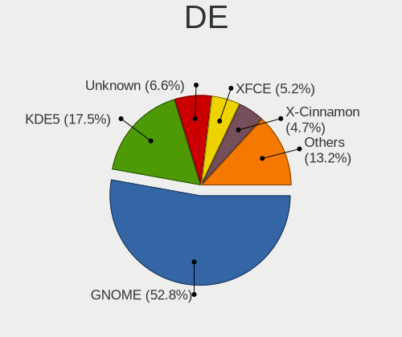

| Name       | Notebooks | Percent |
|------------|-----------|---------|
| GNOME      | 88        | 54.32%  |
| KDE5       | 29        | 17.9%   |
| Unknown    | 14        | 8.64%   |
| XFCE       | 7         | 4.32%   |
| X-Cinnamon | 5         | 3.09%   |
| MATE       | 5         | 3.09%   |
| KDE        | 4         | 2.47%   |
| LXQt       | 2         | 1.23%   |
| KDE6       | 2         | 1.23%   |
| Unity      | 1         | 0.62%   |
| Pantheon   | 1         | 0.62%   |
| gamescope  | 1         | 0.62%   |
| DWM        | 1         | 0.62%   |
| Cinnamon   | 1         | 0.62%   |
| awesome    | 1         | 0.62%   |

Display Server
--------------

X11 or Wayland

| Name    | Notebooks | Percent |
|---------|-----------|---------|
| X11     | 107       | 67.3%   |
| Wayland | 44        | 27.67%  |
| Unknown | 8         | 5.03%   |

Display Manager
---------------

SDDM, LightDM, etc.

| Name    | Notebooks | Percent |
|---------|-----------|---------|
| Unknown | 78        | 49.06%  |
| GDM3    | 24        | 15.09%  |
| SDDM    | 22        | 13.84%  |
| GDM     | 20        | 12.58%  |
| LightDM | 13        | 8.18%   |
| TDM     | 2         | 1.26%   |

OS Lang
-------

Language

| Lang    | Notebooks | Percent |
|---------|-----------|---------|
| en_US   | 123       | 76.88%  |
| Unknown | 14        | 8.75%   |
| en_GB   | 9         | 5.63%   |
| C       | 4         | 2.5%    |
| ru_RU   | 3         | 1.88%   |
| en_AU   | 2         | 1.25%   |
| pl_PL   | 1         | 0.63%   |
| hu_HU   | 1         | 0.63%   |
| en_IN   | 1         | 0.63%   |
| el_GR   | 1         | 0.63%   |
| de_DE   | 1         | 0.63%   |

Boot Mode
---------

EFI or BIOS

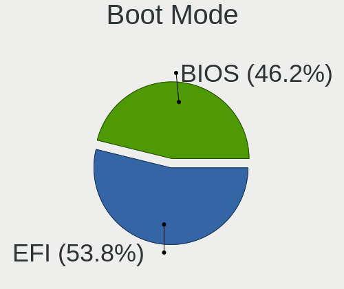

| Mode | Notebooks | Percent |
|------|-----------|---------|
| EFI  | 92        | 57.5%   |
| BIOS | 68        | 42.5%   |

Filesystem
----------

Type of filesystem

| Type    | Notebooks | Percent |
|---------|-----------|---------|
| Ext4    | 116       | 73.42%  |
| Btrfs   | 24        | 15.19%  |
| Tmpfs   | 7         | 4.43%   |
| Overlay | 7         | 4.43%   |
| Xfs     | 4         | 2.53%   |

Part. scheme
------------

Scheme of partitioning

| Type    | Notebooks | Percent |
|---------|-----------|---------|
| Unknown | 77        | 48.43%  |
| GPT     | 76        | 47.8%   |
| MBR     | 6         | 3.77%   |

Dual Boot with Linux/BSD
------------------------

Hosting more than one Linux/BSD

| Dual boot | Notebooks | Percent |
|-----------|-----------|---------|
| No        | 144       | 91.72%  |
| Yes       | 13        | 8.28%   |

Dual Boot (Win)
---------------

Hosting Linux and Windows

| Dual boot | Notebooks | Percent |
|-----------|-----------|---------|
| No        | 97        | 61.78%  |
| Yes       | 60        | 38.22%  |

Board
-----

Vendor
------

Motherboard manufacturer

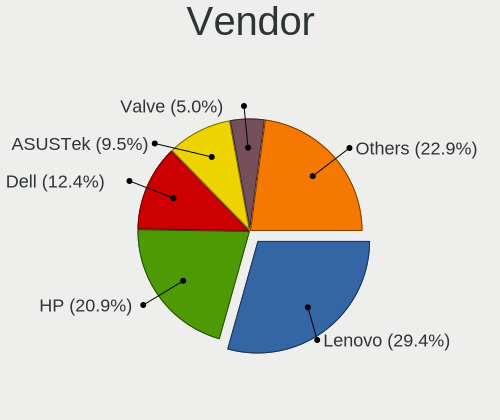

| Name                        | Notebooks | Percent |
|-----------------------------|-----------|---------|
| Lenovo                      | 44        | 28.03%  |
| Hewlett-Packard             | 35        | 22.29%  |
| Dell                        | 21        | 13.38%  |
| ASUSTek Computer            | 13        | 8.28%   |
| Toshiba                     | 8         | 5.1%    |
| Valve                       | 7         | 4.46%   |
| Acer                        | 6         | 3.82%   |
| Notebook                    | 3         | 1.91%   |
| Google                      | 3         | 1.91%   |
| Apple                       | 3         | 1.91%   |
| Sony                        | 2         | 1.27%   |
| MSI                         | 2         | 1.27%   |
| I-Life Digital Technologies | 2         | 1.27%   |
| HUAWEI                      | 2         | 1.27%   |
| YJKC                        | 1         | 0.64%   |
| win element                 | 1         | 0.64%   |
| Razer                       | 1         | 0.64%   |
| LG Electronics              | 1         | 0.64%   |
| Gigabyte Technology         | 1         | 0.64%   |
| A-DATA Technology           | 1         | 0.64%   |

Model
-----

Motherboard model

| Name                                                  | Notebooks | Percent |
|-------------------------------------------------------|-----------|---------|
| Valve Jupiter                                         | 7         | 4.46%   |
| ASUS VivoBook_ASUSLaptop X1404VA_X1404VA              | 3         | 1.91%   |
| HP ProBook 450 G2                                     | 2         | 1.27%   |
| HP Pavilion Notebook                                  | 2         | 1.27%   |
| HP Pavilion 15                                        | 2         | 1.27%   |
| HP ENVY Laptop 13-aq0xxx                              | 2         | 1.27%   |
| Dell G5 5587                                          | 2         | 1.27%   |
| YJKC vBOOK Plus                                       | 1         | 0.64%   |
| win element MoreFine S500+                            | 1         | 0.64%   |
| Toshiba TECRA X40-D                                   | 1         | 0.64%   |
| Toshiba TECRA A50-C                                   | 1         | 0.64%   |
| Toshiba Satellite L850-B434                           | 1         | 0.64%   |
| Toshiba Satellite L750                                | 1         | 0.64%   |
| Toshiba Satellite C850-A966                           | 1         | 0.64%   |
| Toshiba Satellite C660                                | 1         | 0.64%   |
| Toshiba Satellite A300                                | 1         | 0.64%   |
| Toshiba PORTEGE Z10t-A                                | 1         | 0.64%   |
| Sony VGN-NS10J_S                                      | 1         | 0.64%   |
| Sony SVE14A25CAB                                      | 1         | 0.64%   |
| Razer Blade 15 Advanced Model (Early 2020) - RZ09-033 | 1         | 0.64%   |
| Notebook PD5x_7xPNP_PNN_PNT                           | 1         | 0.64%   |
| Notebook P95_96_97Ex,Rx                               | 1         | 0.64%   |
| Notebook NV4XMB,ME,MZ                                 | 1         | 0.64%   |
| MSI PS63 Modern 8RD                                   | 1         | 0.64%   |
| MSI Modern 14 B5M                                     | 1         | 0.64%   |
| LG C500-G.AEF5BE1                                     | 1         | 0.64%   |
| Lenovo Z50-70 20354                                   | 1         | 0.64%   |
| Lenovo Yoga S730-13IWL 81J0                           | 1         | 0.64%   |
| Lenovo Yoga Creator 7 15IMH05 82DS                    | 1         | 0.64%   |
| Lenovo Yoga 2 Pro 20266                               | 1         | 0.64%   |
| Lenovo ThinkPad X240 20AMS6GB00                       | 1         | 0.64%   |
| Lenovo ThinkPad X240 20AMS39F0E                       | 1         | 0.64%   |
| Lenovo ThinkPad X230 2325DV8                          | 1         | 0.64%   |
| Lenovo ThinkPad X1 Extreme Gen 3 20TK001HUS           | 1         | 0.64%   |
| Lenovo ThinkPad X1 Carbon Gen 9 20XW00A9US            | 1         | 0.64%   |
| Lenovo ThinkPad T61 76653JG                           | 1         | 0.64%   |
| Lenovo ThinkPad T490 20N2004JAD                       | 1         | 0.64%   |
| Lenovo ThinkPad T480s 20L8S3FV00                      | 1         | 0.64%   |
| Lenovo ThinkPad T480s 20L8S07A01                      | 1         | 0.64%   |
| Lenovo ThinkPad T480s 20L7001PAD                      | 1         | 0.64%   |

Model Family
------------

Motherboard model prefix

| Name                 | Notebooks | Percent |
|----------------------|-----------|---------|
| Lenovo ThinkPad      | 25        | 15.92%  |
| Lenovo IdeaPad       | 9         | 5.73%   |
| HP Pavilion          | 9         | 5.73%   |
| Valve Jupiter        | 7         | 4.46%   |
| HP Laptop            | 7         | 4.46%   |
| HP EliteBook         | 7         | 4.46%   |
| Dell Latitude        | 6         | 3.82%   |
| ASUS VivoBook        | 6         | 3.82%   |
| Toshiba Satellite    | 5         | 3.18%   |
| Dell XPS             | 5         | 3.18%   |
| HP ProBook           | 4         | 2.55%   |
| Dell Inspiron        | 4         | 2.55%   |
| Acer Aspire          | 4         | 2.55%   |
| Lenovo Yoga          | 3         | 1.91%   |
| Toshiba TECRA        | 2         | 1.27%   |
| I-Life Digital ZED   | 2         | 1.27%   |
| HP ENVY              | 2         | 1.27%   |
| Dell Vostro          | 2         | 1.27%   |
| Dell G5              | 2         | 1.27%   |
| YJKC vBOOK           | 1         | 0.64%   |
| win element MoreFine | 1         | 0.64%   |
| Toshiba PORTEGE      | 1         | 0.64%   |
| Sony VGN-NS10J       | 1         | 0.64%   |
| Sony SVE14A25CAB     | 1         | 0.64%   |
| Razer Blade          | 1         | 0.64%   |
| Notebook PD5x        | 1         | 0.64%   |
| Notebook P95         | 1         | 0.64%   |
| Notebook NV4XMB      | 1         | 0.64%   |
| MSI PS63             | 1         | 0.64%   |
| MSI Modern           | 1         | 0.64%   |
| LG C500-G.AEF5BE1    | 1         | 0.64%   |
| Lenovo Z50-70        | 1         | 0.64%   |
| Lenovo ThinkBook     | 1         | 0.64%   |
| Lenovo Legion        | 1         | 0.64%   |
| Lenovo IdeaPadFlex   | 1         | 0.64%   |
| Lenovo G500          | 1         | 0.64%   |
| Lenovo G50-80        | 1         | 0.64%   |
| Lenovo 81FV          | 1         | 0.64%   |
| HUAWEI KLVD-WXX9     | 1         | 0.64%   |
| HUAWEI BOHB-WAX9     | 1         | 0.64%   |

MFG Year
--------

Motherboard manufacture year

| Year | Notebooks | Percent |
|------|-----------|---------|
| 2021 | 21        | 13.38%  |
| 2013 | 16        | 10.19%  |
| 2020 | 15        | 9.55%   |
| 2019 | 15        | 9.55%   |
| 2018 | 15        | 9.55%   |
| 2022 | 14        | 8.92%   |
| 2017 | 9         | 5.73%   |
| 2016 | 9         | 5.73%   |
| 2014 | 8         | 5.1%    |
| 2012 | 8         | 5.1%    |
| 2023 | 6         | 3.82%   |
| 2010 | 6         | 3.82%   |
| 2011 | 5         | 3.18%   |
| 2015 | 4         | 2.55%   |
| 2008 | 4         | 2.55%   |
| 2007 | 2         | 1.27%   |

Form Factor
-----------

Physical design of the computer

| Name     | Notebooks | Percent |
|----------|-----------|---------|
| Notebook | 157       | 100%    |

Secure Boot
-----------

Enabled or disabled

| State    | Notebooks | Percent |
|----------|-----------|---------|
| Disabled | 138       | 87.9%   |
| Enabled  | 19        | 12.1%   |

Coreboot
--------

Have coreboot on board

| Used | Notebooks | Percent |
|------|-----------|---------|
| No   | 154       | 98.09%  |
| Yes  | 3         | 1.91%   |

RAM Size
--------

Total RAM memory

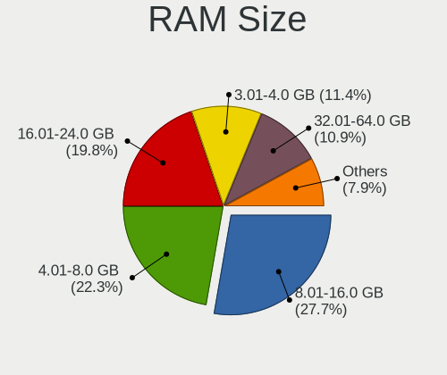

| Size in GB  | Notebooks | Percent |
|-------------|-----------|---------|
| 4.01-8.0    | 36        | 22.93%  |
| 8.01-16.0   | 36        | 22.93%  |
| 16.01-24.0  | 32        | 20.38%  |
| 3.01-4.0    | 22        | 14.01%  |
| 32.01-64.0  | 17        | 10.83%  |
| 64.01-256.0 | 6         | 3.82%   |
| 1.01-2.0    | 3         | 1.91%   |
| 24.01-32.0  | 2         | 1.27%   |
| 2.01-3.0    | 2         | 1.27%   |
| 0.51-1.0    | 1         | 0.64%   |

RAM Used
--------

Used RAM memory

| Used GB   | Notebooks | Percent |
|-----------|-----------|---------|
| 1.01-2.0  | 46        | 27.38%  |
| 2.01-3.0  | 45        | 26.79%  |
| 4.01-8.0  | 37        | 22.02%  |
| 3.01-4.0  | 28        | 16.67%  |
| 8.01-16.0 | 6         | 3.57%   |
| 0.51-1.0  | 5         | 2.98%   |
| 0.01-0.5  | 1         | 0.6%    |

Total Drives
------------

Number of drives on board

| Drives | Notebooks | Percent |
|--------|-----------|---------|
| 1      | 118       | 75.16%  |
| 2      | 30        | 19.11%  |
| 3      | 5         | 3.18%   |
| 4      | 2         | 1.27%   |
| 0      | 2         | 1.27%   |

Has CD-ROM
----------

Has CD-ROM on board

| Presented | Notebooks | Percent |
|-----------|-----------|---------|
| No        | 115       | 73.25%  |
| Yes       | 42        | 26.75%  |

Has Ethernet
------------

Has Ethernet on board

| Presented | Notebooks | Percent |
|-----------|-----------|---------|
| Yes       | 106       | 67.52%  |
| No        | 51        | 32.48%  |

Has WiFi
--------

Has WiFi module

| Presented | Notebooks | Percent |
|-----------|-----------|---------|
| Yes       | 154       | 98.09%  |
| No        | 3         | 1.91%   |

Has Bluetooth
-------------

Has Bluetooth module

| Presented | Notebooks | Percent |
|-----------|-----------|---------|
| Yes       | 134       | 85.35%  |
| No        | 23        | 14.65%  |

Location
--------

Country
-------

Geographic location (country)

| Country | Notebooks | Percent |
|---------|-----------|---------|
| UAE     | 157       | 100%    |

City
----

Geographic location (city)

| City             | Notebooks | Percent |
|------------------|-----------|---------|
| Dubai            | 86        | 53.09%  |
| Abu Dhabi        | 37        | 22.84%  |
| Sharjah          | 20        | 12.35%  |
| Ajman            | 8         | 4.94%   |
| Al Ain City      | 7         | 4.32%   |
| Al Fujairah City | 2         | 1.23%   |
| Ras al-Khaimah   | 1         | 0.62%   |
| Al Halah         | 1         | 0.62%   |

Drives
------

Drive Vendor
------------

Hard drive vendors

| Vendor                         | Notebooks | Drives | Percent |
|--------------------------------|-----------|--------|---------|
| Samsung Electronics            | 28        | 29     | 14.36%  |
| WDC                            | 25        | 26     | 12.82%  |
| Seagate                        | 17        | 19     | 8.72%   |
| Toshiba                        | 15        | 15     | 7.69%   |
| Unknown                        | 12        | 17     | 6.15%   |
| Micron Technology              | 10        | 10     | 5.13%   |
| HGST                           | 10        | 12     | 5.13%   |
| SK hynix                       | 9         | 11     | 4.62%   |
| Intel                          | 9         | 10     | 4.62%   |
| Crucial                        | 9         | 9      | 4.62%   |
| SanDisk                        | 7         | 8      | 3.59%   |
| Phison Electronics             | 4         | 4      | 2.05%   |
| Kingston Technology Company    | 4         | 4      | 2.05%   |
| Kingston                       | 4         | 4      | 2.05%   |
| Silicon Motion                 | 3         | 3      | 1.54%   |
| Hitachi                        | 3         | 3      | 1.54%   |
| Apple                          | 3         | 4      | 1.54%   |
| Realtek Semiconductor          | 2         | 2      | 1.03%   |
| Micron/Crucial Technology      | 2         | 2      | 1.03%   |
| JMicron Technology             | 2         | 2      | 1.03%   |
| ADATA Technology               | 2         | 2      | 1.03%   |
| Team                           | 1         | 1      | 0.51%   |
| Solid State Storage Technology | 1         | 1      | 0.51%   |
| Phison                         | 1         | 1      | 0.51%   |
| Patriot                        | 1         | 1      | 0.51%   |
| O2 Micro                       | 1         | 1      | 0.51%   |
| Lite-On                        | 1         | 1      | 0.51%   |
| LaCie                          | 1         | 1      | 0.51%   |
| KIOXIA                         | 1         | 5      | 0.51%   |
| KingSpec                       | 1         | 2      | 0.51%   |
| Fujitsu                        | 1         | 1      | 0.51%   |
| External                       | 1         | 1      | 0.51%   |
| China                          | 1         | 1      | 0.51%   |
| ASMT                           | 1         | 2      | 0.51%   |
| A-DATA Technology              | 1         | 1      | 0.51%   |
| Unknown                        | 1         | 1      | 0.51%   |

Drive Model
-----------

Hard drive models

| Model                                                 | Notebooks | Percent |
|-------------------------------------------------------|-----------|---------|
| HGST HTS721010A9E630 1TB                              | 5         | 2.49%   |
| WDC WD10SPZX-08Z10 1TB                                | 4         | 1.99%   |
| WDC WD10JPCX-24UE4T0 1TB                              | 3         | 1.49%   |
| Toshiba MQ01ABD075 752GB                              | 3         | 1.49%   |
| Seagate ST1000LM035-1RK172 1TB                        | 3         | 1.49%   |
| Samsung NVMe SSD Controller SM981/PM981/PM983 1TB     | 3         | 1.49%   |
| Phison PS5013 E13 NVMe Controller 512GB               | 3         | 1.49%   |
| Micron 2400_MTFDKBA512QFM 512GB                       | 3         | 1.49%   |
| Intel NVMe SSD Drive 512GB                            | 3         | 1.49%   |
| HGST HTS725050A7E630 500GB                            | 3         | 1.49%   |
| WDC PC SN730 SDBQNTY-1T00-1001 1TB                    | 2         | 1%      |
| Unknown MMC Card  64GB                                | 2         | 1%      |
| Unknown MMC Card  32GB                                | 2         | 1%      |
| Unknown MMC Card  256GB                               | 2         | 1%      |
| Unknown MMC Card  16GB                                | 2         | 1%      |
| SK hynix HFM001TD3JX013N 1024GB                       | 2         | 1%      |
| Silicon Motion SM2263EN/SM2263XT SSD Controller 256GB | 2         | 1%      |
| Seagate ST500LT012-9WS142 500GB                       | 2         | 1%      |
| Seagate ST500LT012-1DG142 500GB                       | 2         | 1%      |
| Seagate ST2000LM003 HN-M201RAD 2TB                    | 2         | 1%      |
| Sandisk WD Black SN750 / PC SN730 NVMe SSD 512GB      | 2         | 1%      |
| Samsung PM963 2.5" NVMe PCIe SSD 256GB                | 2         | 1%      |
| Samsung MZVLQ512HALU-000H1 512GB                      | 2         | 1%      |
| Kingston Company OM3PDP3 NVMe SSD 512GB               | 2         | 1%      |
| WDC WDS500G2B0A-00SM50 500GB SSD                      | 1         | 0.5%    |
| WDC WDS250G2B0A 250GB SSD                             | 1         | 0.5%    |
| WDC WDS120G1G0A-00SS50 120GB SSD                      | 1         | 0.5%    |
| WDC WDS100T3X0C-00SJG0 1TB                            | 1         | 0.5%    |
| WDC WD5000LPVX-60V0TT0 500GB                          | 1         | 0.5%    |
| WDC WD5000LPCX-22VHAT1 500GB                          | 1         | 0.5%    |
| WDC WD5000BPVT-00A1YT0 500GB                          | 1         | 0.5%    |
| WDC WD2500BEVS-26UST0 250GB                           | 1         | 0.5%    |
| WDC WD1200BEVS-08UST0 120GB                           | 1         | 0.5%    |
| WDC WD10SPZX-24Z10T0 1TB                              | 1         | 0.5%    |
| WDC WD10SPZX-24Z10 1TB                                | 1         | 0.5%    |
| WDC WD10SPCX-08S8TT0 1TB                              | 1         | 0.5%    |
| WDC WD10JPVX-60JC3T1 1TB                              | 1         | 0.5%    |
| WDC WD Blue SA510 2.5 500GB SSD                       | 1         | 0.5%    |
| WDC PC SN730 SDBQNTY-512G-1001 512GB                  | 1         | 0.5%    |
| WDC PC SN730 SDBPNTY-512G-1101 512GB                  | 1         | 0.5%    |

HDD Vendor
----------

Hard disk drive vendors

| Vendor             | Notebooks | Drives | Percent |
|--------------------|-----------|--------|---------|
| WDC                | 16        | 17     | 26.67%  |
| Seagate            | 16        | 18     | 26.67%  |
| Toshiba            | 11        | 11     | 18.33%  |
| HGST               | 10        | 12     | 16.67%  |
| Hitachi            | 3         | 3      | 5%      |
| JMicron Technology | 1         | 1      | 1.67%   |
| Fujitsu            | 1         | 1      | 1.67%   |
| ASMT               | 1         | 2      | 1.67%   |
| Apple              | 1         | 1      | 1.67%   |

SSD Vendor
----------

Solid state drive vendors

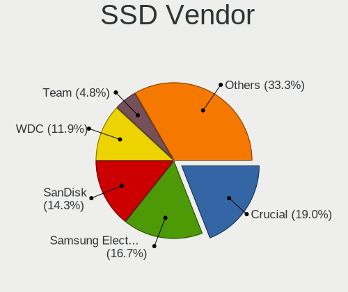

| Vendor              | Notebooks | Drives | Percent |
|---------------------|-----------|--------|---------|
| Crucial             | 6         | 6      | 21.43%  |
| Samsung Electronics | 5         | 5      | 17.86%  |
| WDC                 | 4         | 4      | 14.29%  |
| SanDisk             | 3         | 4      | 10.71%  |
| Toshiba             | 1         | 1      | 3.57%   |
| SK hynix            | 1         | 1      | 3.57%   |
| Patriot             | 1         | 1      | 3.57%   |
| LaCie               | 1         | 1      | 3.57%   |
| Kingston            | 1         | 1      | 3.57%   |
| KingSpec            | 1         | 2      | 3.57%   |
| Intel               | 1         | 1      | 3.57%   |
| External            | 1         | 1      | 3.57%   |
| China               | 1         | 1      | 3.57%   |
| Apple               | 1         | 1      | 3.57%   |

Drive Kind
----------

HDD or SSD

| Kind    | Notebooks | Drives | Percent |
|---------|-----------|--------|---------|
| NVMe    | 86        | 102    | 46.49%  |
| HDD     | 60        | 66     | 32.43%  |
| SSD     | 25        | 30     | 13.51%  |
| MMC     | 13        | 18     | 7.03%   |
| Unknown | 1         | 1      | 0.54%   |

Drive Connector
---------------

SATA, SAS, NVMe, etc.

| Type | Notebooks | Drives | Percent |
|------|-----------|--------|---------|
| NVMe | 86        | 102    | 47.51%  |
| SATA | 77        | 91     | 42.54%  |
| MMC  | 13        | 18     | 7.18%   |
| SAS  | 5         | 6      | 2.76%   |

Drive Size
----------

Size of hard drive

| Size in TB | Notebooks | Drives | Percent |
|------------|-----------|--------|---------|
| 0.01-0.5   | 45        | 53     | 54.88%  |
| 0.51-1.0   | 35        | 41     | 42.68%  |
| 1.01-2.0   | 2         | 2      | 2.44%   |

Space Total
-----------

Amount of disk space available on the file system

| Size in GB     | Notebooks | Percent |
|----------------|-----------|---------|
| 251-500        | 48        | 30.19%  |
| 101-250        | 39        | 24.53%  |
| 501-1000       | 16        | 10.06%  |
| 51-100         | 15        | 9.43%   |
| 21-50          | 14        | 8.81%   |
| 1001-2000      | 11        | 6.92%   |
| 1-20           | 7         | 4.4%    |
| Unknown        | 5         | 3.14%   |
| More than 3000 | 2         | 1.26%   |
| 2001-3000      | 2         | 1.26%   |

Space Used
----------

Amount of used disk space

| Used GB   | Notebooks | Percent |
|-----------|-----------|---------|
| 1-20      | 72        | 43.11%  |
| 21-50     | 37        | 22.16%  |
| 101-250   | 19        | 11.38%  |
| 51-100    | 17        | 10.18%  |
| 251-500   | 7         | 4.19%   |
| 501-1000  | 7         | 4.19%   |
| Unknown   | 5         | 2.99%   |
| 1001-2000 | 3         | 1.8%    |

Malfunc. Drives
---------------

Drive models with a malfunction

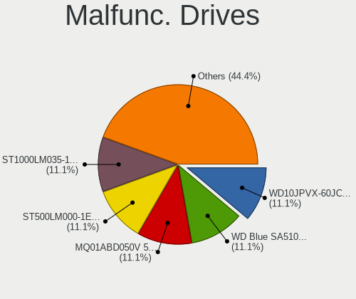

| Model                                                     | Notebooks | Drives | Percent |
|-----------------------------------------------------------|-----------|--------|---------|
| WDC WD10JPVX-60JC3T1 1TB                                  | 1         | 1      | 16.67%  |
| WDC WD Blue SA510 2.5 500GB SSD                           | 1         | 1      | 16.67%  |
| Seagate ST1000LM035-1RK172 1TB                            | 1         | 1      | 16.67%  |
| SanDisk SD9SN8W-128G-1006 128GB SSD                       | 1         | 2      | 16.67%  |
| Samsung Electronics MZVLQ256HBJD-00BH1 256GB              | 1         | 1      | 16.67%  |
| Realtek Semiconductor RTS5763DL NVMe SSD Controller 256GB | 1         | 1      | 16.67%  |

Malfunc. Drive Vendor
---------------------

Vendors of faulty drives

| Vendor                | Notebooks | Drives | Percent |
|-----------------------|-----------|--------|---------|
| WDC                   | 2         | 2      | 33.33%  |
| Seagate               | 1         | 1      | 16.67%  |
| SanDisk               | 1         | 2      | 16.67%  |
| Samsung Electronics   | 1         | 1      | 16.67%  |
| Realtek Semiconductor | 1         | 1      | 16.67%  |

Malfunc. HDD Vendor
-------------------

Vendors of faulty HDD drives

| Vendor  | Notebooks | Drives | Percent |
|---------|-----------|--------|---------|
| WDC     | 1         | 1      | 50%     |
| Seagate | 1         | 1      | 50%     |

Malfunc. Drive Kind
-------------------

Kinds of faulty drives

| Kind | Notebooks | Drives | Percent |
|------|-----------|--------|---------|
| NVMe | 2         | 2      | 33.33%  |
| SSD  | 2         | 3      | 33.33%  |
| HDD  | 2         | 2      | 33.33%  |

Failed Drives
-------------

Failed drive models

Zero info for selected period =(

Failed Drive Vendor
-------------------

Failed drive vendors

Zero info for selected period =(

Drive Status
------------

Number of failed and malfunc. drives

| Status   | Notebooks | Drives | Percent |
|----------|-----------|--------|---------|
| Detected | 96        | 135    | 58.18%  |
| Works    | 63        | 75     | 38.18%  |
| Malfunc  | 6         | 7      | 3.64%   |

Storage controller
------------------

Storage Vendor
--------------

Storage controller vendors

| Vendor                         | Notebooks | Percent |
|--------------------------------|-----------|---------|
| Intel                          | 107       | 55.73%  |
| Samsung Electronics            | 23        | 11.98%  |
| Micron Technology              | 10        | 5.21%   |
| SK hynix                       | 8         | 4.17%   |
| SanDisk                        | 8         | 4.17%   |
| Kingston Technology Company    | 7         | 3.65%   |
| Phison Electronics             | 5         | 2.6%    |
| Silicon Motion                 | 4         | 2.08%   |
| Micron/Crucial Technology      | 4         | 2.08%   |
| Toshiba America Info Systems   | 3         | 1.56%   |
| Realtek Semiconductor          | 2         | 1.04%   |
| AMD                            | 2         | 1.04%   |
| ADATA Technology               | 2         | 1.04%   |
| Solid State Storage Technology | 1         | 0.52%   |
| Seagate Technology             | 1         | 0.52%   |
| O2 Micro                       | 1         | 0.52%   |
| Marvell Technology Group       | 1         | 0.52%   |
| Lite-On Technology             | 1         | 0.52%   |
| KIOXIA                         | 1         | 0.52%   |
| Apple                          | 1         | 0.52%   |

Storage Model
-------------

Storage controller models

| Model                                                                          | Notebooks | Percent |
|--------------------------------------------------------------------------------|-----------|---------|
| Intel 82801 Mobile SATA Controller [RAID mode]                                 | 15        | 7.43%   |
| Intel Sunrise Point-LP SATA Controller [AHCI mode]                             | 12        | 5.94%   |
| Intel 8 Series SATA Controller 1 [AHCI mode]                                   | 11        | 5.45%   |
| Intel 7 Series Chipset Family 6-port SATA Controller [AHCI mode]               | 11        | 5.45%   |
| Intel Volume Management Device NVMe RAID Controller                            | 10        | 4.95%   |
| Samsung NVMe SSD Controller SM981/PM981/PM983                                  | 9         | 4.46%   |
| Samsung NVMe SSD Controller 980 (DRAM-less)                                    | 9         | 4.46%   |
| Intel Cannon Lake Mobile PCH SATA AHCI Controller                              | 8         | 3.96%   |
| Intel 6 Series/C200 Series Chipset Family 6 port Mobile SATA AHCI Controller   | 7         | 3.47%   |
| SanDisk Extreme Pro / WD Black SN750 / PC SN730 / Red SN700 NVMe SSD           | 6         | 2.97%   |
| SK hynix Gold P31/BC711/PC711 NVMe Solid State Drive                           | 5         | 2.48%   |
| Intel Wildcat Point-LP SATA Controller [AHCI Mode]                             | 5         | 2.48%   |
| Intel SSD 660P Series                                                          | 5         | 2.48%   |
| Intel Tiger Lake-LP SATA Controller                                            | 4         | 1.98%   |
| Samsung NVMe SSD Controller PM9A1/PM9A3/980PRO                                 | 3         | 1.49%   |
| Phison PS5013-E13 PCIe3 NVMe Controller (DRAM-less)                            | 3         | 1.49%   |
| Micron 2400 NVMe SSD (DRAM-less)                                               | 3         | 1.49%   |
| Intel Volume Management Device NVMe RAID Controller Intel Corporation          | 3         | 1.49%   |
| Intel SSD DC P4101/Pro 7600p/760p/E 6100p Series                               | 3         | 1.49%   |
| Intel HM170/QM170 Chipset SATA Controller [AHCI Mode]                          | 3         | 1.49%   |
| Intel Comet Lake SATA AHCI Controller                                          | 3         | 1.49%   |
| Silicon Motion SM2263EN/SM2263XT (DRAM-less) NVMe SSD Controllers              | 2         | 0.99%   |
| Samsung NVMe SSD Controller SM961/PM961/SM963                                  | 2         | 0.99%   |
| Phison E12 NVMe Controller                                                     | 2         | 0.99%   |
| Micron/Crucial P5 Plus NVMe PCIe SSD                                           | 2         | 0.99%   |
| Micron/Crucial P2 [Nick P2] / P3 / P3 Plus NVMe PCIe SSD (DRAM-less)           | 2         | 0.99%   |
| Micron 3400 NVMe SSD [Hendrix]                                                 | 2         | 0.99%   |
| Micron 2210 NVMe SSD [Cobain]                                                  | 2         | 0.99%   |
| Kingston Company OM3PDP3 NVMe SSD                                              | 2         | 0.99%   |
| Kingston Company NV2 NVMe SSD SM2267XT (DRAM-less)                             | 2         | 0.99%   |
| Intel Q170/Q150/B150/H170/H110/Z170/CM236 Chipset SATA Controller [AHCI Mode]  | 2         | 0.99%   |
| Intel Cannon Point-LP SATA Controller [AHCI Mode]                              | 2         | 0.99%   |
| Intel 82801HM/HEM (ICH8M/ICH8M-E) IDE Controller                               | 2         | 0.99%   |
| Intel 8 Series/C220 Series Chipset Family 6-port SATA Controller 1 [AHCI mode] | 2         | 0.99%   |
| AMD FCH SATA Controller [AHCI mode]                                            | 2         | 0.99%   |
| Toshiba America Info Systems XG6 NVMe SSD Controller                           | 1         | 0.5%    |
| Toshiba America Info Systems XG5 NVMe SSD Controller                           | 1         | 0.5%    |
| Toshiba America Info Systems BG3 x2 NVMe SSD Controller (DRAM-less)            | 1         | 0.5%    |
| Solid State Storage CL4-8D512 NVMe SSD M.2 (DRAM-less)                         | 1         | 0.5%    |
| SK hynix Platinum P41/PC801 NVMe Solid State Drive                             | 1         | 0.5%    |

Storage Kind
------------

Kind of storage controller (IDE, SATA, NVMe, SAS, ...)

| Kind | Notebooks | Percent |
|------|-----------|---------|
| NVMe | 86        | 43.65%  |
| SATA | 80        | 40.61%  |
| RAID | 28        | 14.21%  |
| IDE  | 3         | 1.52%   |

Processor
---------

CPU Vendor
----------

Processor vendors

| Vendor | Notebooks | Percent |
|--------|-----------|---------|
| Intel  | 139       | 88.54%  |
| AMD    | 18        | 11.46%  |

CPU Model
---------

Processor models

| Model                                   | Notebooks | Percent |
|-----------------------------------------|-----------|---------|
| AMD Custom APU 0405                     | 7         | 4.46%   |
| Intel 11th Gen Core i5-1135G7 @ 2.40GHz | 6         | 3.82%   |
| Intel Core i7-8565U CPU @ 1.80GHz       | 5         | 3.18%   |
| Intel Core i5-4200U CPU @ 1.60GHz       | 5         | 3.18%   |
| Intel 12th Gen Core i7-12700H           | 5         | 3.18%   |
| Intel Core i7-8750H CPU @ 2.20GHz       | 4         | 2.55%   |
| Intel Core i7-8550U CPU @ 1.80GHz       | 4         | 2.55%   |
| Intel Core i5-8265U CPU @ 1.60GHz       | 4         | 2.55%   |
| Intel Core i7-7700HQ CPU @ 2.80GHz      | 3         | 1.91%   |
| Intel Core i7-7500U CPU @ 2.70GHz       | 3         | 1.91%   |
| Intel Core i7-5500U CPU @ 2.40GHz       | 3         | 1.91%   |
| Intel Core i5-6300U CPU @ 2.40GHz       | 3         | 1.91%   |
| Intel Core i5-10210U CPU @ 1.60GHz      | 3         | 1.91%   |
| Intel 13th Gen Core i7-1355U            | 3         | 1.91%   |
| Intel 11th Gen Core i7-1165G7 @ 2.80GHz | 3         | 1.91%   |
| AMD Ryzen 9 5900HX with Radeon Graphics | 3         | 1.91%   |
| Intel Core i9-10885H CPU @ 2.40GHz      | 2         | 1.27%   |
| Intel Core i7-8650U CPU @ 1.90GHz       | 2         | 1.27%   |
| Intel Core i7-6700HQ CPU @ 2.60GHz      | 2         | 1.27%   |
| Intel Core i7-6500U CPU @ 2.50GHz       | 2         | 1.27%   |
| Intel Core i7-3632QM CPU @ 2.20GHz      | 2         | 1.27%   |
| Intel Core i7-10750H CPU @ 2.60GHz      | 2         | 1.27%   |
| Intel Core i5-7200U CPU @ 2.50GHz       | 2         | 1.27%   |
| Intel Core i5-4300U CPU @ 1.90GHz       | 2         | 1.27%   |
| Intel Core i5-4210U CPU @ 1.70GHz       | 2         | 1.27%   |
| Intel Core i5-3317U CPU @ 1.70GHz       | 2         | 1.27%   |
| Intel Core i5-2450M CPU @ 2.50GHz       | 2         | 1.27%   |
| Intel Core i5-2410M CPU @ 2.30GHz       | 2         | 1.27%   |
| Intel Core i3-4005U CPU @ 1.70GHz       | 2         | 1.27%   |
| AMD Ryzen 5 5500U with Radeon Graphics  | 2         | 1.27%   |
| Intel Core m5-6Y54 CPU @ 1.10GHz        | 1         | 0.64%   |
| Intel Core i9-9980HK CPU @ 2.40GHz      | 1         | 0.64%   |
| Intel Core i9-8950HK CPU @ 2.90GHz      | 1         | 0.64%   |
| Intel Core i7-9850H CPU @ 2.60GHz       | 1         | 0.64%   |
| Intel Core i7-9750H CPU @ 2.60GHz       | 1         | 0.64%   |
| Intel Core i7-7820HQ CPU @ 2.90GHz      | 1         | 0.64%   |
| Intel Core i7-6600U CPU @ 2.60GHz       | 1         | 0.64%   |
| Intel Core i7-4910MQ CPU @ 2.90GHz      | 1         | 0.64%   |
| Intel Core i7-4600M CPU @ 2.90GHz       | 1         | 0.64%   |
| Intel Core i7-4510U CPU @ 2.00GHz       | 1         | 0.64%   |

CPU Model Family
----------------

Processor model prefix

| Model            | Notebooks | Percent |
|------------------|-----------|---------|
| Intel Core i7    | 45        | 28.66%  |
| Intel Core i5    | 44        | 28.03%  |
| Other            | 33        | 21.02%  |
| Intel Core i3    | 8         | 5.1%    |
| Intel Celeron    | 5         | 3.18%   |
| Intel Core i9    | 4         | 2.55%   |
| AMD Ryzen 5      | 4         | 2.55%   |
| Intel Core 2 Duo | 3         | 1.91%   |
| AMD Ryzen 9      | 3         | 1.91%   |
| Intel Atom       | 2         | 1.27%   |
| AMD Ryzen 7      | 2         | 1.27%   |
| Intel Core m5    | 1         | 0.64%   |
| Intel Celeron M  | 1         | 0.64%   |
| AMD Ryzen 7 PRO  | 1         | 0.64%   |
| AMD A6           | 1         | 0.64%   |

CPU Cores
---------

Number of processor cores

| Number | Notebooks | Percent |
|--------|-----------|---------|
| 2      | 64        | 40.76%  |
| 4      | 55        | 35.03%  |
| 6      | 13        | 8.28%   |
| 8      | 11        | 7.01%   |
| 14     | 7         | 4.46%   |
| 10     | 4         | 2.55%   |
| 1      | 2         | 1.27%   |
| 12     | 1         | 0.64%   |

CPU Sockets
-----------

Number of sockets

| Number | Notebooks | Percent |
|--------|-----------|---------|
| 1      | 157       | 100%    |

CPU Threads
-----------

Threads per core (Hyper-Threading)

| Number | Notebooks | Percent |
|--------|-----------|---------|
| 2      | 142       | 90.45%  |
| 1      | 15        | 9.55%   |

CPU Op-Modes
------------

CPU Operation Modes (32-bit, 64-bit)

| Op mode        | Notebooks | Percent |
|----------------|-----------|---------|
| 32-bit, 64-bit | 156       | 99.36%  |
| 32-bit         | 1         | 0.64%   |

CPU Microcode
-------------

Microcode number

| Number     | Notebooks | Percent |
|------------|-----------|---------|
| Unknown    | 62        | 39.24%  |
| 0x806c1    | 8         | 5.06%   |
| 0x406e3    | 7         | 4.43%   |
| 0x40651    | 7         | 4.43%   |
| 0x306a9    | 7         | 4.43%   |
| 0x206a7    | 7         | 4.43%   |
| 0x906ea    | 6         | 3.8%    |
| 0x806ec    | 6         | 3.8%    |
| 0x806ea    | 5         | 3.16%   |
| 0x906a3    | 4         | 2.53%   |
| 0x806e9    | 4         | 2.53%   |
| 0xa0652    | 3         | 1.9%    |
| 0x906e9    | 3         | 1.9%    |
| 0x20655    | 3         | 1.9%    |
| 0x0a50000c | 3         | 1.9%    |
| 0x906ed    | 2         | 1.27%   |
| 0x806eb    | 2         | 1.27%   |
| 0x6fd      | 2         | 1.27%   |
| 0x306d4    | 2         | 1.27%   |
| 0xb06a3    | 1         | 0.63%   |
| 0x806d1    | 1         | 0.63%   |
| 0x706a1    | 1         | 0.63%   |
| 0x6fb      | 1         | 0.63%   |
| 0x6e8      | 1         | 0.63%   |
| 0x506e3    | 1         | 0.63%   |
| 0x406c4    | 1         | 0.63%   |
| 0x406c3    | 1         | 0.63%   |
| 0x306c3    | 1         | 0.63%   |
| 0x20652    | 1         | 0.63%   |
| 0x08608103 | 1         | 0.63%   |
| 0x08608102 | 1         | 0.63%   |
| 0x08600106 | 1         | 0.63%   |
| 0x08108109 | 1         | 0.63%   |
| 0x06001119 | 1         | 0.63%   |

CPU Microarch
-------------

Microarchitecture

| Name             | Notebooks | Percent |
|------------------|-----------|---------|
| KabyLake         | 40        | 25.48%  |
| Haswell          | 17        | 10.83%  |
| TigerLake        | 13        | 8.28%   |
| Unknown          | 13        | 8.28%   |
| Skylake          | 10        | 6.37%   |
| SandyBridge      | 10        | 6.37%   |
| IvyBridge        | 10        | 6.37%   |
| Alderlake Hybrid | 8         | 5.1%    |
| CometLake        | 6         | 3.82%   |
| Zen 3            | 5         | 3.18%   |
| Broadwell        | 5         | 3.18%   |
| Westmere         | 4         | 2.55%   |
| Silvermont       | 3         | 1.91%   |
| IceLake          | 3         | 1.91%   |
| Core             | 3         | 1.91%   |
| Zen 2            | 2         | 1.27%   |
| Goldmont plus    | 2         | 1.27%   |
| Zen+             | 1         | 0.64%   |
| Piledriver       | 1         | 0.64%   |
| P6               | 1         | 0.64%   |

Graphics
--------

GPU Vendor
----------

Vendors of graphics cards

| Vendor | Notebooks | Percent |
|--------|-----------|---------|
| Intel  | 130       | 58.82%  |
| Nvidia | 58        | 26.24%  |
| AMD    | 33        | 14.93%  |

GPU Model
---------

Graphics card models

| Model                                                                                    | Notebooks | Percent |
|------------------------------------------------------------------------------------------|-----------|---------|
| Intel Haswell-ULT Integrated Graphics Controller                                         | 14        | 6.31%   |
| Intel TigerLake-LP GT2 [Iris Xe Graphics]                                                | 11        | 4.95%   |
| Intel WhiskeyLake-U GT2 [UHD Graphics 620]                                               | 9         | 4.05%   |
| Intel 3rd Gen Core processor Graphics Controller                                         | 9         | 4.05%   |
| Intel Alder Lake-P GT2 [Iris Xe Graphics]                                                | 8         | 3.6%    |
| Intel 2nd Generation Core Processor Family Integrated Graphics Controller                | 8         | 3.6%    |
| Intel UHD Graphics 620                                                                   | 7         | 3.15%   |
| Intel Skylake GT2 [HD Graphics 520]                                                      | 7         | 3.15%   |
| Intel CoffeeLake-H GT2 [UHD Graphics 630]                                                | 7         | 3.15%   |
| AMD VanGogh [AMD Custom GPU 0405]                                                        | 7         | 3.15%   |
| Intel HD Graphics 620                                                                    | 6         | 2.7%    |
| Intel HD Graphics 5500                                                                   | 5         | 2.25%   |
| Intel CometLake-U GT2 [UHD Graphics]                                                     | 5         | 2.25%   |
| Intel CometLake-H GT2 [UHD Graphics]                                                     | 5         | 2.25%   |
| AMD Cezanne [Radeon Vega Series / Radeon Vega Mobile Series]                             | 5         | 2.25%   |
| Nvidia GA106M [GeForce RTX 3060 Mobile / Max-Q]                                          | 4         | 1.8%    |
| Intel HD Graphics 630                                                                    | 4         | 1.8%    |
| Nvidia GP107M [GeForce GTX 1050 Mobile]                                                  | 3         | 1.35%   |
| Nvidia GP106M [GeForce GTX 1060 Mobile]                                                  | 3         | 1.35%   |
| Nvidia GM108M [GeForce MX130]                                                            | 3         | 1.35%   |
| Intel Raptor Lake-P [Iris Xe Graphics]                                                   | 3         | 1.35%   |
| Intel Core Processor Integrated Graphics Controller                                      | 3         | 1.35%   |
| Intel Atom/Celeron/Pentium Processor x5-E8000/J3xxx/N3xxx Integrated Graphics Controller | 3         | 1.35%   |
| AMD Topaz XT [Radeon R7 M260/M265 / M340/M360 / M440/M445 / 530/535 / 620/625 Mobile]    | 3         | 1.35%   |
| AMD Sun XT [Radeon HD 8670A/8670M/8690M / R5 M330 / M430 / Radeon 520 Mobile]            | 3         | 1.35%   |
| Nvidia TU117M [GeForce GTX 1650 Ti Mobile]                                               | 2         | 0.9%    |
| Nvidia TU117M [GeForce GTX 1650 Mobile / Max-Q]                                          | 2         | 0.9%    |
| Nvidia GP108BM [GeForce MX250]                                                           | 2         | 0.9%    |
| Nvidia GP107M [GeForce GTX 1050 Ti Mobile]                                               | 2         | 0.9%    |
| Nvidia GM108M [GeForce 940MX]                                                            | 2         | 0.9%    |
| Nvidia GM108M [GeForce 920MX]                                                            | 2         | 0.9%    |
| Nvidia GM108M [GeForce 840M]                                                             | 2         | 0.9%    |
| Nvidia GF108M [GeForce GT 620M/630M/635M/640M LE]                                        | 2         | 0.9%    |
| Intel Tiger Lake-LP GT2 [UHD Graphics G4]                                                | 2         | 0.9%    |
| Intel Iris Plus Graphics G1 (Ice Lake)                                                   | 2         | 0.9%    |
| Intel HD Graphics 530                                                                    | 2         | 0.9%    |
| Intel GeminiLake [UHD Graphics 600]                                                      | 2         | 0.9%    |
| Intel 4th Gen Core Processor Integrated Graphics Controller                              | 2         | 0.9%    |
| AMD Thames [Radeon HD 7500M/7600M Series]                                                | 2         | 0.9%    |
| AMD Renoir [Radeon RX Vega 6 (Ryzen 4000/5000 Mobile Series)]                            | 2         | 0.9%    |

GPU Combo
---------

Combinations of graphics cards

| Name           | Notebooks | Percent |
|----------------|-----------|---------|
| 1 x Intel      | 69        | 43.95%  |
| Intel + Nvidia | 48        | 30.57%  |
| 1 x AMD        | 17        | 10.83%  |
| Intel + AMD    | 13        | 8.28%   |
| 1 x Nvidia     | 7         | 4.46%   |
| AMD + Nvidia   | 3         | 1.91%   |

GPU Driver
----------

Free vs proprietary

| Driver      | Notebooks | Percent |
|-------------|-----------|---------|
| Free        | 129       | 82.17%  |
| Proprietary | 26        | 16.56%  |
| Unknown     | 2         | 1.27%   |

GPU Memory
----------

Total video memory

| Size in GB | Notebooks | Percent |
|------------|-----------|---------|
| Unknown    | 105       | 66.88%  |
| 1.01-2.0   | 23        | 14.65%  |
| 3.01-4.0   | 13        | 8.28%   |
| 0.01-0.5   | 8         | 5.1%    |
| 0.51-1.0   | 5         | 3.18%   |
| 5.01-6.0   | 3         | 1.91%   |

Monitor
-------

Monitor Vendor
--------------

Monitor vendors

| Vendor                  | Notebooks | Percent |
|-------------------------|-----------|---------|
| AU Optronics            | 33        | 19.19%  |
| BOE                     | 30        | 17.44%  |
| LG Display              | 23        | 13.37%  |
| Chimei Innolux          | 23        | 13.37%  |
| Samsung Electronics     | 16        | 9.3%    |
| Valve                   | 6         | 3.49%   |
| InfoVision              | 4         | 2.33%   |
| Goldstar                | 4         | 2.33%   |
| Dell                    | 4         | 2.33%   |
| CSO                     | 4         | 2.33%   |
| Sharp                   | 3         | 1.74%   |
| BenQ                    | 3         | 1.74%   |
| Apple                   | 3         | 1.74%   |
| LGD                     | 2         | 1.16%   |
| LG Philips              | 2         | 1.16%   |
| Hewlett-Packard         | 2         | 1.16%   |
| Chi Mei Optoelectronics | 2         | 1.16%   |
| ASUSTek Computer        | 2         | 1.16%   |
| Seiko/Epson             | 1         | 0.58%   |
| Lenovo                  | 1         | 0.58%   |
| HKC                     | 1         | 0.58%   |
| CMN                     | 1         | 0.58%   |
| Ancor Communications    | 1         | 0.58%   |
| Analogix                | 1         | 0.58%   |

Monitor Model
-------------

Monitor models

| Model                                                                   | Notebooks | Percent |
|-------------------------------------------------------------------------|-----------|---------|
| Valve ANX7530 U VLV3001 800x1280 100x150mm 7.1-inch                     | 6         | 3.47%   |
| Chimei Innolux LCD Monitor CMN14D4 1920x1080 309x173mm 13.9-inch        | 5         | 2.89%   |
| AU Optronics LCD Monitor AUO203D 1920x1080 309x174mm 14.0-inch          | 3         | 1.73%   |
| LGD LCD Monitor 1366x768                                                | 2         | 1.16%   |
| LG Display LCD Monitor LGD0575 1920x1080 309x174mm 14.0-inch            | 2         | 1.16%   |
| LG Display LCD Monitor LGD02DC 1366x768 344x194mm 15.5-inch             | 2         | 1.16%   |
| InfoVision LCD Monitor IVO04E3 1366x768 277x156mm 12.5-inch             | 2         | 1.16%   |
| CSO LCD Monitor CSO1603 2560x1600 344x215mm 16.0-inch                   | 2         | 1.16%   |
| Chimei Innolux LCD Monitor CMN15E8 1920x1080 344x193mm 15.5-inch        | 2         | 1.16%   |
| BOE LCD Monitor BOE06B3 1366x768 309x173mm 13.9-inch                    | 2         | 1.16%   |
| BOE LCD Monitor BOE0687 1920x1080 344x193mm 15.5-inch                   | 2         | 1.16%   |
| BOE LCD Monitor BOE0672 1366x768 344x194mm 15.5-inch                    | 2         | 1.16%   |
| AU Optronics LCD Monitor AUO272B 3840x2160 293x165mm 13.2-inch          | 2         | 1.16%   |
| AU Optronics LCD Monitor AUO243D 1920x1080 309x173mm 13.9-inch          | 2         | 1.16%   |
| ASUSTek Computer PG32UQ AUS32E1 3840x2160 708x399mm 32.0-inch           | 2         | 1.16%   |
| Apple Color LCD APP9CF2 1366x768 256x144mm 11.6-inch                    | 2         | 1.16%   |
| Sharp LCD Monitor SHP14BA 1920x1080 344x194mm 15.5-inch                 | 1         | 0.58%   |
| Sharp LCD Monitor SHP14B9 3840x2160 344x194mm 15.5-inch                 | 1         | 0.58%   |
| Sharp LCD Monitor SHP1484 1920x1080 294x165mm 13.3-inch                 | 1         | 0.58%   |
| Seiko/Epson LCD Monitor 1280x800                                        | 1         | 0.58%   |
| Samsung Electronics S22F350 SAM0D1A 1920x1080 477x268mm 21.5-inch       | 1         | 0.58%   |
| Samsung Electronics LCD Monitor SEC5741 1280x800 261x163mm 12.1-inch    | 1         | 0.58%   |
| Samsung Electronics LCD Monitor SEC5441 1366x768 344x194mm 15.5-inch    | 1         | 0.58%   |
| Samsung Electronics LCD Monitor SEC4251 1366x768 344x194mm 15.5-inch    | 1         | 0.58%   |
| Samsung Electronics LCD Monitor SEC4149 1366x768 292x174mm 13.4-inch    | 1         | 0.58%   |
| Samsung Electronics LCD Monitor SEC3150 1366x768 344x193mm 15.5-inch    | 1         | 0.58%   |
| Samsung Electronics LCD Monitor SDCA029 3840x2160 344x194mm 15.5-inch   | 1         | 0.58%   |
| Samsung Electronics LCD Monitor SDC4341 1366x768 344x194mm 15.5-inch    | 1         | 0.58%   |
| Samsung Electronics LCD Monitor SDC424A 3200x1800 293x165mm 13.2-inch   | 1         | 0.58%   |
| Samsung Electronics LCD Monitor SDC416D 2880x1800 312x195mm 14.5-inch   | 1         | 0.58%   |
| Samsung Electronics LCD Monitor SDC4157 3840x2160 344x194mm 15.5-inch   | 1         | 0.58%   |
| Samsung Electronics LCD Monitor SDC414D 3456x2160 336x210mm 15.6-inch   | 1         | 0.58%   |
| Samsung Electronics LCD Monitor SAM0FEF 3840x2160 1872x1053mm 84.6-inch | 1         | 0.58%   |
| Samsung Electronics C32F391 SAM0D34 1920x1080 698x393mm 31.5-inch       | 1         | 0.58%   |
| Samsung Electronics C27R50x SAM0F9D 1920x1080 598x336mm 27.0-inch       | 1         | 0.58%   |
| Samsung Electronics C24F390 SAM0D2C 1920x1080 521x293mm 23.5-inch       | 1         | 0.58%   |
| LG Philips LP154WX4-TLC8 LPL0120 1280x800 331x207mm 15.4-inch           | 1         | 0.58%   |
| LG Philips LCD Monitor LPL2A00 1280x800 330x210mm 15.4-inch             | 1         | 0.58%   |
| LG Display LCD Monitor LGD065B 1920x1080 382x215mm 17.3-inch            | 1         | 0.58%   |
| LG Display LCD Monitor LGD060F 1920x1080 309x174mm 14.0-inch            | 1         | 0.58%   |

Monitor Resolution
------------------

Monitor screen resolution

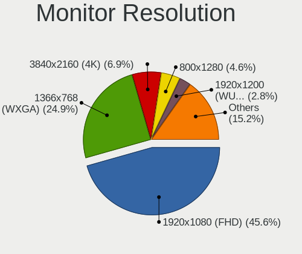

| Resolution        | Notebooks | Percent |
|-------------------|-----------|---------|
| 1920x1080 (FHD)   | 76        | 45.51%  |
| 1366x768 (WXGA)   | 48        | 28.74%  |
| 3840x2160 (4K)    | 10        | 5.99%   |
| 800x1280          | 7         | 4.19%   |
| 1280x800 (WXGA)   | 4         | 2.4%    |
| 2560x1600         | 3         | 1.8%    |
| 2560x1440 (QHD)   | 3         | 1.8%    |
| 1920x1200 (WUXGA) | 3         | 1.8%    |
| 2880x1800         | 2         | 1.2%    |
| 1600x900 (HD+)    | 2         | 1.2%    |
| 3456x2160         | 1         | 0.6%    |
| 3200x1800 (QHD+)  | 1         | 0.6%    |
| 3072x1920         | 1         | 0.6%    |
| 2880x1920         | 1         | 0.6%    |
| 2560x1080         | 1         | 0.6%    |
| 2304x1440         | 1         | 0.6%    |
| 2160x1440         | 1         | 0.6%    |
| 1920x515          | 1         | 0.6%    |
| 1440x900 (WXGA+)  | 1         | 0.6%    |

Monitor Diagonal
----------------

Diagonal size in inches

| Inches  | Notebooks | Percent |
|---------|-----------|---------|
| 15      | 60        | 34.68%  |
| 14      | 30        | 17.34%  |
| 13      | 28        | 16.18%  |
| 12      | 7         | 4.05%   |
| 27      | 6         | 3.47%   |
| 16      | 6         | 3.47%   |
| 11      | 6         | 3.47%   |
| 7       | 6         | 3.47%   |
| Unknown | 5         | 2.89%   |
| 21      | 4         | 2.31%   |
| 23      | 3         | 1.73%   |
| 17      | 3         | 1.73%   |
| 32      | 2         | 1.16%   |
| 24      | 2         | 1.16%   |
| 84      | 1         | 0.58%   |
| 40      | 1         | 0.58%   |
| 34      | 1         | 0.58%   |
| 31      | 1         | 0.58%   |
| 3       | 1         | 0.58%   |

Monitor Width
-------------

Physical width

| Width in mm | Notebooks | Percent |
|-------------|-----------|---------|
| 301-350     | 110       | 63.58%  |
| 201-300     | 25        | 14.45%  |
| 501-600     | 11        | 6.36%   |
| 1-100       | 7         | 4.05%   |
| 351-400     | 5         | 2.89%   |
| Unknown     | 5         | 2.89%   |
| 401-500     | 4         | 2.31%   |
| 701-800     | 3         | 1.73%   |
| 801-900     | 1         | 0.58%   |
| 601-700     | 1         | 0.58%   |
| 1501-2000   | 1         | 0.58%   |

Aspect Ratio
------------

Proportional relationship between the width and the height

| Ratio   | Notebooks | Percent |
|---------|-----------|---------|
| 16/9    | 129       | 81.65%  |
| 16/10   | 15        | 9.49%   |
| 0.67    | 6         | 3.8%    |
| Unknown | 4         | 2.53%   |
| 6/5     | 1         | 0.63%   |
| 3/2     | 1         | 0.63%   |
| 3.73    | 1         | 0.63%   |
| 21/9    | 1         | 0.63%   |

Monitor Area
------------

Area in inch

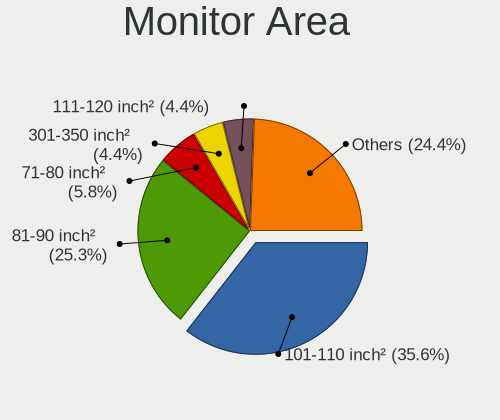

| Area in inch | Notebooks | Percent |
|----------------|-----------|---------|
| 101-110        | 60        | 34.68%  |
| 81-90          | 46        | 26.59%  |
| 71-80          | 11        | 6.36%   |
| 201-250        | 8         | 4.62%   |
| 61-70          | 7         | 4.05%   |
| 1-40           | 7         | 4.05%   |
| 51-60          | 6         | 3.47%   |
| 301-350        | 6         | 3.47%   |
| 111-120        | 6         | 3.47%   |
| Unknown        | 5         | 2.89%   |
| 351-500        | 4         | 2.31%   |
| 121-130        | 3         | 1.73%   |
| More than 1000 | 1         | 0.58%   |
| 251-300        | 1         | 0.58%   |
| 501-1000       | 1         | 0.58%   |
| 91-100         | 1         | 0.58%   |

Pixel Density
-------------

Pixels per inch

| Density       | Notebooks | Percent |
|---------------|-----------|---------|
| 121-160       | 77        | 45.29%  |
| 101-120       | 40        | 23.53%  |
| 161-240       | 22        | 12.94%  |
| 51-100        | 16        | 9.41%   |
| More than 240 | 10        | 5.88%   |
| Unknown       | 5         | 2.94%   |

Multiple Monitors
-----------------

Total monitors connected

| Total | Notebooks | Percent |
|-------|-----------|---------|
| 1     | 130       | 82.8%   |
| 2     | 22        | 14.01%  |
| 0     | 4         | 2.55%   |
| 3     | 1         | 0.64%   |

Network
-------

Net Controller Vendor
---------------------

Controller vendors

| Vendor                   | Notebooks | Percent |
|--------------------------|-----------|---------|
| Intel                    | 99        | 43.23%  |
| Realtek Semiconductor    | 78        | 34.06%  |
| Qualcomm Atheros         | 21        | 9.17%   |
| Broadcom                 | 8         | 3.49%   |
| Ralink                   | 5         | 2.18%   |
| MediaTek                 | 5         | 2.18%   |
| Xiaomi                   | 3         | 1.31%   |
| TP-Link                  | 3         | 1.31%   |
| Broadcom Limited         | 2         | 0.87%   |
| Sierra Wireless          | 1         | 0.44%   |
| Ralink Technology        | 1         | 0.44%   |
| Marvell Technology Group | 1         | 0.44%   |
| Lenovo                   | 1         | 0.44%   |
| ASIX Electronics         | 1         | 0.44%   |

Net Controller Model
--------------------

Controller models

| Model                                                                  | Notebooks | Percent |
|------------------------------------------------------------------------|-----------|---------|
| Realtek RTL8111/8168/8211/8411 PCI Express Gigabit Ethernet Controller | 41        | 15.07%  |
| Realtek RTL810xE PCI Express Fast Ethernet controller                  | 15        | 5.51%   |
| Realtek RTL8822CE 802.11ac PCIe Wireless Network Adapter               | 10        | 3.68%   |
| Intel Wi-Fi 6 AX201                                                    | 10        | 3.68%   |
| Intel Wireless 7260                                                    | 8         | 2.94%   |
| Intel Alder Lake-P PCH CNVi WiFi                                       | 8         | 2.94%   |
| Intel Wireless 8265 / 8275                                             | 7         | 2.57%   |
| Intel Wi-Fi 6 AX200                                                    | 6         | 2.21%   |
| Intel Cannon Point-LP CNVi [Wireless-AC]                               | 6         | 2.21%   |
| Qualcomm Atheros QCA9377 802.11ac Wireless Network Adapter             | 5         | 1.84%   |
| Intel Wireless 8260                                                    | 5         | 1.84%   |
| Intel Comet Lake PCH CNVi WiFi                                         | 5         | 1.84%   |
| Intel Cannon Lake PCH CNVi WiFi                                        | 5         | 1.84%   |
| Intel 82579LM Gigabit Network Connection (Lewisville)                  | 5         | 1.84%   |
| Realtek RTL8821CE 802.11ac PCIe Wireless Network Adapter               | 4         | 1.47%   |
| Realtek RTL8153 Gigabit Ethernet Adapter                               | 4         | 1.47%   |
| Ralink RT3290 Wireless 802.11n 1T/1R PCIe                              | 4         | 1.47%   |
| Intel Wireless 7265                                                    | 4         | 1.47%   |
| Intel Ethernet Connection I219-LM                                      | 4         | 1.47%   |
| Intel Ethernet Connection I218-LM                                      | 4         | 1.47%   |
| Intel Comet Lake PCH-LP CNVi WiFi                                      | 4         | 1.47%   |
| Xiaomi Mi/Redmi series (RNDIS + ADB)                                   | 3         | 1.1%    |
| Realtek RTL8723BE PCIe Wireless Network Adapter                        | 3         | 1.1%    |
| Realtek RTL8125 2.5GbE Controller                                      | 3         | 1.1%    |
| Qualcomm Atheros QCA9565 / AR9565 Wireless Network Adapter             | 3         | 1.1%    |
| Qualcomm Atheros AR9485 Wireless Network Adapter                       | 3         | 1.1%    |
| MediaTek Wi-Fi 6E MT7902 Wireless Network Adapter                      | 3         | 1.1%    |
| Intel Wireless 3165                                                    | 3         | 1.1%    |
| Intel Wi-Fi 6E(802.11ax) AX210/AX1675* 2x2 [Typhoon Peak]              | 3         | 1.1%    |
| Intel Ethernet Connection I217-LM                                      | 3         | 1.1%    |
| Intel Centrino Advanced-N 6235                                         | 3         | 1.1%    |
| Intel 82577LM Gigabit Network Connection                               | 3         | 1.1%    |
| TP-Link AC600 wireless Realtek RTL8811AU [Archer T2U Nano]             | 2         | 0.74%   |
| Realtek RTL8852AE 802.11ax PCIe Wireless Network Adapter               | 2         | 0.74%   |
| Realtek RTL8822BE 802.11a/b/g/n/ac WiFi adapter                        | 2         | 0.74%   |
| Realtek RTL8812AU 802.11a/b/g/n/ac 2T2R DB WLAN Adapter                | 2         | 0.74%   |
| Realtek Killer E2600 GbE Controller                                    | 2         | 0.74%   |
| Qualcomm Atheros QCA6174 802.11ac Wireless Network Adapter             | 2         | 0.74%   |
| Qualcomm Atheros Killer E2400 Gigabit Ethernet Controller              | 2         | 0.74%   |
| Qualcomm Atheros AR9285 Wireless Network Adapter (PCI-Express)         | 2         | 0.74%   |

Wireless Vendor
---------------

Wireless vendors

| Vendor                | Notebooks | Percent |
|-----------------------|-----------|---------|
| Intel                 | 95        | 58.28%  |
| Realtek Semiconductor | 27        | 16.56%  |
| Qualcomm Atheros      | 17        | 10.43%  |
| Broadcom              | 7         | 4.29%   |
| Ralink                | 5         | 3.07%   |
| MediaTek              | 5         | 3.07%   |
| TP-Link               | 3         | 1.84%   |
| Broadcom Limited      | 2         | 1.23%   |
| Sierra Wireless       | 1         | 0.61%   |
| Ralink Technology     | 1         | 0.61%   |

Wireless Model
--------------

Wireless models

| Model                                                          | Notebooks | Percent |
|----------------------------------------------------------------|-----------|---------|
| Realtek RTL8822CE 802.11ac PCIe Wireless Network Adapter       | 10        | 6.13%   |
| Intel Wi-Fi 6 AX201                                            | 10        | 6.13%   |
| Intel Wireless 7260                                            | 8         | 4.91%   |
| Intel Alder Lake-P PCH CNVi WiFi                               | 8         | 4.91%   |
| Intel Wireless 8265 / 8275                                     | 7         | 4.29%   |
| Intel Wi-Fi 6 AX200                                            | 6         | 3.68%   |
| Intel Cannon Point-LP CNVi [Wireless-AC]                       | 6         | 3.68%   |
| Qualcomm Atheros QCA9377 802.11ac Wireless Network Adapter     | 5         | 3.07%   |
| Intel Wireless 8260                                            | 5         | 3.07%   |
| Intel Comet Lake PCH CNVi WiFi                                 | 5         | 3.07%   |
| Intel Cannon Lake PCH CNVi WiFi                                | 5         | 3.07%   |
| Realtek RTL8821CE 802.11ac PCIe Wireless Network Adapter       | 4         | 2.45%   |
| Ralink RT3290 Wireless 802.11n 1T/1R PCIe                      | 4         | 2.45%   |
| Intel Wireless 7265                                            | 4         | 2.45%   |
| Intel Comet Lake PCH-LP CNVi WiFi                              | 4         | 2.45%   |
| Realtek RTL8723BE PCIe Wireless Network Adapter                | 3         | 1.84%   |
| Qualcomm Atheros QCA9565 / AR9565 Wireless Network Adapter     | 3         | 1.84%   |
| Qualcomm Atheros AR9485 Wireless Network Adapter               | 3         | 1.84%   |
| MediaTek Wi-Fi 6E MT7902 Wireless Network Adapter              | 3         | 1.84%   |
| Intel Wireless 3165                                            | 3         | 1.84%   |
| Intel Wi-Fi 6E(802.11ax) AX210/AX1675* 2x2 [Typhoon Peak]      | 3         | 1.84%   |
| Intel Centrino Advanced-N 6235                                 | 3         | 1.84%   |
| TP-Link AC600 wireless Realtek RTL8811AU [Archer T2U Nano]     | 2         | 1.23%   |
| Realtek RTL8852AE 802.11ax PCIe Wireless Network Adapter       | 2         | 1.23%   |
| Realtek RTL8822BE 802.11a/b/g/n/ac WiFi adapter                | 2         | 1.23%   |
| Realtek RTL8812AU 802.11a/b/g/n/ac 2T2R DB WLAN Adapter        | 2         | 1.23%   |
| Qualcomm Atheros QCA6174 802.11ac Wireless Network Adapter     | 2         | 1.23%   |
| Qualcomm Atheros AR9285 Wireless Network Adapter (PCI-Express) | 2         | 1.23%   |
| Intel Wireless 3160                                            | 2         | 1.23%   |
| Intel Wi-Fi 5(802.11ac) Wireless-AC 9x6x [Thunder Peak]        | 2         | 1.23%   |
| Intel Gemini Lake PCH CNVi WiFi                                | 2         | 1.23%   |
| Intel Centrino Ultimate-N 6300                                 | 2         | 1.23%   |
| Intel Centrino Advanced-N 6205 [Taylor Peak]                   | 2         | 1.23%   |
| Broadcom BCM43228 802.11a/b/g/n                                | 2         | 1.23%   |
| TP-Link 802.11ac WLAN Adapter                                  | 1         | 0.61%   |
| Sierra Wireless EM7455                                         | 1         | 0.61%   |
| Realtek RTL8821AE 802.11ac PCIe Wireless Network Adapter       | 1         | 0.61%   |
| Realtek RTL8723AE PCIe Wireless Network Adapter                | 1         | 0.61%   |
| Realtek RTL8188EUS 802.11n Wireless Network Adapter            | 1         | 0.61%   |
| Realtek 802.11n WLAN Adapter                                   | 1         | 0.61%   |

Ethernet Vendor
---------------

Ethernet vendors

| Vendor                   | Notebooks | Percent |
|--------------------------|-----------|---------|
| Realtek Semiconductor    | 64        | 59.81%  |
| Intel                    | 31        | 28.97%  |
| Qualcomm Atheros         | 5         | 4.67%   |
| Xiaomi                   | 3         | 2.8%    |
| Marvell Technology Group | 1         | 0.93%   |
| Lenovo                   | 1         | 0.93%   |
| Broadcom                 | 1         | 0.93%   |
| ASIX Electronics         | 1         | 0.93%   |

Ethernet Model
--------------

Ethernet models

| Model                                                                  | Notebooks | Percent |
|------------------------------------------------------------------------|-----------|---------|
| Realtek RTL8111/8168/8211/8411 PCI Express Gigabit Ethernet Controller | 41        | 37.61%  |
| Realtek RTL810xE PCI Express Fast Ethernet controller                  | 15        | 13.76%  |
| Intel 82579LM Gigabit Network Connection (Lewisville)                  | 5         | 4.59%   |
| Realtek RTL8153 Gigabit Ethernet Adapter                               | 4         | 3.67%   |
| Intel Ethernet Connection I219-LM                                      | 4         | 3.67%   |
| Intel Ethernet Connection I218-LM                                      | 4         | 3.67%   |
| Xiaomi Mi/Redmi series (RNDIS + ADB)                                   | 3         | 2.75%   |
| Realtek RTL8125 2.5GbE Controller                                      | 3         | 2.75%   |
| Intel Ethernet Connection I217-LM                                      | 3         | 2.75%   |
| Intel 82577LM Gigabit Network Connection                               | 3         | 2.75%   |
| Realtek Killer E2600 GbE Controller                                    | 2         | 1.83%   |
| Qualcomm Atheros Killer E2400 Gigabit Ethernet Controller              | 2         | 1.83%   |
| Intel Ethernet Connection (6) I219-V                                   | 2         | 1.83%   |
| Intel Ethernet Connection (4) I219-V                                   | 2         | 1.83%   |
| Intel Ethernet Connection (4) I219-LM                                  | 2         | 1.83%   |
| Realtek RTL-8100/8101L/8139 PCI Fast Ethernet Adapter                  | 1         | 0.92%   |
| Qualcomm Atheros QCA8172 Fast Ethernet                                 | 1         | 0.92%   |
| Qualcomm Atheros AR8152 v2.0 Fast Ethernet                             | 1         | 0.92%   |
| Qualcomm Atheros AR8132 Fast Ethernet                                  | 1         | 0.92%   |
| Marvell Group 88E8055 PCI-E Gigabit Ethernet Controller                | 1         | 0.92%   |
| Lenovo ThinkPad TBT 3 Dock                                             | 1         | 0.92%   |
| Intel Ethernet Connection (5) I219-LM                                  | 1         | 0.92%   |
| Intel Ethernet Connection (3) I218-V                                   | 1         | 0.92%   |
| Intel Ethernet Connection (2) I219-V                                   | 1         | 0.92%   |
| Intel Ethernet Connection (16) I219-LM                                 | 1         | 0.92%   |
| Intel 82579V Gigabit Network Connection                                | 1         | 0.92%   |
| Intel 82566MM Gigabit Network Connection                               | 1         | 0.92%   |
| Broadcom NetLink BCM57785 Gigabit Ethernet PCIe                        | 1         | 0.92%   |
| ASIX AX88179 Gigabit Ethernet                                          | 1         | 0.92%   |

Net Controller Kind
-------------------

Ethernet, WiFi or modem

| Kind     | Notebooks | Percent |
|----------|-----------|---------|
| WiFi     | 154       | 59.46%  |
| Ethernet | 105       | 40.54%  |

Used Controller
---------------

Currently used network controller

| Kind     | Notebooks | Percent |
|----------|-----------|---------|
| WiFi     | 134       | 87.01%  |
| Ethernet | 20        | 12.99%  |

NICs
----

Total network controllers on board

| Total | Notebooks | Percent |
|-------|-----------|---------|
| 2     | 99        | 63.06%  |
| 1     | 56        | 35.67%  |
| 0     | 2         | 1.27%   |

IPv6
----

IPv6 vs IPv4

| Used | Notebooks | Percent |
|------|-----------|---------|
| No   | 116       | 72.5%   |
| Yes  | 44        | 27.5%   |

Bluetooth
---------

Bluetooth Vendor
----------------

Controller vendors

| Vendor                          | Notebooks | Percent |
|---------------------------------|-----------|---------|
| Intel                           | 78        | 58.21%  |
| Realtek Semiconductor           | 12        | 8.96%   |
| Qualcomm Atheros Communications | 10        | 7.46%   |
| IMC Networks                    | 10        | 7.46%   |
| Toshiba                         | 4         | 2.99%   |
| Ralink                          | 4         | 2.99%   |
| Foxconn / Hon Hai               | 4         | 2.99%   |
| Broadcom                        | 4         | 2.99%   |
| Hewlett-Packard                 | 2         | 1.49%   |
| Dell                            | 2         | 1.49%   |
| Apple                           | 2         | 1.49%   |
| MediaTek                        | 1         | 0.75%   |
| Lite-On Technology              | 1         | 0.75%   |

Bluetooth Model
---------------

Controller models

| Model                                            | Notebooks | Percent |
|--------------------------------------------------|-----------|---------|
| Intel Bluetooth 9460/9560 Jefferson Peak (JfP)   | 19        | 14.18%  |
| Intel Bluetooth wireless interface               | 17        | 12.69%  |
| Intel AX201 Bluetooth                            | 16        | 11.94%  |
| Intel Bluetooth Device                           | 7         | 5.22%   |
| IMC Networks Bluetooth Radio                     | 7         | 5.22%   |
| Realtek Bluetooth Radio                          | 6         | 4.48%   |
| Intel AX200 Bluetooth                            | 6         | 4.48%   |
| Intel AX211 Bluetooth                            | 5         | 3.73%   |
| Ralink RT3290 Bluetooth                          | 4         | 2.99%   |
| Qualcomm Atheros  Bluetooth Device               | 4         | 2.99%   |
| Realtek 802.11ac WLAN Adapter                    | 3         | 2.24%   |
| Intel Centrino Bluetooth Wireless Transceiver    | 3         | 2.24%   |
| Intel AX210 Bluetooth                            | 3         | 2.24%   |
| IMC Networks Wireless_Device                     | 3         | 2.24%   |
| Toshiba Bluetooth USB Host Controller            | 2         | 1.49%   |
| Realtek RTL8822BE Bluetooth 4.2 Adapter          | 2         | 1.49%   |
| Qualcomm Atheros AR3011 Bluetooth                | 2         | 1.49%   |
| Intel Wireless-AC 9260 Bluetooth Adapter         | 2         | 1.49%   |
| HP Broadcom 2070 Bluetooth Combo                 | 2         | 1.49%   |
| Foxconn / Hon Hai Bluetooth Device               | 2         | 1.49%   |
| Toshiba RT Bluetooth Radio                       | 1         | 0.75%   |
| Toshiba Integrated Bluetooth HCI                 | 1         | 0.75%   |
| Realtek RTL8821A Bluetooth                       | 1         | 0.75%   |
| Qualcomm Atheros QCA61x4 Bluetooth 4.0           | 1         | 0.75%   |
| Qualcomm Atheros Bluetooth USB Host Controller   | 1         | 0.75%   |
| Qualcomm Atheros AR9462 Bluetooth                | 1         | 0.75%   |
| Qualcomm Atheros AR3012 Bluetooth 4.0            | 1         | 0.75%   |
| MediaTek Wireless_Device                         | 1         | 0.75%   |
| Lite-On Qualcomm Atheros QCA9377 Bluetooth       | 1         | 0.75%   |
| Foxconn / Hon Hai MediaTek Bluetooth Adapter     | 1         | 0.75%   |
| Foxconn / Hon Hai Bluetooth USB Host Controller  | 1         | 0.75%   |
| Dell DW375 Bluetooth Module                      | 1         | 0.75%   |
| Dell BCM20702A0 Bluetooth Module                 | 1         | 0.75%   |
| Broadcom HP Portable SoftSailing                 | 1         | 0.75%   |
| Broadcom BCM43142A0 Bluetooth 4.0                | 1         | 0.75%   |
| Broadcom BCM20702 Bluetooth 4.0 [ThinkPad]       | 1         | 0.75%   |
| Broadcom BCM2045B (BDC-2) [Bluetooth Controller] | 1         | 0.75%   |
| Apple Built-in Bluetooth 2.0+EDR HCI             | 1         | 0.75%   |
| Apple Bluetooth USB Host Controller              | 1         | 0.75%   |

Sound
-----

Sound Vendor
------------

Sound card vendors

| Vendor                | Notebooks | Percent |
|-----------------------|-----------|---------|
| Intel                 | 138       | 70.05%  |
| Nvidia                | 31        | 15.74%  |
| AMD                   | 19        | 9.64%   |
| Lenovo                | 2         | 1.02%   |
| JMTek                 | 2         | 1.02%   |
| SteelSeries ApS       | 1         | 0.51%   |
| Samsung Electronics   | 1         | 0.51%   |
| Realtek Semiconductor | 1         | 0.51%   |
| Logitech              | 1         | 0.51%   |
| ASUSTek Computer      | 1         | 0.51%   |

Sound Model
-----------

Sound card models

| Model                                                                      | Notebooks | Percent |
|----------------------------------------------------------------------------|-----------|---------|
| Intel Sunrise Point-LP HD Audio                                            | 21        | 9.21%   |
| Intel Haswell-ULT HD Audio Controller                                      | 14        | 6.14%   |
| Intel 8 Series HD Audio Controller                                         | 14        | 6.14%   |
| Intel Tiger Lake-LP Smart Sound Technology Audio Controller                | 13        | 5.7%    |
| Intel 7 Series/C216 Chipset Family High Definition Audio Controller        | 13        | 5.7%    |
| AMD Family 17h/19h HD Audio Controller                                     | 10        | 4.39%   |
| Intel Cannon Point-LP High Definition Audio Controller                     | 9         | 3.95%   |
| Intel Cannon Lake PCH cAVS                                                 | 9         | 3.95%   |
| Intel Alder Lake PCH-P High Definition Audio Controller                    | 9         | 3.95%   |
| AMD Renoir Radeon High Definition Audio Controller                         | 8         | 3.51%   |
| Intel 6 Series/C200 Series Chipset Family High Definition Audio Controller | 7         | 3.07%   |
| AMD Rembrandt Radeon High Definition Audio Controller                      | 7         | 3.07%   |
| Intel Comet Lake PCH-LP cAVS                                               | 6         | 2.63%   |
| Intel Wildcat Point-LP High Definition Audio Controller                    | 5         | 2.19%   |
| Intel Comet Lake PCH cAVS                                                  | 5         | 2.19%   |
| Intel Broadwell-U Audio Controller                                         | 5         | 2.19%   |
| Nvidia TU107 GeForce GTX 1650 High Definition Audio Controller             | 4         | 1.75%   |
| Nvidia GA106 High Definition Audio Controller                              | 4         | 1.75%   |
| Intel CM238 HD Audio Controller                                            | 4         | 1.75%   |
| Intel 5 Series/3400 Series Chipset High Definition Audio                   | 4         | 1.75%   |
| Nvidia GP107GL High Definition Audio Controller                            | 3         | 1.32%   |
| Nvidia GP106 High Definition Audio Controller                              | 3         | 1.32%   |
| Nvidia GM107 High Definition Audio Controller [GeForce 940MX]              | 3         | 1.32%   |
| Nvidia Audio device                                                        | 3         | 1.32%   |
| Intel Raptor Lake-P/U/H cAVS                                               | 3         | 1.32%   |
| Intel 8 Series/C220 Series Chipset High Definition Audio Controller        | 3         | 1.32%   |
| Nvidia TU104 HD Audio Controller                                           | 2         | 0.88%   |
| Nvidia High Definition Audio Controller                                    | 2         | 0.88%   |
| Nvidia GF108 High Definition Audio Controller                              | 2         | 0.88%   |
| Nvidia GA104 High Definition Audio Controller                              | 2         | 0.88%   |
| Intel Xeon E3-1200 v3/4th Gen Core Processor HD Audio Controller           | 2         | 0.88%   |
| Intel Ice Lake-LP Smart Sound Technology Audio Controller                  | 2         | 0.88%   |
| Intel Celeron/Pentium Silver Processor High Definition Audio               | 2         | 0.88%   |
| Intel 82801H (ICH8 Family) HD Audio Controller                             | 2         | 0.88%   |
| Intel 100 Series/C230 Series Chipset Family HD Audio Controller            | 2         | 0.88%   |
| SteelSeries ApS Arctis 7+                                                  | 1         | 0.44%   |
| Samsung Electronics USBC Headset                                           | 1         | 0.44%   |
| Realtek Semiconductor USB Audio                                            | 1         | 0.44%   |
| Nvidia TU106 High Definition Audio Controller                              | 1         | 0.44%   |
| Nvidia GK107 HDMI Audio Controller                                         | 1         | 0.44%   |

Memory
------

Memory Vendor
-------------

Memory module vendors

| Vendor              | Notebooks | Percent |
|---------------------|-----------|---------|
| Samsung Electronics | 34        | 35.05%  |
| SK hynix            | 18        | 18.56%  |
| Micron Technology   | 18        | 18.56%  |
| Crucial             | 8         | 8.25%   |
| Kingston            | 6         | 6.19%   |
| Unknown             | 4         | 4.12%   |
| Ramaxel Technology  | 4         | 4.12%   |
| Wilk                | 1         | 1.03%   |
| Timetec             | 1         | 1.03%   |
| Nanya Technology    | 1         | 1.03%   |
| Gold Key            | 1         | 1.03%   |
| 4ea5                | 1         | 1.03%   |

Memory Model
------------

Memory module models

| Model                                                       | Notebooks | Percent |
|-------------------------------------------------------------|-----------|---------|
| Samsung RAM M471A1K43EB1-CWE 8GB SODIMM DDR4 3200MT/s       | 4         | 3.88%   |
| Samsung RAM M471A1K43BB1-CRC 8192MB SODIMM DDR4 2667MT/s    | 3         | 2.91%   |
| Micron RAM 4ATF1G64HZ-3G2F1 8GB SODIMM DDR4 3200MT/s        | 3         | 2.91%   |
| SK hynix RAM HMT451S6BFR8A-PB 4GB SODIMM DDR3 1600MT/s      | 2         | 1.94%   |
| SK hynix RAM HMA81GS6CJR8N-VK 8GB SODIMM DDR4 2667MT/s      | 2         | 1.94%   |
| SK hynix RAM HMA41GS6AFR8N-TF 8GB SODIMM DDR4 2667MT/s      | 2         | 1.94%   |
| Samsung RAM M471A5244CB0-CWE 4GB SODIMM DDR4 3200MT/s       | 2         | 1.94%   |
| Samsung RAM M471A5244CB0-CRC 4GB SODIMM DDR4 2667MT/s       | 2         | 1.94%   |
| Samsung RAM M471A2K43CB1-CRC 16GB SODIMM DDR4 2667MT/s      | 2         | 1.94%   |
| Samsung RAM M471A2G43AB2-CWE 16GB SODIMM DDR4 3200MT/s      | 2         | 1.94%   |
| Ramaxel RAM RMSA3260ME78HAF-2666 8GB SODIMM DDR4 2667MT/s   | 2         | 1.94%   |
| Micron RAM MTC8C1084S1SC48BA1 16GB SODIMM DDR5 4800MT/s     | 2         | 1.94%   |
| Crucial RAM CT16G4SFRA32A.M16FR 16GB SODIMM DDR4 3200MT/s   | 2         | 1.94%   |
| Wilk RAM W-HK32S32O 32GB SODIMM DDR4 3200MT/s               | 1         | 0.97%   |
| Unknown RAM Module 4GB Chip DDR4 2133MT/s                   | 1         | 0.97%   |
| Unknown RAM Module 4096MB SODIMM DDR4 2667MT/s              | 1         | 0.97%   |
| Unknown RAM Module 2GB SODIMM DDR2 667MT/s                  | 1         | 0.97%   |
| Unknown RAM Module 2GB Row Of Chips LPDDR4 4267MT/s         | 1         | 0.97%   |
| Unknown RAM Module 1GB SODIMM DDR2 667MT/s                  | 1         | 0.97%   |
| Timetec RAM SD3-1600 8GB SODIMM DDR3 1600MT/s               | 1         | 0.97%   |
| SK hynix RAM Module 4GB SODIMM DDR3 1600MT/s                | 1         | 0.97%   |
| SK hynix RAM Module 2GB SODIMM DDR3 1600MT/s                | 1         | 0.97%   |
| SK hynix RAM HMT41GS6AFR8A-PB 8GB SODIMM DDR3 1600MT/s      | 1         | 0.97%   |
| SK hynix RAM HMT351S6CFR8C-H9 4096MB SODIMM 1334MT/s        | 1         | 0.97%   |
| SK hynix RAM HMT125S6TFR8C-G7 2GB SODIMM DDR3 1067MT/s      | 1         | 0.97%   |
| SK hynix RAM HMAA51S6AMR6N-UH 8GB SODIMM DDR4 2400MT/s      | 1         | 0.97%   |
| SK hynix RAM HMAA4GS6AJR8N-XN 32GB SODIMM DDR4 3200MT/s     | 1         | 0.97%   |
| SK hynix RAM HMAA1GS6CJR6N-XN 8GB SODIMM DDR4 3200MT/s      | 1         | 0.97%   |
| SK hynix RAM HMA851S6CJR6N-VK 4GB SODIMM DDR4 2667MT/s      | 1         | 0.97%   |
| SK hynix RAM HMA82GS6JJR8N-VK 16GB SODIMM DDR4 2667MT/s     | 1         | 0.97%   |
| SK hynix RAM HMA82GS6DJR8N-XN 16GB SODIMM DDR4 3200MT/s     | 1         | 0.97%   |
| SK hynix RAM HMA82GS6DJR8N-VK 16GB SODIMM DDR4 2667MT/s     | 1         | 0.97%   |
| SK hynix RAM H5ANAG6NCMR-XNC 8GB Row Of Chips DDR4 3200MT/s | 1         | 0.97%   |
| Samsung RAM Module 32GB SODIMM DDR4 3200MT/s                | 1         | 0.97%   |
| Samsung RAM M471B5673EH1-CH9 2GB SODIMM DDR3 1334MT/s       | 1         | 0.97%   |
| Samsung RAM M471B5273CH0-CK0 4096MB SODIMM DDR3 1600MT/s    | 1         | 0.97%   |
| Samsung RAM M471B5173DB0-YK0 4GB SODIMM DDR3 1600MT/s       | 1         | 0.97%   |
| Samsung RAM M471B1G73QH0-YK0 8GB SODIMM DDR3 1600MT/s       | 1         | 0.97%   |
| Samsung RAM M471A5244BB0-CPB 4GB SODIMM DDR4 2400MT/s       | 1         | 0.97%   |
| Samsung RAM M471A5143DB0-CPB 4GB SODIMM DDR4 2133MT/s       | 1         | 0.97%   |

Memory Kind
-----------

Memory module kinds

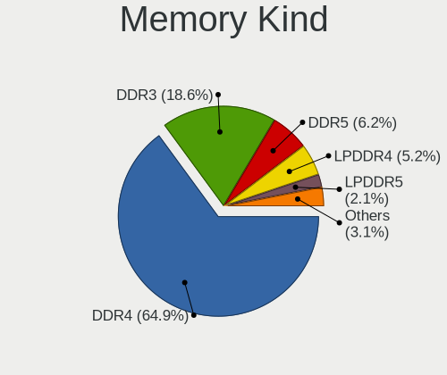

| Kind   | Notebooks | Percent |
|--------|-----------|---------|
| DDR4   | 53        | 68.83%  |
| DDR3   | 14        | 18.18%  |
| LPDDR4 | 4         | 5.19%   |
| DDR5   | 3         | 3.9%    |
| LPDDR3 | 2         | 2.6%    |
| DDR2   | 1         | 1.3%    |

Memory Form Factor
------------------

Physical design of the memory module

| Name         | Notebooks | Percent |
|--------------|-----------|---------|
| SODIMM       | 69        | 86.25%  |
| Row Of Chips | 9         | 11.25%  |
| Chip         | 1         | 1.25%   |
| Unknown      | 1         | 1.25%   |

Memory Size
-----------

Memory module size

| Size  | Notebooks | Percent |
|-------|-----------|---------|
| 8192  | 37        | 42.05%  |
| 16384 | 23        | 26.14%  |
| 4096  | 15        | 17.05%  |
| 2048  | 8         | 9.09%   |
| 32768 | 4         | 4.55%   |
| 1024  | 1         | 1.14%   |

Memory Speed
------------

Memory module speed

| Speed | Notebooks | Percent |
|-------|-----------|---------|
| 3200  | 26        | 29.89%  |
| 2667  | 26        | 29.89%  |
| 1600  | 9         | 10.34%  |
| 2400  | 8         | 9.2%    |
| 2133  | 5         | 5.75%   |
| 4800  | 3         | 3.45%   |
| 4267  | 3         | 3.45%   |
| 1334  | 2         | 2.3%    |
| 3733  | 1         | 1.15%   |
| 1867  | 1         | 1.15%   |
| 1333  | 1         | 1.15%   |
| 1067  | 1         | 1.15%   |
| 667   | 1         | 1.15%   |

Printers & scanners
-------------------

Printer Vendor
--------------

Printer device vendors

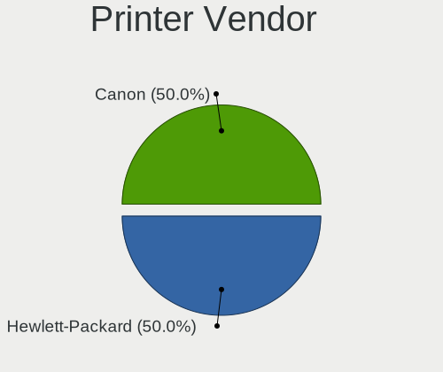

| Vendor          | Notebooks | Percent |
|-----------------|-----------|---------|
| Hewlett-Packard | 1         | 50%     |
| Canon           | 1         | 50%     |

Printer Model
-------------

Printer device models

| Model                  | Notebooks | Percent |
|------------------------|-----------|---------|
| HP DeskJet 2300 series | 1         | 50%     |
| Canon TR150 series     | 1         | 50%     |

Scanner Vendor
--------------

Scanner device vendors

Zero info for selected period =(

Scanner Model
-------------

Scanner device models

Zero info for selected period =(

Camera
------

Camera Vendor
-------------

Camera device vendors

| Vendor                                 | Notebooks | Percent |
|----------------------------------------|-----------|---------|
| Chicony Electronics                    | 40        | 28.17%  |
| IMC Networks                           | 19        | 13.38%  |
| Microdia                               | 11        | 7.75%   |
| Bison Electronics                      | 11        | 7.75%   |
| Realtek Semiconductor                  | 9         | 6.34%   |
| Luxvisions Innotech Limited            | 8         | 5.63%   |
| Cheng Uei Precision Industry (Foxlink) | 8         | 5.63%   |
| Sunplus Innovation Technology          | 6         | 4.23%   |
| Quanta                                 | 5         | 3.52%   |
| Syntek                                 | 4         | 2.82%   |
| Ricoh                                  | 3         | 2.11%   |
| Alcor Micro                            | 3         | 2.11%   |
| Suyin                                  | 2         | 1.41%   |
| Lite-On Technology                     | 2         | 1.41%   |
| Apple                                  | 2         | 1.41%   |
| Acer                                   | 2         | 1.41%   |
| Sonix Technology                       | 1         | 0.7%    |
| Samsung Electronics                    | 1         | 0.7%    |
| Ruision                                | 1         | 0.7%    |
| Microsoft                              | 1         | 0.7%    |
| Logitech                               | 1         | 0.7%    |
| Lenovo                                 | 1         | 0.7%    |
| Google                                 | 1         | 0.7%    |

Camera Model
------------

Camera device models

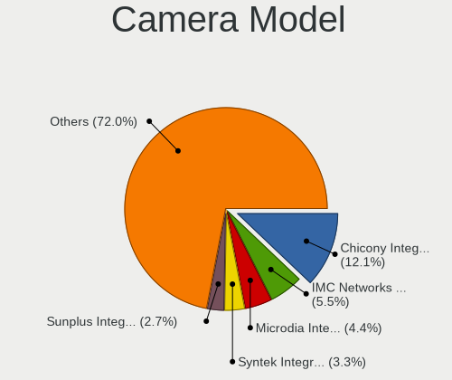

| Model                                                           | Notebooks | Percent |
|-----------------------------------------------------------------|-----------|---------|
| Chicony Integrated Camera                                       | 14        | 9.79%   |
| IMC Networks USB2.0 HD UVC WebCam                               | 10        | 6.99%   |
| Microdia Integrated_Webcam_HD                                   | 6         | 4.2%    |
| Chicony Integrated Camera (1280x720@30)                         | 5         | 3.5%    |
| IMC Networks Integrated Camera                                  | 4         | 2.8%    |
| Syntek Integrated Camera                                        | 3         | 2.1%    |
| Realtek Integrated_Webcam_HD                                    | 3         | 2.1%    |
| Luxvisions Innotech Limited HP TrueVision HD Camera             | 3         | 2.1%    |
| Cheng Uei Precision Industry (Foxlink) HP Wide Vision HD Camera | 3         | 2.1%    |
| Bison BisonCam,NB Pro                                           | 3         | 2.1%    |
| Sunplus Integrated_Webcam_HD                                    | 2         | 1.4%    |
| Sunplus HP HD Webcam [Fixed]                                    | 2         | 1.4%    |
| Ricoh HD Webcam                                                 | 2         | 1.4%    |
| Realtek HP Truevision HD                                        | 2         | 1.4%    |
| Quanta HP TrueVision HD Camera                                  | 2         | 1.4%    |
| Microdia Laptop_Integrated_Webcam_HD                            | 2         | 1.4%    |
| Luxvisions Innotech Limited HP Wide Vision HD Camera            | 2         | 1.4%    |
| Chicony TOSHIBA Web Camera - HD                                 | 2         | 1.4%    |
| Chicony TOSHIBA Web Camera - FHD                                | 2         | 1.4%    |
| Chicony Lenovo EasyCamera                                       | 2         | 1.4%    |
| Chicony HP Truevision HD                                        | 2         | 1.4%    |
| Chicony HP HD Webcam [Fixed]                                    | 2         | 1.4%    |
| Chicony HP HD Webcam                                            | 2         | 1.4%    |
| Chicony HD WebCam                                               | 2         | 1.4%    |
| Chicony EasyCamera                                              | 2         | 1.4%    |
| Cheng Uei Precision Industry (Foxlink) HP HD Webcam             | 2         | 1.4%    |
| Bison Lenovo EasyCamera                                         | 2         | 1.4%    |
| Bison Integrated Camera                                         | 2         | 1.4%    |
| Apple iPhone 5/5C/5S/6/SE/7/8/X                                 | 2         | 1.4%    |
| Alcor Micro USB 2.0 PC cam                                      | 2         | 1.4%    |
| Syntek EasyCamera                                               | 1         | 0.7%    |
| Suyin HP TrueVision HD                                          | 1         | 0.7%    |
| Suyin 1.3M HD WebCam                                            | 1         | 0.7%    |
| Sunplus USB2.0 Camera                                           | 1         | 0.7%    |
| Sunplus Integrated_Webcam_FHD                                   | 1         | 0.7%    |
| Sonix USB2.0 HD UVC WebCam                                      | 1         | 0.7%    |
| Samsung Galaxy series, misc. (MTP mode)                         | 1         | 0.7%    |
| Ruision UVC Camera                                              | 1         | 0.7%    |
| Ricoh Sony Vaio Integrated Webcam                               | 1         | 0.7%    |
| Realtek USB2.0 HD UVC WebCam                                    | 1         | 0.7%    |

Security
--------

Fingerprint Vendor
------------------

Fingerprint sensor vendors

| Vendor                             | Notebooks | Percent |
|------------------------------------|-----------|---------|
| Validity Sensors                   | 16        | 38.1%   |
| Synaptics                          | 16        | 38.1%   |
| Elan Microelectronics              | 5         | 11.9%   |
| Shenzhen Goodix Technology         | 3         | 7.14%   |
| STMicroelectronics                 | 1         | 2.38%   |
| Realtek USB2.0 Finger Print Bridge | 1         | 2.38%   |

Fingerprint Model
-----------------

Fingerprint sensor models

| Model                                                           | Notebooks | Percent |
|-----------------------------------------------------------------|-----------|---------|
| Elan ELAN:ARM-M4                                                | 5         | 11.9%   |
| Validity Sensors Synaptics WBDI                                 | 4         | 9.52%   |
| Synaptics Metallica MIS Touch Fingerprint Reader                | 4         | 9.52%   |
| Validity Sensors VFS471 Fingerprint Reader                      | 3         | 7.14%   |
| Synaptics Prometheus MIS Touch Fingerprint Reader               | 3         | 7.14%   |
| Validity Sensors VFS495 Fingerprint Reader                      | 2         | 4.76%   |
| Validity Sensors VFS491                                         | 2         | 4.76%   |
| Synaptics UWP WBDI Device                                       | 2         | 4.76%   |
| Synaptics UWP WBDI                                              | 2         | 4.76%   |
| Shenzhen Goodix  Fingerprint Device                             | 2         | 4.76%   |
| Validity Sensors VFS7500 Touch Fingerprint Sensor               | 1         | 2.38%   |
| Validity Sensors VFS5011 Fingerprint Reader                     | 1         | 2.38%   |
| Validity Sensors VFS Fingerprint sensor                         | 1         | 2.38%   |
| Validity Sensors VFS 5011 fingerprint sensor                    | 1         | 2.38%   |
| Validity Sensors Fingerprint scanner                            | 1         | 2.38%   |
| Synaptics WBDI Fingerprint Reader USB 086                       | 1         | 2.38%   |
| Synaptics TouchPad                                              | 1         | 2.38%   |
| Synaptics  FS7604 Touch Fingerprint Sensor with PurePrint       | 1         | 2.38%   |
| Synaptics Metallica MOH Touch Fingerprint Reader                | 1         | 2.38%   |
| Synaptics Fingerprint reader [HP G6]                            | 1         | 2.38%   |
| STMicroelectronics Fingerprint Reader                           | 1         | 2.38%   |
| Shenzhen Goodix Fingerprint Reader                              | 1         | 2.38%   |
| Realtek USB2.0 Finger Print Bridge FocalTech Fingerprint Device | 1         | 2.38%   |

Chipcard Vendor
---------------

Chipcard module vendors

| Vendor      | Notebooks | Percent |
|-------------|-----------|---------|
| Alcor Micro | 4         | 44.44%  |
| Broadcom    | 3         | 33.33%  |
| Upek        | 1         | 11.11%  |
| Aktiv       | 1         | 11.11%  |

Chipcard Model
--------------

Chipcard module models

| Model                                                                        | Notebooks | Percent |
|------------------------------------------------------------------------------|-----------|---------|
| Alcor Micro AU9540 Smartcard Reader                                          | 4         | 44.44%  |
| Broadcom BCM5880 Secure Applications Processor                               | 2         | 22.22%  |
| Upek TouchChip Fingerprint Coprocessor (WBF advanced mode)                   | 1         | 11.11%  |
| Broadcom BCM5880 Secure Applications Processor with fingerprint swipe sensor | 1         | 11.11%  |
| Aktiv Rutoken lite                                                           | 1         | 11.11%  |

Unsupported
-----------

Unsupported Devices
-------------------

Total unsupported devices on board

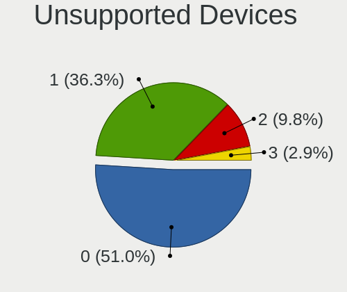

| Total | Notebooks | Percent |
|-------|-----------|---------|
| 0     | 82        | 51.9%   |
| 1     | 56        | 35.44%  |
| 2     | 17        | 10.76%  |
| 3     | 3         | 1.9%    |

Unsupported Device Types
------------------------

Types of unsupported devices

| Type                     | Notebooks | Percent |
|--------------------------|-----------|---------|
| Fingerprint reader       | 40        | 42.11%  |
| Graphics card            | 17        | 17.89%  |
| Net/wireless             | 10        | 10.53%  |
| Chipcard                 | 7         | 7.37%   |
| Camera                   | 7         | 7.37%   |
| Multimedia controller    | 4         | 4.21%   |
| Bluetooth                | 4         | 4.21%   |
| Wireless                 | 2         | 2.11%   |
| Sound                    | 2         | 2.11%   |
| Communication controller | 2         | 2.11%   |

