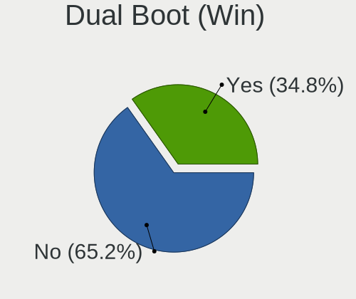
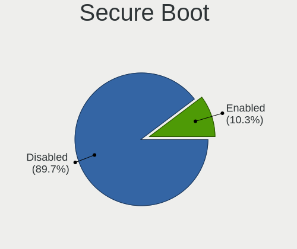
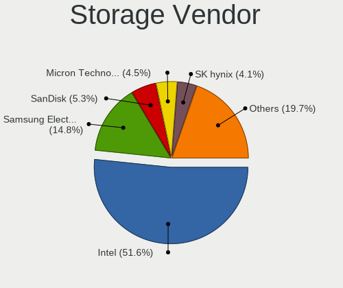
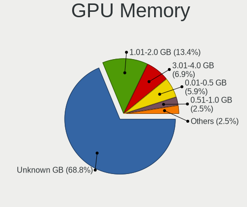
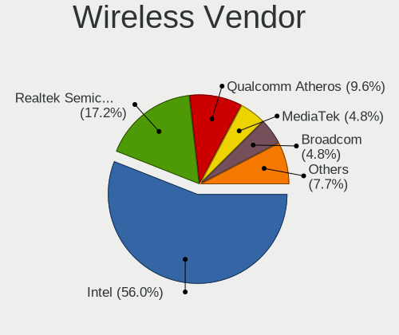
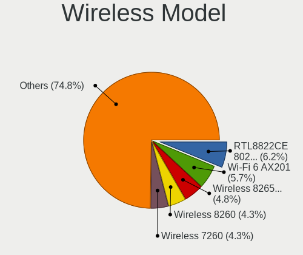
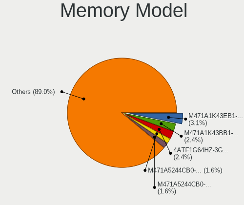
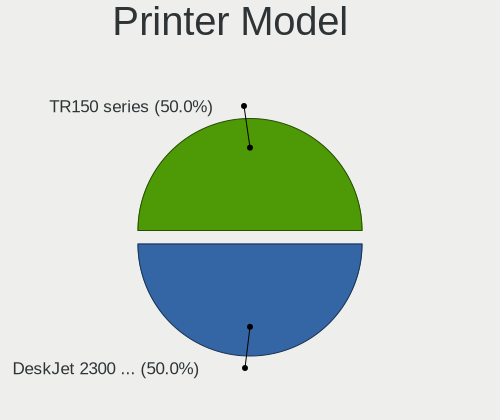
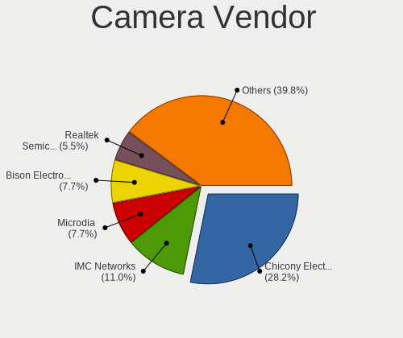
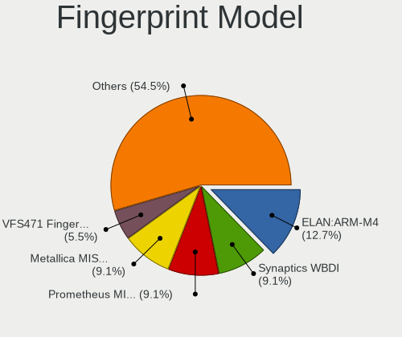

Linux in UAE - Tested Hardware & Statistics (Notebooks)
-------------------------------------------------------

A project to collect tested hardware configurations for Linux in UAE.

Anyone can contribute to this report by the [hw-probe](https://github.com/linuxhw/hw-probe) tool:

    sudo -E hw-probe -all -upload

Please contribute! Especially if your hardware is rare.

Contents
--------

* [ Test Cases ](#test-cases)

* [ System ](#system)
  - [ OS                       ](#os)
  - [ OS Family                ](#os-family)
  - [ Kernel                   ](#kernel)
  - [ Kernel Family            ](#kernel-family)
  - [ Kernel Major Ver.        ](#kernel-major-ver)
  - [ Arch                     ](#arch)
  - [ DE                       ](#de)
  - [ Display Server           ](#display-server)
  - [ Display Manager          ](#display-manager)
  - [ OS Lang                  ](#os-lang)
  - [ Boot Mode                ](#boot-mode)
  - [ Filesystem               ](#filesystem)
  - [ Part. scheme             ](#part-scheme)
  - [ Dual Boot with Linux/BSD ](#dual-boot-with-linuxbsd)
  - [ Dual Boot (Win)          ](#dual-boot-win)

* [ Board ](#board)
  - [ Vendor                   ](#vendor)
  - [ Model                    ](#model)
  - [ Model Family             ](#model-family)
  - [ MFG Year                 ](#mfg-year)
  - [ Form Factor              ](#form-factor)
  - [ Secure Boot              ](#secure-boot)
  - [ Coreboot                 ](#coreboot)
  - [ RAM Size                 ](#ram-size)
  - [ RAM Used                 ](#ram-used)
  - [ Total Drives             ](#total-drives)
  - [ Has CD-ROM               ](#has-cd-rom)
  - [ Has Ethernet             ](#has-ethernet)
  - [ Has WiFi                 ](#has-wifi)
  - [ Has Bluetooth            ](#has-bluetooth)

* [ Location ](#location)
  - [ Country                  ](#country)
  - [ City                     ](#city)

* [ Drives ](#drives)
  - [ Drive Vendor             ](#drive-vendor)
  - [ Drive Model              ](#drive-model)
  - [ HDD Vendor               ](#hdd-vendor)
  - [ SSD Vendor               ](#ssd-vendor)
  - [ Drive Kind               ](#drive-kind)
  - [ Drive Connector          ](#drive-connector)
  - [ Drive Size               ](#drive-size)
  - [ Space Total              ](#space-total)
  - [ Space Used               ](#space-used)
  - [ Malfunc. Drives          ](#malfunc-drives)
  - [ Malfunc. Drive Vendor    ](#malfunc-drive-vendor)
  - [ Malfunc. HDD Vendor      ](#malfunc-hdd-vendor)
  - [ Malfunc. Drive Kind      ](#malfunc-drive-kind)
  - [ Failed Drives            ](#failed-drives)
  - [ Failed Drive Vendor      ](#failed-drive-vendor)
  - [ Drive Status             ](#drive-status)

* [ Storage controller ](#storage-controller)
  - [ Storage Vendor           ](#storage-vendor)
  - [ Storage Model            ](#storage-model)
  - [ Storage Kind             ](#storage-kind)

* [ Processor ](#processor)
  - [ CPU Vendor               ](#cpu-vendor)
  - [ CPU Model                ](#cpu-model)
  - [ CPU Model Family         ](#cpu-model-family)
  - [ CPU Cores                ](#cpu-cores)
  - [ CPU Sockets              ](#cpu-sockets)
  - [ CPU Threads              ](#cpu-threads)
  - [ CPU Op-Modes             ](#cpu-op-modes)
  - [ CPU Microcode            ](#cpu-microcode)
  - [ CPU Microarch            ](#cpu-microarch)

* [ Graphics ](#graphics)
  - [ GPU Vendor               ](#gpu-vendor)
  - [ GPU Model                ](#gpu-model)
  - [ GPU Combo                ](#gpu-combo)
  - [ GPU Driver               ](#gpu-driver)
  - [ GPU Memory               ](#gpu-memory)

* [ Monitor ](#monitor)
  - [ Monitor Vendor           ](#monitor-vendor)
  - [ Monitor Model            ](#monitor-model)
  - [ Monitor Resolution       ](#monitor-resolution)
  - [ Monitor Diagonal         ](#monitor-diagonal)
  - [ Monitor Width            ](#monitor-width)
  - [ Aspect Ratio             ](#aspect-ratio)
  - [ Monitor Area             ](#monitor-area)
  - [ Pixel Density            ](#pixel-density)
  - [ Multiple Monitors        ](#multiple-monitors)

* [ Network ](#network)
  - [ Net Controller Vendor    ](#net-controller-vendor)
  - [ Net Controller Model     ](#net-controller-model)
  - [ Wireless Vendor          ](#wireless-vendor)
  - [ Wireless Model           ](#wireless-model)
  - [ Ethernet Vendor          ](#ethernet-vendor)
  - [ Ethernet Model           ](#ethernet-model)
  - [ Net Controller Kind      ](#net-controller-kind)
  - [ Used Controller          ](#used-controller)
  - [ NICs                     ](#nics)
  - [ IPv6                     ](#ipv6)

* [ Bluetooth ](#bluetooth)
  - [ Bluetooth Vendor         ](#bluetooth-vendor)
  - [ Bluetooth Model          ](#bluetooth-model)

* [ Sound ](#sound)
  - [ Sound Vendor             ](#sound-vendor)
  - [ Sound Model              ](#sound-model)

* [ Memory ](#memory)
  - [ Memory Vendor            ](#memory-vendor)
  - [ Memory Model             ](#memory-model)
  - [ Memory Kind              ](#memory-kind)
  - [ Memory Form Factor       ](#memory-form-factor)
  - [ Memory Size              ](#memory-size)
  - [ Memory Speed             ](#memory-speed)

* [ Printers & scanners ](#printers--scanners)
  - [ Printer Vendor           ](#printer-vendor)
  - [ Printer Model            ](#printer-model)
  - [ Scanner Vendor           ](#scanner-vendor)
  - [ Scanner Model            ](#scanner-model)

* [ Camera ](#camera)
  - [ Camera Vendor            ](#camera-vendor)
  - [ Camera Model             ](#camera-model)

* [ Security ](#security)
  - [ Fingerprint Vendor       ](#fingerprint-vendor)
  - [ Fingerprint Model        ](#fingerprint-model)
  - [ Chipcard Vendor          ](#chipcard-vendor)
  - [ Chipcard Model           ](#chipcard-model)

* [ Unsupported ](#unsupported)
  - [ Unsupported Devices      ](#unsupported-devices)
  - [ Unsupported Device Types ](#unsupported-device-types)

Test Cases
----------

Total: 169

| Vendor        | Model                       | Probe                                                      | Date         |
|---------------|-----------------------------|------------------------------------------------------------|--------------|
| ASUSTek       | GL553VD                     | [884a5ecd03](https://linux-hardware.org/?probe=884a5ecd03) | Jun 28, 2023 |
| HP            | Laptop 15-dw2xxx            | [7f41e23d3a](https://linux-hardware.org/?probe=7f41e23d3a) | Jun 23, 2023 |
| HP            | Laptop 15-dw2xxx            | [79ec1a7b3f](https://linux-hardware.org/?probe=79ec1a7b3f) | Jun 23, 2023 |
| Razer         | Blade 15 Advanced Model ... | [7dd15a9fa4](https://linux-hardware.org/?probe=7dd15a9fa4) | Jun 19, 2023 |
| HUAWEI        | KLVD-WXX9                   | [75eeeb7917](https://linux-hardware.org/?probe=75eeeb7917) | Jun 16, 2023 |
| Lenovo        | Yoga Creator 7 15IMH05 8... | [3bcc239452](https://linux-hardware.org/?probe=3bcc239452) | Jun 04, 2023 |
| Valve         | Jupiter                     | [0c81d929ca](https://linux-hardware.org/?probe=0c81d929ca) | Jun 04, 2023 |
| HP            | Laptop 14-dq2xxx            | [589112cb44](https://linux-hardware.org/?probe=589112cb44) | May 25, 2023 |
| Lenovo        | IdeaPad 310-15ISK 80SM      | [2ae74516a9](https://linux-hardware.org/?probe=2ae74516a9) | May 24, 2023 |
| Lenovo        | IdeaPad 310-15ISK 80SM      | [cbd7b1dcc7](https://linux-hardware.org/?probe=cbd7b1dcc7) | May 24, 2023 |
| Lenovo        | ThinkPad T490 20N2004JAD    | [c765eed46d](https://linux-hardware.org/?probe=c765eed46d) | May 16, 2023 |
| Toshiba       | Satellite L850-B434         | [54e6cd2fc6](https://linux-hardware.org/?probe=54e6cd2fc6) | May 13, 2023 |
| HUAWEI        | BOHB-WAX9                   | [89747b6213](https://linux-hardware.org/?probe=89747b6213) | May 12, 2023 |
| HP            | Laptop 14-dq2xxx            | [0a639ba55d](https://linux-hardware.org/?probe=0a639ba55d) | May 08, 2023 |
| Acer          | Aspire F5-573G              | [aabb19e388](https://linux-hardware.org/?probe=aabb19e388) | May 06, 2023 |
| HP            | Laptop 14-dq2xxx            | [856494ea85](https://linux-hardware.org/?probe=856494ea85) | May 04, 2023 |
| Valve         | Jupiter                     | [c6e5e310b9](https://linux-hardware.org/?probe=c6e5e310b9) | May 02, 2023 |
| HP            | Pavilion Aero Laptop 13-... | [1704454cdb](https://linux-hardware.org/?probe=1704454cdb) | May 02, 2023 |
| Lenovo        | ThinkPad P1 Gen 4i 20Y4S... | [d2f8737b9d](https://linux-hardware.org/?probe=d2f8737b9d) | May 02, 2023 |
| Valve         | Jupiter                     | [78a3abdc19](https://linux-hardware.org/?probe=78a3abdc19) | Apr 25, 2023 |
| Lenovo        | IdeaPad 5 Pro 14ACN6 82L... | [59c225df6e](https://linux-hardware.org/?probe=59c225df6e) | Apr 24, 2023 |
| Lenovo        | IdeaPad 5 Pro 14ACN6 82L... | [6e2da1e766](https://linux-hardware.org/?probe=6e2da1e766) | Apr 21, 2023 |
| HP            | ZBook 15 G2                 | [00ed2824f0](https://linux-hardware.org/?probe=00ed2824f0) | Apr 20, 2023 |
| HP            | ZBook 15 G2                 | [7a4242a973](https://linux-hardware.org/?probe=7a4242a973) | Apr 19, 2023 |
| HP            | Laptop 15-dw3xxx            | [a0cf4fd00d](https://linux-hardware.org/?probe=a0cf4fd00d) | Apr 19, 2023 |
| HP            | Laptop 15-dw3xxx            | [7ce26d7fd9](https://linux-hardware.org/?probe=7ce26d7fd9) | Apr 19, 2023 |
| HP            | Pavilion 15                 | [d0c3e2bb4e](https://linux-hardware.org/?probe=d0c3e2bb4e) | Apr 19, 2023 |
| HP            | 15-dc1018ur                 | [7df35a90ad](https://linux-hardware.org/?probe=7df35a90ad) | Apr 16, 2023 |
| ASUSTek       | VivoBook_ASUSLaptop S540... | [a7b2caaba8](https://linux-hardware.org/?probe=a7b2caaba8) | Apr 16, 2023 |
| HP            | Pavilion 15                 | [199f3bb771](https://linux-hardware.org/?probe=199f3bb771) | Apr 14, 2023 |
| Notebook      | NV4XMB,ME,MZ                | [125884d17a](https://linux-hardware.org/?probe=125884d17a) | Apr 05, 2023 |
| Lenovo        | ThinkPad T460s 20FAS1U20... | [99ea485cee](https://linux-hardware.org/?probe=99ea485cee) | Mar 27, 2023 |
| ASUSTek       | Q551LN                      | [3385f39150](https://linux-hardware.org/?probe=3385f39150) | Mar 26, 2023 |
| HP            | Laptop 14-dq2xxx            | [1a46276700](https://linux-hardware.org/?probe=1a46276700) | Mar 05, 2023 |
| Dell          | XPS 13 7390                 | [2a8830034a](https://linux-hardware.org/?probe=2a8830034a) | Feb 26, 2023 |
| Dell          | XPS 13 9370                 | [452bd46c01](https://linux-hardware.org/?probe=452bd46c01) | Feb 22, 2023 |
| Dell          | XPS 13 9370                 | [fe78ef8424](https://linux-hardware.org/?probe=fe78ef8424) | Feb 22, 2023 |
| HP            | Laptop 14-dq2xxx            | [83bef528a7](https://linux-hardware.org/?probe=83bef528a7) | Feb 19, 2023 |
| Lenovo        | G50-80 80E5                 | [64c385ee36](https://linux-hardware.org/?probe=64c385ee36) | Feb 16, 2023 |
| HP            | Laptop 14-dq2xxx            | [54f7f241bf](https://linux-hardware.org/?probe=54f7f241bf) | Feb 15, 2023 |
| HP            | Laptop 14-dq2xxx            | [8fc284c3b5](https://linux-hardware.org/?probe=8fc284c3b5) | Feb 15, 2023 |
| Notebook      | PD5x_7xPNP_PNN_PNT          | [a64ae29757](https://linux-hardware.org/?probe=a64ae29757) | Jan 31, 2023 |
| HP            | Laptop 14-dq2xxx            | [f308688189](https://linux-hardware.org/?probe=f308688189) | Jan 25, 2023 |
| Valve         | Jupiter                     | [83d050bdbe](https://linux-hardware.org/?probe=83d050bdbe) | Jan 25, 2023 |
| HP            | Laptop 14-dq2xxx            | [9a930173a0](https://linux-hardware.org/?probe=9a930173a0) | Jan 24, 2023 |
| Dell          | G5 5587                     | [96ca22c550](https://linux-hardware.org/?probe=96ca22c550) | Jan 21, 2023 |
| Dell          | G5 5587                     | [a070a8ba69](https://linux-hardware.org/?probe=a070a8ba69) | Jan 21, 2023 |
| Acer          | Aspire E5-471P              | [c50e807e64](https://linux-hardware.org/?probe=c50e807e64) | Jan 12, 2023 |
| A-DATA Tec... | XENIAXe15TI7G11GXELX        | [6d3966411f](https://linux-hardware.org/?probe=6d3966411f) | Jan 09, 2023 |
| A-DATA Tec... | XENIAXe15TI7G11GXELX        | [1405e2a7c8](https://linux-hardware.org/?probe=1405e2a7c8) | Jan 09, 2023 |
| A-DATA Tec... | XENIAXe15TI7G11GXELX        | [6206409322](https://linux-hardware.org/?probe=6206409322) | Jan 08, 2023 |
| HP            | EliteBook 2560p             | [89c0ffe36d](https://linux-hardware.org/?probe=89c0ffe36d) | Dec 29, 2022 |
| Lenovo        | Legion Y7000P 81LD          | [d27a1b703b](https://linux-hardware.org/?probe=d27a1b703b) | Dec 26, 2022 |
| Valve         | Jupiter                     | [fae62b5114](https://linux-hardware.org/?probe=fae62b5114) | Dec 11, 2022 |
| MSI           | Modern 14 B5M               | [8277ece293](https://linux-hardware.org/?probe=8277ece293) | Nov 30, 2022 |
| HP            | EliteBook 840 G1            | [7d3eac2c7d](https://linux-hardware.org/?probe=7d3eac2c7d) | Nov 05, 2022 |
| Lenovo        | ThinkPad P1 Gen 5 21DC00... | [910b452558](https://linux-hardware.org/?probe=910b452558) | Oct 30, 2022 |
| HP            | EliteBook 845 G7 Noteboo... | [7406489511](https://linux-hardware.org/?probe=7406489511) | Oct 21, 2022 |
| HP            | 250 G5 Notebook PC          | [e8e0acd06e](https://linux-hardware.org/?probe=e8e0acd06e) | Oct 17, 2022 |
| Dell          | XPS 15 7590                 | [fdab72c478](https://linux-hardware.org/?probe=fdab72c478) | Oct 07, 2022 |
| HP            | EliteBook 845 G7 Noteboo... | [b1590cf8fa](https://linux-hardware.org/?probe=b1590cf8fa) | Oct 03, 2022 |
| Lenovo        | ThinkPad X1 Extreme Gen ... | [df5fcf14f9](https://linux-hardware.org/?probe=df5fcf14f9) | Sep 26, 2022 |
| ASUSTek       | ROG Zephyrus M16 GU603ZW... | [472668e67b](https://linux-hardware.org/?probe=472668e67b) | Sep 12, 2022 |
| Lenovo        | ThinkPad T61 76653JG        | [0fae1da16b](https://linux-hardware.org/?probe=0fae1da16b) | Aug 02, 2022 |
| Lenovo        | 81FV                        | [aa9e5c9f73](https://linux-hardware.org/?probe=aa9e5c9f73) | Jul 22, 2022 |
| Lenovo        | ThinkPad T480s 20L7001PA... | [de71ab8780](https://linux-hardware.org/?probe=de71ab8780) | Jul 21, 2022 |
| ASUSTek       | VivoBook 12_ASUS Laptop ... | [ad2442631e](https://linux-hardware.org/?probe=ad2442631e) | May 28, 2022 |
| HP            | Pavilion Laptop 13-bb0xx... | [ae7d5dbb0c](https://linux-hardware.org/?probe=ae7d5dbb0c) | May 01, 2022 |
| Lenovo        | ThinkPad P1 Gen 3 20TJS4... | [28c774c6de](https://linux-hardware.org/?probe=28c774c6de) | Apr 07, 2022 |
| Lenovo        | ThinkPad X1 Carbon Gen 9... | [718b671125](https://linux-hardware.org/?probe=718b671125) | Apr 06, 2022 |
| Lenovo        | ThinkPad X1 Carbon Gen 9... | [5e0763131c](https://linux-hardware.org/?probe=5e0763131c) | Mar 28, 2022 |
| Lenovo        | IdeaPad Gaming 3 15IMH05... | [8dda7f6478](https://linux-hardware.org/?probe=8dda7f6478) | Mar 06, 2022 |
| Google        | Terra                       | [54163369b2](https://linux-hardware.org/?probe=54163369b2) | Feb 23, 2022 |
| Dell          | Latitude E6230              | [a8aeb155b0](https://linux-hardware.org/?probe=a8aeb155b0) | Feb 10, 2022 |
| Lenovo        | ThinkPad E14 Gen 2 20TA0... | [8aafebe07c](https://linux-hardware.org/?probe=8aafebe07c) | Feb 03, 2022 |
| Dell          | Latitude E5440              | [ebbb8ee138](https://linux-hardware.org/?probe=ebbb8ee138) | Jan 22, 2022 |
| Lenovo        | ThinkPad T480s 20L8S3FV0... | [78080db667](https://linux-hardware.org/?probe=78080db667) | Jan 13, 2022 |
| HP            | EliteBook 840 G6            | [c36553e3a3](https://linux-hardware.org/?probe=c36553e3a3) | Dec 27, 2021 |
| Google        | Akemi                       | [aaf0a3e10e](https://linux-hardware.org/?probe=aaf0a3e10e) | Dec 20, 2021 |
| Dell          | Inspiron 5570               | [927497310e](https://linux-hardware.org/?probe=927497310e) | Nov 16, 2021 |
| win elemen... | MoreFine S500+              | [ace08cf199](https://linux-hardware.org/?probe=ace08cf199) | Nov 11, 2021 |
| win elemen... | MoreFine S500+              | [0e31d4b6fa](https://linux-hardware.org/?probe=0e31d4b6fa) | Nov 11, 2021 |
| MSI           | PS63 Modern 8RD             | [519048dea2](https://linux-hardware.org/?probe=519048dea2) | Nov 01, 2021 |
| MSI           | PS63 Modern 8RD             | [6d3cd2f117](https://linux-hardware.org/?probe=6d3cd2f117) | Nov 01, 2021 |
| Lenovo        | IdeaPad 3 14ADA05 81W0      | [41ff21e8e8](https://linux-hardware.org/?probe=41ff21e8e8) | Oct 06, 2021 |
| Lenovo        | IdeaPad 3 14ADA05 81W0      | [6654adaf99](https://linux-hardware.org/?probe=6654adaf99) | Oct 04, 2021 |
| HP            | ProBook 6475b               | [9d60bf5397](https://linux-hardware.org/?probe=9d60bf5397) | Oct 02, 2021 |
| Apple         | MacBook9,1                  | [888ca9b5de](https://linux-hardware.org/?probe=888ca9b5de) | Sep 04, 2021 |
| Apple         | MacBook9,1                  | [69119d1952](https://linux-hardware.org/?probe=69119d1952) | Sep 04, 2021 |
| Sony          | VGN-NS10J_S                 | [31d1e0e91d](https://linux-hardware.org/?probe=31d1e0e91d) | Aug 12, 2021 |
| LG Electro... | C500-G.AEF5BE1              | [b78f4cd34d](https://linux-hardware.org/?probe=b78f4cd34d) | Jun 14, 2021 |
| Toshiba       | Satellite C850-A966         | [391d22d993](https://linux-hardware.org/?probe=391d22d993) | Jun 02, 2021 |
| Sony          | SVE14A25CAB                 | [78ddb916b5](https://linux-hardware.org/?probe=78ddb916b5) | May 30, 2021 |
| Sony          | SVE14A25CAB                 | [0a2c5cf1cd](https://linux-hardware.org/?probe=0a2c5cf1cd) | May 30, 2021 |
| HP            | Laptop 15s-eq2xxx           | [5707e7ae37](https://linux-hardware.org/?probe=5707e7ae37) | May 28, 2021 |
| HP            | Laptop 15s-eq2xxx           | [66cc8bd4a5](https://linux-hardware.org/?probe=66cc8bd4a5) | May 19, 2021 |
| Dell          | G5 5587                     | [2d2cf67a2d](https://linux-hardware.org/?probe=2d2cf67a2d) | May 08, 2021 |
| Dell          | Latitude E6510              | [06d38294ab](https://linux-hardware.org/?probe=06d38294ab) | May 03, 2021 |
| Lenovo        | Legion Y7000P 81LD          | [e3b22a36fb](https://linux-hardware.org/?probe=e3b22a36fb) | Apr 22, 2021 |
| Lenovo        | Legion Y7000P 81LD          | [f5715022b7](https://linux-hardware.org/?probe=f5715022b7) | Apr 22, 2021 |
| Acer          | Aspire 5755G                | [6b82d5c050](https://linux-hardware.org/?probe=6b82d5c050) | Mar 07, 2021 |
| Acer          | Aspire 5755G                | [227244211b](https://linux-hardware.org/?probe=227244211b) | Mar 07, 2021 |
| HP            | Pavilion Notebook           | [3c9d39abce](https://linux-hardware.org/?probe=3c9d39abce) | Mar 06, 2021 |
| Lenovo        | ThinkPad X230 2325DV8       | [11d5145d10](https://linux-hardware.org/?probe=11d5145d10) | Feb 12, 2021 |
| HP            | Pavilion dv6                | [317b81878c](https://linux-hardware.org/?probe=317b81878c) | Jan 27, 2021 |
| ASUSTek       | Strix GL703GM_GL703GM       | [3d8ea2b061](https://linux-hardware.org/?probe=3d8ea2b061) | Jan 27, 2021 |
| HP            | Laptop 15-da1xxx            | [a3c15a6f74](https://linux-hardware.org/?probe=a3c15a6f74) | Jan 18, 2021 |
| HP            | Laptop 15-da1xxx            | [58bf01b1e7](https://linux-hardware.org/?probe=58bf01b1e7) | Jan 18, 2021 |
| Dell          | Inspiron 3521               | [2e84869a9a](https://linux-hardware.org/?probe=2e84869a9a) | Jan 11, 2021 |
| Lenovo        | ThinkPad T470 W10DG 20JM... | [6a02570e23](https://linux-hardware.org/?probe=6a02570e23) | Jan 03, 2021 |
| HP            | Pavilion Sleekbook 15 PC    | [092666f171](https://linux-hardware.org/?probe=092666f171) | Dec 31, 2020 |
| HP            | EliteBook 8460p             | [d24a3c768e](https://linux-hardware.org/?probe=d24a3c768e) | Dec 24, 2020 |
| Dell          | Latitude E6410              | [a2a46d21e9](https://linux-hardware.org/?probe=a2a46d21e9) | Dec 15, 2020 |
| Lenovo        | IdeaPad 110-15ISK 80UD      | [e2816ed19c](https://linux-hardware.org/?probe=e2816ed19c) | Nov 27, 2020 |
| HP            | Laptop 15-dw1xxx            | [91e0e6c6bc](https://linux-hardware.org/?probe=91e0e6c6bc) | Nov 04, 2020 |
| HP            | Pavilion Power Laptop 15... | [b1cd303933](https://linux-hardware.org/?probe=b1cd303933) | Oct 08, 2020 |
| Lenovo        | IdeaPad 700-15ISK 80RU      | [f9f212a509](https://linux-hardware.org/?probe=f9f212a509) | Oct 01, 2020 |
| Lenovo        | IdeaPad 3 14IML05 81WA      | [ab392f30cb](https://linux-hardware.org/?probe=ab392f30cb) | Sep 30, 2020 |
| Acer          | ChiefRiver Platform         | [23e2162b8e](https://linux-hardware.org/?probe=23e2162b8e) | Sep 20, 2020 |
| Dell          | Inspiron 5537               | [4ddf924081](https://linux-hardware.org/?probe=4ddf924081) | Sep 05, 2020 |
| Dell          | Inspiron 5537               | [23a0e05047](https://linux-hardware.org/?probe=23a0e05047) | Sep 05, 2020 |
| Dell          | Latitude E6540              | [9abf14d168](https://linux-hardware.org/?probe=9abf14d168) | Aug 31, 2020 |
| Dell          | Precision 5540              | [76f1cfa736](https://linux-hardware.org/?probe=76f1cfa736) | Aug 23, 2020 |
| I-Life Dig... | ZED AIR                     | [b40d7e9c7c](https://linux-hardware.org/?probe=b40d7e9c7c) | Aug 10, 2020 |
| I-Life Dig... | ZED AIR                     | [5662aa186c](https://linux-hardware.org/?probe=5662aa186c) | Aug 10, 2020 |
| Lenovo        | ThinkPad L480 20LS0012AD    | [81d46e4c4a](https://linux-hardware.org/?probe=81d46e4c4a) | Aug 02, 2020 |
| Toshiba       | Satellite C660              | [670cc8a66c](https://linux-hardware.org/?probe=670cc8a66c) | Jul 26, 2020 |
| Lenovo        | IdeaPadFlex 14 20308        | [aea3470496](https://linux-hardware.org/?probe=aea3470496) | Jul 21, 2020 |
| ASUSTek       | VivoBook_ASUSLaptop X420... | [b3dbd3f2af](https://linux-hardware.org/?probe=b3dbd3f2af) | Jul 14, 2020 |
| Toshiba       | TECRA A50-C                 | [adf7a73571](https://linux-hardware.org/?probe=adf7a73571) | Jul 03, 2020 |
| ASUSTek       | FX503VD                     | [d6c0a21749](https://linux-hardware.org/?probe=d6c0a21749) | Jul 02, 2020 |
| HP            | Pavilion 15                 | [499f0c72ee](https://linux-hardware.org/?probe=499f0c72ee) | Jun 29, 2020 |
| ASUSTek       | VivoBook_ASUSLaptop X420... | [dd5c9e8d9f](https://linux-hardware.org/?probe=dd5c9e8d9f) | Jun 23, 2020 |
| Dell          | Latitude E6410              | [06055ff260](https://linux-hardware.org/?probe=06055ff260) | Jun 19, 2020 |
| ASUSTek       | VivoBook_ASUSLaptop X420... | [b53cc32ed0](https://linux-hardware.org/?probe=b53cc32ed0) | Jun 19, 2020 |
| Lenovo        | G500 20236                  | [fdc9496e84](https://linux-hardware.org/?probe=fdc9496e84) | Jun 19, 2020 |
| Dell          | Latitude E6410              | [1b73d74e65](https://linux-hardware.org/?probe=1b73d74e65) | Jun 09, 2020 |
| Lenovo        | ThinkPad L480 20LS0012AD    | [e9b38b78d7](https://linux-hardware.org/?probe=e9b38b78d7) | May 30, 2020 |
| HP            | Presario C300 (RH208UA#A... | [50e95ff237](https://linux-hardware.org/?probe=50e95ff237) | May 14, 2020 |
| HP            | Presario C300 (RH208UA#A... | [6b4a8eab4c](https://linux-hardware.org/?probe=6b4a8eab4c) | May 14, 2020 |
| Toshiba       | TECRA X40-D                 | [3255796d07](https://linux-hardware.org/?probe=3255796d07) | May 10, 2020 |
| YJKC          | vBOOK Plus RVP7             | [49363e9553](https://linux-hardware.org/?probe=49363e9553) | May 07, 2020 |
| HP            | ProBook 450 G2              | [887a19760b](https://linux-hardware.org/?probe=887a19760b) | May 01, 2020 |
| Lenovo        | ThinkPad X240 20AMS6GB00    | [3fa804be21](https://linux-hardware.org/?probe=3fa804be21) | May 01, 2020 |
| YJKC          | vBOOK Plus RVP7             | [d2328783da](https://linux-hardware.org/?probe=d2328783da) | Apr 24, 2020 |
| Dell          | Vostro 14-5480              | [1bba68101c](https://linux-hardware.org/?probe=1bba68101c) | Apr 20, 2020 |
| HP            | ProBook 450 G2              | [1ef49ff7a3](https://linux-hardware.org/?probe=1ef49ff7a3) | Apr 17, 2020 |
| HP            | Notebook                    | [4f154f82b0](https://linux-hardware.org/?probe=4f154f82b0) | Apr 01, 2020 |
| HP            | Pavilion Notebook           | [5cd86dffe9](https://linux-hardware.org/?probe=5cd86dffe9) | Mar 16, 2020 |
| HP            | ENVY Laptop 13-aq0xxx       | [7f0b4db18a](https://linux-hardware.org/?probe=7f0b4db18a) | Mar 12, 2020 |
| HP            | Pavilion Notebook           | [87df29714d](https://linux-hardware.org/?probe=87df29714d) | Mar 11, 2020 |
| HP            | ENVY Laptop 13-aq0xxx       | [04da794ff5](https://linux-hardware.org/?probe=04da794ff5) | Feb 25, 2020 |
| HP            | EliteBook 2760p             | [40333472c7](https://linux-hardware.org/?probe=40333472c7) | Feb 21, 2020 |
| HP            | ENVY Laptop 13-aq0xxx       | [b12186f161](https://linux-hardware.org/?probe=b12186f161) | Feb 13, 2020 |
| HP            | Notebook                    | [a25a67e533](https://linux-hardware.org/?probe=a25a67e533) | Feb 02, 2020 |
| Lenovo        | ThinkPad T460 20FMS1A200    | [c2a7159d3a](https://linux-hardware.org/?probe=c2a7159d3a) | Jan 04, 2020 |
| Lenovo        | ThinkPad T460 20FMS1A200    | [028d728043](https://linux-hardware.org/?probe=028d728043) | Jan 04, 2020 |
| Lenovo        | Yoga S730-13IWL 81J0        | [d1ca80edff](https://linux-hardware.org/?probe=d1ca80edff) | Dec 24, 2019 |
| Toshiba       | Satellite A300              | [420c738977](https://linux-hardware.org/?probe=420c738977) | Oct 15, 2019 |
| Toshiba       | Satellite A300              | [036dc7e829](https://linux-hardware.org/?probe=036dc7e829) | Oct 15, 2019 |
| Lenovo        | Yoga 2 Pro 20266            | [ab1c14d729](https://linux-hardware.org/?probe=ab1c14d729) | Oct 12, 2019 |
| Lenovo        | IdeaPad 320-15IKB 80XL      | [558c01fdce](https://linux-hardware.org/?probe=558c01fdce) | Oct 07, 2019 |
| Notebook      | P95_96_97Ex,Rx              | [d4ad7906b5](https://linux-hardware.org/?probe=d4ad7906b5) | Sep 11, 2019 |
| I-Life Dig... | ZED AIR                     | [514c494f7f](https://linux-hardware.org/?probe=514c494f7f) | Jul 23, 2019 |
| I-Life Dig... | ZED AIR                     | [a9fe92aa3c](https://linux-hardware.org/?probe=a9fe92aa3c) | Jul 23, 2019 |
| HP            | EliteBook 8440p             | [1f8a20b199](https://linux-hardware.org/?probe=1f8a20b199) | May 25, 2019 |
| HP            | EliteBook 8440p             | [60d0e8dd5d](https://linux-hardware.org/?probe=60d0e8dd5d) | May 25, 2019 |
| HP            | ProBook 4540s               | [271be85705](https://linux-hardware.org/?probe=271be85705) | May 15, 2019 |
| Lenovo        | IdeaPad 130-15IKB 81H7      | [ab25f83cd0](https://linux-hardware.org/?probe=ab25f83cd0) | Mar 27, 2019 |

System
------

OS
--

Installed operating systems

| Name               | Notebooks | Percent |
|--------------------|-----------|---------|
| Ubuntu 20.04       | 24        | 19.35%  |
| Ubuntu 22.04       | 10        | 8.06%   |
| Ubuntu 18.04       | 9         | 7.26%   |
| Arch               | 5         | 4.03%   |
| Pop!_OS 22.04      | 4         | 3.23%   |
| Zorin 15           | 3         | 2.42%   |
| Ubuntu 20.10       | 3         | 2.42%   |
| Ubuntu 19.10       | 3         | 2.42%   |
| Kubuntu 22.04      | 3         | 2.42%   |
| Fedora 37          | 3         | 2.42%   |
| Fedora 36          | 3         | 2.42%   |
| Debian 11          | 3         | 2.42%   |
| Ubuntu 21.10       | 2         | 1.61%   |
| Ubuntu 16.04       | 2         | 1.61%   |
| SteamOS 3.4.6      | 2         | 1.61%   |
| Lubuntu 22.04      | 2         | 1.61%   |
| Linux Mint 20.3    | 2         | 1.61%   |
| KDE neon 20.04     | 2         | 1.61%   |
| Kali 2023.1        | 2         | 1.61%   |
| BlackPanther 18.1  | 2         | 1.61%   |
| ArcoLinux Rolling  | 2         | 1.61%   |
| Xubuntu 20.04      | 1         | 0.81%   |
| Ubuntu Unity 18.04 | 1         | 0.81%   |
| Ubuntu 23.04       | 1         | 0.81%   |
| Ubuntu 22.10       | 1         | 0.81%   |
| Ubuntu 19.04       | 1         | 0.81%   |
| SteamOS 3.4.8      | 1         | 0.81%   |
| SteamOS 3.4.4      | 1         | 0.81%   |
| SteamOS 3.3.2      | 1         | 0.81%   |
| ROSA 12.2          | 1         | 0.81%   |
| Rocky Linux 9.1    | 1         | 0.81%   |
| Pop!_OS 21.10      | 1         | 0.81%   |
| Pop!_OS 20.10      | 1         | 0.81%   |
| Pop!_OS 20.04      | 1         | 0.81%   |
| OpenMandriva 4.90  | 1         | 0.81%   |
| OpenMandriva 4.3   | 1         | 0.81%   |
| OpenMandriva 4.2   | 1         | 0.81%   |
| OpenMandriva 23.01 | 1         | 0.81%   |
| Manjaro 21.2.1     | 1         | 0.81%   |
| Manjaro 18.1.4     | 1         | 0.81%   |

OS Family
---------

OS without a version

| Name         | Notebooks | Percent |
|--------------|-----------|---------|
| Ubuntu       | 54        | 44.26%  |
| Fedora       | 8         | 6.56%   |
| Pop!_OS      | 7         | 5.74%   |
| SteamOS      | 5         | 4.1%    |
| Linux Mint   | 5         | 4.1%    |
| Arch         | 5         | 4.1%    |
| OpenMandriva | 4         | 3.28%   |
| Debian       | 4         | 3.28%   |
| Zorin        | 3         | 2.46%   |
| Manjaro      | 3         | 2.46%   |
| Kubuntu      | 3         | 2.46%   |
| KDE neon     | 3         | 2.46%   |
| Lubuntu      | 2         | 1.64%   |
| Kali         | 2         | 1.64%   |
| BlackPanther | 2         | 1.64%   |
| ArcoLinux    | 2         | 1.64%   |
| Xubuntu      | 1         | 0.82%   |
| Ubuntu Unity | 1         | 0.82%   |
| ROSA         | 1         | 0.82%   |
| Rocky Linux  | 1         | 0.82%   |
| GNOME OS     | 1         | 0.82%   |
| Feren OS     | 1         | 0.82%   |
| Endless      | 1         | 0.82%   |
| Elementary   | 1         | 0.82%   |
| CachyOS      | 1         | 0.82%   |
| Alpine       | 1         | 0.82%   |

Kernel
------

Version of the Linux kernel

| Version                     | Notebooks | Percent |
|-----------------------------|-----------|---------|
| 5.4.0-42-generic            | 5         | 3.82%   |
| 5.4.0-58-generic            | 4         | 3.05%   |
| 5.13.0-valve36-1-neptune    | 4         | 3.05%   |
| 5.4.0-26-generic            | 3         | 2.29%   |
| 5.4.0-33-generic            | 2         | 1.53%   |
| 5.4.0-29-generic            | 2         | 1.53%   |
| 5.3.0-40-generic            | 2         | 1.53%   |
| 5.3.0-29-generic            | 2         | 1.53%   |
| 5.19.0-42-generic           | 2         | 1.53%   |
| 5.19.0-40-generic           | 2         | 1.53%   |
| 4.15.0-50-generic           | 2         | 1.53%   |
| 6.3.8-200.fc38.x86_64       | 1         | 0.76%   |
| 6.3.1-4-cachyos             | 1         | 0.76%   |
| 6.2.7-060207-generic        | 1         | 0.76%   |
| 6.2.6-76060206-generic      | 1         | 0.76%   |
| 6.2.10-200.fc37.x86_64      | 1         | 0.76%   |
| 6.2.0-20-generic            | 1         | 0.76%   |
| 6.1.8-603.inttf.fc37.x86_64 | 1         | 0.76%   |
| 6.1.6-200.fc37.x86_64       | 1         | 0.76%   |
| 6.1.12-060112-generic       | 1         | 0.76%   |
| 6.1.11-76060111-generic     | 1         | 0.76%   |
| 6.1.1-desktop-1omv2290      | 1         | 0.76%   |
| 6.1.0-kali7-amd64           | 1         | 0.76%   |
| 6.1.0-kali5-amd64           | 1         | 0.76%   |
| 6.0.6-76060006-generic      | 1         | 0.76%   |
| 6.0.12-76060006-generic     | 1         | 0.76%   |
| 5.9.3-arch1-1               | 1         | 0.76%   |
| 5.8.5-arch1-1               | 1         | 0.76%   |
| 5.8.0-7642-generic          | 1         | 0.76%   |
| 5.8.0-7630-generic          | 1         | 0.76%   |
| 5.8.0-54-generic            | 1         | 0.76%   |
| 5.8.0-53-generic            | 1         | 0.76%   |
| 5.8.0-50-generic            | 1         | 0.76%   |
| 5.8.0-41-generic            | 1         | 0.76%   |
| 5.8.0-40-generic            | 1         | 0.76%   |
| 5.7.6-arch1-1               | 1         | 0.76%   |
| 5.7.14                      | 1         | 0.76%   |
| 5.6.16-1-MANJARO            | 1         | 0.76%   |
| 5.6.14-desktop-2bP          | 1         | 0.76%   |
| 5.4.68-1-lts                | 1         | 0.76%   |

Kernel Family
-------------

Linux kernel without a distro release

| Version | Notebooks | Percent |
|---------|-----------|---------|
| 5.4.0   | 26        | 20.47%  |
| 5.19.0  | 10        | 7.87%   |
| 4.15.0  | 9         | 7.09%   |
| 5.15.0  | 8         | 6.3%    |
| 5.8.0   | 7         | 5.51%   |
| 5.13.0  | 7         | 5.51%   |
| 5.3.0   | 5         | 3.94%   |
| 5.11.0  | 5         | 3.94%   |
| 5.10.0  | 4         | 3.15%   |
| 6.1.0   | 2         | 1.57%   |
| 5.14.0  | 2         | 1.57%   |
| 5.0.0   | 2         | 1.57%   |
| 6.3.8   | 1         | 0.79%   |
| 6.3.1   | 1         | 0.79%   |
| 6.2.7   | 1         | 0.79%   |
| 6.2.6   | 1         | 0.79%   |
| 6.2.10  | 1         | 0.79%   |
| 6.2.0   | 1         | 0.79%   |
| 6.1.8   | 1         | 0.79%   |
| 6.1.6   | 1         | 0.79%   |
| 6.1.12  | 1         | 0.79%   |
| 6.1.11  | 1         | 0.79%   |
| 6.1.1   | 1         | 0.79%   |
| 6.0.6   | 1         | 0.79%   |
| 6.0.12  | 1         | 0.79%   |
| 5.9.3   | 1         | 0.79%   |
| 5.8.5   | 1         | 0.79%   |
| 5.7.6   | 1         | 0.79%   |
| 5.7.14  | 1         | 0.79%   |
| 5.6.16  | 1         | 0.79%   |
| 5.6.14  | 1         | 0.79%   |
| 5.4.68  | 1         | 0.79%   |
| 5.4.2   | 1         | 0.79%   |
| 5.19.8  | 1         | 0.79%   |
| 5.19.13 | 1         | 0.79%   |
| 5.18.12 | 1         | 0.79%   |
| 5.18.11 | 1         | 0.79%   |
| 5.17.0  | 1         | 0.79%   |
| 5.16.7  | 1         | 0.79%   |
| 5.16.5  | 1         | 0.79%   |

Kernel Major Ver.
-----------------

Linux kernel major version

| Version | Notebooks | Percent |
|---------|-----------|---------|
| 5.4     | 28        | 22.22%  |
| 5.19    | 12        | 9.52%   |
| 5.15    | 11        | 8.73%   |
| 4.15    | 9         | 7.14%   |
| 5.8     | 8         | 6.35%   |
| 6.1     | 7         | 5.56%   |
| 5.13    | 7         | 5.56%   |
| 5.10    | 6         | 4.76%   |
| 5.3     | 5         | 3.97%   |
| 5.11    | 5         | 3.97%   |
| 6.2     | 4         | 3.17%   |
| 5.16    | 4         | 3.17%   |
| 6.3     | 2         | 1.59%   |
| 6.0     | 2         | 1.59%   |
| 5.7     | 2         | 1.59%   |
| 5.6     | 2         | 1.59%   |
| 5.18    | 2         | 1.59%   |
| 5.14    | 2         | 1.59%   |
| 5.0     | 2         | 1.59%   |
| 4.18    | 2         | 1.59%   |
| 5.9     | 1         | 0.79%   |
| 5.17    | 1         | 0.79%   |
| 4.4     | 1         | 0.79%   |
| 4.19    | 1         | 0.79%   |

Arch
----

OS architecture (x86_64, i586, etc.)

| Name   | Notebooks | Percent |
|--------|-----------|---------|
| x86_64 | 120       | 99.17%  |
| i686   | 1         | 0.83%   |

DE
--

Desktop Environment

| Name       | Notebooks | Percent |
|------------|-----------|---------|
| GNOME      | 72        | 57.6%   |
| KDE5       | 21        | 16.8%   |
| Unknown    | 13        | 10.4%   |
| X-Cinnamon | 4         | 3.2%    |
| KDE        | 4         | 3.2%    |
| XFCE       | 3         | 2.4%    |
| MATE       | 2         | 1.6%    |
| LXQt       | 2         | 1.6%    |
| Unity      | 1         | 0.8%    |
| Pantheon   | 1         | 0.8%    |
| DWM        | 1         | 0.8%    |
| awesome    | 1         | 0.8%    |

Display Server
--------------

X11 or Wayland

| Name    | Notebooks | Percent |
|---------|-----------|---------|
| X11     | 87        | 71.31%  |
| Wayland | 27        | 22.13%  |
| Unknown | 8         | 6.56%   |

Display Manager
---------------

SDDM, LightDM, etc.

| Name    | Notebooks | Percent |
|---------|-----------|---------|
| Unknown | 67        | 54.92%  |
| GDM     | 18        | 14.75%  |
| GDM3    | 16        | 13.11%  |
| SDDM    | 14        | 11.48%  |
| LightDM | 5         | 4.1%    |
| TDM     | 2         | 1.64%   |

OS Lang
-------

Language

| Lang    | Notebooks | Percent |
|---------|-----------|---------|
| en_US   | 91        | 74.59%  |
| Unknown | 13        | 10.66%  |
| en_GB   | 6         | 4.92%   |
| ru_RU   | 3         | 2.46%   |
| en_AU   | 2         | 1.64%   |
| C       | 2         | 1.64%   |
| pl_PL   | 1         | 0.82%   |
| hu_HU   | 1         | 0.82%   |
| en_IN   | 1         | 0.82%   |
| el_GR   | 1         | 0.82%   |
| de_DE   | 1         | 0.82%   |

Boot Mode
---------

EFI or BIOS

| Mode | Notebooks | Percent |
|------|-----------|---------|
| EFI  | 67        | 54.03%  |
| BIOS | 57        | 45.97%  |

Filesystem
----------

Type of filesystem

| Type    | Notebooks | Percent |
|---------|-----------|---------|
| Ext4    | 99        | 81.82%  |
| Btrfs   | 13        | 10.74%  |
| Overlay | 6         | 4.96%   |
| Xfs     | 2         | 1.65%   |
| Tmpfs   | 1         | 0.83%   |

Part. scheme
------------

Scheme of partitioning

| Type    | Notebooks | Percent |
|---------|-----------|---------|
| Unknown | 67        | 54.92%  |
| GPT     | 50        | 40.98%  |
| MBR     | 5         | 4.1%    |

Dual Boot with Linux/BSD
------------------------

Hosting more than one Linux/BSD

| Dual boot | Notebooks | Percent |
|-----------|-----------|---------|
| No        | 111       | 91.74%  |
| Yes       | 10        | 8.26%   |

Dual Boot (Win)
---------------

Hosting Linux and Windows

| Dual boot | Notebooks | Percent |
|-----------|-----------|---------|
| No        | 76        | 62.81%  |
| Yes       | 45        | 37.19%  |

Board
-----

Vendor
------

Motherboard manufacturer

| Name                        | Notebooks | Percent |
|-----------------------------|-----------|---------|
| Lenovo                      | 33        | 27.27%  |
| Hewlett-Packard             | 32        | 26.45%  |
| Dell                        | 15        | 12.4%   |
| ASUSTek Computer            | 8         | 6.61%   |
| Toshiba                     | 6         | 4.96%   |
| Valve                       | 5         | 4.13%   |
| Acer                        | 4         | 3.31%   |
| Notebook                    | 3         | 2.48%   |
| Sony                        | 2         | 1.65%   |
| MSI                         | 2         | 1.65%   |
| HUAWEI                      | 2         | 1.65%   |
| Google                      | 2         | 1.65%   |
| YJKC                        | 1         | 0.83%   |
| win element                 | 1         | 0.83%   |
| Razer                       | 1         | 0.83%   |
| LG Electronics              | 1         | 0.83%   |
| I-Life Digital Technologies | 1         | 0.83%   |
| Apple                       | 1         | 0.83%   |
| A-DATA Technology           | 1         | 0.83%   |

Model
-----

Motherboard model

| Name                                                  | Notebooks | Percent |
|-------------------------------------------------------|-----------|---------|
| Valve Jupiter                                         | 5         | 4.13%   |
| HP Pavilion Notebook                                  | 2         | 1.65%   |
| HP Pavilion 15                                        | 2         | 1.65%   |
| HP ENVY Laptop 13-aq0xxx                              | 2         | 1.65%   |
| Dell G5 5587                                          | 2         | 1.65%   |
| YJKC vBOOK Plus                                       | 1         | 0.83%   |
| win element MoreFine S500+                            | 1         | 0.83%   |
| Toshiba TECRA X40-D                                   | 1         | 0.83%   |
| Toshiba TECRA A50-C                                   | 1         | 0.83%   |
| Toshiba Satellite L850-B434                           | 1         | 0.83%   |
| Toshiba Satellite C850-A966                           | 1         | 0.83%   |
| Toshiba Satellite C660                                | 1         | 0.83%   |
| Toshiba Satellite A300                                | 1         | 0.83%   |
| Sony VGN-NS10J_S                                      | 1         | 0.83%   |
| Sony SVE14A25CAB                                      | 1         | 0.83%   |
| Razer Blade 15 Advanced Model (Early 2020) - RZ09-033 | 1         | 0.83%   |
| Notebook PD5x_7xPNP_PNN_PNT                           | 1         | 0.83%   |
| Notebook P95_96_97Ex,Rx                               | 1         | 0.83%   |
| Notebook NV4XMB,ME,MZ                                 | 1         | 0.83%   |
| MSI PS63 Modern 8RD                                   | 1         | 0.83%   |
| MSI Modern 14 B5M                                     | 1         | 0.83%   |
| LG C500-G.AEF5BE1                                     | 1         | 0.83%   |
| Lenovo Yoga S730-13IWL 81J0                           | 1         | 0.83%   |
| Lenovo Yoga Creator 7 15IMH05 82DS                    | 1         | 0.83%   |
| Lenovo Yoga 2 Pro 20266                               | 1         | 0.83%   |
| Lenovo ThinkPad X240 20AMS6GB00                       | 1         | 0.83%   |
| Lenovo ThinkPad X230 2325DV8                          | 1         | 0.83%   |
| Lenovo ThinkPad X1 Extreme Gen 3 20TK001HUS           | 1         | 0.83%   |
| Lenovo ThinkPad X1 Carbon Gen 9 20XW00A9US            | 1         | 0.83%   |
| Lenovo ThinkPad T61 76653JG                           | 1         | 0.83%   |
| Lenovo ThinkPad T490 20N2004JAD                       | 1         | 0.83%   |
| Lenovo ThinkPad T480s 20L8S3FV00                      | 1         | 0.83%   |
| Lenovo ThinkPad T480s 20L7001PAD                      | 1         | 0.83%   |
| Lenovo ThinkPad T470 W10DG 20JMS0Q300                 | 1         | 0.83%   |
| Lenovo ThinkPad T460s 20FAS1U207                      | 1         | 0.83%   |
| Lenovo ThinkPad T460 20FMS1A200                       | 1         | 0.83%   |
| Lenovo ThinkPad P1 Gen 5 21DC000DCK                   | 1         | 0.83%   |
| Lenovo ThinkPad P1 Gen 4i 20Y4S54W00                  | 1         | 0.83%   |
| Lenovo ThinkPad P1 Gen 3 20TJS4RX00                   | 1         | 0.83%   |
| Lenovo ThinkPad L480 20LS0012AD                       | 1         | 0.83%   |

Model Family
------------

Motherboard model prefix

| Name                 | Notebooks | Percent |
|----------------------|-----------|---------|
| Lenovo ThinkPad      | 16        | 13.22%  |
| Lenovo IdeaPad       | 9         | 7.44%   |
| HP Pavilion          | 9         | 7.44%   |
| HP EliteBook         | 7         | 5.79%   |
| HP Laptop            | 6         | 4.96%   |
| Valve Jupiter        | 5         | 4.13%   |
| Dell Latitude        | 5         | 4.13%   |
| Toshiba Satellite    | 4         | 3.31%   |
| Lenovo Yoga          | 3         | 2.48%   |
| HP ProBook           | 3         | 2.48%   |
| Dell XPS             | 3         | 2.48%   |
| Dell Inspiron        | 3         | 2.48%   |
| ASUS VivoBook        | 3         | 2.48%   |
| Acer Aspire          | 3         | 2.48%   |
| Toshiba TECRA        | 2         | 1.65%   |
| HP ENVY              | 2         | 1.65%   |
| Dell G5              | 2         | 1.65%   |
| YJKC vBOOK           | 1         | 0.83%   |
| win element MoreFine | 1         | 0.83%   |
| Sony VGN-NS10J       | 1         | 0.83%   |
| Sony SVE14A25CAB     | 1         | 0.83%   |
| Razer Blade          | 1         | 0.83%   |
| Notebook PD5x        | 1         | 0.83%   |
| Notebook P95         | 1         | 0.83%   |
| Notebook NV4XMB      | 1         | 0.83%   |
| MSI PS63             | 1         | 0.83%   |
| MSI Modern           | 1         | 0.83%   |
| LG C500-G.AEF5BE1    | 1         | 0.83%   |
| Lenovo Legion        | 1         | 0.83%   |
| Lenovo IdeaPadFlex   | 1         | 0.83%   |
| Lenovo G500          | 1         | 0.83%   |
| Lenovo G50-80        | 1         | 0.83%   |
| Lenovo 81FV          | 1         | 0.83%   |
| I-Life Digital ZED   | 1         | 0.83%   |
| HUAWEI KLVD-WXX9     | 1         | 0.83%   |
| HUAWEI BOHB-WAX9     | 1         | 0.83%   |
| HP ZBook             | 1         | 0.83%   |
| HP Presario          | 1         | 0.83%   |
| HP Notebook          | 1         | 0.83%   |
| HP 250               | 1         | 0.83%   |

MFG Year
--------

Motherboard manufacture year

| Year | Notebooks | Percent |
|------|-----------|---------|
| 2021 | 15        | 12.4%   |
| 2020 | 15        | 12.4%   |
| 2019 | 13        | 10.74%  |
| 2018 | 13        | 10.74%  |
| 2013 | 12        | 9.92%   |
| 2022 | 8         | 6.61%   |
| 2012 | 8         | 6.61%   |
| 2017 | 7         | 5.79%   |
| 2016 | 7         | 5.79%   |
| 2014 | 5         | 4.13%   |
| 2010 | 5         | 4.13%   |
| 2015 | 4         | 3.31%   |
| 2011 | 4         | 3.31%   |
| 2008 | 3         | 2.48%   |
| 2007 | 2         | 1.65%   |

Form Factor
-----------

Physical design of the computer

| Name     | Notebooks | Percent |
|----------|-----------|---------|
| Notebook | 121       | 100%    |

Secure Boot
-----------

Enabled or disabled

| State    | Notebooks | Percent |
|----------|-----------|---------|
| Disabled | 107       | 88.43%  |
| Enabled  | 14        | 11.57%  |

Coreboot
--------

Have coreboot on board

| Used | Notebooks | Percent |
|------|-----------|---------|
| No   | 119       | 98.35%  |
| Yes  | 2         | 1.65%   |

RAM Size
--------

Total RAM memory

| Size in GB  | Notebooks | Percent |
|-------------|-----------|---------|
| 4.01-8.0    | 29        | 23.97%  |
| 8.01-16.0   | 26        | 21.49%  |
| 16.01-24.0  | 25        | 20.66%  |
| 3.01-4.0    | 18        | 14.88%  |
| 32.01-64.0  | 12        | 9.92%   |
| 64.01-256.0 | 4         | 3.31%   |
| 24.01-32.0  | 2         | 1.65%   |
| 2.01-3.0    | 2         | 1.65%   |
| 1.01-2.0    | 2         | 1.65%   |
| 0.51-1.0    | 1         | 0.83%   |

RAM Used
--------

Used RAM memory

| Used GB   | Notebooks | Percent |
|-----------|-----------|---------|
| 1.01-2.0  | 38        | 29.46%  |
| 2.01-3.0  | 32        | 24.81%  |
| 4.01-8.0  | 29        | 22.48%  |
| 3.01-4.0  | 21        | 16.28%  |
| 8.01-16.0 | 4         | 3.1%    |
| 0.51-1.0  | 4         | 3.1%    |
| 0.01-0.5  | 1         | 0.78%   |

Total Drives
------------

Number of drives on board

| Drives | Notebooks | Percent |
|--------|-----------|---------|
| 1      | 93        | 76.86%  |
| 2      | 23        | 19.01%  |
| 3      | 2         | 1.65%   |
| 0      | 2         | 1.65%   |
| 4      | 1         | 0.83%   |

Has CD-ROM
----------

Has CD-ROM on board

| Presented | Notebooks | Percent |
|-----------|-----------|---------|
| No        | 85        | 70.25%  |
| Yes       | 36        | 29.75%  |

Has Ethernet
------------

Has Ethernet on board

| Presented | Notebooks | Percent |
|-----------|-----------|---------|
| Yes       | 83        | 68.6%   |
| No        | 38        | 31.4%   |

Has WiFi
--------

Has WiFi module

| Presented | Notebooks | Percent |
|-----------|-----------|---------|
| Yes       | 119       | 98.35%  |
| No        | 2         | 1.65%   |

Has Bluetooth
-------------

Has Bluetooth module

| Presented | Notebooks | Percent |
|-----------|-----------|---------|
| Yes       | 102       | 84.3%   |
| No        | 19        | 15.7%   |

Location
--------

Country
-------

Geographic location (country)

| Country | Notebooks | Percent |
|---------|-----------|---------|
| UAE     | 121       | 100%    |

City
----

Geographic location (city)

| City             | Notebooks | Percent |
|------------------|-----------|---------|
| Dubai            | 63        | 50.81%  |
| Abu Dhabi        | 31        | 25%     |
| Sharjah          | 16        | 12.9%   |
| Ajman            | 6         | 4.84%   |
| Al Ain City      | 5         | 4.03%   |
| Al Fujairah City | 2         | 1.61%   |
| Al Halah         | 1         | 0.81%   |

Drives
------

Drive Vendor
------------

Hard drive vendors

| Vendor                      | Notebooks | Drives | Percent |
|-----------------------------|-----------|--------|---------|
| Samsung Electronics         | 23        | 23     | 15.75%  |
| WDC                         | 22        | 23     | 15.07%  |
| Toshiba                     | 12        | 12     | 8.22%   |
| Seagate                     | 12        | 14     | 8.22%   |
| Unknown                     | 9         | 13     | 6.16%   |
| HGST                        | 8         | 9      | 5.48%   |
| Crucial                     | 8         | 8      | 5.48%   |
| Intel                       | 7         | 8      | 4.79%   |
| Micron Technology           | 5         | 5      | 3.42%   |
| SK hynix                    | 4         | 5      | 2.74%   |
| Sandisk                     | 4         | 4      | 2.74%   |
| Kingston                    | 4         | 4      | 2.74%   |
| Silicon Motion              | 3         | 3      | 2.05%   |
| Kingston Technology Company | 3         | 3      | 2.05%   |
| Hitachi                     | 3         | 3      | 2.05%   |
| Phison Electronics          | 2         | 2      | 1.37%   |
| Micron/Crucial Technology   | 2         | 2      | 1.37%   |
| Apple                       | 2         | 3      | 1.37%   |
| Realtek Semiconductor       | 1         | 1      | 0.68%   |
| Phison                      | 1         | 1      | 0.68%   |
| Patriot                     | 1         | 1      | 0.68%   |
| O2 Micro                    | 1         | 1      | 0.68%   |
| Lite-On                     | 1         | 1      | 0.68%   |
| KIOXIA                      | 1         | 4      | 0.68%   |
| KingSpec                    | 1         | 2      | 0.68%   |
| JMicron Technology          | 1         | 1      | 0.68%   |
| Fujitsu                     | 1         | 1      | 0.68%   |
| External                    | 1         | 1      | 0.68%   |
| China                       | 1         | 1      | 0.68%   |
| ADATA Technology            | 1         | 1      | 0.68%   |
| A-DATA Technology           | 1         | 1      | 0.68%   |

Drive Model
-----------

Hard drive models

| Model                                                 | Notebooks | Percent |
|-------------------------------------------------------|-----------|---------|
| HGST HTS721010A9E630 1TB                              | 4         | 2.65%   |
| WDC WD10JPCX-24UE4T0 1TB                              | 3         | 1.99%   |
| Toshiba MQ01ABD075 752GB                              | 3         | 1.99%   |
| Intel NVMe SSD Drive 512GB                            | 3         | 1.99%   |
| HGST HTS725050A7E630 500GB                            | 3         | 1.99%   |
| WDC WD10SPZX-08Z10 1TB                                | 2         | 1.32%   |
| WDC PC SN730 SDBQNTY-1T00-1001 1TB                    | 2         | 1.32%   |
| Unknown MMC Card  64GB                                | 2         | 1.32%   |
| Unknown MMC Card  16GB                                | 2         | 1.32%   |
| Silicon Motion SM2263EN/SM2263XT SSD Controller 256GB | 2         | 1.32%   |
| Seagate ST500LT012-9WS142 500GB                       | 2         | 1.32%   |
| Seagate ST500LT012-1DG142 500GB                       | 2         | 1.32%   |
| Samsung NVMe SSD Drive 256GB                          | 2         | 1.32%   |
| Samsung NVMe SSD Controller SM981/PM981/PM983 250GB   | 2         | 1.32%   |
| Kingston Company OM3PDP3 NVMe SSD 256GB               | 2         | 1.32%   |
| WDC WDS500G2B0A-00SM50 500GB SSD                      | 1         | 0.66%   |
| WDC WDS250G2B0A 250GB SSD                             | 1         | 0.66%   |
| WDC WDS120G1G0A-00SS50 120GB SSD                      | 1         | 0.66%   |
| WDC WDS100T3X0C-00SJG0 1TB                            | 1         | 0.66%   |
| WDC WD5000LPVX-60V0TT0 500GB                          | 1         | 0.66%   |
| WDC WD5000LPCX-22VHAT1 500GB                          | 1         | 0.66%   |
| WDC WD5000BPVT-00A1YT0 500GB                          | 1         | 0.66%   |
| WDC WD2500BEVS-26UST0 250GB                           | 1         | 0.66%   |
| WDC WD1200BEVS-08UST0 120GB                           | 1         | 0.66%   |
| WDC WD10SPZX-24Z10T0 1TB                              | 1         | 0.66%   |
| WDC WD10SPZX-24Z10 1TB                                | 1         | 0.66%   |
| WDC WD10JPVX-60JC3T1 1TB                              | 1         | 0.66%   |
| WDC WD Blue SA510 2.5 500GB                           | 1         | 0.66%   |
| WDC PC SN730 SDBQNTY-512G-1001 512GB                  | 1         | 0.66%   |
| WDC PC SN730 SDBPNTY-512G-1101 512GB                  | 1         | 0.66%   |
| Unknown SR64G  64GB                                   | 1         | 0.66%   |
| Unknown SM32G  32GB                                   | 1         | 0.66%   |
| Unknown SL16G  16GB                                   | 1         | 0.66%   |
| Unknown NCard  32GB                                   | 1         | 0.66%   |
| Unknown MMC64G  64GB                                  | 1         | 0.66%   |
| Unknown MMC Card  512GB                               | 1         | 0.66%   |
| Unknown MMC Card  32GB                                | 1         | 0.66%   |
| Unknown MMC Card  2GB                                 | 1         | 0.66%   |
| Unknown MMC Card  256GB                               | 1         | 0.66%   |
| Toshiba NVMe SSD Drive 512GB                          | 1         | 0.66%   |

HDD Vendor
----------

Hard disk drive vendors

| Vendor  | Notebooks | Drives | Percent |
|---------|-----------|--------|---------|
| WDC     | 13        | 14     | 27.08%  |
| Seagate | 12        | 14     | 25%     |
| Toshiba | 10        | 10     | 20.83%  |
| HGST    | 8         | 9      | 16.67%  |
| Hitachi | 3         | 3      | 6.25%   |
| Fujitsu | 1         | 1      | 2.08%   |
| Apple   | 1         | 1      | 2.08%   |

SSD Vendor
----------

Solid state drive vendors

| Vendor              | Notebooks | Drives | Percent |
|---------------------|-----------|--------|---------|
| Samsung Electronics | 5         | 5      | 22.73%  |
| Crucial             | 5         | 5      | 22.73%  |
| WDC                 | 4         | 4      | 18.18%  |
| SanDisk             | 2         | 2      | 9.09%   |
| SK hynix            | 1         | 1      | 4.55%   |
| Patriot             | 1         | 1      | 4.55%   |
| Kingston            | 1         | 1      | 4.55%   |
| KingSpec            | 1         | 2      | 4.55%   |
| External            | 1         | 1      | 4.55%   |
| China               | 1         | 1      | 4.55%   |

Drive Kind
----------

HDD or SSD

| Kind | Notebooks | Drives | Percent |
|------|-----------|--------|---------|
| NVMe | 62        | 73     | 44.6%   |
| HDD  | 48        | 52     | 34.53%  |
| SSD  | 20        | 23     | 14.39%  |
| MMC  | 9         | 13     | 6.47%   |

Drive Connector
---------------

SATA, SAS, NVMe, etc.

| Type | Notebooks | Drives | Percent |
|------|-----------|--------|---------|
| SATA | 64        | 74     | 47.06%  |
| NVMe | 61        | 72     | 44.85%  |
| MMC  | 9         | 13     | 6.62%   |
| SAS  | 2         | 2      | 1.47%   |

Drive Size
----------

Size of hard drive

| Size in TB | Notebooks | Drives | Percent |
|------------|-----------|--------|---------|
| 0.01-0.5   | 39        | 44     | 59.09%  |
| 0.51-1.0   | 26        | 30     | 39.39%  |
| 1.01-2.0   | 1         | 1      | 1.52%   |

Space Total
-----------

Amount of disk space available on the file system

| Size in GB     | Notebooks | Percent |
|----------------|-----------|---------|
| 251-500        | 43        | 35.25%  |
| 101-250        | 28        | 22.95%  |
| 501-1000       | 14        | 11.48%  |
| 21-50          | 10        | 8.2%    |
| 51-100         | 10        | 8.2%    |
| 1-20           | 6         | 4.92%   |
| 1001-2000      | 5         | 4.1%    |
| Unknown        | 4         | 3.28%   |
| More than 3000 | 1         | 0.82%   |
| 2001-3000      | 1         | 0.82%   |

Space Used
----------

Amount of used disk space

| Used GB   | Notebooks | Percent |
|-----------|-----------|---------|
| 1-20      | 58        | 45.67%  |
| 21-50     | 29        | 22.83%  |
| 101-250   | 15        | 11.81%  |
| 51-100    | 9         | 7.09%   |
| 251-500   | 7         | 5.51%   |
| 501-1000  | 4         | 3.15%   |
| Unknown   | 4         | 3.15%   |
| 1001-2000 | 1         | 0.79%   |

Malfunc. Drives
---------------

Drive models with a malfunction

| Model                                        | Notebooks | Drives | Percent |
|----------------------------------------------|-----------|--------|---------|
| WDC WD10JPVX-60JC3T1 1TB                     | 1         | 1      | 33.33%  |
| WDC WD Blue SA510 2.5 500GB                  | 1         | 1      | 33.33%  |
| Samsung Electronics MZVLQ256HBJD-00BH1 256GB | 1         | 1      | 33.33%  |

Malfunc. Drive Vendor
---------------------

Vendors of faulty drives

| Vendor              | Notebooks | Drives | Percent |
|---------------------|-----------|--------|---------|
| WDC                 | 2         | 2      | 66.67%  |
| Samsung Electronics | 1         | 1      | 33.33%  |

Malfunc. HDD Vendor
-------------------

Vendors of faulty HDD drives

| Vendor | Notebooks | Drives | Percent |
|--------|-----------|--------|---------|
| WDC    | 1         | 1      | 100%    |

Malfunc. Drive Kind
-------------------

Kinds of faulty drives

| Kind | Notebooks | Drives | Percent |
|------|-----------|--------|---------|
| NVMe | 1         | 1      | 33.33%  |
| SSD  | 1         | 1      | 33.33%  |
| HDD  | 1         | 1      | 33.33%  |

Failed Drives
-------------

Failed drive models

Zero info for selected period =(

Failed Drive Vendor
-------------------

Failed drive vendors

Zero info for selected period =(

Drive Status
------------

Number of failed and malfunc. drives

| Status   | Notebooks | Drives | Percent |
|----------|-----------|--------|---------|
| Detected | 78        | 106    | 62.4%   |
| Works    | 44        | 52     | 35.2%   |
| Malfunc  | 3         | 3      | 2.4%    |

Storage controller
------------------

Storage Vendor
--------------

Storage controller vendors

| Vendor                       | Notebooks | Percent |
|------------------------------|-----------|---------|
| Intel                        | 83        | 59.29%  |
| Samsung Electronics          | 18        | 12.86%  |
| SanDisk                      | 6         | 4.29%   |
| Kingston Technology Company  | 6         | 4.29%   |
| Micron Technology            | 5         | 3.57%   |
| Micron/Crucial Technology    | 4         | 2.86%   |
| SK hynix                     | 3         | 2.14%   |
| Silicon Motion               | 3         | 2.14%   |
| Phison Electronics           | 3         | 2.14%   |
| Toshiba America Info Systems | 2         | 1.43%   |
| Realtek Semiconductor        | 1         | 0.71%   |
| O2 Micro                     | 1         | 0.71%   |
| Lite-On Technology           | 1         | 0.71%   |
| KIOXIA                       | 1         | 0.71%   |
| Apple                        | 1         | 0.71%   |
| AMD                          | 1         | 0.71%   |
| ADATA Technology             | 1         | 0.71%   |

Storage Model
-------------

Storage controller models

| Model                                                                        | Notebooks | Percent |
|------------------------------------------------------------------------------|-----------|---------|
| Intel 82801 Mobile SATA Controller [RAID mode]                               | 14        | 9.46%   |
| Intel Sunrise Point-LP SATA Controller [AHCI mode]                           | 11        | 7.43%   |
| Intel 7 Series Chipset Family 6-port SATA Controller [AHCI mode]             | 9         | 6.08%   |
| Samsung NVMe SSD Controller SM981/PM981/PM983                                | 8         | 5.41%   |
| Intel Cannon Lake Mobile PCH SATA AHCI Controller                            | 8         | 5.41%   |
| Intel 8 Series SATA Controller 1 [AHCI mode]                                 | 8         | 5.41%   |
| Intel 6 Series/C200 Series Chipset Family 6 port Mobile SATA AHCI Controller | 6         | 4.05%   |
| SanDisk WD Black SN750 / PC SN730 NVMe SSD                                   | 5         | 3.38%   |
| Samsung NVMe SSD Controller 980                                              | 5         | 3.38%   |
| Intel Wildcat Point-LP SATA Controller [AHCI Mode]                           | 5         | 3.38%   |
| Intel Volume Management Device NVMe RAID Controller                          | 5         | 3.38%   |
| Intel SSD 660P Series                                                        | 5         | 3.38%   |
| Micron NVMe Storage Controller                                               | 4         | 2.7%    |
| Samsung NVMe SSD Controller PM9A1/PM9A3/980PRO                               | 3         | 2.03%   |
| Intel HM170/QM170 Chipset SATA Controller [AHCI Mode]                        | 3         | 2.03%   |
| SK hynix Gold P31/BC711/PC711 NVMe Solid State Drive                         | 2         | 1.35%   |
| Silicon Motion SM2263EN/SM2263XT SSD Controller                              | 2         | 1.35%   |
| Samsung NVMe SSD Controller SM961/PM961/SM963                                | 2         | 1.35%   |
| Phison E12 NVMe Controller                                                   | 2         | 1.35%   |
| Micron/Crucial P5 Plus NVMe PCIe SSD                                         | 2         | 1.35%   |
| Micron/Crucial P2 NVMe PCIe SSD                                              | 2         | 1.35%   |
| Kingston Company Company Non-Volatile memory controller                      | 2         | 1.35%   |
| Kingston Company OM3PDP3 NVMe SSD                                            | 2         | 1.35%   |
| Intel SSD Pro 7600p/760p/E 6100p Series                                      | 2         | 1.35%   |
| Intel Comet Lake SATA AHCI Controller                                        | 2         | 1.35%   |
| Intel 82801HM/HEM (ICH8M/ICH8M-E) IDE Controller                             | 2         | 1.35%   |
| Toshiba America Info Systems XG6 NVMe SSD Controller                         | 1         | 0.68%   |
| Toshiba America Info Systems BG3 NVMe SSD Controller                         | 1         | 0.68%   |
| SK hynix PC401 NVMe Solid State Drive 256GB                                  | 1         | 0.68%   |
| Silicon Motion Non-Volatile memory controller                                | 1         | 0.68%   |
| SanDisk PC SN530 NVMe SSD                                                    | 1         | 0.68%   |
| Realtek NVMe Controller                                                      | 1         | 0.68%   |
| Phison PS5013 E13 NVMe Controller                                            | 1         | 0.68%   |
| O2 Micro Non-Volatile memory controller                                      | 1         | 0.68%   |
| Micron 2450 NVMe SSD (DRAM-less)                                             | 1         | 0.68%   |
| Lite-On Non-Volatile memory controller                                       | 1         | 0.68%   |
| KIOXIA NVMe SSD Controller BG4                                               | 1         | 0.68%   |
| Kingston Company U-SNS8154P3 NVMe SSD                                        | 1         | 0.68%   |
| Kingston Company A2000 NVMe SSD                                              | 1         | 0.68%   |
| Intel Tiger Lake-LP SATA Controller                                          | 1         | 0.68%   |

Storage Kind
------------

Kind of storage controller (IDE, SATA, NVMe, SAS, ...)

| Kind | Notebooks | Percent |
|------|-----------|---------|
| SATA | 62        | 42.76%  |
| NVMe | 61        | 42.07%  |
| RAID | 19        | 13.1%   |
| IDE  | 3         | 2.07%   |

Processor
---------

CPU Vendor
----------

Processor vendors

| Vendor | Notebooks | Percent |
|--------|-----------|---------|
| Intel  | 108       | 89.26%  |
| AMD    | 13        | 10.74%  |

CPU Model
---------

Processor models

| Model                                   | Notebooks | Percent |
|-----------------------------------------|-----------|---------|
| Intel Core i7-8565U CPU @ 1.80GHz       | 5         | 4.13%   |
| Intel Core i5-4200U CPU @ 1.60GHz       | 5         | 4.13%   |
| AMD Custom APU 0405                     | 5         | 4.13%   |
| Intel Core i7-8750H CPU @ 2.20GHz       | 4         | 3.31%   |
| Intel Core i7-8550U CPU @ 1.80GHz       | 4         | 3.31%   |
| Intel 11th Gen Core i5-1135G7 @ 2.40GHz | 4         | 3.31%   |
| Intel Core i7-7700HQ CPU @ 2.80GHz      | 3         | 2.48%   |
| Intel Core i7-7500U CPU @ 2.70GHz       | 3         | 2.48%   |
| Intel Core i7-5500U CPU @ 2.40GHz       | 3         | 2.48%   |
| Intel Core i5-8265U CPU @ 1.60GHz       | 3         | 2.48%   |
| Intel Core i5-10210U CPU @ 1.60GHz      | 3         | 2.48%   |
| Intel 12th Gen Core i7-12700H           | 3         | 2.48%   |
| Intel Core i9-10885H CPU @ 2.40GHz      | 2         | 1.65%   |
| Intel Core i7-6500U CPU @ 2.50GHz       | 2         | 1.65%   |
| Intel Core i7-3632QM CPU @ 2.20GHz      | 2         | 1.65%   |
| Intel Core i7-10750H CPU @ 2.60GHz      | 2         | 1.65%   |
| Intel Core i5-6300U CPU @ 2.40GHz       | 2         | 1.65%   |
| Intel Core i5-2410M CPU @ 2.30GHz       | 2         | 1.65%   |
| Intel Core i3-4005U CPU @ 1.70GHz       | 2         | 1.65%   |
| Intel 11th Gen Core i7-1165G7 @ 2.80GHz | 2         | 1.65%   |
| AMD Ryzen 5 5500U with Radeon Graphics  | 2         | 1.65%   |
| Intel Core m5-6Y54 CPU @ 1.10GHz        | 1         | 0.83%   |
| Intel Core i9-9980HK CPU @ 2.40GHz      | 1         | 0.83%   |
| Intel Core i9-8950HK CPU @ 2.90GHz      | 1         | 0.83%   |
| Intel Core i7-9850H CPU @ 2.60GHz       | 1         | 0.83%   |
| Intel Core i7-9750H CPU @ 2.60GHz       | 1         | 0.83%   |
| Intel Core i7-8650U CPU @ 1.90GHz       | 1         | 0.83%   |
| Intel Core i7-6700HQ CPU @ 2.60GHz      | 1         | 0.83%   |
| Intel Core i7-6600U CPU @ 2.60GHz       | 1         | 0.83%   |
| Intel Core i7-4910MQ CPU @ 2.90GHz      | 1         | 0.83%   |
| Intel Core i7-4600M CPU @ 2.90GHz       | 1         | 0.83%   |
| Intel Core i7-4510U CPU @ 2.00GHz       | 1         | 0.83%   |
| Intel Core i7-3630QM CPU @ 2.40GHz      | 1         | 0.83%   |
| Intel Core i7-2640M CPU @ 2.80GHz       | 1         | 0.83%   |
| Intel Core i7-2630QM CPU @ 2.00GHz      | 1         | 0.83%   |
| Intel Core i7-10875H CPU @ 2.30GHz      | 1         | 0.83%   |
| Intel Core i7-10710U CPU @ 1.10GHz      | 1         | 0.83%   |
| Intel Core i5-8300H CPU @ 2.30GHz       | 1         | 0.83%   |
| Intel Core i5-8250U CPU @ 1.60GHz       | 1         | 0.83%   |
| Intel Core i5-7300U CPU @ 2.60GHz       | 1         | 0.83%   |

CPU Model Family
----------------

Processor model prefix

| Model            | Notebooks | Percent |
|------------------|-----------|---------|
| Intel Core i7    | 41        | 33.88%  |
| Intel Core i5    | 34        | 28.1%   |
| Other            | 18        | 14.88%  |
| Intel Core i3    | 7         | 5.79%   |
| Intel Core i9    | 4         | 3.31%   |
| AMD Ryzen 5      | 4         | 3.31%   |
| Intel Core 2 Duo | 3         | 2.48%   |
| Intel Celeron    | 3         | 2.48%   |
| Intel Core m5    | 1         | 0.83%   |
| Intel Celeron M  | 1         | 0.83%   |
| Intel Atom       | 1         | 0.83%   |
| AMD Ryzen 9      | 1         | 0.83%   |
| AMD Ryzen 7 PRO  | 1         | 0.83%   |
| AMD Ryzen 7      | 1         | 0.83%   |
| AMD A6           | 1         | 0.83%   |

CPU Cores
---------

Number of processor cores

| Number | Notebooks | Percent |
|--------|-----------|---------|
| 2      | 51        | 42.15%  |
| 4      | 43        | 35.54%  |
| 6      | 13        | 10.74%  |
| 8      | 8         | 6.61%   |
| 14     | 4         | 3.31%   |
| 1      | 2         | 1.65%   |

CPU Sockets
-----------

Number of sockets

| Number | Notebooks | Percent |
|--------|-----------|---------|
| 1      | 121       | 100%    |

CPU Threads
-----------

Threads per core (Hyper-Threading)

| Number | Notebooks | Percent |
|--------|-----------|---------|
| 2      | 112       | 92.56%  |
| 1      | 9         | 7.44%   |

CPU Op-Modes
------------

CPU Operation Modes (32-bit, 64-bit)

| Op mode        | Notebooks | Percent |
|----------------|-----------|---------|
| 32-bit, 64-bit | 120       | 99.17%  |
| 32-bit         | 1         | 0.83%   |

CPU Microcode
-------------

Microcode number

| Number     | Notebooks | Percent |
|------------|-----------|---------|
| Unknown    | 31        | 25.41%  |
| 0x806c1    | 8         | 6.56%   |
| 0x406e3    | 7         | 5.74%   |
| 0x40651    | 7         | 5.74%   |
| 0x306a9    | 7         | 5.74%   |
| 0x206a7    | 7         | 5.74%   |
| 0x906ea    | 6         | 4.92%   |
| 0x806ec    | 5         | 4.1%    |
| 0x806ea    | 5         | 4.1%    |
| 0x806e9    | 4         | 3.28%   |
| 0xa0652    | 3         | 2.46%   |
| 0x906e9    | 3         | 2.46%   |
| 0x20655    | 3         | 2.46%   |
| 0x906ed    | 2         | 1.64%   |
| 0x906a3    | 2         | 1.64%   |
| 0x806eb    | 2         | 1.64%   |
| 0x6fd      | 2         | 1.64%   |
| 0x306d4    | 2         | 1.64%   |
| 0x0a50000c | 2         | 1.64%   |
| 0x806d1    | 1         | 0.82%   |
| 0x706a1    | 1         | 0.82%   |
| 0x6fb      | 1         | 0.82%   |
| 0x6e8      | 1         | 0.82%   |
| 0x506e3    | 1         | 0.82%   |
| 0x406c4    | 1         | 0.82%   |
| 0x406c3    | 1         | 0.82%   |
| 0x306c3    | 1         | 0.82%   |
| 0x20652    | 1         | 0.82%   |
| 0x08608103 | 1         | 0.82%   |
| 0x08608102 | 1         | 0.82%   |
| 0x08600106 | 1         | 0.82%   |
| 0x08108109 | 1         | 0.82%   |
| 0x06001119 | 1         | 0.82%   |

CPU Microarch
-------------

Microarchitecture

| Name             | Notebooks | Percent |
|------------------|-----------|---------|
| KabyLake         | 35        | 28.93%  |
| Haswell          | 12        | 9.92%   |
| IvyBridge        | 9         | 7.44%   |
| TigerLake        | 8         | 6.61%   |
| Skylake          | 8         | 6.61%   |
| SandyBridge      | 8         | 6.61%   |
| Unknown          | 8         | 6.61%   |
| CometLake        | 6         | 4.96%   |
| Broadwell        | 5         | 4.13%   |
| Westmere         | 4         | 3.31%   |
| Zen 3            | 3         | 2.48%   |
| Core             | 3         | 2.48%   |
| Alderlake Hybrid | 3         | 2.48%   |
| Silvermont       | 2         | 1.65%   |
| IceLake          | 2         | 1.65%   |
| Zen+             | 1         | 0.83%   |
| Zen 2            | 1         | 0.83%   |
| Piledriver       | 1         | 0.83%   |
| P6               | 1         | 0.83%   |
| Goldmont plus    | 1         | 0.83%   |

Graphics
--------

GPU Vendor
----------

Vendors of graphics cards

| Vendor | Notebooks | Percent |
|--------|-----------|---------|
| Intel  | 100       | 57.8%   |
| Nvidia | 47        | 27.17%  |
| AMD    | 26        | 15.03%  |

GPU Model
---------

Graphics card models

| Model                                                                                    | Notebooks | Percent |
|------------------------------------------------------------------------------------------|-----------|---------|
| Intel Haswell-ULT Integrated Graphics Controller                                         | 10        | 5.75%   |
| Intel WhiskeyLake-U GT2 [UHD Graphics 620]                                               | 8         | 4.6%    |
| Intel 3rd Gen Core processor Graphics Controller                                         | 8         | 4.6%    |
| Intel TigerLake-LP GT2 [Iris Xe Graphics]                                                | 7         | 4.02%   |
| Intel CoffeeLake-H GT2 [UHD Graphics 630]                                                | 7         | 4.02%   |
| Intel 2nd Generation Core Processor Family Integrated Graphics Controller                | 7         | 4.02%   |
| Intel UHD Graphics 620                                                                   | 6         | 3.45%   |
| Intel Skylake GT2 [HD Graphics 520]                                                      | 6         | 3.45%   |
| Intel HD Graphics 620                                                                    | 5         | 2.87%   |
| Intel HD Graphics 5500                                                                   | 5         | 2.87%   |
| Intel CometLake-H GT2 [UHD Graphics]                                                     | 5         | 2.87%   |
| AMD VanGogh [AMD Custom GPU 0405]                                                        | 5         | 2.87%   |
| Intel CometLake-U GT2 [UHD Graphics]                                                     | 4         | 2.3%    |
| Intel Alder Lake-P Integrated Graphics Controller                                        | 4         | 2.3%    |
| Nvidia GP107M [GeForce GTX 1050 Mobile]                                                  | 3         | 1.72%   |
| Nvidia GP106M [GeForce GTX 1060 Mobile]                                                  | 3         | 1.72%   |
| Nvidia GM108M [GeForce MX130]                                                            | 3         | 1.72%   |
| Intel HD Graphics 630                                                                    | 3         | 1.72%   |
| Intel Core Processor Integrated Graphics Controller                                      | 3         | 1.72%   |
| AMD Topaz XT [Radeon R7 M260/M265 / M340/M360 / M440/M445 / 530/535 / 620/625 Mobile]    | 3         | 1.72%   |
| AMD Sun XT [Radeon HD 8670A/8670M/8690M / R5 M330 / M430 / Radeon 520 Mobile]            | 3         | 1.72%   |
| AMD Cezanne [Radeon Vega Series / Radeon Vega Mobile Series]                             | 3         | 1.72%   |
| Nvidia TU117M [GeForce GTX 1650 Ti Mobile]                                               | 2         | 1.15%   |
| Nvidia GP108BM [GeForce MX250]                                                           | 2         | 1.15%   |
| Nvidia GP107M [GeForce GTX 1050 Ti Mobile]                                               | 2         | 1.15%   |
| Nvidia GM108M [GeForce 920MX]                                                            | 2         | 1.15%   |
| Nvidia GF108M [GeForce GT 620M/630M/635M/640M LE]                                        | 2         | 1.15%   |
| Intel Atom/Celeron/Pentium Processor x5-E8000/J3xxx/N3xxx Integrated Graphics Controller | 2         | 1.15%   |
| AMD Thames [Radeon HD 7500M/7600M Series]                                                | 2         | 1.15%   |
| AMD Lucienne                                                                             | 2         | 1.15%   |
| Nvidia TU117M [GeForce MX450]                                                            | 1         | 0.57%   |
| Nvidia TU117M [GeForce GTX 1650 Mobile / Max-Q]                                          | 1         | 0.57%   |
| Nvidia TU117M                                                                            | 1         | 0.57%   |
| Nvidia TU117GLM [Quadro T2000 Mobile / Max-Q]                                            | 1         | 0.57%   |
| Nvidia TU117GLM [Quadro T1000 Mobile]                                                    | 1         | 0.57%   |
| Nvidia TU106M [GeForce RTX 2060 Mobile]                                                  | 1         | 0.57%   |
| Nvidia TU104M [GeForce RTX 2080 SUPER Mobile / Max-Q]                                    | 1         | 0.57%   |
| Nvidia TU104M [GeForce RTX 2080 Mobile]                                                  | 1         | 0.57%   |
| Nvidia GT218M [NVS 3100M]                                                                | 1         | 0.57%   |
| Nvidia GT218M [GeForce 315M]                                                             | 1         | 0.57%   |

GPU Combo
---------

Combinations of graphics cards

| Name           | Notebooks | Percent |
|----------------|-----------|---------|
| 1 x Intel      | 49        | 40.5%   |
| Intel + Nvidia | 40        | 33.06%  |
| 1 x AMD        | 14        | 11.57%  |
| Intel + AMD    | 11        | 9.09%   |
| 1 x Nvidia     | 6         | 4.96%   |
| AMD + Nvidia   | 1         | 0.83%   |

GPU Driver
----------

Free vs proprietary

| Driver      | Notebooks | Percent |
|-------------|-----------|---------|
| Free        | 99        | 81.82%  |
| Proprietary | 20        | 16.53%  |
| Unknown     | 2         | 1.65%   |

GPU Memory
----------

Total video memory

| Size in GB | Notebooks | Percent |
|------------|-----------|---------|
| Unknown    | 75        | 61.98%  |
| 1.01-2.0   | 20        | 16.53%  |
| 3.01-4.0   | 11        | 9.09%   |
| 0.01-0.5   | 7         | 5.79%   |
| 0.51-1.0   | 5         | 4.13%   |
| 5.01-6.0   | 3         | 2.48%   |

Monitor
-------

Monitor Vendor
--------------

Monitor vendors

| Vendor                  | Notebooks | Percent |
|-------------------------|-----------|---------|
| BOE                     | 24        | 18.18%  |
| AU Optronics            | 24        | 18.18%  |
| LG Display              | 20        | 15.15%  |
| Samsung Electronics     | 15        | 11.36%  |
| Chimei Innolux          | 15        | 11.36%  |
| Valve                   | 4         | 3.03%   |
| Goldstar                | 4         | 3.03%   |
| Sharp                   | 3         | 2.27%   |
| Dell                    | 3         | 2.27%   |
| CSO                     | 3         | 2.27%   |
| LG Philips              | 2         | 1.52%   |
| InfoVision              | 2         | 1.52%   |
| Hewlett-Packard         | 2         | 1.52%   |
| Chi Mei Optoelectronics | 2         | 1.52%   |
| BenQ                    | 2         | 1.52%   |
| Seiko/Epson             | 1         | 0.76%   |
| LGD                     | 1         | 0.76%   |
| Lenovo                  | 1         | 0.76%   |
| CMN                     | 1         | 0.76%   |
| ASUSTek Computer        | 1         | 0.76%   |
| Apple                   | 1         | 0.76%   |
| Analogix                | 1         | 0.76%   |

Monitor Model
-------------

Monitor models

| Model                                                                   | Notebooks | Percent |
|-------------------------------------------------------------------------|-----------|---------|
| Valve ANX7530 U VLV3001 800x1280 100x150mm 7.1-inch                     | 4         | 3.01%   |
| LG Display LCD Monitor LGD0575 1920x1080 309x174mm 14.0-inch            | 2         | 1.5%    |
| LG Display LCD Monitor LGD02DC 1366x768 344x194mm 15.5-inch             | 2         | 1.5%    |
| Chimei Innolux LCD Monitor CMN15E8 1920x1080 344x193mm 15.5-inch        | 2         | 1.5%    |
| Chimei Innolux LCD Monitor CMN14D4 1920x1080 309x173mm 13.9-inch        | 2         | 1.5%    |
| BOE LCD Monitor BOE06B3 1920x1080                                       | 2         | 1.5%    |
| BOE LCD Monitor BOE0687 1920x1080 344x193mm 15.5-inch                   | 2         | 1.5%    |
| BOE LCD Monitor BOE0672 1366x768 344x194mm 15.5-inch                    | 2         | 1.5%    |
| AU Optronics LCD Monitor AUO272B 3840x2160 293x165mm 13.2-inch          | 2         | 1.5%    |
| AU Optronics LCD Monitor AUO243D 1920x1080 309x173mm 13.9-inch          | 2         | 1.5%    |
| AU Optronics LCD Monitor AUO203D 1920x1080 309x173mm 13.9-inch          | 2         | 1.5%    |
| Sharp LCD Monitor SHP14BA 1920x1080 344x194mm 15.5-inch                 | 1         | 0.75%   |
| Sharp LCD Monitor SHP14B9 3840x2160 344x194mm 15.5-inch                 | 1         | 0.75%   |
| Sharp LCD Monitor SHP1484 1920x1080 294x165mm 13.3-inch                 | 1         | 0.75%   |
| Seiko/Epson LCD Monitor 1280x800                                        | 1         | 0.75%   |
| Samsung Electronics S22F350 SAM0D1A 1920x1080 477x268mm 21.5-inch       | 1         | 0.75%   |
| Samsung Electronics LCD Monitor SEC5741 1280x800 261x163mm 12.1-inch    | 1         | 0.75%   |
| Samsung Electronics LCD Monitor SEC5441 1366x768 293x165mm 13.2-inch    | 1         | 0.75%   |
| Samsung Electronics LCD Monitor SEC4251 1366x768 344x194mm 15.5-inch    | 1         | 0.75%   |
| Samsung Electronics LCD Monitor SEC4149 1366x768 292x174mm 13.4-inch    | 1         | 0.75%   |
| Samsung Electronics LCD Monitor SEC3150 1366x768 344x193mm 15.5-inch    | 1         | 0.75%   |
| Samsung Electronics LCD Monitor SDC4341 1366x768 344x194mm 15.5-inch    | 1         | 0.75%   |
| Samsung Electronics LCD Monitor SDC424A 3200x1800 293x165mm 13.2-inch   | 1         | 0.75%   |
| Samsung Electronics LCD Monitor SDC416D 2880x1800 312x195mm 14.5-inch   | 1         | 0.75%   |
| Samsung Electronics LCD Monitor SDC4157 3840x2160 344x194mm 15.5-inch   | 1         | 0.75%   |
| Samsung Electronics LCD Monitor SAM0FEF 3840x2160 1872x1053mm 84.6-inch | 1         | 0.75%   |
| Samsung Electronics Color LCD SDCA029 2160x1440 252x168mm 11.9-inch     | 1         | 0.75%   |
| Samsung Electronics C32F391 SAM0D34 1920x1080 698x393mm 31.5-inch       | 1         | 0.75%   |
| Samsung Electronics C27R500 SAM0F9D 1920x1080 598x336mm 27.0-inch       | 1         | 0.75%   |
| Samsung Electronics C24F390 SAM0D2C 1920x1080 521x293mm 23.5-inch       | 1         | 0.75%   |
| LGD LCD Monitor 1366x768                                                | 1         | 0.75%   |
| LG Philips LP154WX4-TLC8 LPL0120 1280x800 331x207mm 15.4-inch           | 1         | 0.75%   |
| LG Philips LCD Monitor LPL2A00 1280x800 330x210mm 15.4-inch             | 1         | 0.75%   |
| LG Display LCD Monitor LGD065B 1920x1080 382x215mm 17.3-inch            | 1         | 0.75%   |
| LG Display LCD Monitor LGD060F 1920x1080 309x174mm 14.0-inch            | 1         | 0.75%   |
| LG Display LCD Monitor LGD05E5 1920x1080 344x194mm 15.5-inch            | 1         | 0.75%   |
| LG Display LCD Monitor LGD05D0 1920x1080 344x194mm 15.5-inch            | 1         | 0.75%   |
| LG Display LCD Monitor LGD0504 1366x768 344x194mm 15.5-inch             | 1         | 0.75%   |
| LG Display LCD Monitor LGD04FF 1920x1080 309x174mm 14.0-inch            | 1         | 0.75%   |
| LG Display LCD Monitor LGD04A4 1920x1080 309x174mm 14.0-inch            | 1         | 0.75%   |

Monitor Resolution
------------------

Monitor screen resolution

| Resolution        | Notebooks | Percent |
|-------------------|-----------|---------|
| 1920x1080 (FHD)   | 56        | 43.75%  |
| 1366x768 (WXGA)   | 38        | 29.69%  |
| 3840x2160 (4K)    | 8         | 6.25%   |
| 800x1280          | 5         | 3.91%   |
| 1280x800 (WXGA)   | 4         | 3.13%   |
| 1920x1200 (WUXGA) | 3         | 2.34%   |
| 2880x1800         | 2         | 1.56%   |
| 2560x1600         | 2         | 1.56%   |
| 2560x1440 (QHD)   | 2         | 1.56%   |
| 1600x900 (HD+)    | 2         | 1.56%   |
| 3200x1800 (QHD+)  | 1         | 0.78%   |
| 2880x1920         | 1         | 0.78%   |
| 2560x1080         | 1         | 0.78%   |
| 2304x1440         | 1         | 0.78%   |
| 2160x1440         | 1         | 0.78%   |
| 1440x900 (WXGA+)  | 1         | 0.78%   |

Monitor Diagonal
----------------

Diagonal size in inches

| Inches  | Notebooks | Percent |
|---------|-----------|---------|
| 15      | 49        | 36.84%  |
| 14      | 26        | 19.55%  |
| 13      | 20        | 15.04%  |
| 27      | 5         | 3.76%   |
| 12      | 5         | 3.76%   |
| 16      | 4         | 3.01%   |
| 7       | 4         | 3.01%   |
| 23      | 3         | 2.26%   |
| 21      | 3         | 2.26%   |
| Unknown | 3         | 2.26%   |
| 24      | 2         | 1.5%    |
| 17      | 2         | 1.5%    |
| 11      | 2         | 1.5%    |
| 84      | 1         | 0.75%   |
| 34      | 1         | 0.75%   |
| 32      | 1         | 0.75%   |
| 31      | 1         | 0.75%   |
| 3       | 1         | 0.75%   |

Monitor Width
-------------

Physical width

| Width in mm | Notebooks | Percent |
|-------------|-----------|---------|
| 301-350     | 86        | 64.66%  |
| 201-300     | 18        | 13.53%  |
| 501-600     | 10        | 7.52%   |
| 1-100       | 5         | 3.76%   |
| 351-400     | 4         | 3.01%   |
| 401-500     | 3         | 2.26%   |
| Unknown     | 3         | 2.26%   |
| 701-800     | 2         | 1.5%    |
| 601-700     | 1         | 0.75%   |
| 1501-2000   | 1         | 0.75%   |

Aspect Ratio
------------

Proportional relationship between the width and the height

| Ratio   | Notebooks | Percent |
|---------|-----------|---------|
| 16/9    | 100       | 81.97%  |
| 16/10   | 12        | 9.84%   |
| 0.67    | 4         | 3.28%   |
| Unknown | 3         | 2.46%   |
| 6/5     | 1         | 0.82%   |
| 3/2     | 1         | 0.82%   |
| 21/9    | 1         | 0.82%   |

Monitor Area
------------

Area in inch

| Area in inch | Notebooks | Percent |
|----------------|-----------|---------|
| 101-110        | 49        | 36.84%  |
| 81-90          | 35        | 26.32%  |
| 71-80          | 10        | 7.52%   |
| 201-250        | 7         | 5.26%   |
| 61-70          | 5         | 3.76%   |
| 1-40           | 5         | 3.76%   |
| 301-350        | 5         | 3.76%   |
| 111-120        | 4         | 3.01%   |
| 351-500        | 3         | 2.26%   |
| Unknown        | 3         | 2.26%   |
| 51-60          | 2         | 1.5%    |
| 121-130        | 2         | 1.5%    |
| More than 1000 | 1         | 0.75%   |
| 251-300        | 1         | 0.75%   |
| 91-100         | 1         | 0.75%   |

Pixel Density
-------------

Pixels per inch

| Density       | Notebooks | Percent |
|---------------|-----------|---------|
| 121-160       | 53        | 40.46%  |
| 101-120       | 35        | 26.72%  |
| 161-240       | 16        | 12.21%  |
| 51-100        | 15        | 11.45%  |
| More than 240 | 9         | 6.87%   |
| Unknown       | 3         | 2.29%   |

Multiple Monitors
-----------------

Total monitors connected

| Total | Notebooks | Percent |
|-------|-----------|---------|
| 1     | 99        | 81.82%  |
| 2     | 19        | 15.7%   |
| 0     | 3         | 2.48%   |

Network
-------

Net Controller Vendor
---------------------

Controller vendors

| Vendor                   | Notebooks | Percent |
|--------------------------|-----------|---------|
| Intel                    | 78        | 44.57%  |
| Realtek Semiconductor    | 61        | 34.86%  |
| Qualcomm Atheros         | 17        | 9.71%   |
| Broadcom                 | 7         | 4%      |
| Ralink                   | 5         | 2.86%   |
| MediaTek                 | 2         | 1.14%   |
| TP-Link                  | 1         | 0.57%   |
| Ralink Technology        | 1         | 0.57%   |
| Marvell Technology Group | 1         | 0.57%   |
| Lenovo                   | 1         | 0.57%   |
| Broadcom Limited         | 1         | 0.57%   |

Net Controller Model
--------------------

Controller models

| Model                                                             | Notebooks | Percent |
|-------------------------------------------------------------------|-----------|---------|
| Realtek RTL8111/8168/8411 PCI Express Gigabit Ethernet Controller | 33        | 16.02%  |
| Realtek RTL810xE PCI Express Fast Ethernet controller             | 15        | 7.28%   |
| Realtek RTL8822CE 802.11ac PCIe Wireless Network Adapter          | 7         | 3.4%    |
| Intel Wireless 7260                                               | 7         | 3.4%    |
| Intel Wi-Fi 6 AX201                                               | 7         | 3.4%    |
| Intel Cannon Point-LP CNVi [Wireless-AC]                          | 6         | 2.91%   |
| Intel Wireless 8265 / 8275                                        | 5         | 2.43%   |
| Intel Comet Lake PCH CNVi WiFi                                    | 5         | 2.43%   |
| Intel Cannon Lake PCH CNVi WiFi                                   | 5         | 2.43%   |
| Intel 82579LM Gigabit Network Connection (Lewisville)             | 5         | 2.43%   |
| Ralink RT3290 Wireless 802.11n 1T/1R PCIe                         | 4         | 1.94%   |
| Qualcomm Atheros QCA9377 802.11ac Wireless Network Adapter        | 4         | 1.94%   |
| Intel Wireless 7265                                               | 4         | 1.94%   |
| Intel Wi-Fi 6 AX200                                               | 4         | 1.94%   |
| Realtek RTL8821CE 802.11ac PCIe Wireless Network Adapter          | 3         | 1.46%   |
| Intel Wireless 8260                                               | 3         | 1.46%   |
| Intel Wireless 3165                                               | 3         | 1.46%   |
| Intel Ethernet Connection I219-LM                                 | 3         | 1.46%   |
| Intel Ethernet Connection I218-LM                                 | 3         | 1.46%   |
| Intel Comet Lake PCH-LP CNVi WiFi                                 | 3         | 1.46%   |
| Intel Alder Lake-P PCH CNVi WiFi                                  | 3         | 1.46%   |
| Intel 82577LM Gigabit Network Connection                          | 3         | 1.46%   |
| Realtek RTL8822BE 802.11a/b/g/n/ac WiFi adapter                   | 2         | 0.97%   |
| Realtek RTL8723BE PCIe Wireless Network Adapter                   | 2         | 0.97%   |
| Realtek RTL8153 Gigabit Ethernet Adapter                          | 2         | 0.97%   |
| Realtek RTL8125 2.5GbE Controller                                 | 2         | 0.97%   |
| Qualcomm Atheros QCA9565 / AR9565 Wireless Network Adapter        | 2         | 0.97%   |
| Qualcomm Atheros QCA6174 802.11ac Wireless Network Adapter        | 2         | 0.97%   |
| Qualcomm Atheros Killer E2400 Gigabit Ethernet Controller         | 2         | 0.97%   |
| Qualcomm Atheros AR9485 Wireless Network Adapter                  | 2         | 0.97%   |
| Intel Wireless 3160                                               | 2         | 0.97%   |
| Intel Wi-Fi 6 AX210/AX211/AX411 160MHz                            | 2         | 0.97%   |
| Intel Ethernet Connection I217-LM                                 | 2         | 0.97%   |
| Intel Ethernet Connection (6) I219-V                              | 2         | 0.97%   |
| Intel Ethernet Connection (4) I219-V                              | 2         | 0.97%   |
| Intel Centrino Ultimate-N 6300                                    | 2         | 0.97%   |
| Intel Centrino Advanced-N 6235                                    | 2         | 0.97%   |
| Intel Centrino Advanced-N 6205 [Taylor Peak]                      | 2         | 0.97%   |
| Broadcom BCM43228 802.11a/b/g/n                                   | 2         | 0.97%   |
| TP-Link 802.11ac WLAN Adapter                                     | 1         | 0.49%   |

Wireless Vendor
---------------

Wireless vendors

| Vendor                | Notebooks | Percent |
|-----------------------|-----------|---------|
| Intel                 | 75        | 60.98%  |
| Realtek Semiconductor | 19        | 15.45%  |
| Qualcomm Atheros      | 13        | 10.57%  |
| Broadcom              | 6         | 4.88%   |
| Ralink                | 5         | 4.07%   |
| MediaTek              | 2         | 1.63%   |
| TP-Link               | 1         | 0.81%   |
| Ralink Technology     | 1         | 0.81%   |
| Broadcom Limited      | 1         | 0.81%   |

Wireless Model
--------------

Wireless models

| Model                                                          | Notebooks | Percent |
|----------------------------------------------------------------|-----------|---------|
| Realtek RTL8822CE 802.11ac PCIe Wireless Network Adapter       | 7         | 5.69%   |
| Intel Wireless 7260                                            | 7         | 5.69%   |
| Intel Wi-Fi 6 AX201                                            | 7         | 5.69%   |
| Intel Cannon Point-LP CNVi [Wireless-AC]                       | 6         | 4.88%   |
| Intel Wireless 8265 / 8275                                     | 5         | 4.07%   |
| Intel Comet Lake PCH CNVi WiFi                                 | 5         | 4.07%   |
| Intel Cannon Lake PCH CNVi WiFi                                | 5         | 4.07%   |
| Ralink RT3290 Wireless 802.11n 1T/1R PCIe                      | 4         | 3.25%   |
| Qualcomm Atheros QCA9377 802.11ac Wireless Network Adapter     | 4         | 3.25%   |
| Intel Wireless 7265                                            | 4         | 3.25%   |
| Intel Wi-Fi 6 AX200                                            | 4         | 3.25%   |
| Realtek RTL8821CE 802.11ac PCIe Wireless Network Adapter       | 3         | 2.44%   |
| Intel Wireless 8260                                            | 3         | 2.44%   |
| Intel Wireless 3165                                            | 3         | 2.44%   |
| Intel Comet Lake PCH-LP CNVi WiFi                              | 3         | 2.44%   |
| Intel Alder Lake-P PCH CNVi WiFi                               | 3         | 2.44%   |
| Realtek RTL8822BE 802.11a/b/g/n/ac WiFi adapter                | 2         | 1.63%   |
| Realtek RTL8723BE PCIe Wireless Network Adapter                | 2         | 1.63%   |
| Qualcomm Atheros QCA9565 / AR9565 Wireless Network Adapter     | 2         | 1.63%   |
| Qualcomm Atheros QCA6174 802.11ac Wireless Network Adapter     | 2         | 1.63%   |
| Qualcomm Atheros AR9485 Wireless Network Adapter               | 2         | 1.63%   |
| Intel Wireless 3160                                            | 2         | 1.63%   |
| Intel Wi-Fi 6 AX210/AX211/AX411 160MHz                         | 2         | 1.63%   |
| Intel Centrino Ultimate-N 6300                                 | 2         | 1.63%   |
| Intel Centrino Advanced-N 6235                                 | 2         | 1.63%   |
| Intel Centrino Advanced-N 6205 [Taylor Peak]                   | 2         | 1.63%   |
| Broadcom BCM43228 802.11a/b/g/n                                | 2         | 1.63%   |
| TP-Link 802.11ac WLAN Adapter                                  | 1         | 0.81%   |
| Realtek RTL8852AE 802.11ax PCIe Wireless Network Adapter       | 1         | 0.81%   |
| Realtek RTL8821AE 802.11ac PCIe Wireless Network Adapter       | 1         | 0.81%   |
| Realtek RTL8723AE PCIe Wireless Network Adapter                | 1         | 0.81%   |
| Realtek RTL8188EUS 802.11n Wireless Network Adapter            | 1         | 0.81%   |
| Realtek 802.11n WLAN Adapter                                   | 1         | 0.81%   |
| Ralink MT7601U Wireless Adapter                                | 1         | 0.81%   |
| Ralink RT3090 Wireless 802.11n 1T/1R PCIe                      | 1         | 0.81%   |
| Qualcomm Atheros AR9462 Wireless Network Adapter               | 1         | 0.81%   |
| Qualcomm Atheros AR9287 Wireless Network Adapter (PCI-Express) | 1         | 0.81%   |
| Qualcomm Atheros AR9285 Wireless Network Adapter (PCI-Express) | 1         | 0.81%   |
| MediaTek MT7921K (RZ608) Wi-Fi 6E 80MHz                        | 1         | 0.81%   |
| MediaTek MT7921 802.11ax PCI Express Wireless Network Adapter  | 1         | 0.81%   |

Ethernet Vendor
---------------

Ethernet vendors

| Vendor                   | Notebooks | Percent |
|--------------------------|-----------|---------|
| Realtek Semiconductor    | 52        | 63.41%  |
| Intel                    | 23        | 28.05%  |
| Qualcomm Atheros         | 4         | 4.88%   |
| Marvell Technology Group | 1         | 1.22%   |
| Lenovo                   | 1         | 1.22%   |
| Broadcom                 | 1         | 1.22%   |

Ethernet Model
--------------

Ethernet models

| Model                                                             | Notebooks | Percent |
|-------------------------------------------------------------------|-----------|---------|
| Realtek RTL8111/8168/8411 PCI Express Gigabit Ethernet Controller | 33        | 39.76%  |
| Realtek RTL810xE PCI Express Fast Ethernet controller             | 15        | 18.07%  |
| Intel 82579LM Gigabit Network Connection (Lewisville)             | 5         | 6.02%   |
| Intel Ethernet Connection I219-LM                                 | 3         | 3.61%   |
| Intel Ethernet Connection I218-LM                                 | 3         | 3.61%   |
| Intel 82577LM Gigabit Network Connection                          | 3         | 3.61%   |
| Realtek RTL8153 Gigabit Ethernet Adapter                          | 2         | 2.41%   |
| Realtek RTL8125 2.5GbE Controller                                 | 2         | 2.41%   |
| Qualcomm Atheros Killer E2400 Gigabit Ethernet Controller         | 2         | 2.41%   |
| Intel Ethernet Connection I217-LM                                 | 2         | 2.41%   |
| Intel Ethernet Connection (6) I219-V                              | 2         | 2.41%   |
| Intel Ethernet Connection (4) I219-V                              | 2         | 2.41%   |
| Realtek RTL-8100/8101L/8139 PCI Fast Ethernet Adapter             | 1         | 1.2%    |
| Qualcomm Atheros QCA8172 Fast Ethernet                            | 1         | 1.2%    |
| Qualcomm Atheros AR8132 Fast Ethernet                             | 1         | 1.2%    |
| Marvell Group 88E8055 PCI-E Gigabit Ethernet Controller           | 1         | 1.2%    |
| Lenovo ThinkPad TBT 3 Dock                                        | 1         | 1.2%    |
| Intel Ethernet Connection (4) I219-LM                             | 1         | 1.2%    |
| Intel Ethernet Connection (3) I218-V                              | 1         | 1.2%    |
| Intel 82566MM Gigabit Network Connection                          | 1         | 1.2%    |
| Broadcom NetLink BCM57785 Gigabit Ethernet PCIe                   | 1         | 1.2%    |

Net Controller Kind
-------------------

Ethernet, WiFi or modem

| Kind     | Notebooks | Percent |
|----------|-----------|---------|
| WiFi     | 119       | 59.2%   |
| Ethernet | 82        | 40.8%   |

Used Controller
---------------

Currently used network controller

| Kind     | Notebooks | Percent |
|----------|-----------|---------|
| WiFi     | 104       | 85.95%  |
| Ethernet | 17        | 14.05%  |

NICs
----

Total network controllers on board

| Total | Notebooks | Percent |
|-------|-----------|---------|
| 2     | 79        | 65.29%  |
| 1     | 41        | 33.88%  |
| 0     | 1         | 0.83%   |

IPv6
----

IPv6 vs IPv4

| Used | Notebooks | Percent |
|------|-----------|---------|
| No   | 92        | 75.41%  |
| Yes  | 30        | 24.59%  |

Bluetooth
---------

Bluetooth Vendor
----------------

Controller vendors

| Vendor                          | Notebooks | Percent |
|---------------------------------|-----------|---------|
| Intel                           | 60        | 58.82%  |
| Realtek Semiconductor           | 9         | 8.82%   |
| Qualcomm Atheros Communications | 7         | 6.86%   |
| IMC Networks                    | 5         | 4.9%    |
| Ralink                          | 4         | 3.92%   |
| Foxconn / Hon Hai               | 4         | 3.92%   |
| Broadcom                        | 4         | 3.92%   |
| Toshiba                         | 3         | 2.94%   |
| Hewlett-Packard                 | 2         | 1.96%   |
| Dell                            | 2         | 1.96%   |
| MediaTek                        | 1         | 0.98%   |
| Lite-On Technology              | 1         | 0.98%   |

Bluetooth Model
---------------

Controller models

| Model                                            | Notebooks | Percent |
|--------------------------------------------------|-----------|---------|
| Intel Bluetooth wireless interface               | 19        | 18.63%  |
| Intel Bluetooth 9460/9560 Jefferson Peak (JfP)   | 17        | 16.67%  |
| Intel AX201 Bluetooth                            | 11        | 10.78%  |
| Realtek Bluetooth Radio                          | 6         | 5.88%   |
| IMC Networks Bluetooth Radio                     | 5         | 4.9%    |
| Ralink RT3290 Bluetooth                          | 4         | 3.92%   |
| Intel AX200 Bluetooth                            | 4         | 3.92%   |
| Qualcomm Atheros  Bluetooth Device               | 3         | 2.94%   |
| Intel Centrino Bluetooth Wireless Transceiver    | 3         | 2.94%   |
| Intel Bluetooth Device                           | 3         | 2.94%   |
| Realtek RTL8822BE Bluetooth 4.2 Adapter          | 2         | 1.96%   |
| Intel AX210 Bluetooth                            | 2         | 1.96%   |
| HP Broadcom 2070 Bluetooth Combo                 | 2         | 1.96%   |
| Foxconn / Hon Hai Bluetooth Device               | 2         | 1.96%   |
| Toshiba RT Bluetooth Radio                       | 1         | 0.98%   |
| Toshiba Integrated Bluetooth HCI                 | 1         | 0.98%   |
| Toshiba Bluetooth USB Host Controller            | 1         | 0.98%   |
| Realtek RTL8821A Bluetooth                       | 1         | 0.98%   |
| Qualcomm Atheros QCA61x4 Bluetooth 4.0           | 1         | 0.98%   |
| Qualcomm Atheros Bluetooth USB Host Controller   | 1         | 0.98%   |
| Qualcomm Atheros AR9462 Bluetooth                | 1         | 0.98%   |
| Qualcomm Atheros AR3011 Bluetooth                | 1         | 0.98%   |
| MediaTek Wireless_Device                         | 1         | 0.98%   |
| Lite-On Qualcomm Atheros QCA9377 Bluetooth       | 1         | 0.98%   |
| Intel Wireless-AC 9260 Bluetooth Adapter         | 1         | 0.98%   |
| Foxconn / Hon Hai MediaTek Bluetooth Adapter     | 1         | 0.98%   |
| Foxconn / Hon Hai Bluetooth USB Host Controller  | 1         | 0.98%   |
| Dell DW375 Bluetooth Module                      | 1         | 0.98%   |
| Dell BCM20702A0 Bluetooth Module                 | 1         | 0.98%   |
| Broadcom HP Portable SoftSailing                 | 1         | 0.98%   |
| Broadcom BCM43142A0 Bluetooth 4.0                | 1         | 0.98%   |
| Broadcom BCM20702 Bluetooth 4.0 [ThinkPad]       | 1         | 0.98%   |
| Broadcom BCM2045B (BDC-2) [Bluetooth Controller] | 1         | 0.98%   |

Sound
-----

Sound Vendor
------------

Sound card vendors

| Vendor                | Notebooks | Percent |
|-----------------------|-----------|---------|
| Intel                 | 108       | 72.48%  |
| Nvidia                | 23        | 15.44%  |
| AMD                   | 14        | 9.4%    |
| Realtek Semiconductor | 1         | 0.67%   |
| Logitech              | 1         | 0.67%   |
| Lenovo                | 1         | 0.67%   |
| JMTek                 | 1         | 0.67%   |

Sound Model
-----------

Sound card models

| Model                                                                      | Notebooks | Percent |
|----------------------------------------------------------------------------|-----------|---------|
| Intel Sunrise Point-LP HD Audio                                            | 18        | 10.4%   |
| Intel 7 Series/C216 Chipset Family High Definition Audio Controller        | 11        | 6.36%   |
| Intel Haswell-ULT HD Audio Controller                                      | 10        | 5.78%   |
| Intel 8 Series HD Audio Controller                                         | 10        | 5.78%   |
| Intel Cannon Lake PCH cAVS                                                 | 9         | 5.2%    |
| Intel Tiger Lake-LP Smart Sound Technology Audio Controller                | 8         | 4.62%   |
| Intel Cannon Point-LP High Definition Audio Controller                     | 8         | 4.62%   |
| AMD Family 17h/19h HD Audio Controller                                     | 7         | 4.05%   |
| Intel 6 Series/C200 Series Chipset Family High Definition Audio Controller | 6         | 3.47%   |
| AMD Renoir Radeon High Definition Audio Controller                         | 6         | 3.47%   |
| Intel Wildcat Point-LP High Definition Audio Controller                    | 5         | 2.89%   |
| Intel Comet Lake PCH-LP cAVS                                               | 5         | 2.89%   |
| Intel Comet Lake PCH cAVS                                                  | 5         | 2.89%   |
| Intel Broadwell-U Audio Controller                                         | 5         | 2.89%   |
| AMD Rembrandt Radeon High Definition Audio Controller                      | 5         | 2.89%   |
| Nvidia TU107 GeForce GTX 1650 High Definition Audio Controller             | 4         | 2.31%   |
| Intel Alder Lake PCH-P High Definition Audio Controller                    | 4         | 2.31%   |
| Intel 5 Series/3400 Series Chipset High Definition Audio                   | 4         | 2.31%   |
| Nvidia GP107GL High Definition Audio Controller                            | 3         | 1.73%   |
| Nvidia GP106 High Definition Audio Controller                              | 3         | 1.73%   |
| Intel CM238 HD Audio Controller                                            | 3         | 1.73%   |
| Nvidia TU104 HD Audio Controller                                           | 2         | 1.16%   |
| Nvidia High Definition Audio Controller                                    | 2         | 1.16%   |
| Nvidia GF108 High Definition Audio Controller                              | 2         | 1.16%   |
| Nvidia Audio device                                                        | 2         | 1.16%   |
| Intel 82801H (ICH8 Family) HD Audio Controller                             | 2         | 1.16%   |
| Intel 8 Series/C220 Series Chipset High Definition Audio Controller        | 2         | 1.16%   |
| Realtek Semiconductor USB Audio                                            | 1         | 0.58%   |
| Nvidia TU106 High Definition Audio Controller                              | 1         | 0.58%   |
| Nvidia GM107 High Definition Audio Controller [GeForce 940MX]              | 1         | 0.58%   |
| Nvidia GK107 HDMI Audio Controller                                         | 1         | 0.58%   |
| Nvidia GA106 High Definition Audio Controller                              | 1         | 0.58%   |
| Nvidia GA104 High Definition Audio Controller                              | 1         | 0.58%   |
| Logitech H390 headset with microphone                                      | 1         | 0.58%   |
| Lenovo ThinkPad Thunderbolt 3 Dock USB Audio                               | 1         | 0.58%   |
| JMTek USB PnP Audio Device                                                 | 1         | 0.58%   |
| Intel Xeon E3-1200 v3/4th Gen Core Processor HD Audio Controller           | 1         | 0.58%   |
| Intel Tiger Lake-H HD Audio Controller                                     | 1         | 0.58%   |
| Intel NM10/ICH7 Family High Definition Audio Controller                    | 1         | 0.58%   |
| Intel Ice Lake-LP Smart Sound Technology Audio Controller                  | 1         | 0.58%   |

Memory
------

Memory Vendor
-------------

Memory module vendors

| Vendor              | Notebooks | Percent |
|---------------------|-----------|---------|
| Samsung Electronics | 23        | 34.85%  |
| SK hynix            | 13        | 19.7%   |
| Micron Technology   | 10        | 15.15%  |
| Crucial             | 6         | 9.09%   |
| Kingston            | 5         | 7.58%   |
| Unknown             | 3         | 4.55%   |
| Ramaxel Technology  | 3         | 4.55%   |
| Wilk                | 1         | 1.52%   |
| Timetec             | 1         | 1.52%   |
| Gold Key            | 1         | 1.52%   |

Memory Model
------------

Memory module models

| Model                                                       | Notebooks | Percent |
|-------------------------------------------------------------|-----------|---------|
| SK hynix RAM HMA41GS6AFR8N-TF 8GB SODIMM DDR4 2667MT/s      | 2         | 2.86%   |
| Samsung RAM M471A5244CB0-CWE 4GB SODIMM DDR4 3200MT/s       | 2         | 2.86%   |
| Samsung RAM M471A2K43CB1-CRC 16GB SODIMM DDR4 2667MT/s      | 2         | 2.86%   |
| Samsung RAM M471A1K43BB1-CRC 8GB SODIMM DDR4 2667MT/s       | 2         | 2.86%   |
| Ramaxel RAM RMSA3260ME78HAF-2666 8GB SODIMM DDR4 2667MT/s   | 2         | 2.86%   |
| Micron RAM MTC8C1084S1SC48BA1 16GB SODIMM DDR5 4800MT/s     | 2         | 2.86%   |
| Crucial RAM CT16G4SFRA32A.M16FR 16GB SODIMM DDR4 3200MT/s   | 2         | 2.86%   |
| Wilk RAM W-HK32S32O 32GB SODIMM DDR4 3200MT/s               | 1         | 1.43%   |
| Unknown RAM Module 4GB Chip DDR4 2133MT/s                   | 1         | 1.43%   |
| Unknown RAM Module 4096MB SODIMM DDR4 2667MT/s              | 1         | 1.43%   |
| Unknown RAM Module 2GB SODIMM DDR2 667MT/s                  | 1         | 1.43%   |
| Unknown RAM Module 1GB SODIMM DDR2 667MT/s                  | 1         | 1.43%   |
| Timetec RAM SD3-1600 8GB SODIMM DDR3 1600MT/s               | 1         | 1.43%   |
| SK hynix RAM Module 4GB SODIMM DDR3 1600MT/s                | 1         | 1.43%   |
| SK hynix RAM HMT451S6BFR8A-PB 4GB SODIMM DDR3 1600MT/s      | 1         | 1.43%   |
| SK hynix RAM HMT41GS6AFR8A-PB 8192MB SODIMM DDR3 1600MT/s   | 1         | 1.43%   |
| SK hynix RAM HMT351S6CFR8C-H9 4GB SODIMM DDR3 1334MT/s      | 1         | 1.43%   |
| SK hynix RAM HMT125S6TFR8C-G7 2GB SODIMM DDR3 1067MT/s      | 1         | 1.43%   |
| SK hynix RAM HMAA51S6AMR6N-UH 8GB SODIMM DDR4 2400MT/s      | 1         | 1.43%   |
| SK hynix RAM HMAA4GS6AJR8N-XN 32GB SODIMM DDR4 3200MT/s     | 1         | 1.43%   |
| SK hynix RAM HMA851S6CJR6N-VK 4GB SODIMM DDR4 2667MT/s      | 1         | 1.43%   |
| SK hynix RAM HMA82GS6JJR8N-VK 16GB SODIMM DDR4 2667MT/s     | 1         | 1.43%   |
| SK hynix RAM HMA82GS6DJR8N-XN 16GB SODIMM DDR4 3200MT/s     | 1         | 1.43%   |
| SK hynix RAM HMA81GS6CJR8N-VK 8192MB SODIMM DDR4 2667MT/s   | 1         | 1.43%   |
| SK hynix RAM H5ANAG6NCMR-XNC 8GB Row Of Chips DDR4 3200MT/s | 1         | 1.43%   |
| Samsung RAM Module 32GB SODIMM DDR4 3200MT/s                | 1         | 1.43%   |
| Samsung RAM M471B5673EH1-CH9 2GB SODIMM DDR3 1334MT/s       | 1         | 1.43%   |
| Samsung RAM M471B5273CH0-CK0 4GB SODIMM DDR3 1600MT/s       | 1         | 1.43%   |
| Samsung RAM M471A5244CB0-CRC 4GB SODIMM DDR4 2667MT/s       | 1         | 1.43%   |
| Samsung RAM M471A5244BB0-CPB 4GB SODIMM DDR4 2400MT/s       | 1         | 1.43%   |
| Samsung RAM M471A5143DB0-CPB 4096MB SODIMM DDR4 2133MT/s    | 1         | 1.43%   |
| Samsung RAM M471A2G43AB2-CWE 16GB SODIMM DDR4 3200MT/s      | 1         | 1.43%   |
| Samsung RAM M471A1K44BM0-CRC 8GB SODIMM DDR4 2400MT/s       | 1         | 1.43%   |
| Samsung RAM M471A1K43EB1-CWE 8GB SODIMM DDR4 3200MT/s       | 1         | 1.43%   |
| Samsung RAM M471A1K43DB1-CWE 8GB SODIMM DDR4 3200MT/s       | 1         | 1.43%   |
| Samsung RAM M471A1K43CB1-CTD 8GB SODIMM DDR4 2667MT/s       | 1         | 1.43%   |
| Samsung RAM M471A1K43CB1-CRC 8GB SODIMM DDR4 2667MT/s       | 1         | 1.43%   |
| Samsung RAM M471A1K43BB1-CTD 8192MB SODIMM DDR4 2667MT/s    | 1         | 1.43%   |
| Samsung RAM M471A1G44BB0-CWE 8GB SODIMM DDR4 3200MT/s       | 1         | 1.43%   |
| Samsung RAM M471A1G44AB0-CWE 8GB Row Of Chips DDR4 3200MT/s | 1         | 1.43%   |

Memory Kind
-----------

Memory module kinds

| Kind   | Notebooks | Percent |
|--------|-----------|---------|
| DDR4   | 40        | 71.43%  |
| DDR3   | 10        | 17.86%  |
| LPDDR3 | 2         | 3.57%   |
| DDR5   | 2         | 3.57%   |
| LPDDR4 | 1         | 1.79%   |
| DDR2   | 1         | 1.79%   |

Memory Form Factor
------------------

Physical design of the memory module

| Name         | Notebooks | Percent |
|--------------|-----------|---------|
| SODIMM       | 51        | 87.93%  |
| Row Of Chips | 6         | 10.34%  |
| Chip         | 1         | 1.72%   |

Memory Size
-----------

Memory module size

| Size  | Notebooks | Percent |
|-------|-----------|---------|
| 8192  | 27        | 42.19%  |
| 16384 | 17        | 26.56%  |
| 4096  | 11        | 17.19%  |
| 32768 | 4         | 6.25%   |
| 2048  | 4         | 6.25%   |
| 1024  | 1         | 1.56%   |

Memory Speed
------------

Memory module speed

| Speed | Notebooks | Percent |
|-------|-----------|---------|
| 3200  | 19        | 31.15%  |
| 2667  | 18        | 29.51%  |
| 1600  | 6         | 9.84%   |
| 2400  | 5         | 8.2%    |
| 2133  | 4         | 6.56%   |
| 4800  | 2         | 3.28%   |
| 1334  | 2         | 3.28%   |
| 4267  | 1         | 1.64%   |
| 1867  | 1         | 1.64%   |
| 1333  | 1         | 1.64%   |
| 1067  | 1         | 1.64%   |
| 667   | 1         | 1.64%   |

Printers & scanners
-------------------

Printer Vendor
--------------

Printer device vendors

| Vendor          | Notebooks | Percent |
|-----------------|-----------|---------|
| Hewlett-Packard | 1         | 100%    |

Printer Model
-------------

Printer device models

| Model                  | Notebooks | Percent |
|------------------------|-----------|---------|
| HP DeskJet 2300 series | 1         | 100%    |

Scanner Vendor
--------------

Scanner device vendors

Zero info for selected period =(

Scanner Model
-------------

Scanner device models

Zero info for selected period =(

Camera
------

Camera Vendor
-------------

Camera device vendors

| Vendor                                 | Notebooks | Percent |
|----------------------------------------|-----------|---------|
| Chicony Electronics                    | 32        | 29.09%  |
| IMC Networks                           | 15        | 13.64%  |
| Microdia                               | 8         | 7.27%   |
| Realtek Semiconductor                  | 7         | 6.36%   |
| Cheng Uei Precision Industry (Foxlink) | 7         | 6.36%   |
| Bison Electronics                      | 7         | 6.36%   |
| Sunplus Innovation Technology          | 5         | 4.55%   |
| Luxvisions Innotech Limited            | 5         | 4.55%   |
| Syntek                                 | 4         | 3.64%   |
| Ricoh                                  | 3         | 2.73%   |
| Quanta                                 | 3         | 2.73%   |
| Acer                                   | 3         | 2.73%   |
| Suyin                                  | 2         | 1.82%   |
| Lite-On Technology                     | 2         | 1.82%   |
| Apple                                  | 2         | 1.82%   |
| Ruision                                | 1         | 0.91%   |
| Microsoft                              | 1         | 0.91%   |
| Logitech                               | 1         | 0.91%   |
| Lenovo                                 | 1         | 0.91%   |
| Alcor Micro                            | 1         | 0.91%   |

Camera Model
------------

Camera device models

| Model                                                           | Notebooks | Percent |
|-----------------------------------------------------------------|-----------|---------|
| Chicony Integrated Camera                                       | 11        | 10%     |
| IMC Networks USB2.0 HD UVC WebCam                               | 6         | 5.45%   |
| Microdia Integrated_Webcam_HD                                   | 4         | 3.64%   |
| IMC Networks Integrated Camera                                  | 4         | 3.64%   |
| Syntek Integrated Camera                                        | 3         | 2.73%   |
| Chicony Integrated Camera (1280x720@30)                         | 3         | 2.73%   |
| Sunplus HP HD Webcam [Fixed]                                    | 2         | 1.82%   |
| Ricoh HD Webcam                                                 | 2         | 1.82%   |
| Realtek Integrated_Webcam_HD                                    | 2         | 1.82%   |
| Realtek HP Truevision HD                                        | 2         | 1.82%   |
| Quanta HP TrueVision HD Camera                                  | 2         | 1.82%   |
| Microdia Laptop_Integrated_Webcam_HD                            | 2         | 1.82%   |
| Luxvisions Innotech Limited HP Wide Vision HD Camera            | 2         | 1.82%   |
| Luxvisions Innotech Limited HP TrueVision HD Camera             | 2         | 1.82%   |
| Chicony TOSHIBA Web Camera - FHD                                | 2         | 1.82%   |
| Chicony Lenovo EasyCamera                                       | 2         | 1.82%   |
| Chicony HP Truevision HD                                        | 2         | 1.82%   |
| Chicony HP HD Webcam [Fixed]                                    | 2         | 1.82%   |
| Chicony HD WebCam                                               | 2         | 1.82%   |
| Chicony EasyCamera                                              | 2         | 1.82%   |
| Cheng Uei Precision Industry (Foxlink) HP Wide Vision HD Camera | 2         | 1.82%   |
| Cheng Uei Precision Industry (Foxlink) HP HD Webcam             | 2         | 1.82%   |
| Bison BisonCam,NB Pro                                           | 2         | 1.82%   |
| Apple iPhone 5/5C/5S/6/SE/7/8/X                                 | 2         | 1.82%   |
| Syntek EasyCamera                                               | 1         | 0.91%   |
| Suyin HP TrueVision HD                                          | 1         | 0.91%   |
| Suyin 1.3M HD WebCam                                            | 1         | 0.91%   |
| Sunplus Integrated_Webcam_HD                                    | 1         | 0.91%   |
| Sunplus Integrated_Webcam_FHD                                   | 1         | 0.91%   |
| Sunplus Integrated Webcam                                       | 1         | 0.91%   |
| Ruision UVC Camera                                              | 1         | 0.91%   |
| Ricoh Sony Vaio Integrated Webcam                               | 1         | 0.91%   |
| Realtek USB2.0 HD UVC WebCam                                    | 1         | 0.91%   |
| Realtek Lenovo EasyCamera                                       | 1         | 0.91%   |
| Realtek Integrated Webcam                                       | 1         | 0.91%   |
| Quanta HD Camera                                                | 1         | 0.91%   |
| Microsoft LifeCam HD-3000                                       | 1         | 0.91%   |
| Microdia Integrated Webcam                                      | 1         | 0.91%   |
| Microdia Dell Integrated HD Webcam                              | 1         | 0.91%   |
| Luxvisions Innotech Limited HP HD Camera                        | 1         | 0.91%   |

Security
--------

Fingerprint Vendor
------------------

Fingerprint sensor vendors

| Vendor                             | Notebooks | Percent |
|------------------------------------|-----------|---------|
| Synaptics                          | 14        | 41.18%  |
| Validity Sensors                   | 12        | 35.29%  |
| Elan Microelectronics              | 4         | 11.76%  |
| Shenzhen Goodix Technology         | 2         | 5.88%   |
| STMicroelectronics                 | 1         | 2.94%   |
| Realtek USB2.0 Finger Print Bridge | 1         | 2.94%   |

Fingerprint Model
-----------------

Fingerprint sensor models

| Model                                                           | Notebooks | Percent |
|-----------------------------------------------------------------|-----------|---------|
| Elan ELAN:ARM-M4                                                | 4         | 11.76%  |
| Validity Sensors VFS471 Fingerprint Reader                      | 3         | 8.82%   |
| Synaptics UWP WBDI                                              | 3         | 8.82%   |
| Synaptics Prometheus MIS Touch Fingerprint Reader               | 3         | 8.82%   |
| Synaptics Metallica MIS Touch Fingerprint Reader                | 3         | 8.82%   |
| Validity Sensors VFS491                                         | 2         | 5.88%   |
| Validity Sensors Synaptics WBDI                                 | 2         | 5.88%   |
| Synaptics UWP WBDI Device                                       | 2         | 5.88%   |
| Validity Sensors VFS5011 Fingerprint Reader                     | 1         | 2.94%   |
| Validity Sensors VFS495 Fingerprint Reader                      | 1         | 2.94%   |
| Validity Sensors VFS Fingerprint sensor                         | 1         | 2.94%   |
| Validity Sensors VFS 5011 fingerprint sensor                    | 1         | 2.94%   |
| Validity Sensors Fingerprint scanner                            | 1         | 2.94%   |
| Synaptics WBDI Fingerprint Reader USB 086                       | 1         | 2.94%   |
| Synaptics  VFS7552 Touch Fingerprint Sensor with PurePrint      | 1         | 2.94%   |
| Synaptics  FS7604 Touch Fingerprint Sensor with PurePrint       | 1         | 2.94%   |
| STMicroelectronics Fingerprint Reader                           | 1         | 2.94%   |
| Shenzhen Goodix  Fingerprint Device                             | 1         | 2.94%   |
| Shenzhen Goodix Fingerprint Reader                              | 1         | 2.94%   |
| Realtek USB2.0 Finger Print Bridge FocalTech Fingerprint Device | 1         | 2.94%   |

Chipcard Vendor
---------------

Chipcard module vendors

| Vendor      | Notebooks | Percent |
|-------------|-----------|---------|
| Broadcom    | 3         | 42.86%  |
| Alcor Micro | 3         | 42.86%  |
| Upek        | 1         | 14.29%  |

Chipcard Model
--------------

Chipcard module models

| Model                                                                        | Notebooks | Percent |
|------------------------------------------------------------------------------|-----------|---------|
| Alcor Micro AU9540 Smartcard Reader                                          | 3         | 42.86%  |
| Broadcom BCM5880 Secure Applications Processor                               | 2         | 28.57%  |
| Upek TouchChip Fingerprint Coprocessor (WBF advanced mode)                   | 1         | 14.29%  |
| Broadcom BCM5880 Secure Applications Processor with fingerprint swipe sensor | 1         | 14.29%  |

Unsupported
-----------

Unsupported Devices
-------------------

Total unsupported devices on board

| Total | Notebooks | Percent |
|-------|-----------|---------|
| 0     | 62        | 50.82%  |
| 1     | 45        | 36.89%  |
| 2     | 14        | 11.48%  |
| 3     | 1         | 0.82%   |

Unsupported Device Types
------------------------

Types of unsupported devices

| Type                     | Notebooks | Percent |
|--------------------------|-----------|---------|
| Fingerprint reader       | 34        | 46.58%  |
| Graphics card            | 14        | 19.18%  |
| Chipcard                 | 7         | 9.59%   |
| Camera                   | 6         | 8.22%   |
| Net/wireless             | 5         | 6.85%   |
| Bluetooth                | 4         | 5.48%   |
| Sound                    | 1         | 1.37%   |
| Multimedia controller    | 1         | 1.37%   |
| Communication controller | 1         | 1.37%   |

