Linux in UAE - Tested Hardware & Statistics
-------------------------------------------

A project to collect tested hardware configurations for Linux in UAE.

Anyone can contribute to this report by the [hw-probe](https://github.com/linuxhw/hw-probe) tool:

    sudo -E hw-probe -all -upload

Please contribute! Especially if your hardware is rare.

This is a report for all computer types. See also reports for [desktops](/Location/UAE/Desktop/README.md) and [notebooks](/Location/UAE/Notebook/README.md).

Contents
--------

* [ Test Cases ](#test-cases)

* [ System ](#system)
  - [ OS                       ](#os)
  - [ OS Family                ](#os-family)
  - [ Kernel                   ](#kernel)
  - [ Kernel Family            ](#kernel-family)
  - [ Kernel Major Ver.        ](#kernel-major-ver)
  - [ Arch                     ](#arch)
  - [ DE                       ](#de)
  - [ Display Server           ](#display-server)
  - [ Display Manager          ](#display-manager)
  - [ OS Lang                  ](#os-lang)
  - [ Boot Mode                ](#boot-mode)
  - [ Filesystem               ](#filesystem)
  - [ Part. scheme             ](#part-scheme)
  - [ Dual Boot with Linux/BSD ](#dual-boot-with-linuxbsd)
  - [ Dual Boot (Win)          ](#dual-boot-win)

* [ Board ](#board)
  - [ Vendor                   ](#vendor)
  - [ Model                    ](#model)
  - [ Model Family             ](#model-family)
  - [ MFG Year                 ](#mfg-year)
  - [ Form Factor              ](#form-factor)
  - [ Secure Boot              ](#secure-boot)
  - [ Coreboot                 ](#coreboot)
  - [ RAM Size                 ](#ram-size)
  - [ RAM Used                 ](#ram-used)
  - [ Total Drives             ](#total-drives)
  - [ Has CD-ROM               ](#has-cd-rom)
  - [ Has Ethernet             ](#has-ethernet)
  - [ Has WiFi                 ](#has-wifi)
  - [ Has Bluetooth            ](#has-bluetooth)

* [ Location ](#location)
  - [ Country                  ](#country)
  - [ City                     ](#city)

* [ Drives ](#drives)
  - [ Drive Vendor             ](#drive-vendor)
  - [ Drive Model              ](#drive-model)
  - [ HDD Vendor               ](#hdd-vendor)
  - [ SSD Vendor               ](#ssd-vendor)
  - [ Drive Kind               ](#drive-kind)
  - [ Drive Connector          ](#drive-connector)
  - [ Drive Size               ](#drive-size)
  - [ Space Total              ](#space-total)
  - [ Space Used               ](#space-used)
  - [ Malfunc. Drives          ](#malfunc-drives)
  - [ Malfunc. Drive Vendor    ](#malfunc-drive-vendor)
  - [ Malfunc. HDD Vendor      ](#malfunc-hdd-vendor)
  - [ Malfunc. Drive Kind      ](#malfunc-drive-kind)
  - [ Failed Drives            ](#failed-drives)
  - [ Failed Drive Vendor      ](#failed-drive-vendor)
  - [ Drive Status             ](#drive-status)

* [ Storage controller ](#storage-controller)
  - [ Storage Vendor           ](#storage-vendor)
  - [ Storage Model            ](#storage-model)
  - [ Storage Kind             ](#storage-kind)

* [ Processor ](#processor)
  - [ CPU Vendor               ](#cpu-vendor)
  - [ CPU Model                ](#cpu-model)
  - [ CPU Model Family         ](#cpu-model-family)
  - [ CPU Cores                ](#cpu-cores)
  - [ CPU Sockets              ](#cpu-sockets)
  - [ CPU Threads              ](#cpu-threads)
  - [ CPU Op-Modes             ](#cpu-op-modes)
  - [ CPU Microcode            ](#cpu-microcode)
  - [ CPU Microarch            ](#cpu-microarch)

* [ Graphics ](#graphics)
  - [ GPU Vendor               ](#gpu-vendor)
  - [ GPU Model                ](#gpu-model)
  - [ GPU Combo                ](#gpu-combo)
  - [ GPU Driver               ](#gpu-driver)
  - [ GPU Memory               ](#gpu-memory)

* [ Monitor ](#monitor)
  - [ Monitor Vendor           ](#monitor-vendor)
  - [ Monitor Model            ](#monitor-model)
  - [ Monitor Resolution       ](#monitor-resolution)
  - [ Monitor Diagonal         ](#monitor-diagonal)
  - [ Monitor Width            ](#monitor-width)
  - [ Aspect Ratio             ](#aspect-ratio)
  - [ Monitor Area             ](#monitor-area)
  - [ Pixel Density            ](#pixel-density)
  - [ Multiple Monitors        ](#multiple-monitors)

* [ Network ](#network)
  - [ Net Controller Vendor    ](#net-controller-vendor)
  - [ Net Controller Model     ](#net-controller-model)
  - [ Wireless Vendor          ](#wireless-vendor)
  - [ Wireless Model           ](#wireless-model)
  - [ Ethernet Vendor          ](#ethernet-vendor)
  - [ Ethernet Model           ](#ethernet-model)
  - [ Net Controller Kind      ](#net-controller-kind)
  - [ Used Controller          ](#used-controller)
  - [ NICs                     ](#nics)
  - [ IPv6                     ](#ipv6)

* [ Bluetooth ](#bluetooth)
  - [ Bluetooth Vendor         ](#bluetooth-vendor)
  - [ Bluetooth Model          ](#bluetooth-model)

* [ Sound ](#sound)
  - [ Sound Vendor             ](#sound-vendor)
  - [ Sound Model              ](#sound-model)

* [ Memory ](#memory)
  - [ Memory Vendor            ](#memory-vendor)
  - [ Memory Model             ](#memory-model)
  - [ Memory Kind              ](#memory-kind)
  - [ Memory Form Factor       ](#memory-form-factor)
  - [ Memory Size              ](#memory-size)
  - [ Memory Speed             ](#memory-speed)

* [ Printers & scanners ](#printers--scanners)
  - [ Printer Vendor           ](#printer-vendor)
  - [ Printer Model            ](#printer-model)
  - [ Scanner Vendor           ](#scanner-vendor)
  - [ Scanner Model            ](#scanner-model)

* [ Camera ](#camera)
  - [ Camera Vendor            ](#camera-vendor)
  - [ Camera Model             ](#camera-model)

* [ Security ](#security)
  - [ Fingerprint Vendor       ](#fingerprint-vendor)
  - [ Fingerprint Model        ](#fingerprint-model)
  - [ Chipcard Vendor          ](#chipcard-vendor)
  - [ Chipcard Model           ](#chipcard-model)

* [ Unsupported ](#unsupported)
  - [ Unsupported Devices      ](#unsupported-devices)
  - [ Unsupported Device Types ](#unsupported-device-types)

Test Cases
----------

Total: 313

| Vendor        | Model                       | Form-Factor | Probe                                                      | Date         |
|---------------|-----------------------------|-------------|------------------------------------------------------------|--------------|
| ASUSTek       | ZenBook UX482EAR_UX482EA... | Notebook    | [4c292546e2](https://linux-hardware.org/?probe=4c292546e2) | Jan 27, 2024 |
| Lenovo        | ThinkPad T470s W10DG 20J... | Notebook    | [3de8476f0b](https://linux-hardware.org/?probe=3de8476f0b) | Jan 21, 2024 |
| Lenovo        | ThinkPad T470s W10DG 20J... | Notebook    | [3373e374fb](https://linux-hardware.org/?probe=3373e374fb) | Jan 14, 2024 |
| Gigabyte      | B550M AORUS PRO-P           | Desktop     | [3ea676a743](https://linux-hardware.org/?probe=3ea676a743) | Jan 14, 2024 |
| Gigabyte      | B550M AORUS PRO-P           | Desktop     | [e3c1908003](https://linux-hardware.org/?probe=e3c1908003) | Jan 13, 2024 |
| Dell          | XPS 13 9305                 | Notebook    | [382558433d](https://linux-hardware.org/?probe=382558433d) | Jan 11, 2024 |
| Apple         | MacBookAir5,1               | Notebook    | [26c37b7e05](https://linux-hardware.org/?probe=26c37b7e05) | Jan 02, 2024 |
| Apple         | MacBookAir5,1               | Notebook    | [5c7029f981](https://linux-hardware.org/?probe=5c7029f981) | Dec 23, 2023 |
| Lenovo        | ThinkPad T440p 20AWA02M0... | Notebook    | [c977bbe2c4](https://linux-hardware.org/?probe=c977bbe2c4) | Dec 03, 2023 |
| Acer          | Nitro AN517-55              | Notebook    | [91df918363](https://linux-hardware.org/?probe=91df918363) | Nov 28, 2023 |
| Apple         | MacBookAir6,1               | Notebook    | [e22c72e9d4](https://linux-hardware.org/?probe=e22c72e9d4) | Nov 26, 2023 |
| Apple         | MacBookAir6,1               | Notebook    | [dfa296fd96](https://linux-hardware.org/?probe=dfa296fd96) | Nov 25, 2023 |
| HP            | Laptop 15-dy1xxx            | Notebook    | [9218c25c70](https://linux-hardware.org/?probe=9218c25c70) | Nov 21, 2023 |
| ASUSTek       | ROG STRIX Z490-A GAMING     | Desktop     | [340f007a69](https://linux-hardware.org/?probe=340f007a69) | Nov 14, 2023 |
| Acer          | Aspire A315-58              | Notebook    | [9c08dba7b5](https://linux-hardware.org/?probe=9c08dba7b5) | Nov 13, 2023 |
| HP            | Laptop 14-dq2xxx            | Notebook    | [e384b513f0](https://linux-hardware.org/?probe=e384b513f0) | Nov 13, 2023 |
| ASUSTek       | VivoBook_ASUSLaptop X140... | Notebook    | [e7f5173a86](https://linux-hardware.org/?probe=e7f5173a86) | Nov 12, 2023 |
| HP            | Laptop 14-dq2xxx            | Notebook    | [0d5d11180c](https://linux-hardware.org/?probe=0d5d11180c) | Nov 07, 2023 |
| Toshiba       | PORTEGE Z10t-A              | Notebook    | [600445b726](https://linux-hardware.org/?probe=600445b726) | Nov 05, 2023 |
| HP            | HPPavilionLaptop15-eh0xx... | Notebook    | [436064bfba](https://linux-hardware.org/?probe=436064bfba) | Nov 05, 2023 |
| ASUSTek       | VivoBook_ASUSLaptop X140... | Notebook    | [92ed6d25c3](https://linux-hardware.org/?probe=92ed6d25c3) | Nov 05, 2023 |
| Toshiba       | Satellite L750              | Notebook    | [f4cbcd5ba1](https://linux-hardware.org/?probe=f4cbcd5ba1) | Nov 05, 2023 |
| Toshiba       | Satellite L750              | Notebook    | [34a347877f](https://linux-hardware.org/?probe=34a347877f) | Nov 05, 2023 |
| HP            | 1589                        | Desktop     | [61922d4b43](https://linux-hardware.org/?probe=61922d4b43) | Nov 05, 2023 |
| Gigabyte      | A5 X1                       | Notebook    | [981be88a61](https://linux-hardware.org/?probe=981be88a61) | Oct 30, 2023 |
| Lenovo        | ThinkPad E490 20N80006UE    | Notebook    | [4bb8e497d3](https://linux-hardware.org/?probe=4bb8e497d3) | Oct 28, 2023 |
| Apple         | Mac-F227BEC8 PVT            | All in one  | [2937846c1b](https://linux-hardware.org/?probe=2937846c1b) | Oct 13, 2023 |
| ASUSTek       | VivoBook_ASUSLaptop X140... | Notebook    | [8678e7aace](https://linux-hardware.org/?probe=8678e7aace) | Oct 08, 2023 |
| Lenovo        | ThinkPad Yoga 370 20JJS0... | Convertible | [e6e1c9bac9](https://linux-hardware.org/?probe=e6e1c9bac9) | Sep 30, 2023 |
| I-Life Dig... | ZED AIR PRO                 | Notebook    | [7cb30879f6](https://linux-hardware.org/?probe=7cb30879f6) | Sep 28, 2023 |
| Lenovo        | ThinkPad P51 20HHCTO1WW     | Notebook    | [64a85b8eb3](https://linux-hardware.org/?probe=64a85b8eb3) | Sep 28, 2023 |
| ASUSTek       | PRIME B365M-A               | Desktop     | [17bbb23241](https://linux-hardware.org/?probe=17bbb23241) | Sep 22, 2023 |
| Apple         | Mac-F227BEC8 PVT            | All in one  | [89bf6e640b](https://linux-hardware.org/?probe=89bf6e640b) | Sep 12, 2023 |
| Apple         | Mac-F227BEC8 PVT            | All in one  | [7f0de230c8](https://linux-hardware.org/?probe=7f0de230c8) | Sep 12, 2023 |
| Google        | Lick                        | Notebook    | [11aec9d97c](https://linux-hardware.org/?probe=11aec9d97c) | Sep 03, 2023 |
| Lenovo        | IdeaPadFlex 5 14ALC05 82... | Convertible | [53b237137d](https://linux-hardware.org/?probe=53b237137d) | Aug 30, 2023 |
| HP            | 8446                        | All in one  | [9d508328d5](https://linux-hardware.org/?probe=9d508328d5) | Aug 19, 2023 |
| Lenovo        | ThinkBook 16p Gen 2 20YM    | Notebook    | [0585143fdc](https://linux-hardware.org/?probe=0585143fdc) | Aug 19, 2023 |
| HP            | ProBook 450 G2              | Notebook    | [de0ce7c424](https://linux-hardware.org/?probe=de0ce7c424) | Aug 06, 2023 |
| Dell          | Latitude 3420               | Notebook    | [cdecb64c4a](https://linux-hardware.org/?probe=cdecb64c4a) | Aug 04, 2023 |
| Lenovo        | Z50-70 20354                | Notebook    | [c741db51a0](https://linux-hardware.org/?probe=c741db51a0) | Aug 03, 2023 |
| HP            | ProBook 450 G2              | Notebook    | [18eceddda0](https://linux-hardware.org/?probe=18eceddda0) | Jul 26, 2023 |
| HP            | ProBook 450 G2              | Notebook    | [3466d6ab26](https://linux-hardware.org/?probe=3466d6ab26) | Jul 23, 2023 |
| HP            | ProBook 450 G2              | Notebook    | [94df828438](https://linux-hardware.org/?probe=94df828438) | Jul 22, 2023 |
| Raspberry ... | Raspberry Pi 4 Model B R... | Soc         | [3539141ba9](https://linux-hardware.org/?probe=3539141ba9) | Jul 18, 2023 |
| ASUSTek       | ROG STRIX Z790-E GAMING ... | Desktop     | [0c592730d7](https://linux-hardware.org/?probe=0c592730d7) | Jul 16, 2023 |
| Gigabyte      | B650 AORUS ELITE AX         | Desktop     | [9b3b477b44](https://linux-hardware.org/?probe=9b3b477b44) | Jul 11, 2023 |
| ASRock        | E3C224D4I-14S               | Desktop     | [bd2d074d07](https://linux-hardware.org/?probe=bd2d074d07) | Jul 09, 2023 |
| Dell          | G15 Special Edition 5521    | Notebook    | [42890cd134](https://linux-hardware.org/?probe=42890cd134) | Jul 04, 2023 |
| Dell          | G15 Special Edition 5521    | Notebook    | [8a3a0f9375](https://linux-hardware.org/?probe=8a3a0f9375) | Jul 04, 2023 |
| ASUSTek       | GL553VD                     | Notebook    | [884a5ecd03](https://linux-hardware.org/?probe=884a5ecd03) | Jun 28, 2023 |
| HP            | Laptop 15-dw2xxx            | Notebook    | [7f41e23d3a](https://linux-hardware.org/?probe=7f41e23d3a) | Jun 23, 2023 |
| HP            | Laptop 15-dw2xxx            | Notebook    | [79ec1a7b3f](https://linux-hardware.org/?probe=79ec1a7b3f) | Jun 23, 2023 |
| Lenovo        | Yoga 7 15ITL5 82BJ          | Convertible | [53ef3811fc](https://linux-hardware.org/?probe=53ef3811fc) | Jun 21, 2023 |
| Razer         | Blade 15 Advanced Model ... | Notebook    | [7dd15a9fa4](https://linux-hardware.org/?probe=7dd15a9fa4) | Jun 19, 2023 |
| Intel         | NUC9VXQNB K47179-402        | Mini pc     | [f3c7611dd0](https://linux-hardware.org/?probe=f3c7611dd0) | Jun 17, 2023 |
| HUAWEI        | KLVD-WXX9                   | Notebook    | [75eeeb7917](https://linux-hardware.org/?probe=75eeeb7917) | Jun 16, 2023 |
| Lenovo        | Yoga Creator 7 15IMH05 8... | Notebook    | [3bcc239452](https://linux-hardware.org/?probe=3bcc239452) | Jun 04, 2023 |
| Valve         | Jupiter                     | Notebook    | [0c81d929ca](https://linux-hardware.org/?probe=0c81d929ca) | Jun 04, 2023 |
| HP            | 0B54h D                     | Desktop     | [f9634b51b9](https://linux-hardware.org/?probe=f9634b51b9) | May 28, 2023 |
| HP            | Laptop 14-dq2xxx            | Notebook    | [589112cb44](https://linux-hardware.org/?probe=589112cb44) | May 25, 2023 |
| Lenovo        | IdeaPad 310-15ISK 80SM      | Notebook    | [2ae74516a9](https://linux-hardware.org/?probe=2ae74516a9) | May 24, 2023 |
| Lenovo        | IdeaPad 310-15ISK 80SM      | Notebook    | [cbd7b1dcc7](https://linux-hardware.org/?probe=cbd7b1dcc7) | May 24, 2023 |
| Lenovo        | ThinkPad T490 20N2004JAD    | Notebook    | [c765eed46d](https://linux-hardware.org/?probe=c765eed46d) | May 16, 2023 |
| Toshiba       | Satellite L850-B434         | Notebook    | [54e6cd2fc6](https://linux-hardware.org/?probe=54e6cd2fc6) | May 13, 2023 |
| HUAWEI        | BOHB-WAX9                   | Notebook    | [89747b6213](https://linux-hardware.org/?probe=89747b6213) | May 12, 2023 |
| HP            | Laptop 14-dq2xxx            | Notebook    | [0a639ba55d](https://linux-hardware.org/?probe=0a639ba55d) | May 08, 2023 |
| Acer          | Aspire F5-573G              | Notebook    | [aabb19e388](https://linux-hardware.org/?probe=aabb19e388) | May 06, 2023 |
| Lenovo        | ThinkPad Yoga 11e 4th Ge... | Convertible | [b9ef1562db](https://linux-hardware.org/?probe=b9ef1562db) | May 05, 2023 |
| Lenovo        | ThinkPad Yoga 11e 4th Ge... | Convertible | [02fa09745c](https://linux-hardware.org/?probe=02fa09745c) | May 05, 2023 |
| HP            | Laptop 14-dq2xxx            | Notebook    | [856494ea85](https://linux-hardware.org/?probe=856494ea85) | May 04, 2023 |
| Valve         | Jupiter                     | Notebook    | [c6e5e310b9](https://linux-hardware.org/?probe=c6e5e310b9) | May 02, 2023 |
| HP            | Pavilion Aero Laptop 13-... | Notebook    | [1704454cdb](https://linux-hardware.org/?probe=1704454cdb) | May 02, 2023 |
| Lenovo        | ThinkPad P1 Gen 4i 20Y4S... | Notebook    | [d2f8737b9d](https://linux-hardware.org/?probe=d2f8737b9d) | May 02, 2023 |
| Valve         | Jupiter                     | Notebook    | [78a3abdc19](https://linux-hardware.org/?probe=78a3abdc19) | Apr 25, 2023 |
| Lenovo        | IdeaPad 5 Pro 14ACN6 82L... | Notebook    | [59c225df6e](https://linux-hardware.org/?probe=59c225df6e) | Apr 24, 2023 |
| Lenovo        | IdeaPad 5 Pro 14ACN6 82L... | Notebook    | [6e2da1e766](https://linux-hardware.org/?probe=6e2da1e766) | Apr 21, 2023 |
| HP            | ZBook 15 G2                 | Notebook    | [00ed2824f0](https://linux-hardware.org/?probe=00ed2824f0) | Apr 20, 2023 |
| HP            | ZBook 15 G2                 | Notebook    | [7a4242a973](https://linux-hardware.org/?probe=7a4242a973) | Apr 19, 2023 |
| HP            | Laptop 15-dw3xxx            | Notebook    | [a0cf4fd00d](https://linux-hardware.org/?probe=a0cf4fd00d) | Apr 19, 2023 |
| HP            | Laptop 15-dw3xxx            | Notebook    | [7ce26d7fd9](https://linux-hardware.org/?probe=7ce26d7fd9) | Apr 19, 2023 |
| HP            | Pavilion 15                 | Notebook    | [d0c3e2bb4e](https://linux-hardware.org/?probe=d0c3e2bb4e) | Apr 19, 2023 |
| HP            | 15-dc1018ur                 | Notebook    | [7df35a90ad](https://linux-hardware.org/?probe=7df35a90ad) | Apr 16, 2023 |
| ASUSTek       | VivoBook_ASUSLaptop S540... | Notebook    | [a7b2caaba8](https://linux-hardware.org/?probe=a7b2caaba8) | Apr 16, 2023 |
| HP            | Pavilion 15                 | Notebook    | [199f3bb771](https://linux-hardware.org/?probe=199f3bb771) | Apr 14, 2023 |
| Gigabyte      | B450 AORUS ELITE            | Desktop     | [59db7a4f11](https://linux-hardware.org/?probe=59db7a4f11) | Apr 10, 2023 |
| Notebook      | NV4XMB,ME,MZ                | Notebook    | [125884d17a](https://linux-hardware.org/?probe=125884d17a) | Apr 05, 2023 |
| Lenovo        | ThinkPad T460s 20FAS1U20... | Notebook    | [99ea485cee](https://linux-hardware.org/?probe=99ea485cee) | Mar 27, 2023 |
| ASUSTek       | PRIME B365M-A               | Desktop     | [83fb0eaf6e](https://linux-hardware.org/?probe=83fb0eaf6e) | Mar 26, 2023 |
| ASUSTek       | Q551LN                      | Notebook    | [3385f39150](https://linux-hardware.org/?probe=3385f39150) | Mar 26, 2023 |
| HP            | Laptop 14-dq2xxx            | Notebook    | [1a46276700](https://linux-hardware.org/?probe=1a46276700) | Mar 05, 2023 |
| Dell          | XPS 13 7390                 | Notebook    | [2a8830034a](https://linux-hardware.org/?probe=2a8830034a) | Feb 26, 2023 |
| Dell          | XPS 13 9370                 | Notebook    | [452bd46c01](https://linux-hardware.org/?probe=452bd46c01) | Feb 22, 2023 |
| Dell          | XPS 13 9370                 | Notebook    | [fe78ef8424](https://linux-hardware.org/?probe=fe78ef8424) | Feb 22, 2023 |
| HP            | Laptop 14-dq2xxx            | Notebook    | [83bef528a7](https://linux-hardware.org/?probe=83bef528a7) | Feb 19, 2023 |
| Lenovo        | G50-80 80E5                 | Notebook    | [64c385ee36](https://linux-hardware.org/?probe=64c385ee36) | Feb 16, 2023 |
| HP            | Laptop 14-dq2xxx            | Notebook    | [54f7f241bf](https://linux-hardware.org/?probe=54f7f241bf) | Feb 15, 2023 |
| HP            | Laptop 14-dq2xxx            | Notebook    | [8fc284c3b5](https://linux-hardware.org/?probe=8fc284c3b5) | Feb 15, 2023 |
| Lenovo        | IdeaPadFlex 5 14ALC05 82... | Convertible | [3b09c5ed9e](https://linux-hardware.org/?probe=3b09c5ed9e) | Feb 04, 2023 |
| MSI           | PRO X670-P WIFI             | Desktop     | [be3ef90301](https://linux-hardware.org/?probe=be3ef90301) | Feb 04, 2023 |
| ASUSTek       | ROG STRIX X570-E GAMING     | Desktop     | [9fb41ee5bc](https://linux-hardware.org/?probe=9fb41ee5bc) | Feb 01, 2023 |
| Notebook      | PD5x_7xPNP_PNN_PNT          | Notebook    | [a64ae29757](https://linux-hardware.org/?probe=a64ae29757) | Jan 31, 2023 |
| HP            | Laptop 14-dq2xxx            | Notebook    | [f308688189](https://linux-hardware.org/?probe=f308688189) | Jan 25, 2023 |
| Valve         | Jupiter                     | Notebook    | [83d050bdbe](https://linux-hardware.org/?probe=83d050bdbe) | Jan 25, 2023 |
| HP            | Laptop 14-dq2xxx            | Notebook    | [9a930173a0](https://linux-hardware.org/?probe=9a930173a0) | Jan 24, 2023 |
| HP            | 1998                        | Desktop     | [5fcedbdb28](https://linux-hardware.org/?probe=5fcedbdb28) | Jan 22, 2023 |
| Dell          | G5 5587                     | Notebook    | [96ca22c550](https://linux-hardware.org/?probe=96ca22c550) | Jan 21, 2023 |
| Dell          | G5 5587                     | Notebook    | [a070a8ba69](https://linux-hardware.org/?probe=a070a8ba69) | Jan 21, 2023 |
| Acer          | Aspire E5-471P              | Notebook    | [c50e807e64](https://linux-hardware.org/?probe=c50e807e64) | Jan 12, 2023 |
| A-DATA Tec... | XENIAXe15TI7G11GXELX        | Notebook    | [6d3966411f](https://linux-hardware.org/?probe=6d3966411f) | Jan 09, 2023 |
| A-DATA Tec... | XENIAXe15TI7G11GXELX        | Notebook    | [1405e2a7c8](https://linux-hardware.org/?probe=1405e2a7c8) | Jan 09, 2023 |
| A-DATA Tec... | XENIAXe15TI7G11GXELX        | Notebook    | [6206409322](https://linux-hardware.org/?probe=6206409322) | Jan 08, 2023 |
| Apple         | Mac-77F17D7DA9285301 iMa... | All in one  | [eab8778810](https://linux-hardware.org/?probe=eab8778810) | Dec 30, 2022 |
| HP            | EliteBook 2560p             | Notebook    | [89c0ffe36d](https://linux-hardware.org/?probe=89c0ffe36d) | Dec 29, 2022 |
| Lenovo        | Legion Y7000P 81LD          | Notebook    | [d27a1b703b](https://linux-hardware.org/?probe=d27a1b703b) | Dec 26, 2022 |
| ASUSTek       | ROG STRIX Z490-F GAMING     | Desktop     | [f048f7fcdb](https://linux-hardware.org/?probe=f048f7fcdb) | Dec 16, 2022 |
| AZW           | GTR V01                     | Mini pc     | [9f1097843c](https://linux-hardware.org/?probe=9f1097843c) | Dec 12, 2022 |
| Valve         | Jupiter                     | Notebook    | [fae62b5114](https://linux-hardware.org/?probe=fae62b5114) | Dec 11, 2022 |
| ASUSTek       | ROG Maximus Z690 HERO       | Desktop     | [c74d870263](https://linux-hardware.org/?probe=c74d870263) | Dec 04, 2022 |
| MSI           | Modern 14 B5M               | Notebook    | [8277ece293](https://linux-hardware.org/?probe=8277ece293) | Nov 30, 2022 |
| Dell          | 0F9N89 A00                  | Server      | [3a917876ba](https://linux-hardware.org/?probe=3a917876ba) | Nov 23, 2022 |
| Gigabyte      | EP45T-UD3R                  | Desktop     | [79119cca36](https://linux-hardware.org/?probe=79119cca36) | Nov 19, 2022 |
| Gigabyte      | EP45T-UD3R                  | Desktop     | [1b30c252bb](https://linux-hardware.org/?probe=1b30c252bb) | Nov 19, 2022 |
| HP            | 0AECh D                     | Desktop     | [9e2ddc5dbd](https://linux-hardware.org/?probe=9e2ddc5dbd) | Nov 18, 2022 |
| HP            | 0AECh D                     | Desktop     | [95b36ddda4](https://linux-hardware.org/?probe=95b36ddda4) | Nov 18, 2022 |
| HP            | 1495                        | Desktop     | [c4535d8ea8](https://linux-hardware.org/?probe=c4535d8ea8) | Nov 15, 2022 |
| Gigabyte      | EP45T-UD3R                  | Desktop     | [faf014b2e6](https://linux-hardware.org/?probe=faf014b2e6) | Nov 12, 2022 |
| ASUSTek       | ROG STRIX X670E-E GAMING... | Desktop     | [d9af542480](https://linux-hardware.org/?probe=d9af542480) | Nov 08, 2022 |
| HP            | EliteBook 840 G1            | Notebook    | [7d3eac2c7d](https://linux-hardware.org/?probe=7d3eac2c7d) | Nov 05, 2022 |
| Gigabyte      | Q270M-D3H                   | Desktop     | [46874cc0a1](https://linux-hardware.org/?probe=46874cc0a1) | Nov 02, 2022 |
| Lenovo        | ThinkPad P1 Gen 5 21DC00... | Notebook    | [910b452558](https://linux-hardware.org/?probe=910b452558) | Oct 30, 2022 |
| HP            | EliteBook 845 G7 Noteboo... | Notebook    | [7406489511](https://linux-hardware.org/?probe=7406489511) | Oct 21, 2022 |
| HP            | 250 G5 Notebook PC          | Notebook    | [e8e0acd06e](https://linux-hardware.org/?probe=e8e0acd06e) | Oct 17, 2022 |
| Dell          | XPS 15 7590                 | Notebook    | [fdab72c478](https://linux-hardware.org/?probe=fdab72c478) | Oct 07, 2022 |
| HP            | EliteBook 845 G7 Noteboo... | Notebook    | [b1590cf8fa](https://linux-hardware.org/?probe=b1590cf8fa) | Oct 03, 2022 |
| Intel         | NUC10i3FNB K61362-306       | Mini pc     | [e8130be6f2](https://linux-hardware.org/?probe=e8130be6f2) | Oct 03, 2022 |
| Lenovo        | ThinkPad X1 Extreme Gen ... | Notebook    | [df5fcf14f9](https://linux-hardware.org/?probe=df5fcf14f9) | Sep 26, 2022 |
| ASUSTek       | ROG Zephyrus M16 GU603ZW... | Notebook    | [472668e67b](https://linux-hardware.org/?probe=472668e67b) | Sep 12, 2022 |
| MSI           | Z97 PC Mate                 | Desktop     | [512c793b51](https://linux-hardware.org/?probe=512c793b51) | Sep 06, 2022 |
| Lenovo        | ThinkPad T61 76653JG        | Notebook    | [0fae1da16b](https://linux-hardware.org/?probe=0fae1da16b) | Aug 02, 2022 |
| Lenovo        | 81FV                        | Notebook    | [aa9e5c9f73](https://linux-hardware.org/?probe=aa9e5c9f73) | Jul 22, 2022 |
| Lenovo        | ThinkPad T480s 20L7001PA... | Notebook    | [de71ab8780](https://linux-hardware.org/?probe=de71ab8780) | Jul 21, 2022 |
| Intel         | NUC6i7KYB H90766-402        | Mini pc     | [b847a4a45d](https://linux-hardware.org/?probe=b847a4a45d) | Jul 03, 2022 |
| Intel         | NUC6i7KYB H90766-402        | Mini pc     | [0aa196cd0c](https://linux-hardware.org/?probe=0aa196cd0c) | Jul 03, 2022 |
| Dell          | 0MGK50 A02                  | Desktop     | [eca7a31c46](https://linux-hardware.org/?probe=eca7a31c46) | Jun 23, 2022 |
| Dell          | 0MGK50 A02                  | Desktop     | [134bf128f7](https://linux-hardware.org/?probe=134bf128f7) | Jun 23, 2022 |
| Microsoft     | Surface Pro 4               | Tablet      | [0fbbdf9197](https://linux-hardware.org/?probe=0fbbdf9197) | Jun 07, 2022 |
| ASUSTek       | VivoBook 12_ASUS Laptop ... | Notebook    | [ad2442631e](https://linux-hardware.org/?probe=ad2442631e) | May 28, 2022 |
| HP            | 8446                        | All in one  | [821752cb21](https://linux-hardware.org/?probe=821752cb21) | May 11, 2022 |
| HP            | Pavilion Laptop 13-bb0xx... | Notebook    | [ae7d5dbb0c](https://linux-hardware.org/?probe=ae7d5dbb0c) | May 01, 2022 |
| Microsoft     | Surface Pro 3               | Tablet      | [6c498d2ce5](https://linux-hardware.org/?probe=6c498d2ce5) | Apr 29, 2022 |
| Lenovo        | ThinkPad P1 Gen 3 20TJS4... | Notebook    | [28c774c6de](https://linux-hardware.org/?probe=28c774c6de) | Apr 07, 2022 |
| Lenovo        | ThinkPad X1 Carbon Gen 9... | Notebook    | [718b671125](https://linux-hardware.org/?probe=718b671125) | Apr 06, 2022 |
| Lenovo        | ThinkPad X1 Carbon Gen 9... | Notebook    | [5e0763131c](https://linux-hardware.org/?probe=5e0763131c) | Mar 28, 2022 |
| Lenovo        | IdeaPad Gaming 3 15IMH05... | Notebook    | [8dda7f6478](https://linux-hardware.org/?probe=8dda7f6478) | Mar 06, 2022 |
| HP            | Pavilion x360 Convertibl... | Convertible | [4edc1d31b5](https://linux-hardware.org/?probe=4edc1d31b5) | Mar 06, 2022 |
| Google        | Terra                       | Notebook    | [54163369b2](https://linux-hardware.org/?probe=54163369b2) | Feb 23, 2022 |
| Dell          | 0CRH6C A02                  | Desktop     | [f014fcba4f](https://linux-hardware.org/?probe=f014fcba4f) | Feb 14, 2022 |
| Dell          | Latitude E6230              | Notebook    | [a8aeb155b0](https://linux-hardware.org/?probe=a8aeb155b0) | Feb 10, 2022 |
| Biostar       | TZ77XE4                     | Desktop     | [081c3be70e](https://linux-hardware.org/?probe=081c3be70e) | Feb 07, 2022 |
| Lenovo        | ThinkPad E14 Gen 2 20TA0... | Notebook    | [8aafebe07c](https://linux-hardware.org/?probe=8aafebe07c) | Feb 03, 2022 |
| Dell          | Latitude E5440              | Notebook    | [ebbb8ee138](https://linux-hardware.org/?probe=ebbb8ee138) | Jan 22, 2022 |
| Lenovo        | ThinkPad T480s 20L8S3FV0... | Notebook    | [78080db667](https://linux-hardware.org/?probe=78080db667) | Jan 13, 2022 |
| HP            | Pavilion x360 Convertibl... | Convertible | [4670daefab](https://linux-hardware.org/?probe=4670daefab) | Jan 04, 2022 |
| HP            | EliteBook 840 G6            | Notebook    | [c36553e3a3](https://linux-hardware.org/?probe=c36553e3a3) | Dec 27, 2021 |
| Google        | Akemi                       | Notebook    | [aaf0a3e10e](https://linux-hardware.org/?probe=aaf0a3e10e) | Dec 20, 2021 |
| Dell          | Inspiron 5570               | Notebook    | [927497310e](https://linux-hardware.org/?probe=927497310e) | Nov 16, 2021 |
| ASUSTek       | PRIME B250M-PLUS            | Desktop     | [7b77d5463d](https://linux-hardware.org/?probe=7b77d5463d) | Nov 13, 2021 |
| win elemen... | MoreFine S500+              | Notebook    | [ace08cf199](https://linux-hardware.org/?probe=ace08cf199) | Nov 11, 2021 |
| win elemen... | MoreFine S500+              | Notebook    | [0e31d4b6fa](https://linux-hardware.org/?probe=0e31d4b6fa) | Nov 11, 2021 |
| MSI           | PS63 Modern 8RD             | Notebook    | [519048dea2](https://linux-hardware.org/?probe=519048dea2) | Nov 01, 2021 |
| MSI           | PS63 Modern 8RD             | Notebook    | [6d3cd2f117](https://linux-hardware.org/?probe=6d3cd2f117) | Nov 01, 2021 |
| Lenovo        | ThinkPad Yoga 260 20FD00... | Convertible | [24d1bd52cc](https://linux-hardware.org/?probe=24d1bd52cc) | Oct 28, 2021 |
| Lenovo        | IdeaPad 3 14ADA05 81W0      | Notebook    | [41ff21e8e8](https://linux-hardware.org/?probe=41ff21e8e8) | Oct 06, 2021 |
| Lenovo        | IdeaPad 3 14ADA05 81W0      | Notebook    | [6654adaf99](https://linux-hardware.org/?probe=6654adaf99) | Oct 04, 2021 |
| HP            | ProBook 6475b               | Notebook    | [9d60bf5397](https://linux-hardware.org/?probe=9d60bf5397) | Oct 02, 2021 |
| Lenovo        | ThinkPad Yoga 260 20FD00... | Convertible | [eccb23bda1](https://linux-hardware.org/?probe=eccb23bda1) | Sep 24, 2021 |
| Apple         | MacBook9,1                  | Notebook    | [888ca9b5de](https://linux-hardware.org/?probe=888ca9b5de) | Sep 04, 2021 |
| Apple         | MacBook9,1                  | Notebook    | [69119d1952](https://linux-hardware.org/?probe=69119d1952) | Sep 04, 2021 |
| ECS           | GeForce6100PM-M2            | Desktop     | [e1f91ca6de](https://linux-hardware.org/?probe=e1f91ca6de) | Sep 02, 2021 |
| HP            | 8446                        | All in one  | [430c02980a](https://linux-hardware.org/?probe=430c02980a) | Aug 13, 2021 |
| Sony          | VGN-NS10J_S                 | Notebook    | [31d1e0e91d](https://linux-hardware.org/?probe=31d1e0e91d) | Aug 12, 2021 |
| ASUSTek       | ROG ZENITH EXTREME          | Desktop     | [e25c41c312](https://linux-hardware.org/?probe=e25c41c312) | Jul 03, 2021 |
| LG Electro... | C500-G.AEF5BE1              | Notebook    | [b78f4cd34d](https://linux-hardware.org/?probe=b78f4cd34d) | Jun 14, 2021 |
| Toshiba       | Satellite C850-A966         | Notebook    | [391d22d993](https://linux-hardware.org/?probe=391d22d993) | Jun 02, 2021 |
| Sony          | SVE14A25CAB                 | Notebook    | [78ddb916b5](https://linux-hardware.org/?probe=78ddb916b5) | May 30, 2021 |
| Sony          | SVE14A25CAB                 | Notebook    | [0a2c5cf1cd](https://linux-hardware.org/?probe=0a2c5cf1cd) | May 30, 2021 |
| HP            | Laptop 15s-eq2xxx           | Notebook    | [5707e7ae37](https://linux-hardware.org/?probe=5707e7ae37) | May 28, 2021 |
| Dell          | OptiPlex 980                | Desktop     | [1fe360b027](https://linux-hardware.org/?probe=1fe360b027) | May 26, 2021 |
| HP            | Laptop 15s-eq2xxx           | Notebook    | [66cc8bd4a5](https://linux-hardware.org/?probe=66cc8bd4a5) | May 19, 2021 |
| Dell          | G5 5587                     | Notebook    | [2d2cf67a2d](https://linux-hardware.org/?probe=2d2cf67a2d) | May 08, 2021 |
| Dell          | Latitude E6510              | Notebook    | [06d38294ab](https://linux-hardware.org/?probe=06d38294ab) | May 03, 2021 |
| Lenovo        | Legion Y7000P 81LD          | Notebook    | [e3b22a36fb](https://linux-hardware.org/?probe=e3b22a36fb) | Apr 22, 2021 |
| Lenovo        | Legion Y7000P 81LD          | Notebook    | [f5715022b7](https://linux-hardware.org/?probe=f5715022b7) | Apr 22, 2021 |
| HP            | 8446                        | All in one  | [a52aa6f1bd](https://linux-hardware.org/?probe=a52aa6f1bd) | Mar 10, 2021 |
| Acer          | Aspire 5755G                | Notebook    | [6b82d5c050](https://linux-hardware.org/?probe=6b82d5c050) | Mar 07, 2021 |
| Acer          | Aspire 5755G                | Notebook    | [227244211b](https://linux-hardware.org/?probe=227244211b) | Mar 07, 2021 |
| HP            | Pavilion Notebook           | Notebook    | [3c9d39abce](https://linux-hardware.org/?probe=3c9d39abce) | Mar 06, 2021 |
| Lenovo        | ThinkPad X230 2325DV8       | Notebook    | [11d5145d10](https://linux-hardware.org/?probe=11d5145d10) | Feb 12, 2021 |
| HP            | Elite Dragonfly             | Convertible | [87b2f82af5](https://linux-hardware.org/?probe=87b2f82af5) | Feb 01, 2021 |
| HP            | Elite Dragonfly             | Convertible | [6e1ef1920c](https://linux-hardware.org/?probe=6e1ef1920c) | Jan 31, 2021 |
| HP            | Elite Dragonfly             | Convertible | [215ff8ccba](https://linux-hardware.org/?probe=215ff8ccba) | Jan 31, 2021 |
| HP            | Pavilion dv6                | Notebook    | [317b81878c](https://linux-hardware.org/?probe=317b81878c) | Jan 27, 2021 |
| Lenovo        | 3098 NOK                    | Desktop     | [d0ccf5266d](https://linux-hardware.org/?probe=d0ccf5266d) | Jan 27, 2021 |
| ASUSTek       | Strix GL703GM_GL703GM       | Notebook    | [3d8ea2b061](https://linux-hardware.org/?probe=3d8ea2b061) | Jan 27, 2021 |
| HP            | Laptop 15-da1xxx            | Notebook    | [a3c15a6f74](https://linux-hardware.org/?probe=a3c15a6f74) | Jan 18, 2021 |
| HP            | Laptop 15-da1xxx            | Notebook    | [58bf01b1e7](https://linux-hardware.org/?probe=58bf01b1e7) | Jan 18, 2021 |
| Dell          | Inspiron 3521               | Notebook    | [2e84869a9a](https://linux-hardware.org/?probe=2e84869a9a) | Jan 11, 2021 |
| HP            | ENVY x360 Convertible 13... | Convertible | [1c5ef3cfe4](https://linux-hardware.org/?probe=1c5ef3cfe4) | Jan 11, 2021 |
| HP            | ENVY x360 Convertible 13... | Convertible | [d071e37713](https://linux-hardware.org/?probe=d071e37713) | Jan 10, 2021 |
| HP            | 8446                        | All in one  | [a07d483bab](https://linux-hardware.org/?probe=a07d483bab) | Jan 07, 2021 |
| Lenovo        | ThinkPad T470 W10DG 20JM... | Notebook    | [6a02570e23](https://linux-hardware.org/?probe=6a02570e23) | Jan 03, 2021 |
| HP            | Pavilion Sleekbook 15 PC    | Notebook    | [092666f171](https://linux-hardware.org/?probe=092666f171) | Dec 31, 2020 |
| HP            | ENVY x360 Convertible 13... | Convertible | [93e3d5b038](https://linux-hardware.org/?probe=93e3d5b038) | Dec 25, 2020 |
| HP            | EliteBook 8460p             | Notebook    | [d24a3c768e](https://linux-hardware.org/?probe=d24a3c768e) | Dec 24, 2020 |
| HP            | ENVY x360 Convertible 13... | Convertible | [cb1c064071](https://linux-hardware.org/?probe=cb1c064071) | Dec 16, 2020 |
| Dell          | Latitude E6410              | Notebook    | [a2a46d21e9](https://linux-hardware.org/?probe=a2a46d21e9) | Dec 15, 2020 |
| Lenovo        | IdeaPad 110-15ISK 80UD      | Notebook    | [e2816ed19c](https://linux-hardware.org/?probe=e2816ed19c) | Nov 27, 2020 |
| HP            | ENVY x360 Convertible 13... | Convertible | [12a3adede5](https://linux-hardware.org/?probe=12a3adede5) | Nov 06, 2020 |
| HP            | Laptop 15-dw1xxx            | Notebook    | [91e0e6c6bc](https://linux-hardware.org/?probe=91e0e6c6bc) | Nov 04, 2020 |
| HP            | ENVY x360 Convertible 13... | Convertible | [6f0218a447](https://linux-hardware.org/?probe=6f0218a447) | Oct 28, 2020 |
| HP            | ENVY x360 Convertible 13... | Convertible | [7ad824c6f9](https://linux-hardware.org/?probe=7ad824c6f9) | Oct 26, 2020 |
| ASUSTek       | PRIME B460M-A               | Desktop     | [54531ec292](https://linux-hardware.org/?probe=54531ec292) | Oct 21, 2020 |
| HP            | ENVY x360 Convertible 13... | Convertible | [f372424ac5](https://linux-hardware.org/?probe=f372424ac5) | Oct 18, 2020 |
| Intel         | D865PERL AAC27648-207       | Desktop     | [387171a87d](https://linux-hardware.org/?probe=387171a87d) | Oct 08, 2020 |
| HP            | Pavilion Power Laptop 15... | Notebook    | [b1cd303933](https://linux-hardware.org/?probe=b1cd303933) | Oct 08, 2020 |
| HP            | 2AA2                        | Desktop     | [ceebc6a90b](https://linux-hardware.org/?probe=ceebc6a90b) | Oct 04, 2020 |
| Intel         | D865PERL AAC27648-207       | Desktop     | [7d3672caff](https://linux-hardware.org/?probe=7d3672caff) | Oct 04, 2020 |
| Intel         | D865PERL AAC27648-207       | Desktop     | [2a18eaa0ab](https://linux-hardware.org/?probe=2a18eaa0ab) | Oct 04, 2020 |
| Lenovo        | IdeaPad 700-15ISK 80RU      | Notebook    | [f9f212a509](https://linux-hardware.org/?probe=f9f212a509) | Oct 01, 2020 |
| Lenovo        | IdeaPad 3 14IML05 81WA      | Notebook    | [ab392f30cb](https://linux-hardware.org/?probe=ab392f30cb) | Sep 30, 2020 |
| HP            | ENVY x360 Convertible 13... | Convertible | [42c8711bea](https://linux-hardware.org/?probe=42c8711bea) | Sep 29, 2020 |
| Acer          | ChiefRiver Platform         | Notebook    | [23e2162b8e](https://linux-hardware.org/?probe=23e2162b8e) | Sep 20, 2020 |
| HP            | ENVY x360 Convertible 13... | Convertible | [22369a8f3c](https://linux-hardware.org/?probe=22369a8f3c) | Sep 20, 2020 |
| Lenovo        | ThinkPad X1 Yoga 4th 20Q... | Convertible | [d026d40366](https://linux-hardware.org/?probe=d026d40366) | Sep 17, 2020 |
| ASUSTek       | X99-DELUXE                  | Desktop     | [18778a34f2](https://linux-hardware.org/?probe=18778a34f2) | Sep 10, 2020 |
| ASUSTek       | X99-DELUXE                  | Desktop     | [ff1f32c975](https://linux-hardware.org/?probe=ff1f32c975) | Sep 10, 2020 |
| HP            | ENVY x360 Convertible 13... | Convertible | [94cbf8e66c](https://linux-hardware.org/?probe=94cbf8e66c) | Sep 10, 2020 |
| HP            | ENVY x360 Convertible 13... | Convertible | [a25d4e5346](https://linux-hardware.org/?probe=a25d4e5346) | Sep 09, 2020 |
| HP            | ENVY x360 Convertible 13... | Convertible | [c4c1a329af](https://linux-hardware.org/?probe=c4c1a329af) | Sep 06, 2020 |
| Dell          | Inspiron 5537               | Notebook    | [4ddf924081](https://linux-hardware.org/?probe=4ddf924081) | Sep 05, 2020 |
| Dell          | Inspiron 5537               | Notebook    | [23a0e05047](https://linux-hardware.org/?probe=23a0e05047) | Sep 05, 2020 |
| Dell          | Latitude E6540              | Notebook    | [9abf14d168](https://linux-hardware.org/?probe=9abf14d168) | Aug 31, 2020 |
| HP            | 8446                        | All in one  | [08b9600cae](https://linux-hardware.org/?probe=08b9600cae) | Aug 29, 2020 |
| Dell          | Precision 5540              | Notebook    | [76f1cfa736](https://linux-hardware.org/?probe=76f1cfa736) | Aug 23, 2020 |
| ASUSTek       | PRIME B450-PLUS             | Desktop     | [19af27b191](https://linux-hardware.org/?probe=19af27b191) | Aug 20, 2020 |
| Intel         | DH67CL AAG10212-210         | Desktop     | [f555bad747](https://linux-hardware.org/?probe=f555bad747) | Aug 14, 2020 |
| I-Life Dig... | ZED AIR                     | Notebook    | [b40d7e9c7c](https://linux-hardware.org/?probe=b40d7e9c7c) | Aug 10, 2020 |
| I-Life Dig... | ZED AIR                     | Notebook    | [5662aa186c](https://linux-hardware.org/?probe=5662aa186c) | Aug 10, 2020 |
| HP            | 2AA2                        | Desktop     | [f20932c5c3](https://linux-hardware.org/?probe=f20932c5c3) | Aug 09, 2020 |
| Lenovo        | ThinkPad L480 20LS0012AD    | Notebook    | [81d46e4c4a](https://linux-hardware.org/?probe=81d46e4c4a) | Aug 02, 2020 |
| Toshiba       | Satellite C660              | Notebook    | [670cc8a66c](https://linux-hardware.org/?probe=670cc8a66c) | Jul 26, 2020 |
| Lenovo        | IdeaPadFlex 14 20308        | Notebook    | [aea3470496](https://linux-hardware.org/?probe=aea3470496) | Jul 21, 2020 |
| HP            | 2AA2                        | Desktop     | [424f0397a7](https://linux-hardware.org/?probe=424f0397a7) | Jul 16, 2020 |
| ASUSTek       | VivoBook_ASUSLaptop X420... | Notebook    | [b3dbd3f2af](https://linux-hardware.org/?probe=b3dbd3f2af) | Jul 14, 2020 |
| Toshiba       | TECRA A50-C                 | Notebook    | [adf7a73571](https://linux-hardware.org/?probe=adf7a73571) | Jul 03, 2020 |
| ASUSTek       | FX503VD                     | Notebook    | [d6c0a21749](https://linux-hardware.org/?probe=d6c0a21749) | Jul 02, 2020 |
| HP            | Pavilion 15                 | Notebook    | [499f0c72ee](https://linux-hardware.org/?probe=499f0c72ee) | Jun 29, 2020 |
| ASUSTek       | P7P55 LX                    | Desktop     | [dc74d7b188](https://linux-hardware.org/?probe=dc74d7b188) | Jun 25, 2020 |
| ASUSTek       | VivoBook_ASUSLaptop X420... | Notebook    | [dd5c9e8d9f](https://linux-hardware.org/?probe=dd5c9e8d9f) | Jun 23, 2020 |
| Dell          | Latitude E6410              | Notebook    | [06055ff260](https://linux-hardware.org/?probe=06055ff260) | Jun 19, 2020 |
| ASUSTek       | VivoBook_ASUSLaptop X420... | Notebook    | [b53cc32ed0](https://linux-hardware.org/?probe=b53cc32ed0) | Jun 19, 2020 |
| Lenovo        | G500 20236                  | Notebook    | [fdc9496e84](https://linux-hardware.org/?probe=fdc9496e84) | Jun 19, 2020 |
| Intel         | DH67CL AAG10212-210         | Desktop     | [fdbf1ae7da](https://linux-hardware.org/?probe=fdbf1ae7da) | Jun 19, 2020 |
| Intel         | DH67CL AAG10212-210         | Desktop     | [0d398d9227](https://linux-hardware.org/?probe=0d398d9227) | Jun 14, 2020 |
| HP            | 2AA2                        | Desktop     | [24c07d9d0d](https://linux-hardware.org/?probe=24c07d9d0d) | Jun 11, 2020 |
| HP            | 8446                        | All in one  | [d64a9cef98](https://linux-hardware.org/?probe=d64a9cef98) | Jun 11, 2020 |
| Dell          | Latitude E6410              | Notebook    | [1b73d74e65](https://linux-hardware.org/?probe=1b73d74e65) | Jun 09, 2020 |
| Lenovo        | ThinkPad L480 20LS0012AD    | Notebook    | [e9b38b78d7](https://linux-hardware.org/?probe=e9b38b78d7) | May 30, 2020 |
| Lenovo        | ThinkPad X1 Yoga 4th 20Q... | Convertible | [83ae823929](https://linux-hardware.org/?probe=83ae823929) | May 23, 2020 |
| Lenovo        | ThinkPad X1 Yoga 4th 20Q... | Convertible | [af063f022b](https://linux-hardware.org/?probe=af063f022b) | May 23, 2020 |
| HP            | Presario C300 (RH208UA#A... | Notebook    | [50e95ff237](https://linux-hardware.org/?probe=50e95ff237) | May 14, 2020 |
| HP            | Presario C300 (RH208UA#A... | Notebook    | [6b4a8eab4c](https://linux-hardware.org/?probe=6b4a8eab4c) | May 14, 2020 |
| Toshiba       | TECRA X40-D                 | Notebook    | [3255796d07](https://linux-hardware.org/?probe=3255796d07) | May 10, 2020 |
| YJKC          | vBOOK Plus RVP7             | Notebook    | [49363e9553](https://linux-hardware.org/?probe=49363e9553) | May 07, 2020 |
| HP            | 8446                        | All in one  | [96d169caae](https://linux-hardware.org/?probe=96d169caae) | May 06, 2020 |
| HP            | 8446                        | All in one  | [835b1abcee](https://linux-hardware.org/?probe=835b1abcee) | May 02, 2020 |
| HP            | 8446                        | All in one  | [aa03445e30](https://linux-hardware.org/?probe=aa03445e30) | May 01, 2020 |
| HP            | 8446                        | All in one  | [d9db887931](https://linux-hardware.org/?probe=d9db887931) | May 01, 2020 |
| HP            | ProBook 450 G2              | Notebook    | [887a19760b](https://linux-hardware.org/?probe=887a19760b) | May 01, 2020 |
| Lenovo        | ThinkPad X240 20AMS6GB00    | Notebook    | [3fa804be21](https://linux-hardware.org/?probe=3fa804be21) | May 01, 2020 |
| HP            | 8446                        | All in one  | [eab561395e](https://linux-hardware.org/?probe=eab561395e) | Apr 27, 2020 |
| HP            | 8446                        | All in one  | [ad2491858f](https://linux-hardware.org/?probe=ad2491858f) | Apr 25, 2020 |
| YJKC          | vBOOK Plus RVP7             | Notebook    | [d2328783da](https://linux-hardware.org/?probe=d2328783da) | Apr 24, 2020 |
| Dell          | Vostro 14-5480              | Notebook    | [1bba68101c](https://linux-hardware.org/?probe=1bba68101c) | Apr 20, 2020 |
| Gigabyte      | Z77X-UD5H                   | Desktop     | [aac474f532](https://linux-hardware.org/?probe=aac474f532) | Apr 18, 2020 |
| HP            | ProBook 450 G2              | Notebook    | [1ef49ff7a3](https://linux-hardware.org/?probe=1ef49ff7a3) | Apr 17, 2020 |
| HP            | Notebook                    | Notebook    | [4f154f82b0](https://linux-hardware.org/?probe=4f154f82b0) | Apr 01, 2020 |
| HP            | Pavilion Notebook           | Notebook    | [5cd86dffe9](https://linux-hardware.org/?probe=5cd86dffe9) | Mar 16, 2020 |
| HP            | ENVY Laptop 13-aq0xxx       | Notebook    | [7f0b4db18a](https://linux-hardware.org/?probe=7f0b4db18a) | Mar 12, 2020 |
| HP            | Pavilion Notebook           | Notebook    | [87df29714d](https://linux-hardware.org/?probe=87df29714d) | Mar 11, 2020 |
| HP            | ENVY Laptop 13-aq0xxx       | Notebook    | [04da794ff5](https://linux-hardware.org/?probe=04da794ff5) | Feb 25, 2020 |
| HP            | EliteBook 2760p             | Notebook    | [40333472c7](https://linux-hardware.org/?probe=40333472c7) | Feb 21, 2020 |
| HP            | ENVY Laptop 13-aq0xxx       | Notebook    | [b12186f161](https://linux-hardware.org/?probe=b12186f161) | Feb 13, 2020 |
| HP            | Notebook                    | Notebook    | [a25a67e533](https://linux-hardware.org/?probe=a25a67e533) | Feb 02, 2020 |
| Lenovo        | ThinkPad T460 20FMS1A200    | Notebook    | [c2a7159d3a](https://linux-hardware.org/?probe=c2a7159d3a) | Jan 04, 2020 |
| Lenovo        | ThinkPad T460 20FMS1A200    | Notebook    | [028d728043](https://linux-hardware.org/?probe=028d728043) | Jan 04, 2020 |
| Lenovo        | Yoga S730-13IWL 81J0        | Notebook    | [d1ca80edff](https://linux-hardware.org/?probe=d1ca80edff) | Dec 24, 2019 |
| Toshiba       | Satellite A300              | Notebook    | [420c738977](https://linux-hardware.org/?probe=420c738977) | Oct 15, 2019 |
| Toshiba       | Satellite A300              | Notebook    | [036dc7e829](https://linux-hardware.org/?probe=036dc7e829) | Oct 15, 2019 |
| Lenovo        | Yoga 2 Pro 20266            | Notebook    | [ab1c14d729](https://linux-hardware.org/?probe=ab1c14d729) | Oct 12, 2019 |
| Lenovo        | IdeaPad 320-15IKB 80XL      | Notebook    | [558c01fdce](https://linux-hardware.org/?probe=558c01fdce) | Oct 07, 2019 |
| Notebook      | P95_96_97Ex,Rx              | Notebook    | [d4ad7906b5](https://linux-hardware.org/?probe=d4ad7906b5) | Sep 11, 2019 |
| Dell          | 0NK70N A03                  | Desktop     | [8aa5224a4a](https://linux-hardware.org/?probe=8aa5224a4a) | Aug 01, 2019 |
| I-Life Dig... | ZED AIR                     | Notebook    | [514c494f7f](https://linux-hardware.org/?probe=514c494f7f) | Jul 23, 2019 |
| I-Life Dig... | ZED AIR                     | Notebook    | [a9fe92aa3c](https://linux-hardware.org/?probe=a9fe92aa3c) | Jul 23, 2019 |
| ASUSTek       | Rampage V EXTREME           | Desktop     | [309f371381](https://linux-hardware.org/?probe=309f371381) | May 27, 2019 |
| HP            | EliteBook 8440p             | Notebook    | [1f8a20b199](https://linux-hardware.org/?probe=1f8a20b199) | May 25, 2019 |
| HP            | EliteBook 8440p             | Notebook    | [60d0e8dd5d](https://linux-hardware.org/?probe=60d0e8dd5d) | May 25, 2019 |
| HP            | ProBook 4540s               | Notebook    | [271be85705](https://linux-hardware.org/?probe=271be85705) | May 15, 2019 |
| Lenovo        | IdeaPad 130-15IKB 81H7      | Notebook    | [ab25f83cd0](https://linux-hardware.org/?probe=ab25f83cd0) | Mar 27, 2019 |
| ASUSTek       | ROG STRIX X299-XE GAMING    | Desktop     | [c8fdc5e958](https://linux-hardware.org/?probe=c8fdc5e958) | Dec 25, 2018 |
| Lenovo        | SHARKBAY SDK0E50510 WIN     | Desktop     | [c48aa05e74](https://linux-hardware.org/?probe=c48aa05e74) | Oct 08, 2018 |

System
------

OS
--

Installed operating systems

| Name               | Computers | Percent |
|--------------------|-----------|---------|
| Ubuntu 20.04       | 33        | 15.07%  |
| Ubuntu 22.04       | 22        | 10.05%  |
| Ubuntu 18.04       | 17        | 7.76%   |
| Pop!_OS 22.04      | 6         | 2.74%   |
| Debian 11          | 6         | 2.74%   |
| Fedora 38          | 5         | 2.28%   |
| Fedora 37          | 5         | 2.28%   |
| Arch Rolling       | 5         | 2.28%   |
| Arch               | 5         | 2.28%   |
| Zorin 16           | 4         | 1.83%   |
| Ubuntu 22.10       | 4         | 1.83%   |
| Ubuntu 19.10       | 4         | 1.83%   |
| Linux Mint 20.3    | 4         | 1.83%   |
| Fedora 36          | 4         | 1.83%   |
| Debian 12          | 4         | 1.83%   |
| Zorin 15           | 3         | 1.37%   |
| Ubuntu 23.04       | 3         | 1.37%   |
| Ubuntu 20.10       | 3         | 1.37%   |
| Kubuntu 22.04      | 3         | 1.37%   |
| Debian 10          | 3         | 1.37%   |
| ArcoLinux Rolling  | 3         | 1.37%   |
| Ubuntu 21.10       | 2         | 0.91%   |
| Ubuntu 16.04       | 2         | 0.91%   |
| SteamOS 3.4.6      | 2         | 0.91%   |
| Pop!_OS 20.10      | 2         | 0.91%   |
| Pop!_OS 20.04      | 2         | 0.91%   |
| Parrot 6.0         | 2         | 0.91%   |
| OpenMandriva 4.3   | 2         | 0.91%   |
| OpenMandriva 23.01 | 2         | 0.91%   |
| Lubuntu 22.04      | 2         | 0.91%   |
| Linux Mint 21.2    | 2         | 0.91%   |
| Linux Mint 21.1    | 2         | 0.91%   |
| KDE neon 20.04     | 2         | 0.91%   |
| Kali 2023.4        | 2         | 0.91%   |
| Kali 2023.1        | 2         | 0.91%   |
| Fedora 35          | 2         | 0.91%   |
| Fedora 34          | 2         | 0.91%   |
| BlackPanther 18.1  | 2         | 0.91%   |
| Xubuntu 20.04      | 1         | 0.46%   |
| Xubuntu 16.04      | 1         | 0.46%   |

OS Family
---------

OS without a version

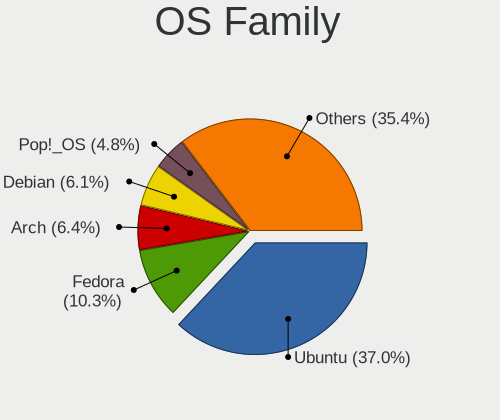

| Name         | Computers | Percent |
|--------------|-----------|---------|
| Ubuntu       | 91        | 42.33%  |
| Fedora       | 19        | 8.84%   |
| Debian       | 13        | 6.05%   |
| Pop!_OS      | 10        | 4.65%   |
| Linux Mint   | 10        | 4.65%   |
| Arch         | 10        | 4.65%   |
| Zorin        | 7         | 3.26%   |
| OpenMandriva | 7         | 3.26%   |
| Manjaro      | 6         | 2.79%   |
| SteamOS      | 5         | 2.33%   |
| Kali         | 4         | 1.86%   |
| Parrot       | 3         | 1.4%    |
| Kubuntu      | 3         | 1.4%    |
| KDE neon     | 3         | 1.4%    |
| ArcoLinux    | 3         | 1.4%    |
| Xubuntu      | 2         | 0.93%   |
| Lubuntu      | 2         | 0.93%   |
| Endless      | 2         | 0.93%   |
| BlackPanther | 2         | 0.93%   |
| Ubuntu Unity | 1         | 0.47%   |
| Ubuntu MATE  | 1         | 0.47%   |
| ROSA         | 1         | 0.47%   |
| Rocky Linux  | 1         | 0.47%   |
| Reborn OS    | 1         | 0.47%   |
| Nobara       | 1         | 0.47%   |
| Guix         | 1         | 0.47%   |
| GNOME OS     | 1         | 0.47%   |
| Feren OS     | 1         | 0.47%   |
| EndeavourOS  | 1         | 0.47%   |
| Elementary   | 1         | 0.47%   |
| CachyOS      | 1         | 0.47%   |
| Alpine       | 1         | 0.47%   |

Kernel
------

Version of the Linux kernel

| Version                     | Computers | Percent |
|-----------------------------|-----------|---------|
| 5.4.0-42-generic            | 7         | 2.99%   |
| 5.4.0-58-generic            | 4         | 1.71%   |
| 5.4.0-26-generic            | 4         | 1.71%   |
| 5.13.0-valve36-1-neptune    | 4         | 1.71%   |
| 5.4.0-37-generic            | 3         | 1.28%   |
| 5.11.0-40-generic           | 3         | 1.28%   |
| 4.15.0-50-generic           | 3         | 1.28%   |
| 6.5.0-kali3-amd64           | 2         | 0.85%   |
| 6.4.7-200.fc38.x86_64       | 2         | 0.85%   |
| 6.2.0-33-generic            | 2         | 0.85%   |
| 6.2.0-32-generic            | 2         | 0.85%   |
| 6.2.0-26-generic            | 2         | 0.85%   |
| 6.1.1-desktop-1omv2290      | 2         | 0.85%   |
| 6.1.0-13-amd64              | 2         | 0.85%   |
| 6.0.6-76060006-generic      | 2         | 0.85%   |
| 5.8.0-40-generic            | 2         | 0.85%   |
| 5.4.0-81-generic            | 2         | 0.85%   |
| 5.4.0-48-generic            | 2         | 0.85%   |
| 5.4.0-33-generic            | 2         | 0.85%   |
| 5.4.0-29-generic            | 2         | 0.85%   |
| 5.3.0-40-generic            | 2         | 0.85%   |
| 5.3.0-29-generic            | 2         | 0.85%   |
| 5.19.0-46-generic           | 2         | 0.85%   |
| 5.19.0-45-generic           | 2         | 0.85%   |
| 5.19.0-42-generic           | 2         | 0.85%   |
| 5.19.0-40-generic           | 2         | 0.85%   |
| 5.19.0-23-generic           | 2         | 0.85%   |
| 5.16.7-desktop-1omv4003     | 2         | 0.85%   |
| 5.15.0-57-generic           | 2         | 0.85%   |
| 5.0.0-23-generic            | 2         | 0.85%   |
| 6.6.8-200.fc39.x86_64       | 1         | 0.43%   |
| 6.6.7-203.fsync.fc39.x86_64 | 1         | 0.43%   |
| 6.6.10-zen1-1-zen           | 1         | 0.43%   |
| 6.6.1-zen1-1-zen            | 1         | 0.43%   |
| 6.6.1-arch1-1               | 1         | 0.43%   |
| 6.5.9-zen2-1-zen            | 1         | 0.43%   |
| 6.5.9-handcrafted           | 1         | 0.43%   |
| 6.5.6-76060506-generic      | 1         | 0.43%   |
| 6.5.5-200.fc38.x86_64       | 1         | 0.43%   |
| 6.5.0-3parrot1-amd64        | 1         | 0.43%   |

Kernel Family
-------------

Linux kernel without a distro release

| Version | Computers | Percent |
|---------|-----------|---------|
| 5.4.0   | 35        | 15.77%  |
| 5.19.0  | 16        | 7.21%   |
| 5.15.0  | 16        | 7.21%   |
| 4.15.0  | 14        | 6.31%   |
| 6.2.0   | 11        | 4.95%   |
| 5.8.0   | 9         | 4.05%   |
| 5.11.0  | 9         | 4.05%   |
| 5.13.0  | 8         | 3.6%    |
| 5.3.0   | 6         | 2.7%    |
| 5.10.0  | 6         | 2.7%    |
| 6.1.0   | 5         | 2.25%   |
| 6.5.0   | 4         | 1.8%    |
| 6.0.12  | 3         | 1.35%   |
| 5.0.0   | 3         | 1.35%   |
| 6.6.1   | 2         | 0.9%    |
| 6.5.9   | 2         | 0.9%    |
| 6.4.8   | 2         | 0.9%    |
| 6.4.7   | 2         | 0.9%    |
| 6.2.10  | 2         | 0.9%    |
| 6.1.1   | 2         | 0.9%    |
| 6.0.6   | 2         | 0.9%    |
| 5.7.14  | 2         | 0.9%    |
| 5.16.7  | 2         | 0.9%    |
| 5.14.0  | 2         | 0.9%    |
| 4.18.0  | 2         | 0.9%    |
| 6.6.8   | 1         | 0.45%   |
| 6.6.7   | 1         | 0.45%   |
| 6.6.10  | 1         | 0.45%   |
| 6.5.6   | 1         | 0.45%   |
| 6.5.5   | 1         | 0.45%   |
| 6.4.12  | 1         | 0.45%   |
| 6.4.0   | 1         | 0.45%   |
| 6.3.8   | 1         | 0.45%   |
| 6.3.1   | 1         | 0.45%   |
| 6.2.7   | 1         | 0.45%   |
| 6.2.6   | 1         | 0.45%   |
| 6.1.9   | 1         | 0.45%   |
| 6.1.8   | 1         | 0.45%   |
| 6.1.6   | 1         | 0.45%   |
| 6.1.24  | 1         | 0.45%   |

Kernel Major Ver.
-----------------

Linux kernel major version

| Version | Computers | Percent |
|---------|-----------|---------|
| 5.4     | 37        | 16.89%  |
| 5.15    | 21        | 9.59%   |
| 5.19    | 19        | 8.68%   |
| 6.2     | 15        | 6.85%   |
| 4.15    | 14        | 6.39%   |
| 6.1     | 13        | 5.94%   |
| 5.8     | 11        | 5.02%   |
| 5.13    | 9         | 4.11%   |
| 5.11    | 9         | 4.11%   |
| 6.5     | 8         | 3.65%   |
| 5.10    | 8         | 3.65%   |
| 6.4     | 6         | 2.74%   |
| 5.3     | 6         | 2.74%   |
| 6.6     | 5         | 2.28%   |
| 6.0     | 5         | 2.28%   |
| 5.16    | 5         | 2.28%   |
| 5.9     | 3         | 1.37%   |
| 5.7     | 3         | 1.37%   |
| 5.14    | 3         | 1.37%   |
| 5.0     | 3         | 1.37%   |
| 4.18    | 3         | 1.37%   |
| 6.3     | 2         | 0.91%   |
| 5.6     | 2         | 0.91%   |
| 5.18    | 2         | 0.91%   |
| 5.17    | 2         | 0.91%   |
| 4.19    | 2         | 0.91%   |
| 5.5     | 1         | 0.46%   |
| 5.12    | 1         | 0.46%   |
| 4.4     | 1         | 0.46%   |

Arch
----

OS architecture (x86_64, i586, etc.)

| Name    | Computers | Percent |
|---------|-----------|---------|
| x86_64  | 205       | 98.56%  |
| i686    | 2         | 0.96%   |
| aarch64 | 1         | 0.48%   |

DE
--

Desktop Environment

| Name       | Computers | Percent |
|------------|-----------|---------|
| GNOME      | 122       | 56.74%  |
| KDE5       | 34        | 15.81%  |
| Unknown    | 23        | 10.7%   |
| X-Cinnamon | 9         | 4.19%   |
| XFCE       | 8         | 3.72%   |
| MATE       | 6         | 2.79%   |
| KDE        | 4         | 1.86%   |
| LXQt       | 2         | 0.93%   |
| wlroots    | 1         | 0.47%   |
| Unity      | 1         | 0.47%   |
| Pantheon   | 1         | 0.47%   |
| DWM        | 1         | 0.47%   |
| Budgie     | 1         | 0.47%   |
| bspwm      | 1         | 0.47%   |
| awesome    | 1         | 0.47%   |

Display Server
--------------

X11 or Wayland

| Name    | Computers | Percent |
|---------|-----------|---------|
| X11     | 140       | 66.04%  |
| Wayland | 57        | 26.89%  |
| Unknown | 13        | 6.13%   |
| Tty     | 2         | 0.94%   |

Display Manager
---------------

SDDM, LightDM, etc.

| Name    | Computers | Percent |
|---------|-----------|---------|
| Unknown | 108       | 50.7%   |
| GDM3    | 34        | 15.96%  |
| GDM     | 28        | 13.15%  |
| SDDM    | 25        | 11.74%  |
| LightDM | 16        | 7.51%   |
| TDM     | 2         | 0.94%   |

OS Lang
-------

Language

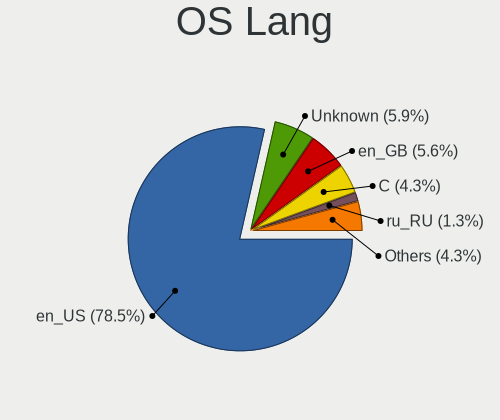

| Lang    | Computers | Percent |
|---------|-----------|---------|
| en_US   | 161       | 75.94%  |
| Unknown | 18        | 8.49%   |
| en_GB   | 11        | 5.19%   |
| C       | 9         | 4.25%   |
| ru_RU   | 3         | 1.42%   |
| en_AU   | 2         | 0.94%   |
| pl_PL   | 1         | 0.47%   |
| hu_HU   | 1         | 0.47%   |
| en_NG   | 1         | 0.47%   |
| en_IN   | 1         | 0.47%   |
| en_AG   | 1         | 0.47%   |
| el_GR   | 1         | 0.47%   |
| de_DE   | 1         | 0.47%   |
| ar_AE   | 1         | 0.47%   |

Boot Mode
---------

EFI or BIOS

| Mode | Computers | Percent |
|------|-----------|---------|
| EFI  | 125       | 58.14%  |
| BIOS | 90        | 41.86%  |

Filesystem
----------

Type of filesystem

| Type    | Computers | Percent |
|---------|-----------|---------|
| Ext4    | 151       | 72.25%  |
| Btrfs   | 31        | 14.83%  |
| Tmpfs   | 9         | 4.31%   |
| Overlay | 9         | 4.31%   |
| Xfs     | 6         | 2.87%   |
| Zfs     | 1         | 0.48%   |
| Ext2    | 1         | 0.48%   |
| Unknown | 1         | 0.48%   |

Part. scheme
------------

Scheme of partitioning

| Type    | Computers | Percent |
|---------|-----------|---------|
| Unknown | 106       | 50.24%  |
| GPT     | 92        | 43.6%   |
| MBR     | 13        | 6.16%   |

Dual Boot with Linux/BSD
------------------------

Hosting more than one Linux/BSD

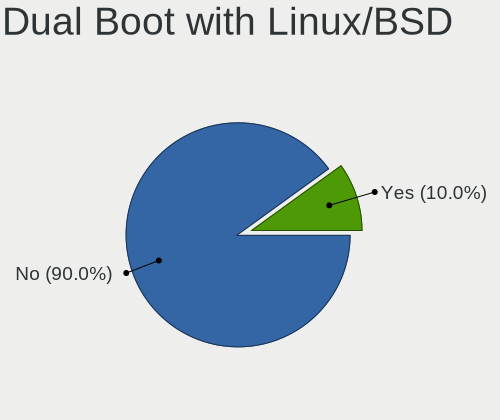

| Dual boot | Computers | Percent |
|-----------|-----------|---------|
| No        | 189       | 90.43%  |
| Yes       | 20        | 9.57%   |

Dual Boot (Win)
---------------

Hosting Linux and Windows

| Dual boot | Computers | Percent |
|-----------|-----------|---------|
| No        | 136       | 64.45%  |
| Yes       | 75        | 35.55%  |

Board
-----

Vendor
------

Motherboard manufacturer

| Name                        | Computers | Percent |
|-----------------------------|-----------|---------|
| Lenovo                      | 48        | 23.08%  |
| Hewlett-Packard             | 48        | 23.08%  |
| ASUSTek Computer            | 26        | 12.5%   |
| Dell                        | 23        | 11.06%  |
| Toshiba                     | 8         | 3.85%   |
| Gigabyte Technology         | 7         | 3.37%   |
| Acer                        | 6         | 2.88%   |
| Valve                       | 5         | 2.4%    |
| Intel                       | 5         | 2.4%    |
| Apple                       | 5         | 2.4%    |
| Notebook                    | 3         | 1.44%   |
| MSI                         | 3         | 1.44%   |
| Google                      | 3         | 1.44%   |
| Sony                        | 2         | 0.96%   |
| Microsoft                   | 2         | 0.96%   |
| I-Life Digital Technologies | 2         | 0.96%   |
| HUAWEI                      | 2         | 0.96%   |
| YJKC                        | 1         | 0.48%   |
| win element                 | 1         | 0.48%   |
| Razer                       | 1         | 0.48%   |
| Raspberry Pi Foundation     | 1         | 0.48%   |
| LG Electronics              | 1         | 0.48%   |
| ECS                         | 1         | 0.48%   |
| Biostar                     | 1         | 0.48%   |
| AZW                         | 1         | 0.48%   |
| ASRock                      | 1         | 0.48%   |
| A-DATA Technology           | 1         | 0.48%   |

Model
-----

Motherboard model

| Name                                                  | Computers | Percent |
|-------------------------------------------------------|-----------|---------|
| Valve Jupiter                                         | 5         | 2.4%    |
| HP All-in-One 22-c0xx                                 | 3         | 1.44%   |
| ASUS VivoBook_ASUSLaptop X1404VA_X1404VA              | 3         | 1.44%   |
| Lenovo IdeaPadFlex 5 14ALC05 82HU                     | 2         | 0.96%   |
| HP ProBook 450 G2                                     | 2         | 0.96%   |
| HP Pavilion Notebook                                  | 2         | 0.96%   |
| HP Pavilion 15                                        | 2         | 0.96%   |
| HP ENVY Laptop 13-aq0xxx                              | 2         | 0.96%   |
| Dell G5 5587                                          | 2         | 0.96%   |
| ASUS All Series                                       | 2         | 0.96%   |
| YJKC vBOOK Plus                                       | 1         | 0.48%   |
| win element MoreFine S500+                            | 1         | 0.48%   |
| Toshiba TECRA X40-D                                   | 1         | 0.48%   |
| Toshiba TECRA A50-C                                   | 1         | 0.48%   |
| Toshiba Satellite L850-B434                           | 1         | 0.48%   |
| Toshiba Satellite L750                                | 1         | 0.48%   |
| Toshiba Satellite C850-A966                           | 1         | 0.48%   |
| Toshiba Satellite C660                                | 1         | 0.48%   |
| Toshiba Satellite A300                                | 1         | 0.48%   |
| Toshiba PORTEGE Z10t-A                                | 1         | 0.48%   |
| Sony VGN-NS10J_S                                      | 1         | 0.48%   |
| Sony SVE14A25CAB                                      | 1         | 0.48%   |
| Razer Blade 15 Advanced Model (Early 2020) - RZ09-033 | 1         | 0.48%   |
| RPi Raspberry Pi 4 Model B Rev 1.1                    | 1         | 0.48%   |
| Notebook PD5x_7xPNP_PNN_PNT                           | 1         | 0.48%   |
| Notebook P95_96_97Ex,Rx                               | 1         | 0.48%   |
| Notebook NV4XMB,ME,MZ                                 | 1         | 0.48%   |
| MSI PS63 Modern 8RD                                   | 1         | 0.48%   |
| MSI MS-7850                                           | 1         | 0.48%   |
| MSI Modern 14 B5M                                     | 1         | 0.48%   |
| Microsoft Surface Pro 4                               | 1         | 0.48%   |
| Microsoft Surface Pro 3                               | 1         | 0.48%   |
| LG C500-G.AEF5BE1                                     | 1         | 0.48%   |
| Lenovo Z50-70 20354                                   | 1         | 0.48%   |
| Lenovo Yoga S730-13IWL 81J0                           | 1         | 0.48%   |
| Lenovo Yoga Creator 7 15IMH05 82DS                    | 1         | 0.48%   |
| Lenovo Yoga 7 15ITL5 82BJ                             | 1         | 0.48%   |
| Lenovo Yoga 2 Pro 20266                               | 1         | 0.48%   |
| Lenovo ThinkPad Yoga 370 20JJS0SA00                   | 1         | 0.48%   |
| Lenovo ThinkPad Yoga 260 20FD000GAD                   | 1         | 0.48%   |

Model Family
------------

Motherboard model prefix

| Name                 | Computers | Percent |
|----------------------|-----------|---------|
| Lenovo ThinkPad      | 24        | 11.54%  |
| HP Pavilion          | 11        | 5.29%   |
| Lenovo IdeaPad       | 9         | 4.33%   |
| ASUS ROG             | 8         | 3.85%   |
| HP Laptop            | 7         | 3.37%   |
| HP EliteBook         | 7         | 3.37%   |
| Dell Latitude        | 6         | 2.88%   |
| ASUS VivoBook        | 6         | 2.88%   |
| Valve Jupiter        | 5         | 2.4%    |
| Toshiba Satellite    | 5         | 2.4%    |
| Lenovo Yoga          | 4         | 1.92%   |
| HP ProBook           | 4         | 1.92%   |
| Dell XPS             | 4         | 1.92%   |
| ASUS PRIME           | 4         | 1.92%   |
| Acer Aspire          | 4         | 1.92%   |
| Lenovo IdeaPadFlex   | 3         | 1.44%   |
| HP ENVY              | 3         | 1.44%   |
| HP All-in-One        | 3         | 1.44%   |
| Dell Precision       | 3         | 1.44%   |
| Dell Inspiron        | 3         | 1.44%   |
| Toshiba TECRA        | 2         | 0.96%   |
| Microsoft Surface    | 2         | 0.96%   |
| Lenovo ThinkCentre   | 2         | 0.96%   |
| I-Life Digital ZED   | 2         | 0.96%   |
| Dell OptiPlex        | 2         | 0.96%   |
| Dell G5              | 2         | 0.96%   |
| ASUS All             | 2         | 0.96%   |
| YJKC vBOOK           | 1         | 0.48%   |
| win element MoreFine | 1         | 0.48%   |
| Toshiba PORTEGE      | 1         | 0.48%   |
| Sony VGN-NS10J       | 1         | 0.48%   |
| Sony SVE14A25CAB     | 1         | 0.48%   |
| Razer Blade          | 1         | 0.48%   |
| RPi Raspberry        | 1         | 0.48%   |
| Notebook PD5x        | 1         | 0.48%   |
| Notebook P95         | 1         | 0.48%   |
| Notebook NV4XMB      | 1         | 0.48%   |
| MSI PS63             | 1         | 0.48%   |
| MSI MS-7850          | 1         | 0.48%   |
| MSI Modern           | 1         | 0.48%   |

MFG Year
--------

Motherboard manufacture year

| Year    | Computers | Percent |
|---------|-----------|---------|
| 2021    | 26        | 12.5%   |
| 2020    | 24        | 11.54%  |
| 2018    | 20        | 9.62%   |
| 2019    | 19        | 9.13%   |
| 2013    | 17        | 8.17%   |
| 2022    | 15        | 7.21%   |
| 2017    | 13        | 6.25%   |
| 2016    | 12        | 5.77%   |
| 2014    | 11        | 5.29%   |
| 2012    | 11        | 5.29%   |
| 2010    | 9         | 4.33%   |
| 2015    | 7         | 3.37%   |
| 2011    | 7         | 3.37%   |
| 2008    | 6         | 2.88%   |
| 2023    | 4         | 1.92%   |
| 2007    | 3         | 1.44%   |
| 2009    | 2         | 0.96%   |
| 2005    | 1         | 0.48%   |
| Unknown | 1         | 0.48%   |

Form Factor
-----------

Physical design of the computer

| Name           | Computers | Percent |
|----------------|-----------|---------|
| Notebook       | 146       | 70.19%  |
| Desktop        | 38        | 18.27%  |
| Convertible    | 11        | 5.29%   |
| All in one     | 5         | 2.4%    |
| Mini pc        | 4         | 1.92%   |
| Tablet         | 2         | 0.96%   |
| System on chip | 1         | 0.48%   |
| Server         | 1         | 0.48%   |

Secure Boot
-----------

Enabled or disabled

| State    | Computers | Percent |
|----------|-----------|---------|
| Disabled | 184       | 88.04%  |
| Enabled  | 25        | 11.96%  |

Coreboot
--------

Have coreboot on board

| Used | Computers | Percent |
|------|-----------|---------|
| No   | 205       | 98.56%  |
| Yes  | 3         | 1.44%   |

RAM Size
--------

Total RAM memory

| Size in GB      | Computers | Percent |
|-----------------|-----------|---------|
| 4.01-8.0        | 48        | 23.08%  |
| 8.01-16.0       | 42        | 20.19%  |
| 16.01-24.0      | 40        | 19.23%  |
| 3.01-4.0        | 28        | 13.46%  |
| 32.01-64.0      | 23        | 11.06%  |
| 64.01-256.0     | 14        | 6.73%   |
| 24.01-32.0      | 4         | 1.92%   |
| 1.01-2.0        | 3         | 1.44%   |
| 0.51-1.0        | 3         | 1.44%   |
| 2.01-3.0        | 2         | 0.96%   |
| More than 256.0 | 1         | 0.48%   |

RAM Used
--------

Used RAM memory

| Used GB    | Computers | Percent |
|------------|-----------|---------|
| 1.01-2.0   | 59        | 26.46%  |
| 2.01-3.0   | 58        | 26.01%  |
| 4.01-8.0   | 51        | 22.87%  |
| 3.01-4.0   | 31        | 13.9%   |
| 8.01-16.0  | 11        | 4.93%   |
| 0.51-1.0   | 7         | 3.14%   |
| 0.01-0.5   | 3         | 1.35%   |
| 16.01-24.0 | 2         | 0.9%    |
| 24.01-32.0 | 1         | 0.45%   |

Total Drives
------------

Number of drives on board

| Drives | Computers | Percent |
|--------|-----------|---------|
| 1      | 146       | 69.52%  |
| 2      | 38        | 18.1%   |
| 3      | 12        | 5.71%   |
| 4      | 6         | 2.86%   |
| 9      | 2         | 0.95%   |
| 6      | 2         | 0.95%   |
| 0      | 2         | 0.95%   |
| 8      | 1         | 0.48%   |
| 5      | 1         | 0.48%   |

Has CD-ROM
----------

Has CD-ROM on board

| Presented | Computers | Percent |
|-----------|-----------|---------|
| No        | 154       | 74.04%  |
| Yes       | 54        | 25.96%  |

Has Ethernet
------------

Has Ethernet on board

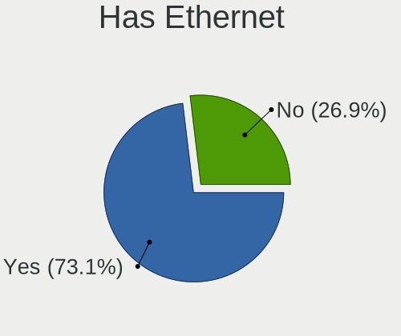

| Presented | Computers | Percent |
|-----------|-----------|---------|
| Yes       | 151       | 72.6%   |
| No        | 57        | 27.4%   |

Has WiFi
--------

Has WiFi module

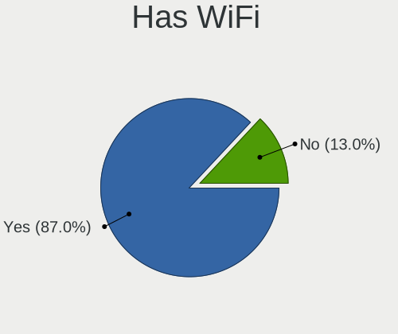

| Presented | Computers | Percent |
|-----------|-----------|---------|
| Yes       | 182       | 87.08%  |
| No        | 27        | 12.92%  |

Has Bluetooth
-------------

Has Bluetooth module

| Presented | Computers | Percent |
|-----------|-----------|---------|
| Yes       | 160       | 76.19%  |
| No        | 50        | 23.81%  |

Location
--------

Country
-------

Geographic location (country)

| Country | Computers | Percent |
|---------|-----------|---------|
| UAE     | 208       | 100%    |

City
----

Geographic location (city)

| City             | Computers | Percent |
|------------------|-----------|---------|
| Dubai            | 103       | 48.36%  |
| Abu Dhabi        | 57        | 26.76%  |
| Sharjah          | 26        | 12.21%  |
| Al Ain City      | 12        | 5.63%   |
| Ajman            | 7         | 3.29%   |
| Al Fujairah City | 4         | 1.88%   |
| Ras al-Khaimah   | 3         | 1.41%   |
| Al Halah         | 1         | 0.47%   |

Drives
------

Drive Vendor
------------

Hard drive vendors

| Vendor                      | Computers | Drives | Percent |
|-----------------------------|-----------|--------|---------|
| Samsung Electronics         | 49        | 71     | 17.25%  |
| WDC                         | 42        | 50     | 14.79%  |
| Seagate                     | 28        | 37     | 9.86%   |
| Toshiba                     | 23        | 28     | 8.1%    |
| Crucial                     | 15        | 17     | 5.28%   |
| Unknown                     | 14        | 22     | 4.93%   |
| Intel                       | 11        | 13     | 3.87%   |
| Micron Technology           | 10        | 10     | 3.52%   |
| HGST                        | 10        | 12     | 3.52%   |
| SanDisk                     | 9         | 11     | 3.17%   |
| SK hynix                    | 6         | 7      | 2.11%   |
| Kingston Technology Company | 6         | 6      | 2.11%   |
| Kingston                    | 6         | 6      | 2.11%   |
| Phison Electronics          | 5         | 5      | 1.76%   |
| Hitachi                     | 4         | 4      | 1.41%   |
| Apple                       | 4         | 5      | 1.41%   |
| Silicon Motion              | 3         | 3      | 1.06%   |
| Realtek Semiconductor       | 3         | 4      | 1.06%   |
| Micron/Crucial Technology   | 3         | 3      | 1.06%   |
| USB3.0                      | 2         | 2      | 0.7%    |
| Team                        | 2         | 2      | 0.7%    |
| Phison                      | 2         | 2      | 0.7%    |
| Lexar                       | 2         | 2      | 0.7%    |
| LaCie                       | 2         | 2      | 0.7%    |
| ADATA Technology            | 2         | 2      | 0.7%    |
| Transcend                   | 1         | 1      | 0.35%   |
| Super Talent                | 1         | 1      | 0.35%   |
| Pliant                      | 1         | 4      | 0.35%   |
| Patriot                     | 1         | 1      | 0.35%   |
| OCZ                         | 1         | 1      | 0.35%   |
| O2 Micro                    | 1         | 1      | 0.35%   |
| Maxtor                      | 1         | 1      | 0.35%   |
| Lite-On                     | 1         | 1      | 0.35%   |
| Lenovo                      | 1         | 1      | 0.35%   |
| KIOXIA                      | 1         | 5      | 0.35%   |
| KingSpec                    | 1         | 2      | 0.35%   |
| JMicron Technology          | 1         | 1      | 0.35%   |
| Gigabyte Technology         | 1         | 1      | 0.35%   |
| Fujitsu                     | 1         | 1      | 0.35%   |
| External                    | 1         | 1      | 0.35%   |

Drive Model
-----------

Hard drive models

| Model                                                 | Computers | Percent |
|-------------------------------------------------------|-----------|---------|
| HGST HTS721010A9E630 1TB                              | 5         | 1.66%   |
| Toshiba DT01ACA100 1TB                                | 4         | 1.32%   |
| Samsung PM963 2.5" NVMe PCIe SSD 256GB                | 4         | 1.32%   |
| Phison E12 NVMe Controller 1TB                        | 4         | 1.32%   |
| HGST HTS725050A7E630 500GB                            | 4         | 1.32%   |
| WDC WD10SPZX-08Z10 1TB                                | 3         | 0.99%   |
| WDC WD10JPCX-24UE4T0 1TB                              | 3         | 0.99%   |
| Unknown SD/MMC/MS PRO 256GB                           | 3         | 0.99%   |
| Toshiba MQ01ABD075 752GB                              | 3         | 0.99%   |
| Seagate ST500LT012-1DG142 500GB                       | 3         | 0.99%   |
| Samsung NVMe SSD Controller SM981/PM981/PM983 1TB     | 3         | 0.99%   |
| Micron 2400_MTFDKBA512QFM 512GB                       | 3         | 0.99%   |
| Intel NVMe SSD Drive 512GB                            | 3         | 0.99%   |
| Crucial CT500MX500SSD1 500GB                          | 3         | 0.99%   |
| WDC WDS240G2G0A-00JH30 240GB SSD                      | 2         | 0.66%   |
| WDC WD1002FAEX-00Z3A0 1TB                             | 2         | 0.66%   |
| WDC PC SN730 SDBQNTY-1T00-1001 1TB                    | 2         | 0.66%   |
| USB3.0 Super Speed 500GB SSD                          | 2         | 0.66%   |
| Unknown MMC Card  64GB                                | 2         | 0.66%   |
| Unknown MMC Card  32GB                                | 2         | 0.66%   |
| Unknown MMC Card  16GB                                | 2         | 0.66%   |
| Silicon Motion SM2263EN/SM2263XT SSD Controller 128GB | 2         | 0.66%   |
| Seagate ST500VT000-1DK142 500GB                       | 2         | 0.66%   |
| Seagate ST500LT012-9WS142 500GB                       | 2         | 0.66%   |
| Seagate ST500DM002-1BD142 500GB                       | 2         | 0.66%   |
| Seagate ST2000LM003 HN-M201RAD 2TB                    | 2         | 0.66%   |
| Seagate ST1000LM035-1RK172 1TB                        | 2         | 0.66%   |
| Sandisk WD Black SN750 / PC SN730 NVMe SSD 512GB      | 2         | 0.66%   |
| Samsung SSD 980 PRO 2TB                               | 2         | 0.66%   |
| Samsung SSD 970 EVO Plus 500GB                        | 2         | 0.66%   |
| Samsung SSD 970 EVO Plus 1TB                          | 2         | 0.66%   |
| Samsung SSD 860 EVO 500GB                             | 2         | 0.66%   |
| Samsung SSD 850 PRO 1TB                               | 2         | 0.66%   |
| Samsung SSD 850 EVO 250GB                             | 2         | 0.66%   |
| Samsung NVMe SSD Controller SM961/PM961/SM963 256GB   | 2         | 0.66%   |
| Samsung NVMe SSD Controller PM9A1/PM9A3/980PRO 2TB    | 2         | 0.66%   |
| Samsung MZVLQ512HALU-000H1 512GB                      | 2         | 0.66%   |
| Samsung MZALQ256HAJD-000L2 256GB                      | 2         | 0.66%   |
| Micron/Crucial P2 NVMe PCIe SSD 1TB                   | 2         | 0.66%   |
| LaCie Mobile SSD 500GB                                | 2         | 0.66%   |

HDD Vendor
----------

Hard disk drive vendors

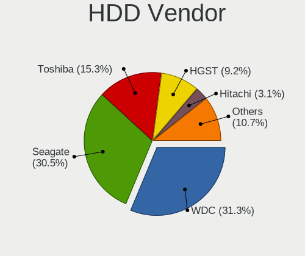

| Vendor             | Computers | Drives | Percent |
|--------------------|-----------|--------|---------|
| WDC                | 30        | 38     | 29.7%   |
| Seagate            | 28        | 37     | 27.72%  |
| Toshiba            | 19        | 24     | 18.81%  |
| HGST               | 10        | 12     | 9.9%    |
| Hitachi            | 4         | 4      | 3.96%   |
| Unknown            | 3         | 6      | 2.97%   |
| Apple              | 2         | 2      | 1.98%   |
| Maxtor             | 1         | 1      | 0.99%   |
| JMicron Technology | 1         | 1      | 0.99%   |
| Fujitsu            | 1         | 1      | 0.99%   |
| External           | 1         | 1      | 0.99%   |
| ASMT               | 1         | 2      | 0.99%   |

SSD Vendor
----------

Solid state drive vendors

| Vendor              | Computers | Drives | Percent |
|---------------------|-----------|--------|---------|
| Samsung Electronics | 17        | 28     | 26.98%  |
| Crucial             | 12        | 14     | 19.05%  |
| WDC                 | 7         | 7      | 11.11%  |
| SanDisk             | 3         | 4      | 4.76%   |
| Kingston            | 3         | 3      | 4.76%   |
| USB3.0              | 2         | 2      | 3.17%   |
| LaCie               | 2         | 2      | 3.17%   |
| Intel               | 2         | 2      | 3.17%   |
| Transcend           | 1         | 1      | 1.59%   |
| Toshiba             | 1         | 1      | 1.59%   |
| Team                | 1         | 1      | 1.59%   |
| Super Talent        | 1         | 1      | 1.59%   |
| SK hynix            | 1         | 1      | 1.59%   |
| Patriot             | 1         | 1      | 1.59%   |
| Micron Technology   | 1         | 1      | 1.59%   |
| Lexar               | 1         | 1      | 1.59%   |
| KingSpec            | 1         | 2      | 1.59%   |
| Gigabyte Technology | 1         | 1      | 1.59%   |
| Corsair             | 1         | 1      | 1.59%   |
| China               | 1         | 1      | 1.59%   |
| Carlstein           | 1         | 1      | 1.59%   |
| Apple               | 1         | 1      | 1.59%   |
| Unknown             | 1         | 1      | 1.59%   |

Drive Kind
----------

HDD or SSD

| Kind    | Computers | Drives | Percent |
|---------|-----------|--------|---------|
| NVMe    | 103       | 129    | 40.23%  |
| HDD     | 89        | 129    | 34.77%  |
| SSD     | 52        | 78     | 20.31%  |
| MMC     | 11        | 16     | 4.3%    |
| Unknown | 1         | 4      | 0.39%   |

Drive Connector
---------------

SATA, SAS, NVMe, etc.

| Type | Computers | Drives | Percent |
|------|-----------|--------|---------|
| SATA | 115       | 190    | 47.92%  |
| NVMe | 102       | 128    | 42.5%   |
| SAS  | 12        | 22     | 5%      |
| MMC  | 11        | 16     | 4.58%   |

Drive Size
----------

Size of hard drive

| Size in TB | Computers | Drives | Percent |
|------------|-----------|--------|---------|
| 0.01-0.5   | 76        | 100    | 51.7%   |
| 0.51-1.0   | 54        | 73     | 36.73%  |
| 1.01-2.0   | 9         | 17     | 6.12%   |
| 3.01-4.0   | 5         | 13     | 3.4%    |
| 10.01-20.0 | 2         | 3      | 1.36%   |
| 4.01-10.0  | 1         | 1      | 0.68%   |

Space Total
-----------

Amount of disk space available on the file system

| Size in GB     | Computers | Percent |
|----------------|-----------|---------|
| 251-500        | 64        | 30.05%  |
| 101-250        | 47        | 22.07%  |
| 501-1000       | 22        | 10.33%  |
| 1001-2000      | 18        | 8.45%   |
| 51-100         | 17        | 7.98%   |
| 21-50          | 15        | 7.04%   |
| 1-20           | 9         | 4.23%   |
| 2001-3000      | 8         | 3.76%   |
| Unknown        | 8         | 3.76%   |
| More than 3000 | 5         | 2.35%   |

Space Used
----------

Amount of used disk space

| Used GB        | Computers | Percent |
|----------------|-----------|---------|
| 1-20           | 86        | 38.39%  |
| 21-50          | 52        | 23.21%  |
| 101-250        | 26        | 11.61%  |
| 51-100         | 25        | 11.16%  |
| 251-500        | 12        | 5.36%   |
| 501-1000       | 9         | 4.02%   |
| Unknown        | 8         | 3.57%   |
| 1001-2000      | 4         | 1.79%   |
| More than 3000 | 1         | 0.45%   |
| 2001-3000      | 1         | 0.45%   |

Malfunc. Drives
---------------

Drive models with a malfunction

| Model                                                   | Computers | Drives | Percent |
|---------------------------------------------------------|-----------|--------|---------|
| WDC WD40PURZ-85TTDY0 4TB                                | 1         | 2      | 9.09%   |
| WDC WD40EFRX-68WT0N0 4TB                                | 1         | 2      | 9.09%   |
| WDC WD10JPVX-60JC3T1 1TB                                | 1         | 1      | 9.09%   |
| WDC WD10EARS-00MVWB0 1TB                                | 1         | 1      | 9.09%   |
| WDC WD Blue SA510 2.5 500GB                             | 1         | 1      | 9.09%   |
| Seagate ST500LT012-1DG142 500GB                         | 1         | 1      | 9.09%   |
| SanDisk SD9SN8W-128G-1006 128GB SSD                     | 1         | 2      | 9.09%   |
| Samsung Electronics MZVLQ256HBJD-00BH1 256GB            | 1         | 1      | 9.09%   |
| Realtek Semiconductor RTS5763DL NVMe SSD Controller 2TB | 1         | 1      | 9.09%   |
| Micron Technology 1100 SATA 512GB SSD                   | 1         | 1      | 9.09%   |
| Intel SSDSC2BB480G7 480GB                               | 1         | 1      | 9.09%   |

Malfunc. Drive Vendor
---------------------

Vendors of faulty drives

| Vendor                | Computers | Drives | Percent |
|-----------------------|-----------|--------|---------|
| WDC                   | 5         | 7      | 45.45%  |
| Seagate               | 1         | 1      | 9.09%   |
| SanDisk               | 1         | 2      | 9.09%   |
| Samsung Electronics   | 1         | 1      | 9.09%   |
| Realtek Semiconductor | 1         | 1      | 9.09%   |
| Micron Technology     | 1         | 1      | 9.09%   |
| Intel                 | 1         | 1      | 9.09%   |

Malfunc. HDD Vendor
-------------------

Vendors of faulty HDD drives

| Vendor  | Computers | Drives | Percent |
|---------|-----------|--------|---------|
| WDC     | 4         | 6      | 80%     |
| Seagate | 1         | 1      | 20%     |

Malfunc. Drive Kind
-------------------

Kinds of faulty drives

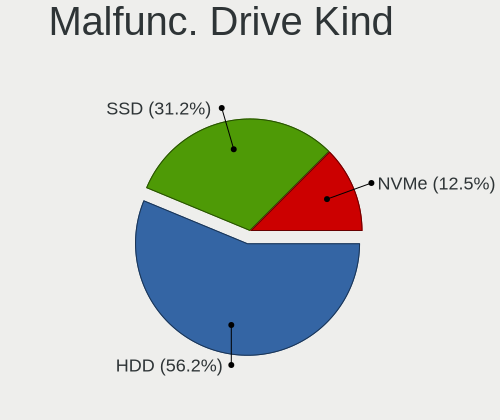

| Kind | Computers | Drives | Percent |
|------|-----------|--------|---------|
| HDD  | 4         | 7      | 44.44%  |
| SSD  | 3         | 5      | 33.33%  |
| NVMe | 2         | 2      | 22.22%  |

Failed Drives
-------------

Failed drive models

Zero info for selected period =(

Failed Drive Vendor
-------------------

Failed drive vendors

Zero info for selected period =(

Drive Status
------------

Number of failed and malfunc. drives

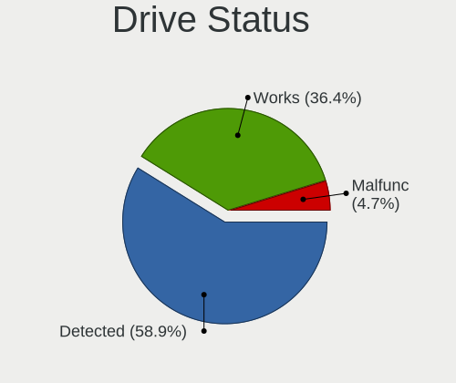

| Status   | Computers | Drives | Percent |
|----------|-----------|--------|---------|
| Detected | 131       | 215    | 59.82%  |
| Works    | 80        | 127    | 36.53%  |
| Malfunc  | 8         | 14     | 3.65%   |

Storage controller
------------------

Storage Vendor
--------------

Storage controller vendors

| Vendor                       | Computers | Percent |
|------------------------------|-----------|---------|
| Intel                        | 146       | 54.48%  |
| Samsung Electronics          | 35        | 13.06%  |
| SanDisk                      | 10        | 3.73%   |
| AMD                          | 10        | 3.73%   |
| Micron Technology            | 9         | 3.36%   |
| Kingston Technology Company  | 9         | 3.36%   |
| Phison Electronics           | 7         | 2.61%   |
| SK hynix                     | 5         | 1.87%   |
| Silicon Motion               | 5         | 1.87%   |
| Micron/Crucial Technology    | 5         | 1.87%   |
| Toshiba America Info Systems | 3         | 1.12%   |
| Realtek Semiconductor        | 3         | 1.12%   |
| LSI Logic / Symbios Logic    | 3         | 1.12%   |
| ASMedia Technology           | 3         | 1.12%   |
| Marvell Technology Group     | 2         | 0.75%   |
| Broadcom / LSI               | 2         | 0.75%   |
| ADATA Technology             | 2         | 0.75%   |
| VIA Technologies             | 1         | 0.37%   |
| OCZ Technology Group         | 1         | 0.37%   |
| O2 Micro                     | 1         | 0.37%   |
| Nvidia                       | 1         | 0.37%   |
| Lite-On Technology           | 1         | 0.37%   |
| Lenovo                       | 1         | 0.37%   |
| KIOXIA                       | 1         | 0.37%   |
| JMicron Technology           | 1         | 0.37%   |
| Apple                        | 1         | 0.37%   |

Storage Model
-------------

Storage controller models

| Model                                                                          | Computers | Percent |
|--------------------------------------------------------------------------------|-----------|---------|
| Intel 82801 Mobile SATA Controller [RAID mode]                                 | 17        | 5.82%   |
| Samsung NVMe SSD Controller 980 (DRAM-less)                                    | 12        | 4.11%   |
| Intel Sunrise Point-LP SATA Controller [AHCI mode]                             | 12        | 4.11%   |
| Samsung NVMe SSD Controller SM981/PM981/PM983                                  | 11        | 3.77%   |
| Intel Volume Management Device NVMe RAID Controller                            | 11        | 3.77%   |
| Intel 8 Series SATA Controller 1 [AHCI mode]                                   | 11        | 3.77%   |
| Intel 7 Series Chipset Family 6-port SATA Controller [AHCI mode]               | 11        | 3.77%   |
| Intel Cannon Lake Mobile PCH SATA AHCI Controller                              | 8         | 2.74%   |
| Intel 6 Series/C200 Series Chipset Family 6 port Mobile SATA AHCI Controller   | 7         | 2.4%    |
| AMD FCH SATA Controller [AHCI mode]                                            | 7         | 2.4%    |
| SanDisk Extreme Pro / WD Black SN750 / PC SN730 / Red SN700 NVMe SSD           | 6         | 2.05%   |
| Samsung NVMe SSD Controller PM9A1/PM9A3/980PRO                                 | 6         | 2.05%   |
| Phison E12 NVMe Controller                                                     | 6         | 2.05%   |
| Intel SSD 660P Series                                                          | 6         | 2.05%   |
| Intel 8 Series/C220 Series Chipset Family 6-port SATA Controller 1 [AHCI mode] | 6         | 2.05%   |
| Samsung NVMe SSD Controller SM961/PM961/SM963                                  | 5         | 1.71%   |
| Intel Wildcat Point-LP SATA Controller [AHCI Mode]                             | 5         | 1.71%   |
| Intel Comet Lake SATA AHCI Controller                                          | 4         | 1.37%   |
| Intel 200 Series PCH SATA controller [AHCI mode]                               | 4         | 1.37%   |
| SK hynix Gold P31/BC711/PC711 NVMe Solid State Drive                           | 3         | 1.03%   |
| Silicon Motion SM2263EN/SM2263XT (DRAM-less) NVMe SSD Controllers              | 3         | 1.03%   |
| Micron/Crucial P2 [Nick P2] / P3 / P3 Plus NVMe PCIe SSD (DRAM-less)           | 3         | 1.03%   |
| Micron 2400 NVMe SSD (DRAM-less)                                               | 3         | 1.03%   |
| Kingston Company NV2 NVMe SSD SM2267XT (DRAM-less)                             | 3         | 1.03%   |
| Intel Volume Management Device NVMe RAID Controller Intel Corporation          | 3         | 1.03%   |
| Intel Tiger Lake-LP SATA Controller                                            | 3         | 1.03%   |
| Intel Q170/Q150/B150/H170/H110/Z170/CM236 Chipset SATA Controller [AHCI Mode]  | 3         | 1.03%   |
| Intel HM170/QM170 Chipset SATA Controller [AHCI Mode]                          | 3         | 1.03%   |
| Intel Cannon Lake PCH SATA AHCI Controller                                     | 3         | 1.03%   |
| Intel 82801HM/HEM (ICH8M/ICH8M-E) IDE Controller                               | 3         | 1.03%   |
| ASMedia ASM1061/ASM1062 Serial ATA Controller                                  | 3         | 1.03%   |
| Toshiba America Info Systems BG3 x2 NVMe SSD Controller (DRAM-less)            | 2         | 0.68%   |
| SanDisk Extreme Pro / WD Black 2018/SN750/PC SN720 NVMe SSD                    | 2         | 0.68%   |
| Micron/Crucial P5 Plus NVMe PCIe SSD                                           | 2         | 0.68%   |
| Micron 3400 NVMe SSD [Hendrix]                                                 | 2         | 0.68%   |
| Micron 2210 NVMe SSD [Cobain]                                                  | 2         | 0.68%   |
| Kingston Company OM3PDP3 NVMe SSD                                              | 2         | 0.68%   |
| Kingston Company A2000 NVMe SSD SM2263EN                                       | 2         | 0.68%   |
| Intel SSD DC P4101/Pro 7600p/760p/E 6100p Series                               | 2         | 0.68%   |
| Intel SATA Controller [RAID mode]                                              | 2         | 0.68%   |

Storage Kind
------------

Kind of storage controller (IDE, SATA, NVMe, SAS, ...)

| Kind | Computers | Percent |
|------|-----------|---------|
| SATA | 117       | 43.82%  |
| NVMe | 102       | 38.2%   |
| RAID | 35        | 13.11%  |
| IDE  | 9         | 3.37%   |
| SAS  | 3         | 1.12%   |
| SCSI | 1         | 0.37%   |

Processor
---------

CPU Vendor
----------

Processor vendors

| Vendor | Computers | Percent |
|--------|-----------|---------|
| Intel  | 180       | 86.54%  |
| AMD    | 27        | 12.98%  |
| ARM    | 1         | 0.48%   |

CPU Model
---------

Processor models

| Model                                   | Computers | Percent |
|-----------------------------------------|-----------|---------|
| Intel Core i5-8265U CPU @ 1.60GHz       | 6         | 2.88%   |
| Intel 11th Gen Core i5-1135G7 @ 2.40GHz | 6         | 2.88%   |
| Intel Core i7-8565U CPU @ 1.80GHz       | 5         | 2.4%    |
| Intel Core i5-4200U CPU @ 1.60GHz       | 5         | 2.4%    |
| AMD Custom APU 0405                     | 5         | 2.4%    |
| Intel Core i7-8750H CPU @ 2.20GHz       | 4         | 1.92%   |
| Intel Core i7-8550U CPU @ 1.80GHz       | 4         | 1.92%   |
| Intel Core i5-6300U CPU @ 2.40GHz       | 4         | 1.92%   |
| Intel 12th Gen Core i7-12700H           | 4         | 1.92%   |
| AMD Ryzen 9 5900HX with Radeon Graphics | 4         | 1.92%   |
| Intel Xeon CPU E5620 @ 2.40GHz          | 3         | 1.44%   |
| Intel Core i7-7700HQ CPU @ 2.80GHz      | 3         | 1.44%   |
| Intel Core i7-7500U CPU @ 2.70GHz       | 3         | 1.44%   |
| Intel Core i7-6500U CPU @ 2.50GHz       | 3         | 1.44%   |
| Intel Core i7-5500U CPU @ 2.40GHz       | 3         | 1.44%   |
| Intel Core i5-9400T CPU @ 1.80GHz       | 3         | 1.44%   |
| Intel Core i5-10210U CPU @ 1.60GHz      | 3         | 1.44%   |
| Intel Core i3-10110U CPU @ 2.10GHz      | 3         | 1.44%   |
| Intel 13th Gen Core i7-1355U            | 3         | 1.44%   |
| Intel 11th Gen Core i7-1165G7 @ 2.80GHz | 3         | 1.44%   |
| AMD Ryzen 5 5500U with Radeon Graphics  | 3         | 1.44%   |
| Intel Core i9-10885H CPU @ 2.40GHz      | 2         | 0.96%   |
| Intel Core i7-3770K CPU @ 3.50GHz       | 2         | 0.96%   |
| Intel Core i7-3632QM CPU @ 2.20GHz      | 2         | 0.96%   |
| Intel Core i7-10750H CPU @ 2.60GHz      | 2         | 0.96%   |
| Intel Core i7-10700 CPU @ 2.90GHz       | 2         | 0.96%   |
| Intel Core i5-7400 CPU @ 3.00GHz        | 2         | 0.96%   |
| Intel Core i5-7200U CPU @ 2.50GHz       | 2         | 0.96%   |
| Intel Core i5-4300U CPU @ 1.90GHz       | 2         | 0.96%   |
| Intel Core i5-4210U CPU @ 1.70GHz       | 2         | 0.96%   |
| Intel Core i5-3317U CPU @ 1.70GHz       | 2         | 0.96%   |
| Intel Core i5-2450M CPU @ 2.50GHz       | 2         | 0.96%   |
| Intel Core i5-2410M CPU @ 2.30GHz       | 2         | 0.96%   |
| Intel Core i3-4005U CPU @ 1.70GHz       | 2         | 0.96%   |
| AMD Ryzen 7 4700U with Radeon Graphics  | 2         | 0.96%   |
| Intel Xeon Silver 4214 CPU @ 2.20GHz    | 1         | 0.48%   |
| Intel Xeon E-2286M CPU @ 2.40GHz        | 1         | 0.48%   |
| Intel Xeon CPU E5-2697 v2 @ 2.70GHz     | 1         | 0.48%   |
| Intel Xeon CPU E5-2609 v2 @ 2.50GHz     | 1         | 0.48%   |
| Intel Xeon CPU E3-1265L v3 @ 2.50GHz    | 1         | 0.48%   |

CPU Model Family
----------------

Processor model prefix

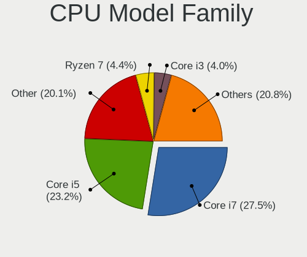

| Model                   | Computers | Percent |
|-------------------------|-----------|---------|
| Intel Core i7           | 58        | 27.88%  |
| Intel Core i5           | 57        | 27.4%   |
| Other                   | 31        | 14.9%   |
| Intel Core i3           | 10        | 4.81%   |
| AMD Ryzen 5             | 9         | 4.33%   |
| Intel Xeon              | 7         | 3.37%   |
| Intel Celeron           | 6         | 2.88%   |
| Intel Core i9           | 5         | 2.4%    |
| AMD Ryzen 9             | 5         | 2.4%    |
| Intel Core 2 Duo        | 4         | 1.92%   |
| AMD Ryzen 7             | 4         | 1.92%   |
| Intel Atom              | 2         | 0.96%   |
| Intel Xeon Silver       | 1         | 0.48%   |
| Intel Pentium Dual-Core | 1         | 0.48%   |
| Intel Pentium 4         | 1         | 0.48%   |
| Intel Core m5           | 1         | 0.48%   |
| Intel Core 2 Quad       | 1         | 0.48%   |
| Intel Celeron M         | 1         | 0.48%   |
| AMD Sempron             | 1         | 0.48%   |
| AMD Ryzen Threadripper  | 1         | 0.48%   |
| AMD Ryzen 7 PRO         | 1         | 0.48%   |
| AMD A6                  | 1         | 0.48%   |

CPU Cores
---------

Number of processor cores

| Number  | Computers | Percent |
|---------|-----------|---------|
| 4       | 72        | 34.62%  |
| 2       | 72        | 34.62%  |
| 6       | 22        | 10.58%  |
| 8       | 21        | 10.1%   |
| 14      | 5         | 2.4%    |
| 10      | 4         | 1.92%   |
| 1       | 4         | 1.92%   |
| 16      | 3         | 1.44%   |
| 12      | 3         | 1.44%   |
| 24      | 1         | 0.48%   |
| Unknown | 1         | 0.48%   |

CPU Sockets
-----------

Number of sockets

| Number  | Computers | Percent |
|---------|-----------|---------|
| 1       | 204       | 98.08%  |
| 2       | 3         | 1.44%   |
| Unknown | 1         | 0.48%   |

CPU Threads
-----------

Threads per core (Hyper-Threading)

| Number  | Computers | Percent |
|---------|-----------|---------|
| 2       | 172       | 82.69%  |
| 1       | 35        | 16.83%  |
| Unknown | 1         | 0.48%   |

CPU Op-Modes
------------

CPU Operation Modes (32-bit, 64-bit)

| Op mode        | Computers | Percent |
|----------------|-----------|---------|
| 32-bit, 64-bit | 205       | 98.56%  |
| 32-bit         | 2         | 0.96%   |
| Unknown        | 1         | 0.48%   |

CPU Microcode
-------------

Microcode number

| Number     | Computers | Percent |
|------------|-----------|---------|
| Unknown    | 76        | 35.35%  |
| 0x306a9    | 10        | 4.65%   |
| 0x406e3    | 9         | 4.19%   |
| 0x906ea    | 8         | 3.72%   |
| 0x806ec    | 8         | 3.72%   |
| 0x806c1    | 8         | 3.72%   |
| 0x40651    | 8         | 3.72%   |
| 0x206a7    | 7         | 3.26%   |
| 0x306c3    | 6         | 2.79%   |
| 0x906e9    | 5         | 2.33%   |
| 0x806ea    | 5         | 2.33%   |
| 0x806e9    | 5         | 2.33%   |
| 0x906a3    | 4         | 1.86%   |
| 0xa0652    | 3         | 1.4%    |
| 0x906ed    | 3         | 1.4%    |
| 0x206c2    | 3         | 1.4%    |
| 0x20655    | 3         | 1.4%    |
| 0x0a50000c | 3         | 1.4%    |
| 0xa0655    | 2         | 0.93%   |
| 0x806eb    | 2         | 0.93%   |
| 0x6fd      | 2         | 0.93%   |
| 0x506e3    | 2         | 0.93%   |
| 0x306f2    | 2         | 0.93%   |
| 0x306d4    | 2         | 0.93%   |
| 0x08608103 | 2         | 0.93%   |
| 0x08108109 | 2         | 0.93%   |
| 0xf29      | 1         | 0.47%   |
| 0xb06a3    | 1         | 0.47%   |
| 0xb0671    | 1         | 0.47%   |
| 0x806d1    | 1         | 0.47%   |
| 0x706a1    | 1         | 0.47%   |
| 0x6fb      | 1         | 0.47%   |
| 0x6e8      | 1         | 0.47%   |
| 0x506c9    | 1         | 0.47%   |
| 0x406c4    | 1         | 0.47%   |
| 0x406c3    | 1         | 0.47%   |
| 0x306e4    | 1         | 0.47%   |
| 0x20652    | 1         | 0.47%   |
| 0x106e5    | 1         | 0.47%   |
| 0x1067a    | 1         | 0.47%   |

CPU Microarch
-------------

Microarchitecture

| Name             | Computers | Percent |
|------------------|-----------|---------|
| KabyLake         | 51        | 24.52%  |
| Haswell          | 24        | 11.54%  |
| Unknown          | 16        | 7.69%   |
| Skylake          | 15        | 7.21%   |
| IvyBridge        | 15        | 7.21%   |
| TigerLake        | 13        | 6.25%   |
| SandyBridge      | 11        | 5.29%   |
| CometLake        | 9         | 4.33%   |
| Westmere         | 8         | 3.85%   |
| Alderlake Hybrid | 7         | 3.37%   |
| Zen 3            | 6         | 2.88%   |
| Broadwell        | 5         | 2.4%    |
| Zen 2            | 4         | 1.92%   |
| Zen+             | 3         | 1.44%   |
| Silvermont       | 3         | 1.44%   |
| Penryn           | 3         | 1.44%   |
| IceLake          | 3         | 1.44%   |
| Core             | 3         | 1.44%   |
| Goldmont plus    | 2         | 0.96%   |
| Zen              | 1         | 0.48%   |
| Piledriver       | 1         | 0.48%   |
| P6               | 1         | 0.48%   |
| NetBurst         | 1         | 0.48%   |
| Nehalem          | 1         | 0.48%   |
| K8 Hammer        | 1         | 0.48%   |
| Goldmont         | 1         | 0.48%   |

Graphics
--------

GPU Vendor
----------

Vendors of graphics cards

| Vendor                     | Computers | Percent |
|----------------------------|-----------|---------|
| Intel                      | 149       | 53.6%   |
| Nvidia                     | 82        | 29.5%   |
| AMD                        | 45        | 16.19%  |
| Matrox Electronics Systems | 1         | 0.36%   |
| ASPEED Technology          | 1         | 0.36%   |

GPU Model
---------

Graphics card models

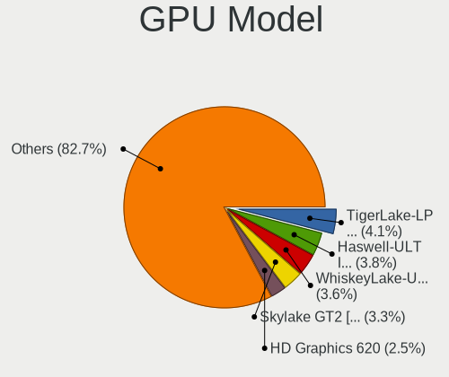

| Model                                                                                    | Computers | Percent |
|------------------------------------------------------------------------------------------|-----------|---------|
| Intel Haswell-ULT Integrated Graphics Controller                                         | 14        | 5.02%   |
| Intel WhiskeyLake-U GT2 [UHD Graphics 620]                                               | 12        | 4.3%    |
| Intel TigerLake-LP GT2 [Iris Xe Graphics]                                                | 11        | 3.94%   |
| Intel Skylake GT2 [HD Graphics 520]                                                      | 9         | 3.23%   |
| Intel 3rd Gen Core processor Graphics Controller                                         | 9         | 3.23%   |
| Intel 2nd Generation Core Processor Family Integrated Graphics Controller                | 9         | 3.23%   |
| Intel CoffeeLake-H GT2 [UHD Graphics 630]                                                | 7         | 2.51%   |
| Intel UHD Graphics 620                                                                   | 6         | 2.15%   |
| Intel HD Graphics 620                                                                    | 6         | 2.15%   |
| Intel CometLake-U GT2 [UHD Graphics]                                                     | 6         | 2.15%   |
| Intel Alder Lake-P GT2 [Iris Xe Graphics]                                                | 6         | 2.15%   |
| AMD Cezanne [Radeon Vega Series / Radeon Vega Mobile Series]                             | 6         | 2.15%   |
| Intel HD Graphics 5500                                                                   | 5         | 1.79%   |
| Intel CometLake-H GT2 [UHD Graphics]                                                     | 5         | 1.79%   |
| AMD VanGogh [AMD Custom GPU 0405]                                                        | 5         | 1.79%   |
| Nvidia GM108M [GeForce MX130]                                                            | 4         | 1.43%   |
| Nvidia GM108M [GeForce MX110]                                                            | 4         | 1.43%   |
| Intel HD Graphics 630                                                                    | 4         | 1.43%   |
| Intel Core Processor Integrated Graphics Controller                                      | 4         | 1.43%   |
| AMD Lucienne                                                                             | 4         | 1.43%   |
| Nvidia GP107M [GeForce GTX 1050 Mobile]                                                  | 3         | 1.08%   |
| Nvidia GP106M [GeForce GTX 1060 Mobile]                                                  | 3         | 1.08%   |
| Nvidia GA106M [GeForce RTX 3060 Mobile / Max-Q]                                          | 3         | 1.08%   |
| Intel Xeon E3-1200 v3/4th Gen Core Processor Integrated Graphics Controller              | 3         | 1.08%   |
| Intel Raptor Lake-P [Iris Xe Graphics]                                                   | 3         | 1.08%   |
| Intel HD Graphics 530                                                                    | 3         | 1.08%   |
| Intel CoffeeLake-S GT2 [UHD Graphics 630]                                                | 3         | 1.08%   |
| Intel Atom/Celeron/Pentium Processor x5-E8000/J3xxx/N3xxx Integrated Graphics Controller | 3         | 1.08%   |
| AMD Topaz XT [Radeon R7 M260/M265 / M340/M360 / M440/M445 / 530/535 / 620/625 Mobile]    | 3         | 1.08%   |
| AMD Sun XT [Radeon HD 8670A/8670M/8690M / R5 M330 / M430 / Radeon 520 Mobile]            | 3         | 1.08%   |
| AMD Renoir [Radeon RX Vega 6 (Ryzen 4000/5000 Mobile Series)]                            | 3         | 1.08%   |
| AMD Ellesmere [Radeon RX 470/480/570/570X/580/580X/590]                                  | 3         | 1.08%   |
| Nvidia TU117M [GeForce GTX 1650 Ti Mobile]                                               | 2         | 0.72%   |
| Nvidia TU117M [GeForce GTX 1650 Mobile / Max-Q]                                          | 2         | 0.72%   |
| Nvidia GP108BM [GeForce MX250]                                                           | 2         | 0.72%   |
| Nvidia GP107M [GeForce GTX 1050 Ti Mobile]                                               | 2         | 0.72%   |
| Nvidia GP107 [GeForce GTX 1050 Ti]                                                       | 2         | 0.72%   |
| Nvidia GM108M [GeForce 920MX]                                                            | 2         | 0.72%   |
| Nvidia GM108M [GeForce 840M]                                                             | 2         | 0.72%   |
| Nvidia GF108M [GeForce GT 620M/630M/635M/640M LE]                                        | 2         | 0.72%   |

GPU Combo
---------

Combinations of graphics cards

| Name               | Computers | Percent |
|--------------------|-----------|---------|
| 1 x Intel          | 83        | 39.9%   |
| Intel + Nvidia     | 51        | 24.52%  |
| 1 x AMD            | 27        | 12.98%  |
| 1 x Nvidia         | 25        | 12.02%  |
| Intel + AMD        | 13        | 6.25%   |
| AMD + Nvidia       | 5         | 2.4%    |
| Other              | 1         | 0.48%   |
| 1 x Matrox         | 1         | 0.48%   |
| Intel + 2 x Nvidia | 1         | 0.48%   |
| 1 x ASPEED         | 1         | 0.48%   |

GPU Driver
----------

Free vs proprietary

| Driver      | Computers | Percent |
|-------------|-----------|---------|
| Free        | 161       | 77.03%  |
| Proprietary | 39        | 18.66%  |
| Unknown     | 9         | 4.31%   |

GPU Memory
----------

Total video memory

| Size in GB | Computers | Percent |
|------------|-----------|---------|
| Unknown    | 133       | 63.33%  |
| 1.01-2.0   | 27        | 12.86%  |
| 3.01-4.0   | 14        | 6.67%   |
| 0.01-0.5   | 14        | 6.67%   |
| 7.01-8.0   | 6         | 2.86%   |
| 0.51-1.0   | 6         | 2.86%   |
| 5.01-6.0   | 4         | 1.9%    |
| 2.01-3.0   | 2         | 0.95%   |
| 8.01-16.0  | 2         | 0.95%   |
| 4.01-5.0   | 1         | 0.48%   |
| 16.01-24.0 | 1         | 0.48%   |

Monitor
-------

Monitor Vendor
--------------

Monitor vendors

| Vendor                  | Computers | Percent |
|-------------------------|-----------|---------|
| AU Optronics            | 32        | 14.35%  |
| BOE                     | 31        | 13.9%   |
| Chimei Innolux          | 26        | 11.66%  |
| LG Display              | 24        | 10.76%  |
| Samsung Electronics     | 23        | 10.31%  |
| Hewlett-Packard         | 10        | 4.48%   |
| Goldstar                | 10        | 4.48%   |
| Dell                    | 8         | 3.59%   |
| BenQ                    | 6         | 2.69%   |
| Apple                   | 5         | 2.24%   |
| Valve                   | 4         | 1.79%   |
| Lenovo                  | 4         | 1.79%   |
| CSO                     | 4         | 1.79%   |
| Ancor Communications    | 4         | 1.79%   |
| Sharp                   | 3         | 1.35%   |
| Philips                 | 3         | 1.35%   |
| InfoVision              | 3         | 1.35%   |
| ASUSTek Computer        | 3         | 1.35%   |
| ViewSonic               | 2         | 0.9%    |
| LGD                     | 2         | 0.9%    |
| LG Philips              | 2         | 0.9%    |
| Chi Mei Optoelectronics | 2         | 0.9%    |
| Sony                    | 1         | 0.45%   |
| Seiko/Epson             | 1         | 0.45%   |
| RTK                     | 1         | 0.45%   |
| Panasonic               | 1         | 0.45%   |
| Mi                      | 1         | 0.45%   |
| LG Electronics          | 1         | 0.45%   |
| Hitachi                 | 1         | 0.45%   |
| Gigabyte Technology     | 1         | 0.45%   |
| CTX                     | 1         | 0.45%   |
| CMN                     | 1         | 0.45%   |
| AOC                     | 1         | 0.45%   |
| Analogix                | 1         | 0.45%   |

Monitor Model
-------------

Monitor models

| Model                                                                 | Computers | Percent |
|-----------------------------------------------------------------------|-----------|---------|
| Chimei Innolux LCD Monitor CMN14D4 1920x1080 309x173mm 13.9-inch      | 5         | 2.21%   |
| Valve ANX7530 U VLV3001 800x1280 100x150mm 7.1-inch                   | 4         | 1.77%   |
| Samsung Electronics C24F390 SAM0D2C 1920x1080 521x293mm 23.5-inch     | 3         | 1.33%   |
| Hewlett-Packard ALL-in-One HPN401F 1920x1080 476x268mm 21.5-inch      | 3         | 1.33%   |
| ASUSTek Computer PG32UQ AUS32E1 3840x2160 708x399mm 32.0-inch         | 3         | 1.33%   |
| LGD LCD Monitor 1366x768                                              | 2         | 0.88%   |
| LG Display LCD Monitor LGD0575 1920x1080 309x174mm 14.0-inch          | 2         | 0.88%   |
| LG Display LCD Monitor LGD02DC 1366x768 344x194mm 15.5-inch           | 2         | 0.88%   |
| CSO LCD Monitor CSO1603 2560x1600 344x215mm 16.0-inch                 | 2         | 0.88%   |
| Chimei Innolux LCD Monitor CMN15E8 1920x1080 344x193mm 15.5-inch      | 2         | 0.88%   |
| BOE LCD Monitor BOE06B3 1366x768 309x173mm 13.9-inch                  | 2         | 0.88%   |
| BOE LCD Monitor BOE0687 1920x1080 344x193mm 15.5-inch                 | 2         | 0.88%   |
| BOE LCD Monitor BOE0672 1366x768 344x194mm 15.5-inch                  | 2         | 0.88%   |
| AU Optronics LCD Monitor AUO272B 3840x2160 293x165mm 13.2-inch        | 2         | 0.88%   |
| AU Optronics LCD Monitor AUO243D 1920x1080 309x173mm 13.9-inch        | 2         | 0.88%   |
| AU Optronics LCD Monitor AUO203D 1920x1080 309x174mm 14.0-inch        | 2         | 0.88%   |
| Apple Color LCD APP9CF2 1366x768 256x144mm 11.6-inch                  | 2         | 0.88%   |
| ViewSonic VG2439 Series VSCD22B 1920x1080 521x293mm 23.5-inch         | 1         | 0.44%   |
| ViewSonic VA1918wm VSCC821 1440x900 410x256mm 19.0-inch               | 1         | 0.44%   |
| Sony AVSYSTEM SNY050A 1280x720 708x398mm 32.0-inch                    | 1         | 0.44%   |
| Sharp LCD Monitor SHP14BA 1920x1080 344x194mm 15.5-inch               | 1         | 0.44%   |
| Sharp LCD Monitor SHP14B9 3840x2160 344x194mm 15.5-inch               | 1         | 0.44%   |
| Sharp LCD Monitor SHP1484 1920x1080 294x165mm 13.3-inch               | 1         | 0.44%   |
| Seiko/Epson LCD Monitor 1280x800                                      | 1         | 0.44%   |
| Samsung Electronics U28E590 SAM0C4D 3840x2160 607x345mm 27.5-inch     | 1         | 0.44%   |
| Samsung Electronics SMB1930N SAM0632 1366x768 410x230mm 18.5-inch     | 1         | 0.44%   |
| Samsung Electronics S22F350 SAM0D1A 1920x1080 477x268mm 21.5-inch     | 1         | 0.44%   |
| Samsung Electronics LCD Monitor SEC5741 1280x800 261x163mm 12.1-inch  | 1         | 0.44%   |
| Samsung Electronics LCD Monitor SEC5441 1366x768 344x194mm 15.5-inch  | 1         | 0.44%   |
| Samsung Electronics LCD Monitor SEC4251 1366x768 344x194mm 15.5-inch  | 1         | 0.44%   |
| Samsung Electronics LCD Monitor SEC4149 1366x768 292x174mm 13.4-inch  | 1         | 0.44%   |
| Samsung Electronics LCD Monitor SEC3542 2160x1440 254x169mm 12.0-inch | 1         | 0.44%   |
| Samsung Electronics LCD Monitor SEC3150 1366x768 344x193mm 15.5-inch  | 1         | 0.44%   |
| Samsung Electronics LCD Monitor SDCA029 3840x2160 344x194mm 15.5-inch | 1         | 0.44%   |
| Samsung Electronics LCD Monitor SDC4341 1366x768 344x194mm 15.5-inch  | 1         | 0.44%   |
| Samsung Electronics LCD Monitor SDC424A 3200x1800 293x165mm 13.2-inch | 1         | 0.44%   |
| Samsung Electronics LCD Monitor SDC416D 2880x1800 312x195mm 14.5-inch | 1         | 0.44%   |
| Samsung Electronics LCD Monitor SDC4157 3840x2160 344x194mm 15.5-inch | 1         | 0.44%   |
| Samsung Electronics LCD Monitor SDC3853 2736x1824 260x173mm 12.3-inch | 1         | 0.44%   |
| Samsung Electronics LCD Monitor SAM0FEF 3840x2160 950x540mm 43.0-inch | 1         | 0.44%   |

Monitor Resolution
------------------

Monitor screen resolution

| Resolution        | Computers | Percent |
|-------------------|-----------|---------|
| 1920x1080 (FHD)   | 102       | 47.44%  |
| 1366x768 (WXGA)   | 50        | 23.26%  |
| 3840x2160 (4K)    | 20        | 9.3%    |
| 2560x1440 (QHD)   | 7         | 3.26%   |
| 800x1280          | 5         | 2.33%   |
| 1920x1200 (WUXGA) | 5         | 2.33%   |
| 1600x900 (HD+)    | 4         | 1.86%   |
| 1280x800 (WXGA)   | 4         | 1.86%   |
| 2560x1600         | 3         | 1.4%    |
| 2560x1080         | 3         | 1.4%    |
| 2880x1800         | 2         | 0.93%   |
| 2160x1440         | 2         | 0.93%   |
| 1440x900 (WXGA+)  | 2         | 0.93%   |
| 3440x1440         | 1         | 0.47%   |
| 3200x1800 (QHD+)  | 1         | 0.47%   |
| 2880x1920         | 1         | 0.47%   |
| 2736x1824         | 1         | 0.47%   |
| 2304x1440         | 1         | 0.47%   |
| 1920x515          | 1         | 0.47%   |

Monitor Diagonal
----------------

Diagonal size in inches

| Inches  | Computers | Percent |
|---------|-----------|---------|
| 15      | 58        | 26.01%  |
| 14      | 31        | 13.9%   |
| 13      | 31        | 13.9%   |
| 21      | 12        | 5.38%   |
| 24      | 10        | 4.48%   |
| 23      | 10        | 4.48%   |
| 27      | 9         | 4.04%   |
| 12      | 8         | 3.59%   |
| 11      | 7         | 3.14%   |
| Unknown | 7         | 3.14%   |
| 31      | 5         | 2.24%   |
| 16      | 5         | 2.24%   |
| 7       | 4         | 1.79%   |
| 84      | 3         | 1.35%   |
| 32      | 3         | 1.35%   |
| 19      | 3         | 1.35%   |
| 17      | 3         | 1.35%   |
| 34      | 2         | 0.9%    |
| 18      | 2         | 0.9%    |
| 65      | 1         | 0.45%   |
| 54      | 1         | 0.45%   |
| 52      | 1         | 0.45%   |
| 46      | 1         | 0.45%   |
| 42      | 1         | 0.45%   |
| 41      | 1         | 0.45%   |
| 40      | 1         | 0.45%   |
| 28      | 1         | 0.45%   |
| 20      | 1         | 0.45%   |
| 3       | 1         | 0.45%   |

Monitor Width
-------------

Physical width

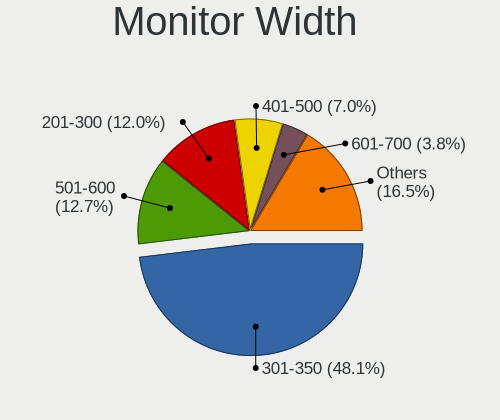

| Width in mm | Computers | Percent |
|-------------|-----------|---------|
| 301-350     | 108       | 48.87%  |
| 201-300     | 30        | 13.57%  |
| 501-600     | 28        | 12.67%  |
| 401-500     | 17        | 7.69%   |
| 601-700     | 7         | 3.17%   |
| Unknown     | 7         | 3.17%   |
| 701-800     | 5         | 2.26%   |
| 351-400     | 5         | 2.26%   |
| 1-100       | 5         | 2.26%   |
| 1501-2000   | 3         | 1.36%   |
| 1001-1500   | 3         | 1.36%   |
| 901-1000    | 2         | 0.9%    |
| 801-900     | 1         | 0.45%   |

Aspect Ratio
------------

Proportional relationship between the width and the height

| Ratio   | Computers | Percent |
|---------|-----------|---------|
| 16/9    | 167       | 83.08%  |
| 16/10   | 17        | 8.46%   |
| Unknown | 6         | 2.99%   |
| 0.67    | 4         | 1.99%   |
| 21/9    | 3         | 1.49%   |
| 3/2     | 2         | 1%      |
| 6/5     | 1         | 0.5%    |
| 3.73    | 1         | 0.5%    |

Monitor Area
------------

Area in inch

| Area in inch | Computers | Percent |
|----------------|-----------|---------|
| 101-110        | 58        | 26.01%  |
| 81-90          | 47        | 21.08%  |
| 201-250        | 22        | 9.87%   |
| 71-80          | 14        | 6.28%   |
| 351-500        | 10        | 4.48%   |
| 151-200        | 10        | 4.48%   |
| 301-350        | 9         | 4.04%   |
| 61-70          | 8         | 3.59%   |
| 51-60          | 7         | 3.14%   |
| Unknown        | 7         | 3.14%   |
| More than 1000 | 6         | 2.69%   |
| 1-40           | 5         | 2.24%   |
| 251-300        | 5         | 2.24%   |
| 111-120        | 5         | 2.24%   |
| 501-1000       | 4         | 1.79%   |
| 121-130        | 3         | 1.35%   |
| 141-150        | 2         | 0.9%    |
| 91-100         | 1         | 0.45%   |

Pixel Density
-------------

Pixels per inch

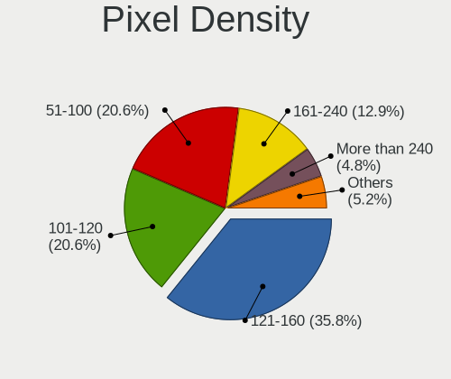

| Density       | Computers | Percent |
|---------------|-----------|---------|
| 121-160       | 80        | 36.7%   |
| 101-120       | 49        | 22.48%  |
| 51-100        | 43        | 19.72%  |
| 161-240       | 26        | 11.93%  |
| More than 240 | 10        | 4.59%   |
| Unknown       | 7         | 3.21%   |
| 1-50          | 3         | 1.38%   |

Multiple Monitors
-----------------

Total monitors connected

| Total | Computers | Percent |
|-------|-----------|---------|
| 1     | 164       | 77.36%  |
| 2     | 31        | 14.62%  |
| 0     | 13        | 6.13%   |
| 3     | 4         | 1.89%   |

Network
-------

Net Controller Vendor
---------------------

Controller vendors

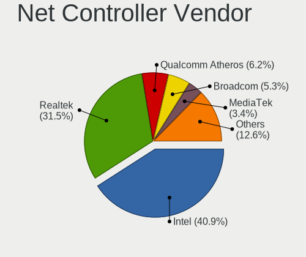

| Vendor                   | Computers | Percent |
|--------------------------|-----------|---------|
| Intel                    | 124       | 40.79%  |
| Realtek Semiconductor    | 97        | 31.91%  |
| Qualcomm Atheros         | 22        | 7.24%   |
| Broadcom                 | 17        | 5.59%   |
| TP-Link                  | 7         | 2.3%    |
| MediaTek                 | 7         | 2.3%    |
| Ralink                   | 5         | 1.64%   |
| Marvell Technology Group | 5         | 1.64%   |
| Xiaomi                   | 4         | 1.32%   |
| ASIX Electronics         | 3         | 0.99%   |
| Sigma Designs            | 2         | 0.66%   |
| Broadcom Limited         | 2         | 0.66%   |
| Wilocity                 | 1         | 0.33%   |
| VIA Technologies         | 1         | 0.33%   |
| SILICON Laboratories     | 1         | 0.33%   |
| Sierra Wireless          | 1         | 0.33%   |
| Ralink Technology        | 1         | 0.33%   |
| Nvidia                   | 1         | 0.33%   |
| Lenovo                   | 1         | 0.33%   |
| D-Link                   | 1         | 0.33%   |
| Aquantia                 | 1         | 0.33%   |

Net Controller Model
--------------------

Controller models

| Model                                                                  | Computers | Percent |
|------------------------------------------------------------------------|-----------|---------|
| Realtek RTL8111/8168/8211/8411 PCI Express Gigabit Ethernet Controller | 53        | 14.64%  |
| Realtek RTL810xE PCI Express Fast Ethernet controller                  | 15        | 4.14%   |
| Realtek RTL8822CE 802.11ac PCIe Wireless Network Adapter               | 10        | 2.76%   |
| Intel Wi-Fi 6 AX201                                                    | 10        | 2.76%   |
| Intel Wi-Fi 6E(802.11ax) AX210/AX1675* 2x2 [Typhoon Peak]              | 8         | 2.21%   |
| Intel Wi-Fi 6 AX200                                                    | 8         | 2.21%   |
| Intel 82579LM Gigabit Network Connection (Lewisville)                  | 8         | 2.21%   |
| Realtek RTL8821CE 802.11ac PCIe Wireless Network Adapter               | 7         | 1.93%   |
| Intel Wireless 8265 / 8275                                             | 7         | 1.93%   |
| Intel Wireless 8260                                                    | 7         | 1.93%   |
| Intel Wireless 7260                                                    | 7         | 1.93%   |
| Intel Cannon Point-LP CNVi [Wireless-AC]                               | 7         | 1.93%   |
| Realtek RTL8153 Gigabit Ethernet Adapter                               | 6         | 1.66%   |
| Realtek RTL8125 2.5GbE Controller                                      | 6         | 1.66%   |
| Intel Wireless 7265                                                    | 5         | 1.38%   |
| Intel Comet Lake PCH CNVi WiFi                                         | 5         | 1.38%   |
| Intel Cannon Lake PCH CNVi WiFi                                        | 5         | 1.38%   |
| Intel Alder Lake-P PCH CNVi WiFi                                       | 5         | 1.38%   |
| Xiaomi Mi/Redmi series (RNDIS + ADB)                                   | 4         | 1.1%    |
| Realtek RTL8822BE 802.11a/b/g/n/ac WiFi adapter                        | 4         | 1.1%    |
| Ralink RT3290 Wireless 802.11n 1T/1R PCIe                              | 4         | 1.1%    |
| Qualcomm Atheros QCA9377 802.11ac Wireless Network Adapter             | 4         | 1.1%    |
| Intel I210 Gigabit Network Connection                                  | 4         | 1.1%    |
| Intel Ethernet Controller I225-V                                       | 4         | 1.1%    |
| Intel Ethernet Connection I219-LM                                      | 4         | 1.1%    |
| Intel Ethernet Connection I217-LM                                      | 4         | 1.1%    |
| Intel Comet Lake PCH-LP CNVi WiFi                                      | 4         | 1.1%    |
| TP-Link Archer T3U [Realtek RTL8812BU]                                 | 3         | 0.83%   |
| TP-Link AC600 wireless Realtek RTL8811AU [Archer T2U Nano]             | 3         | 0.83%   |
| Realtek RTL8723BE PCIe Wireless Network Adapter                        | 3         | 0.83%   |
| Qualcomm Atheros QCA9565 / AR9565 Wireless Network Adapter             | 3         | 0.83%   |
| Qualcomm Atheros QCA6174 802.11ac Wireless Network Adapter             | 3         | 0.83%   |
| Qualcomm Atheros AR9485 Wireless Network Adapter                       | 3         | 0.83%   |
| MediaTek Wi-Fi 6E MT7902 Wireless Network Adapter                      | 3         | 0.83%   |
| Intel Wireless 3165                                                    | 3         | 0.83%   |
| Intel Ethernet Connection I218-LM                                      | 3         | 0.83%   |
| Intel Ethernet Connection (4) I219-V                                   | 3         | 0.83%   |
| Intel Centrino Advanced-N 6235                                         | 3         | 0.83%   |
| Intel 82579V Gigabit Network Connection                                | 3         | 0.83%   |
| Intel 82577LM Gigabit Network Connection                               | 3         | 0.83%   |

Wireless Vendor
---------------

Wireless vendors

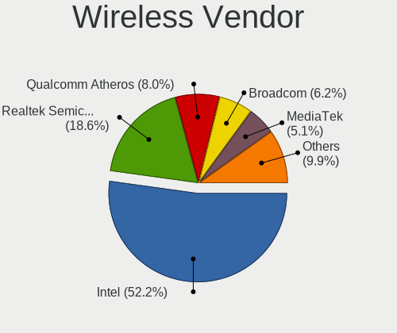

| Vendor                   | Computers | Percent |
|--------------------------|-----------|---------|
| Intel                    | 102       | 53.13%  |
| Realtek Semiconductor    | 34        | 17.71%  |
| Qualcomm Atheros         | 17        | 8.85%   |
| Broadcom                 | 12        | 6.25%   |
| TP-Link                  | 7         | 3.65%   |
| MediaTek                 | 7         | 3.65%   |
| Ralink                   | 5         | 2.6%    |
| Marvell Technology Group | 2         | 1.04%   |
| Broadcom Limited         | 2         | 1.04%   |
| Wilocity                 | 1         | 0.52%   |
| Sierra Wireless          | 1         | 0.52%   |
| Ralink Technology        | 1         | 0.52%   |
| D-Link                   | 1         | 0.52%   |

Wireless Model
--------------

Wireless models

| Model                                                          | Computers | Percent |
|----------------------------------------------------------------|-----------|---------|
| Realtek RTL8822CE 802.11ac PCIe Wireless Network Adapter       | 10        | 5.21%   |
| Intel Wi-Fi 6 AX201                                            | 10        | 5.21%   |
| Intel Wi-Fi 6E(802.11ax) AX210/AX1675* 2x2 [Typhoon Peak]      | 8         | 4.17%   |
| Intel Wi-Fi 6 AX200                                            | 8         | 4.17%   |
| Realtek RTL8821CE 802.11ac PCIe Wireless Network Adapter       | 7         | 3.65%   |
| Intel Wireless 8265 / 8275                                     | 7         | 3.65%   |
| Intel Wireless 8260                                            | 7         | 3.65%   |
| Intel Wireless 7260                                            | 7         | 3.65%   |
| Intel Cannon Point-LP CNVi [Wireless-AC]                       | 7         | 3.65%   |
| Intel Wireless 7265                                            | 5         | 2.6%    |
| Intel Comet Lake PCH CNVi WiFi                                 | 5         | 2.6%    |
| Intel Cannon Lake PCH CNVi WiFi                                | 5         | 2.6%    |
| Intel Alder Lake-P PCH CNVi WiFi                               | 5         | 2.6%    |
| Realtek RTL8822BE 802.11a/b/g/n/ac WiFi adapter                | 4         | 2.08%   |
| Ralink RT3290 Wireless 802.11n 1T/1R PCIe                      | 4         | 2.08%   |
| Qualcomm Atheros QCA9377 802.11ac Wireless Network Adapter     | 4         | 2.08%   |
| Intel Comet Lake PCH-LP CNVi WiFi                              | 4         | 2.08%   |
| TP-Link Archer T3U [Realtek RTL8812BU]                         | 3         | 1.56%   |
| TP-Link AC600 wireless Realtek RTL8811AU [Archer T2U Nano]     | 3         | 1.56%   |
| Realtek RTL8723BE PCIe Wireless Network Adapter                | 3         | 1.56%   |
| Qualcomm Atheros QCA9565 / AR9565 Wireless Network Adapter     | 3         | 1.56%   |
| Qualcomm Atheros QCA6174 802.11ac Wireless Network Adapter     | 3         | 1.56%   |
| Qualcomm Atheros AR9485 Wireless Network Adapter               | 3         | 1.56%   |
| MediaTek Wi-Fi 6E MT7902 Wireless Network Adapter              | 3         | 1.56%   |
| Intel Wireless 3165                                            | 3         | 1.56%   |
| Intel Centrino Advanced-N 6235                                 | 3         | 1.56%   |
| Broadcom BCM4360 802.11ac Dual Band Wireless Network Adapter   | 3         | 1.56%   |
| Realtek RTL8852AE 802.11ax PCIe Wireless Network Adapter       | 2         | 1.04%   |
| Realtek RTL8812AU 802.11a/b/g/n/ac 2T2R DB WLAN Adapter        | 2         | 1.04%   |
| Realtek 802.11n WLAN Adapter                                   | 2         | 1.04%   |
| Qualcomm Atheros AR9285 Wireless Network Adapter (PCI-Express) | 2         | 1.04%   |
| MediaTek MT7921K (RZ608) Wi-Fi 6E 80MHz                        | 2         | 1.04%   |
| Marvell Group 88W8897 [AVASTAR] 802.11ac Wireless              | 2         | 1.04%   |
| Intel Wireless 3160                                            | 2         | 1.04%   |
| Intel Wi-Fi 5(802.11ac) Wireless-AC 9x6x [Thunder Peak]        | 2         | 1.04%   |
| Intel Gemini Lake PCH CNVi WiFi                                | 2         | 1.04%   |
| Intel Centrino Ultimate-N 6300                                 | 2         | 1.04%   |
| Intel Centrino Advanced-N 6205 [Taylor Peak]                   | 2         | 1.04%   |
| Broadcom BCM43228 802.11a/b/g/n                                | 2         | 1.04%   |
| Wilocity Wil6200 802.11ad Wireless Network Adapter             | 1         | 0.52%   |

Ethernet Vendor
---------------

Ethernet vendors

| Vendor                   | Computers | Percent |
|--------------------------|-----------|---------|
| Realtek Semiconductor    | 79        | 50.32%  |
| Intel                    | 52        | 33.12%  |
| Qualcomm Atheros         | 6         | 3.82%   |
| Broadcom                 | 6         | 3.82%   |
| Xiaomi                   | 4         | 2.55%   |
| Marvell Technology Group | 3         | 1.91%   |
| ASIX Electronics         | 3         | 1.91%   |
| VIA Technologies         | 1         | 0.64%   |
| Nvidia                   | 1         | 0.64%   |
| Lenovo                   | 1         | 0.64%   |
| Aquantia                 | 1         | 0.64%   |

Ethernet Model
--------------

Ethernet models

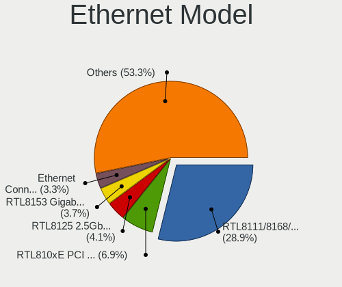

| Model                                                                  | Computers | Percent |
|------------------------------------------------------------------------|-----------|---------|
| Realtek RTL8111/8168/8211/8411 PCI Express Gigabit Ethernet Controller | 53        | 31.74%  |
| Realtek RTL810xE PCI Express Fast Ethernet controller                  | 15        | 8.98%   |
| Intel 82579LM Gigabit Network Connection (Lewisville)                  | 8         | 4.79%   |
| Realtek RTL8153 Gigabit Ethernet Adapter                               | 6         | 3.59%   |
| Realtek RTL8125 2.5GbE Controller                                      | 6         | 3.59%   |
| Xiaomi Mi/Redmi series (RNDIS + ADB)                                   | 4         | 2.4%    |
| Intel I210 Gigabit Network Connection                                  | 4         | 2.4%    |
| Intel Ethernet Controller I225-V                                       | 4         | 2.4%    |
| Intel Ethernet Connection I219-LM                                      | 4         | 2.4%    |
| Intel Ethernet Connection I217-LM                                      | 4         | 2.4%    |
| Intel Ethernet Connection I218-LM                                      | 3         | 1.8%    |
| Intel Ethernet Connection (4) I219-V                                   | 3         | 1.8%    |
| Intel 82579V Gigabit Network Connection                                | 3         | 1.8%    |
| Intel 82577LM Gigabit Network Connection                               | 3         | 1.8%    |
| ASIX AX88179 Gigabit Ethernet                                          | 3         | 1.8%    |
| Realtek Killer E2600 GbE Controller                                    | 2         | 1.2%    |
| Qualcomm Atheros Killer E2400 Gigabit Ethernet Controller              | 2         | 1.2%    |
| Intel I211 Gigabit Network Connection                                  | 2         | 1.2%    |
| Intel Ethernet Connection (6) I219-V                                   | 2         | 1.2%    |
| Intel Ethernet Connection (2) I219-V                                   | 2         | 1.2%    |
| Intel Ethernet Connection (2) I218-V                                   | 2         | 1.2%    |
| Broadcom NetXtreme BCM5764M Gigabit Ethernet PCIe                      | 2         | 1.2%    |
| VIA VT6105/VT6106S [Rhine-III]                                         | 1         | 0.6%    |
| Realtek RTL-8100/8101L/8139 PCI Fast Ethernet Adapter                  | 1         | 0.6%    |
| Qualcomm Atheros QCA8172 Fast Ethernet                                 | 1         | 0.6%    |
| Qualcomm Atheros AR8152 v2.0 Fast Ethernet                             | 1         | 0.6%    |
| Qualcomm Atheros AR8151 v2.0 Gigabit Ethernet                          | 1         | 0.6%    |
| Qualcomm Atheros AR8132 Fast Ethernet                                  | 1         | 0.6%    |
| Nvidia MCP61 Ethernet                                                  | 1         | 0.6%    |
| Marvell Group 88E8070 based Ethernet Controller                        | 1         | 0.6%    |
| Marvell Group 88E8058 PCI-E Gigabit Ethernet Controller                | 1         | 0.6%    |
| Marvell Group 88E8055 PCI-E Gigabit Ethernet Controller                | 1         | 0.6%    |
| Lenovo ThinkPad TBT 3 Dock                                             | 1         | 0.6%    |
| Intel I350 Gigabit Network Connection                                  | 1         | 0.6%    |
| Intel Ethernet Controller I226-V                                       | 1         | 0.6%    |
| Intel Ethernet Connection I219-V                                       | 1         | 0.6%    |
| Intel Ethernet Connection I217-V                                       | 1         | 0.6%    |
| Intel Ethernet Connection (7) I219-LM                                  | 1         | 0.6%    |
| Intel Ethernet Connection (6) I219-LM                                  | 1         | 0.6%    |
| Intel Ethernet Connection (5) I219-LM                                  | 1         | 0.6%    |

Net Controller Kind
-------------------

Ethernet, WiFi or modem

| Kind     | Computers | Percent |
|----------|-----------|---------|
| WiFi     | 181       | 54.19%  |
| Ethernet | 150       | 44.91%  |
| Modem    | 3         | 0.9%    |

Used Controller
---------------

Currently used network controller

| Kind     | Computers | Percent |
|----------|-----------|---------|
| WiFi     | 147       | 70.67%  |
| Ethernet | 61        | 29.33%  |

NICs
----

Total network controllers on board

| Total | Computers | Percent |
|-------|-----------|---------|
| 2     | 116       | 55.77%  |
| 1     | 83        | 39.9%   |
| 3     | 4         | 1.92%   |
| 0     | 3         | 1.44%   |
| 8     | 1         | 0.48%   |
| 4     | 1         | 0.48%   |

IPv6
----

IPv6 vs IPv4

| Used | Computers | Percent |
|------|-----------|---------|
| No   | 156       | 74.29%  |
| Yes  | 54        | 25.71%  |

Bluetooth
---------

Bluetooth Vendor
----------------

Controller vendors

| Vendor                          | Computers | Percent |
|---------------------------------|-----------|---------|
| Intel                           | 85        | 53.13%  |
| Realtek Semiconductor           | 18        | 11.25%  |
| Qualcomm Atheros Communications | 9         | 5.63%   |
| IMC Networks                    | 8         | 5%      |
| Cambridge Silicon Radio         | 5         | 3.13%   |
| Apple                           | 5         | 3.13%   |
| Toshiba                         | 4         | 2.5%    |
| Ralink                          | 4         | 2.5%    |
| Foxconn / Hon Hai               | 4         | 2.5%    |
| Broadcom                        | 4         | 2.5%    |
| ASUSTek Computer                | 4         | 2.5%    |
| MediaTek                        | 3         | 1.88%   |
| Marvell Semiconductor           | 2         | 1.25%   |
| Hewlett-Packard                 | 2         | 1.25%   |
| Dell                            | 2         | 1.25%   |
| Lite-On Technology              | 1         | 0.63%   |

Bluetooth Model
---------------

Controller models

| Model                                                 | Computers | Percent |
|-------------------------------------------------------|-----------|---------|
| Intel Bluetooth wireless interface                    | 26        | 16.25%  |
| Intel Bluetooth 9460/9560 Jefferson Peak (JfP)        | 19        | 11.88%  |
| Intel AX201 Bluetooth                                 | 17        | 10.63%  |
| Realtek Bluetooth Radio                               | 12        | 7.5%    |
| Intel AX200 Bluetooth                                 | 8         | 5%      |
| Intel AX210 Bluetooth                                 | 7         | 4.38%   |
| IMC Networks Bluetooth Radio                          | 5         | 3.13%   |
| Cambridge Silicon Radio Bluetooth Dongle (HCI mode)   | 5         | 3.13%   |
| Realtek  Bluetooth 4.2 Adapter                        | 4         | 2.5%    |
| Ralink RT3290 Bluetooth                               | 4         | 2.5%    |
| Qualcomm Atheros  Bluetooth Device                    | 3         | 1.88%   |
| MediaTek Wireless_Device                              | 3         | 1.88%   |
| Intel Centrino Bluetooth Wireless Transceiver         | 3         | 1.88%   |
| Intel Bluetooth Device                                | 3         | 1.88%   |
| IMC Networks Wireless_Device                          | 3         | 1.88%   |
| Toshiba Bluetooth USB Host Controller                 | 2         | 1.25%   |
| Realtek RTL8822BE Bluetooth 4.2 Adapter               | 2         | 1.25%   |
| Qualcomm Atheros AR3011 Bluetooth                     | 2         | 1.25%   |
| Intel Wireless-AC 9260 Bluetooth Adapter              | 2         | 1.25%   |
| HP Broadcom 2070 Bluetooth Combo                      | 2         | 1.25%   |
| Foxconn / Hon Hai Bluetooth Device                    | 2         | 1.25%   |
| ASUS Broadcom BCM20702 Single-Chip Bluetooth 4.0 + LE | 2         | 1.25%   |
| Apple Bluetooth USB Host Controller                   | 2         | 1.25%   |
| Toshiba RT Bluetooth Radio                            | 1         | 0.63%   |
| Toshiba Integrated Bluetooth HCI                      | 1         | 0.63%   |
| Qualcomm Atheros QCA61x4 Bluetooth 4.0                | 1         | 0.63%   |
| Qualcomm Atheros Bluetooth USB Host Controller        | 1         | 0.63%   |
| Qualcomm Atheros AR9462 Bluetooth                     | 1         | 0.63%   |
| Qualcomm Atheros AR3012 Bluetooth 4.0                 | 1         | 0.63%   |
| Marvell Bluetooth and Wireless LAN Composite Device   | 1         | 0.63%   |
| Marvell Bluetooth and Wireless LAN Composite          | 1         | 0.63%   |
| Lite-On Qualcomm Atheros QCA9377 Bluetooth            | 1         | 0.63%   |
| Foxconn / Hon Hai Wireless_Device                     | 1         | 0.63%   |
| Foxconn / Hon Hai Bluetooth USB Host Controller       | 1         | 0.63%   |
| Dell DW375 Bluetooth Module                           | 1         | 0.63%   |
| Dell BCM20702A0 Bluetooth Module                      | 1         | 0.63%   |
| Broadcom HP Portable SoftSailing                      | 1         | 0.63%   |
| Broadcom BCM43142A0 Bluetooth 4.0                     | 1         | 0.63%   |
| Broadcom BCM20702 Bluetooth 4.0 [ThinkPad]            | 1         | 0.63%   |
| Broadcom BCM2045B (BDC-2) [Bluetooth Controller]      | 1         | 0.63%   |

Sound
-----

Sound Vendor
------------

Sound card vendors

| Vendor                | Computers | Percent |
|-----------------------|-----------|---------|
| Intel                 | 177       | 63.67%  |
| Nvidia                | 49        | 17.63%  |
| AMD                   | 33        | 11.87%  |
| Logitech              | 3         | 1.08%   |
| JMTek                 | 3         | 1.08%   |
| ASUSTek Computer      | 3         | 1.08%   |
| SteelSeries ApS       | 2         | 0.72%   |
| Lenovo                | 2         | 0.72%   |
| Solid State Logic     | 1         | 0.36%   |
| Samsung Electronics   | 1         | 0.36%   |
| Realtek Semiconductor | 1         | 0.36%   |
| Griffin Technology    | 1         | 0.36%   |
| Dell                  | 1         | 0.36%   |
| Apogee Electronics    | 1         | 0.36%   |

Sound Model
-----------

Sound card models

| Model                                                                      | Computers | Percent |
|----------------------------------------------------------------------------|-----------|---------|
| Intel Sunrise Point-LP HD Audio                                            | 22        | 6.9%    |
| AMD Family 17h/19h HD Audio Controller                                     | 16        | 5.02%   |
| Intel 7 Series/C216 Chipset Family High Definition Audio Controller        | 15        | 4.7%    |
| Intel Haswell-ULT HD Audio Controller                                      | 14        | 4.39%   |
| Intel 8 Series HD Audio Controller                                         | 14        | 4.39%   |
| Intel Tiger Lake-LP Smart Sound Technology Audio Controller                | 13        | 4.08%   |
| Intel Cannon Lake PCH cAVS                                                 | 13        | 4.08%   |
| Intel Cannon Point-LP High Definition Audio Controller                     | 12        | 3.76%   |
| AMD Renoir Radeon High Definition Audio Controller                         | 12        | 3.76%   |
| Intel 6 Series/C200 Series Chipset Family High Definition Audio Controller | 9         | 2.82%   |
| Intel Comet Lake PCH-LP cAVS                                               | 7         | 2.19%   |
| Intel Comet Lake PCH cAVS                                                  | 7         | 2.19%   |
| AMD Rembrandt Radeon High Definition Audio Controller                      | 7         | 2.19%   |
| Intel Alder Lake PCH-P High Definition Audio Controller                    | 6         | 1.88%   |
| Intel 8 Series/C220 Series Chipset High Definition Audio Controller        | 6         | 1.88%   |
| Intel 5 Series/3400 Series Chipset High Definition Audio                   | 6         | 1.88%   |
| Nvidia GP107GL High Definition Audio Controller                            | 5         | 1.57%   |
| Nvidia GP106 High Definition Audio Controller                              | 5         | 1.57%   |
| Intel Xeon E3-1200 v3/4th Gen Core Processor HD Audio Controller           | 5         | 1.57%   |
| Intel Wildcat Point-LP High Definition Audio Controller                    | 5         | 1.57%   |
| Intel Broadwell-U Audio Controller                                         | 5         | 1.57%   |
| Intel 82801JI (ICH10 Family) HD Audio Controller                           | 5         | 1.57%   |
| Nvidia TU107 GeForce GTX 1650 High Definition Audio Controller             | 4         | 1.25%   |
| Nvidia GA104 High Definition Audio Controller                              | 4         | 1.25%   |
| Intel CM238 HD Audio Controller                                            | 4         | 1.25%   |
| Intel 200 Series PCH HD Audio                                              | 4         | 1.25%   |
| Intel 100 Series/C230 Series Chipset Family HD Audio Controller            | 4         | 1.25%   |
| Nvidia TU104 HD Audio Controller                                           | 3         | 0.94%   |
| Nvidia GF108 High Definition Audio Controller                              | 3         | 0.94%   |
| Nvidia GA106 High Definition Audio Controller                              | 3         | 0.94%   |
| Nvidia Audio device                                                        | 3         | 0.94%   |
| JMTek USB PnP Audio Device                                                 | 3         | 0.94%   |
| Intel Raptor Lake-P/U/H cAVS                                               | 3         | 0.94%   |
| Intel 82801H (ICH8 Family) HD Audio Controller                             | 3         | 0.94%   |
| ASUSTek Computer USB Audio                                                 | 3         | 0.94%   |
| AMD Ellesmere HDMI Audio [Radeon RX 470/480 / 570/580/590]                 | 3         | 0.94%   |
| Nvidia High Definition Audio Controller                                    | 2         | 0.63%   |
| Nvidia GM107 High Definition Audio Controller [GeForce 940MX]              | 2         | 0.63%   |
| Nvidia GK208 HDMI/DP Audio Controller                                      | 2         | 0.63%   |
| Intel Ice Lake-LP Smart Sound Technology Audio Controller                  | 2         | 0.63%   |

Memory
------

Memory Vendor
-------------

Memory module vendors

| Vendor              | Computers | Percent |
|---------------------|-----------|---------|
| Samsung Electronics | 38        | 31.15%  |
| Micron Technology   | 23        | 18.85%  |
| SK hynix            | 22        | 18.03%  |
| Crucial             | 10        | 8.2%    |
| Kingston            | 9         | 7.38%   |
| Corsair             | 7         | 5.74%   |
| Unknown             | 4         | 3.28%   |
| Ramaxel Technology  | 4         | 3.28%   |
| Wilk                | 1         | 0.82%   |
| Timetec             | 1         | 0.82%   |
| Nanya Technology    | 1         | 0.82%   |
| Gold Key            | 1         | 0.82%   |
| 4ea5                | 1         | 0.82%   |

Memory Model
------------

Memory module models

| Model                                                        | Computers | Percent |
|--------------------------------------------------------------|-----------|---------|
| Samsung RAM M471A1K43EB1-CWE 8GB SODIMM DDR4 3200MT/s        | 4         | 3.08%   |
| SK hynix RAM HMA41GS6AFR8N-TF 8GB SODIMM DDR4 2667MT/s       | 3         | 2.31%   |
| Micron RAM 4ATF1G64HZ-3G2F1 8GB SODIMM DDR4 3200MT/s         | 3         | 2.31%   |
| SK hynix RAM HMT451S6BFR8A-PB 4GB SODIMM DDR3 1600MT/s       | 2         | 1.54%   |
| Samsung RAM M471A5244CB0-CWE 4GB SODIMM DDR4 3200MT/s        | 2         | 1.54%   |
| Samsung RAM M471A5244CB0-CRC 4GB SODIMM DDR4 2667MT/s        | 2         | 1.54%   |
| Samsung RAM M471A2K43CB1-CRC 16GB SODIMM DDR4 2667MT/s       | 2         | 1.54%   |
| Samsung RAM M471A1K43CB1-CTD 8GB SODIMM DDR4 2667MT/s        | 2         | 1.54%   |
| Samsung RAM M471A1K43BB1-CRC 8GB SODIMM DDR4 2667MT/s        | 2         | 1.54%   |
| Ramaxel RAM RMSA3260ME78HAF-2666 8GB SODIMM DDR4 2667MT/s    | 2         | 1.54%   |
| Micron RAM MTC8C1084S1SC48BA1 16GB SODIMM DDR5 4800MT/s      | 2         | 1.54%   |
| Crucial RAM CT16G4SFRA32A.M16FR 16GB SODIMM DDR4 3200MT/s    | 2         | 1.54%   |
| Wilk RAM W-HK32S32O 32GB SODIMM DDR4 3200MT/s                | 1         | 0.77%   |
| Unknown RAM Module 4GB Chip DDR4 2133MT/s                    | 1         | 0.77%   |
| Unknown RAM Module 4096MB SODIMM DDR4 2667MT/s               | 1         | 0.77%   |
| Unknown RAM Module 2GB SODIMM DDR2 667MT/s                   | 1         | 0.77%   |
| Unknown RAM Module 2GB Row Of Chips LPDDR4 4267MT/s          | 1         | 0.77%   |
| Unknown RAM Module 1GB SODIMM DDR2 667MT/s                   | 1         | 0.77%   |
| Timetec RAM SD3-1600 8GB SODIMM DDR3 1600MT/s                | 1         | 0.77%   |
| SK hynix RAM Module 8GB Row Of Chips LPDDR3 2133MT/s         | 1         | 0.77%   |
| SK hynix RAM Module 4GB SODIMM DDR3 1600MT/s                 | 1         | 0.77%   |
| SK hynix RAM Module 2GB SODIMM DDR3 1600MT/s                 | 1         | 0.77%   |
| SK hynix RAM HMT41GS6AFR8A-PB 8GB SODIMM DDR3 1600MT/s       | 1         | 0.77%   |
| SK hynix RAM HMT351S6CFR8C-H9 4GB SODIMM DDR3 1334MT/s       | 1         | 0.77%   |
| SK hynix RAM HMT31GR7BFR4A-H9 8GB DIMM DDR3 1333MT/s         | 1         | 0.77%   |
| SK hynix RAM HMT125S6TFR8C-G7 2GB SODIMM DDR3 1067MT/s       | 1         | 0.77%   |
| SK hynix RAM HMAA51S6AMR6N-UH 8GB SODIMM DDR4 2400MT/s       | 1         | 0.77%   |
| SK hynix RAM HMAA4GS6AJR8N-XN 32GB SODIMM DDR4 3200MT/s      | 1         | 0.77%   |
| SK hynix RAM HMAA1GS6CJR6N-XN 8GB SODIMM DDR4 3200MT/s       | 1         | 0.77%   |
| SK hynix RAM HMAA1GS6CJR6N-XN 8GB Row Of Chips DDR4 3200MT/s | 1         | 0.77%   |
| SK hynix RAM HMA851S6CJR6N-VK 4GB SODIMM DDR4 2667MT/s       | 1         | 0.77%   |
| SK hynix RAM HMA82GS6JJR8N-VK 16GB SODIMM DDR4 2667MT/s      | 1         | 0.77%   |
| SK hynix RAM HMA82GS6DJR8N-XN 16GB SODIMM DDR4 3200MT/s      | 1         | 0.77%   |
| SK hynix RAM HMA82GS6DJR8N-VK 16GB SODIMM DDR4 2667MT/s      | 1         | 0.77%   |
| SK hynix RAM HMA82GR7JJR8N-WM 16384MB DIMM DDR4 2933MT/s     | 1         | 0.77%   |
| SK hynix RAM HMA81GS6CJR8N-VK 8GB SODIMM DDR4 2667MT/s       | 1         | 0.77%   |
| SK hynix RAM H5ANAG6NCMR-XNC 8GB Row Of Chips DDR4 3200MT/s  | 1         | 0.77%   |
| Samsung RAM Module 8192MB Row Of Chips LPDDR3 2133MT/s       | 1         | 0.77%   |
| Samsung RAM Module 32GB SODIMM DDR4 3200MT/s                 | 1         | 0.77%   |
| Samsung RAM M471B5673EH1-CH9 2048MB SODIMM DDR3 1334MT/s     | 1         | 0.77%   |

Memory Kind
-----------

Memory module kinds

| Kind    | Computers | Percent |
|---------|-----------|---------|
| DDR4    | 63        | 64.29%  |
| DDR3    | 21        | 21.43%  |
| LPDDR4  | 4         | 4.08%   |
| LPDDR3  | 4         | 4.08%   |
| DDR5    | 3         | 3.06%   |
| DDR2    | 2         | 2.04%   |
| Unknown | 1         | 1.02%   |

Memory Form Factor
------------------

Physical design of the memory module

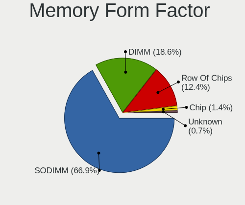

| Name         | Computers | Percent |
|--------------|-----------|---------|
| SODIMM       | 67        | 66.34%  |
| DIMM         | 17        | 16.83%  |
| Row Of Chips | 15        | 14.85%  |
| Chip         | 1         | 0.99%   |
| Unknown      | 1         | 0.99%   |

Memory Size
-----------

Memory module size

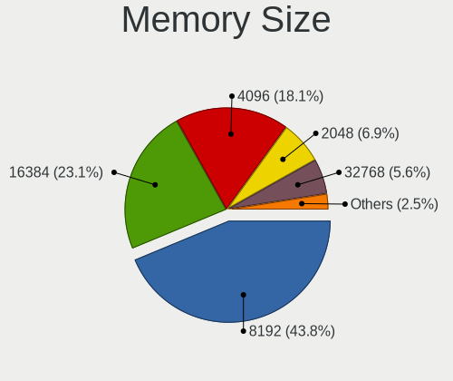

| Size  | Computers | Percent |
|-------|-----------|---------|
| 8192  | 53        | 46.9%   |
| 16384 | 23        | 20.35%  |
| 4096  | 20        | 17.7%   |
| 2048  | 9         | 7.96%   |
| 32768 | 6         | 5.31%   |
| 65536 | 1         | 0.88%   |
| 1024  | 1         | 0.88%   |

Memory Speed
------------

Memory module speed

| Speed | Computers | Percent |
|-------|-----------|---------|
| 3200  | 30        | 27.52%  |
| 2667  | 25        | 22.94%  |
| 1600  | 13        | 11.93%  |
| 2400  | 8         | 7.34%   |
| 2133  | 7         | 6.42%   |
| 1333  | 4         | 3.67%   |
| 4800  | 3         | 2.75%   |
| 4267  | 3         | 2.75%   |
| 3400  | 2         | 1.83%   |
| 3000  | 2         | 1.83%   |
| 1867  | 2         | 1.83%   |
| 1334  | 2         | 1.83%   |
| 6400  | 1         | 0.92%   |
| 3733  | 1         | 0.92%   |
| 3466  | 1         | 0.92%   |
| 2933  | 1         | 0.92%   |
| 1866  | 1         | 0.92%   |
| 1067  | 1         | 0.92%   |
| 800   | 1         | 0.92%   |
| 667   | 1         | 0.92%   |

Printers & scanners
-------------------

Printer Vendor
--------------

Printer device vendors

| Vendor             | Computers | Percent |
|--------------------|-----------|---------|
| Hewlett-Packard    | 2         | 50%     |
| Canon              | 1         | 25%     |
| Brother Industries | 1         | 25%     |

Printer Model
-------------

Printer device models

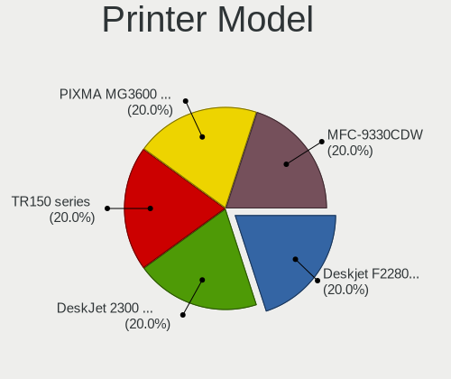

| Model                     | Computers | Percent |
|---------------------------|-----------|---------|
| HP Deskjet F2280 series   | 1         | 25%     |
| HP DeskJet 2300 series    | 1         | 25%     |
| Canon PIXMA MG3600 Series | 1         | 25%     |
| Brother MFC-9330CDW       | 1         | 25%     |

Scanner Vendor
--------------

Scanner device vendors

Zero info for selected period =(

Scanner Model
-------------

Scanner device models

Zero info for selected period =(

Camera
------

Camera Vendor
-------------

Camera device vendors

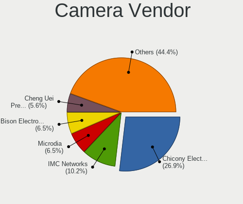

| Vendor                                 | Computers | Percent |
|----------------------------------------|-----------|---------|
| Chicony Electronics                    | 42        | 25.77%  |
| IMC Networks                           | 21        | 12.88%  |
| Cheng Uei Precision Industry (Foxlink) | 11        | 6.75%   |
| Microdia                               | 9         | 5.52%   |
| Realtek Semiconductor                  | 8         | 4.91%   |
| Luxvisions Innotech Limited            | 8         | 4.91%   |
| Bison Electronics                      | 8         | 4.91%   |
| Syntek                                 | 7         | 4.29%   |
| Sunplus Innovation Technology          | 6         | 3.68%   |
| Apple                                  | 6         | 3.68%   |
| Quanta                                 | 5         | 3.07%   |
| Samsung Electronics                    | 4         | 2.45%   |
| Lite-On Technology                     | 4         | 2.45%   |
| Acer                                   | 4         | 2.45%   |
| Ricoh                                  | 3         | 1.84%   |
| Microsoft                              | 3         | 1.84%   |
| Alcor Micro                            | 3         | 1.84%   |
| Suyin                                  | 2         | 1.23%   |
| Logitech                               | 2         | 1.23%   |
| Creative Technology                    | 2         | 1.23%   |
| Ruision                                | 1         | 0.61%   |
| LG Electronics                         | 1         | 0.61%   |
| Lenovo                                 | 1         | 0.61%   |
| KYE Systems (Mouse Systems)            | 1         | 0.61%   |
| Google                                 | 1         | 0.61%   |

Camera Model
------------

Camera device models

| Model                                                           | Computers | Percent |
|-----------------------------------------------------------------|-----------|---------|
| Chicony Integrated Camera                                       | 14        | 8.54%   |
| IMC Networks USB2.0 HD UVC WebCam                               | 10        | 6.1%    |
| Syntek Integrated Camera                                        | 6         | 3.66%   |
| Microdia Integrated_Webcam_HD                                   | 5         | 3.05%   |
| IMC Networks Integrated Camera                                  | 5         | 3.05%   |
| Samsung Galaxy series, misc. (MTP mode)                         | 4         | 2.44%   |
| Chicony Integrated Camera (1280x720@30)                         | 4         | 2.44%   |
| Apple iPhone 5/5C/5S/6/SE/7/8/X/XR                              | 4         | 2.44%   |
| Realtek Integrated_Webcam_HD                                    | 3         | 1.83%   |
| Luxvisions Innotech Limited HP TrueVision HD Camera             | 3         | 1.83%   |
| Lite-On HP Wide Vision HD Camera                                | 3         | 1.83%   |
| Cheng Uei Precision Industry (Foxlink) HP Wide Vision HD Camera | 3         | 1.83%   |
| Cheng Uei Precision Industry (Foxlink) HP TrueVision HD Camera  | 3         | 1.83%   |
| Bison BisonCam,NB Pro                                           | 3         | 1.83%   |
| Alcor Micro USB 2.0 Camera                                      | 3         | 1.83%   |
| Sunplus Integrated_Webcam_HD                                    | 2         | 1.22%   |
| Sunplus HP HD Webcam [Fixed]                                    | 2         | 1.22%   |
| Ricoh HD Webcam                                                 | 2         | 1.22%   |
| Realtek HP Truevision HD                                        | 2         | 1.22%   |
| Quanta HP TrueVision HD Camera                                  | 2         | 1.22%   |
| Microdia Laptop_Integrated_Webcam_HD                            | 2         | 1.22%   |
| Luxvisions Innotech Limited HP Wide Vision HD Camera            | 2         | 1.22%   |
| Logitech Webcam C270                                            | 2         | 1.22%   |
| Chicony TOSHIBA Web Camera - HD                                 | 2         | 1.22%   |
| Chicony TOSHIBA Web Camera - FHD                                | 2         | 1.22%   |
| Chicony Lenovo EasyCamera                                       | 2         | 1.22%   |
| Chicony HP Truevision HD                                        | 2         | 1.22%   |
| Chicony HP HD Webcam [Fixed]                                    | 2         | 1.22%   |
| Chicony HP HD Webcam                                            | 2         | 1.22%   |
| Chicony HD WebCam                                               | 2         | 1.22%   |
| Chicony EasyCamera                                              | 2         | 1.22%   |
| Cheng Uei Precision Industry (Foxlink) HP HD Webcam             | 2         | 1.22%   |
| Bison Lenovo EasyCamera                                         | 2         | 1.22%   |
| Acer Integrated Camera                                          | 2         | 1.22%   |
| Syntek EasyCamera                                               | 1         | 0.61%   |
| Suyin HP TrueVision HD                                          | 1         | 0.61%   |
| Suyin 1.3M HD WebCam                                            | 1         | 0.61%   |
| Sunplus Integrated_Webcam_FHD                                   | 1         | 0.61%   |
| Sunplus Integrated Webcam                                       | 1         | 0.61%   |
| Ruision UVC Camera                                              | 1         | 0.61%   |

Security
--------

Fingerprint Vendor
------------------

Fingerprint sensor vendors

| Vendor                             | Computers | Percent |
|------------------------------------|-----------|---------|
| Synaptics                          | 19        | 38.78%  |
| Validity Sensors                   | 17        | 34.69%  |
| Elan Microelectronics              | 5         | 10.2%   |
| Shenzhen Goodix Technology         | 4         | 8.16%   |
| STMicroelectronics                 | 2         | 4.08%   |
| Realtek USB2.0 Finger Print Bridge | 1         | 2.04%   |
| LighTuning Technology              | 1         | 2.04%   |

Fingerprint Model
-----------------

Fingerprint sensor models

| Model                                                           | Computers | Percent |
|-----------------------------------------------------------------|-----------|---------|
| Validity Sensors Synaptics WBDI                                 | 5         | 10.2%   |
| Elan ELAN:ARM-M4                                                | 5         | 10.2%   |
| Synaptics Prometheus MIS Touch Fingerprint Reader               | 4         | 8.16%   |
| Validity Sensors VFS471 Fingerprint Reader                      | 3         | 6.12%   |
| Synaptics UWP WBDI                                              | 3         | 6.12%   |
| Synaptics Metallica MIS Touch Fingerprint Reader                | 3         | 6.12%   |
| Validity Sensors VFS495 Fingerprint Reader                      | 2         | 4.08%   |
| Validity Sensors VFS491                                         | 2         | 4.08%   |
| Synaptics WBDI                                                  | 2         | 4.08%   |
| Synaptics UWP WBDI Device                                       | 2         | 4.08%   |
| STMicroelectronics Fingerprint Reader                           | 2         | 4.08%   |
| Shenzhen Goodix  Fingerprint Device                             | 2         | 4.08%   |
| Shenzhen Goodix Fingerprint Reader                              | 2         | 4.08%   |
| Validity Sensors VFS7500 Touch Fingerprint Sensor               | 1         | 2.04%   |
| Validity Sensors VFS5011 Fingerprint Reader                     | 1         | 2.04%   |
| Validity Sensors VFS Fingerprint sensor                         | 1         | 2.04%   |
| Validity Sensors VFS 5011 fingerprint sensor                    | 1         | 2.04%   |
| Validity Sensors Fingerprint scanner                            | 1         | 2.04%   |
| Synaptics WBDI Fingerprint Reader USB 086                       | 1         | 2.04%   |
| Synaptics TouchPad                                              | 1         | 2.04%   |
| Synaptics  FS7604 Touch Fingerprint Sensor with PurePrint       | 1         | 2.04%   |
| Synaptics Metallica MOH Touch Fingerprint Reader                | 1         | 2.04%   |
| Synaptics Fingerprint reader [HP G6]                            | 1         | 2.04%   |
| Realtek USB2.0 Finger Print Bridge FocalTech Fingerprint Device | 1         | 2.04%   |
| LighTuning Fingerprint Sensor                                   | 1         | 2.04%   |

Chipcard Vendor
---------------

Chipcard module vendors

| Vendor      | Computers | Percent |
|-------------|-----------|---------|
| Broadcom    | 3         | 37.5%   |
| Alcor Micro | 3         | 37.5%   |
| Upek        | 1         | 12.5%   |
| Aktiv       | 1         | 12.5%   |

Chipcard Model
--------------

Chipcard module models

| Model                                                                        | Computers | Percent |
|------------------------------------------------------------------------------|-----------|---------|
| Alcor Micro AU9540 Smartcard Reader                                          | 3         | 37.5%   |
| Broadcom BCM5880 Secure Applications Processor                               | 2         | 25%     |
| Upek TouchChip Fingerprint Coprocessor (WBF advanced mode)                   | 1         | 12.5%   |
| Broadcom BCM5880 Secure Applications Processor with fingerprint swipe sensor | 1         | 12.5%   |
| Aktiv Rutoken lite                                                           | 1         | 12.5%   |

Unsupported
-----------

Unsupported Devices
-------------------

Total unsupported devices on board

| Total | Computers | Percent |
|-------|-----------|---------|
| 0     | 107       | 50.23%  |
| 1     | 79        | 37.09%  |
| 2     | 22        | 10.33%  |
| 3     | 5         | 2.35%   |

Unsupported Device Types
------------------------

Types of unsupported devices

| Type                     | Computers | Percent |
|--------------------------|-----------|---------|
| Fingerprint reader       | 47        | 35.88%  |
| Graphics card            | 27        | 20.61%  |
| Net/wireless             | 17        | 12.98%  |
| Camera                   | 9         | 6.87%   |
| Chipcard                 | 7         | 5.34%   |
| Multimedia controller    | 6         | 4.58%   |
| Communication controller | 5         | 3.82%   |
| Bluetooth                | 4         | 3.05%   |
| Unassigned class         | 3         | 2.29%   |
| Sound                    | 3         | 2.29%   |
| Wireless                 | 2         | 1.53%   |
| Modem                    | 1         | 0.76%   |

