Linux in UAE - Tested Hardware & Statistics
-------------------------------------------

A project to collect tested hardware configurations for Linux in UAE.

Anyone can contribute to this report by the [hw-probe](https://github.com/linuxhw/hw-probe) tool:

    sudo -E hw-probe -all -upload

Please contribute! Especially if your hardware is rare.

This is a report for all computer types. See also reports for [desktops](/Location/UAE/Desktop/README.md) and [notebooks](/Location/UAE/Notebook/README.md).

Contents
--------

* [ Test Cases ](#test-cases)

* [ System ](#system)
  - [ OS                       ](#os)
  - [ OS Family                ](#os-family)
  - [ Kernel                   ](#kernel)
  - [ Kernel Family            ](#kernel-family)
  - [ Kernel Major Ver.        ](#kernel-major-ver)
  - [ Arch                     ](#arch)
  - [ DE                       ](#de)
  - [ Display Server           ](#display-server)
  - [ Display Manager          ](#display-manager)
  - [ OS Lang                  ](#os-lang)
  - [ Boot Mode                ](#boot-mode)
  - [ Filesystem               ](#filesystem)
  - [ Part. scheme             ](#part-scheme)
  - [ Dual Boot with Linux/BSD ](#dual-boot-with-linuxbsd)
  - [ Dual Boot (Win)          ](#dual-boot-win)

* [ Board ](#board)
  - [ Vendor                   ](#vendor)
  - [ Model                    ](#model)
  - [ Model Family             ](#model-family)
  - [ MFG Year                 ](#mfg-year)
  - [ Form Factor              ](#form-factor)
  - [ Secure Boot              ](#secure-boot)
  - [ Coreboot                 ](#coreboot)
  - [ RAM Size                 ](#ram-size)
  - [ RAM Used                 ](#ram-used)
  - [ Total Drives             ](#total-drives)
  - [ Has CD-ROM               ](#has-cd-rom)
  - [ Has Ethernet             ](#has-ethernet)
  - [ Has WiFi                 ](#has-wifi)
  - [ Has Bluetooth            ](#has-bluetooth)

* [ Location ](#location)
  - [ Country                  ](#country)
  - [ City                     ](#city)

* [ Drives ](#drives)
  - [ Drive Vendor             ](#drive-vendor)
  - [ Drive Model              ](#drive-model)
  - [ HDD Vendor               ](#hdd-vendor)
  - [ SSD Vendor               ](#ssd-vendor)
  - [ Drive Kind               ](#drive-kind)
  - [ Drive Connector          ](#drive-connector)
  - [ Drive Size               ](#drive-size)
  - [ Space Total              ](#space-total)
  - [ Space Used               ](#space-used)
  - [ Malfunc. Drives          ](#malfunc-drives)
  - [ Malfunc. Drive Vendor    ](#malfunc-drive-vendor)
  - [ Malfunc. HDD Vendor      ](#malfunc-hdd-vendor)
  - [ Malfunc. Drive Kind      ](#malfunc-drive-kind)
  - [ Failed Drives            ](#failed-drives)
  - [ Failed Drive Vendor      ](#failed-drive-vendor)
  - [ Drive Status             ](#drive-status)

* [ Storage controller ](#storage-controller)
  - [ Storage Vendor           ](#storage-vendor)
  - [ Storage Model            ](#storage-model)
  - [ Storage Kind             ](#storage-kind)

* [ Processor ](#processor)
  - [ CPU Vendor               ](#cpu-vendor)
  - [ CPU Model                ](#cpu-model)
  - [ CPU Model Family         ](#cpu-model-family)
  - [ CPU Cores                ](#cpu-cores)
  - [ CPU Sockets              ](#cpu-sockets)
  - [ CPU Threads              ](#cpu-threads)
  - [ CPU Op-Modes             ](#cpu-op-modes)
  - [ CPU Microcode            ](#cpu-microcode)
  - [ CPU Microarch            ](#cpu-microarch)

* [ Graphics ](#graphics)
  - [ GPU Vendor               ](#gpu-vendor)
  - [ GPU Model                ](#gpu-model)
  - [ GPU Combo                ](#gpu-combo)
  - [ GPU Driver               ](#gpu-driver)
  - [ GPU Memory               ](#gpu-memory)

* [ Monitor ](#monitor)
  - [ Monitor Vendor           ](#monitor-vendor)
  - [ Monitor Model            ](#monitor-model)
  - [ Monitor Resolution       ](#monitor-resolution)
  - [ Monitor Diagonal         ](#monitor-diagonal)
  - [ Monitor Width            ](#monitor-width)
  - [ Aspect Ratio             ](#aspect-ratio)
  - [ Monitor Area             ](#monitor-area)
  - [ Pixel Density            ](#pixel-density)
  - [ Multiple Monitors        ](#multiple-monitors)

* [ Network ](#network)
  - [ Net Controller Vendor    ](#net-controller-vendor)
  - [ Net Controller Model     ](#net-controller-model)
  - [ Wireless Vendor          ](#wireless-vendor)
  - [ Wireless Model           ](#wireless-model)
  - [ Ethernet Vendor          ](#ethernet-vendor)
  - [ Ethernet Model           ](#ethernet-model)
  - [ Net Controller Kind      ](#net-controller-kind)
  - [ Used Controller          ](#used-controller)
  - [ NICs                     ](#nics)
  - [ IPv6                     ](#ipv6)

* [ Bluetooth ](#bluetooth)
  - [ Bluetooth Vendor         ](#bluetooth-vendor)
  - [ Bluetooth Model          ](#bluetooth-model)

* [ Sound ](#sound)
  - [ Sound Vendor             ](#sound-vendor)
  - [ Sound Model              ](#sound-model)

* [ Memory ](#memory)
  - [ Memory Vendor            ](#memory-vendor)
  - [ Memory Model             ](#memory-model)
  - [ Memory Kind              ](#memory-kind)
  - [ Memory Form Factor       ](#memory-form-factor)
  - [ Memory Size              ](#memory-size)
  - [ Memory Speed             ](#memory-speed)

* [ Printers & scanners ](#printers--scanners)
  - [ Printer Vendor           ](#printer-vendor)
  - [ Printer Model            ](#printer-model)
  - [ Scanner Vendor           ](#scanner-vendor)
  - [ Scanner Model            ](#scanner-model)

* [ Camera ](#camera)
  - [ Camera Vendor            ](#camera-vendor)
  - [ Camera Model             ](#camera-model)

* [ Security ](#security)
  - [ Fingerprint Vendor       ](#fingerprint-vendor)
  - [ Fingerprint Model        ](#fingerprint-model)
  - [ Chipcard Vendor          ](#chipcard-vendor)
  - [ Chipcard Model           ](#chipcard-model)

* [ Unsupported ](#unsupported)
  - [ Unsupported Devices      ](#unsupported-devices)
  - [ Unsupported Device Types ](#unsupported-device-types)

Test Cases
----------

Total: 201

| Vendor        | Model                       | Form-Factor | Probe                                                      | Date         |
|---------------|-----------------------------|-------------|------------------------------------------------------------|--------------|
| Apple         | Mac-77F17D7DA9285301 iMa... | All in one  | [eab8778810](https://linux-hardware.org/?probe=eab8778810) | Dec 30, 2022 |
| HP            | EliteBook 2560p             | Notebook    | [89c0ffe36d](https://linux-hardware.org/?probe=89c0ffe36d) | Dec 29, 2022 |
| Lenovo        | Legion Y7000P 81LD          | Notebook    | [d27a1b703b](https://linux-hardware.org/?probe=d27a1b703b) | Dec 26, 2022 |
| ASUSTek       | ROG STRIX Z490-F GAMING     | Desktop     | [f048f7fcdb](https://linux-hardware.org/?probe=f048f7fcdb) | Dec 16, 2022 |
| AZW           | GTR V01                     | Mini pc     | [9f1097843c](https://linux-hardware.org/?probe=9f1097843c) | Dec 12, 2022 |
| Valve         | Jupiter                     | Notebook    | [fae62b5114](https://linux-hardware.org/?probe=fae62b5114) | Dec 11, 2022 |
| ASUSTek       | ROG Maximus Z690 HERO       | Desktop     | [c74d870263](https://linux-hardware.org/?probe=c74d870263) | Dec 04, 2022 |
| MSI           | Modern 14 B5M               | Notebook    | [8277ece293](https://linux-hardware.org/?probe=8277ece293) | Nov 30, 2022 |
| Dell          | 0F9N89 A00                  | Server      | [3a917876ba](https://linux-hardware.org/?probe=3a917876ba) | Nov 23, 2022 |
| Gigabyte      | EP45T-UD3R                  | Desktop     | [79119cca36](https://linux-hardware.org/?probe=79119cca36) | Nov 19, 2022 |
| Gigabyte      | EP45T-UD3R                  | Desktop     | [1b30c252bb](https://linux-hardware.org/?probe=1b30c252bb) | Nov 19, 2022 |
| HP            | 0AECh D                     | Desktop     | [9e2ddc5dbd](https://linux-hardware.org/?probe=9e2ddc5dbd) | Nov 18, 2022 |
| HP            | 0AECh D                     | Desktop     | [95b36ddda4](https://linux-hardware.org/?probe=95b36ddda4) | Nov 18, 2022 |
| HP            | 1495                        | Desktop     | [c4535d8ea8](https://linux-hardware.org/?probe=c4535d8ea8) | Nov 15, 2022 |
| Gigabyte      | EP45T-UD3R                  | Desktop     | [faf014b2e6](https://linux-hardware.org/?probe=faf014b2e6) | Nov 12, 2022 |
| ASUSTek       | ROG STRIX X670E-E GAMING... | Desktop     | [d9af542480](https://linux-hardware.org/?probe=d9af542480) | Nov 08, 2022 |
| HP            | EliteBook 840 G1            | Notebook    | [7d3eac2c7d](https://linux-hardware.org/?probe=7d3eac2c7d) | Nov 05, 2022 |
| Gigabyte      | Q270M-D3H                   | Desktop     | [46874cc0a1](https://linux-hardware.org/?probe=46874cc0a1) | Nov 02, 2022 |
| Lenovo        | ThinkPad P1 Gen 5 21DC00... | Notebook    | [910b452558](https://linux-hardware.org/?probe=910b452558) | Oct 30, 2022 |
| HP            | EliteBook 845 G7 Noteboo... | Notebook    | [7406489511](https://linux-hardware.org/?probe=7406489511) | Oct 21, 2022 |
| HP            | 250 G5 Notebook PC          | Notebook    | [e8e0acd06e](https://linux-hardware.org/?probe=e8e0acd06e) | Oct 17, 2022 |
| Dell          | XPS 15 7590                 | Notebook    | [fdab72c478](https://linux-hardware.org/?probe=fdab72c478) | Oct 07, 2022 |
| HP            | EliteBook 845 G7 Noteboo... | Notebook    | [b1590cf8fa](https://linux-hardware.org/?probe=b1590cf8fa) | Oct 03, 2022 |
| Intel         | NUC10i3FNB K61362-306       | Mini pc     | [e8130be6f2](https://linux-hardware.org/?probe=e8130be6f2) | Oct 03, 2022 |
| Lenovo        | ThinkPad X1 Extreme Gen ... | Notebook    | [df5fcf14f9](https://linux-hardware.org/?probe=df5fcf14f9) | Sep 26, 2022 |
| ASUSTek       | ROG Zephyrus M16 GU603ZW... | Notebook    | [472668e67b](https://linux-hardware.org/?probe=472668e67b) | Sep 12, 2022 |
| MSI           | Z97 PC Mate                 | Desktop     | [512c793b51](https://linux-hardware.org/?probe=512c793b51) | Sep 06, 2022 |
| Lenovo        | ThinkPad T61 76653JG        | Notebook    | [0fae1da16b](https://linux-hardware.org/?probe=0fae1da16b) | Aug 02, 2022 |
| Lenovo        | 81FV                        | Notebook    | [aa9e5c9f73](https://linux-hardware.org/?probe=aa9e5c9f73) | Jul 22, 2022 |
| Lenovo        | ThinkPad T480s 20L7001PA... | Notebook    | [de71ab8780](https://linux-hardware.org/?probe=de71ab8780) | Jul 21, 2022 |
| Intel         | NUC6i7KYB H90766-402        | Mini pc     | [b847a4a45d](https://linux-hardware.org/?probe=b847a4a45d) | Jul 03, 2022 |
| Intel         | NUC6i7KYB H90766-402        | Mini pc     | [0aa196cd0c](https://linux-hardware.org/?probe=0aa196cd0c) | Jul 03, 2022 |
| Dell          | 0MGK50 A02                  | Desktop     | [eca7a31c46](https://linux-hardware.org/?probe=eca7a31c46) | Jun 23, 2022 |
| Dell          | 0MGK50 A02                  | Desktop     | [134bf128f7](https://linux-hardware.org/?probe=134bf128f7) | Jun 23, 2022 |
| Microsoft     | Surface Pro 4               | Tablet      | [0fbbdf9197](https://linux-hardware.org/?probe=0fbbdf9197) | Jun 07, 2022 |
| ASUSTek       | VivoBook 12_ASUS Laptop ... | Notebook    | [ad2442631e](https://linux-hardware.org/?probe=ad2442631e) | May 28, 2022 |
| HP            | 8446                        | All in one  | [821752cb21](https://linux-hardware.org/?probe=821752cb21) | May 11, 2022 |
| HP            | Pavilion Laptop 13-bb0xx... | Notebook    | [ae7d5dbb0c](https://linux-hardware.org/?probe=ae7d5dbb0c) | May 01, 2022 |
| Microsoft     | Surface Pro 3               | Tablet      | [6c498d2ce5](https://linux-hardware.org/?probe=6c498d2ce5) | Apr 29, 2022 |
| Lenovo        | ThinkPad P1 Gen 3 20TJS4... | Notebook    | [28c774c6de](https://linux-hardware.org/?probe=28c774c6de) | Apr 07, 2022 |
| Lenovo        | ThinkPad X1 Carbon Gen 9... | Notebook    | [718b671125](https://linux-hardware.org/?probe=718b671125) | Apr 06, 2022 |
| Lenovo        | ThinkPad X1 Carbon Gen 9... | Notebook    | [5e0763131c](https://linux-hardware.org/?probe=5e0763131c) | Mar 28, 2022 |
| Lenovo        | IdeaPad Gaming 3 15IMH05... | Notebook    | [8dda7f6478](https://linux-hardware.org/?probe=8dda7f6478) | Mar 06, 2022 |
| HP            | Pavilion x360 Convertibl... | Convertible | [4edc1d31b5](https://linux-hardware.org/?probe=4edc1d31b5) | Mar 06, 2022 |
| Google        | Terra                       | Notebook    | [54163369b2](https://linux-hardware.org/?probe=54163369b2) | Feb 23, 2022 |
| Dell          | 0CRH6C A02                  | Desktop     | [f014fcba4f](https://linux-hardware.org/?probe=f014fcba4f) | Feb 14, 2022 |
| Dell          | Latitude E6230              | Notebook    | [a8aeb155b0](https://linux-hardware.org/?probe=a8aeb155b0) | Feb 10, 2022 |
| Biostar       | TZ77XE4                     | Desktop     | [081c3be70e](https://linux-hardware.org/?probe=081c3be70e) | Feb 07, 2022 |
| Lenovo        | ThinkPad E14 Gen 2 20TA0... | Notebook    | [8aafebe07c](https://linux-hardware.org/?probe=8aafebe07c) | Feb 03, 2022 |
| Dell          | Latitude E5440              | Notebook    | [ebbb8ee138](https://linux-hardware.org/?probe=ebbb8ee138) | Jan 22, 2022 |
| Lenovo        | ThinkPad T480s 20L8S3FV0... | Notebook    | [78080db667](https://linux-hardware.org/?probe=78080db667) | Jan 13, 2022 |
| HP            | Pavilion x360 Convertibl... | Convertible | [4670daefab](https://linux-hardware.org/?probe=4670daefab) | Jan 04, 2022 |
| HP            | EliteBook 840 G6            | Notebook    | [c36553e3a3](https://linux-hardware.org/?probe=c36553e3a3) | Dec 27, 2021 |
| Google        | Akemi                       | Notebook    | [aaf0a3e10e](https://linux-hardware.org/?probe=aaf0a3e10e) | Dec 20, 2021 |
| Dell          | Inspiron 5570               | Notebook    | [927497310e](https://linux-hardware.org/?probe=927497310e) | Nov 16, 2021 |
| ASUSTek       | PRIME B250M-PLUS            | Desktop     | [7b77d5463d](https://linux-hardware.org/?probe=7b77d5463d) | Nov 13, 2021 |
| win elemen... | MoreFine S500+              | Notebook    | [ace08cf199](https://linux-hardware.org/?probe=ace08cf199) | Nov 11, 2021 |
| win elemen... | MoreFine S500+              | Notebook    | [0e31d4b6fa](https://linux-hardware.org/?probe=0e31d4b6fa) | Nov 11, 2021 |
| MSI           | PS63 Modern 8RD             | Notebook    | [519048dea2](https://linux-hardware.org/?probe=519048dea2) | Nov 01, 2021 |
| MSI           | PS63 Modern 8RD             | Notebook    | [6d3cd2f117](https://linux-hardware.org/?probe=6d3cd2f117) | Nov 01, 2021 |
| Lenovo        | ThinkPad Yoga 260 20FD00... | Convertible | [24d1bd52cc](https://linux-hardware.org/?probe=24d1bd52cc) | Oct 28, 2021 |
| Lenovo        | IdeaPad 3 14ADA05 81W0      | Notebook    | [41ff21e8e8](https://linux-hardware.org/?probe=41ff21e8e8) | Oct 06, 2021 |
| Lenovo        | IdeaPad 3 14ADA05 81W0      | Notebook    | [6654adaf99](https://linux-hardware.org/?probe=6654adaf99) | Oct 04, 2021 |
| HP            | ProBook 6475b               | Notebook    | [9d60bf5397](https://linux-hardware.org/?probe=9d60bf5397) | Oct 02, 2021 |
| Lenovo        | ThinkPad Yoga 260 20FD00... | Convertible | [eccb23bda1](https://linux-hardware.org/?probe=eccb23bda1) | Sep 24, 2021 |
| Apple         | MacBook9,1                  | Notebook    | [888ca9b5de](https://linux-hardware.org/?probe=888ca9b5de) | Sep 04, 2021 |
| Apple         | MacBook9,1                  | Notebook    | [69119d1952](https://linux-hardware.org/?probe=69119d1952) | Sep 04, 2021 |
| ECS           | GeForce6100PM-M2            | Desktop     | [e1f91ca6de](https://linux-hardware.org/?probe=e1f91ca6de) | Sep 02, 2021 |
| HP            | 8446                        | All in one  | [430c02980a](https://linux-hardware.org/?probe=430c02980a) | Aug 13, 2021 |
| Sony          | VGN-NS10J_S                 | Notebook    | [31d1e0e91d](https://linux-hardware.org/?probe=31d1e0e91d) | Aug 12, 2021 |
| ASUSTek       | ROG ZENITH EXTREME          | Desktop     | [e25c41c312](https://linux-hardware.org/?probe=e25c41c312) | Jul 03, 2021 |
| LG Electro... | C500-G.AEF5BE1              | Notebook    | [b78f4cd34d](https://linux-hardware.org/?probe=b78f4cd34d) | Jun 14, 2021 |
| Toshiba       | Satellite C850-A966         | Notebook    | [391d22d993](https://linux-hardware.org/?probe=391d22d993) | Jun 02, 2021 |
| Sony          | SVE14A25CAB                 | Notebook    | [78ddb916b5](https://linux-hardware.org/?probe=78ddb916b5) | May 30, 2021 |
| Sony          | SVE14A25CAB                 | Notebook    | [0a2c5cf1cd](https://linux-hardware.org/?probe=0a2c5cf1cd) | May 30, 2021 |
| HP            | Laptop 15s-eq2xxx           | Notebook    | [5707e7ae37](https://linux-hardware.org/?probe=5707e7ae37) | May 28, 2021 |
| Dell          | OptiPlex 980                | Desktop     | [1fe360b027](https://linux-hardware.org/?probe=1fe360b027) | May 26, 2021 |
| HP            | Laptop 15s-eq2xxx           | Notebook    | [66cc8bd4a5](https://linux-hardware.org/?probe=66cc8bd4a5) | May 19, 2021 |
| Dell          | G5 5587                     | Notebook    | [2d2cf67a2d](https://linux-hardware.org/?probe=2d2cf67a2d) | May 08, 2021 |
| Dell          | Latitude E6510              | Notebook    | [06d38294ab](https://linux-hardware.org/?probe=06d38294ab) | May 03, 2021 |
| Lenovo        | Legion Y7000P 81LD          | Notebook    | [e3b22a36fb](https://linux-hardware.org/?probe=e3b22a36fb) | Apr 22, 2021 |
| Lenovo        | Legion Y7000P 81LD          | Notebook    | [f5715022b7](https://linux-hardware.org/?probe=f5715022b7) | Apr 22, 2021 |
| HP            | 8446                        | All in one  | [a52aa6f1bd](https://linux-hardware.org/?probe=a52aa6f1bd) | Mar 10, 2021 |
| Acer          | Aspire 5755G                | Notebook    | [6b82d5c050](https://linux-hardware.org/?probe=6b82d5c050) | Mar 07, 2021 |
| Acer          | Aspire 5755G                | Notebook    | [227244211b](https://linux-hardware.org/?probe=227244211b) | Mar 07, 2021 |
| HP            | Pavilion Notebook           | Notebook    | [3c9d39abce](https://linux-hardware.org/?probe=3c9d39abce) | Mar 06, 2021 |
| Lenovo        | ThinkPad X230 2325DV8       | Notebook    | [11d5145d10](https://linux-hardware.org/?probe=11d5145d10) | Feb 12, 2021 |
| HP            | Elite Dragonfly             | Convertible | [87b2f82af5](https://linux-hardware.org/?probe=87b2f82af5) | Feb 01, 2021 |
| HP            | Elite Dragonfly             | Convertible | [6e1ef1920c](https://linux-hardware.org/?probe=6e1ef1920c) | Jan 31, 2021 |
| HP            | Elite Dragonfly             | Convertible | [215ff8ccba](https://linux-hardware.org/?probe=215ff8ccba) | Jan 31, 2021 |
| HP            | Pavilion dv6                | Notebook    | [317b81878c](https://linux-hardware.org/?probe=317b81878c) | Jan 27, 2021 |
| Lenovo        | 3098 NOK                    | Desktop     | [d0ccf5266d](https://linux-hardware.org/?probe=d0ccf5266d) | Jan 27, 2021 |
| ASUSTek       | Strix GL703GM_GL703GM       | Notebook    | [3d8ea2b061](https://linux-hardware.org/?probe=3d8ea2b061) | Jan 27, 2021 |
| HP            | Laptop 15-da1xxx            | Notebook    | [a3c15a6f74](https://linux-hardware.org/?probe=a3c15a6f74) | Jan 18, 2021 |
| HP            | Laptop 15-da1xxx            | Notebook    | [58bf01b1e7](https://linux-hardware.org/?probe=58bf01b1e7) | Jan 18, 2021 |
| Dell          | Inspiron 3521               | Notebook    | [2e84869a9a](https://linux-hardware.org/?probe=2e84869a9a) | Jan 11, 2021 |
| HP            | ENVY x360 Convertible 13... | Convertible | [1c5ef3cfe4](https://linux-hardware.org/?probe=1c5ef3cfe4) | Jan 11, 2021 |
| HP            | ENVY x360 Convertible 13... | Convertible | [d071e37713](https://linux-hardware.org/?probe=d071e37713) | Jan 10, 2021 |
| HP            | 8446                        | All in one  | [a07d483bab](https://linux-hardware.org/?probe=a07d483bab) | Jan 07, 2021 |
| Lenovo        | ThinkPad T470 W10DG 20JM... | Notebook    | [6a02570e23](https://linux-hardware.org/?probe=6a02570e23) | Jan 03, 2021 |
| HP            | Pavilion Sleekbook 15 PC    | Notebook    | [092666f171](https://linux-hardware.org/?probe=092666f171) | Dec 31, 2020 |
| HP            | ENVY x360 Convertible 13... | Convertible | [93e3d5b038](https://linux-hardware.org/?probe=93e3d5b038) | Dec 25, 2020 |
| HP            | EliteBook 8460p             | Notebook    | [d24a3c768e](https://linux-hardware.org/?probe=d24a3c768e) | Dec 24, 2020 |
| HP            | ENVY x360 Convertible 13... | Convertible | [cb1c064071](https://linux-hardware.org/?probe=cb1c064071) | Dec 16, 2020 |
| Dell          | Latitude E6410              | Notebook    | [a2a46d21e9](https://linux-hardware.org/?probe=a2a46d21e9) | Dec 15, 2020 |
| Lenovo        | IdeaPad 110-15ISK 80UD      | Notebook    | [e2816ed19c](https://linux-hardware.org/?probe=e2816ed19c) | Nov 27, 2020 |
| HP            | ENVY x360 Convertible 13... | Convertible | [12a3adede5](https://linux-hardware.org/?probe=12a3adede5) | Nov 06, 2020 |
| HP            | Laptop 15-dw1xxx            | Notebook    | [91e0e6c6bc](https://linux-hardware.org/?probe=91e0e6c6bc) | Nov 04, 2020 |
| HP            | ENVY x360 Convertible 13... | Convertible | [6f0218a447](https://linux-hardware.org/?probe=6f0218a447) | Oct 28, 2020 |
| HP            | ENVY x360 Convertible 13... | Convertible | [7ad824c6f9](https://linux-hardware.org/?probe=7ad824c6f9) | Oct 26, 2020 |
| ASUSTek       | PRIME B460M-A               | Desktop     | [54531ec292](https://linux-hardware.org/?probe=54531ec292) | Oct 21, 2020 |
| HP            | ENVY x360 Convertible 13... | Convertible | [f372424ac5](https://linux-hardware.org/?probe=f372424ac5) | Oct 18, 2020 |
| Intel         | D865PERL AAC27648-207       | Desktop     | [387171a87d](https://linux-hardware.org/?probe=387171a87d) | Oct 08, 2020 |
| HP            | Pavilion Power Laptop 15... | Notebook    | [b1cd303933](https://linux-hardware.org/?probe=b1cd303933) | Oct 08, 2020 |
| HP            | 2AA2                        | Desktop     | [ceebc6a90b](https://linux-hardware.org/?probe=ceebc6a90b) | Oct 04, 2020 |
| Intel         | D865PERL AAC27648-207       | Desktop     | [7d3672caff](https://linux-hardware.org/?probe=7d3672caff) | Oct 04, 2020 |
| Intel         | D865PERL AAC27648-207       | Desktop     | [2a18eaa0ab](https://linux-hardware.org/?probe=2a18eaa0ab) | Oct 04, 2020 |
| Lenovo        | IdeaPad 700-15ISK 80RU      | Notebook    | [f9f212a509](https://linux-hardware.org/?probe=f9f212a509) | Oct 01, 2020 |
| Lenovo        | IdeaPad 3 14IML05 81WA      | Notebook    | [ab392f30cb](https://linux-hardware.org/?probe=ab392f30cb) | Sep 30, 2020 |
| HP            | ENVY x360 Convertible 13... | Convertible | [42c8711bea](https://linux-hardware.org/?probe=42c8711bea) | Sep 29, 2020 |
| Acer          | ChiefRiver Platform         | Notebook    | [23e2162b8e](https://linux-hardware.org/?probe=23e2162b8e) | Sep 20, 2020 |
| HP            | ENVY x360 Convertible 13... | Convertible | [22369a8f3c](https://linux-hardware.org/?probe=22369a8f3c) | Sep 20, 2020 |
| Lenovo        | ThinkPad X1 Yoga 4th 20Q... | Convertible | [d026d40366](https://linux-hardware.org/?probe=d026d40366) | Sep 17, 2020 |
| ASUSTek       | X99-DELUXE                  | Desktop     | [18778a34f2](https://linux-hardware.org/?probe=18778a34f2) | Sep 10, 2020 |
| ASUSTek       | X99-DELUXE                  | Desktop     | [ff1f32c975](https://linux-hardware.org/?probe=ff1f32c975) | Sep 10, 2020 |
| HP            | ENVY x360 Convertible 13... | Convertible | [94cbf8e66c](https://linux-hardware.org/?probe=94cbf8e66c) | Sep 10, 2020 |
| HP            | ENVY x360 Convertible 13... | Convertible | [a25d4e5346](https://linux-hardware.org/?probe=a25d4e5346) | Sep 09, 2020 |
| HP            | ENVY x360 Convertible 13... | Convertible | [c4c1a329af](https://linux-hardware.org/?probe=c4c1a329af) | Sep 06, 2020 |
| Dell          | Inspiron 5537               | Notebook    | [4ddf924081](https://linux-hardware.org/?probe=4ddf924081) | Sep 05, 2020 |
| Dell          | Inspiron 5537               | Notebook    | [23a0e05047](https://linux-hardware.org/?probe=23a0e05047) | Sep 05, 2020 |
| Dell          | Latitude E6540              | Notebook    | [9abf14d168](https://linux-hardware.org/?probe=9abf14d168) | Aug 31, 2020 |
| HP            | 8446                        | All in one  | [08b9600cae](https://linux-hardware.org/?probe=08b9600cae) | Aug 29, 2020 |
| Dell          | Precision 5540              | Notebook    | [76f1cfa736](https://linux-hardware.org/?probe=76f1cfa736) | Aug 23, 2020 |
| ASUSTek       | PRIME B450-PLUS             | Desktop     | [19af27b191](https://linux-hardware.org/?probe=19af27b191) | Aug 20, 2020 |
| Intel         | DH67CL AAG10212-210         | Desktop     | [f555bad747](https://linux-hardware.org/?probe=f555bad747) | Aug 14, 2020 |
| I-Life Dig... | ZED AIR                     | Notebook    | [b40d7e9c7c](https://linux-hardware.org/?probe=b40d7e9c7c) | Aug 10, 2020 |
| I-Life Dig... | ZED AIR                     | Notebook    | [5662aa186c](https://linux-hardware.org/?probe=5662aa186c) | Aug 10, 2020 |
| HP            | 2AA2                        | Desktop     | [f20932c5c3](https://linux-hardware.org/?probe=f20932c5c3) | Aug 09, 2020 |
| Lenovo        | ThinkPad L480 20LS0012AD    | Notebook    | [81d46e4c4a](https://linux-hardware.org/?probe=81d46e4c4a) | Aug 02, 2020 |
| Toshiba       | Satellite C660              | Notebook    | [670cc8a66c](https://linux-hardware.org/?probe=670cc8a66c) | Jul 26, 2020 |
| Lenovo        | IdeaPadFlex 14 20308        | Notebook    | [aea3470496](https://linux-hardware.org/?probe=aea3470496) | Jul 21, 2020 |
| HP            | 2AA2                        | Desktop     | [424f0397a7](https://linux-hardware.org/?probe=424f0397a7) | Jul 16, 2020 |
| ASUSTek       | VivoBook_ASUSLaptop X420... | Notebook    | [b3dbd3f2af](https://linux-hardware.org/?probe=b3dbd3f2af) | Jul 14, 2020 |
| Toshiba       | TECRA A50-C                 | Notebook    | [adf7a73571](https://linux-hardware.org/?probe=adf7a73571) | Jul 03, 2020 |
| ASUSTek       | FX503VD                     | Notebook    | [d6c0a21749](https://linux-hardware.org/?probe=d6c0a21749) | Jul 02, 2020 |
| HP            | Pavilion 15                 | Notebook    | [499f0c72ee](https://linux-hardware.org/?probe=499f0c72ee) | Jun 29, 2020 |
| ASUSTek       | P7P55 LX                    | Desktop     | [dc74d7b188](https://linux-hardware.org/?probe=dc74d7b188) | Jun 25, 2020 |
| ASUSTek       | VivoBook_ASUSLaptop X420... | Notebook    | [dd5c9e8d9f](https://linux-hardware.org/?probe=dd5c9e8d9f) | Jun 23, 2020 |
| Dell          | Latitude E6410              | Notebook    | [06055ff260](https://linux-hardware.org/?probe=06055ff260) | Jun 19, 2020 |
| ASUSTek       | VivoBook_ASUSLaptop X420... | Notebook    | [b53cc32ed0](https://linux-hardware.org/?probe=b53cc32ed0) | Jun 19, 2020 |
| Lenovo        | G500 20236                  | Notebook    | [fdc9496e84](https://linux-hardware.org/?probe=fdc9496e84) | Jun 19, 2020 |
| Intel         | DH67CL AAG10212-210         | Desktop     | [fdbf1ae7da](https://linux-hardware.org/?probe=fdbf1ae7da) | Jun 19, 2020 |
| Intel         | DH67CL AAG10212-210         | Desktop     | [0d398d9227](https://linux-hardware.org/?probe=0d398d9227) | Jun 14, 2020 |
| HP            | 2AA2                        | Desktop     | [24c07d9d0d](https://linux-hardware.org/?probe=24c07d9d0d) | Jun 11, 2020 |
| HP            | 8446                        | All in one  | [d64a9cef98](https://linux-hardware.org/?probe=d64a9cef98) | Jun 11, 2020 |
| Dell          | Latitude E6410              | Notebook    | [1b73d74e65](https://linux-hardware.org/?probe=1b73d74e65) | Jun 09, 2020 |
| Lenovo        | ThinkPad L480 20LS0012AD    | Notebook    | [e9b38b78d7](https://linux-hardware.org/?probe=e9b38b78d7) | May 30, 2020 |
| Lenovo        | ThinkPad X1 Yoga 4th 20Q... | Convertible | [83ae823929](https://linux-hardware.org/?probe=83ae823929) | May 23, 2020 |
| Lenovo        | ThinkPad X1 Yoga 4th 20Q... | Convertible | [af063f022b](https://linux-hardware.org/?probe=af063f022b) | May 23, 2020 |
| HP            | Presario C300 (RH208UA#A... | Notebook    | [50e95ff237](https://linux-hardware.org/?probe=50e95ff237) | May 14, 2020 |
| HP            | Presario C300 (RH208UA#A... | Notebook    | [6b4a8eab4c](https://linux-hardware.org/?probe=6b4a8eab4c) | May 14, 2020 |
| Toshiba       | TECRA X40-D                 | Notebook    | [3255796d07](https://linux-hardware.org/?probe=3255796d07) | May 10, 2020 |
| YJKC          | vBOOK Plus RVP7             | Notebook    | [49363e9553](https://linux-hardware.org/?probe=49363e9553) | May 07, 2020 |
| HP            | 8446                        | All in one  | [96d169caae](https://linux-hardware.org/?probe=96d169caae) | May 06, 2020 |
| HP            | 8446                        | All in one  | [835b1abcee](https://linux-hardware.org/?probe=835b1abcee) | May 02, 2020 |
| HP            | 8446                        | All in one  | [aa03445e30](https://linux-hardware.org/?probe=aa03445e30) | May 01, 2020 |
| HP            | 8446                        | All in one  | [d9db887931](https://linux-hardware.org/?probe=d9db887931) | May 01, 2020 |
| HP            | ProBook 450 G2              | Notebook    | [887a19760b](https://linux-hardware.org/?probe=887a19760b) | May 01, 2020 |
| Lenovo        | ThinkPad X240 20AMS6GB00    | Notebook    | [3fa804be21](https://linux-hardware.org/?probe=3fa804be21) | May 01, 2020 |
| HP            | 8446                        | All in one  | [eab561395e](https://linux-hardware.org/?probe=eab561395e) | Apr 27, 2020 |
| HP            | 8446                        | All in one  | [ad2491858f](https://linux-hardware.org/?probe=ad2491858f) | Apr 25, 2020 |
| YJKC          | vBOOK Plus RVP7             | Notebook    | [d2328783da](https://linux-hardware.org/?probe=d2328783da) | Apr 24, 2020 |
| Dell          | Vostro 14-5480              | Notebook    | [1bba68101c](https://linux-hardware.org/?probe=1bba68101c) | Apr 20, 2020 |
| Gigabyte      | Z77X-UD5H                   | Desktop     | [aac474f532](https://linux-hardware.org/?probe=aac474f532) | Apr 18, 2020 |
| HP            | ProBook 450 G2              | Notebook    | [1ef49ff7a3](https://linux-hardware.org/?probe=1ef49ff7a3) | Apr 17, 2020 |
| HP            | Notebook                    | Notebook    | [4f154f82b0](https://linux-hardware.org/?probe=4f154f82b0) | Apr 01, 2020 |
| HP            | Pavilion Notebook           | Notebook    | [5cd86dffe9](https://linux-hardware.org/?probe=5cd86dffe9) | Mar 16, 2020 |
| HP            | ENVY Laptop 13-aq0xxx       | Notebook    | [7f0b4db18a](https://linux-hardware.org/?probe=7f0b4db18a) | Mar 12, 2020 |
| HP            | Pavilion Notebook           | Notebook    | [87df29714d](https://linux-hardware.org/?probe=87df29714d) | Mar 11, 2020 |
| HP            | ENVY Laptop 13-aq0xxx       | Notebook    | [04da794ff5](https://linux-hardware.org/?probe=04da794ff5) | Feb 25, 2020 |
| HP            | EliteBook 2760p             | Notebook    | [40333472c7](https://linux-hardware.org/?probe=40333472c7) | Feb 21, 2020 |
| HP            | ENVY Laptop 13-aq0xxx       | Notebook    | [b12186f161](https://linux-hardware.org/?probe=b12186f161) | Feb 13, 2020 |
| HP            | Notebook                    | Notebook    | [a25a67e533](https://linux-hardware.org/?probe=a25a67e533) | Feb 02, 2020 |
| Lenovo        | ThinkPad T460 20FMS1A200    | Notebook    | [c2a7159d3a](https://linux-hardware.org/?probe=c2a7159d3a) | Jan 04, 2020 |
| Lenovo        | ThinkPad T460 20FMS1A200    | Notebook    | [028d728043](https://linux-hardware.org/?probe=028d728043) | Jan 04, 2020 |
| Lenovo        | Yoga S730-13IWL 81J0        | Notebook    | [d1ca80edff](https://linux-hardware.org/?probe=d1ca80edff) | Dec 24, 2019 |
| Toshiba       | Satellite A300              | Notebook    | [420c738977](https://linux-hardware.org/?probe=420c738977) | Oct 15, 2019 |
| Toshiba       | Satellite A300              | Notebook    | [036dc7e829](https://linux-hardware.org/?probe=036dc7e829) | Oct 15, 2019 |
| Lenovo        | Yoga 2 Pro 20266            | Notebook    | [ab1c14d729](https://linux-hardware.org/?probe=ab1c14d729) | Oct 12, 2019 |
| Lenovo        | IdeaPad 320-15IKB 80XL      | Notebook    | [558c01fdce](https://linux-hardware.org/?probe=558c01fdce) | Oct 07, 2019 |
| Notebook      | P95_96_97Ex,Rx              | Notebook    | [d4ad7906b5](https://linux-hardware.org/?probe=d4ad7906b5) | Sep 11, 2019 |
| Dell          | 0NK70N A03                  | Desktop     | [8aa5224a4a](https://linux-hardware.org/?probe=8aa5224a4a) | Aug 01, 2019 |
| I-Life Dig... | ZED AIR                     | Notebook    | [514c494f7f](https://linux-hardware.org/?probe=514c494f7f) | Jul 23, 2019 |
| I-Life Dig... | ZED AIR                     | Notebook    | [a9fe92aa3c](https://linux-hardware.org/?probe=a9fe92aa3c) | Jul 23, 2019 |
| ASUSTek       | Rampage V EXTREME           | Desktop     | [309f371381](https://linux-hardware.org/?probe=309f371381) | May 27, 2019 |
| HP            | EliteBook 8440p             | Notebook    | [1f8a20b199](https://linux-hardware.org/?probe=1f8a20b199) | May 25, 2019 |
| HP            | EliteBook 8440p             | Notebook    | [60d0e8dd5d](https://linux-hardware.org/?probe=60d0e8dd5d) | May 25, 2019 |
| HP            | ProBook 4540s               | Notebook    | [271be85705](https://linux-hardware.org/?probe=271be85705) | May 15, 2019 |
| Lenovo        | IdeaPad 130-15IKB 81H7      | Notebook    | [ab25f83cd0](https://linux-hardware.org/?probe=ab25f83cd0) | Mar 27, 2019 |
| ASUSTek       | ROG STRIX X299-XE GAMING    | Desktop     | [c8fdc5e958](https://linux-hardware.org/?probe=c8fdc5e958) | Dec 25, 2018 |
| Lenovo        | SHARKBAY SDK0E50510 WIN     | Desktop     | [c48aa05e74](https://linux-hardware.org/?probe=c48aa05e74) | Oct 08, 2018 |

System
------

OS
--

Installed operating systems

| Name               | Computers | Percent |
|--------------------|-----------|---------|
| Ubuntu 20.04       | 32        | 22.86%  |
| Ubuntu 18.04       | 16        | 11.43%  |
| Ubuntu 22.04       | 5         | 3.57%   |
| Arch               | 5         | 3.57%   |
| Ubuntu 19.10       | 4         | 2.86%   |
| Linux Mint 20.3    | 4         | 2.86%   |
| Fedora 36          | 4         | 2.86%   |
| Debian 11          | 4         | 2.86%   |
| Zorin 16           | 3         | 2.14%   |
| Zorin 15           | 3         | 2.14%   |
| Ubuntu 22.10       | 3         | 2.14%   |
| Ubuntu 20.10       | 3         | 2.14%   |
| Debian 10          | 3         | 2.14%   |
| Ubuntu 21.10       | 2         | 1.43%   |
| Ubuntu 16.04       | 2         | 1.43%   |
| Pop!_OS 22.04      | 2         | 1.43%   |
| Pop!_OS 20.10      | 2         | 1.43%   |
| Pop!_OS 20.04      | 2         | 1.43%   |
| OpenMandriva 4.3   | 2         | 1.43%   |
| KDE neon 20.04     | 2         | 1.43%   |
| Fedora 35          | 2         | 1.43%   |
| Fedora 34          | 2         | 1.43%   |
| BlackPanther 18.1  | 2         | 1.43%   |
| ArcoLinux Rolling  | 2         | 1.43%   |
| Xubuntu 20.04      | 1         | 0.71%   |
| Xubuntu 16.04      | 1         | 0.71%   |
| Ubuntu Unity 18.04 | 1         | 0.71%   |
| Ubuntu MATE 20.04  | 1         | 0.71%   |
| Ubuntu 21.04       | 1         | 0.71%   |
| Ubuntu 19.04       | 1         | 0.71%   |
| SteamOS 3.3.2      | 1         | 0.71%   |
| ROSA 12.2          | 1         | 0.71%   |
| Rocky Linux 9.1    | 1         | 0.71%   |
| Reborn OS Rolling  | 1         | 0.71%   |
| Pop!_OS 21.10      | 1         | 0.71%   |
| OpenMandriva 4.90  | 1         | 0.71%   |
| OpenMandriva 4.2   | 1         | 0.71%   |
| Manjaro 21.2.1     | 1         | 0.71%   |
| Manjaro 20.2.1     | 1         | 0.71%   |
| Manjaro 20.2       | 1         | 0.71%   |

OS Family
---------

OS without a version

| Name         | Computers | Percent |
|--------------|-----------|---------|
| Ubuntu       | 67        | 49.26%  |
| Fedora       | 9         | 6.62%   |
| Zorin        | 6         | 4.41%   |
| Pop!_OS      | 6         | 4.41%   |
| Manjaro      | 6         | 4.41%   |
| Linux Mint   | 6         | 4.41%   |
| Debian       | 6         | 4.41%   |
| Arch         | 6         | 4.41%   |
| OpenMandriva | 4         | 2.94%   |
| Xubuntu      | 2         | 1.47%   |
| KDE neon     | 2         | 1.47%   |
| Endless      | 2         | 1.47%   |
| BlackPanther | 2         | 1.47%   |
| ArcoLinux    | 2         | 1.47%   |
| Ubuntu Unity | 1         | 0.74%   |
| Ubuntu MATE  | 1         | 0.74%   |
| SteamOS      | 1         | 0.74%   |
| ROSA         | 1         | 0.74%   |
| Rocky Linux  | 1         | 0.74%   |
| Reborn OS    | 1         | 0.74%   |
| Kubuntu      | 1         | 0.74%   |
| GNOME OS     | 1         | 0.74%   |
| Feren OS     | 1         | 0.74%   |
| Elementary   | 1         | 0.74%   |

Kernel
------

Version of the Linux kernel

| Version                 | Computers | Percent |
|-------------------------|-----------|---------|
| 5.4.0-42-generic        | 7         | 4.64%   |
| 5.4.0-58-generic        | 4         | 2.65%   |
| 5.4.0-26-generic        | 4         | 2.65%   |
| 5.4.0-37-generic        | 3         | 1.99%   |
| 5.11.0-40-generic       | 3         | 1.99%   |
| 4.15.0-50-generic       | 3         | 1.99%   |
| 6.0.6-76060006-generic  | 2         | 1.32%   |
| 5.8.0-40-generic        | 2         | 1.32%   |
| 5.4.0-81-generic        | 2         | 1.32%   |
| 5.4.0-48-generic        | 2         | 1.32%   |
| 5.4.0-33-generic        | 2         | 1.32%   |
| 5.4.0-29-generic        | 2         | 1.32%   |
| 5.3.0-40-generic        | 2         | 1.32%   |
| 5.3.0-29-generic        | 2         | 1.32%   |
| 5.19.0-23-generic       | 2         | 1.32%   |
| 5.16.7-desktop-1omv4003 | 2         | 1.32%   |
| 5.0.0-23-generic        | 2         | 1.32%   |
| 6.0.12-arch1-1          | 1         | 0.66%   |
| 6.0.12-300.fc37.x86_64  | 1         | 0.66%   |
| 5.9.3-arch1-1           | 1         | 0.66%   |
| 5.9.16-1-MANJARO        | 1         | 0.66%   |
| 5.9.11-3-MANJARO        | 1         | 0.66%   |
| 5.9.1-050901-generic    | 1         | 0.66%   |
| 5.8.7-050807-generic    | 1         | 0.66%   |
| 5.8.5-arch1-1           | 1         | 0.66%   |
| 5.8.12-050812-generic   | 1         | 0.66%   |
| 5.8.0-7642-generic      | 1         | 0.66%   |
| 5.8.0-7630-generic      | 1         | 0.66%   |
| 5.8.0-54-generic        | 1         | 0.66%   |
| 5.8.0-53-generic        | 1         | 0.66%   |
| 5.8.0-50-generic        | 1         | 0.66%   |
| 5.8.0-41-generic        | 1         | 0.66%   |
| 5.8.0-0.bpo.2-amd64     | 1         | 0.66%   |
| 5.7.6-arch1-1           | 1         | 0.66%   |
| 5.7.14-1-MANJARO        | 1         | 0.66%   |
| 5.7.14                  | 1         | 0.66%   |
| 5.6.16-1-MANJARO        | 1         | 0.66%   |
| 5.6.14-desktop-2bP      | 1         | 0.66%   |
| 5.5.11-050511-generic   | 1         | 0.66%   |
| 5.4.68-1-lts            | 1         | 0.66%   |

Kernel Family
-------------

Linux kernel without a distro release

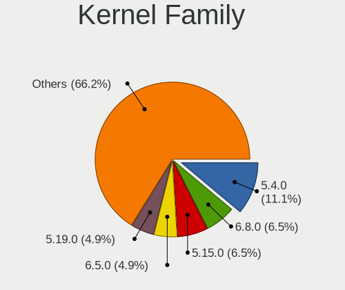

| Version | Computers | Percent |
|---------|-----------|---------|
| 5.4.0   | 34        | 24.11%  |
| 4.15.0  | 14        | 9.93%   |
| 5.8.0   | 9         | 6.38%   |
| 5.11.0  | 9         | 6.38%   |
| 5.15.0  | 8         | 5.67%   |
| 5.3.0   | 6         | 4.26%   |
| 5.13.0  | 4         | 2.84%   |
| 5.10.0  | 4         | 2.84%   |
| 5.19.0  | 3         | 2.13%   |
| 5.0.0   | 3         | 2.13%   |
| 6.0.6   | 2         | 1.42%   |
| 6.0.12  | 2         | 1.42%   |
| 5.7.14  | 2         | 1.42%   |
| 5.16.7  | 2         | 1.42%   |
| 5.14.0  | 2         | 1.42%   |
| 4.18.0  | 2         | 1.42%   |
| 5.9.3   | 1         | 0.71%   |
| 5.9.16  | 1         | 0.71%   |
| 5.9.11  | 1         | 0.71%   |
| 5.9.1   | 1         | 0.71%   |
| 5.8.7   | 1         | 0.71%   |
| 5.8.5   | 1         | 0.71%   |
| 5.8.12  | 1         | 0.71%   |
| 5.7.6   | 1         | 0.71%   |
| 5.6.16  | 1         | 0.71%   |
| 5.6.14  | 1         | 0.71%   |
| 5.5.11  | 1         | 0.71%   |
| 5.4.68  | 1         | 0.71%   |
| 5.4.2   | 1         | 0.71%   |
| 5.19.8  | 1         | 0.71%   |
| 5.19.13 | 1         | 0.71%   |
| 5.19.12 | 1         | 0.71%   |
| 5.18.12 | 1         | 0.71%   |
| 5.18.11 | 1         | 0.71%   |
| 5.17.4  | 1         | 0.71%   |
| 5.16.5  | 1         | 0.71%   |
| 5.16.18 | 1         | 0.71%   |
| 5.16.16 | 1         | 0.71%   |
| 5.16.12 | 1         | 0.71%   |
| 5.15.77 | 1         | 0.71%   |

Kernel Major Ver.
-----------------

Linux kernel major version

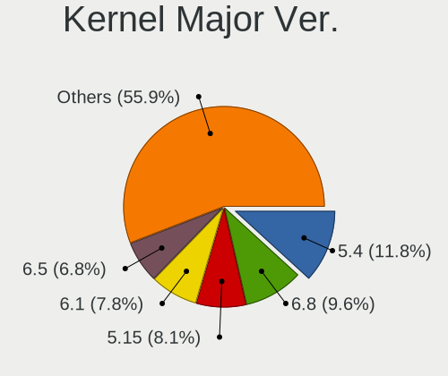

| Version | Computers | Percent |
|---------|-----------|---------|
| 5.4     | 36        | 26.09%  |
| 4.15    | 14        | 10.14%  |
| 5.8     | 11        | 7.97%   |
| 5.15    | 11        | 7.97%   |
| 5.11    | 9         | 6.52%   |
| 5.3     | 6         | 4.35%   |
| 5.19    | 6         | 4.35%   |
| 5.10    | 6         | 4.35%   |
| 5.16    | 5         | 3.62%   |
| 5.13    | 5         | 3.62%   |
| 6.0     | 4         | 2.9%    |
| 5.9     | 3         | 2.17%   |
| 5.7     | 3         | 2.17%   |
| 5.14    | 3         | 2.17%   |
| 5.0     | 3         | 2.17%   |
| 4.18    | 3         | 2.17%   |
| 5.6     | 2         | 1.45%   |
| 5.18    | 2         | 1.45%   |
| 4.19    | 2         | 1.45%   |
| 5.5     | 1         | 0.72%   |
| 5.17    | 1         | 0.72%   |
| 5.12    | 1         | 0.72%   |
| 4.4     | 1         | 0.72%   |

Arch
----

OS architecture (x86_64, i586, etc.)

| Name   | Computers | Percent |
|--------|-----------|---------|
| x86_64 | 129       | 98.47%  |
| i686   | 2         | 1.53%   |

DE
--

Desktop Environment

| Name       | Computers | Percent |
|------------|-----------|---------|
| GNOME      | 87        | 63.5%   |
| Unknown    | 18        | 13.14%  |
| KDE5       | 11        | 8.03%   |
| X-Cinnamon | 5         | 3.65%   |
| XFCE       | 4         | 2.92%   |
| KDE        | 4         | 2.92%   |
| MATE       | 3         | 2.19%   |
| Unity      | 1         | 0.73%   |
| Pantheon   | 1         | 0.73%   |
| DWM        | 1         | 0.73%   |
| bspwm      | 1         | 0.73%   |
| awesome    | 1         | 0.73%   |

Display Server
--------------

X11 or Wayland

| Name    | Computers | Percent |
|---------|-----------|---------|
| X11     | 95        | 70.9%   |
| Wayland | 28        | 20.9%   |
| Unknown | 11        | 8.21%   |

Display Manager
---------------

SDDM, LightDM, etc.

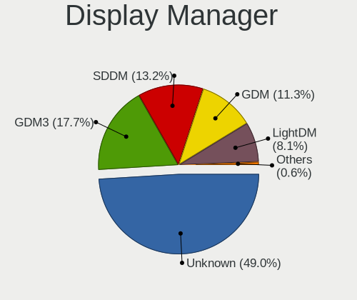

| Name    | Computers | Percent |
|---------|-----------|---------|
| Unknown | 79        | 58.52%  |
| GDM     | 25        | 18.52%  |
| GDM3    | 12        | 8.89%   |
| SDDM    | 11        | 8.15%   |
| LightDM | 6         | 4.44%   |
| TDM     | 2         | 1.48%   |

OS Lang
-------

Language

| Lang    | Computers | Percent |
|---------|-----------|---------|
| en_US   | 99        | 75%     |
| Unknown | 15        | 11.36%  |
| C       | 6         | 4.55%   |
| en_GB   | 5         | 3.79%   |
| ru_RU   | 1         | 0.76%   |
| hu_HU   | 1         | 0.76%   |
| en_IN   | 1         | 0.76%   |
| en_AU   | 1         | 0.76%   |
| en_AG   | 1         | 0.76%   |
| de_DE   | 1         | 0.76%   |
| ar_AE   | 1         | 0.76%   |

Boot Mode
---------

EFI or BIOS

| Mode | Computers | Percent |
|------|-----------|---------|
| EFI  | 75        | 54.74%  |
| BIOS | 62        | 45.26%  |

Filesystem
----------

Type of filesystem

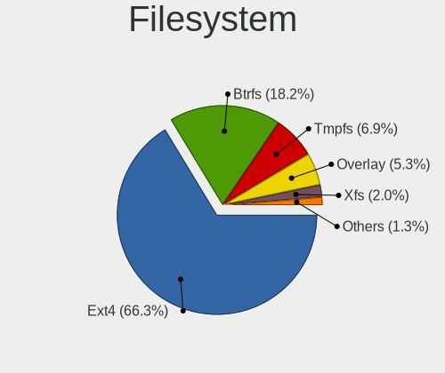

| Type    | Computers | Percent |
|---------|-----------|---------|
| Ext4    | 109       | 83.21%  |
| Btrfs   | 11        | 8.4%    |
| Overlay | 7         | 5.34%   |
| Xfs     | 3         | 2.29%   |
| Unknown | 1         | 0.76%   |

Part. scheme
------------

Scheme of partitioning

| Type    | Computers | Percent |
|---------|-----------|---------|
| Unknown | 83        | 62.41%  |
| GPT     | 42        | 31.58%  |
| MBR     | 8         | 6.02%   |

Dual Boot with Linux/BSD
------------------------

Hosting more than one Linux/BSD

| Dual boot | Computers | Percent |
|-----------|-----------|---------|
| No        | 118       | 89.39%  |
| Yes       | 14        | 10.61%  |

Dual Boot (Win)
---------------

Hosting Linux and Windows

| Dual boot | Computers | Percent |
|-----------|-----------|---------|
| No        | 81        | 60.45%  |
| Yes       | 53        | 39.55%  |

Board
-----

Vendor
------

Motherboard manufacturer

| Name                        | Computers | Percent |
|-----------------------------|-----------|---------|
| Hewlett-Packard             | 34        | 25.95%  |
| Lenovo                      | 30        | 22.9%   |
| Dell                        | 17        | 12.98%  |
| ASUSTek Computer            | 16        | 12.21%  |
| Toshiba                     | 5         | 3.82%   |
| Intel                       | 4         | 3.05%   |
| MSI                         | 3         | 2.29%   |
| Gigabyte Technology         | 3         | 2.29%   |
| Sony                        | 2         | 1.53%   |
| Microsoft                   | 2         | 1.53%   |
| Google                      | 2         | 1.53%   |
| Apple                       | 2         | 1.53%   |
| Acer                        | 2         | 1.53%   |
| YJKC                        | 1         | 0.76%   |
| win element                 | 1         | 0.76%   |
| Valve                       | 1         | 0.76%   |
| Notebook                    | 1         | 0.76%   |
| LG Electronics              | 1         | 0.76%   |
| I-Life Digital Technologies | 1         | 0.76%   |
| ECS                         | 1         | 0.76%   |
| Biostar                     | 1         | 0.76%   |
| AZW                         | 1         | 0.76%   |

Model
-----

Motherboard model

| Name                                        | Computers | Percent |
|---------------------------------------------|-----------|---------|
| HP Pavilion Notebook                        | 2         | 1.53%   |
| HP ENVY Laptop 13-aq0xxx                    | 2         | 1.53%   |
| HP All-in-One 22-c0xx                       | 2         | 1.53%   |
| ASUS All Series                             | 2         | 1.53%   |
| YJKC vBOOK Plus                             | 1         | 0.76%   |
| win element MoreFine S500+                  | 1         | 0.76%   |
| Valve Jupiter                               | 1         | 0.76%   |
| Toshiba TECRA X40-D                         | 1         | 0.76%   |
| Toshiba TECRA A50-C                         | 1         | 0.76%   |
| Toshiba Satellite C850-A966                 | 1         | 0.76%   |
| Toshiba Satellite C660                      | 1         | 0.76%   |
| Toshiba Satellite A300                      | 1         | 0.76%   |
| Sony VGN-NS10J_S                            | 1         | 0.76%   |
| Sony SVE14A25CAB                            | 1         | 0.76%   |
| Notebook P95_96_97Ex,Rx                     | 1         | 0.76%   |
| MSI PS63 Modern 8RD                         | 1         | 0.76%   |
| MSI MS-7850                                 | 1         | 0.76%   |
| MSI Modern 14 B5M                           | 1         | 0.76%   |
| Microsoft Surface Pro 4                     | 1         | 0.76%   |
| Microsoft Surface Pro 3                     | 1         | 0.76%   |
| LG C500-G.AEF5BE1                           | 1         | 0.76%   |
| Lenovo Yoga S730-13IWL 81J0                 | 1         | 0.76%   |
| Lenovo Yoga 2 Pro 20266                     | 1         | 0.76%   |
| Lenovo ThinkPad Yoga 260 20FD000GAD         | 1         | 0.76%   |
| Lenovo ThinkPad X240 20AMS6GB00             | 1         | 0.76%   |
| Lenovo ThinkPad X230 2325DV8                | 1         | 0.76%   |
| Lenovo ThinkPad X1 Yoga 4th 20QF0015US      | 1         | 0.76%   |
| Lenovo ThinkPad X1 Extreme Gen 3 20TK001HUS | 1         | 0.76%   |
| Lenovo ThinkPad X1 Carbon Gen 9 20XW00A9US  | 1         | 0.76%   |
| Lenovo ThinkPad T61 76653JG                 | 1         | 0.76%   |
| Lenovo ThinkPad T480s 20L8S3FV00            | 1         | 0.76%   |
| Lenovo ThinkPad T480s 20L7001PAD            | 1         | 0.76%   |
| Lenovo ThinkPad T470 W10DG 20JMS0Q300       | 1         | 0.76%   |
| Lenovo ThinkPad T460 20FMS1A200             | 1         | 0.76%   |
| Lenovo ThinkPad P1 Gen 5 21DC000DCK         | 1         | 0.76%   |
| Lenovo ThinkPad P1 Gen 3 20TJS4RX00         | 1         | 0.76%   |
| Lenovo ThinkPad L480 20LS0012AD             | 1         | 0.76%   |
| Lenovo ThinkPad E14 Gen 2 20TA0018AD        | 1         | 0.76%   |
| Lenovo ThinkCentre E93 10AR004LAX           | 1         | 0.76%   |
| Lenovo ThinkCentre E73 10AS0041AX           | 1         | 0.76%   |

Model Family
------------

Motherboard model prefix

| Name                 | Computers | Percent |
|----------------------|-----------|---------|
| Lenovo ThinkPad      | 15        | 11.45%  |
| HP Pavilion          | 9         | 6.87%   |
| Lenovo IdeaPad       | 7         | 5.34%   |
| HP EliteBook         | 7         | 5.34%   |
| ASUS ROG             | 6         | 4.58%   |
| Dell Latitude        | 5         | 3.82%   |
| Toshiba Satellite    | 3         | 2.29%   |
| HP ProBook           | 3         | 2.29%   |
| HP Laptop            | 3         | 2.29%   |
| HP ENVY              | 3         | 2.29%   |
| Dell Precision       | 3         | 2.29%   |
| Dell Inspiron        | 3         | 2.29%   |
| ASUS PRIME           | 3         | 2.29%   |
| Toshiba TECRA        | 2         | 1.53%   |
| Microsoft Surface    | 2         | 1.53%   |
| Lenovo Yoga          | 2         | 1.53%   |
| Lenovo ThinkCentre   | 2         | 1.53%   |
| HP All-in-One        | 2         | 1.53%   |
| Dell OptiPlex        | 2         | 1.53%   |
| ASUS VivoBook        | 2         | 1.53%   |
| ASUS All             | 2         | 1.53%   |
| YJKC vBOOK           | 1         | 0.76%   |
| win element MoreFine | 1         | 0.76%   |
| Valve Jupiter        | 1         | 0.76%   |
| Sony VGN-NS10J       | 1         | 0.76%   |
| Sony SVE14A25CAB     | 1         | 0.76%   |
| Notebook P95         | 1         | 0.76%   |
| MSI PS63             | 1         | 0.76%   |
| MSI MS-7850          | 1         | 0.76%   |
| MSI Modern           | 1         | 0.76%   |
| LG C500-G.AEF5BE1    | 1         | 0.76%   |
| Lenovo Legion        | 1         | 0.76%   |
| Lenovo IdeaPadFlex   | 1         | 0.76%   |
| Lenovo G500          | 1         | 0.76%   |
| Lenovo 81FV          | 1         | 0.76%   |
| Intel NUC6i7KYB      | 1         | 0.76%   |
| Intel NUC10i3FNH     | 1         | 0.76%   |
| Intel DH67CL         | 1         | 0.76%   |
| Intel D865PERL       | 1         | 0.76%   |
| I-Life Digital ZED   | 1         | 0.76%   |

MFG Year
--------

Motherboard manufacture year

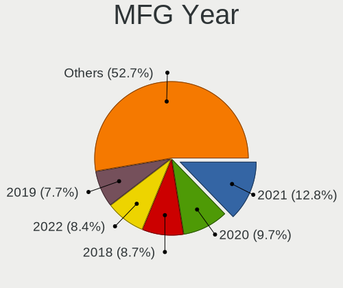

| Year | Computers | Percent |
|------|-----------|---------|
| 2019 | 17        | 12.98%  |
| 2020 | 15        | 11.45%  |
| 2018 | 14        | 10.69%  |
| 2013 | 12        | 9.16%   |
| 2021 | 10        | 7.63%   |
| 2012 | 10        | 7.63%   |
| 2017 | 8         | 6.11%   |
| 2016 | 8         | 6.11%   |
| 2010 | 8         | 6.11%   |
| 2011 | 7         | 5.34%   |
| 2014 | 5         | 3.82%   |
| 2022 | 4         | 3.05%   |
| 2015 | 4         | 3.05%   |
| 2009 | 3         | 2.29%   |
| 2007 | 3         | 2.29%   |
| 2008 | 2         | 1.53%   |
| 2005 | 1         | 0.76%   |

Form Factor
-----------

Physical design of the computer

| Name        | Computers | Percent |
|-------------|-----------|---------|
| Notebook    | 88        | 67.18%  |
| Desktop     | 28        | 21.37%  |
| Convertible | 6         | 4.58%   |
| Mini pc     | 3         | 2.29%   |
| All in one  | 3         | 2.29%   |
| Tablet      | 2         | 1.53%   |
| Server      | 1         | 0.76%   |

Secure Boot
-----------

Enabled or disabled

| State    | Computers | Percent |
|----------|-----------|---------|
| Disabled | 116       | 87.88%  |
| Enabled  | 16        | 12.12%  |

Coreboot
--------

Have coreboot on board

| Used | Computers | Percent |
|------|-----------|---------|
| No   | 129       | 98.47%  |
| Yes  | 2         | 1.53%   |

RAM Size
--------

Total RAM memory

| Size in GB      | Computers | Percent |
|-----------------|-----------|---------|
| 4.01-8.0        | 31        | 23.66%  |
| 16.01-24.0      | 28        | 21.37%  |
| 3.01-4.0        | 21        | 16.03%  |
| 8.01-16.0       | 21        | 16.03%  |
| 32.01-64.0      | 13        | 9.92%   |
| 64.01-256.0     | 7         | 5.34%   |
| 0.51-1.0        | 3         | 2.29%   |
| 24.01-32.0      | 2         | 1.53%   |
| 2.01-3.0        | 2         | 1.53%   |
| 1.01-2.0        | 2         | 1.53%   |
| More than 256.0 | 1         | 0.76%   |

RAM Used
--------

Used RAM memory

| Used GB    | Computers | Percent |
|------------|-----------|---------|
| 1.01-2.0   | 43        | 30.5%   |
| 2.01-3.0   | 32        | 22.7%   |
| 4.01-8.0   | 28        | 19.86%  |
| 3.01-4.0   | 23        | 16.31%  |
| 8.01-16.0  | 7         | 4.96%   |
| 0.51-1.0   | 5         | 3.55%   |
| 0.01-0.5   | 2         | 1.42%   |
| 16.01-24.0 | 1         | 0.71%   |

Total Drives
------------

Number of drives on board

| Drives | Computers | Percent |
|--------|-----------|---------|
| 1      | 95        | 71.97%  |
| 2      | 23        | 17.42%  |
| 3      | 6         | 4.55%   |
| 4      | 3         | 2.27%   |
| 0      | 2         | 1.52%   |
| 9      | 1         | 0.76%   |
| 8      | 1         | 0.76%   |
| 6      | 1         | 0.76%   |

Has CD-ROM
----------

Has CD-ROM on board

| Presented | Computers | Percent |
|-----------|-----------|---------|
| No        | 92        | 70.23%  |
| Yes       | 39        | 29.77%  |

Has Ethernet
------------

Has Ethernet on board

| Presented | Computers | Percent |
|-----------|-----------|---------|
| Yes       | 101       | 77.1%   |
| No        | 30        | 22.9%   |

Has WiFi
--------

Has WiFi module

| Presented | Computers | Percent |
|-----------|-----------|---------|
| Yes       | 113       | 86.26%  |
| No        | 18        | 13.74%  |

Has Bluetooth
-------------

Has Bluetooth module

| Presented | Computers | Percent |
|-----------|-----------|---------|
| Yes       | 93        | 69.92%  |
| No        | 40        | 30.08%  |

Location
--------

Country
-------

Geographic location (country)

| Country | Computers | Percent |
|---------|-----------|---------|
| UAE     | 131       | 100%    |

City
----

Geographic location (city)

| City             | Computers | Percent |
|------------------|-----------|---------|
| Dubai            | 58        | 42.96%  |
| Abu Dhabi        | 44        | 32.59%  |
| Sharjah          | 18        | 13.33%  |
| Al Ain City      | 7         | 5.19%   |
| Al Fujairah City | 3         | 2.22%   |
| Ajman            | 3         | 2.22%   |
| Ras al-Khaimah   | 1         | 0.74%   |
| Al Halah         | 1         | 0.74%   |

Drives
------

Drive Vendor
------------

Hard drive vendors

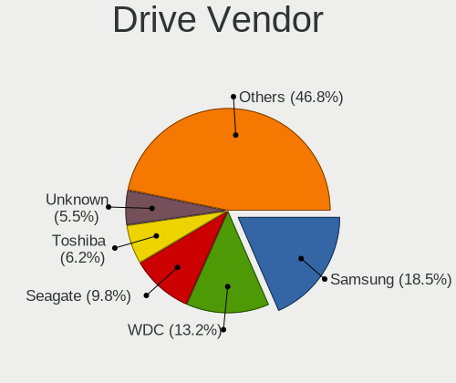

| Vendor                | Computers | Drives | Percent |
|-----------------------|-----------|--------|---------|
| Samsung Electronics   | 32        | 50     | 18.82%  |
| WDC                   | 30        | 34     | 17.65%  |
| Seagate               | 19        | 26     | 11.18%  |
| Toshiba               | 17        | 21     | 10%     |
| Unknown               | 7         | 14     | 4.12%   |
| Intel                 | 7         | 9      | 4.12%   |
| HGST                  | 7         | 8      | 4.12%   |
| Kingston              | 5         | 5      | 2.94%   |
| Crucial               | 5         | 6      | 2.94%   |
| SK hynix              | 4         | 5      | 2.35%   |
| SanDisk               | 4         | 5      | 2.35%   |
| Micron Technology     | 4         | 4      | 2.35%   |
| Hitachi               | 4         | 4      | 2.35%   |
| Apple                 | 3         | 4      | 1.76%   |
| Phison                | 2         | 2      | 1.18%   |
| Lexar                 | 2         | 2      | 1.18%   |
| USB3.0                | 1         | 1      | 0.59%   |
| Transcend             | 1         | 1      | 0.59%   |
| Team                  | 1         | 1      | 0.59%   |
| Realtek Semiconductor | 1         | 1      | 0.59%   |
| Phison Electronics    | 1         | 1      | 0.59%   |
| Patriot               | 1         | 1      | 0.59%   |
| OCZ                   | 1         | 1      | 0.59%   |
| Maxtor                | 1         | 1      | 0.59%   |
| Lite-On               | 1         | 1      | 0.59%   |
| Lenovo                | 1         | 1      | 0.59%   |
| LaCie                 | 1         | 1      | 0.59%   |
| KingSpec              | 1         | 2      | 0.59%   |
| Gigabyte Technology   | 1         | 1      | 0.59%   |
| Fujitsu               | 1         | 1      | 0.59%   |
| External              | 1         | 1      | 0.59%   |
| Corsair               | 1         | 1      | 0.59%   |
| China                 | 1         | 1      | 0.59%   |
| A-DATA Technology     | 1         | 1      | 0.59%   |

Drive Model
-----------

Hard drive models

| Model                                              | Computers | Percent |
|----------------------------------------------------|-----------|---------|
| Samsung SM963 2.5" NVMe PCIe SSD 256GB             | 4         | 2.2%    |
| HGST HTS725050A7E630 500GB                         | 4         | 2.2%    |
| Intel NVMe SSD Drive 512GB                         | 3         | 1.65%   |
| WDC WDS240G2G0A-00JH30 240GB SSD                   | 2         | 1.1%    |
| WDC WD10SPZX-08Z10 1TB                             | 2         | 1.1%    |
| WDC WD1002FAEX-00Z3A0 1TB                          | 2         | 1.1%    |
| WDC PC SN730 SDBQNTY-1T00-1001 1TB                 | 2         | 1.1%    |
| Unknown SD/MMC/MS PRO 64GB                         | 2         | 1.1%    |
| Unknown MMC Card  16GB                             | 2         | 1.1%    |
| Toshiba MQ01ABD075 752GB                           | 2         | 1.1%    |
| Toshiba DT01ACA100 1TB                             | 2         | 1.1%    |
| Seagate ST500LT012-1DG142 500GB                    | 2         | 1.1%    |
| Seagate ST500DM002-1BD142 500GB                    | 2         | 1.1%    |
| Samsung SSD 970 EVO Plus 500GB                     | 2         | 1.1%    |
| Samsung SSD 850 PRO 1TB                            | 2         | 1.1%    |
| Samsung SSD 850 EVO 250GB                          | 2         | 1.1%    |
| Samsung NVMe SSD Controller PM9A1/PM9A3/980PRO 2TB | 2         | 1.1%    |
| Intel SSDPEKNW512G8H 512GB                         | 2         | 1.1%    |
| HGST HTS721010A9E630 1TB                           | 2         | 1.1%    |
| Crucial CT500MX500SSD1 500GB                       | 2         | 1.1%    |
| WDC WDS500G2B0A-00SM50 500GB SSD                   | 1         | 0.55%   |
| WDC WDS120G2G0A-00JH30 120GB SSD                   | 1         | 0.55%   |
| WDC WDS120G1G0A-00SS50 120GB SSD                   | 1         | 0.55%   |
| WDC WDS100T3X0C-00SJG0 1TB                         | 1         | 0.55%   |
| WDC WD800BB-55JHC0 80GB                            | 1         | 0.55%   |
| WDC WD6400AAKS-22A7B0 640GB                        | 1         | 0.55%   |
| WDC WD5000LPVX-60V0TT0 500GB                       | 1         | 0.55%   |
| WDC WD5000LPCX-24VHAT0 500GB                       | 1         | 0.55%   |
| WDC WD5000LPCX-22VHAT1 500GB                       | 1         | 0.55%   |
| WDC WD5000BPVT-00A1YT0 500GB                       | 1         | 0.55%   |
| WDC WD5000AAKS-65V0A0 500GB                        | 1         | 0.55%   |
| WDC WD5000AAKS-00A7B2 500GB                        | 1         | 0.55%   |
| WDC WD40EFRX-68N32N0 4TB                           | 1         | 0.55%   |
| WDC WD2500BEVS-26UST0 250GB                        | 1         | 0.55%   |
| WDC WD2500AAJS-75M0A0 249GB                        | 1         | 0.55%   |
| WDC WD20EZRX-00D8PB0 2TB                           | 1         | 0.55%   |
| WDC WD1600AAJS-60B4A0 160GB                        | 1         | 0.55%   |
| WDC WD1200BEVS-08UST0 120GB                        | 1         | 0.55%   |
| WDC WD10SPZX-24Z10T0 1TB                           | 1         | 0.55%   |
| WDC WD10SPZX-24Z10 1TB                             | 1         | 0.55%   |

HDD Vendor
----------

Hard disk drive vendors

| Vendor  | Computers | Drives | Percent |
|---------|-----------|--------|---------|
| WDC     | 22        | 26     | 30.14%  |
| Seagate | 19        | 26     | 26.03%  |
| Toshiba | 14        | 18     | 19.18%  |
| HGST    | 7         | 8      | 9.59%   |
| Hitachi | 4         | 4      | 5.48%   |
| Unknown | 2         | 5      | 2.74%   |
| Apple   | 2         | 2      | 2.74%   |
| USB3.0  | 1         | 1      | 1.37%   |
| Maxtor  | 1         | 1      | 1.37%   |
| Fujitsu | 1         | 1      | 1.37%   |

SSD Vendor
----------

Solid state drive vendors

| Vendor              | Computers | Drives | Percent |
|---------------------|-----------|--------|---------|
| Samsung Electronics | 13        | 23     | 36.11%  |
| WDC                 | 5         | 5      | 13.89%  |
| Crucial             | 4         | 5      | 11.11%  |
| Kingston            | 3         | 3      | 8.33%   |
| Transcend           | 1         | 1      | 2.78%   |
| Team                | 1         | 1      | 2.78%   |
| SK hynix            | 1         | 1      | 2.78%   |
| SanDisk             | 1         | 1      | 2.78%   |
| Patriot             | 1         | 1      | 2.78%   |
| Lexar               | 1         | 1      | 2.78%   |
| LaCie               | 1         | 1      | 2.78%   |
| KingSpec            | 1         | 2      | 2.78%   |
| Gigabyte Technology | 1         | 1      | 2.78%   |
| Corsair             | 1         | 1      | 2.78%   |
| China               | 1         | 1      | 2.78%   |

Drive Kind
----------

HDD or SSD

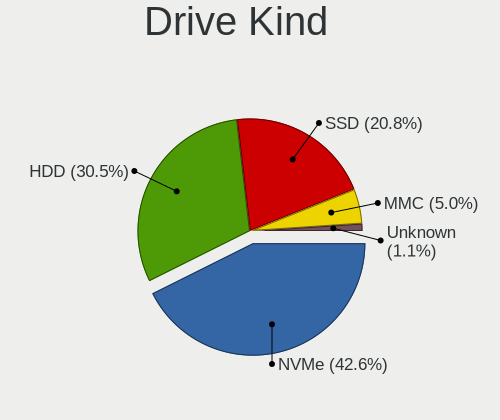

| Kind | Computers | Drives | Percent |
|------|-----------|--------|---------|
| HDD  | 65        | 92     | 42.76%  |
| NVMe | 53        | 69     | 34.87%  |
| SSD  | 29        | 48     | 19.08%  |
| MMC  | 5         | 9      | 3.29%   |

Drive Connector
---------------

SATA, SAS, NVMe, etc.

| Type | Computers | Drives | Percent |
|------|-----------|--------|---------|
| SATA | 82        | 132    | 56.94%  |
| NVMe | 52        | 68     | 36.11%  |
| SAS  | 5         | 9      | 3.47%   |
| MMC  | 5         | 9      | 3.47%   |

Drive Size
----------

Size of hard drive

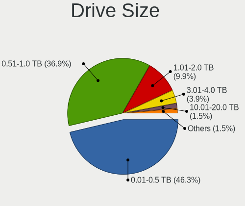

| Size in TB | Computers | Drives | Percent |
|------------|-----------|--------|---------|
| 0.01-0.5   | 57        | 73     | 56.44%  |
| 0.51-1.0   | 33        | 44     | 32.67%  |
| 1.01-2.0   | 8         | 15     | 7.92%   |
| 3.01-4.0   | 2         | 7      | 1.98%   |
| 4.01-10.0  | 1         | 1      | 0.99%   |

Space Total
-----------

Amount of disk space available on the file system

| Size in GB     | Computers | Percent |
|----------------|-----------|---------|
| 251-500        | 41        | 30.6%   |
| 101-250        | 31        | 23.13%  |
| 501-1000       | 12        | 8.96%   |
| 21-50          | 11        | 8.21%   |
| 1001-2000      | 9         | 6.72%   |
| 51-100         | 9         | 6.72%   |
| Unknown        | 7         | 5.22%   |
| 1-20           | 6         | 4.48%   |
| 2001-3000      | 5         | 3.73%   |
| More than 3000 | 3         | 2.24%   |

Space Used
----------

Amount of used disk space

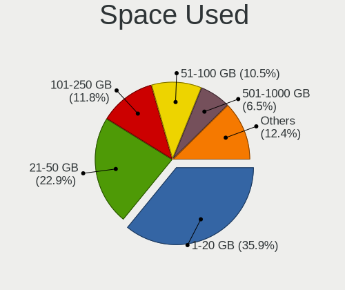

| Used GB   | Computers | Percent |
|-----------|-----------|---------|
| 1-20      | 59        | 41.55%  |
| 21-50     | 31        | 21.83%  |
| 51-100    | 17        | 11.97%  |
| 101-250   | 12        | 8.45%   |
| 251-500   | 9         | 6.34%   |
| Unknown   | 7         | 4.93%   |
| 501-1000  | 5         | 3.52%   |
| 2001-3000 | 1         | 0.7%    |
| 1001-2000 | 1         | 0.7%    |

Malfunc. Drives
---------------

Drive models with a malfunction

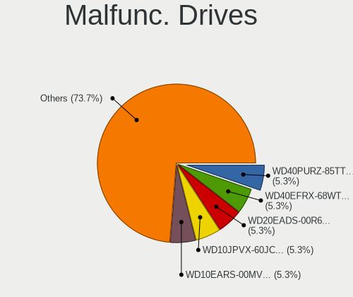

| Model                    | Computers | Drives | Percent |
|--------------------------|-----------|--------|---------|
| WDC WD10JPVX-60JC3T1 1TB | 1         | 1      | 100%    |

Malfunc. Drive Vendor
---------------------

Vendors of faulty drives

| Vendor | Computers | Drives | Percent |
|--------|-----------|--------|---------|
| WDC    | 1         | 1      | 100%    |

Malfunc. HDD Vendor
-------------------

Vendors of faulty HDD drives

| Vendor | Computers | Drives | Percent |
|--------|-----------|--------|---------|
| WDC    | 1         | 1      | 100%    |

Malfunc. Drive Kind
-------------------

Kinds of faulty drives

| Kind | Computers | Drives | Percent |
|------|-----------|--------|---------|
| HDD  | 1         | 1      | 100%    |

Failed Drives
-------------

Failed drive models

Zero info for selected period =(

Failed Drive Vendor
-------------------

Failed drive vendors

Zero info for selected period =(

Drive Status
------------

Number of failed and malfunc. drives

| Status   | Computers | Drives | Percent |
|----------|-----------|--------|---------|
| Detected | 88        | 144    | 67.18%  |
| Works    | 42        | 73     | 32.06%  |
| Malfunc  | 1         | 1      | 0.76%   |

Storage controller
------------------

Storage Vendor
--------------

Storage controller vendors

| Vendor                       | Computers | Percent |
|------------------------------|-----------|---------|
| Intel                        | 99        | 60.37%  |
| Samsung Electronics          | 21        | 12.8%   |
| SanDisk                      | 6         | 3.66%   |
| AMD                          | 6         | 3.66%   |
| Micron Technology            | 4         | 2.44%   |
| Toshiba America Info Systems | 3         | 1.83%   |
| SK hynix                     | 3         | 1.83%   |
| Phison Electronics           | 3         | 1.83%   |
| ASMedia Technology           | 3         | 1.83%   |
| LSI Logic / Symbios Logic    | 2         | 1.22%   |
| Kingston Technology Company  | 2         | 1.22%   |
| VIA Technologies             | 1         | 0.61%   |
| Silicon Motion               | 1         | 0.61%   |
| Realtek Semiconductor        | 1         | 0.61%   |
| OCZ Technology Group         | 1         | 0.61%   |
| Nvidia                       | 1         | 0.61%   |
| Micron/Crucial Technology    | 1         | 0.61%   |
| Marvell Technology Group     | 1         | 0.61%   |
| Lite-On Technology           | 1         | 0.61%   |
| Lenovo                       | 1         | 0.61%   |
| JMicron Technology           | 1         | 0.61%   |
| Broadcom / LSI               | 1         | 0.61%   |
| Apple                        | 1         | 0.61%   |

Storage Model
-------------

Storage controller models

| Model                                                                          | Computers | Percent |
|--------------------------------------------------------------------------------|-----------|---------|
| Intel 82801 Mobile SATA Controller [RAID mode]                                 | 13        | 7.14%   |
| Intel Sunrise Point-LP SATA Controller [AHCI mode]                             | 10        | 5.49%   |
| Samsung NVMe SSD Controller SM981/PM981/PM983                                  | 7         | 3.85%   |
| Intel Cannon Lake Mobile PCH SATA AHCI Controller                              | 7         | 3.85%   |
| Intel 8 Series SATA Controller 1 [AHCI mode]                                   | 7         | 3.85%   |
| Intel 7 Series Chipset Family 6-port SATA Controller [AHCI mode]               | 7         | 3.85%   |
| Samsung NVMe SSD Controller 980                                                | 6         | 3.3%    |
| Intel 6 Series/C200 Series Chipset Family 6 port Mobile SATA AHCI Controller   | 6         | 3.3%    |
| Intel SSD 660P Series                                                          | 5         | 2.75%   |
| AMD FCH SATA Controller [AHCI mode]                                            | 5         | 2.75%   |
| Samsung NVMe SSD Controller SM961/PM961/SM963                                  | 4         | 2.2%    |
| Micron Non-Volatile memory controller                                          | 4         | 2.2%    |
| Intel Wildcat Point-LP SATA Controller [AHCI Mode]                             | 4         | 2.2%    |
| SanDisk WD Black SN750 / PC SN730 NVMe SSD                                     | 3         | 1.65%   |
| Samsung NVMe SSD Controller PM9A1/PM9A3/980PRO                                 | 3         | 1.65%   |
| Phison E12 NVMe Controller                                                     | 3         | 1.65%   |
| Intel Volume Management Device NVMe RAID Controller                            | 3         | 1.65%   |
| Intel 200 Series PCH SATA controller [AHCI mode]                               | 3         | 1.65%   |
| ASMedia ASM1062 Serial ATA Controller                                          | 3         | 1.65%   |
| Toshiba America Info Systems BG3 NVMe SSD Controller                           | 2         | 1.1%    |
| SK hynix Gold P31/PC711 NVMe Solid State Drive                                 | 2         | 1.1%    |
| Intel SSD Pro 7600p/760p/E 6100p Series                                        | 2         | 1.1%    |
| Intel Q170/Q150/B150/H170/H110/Z170/CM236 Chipset SATA Controller [AHCI Mode]  | 2         | 1.1%    |
| Intel HM170/QM170 Chipset SATA Controller [AHCI Mode]                          | 2         | 1.1%    |
| Intel Comet Lake SATA AHCI Controller                                          | 2         | 1.1%    |
| Intel Cannon Lake PCH SATA AHCI Controller                                     | 2         | 1.1%    |
| Intel C610/X99 series chipset sSATA Controller [AHCI mode]                     | 2         | 1.1%    |
| Intel C610/X99 series chipset 6-Port SATA Controller [AHCI mode]               | 2         | 1.1%    |
| Intel 82801JI (ICH10 Family) SATA AHCI Controller                              | 2         | 1.1%    |
| Intel 82801HM/HEM (ICH8M/ICH8M-E) IDE Controller                               | 2         | 1.1%    |
| Intel 8 Series/C220 Series Chipset Family 6-port SATA Controller 1 [AHCI mode] | 2         | 1.1%    |
| Intel 7 Series/C210 Series Chipset Family 6-port SATA Controller [AHCI mode]   | 2         | 1.1%    |
| Intel 6 Series/C200 Series Chipset Family 6 port Desktop SATA AHCI Controller  | 2         | 1.1%    |
| Intel 5 Series/3400 Series Chipset 4 port SATA IDE Controller                  | 2         | 1.1%    |
| Intel 5 Series/3400 Series Chipset 2 port SATA IDE Controller                  | 2         | 1.1%    |
| Intel 400 Series Chipset Family SATA AHCI Controller                           | 2         | 1.1%    |
| VIA VT6415 PATA IDE Host Controller                                            | 1         | 0.55%   |
| Toshiba America Info Systems XG6 NVMe SSD Controller                           | 1         | 0.55%   |
| SK hynix PC401 NVMe Solid State Drive 256GB                                    | 1         | 0.55%   |
| Silicon Motion SM2263EN/SM2263XT SSD Controller                                | 1         | 0.55%   |

Storage Kind
------------

Kind of storage controller (IDE, SATA, NVMe, SAS, ...)

| Kind | Computers | Percent |
|------|-----------|---------|
| SATA | 80        | 49.69%  |
| NVMe | 52        | 32.3%   |
| RAID | 19        | 11.8%   |
| IDE  | 8         | 4.97%   |
| SAS  | 1         | 0.62%   |
| SCSI | 1         | 0.62%   |

Processor
---------

CPU Vendor
----------

Processor vendors

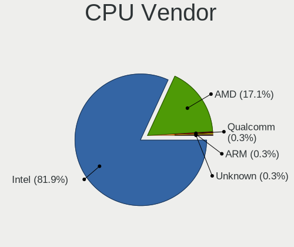

| Vendor | Computers | Percent |
|--------|-----------|---------|
| Intel  | 118       | 90.08%  |
| AMD    | 13        | 9.92%   |

CPU Model
---------

Processor models

| Model                                       | Computers | Percent |
|---------------------------------------------|-----------|---------|
| Intel Core i5-8265U CPU @ 1.60GHz           | 5         | 3.82%   |
| Intel Core i5-4200U CPU @ 1.60GHz           | 5         | 3.82%   |
| Intel Core i7-8565U CPU @ 1.80GHz           | 4         | 3.05%   |
| Intel Core i7-8750H CPU @ 2.20GHz           | 3         | 2.29%   |
| Intel Core i7-8550U CPU @ 1.80GHz           | 3         | 2.29%   |
| Intel Core i5-6300U CPU @ 2.40GHz           | 3         | 2.29%   |
| Intel Core i3-10110U CPU @ 2.10GHz          | 3         | 2.29%   |
| Intel Xeon CPU E5620 @ 2.40GHz              | 2         | 1.53%   |
| Intel Core i9-10885H CPU @ 2.40GHz          | 2         | 1.53%   |
| Intel Core i7-7700HQ CPU @ 2.80GHz          | 2         | 1.53%   |
| Intel Core i7-7500U CPU @ 2.70GHz           | 2         | 1.53%   |
| Intel Core i7-6500U CPU @ 2.50GHz           | 2         | 1.53%   |
| Intel Core i7-5500U CPU @ 2.40GHz           | 2         | 1.53%   |
| Intel Core i7-3770K CPU @ 3.50GHz           | 2         | 1.53%   |
| Intel Core i5-9400T CPU @ 1.80GHz           | 2         | 1.53%   |
| Intel Core i5-7400 CPU @ 3.00GHz            | 2         | 1.53%   |
| Intel Core i5-4300U CPU @ 1.90GHz           | 2         | 1.53%   |
| Intel Core i5-2410M CPU @ 2.30GHz           | 2         | 1.53%   |
| Intel Core i5-10210U CPU @ 1.60GHz          | 2         | 1.53%   |
| Intel 11th Gen Core i5-1135G7 @ 2.40GHz     | 2         | 1.53%   |
| AMD Ryzen 9 5900HX with Radeon Graphics     | 2         | 1.53%   |
| AMD Ryzen 5 5500U with Radeon Graphics      | 2         | 1.53%   |
| Intel Xeon Silver 4214 CPU @ 2.20GHz        | 1         | 0.76%   |
| Intel Xeon CPU E5-2609 v2 @ 2.50GHz         | 1         | 0.76%   |
| Intel Pentium Dual-Core CPU E5400 @ 2.70GHz | 1         | 0.76%   |
| Intel Pentium 4 CPU 2.80GHz                 | 1         | 0.76%   |
| Intel Core m5-6Y54 CPU @ 1.10GHz            | 1         | 0.76%   |
| Intel Core i9-9980HK CPU @ 2.40GHz          | 1         | 0.76%   |
| Intel Core i9-10900K CPU @ 3.70GHz          | 1         | 0.76%   |
| Intel Core i7-9850H CPU @ 2.60GHz           | 1         | 0.76%   |
| Intel Core i7-9750H CPU @ 2.60GHz           | 1         | 0.76%   |
| Intel Core i7-8665U CPU @ 1.90GHz           | 1         | 0.76%   |
| Intel Core i7-8650U CPU @ 1.90GHz           | 1         | 0.76%   |
| Intel Core i7-7740X CPU @ 4.30GHz           | 1         | 0.76%   |
| Intel Core i7-6770HQ CPU @ 2.60GHz          | 1         | 0.76%   |
| Intel Core i7-6700HQ CPU @ 2.60GHz          | 1         | 0.76%   |
| Intel Core i7-6700 CPU @ 3.40GHz            | 1         | 0.76%   |
| Intel Core i7-5960X CPU @ 3.00GHz           | 1         | 0.76%   |
| Intel Core i7-5820K CPU @ 3.30GHz           | 1         | 0.76%   |
| Intel Core i7-4790S CPU @ 3.20GHz           | 1         | 0.76%   |

CPU Model Family
----------------

Processor model prefix

| Model                   | Computers | Percent |
|-------------------------|-----------|---------|
| Intel Core i5           | 44        | 33.59%  |
| Intel Core i7           | 40        | 30.53%  |
| Intel Core i3           | 8         | 6.11%   |
| Other                   | 7         | 5.34%   |
| Intel Core i9           | 4         | 3.05%   |
| AMD Ryzen 5             | 4         | 3.05%   |
| Intel Xeon              | 3         | 2.29%   |
| Intel Core 2 Duo        | 3         | 2.29%   |
| Intel Celeron           | 3         | 2.29%   |
| AMD Ryzen 9             | 3         | 2.29%   |
| Intel Xeon Silver       | 1         | 0.76%   |
| Intel Pentium Dual-Core | 1         | 0.76%   |
| Intel Pentium 4         | 1         | 0.76%   |
| Intel Core m5           | 1         | 0.76%   |
| Intel Core 2 Quad       | 1         | 0.76%   |
| Intel Celeron M         | 1         | 0.76%   |
| Intel Atom              | 1         | 0.76%   |
| AMD Sempron             | 1         | 0.76%   |
| AMD Ryzen Threadripper  | 1         | 0.76%   |
| AMD Ryzen 7 PRO         | 1         | 0.76%   |
| AMD Ryzen 7             | 1         | 0.76%   |
| AMD A6                  | 1         | 0.76%   |

CPU Cores
---------

Number of processor cores

| Number | Computers | Percent |
|--------|-----------|---------|
| 2      | 53        | 40.46%  |
| 4      | 44        | 33.59%  |
| 6      | 12        | 9.16%   |
| 8      | 11        | 8.4%    |
| 1      | 4         | 3.05%   |
| 16     | 3         | 2.29%   |
| 14     | 2         | 1.53%   |
| 12     | 1         | 0.76%   |
| 10     | 1         | 0.76%   |

CPU Sockets
-----------

Number of sockets

| Number | Computers | Percent |
|--------|-----------|---------|
| 1      | 129       | 98.47%  |
| 2      | 2         | 1.53%   |

CPU Threads
-----------

Threads per core (Hyper-Threading)

| Number | Computers | Percent |
|--------|-----------|---------|
| 2      | 109       | 83.21%  |
| 1      | 22        | 16.79%  |

CPU Op-Modes
------------

CPU Operation Modes (32-bit, 64-bit)

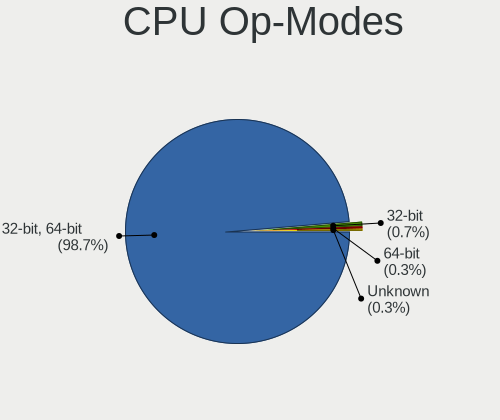

| Op mode        | Computers | Percent |
|----------------|-----------|---------|
| 32-bit, 64-bit | 128       | 97.71%  |
| 32-bit         | 2         | 1.53%   |
| Unknown        | 1         | 0.76%   |

CPU Microcode
-------------

Microcode number

| Number     | Computers | Percent |
|------------|-----------|---------|
| Unknown    | 30        | 22.06%  |
| 0x306a9    | 9         | 6.62%   |
| 0x806ec    | 7         | 5.15%   |
| 0x406e3    | 7         | 5.15%   |
| 0x206a7    | 7         | 5.15%   |
| 0x906ea    | 6         | 4.41%   |
| 0x40651    | 6         | 4.41%   |
| 0x906e9    | 4         | 2.94%   |
| 0x806ea    | 4         | 2.94%   |
| 0x806e9    | 4         | 2.94%   |
| 0x306c3    | 4         | 2.94%   |
| 0xa0652    | 3         | 2.21%   |
| 0x806c1    | 3         | 2.21%   |
| 0x20655    | 3         | 2.21%   |
| 0xa0655    | 2         | 1.47%   |
| 0x906ed    | 2         | 1.47%   |
| 0x806eb    | 2         | 1.47%   |
| 0x6fd      | 2         | 1.47%   |
| 0x506e3    | 2         | 1.47%   |
| 0x306f2    | 2         | 1.47%   |
| 0x306d4    | 2         | 1.47%   |
| 0x206c2    | 2         | 1.47%   |
| 0xf29      | 1         | 0.74%   |
| 0x906a3    | 1         | 0.74%   |
| 0x706a1    | 1         | 0.74%   |
| 0x6fb      | 1         | 0.74%   |
| 0x6e8      | 1         | 0.74%   |
| 0x406c4    | 1         | 0.74%   |
| 0x406c3    | 1         | 0.74%   |
| 0x306e4    | 1         | 0.74%   |
| 0x20652    | 1         | 0.74%   |
| 0x106e5    | 1         | 0.74%   |
| 0x1067a    | 1         | 0.74%   |
| 0x0a601203 | 1         | 0.74%   |
| 0x0a50000d | 1         | 0.74%   |
| 0x0a50000c | 1         | 0.74%   |
| 0x08608103 | 1         | 0.74%   |
| 0x08608102 | 1         | 0.74%   |
| 0x08600106 | 1         | 0.74%   |
| 0x08600104 | 1         | 0.74%   |

CPU Microarch
-------------

Microarchitecture

| Name             | Computers | Percent |
|------------------|-----------|---------|
| KabyLake         | 38        | 29.01%  |
| Haswell          | 15        | 11.45%  |
| Skylake          | 12        | 9.16%   |
| IvyBridge        | 11        | 8.4%    |
| SandyBridge      | 9         | 6.87%   |
| Westmere         | 7         | 5.34%   |
| Unknown          | 6         | 4.58%   |
| CometLake        | 5         | 3.82%   |
| Broadwell        | 4         | 3.05%   |
| TigerLake        | 3         | 2.29%   |
| Core             | 3         | 2.29%   |
| Zen+             | 2         | 1.53%   |
| Zen 3            | 2         | 1.53%   |
| Zen 2            | 2         | 1.53%   |
| Silvermont       | 2         | 1.53%   |
| Penryn           | 2         | 1.53%   |
| Zen              | 1         | 0.76%   |
| Piledriver       | 1         | 0.76%   |
| P6               | 1         | 0.76%   |
| NetBurst         | 1         | 0.76%   |
| Nehalem          | 1         | 0.76%   |
| K8 Hammer        | 1         | 0.76%   |
| Goldmont plus    | 1         | 0.76%   |
| Alderlake Hybrid | 1         | 0.76%   |

Graphics
--------

GPU Vendor
----------

Vendors of graphics cards

| Vendor                     | Computers | Percent |
|----------------------------|-----------|---------|
| Intel                      | 97        | 54.49%  |
| Nvidia                     | 55        | 30.9%   |
| AMD                        | 25        | 14.04%  |
| Matrox Electronics Systems | 1         | 0.56%   |

GPU Model
---------

Graphics card models

| Model                                                                                    | Computers | Percent |
|------------------------------------------------------------------------------------------|-----------|---------|
| Intel WhiskeyLake-U GT2 [UHD Graphics 620]                                               | 10        | 5.59%   |
| Intel Haswell-ULT Integrated Graphics Controller                                         | 9         | 5.03%   |
| Intel 2nd Generation Core Processor Family Integrated Graphics Controller                | 8         | 4.47%   |
| Intel 3rd Gen Core processor Graphics Controller                                         | 7         | 3.91%   |
| Intel Skylake GT2 [HD Graphics 520]                                                      | 6         | 3.35%   |
| Intel CoffeeLake-H GT2 [UHD Graphics 630]                                                | 6         | 3.35%   |
| Intel UHD Graphics 620                                                                   | 5         | 2.79%   |
| Intel CometLake-U GT2 [UHD Graphics]                                                     | 5         | 2.79%   |
| Nvidia GM108M [GeForce MX130]                                                            | 4         | 2.23%   |
| Intel HD Graphics 620                                                                    | 4         | 2.23%   |
| Intel HD Graphics 5500                                                                   | 4         | 2.23%   |
| Intel Core Processor Integrated Graphics Controller                                      | 4         | 2.23%   |
| Nvidia GM108M [GeForce MX110]                                                            | 3         | 1.68%   |
| Intel TigerLake-LP GT2 [Iris Xe Graphics]                                                | 3         | 1.68%   |
| Intel HD Graphics 530                                                                    | 3         | 1.68%   |
| Intel CometLake-H GT2 [UHD Graphics]                                                     | 3         | 1.68%   |
| AMD Topaz XT [Radeon R7 M260/M265 / M340/M360 / M440/M445 / 530/535 / 620/625 Mobile]    | 3         | 1.68%   |
| Nvidia TU117M [GeForce GTX 1650 Ti Mobile]                                               | 2         | 1.12%   |
| Nvidia GP108BM [GeForce MX250]                                                           | 2         | 1.12%   |
| Nvidia GP107M [GeForce GTX 1050 Ti Mobile]                                               | 2         | 1.12%   |
| Nvidia GP107M [GeForce GTX 1050 Mobile]                                                  | 2         | 1.12%   |
| Nvidia GP107 [GeForce GTX 1050 Ti]                                                       | 2         | 1.12%   |
| Nvidia GP106M [GeForce GTX 1060 Mobile]                                                  | 2         | 1.12%   |
| Nvidia GF108M [GeForce GT 620M/630M/635M/640M LE]                                        | 2         | 1.12%   |
| Intel Xeon E3-1200 v3/4th Gen Core Processor Integrated Graphics Controller              | 2         | 1.12%   |
| Intel HD Graphics 630                                                                    | 2         | 1.12%   |
| Intel CoffeeLake-S GT2 [UHD Graphics 630]                                                | 2         | 1.12%   |
| Intel Atom/Celeron/Pentium Processor x5-E8000/J3xxx/N3xxx Integrated Graphics Controller | 2         | 1.12%   |
| Intel Alder Lake-P Integrated Graphics Controller                                        | 2         | 1.12%   |
| AMD Sun XT [Radeon HD 8670A/8670M/8690M / R5 M330 / M430 / Radeon 520 Mobile]            | 2         | 1.12%   |
| AMD Renoir                                                                               | 2         | 1.12%   |
| AMD Lucienne                                                                             | 2         | 1.12%   |
| AMD Ellesmere [Radeon RX 470/480/570/570X/580/580X/590]                                  | 2         | 1.12%   |
| AMD Cezanne [Radeon Vega Series / Radeon Vega Mobile Series]                             | 2         | 1.12%   |
| Nvidia TU117M [GeForce GTX 1650 Mobile / Max-Q]                                          | 1         | 0.56%   |
| Nvidia TU117GLM [Quadro T2000 Mobile / Max-Q]                                            | 1         | 0.56%   |
| Nvidia TU117GLM [Quadro T1000 Mobile]                                                    | 1         | 0.56%   |
| Nvidia TU104M [GeForce RTX 2080 Mobile]                                                  | 1         | 0.56%   |
| Nvidia TU104 [GeForce RTX 2070 SUPER]                                                    | 1         | 0.56%   |
| Nvidia TU102 [GeForce RTX 2080 Ti Rev. A]                                                | 1         | 0.56%   |

GPU Combo
---------

Combinations of graphics cards

| Name               | Computers | Percent |
|--------------------|-----------|---------|
| 1 x Intel          | 51        | 38.93%  |
| Intel + Nvidia     | 35        | 26.72%  |
| 1 x Nvidia         | 18        | 13.74%  |
| 1 x AMD            | 14        | 10.69%  |
| Intel + AMD        | 10        | 7.63%   |
| 1 x Matrox         | 1         | 0.76%   |
| Intel + 2 x Nvidia | 1         | 0.76%   |
| AMD + Nvidia       | 1         | 0.76%   |

GPU Driver
----------

Free vs proprietary

| Driver      | Computers | Percent |
|-------------|-----------|---------|
| Free        | 103       | 78.03%  |
| Proprietary | 24        | 18.18%  |
| Unknown     | 5         | 3.79%   |

GPU Memory
----------

Total video memory

| Size in GB | Computers | Percent |
|------------|-----------|---------|
| Unknown    | 72        | 54.14%  |
| 1.01-2.0   | 23        | 17.29%  |
| 3.01-4.0   | 12        | 9.02%   |
| 0.01-0.5   | 11        | 8.27%   |
| 7.01-8.0   | 6         | 4.51%   |
| 0.51-1.0   | 5         | 3.76%   |
| 2.01-3.0   | 2         | 1.5%    |
| 5.01-6.0   | 1         | 0.75%   |
| 16.01-24.0 | 1         | 0.75%   |

Monitor
-------

Monitor Vendor
--------------

Monitor vendors

| Vendor                  | Computers | Percent |
|-------------------------|-----------|---------|
| AU Optronics            | 21        | 14.79%  |
| Samsung Electronics     | 20        | 14.08%  |
| BOE                     | 17        | 11.97%  |
| LG Display              | 16        | 11.27%  |
| Chimei Innolux          | 14        | 9.86%   |
| Goldstar                | 8         | 5.63%   |
| Dell                    | 5         | 3.52%   |
| Lenovo                  | 4         | 2.82%   |
| Hewlett-Packard         | 4         | 2.82%   |
| BenQ                    | 4         | 2.82%   |
| Ancor Communications    | 3         | 2.11%   |
| Sharp                   | 2         | 1.41%   |
| Philips                 | 2         | 1.41%   |
| LG Philips              | 2         | 1.41%   |
| InfoVision              | 2         | 1.41%   |
| Chi Mei Optoelectronics | 2         | 1.41%   |
| Apple                   | 2         | 1.41%   |
| ViewSonic               | 1         | 0.7%    |
| Sony                    | 1         | 0.7%    |
| Seiko/Epson             | 1         | 0.7%    |
| RTK                     | 1         | 0.7%    |
| Panasonic               | 1         | 0.7%    |
| Mi                      | 1         | 0.7%    |
| LGD                     | 1         | 0.7%    |
| LG Electronics          | 1         | 0.7%    |
| Hitachi                 | 1         | 0.7%    |
| Gigabyte Technology     | 1         | 0.7%    |
| CSO                     | 1         | 0.7%    |
| ASUSTek Computer        | 1         | 0.7%    |
| AOC                     | 1         | 0.7%    |
| Analogix                | 1         | 0.7%    |

Monitor Model
-------------

Monitor models

| Model                                                                   | Computers | Percent |
|-------------------------------------------------------------------------|-----------|---------|
| Samsung Electronics C24F390 SAM0D2C 1920x1080 521x293mm 23.5-inch       | 2         | 1.39%   |
| LG Display LCD Monitor LGD0575 1920x1080 309x174mm 14.0-inch            | 2         | 1.39%   |
| LG Display LCD Monitor LGD02DC 1366x768 344x194mm 15.5-inch             | 2         | 1.39%   |
| Hewlett-Packard ALL-in-One HPN401F 1920x1080 476x268mm 21.5-inch        | 2         | 1.39%   |
| Chimei Innolux LCD Monitor CMN15E8 1920x1080 344x193mm 15.5-inch        | 2         | 1.39%   |
| BOE LCD Monitor BOE06B3 1920x1080                                       | 2         | 1.39%   |
| BOE LCD Monitor BOE0687 1920x1080 344x193mm 15.5-inch                   | 2         | 1.39%   |
| AU Optronics LCD Monitor AUO272B 3840x2160 293x165mm 13.2-inch          | 2         | 1.39%   |
| AU Optronics LCD Monitor AUO243D 1920x1080 309x173mm 13.9-inch          | 2         | 1.39%   |
| AU Optronics LCD Monitor AUO203D 1920x1080 309x174mm 14.0-inch          | 2         | 1.39%   |
| ViewSonic VA1918wm VSCC821 1440x900 410x256mm 19.0-inch                 | 1         | 0.69%   |
| Sony BM320 SNY050A 1920x1080 708x399mm 32.0-inch                        | 1         | 0.69%   |
| Sharp LCD Monitor SHP14BA 1920x1080 344x194mm 15.5-inch                 | 1         | 0.69%   |
| Sharp LCD Monitor SHP14B9 3840x2160 344x194mm 15.5-inch                 | 1         | 0.69%   |
| Seiko/Epson LCD Monitor 1280x800                                        | 1         | 0.69%   |
| Samsung Electronics U28E590 SAM0C4D 3840x2160 607x345mm 27.5-inch       | 1         | 0.69%   |
| Samsung Electronics SMB1930N SAM0632 1366x768 410x230mm 18.5-inch       | 1         | 0.69%   |
| Samsung Electronics S22F350 SAM0D1A 1920x1080 477x268mm 21.5-inch       | 1         | 0.69%   |
| Samsung Electronics LCD Monitor SEC5741 1280x800 261x163mm 12.1-inch    | 1         | 0.69%   |
| Samsung Electronics LCD Monitor SEC5441 1366x768 344x194mm 15.5-inch    | 1         | 0.69%   |
| Samsung Electronics LCD Monitor SEC4251 1366x768 344x194mm 15.5-inch    | 1         | 0.69%   |
| Samsung Electronics LCD Monitor SEC4149 1366x768 292x174mm 13.4-inch    | 1         | 0.69%   |
| Samsung Electronics LCD Monitor SEC3542 2160x1440 254x169mm 12.0-inch   | 1         | 0.69%   |
| Samsung Electronics LCD Monitor SEC3150 1366x768 344x193mm 15.5-inch    | 1         | 0.69%   |
| Samsung Electronics LCD Monitor SDC4341 1366x768 344x194mm 15.5-inch    | 1         | 0.69%   |
| Samsung Electronics LCD Monitor SDC424A 3200x1800 293x165mm 13.2-inch   | 1         | 0.69%   |
| Samsung Electronics LCD Monitor SDC4157 3840x2160 344x194mm 15.5-inch   | 1         | 0.69%   |
| Samsung Electronics LCD Monitor SDC3853 2736x1824 260x173mm 12.3-inch   | 1         | 0.69%   |
| Samsung Electronics LCD Monitor SAM0FEF 3840x2160 1872x1053mm 84.6-inch | 1         | 0.69%   |
| Samsung Electronics LCD Monitor SAM0FEE 3840x2160 1872x1053mm 84.6-inch | 1         | 0.69%   |
| Samsung Electronics LCD Monitor SAM0D74 1920x1080 1210x680mm 54.6-inch  | 1         | 0.69%   |
| Samsung Electronics C32F391 SAM0D34 1920x1080 698x393mm 31.5-inch       | 1         | 0.69%   |
| Samsung Electronics C27R50x SAM0F9D 1920x1080 600x340mm 27.2-inch       | 1         | 0.69%   |
| RTK LCD Monitor RTK1D1A 1920x1080 1020x570mm 46.0-inch                  | 1         | 0.69%   |
| Philips FTV PHL01EA 1920x1080 1440x810mm 65.0-inch                      | 1         | 0.69%   |
| Philips 221V PHL0888 1920x1080 480x270mm 21.7-inch                      | 1         | 0.69%   |
| Panasonic TV MEIA296 1920x1080 698x392mm 31.5-inch                      | 1         | 0.69%   |
| Mi Monitor XMI3444 3440x1440 800x330mm 34.1-inch                        | 1         | 0.69%   |
| LGD LCD Monitor 1366x768                                                | 1         | 0.69%   |
| LG Philips LP154WX4-TLC8 LPL0120 1280x800 331x207mm 15.4-inch           | 1         | 0.69%   |

Monitor Resolution
------------------

Monitor screen resolution

| Resolution        | Computers | Percent |
|-------------------|-----------|---------|
| 1920x1080 (FHD)   | 62        | 44.93%  |
| 1366x768 (WXGA)   | 34        | 24.64%  |
| 3840x2160 (4K)    | 14        | 10.14%  |
| 2560x1440 (QHD)   | 5         | 3.62%   |
| 1600x900 (HD+)    | 4         | 2.9%    |
| 1280x800 (WXGA)   | 4         | 2.9%    |
| 1920x1200 (WUXGA) | 3         | 2.17%   |
| 2560x1080         | 2         | 1.45%   |
| 1440x900 (WXGA+)  | 2         | 1.45%   |
| 800x1280          | 1         | 0.72%   |
| 3440x1440         | 1         | 0.72%   |
| 3200x1800 (QHD+)  | 1         | 0.72%   |
| 2880x1920         | 1         | 0.72%   |
| 2736x1824         | 1         | 0.72%   |
| 2560x1600         | 1         | 0.72%   |
| 2304x1440         | 1         | 0.72%   |
| 2160x1440         | 1         | 0.72%   |

Monitor Diagonal
----------------

Diagonal size in inches

| Inches  | Computers | Percent |
|---------|-----------|---------|
| 15      | 38        | 26.57%  |
| 14      | 23        | 16.08%  |
| 13      | 16        | 11.19%  |
| 24      | 9         | 6.29%   |
| 21      | 9         | 6.29%   |
| 27      | 7         | 4.9%    |
| 12      | 7         | 4.9%    |
| Unknown | 5         | 3.5%    |
| 84      | 3         | 2.1%    |
| 31      | 3         | 2.1%    |
| 23      | 3         | 2.1%    |
| 19      | 3         | 2.1%    |
| 16      | 3         | 2.1%    |
| 34      | 2         | 1.4%    |
| 18      | 2         | 1.4%    |
| 11      | 2         | 1.4%    |
| 65      | 1         | 0.7%    |
| 54      | 1         | 0.7%    |
| 52      | 1         | 0.7%    |
| 46      | 1         | 0.7%    |
| 36      | 1         | 0.7%    |
| 32      | 1         | 0.7%    |
| 20      | 1         | 0.7%    |
| 17      | 1         | 0.7%    |

Monitor Width
-------------

Physical width

| Width in mm | Computers | Percent |
|-------------|-----------|---------|
| 301-350     | 69        | 48.94%  |
| 501-600     | 18        | 12.77%  |
| 201-300     | 18        | 12.77%  |
| 401-500     | 14        | 9.93%   |
| Unknown     | 5         | 3.55%   |
| 701-800     | 4         | 2.84%   |
| 601-700     | 4         | 2.84%   |
| 351-400     | 3         | 2.13%   |
| 1501-2000   | 3         | 2.13%   |
| 1001-1500   | 3         | 2.13%   |

Aspect Ratio
------------

Proportional relationship between the width and the height

| Ratio   | Computers | Percent |
|---------|-----------|---------|
| 16/9    | 110       | 85.27%  |
| 16/10   | 11        | 8.53%   |
| Unknown | 4         | 3.1%    |
| 21/9    | 2         | 1.55%   |
| 3/2     | 1         | 0.78%   |
| 0.62    | 1         | 0.78%   |

Monitor Area
------------

Area in inch

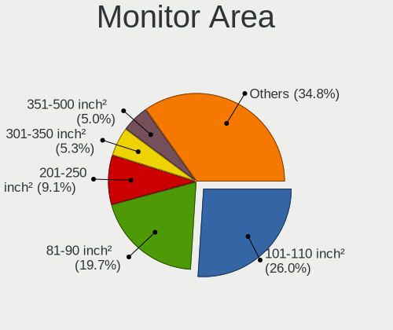

| Area in inch | Computers | Percent |
|----------------|-----------|---------|
| 101-110        | 39        | 27.27%  |
| 81-90          | 30        | 20.98%  |
| 201-250        | 13        | 9.09%   |
| 71-80          | 9         | 6.29%   |
| 151-200        | 9         | 6.29%   |
| 61-70          | 7         | 4.9%    |
| 301-350        | 7         | 4.9%    |
| More than 1000 | 6         | 4.2%    |
| 351-500        | 6         | 4.2%    |
| Unknown        | 5         | 3.5%    |
| 251-300        | 3         | 2.1%    |
| 51-60          | 2         | 1.4%    |
| 141-150        | 2         | 1.4%    |
| 111-120        | 2         | 1.4%    |
| 501-1000       | 2         | 1.4%    |
| 121-130        | 1         | 0.7%    |

Pixel Density
-------------

Pixels per inch

| Density       | Computers | Percent |
|---------------|-----------|---------|
| 121-160       | 46        | 32.86%  |
| 101-120       | 36        | 25.71%  |
| 51-100        | 30        | 21.43%  |
| 161-240       | 13        | 9.29%   |
| More than 240 | 6         | 4.29%   |
| Unknown       | 5         | 3.57%   |
| 1-50          | 4         | 2.86%   |

Multiple Monitors
-----------------

Total monitors connected

| Total | Computers | Percent |
|-------|-----------|---------|
| 1     | 106       | 79.1%   |
| 2     | 20        | 14.93%  |
| 0     | 6         | 4.48%   |
| 3     | 2         | 1.49%   |

Network
-------

Net Controller Vendor
---------------------

Controller vendors

| Vendor                   | Computers | Percent |
|--------------------------|-----------|---------|
| Intel                    | 81        | 42.86%  |
| Realtek Semiconductor    | 57        | 30.16%  |
| Qualcomm Atheros         | 13        | 6.88%   |
| Broadcom                 | 13        | 6.88%   |
| TP-Link                  | 4         | 2.12%   |
| Ralink                   | 4         | 2.12%   |
| Marvell Technology Group | 4         | 2.12%   |
| MediaTek                 | 2         | 1.06%   |
| ASIX Electronics         | 2         | 1.06%   |
| Wilocity                 | 1         | 0.53%   |
| VIA Technologies         | 1         | 0.53%   |
| SILICON Laboratories     | 1         | 0.53%   |
| Sigma Designs            | 1         | 0.53%   |
| Ralink Technology        | 1         | 0.53%   |
| Nvidia                   | 1         | 0.53%   |
| Lenovo                   | 1         | 0.53%   |
| D-Link                   | 1         | 0.53%   |
| Broadcom Limited         | 1         | 0.53%   |

Net Controller Model
--------------------

Controller models

| Model                                                             | Computers | Percent |
|-------------------------------------------------------------------|-----------|---------|
| Realtek RTL8111/8168/8411 PCI Express Gigabit Ethernet Controller | 32        | 13.79%  |
| Realtek RTL810xE PCI Express Fast Ethernet controller             | 14        | 6.03%   |
| Intel 82579LM Gigabit Network Connection (Lewisville)             | 7         | 3.02%   |
| Intel Cannon Point-LP CNVi [Wireless-AC]                          | 6         | 2.59%   |
| Realtek RTL8821CE 802.11ac PCIe Wireless Network Adapter          | 5         | 2.16%   |
| Intel Wireless 8265 / 8275                                        | 5         | 2.16%   |
| Intel Wireless 8260                                               | 5         | 2.16%   |
| Intel Wireless 7260                                               | 5         | 2.16%   |
| Intel Wi-Fi 6 AX200                                               | 5         | 2.16%   |
| Realtek RTL8822BE 802.11a/b/g/n/ac WiFi adapter                   | 4         | 1.72%   |
| Realtek RTL8822CE 802.11ac PCIe Wireless Network Adapter          | 3         | 1.29%   |
| Realtek RTL8125 2.5GbE Controller                                 | 3         | 1.29%   |
| Ralink RT3290 Wireless 802.11n 1T/1R PCIe                         | 3         | 1.29%   |
| Intel Wireless 7265                                               | 3         | 1.29%   |
| Intel Wireless 3165                                               | 3         | 1.29%   |
| Intel Wi-Fi 6 AX210/AX211/AX411 160MHz                            | 3         | 1.29%   |
| Intel Wi-Fi 6 AX201                                               | 3         | 1.29%   |
| Intel Ethernet Controller I225-V                                  | 3         | 1.29%   |
| Intel Ethernet Connection I218-LM                                 | 3         | 1.29%   |
| Intel Comet Lake PCH-LP CNVi WiFi                                 | 3         | 1.29%   |
| Intel Comet Lake PCH CNVi WiFi                                    | 3         | 1.29%   |
| Intel Cannon Lake PCH CNVi WiFi                                   | 3         | 1.29%   |
| Intel 82577LM Gigabit Network Connection                          | 3         | 1.29%   |
| TP-Link Archer T3U [Realtek RTL8812BU]                            | 2         | 0.86%   |
| Realtek RTL8723BE PCIe Wireless Network Adapter                   | 2         | 0.86%   |
| Realtek RTL8153 Gigabit Ethernet Adapter                          | 2         | 0.86%   |
| Realtek 802.11n WLAN Adapter                                      | 2         | 0.86%   |
| Qualcomm Atheros QCA9377 802.11ac Wireless Network Adapter        | 2         | 0.86%   |
| Qualcomm Atheros QCA6174 802.11ac Wireless Network Adapter        | 2         | 0.86%   |
| MediaTek MT7921K (RZ608) Wi-Fi 6E 80MHz                           | 2         | 0.86%   |
| Marvell Group 88W8897 [AVASTAR] 802.11ac Wireless                 | 2         | 0.86%   |
| Intel I211 Gigabit Network Connection                             | 2         | 0.86%   |
| Intel I210 Gigabit Network Connection                             | 2         | 0.86%   |
| Intel Ethernet Connection I219-LM                                 | 2         | 0.86%   |
| Intel Ethernet Connection (4) I219-V                              | 2         | 0.86%   |
| Intel Ethernet Connection (2) I219-V                              | 2         | 0.86%   |
| Intel Ethernet Connection (2) I218-V                              | 2         | 0.86%   |
| Intel Centrino Ultimate-N 6300                                    | 2         | 0.86%   |
| Intel Centrino Advanced-N 6235                                    | 2         | 0.86%   |
| Intel Centrino Advanced-N 6205 [Taylor Peak]                      | 2         | 0.86%   |

Wireless Vendor
---------------

Wireless vendors

| Vendor                   | Computers | Percent |
|--------------------------|-----------|---------|
| Intel                    | 65        | 54.62%  |
| Realtek Semiconductor    | 20        | 16.81%  |
| Qualcomm Atheros         | 9         | 7.56%   |
| Broadcom                 | 9         | 7.56%   |
| TP-Link                  | 4         | 3.36%   |
| Ralink                   | 4         | 3.36%   |
| MediaTek                 | 2         | 1.68%   |
| Marvell Technology Group | 2         | 1.68%   |
| Wilocity                 | 1         | 0.84%   |
| Ralink Technology        | 1         | 0.84%   |
| D-Link                   | 1         | 0.84%   |
| Broadcom Limited         | 1         | 0.84%   |

Wireless Model
--------------

Wireless models

| Model                                                      | Computers | Percent |
|------------------------------------------------------------|-----------|---------|
| Intel Cannon Point-LP CNVi [Wireless-AC]                   | 6         | 5.04%   |
| Realtek RTL8821CE 802.11ac PCIe Wireless Network Adapter   | 5         | 4.2%    |
| Intel Wireless 8265 / 8275                                 | 5         | 4.2%    |
| Intel Wireless 8260                                        | 5         | 4.2%    |
| Intel Wireless 7260                                        | 5         | 4.2%    |
| Intel Wi-Fi 6 AX200                                        | 5         | 4.2%    |
| Realtek RTL8822BE 802.11a/b/g/n/ac WiFi adapter            | 4         | 3.36%   |
| Realtek RTL8822CE 802.11ac PCIe Wireless Network Adapter   | 3         | 2.52%   |
| Ralink RT3290 Wireless 802.11n 1T/1R PCIe                  | 3         | 2.52%   |
| Intel Wireless 7265                                        | 3         | 2.52%   |
| Intel Wireless 3165                                        | 3         | 2.52%   |
| Intel Wi-Fi 6 AX210/AX211/AX411 160MHz                     | 3         | 2.52%   |
| Intel Wi-Fi 6 AX201                                        | 3         | 2.52%   |
| Intel Comet Lake PCH-LP CNVi WiFi                          | 3         | 2.52%   |
| Intel Comet Lake PCH CNVi WiFi                             | 3         | 2.52%   |
| Intel Cannon Lake PCH CNVi WiFi                            | 3         | 2.52%   |
| TP-Link Archer T3U [Realtek RTL8812BU]                     | 2         | 1.68%   |
| Realtek RTL8723BE PCIe Wireless Network Adapter            | 2         | 1.68%   |
| Realtek 802.11n WLAN Adapter                               | 2         | 1.68%   |
| Qualcomm Atheros QCA9377 802.11ac Wireless Network Adapter | 2         | 1.68%   |
| Qualcomm Atheros QCA6174 802.11ac Wireless Network Adapter | 2         | 1.68%   |
| MediaTek MT7921K (RZ608) Wi-Fi 6E 80MHz                    | 2         | 1.68%   |
| Marvell Group 88W8897 [AVASTAR] 802.11ac Wireless          | 2         | 1.68%   |
| Intel Centrino Ultimate-N 6300                             | 2         | 1.68%   |
| Intel Centrino Advanced-N 6235                             | 2         | 1.68%   |
| Intel Centrino Advanced-N 6205 [Taylor Peak]               | 2         | 1.68%   |
| Intel Alder Lake-P PCH CNVi WiFi                           | 2         | 1.68%   |
| Broadcom BCM4360 802.11ac Wireless Network Adapter         | 2         | 1.68%   |
| Broadcom BCM43228 802.11a/b/g/n                            | 2         | 1.68%   |
| Wilocity Wil6200 802.11ad Wireless Network Adapter         | 1         | 0.84%   |
| TP-Link AC600 wireless Realtek RTL8811AU [Archer T2U Nano] | 1         | 0.84%   |
| TP-Link 802.11ac WLAN Adapter                              | 1         | 0.84%   |
| Realtek RTL8821AE 802.11ac PCIe Wireless Network Adapter   | 1         | 0.84%   |
| Realtek RTL8723AE PCIe Wireless Network Adapter            | 1         | 0.84%   |
| Realtek RTL8192EU 802.11b/g/n WLAN Adapter                 | 1         | 0.84%   |
| Realtek RTL8188EUS 802.11n Wireless Network Adapter        | 1         | 0.84%   |
| Ralink MT7601U Wireless Adapter                            | 1         | 0.84%   |
| Ralink RT3090 Wireless 802.11n 1T/1R PCIe                  | 1         | 0.84%   |
| Qualcomm Atheros QCA9565 / AR9565 Wireless Network Adapter | 1         | 0.84%   |
| Qualcomm Atheros AR9485 Wireless Network Adapter           | 1         | 0.84%   |

Ethernet Vendor
---------------

Ethernet vendors

| Vendor                   | Computers | Percent |
|--------------------------|-----------|---------|
| Realtek Semiconductor    | 49        | 47.57%  |
| Intel                    | 38        | 36.89%  |
| Broadcom                 | 5         | 4.85%   |
| Qualcomm Atheros         | 4         | 3.88%   |
| Marvell Technology Group | 2         | 1.94%   |
| ASIX Electronics         | 2         | 1.94%   |
| VIA Technologies         | 1         | 0.97%   |
| Nvidia                   | 1         | 0.97%   |
| Lenovo                   | 1         | 0.97%   |

Ethernet Model
--------------

Ethernet models

| Model                                                             | Computers | Percent |
|-------------------------------------------------------------------|-----------|---------|
| Realtek RTL8111/8168/8411 PCI Express Gigabit Ethernet Controller | 32        | 28.83%  |
| Realtek RTL810xE PCI Express Fast Ethernet controller             | 14        | 12.61%  |
| Intel 82579LM Gigabit Network Connection (Lewisville)             | 7         | 6.31%   |
| Realtek RTL8125 2.5GbE Controller                                 | 3         | 2.7%    |
| Intel Ethernet Controller I225-V                                  | 3         | 2.7%    |
| Intel Ethernet Connection I218-LM                                 | 3         | 2.7%    |
| Intel 82577LM Gigabit Network Connection                          | 3         | 2.7%    |
| Realtek RTL8153 Gigabit Ethernet Adapter                          | 2         | 1.8%    |
| Intel I211 Gigabit Network Connection                             | 2         | 1.8%    |
| Intel I210 Gigabit Network Connection                             | 2         | 1.8%    |
| Intel Ethernet Connection I219-LM                                 | 2         | 1.8%    |
| Intel Ethernet Connection (4) I219-V                              | 2         | 1.8%    |
| Intel Ethernet Connection (2) I219-V                              | 2         | 1.8%    |
| Intel Ethernet Connection (2) I218-V                              | 2         | 1.8%    |
| Intel 82579V Gigabit Network Connection                           | 2         | 1.8%    |
| ASIX AX88179 Gigabit Ethernet                                     | 2         | 1.8%    |
| VIA VT6105/VT6106S [Rhine-III]                                    | 1         | 0.9%    |
| Realtek RTL-8100/8101L/8139 PCI Fast Ethernet Adapter             | 1         | 0.9%    |
| Qualcomm Atheros QCA8172 Fast Ethernet                            | 1         | 0.9%    |
| Qualcomm Atheros Killer E2400 Gigabit Ethernet Controller         | 1         | 0.9%    |
| Qualcomm Atheros AR8151 v2.0 Gigabit Ethernet                     | 1         | 0.9%    |
| Qualcomm Atheros AR8132 Fast Ethernet                             | 1         | 0.9%    |
| Nvidia MCP61 Ethernet                                             | 1         | 0.9%    |
| Marvell Group 88E8070 based Ethernet Controller                   | 1         | 0.9%    |
| Marvell Group 88E8055 PCI-E Gigabit Ethernet Controller           | 1         | 0.9%    |
| Lenovo ThinkPad TBT 3 Dock                                        | 1         | 0.9%    |
| Intel I350 Gigabit Network Connection                             | 1         | 0.9%    |
| Intel Ethernet Connection I219-V                                  | 1         | 0.9%    |
| Intel Ethernet Connection I217-V                                  | 1         | 0.9%    |
| Intel Ethernet Connection I217-LM                                 | 1         | 0.9%    |
| Intel Ethernet Connection (6) I219-V                              | 1         | 0.9%    |
| Intel Ethernet Connection (6) I219-LM                             | 1         | 0.9%    |
| Intel Ethernet Connection (4) I219-LM                             | 1         | 0.9%    |
| Intel Ethernet Connection (3) I218-V                              | 1         | 0.9%    |
| Intel Ethernet Connection (2) I219-LM                             | 1         | 0.9%    |
| Intel Ethernet Connection (10) I219-V                             | 1         | 0.9%    |
| Intel 82578DM Gigabit Network Connection                          | 1         | 0.9%    |
| Intel 82566MM Gigabit Network Connection                          | 1         | 0.9%    |
| Broadcom NetXtreme BCM57766 Gigabit Ethernet PCIe                 | 1         | 0.9%    |
| Broadcom NetXtreme BCM5764M Gigabit Ethernet PCIe                 | 1         | 0.9%    |

Net Controller Kind
-------------------

Ethernet, WiFi or modem

| Kind     | Computers | Percent |
|----------|-----------|---------|
| WiFi     | 113       | 52.56%  |
| Ethernet | 100       | 46.51%  |
| Modem    | 2         | 0.93%   |

Used Controller
---------------

Currently used network controller

| Kind     | Computers | Percent |
|----------|-----------|---------|
| WiFi     | 93        | 68.89%  |
| Ethernet | 42        | 31.11%  |

NICs
----

Total network controllers on board

| Total | Computers | Percent |
|-------|-----------|---------|
| 2     | 78        | 59.54%  |
| 1     | 47        | 35.88%  |
| 3     | 3         | 2.29%   |
| 8     | 1         | 0.76%   |
| 4     | 1         | 0.76%   |
| 0     | 1         | 0.76%   |

IPv6
----

IPv6 vs IPv4

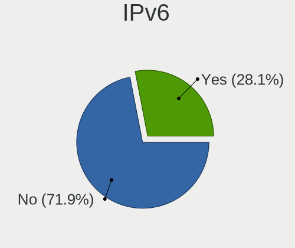

| Used | Computers | Percent |
|------|-----------|---------|
| No   | 107       | 81.68%  |
| Yes  | 24        | 18.32%  |

Bluetooth
---------

Bluetooth Vendor
----------------

Controller vendors

| Vendor                          | Computers | Percent |
|---------------------------------|-----------|---------|
| Intel                           | 50        | 53.76%  |
| Realtek Semiconductor           | 11        | 11.83%  |
| Qualcomm Atheros Communications | 6         | 6.45%   |
| Broadcom                        | 4         | 4.3%    |
| ASUSTek Computer                | 4         | 4.3%    |
| Ralink                          | 3         | 3.23%   |
| Toshiba                         | 2         | 2.15%   |
| MediaTek                        | 2         | 2.15%   |
| Marvell Semiconductor           | 2         | 2.15%   |
| Hewlett-Packard                 | 2         | 2.15%   |
| Dell                            | 2         | 2.15%   |
| Cambridge Silicon Radio         | 2         | 2.15%   |
| IMC Networks                    | 1         | 1.08%   |
| Foxconn / Hon Hai               | 1         | 1.08%   |
| Apple                           | 1         | 1.08%   |

Bluetooth Model
---------------

Controller models

| Model                                                 | Computers | Percent |
|-------------------------------------------------------|-----------|---------|
| Intel Bluetooth wireless interface                    | 18        | 19.35%  |
| Intel Bluetooth 9460/9560 Jefferson Peak (JfP)        | 12        | 12.9%   |
| Realtek Bluetooth Radio                               | 7         | 7.53%   |
| Intel AX201 Bluetooth                                 | 7         | 7.53%   |
| Intel AX200 Bluetooth                                 | 5         | 5.38%   |
| Realtek  Bluetooth 4.2 Adapter                        | 3         | 3.23%   |
| Ralink RT3290 Bluetooth                               | 3         | 3.23%   |
| Intel Centrino Bluetooth Wireless Transceiver         | 3         | 3.23%   |
| Qualcomm Atheros  Bluetooth Device                    | 2         | 2.15%   |
| MediaTek Wireless_Device                              | 2         | 2.15%   |
| Intel Bluetooth Device                                | 2         | 2.15%   |
| Intel AX210 Bluetooth                                 | 2         | 2.15%   |
| HP Broadcom 2070 Bluetooth Combo                      | 2         | 2.15%   |
| Cambridge Silicon Radio Bluetooth Dongle (HCI mode)   | 2         | 2.15%   |
| ASUS Broadcom BCM20702 Single-Chip Bluetooth 4.0 + LE | 2         | 2.15%   |
| Toshiba RT Bluetooth Radio                            | 1         | 1.08%   |
| Toshiba Integrated Bluetooth HCI                      | 1         | 1.08%   |
| Realtek RTL8821A Bluetooth                            | 1         | 1.08%   |
| Qualcomm Atheros QCA61x4 Bluetooth 4.0                | 1         | 1.08%   |
| Qualcomm Atheros Bluetooth USB Host Controller        | 1         | 1.08%   |
| Qualcomm Atheros AR9462 Bluetooth                     | 1         | 1.08%   |
| Qualcomm Atheros AR3011 Bluetooth                     | 1         | 1.08%   |
| Marvell Bluetooth and Wireless LAN Composite Device   | 1         | 1.08%   |
| Marvell Bluetooth and Wireless LAN Composite          | 1         | 1.08%   |
| Intel Wireless-AC 9260 Bluetooth Adapter              | 1         | 1.08%   |
| IMC Networks Bluetooth Radio                          | 1         | 1.08%   |
| Foxconn / Hon Hai Bluetooth USB Host Controller       | 1         | 1.08%   |
| Dell DW375 Bluetooth Module                           | 1         | 1.08%   |
| Dell BCM20702A0 Bluetooth Module                      | 1         | 1.08%   |
| Broadcom HP Portable SoftSailing                      | 1         | 1.08%   |
| Broadcom BCM43142A0 Bluetooth 4.0                     | 1         | 1.08%   |
| Broadcom BCM20702 Bluetooth 4.0 [ThinkPad]            | 1         | 1.08%   |
| Broadcom BCM2045B (BDC-2) [Bluetooth Controller]      | 1         | 1.08%   |
| ASUS Bluetooth Radio                                  | 1         | 1.08%   |
| ASUS Bluetooth Device                                 | 1         | 1.08%   |
| Apple Bluetooth USB Host Controller                   | 1         | 1.08%   |

Sound
-----

Sound Vendor
------------

Sound card vendors

| Vendor             | Computers | Percent |
|--------------------|-----------|---------|
| Intel              | 117       | 67.63%  |
| Nvidia             | 30        | 17.34%  |
| AMD                | 16        | 9.25%   |
| Logitech           | 3         | 1.73%   |
| ASUSTek Computer   | 2         | 1.16%   |
| SteelSeries ApS    | 1         | 0.58%   |
| Lenovo             | 1         | 0.58%   |
| JMTek              | 1         | 0.58%   |
| Griffin Technology | 1         | 0.58%   |
| Apogee Electronics | 1         | 0.58%   |

Sound Model
-----------

Sound card models

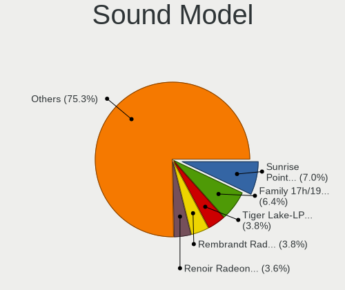

| Model                                                                      | Computers | Percent |
|----------------------------------------------------------------------------|-----------|---------|
| Intel Sunrise Point-LP HD Audio                                            | 16        | 8.08%   |
| Intel 7 Series/C216 Chipset Family High Definition Audio Controller        | 11        | 5.56%   |
| Intel Cannon Point-LP High Definition Audio Controller                     | 10        | 5.05%   |
| Intel Haswell-ULT HD Audio Controller                                      | 9         | 4.55%   |
| Intel Cannon Lake PCH cAVS                                                 | 9         | 4.55%   |
| Intel 8 Series HD Audio Controller                                         | 9         | 4.55%   |
| Intel 6 Series/C200 Series Chipset Family High Definition Audio Controller | 8         | 4.04%   |
| AMD Family 17h/19h HD Audio Controller                                     | 7         | 3.54%   |
| Intel 5 Series/3400 Series Chipset High Definition Audio                   | 6         | 3.03%   |
| AMD Renoir Radeon High Definition Audio Controller                         | 6         | 3.03%   |
| Nvidia GP107GL High Definition Audio Controller                            | 5         | 2.53%   |
| Intel Comet Lake PCH-LP cAVS                                               | 5         | 2.53%   |
| Intel Wildcat Point-LP High Definition Audio Controller                    | 4         | 2.02%   |
| Intel Comet Lake PCH cAVS                                                  | 4         | 2.02%   |
| Intel Broadwell-U Audio Controller                                         | 4         | 2.02%   |
| Intel 82801JI (ICH10 Family) HD Audio Controller                           | 4         | 2.02%   |
| Intel 100 Series/C230 Series Chipset Family HD Audio Controller            | 4         | 2.02%   |
| Nvidia TU107 GeForce GTX 1650 High Definition Audio Controller             | 3         | 1.52%   |
| Nvidia GP106 High Definition Audio Controller                              | 3         | 1.52%   |
| Nvidia GF108 High Definition Audio Controller                              | 3         | 1.52%   |
| Intel Xeon E3-1200 v3/4th Gen Core Processor HD Audio Controller           | 3         | 1.52%   |
| Intel Tiger Lake-LP Smart Sound Technology Audio Controller                | 3         | 1.52%   |
| Intel 8 Series/C220 Series Chipset High Definition Audio Controller        | 3         | 1.52%   |
| Intel 200 Series PCH HD Audio                                              | 3         | 1.52%   |
| Nvidia TU104 HD Audio Controller                                           | 2         | 1.01%   |
| Nvidia High Definition Audio Controller                                    | 2         | 1.01%   |
| Nvidia GA104 High Definition Audio Controller                              | 2         | 1.01%   |
| Nvidia Audio device                                                        | 2         | 1.01%   |
| Intel CM238 HD Audio Controller                                            | 2         | 1.01%   |
| Intel C610/X99 series chipset HD Audio Controller                          | 2         | 1.01%   |
| Intel Alder Lake PCH-P High Definition Audio Controller                    | 2         | 1.01%   |
| Intel 82801H (ICH8 Family) HD Audio Controller                             | 2         | 1.01%   |
| ASUSTek Computer USB Audio                                                 | 2         | 1.01%   |
| AMD Rembrandt Radeon High Definition Audio Controller                      | 2         | 1.01%   |
| AMD Family 17h (Models 00h-0fh) HD Audio Controller                        | 2         | 1.01%   |
| AMD Ellesmere HDMI Audio [Radeon RX 470/480 / 570/580/590]                 | 2         | 1.01%   |
| SteelSeries ApS SteelSeries Arctis 5                                       | 1         | 0.51%   |
| Nvidia TU102 High Definition Audio Controller                              | 1         | 0.51%   |
| Nvidia MCP61 High Definition Audio                                         | 1         | 0.51%   |
| Nvidia GP102 HDMI Audio Controller                                         | 1         | 0.51%   |

Memory
------

Memory Vendor
-------------

Memory module vendors

| Vendor              | Computers | Percent |
|---------------------|-----------|---------|
| Samsung Electronics | 21        | 32.81%  |
| SK hynix            | 13        | 20.31%  |
| Micron Technology   | 9         | 14.06%  |
| Crucial             | 7         | 10.94%  |
| Corsair             | 5         | 7.81%   |
| Kingston            | 4         | 6.25%   |
| Ramaxel Technology  | 3         | 4.69%   |
| Unknown             | 2         | 3.13%   |

Memory Model
------------

Memory module models

| Model                                                           | Computers | Percent |
|-----------------------------------------------------------------|-----------|---------|
| Samsung RAM M471A2K43CB1-CRC 16GB SODIMM DDR4 2667MT/s          | 2         | 3.03%   |
| Samsung RAM M471A1K43CB1-CTD 8GB SODIMM DDR4 2667MT/s           | 2         | 3.03%   |
| Samsung RAM M471A1K43BB1-CRC 8192MB SODIMM DDR4 2667MT/s        | 2         | 3.03%   |
| Ramaxel RAM RMSA3260ME78HAF-2666 8GB SODIMM DDR4 2667MT/s       | 2         | 3.03%   |
| Micron RAM MTC8C1084S1SC48BA1 16GB SODIMM 4800MT/s              | 2         | 3.03%   |
| Unknown RAM Module 4096MB SODIMM DDR4 2667MT/s                  | 1         | 1.52%   |
| Unknown RAM Module 2GB SODIMM DDR2 667MT/s                      | 1         | 1.52%   |
| Unknown RAM Module 1GB SODIMM DDR2 667MT/s                      | 1         | 1.52%   |
| SK hynix RAM Module 8GB Row Of Chips LPDDR3 2133MT/s            | 1         | 1.52%   |
| SK hynix RAM HMT41GS6AFR8A-PB 8GB SODIMM DDR3 1600MT/s          | 1         | 1.52%   |
| SK hynix RAM HMT351S6CFR8C-H9 4GB SODIMM DDR3 1334MT/s          | 1         | 1.52%   |
| SK hynix RAM HMT125S6TFR8C-G7 2GB SODIMM DDR3 1067MT/s          | 1         | 1.52%   |
| SK hynix RAM HMAA51S6AMR6N-UH 8GB SODIMM DDR4 2400MT/s          | 1         | 1.52%   |
| SK hynix RAM HMAA4GS6AJR8N-XN 32GB SODIMM DDR4 3200MT/s         | 1         | 1.52%   |
| SK hynix RAM HMA851S6CJR6N-VK 4GB SODIMM DDR4 2667MT/s          | 1         | 1.52%   |
| SK hynix RAM HMA82GS6JJR8N-VK 16GB SODIMM DDR4 2667MT/s         | 1         | 1.52%   |
| SK hynix RAM HMA82GS6DJR8N-XN 16GB SODIMM DDR4 3200MT/s         | 1         | 1.52%   |
| SK hynix RAM HMA82GR7JJR8N-WM 16384MB DIMM DDR4 2933MT/s        | 1         | 1.52%   |
| SK hynix RAM HMA81GS6CJR8N-VK 8GB SODIMM DDR4 2667MT/s          | 1         | 1.52%   |
| SK hynix RAM HMA41GS6AFR8N-TF 8GB SODIMM DDR4 2667MT/s          | 1         | 1.52%   |
| SK hynix RAM H5ANAG6NCMR-XNC 8GB Row Of Chips DDR4 3200MT/s     | 1         | 1.52%   |
| Samsung RAM Module 8192MB Row Of Chips LPDDR3 2133MT/s          | 1         | 1.52%   |
| Samsung RAM Module 32GB SODIMM DDR4 3200MT/s                    | 1         | 1.52%   |
| Samsung RAM M471B5673EH1-CH9 2GB SODIMM DDR3 1334MT/s           | 1         | 1.52%   |
| Samsung RAM M471B5273CH0-CK0 4GB SODIMM DDR3 1600MT/s           | 1         | 1.52%   |
| Samsung RAM M471A5244CB0-CRC 4GB SODIMM DDR4 2667MT/s           | 1         | 1.52%   |
| Samsung RAM M471A5143DB0-CPB 4GB SODIMM DDR4 2133MT/s           | 1         | 1.52%   |
| Samsung RAM M471A1K44BM0-CRC 8192MB SODIMM DDR4 2400MT/s        | 1         | 1.52%   |
| Samsung RAM M471A1K43DB1-CWE 8GB SODIMM DDR4 3200MT/s           | 1         | 1.52%   |
| Samsung RAM M471A1K43CB1-CRC 8GB SODIMM DDR4 2667MT/s           | 1         | 1.52%   |
| Samsung RAM M425R2GA3BB0-CQKOD 16GB SODIMM DDR5 4800MT/s        | 1         | 1.52%   |
| Samsung RAM M393B5170FH0-CH9 4096MB DIMM DDR3 1333MT/s          | 1         | 1.52%   |
| Samsung RAM M393B1K70DH0-YH9 8GB DIMM DDR3 1333MT/s             | 1         | 1.52%   |
| Samsung RAM M393A8G40MB2-CVF 64GB DIMM DDR4 2933MT/s            | 1         | 1.52%   |
| Samsung RAM K4EBE304EC-EGCG 8GB Row Of Chips LPDDR3 2133MT/s    | 1         | 1.52%   |
| Samsung RAM K4AAG165WA-BCWE 8GB Row Of Chips DDR4 3200MT/s      | 1         | 1.52%   |
| Ramaxel RAM RMSA3270ME86H9F-2666 4GB Row Of Chips DDR4 2400MT/s | 1         | 1.52%   |
| Micron RAM Module 8192MB SODIMM DDR4 3200MT/s                   | 1         | 1.52%   |
| Micron RAM 8ATF1G64HZ-2G6E1 8GB SODIMM DDR4 2667MT/s            | 1         | 1.52%   |
| Micron RAM 36JSZF51272PZ1G4G1 4GB DIMM DDR3 1333MT/s            | 1         | 1.52%   |

Memory Kind
-----------

Memory module kinds

| Kind   | Computers | Percent |
|--------|-----------|---------|
| DDR4   | 36        | 66.67%  |
| DDR3   | 11        | 20.37%  |
| LPDDR3 | 3         | 5.56%   |
| DDR5   | 3         | 5.56%   |
| DDR2   | 1         | 1.85%   |

Memory Form Factor
------------------

Physical design of the memory module

| Name         | Computers | Percent |
|--------------|-----------|---------|
| SODIMM       | 38        | 69.09%  |
| DIMM         | 11        | 20%     |
| Row Of Chips | 6         | 10.91%  |

Memory Size
-----------

Memory module size

| Size  | Computers | Percent |
|-------|-----------|---------|
| 8192  | 29        | 47.54%  |
| 16384 | 15        | 24.59%  |
| 4096  | 8         | 13.11%  |
| 32768 | 4         | 6.56%   |
| 2048  | 3         | 4.92%   |
| 65536 | 1         | 1.64%   |
| 1024  | 1         | 1.64%   |

Memory Speed
------------

Memory module speed

| Speed | Computers | Percent |
|-------|-----------|---------|
| 2667  | 18        | 31.58%  |
| 3200  | 10        | 17.54%  |
| 2133  | 7         | 12.28%  |
| 1600  | 6         | 10.53%  |
| 2400  | 4         | 7.02%   |
| 4800  | 3         | 5.26%   |
| 1334  | 2         | 3.51%   |
| 1333  | 2         | 3.51%   |
| 3400  | 1         | 1.75%   |
| 3000  | 1         | 1.75%   |
| 2933  | 1         | 1.75%   |
| 1067  | 1         | 1.75%   |
| 667   | 1         | 1.75%   |

Printers & scanners
-------------------

Printer Vendor
--------------

Printer device vendors

| Vendor             | Computers | Percent |
|--------------------|-----------|---------|
| Hewlett-Packard    | 1         | 33.33%  |
| Canon              | 1         | 33.33%  |
| Brother Industries | 1         | 33.33%  |

Printer Model
-------------

Printer device models

| Model                     | Computers | Percent |
|---------------------------|-----------|---------|
| HP Deskjet F2280 series   | 1         | 33.33%  |
| Canon PIXMA MG3600 Series | 1         | 33.33%  |
| Brother MFC-9330CDW       | 1         | 33.33%  |

Scanner Vendor
--------------

Scanner device vendors

Zero info for selected period =(

Scanner Model
-------------

Scanner device models

Zero info for selected period =(

Camera
------

Camera Vendor
-------------

Camera device vendors

| Vendor                                 | Computers | Percent |
|----------------------------------------|-----------|---------|
| Chicony Electronics                    | 28        | 27.45%  |
| IMC Networks                           | 10        | 9.8%    |
| Cheng Uei Precision Industry (Foxlink) | 9         | 8.82%   |
| Acer                                   | 7         | 6.86%   |
| Microdia                               | 6         | 5.88%   |
| Sunplus Innovation Technology          | 5         | 4.9%    |
| Realtek Semiconductor                  | 4         | 3.92%   |
| Apple                                  | 4         | 3.92%   |
| Syntek                                 | 3         | 2.94%   |
| Samsung Electronics                    | 3         | 2.94%   |
| Ricoh                                  | 3         | 2.94%   |
| Microsoft                              | 3         | 2.94%   |
| Lite-On Technology                     | 3         | 2.94%   |
| Suyin                                  | 2         | 1.96%   |
| Quanta                                 | 2         | 1.96%   |
| Logitech                               | 2         | 1.96%   |
| Ruision                                | 1         | 0.98%   |
| Luxvisions Innotech Limited            | 1         | 0.98%   |
| LG Electronics                         | 1         | 0.98%   |
| Lenovo                                 | 1         | 0.98%   |
| KYE Systems (Mouse Systems)            | 1         | 0.98%   |
| DJJHFA1BIF5595                         | 1         | 0.98%   |
| Creative Technology                    | 1         | 0.98%   |
| Alcor Micro                            | 1         | 0.98%   |

Camera Model
------------

Camera device models

| Model                                                           | Computers | Percent |
|-----------------------------------------------------------------|-----------|---------|
| Chicony Integrated Camera                                       | 9         | 8.82%   |
| IMC Networks USB2.0 HD UVC WebCam                               | 5         | 4.9%    |
| Syntek Integrated Camera                                        | 3         | 2.94%   |
| Samsung Galaxy A5 (MTP)                                         | 3         | 2.94%   |
| IMC Networks Integrated Camera                                  | 3         | 2.94%   |
| Chicony Integrated Camera (1280x720@30)                         | 3         | 2.94%   |
| Apple iPhone5/5C/5S/6                                           | 3         | 2.94%   |
| Sunplus HP HD Webcam [Fixed]                                    | 2         | 1.96%   |
| Ricoh HD Webcam                                                 | 2         | 1.96%   |
| Quanta HP TrueVision HD Camera                                  | 2         | 1.96%   |
| Microdia Laptop_Integrated_Webcam_HD                            | 2         | 1.96%   |
| Microdia Integrated_Webcam_HD                                   | 2         | 1.96%   |
| Logitech Webcam C270                                            | 2         | 1.96%   |
| Lite-On HP Wide Vision HD Camera                                | 2         | 1.96%   |
| Chicony Lenovo EasyCamera                                       | 2         | 1.96%   |
| Chicony HP Truevision HD                                        | 2         | 1.96%   |
| Chicony HP HD Webcam [Fixed]                                    | 2         | 1.96%   |
| Chicony EasyCamera                                              | 2         | 1.96%   |
| Cheng Uei Precision Industry (Foxlink) HP Wide Vision HD Camera | 2         | 1.96%   |
| Cheng Uei Precision Industry (Foxlink) HP TrueVision HD Camera  | 2         | 1.96%   |
| Cheng Uei Precision Industry (Foxlink) HP HD Webcam             | 2         | 1.96%   |
| Suyin HP TrueVision HD                                          | 1         | 0.98%   |
| Suyin 1.3M Front                                                | 1         | 0.98%   |
| Sunplus Integrated_Webcam_HD                                    | 1         | 0.98%   |
| Sunplus Integrated_Webcam_FHD                                   | 1         | 0.98%   |
| Sunplus Integrated Webcam                                       | 1         | 0.98%   |
| Ruision UVC Camera                                              | 1         | 0.98%   |
| Ricoh Sony Vaio Integrated Webcam                               | 1         | 0.98%   |
| Realtek Lenovo EasyCamera                                       | 1         | 0.98%   |
| Realtek Integrated_Webcam_HD                                    | 1         | 0.98%   |
| Realtek Integrated Webcam                                       | 1         | 0.98%   |
| Realtek HP Truevision HD                                        | 1         | 0.98%   |
| Microsoft LifeCam Studio                                        | 1         | 0.98%   |
| Microsoft LifeCam Rear                                          | 1         | 0.98%   |
| Microsoft LifeCam HD-3000                                       | 1         | 0.98%   |
| Microdia Integrated Webcam                                      | 1         | 0.98%   |
| Microdia Dell Integrated HD Webcam                              | 1         | 0.98%   |
| Luxvisions Innotech Limited HP Wide Vision HD Camera            | 1         | 0.98%   |
| Lite-On HP HD Camera                                            | 1         | 0.98%   |
| LG LM-X420xxx/G2/G3 Android Phone (MTP/download mode)           | 1         | 0.98%   |

Security
--------

Fingerprint Vendor
------------------

Fingerprint sensor vendors

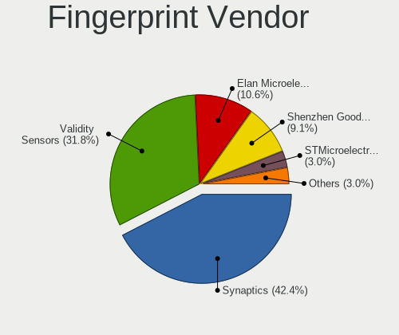

| Vendor                     | Computers | Percent |
|----------------------------|-----------|---------|
| Synaptics                  | 13        | 44.83%  |
| Validity Sensors           | 12        | 41.38%  |
| STMicroelectronics         | 1         | 3.45%   |
| Shenzhen Goodix Technology | 1         | 3.45%   |
| LighTuning Technology      | 1         | 3.45%   |
| Elan Microelectronics      | 1         | 3.45%   |

Fingerprint Model
-----------------

Fingerprint sensor models

| Model                                                      | Computers | Percent |
|------------------------------------------------------------|-----------|---------|
| Unknown                                                    | 5         | 17.24%  |
| Validity Sensors VFS471 Fingerprint Reader                 | 3         | 10.34%  |
| Synaptics Prometheus MIS Touch Fingerprint Reader          | 3         | 10.34%  |
| Synaptics Metallica MIS Touch Fingerprint Reader           | 3         | 10.34%  |
| Validity Sensors VFS491                                    | 2         | 6.9%    |
| Validity Sensors VFS7500 Touch Fingerprint Sensor          | 1         | 3.45%   |
| Validity Sensors VFS5011 Fingerprint Reader                | 1         | 3.45%   |
| Validity Sensors VFS495 Fingerprint Reader                 | 1         | 3.45%   |
| Validity Sensors VFS Fingerprint sensor                    | 1         | 3.45%   |
| Validity Sensors VFS 5011 fingerprint sensor               | 1         | 3.45%   |
| Validity Sensors Synaptics WBDI                            | 1         | 3.45%   |
| Validity Sensors Fingerprint scanner                       | 1         | 3.45%   |
| Synaptics  VFS7552 Touch Fingerprint Sensor with PurePrint | 1         | 3.45%   |
| Synaptics  FS7604 Touch Fingerprint Sensor with PurePrint  | 1         | 3.45%   |
| STMicroelectronics Fingerprint Reader                      | 1         | 3.45%   |
| Shenzhen Goodix Fingerprint Reader                         | 1         | 3.45%   |
| LighTuning Fingerprint Sensor                              | 1         | 3.45%   |
| Elan ELAN:ARM-M4                                           | 1         | 3.45%   |

Chipcard Vendor
---------------

Chipcard module vendors

| Vendor      | Computers | Percent |
|-------------|-----------|---------|
| Broadcom    | 3         | 42.86%  |
| Alcor Micro | 3         | 42.86%  |
| Upek        | 1         | 14.29%  |

Chipcard Model
--------------

Chipcard module models

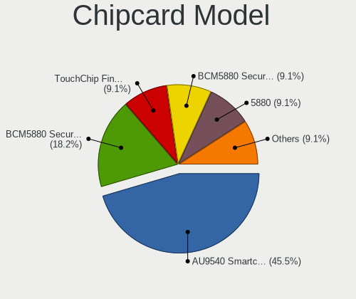

| Model                                                                        | Computers | Percent |
|------------------------------------------------------------------------------|-----------|---------|
| Alcor Micro AU9540 Smartcard Reader                                          | 3         | 42.86%  |
| Broadcom BCM5880 Secure Applications Processor                               | 2         | 28.57%  |
| Upek TouchChip Fingerprint Coprocessor (WBF advanced mode)                   | 1         | 14.29%  |
| Broadcom BCM5880 Secure Applications Processor with fingerprint swipe sensor | 1         | 14.29%  |

Unsupported
-----------

Unsupported Devices
-------------------

Total unsupported devices on board

| Total | Computers | Percent |
|-------|-----------|---------|
| 0     | 68        | 51.13%  |
| 1     | 49        | 36.84%  |
| 2     | 13        | 9.77%   |
| 3     | 3         | 2.26%   |

Unsupported Device Types
------------------------

Types of unsupported devices

| Type                     | Computers | Percent |
|--------------------------|-----------|---------|
| Fingerprint reader       | 29        | 36.25%  |
| Graphics card            | 16        | 20%     |
| Net/wireless             | 9         | 11.25%  |
| Chipcard                 | 7         | 8.75%   |
| Camera                   | 4         | 5%      |
| Unassigned class         | 3         | 3.75%   |
| Multimedia controller    | 3         | 3.75%   |
| Communication controller | 3         | 3.75%   |
| Bluetooth                | 3         | 3.75%   |
| Sound                    | 2         | 2.5%    |
| Modem                    | 1         | 1.25%   |

