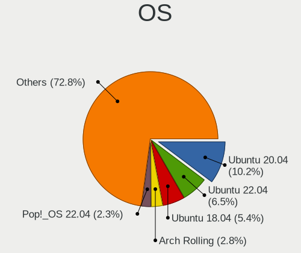
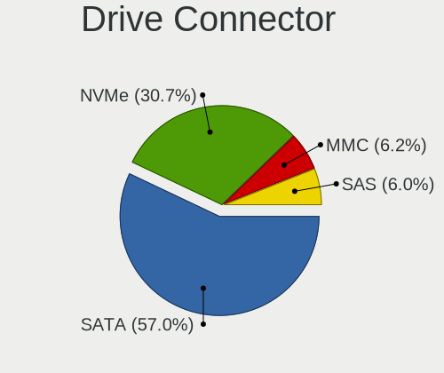

Linux in UK - Tested Hardware & Statistics
------------------------------------------

A project to collect tested hardware configurations for Linux in UK.

Anyone can contribute to this report by the [hw-probe](https://github.com/linuxhw/hw-probe) tool:

    sudo -E hw-probe -all -upload

Please contribute! Especially if your hardware is rare.

This is a report for all computer types. See also reports for [desktops](/Location/UK/Desktop/README.md) and [notebooks](/Location/UK/Notebook/README.md).

Contents
--------

* [ Test Cases ](#test-cases)

* [ System ](#system)
  - [ OS                       ](#os)
  - [ OS Family                ](#os-family)
  - [ Kernel                   ](#kernel)
  - [ Kernel Family            ](#kernel-family)
  - [ Kernel Major Ver.        ](#kernel-major-ver)
  - [ Arch                     ](#arch)
  - [ DE                       ](#de)
  - [ Display Server           ](#display-server)
  - [ Display Manager          ](#display-manager)
  - [ OS Lang                  ](#os-lang)
  - [ Boot Mode                ](#boot-mode)
  - [ Filesystem               ](#filesystem)
  - [ Part. scheme             ](#part-scheme)
  - [ Dual Boot with Linux/BSD ](#dual-boot-with-linuxbsd)
  - [ Dual Boot (Win)          ](#dual-boot-win)

* [ Board ](#board)
  - [ Vendor                   ](#vendor)
  - [ Model                    ](#model)
  - [ Model Family             ](#model-family)
  - [ MFG Year                 ](#mfg-year)
  - [ Form Factor              ](#form-factor)
  - [ Secure Boot              ](#secure-boot)
  - [ Coreboot                 ](#coreboot)
  - [ RAM Size                 ](#ram-size)
  - [ RAM Used                 ](#ram-used)
  - [ Total Drives             ](#total-drives)
  - [ Has CD-ROM               ](#has-cd-rom)
  - [ Has Ethernet             ](#has-ethernet)
  - [ Has WiFi                 ](#has-wifi)
  - [ Has Bluetooth            ](#has-bluetooth)

* [ Location ](#location)
  - [ Country                  ](#country)
  - [ City                     ](#city)

* [ Drives ](#drives)
  - [ Drive Vendor             ](#drive-vendor)
  - [ Drive Model              ](#drive-model)
  - [ HDD Vendor               ](#hdd-vendor)
  - [ SSD Vendor               ](#ssd-vendor)
  - [ Drive Kind               ](#drive-kind)
  - [ Drive Connector          ](#drive-connector)
  - [ Drive Size               ](#drive-size)
  - [ Space Total              ](#space-total)
  - [ Space Used               ](#space-used)
  - [ Malfunc. Drives          ](#malfunc-drives)
  - [ Malfunc. Drive Vendor    ](#malfunc-drive-vendor)
  - [ Malfunc. HDD Vendor      ](#malfunc-hdd-vendor)
  - [ Malfunc. Drive Kind      ](#malfunc-drive-kind)
  - [ Failed Drives            ](#failed-drives)
  - [ Failed Drive Vendor      ](#failed-drive-vendor)
  - [ Drive Status             ](#drive-status)

* [ Storage controller ](#storage-controller)
  - [ Storage Vendor           ](#storage-vendor)
  - [ Storage Model            ](#storage-model)
  - [ Storage Kind             ](#storage-kind)

* [ Processor ](#processor)
  - [ CPU Vendor               ](#cpu-vendor)
  - [ CPU Model                ](#cpu-model)
  - [ CPU Model Family         ](#cpu-model-family)
  - [ CPU Cores                ](#cpu-cores)
  - [ CPU Sockets              ](#cpu-sockets)
  - [ CPU Threads              ](#cpu-threads)
  - [ CPU Op-Modes             ](#cpu-op-modes)
  - [ CPU Microcode            ](#cpu-microcode)
  - [ CPU Microarch            ](#cpu-microarch)

* [ Graphics ](#graphics)
  - [ GPU Vendor               ](#gpu-vendor)
  - [ GPU Model                ](#gpu-model)
  - [ GPU Combo                ](#gpu-combo)
  - [ GPU Driver               ](#gpu-driver)
  - [ GPU Memory               ](#gpu-memory)

* [ Monitor ](#monitor)
  - [ Monitor Vendor           ](#monitor-vendor)
  - [ Monitor Model            ](#monitor-model)
  - [ Monitor Resolution       ](#monitor-resolution)
  - [ Monitor Diagonal         ](#monitor-diagonal)
  - [ Monitor Width            ](#monitor-width)
  - [ Aspect Ratio             ](#aspect-ratio)
  - [ Monitor Area             ](#monitor-area)
  - [ Pixel Density            ](#pixel-density)
  - [ Multiple Monitors        ](#multiple-monitors)

* [ Network ](#network)
  - [ Net Controller Vendor    ](#net-controller-vendor)
  - [ Net Controller Model     ](#net-controller-model)
  - [ Wireless Vendor          ](#wireless-vendor)
  - [ Wireless Model           ](#wireless-model)
  - [ Ethernet Vendor          ](#ethernet-vendor)
  - [ Ethernet Model           ](#ethernet-model)
  - [ Net Controller Kind      ](#net-controller-kind)
  - [ Used Controller          ](#used-controller)
  - [ NICs                     ](#nics)
  - [ IPv6                     ](#ipv6)

* [ Bluetooth ](#bluetooth)
  - [ Bluetooth Vendor         ](#bluetooth-vendor)
  - [ Bluetooth Model          ](#bluetooth-model)

* [ Sound ](#sound)
  - [ Sound Vendor             ](#sound-vendor)
  - [ Sound Model              ](#sound-model)

* [ Memory ](#memory)
  - [ Memory Vendor            ](#memory-vendor)
  - [ Memory Model             ](#memory-model)
  - [ Memory Kind              ](#memory-kind)
  - [ Memory Form Factor       ](#memory-form-factor)
  - [ Memory Size              ](#memory-size)
  - [ Memory Speed             ](#memory-speed)

* [ Printers & scanners ](#printers--scanners)
  - [ Printer Vendor           ](#printer-vendor)
  - [ Printer Model            ](#printer-model)
  - [ Scanner Vendor           ](#scanner-vendor)
  - [ Scanner Model            ](#scanner-model)

* [ Camera ](#camera)
  - [ Camera Vendor            ](#camera-vendor)
  - [ Camera Model             ](#camera-model)

* [ Security ](#security)
  - [ Fingerprint Vendor       ](#fingerprint-vendor)
  - [ Fingerprint Model        ](#fingerprint-model)
  - [ Chipcard Vendor          ](#chipcard-vendor)
  - [ Chipcard Model           ](#chipcard-model)

* [ Unsupported ](#unsupported)
  - [ Unsupported Devices      ](#unsupported-devices)
  - [ Unsupported Device Types ](#unsupported-device-types)

Test Cases
----------

Total: 12833

| Vendor        | Model                       | Form-Factor | Probe                                                      | Date         |
|---------------|-----------------------------|-------------|------------------------------------------------------------|--------------|
| Lenovo        | ThinkPad T460s 20FAS1V60... | Notebook    | [ca5f55438f](https://linux-hardware.org/?probe=ca5f55438f) | Jan 02, 2024 |
| ASRock        | B550M Pro4                  | Desktop     | [9eb47b934a](https://linux-hardware.org/?probe=9eb47b934a) | Jan 02, 2024 |
| Dell          | Inspiron 15 3530            | Notebook    | [ee21ee0e37](https://linux-hardware.org/?probe=ee21ee0e37) | Jan 01, 2024 |
| ASRock        | Z77 Professional            | Desktop     | [d1d9fce85d](https://linux-hardware.org/?probe=d1d9fce85d) | Jan 01, 2024 |
| ASUSTek       | VivoBook_ASUSLaptop X509... | Notebook    | [d4335b1132](https://linux-hardware.org/?probe=d4335b1132) | Jan 01, 2024 |
| HP            | 82A2                        | Desktop     | [7cc3d17916](https://linux-hardware.org/?probe=7cc3d17916) | Jan 01, 2024 |
| ASRock        | X570 Phantom Gaming-ITX/... | Desktop     | [58557ae7c7](https://linux-hardware.org/?probe=58557ae7c7) | Jan 01, 2024 |
| Pegatron      | EVANS                       | Desktop     | [b2a67b83cd](https://linux-hardware.org/?probe=b2a67b83cd) | Jan 01, 2024 |
| MSI           | X470 GAMING PRO CARBON      | Desktop     | [8a1771af4b](https://linux-hardware.org/?probe=8a1771af4b) | Jan 01, 2024 |
| HP            | Laptop 15s-eq2xxx           | Notebook    | [2f1b4ada4b](https://linux-hardware.org/?probe=2f1b4ada4b) | Jan 01, 2024 |
| ASUSTek       | ROG STRIX B550-E GAMING     | Desktop     | [4fb6fd51a2](https://linux-hardware.org/?probe=4fb6fd51a2) | Jan 01, 2024 |
| ASUSTek       | PRIME A320M-K               | Desktop     | [f45ebb1f0d](https://linux-hardware.org/?probe=f45ebb1f0d) | Dec 31, 2023 |
| ASUSTek       | ROG STRIX B550-E GAMING     | Desktop     | [eb264efa92](https://linux-hardware.org/?probe=eb264efa92) | Dec 31, 2023 |
| Lenovo        | Y50-70 20378                | Notebook    | [ff5e2959f8](https://linux-hardware.org/?probe=ff5e2959f8) | Dec 31, 2023 |
| Notebook      | NL5xNU                      | Notebook    | [915031852a](https://linux-hardware.org/?probe=915031852a) | Dec 31, 2023 |
| Acer          | Aspire 8943G                | Notebook    | [a75a2524f2](https://linux-hardware.org/?probe=a75a2524f2) | Dec 31, 2023 |
| Gigabyte      | AX370-Gaming K5-CF          | Desktop     | [ba1b2a738a](https://linux-hardware.org/?probe=ba1b2a738a) | Dec 30, 2023 |
| Valve         | Jupiter                     | Notebook    | [2f8ea60a38](https://linux-hardware.org/?probe=2f8ea60a38) | Dec 30, 2023 |
| ASUSTek       | VivoBook_ASUSLaptop M760... | Notebook    | [60da2c756f](https://linux-hardware.org/?probe=60da2c756f) | Dec 30, 2023 |
| Dell          | 0V8WGR A00                  | Desktop     | [88a9972a33](https://linux-hardware.org/?probe=88a9972a33) | Dec 30, 2023 |
| Dell          | 0V8WGR A00                  | Desktop     | [91be04698f](https://linux-hardware.org/?probe=91be04698f) | Dec 30, 2023 |
| ASUSTek       | VivoBook_ASUSLaptop M760... | Notebook    | [f805c2c9fc](https://linux-hardware.org/?probe=f805c2c9fc) | Dec 30, 2023 |
| ASUSTek       | VivoBook_ASUSLaptop X515... | Notebook    | [e0fa90555a](https://linux-hardware.org/?probe=e0fa90555a) | Dec 29, 2023 |
| MSI           | B450 TOMAHAWK MAX           | Desktop     | [403210cab1](https://linux-hardware.org/?probe=403210cab1) | Dec 29, 2023 |
| ASUSTek       | TUF Gaming X570-PLUS        | Desktop     | [50eef7421d](https://linux-hardware.org/?probe=50eef7421d) | Dec 29, 2023 |
| Gigabyte      | 990FXA-UD3                  | Desktop     | [9104adc237](https://linux-hardware.org/?probe=9104adc237) | Dec 29, 2023 |
| ASUSTek       | VivoBook_ASUSLaptop E410... | Notebook    | [9e856c326a](https://linux-hardware.org/?probe=9e856c326a) | Dec 29, 2023 |
| ASUSTek       | X99-DELUXE                  | Desktop     | [2433b4bc75](https://linux-hardware.org/?probe=2433b4bc75) | Dec 29, 2023 |
| Gigabyte      | X570 GAMING X               | Desktop     | [617d953e8f](https://linux-hardware.org/?probe=617d953e8f) | Dec 29, 2023 |
| Gigabyte      | X570 GAMING X               | Desktop     | [587d9f4fcb](https://linux-hardware.org/?probe=587d9f4fcb) | Dec 29, 2023 |
| Acer          | Aspire F5-571               | Notebook    | [d28fac242c](https://linux-hardware.org/?probe=d28fac242c) | Dec 29, 2023 |
| HP            | EliteBook 2570p             | Notebook    | [935d08358c](https://linux-hardware.org/?probe=935d08358c) | Dec 29, 2023 |
| Lenovo        | Yoga 510-14AST 80S9         | Convertible | [45be79a808](https://linux-hardware.org/?probe=45be79a808) | Dec 29, 2023 |
| MSI           | X470 GAMING PRO CARBON      | Desktop     | [3700165122](https://linux-hardware.org/?probe=3700165122) | Dec 28, 2023 |
| Dell          | 04Y8V0 A02                  | Desktop     | [ba96083a55](https://linux-hardware.org/?probe=ba96083a55) | Dec 28, 2023 |
| HP            | ZBook 14u G6                | Notebook    | [409e402108](https://linux-hardware.org/?probe=409e402108) | Dec 28, 2023 |
| Dell          | 0R230R A00                  | Desktop     | [50111db215](https://linux-hardware.org/?probe=50111db215) | Dec 28, 2023 |
| ASUSTek       | TUF Gaming X570-PLUS        | Desktop     | [ee1b832527](https://linux-hardware.org/?probe=ee1b832527) | Dec 28, 2023 |
| Google        | Nami                        | Notebook    | [3d7f7ba09c](https://linux-hardware.org/?probe=3d7f7ba09c) | Dec 28, 2023 |
| HP            | ProBook 455 G1              | Notebook    | [d132700b11](https://linux-hardware.org/?probe=d132700b11) | Dec 28, 2023 |
| AWOW          | AK41                        | Notebook    | [d081509ed9](https://linux-hardware.org/?probe=d081509ed9) | Dec 28, 2023 |
| MSI           | Pulse GL66 12UEK            | Notebook    | [4600a758fa](https://linux-hardware.org/?probe=4600a758fa) | Dec 27, 2023 |
| Acer          | Aspire E1-570               | Notebook    | [403dd9f171](https://linux-hardware.org/?probe=403dd9f171) | Dec 27, 2023 |
| ASUSTek       | ROG Strix G614JZ_G614JZ     | Notebook    | [3ec4d2a40d](https://linux-hardware.org/?probe=3ec4d2a40d) | Dec 27, 2023 |
| ASUSTek       | ROG Strix G614JZ_G614JZ     | Notebook    | [eb40e7ad5c](https://linux-hardware.org/?probe=eb40e7ad5c) | Dec 27, 2023 |
| HP            | 2AFB                        | Desktop     | [5279d471aa](https://linux-hardware.org/?probe=5279d471aa) | Dec 27, 2023 |
| ASUSTek       | UN42                        | Desktop     | [1b146f734f](https://linux-hardware.org/?probe=1b146f734f) | Dec 27, 2023 |
| Lenovo        | ThinkPad T410 2522AC1       | Notebook    | [f745deb3d7](https://linux-hardware.org/?probe=f745deb3d7) | Dec 27, 2023 |
| Dell          | Latitude 7390               | Notebook    | [32c3fcc941](https://linux-hardware.org/?probe=32c3fcc941) | Dec 27, 2023 |
| MSI           | MPG B550 GAMING PLUS        | Desktop     | [bfa7e572a4](https://linux-hardware.org/?probe=bfa7e572a4) | Dec 27, 2023 |
| ASRock        | X670E Steel Legend          | Desktop     | [fde01139b9](https://linux-hardware.org/?probe=fde01139b9) | Dec 27, 2023 |
| Dell          | XPS 15 9570                 | Notebook    | [25466d5d3b](https://linux-hardware.org/?probe=25466d5d3b) | Dec 27, 2023 |
| MSI           | B450 TOMAHAWK MAX           | Desktop     | [d661150c95](https://linux-hardware.org/?probe=d661150c95) | Dec 27, 2023 |
| Acer          | TravelMate P256-M           | Notebook    | [c4f9e9de5e](https://linux-hardware.org/?probe=c4f9e9de5e) | Dec 27, 2023 |
| Acer          | TravelMate P256-M           | Notebook    | [c129debcae](https://linux-hardware.org/?probe=c129debcae) | Dec 27, 2023 |
| Dynabook      | Satellite Pro L50-G-193     | Notebook    | [b602153aeb](https://linux-hardware.org/?probe=b602153aeb) | Dec 26, 2023 |
| Notebook      | NL5xNU                      | Notebook    | [ad5a093909](https://linux-hardware.org/?probe=ad5a093909) | Dec 26, 2023 |
| Dell          | 0KWVT8 A03                  | Desktop     | [fae868ef79](https://linux-hardware.org/?probe=fae868ef79) | Dec 26, 2023 |
| Lenovo        | ThinkPad T16 Gen 2 21K7C... | Notebook    | [5a76629311](https://linux-hardware.org/?probe=5a76629311) | Dec 26, 2023 |
| ASUSTek       | ROG STRIX X670E-E GAMING... | Desktop     | [ca94325310](https://linux-hardware.org/?probe=ca94325310) | Dec 26, 2023 |
| Acer          | Aspire A314-22              | Notebook    | [83c0e37ece](https://linux-hardware.org/?probe=83c0e37ece) | Dec 25, 2023 |
| Valve         | Jupiter                     | Notebook    | [4ab75ea56b](https://linux-hardware.org/?probe=4ab75ea56b) | Dec 25, 2023 |
| PC Special... | 14 Fusion Pro               | Notebook    | [76bf311c34](https://linux-hardware.org/?probe=76bf311c34) | Dec 25, 2023 |
| ASUSTek       | PRIME X670E-PRO WIFI        | Desktop     | [e6cbc30aad](https://linux-hardware.org/?probe=e6cbc30aad) | Dec 25, 2023 |
| Microsoft     | Surface Pro 4               | Tablet      | [fea4a4753e](https://linux-hardware.org/?probe=fea4a4753e) | Dec 25, 2023 |
| HP            | 255 G8 Notebook PC          | Notebook    | [1f14807c5e](https://linux-hardware.org/?probe=1f14807c5e) | Dec 25, 2023 |
| Valve         | Jupiter                     | Notebook    | [6ec124a0c4](https://linux-hardware.org/?probe=6ec124a0c4) | Dec 24, 2023 |
| Lenovo        | ThinkPad P14s Gen 3 21J6... | Notebook    | [eb3b2bf56b](https://linux-hardware.org/?probe=eb3b2bf56b) | Dec 24, 2023 |
| Valve         | Jupiter                     | Notebook    | [f57d2e51fe](https://linux-hardware.org/?probe=f57d2e51fe) | Dec 24, 2023 |
| Lenovo        | Yoga 510-14AST 80S9         | Convertible | [a5ef57e596](https://linux-hardware.org/?probe=a5ef57e596) | Dec 24, 2023 |
| Gigabyte      | GA-990X-Gaming SLI-CF       | Desktop     | [915a47dab1](https://linux-hardware.org/?probe=915a47dab1) | Dec 24, 2023 |
| ASUSTek       | Z97-K                       | Desktop     | [2474ae00d3](https://linux-hardware.org/?probe=2474ae00d3) | Dec 24, 2023 |
| Dell          | Latitude 5300               | Notebook    | [68336d8bc1](https://linux-hardware.org/?probe=68336d8bc1) | Dec 24, 2023 |
| Dell          | Latitude 12 Rugged Table... | Notebook    | [7690d56522](https://linux-hardware.org/?probe=7690d56522) | Dec 24, 2023 |
| Dell          | Inspiron 15 3530            | Notebook    | [0688896e27](https://linux-hardware.org/?probe=0688896e27) | Dec 23, 2023 |
| Lenovo        | Yoga 510-14AST 80S9         | Convertible | [ce31053fe2](https://linux-hardware.org/?probe=ce31053fe2) | Dec 23, 2023 |
| Dell          | Latitude E6420              | Notebook    | [82c13c188b](https://linux-hardware.org/?probe=82c13c188b) | Dec 23, 2023 |
| Acer          | Veriton X2631G V:1.0        | Desktop     | [c9555a34f2](https://linux-hardware.org/?probe=c9555a34f2) | Dec 23, 2023 |
| HP            | Spectre x360 2-in-1 Lapt... | Convertible | [c6caf2cc7a](https://linux-hardware.org/?probe=c6caf2cc7a) | Dec 22, 2023 |
| Dell          | Inspiron 5577               | Notebook    | [e6827a291e](https://linux-hardware.org/?probe=e6827a291e) | Dec 22, 2023 |
| Dell          | Latitude 7300               | Notebook    | [8792895835](https://linux-hardware.org/?probe=8792895835) | Dec 22, 2023 |
| HP            | ENVY Laptop 17-ch0xxx       | Notebook    | [38a9810e94](https://linux-hardware.org/?probe=38a9810e94) | Dec 22, 2023 |
| Dell          | Latitude E5510              | Notebook    | [92074a5231](https://linux-hardware.org/?probe=92074a5231) | Dec 22, 2023 |
| Valve         | Jupiter                     | Notebook    | [03491495da](https://linux-hardware.org/?probe=03491495da) | Dec 22, 2023 |
| HP            | EliteBook 830 G5            | Notebook    | [aa3d919a29](https://linux-hardware.org/?probe=aa3d919a29) | Dec 22, 2023 |
| Gigabyte      | AB350-Gaming 3-CF           | Desktop     | [b49d16daf5](https://linux-hardware.org/?probe=b49d16daf5) | Dec 21, 2023 |
| ASUSTek       | E201NA                      | Notebook    | [ee5e05ce6d](https://linux-hardware.org/?probe=ee5e05ce6d) | Dec 21, 2023 |
| Lenovo        | ThinkPad X280 20KEA00SUK    | Notebook    | [bc380b4334](https://linux-hardware.org/?probe=bc380b4334) | Dec 21, 2023 |
| Apple         | Mac-F4238CC8 PVT            | All in one  | [ecefa48588](https://linux-hardware.org/?probe=ecefa48588) | Dec 21, 2023 |
| Microsoft     | Surface Pro 4               | Tablet      | [5dd9b40dd6](https://linux-hardware.org/?probe=5dd9b40dd6) | Dec 21, 2023 |
| ASRock        | B550M Pro4                  | Desktop     | [bb26992a0a](https://linux-hardware.org/?probe=bb26992a0a) | Dec 21, 2023 |
| ASUSTek       | M5A99X EVO                  | Desktop     | [c0c637bbba](https://linux-hardware.org/?probe=c0c637bbba) | Dec 21, 2023 |
| Acer          | Veriton X2631G V:1.0        | Desktop     | [7597019eca](https://linux-hardware.org/?probe=7597019eca) | Dec 21, 2023 |
| ASRock        | H610M-HVS                   | Desktop     | [25b5c11ccc](https://linux-hardware.org/?probe=25b5c11ccc) | Dec 20, 2023 |
| Lenovo        | Yoga 500-15IBD 80N6         | Notebook    | [088b5d3bba](https://linux-hardware.org/?probe=088b5d3bba) | Dec 20, 2023 |
| ASUSTek       | TUF Gaming X570-PLUS        | Desktop     | [98eee633b1](https://linux-hardware.org/?probe=98eee633b1) | Dec 20, 2023 |
| Lenovo        | ThinkPad X1 Carbon Gen 1... | Notebook    | [eef5dcab57](https://linux-hardware.org/?probe=eef5dcab57) | Dec 20, 2023 |
| MSI           | 970 GAMING                  | Desktop     | [cb71670ca0](https://linux-hardware.org/?probe=cb71670ca0) | Dec 20, 2023 |
| Inventec      | Dell Wyse Thin Client De... | Mini pc     | [7aa12c94c1](https://linux-hardware.org/?probe=7aa12c94c1) | Dec 20, 2023 |
| Intel         | DH55TC AAE70932-206         | Desktop     | [3003aeb5a9](https://linux-hardware.org/?probe=3003aeb5a9) | Dec 20, 2023 |
| Lenovo        | ThinkPad T16 Gen 1 21CHC... | Notebook    | [4f6ecdc95a](https://linux-hardware.org/?probe=4f6ecdc95a) | Dec 19, 2023 |
| Gigabyte      | Z390 UD                     | Desktop     | [8e6c8be806](https://linux-hardware.org/?probe=8e6c8be806) | Dec 19, 2023 |
| Dell          | Latitude 5340               | Notebook    | [c9d3b3d7a7](https://linux-hardware.org/?probe=c9d3b3d7a7) | Dec 19, 2023 |
| HP            | Notebook                    | Notebook    | [31d6fc4280](https://linux-hardware.org/?probe=31d6fc4280) | Dec 19, 2023 |
| Gigabyte      | B550M DS3H                  | Desktop     | [0fd7e9086a](https://linux-hardware.org/?probe=0fd7e9086a) | Dec 19, 2023 |
| Lenovo        | ThinkPad T440p 20AWA16R0... | Notebook    | [4f1e1945a7](https://linux-hardware.org/?probe=4f1e1945a7) | Dec 19, 2023 |
| MSI           | A520M-A PRO                 | Desktop     | [5781ca34c8](https://linux-hardware.org/?probe=5781ca34c8) | Dec 19, 2023 |
| Gigabyte      | Z590I VISION D              | Desktop     | [92531d60e9](https://linux-hardware.org/?probe=92531d60e9) | Dec 19, 2023 |
| Toshiba       | Satellite Pro C50-A-1E2     | Notebook    | [91b5e05490](https://linux-hardware.org/?probe=91b5e05490) | Dec 19, 2023 |
| Toshiba       | Satellite Pro C50-A-1E2     | Notebook    | [fde7aeea9c](https://linux-hardware.org/?probe=fde7aeea9c) | Dec 19, 2023 |
| Dell          | Inspiron 15 3535            | Notebook    | [f86bf3e2f1](https://linux-hardware.org/?probe=f86bf3e2f1) | Dec 18, 2023 |
| ASRock        | B650M Pro RS                | Desktop     | [df96c996dd](https://linux-hardware.org/?probe=df96c996dd) | Dec 18, 2023 |
| MSI           | MAG B550 TOMAHAWK           | Desktop     | [38b0463b4a](https://linux-hardware.org/?probe=38b0463b4a) | Dec 18, 2023 |
| Gigabyte      | Z77-D3H                     | Desktop     | [8f34c208f2](https://linux-hardware.org/?probe=8f34c208f2) | Dec 18, 2023 |
| ASUSTek       | ROG Strix G713PV_G713PV     | Notebook    | [8596edc762](https://linux-hardware.org/?probe=8596edc762) | Dec 18, 2023 |
| ASUSTek       | ROG STRIX Z390-E GAMING     | Desktop     | [a62323f9e3](https://linux-hardware.org/?probe=a62323f9e3) | Dec 18, 2023 |
| Valve         | Jupiter                     | Notebook    | [f8d7e441a5](https://linux-hardware.org/?probe=f8d7e441a5) | Dec 18, 2023 |
| MSI           | X470 GAMING PRO CARBON      | Desktop     | [6115b25184](https://linux-hardware.org/?probe=6115b25184) | Dec 18, 2023 |
| HP            | Pavilion Notebook           | Notebook    | [0376612ef7](https://linux-hardware.org/?probe=0376612ef7) | Dec 18, 2023 |
| BESSTAR Te... | UM700                       | Desktop     | [ac4adad071](https://linux-hardware.org/?probe=ac4adad071) | Dec 18, 2023 |
| MSI           | MAG B550M BAZOOKA           | Desktop     | [474668dbec](https://linux-hardware.org/?probe=474668dbec) | Dec 18, 2023 |
| DTV           | G5A-BTJ1900                 | Other       | [f6c12e7381](https://linux-hardware.org/?probe=f6c12e7381) | Dec 18, 2023 |
| ASUSTek       | PRIME H310M-A R2.0          | Desktop     | [c0b618e2ab](https://linux-hardware.org/?probe=c0b618e2ab) | Dec 18, 2023 |
| Gigabyte      | B550I AORUS PRO AX          | Desktop     | [825b7230bc](https://linux-hardware.org/?probe=825b7230bc) | Dec 18, 2023 |
| ASRock        | X670E Taichi Carrara        | Desktop     | [2d0eb33a7a](https://linux-hardware.org/?probe=2d0eb33a7a) | Dec 17, 2023 |
| Lenovo        | ThinkPad T420 4180PR1       | Notebook    | [2c0267b77e](https://linux-hardware.org/?probe=2c0267b77e) | Dec 17, 2023 |
| Dell          | Latitude E6400              | Notebook    | [855a8f55c4](https://linux-hardware.org/?probe=855a8f55c4) | Dec 17, 2023 |
| Toshiba       | Satellite L300              | Notebook    | [6528f813b7](https://linux-hardware.org/?probe=6528f813b7) | Dec 17, 2023 |
| HP            | ZBook 14u G6                | Notebook    | [125dbde28d](https://linux-hardware.org/?probe=125dbde28d) | Dec 17, 2023 |
| Microsoft     | Surface Pro 4               | Tablet      | [ce25ba67fb](https://linux-hardware.org/?probe=ce25ba67fb) | Dec 17, 2023 |
| Unknown       | Apple MacBook Pro (14-in... | Notebook    | [209df55714](https://linux-hardware.org/?probe=209df55714) | Dec 17, 2023 |
| Gigabyte      | B550M DS3H                  | Desktop     | [28d755787e](https://linux-hardware.org/?probe=28d755787e) | Dec 17, 2023 |
| HP            | Spectre x360 2-in-1 Lapt... | Convertible | [25525c17e0](https://linux-hardware.org/?probe=25525c17e0) | Dec 17, 2023 |
| ASUSTek       | ROG STRIX B550-E GAMING     | Desktop     | [316b12645c](https://linux-hardware.org/?probe=316b12645c) | Dec 17, 2023 |
| MSI           | MAG A520M VECTOR WIFI       | Desktop     | [0f2293e8d1](https://linux-hardware.org/?probe=0f2293e8d1) | Dec 17, 2023 |
| HP            | Spectre x360 2-in-1 Lapt... | Convertible | [402a34ec30](https://linux-hardware.org/?probe=402a34ec30) | Dec 17, 2023 |
| Samsung       | 930QED                      | Convertible | [90cf6b2c26](https://linux-hardware.org/?probe=90cf6b2c26) | Dec 17, 2023 |
| Valve         | Jupiter                     | Notebook    | [d6c8debc47](https://linux-hardware.org/?probe=d6c8debc47) | Dec 16, 2023 |
| HP            | EliteBook 8460p             | Notebook    | [9105f33be2](https://linux-hardware.org/?probe=9105f33be2) | Dec 16, 2023 |
| HP            | 829A                        | Mini pc     | [e0b2d004a0](https://linux-hardware.org/?probe=e0b2d004a0) | Dec 16, 2023 |
| ASUSTek       | ROG STRIX X670E-F GAMING... | Desktop     | [36f9f51f5d](https://linux-hardware.org/?probe=36f9f51f5d) | Dec 16, 2023 |
| HP            | 3397                        | Desktop     | [7b379848f1](https://linux-hardware.org/?probe=7b379848f1) | Dec 16, 2023 |
| Gigabyte      | Z77-D3H                     | Desktop     | [52012e39df](https://linux-hardware.org/?probe=52012e39df) | Dec 16, 2023 |
| Acer          | Aspire 6930G                | Notebook    | [3e93a62792](https://linux-hardware.org/?probe=3e93a62792) | Dec 16, 2023 |
| Dell          | 02YYK5 A01                  | Desktop     | [0558258245](https://linux-hardware.org/?probe=0558258245) | Dec 16, 2023 |
| AZW           | GT-R                        | Notebook    | [205436106b](https://linux-hardware.org/?probe=205436106b) | Dec 16, 2023 |
| Dell          | 0HY9JP A00                  | Desktop     | [5af488fb21](https://linux-hardware.org/?probe=5af488fb21) | Dec 16, 2023 |
| Dell          | 0MY764 A00                  | All in one  | [2fd4dc6486](https://linux-hardware.org/?probe=2fd4dc6486) | Dec 16, 2023 |
| Dell          | 0MY764 A00                  | All in one  | [ad39174db9](https://linux-hardware.org/?probe=ad39174db9) | Dec 16, 2023 |
| ASUSTek       | ROG STRIX B550-E GAMING     | Desktop     | [ec182b1b52](https://linux-hardware.org/?probe=ec182b1b52) | Dec 16, 2023 |
| HP            | 2AFB                        | Desktop     | [4160a75172](https://linux-hardware.org/?probe=4160a75172) | Dec 15, 2023 |
| Dell          | Inspiron 13-5378            | Notebook    | [d63cdec5eb](https://linux-hardware.org/?probe=d63cdec5eb) | Dec 15, 2023 |
| Dell          | 0HY9JP A00                  | Desktop     | [3a2a8878eb](https://linux-hardware.org/?probe=3a2a8878eb) | Dec 15, 2023 |
| Shenzhen M... | F7BSC                       | Mini pc     | [69de9d26c7](https://linux-hardware.org/?probe=69de9d26c7) | Dec 15, 2023 |
| HP            | 8592                        | Desktop     | [511feb6066](https://linux-hardware.org/?probe=511feb6066) | Dec 15, 2023 |
| Razer         | Blade 15 (2022) - RZ09-0... | Notebook    | [921d38d2df](https://linux-hardware.org/?probe=921d38d2df) | Dec 15, 2023 |
| HP            | 8592                        | Desktop     | [c5817452fd](https://linux-hardware.org/?probe=c5817452fd) | Dec 15, 2023 |
| Dell          | XPS 15 9570                 | Notebook    | [67a32f0dd0](https://linux-hardware.org/?probe=67a32f0dd0) | Dec 14, 2023 |
| Dell          | XPS 15 9570                 | Notebook    | [283dc2dab5](https://linux-hardware.org/?probe=283dc2dab5) | Dec 14, 2023 |
| ASUSTek       | ROG STRIX B550-E GAMING     | Desktop     | [39f4b40998](https://linux-hardware.org/?probe=39f4b40998) | Dec 14, 2023 |
| ASUSTek       | PRIME A320M-K               | Desktop     | [7e358e1c4b](https://linux-hardware.org/?probe=7e358e1c4b) | Dec 14, 2023 |
| MSI           | B450M PRO-M2 MAX            | Desktop     | [93e9419d49](https://linux-hardware.org/?probe=93e9419d49) | Dec 14, 2023 |
| ASUSTek       | P7P55D-E                    | Desktop     | [3280eaaea1](https://linux-hardware.org/?probe=3280eaaea1) | Dec 14, 2023 |
| Apple         | Mac-942B5BF58194151B        | All in one  | [bfca25b6c1](https://linux-hardware.org/?probe=bfca25b6c1) | Dec 14, 2023 |
| Schenker      | XMG NEO (E23)               | Notebook    | [ce84d5a464](https://linux-hardware.org/?probe=ce84d5a464) | Dec 13, 2023 |
| HP            | Spectre x360 2-in-1 Lapt... | Convertible | [1b81d3191b](https://linux-hardware.org/?probe=1b81d3191b) | Dec 13, 2023 |
| HP            | Spectre x360 2-in-1 Lapt... | Convertible | [5eaaa9dcdc](https://linux-hardware.org/?probe=5eaaa9dcdc) | Dec 13, 2023 |
| Dell          | XPS 15 9530                 | Notebook    | [33d1f683ba](https://linux-hardware.org/?probe=33d1f683ba) | Dec 13, 2023 |
| Acer          | TMP645-M                    | Notebook    | [55c3db256a](https://linux-hardware.org/?probe=55c3db256a) | Dec 13, 2023 |
| ASUSTek       | P7P55D-E                    | Desktop     | [3f2ed65cf0](https://linux-hardware.org/?probe=3f2ed65cf0) | Dec 13, 2023 |
| HP            | ENVY x360 2-in-1 Laptop ... | Convertible | [c266418637](https://linux-hardware.org/?probe=c266418637) | Dec 13, 2023 |
| Valve         | Galileo                     | Notebook    | [835c844aed](https://linux-hardware.org/?probe=835c844aed) | Dec 13, 2023 |
| Apple         | Mac-942B5BF58194151B        | All in one  | [9b20467a02](https://linux-hardware.org/?probe=9b20467a02) | Dec 13, 2023 |
| Dell          | Inspiron 16 Plus 7630       | Notebook    | [25017a9de6](https://linux-hardware.org/?probe=25017a9de6) | Dec 13, 2023 |
| HP            | Pavilion g6                 | Notebook    | [920939b6c0](https://linux-hardware.org/?probe=920939b6c0) | Dec 13, 2023 |
| Gigabyte      | GA-990X-Gaming SLI-CF       | Desktop     | [01f7be08ae](https://linux-hardware.org/?probe=01f7be08ae) | Dec 13, 2023 |
| MSI           | MS-16Y1                     | Notebook    | [41ce29bec7](https://linux-hardware.org/?probe=41ce29bec7) | Dec 12, 2023 |
| GEO           | GEOBOOK 2E                  | Notebook    | [86b33e33ca](https://linux-hardware.org/?probe=86b33e33ca) | Dec 12, 2023 |
| GEO           | GEOBOOK 2E                  | Notebook    | [cac69d7624](https://linux-hardware.org/?probe=cac69d7624) | Dec 12, 2023 |
| HP            | ProBook 430 G8 Notebook ... | Notebook    | [46b5f7ee7b](https://linux-hardware.org/?probe=46b5f7ee7b) | Dec 12, 2023 |
| Gigabyte      | B550 AORUS ELITE V2         | Desktop     | [22dfb202b4](https://linux-hardware.org/?probe=22dfb202b4) | Dec 12, 2023 |
| ASUSTek       | TUF X470-PLUS GAMING        | Desktop     | [0a531cbda1](https://linux-hardware.org/?probe=0a531cbda1) | Dec 12, 2023 |
| Gigabyte      | H310M H x.x                 | Desktop     | [bcf9fba46f](https://linux-hardware.org/?probe=bcf9fba46f) | Dec 12, 2023 |
| Samsung       | R720                        | Notebook    | [a434163017](https://linux-hardware.org/?probe=a434163017) | Dec 12, 2023 |
| Apple         | MacBookPro14,1              | Notebook    | [16e9faf4e6](https://linux-hardware.org/?probe=16e9faf4e6) | Dec 12, 2023 |
| Apple         | MacBookPro14,1              | Notebook    | [05ceb8703b](https://linux-hardware.org/?probe=05ceb8703b) | Dec 12, 2023 |
| Samsung       | R720                        | Notebook    | [b7a2f3044e](https://linux-hardware.org/?probe=b7a2f3044e) | Dec 12, 2023 |
| Unknown       | Unknown                     | Desktop     | [c9eae3e15f](https://linux-hardware.org/?probe=c9eae3e15f) | Dec 12, 2023 |
| ASUSTek       | PRIME H610M-A D4            | Desktop     | [39a6569b14](https://linux-hardware.org/?probe=39a6569b14) | Dec 12, 2023 |
| Acer          | Aspire Z3-615               | All in one  | [e71cda8b04](https://linux-hardware.org/?probe=e71cda8b04) | Dec 12, 2023 |
| Acer          | Aspire Z3-615               | All in one  | [c3d3cc14e8](https://linux-hardware.org/?probe=c3d3cc14e8) | Dec 12, 2023 |
| Lenovo        | ThinkPad L14 Gen 1 20U50... | Notebook    | [f49dd0f010](https://linux-hardware.org/?probe=f49dd0f010) | Dec 12, 2023 |
| Dell          | 07WP95 A02                  | Desktop     | [b5d957b7ec](https://linux-hardware.org/?probe=b5d957b7ec) | Dec 12, 2023 |
| MSI           | X470 GAMING PRO CARBON      | Desktop     | [281cfa9ff7](https://linux-hardware.org/?probe=281cfa9ff7) | Dec 11, 2023 |
| Lenovo        | ThinkPad L15 Gen 1 20U70... | Notebook    | [31b92c3112](https://linux-hardware.org/?probe=31b92c3112) | Dec 11, 2023 |
| Entroware     | Poseidon                    | Desktop     | [88c52d72cc](https://linux-hardware.org/?probe=88c52d72cc) | Dec 11, 2023 |
| ASUSTek       | A88XM-E                     | Desktop     | [ef34073e18](https://linux-hardware.org/?probe=ef34073e18) | Dec 11, 2023 |
| Simply NUC    | NUC12ZRB                    | Mini pc     | [773fd495da](https://linux-hardware.org/?probe=773fd495da) | Dec 11, 2023 |
| Dell          | Inspiron 13-5378            | Notebook    | [3d89daa3fa](https://linux-hardware.org/?probe=3d89daa3fa) | Dec 11, 2023 |
| ASUSTek       | P8Z68-V PRO GEN3            | Desktop     | [76c38ed49a](https://linux-hardware.org/?probe=76c38ed49a) | Dec 11, 2023 |
| Lenovo        | ThinkPad T540p 20BE003YU... | Notebook    | [f604df3e48](https://linux-hardware.org/?probe=f604df3e48) | Dec 10, 2023 |
| Gigabyte      | F2A68HM-HD2                 | Desktop     | [237db70b40](https://linux-hardware.org/?probe=237db70b40) | Dec 10, 2023 |
| Acer          | Aspire 6930G                | Notebook    | [eea9d9e525](https://linux-hardware.org/?probe=eea9d9e525) | Dec 10, 2023 |
| ASUSTek       | P8H61-MX USB3               | Desktop     | [60d3606ca9](https://linux-hardware.org/?probe=60d3606ca9) | Dec 10, 2023 |
| Dell          | XPS 15 9570                 | Notebook    | [35a10a1ae2](https://linux-hardware.org/?probe=35a10a1ae2) | Dec 10, 2023 |
| Sony          | SVE1511K1EW                 | Notebook    | [34875b90c4](https://linux-hardware.org/?probe=34875b90c4) | Dec 10, 2023 |
| MSI           | GS43VR 7RE                  | Notebook    | [23feee91ff](https://linux-hardware.org/?probe=23feee91ff) | Dec 10, 2023 |
| Medion        | B360H4-EM V1.0              | Desktop     | [a0d6ba0881](https://linux-hardware.org/?probe=a0d6ba0881) | Dec 08, 2023 |
| Lenovo        | ThinkPad X1 Tablet Gen 3... | Tablet      | [825eb9ef88](https://linux-hardware.org/?probe=825eb9ef88) | Dec 08, 2023 |
| Lenovo        | ThinkPad X1 Tablet Gen 3... | Tablet      | [e8705e98dc](https://linux-hardware.org/?probe=e8705e98dc) | Dec 08, 2023 |
| Dell          | G5 5590                     | Notebook    | [6970987854](https://linux-hardware.org/?probe=6970987854) | Dec 08, 2023 |
| Dell          | Inspiron 7400               | Notebook    | [0fb56c3b77](https://linux-hardware.org/?probe=0fb56c3b77) | Dec 08, 2023 |
| Gigabyte      | X670 AORUS ELITE AX         | Desktop     | [df7eb64dd1](https://linux-hardware.org/?probe=df7eb64dd1) | Dec 08, 2023 |
| HP            | ZBook Firefly 15 inch G8... | Notebook    | [3ca33a4b88](https://linux-hardware.org/?probe=3ca33a4b88) | Dec 08, 2023 |
| ASUSTek       | PRIME A320M-K               | Desktop     | [0403680fc9](https://linux-hardware.org/?probe=0403680fc9) | Dec 07, 2023 |
| Raspberry ... | Raspberry Pi 4 Model B R... | Soc         | [031fd2298b](https://linux-hardware.org/?probe=031fd2298b) | Dec 07, 2023 |
| Gigabyte      | 970A-DS3                    | Desktop     | [cad7bc7542](https://linux-hardware.org/?probe=cad7bc7542) | Dec 07, 2023 |
| ASUSTek       | ROG STRIX X670E-F GAMING... | Desktop     | [5ba88bb243](https://linux-hardware.org/?probe=5ba88bb243) | Dec 06, 2023 |
| Lenovo        | ThinkPad P52 20MAS25B1X     | Notebook    | [767b4efa54](https://linux-hardware.org/?probe=767b4efa54) | Dec 06, 2023 |
| HP            | 2AFB                        | Desktop     | [a91d9cd265](https://linux-hardware.org/?probe=a91d9cd265) | Dec 06, 2023 |
| ZOTAC         | ZBOX-ECM73070C/53060C       | Mini pc     | [34d2104b8a](https://linux-hardware.org/?probe=34d2104b8a) | Dec 06, 2023 |
| Tactus        | IOTA Flo                    | Notebook    | [a79fecbfad](https://linux-hardware.org/?probe=a79fecbfad) | Dec 06, 2023 |
| ASUSTek       | ROG STRIX B650E-I GAMING... | Desktop     | [38945d6d2e](https://linux-hardware.org/?probe=38945d6d2e) | Dec 05, 2023 |
| Acer          | Aspire A314-22              | Notebook    | [ce624b95df](https://linux-hardware.org/?probe=ce624b95df) | Dec 05, 2023 |
| Lenovo        | ThinkPad T14 Gen 1 20UDS... | Notebook    | [ad7bb46855](https://linux-hardware.org/?probe=ad7bb46855) | Dec 05, 2023 |
| HP            | ProBook 4540s               | Notebook    | [53eab461fb](https://linux-hardware.org/?probe=53eab461fb) | Dec 05, 2023 |
| AZW           | SER V1.0                    | Mini pc     | [2cc0150e87](https://linux-hardware.org/?probe=2cc0150e87) | Dec 05, 2023 |
| HP            | ZBook Firefly 15 inch G8... | Notebook    | [dfc33bff7a](https://linux-hardware.org/?probe=dfc33bff7a) | Dec 04, 2023 |
| MSI           | MAG B650 TOMAHAWK WIFI      | Desktop     | [eebdbc8611](https://linux-hardware.org/?probe=eebdbc8611) | Dec 04, 2023 |
| ASUSTek       | VivoBook_ASUSLaptop X403... | Notebook    | [fd95385327](https://linux-hardware.org/?probe=fd95385327) | Dec 04, 2023 |
| ASUSTek       | Z170-A                      | Desktop     | [8a8bfb131c](https://linux-hardware.org/?probe=8a8bfb131c) | Dec 04, 2023 |
| Dell          | Latitude 5290 2-in-1        | Notebook    | [525166f0d5](https://linux-hardware.org/?probe=525166f0d5) | Dec 04, 2023 |
| ASUSTek       | VivoBook_ASUSLaptop X705... | Notebook    | [54ecb0a8b8](https://linux-hardware.org/?probe=54ecb0a8b8) | Dec 04, 2023 |
| Dell          | XPS 13 9360                 | Notebook    | [73fa5936a1](https://linux-hardware.org/?probe=73fa5936a1) | Dec 04, 2023 |
| ASUSTek       | TUF Gaming B560-PLUS WIF... | Desktop     | [325091c7a2](https://linux-hardware.org/?probe=325091c7a2) | Dec 04, 2023 |
| AZW           | S5 V01                      | Mini pc     | [326e621078](https://linux-hardware.org/?probe=326e621078) | Dec 04, 2023 |
| HP            | EliteBook 840 G6            | Notebook    | [dc816e1423](https://linux-hardware.org/?probe=dc816e1423) | Dec 04, 2023 |
| Valve         | Jupiter                     | Notebook    | [0caac1007d](https://linux-hardware.org/?probe=0caac1007d) | Dec 04, 2023 |
| ASUSTek       | N552VW                      | Notebook    | [c2e09d65d5](https://linux-hardware.org/?probe=c2e09d65d5) | Dec 03, 2023 |
| ASUSTek       | SABERTOOTH 990FX R2.0       | Desktop     | [f013a81cbb](https://linux-hardware.org/?probe=f013a81cbb) | Dec 03, 2023 |
| ASUSTek       | VivoBook_ASUSLaptop X421... | Notebook    | [7b5f2ca2f9](https://linux-hardware.org/?probe=7b5f2ca2f9) | Dec 03, 2023 |
| Dell          | Precision 7530              | Notebook    | [e75b16ca5e](https://linux-hardware.org/?probe=e75b16ca5e) | Dec 03, 2023 |
| MSI           | B450M MORTAR                | Desktop     | [5e8bdafa0a](https://linux-hardware.org/?probe=5e8bdafa0a) | Dec 03, 2023 |
| Dell          | 0KWVT8 A02                  | Desktop     | [3c6a13271b](https://linux-hardware.org/?probe=3c6a13271b) | Dec 03, 2023 |
| Trigkey       | Green G4 10                 | Desktop     | [bade24732d](https://linux-hardware.org/?probe=bade24732d) | Dec 03, 2023 |
| Trigkey       | Green G4 10                 | Desktop     | [b3d175cddb](https://linux-hardware.org/?probe=b3d175cddb) | Dec 03, 2023 |
| Dell          | 03NVJ6 A02                  | Desktop     | [7f9b2fa7e0](https://linux-hardware.org/?probe=7f9b2fa7e0) | Dec 03, 2023 |
| ASUSTek       | X551CA                      | Notebook    | [08ce611291](https://linux-hardware.org/?probe=08ce611291) | Dec 02, 2023 |
| HP            | ProBook 4540s               | Notebook    | [d83489845d](https://linux-hardware.org/?probe=d83489845d) | Dec 02, 2023 |
| Acer          | Aspire E5-575               | Notebook    | [e6fd8cf7f1](https://linux-hardware.org/?probe=e6fd8cf7f1) | Dec 02, 2023 |
| Dell          | 0JP3NX A01                  | Desktop     | [bb746b7506](https://linux-hardware.org/?probe=bb746b7506) | Dec 02, 2023 |
| Lenovo        | ThinkPad P16s Gen 2 21K9... | Notebook    | [744c430aa7](https://linux-hardware.org/?probe=744c430aa7) | Dec 02, 2023 |
| Lenovo        | Legion Slim 7 16APH8 82Y... | Notebook    | [5cf002f5af](https://linux-hardware.org/?probe=5cf002f5af) | Dec 02, 2023 |
| Lenovo        | Flex 2-14 20404             | Notebook    | [f366381075](https://linux-hardware.org/?probe=f366381075) | Dec 02, 2023 |
| Gigabyte      | X670 AORUS ELITE AX         | Desktop     | [8fd7437767](https://linux-hardware.org/?probe=8fd7437767) | Dec 01, 2023 |
| Lenovo        | ThinkPad P50 20EQS0VV0R     | Notebook    | [933f88f7e6](https://linux-hardware.org/?probe=933f88f7e6) | Dec 01, 2023 |
| MSI           | X470 GAMING PRO CARBON      | Desktop     | [88bd7270db](https://linux-hardware.org/?probe=88bd7270db) | Dec 01, 2023 |
| Lenovo        | NO DPK                      | Desktop     | [1ba43c09a6](https://linux-hardware.org/?probe=1ba43c09a6) | Nov 30, 2023 |
| ASUSTek       | ROG Flow X16 GV601RW_GV6... | Convertible | [a4830c392f](https://linux-hardware.org/?probe=a4830c392f) | Nov 30, 2023 |
| Valve         | Jupiter                     | Notebook    | [545d093510](https://linux-hardware.org/?probe=545d093510) | Nov 30, 2023 |
| Valve         | Jupiter                     | Notebook    | [2251ba47fb](https://linux-hardware.org/?probe=2251ba47fb) | Nov 30, 2023 |
| Lenovo        | Legion 5 15ARH05 82B5       | Notebook    | [37545bd915](https://linux-hardware.org/?probe=37545bd915) | Nov 30, 2023 |
| HP            | 1495                        | Desktop     | [9dcb53a8c2](https://linux-hardware.org/?probe=9dcb53a8c2) | Nov 30, 2023 |
| Apple         | MacBookPro11,1              | Notebook    | [21a183f050](https://linux-hardware.org/?probe=21a183f050) | Nov 30, 2023 |
| ASRock        | X399 Taichi                 | Desktop     | [5e8be973c6](https://linux-hardware.org/?probe=5e8be973c6) | Nov 29, 2023 |
| ASUSTek       | ROG STRIX X570-F GAMING     | Desktop     | [2c9b3f229e](https://linux-hardware.org/?probe=2c9b3f229e) | Nov 29, 2023 |
| Unknown       | HX90                        | Desktop     | [54a2eb227b](https://linux-hardware.org/?probe=54a2eb227b) | Nov 29, 2023 |
| HP            | 8643 SMVB                   | Desktop     | [dae10e70d0](https://linux-hardware.org/?probe=dae10e70d0) | Nov 29, 2023 |
| Acer          | Aspire TC-885 V:1.1         | Desktop     | [a97b3bd106](https://linux-hardware.org/?probe=a97b3bd106) | Nov 29, 2023 |
| Lenovo        | ThinkPad P52s 20LCA0ANUK    | Notebook    | [2cf85106d8](https://linux-hardware.org/?probe=2cf85106d8) | Nov 29, 2023 |
| Raspberry ... | Raspberry Pi 4 Model B R... | Soc         | [74536087d5](https://linux-hardware.org/?probe=74536087d5) | Nov 29, 2023 |
| HP            | Laptop 15-bw0xx             | Notebook    | [d9e4a9a2cd](https://linux-hardware.org/?probe=d9e4a9a2cd) | Nov 29, 2023 |
| HP            | Laptop 15-bw0xx             | Notebook    | [e3e8042ebf](https://linux-hardware.org/?probe=e3e8042ebf) | Nov 29, 2023 |
| MSI           | MAG B550 TOMAHAWK           | Desktop     | [fc4e66ac12](https://linux-hardware.org/?probe=fc4e66ac12) | Nov 29, 2023 |
| MSI           | A320M-A PRO                 | Desktop     | [96af3871d2](https://linux-hardware.org/?probe=96af3871d2) | Nov 29, 2023 |
| Lenovo        | IdeaPad 330-14IGM 81D0      | Notebook    | [4948ddc4be](https://linux-hardware.org/?probe=4948ddc4be) | Nov 29, 2023 |
| Dell          | Inspiron 15 3530            | Notebook    | [410e2cc867](https://linux-hardware.org/?probe=410e2cc867) | Nov 29, 2023 |
| Acer          | Aspire E5-575               | Notebook    | [b4fbd61258](https://linux-hardware.org/?probe=b4fbd61258) | Nov 28, 2023 |
| Lenovo        | IdeaPad Y700-15ISK 80NV     | Notebook    | [f2b1e6e4a9](https://linux-hardware.org/?probe=f2b1e6e4a9) | Nov 28, 2023 |
| Dell          | Latitude 7390               | Notebook    | [4cacd41fee](https://linux-hardware.org/?probe=4cacd41fee) | Nov 28, 2023 |
| AWOW          | AK41                        | Notebook    | [34d9bc9a34](https://linux-hardware.org/?probe=34d9bc9a34) | Nov 28, 2023 |
| AWOW          | AK41                        | Notebook    | [17f3a70619](https://linux-hardware.org/?probe=17f3a70619) | Nov 28, 2023 |
| ASUSTek       | PRIME X370-A                | Desktop     | [491dd5c51b](https://linux-hardware.org/?probe=491dd5c51b) | Nov 28, 2023 |
| Samsung       | 930QED                      | Convertible | [39e7044708](https://linux-hardware.org/?probe=39e7044708) | Nov 28, 2023 |
| Microsoft     | Surface Laptop              | Tablet      | [c867b76eff](https://linux-hardware.org/?probe=c867b76eff) | Nov 28, 2023 |
| ASUSTek       | ROG Strix G512LV_G512LV     | Notebook    | [7be81f9e9c](https://linux-hardware.org/?probe=7be81f9e9c) | Nov 28, 2023 |
| Gigabyte      | B550 AORUS ELITE AX V2      | Desktop     | [7378c9d9a4](https://linux-hardware.org/?probe=7378c9d9a4) | Nov 28, 2023 |
| Gigabyte      | Z97X-Gaming 3               | Desktop     | [549e026701](https://linux-hardware.org/?probe=549e026701) | Nov 28, 2023 |
| Acer          | Aspire TC-280               | Desktop     | [bfd90230bc](https://linux-hardware.org/?probe=bfd90230bc) | Nov 27, 2023 |
| Gigabyte      | Z77X-UP5 TH-CF              | Desktop     | [5ab684ace6](https://linux-hardware.org/?probe=5ab684ace6) | Nov 27, 2023 |
| Acer          | Aspire 5740                 | Notebook    | [bad53e91fc](https://linux-hardware.org/?probe=bad53e91fc) | Nov 27, 2023 |
| HP            | EliteBook 640 14 inch G9... | Notebook    | [51b0a49d02](https://linux-hardware.org/?probe=51b0a49d02) | Nov 27, 2023 |
| ASUSTek       | Z170-A                      | Desktop     | [d4488776c4](https://linux-hardware.org/?probe=d4488776c4) | Nov 27, 2023 |
| Dell          | Inspiron 1012               | Notebook    | [ffe483f5fd](https://linux-hardware.org/?probe=ffe483f5fd) | Nov 27, 2023 |
| ASUSTek       | G11CB                       | Desktop     | [31f2fc857d](https://linux-hardware.org/?probe=31f2fc857d) | Nov 27, 2023 |
| AZW           | GTR V01                     | Mini pc     | [36be46a799](https://linux-hardware.org/?probe=36be46a799) | Nov 27, 2023 |
| Acer          | Aspire TC-280               | Desktop     | [4b2fec8699](https://linux-hardware.org/?probe=4b2fec8699) | Nov 27, 2023 |
| Dell          | Latitude D830               | Notebook    | [2e017edf81](https://linux-hardware.org/?probe=2e017edf81) | Nov 27, 2023 |
| HP            | 8184 X4                     | Desktop     | [0813228fc1](https://linux-hardware.org/?probe=0813228fc1) | Nov 27, 2023 |
| Lenovo        | ThinkPad X250 20CLS0RK00    | Notebook    | [96642d7e8e](https://linux-hardware.org/?probe=96642d7e8e) | Nov 27, 2023 |
| Dell          | XPS 13 7390 2-in-1          | Convertible | [16761c9d57](https://linux-hardware.org/?probe=16761c9d57) | Nov 27, 2023 |
| HP            | Pavilion Notebook           | Notebook    | [2ccf3a5db5](https://linux-hardware.org/?probe=2ccf3a5db5) | Nov 26, 2023 |
| ASUSTek       | M5A78L-M/USB3               | Desktop     | [dda972d27c](https://linux-hardware.org/?probe=dda972d27c) | Nov 26, 2023 |
| HP            | 8704                        | Desktop     | [594422dbde](https://linux-hardware.org/?probe=594422dbde) | Nov 26, 2023 |
| Gigabyte      | G41M-ES2L                   | Desktop     | [f2856297d6](https://linux-hardware.org/?probe=f2856297d6) | Nov 26, 2023 |
| Lenovo        | IdeaPad 330S-15IKB 81F5     | Notebook    | [e552669069](https://linux-hardware.org/?probe=e552669069) | Nov 26, 2023 |
| HP            | 2820h                       | Desktop     | [b1659e17cb](https://linux-hardware.org/?probe=b1659e17cb) | Nov 26, 2023 |
| Dell          | 0WR7PY A01                  | Desktop     | [cceb19120f](https://linux-hardware.org/?probe=cceb19120f) | Nov 26, 2023 |
| ASRock        | B450M Steel Legend          | Desktop     | [b0f55cc692](https://linux-hardware.org/?probe=b0f55cc692) | Nov 26, 2023 |
| Toshiba       | TECRA R940                  | Notebook    | [14de9f481a](https://linux-hardware.org/?probe=14de9f481a) | Nov 26, 2023 |
| Lenovo        | ThinkPad Edge E325 12973... | Notebook    | [0f165c67ac](https://linux-hardware.org/?probe=0f165c67ac) | Nov 26, 2023 |
| ASUSTek       | ROG STRIX Z590-F GAMING ... | Desktop     | [26b99168f7](https://linux-hardware.org/?probe=26b99168f7) | Nov 26, 2023 |
| ASUSTek       | H97-PLUS                    | Desktop     | [e4c365b554](https://linux-hardware.org/?probe=e4c365b554) | Nov 26, 2023 |
| HP            | ENVY x360 2-in-1 Laptop ... | Convertible | [d327adff80](https://linux-hardware.org/?probe=d327adff80) | Nov 26, 2023 |
| Gigabyte      | B550 AORUS ELITE AX V2      | Desktop     | [44dfa50d7d](https://linux-hardware.org/?probe=44dfa50d7d) | Nov 25, 2023 |
| MSI           | MAG B760M MORTAR WIFI DD... | Desktop     | [b11fcf42c2](https://linux-hardware.org/?probe=b11fcf42c2) | Nov 25, 2023 |
| Dell          | XPS 15 9570                 | Notebook    | [99daa92571](https://linux-hardware.org/?probe=99daa92571) | Nov 25, 2023 |
| Lenovo        | ThinkPad P43s 20RHCTO1WW    | Notebook    | [8973295484](https://linux-hardware.org/?probe=8973295484) | Nov 25, 2023 |
| ASUSTek       | Z170M-PLUS                  | Desktop     | [5bbefae656](https://linux-hardware.org/?probe=5bbefae656) | Nov 25, 2023 |
| Gigabyte      | Z370 AORUS Ultra Gaming-... | Desktop     | [22bbe29da3](https://linux-hardware.org/?probe=22bbe29da3) | Nov 25, 2023 |
| ASUSTek       | VivoBook_ASUSLaptop X515... | Notebook    | [082c36ab01](https://linux-hardware.org/?probe=082c36ab01) | Nov 25, 2023 |
| Gigabyte      | Z370 AORUS Ultra Gaming-... | Desktop     | [62033adcb7](https://linux-hardware.org/?probe=62033adcb7) | Nov 25, 2023 |
| Dell          | 02M8NY A00                  | Desktop     | [4c874a153e](https://linux-hardware.org/?probe=4c874a153e) | Nov 25, 2023 |
| Gigabyte      | B550 AORUS ELITE AX V2      | Desktop     | [5c29cfeb41](https://linux-hardware.org/?probe=5c29cfeb41) | Nov 25, 2023 |
| Acer          | Aspire A315-58              | Notebook    | [1bf1e47f81](https://linux-hardware.org/?probe=1bf1e47f81) | Nov 24, 2023 |
| HP            | Dragonfly 13.5 inch G4 N... | Notebook    | [4f78b76325](https://linux-hardware.org/?probe=4f78b76325) | Nov 24, 2023 |
| Toshiba       | Satellite L300              | Notebook    | [370ddc00c4](https://linux-hardware.org/?probe=370ddc00c4) | Nov 24, 2023 |
| Lenovo        | ThinkPad P16 Gen 1 21D60... | Notebook    | [d8bb656eaf](https://linux-hardware.org/?probe=d8bb656eaf) | Nov 24, 2023 |
| Lenovo        | ThinkPad X1 Yoga Gen 8 2... | Convertible | [52e54c41e4](https://linux-hardware.org/?probe=52e54c41e4) | Nov 24, 2023 |
| Lenovo        | ThinkPad X1 Yoga Gen 8 2... | Convertible | [0b9056b730](https://linux-hardware.org/?probe=0b9056b730) | Nov 24, 2023 |
| Dell          | XPS 15 9560                 | Notebook    | [a2313adb82](https://linux-hardware.org/?probe=a2313adb82) | Nov 24, 2023 |
| ASUSTek       | P8Z77-V LX                  | Desktop     | [f4a77c64b0](https://linux-hardware.org/?probe=f4a77c64b0) | Nov 24, 2023 |
| Dell          | Inspiron 5577               | Notebook    | [1302407078](https://linux-hardware.org/?probe=1302407078) | Nov 24, 2023 |
| Dell          | Inspiron 5577               | Notebook    | [7871e7654b](https://linux-hardware.org/?probe=7871e7654b) | Nov 24, 2023 |
| ASUSTek       | PRIME H610M-A D4            | Desktop     | [16e9af1d1a](https://linux-hardware.org/?probe=16e9af1d1a) | Nov 24, 2023 |
| Apple         | MacBookPro14,2              | Notebook    | [e210f3a972](https://linux-hardware.org/?probe=e210f3a972) | Nov 24, 2023 |
| HUAWEI        | NBD-WXX9                    | Notebook    | [59a3d34f64](https://linux-hardware.org/?probe=59a3d34f64) | Nov 24, 2023 |
| Valve         | Jupiter                     | Notebook    | [0c58fa47b9](https://linux-hardware.org/?probe=0c58fa47b9) | Nov 24, 2023 |
| Dell          | 0TP406                      | Desktop     | [cc0c592ca4](https://linux-hardware.org/?probe=cc0c592ca4) | Nov 24, 2023 |
| Linx          | LINX1010L                   | Notebook    | [07d470eaac](https://linux-hardware.org/?probe=07d470eaac) | Nov 23, 2023 |
| MSI           | MAG B550 TOMAHAWK           | Desktop     | [b98f204f02](https://linux-hardware.org/?probe=b98f204f02) | Nov 23, 2023 |
| Acer          | Aspire E5-511               | Notebook    | [87ccf00042](https://linux-hardware.org/?probe=87ccf00042) | Nov 23, 2023 |
| Lenovo        | ThinkPad T450 20BUS00700    | Notebook    | [e0be96f7e5](https://linux-hardware.org/?probe=e0be96f7e5) | Nov 23, 2023 |
| HP            | Pavilion Notebook           | Notebook    | [7d55f31a65](https://linux-hardware.org/?probe=7d55f31a65) | Nov 23, 2023 |
| Lenovo        | LOQ 15IRH8 82XV             | Notebook    | [48677cfae1](https://linux-hardware.org/?probe=48677cfae1) | Nov 23, 2023 |
| Lenovo        | MAHOBAY 0B98401 PRO         | Desktop     | [31b35710ab](https://linux-hardware.org/?probe=31b35710ab) | Nov 23, 2023 |
| Gigabyte      | H310M H x.x                 | Desktop     | [b1d5cf3254](https://linux-hardware.org/?probe=b1d5cf3254) | Nov 23, 2023 |
| HP            | 3029h                       | Desktop     | [2dd2ec759b](https://linux-hardware.org/?probe=2dd2ec759b) | Nov 23, 2023 |
| Intel         | NUC7i5DNB J57626-502        | Mini pc     | [11e1ee6d39](https://linux-hardware.org/?probe=11e1ee6d39) | Nov 22, 2023 |
| HUAWEI        | BoDE-WXX9                   | Notebook    | [343ba69496](https://linux-hardware.org/?probe=343ba69496) | Nov 22, 2023 |
| MSI           | X470 GAMING PLUS MAX        | Desktop     | [24ebfe35c8](https://linux-hardware.org/?probe=24ebfe35c8) | Nov 22, 2023 |
| MSI           | PRO Z790-A WIFI             | Desktop     | [b564a39ed5](https://linux-hardware.org/?probe=b564a39ed5) | Nov 22, 2023 |
| HUAWEI        | BoDE-WXX9                   | Notebook    | [b365872b3f](https://linux-hardware.org/?probe=b365872b3f) | Nov 22, 2023 |
| Acer          | TravelMate 5760             | Notebook    | [bcec28eaaa](https://linux-hardware.org/?probe=bcec28eaaa) | Nov 22, 2023 |
| Dell          | XPS 15 9570                 | Notebook    | [7728d0ab4b](https://linux-hardware.org/?probe=7728d0ab4b) | Nov 22, 2023 |
| Valve         | Jupiter                     | Notebook    | [157c8167b7](https://linux-hardware.org/?probe=157c8167b7) | Nov 22, 2023 |
| Valve         | Jupiter                     | Notebook    | [525a89cf72](https://linux-hardware.org/?probe=525a89cf72) | Nov 22, 2023 |
| HP            | x2 Detachable 10-p0XX       | Tablet      | [5ff6b78e09](https://linux-hardware.org/?probe=5ff6b78e09) | Nov 22, 2023 |
| ASUSTek       | E201NA                      | Notebook    | [11f7e8f675](https://linux-hardware.org/?probe=11f7e8f675) | Nov 22, 2023 |
| ASUSTek       | ROG STRIX X570-F GAMING     | Desktop     | [205b0b2438](https://linux-hardware.org/?probe=205b0b2438) | Nov 22, 2023 |
| Apple         | MacBookPro11,4              | Notebook    | [007d6a928b](https://linux-hardware.org/?probe=007d6a928b) | Nov 21, 2023 |
| Apple         | Mac-F42386C8 PVT            | All in one  | [8f50ee2a5f](https://linux-hardware.org/?probe=8f50ee2a5f) | Nov 21, 2023 |
| Gigabyte      | H510M S2H V2                | Desktop     | [00c164e154](https://linux-hardware.org/?probe=00c164e154) | Nov 21, 2023 |
| ASUSTek       | Zenbook Pro Duo UX582ZW_... | Notebook    | [c3fc46a4a5](https://linux-hardware.org/?probe=c3fc46a4a5) | Nov 21, 2023 |
| GEO           | GeoFlex 110                 | Convertible | [48186c506a](https://linux-hardware.org/?probe=48186c506a) | Nov 20, 2023 |
| AMI           | Aptio CRB                   | Mini pc     | [ec55064f1c](https://linux-hardware.org/?probe=ec55064f1c) | Nov 20, 2023 |
| HP            | OMEN by Laptop              | Notebook    | [8fbd1e56eb](https://linux-hardware.org/?probe=8fbd1e56eb) | Nov 20, 2023 |
| GEO           | GeoFlex 110                 | Convertible | [cbb890150c](https://linux-hardware.org/?probe=cbb890150c) | Nov 20, 2023 |
| GEO           | GeoFlex 110                 | Convertible | [f8965dd876](https://linux-hardware.org/?probe=f8965dd876) | Nov 20, 2023 |
| Dell          | 02M8NY A00                  | Desktop     | [7795e6e71f](https://linux-hardware.org/?probe=7795e6e71f) | Nov 20, 2023 |
| ASUSTek       | PRIME X570-PRO              | Desktop     | [f58ea2a820](https://linux-hardware.org/?probe=f58ea2a820) | Nov 20, 2023 |
| Lenovo        | IdeaPad 3 14ADA05 81W0      | Notebook    | [26ebeb2504](https://linux-hardware.org/?probe=26ebeb2504) | Nov 20, 2023 |
| Dell          | 0YJPT1 A00                  | Desktop     | [7728c1ff4c](https://linux-hardware.org/?probe=7728c1ff4c) | Nov 20, 2023 |
| Dell          | 02M8NY A00                  | Desktop     | [dd2bdfb403](https://linux-hardware.org/?probe=dd2bdfb403) | Nov 20, 2023 |
| Jumper        | EZbook                      | Notebook    | [f41c8192dc](https://linux-hardware.org/?probe=f41c8192dc) | Nov 20, 2023 |
| ASUSTek       | ROG STRIX X670E-E GAMING... | Desktop     | [db14a6cc67](https://linux-hardware.org/?probe=db14a6cc67) | Nov 20, 2023 |
| ASRock        | X570 Pro4                   | Desktop     | [9bf1dda551](https://linux-hardware.org/?probe=9bf1dda551) | Nov 19, 2023 |
| Notebook      | NS5x_NS7xPU                 | Notebook    | [7e047fc166](https://linux-hardware.org/?probe=7e047fc166) | Nov 19, 2023 |
| iOTA          | IOTA2320                    | Notebook    | [5c4d630f23](https://linux-hardware.org/?probe=5c4d630f23) | Nov 19, 2023 |
| Fanless Mi... | Rev JSL1                    | Mini pc     | [0de89fd40b](https://linux-hardware.org/?probe=0de89fd40b) | Nov 19, 2023 |
| HP            | ENVY x360 2-in-1 Laptop ... | Convertible | [abaa669493](https://linux-hardware.org/?probe=abaa669493) | Nov 19, 2023 |
| Apple         | MacBookPro11,4              | Notebook    | [07fadadf4b](https://linux-hardware.org/?probe=07fadadf4b) | Nov 19, 2023 |
| HP            | 2B47                        | Desktop     | [86e6bb9503](https://linux-hardware.org/?probe=86e6bb9503) | Nov 19, 2023 |
| HP            | 2B47                        | Desktop     | [ba5e6806fc](https://linux-hardware.org/?probe=ba5e6806fc) | Nov 19, 2023 |
| Lenovo        | ThinkPad T14 Gen 2i 20W0... | Notebook    | [a566513a93](https://linux-hardware.org/?probe=a566513a93) | Nov 19, 2023 |
| ASUSTek       | M2NPV-VM                    | Desktop     | [be4bd9aeaf](https://linux-hardware.org/?probe=be4bd9aeaf) | Nov 18, 2023 |
| Toshiba       | Satellite C660D             | Notebook    | [fed171dba3](https://linux-hardware.org/?probe=fed171dba3) | Nov 18, 2023 |
| Dell          | Precision M6800             | Notebook    | [14dc3b5711](https://linux-hardware.org/?probe=14dc3b5711) | Nov 18, 2023 |
| ASUSTek       | P5G41T-M LX2/GB             | Desktop     | [bfbed17470](https://linux-hardware.org/?probe=bfbed17470) | Nov 18, 2023 |
| Dell          | Inspiron 7591               | Notebook    | [edb7712542](https://linux-hardware.org/?probe=edb7712542) | Nov 18, 2023 |
| Dell          | 0DY62R A01                  | Desktop     | [03f9c7a1f2](https://linux-hardware.org/?probe=03f9c7a1f2) | Nov 17, 2023 |
| Gigabyte      | Z790 GAMING X AX            | Desktop     | [0ebd3e6dd0](https://linux-hardware.org/?probe=0ebd3e6dd0) | Nov 17, 2023 |
| Lenovo        | ThinkPad X1 Carbon 6th 2... | Notebook    | [8f0b8a5f62](https://linux-hardware.org/?probe=8f0b8a5f62) | Nov 17, 2023 |
| MSI           | B450 TOMAHAWK MAX           | Desktop     | [6b4903cbb7](https://linux-hardware.org/?probe=6b4903cbb7) | Nov 17, 2023 |
| Google        | Liara                       | Notebook    | [0180a501ac](https://linux-hardware.org/?probe=0180a501ac) | Nov 17, 2023 |
| Dell          | 0HHV7N A00                  | Desktop     | [9bb04e6b68](https://linux-hardware.org/?probe=9bb04e6b68) | Nov 17, 2023 |
| Apple         | MacBookAir3,2               | Notebook    | [17cf4dd653](https://linux-hardware.org/?probe=17cf4dd653) | Nov 17, 2023 |
| Google        | Liara                       | Notebook    | [081111241a](https://linux-hardware.org/?probe=081111241a) | Nov 16, 2023 |
| Google        | Liara                       | Notebook    | [c63d296cc8](https://linux-hardware.org/?probe=c63d296cc8) | Nov 16, 2023 |
| HP            | 89DC 0100                   | All in one  | [8de41c667e](https://linux-hardware.org/?probe=8de41c667e) | Nov 16, 2023 |
| Intel         | NUC12WSBi7 M46422-303       | Mini pc     | [69d85e6c31](https://linux-hardware.org/?probe=69d85e6c31) | Nov 16, 2023 |
| Intel         | DQ77MK AAG39642-500         | Desktop     | [dbcccfee47](https://linux-hardware.org/?probe=dbcccfee47) | Nov 16, 2023 |
| Samsung       | 550P5C/550P7C               | Notebook    | [343e6ecd28](https://linux-hardware.org/?probe=343e6ecd28) | Nov 16, 2023 |
| Dell          | 03KWTV A00                  | Desktop     | [794f73f426](https://linux-hardware.org/?probe=794f73f426) | Nov 16, 2023 |
| MSI           | Katana GF66 11UE            | Notebook    | [07a03ff43b](https://linux-hardware.org/?probe=07a03ff43b) | Nov 16, 2023 |
| Gigabyte      | H310M H x.x                 | Desktop     | [a95e23a38b](https://linux-hardware.org/?probe=a95e23a38b) | Nov 16, 2023 |
| Intel         | NUC10i7FNB K61360-303       | Mini pc     | [54383b8394](https://linux-hardware.org/?probe=54383b8394) | Nov 16, 2023 |
| ASRock        | X570M Pro4                  | Desktop     | [b166167703](https://linux-hardware.org/?probe=b166167703) | Nov 16, 2023 |
| NZXT          | N7 B650E                    | Desktop     | [588de38c13](https://linux-hardware.org/?probe=588de38c13) | Nov 16, 2023 |
| Dell          | Latitude E6330              | Notebook    | [c7ef1a8bbd](https://linux-hardware.org/?probe=c7ef1a8bbd) | Nov 16, 2023 |
| ASUSTek       | P5G41T-M LX                 | Desktop     | [63ba7cf0b1](https://linux-hardware.org/?probe=63ba7cf0b1) | Nov 16, 2023 |
| Razer         | Blade 15 Base Model (Ear... | Notebook    | [7e0ac6c6d6](https://linux-hardware.org/?probe=7e0ac6c6d6) | Nov 16, 2023 |
| Lenovo        | IdeaPadFlex 5 14ALC7 82R... | Convertible | [8a19a6498c](https://linux-hardware.org/?probe=8a19a6498c) | Nov 16, 2023 |
| Jumper        | EZbook                      | Notebook    | [844843779e](https://linux-hardware.org/?probe=844843779e) | Nov 16, 2023 |
| Intel         | DQ77MK AAG39642-500         | Desktop     | [19d77470a5](https://linux-hardware.org/?probe=19d77470a5) | Nov 16, 2023 |
| ONE-NETBOO... | ONEXPLAYER 2 PRO ARP23P     | Notebook    | [669eb1edcb](https://linux-hardware.org/?probe=669eb1edcb) | Nov 16, 2023 |
| Gigabyte      | F2A68HM-HD2                 | Desktop     | [389f2adb17](https://linux-hardware.org/?probe=389f2adb17) | Nov 16, 2023 |
| GEO           | GeoFlex 340                 | Convertible | [bd7e176e90](https://linux-hardware.org/?probe=bd7e176e90) | Nov 16, 2023 |
| GEO           | GeoFlex 340                 | Convertible | [75a4902414](https://linux-hardware.org/?probe=75a4902414) | Nov 16, 2023 |
| ASUSTek       | A88XM-PLUS                  | Desktop     | [c951dffd5f](https://linux-hardware.org/?probe=c951dffd5f) | Nov 15, 2023 |
| ASUSTek       | A88XM-PLUS                  | Desktop     | [cc83fead4c](https://linux-hardware.org/?probe=cc83fead4c) | Nov 15, 2023 |
| Gigabyte      | B85M-HD3                    | Desktop     | [5992237ea5](https://linux-hardware.org/?probe=5992237ea5) | Nov 15, 2023 |
| Valve         | Jupiter                     | Notebook    | [821a98f0f9](https://linux-hardware.org/?probe=821a98f0f9) | Nov 15, 2023 |
| Acer          | Aspire E5-576G              | Notebook    | [694833562c](https://linux-hardware.org/?probe=694833562c) | Nov 15, 2023 |
| Apple         | MacBookPro7,1               | Notebook    | [90bcff6517](https://linux-hardware.org/?probe=90bcff6517) | Nov 15, 2023 |
| Dell          | 0DFRFW A01                  | Desktop     | [dc42526823](https://linux-hardware.org/?probe=dc42526823) | Nov 15, 2023 |
| Dell          | XPS 17 9730                 | Notebook    | [27fb977584](https://linux-hardware.org/?probe=27fb977584) | Nov 15, 2023 |
| Supermicro    | X11SPM-F                    | Server      | [fa3fb34e95](https://linux-hardware.org/?probe=fa3fb34e95) | Nov 15, 2023 |
| Fujitsu       | D3403-U1 S26361-D3403-U1    | Desktop     | [7580fdc874](https://linux-hardware.org/?probe=7580fdc874) | Nov 15, 2023 |
| Shenzhen M... | F7BAA                       | Desktop     | [e91aa41101](https://linux-hardware.org/?probe=e91aa41101) | Nov 15, 2023 |
| Alienware     | 14                          | Notebook    | [3f12c6cbcd](https://linux-hardware.org/?probe=3f12c6cbcd) | Nov 15, 2023 |
| Gigabyte      | X570 I AORUS PRO WIFI       | Desktop     | [6a6b0096bb](https://linux-hardware.org/?probe=6a6b0096bb) | Nov 15, 2023 |
| Dell          | Latitude 5520               | Notebook    | [a50a13d22b](https://linux-hardware.org/?probe=a50a13d22b) | Nov 14, 2023 |
| ASUSTek       | ASUS EXPERTBOOK B7402FEA... | Convertible | [59f539dd3b](https://linux-hardware.org/?probe=59f539dd3b) | Nov 14, 2023 |
| Acer          | Aspire V5-571               | Notebook    | [6a560e9f7c](https://linux-hardware.org/?probe=6a560e9f7c) | Nov 14, 2023 |
| HP            | ZBook 14u G6                | Notebook    | [c6471dbbfd](https://linux-hardware.org/?probe=c6471dbbfd) | Nov 14, 2023 |
| Alienware     | 0P0JWX A00                  | Desktop     | [06fd25c3b5](https://linux-hardware.org/?probe=06fd25c3b5) | Nov 14, 2023 |
| Lenovo        | ThinkBook 13s-IML 20RR      | Notebook    | [551661ff00](https://linux-hardware.org/?probe=551661ff00) | Nov 14, 2023 |
| Acer          | Aspire E1-572P              | Notebook    | [8644bc6bf3](https://linux-hardware.org/?probe=8644bc6bf3) | Nov 14, 2023 |
| Tactus        | GeoBook 110                 | Notebook    | [077bbdc325](https://linux-hardware.org/?probe=077bbdc325) | Nov 14, 2023 |
| Gigabyte      | B365M DS3H                  | Desktop     | [23196bda4d](https://linux-hardware.org/?probe=23196bda4d) | Nov 14, 2023 |
| Tactus        | GeoBook 110                 | Notebook    | [5e50f31cbb](https://linux-hardware.org/?probe=5e50f31cbb) | Nov 14, 2023 |
| Gigabyte      | H510M S2H V2                | Desktop     | [7b17ba0f7f](https://linux-hardware.org/?probe=7b17ba0f7f) | Nov 14, 2023 |
| Dell          | Latitude E5430 non-vPro     | Notebook    | [8c49972e61](https://linux-hardware.org/?probe=8c49972e61) | Nov 14, 2023 |
| AWOW          | AK41                        | Notebook    | [5d9f671218](https://linux-hardware.org/?probe=5d9f671218) | Nov 14, 2023 |
| AWOW          | AK41                        | Notebook    | [89e2926ff6](https://linux-hardware.org/?probe=89e2926ff6) | Nov 14, 2023 |
| Lenovo        | V15 G2 ALC 82KD             | Notebook    | [e3926c718f](https://linux-hardware.org/?probe=e3926c718f) | Nov 14, 2023 |
| HP            | ENVY x360 Convertible 15... | Convertible | [4f7bc6e075](https://linux-hardware.org/?probe=4f7bc6e075) | Nov 14, 2023 |
| Lenovo        | V15 G2 ALC 82KD             | Notebook    | [917ab5dcf0](https://linux-hardware.org/?probe=917ab5dcf0) | Nov 14, 2023 |
| Apple         | MacBookPro14,2              | Notebook    | [6ce3699c41](https://linux-hardware.org/?probe=6ce3699c41) | Nov 14, 2023 |
| Apple         | MacBookPro14,2              | Notebook    | [3e5fd22123](https://linux-hardware.org/?probe=3e5fd22123) | Nov 14, 2023 |
| Clevo         | W55xEU                      | Notebook    | [52795e38fa](https://linux-hardware.org/?probe=52795e38fa) | Nov 14, 2023 |
| Gigabyte      | B450 AORUS PRO-CF           | Desktop     | [edc5aa4d33](https://linux-hardware.org/?probe=edc5aa4d33) | Nov 13, 2023 |
| HP            | 89DC 0100                   | All in one  | [c4d58d61e9](https://linux-hardware.org/?probe=c4d58d61e9) | Nov 13, 2023 |
| HP            | Pavilion g6                 | Notebook    | [8e95b24f18](https://linux-hardware.org/?probe=8e95b24f18) | Nov 13, 2023 |
| Acer          | Aspire A114-33              | Notebook    | [e592b6bf5d](https://linux-hardware.org/?probe=e592b6bf5d) | Nov 13, 2023 |
| Lenovo        | IdeaPad 320-15AST 80XV      | Notebook    | [c143de0389](https://linux-hardware.org/?probe=c143de0389) | Nov 13, 2023 |
| Lenovo        | ThinkPad X1 Tablet Gen 3... | Tablet      | [00791aa199](https://linux-hardware.org/?probe=00791aa199) | Nov 13, 2023 |
| Dell          | XPS 15 9570                 | Notebook    | [ed85cdf855](https://linux-hardware.org/?probe=ed85cdf855) | Nov 13, 2023 |
| Acer          | Aspire A114-33              | Notebook    | [6c532c337f](https://linux-hardware.org/?probe=6c532c337f) | Nov 12, 2023 |
| HP            | EliteBook 840 G4            | Notebook    | [2651393e60](https://linux-hardware.org/?probe=2651393e60) | Nov 12, 2023 |
| Lenovo        | ThinkPad X1 Carbon 3rd 2... | Notebook    | [81dca17f20](https://linux-hardware.org/?probe=81dca17f20) | Nov 12, 2023 |
| Dell          | 0P01GV A03                  | Desktop     | [9ae5ddcf15](https://linux-hardware.org/?probe=9ae5ddcf15) | Nov 12, 2023 |
| Trigkey       | Green G4 10                 | Desktop     | [13e4a51787](https://linux-hardware.org/?probe=13e4a51787) | Nov 12, 2023 |
| ASUSTek       | VivoBook_ASUSLaptop X515... | Notebook    | [8b2e3f1f31](https://linux-hardware.org/?probe=8b2e3f1f31) | Nov 12, 2023 |
| Lenovo        | YB1-X91F                    | Convertible | [c3e1b8c995](https://linux-hardware.org/?probe=c3e1b8c995) | Nov 12, 2023 |
| Linx          | LINX1010B                   | Notebook    | [aa641d2775](https://linux-hardware.org/?probe=aa641d2775) | Nov 12, 2023 |
| Gigabyte      | Z97X-Gaming 5               | Desktop     | [b310ceb608](https://linux-hardware.org/?probe=b310ceb608) | Nov 12, 2023 |
| ASUSTek       | ROG Flow X13 GV301QE_GV3... | Notebook    | [f0db6bb1ae](https://linux-hardware.org/?probe=f0db6bb1ae) | Nov 11, 2023 |
| Mini PC       | Rev JSL5 DDR4               | Mini pc     | [df40ded027](https://linux-hardware.org/?probe=df40ded027) | Nov 11, 2023 |
| ASUSTek       | VivoBook_ASUSLaptop E410... | Notebook    | [4c24ca4aa2](https://linux-hardware.org/?probe=4c24ca4aa2) | Nov 11, 2023 |
| Lenovo        | Legion Pro 5 16IRX8 82WK    | Notebook    | [20394838bd](https://linux-hardware.org/?probe=20394838bd) | Nov 11, 2023 |
| Acer          | Aspire V5-571               | Notebook    | [062edee7f6](https://linux-hardware.org/?probe=062edee7f6) | Nov 10, 2023 |
| Apple         | MacBookPro11,4              | Notebook    | [029e4d74e4](https://linux-hardware.org/?probe=029e4d74e4) | Nov 10, 2023 |
| Apple         | MacBookAir6,2               | Notebook    | [f5147fc0f5](https://linux-hardware.org/?probe=f5147fc0f5) | Nov 10, 2023 |
| ASUSTek       | ROG STRIX B550-XE GAMING... | Desktop     | [3b4f0e52cf](https://linux-hardware.org/?probe=3b4f0e52cf) | Nov 10, 2023 |
| ASUSTek       | ROG STRIX B550-XE GAMING... | Desktop     | [ea0ea2dcff](https://linux-hardware.org/?probe=ea0ea2dcff) | Nov 10, 2023 |
| HP            | Laptop 14-bs0xx             | Notebook    | [a6085bc08f](https://linux-hardware.org/?probe=a6085bc08f) | Nov 10, 2023 |
| Gigabyte      | H67MA-USB3-B3               | Desktop     | [a6a53a60f0](https://linux-hardware.org/?probe=a6a53a60f0) | Nov 10, 2023 |
| HP            | Laptop 14-bs0xx             | Notebook    | [e8cbd8b1b9](https://linux-hardware.org/?probe=e8cbd8b1b9) | Nov 10, 2023 |
| Valve         | Jupiter                     | Notebook    | [ff8cbcd6be](https://linux-hardware.org/?probe=ff8cbcd6be) | Nov 09, 2023 |
| Lenovo        | ThinkPad T420 4180AZ8       | Notebook    | [089405c957](https://linux-hardware.org/?probe=089405c957) | Nov 09, 2023 |
| Dell          | 0TY565                      | Desktop     | [9bf6328f12](https://linux-hardware.org/?probe=9bf6328f12) | Nov 09, 2023 |
| Gigabyte      | A520I AC                    | Desktop     | [5a4538afb3](https://linux-hardware.org/?probe=5a4538afb3) | Nov 09, 2023 |
| Toshiba       | Satellite C50-A-1CK         | Notebook    | [630df1e190](https://linux-hardware.org/?probe=630df1e190) | Nov 09, 2023 |
| Toshiba       | Satellite C50-A-1CK         | Notebook    | [9eb1ed3f2b](https://linux-hardware.org/?probe=9eb1ed3f2b) | Nov 09, 2023 |
| Dell          | XPS 15 9560                 | Notebook    | [f107797037](https://linux-hardware.org/?probe=f107797037) | Nov 09, 2023 |
| ASUSTek       | Z87-A                       | Desktop     | [669cb641ab](https://linux-hardware.org/?probe=669cb641ab) | Nov 09, 2023 |
| Valve         | Jupiter                     | Notebook    | [2e7ed7b6c8](https://linux-hardware.org/?probe=2e7ed7b6c8) | Nov 09, 2023 |
| Lenovo        | 3106 SDK0J40700 WIN 3258... | Desktop     | [95cf0f4ff0](https://linux-hardware.org/?probe=95cf0f4ff0) | Nov 08, 2023 |
| Lenovo        | SHARKBAY NOK                | Desktop     | [e46ed9f47e](https://linux-hardware.org/?probe=e46ed9f47e) | Nov 08, 2023 |
| ASUSTek       | TUF Gaming X670E-PLUS WI... | Desktop     | [978f54c17b](https://linux-hardware.org/?probe=978f54c17b) | Nov 08, 2023 |
| MSI           | H110M PRO-VD                | Desktop     | [6795a19ca5](https://linux-hardware.org/?probe=6795a19ca5) | Nov 08, 2023 |
| MSI           | MAG B650 TOMAHAWK WIFI      | Desktop     | [b48cc5df9c](https://linux-hardware.org/?probe=b48cc5df9c) | Nov 08, 2023 |
| AZW           | SER V01                     | Mini pc     | [24ae8ff637](https://linux-hardware.org/?probe=24ae8ff637) | Nov 08, 2023 |
| Gigabyte      | H310M H x.x                 | Desktop     | [5c1aced8cf](https://linux-hardware.org/?probe=5c1aced8cf) | Nov 08, 2023 |
| HP            | Laptop 14s-dq2xxx           | Notebook    | [6bc6e8bb07](https://linux-hardware.org/?probe=6bc6e8bb07) | Nov 08, 2023 |
| Acer          | Aspire A515-43              | Notebook    | [6e215a4ade](https://linux-hardware.org/?probe=6e215a4ade) | Nov 08, 2023 |
| Lenovo        | Yoga C940-14IIL 81Q9        | Convertible | [4077746212](https://linux-hardware.org/?probe=4077746212) | Nov 08, 2023 |
| Acer          | Aspire A515-44              | Notebook    | [dbfe362cd8](https://linux-hardware.org/?probe=dbfe362cd8) | Nov 08, 2023 |
| Gigabyte      | 970A-DS3P                   | Desktop     | [c81bc71fdb](https://linux-hardware.org/?probe=c81bc71fdb) | Nov 08, 2023 |
| Lenovo        | ThinkPad L380 Yoga 20M7S... | Convertible | [d82b317402](https://linux-hardware.org/?probe=d82b317402) | Nov 07, 2023 |
| Lenovo        | Yoga C940-14IIL 81Q9        | Convertible | [48dbab4d36](https://linux-hardware.org/?probe=48dbab4d36) | Nov 07, 2023 |
| Dell          | 0HHV7N A00                  | Desktop     | [2be7c3b6d6](https://linux-hardware.org/?probe=2be7c3b6d6) | Nov 07, 2023 |
| Dell          | XPS 15 9560                 | Notebook    | [7e3747e291](https://linux-hardware.org/?probe=7e3747e291) | Nov 07, 2023 |
| Dell          | 0TY565                      | Desktop     | [1597a5eaf7](https://linux-hardware.org/?probe=1597a5eaf7) | Nov 07, 2023 |
| Dell          | Latitude 5175               | Notebook    | [7b4721323a](https://linux-hardware.org/?probe=7b4721323a) | Nov 07, 2023 |
| Gigabyte      | X670 AORUS ELITE AX         | Desktop     | [2e09b6a2b0](https://linux-hardware.org/?probe=2e09b6a2b0) | Nov 07, 2023 |
| MSI           | PRO Z790-A WIFI             | Desktop     | [a675ce6c08](https://linux-hardware.org/?probe=a675ce6c08) | Nov 07, 2023 |
| HP            | 2AF3                        | Desktop     | [19333e743d](https://linux-hardware.org/?probe=19333e743d) | Nov 07, 2023 |
| HP            | ZBook Firefly 14 inch G8... | Notebook    | [d698d770e1](https://linux-hardware.org/?probe=d698d770e1) | Nov 07, 2023 |
| Fanless Mi... | Rev JSL1                    | Mini pc     | [fecc1b7dff](https://linux-hardware.org/?probe=fecc1b7dff) | Nov 07, 2023 |
| Lenovo        | V130-15IKB 81HN             | Notebook    | [3ccd2441ac](https://linux-hardware.org/?probe=3ccd2441ac) | Nov 07, 2023 |
| Lenovo        | V130-15IKB 81HN             | Notebook    | [e2d2219122](https://linux-hardware.org/?probe=e2d2219122) | Nov 07, 2023 |
| HP            | EliteBook 840 14 inch G9... | Notebook    | [09b818e1d3](https://linux-hardware.org/?probe=09b818e1d3) | Nov 07, 2023 |
| MSI           | MS-6657                     | All in one  | [7d3b32e1cd](https://linux-hardware.org/?probe=7d3b32e1cd) | Nov 07, 2023 |
| Acer          | Aspire A315-21              | Notebook    | [f51da852ca](https://linux-hardware.org/?probe=f51da852ca) | Nov 07, 2023 |
| Acer          | Aspire A315-21              | Notebook    | [35b7b043ff](https://linux-hardware.org/?probe=35b7b043ff) | Nov 07, 2023 |
| Lenovo        | Z50-75 80EC                 | Notebook    | [c98cdea69b](https://linux-hardware.org/?probe=c98cdea69b) | Nov 07, 2023 |
| ASUSTek       | ASUS EXPERTBOOK B7402FEA... | Convertible | [744716992d](https://linux-hardware.org/?probe=744716992d) | Nov 06, 2023 |
| Valve         | Jupiter                     | Notebook    | [c00bcace68](https://linux-hardware.org/?probe=c00bcace68) | Nov 06, 2023 |
| Lenovo        | ThinkPad T14s Gen 3 21CQ... | Notebook    | [6f9ee3fea0](https://linux-hardware.org/?probe=6f9ee3fea0) | Nov 06, 2023 |
| Lenovo        | SHARKBAY NOK                | Desktop     | [26332591d7](https://linux-hardware.org/?probe=26332591d7) | Nov 06, 2023 |
| GMKtec        | NucBox K2                   | Desktop     | [a88d491579](https://linux-hardware.org/?probe=a88d491579) | Nov 06, 2023 |
| Dell          | Latitude E6440              | Notebook    | [ad28c1e239](https://linux-hardware.org/?probe=ad28c1e239) | Nov 06, 2023 |
| MSI           | MAG X670E TOMAHAWK WIFI     | Desktop     | [d95f04dd2c](https://linux-hardware.org/?probe=d95f04dd2c) | Nov 05, 2023 |
| MSI           | MAG B650 TOMAHAWK WIFI      | Desktop     | [38b95c0462](https://linux-hardware.org/?probe=38b95c0462) | Nov 05, 2023 |
| ASUSTek       | ROG STRIX X670E-E GAMING... | Desktop     | [f48ca40214](https://linux-hardware.org/?probe=f48ca40214) | Nov 05, 2023 |
| HP            | ProBook 6470b               | Notebook    | [50c1d43281](https://linux-hardware.org/?probe=50c1d43281) | Nov 05, 2023 |
| ASUSTek       | P5G41T-M LX2/GB             | Desktop     | [5196f9303d](https://linux-hardware.org/?probe=5196f9303d) | Nov 05, 2023 |
| Gigabyte      | B550 GAMING X V2            | Desktop     | [9213826ac6](https://linux-hardware.org/?probe=9213826ac6) | Nov 05, 2023 |
| HP            | 250 G5 Notebook PC          | Notebook    | [7b281cb925](https://linux-hardware.org/?probe=7b281cb925) | Nov 05, 2023 |
| HP            | 8643 SMVB                   | Desktop     | [22b09dfb91](https://linux-hardware.org/?probe=22b09dfb91) | Nov 05, 2023 |
| Valve         | Jupiter                     | Notebook    | [28e2c2aa38](https://linux-hardware.org/?probe=28e2c2aa38) | Nov 05, 2023 |
| HP            | Pavilion Laptop 15-eh0xx... | Notebook    | [7a8597dd50](https://linux-hardware.org/?probe=7a8597dd50) | Nov 05, 2023 |
| Lenovo        | V15 G2 ALC 82KD             | Notebook    | [fc01ceb47b](https://linux-hardware.org/?probe=fc01ceb47b) | Nov 05, 2023 |
| Dell          | Inspiron 7501               | Notebook    | [0926c7cdad](https://linux-hardware.org/?probe=0926c7cdad) | Nov 05, 2023 |
| HP            | Laptop 15-bw0xx             | Notebook    | [7d9395e4a7](https://linux-hardware.org/?probe=7d9395e4a7) | Nov 05, 2023 |
| Gigabyte      | GA-970A-DS3                 | Desktop     | [a513bb8188](https://linux-hardware.org/?probe=a513bb8188) | Nov 04, 2023 |
| MSI           | X470 GAMING PLUS MAX        | Desktop     | [4e3cd50b3f](https://linux-hardware.org/?probe=4e3cd50b3f) | Nov 04, 2023 |
| Lenovo        | ThinkPad E15 20RD0011UK     | Notebook    | [dc13d6012b](https://linux-hardware.org/?probe=dc13d6012b) | Nov 04, 2023 |
| HP            | ProBook 430 G8 Notebook ... | Notebook    | [5d8cae0407](https://linux-hardware.org/?probe=5d8cae0407) | Nov 04, 2023 |
| HP            | Presario C500 (GF849EA#A... | Notebook    | [a4965dff09](https://linux-hardware.org/?probe=a4965dff09) | Nov 04, 2023 |
| Lenovo        | IdeaPad 320-15IKB 80XL      | Notebook    | [812ceefef6](https://linux-hardware.org/?probe=812ceefef6) | Nov 04, 2023 |
| Valve         | Jupiter                     | Notebook    | [af20418f73](https://linux-hardware.org/?probe=af20418f73) | Nov 04, 2023 |
| Valve         | Jupiter                     | Notebook    | [28f8f3e3cd](https://linux-hardware.org/?probe=28f8f3e3cd) | Nov 04, 2023 |
| HUAWEI        | MRGFG-XX                    | Notebook    | [5117a849b3](https://linux-hardware.org/?probe=5117a849b3) | Nov 03, 2023 |
| Dell          | Precision 5550              | Notebook    | [033e294199](https://linux-hardware.org/?probe=033e294199) | Nov 03, 2023 |
| Toshiba       | Satellite C660D             | Notebook    | [de50c92d6c](https://linux-hardware.org/?probe=de50c92d6c) | Nov 03, 2023 |
| Lenovo        | 310C SDK0J40697 WIN 3305... | Mini pc     | [f69b9b159a](https://linux-hardware.org/?probe=f69b9b159a) | Nov 03, 2023 |
| Valve         | Jupiter                     | Notebook    | [b526accbcd](https://linux-hardware.org/?probe=b526accbcd) | Nov 03, 2023 |
| ASUSTek       | ROG CROSSHAIR VIII DARK ... | Desktop     | [367bde5a11](https://linux-hardware.org/?probe=367bde5a11) | Nov 03, 2023 |
| ASUSTek       | PRIME H770-PLUS D4          | Desktop     | [62645c6b56](https://linux-hardware.org/?probe=62645c6b56) | Nov 02, 2023 |
| Dell          | Vostro 5590                 | Notebook    | [aa355fcc89](https://linux-hardware.org/?probe=aa355fcc89) | Nov 02, 2023 |
| GreatWall     | W1011                       | Tablet      | [fe355d55c3](https://linux-hardware.org/?probe=fe355d55c3) | Nov 02, 2023 |
| Dell          | 03TJ75 A00                  | Desktop     | [e082a50dde](https://linux-hardware.org/?probe=e082a50dde) | Nov 02, 2023 |
| Lenovo        | Yoga Duet 7 13ITL6 82MA     | Tablet      | [d3d4d3dea3](https://linux-hardware.org/?probe=d3d4d3dea3) | Nov 01, 2023 |
| Gigabyte      | Z97X-Gaming 5               | Desktop     | [1ca6496a6c](https://linux-hardware.org/?probe=1ca6496a6c) | Nov 01, 2023 |
| ASUSTek       | PRIME B550M-A WIFI II       | Desktop     | [801d83a570](https://linux-hardware.org/?probe=801d83a570) | Nov 01, 2023 |
| HP            | 0A58h                       | Desktop     | [9dd3c3fdfb](https://linux-hardware.org/?probe=9dd3c3fdfb) | Nov 01, 2023 |
| Raspberry ... | Raspberry Pi 3 Model B R... | Soc         | [226d669c79](https://linux-hardware.org/?probe=226d669c79) | Nov 01, 2023 |
| ASUSTek       | PRIME B550-PLUS             | Desktop     | [037e92aebd](https://linux-hardware.org/?probe=037e92aebd) | Nov 01, 2023 |
| Fanless Mi... | Rev JSL1                    | Mini pc     | [6895dd827a](https://linux-hardware.org/?probe=6895dd827a) | Nov 01, 2023 |
| Lenovo        | ThinkPad P16s Gen 1 21BT... | Notebook    | [5d58dd522f](https://linux-hardware.org/?probe=5d58dd522f) | Nov 01, 2023 |
| Unknown       | Unknown                     | Desktop     | [c7ce75613c](https://linux-hardware.org/?probe=c7ce75613c) | Nov 01, 2023 |
| Lenovo        | 3647 SDK0J40709 WIN 3259... | All in one  | [4f99b79f9e](https://linux-hardware.org/?probe=4f99b79f9e) | Nov 01, 2023 |
| MSI           | X470 GAMING PRO CARBON      | Desktop     | [7271f0fc8c](https://linux-hardware.org/?probe=7271f0fc8c) | Nov 01, 2023 |
| Apple         | MacBook9,1                  | Notebook    | [44cec57d44](https://linux-hardware.org/?probe=44cec57d44) | Nov 01, 2023 |
| Apple         | MacBookAir5,1               | Notebook    | [d7b563a839](https://linux-hardware.org/?probe=d7b563a839) | Oct 31, 2023 |
| MSI           | Z87-G45 GAMING              | Desktop     | [962f4ccb9e](https://linux-hardware.org/?probe=962f4ccb9e) | Oct 31, 2023 |
| Lenovo        | MAHOBAY                     | Desktop     | [319e545ba5](https://linux-hardware.org/?probe=319e545ba5) | Oct 31, 2023 |
| HP            | G56                         | Notebook    | [db44e7df47](https://linux-hardware.org/?probe=db44e7df47) | Oct 31, 2023 |
| HP            | 0A58h                       | Desktop     | [f7c62b9410](https://linux-hardware.org/?probe=f7c62b9410) | Oct 31, 2023 |
| Lenovo        | ThinkPad T530 24296JG       | Notebook    | [b443eebcad](https://linux-hardware.org/?probe=b443eebcad) | Oct 31, 2023 |
| Alienware     | 14                          | Notebook    | [e88b7c0ac6](https://linux-hardware.org/?probe=e88b7c0ac6) | Oct 31, 2023 |
| Lenovo        | ThinkPad 13 2nd Gen 20J2... | Notebook    | [72131fb5de](https://linux-hardware.org/?probe=72131fb5de) | Oct 31, 2023 |
| Dell          | 0R849J A01                  | Desktop     | [3891d2fd80](https://linux-hardware.org/?probe=3891d2fd80) | Oct 31, 2023 |
| HP            | Presario C500 (GF849EA#A... | Notebook    | [580f4bdb18](https://linux-hardware.org/?probe=580f4bdb18) | Oct 31, 2023 |
| Microsoft     | Surface Go                  | Tablet      | [ef58eef71a](https://linux-hardware.org/?probe=ef58eef71a) | Oct 31, 2023 |
| Intel         | H311 DS3 V1.0               | Desktop     | [2eabffe817](https://linux-hardware.org/?probe=2eabffe817) | Oct 31, 2023 |
| Dell          | Latitude E5520              | Notebook    | [445903fc05](https://linux-hardware.org/?probe=445903fc05) | Oct 31, 2023 |
| Toshiba       | Satellite C660D             | Notebook    | [26479d99b9](https://linux-hardware.org/?probe=26479d99b9) | Oct 31, 2023 |
| HP            | Pavilion Gaming Laptop 1... | Notebook    | [43772c58a4](https://linux-hardware.org/?probe=43772c58a4) | Oct 30, 2023 |
| Gigabyte      | B365M DS3H                  | Desktop     | [0a5b6171b7](https://linux-hardware.org/?probe=0a5b6171b7) | Oct 30, 2023 |
| Lenovo        | ThinkPad P14s Gen 3 21J5... | Notebook    | [8b1fe7cf44](https://linux-hardware.org/?probe=8b1fe7cf44) | Oct 30, 2023 |
| Fanless Mi... | Rev JSL1                    | Mini pc     | [4825358a5d](https://linux-hardware.org/?probe=4825358a5d) | Oct 30, 2023 |
| AWOW          | AK41                        | Notebook    | [bed4203da6](https://linux-hardware.org/?probe=bed4203da6) | Oct 30, 2023 |
| ASUSTek       | ROG STRIX Z590-F GAMING ... | Desktop     | [af050c4fa2](https://linux-hardware.org/?probe=af050c4fa2) | Oct 29, 2023 |
| ASUSTek       | M4A89GTD-PRO/USB3           | Desktop     | [9ca810aaa6](https://linux-hardware.org/?probe=9ca810aaa6) | Oct 29, 2023 |
| ASUSTek       | X551CA                      | Notebook    | [1a14a8f0c4](https://linux-hardware.org/?probe=1a14a8f0c4) | Oct 29, 2023 |
| ASUSTek       | X551CA                      | Notebook    | [a43802c314](https://linux-hardware.org/?probe=a43802c314) | Oct 29, 2023 |
| ASUSTek       | VivoBook 12_ASUS Laptop ... | Notebook    | [7bdcd09429](https://linux-hardware.org/?probe=7bdcd09429) | Oct 29, 2023 |
| HP            | Pavilion g6                 | Notebook    | [57441db309](https://linux-hardware.org/?probe=57441db309) | Oct 29, 2023 |
| Panasonic     | CF-191HA23DE                | Notebook    | [3ccc424983](https://linux-hardware.org/?probe=3ccc424983) | Oct 29, 2023 |
| Dell          | Precision M6800             | Notebook    | [3645954ce0](https://linux-hardware.org/?probe=3645954ce0) | Oct 28, 2023 |
| Biostar       | G31D-M7                     | Desktop     | [192416033b](https://linux-hardware.org/?probe=192416033b) | Oct 28, 2023 |
| Lenovo        | ThinkPad E14 20RA0020AU     | Notebook    | [1d1a7bd472](https://linux-hardware.org/?probe=1d1a7bd472) | Oct 28, 2023 |
| ASRock        | B450 Steel Legend           | Desktop     | [967ed7a2b9](https://linux-hardware.org/?probe=967ed7a2b9) | Oct 28, 2023 |
| Dell          | Latitude E6500              | Notebook    | [41e90a6524](https://linux-hardware.org/?probe=41e90a6524) | Oct 28, 2023 |
| Dell          | Inspiron MM061              | Notebook    | [7545369484](https://linux-hardware.org/?probe=7545369484) | Oct 28, 2023 |
| ASUSTek       | ROG STRIX X670E-F GAMING... | Desktop     | [bee59e348e](https://linux-hardware.org/?probe=bee59e348e) | Oct 28, 2023 |
| Dell          | XPS 15 9560                 | Notebook    | [69a0449eee](https://linux-hardware.org/?probe=69a0449eee) | Oct 28, 2023 |
| ASRock        | X670E Taichi Carrara        | Desktop     | [2ff3541961](https://linux-hardware.org/?probe=2ff3541961) | Oct 28, 2023 |
| MSI           | PRO Z790-P WIFI             | Desktop     | [60372b59fe](https://linux-hardware.org/?probe=60372b59fe) | Oct 28, 2023 |
| HP            | 2AF3                        | Desktop     | [f7c7d92cea](https://linux-hardware.org/?probe=f7c7d92cea) | Oct 28, 2023 |
| ASUSTek       | Zenbook UX7602VI_UX7602V... | Notebook    | [5c169fe4ed](https://linux-hardware.org/?probe=5c169fe4ed) | Oct 27, 2023 |
| ASUSTek       | VivoBook_ASUSLaptop M150... | Notebook    | [6a8554304e](https://linux-hardware.org/?probe=6a8554304e) | Oct 27, 2023 |
| Lenovo        | ThinkPad T450 20BUS00700    | Notebook    | [f74328fd58](https://linux-hardware.org/?probe=f74328fd58) | Oct 27, 2023 |
| Apple         | MacBookPro7,1               | Notebook    | [fe15ca03f2](https://linux-hardware.org/?probe=fe15ca03f2) | Oct 27, 2023 |
| Dell          | Inspiron 1501               | Notebook    | [2c88e089bb](https://linux-hardware.org/?probe=2c88e089bb) | Oct 27, 2023 |
| Lenovo        | ThinkPad E14 Gen 5 21JKC... | Notebook    | [c9ba633d37](https://linux-hardware.org/?probe=c9ba633d37) | Oct 27, 2023 |
| ASUSTek       | Zenbook UX7602VI_UX7602V... | Notebook    | [1c1d7bd2b1](https://linux-hardware.org/?probe=1c1d7bd2b1) | Oct 27, 2023 |
| HP            | OMEN by Laptop 16-c0xxx     | Notebook    | [311f057665](https://linux-hardware.org/?probe=311f057665) | Oct 26, 2023 |
| HP            | EliteBook 630 13.3 inch ... | Notebook    | [8f57ab5108](https://linux-hardware.org/?probe=8f57ab5108) | Oct 26, 2023 |
| MSI           | B450M MORTAR MAX            | Desktop     | [ab3b2be8f5](https://linux-hardware.org/?probe=ab3b2be8f5) | Oct 26, 2023 |
| MSI           | B450M MORTAR MAX            | Desktop     | [8f83740c8d](https://linux-hardware.org/?probe=8f83740c8d) | Oct 26, 2023 |
| HP            | ProBook 650 G1              | Notebook    | [5b2aac75a9](https://linux-hardware.org/?probe=5b2aac75a9) | Oct 26, 2023 |
| AWOW          | AK41                        | Notebook    | [e40c573853](https://linux-hardware.org/?probe=e40c573853) | Oct 26, 2023 |
| Dell          | Inspiron 5406 2n1           | Convertible | [829d7d5108](https://linux-hardware.org/?probe=829d7d5108) | Oct 26, 2023 |
| Foxconn       | 2AA9h                       | Desktop     | [dade54701d](https://linux-hardware.org/?probe=dade54701d) | Oct 26, 2023 |
| ASUSTek       | ROG STRIX X670E-E GAMING... | Desktop     | [8926585836](https://linux-hardware.org/?probe=8926585836) | Oct 26, 2023 |
| ASUSTek       | Z170M-PLUS                  | Desktop     | [b75faeaf8a](https://linux-hardware.org/?probe=b75faeaf8a) | Oct 25, 2023 |
| Acer          | Aspire A514-55              | Notebook    | [4d1e460056](https://linux-hardware.org/?probe=4d1e460056) | Oct 25, 2023 |
| Acer          | Aspire A514-55              | Notebook    | [3a1de9e1d1](https://linux-hardware.org/?probe=3a1de9e1d1) | Oct 25, 2023 |
| ASRock        | A520M-ITX/ac                | Desktop     | [8a5e0bd9d6](https://linux-hardware.org/?probe=8a5e0bd9d6) | Oct 25, 2023 |
| Acer          | Nitro NP515-51              | Convertible | [ce16663fee](https://linux-hardware.org/?probe=ce16663fee) | Oct 25, 2023 |
| Dell          | Precision 7550              | Notebook    | [b6f0ce0285](https://linux-hardware.org/?probe=b6f0ce0285) | Oct 25, 2023 |
| ASUSTek       | PRIME A320M-K               | Desktop     | [f88a2686e9](https://linux-hardware.org/?probe=f88a2686e9) | Oct 25, 2023 |
| ASUSTek       | Z170-P                      | Desktop     | [62bbdaec23](https://linux-hardware.org/?probe=62bbdaec23) | Oct 24, 2023 |
| Gigabyte      | B450 AORUS M                | Desktop     | [706967e8e6](https://linux-hardware.org/?probe=706967e8e6) | Oct 24, 2023 |
| HP            | Pavilion Laptop 14-ec0xx... | Notebook    | [2b1387ee7c](https://linux-hardware.org/?probe=2b1387ee7c) | Oct 24, 2023 |
| Toshiba       | Satellite NB10t-A-102       | Notebook    | [85f85dffbd](https://linux-hardware.org/?probe=85f85dffbd) | Oct 24, 2023 |
| Acer          | Aspire XC-1760              | Desktop     | [8a5c420847](https://linux-hardware.org/?probe=8a5c420847) | Oct 24, 2023 |
| MSI           | MAG B650 TOMAHAWK WIFI      | Desktop     | [268b32d9bf](https://linux-hardware.org/?probe=268b32d9bf) | Oct 24, 2023 |
| Gigabyte      | X570S AORUS ELITE AX        | Desktop     | [5ad24eb928](https://linux-hardware.org/?probe=5ad24eb928) | Oct 24, 2023 |
| MSI           | MAG B550 TOMAHAWK           | Desktop     | [2d6bcd74d8](https://linux-hardware.org/?probe=2d6bcd74d8) | Oct 24, 2023 |
| Dell          | 02P9X9 A00                  | Server      | [85fac54d6a](https://linux-hardware.org/?probe=85fac54d6a) | Oct 24, 2023 |
| ASUSTek       | Z170M-PLUS                  | Desktop     | [95b5ac0a0e](https://linux-hardware.org/?probe=95b5ac0a0e) | Oct 24, 2023 |
| Gigabyte      | B365M DS3H                  | Desktop     | [87102526a5](https://linux-hardware.org/?probe=87102526a5) | Oct 24, 2023 |
| ASUSTek       | Z170-P                      | Desktop     | [47b5a808aa](https://linux-hardware.org/?probe=47b5a808aa) | Oct 24, 2023 |
| Gigabyte      | A520I AC                    | Desktop     | [fc82aed364](https://linux-hardware.org/?probe=fc82aed364) | Oct 23, 2023 |
| Eii           | WSA116                      | Notebook    | [85da70314e](https://linux-hardware.org/?probe=85da70314e) | Oct 23, 2023 |
| HP            | 81C7 MVB 0C                 | Server      | [dc0db667dc](https://linux-hardware.org/?probe=dc0db667dc) | Oct 23, 2023 |
| Fanless Mi... | Rev GMLR1                   | Mini pc     | [cd4e6f4d07](https://linux-hardware.org/?probe=cd4e6f4d07) | Oct 23, 2023 |
| Gigabyte      | H310M H x.x                 | Desktop     | [d8c12e782e](https://linux-hardware.org/?probe=d8c12e782e) | Oct 23, 2023 |
| Dell          | XPS 13 9300                 | Notebook    | [9d7ecc567c](https://linux-hardware.org/?probe=9d7ecc567c) | Oct 23, 2023 |
| HP            | ENVY Laptop 13-ba0xxx       | Notebook    | [38823c0a55](https://linux-hardware.org/?probe=38823c0a55) | Oct 22, 2023 |
| Gigabyte      | B85N PHOENIX-CF             | Desktop     | [a64a820d24](https://linux-hardware.org/?probe=a64a820d24) | Oct 22, 2023 |
| ASUSTek       | PRIME H310-PLUS R2.0        | Desktop     | [58a9a7a091](https://linux-hardware.org/?probe=58a9a7a091) | Oct 22, 2023 |
| Gigabyte      | 990FXA-UD5                  | Desktop     | [c81764ba28](https://linux-hardware.org/?probe=c81764ba28) | Oct 22, 2023 |
| ASUSTek       | PRIME H310-PLUS R2.0        | Desktop     | [9b380c5e6a](https://linux-hardware.org/?probe=9b380c5e6a) | Oct 22, 2023 |
| Dell          | Inspiron 3501               | Notebook    | [084dd63188](https://linux-hardware.org/?probe=084dd63188) | Oct 21, 2023 |
| Gigabyte      | 990FXA-UD5                  | Desktop     | [98a242f151](https://linux-hardware.org/?probe=98a242f151) | Oct 21, 2023 |
| ASUSTek       | X453MA                      | Notebook    | [ef8715c7a7](https://linux-hardware.org/?probe=ef8715c7a7) | Oct 21, 2023 |
| Lenovo        | ThinkServer TS140           | Desktop     | [b52eba9a1b](https://linux-hardware.org/?probe=b52eba9a1b) | Oct 21, 2023 |
| ASUSTek       | Vivobook Go E1504FA_E150... | Notebook    | [e503ffe188](https://linux-hardware.org/?probe=e503ffe188) | Oct 21, 2023 |
| Lenovo        | V330-14ARR 81B1             | Notebook    | [b80592c227](https://linux-hardware.org/?probe=b80592c227) | Oct 21, 2023 |
| ASRock        | X570 Pro4                   | Desktop     | [f350ad7b18](https://linux-hardware.org/?probe=f350ad7b18) | Oct 20, 2023 |
| Dell          | Latitude E6400              | Notebook    | [5e09b89469](https://linux-hardware.org/?probe=5e09b89469) | Oct 20, 2023 |
| MSI           | G41TM-P31                   | Desktop     | [3ed69770a6](https://linux-hardware.org/?probe=3ed69770a6) | Oct 20, 2023 |
| ASUSTek       | X453MA                      | Notebook    | [11d8517f7e](https://linux-hardware.org/?probe=11d8517f7e) | Oct 20, 2023 |
| Acer          | Swift SFX14-51G             | Notebook    | [2adde1171a](https://linux-hardware.org/?probe=2adde1171a) | Oct 20, 2023 |
| Unknown       | Unknown                     | Soc         | [29ae977d06](https://linux-hardware.org/?probe=29ae977d06) | Oct 20, 2023 |
| HP            | EliteBook 630 13.3 inch ... | Notebook    | [e1ed7c2ee4](https://linux-hardware.org/?probe=e1ed7c2ee4) | Oct 20, 2023 |
| Valve         | Jupiter                     | Notebook    | [fdbd97d08c](https://linux-hardware.org/?probe=fdbd97d08c) | Oct 20, 2023 |
| MSI           | X470 GAMING PRO CARBON      | Desktop     | [a0cdc0c3e1](https://linux-hardware.org/?probe=a0cdc0c3e1) | Oct 19, 2023 |
| Pegatron      | Benicia                     | Desktop     | [c8ec5c8db0](https://linux-hardware.org/?probe=c8ec5c8db0) | Oct 19, 2023 |
| Novatech      | W9x0LU                      | Notebook    | [b6e3d3dfc9](https://linux-hardware.org/?probe=b6e3d3dfc9) | Oct 19, 2023 |
| ASUSTek       | PRIME X470-PRO              | Desktop     | [9d63ed7f5f](https://linux-hardware.org/?probe=9d63ed7f5f) | Oct 19, 2023 |
| Acer          | Aspire TC-1760              | Desktop     | [9e4ac23c4b](https://linux-hardware.org/?probe=9e4ac23c4b) | Oct 19, 2023 |
| HUAWEI        | HN-WX9X                     | Notebook    | [6fc8b26d2c](https://linux-hardware.org/?probe=6fc8b26d2c) | Oct 19, 2023 |
| ASUSTek       | STRIX Z270E GAMING          | Desktop     | [baacbfa91a](https://linux-hardware.org/?probe=baacbfa91a) | Oct 19, 2023 |
| HUAWEI        | HN-WX9X                     | Notebook    | [827a7bf56c](https://linux-hardware.org/?probe=827a7bf56c) | Oct 19, 2023 |
| HP            | OMEN by Laptop 16-b0xxx     | Notebook    | [dae01ed766](https://linux-hardware.org/?probe=dae01ed766) | Oct 18, 2023 |
| Lenovo        | V15 G2 ALC 82KD             | Notebook    | [bc4cc061a2](https://linux-hardware.org/?probe=bc4cc061a2) | Oct 18, 2023 |
| Gigabyte      | G1.Sniper A88X-CF           | Desktop     | [534b565ca1](https://linux-hardware.org/?probe=534b565ca1) | Oct 18, 2023 |
| HP            | 3646h                       | Desktop     | [6a679937c4](https://linux-hardware.org/?probe=6a679937c4) | Oct 18, 2023 |
| HP            | 2B44                        | Desktop     | [9ec07b67b2](https://linux-hardware.org/?probe=9ec07b67b2) | Oct 18, 2023 |
| Lenovo        | ThinkPad T420 4236KU9       | Notebook    | [f1e77b51bc](https://linux-hardware.org/?probe=f1e77b51bc) | Oct 17, 2023 |
| HP            | OMEN by Laptop 16-c0xxx     | Notebook    | [660d60e1a8](https://linux-hardware.org/?probe=660d60e1a8) | Oct 17, 2023 |
| ASUSTek       | ROG Rampage VI EXTREME E... | Desktop     | [3d5d8ee9e6](https://linux-hardware.org/?probe=3d5d8ee9e6) | Oct 17, 2023 |
| HP            | ProBook 645 G1              | Notebook    | [d1eeca057f](https://linux-hardware.org/?probe=d1eeca057f) | Oct 17, 2023 |
| Gigabyte      | GA-970A-DS3                 | Desktop     | [86d888a421](https://linux-hardware.org/?probe=86d888a421) | Oct 17, 2023 |
| Gigabyte      | H310M H x.x                 | Desktop     | [98b06c3d78](https://linux-hardware.org/?probe=98b06c3d78) | Oct 17, 2023 |
| Lenovo        | Yoga 9 14IAP7 82LU          | Convertible | [eac40d1a3b](https://linux-hardware.org/?probe=eac40d1a3b) | Oct 17, 2023 |
| Alienware     | m15                         | Notebook    | [34919bdeca](https://linux-hardware.org/?probe=34919bdeca) | Oct 17, 2023 |
| Dell          | Latitude 5490               | Notebook    | [d85f87c8b0](https://linux-hardware.org/?probe=d85f87c8b0) | Oct 17, 2023 |
| Dell          | G15 5515                    | Notebook    | [080e34562c](https://linux-hardware.org/?probe=080e34562c) | Oct 17, 2023 |
| Lenovo        | ThinkPad X1 Carbon 5th 2... | Notebook    | [6fe57753a4](https://linux-hardware.org/?probe=6fe57753a4) | Oct 17, 2023 |
| Samsung       | 355V4C/356V4C/3445VC/354... | Notebook    | [da0024090d](https://linux-hardware.org/?probe=da0024090d) | Oct 16, 2023 |
| Shenzhen M... | F7BSC                       | Desktop     | [8522bfdadd](https://linux-hardware.org/?probe=8522bfdadd) | Oct 16, 2023 |
| Dell          | Latitude E6540              | Notebook    | [27875d6fe5](https://linux-hardware.org/?probe=27875d6fe5) | Oct 16, 2023 |
| Dell          | XPS 15 9500                 | Notebook    | [0dcdd0a6a6](https://linux-hardware.org/?probe=0dcdd0a6a6) | Oct 16, 2023 |
| CompuLab      | fitlet2                     | Mini pc     | [9d9a814ffb](https://linux-hardware.org/?probe=9d9a814ffb) | Oct 16, 2023 |
| Lenovo        | ThinkPad E565 20EY000XUK    | Notebook    | [b7cf6113c4](https://linux-hardware.org/?probe=b7cf6113c4) | Oct 16, 2023 |
| Gigabyte      | B450M DS3H-CF               | Desktop     | [acd4052588](https://linux-hardware.org/?probe=acd4052588) | Oct 16, 2023 |
| Dell          | Precision M6700             | Notebook    | [2fb2e2e9a5](https://linux-hardware.org/?probe=2fb2e2e9a5) | Oct 16, 2023 |
| Valve         | Jupiter                     | Notebook    | [d8ba22dd7f](https://linux-hardware.org/?probe=d8ba22dd7f) | Oct 16, 2023 |
| Lenovo        | ThinkPad P14s Gen 3 21J6... | Notebook    | [386d015b42](https://linux-hardware.org/?probe=386d015b42) | Oct 16, 2023 |
| Gigabyte      | X570 I AORUS PRO WIFI       | Desktop     | [453546268b](https://linux-hardware.org/?probe=453546268b) | Oct 16, 2023 |
| HP            | ZBook 15 G3                 | Notebook    | [02bc0ccf6d](https://linux-hardware.org/?probe=02bc0ccf6d) | Oct 16, 2023 |
| Lenovo        | YB1-X91F                    | Convertible | [430c262f7c](https://linux-hardware.org/?probe=430c262f7c) | Oct 15, 2023 |
| HP            | ProLiant ML350 Gen9         | Desktop     | [468a686a40](https://linux-hardware.org/?probe=468a686a40) | Oct 15, 2023 |
| HUAWEI        | CREF-XX                     | Notebook    | [3d9bd14288](https://linux-hardware.org/?probe=3d9bd14288) | Oct 15, 2023 |
| ASUSTek       | VivoBook_ASUSLaptop X513... | Notebook    | [22b5b65e16](https://linux-hardware.org/?probe=22b5b65e16) | Oct 15, 2023 |
| Apple         | MacBookPro11,1              | Notebook    | [d22b6fa2e4](https://linux-hardware.org/?probe=d22b6fa2e4) | Oct 15, 2023 |
| ASRock        | B85M                        | Desktop     | [1712e16d1c](https://linux-hardware.org/?probe=1712e16d1c) | Oct 15, 2023 |
| Google        | Careena                     | Notebook    | [8359c8c3e8](https://linux-hardware.org/?probe=8359c8c3e8) | Oct 15, 2023 |
| Google        | Careena                     | Notebook    | [4292c49150](https://linux-hardware.org/?probe=4292c49150) | Oct 15, 2023 |
| Microsoft     | Surface Pro                 | Tablet      | [32422b446a](https://linux-hardware.org/?probe=32422b446a) | Oct 14, 2023 |
| Dell          | 0MWYPT A01                  | Desktop     | [67933e3dd7](https://linux-hardware.org/?probe=67933e3dd7) | Oct 14, 2023 |
| Dell          | 0Y2K8N A01                  | Desktop     | [32a0d75e98](https://linux-hardware.org/?probe=32a0d75e98) | Oct 14, 2023 |
| Gigabyte      | Z590I VISION D              | Desktop     | [725929fa07](https://linux-hardware.org/?probe=725929fa07) | Oct 14, 2023 |
| Gigabyte      | Z170M-D3H-CF                | Desktop     | [c090855f1d](https://linux-hardware.org/?probe=c090855f1d) | Oct 13, 2023 |
| ASUSTek       | K70IO                       | Notebook    | [e9d2ce541a](https://linux-hardware.org/?probe=e9d2ce541a) | Oct 13, 2023 |
| Lenovo        | ThinkPad T61 7661WQQ        | Notebook    | [d14e3ec320](https://linux-hardware.org/?probe=d14e3ec320) | Oct 13, 2023 |
| Dell          | Precision 3580              | Notebook    | [f2a080ed43](https://linux-hardware.org/?probe=f2a080ed43) | Oct 13, 2023 |
| Lenovo        | Yoga Slim 7 ProX 14ARH7 ... | Notebook    | [1b88716ae2](https://linux-hardware.org/?probe=1b88716ae2) | Oct 13, 2023 |
| Dell          | XPS 15 9530                 | Notebook    | [f5f02b30f0](https://linux-hardware.org/?probe=f5f02b30f0) | Oct 13, 2023 |
| Dell          | Precision 7520              | Notebook    | [de5b9c8fa1](https://linux-hardware.org/?probe=de5b9c8fa1) | Oct 13, 2023 |
| HUAWEI        | BOHL-WXX9                   | Notebook    | [85cc4b4c4a](https://linux-hardware.org/?probe=85cc4b4c4a) | Oct 12, 2023 |
| Dell          | Inspiron 3505               | Notebook    | [dad114bac6](https://linux-hardware.org/?probe=dad114bac6) | Oct 12, 2023 |
| HP            | Spectre x360 Convertible... | Convertible | [f51db4d9ed](https://linux-hardware.org/?probe=f51db4d9ed) | Oct 12, 2023 |
| Inventec      | DQ Class A02                | Desktop     | [675695eef9](https://linux-hardware.org/?probe=675695eef9) | Oct 12, 2023 |
| Intel         | X99-P4 V1.0                 | Desktop     | [afe1fd91c2](https://linux-hardware.org/?probe=afe1fd91c2) | Oct 12, 2023 |
| ASUSTek       | Q170M-C                     | Desktop     | [07a8a2d89f](https://linux-hardware.org/?probe=07a8a2d89f) | Oct 12, 2023 |
| Lenovo        | ThinkPad X1 Carbon 6th 2... | Notebook    | [f767f8dd4d](https://linux-hardware.org/?probe=f767f8dd4d) | Oct 12, 2023 |
| Lenovo        | ThinkPad T14 Gen 1 20UDS... | Notebook    | [6396467c6d](https://linux-hardware.org/?probe=6396467c6d) | Oct 12, 2023 |
| Gigabyte      | A320M-H-CF                  | Desktop     | [a549a213f1](https://linux-hardware.org/?probe=a549a213f1) | Oct 12, 2023 |
| Lenovo        | ThinkPad T470s 20HGS29Y0... | Notebook    | [18b3c9fef8](https://linux-hardware.org/?probe=18b3c9fef8) | Oct 12, 2023 |
| Lenovo        | ThinkPad T470s 20HGS29Y0... | Notebook    | [7c843b4c27](https://linux-hardware.org/?probe=7c843b4c27) | Oct 12, 2023 |
| Dell          | 0T10XW A00                  | Desktop     | [1489eccd85](https://linux-hardware.org/?probe=1489eccd85) | Oct 12, 2023 |
| MSI           | X470 GAMING PLUS            | Desktop     | [5d9cf3ae21](https://linux-hardware.org/?probe=5d9cf3ae21) | Oct 11, 2023 |
| ASUSTek       | PN61                        | Mini pc     | [ecd0d1d56c](https://linux-hardware.org/?probe=ecd0d1d56c) | Oct 11, 2023 |
| ASUSTek       | Z97-DELUXE                  | Desktop     | [2e77fb6729](https://linux-hardware.org/?probe=2e77fb6729) | Oct 11, 2023 |
| ASUSTek       | Z97-DELUXE                  | Desktop     | [fa0785421a](https://linux-hardware.org/?probe=fa0785421a) | Oct 11, 2023 |
| Lenovo        | IdeaPad Slim 3 15AMN8 82... | Notebook    | [02c2fabd1e](https://linux-hardware.org/?probe=02c2fabd1e) | Oct 11, 2023 |
| Dell          | 03NVJ6 A02                  | Desktop     | [0f40b40836](https://linux-hardware.org/?probe=0f40b40836) | Oct 11, 2023 |
| Gigabyte      | X570 AORUS ELITE            | Desktop     | [9b5d4b21a7](https://linux-hardware.org/?probe=9b5d4b21a7) | Oct 11, 2023 |
| Apple         | Mac-35C5E08120C7EEAF Mac... | Mini pc     | [c6eeac6337](https://linux-hardware.org/?probe=c6eeac6337) | Oct 11, 2023 |
| Dell          | Precision 3571              | Notebook    | [ac3735cea4](https://linux-hardware.org/?probe=ac3735cea4) | Oct 11, 2023 |
| Dell          | Inspiron 15 3525            | Notebook    | [66bd7ea744](https://linux-hardware.org/?probe=66bd7ea744) | Oct 10, 2023 |
| Framework     | Laptop 13 (AMD Ryzen 704... | Notebook    | [b4db6e379a](https://linux-hardware.org/?probe=b4db6e379a) | Oct 10, 2023 |
| Gigabyte      | B550M DS3H                  | Desktop     | [4c0b8f71c3](https://linux-hardware.org/?probe=4c0b8f71c3) | Oct 10, 2023 |
| Lenovo        | 3106 SDK0J40709 WIN 3259... | Desktop     | [22d9a872fe](https://linux-hardware.org/?probe=22d9a872fe) | Oct 10, 2023 |
| Lenovo        | Yoga Slim 7 13ACN5 82CY     | Notebook    | [162889c4a3](https://linux-hardware.org/?probe=162889c4a3) | Oct 10, 2023 |
| Intel         | NUC5i5MYBE H47797-203       | Mini pc     | [1ea031d4d9](https://linux-hardware.org/?probe=1ea031d4d9) | Oct 10, 2023 |
| Dell          | Inspiron 13-7359            | Notebook    | [64ad406dc0](https://linux-hardware.org/?probe=64ad406dc0) | Oct 10, 2023 |
| Lenovo        | SHARKBAY NOK                | Desktop     | [b14d9fc84b](https://linux-hardware.org/?probe=b14d9fc84b) | Oct 10, 2023 |
| Dell          | 03NVJ6 A02                  | Desktop     | [8f7a44301e](https://linux-hardware.org/?probe=8f7a44301e) | Oct 10, 2023 |
| ASUSTek       | M5A78L-M/USB3               | Desktop     | [ec66d208a0](https://linux-hardware.org/?probe=ec66d208a0) | Oct 10, 2023 |
| Gigabyte      | Z690 UD DDR4                | Desktop     | [8b0cd9f9f7](https://linux-hardware.org/?probe=8b0cd9f9f7) | Oct 10, 2023 |
| Gigabyte      | X399 DESIGNARE EX-CF        | Desktop     | [d9bbe8269c](https://linux-hardware.org/?probe=d9bbe8269c) | Oct 10, 2023 |
| HP            | ProBook 450 G7              | Notebook    | [5805e4a7cb](https://linux-hardware.org/?probe=5805e4a7cb) | Oct 10, 2023 |
| Valve         | Jupiter                     | Notebook    | [daeb359dfb](https://linux-hardware.org/?probe=daeb359dfb) | Oct 10, 2023 |
| AZW           | SEi                         | Notebook    | [ed42118987](https://linux-hardware.org/?probe=ed42118987) | Oct 10, 2023 |
| ASUSTek       | SABERTOOTH 990FX R2.0       | Desktop     | [ac48da1d5c](https://linux-hardware.org/?probe=ac48da1d5c) | Oct 09, 2023 |
| PINE64        | Pinebook Pro                | Soc         | [e62b12571a](https://linux-hardware.org/?probe=e62b12571a) | Oct 09, 2023 |
| ASUSTek       | N75SL                       | Notebook    | [8d6fe1b102](https://linux-hardware.org/?probe=8d6fe1b102) | Oct 09, 2023 |
| Dell          | Inspiron 13-5378            | Notebook    | [ee7086c9da](https://linux-hardware.org/?probe=ee7086c9da) | Oct 09, 2023 |
| Gigabyte      | X570S AORUS ELITE AX        | Desktop     | [f0f128becf](https://linux-hardware.org/?probe=f0f128becf) | Oct 09, 2023 |
| Toshiba       | Satellite Pro R50-B         | Notebook    | [9b41869902](https://linux-hardware.org/?probe=9b41869902) | Oct 09, 2023 |
| HP            | Pavilion Laptop 14-ec1xx... | Notebook    | [44aa7c21f9](https://linux-hardware.org/?probe=44aa7c21f9) | Oct 09, 2023 |
| Lenovo        | IdeaPad Slim 3 15AMN8 82... | Notebook    | [02a4135aff](https://linux-hardware.org/?probe=02a4135aff) | Oct 09, 2023 |
| HP            | EliteBook 850 G8 Noteboo... | Notebook    | [d6b0808093](https://linux-hardware.org/?probe=d6b0808093) | Oct 09, 2023 |
| MSI           | MAG B550 TOMAHAWK           | Desktop     | [165a7d4ae1](https://linux-hardware.org/?probe=165a7d4ae1) | Oct 09, 2023 |
| MSI           | X470 GAMING PRO CARBON      | Desktop     | [f6dac1e5f6](https://linux-hardware.org/?probe=f6dac1e5f6) | Oct 09, 2023 |
| Lenovo        | ThinkPad L470 W10DG 20JV... | Notebook    | [6ffcd3c463](https://linux-hardware.org/?probe=6ffcd3c463) | Oct 09, 2023 |
| MSI           | Katana GF66 11UG            | Notebook    | [0816e0912b](https://linux-hardware.org/?probe=0816e0912b) | Oct 09, 2023 |
| Acer          | Aspire A517-52              | Notebook    | [fbe223cc6d](https://linux-hardware.org/?probe=fbe223cc6d) | Oct 08, 2023 |
| Acer          | Aspire A517-52              | Notebook    | [2a51c0c510](https://linux-hardware.org/?probe=2a51c0c510) | Oct 08, 2023 |
| Lenovo        | ThinkPad T490 20N3SDGJ02    | Notebook    | [43f05c011e](https://linux-hardware.org/?probe=43f05c011e) | Oct 08, 2023 |
| Valve         | Jupiter                     | Notebook    | [83976ddca6](https://linux-hardware.org/?probe=83976ddca6) | Oct 08, 2023 |
| Lenovo        | ThinkPad T14s Gen 4 21F8... | Notebook    | [63cbb26f44](https://linux-hardware.org/?probe=63cbb26f44) | Oct 08, 2023 |
| PC Special... | P65_P67RGRERA               | Notebook    | [c2779bc01c](https://linux-hardware.org/?probe=c2779bc01c) | Oct 08, 2023 |
| Acer          | Aspire TC-1760              | Desktop     | [c9e56d83be](https://linux-hardware.org/?probe=c9e56d83be) | Oct 08, 2023 |
| Valve         | Jupiter                     | Notebook    | [aa51056093](https://linux-hardware.org/?probe=aa51056093) | Oct 08, 2023 |
| Gigabyte      | Z390 AORUS MASTER-CF        | Desktop     | [7623527bdb](https://linux-hardware.org/?probe=7623527bdb) | Oct 08, 2023 |
| AZW           | SER V1.0                    | Mini pc     | [94fea3679a](https://linux-hardware.org/?probe=94fea3679a) | Oct 08, 2023 |
| Lenovo        | ThinkPad L470 W10DG 20JV... | Notebook    | [7f27dfbc34](https://linux-hardware.org/?probe=7f27dfbc34) | Oct 07, 2023 |
| Fujitsu       | D2619 S26361-D2619-N15 W... | Server      | [f7382028bb](https://linux-hardware.org/?probe=f7382028bb) | Oct 07, 2023 |
| Dell          | 0WR7PY A03                  | Desktop     | [7bd89c0f18](https://linux-hardware.org/?probe=7bd89c0f18) | Oct 07, 2023 |
| Lenovo        | SHARKBAY NOK                | Desktop     | [71ab2a6c8b](https://linux-hardware.org/?probe=71ab2a6c8b) | Oct 07, 2023 |
| MSI           | Z97 PC Mate                 | Desktop     | [6e2fa2dc88](https://linux-hardware.org/?probe=6e2fa2dc88) | Oct 07, 2023 |
| Lenovo        | IdeaPad 320-14IKB 80XK      | Notebook    | [2adab9deb5](https://linux-hardware.org/?probe=2adab9deb5) | Oct 07, 2023 |
| Lenovo        | Legion 5 15ACH6H 82JU       | Notebook    | [e087628f2a](https://linux-hardware.org/?probe=e087628f2a) | Oct 07, 2023 |
| AMI           | Aptio CRB                   | Mini pc     | [a92453737d](https://linux-hardware.org/?probe=a92453737d) | Oct 06, 2023 |
| Dell          | 0WR7PY A02                  | Desktop     | [6507df947b](https://linux-hardware.org/?probe=6507df947b) | Oct 06, 2023 |
| Apple         | MacBookAir6,1               | Notebook    | [9bd895191b](https://linux-hardware.org/?probe=9bd895191b) | Oct 06, 2023 |
| AZW           | SER V1.0                    | Mini pc     | [ab139fecf1](https://linux-hardware.org/?probe=ab139fecf1) | Oct 06, 2023 |
| Gigabyte      | B550 GAMING X V2            | Desktop     | [06f03211a6](https://linux-hardware.org/?probe=06f03211a6) | Oct 06, 2023 |
| ASUSTek       | ZenBook UX425EA_UX425EA     | Notebook    | [da6b1b88e6](https://linux-hardware.org/?probe=da6b1b88e6) | Oct 06, 2023 |
| Star Labs     | StarBook                    | Notebook    | [57a76a9d14](https://linux-hardware.org/?probe=57a76a9d14) | Oct 06, 2023 |
| Lenovo        | 3135 SDK0J40697 WIN 3305... | Mini pc     | [096ea265ea](https://linux-hardware.org/?probe=096ea265ea) | Oct 05, 2023 |
| Lenovo        | 3135 SDK0J40697 WIN 3305... | Mini pc     | [e9195a4ac8](https://linux-hardware.org/?probe=e9195a4ac8) | Oct 05, 2023 |
| Lenovo        | ThinkPad T430 2349STC       | Notebook    | [53e8d1302b](https://linux-hardware.org/?probe=53e8d1302b) | Oct 05, 2023 |
| Apple         | Mac-F42C88C8 Proto1         | Desktop     | [b00d1d81e3](https://linux-hardware.org/?probe=b00d1d81e3) | Oct 05, 2023 |
| Acer          | Spin SP314-21               | Convertible | [644e66499e](https://linux-hardware.org/?probe=644e66499e) | Oct 05, 2023 |
| Dell          | Latitude 7390               | Notebook    | [6204f328e3](https://linux-hardware.org/?probe=6204f328e3) | Oct 05, 2023 |
| Apple         | Mac-35C5E08120C7EEAF Mac... | Mini pc     | [6b934b580d](https://linux-hardware.org/?probe=6b934b580d) | Oct 05, 2023 |
| Dell          | XPS 15 9560                 | Notebook    | [381be666c0](https://linux-hardware.org/?probe=381be666c0) | Oct 04, 2023 |
| Fujitsu Si... | LIFEBOOK T4215              | Notebook    | [392481b855](https://linux-hardware.org/?probe=392481b855) | Oct 04, 2023 |
| HP            | 8350                        | Desktop     | [28bfb834e4](https://linux-hardware.org/?probe=28bfb834e4) | Oct 04, 2023 |
| Gigabyte      | B450M DS3H-CF               | Desktop     | [cbf93da8d0](https://linux-hardware.org/?probe=cbf93da8d0) | Oct 04, 2023 |
| Sony          | SVE1511K1ESI                | Notebook    | [935bdcf05c](https://linux-hardware.org/?probe=935bdcf05c) | Oct 04, 2023 |
| Dell          | 0VNM11 A00                  | Desktop     | [127d9678c2](https://linux-hardware.org/?probe=127d9678c2) | Oct 04, 2023 |
| Toshiba       | Satellite C50-A-1DV         | Notebook    | [190ce47896](https://linux-hardware.org/?probe=190ce47896) | Oct 03, 2023 |
| Toshiba       | Satellite C50-A-1DV         | Notebook    | [791e483369](https://linux-hardware.org/?probe=791e483369) | Oct 03, 2023 |
| ECS           | GF8100VM-M5                 | Desktop     | [4534c53242](https://linux-hardware.org/?probe=4534c53242) | Oct 03, 2023 |
| Acer          | Aspire 5720                 | Notebook    | [6009fced37](https://linux-hardware.org/?probe=6009fced37) | Oct 03, 2023 |
| Lenovo        | ThinkPad E16 Gen 1 21JNC... | Notebook    | [fc95f3feef](https://linux-hardware.org/?probe=fc95f3feef) | Oct 03, 2023 |
| ASUSTek       | VivoBook_ASUSLaptop X712... | Notebook    | [3657d65cec](https://linux-hardware.org/?probe=3657d65cec) | Oct 03, 2023 |
| Apple         | MacBookAir6,2               | Notebook    | [23c850d9d3](https://linux-hardware.org/?probe=23c850d9d3) | Oct 03, 2023 |
| Gigabyte      | B550 AORUS ELITE AX V2      | Desktop     | [ab5cf455ba](https://linux-hardware.org/?probe=ab5cf455ba) | Oct 03, 2023 |
| IP3 Tech      | IB8                         | Desktop     | [ca4d58a353](https://linux-hardware.org/?probe=ca4d58a353) | Oct 03, 2023 |
| Gigabyte      | B550M AORUS PRO-P           | Desktop     | [c5223b1e21](https://linux-hardware.org/?probe=c5223b1e21) | Oct 02, 2023 |
| Lenovo        | ThinkPad T490 20N3SDGJ02    | Notebook    | [57b94fa258](https://linux-hardware.org/?probe=57b94fa258) | Oct 02, 2023 |
| Dell          | Inspiron 3542               | Notebook    | [4e74bbc8e2](https://linux-hardware.org/?probe=4e74bbc8e2) | Oct 02, 2023 |
| ASUSTek       | ROG STRIX X670E-F GAMING... | Desktop     | [06f658c722](https://linux-hardware.org/?probe=06f658c722) | Oct 02, 2023 |
| Samsung       | 750XED                      | Notebook    | [33e2bf8845](https://linux-hardware.org/?probe=33e2bf8845) | Oct 02, 2023 |
| Lenovo        | IdeaPad Y700-15ISK 80NV     | Notebook    | [8cc4ccdbec](https://linux-hardware.org/?probe=8cc4ccdbec) | Oct 01, 2023 |
| Gigabyte      | H310M H x.x                 | Desktop     | [3c76ca2934](https://linux-hardware.org/?probe=3c76ca2934) | Oct 01, 2023 |
| MSI           | X470 GAMING PLUS            | Desktop     | [113ab4dbc3](https://linux-hardware.org/?probe=113ab4dbc3) | Oct 01, 2023 |
| Dell          | Inspiron 13-5378            | Notebook    | [c25e886d9d](https://linux-hardware.org/?probe=c25e886d9d) | Oct 01, 2023 |
| Dell          | XPS 15 9500                 | Notebook    | [a8f95ea32d](https://linux-hardware.org/?probe=a8f95ea32d) | Oct 01, 2023 |
| Acer          | Predator G9-793             | Notebook    | [fd305490af](https://linux-hardware.org/?probe=fd305490af) | Oct 01, 2023 |
| MSI           | X470 GAMING PRO CARBON      | Desktop     | [1448f32279](https://linux-hardware.org/?probe=1448f32279) | Oct 01, 2023 |
| Valve         | Jupiter                     | Notebook    | [d64d0a1997](https://linux-hardware.org/?probe=d64d0a1997) | Sep 30, 2023 |
| ASUSTek       | ROG STRIX B450-F GAMING     | Desktop     | [0b4432877e](https://linux-hardware.org/?probe=0b4432877e) | Sep 30, 2023 |
| Entroware     | Hybris                      | Notebook    | [5b124e9b7f](https://linux-hardware.org/?probe=5b124e9b7f) | Sep 30, 2023 |
| Medion        | B660M DS3H AX DDR4          | Desktop     | [1dbbeda8cd](https://linux-hardware.org/?probe=1dbbeda8cd) | Sep 30, 2023 |
| Medion        | B660M DS3H AX DDR4          | Desktop     | [57a42b9ccf](https://linux-hardware.org/?probe=57a42b9ccf) | Sep 30, 2023 |
| Gigabyte      | X399 DESIGNARE EX-CF        | Desktop     | [4835df59b1](https://linux-hardware.org/?probe=4835df59b1) | Sep 30, 2023 |
| HP            | Pavilion dv5                | Notebook    | [0b1da8643f](https://linux-hardware.org/?probe=0b1da8643f) | Sep 30, 2023 |
| Acer          | Aspire 7741                 | Notebook    | [80d27e2808](https://linux-hardware.org/?probe=80d27e2808) | Sep 30, 2023 |
| Lenovo        | YB1-X91F                    | Convertible | [36523ad102](https://linux-hardware.org/?probe=36523ad102) | Sep 30, 2023 |
| HP            | Dragonfly 13.5 inch G4 N... | Notebook    | [2afa933d2a](https://linux-hardware.org/?probe=2afa933d2a) | Sep 30, 2023 |
| HP            | Dragonfly 13.5 inch G4 N... | Notebook    | [a7a8e627cb](https://linux-hardware.org/?probe=a7a8e627cb) | Sep 30, 2023 |
| Lenovo        | 1038 NO DPK                 | Server      | [d74284aa9f](https://linux-hardware.org/?probe=d74284aa9f) | Sep 29, 2023 |
| Intel         | D33217CK G76541-302         | Desktop     | [d1aab6a8d0](https://linux-hardware.org/?probe=d1aab6a8d0) | Sep 29, 2023 |
| OEGStone      | C4100/C5100                 | Notebook    | [0c27e50b14](https://linux-hardware.org/?probe=0c27e50b14) | Sep 29, 2023 |
| Lenovo        | ThinkPad X260 20F5S2WY00    | Notebook    | [6a18fb9b21](https://linux-hardware.org/?probe=6a18fb9b21) | Sep 29, 2023 |
| MSI           | MPG Z390 GAMING PLUS        | Desktop     | [c602f8fba9](https://linux-hardware.org/?probe=c602f8fba9) | Sep 29, 2023 |
| Alienware     | m16 R1 AMD                  | Notebook    | [710a10efce](https://linux-hardware.org/?probe=710a10efce) | Sep 29, 2023 |
| Alienware     | x15 R1                      | Notebook    | [a34b343fce](https://linux-hardware.org/?probe=a34b343fce) | Sep 29, 2023 |
| Dell          | XPS 13 9360                 | Notebook    | [2a3e49f18f](https://linux-hardware.org/?probe=2a3e49f18f) | Sep 29, 2023 |
| ASUSTek       | P8H61-MX USB3               | Desktop     | [5d1175b3f3](https://linux-hardware.org/?probe=5d1175b3f3) | Sep 28, 2023 |
| HP            | 3397                        | Desktop     | [5c1b3bed0b](https://linux-hardware.org/?probe=5c1b3bed0b) | Sep 28, 2023 |
| Google        | Swanky                      | Notebook    | [599959ccbe](https://linux-hardware.org/?probe=599959ccbe) | Sep 28, 2023 |
| Dell          | XPS 15 9560                 | Notebook    | [cb2cbda84d](https://linux-hardware.org/?probe=cb2cbda84d) | Sep 28, 2023 |
| Dell          | Precision 3560              | Notebook    | [14af02a240](https://linux-hardware.org/?probe=14af02a240) | Sep 28, 2023 |
| Lenovo        | IdeaPad 3 14ALC6 82KT       | Notebook    | [dcf11408af](https://linux-hardware.org/?probe=dcf11408af) | Sep 28, 2023 |
| Valve         | Jupiter                     | Notebook    | [39bc0d89fe](https://linux-hardware.org/?probe=39bc0d89fe) | Sep 28, 2023 |
| ASUSTek       | P8H61-MX USB3               | Desktop     | [31fe0087b8](https://linux-hardware.org/?probe=31fe0087b8) | Sep 28, 2023 |
| HP            | 84F5                        | Mini pc     | [ef936bc0cb](https://linux-hardware.org/?probe=ef936bc0cb) | Sep 28, 2023 |
| Lenovo        | ThinkServer TS140           | Desktop     | [0e08685628](https://linux-hardware.org/?probe=0e08685628) | Sep 28, 2023 |
| ASUSTek       | P8H77-V                     | Desktop     | [24ff983f95](https://linux-hardware.org/?probe=24ff983f95) | Sep 28, 2023 |
| Dell          | XPS 15 9560                 | Notebook    | [009a6a1a98](https://linux-hardware.org/?probe=009a6a1a98) | Sep 27, 2023 |
| Lenovo        | ThinkPad X240 20AMS1JQ11    | Notebook    | [2b7f074e47](https://linux-hardware.org/?probe=2b7f074e47) | Sep 27, 2023 |
| Lenovo        | ThinkPad T480 20L6S5M000    | Notebook    | [58ddf5337a](https://linux-hardware.org/?probe=58ddf5337a) | Sep 27, 2023 |
| Dell          | Latitude E7440              | Notebook    | [9e117fe599](https://linux-hardware.org/?probe=9e117fe599) | Sep 27, 2023 |
| Dell          | Precision 5570              | Notebook    | [f00d32a04a](https://linux-hardware.org/?probe=f00d32a04a) | Sep 27, 2023 |
| Lenovo        | YB1-X91F                    | Convertible | [f5fa6cb83d](https://linux-hardware.org/?probe=f5fa6cb83d) | Sep 27, 2023 |
| Toshiba       | Satellite A200              | Notebook    | [6bdac98313](https://linux-hardware.org/?probe=6bdac98313) | Sep 27, 2023 |
| Lenovo        | ThinkPad X200 74591P0       | Notebook    | [9a3f695f09](https://linux-hardware.org/?probe=9a3f695f09) | Sep 27, 2023 |
| Lenovo        | ThinkPad X1 Carbon 6th 2... | Notebook    | [fb82c6e942](https://linux-hardware.org/?probe=fb82c6e942) | Sep 27, 2023 |
| Lenovo        | ThinkPad T14s Gen 4 21F8... | Notebook    | [c7ec123b46](https://linux-hardware.org/?probe=c7ec123b46) | Sep 27, 2023 |
| ASUSTek       | ROG STRIX B550-F GAMING     | Desktop     | [cc0d6b9ebb](https://linux-hardware.org/?probe=cc0d6b9ebb) | Sep 27, 2023 |
| ASUSTek       | ROG STRIX B550-F GAMING ... | Desktop     | [0f2a543485](https://linux-hardware.org/?probe=0f2a543485) | Sep 27, 2023 |
| ASUSTek       | ROG STRIX B550-F GAMING ... | Desktop     | [75f65a0438](https://linux-hardware.org/?probe=75f65a0438) | Sep 27, 2023 |
| Apple         | MacBookAir7,2               | Notebook    | [d8c3afba9b](https://linux-hardware.org/?probe=d8c3afba9b) | Sep 26, 2023 |
| Valve         | Jupiter                     | Notebook    | [277f5aca9b](https://linux-hardware.org/?probe=277f5aca9b) | Sep 26, 2023 |
| Apple         | MacBookPro11,1              | Notebook    | [7463d4f447](https://linux-hardware.org/?probe=7463d4f447) | Sep 26, 2023 |
| Lenovo        | 102F SDK0E50510 WIN 2625... | Desktop     | [4a36dbb8ff](https://linux-hardware.org/?probe=4a36dbb8ff) | Sep 26, 2023 |
| ASUSTek       | X551CA                      | Notebook    | [1fdceb9309](https://linux-hardware.org/?probe=1fdceb9309) | Sep 26, 2023 |
| Lenovo        | ThinkPad P16s Gen 1 21BT... | Notebook    | [47d912c5a9](https://linux-hardware.org/?probe=47d912c5a9) | Sep 26, 2023 |
| Lenovo        | ThinkPad P16s Gen 1 21BT... | Notebook    | [d2a926c703](https://linux-hardware.org/?probe=d2a926c703) | Sep 26, 2023 |
| Lenovo        | ThinkServer TS140           | Desktop     | [461eeadd52](https://linux-hardware.org/?probe=461eeadd52) | Sep 26, 2023 |
| BESSTAR Te... | UM700                       | Desktop     | [efd53d662d](https://linux-hardware.org/?probe=efd53d662d) | Sep 25, 2023 |
| Lenovo        | V15 G3 ABA 82TV             | Notebook    | [2568280c44](https://linux-hardware.org/?probe=2568280c44) | Sep 25, 2023 |
| MSI           | MAG B550 TOMAHAWK           | Desktop     | [3420c7e013](https://linux-hardware.org/?probe=3420c7e013) | Sep 25, 2023 |
| ASUSTek       | H81I-PLUS                   | Desktop     | [e7a6f47b2f](https://linux-hardware.org/?probe=e7a6f47b2f) | Sep 25, 2023 |
| Valve         | Jupiter                     | Notebook    | [7a64b4c44f](https://linux-hardware.org/?probe=7a64b4c44f) | Sep 25, 2023 |
| ASUSTek       | H81I-PLUS                   | Desktop     | [8b10c3ad64](https://linux-hardware.org/?probe=8b10c3ad64) | Sep 25, 2023 |
| Gigabyte      | B550 AORUS ELITE AX V2      | Desktop     | [6185e37a03](https://linux-hardware.org/?probe=6185e37a03) | Sep 25, 2023 |
| ASUSTek       | Z170M-PLUS                  | Desktop     | [2bb252778b](https://linux-hardware.org/?probe=2bb252778b) | Sep 25, 2023 |
| Sony          | VAIO                        | All in one  | [75e484b949](https://linux-hardware.org/?probe=75e484b949) | Sep 24, 2023 |
| Lenovo        | ThinkPad X270 20HMS0EXOO    | Notebook    | [0818b5e737](https://linux-hardware.org/?probe=0818b5e737) | Sep 24, 2023 |
| AZW           | SER V1.0                    | Mini pc     | [53051aa7eb](https://linux-hardware.org/?probe=53051aa7eb) | Sep 24, 2023 |
| HP            | ProBook 6545b               | Notebook    | [b0abb62083](https://linux-hardware.org/?probe=b0abb62083) | Sep 24, 2023 |
| Toshiba       | TECRA X40-E                 | Notebook    | [280f949acc](https://linux-hardware.org/?probe=280f949acc) | Sep 24, 2023 |
| Toshiba       | Satellite L50D-B            | Notebook    | [8b5b196475](https://linux-hardware.org/?probe=8b5b196475) | Sep 24, 2023 |
| Toshiba       | Satellite L50D-B            | Notebook    | [65d749c96e](https://linux-hardware.org/?probe=65d749c96e) | Sep 23, 2023 |
| Dell          | Inspiron 1564               | Notebook    | [f4232cfca8](https://linux-hardware.org/?probe=f4232cfca8) | Sep 23, 2023 |
| Lenovo        | ThinkPad T540p 20BE003YU... | Notebook    | [083c0510ac](https://linux-hardware.org/?probe=083c0510ac) | Sep 23, 2023 |
| Lenovo        | ThinkPad X1 Carbon 7th 2... | Notebook    | [d3322d740d](https://linux-hardware.org/?probe=d3322d740d) | Sep 23, 2023 |
| Lenovo        | ThinkPad L15 Gen 1 20U8S... | Notebook    | [13a9f1d65a](https://linux-hardware.org/?probe=13a9f1d65a) | Sep 23, 2023 |
| Dell          | Inspiron 1564               | Notebook    | [c84457748d](https://linux-hardware.org/?probe=c84457748d) | Sep 23, 2023 |
| Lenovo        | ThinkPad E15 20RD0011UK     | Notebook    | [d464d79df3](https://linux-hardware.org/?probe=d464d79df3) | Sep 23, 2023 |
| HP            | Spectre x360 Convertible... | Convertible | [e473797863](https://linux-hardware.org/?probe=e473797863) | Sep 23, 2023 |
| HP            | Pavilion g6                 | Notebook    | [c49107d782](https://linux-hardware.org/?probe=c49107d782) | Sep 22, 2023 |
| ASUSTek       | M5A78L-M/USB3               | Desktop     | [e513362f71](https://linux-hardware.org/?probe=e513362f71) | Sep 22, 2023 |
| HP            | 1998                        | Desktop     | [f2c4af4cb6](https://linux-hardware.org/?probe=f2c4af4cb6) | Sep 22, 2023 |
| HP            | EliteBook 840 G7 Noteboo... | Notebook    | [e63d1ae740](https://linux-hardware.org/?probe=e63d1ae740) | Sep 22, 2023 |
| HP            | 1998                        | Desktop     | [ef51f7d583](https://linux-hardware.org/?probe=ef51f7d583) | Sep 22, 2023 |
| HP            | EliteBook x360 1040 G6      | Convertible | [bdd8beafed](https://linux-hardware.org/?probe=bdd8beafed) | Sep 22, 2023 |
| ASUSTek       | PRIME B460M-A               | Desktop     | [7ecfb9c56f](https://linux-hardware.org/?probe=7ecfb9c56f) | Sep 22, 2023 |
| MSI           | MPG Z790 CARBON WIFI        | Desktop     | [d9d063b9e8](https://linux-hardware.org/?probe=d9d063b9e8) | Sep 22, 2023 |
| Dell          | XPS 15 9560                 | Notebook    | [a437fe8bcf](https://linux-hardware.org/?probe=a437fe8bcf) | Sep 21, 2023 |
| Toshiba       | Satellite L855              | Notebook    | [ee1cb0c5cc](https://linux-hardware.org/?probe=ee1cb0c5cc) | Sep 21, 2023 |
| MSI           | B550M PRO-VDH WIFI          | Desktop     | [c2c49834e5](https://linux-hardware.org/?probe=c2c49834e5) | Sep 21, 2023 |
| Gigabyte      | GA-970A-DS3                 | Desktop     | [54a894ffd7](https://linux-hardware.org/?probe=54a894ffd7) | Sep 21, 2023 |
| ASUSTek       | X550CL                      | Notebook    | [6c2de2dfb8](https://linux-hardware.org/?probe=6c2de2dfb8) | Sep 21, 2023 |
| PC Special... | Ionico 16                   | Notebook    | [dd18901106](https://linux-hardware.org/?probe=dd18901106) | Sep 21, 2023 |
| Dell          | 0GY6Y8 A02                  | Desktop     | [92b6ccd3ad](https://linux-hardware.org/?probe=92b6ccd3ad) | Sep 21, 2023 |
| MSI           | MPG Z790 CARBON WIFI        | Desktop     | [6aae39a72b](https://linux-hardware.org/?probe=6aae39a72b) | Sep 21, 2023 |
| Dell          | 00V62H A00                  | Desktop     | [66262df4c4](https://linux-hardware.org/?probe=66262df4c4) | Sep 21, 2023 |
| Unknown       | Unknown                     | Desktop     | [043be725eb](https://linux-hardware.org/?probe=043be725eb) | Sep 21, 2023 |
| Dell          | XPS 15 9520                 | Notebook    | [2bb7ed1454](https://linux-hardware.org/?probe=2bb7ed1454) | Sep 21, 2023 |
| Dell          | 0RY206                      | Desktop     | [11a31518a3](https://linux-hardware.org/?probe=11a31518a3) | Sep 20, 2023 |
| ASUSTek       | X501A                       | Notebook    | [5045eb238f](https://linux-hardware.org/?probe=5045eb238f) | Sep 20, 2023 |
| Acer          | Swift SF314-512             | Notebook    | [5c5a2a36e2](https://linux-hardware.org/?probe=5c5a2a36e2) | Sep 20, 2023 |
| MSI           | Z270 GAMING M5              | Desktop     | [005d3394c9](https://linux-hardware.org/?probe=005d3394c9) | Sep 20, 2023 |
| HP            | EliteBook 845 14 inch G9... | Notebook    | [35d24c31cf](https://linux-hardware.org/?probe=35d24c31cf) | Sep 20, 2023 |
| Apple         | MacBook4,1                  | Notebook    | [3434dd8b54](https://linux-hardware.org/?probe=3434dd8b54) | Sep 20, 2023 |
| ASUSTek       | Z9PA-D8 Series              | Server      | [e4686e182a](https://linux-hardware.org/?probe=e4686e182a) | Sep 19, 2023 |
| ASUSTek       | Z9PA-D8 Series              | Server      | [2bc60f54d0](https://linux-hardware.org/?probe=2bc60f54d0) | Sep 19, 2023 |
| ASUSTek       | K52F                        | Notebook    | [8d4b7a978b](https://linux-hardware.org/?probe=8d4b7a978b) | Sep 19, 2023 |
| Dell          | Precision 5550              | Notebook    | [a1c163a7e2](https://linux-hardware.org/?probe=a1c163a7e2) | Sep 19, 2023 |
| Mini PC       | Cherry Trail CR             | Notebook    | [f16d8d4254](https://linux-hardware.org/?probe=f16d8d4254) | Sep 19, 2023 |
| ASUSTek       | X550CL                      | Notebook    | [2d5c5ab820](https://linux-hardware.org/?probe=2d5c5ab820) | Sep 19, 2023 |
| Samsung       | DP500A2D-A02UK SEC_SW_RE... | All in one  | [e0c767e50f](https://linux-hardware.org/?probe=e0c767e50f) | Sep 19, 2023 |
| Valve         | Jupiter                     | Notebook    | [7baec97424](https://linux-hardware.org/?probe=7baec97424) | Sep 19, 2023 |
| HP            | Pavilion dv7                | Notebook    | [2bbc187582](https://linux-hardware.org/?probe=2bbc187582) | Sep 19, 2023 |
| ASUSTek       | Z170M-PLUS                  | Desktop     | [2b913a2e83](https://linux-hardware.org/?probe=2b913a2e83) | Sep 19, 2023 |
| Lenovo        | ThinkPad T430 2349BG6       | Notebook    | [dbd8f7715f](https://linux-hardware.org/?probe=dbd8f7715f) | Sep 19, 2023 |
| Dell          | Precision 3581              | Notebook    | [e1c8eb2810](https://linux-hardware.org/?probe=e1c8eb2810) | Sep 18, 2023 |
| Gigabyte      | B550 AORUS ELITE AX V2      | Desktop     | [85d131b5fc](https://linux-hardware.org/?probe=85d131b5fc) | Sep 18, 2023 |
| Apple         | MacBookPro5,4               | Notebook    | [f2d4f47a8e](https://linux-hardware.org/?probe=f2d4f47a8e) | Sep 18, 2023 |
| ASUSTek       | ROG STRIX X670E-A GAMING... | Desktop     | [144dcee0ae](https://linux-hardware.org/?probe=144dcee0ae) | Sep 18, 2023 |
| Intel         | NUC5i5MYBE H47797-203       | Mini pc     | [c66e0fc949](https://linux-hardware.org/?probe=c66e0fc949) | Sep 18, 2023 |
| Unknown       | Unknown                     | Desktop     | [2d2ec7d22c](https://linux-hardware.org/?probe=2d2ec7d22c) | Sep 18, 2023 |
| Gigabyte      | Z97P-D3                     | Desktop     | [3baa74b1a6](https://linux-hardware.org/?probe=3baa74b1a6) | Sep 17, 2023 |
| Unknown       | M17PRO                      | Notebook    | [ccf362f14d](https://linux-hardware.org/?probe=ccf362f14d) | Sep 17, 2023 |
| Schenker      | XMG CORE (M19, GTX 1650)    | Notebook    | [612bda7c21](https://linux-hardware.org/?probe=612bda7c21) | Sep 17, 2023 |
| Lenovo        | 3181 NO DPK                 | Mini pc     | [53531ff3b6](https://linux-hardware.org/?probe=53531ff3b6) | Sep 17, 2023 |
| HP            | Spectre x360 Convertible... | Convertible | [7e958c35eb](https://linux-hardware.org/?probe=7e958c35eb) | Sep 17, 2023 |
| Dell          | XPS 13 9370                 | Notebook    | [7715522f7f](https://linux-hardware.org/?probe=7715522f7f) | Sep 17, 2023 |
| Dell          | 0KWVT8 A03                  | Desktop     | [cd0090bea7](https://linux-hardware.org/?probe=cd0090bea7) | Sep 16, 2023 |
| HP            | EliteBook 820 G4            | Notebook    | [a16a2ef714](https://linux-hardware.org/?probe=a16a2ef714) | Sep 16, 2023 |
| MSI           | GS43VR 7RE                  | Notebook    | [d9893a35c8](https://linux-hardware.org/?probe=d9893a35c8) | Sep 16, 2023 |
| Acer          | Aspire 5720                 | Notebook    | [9bfcaaa71a](https://linux-hardware.org/?probe=9bfcaaa71a) | Sep 16, 2023 |
| Acer          | Aspire 5720                 | Notebook    | [bad46323d7](https://linux-hardware.org/?probe=bad46323d7) | Sep 16, 2023 |
| ASUSTek       | ROG STRIX Z590-F GAMING ... | Desktop     | [cd5cabf48f](https://linux-hardware.org/?probe=cd5cabf48f) | Sep 16, 2023 |
| Acer          | Aspire XC-330               | Desktop     | [8913a6c47f](https://linux-hardware.org/?probe=8913a6c47f) | Sep 16, 2023 |
| Dell          | XPS 9320                    | Notebook    | [99fce2103f](https://linux-hardware.org/?probe=99fce2103f) | Sep 16, 2023 |
| Raspberry ... | Raspberry Pi 4 Model B R... | Soc         | [2d83cd3f6f](https://linux-hardware.org/?probe=2d83cd3f6f) | Sep 16, 2023 |
| HP            | Compaq 6820s                | Notebook    | [99a625283d](https://linux-hardware.org/?probe=99a625283d) | Sep 16, 2023 |
| HP            | Compaq 6820s                | Notebook    | [2ae8b9ac9d](https://linux-hardware.org/?probe=2ae8b9ac9d) | Sep 16, 2023 |
| ASUSTek       | A88XM-E                     | Desktop     | [2dae5fb442](https://linux-hardware.org/?probe=2dae5fb442) | Sep 16, 2023 |
| Dell          | Latitude E5570              | Notebook    | [fd5ba4aa5a](https://linux-hardware.org/?probe=fd5ba4aa5a) | Sep 15, 2023 |
| HP            | Laptop 15-dw1xxx            | Notebook    | [2073aca95d](https://linux-hardware.org/?probe=2073aca95d) | Sep 15, 2023 |
| HP            | Laptop 15-dw1xxx            | Notebook    | [fa484cf261](https://linux-hardware.org/?probe=fa484cf261) | Sep 15, 2023 |
| ASUSTek       | ROG STRIX X670E-F GAMING... | Desktop     | [d23a7d46f3](https://linux-hardware.org/?probe=d23a7d46f3) | Sep 15, 2023 |
| Dell          | XPS 15 9560                 | Notebook    | [c1f02dd477](https://linux-hardware.org/?probe=c1f02dd477) | Sep 15, 2023 |
| ASUSTek       | UN68U                       | Mini pc     | [e71236e7af](https://linux-hardware.org/?probe=e71236e7af) | Sep 15, 2023 |
| Dell          | XPS 9320                    | Notebook    | [054584d248](https://linux-hardware.org/?probe=054584d248) | Sep 15, 2023 |
| Lenovo        | ThinkPad X1 Carbon 6th 2... | Notebook    | [982f29b6cc](https://linux-hardware.org/?probe=982f29b6cc) | Sep 14, 2023 |
| HP            | ENVY x360 Convertible 13... | Convertible | [43020fecfb](https://linux-hardware.org/?probe=43020fecfb) | Sep 14, 2023 |
| Clevo         | P170EM                      | Notebook    | [ee87854652](https://linux-hardware.org/?probe=ee87854652) | Sep 14, 2023 |
| HP            | 0A9Ch                       | Desktop     | [4894ac01b8](https://linux-hardware.org/?probe=4894ac01b8) | Sep 14, 2023 |
| Dell          | Precision 7530              | Notebook    | [035a4eb568](https://linux-hardware.org/?probe=035a4eb568) | Sep 14, 2023 |
| Dell          | Latitude 7390               | Notebook    | [4d8e0cb72b](https://linux-hardware.org/?probe=4d8e0cb72b) | Sep 14, 2023 |
| HP            | Laptop 15s-fq2xxx           | Notebook    | [aea796bbd9](https://linux-hardware.org/?probe=aea796bbd9) | Sep 14, 2023 |
| ASUSTek       | ROG CROSSHAIR VIII DARK ... | Desktop     | [ff1efba80e](https://linux-hardware.org/?probe=ff1efba80e) | Sep 13, 2023 |
| MSI           | Z170A-G45 GAMING            | Desktop     | [40aee3739e](https://linux-hardware.org/?probe=40aee3739e) | Sep 13, 2023 |
| MSI           | Z170A-G45 GAMING            | Desktop     | [9bbec30b2f](https://linux-hardware.org/?probe=9bbec30b2f) | Sep 13, 2023 |
| Acer          | AOA150                      | Notebook    | [bc32c4814d](https://linux-hardware.org/?probe=bc32c4814d) | Sep 13, 2023 |
| Dell          | Latitude 7390               | Notebook    | [2afdbd653c](https://linux-hardware.org/?probe=2afdbd653c) | Sep 13, 2023 |
| Apple         | Mac-942B5BF58194151B        | All in one  | [c2c784daa8](https://linux-hardware.org/?probe=c2c784daa8) | Sep 13, 2023 |
| Gigabyte      | X570 AORUS ELITE            | Desktop     | [7769de42b0](https://linux-hardware.org/?probe=7769de42b0) | Sep 13, 2023 |
| ASUSTek       | PRIME B550-PLUS             | Desktop     | [8fc40b8424](https://linux-hardware.org/?probe=8fc40b8424) | Sep 12, 2023 |
| HP            | Compaq 6730b (NN204ET#AB... | Notebook    | [255f6ba979](https://linux-hardware.org/?probe=255f6ba979) | Sep 11, 2023 |
| Intel         | JSL MRD                     | Desktop     | [b360f71c3d](https://linux-hardware.org/?probe=b360f71c3d) | Sep 11, 2023 |
| HP            | 2B36                        | Desktop     | [ac92866980](https://linux-hardware.org/?probe=ac92866980) | Sep 11, 2023 |
| HP            | ProLiant DL380p Gen8        | Server      | [016a705fea](https://linux-hardware.org/?probe=016a705fea) | Sep 11, 2023 |
| HP            | ProLiant DL380p Gen8        | Server      | [1f61e7bc5d](https://linux-hardware.org/?probe=1f61e7bc5d) | Sep 11, 2023 |
| Lenovo        | ThinkPad X1 Carbon Gen 1... | Notebook    | [3831230caa](https://linux-hardware.org/?probe=3831230caa) | Sep 11, 2023 |
| HP            | Laptop 14s-dq2xxx           | Notebook    | [f24f476710](https://linux-hardware.org/?probe=f24f476710) | Sep 11, 2023 |
| Dell          | 0GXM1W A01                  | Desktop     | [ff9bf89fad](https://linux-hardware.org/?probe=ff9bf89fad) | Sep 11, 2023 |
| Acer          | Aspire C20-820              | All in one  | [1b2bdeafca](https://linux-hardware.org/?probe=1b2bdeafca) | Sep 11, 2023 |
| HP            | Pavilion Notebook           | Notebook    | [e4a14b2349](https://linux-hardware.org/?probe=e4a14b2349) | Sep 11, 2023 |
| ASUSTek       | ROG STRIX B550-F GAMING     | Desktop     | [0ac203a0c5](https://linux-hardware.org/?probe=0ac203a0c5) | Sep 11, 2023 |
| ASUSTek       | N551JX                      | Notebook    | [8c034b254e](https://linux-hardware.org/?probe=8c034b254e) | Sep 11, 2023 |
| Lenovo        | SHARKBAY NOK                | Desktop     | [dc3c32cc6a](https://linux-hardware.org/?probe=dc3c32cc6a) | Sep 11, 2023 |
| ASUSTek       | ROG STRIX B550-F GAMING     | Desktop     | [793d3e47ff](https://linux-hardware.org/?probe=793d3e47ff) | Sep 10, 2023 |
| Lenovo        | ThinkPad X1 Carbon 6th 2... | Notebook    | [36c9a9e4d4](https://linux-hardware.org/?probe=36c9a9e4d4) | Sep 10, 2023 |
| HP            | 255 G7 Notebook PC          | Notebook    | [c5be1f9523](https://linux-hardware.org/?probe=c5be1f9523) | Sep 10, 2023 |
| GreatWall     | W1011                       | Tablet      | [8b75bc883d](https://linux-hardware.org/?probe=8b75bc883d) | Sep 10, 2023 |
| Google        | Lillipup                    | Notebook    | [c3a892cdca](https://linux-hardware.org/?probe=c3a892cdca) | Sep 10, 2023 |
| Lenovo        | IdeaPad 5 14IIL05 81YH      | Notebook    | [3021f551f4](https://linux-hardware.org/?probe=3021f551f4) | Sep 09, 2023 |

...

See full list of test cases in the file [Test_Cases.md](</Location/UK/All/Test_Cases.md>).

System
------

OS
--

Installed operating systems

| Name                         | Computers | Percent |
|------------------------------|-----------|---------|
| Ubuntu 20.04                 | 1139      | 12.51%  |
| Ubuntu 18.04                 | 603       | 6.62%   |
| Ubuntu 22.04                 | 577       | 6.34%   |
| Zorin 16                     | 238       | 2.61%   |
| Arch Rolling                 | 200       | 2.2%    |
| Debian 11                    | 176       | 1.93%   |
| Pop!_OS 22.04                | 175       | 1.92%   |
| OpenMandriva 4.3             | 146       | 1.6%    |
| ArcoLinux Rolling            | 142       | 1.56%   |
| OpenMandriva 4.2             | 133       | 1.46%   |
| Manjaro                      | 131       | 1.44%   |
| Linux Mint 20.3              | 124       | 1.36%   |
| Linux Mint 21.1              | 119       | 1.31%   |
| Linux Mint 20.2              | 115       | 1.26%   |
| Fedora 38                    | 114       | 1.25%   |
| Linux Mint 19.3              | 112       | 1.23%   |
| KDE neon 20.04               | 112       | 1.23%   |
| Pop!_OS 20.04                | 108       | 1.19%   |
| Ubuntu 19.04                 | 105       | 1.15%   |
| Ubuntu 20.10                 | 101       | 1.11%   |
| Pop!_OS 21.04                | 100       | 1.1%    |
| Arch                         | 97        | 1.06%   |
| Zorin 15                     | 94        | 1.03%   |
| Ubuntu 21.10                 | 94        | 1.03%   |
| Ubuntu 19.10                 | 89        | 0.98%   |
| Linux Mint 21.2              | 87        | 0.96%   |
| Pop!_OS 20.10                | 86        | 0.94%   |
| Linux Mint 20.1              | 86        | 0.94%   |
| OpenMandriva 23.01           | 82        | 0.9%    |
| Ubuntu 21.04                 | 81        | 0.89%   |
| Debian 12                    | 79        | 0.87%   |
| OpenMandriva 23.03           | 78        | 0.86%   |
| Xubuntu 20.04                | 77        | 0.85%   |
| Fedora 36                    | 72        | 0.79%   |
| Fedora 37                    | 69        | 0.76%   |
| Ubuntu 23.04                 | 67        | 0.74%   |
| Linux Mint 20                | 67        | 0.74%   |
| openSUSE Tumbleweed-XXXXXXXX | 62        | 0.68%   |
| Kubuntu 20.04                | 60        | 0.66%   |
| Fedora 34                    | 60        | 0.66%   |

OS Family
---------

OS without a version

| Name          | Computers | Percent |
|---------------|-----------|---------|
| Ubuntu        | 2895      | 33.55%  |
| Linux Mint    | 784       | 9.09%   |
| OpenMandriva  | 544       | 6.31%   |
| Fedora        | 538       | 6.24%   |
| Pop!_OS       | 501       | 5.81%   |
| Debian        | 352       | 4.08%   |
| Zorin         | 346       | 4.01%   |
| Arch          | 295       | 3.42%   |
| Manjaro       | 259       | 3%      |
| Kubuntu       | 209       | 2.42%   |
| KDE neon      | 172       | 1.99%   |
| Xubuntu       | 167       | 1.94%   |
| ArcoLinux     | 146       | 1.69%   |
| SteamOS       | 123       | 1.43%   |
| openSUSE      | 90        | 1.04%   |
| Gentoo        | 85        | 0.99%   |
| ROSA          | 79        | 0.92%   |
| Elementary    | 79        | 0.92%   |
| Ubuntu MATE   | 69        | 0.8%    |
| Lubuntu       | 62        | 0.72%   |
| Kali          | 57        | 0.66%   |
| Endless       | 57        | 0.66%   |
| Ubuntu Unity  | 53        | 0.61%   |
| Clear Linux   | 46        | 0.53%   |
| BlackPanther  | 45        | 0.52%   |
| Nobara        | 38        | 0.44%   |
| EndeavourOS   | 37        | 0.43%   |
| LMDE          | 36        | 0.42%   |
| MX            | 34        | 0.39%   |
| Garuda Linux  | 28        | 0.32%   |
| CentOS        | 28        | 0.32%   |
| Raspbian      | 27        | 0.31%   |
| Ubuntu Budgie | 24        | 0.28%   |
| RHEL          | 20        | 0.23%   |
| Parrot        | 20        | 0.23%   |
| Peppermint    | 18        | 0.21%   |
| NixOS         | 17        | 0.2%    |
| Slackware     | 15        | 0.17%   |
| ChimeraOS     | 10        | 0.12%   |
| Alpine        | 9         | 0.1%    |

Kernel
------

Version of the Linux kernel

| Version                  | Computers | Percent |
|--------------------------|-----------|---------|
| 5.4.0-42-generic         | 152       | 1.5%    |
| 5.16.7-desktop-1omv4003  | 137       | 1.35%   |
| 5.10.14-desktop-1omv4002 | 130       | 1.28%   |
| 5.15.0-56-generic        | 86        | 0.85%   |
| 5.4.0-48-generic         | 81        | 0.8%    |
| 6.2.6-desktop-1omv2390   | 77        | 0.76%   |
| 5.4.0-52-generic         | 76        | 0.75%   |
| 6.1.1-desktop-1omv2290   | 74        | 0.73%   |
| 5.4.0-29-generic         | 73        | 0.72%   |
| 5.4.0-26-generic         | 70        | 0.69%   |
| 5.3.0-28-generic         | 65        | 0.64%   |
| 5.15.0-58-generic        | 65        | 0.64%   |
| 5.15.0-52-generic        | 65        | 0.64%   |
| 5.15.0-46-generic        | 64        | 0.63%   |
| 5.3.0-40-generic         | 60        | 0.59%   |
| 5.4.0-40-generic         | 53        | 0.52%   |
| 5.4.0-58-generic         | 52        | 0.51%   |
| 5.4.0-37-generic         | 51        | 0.5%    |
| 5.11.0-27-generic        | 51        | 0.5%    |
| 6.4.11-desktop-1omv2390  | 47        | 0.46%   |
| 6.2.0-26-generic         | 46        | 0.45%   |
| 5.4.0-65-generic         | 45        | 0.44%   |
| 5.4.0-33-generic         | 45        | 0.44%   |
| 5.11.0-38-generic        | 45        | 0.44%   |
| 5.0.0-32-generic         | 45        | 0.44%   |
| 5.4.0-91-generic         | 43        | 0.42%   |
| 5.19.0-35-generic        | 43        | 0.42%   |
| 5.13.0-7614-generic      | 43        | 0.42%   |
| 5.11.0-25-generic        | 43        | 0.42%   |
| 5.13.0-valve36-1-neptune | 42        | 0.41%   |
| 5.4.0-7634-generic       | 41        | 0.4%    |
| 5.4.0-74-generic         | 41        | 0.4%    |
| 5.4.0-54-generic         | 41        | 0.4%    |
| 5.3.0-46-generic         | 41        | 0.4%    |
| 5.4.0-66-generic         | 40        | 0.39%   |
| 5.8.0-7630-generic       | 39        | 0.38%   |
| 5.8.0-43-generic         | 39        | 0.38%   |
| 5.11.0-7620-generic      | 39        | 0.38%   |
| 5.0.0-37-generic         | 39        | 0.38%   |
| 5.15.0-48-generic        | 38        | 0.37%   |

Kernel Family
-------------

Linux kernel without a distro release

| Version | Computers | Percent |
|---------|-----------|---------|
| 5.4.0   | 1520      | 16.04%  |
| 5.15.0  | 878       | 9.27%   |
| 5.13.0  | 478       | 5.04%   |
| 5.11.0  | 457       | 4.82%   |
| 5.8.0   | 451       | 4.76%   |
| 4.15.0  | 422       | 4.45%   |
| 5.3.0   | 374       | 3.95%   |
| 5.19.0  | 298       | 3.15%   |
| 6.2.0   | 291       | 3.07%   |
| 5.0.0   | 244       | 2.58%   |
| 5.10.0  | 208       | 2.2%    |
| 4.18.0  | 183       | 1.93%   |
| 5.16.7  | 138       | 1.46%   |
| 5.10.14 | 130       | 1.37%   |
| 6.2.6   | 120       | 1.27%   |
| 6.1.0   | 112       | 1.18%   |
| 6.1.1   | 79        | 0.83%   |
| 6.5.0   | 64        | 0.68%   |
| 4.19.0  | 58        | 0.61%   |
| 6.4.11  | 56        | 0.59%   |
| 6.5.6   | 43        | 0.45%   |
| 5.14.0  | 38        | 0.4%    |
| 5.17.5  | 37        | 0.39%   |
| 4.18.16 | 34        | 0.36%   |
| 6.0.0   | 33        | 0.35%   |
| 6.5.5   | 29        | 0.31%   |
| 6.0.6   | 26        | 0.27%   |
| 6.0.12  | 26        | 0.27%   |
| 4.9.60  | 26        | 0.27%   |
| 5.9.16  | 25        | 0.26%   |
| 5.18.0  | 22        | 0.23%   |
| 5.16.13 | 22        | 0.23%   |
| 6.2.9   | 21        | 0.22%   |
| 4.4.0   | 21        | 0.22%   |
| 6.6.2   | 20        | 0.21%   |
| 6.4.6   | 20        | 0.21%   |
| 6.4.12  | 20        | 0.21%   |
| 6.6.7   | 19        | 0.2%    |
| 5.17.1  | 19        | 0.2%    |
| 6.3.5   | 18        | 0.19%   |

Kernel Major Ver.
-----------------

Linux kernel major version

| Version | Computers | Percent |
|---------|-----------|---------|
| 5.4     | 1612      | 17.27%  |
| 5.15    | 1077      | 11.54%  |
| 5.13    | 564       | 6.04%   |
| 5.8     | 538       | 5.76%   |
| 6.2     | 520       | 5.57%   |
| 5.11    | 516       | 5.53%   |
| 5.10    | 474       | 5.08%   |
| 5.3     | 425       | 4.55%   |
| 4.15    | 424       | 4.54%   |
| 5.19    | 390       | 4.18%   |
| 6.1     | 360       | 3.86%   |
| 5.0     | 254       | 2.72%   |
| 5.16    | 250       | 2.68%   |
| 4.18    | 220       | 2.36%   |
| 6.5     | 200       | 2.14%   |
| 6.4     | 183       | 1.96%   |
| 6.0     | 157       | 1.68%   |
| 5.14    | 112       | 1.2%    |
| 5.17    | 111       | 1.19%   |
| 6.3     | 106       | 1.14%   |
| 5.9     | 95        | 1.02%   |
| 6.6     | 93        | 1%      |
| 5.18    | 93        | 1%      |
| 4.19    | 91        | 0.97%   |
| 5.12    | 88        | 0.94%   |
| 5.6     | 77        | 0.82%   |
| 4.9     | 74        | 0.79%   |
| 5.7     | 68        | 0.73%   |
| 5.5     | 42        | 0.45%   |
| 4.4     | 25        | 0.27%   |
| 5.2     | 23        | 0.25%   |
| 5.1     | 16        | 0.17%   |
| 4.14    | 10        | 0.11%   |
| 3.10    | 10        | 0.11%   |
| 4.1     | 9         | 0.1%    |
| 4.20    | 5         | 0.05%   |
| 4.13    | 5         | 0.05%   |
| 3.13    | 4         | 0.04%   |
| 4.8     | 3         | 0.03%   |
| 4.16    | 3         | 0.03%   |

Arch
----

OS architecture (x86_64, i586, etc.)

| Name    | Computers | Percent |
|---------|-----------|---------|
| x86_64  | 7983      | 96.47%  |
| i686    | 184       | 2.22%   |
| aarch64 | 77        | 0.93%   |
| armv7l  | 29        | 0.35%   |
| riscv64 | 1         | 0.01%   |
| armv6l  | 1         | 0.01%   |

DE
--

Desktop Environment

| Name             | Computers | Percent |
|------------------|-----------|---------|
| GNOME            | 3903      | 45.03%  |
| KDE5             | 1510      | 17.42%  |
| Unknown          | 998       | 11.51%  |
| X-Cinnamon       | 643       | 7.42%   |
| XFCE             | 584       | 6.74%   |
| MATE             | 219       | 2.53%   |
| KDE              | 180       | 2.08%   |
| Cinnamon         | 99        | 1.14%   |
| Pantheon         | 75        | 0.87%   |
| LXQt             | 70        | 0.81%   |
| LXDE             | 57        | 0.66%   |
| Unity            | 56        | 0.65%   |
| KDE4             | 36        | 0.42%   |
| i3               | 36        | 0.42%   |
| Budgie           | 36        | 0.42%   |
| GNOME Flashback  | 29        | 0.33%   |
| sway             | 17        | 0.2%    |
| Hyprland         | 13        | 0.15%   |
| Deepin           | 13        | 0.15%   |
| openbox          | 11        | 0.13%   |
| GNOME Classic    | 11        | 0.13%   |
| awesome          | 11        | 0.13%   |
| qtile            | 8         | 0.09%   |
| lightdm-xsession | 7         | 0.08%   |
| xmonad           | 6         | 0.07%   |
| bspwm            | 6         | 0.07%   |
| Trinity          | 4         | 0.05%   |
| chadwm           | 4         | 0.05%   |
| mwm              | 3         | 0.03%   |
| Enlightenment    | 3         | 0.03%   |
| DWM              | 3         | 0.03%   |
| Unicorn:XFCE     | 2         | 0.02%   |
| icewm            | 2         | 0.02%   |
| i3-with-shmlog   | 2         | 0.02%   |
| Cutefish         | 2         | 0.02%   |
| xubuntu          | 1         | 0.01%   |
| WindowMaker      | 1         | 0.01%   |
| Phosh:GNOME      | 1         | 0.01%   |
| LeftWM           | 1         | 0.01%   |
| Hypr             | 1         | 0.01%   |

Display Server
--------------

X11 or Wayland

| Name    | Computers | Percent |
|---------|-----------|---------|
| X11     | 6325      | 74.21%  |
| Wayland | 1489      | 17.47%  |
| Unknown | 488       | 5.73%   |
| Tty     | 220       | 2.58%   |
| Web     | 1         | 0.01%   |

Display Manager
---------------

SDDM, LightDM, etc.

| Name    | Computers | Percent |
|---------|-----------|---------|
| Unknown | 4538      | 52.6%   |
| SDDM    | 1233      | 14.29%  |
| GDM3    | 1001      | 11.6%   |
| GDM     | 804       | 9.32%   |
| LightDM | 773       | 8.96%   |
| TDM     | 198       | 2.3%    |
| KDM     | 35        | 0.41%   |
| XDM     | 16        | 0.19%   |
| LXDM    | 9         | 0.1%    |
| SLiM    | 6         | 0.07%   |
| Ly      | 6         | 0.07%   |
| GREETD  | 3         | 0.03%   |
| XINIT   | 1         | 0.01%   |
| NODM    | 1         | 0.01%   |
| MDM     | 1         | 0.01%   |
| LY-DM   | 1         | 0.01%   |
| CDM     | 1         | 0.01%   |

OS Lang
-------

Language

| Lang           | Computers | Percent |
|----------------|-----------|---------|
| en_GB          | 6180      | 72.8%   |
| en_US          | 1089      | 12.83%  |
| Unknown        | 830       | 9.78%   |
| C              | 145       | 1.71%   |
| pl_PL          | 66        | 0.78%   |
| POSIX          | 15        | 0.18%   |
| ru_RU          | 14        | 0.16%   |
| de_DE          | 14        | 0.16%   |
| en_IE          | 12        | 0.14%   |
| en_CA          | 11        | 0.13%   |
| it_IT          | 10        | 0.12%   |
| fr_FR          | 10        | 0.12%   |
| en_AU          | 8         | 0.09%   |
| en_IN          | 7         | 0.08%   |
| ro_RO          | 6         | 0.07%   |
| hu_HU          | 6         | 0.07%   |
| es_ES          | 6         | 0.07%   |
| cs_CZ          | 6         | 0.07%   |
| C.UTF8         | 6         | 0.07%   |
| zh_CN          | 4         | 0.05%   |
| pt_PT          | 4         | 0.05%   |
| lt_LT          | 4         | 0.05%   |
| uk_UA          | 3         | 0.04%   |
| sk_SK          | 3         | 0.04%   |
| pt_BR          | 3         | 0.04%   |
| nl_NL          | 2         | 0.02%   |
| en_ZA          | 2         | 0.02%   |
| en_US.utf-8    | 2         | 0.02%   |
| en_GB.iso88591 | 2         | 0.02%   |
| da_DK          | 2         | 0.02%   |
| bg_BG          | 2         | 0.02%   |
| wbp_AU         | 1         | 0.01%   |
| us             | 1         | 0.01%   |
| tr_TR          | 1         | 0.01%   |
| ru_UA          | 1         | 0.01%   |
| nl_BE          | 1         | 0.01%   |
| fi_FI          | 1         | 0.01%   |
| et_EE          | 1         | 0.01%   |
| en_SG          | 1         | 0.01%   |
| en_NZ          | 1         | 0.01%   |

Boot Mode
---------

EFI or BIOS

| Mode | Computers | Percent |
|------|-----------|---------|
| BIOS | 4346      | 51.37%  |
| EFI  | 4114      | 48.63%  |

Filesystem
----------

Type of filesystem

| Type     | Computers | Percent |
|----------|-----------|---------|
| Ext4     | 6350      | 74.39%  |
| Btrfs    | 885       | 10.37%  |
| Overlay  | 570       | 6.68%   |
| Tmpfs    | 252       | 2.95%   |
| Unknown  | 234       | 2.74%   |
| Xfs      | 123       | 1.44%   |
| Zfs      | 69        | 0.81%   |
| Ext2     | 21        | 0.25%   |
| Ext3     | 13        | 0.15%   |
| F2fs     | 11        | 0.13%   |
| Aufs     | 3         | 0.04%   |
| XXXX     | 1         | 0.01%   |
| Rootfs   | 1         | 0.01%   |
| Reiserfs | 1         | 0.01%   |
| Lvm      | 1         | 0.01%   |
| ExX4     | 1         | 0.01%   |

Part. scheme
------------

Scheme of partitioning

| Type    | Computers | Percent |
|---------|-----------|---------|
| Unknown | 4640      | 54.6%   |
| GPT     | 3112      | 36.62%  |
| MBR     | 746       | 8.78%   |

Dual Boot with Linux/BSD
------------------------

Hosting more than one Linux/BSD

| Dual boot | Computers | Percent |
|-----------|-----------|---------|
| No        | 7195      | 85.1%   |
| Yes       | 1260      | 14.9%   |

Dual Boot (Win)
---------------

Hosting Linux and Windows

| Dual boot | Computers | Percent |
|-----------|-----------|---------|
| No        | 6174      | 73.31%  |
| Yes       | 2248      | 26.69%  |

Board
-----

Vendor
------

Motherboard manufacturer

| Name                    | Computers | Percent |
|-------------------------|-----------|---------|
| Dell                    | 1273      | 15.4%   |
| ASUSTek Computer        | 1202      | 14.54%  |
| Lenovo                  | 1054      | 12.75%  |
| Hewlett-Packard         | 1028      | 12.43%  |
| Gigabyte Technology     | 594       | 7.19%   |
| MSI                     | 459       | 5.55%   |
| Acer                    | 389       | 4.71%   |
| Apple                   | 250       | 3.02%   |
| ASRock                  | 240       | 2.9%    |
| Toshiba                 | 182       | 2.2%    |
| Intel                   | 145       | 1.75%   |
| Valve                   | 114       | 1.38%   |
| Samsung Electronics     | 95        | 1.15%   |
| Raspberry Pi Foundation | 82        | 0.99%   |
| Unknown                 | 72        | 0.87%   |
| Sony                    | 69        | 0.83%   |
| Google                  | 52        | 0.63%   |
| HUAWEI                  | 51        | 0.62%   |
| Fujitsu                 | 51        | 0.62%   |
| Microsoft               | 50        | 0.6%    |
| PC Specialist           | 47        | 0.57%   |
| Packard Bell            | 38        | 0.46%   |
| Foxconn                 | 35        | 0.42%   |
| AZW                     | 35        | 0.42%   |
| Notebook                | 34        | 0.41%   |
| Alienware               | 33        | 0.4%    |
| Pegatron                | 25        | 0.3%    |
| Fujitsu Siemens         | 23        | 0.28%   |
| Razer                   | 22        | 0.27%   |
| Medion                  | 22        | 0.27%   |
| GEO                     | 21        | 0.25%   |
| Star Labs               | 20        | 0.24%   |
| Biostar                 | 19        | 0.23%   |
| Linx                    | 18        | 0.22%   |
| Entroware               | 17        | 0.21%   |
| AMI                     | 16        | 0.19%   |
| Dixonsxp                | 14        | 0.17%   |
| TUXEDO                  | 13        | 0.16%   |
| Supermicro              | 13        | 0.16%   |
| Clevo                   | 13        | 0.16%   |

Model
-----

Motherboard model

| Name                               | Computers | Percent |
|------------------------------------|-----------|---------|
| Valve Jupiter                      | 113       | 1.37%   |
| Unknown                            | 96        | 1.16%   |
| ASUS All Series                    | 83        | 1%      |
| Dell OptiPlex 7010                 | 37        | 0.45%   |
| MSI MS-7C02                        | 30        | 0.36%   |
| HP Pavilion g6                     | 27        | 0.33%   |
| RPi Raspberry Pi                   | 24        | 0.29%   |
| ASUS M5A78L-M/USB3                 | 23        | 0.28%   |
| MSI MS-7C37                        | 22        | 0.27%   |
| ASUS TUF Gaming X570-PLUS          | 22        | 0.27%   |
| HP Notebook                        | 21        | 0.25%   |
| Dell OptiPlex 780                  | 21        | 0.25%   |
| Dell OptiPlex 755                  | 21        | 0.25%   |
| HP Pavilion 15                     | 20        | 0.24%   |
| ASUS ROG STRIX B450-F GAMING       | 20        | 0.24%   |
| RPi Raspberry Pi 4 Model B Rev 1.4 | 18        | 0.22%   |
| HP Pavilion Notebook               | 18        | 0.22%   |
| Dell OptiPlex 790                  | 18        | 0.22%   |
| Dell XPS 15 9570                   | 17        | 0.21%   |
| ASUS PRIME A320M-K                 | 17        | 0.21%   |
| Gigabyte 970A-DS3P                 | 16        | 0.19%   |
| Dell XPS 15 9560                   | 16        | 0.19%   |
| Dell XPS 15 7590                   | 16        | 0.19%   |
| MSI MS-7C91                        | 15        | 0.18%   |
| Gigabyte X570 AORUS ELITE          | 15        | 0.18%   |
| Dell Inspiron 1545                 | 15        | 0.18%   |
| ASUS ROG STRIX B550-F GAMING       | 15        | 0.18%   |
| Microsoft Surface Pro 4            | 14        | 0.17%   |
| Dell XPS 13 9380                   | 14        | 0.17%   |
| Dell XPS 13 9370                   | 14        | 0.17%   |
| Dell XPS 13 9360                   | 14        | 0.17%   |
| Dell Latitude E6400                | 14        | 0.17%   |
| MSI MS-7B79                        | 13        | 0.16%   |
| Dell OptiPlex 3020                 | 13        | 0.16%   |
| Gigabyte GA-78LMT-USB3             | 12        | 0.15%   |
| Gigabyte B450M DS3H                | 12        | 0.15%   |
| Dell Latitude E6410                | 12        | 0.15%   |
| ASUS PRIME B450-PLUS               | 12        | 0.15%   |
| Apple MacBookPro12,1               | 12        | 0.15%   |
| Toshiba Satellite C660             | 11        | 0.13%   |

Model Family
------------

Motherboard model prefix

| Name                   | Computers | Percent |
|------------------------|-----------|---------|
| Lenovo ThinkPad        | 502       | 6.07%   |
| Dell Latitude          | 292       | 3.53%   |
| Acer Aspire            | 278       | 3.36%   |
| Dell Inspiron          | 266       | 3.22%   |
| Dell OptiPlex          | 225       | 2.72%   |
| Dell XPS               | 217       | 2.62%   |
| ASUS ROG               | 194       | 2.35%   |
| HP Pavilion            | 167       | 2.02%   |
| Toshiba Satellite      | 157       | 1.9%    |
| Lenovo IdeaPad         | 154       | 1.86%   |
| ASUS PRIME             | 147       | 1.78%   |
| HP EliteBook           | 122       | 1.48%   |
| Dell Precision         | 119       | 1.44%   |
| Valve Jupiter          | 113       | 1.37%   |
| HP Compaq              | 104       | 1.26%   |
| Unknown                | 96        | 1.16%   |
| ASUS All               | 83        | 1%      |
| RPi Raspberry          | 82        | 0.99%   |
| Lenovo ThinkCentre     | 81        | 0.98%   |
| ASUS VivoBook          | 78        | 0.94%   |
| HP Laptop              | 77        | 0.93%   |
| HP ProBook             | 74        | 0.9%    |
| HP ENVY                | 66        | 0.8%    |
| ASUS TUF               | 66        | 0.8%    |
| Lenovo Yoga            | 58        | 0.7%    |
| Dell Vostro            | 52        | 0.63%   |
| Microsoft Surface      | 50        | 0.6%    |
| Gigabyte X570          | 42        | 0.51%   |
| HP ProLiant            | 37        | 0.45%   |
| Lenovo Legion          | 36        | 0.44%   |
| HP EliteDesk           | 34        | 0.41%   |
| ASUS ZenBook           | 33        | 0.4%    |
| ASUS M5A78L-M          | 33        | 0.4%    |
| MSI MS-7C02            | 30        | 0.36%   |
| HP Stream              | 30        | 0.36%   |
| Acer Swift             | 29        | 0.35%   |
| HP Spectre             | 27        | 0.33%   |
| Gigabyte GA-78LMT-USB3 | 27        | 0.33%   |
| HP ZBook               | 23        | 0.28%   |
| Razer Blade            | 22        | 0.27%   |

MFG Year
--------

Motherboard manufacture year

| Year    | Computers | Percent |
|---------|-----------|---------|
| 2018    | 781       | 9.45%   |
| 2019    | 688       | 8.32%   |
| 2020    | 676       | 8.18%   |
| 2012    | 647       | 7.83%   |
| 2013    | 562       | 6.8%    |
| 2017    | 549       | 6.64%   |
| 2014    | 525       | 6.35%   |
| 2021    | 519       | 6.28%   |
| 2011    | 515       | 6.23%   |
| 2015    | 423       | 5.12%   |
| 2016    | 411       | 4.97%   |
| 2010    | 411       | 4.97%   |
| 2022    | 395       | 4.78%   |
| 2009    | 315       | 3.81%   |
| 2008    | 299       | 3.62%   |
| 2007    | 212       | 2.56%   |
| 2023    | 126       | 1.52%   |
| 2006    | 87        | 1.05%   |
| Unknown | 87        | 1.05%   |
| 2005    | 27        | 0.33%   |
| 2004    | 6         | 0.07%   |
| 2003    | 3         | 0.04%   |
| 2002    | 3         | 0.04%   |

Form Factor
-----------

Physical design of the computer

| Name           | Computers | Percent |
|----------------|-----------|---------|
| Notebook       | 4216      | 51%     |
| Desktop        | 3253      | 39.35%  |
| Convertible    | 192       | 2.32%   |
| Mini pc        | 182       | 2.2%    |
| All in one     | 148       | 1.79%   |
| Tablet         | 108       | 1.31%   |
| System on chip | 96        | 1.16%   |
| Server         | 66        | 0.8%    |
| Phone          | 4         | 0.05%   |
| Other          | 1         | 0.01%   |
| Stick pc       | 1         | 0.01%   |

Secure Boot
-----------

Enabled or disabled

| State    | Computers | Percent |
|----------|-----------|---------|
| Disabled | 7667      | 91.99%  |
| Enabled  | 668       | 8.01%   |

Coreboot
--------

Have coreboot on board

| Used | Computers | Percent |
|------|-----------|---------|
| No   | 8193      | 99.09%  |
| Yes  | 75        | 0.91%   |

RAM Size
--------

Total RAM memory

| Size in GB      | Computers | Percent |
|-----------------|-----------|---------|
| 4.01-8.0        | 1872      | 22.21%  |
| 16.01-24.0      | 1796      | 21.31%  |
| 8.01-16.0       | 1457      | 17.29%  |
| 3.01-4.0        | 1378      | 16.35%  |
| 32.01-64.0      | 955       | 11.33%  |
| 1.01-2.0        | 338       | 4.01%   |
| 64.01-256.0     | 271       | 3.22%   |
| 24.01-32.0      | 141       | 1.67%   |
| 2.01-3.0        | 136       | 1.61%   |
| 0.51-1.0        | 65        | 0.77%   |
| More than 256.0 | 12        | 0.14%   |
| 0.01-0.5        | 6         | 0.07%   |

RAM Used
--------

Used RAM memory

| Used GB     | Computers | Percent |
|-------------|-----------|---------|
| 1.01-2.0    | 3251      | 34.99%  |
| 2.01-3.0    | 2288      | 24.62%  |
| 4.01-8.0    | 1376      | 14.81%  |
| 3.01-4.0    | 1195      | 12.86%  |
| 0.51-1.0    | 548       | 5.9%    |
| 8.01-16.0   | 392       | 4.22%   |
| 0.01-0.5    | 124       | 1.33%   |
| 16.01-24.0  | 62        | 0.67%   |
| 24.01-32.0  | 26        | 0.28%   |
| 32.01-64.0  | 19        | 0.2%    |
| 64.01-256.0 | 7         | 0.08%   |
| Unknown     | 4         | 0.04%   |

Total Drives
------------

Number of drives on board

| Drives  | Computers | Percent |
|---------|-----------|---------|
| 1       | 4829      | 56.3%   |
| 2       | 2142      | 24.97%  |
| 3       | 705       | 8.22%   |
| 4       | 383       | 4.47%   |
| 5       | 216       | 2.52%   |
| 6       | 105       | 1.22%   |
| 0       | 79        | 0.92%   |
| 7       | 44        | 0.51%   |
| 8       | 21        | 0.24%   |
| 9       | 14        | 0.16%   |
| 11      | 9         | 0.1%    |
| 10      | 8         | 0.09%   |
| Unknown | 8         | 0.09%   |
| 12      | 5         | 0.06%   |
| 13      | 3         | 0.03%   |
| 29      | 1         | 0.01%   |
| 25      | 1         | 0.01%   |
| 23      | 1         | 0.01%   |
| 21      | 1         | 0.01%   |
| 20      | 1         | 0.01%   |
| 14      | 1         | 0.01%   |

Has CD-ROM
----------

Has CD-ROM on board

| Presented | Computers | Percent |
|-----------|-----------|---------|
| No        | 5139      | 61.52%  |
| Yes       | 3215      | 38.48%  |

Has Ethernet
------------

Has Ethernet on board

| Presented | Computers | Percent |
|-----------|-----------|---------|
| Yes       | 6887      | 83.11%  |
| No        | 1400      | 16.89%  |

Has WiFi
--------

Has WiFi module

| Presented | Computers | Percent |
|-----------|-----------|---------|
| Yes       | 6387      | 76.56%  |
| No        | 1955      | 23.44%  |

Has Bluetooth
-------------

Has Bluetooth module

| Presented | Computers | Percent |
|-----------|-----------|---------|
| Yes       | 5000      | 59.69%  |
| No        | 3377      | 40.31%  |

Location
--------

Country
-------

Geographic location (country)

| Country | Computers | Percent |
|---------|-----------|---------|
| UK      | 8267      | 100%    |

City
----

Geographic location (city)

| City                | Computers | Percent |
|---------------------|-----------|---------|
| London              | 532       | 5.8%    |
| Manchester          | 208       | 2.27%   |
| Birmingham          | 152       | 1.66%   |
| Bristol             | 144       | 1.57%   |
| Glasgow             | 134       | 1.46%   |
| Edinburgh           | 125       | 1.36%   |
| Sheffield           | 112       | 1.22%   |
| Leeds               | 110       | 1.2%    |
| Nottingham          | 108       | 1.18%   |
| Liverpool           | 108       | 1.18%   |
| Reading             | 88        | 0.96%   |
| Islington           | 85        | 0.93%   |
| Cambridge           | 72        | 0.78%   |
| Norwich             | 66        | 0.72%   |
| Southampton         | 63        | 0.69%   |
| Leicester           | 61        | 0.66%   |
| Croydon             | 60        | 0.65%   |
| Milton Keynes       | 59        | 0.64%   |
| Cardiff             | 58        | 0.63%   |
| Coventry            | 57        | 0.62%   |
| Derby               | 54        | 0.59%   |
| Bradford            | 54        | 0.59%   |
| York                | 51        | 0.56%   |
| Newcastle upon Tyne | 49        | 0.53%   |
| Hackney             | 48        | 0.52%   |
| Oxford              | 46        | 0.5%    |
| Swindon             | 45        | 0.49%   |
| Brighton            | 44        | 0.48%   |
| Gloucester          | 42        | 0.46%   |
| Aberdeen            | 42        | 0.46%   |
| Bolton              | 40        | 0.44%   |
| Plymouth            | 39        | 0.42%   |
| Wolverhampton       | 38        | 0.41%   |
| Wigan               | 38        | 0.41%   |
| Sunderland          | 36        | 0.39%   |
| Belfast             | 34        | 0.37%   |
| Walsall             | 33        | 0.36%   |
| Peterborough        | 33        | 0.36%   |
| Lewisham            | 33        | 0.36%   |
| Harrow              | 33        | 0.36%   |

Drives
------

Drive Vendor
------------

Hard drive vendors

| Vendor                      | Computers | Drives | Percent |
|-----------------------------|-----------|--------|---------|
| Samsung Electronics         | 1918      | 3041   | 15.24%  |
| Seagate                     | 1796      | 3036   | 14.27%  |
| WDC                         | 1651      | 2750   | 13.12%  |
| Toshiba                     | 822       | 1139   | 6.53%   |
| SanDisk                     | 775       | 1067   | 6.16%   |
| Unknown                     | 700       | 955    | 5.56%   |
| Crucial                     | 684       | 1005   | 5.44%   |
| Kingston                    | 542       | 730    | 4.31%   |
| Hitachi                     | 425       | 587    | 3.38%   |
| SK hynix                    | 285       | 336    | 2.27%   |
| Intel                       | 271       | 375    | 2.15%   |
| HGST                        | 182       | 266    | 1.45%   |
| Phison                      | 165       | 220    | 1.31%   |
| Micron Technology           | 154       | 181    | 1.22%   |
| Apple                       | 134       | 186    | 1.07%   |
| China                       | 132       | 179    | 1.05%   |
| A-DATA Technology           | 107       | 145    | 0.85%   |
| KIOXIA                      | 91        | 118    | 0.72%   |
| Phison Electronics          | 90        | 139    | 0.72%   |
| Micron/Crucial Technology   | 83        | 113    | 0.66%   |
| OCZ                         | 75        | 86     | 0.6%    |
| Silicon Motion              | 70        | 90     | 0.56%   |
| PNY                         | 70        | 91     | 0.56%   |
| LITEON                      | 67        | 84     | 0.53%   |
| Maxtor                      | 60        | 91     | 0.48%   |
| Transcend                   | 58        | 70     | 0.46%   |
| Unknown                     | 57        | 75     | 0.45%   |
| Corsair                     | 56        | 76     | 0.45%   |
| Kingston Technology Company | 49        | 54     | 0.39%   |
| Fujitsu                     | 47        | 67     | 0.37%   |
| Netac                       | 39        | 51     | 0.31%   |
| Integral                    | 39        | 45     | 0.31%   |
| LITEONIT                    | 36        | 45     | 0.29%   |
| SABRENT                     | 33        | 40     | 0.26%   |
| JMicron Technology          | 33        | 46     | 0.26%   |
| SPCC                        | 29        | 44     | 0.23%   |
| Patriot                     | 28        | 45     | 0.22%   |
| Gigabyte Technology         | 28        | 39     | 0.22%   |
| ASMT                        | 28        | 60     | 0.22%   |
| Realtek                     | 20        | 23     | 0.16%   |

Drive Model
-----------

Hard drive models

| Model                                               | Computers | Percent |
|-----------------------------------------------------|-----------|---------|
| Unknown MMC Card  32GB                              | 135       | 0.95%   |
| Samsung NVMe SSD Controller SM981/PM981/PM983 512GB | 112       | 0.79%   |
| Kingston SA400S37240G 240GB SSD                     | 105       | 0.74%   |
| Samsung SSD 850 EVO 250GB                           | 104       | 0.73%   |
| Seagate ST3500312CS 500GB                           | 97        | 0.68%   |
| Unknown MMC Card  64GB                              | 94        | 0.66%   |
| Samsung SSD 850 EVO 500GB                           | 93        | 0.66%   |
| Crucial CT1000MX500SSD1 1TB                         | 93        | 0.66%   |
| Seagate ST2000DM008-2FR102 2TB                      | 91        | 0.64%   |
| Seagate ST1000DM010-2EP102 1TB                      | 91        | 0.64%   |
| Crucial CT500MX500SSD1 500GB                        | 89        | 0.63%   |
| Seagate ST1000LM024 HN-M101MBB 1TB                  | 78        | 0.55%   |
| Seagate ST1000LM035-1RK172 1TB                      | 77        | 0.54%   |
| Kingston SA400S37120G 120GB SSD                     | 75        | 0.53%   |
| Samsung SSD 860 EVO 500GB                           | 73        | 0.51%   |
| Unknown MMC Card  128GB                             | 69        | 0.49%   |
| Toshiba MQ01ABD100 1TB                              | 67        | 0.47%   |
| Samsung SSD 860 EVO 1TB                             | 67        | 0.47%   |
| Samsung SSD 970 EVO Plus 1TB                        | 64        | 0.45%   |
| Seagate ST500DM002-1BD142 500GB                     | 63        | 0.44%   |
| Samsung NVMe SSD Drive 500GB                        | 63        | 0.44%   |
| Unknown                                             | 57        | 0.4%    |
| Crucial CT240BX500SSD1 240GB                        | 56        | 0.39%   |
| Samsung NVMe SSD Controller PM9A1/PM9A3/980PRO 2TB  | 55        | 0.39%   |
| Samsung NVMe SSD Drive 512GB                        | 54        | 0.38%   |
| Unknown SD/MMC/MS PRO 512GB                         | 51        | 0.36%   |
| Seagate ST4000DM004-2CV104 4TB                      | 51        | 0.36%   |
| Samsung NVMe SSD Drive 1TB                          | 50        | 0.35%   |
| Samsung PM963 2.5" NVMe PCIe SSD 256GB              | 49        | 0.35%   |
| SanDisk NVMe SSD Drive 1TB                          | 48        | 0.34%   |
| Crucial CT250MX500SSD1 250GB                        | 47        | 0.33%   |
| Seagate Expansion 2TB                               | 46        | 0.32%   |
| Micron/Crucial P2 NVMe PCIe SSD 4TB                 | 46        | 0.32%   |
| Kingston SV300S37A120G 120GB SSD                    | 46        | 0.32%   |
| Toshiba DT01ACA100 1TB                              | 45        | 0.32%   |
| Unknown MMC Card  512GB                             | 43        | 0.3%    |
| SanDisk SSD PLUS 480GB                              | 43        | 0.3%    |
| Samsung SSD 840 EVO 250GB                           | 43        | 0.3%    |
| SanDisk SSD PLUS 240GB                              | 42        | 0.3%    |
| Kingston SA400S37480G 480GB SSD                     | 42        | 0.3%    |

HDD Vendor
----------

Hard disk drive vendors

| Vendor              | Computers | Drives | Percent |
|---------------------|-----------|--------|---------|
| Seagate             | 1737      | 2903   | 35.96%  |
| WDC                 | 1299      | 2215   | 26.89%  |
| Toshiba             | 598       | 828    | 12.38%  |
| Hitachi             | 424       | 585    | 8.78%   |
| Samsung Electronics | 235       | 337    | 4.87%   |
| HGST                | 180       | 263    | 3.73%   |
| Unknown             | 58        | 79     | 1.2%    |
| Apple               | 54        | 65     | 1.12%   |
| Maxtor              | 50        | 80     | 1.04%   |
| Fujitsu             | 47        | 67     | 0.97%   |
| SABRENT             | 29        | 35     | 0.6%    |
| ASMT                | 19        | 50     | 0.39%   |
| Hewlett-Packard     | 15        | 50     | 0.31%   |
| TO Exter            | 13        | 15     | 0.27%   |
| USB3.0              | 9         | 14     | 0.19%   |
| SSK                 | 8         | 9      | 0.17%   |
| LaCie               | 5         | 6      | 0.1%    |
| External            | 5         | 10     | 0.1%    |
| WD MediaMax         | 4         | 4      | 0.08%   |
| HPE                 | 4         | 7      | 0.08%   |
| USB                 | 3         | 3      | 0.06%   |
| ASMT109x            | 3         | 5      | 0.06%   |
| RSH-339             | 2         | 2      | 0.04%   |
| KESU                | 2         | 6      | 0.04%   |
| JMicron Technology  | 2         | 5      | 0.04%   |
| Initio              | 2         | 2      | 0.04%   |
| IBM/Hitachi         | 2         | 2      | 0.04%   |
| ExcelStor           | 2         | 4      | 0.04%   |
| ASMedia             | 2         | 2      | 0.04%   |
| TDAS                | 1         | 8      | 0.02%   |
| StoreJet            | 1         | 1      | 0.02%   |
| SSI                 | 1         | 1      | 0.02%   |
| SAGE                | 1         | 1      | 0.02%   |
| Quantum             | 1         | 1      | 0.02%   |
| NETAPP              | 1         | 4      | 0.02%   |
| Maxone              | 1         | 1      | 0.02%   |
| MARVELL             | 1         | 1      | 0.02%   |
| Magnetic Data       | 1         | 1      | 0.02%   |
| LIO-ORG             | 1         | 8      | 0.02%   |
| Intenso             | 1         | 1      | 0.02%   |

SSD Vendor
----------

Solid state drive vendors

| Vendor              | Computers | Drives | Percent |
|---------------------|-----------|--------|---------|
| Samsung Electronics | 932       | 1411   | 22.34%  |
| Crucial             | 612       | 906    | 14.67%  |
| SanDisk             | 472       | 613    | 11.32%  |
| Kingston            | 458       | 617    | 10.98%  |
| WDC                 | 219       | 311    | 5.25%   |
| China               | 127       | 171    | 3.04%   |
| Intel               | 100       | 115    | 2.4%    |
| A-DATA Technology   | 82        | 111    | 1.97%   |
| OCZ                 | 75        | 86     | 1.8%    |
| Toshiba             | 74        | 97     | 1.77%   |
| PNY                 | 67        | 84     | 1.61%   |
| Micron Technology   | 67        | 78     | 1.61%   |
| SK hynix            | 66        | 81     | 1.58%   |
| LITEON              | 65        | 82     | 1.56%   |
| Apple               | 62        | 78     | 1.49%   |
| Transcend           | 53        | 65     | 1.27%   |
| Integral            | 39        | 45     | 0.94%   |
| Netac               | 36        | 46     | 0.86%   |
| LITEONIT            | 36        | 45     | 0.86%   |
| Corsair             | 32        | 45     | 0.77%   |
| Patriot             | 27        | 44     | 0.65%   |
| SPCC                | 25        | 39     | 0.6%    |
| Seagate             | 25        | 32     | 0.6%    |
| Gigabyte Technology | 21        | 30     | 0.5%    |
| Drevo               | 20        | 34     | 0.48%   |
| Team                | 16        | 18     | 0.38%   |
| KIOXIA-EXCERIA      | 16        | 24     | 0.38%   |
| Lexar               | 15        | 17     | 0.36%   |
| JMicron Technology  | 15        | 21     | 0.36%   |
| Unknown             | 14        | 20     | 0.34%   |
| Vaseky              | 13        | 18     | 0.31%   |
| TCSUNBOW            | 12        | 20     | 0.29%   |
| ORTIAL              | 11        | 12     | 0.26%   |
| Maxtor              | 10        | 11     | 0.24%   |
| XUM                 | 9         | 9      | 0.22%   |
| ASMT                | 9         | 9      | 0.22%   |
| Unknown             | 9         | 10     | 0.22%   |
| Plextor             | 8         | 11     | 0.19%   |
| Teclast             | 7         | 9      | 0.17%   |
| KingSpec            | 7         | 10     | 0.17%   |

Drive Kind
----------

HDD or SSD

| Kind    | Computers | Drives | Percent |
|---------|-----------|--------|---------|
| HDD     | 3924      | 7687   | 35.62%  |
| SSD     | 3500      | 5760   | 31.77%  |
| NVMe    | 2768      | 4107   | 25.13%  |
| MMC     | 646       | 860    | 5.86%   |
| Unknown | 177       | 262    | 1.61%   |

Drive Connector
---------------

SATA, SAS, NVMe, etc.

| Type | Computers | Drives | Percent |
|------|-----------|--------|---------|
| SATA | 5993      | 12739  | 60.12%  |
| NVMe | 2762      | 4081   | 27.71%  |
| MMC  | 646       | 860    | 6.48%   |
| SAS  | 567       | 996    | 5.69%   |

Drive Size
----------

Size of hard drive

| Size in TB      | Computers | Drives | Percent |
|-----------------|-----------|--------|---------|
| 0.01-0.5        | 4399      | 7247   | 54.46%  |
| 0.51-1.0        | 2180      | 3416   | 26.99%  |
| 1.01-2.0        | 844       | 1421   | 10.45%  |
| 3.01-4.0        | 237       | 499    | 2.93%   |
| 4.01-10.0       | 196       | 434    | 2.43%   |
| 2.01-3.0        | 189       | 340    | 2.34%   |
| 10.01-20.0      | 31        | 88     | 0.38%   |
| More than 100.0 | 1         | 1      | 0.01%   |
| 0               | 1         | 1      | 0.01%   |

Space Total
-----------

Amount of disk space available on the file system

| Size in GB     | Computers | Percent |
|----------------|-----------|---------|
| 101-250        | 2294      | 25.93%  |
| 251-500        | 1748      | 19.76%  |
| 501-1000       | 1353      | 15.29%  |
| 1001-2000      | 729       | 8.24%   |
| 1-20           | 634       | 7.17%   |
| More than 3000 | 593       | 6.7%    |
| 51-100         | 552       | 6.24%   |
| 21-50          | 385       | 4.35%   |
| 2001-3000      | 289       | 3.27%   |
| Unknown        | 270       | 3.05%   |

Space Used
----------

Amount of used disk space

| Used GB        | Computers | Percent |
|----------------|-----------|---------|
| 1-20           | 3549      | 38.67%  |
| 21-50          | 1506      | 16.41%  |
| 101-250        | 1090      | 11.88%  |
| 51-100         | 969       | 10.56%  |
| 251-500        | 679       | 7.4%    |
| 501-1000       | 476       | 5.19%   |
| 1001-2000      | 313       | 3.41%   |
| Unknown        | 270       | 2.94%   |
| More than 3000 | 216       | 2.35%   |
| 2001-3000      | 107       | 1.17%   |
| 0              | 2         | 0.02%   |

Malfunc. Drives
---------------

Drive models with a malfunction

| Model                                    | Computers | Drives | Percent |
|------------------------------------------|-----------|--------|---------|
| Seagate ST9500325AS 500GB                | 8         | 12     | 1.23%   |
| Seagate ST1000LM024 HN-M101MBB 1TB       | 8         | 12     | 1.23%   |
| Seagate ST3500418AS 500GB                | 7         | 7      | 1.07%   |
| Seagate ST500LM021-1KJ152 500GB          | 6         | 7      | 0.92%   |
| Seagate ST500DM002-1BD142 500GB          | 6         | 6      | 0.92%   |
| Seagate ST1000LM035-1RK172 1TB           | 6         | 6      | 0.92%   |
| Samsung Electronics HD103UJ 1TB          | 6         | 8      | 0.92%   |
| HGST HTS725050A7E630 500GB               | 6         | 9      | 0.92%   |
| Seagate ST3500312CS 500GB                | 5         | 7      | 0.77%   |
| Seagate ST2000DM001-1CH164 2TB           | 5         | 6      | 0.77%   |
| Hitachi HTS547575A9E384 752GB            | 5         | 7      | 0.77%   |
| HGST HTS721010A9E630 1TB                 | 5         | 5      | 0.77%   |
| WDC WD40EFRX-68WT0N0 4TB                 | 4         | 11     | 0.61%   |
| Toshiba MQ01ABD100 1TB                   | 4         | 4      | 0.61%   |
| Seagate ST500LT012-1DG142 500GB          | 4         | 5      | 0.61%   |
| SanDisk SSD PLUS 240GB                   | 4         | 4      | 0.61%   |
| Samsung Electronics SSD 960 EVO 250GB    | 4         | 5      | 0.61%   |
| Samsung Electronics HD103SJ 1TB          | 4         | 5      | 0.61%   |
| Hitachi HTS545025B9A300 250GB            | 4         | 4      | 0.61%   |
| Hitachi HTS542512K9SA00 120GB            | 4         | 4      | 0.61%   |
| Hitachi HDT721010SLA360 1TB              | 4         | 5      | 0.61%   |
| Hitachi HDS721010CLA332 1TB              | 4         | 4      | 0.61%   |
| WDC WD6400AAKS-22A7B2 640GB              | 3         | 3      | 0.46%   |
| WDC WD60EFRX-68L0BN1 6TB                 | 3         | 20     | 0.46%   |
| WDC WD5000BEVT-75A0RT0 500GB             | 3         | 5      | 0.46%   |
| WDC WD20EZRZ-00Z5HB0 2TB                 | 3         | 3      | 0.46%   |
| WDC WD10EARS-00Y5B1 1TB                  | 3         | 4      | 0.46%   |
| Toshiba MK1656GSY 160GB                  | 3         | 3      | 0.46%   |
| Toshiba DT01ACA050 500GB                 | 3         | 4      | 0.46%   |
| Seagate ST3500620AS 500GB                | 3         | 4      | 0.46%   |
| Seagate ST2000DM006-2DM164 2TB           | 3         | 3      | 0.46%   |
| Seagate ST1000LM014-SSHD-8GB             | 3         | 4      | 0.46%   |
| SanDisk SSD PLUS 480GB                   | 3         | 3      | 0.46%   |
| Samsung Electronics SSD 970 EVO Plus 1TB | 3         | 4      | 0.46%   |
| Samsung Electronics SSD 840 Series 120GB | 3         | 3      | 0.46%   |
| Kingston SV300S37A120G 120GB SSD         | 3         | 4      | 0.46%   |
| Intel SSDSC2BF180A5L 180GB               | 3         | 3      | 0.46%   |
| Intel SSDPEKKW512G7 512GB                | 3         | 6      | 0.46%   |
| Hitachi HUA723030ALA640 3TB              | 3         | 4      | 0.46%   |
| Hitachi HTS543216L9A300 160GB            | 3         | 3      | 0.46%   |

Malfunc. Drive Vendor
---------------------

Vendors of faulty drives

| Vendor              | Computers | Drives | Percent |
|---------------------|-----------|--------|---------|
| Seagate             | 149       | 189    | 23.84%  |
| WDC                 | 135       | 211    | 21.6%   |
| Hitachi             | 73        | 97     | 11.68%  |
| Samsung Electronics | 56        | 74     | 8.96%   |
| Toshiba             | 41        | 47     | 6.56%   |
| Crucial             | 28        | 35     | 4.48%   |
| Intel               | 21        | 32     | 3.36%   |
| HGST                | 18        | 21     | 2.88%   |
| SanDisk             | 17        | 21     | 2.72%   |
| Kingston            | 11        | 16     | 1.76%   |
| SK hynix            | 8         | 8      | 1.28%   |
| A-DATA Technology   | 7         | 10     | 1.12%   |
| LITEON              | 6         | 6      | 0.96%   |
| Micron Technology   | 5         | 5      | 0.8%    |
| Fujitsu             | 5         | 6      | 0.8%    |
| Maxtor              | 4         | 5      | 0.64%   |
| Drevo               | 4         | 12     | 0.64%   |
| Corsair             | 4         | 8      | 0.64%   |
| OCZ                 | 3         | 3      | 0.48%   |
| Hewlett-Packard     | 3         | 3      | 0.48%   |
| China               | 3         | 3      | 0.48%   |
| WD MediaMax         | 2         | 2      | 0.32%   |
| Unknown             | 2         | 2      | 0.32%   |
| Netac               | 2         | 2      | 0.32%   |
| BAITITON            | 2         | 5      | 0.32%   |
| Apple               | 2         | 3      | 0.32%   |
| Zheino              | 1         | 2      | 0.16%   |
| VENO                | 1         | 1      | 0.16%   |
| Team                | 1         | 1      | 0.16%   |
| Mushkin             | 1         | 1      | 0.16%   |
| LITEONIT            | 1         | 2      | 0.16%   |
| Lexar               | 1         | 1      | 0.16%   |
| KingSpec            | 1         | 1      | 0.16%   |
| HECTRON             | 1         | 1      | 0.16%   |
| faspeed             | 1         | 1      | 0.16%   |
| BIWIN               | 1         | 1      | 0.16%   |
| Apacer              | 1         | 1      | 0.16%   |
| AGI                 | 1         | 1      | 0.16%   |
| 2-Power             | 1         | 1      | 0.16%   |
| Unknown             | 1         | 1      | 0.16%   |

Malfunc. HDD Vendor
-------------------

Vendors of faulty HDD drives

| Vendor              | Computers | Drives | Percent |
|---------------------|-----------|--------|---------|
| Seagate             | 149       | 189    | 33.11%  |
| WDC                 | 130       | 205    | 28.89%  |
| Hitachi             | 73        | 97     | 16.22%  |
| Toshiba             | 38        | 44     | 8.44%   |
| Samsung Electronics | 24        | 33     | 5.33%   |
| HGST                | 18        | 21     | 4%      |
| Fujitsu             | 5         | 6      | 1.11%   |
| Maxtor              | 4         | 5      | 0.89%   |
| Hewlett-Packard     | 3         | 3      | 0.67%   |
| WD MediaMax         | 2         | 2      | 0.44%   |
| Unknown             | 2         | 2      | 0.44%   |
| Apple               | 2         | 3      | 0.44%   |

Malfunc. Drive Kind
-------------------

Kinds of faulty drives

| Kind | Computers | Drives | Percent |
|------|-----------|--------|---------|
| HDD  | 408       | 610    | 70.1%   |
| SSD  | 144       | 190    | 24.74%  |
| NVMe | 30        | 42     | 5.15%   |

Failed Drives
-------------

Failed drive models

| Model                                         | Computers | Drives | Percent |
|-----------------------------------------------|-----------|--------|---------|
| Toshiba THNSN5512GPUK NVMe 512GB              | 2         | 3      | 18.18%  |
| Union Memory (Shenzhen) RPFTJ128PDD2EWX 128GB | 1         | 1      | 9.09%   |
| Toshiba MQ01ABD100 1TB                        | 1         | 1      | 9.09%   |
| Toshiba DT01ACA100 1TB                        | 1         | 1      | 9.09%   |
| Seagate ST500LM012 HN-M500MBB 500GB           | 1         | 1      | 9.09%   |
| Seagate ST3160815AS 160GB                     | 1         | 1      | 9.09%   |
| Samsung Electronics SSD 980 1TB               | 1         | 1      | 9.09%   |
| Samsung Electronics SSD 960 EVO 250GB         | 1         | 2      | 9.09%   |
| Samsung Electronics HD502IJ 500GB             | 1         | 1      | 9.09%   |
| Hitachi HTS547550A9E384 500GB                 | 1         | 1      | 9.09%   |

Failed Drive Vendor
-------------------

Failed drive vendors

| Vendor                  | Computers | Drives | Percent |
|-------------------------|-----------|--------|---------|
| Toshiba                 | 4         | 5      | 36.36%  |
| Samsung Electronics     | 3         | 4      | 27.27%  |
| Seagate                 | 2         | 2      | 18.18%  |
| Union Memory (Shenzhen) | 1         | 1      | 9.09%   |
| Hitachi                 | 1         | 1      | 9.09%   |

Drive Status
------------

Number of failed and malfunc. drives

| Status   | Computers | Drives | Percent |
|----------|-----------|--------|---------|
| Detected | 5411      | 11867  | 60.42%  |
| Works    | 2972      | 5954   | 33.19%  |
| Malfunc  | 562       | 842    | 6.28%   |
| Failed   | 10        | 13     | 0.11%   |

Storage controller
------------------

Storage Vendor
--------------

Storage controller vendors

| Vendor                           | Computers | Percent |
|----------------------------------|-----------|---------|
| Intel                            | 5104      | 48.43%  |
| AMD                              | 1783      | 16.92%  |
| Samsung Electronics              | 1008      | 9.57%   |
| SanDisk                          | 467       | 4.43%   |
| Phison Electronics               | 285       | 2.7%    |
| SK hynix                         | 214       | 2.03%   |
| ASMedia Technology               | 201       | 1.91%   |
| Toshiba America Info Systems     | 168       | 1.59%   |
| Nvidia                           | 162       | 1.54%   |
| Micron/Crucial Technology        | 157       | 1.49%   |
| Kingston Technology Company      | 132       | 1.25%   |
| Marvell Technology Group         | 129       | 1.22%   |
| JMicron Technology               | 94        | 0.89%   |
| Micron Technology                | 90        | 0.85%   |
| KIOXIA                           | 86        | 0.82%   |
| Silicon Motion                   | 79        | 0.75%   |
| ADATA Technology                 | 50        | 0.47%   |
| LSI Logic / Symbios Logic        | 38        | 0.36%   |
| Broadcom / LSI                   | 28        | 0.27%   |
| Seagate Technology               | 27        | 0.26%   |
| VIA Technologies                 | 22        | 0.21%   |
| Apple                            | 22        | 0.21%   |
| Silicon Image                    | 21        | 0.2%    |
| O2 Micro                         | 19        | 0.18%   |
| Hewlett-Packard                  | 16        | 0.15%   |
| Silicon Integrated Systems [SiS] | 15        | 0.14%   |
| MAXIO Technology (Hangzhou)      | 15        | 0.14%   |
| Realtek Semiconductor            | 14        | 0.13%   |
| Lenovo                           | 13        | 0.12%   |
| Union Memory (Shenzhen)          | 12        | 0.11%   |
| Solid State Storage Technology   | 11        | 0.1%    |
| Shenzhen Longsys Electronics     | 10        | 0.09%   |
| Adaptec                          | 10        | 0.09%   |
| Lite-On Technology               | 6         | 0.06%   |
| Solidigm                         | 4         | 0.04%   |
| INNOGRIT                         | 4         | 0.04%   |
| Yangtze Memory Technologies      | 3         | 0.03%   |
| Integrated Technology Express    | 3         | 0.03%   |
| Netac Technology                 | 2         | 0.02%   |
| Lite-On IT Corp. / Plextor       | 2         | 0.02%   |

Storage Model
-------------

Storage controller models

| Model                                                                          | Computers | Percent |
|--------------------------------------------------------------------------------|-----------|---------|
| AMD FCH SATA Controller [AHCI mode]                                            | 1205      | 9.84%   |
| Samsung NVMe SSD Controller SM981/PM981/PM983                                  | 503       | 4.11%   |
| Intel 8 Series/C220 Series Chipset Family 6-port SATA Controller 1 [AHCI mode] | 343       | 2.8%    |
| Intel 7 Series Chipset Family 6-port SATA Controller [AHCI mode]               | 332       | 2.71%   |
| Intel Sunrise Point-LP SATA Controller [AHCI mode]                             | 320       | 2.61%   |
| Intel 82801 Mobile SATA Controller [RAID mode]                                 | 281       | 2.29%   |
| AMD 400 Series Chipset SATA Controller                                         | 248       | 2.03%   |
| AMD SB7x0/SB8x0/SB9x0 SATA Controller [AHCI mode]                              | 199       | 1.63%   |
| Intel 6 Series/C200 Series Chipset Family 6 port Mobile SATA AHCI Controller   | 197       | 1.61%   |
| AMD SB7x0/SB8x0/SB9x0 IDE Controller                                           | 193       | 1.58%   |
| ASMedia ASM1062 Serial ATA Controller                                          | 191       | 1.56%   |
| Intel 6 Series/C200 Series Chipset Family 6 port Desktop SATA AHCI Controller  | 183       | 1.49%   |
| Intel Volume Management Device NVMe RAID Controller                            | 180       | 1.47%   |
| Intel 82801IBM/IEM (ICH9M/ICH9M-E) 4 port SATA Controller [AHCI mode]          | 174       | 1.42%   |
| Intel Q170/Q150/B150/H170/H110/Z170/CM236 Chipset SATA Controller [AHCI Mode]  | 168       | 1.37%   |
| Samsung NVMe SSD Controller 980 (DRAM-less)                                    | 158       | 1.29%   |
| Intel 200 Series PCH SATA controller [AHCI mode]                               | 154       | 1.26%   |
| Intel 8 Series SATA Controller 1 [AHCI mode]                                   | 148       | 1.21%   |
| Intel 7 Series/C210 Series Chipset Family 6-port SATA Controller [AHCI mode]   | 148       | 1.21%   |
| AMD 500 Series Chipset SATA Controller                                         | 142       | 1.16%   |
| Intel SATA Controller [RAID mode]                                              | 137       | 1.12%   |
| AMD SB7x0/SB8x0/SB9x0 SATA Controller [IDE mode]                               | 135       | 1.1%    |
| Samsung NVMe SSD Controller PM9A1/PM9A3/980PRO                                 | 134       | 1.09%   |
| Intel Wildcat Point-LP SATA Controller [AHCI Mode]                             | 130       | 1.06%   |
| Intel Cannon Lake Mobile PCH SATA AHCI Controller                              | 130       | 1.06%   |
| Phison E12 NVMe Controller                                                     | 128       | 1.05%   |
| Samsung NVMe SSD Controller SM961/PM961/SM963                                  | 125       | 1.02%   |
| Intel 82801G (ICH7 Family) IDE Controller                                      | 114       | 0.93%   |
| Intel Cannon Lake PCH SATA AHCI Controller                                     | 108       | 0.88%   |
| Intel Comet Lake SATA AHCI Controller                                          | 105       | 0.86%   |
| Intel 5 Series/3400 Series Chipset 6 port SATA AHCI Controller                 | 105       | 0.86%   |
| SanDisk Ultra 3D / WD Blue SN550 NVMe SSD                                      | 102       | 0.83%   |
| Micron/Crucial P2 [Nick P2] / P3 / P3 Plus NVMe PCIe SSD (DRAM-less)           | 102       | 0.83%   |
| Intel NM10/ICH7 Family SATA Controller [IDE mode]                              | 98        | 0.8%    |
| Intel Celeron/Pentium Silver Processor SATA Controller                         | 97        | 0.79%   |
| Intel 82801HM/HEM (ICH8M/ICH8M-E) IDE Controller                               | 94        | 0.77%   |
| Intel HM170/QM170 Chipset SATA Controller [AHCI Mode]                          | 88        | 0.72%   |
| Intel 82801HM/HEM (ICH8M/ICH8M-E) SATA Controller [AHCI mode]                  | 81        | 0.66%   |
| Intel 5 Series/3400 Series Chipset 4 port SATA AHCI Controller                 | 81        | 0.66%   |
| SK hynix Gold P31/BC711/PC711 NVMe Solid State Drive                           | 75        | 0.61%   |

Storage Kind
------------

Kind of storage controller (IDE, SATA, NVMe, SAS, ...)

| Kind | Computers | Percent |
|------|-----------|---------|
| SATA | 5826      | 55.05%  |
| NVMe | 2781      | 26.28%  |
| IDE  | 1188      | 11.22%  |
| RAID | 719       | 6.79%   |
| SAS  | 43        | 0.41%   |
| SCSI | 27        | 0.26%   |

Processor
---------

CPU Vendor
----------

Processor vendors

| Vendor                | Computers | Percent |
|-----------------------|-----------|---------|
| Intel                 | 5944      | 71.9%   |
| AMD                   | 2216      | 26.81%  |
| ARM                   | 102       | 1.23%   |
| sifive,u74-mc         | 1         | 0.01%   |
| QUALCOMM              | 1         | 0.01%   |
| Marvell Semiconductor | 1         | 0.01%   |
| CentaurHauls          | 1         | 0.01%   |
| Unknown               | 1         | 0.01%   |

CPU Model
---------

Processor models

| Model                                   | Computers | Percent |
|-----------------------------------------|-----------|---------|
| AMD Custom APU 0405                     | 114       | 1.37%   |
| AMD Ryzen 5 3600 6-Core Processor       | 87        | 1.05%   |
| Intel 11th Gen Core i7-1165G7 @ 2.80GHz | 80        | 0.96%   |
| Intel Core i5-8250U CPU @ 1.60GHz       | 75        | 0.9%    |
| ARM Processor                           | 70        | 0.84%   |
| Intel Core i7-8550U CPU @ 1.80GHz       | 63        | 0.76%   |
| Intel Core i5-7200U CPU @ 2.50GHz       | 60        | 0.72%   |
| AMD Ryzen 7 3700X 8-Core Processor      | 58        | 0.7%    |
| Intel Core i7-7700HQ CPU @ 2.80GHz      | 53        | 0.64%   |
| Intel Core i5-6300U CPU @ 2.40GHz       | 53        | 0.64%   |
| Intel Core i5-3320M CPU @ 2.60GHz       | 53        | 0.64%   |
| Intel Core i5-6200U CPU @ 2.30GHz       | 52        | 0.63%   |
| Intel 11th Gen Core i5-1135G7 @ 2.40GHz | 52        | 0.63%   |
| Intel Core i7-8750H CPU @ 2.20GHz       | 50        | 0.6%    |
| Intel Core i7-8565U CPU @ 1.80GHz       | 50        | 0.6%    |
| AMD FX-8350 Eight-Core Processor        | 49        | 0.59%   |
| Intel Core i7-10510U CPU @ 1.80GHz      | 47        | 0.57%   |
| AMD Ryzen 7 2700X Eight-Core Processor  | 46        | 0.55%   |
| Intel Core i5-8265U CPU @ 1.60GHz       | 45        | 0.54%   |
| Intel Core i5-3210M CPU @ 2.50GHz       | 44        | 0.53%   |
| Intel Core i7-7500U CPU @ 2.70GHz       | 43        | 0.52%   |
| Intel Core i7-9750H CPU @ 2.60GHz       | 42        | 0.51%   |
| AMD Ryzen 5 5600X 6-Core Processor      | 42        | 0.51%   |
| Intel Core i7-4790K CPU @ 4.00GHz       | 41        | 0.49%   |
| Intel Core i7-3770 CPU @ 3.40GHz        | 41        | 0.49%   |
| Intel Atom x5-Z8350 CPU @ 1.44GHz       | 41        | 0.49%   |
| Intel Core i5-2520M CPU @ 2.50GHz       | 40        | 0.48%   |
| Intel Core i7-6700K CPU @ 4.00GHz       | 39        | 0.47%   |
| Intel Core i7-2600 CPU @ 3.40GHz        | 39        | 0.47%   |
| Intel Celeron CPU N3060 @ 1.60GHz       | 39        | 0.47%   |
| Intel Celeron CPU N2840 @ 2.16GHz       | 39        | 0.47%   |
| Intel 11th Gen Core i7-11800H @ 2.30GHz | 38        | 0.46%   |
| Intel Core i5-10210U CPU @ 1.60GHz      | 37        | 0.45%   |
| Intel Core i7-4790 CPU @ 3.60GHz        | 36        | 0.43%   |
| AMD Ryzen 9 3900X 12-Core Processor     | 35        | 0.42%   |
| Intel Core i7-6700HQ CPU @ 2.60GHz      | 34        | 0.41%   |
| Intel Core i5-4300U CPU @ 1.90GHz       | 34        | 0.41%   |
| Intel Core i5-2400 CPU @ 3.10GHz        | 34        | 0.41%   |
| AMD FX-6300 Six-Core Processor          | 34        | 0.41%   |
| Intel Core i7-10750H CPU @ 2.60GHz      | 33        | 0.4%    |

CPU Model Family
----------------

Processor model prefix

| Model                   | Computers | Percent |
|-------------------------|-----------|---------|
| Intel Core i5           | 1635      | 19.72%  |
| Intel Core i7           | 1523      | 18.37%  |
| Other                   | 690       | 8.32%   |
| Intel Core i3           | 505       | 6.09%   |
| AMD Ryzen 5             | 465       | 5.61%   |
| Intel Celeron           | 409       | 4.93%   |
| AMD Ryzen 7             | 403       | 4.86%   |
| Intel Core 2 Duo        | 352       | 4.25%   |
| Intel Xeon              | 217       | 2.62%   |
| Intel Pentium           | 200       | 2.41%   |
| AMD Ryzen 9             | 193       | 2.33%   |
| AMD FX                  | 169       | 2.04%   |
| Intel Atom              | 144       | 1.74%   |
| AMD Ryzen 3             | 92        | 1.11%   |
| AMD A6                  | 90        | 1.09%   |
| AMD A8                  | 86        | 1.04%   |
| Intel Pentium Dual-Core | 84        | 1.01%   |
| Intel Core 2 Quad       | 71        | 0.86%   |
| Intel Core i9           | 63        | 0.76%   |
| AMD A10                 | 60        | 0.72%   |
| Intel Core 2            | 59        | 0.71%   |
| AMD A4                  | 47        | 0.57%   |
| Intel Pentium Dual      | 44        | 0.53%   |
| AMD Athlon II X2        | 42        | 0.51%   |
| AMD Phenom II X4        | 34        | 0.41%   |
| AMD Ryzen 7 PRO         | 33        | 0.4%    |
| ARM BCM                 | 30        | 0.36%   |
| AMD Ryzen Threadripper  | 30        | 0.36%   |
| Intel Genuine           | 29        | 0.35%   |
| AMD Athlon 64 X2        | 28        | 0.34%   |
| AMD E                   | 25        | 0.3%    |
| AMD Athlon              | 25        | 0.3%    |
| AMD E1                  | 24        | 0.29%   |
| Intel Pentium 4         | 23        | 0.28%   |
| Intel Celeron Dual-Core | 21        | 0.25%   |
| Intel Pentium Silver    | 19        | 0.23%   |
| Intel Pentium D         | 17        | 0.21%   |
| AMD Athlon II X4        | 17        | 0.21%   |
| Intel Celeron M         | 15        | 0.18%   |
| AMD Phenom II X6        | 15        | 0.18%   |

CPU Cores
---------

Number of processor cores

| Number  | Computers | Percent |
|---------|-----------|---------|
| 2       | 3209      | 38.73%  |
| 4       | 2897      | 34.96%  |
| 6       | 800       | 9.65%   |
| 8       | 670       | 8.09%   |
| 1       | 197       | 2.38%   |
| 12      | 173       | 2.09%   |
| 16      | 108       | 1.3%    |
| 3       | 69        | 0.83%   |
| 10      | 62        | 0.75%   |
| 14      | 50        | 0.6%    |
| 24      | 21        | 0.25%   |
| 32      | 8         | 0.1%    |
| Unknown | 7         | 0.08%   |
| 28      | 3         | 0.04%   |
| 20      | 3         | 0.04%   |
| 64      | 2         | 0.02%   |
| 40      | 2         | 0.02%   |
| 36      | 2         | 0.02%   |
| 44      | 1         | 0.01%   |
| 22      | 1         | 0.01%   |
| 18      | 1         | 0.01%   |

CPU Sockets
-----------

Number of sockets

| Number  | Computers | Percent |
|---------|-----------|---------|
| 1       | 8155      | 98.65%  |
| 2       | 100       | 1.21%   |
| Unknown | 7         | 0.08%   |
| 4       | 3         | 0.04%   |
| 3       | 2         | 0.02%   |

CPU Threads
-----------

Threads per core (Hyper-Threading)

| Number  | Computers | Percent |
|---------|-----------|---------|
| 2       | 5438      | 65.7%   |
| 1       | 2832      | 34.22%  |
| Unknown | 7         | 0.08%   |

CPU Op-Modes
------------

CPU Operation Modes (32-bit, 64-bit)

| Op mode        | Computers | Percent |
|----------------|-----------|---------|
| 32-bit, 64-bit | 8028      | 96.79%  |
| Unknown        | 183       | 2.21%   |
| 32-bit         | 76        | 0.92%   |
| 64-bit         | 7         | 0.08%   |

CPU Microcode
-------------

Microcode number

| Number     | Computers | Percent |
|------------|-----------|---------|
| Unknown    | 2651      | 30.71%  |
| 0x306a9    | 392       | 4.54%   |
| 0x206a7    | 383       | 4.44%   |
| 0x306c3    | 321       | 3.72%   |
| 0x1067a    | 276       | 3.2%    |
| 0x906ea    | 172       | 1.99%   |
| 0x806ea    | 150       | 1.74%   |
| 0x506e3    | 150       | 1.74%   |
| 0x08701021 | 145       | 1.68%   |
| 0x806e9    | 141       | 1.63%   |
| 0x806ec    | 136       | 1.58%   |
| 0x406e3    | 136       | 1.58%   |
| 0x40651    | 130       | 1.51%   |
| 0x20655    | 120       | 1.39%   |
| 0x906e9    | 119       | 1.38%   |
| 0x806c1    | 118       | 1.37%   |
| 0x306d4    | 113       | 1.31%   |
| 0x6fd      | 98        | 1.14%   |
| 0x406c4    | 92        | 1.07%   |
| 0x06000852 | 86        | 1%      |
| 0x010000c8 | 85        | 0.98%   |
| 0x0800820d | 81        | 0.94%   |
| 0x30678    | 77        | 0.89%   |
| 0x08108109 | 71        | 0.82%   |
| 0x06001119 | 70        | 0.81%   |
| 0x10676    | 68        | 0.79%   |
| 0x0a50000c | 62        | 0.72%   |
| 0x08701013 | 58        | 0.67%   |
| 0x506c9    | 56        | 0.65%   |
| 0xa0652    | 53        | 0.61%   |
| 0x6fb      | 53        | 0.61%   |
| 0x706e5    | 52        | 0.6%    |
| 0x08600106 | 50        | 0.58%   |
| 0x20652    | 49        | 0.57%   |
| 0x06006705 | 49        | 0.57%   |
| 0x906ed    | 46        | 0.53%   |
| 0x406c3    | 46        | 0.53%   |
| 0x08108102 | 43        | 0.5%    |
| 0x706a1    | 41        | 0.48%   |
| 0x06003106 | 39        | 0.45%   |

CPU Microarch
-------------

Microarchitecture

| Name             | Computers | Percent |
|------------------|-----------|---------|
| KabyLake         | 1177      | 14.19%  |
| Haswell          | 679       | 8.18%   |
| IvyBridge        | 553       | 6.67%   |
| SandyBridge      | 535       | 6.45%   |
| Unknown          | 463       | 5.58%   |
| Penryn           | 436       | 5.25%   |
| Skylake          | 435       | 5.24%   |
| Zen 2            | 400       | 4.82%   |
| Silvermont       | 288       | 3.47%   |
| Core             | 279       | 3.36%   |
| Zen 3            | 272       | 3.28%   |
| Zen+             | 269       | 3.24%   |
| Westmere         | 262       | 3.16%   |
| Piledriver       | 222       | 2.68%   |
| TigerLake        | 199       | 2.4%    |
| K10              | 185       | 2.23%   |
| Broadwell        | 182       | 2.19%   |
| Zen              | 168       | 2.02%   |
| CometLake        | 151       | 1.82%   |
| Alderlake Hybrid | 135       | 1.63%   |
| Icelake          | 127       | 1.53%   |
| Excavator        | 125       | 1.51%   |
| Goldmont plus    | 112       | 1.35%   |
| Nehalem          | 84        | 1.01%   |
| Goldmont         | 71        | 0.86%   |
| K8 Hammer        | 62        | 0.75%   |
| Puma             | 61        | 0.74%   |
| Steamroller      | 57        | 0.69%   |
| Bobcat           | 51        | 0.61%   |
| Bonnell          | 49        | 0.59%   |
| NetBurst         | 45        | 0.54%   |
| P6               | 41        | 0.49%   |
| Jaguar           | 34        | 0.41%   |
| Bulldozer        | 30        | 0.36%   |
| Tremont          | 22        | 0.27%   |
| K8 & K10 hybrid  | 13        | 0.16%   |
| K10 Llano        | 13        | 0.16%   |
| Gracemont        | 6         | 0.07%   |
| K6               | 4         | 0.05%   |

Graphics
--------

GPU Vendor
----------

Vendors of graphics cards

| Vendor                                       | Computers | Percent |
|----------------------------------------------|-----------|---------|
| Intel                                        | 4548      | 48.59%  |
| Nvidia                                       | 2547      | 27.21%  |
| AMD                                          | 2175      | 23.24%  |
| Matrox Electronics Systems                   | 43        | 0.46%   |
| Silicon Integrated Systems [SiS]             | 15        | 0.16%   |
| ASPEED Technology                            | 15        | 0.16%   |
| ATI Technologies                             | 8         | 0.09%   |
| VIA Technologies                             | 5         | 0.05%   |
| XGI Technology (eXtreme Graphics Innovation) | 1         | 0.01%   |
| Huawei Technologies                          | 1         | 0.01%   |
| Alliance Semiconductor                       | 1         | 0.01%   |

GPU Model
---------

Graphics card models

| Model                                                                                    | Computers | Percent |
|------------------------------------------------------------------------------------------|-----------|---------|
| Intel 2nd Generation Core Processor Family Integrated Graphics Controller                | 396       | 4.09%   |
| Intel 3rd Gen Core processor Graphics Controller                                         | 307       | 3.17%   |
| Intel UHD Graphics 620                                                                   | 190       | 1.96%   |
| Intel Haswell-ULT Integrated Graphics Controller                                         | 181       | 1.87%   |
| Intel TigerLake-LP GT2 [Iris Xe Graphics]                                                | 178       | 1.84%   |
| Intel Mobile 4 Series Chipset Integrated Graphics Controller                             | 177       | 1.83%   |
| Intel Xeon E3-1200 v3/4th Gen Core Processor Integrated Graphics Controller              | 176       | 1.82%   |
| Intel Atom/Celeron/Pentium Processor x5-E8000/J3xxx/N3xxx Integrated Graphics Controller | 168       | 1.74%   |
| AMD Ellesmere [Radeon RX 470/480/570/570X/580/580X/590]                                  | 165       | 1.71%   |
| Intel Skylake GT2 [HD Graphics 520]                                                      | 164       | 1.7%    |
| Intel HD Graphics 620                                                                    | 163       | 1.69%   |
| Intel Core Processor Integrated Graphics Controller                                      | 159       | 1.64%   |
| Intel CoffeeLake-H GT2 [UHD Graphics 630]                                                | 150       | 1.55%   |
| AMD Picasso/Raven 2 [Radeon Vega Series / Radeon Vega Mobile Series]                     | 148       | 1.53%   |
| Intel HD Graphics 5500                                                                   | 122       | 1.26%   |
| Intel HD Graphics 530                                                                    | 119       | 1.23%   |
| Intel Atom Processor Z36xxx/Z37xxx Series Graphics & Display                             | 119       | 1.23%   |
| Intel HD Graphics 630                                                                    | 118       | 1.22%   |
| Intel WhiskeyLake-U GT2 [UHD Graphics 620]                                               | 116       | 1.2%    |
| AMD Renoir [Radeon RX Vega 6 (Ryzen 4000/5000 Mobile Series)]                            | 116       | 1.2%    |
| Nvidia GK208B [GeForce GT 710]                                                           | 114       | 1.18%   |
| AMD VanGogh [AMD Custom GPU 0405]                                                        | 113       | 1.17%   |
| Intel CometLake-U GT2 [UHD Graphics]                                                     | 107       | 1.11%   |
| Intel 4th Gen Core Processor Integrated Graphics Controller                              | 106       | 1.1%    |
| Intel GeminiLake [UHD Graphics 600]                                                      | 97        | 1%      |
| AMD Stoney [Radeon R2/R3/R4/R5 Graphics]                                                 | 89        | 0.92%   |
| AMD Cezanne [Radeon Vega Series / Radeon Vega Mobile Series]                             | 83        | 0.86%   |
| Nvidia GP107 [GeForce GTX 1050 Ti]                                                       | 78        | 0.81%   |
| Intel CoffeeLake-S GT2 [UHD Graphics 630]                                                | 73        | 0.75%   |
| Intel CometLake-H GT2 [UHD Graphics]                                                     | 72        | 0.74%   |
| Intel Xeon E3-1200 v2/3rd Gen Core processor Graphics Controller                         | 71        | 0.73%   |
| Intel Alder Lake-P GT2 [Iris Xe Graphics]                                                | 64        | 0.66%   |
| AMD Raven Ridge [Radeon Vega Series / Radeon Vega Mobile Series]                         | 64        | 0.66%   |
| Intel Mobile GM965/GL960 Integrated Graphics Controller (secondary)                      | 62        | 0.64%   |
| Intel Mobile GM965/GL960 Integrated Graphics Controller (primary)                        | 62        | 0.64%   |
| AMD Navi 10 [Radeon RX 5600 OEM/5600 XT / 5700/5700 XT]                                  | 62        | 0.64%   |
| Intel 4 Series Chipset Integrated Graphics Controller                                    | 61        | 0.63%   |
| Intel Mobile 945GM/GMS/GME, 943/940GML Express Integrated Graphics Controller            | 60        | 0.62%   |
| Nvidia TU117M [GeForce GTX 1650 Mobile / Max-Q]                                          | 57        | 0.59%   |
| Intel HD Graphics 500                                                                    | 57        | 0.59%   |

GPU Combo
---------

Combinations of graphics cards

| Name                                 | Computers | Percent |
|--------------------------------------|-----------|---------|
| 1 x Intel                            | 3508      | 42.01%  |
| 1 x AMD                              | 1842      | 22.06%  |
| 1 x Nvidia                           | 1601      | 19.17%  |
| Intel + Nvidia                       | 789       | 9.45%   |
| Intel + AMD                          | 128       | 1.53%   |
| Other                                | 118       | 1.41%   |
| AMD + Nvidia                         | 108       | 1.29%   |
| 2 x AMD                              | 98        | 1.17%   |
| 1 x Matrox                           | 37        | 0.44%   |
| 2 x Nvidia                           | 35        | 0.42%   |
| 2 x Intel                            | 29        | 0.35%   |
| 1 x SiS                              | 14        | 0.17%   |
| Nvidia + ASPEED                      | 7         | 0.08%   |
| 1 x ASPEED                           | 7         | 0.08%   |
| 1 x VIA                              | 5         | 0.06%   |
| Nvidia + Matrox                      | 4         | 0.05%   |
| Intel + AMD + 1 x Nvidia             | 4         | 0.05%   |
| 2 x AMD + 1 x Nvidia                 | 3         | 0.04%   |
| Intel + 2 x Nvidia                   | 2         | 0.02%   |
| 3 x AMD                              | 1         | 0.01%   |
| 2 x Nvidia + 1 x Matrox              | 1         | 0.01%   |
| 2 x Nvidia + 1 x ASPEED              | 1         | 0.01%   |
| 2 x AMD + 1 x Alliance Semiconductor | 1         | 0.01%   |
| 1 x XGI                              | 1         | 0.01%   |
| 1 x Intel + 3 x Nvidia               | 1         | 0.01%   |
| Intel + 2 x AMD                      | 1         | 0.01%   |
| Intel + AMD + 3 x Nvidia             | 1         | 0.01%   |
| 1 x Huawei Technologies              | 1         | 0.01%   |
| AMD + SiS                            | 1         | 0.01%   |
| AMD + Matrox                         | 1         | 0.01%   |
| AMD + ASPEED                         | 1         | 0.01%   |

GPU Driver
----------

Free vs proprietary

| Driver      | Computers | Percent |
|-------------|-----------|---------|
| Free        | 6540      | 77.59%  |
| Proprietary | 1470      | 17.44%  |
| Unknown     | 419       | 4.97%   |

GPU Memory
----------

Total video memory

| Size in GB | Computers | Percent |
|------------|-----------|---------|
| Unknown    | 4941      | 57.76%  |
| 0.01-0.5   | 935       | 10.93%  |
| 1.01-2.0   | 852       | 9.96%   |
| 0.51-1.0   | 537       | 6.28%   |
| 3.01-4.0   | 493       | 5.76%   |
| 7.01-8.0   | 390       | 4.56%   |
| 5.01-6.0   | 183       | 2.14%   |
| 8.01-16.0  | 147       | 1.72%   |
| 2.01-3.0   | 58        | 0.68%   |
| 16.01-24.0 | 15        | 0.18%   |
| 4.01-5.0   | 2         | 0.02%   |
| 24.01-32.0 | 1         | 0.01%   |
| 0          | 1         | 0.01%   |

Monitor
-------

Monitor Vendor
--------------

Monitor vendors

| Vendor                  | Computers | Percent |
|-------------------------|-----------|---------|
| Samsung Electronics     | 1013      | 11.54%  |
| AU Optronics            | 933       | 10.63%  |
| LG Display              | 742       | 8.45%   |
| Dell                    | 626       | 7.13%   |
| Chimei Innolux          | 584       | 6.65%   |
| BOE                     | 576       | 6.56%   |
| Acer                    | 362       | 4.12%   |
| Goldstar                | 302       | 3.44%   |
| Hewlett-Packard         | 286       | 3.26%   |
| AOC                     | 283       | 3.22%   |
| BenQ                    | 282       | 3.21%   |
| Sharp                   | 251       | 2.86%   |
| Apple                   | 205       | 2.33%   |
| Iiyama                  | 200       | 2.28%   |
| Lenovo                  | 172       | 1.96%   |
| Ancor Communications    | 156       | 1.78%   |
| Philips                 | 135       | 1.54%   |
| ViewSonic               | 96        | 1.09%   |
| Chi Mei Optoelectronics | 91        | 1.04%   |
| Sony                    | 88        | 1%      |
| ASUSTek Computer        | 81        | 0.92%   |
| Valve                   | 74        | 0.84%   |
| PANDA                   | 72        | 0.82%   |
| Unknown                 | 71        | 0.81%   |
| HannStar                | 66        | 0.75%   |
| Panasonic               | 62        | 0.71%   |
| InfoVision              | 54        | 0.61%   |
| LG Philips              | 52        | 0.59%   |
| Toshiba                 | 49        | 0.56%   |
| Vestel Elektronik       | 48        | 0.55%   |
| LG Electronics          | 45        | 0.51%   |
| MSI                     | 43        | 0.49%   |
| NEC Computers           | 34        | 0.39%   |
| CSO                     | 27        | 0.31%   |
| Gigabyte Technology     | 26        | 0.3%    |
| Analogix                | 26        | 0.3%    |
| Hitachi                 | 23        | 0.26%   |
| OEM                     | 20        | 0.23%   |
| Idek Iiyama             | 18        | 0.2%    |
| CVT                     | 17        | 0.19%   |

Monitor Model
-------------

Monitor models

| Model                                                                  | Computers | Percent |
|------------------------------------------------------------------------|-----------|---------|
| Valve ANX7530 U VLV3001 800x1280 100x150mm 7.1-inch                    | 70        | 0.77%   |
| Vestel Elektronik 55UHD_LCD_TV VES3700 3840x2160 1872x1053mm 84.6-inch | 47        | 0.52%   |
| AU Optronics LCD Monitor AUO38ED 1920x1080 344x193mm 15.5-inch         | 47        | 0.52%   |
| Samsung Electronics LCD Monitor SEC5441 1366x768 344x194mm 15.5-inch   | 37        | 0.41%   |
| AU Optronics LCD Monitor AUO21ED 1920x1080 344x193mm 15.5-inch         | 33        | 0.36%   |
| AU Optronics LCD Monitor AUO106C 1366x768 277x156mm 12.5-inch          | 32        | 0.35%   |
| Goldstar ULTRAWIDE GSM59F1 2560x1080 673x284mm 28.8-inch               | 31        | 0.34%   |
| AU Optronics LCD Monitor AUO22EC 1366x768 344x193mm 15.5-inch          | 31        | 0.34%   |
| LG Display LCD Monitor LGD02DC 1366x768 344x194mm 15.5-inch            | 30        | 0.33%   |
| Chimei Innolux LCD Monitor CMN14D4 1920x1080 309x173mm 13.9-inch       | 29        | 0.32%   |
| AOC 2270W AOC2270 1920x1080 477x268mm 21.5-inch                        | 26        | 0.29%   |
| Analogix ANX7530 U ANX7539 800x1280                                    | 26        | 0.29%   |
| Chimei Innolux LCD Monitor CMN15F5 1920x1080 344x193mm 15.5-inch       | 23        | 0.25%   |
| Chimei Innolux LCD Monitor CMN15E7 1920x1080 344x193mm 15.5-inch       | 22        | 0.24%   |
| Chimei Innolux LCD Monitor CMN15DB 1366x768 344x193mm 15.5-inch        | 22        | 0.24%   |
| BenQ GL2450H BNQ78A7 1920x1080 530x300mm 24.0-inch                     | 22        | 0.24%   |
| AOC 2369M AOC2369 1920x1080 509x286mm 23.0-inch                        | 22        | 0.24%   |
| LG Display LCD Monitor LGD033A 1366x768 344x194mm 15.5-inch            | 21        | 0.23%   |
| Panasonic TV MEIA296 1920x1080 698x392mm 31.5-inch                     | 20        | 0.22%   |
| Dell U2412M DELA07A 1920x1200 520x320mm 24.0-inch                      | 20        | 0.22%   |
| Goldstar FULL HD GSM5B55 1920x1080 480x270mm 21.7-inch                 | 19        | 0.21%   |
| AU Optronics LCD Monitor AUO2E3C 1366x768 309x173mm 13.9-inch          | 19        | 0.21%   |
| Samsung Electronics C24F390 SAM0D2C 1920x1080 521x293mm 23.5-inch      | 18        | 0.2%    |
| Panasonic TDM13O56 MEI96A2 3000x2000 285x190mm 13.5-inch               | 18        | 0.2%    |
| Chimei Innolux LCD Monitor CMN14C9 1920x1080 309x173mm 13.9-inch       | 18        | 0.2%    |
| Chimei Innolux LCD Monitor CMN1132 1366x768 256x144mm 11.6-inch        | 18        | 0.2%    |
| AU Optronics LCD Monitor AUO403D 1920x1080 309x173mm 13.9-inch         | 18        | 0.2%    |
| Sharp LCD Monitor SHP148D 3840x2160 344x194mm 15.5-inch                | 17        | 0.19%   |
| OEM 26W_LCD_TV OEM3700 1920x540                                        | 17        | 0.19%   |
| Acer K242HL ACR03E3 1920x1080 531x299mm 24.0-inch                      | 17        | 0.19%   |
| AU Optronics LCD Monitor AUO21EC 1366x768 344x193mm 15.5-inch          | 16        | 0.18%   |
| Samsung Electronics LCD Monitor SEC5541 1366x768 344x193mm 15.5-inch   | 15        | 0.16%   |
| AOC 2470W AOC2470 1920x1080 521x293mm 23.5-inch                        | 15        | 0.16%   |
| LG Display LCD Monitor LGD0555 2736x1824 260x173mm 12.3-inch           | 14        | 0.15%   |
| LG Display LCD Monitor LGD02D8 1366x768 277x156mm 12.5-inch            | 14        | 0.15%   |
| Chimei Innolux LCD Monitor CMN15E8 1920x1080 344x193mm 15.5-inch       | 14        | 0.15%   |
| Chimei Innolux LCD Monitor CMN14D5 1920x1080 309x173mm 13.9-inch       | 14        | 0.15%   |
| BOE LCD Monitor BOE06A5 1366x768 344x194mm 15.5-inch                   | 14        | 0.15%   |
| BOE LCD Monitor BOE0687 1920x1080 344x193mm 15.5-inch                  | 14        | 0.15%   |
| AU Optronics LCD Monitor AUO5B2D 1920x1080 293x162mm 13.2-inch         | 14        | 0.15%   |

Monitor Resolution
------------------

Monitor screen resolution

| Resolution         | Computers | Percent |
|--------------------|-----------|---------|
| 1920x1080 (FHD)    | 3489      | 41.27%  |
| 1366x768 (WXGA)    | 1370      | 16.21%  |
| 3840x2160 (4K)     | 693       | 8.2%    |
| 2560x1440 (QHD)    | 474       | 5.61%   |
| 1280x1024 (SXGA)   | 257       | 3.04%   |
| 1280x800 (WXGA)    | 226       | 2.67%   |
| 1920x1200 (WUXGA)  | 220       | 2.6%    |
| 1600x900 (HD+)     | 219       | 2.59%   |
| 1680x1050 (WSXGA+) | 201       | 2.38%   |
| 1440x900 (WXGA+)   | 200       | 2.37%   |
| 3440x1440          | 117       | 1.38%   |
| Unknown            | 114       | 1.35%   |
| 800x1280           | 94        | 1.11%   |
| 2560x1600          | 79        | 0.93%   |
| 2560x1080          | 65        | 0.77%   |
| 1360x768           | 62        | 0.73%   |
| 3840x1080          | 55        | 0.65%   |
| 1920x540           | 51        | 0.6%    |
| 3840x2400          | 45        | 0.53%   |
| 2880x1800          | 43        | 0.51%   |
| 1024x768 (XGA)     | 34        | 0.4%    |
| 2736x1824          | 28        | 0.33%   |
| 3200x1800 (QHD+)   | 27        | 0.32%   |
| 1600x1200          | 24        | 0.28%   |
| 1024x600           | 23        | 0.27%   |
| 1280x720 (HD)      | 21        | 0.25%   |
| 2160x1440          | 20        | 0.24%   |
| 2288x1287          | 13        | 0.15%   |
| 1920x1280          | 12        | 0.14%   |
| 2256x1504          | 11        | 0.13%   |
| 5120x1440          | 8         | 0.09%   |
| 3000x2000          | 8         | 0.09%   |
| 5760x1080          | 7         | 0.08%   |
| 3072x1920          | 7         | 0.08%   |
| 3840x1200          | 6         | 0.07%   |
| 3456x2160          | 6         | 0.07%   |
| 7680x2160          | 5         | 0.06%   |
| 3840x1600          | 5         | 0.06%   |
| 3200x1080          | 5         | 0.06%   |
| 2880x1920          | 5         | 0.06%   |

Monitor Diagonal
----------------

Diagonal size in inches

| Inches  | Computers | Percent |
|---------|-----------|---------|
| 15      | 1937      | 22.16%  |
| 13      | 831       | 9.51%   |
| 27      | 725       | 8.29%   |
| 24      | 636       | 7.28%   |
| Unknown | 528       | 6.04%   |
| 23      | 523       | 5.98%   |
| 14      | 518       | 5.93%   |
| 21      | 496       | 5.67%   |
| 17      | 419       | 4.79%   |
| 12      | 245       | 2.8%    |
| 19      | 216       | 2.47%   |
| 31      | 202       | 2.31%   |
| 11      | 137       | 1.57%   |
| 84      | 135       | 1.54%   |
| 34      | 134       | 1.53%   |
| 22      | 121       | 1.38%   |
| 18      | 97        | 1.11%   |
| 20      | 90        | 1.03%   |
| 16      | 71        | 0.81%   |
| 7       | 71        | 0.81%   |
| 72      | 70        | 0.8%    |
| 26      | 52        | 0.59%   |
| 32      | 49        | 0.56%   |
| 10      | 45        | 0.51%   |
| 25      | 44        | 0.5%    |
| 54      | 33        | 0.38%   |
| 40      | 28        | 0.32%   |
| 3       | 26        | 0.3%    |
| 48      | 22        | 0.25%   |
| 28      | 22        | 0.25%   |
| 33      | 20        | 0.23%   |
| 65      | 18        | 0.21%   |
| 39      | 18        | 0.21%   |
| 52      | 13        | 0.15%   |
| 46      | 13        | 0.15%   |
| 60      | 12        | 0.14%   |
| 35      | 12        | 0.14%   |
| 142     | 10        | 0.11%   |
| 55      | 9         | 0.1%    |
| 42      | 9         | 0.1%    |

Monitor Width
-------------

Physical width

| Width in mm    | Computers | Percent |
|----------------|-----------|---------|
| 301-350        | 2884      | 33.52%  |
| 501-600        | 1752      | 20.36%  |
| 201-300        | 946       | 11%     |
| 401-500        | 891       | 10.36%  |
| Unknown        | 528       | 6.14%   |
| 351-400        | 504       | 5.86%   |
| 601-700        | 329       | 3.82%   |
| 701-800        | 210       | 2.44%   |
| 1501-2000      | 207       | 2.41%   |
| 1001-1500      | 155       | 1.8%    |
| 1-100          | 94        | 1.09%   |
| 801-900        | 62        | 0.72%   |
| 901-1000       | 20        | 0.23%   |
| More than 2000 | 12        | 0.14%   |
| 101-200        | 9         | 0.1%    |

Aspect Ratio
------------

Proportional relationship between the width and the height

| Ratio   | Computers | Percent |
|---------|-----------|---------|
| 16/9    | 5770      | 72.18%  |
| 16/10   | 1018      | 12.73%  |
| Unknown | 458       | 5.73%   |
| 5/4     | 239       | 2.99%   |
| 21/9    | 163       | 2.04%   |
| 3/2     | 118       | 1.48%   |
| 0.67    | 70        | 0.88%   |
| 4/3     | 67        | 0.84%   |
| 6/5     | 39        | 0.49%   |
| 32/9    | 25        | 0.31%   |
| 1.00    | 15        | 0.19%   |
| 0.62    | 4         | 0.05%   |
| 0.56    | 3         | 0.04%   |
| 3.20    | 2         | 0.03%   |
| 3.40    | 1         | 0.01%   |
| 2.00    | 1         | 0.01%   |
| 0.45    | 1         | 0.01%   |

Monitor Area
------------

Area in inch

| Area in inch | Computers | Percent |
|----------------|-----------|---------|
| 101-110        | 1930      | 22.3%   |
| 201-250        | 1399      | 16.17%  |
| 81-90          | 915       | 10.57%  |
| 301-350        | 764       | 8.83%   |
| Unknown        | 528       | 6.1%    |
| 151-200        | 466       | 5.39%   |
| 71-80          | 446       | 5.15%   |
| 351-500        | 434       | 5.02%   |
| More than 1000 | 329       | 3.8%    |
| 121-130        | 254       | 2.94%   |
| 251-300        | 248       | 2.87%   |
| 61-70          | 217       | 2.51%   |
| 141-150        | 179       | 2.07%   |
| 51-60          | 142       | 1.64%   |
| 501-1000       | 117       | 1.35%   |
| 1-40           | 103       | 1.19%   |
| 111-120        | 72        | 0.83%   |
| 131-140        | 50        | 0.58%   |
| 41-50          | 41        | 0.47%   |
| 91-100         | 19        | 0.22%   |

Pixel Density
-------------

Pixels per inch

| Density       | Computers | Percent |
|---------------|-----------|---------|
| 51-100        | 2632      | 31.18%  |
| 101-120       | 2056      | 24.35%  |
| 121-160       | 2025      | 23.99%  |
| 161-240       | 678       | 8.03%   |
| Unknown       | 528       | 6.25%   |
| More than 240 | 302       | 3.58%   |
| 1-50          | 221       | 2.62%   |

Multiple Monitors
-----------------

Total monitors connected

| Total | Computers | Percent |
|-------|-----------|---------|
| 1     | 6773      | 79.71%  |
| 2     | 1158      | 13.63%  |
| 0     | 424       | 4.99%   |
| 3     | 129       | 1.52%   |
| 4     | 12        | 0.14%   |
| 5     | 1         | 0.01%   |

Network
-------

Net Controller Vendor
---------------------

Controller vendors

| Vendor                            | Computers | Percent |
|-----------------------------------|-----------|---------|
| Realtek Semiconductor             | 4140      | 33.67%  |
| Intel                             | 4118      | 33.49%  |
| Qualcomm Atheros                  | 1207      | 9.82%   |
| Broadcom                          | 821       | 6.68%   |
| Ralink Technology                 | 229       | 1.86%   |
| Marvell Technology Group          | 181       | 1.47%   |
| Broadcom Limited                  | 174       | 1.42%   |
| MediaTek                          | 150       | 1.22%   |
| TP-Link                           | 136       | 1.11%   |
| Nvidia                            | 128       | 1.04%   |
| Ralink                            | 120       | 0.98%   |
| ASIX Electronics                  | 65        | 0.53%   |
| Samsung Electronics               | 49        | 0.4%    |
| DisplayLink                       | 48        | 0.39%   |
| Microsoft                         | 43        | 0.35%   |
| Ericsson Business Mobile Networks | 43        | 0.35%   |
| Dell                              | 40        | 0.33%   |
| Qualcomm                          | 37        | 0.3%    |
| NetGear                           | 33        | 0.27%   |
| Lenovo                            | 32        | 0.26%   |
| Belkin Components                 | 30        | 0.24%   |
| Qualcomm Atheros Communications   | 29        | 0.24%   |
| Huawei Technologies               | 28        | 0.23%   |
| Edimax Technology                 | 27        | 0.22%   |
| Aquantia                          | 25        | 0.2%    |
| Sierra Wireless                   | 21        | 0.17%   |
| Hewlett-Packard                   | 20        | 0.16%   |
| ASUSTek Computer                  | 17        | 0.14%   |
| Microchip Technology              | 16        | 0.13%   |
| Silicon Integrated Systems [SiS]  | 15        | 0.12%   |
| Xiaomi                            | 14        | 0.11%   |
| JMicron Technology                | 12        | 0.1%    |
| Google                            | 12        | 0.1%    |
| Mellanox Technologies             | 11        | 0.09%   |
| D-Link                            | 11        | 0.09%   |
| Apple                             | 11        | 0.09%   |
| VIA Technologies                  | 10        | 0.08%   |
| OPPO Electronics                  | 10        | 0.08%   |
| OnePlus Technology (Shenzhen)     | 9         | 0.07%   |
| D-Link System                     | 8         | 0.07%   |

Net Controller Model
--------------------

Controller models

| Model                                                             | Computers | Percent |
|-------------------------------------------------------------------|-----------|---------|
| Realtek RTL8111/8168/8411 PCI Express Gigabit Ethernet Controller | 2665      | 18.33%  |
| Realtek RTL810xE PCI Express Fast Ethernet controller             | 448       | 3.08%   |
| Intel Wi-Fi 6 AX200                                               | 397       | 2.73%   |
| Intel 82579LM Gigabit Network Connection (Lewisville)             | 329       | 2.26%   |
| Intel I211 Gigabit Network Connection                             | 269       | 1.85%   |
| Intel Wireless 8265 / 8275                                        | 246       | 1.69%   |
| Realtek RTL8153 Gigabit Ethernet Adapter                          | 227       | 1.56%   |
| Realtek RTL8822CE 802.11ac PCIe Wireless Network Adapter          | 202       | 1.39%   |
| Intel Wireless 7265                                               | 196       | 1.35%   |
| Realtek RTL8125 2.5GbE Controller                                 | 192       | 1.32%   |
| Intel Wireless 7260                                               | 183       | 1.26%   |
| Realtek RTL8821CE 802.11ac PCIe Wireless Network Adapter          | 171       | 1.18%   |
| Qualcomm Atheros QCA9377 802.11ac Wireless Network Adapter        | 165       | 1.14%   |
| Qualcomm Atheros QCA6174 802.11ac Wireless Network Adapter        | 161       | 1.11%   |
| Intel Wireless 3165                                               | 145       | 1%      |
| Intel Centrino Advanced-N 6205 [Taylor Peak]                      | 142       | 0.98%   |
| Qualcomm Atheros AR9485 Wireless Network Adapter                  | 137       | 0.94%   |
| Intel Wireless 8260                                               | 137       | 0.94%   |
| Intel Wi-Fi 6 AX201                                               | 135       | 0.93%   |
| Intel Ethernet Connection (2) I219-V                              | 132       | 0.91%   |
| Qualcomm Atheros QCA9565 / AR9565 Wireless Network Adapter        | 131       | 0.9%    |
| Intel Ethernet Connection I217-LM                                 | 121       | 0.83%   |
| Intel Wi-Fi 6 AX210/AX211/AX411 160MHz                            | 113       | 0.78%   |
| Intel Wireless-AC 9260                                            | 103       | 0.71%   |
| Intel Ethernet Controller I225-V                                  | 100       | 0.69%   |
| Intel Cannon Lake PCH CNVi WiFi                                   | 96        | 0.66%   |
| Qualcomm Atheros AR9285 Wireless Network Adapter (PCI-Express)    | 95        | 0.65%   |
| Realtek RTL88x2bu [AC1200 Techkey]                                | 90        | 0.62%   |
| Realtek 802.11ac NIC                                              | 86        | 0.59%   |
| Intel Comet Lake PCH-LP CNVi WiFi                                 | 86        | 0.59%   |
| Intel Dual Band Wireless-AC 3168NGW [Stone Peak]                  | 82        | 0.56%   |
| Intel Alder Lake-P PCH CNVi WiFi                                  | 79        | 0.54%   |
| Broadcom BCM4313 802.11bgn Wireless Network Adapter               | 79        | 0.54%   |
| Ralink MT7601U Wireless Adapter                                   | 78        | 0.54%   |
| Intel Cannon Point-LP CNVi [Wireless-AC]                          | 78        | 0.54%   |
| Intel Comet Lake PCH CNVi WiFi                                    | 76        | 0.52%   |
| Intel Ethernet Connection (7) I219-V                              | 73        | 0.5%    |
| Broadcom BCM43142 802.11b/g/n                                     | 73        | 0.5%    |
| Intel Ethernet Connection (4) I219-LM                             | 72        | 0.5%    |
| Intel 82579V Gigabit Network Connection                           | 72        | 0.5%    |

Wireless Vendor
---------------

Wireless vendors

| Vendor                            | Computers | Percent |
|-----------------------------------|-----------|---------|
| Intel                             | 3019      | 44.19%  |
| Realtek Semiconductor             | 1195      | 17.49%  |
| Qualcomm Atheros                  | 975       | 14.27%  |
| Broadcom                          | 527       | 7.71%   |
| Ralink Technology                 | 229       | 3.35%   |
| MediaTek                          | 140       | 2.05%   |
| TP-Link                           | 129       | 1.89%   |
| Broadcom Limited                  | 126       | 1.84%   |
| Ralink                            | 119       | 1.74%   |
| Marvell Technology Group          | 41        | 0.6%    |
| Microsoft                         | 40        | 0.59%   |
| NetGear                           | 33        | 0.48%   |
| Qualcomm Atheros Communications   | 29        | 0.42%   |
| Dell                              | 29        | 0.42%   |
| Belkin Components                 | 29        | 0.42%   |
| Edimax Technology                 | 26        | 0.38%   |
| Qualcomm                          | 24        | 0.35%   |
| Sierra Wireless                   | 21        | 0.31%   |
| ASUSTek Computer                  | 16        | 0.23%   |
| D-Link                            | 11        | 0.16%   |
| Ericsson Business Mobile Networks | 9         | 0.13%   |
| D-Link System                     | 7         | 0.1%    |
| Micro Star International          | 6         | 0.09%   |
| IMC Networks                      | 6         | 0.09%   |
| ZyDAS                             | 5         | 0.07%   |
| Gemtek                            | 5         | 0.07%   |
| Fibocom                           | 5         | 0.07%   |
| Linksys                           | 4         | 0.06%   |
| Wacom                             | 3         | 0.04%   |
| TRENDnet                          | 3         | 0.04%   |
| Sitecom Europe                    | 3         | 0.04%   |
| Wilocity                          | 2         | 0.03%   |
| Qualcomm Technologies             | 2         | 0.03%   |
| Philips (or NXP)                  | 2         | 0.03%   |
| Hewlett-Packard                   | 2         | 0.03%   |
| Texas Instruments                 | 1         | 0.01%   |
| Senao                             | 1         | 0.01%   |
| InProComm                         | 1         | 0.01%   |
| Fujitsu Siemens Computers         | 1         | 0.01%   |
| CyberTAN Technology               | 1         | 0.01%   |

Wireless Model
--------------

Wireless models

| Model                                                                   | Computers | Percent |
|-------------------------------------------------------------------------|-----------|---------|
| Intel Wi-Fi 6 AX200                                                     | 397       | 5.76%   |
| Intel Wireless 8265 / 8275                                              | 246       | 3.57%   |
| Realtek RTL8822CE 802.11ac PCIe Wireless Network Adapter                | 202       | 2.93%   |
| Intel Wireless 7265                                                     | 196       | 2.84%   |
| Intel Wireless 7260                                                     | 183       | 2.65%   |
| Realtek RTL8821CE 802.11ac PCIe Wireless Network Adapter                | 171       | 2.48%   |
| Qualcomm Atheros QCA9377 802.11ac Wireless Network Adapter              | 165       | 2.39%   |
| Qualcomm Atheros QCA6174 802.11ac Wireless Network Adapter              | 161       | 2.34%   |
| Intel Wireless 3165                                                     | 145       | 2.1%    |
| Intel Centrino Advanced-N 6205 [Taylor Peak]                            | 142       | 2.06%   |
| Qualcomm Atheros AR9485 Wireless Network Adapter                        | 137       | 1.99%   |
| Intel Wireless 8260                                                     | 137       | 1.99%   |
| Intel Wi-Fi 6 AX201                                                     | 135       | 1.96%   |
| Qualcomm Atheros QCA9565 / AR9565 Wireless Network Adapter              | 131       | 1.9%    |
| Intel Wi-Fi 6 AX210/AX211/AX411 160MHz                                  | 113       | 1.64%   |
| Intel Wireless-AC 9260                                                  | 103       | 1.49%   |
| Intel Cannon Lake PCH CNVi WiFi                                         | 96        | 1.39%   |
| Qualcomm Atheros AR9285 Wireless Network Adapter (PCI-Express)          | 95        | 1.38%   |
| Realtek RTL88x2bu [AC1200 Techkey]                                      | 90        | 1.31%   |
| Realtek 802.11ac NIC                                                    | 86        | 1.25%   |
| Intel Comet Lake PCH-LP CNVi WiFi                                       | 86        | 1.25%   |
| Intel Dual Band Wireless-AC 3168NGW [Stone Peak]                        | 82        | 1.19%   |
| Intel Alder Lake-P PCH CNVi WiFi                                        | 79        | 1.15%   |
| Broadcom BCM4313 802.11bgn Wireless Network Adapter                     | 79        | 1.15%   |
| Ralink MT7601U Wireless Adapter                                         | 78        | 1.13%   |
| Intel Cannon Point-LP CNVi [Wireless-AC]                                | 78        | 1.13%   |
| Intel Comet Lake PCH CNVi WiFi                                          | 76        | 1.1%    |
| Broadcom BCM43142 802.11b/g/n                                           | 73        | 1.06%   |
| Realtek RTL8723BE PCIe Wireless Network Adapter                         | 71        | 1.03%   |
| Qualcomm Atheros AR9462 Wireless Network Adapter                        | 65        | 0.94%   |
| Intel PRO/Wireless 3945ABG [Golan] Network Connection                   | 63        | 0.91%   |
| Intel Wireless 3160                                                     | 62        | 0.9%    |
| Broadcom BCM4360 802.11ac Dual Band Wireless Network Adapter            | 62        | 0.9%    |
| Ralink RT5370 Wireless Adapter                                          | 60        | 0.87%   |
| Intel WiFi Link 5100                                                    | 55        | 0.8%    |
| Qualcomm Atheros AR242x / AR542x Wireless Network Adapter (PCI-Express) | 54        | 0.78%   |
| Realtek RTL8192EE PCIe Wireless Network Adapter                         | 51        | 0.74%   |
| MediaTek MT7922 802.11ax PCI Express Wireless Network Adapter           | 50        | 0.73%   |
| Intel Ice Lake-LP PCH CNVi WiFi                                         | 47        | 0.68%   |
| Intel Dual Band Wireless-AC 3165 Plus Bluetooth                         | 47        | 0.68%   |

Ethernet Vendor
---------------

Ethernet vendors

| Vendor                                 | Computers | Percent |
|----------------------------------------|-----------|---------|
| Realtek Semiconductor                  | 3594      | 49.23%  |
| Intel                                  | 2190      | 30%     |
| Broadcom                               | 413       | 5.66%   |
| Qualcomm Atheros                       | 343       | 4.7%    |
| Marvell Technology Group               | 140       | 1.92%   |
| Nvidia                                 | 128       | 1.75%   |
| ASIX Electronics                       | 65        | 0.89%   |
| Broadcom Limited                       | 51        | 0.7%    |
| DisplayLink                            | 48        | 0.66%   |
| Samsung Electronics                    | 38        | 0.52%   |
| Lenovo                                 | 29        | 0.4%    |
| Aquantia                               | 25        | 0.34%   |
| Huawei Technologies                    | 24        | 0.33%   |
| Xiaomi                                 | 14        | 0.19%   |
| Silicon Integrated Systems [SiS]       | 14        | 0.19%   |
| Microchip Technology                   | 14        | 0.19%   |
| Qualcomm                               | 13        | 0.18%   |
| JMicron Technology                     | 12        | 0.16%   |
| Google                                 | 12        | 0.16%   |
| VIA Technologies                       | 10        | 0.14%   |
| OPPO Electronics                       | 10        | 0.14%   |
| Mellanox Technologies                  | 10        | 0.14%   |
| MediaTek                               | 9         | 0.12%   |
| Apple                                  | 9         | 0.12%   |
| OnePlus Technology (Shenzhen)          | 8         | 0.11%   |
| TP-Link                                | 7         | 0.1%    |
| ZTE WCDMA Technologies MSM             | 6         | 0.08%   |
| Motorola PCS                           | 6         | 0.08%   |
| ICS Advent                             | 6         | 0.08%   |
| Hewlett-Packard                        | 5         | 0.07%   |
| Attansic Technology                    | 5         | 0.07%   |
| T & A Mobile Phones                    | 4         | 0.05%   |
| Standard Microsystems                  | 4         | 0.05%   |
| Emulex                                 | 4         | 0.05%   |
| Microsoft                              | 3         | 0.04%   |
| HTC (High Tech Computer)               | 3         | 0.04%   |
| 3Com                                   | 3         | 0.04%   |
| Sony Ericsson Mobile Communications AB | 2         | 0.03%   |
| Research In Motion                     | 2         | 0.03%   |
| QLogic                                 | 2         | 0.03%   |

Ethernet Model
--------------

Ethernet models

| Model                                                             | Computers | Percent |
|-------------------------------------------------------------------|-----------|---------|
| Realtek RTL8111/8168/8411 PCI Express Gigabit Ethernet Controller | 2665      | 35.6%   |
| Realtek RTL810xE PCI Express Fast Ethernet controller             | 448       | 5.99%   |
| Intel 82579LM Gigabit Network Connection (Lewisville)             | 329       | 4.4%    |
| Intel I211 Gigabit Network Connection                             | 269       | 3.59%   |
| Realtek RTL8153 Gigabit Ethernet Adapter                          | 227       | 3.03%   |
| Realtek RTL8125 2.5GbE Controller                                 | 192       | 2.57%   |
| Intel Ethernet Connection (2) I219-V                              | 132       | 1.76%   |
| Intel Ethernet Connection I217-LM                                 | 121       | 1.62%   |
| Intel Ethernet Controller I225-V                                  | 100       | 1.34%   |
| Intel Ethernet Connection (7) I219-V                              | 73        | 0.98%   |
| Intel Ethernet Connection (4) I219-LM                             | 72        | 0.96%   |
| Intel 82579V Gigabit Network Connection                           | 72        | 0.96%   |
| Intel 82577LM Gigabit Network Connection                          | 68        | 0.91%   |
| Intel Ethernet Connection I218-LM                                 | 65        | 0.87%   |
| Qualcomm Atheros AR8151 v2.0 Gigabit Ethernet                     | 60        | 0.8%    |
| ASIX AX88179 Gigabit Ethernet                                     | 54        | 0.72%   |
| Nvidia MCP61 Ethernet                                             | 52        | 0.69%   |
| Broadcom NetXtreme BCM57766 Gigabit Ethernet PCIe                 | 51        | 0.68%   |
| Qualcomm Atheros Killer E220x Gigabit Ethernet Controller         | 50        | 0.67%   |
| Intel Ethernet Connection I219-LM                                 | 50        | 0.67%   |
| Intel Ethernet Connection (2) I219-LM                             | 50        | 0.67%   |
| Intel Ethernet Connection (3) I218-LM                             | 48        | 0.64%   |
| Intel Ethernet Connection I217-V                                  | 47        | 0.63%   |
| Intel 82574L Gigabit Network Connection                           | 47        | 0.63%   |
| Intel Ethernet Connection (4) I219-V                              | 46        | 0.61%   |
| Intel Ethernet Connection (2) I218-V                              | 45        | 0.6%    |
| Realtek RTL-8100/8101L/8139 PCI Fast Ethernet Adapter             | 44        | 0.59%   |
| Intel 82567LM Gigabit Network Connection                          | 43        | 0.57%   |
| Intel 82566DM-2 Gigabit Network Connection                        | 42        | 0.56%   |
| Samsung Galaxy series, misc. (tethering mode)                     | 38        | 0.51%   |
| Intel Ethernet Connection (6) I219-V                              | 38        | 0.51%   |
| Broadcom NetXtreme BCM5761 Gigabit Ethernet PCIe                  | 38        | 0.51%   |
| Intel 82567LM-3 Gigabit Network Connection                        | 37        | 0.49%   |
| Broadcom NetXtreme BCM57765 Gigabit Ethernet PCIe                 | 37        | 0.49%   |
| Marvell Group 88E8040 PCI-E Fast Ethernet Controller              | 36        | 0.48%   |
| Intel Ethernet Connection (7) I219-LM                             | 36        | 0.48%   |
| Broadcom NetXtreme BCM5764M Gigabit Ethernet PCIe                 | 32        | 0.43%   |
| Intel Ethernet Connection I219-V                                  | 31        | 0.41%   |
| Qualcomm Atheros Killer E2500 Gigabit Ethernet Controller         | 30        | 0.4%    |
| Nvidia MCP79 Ethernet                                             | 30        | 0.4%    |

Net Controller Kind
-------------------

Ethernet, WiFi or modem

| Kind     | Computers | Percent |
|----------|-----------|---------|
| Ethernet | 6880      | 51.28%  |
| WiFi     | 6379      | 47.55%  |
| Modem    | 138       | 1.03%   |
| Unknown  | 19        | 0.14%   |

Used Controller
---------------

Currently used network controller

| Kind     | Computers | Percent |
|----------|-----------|---------|
| WiFi     | 4940      | 57.71%  |
| Ethernet | 3617      | 42.25%  |
| Modem    | 2         | 0.02%   |
| Unknown  | 1         | 0.01%   |

NICs
----

Total network controllers on board

| Total | Computers | Percent |
|-------|-----------|---------|
| 2     | 4309      | 51.77%  |
| 1     | 3528      | 42.39%  |
| 0     | 220       | 2.64%   |
| 3     | 191       | 2.29%   |
| 4     | 46        | 0.55%   |
| 5     | 19        | 0.23%   |
| 6     | 8         | 0.1%    |
| 8     | 2         | 0.02%   |

IPv6
----

IPv6 vs IPv4

| Used | Computers | Percent |
|------|-----------|---------|
| No   | 7189      | 85.56%  |
| Yes  | 1213      | 14.44%  |

Bluetooth
---------

Bluetooth Vendor
----------------

Controller vendors

| Vendor                          | Computers | Percent |
|---------------------------------|-----------|---------|
| Intel                           | 2385      | 46.97%  |
| Realtek Semiconductor           | 421       | 8.29%   |
| Cambridge Silicon Radio         | 359       | 7.07%   |
| Qualcomm Atheros Communications | 342       | 6.73%   |
| Broadcom                        | 309       | 6.09%   |
| IMC Networks                    | 243       | 4.79%   |
| Apple                           | 227       | 4.47%   |
| Foxconn / Hon Hai               | 143       | 2.82%   |
| Lite-On Technology              | 117       | 2.3%    |
| Dell                            | 82        | 1.61%   |
| ASUSTek Computer                | 79        | 1.56%   |
| Toshiba                         | 62        | 1.22%   |
| Hewlett-Packard                 | 47        | 0.93%   |
| MediaTek                        | 44        | 0.87%   |
| Marvell Semiconductor           | 37        | 0.73%   |
| Realtek                         | 26        | 0.51%   |
| TP-Link                         | 21        | 0.41%   |
| Belkin Components               | 20        | 0.39%   |
| Alps Electric                   | 19        | 0.37%   |
| Foxconn International           | 14        | 0.28%   |
| Integrated System Solution      | 13        | 0.26%   |
| USI                             | 11        | 0.22%   |
| Ralink                          | 10        | 0.2%    |
| Taiyo Yuden                     | 6         | 0.12%   |
| Ralink Technology               | 6         | 0.12%   |
| Askey Computer                  | 6         | 0.12%   |
| Micro Star International        | 5         | 0.1%    |
| Logitech                        | 5         | 0.1%    |
| HTC (High Tech Computer)        | 4         | 0.08%   |
| Edimax Technology               | 3         | 0.06%   |
| Unknown                         | 3         | 0.06%   |
| Sitecom Europe                  | 1         | 0.02%   |
| SINO WEALTH                     | 1         | 0.02%   |
| Qcom                            | 1         | 0.02%   |
| Opticis                         | 1         | 0.02%   |
| GN Netcom                       | 1         | 0.02%   |
| Fujitsu                         | 1         | 0.02%   |
| D-Link                          | 1         | 0.02%   |
| Cypress Semiconductor           | 1         | 0.02%   |
| Creative Technology             | 1         | 0.02%   |

Bluetooth Model
---------------

Controller models

| Model                                               | Computers | Percent |
|-----------------------------------------------------|-----------|---------|
| Intel Bluetooth wireless interface                  | 923       | 18.16%  |
| Intel Bluetooth Device                              | 481       | 9.46%   |
| Intel AX200 Bluetooth                               | 368       | 7.24%   |
| Cambridge Silicon Radio Bluetooth Dongle (HCI mode) | 359       | 7.06%   |
| Realtek Bluetooth Radio                             | 274       | 5.39%   |
| Intel Bluetooth 9460/9560 Jefferson Peak (JfP)      | 244       | 4.8%    |
| Qualcomm Atheros  Bluetooth Device                  | 127       | 2.5%    |
| IMC Networks 802.11ac WLAN Adapter                  | 110       | 2.16%   |
| Intel AX210 Bluetooth                               | 102       | 2.01%   |
| Realtek  Bluetooth 4.2 Adapter                      | 95        | 1.87%   |
| Intel Wireless-AC 9260 Bluetooth Adapter            | 92        | 1.81%   |
| Qualcomm Atheros QCA61x4 Bluetooth 4.0              | 85        | 1.67%   |
| Apple Bluetooth Host Controller                     | 85        | 1.67%   |
| Broadcom BCM20702A0 Bluetooth 4.0                   | 82        | 1.61%   |
| Apple Bluetooth USB Host Controller                 | 81        | 1.59%   |
| Intel Wireless-AC 3168 Bluetooth                    | 79        | 1.55%   |
| Intel Centrino Bluetooth Wireless Transceiver       | 68        | 1.34%   |
| Foxconn / Hon Hai Bluetooth Device                  | 64        | 1.26%   |
| Qualcomm Atheros AR3012 Bluetooth 4.0               | 63        | 1.24%   |
| IMC Networks Bluetooth Radio                        | 55        | 1.08%   |
| MediaTek Wireless_Device                            | 44        | 0.87%   |
| Broadcom BCM2045B (BDC-2.1)                         | 44        | 0.87%   |
| Lite-On Qualcomm Atheros QCA9377 Bluetooth          | 43        | 0.85%   |
| Qualcomm Atheros AR3011 Bluetooth                   | 34        | 0.67%   |
| ASUS Broadcom BCM20702A0 Bluetooth                  | 34        | 0.67%   |
| Marvell Bluetooth and Wireless LAN Composite        | 33        | 0.65%   |
| Apple Built-in Bluetooth 2.0+EDR HCI                | 33        | 0.65%   |
| IMC Networks Wireless_Device                        | 32        | 0.63%   |
| Intel Centrino Advanced-N 6230 Bluetooth adapter    | 31        | 0.61%   |
| Broadcom BCM20702 Bluetooth 4.0 [ThinkPad]          | 31        | 0.61%   |
| Lite-On Bluetooth Device                            | 28        | 0.55%   |
| IMC Networks Bluetooth Device                       | 27        | 0.53%   |
| Realtek Bluetooth Radio                             | 26        | 0.51%   |
| Dell DW375 Bluetooth Module                         | 26        | 0.51%   |
| Lite-On Atheros AR3012 Bluetooth                    | 25        | 0.49%   |
| HP Bluetooth 2.0 Interface [Broadcom BCM2045]       | 24        | 0.47%   |
| Apple Bluetooth HCI                                 | 24        | 0.47%   |
| Realtek RTL8821A Bluetooth                          | 23        | 0.45%   |
| Toshiba Bluetooth Device                            | 22        | 0.43%   |
| TP-Link UB500 Adapter                               | 21        | 0.41%   |

Sound
-----

Sound Vendor
------------

Sound card vendors

| Vendor                               | Computers | Percent |
|--------------------------------------|-----------|---------|
| Intel                                | 5642      | 48.89%  |
| AMD                                  | 2498      | 21.64%  |
| Nvidia                               | 2002      | 17.35%  |
| C-Media Electronics                  | 213       | 1.85%   |
| Creative Labs                        | 97        | 0.84%   |
| Logitech                             | 78        | 0.68%   |
| Texas Instruments                    | 65        | 0.56%   |
| Realtek Semiconductor                | 48        | 0.42%   |
| JMTek                                | 44        | 0.38%   |
| ASUSTek Computer                     | 44        | 0.38%   |
| Razer USA                            | 42        | 0.36%   |
| Focusrite-Novation                   | 41        | 0.36%   |
| GN Netcom                            | 38        | 0.33%   |
| Creative Technology                  | 37        | 0.32%   |
| SteelSeries ApS                      | 33        | 0.29%   |
| Plantronics                          | 32        | 0.28%   |
| Micro Star International             | 30        | 0.26%   |
| Corsair                              | 24        | 0.21%   |
| VIA Technologies                     | 22        | 0.19%   |
| Kingston Technology                  | 22        | 0.19%   |
| Lenovo                               | 21        | 0.18%   |
| Blue Microphones                     | 21        | 0.18%   |
| Generalplus Technology               | 20        | 0.17%   |
| Apple                                | 16        | 0.14%   |
| Silicon Integrated Systems [SiS]     | 15        | 0.13%   |
| BEHRINGER International              | 14        | 0.12%   |
| DSEA A/S                             | 13        | 0.11%   |
| XMOS                                 | 12        | 0.1%    |
| Dell                                 | 11        | 0.1%    |
| AKAI Professional M.I.               | 11        | 0.1%    |
| Thesycon Systemsoftware & Consulting | 10        | 0.09%   |
| Tenx Technology                      | 10        | 0.09%   |
| Hewlett-Packard                      | 10        | 0.09%   |
| Sony                                 | 9         | 0.08%   |
| ATI Technologies                     | 9         | 0.08%   |
| Sennheiser Communications            | 8         | 0.07%   |
| Microsoft                            | 8         | 0.07%   |
| KTMicro                              | 8         | 0.07%   |
| GYROCOM C&C                          | 8         | 0.07%   |
| FiiO Electronics Technology          | 8         | 0.07%   |

Sound Model
-----------

Sound card models

| Model                                                                                             | Computers | Percent |
|---------------------------------------------------------------------------------------------------|-----------|---------|
| AMD Family 17h/19h HD Audio Controller                                                            | 599       | 4.37%   |
| Intel Sunrise Point-LP HD Audio                                                                   | 590       | 4.31%   |
| Intel 7 Series/C216 Chipset Family High Definition Audio Controller                               | 543       | 3.97%   |
| Intel 6 Series/C200 Series Chipset Family High Definition Audio Controller                        | 464       | 3.39%   |
| AMD Starship/Matisse HD Audio Controller                                                          | 397       | 2.9%    |
| Intel 8 Series/C220 Series Chipset High Definition Audio Controller                               | 379       | 2.77%   |
| AMD SBx00 Azalia (Intel HDA)                                                                      | 321       | 2.34%   |
| Intel Xeon E3-1200 v3/4th Gen Core Processor HD Audio Controller                                  | 302       | 2.21%   |
| Intel 82801I (ICH9 Family) HD Audio Controller                                                    | 302       | 2.21%   |
| AMD Renoir Radeon High Definition Audio Controller                                                | 280       | 2.04%   |
| Intel Cannon Lake PCH cAVS                                                                        | 279       | 2.04%   |
| AMD FCH Azalia Controller                                                                         | 269       | 1.96%   |
| Intel 5 Series/3400 Series Chipset High Definition Audio                                          | 253       | 1.85%   |
| Intel 100 Series/C230 Series Chipset Family HD Audio Controller                                   | 212       | 1.55%   |
| AMD Raven/Raven2/Fenghuang HDMI/DP Audio Controller                                               | 204       | 1.49%   |
| AMD Family 17h (Models 00h-0fh) HD Audio Controller                                               | 199       | 1.45%   |
| Intel Tiger Lake-LP Smart Sound Technology Audio Controller                                       | 198       | 1.45%   |
| AMD Rembrandt Radeon High Definition Audio Controller                                             | 189       | 1.38%   |
| Intel NM10/ICH7 Family High Definition Audio Controller                                           | 184       | 1.34%   |
| Intel 8 Series HD Audio Controller                                                                | 183       | 1.34%   |
| Intel Haswell-ULT HD Audio Controller                                                             | 181       | 1.32%   |
| AMD Ellesmere HDMI Audio [Radeon RX 470/480 / 570/580/590]                                        | 168       | 1.23%   |
| Intel 200 Series PCH HD Audio                                                                     | 166       | 1.21%   |
| Nvidia GP107GL High Definition Audio Controller                                                   | 164       | 1.2%    |
| Intel Broadwell-U Audio Controller                                                                | 163       | 1.19%   |
| Nvidia GK208 HDMI/DP Audio Controller                                                             | 161       | 1.18%   |
| Intel Wildcat Point-LP High Definition Audio Controller                                           | 156       | 1.14%   |
| Intel Cannon Point-LP High Definition Audio Controller                                            | 145       | 1.06%   |
| Intel 82801H (ICH8 Family) HD Audio Controller                                                    | 123       | 0.9%    |
| Intel Comet Lake PCH-LP cAVS                                                                      | 121       | 0.88%   |
| AMD Kabini HDMI/DP Audio                                                                          | 119       | 0.87%   |
| AMD Family 15h (Models 60h-6fh) Audio Controller                                                  | 118       | 0.86%   |
| Nvidia GP106 High Definition Audio Controller                                                     | 116       | 0.85%   |
| Nvidia GP104 High Definition Audio Controller                                                     | 114       | 0.83%   |
| Intel Comet Lake PCH cAVS                                                                         | 113       | 0.83%   |
| Intel Celeron/Pentium Silver Processor High Definition Audio                                      | 111       | 0.81%   |
| Intel Atom/Celeron/Pentium Processor x5-E8000/J3xxx/N3xxx Series High Definition Audio Controller | 105       | 0.77%   |
| AMD Navi 21/23 HDMI/DP Audio Controller                                                           | 103       | 0.75%   |
| Nvidia TU106 High Definition Audio Controller                                                     | 102       | 0.74%   |
| Intel 82801JI (ICH10 Family) HD Audio Controller                                                  | 96        | 0.7%    |

Memory
------

Memory Vendor
-------------

Memory module vendors

| Vendor              | Computers | Percent |
|---------------------|-----------|---------|
| Samsung Electronics | 915       | 19.55%  |
| SK hynix            | 843       | 18.01%  |
| Corsair             | 567       | 12.11%  |
| Micron Technology   | 482       | 10.3%   |
| Crucial             | 445       | 9.51%   |
| Kingston            | 421       | 8.99%   |
| Unknown             | 410       | 8.76%   |
| Ramaxel Technology  | 72        | 1.54%   |
| A-DATA Technology   | 65        | 1.39%   |
| Elpida              | 59        | 1.26%   |
| Nanya Technology    | 54        | 1.15%   |
| G.Skill             | 49        | 1.05%   |
| Unknown (ABCD)      | 45        | 0.96%   |
| Unknown             | 34        | 0.73%   |
| Team                | 29        | 0.62%   |
| Patriot             | 21        | 0.45%   |
| Hewlett-Packard     | 11        | 0.23%   |
| Transcend           | 10        | 0.21%   |
| Qimonda             | 9         | 0.19%   |
| ASint Technology    | 8         | 0.17%   |
| A Force             | 8         | 0.17%   |
| Timetec             | 7         | 0.15%   |
| Apacer              | 7         | 0.15%   |
| Toshiba             | 6         | 0.13%   |
| GOODRAM             | 6         | 0.13%   |
| KLEVV               | 5         | 0.11%   |
| GSkill              | 4         | 0.09%   |
| Essencore           | 4         | 0.09%   |
| 4ea5                | 4         | 0.09%   |
| Lexar Co Limited    | 3         | 0.06%   |
| Lexar               | 3         | 0.06%   |
| ff                  | 3         | 0.06%   |
| CSX                 | 3         | 0.06%   |
| Axiom               | 3         | 0.06%   |
| V-Color             | 2         | 0.04%   |
| Unknown (F301)      | 2         | 0.04%   |
| Unknown (0x0702)    | 2         | 0.04%   |
| Unknown (0B38)      | 2         | 0.04%   |
| Thermaltake         | 2         | 0.04%   |
| SHARETRONIC         | 2         | 0.04%   |

Memory Model
------------

Memory module models

| Model                                                            | Computers | Percent |
|------------------------------------------------------------------|-----------|---------|
| SK hynix RAM HMA81GS6AFR8N-UH 8GB SODIMM DDR4 2667MT/s           | 52        | 1.03%   |
| Corsair RAM CMK16GX4M2B3200C16 8GB DIMM DDR4 3600MT/s            | 47        | 0.93%   |
| SK hynix RAM HMT41GS6BFR8A-PB 8GB SODIMM DDR3 1600MT/s           | 36        | 0.72%   |
| Unknown                                                          | 34        | 0.68%   |
| Samsung RAM M471A1K43DB1-CTD 8GB SODIMM DDR4 2667MT/s            | 32        | 0.64%   |
| Unknown (ABCD) RAM 123456789012345678 2GB SODIMM LPDDR4 2400MT/s | 30        | 0.6%    |
| SK hynix RAM HMT451S6BFR8A-PB 4GB SODIMM DDR3 1600MT/s           | 29        | 0.58%   |
| Samsung RAM M471A5244CB0-CTD 4GB SODIMM DDR4 3266MT/s            | 29        | 0.58%   |
| Samsung RAM M471A1G44AB0-CWE 8GB SODIMM DDR4 3200MT/s            | 27        | 0.54%   |
| SK hynix RAM HMT351S6CFR8C-PB 4GB SODIMM DDR3 1600MT/s           | 26        | 0.52%   |
| Samsung RAM M471B5173QH0-YK0 4GB SODIMM DDR3 1600MT/s            | 26        | 0.52%   |
| Samsung RAM M471B5273DH0-CH9 4096MB SODIMM DDR3 1334MT/s         | 24        | 0.48%   |
| Samsung RAM M471B1G73DB0-YK0 8GB SODIMM DDR3 1600MT/s            | 23        | 0.46%   |
| Samsung RAM M471A1K43CB1-CRC 8GB SODIMM DDR4 2667MT/s            | 23        | 0.46%   |
| Samsung RAM M471A1K43DB1-CWE 8GB SODIMM DDR4 3200MT/s            | 22        | 0.44%   |
| Corsair RAM CMK16GX4M2B3000C15 8GB DIMM DDR4 3533MT/s            | 22        | 0.44%   |
| SK hynix RAM HMAA1GS6CJR6N-XN 8GB SODIMM DDR4 3200MT/s           | 21        | 0.42%   |
| Unknown RAM Module 2GB SODIMM DDR2 667MT/s                       | 20        | 0.4%    |
| SK hynix RAM HMA851S6CJR6N-VK 4GB SODIMM DDR4 2667MT/s           | 20        | 0.4%    |
| Samsung RAM M471B5273CH0-CH9 4096MB SODIMM DDR3 1334MT/s         | 19        | 0.38%   |
| Samsung RAM M471A5244CB0-CRC 4096MB SODIMM DDR4 2667MT/s         | 19        | 0.38%   |
| Crucial RAM CT102464BF160B.C16 8GB SODIMM DDR3 1600MT/s          | 18        | 0.36%   |
| Corsair RAM CMK32GX4M2B3200C16 16GB DIMM DDR4 3400MT/s           | 18        | 0.36%   |
| SK hynix RAM HMA81GS6DJR8N-XN 8GB SODIMM DDR4 3200MT/s           | 17        | 0.34%   |
| Corsair RAM CMK16GX4M2A2666C16 8GB DIMM DDR4 3400MT/s            | 17        | 0.34%   |
| Unknown RAM Module 4096MB DIMM 1333MT/s                          | 16        | 0.32%   |
| SK hynix RAM HMA81GS6CJR8N-VK 8GB SODIMM DDR4 2667MT/s           | 16        | 0.32%   |
| Samsung RAM M471B5773CHS-CH9 2GB SODIMM DDR3 4199MT/s            | 16        | 0.32%   |
| Samsung RAM M471B5173EB0-YK0 4GB SODIMM DDR3 1600MT/s            | 16        | 0.32%   |
| Samsung RAM M471B5173DB0-YK0 4GB SODIMM DDR3 1600MT/s            | 16        | 0.32%   |
| Samsung RAM M471B1G73QH0-YK0 8GB SODIMM DDR3 1867MT/s            | 16        | 0.32%   |
| Samsung RAM M471A1K43CB1-CTD 8192MB SODIMM DDR4 2667MT/s         | 16        | 0.32%   |
| Unknown (ABCD) RAM 123456789012345678 2GB DIMM LPDDR4 2400MT/s   | 15        | 0.3%    |
| Micron RAM 4ATF51264HZ-2G6E1 4GB SODIMM DDR4 2667MT/s            | 15        | 0.3%    |
| Crucial RAM CT51264BF160B.C16F 4GB SODIMM DDR3 1600MT/s          | 15        | 0.3%    |
| Unknown RAM Module 4GB DIMM 1333MT/s                             | 14        | 0.28%   |
| SK hynix RAM HMT41GS6AFR8A-PB 8GB SODIMM DDR3 1600MT/s           | 14        | 0.28%   |
| SK hynix RAM H9CCNNNCLGALAR-NVD 8GB Row Of Chips LPDDR3 2133MT/s | 14        | 0.28%   |
| Samsung RAM M471B1G73EB0-YK0 8192MB SODIMM DDR3 1600MT/s         | 14        | 0.28%   |
| Samsung RAM M471A5244CB0-CWE 4GB SODIMM DDR4 3200MT/s            | 14        | 0.28%   |

Memory Kind
-----------

Memory module kinds

| Kind    | Computers | Percent |
|---------|-----------|---------|
| DDR4    | 1860      | 45.62%  |
| DDR3    | 1278      | 31.35%  |
| DDR2    | 211       | 5.18%   |
| LPDDR4  | 184       | 4.51%   |
| LPDDR3  | 136       | 3.34%   |
| Unknown | 118       | 2.89%   |
| SDRAM   | 117       | 2.87%   |
| DDR5    | 92        | 2.26%   |
| LPDDR5  | 45        | 1.1%    |
| DDR     | 27        | 0.66%   |
| DRAM    | 9         | 0.22%   |

Memory Form Factor
------------------

Physical design of the memory module

| Name         | Computers | Percent |
|--------------|-----------|---------|
| SODIMM       | 2131      | 52.96%  |
| DIMM         | 1512      | 37.57%  |
| Row Of Chips | 317       | 7.88%   |
| Unknown      | 27        | 0.67%   |
| Chip         | 24        | 0.6%    |
| RIMM         | 7         | 0.17%   |
| FB-DIMM      | 6         | 0.15%   |

Memory Size
-----------

Memory module size

| Size   | Computers | Percent |
|--------|-----------|---------|
| 8192   | 1675      | 37.94%  |
| 4096   | 1156      | 26.18%  |
| 16384  | 691       | 15.65%  |
| 2048   | 531       | 12.03%  |
| 32768  | 169       | 3.83%   |
| 1024   | 167       | 3.78%   |
| 512    | 20        | 0.45%   |
| 256    | 2         | 0.05%   |
| 131072 | 1         | 0.02%   |
| 49152  | 1         | 0.02%   |
| 16     | 1         | 0.02%   |
| 13     | 1         | 0.02%   |

Memory Speed
------------

Memory module speed

| Speed   | Computers | Percent |
|---------|-----------|---------|
| 1600    | 835       | 18.86%  |
| 3200    | 596       | 13.46%  |
| 2667    | 562       | 12.69%  |
| 2400    | 335       | 7.57%   |
| 1333    | 288       | 6.51%   |
| 2133    | 229       | 5.17%   |
| 3600    | 140       | 3.16%   |
| 667     | 118       | 2.67%   |
| 1867    | 111       | 2.51%   |
| 800     | 101       | 2.28%   |
| 1334    | 98        | 2.21%   |
| 4267    | 73        | 1.65%   |
| Unknown | 64        | 1.45%   |
| 4800    | 61        | 1.38%   |
| 1067    | 54        | 1.22%   |
| 3400    | 50        | 1.13%   |
| 3000    | 49        | 1.11%   |
| 6400    | 48        | 1.08%   |
| 3733    | 46        | 1.04%   |
| 1066    | 43        | 0.97%   |
| 3266    | 35        | 0.79%   |
| 2048    | 33        | 0.75%   |
| 1866    | 33        | 0.75%   |
| 1800    | 33        | 0.75%   |
| 2933    | 31        | 0.7%    |
| 4199    | 28        | 0.63%   |
| 2800    | 28        | 0.63%   |
| 2666    | 25        | 0.56%   |
| 3533    | 23        | 0.52%   |
| 533     | 22        | 0.5%    |
| 4266    | 20        | 0.45%   |
| 3800    | 18        | 0.41%   |
| 400     | 16        | 0.36%   |
| 975     | 12        | 0.27%   |
| 6000    | 10        | 0.23%   |
| 3666    | 10        | 0.23%   |
| 5600    | 9         | 0.2%    |
| 3534    | 8         | 0.18%   |
| 49926   | 7         | 0.16%   |
| 1639    | 7         | 0.16%   |

Printers & scanners
-------------------

Printer Vendor
--------------

Printer device vendors

| Vendor                | Computers | Percent |
|-----------------------|-----------|---------|
| Hewlett-Packard       | 81        | 41.33%  |
| Canon                 | 36        | 18.37%  |
| Brother Industries    | 19        | 9.69%   |
| Samsung Electronics   | 18        | 9.18%   |
| Seiko Epson           | 16        | 8.16%   |
| Prolific Technology   | 5         | 2.55%   |
| Lexmark International | 5         | 2.55%   |
| STMicroelectronics    | 2         | 1.02%   |
| QinHeng Electronics   | 2         | 1.02%   |
| Oki Data              | 2         | 1.02%   |
| Kyocera               | 2         | 1.02%   |
| Dymo-CoStar           | 2         | 1.02%   |
| Seiko Instruments     | 1         | 0.51%   |
| Ricoh                 | 1         | 0.51%   |
| Pantum                | 1         | 0.51%   |
| KODAK                 | 1         | 0.51%   |
| Dell                  | 1         | 0.51%   |
| Apple                 | 1         | 0.51%   |

Printer Model
-------------

Printer device models

| Model                                                     | Computers | Percent |
|-----------------------------------------------------------|-----------|---------|
| Seiko Epson Printer                                       | 7         | 3.54%   |
| HP ENVY 4520 series                                       | 6         | 3.03%   |
| Canon PIXMA MG2500 Series                                 | 6         | 3.03%   |
| Prolific PL2305 Parallel Port                             | 5         | 2.53%   |
| HP ENVY 5000 series                                       | 5         | 2.53%   |
| HP DeskJet 2600 series                                    | 4         | 2.02%   |
| Canon PIXMA MG3600 Series                                 | 4         | 2.02%   |
| Samsung M2020 Series                                      | 3         | 1.52%   |
| HP OfficeJet 3830 series                                  | 3         | 1.52%   |
| HP DeskJet 2130 series                                    | 3         | 1.52%   |
| Canon TS3100 series                                       | 3         | 1.52%   |
| STMicroelectronics LED badge -- mini LED display -- 11x44 | 2         | 1.01%   |
| Seiko Epson XP-240 Series                                 | 2         | 1.01%   |
| Seiko Epson XP-200 Series                                 | 2         | 1.01%   |
| Samsung ML-2250 Series                                    | 2         | 1.01%   |
| Samsung ML-216x Series Laser Printer                      | 2         | 1.01%   |
| Samsung C43x Series                                       | 2         | 1.01%   |
| QinHeng CH340S                                            | 2         | 1.01%   |
| Oki Data USB Device                                       | 2         | 1.01%   |
| HP Officejet 4630 series                                  | 2         | 1.01%   |
| HP LaserJet P2015 series                                  | 2         | 1.01%   |
| HP LaserJet P1005                                         | 2         | 1.01%   |
| HP LaserJet 200 colorMFP M276nw                           | 2         | 1.01%   |
| HP ENVY Photo 6200 series                                 | 2         | 1.01%   |
| HP Deskjet F2280 series                                   | 2         | 1.01%   |
| HP DeskJet 3700 series                                    | 2         | 1.01%   |
| HP DeskJet 3630 series                                    | 2         | 1.01%   |
| HP DeskJet 2700 series                                    | 2         | 1.01%   |
| HP Deskjet 2540 series                                    | 2         | 1.01%   |
| HP Deskjet 1510                                           | 2         | 1.01%   |
| HP Deskjet 1000 J110 series                               | 2         | 1.01%   |
| HP Color LaserJet CP1215                                  | 2         | 1.01%   |
| Canon PIXMA MX920 Series                                  | 2         | 1.01%   |
| Canon PIXMA MP495                                         | 2         | 1.01%   |
| Canon MG5700 series                                       | 2         | 1.01%   |
| Canon iP7200 series                                       | 2         | 1.01%   |
| Canon CanoScan LiDE 300                                   | 2         | 1.01%   |
| Brother HL-3140CW series                                  | 2         | 1.01%   |
| Brother DCP-7055 scanner/printer                          | 2         | 1.01%   |
| Seiko Instruments SLP-450 Driver                          | 1         | 0.51%   |

Scanner Vendor
--------------

Scanner device vendors

| Vendor             | Computers | Percent |
|--------------------|-----------|---------|
| Canon              | 29        | 61.7%   |
| Seiko Epson        | 9         | 19.15%  |
| Ultima Electronics | 3         | 6.38%   |
| Hewlett-Packard    | 3         | 6.38%   |
| UMAX               | 1         | 2.13%   |
| Mustek Systems     | 1         | 2.13%   |
| AGFA-Gevaert NV    | 1         | 2.13%   |

Scanner Model
-------------

Scanner device models

| Model                                                                                 | Computers | Percent |
|---------------------------------------------------------------------------------------|-----------|---------|
| Canon CanoScan N1240U/LiDE 30                                                         | 5         | 10.64%  |
| Canon CanoScan LiDE 220                                                               | 5         | 10.64%  |
| Canon CanoScan N670U/N676U/LiDE 20                                                    | 4         | 8.51%   |
| Canon CanoScan LiDE 200                                                               | 3         | 6.38%   |
| Canon CanoScan LiDE 110                                                               | 3         | 6.38%   |
| Ultima Artec Ultima 2000 (GT6801 based)/Lifetec LT9385/ScanMagic 1200 UB Plus Scanner | 2         | 4.26%   |
| Seiko Epson Scanner                                                                   | 2         | 4.26%   |
| Seiko Epson GT-X770 [Perfection V500]                                                 | 2         | 4.26%   |
| HP ScanJet 5300c/5370c                                                                | 2         | 4.26%   |
| Canon CanoScan LIDE 25                                                                | 2         | 4.26%   |
| Canon CanoScan LiDE 100                                                               | 2         | 4.26%   |
| UMAX Astra 2200/2200SU                                                                | 1         | 2.13%   |
| Ultima Artec E+ Pro                                                                   | 1         | 2.13%   |
| Seiko Epson GT-X820 [Perfection V600 Photo]                                           | 1         | 2.13%   |
| Seiko Epson GT-X750 [Perfection 4490 Photo]                                           | 1         | 2.13%   |
| Seiko Epson GT-F650 [GT-S600/Perfection V10/V100]                                     | 1         | 2.13%   |
| Seiko Epson GT-8400UF [Perfection 1670/1670 PHOTO]                                    | 1         | 2.13%   |
| Seiko Epson GT-8300UF [Perfection 1660 PHOTO]                                         | 1         | 2.13%   |
| Mustek Systems BearPaw 1200 CU Plus                                                   | 1         | 2.13%   |
| HP Scanjet G2710                                                                      | 1         | 2.13%   |
| Canon CanoScan LiDE 90                                                                | 1         | 2.13%   |
| Canon CanoScan LiDE 70                                                                | 1         | 2.13%   |
| Canon CanoScan LiDE 600F                                                              | 1         | 2.13%   |
| Canon CanoScan LiDE 210                                                               | 1         | 2.13%   |
| Canon CanoScan 3000/3000F/3000ex                                                      | 1         | 2.13%   |
| AGFA-Gevaert NV SnapScan 1212U (?)                                                    | 1         | 2.13%   |

Camera
------

Camera Vendor
-------------

Camera device vendors

| Vendor                                 | Computers | Percent |
|----------------------------------------|-----------|---------|
| Chicony Electronics                    | 997       | 21.06%  |
| Microdia                               | 486       | 10.27%  |
| Realtek Semiconductor                  | 362       | 7.65%   |
| IMC Networks                           | 336       | 7.1%    |
| Logitech                               | 330       | 6.97%   |
| Sunplus Innovation Technology          | 232       | 4.9%    |
| Bison Electronics                      | 208       | 4.39%   |
| Apple                                  | 187       | 3.95%   |
| Quanta                                 | 163       | 3.44%   |
| Cheng Uei Precision Industry (Foxlink) | 156       | 3.3%    |
| Suyin                                  | 128       | 2.7%    |
| Lite-On Technology                     | 115       | 2.43%   |
| Syntek                                 | 92        | 1.94%   |
| Microsoft                              | 87        | 1.84%   |
| Acer                                   | 85        | 1.8%    |
| Silicon Motion                         | 68        | 1.44%   |
| Alcor Micro                            | 53        | 1.12%   |
| Luxvisions Innotech Limited            | 51        | 1.08%   |
| Samsung Electronics                    | 49        | 1.04%   |
| Ricoh                                  | 48        | 1.01%   |
| Lenovo                                 | 44        | 0.93%   |
| Z-Star Microelectronics                | 37        | 0.78%   |
| ARC International                      | 32        | 0.68%   |
| Generalplus Technology                 | 29        | 0.61%   |
| GEMBIRD                                | 26        | 0.55%   |
| Sonix Technology                       | 23        | 0.49%   |
| SunplusIT                              | 18        | 0.38%   |
| MacroSilicon                           | 18        | 0.38%   |
| Creative Technology                    | 18        | 0.38%   |
| ALi                                    | 16        | 0.34%   |
| Razer USA                              | 14        | 0.3%    |
| Primax Electronics                     | 14        | 0.3%    |
| Aveo Technology                        | 10        | 0.21%   |
| Shenzhen Kingcome Optoelectronic       | 9         | 0.19%   |
| OmniVision Technologies                | 9         | 0.19%   |
| Huawei Technologies                    | 9         | 0.19%   |
| Hewlett-Packard                        | 9         | 0.19%   |
| Tobii Technology AB                    | 8         | 0.17%   |
| Sunplus Technology                     | 8         | 0.17%   |
| Intel                                  | 8         | 0.17%   |

Camera Model
------------

Camera device models

| Model                                                   | Computers | Percent |
|---------------------------------------------------------|-----------|---------|
| Microdia Integrated_Webcam_HD                           | 207       | 4.33%   |
| Chicony Integrated Camera                               | 181       | 3.78%   |
| Realtek Integrated_Webcam_HD                            | 127       | 2.65%   |
| IMC Networks Integrated Camera                          | 98        | 2.05%   |
| IMC Networks USB2.0 HD UVC WebCam                       | 97        | 2.03%   |
| Logitech HD Pro Webcam C920                             | 92        | 1.92%   |
| Sunplus Integrated_Webcam_HD                            | 83        | 1.73%   |
| Chicony HD WebCam                                       | 74        | 1.55%   |
| Logitech Webcam C270                                    | 61        | 1.27%   |
| Chicony TOSHIBA Web Camera - HD                         | 57        | 1.19%   |
| Apple FaceTime HD Camera (Built-in)                     | 55        | 1.15%   |
| Apple Built-in iSight                                   | 54        | 1.13%   |
| Bison Integrated Camera                                 | 53        | 1.11%   |
| Samsung Galaxy series, misc. (MTP mode)                 | 49        | 1.02%   |
| Apple iPhone 5/5C/5S/6/SE                               | 49        | 1.02%   |
| Microdia Integrated Webcam                              | 42        | 0.88%   |
| Lite-On Integrated Camera                               | 42        | 0.88%   |
| Syntek Integrated Camera                                | 41        | 0.86%   |
| Microdia Webcam Vitade AF                               | 41        | 0.86%   |
| Realtek USB Camera                                      | 39        | 0.82%   |
| Chicony HP TrueVision HD Camera                         | 38        | 0.79%   |
| Chicony USB2.0 Camera                                   | 37        | 0.77%   |
| Chicony USB 2.0 Camera                                  | 36        | 0.75%   |
| Microsoft LifeCam HD-3000                               | 35        | 0.73%   |
| Chicony HP TrueVision HD                                | 33        | 0.69%   |
| Chicony HP HD Camera                                    | 33        | 0.69%   |
| Chicony EasyCamera                                      | 32        | 0.67%   |
| ARC International Camera                                | 32        | 0.67%   |
| Acer BisonCam,NB Pro                                    | 32        | 0.67%   |
| Chicony HP Wide Vision HD Camera                        | 30        | 0.63%   |
| Quanta HD User Facing                                   | 29        | 0.61%   |
| Bison SunplusIT Integrated Camera                       | 28        | 0.59%   |
| Chicony Integrated Camera (1280x720@30)                 | 27        | 0.56%   |
| Syntek Lenovo EasyCamera                                | 26        | 0.54%   |
| Alcor Micro USB 2.0 Camera                              | 26        | 0.54%   |
| Microdia USB 2.0 Camera                                 | 25        | 0.52%   |
| IMC Networks USB2.0 VGA UVC WebCam                      | 25        | 0.52%   |
| Chicony VGA Webcam                                      | 25        | 0.52%   |
| Cheng Uei Precision Industry (Foxlink) HP Truevision HD | 24        | 0.5%    |
| Apple FaceTime HD Camera                                | 24        | 0.5%    |

Security
--------

Fingerprint Vendor
------------------

Fingerprint sensor vendors

| Vendor                             | Computers | Percent |
|------------------------------------|-----------|---------|
| Validity Sensors                   | 247       | 30.65%  |
| Synaptics                          | 220       | 27.3%   |
| Shenzhen Goodix Technology         | 126       | 15.63%  |
| AuthenTec                          | 56        | 6.95%   |
| Upek                               | 54        | 6.7%    |
| Elan Microelectronics              | 40        | 4.96%   |
| LighTuning Technology              | 38        | 4.71%   |
| STMicroelectronics                 | 17        | 2.11%   |
| Samsung Electronics                | 3         | 0.37%   |
| Realtek USB2.0 Finger Print Bridge | 2         | 0.25%   |
| HOLTEK                             | 2         | 0.25%   |
| Focal-systems.Corp                 | 1         | 0.12%   |

Fingerprint Model
-----------------

Fingerprint sensor models

| Model                                                                      | Computers | Percent |
|----------------------------------------------------------------------------|-----------|---------|
| Shenzhen Goodix  Fingerprint Device                                        | 63        | 7.82%   |
| Upek Biometric Touchchip/Touchstrip Fingerprint Sensor                     | 52        | 6.45%   |
| Validity Sensors VFS495 Fingerprint Reader                                 | 46        | 5.71%   |
| Synaptics Prometheus MIS Touch Fingerprint Reader                          | 45        | 5.58%   |
| Validity Sensors VFS 5011 fingerprint sensor                               | 41        | 5.09%   |
| Shenzhen Goodix Fingerprint Reader                                         | 32        | 3.97%   |
| Synaptics UWP WBDI                                                         | 31        | 3.85%   |
| Synaptics Metallica MIS Touch Fingerprint Reader                           | 31        | 3.85%   |
| Shenzhen Goodix FingerPrint                                                | 31        | 3.85%   |
| Validity Sensors Synaptics WBDI                                            | 25        | 3.1%    |
| Validity Sensors VFS5011 Fingerprint Reader                                | 19        | 2.36%   |
| Validity Sensors VFS491                                                    | 19        | 2.36%   |
| Synaptics  WBDI                                                            | 19        | 2.36%   |
| Validity Sensors VFS7500 Touch Fingerprint Sensor                          | 17        | 2.11%   |
| STMicroelectronics Fingerprint Reader                                      | 17        | 2.11%   |
| Elan ELAN:Fingerprint                                                      | 17        | 2.11%   |
| AuthenTec AES2501 Fingerprint Sensor                                       | 17        | 2.11%   |
| LighTuning ES603 Swipe Fingerprint Sensor                                  | 16        | 1.99%   |
| AuthenTec AES2810                                                          | 16        | 1.99%   |
| Validity Sensors Synaptics VFS7552 Touch Fingerprint Sensor with PurePrint | 15        | 1.86%   |
| Validity Sensors Swipe Fingerprint Sensor                                  | 14        | 1.74%   |
| LighTuning EgisTec Touch Fingerprint Sensor                                | 13        | 1.61%   |
| Elan ELAN:ARM-M4                                                           | 13        | 1.61%   |
| Validity Sensors VFS471 Fingerprint Reader                                 | 12        | 1.49%   |
| Synaptics  FS7604 Touch Fingerprint Sensor with PurePrint                  | 12        | 1.49%   |
| Validity Sensors VFS7552 Touch Fingerprint Sensor                          | 11        | 1.36%   |
| Synaptics Metallica MOH Touch Fingerprint Reader                           | 11        | 1.36%   |
| Validity Sensors VFS451 Fingerprint Reader                                 | 10        | 1.24%   |
| Synaptics Fingerprint reader [HP G6]                                       | 10        | 1.24%   |
| Elan fingerprint sensor [FeinTech FPS00200]                                | 10        | 1.24%   |
| Unknown                                                                    | 10        | 1.24%   |
| Synaptics WBDI                                                             | 9         | 1.12%   |
| Synaptics UWP WBDI Device                                                  | 9         | 1.12%   |
| Synaptics FS7604 Touch Fingerprint Sensor with PurePrint                   | 9         | 1.12%   |
| Synaptics WBDI Device                                                      | 8         | 0.99%   |
| AuthenTec Fingerprint Sensor                                               | 8         | 0.99%   |
| Synaptics  WBDI Fingerprint Reader - USB 052                               | 6         | 0.74%   |
| AuthenTec AES1600                                                          | 6         | 0.74%   |
| Validity Sensors VFS301 Fingerprint Reader                                 | 5         | 0.62%   |
| Validity Sensors Fingerprint scanner                                       | 5         | 0.62%   |

Chipcard Vendor
---------------

Chipcard module vendors

| Vendor                    | Computers | Percent |
|---------------------------|-----------|---------|
| Broadcom                  | 200       | 51.15%  |
| Alcor Micro               | 91        | 23.27%  |
| Upek                      | 29        | 7.42%   |
| O2 Micro                  | 27        | 6.91%   |
| Lenovo                    | 25        | 6.39%   |
| Gemalto (was Gemplus)     | 4         | 1.02%   |
| SCM Microsystems          | 3         | 0.77%   |
| OmniKey                   | 3         | 0.77%   |
| Yubico.com                | 1         | 0.26%   |
| Purism, SPC               | 1         | 0.26%   |
| Hewlett-Packard           | 1         | 0.26%   |
| Clay Logic                | 1         | 0.26%   |
| Chicony Electronics       | 1         | 0.26%   |
| Cherry                    | 1         | 0.26%   |
| Bit4id                    | 1         | 0.26%   |
| Aladdin Knowledge Systems | 1         | 0.26%   |
| Advanced Card Systems     | 1         | 0.26%   |

Chipcard Model
--------------

Chipcard module models

| Model                                                                        | Computers | Percent |
|------------------------------------------------------------------------------|-----------|---------|
| Alcor Micro AU9540 Smartcard Reader                                          | 86        | 21.99%  |
| Broadcom BCM5880 Secure Applications Processor                               | 75        | 19.18%  |
| Broadcom 5880                                                                | 52        | 13.3%   |
| Broadcom BCM5880 Secure Applications Processor with fingerprint swipe sensor | 36        | 9.21%   |
| Broadcom 58200                                                               | 35        | 8.95%   |
| Upek TouchChip Fingerprint Coprocessor (WBF advanced mode)                   | 29        | 7.42%   |
| Lenovo Integrated Smart Card Reader                                          | 23        | 5.88%   |
| O2 Micro OZ776 CCID Smartcard Reader                                         | 22        | 5.63%   |
| O2 Micro Oz776 SmartCard Reader                                              | 5         | 1.28%   |
| Alcor Micro Watchdata W 1981                                                 | 5         | 1.28%   |
| Gemalto (was Gemplus) Compact Smart Card Reader Writer                       | 3         | 0.77%   |
| SCM Microsystems SCR3340 - ExpressCard54 Smart Card Reader                   | 2         | 0.51%   |
| OmniKey CardMan 3021 / 3121                                                  | 2         | 0.51%   |
| Lenovo Smartcard Keyboard                                                    | 2         | 0.51%   |
| Broadcom BCM5880 Secure Applications Processor with fingerprint touch sensor | 2         | 0.51%   |
| Yubico.com Yubikey 4/5 CCID                                                  | 1         | 0.26%   |
| SCM Microsystems SCR35xx Smart Card Reader                                   | 1         | 0.26%   |
| Purism, SPC Librem Key                                                       | 1         | 0.26%   |
| OmniKey 3x21 Smart Card Reader                                               | 1         | 0.26%   |
| Hewlett-Packard SC Keyboard - Apollo (Liteon)                                | 1         | 0.26%   |
| Gemalto (was Gemplus) GemPC Twin SmartCard Reader                            | 1         | 0.26%   |
| Clay Logic Nitrokey Pro                                                      | 1         | 0.26%   |
| Chicony Electronics HP Skylab USB Smartcard Keyboard                         | 1         | 0.26%   |
| Cherry SmartCard Reader Keyboard KC 1000 SC                                  | 1         | 0.26%   |
| Bit4id miniLector EVO                                                        | 1         | 0.26%   |
| Aladdin Knowledge Systems Token JC                                           | 1         | 0.26%   |
| Advanced Card Systems ACR1252 CL Reader PICC                                 | 1         | 0.26%   |

Unsupported
-----------

Unsupported Devices
-------------------

Total unsupported devices on board

| Total | Computers | Percent |
|-------|-----------|---------|
| 0     | 5941      | 69.84%  |
| 1     | 2027      | 23.83%  |
| 2     | 434       | 5.1%    |
| 3     | 74        | 0.87%   |
| 4     | 14        | 0.16%   |
| 5     | 8         | 0.09%   |
| 7     | 4         | 0.05%   |
| 6     | 3         | 0.04%   |
| 8     | 1         | 0.01%   |

Unsupported Device Types
------------------------

Types of unsupported devices

| Type                     | Computers | Percent |
|--------------------------|-----------|---------|
| Fingerprint reader       | 786       | 25.45%  |
| Graphics card            | 707       | 22.89%  |
| Net/wireless             | 468       | 15.15%  |
| Chipcard                 | 353       | 11.43%  |
| Multimedia controller    | 201       | 6.51%   |
| Communication controller | 123       | 3.98%   |
| Sound                    | 74        | 2.4%    |
| Camera                   | 70        | 2.27%   |
| Unassigned class         | 69        | 2.23%   |
| Bluetooth                | 60        | 1.94%   |
| Storage                  | 44        | 1.42%   |
| Net/ethernet             | 31        | 1%      |
| Card reader              | 27        | 0.87%   |
| Modem                    | 19        | 0.62%   |
| Network                  | 17        | 0.55%   |
| Storage/raid             | 10        | 0.32%   |
| Flash memory             | 8         | 0.26%   |
| Dvb card                 | 7         | 0.23%   |
| Firewire controller      | 6         | 0.19%   |
| Storage/ide              | 5         | 0.16%   |
| Storage/nvme             | 3         | 0.1%    |
| Unclassified device      | 1         | 0.03%   |

