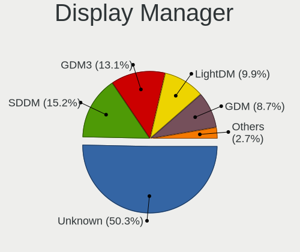
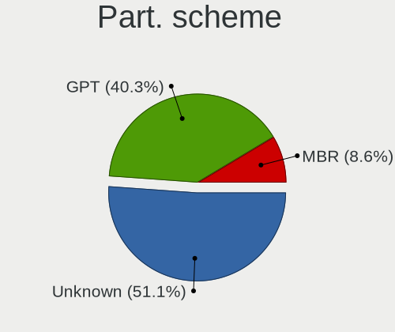
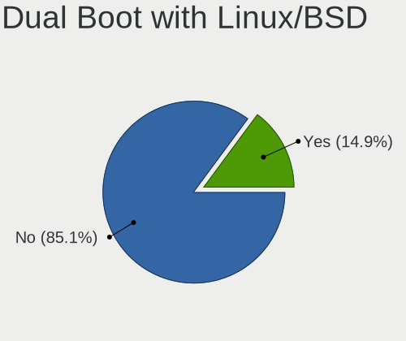
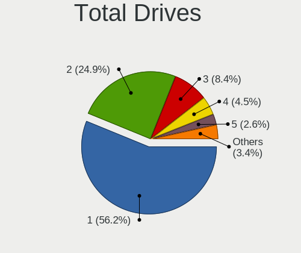
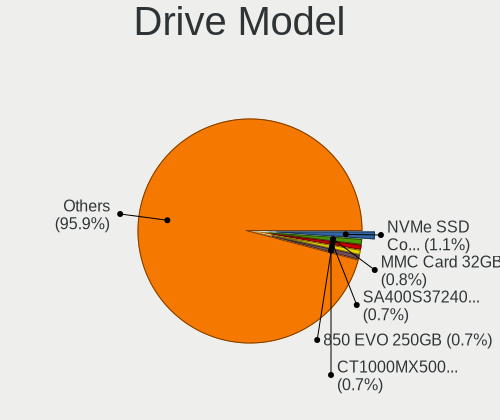
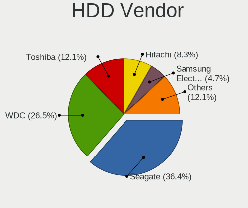
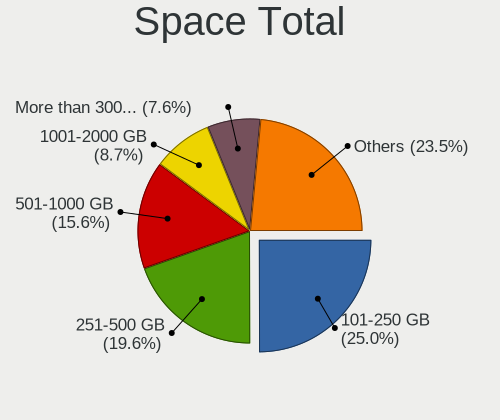
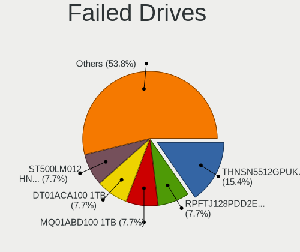
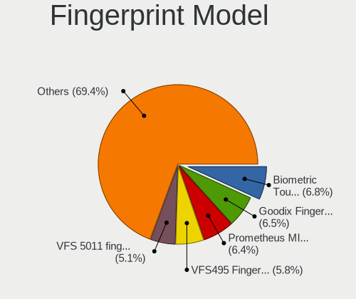

Linux in UK - Tested Hardware & Statistics
------------------------------------------

A project to collect tested hardware configurations for Linux in UK.

Anyone can contribute to this report by the [hw-probe](https://github.com/linuxhw/hw-probe) tool:

    sudo -E hw-probe -all -upload

Please contribute! Especially if your hardware is rare.

This is a report for all computer types. See also reports for [desktops](/Location/UK/Desktop/README.md) and [notebooks](/Location/UK/Notebook/README.md).

Contents
--------

* [ Test Cases ](#test-cases)

* [ System ](#system)
  - [ OS                       ](#os)
  - [ OS Family                ](#os-family)
  - [ Kernel                   ](#kernel)
  - [ Kernel Family            ](#kernel-family)
  - [ Kernel Major Ver.        ](#kernel-major-ver)
  - [ Arch                     ](#arch)
  - [ DE                       ](#de)
  - [ Display Server           ](#display-server)
  - [ Display Manager          ](#display-manager)
  - [ OS Lang                  ](#os-lang)
  - [ Boot Mode                ](#boot-mode)
  - [ Filesystem               ](#filesystem)
  - [ Part. scheme             ](#part-scheme)
  - [ Dual Boot with Linux/BSD ](#dual-boot-with-linuxbsd)
  - [ Dual Boot (Win)          ](#dual-boot-win)

* [ Board ](#board)
  - [ Vendor                   ](#vendor)
  - [ Model                    ](#model)
  - [ Model Family             ](#model-family)
  - [ MFG Year                 ](#mfg-year)
  - [ Form Factor              ](#form-factor)
  - [ Secure Boot              ](#secure-boot)
  - [ Coreboot                 ](#coreboot)
  - [ RAM Size                 ](#ram-size)
  - [ RAM Used                 ](#ram-used)
  - [ Total Drives             ](#total-drives)
  - [ Has CD-ROM               ](#has-cd-rom)
  - [ Has Ethernet             ](#has-ethernet)
  - [ Has WiFi                 ](#has-wifi)
  - [ Has Bluetooth            ](#has-bluetooth)

* [ Location ](#location)
  - [ Country                  ](#country)
  - [ City                     ](#city)

* [ Drives ](#drives)
  - [ Drive Vendor             ](#drive-vendor)
  - [ Drive Model              ](#drive-model)
  - [ HDD Vendor               ](#hdd-vendor)
  - [ SSD Vendor               ](#ssd-vendor)
  - [ Drive Kind               ](#drive-kind)
  - [ Drive Connector          ](#drive-connector)
  - [ Drive Size               ](#drive-size)
  - [ Space Total              ](#space-total)
  - [ Space Used               ](#space-used)
  - [ Malfunc. Drives          ](#malfunc-drives)
  - [ Malfunc. Drive Vendor    ](#malfunc-drive-vendor)
  - [ Malfunc. HDD Vendor      ](#malfunc-hdd-vendor)
  - [ Malfunc. Drive Kind      ](#malfunc-drive-kind)
  - [ Failed Drives            ](#failed-drives)
  - [ Failed Drive Vendor      ](#failed-drive-vendor)
  - [ Drive Status             ](#drive-status)

* [ Storage controller ](#storage-controller)
  - [ Storage Vendor           ](#storage-vendor)
  - [ Storage Model            ](#storage-model)
  - [ Storage Kind             ](#storage-kind)

* [ Processor ](#processor)
  - [ CPU Vendor               ](#cpu-vendor)
  - [ CPU Model                ](#cpu-model)
  - [ CPU Model Family         ](#cpu-model-family)
  - [ CPU Cores                ](#cpu-cores)
  - [ CPU Sockets              ](#cpu-sockets)
  - [ CPU Threads              ](#cpu-threads)
  - [ CPU Op-Modes             ](#cpu-op-modes)
  - [ CPU Microcode            ](#cpu-microcode)
  - [ CPU Microarch            ](#cpu-microarch)

* [ Graphics ](#graphics)
  - [ GPU Vendor               ](#gpu-vendor)
  - [ GPU Model                ](#gpu-model)
  - [ GPU Combo                ](#gpu-combo)
  - [ GPU Driver               ](#gpu-driver)
  - [ GPU Memory               ](#gpu-memory)

* [ Monitor ](#monitor)
  - [ Monitor Vendor           ](#monitor-vendor)
  - [ Monitor Model            ](#monitor-model)
  - [ Monitor Resolution       ](#monitor-resolution)
  - [ Monitor Diagonal         ](#monitor-diagonal)
  - [ Monitor Width            ](#monitor-width)
  - [ Aspect Ratio             ](#aspect-ratio)
  - [ Monitor Area             ](#monitor-area)
  - [ Pixel Density            ](#pixel-density)
  - [ Multiple Monitors        ](#multiple-monitors)

* [ Network ](#network)
  - [ Net Controller Vendor    ](#net-controller-vendor)
  - [ Net Controller Model     ](#net-controller-model)
  - [ Wireless Vendor          ](#wireless-vendor)
  - [ Wireless Model           ](#wireless-model)
  - [ Ethernet Vendor          ](#ethernet-vendor)
  - [ Ethernet Model           ](#ethernet-model)
  - [ Net Controller Kind      ](#net-controller-kind)
  - [ Used Controller          ](#used-controller)
  - [ NICs                     ](#nics)
  - [ IPv6                     ](#ipv6)

* [ Bluetooth ](#bluetooth)
  - [ Bluetooth Vendor         ](#bluetooth-vendor)
  - [ Bluetooth Model          ](#bluetooth-model)

* [ Sound ](#sound)
  - [ Sound Vendor             ](#sound-vendor)
  - [ Sound Model              ](#sound-model)

* [ Memory ](#memory)
  - [ Memory Vendor            ](#memory-vendor)
  - [ Memory Model             ](#memory-model)
  - [ Memory Kind              ](#memory-kind)
  - [ Memory Form Factor       ](#memory-form-factor)
  - [ Memory Size              ](#memory-size)
  - [ Memory Speed             ](#memory-speed)

* [ Printers & scanners ](#printers--scanners)
  - [ Printer Vendor           ](#printer-vendor)
  - [ Printer Model            ](#printer-model)
  - [ Scanner Vendor           ](#scanner-vendor)
  - [ Scanner Model            ](#scanner-model)

* [ Camera ](#camera)
  - [ Camera Vendor            ](#camera-vendor)
  - [ Camera Model             ](#camera-model)

* [ Security ](#security)
  - [ Fingerprint Vendor       ](#fingerprint-vendor)
  - [ Fingerprint Model        ](#fingerprint-model)
  - [ Chipcard Vendor          ](#chipcard-vendor)
  - [ Chipcard Model           ](#chipcard-model)

* [ Unsupported ](#unsupported)
  - [ Unsupported Devices      ](#unsupported-devices)
  - [ Unsupported Device Types ](#unsupported-device-types)

Test Cases
----------

Total: 11587

| Vendor        | Model                       | Form-Factor | Probe                                                      | Date         |
|---------------|-----------------------------|-------------|------------------------------------------------------------|--------------|
| ASRock        | B85M Pro4                   | Desktop     | [108dae1eae](https://linux-hardware.org/?probe=108dae1eae) | Aug 12, 2023 |
| Toshiba       | Satellite C50D-A-13G        | Notebook    | [e1a3542078](https://linux-hardware.org/?probe=e1a3542078) | Aug 12, 2023 |
| ASUSTek       | Z170-P                      | Desktop     | [a32f4633c2](https://linux-hardware.org/?probe=a32f4633c2) | Aug 12, 2023 |
| Lenovo        | ThinkPad E15 20RD0011UK     | Notebook    | [411b9f412c](https://linux-hardware.org/?probe=411b9f412c) | Aug 12, 2023 |
| MSI           | X470 GAMING PRO CARBON      | Desktop     | [b4b9fa2d17](https://linux-hardware.org/?probe=b4b9fa2d17) | Aug 12, 2023 |
| Timi          | RedmiBook Pro 15S           | Notebook    | [20559d710a](https://linux-hardware.org/?probe=20559d710a) | Aug 12, 2023 |
| Mini PC       | Rev JSL5 DDR4               | Mini pc     | [ec7b05c868](https://linux-hardware.org/?probe=ec7b05c868) | Aug 12, 2023 |
| Mini PC       | Rev JSL5 DDR4               | Mini pc     | [783651bb7d](https://linux-hardware.org/?probe=783651bb7d) | Aug 12, 2023 |
| Acer          | Aspire A317-53              | Notebook    | [17dacd99a6](https://linux-hardware.org/?probe=17dacd99a6) | Aug 12, 2023 |
| MSI           | X470 GAMING PRO CARBON      | Desktop     | [181db8cf87](https://linux-hardware.org/?probe=181db8cf87) | Aug 11, 2023 |
| HP            | Pavilion dv5                | Notebook    | [41c7682f98](https://linux-hardware.org/?probe=41c7682f98) | Aug 11, 2023 |
| Lenovo        | IdeaPad Slim 1-11AST-05 ... | Notebook    | [abaa0512b0](https://linux-hardware.org/?probe=abaa0512b0) | Aug 11, 2023 |
| HP            | Pavilion dv5                | Notebook    | [a8f62e42dc](https://linux-hardware.org/?probe=a8f62e42dc) | Aug 11, 2023 |
| ASUSTek       | Zenbook UM3402YAR_UM3402... | Notebook    | [83a0a8a2aa](https://linux-hardware.org/?probe=83a0a8a2aa) | Aug 11, 2023 |
| Lenovo        | IdeaPad 3 14ITL05 81X7      | Notebook    | [f062831bd7](https://linux-hardware.org/?probe=f062831bd7) | Aug 11, 2023 |
| ASUSTek       | PRIME B450-PLUS             | Desktop     | [44fe085499](https://linux-hardware.org/?probe=44fe085499) | Aug 10, 2023 |
| HP            | Laptop 15s-eq2xxx           | Notebook    | [e45562b838](https://linux-hardware.org/?probe=e45562b838) | Aug 10, 2023 |
| Gigabyte      | B450M DS3H-CF               | Desktop     | [ee14fdafcf](https://linux-hardware.org/?probe=ee14fdafcf) | Aug 10, 2023 |
| ASUSTek       | PRIME A320M-K               | Desktop     | [67414922e3](https://linux-hardware.org/?probe=67414922e3) | Aug 10, 2023 |
| ASUSTek       | VivoBook_ASUSLaptop X515... | Notebook    | [24629e2553](https://linux-hardware.org/?probe=24629e2553) | Aug 10, 2023 |
| Gigabyte      | Z690 AORUS MASTER           | Desktop     | [be6c815f39](https://linux-hardware.org/?probe=be6c815f39) | Aug 10, 2023 |
| Lenovo        | ThinkPad T410 2522AC1       | Notebook    | [6f422f386f](https://linux-hardware.org/?probe=6f422f386f) | Aug 10, 2023 |
| Gigabyte      | AERO 15-WA                  | Notebook    | [bd9f5d0f39](https://linux-hardware.org/?probe=bd9f5d0f39) | Aug 10, 2023 |
| ASUSTek       | Q87M-E                      | Desktop     | [0dee84c129](https://linux-hardware.org/?probe=0dee84c129) | Aug 10, 2023 |
| HP            | Laptop 15s-eq2xxx           | Notebook    | [c87b299407](https://linux-hardware.org/?probe=c87b299407) | Aug 10, 2023 |
| AMI           | Aptio CRB                   | Mini pc     | [4d79d769d2](https://linux-hardware.org/?probe=4d79d769d2) | Aug 09, 2023 |
| Acer          | Aspire A317-53              | Notebook    | [5a2d81b438](https://linux-hardware.org/?probe=5a2d81b438) | Aug 09, 2023 |
| Samsung       | N150P/N210P/N220P           | Notebook    | [459b9f31b9](https://linux-hardware.org/?probe=459b9f31b9) | Aug 09, 2023 |
| ASUSTek       | M5A97 LE R2.0               | Desktop     | [8d27e3953f](https://linux-hardware.org/?probe=8d27e3953f) | Aug 09, 2023 |
| Dell          | 02YYK5 A00                  | Desktop     | [14382141e9](https://linux-hardware.org/?probe=14382141e9) | Aug 09, 2023 |
| ASUSTek       | PRIME B450-PLUS             | Desktop     | [691838cd8c](https://linux-hardware.org/?probe=691838cd8c) | Aug 09, 2023 |
| ASUSTek       | ROG Flow X16 GV601VI_GV6... | Convertible | [99ffb28c11](https://linux-hardware.org/?probe=99ffb28c11) | Aug 08, 2023 |
| Dell          | Inspiron 7537               | Notebook    | [61093a9af1](https://linux-hardware.org/?probe=61093a9af1) | Aug 08, 2023 |
| Dell          | Latitude D630               | Notebook    | [a57bb7cde1](https://linux-hardware.org/?probe=a57bb7cde1) | Aug 08, 2023 |
| Apple         | MacBookPro8,1               | Notebook    | [6165a2d50e](https://linux-hardware.org/?probe=6165a2d50e) | Aug 08, 2023 |
| HP            | EliteBook 845 G7 Noteboo... | Notebook    | [6738a625d8](https://linux-hardware.org/?probe=6738a625d8) | Aug 08, 2023 |
| HP            | EliteBook 845 G7 Noteboo... | Notebook    | [66488bdd81](https://linux-hardware.org/?probe=66488bdd81) | Aug 08, 2023 |
| ASUSTek       | VivoBook_ASUSLaptop X515... | Notebook    | [5babb790d3](https://linux-hardware.org/?probe=5babb790d3) | Aug 08, 2023 |
| HP            | ENVY x360 Convertible 15... | Convertible | [5dfaa2b1c0](https://linux-hardware.org/?probe=5dfaa2b1c0) | Aug 08, 2023 |
| Lenovo        | Yoga 6 13ALC6 82ND          | Convertible | [58d7c4be4c](https://linux-hardware.org/?probe=58d7c4be4c) | Aug 08, 2023 |
| Acer          | Aspire 1825PTZ              | Notebook    | [553d2539fa](https://linux-hardware.org/?probe=553d2539fa) | Aug 07, 2023 |
| Acer          | Aspire A515-56              | Notebook    | [84b0c88b0a](https://linux-hardware.org/?probe=84b0c88b0a) | Aug 07, 2023 |
| Lenovo        | Legion S7 15ACH6 82K8       | Notebook    | [de8e0fbde8](https://linux-hardware.org/?probe=de8e0fbde8) | Aug 07, 2023 |
| Gigabyte      | B450 AORUS M                | Desktop     | [965220ce86](https://linux-hardware.org/?probe=965220ce86) | Aug 07, 2023 |
| HP            | Laptop 15-da0xxx            | Notebook    | [0cb4da66e3](https://linux-hardware.org/?probe=0cb4da66e3) | Aug 07, 2023 |
| Lenovo        | ThinkPad X1 Extreme Gen ... | Notebook    | [b4b049b997](https://linux-hardware.org/?probe=b4b049b997) | Aug 07, 2023 |
| Lenovo        | ThinkPad X1 Extreme Gen ... | Notebook    | [8633bc5aa5](https://linux-hardware.org/?probe=8633bc5aa5) | Aug 07, 2023 |
| Dell          | 00KM0D A00                  | All in one  | [f6d752be40](https://linux-hardware.org/?probe=f6d752be40) | Aug 07, 2023 |
| Dell          | 00KM0D A00                  | All in one  | [30324c6293](https://linux-hardware.org/?probe=30324c6293) | Aug 07, 2023 |
| Dell          | Latitude 5411               | Notebook    | [2d69739196](https://linux-hardware.org/?probe=2d69739196) | Aug 07, 2023 |
| Lenovo        | ThinkPad T480 20L6S42000    | Notebook    | [3e9ce860b6](https://linux-hardware.org/?probe=3e9ce860b6) | Aug 07, 2023 |
| MSI           | 970A-G43                    | Desktop     | [68384da884](https://linux-hardware.org/?probe=68384da884) | Aug 06, 2023 |
| Lenovo        | IdeaPad 120S-14IAP 81A5     | Notebook    | [053d461635](https://linux-hardware.org/?probe=053d461635) | Aug 06, 2023 |
| Unknown       | Unknown                     | Notebook    | [691c44286e](https://linux-hardware.org/?probe=691c44286e) | Aug 06, 2023 |
| Gigabyte      | AB350-Gaming-CF             | Desktop     | [c3df1aaae9](https://linux-hardware.org/?probe=c3df1aaae9) | Aug 06, 2023 |
| Gigabyte      | Z270P-D3-CF                 | Desktop     | [ec7fa20ab4](https://linux-hardware.org/?probe=ec7fa20ab4) | Aug 06, 2023 |
| Gigabyte      | H81M-S2H                    | Desktop     | [247f361473](https://linux-hardware.org/?probe=247f361473) | Aug 06, 2023 |
| Acer          | Aspire A515-56              | Notebook    | [dfe905b869](https://linux-hardware.org/?probe=dfe905b869) | Aug 06, 2023 |
| Apple         | Mac-942B5BF58194151B        | All in one  | [c95daf7007](https://linux-hardware.org/?probe=c95daf7007) | Aug 06, 2023 |
| MSI           | FM2-A55M-E33                | Desktop     | [28384fb38c](https://linux-hardware.org/?probe=28384fb38c) | Aug 06, 2023 |
| Acer          | Aspire A317-53              | Notebook    | [5bb0feab0c](https://linux-hardware.org/?probe=5bb0feab0c) | Aug 06, 2023 |
| Gigabyte      | Z270P-D3-CF                 | Desktop     | [5ec7de1222](https://linux-hardware.org/?probe=5ec7de1222) | Aug 06, 2023 |
| MSI           | MPG X570S EDGE MAX WIFI     | Desktop     | [ffa55735b6](https://linux-hardware.org/?probe=ffa55735b6) | Aug 06, 2023 |
| Dell          | Latitude 5590               | Notebook    | [83d389e795](https://linux-hardware.org/?probe=83d389e795) | Aug 06, 2023 |
| Mini PC       | Rev JSL5 DDR4               | Mini pc     | [fed729f0aa](https://linux-hardware.org/?probe=fed729f0aa) | Aug 05, 2023 |
| Dell          | Venue 8 Pro 5855            | Notebook    | [146fa40942](https://linux-hardware.org/?probe=146fa40942) | Aug 05, 2023 |
| Lenovo        | ThinkPad Yoga 370 20JJS0... | Convertible | [570728a351](https://linux-hardware.org/?probe=570728a351) | Aug 05, 2023 |
| ASRock        | X570 Taichi                 | Desktop     | [34e27f60e0](https://linux-hardware.org/?probe=34e27f60e0) | Aug 05, 2023 |
| Lenovo        | 100w Gen 3 82HY             | Notebook    | [3feb7899d2](https://linux-hardware.org/?probe=3feb7899d2) | Aug 05, 2023 |
| GPD           | G1621-02                    | Notebook    | [7e37b7bbee](https://linux-hardware.org/?probe=7e37b7bbee) | Aug 04, 2023 |
| HP            | 470 G7 Notebook PC          | Notebook    | [7e4a9b4618](https://linux-hardware.org/?probe=7e4a9b4618) | Aug 04, 2023 |
| GPD           | G1621-02                    | Notebook    | [d7361e9896](https://linux-hardware.org/?probe=d7361e9896) | Aug 04, 2023 |
| Lenovo        | ThinkPad P15s Gen 1 20T4... | Notebook    | [a9072f3117](https://linux-hardware.org/?probe=a9072f3117) | Aug 04, 2023 |
| Gigabyte      | H81M-S2H                    | Desktop     | [f74b524df1](https://linux-hardware.org/?probe=f74b524df1) | Aug 04, 2023 |
| MSI           | MPG X670E CARBON WIFI       | Desktop     | [cc7ae6c4e9](https://linux-hardware.org/?probe=cc7ae6c4e9) | Aug 04, 2023 |
| HP            | 255 G3                      | Notebook    | [c8b3db6b0b](https://linux-hardware.org/?probe=c8b3db6b0b) | Aug 03, 2023 |
| Acer          | Aspire 7750G                | Notebook    | [71f5ef03f9](https://linux-hardware.org/?probe=71f5ef03f9) | Aug 03, 2023 |
| Lenovo        | ThinkPad P16 Gen 1 21D6C... | Notebook    | [a97312771e](https://linux-hardware.org/?probe=a97312771e) | Aug 03, 2023 |
| Intel         | NUC12WSBi7 M46422-303       | Mini pc     | [4d21c35777](https://linux-hardware.org/?probe=4d21c35777) | Aug 03, 2023 |
| Gigabyte      | B450 GAMING X               | Desktop     | [bb292f568a](https://linux-hardware.org/?probe=bb292f568a) | Aug 03, 2023 |
| Gigabyte      | X570S AORUS ELITE AX        | Desktop     | [1a9566fa0a](https://linux-hardware.org/?probe=1a9566fa0a) | Aug 03, 2023 |
| ASUSTek       | ROG STRIX B760-A GAMING ... | Desktop     | [f629b6e16e](https://linux-hardware.org/?probe=f629b6e16e) | Aug 03, 2023 |
| Lenovo        | ThinkCentre M91p 4518A4M    | Desktop     | [04f8c42dba](https://linux-hardware.org/?probe=04f8c42dba) | Aug 02, 2023 |
| Valve         | Jupiter                     | Notebook    | [f928feaff9](https://linux-hardware.org/?probe=f928feaff9) | Aug 02, 2023 |
| Supermicro    | X9DAi                       | Desktop     | [d7390704d8](https://linux-hardware.org/?probe=d7390704d8) | Aug 02, 2023 |
| Gigabyte      | B560 AORUS PRO AX           | Desktop     | [c7e057da76](https://linux-hardware.org/?probe=c7e057da76) | Aug 02, 2023 |
| Toshiba       | Satellite C660              | Notebook    | [5e74aca4e7](https://linux-hardware.org/?probe=5e74aca4e7) | Aug 02, 2023 |
| Gigabyte      | H81M-S2H                    | Desktop     | [0e5d30b504](https://linux-hardware.org/?probe=0e5d30b504) | Aug 01, 2023 |
| HP            | Pavilion 15                 | Notebook    | [c66316cd62](https://linux-hardware.org/?probe=c66316cd62) | Aug 01, 2023 |
| Dell          | Inspiron 5577               | Notebook    | [1204832e26](https://linux-hardware.org/?probe=1204832e26) | Aug 01, 2023 |
| Dell          | Inspiron 5577               | Notebook    | [219723a17d](https://linux-hardware.org/?probe=219723a17d) | Aug 01, 2023 |
| AZW           | GTR V01                     | Mini pc     | [f3f9a4366b](https://linux-hardware.org/?probe=f3f9a4366b) | Aug 01, 2023 |
| Acer          | Aspire A317-53              | Notebook    | [3f1af34e1b](https://linux-hardware.org/?probe=3f1af34e1b) | Aug 01, 2023 |
| HP            | Pavilion 15                 | Notebook    | [1ad3dc2f1b](https://linux-hardware.org/?probe=1ad3dc2f1b) | Aug 01, 2023 |
| Apple         | Mac-F2218FC8                | All in one  | [1e13eec6e4](https://linux-hardware.org/?probe=1e13eec6e4) | Aug 01, 2023 |
| MSI           | X470 GAMING PRO CARBON      | Desktop     | [48c7912f46](https://linux-hardware.org/?probe=48c7912f46) | Aug 01, 2023 |
| Microsoft     | Surface Pro 4               | Tablet      | [35f27e05c6](https://linux-hardware.org/?probe=35f27e05c6) | Jul 31, 2023 |
| HP            | 3398                        | Desktop     | [c271d5d40e](https://linux-hardware.org/?probe=c271d5d40e) | Jul 31, 2023 |
| Lenovo        | Flex 2-14 20404             | Notebook    | [dd24507513](https://linux-hardware.org/?probe=dd24507513) | Jul 31, 2023 |
| MSI           | H81M-P33                    | Desktop     | [d5cb55a484](https://linux-hardware.org/?probe=d5cb55a484) | Jul 31, 2023 |
| ASUSTek       | ROG STRIX B550-F GAMING     | Desktop     | [07a919f178](https://linux-hardware.org/?probe=07a919f178) | Jul 31, 2023 |
| HP            | ProBook 4740s               | Notebook    | [d0aae87145](https://linux-hardware.org/?probe=d0aae87145) | Jul 31, 2023 |
| Apple         | Mac-27ADBB7B4CEE8E61 iMa... | All in one  | [7a8510c7fd](https://linux-hardware.org/?probe=7a8510c7fd) | Jul 31, 2023 |
| HP            | ENVY x360 2-in-1 Laptop ... | Convertible | [940a0b000a](https://linux-hardware.org/?probe=940a0b000a) | Jul 31, 2023 |
| HP            | ProBook 4740s               | Notebook    | [985ee4b495](https://linux-hardware.org/?probe=985ee4b495) | Jul 30, 2023 |
| HP            | ProBook 430 G3              | Notebook    | [a42e1c787e](https://linux-hardware.org/?probe=a42e1c787e) | Jul 30, 2023 |
| Dell          | 0CU409                      | Desktop     | [7b665ec8f2](https://linux-hardware.org/?probe=7b665ec8f2) | Jul 30, 2023 |
| ASUSTek       | ROG STRIX B550-F GAMING     | Desktop     | [2b75ad8b2c](https://linux-hardware.org/?probe=2b75ad8b2c) | Jul 30, 2023 |
| Valve         | Jupiter                     | Notebook    | [82e4fa2fbc](https://linux-hardware.org/?probe=82e4fa2fbc) | Jul 30, 2023 |
| Pine Micro... | Pine64 RockPro64 v2.1       | Soc         | [f9b68dbdc9](https://linux-hardware.org/?probe=f9b68dbdc9) | Jul 30, 2023 |
| Lenovo        | ThinkCentre M91p 4518A4M    | Desktop     | [2ba45b1cfa](https://linux-hardware.org/?probe=2ba45b1cfa) | Jul 30, 2023 |
| MSI           | MPG X570S EDGE MAX WIFI     | Desktop     | [9469c1037c](https://linux-hardware.org/?probe=9469c1037c) | Jul 29, 2023 |
| HP            | ENVY Notebook               | Notebook    | [3e13681e00](https://linux-hardware.org/?probe=3e13681e00) | Jul 29, 2023 |
| HP            | 470 17 inch G9 Notebook ... | Notebook    | [dbcda8f4d0](https://linux-hardware.org/?probe=dbcda8f4d0) | Jul 29, 2023 |
| Lenovo        | C205                        | All in one  | [e0a01bba61](https://linux-hardware.org/?probe=e0a01bba61) | Jul 29, 2023 |
| Razer         | Blade                       | Notebook    | [6c3ef3aa59](https://linux-hardware.org/?probe=6c3ef3aa59) | Jul 29, 2023 |
| Dell          | Latitude E6420              | Notebook    | [a70852def5](https://linux-hardware.org/?probe=a70852def5) | Jul 29, 2023 |
| Lenovo        | ThinkPad X270 20HMS1N700    | Notebook    | [3486243fd6](https://linux-hardware.org/?probe=3486243fd6) | Jul 29, 2023 |
| Unknown       | Unknown                     | Notebook    | [73836c0a75](https://linux-hardware.org/?probe=73836c0a75) | Jul 29, 2023 |
| ASUSTek       | PRIME B450-PLUS             | Desktop     | [fecdf7e593](https://linux-hardware.org/?probe=fecdf7e593) | Jul 29, 2023 |
| Dell          | XPS 9320                    | Notebook    | [4000df5584](https://linux-hardware.org/?probe=4000df5584) | Jul 29, 2023 |
| Dell          | 0PU052                      | Desktop     | [f51bdc3bf5](https://linux-hardware.org/?probe=f51bdc3bf5) | Jul 28, 2023 |
| Valve         | Jupiter                     | Notebook    | [ff714f1791](https://linux-hardware.org/?probe=ff714f1791) | Jul 28, 2023 |
| HP            | ProBook 445 G8 Notebook ... | Notebook    | [ba7c69f7e0](https://linux-hardware.org/?probe=ba7c69f7e0) | Jul 28, 2023 |
| Apple         | MacBookPro12,1              | Notebook    | [bc3cb3cbfd](https://linux-hardware.org/?probe=bc3cb3cbfd) | Jul 28, 2023 |
| Dell          | Latitude 3410               | Notebook    | [449e4c62f3](https://linux-hardware.org/?probe=449e4c62f3) | Jul 28, 2023 |
| Dell          | XPS 13 9380                 | Notebook    | [b784cbe3ab](https://linux-hardware.org/?probe=b784cbe3ab) | Jul 28, 2023 |
| ASUSTek       | ROG STRIX B550-F GAMING     | Desktop     | [4a34b9da9b](https://linux-hardware.org/?probe=4a34b9da9b) | Jul 27, 2023 |
| ASUSTek       | ROG STRIX B550-F GAMING     | Desktop     | [a26bbadd26](https://linux-hardware.org/?probe=a26bbadd26) | Jul 27, 2023 |
| Dell          | Inspiron 13-5378            | Notebook    | [cd318f6b75](https://linux-hardware.org/?probe=cd318f6b75) | Jul 27, 2023 |
| ASUSTek       | ROG Zephyrus G14 GA401QM... | Notebook    | [e08f65110d](https://linux-hardware.org/?probe=e08f65110d) | Jul 27, 2023 |
| Gigabyte      | B650M AORUS ELITE AX        | Desktop     | [4895ec9de1](https://linux-hardware.org/?probe=4895ec9de1) | Jul 27, 2023 |
| Acer          | Aspire A515-56              | Notebook    | [7c716b6ab0](https://linux-hardware.org/?probe=7c716b6ab0) | Jul 27, 2023 |
| HP            | Laptop 14s-fq1xxx           | Notebook    | [84ab2faa6f](https://linux-hardware.org/?probe=84ab2faa6f) | Jul 27, 2023 |
| PC Special... | Ionico 16                   | Notebook    | [5c91300246](https://linux-hardware.org/?probe=5c91300246) | Jul 26, 2023 |
| ASUSTek       | PRIME A320M-K               | Desktop     | [3f7bed61a8](https://linux-hardware.org/?probe=3f7bed61a8) | Jul 26, 2023 |
| MSI           | X470 GAMING PRO CARBON      | Desktop     | [810ff8bbd6](https://linux-hardware.org/?probe=810ff8bbd6) | Jul 26, 2023 |
| ASUSTek       | ROG STRIX X570-F GAMING     | Desktop     | [aed4f431ec](https://linux-hardware.org/?probe=aed4f431ec) | Jul 26, 2023 |
| Dell          | Inspiron 13-5378            | Notebook    | [fd43074149](https://linux-hardware.org/?probe=fd43074149) | Jul 26, 2023 |
| Valve         | Jupiter                     | Notebook    | [1adda13639](https://linux-hardware.org/?probe=1adda13639) | Jul 26, 2023 |
| HP            | Laptop 14s-fq1xxx           | Notebook    | [ee10ac6c06](https://linux-hardware.org/?probe=ee10ac6c06) | Jul 26, 2023 |
| HP            | Notebook                    | Notebook    | [beef8e7fce](https://linux-hardware.org/?probe=beef8e7fce) | Jul 25, 2023 |
| ASRock        | B450M Steel Legend          | Desktop     | [4b9680f094](https://linux-hardware.org/?probe=4b9680f094) | Jul 25, 2023 |
| MSI           | A68HM-E33 V2                | Desktop     | [858b41037e](https://linux-hardware.org/?probe=858b41037e) | Jul 25, 2023 |
| Lenovo        | IdeaPad C340-14API 81N6     | Notebook    | [3b05aaff82](https://linux-hardware.org/?probe=3b05aaff82) | Jul 25, 2023 |
| Dell          | Latitude 5530               | Notebook    | [cccd0bf0b8](https://linux-hardware.org/?probe=cccd0bf0b8) | Jul 25, 2023 |
| LG Electro... | 17Z90P-K.AA78A1             | Notebook    | [6fc7661aae](https://linux-hardware.org/?probe=6fc7661aae) | Jul 25, 2023 |
| MSI           | Katana GF66 11UG            | Notebook    | [bd45023e8e](https://linux-hardware.org/?probe=bd45023e8e) | Jul 25, 2023 |
| Gigabyte      | MJPLNBB-00                  | Desktop     | [8f4eb83f05](https://linux-hardware.org/?probe=8f4eb83f05) | Jul 25, 2023 |
| Acer          | Swift SFE16-43              | Notebook    | [ada40722ae](https://linux-hardware.org/?probe=ada40722ae) | Jul 25, 2023 |
| Lenovo        | 36ED SDK0J40700 WIN 3258... | All in one  | [2c730fd2b8](https://linux-hardware.org/?probe=2c730fd2b8) | Jul 25, 2023 |
| Lenovo        | 36ED SDK0J40700 WIN 3258... | All in one  | [d179eaf4eb](https://linux-hardware.org/?probe=d179eaf4eb) | Jul 25, 2023 |
| Dell          | Vostro 1500                 | Notebook    | [c57ac4da0a](https://linux-hardware.org/?probe=c57ac4da0a) | Jul 25, 2023 |
| Lenovo        | Yoga 9 14IRP8 83B1          | Convertible | [3f563f695c](https://linux-hardware.org/?probe=3f563f695c) | Jul 25, 2023 |
| HP            | EliteBook 8470p             | Notebook    | [834378c125](https://linux-hardware.org/?probe=834378c125) | Jul 25, 2023 |
| Lenovo        | Yoga S740-14IIL 81RS        | Notebook    | [e46d04faa8](https://linux-hardware.org/?probe=e46d04faa8) | Jul 25, 2023 |
| Lenovo        | Yoga S740-14IIL 81RS        | Notebook    | [0b7f69aaf6](https://linux-hardware.org/?probe=0b7f69aaf6) | Jul 25, 2023 |
| Gigabyte      | GA-880GM-UD2H               | Desktop     | [5be0e1a212](https://linux-hardware.org/?probe=5be0e1a212) | Jul 24, 2023 |
| HP            | ENVY x360 2-in-1 Laptop ... | Convertible | [0b4b6b015b](https://linux-hardware.org/?probe=0b4b6b015b) | Jul 24, 2023 |
| Chuwi         | CoreBook Pro                | Notebook    | [21ab3832ea](https://linux-hardware.org/?probe=21ab3832ea) | Jul 24, 2023 |
| Dell          | Inspiron 5570               | Notebook    | [3d08e59ce3](https://linux-hardware.org/?probe=3d08e59ce3) | Jul 24, 2023 |
| Dell          | Latitude 2110               | Notebook    | [05a7868709](https://linux-hardware.org/?probe=05a7868709) | Jul 24, 2023 |
| ASUSTek       | ROG CROSSHAIR VIII HERO     | Desktop     | [2ff464874e](https://linux-hardware.org/?probe=2ff464874e) | Jul 24, 2023 |
| HP            | ENVY x360 Convertible 13... | Convertible | [273533f7f8](https://linux-hardware.org/?probe=273533f7f8) | Jul 24, 2023 |
| ASUSTek       | ROG Zephyrus G14 GA401QM... | Notebook    | [8b89c63576](https://linux-hardware.org/?probe=8b89c63576) | Jul 24, 2023 |
| Dell          | 0YGR09 A00                  | All in one  | [256d182fcd](https://linux-hardware.org/?probe=256d182fcd) | Jul 23, 2023 |
| Gigabyte      | P17FR5                      | Notebook    | [817b78d77b](https://linux-hardware.org/?probe=817b78d77b) | Jul 23, 2023 |
| PC Special... | Standard                    | Notebook    | [992aec5bb8](https://linux-hardware.org/?probe=992aec5bb8) | Jul 23, 2023 |
| HP            | Notebook                    | Notebook    | [4746f66332](https://linux-hardware.org/?probe=4746f66332) | Jul 23, 2023 |
| ASUSTek       | TUF Gaming Z790-PLUS D4     | Desktop     | [4c4109b8f3](https://linux-hardware.org/?probe=4c4109b8f3) | Jul 23, 2023 |
| HP            | 8350                        | Desktop     | [f17382c501](https://linux-hardware.org/?probe=f17382c501) | Jul 23, 2023 |
| Lenovo        | ThinkPad E15 20RD0011UK     | Notebook    | [ff5e295a5d](https://linux-hardware.org/?probe=ff5e295a5d) | Jul 23, 2023 |
| HP            | 255 G6 Notebook PC          | Notebook    | [5c5147b82d](https://linux-hardware.org/?probe=5c5147b82d) | Jul 23, 2023 |
| ASUSTek       | TUF Gaming Z790-PLUS D4     | Desktop     | [d89bdeec87](https://linux-hardware.org/?probe=d89bdeec87) | Jul 23, 2023 |
| Dell          | 0757V0 A00                  | Desktop     | [e367a3740a](https://linux-hardware.org/?probe=e367a3740a) | Jul 23, 2023 |
| MSI           | MAG B650 TOMAHAWK WIFI      | Desktop     | [13bb65f561](https://linux-hardware.org/?probe=13bb65f561) | Jul 23, 2023 |
| Lenovo        | ThinkPad X270 20HMS1N700    | Notebook    | [e42f9111c6](https://linux-hardware.org/?probe=e42f9111c6) | Jul 23, 2023 |
| Dell          | XPS 15 9570                 | Notebook    | [9a62fe1979](https://linux-hardware.org/?probe=9a62fe1979) | Jul 22, 2023 |
| HP            | ENVY x360 2-in-1 Laptop ... | Convertible | [17c61c9ced](https://linux-hardware.org/?probe=17c61c9ced) | Jul 22, 2023 |
| ASUSTek       | M5A78L-M/USB3               | Desktop     | [5072be5d0f](https://linux-hardware.org/?probe=5072be5d0f) | Jul 22, 2023 |
| Valve         | Jupiter                     | Notebook    | [0e8e6ce1ae](https://linux-hardware.org/?probe=0e8e6ce1ae) | Jul 22, 2023 |
| Gigabyte      | X470 AORUS GAMING 7 WIFI... | Desktop     | [b8cf03e7b7](https://linux-hardware.org/?probe=b8cf03e7b7) | Jul 22, 2023 |
| Gigabyte      | H81M-DS2V                   | Desktop     | [f27670217e](https://linux-hardware.org/?probe=f27670217e) | Jul 22, 2023 |
| Fujitsu       | D3403-A1 S26361-D3403-A1    | Desktop     | [9f52ae219f](https://linux-hardware.org/?probe=9f52ae219f) | Jul 22, 2023 |
| Valve         | Jupiter                     | Notebook    | [fa8db9f24a](https://linux-hardware.org/?probe=fa8db9f24a) | Jul 22, 2023 |
| Microsoft     | Surface Pro 4               | Tablet      | [dee00fe6af](https://linux-hardware.org/?probe=dee00fe6af) | Jul 22, 2023 |
| ASUSTek       | Zenbook UM5302TA_UM5302T... | Notebook    | [c06811057a](https://linux-hardware.org/?probe=c06811057a) | Jul 22, 2023 |
| ASUSTek       | VivoBook_ASUSLaptop M160... | Notebook    | [e948334857](https://linux-hardware.org/?probe=e948334857) | Jul 22, 2023 |
| Shenzhen M... | HX90G                       | Desktop     | [355ac636c1](https://linux-hardware.org/?probe=355ac636c1) | Jul 21, 2023 |
| Dell          | System XPS L702X            | Notebook    | [21f1d68bc1](https://linux-hardware.org/?probe=21f1d68bc1) | Jul 21, 2023 |
| MSI           | Z97 PC Mate                 | Desktop     | [a131a7a5fb](https://linux-hardware.org/?probe=a131a7a5fb) | Jul 21, 2023 |
| Lenovo        | Win8 Pro DPK TPG            | Desktop     | [6b8d5cb0c1](https://linux-hardware.org/?probe=6b8d5cb0c1) | Jul 21, 2023 |
| ASUSTek       | PRIME B450-PLUS             | Desktop     | [1ee2e5b63d](https://linux-hardware.org/?probe=1ee2e5b63d) | Jul 20, 2023 |
| Intel         | NUC7i3DNB J57625-512        | Mini pc     | [2f55654def](https://linux-hardware.org/?probe=2f55654def) | Jul 20, 2023 |
| Apple         | MacBookAir7,1               | Notebook    | [e82f5072df](https://linux-hardware.org/?probe=e82f5072df) | Jul 20, 2023 |
| Dell          | Vostro 1500                 | Notebook    | [0c4f8fe4d2](https://linux-hardware.org/?probe=0c4f8fe4d2) | Jul 20, 2023 |
| Acer          | Aspire A317-53              | Notebook    | [d8e84157ab](https://linux-hardware.org/?probe=d8e84157ab) | Jul 20, 2023 |
| ASUSTek       | PN50-E1                     | Mini pc     | [def74bc1c9](https://linux-hardware.org/?probe=def74bc1c9) | Jul 19, 2023 |
| Lenovo        | V15 G2 ITL 82KB             | Notebook    | [e0b92a00b5](https://linux-hardware.org/?probe=e0b92a00b5) | Jul 19, 2023 |
| Dell          | Inspiron N5110              | Notebook    | [140474e198](https://linux-hardware.org/?probe=140474e198) | Jul 19, 2023 |
| Lenovo        | ThinkPad E560 20EV000YUK    | Notebook    | [0e89144534](https://linux-hardware.org/?probe=0e89144534) | Jul 19, 2023 |
| Dell          | Inspiron 7415 2-in-1        | Convertible | [94c330e355](https://linux-hardware.org/?probe=94c330e355) | Jul 19, 2023 |
| Dell          | XPS 15 9570                 | Notebook    | [e6cf0622b0](https://linux-hardware.org/?probe=e6cf0622b0) | Jul 19, 2023 |
| ASUSTek       | VivoBook_ASUSLaptop X421... | Notebook    | [a4584a139f](https://linux-hardware.org/?probe=a4584a139f) | Jul 19, 2023 |
| HP            | Laptop 15-dw0xxx            | Notebook    | [ba24f3bb61](https://linux-hardware.org/?probe=ba24f3bb61) | Jul 18, 2023 |
| Valve         | Jupiter                     | Notebook    | [3abdfed88b](https://linux-hardware.org/?probe=3abdfed88b) | Jul 18, 2023 |
| HP            | ENVY Laptop 17-cr0xxx       | Notebook    | [f5dc246f7c](https://linux-hardware.org/?probe=f5dc246f7c) | Jul 18, 2023 |
| HP            | ENVY Laptop 17-cr0xxx       | Notebook    | [abec03689c](https://linux-hardware.org/?probe=abec03689c) | Jul 18, 2023 |
| Valve         | Jupiter                     | Notebook    | [4beb3117df](https://linux-hardware.org/?probe=4beb3117df) | Jul 18, 2023 |
| ASUSTek       | TUF Gaming Z590-PLUS WIF... | Desktop     | [a6c81d2b9e](https://linux-hardware.org/?probe=a6c81d2b9e) | Jul 18, 2023 |
| ASUSTek       | ROG STRIX B550-E GAMING     | Desktop     | [f0ecaa209e](https://linux-hardware.org/?probe=f0ecaa209e) | Jul 18, 2023 |
| Sony          | VAIO                        | All in one  | [ea7a51d543](https://linux-hardware.org/?probe=ea7a51d543) | Jul 18, 2023 |
| Packard Be... | IMEDIA S2885                | Desktop     | [fa20588062](https://linux-hardware.org/?probe=fa20588062) | Jul 17, 2023 |
| Lenovo        | V15 G2 ALC 82KD             | Notebook    | [a448a20876](https://linux-hardware.org/?probe=a448a20876) | Jul 17, 2023 |
| Lenovo        | IdeaPad 510-15ISK 80SR      | Notebook    | [958f57fd27](https://linux-hardware.org/?probe=958f57fd27) | Jul 17, 2023 |
| Raspberry ... | Raspberry Pi 4 Model B R... | Soc         | [399566f5ce](https://linux-hardware.org/?probe=399566f5ce) | Jul 17, 2023 |
| Sony          | VGN-S3HP                    | Notebook    | [6e2c92c447](https://linux-hardware.org/?probe=6e2c92c447) | Jul 17, 2023 |
| Dell          | Precision M6800             | Notebook    | [8ddd80db6c](https://linux-hardware.org/?probe=8ddd80db6c) | Jul 17, 2023 |
| Samsung       | 950XCJ/951XCJ/950XCR        | Notebook    | [3a7fbf07fa](https://linux-hardware.org/?probe=3a7fbf07fa) | Jul 17, 2023 |
| ASUSTek       | TUF X299 MARK 2             | Desktop     | [db1e3d03e2](https://linux-hardware.org/?probe=db1e3d03e2) | Jul 17, 2023 |
| ASUSTek       | M5A97 LE R2.0               | Desktop     | [4dacb4cf51](https://linux-hardware.org/?probe=4dacb4cf51) | Jul 17, 2023 |
| ASUSTek       | ROG STRIX B550-A GAMING     | Desktop     | [15d7862757](https://linux-hardware.org/?probe=15d7862757) | Jul 16, 2023 |
| Dell          | 0WMJ54 A01                  | Desktop     | [07161141b4](https://linux-hardware.org/?probe=07161141b4) | Jul 16, 2023 |
| MSI           | X470 GAMING PRO CARBON      | Desktop     | [164e93a53b](https://linux-hardware.org/?probe=164e93a53b) | Jul 16, 2023 |
| Dell          | Inspiron 1501               | Notebook    | [a79d62db7c](https://linux-hardware.org/?probe=a79d62db7c) | Jul 16, 2023 |
| Lenovo        | ThinkPad X201 3249CTO       | Notebook    | [ec4db25eb9](https://linux-hardware.org/?probe=ec4db25eb9) | Jul 16, 2023 |
| Acer          | Aspire A317-53              | Notebook    | [9dd235116d](https://linux-hardware.org/?probe=9dd235116d) | Jul 16, 2023 |
| Supermicro    | X9SRA/X9SRA-3               | Server      | [15d31e889c](https://linux-hardware.org/?probe=15d31e889c) | Jul 16, 2023 |
| ASUSTek       | M5A97 LE R2.0               | Desktop     | [87763ca861](https://linux-hardware.org/?probe=87763ca861) | Jul 16, 2023 |
| Dell          | G5 5587                     | Notebook    | [fc861c593a](https://linux-hardware.org/?probe=fc861c593a) | Jul 16, 2023 |
| Acer          | Predator PH315-52           | Notebook    | [8231c1b7c0](https://linux-hardware.org/?probe=8231c1b7c0) | Jul 16, 2023 |
| Dell          | Dimension 4500S             | Desktop     | [f10ee5f25d](https://linux-hardware.org/?probe=f10ee5f25d) | Jul 16, 2023 |
| Toshiba       | Satellite Pro C50-A-1E6     | Notebook    | [8977d2e0a3](https://linux-hardware.org/?probe=8977d2e0a3) | Jul 16, 2023 |
| ASUSTek       | ZenBook UX425QA_UM425QA     | Notebook    | [35f3837811](https://linux-hardware.org/?probe=35f3837811) | Jul 16, 2023 |
| Gigabyte      | Z390 AORUS PRO-CF           | Desktop     | [a4bd524029](https://linux-hardware.org/?probe=a4bd524029) | Jul 15, 2023 |
| Dell          | 073MMW A03                  | Desktop     | [f76738403e](https://linux-hardware.org/?probe=f76738403e) | Jul 15, 2023 |
| ASRock        | A320M-HDV R3.0              | Desktop     | [8e41b4b86d](https://linux-hardware.org/?probe=8e41b4b86d) | Jul 15, 2023 |
| Dell          | Latitude E4300              | Notebook    | [a9e8fb7884](https://linux-hardware.org/?probe=a9e8fb7884) | Jul 15, 2023 |
| Acer          | Aspire A315-32              | Notebook    | [7044de848c](https://linux-hardware.org/?probe=7044de848c) | Jul 15, 2023 |
| Lenovo        | G580 20150                  | Notebook    | [bcd1c01ad6](https://linux-hardware.org/?probe=bcd1c01ad6) | Jul 15, 2023 |
| Lenovo        | G580 20150                  | Notebook    | [390008fe3c](https://linux-hardware.org/?probe=390008fe3c) | Jul 15, 2023 |
| Unknown       | SLR-0308                    | Notebook    | [8626e36716](https://linux-hardware.org/?probe=8626e36716) | Jul 15, 2023 |
| HP            | Pavilion 15                 | Notebook    | [95f81cdf21](https://linux-hardware.org/?probe=95f81cdf21) | Jul 15, 2023 |
| Gigabyte      | B360M DS3H                  | Desktop     | [08dede9db3](https://linux-hardware.org/?probe=08dede9db3) | Jul 15, 2023 |
| Unknown       | Unknown                     | Desktop     | [3caf271d7c](https://linux-hardware.org/?probe=3caf271d7c) | Jul 15, 2023 |
| Unknown       | Unknown                     | Desktop     | [689d391a1d](https://linux-hardware.org/?probe=689d391a1d) | Jul 15, 2023 |
| Gigabyte      | 970A-DS3P                   | Desktop     | [32b56b85c4](https://linux-hardware.org/?probe=32b56b85c4) | Jul 15, 2023 |
| Dell          | G15 5510                    | Notebook    | [28b7a732f2](https://linux-hardware.org/?probe=28b7a732f2) | Jul 15, 2023 |
| Lenovo        | ThinkPad T530 2429HD6       | Notebook    | [1c48702f3c](https://linux-hardware.org/?probe=1c48702f3c) | Jul 14, 2023 |
| Gigabyte      | B450 AORUS M                | Desktop     | [2f5c2842c2](https://linux-hardware.org/?probe=2f5c2842c2) | Jul 14, 2023 |
| Lenovo        | Yoga 6 13ALC7 82UD          | Convertible | [c27ff02a84](https://linux-hardware.org/?probe=c27ff02a84) | Jul 14, 2023 |
| ASUSTek       | H81I-PLUS                   | Desktop     | [dc3bdab530](https://linux-hardware.org/?probe=dc3bdab530) | Jul 14, 2023 |
| Dell          | XPS 13 9300                 | Notebook    | [ca425f6c38](https://linux-hardware.org/?probe=ca425f6c38) | Jul 14, 2023 |
| Apple         | Mac-942B5BF58194151B        | All in one  | [4155214585](https://linux-hardware.org/?probe=4155214585) | Jul 14, 2023 |
| Lenovo        | ThinkPad X220 4290FC1       | Notebook    | [d6c0ccb8f1](https://linux-hardware.org/?probe=d6c0ccb8f1) | Jul 14, 2023 |
| MSI           | MAG B550 TOMAHAWK           | Desktop     | [0ac2423aa2](https://linux-hardware.org/?probe=0ac2423aa2) | Jul 14, 2023 |
| Notebook      | N150ZU                      | Notebook    | [61be22ac36](https://linux-hardware.org/?probe=61be22ac36) | Jul 14, 2023 |
| Lenovo        | SHARKBAY SDK0E50510 PRO     | Desktop     | [2b9ee1f8b7](https://linux-hardware.org/?probe=2b9ee1f8b7) | Jul 14, 2023 |
| ASUSTek       | H81I-PLUS                   | Desktop     | [fc3514e9a6](https://linux-hardware.org/?probe=fc3514e9a6) | Jul 14, 2023 |
| Dell          | Inspiron 15 3520            | Notebook    | [163766c886](https://linux-hardware.org/?probe=163766c886) | Jul 14, 2023 |
| Acer          | Swift SF313-52              | Notebook    | [3b393fc916](https://linux-hardware.org/?probe=3b393fc916) | Jul 14, 2023 |
| MSI           | PRO Z790-A WIFI             | Desktop     | [c1dba9e7b8](https://linux-hardware.org/?probe=c1dba9e7b8) | Jul 14, 2023 |
| Google        | Droid                       | Notebook    | [9b77a9ba04](https://linux-hardware.org/?probe=9b77a9ba04) | Jul 14, 2023 |
| Lenovo        | ThinkPad X230 2325FG0       | Notebook    | [4df76c784c](https://linux-hardware.org/?probe=4df76c784c) | Jul 13, 2023 |
| ASUSTek       | P5E-V HDMI                  | Desktop     | [460e520a69](https://linux-hardware.org/?probe=460e520a69) | Jul 13, 2023 |
| HP            | EliteBook 840 14 inch G9... | Notebook    | [4b9cba03ac](https://linux-hardware.org/?probe=4b9cba03ac) | Jul 13, 2023 |
| Dell          | XPS 17 9730                 | Notebook    | [b074a1deb3](https://linux-hardware.org/?probe=b074a1deb3) | Jul 13, 2023 |
| Apple         | Mac-F2238BAE iMac11,3       | All in one  | [965ca81d78](https://linux-hardware.org/?probe=965ca81d78) | Jul 13, 2023 |
| ASUSTek       | PN50-E1                     | Mini pc     | [d7d01a7da5](https://linux-hardware.org/?probe=d7d01a7da5) | Jul 13, 2023 |
| Lenovo        | ThinkPad T460 20FMS50T0Q    | Notebook    | [0d5f86f700](https://linux-hardware.org/?probe=0d5f86f700) | Jul 13, 2023 |
| MSI           | MAG B550 TOMAHAWK           | Desktop     | [2f943c811e](https://linux-hardware.org/?probe=2f943c811e) | Jul 13, 2023 |
| Apple         | Mac-F2238AC8                | All in one  | [11ab455725](https://linux-hardware.org/?probe=11ab455725) | Jul 13, 2023 |
| MSI           | GT70 2PE                    | Notebook    | [9e49d96293](https://linux-hardware.org/?probe=9e49d96293) | Jul 13, 2023 |
| Lenovo        | Legion 5 15ACH6H 82JU       | Notebook    | [dd2c7b0c60](https://linux-hardware.org/?probe=dd2c7b0c60) | Jul 12, 2023 |
| Google        | Lillipup                    | Notebook    | [b7b430e7b4](https://linux-hardware.org/?probe=b7b430e7b4) | Jul 12, 2023 |
| Lenovo        | ThinkPad X240 20AMS1FW00    | Notebook    | [15067533b3](https://linux-hardware.org/?probe=15067533b3) | Jul 12, 2023 |
| HP            | EliteBook Folio 1040 G3     | Notebook    | [95c073864d](https://linux-hardware.org/?probe=95c073864d) | Jul 12, 2023 |
| ASUSTek       | ROG Strix G713PI_G713PI     | Notebook    | [ad18a95d12](https://linux-hardware.org/?probe=ad18a95d12) | Jul 12, 2023 |
| Lenovo        | Legion 5 15ACH6H 82JU       | Notebook    | [9479004a7e](https://linux-hardware.org/?probe=9479004a7e) | Jul 12, 2023 |
| Gigabyte      | Z97MX-Gaming 5              | Desktop     | [f8ffcb4828](https://linux-hardware.org/?probe=f8ffcb4828) | Jul 12, 2023 |
| Dell          | XPS 13 9380                 | Notebook    | [ad75f0a6e0](https://linux-hardware.org/?probe=ad75f0a6e0) | Jul 12, 2023 |
| ASUSTek       | A88XM-E                     | Desktop     | [e951c1d4f4](https://linux-hardware.org/?probe=e951c1d4f4) | Jul 12, 2023 |
| Dell          | XPS 15 9530                 | Notebook    | [d78fb6bdd4](https://linux-hardware.org/?probe=d78fb6bdd4) | Jul 12, 2023 |
| Gigabyte      | X570 AORUS PRO              | Desktop     | [e49876314d](https://linux-hardware.org/?probe=e49876314d) | Jul 11, 2023 |
| HP            | 630                         | Notebook    | [671710637c](https://linux-hardware.org/?probe=671710637c) | Jul 11, 2023 |
| Lenovo        | ThinkPad P14s Gen 1 20Y1... | Notebook    | [90466d16ca](https://linux-hardware.org/?probe=90466d16ca) | Jul 11, 2023 |
| Lenovo        | ThinkPad A285 20MXS0JR14    | Notebook    | [08bbd89b8c](https://linux-hardware.org/?probe=08bbd89b8c) | Jul 11, 2023 |
| Lenovo        | ThinkPad A285 20MXS0JR14    | Notebook    | [23b123605f](https://linux-hardware.org/?probe=23b123605f) | Jul 11, 2023 |
| Sony          | SVP1321M2EB                 | Notebook    | [e767bbc26b](https://linux-hardware.org/?probe=e767bbc26b) | Jul 11, 2023 |
| MSI           | B350M MORTAR                | Desktop     | [069cf3a06d](https://linux-hardware.org/?probe=069cf3a06d) | Jul 11, 2023 |
| Sony          | VPCZ214GX                   | Notebook    | [d63fc5c563](https://linux-hardware.org/?probe=d63fc5c563) | Jul 11, 2023 |
| ASRock        | A320M-HDV R4.0              | Desktop     | [ab81f36697](https://linux-hardware.org/?probe=ab81f36697) | Jul 11, 2023 |
| ASRock        | X570 Pro4                   | Desktop     | [db34bf69af](https://linux-hardware.org/?probe=db34bf69af) | Jul 11, 2023 |
| ASRock        | X570 Pro4                   | Desktop     | [059cda8a87](https://linux-hardware.org/?probe=059cda8a87) | Jul 11, 2023 |
| Fanless Mi... | Rev GMLR1                   | Mini pc     | [e1700a0ab4](https://linux-hardware.org/?probe=e1700a0ab4) | Jul 11, 2023 |
| Apple         | Mac-F2268DC8                | All in one  | [44af6cae51](https://linux-hardware.org/?probe=44af6cae51) | Jul 11, 2023 |
| MSI           | B450M MORTAR TITANIUM       | Desktop     | [59c50a4a34](https://linux-hardware.org/?probe=59c50a4a34) | Jul 11, 2023 |
| Gigabyte      | Z370 AORUS Gaming 3         | Desktop     | [08d9fe81da](https://linux-hardware.org/?probe=08d9fe81da) | Jul 10, 2023 |
| Acidanther... | Mac-27AD2F918AE68F61 Mac... | Desktop     | [429e4e7636](https://linux-hardware.org/?probe=429e4e7636) | Jul 10, 2023 |
| Lenovo        | ThinkPad T470 W10DG 20JN... | Notebook    | [56de408d31](https://linux-hardware.org/?probe=56de408d31) | Jul 10, 2023 |
| Valve         | Jupiter                     | Notebook    | [5d55bf223d](https://linux-hardware.org/?probe=5d55bf223d) | Jul 10, 2023 |
| Gigabyte      | H61M-DS2 DVI                | Desktop     | [44f9b46596](https://linux-hardware.org/?probe=44f9b46596) | Jul 10, 2023 |
| ASUSTek       | ASUS TUF Gaming F15 FX50... | Notebook    | [96ca518dc6](https://linux-hardware.org/?probe=96ca518dc6) | Jul 09, 2023 |
| ASUSTek       | K54C                        | Notebook    | [3f0ca5ad18](https://linux-hardware.org/?probe=3f0ca5ad18) | Jul 09, 2023 |
| Raspberry ... | Raspberry Pi 3 Model B R... | Soc         | [ba7cde1766](https://linux-hardware.org/?probe=ba7cde1766) | Jul 09, 2023 |
| ASRock        | B450M-HDV R4.0              | Desktop     | [f24ba1fb9c](https://linux-hardware.org/?probe=f24ba1fb9c) | Jul 09, 2023 |
| Apple         | MacBookPro10,1              | Notebook    | [43ec3cf70b](https://linux-hardware.org/?probe=43ec3cf70b) | Jul 09, 2023 |
| MSI           | X470 GAMING PRO CARBON      | Desktop     | [17c907528f](https://linux-hardware.org/?probe=17c907528f) | Jul 09, 2023 |
| ASUSTek       | ROG STRIX B450-I GAMING     | Desktop     | [aa2805e577](https://linux-hardware.org/?probe=aa2805e577) | Jul 09, 2023 |
| Dell          | Inspiron 7415 2-in-1        | Convertible | [db2be54a62](https://linux-hardware.org/?probe=db2be54a62) | Jul 09, 2023 |
| Unknown       | Unknown                     | Desktop     | [89a5a4461f](https://linux-hardware.org/?probe=89a5a4461f) | Jul 09, 2023 |
| ASUSTek       | ROG STRIX Z590-F GAMING ... | Desktop     | [0b6dcc1ea9](https://linux-hardware.org/?probe=0b6dcc1ea9) | Jul 09, 2023 |
| Unknown       | Unknown                     | Desktop     | [26896deb1e](https://linux-hardware.org/?probe=26896deb1e) | Jul 09, 2023 |
| MSI           | MPG Z490 GAMING CARBON W... | Desktop     | [84e16d3238](https://linux-hardware.org/?probe=84e16d3238) | Jul 09, 2023 |
| Dell          | XPS 15 9530                 | Notebook    | [513a03f793](https://linux-hardware.org/?probe=513a03f793) | Jul 08, 2023 |
| Dell          | 01TKCC A01                  | Desktop     | [b3ab41fd8f](https://linux-hardware.org/?probe=b3ab41fd8f) | Jul 08, 2023 |
| Apple         | MacBookPro10,1              | Notebook    | [ef7acb569d](https://linux-hardware.org/?probe=ef7acb569d) | Jul 08, 2023 |
| Acer          | Nitro N50-620               | Desktop     | [8286ddb9ae](https://linux-hardware.org/?probe=8286ddb9ae) | Jul 08, 2023 |
| Apple         | MacBookPro14,3              | Notebook    | [ffde5244e6](https://linux-hardware.org/?probe=ffde5244e6) | Jul 08, 2023 |
| Apple         | MacBookPro14,3              | Notebook    | [2e2541c7a6](https://linux-hardware.org/?probe=2e2541c7a6) | Jul 08, 2023 |
| Apple         | MacBookPro13,1              | Notebook    | [3a64eabd9b](https://linux-hardware.org/?probe=3a64eabd9b) | Jul 08, 2023 |
| Gigabyte      | A320M-S2H-CF                | Desktop     | [703f0e9012](https://linux-hardware.org/?probe=703f0e9012) | Jul 08, 2023 |
| Toshiba       | PORTEGE X30T-E              | Tablet      | [2942c2e2d5](https://linux-hardware.org/?probe=2942c2e2d5) | Jul 07, 2023 |
| Acer          | Aspire A315-54              | Notebook    | [4aba66ddfb](https://linux-hardware.org/?probe=4aba66ddfb) | Jul 07, 2023 |
| Fujitsu Si... | D2840-A1 S26361-D2840-A1    | Desktop     | [53d1debf85](https://linux-hardware.org/?probe=53d1debf85) | Jul 07, 2023 |
| HP            | 2B4B                        | Desktop     | [9b9e0f8037](https://linux-hardware.org/?probe=9b9e0f8037) | Jul 07, 2023 |
| HP            | 2B4B                        | Desktop     | [9198ca9615](https://linux-hardware.org/?probe=9198ca9615) | Jul 07, 2023 |
| Lenovo        | IdeaCentre B320             | Desktop     | [58bb7cf40a](https://linux-hardware.org/?probe=58bb7cf40a) | Jul 07, 2023 |
| ASUSTek       | PRIME B450M-K II            | Desktop     | [43cb92095e](https://linux-hardware.org/?probe=43cb92095e) | Jul 07, 2023 |
| Lenovo        | Flex 2-14 20404             | Notebook    | [93f50211c2](https://linux-hardware.org/?probe=93f50211c2) | Jul 07, 2023 |
| ASUSTek       | VivoBook_ASUSLaptop M760... | Notebook    | [03f454349c](https://linux-hardware.org/?probe=03f454349c) | Jul 06, 2023 |
| ASUSTek       | ROG STRIX X670E-F GAMING... | Desktop     | [9a6e78196d](https://linux-hardware.org/?probe=9a6e78196d) | Jul 06, 2023 |
| HP            | 3398                        | Desktop     | [3124ceac21](https://linux-hardware.org/?probe=3124ceac21) | Jul 06, 2023 |
| Lenovo        | ThinkPad L390 Yoga 20NT0... | Convertible | [0c15ba467a](https://linux-hardware.org/?probe=0c15ba467a) | Jul 06, 2023 |
| Lenovo        | ThinkPad Yoga 370 20JJS0... | Convertible | [b4b26d2f53](https://linux-hardware.org/?probe=b4b26d2f53) | Jul 06, 2023 |
| Lenovo        | ThinkPad E15 Gen 2 20TDS... | Notebook    | [e17ab8bbe7](https://linux-hardware.org/?probe=e17ab8bbe7) | Jul 06, 2023 |
| HP            | ZBook Fury 17.3 inch G8 ... | Notebook    | [bdc65d0c9f](https://linux-hardware.org/?probe=bdc65d0c9f) | Jul 05, 2023 |
| Lenovo        | ThinkPad T400 6474W7T       | Notebook    | [56144d66ac](https://linux-hardware.org/?probe=56144d66ac) | Jul 05, 2023 |
| MSI           | X470 GAMING PRO CARBON      | Desktop     | [6b250aabab](https://linux-hardware.org/?probe=6b250aabab) | Jul 05, 2023 |
| Gigabyte      | H110-D3A-CF                 | Desktop     | [bd9c7a22d6](https://linux-hardware.org/?probe=bd9c7a22d6) | Jul 05, 2023 |
| Lenovo        | ThinkPad E15 20RD0011UK     | Notebook    | [bb0e10ceef](https://linux-hardware.org/?probe=bb0e10ceef) | Jul 05, 2023 |
| MSI           | GF75 Thin 9SC               | Notebook    | [b180548e9c](https://linux-hardware.org/?probe=b180548e9c) | Jul 05, 2023 |
| ASUSTek       | Rampage V EDITION 10        | Desktop     | [c945bae843](https://linux-hardware.org/?probe=c945bae843) | Jul 05, 2023 |
| Lenovo        | ThinkPad Yoga 370 20JJS0... | Convertible | [f4fdc8a532](https://linux-hardware.org/?probe=f4fdc8a532) | Jul 05, 2023 |
| ASUSTek       | ROG STRIX B550-F GAMING     | Desktop     | [da18aba906](https://linux-hardware.org/?probe=da18aba906) | Jul 04, 2023 |
| Lenovo        | ThinkPad E15 20RD0011UK     | Notebook    | [d5b720740f](https://linux-hardware.org/?probe=d5b720740f) | Jul 04, 2023 |
| Intel         | B85 V5.56                   | Desktop     | [f9688a073f](https://linux-hardware.org/?probe=f9688a073f) | Jul 04, 2023 |
| Apple         | Mac-F4208DA9 PVT            | Desktop     | [6c2cdc1c76](https://linux-hardware.org/?probe=6c2cdc1c76) | Jul 04, 2023 |
| Lenovo        | 30D2 SDK0J40705 WIN 3425... | Desktop     | [9bca67bb40](https://linux-hardware.org/?probe=9bca67bb40) | Jul 04, 2023 |
| Valve         | Jupiter                     | Notebook    | [8b40767026](https://linux-hardware.org/?probe=8b40767026) | Jul 04, 2023 |
| Intel         | B85 V5.56                   | Desktop     | [ed7caf91c0](https://linux-hardware.org/?probe=ed7caf91c0) | Jul 03, 2023 |
| Acer          | Aspire M3910                | Desktop     | [837d0f7852](https://linux-hardware.org/?probe=837d0f7852) | Jul 03, 2023 |
| Gigabyte      | H81M-S2H                    | Desktop     | [cf3da29bba](https://linux-hardware.org/?probe=cf3da29bba) | Jul 03, 2023 |
| ASUSTek       | WS X299 PRO_SE              | Desktop     | [d31cedc2ad](https://linux-hardware.org/?probe=d31cedc2ad) | Jul 03, 2023 |
| MSI           | X470 GAMING PRO CARBON      | Desktop     | [b5a7ef8997](https://linux-hardware.org/?probe=b5a7ef8997) | Jul 02, 2023 |
| HP            | Compaq 6910p (GR670ET#UU... | Notebook    | [1ca7da939f](https://linux-hardware.org/?probe=1ca7da939f) | Jul 02, 2023 |
| Gigabyte      | GA-78LMT-S2P                | Desktop     | [47654b63c6](https://linux-hardware.org/?probe=47654b63c6) | Jul 02, 2023 |
| HP            | EliteBook 2540p             | Notebook    | [d69b1af76b](https://linux-hardware.org/?probe=d69b1af76b) | Jul 02, 2023 |
| Apple         | MacBookPro12,1              | Notebook    | [f89bdd4374](https://linux-hardware.org/?probe=f89bdd4374) | Jul 02, 2023 |
| Intel         | NUC13ANBi7 M89645-202       | Mini pc     | [3482361f0c](https://linux-hardware.org/?probe=3482361f0c) | Jul 02, 2023 |
| HP            | EliteBook 8440p             | Notebook    | [9c8f32ac20](https://linux-hardware.org/?probe=9c8f32ac20) | Jul 02, 2023 |
| HP            | EliteBook 8440p             | Notebook    | [6c32038385](https://linux-hardware.org/?probe=6c32038385) | Jul 02, 2023 |
| MSI           | MAG B550 TOMAHAWK           | Desktop     | [1b82430294](https://linux-hardware.org/?probe=1b82430294) | Jul 02, 2023 |
| Gigabyte      | X670 GAMING X AX            | Desktop     | [e7e4a3562f](https://linux-hardware.org/?probe=e7e4a3562f) | Jul 02, 2023 |
| Dell          | G3 3779                     | Notebook    | [bcae1c7195](https://linux-hardware.org/?probe=bcae1c7195) | Jul 02, 2023 |
| Teclast       | F15Plus 2                   | Notebook    | [29b2c807e6](https://linux-hardware.org/?probe=29b2c807e6) | Jul 01, 2023 |
| Gigabyte      | B85-HD3                     | Desktop     | [ed2ea8b876](https://linux-hardware.org/?probe=ed2ea8b876) | Jul 01, 2023 |
| Alienware     | m16 R1 AMD                  | Notebook    | [291c477bd0](https://linux-hardware.org/?probe=291c477bd0) | Jul 01, 2023 |
| Unknown       | V00                         | Mini pc     | [ab56e54ced](https://linux-hardware.org/?probe=ab56e54ced) | Jul 01, 2023 |
| Unknown       | V00                         | Mini pc     | [36483eddb0](https://linux-hardware.org/?probe=36483eddb0) | Jul 01, 2023 |
| HP            | Stream Notebook PC 11       | Notebook    | [c1e18957a4](https://linux-hardware.org/?probe=c1e18957a4) | Jul 01, 2023 |
| Gigabyte      | B550M AORUS PRO-P           | Desktop     | [d9b6645cae](https://linux-hardware.org/?probe=d9b6645cae) | Jul 01, 2023 |
| Lenovo        | ThinkPad T14 Gen 3 21AJS... | Notebook    | [e9f511bc00](https://linux-hardware.org/?probe=e9f511bc00) | Jul 01, 2023 |
| HP            | ENVY x360 Convertible 15... | Convertible | [be62cc78df](https://linux-hardware.org/?probe=be62cc78df) | Jul 01, 2023 |
| Raspberry ... | Raspberry Pi                | Soc         | [a0fdd16a9e](https://linux-hardware.org/?probe=a0fdd16a9e) | Jul 01, 2023 |
| ASUSTek       | ROG STRIX Z390-F GAMING     | Desktop     | [dea1298c2e](https://linux-hardware.org/?probe=dea1298c2e) | Jul 01, 2023 |
| Samsung       | RV411/RV511/E3511/S3511/... | Notebook    | [8f38634e0e](https://linux-hardware.org/?probe=8f38634e0e) | Jul 01, 2023 |
| lapbook       | S15 PRO                     | Notebook    | [06ae615fd1](https://linux-hardware.org/?probe=06ae615fd1) | Jul 01, 2023 |
| Toshiba       | Satellite Pro L650          | Notebook    | [d8da913f23](https://linux-hardware.org/?probe=d8da913f23) | Jul 01, 2023 |
| Teclast       | F15Plus 2                   | Notebook    | [4593b411f0](https://linux-hardware.org/?probe=4593b411f0) | Jun 30, 2023 |
| HP            | Pavilion Laptop 15-cs1xx... | Notebook    | [6c8a67be9e](https://linux-hardware.org/?probe=6c8a67be9e) | Jun 30, 2023 |
| Intel         | B85 V5.56                   | Desktop     | [a582972a5e](https://linux-hardware.org/?probe=a582972a5e) | Jun 30, 2023 |
| ASUSTek       | TUF Gaming B550-PLUS WIF... | Desktop     | [3c3556dd33](https://linux-hardware.org/?probe=3c3556dd33) | Jun 30, 2023 |
| Intel         | X99H                        | Desktop     | [8e8c7e8b20](https://linux-hardware.org/?probe=8e8c7e8b20) | Jun 30, 2023 |
| Gigabyte      | H81M-S2H                    | Desktop     | [fe8b1af179](https://linux-hardware.org/?probe=fe8b1af179) | Jun 30, 2023 |
| Valve         | Jupiter                     | Notebook    | [89d751f07f](https://linux-hardware.org/?probe=89d751f07f) | Jun 30, 2023 |
| ASRock        | X670E Pro RS                | Desktop     | [e1ed0643fb](https://linux-hardware.org/?probe=e1ed0643fb) | Jun 30, 2023 |
| HP            | Unknown                     | Notebook    | [0f4ae63ce0](https://linux-hardware.org/?probe=0f4ae63ce0) | Jun 30, 2023 |
| ASRock        | X670E Pro RS                | Desktop     | [0e98c1f04a](https://linux-hardware.org/?probe=0e98c1f04a) | Jun 30, 2023 |
| HP            | Laptop 15-da0xxx            | Notebook    | [703ae4bd0b](https://linux-hardware.org/?probe=703ae4bd0b) | Jun 30, 2023 |
| MSI           | MAG B550 TOMAHAWK           | Desktop     | [265cbaedcc](https://linux-hardware.org/?probe=265cbaedcc) | Jun 30, 2023 |
| HP            | Laptop 15-da0xxx            | Notebook    | [bf3c982248](https://linux-hardware.org/?probe=bf3c982248) | Jun 30, 2023 |
| Intel         | B85 V5.56                   | Desktop     | [e8b15eb823](https://linux-hardware.org/?probe=e8b15eb823) | Jun 29, 2023 |
| Lenovo        | Y520-15IKBN 80WK            | Notebook    | [d058f48980](https://linux-hardware.org/?probe=d058f48980) | Jun 29, 2023 |
| Lenovo        | ThinkPad X1 Carbon 6th 2... | Notebook    | [93e0628fbe](https://linux-hardware.org/?probe=93e0628fbe) | Jun 29, 2023 |
| Gigabyte      | B450 AORUS ELITE            | Desktop     | [ddb283952b](https://linux-hardware.org/?probe=ddb283952b) | Jun 29, 2023 |
| Lenovo        | SHARKBAY SDK0E50510 PRO     | Desktop     | [56e2b61337](https://linux-hardware.org/?probe=56e2b61337) | Jun 29, 2023 |
| ASUSTek       | Zenbook Pro Duo UX582ZW_... | Notebook    | [791bfd25bf](https://linux-hardware.org/?probe=791bfd25bf) | Jun 29, 2023 |
| Google        | Reef                        | Notebook    | [221e64e148](https://linux-hardware.org/?probe=221e64e148) | Jun 29, 2023 |
| Gigabyte      | Z490 AORUS MASTER           | Desktop     | [031ec94437](https://linux-hardware.org/?probe=031ec94437) | Jun 28, 2023 |
| Gigabyte      | H81M-S2H                    | Desktop     | [9cb1b45a65](https://linux-hardware.org/?probe=9cb1b45a65) | Jun 28, 2023 |
| HP            | ProBook 450 G2              | Notebook    | [2b47aff042](https://linux-hardware.org/?probe=2b47aff042) | Jun 28, 2023 |
| Gigabyte      | X470 AORUS ULTRA GAMING-... | Desktop     | [81bbfe3459](https://linux-hardware.org/?probe=81bbfe3459) | Jun 28, 2023 |
| Gigabyte      | X470 AORUS ULTRA GAMING-... | Desktop     | [ebb41279ae](https://linux-hardware.org/?probe=ebb41279ae) | Jun 28, 2023 |
| Lenovo        | ThinkPad X240 20AL007LUK    | Notebook    | [ee0761a131](https://linux-hardware.org/?probe=ee0761a131) | Jun 28, 2023 |
| Lenovo        | Z70-80 80FG                 | Notebook    | [d4b8002633](https://linux-hardware.org/?probe=d4b8002633) | Jun 28, 2023 |
| HP            | ProBook 450 G2              | Notebook    | [dc758ef355](https://linux-hardware.org/?probe=dc758ef355) | Jun 28, 2023 |
| ASUSTek       | PRIME Z390-P                | Desktop     | [1ef6edecef](https://linux-hardware.org/?probe=1ef6edecef) | Jun 28, 2023 |
| MSI           | GE70 2PL                    | Notebook    | [e5354b6cb4](https://linux-hardware.org/?probe=e5354b6cb4) | Jun 28, 2023 |
| ASUSTek       | X99-WS/IPMI                 | Desktop     | [fff4bc4f46](https://linux-hardware.org/?probe=fff4bc4f46) | Jun 28, 2023 |
| HP            | Pavilion Laptop 15-eh0xx... | Notebook    | [9128946047](https://linux-hardware.org/?probe=9128946047) | Jun 27, 2023 |
| Dell          | 0P01GV A03                  | Desktop     | [a2ef6d8517](https://linux-hardware.org/?probe=a2ef6d8517) | Jun 27, 2023 |
| HP            | EliteBook 8440p             | Notebook    | [3d2a2196ae](https://linux-hardware.org/?probe=3d2a2196ae) | Jun 27, 2023 |
| Valve         | Jupiter                     | Notebook    | [f6d3a1e787](https://linux-hardware.org/?probe=f6d3a1e787) | Jun 27, 2023 |
| Dell          | 0427JK A00                  | Desktop     | [0dda4e26da](https://linux-hardware.org/?probe=0dda4e26da) | Jun 27, 2023 |
| Dell          | Precision M6800             | Notebook    | [b0fe737883](https://linux-hardware.org/?probe=b0fe737883) | Jun 27, 2023 |
| Acer          | Aspire A317-53              | Notebook    | [5e6365efcf](https://linux-hardware.org/?probe=5e6365efcf) | Jun 27, 2023 |
| Acer          | Aspire A317-53              | Notebook    | [88baca047c](https://linux-hardware.org/?probe=88baca047c) | Jun 27, 2023 |
| ASUSTek       | ROG ZENITH II EXTREME       | Desktop     | [51f9f56f44](https://linux-hardware.org/?probe=51f9f56f44) | Jun 26, 2023 |
| Lenovo        | ThinkPad X1 Carbon Gen 1... | Notebook    | [699aa2d6e1](https://linux-hardware.org/?probe=699aa2d6e1) | Jun 26, 2023 |
| Apple         | MacBook4,1                  | Notebook    | [fe27e643ac](https://linux-hardware.org/?probe=fe27e643ac) | Jun 26, 2023 |
| HP            | 859B                        | Desktop     | [63fdd4ed7e](https://linux-hardware.org/?probe=63fdd4ed7e) | Jun 26, 2023 |
| Gigabyte      | MZBAYAB-00                  | Desktop     | [a44397603c](https://linux-hardware.org/?probe=a44397603c) | Jun 26, 2023 |
| Samsung       | 935QDB                      | Convertible | [d206412575](https://linux-hardware.org/?probe=d206412575) | Jun 26, 2023 |
| MSI           | MAG B550M BAZOOKA           | Desktop     | [ad1a470baf](https://linux-hardware.org/?probe=ad1a470baf) | Jun 26, 2023 |
| ASUSTek       | M4A87TD/USB3                | Desktop     | [fa54c60ae0](https://linux-hardware.org/?probe=fa54c60ae0) | Jun 26, 2023 |
| Unknown       | Unknown                     | Desktop     | [7c0c11558d](https://linux-hardware.org/?probe=7c0c11558d) | Jun 26, 2023 |
| HP            | Unknown                     | Notebook    | [d681765bb7](https://linux-hardware.org/?probe=d681765bb7) | Jun 26, 2023 |
| Dell          | Precision M6800             | Notebook    | [4e6c5423b1](https://linux-hardware.org/?probe=4e6c5423b1) | Jun 25, 2023 |
| Dell          | Precision M6800             | Notebook    | [feb0adfd99](https://linux-hardware.org/?probe=feb0adfd99) | Jun 25, 2023 |
| ASUSTek       | PRIME B650-PLUS             | Desktop     | [9f89885724](https://linux-hardware.org/?probe=9f89885724) | Jun 25, 2023 |
| ASUSTek       | Maximus IX HERO             | Desktop     | [bd98bbb8c0](https://linux-hardware.org/?probe=bd98bbb8c0) | Jun 25, 2023 |
| Acer          | Aspire A317-53              | Notebook    | [1fe3acdf83](https://linux-hardware.org/?probe=1fe3acdf83) | Jun 25, 2023 |
| Medion        | E2228T MD61050              | Convertible | [595ec84ebc](https://linux-hardware.org/?probe=595ec84ebc) | Jun 25, 2023 |
| Lenovo        | ThinkPad T470s W10DG 20J... | Notebook    | [75f62d2200](https://linux-hardware.org/?probe=75f62d2200) | Jun 24, 2023 |
| ASUSTek       | ROG STRIX B550-F GAMING     | Desktop     | [210d09c5dd](https://linux-hardware.org/?probe=210d09c5dd) | Jun 24, 2023 |
| HP            | Spectre x360 Convertible... | Convertible | [27c389d734](https://linux-hardware.org/?probe=27c389d734) | Jun 24, 2023 |
| Apple         | Mac-F2268DC8                | All in one  | [1e1660833e](https://linux-hardware.org/?probe=1e1660833e) | Jun 24, 2023 |
| ASUSTek       | F2A85-V PRO                 | Desktop     | [011552703c](https://linux-hardware.org/?probe=011552703c) | Jun 24, 2023 |
| Toshiba       | Satellite C650              | Notebook    | [54ef5b6567](https://linux-hardware.org/?probe=54ef5b6567) | Jun 23, 2023 |
| ASRock        | A320M-HDV R3.0              | Desktop     | [a9cd7361e6](https://linux-hardware.org/?probe=a9cd7361e6) | Jun 23, 2023 |
| Lenovo        | ThinkPad X270 W10DG 20K5... | Notebook    | [3cc7c77a76](https://linux-hardware.org/?probe=3cc7c77a76) | Jun 23, 2023 |
| HP            | 8470p EliteBook             | Notebook    | [da3719515b](https://linux-hardware.org/?probe=da3719515b) | Jun 23, 2023 |
| ASRock        | Z87M Pro4                   | Desktop     | [762b33c8e7](https://linux-hardware.org/?probe=762b33c8e7) | Jun 23, 2023 |
| ASUSTek       | TUF Gaming B560-PLUS WIF... | Desktop     | [184b19f00c](https://linux-hardware.org/?probe=184b19f00c) | Jun 23, 2023 |
| Lenovo        | Flex 2-14 20404             | Notebook    | [b5576af3f8](https://linux-hardware.org/?probe=b5576af3f8) | Jun 23, 2023 |
| Lenovo        | Flex 2-14 20404             | Notebook    | [911336b572](https://linux-hardware.org/?probe=911336b572) | Jun 23, 2023 |
| ASUSTek       | TP550LA                     | Notebook    | [7728203a8a](https://linux-hardware.org/?probe=7728203a8a) | Jun 22, 2023 |
| ASUSTek       | TP550LA                     | Notebook    | [fed72172d2](https://linux-hardware.org/?probe=fed72172d2) | Jun 22, 2023 |
| Medion        | Erazer P6661 MD60303        | Notebook    | [22fb03fe41](https://linux-hardware.org/?probe=22fb03fe41) | Jun 22, 2023 |
| Lenovo        | ThinkPad T440p 20AWS38H0... | Notebook    | [f1e506486c](https://linux-hardware.org/?probe=f1e506486c) | Jun 21, 2023 |
| Gigabyte      | B550M DS3H                  | Desktop     | [2e32510f57](https://linux-hardware.org/?probe=2e32510f57) | Jun 21, 2023 |
| ASRock        | Z77 Extreme4                | Desktop     | [5c9111463c](https://linux-hardware.org/?probe=5c9111463c) | Jun 21, 2023 |
| Acer          | Aspire 5742Z                | Notebook    | [d1513c944e](https://linux-hardware.org/?probe=d1513c944e) | Jun 21, 2023 |
| Lenovo        | 30D2 SDK0J40705 WIN 3425... | Desktop     | [1e11366a3e](https://linux-hardware.org/?probe=1e11366a3e) | Jun 21, 2023 |
| MSI           | MAG B550M BAZOOKA           | Desktop     | [fd3c5ae570](https://linux-hardware.org/?probe=fd3c5ae570) | Jun 21, 2023 |
| HP            | Unknown                     | Notebook    | [4f27a83f9e](https://linux-hardware.org/?probe=4f27a83f9e) | Jun 21, 2023 |
| MSI           | X470 GAMING PRO CARBON      | Desktop     | [3dffeb35fa](https://linux-hardware.org/?probe=3dffeb35fa) | Jun 20, 2023 |
| Dell          | Inspiron 14 7425 2-in-1     | Convertible | [881e4f3437](https://linux-hardware.org/?probe=881e4f3437) | Jun 20, 2023 |
| Fujitsu       | D3600-A1 S26361-D3600-A1    | Desktop     | [29e7fc8e13](https://linux-hardware.org/?probe=29e7fc8e13) | Jun 20, 2023 |
| Dell          | Latitude E7450              | Notebook    | [4760bb7306](https://linux-hardware.org/?probe=4760bb7306) | Jun 20, 2023 |
| Dell          | XPS 13 9380                 | Notebook    | [fa33088329](https://linux-hardware.org/?probe=fa33088329) | Jun 20, 2023 |
| Gigabyte      | B450 AORUS ELITE            | Desktop     | [092370b958](https://linux-hardware.org/?probe=092370b958) | Jun 20, 2023 |
| MSI           | X570-A PRO                  | Desktop     | [b968cb073e](https://linux-hardware.org/?probe=b968cb073e) | Jun 20, 2023 |
| MSI           | A68HM-E33 V2                | Desktop     | [8260bcf9b3](https://linux-hardware.org/?probe=8260bcf9b3) | Jun 20, 2023 |
| Alienware     | 17 R3                       | Notebook    | [45613f348f](https://linux-hardware.org/?probe=45613f348f) | Jun 20, 2023 |
| Lenovo        | IdeaPad Y700-15ISK 80NV     | Notebook    | [53b1d3f262](https://linux-hardware.org/?probe=53b1d3f262) | Jun 20, 2023 |
| Dell          | Latitude 7390               | Notebook    | [98d09ed56c](https://linux-hardware.org/?probe=98d09ed56c) | Jun 20, 2023 |
| ASRock        | B450 Gaming K4              | Desktop     | [2344c78f90](https://linux-hardware.org/?probe=2344c78f90) | Jun 20, 2023 |
| Gigabyte      | MZBAYAB-00                  | Desktop     | [5864261490](https://linux-hardware.org/?probe=5864261490) | Jun 20, 2023 |
| MSI           | MAG B550M BAZOOKA           | Desktop     | [529320d8fe](https://linux-hardware.org/?probe=529320d8fe) | Jun 20, 2023 |
| Lenovo        | ThinkPad X1 Carbon Gen 1... | Notebook    | [9726121d1b](https://linux-hardware.org/?probe=9726121d1b) | Jun 18, 2023 |
| Lenovo        | ThinkPad X1 Carbon Gen 1... | Notebook    | [c5c0838f41](https://linux-hardware.org/?probe=c5c0838f41) | Jun 18, 2023 |
| Gigabyte      | H81M-S2H                    | Desktop     | [36f8057a1d](https://linux-hardware.org/?probe=36f8057a1d) | Jun 18, 2023 |
| Gigabyte      | B550M DS3H                  | Desktop     | [e7fdb650cd](https://linux-hardware.org/?probe=e7fdb650cd) | Jun 18, 2023 |
| HP            | ZBook Fury 17.3 inch G8 ... | Notebook    | [e6e1708182](https://linux-hardware.org/?probe=e6e1708182) | Jun 18, 2023 |
| AMI           | Aptio CRB                   | Mini pc     | [159b20029e](https://linux-hardware.org/?probe=159b20029e) | Jun 18, 2023 |
| HP            | EliteBook 840 14 inch G9... | Notebook    | [0875b8b413](https://linux-hardware.org/?probe=0875b8b413) | Jun 18, 2023 |
| MSI           | X470 GAMING PRO CARBON      | Desktop     | [587c48c954](https://linux-hardware.org/?probe=587c48c954) | Jun 17, 2023 |
| AZW           | GTi                         | Desktop     | [0aaf2297b4](https://linux-hardware.org/?probe=0aaf2297b4) | Jun 17, 2023 |
| Dell          | Latitude 5430               | Notebook    | [1797038bf6](https://linux-hardware.org/?probe=1797038bf6) | Jun 17, 2023 |
| HP            | ENVY m6                     | Notebook    | [2776e20c0a](https://linux-hardware.org/?probe=2776e20c0a) | Jun 17, 2023 |
| HP            | Laptop 14s-fq1xxx           | Notebook    | [1b0dd608b2](https://linux-hardware.org/?probe=1b0dd608b2) | Jun 16, 2023 |
| GEO           | GEOBOOK 2E                  | Notebook    | [9ab9fe3052](https://linux-hardware.org/?probe=9ab9fe3052) | Jun 16, 2023 |
| Unknown       | NETGEAR ReadyNAS 104        | Desktop     | [99df077926](https://linux-hardware.org/?probe=99df077926) | Jun 16, 2023 |
| HUAWEI        | NBD-WXX9                    | Notebook    | [b9bf7ea3c2](https://linux-hardware.org/?probe=b9bf7ea3c2) | Jun 16, 2023 |
| Fujitsu       | D3049-B1 S26361-D3049-B1... | Server      | [af1a5cda08](https://linux-hardware.org/?probe=af1a5cda08) | Jun 16, 2023 |
| Acer          | Aspire ES1-522              | Notebook    | [25f52202b2](https://linux-hardware.org/?probe=25f52202b2) | Jun 16, 2023 |
| HP            | Laptop 14-bp0xx             | Notebook    | [fd6b492010](https://linux-hardware.org/?probe=fd6b492010) | Jun 16, 2023 |
| HP            | OMEN by Laptop 15-ce0xx     | Notebook    | [89ac5ef04b](https://linux-hardware.org/?probe=89ac5ef04b) | Jun 15, 2023 |
| HUAWEI        | NBD-WXX9                    | Notebook    | [b55662cc58](https://linux-hardware.org/?probe=b55662cc58) | Jun 15, 2023 |
| Dell          | 0YXT71 A01                  | Desktop     | [f242fcd667](https://linux-hardware.org/?probe=f242fcd667) | Jun 15, 2023 |
| MSI           | MAG Z690 TOMAHAWK WIFI D... | Desktop     | [160f6f4afb](https://linux-hardware.org/?probe=160f6f4afb) | Jun 15, 2023 |
| Apple         | MacBookPro12,1              | Notebook    | [b8d24f1cc8](https://linux-hardware.org/?probe=b8d24f1cc8) | Jun 15, 2023 |
| ASUSTek       | PRIME H310T R2.0            | Desktop     | [5fe5f59145](https://linux-hardware.org/?probe=5fe5f59145) | Jun 15, 2023 |
| ASUSTek       | PRIME H310T R2.0            | Desktop     | [7974c3961d](https://linux-hardware.org/?probe=7974c3961d) | Jun 15, 2023 |
| AZW           | SER V2.0                    | Mini pc     | [c1375ab639](https://linux-hardware.org/?probe=c1375ab639) | Jun 15, 2023 |
| ASUSTek       | Benicia                     | Desktop     | [4b99537b32](https://linux-hardware.org/?probe=4b99537b32) | Jun 15, 2023 |
| Lenovo        | V15 G3 ABA 82TV             | Notebook    | [3dd5692b24](https://linux-hardware.org/?probe=3dd5692b24) | Jun 15, 2023 |
| HP            | Unknown                     | Notebook    | [00c49ad567](https://linux-hardware.org/?probe=00c49ad567) | Jun 14, 2023 |
| Apple         | Mac-AA95B1DDAB278B95 iMa... | All in one  | [550aa0fda6](https://linux-hardware.org/?probe=550aa0fda6) | Jun 14, 2023 |
| Lenovo        | ThinkPad T14s Gen 3 21CQ... | Notebook    | [9b67ef406b](https://linux-hardware.org/?probe=9b67ef406b) | Jun 14, 2023 |
| Fujitsu       | D3222-B1 S26361-D3222-B1    | Desktop     | [01f33d2c9b](https://linux-hardware.org/?probe=01f33d2c9b) | Jun 14, 2023 |
| ASRock        | Z97 Extreme6                | Desktop     | [8f727c50fb](https://linux-hardware.org/?probe=8f727c50fb) | Jun 14, 2023 |
| Gigabyte      | 970A-DS3P                   | Desktop     | [3d5cabad57](https://linux-hardware.org/?probe=3d5cabad57) | Jun 14, 2023 |
| Google        | Ampton                      | Notebook    | [294fa26d20](https://linux-hardware.org/?probe=294fa26d20) | Jun 14, 2023 |
| ASUSTek       | VivoBook_ASUSLaptop M760... | Notebook    | [b1eabf98f6](https://linux-hardware.org/?probe=b1eabf98f6) | Jun 14, 2023 |
| PC Special... | P65_P67RGRERA               | Notebook    | [49773a4767](https://linux-hardware.org/?probe=49773a4767) | Jun 14, 2023 |
| Lenovo        | Legion 5 15ITH6H 82JH       | Notebook    | [448deb90fa](https://linux-hardware.org/?probe=448deb90fa) | Jun 14, 2023 |
| ASUSTek       | ROG CROSSHAIR VIII HERO     | Desktop     | [922c598503](https://linux-hardware.org/?probe=922c598503) | Jun 14, 2023 |
| Dell          | Inspiron 5548               | Notebook    | [e7f84bdb10](https://linux-hardware.org/?probe=e7f84bdb10) | Jun 14, 2023 |
| Dell          | Inspiron 5548               | Notebook    | [7b3593a797](https://linux-hardware.org/?probe=7b3593a797) | Jun 13, 2023 |
| Lenovo        | IdeaPad Y580                | Notebook    | [699cb9ac1e](https://linux-hardware.org/?probe=699cb9ac1e) | Jun 13, 2023 |
| ASUSTek       | A88XM-E                     | Desktop     | [1302a62eeb](https://linux-hardware.org/?probe=1302a62eeb) | Jun 13, 2023 |
| Framework     | Laptop (12th Gen Intel C... | Notebook    | [6dadff138b](https://linux-hardware.org/?probe=6dadff138b) | Jun 13, 2023 |
| Acer          | Swift SFX14-51G             | Notebook    | [c17f7d87b3](https://linux-hardware.org/?probe=c17f7d87b3) | Jun 13, 2023 |
| Lenovo        | 30D2 SDK0J40705 WIN 3425... | Desktop     | [c1992a1680](https://linux-hardware.org/?probe=c1992a1680) | Jun 13, 2023 |
| Lenovo        | Yoga 6 13ALC7 82UD          | Convertible | [23a30f1056](https://linux-hardware.org/?probe=23a30f1056) | Jun 13, 2023 |
| Dell          | Vostro 3550                 | Notebook    | [3d8862fe69](https://linux-hardware.org/?probe=3d8862fe69) | Jun 13, 2023 |
| Dell          | Latitude 5411               | Notebook    | [c0292655dd](https://linux-hardware.org/?probe=c0292655dd) | Jun 13, 2023 |
| ASUSTek       | VivoBook_ASUSLaptop X150... | Notebook    | [f47c4b27fe](https://linux-hardware.org/?probe=f47c4b27fe) | Jun 13, 2023 |
| Lenovo        | Yoga 300-11IBY 80M0         | Notebook    | [40d06bae85](https://linux-hardware.org/?probe=40d06bae85) | Jun 12, 2023 |
| HP            | EliteBook 840 G5            | Notebook    | [331ac1da01](https://linux-hardware.org/?probe=331ac1da01) | Jun 12, 2023 |
| HP            | Pavilion Notebook           | Notebook    | [4c5907abd5](https://linux-hardware.org/?probe=4c5907abd5) | Jun 12, 2023 |
| Timi          | RedmiBook Pro 14            | Notebook    | [7b2e093b24](https://linux-hardware.org/?probe=7b2e093b24) | Jun 12, 2023 |
| Lenovo        | Yoga 300-11IBY 80M0         | Notebook    | [0b42de0b42](https://linux-hardware.org/?probe=0b42de0b42) | Jun 12, 2023 |
| Dell          | Inspiron 3501               | Notebook    | [8e9562dd9a](https://linux-hardware.org/?probe=8e9562dd9a) | Jun 11, 2023 |
| Lenovo        | ThinkPad T540p 20BE003YU... | Notebook    | [5286f937d8](https://linux-hardware.org/?probe=5286f937d8) | Jun 11, 2023 |
| Valve         | Jupiter                     | Notebook    | [b7ffc34483](https://linux-hardware.org/?probe=b7ffc34483) | Jun 11, 2023 |
| ASUSTek       | TUF Gaming B550M-PLUS WI... | Desktop     | [7221d4851c](https://linux-hardware.org/?probe=7221d4851c) | Jun 11, 2023 |
| Entroware     | Poseidon                    | Desktop     | [506bfb1a08](https://linux-hardware.org/?probe=506bfb1a08) | Jun 11, 2023 |
| ASUSTek       | H110M-A/M.2                 | Desktop     | [f30be06897](https://linux-hardware.org/?probe=f30be06897) | Jun 11, 2023 |
| Acer          | Aspire F5-571               | Notebook    | [e54e3157fc](https://linux-hardware.org/?probe=e54e3157fc) | Jun 11, 2023 |
| Lenovo        | ThinkPad E560 20EVCTO1WW    | Notebook    | [777f28f9e8](https://linux-hardware.org/?probe=777f28f9e8) | Jun 11, 2023 |
| Gigabyte      | X570 AORUS ULTRA            | Desktop     | [bc315fc56f](https://linux-hardware.org/?probe=bc315fc56f) | Jun 11, 2023 |
| HP            | 8350                        | Desktop     | [8a40ff28c8](https://linux-hardware.org/?probe=8a40ff28c8) | Jun 11, 2023 |
| Acer          | Aspire A317-53              | Notebook    | [36f0bbcb6d](https://linux-hardware.org/?probe=36f0bbcb6d) | Jun 11, 2023 |
| HP            | Pavilion g6                 | Notebook    | [7eda1ce433](https://linux-hardware.org/?probe=7eda1ce433) | Jun 11, 2023 |
| HP            | Pavilion g6                 | Notebook    | [4fcc967374](https://linux-hardware.org/?probe=4fcc967374) | Jun 11, 2023 |
| Gigabyte      | GA-990XA-UD3                | Desktop     | [82e1661a51](https://linux-hardware.org/?probe=82e1661a51) | Jun 11, 2023 |
| ASUSTek       | ROG STRIX X670E-F GAMING... | Desktop     | [6f6440cf1e](https://linux-hardware.org/?probe=6f6440cf1e) | Jun 10, 2023 |
| Gigabyte      | GA-78LMT-USB3               | Desktop     | [dedc98e84e](https://linux-hardware.org/?probe=dedc98e84e) | Jun 10, 2023 |
| ASUSTek       | ROG STRIX X670E-F GAMING... | Desktop     | [4cb72d56f7](https://linux-hardware.org/?probe=4cb72d56f7) | Jun 10, 2023 |
| ASUSTek       | ROG STRIX B450-F GAMING     | Desktop     | [6c8e1de1cf](https://linux-hardware.org/?probe=6c8e1de1cf) | Jun 10, 2023 |
| ASRock        | B450M Pro4                  | Desktop     | [c23450b0df](https://linux-hardware.org/?probe=c23450b0df) | Jun 10, 2023 |
| ASUSTek       | PRIME B460M-K               | Desktop     | [873975925d](https://linux-hardware.org/?probe=873975925d) | Jun 10, 2023 |
| Lenovo        | ThinkPad W500 4058CTO       | Notebook    | [4b6aa9a912](https://linux-hardware.org/?probe=4b6aa9a912) | Jun 10, 2023 |
| HP            | ProBook 4510s               | Notebook    | [43a29ea83e](https://linux-hardware.org/?probe=43a29ea83e) | Jun 09, 2023 |
| Dell          | XPS 13 9333                 | Notebook    | [88020aee75](https://linux-hardware.org/?probe=88020aee75) | Jun 09, 2023 |
| Dell          | Inspiron 3583               | Notebook    | [adcb3b193a](https://linux-hardware.org/?probe=adcb3b193a) | Jun 09, 2023 |
| HP            | 255 15.6 inch G9 Noteboo... | Notebook    | [50c36acc0d](https://linux-hardware.org/?probe=50c36acc0d) | Jun 09, 2023 |
| ASUSTek       | PRIME B650M-A WIFI II       | Desktop     | [e68e693394](https://linux-hardware.org/?probe=e68e693394) | Jun 08, 2023 |
| Lenovo        | Z50-70 20354                | Notebook    | [28a5b69096](https://linux-hardware.org/?probe=28a5b69096) | Jun 08, 2023 |
| PC Special... | Initia Ii 15                | Notebook    | [36a16c2890](https://linux-hardware.org/?probe=36a16c2890) | Jun 08, 2023 |
| AZW           | Green G4 10                 | Desktop     | [326b499893](https://linux-hardware.org/?probe=326b499893) | Jun 08, 2023 |
| HONOR         | NBR-WAX9                    | Notebook    | [697f2b18e8](https://linux-hardware.org/?probe=697f2b18e8) | Jun 08, 2023 |
| Toshiba       | Satellite Pro C50-A-1E6     | Notebook    | [4614addc21](https://linux-hardware.org/?probe=4614addc21) | Jun 08, 2023 |
| Acer          | Aspire A317-53              | Notebook    | [62418abec4](https://linux-hardware.org/?probe=62418abec4) | Jun 08, 2023 |
| Lenovo        | IdeaPad 110S-11IBR 80WG     | Notebook    | [340054cdd5](https://linux-hardware.org/?probe=340054cdd5) | Jun 08, 2023 |
| Gigabyte      | 970A-DS3P                   | Desktop     | [540fc1c58d](https://linux-hardware.org/?probe=540fc1c58d) | Jun 07, 2023 |
| HP            | 8350                        | Desktop     | [113be26d4c](https://linux-hardware.org/?probe=113be26d4c) | Jun 07, 2023 |
| HP            | 255 15.6 inch G9 Noteboo... | Notebook    | [73fa9d854f](https://linux-hardware.org/?probe=73fa9d854f) | Jun 07, 2023 |
| AZW           | SER V1.0                    | Mini pc     | [cb8797fce5](https://linux-hardware.org/?probe=cb8797fce5) | Jun 07, 2023 |
| Dell          | XPS 9320                    | Notebook    | [ff5fc17acc](https://linux-hardware.org/?probe=ff5fc17acc) | Jun 07, 2023 |
| ECS           | GF8100VM-M5                 | Desktop     | [6aa065057f](https://linux-hardware.org/?probe=6aa065057f) | Jun 07, 2023 |
| Valve         | Jupiter                     | Notebook    | [27771c5ea8](https://linux-hardware.org/?probe=27771c5ea8) | Jun 07, 2023 |
| Lenovo        | ThinkPad X61 7674GS3        | Notebook    | [629a290a98](https://linux-hardware.org/?probe=629a290a98) | Jun 07, 2023 |
| Foxconn       | H55M-S                      | Desktop     | [83b86844c0](https://linux-hardware.org/?probe=83b86844c0) | Jun 06, 2023 |
| Sony          | VPCEH3N6E                   | Notebook    | [788ddd35a8](https://linux-hardware.org/?probe=788ddd35a8) | Jun 06, 2023 |
| ASUSTek       | VivoBook_ASUSLaptop M160... | Notebook    | [e4335c33f6](https://linux-hardware.org/?probe=e4335c33f6) | Jun 06, 2023 |
| Valve         | Jupiter                     | Notebook    | [99a7a5bd6e](https://linux-hardware.org/?probe=99a7a5bd6e) | Jun 06, 2023 |
| HP            | Spectre x360 Convertible... | Convertible | [76a8e35b72](https://linux-hardware.org/?probe=76a8e35b72) | Jun 05, 2023 |
| Lenovo        | ThinkPad T540p 20BE003YU... | Notebook    | [413ef09459](https://linux-hardware.org/?probe=413ef09459) | Jun 05, 2023 |
| Dell          | XPS 13 9305                 | Notebook    | [78459738e9](https://linux-hardware.org/?probe=78459738e9) | Jun 05, 2023 |
| HP            | Pavilion Laptop 15-eh0xx... | Notebook    | [b969b91080](https://linux-hardware.org/?probe=b969b91080) | Jun 05, 2023 |
| Acer          | Aspire A317-53              | Notebook    | [693fdb51d3](https://linux-hardware.org/?probe=693fdb51d3) | Jun 05, 2023 |
| ASUSTek       | ROG CROSSHAIR VIII DARK ... | Desktop     | [8c6a275a93](https://linux-hardware.org/?probe=8c6a275a93) | Jun 05, 2023 |
| Dell          | Latitude E5250              | Notebook    | [e85c6a09d1](https://linux-hardware.org/?probe=e85c6a09d1) | Jun 04, 2023 |
| Apple         | MacBookPro8,1               | Notebook    | [e3f89d1faa](https://linux-hardware.org/?probe=e3f89d1faa) | Jun 04, 2023 |
| Lenovo        | ThinkCentre Edge 91Z 707... | Desktop     | [a6804d8ca1](https://linux-hardware.org/?probe=a6804d8ca1) | Jun 04, 2023 |
| MSI           | Katana GF66 11UG            | Notebook    | [d50f02e996](https://linux-hardware.org/?probe=d50f02e996) | Jun 04, 2023 |
| MSI           | H81M-E34                    | Desktop     | [4c5f5c7903](https://linux-hardware.org/?probe=4c5f5c7903) | Jun 04, 2023 |
| HP            | Compaq Presario CQ60        | Notebook    | [5716ed966d](https://linux-hardware.org/?probe=5716ed966d) | Jun 04, 2023 |
| HP            | Compaq Presario CQ60        | Notebook    | [a3d127e3ba](https://linux-hardware.org/?probe=a3d127e3ba) | Jun 04, 2023 |
| ASUSTek       | PN53                        | Mini pc     | [e541266510](https://linux-hardware.org/?probe=e541266510) | Jun 04, 2023 |
| Dell          | Latitude E5520              | Notebook    | [7e2d1fdd22](https://linux-hardware.org/?probe=7e2d1fdd22) | Jun 04, 2023 |
| Apple         | MacBookPro12,1              | Notebook    | [fc6e3f084f](https://linux-hardware.org/?probe=fc6e3f084f) | Jun 04, 2023 |
| Unknown       | Unknown                     | Desktop     | [77d585fa03](https://linux-hardware.org/?probe=77d585fa03) | Jun 04, 2023 |
| Acer          | Swift SF314-512             | Notebook    | [f39742476c](https://linux-hardware.org/?probe=f39742476c) | Jun 04, 2023 |
| Acer          | Swift SF314-512             | Notebook    | [efa49bf468](https://linux-hardware.org/?probe=efa49bf468) | Jun 04, 2023 |
| Dell          | Latitude 5420               | Notebook    | [9085f3c8f7](https://linux-hardware.org/?probe=9085f3c8f7) | Jun 04, 2023 |
| Apple         | MacBookPro12,1              | Notebook    | [a9c6f5e0e6](https://linux-hardware.org/?probe=a9c6f5e0e6) | Jun 04, 2023 |
| HP            | Notebook                    | Notebook    | [45553d6493](https://linux-hardware.org/?probe=45553d6493) | Jun 04, 2023 |
| Acer          | Aspire A317-53              | Notebook    | [406fc17c32](https://linux-hardware.org/?probe=406fc17c32) | Jun 04, 2023 |
| MSI           | B450 TOMAHAWK MAX           | Desktop     | [06752ca793](https://linux-hardware.org/?probe=06752ca793) | Jun 04, 2023 |
| HP            | Stream Laptop 14-cb0XX      | Notebook    | [83967c7908](https://linux-hardware.org/?probe=83967c7908) | Jun 04, 2023 |
| Fujitsu Si... | LIFEBOOK S7110              | Notebook    | [9161ac00ce](https://linux-hardware.org/?probe=9161ac00ce) | Jun 04, 2023 |
| HP            | Pavilion 15                 | Notebook    | [dc8f67bb03](https://linux-hardware.org/?probe=dc8f67bb03) | Jun 03, 2023 |
| Foxconn       | A74ML-K                     | Desktop     | [7a4f7e239b](https://linux-hardware.org/?probe=7a4f7e239b) | Jun 03, 2023 |
| Apple         | MacBookPro8,1               | Notebook    | [7bdff81d7d](https://linux-hardware.org/?probe=7bdff81d7d) | Jun 03, 2023 |
| Valve         | Jupiter                     | Notebook    | [e7409e91d9](https://linux-hardware.org/?probe=e7409e91d9) | Jun 03, 2023 |
| Sony          | SVF1521A1EW                 | Notebook    | [4e3fe0308e](https://linux-hardware.org/?probe=4e3fe0308e) | Jun 02, 2023 |
| Gigabyte      | H81M-S2H                    | Desktop     | [2604bac5a5](https://linux-hardware.org/?probe=2604bac5a5) | Jun 02, 2023 |
| Lenovo        | ThinkPad X1 Carbon 4th 2... | Notebook    | [1b82c0c3c8](https://linux-hardware.org/?probe=1b82c0c3c8) | Jun 02, 2023 |
| Dell          | 0NNNCT A01                  | Desktop     | [1a1e7426a3](https://linux-hardware.org/?probe=1a1e7426a3) | Jun 02, 2023 |
| MSI           | MPG X570 GAMING PLUS        | Desktop     | [9a91f8aedc](https://linux-hardware.org/?probe=9a91f8aedc) | Jun 02, 2023 |
| Intel         | DH61WW AAG23116-204         | Desktop     | [2bfe32ef05](https://linux-hardware.org/?probe=2bfe32ef05) | Jun 02, 2023 |
| Intel         | AB2L .A003                  | Mini pc     | [25fb11cde7](https://linux-hardware.org/?probe=25fb11cde7) | Jun 01, 2023 |
| Biostar       | A10N-8800E                  | Desktop     | [906dbab25c](https://linux-hardware.org/?probe=906dbab25c) | Jun 01, 2023 |
| Lenovo        | ThinkPad X61 7674GS3        | Notebook    | [194299200c](https://linux-hardware.org/?probe=194299200c) | Jun 01, 2023 |
| AZW           | SER V1.0                    | Mini pc     | [16c536cda1](https://linux-hardware.org/?probe=16c536cda1) | Jun 01, 2023 |
| Lenovo        | SHARKBAY SDK0E50512 STD     | Desktop     | [abc4bba144](https://linux-hardware.org/?probe=abc4bba144) | Jun 01, 2023 |
| Toshiba       | Satellite C50-B             | Notebook    | [1a6c37d8f7](https://linux-hardware.org/?probe=1a6c37d8f7) | Jun 01, 2023 |
| MSI           | X470 GAMING PLUS MAX        | Desktop     | [a13bd80e8a](https://linux-hardware.org/?probe=a13bd80e8a) | Jun 01, 2023 |
| Toshiba       | TECRA Z40t-C                | Notebook    | [f3dc10c852](https://linux-hardware.org/?probe=f3dc10c852) | Jun 01, 2023 |
| Toshiba       | TECRA Z40t-C                | Notebook    | [1d128e6153](https://linux-hardware.org/?probe=1d128e6153) | Jun 01, 2023 |
| HP            | EliteBook 2560p             | Notebook    | [e822eb4072](https://linux-hardware.org/?probe=e822eb4072) | Jun 01, 2023 |
| Lenovo        | 370B SDK0J40700 WIN 3258... | All in one  | [e98c5409ac](https://linux-hardware.org/?probe=e98c5409ac) | Jun 01, 2023 |
| ASUSTek       | TUF Gaming B550M-PLUS WI... | Desktop     | [01692ad602](https://linux-hardware.org/?probe=01692ad602) | May 31, 2023 |
| ASUSTek       | PRIME TRX40-PRO             | Desktop     | [6b3efa1ef7](https://linux-hardware.org/?probe=6b3efa1ef7) | May 31, 2023 |
| Dell          | Inspiron 5558               | Notebook    | [5f63504f03](https://linux-hardware.org/?probe=5f63504f03) | May 31, 2023 |
| Gigabyte      | B550M AORUS PRO-P           | Desktop     | [417320253a](https://linux-hardware.org/?probe=417320253a) | May 31, 2023 |
| Dell          | Inspiron 5593               | Notebook    | [ac6f421fef](https://linux-hardware.org/?probe=ac6f421fef) | May 31, 2023 |
| MSI           | B450 TOMAHAWK               | Desktop     | [0ddd2982db](https://linux-hardware.org/?probe=0ddd2982db) | May 31, 2023 |
| MSI           | B450 TOMAHAWK               | Desktop     | [93d1ee7e2d](https://linux-hardware.org/?probe=93d1ee7e2d) | May 31, 2023 |
| Gigabyte      | F2A78M-HD2                  | Desktop     | [c76d767402](https://linux-hardware.org/?probe=c76d767402) | May 31, 2023 |
| Lenovo        | IdeaPad L340-17IRH Gamin... | Notebook    | [8092b65afc](https://linux-hardware.org/?probe=8092b65afc) | May 31, 2023 |
| Gigabyte      | Z270X-Gaming 7              | Desktop     | [4ed64d3d45](https://linux-hardware.org/?probe=4ed64d3d45) | May 30, 2023 |
| Acer          | Aspire ES1-512              | Notebook    | [3c6e8b6acd](https://linux-hardware.org/?probe=3c6e8b6acd) | May 29, 2023 |
| ASUSTek       | 970 PRO GAMING/AURA         | Desktop     | [1c87272ed8](https://linux-hardware.org/?probe=1c87272ed8) | May 29, 2023 |
| Acer          | Aspire A317-53              | Notebook    | [bca463af6d](https://linux-hardware.org/?probe=bca463af6d) | May 28, 2023 |
| Fusion5       | FWIN232                     | Tablet      | [9b5781e140](https://linux-hardware.org/?probe=9b5781e140) | May 28, 2023 |
| ASUSTek       | ROG STRIX Z590-F GAMING ... | Desktop     | [2bb14772ce](https://linux-hardware.org/?probe=2bb14772ce) | May 28, 2023 |
| Raspberry ... | Raspberry Pi 3 Model B P... | Soc         | [7ac306d4fa](https://linux-hardware.org/?probe=7ac306d4fa) | May 28, 2023 |
| Valve         | Jupiter                     | Notebook    | [66bff91fdb](https://linux-hardware.org/?probe=66bff91fdb) | May 28, 2023 |
| ASUSTek       | VivoBook_ASUSLaptop X513... | Notebook    | [1fde8a9c8c](https://linux-hardware.org/?probe=1fde8a9c8c) | May 28, 2023 |
| Acer          | Aspire E5-575               | Notebook    | [cdc924595c](https://linux-hardware.org/?probe=cdc924595c) | May 28, 2023 |
| Dell          | Latitude D630               | Notebook    | [ead768adbd](https://linux-hardware.org/?probe=ead768adbd) | May 27, 2023 |
| ASUSTek       | X550CA                      | Notebook    | [3ad8935a92](https://linux-hardware.org/?probe=3ad8935a92) | May 27, 2023 |
| Apple         | MacBookPro15,4              | Notebook    | [9ee2d1266b](https://linux-hardware.org/?probe=9ee2d1266b) | May 27, 2023 |
| ASRock        | H510M-HDV                   | Desktop     | [27ca3c6650](https://linux-hardware.org/?probe=27ca3c6650) | May 27, 2023 |
| ASUSTek       | Z170M-PLUS                  | Desktop     | [0577b02521](https://linux-hardware.org/?probe=0577b02521) | May 27, 2023 |
| ASRock        | H510M-HDV                   | Desktop     | [c6315a675c](https://linux-hardware.org/?probe=c6315a675c) | May 27, 2023 |
| Dell          | Inspiron 3505               | Notebook    | [ce0ecf0cce](https://linux-hardware.org/?probe=ce0ecf0cce) | May 27, 2023 |
| MSI           | H97 GUARD-PRO               | Desktop     | [3737e6c832](https://linux-hardware.org/?probe=3737e6c832) | May 27, 2023 |
| MSI           | B450 TOMAHAWK MAX II        | Desktop     | [ecf6ecb00d](https://linux-hardware.org/?probe=ecf6ecb00d) | May 26, 2023 |
| Lenovo        | ThinkPad L470 W10DG 20JU... | Notebook    | [0696598319](https://linux-hardware.org/?probe=0696598319) | May 26, 2023 |
| ASUSTek       | TUF X299 MARK 1             | Desktop     | [9b2b467879](https://linux-hardware.org/?probe=9b2b467879) | May 26, 2023 |
| HP            | 8437                        | Desktop     | [c1c9154683](https://linux-hardware.org/?probe=c1c9154683) | May 26, 2023 |
| HP            | EliteBook x360 1040 G5      | Convertible | [5037ec3f4a](https://linux-hardware.org/?probe=5037ec3f4a) | May 26, 2023 |
| HP            | ENVY Laptop 13-ah0503na     | Notebook    | [cdf2d7b4b4](https://linux-hardware.org/?probe=cdf2d7b4b4) | May 25, 2023 |
| Lenovo        | IdeaPad 500-15ISK 80NT      | Notebook    | [a88cd7c5a6](https://linux-hardware.org/?probe=a88cd7c5a6) | May 25, 2023 |
| Raspberry ... | Raspberry Pi 3 Model B R... | Soc         | [afda741dec](https://linux-hardware.org/?probe=afda741dec) | May 25, 2023 |
| Dell          | XPS 15 9560                 | Notebook    | [7389c979b6](https://linux-hardware.org/?probe=7389c979b6) | May 25, 2023 |
| ASUSTek       | PRIME B460M-K               | Desktop     | [e55e554596](https://linux-hardware.org/?probe=e55e554596) | May 25, 2023 |
| Dell          | Latitude 5521               | Notebook    | [b33afe1463](https://linux-hardware.org/?probe=b33afe1463) | May 25, 2023 |
| Dell          | Latitude 5290 2-in-1        | Notebook    | [6607361205](https://linux-hardware.org/?probe=6607361205) | May 25, 2023 |
| Dell          | Latitude 5290 2-in-1        | Notebook    | [4bbba2e730](https://linux-hardware.org/?probe=4bbba2e730) | May 25, 2023 |
| Dell          | Latitude 7390               | Notebook    | [999bb94a31](https://linux-hardware.org/?probe=999bb94a31) | May 24, 2023 |
| Lenovo        | ThinkPad T431s 20ACA01V0... | Notebook    | [253f7d5359](https://linux-hardware.org/?probe=253f7d5359) | May 24, 2023 |
| Dell EMC      | Edge Gateway 3200           | Mini pc     | [617aeb0068](https://linux-hardware.org/?probe=617aeb0068) | May 24, 2023 |
| Lenovo        | ThinkPad W530 24472BG       | Notebook    | [6431c2bb45](https://linux-hardware.org/?probe=6431c2bb45) | May 24, 2023 |
| ASUSTek       | Z87M-PLUS                   | Desktop     | [f20bf1430d](https://linux-hardware.org/?probe=f20bf1430d) | May 24, 2023 |
| Gigabyte      | 970A-DS3P                   | Desktop     | [af5b849c20](https://linux-hardware.org/?probe=af5b849c20) | May 23, 2023 |
| Lenovo        | ThinkPad T470s 20HGS4RU0... | Notebook    | [ac8df81694](https://linux-hardware.org/?probe=ac8df81694) | May 23, 2023 |
| Lenovo        | ThinkPad Z13 Gen 1 21D2C... | Notebook    | [2cf9c98869](https://linux-hardware.org/?probe=2cf9c98869) | May 23, 2023 |
| Lenovo        | ThinkPad Z13 Gen 1 21D2C... | Notebook    | [4da667cc7e](https://linux-hardware.org/?probe=4da667cc7e) | May 23, 2023 |
| Raspberry ... | Raspberry Pi 3 Model B R... | Soc         | [a3817d2576](https://linux-hardware.org/?probe=a3817d2576) | May 23, 2023 |
| HP            | Notebook                    | Notebook    | [6e7c128799](https://linux-hardware.org/?probe=6e7c128799) | May 23, 2023 |
| HP            | 21EF                        | Desktop     | [f1d5c9381c](https://linux-hardware.org/?probe=f1d5c9381c) | May 23, 2023 |
| MSI           | MAG B550M BAZOOKA           | Desktop     | [3d594ff1da](https://linux-hardware.org/?probe=3d594ff1da) | May 23, 2023 |
| Lenovo        | ThinkPad L440 20AS001CUK    | Notebook    | [8d253e2d7e](https://linux-hardware.org/?probe=8d253e2d7e) | May 22, 2023 |
| HP            | 21EF                        | Desktop     | [3249975d27](https://linux-hardware.org/?probe=3249975d27) | May 22, 2023 |
| Acer          | Aspire A317-53              | Notebook    | [185b65bf34](https://linux-hardware.org/?probe=185b65bf34) | May 22, 2023 |
| HP            | ENVY x360 Convertible 13... | Convertible | [d5b2c1e7b5](https://linux-hardware.org/?probe=d5b2c1e7b5) | May 22, 2023 |
| ASUSTek       | ASUS TUF Dash F15 FX517Z... | Notebook    | [5e89fe1dc9](https://linux-hardware.org/?probe=5e89fe1dc9) | May 22, 2023 |
| Fujitsu       | D3009-B1 S26361-D3009-B1    | Desktop     | [56fba05f01](https://linux-hardware.org/?probe=56fba05f01) | May 22, 2023 |
| Unknown       | Unknown                     | Notebook    | [2b3ef0afc4](https://linux-hardware.org/?probe=2b3ef0afc4) | May 22, 2023 |
| AZW           | U59                         | Desktop     | [59edf1c8a6](https://linux-hardware.org/?probe=59edf1c8a6) | May 22, 2023 |
| AZW           | U59                         | Desktop     | [b365dbf63a](https://linux-hardware.org/?probe=b365dbf63a) | May 22, 2023 |
| SYWZ          | S200 Series                 | Desktop     | [6878838d6f](https://linux-hardware.org/?probe=6878838d6f) | May 22, 2023 |
| Valve         | Jupiter                     | Notebook    | [c7f1f9d62a](https://linux-hardware.org/?probe=c7f1f9d62a) | May 22, 2023 |
| Microsoft     | Surface Book                | Tablet      | [01c76b5ed7](https://linux-hardware.org/?probe=01c76b5ed7) | May 21, 2023 |
| Microsoft     | Surface 3                   | Tablet      | [bc39784c46](https://linux-hardware.org/?probe=bc39784c46) | May 21, 2023 |
| ASUSTek       | ROG STRIX B550-F GAMING     | Desktop     | [a6f95de398](https://linux-hardware.org/?probe=a6f95de398) | May 21, 2023 |
| HP            | Pavilion 15                 | Notebook    | [548626d011](https://linux-hardware.org/?probe=548626d011) | May 21, 2023 |
| Unknown       | V00                         | Mini pc     | [7b8747aad5](https://linux-hardware.org/?probe=7b8747aad5) | May 21, 2023 |
| HP            | Pavilion 15                 | Notebook    | [05f3c4f274](https://linux-hardware.org/?probe=05f3c4f274) | May 21, 2023 |
| Apple         | MacBook4,1                  | Notebook    | [d404dc5e03](https://linux-hardware.org/?probe=d404dc5e03) | May 21, 2023 |
| Lenovo        | ThinkBook 14 G5+ ARP 21H... | Notebook    | [5a30bf445a](https://linux-hardware.org/?probe=5a30bf445a) | May 21, 2023 |
| Dell          | 0M5DCD A00                  | Desktop     | [4087cdd6cb](https://linux-hardware.org/?probe=4087cdd6cb) | May 20, 2023 |
| Dell          | 0M5DCD A00                  | Desktop     | [8db744994d](https://linux-hardware.org/?probe=8db744994d) | May 20, 2023 |
| MSI           | H110M PRO-VD PLUS           | Desktop     | [d549fb62db](https://linux-hardware.org/?probe=d549fb62db) | May 20, 2023 |
| Samsung       | DeskTop System              | Desktop     | [0f49fcc9e8](https://linux-hardware.org/?probe=0f49fcc9e8) | May 20, 2023 |
| Fujitsu       | D3009-B1 S26361-D3009-B1    | Desktop     | [d5213cca3c](https://linux-hardware.org/?probe=d5213cca3c) | May 20, 2023 |
| ASUSTek       | X705UDR                     | Notebook    | [e1f2bf110a](https://linux-hardware.org/?probe=e1f2bf110a) | May 20, 2023 |
| ASUSTek       | PRIME B460M-K               | Desktop     | [c6ce2f365a](https://linux-hardware.org/?probe=c6ce2f365a) | May 20, 2023 |
| ASUSTek       | ROG Maximus Z690 HERO       | Desktop     | [f051e7f6da](https://linux-hardware.org/?probe=f051e7f6da) | May 20, 2023 |
| HP            | 1905                        | Desktop     | [1ce2caa771](https://linux-hardware.org/?probe=1ce2caa771) | May 19, 2023 |
| Dell          | Latitude 7280               | Notebook    | [9b98a88e3d](https://linux-hardware.org/?probe=9b98a88e3d) | May 19, 2023 |
| HP            | 1905                        | Desktop     | [de8cea1b10](https://linux-hardware.org/?probe=de8cea1b10) | May 19, 2023 |
| Apple         | MacBookPro15,2              | Notebook    | [d52cf51575](https://linux-hardware.org/?probe=d52cf51575) | May 19, 2023 |
| Eii           | WSA116                      | Notebook    | [cff66832fd](https://linux-hardware.org/?probe=cff66832fd) | May 19, 2023 |
| Lenovo        | ThinkPad X240 20AMA21D00    | Notebook    | [a692a56bc0](https://linux-hardware.org/?probe=a692a56bc0) | May 19, 2023 |
| Advent        | Roma                        | Notebook    | [f6ca4c331a](https://linux-hardware.org/?probe=f6ca4c331a) | May 19, 2023 |
| ASRock        | X470 Taichi                 | Desktop     | [a6755db2c4](https://linux-hardware.org/?probe=a6755db2c4) | May 19, 2023 |
| ASUSTek       | ROG Maximus Z690 HERO       | Desktop     | [3f5ffac86c](https://linux-hardware.org/?probe=3f5ffac86c) | May 19, 2023 |
| Unknown       | V00                         | Mini pc     | [3abd6900c9](https://linux-hardware.org/?probe=3abd6900c9) | May 19, 2023 |
| Dell          | XPS 15 9550                 | Notebook    | [c2f9737977](https://linux-hardware.org/?probe=c2f9737977) | May 19, 2023 |
| Acer          | Aspire Z3-615               | All in one  | [ce94bc6589](https://linux-hardware.org/?probe=ce94bc6589) | May 18, 2023 |
| Entroware     | Kratos                      | Notebook    | [ecf875b8e5](https://linux-hardware.org/?probe=ecf875b8e5) | May 18, 2023 |
| ASUSTek       | ROG Strix G513QY_G513QY     | Notebook    | [7c4f12c4ed](https://linux-hardware.org/?probe=7c4f12c4ed) | May 18, 2023 |
| ASUSTek       | Zenbook UX3402ZA_UX3402Z... | Convertible | [52ee676c29](https://linux-hardware.org/?probe=52ee676c29) | May 18, 2023 |
| Acer          | Swift SFX14-51G             | Notebook    | [644878287e](https://linux-hardware.org/?probe=644878287e) | May 18, 2023 |
| Toshiba       | Satellite Pro C50-A-1E6     | Notebook    | [3c8dcfcf15](https://linux-hardware.org/?probe=3c8dcfcf15) | May 18, 2023 |
| HP            | 3398                        | Desktop     | [a49cbc797b](https://linux-hardware.org/?probe=a49cbc797b) | May 18, 2023 |
| HP            | EliteBook 840 G8 Noteboo... | Notebook    | [ba813a3367](https://linux-hardware.org/?probe=ba813a3367) | May 18, 2023 |
| Acer          | Aspire A514-55              | Notebook    | [e096b3a75c](https://linux-hardware.org/?probe=e096b3a75c) | May 18, 2023 |
| Apple         | MacBookPro11,1              | Notebook    | [d23967583a](https://linux-hardware.org/?probe=d23967583a) | May 18, 2023 |
| Lenovo        | ThinkPad Yoga 460 20EM00... | Convertible | [83edbdf941](https://linux-hardware.org/?probe=83edbdf941) | May 17, 2023 |
| HP            | EliteBook 8770w             | Notebook    | [d4884bd764](https://linux-hardware.org/?probe=d4884bd764) | May 17, 2023 |
| HP            | Laptop 15s-fq4xxx           | Notebook    | [c6d11a2f8e](https://linux-hardware.org/?probe=c6d11a2f8e) | May 17, 2023 |
| Google        | Samus                       | Notebook    | [d627862e56](https://linux-hardware.org/?probe=d627862e56) | May 16, 2023 |
| Fujitsu       | D2924-A1 S26361-D2924-A1    | Desktop     | [af5b595698](https://linux-hardware.org/?probe=af5b595698) | May 16, 2023 |
| ASUSTek       | M5A78L-M/USB3               | Desktop     | [546f6e95e9](https://linux-hardware.org/?probe=546f6e95e9) | May 16, 2023 |
| ASUSTek       | M5A78L-M/USB3               | Desktop     | [54fc8d0489](https://linux-hardware.org/?probe=54fc8d0489) | May 16, 2023 |
| ASUSTek       | Zenbook UX3402ZA_UX3402Z... | Convertible | [9ea7971a18](https://linux-hardware.org/?probe=9ea7971a18) | May 16, 2023 |
| eMachines     | E625                        | Notebook    | [8638b2b8c8](https://linux-hardware.org/?probe=8638b2b8c8) | May 15, 2023 |
| Apple         | Mac-031AEE4D24BFF0B1 Mac... | Mini pc     | [4ea868b4d1](https://linux-hardware.org/?probe=4ea868b4d1) | May 15, 2023 |
| Lenovo        | ThinkPad L512 44444WG       | Notebook    | [1bf9f3a0df](https://linux-hardware.org/?probe=1bf9f3a0df) | May 15, 2023 |
| Acer          | Extensa 215-52              | Notebook    | [83f139d228](https://linux-hardware.org/?probe=83f139d228) | May 15, 2023 |
| HUAWEI        | BOHB-WAX9                   | Notebook    | [98ebdcd589](https://linux-hardware.org/?probe=98ebdcd589) | May 15, 2023 |
| ASUSTek       | ROG Strix G513QY_G513QY     | Notebook    | [4b1b35b4ec](https://linux-hardware.org/?probe=4b1b35b4ec) | May 15, 2023 |
| Dell          | Inspiron 5405               | Notebook    | [9d3ae56a5e](https://linux-hardware.org/?probe=9d3ae56a5e) | May 15, 2023 |
| Lenovo        | ThinkPad Edge E530 3259C... | Notebook    | [cd0a78ce39](https://linux-hardware.org/?probe=cd0a78ce39) | May 14, 2023 |
| Lenovo        | ThinkPad T480 20L6A0XKUK    | Notebook    | [8921a6d64e](https://linux-hardware.org/?probe=8921a6d64e) | May 14, 2023 |
| Valve         | Jupiter                     | Notebook    | [6df9aa02d5](https://linux-hardware.org/?probe=6df9aa02d5) | May 14, 2023 |
| ASUSTek       | F1A75-V PRO                 | Desktop     | [9ee8a0ca50](https://linux-hardware.org/?probe=9ee8a0ca50) | May 14, 2023 |
| AMI           | Intel                       | Desktop     | [569d80a4a0](https://linux-hardware.org/?probe=569d80a4a0) | May 14, 2023 |
| Lenovo        | ThinkPad P16s Gen 1 21CK... | Notebook    | [162219b0fe](https://linux-hardware.org/?probe=162219b0fe) | May 14, 2023 |
| ASUSTek       | Q87M-E                      | Desktop     | [88a88bec15](https://linux-hardware.org/?probe=88a88bec15) | May 14, 2023 |
| Gigabyte      | A320M-S2H-CF                | Desktop     | [f5fa402f37](https://linux-hardware.org/?probe=f5fa402f37) | May 14, 2023 |
| ASUSTek       | ROG STRIX B450-F GAMING ... | Desktop     | [49a47c559e](https://linux-hardware.org/?probe=49a47c559e) | May 14, 2023 |
| ASUSTek       | ROG STRIX B450-F GAMING ... | Desktop     | [91986cf051](https://linux-hardware.org/?probe=91986cf051) | May 14, 2023 |
| Gigabyte      | 970A-DS3                    | Desktop     | [97ef085eca](https://linux-hardware.org/?probe=97ef085eca) | May 14, 2023 |
| ASUSTek       | X510UQR                     | Notebook    | [2062004d5f](https://linux-hardware.org/?probe=2062004d5f) | May 14, 2023 |
| HP            | Pavilion dv6                | Notebook    | [46e74189f2](https://linux-hardware.org/?probe=46e74189f2) | May 13, 2023 |
| PC Special... | P65_67RSRP                  | Notebook    | [892b6d56c8](https://linux-hardware.org/?probe=892b6d56c8) | May 13, 2023 |
| Dell          | G7 7700                     | Notebook    | [6568ba5b4d](https://linux-hardware.org/?probe=6568ba5b4d) | May 13, 2023 |
| MSI           | A68HM-E33 V2                | Desktop     | [a60326fa0a](https://linux-hardware.org/?probe=a60326fa0a) | May 13, 2023 |
| ASUSTek       | Z170M-PLUS                  | Desktop     | [2d1acb409a](https://linux-hardware.org/?probe=2d1acb409a) | May 13, 2023 |
| ASUSTek       | M5A78L/USB3                 | Desktop     | [edc8069ae1](https://linux-hardware.org/?probe=edc8069ae1) | May 13, 2023 |
| ASUSTek       | ROG CROSSHAIR VIII DARK ... | Desktop     | [1146828988](https://linux-hardware.org/?probe=1146828988) | May 13, 2023 |
| Gigabyte      | A320M-S2H-CF                | Desktop     | [fd2bd3be00](https://linux-hardware.org/?probe=fd2bd3be00) | May 13, 2023 |
| ASUSTek       | X580VD                      | Notebook    | [971b7bfcd1](https://linux-hardware.org/?probe=971b7bfcd1) | May 12, 2023 |
| MSI           | MAG B550 TOMAHAWK           | Desktop     | [82f01de919](https://linux-hardware.org/?probe=82f01de919) | May 12, 2023 |
| Lenovo        | IdeaPad Y700-15ISK 80NV     | Notebook    | [8bad0045f6](https://linux-hardware.org/?probe=8bad0045f6) | May 12, 2023 |
| Lenovo        | IdeaPad Y700-15ISK 80NV     | Notebook    | [78e2c8b948](https://linux-hardware.org/?probe=78e2c8b948) | May 12, 2023 |
| Gigabyte      | Z590 GAMING X               | Desktop     | [c9ad858393](https://linux-hardware.org/?probe=c9ad858393) | May 12, 2023 |
| Valve         | Jupiter                     | Notebook    | [01ee28074b](https://linux-hardware.org/?probe=01ee28074b) | May 12, 2023 |
| HP            | EliteBook 840 G8 Noteboo... | Notebook    | [f9c1eb381f](https://linux-hardware.org/?probe=f9c1eb381f) | May 11, 2023 |
| Toshiba       | Satellite C75-A             | Notebook    | [5be756cc91](https://linux-hardware.org/?probe=5be756cc91) | May 11, 2023 |
| Acer          | Swift SFX14-51G             | Notebook    | [e18646482f](https://linux-hardware.org/?probe=e18646482f) | May 11, 2023 |
| Dell          | Latitude 7390               | Notebook    | [ab2ea4f7a0](https://linux-hardware.org/?probe=ab2ea4f7a0) | May 11, 2023 |
| ASUSTek       | VivoBook_ASUSLaptop X513... | Notebook    | [a7155be531](https://linux-hardware.org/?probe=a7155be531) | May 11, 2023 |
| MSI           | MAG Z590 TOMAHAWK WIFI      | Desktop     | [ec1f5e50b8](https://linux-hardware.org/?probe=ec1f5e50b8) | May 11, 2023 |
| Biostar       | H110MHV3                    | Desktop     | [e1ce381308](https://linux-hardware.org/?probe=e1ce381308) | May 11, 2023 |
| Biostar       | H110MHV3                    | Desktop     | [5b0f8f8419](https://linux-hardware.org/?probe=5b0f8f8419) | May 11, 2023 |
| Lenovo        | Yoga Duet 7 13ITL6 82MA     | Tablet      | [a7178f5792](https://linux-hardware.org/?probe=a7178f5792) | May 11, 2023 |
| HP            | Spectre x360 Convertible... | Convertible | [d3893db138](https://linux-hardware.org/?probe=d3893db138) | May 10, 2023 |
| HP            | Spectre x360 Convertible... | Convertible | [a196cd6710](https://linux-hardware.org/?probe=a196cd6710) | May 10, 2023 |
| Gigabyte      | B450 AORUS ELITE            | Desktop     | [3ea46668c4](https://linux-hardware.org/?probe=3ea46668c4) | May 10, 2023 |
| HP            | Pavilion dv7                | Notebook    | [794d198929](https://linux-hardware.org/?probe=794d198929) | May 10, 2023 |
| ASUSTek       | P8B75-M LE                  | Desktop     | [2b0bc04757](https://linux-hardware.org/?probe=2b0bc04757) | May 10, 2023 |
| Acer          | Aspire E3-111               | Notebook    | [1060697095](https://linux-hardware.org/?probe=1060697095) | May 10, 2023 |
| Lenovo        | ThinkPad T450s 20BWS34A0... | Notebook    | [775c2839fa](https://linux-hardware.org/?probe=775c2839fa) | May 10, 2023 |
| Dell          | Latitude 5420               | Notebook    | [2f3519c123](https://linux-hardware.org/?probe=2f3519c123) | May 09, 2023 |
| ASUSTek       | Z170-K                      | Desktop     | [695a40ecc7](https://linux-hardware.org/?probe=695a40ecc7) | May 09, 2023 |
| Sony          | SVT1312B4E                  | Notebook    | [dc0f581bc3](https://linux-hardware.org/?probe=dc0f581bc3) | May 09, 2023 |
| Gigabyte      | Z97X-Gaming 5               | Desktop     | [588003adc9](https://linux-hardware.org/?probe=588003adc9) | May 09, 2023 |
| Lenovo        | Yoga 720-15IKB 80X7         | Convertible | [6c5da31f8b](https://linux-hardware.org/?probe=6c5da31f8b) | May 09, 2023 |
| ASUSTek       | TUF Gaming X570-PLUS        | Desktop     | [c80f41d509](https://linux-hardware.org/?probe=c80f41d509) | May 09, 2023 |
| ASUSTek       | H81I-PLUS                   | Desktop     | [93d7a459be](https://linux-hardware.org/?probe=93d7a459be) | May 09, 2023 |
| MSI           | MS-7502 Fab D               | Desktop     | [ca5881d77e](https://linux-hardware.org/?probe=ca5881d77e) | May 09, 2023 |
| ASUSTek       | M4A87TD/USB3                | Desktop     | [5438ddaf64](https://linux-hardware.org/?probe=5438ddaf64) | May 08, 2023 |
| Lenovo        | ThinkPad X1 Carbon Gen 1... | Notebook    | [0628913a60](https://linux-hardware.org/?probe=0628913a60) | May 08, 2023 |
| Gigabyte      | H310M H x.x                 | Desktop     | [e44f7dfac5](https://linux-hardware.org/?probe=e44f7dfac5) | May 08, 2023 |
| MSI           | B350 PC MATE                | Desktop     | [cabb24b0e7](https://linux-hardware.org/?probe=cabb24b0e7) | May 08, 2023 |
| ASUSTek       | ROG STRIX B650E-F GAMING... | Desktop     | [29b2378b4b](https://linux-hardware.org/?probe=29b2378b4b) | May 08, 2023 |
| ASUSTek       | ROG STRIX B650E-F GAMING... | Desktop     | [62b28b69dc](https://linux-hardware.org/?probe=62b28b69dc) | May 08, 2023 |
| ASUSTek       | M5A99X EVO                  | Desktop     | [f5499886e9](https://linux-hardware.org/?probe=f5499886e9) | May 08, 2023 |
| HP            | Pavilion x360 Convertibl... | Convertible | [7f274b189d](https://linux-hardware.org/?probe=7f274b189d) | May 08, 2023 |
| ASUSTek       | ROG STRIX B450-F GAMING ... | Desktop     | [a4f7fc7b31](https://linux-hardware.org/?probe=a4f7fc7b31) | May 08, 2023 |
| ASRock        | N68C-GS FX                  | Desktop     | [dcf5cd4ca2](https://linux-hardware.org/?probe=dcf5cd4ca2) | May 08, 2023 |
| HP            | EliteBook 855 G7 Noteboo... | Notebook    | [6e086ec096](https://linux-hardware.org/?probe=6e086ec096) | May 07, 2023 |
| Samsung       | DP500A2D-A01UK SEC_SW_RE... | All in one  | [332c45b4be](https://linux-hardware.org/?probe=332c45b4be) | May 07, 2023 |
| Samsung       | DP500A2D-A01UK SEC_SW_RE... | All in one  | [2e778bdf24](https://linux-hardware.org/?probe=2e778bdf24) | May 07, 2023 |
| Google        | Auron_Yuna                  | Notebook    | [cbd0938f3c](https://linux-hardware.org/?probe=cbd0938f3c) | May 07, 2023 |
| Dell          | Inspiron 13-7359            | Notebook    | [30bd232e19](https://linux-hardware.org/?probe=30bd232e19) | May 07, 2023 |
| Dell          | Inspiron 13-7359            | Notebook    | [923397bc88](https://linux-hardware.org/?probe=923397bc88) | May 07, 2023 |
| Lenovo        | V110-15IKB 80TH             | Notebook    | [a908ca11db](https://linux-hardware.org/?probe=a908ca11db) | May 07, 2023 |
| HP            | x2 210                      | Notebook    | [f60c4cb29b](https://linux-hardware.org/?probe=f60c4cb29b) | May 07, 2023 |
| ASUSTek       | PRIME A320M-K               | Desktop     | [369bf3dc68](https://linux-hardware.org/?probe=369bf3dc68) | May 07, 2023 |
| HP            | x2 210                      | Notebook    | [f7a174063f](https://linux-hardware.org/?probe=f7a174063f) | May 07, 2023 |
| HP            | x2 210                      | Notebook    | [b3c5b71d27](https://linux-hardware.org/?probe=b3c5b71d27) | May 07, 2023 |
| Dell          | Latitude E7440              | Notebook    | [e49cf2551c](https://linux-hardware.org/?probe=e49cf2551c) | May 07, 2023 |
| Lenovo        | G50-80 80L0                 | Notebook    | [af42781d8a](https://linux-hardware.org/?probe=af42781d8a) | May 06, 2023 |
| Dell          | Studio 1749                 | Notebook    | [43eb37cfd7](https://linux-hardware.org/?probe=43eb37cfd7) | May 06, 2023 |
| Dell          | Latitude E4200              | Notebook    | [af2baa1787](https://linux-hardware.org/?probe=af2baa1787) | May 06, 2023 |
| Acer          | Predator PO3-620            | Desktop     | [9ef46f7f3e](https://linux-hardware.org/?probe=9ef46f7f3e) | May 06, 2023 |
| MSI           | MS-7502 Fab D               | Desktop     | [9b80139aca](https://linux-hardware.org/?probe=9b80139aca) | May 06, 2023 |
| MSI           | MEG Z590 ACE GOLD EDITIO... | Desktop     | [e34348c1b5](https://linux-hardware.org/?probe=e34348c1b5) | May 06, 2023 |
| Dell          | 0M5DCD A00                  | Desktop     | [70862b2870](https://linux-hardware.org/?probe=70862b2870) | May 06, 2023 |
| Google        | Samus                       | Notebook    | [aed9bd140f](https://linux-hardware.org/?probe=aed9bd140f) | May 06, 2023 |
| Lenovo        | ThinkPad T540p 20BE003YU... | Notebook    | [a7ef6c976c](https://linux-hardware.org/?probe=a7ef6c976c) | May 06, 2023 |
| Dell          | XPS 15 9560                 | Notebook    | [644110c9b9](https://linux-hardware.org/?probe=644110c9b9) | May 06, 2023 |
| Gigabyte      | A320M-H-CF                  | Desktop     | [ee58ce6d9c](https://linux-hardware.org/?probe=ee58ce6d9c) | May 06, 2023 |
| MSI           | GS43VR 7RE                  | Notebook    | [4eb5973faa](https://linux-hardware.org/?probe=4eb5973faa) | May 06, 2023 |
| HP            | Laptop 17-ca1xxx            | Notebook    | [5c506f94e0](https://linux-hardware.org/?probe=5c506f94e0) | May 05, 2023 |
| Gigabyte      | B550I AORUS PRO AX          | Desktop     | [808f3370fc](https://linux-hardware.org/?probe=808f3370fc) | May 05, 2023 |
| Lenovo        | ThinkPad L512 44444WG       | Notebook    | [db330cab38](https://linux-hardware.org/?probe=db330cab38) | May 05, 2023 |
| MSI           | H110M PRO-VD PLUS           | Desktop     | [af27e2497a](https://linux-hardware.org/?probe=af27e2497a) | May 05, 2023 |
| Dell          | Inspiron 3505               | Notebook    | [8e19b0629d](https://linux-hardware.org/?probe=8e19b0629d) | May 05, 2023 |
| Dell          | Latitude 5400               | Notebook    | [f7f8025263](https://linux-hardware.org/?probe=f7f8025263) | May 05, 2023 |
| Gigabyte      | X670 AORUS ELITE AX         | Desktop     | [64aa7fb49b](https://linux-hardware.org/?probe=64aa7fb49b) | May 05, 2023 |
| HP            | 304Ah                       | Desktop     | [d9a160845c](https://linux-hardware.org/?probe=d9a160845c) | May 05, 2023 |
| Medion        | Akoya E1317T                | Notebook    | [e8eb05a52a](https://linux-hardware.org/?probe=e8eb05a52a) | May 05, 2023 |
| HP            | 21EF                        | Desktop     | [6dd5a8409e](https://linux-hardware.org/?probe=6dd5a8409e) | May 05, 2023 |
| Lenovo        | ThinkBook 13s-IML 20RR      | Notebook    | [624e1c3f06](https://linux-hardware.org/?probe=624e1c3f06) | May 05, 2023 |
| Microsoft     | Surface Pro 4               | Tablet      | [7fd9fd4619](https://linux-hardware.org/?probe=7fd9fd4619) | May 04, 2023 |
| Microsoft     | Surface Pro 4               | Tablet      | [040ab09ebe](https://linux-hardware.org/?probe=040ab09ebe) | May 04, 2023 |
| HP            | Pavilion x360 Convertibl... | Convertible | [2fb5ac306a](https://linux-hardware.org/?probe=2fb5ac306a) | May 04, 2023 |
| Acer          | Extensa 215-52              | Notebook    | [d4d069aa0c](https://linux-hardware.org/?probe=d4d069aa0c) | May 04, 2023 |
| HP            | 1589                        | Desktop     | [af8e129ecd](https://linux-hardware.org/?probe=af8e129ecd) | May 04, 2023 |
| Gigabyte      | B550M DS3H                  | Desktop     | [e8c596445b](https://linux-hardware.org/?probe=e8c596445b) | May 04, 2023 |
| Gigabyte      | B550M DS3H                  | Desktop     | [372a18076a](https://linux-hardware.org/?probe=372a18076a) | May 04, 2023 |
| Google        | Samus                       | Notebook    | [a7dfa29233](https://linux-hardware.org/?probe=a7dfa29233) | May 04, 2023 |
| Supermicro    | H12SSL-NT                   | Server      | [6161a05cf1](https://linux-hardware.org/?probe=6161a05cf1) | May 04, 2023 |
| ASUSTek       | ROG Maximus Z690 HERO       | Desktop     | [61cde0d9b2](https://linux-hardware.org/?probe=61cde0d9b2) | May 04, 2023 |
| ASRock        | X570 Phantom Gaming 4       | Desktop     | [b3ed654fde](https://linux-hardware.org/?probe=b3ed654fde) | May 04, 2023 |
| HP            | Spectre x360 Convertible... | Convertible | [6ec4c764ea](https://linux-hardware.org/?probe=6ec4c764ea) | May 03, 2023 |
| ASUSTek       | PRIME X470-PRO              | Desktop     | [df62d15ecc](https://linux-hardware.org/?probe=df62d15ecc) | May 03, 2023 |
| Gigabyte      | H310M H x.x                 | Desktop     | [7996838ce9](https://linux-hardware.org/?probe=7996838ce9) | May 03, 2023 |
| ASUSTek       | ROG STRIX X570-F GAMING     | Desktop     | [aac11fced2](https://linux-hardware.org/?probe=aac11fced2) | May 03, 2023 |
| Lenovo        | ThinkPad Yoga 370 20JJS0... | Convertible | [c488f6ab32](https://linux-hardware.org/?probe=c488f6ab32) | May 03, 2023 |
| Lenovo        | ThinkPad Yoga 370 20JJS0... | Convertible | [da9c172649](https://linux-hardware.org/?probe=da9c172649) | May 03, 2023 |
| Apple         | Mac-F221BEC8                | Desktop     | [b68d1b92de](https://linux-hardware.org/?probe=b68d1b92de) | May 03, 2023 |
| HP            | ZBook Firefly 16 inch G9... | Notebook    | [c20844716d](https://linux-hardware.org/?probe=c20844716d) | May 03, 2023 |
| HP            | EliteBook 840 G3            | Notebook    | [f87b1ac774](https://linux-hardware.org/?probe=f87b1ac774) | May 03, 2023 |
| HP            | EliteBook 840 G3            | Notebook    | [d8b268f8f7](https://linux-hardware.org/?probe=d8b268f8f7) | May 03, 2023 |
| MSI           | CX62 6QD                    | Notebook    | [9c6b781beb](https://linux-hardware.org/?probe=9c6b781beb) | May 02, 2023 |
| ASRock        | B450M Pro4                  | Desktop     | [3c7546e88a](https://linux-hardware.org/?probe=3c7546e88a) | May 02, 2023 |
| Valve         | Jupiter                     | Notebook    | [388caab99a](https://linux-hardware.org/?probe=388caab99a) | May 02, 2023 |
| Acer          | Aspire A317-53              | Notebook    | [612ab58d3f](https://linux-hardware.org/?probe=612ab58d3f) | May 02, 2023 |
| Lenovo        | IdeaPad L340-17IRH Gamin... | Notebook    | [26bb61d72f](https://linux-hardware.org/?probe=26bb61d72f) | May 02, 2023 |
| Lenovo        | Yoga 6 13ALC7 82UD          | Convertible | [ae3ef173a7](https://linux-hardware.org/?probe=ae3ef173a7) | May 02, 2023 |
| Toshiba       | PORTEGE Z30-A               | Notebook    | [ccc620956f](https://linux-hardware.org/?probe=ccc620956f) | May 02, 2023 |
| Advent        | Roma                        | Notebook    | [ec7568545d](https://linux-hardware.org/?probe=ec7568545d) | May 02, 2023 |
| Lenovo        | Yoga 6 13ALC7 82UD          | Convertible | [f28e109a4b](https://linux-hardware.org/?probe=f28e109a4b) | May 02, 2023 |
| ASUSTek       | X401A1                      | Notebook    | [2a7d35cc4e](https://linux-hardware.org/?probe=2a7d35cc4e) | May 01, 2023 |
| HP            | ProBook 430 G4              | Notebook    | [3c422c5e96](https://linux-hardware.org/?probe=3c422c5e96) | May 01, 2023 |
| Samsung       | 950QDB                      | Convertible | [ecae18f163](https://linux-hardware.org/?probe=ecae18f163) | May 01, 2023 |
| MSI           | MAG B550 TOMAHAWK           | Desktop     | [7a5a0f75aa](https://linux-hardware.org/?probe=7a5a0f75aa) | May 01, 2023 |
| Acer          | Aspire M3970                | Desktop     | [87a55abfa7](https://linux-hardware.org/?probe=87a55abfa7) | May 01, 2023 |
| lapbook       | S15 PRO                     | Notebook    | [d4b7c4a4db](https://linux-hardware.org/?probe=d4b7c4a4db) | May 01, 2023 |
| Dell          | Precision 5530              | Notebook    | [c8878b0f0f](https://linux-hardware.org/?probe=c8878b0f0f) | May 01, 2023 |
| HP            | EliteBook 8470p             | Notebook    | [f75b4a9457](https://linux-hardware.org/?probe=f75b4a9457) | May 01, 2023 |
| ASUSTek       | H81-PLUS                    | Desktop     | [3b45144d62](https://linux-hardware.org/?probe=3b45144d62) | Apr 30, 2023 |
| Toshiba       | EQUIUM P200                 | Notebook    | [812a164a8a](https://linux-hardware.org/?probe=812a164a8a) | Apr 30, 2023 |
| Intel         | NUC12WSBi7 M46422-303       | Mini pc     | [1e10eaa9ae](https://linux-hardware.org/?probe=1e10eaa9ae) | Apr 30, 2023 |
| Lenovo        | ThinkPad X230 2325V1K       | Notebook    | [d630569df9](https://linux-hardware.org/?probe=d630569df9) | Apr 30, 2023 |
| Lenovo        | ThinkPad L480 20LTS1NK27    | Notebook    | [dff6f75899](https://linux-hardware.org/?probe=dff6f75899) | Apr 30, 2023 |
| ASUSTek       | ROG STRIX B450-F GAMING ... | Desktop     | [f0a784354c](https://linux-hardware.org/?probe=f0a784354c) | Apr 30, 2023 |
| ASUSTek       | ROG STRIX B450-F GAMING ... | Desktop     | [332a777929](https://linux-hardware.org/?probe=332a777929) | Apr 30, 2023 |
| HP            | 1998                        | Desktop     | [4ba5ef1211](https://linux-hardware.org/?probe=4ba5ef1211) | Apr 30, 2023 |
| Apple         | Mac-F226BEC8 PVT            | All in one  | [7521d3d742](https://linux-hardware.org/?probe=7521d3d742) | Apr 30, 2023 |
| Apple         | Mac-F226BEC8 PVT            | All in one  | [e3371ae2dc](https://linux-hardware.org/?probe=e3371ae2dc) | Apr 30, 2023 |
| ASRock        | X670E Steel Legend          | Desktop     | [04a7cea7cb](https://linux-hardware.org/?probe=04a7cea7cb) | Apr 29, 2023 |
| Lenovo        | ThinkPad E580 20KS001JUK    | Notebook    | [da5f050510](https://linux-hardware.org/?probe=da5f050510) | Apr 29, 2023 |
| Lenovo        | ThinkPad E580 20KS001JUK    | Notebook    | [1e65b46a12](https://linux-hardware.org/?probe=1e65b46a12) | Apr 29, 2023 |
| ASUSTek       | ASUS TUF Dash F15 FX517Z... | Notebook    | [f2ad30321e](https://linux-hardware.org/?probe=f2ad30321e) | Apr 29, 2023 |
| Apple         | Mac-81E3E92DD6088272 iMa... | All in one  | [6976f884e6](https://linux-hardware.org/?probe=6976f884e6) | Apr 29, 2023 |
| ASRock        | B450M Pro4                  | Desktop     | [7c8260664a](https://linux-hardware.org/?probe=7c8260664a) | Apr 29, 2023 |
| ASUSTek       | ROG STRIX Z590-F GAMING ... | Desktop     | [a158a30802](https://linux-hardware.org/?probe=a158a30802) | Apr 29, 2023 |
| Intel         | S5500BC E25124-453          | Server      | [94527a8584](https://linux-hardware.org/?probe=94527a8584) | Apr 29, 2023 |
| Gigabyte      | H310M H x.x                 | Desktop     | [6b44ad5061](https://linux-hardware.org/?probe=6b44ad5061) | Apr 29, 2023 |
| Gigabyte      | H310M H x.x                 | Desktop     | [ce73a703b6](https://linux-hardware.org/?probe=ce73a703b6) | Apr 29, 2023 |
| TUXEDO        | InfinityBook Pro 14 Gen6    | Notebook    | [58bb30861d](https://linux-hardware.org/?probe=58bb30861d) | Apr 29, 2023 |
| Lenovo        | IdeaPad 530S-14ARR 81H1     | Notebook    | [e70d66b3ba](https://linux-hardware.org/?probe=e70d66b3ba) | Apr 29, 2023 |
| ASUSTek       | ROG Maximus Z690 HERO       | Desktop     | [855bed0070](https://linux-hardware.org/?probe=855bed0070) | Apr 28, 2023 |
| Gigabyte      | H410M H V2                  | Desktop     | [8a23a0fef0](https://linux-hardware.org/?probe=8a23a0fef0) | Apr 28, 2023 |
| ASRock        | B450M Pro4                  | Desktop     | [831cd8fa39](https://linux-hardware.org/?probe=831cd8fa39) | Apr 28, 2023 |
| HP            | Pavilion Laptop 14-dv0xx... | Notebook    | [d364cb5ac7](https://linux-hardware.org/?probe=d364cb5ac7) | Apr 28, 2023 |
| HP            | ENVY Notebook               | Notebook    | [89e8149d6e](https://linux-hardware.org/?probe=89e8149d6e) | Apr 28, 2023 |
| Samsung       | 950XCJ/951XCJ/950XCR        | Notebook    | [2dc65d8f07](https://linux-hardware.org/?probe=2dc65d8f07) | Apr 28, 2023 |
| Intel         | S5500BC E25124-453          | Server      | [567a76c24f](https://linux-hardware.org/?probe=567a76c24f) | Apr 28, 2023 |
| Dell          | XPS 13 9350                 | Notebook    | [9d6905e35d](https://linux-hardware.org/?probe=9d6905e35d) | Apr 28, 2023 |
| Foxconn       | H67MP-S/-V/H67MP            | Desktop     | [c8fe6ab042](https://linux-hardware.org/?probe=c8fe6ab042) | Apr 28, 2023 |
| Lenovo        | ThinkPad L480 20LTS1NK27    | Notebook    | [6569669912](https://linux-hardware.org/?probe=6569669912) | Apr 28, 2023 |
| ASRock        | B450 Steel Legend           | Desktop     | [9130280424](https://linux-hardware.org/?probe=9130280424) | Apr 28, 2023 |
| Dell          | Latitude 7210 2-in-1        | Tablet      | [2de1d6f6f5](https://linux-hardware.org/?probe=2de1d6f6f5) | Apr 28, 2023 |
| Dell          | Latitude E7450              | Notebook    | [6afa2ff009](https://linux-hardware.org/?probe=6afa2ff009) | Apr 28, 2023 |
| MSI           | MAG B550M MORTAR WIFI       | Desktop     | [26c158df39](https://linux-hardware.org/?probe=26c158df39) | Apr 28, 2023 |
| Valve         | Jupiter                     | Notebook    | [0958caf898](https://linux-hardware.org/?probe=0958caf898) | Apr 27, 2023 |
| HP            | 1589                        | Desktop     | [632f486421](https://linux-hardware.org/?probe=632f486421) | Apr 27, 2023 |
| Lenovo        | Legion 7-16-ITHg6 82K6      | Notebook    | [2baf2cbc85](https://linux-hardware.org/?probe=2baf2cbc85) | Apr 27, 2023 |
| Lenovo        | ThinkPad X230 2325O32       | Notebook    | [b38ef1a717](https://linux-hardware.org/?probe=b38ef1a717) | Apr 27, 2023 |
| Acer          | Nitro AN515-57              | Notebook    | [d2ed10f8b1](https://linux-hardware.org/?probe=d2ed10f8b1) | Apr 27, 2023 |
| ASUSTek       | ASUS TUF Gaming A15 FA50... | Notebook    | [6704ecd3d3](https://linux-hardware.org/?probe=6704ecd3d3) | Apr 27, 2023 |
| ASUSTek       | ASUS TUF Gaming A15 FA50... | Notebook    | [4e8b00c534](https://linux-hardware.org/?probe=4e8b00c534) | Apr 27, 2023 |
| Lenovo        | Yoga 6 13ALC6 82ND          | Convertible | [ae51577ddc](https://linux-hardware.org/?probe=ae51577ddc) | Apr 27, 2023 |
| MSI           | MAG B550 TOMAHAWK           | Desktop     | [19c2a17ec5](https://linux-hardware.org/?probe=19c2a17ec5) | Apr 27, 2023 |
| Lenovo        | SHARKBAY SDK0E50512 STD     | Desktop     | [6601cb2397](https://linux-hardware.org/?probe=6601cb2397) | Apr 26, 2023 |
| Lenovo        | IdeaPad Y510P 20217         | Notebook    | [e35780d356](https://linux-hardware.org/?probe=e35780d356) | Apr 26, 2023 |
| Lenovo        | SHARKBAY NOK                | Desktop     | [54dea0607f](https://linux-hardware.org/?probe=54dea0607f) | Apr 26, 2023 |
| Gigabyte      | GA-MA785GM-US2H             | Desktop     | [238598d9ab](https://linux-hardware.org/?probe=238598d9ab) | Apr 26, 2023 |
| Apple         | Mac-F221BEC8                | Desktop     | [ac51617470](https://linux-hardware.org/?probe=ac51617470) | Apr 26, 2023 |
| Apple         | Mac-F2238AC8                | All in one  | [f0ea43f3fd](https://linux-hardware.org/?probe=f0ea43f3fd) | Apr 26, 2023 |
| Intel         | DQ67OW AAG12528-307         | Desktop     | [28245ea080](https://linux-hardware.org/?probe=28245ea080) | Apr 25, 2023 |
| HP            | 18E9                        | Desktop     | [b9bb679cca](https://linux-hardware.org/?probe=b9bb679cca) | Apr 25, 2023 |
| Gigabyte      | Z270X-Gaming 7              | Desktop     | [8a600077f6](https://linux-hardware.org/?probe=8a600077f6) | Apr 25, 2023 |
| Acer          | Aspire A514-54              | Notebook    | [19ca73662f](https://linux-hardware.org/?probe=19ca73662f) | Apr 25, 2023 |
| Lenovo        | SHARKBAY NOK                | Desktop     | [c5adfbd376](https://linux-hardware.org/?probe=c5adfbd376) | Apr 25, 2023 |
| Google        | Sasuke                      | Notebook    | [7615a1b1e5](https://linux-hardware.org/?probe=7615a1b1e5) | Apr 25, 2023 |
| Gigabyte      | H61M-S2-B3                  | Desktop     | [cd95f8ec71](https://linux-hardware.org/?probe=cd95f8ec71) | Apr 25, 2023 |
| Dell          | XPS 13 9380                 | Notebook    | [290a99fee9](https://linux-hardware.org/?probe=290a99fee9) | Apr 25, 2023 |
| HP            | ProBook 640 G1              | Notebook    | [9306db1f90](https://linux-hardware.org/?probe=9306db1f90) | Apr 25, 2023 |
| MSI           | MAG B550 TOMAHAWK           | Desktop     | [620668d216](https://linux-hardware.org/?probe=620668d216) | Apr 25, 2023 |
| Dell          | Latitude XT2                | Notebook    | [62df7dc069](https://linux-hardware.org/?probe=62df7dc069) | Apr 24, 2023 |
| Intel         | HM570                       | Desktop     | [1220357b3d](https://linux-hardware.org/?probe=1220357b3d) | Apr 24, 2023 |
| Lenovo        | SKYBAY SDK0J40709 WIN 32... | All in one  | [f68e55cabc](https://linux-hardware.org/?probe=f68e55cabc) | Apr 24, 2023 |
| MSI           | B450 GAMING PRO CARBON M... | Desktop     | [c78c7e9ec1](https://linux-hardware.org/?probe=c78c7e9ec1) | Apr 24, 2023 |
| ASUSTek       | CROSSHAIR V FORMULA-Z       | Desktop     | [267c5b8075](https://linux-hardware.org/?probe=267c5b8075) | Apr 24, 2023 |
| Dell          | Inspiron 5565               | Notebook    | [6622474d4b](https://linux-hardware.org/?probe=6622474d4b) | Apr 24, 2023 |
| ASUSTek       | PRIME X399-A                | Desktop     | [70d478e2eb](https://linux-hardware.org/?probe=70d478e2eb) | Apr 24, 2023 |
| ASUSTek       | PRIME X399-A                | Desktop     | [2931b721a3](https://linux-hardware.org/?probe=2931b721a3) | Apr 24, 2023 |
| MSI           | MAG B550 TOMAHAWK           | Desktop     | [df85ceaa6b](https://linux-hardware.org/?probe=df85ceaa6b) | Apr 24, 2023 |
| Apple         | MacBookPro5,5               | Notebook    | [de825a326c](https://linux-hardware.org/?probe=de825a326c) | Apr 24, 2023 |
| Acer          | Aspire A317-53              | Notebook    | [c47ec3530e](https://linux-hardware.org/?probe=c47ec3530e) | Apr 24, 2023 |
| HP            | Stream Notebook PC 13       | Notebook    | [455c6b5e28](https://linux-hardware.org/?probe=455c6b5e28) | Apr 23, 2023 |
| Linx          | LINX10V64                   | Tablet      | [84fc9aff4b](https://linux-hardware.org/?probe=84fc9aff4b) | Apr 23, 2023 |
| HP            | Pavilion Laptop 15-eh0xx... | Notebook    | [982ca9079d](https://linux-hardware.org/?probe=982ca9079d) | Apr 23, 2023 |
| MSI           | B550-A PRO                  | Desktop     | [d8b51c995c](https://linux-hardware.org/?probe=d8b51c995c) | Apr 23, 2023 |
| MSI           | A88XM-E35                   | Desktop     | [c26812e2e1](https://linux-hardware.org/?probe=c26812e2e1) | Apr 23, 2023 |
| HP            | ENVY x360 2-in-1 Laptop ... | Convertible | [bdfb512e83](https://linux-hardware.org/?probe=bdfb512e83) | Apr 23, 2023 |
| HUAWEI        | NBLK-WAX9X                  | Notebook    | [25e942e55c](https://linux-hardware.org/?probe=25e942e55c) | Apr 22, 2023 |
| Gigabyte      | B460 HD3                    | Desktop     | [c9e3b1d5ea](https://linux-hardware.org/?probe=c9e3b1d5ea) | Apr 22, 2023 |
| Lenovo        | ThinkPad L15 Gen 3 21C3C... | Notebook    | [b37a4411c5](https://linux-hardware.org/?probe=b37a4411c5) | Apr 22, 2023 |
| Gigabyte      | GA-MA74GM-S2H               | Desktop     | [0cd5599131](https://linux-hardware.org/?probe=0cd5599131) | Apr 22, 2023 |
| ASUSTek       | PRIME B660-PLUS D4          | Desktop     | [3c0a66f0fc](https://linux-hardware.org/?probe=3c0a66f0fc) | Apr 22, 2023 |
| Lenovo        | 30D2 SDK0J40705 WIN 3425... | Desktop     | [3c3719b07f](https://linux-hardware.org/?probe=3c3719b07f) | Apr 22, 2023 |
| ASUSTek       | H81M-K                      | Desktop     | [5aa26aea52](https://linux-hardware.org/?probe=5aa26aea52) | Apr 22, 2023 |
| TUXEDO        | Pulse 15 Gen2               | Notebook    | [fd2ad16b59](https://linux-hardware.org/?probe=fd2ad16b59) | Apr 22, 2023 |
| HP            | Spectre x360 Convertible... | Convertible | [4f473af7a9](https://linux-hardware.org/?probe=4f473af7a9) | Apr 22, 2023 |
| Lenovo        | ThinkPad 13 2nd Gen 20J1... | Notebook    | [936e6fc768](https://linux-hardware.org/?probe=936e6fc768) | Apr 22, 2023 |
| Lenovo        | ThinkPad 13 2nd Gen 20J1... | Notebook    | [e0763f0f69](https://linux-hardware.org/?probe=e0763f0f69) | Apr 22, 2023 |
| Apple         | Mac-35C5E08120C7EEAF Mac... | Mini pc     | [18391e6b6e](https://linux-hardware.org/?probe=18391e6b6e) | Apr 21, 2023 |
| HP            | 18E5                        | Desktop     | [0437b3deb1](https://linux-hardware.org/?probe=0437b3deb1) | Apr 21, 2023 |
| Apple         | Mac-B809C3757DA9BB8D iMa... | All in one  | [f1227ea669](https://linux-hardware.org/?probe=f1227ea669) | Apr 21, 2023 |
| Apple         | Mac-B809C3757DA9BB8D iMa... | All in one  | [6b0104f339](https://linux-hardware.org/?probe=6b0104f339) | Apr 21, 2023 |
| Lenovo        | Legion 7 15IMH05 81YT       | Notebook    | [2727f5c463](https://linux-hardware.org/?probe=2727f5c463) | Apr 21, 2023 |
| ASUSTek       | ROG STRIX B450-F GAMING ... | Desktop     | [03bcaf6334](https://linux-hardware.org/?probe=03bcaf6334) | Apr 21, 2023 |
| ASUSTek       | VivoBook_ASUSLaptop M760... | Notebook    | [a02462f614](https://linux-hardware.org/?probe=a02462f614) | Apr 21, 2023 |
| Lenovo        | IdeaPad Y700-15ISK 80NV     | Notebook    | [dfbfce9d2e](https://linux-hardware.org/?probe=dfbfce9d2e) | Apr 21, 2023 |
| Dell          | 040DDP A01                  | Desktop     | [6720e15331](https://linux-hardware.org/?probe=6720e15331) | Apr 21, 2023 |
| Lenovo        | IdeaPad Y700-15ISK 80NV     | Notebook    | [66f95f2851](https://linux-hardware.org/?probe=66f95f2851) | Apr 21, 2023 |
| Google        | Swanky                      | Notebook    | [92156daf53](https://linux-hardware.org/?probe=92156daf53) | Apr 21, 2023 |
| ASUSTek       | PRIME B360M-A               | Desktop     | [61d7104ec4](https://linux-hardware.org/?probe=61d7104ec4) | Apr 21, 2023 |
| HP            | ProLiant MicroServer        | Desktop     | [ea76b8632f](https://linux-hardware.org/?probe=ea76b8632f) | Apr 20, 2023 |
| ASUSTek       | B85M-G                      | Desktop     | [4392c46287](https://linux-hardware.org/?probe=4392c46287) | Apr 20, 2023 |
| Lenovo        | IdeaPad 3 15ADA05 81W1      | Notebook    | [2afe988f2e](https://linux-hardware.org/?probe=2afe988f2e) | Apr 20, 2023 |
| Acer          | Aspire M3970                | Desktop     | [d43372f3fd](https://linux-hardware.org/?probe=d43372f3fd) | Apr 20, 2023 |
| ASUSTek       | H110M-R                     | Desktop     | [d428839f7c](https://linux-hardware.org/?probe=d428839f7c) | Apr 20, 2023 |
| LG Electro... | 17Z90P-K.AA78A1             | Notebook    | [f8f6ec2123](https://linux-hardware.org/?probe=f8f6ec2123) | Apr 20, 2023 |
| Dell          | 05WNJ2 A02                  | Server      | [a0623dc5a7](https://linux-hardware.org/?probe=a0623dc5a7) | Apr 20, 2023 |
| Lenovo        | 300e 2nd Gen 82GK           | Convertible | [54c7413bc5](https://linux-hardware.org/?probe=54c7413bc5) | Apr 20, 2023 |
| Gigabyte      | A320M-S2H-CF                | Desktop     | [063b4867ba](https://linux-hardware.org/?probe=063b4867ba) | Apr 20, 2023 |
| Intel         | DG43GT AAE62768-301         | Desktop     | [643ed4ce33](https://linux-hardware.org/?probe=643ed4ce33) | Apr 20, 2023 |
| ASUSTek       | X550CA                      | Notebook    | [cb5f73ff63](https://linux-hardware.org/?probe=cb5f73ff63) | Apr 20, 2023 |
| Lenovo        | ThinkPad T530 24292DG       | Notebook    | [1ba852f185](https://linux-hardware.org/?probe=1ba852f185) | Apr 20, 2023 |
| Dell          | Inspiron 1545               | Notebook    | [68a7470480](https://linux-hardware.org/?probe=68a7470480) | Apr 19, 2023 |
| HP            | ProBook 4540s               | Notebook    | [1bf512ee24](https://linux-hardware.org/?probe=1bf512ee24) | Apr 19, 2023 |
| MSI           | MPG Z590 GAMING EDGE WIF... | Desktop     | [97860c01ca](https://linux-hardware.org/?probe=97860c01ca) | Apr 19, 2023 |
| Fanless Mi... | Rev GMLR1                   | Mini pc     | [04a458482b](https://linux-hardware.org/?probe=04a458482b) | Apr 19, 2023 |
| Lenovo        | SHARKBAY 31900058 STD or... | Desktop     | [1331c6ef06](https://linux-hardware.org/?probe=1331c6ef06) | Apr 19, 2023 |
| Toshiba       | Satellite Pro C850-1HE      | Notebook    | [48d3d92f3d](https://linux-hardware.org/?probe=48d3d92f3d) | Apr 19, 2023 |
| Unknown       | Unknown                     | Desktop     | [85700f4804](https://linux-hardware.org/?probe=85700f4804) | Apr 19, 2023 |
| Dell          | Vostro 5471                 | Notebook    | [5cbbc95995](https://linux-hardware.org/?probe=5cbbc95995) | Apr 19, 2023 |
| Gigabyte      | H81M-S2H                    | Desktop     | [ff7225c921](https://linux-hardware.org/?probe=ff7225c921) | Apr 19, 2023 |
| Gigabyte      | H81M-S2H                    | Desktop     | [a70cdf4848](https://linux-hardware.org/?probe=a70cdf4848) | Apr 19, 2023 |
| Dell          | G5 5590                     | Notebook    | [c7334114be](https://linux-hardware.org/?probe=c7334114be) | Apr 18, 2023 |
| Lenovo        | CRESCENTBAY 31900058 WIN... | All in one  | [529c1ed52a](https://linux-hardware.org/?probe=529c1ed52a) | Apr 18, 2023 |
| ASUSTek       | ROG STRIX B450-F GAMING ... | Desktop     | [323dc7fa4b](https://linux-hardware.org/?probe=323dc7fa4b) | Apr 18, 2023 |
| Dell          | Inspiron 7559               | Notebook    | [9c66c608f3](https://linux-hardware.org/?probe=9c66c608f3) | Apr 18, 2023 |
| Lenovo        | IdeaPadFlex 5 14ABR8 82X... | Convertible | [28d52a565b](https://linux-hardware.org/?probe=28d52a565b) | Apr 18, 2023 |
| HP            | Laptop 15-da1xxx            | Notebook    | [c7a5aadd85](https://linux-hardware.org/?probe=c7a5aadd85) | Apr 18, 2023 |
| LG Electro... | 17Z90Q-K.AA78A1             | Notebook    | [594a7fa16b](https://linux-hardware.org/?probe=594a7fa16b) | Apr 18, 2023 |
| ASUSTek       | M5A78L-M LX                 | Desktop     | [c34c1abf02](https://linux-hardware.org/?probe=c34c1abf02) | Apr 18, 2023 |
| Sony          | SVF1521Q1EW                 | Notebook    | [4be523b9a9](https://linux-hardware.org/?probe=4be523b9a9) | Apr 18, 2023 |
| ASUSTek       | X550LD                      | Notebook    | [5c07d2203c](https://linux-hardware.org/?probe=5c07d2203c) | Apr 17, 2023 |
| Samsung       | 930QED                      | Convertible | [fdfe04c5c9](https://linux-hardware.org/?probe=fdfe04c5c9) | Apr 17, 2023 |

...

See full list of test cases in the file [Test_Cases.md](</Location/UK/All/Test_Cases.md>).

System
------

OS
--

Installed operating systems

| Name               | Computers | Percent |
|--------------------|-----------|---------|
| Ubuntu 20.04       | 1135      | 13.83%  |
| Ubuntu 18.04       | 599       | 7.3%    |
| Ubuntu 22.04       | 454       | 5.53%   |
| Zorin 16           | 209       | 2.55%   |
| Debian 11          | 170       | 2.07%   |
| Arch Rolling       | 160       | 1.95%   |
| Pop!_OS 22.04      | 144       | 1.75%   |
| OpenMandriva 4.3   | 144       | 1.75%   |
| OpenMandriva 4.2   | 133       | 1.62%   |
| Manjaro            | 120       | 1.46%   |
| Linux Mint 20.3    | 118       | 1.44%   |
| Linux Mint 20.2    | 113       | 1.38%   |
| Linux Mint 19.3    | 112       | 1.36%   |
| KDE neon 20.04     | 112       | 1.36%   |
| ArcoLinux Rolling  | 112       | 1.36%   |
| Linux Mint 21.1    | 111       | 1.35%   |
| Pop!_OS 20.04      | 108       | 1.32%   |
| Ubuntu 19.04       | 105       | 1.28%   |
| Ubuntu 20.10       | 100       | 1.22%   |
| Pop!_OS 21.04      | 100       | 1.22%   |
| Arch               | 97        | 1.18%   |
| Zorin 15           | 94        | 1.15%   |
| Ubuntu 21.10       | 94        | 1.15%   |
| Ubuntu 19.10       | 89        | 1.08%   |
| Pop!_OS 20.10      | 86        | 1.05%   |
| Linux Mint 20.1    | 86        | 1.05%   |
| Ubuntu 21.04       | 81        | 0.99%   |
| OpenMandriva 23.01 | 81        | 0.99%   |
| Xubuntu 20.04      | 77        | 0.94%   |
| OpenMandriva 23.03 | 76        | 0.93%   |
| Fedora 36          | 69        | 0.84%   |
| Linux Mint 20      | 67        | 0.82%   |
| Fedora 37          | 67        | 0.82%   |
| Kubuntu 20.04      | 60        | 0.73%   |
| Fedora 34          | 60        | 0.73%   |
| Fedora 38          | 59        | 0.72%   |
| Pop!_OS 21.10      | 57        | 0.69%   |
| Fedora 35          | 57        | 0.69%   |
| Ubuntu 18.10       | 56        | 0.68%   |
| Linux Mint 21      | 54        | 0.66%   |

OS Family
---------

OS without a version

| Name          | Computers | Percent |
|---------------|-----------|---------|
| Ubuntu        | 2717      | 34.86%  |
| Linux Mint    | 702       | 9.01%   |
| OpenMandriva  | 472       | 6.06%   |
| Pop!_OS       | 470       | 6.03%   |
| Fedora        | 438       | 5.62%   |
| Zorin         | 313       | 4.02%   |
| Debian        | 300       | 3.85%   |
| Arch          | 255       | 3.27%   |
| Manjaro       | 243       | 3.12%   |
| Kubuntu       | 184       | 2.36%   |
| KDE neon      | 160       | 2.05%   |
| Xubuntu       | 151       | 1.94%   |
| ArcoLinux     | 116       | 1.49%   |
| SteamOS       | 98        | 1.26%   |
| ROSA          | 79        | 1.01%   |
| Gentoo        | 79        | 1.01%   |
| openSUSE      | 76        | 0.97%   |
| Elementary    | 75        | 0.96%   |
| Ubuntu MATE   | 68        | 0.87%   |
| Lubuntu       | 57        | 0.73%   |
| Endless       | 55        | 0.71%   |
| Ubuntu Unity  | 51        | 0.65%   |
| Kali          | 51        | 0.65%   |
| Clear Linux   | 46        | 0.59%   |
| BlackPanther  | 42        | 0.54%   |
| Nobara        | 31        | 0.4%    |
| LMDE          | 30        | 0.38%   |
| MX            | 28        | 0.36%   |
| EndeavourOS   | 28        | 0.36%   |
| CentOS        | 28        | 0.36%   |
| Garuda Linux  | 26        | 0.33%   |
| Ubuntu Budgie | 24        | 0.31%   |
| Raspbian      | 23        | 0.3%    |
| RHEL          | 17        | 0.22%   |
| Peppermint    | 17        | 0.22%   |
| Parrot        | 17        | 0.22%   |
| Slackware     | 13        | 0.17%   |
| NixOS         | 13        | 0.17%   |
| Alpine        | 9         | 0.12%   |
| Reborn OS     | 7         | 0.09%   |

Kernel
------

Version of the Linux kernel

| Version                  | Computers | Percent |
|--------------------------|-----------|---------|
| 5.4.0-42-generic         | 152       | 1.66%   |
| 5.16.7-desktop-1omv4003  | 136       | 1.49%   |
| 5.10.14-desktop-1omv4002 | 130       | 1.42%   |
| 5.15.0-56-generic        | 83        | 0.91%   |
| 5.4.0-48-generic         | 81        | 0.88%   |
| 5.4.0-52-generic         | 76        | 0.83%   |
| 6.2.6-desktop-1omv2390   | 75        | 0.82%   |
| 6.1.1-desktop-1omv2290   | 73        | 0.8%    |
| 5.4.0-29-generic         | 73        | 0.8%    |
| 5.4.0-26-generic         | 70        | 0.76%   |
| 5.3.0-28-generic         | 65        | 0.71%   |
| 5.15.0-52-generic        | 65        | 0.71%   |
| 5.15.0-46-generic        | 64        | 0.7%    |
| 5.15.0-58-generic        | 63        | 0.69%   |
| 5.3.0-40-generic         | 60        | 0.66%   |
| 5.4.0-40-generic         | 53        | 0.58%   |
| 5.4.0-58-generic         | 51        | 0.56%   |
| 5.4.0-37-generic         | 51        | 0.56%   |
| 5.11.0-27-generic        | 51        | 0.56%   |
| 5.4.0-65-generic         | 45        | 0.49%   |
| 5.4.0-33-generic         | 45        | 0.49%   |
| 5.11.0-38-generic        | 45        | 0.49%   |
| 5.0.0-32-generic         | 45        | 0.49%   |
| 5.4.0-91-generic         | 43        | 0.47%   |
| 5.19.0-35-generic        | 43        | 0.47%   |
| 5.13.0-7614-generic      | 43        | 0.47%   |
| 5.11.0-25-generic        | 43        | 0.47%   |
| 5.4.0-7634-generic       | 41        | 0.45%   |
| 5.4.0-54-generic         | 41        | 0.45%   |
| 5.3.0-46-generic         | 41        | 0.45%   |
| 5.4.0-74-generic         | 40        | 0.44%   |
| 5.4.0-66-generic         | 40        | 0.44%   |
| 5.13.0-valve36-1-neptune | 40        | 0.44%   |
| 5.8.0-7630-generic       | 39        | 0.43%   |
| 5.8.0-43-generic         | 39        | 0.43%   |
| 5.11.0-7620-generic      | 39        | 0.43%   |
| 5.0.0-37-generic         | 39        | 0.43%   |
| 5.15.0-48-generic        | 38        | 0.42%   |
| 5.13.0-28-generic        | 38        | 0.42%   |
| 5.11.0-40-generic        | 38        | 0.42%   |

Kernel Family
-------------

Linux kernel without a distro release

| Version | Computers | Percent |
|---------|-----------|---------|
| 5.4.0   | 1510      | 17.73%  |
| 5.15.0  | 755       | 8.86%   |
| 5.13.0  | 462       | 5.42%   |
| 5.11.0  | 457       | 5.37%   |
| 5.8.0   | 449       | 5.27%   |
| 4.15.0  | 419       | 4.92%   |
| 5.3.0   | 374       | 4.39%   |
| 5.19.0  | 293       | 3.44%   |
| 5.0.0   | 244       | 2.86%   |
| 5.10.0  | 201       | 2.36%   |
| 4.18.0  | 181       | 2.12%   |
| 5.16.7  | 137       | 1.61%   |
| 5.10.14 | 130       | 1.53%   |
| 6.2.6   | 118       | 1.39%   |
| 6.2.0   | 81        | 0.95%   |
| 6.1.1   | 78        | 0.92%   |
| 6.1.0   | 60        | 0.7%    |
| 4.19.0  | 58        | 0.68%   |
| 5.17.5  | 36        | 0.42%   |
| 5.14.0  | 34        | 0.4%    |
| 6.0.0   | 33        | 0.39%   |
| 4.18.16 | 32        | 0.38%   |
| 6.0.6   | 26        | 0.31%   |
| 6.0.12  | 26        | 0.31%   |
| 4.9.60  | 26        | 0.31%   |
| 5.9.16  | 25        | 0.29%   |
| 5.18.0  | 22        | 0.26%   |
| 5.16.13 | 21        | 0.25%   |
| 4.4.0   | 21        | 0.25%   |
| 5.17.1  | 19        | 0.22%   |
| 5.18.12 | 18        | 0.21%   |
| 5.16.11 | 18        | 0.21%   |
| 6.3.5   | 17        | 0.2%    |
| 5.15.12 | 17        | 0.2%    |
| 5.13.12 | 17        | 0.2%    |
| 5.7.0   | 16        | 0.19%   |
| 5.6.14  | 16        | 0.19%   |
| 5.16.0  | 16        | 0.19%   |
| 4.9.20  | 16        | 0.19%   |
| 6.2.9   | 15        | 0.18%   |

Kernel Major Ver.
-----------------

Linux kernel major version

| Version | Computers | Percent |
|---------|-----------|---------|
| 5.4     | 1601      | 19.07%  |
| 5.15    | 950       | 11.31%  |
| 5.13    | 548       | 6.53%   |
| 5.8     | 536       | 6.38%   |
| 5.11    | 516       | 6.15%   |
| 5.10    | 466       | 5.55%   |
| 5.3     | 425       | 5.06%   |
| 4.15    | 421       | 5.01%   |
| 5.19    | 384       | 4.57%   |
| 6.2     | 294       | 3.5%    |
| 6.1     | 276       | 3.29%   |
| 5.0     | 254       | 3.03%   |
| 5.16    | 248       | 2.95%   |
| 4.18    | 216       | 2.57%   |
| 6.0     | 156       | 1.86%   |
| 5.17    | 107       | 1.27%   |
| 5.14    | 104       | 1.24%   |
| 6.3     | 98        | 1.17%   |
| 5.9     | 95        | 1.13%   |
| 5.18    | 93        | 1.11%   |
| 4.19    | 91        | 1.08%   |
| 5.12    | 88        | 1.05%   |
| 5.6     | 77        | 0.92%   |
| 4.9     | 74        | 0.88%   |
| 5.7     | 68        | 0.81%   |
| 6.4     | 47        | 0.56%   |
| 5.5     | 42        | 0.5%    |
| 4.4     | 25        | 0.3%    |
| 5.2     | 23        | 0.27%   |
| 5.1     | 16        | 0.19%   |
| 4.14    | 10        | 0.12%   |
| 3.10    | 10        | 0.12%   |
| 4.1     | 9         | 0.11%   |
| 4.20    | 5         | 0.06%   |
| 4.13    | 5         | 0.06%   |
| 3.13    | 4         | 0.05%   |
| 4.16    | 3         | 0.04%   |
| 4.12    | 3         | 0.04%   |
| 4.8     | 2         | 0.02%   |
| 6.5     | 1         | 0.01%   |

Arch
----

OS architecture (x86_64, i586, etc.)

| Name    | Computers | Percent |
|---------|-----------|---------|
| x86_64  | 7199      | 96.26%  |
| i686    | 181       | 2.42%   |
| aarch64 | 70        | 0.94%   |
| armv7l  | 27        | 0.36%   |
| riscv64 | 1         | 0.01%   |
| armv6l  | 1         | 0.01%   |

DE
--

Desktop Environment

| Name             | Computers | Percent |
|------------------|-----------|---------|
| GNOME            | 3541      | 45.15%  |
| KDE5             | 1305      | 16.64%  |
| Unknown          | 957       | 12.2%   |
| X-Cinnamon       | 569       | 7.26%   |
| XFCE             | 526       | 6.71%   |
| MATE             | 203       | 2.59%   |
| KDE              | 179       | 2.28%   |
| Cinnamon         | 90        | 1.15%   |
| Pantheon         | 71        | 0.91%   |
| LXQt             | 55        | 0.7%    |
| Unity            | 53        | 0.68%   |
| LXDE             | 51        | 0.65%   |
| KDE4             | 36        | 0.46%   |
| Budgie           | 33        | 0.42%   |
| i3               | 32        | 0.41%   |
| GNOME Flashback  | 26        | 0.33%   |
| sway             | 15        | 0.19%   |
| Deepin           | 13        | 0.17%   |
| Openbox          | 11        | 0.14%   |
| GNOME Classic    | 11        | 0.14%   |
| qtile            | 8         | 0.1%    |
| awesome          | 8         | 0.1%    |
| lightdm-xsession | 7         | 0.09%   |
| bspwm            | 6         | 0.08%   |
| xmonad           | 5         | 0.06%   |
| Hyprland         | 5         | 0.06%   |
| Trinity          | 4         | 0.05%   |
| Enlightenment    | 3         | 0.04%   |
| DWM              | 3         | 0.04%   |
| mwm              | 2         | 0.03%   |
| i3-with-shmlog   | 2         | 0.03%   |
| Cutefish         | 2         | 0.03%   |
| chadwm           | 2         | 0.03%   |
| xubuntu          | 1         | 0.01%   |
| WindowMaker      | 1         | 0.01%   |
| Phosh:GNOME      | 1         | 0.01%   |
| LeftWM           | 1         | 0.01%   |
| icewm            | 1         | 0.01%   |
| Hypr             | 1         | 0.01%   |
| GNUstep          | 1         | 0.01%   |

Display Server
--------------

X11 or Wayland

| Name    | Computers | Percent |
|---------|-----------|---------|
| X11     | 5901      | 76.77%  |
| Wayland | 1130      | 14.7%   |
| Unknown | 466       | 6.06%   |
| Tty     | 189       | 2.46%   |
| Web     | 1         | 0.01%   |

Display Manager
---------------

SDDM, LightDM, etc.

| Name    | Computers | Percent |
|---------|-----------|---------|
| Unknown | 4241      | 54.32%  |
| SDDM    | 1076      | 13.78%  |
| GDM3    | 801       | 10.26%  |
| GDM     | 746       | 9.56%   |
| LightDM | 668       | 8.56%   |
| TDM     | 198       | 2.54%   |
| KDM     | 35        | 0.45%   |
| XDM     | 15        | 0.19%   |
| LXDM    | 9         | 0.12%   |
| SLiM    | 6         | 0.08%   |
| Ly      | 6         | 0.08%   |
| GREETD  | 2         | 0.03%   |
| XINIT   | 1         | 0.01%   |
| NODM    | 1         | 0.01%   |
| MDM     | 1         | 0.01%   |
| CDM     | 1         | 0.01%   |

OS Lang
-------

Language

| Lang           | Computers | Percent |
|----------------|-----------|---------|
| en_GB          | 5560      | 72.48%  |
| en_US          | 946       | 12.33%  |
| Unknown        | 819       | 10.68%  |
| C              | 121       | 1.58%   |
| pl_PL          | 62        | 0.81%   |
| POSIX          | 14        | 0.18%   |
| ru_RU          | 13        | 0.17%   |
| de_DE          | 12        | 0.16%   |
| it_IT          | 10        | 0.13%   |
| fr_FR          | 10        | 0.13%   |
| en_IE          | 10        | 0.13%   |
| en_CA          | 10        | 0.13%   |
| en_AU          | 7         | 0.09%   |
| ro_RO          | 6         | 0.08%   |
| hu_HU          | 6         | 0.08%   |
| en_IN          | 6         | 0.08%   |
| cs_CZ          | 6         | 0.08%   |
| C.UTF8         | 6         | 0.08%   |
| es_ES          | 5         | 0.07%   |
| pt_PT          | 4         | 0.05%   |
| zh_CN          | 3         | 0.04%   |
| sk_SK          | 3         | 0.04%   |
| pt_BR          | 3         | 0.04%   |
| uk_UA          | 2         | 0.03%   |
| nl_NL          | 2         | 0.03%   |
| lt_LT          | 2         | 0.03%   |
| en_ZA          | 2         | 0.03%   |
| en_GB.iso88591 | 2         | 0.03%   |
| da_DK          | 2         | 0.03%   |
| bg_BG          | 2         | 0.03%   |
| wbp_AU         | 1         | 0.01%   |
| us             | 1         | 0.01%   |
| tr_TR          | 1         | 0.01%   |
| ru_UA          | 1         | 0.01%   |
| nl_BE          | 1         | 0.01%   |
| fi_FI          | 1         | 0.01%   |
| et_EE          | 1         | 0.01%   |
| en_US.utf-8    | 1         | 0.01%   |
| en_SG          | 1         | 0.01%   |
| en_IL          | 1         | 0.01%   |

Boot Mode
---------

EFI or BIOS

| Mode | Computers | Percent |
|------|-----------|---------|
| BIOS | 4003      | 52.37%  |
| EFI  | 3640      | 47.63%  |

Filesystem
----------

Type of filesystem

| Type     | Computers | Percent |
|----------|-----------|---------|
| Ext4     | 5888      | 76.46%  |
| Btrfs    | 716       | 9.3%    |
| Overlay  | 515       | 6.69%   |
| Unknown  | 233       | 3.03%   |
| Tmpfs    | 129       | 1.68%   |
| Xfs      | 109       | 1.42%   |
| Zfs      | 63        | 0.82%   |
| Ext2     | 21        | 0.27%   |
| Ext3     | 11        | 0.14%   |
| F2fs     | 10        | 0.13%   |
| Aufs     | 2         | 0.03%   |
| XXXX     | 1         | 0.01%   |
| Reiserfs | 1         | 0.01%   |
| Lvm      | 1         | 0.01%   |
| ExX4     | 1         | 0.01%   |

Part. scheme
------------

Scheme of partitioning

| Type    | Computers | Percent |
|---------|-----------|---------|
| Unknown | 4378      | 57.01%  |
| GPT     | 2613      | 34.02%  |
| MBR     | 689       | 8.97%   |

Dual Boot with Linux/BSD
------------------------

Hosting more than one Linux/BSD

| Dual boot | Computers | Percent |
|-----------|-----------|---------|
| No        | 6494      | 85.03%  |
| Yes       | 1143      | 14.97%  |

Dual Boot (Win)
---------------

Hosting Linux and Windows

| Dual boot | Computers | Percent |
|-----------|-----------|---------|
| No        | 5556      | 72.99%  |
| Yes       | 2056      | 27.01%  |

Board
-----

Vendor
------

Motherboard manufacturer

| Name                    | Computers | Percent |
|-------------------------|-----------|---------|
| Dell                    | 1149      | 15.38%  |
| ASUSTek Computer        | 1086      | 14.54%  |
| Lenovo                  | 937       | 12.54%  |
| Hewlett-Packard         | 935       | 12.52%  |
| Gigabyte Technology     | 548       | 7.34%   |
| MSI                     | 416       | 5.57%   |
| Acer                    | 352       | 4.71%   |
| Apple                   | 224       | 3%      |
| ASRock                  | 222       | 2.97%   |
| Toshiba                 | 170       | 2.28%   |
| Intel                   | 132       | 1.77%   |
| Valve                   | 90        | 1.2%    |
| Samsung Electronics     | 88        | 1.18%   |
| Raspberry Pi Foundation | 77        | 1.03%   |
| Sony                    | 64        | 0.86%   |
| Unknown                 | 61        | 0.82%   |
| Fujitsu                 | 49        | 0.66%   |
| PC Specialist           | 46        | 0.62%   |
| Microsoft               | 46        | 0.62%   |
| Google                  | 46        | 0.62%   |
| HUAWEI                  | 44        | 0.59%   |
| Packard Bell            | 36        | 0.48%   |
| Foxconn                 | 33        | 0.44%   |
| Notebook                | 31        | 0.41%   |
| Alienware               | 28        | 0.37%   |
| AZW                     | 27        | 0.36%   |
| Pegatron                | 22        | 0.29%   |
| Fujitsu Siemens         | 22        | 0.29%   |
| Razer                   | 20        | 0.27%   |
| Star Labs               | 19        | 0.25%   |
| Medion                  | 19        | 0.25%   |
| GEO                     | 18        | 0.24%   |
| Biostar                 | 18        | 0.24%   |
| Entroware               | 16        | 0.21%   |
| AMI                     | 16        | 0.21%   |
| Linx                    | 15        | 0.2%    |
| Dixonsxp                | 14        | 0.19%   |
| TUXEDO                  | 13        | 0.17%   |
| Supermicro              | 12        | 0.16%   |
| LG Electronics          | 11        | 0.15%   |

Model
-----

Motherboard model

| Name                               | Computers | Percent |
|------------------------------------|-----------|---------|
| Valve Jupiter                      | 90        | 1.2%    |
| Unknown                            | 85        | 1.14%   |
| ASUS All Series                    | 76        | 1.02%   |
| Dell OptiPlex 7010                 | 31        | 0.41%   |
| MSI MS-7C02                        | 29        | 0.39%   |
| HP Pavilion g6                     | 25        | 0.33%   |
| RPi Raspberry Pi                   | 24        | 0.32%   |
| MSI MS-7C37                        | 22        | 0.29%   |
| HP Notebook                        | 21        | 0.28%   |
| Dell OptiPlex 755                  | 21        | 0.28%   |
| ASUS M5A78L-M/USB3                 | 21        | 0.28%   |
| HP Pavilion 15                     | 20        | 0.27%   |
| ASUS TUF Gaming X570-PLUS          | 20        | 0.27%   |
| Dell OptiPlex 780                  | 19        | 0.25%   |
| ASUS ROG STRIX B450-F GAMING       | 19        | 0.25%   |
| RPi Raspberry Pi 4 Model B Rev 1.4 | 17        | 0.23%   |
| Dell OptiPlex 790                  | 17        | 0.23%   |
| HP Pavilion Notebook               | 16        | 0.21%   |
| Dell XPS 15 7590                   | 16        | 0.21%   |
| Gigabyte 970A-DS3P                 | 15        | 0.2%    |
| Dell Inspiron 1545                 | 15        | 0.2%    |
| ASUS PRIME A320M-K                 | 15        | 0.2%    |
| Dell XPS 15 9570                   | 14        | 0.19%   |
| Dell XPS 15 9560                   | 14        | 0.19%   |
| Dell XPS 13 9380                   | 14        | 0.19%   |
| MSI MS-7C91                        | 13        | 0.17%   |
| Microsoft Surface Pro 4            | 13        | 0.17%   |
| Gigabyte X570 AORUS ELITE          | 13        | 0.17%   |
| Dell XPS 13 9370                   | 13        | 0.17%   |
| Dell OptiPlex 3020                 | 13        | 0.17%   |
| Dell Latitude E6400                | 13        | 0.17%   |
| ASUS ROG STRIX B550-F GAMING       | 13        | 0.17%   |
| Gigabyte GA-78LMT-USB3             | 12        | 0.16%   |
| Dell XPS 13 9360                   | 12        | 0.16%   |
| ASUS PRIME B450-PLUS               | 12        | 0.16%   |
| Apple MacBookPro12,1               | 12        | 0.16%   |
| Toshiba Satellite C660             | 11        | 0.15%   |
| Lenovo V145-15AST 81MT             | 11        | 0.15%   |
| HP ProLiant MicroServer            | 11        | 0.15%   |
| Gigabyte B450M DS3H                | 11        | 0.15%   |

Model Family
------------

Motherboard model prefix

| Name                   | Computers | Percent |
|------------------------|-----------|---------|
| Lenovo ThinkPad        | 435       | 5.82%   |
| Dell Latitude          | 267       | 3.57%   |
| Acer Aspire            | 253       | 3.39%   |
| Dell Inspiron          | 243       | 3.25%   |
| Dell OptiPlex          | 200       | 2.68%   |
| Dell XPS               | 192       | 2.57%   |
| ASUS ROG               | 172       | 2.3%    |
| HP Pavilion            | 158       | 2.11%   |
| Toshiba Satellite      | 147       | 1.97%   |
| Lenovo IdeaPad         | 142       | 1.9%    |
| ASUS PRIME             | 132       | 1.77%   |
| HP EliteBook           | 111       | 1.49%   |
| Dell Precision         | 101       | 1.35%   |
| HP Compaq              | 96        | 1.28%   |
| Valve Jupiter          | 90        | 1.2%    |
| Unknown                | 85        | 1.14%   |
| RPi Raspberry          | 77        | 1.03%   |
| ASUS All               | 76        | 1.02%   |
| Lenovo ThinkCentre     | 72        | 0.96%   |
| HP Laptop              | 68        | 0.91%   |
| HP ProBook             | 65        | 0.87%   |
| ASUS TUF               | 62        | 0.83%   |
| ASUS VivoBook          | 59        | 0.79%   |
| HP ENVY                | 57        | 0.76%   |
| Lenovo Yoga            | 53        | 0.71%   |
| Dell Vostro            | 49        | 0.66%   |
| Microsoft Surface      | 46        | 0.62%   |
| Gigabyte X570          | 37        | 0.5%    |
| HP ProLiant            | 35        | 0.47%   |
| ASUS ZenBook           | 31        | 0.41%   |
| ASUS M5A78L-M          | 31        | 0.41%   |
| HP EliteDesk           | 30        | 0.4%    |
| MSI MS-7C02            | 29        | 0.39%   |
| HP Stream              | 29        | 0.39%   |
| Lenovo Legion          | 28        | 0.37%   |
| Gigabyte GA-78LMT-USB3 | 27        | 0.36%   |
| Acer Swift             | 27        | 0.36%   |
| HP Spectre             | 26        | 0.35%   |
| MSI MS-7C37            | 22        | 0.29%   |
| Lenovo ThinkBook       | 21        | 0.28%   |

MFG Year
--------

Motherboard manufacture year

| Year    | Computers | Percent |
|---------|-----------|---------|
| 2018    | 724       | 9.69%   |
| 2019    | 643       | 8.61%   |
| 2020    | 608       | 8.14%   |
| 2012    | 578       | 7.74%   |
| 2013    | 514       | 6.88%   |
| 2017    | 499       | 6.68%   |
| 2011    | 494       | 6.61%   |
| 2014    | 469       | 6.28%   |
| 2021    | 455       | 6.09%   |
| 2015    | 394       | 5.27%   |
| 2010    | 391       | 5.23%   |
| 2016    | 379       | 5.07%   |
| 2022    | 307       | 4.11%   |
| 2009    | 294       | 3.94%   |
| 2008    | 284       | 3.8%    |
| 2007    | 194       | 2.6%    |
| 2006    | 83        | 1.11%   |
| Unknown | 79        | 1.06%   |
| 2023    | 43        | 0.58%   |
| 2005    | 27        | 0.36%   |
| 2004    | 6         | 0.08%   |
| 2003    | 3         | 0.04%   |
| 2002    | 3         | 0.04%   |

Form Factor
-----------

Physical design of the computer

| Name           | Computers | Percent |
|----------------|-----------|---------|
| Notebook       | 3802      | 50.89%  |
| Desktop        | 2969      | 39.74%  |
| Convertible    | 165       | 2.21%   |
| Mini pc        | 152       | 2.03%   |
| All in one     | 132       | 1.77%   |
| Tablet         | 98        | 1.31%   |
| System on chip | 89        | 1.19%   |
| Server         | 59        | 0.79%   |
| Phone          | 4         | 0.05%   |
| Stick pc       | 1         | 0.01%   |

Secure Boot
-----------

Enabled or disabled

| State    | Computers | Percent |
|----------|-----------|---------|
| Disabled | 6944      | 92.18%  |
| Enabled  | 589       | 7.82%   |

Coreboot
--------

Have coreboot on board

| Used | Computers | Percent |
|------|-----------|---------|
| No   | 7404      | 99.1%   |
| Yes  | 67        | 0.9%    |

RAM Size
--------

Total RAM memory

| Size in GB      | Computers | Percent |
|-----------------|-----------|---------|
| 4.01-8.0        | 1689      | 22.18%  |
| 16.01-24.0      | 1628      | 21.38%  |
| 8.01-16.0       | 1320      | 17.33%  |
| 3.01-4.0        | 1282      | 16.84%  |
| 32.01-64.0      | 825       | 10.83%  |
| 1.01-2.0        | 317       | 4.16%   |
| 64.01-256.0     | 223       | 2.93%   |
| 2.01-3.0        | 133       | 1.75%   |
| 24.01-32.0      | 119       | 1.56%   |
| 0.51-1.0        | 61        | 0.8%    |
| More than 256.0 | 12        | 0.16%   |
| 0.01-0.5        | 6         | 0.08%   |

RAM Used
--------

Used RAM memory

| Used GB     | Computers | Percent |
|-------------|-----------|---------|
| 1.01-2.0    | 3042      | 36.25%  |
| 2.01-3.0    | 2074      | 24.71%  |
| 4.01-8.0    | 1171      | 13.95%  |
| 3.01-4.0    | 1031      | 12.29%  |
| 0.51-1.0    | 518       | 6.17%   |
| 8.01-16.0   | 339       | 4.04%   |
| 0.01-0.5    | 115       | 1.37%   |
| 16.01-24.0  | 52        | 0.62%   |
| 24.01-32.0  | 23        | 0.27%   |
| 32.01-64.0  | 18        | 0.21%   |
| 64.01-256.0 | 5         | 0.06%   |
| Unknown     | 4         | 0.05%   |

Total Drives
------------

Number of drives on board

| Drives  | Computers | Percent |
|---------|-----------|---------|
| 1       | 4357      | 56.26%  |
| 2       | 1933      | 24.96%  |
| 3       | 635       | 8.2%    |
| 4       | 346       | 4.47%   |
| 5       | 195       | 2.52%   |
| 6       | 94        | 1.21%   |
| 0       | 77        | 0.99%   |
| 7       | 42        | 0.54%   |
| 8       | 17        | 0.22%   |
| 9       | 14        | 0.18%   |
| Unknown | 8         | 0.1%    |
| 11      | 7         | 0.09%   |
| 10      | 6         | 0.08%   |
| 12      | 5         | 0.06%   |
| 13      | 3         | 0.04%   |
| 29      | 1         | 0.01%   |
| 25      | 1         | 0.01%   |
| 21      | 1         | 0.01%   |
| 20      | 1         | 0.01%   |
| 14      | 1         | 0.01%   |

Has CD-ROM
----------

Has CD-ROM on board

| Presented | Computers | Percent |
|-----------|-----------|---------|
| No        | 4543      | 60.17%  |
| Yes       | 3007      | 39.83%  |

Has Ethernet
------------

Has Ethernet on board

| Presented | Computers | Percent |
|-----------|-----------|---------|
| Yes       | 6264      | 83.65%  |
| No        | 1224      | 16.35%  |

Has WiFi
--------

Has WiFi module

| Presented | Computers | Percent |
|-----------|-----------|---------|
| Yes       | 5726      | 75.96%  |
| No        | 1812      | 24.04%  |

Has Bluetooth
-------------

Has Bluetooth module

| Presented | Computers | Percent |
|-----------|-----------|---------|
| Yes       | 4425      | 58.45%  |
| No        | 3145      | 41.55%  |

Location
--------

Country
-------

Geographic location (country)

| Country | Computers | Percent |
|---------|-----------|---------|
| UK      | 7471      | 100%    |

City
----

Geographic location (city)

| City                | Computers | Percent |
|---------------------|-----------|---------|
| London              | 487       | 5.89%   |
| Manchester          | 186       | 2.25%   |
| Birmingham          | 137       | 1.66%   |
| Bristol             | 130       | 1.57%   |
| Glasgow             | 116       | 1.4%    |
| Edinburgh           | 114       | 1.38%   |
| Nottingham          | 103       | 1.25%   |
| Sheffield           | 102       | 1.23%   |
| Liverpool           | 97        | 1.17%   |
| Leeds               | 96        | 1.16%   |
| Islington           | 76        | 0.92%   |
| Reading             | 75        | 0.91%   |
| Cambridge           | 65        | 0.79%   |
| Norwich             | 63        | 0.76%   |
| Southampton         | 53        | 0.64%   |
| Milton Keynes       | 53        | 0.64%   |
| Croydon             | 53        | 0.64%   |
| Leicester           | 52        | 0.63%   |
| Coventry            | 52        | 0.63%   |
| Derby               | 50        | 0.6%    |
| Bradford            | 48        | 0.58%   |
| Cardiff             | 47        | 0.57%   |
| York                | 45        | 0.54%   |
| Newcastle upon Tyne | 45        | 0.54%   |
| Swindon             | 41        | 0.5%    |
| Oxford              | 41        | 0.5%    |
| Brighton            | 41        | 0.5%    |
| Aberdeen            | 41        | 0.5%    |
| Hackney             | 40        | 0.48%   |
| Gloucester          | 40        | 0.48%   |
| Plymouth            | 38        | 0.46%   |
| Bolton              | 38        | 0.46%   |
| Wigan               | 37        | 0.45%   |
| Wolverhampton       | 36        | 0.44%   |
| Sunderland          | 34        | 0.41%   |
| Walsall             | 33        | 0.4%    |
| Stoke-on-Trent      | 31        | 0.37%   |
| Kensington          | 31        | 0.37%   |
| Harrow              | 31        | 0.37%   |
| Clapham             | 30        | 0.36%   |

Drives
------

Drive Vendor
------------

Hard drive vendors

| Vendor                      | Computers | Drives | Percent |
|-----------------------------|-----------|--------|---------|
| Samsung Electronics         | 1734      | 2727   | 15.28%  |
| Seagate                     | 1676      | 2811   | 14.77%  |
| WDC                         | 1538      | 2552   | 13.55%  |
| Toshiba                     | 748       | 1035   | 6.59%   |
| SanDisk                     | 677       | 921    | 5.97%   |
| Unknown                     | 623       | 843    | 5.49%   |
| Crucial                     | 602       | 863    | 5.31%   |
| Kingston                    | 484       | 653    | 4.27%   |
| Hitachi                     | 410       | 564    | 3.61%   |
| SK hynix                    | 247       | 292    | 2.18%   |
| Intel                       | 238       | 320    | 2.1%    |
| HGST                        | 172       | 253    | 1.52%   |
| Phison                      | 157       | 212    | 1.38%   |
| Micron Technology           | 125       | 148    | 1.1%    |
| Apple                       | 116       | 160    | 1.02%   |
| China                       | 114       | 159    | 1%      |
| A-DATA Technology           | 100       | 132    | 0.88%   |
| KIOXIA                      | 75        | 102    | 0.66%   |
| Phison Electronics          | 71        | 104    | 0.63%   |
| OCZ                         | 68        | 79     | 0.6%    |
| PNY                         | 63        | 79     | 0.56%   |
| Silicon Motion              | 59        | 73     | 0.52%   |
| Micron/Crucial Technology   | 59        | 77     | 0.52%   |
| Maxtor                      | 58        | 89     | 0.51%   |
| LITEON                      | 58        | 72     | 0.51%   |
| Transcend                   | 55        | 66     | 0.48%   |
| Corsair                     | 51        | 70     | 0.45%   |
| Unknown                     | 49        | 62     | 0.43%   |
| Fujitsu                     | 45        | 62     | 0.4%    |
| Kingston Technology Company | 33        | 35     | 0.29%   |
| LITEONIT                    | 32        | 40     | 0.28%   |
| Integral                    | 32        | 37     | 0.28%   |
| SABRENT                     | 29        | 33     | 0.26%   |
| JMicron Technology          | 29        | 42     | 0.26%   |
| Netac                       | 28        | 38     | 0.25%   |
| Patriot                     | 27        | 42     | 0.24%   |
| Gigabyte Technology         | 25        | 33     | 0.22%   |
| ASMT                        | 25        | 57     | 0.22%   |
| SPCC                        | 21        | 34     | 0.19%   |
| Drevo                       | 19        | 31     | 0.17%   |

Drive Model
-----------

Hard drive models

| Model                                               | Computers | Percent |
|-----------------------------------------------------|-----------|---------|
| Unknown MMC Card  32GB                              | 125       | 0.98%   |
| Samsung SSD 850 EVO 250GB                           | 94        | 0.74%   |
| Kingston SA400S37240G 240GB SSD                     | 94        | 0.74%   |
| Seagate ST3500312CS 500GB                           | 93        | 0.73%   |
| Samsung SSD 850 EVO 500GB                           | 84        | 0.66%   |
| Seagate ST1000DM010-2EP102 1TB                      | 83        | 0.65%   |
| Crucial CT1000MX500SSD1 1TB                         | 81        | 0.63%   |
| Unknown MMC Card  64GB                              | 78        | 0.61%   |
| Seagate ST2000DM008-2FR102 2TB                      | 77        | 0.6%    |
| Seagate ST1000LM024 HN-M101MBB 1TB                  | 75        | 0.59%   |
| Crucial CT500MX500SSD1 500GB                        | 74        | 0.58%   |
| Seagate ST1000LM035-1RK172 1TB                      | 71        | 0.56%   |
| Samsung NVMe SSD Controller SM981/PM981/PM983 500GB | 70        | 0.55%   |
| Kingston SA400S37120G 120GB SSD                     | 69        | 0.54%   |
| Samsung SSD 860 EVO 500GB                           | 68        | 0.53%   |
| Samsung NVMe SSD Drive 500GB                        | 63        | 0.49%   |
| Unknown MMC Card  128GB                             | 62        | 0.49%   |
| Seagate ST500DM002-1BD142 500GB                     | 61        | 0.48%   |
| Samsung SSD 970 EVO Plus 1TB                        | 61        | 0.48%   |
| Samsung SSD 860 EVO 1TB                             | 61        | 0.48%   |
| Toshiba MQ01ABD100 1TB                              | 60        | 0.47%   |
| Samsung NVMe SSD Drive 512GB                        | 54        | 0.42%   |
| Crucial CT240BX500SSD1 240GB                        | 51        | 0.4%    |
| Samsung NVMe SSD Drive 1TB                          | 50        | 0.39%   |
| Samsung NVMe SSD Drive 256GB                        | 49        | 0.38%   |
| Unknown                                             | 49        | 0.38%   |
| Unknown SD/MMC/MS PRO 128GB                         | 45        | 0.35%   |
| Samsung NVMe SSD Controller PM9A1/PM9A3/980PRO 1TB  | 44        | 0.34%   |
| Crucial CT250MX500SSD1 250GB                        | 44        | 0.34%   |
| Seagate ST4000DM004-2CV104 4TB                      | 43        | 0.34%   |
| Kingston SV300S37A120G 120GB SSD                    | 43        | 0.34%   |
| Seagate Expansion 1TB                               | 42        | 0.33%   |
| SanDisk NVMe SSD Drive 1TB                          | 41        | 0.32%   |
| Samsung SSD 840 EVO 250GB                           | 41        | 0.32%   |
| Toshiba DT01ACA100 1TB                              | 39        | 0.31%   |
| Unknown MMC Card  16GB                              | 38        | 0.3%    |
| Toshiba MQ01ABF050 500GB                            | 38        | 0.3%    |
| SanDisk SSD PLUS 480GB                              | 38        | 0.3%    |
| HGST HTS721010A9E630 1TB                            | 38        | 0.3%    |
| WDC WDS500G2B0A-00SM50 500GB SSD                    | 37        | 0.29%   |

HDD Vendor
----------

Hard disk drive vendors

| Vendor              | Computers | Drives | Percent |
|---------------------|-----------|--------|---------|
| Seagate             | 1623      | 2691   | 36.17%  |
| WDC                 | 1200      | 2044   | 26.74%  |
| Toshiba             | 553       | 763    | 12.32%  |
| Hitachi             | 409       | 562    | 9.12%   |
| Samsung Electronics | 222       | 315    | 4.95%   |
| HGST                | 170       | 250    | 3.79%   |
| Unknown             | 52        | 71     | 1.16%   |
| Apple               | 49        | 60     | 1.09%   |
| Maxtor              | 48        | 78     | 1.07%   |
| Fujitsu             | 45        | 62     | 1%      |
| ASMT                | 20        | 49     | 0.45%   |
| JMicron Technology  | 16        | 25     | 0.36%   |
| Hewlett-Packard     | 15        | 50     | 0.33%   |
| USB3.0              | 9         | 14     | 0.2%    |
| ASMedia             | 7         | 13     | 0.16%   |
| SSK                 | 6         | 7      | 0.13%   |
| WD MediaMax         | 4         | 4      | 0.09%   |
| LaCie               | 4         | 4      | 0.09%   |
| HPE                 | 4         | 7      | 0.09%   |
| External            | 4         | 4      | 0.09%   |
| ASMT109x            | 3         | 5      | 0.07%   |
| USB                 | 2         | 2      | 0.04%   |
| RSH-339             | 2         | 2      | 0.04%   |
| KESU                | 2         | 6      | 0.04%   |
| Initio              | 2         | 2      | 0.04%   |
| IBM/Hitachi         | 2         | 2      | 0.04%   |
| ExcelStor           | 2         | 4      | 0.04%   |
| Quantum             | 1         | 1      | 0.02%   |
| PHD 3.0             | 1         | 1      | 0.02%   |
| NETAPP              | 1         | 4      | 0.02%   |
| Maxone              | 1         | 1      | 0.02%   |
| MARVELL             | 1         | 1      | 0.02%   |
| Magnetic Data       | 1         | 1      | 0.02%   |
| LIO-ORG             | 1         | 8      | 0.02%   |
| Intenso             | 1         | 1      | 0.02%   |
| HGST HTS            | 1         | 1      | 0.02%   |
| H/W                 | 1         | 1      | 0.02%   |
| Advantech           | 1         | 1      | 0.02%   |
| Unknown             | 1         | 1      | 0.02%   |

SSD Vendor
----------

Solid state drive vendors

| Vendor              | Computers | Drives | Percent |
|---------------------|-----------|--------|---------|
| Samsung Electronics | 854       | 1284   | 22.65%  |
| Crucial             | 546       | 796    | 14.48%  |
| SanDisk             | 437       | 568    | 11.59%  |
| Kingston            | 409       | 550    | 10.85%  |
| WDC                 | 210       | 297    | 5.57%   |
| China               | 110       | 152    | 2.92%   |
| Intel               | 93        | 106    | 2.47%   |
| A-DATA Technology   | 78        | 101    | 2.07%   |
| OCZ                 | 68        | 79     | 1.8%    |
| Toshiba             | 66        | 85     | 1.75%   |
| Micron Technology   | 61        | 72     | 1.62%   |
| SK hynix            | 60        | 73     | 1.59%   |
| PNY                 | 60        | 72     | 1.59%   |
| LITEON              | 56        | 70     | 1.49%   |
| Apple               | 52        | 66     | 1.38%   |
| Transcend           | 51        | 62     | 1.35%   |
| LITEONIT            | 32        | 40     | 0.85%   |
| Integral            | 32        | 37     | 0.85%   |
| Corsair             | 30        | 43     | 0.8%    |
| Netac               | 27        | 35     | 0.72%   |
| Patriot             | 26        | 41     | 0.69%   |
| Seagate             | 24        | 31     | 0.64%   |
| Gigabyte Technology | 19        | 25     | 0.5%    |
| Drevo               | 19        | 31     | 0.5%    |
| SPCC                | 17        | 30     | 0.45%   |
| KIOXIA-EXCERIA      | 15        | 19     | 0.4%    |
| Unknown             | 14        | 19     | 0.37%   |
| Team                | 14        | 15     | 0.37%   |
| Lexar               | 13        | 15     | 0.34%   |
| Vaseky              | 12        | 17     | 0.32%   |
| TO Exter            | 12        | 14     | 0.32%   |
| TCSUNBOW            | 12        | 19     | 0.32%   |
| ORTIAL              | 11        | 11     | 0.29%   |
| Maxtor              | 10        | 11     | 0.27%   |
| Unknown             | 8         | 9      | 0.21%   |
| Teclast             | 7         | 8      | 0.19%   |
| Plextor             | 7         | 10     | 0.19%   |
| KingDian            | 7         | 10     | 0.19%   |
| Star                | 6         | 7      | 0.16%   |
| NGFF                | 6         | 6      | 0.16%   |

Drive Kind
----------

HDD or SSD

| Kind    | Computers | Drives | Percent |
|---------|-----------|--------|---------|
| HDD     | 3644      | 7118   | 36.67%  |
| SSD     | 3187      | 5174   | 32.07%  |
| NVMe    | 2372      | 3475   | 23.87%  |
| MMC     | 578       | 763    | 5.82%   |
| Unknown | 156       | 235    | 1.57%   |

Drive Connector
---------------

SATA, SAS, NVMe, etc.

| Type | Computers | Drives | Percent |
|------|-----------|--------|---------|
| SATA | 5521      | 11693  | 61.69%  |
| NVMe | 2349      | 3427   | 26.25%  |
| MMC  | 578       | 763    | 6.46%   |
| SAS  | 502       | 882    | 5.61%   |

Drive Size
----------

Size of hard drive

| Size in TB      | Computers | Drives | Percent |
|-----------------|-----------|--------|---------|
| 0.01-0.5        | 4103      | 6757   | 55.6%   |
| 0.51-1.0        | 1995      | 3122   | 27.03%  |
| 1.01-2.0        | 681       | 1159   | 9.23%   |
| 3.01-4.0        | 216       | 452    | 2.93%   |
| 4.01-10.0       | 183       | 411    | 2.48%   |
| 2.01-3.0        | 175       | 321    | 2.37%   |
| 10.01-20.0      | 25        | 68     | 0.34%   |
| More than 100.0 | 1         | 1      | 0.01%   |
| 0               | 1         | 1      | 0.01%   |

Space Total
-----------

Amount of disk space available on the file system

| Size in GB     | Computers | Percent |
|----------------|-----------|---------|
| 101-250        | 2101      | 26.32%  |
| 251-500        | 1571      | 19.68%  |
| 501-1000       | 1210      | 15.16%  |
| 1001-2000      | 637       | 7.98%   |
| 1-20           | 566       | 7.09%   |
| More than 3000 | 522       | 6.54%   |
| 51-100         | 508       | 6.36%   |
| 21-50          | 367       | 4.6%    |
| 2001-3000      | 256       | 3.21%   |
| Unknown        | 244       | 3.06%   |

Space Used
----------

Amount of used disk space

| Used GB        | Computers | Percent |
|----------------|-----------|---------|
| 1-20           | 3244      | 39.19%  |
| 21-50          | 1349      | 16.3%   |
| 101-250        | 971       | 11.73%  |
| 51-100         | 872       | 10.53%  |
| 251-500        | 615       | 7.43%   |
| 501-1000       | 421       | 5.09%   |
| 1001-2000      | 277       | 3.35%   |
| Unknown        | 244       | 2.95%   |
| More than 3000 | 188       | 2.27%   |
| 2001-3000      | 95        | 1.15%   |
| 0              | 2         | 0.02%   |

Malfunc. Drives
---------------

Drive models with a malfunction

| Model                                    | Computers | Drives | Percent |
|------------------------------------------|-----------|--------|---------|
| Seagate ST1000LM024 HN-M101MBB 1TB       | 8         | 12     | 1.39%   |
| Seagate ST9500325AS 500GB                | 7         | 11     | 1.21%   |
| Seagate ST500DM002-1BD142 500GB          | 6         | 6      | 1.04%   |
| Seagate ST3500418AS 500GB                | 6         | 6      | 1.04%   |
| Seagate ST1000LM035-1RK172 1TB           | 6         | 6      | 1.04%   |
| HGST HTS725050A7E630 500GB               | 6         | 9      | 1.04%   |
| Seagate ST500LM021-1KJ152 500GB          | 5         | 5      | 0.87%   |
| Seagate ST3500312CS 500GB                | 5         | 7      | 0.87%   |
| Samsung Electronics HD103UJ 1TB          | 5         | 7      | 0.87%   |
| Hitachi HTS547575A9E384 752GB            | 5         | 7      | 0.87%   |
| Seagate ST2000DM001-1CH164 2TB           | 4         | 5      | 0.69%   |
| Samsung Electronics SSD 960 EVO 250GB    | 4         | 5      | 0.69%   |
| Samsung Electronics HD103SJ 1TB          | 4         | 5      | 0.69%   |
| Hitachi HTS545025B9A300 250GB            | 4         | 4      | 0.69%   |
| Hitachi HDT721010SLA360 1TB              | 4         | 5      | 0.69%   |
| HGST HTS721010A9E630 1TB                 | 4         | 4      | 0.69%   |
| WDC WD6400AAKS-22A7B2 640GB              | 3         | 3      | 0.52%   |
| WDC WD5000BEVT-75A0RT0 500GB             | 3         | 5      | 0.52%   |
| WDC WD40EFRX-68WT0N0 4TB                 | 3         | 10     | 0.52%   |
| WDC WD20EZRZ-00Z5HB0 2TB                 | 3         | 3      | 0.52%   |
| Toshiba MK1656GSY 160GB                  | 3         | 3      | 0.52%   |
| Toshiba DT01ACA050 500GB                 | 3         | 4      | 0.52%   |
| Seagate ST500LT012-1DG142 500GB          | 3         | 3      | 0.52%   |
| Seagate ST3500620AS 500GB                | 3         | 4      | 0.52%   |
| Seagate ST2000DM006-2DM164 2TB           | 3         | 3      | 0.52%   |
| Seagate ST1000LM014-SSHD-8GB             | 3         | 4      | 0.52%   |
| SanDisk SSD PLUS 480GB                   | 3         | 3      | 0.52%   |
| Samsung Electronics SSD 840 Series 120GB | 3         | 3      | 0.52%   |
| Kingston SV300S37A120G 120GB SSD         | 3         | 3      | 0.52%   |
| Intel SSDPEKKW512G7 512GB                | 3         | 6      | 0.52%   |
| Hitachi HUA723030ALA640 3TB              | 3         | 4      | 0.52%   |
| Hitachi HTS542512K9SA00 120GB            | 3         | 3      | 0.52%   |
| Hitachi HDS721010CLA332 1TB              | 3         | 3      | 0.52%   |
| Hitachi HDP725050GLA360 500GB            | 3         | 3      | 0.52%   |
| HGST HTS541010A9E680 1TB                 | 3         | 3      | 0.52%   |
| Crucial CT525MX300SSD4 528GB             | 3         | 3      | 0.52%   |
| Crucial CT480M500SSD1 480GB              | 3         | 3      | 0.52%   |
| WDC WD800JD-00HKA0 80GB                  | 2         | 2      | 0.35%   |
| WDC WD6400AAKS-22A7B0 640GB              | 2         | 2      | 0.35%   |
| WDC WD5000BEVT-60A0RT0 500GB             | 2         | 3      | 0.35%   |

Malfunc. Drive Vendor
---------------------

Vendors of faulty drives

| Vendor              | Computers | Drives | Percent |
|---------------------|-----------|--------|---------|
| Seagate             | 138       | 171    | 24.86%  |
| WDC                 | 116       | 184    | 20.9%   |
| Hitachi             | 66        | 90     | 11.89%  |
| Samsung Electronics | 50        | 66     | 9.01%   |
| Toshiba             | 36        | 42     | 6.49%   |
| Crucial             | 26        | 32     | 4.68%   |
| HGST                | 17        | 20     | 3.06%   |
| Intel               | 16        | 25     | 2.88%   |
| SanDisk             | 13        | 17     | 2.34%   |
| Kingston            | 11        | 14     | 1.98%   |
| SK hynix            | 7         | 7      | 1.26%   |
| Micron Technology   | 5         | 5      | 0.9%    |
| LITEON              | 5         | 5      | 0.9%    |
| Fujitsu             | 5         | 5      | 0.9%    |
| A-DATA Technology   | 5         | 5      | 0.9%    |
| Maxtor              | 4         | 5      | 0.72%   |
| Drevo               | 4         | 10     | 0.72%   |
| OCZ                 | 3         | 3      | 0.54%   |
| Hewlett-Packard     | 3         | 3      | 0.54%   |
| Corsair             | 3         | 7      | 0.54%   |
| WD MediaMax         | 2         | 2      | 0.36%   |
| Unknown             | 2         | 2      | 0.36%   |
| China               | 2         | 2      | 0.36%   |
| BAITITON            | 2         | 5      | 0.36%   |
| Zheino              | 1         | 2      | 0.18%   |
| VENO                | 1         | 1      | 0.18%   |
| Team                | 1         | 1      | 0.18%   |
| Netac               | 1         | 1      | 0.18%   |
| Mushkin             | 1         | 1      | 0.18%   |
| Lexar               | 1         | 1      | 0.18%   |
| KingSpec            | 1         | 1      | 0.18%   |
| faspeed             | 1         | 1      | 0.18%   |
| BIWIN               | 1         | 1      | 0.18%   |
| Apple               | 1         | 2      | 0.18%   |
| Apacer              | 1         | 1      | 0.18%   |
| AGI                 | 1         | 1      | 0.18%   |
| 2-Power             | 1         | 1      | 0.18%   |
| Unknown             | 1         | 1      | 0.18%   |

Malfunc. HDD Vendor
-------------------

Vendors of faulty HDD drives

| Vendor              | Computers | Drives | Percent |
|---------------------|-----------|--------|---------|
| Seagate             | 138       | 171    | 34.16%  |
| WDC                 | 112       | 180    | 27.72%  |
| Hitachi             | 66        | 90     | 16.34%  |
| Toshiba             | 34        | 40     | 8.42%   |
| Samsung Electronics | 20        | 27     | 4.95%   |
| HGST                | 17        | 20     | 4.21%   |
| Fujitsu             | 5         | 5      | 1.24%   |
| Maxtor              | 4         | 5      | 0.99%   |
| Hewlett-Packard     | 3         | 3      | 0.74%   |
| WD MediaMax         | 2         | 2      | 0.5%    |
| Unknown             | 2         | 2      | 0.5%    |
| Apple               | 1         | 2      | 0.25%   |

Malfunc. Drive Kind
-------------------

Kinds of faulty drives

| Kind | Computers | Drives | Percent |
|------|-----------|--------|---------|
| HDD  | 364       | 547    | 70.82%  |
| SSD  | 124       | 160    | 24.12%  |
| NVMe | 26        | 36     | 5.06%   |

Failed Drives
-------------

Failed drive models

| Model                                 | Computers | Drives | Percent |
|---------------------------------------|-----------|--------|---------|
| Toshiba THNSN5512GPUK NVMe 512GB      | 2         | 3      | 22.22%  |
| Toshiba MQ01ABD100 1TB                | 1         | 1      | 11.11%  |
| Toshiba DT01ACA100 1TB                | 1         | 1      | 11.11%  |
| Seagate ST3160815AS 160GB             | 1         | 1      | 11.11%  |
| Samsung Electronics SSD 980 1TB       | 1         | 1      | 11.11%  |
| Samsung Electronics SSD 960 EVO 250GB | 1         | 2      | 11.11%  |
| Samsung Electronics HD502IJ 500GB     | 1         | 1      | 11.11%  |
| Hitachi HTS547550A9E384 500GB         | 1         | 1      | 11.11%  |

Failed Drive Vendor
-------------------

Failed drive vendors

| Vendor              | Computers | Drives | Percent |
|---------------------|-----------|--------|---------|
| Toshiba             | 4         | 5      | 44.44%  |
| Samsung Electronics | 3         | 4      | 33.33%  |
| Seagate             | 1         | 1      | 11.11%  |
| Hitachi             | 1         | 1      | 11.11%  |

Drive Status
------------

Number of failed and malfunc. drives

| Status   | Computers | Drives | Percent |
|----------|-----------|--------|---------|
| Detected | 4979      | 10867  | 61.65%  |
| Works    | 2590      | 5144   | 32.07%  |
| Malfunc  | 499       | 743    | 6.18%   |
| Failed   | 8         | 11     | 0.1%    |

Storage controller
------------------

Storage Vendor
--------------

Storage controller vendors

| Vendor                           | Computers | Percent |
|----------------------------------|-----------|---------|
| Intel                            | 4666      | 49.38%  |
| AMD                              | 1613      | 17.07%  |
| Samsung Electronics              | 887       | 9.39%   |
| SanDisk                          | 393       | 4.16%   |
| Phison Electronics               | 255       | 2.7%    |
| ASMedia Technology               | 186       | 1.97%   |
| SK hynix                         | 182       | 1.93%   |
| Nvidia                           | 151       | 1.6%    |
| Toshiba America Info Systems     | 147       | 1.56%   |
| Marvell Technology Group         | 119       | 1.26%   |
| Micron/Crucial Technology        | 113       | 1.2%    |
| Kingston Technology Company      | 108       | 1.14%   |
| JMicron Technology               | 89        | 0.94%   |
| KIOXIA                           | 70        | 0.74%   |
| Silicon Motion                   | 68        | 0.72%   |
| Micron Technology                | 67        | 0.71%   |
| ADATA Technology                 | 46        | 0.49%   |
| LSI Logic / Symbios Logic        | 37        | 0.39%   |
| Broadcom / LSI                   | 26        | 0.28%   |
| Seagate Technology               | 23        | 0.24%   |
| VIA Technologies                 | 21        | 0.22%   |
| Apple                            | 20        | 0.21%   |
| Silicon Image                    | 19        | 0.2%    |
| Silicon Integrated Systems [SiS] | 15        | 0.16%   |
| Hewlett-Packard                  | 15        | 0.16%   |
| O2 Micro                         | 14        | 0.15%   |
| Lenovo                           | 12        | 0.13%   |
| Union Memory (Shenzhen)          | 11        | 0.12%   |
| Solid State Storage Technology   | 10        | 0.11%   |
| Adaptec                          | 10        | 0.11%   |
| Realtek Semiconductor            | 9         | 0.1%    |
| MAXIO Technology (Hangzhou)      | 9         | 0.1%    |
| Shenzhen Longsys Electronics     | 6         | 0.06%   |
| Lite-On Technology               | 6         | 0.06%   |
| Yangtze Memory Technologies      | 3         | 0.03%   |
| Integrated Technology Express    | 3         | 0.03%   |
| Solidigm                         | 2         | 0.02%   |
| Netac Technology                 | 2         | 0.02%   |
| Lite-On IT Corp. / Plextor       | 2         | 0.02%   |
| INNOGRIT                         | 2         | 0.02%   |

Storage Model
-------------

Storage controller models

| Model                                                                          | Computers | Percent |
|--------------------------------------------------------------------------------|-----------|---------|
| AMD FCH SATA Controller [AHCI mode]                                            | 1093      | 9.91%   |
| Samsung NVMe SSD Controller SM981/PM981/PM983                                  | 449       | 4.07%   |
| Intel 8 Series/C220 Series Chipset Family 6-port SATA Controller 1 [AHCI mode] | 315       | 2.85%   |
| Intel 7 Series Chipset Family 6-port SATA Controller [AHCI mode]               | 296       | 2.68%   |
| Intel Sunrise Point-LP SATA Controller [AHCI mode]                             | 286       | 2.59%   |
| Intel 82801 Mobile SATA Controller [RAID mode]                                 | 258       | 2.34%   |
| AMD 400 Series Chipset SATA Controller                                         | 230       | 2.08%   |
| Intel 6 Series/C200 Series Chipset Family 6 port Mobile SATA AHCI Controller   | 190       | 1.72%   |
| AMD SB7x0/SB8x0/SB9x0 IDE Controller                                           | 187       | 1.69%   |
| AMD SB7x0/SB8x0/SB9x0 SATA Controller [AHCI mode]                              | 185       | 1.68%   |
| ASMedia ASM1062 Serial ATA Controller                                          | 178       | 1.61%   |
| Intel 6 Series/C200 Series Chipset Family 6 port Desktop SATA AHCI Controller  | 172       | 1.56%   |
| Intel 82801IBM/IEM (ICH9M/ICH9M-E) 4 port SATA Controller [AHCI mode]          | 167       | 1.51%   |
| Intel Volume Management Device NVMe RAID Controller                            | 151       | 1.37%   |
| Intel Q170/Q150/B150/H170/H110/Z170/CM236 Chipset SATA Controller [AHCI Mode]  | 149       | 1.35%   |
| Intel 200 Series PCH SATA controller [AHCI mode]                               | 142       | 1.29%   |
| Intel 8 Series SATA Controller 1 [AHCI mode]                                   | 140       | 1.27%   |
| Samsung NVMe SSD Controller 980                                                | 135       | 1.22%   |
| Intel 7 Series/C210 Series Chipset Family 6-port SATA Controller [AHCI mode]   | 132       | 1.2%    |
| AMD SB7x0/SB8x0/SB9x0 SATA Controller [IDE mode]                               | 129       | 1.17%   |
| Intel SATA Controller [RAID mode]                                              | 127       | 1.15%   |
| Phison E12 NVMe Controller                                                     | 122       | 1.11%   |
| Samsung NVMe SSD Controller SM961/PM961/SM963                                  | 119       | 1.08%   |
| Intel Wildcat Point-LP SATA Controller [AHCI Mode]                             | 119       | 1.08%   |
| Intel Cannon Lake Mobile PCH SATA AHCI Controller                              | 118       | 1.07%   |
| Samsung NVMe SSD Controller PM9A1/PM9A3/980PRO                                 | 113       | 1.02%   |
| AMD 500 Series Chipset SATA Controller                                         | 112       | 1.02%   |
| Intel 82801G (ICH7 Family) IDE Controller                                      | 106       | 0.96%   |
| Intel 5 Series/3400 Series Chipset 6 port SATA AHCI Controller                 | 103       | 0.93%   |
| Intel Cannon Lake PCH SATA AHCI Controller                                     | 97        | 0.88%   |
| Intel Comet Lake SATA AHCI Controller                                          | 95        | 0.86%   |
| SanDisk WD Blue SN550 NVMe SSD                                                 | 90        | 0.82%   |
| Intel NM10/ICH7 Family SATA Controller [IDE mode]                              | 90        | 0.82%   |
| Intel 82801HM/HEM (ICH8M/ICH8M-E) IDE Controller                               | 86        | 0.78%   |
| Intel Celeron/Pentium Silver Processor SATA Controller                         | 82        | 0.74%   |
| Intel HM170/QM170 Chipset SATA Controller [AHCI Mode]                          | 80        | 0.73%   |
| Intel 5 Series/3400 Series Chipset 4 port SATA AHCI Controller                 | 76        | 0.69%   |
| Intel 82801HM/HEM (ICH8M/ICH8M-E) SATA Controller [AHCI mode]                  | 74        | 0.67%   |
| Micron/Crucial P2 [Nick P2] / P3 / P3 Plus NVMe PCIe SSD (DRAM-less)           | 71        | 0.64%   |
| SanDisk WD Black SN750 / PC SN730 NVMe SSD                                     | 66        | 0.6%    |

Storage Kind
------------

Kind of storage controller (IDE, SATA, NVMe, SAS, ...)

| Kind | Computers | Percent |
|------|-----------|---------|
| SATA | 5299      | 55.74%  |
| NVMe | 2369      | 24.92%  |
| IDE  | 1129      | 11.88%  |
| RAID | 640       | 6.73%   |
| SAS  | 43        | 0.45%   |
| SCSI | 27        | 0.28%   |

Processor
---------

CPU Vendor
----------

Processor vendors

| Vendor                | Computers | Percent |
|-----------------------|-----------|---------|
| Intel                 | 5403      | 72.32%  |
| AMD                   | 1970      | 26.37%  |
| ARM                   | 94        | 1.26%   |
| sifive,u74-mc         | 1         | 0.01%   |
| QUALCOMM              | 1         | 0.01%   |
| Marvell Semiconductor | 1         | 0.01%   |
| CentaurHauls          | 1         | 0.01%   |

CPU Model
---------

Processor models

| Model                                   | Computers | Percent |
|-----------------------------------------|-----------|---------|
| AMD Custom APU 0405                     | 90        | 1.2%    |
| AMD Ryzen 5 3600 6-Core Processor       | 78        | 1.04%   |
| Intel 11th Gen Core i7-1165G7 @ 2.80GHz | 69        | 0.92%   |
| ARM Processor                           | 67        | 0.89%   |
| Intel Core i5-8250U CPU @ 1.60GHz       | 65        | 0.87%   |
| Intel Core i7-8550U CPU @ 1.80GHz       | 56        | 0.75%   |
| AMD Ryzen 7 3700X 8-Core Processor      | 55        | 0.73%   |
| Intel Core i7-7700HQ CPU @ 2.80GHz      | 51        | 0.68%   |
| Intel Core i5-7200U CPU @ 2.50GHz       | 50        | 0.67%   |
| Intel Core i5-6200U CPU @ 2.30GHz       | 50        | 0.67%   |
| Intel Core i5-3320M CPU @ 2.60GHz       | 50        | 0.67%   |
| Intel Core i5-6300U CPU @ 2.40GHz       | 48        | 0.64%   |
| Intel Core i7-8565U CPU @ 1.80GHz       | 47        | 0.63%   |
| Intel Core i7-8750H CPU @ 2.20GHz       | 44        | 0.59%   |
| Intel 11th Gen Core i5-1135G7 @ 2.40GHz | 44        | 0.59%   |
| AMD FX-8350 Eight-Core Processor        | 44        | 0.59%   |
| Intel Core i7-10510U CPU @ 1.80GHz      | 43        | 0.57%   |
| Intel Core i5-8265U CPU @ 1.60GHz       | 42        | 0.56%   |
| Intel Core i7-9750H CPU @ 2.60GHz       | 41        | 0.55%   |
| Intel Core i5-3210M CPU @ 2.50GHz       | 41        | 0.55%   |
| AMD Ryzen 7 2700X Eight-Core Processor  | 41        | 0.55%   |
| Intel Core i7-7500U CPU @ 2.70GHz       | 40        | 0.53%   |
| Intel Celeron CPU N3060 @ 1.60GHz       | 39        | 0.52%   |
| Intel Core i5-2520M CPU @ 2.50GHz       | 38        | 0.51%   |
| Intel Core i7-6700K CPU @ 4.00GHz       | 37        | 0.49%   |
| Intel Core i7-4790K CPU @ 4.00GHz       | 37        | 0.49%   |
| Intel Core i7-3770 CPU @ 3.40GHz        | 37        | 0.49%   |
| Intel Atom x5-Z8350 CPU @ 1.44GHz       | 37        | 0.49%   |
| Intel 11th Gen Core i7-11800H @ 2.30GHz | 37        | 0.49%   |
| Intel Core i7-2600 CPU @ 3.40GHz        | 36        | 0.48%   |
| Intel Celeron CPU N2840 @ 2.16GHz       | 36        | 0.48%   |
| Intel Core i5-10210U CPU @ 1.60GHz      | 33        | 0.44%   |
| AMD Ryzen 9 3900X 12-Core Processor     | 33        | 0.44%   |
| AMD Ryzen 5 5600X 6-Core Processor      | 33        | 0.44%   |
| Intel Core i5-4300U CPU @ 1.90GHz       | 32        | 0.43%   |
| Intel Core i7-10750H CPU @ 2.60GHz      | 31        | 0.41%   |
| Intel Core i5-2400 CPU @ 3.10GHz        | 31        | 0.41%   |
| Intel Celeron CPU N3350 @ 1.10GHz       | 31        | 0.41%   |
| AMD FX-6300 Six-Core Processor          | 30        | 0.4%    |
| Intel Core i7-6700HQ CPU @ 2.60GHz      | 29        | 0.39%   |

CPU Model Family
----------------

Processor model prefix

| Model                   | Computers | Percent |
|-------------------------|-----------|---------|
| Intel Core i5           | 1489      | 19.89%  |
| Intel Core i7           | 1385      | 18.5%   |
| Other                   | 564       | 7.53%   |
| Intel Core i3           | 468       | 6.25%   |
| AMD Ryzen 5             | 399       | 5.33%   |
| Intel Celeron           | 371       | 4.96%   |
| AMD Ryzen 7             | 348       | 4.65%   |
| Intel Core 2 Duo        | 327       | 4.37%   |
| Intel Xeon              | 207       | 2.76%   |
| Intel Pentium           | 190       | 2.54%   |
| AMD Ryzen 9             | 161       | 2.15%   |
| AMD FX                  | 157       | 2.1%    |
| Intel Atom              | 131       | 1.75%   |
| AMD A6                  | 86        | 1.15%   |
| AMD Ryzen 3             | 83        | 1.11%   |
| AMD A8                  | 81        | 1.08%   |
| Intel Pentium Dual-Core | 76        | 1.02%   |
| Intel Core 2 Quad       | 67        | 0.89%   |
| Intel Core i9           | 57        | 0.76%   |
| AMD A10                 | 57        | 0.76%   |
| Intel Core 2            | 55        | 0.73%   |
| AMD A4                  | 45        | 0.6%    |
| Intel Pentium Dual      | 43        | 0.57%   |
| AMD Athlon II X2        | 41        | 0.55%   |
| AMD Phenom II X4        | 34        | 0.45%   |
| Intel Genuine           | 29        | 0.39%   |
| AMD Ryzen Threadripper  | 28        | 0.37%   |
| ARM BCM                 | 26        | 0.35%   |
| AMD Athlon 64 X2        | 25        | 0.33%   |
| AMD Athlon              | 25        | 0.33%   |
| AMD E1                  | 24        | 0.32%   |
| Intel Pentium 4         | 23        | 0.31%   |
| AMD E                   | 23        | 0.31%   |
| Intel Celeron Dual-Core | 20        | 0.27%   |
| Intel Pentium Silver    | 19        | 0.25%   |
| Intel Pentium D         | 17        | 0.23%   |
| AMD Ryzen 7 PRO         | 17        | 0.23%   |
| AMD Athlon II X4        | 17        | 0.23%   |
| Intel Celeron M         | 14        | 0.19%   |
| AMD Phenom II X6        | 14        | 0.19%   |

CPU Cores
---------

Number of processor cores

| Number  | Computers | Percent |
|---------|-----------|---------|
| 2       | 2981      | 39.82%  |
| 4       | 2617      | 34.96%  |
| 6       | 705       | 9.42%   |
| 8       | 573       | 7.65%   |
| 1       | 189       | 2.52%   |
| 12      | 147       | 1.96%   |
| 16      | 90        | 1.2%    |
| 3       | 65        | 0.87%   |
| 10      | 43        | 0.57%   |
| 14      | 36        | 0.48%   |
| 24      | 16        | 0.21%   |
| 32      | 6         | 0.08%   |
| Unknown | 5         | 0.07%   |
| 20      | 3         | 0.04%   |
| 64      | 2         | 0.03%   |
| 40      | 2         | 0.03%   |
| 28      | 2         | 0.03%   |
| 44      | 1         | 0.01%   |
| 36      | 1         | 0.01%   |
| 22      | 1         | 0.01%   |
| 18      | 1         | 0.01%   |

CPU Sockets
-----------

Number of sockets

| Number  | Computers | Percent |
|---------|-----------|---------|
| 1       | 7368      | 98.62%  |
| 2       | 93        | 1.24%   |
| Unknown | 5         | 0.07%   |
| 4       | 3         | 0.04%   |
| 3       | 2         | 0.03%   |

CPU Threads
-----------

Threads per core (Hyper-Threading)

| Number  | Computers | Percent |
|---------|-----------|---------|
| 2       | 4847      | 64.81%  |
| 1       | 2627      | 35.13%  |
| Unknown | 5         | 0.07%   |

CPU Op-Modes
------------

CPU Operation Modes (32-bit, 64-bit)

| Op mode        | Computers | Percent |
|----------------|-----------|---------|
| 32-bit, 64-bit | 7241      | 96.57%  |
| Unknown        | 178       | 2.37%   |
| 32-bit         | 74        | 0.99%   |
| 64-bit         | 5         | 0.07%   |

CPU Microcode
-------------

Microcode number

| Number     | Computers | Percent |
|------------|-----------|---------|
| Unknown    | 2112      | 27.14%  |
| 0x306a9    | 376       | 4.83%   |
| 0x206a7    | 375       | 4.82%   |
| 0x306c3    | 313       | 4.02%   |
| 0x1067a    | 269       | 3.46%   |
| 0x906ea    | 166       | 2.13%   |
| 0x806ea    | 144       | 1.85%   |
| 0x506e3    | 144       | 1.85%   |
| 0x08701021 | 139       | 1.79%   |
| 0x806ec    | 133       | 1.71%   |
| 0x806e9    | 133       | 1.71%   |
| 0x406e3    | 132       | 1.7%    |
| 0x40651    | 126       | 1.62%   |
| 0x20655    | 117       | 1.5%    |
| 0x806c1    | 115       | 1.48%   |
| 0x906e9    | 112       | 1.44%   |
| 0x306d4    | 112       | 1.44%   |
| 0x6fd      | 97        | 1.25%   |
| 0x406c4    | 90        | 1.16%   |
| 0x010000c8 | 83        | 1.07%   |
| 0x06000852 | 80        | 1.03%   |
| 0x30678    | 74        | 0.95%   |
| 0x0800820d | 72        | 0.93%   |
| 0x06001119 | 69        | 0.89%   |
| 0x10676    | 66        | 0.85%   |
| 0x08108109 | 61        | 0.78%   |
| 0x08701013 | 56        | 0.72%   |
| 0x506c9    | 55        | 0.71%   |
| 0x6fb      | 53        | 0.68%   |
| 0xa0652    | 51        | 0.66%   |
| 0x706e5    | 51        | 0.66%   |
| 0x0a50000c | 50        | 0.64%   |
| 0x20652    | 48        | 0.62%   |
| 0x06006705 | 47        | 0.6%    |
| 0x906ed    | 45        | 0.58%   |
| 0x406c3    | 45        | 0.58%   |
| 0x08600106 | 42        | 0.54%   |
| 0x08108102 | 41        | 0.53%   |
| 0x706a1    | 39        | 0.5%    |
| 0x206c2    | 37        | 0.48%   |

CPU Microarch
-------------

Microarchitecture

| Name             | Computers | Percent |
|------------------|-----------|---------|
| KabyLake         | 1064      | 14.2%   |
| Haswell          | 619       | 8.26%   |
| SandyBridge      | 510       | 6.81%   |
| IvyBridge        | 497       | 6.63%   |
| Penryn           | 403       | 5.38%   |
| Skylake          | 387       | 5.17%   |
| Zen 2            | 368       | 4.91%   |
| Unknown          | 354       | 4.73%   |
| Silvermont       | 271       | 3.62%   |
| Core             | 265       | 3.54%   |
| Westmere         | 254       | 3.39%   |
| Zen+             | 241       | 3.22%   |
| Zen 3            | 212       | 2.83%   |
| Piledriver       | 208       | 2.78%   |
| K10              | 180       | 2.4%    |
| TigerLake        | 171       | 2.28%   |
| Broadwell        | 168       | 2.24%   |
| Zen              | 161       | 2.15%   |
| CometLake        | 135       | 1.8%    |
| Excavator        | 117       | 1.56%   |
| Icelake          | 114       | 1.52%   |
| Goldmont plus    | 95        | 1.27%   |
| Alderlake Hybrid | 89        | 1.19%   |
| Nehalem          | 80        | 1.07%   |
| Goldmont         | 67        | 0.89%   |
| Puma             | 60        | 0.8%    |
| K8 Hammer        | 59        | 0.79%   |
| Steamroller      | 54        | 0.72%   |
| Bobcat           | 49        | 0.65%   |
| NetBurst         | 45        | 0.6%    |
| Bonnell          | 45        | 0.6%    |
| P6               | 40        | 0.53%   |
| Jaguar           | 31        | 0.41%   |
| Bulldozer        | 29        | 0.39%   |
| Tremont          | 18        | 0.24%   |
| K8 & K10 hybrid  | 13        | 0.17%   |
| K10 Llano        | 12        | 0.16%   |
| K6               | 4         | 0.05%   |
| Gracemont        | 3         | 0.04%   |

Graphics
--------

GPU Vendor
----------

Vendors of graphics cards

| Vendor                                       | Computers | Percent |
|----------------------------------------------|-----------|---------|
| Intel                                        | 4114      | 48.69%  |
| Nvidia                                       | 2313      | 27.37%  |
| AMD                                          | 1939      | 22.95%  |
| Matrox Electronics Systems                   | 40        | 0.47%   |
| Silicon Integrated Systems [SiS]             | 15        | 0.18%   |
| ASPEED Technology                            | 13        | 0.15%   |
| ATI Technologies                             | 8         | 0.09%   |
| VIA Technologies                             | 5         | 0.06%   |
| XGI Technology (eXtreme Graphics Innovation) | 1         | 0.01%   |
| Huawei Technologies                          | 1         | 0.01%   |
| Alliance Semiconductor                       | 1         | 0.01%   |

GPU Model
---------

Graphics card models

| Model                                                                                    | Computers | Percent |
|------------------------------------------------------------------------------------------|-----------|---------|
| Intel 2nd Generation Core Processor Family Integrated Graphics Controller                | 376       | 4.31%   |
| Intel 3rd Gen Core processor Graphics Controller                                         | 277       | 3.17%   |
| Intel Mobile 4 Series Chipset Integrated Graphics Controller                             | 170       | 1.95%   |
| Intel UHD Graphics 620                                                                   | 167       | 1.91%   |
| Intel Haswell-ULT Integrated Graphics Controller                                         | 166       | 1.9%    |
| Intel Xeon E3-1200 v3/4th Gen Core Processor Integrated Graphics Controller              | 163       | 1.87%   |
| Intel Atom/Celeron/Pentium Processor x5-E8000/J3xxx/N3xxx Integrated Graphics Controller | 161       | 1.84%   |
| AMD Ellesmere [Radeon RX 470/480/570/570X/580/580X/590]                                  | 158       | 1.81%   |
| Intel Core Processor Integrated Graphics Controller                                      | 155       | 1.78%   |
| Intel TigerLake-LP GT2 [Iris Xe Graphics]                                                | 153       | 1.75%   |
| Intel Skylake GT2 [HD Graphics 520]                                                      | 150       | 1.72%   |
| Intel HD Graphics 620                                                                    | 143       | 1.64%   |
| Intel CoffeeLake-H GT2 [UHD Graphics 630]                                                | 138       | 1.58%   |
| AMD Picasso/Raven 2 [Radeon Vega Series / Radeon Vega Mobile Series]                     | 132       | 1.51%   |
| Intel HD Graphics 5500                                                                   | 113       | 1.29%   |
| Intel HD Graphics 630                                                                    | 111       | 1.27%   |
| Nvidia GK208B [GeForce GT 710]                                                           | 109       | 1.25%   |
| Intel Atom Processor Z36xxx/Z37xxx Series Graphics & Display                             | 109       | 1.25%   |
| Intel WhiskeyLake-U GT2 [UHD Graphics 620]                                               | 105       | 1.2%    |
| Intel HD Graphics 530                                                                    | 105       | 1.2%    |
| AMD Renoir                                                                               | 101       | 1.16%   |
| Intel CometLake-U GT2 [UHD Graphics]                                                     | 98        | 1.12%   |
| Intel 4th Gen Core Processor Integrated Graphics Controller                              | 95        | 1.09%   |
| AMD VanGogh [AMD Custom GPU 0405]                                                        | 90        | 1.03%   |
| AMD Stoney [Radeon R2/R3/R4/R5 Graphics]                                                 | 83        | 0.95%   |
| Intel GeminiLake [UHD Graphics 600]                                                      | 80        | 0.92%   |
| Nvidia GP107 [GeForce GTX 1050 Ti]                                                       | 72        | 0.82%   |
| AMD Cezanne [Radeon Vega Series / Radeon Vega Mobile Series]                             | 67        | 0.77%   |
| Intel Xeon E3-1200 v2/3rd Gen Core processor Graphics Controller                         | 65        | 0.74%   |
| Intel CometLake-H GT2 [UHD Graphics]                                                     | 63        | 0.72%   |
| Intel CoffeeLake-S GT2 [UHD Graphics 630]                                                | 63        | 0.72%   |
| AMD Raven Ridge [Radeon Vega Series / Radeon Vega Mobile Series]                         | 62        | 0.71%   |
| Intel Mobile GM965/GL960 Integrated Graphics Controller (secondary)                      | 57        | 0.65%   |
| Intel Mobile GM965/GL960 Integrated Graphics Controller (primary)                        | 57        | 0.65%   |
| Intel Mobile 945GM/GMS/GME, 943/940GML Express Integrated Graphics Controller            | 57        | 0.65%   |
| Intel 4 Series Chipset Integrated Graphics Controller                                    | 56        | 0.64%   |
| AMD Navi 10 [Radeon RX 5600 OEM/5600 XT / 5700/5700 XT]                                  | 54        | 0.62%   |
| Intel HD Graphics 500                                                                    | 53        | 0.61%   |
| Intel Alder Lake-P Integrated Graphics Controller                                        | 51        | 0.58%   |
| AMD Cedar [Radeon HD 5000/6000/7350/8350 Series]                                         | 50        | 0.57%   |

GPU Combo
---------

Combinations of graphics cards

| Name                                 | Computers | Percent |
|--------------------------------------|-----------|---------|
| 1 x Intel                            | 3184      | 42.19%  |
| 1 x AMD                              | 1642      | 21.76%  |
| 1 x Nvidia                           | 1470      | 19.48%  |
| Intel + Nvidia                       | 704       | 9.33%   |
| Intel + AMD                          | 117       | 1.55%   |
| Other                                | 109       | 1.44%   |
| AMD + Nvidia                         | 93        | 1.23%   |
| 2 x AMD                              | 85        | 1.13%   |
| 1 x Matrox                           | 35        | 0.46%   |
| 2 x Nvidia                           | 31        | 0.41%   |
| 2 x Intel                            | 21        | 0.28%   |
| 1 x SiS                              | 14        | 0.19%   |
| Nvidia + ASPEED                      | 7         | 0.09%   |
| 1 x ASPEED                           | 6         | 0.08%   |
| 1 x VIA                              | 5         | 0.07%   |
| Nvidia + Matrox                      | 4         | 0.05%   |
| Intel + AMD + 1 x Nvidia             | 4         | 0.05%   |
| 2 x AMD + 1 x Nvidia                 | 3         | 0.04%   |
| Intel + 2 x Nvidia                   | 2         | 0.03%   |
| 3 x AMD                              | 1         | 0.01%   |
| 2 x Nvidia + 1 x Matrox              | 1         | 0.01%   |
| 2 x AMD + 1 x Alliance Semiconductor | 1         | 0.01%   |
| 1 x XGI                              | 1         | 0.01%   |
| 1 x Intel + 3 x Nvidia               | 1         | 0.01%   |
| Intel + 2 x AMD                      | 1         | 0.01%   |
| Intel + AMD + 3 x Nvidia             | 1         | 0.01%   |
| 1 x Huawei Technologies              | 1         | 0.01%   |
| AMD + SiS                            | 1         | 0.01%   |
| AMD + ASPEED                         | 1         | 0.01%   |

GPU Driver
----------

Free vs proprietary

| Driver      | Computers | Percent |
|-------------|-----------|---------|
| Free        | 5899      | 77.42%  |
| Proprietary | 1341      | 17.6%   |
| Unknown     | 379       | 4.97%   |

GPU Memory
----------

Total video memory

| Size in GB | Computers | Percent |
|------------|-----------|---------|
| Unknown    | 4405      | 56.96%  |
| 0.01-0.5   | 865       | 11.19%  |
| 1.01-2.0   | 794       | 10.27%  |
| 0.51-1.0   | 510       | 6.6%    |
| 3.01-4.0   | 451       | 5.83%   |
| 7.01-8.0   | 348       | 4.5%    |
| 5.01-6.0   | 174       | 2.25%   |
| 8.01-16.0  | 122       | 1.58%   |
| 2.01-3.0   | 52        | 0.67%   |
| 16.01-24.0 | 8         | 0.1%    |
| 4.01-5.0   | 2         | 0.03%   |
| 24.01-32.0 | 1         | 0.01%   |
| 0          | 1         | 0.01%   |

Monitor
-------

Monitor Vendor
--------------

Monitor vendors

| Vendor                  | Computers | Percent |
|-------------------------|-----------|---------|
| Samsung Electronics     | 932       | 11.82%  |
| AU Optronics            | 844       | 10.7%   |
| LG Display              | 675       | 8.56%   |
| Dell                    | 551       | 6.99%   |
| Chimei Innolux          | 528       | 6.69%   |
| BOE                     | 499       | 6.33%   |
| Acer                    | 342       | 4.34%   |
| Goldstar                | 265       | 3.36%   |
| Hewlett-Packard         | 254       | 3.22%   |
| BenQ                    | 250       | 3.17%   |
| AOC                     | 247       | 3.13%   |
| Sharp                   | 223       | 2.83%   |
| Apple                   | 181       | 2.29%   |
| Iiyama                  | 171       | 2.17%   |
| Lenovo                  | 151       | 1.91%   |
| Ancor Communications    | 146       | 1.85%   |
| Philips                 | 121       | 1.53%   |
| Chi Mei Optoelectronics | 86        | 1.09%   |
| ViewSonic               | 85        | 1.08%   |
| Sony                    | 82        | 1.04%   |
| ASUSTek Computer        | 72        | 0.91%   |
| Unknown                 | 67        | 0.85%   |
| PANDA                   | 64        | 0.81%   |
| HannStar                | 63        | 0.8%    |
| Panasonic               | 58        | 0.74%   |
| Valve                   | 48        | 0.61%   |
| LG Philips              | 47        | 0.6%    |
| Toshiba                 | 46        | 0.58%   |
| InfoVision              | 45        | 0.57%   |
| Vestel Elektronik       | 44        | 0.56%   |
| LG Electronics          | 42        | 0.53%   |
| NEC Computers           | 33        | 0.42%   |
| MSI                     | 31        | 0.39%   |
| Analogix                | 26        | 0.33%   |
| Gigabyte Technology     | 25        | 0.32%   |
| CSO                     | 21        | 0.27%   |
| Hitachi                 | 20        | 0.25%   |
| OEM                     | 19        | 0.24%   |
| Idek Iiyama             | 17        | 0.22%   |
| MiTAC                   | 15        | 0.19%   |

Monitor Model
-------------

Monitor models

| Model                                                                 | Computers | Percent |
|-----------------------------------------------------------------------|-----------|---------|
| Valve ANX7530 U VLV3001 800x1280 100x150mm 7.1-inch                   | 46        | 0.56%   |
| Vestel Elektronik 42 FHD_LCD-TV VES3700 1920x540                      | 43        | 0.53%   |
| AU Optronics LCD Monitor AUO38ED 1920x1080 344x193mm 15.5-inch        | 42        | 0.51%   |
| Samsung Electronics LCD Monitor SEC5441 1366x768 344x194mm 15.5-inch  | 33        | 0.4%    |
| AU Optronics LCD Monitor AUO21ED 1920x1080 344x194mm 15.5-inch        | 32        | 0.39%   |
| AU Optronics LCD Monitor AUO22EC 1366x768 344x193mm 15.5-inch         | 30        | 0.37%   |
| AU Optronics LCD Monitor AUO106C 1366x768 277x156mm 12.5-inch         | 30        | 0.37%   |
| LG Display LCD Monitor LGD02DC 1366x768 344x194mm 15.5-inch           | 28        | 0.34%   |
| Goldstar ULTRAWIDE GSM59F1 2560x1080 673x284mm 28.8-inch              | 28        | 0.34%   |
| Chimei Innolux LCD Monitor CMN14D4 1920x1080 309x173mm 13.9-inch      | 28        | 0.34%   |
| Analogix ANX7530 U ANX7539 800x1280                                   | 26        | 0.32%   |
| AOC 2270W AOC2270 1920x1080 477x268mm 21.5-inch                       | 23        | 0.28%   |
| Chimei Innolux LCD Monitor CMN15DB 1366x768 344x193mm 15.5-inch       | 22        | 0.27%   |
| AOC 2369M AOC2369 1920x1080 509x286mm 23.0-inch                       | 22        | 0.27%   |
| LG Display LCD Monitor LGD033A 1366x768 344x194mm 15.5-inch           | 21        | 0.26%   |
| Chimei Innolux LCD Monitor CMN15F5 1920x1080 344x193mm 15.5-inch      | 20        | 0.24%   |
| BenQ GL2450H BNQ78A7 1920x1080 531x298mm 24.0-inch                    | 19        | 0.23%   |
| Panasonic TV MEIA296 3840x2160 698x392mm 31.5-inch                    | 18        | 0.22%   |
| Goldstar FULL HD GSM5B55 1920x1080 480x270mm 21.7-inch                | 18        | 0.22%   |
| Chimei Innolux LCD Monitor CMN1132 1366x768 256x144mm 11.6-inch       | 18        | 0.22%   |
| Panasonic LCD Monitor MEI96A2 2560x1440 309x173mm 13.9-inch           | 17        | 0.21%   |
| OEM 32W_LCD_TV OEM3700 1920x540                                       | 17        | 0.21%   |
| Dell U2412M DELA07A 1920x1200 518x324mm 24.1-inch                     | 17        | 0.21%   |
| Chimei Innolux LCD Monitor CMN15E7 1920x1080 344x193mm 15.5-inch      | 17        | 0.21%   |
| AU Optronics LCD Monitor AUO2E3C 1366x768 309x173mm 13.9-inch         | 17        | 0.21%   |
| Acer K242HL ACR03E3 1920x1080 531x299mm 24.0-inch                     | 17        | 0.21%   |
| Samsung Electronics C24F390 SAM0D2C 1920x1080 521x293mm 23.5-inch     | 16        | 0.2%    |
| Chimei Innolux LCD Monitor CMN14C9 1920x1080 309x173mm 13.9-inch      | 16        | 0.2%    |
| Sharp LCD Monitor SHP148D 3840x2160 344x194mm 15.5-inch               | 15        | 0.18%   |
| Samsung Electronics LCD Monitor SEC5541 1366x768 344x193mm 15.5-inch  | 15        | 0.18%   |
| AU Optronics LCD Monitor AUO21EC 1366x768 344x193mm 15.5-inch         | 15        | 0.18%   |
| LG Display LCD Monitor LGD02D8 1366x768 277x156mm 12.5-inch           | 14        | 0.17%   |
| BOE LCD Monitor BOE06A5 1366x768 344x194mm 15.5-inch                  | 14        | 0.17%   |
| AU Optronics LCD Monitor AUO5B2D 1920x1080 293x162mm 13.2-inch        | 14        | 0.17%   |
| AU Optronics LCD Monitor AUO403D 1920x1080 309x174mm 14.0-inch        | 14        | 0.17%   |
| ASUSTek Computer VP28U AUS28B1 3840x2160 621x341mm 27.9-inch          | 14        | 0.17%   |
| Sharp LCD Monitor SHP14AD 3840x2160 294x165mm 13.3-inch               | 13        | 0.16%   |
| Samsung Electronics LCD Monitor SDCA029 3840x2160 344x194mm 15.5-inch | 13        | 0.16%   |
| LG Display LCD Monitor LGD0555 2736x1824 260x173mm 12.3-inch          | 13        | 0.16%   |
| BOE LCD Monitor BOE0687 1920x1080 344x193mm 15.5-inch                 | 13        | 0.16%   |

Monitor Resolution
------------------

Monitor screen resolution

| Resolution         | Computers | Percent |
|--------------------|-----------|---------|
| 1920x1080 (FHD)    | 3115      | 40.98%  |
| 1366x768 (WXGA)    | 1276      | 16.79%  |
| 3840x2160 (4K)     | 603       | 7.93%   |
| 2560x1440 (QHD)    | 414       | 5.45%   |
| 1280x1024 (SXGA)   | 246       | 3.24%   |
| 1280x800 (WXGA)    | 212       | 2.79%   |
| 1600x900 (HD+)     | 207       | 2.72%   |
| 1680x1050 (WSXGA+) | 191       | 2.51%   |
| 1440x900 (WXGA+)   | 185       | 2.43%   |
| 1920x1200 (WUXGA)  | 183       | 2.41%   |
| Unknown            | 110       | 1.45%   |
| 3440x1440          | 103       | 1.35%   |
| 800x1280           | 69        | 0.91%   |
| 1360x768           | 61        | 0.8%    |
| 2560x1600          | 58        | 0.76%   |
| 2560x1080          | 57        | 0.75%   |
| 3840x1080          | 50        | 0.66%   |
| 1920x540           | 50        | 0.66%   |
| 2880x1800          | 37        | 0.49%   |
| 3840x2400          | 35        | 0.46%   |
| 1024x768 (XGA)     | 32        | 0.42%   |
| 2736x1824          | 26        | 0.34%   |
| 3200x1800 (QHD+)   | 24        | 0.32%   |
| 1600x1200          | 24        | 0.32%   |
| 1280x720 (HD)      | 20        | 0.26%   |
| 2160x1440          | 19        | 0.25%   |
| 1024x600           | 19        | 0.25%   |
| 2288x1287          | 10        | 0.13%   |
| 1920x1280          | 9         | 0.12%   |
| 5120x1440          | 8         | 0.11%   |
| 2256x1504          | 8         | 0.11%   |
| 5760x1080          | 7         | 0.09%   |
| 3840x1200          | 6         | 0.08%   |
| 3456x2160          | 6         | 0.08%   |
| 3072x1920          | 6         | 0.08%   |
| 7680x2160          | 5         | 0.07%   |
| 3200x1080          | 5         | 0.07%   |
| 2880x1920          | 5         | 0.07%   |
| 2560x1700          | 5         | 0.07%   |
| 1680x945           | 5         | 0.07%   |

Monitor Diagonal
----------------

Diagonal size in inches

| Inches  | Computers | Percent |
|---------|-----------|---------|
| 15      | 1756      | 22.38%  |
| 13      | 752       | 9.58%   |
| 27      | 627       | 7.99%   |
| 24      | 562       | 7.16%   |
| Unknown | 509       | 6.49%   |
| 23      | 476       | 6.07%   |
| 14      | 451       | 5.75%   |
| 21      | 444       | 5.66%   |
| 17      | 387       | 4.93%   |
| 12      | 228       | 2.91%   |
| 19      | 203       | 2.59%   |
| 31      | 173       | 2.2%    |
| 11      | 124       | 1.58%   |
| 84      | 119       | 1.52%   |
| 34      | 119       | 1.52%   |
| 22      | 116       | 1.48%   |
| 18      | 88        | 1.12%   |
| 20      | 83        | 1.06%   |
| 72      | 64        | 0.82%   |
| 26      | 49        | 0.62%   |
| 16      | 49        | 0.62%   |
| 7       | 46        | 0.59%   |
| 32      | 42        | 0.54%   |
| 25      | 40        | 0.51%   |
| 10      | 39        | 0.5%    |
| 54      | 30        | 0.38%   |
| 3       | 26        | 0.33%   |
| 48      | 20        | 0.25%   |
| 40      | 19        | 0.24%   |
| 33      | 19        | 0.24%   |
| 28      | 19        | 0.24%   |
| 39      | 17        | 0.22%   |
| 65      | 16        | 0.2%    |
| 46      | 12        | 0.15%   |
| 60      | 11        | 0.14%   |
| 35      | 11        | 0.14%   |
| 52      | 10        | 0.13%   |
| 55      | 9         | 0.11%   |
| 43      | 8         | 0.1%    |
| 142     | 7         | 0.09%   |

Monitor Width
-------------

Physical width

| Width in mm    | Computers | Percent |
|----------------|-----------|---------|
| 301-350        | 2591      | 33.52%  |
| 501-600        | 1557      | 20.14%  |
| 201-300        | 855       | 11.06%  |
| 401-500        | 812       | 10.5%   |
| Unknown        | 509       | 6.58%   |
| 351-400        | 465       | 6.02%   |
| 601-700        | 284       | 3.67%   |
| 701-800        | 186       | 2.41%   |
| 1501-2000      | 185       | 2.39%   |
| 1001-1500      | 136       | 1.76%   |
| 1-100          | 69        | 0.89%   |
| 801-900        | 51        | 0.66%   |
| 901-1000       | 15        | 0.19%   |
| More than 2000 | 9         | 0.12%   |
| 101-200        | 6         | 0.08%   |

Aspect Ratio
------------

Proportional relationship between the width and the height

| Ratio   | Computers | Percent |
|---------|-----------|---------|
| 16/9    | 5194      | 72.19%  |
| 16/10   | 897       | 12.47%  |
| Unknown | 442       | 6.14%   |
| 5/4     | 228       | 3.17%   |
| 21/9    | 143       | 1.99%   |
| 3/2     | 101       | 1.4%    |
| 4/3     | 68        | 0.95%   |
| 0.67    | 46        | 0.64%   |
| 6/5     | 37        | 0.51%   |
| 32/9    | 22        | 0.31%   |
| 1.00    | 12        | 0.17%   |
| 3.20    | 2         | 0.03%   |
| 3.40    | 1         | 0.01%   |
| 0.62    | 1         | 0.01%   |
| 0.45    | 1         | 0.01%   |

Monitor Area
------------

Area in inch

| Area in inch | Computers | Percent |
|----------------|-----------|---------|
| 101-110        | 1752      | 22.56%  |
| 201-250        | 1270      | 16.35%  |
| 81-90          | 811       | 10.44%  |
| 301-350        | 663       | 8.54%   |
| Unknown        | 509       | 6.55%   |
| 151-200        | 430       | 5.54%   |
| 71-80          | 405       | 5.22%   |
| 351-500        | 378       | 4.87%   |
| More than 1000 | 289       | 3.72%   |
| 121-130        | 228       | 2.94%   |
| 251-300        | 215       | 2.77%   |
| 61-70          | 201       | 2.59%   |
| 141-150        | 167       | 2.15%   |
| 51-60          | 129       | 1.66%   |
| 501-1000       | 97        | 1.25%   |
| 1-40           | 75        | 0.97%   |
| 111-120        | 50        | 0.64%   |
| 131-140        | 48        | 0.62%   |
| 41-50          | 35        | 0.45%   |
| 91-100         | 14        | 0.18%   |

Pixel Density
-------------

Pixels per inch

| Density       | Computers | Percent |
|---------------|-----------|---------|
| 51-100        | 2368      | 31.24%  |
| 101-120       | 1879      | 24.79%  |
| 121-160       | 1793      | 23.65%  |
| 161-240       | 565       | 7.45%   |
| Unknown       | 509       | 6.72%   |
| More than 240 | 267       | 3.52%   |
| 1-50          | 199       | 2.63%   |

Multiple Monitors
-----------------

Total monitors connected

| Total | Computers | Percent |
|-------|-----------|---------|
| 1     | 6139      | 80.08%  |
| 2     | 1025      | 13.37%  |
| 0     | 383       | 5%      |
| 3     | 108       | 1.41%   |
| 4     | 10        | 0.13%   |
| 5     | 1         | 0.01%   |

Network
-------

Net Controller Vendor
---------------------

Controller vendors

| Vendor                            | Computers | Percent |
|-----------------------------------|-----------|---------|
| Realtek Semiconductor             | 3737      | 33.65%  |
| Intel                             | 3698      | 33.3%   |
| Qualcomm Atheros                  | 1111      | 10%     |
| Broadcom                          | 762       | 6.86%   |
| Ralink Technology                 | 211       | 1.9%    |
| Marvell Technology Group          | 171       | 1.54%   |
| Broadcom Limited                  | 156       | 1.4%    |
| Nvidia                            | 122       | 1.1%    |
| TP-Link                           | 118       | 1.06%   |
| Ralink                            | 115       | 1.04%   |
| MediaTek                          | 104       | 0.94%   |
| ASIX Electronics                  | 49        | 0.44%   |
| Samsung Electronics               | 42        | 0.38%   |
| Ericsson Business Mobile Networks | 41        | 0.37%   |
| DisplayLink                       | 41        | 0.37%   |
| Microsoft                         | 40        | 0.36%   |
| Dell                              | 38        | 0.34%   |
| NetGear                           | 32        | 0.29%   |
| Belkin Components                 | 29        | 0.26%   |
| Qualcomm Atheros Communications   | 28        | 0.25%   |
| Lenovo                            | 28        | 0.25%   |
| Huawei Technologies               | 28        | 0.25%   |
| Edimax Technology                 | 25        | 0.23%   |
| Qualcomm                          | 23        | 0.21%   |
| Aquantia                          | 23        | 0.21%   |
| Hewlett-Packard                   | 19        | 0.17%   |
| ASUSTek Computer                  | 16        | 0.14%   |
| Silicon Integrated Systems [SiS]  | 15        | 0.14%   |
| Sierra Wireless                   | 15        | 0.14%   |
| Microchip Technology              | 13        | 0.12%   |
| Google                            | 12        | 0.11%   |
| Xiaomi                            | 11        | 0.1%    |
| Mellanox Technologies             | 11        | 0.1%    |
| JMicron Technology                | 11        | 0.1%    |
| VIA Technologies                  | 10        | 0.09%   |
| OPPO Electronics                  | 9         | 0.08%   |
| OnePlus Technology (Shenzhen)     | 9         | 0.08%   |
| D-Link                            | 9         | 0.08%   |
| Apple                             | 9         | 0.08%   |
| D-Link System                     | 8         | 0.07%   |

Net Controller Model
--------------------

Controller models

| Model                                                             | Computers | Percent |
|-------------------------------------------------------------------|-----------|---------|
| Realtek RTL8111/8168/8411 PCI Express Gigabit Ethernet Controller | 2421      | 18.43%  |
| Realtek RTL810xE PCI Express Fast Ethernet controller             | 425       | 3.23%   |
| Intel Wi-Fi 6 AX200                                               | 364       | 2.77%   |
| Intel 82579LM Gigabit Network Connection (Lewisville)             | 302       | 2.3%    |
| Intel I211 Gigabit Network Connection                             | 248       | 1.89%   |
| Intel Wireless 8265 / 8275                                        | 213       | 1.62%   |
| Realtek RTL8153 Gigabit Ethernet Adapter                          | 194       | 1.48%   |
| Intel Wireless 7265                                               | 174       | 1.32%   |
| Intel Wireless 7260                                               | 170       | 1.29%   |
| Realtek RTL8822CE 802.11ac PCIe Wireless Network Adapter          | 168       | 1.28%   |
| Realtek RTL8125 2.5GbE Controller                                 | 157       | 1.19%   |
| Qualcomm Atheros QCA9377 802.11ac Wireless Network Adapter        | 155       | 1.18%   |
| Realtek RTL8821CE 802.11ac PCIe Wireless Network Adapter          | 148       | 1.13%   |
| Qualcomm Atheros QCA6174 802.11ac Wireless Network Adapter        | 143       | 1.09%   |
| Intel Centrino Advanced-N 6205 [Taylor Peak]                      | 133       | 1.01%   |
| Intel Wireless 3165                                               | 130       | 0.99%   |
| Intel Wireless 8260                                               | 127       | 0.97%   |
| Intel Ethernet Connection (2) I219-V                              | 125       | 0.95%   |
| Qualcomm Atheros QCA9565 / AR9565 Wireless Network Adapter        | 123       | 0.94%   |
| Qualcomm Atheros AR9485 Wireless Network Adapter                  | 119       | 0.91%   |
| Intel Wi-Fi 6 AX201                                               | 115       | 0.88%   |
| Intel Ethernet Connection I217-LM                                 | 109       | 0.83%   |
| Qualcomm Atheros AR9285 Wireless Network Adapter (PCI-Express)    | 91        | 0.69%   |
| Intel Wireless-AC 9260                                            | 91        | 0.69%   |
| Intel Wi-Fi 6 AX210/AX211/AX411 160MHz                            | 91        | 0.69%   |
| Intel Cannon Lake PCH CNVi WiFi                                   | 89        | 0.68%   |
| Realtek RTL88x2bu [AC1200 Techkey]                                | 85        | 0.65%   |
| Intel Comet Lake PCH-LP CNVi WiFi                                 | 80        | 0.61%   |
| Intel Ethernet Controller I225-V                                  | 79        | 0.6%    |
| Realtek 802.11ac NIC                                              | 78        | 0.59%   |
| Broadcom BCM4313 802.11bgn Wireless Network Adapter               | 75        | 0.57%   |
| Intel Dual Band Wireless-AC 3168NGW [Stone Peak]                  | 73        | 0.56%   |
| Realtek RTL8723BE PCIe Wireless Network Adapter                   | 70        | 0.53%   |
| Ralink MT7601U Wireless Adapter                                   | 70        | 0.53%   |
| Broadcom BCM43142 802.11b/g/n                                     | 70        | 0.53%   |
| Intel Ethernet Connection (7) I219-V                              | 69        | 0.53%   |
| Intel Comet Lake PCH CNVi WiFi                                    | 69        | 0.53%   |
| Intel Cannon Point-LP CNVi [Wireless-AC]                          | 69        | 0.53%   |
| Intel 82579V Gigabit Network Connection                           | 66        | 0.5%    |
| Intel 82577LM Gigabit Network Connection                          | 66        | 0.5%    |

Wireless Vendor
---------------

Wireless vendors

| Vendor                            | Computers | Percent |
|-----------------------------------|-----------|---------|
| Intel                             | 2696      | 44.01%  |
| Realtek Semiconductor             | 1073      | 17.52%  |
| Qualcomm Atheros                  | 901       | 14.71%  |
| Broadcom                          | 483       | 7.88%   |
| Ralink Technology                 | 211       | 3.44%   |
| Ralink                            | 114       | 1.86%   |
| Broadcom Limited                  | 113       | 1.84%   |
| TP-Link                           | 112       | 1.83%   |
| MediaTek                          | 94        | 1.53%   |
| Microsoft                         | 37        | 0.6%    |
| Marvell Technology Group          | 37        | 0.6%    |
| NetGear                           | 32        | 0.52%   |
| Qualcomm Atheros Communications   | 28        | 0.46%   |
| Belkin Components                 | 28        | 0.46%   |
| Edimax Technology                 | 25        | 0.41%   |
| Dell                              | 22        | 0.36%   |
| Sierra Wireless                   | 15        | 0.24%   |
| ASUSTek Computer                  | 15        | 0.24%   |
| Qualcomm                          | 11        | 0.18%   |
| D-Link                            | 9         | 0.15%   |
| Ericsson Business Mobile Networks | 8         | 0.13%   |
| D-Link System                     | 7         | 0.11%   |
| Micro Star International          | 6         | 0.1%    |
| IMC Networks                      | 6         | 0.1%    |
| Fibocom                           | 5         | 0.08%   |
| ZyDAS                             | 4         | 0.07%   |
| Linksys                           | 4         | 0.07%   |
| Gemtek                            | 4         | 0.07%   |
| Wacom                             | 3         | 0.05%   |
| TRENDnet                          | 3         | 0.05%   |
| Sitecom Europe                    | 3         | 0.05%   |
| Wilocity                          | 2         | 0.03%   |
| Philips (or NXP)                  | 2         | 0.03%   |
| Hewlett-Packard                   | 2         | 0.03%   |
| Texas Instruments                 | 1         | 0.02%   |
| Senao                             | 1         | 0.02%   |
| Qualcomm Technologies             | 1         | 0.02%   |
| InProComm                         | 1         | 0.02%   |
| Fujitsu Siemens Computers         | 1         | 0.02%   |
| CyberTAN Technology               | 1         | 0.02%   |

Wireless Model
--------------

Wireless models

| Model                                                                   | Computers | Percent |
|-------------------------------------------------------------------------|-----------|---------|
| Intel Wi-Fi 6 AX200                                                     | 364       | 5.89%   |
| Intel Wireless 8265 / 8275                                              | 213       | 3.44%   |
| Intel Wireless 7265                                                     | 174       | 2.81%   |
| Intel Wireless 7260                                                     | 170       | 2.75%   |
| Realtek RTL8822CE 802.11ac PCIe Wireless Network Adapter                | 168       | 2.72%   |
| Qualcomm Atheros QCA9377 802.11ac Wireless Network Adapter              | 155       | 2.51%   |
| Realtek RTL8821CE 802.11ac PCIe Wireless Network Adapter                | 148       | 2.39%   |
| Qualcomm Atheros QCA6174 802.11ac Wireless Network Adapter              | 143       | 2.31%   |
| Intel Centrino Advanced-N 6205 [Taylor Peak]                            | 133       | 2.15%   |
| Intel Wireless 3165                                                     | 130       | 2.1%    |
| Intel Wireless 8260                                                     | 127       | 2.05%   |
| Qualcomm Atheros QCA9565 / AR9565 Wireless Network Adapter              | 123       | 1.99%   |
| Qualcomm Atheros AR9485 Wireless Network Adapter                        | 119       | 1.92%   |
| Intel Wi-Fi 6 AX201                                                     | 115       | 1.86%   |
| Qualcomm Atheros AR9285 Wireless Network Adapter (PCI-Express)          | 91        | 1.47%   |
| Intel Wireless-AC 9260                                                  | 91        | 1.47%   |
| Intel Wi-Fi 6 AX210/AX211/AX411 160MHz                                  | 91        | 1.47%   |
| Intel Cannon Lake PCH CNVi WiFi                                         | 89        | 1.44%   |
| Realtek RTL88x2bu [AC1200 Techkey]                                      | 85        | 1.37%   |
| Intel Comet Lake PCH-LP CNVi WiFi                                       | 80        | 1.29%   |
| Realtek 802.11ac NIC                                                    | 78        | 1.26%   |
| Broadcom BCM4313 802.11bgn Wireless Network Adapter                     | 75        | 1.21%   |
| Intel Dual Band Wireless-AC 3168NGW [Stone Peak]                        | 73        | 1.18%   |
| Realtek RTL8723BE PCIe Wireless Network Adapter                         | 70        | 1.13%   |
| Ralink MT7601U Wireless Adapter                                         | 70        | 1.13%   |
| Broadcom BCM43142 802.11b/g/n                                           | 70        | 1.13%   |
| Intel Comet Lake PCH CNVi WiFi                                          | 69        | 1.12%   |
| Intel Cannon Point-LP CNVi [Wireless-AC]                                | 69        | 1.12%   |
| Intel Alder Lake-P PCH CNVi WiFi                                        | 64        | 1.03%   |
| Qualcomm Atheros AR9462 Wireless Network Adapter                        | 59        | 0.95%   |
| Intel Wireless 3160                                                     | 59        | 0.95%   |
| Intel PRO/Wireless 3945ABG [Golan] Network Connection                   | 59        | 0.95%   |
| Broadcom BCM4360 802.11ac Wireless Network Adapter                      | 58        | 0.94%   |
| Ralink RT5370 Wireless Adapter                                          | 57        | 0.92%   |
| Intel WiFi Link 5100                                                    | 51        | 0.82%   |
| Qualcomm Atheros AR242x / AR542x Wireless Network Adapter (PCI-Express) | 50        | 0.81%   |
| Realtek RTL8192EE PCIe Wireless Network Adapter                         | 47        | 0.76%   |
| Intel Centrino Ultimate-N 6300                                          | 46        | 0.74%   |
| Qualcomm Atheros AR9287 Wireless Network Adapter (PCI-Express)          | 44        | 0.71%   |
| Realtek RTL8188CE 802.11b/g/n WiFi Adapter                              | 42        | 0.68%   |

Ethernet Vendor
---------------

Ethernet vendors

| Vendor                                 | Computers | Percent |
|----------------------------------------|-----------|---------|
| Realtek Semiconductor                  | 3259      | 49.09%  |
| Intel                                  | 1985      | 29.9%   |
| Broadcom                               | 391       | 5.89%   |
| Qualcomm Atheros                       | 310       | 4.67%   |
| Marvell Technology Group               | 134       | 2.02%   |
| Nvidia                                 | 122       | 1.84%   |
| ASIX Electronics                       | 49        | 0.74%   |
| Broadcom Limited                       | 46        | 0.69%   |
| DisplayLink                            | 41        | 0.62%   |
| Samsung Electronics                    | 32        | 0.48%   |
| Lenovo                                 | 27        | 0.41%   |
| Huawei Technologies                    | 24        | 0.36%   |
| Aquantia                               | 23        | 0.35%   |
| Silicon Integrated Systems [SiS]       | 14        | 0.21%   |
| Qualcomm                               | 12        | 0.18%   |
| Microchip Technology                   | 12        | 0.18%   |
| Google                                 | 12        | 0.18%   |
| Xiaomi                                 | 11        | 0.17%   |
| JMicron Technology                     | 11        | 0.17%   |
| VIA Technologies                       | 10        | 0.15%   |
| Mellanox Technologies                  | 10        | 0.15%   |
| OPPO Electronics                       | 9         | 0.14%   |
| MediaTek                               | 9         | 0.14%   |
| OnePlus Technology (Shenzhen)          | 8         | 0.12%   |
| Apple                                  | 7         | 0.11%   |
| ZTE WCDMA Technologies MSM             | 6         | 0.09%   |
| TP-Link                                | 6         | 0.09%   |
| Motorola PCS                           | 6         | 0.09%   |
| ICS Advent                             | 5         | 0.08%   |
| Attansic Technology                    | 5         | 0.08%   |
| T & A Mobile Phones                    | 4         | 0.06%   |
| Standard Microsystems                  | 4         | 0.06%   |
| Hewlett-Packard                        | 4         | 0.06%   |
| Microsoft                              | 3         | 0.05%   |
| HTC (High Tech Computer)               | 3         | 0.05%   |
| Emulex                                 | 3         | 0.05%   |
| 3Com                                   | 3         | 0.05%   |
| Sony Ericsson Mobile Communications AB | 2         | 0.03%   |
| Research In Motion                     | 2         | 0.03%   |
| QLogic                                 | 2         | 0.03%   |

Ethernet Model
--------------

Ethernet models

| Model                                                             | Computers | Percent |
|-------------------------------------------------------------------|-----------|---------|
| Realtek RTL8111/8168/8411 PCI Express Gigabit Ethernet Controller | 2421      | 35.6%   |
| Realtek RTL810xE PCI Express Fast Ethernet controller             | 425       | 6.25%   |
| Intel 82579LM Gigabit Network Connection (Lewisville)             | 302       | 4.44%   |
| Intel I211 Gigabit Network Connection                             | 248       | 3.65%   |
| Realtek RTL8153 Gigabit Ethernet Adapter                          | 194       | 2.85%   |
| Realtek RTL8125 2.5GbE Controller                                 | 157       | 2.31%   |
| Intel Ethernet Connection (2) I219-V                              | 125       | 1.84%   |
| Intel Ethernet Connection I217-LM                                 | 109       | 1.6%    |
| Intel Ethernet Controller I225-V                                  | 79        | 1.16%   |
| Intel Ethernet Connection (7) I219-V                              | 69        | 1.01%   |
| Intel 82579V Gigabit Network Connection                           | 66        | 0.97%   |
| Intel 82577LM Gigabit Network Connection                          | 66        | 0.97%   |
| Intel Ethernet Connection (4) I219-LM                             | 64        | 0.94%   |
| Intel Ethernet Connection I218-LM                                 | 61        | 0.9%    |
| Qualcomm Atheros AR8151 v2.0 Gigabit Ethernet                     | 54        | 0.79%   |
| Nvidia MCP61 Ethernet                                             | 51        | 0.75%   |
| Broadcom NetXtreme BCM57766 Gigabit Ethernet PCIe                 | 46        | 0.68%   |
| Qualcomm Atheros Killer E220x Gigabit Ethernet Controller         | 44        | 0.65%   |
| Intel Ethernet Connection I219-LM                                 | 44        | 0.65%   |
| Intel Ethernet Connection I217-V                                  | 43        | 0.63%   |
| Intel Ethernet Connection (3) I218-LM                             | 43        | 0.63%   |
| Intel 82574L Gigabit Network Connection                           | 43        | 0.63%   |
| Realtek RTL-8100/8101L/8139 PCI Fast Ethernet Adapter             | 42        | 0.62%   |
| Intel Ethernet Connection (2) I219-LM                             | 42        | 0.62%   |
| Intel Ethernet Connection (2) I218-V                              | 42        | 0.62%   |
| Intel 82566DM-2 Gigabit Network Connection                        | 42        | 0.62%   |
| ASIX AX88179 Gigabit Ethernet                                     | 40        | 0.59%   |
| Intel 82567LM Gigabit Network Connection                          | 39        | 0.57%   |
| Marvell Group 88E8040 PCI-E Fast Ethernet Controller              | 36        | 0.53%   |
| Intel Ethernet Connection (4) I219-V                              | 36        | 0.53%   |
| Broadcom NetXtreme BCM57765 Gigabit Ethernet PCIe                 | 36        | 0.53%   |
| Broadcom NetXtreme BCM5761 Gigabit Ethernet PCIe                  | 36        | 0.53%   |
| Intel Ethernet Connection (6) I219-V                              | 35        | 0.51%   |
| Intel 82567LM-3 Gigabit Network Connection                        | 33        | 0.49%   |
| Samsung Galaxy series, misc. (tethering mode)                     | 32        | 0.47%   |
| Intel Ethernet Connection (7) I219-LM                             | 31        | 0.46%   |
| Broadcom NetXtreme BCM5764M Gigabit Ethernet PCIe                 | 30        | 0.44%   |
| Qualcomm Atheros Killer E2500 Gigabit Ethernet Controller         | 28        | 0.41%   |
| Nvidia MCP79 Ethernet                                             | 28        | 0.41%   |
| Intel I210 Gigabit Network Connection                             | 28        | 0.41%   |

Net Controller Kind
-------------------

Ethernet, WiFi or modem

| Kind     | Computers | Percent |
|----------|-----------|---------|
| Ethernet | 6258      | 51.6%   |
| WiFi     | 5718      | 47.14%  |
| Modem    | 135       | 1.11%   |
| Unknown  | 18        | 0.15%   |

Used Controller
---------------

Currently used network controller

| Kind     | Computers | Percent |
|----------|-----------|---------|
| WiFi     | 4436      | 57.42%  |
| Ethernet | 3287      | 42.55%  |
| Modem    | 1         | 0.01%   |
| Unknown  | 1         | 0.01%   |

NICs
----

Total network controllers on board

| Total | Computers | Percent |
|-------|-----------|---------|
| 2     | 3901      | 51.88%  |
| 1     | 3173      | 42.19%  |
| 0     | 203       | 2.7%    |
| 3     | 172       | 2.29%   |
| 4     | 43        | 0.57%   |
| 5     | 18        | 0.24%   |
| 6     | 8         | 0.11%   |
| 8     | 2         | 0.03%   |

IPv6
----

IPv6 vs IPv4

| Used | Computers | Percent |
|------|-----------|---------|
| No   | 6590      | 86.82%  |
| Yes  | 1000      | 13.18%  |

Bluetooth
---------

Bluetooth Vendor
----------------

Controller vendors

| Vendor                          | Computers | Percent |
|---------------------------------|-----------|---------|
| Intel                           | 2095      | 46.64%  |
| Realtek Semiconductor           | 371       | 8.26%   |
| Cambridge Silicon Radio         | 329       | 7.32%   |
| Qualcomm Atheros Communications | 312       | 6.95%   |
| Broadcom                        | 287       | 6.39%   |
| IMC Networks                    | 204       | 4.54%   |
| Apple                           | 203       | 4.52%   |
| Foxconn / Hon Hai               | 117       | 2.6%    |
| Lite-On Technology              | 108       | 2.4%    |
| Dell                            | 76        | 1.69%   |
| ASUSTek Computer                | 76        | 1.69%   |
| Toshiba                         | 56        | 1.25%   |
| Hewlett-Packard                 | 45        | 1%      |
| Marvell Semiconductor           | 34        | 0.76%   |
| MediaTek                        | 24        | 0.53%   |
| Realtek                         | 23        | 0.51%   |
| Belkin Components               | 19        | 0.42%   |
| Alps Electric                   | 19        | 0.42%   |
| Foxconn International           | 14        | 0.31%   |
| TP-Link                         | 13        | 0.29%   |
| Integrated System Solution      | 10        | 0.22%   |
| Ralink                          | 9         | 0.2%    |
| Taiyo Yuden                     | 6         | 0.13%   |
| Ralink Technology               | 6         | 0.13%   |
| Askey Computer                  | 6         | 0.13%   |
| Micro Star International        | 5         | 0.11%   |
| USI                             | 4         | 0.09%   |
| Logitech                        | 4         | 0.09%   |
| HTC (High Tech Computer)        | 4         | 0.09%   |
| Edimax Technology               | 3         | 0.07%   |
| Unknown                         | 3         | 0.07%   |
| Sitecom Europe                  | 1         | 0.02%   |
| SINO WEALTH                     | 1         | 0.02%   |
| Qcom                            | 1         | 0.02%   |
| Fujitsu                         | 1         | 0.02%   |
| D-Link                          | 1         | 0.02%   |
| Cypress Semiconductor           | 1         | 0.02%   |
| Creative Technology             | 1         | 0.02%   |

Bluetooth Model
---------------

Controller models

| Model                                               | Computers | Percent |
|-----------------------------------------------------|-----------|---------|
| Intel Bluetooth wireless interface                  | 823       | 18.31%  |
| Intel AX200 Bluetooth                               | 336       | 7.47%   |
| Intel AX201 Bluetooth                               | 329       | 7.32%   |
| Cambridge Silicon Radio Bluetooth Dongle (HCI mode) | 329       | 7.32%   |
| Realtek Bluetooth Radio                             | 234       | 5.21%   |
| Intel Bluetooth 9460/9560 Jefferson Peak (JfP)      | 215       | 4.78%   |
| IMC Networks Bluetooth Radio                        | 134       | 2.98%   |
| Qualcomm Atheros  Bluetooth Device                  | 118       | 2.63%   |
| Realtek  Bluetooth 4.2 Adapter                      | 87        | 1.94%   |
| Intel Wireless-AC 9260 Bluetooth Adapter            | 83        | 1.85%   |
| Intel AX210 Bluetooth                               | 83        | 1.85%   |
| Broadcom BCM20702A0 Bluetooth 4.0                   | 77        | 1.71%   |
| Qualcomm Atheros QCA61x4 Bluetooth 4.0              | 74        | 1.65%   |
| Apple Bluetooth USB Host Controller                 | 74        | 1.65%   |
| Apple Bluetooth Host Controller                     | 74        | 1.65%   |
| Intel Wireless-AC 3168 Bluetooth                    | 69        | 1.54%   |
| Intel Bluetooth Device                              | 69        | 1.54%   |
| Intel Centrino Bluetooth Wireless Transceiver       | 61        | 1.36%   |
| Foxconn / Hon Hai Bluetooth Device                  | 59        | 1.31%   |
| Qualcomm Atheros AR3012 Bluetooth 4.0               | 57        | 1.27%   |
| Lite-On Qualcomm Atheros QCA9377 Bluetooth          | 42        | 0.93%   |
| Broadcom BCM2045B (BDC-2.1)                         | 41        | 0.91%   |
| Qualcomm Atheros AR3011 Bluetooth                   | 34        | 0.76%   |
| ASUS Broadcom BCM20702A0 Bluetooth                  | 31        | 0.69%   |
| Apple Built-in Bluetooth 2.0+EDR HCI                | 31        | 0.69%   |
| Marvell Bluetooth and Wireless LAN Composite        | 30        | 0.67%   |
| Intel Centrino Advanced-N 6230 Bluetooth adapter    | 29        | 0.65%   |
| Broadcom BCM20702 Bluetooth 4.0 [ThinkPad]          | 29        | 0.65%   |
| IMC Networks Wireless_Device                        | 26        | 0.58%   |
| IMC Networks Bluetooth Device                       | 26        | 0.58%   |
| Dell DW375 Bluetooth Module                         | 26        | 0.58%   |
| Lite-On Bluetooth Device                            | 25        | 0.56%   |
| MediaTek Wireless_Device                            | 24        | 0.53%   |
| HP Bluetooth 2.0 Interface [Broadcom BCM2045]       | 24        | 0.53%   |
| Realtek RTL8821A Bluetooth                          | 22        | 0.49%   |
| Lite-On Atheros AR3012 Bluetooth                    | 22        | 0.49%   |
| Apple Bluetooth HCI                                 | 21        | 0.47%   |
| Dell BCM20702A0 Bluetooth Module                    | 19        | 0.42%   |
| Toshiba Bluetooth Device                            | 18        | 0.4%    |
| Realtek 802.11ac WLAN Adapter                       | 18        | 0.4%    |

Sound
-----

Sound Vendor
------------

Sound card vendors

| Vendor                               | Computers | Percent |
|--------------------------------------|-----------|---------|
| Intel                                | 5125      | 49.25%  |
| AMD                                  | 2232      | 21.45%  |
| Nvidia                               | 1821      | 17.5%   |
| C-Media Electronics                  | 192       | 1.84%   |
| Creative Labs                        | 91        | 0.87%   |
| Logitech                             | 67        | 0.64%   |
| Texas Instruments                    | 58        | 0.56%   |
| Realtek Semiconductor                | 40        | 0.38%   |
| JMTek                                | 38        | 0.37%   |
| Razer USA                            | 36        | 0.35%   |
| ASUSTek Computer                     | 35        | 0.34%   |
| Focusrite-Novation                   | 33        | 0.32%   |
| GN Netcom                            | 32        | 0.31%   |
| Creative Technology                  | 32        | 0.31%   |
| SteelSeries ApS                      | 29        | 0.28%   |
| Plantronics                          | 28        | 0.27%   |
| Micro Star International             | 24        | 0.23%   |
| Corsair                              | 21        | 0.2%    |
| VIA Technologies                     | 20        | 0.19%   |
| Kingston Technology                  | 20        | 0.19%   |
| Blue Microphones                     | 20        | 0.19%   |
| Lenovo                               | 19        | 0.18%   |
| Generalplus Technology               | 18        | 0.17%   |
| Apple                                | 16        | 0.15%   |
| Silicon Integrated Systems [SiS]     | 15        | 0.14%   |
| Sennheiser Communications            | 11        | 0.11%   |
| BEHRINGER International              | 11        | 0.11%   |
| XMOS                                 | 10        | 0.1%    |
| Thesycon Systemsoftware & Consulting | 10        | 0.1%    |
| Tenx Technology                      | 10        | 0.1%    |
| Hewlett-Packard                      | 10        | 0.1%    |
| Dell                                 | 10        | 0.1%    |
| ATI Technologies                     | 9         | 0.09%   |
| AKAI Professional M.I.               | 9         | 0.09%   |
| Sony                                 | 8         | 0.08%   |
| GYROCOM C&C                          | 8         | 0.08%   |
| DSEA A/S                             | 8         | 0.08%   |
| Microsoft                            | 7         | 0.07%   |
| KTMicro                              | 7         | 0.07%   |
| Conexant Systems                     | 7         | 0.07%   |

Sound Model
-----------

Sound card models

| Model                                                                                             | Computers | Percent |
|---------------------------------------------------------------------------------------------------|-----------|---------|
| Intel Sunrise Point-LP HD Audio                                                                   | 524       | 4.25%   |
| AMD Family 17h/19h HD Audio Controller                                                            | 490       | 3.98%   |
| Intel 7 Series/C216 Chipset Family High Definition Audio Controller                               | 486       | 3.94%   |
| Intel 6 Series/C200 Series Chipset Family High Definition Audio Controller                        | 443       | 3.6%    |
| AMD Starship/Matisse HD Audio Controller                                                          | 354       | 2.87%   |
| Intel 8 Series/C220 Series Chipset High Definition Audio Controller                               | 345       | 2.8%    |
| AMD SBx00 Azalia (Intel HDA)                                                                      | 302       | 2.45%   |
| Intel 82801I (ICH9 Family) HD Audio Controller                                                    | 290       | 2.35%   |
| Intel Xeon E3-1200 v3/4th Gen Core Processor HD Audio Controller                                  | 275       | 2.23%   |
| AMD FCH Azalia Controller                                                                         | 258       | 2.09%   |
| Intel Cannon Lake PCH cAVS                                                                        | 254       | 2.06%   |
| Intel 5 Series/3400 Series Chipset High Definition Audio                                          | 244       | 1.98%   |
| AMD Renoir Radeon High Definition Audio Controller                                                | 225       | 1.83%   |
| Intel 100 Series/C230 Series Chipset Family HD Audio Controller                                   | 189       | 1.53%   |
| AMD Raven/Raven2/Fenghuang HDMI/DP Audio Controller                                               | 186       | 1.51%   |
| AMD Family 17h (Models 00h-0fh) HD Audio Controller                                               | 183       | 1.49%   |
| Intel Tiger Lake-LP Smart Sound Technology Audio Controller                                       | 170       | 1.38%   |
| Intel NM10/ICH7 Family High Definition Audio Controller                                           | 169       | 1.37%   |
| Intel 8 Series HD Audio Controller                                                                | 168       | 1.36%   |
| Intel Haswell-ULT HD Audio Controller                                                             | 166       | 1.35%   |
| AMD Ellesmere HDMI Audio [Radeon RX 470/480 / 570/580/590]                                        | 160       | 1.3%    |
| Nvidia GK208 HDMI/DP Audio Controller                                                             | 153       | 1.24%   |
| Intel Broadwell-U Audio Controller                                                                | 151       | 1.23%   |
| Intel 200 Series PCH HD Audio                                                                     | 151       | 1.23%   |
| Nvidia GP107GL High Definition Audio Controller                                                   | 150       | 1.22%   |
| Intel Wildcat Point-LP High Definition Audio Controller                                           | 144       | 1.17%   |
| Intel Cannon Point-LP High Definition Audio Controller                                            | 132       | 1.07%   |
| AMD Rembrandt Radeon High Definition Audio Controller                                             | 127       | 1.03%   |
| Intel 82801H (ICH8 Family) HD Audio Controller                                                    | 113       | 0.92%   |
| AMD Kabini HDMI/DP Audio                                                                          | 113       | 0.92%   |
| AMD Family 15h (Models 60h-6fh) Audio Controller                                                  | 112       | 0.91%   |
| Intel Comet Lake PCH-LP cAVS                                                                      | 111       | 0.9%    |
| Nvidia GP106 High Definition Audio Controller                                                     | 108       | 0.88%   |
| Nvidia GP104 High Definition Audio Controller                                                     | 104       | 0.84%   |
| Intel Atom/Celeron/Pentium Processor x5-E8000/J3xxx/N3xxx Series High Definition Audio Controller | 103       | 0.84%   |
| Intel Comet Lake PCH cAVS                                                                         | 102       | 0.83%   |
| Intel Celeron/Pentium Silver Processor High Definition Audio                                      | 94        | 0.76%   |
| Intel 82801JI (ICH10 Family) HD Audio Controller                                                  | 94        | 0.76%   |
| Nvidia TU106 High Definition Audio Controller                                                     | 93        | 0.75%   |
| Intel Atom Processor Z36xxx/Z37xxx Series High Definition Audio Controller                        | 86        | 0.7%    |

Memory
------

Memory Vendor
-------------

Memory module vendors

| Vendor              | Computers | Percent |
|---------------------|-----------|---------|
| Samsung Electronics | 808       | 19.56%  |
| SK hynix            | 725       | 17.55%  |
| Corsair             | 492       | 11.91%  |
| Micron Technology   | 415       | 10.05%  |
| Crucial             | 405       | 9.81%   |
| Unknown             | 389       | 9.42%   |
| Kingston            | 371       | 8.98%   |
| Ramaxel Technology  | 63        | 1.53%   |
| A-DATA Technology   | 57        | 1.38%   |
| Elpida              | 51        | 1.23%   |
| Nanya Technology    | 50        | 1.21%   |
| G.Skill             | 42        | 1.02%   |
| Unknown (ABCD)      | 39        | 0.94%   |
| Team                | 29        | 0.7%    |
| Unknown             | 23        | 0.56%   |
| Patriot             | 19        | 0.46%   |
| Transcend           | 10        | 0.24%   |
| Qimonda             | 9         | 0.22%   |
| Hewlett-Packard     | 9         | 0.22%   |
| ASint Technology    | 7         | 0.17%   |
| Apacer              | 7         | 0.17%   |
| A Force             | 7         | 0.17%   |
| Toshiba             | 6         | 0.15%   |
| Timetec             | 6         | 0.15%   |
| GOODRAM             | 6         | 0.15%   |
| KLEVV               | 4         | 0.1%    |
| GSkill              | 4         | 0.1%    |
| Lexar Co Limited    | 3         | 0.07%   |
| Essencore           | 3         | 0.07%   |
| Axiom               | 3         | 0.07%   |
| 4ea5                | 3         | 0.07%   |
| V-Color             | 2         | 0.05%   |
| Unknown (F301)      | 2         | 0.05%   |
| Unknown (0x0702)    | 2         | 0.05%   |
| Unknown (0B38)      | 2         | 0.05%   |
| Thermaltake         | 2         | 0.05%   |
| Neo Forza           | 2         | 0.05%   |
| Lexar               | 2         | 0.05%   |
| Innodisk            | 2         | 0.05%   |
| Infineon            | 2         | 0.05%   |

Memory Model
------------

Memory module models

| Model                                                             | Computers | Percent |
|-------------------------------------------------------------------|-----------|---------|
| SK hynix RAM HMA81GS6AFR8N-UH 8GB SODIMM DDR4 2667MT/s            | 48        | 1.08%   |
| Corsair RAM CMK16GX4M2B3200C16 8GB DIMM DDR4 3600MT/s             | 42        | 0.94%   |
| SK hynix RAM HMT41GS6BFR8A-PB 8GB SODIMM DDR3 1600MT/s            | 34        | 0.76%   |
| Samsung RAM M471A1K43DB1-CTD 8GB SODIMM DDR4 2667MT/s             | 29        | 0.65%   |
| SK hynix RAM HMT451S6BFR8A-PB 4GB SODIMM DDR3 1600MT/s            | 28        | 0.63%   |
| Samsung RAM M471A5244CB0-CTD 4GB SODIMM DDR4 3266MT/s             | 27        | 0.61%   |
| Unknown (ABCD) RAM 123456789012345678 2GB SODIMM LPDDR4 2400MT/s  | 26        | 0.58%   |
| Samsung RAM M471A1G44AB0-CWE 8GB SODIMM DDR4 3200MT/s             | 26        | 0.58%   |
| Samsung RAM M471B5173QH0-YK0 4096MB SODIMM DDR3 1600MT/s          | 24        | 0.54%   |
| SK hynix RAM HMT351S6CFR8C-PB 4GB SODIMM DDR3 1600MT/s            | 23        | 0.52%   |
| Samsung RAM M471B5273DH0-CH9 4GB SODIMM DDR3 1334MT/s             | 23        | 0.52%   |
| Unknown                                                           | 23        | 0.52%   |
| Samsung RAM M471A1K43CB1-CRC 8GB SODIMM DDR4 2667MT/s             | 22        | 0.49%   |
| Samsung RAM M471B1G73DB0-YK0 8GB SODIMM DDR3 1600MT/s             | 21        | 0.47%   |
| Samsung RAM M471A1K43DB1-CWE 8192MB SODIMM DDR4 3200MT/s          | 20        | 0.45%   |
| Corsair RAM CMK16GX4M2B3000C15 8GB DIMM DDR4 3533MT/s             | 20        | 0.45%   |
| Unknown RAM Module 2GB SODIMM DDR2 667MT/s                        | 19        | 0.43%   |
| Samsung RAM M471B5273CH0-CH9 4GB SODIMM DDR3 1334MT/s             | 19        | 0.43%   |
| Crucial RAM CT102464BF160B.C16 8GB SODIMM DDR3 1600MT/s           | 18        | 0.4%    |
| Corsair RAM CMK32GX4M2B3200C16 16384MB DIMM DDR4 3400MT/s         | 18        | 0.4%    |
| SK hynix RAM HMA851S6CJR6N-VK 4GB SODIMM DDR4 2667MT/s            | 17        | 0.38%   |
| Corsair RAM CMK16GX4M2A2666C16 8GB DIMM DDR4 3400MT/s             | 17        | 0.38%   |
| Unknown RAM Module 4096MB DIMM 1333MT/s                           | 16        | 0.36%   |
| SK hynix RAM HMA81GS6DJR8N-XN 8GB SODIMM DDR4 3200MT/s            | 16        | 0.36%   |
| Samsung RAM M471B5173EB0-YK0 4GB SODIMM DDR3 1600MT/s             | 16        | 0.36%   |
| Samsung RAM M471B5173DB0-YK0 4GB SODIMM DDR3 1600MT/s             | 16        | 0.36%   |
| Samsung RAM M471A1K43CB1-CTD 8GB SODIMM DDR4 2667MT/s             | 16        | 0.36%   |
| SK hynix RAM HMAA1GS6CJR6N-XN 8GB SODIMM DDR4 3200MT/s            | 15        | 0.34%   |
| SK hynix RAM HMA81GS6CJR8N-VK 8GB SODIMM DDR4 2667MT/s            | 15        | 0.34%   |
| Samsung RAM M471B1G73QH0-YK0 8GB SODIMM DDR3 1867MT/s             | 15        | 0.34%   |
| Micron RAM 4ATF51264HZ-2G6E1 4GB SODIMM DDR4 2667MT/s             | 15        | 0.34%   |
| Unknown RAM Module 4GB DIMM 1333MT/s                              | 14        | 0.31%   |
| Samsung RAM M471B5773CHS-CH9 2048MB SODIMM DDR3 4199MT/s          | 14        | 0.31%   |
| Samsung RAM M471A5244CB0-CRC 4GB SODIMM DDR4 2667MT/s             | 14        | 0.31%   |
| Crucial RAM CT51264BF160B.C16F 4GB SODIMM DDR3 1600MT/s           | 14        | 0.31%   |
| Unknown (ABCD) RAM 123456789012345678 1536MB DIMM LPDDR4 2400MT/s | 13        | 0.29%   |
| SK hynix RAM HMA82GS6AFR8N-UH 16GB SODIMM DDR4 2667MT/s           | 13        | 0.29%   |
| SK hynix RAM H9CCNNNCLGALAR-NVD 8GB Row Of Chips LPDDR3 2133MT/s  | 12        | 0.27%   |
| Samsung RAM M471B1G73EB0-YK0 8GB SODIMM DDR3 1600MT/s             | 12        | 0.27%   |
| Crucial RAM CT102464BF160B.M16 8GB SODIMM DDR3 1600MT/s           | 12        | 0.27%   |

Memory Kind
-----------

Memory module kinds

| Kind    | Computers | Percent |
|---------|-----------|---------|
| DDR4    | 1627      | 45.18%  |
| DDR3    | 1167      | 32.41%  |
| DDR2    | 194       | 5.39%   |
| LPDDR4  | 158       | 4.39%   |
| LPDDR3  | 120       | 3.33%   |
| Unknown | 113       | 3.14%   |
| SDRAM   | 107       | 2.97%   |
| DDR5    | 58        | 1.61%   |
| DDR     | 26        | 0.72%   |
| LPDDR5  | 23        | 0.64%   |
| DRAM    | 8         | 0.22%   |

Memory Form Factor
------------------

Physical design of the memory module

| Name         | Computers | Percent |
|--------------|-----------|---------|
| SODIMM       | 1860      | 52.36%  |
| DIMM         | 1363      | 38.37%  |
| Row Of Chips | 272       | 7.66%   |
| Unknown      | 23        | 0.65%   |
| Chip         | 22        | 0.62%   |
| RIMM         | 7         | 0.2%    |
| FB-DIMM      | 5         | 0.14%   |

Memory Size
-----------

Memory module size

| Size   | Computers | Percent |
|--------|-----------|---------|
| 8192   | 1492      | 38.26%  |
| 4096   | 1033      | 26.49%  |
| 16384  | 574       | 14.72%  |
| 2048   | 485       | 12.44%  |
| 1024   | 159       | 4.08%   |
| 32768  | 134       | 3.44%   |
| 512    | 18        | 0.46%   |
| 256    | 2         | 0.05%   |
| 131072 | 1         | 0.03%   |
| 16     | 1         | 0.03%   |
| 13     | 1         | 0.03%   |

Memory Speed
------------

Memory module speed

| Speed   | Computers | Percent |
|---------|-----------|---------|
| 1600    | 757       | 19.39%  |
| 2667    | 503       | 12.88%  |
| 3200    | 483       | 12.37%  |
| 2400    | 316       | 8.09%   |
| 1333    | 271       | 6.94%   |
| 2133    | 197       | 5.04%   |
| 3600    | 126       | 3.23%   |
| 667     | 108       | 2.77%   |
| 1867    | 100       | 2.56%   |
| 1334    | 94        | 2.41%   |
| 800     | 91        | 2.33%   |
| 4267    | 64        | 1.64%   |
| Unknown | 63        | 1.61%   |
| 1067    | 47        | 1.2%    |
| 3400    | 43        | 1.1%    |
| 1066    | 41        | 1.05%   |
| 3266    | 40        | 1.02%   |
| 4800    | 39        | 1%      |
| 3000    | 37        | 0.95%   |
| 3733    | 32        | 0.82%   |
| 2048    | 31        | 0.79%   |
| 1866    | 31        | 0.79%   |
| 1800    | 29        | 0.74%   |
| 6400    | 26        | 0.67%   |
| 4199    | 25        | 0.64%   |
| 2933    | 24        | 0.61%   |
| 2800    | 24        | 0.61%   |
| 3533    | 21        | 0.54%   |
| 2666    | 21        | 0.54%   |
| 533     | 21        | 0.54%   |
| 4266    | 17        | 0.44%   |
| 400     | 16        | 0.41%   |
| 3800    | 13        | 0.33%   |
| 975     | 12        | 0.31%   |
| 3666    | 8         | 0.2%    |
| 6000    | 7         | 0.18%   |
| 1639    | 7         | 0.18%   |
| 49926   | 6         | 0.15%   |
| 8400    | 6         | 0.15%   |
| 3534    | 6         | 0.15%   |

Printers & scanners
-------------------

Printer Vendor
--------------

Printer device vendors

| Vendor                | Computers | Percent |
|-----------------------|-----------|---------|
| Hewlett-Packard       | 73        | 41.95%  |
| Canon                 | 32        | 18.39%  |
| Samsung Electronics   | 16        | 9.2%    |
| Seiko Epson           | 15        | 8.62%   |
| Brother Industries    | 15        | 8.62%   |
| Prolific Technology   | 5         | 2.87%   |
| Lexmark International | 4         | 2.3%    |
| STMicroelectronics    | 2         | 1.15%   |
| QinHeng Electronics   | 2         | 1.15%   |
| Oki Data              | 2         | 1.15%   |
| Kyocera               | 2         | 1.15%   |
| Dymo-CoStar           | 2         | 1.15%   |
| Seiko Instruments     | 1         | 0.57%   |
| Ricoh                 | 1         | 0.57%   |
| Dell                  | 1         | 0.57%   |
| Apple                 | 1         | 0.57%   |

Printer Model
-------------

Printer device models

| Model                                                     | Computers | Percent |
|-----------------------------------------------------------|-----------|---------|
| Seiko Epson Printer                                       | 7         | 3.98%   |
| HP ENVY 4520 series                                       | 6         | 3.41%   |
| Prolific PL2305 Parallel Port                             | 5         | 2.84%   |
| HP ENVY 5000 series                                       | 5         | 2.84%   |
| Canon PIXMA MG2500 Series                                 | 5         | 2.84%   |
| HP DeskJet 2620 All-in-One Printer                        | 4         | 2.27%   |
| HP DeskJet 2130 series                                    | 3         | 1.7%    |
| Canon PIXMA MG3600 Series                                 | 3         | 1.7%    |
| STMicroelectronics LED badge -- mini LED display -- 11x44 | 2         | 1.14%   |
| Seiko Epson XP-240 Series                                 | 2         | 1.14%   |
| Seiko Epson XP-200 Series                                 | 2         | 1.14%   |
| Samsung ML-2250 Series                                    | 2         | 1.14%   |
| Samsung ML-216x Series Laser Printer                      | 2         | 1.14%   |
| Samsung M2020 Series                                      | 2         | 1.14%   |
| Samsung C43x Series                                       | 2         | 1.14%   |
| QinHeng CH340S                                            | 2         | 1.14%   |
| Oki Data USB Device                                       | 2         | 1.14%   |
| HP LaserJet P2015 series                                  | 2         | 1.14%   |
| HP LaserJet 200 colorMFP M276nw                           | 2         | 1.14%   |
| HP ENVY Photo 6200 series                                 | 2         | 1.14%   |
| HP Deskjet F2280 series                                   | 2         | 1.14%   |
| HP DeskJet 3700 series                                    | 2         | 1.14%   |
| HP DeskJet 3630 series                                    | 2         | 1.14%   |
| HP Deskjet 2540 series                                    | 2         | 1.14%   |
| HP Deskjet 1000 J110 series                               | 2         | 1.14%   |
| HP Color LaserJet CP1215                                  | 2         | 1.14%   |
| Canon PIXMA MX920 Series                                  | 2         | 1.14%   |
| Canon PIXMA MP495                                         | 2         | 1.14%   |
| Canon MG5700 series                                       | 2         | 1.14%   |
| Canon iP7200 series                                       | 2         | 1.14%   |
| Canon CanoScan LiDE 300                                   | 2         | 1.14%   |
| Brother HL-3140CW series                                  | 2         | 1.14%   |
| Brother DCP-7055 scanner/printer                          | 2         | 1.14%   |
| Seiko Instruments SLP-450 Driver                          | 1         | 0.57%   |
| Seiko Epson XP-211 214 216 Series                         | 1         | 0.57%   |
| Seiko Epson WF-3520 Series                                | 1         | 0.57%   |
| Seiko Epson WF-2010 Series                                | 1         | 0.57%   |
| Seiko Epson ME Office 600F/Stylus Office BX300F/TX300F    | 1         | 0.57%   |
| Seiko Epson L355 Series                                   | 1         | 0.57%   |
| Samsung SCX-4300 Series                                   | 1         | 0.57%   |

Scanner Vendor
--------------

Scanner device vendors

| Vendor             | Computers | Percent |
|--------------------|-----------|---------|
| Canon              | 26        | 63.41%  |
| Seiko Epson        | 8         | 19.51%  |
| Hewlett-Packard    | 3         | 7.32%   |
| Ultima Electronics | 2         | 4.88%   |
| Mustek Systems     | 1         | 2.44%   |
| AGFA-Gevaert NV    | 1         | 2.44%   |

Scanner Model
-------------

Scanner device models

| Model                                                                                 | Computers | Percent |
|---------------------------------------------------------------------------------------|-----------|---------|
| Canon CanoScan N1240U/LiDE 30                                                         | 5         | 12.2%   |
| Canon CanoScan N670U/N676U/LiDE 20                                                    | 4         | 9.76%   |
| Canon CanoScan LiDE 220                                                               | 4         | 9.76%   |
| Canon CanoScan LiDE 200                                                               | 3         | 7.32%   |
| Canon CanoScan LiDE 110                                                               | 3         | 7.32%   |
| Ultima Artec Ultima 2000 (GT6801 based)/Lifetec LT9385/ScanMagic 1200 UB Plus Scanner | 2         | 4.88%   |
| Seiko Epson Scanner                                                                   | 2         | 4.88%   |
| HP ScanJet 5300c/5370c                                                                | 2         | 4.88%   |
| Canon CanoScan LiDE 100                                                               | 2         | 4.88%   |
| Seiko Epson GT-X820 [Perfection V600 Photo]                                           | 1         | 2.44%   |
| Seiko Epson GT-X770 [Perfection V500]                                                 | 1         | 2.44%   |
| Seiko Epson GT-X750 [Perfection 4490 Photo]                                           | 1         | 2.44%   |
| Seiko Epson GT-F650 [GT-S600/Perfection V10/V100]                                     | 1         | 2.44%   |
| Seiko Epson GT-8400UF [Perfection 1670/1670 PHOTO]                                    | 1         | 2.44%   |
| Seiko Epson GT-8300UF [Perfection 1660 PHOTO]                                         | 1         | 2.44%   |
| Mustek Systems BearPaw 1200 CU Plus                                                   | 1         | 2.44%   |
| HP Scanjet G2710                                                                      | 1         | 2.44%   |
| Canon CanoScan LiDE 90                                                                | 1         | 2.44%   |
| Canon CanoScan LiDE 70                                                                | 1         | 2.44%   |
| Canon CanoScan LiDE 600F                                                              | 1         | 2.44%   |
| Canon CanoScan LiDE 210                                                               | 1         | 2.44%   |
| Canon CanoScan 3000/3000F/3000ex                                                      | 1         | 2.44%   |
| AGFA-Gevaert NV SnapScan 1212U (?)                                                    | 1         | 2.44%   |

Camera
------

Camera Vendor
-------------

Camera device vendors

| Vendor                                 | Computers | Percent |
|----------------------------------------|-----------|---------|
| Chicony Electronics                    | 910       | 21.29%  |
| Microdia                               | 441       | 10.32%  |
| Realtek Semiconductor                  | 334       | 7.81%   |
| IMC Networks                           | 302       | 7.06%   |
| Logitech                               | 296       | 6.92%   |
| Sunplus Innovation Technology          | 206       | 4.82%   |
| Apple                                  | 167       | 3.91%   |
| Bison Electronics                      | 152       | 3.56%   |
| Quanta                                 | 144       | 3.37%   |
| Cheng Uei Precision Industry (Foxlink) | 143       | 3.35%   |
| Suyin                                  | 117       | 2.74%   |
| Acer                                   | 107       | 2.5%    |
| Lite-On Technology                     | 100       | 2.34%   |
| Syntek                                 | 85        | 1.99%   |
| Microsoft                              | 80        | 1.87%   |
| Silicon Motion                         | 64        | 1.5%    |
| Alcor Micro                            | 53        | 1.24%   |
| Samsung Electronics                    | 47        | 1.1%    |
| Ricoh                                  | 46        | 1.08%   |
| Lenovo                                 | 41        | 0.96%   |
| Luxvisions Innotech Limited            | 38        | 0.89%   |
| Z-Star Microelectronics                | 34        | 0.8%    |
| Generalplus Technology                 | 27        | 0.63%   |
| ARC International                      | 27        | 0.63%   |
| GEMBIRD                                | 25        | 0.58%   |
| Sonix Technology                       | 17        | 0.4%    |
| MacroSilicon                           | 17        | 0.4%    |
| Creative Technology                    | 16        | 0.37%   |
| Primax Electronics                     | 13        | 0.3%    |
| ALi                                    | 13        | 0.3%    |
| Razer USA                              | 12        | 0.28%   |
| Aveo Technology                        | 10        | 0.23%   |
| Shenzhen Kingcome Optoelectronic       | 9         | 0.21%   |
| Huawei Technologies                    | 9         | 0.21%   |
| Sunplus Technology                     | 8         | 0.19%   |
| OmniVision Technologies                | 8         | 0.19%   |
| Hewlett-Packard                        | 8         | 0.19%   |
| Tobii Technology AB                    | 7         | 0.16%   |
| SunplusIT                              | 7         | 0.16%   |
| Intel                                  | 7         | 0.16%   |

Camera Model
------------

Camera device models

| Model                                                   | Computers | Percent |
|---------------------------------------------------------|-----------|---------|
| Microdia Integrated_Webcam_HD                           | 188       | 4.35%   |
| Chicony Integrated Camera                               | 159       | 3.68%   |
| Realtek Integrated_Webcam_HD                            | 110       | 2.55%   |
| IMC Networks Integrated Camera                          | 87        | 2.01%   |
| Logitech HD Pro Webcam C920                             | 86        | 1.99%   |
| IMC Networks USB2.0 HD UVC WebCam                       | 86        | 1.99%   |
| Sunplus Integrated_Webcam_HD                            | 65        | 1.5%    |
| Chicony HD WebCam                                       | 64        | 1.48%   |
| Logitech Webcam C270                                    | 57        | 1.32%   |
| Chicony TOSHIBA Web Camera - HD                         | 52        | 1.2%    |
| Apple FaceTime HD Camera (Built-in)                     | 51        | 1.18%   |
| Apple Built-in iSight                                   | 48        | 1.11%   |
| Samsung Galaxy series, misc. (MTP mode)                 | 47        | 1.09%   |
| Chicony USB2.0 Camera                                   | 40        | 0.93%   |
| Apple iPhone 5/5C/5S/6/SE/7/8/X                         | 40        | 0.93%   |
| Microdia Webcam Vitade AF                               | 37        | 0.86%   |
| Microdia Integrated Webcam                              | 37        | 0.86%   |
| Syntek Integrated Camera                                | 36        | 0.83%   |
| Lite-On Integrated Camera                               | 35        | 0.81%   |
| Chicony USB 2.0 Camera                                  | 34        | 0.79%   |
| Chicony HP TrueVision HD Camera                         | 34        | 0.79%   |
| Microsoft LifeCam HD-3000                               | 32        | 0.74%   |
| Acer BisonCam,NB Pro                                    | 32        | 0.74%   |
| Chicony HP Truevision HD                                | 31        | 0.72%   |
| Chicony HP HD Camera                                    | 31        | 0.72%   |
| Acer Integrated Camera                                  | 31        | 0.72%   |
| Realtek USB Camera                                      | 30        | 0.69%   |
| Chicony EasyCamera                                      | 29        | 0.67%   |
| Microdia USB 2.0 Camera                                 | 27        | 0.62%   |
| Chicony HP Wide Vision HD Camera                        | 27        | 0.62%   |
| ARC International Camera                                | 27        | 0.62%   |
| Quanta HD User Facing                                   | 26        | 0.6%    |
| Bison SunplusIT Integrated Camera                       | 26        | 0.6%    |
| Alcor Micro USB 2.0 Camera                              | 26        | 0.6%    |
| Syntek Lenovo EasyCamera                                | 25        | 0.58%   |
| Chicony VGA Webcam                                      | 25        | 0.58%   |
| Chicony Integrated Camera (1280x720@30)                 | 24        | 0.56%   |
| Apple FaceTime HD Camera                                | 24        | 0.56%   |
| Microsoft LifeCam Cinema                                | 23        | 0.53%   |
| Cheng Uei Precision Industry (Foxlink) HP Truevision HD | 23        | 0.53%   |

Security
--------

Fingerprint Vendor
------------------

Fingerprint sensor vendors

| Vendor                             | Computers | Percent |
|------------------------------------|-----------|---------|
| Validity Sensors                   | 229       | 31.54%  |
| Synaptics                          | 195       | 26.86%  |
| Shenzhen Goodix Technology         | 111       | 15.29%  |
| Upek                               | 50        | 6.89%   |
| AuthenTec                          | 50        | 6.89%   |
| LighTuning Technology              | 34        | 4.68%   |
| Elan Microelectronics              | 34        | 4.68%   |
| STMicroelectronics                 | 16        | 2.2%    |
| Samsung Electronics                | 3         | 0.41%   |
| HOLTEK                             | 2         | 0.28%   |
| Realtek USB2.0 Finger Print Bridge | 1         | 0.14%   |
| Focal-systems.Corp                 | 1         | 0.14%   |

Fingerprint Model
-----------------

Fingerprint sensor models

| Model                                                                      | Computers | Percent |
|----------------------------------------------------------------------------|-----------|---------|
| Shenzhen Goodix  Fingerprint Device                                        | 59        | 8.13%   |
| Upek Biometric Touchchip/Touchstrip Fingerprint Sensor                     | 48        | 6.61%   |
| Validity Sensors VFS495 Fingerprint Reader                                 | 43        | 5.92%   |
| Synaptics Prometheus MIS Touch Fingerprint Reader                          | 39        | 5.37%   |
| Validity Sensors VFS 5011 fingerprint sensor                               | 38        | 5.23%   |
| Synaptics UWP WBDI                                                         | 32        | 4.41%   |
| Shenzhen Goodix Fingerprint Reader                                         | 28        | 3.86%   |
| Synaptics Metallica MIS Touch Fingerprint Reader                           | 26        | 3.58%   |
| Shenzhen Goodix FingerPrint                                                | 24        | 3.31%   |
| Validity Sensors Synaptics WBDI                                            | 23        | 3.17%   |
| Synaptics  WBDI                                                            | 19        | 2.62%   |
| Validity Sensors VFS5011 Fingerprint Reader                                | 18        | 2.48%   |
| Validity Sensors VFS491                                                    | 17        | 2.34%   |
| STMicroelectronics Fingerprint Reader                                      | 16        | 2.2%    |
| AuthenTec AES2501 Fingerprint Sensor                                       | 16        | 2.2%    |
| Validity Sensors VFS7500 Touch Fingerprint Sensor                          | 15        | 2.07%   |
| LighTuning ES603 Swipe Fingerprint Sensor                                  | 15        | 2.07%   |
| Validity Sensors Synaptics VFS7552 Touch Fingerprint Sensor with PurePrint | 14        | 1.93%   |
| Validity Sensors Swipe Fingerprint Sensor                                  | 14        | 1.93%   |
| Elan ELAN:Fingerprint                                                      | 14        | 1.93%   |
| LighTuning EgisTec Touch Fingerprint Sensor                                | 12        | 1.65%   |
| AuthenTec AES2810                                                          | 12        | 1.65%   |
| Validity Sensors VFS471 Fingerprint Reader                                 | 11        | 1.52%   |
| Validity Sensors VFS451 Fingerprint Reader                                 | 10        | 1.38%   |
| Synaptics  FS7604 Touch Fingerprint Sensor with PurePrint                  | 10        | 1.38%   |
| Synaptics Metallica MOH Touch Fingerprint Reader                           | 10        | 1.38%   |
| Elan fingerprint sensor [FeinTech FPS00200]                                | 10        | 1.38%   |
| Elan ELAN:ARM-M4                                                           | 10        | 1.38%   |
| Unknown                                                                    | 10        | 1.38%   |
| Validity Sensors VFS7552 Touch Fingerprint Sensor                          | 8         | 1.1%    |
| Synaptics WBDI Device                                                      | 8         | 1.1%    |
| Synaptics UWP WBDI Device                                                  | 8         | 1.1%    |
| Synaptics Fingerprint reader [HP G6]                                       | 8         | 1.1%    |
| Synaptics WBDI                                                             | 7         | 0.96%   |
| AuthenTec Fingerprint Sensor                                               | 7         | 0.96%   |
| Synaptics  WBDI Fingerprint Reader - USB 052                               | 6         | 0.83%   |
| Synaptics FS7604 Touch Fingerprint Sensor with PurePrint                   | 6         | 0.83%   |
| AuthenTec AES1600                                                          | 6         | 0.83%   |
| Validity Sensors VFS301 Fingerprint Reader                                 | 5         | 0.69%   |
| Validity Sensors Fingerprint scanner                                       | 5         | 0.69%   |

Chipcard Vendor
---------------

Chipcard module vendors

| Vendor                    | Computers | Percent |
|---------------------------|-----------|---------|
| Broadcom                  | 176       | 51.46%  |
| Alcor Micro               | 76        | 22.22%  |
| Upek                      | 27        | 7.89%   |
| Lenovo                    | 25        | 7.31%   |
| O2 Micro                  | 23        | 6.73%   |
| Gemalto (was Gemplus)     | 4         | 1.17%   |
| SCM Microsystems          | 3         | 0.88%   |
| Yubico.com                | 1         | 0.29%   |
| Purism, SPC               | 1         | 0.29%   |
| OmniKey                   | 1         | 0.29%   |
| Hewlett-Packard           | 1         | 0.29%   |
| Clay Logic                | 1         | 0.29%   |
| Chicony Electronics       | 1         | 0.29%   |
| BIT4ID                    | 1         | 0.29%   |
| Aladdin Knowledge Systems | 1         | 0.29%   |

Chipcard Model
--------------

Chipcard module models

| Model                                                                        | Computers | Percent |
|------------------------------------------------------------------------------|-----------|---------|
| Alcor Micro AU9540 Smartcard Reader                                          | 71        | 20.76%  |
| Broadcom BCM5880 Secure Applications Processor                               | 70        | 20.47%  |
| Broadcom 5880                                                                | 45        | 13.16%  |
| Broadcom BCM5880 Secure Applications Processor with fingerprint swipe sensor | 32        | 9.36%   |
| Upek TouchChip Fingerprint Coprocessor (WBF advanced mode)                   | 27        | 7.89%   |
| Broadcom 58200                                                               | 27        | 7.89%   |
| Lenovo Integrated Smart Card Reader                                          | 23        | 6.73%   |
| O2 Micro OZ776 CCID Smartcard Reader                                         | 18        | 5.26%   |
| O2 Micro Oz776 SmartCard Reader                                              | 5         | 1.46%   |
| Alcor Micro Watchdata W 1981                                                 | 5         | 1.46%   |
| Gemalto (was Gemplus) Compact Smart Card Reader Writer                       | 3         | 0.88%   |
| SCM Microsystems SCR3340 - ExpressCard54 Smart Card Reader                   | 2         | 0.58%   |
| Lenovo Smartcard Keyboard                                                    | 2         | 0.58%   |
| Broadcom BCM5880 Secure Applications Processor with fingerprint touch sensor | 2         | 0.58%   |
| Yubico.com Yubikey 4/5 CCID                                                  | 1         | 0.29%   |
| SCM Microsystems SCR35xx Smart Card Reader                                   | 1         | 0.29%   |
| Purism, SPC Librem Key                                                       | 1         | 0.29%   |
| OmniKey 3x21 Smart Card Reader                                               | 1         | 0.29%   |
| Hewlett-Packard SC Keyboard - Apollo (Liteon)                                | 1         | 0.29%   |
| Gemalto (was Gemplus) GemPC Twin SmartCard Reader                            | 1         | 0.29%   |
| Clay Logic Nitrokey Pro                                                      | 1         | 0.29%   |
| Chicony Electronics HP Skylab USB Smartcard Keyboard                         | 1         | 0.29%   |
| BIT4ID miniLector EVO                                                        | 1         | 0.29%   |
| Aladdin Knowledge Systems Token JC                                           | 1         | 0.29%   |

Unsupported
-----------

Unsupported Devices
-------------------

Total unsupported devices on board

| Total | Computers | Percent |
|-------|-----------|---------|
| 0     | 5416      | 70.53%  |
| 1     | 1773      | 23.09%  |
| 2     | 397       | 5.17%   |
| 3     | 66        | 0.86%   |
| 4     | 13        | 0.17%   |
| 5     | 7         | 0.09%   |
| 7     | 3         | 0.04%   |
| 6     | 3         | 0.04%   |
| 8     | 1         | 0.01%   |

Unsupported Device Types
------------------------

Types of unsupported devices

| Type                     | Computers | Percent |
|--------------------------|-----------|---------|
| Fingerprint reader       | 707       | 25.82%  |
| Graphics card            | 601       | 21.95%  |
| Net/wireless             | 432       | 15.78%  |
| Chipcard                 | 312       | 11.4%   |
| Multimedia controller    | 172       | 6.28%   |
| Communication controller | 117       | 4.27%   |
| Sound                    | 64        | 2.34%   |
| Camera                   | 60        | 2.19%   |
| Unassigned class         | 59        | 2.15%   |
| Bluetooth                | 54        | 1.97%   |
| Storage                  | 41        | 1.5%    |
| Net/ethernet             | 25        | 0.91%   |
| Card reader              | 22        | 0.8%    |
| Modem                    | 19        | 0.69%   |
| Network                  | 16        | 0.58%   |
| Storage/raid             | 10        | 0.37%   |
| Flash memory             | 8         | 0.29%   |
| Dvb card                 | 6         | 0.22%   |
| Firewire controller      | 5         | 0.18%   |
| Storage/ide              | 4         | 0.15%   |
| Storage/nvme             | 3         | 0.11%   |
| Unclassified device      | 1         | 0.04%   |

