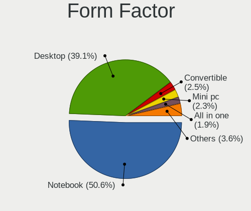
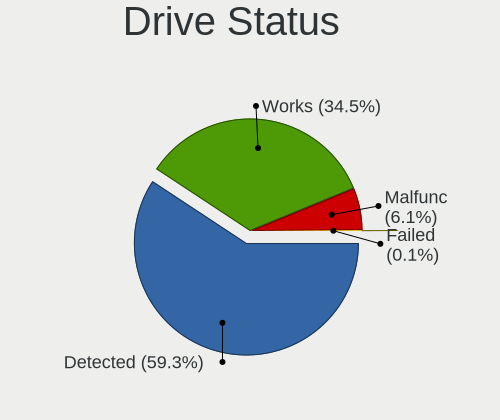
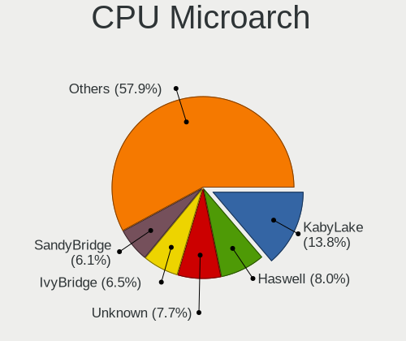
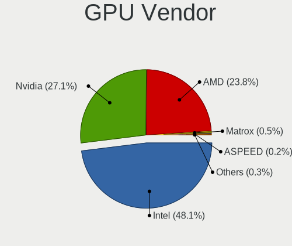
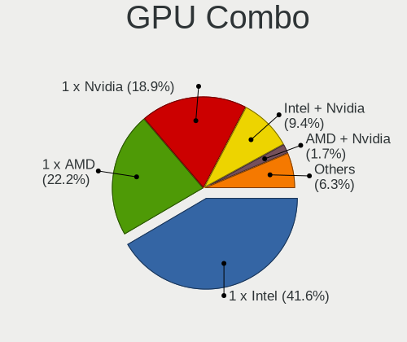
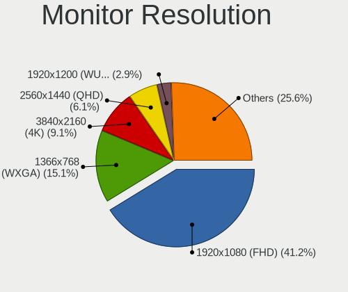
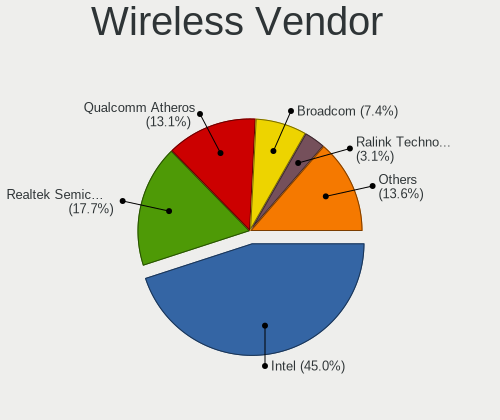
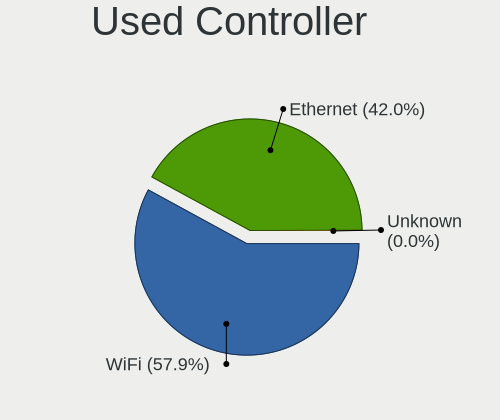
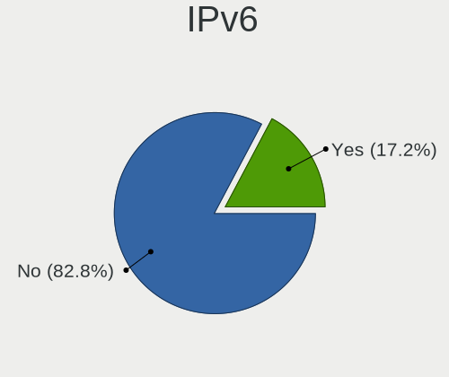

Linux in UK - Tested Hardware & Statistics
------------------------------------------

A project to collect tested hardware configurations for Linux in UK.

Anyone can contribute to this report by the [hw-probe](https://github.com/linuxhw/hw-probe) tool:

    sudo -E hw-probe -all -upload

Please contribute! Especially if your hardware is rare.

This is a report for all computer types. See also reports for [desktops](/Location/UK/Desktop/README.md) and [notebooks](/Location/UK/Notebook/README.md).

Contents
--------

* [ Test Cases ](#test-cases)

* [ System ](#system)
  - [ OS                       ](#os)
  - [ OS Family                ](#os-family)
  - [ Kernel                   ](#kernel)
  - [ Kernel Family            ](#kernel-family)
  - [ Kernel Major Ver.        ](#kernel-major-ver)
  - [ Arch                     ](#arch)
  - [ DE                       ](#de)
  - [ Display Server           ](#display-server)
  - [ Display Manager          ](#display-manager)
  - [ OS Lang                  ](#os-lang)
  - [ Boot Mode                ](#boot-mode)
  - [ Filesystem               ](#filesystem)
  - [ Part. scheme             ](#part-scheme)
  - [ Dual Boot with Linux/BSD ](#dual-boot-with-linuxbsd)
  - [ Dual Boot (Win)          ](#dual-boot-win)

* [ Board ](#board)
  - [ Vendor                   ](#vendor)
  - [ Model                    ](#model)
  - [ Model Family             ](#model-family)
  - [ MFG Year                 ](#mfg-year)
  - [ Form Factor              ](#form-factor)
  - [ Secure Boot              ](#secure-boot)
  - [ Coreboot                 ](#coreboot)
  - [ RAM Size                 ](#ram-size)
  - [ RAM Used                 ](#ram-used)
  - [ Total Drives             ](#total-drives)
  - [ Has CD-ROM               ](#has-cd-rom)
  - [ Has Ethernet             ](#has-ethernet)
  - [ Has WiFi                 ](#has-wifi)
  - [ Has Bluetooth            ](#has-bluetooth)

* [ Location ](#location)
  - [ Country                  ](#country)
  - [ City                     ](#city)

* [ Drives ](#drives)
  - [ Drive Vendor             ](#drive-vendor)
  - [ Drive Model              ](#drive-model)
  - [ HDD Vendor               ](#hdd-vendor)
  - [ SSD Vendor               ](#ssd-vendor)
  - [ Drive Kind               ](#drive-kind)
  - [ Drive Connector          ](#drive-connector)
  - [ Drive Size               ](#drive-size)
  - [ Space Total              ](#space-total)
  - [ Space Used               ](#space-used)
  - [ Malfunc. Drives          ](#malfunc-drives)
  - [ Malfunc. Drive Vendor    ](#malfunc-drive-vendor)
  - [ Malfunc. HDD Vendor      ](#malfunc-hdd-vendor)
  - [ Malfunc. Drive Kind      ](#malfunc-drive-kind)
  - [ Failed Drives            ](#failed-drives)
  - [ Failed Drive Vendor      ](#failed-drive-vendor)
  - [ Drive Status             ](#drive-status)

* [ Storage controller ](#storage-controller)
  - [ Storage Vendor           ](#storage-vendor)
  - [ Storage Model            ](#storage-model)
  - [ Storage Kind             ](#storage-kind)

* [ Processor ](#processor)
  - [ CPU Vendor               ](#cpu-vendor)
  - [ CPU Model                ](#cpu-model)
  - [ CPU Model Family         ](#cpu-model-family)
  - [ CPU Cores                ](#cpu-cores)
  - [ CPU Sockets              ](#cpu-sockets)
  - [ CPU Threads              ](#cpu-threads)
  - [ CPU Op-Modes             ](#cpu-op-modes)
  - [ CPU Microcode            ](#cpu-microcode)
  - [ CPU Microarch            ](#cpu-microarch)

* [ Graphics ](#graphics)
  - [ GPU Vendor               ](#gpu-vendor)
  - [ GPU Model                ](#gpu-model)
  - [ GPU Combo                ](#gpu-combo)
  - [ GPU Driver               ](#gpu-driver)
  - [ GPU Memory               ](#gpu-memory)

* [ Monitor ](#monitor)
  - [ Monitor Vendor           ](#monitor-vendor)
  - [ Monitor Model            ](#monitor-model)
  - [ Monitor Resolution       ](#monitor-resolution)
  - [ Monitor Diagonal         ](#monitor-diagonal)
  - [ Monitor Width            ](#monitor-width)
  - [ Aspect Ratio             ](#aspect-ratio)
  - [ Monitor Area             ](#monitor-area)
  - [ Pixel Density            ](#pixel-density)
  - [ Multiple Monitors        ](#multiple-monitors)

* [ Network ](#network)
  - [ Net Controller Vendor    ](#net-controller-vendor)
  - [ Net Controller Model     ](#net-controller-model)
  - [ Wireless Vendor          ](#wireless-vendor)
  - [ Wireless Model           ](#wireless-model)
  - [ Ethernet Vendor          ](#ethernet-vendor)
  - [ Ethernet Model           ](#ethernet-model)
  - [ Net Controller Kind      ](#net-controller-kind)
  - [ Used Controller          ](#used-controller)
  - [ NICs                     ](#nics)
  - [ IPv6                     ](#ipv6)

* [ Bluetooth ](#bluetooth)
  - [ Bluetooth Vendor         ](#bluetooth-vendor)
  - [ Bluetooth Model          ](#bluetooth-model)

* [ Sound ](#sound)
  - [ Sound Vendor             ](#sound-vendor)
  - [ Sound Model              ](#sound-model)

* [ Memory ](#memory)
  - [ Memory Vendor            ](#memory-vendor)
  - [ Memory Model             ](#memory-model)
  - [ Memory Kind              ](#memory-kind)
  - [ Memory Form Factor       ](#memory-form-factor)
  - [ Memory Size              ](#memory-size)
  - [ Memory Speed             ](#memory-speed)

* [ Printers & scanners ](#printers--scanners)
  - [ Printer Vendor           ](#printer-vendor)
  - [ Printer Model            ](#printer-model)
  - [ Scanner Vendor           ](#scanner-vendor)
  - [ Scanner Model            ](#scanner-model)

* [ Camera ](#camera)
  - [ Camera Vendor            ](#camera-vendor)
  - [ Camera Model             ](#camera-model)

* [ Security ](#security)
  - [ Fingerprint Vendor       ](#fingerprint-vendor)
  - [ Fingerprint Model        ](#fingerprint-model)
  - [ Chipcard Vendor          ](#chipcard-vendor)
  - [ Chipcard Model           ](#chipcard-model)

* [ Unsupported ](#unsupported)
  - [ Unsupported Devices      ](#unsupported-devices)
  - [ Unsupported Device Types ](#unsupported-device-types)

Test Cases
----------

Total: 13945

| Vendor        | Model                       | Form-Factor | Probe                                                      | Date         |
|---------------|-----------------------------|-------------|------------------------------------------------------------|--------------|
| HP            | EliteBook 840 G1            | Notebook    | [369a002b88](https://linux-hardware.org/?probe=369a002b88) | May 09, 2024 |
| GEEKOM        | MiniAir 11                  | Server      | [20e4a415d6](https://linux-hardware.org/?probe=20e4a415d6) | May 09, 2024 |
| Valve         | Jupiter                     | Notebook    | [18c9c24ecb](https://linux-hardware.org/?probe=18c9c24ecb) | May 09, 2024 |
| GEEKOM        | MiniAir 11                  | Server      | [9a6f3f3e69](https://linux-hardware.org/?probe=9a6f3f3e69) | May 09, 2024 |
| Samsung       | 960XGK                      | Notebook    | [4c22b1ca3a](https://linux-hardware.org/?probe=4c22b1ca3a) | May 09, 2024 |
| ASUSTek       | H110M-A/DP                  | Desktop     | [da62dd4045](https://linux-hardware.org/?probe=da62dd4045) | May 08, 2024 |
| ASUSTek       | H110M-A/DP                  | Desktop     | [b8d75a4ac5](https://linux-hardware.org/?probe=b8d75a4ac5) | May 08, 2024 |
| Dell          | Latitude 5530               | Notebook    | [f91e424e6d](https://linux-hardware.org/?probe=f91e424e6d) | May 08, 2024 |
| Gigabyte      | Z97X-Gaming 5               | Desktop     | [8256dfc204](https://linux-hardware.org/?probe=8256dfc204) | May 08, 2024 |
| Gigabyte      | B650 AORUS ELITE AX V2      | Desktop     | [cb100ba8bc](https://linux-hardware.org/?probe=cb100ba8bc) | May 08, 2024 |
| Huanan        | X99-F8 GAMING V5.0          | Desktop     | [541eebe872](https://linux-hardware.org/?probe=541eebe872) | May 08, 2024 |
| Apple         | Mac-942B5BF58194151B        | All in one  | [c5c2b3b9c0](https://linux-hardware.org/?probe=c5c2b3b9c0) | May 08, 2024 |
| Linx          | LINX1010B                   | Notebook    | [782fb4ec65](https://linux-hardware.org/?probe=782fb4ec65) | May 08, 2024 |
| Unknown       | Unknown                     | Desktop     | [14f9a58589](https://linux-hardware.org/?probe=14f9a58589) | May 08, 2024 |
| ASUSTek       | CROSSHAIR VI HERO           | Desktop     | [13c15b0230](https://linux-hardware.org/?probe=13c15b0230) | May 08, 2024 |
| ASUSTek       | PRIME B760M-A WIFI D4       | Desktop     | [d83d6a3460](https://linux-hardware.org/?probe=d83d6a3460) | May 07, 2024 |
| AWOW          | AK41                        | Notebook    | [21d739c59c](https://linux-hardware.org/?probe=21d739c59c) | May 07, 2024 |
| Gigabyte      | X570S AERO G                | Desktop     | [051c9db94b](https://linux-hardware.org/?probe=051c9db94b) | May 07, 2024 |
| Acer          | Aspire A515-45              | Notebook    | [c9dab30ab0](https://linux-hardware.org/?probe=c9dab30ab0) | May 07, 2024 |
| ASRock        | B450M Pro4-F                | Desktop     | [0c73837ccd](https://linux-hardware.org/?probe=0c73837ccd) | May 07, 2024 |
| ASUSTek       | TUF B450M-PLUS GAMING       | Desktop     | [73060b4642](https://linux-hardware.org/?probe=73060b4642) | May 07, 2024 |
| HP            | ProBook 430 G8 Notebook ... | Notebook    | [be061de1c7](https://linux-hardware.org/?probe=be061de1c7) | May 07, 2024 |
| Raspberry ... | Raspberry Pi 5 Model B R... | Soc         | [9fd55d6b07](https://linux-hardware.org/?probe=9fd55d6b07) | May 07, 2024 |
| ASUSTek       | VivoBook_ASUSLaptop M760... | Notebook    | [773ca4f9c9](https://linux-hardware.org/?probe=773ca4f9c9) | May 06, 2024 |
| ASUSTek       | VivoBook_ASUSLaptop M760... | Notebook    | [0104fa9a83](https://linux-hardware.org/?probe=0104fa9a83) | May 06, 2024 |
| Lenovo        | ThinkPad Helix 36986CG      | Notebook    | [9b2bd77573](https://linux-hardware.org/?probe=9b2bd77573) | May 06, 2024 |
| Linx          | LINX1010B                   | Notebook    | [5abe12bf84](https://linux-hardware.org/?probe=5abe12bf84) | May 06, 2024 |
| Star Labs     | StarBook                    | Notebook    | [7e37692a50](https://linux-hardware.org/?probe=7e37692a50) | May 06, 2024 |
| ASUSTek       | VivoBook_ASUSLaptop X513... | Notebook    | [d4cca237f2](https://linux-hardware.org/?probe=d4cca237f2) | May 06, 2024 |
| Lenovo        | IdeaPad Pro 5 14AHP9 83D... | Notebook    | [f8f3623eac](https://linux-hardware.org/?probe=f8f3623eac) | May 06, 2024 |
| ASUSTek       | VivoBook_ASUSLaptop X513... | Notebook    | [e5685451f5](https://linux-hardware.org/?probe=e5685451f5) | May 06, 2024 |
| Samsung       | 960QFG                      | Convertible | [938356247b](https://linux-hardware.org/?probe=938356247b) | May 06, 2024 |
| ASUSTek       | PN50                        | Mini pc     | [9007198402](https://linux-hardware.org/?probe=9007198402) | May 06, 2024 |
| Lenovo        | IdeaPad 330-15IKB 81DC      | Notebook    | [bc2508bd91](https://linux-hardware.org/?probe=bc2508bd91) | May 06, 2024 |
| MSI           | H110M PRO-VH                | Desktop     | [f0e62a158e](https://linux-hardware.org/?probe=f0e62a158e) | May 06, 2024 |
| Unknown       | Unknown                     | Desktop     | [b6bf02e276](https://linux-hardware.org/?probe=b6bf02e276) | May 06, 2024 |
| Lenovo        | SHARKBAY NOK                | Desktop     | [11bef15f7d](https://linux-hardware.org/?probe=11bef15f7d) | May 06, 2024 |
| Unknown       | Unknown                     | Desktop     | [9f8df7b114](https://linux-hardware.org/?probe=9f8df7b114) | May 06, 2024 |
| Alienware     | x17 R2                      | Notebook    | [ed5c24948b](https://linux-hardware.org/?probe=ed5c24948b) | May 06, 2024 |
| Alienware     | x17 R2                      | Notebook    | [a920973ad3](https://linux-hardware.org/?probe=a920973ad3) | May 06, 2024 |
| Lenovo        | Yoga Slim 7-14ARE05 82A2    | Notebook    | [c931a1a446](https://linux-hardware.org/?probe=c931a1a446) | May 05, 2024 |
| Gigabyte      | H610M K DDR4                | Desktop     | [da4e59e69d](https://linux-hardware.org/?probe=da4e59e69d) | May 05, 2024 |
| Lenovo        | ThinkPad T470s 20HFS1SW0... | Notebook    | [e27c636616](https://linux-hardware.org/?probe=e27c636616) | May 05, 2024 |
| Acer          | Lars                        | Notebook    | [6ec82dab78](https://linux-hardware.org/?probe=6ec82dab78) | May 05, 2024 |
| Lenovo        | ThinkPad T470s 20HFS1SW0... | Notebook    | [bd41e79881](https://linux-hardware.org/?probe=bd41e79881) | May 05, 2024 |
| Lenovo        | ThinkPad T480 20L50011US    | Notebook    | [06d6c1d0e2](https://linux-hardware.org/?probe=06d6c1d0e2) | May 05, 2024 |
| Dell          | Latitude 3420               | Notebook    | [a28c6852fe](https://linux-hardware.org/?probe=a28c6852fe) | May 05, 2024 |
| Intel         | NUC7i5BNB J31144-311        | Mini pc     | [64953efef1](https://linux-hardware.org/?probe=64953efef1) | May 05, 2024 |
| Raspberry ... | Raspberry Pi 5 Model B R... | Soc         | [4afe74277e](https://linux-hardware.org/?probe=4afe74277e) | May 05, 2024 |
| ASRock        | B560 Pro4                   | Desktop     | [30ae860ce9](https://linux-hardware.org/?probe=30ae860ce9) | May 04, 2024 |
| HP            | 8350                        | Desktop     | [23dcdf2ff3](https://linux-hardware.org/?probe=23dcdf2ff3) | May 04, 2024 |
| ASUSTek       | PRIME B560-PLUS             | Desktop     | [44afb954d6](https://linux-hardware.org/?probe=44afb954d6) | May 04, 2024 |
| ASUSTek       | ROG STRIX Z490-F GAMING     | Desktop     | [be77d3d806](https://linux-hardware.org/?probe=be77d3d806) | May 04, 2024 |
| HP            | EliteBook x360 1030 G7 N... | Convertible | [7e836a3f5b](https://linux-hardware.org/?probe=7e836a3f5b) | May 04, 2024 |
| Dell          | 0HD5W2 A01                  | Desktop     | [1f5ee22f75](https://linux-hardware.org/?probe=1f5ee22f75) | May 03, 2024 |
| Dell          | Latitude E6330              | Notebook    | [02c85088bc](https://linux-hardware.org/?probe=02c85088bc) | May 03, 2024 |
| Dell          | XPS 15 9530                 | Notebook    | [b46ba9168c](https://linux-hardware.org/?probe=b46ba9168c) | May 03, 2024 |
| HP            | 83F0                        | Desktop     | [896e46f757](https://linux-hardware.org/?probe=896e46f757) | May 03, 2024 |
| ASUSTek       | PRIME B450M-A               | Desktop     | [e832587255](https://linux-hardware.org/?probe=e832587255) | May 03, 2024 |
| Dell          | Latitude 3420               | Notebook    | [e0415e052f](https://linux-hardware.org/?probe=e0415e052f) | May 03, 2024 |
| Dell          | 0HD5W2 A01                  | Desktop     | [c7875c3103](https://linux-hardware.org/?probe=c7875c3103) | May 03, 2024 |
| Dell          | Latitude 7410               | Notebook    | [959e9d053d](https://linux-hardware.org/?probe=959e9d053d) | May 03, 2024 |
| Dell          | Latitude E6540              | Notebook    | [186de5be73](https://linux-hardware.org/?probe=186de5be73) | May 03, 2024 |
| ASRock        | X300M-STX                   | Desktop     | [58d58080cd](https://linux-hardware.org/?probe=58d58080cd) | May 03, 2024 |
| HP            | 8062                        | Desktop     | [87c4c1fbfb](https://linux-hardware.org/?probe=87c4c1fbfb) | May 02, 2024 |
| Dell          | 0VRWRC A00                  | Desktop     | [137a659482](https://linux-hardware.org/?probe=137a659482) | May 02, 2024 |
| Lenovo        | ThinkPad X1 Carbon 6th 2... | Notebook    | [e02873ea23](https://linux-hardware.org/?probe=e02873ea23) | May 02, 2024 |
| MSI           | MAG B550 TOMAHAWK           | Desktop     | [8c1fc35187](https://linux-hardware.org/?probe=8c1fc35187) | May 02, 2024 |
| Gigabyte      | X470 AORUS ULTRA GAMING-... | Desktop     | [f40340d3fa](https://linux-hardware.org/?probe=f40340d3fa) | May 02, 2024 |
| HP            | Dragonfly 13.5 inch G4 N... | Notebook    | [0a75b86ae0](https://linux-hardware.org/?probe=0a75b86ae0) | May 02, 2024 |
| Apple         | MacBookPro11,4              | Notebook    | [e4b5fb0f12](https://linux-hardware.org/?probe=e4b5fb0f12) | May 01, 2024 |
| Dell          | Inspiron 5559               | Notebook    | [8a00241444](https://linux-hardware.org/?probe=8a00241444) | May 01, 2024 |
| Samsung       | 550P5C/550P7C               | Notebook    | [c8bdddb366](https://linux-hardware.org/?probe=c8bdddb366) | May 01, 2024 |
| MSI           | B450 GAMING PLUS MAX        | Desktop     | [3146b9914d](https://linux-hardware.org/?probe=3146b9914d) | May 01, 2024 |
| Lenovo        | ThinkPad X200s 7469W92      | Notebook    | [687cc00e33](https://linux-hardware.org/?probe=687cc00e33) | May 01, 2024 |
| Gigabyte      | H61M-S2PV                   | Desktop     | [45bb15cd11](https://linux-hardware.org/?probe=45bb15cd11) | May 01, 2024 |
| Apple         | Mac-942B5BF58194151B        | All in one  | [b8a7fbfad1](https://linux-hardware.org/?probe=b8a7fbfad1) | May 01, 2024 |
| Gigabyte      | B660M DS3H AX DDR4          | Desktop     | [cfdd3a4535](https://linux-hardware.org/?probe=cfdd3a4535) | May 01, 2024 |
| Raspberry ... | Raspberry Pi 5 Model B R... | Soc         | [f3d12216e7](https://linux-hardware.org/?probe=f3d12216e7) | May 01, 2024 |
| GEEKOM        | A7                          | Desktop     | [f9437ebaa0](https://linux-hardware.org/?probe=f9437ebaa0) | May 01, 2024 |
| MSI           | X470 GAMING PRO CARBON      | Desktop     | [6486b4f435](https://linux-hardware.org/?probe=6486b4f435) | May 01, 2024 |
| Apple         | MacBookPro10,2              | Notebook    | [57baecb0a5](https://linux-hardware.org/?probe=57baecb0a5) | May 01, 2024 |
| Gigabyte      | F2A88XM-DS2                 | Desktop     | [2a13216c9b](https://linux-hardware.org/?probe=2a13216c9b) | Apr 30, 2024 |
| XIAOMI        | Redmi Book Pro 14 2024      | Notebook    | [459594827a](https://linux-hardware.org/?probe=459594827a) | Apr 30, 2024 |
| HP            | Laptop 15-da0xxx            | Notebook    | [1d5c1bf00e](https://linux-hardware.org/?probe=1d5c1bf00e) | Apr 30, 2024 |
| MSI           | Z170A GAMING M5             | Desktop     | [1d4b2dd7e3](https://linux-hardware.org/?probe=1d4b2dd7e3) | Apr 30, 2024 |
| Lenovo        | Z70-80 80FG                 | Notebook    | [4a07e72bf5](https://linux-hardware.org/?probe=4a07e72bf5) | Apr 30, 2024 |
| MSI           | MAG Z690 TOMAHAWK WIFI D... | Desktop     | [5cc26d31fa](https://linux-hardware.org/?probe=5cc26d31fa) | Apr 30, 2024 |
| Apple         | MacBookPro10,2              | Notebook    | [f80fe988f5](https://linux-hardware.org/?probe=f80fe988f5) | Apr 30, 2024 |
| Dell          | Latitude D630               | Notebook    | [c9ae85eecc](https://linux-hardware.org/?probe=c9ae85eecc) | Apr 30, 2024 |
| Unknown       | Unknown                     | Desktop     | [b2784a219f](https://linux-hardware.org/?probe=b2784a219f) | Apr 29, 2024 |
| Unknown       | Unknown                     | Desktop     | [5189791d8b](https://linux-hardware.org/?probe=5189791d8b) | Apr 29, 2024 |
| HP            | 3398                        | Desktop     | [e412887ebc](https://linux-hardware.org/?probe=e412887ebc) | Apr 29, 2024 |
| Apple         | Mac-27ADBB7B4CEE8E61 iMa... | All in one  | [99fca9e7c4](https://linux-hardware.org/?probe=99fca9e7c4) | Apr 28, 2024 |
| Lenovo        | IdeaPad S145-15IWL 81MV     | Notebook    | [9b282865ea](https://linux-hardware.org/?probe=9b282865ea) | Apr 28, 2024 |
| MSI           | MS-7D46                     | Notebook    | [135fa9337a](https://linux-hardware.org/?probe=135fa9337a) | Apr 28, 2024 |
| HP            | EliteBook x360 1030 G7 N... | Convertible | [0bd7f578c2](https://linux-hardware.org/?probe=0bd7f578c2) | Apr 28, 2024 |
| Dell          | Latitude 5420               | Notebook    | [0a95f2013b](https://linux-hardware.org/?probe=0a95f2013b) | Apr 28, 2024 |
| iOTA          | Flo 360                     | Convertible | [24e0af7512](https://linux-hardware.org/?probe=24e0af7512) | Apr 28, 2024 |
| Dell          | 07PR60 A00                  | Desktop     | [6897b908da](https://linux-hardware.org/?probe=6897b908da) | Apr 28, 2024 |
| Mini PC       | Rev JSL5 DDR4               | Mini pc     | [80eb2b98de](https://linux-hardware.org/?probe=80eb2b98de) | Apr 28, 2024 |
| Star Labs     | StarBook                    | Notebook    | [99017e5822](https://linux-hardware.org/?probe=99017e5822) | Apr 28, 2024 |
| Fujitsu       | D3433-S2 S26361-D3433-S2    | Desktop     | [ed1d2dac2d](https://linux-hardware.org/?probe=ed1d2dac2d) | Apr 28, 2024 |
| Gigabyte      | A620I AX                    | Desktop     | [eeea04465b](https://linux-hardware.org/?probe=eeea04465b) | Apr 28, 2024 |
| Lenovo        | ThinkPad X395 20NMS1KY02    | Notebook    | [48385039f1](https://linux-hardware.org/?probe=48385039f1) | Apr 28, 2024 |
| Lenovo        | IdeaPad 3 15ITL6 82H8       | Notebook    | [ca7df399fe](https://linux-hardware.org/?probe=ca7df399fe) | Apr 27, 2024 |
| ASUSTek       | PRIME B550M-A               | Desktop     | [4536896f41](https://linux-hardware.org/?probe=4536896f41) | Apr 27, 2024 |
| Raspberry ... | Raspberry Pi                | Soc         | [12a735e282](https://linux-hardware.org/?probe=12a735e282) | Apr 27, 2024 |
| MSI           | Z97 PC Mate                 | Desktop     | [44a2eb8cdb](https://linux-hardware.org/?probe=44a2eb8cdb) | Apr 27, 2024 |
| MSI           | H310M PRO-M2 PLUS           | Desktop     | [5004ab8c5b](https://linux-hardware.org/?probe=5004ab8c5b) | Apr 27, 2024 |
| Acer          | Aspire 5735                 | Notebook    | [bb36d187d1](https://linux-hardware.org/?probe=bb36d187d1) | Apr 27, 2024 |
| ASUSTek       | Zenbook UX3402VA_UX3402V... | Notebook    | [567613b6b6](https://linux-hardware.org/?probe=567613b6b6) | Apr 27, 2024 |
| Lenovo        | ThinkPad T480 20L6SA5Q1L    | Notebook    | [1498235a91](https://linux-hardware.org/?probe=1498235a91) | Apr 27, 2024 |
| Gigabyte      | B550I AORUS PRO AX          | Desktop     | [7d60545173](https://linux-hardware.org/?probe=7d60545173) | Apr 27, 2024 |
| Gigabyte      | B550I AORUS PRO AX          | Desktop     | [b4d4155591](https://linux-hardware.org/?probe=b4d4155591) | Apr 27, 2024 |
| AOpen         | D1009 A1A4                  | Desktop     | [d8b2d00731](https://linux-hardware.org/?probe=d8b2d00731) | Apr 27, 2024 |
| Lenovo        | V130-15IKB 81HN             | Notebook    | [7bcb7c8c7f](https://linux-hardware.org/?probe=7bcb7c8c7f) | Apr 27, 2024 |
| AOpen         | D1009 A1A4                  | Desktop     | [f5399e68ef](https://linux-hardware.org/?probe=f5399e68ef) | Apr 27, 2024 |
| ASUSTek       | PRIME B450M-A               | Desktop     | [fe59c3a4da](https://linux-hardware.org/?probe=fe59c3a4da) | Apr 27, 2024 |
| Dell          | XPS 15 9560                 | Notebook    | [85005d847f](https://linux-hardware.org/?probe=85005d847f) | Apr 27, 2024 |
| Apple         | Mac-942B5BF58194151B        | All in one  | [8b127ce5fb](https://linux-hardware.org/?probe=8b127ce5fb) | Apr 27, 2024 |
| Gigabyte      | B450M GAMING                | Desktop     | [5d2ca0a62d](https://linux-hardware.org/?probe=5d2ca0a62d) | Apr 27, 2024 |
| Samsung       | 750XED                      | Notebook    | [dc5ed7dd87](https://linux-hardware.org/?probe=dc5ed7dd87) | Apr 26, 2024 |
| Acer          | Aspire A315-31              | Notebook    | [252cddf085](https://linux-hardware.org/?probe=252cddf085) | Apr 26, 2024 |
| Lenovo        | 32DD SDK0J40697 WIN 3305... | Mini pc     | [db2bf2ecf2](https://linux-hardware.org/?probe=db2bf2ecf2) | Apr 26, 2024 |
| MSI           | B550M PRO-VDH WIFI          | Desktop     | [694a93488d](https://linux-hardware.org/?probe=694a93488d) | Apr 26, 2024 |
| Apple         | MacBookAir7,2               | Notebook    | [cf8aa1d23a](https://linux-hardware.org/?probe=cf8aa1d23a) | Apr 26, 2024 |
| Gigabyte      | 970A-UD3P                   | Desktop     | [4fe6c4e2bd](https://linux-hardware.org/?probe=4fe6c4e2bd) | Apr 26, 2024 |
| Gigabyte      | B450M DS3H WIFI-CF          | Desktop     | [14dee832b2](https://linux-hardware.org/?probe=14dee832b2) | Apr 26, 2024 |
| MSI           | MS-B090                     | All in one  | [06780aaa5b](https://linux-hardware.org/?probe=06780aaa5b) | Apr 26, 2024 |
| MSI           | Z790 GAMING PLUS WIFI       | Desktop     | [c1242570d2](https://linux-hardware.org/?probe=c1242570d2) | Apr 25, 2024 |
| Notebook      | NV4xPZ                      | Notebook    | [f7e4f166f0](https://linux-hardware.org/?probe=f7e4f166f0) | Apr 25, 2024 |
| Gigabyte      | F2A68HM-HD2                 | Desktop     | [4f56e23067](https://linux-hardware.org/?probe=4f56e23067) | Apr 25, 2024 |
| HP            | EliteBook 745 G2            | Notebook    | [3386466743](https://linux-hardware.org/?probe=3386466743) | Apr 25, 2024 |
| Acer          | Aspire A314-23P             | Notebook    | [cfe8e7fdae](https://linux-hardware.org/?probe=cfe8e7fdae) | Apr 24, 2024 |
| Apple         | Mac-F60DEB81FF30ACF6 Mac... | Desktop     | [713bf3357d](https://linux-hardware.org/?probe=713bf3357d) | Apr 24, 2024 |
| Gigabyte      | 970A-DS3P                   | Desktop     | [0253ffc79c](https://linux-hardware.org/?probe=0253ffc79c) | Apr 24, 2024 |
| Dell          | 0HHV7N A00                  | Desktop     | [328456d99c](https://linux-hardware.org/?probe=328456d99c) | Apr 23, 2024 |
| Dell          | 0HHV7N A00                  | Desktop     | [dbe31bb448](https://linux-hardware.org/?probe=dbe31bb448) | Apr 23, 2024 |
| Acer          | Aspire 5739G                | Notebook    | [cd8bc25688](https://linux-hardware.org/?probe=cd8bc25688) | Apr 23, 2024 |
| Apple         | MacBookPro8,2               | Notebook    | [965595373d](https://linux-hardware.org/?probe=965595373d) | Apr 23, 2024 |
| Acer          | Aspire 5750G                | Notebook    | [a35bd4ad42](https://linux-hardware.org/?probe=a35bd4ad42) | Apr 23, 2024 |
| Acer          | Swift SF314-43              | Notebook    | [0add5a8f6d](https://linux-hardware.org/?probe=0add5a8f6d) | Apr 23, 2024 |
| Toshiba       | Satellite C55-B             | Notebook    | [031e71aea3](https://linux-hardware.org/?probe=031e71aea3) | Apr 23, 2024 |
| Apple         | MacBookAir6,2               | Notebook    | [a487d49316](https://linux-hardware.org/?probe=a487d49316) | Apr 22, 2024 |
| Raspberry ... | Raspberry Pi                | Soc         | [50751e1c9e](https://linux-hardware.org/?probe=50751e1c9e) | Apr 22, 2024 |
| Dell          | Precision 5530              | Notebook    | [7e2d09b398](https://linux-hardware.org/?probe=7e2d09b398) | Apr 22, 2024 |
| Lenovo        | 3144 SDK0J40697 WIN 3305... | Mini pc     | [40f1634460](https://linux-hardware.org/?probe=40f1634460) | Apr 22, 2024 |
| Valve         | Jupiter                     | Notebook    | [53f25f4dba](https://linux-hardware.org/?probe=53f25f4dba) | Apr 22, 2024 |
| ASUSTek       | ROG STRIX Z790-A GAMING ... | Desktop     | [cb411ef765](https://linux-hardware.org/?probe=cb411ef765) | Apr 22, 2024 |
| Valve         | Jupiter                     | Notebook    | [665861dbf9](https://linux-hardware.org/?probe=665861dbf9) | Apr 22, 2024 |
| Gigabyte      | Z790 AORUS ELITE AX         | Desktop     | [1c066ce5e2](https://linux-hardware.org/?probe=1c066ce5e2) | Apr 21, 2024 |
| Apple         | MacBookPro7,1               | Notebook    | [dda370ba40](https://linux-hardware.org/?probe=dda370ba40) | Apr 21, 2024 |
| Lenovo        | Legion 5 15IAH7H 82RB       | Notebook    | [fa1738d688](https://linux-hardware.org/?probe=fa1738d688) | Apr 21, 2024 |
| Dell          | 088DT1 A01                  | Desktop     | [4a09358541](https://linux-hardware.org/?probe=4a09358541) | Apr 21, 2024 |
| Dell          | 088DT1 A01                  | Desktop     | [3dcdb47fd0](https://linux-hardware.org/?probe=3dcdb47fd0) | Apr 21, 2024 |
| HP            | 87D6 SMVB                   | Desktop     | [b3862648a1](https://linux-hardware.org/?probe=b3862648a1) | Apr 21, 2024 |
| Acer          | WG43M                       | Desktop     | [93fcdbd13d](https://linux-hardware.org/?probe=93fcdbd13d) | Apr 20, 2024 |
| Dell          | Precision 5750              | Notebook    | [778f264bea](https://linux-hardware.org/?probe=778f264bea) | Apr 20, 2024 |
| Valve         | Jupiter                     | Notebook    | [bc9b5cbcc5](https://linux-hardware.org/?probe=bc9b5cbcc5) | Apr 20, 2024 |
| HP            | Laptop 15s-eq1xxx           | Notebook    | [9622d53999](https://linux-hardware.org/?probe=9622d53999) | Apr 20, 2024 |
| HP            | Pavilion Gaming Laptop 1... | Notebook    | [82a3685099](https://linux-hardware.org/?probe=82a3685099) | Apr 20, 2024 |
| Dell          | 0NK70N A03                  | Desktop     | [a6862dfd01](https://linux-hardware.org/?probe=a6862dfd01) | Apr 20, 2024 |
| Lenovo        | ThinkPad X260 20F5S4CC00    | Notebook    | [56a80212e2](https://linux-hardware.org/?probe=56a80212e2) | Apr 20, 2024 |
| Gigabyte      | H97M-D3H                    | Desktop     | [15a0f07250](https://linux-hardware.org/?probe=15a0f07250) | Apr 20, 2024 |
| Dell          | Inspiron 5577               | Notebook    | [e3f9a3a5ad](https://linux-hardware.org/?probe=e3f9a3a5ad) | Apr 20, 2024 |
| Supermicro    | X10DAI                      | Desktop     | [cd2bb43eb4](https://linux-hardware.org/?probe=cd2bb43eb4) | Apr 19, 2024 |
| Acer          | Aspire A315-31              | Notebook    | [d9c7cb3ef3](https://linux-hardware.org/?probe=d9c7cb3ef3) | Apr 19, 2024 |
| Supermicro    | X10DAI                      | Desktop     | [053e65f727](https://linux-hardware.org/?probe=053e65f727) | Apr 19, 2024 |
| Valve         | Jupiter                     | Notebook    | [8cbd37a2d2](https://linux-hardware.org/?probe=8cbd37a2d2) | Apr 19, 2024 |
| Dell          | Inspiron 5577               | Notebook    | [f328c7d8f4](https://linux-hardware.org/?probe=f328c7d8f4) | Apr 19, 2024 |
| Lenovo        | ThinkBook 16p Gen 4 21J8    | Notebook    | [f15e68d490](https://linux-hardware.org/?probe=f15e68d490) | Apr 19, 2024 |
| Lenovo        | ThinkPad T480s 20L8S7890... | Notebook    | [7af4a3ded9](https://linux-hardware.org/?probe=7af4a3ded9) | Apr 19, 2024 |
| MSI           | B85I                        | Desktop     | [8751cf893f](https://linux-hardware.org/?probe=8751cf893f) | Apr 19, 2024 |
| HP            | 250 G7 Notebook PC          | Notebook    | [a52eb532e3](https://linux-hardware.org/?probe=a52eb532e3) | Apr 19, 2024 |
| Lenovo        | G50-80 80E5                 | Notebook    | [5de5267a1a](https://linux-hardware.org/?probe=5de5267a1a) | Apr 19, 2024 |
| Dynabook E... | Satellite Pro ET10-G-105    | Tablet      | [9b6b61c39a](https://linux-hardware.org/?probe=9b6b61c39a) | Apr 18, 2024 |
| Lenovo        | ThinkPad X1 Carbon 6th 2... | Notebook    | [aaef73d221](https://linux-hardware.org/?probe=aaef73d221) | Apr 18, 2024 |
| Lenovo        | Legion Y9000P IRX8 82WK     | Notebook    | [3d61f319c2](https://linux-hardware.org/?probe=3d61f319c2) | Apr 18, 2024 |
| MSI           | X470 GAMING PRO CARBON      | Desktop     | [78cd7a86b3](https://linux-hardware.org/?probe=78cd7a86b3) | Apr 17, 2024 |
| MSI           | MPG Z490 GAMING PLUS        | Desktop     | [8249b3fb0c](https://linux-hardware.org/?probe=8249b3fb0c) | Apr 17, 2024 |
| Unknown       | Unknown                     | Desktop     | [27c4d07af4](https://linux-hardware.org/?probe=27c4d07af4) | Apr 17, 2024 |
| Gigabyte      | Z97X-Gaming 5               | Desktop     | [f08c90bc44](https://linux-hardware.org/?probe=f08c90bc44) | Apr 17, 2024 |
| Gigabyte      | 970A-DS3P                   | Desktop     | [53055c8335](https://linux-hardware.org/?probe=53055c8335) | Apr 17, 2024 |
| Apple         | Mac-F2268DC8                | All in one  | [bc8371928d](https://linux-hardware.org/?probe=bc8371928d) | Apr 17, 2024 |
| Apple         | Mac-F2268DC8                | All in one  | [04950039db](https://linux-hardware.org/?probe=04950039db) | Apr 17, 2024 |
| MSI           | A55M-P33                    | Desktop     | [0f6fc5a77e](https://linux-hardware.org/?probe=0f6fc5a77e) | Apr 17, 2024 |
| Valve         | Jupiter                     | Notebook    | [04d302c0e5](https://linux-hardware.org/?probe=04d302c0e5) | Apr 16, 2024 |
| ASUSTek       | Z170 PRO GAMING             | Desktop     | [e45ac0e9cc](https://linux-hardware.org/?probe=e45ac0e9cc) | Apr 16, 2024 |
| ASUSTek       | ROG STRIX B650E-I GAMING... | Desktop     | [41c197d579](https://linux-hardware.org/?probe=41c197d579) | Apr 16, 2024 |
| Lenovo        | V15 G3 ABA 82TV             | Notebook    | [6877dcd901](https://linux-hardware.org/?probe=6877dcd901) | Apr 16, 2024 |
| HP            | ENVY x360 Convertible 15... | Convertible | [4767337e78](https://linux-hardware.org/?probe=4767337e78) | Apr 16, 2024 |
| HP            | Dragonfly 13.5 inch G4 N... | Notebook    | [ef4af44bc8](https://linux-hardware.org/?probe=ef4af44bc8) | Apr 16, 2024 |
| ASUSTek       | ROG STRIX X670E-E GAMING... | Desktop     | [25c95d871e](https://linux-hardware.org/?probe=25c95d871e) | Apr 16, 2024 |
| Apple         | MacBookPro8,2               | Notebook    | [2e79d9d11e](https://linux-hardware.org/?probe=2e79d9d11e) | Apr 16, 2024 |
| Gigabyte      | H310M H x.x                 | Desktop     | [1e1b1e0544](https://linux-hardware.org/?probe=1e1b1e0544) | Apr 16, 2024 |
| MSI           | B450 TOMAHAWK MAX II        | Desktop     | [d504f8b8a6](https://linux-hardware.org/?probe=d504f8b8a6) | Apr 16, 2024 |
| Dell          | 0HD5W2 A01                  | Desktop     | [1c7957de19](https://linux-hardware.org/?probe=1c7957de19) | Apr 16, 2024 |
| Lenovo        | IdeaPad Gaming 3 15ARH7 ... | Notebook    | [54ea7f1e25](https://linux-hardware.org/?probe=54ea7f1e25) | Apr 16, 2024 |
| HP            | 8158 A01                    | Mini pc     | [48405d0cd6](https://linux-hardware.org/?probe=48405d0cd6) | Apr 15, 2024 |
| Lenovo        | Legion 5 15IAH7H 82RB       | Notebook    | [85f088ac78](https://linux-hardware.org/?probe=85f088ac78) | Apr 15, 2024 |
| HP            | 8299                        | Desktop     | [1a596e43da](https://linux-hardware.org/?probe=1a596e43da) | Apr 15, 2024 |
| ASUSTek       | B85M-G                      | Desktop     | [d8294ede23](https://linux-hardware.org/?probe=d8294ede23) | Apr 15, 2024 |
| ASUSTek       | Pro WS TRX50-SAGE WIFI      | Desktop     | [ac85313920](https://linux-hardware.org/?probe=ac85313920) | Apr 15, 2024 |
| HP            | 8299                        | Desktop     | [aa03fa8e4c](https://linux-hardware.org/?probe=aa03fa8e4c) | Apr 15, 2024 |
| ASUSTek       | Vivobook Go E1504GAB_E15... | Notebook    | [a1f52176e4](https://linux-hardware.org/?probe=a1f52176e4) | Apr 15, 2024 |
| ASRock        | 960GM-GS3 FX                | Desktop     | [fb44984605](https://linux-hardware.org/?probe=fb44984605) | Apr 15, 2024 |
| HP            | OMEN by Laptop 16-c0xxx     | Notebook    | [c249f10628](https://linux-hardware.org/?probe=c249f10628) | Apr 15, 2024 |
| HP            | Laptop 17-ca0xxx            | Notebook    | [8a4f14c3c5](https://linux-hardware.org/?probe=8a4f14c3c5) | Apr 14, 2024 |
| Valve         | Jupiter                     | Notebook    | [211106f4c1](https://linux-hardware.org/?probe=211106f4c1) | Apr 14, 2024 |
| HP            | G56                         | Notebook    | [260bef5db7](https://linux-hardware.org/?probe=260bef5db7) | Apr 14, 2024 |
| HP            | EliteBook 8570w             | Notebook    | [56b69c4112](https://linux-hardware.org/?probe=56b69c4112) | Apr 14, 2024 |
| PC Special... | Standard                    | Notebook    | [568cb066aa](https://linux-hardware.org/?probe=568cb066aa) | Apr 14, 2024 |
| ASUSTek       | X551CA                      | Notebook    | [5bf06a6ae1](https://linux-hardware.org/?probe=5bf06a6ae1) | Apr 14, 2024 |
| Acer          | Aspire 5720                 | Notebook    | [015bf8aebc](https://linux-hardware.org/?probe=015bf8aebc) | Apr 13, 2024 |
| HP            | 3646h                       | Desktop     | [281438274d](https://linux-hardware.org/?probe=281438274d) | Apr 13, 2024 |
| Tactus        | GeoPad 220                  | Tablet      | [6e8eb0d9f3](https://linux-hardware.org/?probe=6e8eb0d9f3) | Apr 13, 2024 |
| Dell          | 0FRVY0 A00                  | Server      | [097c771b65](https://linux-hardware.org/?probe=097c771b65) | Apr 13, 2024 |
| Valve         | Jupiter                     | Notebook    | [8b4172f55b](https://linux-hardware.org/?probe=8b4172f55b) | Apr 13, 2024 |
| Shenzhen M... | F7BAA                       | Desktop     | [1015688c75](https://linux-hardware.org/?probe=1015688c75) | Apr 13, 2024 |
| HP            | Pavilion Notebook           | Notebook    | [fd68b6da34](https://linux-hardware.org/?probe=fd68b6da34) | Apr 13, 2024 |
| MSI           | MAG A520M VECTOR WIFI       | Desktop     | [a8de6973de](https://linux-hardware.org/?probe=a8de6973de) | Apr 13, 2024 |
| Intel         | S2600GZ G11481-354          | Server      | [d6ce3ea6e8](https://linux-hardware.org/?probe=d6ce3ea6e8) | Apr 12, 2024 |
| ASUSTek       | PRIME X670-P                | Desktop     | [a1b2161457](https://linux-hardware.org/?probe=a1b2161457) | Apr 12, 2024 |
| ASUSTek       | ROG STRIX B550-F GAMING ... | Desktop     | [aa96253b80](https://linux-hardware.org/?probe=aa96253b80) | Apr 12, 2024 |
| Lenovo        | IdeaPad 5 Pro 16ARH7 82S... | Notebook    | [858512aecf](https://linux-hardware.org/?probe=858512aecf) | Apr 12, 2024 |
| Lenovo        | Yoga 510-14AST 80S9         | Notebook    | [19e925f1df](https://linux-hardware.org/?probe=19e925f1df) | Apr 12, 2024 |
| ASUSTek       | TUF Gaming Z690-PLUS WIF... | Desktop     | [b977bc3a0a](https://linux-hardware.org/?probe=b977bc3a0a) | Apr 12, 2024 |
| Lenovo        | ThinkPad W540 20BG0044UK    | Notebook    | [45c92186a6](https://linux-hardware.org/?probe=45c92186a6) | Apr 12, 2024 |
| Packard Be... | EasyNote TJ66               | Notebook    | [8fd06fed5d](https://linux-hardware.org/?probe=8fd06fed5d) | Apr 12, 2024 |
| Gigabyte      | B550 AORUS PRO              | Desktop     | [5858a2ed28](https://linux-hardware.org/?probe=5858a2ed28) | Apr 12, 2024 |
| Acer          | Aspire A515-44              | Notebook    | [bcff49116b](https://linux-hardware.org/?probe=bcff49116b) | Apr 11, 2024 |
| Acer          | Aspire 5742Z                | Notebook    | [f9ceb71c71](https://linux-hardware.org/?probe=f9ceb71c71) | Apr 11, 2024 |
| Apple         | MacBookPro11,1              | Notebook    | [4e18f485f3](https://linux-hardware.org/?probe=4e18f485f3) | Apr 11, 2024 |
| HP            | 8062                        | Desktop     | [358bbe16f0](https://linux-hardware.org/?probe=358bbe16f0) | Apr 11, 2024 |
| HP            | 15                          | Notebook    | [1d363becea](https://linux-hardware.org/?probe=1d363becea) | Apr 11, 2024 |
| Acer          | Swift SF314-43              | Notebook    | [a02fa9c7cf](https://linux-hardware.org/?probe=a02fa9c7cf) | Apr 11, 2024 |
| HP            | G56                         | Notebook    | [bd50fcdb8b](https://linux-hardware.org/?probe=bd50fcdb8b) | Apr 11, 2024 |
| Huanan        | X99-F8 GAMING V5.0          | Desktop     | [4e43e18d89](https://linux-hardware.org/?probe=4e43e18d89) | Apr 10, 2024 |
| Foxconn       | 2A8C                        | Desktop     | [9d16faea24](https://linux-hardware.org/?probe=9d16faea24) | Apr 10, 2024 |
| Dell          | 0MHWCY A00                  | All in one  | [c04639e869](https://linux-hardware.org/?probe=c04639e869) | Apr 10, 2024 |
| Lenovo        | ThinkPad T430 2349SA2       | Notebook    | [f892422654](https://linux-hardware.org/?probe=f892422654) | Apr 10, 2024 |
| Apple         | MacBookAir5,2               | Notebook    | [0ac2328adf](https://linux-hardware.org/?probe=0ac2328adf) | Apr 10, 2024 |
| Lenovo        | ThinkPad X380 Yoga 20LJS... | Convertible | [a0c78de882](https://linux-hardware.org/?probe=a0c78de882) | Apr 09, 2024 |
| Lenovo        | 36E9 SDK0R32862 WIN 3258... | Desktop     | [e494587893](https://linux-hardware.org/?probe=e494587893) | Apr 09, 2024 |
| Intel         | NUC13ANBi5 M89647-203       | Mini pc     | [544974cd78](https://linux-hardware.org/?probe=544974cd78) | Apr 09, 2024 |
| MSI           | A520M-A PRO                 | Desktop     | [bd3db073e2](https://linux-hardware.org/?probe=bd3db073e2) | Apr 09, 2024 |
| MSI           | A520M-A PRO                 | Desktop     | [c1bde6f19b](https://linux-hardware.org/?probe=c1bde6f19b) | Apr 09, 2024 |
| Dell          | G3 3590                     | Notebook    | [6b282a982e](https://linux-hardware.org/?probe=6b282a982e) | Apr 09, 2024 |
| Framework     | Laptop 13 (AMD Ryzen 704... | Notebook    | [31a1ed634f](https://linux-hardware.org/?probe=31a1ed634f) | Apr 09, 2024 |
| HP            | ProBook 455 G2              | Notebook    | [431349da41](https://linux-hardware.org/?probe=431349da41) | Apr 08, 2024 |
| Lenovo        | ThinkPad T470 W10DG 20JN... | Notebook    | [1da57352b2](https://linux-hardware.org/?probe=1da57352b2) | Apr 08, 2024 |
| ASUSTek       | ROG STRIX X670E-E GAMING... | Desktop     | [6d013c64d2](https://linux-hardware.org/?probe=6d013c64d2) | Apr 08, 2024 |
| Dell          | Latitude 3510               | Notebook    | [ce45e0d9c4](https://linux-hardware.org/?probe=ce45e0d9c4) | Apr 08, 2024 |
| Dell          | 08NPPY A00                  | Desktop     | [b4c4108be3](https://linux-hardware.org/?probe=b4c4108be3) | Apr 08, 2024 |
| MSI           | B450 GAMING PLUS MAX        | Desktop     | [12d5a6c723](https://linux-hardware.org/?probe=12d5a6c723) | Apr 08, 2024 |
| ASUSTek       | K30BF_M32BF                 | Desktop     | [4538260fe0](https://linux-hardware.org/?probe=4538260fe0) | Apr 08, 2024 |
| Dell          | 08NPPY A00                  | Desktop     | [16c1c681a3](https://linux-hardware.org/?probe=16c1c681a3) | Apr 08, 2024 |
| HP            | EliteBook 840 G1            | Notebook    | [d4188e8112](https://linux-hardware.org/?probe=d4188e8112) | Apr 08, 2024 |
| Dell          | Precision 7680              | Notebook    | [598c6ee3bf](https://linux-hardware.org/?probe=598c6ee3bf) | Apr 08, 2024 |
| Shenzhen M... | F7BSC                       | Mini pc     | [8967eb91ec](https://linux-hardware.org/?probe=8967eb91ec) | Apr 08, 2024 |
| Apple         | Mac-35C5E08120C7EEAF Mac... | Mini pc     | [91b4de4e2a](https://linux-hardware.org/?probe=91b4de4e2a) | Apr 07, 2024 |
| Gigabyte      | GA-880GM-UD2H               | Desktop     | [8bd7df2e63](https://linux-hardware.org/?probe=8bd7df2e63) | Apr 07, 2024 |
| Lenovo        | Legion Slim 5 16APH8 82Y... | Notebook    | [1822926856](https://linux-hardware.org/?probe=1822926856) | Apr 07, 2024 |
| Fusion5       | FWIN232 PLUS                | Tablet      | [3a14556929](https://linux-hardware.org/?probe=3a14556929) | Apr 07, 2024 |
| Lenovo        | ThinkPad T400 6474W7T       | Notebook    | [5b8f0f590e](https://linux-hardware.org/?probe=5b8f0f590e) | Apr 07, 2024 |
| ASUSTek       | ROG STRIX B550-E GAMING     | Desktop     | [8d7890aa2d](https://linux-hardware.org/?probe=8d7890aa2d) | Apr 06, 2024 |
| Notebook      | NS5x_NS7xAU                 | Notebook    | [782d5db9e2](https://linux-hardware.org/?probe=782d5db9e2) | Apr 06, 2024 |
| Intel         | DH61CR AAG14064-204         | Desktop     | [aa8d9012d2](https://linux-hardware.org/?probe=aa8d9012d2) | Apr 06, 2024 |
| Dell          | Latitude 7290               | Notebook    | [e8f80ff545](https://linux-hardware.org/?probe=e8f80ff545) | Apr 06, 2024 |
| HP            | Notebook                    | Notebook    | [414230182b](https://linux-hardware.org/?probe=414230182b) | Apr 06, 2024 |
| ASUSTek       | Zenbook UX3402VA_UX3402V... | Notebook    | [7acb8cd69d](https://linux-hardware.org/?probe=7acb8cd69d) | Apr 06, 2024 |
| HP            | 1790                        | Desktop     | [0038bf2917](https://linux-hardware.org/?probe=0038bf2917) | Apr 06, 2024 |
| Lenovo        | ThinkPad T420 4180WA8       | Notebook    | [b8975f4296](https://linux-hardware.org/?probe=b8975f4296) | Apr 06, 2024 |
| Dell          | Inspiron 7306 2n1           | Convertible | [37831e9cc3](https://linux-hardware.org/?probe=37831e9cc3) | Apr 06, 2024 |
| ASUSTek       | ROG STRIX B450-I GAMING     | Desktop     | [d0b50bb8cf](https://linux-hardware.org/?probe=d0b50bb8cf) | Apr 06, 2024 |
| Intel         | DH67CF AAG10215-203         | Desktop     | [c26c93bb88](https://linux-hardware.org/?probe=c26c93bb88) | Apr 06, 2024 |
| Unknown       | V00                         | Mini pc     | [0042a5ed09](https://linux-hardware.org/?probe=0042a5ed09) | Apr 06, 2024 |
| Unknown       | V00                         | Mini pc     | [5321b9d9a3](https://linux-hardware.org/?probe=5321b9d9a3) | Apr 06, 2024 |
| Dell          | Latitude E7450              | Notebook    | [1a06ba1a2e](https://linux-hardware.org/?probe=1a06ba1a2e) | Apr 06, 2024 |
| Dell          | Latitude E6420              | Notebook    | [eca4b4100e](https://linux-hardware.org/?probe=eca4b4100e) | Apr 05, 2024 |
| Gigabyte      | B550 AORUS ELITE AX V2      | Desktop     | [f37f18a2f2](https://linux-hardware.org/?probe=f37f18a2f2) | Apr 05, 2024 |
| ASUSTek       | PRIME B650M-A WIFI II       | Desktop     | [68d2448180](https://linux-hardware.org/?probe=68d2448180) | Apr 05, 2024 |
| Apple         | MacBookPro12,1              | Notebook    | [0e37beebd4](https://linux-hardware.org/?probe=0e37beebd4) | Apr 05, 2024 |
| Apple         | MacBookPro12,1              | Notebook    | [2c20f368e3](https://linux-hardware.org/?probe=2c20f368e3) | Apr 05, 2024 |
| ASUSTek       | ROG STRIX B550-F GAMING     | Desktop     | [34cf4260a3](https://linux-hardware.org/?probe=34cf4260a3) | Apr 05, 2024 |
| Gigabyte      | TRX40 AORUS PRO WIFI        | Desktop     | [319248f75b](https://linux-hardware.org/?probe=319248f75b) | Apr 05, 2024 |
| ASUSTek       | ROG Strix G513QY_G513QY     | Notebook    | [6c1225353c](https://linux-hardware.org/?probe=6c1225353c) | Apr 04, 2024 |
| ASUSTek       | VivoBook_ASUSLaptop K340... | Notebook    | [9f95bff2eb](https://linux-hardware.org/?probe=9f95bff2eb) | Apr 04, 2024 |
| Dell          | Latitude 7400 2-in-1        | Convertible | [64c55b79df](https://linux-hardware.org/?probe=64c55b79df) | Apr 04, 2024 |
| Valve         | Jupiter                     | Notebook    | [e7ac70b5b9](https://linux-hardware.org/?probe=e7ac70b5b9) | Apr 04, 2024 |
| Lenovo        | ThinkPad P50 20EQS0VV2S     | Notebook    | [a17e93d593](https://linux-hardware.org/?probe=a17e93d593) | Apr 04, 2024 |
| Lenovo        | ThinkPad P50 20EQS0VV2S     | Notebook    | [9111938298](https://linux-hardware.org/?probe=9111938298) | Apr 04, 2024 |
| ASUSTek       | PRIME A320M-R               | Desktop     | [e04d3554e4](https://linux-hardware.org/?probe=e04d3554e4) | Apr 03, 2024 |
| HP            | Notebook                    | Notebook    | [3807895bea](https://linux-hardware.org/?probe=3807895bea) | Apr 03, 2024 |
| Dell          | 0GCY4M A01                  | Desktop     | [febcab65c7](https://linux-hardware.org/?probe=febcab65c7) | Apr 03, 2024 |
| HP            | Notebook                    | Notebook    | [54680ba99a](https://linux-hardware.org/?probe=54680ba99a) | Apr 03, 2024 |
| Dell          | Latitude D630               | Notebook    | [f59eb192f4](https://linux-hardware.org/?probe=f59eb192f4) | Apr 03, 2024 |
| Acer          | Aspire XC-780               | Desktop     | [28ef93502a](https://linux-hardware.org/?probe=28ef93502a) | Apr 03, 2024 |
| HP            | EliteBook 840 G4            | Notebook    | [f7c3e17f2e](https://linux-hardware.org/?probe=f7c3e17f2e) | Apr 03, 2024 |
| Gigabyte      | Z97X-Gaming 5               | Desktop     | [ce53254be7](https://linux-hardware.org/?probe=ce53254be7) | Apr 02, 2024 |
| ASUSTek       | ROG Zephyrus M16 GU604VY... | Notebook    | [7d3a698648](https://linux-hardware.org/?probe=7d3a698648) | Apr 02, 2024 |
| MSI           | A88XI AC                    | Desktop     | [5fbf5d05af](https://linux-hardware.org/?probe=5fbf5d05af) | Apr 02, 2024 |
| Intel         | JSL MRD                     | Desktop     | [781573233b](https://linux-hardware.org/?probe=781573233b) | Apr 02, 2024 |
| Intel         | JSL MRD                     | Desktop     | [c49773732a](https://linux-hardware.org/?probe=c49773732a) | Apr 02, 2024 |
| Lenovo        | ThinkPad L15 Gen 3 21C3C... | Notebook    | [c93fd72584](https://linux-hardware.org/?probe=c93fd72584) | Apr 01, 2024 |
| MSI           | A520M-A PRO                 | Desktop     | [67f2e7a5f4](https://linux-hardware.org/?probe=67f2e7a5f4) | Apr 01, 2024 |
| ASUSTek       | ROG STRIX B450-F GAMING     | Desktop     | [c6393a22e1](https://linux-hardware.org/?probe=c6393a22e1) | Apr 01, 2024 |
| HP            | Pavilion Laptop 15-eh0xx... | Notebook    | [d028b72b84](https://linux-hardware.org/?probe=d028b72b84) | Apr 01, 2024 |
| Gigabyte      | X570 AORUS ELITE            | Desktop     | [cf3a89d3d4](https://linux-hardware.org/?probe=cf3a89d3d4) | Apr 01, 2024 |
| HP            | Pavilion Laptop 15-eh0xx... | Notebook    | [2c3e57a75a](https://linux-hardware.org/?probe=2c3e57a75a) | Apr 01, 2024 |
| Dell          | 0PTTT9 A01                  | Desktop     | [00d2c75a39](https://linux-hardware.org/?probe=00d2c75a39) | Apr 01, 2024 |
| Lenovo        | ThinkPad L13 Gen 2 20VH0... | Notebook    | [e867d4d614](https://linux-hardware.org/?probe=e867d4d614) | Apr 01, 2024 |
| MSI           | X470 GAMING PRO CARBON      | Desktop     | [d82daf5b14](https://linux-hardware.org/?probe=d82daf5b14) | Apr 01, 2024 |
| HP            | Pavilion x360 Convertibl... | Convertible | [1d2d3e6e05](https://linux-hardware.org/?probe=1d2d3e6e05) | Mar 31, 2024 |
| Dell          | Precision M6700             | Notebook    | [9895312396](https://linux-hardware.org/?probe=9895312396) | Mar 31, 2024 |
| MSI           | Z390-A PRO                  | Desktop     | [5b4d358bde](https://linux-hardware.org/?probe=5b4d358bde) | Mar 31, 2024 |
| ASUSTek       | ROG STRIX B550-F GAMING ... | Desktop     | [a539ea2bad](https://linux-hardware.org/?probe=a539ea2bad) | Mar 31, 2024 |
| Dell          | XPS 15 9560                 | Notebook    | [5ea1dc6342](https://linux-hardware.org/?probe=5ea1dc6342) | Mar 31, 2024 |
| ASUSTek       | G11CD                       | Desktop     | [40ab66cb00](https://linux-hardware.org/?probe=40ab66cb00) | Mar 31, 2024 |
| GEEKOM        | A5                          | Desktop     | [da516126ba](https://linux-hardware.org/?probe=da516126ba) | Mar 31, 2024 |
| Lenovo        | IdeaPad S340-14API 81NB     | Notebook    | [b6bb7745a9](https://linux-hardware.org/?probe=b6bb7745a9) | Mar 30, 2024 |
| Dell          | Inspiron N5040              | Notebook    | [79c89f3881](https://linux-hardware.org/?probe=79c89f3881) | Mar 30, 2024 |
| ASUSTek       | AT3N7A-I                    | Desktop     | [0af90b54ec](https://linux-hardware.org/?probe=0af90b54ec) | Mar 30, 2024 |
| Unknown       | Unknown                     | Desktop     | [cd151074ab](https://linux-hardware.org/?probe=cd151074ab) | Mar 30, 2024 |
| Gigabyte      | B450M DS3H V2               | Desktop     | [e239e5305b](https://linux-hardware.org/?probe=e239e5305b) | Mar 30, 2024 |
| Unknown       | Unknown                     | Desktop     | [3222ce9e74](https://linux-hardware.org/?probe=3222ce9e74) | Mar 30, 2024 |
| Lenovo        | VIWZ1                       | Notebook    | [c62b77ffa8](https://linux-hardware.org/?probe=c62b77ffa8) | Mar 30, 2024 |
| Lenovo        | VIWZ1                       | Notebook    | [8ab6be2fcb](https://linux-hardware.org/?probe=8ab6be2fcb) | Mar 30, 2024 |
| Acer          | Swift SF514-54T             | Notebook    | [5bced3bdd2](https://linux-hardware.org/?probe=5bced3bdd2) | Mar 30, 2024 |
| ASUSTek       | SABERTOOTH X99              | Desktop     | [9eadaaa051](https://linux-hardware.org/?probe=9eadaaa051) | Mar 29, 2024 |
| Lenovo        | IdeaPad Slim 5 16IAH8 83... | Notebook    | [58067ce226](https://linux-hardware.org/?probe=58067ce226) | Mar 29, 2024 |
| Fujitsu       | D2990-A3 S26361-D2990-A3    | Desktop     | [3296c48ec2](https://linux-hardware.org/?probe=3296c48ec2) | Mar 29, 2024 |
| Acer          | Swift SFX14-51G             | Notebook    | [a0aaa7eb1d](https://linux-hardware.org/?probe=a0aaa7eb1d) | Mar 29, 2024 |
| HP            | EliteBook 745 G2            | Notebook    | [8d1226791a](https://linux-hardware.org/?probe=8d1226791a) | Mar 29, 2024 |
| Gigabyte      | GA-78LMT-USB3               | Desktop     | [7f8a245399](https://linux-hardware.org/?probe=7f8a245399) | Mar 29, 2024 |
| Gigabyte      | GA-78LMT-USB3               | Desktop     | [7b17376565](https://linux-hardware.org/?probe=7b17376565) | Mar 29, 2024 |
| Lenovo        | ThinkPad T490s 20NYS41L0... | Notebook    | [2fcbfc4400](https://linux-hardware.org/?probe=2fcbfc4400) | Mar 29, 2024 |
| Intel         | NUC10i7FNB K61360-302       | Mini pc     | [a675b83c7d](https://linux-hardware.org/?probe=a675b83c7d) | Mar 29, 2024 |
| ASUSTek       | H81T                        | Desktop     | [a21269bbc5](https://linux-hardware.org/?probe=a21269bbc5) | Mar 28, 2024 |
| Apple         | Mac-F2268CC8                | All in one  | [aa208bf7ed](https://linux-hardware.org/?probe=aa208bf7ed) | Mar 28, 2024 |
| Google        | Omnigul                     | Notebook    | [d65c76c19f](https://linux-hardware.org/?probe=d65c76c19f) | Mar 28, 2024 |
| Gigabyte      | GA-990X-Gaming SLI-CF       | Desktop     | [697b22a027](https://linux-hardware.org/?probe=697b22a027) | Mar 28, 2024 |
| Gigabyte      | A620I AX                    | Desktop     | [23531206bf](https://linux-hardware.org/?probe=23531206bf) | Mar 28, 2024 |
| Samsung       | Galaxy TabPro S             | Tablet      | [d5c6643b69](https://linux-hardware.org/?probe=d5c6643b69) | Mar 28, 2024 |
| MSI           | B450-A PRO MAX              | Desktop     | [0d965c6ad6](https://linux-hardware.org/?probe=0d965c6ad6) | Mar 28, 2024 |
| Lenovo        | ThinkPad W541 20EGS24300    | Notebook    | [b9b3f86a33](https://linux-hardware.org/?probe=b9b3f86a33) | Mar 27, 2024 |
| Fujitsu       | LIFEBOOK T902               | Notebook    | [bf4d3d25ce](https://linux-hardware.org/?probe=bf4d3d25ce) | Mar 27, 2024 |
| Lenovo        | ThinkPad X240 20AMS3YC00    | Notebook    | [570dc2f6e9](https://linux-hardware.org/?probe=570dc2f6e9) | Mar 27, 2024 |
| Fujitsu       | D2990-A3 S26361-D2990-A3    | Desktop     | [dca99d78bd](https://linux-hardware.org/?probe=dca99d78bd) | Mar 27, 2024 |
| Dell          | 0020HJ A01                  | Server      | [be50a442ab](https://linux-hardware.org/?probe=be50a442ab) | Mar 27, 2024 |
| Dell          | 0YC03K A04                  | Desktop     | [5f8bc97385](https://linux-hardware.org/?probe=5f8bc97385) | Mar 27, 2024 |
| HP            | 18E7                        | Desktop     | [ff6a9328f3](https://linux-hardware.org/?probe=ff6a9328f3) | Mar 27, 2024 |
| Lenovo        | ThinkPad W500 40623CG       | Notebook    | [71c868292f](https://linux-hardware.org/?probe=71c868292f) | Mar 27, 2024 |
| ASUSTek       | VivoBook_ASUSLaptop M160... | Notebook    | [96680ae64f](https://linux-hardware.org/?probe=96680ae64f) | Mar 26, 2024 |
| ASUSTek       | P8Z68-V PRO GEN3            | Desktop     | [9bcf8d91cc](https://linux-hardware.org/?probe=9bcf8d91cc) | Mar 26, 2024 |
| Lenovo        | Yoga Pro 9 16IRP8 83BY      | Notebook    | [eadf31071a](https://linux-hardware.org/?probe=eadf31071a) | Mar 26, 2024 |
| Gigabyte      | Z97P-D3                     | Desktop     | [269ee0ed72](https://linux-hardware.org/?probe=269ee0ed72) | Mar 26, 2024 |
| Apple         | Mac-031AEE4D24BFF0B1 Mac... | Mini pc     | [f78cc0f797](https://linux-hardware.org/?probe=f78cc0f797) | Mar 26, 2024 |
| Lenovo        | ThinkPad W500 40623CG       | Notebook    | [01d1ef9c31](https://linux-hardware.org/?probe=01d1ef9c31) | Mar 26, 2024 |
| GEEKOM        | A5                          | Desktop     | [657f58922b](https://linux-hardware.org/?probe=657f58922b) | Mar 26, 2024 |
| HP            | Pavilion g6                 | Notebook    | [79088d1376](https://linux-hardware.org/?probe=79088d1376) | Mar 26, 2024 |
| AMI           | Aptio CRB                   | Mini pc     | [7cfcc74598](https://linux-hardware.org/?probe=7cfcc74598) | Mar 26, 2024 |
| LG Electro... | 16T90Q-K.AAC7U1             | Convertible | [780a455b43](https://linux-hardware.org/?probe=780a455b43) | Mar 26, 2024 |
| HP            | EliteBook 8440p             | Notebook    | [745804f2b5](https://linux-hardware.org/?probe=745804f2b5) | Mar 26, 2024 |
| Toshiba       | Satellite Pro L500          | Notebook    | [61988ef678](https://linux-hardware.org/?probe=61988ef678) | Mar 25, 2024 |
| ASUSTek       | V222FA                      | All in one  | [2b67657736](https://linux-hardware.org/?probe=2b67657736) | Mar 25, 2024 |
| HP            | Compaq nc2400(#ABU)         | Notebook    | [85a21cc1c5](https://linux-hardware.org/?probe=85a21cc1c5) | Mar 25, 2024 |
| HP            | Compaq nc2400(#ABU)         | Notebook    | [90fd001469](https://linux-hardware.org/?probe=90fd001469) | Mar 25, 2024 |
| Gigabyte      | Z97P-D3                     | Desktop     | [4b656f9e6d](https://linux-hardware.org/?probe=4b656f9e6d) | Mar 25, 2024 |
| Lenovo        | G50-80 80E5                 | Notebook    | [0545e1229e](https://linux-hardware.org/?probe=0545e1229e) | Mar 25, 2024 |
| HP            | 3029h                       | Desktop     | [1913f87768](https://linux-hardware.org/?probe=1913f87768) | Mar 25, 2024 |
| Dell          | 02M8NY A00                  | Desktop     | [0f0dde91e3](https://linux-hardware.org/?probe=0f0dde91e3) | Mar 25, 2024 |
| Dell          | 02M8NY A00                  | Desktop     | [fad2bb75b1](https://linux-hardware.org/?probe=fad2bb75b1) | Mar 25, 2024 |
| Dell          | 0HMX8D A01                  | Desktop     | [8cd1470fc0](https://linux-hardware.org/?probe=8cd1470fc0) | Mar 25, 2024 |
| MSI           | PRO H610M-E DDR4            | Desktop     | [cf6f76433e](https://linux-hardware.org/?probe=cf6f76433e) | Mar 25, 2024 |
| Microsoft     | Surface Pro                 | Tablet      | [261726d643](https://linux-hardware.org/?probe=261726d643) | Mar 25, 2024 |
| HP            | Spectre x360 Convertible... | Convertible | [5552baba42](https://linux-hardware.org/?probe=5552baba42) | Mar 25, 2024 |
| Intel         | NUC7i5BNB J31144-312        | Mini pc     | [f54e1033d4](https://linux-hardware.org/?probe=f54e1033d4) | Mar 25, 2024 |
| Dynabook E... | Satellite Pro ET10-G-106    | Tablet      | [8a6419cc9a](https://linux-hardware.org/?probe=8a6419cc9a) | Mar 24, 2024 |
| Dynabook E... | Satellite Pro ET10-G-106    | Tablet      | [e749252840](https://linux-hardware.org/?probe=e749252840) | Mar 24, 2024 |
| Dell          | Latitude E7440              | Notebook    | [cc5ef95d09](https://linux-hardware.org/?probe=cc5ef95d09) | Mar 24, 2024 |
| Lenovo        | 330S-15ARR 81FB             | Notebook    | [664ff42149](https://linux-hardware.org/?probe=664ff42149) | Mar 24, 2024 |
| HP            | Pavilion g6                 | Notebook    | [49d0c7348f](https://linux-hardware.org/?probe=49d0c7348f) | Mar 24, 2024 |
| Unknown       | Unknown                     | Desktop     | [0e68a4f6db](https://linux-hardware.org/?probe=0e68a4f6db) | Mar 24, 2024 |
| HP            | Pavilion Notebook           | Notebook    | [e62db03c76](https://linux-hardware.org/?probe=e62db03c76) | Mar 24, 2024 |
| HP            | EliteBook 840 G4            | Notebook    | [c29d13bf92](https://linux-hardware.org/?probe=c29d13bf92) | Mar 24, 2024 |
| Alienware     | 17                          | Notebook    | [86e6b77d19](https://linux-hardware.org/?probe=86e6b77d19) | Mar 24, 2024 |
| Dell          | Precision 7760              | Notebook    | [e432f01569](https://linux-hardware.org/?probe=e432f01569) | Mar 24, 2024 |
| NZXT          | N5 Z690                     | Desktop     | [53116e0b19](https://linux-hardware.org/?probe=53116e0b19) | Mar 24, 2024 |
| Lenovo        | ThinkPad X230 2325PB3       | Notebook    | [399c0cd75c](https://linux-hardware.org/?probe=399c0cd75c) | Mar 23, 2024 |
| Gigabyte      | B450M DS3H-CF               | Desktop     | [58ff9b49c3](https://linux-hardware.org/?probe=58ff9b49c3) | Mar 23, 2024 |
| Alienware     | 17                          | Notebook    | [25ffdc63d3](https://linux-hardware.org/?probe=25ffdc63d3) | Mar 23, 2024 |
| ASUSTek       | Maximus VI HERO             | Desktop     | [4fac588ebc](https://linux-hardware.org/?probe=4fac588ebc) | Mar 23, 2024 |
| ASUSTek       | Maximus VI HERO             | Desktop     | [2016d6fb0a](https://linux-hardware.org/?probe=2016d6fb0a) | Mar 23, 2024 |
| Gigabyte      | H310M H x.x                 | Desktop     | [b3627389b8](https://linux-hardware.org/?probe=b3627389b8) | Mar 23, 2024 |
| Apple         | MacBookPro8,1               | Notebook    | [44bf0e419e](https://linux-hardware.org/?probe=44bf0e419e) | Mar 23, 2024 |
| Gigabyte      | Z390 AORUS PRO-CF           | Desktop     | [7d8078d060](https://linux-hardware.org/?probe=7d8078d060) | Mar 23, 2024 |
| Dell          | Latitude 7200 2-in-1        | Notebook    | [da999a3975](https://linux-hardware.org/?probe=da999a3975) | Mar 23, 2024 |
| MSI           | MAG B550 TOMAHAWK MAX WI... | Desktop     | [0f718ad2b9](https://linux-hardware.org/?probe=0f718ad2b9) | Mar 23, 2024 |
| Lenovo        | 330S-15ARR 81FB             | Notebook    | [b825f202f8](https://linux-hardware.org/?probe=b825f202f8) | Mar 22, 2024 |
| HPE           | ProLiant MicroServer Gen... | Desktop     | [237cf90962](https://linux-hardware.org/?probe=237cf90962) | Mar 22, 2024 |
| NCR           | Misano                      | Desktop     | [d31ebf4987](https://linux-hardware.org/?probe=d31ebf4987) | Mar 22, 2024 |
| Samsung       | 350V5C/351V5C/3540VC/344... | Notebook    | [e582f6599b](https://linux-hardware.org/?probe=e582f6599b) | Mar 22, 2024 |
| Lenovo        | Legion 5 15IMH05 82AU       | Notebook    | [8f337fc42f](https://linux-hardware.org/?probe=8f337fc42f) | Mar 22, 2024 |
| HP            | EliteBook 2560p             | Notebook    | [3508c82d1d](https://linux-hardware.org/?probe=3508c82d1d) | Mar 22, 2024 |
| Shenzhen M... | F7BSC                       | Mini pc     | [61f15ca75a](https://linux-hardware.org/?probe=61f15ca75a) | Mar 22, 2024 |
| HP            | 3397                        | Desktop     | [fa2e73b012](https://linux-hardware.org/?probe=fa2e73b012) | Mar 22, 2024 |
| Dell          | Latitude 5400               | Notebook    | [041cf3061b](https://linux-hardware.org/?probe=041cf3061b) | Mar 22, 2024 |
| Dell          | Latitude 7390               | Notebook    | [ded1cffb21](https://linux-hardware.org/?probe=ded1cffb21) | Mar 22, 2024 |
| Acer          | Lars                        | Notebook    | [6e1b695926](https://linux-hardware.org/?probe=6e1b695926) | Mar 21, 2024 |
| ASUSTek       | PRIME A320M-K               | Desktop     | [73769f6724](https://linux-hardware.org/?probe=73769f6724) | Mar 21, 2024 |
| Dell          | Latitude 5400               | Notebook    | [b387cc5494](https://linux-hardware.org/?probe=b387cc5494) | Mar 21, 2024 |
| Dell          | 05KX61 A02                  | Server      | [c3305c515e](https://linux-hardware.org/?probe=c3305c515e) | Mar 21, 2024 |
| Dell          | 03X6X0 A02                  | Server      | [bd10b4ec20](https://linux-hardware.org/?probe=bd10b4ec20) | Mar 21, 2024 |
| Dell          | 03X6X0 A03                  | Server      | [7ded435bf2](https://linux-hardware.org/?probe=7ded435bf2) | Mar 21, 2024 |
| Dell          | 03X6X0 A06                  | Server      | [bb6453dda7](https://linux-hardware.org/?probe=bb6453dda7) | Mar 21, 2024 |
| MSI           | B550M PRO-VDH WIFI          | Desktop     | [3597d1a106](https://linux-hardware.org/?probe=3597d1a106) | Mar 21, 2024 |
| Lenovo        | ThinkPad T540p 20BE003YU... | Notebook    | [2bcb8453c8](https://linux-hardware.org/?probe=2bcb8453c8) | Mar 21, 2024 |
| HP            | 255 G8 Notebook PC          | Notebook    | [0293382f9b](https://linux-hardware.org/?probe=0293382f9b) | Mar 21, 2024 |
| Samsung       | 350V5C/351V5C/3540VC/344... | Notebook    | [0c5fd0d8b3](https://linux-hardware.org/?probe=0c5fd0d8b3) | Mar 21, 2024 |
| Lenovo        | ThinkPad T440p              | Notebook    | [39d16a18ec](https://linux-hardware.org/?probe=39d16a18ec) | Mar 21, 2024 |
| Dell          | Latitude E6540              | Notebook    | [9b1a9a909f](https://linux-hardware.org/?probe=9b1a9a909f) | Mar 21, 2024 |
| Acer          | Aspire 3830T                | Notebook    | [5b2e783c06](https://linux-hardware.org/?probe=5b2e783c06) | Mar 21, 2024 |
| Dell          | Vostro 3550                 | Notebook    | [2b22941abc](https://linux-hardware.org/?probe=2b22941abc) | Mar 21, 2024 |
| Shenzhen M... | F7BSC                       | Mini pc     | [f59cf641ed](https://linux-hardware.org/?probe=f59cf641ed) | Mar 21, 2024 |
| HP            | Pavilion 15                 | Notebook    | [652cdc4ff9](https://linux-hardware.org/?probe=652cdc4ff9) | Mar 20, 2024 |
| HP            | Pavilion Notebook           | Notebook    | [3870ad9d3b](https://linux-hardware.org/?probe=3870ad9d3b) | Mar 20, 2024 |
| Framework     | Laptop (12th Gen Intel C... | Notebook    | [65d705c744](https://linux-hardware.org/?probe=65d705c744) | Mar 20, 2024 |
| ASUSTek       | PRIME X570-PRO              | Desktop     | [56b4e033b8](https://linux-hardware.org/?probe=56b4e033b8) | Mar 20, 2024 |
| AMI           | Intel                       | Desktop     | [fc4348f291](https://linux-hardware.org/?probe=fc4348f291) | Mar 20, 2024 |
| ASUSTek       | B85M-E                      | Desktop     | [e3a6512d0c](https://linux-hardware.org/?probe=e3a6512d0c) | Mar 20, 2024 |
| ASUSTek       | ASUS Zenbook 14 UX3405MA... | Notebook    | [09805af67f](https://linux-hardware.org/?probe=09805af67f) | Mar 20, 2024 |
| Lenovo        | ThinkPad P53s 20N6001GGE    | Notebook    | [c4bc693f1f](https://linux-hardware.org/?probe=c4bc693f1f) | Mar 19, 2024 |
| Acer          | Veriton L6610G              | Desktop     | [c5e6b0ac2a](https://linux-hardware.org/?probe=c5e6b0ac2a) | Mar 19, 2024 |
| Acer          | Aspire A314-23P             | Notebook    | [f7b12c681f](https://linux-hardware.org/?probe=f7b12c681f) | Mar 19, 2024 |
| Lenovo        | MAHOBAY 0B98401 PRO         | Desktop     | [ba841a4a3f](https://linux-hardware.org/?probe=ba841a4a3f) | Mar 19, 2024 |
| Dell          | XPS 13 9360                 | Notebook    | [75bac9573b](https://linux-hardware.org/?probe=75bac9573b) | Mar 19, 2024 |
| Notebook      | P750ZM                      | Notebook    | [30c729f817](https://linux-hardware.org/?probe=30c729f817) | Mar 19, 2024 |
| ASUSTek       | TUF Gaming X570-PLUS        | Desktop     | [2ec5403695](https://linux-hardware.org/?probe=2ec5403695) | Mar 19, 2024 |
| ASUSTek       | PRIME A320M-K               | Desktop     | [2559083db4](https://linux-hardware.org/?probe=2559083db4) | Mar 19, 2024 |
| Apple         | MacBookPro8,2               | Notebook    | [2a946685c1](https://linux-hardware.org/?probe=2a946685c1) | Mar 18, 2024 |
| MSI           | B350M MORTAR                | Desktop     | [8d5526d959](https://linux-hardware.org/?probe=8d5526d959) | Mar 18, 2024 |
| Dell          | XPS 13 9340                 | Notebook    | [7ce248eeb6](https://linux-hardware.org/?probe=7ce248eeb6) | Mar 18, 2024 |
| ASUSTek       | TUF Gaming Z690-PLUS WIF... | Desktop     | [0eaf5f5be0](https://linux-hardware.org/?probe=0eaf5f5be0) | Mar 18, 2024 |
| Lenovo        | ThinkPad T480s 20L8S15P0... | Notebook    | [f15cb961e4](https://linux-hardware.org/?probe=f15cb961e4) | Mar 18, 2024 |
| ASUSTek       | PRIME Z690-P WIFI D4        | Desktop     | [2d7fd89873](https://linux-hardware.org/?probe=2d7fd89873) | Mar 18, 2024 |
| Dell          | XPS 9320                    | Notebook    | [8e33c8b2a6](https://linux-hardware.org/?probe=8e33c8b2a6) | Mar 18, 2024 |
| Lenovo        | ThinkStation S30 0606AD5    | Desktop     | [8a703c6f02](https://linux-hardware.org/?probe=8a703c6f02) | Mar 17, 2024 |
| HP            | Laptop 15-fc0xxx            | Notebook    | [342e899479](https://linux-hardware.org/?probe=342e899479) | Mar 17, 2024 |
| Framework     | Laptop 13 (AMD Ryzen 704... | Notebook    | [664d7ed4b2](https://linux-hardware.org/?probe=664d7ed4b2) | Mar 17, 2024 |
| Gigabyte      | H81M-D2V                    | Desktop     | [0176617472](https://linux-hardware.org/?probe=0176617472) | Mar 17, 2024 |
| Dell          | Latitude E5440              | Notebook    | [4dfea625ba](https://linux-hardware.org/?probe=4dfea625ba) | Mar 17, 2024 |
| Foxconn       | H61MXL/H61MXL-K             | Desktop     | [427e8024f2](https://linux-hardware.org/?probe=427e8024f2) | Mar 17, 2024 |
| ASRock        | A780GM-LE                   | Desktop     | [cfc1958990](https://linux-hardware.org/?probe=cfc1958990) | Mar 17, 2024 |
| Unknown       | 1.0                         | Desktop     | [95713f1f4b](https://linux-hardware.org/?probe=95713f1f4b) | Mar 17, 2024 |
| MSI           | MAG B550M BAZOOKA           | Desktop     | [6f59b5bfa1](https://linux-hardware.org/?probe=6f59b5bfa1) | Mar 17, 2024 |
| Lenovo        | ThinkPad E580 20KS001JUK    | Notebook    | [63eb058c79](https://linux-hardware.org/?probe=63eb058c79) | Mar 17, 2024 |
| Dell          | 0MGK50 A02                  | Desktop     | [bfc52bd2e3](https://linux-hardware.org/?probe=bfc52bd2e3) | Mar 16, 2024 |
| Dell          | XPS 15 9510                 | Notebook    | [3eb0629810](https://linux-hardware.org/?probe=3eb0629810) | Mar 16, 2024 |
| Apple         | Mac-F4228EC8 DVT            | All in one  | [e4991581c4](https://linux-hardware.org/?probe=e4991581c4) | Mar 16, 2024 |
| Google        | Lick                        | Notebook    | [38f3dae4fc](https://linux-hardware.org/?probe=38f3dae4fc) | Mar 16, 2024 |
| Dell          | 0MGK50 A02                  | Desktop     | [0580ebdf9c](https://linux-hardware.org/?probe=0580ebdf9c) | Mar 16, 2024 |
| HP            | 2B3E                        | All in one  | [0b342e600a](https://linux-hardware.org/?probe=0b342e600a) | Mar 16, 2024 |
| HP            | 2B3E                        | All in one  | [2bc55052f7](https://linux-hardware.org/?probe=2bc55052f7) | Mar 16, 2024 |
| Gigabyte      | Z370 AORUS ULTRA GAMING-... | Desktop     | [7953afffd9](https://linux-hardware.org/?probe=7953afffd9) | Mar 16, 2024 |
| AZW           | SEi                         | Notebook    | [943616dbd5](https://linux-hardware.org/?probe=943616dbd5) | Mar 16, 2024 |
| Dell          | XPS 17 9730                 | Notebook    | [eee424c6c6](https://linux-hardware.org/?probe=eee424c6c6) | Mar 16, 2024 |
| Lenovo        | ThinkPad X260 20F6006XUK    | Notebook    | [72eb92fb02](https://linux-hardware.org/?probe=72eb92fb02) | Mar 16, 2024 |
| Apple         | MacBookPro7,1               | Notebook    | [5f37f98222](https://linux-hardware.org/?probe=5f37f98222) | Mar 16, 2024 |
| Lenovo        | Legion 5 15ACH6H 82JU       | Notebook    | [494ed5303a](https://linux-hardware.org/?probe=494ed5303a) | Mar 16, 2024 |
| Lenovo        | ThinkBook 16 G6 ABP 21KK    | Notebook    | [80abcbac38](https://linux-hardware.org/?probe=80abcbac38) | Mar 15, 2024 |
| Packard Be... | IXTREME M5850               | Desktop     | [62a2a2e36f](https://linux-hardware.org/?probe=62a2a2e36f) | Mar 15, 2024 |
| Packard Be... | IXTREME M5850               | Desktop     | [6be53e6dad](https://linux-hardware.org/?probe=6be53e6dad) | Mar 15, 2024 |
| Lenovo        | G580 2689NKG                | Notebook    | [72113e8871](https://linux-hardware.org/?probe=72113e8871) | Mar 15, 2024 |
| GPD           | P3 MAX                      | Notebook    | [2e933fa77d](https://linux-hardware.org/?probe=2e933fa77d) | Mar 15, 2024 |
| Samsung       | RF511/RF411/RF711           | Notebook    | [5fd4cb28b2](https://linux-hardware.org/?probe=5fd4cb28b2) | Mar 15, 2024 |
| ASUSTek       | M5A78L/USB3                 | Desktop     | [69c98f08eb](https://linux-hardware.org/?probe=69c98f08eb) | Mar 15, 2024 |
| HP            | ProLiant ML10 v2            | Desktop     | [6f3897abd9](https://linux-hardware.org/?probe=6f3897abd9) | Mar 15, 2024 |
| Lenovo        | ThinkPad X260 20F6006XUK    | Notebook    | [d1bf96e346](https://linux-hardware.org/?probe=d1bf96e346) | Mar 14, 2024 |
| HP            | 83EE                        | Desktop     | [3c8891b8fd](https://linux-hardware.org/?probe=3c8891b8fd) | Mar 14, 2024 |
| Dell          | Inspiron 1545               | Notebook    | [300de7108e](https://linux-hardware.org/?probe=300de7108e) | Mar 14, 2024 |
| Lenovo        | ThinkPad T420 4236PFG       | Notebook    | [66167283a7](https://linux-hardware.org/?probe=66167283a7) | Mar 14, 2024 |
| OEGStone      | W55xEU                      | Notebook    | [b53accb464](https://linux-hardware.org/?probe=b53accb464) | Mar 14, 2024 |
| HP            | ProLiant DL360 G5           | Server      | [225fb05b12](https://linux-hardware.org/?probe=225fb05b12) | Mar 14, 2024 |
| Jumper        | EZbook                      | Notebook    | [65469deb97](https://linux-hardware.org/?probe=65469deb97) | Mar 14, 2024 |
| Gigabyte      | B550I AORUS PRO AX          | Desktop     | [45e29d86a8](https://linux-hardware.org/?probe=45e29d86a8) | Mar 14, 2024 |
| Dell          | Latitude E7450              | Notebook    | [6535bea198](https://linux-hardware.org/?probe=6535bea198) | Mar 14, 2024 |
| ASUSTek       | ROG STRIX B450-F GAMING     | Desktop     | [98db1944cf](https://linux-hardware.org/?probe=98db1944cf) | Mar 14, 2024 |
| LG Electro... | 17Z90P-K.AA75A1             | Notebook    | [654e886aea](https://linux-hardware.org/?probe=654e886aea) | Mar 14, 2024 |
| Lenovo        | IdeaPad 5 Pro 16ARH7 82S... | Notebook    | [d2921f8721](https://linux-hardware.org/?probe=d2921f8721) | Mar 13, 2024 |
| Acer          | Aspire A515-44              | Notebook    | [5ada3f6f2b](https://linux-hardware.org/?probe=5ada3f6f2b) | Mar 13, 2024 |
| Apple         | MacBookPro14,1              | Notebook    | [ad99c77be4](https://linux-hardware.org/?probe=ad99c77be4) | Mar 13, 2024 |
| Valve         | Jupiter                     | Notebook    | [850f86c442](https://linux-hardware.org/?probe=850f86c442) | Mar 13, 2024 |
| Lenovo        | G580 2689NKG                | Notebook    | [afa8d543ba](https://linux-hardware.org/?probe=afa8d543ba) | Mar 13, 2024 |
| Apple         | Mac-35C5E08120C7EEAF Mac... | Mini pc     | [e5da0bec4b](https://linux-hardware.org/?probe=e5da0bec4b) | Mar 13, 2024 |
| Apple         | MacBookPro14,1              | Notebook    | [7e02170101](https://linux-hardware.org/?probe=7e02170101) | Mar 13, 2024 |
| MACHINIST     | X99 PR9                     | Desktop     | [481821b9ad](https://linux-hardware.org/?probe=481821b9ad) | Mar 12, 2024 |
| HP            | 212A                        | Desktop     | [51db86fb44](https://linux-hardware.org/?probe=51db86fb44) | Mar 12, 2024 |
| Apple         | Mac-942B5BF58194151B        | All in one  | [40e88a7e09](https://linux-hardware.org/?probe=40e88a7e09) | Mar 12, 2024 |
| HP            | 212A                        | Desktop     | [4a6e30808e](https://linux-hardware.org/?probe=4a6e30808e) | Mar 12, 2024 |
| Gigabyte      | A320M-S2H-CF                | Desktop     | [020b8b531a](https://linux-hardware.org/?probe=020b8b531a) | Mar 12, 2024 |
| Acer          | Aspire 3830T                | Notebook    | [d0b611f3f8](https://linux-hardware.org/?probe=d0b611f3f8) | Mar 12, 2024 |
| ASRock        | B650M PG Riptide            | Desktop     | [9f24004a90](https://linux-hardware.org/?probe=9f24004a90) | Mar 12, 2024 |
| Gigabyte      | A320M-S2H-CF                | Desktop     | [84502e8400](https://linux-hardware.org/?probe=84502e8400) | Mar 12, 2024 |
| Sony          | SVF1521Q1EW                 | Notebook    | [a8c6dba463](https://linux-hardware.org/?probe=a8c6dba463) | Mar 12, 2024 |
| Valve         | Galileo                     | Notebook    | [fd1ccf71a2](https://linux-hardware.org/?probe=fd1ccf71a2) | Mar 12, 2024 |
| HP            | Pavilion Notebook           | Notebook    | [dd00acf6d0](https://linux-hardware.org/?probe=dd00acf6d0) | Mar 11, 2024 |
| Dell          | 048DY8 A01                  | Desktop     | [23ac7afe02](https://linux-hardware.org/?probe=23ac7afe02) | Mar 11, 2024 |
| Dell          | 048DY8 A01                  | Desktop     | [d1eb9c18ad](https://linux-hardware.org/?probe=d1eb9c18ad) | Mar 11, 2024 |
| Gigabyte      | B550I AORUS PRO AX          | Desktop     | [db466790ad](https://linux-hardware.org/?probe=db466790ad) | Mar 11, 2024 |
| Lenovo        | Legion R7000P APH8 82Y9     | Notebook    | [42b7066b10](https://linux-hardware.org/?probe=42b7066b10) | Mar 10, 2024 |
| Lenovo        | ThinkPad T560 20FJS1FB03    | Notebook    | [15c3a25881](https://linux-hardware.org/?probe=15c3a25881) | Mar 10, 2024 |
| Valve         | Jupiter                     | Notebook    | [af7786fb34](https://linux-hardware.org/?probe=af7786fb34) | Mar 10, 2024 |
| Lenovo        | IdeaPad 305-15IHW 80NH      | Notebook    | [7d60e452cf](https://linux-hardware.org/?probe=7d60e452cf) | Mar 09, 2024 |
| ASRock        | 970 Performance             | Desktop     | [9fa6357517](https://linux-hardware.org/?probe=9fa6357517) | Mar 09, 2024 |
| Foxconn       | 946 7MA Series              | Desktop     | [7453cdde18](https://linux-hardware.org/?probe=7453cdde18) | Mar 09, 2024 |
| Lenovo        | 373A SDK0J40700 WIN 3258... | All in one  | [3c00304f1c](https://linux-hardware.org/?probe=3c00304f1c) | Mar 09, 2024 |
| Lenovo        | ThinkPad T430 2349SA2       | Notebook    | [ff165c1172](https://linux-hardware.org/?probe=ff165c1172) | Mar 09, 2024 |
| Dell          | Latitude E5500              | Notebook    | [623812ebc4](https://linux-hardware.org/?probe=623812ebc4) | Mar 08, 2024 |
| Dell          | XPS 15 9520                 | Notebook    | [2b4c310e2d](https://linux-hardware.org/?probe=2b4c310e2d) | Mar 08, 2024 |
| Dell          | Inspiron 15 7000 Gaming     | Notebook    | [35cdd04e44](https://linux-hardware.org/?probe=35cdd04e44) | Mar 08, 2024 |
| Gigabyte      | B550 AORUS ELITE V2         | Desktop     | [b1e17a6ec4](https://linux-hardware.org/?probe=b1e17a6ec4) | Mar 08, 2024 |
| ASUSTek       | Q87M-E                      | Desktop     | [6c1f8f0b34](https://linux-hardware.org/?probe=6c1f8f0b34) | Mar 08, 2024 |
| HP            | ProBook 430 G3              | Notebook    | [f9899a1455](https://linux-hardware.org/?probe=f9899a1455) | Mar 08, 2024 |
| Dell          | XPS 15 9550                 | Notebook    | [6e8fa415b9](https://linux-hardware.org/?probe=6e8fa415b9) | Mar 08, 2024 |
| Valve         | Galileo                     | Notebook    | [b2d15e9047](https://linux-hardware.org/?probe=b2d15e9047) | Mar 08, 2024 |
| Sony          | SVF14A1C5E                  | Notebook    | [4f4ef6647e](https://linux-hardware.org/?probe=4f4ef6647e) | Mar 08, 2024 |
| Sony          | SVF14A1C5E                  | Notebook    | [8043406012](https://linux-hardware.org/?probe=8043406012) | Mar 08, 2024 |
| Apple         | MacBookPro11,3              | Notebook    | [7d27fa77c9](https://linux-hardware.org/?probe=7d27fa77c9) | Mar 08, 2024 |
| MSI           | B450M MORTAR MAX            | Desktop     | [f5af865ffc](https://linux-hardware.org/?probe=f5af865ffc) | Mar 07, 2024 |
| HP            | Pavilion Laptop 15-eh0xx... | Notebook    | [5722090995](https://linux-hardware.org/?probe=5722090995) | Mar 07, 2024 |
| Lenovo        | IdeaPadFlex 5 16ALC7 82R... | Convertible | [35d31a50c0](https://linux-hardware.org/?probe=35d31a50c0) | Mar 07, 2024 |
| Gigabyte      | AB350M-HD3-CF se1           | Desktop     | [6f60e3f76e](https://linux-hardware.org/?probe=6f60e3f76e) | Mar 07, 2024 |
| ASUSTek       | ROG STRIX X670E-F GAMING... | Desktop     | [dd3df4cff2](https://linux-hardware.org/?probe=dd3df4cff2) | Mar 07, 2024 |
| Dell          | Latitude 7280               | Notebook    | [1415cfc829](https://linux-hardware.org/?probe=1415cfc829) | Mar 07, 2024 |
| ASUSTek       | PRIME B450M-A II            | Desktop     | [69cfc7b5d9](https://linux-hardware.org/?probe=69cfc7b5d9) | Mar 07, 2024 |
| Apple         | Mac-FA842E06C61E91C5 iMa... | All in one  | [55a4711dfc](https://linux-hardware.org/?probe=55a4711dfc) | Mar 07, 2024 |
| MSI           | Z170A GAMING M7             | Desktop     | [77c9f60bb0](https://linux-hardware.org/?probe=77c9f60bb0) | Mar 06, 2024 |
| PC Special... | Standard                    | Notebook    | [09db510396](https://linux-hardware.org/?probe=09db510396) | Mar 06, 2024 |
| Lenovo        | V15-ADA 82C7                | Notebook    | [06c5a79ab1](https://linux-hardware.org/?probe=06c5a79ab1) | Mar 06, 2024 |
| Dell          | Latitude E6430s             | Notebook    | [ca674dc3d8](https://linux-hardware.org/?probe=ca674dc3d8) | Mar 06, 2024 |
| Gigabyte      | X570S AERO G                | Desktop     | [8bf6517d80](https://linux-hardware.org/?probe=8bf6517d80) | Mar 06, 2024 |
| ASRock        | X570 Phantom Gaming 4       | Desktop     | [e13f691ca7](https://linux-hardware.org/?probe=e13f691ca7) | Mar 06, 2024 |
| MSI           | MAG X570S TORPEDO MAX       | Desktop     | [3a31238bd4](https://linux-hardware.org/?probe=3a31238bd4) | Mar 05, 2024 |
| Lenovo        | ThinkPad T430 2349SA2       | Notebook    | [36f2425c6d](https://linux-hardware.org/?probe=36f2425c6d) | Mar 05, 2024 |
| Unknown       | Unknown                     | Desktop     | [7709b92d0a](https://linux-hardware.org/?probe=7709b92d0a) | Mar 05, 2024 |
| Lenovo        | IdeaPad 5 Pro 16ACH6 82L... | Notebook    | [ab13c489ef](https://linux-hardware.org/?probe=ab13c489ef) | Mar 05, 2024 |
| Dell          | 0HD5W2 A01                  | Desktop     | [f015ff4f75](https://linux-hardware.org/?probe=f015ff4f75) | Mar 05, 2024 |
| Gigabyte      | B550I AORUS PRO AX          | Desktop     | [2733b2752d](https://linux-hardware.org/?probe=2733b2752d) | Mar 04, 2024 |
| Dell          | XPS 13 7390                 | Notebook    | [b2e463254b](https://linux-hardware.org/?probe=b2e463254b) | Mar 04, 2024 |
| ASUSTek       | TUF Gaming B550M-PLUS       | Desktop     | [10591ca03d](https://linux-hardware.org/?probe=10591ca03d) | Mar 04, 2024 |
| Acer          | Aspire 5310                 | Notebook    | [5a8aa1f2f8](https://linux-hardware.org/?probe=5a8aa1f2f8) | Mar 03, 2024 |
| Lenovo        | Legion Slim 5 16APH8 82Y... | Notebook    | [d0b9de986a](https://linux-hardware.org/?probe=d0b9de986a) | Mar 03, 2024 |
| AZW           | MINI S                      | Desktop     | [dc07e234d0](https://linux-hardware.org/?probe=dc07e234d0) | Mar 03, 2024 |
| Lenovo        | ThinkPad E590 20NB001AUK    | Notebook    | [45eadbd174](https://linux-hardware.org/?probe=45eadbd174) | Mar 03, 2024 |
| HP            | ENVY x360 2-in-1 Laptop ... | Convertible | [18961f7c06](https://linux-hardware.org/?probe=18961f7c06) | Mar 03, 2024 |
| Lenovo        | ThinkPad T430 2349SA2       | Notebook    | [2a2fc2e55c](https://linux-hardware.org/?probe=2a2fc2e55c) | Mar 03, 2024 |
| Dell          | XPS 9320                    | Notebook    | [037c343f1f](https://linux-hardware.org/?probe=037c343f1f) | Mar 02, 2024 |
| ASRock        | 990FX Extreme3              | Desktop     | [91334fd7e7](https://linux-hardware.org/?probe=91334fd7e7) | Mar 02, 2024 |
| Dell          | Latitude E6510              | Notebook    | [8c303bb4a5](https://linux-hardware.org/?probe=8c303bb4a5) | Mar 02, 2024 |
| Dell          | Inspiron 1545               | Notebook    | [42f3062713](https://linux-hardware.org/?probe=42f3062713) | Mar 02, 2024 |
| Acer          | FIH57                       | Desktop     | [4b9a9a43f3](https://linux-hardware.org/?probe=4b9a9a43f3) | Mar 02, 2024 |
| Lenovo        | ThinkPad T430 2347B85       | Notebook    | [819e65aa56](https://linux-hardware.org/?probe=819e65aa56) | Mar 02, 2024 |
| Acer          | Veriton X2631G V:1.0        | Desktop     | [59356c0dcb](https://linux-hardware.org/?probe=59356c0dcb) | Mar 02, 2024 |
| Gigabyte      | P35-DQ6                     | Desktop     | [72241dfaa6](https://linux-hardware.org/?probe=72241dfaa6) | Mar 02, 2024 |
| Fusion5       | T90B_Pro                    | Notebook    | [056ad31553](https://linux-hardware.org/?probe=056ad31553) | Mar 02, 2024 |
| Dell          | Inspiron 15 3525            | Notebook    | [1795cacd31](https://linux-hardware.org/?probe=1795cacd31) | Mar 02, 2024 |
| Gigabyte      | X670 AORUS ELITE AX         | Desktop     | [92b98e9789](https://linux-hardware.org/?probe=92b98e9789) | Mar 02, 2024 |
| Lenovo        | ThinkPad X230 2324AS7       | Notebook    | [2d26273459](https://linux-hardware.org/?probe=2d26273459) | Mar 02, 2024 |
| Dell          | System XPS L502X            | Notebook    | [d5d18e112c](https://linux-hardware.org/?probe=d5d18e112c) | Mar 01, 2024 |
| ASRock        | B450M Pro4-F R2.0           | Desktop     | [97b861c12b](https://linux-hardware.org/?probe=97b861c12b) | Mar 01, 2024 |
| Unknown       | Unknown                     | Desktop     | [271452e819](https://linux-hardware.org/?probe=271452e819) | Mar 01, 2024 |
| Lenovo        | ThinkPad X1 Yoga Gen 7 2... | Convertible | [0ee555fcd8](https://linux-hardware.org/?probe=0ee555fcd8) | Mar 01, 2024 |
| Shenzhen M... | RPFXI                       | Desktop     | [6ed9064b66](https://linux-hardware.org/?probe=6ed9064b66) | Mar 01, 2024 |
| Lenovo        | G50-80 80E5                 | Notebook    | [eadb1ffe64](https://linux-hardware.org/?probe=eadb1ffe64) | Mar 01, 2024 |
| Dell          | Inspiron 7386               | Convertible | [3416c84dd7](https://linux-hardware.org/?probe=3416c84dd7) | Mar 01, 2024 |
| HP            | ProBook 430 G3              | Notebook    | [b8b4c20eca](https://linux-hardware.org/?probe=b8b4c20eca) | Mar 01, 2024 |
| ASUSTek       | E201NA                      | Notebook    | [39326f3b72](https://linux-hardware.org/?probe=39326f3b72) | Mar 01, 2024 |
| MSI           | X470 GAMING PRO CARBON      | Desktop     | [b58bb65fff](https://linux-hardware.org/?probe=b58bb65fff) | Mar 01, 2024 |
| PC Special... | Lafite Pro III 17           | Notebook    | [41f1e90fb9](https://linux-hardware.org/?probe=41f1e90fb9) | Feb 29, 2024 |
| Lenovo        | 3111 SDK0J40697 WIN 3305... | Mini pc     | [81cff85209](https://linux-hardware.org/?probe=81cff85209) | Feb 29, 2024 |
| Dell          | XPS 17 9700                 | Notebook    | [b4e8c94b56](https://linux-hardware.org/?probe=b4e8c94b56) | Feb 29, 2024 |
| Gigabyte      | A320M-S2H-CF                | Desktop     | [0300215254](https://linux-hardware.org/?probe=0300215254) | Feb 29, 2024 |
| ASRock        | G31M-GS                     | Desktop     | [40f4f84d77](https://linux-hardware.org/?probe=40f4f84d77) | Feb 29, 2024 |
| Dell          | Latitude E6510              | Notebook    | [31a6dc2a84](https://linux-hardware.org/?probe=31a6dc2a84) | Feb 29, 2024 |
| Gigabyte      | X670E AORUS XTREME          | Desktop     | [94090f0c82](https://linux-hardware.org/?probe=94090f0c82) | Feb 29, 2024 |
| Dell          | 04YP6J A02                  | Desktop     | [a07c13e0c0](https://linux-hardware.org/?probe=a07c13e0c0) | Feb 29, 2024 |
| Dell          | 04YP6J A02                  | Desktop     | [7f454b2e4f](https://linux-hardware.org/?probe=7f454b2e4f) | Feb 29, 2024 |
| Apple         | Mac-942B59F58194171B iMa... | All in one  | [1cfa6691c8](https://linux-hardware.org/?probe=1cfa6691c8) | Feb 28, 2024 |
| Lenovo        | IdeaPad 3 15ITL6 82H8       | Notebook    | [270dd04b52](https://linux-hardware.org/?probe=270dd04b52) | Feb 28, 2024 |
| Dell          | Vostro 1500                 | Notebook    | [a1e50e7852](https://linux-hardware.org/?probe=a1e50e7852) | Feb 28, 2024 |
| Dell          | 0KRC95 A01                  | Desktop     | [d5238923cd](https://linux-hardware.org/?probe=d5238923cd) | Feb 28, 2024 |
| ASUSTek       | ZenBook UX434IQ_UM433IQ     | Notebook    | [7d4166daa9](https://linux-hardware.org/?probe=7d4166daa9) | Feb 28, 2024 |
| NZXT          | N7 Z790                     | Desktop     | [983e6338eb](https://linux-hardware.org/?probe=983e6338eb) | Feb 28, 2024 |
| ASUSTek       | ZenBook UX434IQ_UM433IQ     | Notebook    | [d6c6400c14](https://linux-hardware.org/?probe=d6c6400c14) | Feb 28, 2024 |
| MSI           | Pulse GL66 12UEK            | Notebook    | [49640f04ca](https://linux-hardware.org/?probe=49640f04ca) | Feb 28, 2024 |
| Lenovo        | NO DPK                      | Desktop     | [a3cff4a822](https://linux-hardware.org/?probe=a3cff4a822) | Feb 28, 2024 |
| MSI           | Unknown                     | Notebook    | [935d5db57b](https://linux-hardware.org/?probe=935d5db57b) | Feb 27, 2024 |
| Lenovo        | ThinkBook 16 G6 IRL 21KH    | Notebook    | [8422e5a0e5](https://linux-hardware.org/?probe=8422e5a0e5) | Feb 27, 2024 |
| Dell          | XPS 15 9560                 | Notebook    | [e02e7cc773](https://linux-hardware.org/?probe=e02e7cc773) | Feb 27, 2024 |
| ASUSTek       | PRIME H310-PLUS R2.0        | Desktop     | [643ccfeebb](https://linux-hardware.org/?probe=643ccfeebb) | Feb 27, 2024 |
| AZW           | S5 V01                      | Mini pc     | [6b933c9f80](https://linux-hardware.org/?probe=6b933c9f80) | Feb 27, 2024 |
| ASUSTek       | Z170-A                      | Desktop     | [1501e42b01](https://linux-hardware.org/?probe=1501e42b01) | Feb 27, 2024 |
| Lenovo        | Larne CRB 31900058 STD      | All in one  | [a76b85ba07](https://linux-hardware.org/?probe=a76b85ba07) | Feb 27, 2024 |
| ASUSTek       | ASUS TUF Gaming F15 FX50... | Notebook    | [a71e9dba32](https://linux-hardware.org/?probe=a71e9dba32) | Feb 26, 2024 |
| Lenovo        | 3176 SDK0J40697 WIN 3305... | Desktop     | [9321cb6e46](https://linux-hardware.org/?probe=9321cb6e46) | Feb 26, 2024 |
| Acer          | Aspire 6930G                | Notebook    | [8dad9d4185](https://linux-hardware.org/?probe=8dad9d4185) | Feb 26, 2024 |
| Dell          | Latitude 7390               | Notebook    | [0fe5214832](https://linux-hardware.org/?probe=0fe5214832) | Feb 26, 2024 |
| Intel         | NUC8BEB J72688-307          | Mini pc     | [ac3f54bebb](https://linux-hardware.org/?probe=ac3f54bebb) | Feb 26, 2024 |
| MSI           | X570-A PRO                  | Desktop     | [e9f2c5ca41](https://linux-hardware.org/?probe=e9f2c5ca41) | Feb 26, 2024 |
| Supermicro    | X10DRiB                     | Server      | [75cb20fa9b](https://linux-hardware.org/?probe=75cb20fa9b) | Feb 26, 2024 |
| Eluktronic... | MAX-15                      | Notebook    | [9b027e0962](https://linux-hardware.org/?probe=9b027e0962) | Feb 26, 2024 |
| OEM           | M882CWP                     | Tablet      | [37ebc474db](https://linux-hardware.org/?probe=37ebc474db) | Feb 26, 2024 |
| Dell          | Precision 5550              | Notebook    | [132b803862](https://linux-hardware.org/?probe=132b803862) | Feb 26, 2024 |
| MSI           | B450-A PRO MAX              | Desktop     | [4e4ef2d81d](https://linux-hardware.org/?probe=4e4ef2d81d) | Feb 26, 2024 |
| Intel         | D54250WYK H13922-303        | Desktop     | [125932cb50](https://linux-hardware.org/?probe=125932cb50) | Feb 26, 2024 |
| Sony          | VPCCA2S0E                   | Notebook    | [ded9134c14](https://linux-hardware.org/?probe=ded9134c14) | Feb 25, 2024 |
| Sony          | VPCCA2S0E                   | Notebook    | [360e87199c](https://linux-hardware.org/?probe=360e87199c) | Feb 25, 2024 |
| Mini PC       | Rev ADLN62                  | Mini pc     | [d10e28d9d6](https://linux-hardware.org/?probe=d10e28d9d6) | Feb 25, 2024 |
| Unknown       | Unknown                     | Desktop     | [14c3da9627](https://linux-hardware.org/?probe=14c3da9627) | Feb 25, 2024 |
| MSI           | B450M MORTAR MAX            | Desktop     | [6ec6fec129](https://linux-hardware.org/?probe=6ec6fec129) | Feb 25, 2024 |
| HP            | Notebook                    | Notebook    | [3fb64abfef](https://linux-hardware.org/?probe=3fb64abfef) | Feb 25, 2024 |
| HP            | ProBook 640 G8 Notebook ... | Notebook    | [848c852446](https://linux-hardware.org/?probe=848c852446) | Feb 25, 2024 |
| HP            | EliteBook 840 14 inch G9... | Notebook    | [aac441cc5b](https://linux-hardware.org/?probe=aac441cc5b) | Feb 25, 2024 |
| Lenovo        | ThinkPad T15g Gen 1 20UR... | Notebook    | [f7d1356a1c](https://linux-hardware.org/?probe=f7d1356a1c) | Feb 25, 2024 |
| Gigabyte      | A520M DS3H V2               | Desktop     | [cfe98fe21e](https://linux-hardware.org/?probe=cfe98fe21e) | Feb 24, 2024 |
| Apple         | MacBook5,1                  | Notebook    | [675eeec8d4](https://linux-hardware.org/?probe=675eeec8d4) | Feb 24, 2024 |
| Lenovo        | 1030 SDK0K17763 WIN 1801... | Desktop     | [2d3278af13](https://linux-hardware.org/?probe=2d3278af13) | Feb 24, 2024 |
| HP            | ProBook 450 G0              | Notebook    | [64e82319ce](https://linux-hardware.org/?probe=64e82319ce) | Feb 24, 2024 |
| Lenovo        | IdeaPad Y700-15ISK 80NV     | Notebook    | [76aab23263](https://linux-hardware.org/?probe=76aab23263) | Feb 23, 2024 |
| Intel         | NUC12WSBi7 M46422-303       | Mini pc     | [ba11489894](https://linux-hardware.org/?probe=ba11489894) | Feb 23, 2024 |
| Dell          | Precision 5550              | Notebook    | [3871e16928](https://linux-hardware.org/?probe=3871e16928) | Feb 23, 2024 |
| Dell          | 0P01GV A03                  | Desktop     | [41e2d95cdd](https://linux-hardware.org/?probe=41e2d95cdd) | Feb 23, 2024 |
| MSI           | 2A9C                        | Desktop     | [ef6d2b1db7](https://linux-hardware.org/?probe=ef6d2b1db7) | Feb 23, 2024 |
| ASUSTek       | ROG STRIX X670E-F GAMING... | Desktop     | [322513c6ae](https://linux-hardware.org/?probe=322513c6ae) | Feb 23, 2024 |
| Apple         | Mac-BE088AF8C5EB4FA2 iMa... | All in one  | [e4d83b2314](https://linux-hardware.org/?probe=e4d83b2314) | Feb 22, 2024 |
| HP            | 8245 001                    | All in one  | [b675ef4f0b](https://linux-hardware.org/?probe=b675ef4f0b) | Feb 22, 2024 |
| ASUSTek       | TUF Gaming B550M-PLUS WI... | Desktop     | [81f080198e](https://linux-hardware.org/?probe=81f080198e) | Feb 22, 2024 |
| Dell          | Inspiron 7375               | Notebook    | [0a54e4db51](https://linux-hardware.org/?probe=0a54e4db51) | Feb 22, 2024 |
| Gigabyte      | A620I AX                    | Desktop     | [b6a40823a4](https://linux-hardware.org/?probe=b6a40823a4) | Feb 22, 2024 |
| Apple         | Mac-942B5BF58194151B        | All in one  | [b92757f961](https://linux-hardware.org/?probe=b92757f961) | Feb 22, 2024 |
| ASUSTek       | ROG STRIX B550-F GAMING     | Desktop     | [ccd339e5e4](https://linux-hardware.org/?probe=ccd339e5e4) | Feb 22, 2024 |
| Apple         | Mac-F2238AC8                | All in one  | [ae56e1465c](https://linux-hardware.org/?probe=ae56e1465c) | Feb 22, 2024 |
| Lenovo        | ThinkPad T480 20L6S9UL00    | Notebook    | [c72bd35164](https://linux-hardware.org/?probe=c72bd35164) | Feb 22, 2024 |
| Framework     | Laptop 13 (AMD Ryzen 704... | Notebook    | [da58b372fb](https://linux-hardware.org/?probe=da58b372fb) | Feb 22, 2024 |
| Lenovo        | ThinkPad X1 Yoga 4th 20Q... | Convertible | [71f63713ae](https://linux-hardware.org/?probe=71f63713ae) | Feb 21, 2024 |
| ASRock        | B450M Pro4                  | Desktop     | [6ca9a09551](https://linux-hardware.org/?probe=6ca9a09551) | Feb 21, 2024 |
| Acer          | Aspire 5733                 | Notebook    | [35fc80403f](https://linux-hardware.org/?probe=35fc80403f) | Feb 21, 2024 |
| HP            | ProBook 450 G8 Notebook ... | Notebook    | [f4e1c02b92](https://linux-hardware.org/?probe=f4e1c02b92) | Feb 21, 2024 |
| HP            | ProBook 450 G8 Notebook ... | Notebook    | [bccce50111](https://linux-hardware.org/?probe=bccce50111) | Feb 21, 2024 |
| HP            | ProBook 450 G8 Notebook ... | Notebook    | [d8f261643b](https://linux-hardware.org/?probe=d8f261643b) | Feb 21, 2024 |
| Gigabyte      | H310M H x.x                 | Desktop     | [115b071eaa](https://linux-hardware.org/?probe=115b071eaa) | Feb 21, 2024 |
| Lenovo        | SKYBAY SDK0J40700 WIN 32... | Desktop     | [ede6bceec9](https://linux-hardware.org/?probe=ede6bceec9) | Feb 21, 2024 |
| Lenovo        | Yoga 510-14AST 80S9         | Convertible | [f9d1325a38](https://linux-hardware.org/?probe=f9d1325a38) | Feb 21, 2024 |
| MSI           | GS43VR 7RE                  | Notebook    | [0200152c1c](https://linux-hardware.org/?probe=0200152c1c) | Feb 20, 2024 |
| Gigabyte      | A320M-H-CF                  | Desktop     | [954a5c5822](https://linux-hardware.org/?probe=954a5c5822) | Feb 20, 2024 |
| Samsung       | DP500A2D-A01UK SEC_SW_RE... | All in one  | [cd69063157](https://linux-hardware.org/?probe=cd69063157) | Feb 20, 2024 |
| Lenovo        | ThinkPad T420 4236Y54       | Notebook    | [801c073182](https://linux-hardware.org/?probe=801c073182) | Feb 20, 2024 |
| Lenovo        | ThinkPad L430 2466CG5       | Notebook    | [b71d011ec8](https://linux-hardware.org/?probe=b71d011ec8) | Feb 20, 2024 |
| MSI           | GS43VR 7RE                  | Notebook    | [4675680f89](https://linux-hardware.org/?probe=4675680f89) | Feb 20, 2024 |
| HP            | ZBook Fury 17.3 inch G8 ... | Notebook    | [383bb58584](https://linux-hardware.org/?probe=383bb58584) | Feb 20, 2024 |
| Lenovo        | IdeaPadFlex 5 16ALC7 82R... | Convertible | [6e87a83b16](https://linux-hardware.org/?probe=6e87a83b16) | Feb 20, 2024 |
| Dell          | XPS 15 9520                 | Notebook    | [2f6c12306f](https://linux-hardware.org/?probe=2f6c12306f) | Feb 20, 2024 |
| Acer          | Aspire 5733                 | Notebook    | [e41914a9e9](https://linux-hardware.org/?probe=e41914a9e9) | Feb 20, 2024 |
| Sony          | SVF1521Q1EW                 | Notebook    | [03b89f6293](https://linux-hardware.org/?probe=03b89f6293) | Feb 20, 2024 |
| MSI           | A88XI AC                    | Desktop     | [5f7b7b0d9d](https://linux-hardware.org/?probe=5f7b7b0d9d) | Feb 19, 2024 |
| Dell          | 060K5C A00                  | Server      | [51fbc183f6](https://linux-hardware.org/?probe=51fbc183f6) | Feb 19, 2024 |
| Razer         | Blade Stealth               | Notebook    | [3ecba176f6](https://linux-hardware.org/?probe=3ecba176f6) | Feb 19, 2024 |
| Dell          | XPS 13 9370                 | Notebook    | [3bc5799b5f](https://linux-hardware.org/?probe=3bc5799b5f) | Feb 19, 2024 |
| AZW           | Gemini T45                  | Desktop     | [9a81383d10](https://linux-hardware.org/?probe=9a81383d10) | Feb 19, 2024 |
| I-life        | ZEDNOTE                     | Notebook    | [172d63ec33](https://linux-hardware.org/?probe=172d63ec33) | Feb 19, 2024 |
| TB            | WTR R1                      | Desktop     | [ab65edc6c3](https://linux-hardware.org/?probe=ab65edc6c3) | Feb 19, 2024 |
| Dell          | Latitude 5320               | Notebook    | [2c5adf4e42](https://linux-hardware.org/?probe=2c5adf4e42) | Feb 19, 2024 |
| ASUSTek       | Z170-A                      | Desktop     | [a14a54ac8f](https://linux-hardware.org/?probe=a14a54ac8f) | Feb 19, 2024 |
| ASUSTek       | PRIME B550-PLUS             | Desktop     | [bf5e8e0844](https://linux-hardware.org/?probe=bf5e8e0844) | Feb 19, 2024 |
| Valve         | Jupiter                     | Notebook    | [1e4fe945b9](https://linux-hardware.org/?probe=1e4fe945b9) | Feb 19, 2024 |
| Apple         | Mac-F221BEC8                | Desktop     | [d646c0bdff](https://linux-hardware.org/?probe=d646c0bdff) | Feb 18, 2024 |
| HP            | ProBook 455 G2              | Notebook    | [b2e3117bf6](https://linux-hardware.org/?probe=b2e3117bf6) | Feb 18, 2024 |
| Valve         | Jupiter                     | Notebook    | [259bfa3fd6](https://linux-hardware.org/?probe=259bfa3fd6) | Feb 18, 2024 |
| Intel         | NUC5i5RYB H40999-504        | Mini pc     | [502944b2e0](https://linux-hardware.org/?probe=502944b2e0) | Feb 18, 2024 |
| Lenovo        | ThinkPad L15 Gen 3 21C3C... | Notebook    | [ee273e9e4a](https://linux-hardware.org/?probe=ee273e9e4a) | Feb 18, 2024 |
| Lenovo        | 1030 SDK0K17763 WIN 1801... | Desktop     | [606dba6c35](https://linux-hardware.org/?probe=606dba6c35) | Feb 18, 2024 |
| Dell          | Venue 11 Pro 7140           | Notebook    | [69c579367a](https://linux-hardware.org/?probe=69c579367a) | Feb 17, 2024 |
| Dell          | XPS 15 9520                 | Notebook    | [d29869043d](https://linux-hardware.org/?probe=d29869043d) | Feb 17, 2024 |
| Lenovo        | Legion Y540-17IRH 81Q4      | Notebook    | [7a154fcde2](https://linux-hardware.org/?probe=7a154fcde2) | Feb 17, 2024 |
| MSI           | A88XI AC                    | Desktop     | [5d3e12f970](https://linux-hardware.org/?probe=5d3e12f970) | Feb 17, 2024 |
| MSI           | A88XI AC                    | Desktop     | [506adc2855](https://linux-hardware.org/?probe=506adc2855) | Feb 17, 2024 |
| Lenovo        | ThinkPad X260 20F5S2WY00    | Notebook    | [80ba65bf79](https://linux-hardware.org/?probe=80ba65bf79) | Feb 17, 2024 |
| Unknown       | KLX99                       | Desktop     | [f987799e6d](https://linux-hardware.org/?probe=f987799e6d) | Feb 17, 2024 |
| MSI           | B450M PRO-VDH MAX           | Desktop     | [4212e56281](https://linux-hardware.org/?probe=4212e56281) | Feb 17, 2024 |
| PC Special... | Lafite Pro III 17           | Notebook    | [668fa7887b](https://linux-hardware.org/?probe=668fa7887b) | Feb 17, 2024 |
| ASUSTek       | Z9PE-D8 WS                  | Server      | [1b2cdec714](https://linux-hardware.org/?probe=1b2cdec714) | Feb 17, 2024 |
| ASUSTek       | Z9PE-D8 WS                  | Server      | [dd0ffbb047](https://linux-hardware.org/?probe=dd0ffbb047) | Feb 16, 2024 |
| Dell          | Vostro 1500                 | Notebook    | [c6a22855f4](https://linux-hardware.org/?probe=c6a22855f4) | Feb 16, 2024 |
| Gigabyte      | B660 DS3H AX DDR4           | Desktop     | [993110fab0](https://linux-hardware.org/?probe=993110fab0) | Feb 16, 2024 |
| ASUSTek       | P12R-M Series 60SB0AU0-S... | Server      | [f61de673d0](https://linux-hardware.org/?probe=f61de673d0) | Feb 16, 2024 |
| HP            | Spectre x360 2-in-1 Lapt... | Convertible | [1c2c9a3671](https://linux-hardware.org/?probe=1c2c9a3671) | Feb 16, 2024 |
| Lenovo        | IdeaPadFlex 5 14IAU7 82R... | Convertible | [621d23c81d](https://linux-hardware.org/?probe=621d23c81d) | Feb 16, 2024 |
| HP            | Laptop 15-bw0xx             | Notebook    | [54fb5e01f9](https://linux-hardware.org/?probe=54fb5e01f9) | Feb 16, 2024 |
| Gigabyte      | H310M H x.x                 | Desktop     | [1f5ae33c3d](https://linux-hardware.org/?probe=1f5ae33c3d) | Feb 16, 2024 |
| Supermicro    | X10DRiB                     | Server      | [8044f5d0c3](https://linux-hardware.org/?probe=8044f5d0c3) | Feb 16, 2024 |
| Gigabyte      | GA-990FX-GAMING             | Desktop     | [5d0399919a](https://linux-hardware.org/?probe=5d0399919a) | Feb 16, 2024 |
| HP            | 0AECh D                     | Desktop     | [f542fee953](https://linux-hardware.org/?probe=f542fee953) | Feb 15, 2024 |
| Dell          | Latitude E5550              | Notebook    | [7a4a154f99](https://linux-hardware.org/?probe=7a4a154f99) | Feb 15, 2024 |
| Gigabyte      | A620I AX                    | Desktop     | [de854f2e5e](https://linux-hardware.org/?probe=de854f2e5e) | Feb 15, 2024 |
| HP            | Laptop 15s-fq2xxx           | Notebook    | [296e2aefe4](https://linux-hardware.org/?probe=296e2aefe4) | Feb 15, 2024 |
| Dell          | Precision M4800             | Notebook    | [c5630bb66f](https://linux-hardware.org/?probe=c5630bb66f) | Feb 15, 2024 |
| Dell          | 0HHV7N A00                  | Desktop     | [809cfa76c6](https://linux-hardware.org/?probe=809cfa76c6) | Feb 15, 2024 |
| Unknown       | Unknown                     | Desktop     | [37f24823aa](https://linux-hardware.org/?probe=37f24823aa) | Feb 15, 2024 |
| Dell          | 0WR7PY A03                  | Desktop     | [139c5372a7](https://linux-hardware.org/?probe=139c5372a7) | Feb 15, 2024 |
| Dell          | Precision 7720              | Notebook    | [3cc7590b23](https://linux-hardware.org/?probe=3cc7590b23) | Feb 14, 2024 |
| ASUSTek       | Z170-A                      | Desktop     | [6428e7d8bf](https://linux-hardware.org/?probe=6428e7d8bf) | Feb 14, 2024 |
| Acer          | Swift SF314-511             | Notebook    | [a1282f62d4](https://linux-hardware.org/?probe=a1282f62d4) | Feb 14, 2024 |
| Acer          | Predator PO3-640            | Desktop     | [4e920c60c3](https://linux-hardware.org/?probe=4e920c60c3) | Feb 14, 2024 |
| Acer          | Predator PO3-640            | Desktop     | [b081b6359d](https://linux-hardware.org/?probe=b081b6359d) | Feb 13, 2024 |
| Dell          | XPS 15 9500                 | Notebook    | [8861638d25](https://linux-hardware.org/?probe=8861638d25) | Feb 13, 2024 |
| Dell          | Latitude 7420               | Notebook    | [30e1dc7b9f](https://linux-hardware.org/?probe=30e1dc7b9f) | Feb 13, 2024 |
| Apple         | MacBookPro5,1               | Notebook    | [d75cce37b1](https://linux-hardware.org/?probe=d75cce37b1) | Feb 13, 2024 |
| Dell          | Precision 5550              | Notebook    | [6a4fe28c9c](https://linux-hardware.org/?probe=6a4fe28c9c) | Feb 13, 2024 |
| AZW           | GT-R                        | Notebook    | [d40b69a73e](https://linux-hardware.org/?probe=d40b69a73e) | Feb 13, 2024 |
| Apple         | Mac-F4238CC8 PVT            | All in one  | [d21dee5d98](https://linux-hardware.org/?probe=d21dee5d98) | Feb 13, 2024 |
| Dell          | 0P01GV A03                  | Desktop     | [97efa2a106](https://linux-hardware.org/?probe=97efa2a106) | Feb 13, 2024 |
| Lenovo        | SHARKBAY NO DPK             | Desktop     | [e8c1265b41](https://linux-hardware.org/?probe=e8c1265b41) | Feb 13, 2024 |
| Dell          | 0W13NR A08                  | Server      | [c15259ae8b](https://linux-hardware.org/?probe=c15259ae8b) | Feb 13, 2024 |
| Dell          | XPS 13 9380                 | Notebook    | [60877f4bf7](https://linux-hardware.org/?probe=60877f4bf7) | Feb 12, 2024 |
| Gigabyte      | Z97X-Gaming 5               | Desktop     | [e9061646f8](https://linux-hardware.org/?probe=e9061646f8) | Feb 12, 2024 |
| Supermicro    | X9DRL-3F/iF                 | Desktop     | [b0e11c346d](https://linux-hardware.org/?probe=b0e11c346d) | Feb 12, 2024 |
| Gigabyte      | A320M-H-CF                  | Desktop     | [76b99bc559](https://linux-hardware.org/?probe=76b99bc559) | Feb 12, 2024 |
| Gigabyte      | B550 AORUS ELITE V2         | Desktop     | [89dc16a204](https://linux-hardware.org/?probe=89dc16a204) | Feb 12, 2024 |
| Gigabyte      | B550 AORUS ELITE V2         | Desktop     | [d8095f4230](https://linux-hardware.org/?probe=d8095f4230) | Feb 12, 2024 |
| Lenovo        | 0B98401 PRO                 | Desktop     | [e3ad18986b](https://linux-hardware.org/?probe=e3ad18986b) | Feb 12, 2024 |
| Gigabyte      | B550I AORUS PRO AX          | Desktop     | [42c6599286](https://linux-hardware.org/?probe=42c6599286) | Feb 12, 2024 |
| Biostar       | A68MHE                      | Desktop     | [adf7cb9274](https://linux-hardware.org/?probe=adf7cb9274) | Feb 12, 2024 |
| Microsoft     | Surface Pro 4               | Tablet      | [e8fc357bbf](https://linux-hardware.org/?probe=e8fc357bbf) | Feb 12, 2024 |
| HP            | Notebook                    | Notebook    | [bdd85f3367](https://linux-hardware.org/?probe=bdd85f3367) | Feb 12, 2024 |
| YANYU         | EPIC-C19                    | Desktop     | [9a93a8fd98](https://linux-hardware.org/?probe=9a93a8fd98) | Feb 12, 2024 |
| Dell          | XPS 13 9380                 | Notebook    | [534eec7fca](https://linux-hardware.org/?probe=534eec7fca) | Feb 12, 2024 |
| Microsoft     | Surface Pro 7               | Tablet      | [5b75ec9cbc](https://linux-hardware.org/?probe=5b75ec9cbc) | Feb 11, 2024 |
| Gigabyte      | GA-78LMT-USB3               | Desktop     | [a1d03fa1e8](https://linux-hardware.org/?probe=a1d03fa1e8) | Feb 11, 2024 |
| Dell          | XPS 15 9560                 | Notebook    | [da13abd112](https://linux-hardware.org/?probe=da13abd112) | Feb 11, 2024 |
| Apple         | Mac-35C5E08120C7EEAF Mac... | Mini pc     | [8c53804365](https://linux-hardware.org/?probe=8c53804365) | Feb 11, 2024 |
| HP            | Spectre x360 Convertible... | Convertible | [e88a20056d](https://linux-hardware.org/?probe=e88a20056d) | Feb 11, 2024 |
| Dell          | Latitude E6430s             | Notebook    | [938edb8314](https://linux-hardware.org/?probe=938edb8314) | Feb 11, 2024 |
| Dell          | Latitude E5520              | Notebook    | [3c94789c2b](https://linux-hardware.org/?probe=3c94789c2b) | Feb 11, 2024 |
| Dell          | Latitude E7270              | Notebook    | [cd13d3c338](https://linux-hardware.org/?probe=cd13d3c338) | Feb 11, 2024 |
| Razer         | Blade 16 - RZ09-0483        | Notebook    | [c97060f433](https://linux-hardware.org/?probe=c97060f433) | Feb 10, 2024 |
| Dell          | XPS 9320                    | Notebook    | [abcc44aafb](https://linux-hardware.org/?probe=abcc44aafb) | Feb 10, 2024 |
| ASUSTek       | ZenBook Pro Duo UX581GV_... | Notebook    | [918a5487fe](https://linux-hardware.org/?probe=918a5487fe) | Feb 10, 2024 |
| Dell          | Inspiron N5110              | Notebook    | [4b01e8f0c4](https://linux-hardware.org/?probe=4b01e8f0c4) | Feb 10, 2024 |
| Notebook      | W35xSS_370SS                | Notebook    | [273fd66eb0](https://linux-hardware.org/?probe=273fd66eb0) | Feb 10, 2024 |
| Notebook      | W35xSS_370SS                | Notebook    | [c61c2eb31b](https://linux-hardware.org/?probe=c61c2eb31b) | Feb 10, 2024 |
| Toshiba       | Satellite L750              | Notebook    | [60a1a8ecb7](https://linux-hardware.org/?probe=60a1a8ecb7) | Feb 10, 2024 |
| Supermicro    | X10SRL-FB                   | Server      | [016b2076c4](https://linux-hardware.org/?probe=016b2076c4) | Feb 10, 2024 |
| Dell          | XPS 15 9500                 | Notebook    | [d392ae6935](https://linux-hardware.org/?probe=d392ae6935) | Feb 10, 2024 |
| HP            | ProBook 440 14 inch G9 N... | Notebook    | [14b7716990](https://linux-hardware.org/?probe=14b7716990) | Feb 09, 2024 |
| Lenovo        | Yoga 9 14IRP8 83B1          | Convertible | [d51e8cc90b](https://linux-hardware.org/?probe=d51e8cc90b) | Feb 09, 2024 |
| ASUSTek       | ROG Strix G513QY_G513QY     | Notebook    | [15f83096dd](https://linux-hardware.org/?probe=15f83096dd) | Feb 09, 2024 |
| ASUSTek       | ROG Strix G513QY_G513QY     | Notebook    | [0c8908eb3d](https://linux-hardware.org/?probe=0c8908eb3d) | Feb 09, 2024 |
| ASUSTek       | SABERTOOTH X58              | Desktop     | [2eda41290c](https://linux-hardware.org/?probe=2eda41290c) | Feb 09, 2024 |
| Dell          | Latitude 5440               | Notebook    | [936bcceed1](https://linux-hardware.org/?probe=936bcceed1) | Feb 09, 2024 |
| Dell          | Latitude 5440               | Notebook    | [ac701c1488](https://linux-hardware.org/?probe=ac701c1488) | Feb 09, 2024 |
| Dell          | Latitude 5440               | Notebook    | [f8561f6a86](https://linux-hardware.org/?probe=f8561f6a86) | Feb 09, 2024 |
| ASUSTek       | CP6230                      | Desktop     | [f7485287f1](https://linux-hardware.org/?probe=f7485287f1) | Feb 08, 2024 |
| Gigabyte      | 970A-UD3P                   | Desktop     | [5f96eaea3b](https://linux-hardware.org/?probe=5f96eaea3b) | Feb 08, 2024 |
| MSI           | B350 GAMING PLUS            | Desktop     | [9c5b5ac0b9](https://linux-hardware.org/?probe=9c5b5ac0b9) | Feb 08, 2024 |
| Valve         | Jupiter                     | Notebook    | [e2f2d83b90](https://linux-hardware.org/?probe=e2f2d83b90) | Feb 08, 2024 |
| Lenovo        | ThinkPad T540p 20BE003YU... | Notebook    | [64d88e023c](https://linux-hardware.org/?probe=64d88e023c) | Feb 08, 2024 |
| Lenovo        | ThinkPad L13 Yoga Gen 2 ... | Convertible | [a5149ceceb](https://linux-hardware.org/?probe=a5149ceceb) | Feb 08, 2024 |
| ASUSTek       | ROG Maximus Z790 HERO       | Desktop     | [b792464ace](https://linux-hardware.org/?probe=b792464ace) | Feb 08, 2024 |
| ASUSTek       | H110M-A/M.2                 | Desktop     | [9c0a07bf2b](https://linux-hardware.org/?probe=9c0a07bf2b) | Feb 08, 2024 |
| Sun Micros... | Ultra 24 50                 | Desktop     | [50e6ac064a](https://linux-hardware.org/?probe=50e6ac064a) | Feb 08, 2024 |
| ASUSTek       | PRIME B550M-A WIFI II       | Desktop     | [0769801ae8](https://linux-hardware.org/?probe=0769801ae8) | Feb 08, 2024 |
| ASUSTek       | H110M-A/M.2                 | Desktop     | [7350797e64](https://linux-hardware.org/?probe=7350797e64) | Feb 07, 2024 |
| Apple         | Mac-4BC72D62AD45599E Mac... | Mini pc     | [22e02ff43f](https://linux-hardware.org/?probe=22e02ff43f) | Feb 07, 2024 |
| Lenovo        | 3708 SDK0J40700 WIN 3258... | Desktop     | [1604e3dfc7](https://linux-hardware.org/?probe=1604e3dfc7) | Feb 07, 2024 |
| Dell          | Vostro 1500                 | Notebook    | [4941fdca15](https://linux-hardware.org/?probe=4941fdca15) | Feb 07, 2024 |
| Dell          | XPS 15 9510                 | Notebook    | [4d5bd29091](https://linux-hardware.org/?probe=4d5bd29091) | Feb 07, 2024 |
| Star Labs     | StarBook                    | Notebook    | [4a0f2cf505](https://linux-hardware.org/?probe=4a0f2cf505) | Feb 07, 2024 |
| Lenovo        | 3708 SDK0J40700 WIN 3258... | Desktop     | [77fcfa862b](https://linux-hardware.org/?probe=77fcfa862b) | Feb 07, 2024 |
| Dell          | Precision M4800             | Notebook    | [8b1cccf4c2](https://linux-hardware.org/?probe=8b1cccf4c2) | Feb 07, 2024 |
| Dell          | XPS 9320                    | Notebook    | [d3c02bfe1c](https://linux-hardware.org/?probe=d3c02bfe1c) | Feb 07, 2024 |
| MSI           | B550-A PRO                  | Desktop     | [3ca8af8999](https://linux-hardware.org/?probe=3ca8af8999) | Feb 07, 2024 |
| Acer          | Aspire A315-21              | Notebook    | [b1b33b18bf](https://linux-hardware.org/?probe=b1b33b18bf) | Feb 06, 2024 |
| Lenovo        | ThinkPad P50 20EQS2GL00     | Notebook    | [ebd3065955](https://linux-hardware.org/?probe=ebd3065955) | Feb 06, 2024 |
| Valve         | Jupiter                     | Notebook    | [aed70e45ab](https://linux-hardware.org/?probe=aed70e45ab) | Feb 06, 2024 |
| MSI           | MPG B550 GAMING PLUS        | Desktop     | [c47a46ccaf](https://linux-hardware.org/?probe=c47a46ccaf) | Feb 06, 2024 |
| Unknown       | Unknown                     | Desktop     | [e38bcac0f1](https://linux-hardware.org/?probe=e38bcac0f1) | Feb 06, 2024 |
| Dell          | Inspiron 5423               | Notebook    | [df89e2d21e](https://linux-hardware.org/?probe=df89e2d21e) | Feb 06, 2024 |
| AWOW          | AK41                        | Notebook    | [622838c8ff](https://linux-hardware.org/?probe=622838c8ff) | Feb 06, 2024 |
| Gigabyte      | B550M DS3H                  | Desktop     | [a50feca5c5](https://linux-hardware.org/?probe=a50feca5c5) | Feb 05, 2024 |
| HP            | Laptop 15-bw0xx             | Notebook    | [7373f73199](https://linux-hardware.org/?probe=7373f73199) | Feb 05, 2024 |
| AZW           | Gemini T45                  | Desktop     | [a07e2329bb](https://linux-hardware.org/?probe=a07e2329bb) | Feb 05, 2024 |
| ASUSTek       | ROG STRIX Z790-I GAMING ... | Desktop     | [b34e94536e](https://linux-hardware.org/?probe=b34e94536e) | Feb 05, 2024 |
| AZW           | Gemini T45                  | Desktop     | [5caae813f4](https://linux-hardware.org/?probe=5caae813f4) | Feb 05, 2024 |
| Gigabyte      | A620I AX                    | Desktop     | [feabd89de5](https://linux-hardware.org/?probe=feabd89de5) | Feb 05, 2024 |
| HP            | 0AECh D                     | Desktop     | [ca758dbc5c](https://linux-hardware.org/?probe=ca758dbc5c) | Feb 05, 2024 |
| MSI           | X470 GAMING PRO CARBON      | Desktop     | [429b3c3517](https://linux-hardware.org/?probe=429b3c3517) | Feb 05, 2024 |
| Intel         | DH55TC AAE70932-206         | Desktop     | [ef1cb4b37b](https://linux-hardware.org/?probe=ef1cb4b37b) | Feb 05, 2024 |
| Dell          | 0P01GV A03                  | Desktop     | [6f4fb7888a](https://linux-hardware.org/?probe=6f4fb7888a) | Feb 05, 2024 |
| HP            | 0AECh D                     | Desktop     | [8e34a7f2b3](https://linux-hardware.org/?probe=8e34a7f2b3) | Feb 04, 2024 |
| Apple         | MacBook9,1                  | Notebook    | [65689a5515](https://linux-hardware.org/?probe=65689a5515) | Feb 04, 2024 |
| ASRock        | X670E Pro RS                | Desktop     | [46e2d314c3](https://linux-hardware.org/?probe=46e2d314c3) | Feb 04, 2024 |
| MSI           | B450M MORTAR TITANIUM       | Desktop     | [d574e7c03a](https://linux-hardware.org/?probe=d574e7c03a) | Feb 04, 2024 |
| Apple         | MacBookPro14,1              | Notebook    | [de8403bbdb](https://linux-hardware.org/?probe=de8403bbdb) | Feb 04, 2024 |
| ASUSTek       | ROG STRIX Z790-I GAMING ... | Desktop     | [abdae6d53a](https://linux-hardware.org/?probe=abdae6d53a) | Feb 04, 2024 |
| Unknown       | Unknown                     | Desktop     | [48a88ebbfb](https://linux-hardware.org/?probe=48a88ebbfb) | Feb 04, 2024 |
| ASRock        | B550M Pro4                  | Desktop     | [66ad35082d](https://linux-hardware.org/?probe=66ad35082d) | Feb 04, 2024 |
| Lenovo        | ThinkPad T16 Gen 1 21CHC... | Notebook    | [3cec123511](https://linux-hardware.org/?probe=3cec123511) | Feb 04, 2024 |
| MSI           | MS-B0961                    | All in one  | [aa064d4b06](https://linux-hardware.org/?probe=aa064d4b06) | Feb 04, 2024 |
| Acer          | Aspire A315-21              | Notebook    | [de372b6a1b](https://linux-hardware.org/?probe=de372b6a1b) | Feb 03, 2024 |
| ASUSTek       | Z170-A                      | Desktop     | [93f73b46ec](https://linux-hardware.org/?probe=93f73b46ec) | Feb 03, 2024 |
| Lenovo        | ThinkPad T480 20L6S52C0T    | Notebook    | [fa979fbaba](https://linux-hardware.org/?probe=fa979fbaba) | Feb 03, 2024 |
| Lenovo        | ThinkPad T480 20L6S52C0T    | Notebook    | [3629a50831](https://linux-hardware.org/?probe=3629a50831) | Feb 03, 2024 |
| HP            | Laptop 15-bw0xx             | Notebook    | [c86bd376f3](https://linux-hardware.org/?probe=c86bd376f3) | Feb 03, 2024 |
| Lenovo        | IdeaPad Y700-15ISK 80NV     | Notebook    | [92429be3e2](https://linux-hardware.org/?probe=92429be3e2) | Feb 03, 2024 |
| Lenovo        | ThinkPad X1 Yoga 2nd 20J... | Convertible | [15a025fa0c](https://linux-hardware.org/?probe=15a025fa0c) | Feb 03, 2024 |
| MSI           | MS-B0961                    | All in one  | [8117cb0e40](https://linux-hardware.org/?probe=8117cb0e40) | Feb 03, 2024 |
| Gigabyte      | H310M H x.x                 | Desktop     | [850c95998d](https://linux-hardware.org/?probe=850c95998d) | Feb 03, 2024 |
| Apple         | Mac-F2238AC8                | All in one  | [10b3d438ff](https://linux-hardware.org/?probe=10b3d438ff) | Feb 03, 2024 |
| ASUSTek       | TUF Gaming B650-PLUS        | Desktop     | [d389e86e31](https://linux-hardware.org/?probe=d389e86e31) | Feb 02, 2024 |
| Dell          | Inspiron 3542               | Notebook    | [c7753ffa8e](https://linux-hardware.org/?probe=c7753ffa8e) | Feb 02, 2024 |
| Dell          | 0YC03K A03                  | Desktop     | [e6d016f309](https://linux-hardware.org/?probe=e6d016f309) | Feb 02, 2024 |
| Apple         | Mac-942B5BF58194151B        | All in one  | [1546d8c6bf](https://linux-hardware.org/?probe=1546d8c6bf) | Feb 02, 2024 |
| Dell          | Inspiron 13-7359            | Notebook    | [82a1195ef5](https://linux-hardware.org/?probe=82a1195ef5) | Feb 02, 2024 |
| PC Special... | GK5CQ7Z                     | Notebook    | [d7632585fc](https://linux-hardware.org/?probe=d7632585fc) | Feb 02, 2024 |
| Apple         | MacBook5,1                  | Notebook    | [48a998308b](https://linux-hardware.org/?probe=48a998308b) | Feb 02, 2024 |
| HP            | ENVY x360 Convertible 13... | Convertible | [a64e17ff88](https://linux-hardware.org/?probe=a64e17ff88) | Feb 02, 2024 |
| Apple         | MacBookAir7,2               | Notebook    | [632421d681](https://linux-hardware.org/?probe=632421d681) | Feb 01, 2024 |
| Gigabyte      | A320M-S2H-CF                | Desktop     | [ef0de660b6](https://linux-hardware.org/?probe=ef0de660b6) | Feb 01, 2024 |
| Gigabyte      | Z790 AORUS PRO X            | Desktop     | [de6afda636](https://linux-hardware.org/?probe=de6afda636) | Feb 01, 2024 |
| Dell          | XPS 15 9560                 | Notebook    | [63fe6fecb5](https://linux-hardware.org/?probe=63fe6fecb5) | Feb 01, 2024 |
| Apple         | Mac-942B5BF58194151B        | All in one  | [88448ddf49](https://linux-hardware.org/?probe=88448ddf49) | Feb 01, 2024 |
| HP            | Pavilion Notebook           | Notebook    | [397f03250d](https://linux-hardware.org/?probe=397f03250d) | Feb 01, 2024 |
| Acer          | Swift SF314-512             | Notebook    | [28bd75703e](https://linux-hardware.org/?probe=28bd75703e) | Feb 01, 2024 |
| Dell          | XPS 15 9560                 | Notebook    | [0b1c1e6784](https://linux-hardware.org/?probe=0b1c1e6784) | Feb 01, 2024 |
| TrekStor      | Primebook P14               | Notebook    | [ffd6c873de](https://linux-hardware.org/?probe=ffd6c873de) | Feb 01, 2024 |
| MSI           | X470 GAMING PRO CARBON      | Desktop     | [9d2088ace3](https://linux-hardware.org/?probe=9d2088ace3) | Feb 01, 2024 |
| ASUSTek       | ROG Zephyrus G14 GA402RK... | Notebook    | [172f182e36](https://linux-hardware.org/?probe=172f182e36) | Feb 01, 2024 |
| HP            | Pavilion dv6                | Notebook    | [9d58677c2a](https://linux-hardware.org/?probe=9d58677c2a) | Feb 01, 2024 |
| Lenovo        | Flex 2-14 20404             | Notebook    | [b2d8a38af3](https://linux-hardware.org/?probe=b2d8a38af3) | Feb 01, 2024 |
| Gigabyte      | B450M K-CF                  | Desktop     | [c58dd08065](https://linux-hardware.org/?probe=c58dd08065) | Jan 31, 2024 |
| HP            | 15                          | Notebook    | [5abc868cce](https://linux-hardware.org/?probe=5abc868cce) | Jan 31, 2024 |
| ASUSTek       | PRIME A320M-K               | Desktop     | [348cad0405](https://linux-hardware.org/?probe=348cad0405) | Jan 31, 2024 |
| ASUSTek       | PRIME B450M-A               | Desktop     | [20471f1e71](https://linux-hardware.org/?probe=20471f1e71) | Jan 31, 2024 |
| Apple         | MacBookPro5,1               | Notebook    | [85b45c9a2f](https://linux-hardware.org/?probe=85b45c9a2f) | Jan 31, 2024 |
| Apple         | MacBook5,1                  | Notebook    | [e12d7e5691](https://linux-hardware.org/?probe=e12d7e5691) | Jan 31, 2024 |
| Apple         | MacBook5,1                  | Notebook    | [68076b1cbd](https://linux-hardware.org/?probe=68076b1cbd) | Jan 31, 2024 |
| Lenovo        | V330-14ARR 81B1             | Notebook    | [5dcee96cdb](https://linux-hardware.org/?probe=5dcee96cdb) | Jan 31, 2024 |
| Dell          | Latitude E6430s             | Notebook    | [6eacf03c08](https://linux-hardware.org/?probe=6eacf03c08) | Jan 31, 2024 |
| Acer          | Swift SF314-42              | Notebook    | [32d0112bcd](https://linux-hardware.org/?probe=32d0112bcd) | Jan 30, 2024 |
| Gigabyte      | X570 GAMING X               | Desktop     | [3418c8d84c](https://linux-hardware.org/?probe=3418c8d84c) | Jan 30, 2024 |
| HP            | Pavilion dv6                | Notebook    | [e1e2c04f8c](https://linux-hardware.org/?probe=e1e2c04f8c) | Jan 30, 2024 |
| Lenovo        | ThinkPad T540p 20BE003YU... | Notebook    | [809fd2e9fa](https://linux-hardware.org/?probe=809fd2e9fa) | Jan 30, 2024 |
| Valve         | Jupiter                     | Notebook    | [0db5dcce8b](https://linux-hardware.org/?probe=0db5dcce8b) | Jan 30, 2024 |
| ASRock        | A320M-HDV R3.0              | Desktop     | [57e466f18c](https://linux-hardware.org/?probe=57e466f18c) | Jan 30, 2024 |
| ASUSTek       | ROG Strix G814JI_G814JI     | Notebook    | [b51ecf60ef](https://linux-hardware.org/?probe=b51ecf60ef) | Jan 30, 2024 |
| Biostar       | MCP6P3                      | Desktop     | [cbb6a42f28](https://linux-hardware.org/?probe=cbb6a42f28) | Jan 30, 2024 |
| Biostar       | MCP6P3                      | Desktop     | [55f83d7c17](https://linux-hardware.org/?probe=55f83d7c17) | Jan 30, 2024 |
| Lenovo        | Yoga S730-13IWL 81J0        | Notebook    | [87e2c70726](https://linux-hardware.org/?probe=87e2c70726) | Jan 30, 2024 |
| Acer          | Aspire E1-571               | Notebook    | [daf8c42eca](https://linux-hardware.org/?probe=daf8c42eca) | Jan 30, 2024 |
| Lenovo        | ThinkPad T510 43149TG       | Notebook    | [463b653f7a](https://linux-hardware.org/?probe=463b653f7a) | Jan 30, 2024 |
| Lenovo        | ThinkPad L14 Gen 4 21H5C... | Notebook    | [7f42dbc84d](https://linux-hardware.org/?probe=7f42dbc84d) | Jan 30, 2024 |
| AWOW          | AK41                        | Notebook    | [4e8816ed0c](https://linux-hardware.org/?probe=4e8816ed0c) | Jan 30, 2024 |
| Lenovo        | ThinkPad L14 Gen 4 21H5C... | Notebook    | [62bda5bd27](https://linux-hardware.org/?probe=62bda5bd27) | Jan 30, 2024 |
| HP            | Pavilion dv6                | Notebook    | [654b331eac](https://linux-hardware.org/?probe=654b331eac) | Jan 30, 2024 |
| Raspberry ... | Raspberry Pi 4 Model B R... | Soc         | [1127b13645](https://linux-hardware.org/?probe=1127b13645) | Jan 30, 2024 |
| Raspberry ... | Raspberry Pi 5 Model B R... | Soc         | [88ff9ffee3](https://linux-hardware.org/?probe=88ff9ffee3) | Jan 30, 2024 |
| Raspberry ... | Raspberry Pi 4 Model B R... | Soc         | [a214537a22](https://linux-hardware.org/?probe=a214537a22) | Jan 30, 2024 |
| HP            | Pavilion dv6                | Notebook    | [69c00fe459](https://linux-hardware.org/?probe=69c00fe459) | Jan 30, 2024 |
| Dell          | Latitude 7390               | Notebook    | [defc75091c](https://linux-hardware.org/?probe=defc75091c) | Jan 30, 2024 |
| Dell          | Inspiron 1525               | Notebook    | [ad26dae776](https://linux-hardware.org/?probe=ad26dae776) | Jan 30, 2024 |
| Dell          | Inspiron 1525               | Notebook    | [bc4394a85f](https://linux-hardware.org/?probe=bc4394a85f) | Jan 30, 2024 |
| Sony          | SVF1521Q1EW                 | Notebook    | [94c0695977](https://linux-hardware.org/?probe=94c0695977) | Jan 30, 2024 |
| AZW           | MINI S 10                   | Desktop     | [d707319ed7](https://linux-hardware.org/?probe=d707319ed7) | Jan 29, 2024 |
| ASUSTek       | ROG STRIX B550-F GAMING     | Desktop     | [7433d96930](https://linux-hardware.org/?probe=7433d96930) | Jan 29, 2024 |
| Fanless Mi... | Rev JSL62                   | Mini pc     | [f0e620b88a](https://linux-hardware.org/?probe=f0e620b88a) | Jan 29, 2024 |
| ASUSTek       | M4A78LT-M                   | Desktop     | [fff97c0d16](https://linux-hardware.org/?probe=fff97c0d16) | Jan 29, 2024 |
| CyberPower... | Tracer II                   | Notebook    | [ca21b317a2](https://linux-hardware.org/?probe=ca21b317a2) | Jan 29, 2024 |
| Apple         | MacBookPro9,2               | Notebook    | [6309dc5c20](https://linux-hardware.org/?probe=6309dc5c20) | Jan 29, 2024 |
| Foxconn       | 2A8C                        | Desktop     | [042483c307](https://linux-hardware.org/?probe=042483c307) | Jan 29, 2024 |
| Apple         | Mac-942B5BF58194151B        | All in one  | [a86d2d1cf6](https://linux-hardware.org/?probe=a86d2d1cf6) | Jan 29, 2024 |
| ASUSTek       | VivoBook_ASUSLaptop X150... | Notebook    | [510f28a7d3](https://linux-hardware.org/?probe=510f28a7d3) | Jan 29, 2024 |
| HP            | Laptop 15s-fq5xxx           | Notebook    | [4ab253480b](https://linux-hardware.org/?probe=4ab253480b) | Jan 29, 2024 |
| Gigabyte      | 970A-UD3P                   | Desktop     | [156193b673](https://linux-hardware.org/?probe=156193b673) | Jan 28, 2024 |
| Acer          | TDPS05 R3700                | Desktop     | [d2ef9055f2](https://linux-hardware.org/?probe=d2ef9055f2) | Jan 28, 2024 |
| Lenovo        | IdeaPad S510p 20298         | Notebook    | [7c9fb93a37](https://linux-hardware.org/?probe=7c9fb93a37) | Jan 28, 2024 |
| Dell          | 08K0X7 A00                  | Desktop     | [981f5fcf48](https://linux-hardware.org/?probe=981f5fcf48) | Jan 28, 2024 |
| LG Electro... | 14T90R-K.AA77A1             | Convertible | [c552693e5d](https://linux-hardware.org/?probe=c552693e5d) | Jan 28, 2024 |
| Foxconn       | 946 7MA Series              | Desktop     | [8ef460557c](https://linux-hardware.org/?probe=8ef460557c) | Jan 28, 2024 |
| ASUSTek       | VivoBook_ASUSLaptop X509... | Notebook    | [aa19c735f2](https://linux-hardware.org/?probe=aa19c735f2) | Jan 28, 2024 |
| Dell          | XPS L421X                   | Notebook    | [7eab16ad73](https://linux-hardware.org/?probe=7eab16ad73) | Jan 27, 2024 |
| ASUSTek       | M5A78L-M/USB3               | Desktop     | [c9870d08e7](https://linux-hardware.org/?probe=c9870d08e7) | Jan 27, 2024 |
| HP            | 8105                        | Desktop     | [41fdf37154](https://linux-hardware.org/?probe=41fdf37154) | Jan 27, 2024 |
| Apple         | MacBookPro14,1              | Notebook    | [75f6092ef1](https://linux-hardware.org/?probe=75f6092ef1) | Jan 27, 2024 |
| LG Electro... | 17Z90P-K.AA78A1             | Notebook    | [7280098d0c](https://linux-hardware.org/?probe=7280098d0c) | Jan 27, 2024 |
| Biostar       | A10N-8800E                  | Desktop     | [6035efec56](https://linux-hardware.org/?probe=6035efec56) | Jan 27, 2024 |
| Biostar       | A10N-8800E                  | Desktop     | [9eab4dee46](https://linux-hardware.org/?probe=9eab4dee46) | Jan 27, 2024 |
| ASUSTek       | H81M-PLUS                   | Desktop     | [be944e9cf6](https://linux-hardware.org/?probe=be944e9cf6) | Jan 27, 2024 |
| ASUSTek       | X551CA                      | Notebook    | [2147b3f8f3](https://linux-hardware.org/?probe=2147b3f8f3) | Jan 27, 2024 |
| HP            | ENVY x360 Convertible 15... | Convertible | [840164bd48](https://linux-hardware.org/?probe=840164bd48) | Jan 27, 2024 |
| ASUSTek       | VivoBook_ASUSLaptop X515... | Notebook    | [2d82723a5a](https://linux-hardware.org/?probe=2d82723a5a) | Jan 27, 2024 |
| Lenovo        | ThinkPad T430 2349SA2       | Notebook    | [8c4e929f6f](https://linux-hardware.org/?probe=8c4e929f6f) | Jan 27, 2024 |
| Dell          | Latitude E6430              | Notebook    | [237d6e4d3e](https://linux-hardware.org/?probe=237d6e4d3e) | Jan 27, 2024 |
| Dell          | XPS 13 9350                 | Notebook    | [fb1c7c4cab](https://linux-hardware.org/?probe=fb1c7c4cab) | Jan 26, 2024 |
| Apple         | Mac-F4238CC8 PVT            | All in one  | [3f817efef4](https://linux-hardware.org/?probe=3f817efef4) | Jan 26, 2024 |
| Lenovo        | ThinkPad T420 4236Y54       | Notebook    | [43bf0c55e8](https://linux-hardware.org/?probe=43bf0c55e8) | Jan 26, 2024 |
| Valve         | Jupiter                     | Notebook    | [b69df41d1b](https://linux-hardware.org/?probe=b69df41d1b) | Jan 26, 2024 |
| HP            | ProBook 455 G2              | Notebook    | [f8d011e007](https://linux-hardware.org/?probe=f8d011e007) | Jan 25, 2024 |
| Biostar       | Z490GTN                     | Desktop     | [4f1869ea6a](https://linux-hardware.org/?probe=4f1869ea6a) | Jan 25, 2024 |
| ASRock        | B450M Pro4                  | Desktop     | [23faf0c03e](https://linux-hardware.org/?probe=23faf0c03e) | Jan 25, 2024 |
| Dell          | 0HHV7N A00                  | Desktop     | [fda3733e63](https://linux-hardware.org/?probe=fda3733e63) | Jan 25, 2024 |
| ECS           | H67H2-M2                    | Desktop     | [e4ad7bd4f2](https://linux-hardware.org/?probe=e4ad7bd4f2) | Jan 25, 2024 |
| Acer          | Swift SFG14-72              | Notebook    | [a9239eecc8](https://linux-hardware.org/?probe=a9239eecc8) | Jan 25, 2024 |
| Lenovo        | 3106 SDK0J40709 WIN 3259... | Desktop     | [bbc8707e00](https://linux-hardware.org/?probe=bbc8707e00) | Jan 25, 2024 |
| Dell          | 0GCY4M A01                  | Desktop     | [7570087915](https://linux-hardware.org/?probe=7570087915) | Jan 25, 2024 |
| ASUSTek       | Z97-P                       | Desktop     | [0803e06982](https://linux-hardware.org/?probe=0803e06982) | Jan 25, 2024 |
| MSI           | B450M MORTAR MAX            | Desktop     | [969d0f1bef](https://linux-hardware.org/?probe=969d0f1bef) | Jan 25, 2024 |
| Acer          | Swift SF314-57              | Notebook    | [352b6edd13](https://linux-hardware.org/?probe=352b6edd13) | Jan 25, 2024 |
| Acer          | Aspire A315-24P             | Notebook    | [24a5e0a03c](https://linux-hardware.org/?probe=24a5e0a03c) | Jan 25, 2024 |
| MSI           | MEG X399 CREATION           | Desktop     | [b598a0fd29](https://linux-hardware.org/?probe=b598a0fd29) | Jan 25, 2024 |
| Lenovo        | ThinkPad X250 20CM004XUK    | Notebook    | [a1e8059fd3](https://linux-hardware.org/?probe=a1e8059fd3) | Jan 25, 2024 |
| Lenovo        | ThinkPad T60p 20078JU       | Notebook    | [6c83cf1141](https://linux-hardware.org/?probe=6c83cf1141) | Jan 25, 2024 |
| Apple         | MacBook10,1                 | Notebook    | [da3e59958f](https://linux-hardware.org/?probe=da3e59958f) | Jan 24, 2024 |
| Dell          | Latitude 7390               | Notebook    | [ba979ded0e](https://linux-hardware.org/?probe=ba979ded0e) | Jan 24, 2024 |
| ASUSTek       | P5G41T-M LX2/GB             | Desktop     | [642c49982c](https://linux-hardware.org/?probe=642c49982c) | Jan 24, 2024 |
| AZW           | Gemini T45                  | Desktop     | [5a3dba74d6](https://linux-hardware.org/?probe=5a3dba74d6) | Jan 24, 2024 |
| AZW           | Gemini T45                  | Desktop     | [a0e1db7908](https://linux-hardware.org/?probe=a0e1db7908) | Jan 24, 2024 |
| AZW           | GT-R                        | Notebook    | [b9cc91d07d](https://linux-hardware.org/?probe=b9cc91d07d) | Jan 24, 2024 |
| Apple         | MacBookAir6,2               | Notebook    | [6eb8876e79](https://linux-hardware.org/?probe=6eb8876e79) | Jan 24, 2024 |
| ASUSTek       | M5A97 R2.0                  | Desktop     | [738c84d746](https://linux-hardware.org/?probe=738c84d746) | Jan 23, 2024 |
| Lenovo        | IdeaPad 320-17ABR 80YN      | Notebook    | [9e41ae4dc7](https://linux-hardware.org/?probe=9e41ae4dc7) | Jan 23, 2024 |
| ASUSTek       | Berkeley                    | Desktop     | [c7d349a7f0](https://linux-hardware.org/?probe=c7d349a7f0) | Jan 23, 2024 |
| HP            | ProBook 455 G1              | Notebook    | [224d863e1d](https://linux-hardware.org/?probe=224d863e1d) | Jan 23, 2024 |
| Lenovo        | IdeaPad 5 15ITL05 82FG      | Notebook    | [a756dd32a8](https://linux-hardware.org/?probe=a756dd32a8) | Jan 23, 2024 |
| Valve         | Jupiter                     | Notebook    | [d2a4f1790a](https://linux-hardware.org/?probe=d2a4f1790a) | Jan 22, 2024 |
| Lenovo        | Legion 7 16ACHg6 82N6       | Notebook    | [2f77e5be01](https://linux-hardware.org/?probe=2f77e5be01) | Jan 22, 2024 |
| Apple         | MacBookPro9,2               | Notebook    | [a4c212bc8e](https://linux-hardware.org/?probe=a4c212bc8e) | Jan 22, 2024 |
| ASUSTek       | ROG CROSSHAIR VII HERO      | Desktop     | [f2919e84e4](https://linux-hardware.org/?probe=f2919e84e4) | Jan 22, 2024 |
| HP            | EliteBook 840 G8 Noteboo... | Notebook    | [19eaa1abc0](https://linux-hardware.org/?probe=19eaa1abc0) | Jan 22, 2024 |
| MSI           | MAG X570S TORPEDO MAX       | Desktop     | [97f9705158](https://linux-hardware.org/?probe=97f9705158) | Jan 22, 2024 |
| Lenovo        | 102F SDK0J40697 WIN 3305... | Desktop     | [a9b6876050](https://linux-hardware.org/?probe=a9b6876050) | Jan 22, 2024 |
| Lenovo        | IdeaPad 500-15ISK 80NT      | Notebook    | [a19e1e70ac](https://linux-hardware.org/?probe=a19e1e70ac) | Jan 22, 2024 |
| Gigabyte      | H310M H x.x                 | Desktop     | [7164188034](https://linux-hardware.org/?probe=7164188034) | Jan 22, 2024 |
| MSI           | MPG B460I GAMING EDGE WI... | Desktop     | [2449b6b678](https://linux-hardware.org/?probe=2449b6b678) | Jan 22, 2024 |
| Lenovo        | ThinkPad X250 20CLS3320C    | Notebook    | [5525303ee4](https://linux-hardware.org/?probe=5525303ee4) | Jan 22, 2024 |
| Acer          | Swift SF314-511             | Notebook    | [c4578284c8](https://linux-hardware.org/?probe=c4578284c8) | Jan 22, 2024 |
| Fujitsu       | D3222-B1 S26361-D3222-B1    | Desktop     | [7eea5af3e6](https://linux-hardware.org/?probe=7eea5af3e6) | Jan 22, 2024 |
| Lenovo        | V15-ADA 82C7                | Notebook    | [a8893e7742](https://linux-hardware.org/?probe=a8893e7742) | Jan 22, 2024 |
| HP            | 18E5                        | Desktop     | [69ba380344](https://linux-hardware.org/?probe=69ba380344) | Jan 21, 2024 |
| Lenovo        | ThinkPad X220 Tablet 429... | Notebook    | [8621eed350](https://linux-hardware.org/?probe=8621eed350) | Jan 21, 2024 |
| ASUSTek       | ROG STRIX B550-F GAMING ... | Desktop     | [97588f48fc](https://linux-hardware.org/?probe=97588f48fc) | Jan 21, 2024 |
| Apple         | MacBookPro14,1              | Notebook    | [af0244605f](https://linux-hardware.org/?probe=af0244605f) | Jan 21, 2024 |
| Apple         | MacBookPro14,1              | Notebook    | [024b0a26f9](https://linux-hardware.org/?probe=024b0a26f9) | Jan 21, 2024 |
| Lenovo        | ThinkPad X201 3323DAG       | Notebook    | [27542f7432](https://linux-hardware.org/?probe=27542f7432) | Jan 21, 2024 |
| HP            | EliteBook 845 G7 Noteboo... | Notebook    | [bec3659c29](https://linux-hardware.org/?probe=bec3659c29) | Jan 21, 2024 |
| HP            | Notebook                    | Notebook    | [2dcfaac5fd](https://linux-hardware.org/?probe=2dcfaac5fd) | Jan 21, 2024 |
| Foxconn       | 946 7MA Series              | Desktop     | [40261803d6](https://linux-hardware.org/?probe=40261803d6) | Jan 21, 2024 |
| Lenovo        | ThinkPad T400 6474W7T       | Notebook    | [fa80320d7c](https://linux-hardware.org/?probe=fa80320d7c) | Jan 21, 2024 |
| Lenovo        | ThinkPad L14 Gen 2 20X10... | Notebook    | [aaf1d1d0de](https://linux-hardware.org/?probe=aaf1d1d0de) | Jan 21, 2024 |
| Microsoft     | Surface Laptop 3            | Tablet      | [51f361caf2](https://linux-hardware.org/?probe=51f361caf2) | Jan 20, 2024 |
| Lenovo        | IdeaPad 320-15IAP 80XR      | Notebook    | [af044c261f](https://linux-hardware.org/?probe=af044c261f) | Jan 20, 2024 |
| ECS           | H61H2-M2                    | Desktop     | [ecb9ae8bed](https://linux-hardware.org/?probe=ecb9ae8bed) | Jan 20, 2024 |
| HP            | Laptop 14s-fq1xxx           | Notebook    | [5df2f7a287](https://linux-hardware.org/?probe=5df2f7a287) | Jan 20, 2024 |
| Dell          | 0GDG8Y A00                  | Desktop     | [8f41b6b7f9](https://linux-hardware.org/?probe=8f41b6b7f9) | Jan 20, 2024 |
| MSI           | Z270 GAMING M5              | Desktop     | [e8e8d1eac7](https://linux-hardware.org/?probe=e8e8d1eac7) | Jan 20, 2024 |
| Panasonic     | CF-52PFN32PE                | Notebook    | [8399ba74d7](https://linux-hardware.org/?probe=8399ba74d7) | Jan 20, 2024 |
| ASRock        | X670E Taichi Carrara        | Desktop     | [52318f5ae6](https://linux-hardware.org/?probe=52318f5ae6) | Jan 20, 2024 |
| ASUSTek       | PRIME Z690-P WIFI           | Desktop     | [5ab5b74cfa](https://linux-hardware.org/?probe=5ab5b74cfa) | Jan 20, 2024 |
| HP            | Spectre x360 Convertible... | Convertible | [3e3867681c](https://linux-hardware.org/?probe=3e3867681c) | Jan 19, 2024 |
| Lenovo        | Yoga 7 16ARP8 83BS          | Convertible | [a9b8760e3e](https://linux-hardware.org/?probe=a9b8760e3e) | Jan 19, 2024 |
| ASUSTek       | ROG Maximus XI HERO         | Desktop     | [d10d02479b](https://linux-hardware.org/?probe=d10d02479b) | Jan 19, 2024 |
| ASUSTek       | PRIME B550M-K               | Desktop     | [59c00448b4](https://linux-hardware.org/?probe=59c00448b4) | Jan 19, 2024 |
| Acer          | Swift SFG14-72              | Notebook    | [e37657c021](https://linux-hardware.org/?probe=e37657c021) | Jan 19, 2024 |
| MSI           | MPG Z690 CARBON WIFI        | Desktop     | [4b5ab9a0fd](https://linux-hardware.org/?probe=4b5ab9a0fd) | Jan 19, 2024 |
| HP            | ProBook 450 G1              | Notebook    | [09fe6e6426](https://linux-hardware.org/?probe=09fe6e6426) | Jan 19, 2024 |
| LG Electro... | 14T90R-K.AA77A1             | Convertible | [199a0be0a5](https://linux-hardware.org/?probe=199a0be0a5) | Jan 19, 2024 |
| Dell          | 02YYK5 A00                  | Desktop     | [0ee138a094](https://linux-hardware.org/?probe=0ee138a094) | Jan 19, 2024 |
| HP            | OMEN by Laptop 17-an0xx     | Notebook    | [4ac008d4c9](https://linux-hardware.org/?probe=4ac008d4c9) | Jan 19, 2024 |
| Lenovo        | 102F SDK0J40697 WIN 3305... | Desktop     | [27fefbcd84](https://linux-hardware.org/?probe=27fefbcd84) | Jan 19, 2024 |
| ASUSTek       | N55SL                       | Notebook    | [a6c913a5e2](https://linux-hardware.org/?probe=a6c913a5e2) | Jan 19, 2024 |
| Toshiba       | Satellite Pro R50-B         | Notebook    | [9b78c4adba](https://linux-hardware.org/?probe=9b78c4adba) | Jan 19, 2024 |
| Toshiba       | Satellite Pro R50-B         | Notebook    | [408beb089a](https://linux-hardware.org/?probe=408beb089a) | Jan 19, 2024 |
| HP            | Pavilion Gaming Laptop 1... | Notebook    | [e4d77bb448](https://linux-hardware.org/?probe=e4d77bb448) | Jan 19, 2024 |
| GPD           | P2 MAX                      | Notebook    | [ec59cadd15](https://linux-hardware.org/?probe=ec59cadd15) | Jan 19, 2024 |
| Dynabook      | Satellite Pro L50-G-193     | Notebook    | [516bbcf7a3](https://linux-hardware.org/?probe=516bbcf7a3) | Jan 18, 2024 |
| BESSTAR Te... | UM700                       | Desktop     | [cf8648f144](https://linux-hardware.org/?probe=cf8648f144) | Jan 18, 2024 |
| HP            | 8298                        | Desktop     | [9702f87120](https://linux-hardware.org/?probe=9702f87120) | Jan 18, 2024 |
| Lenovo        | 3106 SDK0J40709 WIN 3259... | Desktop     | [370e1682cf](https://linux-hardware.org/?probe=370e1682cf) | Jan 18, 2024 |
| ASUSTek       | PRIME B460M-A               | Desktop     | [518ca600f6](https://linux-hardware.org/?probe=518ca600f6) | Jan 18, 2024 |
| Dell          | XPS 9320                    | Notebook    | [eb5df7ed6d](https://linux-hardware.org/?probe=eb5df7ed6d) | Jan 18, 2024 |
| Framework     | Laptop 13 (AMD Ryzen 704... | Notebook    | [1a9602bf0b](https://linux-hardware.org/?probe=1a9602bf0b) | Jan 17, 2024 |
| HP            | ZBook 14u G6                | Notebook    | [668a33bda1](https://linux-hardware.org/?probe=668a33bda1) | Jan 17, 2024 |
| ASUSTek       | X541UAK                     | Notebook    | [bd74ab2cc7](https://linux-hardware.org/?probe=bd74ab2cc7) | Jan 17, 2024 |
| HP            | 3397                        | Desktop     | [a46224b9bc](https://linux-hardware.org/?probe=a46224b9bc) | Jan 17, 2024 |
| Lenovo        | ThinkPad T420 4236Y54       | Notebook    | [1364b82d7c](https://linux-hardware.org/?probe=1364b82d7c) | Jan 17, 2024 |
| MSI           | PRO B650M-P                 | Desktop     | [13bd535c3f](https://linux-hardware.org/?probe=13bd535c3f) | Jan 17, 2024 |
| Lenovo        | Yoga S740-14IIL 81RS        | Notebook    | [a3813e2aa2](https://linux-hardware.org/?probe=a3813e2aa2) | Jan 16, 2024 |
| Apple         | MacBookPro15,2              | Notebook    | [547ddaf81d](https://linux-hardware.org/?probe=547ddaf81d) | Jan 16, 2024 |
| Dell          | XPS 15 9530                 | Notebook    | [61ade3f6d3](https://linux-hardware.org/?probe=61ade3f6d3) | Jan 15, 2024 |
| Valve         | Galileo                     | Notebook    | [c9db96cd08](https://linux-hardware.org/?probe=c9db96cd08) | Jan 15, 2024 |

...

See full list of test cases in the file [Test_Cases.md](</Location/UK/All/Test_Cases.md>).

System
------

OS
--

Installed operating systems

| Name                         | Computers | Percent |
|------------------------------|-----------|---------|
| Ubuntu 20.04                 | 1146      | 11.57%  |
| Ubuntu 22.04                 | 670       | 6.76%   |
| Ubuntu 18.04                 | 604       | 6.1%    |
| Zorin 16                     | 248       | 2.5%    |
| Arch Rolling                 | 240       | 2.42%   |
| Pop!_OS 22.04                | 210       | 2.12%   |
| Debian 11                    | 183       | 1.85%   |
| ArcoLinux Rolling            | 164       | 1.66%   |
| OpenMandriva 4.3             | 146       | 1.47%   |
| Manjaro                      | 139       | 1.4%    |
| OpenMandriva 4.2             | 133       | 1.34%   |
| Linux Mint 20.3              | 129       | 1.3%    |
| Fedora 39                    | 123       | 1.24%   |
| Debian 12                    | 122       | 1.23%   |
| Linux Mint 21.1              | 121       | 1.22%   |
| Linux Mint 20.2              | 115       | 1.16%   |
| Fedora 38                    | 115       | 1.16%   |
| Linux Mint 19.3              | 112       | 1.13%   |
| KDE neon 20.04               | 112       | 1.13%   |
| Pop!_OS 20.04                | 109       | 1.1%    |
| Ubuntu 19.04                 | 105       | 1.06%   |
| Linux Mint 21.2              | 103       | 1.04%   |
| Ubuntu 20.10                 | 101       | 1.02%   |
| Pop!_OS 21.04                | 100       | 1.01%   |
| Arch                         | 97        | 0.98%   |
| Zorin 15                     | 95        | 0.96%   |
| Ubuntu 21.10                 | 94        | 0.95%   |
| Ubuntu 19.10                 | 89        | 0.9%    |
| Linux Mint 20.1              | 87        | 0.88%   |
| Pop!_OS 20.10                | 86        | 0.87%   |
| OpenMandriva 23.01           | 82        | 0.83%   |
| Ubuntu 21.04                 | 79        | 0.8%    |
| OpenMandriva 23.03           | 79        | 0.8%    |
| OpenMandriva 23.08           | 78        | 0.79%   |
| Xubuntu 20.04                | 77        | 0.78%   |
| openSUSE Tumbleweed-XXXXXXXX | 74        | 0.75%   |
| KDE neon 22.04               | 72        | 0.73%   |
| Fedora 36                    | 72        | 0.73%   |
| Ubuntu 23.10                 | 71        | 0.72%   |
| Fedora 37                    | 69        | 0.7%    |

OS Family
---------

OS without a version

| Name          | Computers | Percent |
|---------------|-----------|---------|
| Ubuntu        | 3039      | 32.43%  |
| Linux Mint    | 863       | 9.21%   |
| Fedora        | 632       | 6.74%   |
| OpenMandriva  | 578       | 6.17%   |
| Pop!_OS       | 536       | 5.72%   |
| Debian        | 406       | 4.33%   |
| Zorin         | 396       | 4.23%   |
| Arch          | 335       | 3.57%   |
| Manjaro       | 275       | 2.93%   |
| Kubuntu       | 231       | 2.46%   |
| KDE neon      | 187       | 2%      |
| Xubuntu       | 171       | 1.82%   |
| ArcoLinux     | 168       | 1.79%   |
| SteamOS       | 142       | 1.52%   |
| openSUSE      | 105       | 1.12%   |
| Gentoo        | 91        | 0.97%   |
| Elementary    | 82        | 0.87%   |
| ROSA          | 80        | 0.85%   |
| Ubuntu MATE   | 73        | 0.78%   |
| Lubuntu       | 66        | 0.7%    |
| Kali          | 61        | 0.65%   |
| Endless       | 57        | 0.61%   |
| Ubuntu Unity  | 53        | 0.57%   |
| BlackPanther  | 50        | 0.53%   |
| EndeavourOS   | 48        | 0.51%   |
| Clear Linux   | 46        | 0.49%   |
| Nobara        | 45        | 0.48%   |
| MX            | 43        | 0.46%   |
| LMDE          | 39        | 0.42%   |
| Garuda Linux  | 36        | 0.38%   |
| CentOS        | 29        | 0.31%   |
| Raspbian      | 27        | 0.29%   |
| Ubuntu Budgie | 25        | 0.27%   |
| NixOS         | 23        | 0.25%   |
| Parrot        | 21        | 0.22%   |
| RHEL          | 20        | 0.21%   |
| Peppermint    | 19        | 0.2%    |
| Slackware     | 16        | 0.17%   |
| ChimeraOS     | 10        | 0.11%   |
| Alpine        | 10        | 0.11%   |

Kernel
------

Version of the Linux kernel

| Version                  | Computers | Percent |
|--------------------------|-----------|---------|
| 5.4.0-42-generic         | 152       | 1.37%   |
| 5.16.7-desktop-1omv4003  | 137       | 1.24%   |
| 5.10.14-desktop-1omv4002 | 130       | 1.18%   |
| 5.15.0-56-generic        | 85        | 0.77%   |
| 5.4.0-48-generic         | 81        | 0.73%   |
| 6.2.6-desktop-1omv2390   | 78        | 0.71%   |
| 5.4.0-52-generic         | 76        | 0.69%   |
| 6.1.1-desktop-1omv2290   | 74        | 0.67%   |
| 5.4.0-29-generic         | 73        | 0.66%   |
| 5.4.0-26-generic         | 70        | 0.63%   |
| 6.4.11-desktop-1omv2390  | 66        | 0.6%    |
| 5.15.0-58-generic        | 66        | 0.6%    |
| 5.3.0-28-generic         | 65        | 0.59%   |
| 5.15.0-52-generic        | 65        | 0.59%   |
| 5.15.0-46-generic        | 64        | 0.58%   |
| 5.3.0-40-generic         | 60        | 0.54%   |
| 5.15.0-91-generic        | 55        | 0.5%    |
| 6.2.0-26-generic         | 53        | 0.48%   |
| 5.4.0-40-generic         | 53        | 0.48%   |
| 5.4.0-58-generic         | 52        | 0.47%   |
| 5.11.0-27-generic        | 52        | 0.47%   |
| 5.4.0-37-generic         | 51        | 0.46%   |
| 6.5.0-14-generic         | 48        | 0.43%   |
| 5.4.0-65-generic         | 45        | 0.41%   |
| 5.4.0-33-generic         | 45        | 0.41%   |
| 5.11.0-38-generic        | 45        | 0.41%   |
| 5.0.0-32-generic         | 45        | 0.41%   |
| 5.4.0-91-generic         | 44        | 0.4%    |
| 5.19.0-35-generic        | 43        | 0.39%   |
| 5.13.0-7614-generic      | 43        | 0.39%   |
| 5.13.0-valve36-1-neptune | 42        | 0.38%   |
| 5.4.0-7634-generic       | 41        | 0.37%   |
| 5.4.0-74-generic         | 41        | 0.37%   |
| 5.4.0-54-generic         | 41        | 0.37%   |
| 5.3.0-46-generic         | 41        | 0.37%   |
| 5.11.0-25-generic        | 41        | 0.37%   |
| 5.4.0-66-generic         | 40        | 0.36%   |
| 5.8.0-7630-generic       | 39        | 0.35%   |
| 5.11.0-7620-generic      | 39        | 0.35%   |
| 5.0.0-37-generic         | 39        | 0.35%   |

Kernel Family
-------------

Linux kernel without a distro release

| Version | Computers | Percent |
|---------|-----------|---------|
| 5.4.0   | 1529      | 14.82%  |
| 5.15.0  | 960       | 9.31%   |
| 5.13.0  | 481       | 4.66%   |
| 5.11.0  | 455       | 4.41%   |
| 5.8.0   | 450       | 4.36%   |
| 4.15.0  | 423       | 4.1%    |
| 5.3.0   | 374       | 3.63%   |
| 6.2.0   | 310       | 3.01%   |
| 5.19.0  | 298       | 2.89%   |
| 6.5.0   | 293       | 2.84%   |
| 5.0.0   | 244       | 2.37%   |
| 5.10.0  | 213       | 2.06%   |
| 4.18.0  | 184       | 1.78%   |
| 6.1.0   | 156       | 1.51%   |
| 5.16.7  | 138       | 1.34%   |
| 5.10.14 | 130       | 1.26%   |
| 6.2.6   | 122       | 1.18%   |
| 6.1.1   | 79        | 0.77%   |
| 6.4.11  | 76        | 0.74%   |
| 4.19.0  | 59        | 0.57%   |
| 6.5.6   | 52        | 0.5%    |
| 5.14.0  | 39        | 0.38%   |
| 5.17.5  | 37        | 0.36%   |
| 4.18.16 | 36        | 0.35%   |
| 6.0.0   | 34        | 0.33%   |
| 6.6.2   | 33        | 0.32%   |
| 6.5.5   | 30        | 0.29%   |
| 6.1.52  | 28        | 0.27%   |
| 6.0.12  | 28        | 0.27%   |
| 6.7.4   | 26        | 0.25%   |
| 6.6.6   | 26        | 0.25%   |
| 6.0.6   | 26        | 0.25%   |
| 4.9.60  | 26        | 0.25%   |
| 6.8.0   | 25        | 0.24%   |
| 6.6.10  | 25        | 0.24%   |
| 5.9.16  | 25        | 0.24%   |
| 6.8.7   | 24        | 0.23%   |
| 5.18.0  | 22        | 0.21%   |
| 5.16.13 | 22        | 0.21%   |
| 6.7.6   | 21        | 0.2%    |

Kernel Major Ver.
-----------------

Linux kernel major version

| Version | Computers | Percent |
|---------|-----------|---------|
| 5.4     | 1621      | 15.95%  |
| 5.15    | 1159      | 11.4%   |
| 5.13    | 567       | 5.58%   |
| 6.2     | 542       | 5.33%   |
| 5.8     | 537       | 5.28%   |
| 5.11    | 514       | 5.06%   |
| 5.10    | 484       | 4.76%   |
| 6.5     | 440       | 4.33%   |
| 6.1     | 432       | 4.25%   |
| 5.3     | 425       | 4.18%   |
| 4.15    | 425       | 4.18%   |
| 5.19    | 391       | 3.85%   |
| 5.0     | 254       | 2.5%    |
| 5.16    | 251       | 2.47%   |
| 4.18    | 223       | 2.19%   |
| 6.6     | 216       | 2.13%   |
| 6.4     | 208       | 2.05%   |
| 6.0     | 160       | 1.57%   |
| 5.14    | 115       | 1.13%   |
| 5.17    | 111       | 1.09%   |
| 6.8     | 110       | 1.08%   |
| 6.3     | 110       | 1.08%   |
| 6.7     | 109       | 1.07%   |
| 5.9     | 95        | 0.93%   |
| 5.18    | 94        | 0.92%   |
| 4.19    | 93        | 0.91%   |
| 5.12    | 87        | 0.86%   |
| 5.6     | 79        | 0.78%   |
| 4.9     | 74        | 0.73%   |
| 5.7     | 68        | 0.67%   |
| 5.5     | 42        | 0.41%   |
| 4.4     | 25        | 0.25%   |
| 5.2     | 23        | 0.23%   |
| 5.1     | 16        | 0.16%   |
| 3.10    | 12        | 0.12%   |
| 4.14    | 10        | 0.1%    |
| 4.1     | 10        | 0.1%    |
| 4.20    | 5         | 0.05%   |
| 4.13    | 5         | 0.05%   |
| 3.13    | 4         | 0.04%   |

Arch
----

OS architecture (x86_64, i586, etc.)

| Name    | Computers | Percent |
|---------|-----------|---------|
| x86_64  | 8673      | 96.65%  |
| i686    | 185       | 2.06%   |
| aarch64 | 84        | 0.94%   |
| armv7l  | 30        | 0.33%   |
| riscv64 | 1         | 0.01%   |
| armv6l  | 1         | 0.01%   |

DE
--

Desktop Environment

| Name             | Computers | Percent |
|------------------|-----------|---------|
| GNOME            | 4237      | 44.99%  |
| KDE5             | 1652      | 17.54%  |
| Unknown          | 1039      | 11.03%  |
| X-Cinnamon       | 718       | 7.62%   |
| XFCE             | 632       | 6.71%   |
| MATE             | 232       | 2.46%   |
| KDE              | 182       | 1.93%   |
| Cinnamon         | 103       | 1.09%   |
| LXQt             | 79        | 0.84%   |
| Pantheon         | 77        | 0.82%   |
| LXDE             | 58        | 0.62%   |
| Unity            | 56        | 0.59%   |
| KDE6             | 46        | 0.49%   |
| Budgie           | 39        | 0.41%   |
| KDE4             | 37        | 0.39%   |
| i3               | 37        | 0.39%   |
| GNOME Flashback  | 30        | 0.32%   |
| Hyprland         | 24        | 0.25%   |
| sway             | 23        | 0.24%   |
| Deepin           | 14        | 0.15%   |
| openbox          | 12        | 0.13%   |
| GNOME Classic    | 12        | 0.13%   |
| awesome          | 11        | 0.12%   |
| qtile            | 9         | 0.1%    |
| lightdm-xsession | 7         | 0.07%   |
| bspwm            | 7         | 0.07%   |
| xmonad           | 6         | 0.06%   |
| Trinity          | 4         | 0.04%   |
| enlightenment    | 4         | 0.04%   |
| chadwm           | 4         | 0.04%   |
| mwm              | 3         | 0.03%   |
| ICEWM            | 3         | 0.03%   |
| DWM              | 3         | 0.03%   |
| BunsenLabs       | 3         | 0.03%   |
| Unicorn:XFCE     | 2         | 0.02%   |
| i3-with-shmlog   | 2         | 0.02%   |
| Cutefish         | 2         | 0.02%   |
| xubuntu          | 1         | 0.01%   |
| WindowMaker      | 1         | 0.01%   |
| pika:GNOME       | 1         | 0.01%   |

Display Server
--------------

X11 or Wayland

| Name    | Computers | Percent |
|---------|-----------|---------|
| X11     | 6684      | 72.1%   |
| Wayland | 1832      | 19.76%  |
| Unknown | 508       | 5.48%   |
| Tty     | 246       | 2.65%   |
| Web     | 1         | 0.01%   |

Display Manager
---------------

SDDM, LightDM, etc.

| Name            | Computers | Percent |
|-----------------|-----------|---------|
| Unknown         | 4829      | 51.53%  |
| SDDM            | 1370      | 14.62%  |
| GDM3            | 1151      | 12.28%  |
| LightDM         | 891       | 9.51%   |
| GDM             | 849       | 9.06%   |
| TDM             | 197       | 2.1%    |
| KDM             | 36        | 0.38%   |
| XDM             | 16        | 0.17%   |
| LXDM            | 10        | 0.11%   |
| SLiM            | 7         | 0.07%   |
| Ly              | 6         | 0.06%   |
| GREETD          | 4         | 0.04%   |
| XINIT           | 1         | 0.01%   |
| NODM            | 1         | 0.01%   |
| MDM             | 1         | 0.01%   |
| LY-DM           | 1         | 0.01%   |
| KODI-STANDALONE | 1         | 0.01%   |
| CDM             | 1         | 0.01%   |

OS Lang
-------

Language

| Lang           | Computers | Percent |
|----------------|-----------|---------|
| en_GB          | 6706      | 72.86%  |
| en_US          | 1213      | 13.18%  |
| Unknown        | 846       | 9.19%   |
| C              | 175       | 1.9%    |
| pl_PL          | 77        | 0.84%   |
| ru_RU          | 17        | 0.18%   |
| POSIX          | 16        | 0.17%   |
| de_DE          | 15        | 0.16%   |
| en_IE          | 12        | 0.13%   |
| fr_FR          | 11        | 0.12%   |
| en_CA          | 11        | 0.12%   |
| it_IT          | 10        | 0.11%   |
| en_AU          | 8         | 0.09%   |
| en_IN          | 7         | 0.08%   |
| ro_RO          | 6         | 0.07%   |
| hu_HU          | 6         | 0.07%   |
| es_ES          | 6         | 0.07%   |
| cs_CZ          | 6         | 0.07%   |
| C.UTF8         | 6         | 0.07%   |
| zh_CN          | 4         | 0.04%   |
| uk_UA          | 4         | 0.04%   |
| pt_PT          | 4         | 0.04%   |
| lt_LT          | 4         | 0.04%   |
| sk_SK          | 3         | 0.03%   |
| pt_BR          | 3         | 0.03%   |
| nl_NL          | 2         | 0.02%   |
| en_ZA          | 2         | 0.02%   |
| en_US.utf-8    | 2         | 0.02%   |
| en_GB.iso88591 | 2         | 0.02%   |
| da_DK          | 2         | 0.02%   |
| bg_BG          | 2         | 0.02%   |
| wbp_AU         | 1         | 0.01%   |
| us             | 1         | 0.01%   |
| tr_TR          | 1         | 0.01%   |
| ru_UA          | 1         | 0.01%   |
| nl_BE          | 1         | 0.01%   |
| fi_FI          | 1         | 0.01%   |
| et_EE          | 1         | 0.01%   |
| en_SG          | 1         | 0.01%   |
| en_NZ          | 1         | 0.01%   |

Boot Mode
---------

EFI or BIOS

| Mode | Computers | Percent |
|------|-----------|---------|
| BIOS | 4719      | 51.39%  |
| EFI  | 4463      | 48.61%  |

Filesystem
----------

Type of filesystem

| Type     | Computers | Percent |
|----------|-----------|---------|
| Ext4     | 6759      | 72.92%  |
| Btrfs    | 1064      | 11.48%  |
| Overlay  | 603       | 6.51%   |
| Tmpfs    | 353       | 3.81%   |
| Unknown  | 234       | 2.52%   |
| Xfs      | 128       | 1.38%   |
| Zfs      | 73        | 0.79%   |
| Ext2     | 22        | 0.24%   |
| Ext3     | 13        | 0.14%   |
| F2fs     | 11        | 0.12%   |
| Aufs     | 3         | 0.03%   |
| XXXXXXX  | 1         | 0.01%   |
| XXXX     | 1         | 0.01%   |
| Rootfs   | 1         | 0.01%   |
| Reiserfs | 1         | 0.01%   |
| Lvm      | 1         | 0.01%   |
| ExX4     | 1         | 0.01%   |

Part. scheme
------------

Scheme of partitioning

| Type    | Computers | Percent |
|---------|-----------|---------|
| Unknown | 4892      | 53%     |
| GPT     | 3525      | 38.19%  |
| MBR     | 813       | 8.81%   |

Dual Boot with Linux/BSD
------------------------

Hosting more than one Linux/BSD

| Dual boot | Computers | Percent |
|-----------|-----------|---------|
| No        | 7813      | 85.16%  |
| Yes       | 1362      | 14.84%  |

Dual Boot (Win)
---------------

Hosting Linux and Windows

| Dual boot | Computers | Percent |
|-----------|-----------|---------|
| No        | 6732      | 73.66%  |
| Yes       | 2407      | 26.34%  |

Board
-----

Vendor
------

Motherboard manufacturer

| Name                    | Computers | Percent |
|-------------------------|-----------|---------|
| Dell                    | 1383      | 15.42%  |
| ASUSTek Computer        | 1284      | 14.32%  |
| Lenovo                  | 1175      | 13.11%  |
| Hewlett-Packard         | 1097      | 12.24%  |
| Gigabyte Technology     | 639       | 7.13%   |
| MSI                     | 496       | 5.53%   |
| Acer                    | 420       | 4.68%   |
| Apple                   | 286       | 3.19%   |
| ASRock                  | 253       | 2.82%   |
| Toshiba                 | 186       | 2.07%   |
| Intel                   | 155       | 1.73%   |
| Valve                   | 131       | 1.46%   |
| Samsung Electronics     | 102       | 1.14%   |
| Raspberry Pi Foundation | 89        | 0.99%   |
| Unknown                 | 84        | 0.94%   |
| Sony                    | 71        | 0.79%   |
| Microsoft               | 54        | 0.6%    |
| Google                  | 54        | 0.6%    |
| Fujitsu                 | 54        | 0.6%    |
| HUAWEI                  | 52        | 0.58%   |
| PC Specialist           | 51        | 0.57%   |
| AZW                     | 40        | 0.45%   |
| Packard Bell            | 39        | 0.43%   |
| Notebook                | 38        | 0.42%   |
| Foxconn                 | 38        | 0.42%   |
| Alienware               | 35        | 0.39%   |
| Razer                   | 26        | 0.29%   |
| Pegatron                | 25        | 0.28%   |
| Medion                  | 23        | 0.26%   |
| Fujitsu Siemens         | 23        | 0.26%   |
| Biostar                 | 23        | 0.26%   |
| Star Labs               | 22        | 0.25%   |
| GEO                     | 21        | 0.23%   |
| Linx                    | 19        | 0.21%   |
| Supermicro              | 18        | 0.2%    |
| Entroware               | 17        | 0.19%   |
| AMI                     | 17        | 0.19%   |
| LG Electronics          | 15        | 0.17%   |
| Dixonsxp                | 14        | 0.16%   |
| TUXEDO                  | 13        | 0.14%   |

Model
-----

Motherboard model

| Name                               | Computers | Percent |
|------------------------------------|-----------|---------|
| Valve Jupiter                      | 126       | 1.41%   |
| Unknown                            | 109       | 1.22%   |
| ASUS All Series                    | 88        | 0.98%   |
| Dell OptiPlex 7010                 | 39        | 0.43%   |
| MSI MS-7C02                        | 30        | 0.33%   |
| HP Pavilion g6                     | 28        | 0.31%   |
| RPi Raspberry Pi                   | 26        | 0.29%   |
| HP Notebook                        | 25        | 0.28%   |
| MSI MS-7C37                        | 23        | 0.26%   |
| ASUS M5A78L-M/USB3                 | 23        | 0.26%   |
| ASUS TUF Gaming X570-PLUS          | 22        | 0.25%   |
| HP Pavilion 15                     | 21        | 0.23%   |
| Dell OptiPlex 780                  | 21        | 0.23%   |
| Dell OptiPlex 755                  | 21        | 0.23%   |
| ASUS ROG STRIX B450-F GAMING       | 21        | 0.23%   |
| HP Pavilion Notebook               | 20        | 0.22%   |
| ASUS PRIME A320M-K                 | 19        | 0.21%   |
| RPi Raspberry Pi 4 Model B Rev 1.4 | 18        | 0.2%    |
| Dell OptiPlex 790                  | 18        | 0.2%    |
| MSI MS-7C91                        | 17        | 0.19%   |
| Dell XPS 15 9570                   | 17        | 0.19%   |
| Dell Inspiron 1545                 | 17        | 0.19%   |
| Gigabyte 970A-DS3P                 | 16        | 0.18%   |
| Dell XPS 15 9560                   | 16        | 0.18%   |
| Dell XPS 15 7590                   | 16        | 0.18%   |
| Microsoft Surface Pro 4            | 15        | 0.17%   |
| Gigabyte X570 AORUS ELITE          | 15        | 0.17%   |
| Dell XPS 13 9380                   | 15        | 0.17%   |
| Dell XPS 13 9370                   | 15        | 0.17%   |
| Dell XPS 13 9360                   | 15        | 0.17%   |
| ASUS ROG STRIX B550-F GAMING       | 15        | 0.17%   |
| Dell OptiPlex 3020                 | 14        | 0.16%   |
| MSI MS-7B79                        | 13        | 0.14%   |
| Gigabyte GA-78LMT-USB3             | 13        | 0.14%   |
| Gigabyte B450M DS3H                | 13        | 0.14%   |
| Gigabyte A320M-S2H                 | 13        | 0.14%   |
| Dell Latitude E6400                | 13        | 0.14%   |
| HP Pavilion dv6                    | 12        | 0.13%   |
| HP Laptop 15-bw0xx                 | 12        | 0.13%   |
| Dell XPS 15 9510                   | 12        | 0.13%   |

Model Family
------------

Motherboard model prefix

| Name                   | Computers | Percent |
|------------------------|-----------|---------|
| Lenovo ThinkPad        | 555       | 6.19%   |
| Dell Latitude          | 320       | 3.57%   |
| Acer Aspire            | 299       | 3.33%   |
| Dell Inspiron          | 281       | 3.13%   |
| Dell OptiPlex          | 241       | 2.69%   |
| Dell XPS               | 237       | 2.64%   |
| ASUS ROG               | 209       | 2.33%   |
| HP Pavilion            | 178       | 1.99%   |
| Lenovo IdeaPad         | 168       | 1.87%   |
| Toshiba Satellite      | 161       | 1.8%    |
| ASUS PRIME             | 161       | 1.8%    |
| Dell Precision         | 138       | 1.54%   |
| HP EliteBook           | 130       | 1.45%   |
| Valve Jupiter          | 126       | 1.41%   |
| HP Compaq              | 109       | 1.22%   |
| Unknown                | 109       | 1.22%   |
| RPi Raspberry          | 89        | 0.99%   |
| ASUS All               | 88        | 0.98%   |
| Lenovo ThinkCentre     | 87        | 0.97%   |
| HP Laptop              | 85        | 0.95%   |
| ASUS VivoBook          | 85        | 0.95%   |
| HP ProBook             | 82        | 0.91%   |
| ASUS TUF               | 72        | 0.8%    |
| HP ENVY                | 69        | 0.77%   |
| Lenovo Yoga            | 66        | 0.74%   |
| Microsoft Surface      | 54        | 0.6%    |
| Dell Vostro            | 54        | 0.6%    |
| Lenovo Legion          | 46        | 0.51%   |
| Gigabyte X570          | 43        | 0.48%   |
| HP ProLiant            | 38        | 0.42%   |
| ASUS ZenBook           | 38        | 0.42%   |
| HP EliteDesk           | 37        | 0.41%   |
| Acer Swift             | 35        | 0.39%   |
| ASUS M5A78L-M          | 33        | 0.37%   |
| MSI MS-7C02            | 30        | 0.33%   |
| HP Stream              | 30        | 0.33%   |
| HP Spectre             | 28        | 0.31%   |
| Gigabyte GA-78LMT-USB3 | 28        | 0.31%   |
| HP ProDesk             | 27        | 0.3%    |
| Razer Blade            | 26        | 0.29%   |

MFG Year
--------

Motherboard manufacture year

| Year    | Computers | Percent |
|---------|-----------|---------|
| 2018    | 825       | 9.2%    |
| 2020    | 746       | 8.32%   |
| 2019    | 733       | 8.18%   |
| 2012    | 673       | 7.51%   |
| 2013    | 600       | 6.69%   |
| 2017    | 582       | 6.49%   |
| 2021    | 576       | 6.42%   |
| 2014    | 568       | 6.34%   |
| 2011    | 548       | 6.11%   |
| 2022    | 450       | 5.02%   |
| 2015    | 448       | 5%      |
| 2016    | 446       | 4.97%   |
| 2010    | 431       | 4.81%   |
| 2008    | 333       | 3.71%   |
| 2009    | 328       | 3.66%   |
| 2023    | 223       | 2.49%   |
| 2007    | 223       | 2.49%   |
| Unknown | 96        | 1.07%   |
| 2006    | 89        | 0.99%   |
| 2005    | 27        | 0.3%    |
| 2024    | 9         | 0.1%    |
| 2004    | 6         | 0.07%   |
| 2003    | 3         | 0.03%   |
| 2002    | 3         | 0.03%   |

Form Factor
-----------

Physical design of the computer

| Name           | Computers | Percent |
|----------------|-----------|---------|
| Notebook       | 4558      | 50.84%  |
| Desktop        | 3511      | 39.16%  |
| Convertible    | 217       | 2.42%   |
| Mini pc        | 204       | 2.28%   |
| All in one     | 167       | 1.86%   |
| Tablet         | 119       | 1.33%   |
| System on chip | 104       | 1.16%   |
| Server         | 80        | 0.89%   |
| Phone          | 4         | 0.04%   |
| Other          | 1         | 0.01%   |
| Stick pc       | 1         | 0.01%   |

Secure Boot
-----------

Enabled or disabled

| State    | Computers | Percent |
|----------|-----------|---------|
| Disabled | 8313      | 91.96%  |
| Enabled  | 727       | 8.04%   |

Coreboot
--------

Have coreboot on board

| Used | Computers | Percent |
|------|-----------|---------|
| No   | 8886      | 99.1%   |
| Yes  | 81        | 0.9%    |

RAM Size
--------

Total RAM memory

| Size in GB      | Computers | Percent |
|-----------------|-----------|---------|
| 4.01-8.0        | 2046      | 22.36%  |
| 16.01-24.0      | 1952      | 21.34%  |
| 8.01-16.0       | 1572      | 17.18%  |
| 3.01-4.0        | 1440      | 15.74%  |
| 32.01-64.0      | 1068      | 11.67%  |
| 1.01-2.0        | 347       | 3.79%   |
| 64.01-256.0     | 327       | 3.57%   |
| 24.01-32.0      | 166       | 1.81%   |
| 2.01-3.0        | 144       | 1.57%   |
| 0.51-1.0        | 67        | 0.73%   |
| More than 256.0 | 13        | 0.14%   |
| 0.01-0.5        | 7         | 0.08%   |

RAM Used
--------

Used RAM memory

| Used GB     | Computers | Percent |
|-------------|-----------|---------|
| 1.01-2.0    | 3423      | 33.88%  |
| 2.01-3.0    | 2479      | 24.54%  |
| 4.01-8.0    | 1556      | 15.4%   |
| 3.01-4.0    | 1363      | 13.49%  |
| 0.51-1.0    | 572       | 5.66%   |
| 8.01-16.0   | 445       | 4.41%   |
| 0.01-0.5    | 135       | 1.34%   |
| 16.01-24.0  | 69        | 0.68%   |
| 24.01-32.0  | 29        | 0.29%   |
| 32.01-64.0  | 18        | 0.18%   |
| 64.01-256.0 | 8         | 0.08%   |
| Unknown     | 4         | 0.04%   |
| 0           | 1         | 0.01%   |

Total Drives
------------

Number of drives on board

| Drives  | Computers | Percent |
|---------|-----------|---------|
| 1       | 5245      | 56.34%  |
| 2       | 2322      | 24.94%  |
| 3       | 774       | 8.31%   |
| 4       | 415       | 4.46%   |
| 5       | 232       | 2.49%   |
| 6       | 112       | 1.2%    |
| 0       | 82        | 0.88%   |
| 7       | 48        | 0.52%   |
| 8       | 22        | 0.24%   |
| 9       | 18        | 0.19%   |
| 11      | 9         | 0.1%    |
| 10      | 8         | 0.09%   |
| Unknown | 8         | 0.09%   |
| 12      | 5         | 0.05%   |
| 13      | 4         | 0.04%   |
| 29      | 1         | 0.01%   |
| 25      | 1         | 0.01%   |
| 23      | 1         | 0.01%   |
| 21      | 1         | 0.01%   |
| 20      | 1         | 0.01%   |
| 14      | 1         | 0.01%   |

Has CD-ROM
----------

Has CD-ROM on board

| Presented | Computers | Percent |
|-----------|-----------|---------|
| No        | 5659      | 62.45%  |
| Yes       | 3403      | 37.55%  |

Has Ethernet
------------

Has Ethernet on board

| Presented | Computers | Percent |
|-----------|-----------|---------|
| Yes       | 7463      | 83.02%  |
| No        | 1526      | 16.98%  |

Has WiFi
--------

Has WiFi module

| Presented | Computers | Percent |
|-----------|-----------|---------|
| Yes       | 6941      | 76.7%   |
| No        | 2108      | 23.3%   |

Has Bluetooth
-------------

Has Bluetooth module

| Presented | Computers | Percent |
|-----------|-----------|---------|
| Yes       | 5485      | 60.37%  |
| No        | 3601      | 39.63%  |

Location
--------

Country
-------

Geographic location (country)

| Country | Computers | Percent |
|---------|-----------|---------|
| UK      | 8966      | 100%    |

City
----

Geographic location (city)

| City                | Computers | Percent |
|---------------------|-----------|---------|
| London              | 564       | 5.66%   |
| Manchester          | 226       | 2.27%   |
| Birmingham          | 172       | 1.72%   |
| Glasgow             | 156       | 1.56%   |
| Bristol             | 156       | 1.56%   |
| Edinburgh           | 142       | 1.42%   |
| Leeds               | 122       | 1.22%   |
| Nottingham          | 119       | 1.19%   |
| Sheffield           | 116       | 1.16%   |
| Liverpool           | 116       | 1.16%   |
| Islington           | 96        | 0.96%   |
| Reading             | 93        | 0.93%   |
| Cambridge           | 81        | 0.81%   |
| Southampton         | 74        | 0.74%   |
| Norwich             | 72        | 0.72%   |
| Croydon             | 66        | 0.66%   |
| Coventry            | 66        | 0.66%   |
| Milton Keynes       | 65        | 0.65%   |
| Leicester           | 65        | 0.65%   |
| Cardiff             | 64        | 0.64%   |
| Bradford            | 59        | 0.59%   |
| Derby               | 58        | 0.58%   |
| Hackney             | 53        | 0.53%   |
| York                | 52        | 0.52%   |
| Oxford              | 52        | 0.52%   |
| Newcastle upon Tyne | 51        | 0.51%   |
| Brighton            | 49        | 0.49%   |
| Swindon             | 48        | 0.48%   |
| Aberdeen            | 45        | 0.45%   |
| Gloucester          | 44        | 0.44%   |
| Wolverhampton       | 43        | 0.43%   |
| Southwark           | 41        | 0.41%   |
| Bolton              | 41        | 0.41%   |
| Plymouth            | 40        | 0.4%    |
| Wigan               | 39        | 0.39%   |
| Lewisham            | 38        | 0.38%   |
| Walsall             | 36        | 0.36%   |
| Sunderland          | 36        | 0.36%   |
| Colchester          | 36        | 0.36%   |
| Belfast             | 36        | 0.36%   |

Drives
------

Drive Vendor
------------

Hard drive vendors

| Vendor                      | Computers | Drives | Percent |
|-----------------------------|-----------|--------|---------|
| Samsung Electronics         | 2113      | 3347   | 15.42%  |
| Seagate                     | 1899      | 3223   | 13.86%  |
| WDC                         | 1746      | 2913   | 12.74%  |
| Toshiba                     | 868       | 1212   | 6.33%   |
| SanDisk                     | 844       | 1174   | 6.16%   |
| Crucial                     | 758       | 1117   | 5.53%   |
| Unknown                     | 753       | 1044   | 5.5%    |
| Kingston                    | 589       | 797    | 4.3%    |
| Hitachi                     | 438       | 607    | 3.2%    |
| SK hynix                    | 329       | 387    | 2.4%    |
| Intel                       | 291       | 402    | 2.12%   |
| HGST                        | 193       | 283    | 1.41%   |
| Micron Technology           | 178       | 208    | 1.3%    |
| Phison                      | 169       | 224    | 1.23%   |
| Apple                       | 151       | 212    | 1.1%    |
| China                       | 147       | 200    | 1.07%   |
| Micron/Crucial Technology   | 114       | 159    | 0.83%   |
| A-DATA Technology           | 113       | 153    | 0.82%   |
| Phison Electronics          | 112       | 175    | 0.82%   |
| KIOXIA                      | 100       | 133    | 0.73%   |
| OCZ                         | 81        | 93     | 0.59%   |
| Silicon Motion              | 78        | 100    | 0.57%   |
| PNY                         | 75        | 99     | 0.55%   |
| LITEON                      | 71        | 94     | 0.52%   |
| Unknown                     | 70        | 93     | 0.51%   |
| Kingston Technology Company | 65        | 72     | 0.47%   |
| Transcend                   | 64        | 77     | 0.47%   |
| Maxtor                      | 63        | 96     | 0.46%   |
| Corsair                     | 56        | 76     | 0.41%   |
| Fujitsu                     | 48        | 68     | 0.35%   |
| Integral                    | 46        | 53     | 0.34%   |
| Netac                       | 43        | 57     | 0.31%   |
| LITEONIT                    | 42        | 51     | 0.31%   |
| SABRENT                     | 41        | 50     | 0.3%    |
| JMicron Technology          | 36        | 49     | 0.26%   |
| ASMT                        | 33        | 67     | 0.24%   |
| Patriot                     | 32        | 51     | 0.23%   |
| SPCC                        | 31        | 46     | 0.23%   |
| Gigabyte Technology         | 31        | 42     | 0.23%   |
| Hewlett-Packard             | 30        | 72     | 0.22%   |

Drive Model
-----------

Hard drive models

| Model                                              | Computers | Percent |
|----------------------------------------------------|-----------|---------|
| Samsung NVMe SSD Controller SM981/PM981/PM983 1TB  | 148       | 0.96%   |
| Unknown MMC Card  32GB                             | 139       | 0.9%    |
| Kingston SA400S37240G 240GB SSD                    | 119       | 0.77%   |
| Samsung SSD 850 EVO 250GB                          | 109       | 0.71%   |
| Seagate ST3500312CS 500GB                          | 103       | 0.67%   |
| Crucial CT1000MX500SSD1 1TB                        | 102       | 0.66%   |
| Unknown MMC Card  64GB                             | 101       | 0.65%   |
| Seagate ST2000DM008-2FR102 2TB                     | 100       | 0.65%   |
| Seagate ST1000DM010-2EP102 1TB                     | 100       | 0.65%   |
| Crucial CT500MX500SSD1 500GB                       | 97        | 0.63%   |
| Samsung SSD 850 EVO 500GB                          | 96        | 0.62%   |
| Seagate ST1000LM024 HN-M101MBB 1TB                 | 83        | 0.54%   |
| Seagate ST1000LM035-1RK172 1TB                     | 81        | 0.52%   |
| Samsung SSD 860 EVO 500GB                          | 80        | 0.52%   |
| Kingston SA400S37120G 120GB SSD                    | 77        | 0.5%    |
| Samsung SSD 860 EVO 1TB                            | 75        | 0.49%   |
| Unknown MMC Card  128GB                            | 73        | 0.47%   |
| Toshiba MQ01ABD100 1TB                             | 70        | 0.45%   |
| Unknown                                            | 70        | 0.45%   |
| Micron/Crucial P2 NVMe PCIe SSD 4TB                | 68        | 0.44%   |
| Samsung SSD 970 EVO Plus 1TB                       | 67        | 0.43%   |
| Samsung NVMe SSD Controller PM9A1/PM9A3/980PRO 1TB | 67        | 0.43%   |
| Seagate ST500DM002-1BD142 500GB                    | 65        | 0.42%   |
| Samsung NVMe SSD Drive 500GB                       | 63        | 0.41%   |
| Crucial CT240BX500SSD1 240GB                       | 62        | 0.4%    |
| Unknown SD/MMC/MS PRO 128GB                        | 54        | 0.35%   |
| Samsung NVMe SSD Drive 512GB                       | 54        | 0.35%   |
| Seagate ST4000DM004-2CV104 4TB                     | 53        | 0.34%   |
| SanDisk NVMe SSD Drive 1TB                         | 53        | 0.34%   |
| Crucial CT250MX500SSD1 250GB                       | 51        | 0.33%   |
| Crucial CT1000BX500SSD1 1TB                        | 51        | 0.33%   |
| Samsung NVMe SSD Drive 1TB                         | 50        | 0.32%   |
| Kingston SV300S37A120G 120GB SSD                   | 50        | 0.32%   |
| Seagate Expansion 2TB                              | 49        | 0.32%   |
| Samsung PM963 2.5" NVMe PCIe SSD 256GB             | 49        | 0.32%   |
| Unknown MMC Card  512GB                            | 47        | 0.3%    |
| Toshiba DT01ACA100 1TB                             | 47        | 0.3%    |
| Kingston SA400S37480G 480GB SSD                    | 47        | 0.3%    |
| Unknown MMC Card  16GB                             | 46        | 0.3%    |
| SanDisk SSD PLUS 480GB                             | 46        | 0.3%    |

HDD Vendor
----------

Hard disk drive vendors

| Vendor              | Computers | Drives | Percent |
|---------------------|-----------|--------|---------|
| Seagate             | 1840      | 3087   | 36%     |
| WDC                 | 1368      | 2339   | 26.77%  |
| Toshiba             | 627       | 875    | 12.27%  |
| Hitachi             | 437       | 605    | 8.55%   |
| Samsung Electronics | 246       | 354    | 4.81%   |
| HGST                | 191       | 280    | 3.74%   |
| Unknown             | 62        | 85     | 1.21%   |
| Apple               | 60        | 72     | 1.17%   |
| Maxtor              | 53        | 85     | 1.04%   |
| Fujitsu             | 48        | 68     | 0.94%   |
| SABRENT             | 35        | 43     | 0.68%   |
| Hewlett-Packard     | 27        | 68     | 0.53%   |
| ASMT                | 21        | 53     | 0.41%   |
| JMicron Technology  | 18        | 27     | 0.35%   |
| TO Exter            | 15        | 17     | 0.29%   |
| USB3.0              | 6         | 11     | 0.12%   |
| ASMedia             | 6         | 11     | 0.12%   |
| LaCie               | 5         | 6      | 0.1%    |
| WD MediaMax         | 4         | 4      | 0.08%   |
| HPE                 | 4         | 7      | 0.08%   |
| USB                 | 3         | 4      | 0.06%   |
| External            | 3         | 3      | 0.06%   |
| ASMT109x            | 3         | 5      | 0.06%   |
| RSH-339             | 2         | 2      | 0.04%   |
| KESU                | 2         | 6      | 0.04%   |
| Initio              | 2         | 2      | 0.04%   |
| IBM/Hitachi         | 2         | 2      | 0.04%   |
| ExcelStor           | 2         | 5      | 0.04%   |
| TPH01204000GB       | 1         | 1      | 0.02%   |
| TDAS                | 1         | 8      | 0.02%   |
| SSI                 | 1         | 1      | 0.02%   |
| SAGE                | 1         | 1      | 0.02%   |
| RSH-319             | 1         | 1      | 0.02%   |
| Quantum             | 1         | 1      | 0.02%   |
| NETAPP              | 1         | 4      | 0.02%   |
| Maxone              | 1         | 1      | 0.02%   |
| MARVELL             | 1         | 1      | 0.02%   |
| Magnetic Data       | 1         | 1      | 0.02%   |
| LIO-ORG             | 1         | 8      | 0.02%   |
| Intenso             | 1         | 1      | 0.02%   |

SSD Vendor
----------

Solid state drive vendors

| Vendor              | Computers | Drives | Percent |
|---------------------|-----------|--------|---------|
| Samsung Electronics | 1010      | 1534   | 22.26%  |
| Crucial             | 669       | 991    | 14.74%  |
| Kingston            | 499       | 675    | 11%     |
| SanDisk             | 494       | 650    | 10.89%  |
| WDC                 | 236       | 333    | 5.2%    |
| China               | 141       | 191    | 3.11%   |
| Intel               | 104       | 119    | 2.29%   |
| A-DATA Technology   | 86        | 117    | 1.9%    |
| OCZ                 | 81        | 93     | 1.78%   |
| Toshiba             | 80        | 107    | 1.76%   |
| SK hynix            | 74        | 93     | 1.63%   |
| PNY                 | 72        | 92     | 1.59%   |
| Micron Technology   | 71        | 82     | 1.56%   |
| Apple               | 71        | 90     | 1.56%   |
| LITEON              | 69        | 92     | 1.52%   |
| Transcend           | 59        | 72     | 1.3%    |
| Integral            | 46        | 53     | 1.01%   |
| LITEONIT            | 42        | 51     | 0.93%   |
| Netac               | 39        | 51     | 0.86%   |
| Corsair             | 32        | 45     | 0.71%   |
| Patriot             | 29        | 48     | 0.64%   |
| SPCC                | 27        | 41     | 0.59%   |
| Seagate             | 26        | 33     | 0.57%   |
| Gigabyte Technology | 24        | 33     | 0.53%   |
| Drevo               | 20        | 35     | 0.44%   |
| Team                | 19        | 22     | 0.42%   |
| KIOXIA-EXCERIA      | 19        | 27     | 0.42%   |
| Lexar               | 16        | 18     | 0.35%   |
| Unknown             | 14        | 20     | 0.31%   |
| Vaseky              | 13        | 19     | 0.29%   |
| TCSUNBOW            | 13        | 23     | 0.29%   |
| ASMT                | 13        | 13     | 0.29%   |
| Unknown             | 13        | 16     | 0.29%   |
| XUM                 | 12        | 12     | 0.26%   |
| ORTIAL              | 12        | 13     | 0.26%   |
| SSK                 | 11        | 15     | 0.24%   |
| Maxtor              | 10        | 11     | 0.22%   |
| Plextor             | 9         | 13     | 0.2%    |
| Fanxiang            | 9         | 9      | 0.2%    |
| Teclast             | 8         | 12     | 0.18%   |

Drive Kind
----------

HDD or SSD

| Kind    | Computers | Drives | Percent |
|---------|-----------|--------|---------|
| HDD     | 4145      | 8164   | 34.64%  |
| SSD     | 3800      | 6294   | 31.76%  |
| NVMe    | 3133      | 4704   | 26.18%  |
| MMC     | 692       | 922    | 5.78%   |
| Unknown | 196       | 303    | 1.64%   |

Drive Connector
---------------

SATA, SAS, NVMe, etc.

| Type | Computers | Drives | Percent |
|------|-----------|--------|---------|
| SATA | 6397      | 13665  | 58.92%  |
| NVMe | 3122      | 4660   | 28.76%  |
| MMC  | 692       | 922    | 6.37%   |
| SAS  | 646       | 1140   | 5.95%   |

Drive Size
----------

Size of hard drive

| Size in TB      | Computers | Drives | Percent |
|-----------------|-----------|--------|---------|
| 0.01-0.5        | 4750      | 7961   | 55.11%  |
| 0.51-1.0        | 2313      | 3623   | 26.84%  |
| 1.01-2.0        | 850       | 1430   | 9.86%   |
| 3.01-4.0        | 289       | 552    | 3.35%   |
| 2.01-3.0        | 195       | 351    | 2.26%   |
| 4.01-10.0       | 178       | 438    | 2.07%   |
| 10.01-20.0      | 42        | 101    | 0.49%   |
| More than 100.0 | 1         | 1      | 0.01%   |
| 0               | 1         | 1      | 0.01%   |

Space Total
-----------

Amount of disk space available on the file system

| Size in GB     | Computers | Percent |
|----------------|-----------|---------|
| 101-250        | 2475      | 25.76%  |
| 251-500        | 1909      | 19.87%  |
| 501-1000       | 1476      | 15.36%  |
| 1001-2000      | 815       | 8.48%   |
| 1-20           | 671       | 6.98%   |
| More than 3000 | 666       | 6.93%   |
| 51-100         | 585       | 6.09%   |
| 21-50          | 399       | 4.15%   |
| 2001-3000      | 316       | 3.29%   |
| Unknown        | 296       | 3.08%   |

Space Used
----------

Amount of used disk space

| Used GB        | Computers | Percent |
|----------------|-----------|---------|
| 1-20           | 3769      | 37.78%  |
| 21-50          | 1660      | 16.64%  |
| 101-250        | 1208      | 12.11%  |
| 51-100         | 1066      | 10.69%  |
| 251-500        | 741       | 7.43%   |
| 501-1000       | 521       | 5.22%   |
| 1001-2000      | 348       | 3.49%   |
| Unknown        | 296       | 2.97%   |
| More than 3000 | 248       | 2.49%   |
| 2001-3000      | 117       | 1.17%   |
| 0              | 2         | 0.02%   |

Malfunc. Drives
---------------

Drive models with a malfunction

| Model                                    | Computers | Drives | Percent |
|------------------------------------------|-----------|--------|---------|
| Seagate ST1000LM024 HN-M101MBB 1TB       | 10        | 16     | 1.43%   |
| Seagate ST9500325AS 500GB                | 8         | 12     | 1.14%   |
| Seagate ST3500418AS 500GB                | 7         | 7      | 1%      |
| HGST HTS541010A9E680 1TB                 | 7         | 7      | 1%      |
| Seagate ST500LM021-1KJ152 500GB          | 6         | 7      | 0.86%   |
| Seagate ST500DM002-1BD142 500GB          | 6         | 6      | 0.86%   |
| Seagate ST1000LM035-1RK172 1TB           | 6         | 6      | 0.86%   |
| Samsung Electronics HD103UJ 1TB          | 6         | 8      | 0.86%   |
| HGST HTS725050A7E630 500GB               | 6         | 9      | 0.86%   |
| Seagate ST500LT012-1DG142 500GB          | 5         | 6      | 0.72%   |
| Seagate ST3500312CS 500GB                | 5         | 7      | 0.72%   |
| Seagate ST2000DM001-1CH164 2TB           | 5         | 6      | 0.72%   |
| Hitachi HTS547575A9E384 752GB            | 5         | 7      | 0.72%   |
| HGST HTS721010A9E630 1TB                 | 5         | 5      | 0.72%   |
| WDC WD5000BEVT-75A0RT0 500GB             | 4         | 6      | 0.57%   |
| WDC WD40EFRX-68WT0N0 4TB                 | 4         | 11     | 0.57%   |
| Toshiba MQ01ABD100 1TB                   | 4         | 4      | 0.57%   |
| SanDisk SSD PLUS 240GB                   | 4         | 4      | 0.57%   |
| Samsung Electronics SSD 960 EVO 250GB    | 4         | 5      | 0.57%   |
| Samsung Electronics HD103SJ 1TB          | 4         | 5      | 0.57%   |
| Hitachi HTS545025B9A300 250GB            | 4         | 4      | 0.57%   |
| Hitachi HTS542512K9SA00 120GB            | 4         | 4      | 0.57%   |
| Hitachi HDT721010SLA360 1TB              | 4         | 5      | 0.57%   |
| Hitachi HDS721010CLA332 1TB              | 4         | 4      | 0.57%   |
| WDC WD6400AAKS-22A7B2 640GB              | 3         | 3      | 0.43%   |
| WDC WD60EFRX-68L0BN1 6TB                 | 3         | 20     | 0.43%   |
| WDC WD20EZRZ-00Z5HB0 2TB                 | 3         | 3      | 0.43%   |
| WDC WD10EARS-00Y5B1 1TB                  | 3         | 4      | 0.43%   |
| Toshiba MK1656GSY 160GB                  | 3         | 3      | 0.43%   |
| Toshiba DT01ACA050 500GB                 | 3         | 4      | 0.43%   |
| Seagate ST9320325AS 320GB                | 3         | 5      | 0.43%   |
| Seagate ST9250315AS 250GB                | 3         | 3      | 0.43%   |
| Seagate ST3500620AS 500GB                | 3         | 4      | 0.43%   |
| Seagate ST2000DM006-2DM164 2TB           | 3         | 3      | 0.43%   |
| Seagate ST1000LM014-SSHD-8GB             | 3         | 4      | 0.43%   |
| SanDisk SSD PLUS 480GB                   | 3         | 3      | 0.43%   |
| Samsung Electronics SSD 970 EVO Plus 1TB | 3         | 4      | 0.43%   |
| Samsung Electronics SSD 840 Series 120GB | 3         | 3      | 0.43%   |
| Kingston SV300S37A120G 120GB SSD         | 3         | 4      | 0.43%   |
| Intel SSDSC2BF180A5L 180GB               | 3         | 3      | 0.43%   |

Malfunc. Drive Vendor
---------------------

Vendors of faulty drives

| Vendor              | Computers | Drives | Percent |
|---------------------|-----------|--------|---------|
| Seagate             | 162       | 212    | 24.11%  |
| WDC                 | 144       | 224    | 21.43%  |
| Hitachi             | 73        | 100    | 10.86%  |
| Samsung Electronics | 64        | 84     | 9.52%   |
| Toshiba             | 44        | 50     | 6.55%   |
| Crucial             | 29        | 37     | 4.32%   |
| Intel               | 22        | 34     | 3.27%   |
| HGST                | 22        | 25     | 3.27%   |
| SanDisk             | 17        | 21     | 2.53%   |
| Kingston            | 11        | 16     | 1.64%   |
| SK hynix            | 9         | 9      | 1.34%   |
| A-DATA Technology   | 7         | 10     | 1.04%   |
| Micron Technology   | 6         | 6      | 0.89%   |
| Maxtor              | 6         | 8      | 0.89%   |
| LITEON              | 6         | 7      | 0.89%   |
| Fujitsu             | 5         | 6      | 0.74%   |
| China               | 5         | 5      | 0.74%   |
| Drevo               | 4         | 13     | 0.6%    |
| Corsair             | 4         | 8      | 0.6%    |
| OCZ                 | 3         | 3      | 0.45%   |
| Hewlett-Packard     | 3         | 3      | 0.45%   |
| WD MediaMax         | 2         | 2      | 0.3%    |
| Unknown             | 2         | 2      | 0.3%    |
| Netac               | 2         | 2      | 0.3%    |
| BAITITON            | 2         | 6      | 0.3%    |
| Apple               | 2         | 3      | 0.3%    |
| Zheino              | 1         | 2      | 0.15%   |
| XrayDisk            | 1         | 1      | 0.15%   |
| VENO                | 1         | 1      | 0.15%   |
| Team                | 1         | 1      | 0.15%   |
| SABRENT             | 1         | 1      | 0.15%   |
| Mushkin             | 1         | 1      | 0.15%   |
| LITEONIT            | 1         | 2      | 0.15%   |
| Lexar               | 1         | 1      | 0.15%   |
| KingSpec            | 1         | 1      | 0.15%   |
| HECTRON             | 1         | 1      | 0.15%   |
| faspeed             | 1         | 1      | 0.15%   |
| BIWIN               | 1         | 1      | 0.15%   |
| Apacer              | 1         | 1      | 0.15%   |
| AGI                 | 1         | 1      | 0.15%   |

Malfunc. HDD Vendor
-------------------

Vendors of faulty HDD drives

| Vendor              | Computers | Drives | Percent |
|---------------------|-----------|--------|---------|
| Seagate             | 162       | 212    | 33.61%  |
| WDC                 | 138       | 217    | 28.63%  |
| Hitachi             | 73        | 100    | 15.15%  |
| Toshiba             | 40        | 46     | 8.3%    |
| Samsung Electronics | 26        | 35     | 5.39%   |
| HGST                | 22        | 25     | 4.56%   |
| Maxtor              | 6         | 8      | 1.24%   |
| Fujitsu             | 5         | 6      | 1.04%   |
| Hewlett-Packard     | 3         | 3      | 0.62%   |
| WD MediaMax         | 2         | 2      | 0.41%   |
| Unknown             | 2         | 2      | 0.41%   |
| Apple               | 2         | 3      | 0.41%   |
| SABRENT             | 1         | 1      | 0.21%   |

Malfunc. Drive Kind
-------------------

Kinds of faulty drives

| Kind | Computers | Drives | Percent |
|------|-----------|--------|---------|
| HDD  | 438       | 660    | 69.86%  |
| SSD  | 154       | 206    | 24.56%  |
| NVMe | 35        | 48     | 5.58%   |

Failed Drives
-------------

Failed drive models

| Model                                         | Computers | Drives | Percent |
|-----------------------------------------------|-----------|--------|---------|
| Toshiba THNSN5512GPUK NVMe 512GB              | 2         | 3      | 18.18%  |
| Union Memory (Shenzhen) RPFTJ128PDD2EWX 128GB | 1         | 1      | 9.09%   |
| Toshiba MQ01ABD100 1TB                        | 1         | 1      | 9.09%   |
| Toshiba DT01ACA100 1TB                        | 1         | 1      | 9.09%   |
| Seagate ST500LM012 HN-M500MBB 500GB           | 1         | 1      | 9.09%   |
| Seagate ST3160815AS 160GB                     | 1         | 1      | 9.09%   |
| Samsung Electronics SSD 980 1TB               | 1         | 1      | 9.09%   |
| Samsung Electronics SSD 960 EVO 250GB         | 1         | 2      | 9.09%   |
| Samsung Electronics HD502IJ 500GB             | 1         | 1      | 9.09%   |
| Hitachi HTS547550A9E384 500GB                 | 1         | 1      | 9.09%   |

Failed Drive Vendor
-------------------

Failed drive vendors

| Vendor                  | Computers | Drives | Percent |
|-------------------------|-----------|--------|---------|
| Toshiba                 | 4         | 5      | 36.36%  |
| Samsung Electronics     | 3         | 4      | 27.27%  |
| Seagate                 | 2         | 2      | 18.18%  |
| Union Memory (Shenzhen) | 1         | 1      | 9.09%   |
| Hitachi                 | 1         | 1      | 9.09%   |

Drive Status
------------

Number of failed and malfunc. drives

| Status   | Computers | Drives | Percent |
|----------|-----------|--------|---------|
| Detected | 5825      | 12821  | 59.87%  |
| Works    | 3289      | 6639   | 33.8%   |
| Malfunc  | 606       | 914    | 6.23%   |
| Failed   | 10        | 13     | 0.1%    |

Storage controller
------------------

Storage Vendor
--------------

Storage controller vendors

| Vendor                           | Computers | Percent |
|----------------------------------|-----------|---------|
| Intel                            | 5480      | 47.68%  |
| AMD                              | 1921      | 16.71%  |
| Samsung Electronics              | 1133      | 9.86%   |
| SanDisk                          | 526       | 4.58%   |
| Phison Electronics               | 309       | 2.69%   |
| SK hynix                         | 250       | 2.18%   |
| ASMedia Technology               | 209       | 1.82%   |
| Micron/Crucial Technology        | 201       | 1.75%   |
| Toshiba America Info Systems     | 179       | 1.56%   |
| Nvidia                           | 170       | 1.48%   |
| Kingston Technology Company      | 154       | 1.34%   |
| Marvell Technology Group         | 134       | 1.17%   |
| Micron Technology                | 111       | 0.97%   |
| JMicron Technology               | 98        | 0.85%   |
| KIOXIA                           | 95        | 0.83%   |
| Silicon Motion                   | 89        | 0.77%   |
| ADATA Technology                 | 55        | 0.48%   |
| LSI Logic / Symbios Logic        | 44        | 0.38%   |
| Broadcom / LSI                   | 32        | 0.28%   |
| Seagate Technology               | 27        | 0.23%   |
| Apple                            | 25        | 0.22%   |
| MAXIO Technology (Hangzhou)      | 24        | 0.21%   |
| Silicon Image                    | 23        | 0.2%    |
| O2 Micro                         | 23        | 0.2%    |
| VIA Technologies                 | 22        | 0.19%   |
| Silicon Integrated Systems [SiS] | 16        | 0.14%   |
| Hewlett-Packard                  | 16        | 0.14%   |
| Union Memory (Shenzhen)          | 15        | 0.13%   |
| Realtek Semiconductor            | 15        | 0.13%   |
| Shenzhen Longsys Electronics     | 14        | 0.12%   |
| Solid State Storage Technology   | 13        | 0.11%   |
| Lenovo                           | 13        | 0.11%   |
| Adaptec                          | 11        | 0.1%    |
| Solidigm                         | 7         | 0.06%   |
| Lite-On Technology               | 7         | 0.06%   |
| INNOGRIT                         | 5         | 0.04%   |
| Yangtze Memory Technologies      | 3         | 0.03%   |
| Netac Technology                 | 3         | 0.03%   |
| Integrated Technology Express    | 3         | 0.03%   |
| Biwin Storage Technology         | 3         | 0.03%   |

Storage Model
-------------

Storage controller models

| Model                                                                          | Computers | Percent |
|--------------------------------------------------------------------------------|-----------|---------|
| AMD FCH SATA Controller [AHCI mode]                                            | 1238      | 9.3%    |
| Samsung NVMe SSD Controller SM981/PM981/PM983                                  | 548       | 4.12%   |
| Intel 8 Series/C220 Series Chipset Family 6-port SATA Controller 1 [AHCI mode] | 373       | 2.8%    |
| Intel 7 Series Chipset Family 6-port SATA Controller [AHCI mode]               | 357       | 2.68%   |
| Intel Sunrise Point-LP SATA Controller [AHCI mode]                             | 340       | 2.55%   |
| Intel 82801 Mobile SATA Controller [RAID mode]                                 | 295       | 2.22%   |
| AMD 400 Series Chipset SATA Controller                                         | 268       | 2.01%   |
| Intel 6 Series/C200 Series Chipset Family 6 port Mobile SATA AHCI Controller   | 213       | 1.6%    |
| AMD SB7x0/SB8x0/SB9x0 SATA Controller [AHCI mode]                              | 208       | 1.56%   |
| Intel Volume Management Device NVMe RAID Controller                            | 204       | 1.53%   |
| Intel 6 Series/C200 Series Chipset Family 6 port Desktop SATA AHCI Controller  | 199       | 1.49%   |
| AMD SB7x0/SB8x0/SB9x0 IDE Controller                                           | 199       | 1.49%   |
| ASMedia ASM1061/ASM1062 Serial ATA Controller                                  | 198       | 1.49%   |
| Intel Q170/Q150/B150/H170/H110/Z170/CM236 Chipset SATA Controller [AHCI Mode]  | 192       | 1.44%   |
| Intel 82801IBM/IEM (ICH9M/ICH9M-E) 4 port SATA Controller [AHCI mode]          | 182       | 1.37%   |
| Samsung NVMe SSD Controller 980 (DRAM-less)                                    | 178       | 1.34%   |
| AMD 500 Series Chipset SATA Controller                                         | 168       | 1.26%   |
| Intel 200 Series PCH SATA controller [AHCI mode]                               | 163       | 1.22%   |
| Intel SATA Controller [RAID mode]                                              | 160       | 1.2%    |
| Intel 8 Series SATA Controller 1 [AHCI mode]                                   | 158       | 1.19%   |
| Samsung NVMe SSD Controller PM9A1/PM9A3/980PRO                                 | 157       | 1.18%   |
| Intel 7 Series/C210 Series Chipset Family 6-port SATA Controller [AHCI mode]   | 154       | 1.16%   |
| Phison E12 NVMe Controller                                                     | 141       | 1.06%   |
| Intel Wildcat Point-LP SATA Controller [AHCI Mode]                             | 139       | 1.04%   |
| AMD SB7x0/SB8x0/SB9x0 SATA Controller [IDE mode]                               | 138       | 1.04%   |
| Samsung NVMe SSD Controller SM961/PM961/SM963                                  | 137       | 1.03%   |
| Micron/Crucial P2 [Nick P2] / P3 / P3 Plus NVMe PCIe SSD (DRAM-less)           | 136       | 1.02%   |
| Intel Cannon Lake Mobile PCH SATA AHCI Controller                              | 134       | 1.01%   |
| Intel 82801G (ICH7 Family) IDE Controller                                      | 121       | 0.91%   |
| Intel Cannon Lake PCH SATA AHCI Controller                                     | 113       | 0.85%   |
| Intel 5 Series/3400 Series Chipset 6 port SATA AHCI Controller                 | 112       | 0.84%   |
| SanDisk Ultra 3D / WD Blue SN550 NVMe SSD                                      | 111       | 0.83%   |
| Intel Comet Lake SATA AHCI Controller                                          | 109       | 0.82%   |
| Intel NM10/ICH7 Family SATA Controller [IDE mode]                              | 102       | 0.77%   |
| Intel Celeron/Pentium Silver Processor SATA Controller                         | 102       | 0.77%   |
| Intel 82801HM/HEM (ICH8M/ICH8M-E) IDE Controller                               | 96        | 0.72%   |
| Intel HM170/QM170 Chipset SATA Controller [AHCI Mode]                          | 91        | 0.68%   |
| SanDisk Extreme Pro / WD Black SN750 / PC SN730 / Red SN700 NVMe SSD           | 85        | 0.64%   |
| SK hynix Gold P31/BC711/PC711 NVMe Solid State Drive                           | 84        | 0.63%   |
| Intel 5 Series/3400 Series Chipset 4 port SATA AHCI Controller                 | 84        | 0.63%   |

Storage Kind
------------

Kind of storage controller (IDE, SATA, NVMe, SAS, ...)

| Kind | Computers | Percent |
|------|-----------|---------|
| SATA | 6274      | 54.48%  |
| NVMe | 3141      | 27.27%  |
| IDE  | 1233      | 10.71%  |
| RAID | 784       | 6.81%   |
| SAS  | 53        | 0.46%   |
| SCSI | 32        | 0.28%   |

Processor
---------

CPU Vendor
----------

Processor vendors

| Vendor                | Computers | Percent |
|-----------------------|-----------|---------|
| Intel                 | 6433      | 71.75%  |
| AMD                   | 2418      | 26.97%  |
| ARM                   | 110       | 1.23%   |
| sifive,u74-mc         | 1         | 0.01%   |
| QUALCOMM              | 1         | 0.01%   |
| Marvell Semiconductor | 1         | 0.01%   |
| CentaurHauls          | 1         | 0.01%   |
| Unknown               | 1         | 0.01%   |

CPU Model
---------

Processor models

| Model                                         | Computers | Percent |
|-----------------------------------------------|-----------|---------|
| AMD Custom APU 0405                           | 129       | 1.43%   |
| AMD Ryzen 5 3600 6-Core Processor             | 97        | 1.08%   |
| Intel 11th Gen Core i7-1165G7 @ 2.80GHz       | 88        | 0.98%   |
| Intel Core i5-8250U CPU @ 1.60GHz             | 79        | 0.88%   |
| ARM Processor                                 | 77        | 0.86%   |
| Intel Core i7-8550U CPU @ 1.80GHz             | 65        | 0.72%   |
| Intel Core i5-7200U CPU @ 2.50GHz             | 65        | 0.72%   |
| Intel 11th Gen Core i5-1135G7 @ 2.40GHz       | 63        | 0.7%    |
| AMD Ryzen 7 3700X 8-Core Processor            | 60        | 0.67%   |
| Intel Core i5-3320M CPU @ 2.60GHz             | 59        | 0.66%   |
| Intel Core i5-6300U CPU @ 2.40GHz             | 57        | 0.63%   |
| Intel Core i7-8565U CPU @ 1.80GHz             | 54        | 0.6%    |
| Intel Core i7-7700HQ CPU @ 2.80GHz            | 54        | 0.6%    |
| Intel Core i5-6200U CPU @ 2.30GHz             | 54        | 0.6%    |
| AMD FX-8350 Eight-Core Processor              | 53        | 0.59%   |
| Intel Core i7-8750H CPU @ 2.20GHz             | 50        | 0.56%   |
| AMD Ryzen 7 2700X Eight-Core Processor        | 50        | 0.56%   |
| Intel Core i5-3210M CPU @ 2.50GHz             | 49        | 0.54%   |
| Intel Core i7-10510U CPU @ 1.80GHz            | 48        | 0.53%   |
| Intel Core i5-8265U CPU @ 1.60GHz             | 48        | 0.53%   |
| Intel Core i7-7500U CPU @ 2.70GHz             | 46        | 0.51%   |
| AMD Ryzen 5 5600X 6-Core Processor            | 46        | 0.51%   |
| Intel Core i7-4790K CPU @ 4.00GHz             | 45        | 0.5%    |
| Intel Core i5-2520M CPU @ 2.50GHz             | 45        | 0.5%    |
| Intel Atom x5-Z8350 CPU @ 1.44GHz             | 45        | 0.5%    |
| Intel Core i7-9750H CPU @ 2.60GHz             | 43        | 0.48%   |
| Intel Core i7-6700K CPU @ 4.00GHz             | 41        | 0.46%   |
| Intel Core i7-3770 CPU @ 3.40GHz              | 41        | 0.46%   |
| Intel Core i7-2600 CPU @ 3.40GHz              | 40        | 0.44%   |
| Intel Core i7-4790 CPU @ 3.60GHz              | 39        | 0.43%   |
| Intel Core i7-10750H CPU @ 2.60GHz            | 39        | 0.43%   |
| Intel Celeron CPU N3060 @ 1.60GHz             | 39        | 0.43%   |
| Intel Celeron CPU N2840 @ 2.16GHz             | 39        | 0.43%   |
| Intel 11th Gen Core i7-11800H @ 2.30GHz       | 39        | 0.43%   |
| Intel Core i5-4300U CPU @ 1.90GHz             | 38        | 0.42%   |
| Intel Core i5-10210U CPU @ 1.60GHz            | 37        | 0.41%   |
| Intel Celeron CPU N3350 @ 1.10GHz             | 36        | 0.4%    |
| AMD Ryzen 9 3900X 12-Core Processor           | 36        | 0.4%    |
| AMD Ryzen 5 3500U with Radeon Vega Mobile Gfx | 36        | 0.4%    |
| AMD FX-6300 Six-Core Processor                | 36        | 0.4%    |

CPU Model Family
----------------

Processor model prefix

| Model                   | Computers | Percent |
|-------------------------|-----------|---------|
| Intel Core i5           | 1772      | 19.71%  |
| Intel Core i7           | 1610      | 17.91%  |
| Other                   | 819       | 9.11%   |
| Intel Core i3           | 550       | 6.12%   |
| AMD Ryzen 5             | 519       | 5.77%   |
| AMD Ryzen 7             | 457       | 5.08%   |
| Intel Celeron           | 427       | 4.75%   |
| Intel Core 2 Duo        | 370       | 4.12%   |
| Intel Xeon              | 254       | 2.83%   |
| Intel Pentium           | 210       | 2.34%   |
| AMD Ryzen 9             | 209       | 2.32%   |
| AMD FX                  | 177       | 1.97%   |
| Intel Atom              | 154       | 1.71%   |
| AMD Ryzen 3             | 102       | 1.13%   |
| AMD A6                  | 97        | 1.08%   |
| AMD A8                  | 93        | 1.03%   |
| Intel Pentium Dual-Core | 86        | 0.96%   |
| Intel Core 2 Quad       | 73        | 0.81%   |
| Intel Core i9           | 69        | 0.77%   |
| AMD A10                 | 64        | 0.71%   |
| Intel Core 2            | 61        | 0.68%   |
| AMD A4                  | 49        | 0.55%   |
| Intel Pentium Dual      | 45        | 0.5%    |
| AMD Athlon II X2        | 44        | 0.49%   |
| AMD Ryzen 7 PRO         | 35        | 0.39%   |
| AMD Phenom II X4        | 34        | 0.38%   |
| AMD Ryzen Threadripper  | 33        | 0.37%   |
| ARM BCM                 | 30        | 0.33%   |
| Intel Genuine           | 29        | 0.32%   |
| AMD Athlon 64 X2        | 29        | 0.32%   |
| AMD Athlon              | 27        | 0.3%    |
| AMD E1                  | 25        | 0.28%   |
| AMD E                   | 25        | 0.28%   |
| Intel Pentium 4         | 23        | 0.26%   |
| Intel Pentium Silver    | 21        | 0.23%   |
| Intel Celeron Dual-Core | 21        | 0.23%   |
| AMD Athlon II X4        | 18        | 0.2%    |
| Intel Pentium D         | 17        | 0.19%   |
| Intel Celeron M         | 16        | 0.18%   |
| AMD Phenom II X6        | 16        | 0.18%   |

CPU Cores
---------

Number of processor cores

| Number  | Computers | Percent |
|---------|-----------|---------|
| 2       | 3398      | 37.81%  |
| 4       | 3141      | 34.95%  |
| 6       | 882       | 9.81%   |
| 8       | 752       | 8.37%   |
| 1       | 207       | 2.3%    |
| 12      | 204       | 2.27%   |
| 16      | 121       | 1.35%   |
| 10      | 73        | 0.81%   |
| 3       | 71        | 0.79%   |
| 14      | 64        | 0.71%   |
| 24      | 31        | 0.34%   |
| Unknown | 12        | 0.13%   |
| 32      | 9         | 0.1%    |
| 20      | 6         | 0.07%   |
| 28      | 5         | 0.06%   |
| 40      | 3         | 0.03%   |
| 64      | 2         | 0.02%   |
| 36      | 2         | 0.02%   |
| 18      | 2         | 0.02%   |
| 56      | 1         | 0.01%   |
| 44      | 1         | 0.01%   |
| 22      | 1         | 0.01%   |

CPU Sockets
-----------

Number of sockets

| Number  | Computers | Percent |
|---------|-----------|---------|
| 1       | 8834      | 98.53%  |
| 2       | 114       | 1.27%   |
| Unknown | 12        | 0.13%   |
| 4       | 3         | 0.03%   |
| 3       | 2         | 0.02%   |
| 0       | 1         | 0.01%   |

CPU Threads
-----------

Threads per core (Hyper-Threading)

| Number  | Computers | Percent |
|---------|-----------|---------|
| 2       | 5956      | 66.35%  |
| 1       | 3007      | 33.5%   |
| Unknown | 12        | 0.13%   |
| 8       | 1         | 0.01%   |

CPU Op-Modes
------------

CPU Operation Modes (32-bit, 64-bit)

| Op mode        | Computers | Percent |
|----------------|-----------|---------|
| 32-bit, 64-bit | 8722      | 96.99%  |
| Unknown        | 185       | 2.06%   |
| 32-bit         | 77        | 0.86%   |
| 64-bit         | 9         | 0.1%    |

CPU Microcode
-------------

Microcode number

| Number     | Computers | Percent |
|------------|-----------|---------|
| Unknown    | 3208      | 34.19%  |
| 0x306a9    | 406       | 4.33%   |
| 0x206a7    | 386       | 4.11%   |
| 0x306c3    | 329       | 3.51%   |
| 0x1067a    | 281       | 3%      |
| 0x906ea    | 172       | 1.83%   |
| 0x506e3    | 156       | 1.66%   |
| 0x806ea    | 155       | 1.65%   |
| 0x08701021 | 147       | 1.57%   |
| 0x806e9    | 143       | 1.52%   |
| 0x806ec    | 138       | 1.47%   |
| 0x406e3    | 136       | 1.45%   |
| 0x40651    | 135       | 1.44%   |
| 0x20655    | 124       | 1.32%   |
| 0x806c1    | 121       | 1.29%   |
| 0x906e9    | 119       | 1.27%   |
| 0x306d4    | 117       | 1.25%   |
| 0x6fd      | 99        | 1.06%   |
| 0x406c4    | 93        | 0.99%   |
| 0x06000852 | 89        | 0.95%   |
| 0x0800820d | 86        | 0.92%   |
| 0x010000c8 | 85        | 0.91%   |
| 0x30678    | 78        | 0.83%   |
| 0x08108109 | 78        | 0.83%   |
| 0x06001119 | 73        | 0.78%   |
| 0x10676    | 70        | 0.75%   |
| 0x0a50000c | 64        | 0.68%   |
| 0x506c9    | 58        | 0.62%   |
| 0x08701013 | 58        | 0.62%   |
| 0xa0652    | 53        | 0.56%   |
| 0x6fb      | 53        | 0.56%   |
| 0x08600106 | 53        | 0.56%   |
| 0x706e5    | 52        | 0.55%   |
| 0x20652    | 49        | 0.52%   |
| 0x06006705 | 49        | 0.52%   |
| 0x906ed    | 46        | 0.49%   |
| 0x406c3    | 46        | 0.49%   |
| 0x08108102 | 43        | 0.46%   |
| 0x706a1    | 41        | 0.44%   |
| 0x0a50000d | 41        | 0.44%   |

CPU Microarch
-------------

Microarchitecture

| Name              | Computers | Percent |
|-------------------|-----------|---------|
| KabyLake          | 1254      | 13.94%  |
| Haswell           | 738       | 8.2%    |
| IvyBridge         | 603       | 6.7%    |
| SandyBridge       | 570       | 6.34%   |
| Unknown           | 559       | 6.21%   |
| Skylake           | 474       | 5.27%   |
| Penryn            | 455       | 5.06%   |
| Zen 2             | 429       | 4.77%   |
| Zen 3             | 317       | 3.52%   |
| Silvermont        | 295       | 3.28%   |
| Zen+              | 290       | 3.22%   |
| Core              | 287       | 3.19%   |
| Westmere          | 277       | 3.08%   |
| Piledriver        | 232       | 2.58%   |
| TigerLake         | 223       | 2.48%   |
| Broadwell         | 203       | 2.26%   |
| K10               | 189       | 2.1%    |
| Alderlake Hybrid  | 186       | 2.07%   |
| Zen               | 174       | 1.93%   |
| CometLake         | 169       | 1.88%   |
| Excavator         | 135       | 1.5%    |
| IceLake           | 134       | 1.49%   |
| Goldmont plus     | 118       | 1.31%   |
| Nehalem           | 87        | 0.97%   |
| Goldmont          | 78        | 0.87%   |
| Puma              | 68        | 0.76%   |
| K8 Hammer         | 64        | 0.71%   |
| Steamroller       | 62        | 0.69%   |
| Bonnell           | 53        | 0.59%   |
| Bobcat            | 52        | 0.58%   |
| NetBurst          | 45        | 0.5%    |
| P6                | 42        | 0.47%   |
| Jaguar            | 34        | 0.38%   |
| Bulldozer         | 31        | 0.34%   |
| Tremont           | 25        | 0.28%   |
| K10 Llano         | 14        | 0.16%   |
| K8 & K10 hybrid   | 13        | 0.14%   |
| Gracemont         | 9         | 0.1%    |
| Meteorlake Hybrid | 5         | 0.06%   |
| K6                | 4         | 0.04%   |

Graphics
--------

GPU Vendor
----------

Vendors of graphics cards

| Vendor                                       | Computers | Percent |
|----------------------------------------------|-----------|---------|
| Intel                                        | 4927      | 48.47%  |
| Nvidia                                       | 2759      | 27.14%  |
| AMD                                          | 2377      | 23.38%  |
| Matrox Electronics Systems                   | 54        | 0.53%   |
| ASPEED Technology                            | 18        | 0.18%   |
| Silicon Integrated Systems [SiS]             | 15        | 0.15%   |
| ATI Technologies                             | 8         | 0.08%   |
| VIA Technologies                             | 5         | 0.05%   |
| XGI Technology (eXtreme Graphics Innovation) | 1         | 0.01%   |
| Huawei Technologies                          | 1         | 0.01%   |
| Alliance Semiconductor                       | 1         | 0.01%   |

GPU Model
---------

Graphics card models

| Model                                                                                    | Computers | Percent |
|------------------------------------------------------------------------------------------|-----------|---------|
| Intel 2nd Generation Core Processor Family Integrated Graphics Controller                | 423       | 4.03%   |
| Intel 3rd Gen Core processor Graphics Controller                                         | 336       | 3.2%    |
| Intel UHD Graphics 620                                                                   | 207       | 1.97%   |
| Intel TigerLake-LP GT2 [Iris Xe Graphics]                                                | 204       | 1.94%   |
| Intel Haswell-ULT Integrated Graphics Controller                                         | 196       | 1.87%   |
| Intel Xeon E3-1200 v3/4th Gen Core Processor Integrated Graphics Controller              | 194       | 1.85%   |
| Intel Mobile 4 Series Chipset Integrated Graphics Controller                             | 184       | 1.75%   |
| Intel Skylake GT2 [HD Graphics 520]                                                      | 175       | 1.67%   |
| AMD Ellesmere [Radeon RX 470/480/570/570X/580/580X/590]                                  | 175       | 1.67%   |
| Intel HD Graphics 620                                                                    | 173       | 1.65%   |
| Intel Atom/Celeron/Pentium Processor x5-E8000/J3xxx/N3xxx Integrated Graphics Controller | 172       | 1.64%   |
| Intel Core Processor Integrated Graphics Controller                                      | 167       | 1.59%   |
| AMD Picasso/Raven 2 [Radeon Vega Series / Radeon Vega Mobile Series]                     | 159       | 1.51%   |
| Intel CoffeeLake-H GT2 [UHD Graphics 630]                                                | 154       | 1.47%   |
| Intel HD Graphics 530                                                                    | 136       | 1.29%   |
| Intel WhiskeyLake-U GT2 [UHD Graphics 620]                                               | 129       | 1.23%   |
| AMD Renoir [Radeon RX Vega 6 (Ryzen 4000/5000 Mobile Series)]                            | 128       | 1.22%   |
| Intel HD Graphics 5500                                                                   | 127       | 1.21%   |
| AMD VanGogh [AMD Custom GPU 0405]                                                        | 126       | 1.2%    |
| Intel HD Graphics 630                                                                    | 125       | 1.19%   |
| Intel Atom Processor Z36xxx/Z37xxx Series Graphics & Display                             | 122       | 1.16%   |
| Nvidia GK208B [GeForce GT 710]                                                           | 120       | 1.14%   |
| Intel 4th Gen Core Processor Integrated Graphics Controller                              | 112       | 1.07%   |
| Intel CometLake-U GT2 [UHD Graphics]                                                     | 111       | 1.06%   |
| Intel GeminiLake [UHD Graphics 600]                                                      | 102       | 0.97%   |
| AMD Cezanne [Radeon Vega Series / Radeon Vega Mobile Series]                             | 99        | 0.94%   |
| AMD Stoney [Radeon R2/R3/R4/R5 Graphics]                                                 | 94        | 0.89%   |
| Nvidia GP107 [GeForce GTX 1050 Ti]                                                       | 82        | 0.78%   |
| Intel CometLake-H GT2 [UHD Graphics]                                                     | 81        | 0.77%   |
| Intel CoffeeLake-S GT2 [UHD Graphics 630]                                                | 76        | 0.72%   |
| Intel Xeon E3-1200 v2/3rd Gen Core processor Graphics Controller                         | 75        | 0.71%   |
| Intel Alder Lake-P GT2 [Iris Xe Graphics]                                                | 73        | 0.7%    |
| AMD Lucienne                                                                             | 68        | 0.65%   |
| AMD Raven Ridge [Radeon Vega Series / Radeon Vega Mobile Series]                         | 67        | 0.64%   |
| AMD Navi 10 [Radeon RX 5600 OEM/5600 XT / 5700/5700 XT]                                  | 65        | 0.62%   |
| Intel Mobile GM965/GL960 Integrated Graphics Controller (secondary)                      | 64        | 0.61%   |
| Intel Mobile GM965/GL960 Integrated Graphics Controller (primary)                        | 64        | 0.61%   |
| Intel 4 Series Chipset Integrated Graphics Controller                                    | 64        | 0.61%   |
| Intel HD Graphics 500                                                                    | 63        | 0.6%    |
| Intel Mobile 945GM/GMS/GME, 943/940GML Express Integrated Graphics Controller            | 62        | 0.59%   |

GPU Combo
---------

Combinations of graphics cards

| Name                                 | Computers | Percent |
|--------------------------------------|-----------|---------|
| 1 x Intel                            | 3797      | 41.91%  |
| 1 x AMD                              | 2001      | 22.09%  |
| 1 x Nvidia                           | 1727      | 19.06%  |
| Intel + Nvidia                       | 852       | 9.4%    |
| Intel + AMD                          | 142       | 1.57%   |
| AMD + Nvidia                         | 129       | 1.42%   |
| Other                                | 127       | 1.4%    |
| 2 x AMD                              | 108       | 1.19%   |
| 1 x Matrox                           | 47        | 0.52%   |
| 2 x Nvidia                           | 36        | 0.4%    |
| 2 x Intel                            | 32        | 0.35%   |
| 1 x SiS                              | 14        | 0.15%   |
| Nvidia + ASPEED                      | 9         | 0.1%    |
| 1 x ASPEED                           | 8         | 0.09%   |
| 1 x VIA                              | 5         | 0.06%   |
| Nvidia + Matrox                      | 5         | 0.06%   |
| Intel + AMD + 1 x Nvidia             | 4         | 0.04%   |
| 2 x AMD + 1 x Nvidia                 | 3         | 0.03%   |
| Intel + 2 x Nvidia                   | 2         | 0.02%   |
| 3 x AMD                              | 1         | 0.01%   |
| 2 x Nvidia + 1 x Matrox              | 1         | 0.01%   |
| 2 x Nvidia + 1 x ASPEED              | 1         | 0.01%   |
| 2 x AMD + 1 x Alliance Semiconductor | 1         | 0.01%   |
| 1 x XGI                              | 1         | 0.01%   |
| 1 x Intel + 3 x Nvidia               | 1         | 0.01%   |
| Intel + 2 x AMD                      | 1         | 0.01%   |
| Intel + AMD + 3 x Nvidia             | 1         | 0.01%   |
| 1 x Huawei Technologies              | 1         | 0.01%   |
| AMD + SiS                            | 1         | 0.01%   |
| AMD + Matrox                         | 1         | 0.01%   |
| AMD + ASPEED                         | 1         | 0.01%   |

GPU Driver
----------

Free vs proprietary

| Driver      | Computers | Percent |
|-------------|-----------|---------|
| Free        | 7104      | 77.69%  |
| Proprietary | 1584      | 17.32%  |
| Unknown     | 456       | 4.99%   |

GPU Memory
----------

Total video memory

| Size in GB | Computers | Percent |
|------------|-----------|---------|
| Unknown    | 5451      | 58.71%  |
| 0.01-0.5   | 997       | 10.74%  |
| 1.01-2.0   | 898       | 9.67%   |
| 0.51-1.0   | 557       | 6%      |
| 3.01-4.0   | 507       | 5.46%   |
| 7.01-8.0   | 418       | 4.5%    |
| 5.01-6.0   | 194       | 2.09%   |
| 8.01-16.0  | 178       | 1.92%   |
| 2.01-3.0   | 61        | 0.66%   |
| 16.01-24.0 | 20        | 0.22%   |
| 4.01-5.0   | 2         | 0.02%   |
| 24.01-32.0 | 1         | 0.01%   |
| 0          | 1         | 0.01%   |

Monitor
-------

Monitor Vendor
--------------

Monitor vendors

| Vendor                  | Computers | Percent |
|-------------------------|-----------|---------|
| Samsung Electronics     | 1098      | 11.52%  |
| AU Optronics            | 1005      | 10.54%  |
| LG Display              | 793       | 8.32%   |
| Dell                    | 674       | 7.07%   |
| BOE                     | 638       | 6.69%   |
| Chimei Innolux          | 635       | 6.66%   |
| Acer                    | 391       | 4.1%    |
| Goldstar                | 344       | 3.61%   |
| AOC                     | 306       | 3.21%   |
| BenQ                    | 303       | 3.18%   |
| Hewlett-Packard         | 297       | 3.12%   |
| Sharp                   | 279       | 2.93%   |
| Apple                   | 234       | 2.46%   |
| Iiyama                  | 212       | 2.22%   |
| Lenovo                  | 194       | 2.04%   |
| Ancor Communications    | 164       | 1.72%   |
| Philips                 | 153       | 1.61%   |
| ViewSonic               | 105       | 1.1%    |
| Chi Mei Optoelectronics | 96        | 1.01%   |
| Sony                    | 94        | 0.99%   |
| Valve                   | 92        | 0.97%   |
| ASUSTek Computer        | 89        | 0.93%   |
| PANDA                   | 78        | 0.82%   |
| Unknown                 | 72        | 0.76%   |
| HannStar                | 70        | 0.73%   |
| Panasonic               | 68        | 0.71%   |
| InfoVision              | 56        | 0.59%   |
| Toshiba                 | 52        | 0.55%   |
| LG Philips              | 52        | 0.55%   |
| Vestel Elektronik       | 51        | 0.54%   |
| MSI                     | 49        | 0.51%   |
| LG Electronics          | 48        | 0.5%    |
| NEC Computers           | 35        | 0.37%   |
| CSO                     | 34        | 0.36%   |
| Gigabyte Technology     | 30        | 0.31%   |
| Analogix                | 26        | 0.27%   |
| Hitachi                 | 25        | 0.26%   |
| OEM                     | 21        | 0.22%   |
| HKC                     | 20        | 0.21%   |
| Eizo                    | 19        | 0.2%    |

Monitor Model
-------------

Monitor models

| Model                                                                 | Computers | Percent |
|-----------------------------------------------------------------------|-----------|---------|
| Valve ANX7530 U VLV3001 800x1280 100x150mm 7.1-inch                   | 82        | 0.83%   |
| Vestel Elektronik 22W_LCD_TV VES3700 1920x540                         | 50        | 0.51%   |
| AU Optronics LCD Monitor AUO38ED 1920x1080 344x193mm 15.5-inch        | 50        | 0.51%   |
| Samsung Electronics LCD Monitor SEC5441 1366x768 344x194mm 15.5-inch  | 39        | 0.4%    |
| AU Optronics LCD Monitor AUO22EC 1366x768 344x193mm 15.5-inch         | 34        | 0.34%   |
| AU Optronics LCD Monitor AUO21ED 1920x1080 344x193mm 15.5-inch        | 34        | 0.34%   |
| AU Optronics LCD Monitor AUO106C 1366x768 277x156mm 12.5-inch         | 34        | 0.34%   |
| LG Display LCD Monitor LGD02DC 1366x768 344x194mm 15.5-inch           | 31        | 0.31%   |
| Goldstar ULTRAWIDE GSM59F1 2560x1080 673x284mm 28.8-inch              | 31        | 0.31%   |
| Chimei Innolux LCD Monitor CMN14D4 1920x1080 309x173mm 13.9-inch      | 30        | 0.3%    |
| AOC 2270W AOC2270 1920x1080 477x268mm 21.5-inch                       | 27        | 0.27%   |
| Analogix ANX7530 U ANX7539 800x1280                                   | 26        | 0.26%   |
| Goldstar FULL HD GSM5B55 1920x1080 480x270mm 21.7-inch                | 25        | 0.25%   |
| Chimei Innolux LCD Monitor CMN15F5 1920x1080 344x193mm 15.5-inch      | 25        | 0.25%   |
| Panasonic TV MEIA296 1920x1080 698x392mm 31.5-inch                    | 24        | 0.24%   |
| Chimei Innolux LCD Monitor CMN15E7 1920x1080 344x193mm 15.5-inch      | 24        | 0.24%   |
| Chimei Innolux LCD Monitor CMN15DB 1366x768 344x193mm 15.5-inch       | 24        | 0.24%   |
| BenQ GL2450H BNQ78A7 1920x1080 531x298mm 24.0-inch                    | 24        | 0.24%   |
| AOC 2369M AOC2369 1920x1080 509x286mm 23.0-inch                       | 23        | 0.23%   |
| LG Display LCD Monitor LGD033A 1366x768 344x194mm 15.5-inch           | 22        | 0.22%   |
| Dell U2412M DELA07A 1920x1200 518x324mm 24.1-inch                     | 21        | 0.21%   |
| AU Optronics LCD Monitor AUO2E3C 1366x768 309x173mm 13.9-inch         | 21        | 0.21%   |
| Samsung Electronics C24F390 SAM0D2C 1920x1080 521x293mm 23.5-inch     | 20        | 0.2%    |
| Chimei Innolux LCD Monitor CMN14C9 1920x1080 309x173mm 13.9-inch      | 20        | 0.2%    |
| AU Optronics LCD Monitor AUO403D 1920x1080 309x174mm 14.0-inch        | 20        | 0.2%    |
| Chimei Innolux LCD Monitor CMN1132 1366x768 256x144mm 11.6-inch       | 19        | 0.19%   |
| Sharp LCD Monitor SHP148D 3840x2160 344x194mm 15.5-inch               | 18        | 0.18%   |
| Panasonic VVX13F009G00 MEI96A2 1920x1080 344x193mm 15.5-inch          | 18        | 0.18%   |
| Acer K242HL ACR03E3 1920x1080 531x299mm 24.0-inch                     | 18        | 0.18%   |
| OEM 26W_LCD_TV OEM3700 1920x540                                       | 17        | 0.17%   |
| AU Optronics LCD Monitor AUO21EC 1366x768 344x193mm 15.5-inch         | 17        | 0.17%   |
| AOC 2470W AOC2470 1920x1080 521x293mm 23.5-inch                       | 17        | 0.17%   |
| Chimei Innolux LCD Monitor CMN14D5 1920x1080 309x173mm 13.9-inch      | 16        | 0.16%   |
| AU Optronics LCD Monitor AUO313C 1366x768 309x173mm 13.9-inch         | 16        | 0.16%   |
| Samsung Electronics LCD Monitor SEC5541 1366x768 344x193mm 15.5-inch  | 15        | 0.15%   |
| Samsung Electronics LCD Monitor SDCA029 3840x2160 344x194mm 15.5-inch | 15        | 0.15%   |
| LG Display LCD Monitor LGD0555 2736x1824 260x170mm 12.2-inch          | 15        | 0.15%   |
| BOE LCD Monitor BOE06A5 1366x768 344x194mm 15.5-inch                  | 15        | 0.15%   |
| AU Optronics LCD Monitor AUO5B2D 1920x1080 293x162mm 13.2-inch        | 15        | 0.15%   |
| AU Optronics LCD Monitor AUO26EC 1366x768 344x193mm 15.5-inch         | 15        | 0.15%   |

Monitor Resolution
------------------

Monitor screen resolution

| Resolution         | Computers | Percent |
|--------------------|-----------|---------|
| 1920x1080 (FHD)    | 3785      | 41.28%  |
| 1366x768 (WXGA)    | 1456      | 15.88%  |
| 3840x2160 (4K)     | 778       | 8.49%   |
| 2560x1440 (QHD)    | 523       | 5.7%    |
| 1280x1024 (SXGA)   | 265       | 2.89%   |
| 1920x1200 (WUXGA)  | 250       | 2.73%   |
| 1280x800 (WXGA)    | 239       | 2.61%   |
| 1600x900 (HD+)     | 236       | 2.57%   |
| 1680x1050 (WSXGA+) | 215       | 2.35%   |
| 1440x900 (WXGA+)   | 215       | 2.35%   |
| 3440x1440          | 127       | 1.39%   |
| Unknown            | 117       | 1.28%   |
| 800x1280           | 110       | 1.2%    |
| 2560x1600          | 95        | 1.04%   |
| 2560x1080          | 70        | 0.76%   |
| 1360x768           | 64        | 0.7%    |
| 3840x1080          | 57        | 0.62%   |
| 2880x1800          | 53        | 0.58%   |
| 3840x2400          | 51        | 0.56%   |
| 1920x540           | 51        | 0.56%   |
| 1024x768 (XGA)     | 34        | 0.37%   |
| 2736x1824          | 30        | 0.33%   |
| 3200x1800 (QHD+)   | 28        | 0.31%   |
| 1600x1200          | 24        | 0.26%   |
| 1024x600           | 24        | 0.26%   |
| 2160x1440          | 22        | 0.24%   |
| 1280x720 (HD)      | 21        | 0.23%   |
| 2256x1504          | 17        | 0.19%   |
| 2288x1287          | 15        | 0.16%   |
| 1920x1280          | 14        | 0.15%   |
| 3456x2160          | 9         | 0.1%    |
| 5120x1440          | 8         | 0.09%   |
| 3840x1200          | 8         | 0.09%   |
| 3072x1920          | 8         | 0.09%   |
| 3000x2000          | 8         | 0.09%   |
| 5760x1080          | 7         | 0.08%   |
| 3840x1600          | 7         | 0.08%   |
| 7680x2160          | 6         | 0.07%   |
| 1680x945           | 6         | 0.07%   |
| 3200x1080          | 5         | 0.05%   |

Monitor Diagonal
----------------

Diagonal size in inches

| Inches  | Computers | Percent |
|---------|-----------|---------|
| 15      | 2079      | 21.93%  |
| 13      | 913       | 9.63%   |
| 27      | 795       | 8.39%   |
| 24      | 708       | 7.47%   |
| 14      | 577       | 6.09%   |
| 23      | 560       | 5.91%   |
| Unknown | 549       | 5.79%   |
| 21      | 536       | 5.65%   |
| 17      | 441       | 4.65%   |
| 12      | 263       | 2.77%   |
| 19      | 230       | 2.43%   |
| 31      | 223       | 2.35%   |
| 84      | 150       | 1.58%   |
| 34      | 148       | 1.56%   |
| 11      | 142       | 1.5%    |
| 22      | 128       | 1.35%   |
| 18      | 107       | 1.13%   |
| 16      | 97        | 1.02%   |
| 20      | 96        | 1.01%   |
| 7       | 87        | 0.92%   |
| 72      | 78        | 0.82%   |
| 26      | 56        | 0.59%   |
| 32      | 53        | 0.56%   |
| 10      | 47        | 0.5%    |
| 25      | 45        | 0.47%   |
| 54      | 34        | 0.36%   |
| 40      | 31        | 0.33%   |
| 3       | 26        | 0.27%   |
| 48      | 22        | 0.23%   |
| 28      | 22        | 0.23%   |
| 39      | 21        | 0.22%   |
| 33      | 21        | 0.22%   |
| 65      | 20        | 0.21%   |
| 46      | 14        | 0.15%   |
| 60      | 13        | 0.14%   |
| 52      | 13        | 0.14%   |
| 43      | 13        | 0.14%   |
| 35      | 12        | 0.13%   |
| 142     | 11        | 0.12%   |
| 42      | 11        | 0.12%   |

Monitor Width
-------------

Physical width

| Width in mm    | Computers | Percent |
|----------------|-----------|---------|
| 301-350        | 3133      | 33.59%  |
| 501-600        | 1918      | 20.56%  |
| 201-300        | 1023      | 10.97%  |
| 401-500        | 956       | 10.25%  |
| Unknown        | 549       | 5.89%   |
| 351-400        | 538       | 5.77%   |
| 601-700        | 359       | 3.85%   |
| 1501-2000      | 233       | 2.5%    |
| 701-800        | 228       | 2.44%   |
| 1001-1500      | 160       | 1.72%   |
| 1-100          | 110       | 1.18%   |
| 801-900        | 71        | 0.76%   |
| 901-1000       | 26        | 0.28%   |
| More than 2000 | 14        | 0.15%   |
| 101-200        | 9         | 0.1%    |

Aspect Ratio
------------

Proportional relationship between the width and the height

| Ratio   | Computers | Percent |
|---------|-----------|---------|
| 16/9    | 6266      | 72.21%  |
| 16/10   | 1124      | 12.95%  |
| Unknown | 475       | 5.47%   |
| 5/4     | 247       | 2.85%   |
| 21/9    | 180       | 2.07%   |
| 3/2     | 131       | 1.51%   |
| 0.67    | 82        | 0.94%   |
| 4/3     | 69        | 0.8%    |
| 6/5     | 44        | 0.51%   |
| 32/9    | 25        | 0.29%   |
| 1.00    | 16        | 0.18%   |
| 0.62    | 8         | 0.09%   |
| 3.20    | 4         | 0.05%   |
| 0.56    | 3         | 0.03%   |
| 3.40    | 2         | 0.02%   |
| 2.00    | 1         | 0.01%   |
| 0.45    | 1         | 0.01%   |

Monitor Area
------------

Area in inch

| Area in inch | Computers | Percent |
|----------------|-----------|---------|
| 101-110        | 2064      | 21.98%  |
| 201-250        | 1517      | 16.16%  |
| 81-90          | 1012      | 10.78%  |
| 301-350        | 838       | 8.93%   |
| Unknown        | 549       | 5.85%   |
| 151-200        | 497       | 5.29%   |
| 71-80          | 485       | 5.17%   |
| 351-500        | 474       | 5.05%   |
| More than 1000 | 359       | 3.82%   |
| 251-300        | 277       | 2.95%   |
| 121-130        | 273       | 2.91%   |
| 61-70          | 234       | 2.49%   |
| 141-150        | 190       | 2.02%   |
| 51-60          | 149       | 1.59%   |
| 501-1000       | 133       | 1.42%   |
| 1-40           | 119       | 1.27%   |
| 111-120        | 102       | 1.09%   |
| 131-140        | 51        | 0.54%   |
| 41-50          | 42        | 0.45%   |
| 91-100         | 24        | 0.26%   |

Pixel Density
-------------

Pixels per inch

| Density       | Computers | Percent |
|---------------|-----------|---------|
| 51-100        | 2857      | 31.18%  |
| 121-160       | 2212      | 24.14%  |
| 101-120       | 2211      | 24.13%  |
| 161-240       | 771       | 8.41%   |
| Unknown       | 549       | 5.99%   |
| More than 240 | 332       | 3.62%   |
| 1-50          | 232       | 2.53%   |

Multiple Monitors
-----------------

Total monitors connected

| Total | Computers | Percent |
|-------|-----------|---------|
| 1     | 7352      | 79.81%  |
| 2     | 1246      | 13.53%  |
| 0     | 462       | 5.02%   |
| 3     | 137       | 1.49%   |
| 4     | 13        | 0.14%   |
| 5     | 2         | 0.02%   |

Network
-------

Net Controller Vendor
---------------------

Controller vendors

| Vendor                            | Computers | Percent |
|-----------------------------------|-----------|---------|
| Realtek Semiconductor             | 4498      | 33.73%  |
| Intel                             | 4495      | 33.71%  |
| Qualcomm Atheros                  | 1271      | 9.53%   |
| Broadcom                          | 878       | 6.58%   |
| Ralink Technology                 | 239       | 1.79%   |
| MediaTek                          | 190       | 1.42%   |
| Broadcom Limited                  | 190       | 1.42%   |
| Marvell Technology Group          | 188       | 1.41%   |
| TP-Link                           | 153       | 1.15%   |
| Nvidia                            | 133       | 1%      |
| Ralink                            | 125       | 0.94%   |
| ASIX Electronics                  | 74        | 0.55%   |
| Samsung Electronics               | 54        | 0.4%    |
| DisplayLink                       | 52        | 0.39%   |
| Ericsson Business Mobile Networks | 47        | 0.35%   |
| Microsoft                         | 44        | 0.33%   |
| Qualcomm                          | 42        | 0.31%   |
| Dell                              | 42        | 0.31%   |
| NetGear                           | 36        | 0.27%   |
| Lenovo                            | 34        | 0.25%   |
| Qualcomm Atheros Communications   | 32        | 0.24%   |
| Belkin Components                 | 30        | 0.22%   |
| Aquantia                          | 29        | 0.22%   |
| Huawei Technologies               | 28        | 0.21%   |
| Edimax Technology                 | 28        | 0.21%   |
| Sierra Wireless                   | 25        | 0.19%   |
| Hewlett-Packard                   | 20        | 0.15%   |
| ASUSTek Computer                  | 18        | 0.13%   |
| Microchip Technology              | 17        | 0.13%   |
| Silicon Integrated Systems [SiS]  | 16        | 0.12%   |
| Xiaomi                            | 15        | 0.11%   |
| Google                            | 14        | 0.1%    |
| Mellanox Technologies             | 13        | 0.1%    |
| JMicron Technology                | 12        | 0.09%   |
| D-Link                            | 12        | 0.09%   |
| Apple                             | 12        | 0.09%   |
| VIA Technologies                  | 11        | 0.08%   |
| OPPO Electronics                  | 11        | 0.08%   |
| OnePlus Technology (Shenzhen)     | 9         | 0.07%   |
| ZTE WCDMA Technologies MSM        | 8         | 0.06%   |

Net Controller Model
--------------------

Controller models

| Model                                                                  | Computers | Percent |
|------------------------------------------------------------------------|-----------|---------|
| Realtek RTL8111/8168/8211/8411 PCI Express Gigabit Ethernet Controller | 2875      | 18.23%  |
| Realtek RTL810xE PCI Express Fast Ethernet controller                  | 469       | 2.97%   |
| Intel Wi-Fi 6 AX200                                                    | 427       | 2.71%   |
| Intel 82579LM Gigabit Network Connection (Lewisville)                  | 356       | 2.26%   |
| Intel I211 Gigabit Network Connection                                  | 278       | 1.76%   |
| Intel Wireless 8265 / 8275                                             | 265       | 1.68%   |
| Realtek RTL8153 Gigabit Ethernet Adapter                               | 262       | 1.66%   |
| Realtek RTL8125 2.5GbE Controller                                      | 231       | 1.46%   |
| Realtek RTL8822CE 802.11ac PCIe Wireless Network Adapter               | 225       | 1.43%   |
| Intel Wireless 7265                                                    | 211       | 1.34%   |
| Intel Wireless 7260                                                    | 196       | 1.24%   |
| Realtek RTL8821CE 802.11ac PCIe Wireless Network Adapter               | 192       | 1.22%   |
| Qualcomm Atheros QCA9377 802.11ac Wireless Network Adapter             | 174       | 1.1%    |
| Qualcomm Atheros QCA6174 802.11ac Wireless Network Adapter             | 169       | 1.07%   |
| Intel Wi-Fi 6 AX201                                                    | 156       | 0.99%   |
| Intel Wireless 3165                                                    | 155       | 0.98%   |
| Intel Centrino Advanced-N 6205 [Taylor Peak]                           | 155       | 0.98%   |
| Qualcomm Atheros AR9485 Wireless Network Adapter                       | 146       | 0.93%   |
| Intel Wireless 8260                                                    | 146       | 0.93%   |
| Intel Ethernet Connection (2) I219-V                                   | 139       | 0.88%   |
| Qualcomm Atheros QCA9565 / AR9565 Wireless Network Adapter             | 137       | 0.87%   |
| Intel Ethernet Connection I217-LM                                      | 137       | 0.87%   |
| Intel Wi-Fi 6E(802.11ax) AX210/AX1675* 2x2 [Typhoon Peak]              | 136       | 0.86%   |
| Intel Ethernet Controller I225-V                                       | 110       | 0.7%    |
| Intel Wi-Fi 5(802.11ac) Wireless-AC 9x6x [Thunder Peak]                | 109       | 0.69%   |
| Qualcomm Atheros AR9285 Wireless Network Adapter (PCI-Express)         | 100       | 0.63%   |
| Intel Cannon Lake PCH CNVi WiFi                                        | 98        | 0.62%   |
| Realtek RTL88x2bu [AC1200 Techkey]                                     | 97        | 0.62%   |
| Realtek 802.11ac NIC                                                   | 97        | 0.62%   |
| Intel Alder Lake-P PCH CNVi WiFi                                       | 94        | 0.6%    |
| Intel Comet Lake PCH-LP CNVi WiFi                                      | 91        | 0.58%   |
| Intel Comet Lake PCH CNVi WiFi                                         | 87        | 0.55%   |
| Intel Cannon Point-LP CNVi [Wireless-AC]                               | 87        | 0.55%   |
| Intel Dual Band Wireless-AC 3168NGW [Stone Peak]                       | 84        | 0.53%   |
| Ralink MT7601U Wireless Adapter                                        | 83        | 0.53%   |
| Intel Ethernet Connection (4) I219-LM                                  | 82        | 0.52%   |
| Broadcom BCM4313 802.11bgn Wireless Network Adapter                    | 80        | 0.51%   |
| Realtek RTL8723BE PCIe Wireless Network Adapter                        | 78        | 0.49%   |
| Intel 82579V Gigabit Network Connection                                | 76        | 0.48%   |
| Intel Ethernet Connection (7) I219-V                                   | 75        | 0.48%   |

Wireless Vendor
---------------

Wireless vendors

| Vendor                          | Computers | Percent |
|---------------------------------|-----------|---------|
| Intel                           | 3304      | 44.61%  |
| Realtek Semiconductor           | 1305      | 17.62%  |
| Qualcomm Atheros                | 1028      | 13.88%  |
| Broadcom                        | 561       | 7.57%   |
| Ralink Technology               | 239       | 3.23%   |
| MediaTek                        | 179       | 2.42%   |
| TP-Link                         | 146       | 1.97%   |
| Broadcom Limited                | 139       | 1.88%   |
| Ralink                          | 124       | 1.67%   |
| Marvell Technology Group        | 42        | 0.57%   |
| Microsoft                       | 41        | 0.55%   |
| NetGear                         | 35        | 0.47%   |
| Qualcomm Atheros Communications | 32        | 0.43%   |
| Belkin Components               | 29        | 0.39%   |
| Qualcomm                        | 28        | 0.38%   |
| Edimax Technology               | 28        | 0.38%   |
| Sierra Wireless                 | 25        | 0.34%   |
| Dell                            | 23        | 0.31%   |
| ASUSTek Computer                | 17        | 0.23%   |
| D-Link                          | 12        | 0.16%   |
| IMC Networks                    | 7         | 0.09%   |
| FIBOCOM                         | 7         | 0.09%   |
| D-Link System                   | 7         | 0.09%   |
| Micro Star International        | 6         | 0.08%   |
| ZyDAS                           | 5         | 0.07%   |
| Gemtek                          | 5         | 0.07%   |
| Linksys                         | 4         | 0.05%   |
| Wacom                           | 3         | 0.04%   |
| TRENDnet                        | 3         | 0.04%   |
| Sitecom Europe                  | 3         | 0.04%   |
| Wilocity                        | 2         | 0.03%   |
| Qualcomm Technologies           | 2         | 0.03%   |
| Philips (or NXP)                | 2         | 0.03%   |
| Hewlett-Packard                 | 2         | 0.03%   |
| Texas Instruments               | 1         | 0.01%   |
| Senao                           | 1         | 0.01%   |
| InProComm                       | 1         | 0.01%   |
| Fujitsu Siemens Computers       | 1         | 0.01%   |
| CyberTAN Technology             | 1         | 0.01%   |
| BUFFALO                         | 1         | 0.01%   |

Wireless Model
--------------

Wireless models

| Model                                                                   | Computers | Percent |
|-------------------------------------------------------------------------|-----------|---------|
| Intel Wi-Fi 6 AX200                                                     | 427       | 5.72%   |
| Intel Wireless 8265 / 8275                                              | 265       | 3.55%   |
| Realtek RTL8822CE 802.11ac PCIe Wireless Network Adapter                | 225       | 3.01%   |
| Intel Wireless 7265                                                     | 211       | 2.82%   |
| Intel Wireless 7260                                                     | 196       | 2.62%   |
| Realtek RTL8821CE 802.11ac PCIe Wireless Network Adapter                | 192       | 2.57%   |
| Qualcomm Atheros QCA9377 802.11ac Wireless Network Adapter              | 174       | 2.33%   |
| Qualcomm Atheros QCA6174 802.11ac Wireless Network Adapter              | 169       | 2.26%   |
| Intel Wi-Fi 6 AX201                                                     | 156       | 2.09%   |
| Intel Wireless 3165                                                     | 155       | 2.07%   |
| Intel Centrino Advanced-N 6205 [Taylor Peak]                            | 155       | 2.07%   |
| Qualcomm Atheros AR9485 Wireless Network Adapter                        | 146       | 1.95%   |
| Intel Wireless 8260                                                     | 146       | 1.95%   |
| Qualcomm Atheros QCA9565 / AR9565 Wireless Network Adapter              | 137       | 1.83%   |
| Intel Wi-Fi 6E(802.11ax) AX210/AX1675* 2x2 [Typhoon Peak]               | 136       | 1.82%   |
| Intel Wi-Fi 5(802.11ac) Wireless-AC 9x6x [Thunder Peak]                 | 109       | 1.46%   |
| Qualcomm Atheros AR9285 Wireless Network Adapter (PCI-Express)          | 100       | 1.34%   |
| Intel Cannon Lake PCH CNVi WiFi                                         | 98        | 1.31%   |
| Realtek RTL88x2bu [AC1200 Techkey]                                      | 97        | 1.3%    |
| Realtek 802.11ac NIC                                                    | 97        | 1.3%    |
| Intel Alder Lake-P PCH CNVi WiFi                                        | 94        | 1.26%   |
| Intel Comet Lake PCH-LP CNVi WiFi                                       | 91        | 1.22%   |
| Intel Comet Lake PCH CNVi WiFi                                          | 87        | 1.16%   |
| Intel Cannon Point-LP CNVi [Wireless-AC]                                | 87        | 1.16%   |
| Intel Dual Band Wireless-AC 3168NGW [Stone Peak]                        | 84        | 1.12%   |
| Ralink MT7601U Wireless Adapter                                         | 83        | 1.11%   |
| Broadcom BCM4313 802.11bgn Wireless Network Adapter                     | 80        | 1.07%   |
| Realtek RTL8723BE PCIe Wireless Network Adapter                         | 78        | 1.04%   |
| Broadcom BCM43142 802.11b/g/n                                           | 75        | 1%      |
| Broadcom BCM4360 802.11ac Dual Band Wireless Network Adapter            | 70        | 0.94%   |
| Intel Wireless 3160                                                     | 67        | 0.9%    |
| Qualcomm Atheros AR9462 Wireless Network Adapter                        | 66        | 0.88%   |
| Intel PRO/Wireless 3945ABG [Golan] Network Connection                   | 65        | 0.87%   |
| MediaTek MT7922 802.11ax PCI Express Wireless Network Adapter           | 64        | 0.86%   |
| Ralink RT5370 Wireless Adapter                                          | 63        | 0.84%   |
| Intel WiFi Link 5100                                                    | 58        | 0.78%   |
| Qualcomm Atheros AR242x / AR542x Wireless Network Adapter (PCI-Express) | 57        | 0.76%   |
| Realtek RTL8192EE PCIe Wireless Network Adapter                         | 54        | 0.72%   |
| MediaTek MT7921 802.11ax PCI Express Wireless Network Adapter           | 53        | 0.71%   |
| Qualcomm Atheros AR9287 Wireless Network Adapter (PCI-Express)          | 52        | 0.7%    |

Ethernet Vendor
---------------

Ethernet vendors

| Vendor                           | Computers | Percent |
|----------------------------------|-----------|---------|
| Realtek Semiconductor            | 3904      | 49.29%  |
| Intel                            | 2378      | 30.03%  |
| Broadcom                         | 450       | 5.68%   |
| Qualcomm Atheros                 | 358       | 4.52%   |
| Marvell Technology Group         | 146       | 1.84%   |
| Nvidia                           | 133       | 1.68%   |
| ASIX Electronics                 | 74        | 0.93%   |
| Broadcom Limited                 | 54        | 0.68%   |
| Samsung Electronics              | 53        | 0.67%   |
| DisplayLink                      | 52        | 0.66%   |
| Lenovo                           | 31        | 0.39%   |
| Aquantia                         | 29        | 0.37%   |
| Huawei Technologies              | 24        | 0.3%    |
| Xiaomi                           | 15        | 0.19%   |
| Silicon Integrated Systems [SiS] | 15        | 0.19%   |
| Microchip Technology             | 15        | 0.19%   |
| Qualcomm                         | 14        | 0.18%   |
| Google                           | 14        | 0.18%   |
| Mellanox Technologies            | 12        | 0.15%   |
| JMicron Technology               | 12        | 0.15%   |
| VIA Technologies                 | 11        | 0.14%   |
| OPPO Electronics                 | 11        | 0.14%   |
| Apple                            | 10        | 0.13%   |
| MediaTek                         | 9         | 0.11%   |
| ZTE WCDMA Technologies MSM       | 8         | 0.1%    |
| OnePlus Technology (Shenzhen)    | 8         | 0.1%    |
| TP-Link                          | 7         | 0.09%   |
| ICS Advent                       | 7         | 0.09%   |
| Motorola PCS                     | 6         | 0.08%   |
| Hewlett-Packard                  | 5         | 0.06%   |
| Attansic Technology              | 5         | 0.06%   |
| T & A Mobile Phones              | 4         | 0.05%   |
| Standard Microsystems            | 4         | 0.05%   |
| Raspberry Pi                     | 4         | 0.05%   |
| Emulex                           | 4         | 0.05%   |
| Spreadtrum Communications        | 3         | 0.04%   |
| Solarflare Communications        | 3         | 0.04%   |
| Microsoft                        | 3         | 0.04%   |
| HTC (High Tech Computer)         | 3         | 0.04%   |
| 3Com                             | 3         | 0.04%   |

Ethernet Model
--------------

Ethernet models

| Model                                                                  | Computers | Percent |
|------------------------------------------------------------------------|-----------|---------|
| Realtek RTL8111/8168/8211/8411 PCI Express Gigabit Ethernet Controller | 2875      | 35.41%  |
| Realtek RTL810xE PCI Express Fast Ethernet controller                  | 469       | 5.78%   |
| Intel 82579LM Gigabit Network Connection (Lewisville)                  | 356       | 4.38%   |
| Intel I211 Gigabit Network Connection                                  | 278       | 3.42%   |
| Realtek RTL8153 Gigabit Ethernet Adapter                               | 262       | 3.23%   |
| Realtek RTL8125 2.5GbE Controller                                      | 231       | 2.84%   |
| Intel Ethernet Connection (2) I219-V                                   | 139       | 1.71%   |
| Intel Ethernet Connection I217-LM                                      | 137       | 1.69%   |
| Intel Ethernet Controller I225-V                                       | 110       | 1.35%   |
| Intel Ethernet Connection (4) I219-LM                                  | 82        | 1.01%   |
| Intel 82579V Gigabit Network Connection                                | 76        | 0.94%   |
| Intel Ethernet Connection (7) I219-V                                   | 75        | 0.92%   |
| Intel 82577LM Gigabit Network Connection                               | 73        | 0.9%    |
| Intel Ethernet Connection I218-LM                                      | 70        | 0.86%   |
| Qualcomm Atheros AR8151 v2.0 Gigabit Ethernet                          | 66        | 0.81%   |
| ASIX AX88179 Gigabit Ethernet                                          | 63        | 0.78%   |
| Intel Ethernet Connection (2) I219-LM                                  | 59        | 0.73%   |
| Broadcom NetXtreme BCM57766 Gigabit Ethernet PCIe                      | 57        | 0.7%    |
| Intel Ethernet Connection I219-LM                                      | 55        | 0.68%   |
| Intel Ethernet Connection (4) I219-V                                   | 54        | 0.67%   |
| Nvidia MCP61 Ethernet                                                  | 53        | 0.65%   |
| Qualcomm Atheros Killer E220x Gigabit Ethernet Controller              | 51        | 0.63%   |
| Intel Ethernet Connection (3) I218-LM                                  | 51        | 0.63%   |
| Intel 82574L Gigabit Network Connection                                | 51        | 0.63%   |
| Intel Ethernet Connection I217-V                                       | 48        | 0.59%   |
| Broadcom NetXtreme BCM57765 Gigabit Ethernet PCIe                      | 47        | 0.58%   |
| Intel Ethernet Connection (2) I218-V                                   | 46        | 0.57%   |
| Intel 82567LM Gigabit Network Connection                               | 45        | 0.55%   |
| Realtek RTL-8100/8101L/8139 PCI Fast Ethernet Adapter                  | 44        | 0.54%   |
| Intel 82566DM-2 Gigabit Network Connection                             | 43        | 0.53%   |
| Samsung Galaxy series, misc. (tethering mode)                          | 41        | 0.5%    |
| Marvell Group 88E8040 PCI-E Fast Ethernet Controller                   | 39        | 0.48%   |
| Intel Ethernet Connection (6) I219-V                                   | 39        | 0.48%   |
| Broadcom NetXtreme BCM5761 Gigabit Ethernet PCIe                       | 39        | 0.48%   |
| Intel I210 Gigabit Network Connection                                  | 38        | 0.47%   |
| Intel 82567LM-3 Gigabit Network Connection                             | 38        | 0.47%   |
| Intel Ethernet Connection (7) I219-LM                                  | 37        | 0.46%   |
| Broadcom NetXtreme BCM5764M Gigabit Ethernet PCIe                      | 37        | 0.46%   |
| Nvidia MCP79 Ethernet                                                  | 34        | 0.42%   |
| Intel Ethernet Connection I219-V                                       | 33        | 0.41%   |

Net Controller Kind
-------------------

Ethernet, WiFi or modem

| Kind     | Computers | Percent |
|----------|-----------|---------|
| Ethernet | 7457      | 51.18%  |
| WiFi     | 6935      | 47.6%   |
| Modem    | 158       | 1.08%   |
| Unknown  | 20        | 0.14%   |

Used Controller
---------------

Currently used network controller

| Kind     | Computers | Percent |
|----------|-----------|---------|
| WiFi     | 5379      | 57.99%  |
| Ethernet | 3894      | 41.98%  |
| Modem    | 1         | 0.01%   |
| Unknown  | 1         | 0.01%   |

NICs
----

Total network controllers on board

| Total | Computers | Percent |
|-------|-----------|---------|
| 2     | 4675      | 51.79%  |
| 1     | 3829      | 42.42%  |
| 0     | 233       | 2.58%   |
| 3     | 206       | 2.28%   |
| 4     | 53        | 0.59%   |
| 5     | 20        | 0.22%   |
| 6     | 8         | 0.09%   |
| 8     | 2         | 0.02%   |

IPv6
----

IPv6 vs IPv4

| Used | Computers | Percent |
|------|-----------|---------|
| No   | 7728      | 84.76%  |
| Yes  | 1389      | 15.24%  |

Bluetooth
---------

Bluetooth Vendor
----------------

Controller vendors

| Vendor                          | Computers | Percent |
|---------------------------------|-----------|---------|
| Intel                           | 2634      | 47.23%  |
| Realtek Semiconductor           | 480       | 8.61%   |
| Cambridge Silicon Radio         | 374       | 6.71%   |
| Qualcomm Atheros Communications | 367       | 6.58%   |
| Broadcom                        | 321       | 5.76%   |
| IMC Networks                    | 276       | 4.95%   |
| Apple                           | 260       | 4.66%   |
| Foxconn / Hon Hai               | 158       | 2.83%   |
| Lite-On Technology              | 122       | 2.19%   |
| ASUSTek Computer                | 91        | 1.63%   |
| Dell                            | 86        | 1.54%   |
| Toshiba                         | 63        | 1.13%   |
| MediaTek                        | 58        | 1.04%   |
| Hewlett-Packard                 | 49        | 0.88%   |
| Marvell Semiconductor           | 38        | 0.68%   |
| TP-Link                         | 27        | 0.48%   |
| Realtek                         | 26        | 0.47%   |
| Belkin Components               | 21        | 0.38%   |
| Alps Electric                   | 19        | 0.34%   |
| Integrated System Solution      | 15        | 0.27%   |
| Foxconn International           | 14        | 0.25%   |
| Ralink                          | 12        | 0.22%   |
| USI                             | 11        | 0.2%    |
| Ralink Technology               | 7         | 0.13%   |
| Taiyo Yuden                     | 6         | 0.11%   |
| Askey Computer                  | 6         | 0.11%   |
| Micro Star International        | 5         | 0.09%   |
| Logitech                        | 5         | 0.09%   |
| HTC (High Tech Computer)        | 5         | 0.09%   |
| Unknown                         | 5         | 0.09%   |
| Edimax Technology               | 3         | 0.05%   |
| Qcom                            | 2         | 0.04%   |
| Fujitsu                         | 2         | 0.04%   |
| Sitecom Europe                  | 1         | 0.02%   |
| SINO WEALTH                     | 1         | 0.02%   |
| Opticis                         | 1         | 0.02%   |
| GN Netcom                       | 1         | 0.02%   |
| D-Link                          | 1         | 0.02%   |
| Cypress Semiconductor           | 1         | 0.02%   |
| Creative Technology             | 1         | 0.02%   |

Bluetooth Model
---------------

Controller models

| Model                                               | Computers | Percent |
|-----------------------------------------------------|-----------|---------|
| Intel Bluetooth wireless interface                  | 639       | 11.45%  |
| Intel AX201 Bluetooth                               | 430       | 7.7%    |
| Intel AX200 Bluetooth                               | 396       | 7.09%   |
| Cambridge Silicon Radio Bluetooth Dongle (HCI mode) | 374       | 6.7%    |
| Intel Bluetooth Device                              | 360       | 6.45%   |
| Realtek Bluetooth Radio                             | 302       | 5.41%   |
| Intel Bluetooth 9460/9560 Jefferson Peak (JfP)      | 259       | 4.64%   |
| IMC Networks Bluetooth Radio                        | 185       | 3.31%   |
| Intel AX211 Bluetooth                               | 148       | 2.65%   |
| Qualcomm Atheros  Bluetooth Device                  | 134       | 2.4%    |
| Apple Bluetooth Host Controller                     | 128       | 2.29%   |
| Intel AX210 Bluetooth                               | 124       | 2.22%   |
| Intel Wireless-AC 9260 Bluetooth Adapter            | 97        | 1.74%   |
| Qualcomm Atheros QCA61x4 Bluetooth 4.0              | 89        | 1.59%   |
| Broadcom BCM20702A0 Bluetooth 4.0                   | 88        | 1.58%   |
| Realtek  Bluetooth 4.2 Adapter                      | 84        | 1.5%    |
| Intel Wireless-AC 3168 Bluetooth                    | 81        | 1.45%   |
| Intel Centrino Bluetooth Wireless Transceiver       | 72        | 1.29%   |
| Qualcomm Atheros AR3012 Bluetooth 4.0               | 67        | 1.2%    |
| Foxconn / Hon Hai Bluetooth Device                  | 66        | 1.18%   |
| Apple Bluetooth USB Host Controller                 | 63        | 1.13%   |
| MediaTek Wireless_Device                            | 58        | 1.04%   |
| Broadcom BCM2045B (BDC-2.1)                         | 48        | 0.86%   |
| Lite-On Qualcomm Atheros QCA9377 Bluetooth          | 45        | 0.81%   |
| IMC Networks Wireless_Device                        | 45        | 0.81%   |
| Qualcomm Atheros AR3011 Bluetooth                   | 40        | 0.72%   |
| Apple Built-in Bluetooth 2.0+EDR HCI                | 40        | 0.72%   |
| Realtek 802.11ac WLAN Adapter                       | 37        | 0.66%   |
| Foxconn / Hon Hai Wireless_Device                   | 36        | 0.64%   |
| ASUS Broadcom BCM20702A0 Bluetooth                  | 36        | 0.64%   |
| Marvell Bluetooth and Wireless LAN Composite        | 34        | 0.61%   |
| Broadcom BCM20702 Bluetooth 4.0 [ThinkPad]          | 33        | 0.59%   |
| Intel Centrino Advanced-N 6230 Bluetooth adapter    | 32        | 0.57%   |
| Lite-On Bluetooth Device                            | 29        | 0.52%   |
| TP-Link UB500 Adapter                               | 27        | 0.48%   |
| IMC Networks Bluetooth Device                       | 27        | 0.48%   |
| Dell DW375 Bluetooth Module                         | 27        | 0.48%   |
| Realtek Bluetooth Radio                             | 26        | 0.47%   |
| Realtek RTL8821A Bluetooth                          | 25        | 0.45%   |
| Lite-On Atheros AR3012 Bluetooth                    | 25        | 0.45%   |

Sound
-----

Sound Vendor
------------

Sound card vendors

| Vendor                                       | Computers | Percent |
|----------------------------------------------|-----------|---------|
| Intel                                        | 6106      | 48.67%  |
| AMD                                          | 2726      | 21.73%  |
| Nvidia                                       | 2183      | 17.4%   |
| C-Media Electronics                          | 234       | 1.86%   |
| Creative Labs                                | 99        | 0.79%   |
| Logitech                                     | 80        | 0.64%   |
| Texas Instruments                            | 70        | 0.56%   |
| Realtek Semiconductor                        | 52        | 0.41%   |
| ASUSTek Computer                             | 48        | 0.38%   |
| JMTek                                        | 46        | 0.37%   |
| Razer USA                                    | 45        | 0.36%   |
| GN Netcom                                    | 44        | 0.35%   |
| Focusrite-Novation                           | 43        | 0.34%   |
| Creative Technology                          | 41        | 0.33%   |
| Plantronics                                  | 35        | 0.28%   |
| SteelSeries ApS                              | 34        | 0.27%   |
| Micro Star International                     | 33        | 0.26%   |
| Corsair                                      | 25        | 0.2%    |
| Lenovo                                       | 24        | 0.19%   |
| Kingston Technology                          | 24        | 0.19%   |
| VIA Technologies                             | 23        | 0.18%   |
| Generalplus Technology                       | 23        | 0.18%   |
| Blue Microphones                             | 23        | 0.18%   |
| Thesycon Systemsoftware & Consulting         | 16        | 0.13%   |
| Silicon Integrated Systems [SiS]             | 16        | 0.13%   |
| Apple                                        | 16        | 0.13%   |
| Dell                                         | 15        | 0.12%   |
| BEHRINGER International                      | 15        | 0.12%   |
| DSEA A/S                                     | 14        | 0.11%   |
| Zoran Co. Personal Media Division (Nogatech) | 13        | 0.1%    |
| Hewlett-Packard                              | 13        | 0.1%    |
| AKAI Professional M.I.                       | 13        | 0.1%    |
| XMOS                                         | 12        | 0.1%    |
| Tenx Technology                              | 12        | 0.1%    |
| Sony                                         | 11        | 0.09%   |
| ATI Technologies                             | 11        | 0.09%   |
| Microsoft                                    | 9         | 0.07%   |
| Sennheiser Communications                    | 8         | 0.06%   |
| RODE Microphones                             | 8         | 0.06%   |
| PreSonus Audio Electronics                   | 8         | 0.06%   |

Sound Model
-----------

Sound card models

| Model                                                                      | Computers | Percent |
|----------------------------------------------------------------------------|-----------|---------|
| AMD Family 17h/19h HD Audio Controller                                     | 695       | 4.66%   |
| Intel Sunrise Point-LP HD Audio                                            | 634       | 4.25%   |
| Intel 7 Series/C216 Chipset Family High Definition Audio Controller        | 580       | 3.89%   |
| Intel 6 Series/C200 Series Chipset Family High Definition Audio Controller | 499       | 3.35%   |
| AMD Starship/Matisse HD Audio Controller                                   | 428       | 2.87%   |
| Intel 8 Series/C220 Series Chipset High Definition Audio Controller        | 414       | 2.78%   |
| AMD SBx00 Azalia (Intel HDA)                                               | 330       | 2.21%   |
| Intel Xeon E3-1200 v3/4th Gen Core Processor HD Audio Controller           | 328       | 2.2%    |
| AMD Renoir Radeon High Definition Audio Controller                         | 328       | 2.2%    |
| Intel 82801I (ICH9 Family) HD Audio Controller                             | 313       | 2.1%    |
| Intel Cannon Lake PCH cAVS                                                 | 290       | 1.94%   |
| AMD FCH Azalia Controller                                                  | 286       | 1.92%   |
| Intel 5 Series/3400 Series Chipset High Definition Audio                   | 265       | 1.78%   |
| Intel 100 Series/C230 Series Chipset Family HD Audio Controller            | 236       | 1.58%   |
| AMD Rembrandt Radeon High Definition Audio Controller                      | 235       | 1.58%   |
| Intel Tiger Lake-LP Smart Sound Technology Audio Controller                | 224       | 1.5%    |
| AMD Raven/Raven2/Fenghuang HDMI/DP Audio Controller                        | 216       | 1.45%   |
| AMD Family 17h (Models 00h-0fh) HD Audio Controller                        | 212       | 1.42%   |
| Intel 8 Series HD Audio Controller                                         | 198       | 1.33%   |
| Intel Haswell-ULT HD Audio Controller                                      | 196       | 1.31%   |
| Intel NM10/ICH7 Family High Definition Audio Controller                    | 193       | 1.29%   |
| AMD Ellesmere HDMI Audio [Radeon RX 470/480 / 570/580/590]                 | 181       | 1.21%   |
| Intel Broadwell-U Audio Controller                                         | 176       | 1.18%   |
| Intel 200 Series PCH HD Audio                                              | 176       | 1.18%   |
| Nvidia GP107GL High Definition Audio Controller                            | 172       | 1.15%   |
| Nvidia GK208 HDMI/DP Audio Controller                                      | 168       | 1.13%   |
| Intel Wildcat Point-LP High Definition Audio Controller                    | 168       | 1.13%   |
| Intel Cannon Point-LP High Definition Audio Controller                     | 161       | 1.08%   |
| AMD Kabini HDMI/DP Audio                                                   | 131       | 0.88%   |
| AMD Family 15h (Models 60h-6fh) Audio Controller                           | 128       | 0.86%   |
| Intel Comet Lake PCH-LP cAVS                                               | 127       | 0.85%   |
| Intel Comet Lake PCH cAVS                                                  | 126       | 0.85%   |
| Intel 82801H (ICH8 Family) HD Audio Controller                             | 125       | 0.84%   |
| Nvidia GP106 High Definition Audio Controller                              | 123       | 0.82%   |
| Nvidia GP104 High Definition Audio Controller                              | 121       | 0.81%   |
| AMD Navi 21/23 HDMI/DP Audio Controller                                    | 119       | 0.8%    |
| Intel Celeron/Pentium Silver Processor High Definition Audio               | 117       | 0.78%   |
| Nvidia TU106 High Definition Audio Controller                              | 112       | 0.75%   |
| Intel Alder Lake PCH-P High Definition Audio Controller                    | 112       | 0.75%   |
| Nvidia GA104 High Definition Audio Controller                              | 108       | 0.72%   |

Memory
------

Memory Vendor
-------------

Memory module vendors

| Vendor              | Computers | Percent |
|---------------------|-----------|---------|
| Samsung Electronics | 1010      | 19.7%   |
| SK hynix            | 932       | 18.18%  |
| Corsair             | 623       | 12.15%  |
| Micron Technology   | 541       | 10.55%  |
| Crucial             | 476       | 9.29%   |
| Kingston            | 457       | 8.92%   |
| Unknown             | 428       | 8.35%   |
| Ramaxel Technology  | 78        | 1.52%   |
| A-DATA Technology   | 73        | 1.42%   |
| Elpida              | 64        | 1.25%   |
| Nanya Technology    | 57        | 1.11%   |
| G.Skill             | 53        | 1.03%   |
| Unknown             | 49        | 0.96%   |
| Unknown (ABCD)      | 46        | 0.9%    |
| Team                | 30        | 0.59%   |
| Patriot             | 21        | 0.41%   |
| Hewlett-Packard     | 12        | 0.23%   |
| Transcend           | 11        | 0.21%   |
| Qimonda             | 9         | 0.18%   |
| ASint Technology    | 9         | 0.18%   |
| KLEVV               | 8         | 0.16%   |
| A Force             | 8         | 0.16%   |
| Timetec             | 7         | 0.14%   |
| Apacer              | 7         | 0.14%   |
| Toshiba             | 6         | 0.12%   |
| Lexar               | 6         | 0.12%   |
| GOODRAM             | 6         | 0.12%   |
| GSkill              | 5         | 0.1%    |
| Essencore           | 5         | 0.1%    |
| 4ea5                | 5         | 0.1%    |
| Neo Forza           | 3         | 0.06%   |
| Lexar Co Limited    | 3         | 0.06%   |
| ff                  | 3         | 0.06%   |
| CSX                 | 3         | 0.06%   |
| Axiom               | 3         | 0.06%   |
| V-Color             | 2         | 0.04%   |
| Unknown (F301)      | 2         | 0.04%   |
| Unknown (0x0702)    | 2         | 0.04%   |
| Unknown (0B38)      | 2         | 0.04%   |
| Thermaltake         | 2         | 0.04%   |

Memory Model
------------

Memory module models

| Model                                                            | Computers | Percent |
|------------------------------------------------------------------|-----------|---------|
| SK hynix RAM HMA81GS6AFR8N-UH 8GB SODIMM DDR4 2667MT/s           | 53        | 0.96%   |
| Corsair RAM CMK16GX4M2B3200C16 8GB DIMM DDR4 3600MT/s            | 50        | 0.91%   |
| Unknown                                                          | 49        | 0.89%   |
| SK hynix RAM HMT41GS6BFR8A-PB 8GB SODIMM DDR3 1600MT/s           | 41        | 0.75%   |
| Samsung RAM M471A1K43DB1-CTD 8GB SODIMM DDR4 2667MT/s            | 34        | 0.62%   |
| Unknown (ABCD) RAM 123456789012345678 2GB SODIMM LPDDR4 2400MT/s | 31        | 0.56%   |
| SK hynix RAM HMT451S6BFR8A-PB 4GB SODIMM DDR3 1600MT/s           | 31        | 0.56%   |
| Samsung RAM M471A5244CB0-CTD 4GB SODIMM DDR4 3266MT/s            | 31        | 0.56%   |
| SK hynix RAM HMT351S6CFR8C-PB 4GB SODIMM DDR3 1600MT/s           | 27        | 0.49%   |
| Samsung RAM M471A1G44AB0-CWE 8192MB SODIMM DDR4 3200MT/s         | 27        | 0.49%   |
| Samsung RAM M471B5173QH0-YK0 4GB SODIMM DDR3 1600MT/s            | 26        | 0.47%   |
| Samsung RAM M471A1K43CB1-CRC 8GB SODIMM DDR4 2667MT/s            | 26        | 0.47%   |
| Samsung RAM M471B5273DH0-CH9 4GB SODIMM DDR3 1334MT/s            | 25        | 0.45%   |
| Samsung RAM M471B1G73DB0-YK0 8GB SODIMM DDR3 1600MT/s            | 24        | 0.44%   |
| Samsung RAM M471A1K43DB1-CWE 8GB SODIMM DDR4 3200MT/s            | 24        | 0.44%   |
| Unknown RAM Module 2GB SODIMM DDR2 667MT/s                       | 22        | 0.4%    |
| Samsung RAM M471A5244CB0-CRC 4GB SODIMM DDR4 2667MT/s            | 22        | 0.4%    |
| Corsair RAM CMK16GX4M2B3000C15 8GB DIMM DDR4 3600MT/s            | 22        | 0.4%    |
| SK hynix RAM HMAA1GS6CJR6N-XN 8GB SODIMM DDR4 3200MT/s           | 21        | 0.38%   |
| Samsung RAM M471B5273CH0-CH9 4GB SODIMM DDR3 1334MT/s            | 21        | 0.38%   |
| Samsung RAM M471B1G73QH0-YK0 8GB SODIMM DDR3 1600MT/s            | 21        | 0.38%   |
| Samsung RAM M471B5173EB0-YK0 4GB SODIMM DDR3 1600MT/s            | 19        | 0.35%   |
| Crucial RAM CT102464BF160B.C16 8GB SODIMM DDR3 1600MT/s          | 18        | 0.33%   |
| Corsair RAM CMK32GX4M2B3200C16 16GB DIMM DDR4 3800MT/s           | 18        | 0.33%   |
| Corsair RAM CMK16GX4M2A2666C16 8GB DIMM DDR4 3400MT/s            | 18        | 0.33%   |
| SK hynix RAM HMA81GS6CJR8N-VK 8GB SODIMM DDR4 2667MT/s           | 17        | 0.31%   |
| Samsung RAM M471B5773CHS-CH9 2048MB SODIMM DDR3 4199MT/s         | 17        | 0.31%   |
| Samsung RAM M471B5173DB0-YK0 4GB SODIMM DDR3 1600MT/s            | 17        | 0.31%   |
| Samsung RAM M471B1G73EB0-YK0 8GB SODIMM DDR3 1600MT/s            | 17        | 0.31%   |
| Unknown RAM Module 4096MB DIMM 1333MT/s                          | 16        | 0.29%   |
| SK hynix RAM HMA81GS6DJR8N-XN 8192MB SODIMM DDR4 3200MT/s        | 16        | 0.29%   |
| SK hynix RAM H9CCNNNCLGALAR-NVD 8GB Row Of Chips LPDDR3 2133MT/s | 16        | 0.29%   |
| Samsung RAM M471A5244CB0-CWE 4GB SODIMM DDR4 3200MT/s            | 16        | 0.29%   |
| Samsung RAM M471A1K43CB1-CTD 8GB SODIMM DDR4 2667MT/s            | 16        | 0.29%   |
| Micron RAM 4ATF51264HZ-2G6E1 4GB SODIMM DDR4 2667MT/s            | 16        | 0.29%   |
| Unknown RAM Module 4GB DIMM 1333MT/s                             | 15        | 0.27%   |
| Unknown (ABCD) RAM 123456789012345678 4GB DIMM DDR4 2400MT/s     | 15        | 0.27%   |
| SK hynix RAM HMA82GS6AFR8N-UH 16GB SODIMM DDR4 2667MT/s          | 15        | 0.27%   |
| Crucial RAM CT51264BF160B.C16F 4GB SODIMM DDR3 1600MT/s          | 15        | 0.27%   |
| SK hynix RAM HMT41GS6AFR8A-PB 8GB SODIMM DDR3 1600MT/s           | 14        | 0.25%   |

Memory Kind
-----------

Memory module kinds

| Kind    | Computers | Percent |
|---------|-----------|---------|
| DDR4    | 2030      | 45.39%  |
| DDR3    | 1394      | 31.17%  |
| DDR2    | 220       | 4.92%   |
| LPDDR4  | 203       | 4.54%   |
| LPDDR3  | 148       | 3.31%   |
| DDR5    | 125       | 2.8%    |
| Unknown | 123       | 2.75%   |
| SDRAM   | 122       | 2.73%   |
| LPDDR5  | 67        | 1.5%    |
| DDR     | 29        | 0.65%   |
| DRAM    | 11        | 0.25%   |

Memory Form Factor
------------------

Physical design of the memory module

| Name         | Computers | Percent |
|--------------|-----------|---------|
| SODIMM       | 2327      | 52.69%  |
| DIMM         | 1652      | 37.41%  |
| Row Of Chips | 369       | 8.36%   |
| Unknown      | 29        | 0.66%   |
| Chip         | 25        | 0.57%   |
| RIMM         | 8         | 0.18%   |
| FB-DIMM      | 6         | 0.14%   |

Memory Size
-----------

Memory module size

| Size   | Computers | Percent |
|--------|-----------|---------|
| 8192   | 1817      | 37.46%  |
| 4096   | 1260      | 25.97%  |
| 16384  | 801       | 16.51%  |
| 2048   | 568       | 11.71%  |
| 32768  | 199       | 4.1%    |
| 1024   | 176       | 3.63%   |
| 512    | 20        | 0.41%   |
| 49152  | 3         | 0.06%   |
| 256    | 2         | 0.04%   |
| 131072 | 1         | 0.02%   |
| 65536  | 1         | 0.02%   |
| 24576  | 1         | 0.02%   |
| 16     | 1         | 0.02%   |
| 13     | 1         | 0.02%   |

Memory Speed
------------

Memory module speed

| Speed   | Computers | Percent |
|---------|-----------|---------|
| 1600    | 909       | 18.75%  |
| 3200    | 659       | 13.6%   |
| 2667    | 614       | 12.67%  |
| 2400    | 359       | 7.41%   |
| 1333    | 311       | 6.42%   |
| 2133    | 250       | 5.16%   |
| 3600    | 173       | 3.57%   |
| 667     | 123       | 2.54%   |
| 1867    | 116       | 2.39%   |
| 1334    | 106       | 2.19%   |
| 800     | 104       | 2.15%   |
| 4267    | 84        | 1.73%   |
| 4800    | 77        | 1.59%   |
| Unknown | 65        | 1.34%   |
| 6400    | 63        | 1.3%    |
| 1067    | 60        | 1.24%   |
| 3733    | 49        | 1.01%   |
| 3000    | 47        | 0.97%   |
| 1066    | 47        | 0.97%   |
| 3800    | 43        | 0.89%   |
| 3266    | 38        | 0.78%   |
| 1866    | 37        | 0.76%   |
| 2048    | 35        | 0.72%   |
| 1800    | 34        | 0.7%    |
| 3400    | 33        | 0.68%   |
| 2666    | 32        | 0.66%   |
| 2933    | 30        | 0.62%   |
| 4199    | 29        | 0.6%    |
| 2800    | 24        | 0.5%    |
| 4266    | 23        | 0.47%   |
| 533     | 22        | 0.45%   |
| 5600    | 20        | 0.41%   |
| 400     | 16        | 0.33%   |
| 975     | 15        | 0.31%   |
| 3066    | 14        | 0.29%   |
| 6000    | 12        | 0.25%   |
| 3666    | 11        | 0.23%   |
| 3534    | 10        | 0.21%   |
| 49926   | 7         | 0.14%   |
| 3100    | 7         | 0.14%   |

Printers & scanners
-------------------

Printer Vendor
--------------

Printer device vendors

| Vendor                 | Computers | Percent |
|------------------------|-----------|---------|
| Hewlett-Packard        | 83        | 38.79%  |
| Canon                  | 39        | 18.22%  |
| Brother Industries     | 23        | 10.75%  |
| Samsung Electronics    | 21        | 9.81%   |
| Seiko Epson            | 19        | 8.88%   |
| Prolific Technology    | 5         | 2.34%   |
| Lexmark International  | 5         | 2.34%   |
| STMicroelectronics     | 2         | 0.93%   |
| Ricoh                  | 2         | 0.93%   |
| QinHeng Electronics    | 2         | 0.93%   |
| Pantum                 | 2         | 0.93%   |
| Oki Data               | 2         | 0.93%   |
| Kyocera                | 2         | 0.93%   |
| Dymo-CoStar            | 2         | 0.93%   |
| Seiko Instruments      | 1         | 0.47%   |
| KODAK                  | 1         | 0.47%   |
| Dell                   | 1         | 0.47%   |
| Custom Engineering SPA | 1         | 0.47%   |
| Apple                  | 1         | 0.47%   |

Printer Model
-------------

Printer device models

| Model                                                     | Computers | Percent |
|-----------------------------------------------------------|-----------|---------|
| Seiko Epson Printer                                       | 7         | 3.24%   |
| HP ENVY 4520 series                                       | 6         | 2.78%   |
| Canon PIXMA MG2500 Series                                 | 6         | 2.78%   |
| Samsung M2020 Series                                      | 5         | 2.31%   |
| Prolific PL2305 Parallel Port                             | 5         | 2.31%   |
| HP ENVY 5000 series                                       | 5         | 2.31%   |
| HP DeskJet 2600 series                                    | 4         | 1.85%   |
| HP Deskjet 2540 series                                    | 4         | 1.85%   |
| Canon PIXMA MG3600 Series                                 | 4         | 1.85%   |
| HP OfficeJet 3830 series                                  | 3         | 1.39%   |
| HP DeskJet 2130 series                                    | 3         | 1.39%   |
| Canon TS3100 series                                       | 3         | 1.39%   |
| STMicroelectronics LED badge -- mini LED display -- 11x44 | 2         | 0.93%   |
| Seiko Epson XP-240 Series                                 | 2         | 0.93%   |
| Seiko Epson XP-205 207 Series                             | 2         | 0.93%   |
| Samsung ML-2250 Series                                    | 2         | 0.93%   |
| Samsung ML-216x Series Laser Printer                      | 2         | 0.93%   |
| Samsung C43x Series                                       | 2         | 0.93%   |
| QinHeng CH340S                                            | 2         | 0.93%   |
| Oki Data USB Device                                       | 2         | 0.93%   |
| HP Officejet 4630 series                                  | 2         | 0.93%   |
| HP LaserJet P2015 series                                  | 2         | 0.93%   |
| HP LaserJet P1005                                         | 2         | 0.93%   |
| HP LaserJet 200 colorMFP M276nw                           | 2         | 0.93%   |
| HP ENVY Photo 6200 series                                 | 2         | 0.93%   |
| HP Deskjet F2280 series                                   | 2         | 0.93%   |
| HP DeskJet 3700 series                                    | 2         | 0.93%   |
| HP DeskJet 3630 series                                    | 2         | 0.93%   |
| HP DeskJet 2700 series                                    | 2         | 0.93%   |
| HP Deskjet 1510                                           | 2         | 0.93%   |
| HP Deskjet 1000 J110 series                               | 2         | 0.93%   |
| HP Color LaserJet CP1215                                  | 2         | 0.93%   |
| Canon PIXMA MX920 Series                                  | 2         | 0.93%   |
| Canon PIXMA MP495                                         | 2         | 0.93%   |
| Canon MG5700 series                                       | 2         | 0.93%   |
| Canon LiDE 400                                            | 2         | 0.93%   |
| Canon LiDE 300                                            | 2         | 0.93%   |
| Canon iP7200 series                                       | 2         | 0.93%   |
| Brother HL-3140CW series                                  | 2         | 0.93%   |
| Brother DCP-7055 scanner/printer                          | 2         | 0.93%   |

Scanner Vendor
--------------

Scanner device vendors

| Vendor             | Computers | Percent |
|--------------------|-----------|---------|
| Canon              | 35        | 63.64%  |
| Seiko Epson        | 11        | 20%     |
| Ultima Electronics | 3         | 5.45%   |
| Hewlett-Packard    | 3         | 5.45%   |
| UMAX               | 1         | 1.82%   |
| Mustek Systems     | 1         | 1.82%   |
| AGFA-Gevaert NV    | 1         | 1.82%   |

Scanner Model
-------------

Scanner device models

| Model                                                                                 | Computers | Percent |
|---------------------------------------------------------------------------------------|-----------|---------|
| Canon CanoScan N1240U/LiDE 30                                                         | 5         | 9.09%   |
| Canon CanoScan LiDE 220                                                               | 5         | 9.09%   |
| Canon CanoScan N670U/N676U/LiDE 20                                                    | 4         | 7.27%   |
| Canon CanoScan LiDE 110                                                               | 4         | 7.27%   |
| Canon CanoScan LIDE 25                                                                | 3         | 5.45%   |
| Canon CanoScan LiDE 200                                                               | 3         | 5.45%   |
| Ultima Artec Ultima 2000 (GT6801 based)/Lifetec LT9385/ScanMagic 1200 UB Plus Scanner | 2         | 3.64%   |
| Seiko Epson Scanner                                                                   | 2         | 3.64%   |
| Seiko Epson GT-X770 [Perfection V500]                                                 | 2         | 3.64%   |
| Seiko Epson GT-8300UF [Perfection 1660 PHOTO]                                         | 2         | 3.64%   |
| HP ScanJet 5300c/5370c                                                                | 2         | 3.64%   |
| Canon CanoScan LiDE 210                                                               | 2         | 3.64%   |
| Canon CanoScan LiDE 100                                                               | 2         | 3.64%   |
| UMAX Astra 2200/2200SU                                                                | 1         | 1.82%   |
| Ultima Artec E+ Pro                                                                   | 1         | 1.82%   |
| Seiko Epson GT-X820 [Perfection V600 Photo]                                           | 1         | 1.82%   |
| Seiko Epson GT-X750 [Perfection 4490 Photo]                                           | 1         | 1.82%   |
| Seiko Epson GT-F730 [GT-S630/Perfection V33/V330 Photo]                               | 1         | 1.82%   |
| Seiko Epson GT-F650 [GT-S600/Perfection V10/V100]                                     | 1         | 1.82%   |
| Seiko Epson GT-8400UF [Perfection 1670/1670 PHOTO]                                    | 1         | 1.82%   |
| Mustek Systems BearPaw 1200 CU Plus                                                   | 1         | 1.82%   |
| HP Scanjet G2710                                                                      | 1         | 1.82%   |
| Canon CanoScan LiDE 90                                                                | 1         | 1.82%   |
| Canon CanoScan LiDE 700F                                                              | 1         | 1.82%   |
| Canon CanoScan LiDE 70                                                                | 1         | 1.82%   |
| Canon CanoScan LiDE 600F                                                              | 1         | 1.82%   |
| Canon CanoScan LiDE 50/LiDE 35/LiDE 40                                                | 1         | 1.82%   |
| Canon CanoScan LiDE 120                                                               | 1         | 1.82%   |
| Canon CanoScan 3000/3000F/3000ex                                                      | 1         | 1.82%   |
| AGFA-Gevaert NV SnapScan 1212U (?)                                                    | 1         | 1.82%   |

Camera
------

Camera Vendor
-------------

Camera device vendors

| Vendor                                 | Computers | Percent |
|----------------------------------------|-----------|---------|
| Chicony Electronics                    | 1055      | 20.63%  |
| Microdia                               | 522       | 10.21%  |
| Realtek Semiconductor                  | 391       | 7.64%   |
| Logitech                               | 362       | 7.08%   |
| IMC Networks                           | 359       | 7.02%   |
| Sunplus Innovation Technology          | 254       | 4.97%   |
| Bison Electronics                      | 216       | 4.22%   |
| Apple                                  | 210       | 4.11%   |
| Quanta                                 | 188       | 3.68%   |
| Cheng Uei Precision Industry (Foxlink) | 166       | 3.25%   |
| Suyin                                  | 135       | 2.64%   |
| Lite-On Technology                     | 122       | 2.39%   |
| Acer                                   | 109       | 2.13%   |
| Syntek                                 | 100       | 1.96%   |
| Microsoft                              | 92        | 1.8%    |
| Silicon Motion                         | 72        | 1.41%   |
| Luxvisions Innotech Limited            | 66        | 1.29%   |
| Alcor Micro                            | 56        | 1.09%   |
| Samsung Electronics                    | 51        | 1%      |
| Ricoh                                  | 51        | 1%      |
| Lenovo                                 | 46        | 0.9%    |
| Z-Star Microelectronics                | 37        | 0.72%   |
| ARC International                      | 33        | 0.65%   |
| Generalplus Technology                 | 30        | 0.59%   |
| GEMBIRD                                | 28        | 0.55%   |
| Sonix Technology                       | 27        | 0.53%   |
| Creative Technology                    | 19        | 0.37%   |
| MacroSilicon                           | 18        | 0.35%   |
| SunplusIT                              | 17        | 0.33%   |
| ALi                                    | 17        | 0.33%   |
| Razer USA                              | 15        | 0.29%   |
| Primax Electronics                     | 14        | 0.27%   |
| Huawei Technologies                    | 11        | 0.22%   |
| OmniVision Technologies                | 10        | 0.2%    |
| Aveo Technology                        | 10        | 0.2%    |
| Sunplus Technology                     | 9         | 0.18%   |
| Shenzhen Kingcome Optoelectronic       | 9         | 0.18%   |
| Hewlett-Packard                        | 9         | 0.18%   |
| Tobii Technology AB                    | 8         | 0.16%   |
| Intel                                  | 8         | 0.16%   |

Camera Model
------------

Camera device models

| Model                                                   | Computers | Percent |
|---------------------------------------------------------|-----------|---------|
| Microdia Integrated_Webcam_HD                           | 224       | 4.33%   |
| Chicony Integrated Camera                               | 201       | 3.89%   |
| Realtek Integrated_Webcam_HD                            | 137       | 2.65%   |
| IMC Networks Integrated Camera                          | 108       | 2.09%   |
| IMC Networks USB2.0 HD UVC WebCam                       | 101       | 1.95%   |
| Logitech HD Pro Webcam C920                             | 98        | 1.9%    |
| Sunplus Integrated_Webcam_HD                            | 82        | 1.59%   |
| Chicony HD WebCam                                       | 76        | 1.47%   |
| Logitech Webcam C270                                    | 70        | 1.35%   |
| Apple FaceTime HD Camera (Built-in)                     | 64        | 1.24%   |
| Chicony TOSHIBA Web Camera - HD                         | 60        | 1.16%   |
| Apple Built-in iSight                                   | 60        | 1.16%   |
| Bison Integrated Camera                                 | 52        | 1.01%   |
| Apple iPhone 5/5C/5S/6/SE/7/8/X                         | 52        | 1.01%   |
| Samsung Galaxy series, misc. (MTP mode)                 | 51        | 0.99%   |
| Microdia Webcam Vitade AF                               | 47        | 0.91%   |
| Lite-On Integrated Camera                               | 46        | 0.89%   |
| Syntek Integrated Camera                                | 45        | 0.87%   |
| Microdia Integrated Webcam                              | 45        | 0.87%   |
| Acer Integrated Camera                                  | 42        | 0.81%   |
| Chicony HP Truevision HD camera                         | 41        | 0.79%   |
| Microdia USB 2.0 Camera                                 | 40        | 0.77%   |
| Chicony USB2.0 Camera                                   | 40        | 0.77%   |
| Chicony HP Truevision HD                                | 37        | 0.72%   |
| Realtek USB Camera                                      | 36        | 0.7%    |
| Microsoft LifeCam HD-3000                               | 36        | 0.7%    |
| Quanta HD User Facing                                   | 34        | 0.66%   |
| Chicony HP HD Camera                                    | 34        | 0.66%   |
| Chicony EasyCamera                                      | 33        | 0.64%   |
| ARC International Camera                                | 33        | 0.64%   |
| Chicony HP Wide Vision HD Camera                        | 32        | 0.62%   |
| Bison BisonCam,NB Pro                                   | 32        | 0.62%   |
| Bison SunplusIT Integrated Camera                       | 31        | 0.6%    |
| Chicony Integrated Camera (1280x720@30)                 | 30        | 0.58%   |
| Apple FaceTime HD Camera                                | 29        | 0.56%   |
| Syntek Lenovo EasyCamera                                | 28        | 0.54%   |
| IMC Networks USB2.0 VGA UVC WebCam                      | 27        | 0.52%   |
| Cheng Uei Precision Industry (Foxlink) HP Truevision HD | 27        | 0.52%   |
| Chicony VGA WebCam                                      | 26        | 0.5%    |
| Microsoft LifeCam Cinema                                | 24        | 0.46%   |

Security
--------

Fingerprint Vendor
------------------

Fingerprint sensor vendors

| Vendor                             | Computers | Percent |
|------------------------------------|-----------|---------|
| Validity Sensors                   | 264       | 30.34%  |
| Synaptics                          | 235       | 27.01%  |
| Shenzhen Goodix Technology         | 139       | 15.98%  |
| AuthenTec                          | 60        | 6.9%    |
| Upek                               | 59        | 6.78%   |
| LighTuning Technology              | 42        | 4.83%   |
| Elan Microelectronics              | 42        | 4.83%   |
| STMicroelectronics                 | 18        | 2.07%   |
| Samsung Electronics                | 3         | 0.34%   |
| Realtek USB2.0 Finger Print Bridge | 3         | 0.34%   |
| HOLTEK                             | 3         | 0.34%   |
| Microsoft                          | 1         | 0.11%   |
| Focal-systems.Corp                 | 1         | 0.11%   |

Fingerprint Model
-----------------

Fingerprint sensor models

| Model                                                                      | Computers | Percent |
|----------------------------------------------------------------------------|-----------|---------|
| Shenzhen Goodix  Fingerprint Device                                        | 63        | 7.24%   |
| Upek Biometric Touchchip/Touchstrip Fingerprint Sensor                     | 57        | 6.55%   |
| Validity Sensors VFS495 Fingerprint Reader                                 | 51        | 5.86%   |
| Synaptics Prometheus MIS Touch Fingerprint Reader                          | 50        | 5.75%   |
| Validity Sensors VFS 5011 fingerprint sensor                               | 44        | 5.06%   |
| Shenzhen Goodix Fingerprint Reader                                         | 39        | 4.48%   |
| Synaptics Metallica MIS Touch Fingerprint Reader                           | 37        | 4.25%   |
| Shenzhen Goodix FingerPrint                                                | 37        | 4.25%   |
| Synaptics UWP WBDI                                                         | 32        | 3.68%   |
| Validity Sensors Synaptics WBDI                                            | 29        | 3.33%   |
| Validity Sensors VFS5011 Fingerprint Reader                                | 20        | 2.3%    |
| Validity Sensors VFS491                                                    | 19        | 2.18%   |
| Synaptics  WBDI                                                            | 19        | 2.18%   |
| Validity Sensors VFS7500 Touch Fingerprint Sensor                          | 18        | 2.07%   |
| STMicroelectronics Fingerprint Reader                                      | 18        | 2.07%   |
| LighTuning ES603 Swipe Fingerprint Sensor                                  | 18        | 2.07%   |
| AuthenTec AES2810                                                          | 18        | 2.07%   |
| AuthenTec AES2501 Fingerprint Sensor                                       | 18        | 2.07%   |
| Elan ELAN:Fingerprint                                                      | 17        | 1.95%   |
| Validity Sensors Synaptics VFS7552 Touch Fingerprint Sensor with PurePrint | 15        | 1.72%   |
| LighTuning EgisTec Touch Fingerprint Sensor                                | 15        | 1.72%   |
| Elan ELAN:ARM-M4                                                           | 15        | 1.72%   |
| Validity Sensors Swipe Fingerprint Sensor                                  | 14        | 1.61%   |
| Synaptics  FS7604 Touch Fingerprint Sensor with PurePrint                  | 13        | 1.49%   |
| Validity Sensors VFS471 Fingerprint Reader                                 | 12        | 1.38%   |
| Synaptics Metallica MOH Touch Fingerprint Reader                           | 12        | 1.38%   |
| Validity Sensors VFS7552 Touch Fingerprint Sensor                          | 11        | 1.26%   |
| Validity Sensors VFS451 Fingerprint Reader                                 | 11        | 1.26%   |
| Synaptics FS7604 Touch Fingerprint Sensor with PurePrint                   | 10        | 1.15%   |
| Synaptics Fingerprint reader [HP G6]                                       | 10        | 1.15%   |
| Elan fingerprint sensor [FeinTech FPS00200]                                | 10        | 1.15%   |
| Unknown                                                                    | 10        | 1.15%   |
| Synaptics WBDI                                                             | 9         | 1.03%   |
| Synaptics UWP WBDI Device                                                  | 9         | 1.03%   |
| AuthenTec Fingerprint Sensor                                               | 9         | 1.03%   |
| Synaptics WBDI Device                                                      | 8         | 0.92%   |
| Validity Sensors VFS301 Fingerprint Reader                                 | 6         | 0.69%   |
| Validity Sensors Fingerprint scanner                                       | 6         | 0.69%   |
| Synaptics  WBDI Fingerprint Reader - USB 052                               | 6         | 0.69%   |
| AuthenTec AES1600                                                          | 6         | 0.69%   |

Chipcard Vendor
---------------

Chipcard module vendors

| Vendor                    | Computers | Percent |
|---------------------------|-----------|---------|
| Broadcom                  | 218       | 50.7%   |
| Alcor Micro               | 102       | 23.72%  |
| Upek                      | 32        | 7.44%   |
| O2 Micro                  | 28        | 6.51%   |
| Lenovo                    | 27        | 6.28%   |
| Gemalto (was Gemplus)     | 6         | 1.4%    |
| SCM Microsystems          | 3         | 0.7%    |
| OmniKey                   | 3         | 0.7%    |
| Yubico.com                | 2         | 0.47%   |
| Advanced Card Systems     | 2         | 0.47%   |
| Purism, SPC               | 1         | 0.23%   |
| Hewlett-Packard           | 1         | 0.23%   |
| Clay Logic                | 1         | 0.23%   |
| Chicony Electronics       | 1         | 0.23%   |
| CHERRY                    | 1         | 0.23%   |
| Bit4id                    | 1         | 0.23%   |
| Aladdin Knowledge Systems | 1         | 0.23%   |

Chipcard Model
--------------

Chipcard module models

| Model                                                                        | Computers | Percent |
|------------------------------------------------------------------------------|-----------|---------|
| Alcor Micro AU9540 Smartcard Reader                                          | 97        | 22.56%  |
| Broadcom BCM5880 Secure Applications Processor                               | 77        | 17.91%  |
| Broadcom 5880                                                                | 56        | 13.02%  |
| Broadcom 58200                                                               | 44        | 10.23%  |
| Broadcom BCM5880 Secure Applications Processor with fingerprint swipe sensor | 39        | 9.07%   |
| Upek TouchChip Fingerprint Coprocessor (WBF advanced mode)                   | 32        | 7.44%   |
| Lenovo Integrated Smart Card Reader                                          | 24        | 5.58%   |
| O2 Micro OZ776 CCID Smartcard Reader                                         | 23        | 5.35%   |
| O2 Micro Oz776 SmartCard Reader                                              | 5         | 1.16%   |
| Alcor Micro Watchdata W 1981                                                 | 5         | 1.16%   |
| Lenovo Smartcard Keyboard                                                    | 3         | 0.7%    |
| Gemalto (was Gemplus) Compact Smart Card Reader Writer                       | 3         | 0.7%    |
| SCM Microsystems SCR3340 - ExpressCard54 Smart Card Reader                   | 2         | 0.47%   |
| OmniKey CardMan 3021 / 3121                                                  | 2         | 0.47%   |
| Gemalto (was Gemplus) GemPC Twin SmartCard Reader                            | 2         | 0.47%   |
| Broadcom BCM5880 Secure Applications Processor with fingerprint touch sensor | 2         | 0.47%   |
| Advanced Card Systems ACR1252 CL Reader PICC                                 | 2         | 0.47%   |
| Yubico.com Yubikey 4/5 U2F+CCID                                              | 1         | 0.23%   |
| Yubico.com Yubikey 4/5 CCID                                                  | 1         | 0.23%   |
| SCM Microsystems SCR35xx Smart Card Reader                                   | 1         | 0.23%   |
| Purism, SPC Librem Key                                                       | 1         | 0.23%   |
| OmniKey 3x21 Smart Card Reader                                               | 1         | 0.23%   |
| Hewlett-Packard SC Keyboard - Apollo (Liteon)                                | 1         | 0.23%   |
| Gemalto (was Gemplus) eToken 5110+ FIPS                                      | 1         | 0.23%   |
| Clay Logic Nitrokey Pro                                                      | 1         | 0.23%   |
| Chicony Electronics HP Skylab USB Smartcard Keyboard                         | 1         | 0.23%   |
| CHERRY SmartCard Reader Keyboard KC 1000 SC                                  | 1         | 0.23%   |
| Bit4id miniLector EVO                                                        | 1         | 0.23%   |
| Aladdin Knowledge Systems Token JC                                           | 1         | 0.23%   |

Unsupported
-----------

Unsupported Devices
-------------------

Total unsupported devices on board

| Total | Computers | Percent |
|-------|-----------|---------|
| 0     | 6474      | 70.16%  |
| 1     | 2164      | 23.45%  |
| 2     | 479       | 5.19%   |
| 3     | 82        | 0.89%   |
| 4     | 13        | 0.14%   |
| 5     | 8         | 0.09%   |
| 7     | 4         | 0.04%   |
| 6     | 3         | 0.03%   |
| 8     | 1         | 0.01%   |

Unsupported Device Types
------------------------

Types of unsupported devices

| Type                     | Computers | Percent |
|--------------------------|-----------|---------|
| Fingerprint reader       | 849       | 25.56%  |
| Graphics card            | 730       | 21.97%  |
| Net/wireless             | 499       | 15.02%  |
| Chipcard                 | 385       | 11.59%  |
| Multimedia controller    | 227       | 6.83%   |
| Communication controller | 136       | 4.09%   |
| Camera                   | 82        | 2.47%   |
| Unassigned class         | 81        | 2.44%   |
| Sound                    | 78        | 2.35%   |
| Bluetooth                | 65        | 1.96%   |
| Storage                  | 46        | 1.38%   |
| Net/ethernet             | 35        | 1.05%   |
| Card reader              | 27        | 0.81%   |
| Network                  | 19        | 0.57%   |
| Modem                    | 19        | 0.57%   |
| Storage/raid             | 10        | 0.3%    |
| Flash memory             | 9         | 0.27%   |
| Firewire controller      | 7         | 0.21%   |
| Dvb card                 | 7         | 0.21%   |
| Storage/ide              | 6         | 0.18%   |
| Storage/nvme             | 3         | 0.09%   |
| Unclassified device      | 1         | 0.03%   |
| Tv card                  | 1         | 0.03%   |

