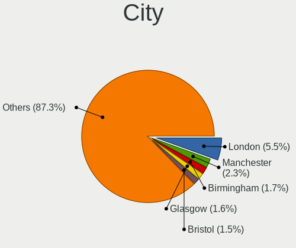
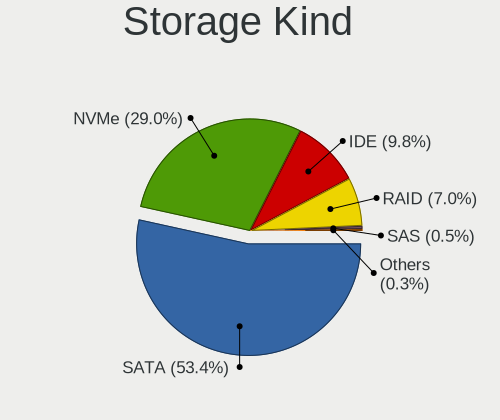
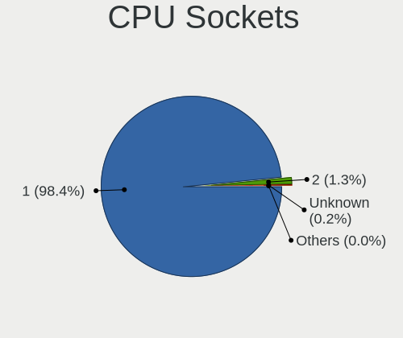
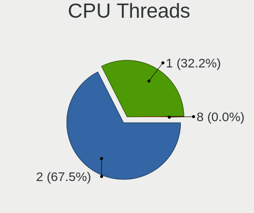
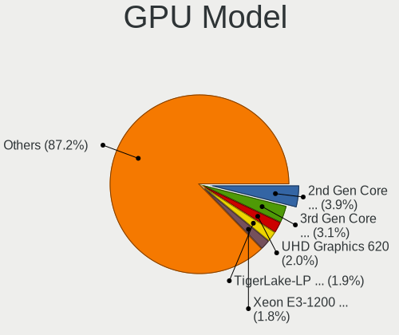
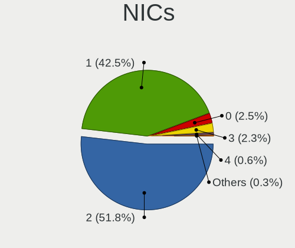
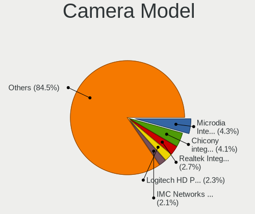

Linux in UK - Tested Hardware & Statistics
------------------------------------------

A project to collect tested hardware configurations for Linux in UK.

Anyone can contribute to this report by the [hw-probe](https://github.com/linuxhw/hw-probe) tool:

    sudo -E hw-probe -all -upload

Please contribute! Especially if your hardware is rare.

This is a report for all computer types. See also reports for [desktops](/Location/UK/Desktop/README.md) and [notebooks](/Location/UK/Notebook/README.md).

Contents
--------

* [ Test Cases ](#test-cases)

* [ System ](#system)
  - [ OS                       ](#os)
  - [ OS Family                ](#os-family)
  - [ Kernel                   ](#kernel)
  - [ Kernel Family            ](#kernel-family)
  - [ Kernel Major Ver.        ](#kernel-major-ver)
  - [ Arch                     ](#arch)
  - [ DE                       ](#de)
  - [ Display Server           ](#display-server)
  - [ Display Manager          ](#display-manager)
  - [ OS Lang                  ](#os-lang)
  - [ Boot Mode                ](#boot-mode)
  - [ Filesystem               ](#filesystem)
  - [ Part. scheme             ](#part-scheme)
  - [ Dual Boot with Linux/BSD ](#dual-boot-with-linuxbsd)
  - [ Dual Boot (Win)          ](#dual-boot-win)

* [ Board ](#board)
  - [ Vendor                   ](#vendor)
  - [ Model                    ](#model)
  - [ Model Family             ](#model-family)
  - [ MFG Year                 ](#mfg-year)
  - [ Form Factor              ](#form-factor)
  - [ Secure Boot              ](#secure-boot)
  - [ Coreboot                 ](#coreboot)
  - [ RAM Size                 ](#ram-size)
  - [ RAM Used                 ](#ram-used)
  - [ Total Drives             ](#total-drives)
  - [ Has CD-ROM               ](#has-cd-rom)
  - [ Has Ethernet             ](#has-ethernet)
  - [ Has WiFi                 ](#has-wifi)
  - [ Has Bluetooth            ](#has-bluetooth)

* [ Location ](#location)
  - [ Country                  ](#country)
  - [ City                     ](#city)

* [ Drives ](#drives)
  - [ Drive Vendor             ](#drive-vendor)
  - [ Drive Model              ](#drive-model)
  - [ HDD Vendor               ](#hdd-vendor)
  - [ SSD Vendor               ](#ssd-vendor)
  - [ Drive Kind               ](#drive-kind)
  - [ Drive Connector          ](#drive-connector)
  - [ Drive Size               ](#drive-size)
  - [ Space Total              ](#space-total)
  - [ Space Used               ](#space-used)
  - [ Malfunc. Drives          ](#malfunc-drives)
  - [ Malfunc. Drive Vendor    ](#malfunc-drive-vendor)
  - [ Malfunc. HDD Vendor      ](#malfunc-hdd-vendor)
  - [ Malfunc. Drive Kind      ](#malfunc-drive-kind)
  - [ Failed Drives            ](#failed-drives)
  - [ Failed Drive Vendor      ](#failed-drive-vendor)
  - [ Drive Status             ](#drive-status)

* [ Storage controller ](#storage-controller)
  - [ Storage Vendor           ](#storage-vendor)
  - [ Storage Model            ](#storage-model)
  - [ Storage Kind             ](#storage-kind)

* [ Processor ](#processor)
  - [ CPU Vendor               ](#cpu-vendor)
  - [ CPU Model                ](#cpu-model)
  - [ CPU Model Family         ](#cpu-model-family)
  - [ CPU Cores                ](#cpu-cores)
  - [ CPU Sockets              ](#cpu-sockets)
  - [ CPU Threads              ](#cpu-threads)
  - [ CPU Op-Modes             ](#cpu-op-modes)
  - [ CPU Microcode            ](#cpu-microcode)
  - [ CPU Microarch            ](#cpu-microarch)

* [ Graphics ](#graphics)
  - [ GPU Vendor               ](#gpu-vendor)
  - [ GPU Model                ](#gpu-model)
  - [ GPU Combo                ](#gpu-combo)
  - [ GPU Driver               ](#gpu-driver)
  - [ GPU Memory               ](#gpu-memory)

* [ Monitor ](#monitor)
  - [ Monitor Vendor           ](#monitor-vendor)
  - [ Monitor Model            ](#monitor-model)
  - [ Monitor Resolution       ](#monitor-resolution)
  - [ Monitor Diagonal         ](#monitor-diagonal)
  - [ Monitor Width            ](#monitor-width)
  - [ Aspect Ratio             ](#aspect-ratio)
  - [ Monitor Area             ](#monitor-area)
  - [ Pixel Density            ](#pixel-density)
  - [ Multiple Monitors        ](#multiple-monitors)

* [ Network ](#network)
  - [ Net Controller Vendor    ](#net-controller-vendor)
  - [ Net Controller Model     ](#net-controller-model)
  - [ Wireless Vendor          ](#wireless-vendor)
  - [ Wireless Model           ](#wireless-model)
  - [ Ethernet Vendor          ](#ethernet-vendor)
  - [ Ethernet Model           ](#ethernet-model)
  - [ Net Controller Kind      ](#net-controller-kind)
  - [ Used Controller          ](#used-controller)
  - [ NICs                     ](#nics)
  - [ IPv6                     ](#ipv6)

* [ Bluetooth ](#bluetooth)
  - [ Bluetooth Vendor         ](#bluetooth-vendor)
  - [ Bluetooth Model          ](#bluetooth-model)

* [ Sound ](#sound)
  - [ Sound Vendor             ](#sound-vendor)
  - [ Sound Model              ](#sound-model)

* [ Memory ](#memory)
  - [ Memory Vendor            ](#memory-vendor)
  - [ Memory Model             ](#memory-model)
  - [ Memory Kind              ](#memory-kind)
  - [ Memory Form Factor       ](#memory-form-factor)
  - [ Memory Size              ](#memory-size)
  - [ Memory Speed             ](#memory-speed)

* [ Printers & scanners ](#printers--scanners)
  - [ Printer Vendor           ](#printer-vendor)
  - [ Printer Model            ](#printer-model)
  - [ Scanner Vendor           ](#scanner-vendor)
  - [ Scanner Model            ](#scanner-model)

* [ Camera ](#camera)
  - [ Camera Vendor            ](#camera-vendor)
  - [ Camera Model             ](#camera-model)

* [ Security ](#security)
  - [ Fingerprint Vendor       ](#fingerprint-vendor)
  - [ Fingerprint Model        ](#fingerprint-model)
  - [ Chipcard Vendor          ](#chipcard-vendor)
  - [ Chipcard Model           ](#chipcard-model)

* [ Unsupported ](#unsupported)
  - [ Unsupported Devices      ](#unsupported-devices)
  - [ Unsupported Device Types ](#unsupported-device-types)

Test Cases
----------

Total: 10135

| Vendor        | Model                       | Form-Factor | Probe                                                      | Date         |
|---------------|-----------------------------|-------------|------------------------------------------------------------|--------------|
| Umbrel        | Home                        | Mini pc     | [f4afc80a6c](https://linux-hardware.org/?probe=f4afc80a6c) | Feb 28, 2023 |
| Alienware     | 15 R2                       | Notebook    | [f242145858](https://linux-hardware.org/?probe=f242145858) | Feb 28, 2023 |
| ASUSTek       | ROG Zephyrus G14 GA402RK... | Notebook    | [c698fc199a](https://linux-hardware.org/?probe=c698fc199a) | Feb 28, 2023 |
| Acer          | Aspire V3-371               | Notebook    | [bbc0d58ef1](https://linux-hardware.org/?probe=bbc0d58ef1) | Feb 28, 2023 |
| Lenovo        | 36F7 SDK0J40700 WIN 3258... | Desktop     | [48e150f274](https://linux-hardware.org/?probe=48e150f274) | Feb 28, 2023 |
| AZW           | Speed S                     | Desktop     | [e44ff0faf0](https://linux-hardware.org/?probe=e44ff0faf0) | Feb 28, 2023 |
| HP            | 83E2                        | Desktop     | [fdbe4ec1cb](https://linux-hardware.org/?probe=fdbe4ec1cb) | Feb 28, 2023 |
| Dell          | Latitude D630               | Notebook    | [5175558c99](https://linux-hardware.org/?probe=5175558c99) | Feb 28, 2023 |
| Dell          | Latitude E6440              | Notebook    | [80131cd2a4](https://linux-hardware.org/?probe=80131cd2a4) | Feb 28, 2023 |
| ASRock        | Z97 Pro3                    | Desktop     | [506d56faff](https://linux-hardware.org/?probe=506d56faff) | Feb 28, 2023 |
| AZW           | SEi                         | Notebook    | [6d0814dc9f](https://linux-hardware.org/?probe=6d0814dc9f) | Feb 28, 2023 |
| Microsoft     | Surface Pro 3               | Tablet      | [b3c4d2985e](https://linux-hardware.org/?probe=b3c4d2985e) | Feb 27, 2023 |
| Lenovo        | IdeaPadFlex 5 14ARE05 81... | Convertible | [b5a08d19e9](https://linux-hardware.org/?probe=b5a08d19e9) | Feb 27, 2023 |
| Dell          | 08NPPY A00                  | Desktop     | [66b1256bd3](https://linux-hardware.org/?probe=66b1256bd3) | Feb 27, 2023 |
| AZW           | SER                         | Mini pc     | [e086890e6a](https://linux-hardware.org/?probe=e086890e6a) | Feb 27, 2023 |
| ASRock        | Z97 Pro3                    | Desktop     | [626e67df35](https://linux-hardware.org/?probe=626e67df35) | Feb 27, 2023 |
| ASUSTek       | VivoBook_ASUSLaptop M760... | Notebook    | [003aa3d3e9](https://linux-hardware.org/?probe=003aa3d3e9) | Feb 27, 2023 |
| MSI           | MAG Z690 TOMAHAWK WIFI D... | Desktop     | [13edc00539](https://linux-hardware.org/?probe=13edc00539) | Feb 27, 2023 |
| Gigabyte      | B650 GAMING X AX            | Desktop     | [c2b3e01a45](https://linux-hardware.org/?probe=c2b3e01a45) | Feb 27, 2023 |
| Lenovo        | 3098 SDK0E50510 WIN         | Desktop     | [f15e5303f6](https://linux-hardware.org/?probe=f15e5303f6) | Feb 27, 2023 |
| MSI           | MAG Z690 TOMAHAWK WIFI D... | Desktop     | [fe1c90a3aa](https://linux-hardware.org/?probe=fe1c90a3aa) | Feb 26, 2023 |
| HP            | EliteBook x360 1030 G3      | Convertible | [1213e49ca8](https://linux-hardware.org/?probe=1213e49ca8) | Feb 26, 2023 |
| HP            | 1998                        | Desktop     | [90794415e9](https://linux-hardware.org/?probe=90794415e9) | Feb 26, 2023 |
| Panasonic     | CF-31WEUEEBE                | Notebook    | [40782ba0a7](https://linux-hardware.org/?probe=40782ba0a7) | Feb 26, 2023 |
| Gigabyte      | M68M-S2P                    | Desktop     | [15b2fe94ae](https://linux-hardware.org/?probe=15b2fe94ae) | Feb 26, 2023 |
| HP            | Pavilion g6                 | Notebook    | [556c1057a8](https://linux-hardware.org/?probe=556c1057a8) | Feb 26, 2023 |
| Gigabyte      | 970A-DS3P                   | Desktop     | [87647b8c76](https://linux-hardware.org/?probe=87647b8c76) | Feb 26, 2023 |
| Lenovo        | Yoga 9 14IAP7 82LU          | Convertible | [d6805fb81b](https://linux-hardware.org/?probe=d6805fb81b) | Feb 25, 2023 |
| Dell          | Inspiron 3542               | Notebook    | [64f304d41e](https://linux-hardware.org/?probe=64f304d41e) | Feb 25, 2023 |
| HP            | G62                         | Notebook    | [871207750c](https://linux-hardware.org/?probe=871207750c) | Feb 25, 2023 |
| Lenovo        | IdeaPad 305-15IBD 80NJ      | Notebook    | [42b9d60137](https://linux-hardware.org/?probe=42b9d60137) | Feb 25, 2023 |
| Dell          | Latitude E6440              | Notebook    | [a4139e4774](https://linux-hardware.org/?probe=a4139e4774) | Feb 25, 2023 |
| MSI           | Modern 14 B10MW             | Notebook    | [4f9e90413b](https://linux-hardware.org/?probe=4f9e90413b) | Feb 25, 2023 |
| HP            | Spectre x360 Convertible... | Convertible | [87df24d8c2](https://linux-hardware.org/?probe=87df24d8c2) | Feb 25, 2023 |
| ASRock        | Z390 Phantom Gaming-ITX/... | Desktop     | [d78e737aaf](https://linux-hardware.org/?probe=d78e737aaf) | Feb 25, 2023 |
| Dell          | 0VHWTR A01                  | Desktop     | [ab8247e106](https://linux-hardware.org/?probe=ab8247e106) | Feb 24, 2023 |
| HP            | Spectre x360 Convertible... | Convertible | [af9891267d](https://linux-hardware.org/?probe=af9891267d) | Feb 24, 2023 |
| Lenovo        | IdeaPad Z580                | Notebook    | [cf2ff6c04b](https://linux-hardware.org/?probe=cf2ff6c04b) | Feb 24, 2023 |
| HP            | Pavilion g6                 | Notebook    | [5cde621e0a](https://linux-hardware.org/?probe=5cde621e0a) | Feb 24, 2023 |
| Valve         | Jupiter                     | Notebook    | [df96e94417](https://linux-hardware.org/?probe=df96e94417) | Feb 24, 2023 |
| Toshiba       | Satellite C850-1GF          | Notebook    | [f568855409](https://linux-hardware.org/?probe=f568855409) | Feb 24, 2023 |
| Lenovo        | ThinkPad X390 Yoga 20NN0... | Convertible | [123771dbb2](https://linux-hardware.org/?probe=123771dbb2) | Feb 24, 2023 |
| Lenovo        | ThinkPad X390 Yoga 20NN0... | Convertible | [7f29da1b6c](https://linux-hardware.org/?probe=7f29da1b6c) | Feb 24, 2023 |
| Dell          | 0GXM1W A00                  | Desktop     | [e7edf0f7c3](https://linux-hardware.org/?probe=e7edf0f7c3) | Feb 23, 2023 |
| HP            | 1497                        | Desktop     | [478a5730f6](https://linux-hardware.org/?probe=478a5730f6) | Feb 23, 2023 |
| Lenovo        | IdeaPadFlex 5 14ARE05 81... | Convertible | [7780f02f45](https://linux-hardware.org/?probe=7780f02f45) | Feb 23, 2023 |
| Valve         | Jupiter                     | Notebook    | [8679998ec0](https://linux-hardware.org/?probe=8679998ec0) | Feb 23, 2023 |
| PC Special... | PD5x_7xPNP_PNN_PNT          | Notebook    | [cd71ec0b21](https://linux-hardware.org/?probe=cd71ec0b21) | Feb 23, 2023 |
| Dell          | 0NW6H5 A00                  | Desktop     | [8f307a87e5](https://linux-hardware.org/?probe=8f307a87e5) | Feb 23, 2023 |
| Dell          | 0NW6H5 A00                  | Desktop     | [781c058256](https://linux-hardware.org/?probe=781c058256) | Feb 23, 2023 |
| Lenovo        | Yoga Slim 7 ProX 14ARH7 ... | Notebook    | [f92ac89547](https://linux-hardware.org/?probe=f92ac89547) | Feb 23, 2023 |
| HP            | Spectre x360 Convertible... | Convertible | [c570bb75bf](https://linux-hardware.org/?probe=c570bb75bf) | Feb 23, 2023 |
| Gigabyte      | H81M-S2H                    | Desktop     | [c3d9b18f7c](https://linux-hardware.org/?probe=c3d9b18f7c) | Feb 23, 2023 |
| Lenovo        | V15-ADA 82C7                | Notebook    | [d19ee09dd3](https://linux-hardware.org/?probe=d19ee09dd3) | Feb 23, 2023 |
| Biostar       | B450MH                      | Desktop     | [7bd9274f23](https://linux-hardware.org/?probe=7bd9274f23) | Feb 23, 2023 |
| Samsung       | 530U3BI/530U4BI/530U4BH     | Notebook    | [2c74210fed](https://linux-hardware.org/?probe=2c74210fed) | Feb 23, 2023 |
| Dell          | Inspiron 5565               | Notebook    | [d88dce11ff](https://linux-hardware.org/?probe=d88dce11ff) | Feb 22, 2023 |
| Lenovo        | ThinkPad X230 2325EJ0       | Notebook    | [3a2c22e22b](https://linux-hardware.org/?probe=3a2c22e22b) | Feb 22, 2023 |
| Lenovo        | ThinkPad T430s 23551M9      | Notebook    | [91b6a109b4](https://linux-hardware.org/?probe=91b6a109b4) | Feb 22, 2023 |
| Lenovo        | ThinkPad X230 2325EJ0       | Notebook    | [06c8604990](https://linux-hardware.org/?probe=06c8604990) | Feb 22, 2023 |
| Apple         | MacBookPro14,1              | Notebook    | [f7f94aa827](https://linux-hardware.org/?probe=f7f94aa827) | Feb 22, 2023 |
| ASUSTek       | PRIME X399-A                | Desktop     | [4009d82fc8](https://linux-hardware.org/?probe=4009d82fc8) | Feb 22, 2023 |
| Google        | Droid                       | Notebook    | [e576f650b7](https://linux-hardware.org/?probe=e576f650b7) | Feb 22, 2023 |
| Gigabyte      | A320M-S2H-CF                | Desktop     | [67ba988b20](https://linux-hardware.org/?probe=67ba988b20) | Feb 21, 2023 |
| ASUSTek       | PRIME B550M-A               | Desktop     | [edbf6ce468](https://linux-hardware.org/?probe=edbf6ce468) | Feb 20, 2023 |
| ASUSTek       | ROG Zephyrus M16 GU603HE... | Notebook    | [c51d4ef82a](https://linux-hardware.org/?probe=c51d4ef82a) | Feb 20, 2023 |
| MSI           | B450 GAMING PRO CARBON M... | Desktop     | [fb4420dbc4](https://linux-hardware.org/?probe=fb4420dbc4) | Feb 20, 2023 |
| AZW           | SER V1.0                    | Mini pc     | [6799113f3e](https://linux-hardware.org/?probe=6799113f3e) | Feb 20, 2023 |
| Apple         | Mac-F227BEC8 PVT            | All in one  | [640cad4ab6](https://linux-hardware.org/?probe=640cad4ab6) | Feb 20, 2023 |
| HP            | Laptop 14s-fq0xxx           | Notebook    | [0bc03f3b39](https://linux-hardware.org/?probe=0bc03f3b39) | Feb 20, 2023 |
| Gigabyte      | A320M-H-CF                  | Desktop     | [11739ccfa1](https://linux-hardware.org/?probe=11739ccfa1) | Feb 20, 2023 |
| Gigabyte      | A320M-H-CF                  | Desktop     | [b184665592](https://linux-hardware.org/?probe=b184665592) | Feb 20, 2023 |
| Dell          | XPS 13 7390                 | Notebook    | [542077cc42](https://linux-hardware.org/?probe=542077cc42) | Feb 20, 2023 |
| Lenovo        | ThinkPad T440p 20AWS38H0... | Notebook    | [c79a8f48f9](https://linux-hardware.org/?probe=c79a8f48f9) | Feb 20, 2023 |
| Framework     | Laptop (12th Gen Intel C... | Notebook    | [63de5bef96](https://linux-hardware.org/?probe=63de5bef96) | Feb 20, 2023 |
| ASUSTek       | ROG Zephyrus M16 GU603HE... | Notebook    | [2ccbfb422e](https://linux-hardware.org/?probe=2ccbfb422e) | Feb 20, 2023 |
| HUAWEI        | MateBook X                  | Notebook    | [cae415dee6](https://linux-hardware.org/?probe=cae415dee6) | Feb 20, 2023 |
| HUAWEI        | MateBook X                  | Notebook    | [6fed527c1b](https://linux-hardware.org/?probe=6fed527c1b) | Feb 20, 2023 |
| ASUSTek       | ROG STRIX B550-F GAMING     | Desktop     | [375a3684e2](https://linux-hardware.org/?probe=375a3684e2) | Feb 19, 2023 |
| MSI           | Z390-A PRO                  | Desktop     | [0bcbc517ca](https://linux-hardware.org/?probe=0bcbc517ca) | Feb 19, 2023 |
| GEO           | GeoFlex 340                 | Convertible | [f347582e5c](https://linux-hardware.org/?probe=f347582e5c) | Feb 19, 2023 |
| Lenovo        | MAHOBAY NO DPK              | Desktop     | [e7e9625ffc](https://linux-hardware.org/?probe=e7e9625ffc) | Feb 19, 2023 |
| HP            | Pavilion g6                 | Notebook    | [f3552f5183](https://linux-hardware.org/?probe=f3552f5183) | Feb 19, 2023 |
| Lenovo        | ThinkPad E555 20DH000TUK    | Notebook    | [b2d5c9de8b](https://linux-hardware.org/?probe=b2d5c9de8b) | Feb 19, 2023 |
| Intel         | NUC11PHBi7 M26151-404       | Mini pc     | [2c41f563a1](https://linux-hardware.org/?probe=2c41f563a1) | Feb 19, 2023 |
| HP            | 250 G6 Notebook PC          | Notebook    | [c32182253e](https://linux-hardware.org/?probe=c32182253e) | Feb 19, 2023 |
| MSI           | Z97M GAMING                 | Desktop     | [e983a3704e](https://linux-hardware.org/?probe=e983a3704e) | Feb 19, 2023 |
| Gigabyte      | X670 AORUS ELITE AX         | Desktop     | [25c9923614](https://linux-hardware.org/?probe=25c9923614) | Feb 18, 2023 |
| ASUSTek       | ROG Strix G731GU_G731GU     | Notebook    | [03952a6c01](https://linux-hardware.org/?probe=03952a6c01) | Feb 18, 2023 |
| Intel         | JSL MRD                     | Desktop     | [5e021f6a92](https://linux-hardware.org/?probe=5e021f6a92) | Feb 18, 2023 |
| ASUSTek       | PN51-E1                     | Mini pc     | [ff9cd473da](https://linux-hardware.org/?probe=ff9cd473da) | Feb 18, 2023 |
| Lenovo        | Yoga 7 14ARB7 82QF          | Convertible | [22b75dc114](https://linux-hardware.org/?probe=22b75dc114) | Feb 18, 2023 |
| Gigabyte      | X570 AORUS ELITE            | Desktop     | [d0bb58e003](https://linux-hardware.org/?probe=d0bb58e003) | Feb 18, 2023 |
| Apple         | MacBookPro5,5               | Notebook    | [595103a203](https://linux-hardware.org/?probe=595103a203) | Feb 18, 2023 |
| PC Special... | NJ50_70CU                   | Notebook    | [68dd853397](https://linux-hardware.org/?probe=68dd853397) | Feb 17, 2023 |
| Lenovo        | IdeaPad 5 14IAL7 82SD       | Notebook    | [cd5e470881](https://linux-hardware.org/?probe=cd5e470881) | Feb 17, 2023 |
| HP            | Pavilion Gaming Laptop 1... | Notebook    | [0cd82bf0c0](https://linux-hardware.org/?probe=0cd82bf0c0) | Feb 17, 2023 |
| AAEON         | PICO-APL3 V1.0              | Desktop     | [4ef4f86a2e](https://linux-hardware.org/?probe=4ef4f86a2e) | Feb 17, 2023 |
| Acer          | Batman A01                  | Desktop     | [d7aaa8f1c8](https://linux-hardware.org/?probe=d7aaa8f1c8) | Feb 17, 2023 |
| Dell          | Latitude E5450              | Notebook    | [cd7e5d61f2](https://linux-hardware.org/?probe=cd7e5d61f2) | Feb 17, 2023 |
| ASUSTek       | ProArt Z690-CREATOR WIFI    | Desktop     | [8e3bad7795](https://linux-hardware.org/?probe=8e3bad7795) | Feb 17, 2023 |
| Dell          | Latitude E6410              | Notebook    | [58d4c40618](https://linux-hardware.org/?probe=58d4c40618) | Feb 17, 2023 |
| Lenovo        | ThinkBook 14-IIL 20SL       | Notebook    | [3042108dae](https://linux-hardware.org/?probe=3042108dae) | Feb 16, 2023 |
| Gigabyte      | 990FXA-UD3                  | Desktop     | [97e017594b](https://linux-hardware.org/?probe=97e017594b) | Feb 16, 2023 |
| Gigabyte      | A320M-S2H-CF                | Desktop     | [add68ac711](https://linux-hardware.org/?probe=add68ac711) | Feb 16, 2023 |
| Gigabyte      | 990FXA-UD3                  | Desktop     | [51b7c93a69](https://linux-hardware.org/?probe=51b7c93a69) | Feb 16, 2023 |
| ASUSTek       | ROG STRIX X670E-E GAMING... | Desktop     | [4275665066](https://linux-hardware.org/?probe=4275665066) | Feb 16, 2023 |
| Sony          | SVF1521Q1EW                 | Notebook    | [62503d2494](https://linux-hardware.org/?probe=62503d2494) | Feb 16, 2023 |
| Dell          | 0XPDFK A01                  | Desktop     | [146c38cbdf](https://linux-hardware.org/?probe=146c38cbdf) | Feb 16, 2023 |
| Lenovo        | ThinkBook 14-IIL 20SL       | Notebook    | [cec962a8f4](https://linux-hardware.org/?probe=cec962a8f4) | Feb 16, 2023 |
| HP            | Stream Notebook PC 14       | Notebook    | [ba59b583d2](https://linux-hardware.org/?probe=ba59b583d2) | Feb 16, 2023 |
| ASRock        | P67 Pro3                    | Desktop     | [37eb433eb3](https://linux-hardware.org/?probe=37eb433eb3) | Feb 15, 2023 |
| HP            | 1497                        | Desktop     | [1d55830595](https://linux-hardware.org/?probe=1d55830595) | Feb 15, 2023 |
| ASUSTek       | SABERTOOTH 990FX R2.0       | Desktop     | [5b6ce8f332](https://linux-hardware.org/?probe=5b6ce8f332) | Feb 15, 2023 |
| ASUSTek       | VivoBook_ASUSLaptop M760... | Notebook    | [043e92c2ee](https://linux-hardware.org/?probe=043e92c2ee) | Feb 15, 2023 |
| Apple         | MacBookPro10,2              | Notebook    | [178ef8e028](https://linux-hardware.org/?probe=178ef8e028) | Feb 15, 2023 |
| HP            | Notebook                    | Notebook    | [88703a5913](https://linux-hardware.org/?probe=88703a5913) | Feb 15, 2023 |
| ASUSTek       | M5A97 EVO R2.0              | Desktop     | [02bd82be1d](https://linux-hardware.org/?probe=02bd82be1d) | Feb 15, 2023 |
| Apple         | MacBookPro10,2              | Notebook    | [6650047151](https://linux-hardware.org/?probe=6650047151) | Feb 15, 2023 |
| Linx          | LINX1010B                   | Notebook    | [5ca377461f](https://linux-hardware.org/?probe=5ca377461f) | Feb 14, 2023 |
| ASUSTek       | TUF Gaming X570-PLUS        | Desktop     | [ac367ae940](https://linux-hardware.org/?probe=ac367ae940) | Feb 14, 2023 |
| Raspberry ... | Raspberry Pi 4 Model B R... | Soc         | [a5e9084f61](https://linux-hardware.org/?probe=a5e9084f61) | Feb 14, 2023 |
| Unknown       | T3 MRD                      | Notebook    | [df134a8199](https://linux-hardware.org/?probe=df134a8199) | Feb 14, 2023 |
| Lenovo        | ThinkPad S1 Yoga 12 20DL... | Notebook    | [e9faf4ce80](https://linux-hardware.org/?probe=e9faf4ce80) | Feb 14, 2023 |
| Unknown       | Unknown                     | Desktop     | [0ac84e31dd](https://linux-hardware.org/?probe=0ac84e31dd) | Feb 14, 2023 |
| ASUSTek       | PRIME B350M-E               | Desktop     | [84a46ec9ce](https://linux-hardware.org/?probe=84a46ec9ce) | Feb 14, 2023 |
| Valve         | Jupiter                     | Notebook    | [e362a7551c](https://linux-hardware.org/?probe=e362a7551c) | Feb 14, 2023 |
| Acer          | TravelMate P215-52          | Notebook    | [b4ac56b67d](https://linux-hardware.org/?probe=b4ac56b67d) | Feb 13, 2023 |
| Dell          | XPS 15 9520                 | Notebook    | [1263022267](https://linux-hardware.org/?probe=1263022267) | Feb 13, 2023 |
| Apple         | Mac-F2238AC8                | All in one  | [636997044b](https://linux-hardware.org/?probe=636997044b) | Feb 13, 2023 |
| Apple         | Mac-F2238AC8                | All in one  | [ed459f2bf2](https://linux-hardware.org/?probe=ed459f2bf2) | Feb 13, 2023 |
| Apple         | MacBook4,1                  | Notebook    | [dfb5b14f25](https://linux-hardware.org/?probe=dfb5b14f25) | Feb 13, 2023 |
| Dell          | Latitude E6530              | Notebook    | [c79c336ef7](https://linux-hardware.org/?probe=c79c336ef7) | Feb 13, 2023 |
| Dell          | Inspiron 7506 2n1           | Convertible | [2cb0dc3d69](https://linux-hardware.org/?probe=2cb0dc3d69) | Feb 13, 2023 |
| Intel         | D525MW AAE93082-401         | Desktop     | [6ab285c781](https://linux-hardware.org/?probe=6ab285c781) | Feb 13, 2023 |
| ASUSTek       | M5A97 LE R2.0               | Desktop     | [bb037d75a7](https://linux-hardware.org/?probe=bb037d75a7) | Feb 13, 2023 |
| ASRock        | 970 Pro3 R2.0               | Desktop     | [762dd6fa2e](https://linux-hardware.org/?probe=762dd6fa2e) | Feb 13, 2023 |
| ASUSTek       | P8Z68-V LE                  | Desktop     | [dcf82ccac5](https://linux-hardware.org/?probe=dcf82ccac5) | Feb 13, 2023 |
| ASUSTek       | ROG STRIX B650E-I GAMING... | Desktop     | [cd29998b19](https://linux-hardware.org/?probe=cd29998b19) | Feb 13, 2023 |
| Acer          | Aspire 5349                 | Notebook    | [8407710a28](https://linux-hardware.org/?probe=8407710a28) | Feb 12, 2023 |
| Acer          | H57M01                      | Desktop     | [4efe549cf2](https://linux-hardware.org/?probe=4efe549cf2) | Feb 12, 2023 |
| Gigabyte      | X570 AORUS XTREME           | Desktop     | [4f04a42167](https://linux-hardware.org/?probe=4f04a42167) | Feb 12, 2023 |
| Gigabyte      | X399 DESIGNARE EX-CF        | Desktop     | [4bcfe32668](https://linux-hardware.org/?probe=4bcfe32668) | Feb 12, 2023 |
| HP            | 17E2                        | Mini pc     | [e99d3c0a69](https://linux-hardware.org/?probe=e99d3c0a69) | Feb 12, 2023 |
| HUAWEI        | NBD-WXX9                    | Notebook    | [c8caa92db3](https://linux-hardware.org/?probe=c8caa92db3) | Feb 11, 2023 |
| Toshiba       | Satellite Pro C850-10N      | Notebook    | [d45ac3e79c](https://linux-hardware.org/?probe=d45ac3e79c) | Feb 11, 2023 |
| HP            | 17E2                        | Mini pc     | [ff80271dce](https://linux-hardware.org/?probe=ff80271dce) | Feb 11, 2023 |
| ASUSTek       | ROG Strix G512LI_G512LI     | Notebook    | [6c8760114a](https://linux-hardware.org/?probe=6c8760114a) | Feb 11, 2023 |
| Acer          | Swift SF314-43              | Notebook    | [60fed002e2](https://linux-hardware.org/?probe=60fed002e2) | Feb 11, 2023 |
| Dell          | 0J3C2F A00                  | Desktop     | [a3f08d08aa](https://linux-hardware.org/?probe=a3f08d08aa) | Feb 11, 2023 |
| HP            | 82A2                        | Desktop     | [fe327d8caa](https://linux-hardware.org/?probe=fe327d8caa) | Feb 11, 2023 |
| Acer          | TravelMate P253             | Notebook    | [8947050124](https://linux-hardware.org/?probe=8947050124) | Feb 11, 2023 |
| MSI           | PRO Z690-P DDR4             | Desktop     | [61d03fad19](https://linux-hardware.org/?probe=61d03fad19) | Feb 10, 2023 |
| Acer          | Aspire 5742G                | Notebook    | [ddde9bf34e](https://linux-hardware.org/?probe=ddde9bf34e) | Feb 10, 2023 |
| Gigabyte      | Z790 AORUS ELITE AX         | Desktop     | [e6bcd546ae](https://linux-hardware.org/?probe=e6bcd546ae) | Feb 10, 2023 |
| Dell          | Precision M4700             | Notebook    | [74f62c6131](https://linux-hardware.org/?probe=74f62c6131) | Feb 10, 2023 |
| Dell          | Precision M4700             | Notebook    | [797b766595](https://linux-hardware.org/?probe=797b766595) | Feb 10, 2023 |
| Gigabyte      | H310M H x.x                 | Desktop     | [a166b37ae5](https://linux-hardware.org/?probe=a166b37ae5) | Feb 10, 2023 |
| ASUSTek       | GL552VW                     | Notebook    | [c9ed530a00](https://linux-hardware.org/?probe=c9ed530a00) | Feb 10, 2023 |
| Novatech      | NL40_50CU                   | Notebook    | [cca307c7db](https://linux-hardware.org/?probe=cca307c7db) | Feb 10, 2023 |
| Lenovo        | ThinkPad T450 20BUA0PNUK    | Notebook    | [8837c33007](https://linux-hardware.org/?probe=8837c33007) | Feb 09, 2023 |
| HP            | EliteBook Folio 1040 G3     | Notebook    | [3209372a9d](https://linux-hardware.org/?probe=3209372a9d) | Feb 09, 2023 |
| HP            | ENVY x360 Convertible 15... | Convertible | [9f1a3a69ca](https://linux-hardware.org/?probe=9f1a3a69ca) | Feb 09, 2023 |
| ASUSTek       | TUF Gaming B560-PLUS WIF... | Desktop     | [9523b275e8](https://linux-hardware.org/?probe=9523b275e8) | Feb 09, 2023 |
| Dell          | Latitude 5511               | Notebook    | [05e11b64d6](https://linux-hardware.org/?probe=05e11b64d6) | Feb 09, 2023 |
| ASUSTek       | ROG STRIX B550-F GAMING     | Desktop     | [16af8175a4](https://linux-hardware.org/?probe=16af8175a4) | Feb 08, 2023 |
| Lenovo        | ThinkPad L560 20F2S0DA00    | Notebook    | [c9dd7aae2e](https://linux-hardware.org/?probe=c9dd7aae2e) | Feb 08, 2023 |
| Dell          | Latitude E6330              | Notebook    | [291e0fd64f](https://linux-hardware.org/?probe=291e0fd64f) | Feb 08, 2023 |
| Lenovo        | V14 G2 ALC 82KC             | Notebook    | [a1c831925b](https://linux-hardware.org/?probe=a1c831925b) | Feb 08, 2023 |
| Lenovo        | V14 G2 ALC 82KC             | Notebook    | [86c4416049](https://linux-hardware.org/?probe=86c4416049) | Feb 08, 2023 |
| HP            | EliteBook Folio 1040 G3     | Notebook    | [fa77bac136](https://linux-hardware.org/?probe=fa77bac136) | Feb 08, 2023 |
| HP            | EliteBook 745 G2            | Notebook    | [35cb1bce53](https://linux-hardware.org/?probe=35cb1bce53) | Feb 08, 2023 |
| HP            | Laptop 14-cm0xxx            | Notebook    | [5dfc3e2280](https://linux-hardware.org/?probe=5dfc3e2280) | Feb 08, 2023 |
| Lenovo        | ThinkPad X280 20KEA0VCUK    | Notebook    | [e39c3cefa0](https://linux-hardware.org/?probe=e39c3cefa0) | Feb 08, 2023 |
| Dell          | 0CRH6C A00                  | Desktop     | [fe0e64b291](https://linux-hardware.org/?probe=fe0e64b291) | Feb 08, 2023 |
| HP            | ProLiant DL360 Gen9         | Server      | [de9e7b35a2](https://linux-hardware.org/?probe=de9e7b35a2) | Feb 08, 2023 |
| HP            | EliteBook 745 G2            | Notebook    | [ce120b023c](https://linux-hardware.org/?probe=ce120b023c) | Feb 08, 2023 |
| ASUSTek       | ZenBook UX325EA_UX325EA     | Notebook    | [e32b918f95](https://linux-hardware.org/?probe=e32b918f95) | Feb 07, 2023 |
| HUAWEI        | NBD-WXX9                    | Notebook    | [2bb967f6b3](https://linux-hardware.org/?probe=2bb967f6b3) | Feb 07, 2023 |
| Dell          | Latitude 5330               | Notebook    | [30cd96be4d](https://linux-hardware.org/?probe=30cd96be4d) | Feb 07, 2023 |
| HP            | 85A0                        | All in one  | [8b7cfba471](https://linux-hardware.org/?probe=8b7cfba471) | Feb 07, 2023 |
| Lenovo        | Yoga 7 14ACN6 82N7          | Convertible | [397ff2069f](https://linux-hardware.org/?probe=397ff2069f) | Feb 07, 2023 |
| Dell          | 08DM12 A00                  | Server      | [4fcfb3fb2a](https://linux-hardware.org/?probe=4fcfb3fb2a) | Feb 07, 2023 |
| Lenovo        | ThinkPad T430 2349UXH       | Notebook    | [aea2246107](https://linux-hardware.org/?probe=aea2246107) | Feb 06, 2023 |
| Lenovo        | ThinkPad T430 2349UXH       | Notebook    | [24d1d2fa52](https://linux-hardware.org/?probe=24d1d2fa52) | Feb 06, 2023 |
| Google        | Samus                       | Notebook    | [0817ec0be1](https://linux-hardware.org/?probe=0817ec0be1) | Feb 06, 2023 |
| Apple         | Mac-FFE5EF870D7BA81A iMa... | All in one  | [0be0961649](https://linux-hardware.org/?probe=0be0961649) | Feb 06, 2023 |
| Apple         | Mac-FFE5EF870D7BA81A iMa... | All in one  | [5e59abda6e](https://linux-hardware.org/?probe=5e59abda6e) | Feb 06, 2023 |
| Acer          | Aspire E5-571               | Notebook    | [a50f302f00](https://linux-hardware.org/?probe=a50f302f00) | Feb 06, 2023 |
| Acer          | TravelMate P253             | Notebook    | [050d7b5d68](https://linux-hardware.org/?probe=050d7b5d68) | Feb 06, 2023 |
| Lenovo        | ThinkPad T420 4236KU9       | Notebook    | [f536be92d0](https://linux-hardware.org/?probe=f536be92d0) | Feb 06, 2023 |
| Dell          | Inspiron 5593               | Notebook    | [6c09a62b19](https://linux-hardware.org/?probe=6c09a62b19) | Feb 06, 2023 |
| HP            | EliteBook Folio 1040 G3     | Notebook    | [67d2b1fd55](https://linux-hardware.org/?probe=67d2b1fd55) | Feb 05, 2023 |
| ASUSTek       | M5A78L-M PLUS/USB3          | Desktop     | [eece150870](https://linux-hardware.org/?probe=eece150870) | Feb 05, 2023 |
| MSI           | MPG B550 GAMING PLUS        | Desktop     | [ba0666ad0b](https://linux-hardware.org/?probe=ba0666ad0b) | Feb 05, 2023 |
| Gigabyte      | X570 AORUS XTREME           | Desktop     | [770e825eba](https://linux-hardware.org/?probe=770e825eba) | Feb 05, 2023 |
| HP            | Notebook                    | Notebook    | [0ad701667d](https://linux-hardware.org/?probe=0ad701667d) | Feb 05, 2023 |
| HP            | Notebook                    | Notebook    | [37f601798c](https://linux-hardware.org/?probe=37f601798c) | Feb 05, 2023 |
| Apple         | MacBookPro13,1              | Notebook    | [76cf23841d](https://linux-hardware.org/?probe=76cf23841d) | Feb 05, 2023 |
| Gigabyte      | Z270N-WIFI-CF               | Desktop     | [5755b9feb0](https://linux-hardware.org/?probe=5755b9feb0) | Feb 05, 2023 |
| Gigabyte      | Z270N-WIFI-CF               | Desktop     | [bb6bee6af9](https://linux-hardware.org/?probe=bb6bee6af9) | Feb 05, 2023 |
| AZW           | SER                         | Mini pc     | [dd0c654d95](https://linux-hardware.org/?probe=dd0c654d95) | Feb 04, 2023 |
| Acer          | Aspire ES1-531              | Notebook    | [4d2872e685](https://linux-hardware.org/?probe=4d2872e685) | Feb 04, 2023 |
| GEO           | GeoBook 240                 | Notebook    | [861adcda52](https://linux-hardware.org/?probe=861adcda52) | Feb 04, 2023 |
| MSI           | Z77A-G43                    | Desktop     | [b85e438d00](https://linux-hardware.org/?probe=b85e438d00) | Feb 04, 2023 |
| Lenovo        | ThinkPad X240 20AMS1FW00    | Notebook    | [cee7b3fa93](https://linux-hardware.org/?probe=cee7b3fa93) | Feb 04, 2023 |
| GEO           | GeoBook 140                 | Notebook    | [a91fdaa5da](https://linux-hardware.org/?probe=a91fdaa5da) | Feb 04, 2023 |
| MSI           | MPG Z790 CARBON WIFI        | Desktop     | [a4b17f9deb](https://linux-hardware.org/?probe=a4b17f9deb) | Feb 04, 2023 |
| Lenovo        | ThinkPad X280 20KEA0VCUK    | Notebook    | [48d07b6859](https://linux-hardware.org/?probe=48d07b6859) | Feb 04, 2023 |
| Dell          | XPS 13 9380                 | Notebook    | [495ff876cf](https://linux-hardware.org/?probe=495ff876cf) | Feb 03, 2023 |
| ASUSTek       | PRIME X470-PRO              | Desktop     | [f9df27503f](https://linux-hardware.org/?probe=f9df27503f) | Feb 03, 2023 |
| MSI           | MPG Z790 CARBON WIFI        | Desktop     | [395e2c6424](https://linux-hardware.org/?probe=395e2c6424) | Feb 03, 2023 |
| Lenovo        | ThinkPad L15 Gen 3 21C7C... | Notebook    | [e23aca8e4b](https://linux-hardware.org/?probe=e23aca8e4b) | Feb 03, 2023 |
| Lenovo        | 3100 SDK0J40700 WIN 3258... | Desktop     | [ea223a4d57](https://linux-hardware.org/?probe=ea223a4d57) | Feb 03, 2023 |
| Star Labs     | StarBook                    | Notebook    | [98ad1bcab4](https://linux-hardware.org/?probe=98ad1bcab4) | Feb 03, 2023 |
| Star Labs     | StarBook                    | Notebook    | [5fe174bdd1](https://linux-hardware.org/?probe=5fe174bdd1) | Feb 03, 2023 |
| MSI           | Z77A-G43                    | Desktop     | [eb768bf205](https://linux-hardware.org/?probe=eb768bf205) | Feb 03, 2023 |
| MSI           | GS66 Stealth 10SF           | Notebook    | [1d3a68b4a0](https://linux-hardware.org/?probe=1d3a68b4a0) | Feb 03, 2023 |
| Lenovo        | B50-30 80ES                 | Notebook    | [3fb480c029](https://linux-hardware.org/?probe=3fb480c029) | Feb 03, 2023 |
| AZW           | SER                         | Mini pc     | [198a217d13](https://linux-hardware.org/?probe=198a217d13) | Feb 03, 2023 |
| Dell          | Latitude 5420               | Notebook    | [019540839e](https://linux-hardware.org/?probe=019540839e) | Feb 03, 2023 |
| HUAWEI        | NBLK-WAX9X                  | Notebook    | [f544702336](https://linux-hardware.org/?probe=f544702336) | Feb 03, 2023 |
| HP            | Laptop 15-da0xxx            | Notebook    | [21227757d0](https://linux-hardware.org/?probe=21227757d0) | Feb 02, 2023 |
| Toshiba       | Satellite L50D-B            | Notebook    | [457faa2485](https://linux-hardware.org/?probe=457faa2485) | Feb 02, 2023 |
| Notebook      | NL5xNU                      | Notebook    | [8bec95eb42](https://linux-hardware.org/?probe=8bec95eb42) | Feb 02, 2023 |
| Alienware     | M14xR2                      | Notebook    | [d7e3d61744](https://linux-hardware.org/?probe=d7e3d61744) | Feb 02, 2023 |
| Acer          | Aspire 5349                 | Notebook    | [edf1e65f78](https://linux-hardware.org/?probe=edf1e65f78) | Feb 02, 2023 |
| HP            | 2ADE                        | Desktop     | [b3735eb6c9](https://linux-hardware.org/?probe=b3735eb6c9) | Feb 02, 2023 |
| HP            | EliteBook x360 1030 G2      | Convertible | [6a440e41d7](https://linux-hardware.org/?probe=6a440e41d7) | Feb 02, 2023 |
| Apple         | Mac-F2268DC8                | All in one  | [0811d3d2f0](https://linux-hardware.org/?probe=0811d3d2f0) | Feb 02, 2023 |
| MSI           | X399 SLI PLUS               | Desktop     | [33f2d92922](https://linux-hardware.org/?probe=33f2d92922) | Feb 02, 2023 |
| Acer          | Aspire one 1-132            | Notebook    | [d66a972aa9](https://linux-hardware.org/?probe=d66a972aa9) | Feb 02, 2023 |
| Lenovo        | ThinkPad T470s 20HF0000U... | Notebook    | [d7a5b537d9](https://linux-hardware.org/?probe=d7a5b537d9) | Feb 01, 2023 |
| Apple         | Mac-F2268DC8                | All in one  | [b13dd2d455](https://linux-hardware.org/?probe=b13dd2d455) | Feb 01, 2023 |
| AMI           | Cherry Trail CR             | Desktop     | [162e744903](https://linux-hardware.org/?probe=162e744903) | Feb 01, 2023 |
| MSI           | B450 TOMAHAWK MAX           | Desktop     | [3f9519f358](https://linux-hardware.org/?probe=3f9519f358) | Jan 31, 2023 |
| HP            | Sona                        | Notebook    | [36a3d72172](https://linux-hardware.org/?probe=36a3d72172) | Jan 31, 2023 |
| HP            | 829A                        | Mini pc     | [a6925c200b](https://linux-hardware.org/?probe=a6925c200b) | Jan 31, 2023 |
| Dell          | 0P01GV A03                  | Desktop     | [b029e941fb](https://linux-hardware.org/?probe=b029e941fb) | Jan 30, 2023 |
| Lenovo        | Yoga 3 14 80JH              | Notebook    | [6c66b66a78](https://linux-hardware.org/?probe=6c66b66a78) | Jan 30, 2023 |
| Valve         | Jupiter                     | Notebook    | [9568a6f43d](https://linux-hardware.org/?probe=9568a6f43d) | Jan 30, 2023 |
| Lenovo        | 3136 SDK0J40697 WIN 3305... | Mini pc     | [8d62c84240](https://linux-hardware.org/?probe=8d62c84240) | Jan 30, 2023 |
| ASUSTek       | ROG STRIX B550-F GAMING     | Desktop     | [7743588036](https://linux-hardware.org/?probe=7743588036) | Jan 30, 2023 |
| ASUSTek       | PRIME X570-P                | Desktop     | [a05f6f2f6c](https://linux-hardware.org/?probe=a05f6f2f6c) | Jan 30, 2023 |
| ASUSTek       | ROG STRIX B550-F GAMING     | Desktop     | [0082cca600](https://linux-hardware.org/?probe=0082cca600) | Jan 30, 2023 |
| Intel         | NUC11PABi7 K90104-302       | Mini pc     | [6d867d07e1](https://linux-hardware.org/?probe=6d867d07e1) | Jan 30, 2023 |
| MSI           | H310M PRO-M2 PLUS           | Desktop     | [a96d93846a](https://linux-hardware.org/?probe=a96d93846a) | Jan 30, 2023 |
| Lenovo        | Yoga 510-14AST 80S9         | Convertible | [bb0384d993](https://linux-hardware.org/?probe=bb0384d993) | Jan 30, 2023 |
| AZW           | S5 V1.0                     | Mini pc     | [380088c986](https://linux-hardware.org/?probe=380088c986) | Jan 30, 2023 |
| Acer          | Aspire A515-52              | Notebook    | [51fa3ff577](https://linux-hardware.org/?probe=51fa3ff577) | Jan 30, 2023 |
| ASUSTek       | Z170 PRO GAMING             | Desktop     | [9b6a9a4ab5](https://linux-hardware.org/?probe=9b6a9a4ab5) | Jan 30, 2023 |
| ASUSTek       | GA15DH                      | Desktop     | [767fe59cb7](https://linux-hardware.org/?probe=767fe59cb7) | Jan 29, 2023 |
| ASUSTek       | P6T SE                      | Desktop     | [04ed0bd8b1](https://linux-hardware.org/?probe=04ed0bd8b1) | Jan 29, 2023 |
| MSI           | Z77A-G43                    | Desktop     | [873725bb74](https://linux-hardware.org/?probe=873725bb74) | Jan 29, 2023 |
| MSI           | Z77A-G43                    | Desktop     | [f489fe4f5d](https://linux-hardware.org/?probe=f489fe4f5d) | Jan 29, 2023 |
| HP            | Laptop 14-cm0xxx            | Notebook    | [9b93652159](https://linux-hardware.org/?probe=9b93652159) | Jan 29, 2023 |
| Valve         | Jupiter                     | Notebook    | [91ef57c9e5](https://linux-hardware.org/?probe=91ef57c9e5) | Jan 29, 2023 |
| ASUSTek       | ROG STRIX B550-F GAMING     | Desktop     | [5a7b54907f](https://linux-hardware.org/?probe=5a7b54907f) | Jan 29, 2023 |
| Clevo         | W240EU/W250EUQ/W270EUQ      | Notebook    | [3912652a13](https://linux-hardware.org/?probe=3912652a13) | Jan 29, 2023 |
| Razer         | Blade 15 (2022) - RZ09-0... | Notebook    | [41d33a9029](https://linux-hardware.org/?probe=41d33a9029) | Jan 29, 2023 |
| Dell          | Latitude E6530              | Notebook    | [87bca9f2a4](https://linux-hardware.org/?probe=87bca9f2a4) | Jan 29, 2023 |
| ASUSTek       | M5A97 R2.0                  | Desktop     | [845b3c6990](https://linux-hardware.org/?probe=845b3c6990) | Jan 28, 2023 |
| Gigabyte      | X570 AORUS MASTER           | Desktop     | [6b71ec1a01](https://linux-hardware.org/?probe=6b71ec1a01) | Jan 28, 2023 |
| ASUSTek       | M5A97 R2.0                  | Desktop     | [d7469767f6](https://linux-hardware.org/?probe=d7469767f6) | Jan 28, 2023 |
| HP            | ENVY Laptop 17-cg0xxx       | Notebook    | [ed1ce46901](https://linux-hardware.org/?probe=ed1ce46901) | Jan 28, 2023 |
| Dell          | Inspiron 14-3452            | Notebook    | [baf61affa2](https://linux-hardware.org/?probe=baf61affa2) | Jan 28, 2023 |
| HP            | EliteBook 845 G7 Noteboo... | Notebook    | [c4877a8bc3](https://linux-hardware.org/?probe=c4877a8bc3) | Jan 28, 2023 |
| Apple         | MacBookAir7,2               | Notebook    | [b5f0169944](https://linux-hardware.org/?probe=b5f0169944) | Jan 28, 2023 |
| HP            | ENVY Laptop 17-cg0xxx       | Notebook    | [ab3f84f96b](https://linux-hardware.org/?probe=ab3f84f96b) | Jan 28, 2023 |
| ASRock        | A320M-HDV R4.0              | Desktop     | [f447127e74](https://linux-hardware.org/?probe=f447127e74) | Jan 28, 2023 |
| HP            | 2B17                        | Desktop     | [8746c148c7](https://linux-hardware.org/?probe=8746c148c7) | Jan 28, 2023 |
| ASUSTek       | VivoBook_ASUSLaptop X513... | Notebook    | [0245809d6a](https://linux-hardware.org/?probe=0245809d6a) | Jan 28, 2023 |
| Lenovo        | 3151 SDK0J40697 WIN 3305... | Mini pc     | [6d4ecb5a00](https://linux-hardware.org/?probe=6d4ecb5a00) | Jan 27, 2023 |
| Notebook      | P17SM-A                     | Notebook    | [609a89ca14](https://linux-hardware.org/?probe=609a89ca14) | Jan 27, 2023 |
| HP            | EliteBook 8530w             | Notebook    | [f395c475c9](https://linux-hardware.org/?probe=f395c475c9) | Jan 27, 2023 |
| Dell          | 0CU409                      | Desktop     | [5da09834b4](https://linux-hardware.org/?probe=5da09834b4) | Jan 27, 2023 |
| Dell          | 0CU409                      | Desktop     | [06b8ea0f8e](https://linux-hardware.org/?probe=06b8ea0f8e) | Jan 27, 2023 |
| Dell          | 0XPDFK A01                  | Desktop     | [4611591cc9](https://linux-hardware.org/?probe=4611591cc9) | Jan 27, 2023 |
| Lenovo        | ThinkPad T530 24292DG       | Notebook    | [e171a529b9](https://linux-hardware.org/?probe=e171a529b9) | Jan 27, 2023 |
| ASUSTek       | ASUS TUF Gaming A17 FA70... | Notebook    | [5f1e1e4d00](https://linux-hardware.org/?probe=5f1e1e4d00) | Jan 27, 2023 |
| AZW           | S5 V1.0                     | Mini pc     | [a0b14899a8](https://linux-hardware.org/?probe=a0b14899a8) | Jan 27, 2023 |
| AZW           | S5 V1.0                     | Mini pc     | [3963660171](https://linux-hardware.org/?probe=3963660171) | Jan 27, 2023 |
| HP            | 212A                        | Desktop     | [5b9c217d02](https://linux-hardware.org/?probe=5b9c217d02) | Jan 27, 2023 |
| Dell          | Inspiron 15 3521            | Notebook    | [41f89081ff](https://linux-hardware.org/?probe=41f89081ff) | Jan 26, 2023 |
| Acer          | Aspire ES1-411              | Notebook    | [110767fd86](https://linux-hardware.org/?probe=110767fd86) | Jan 26, 2023 |
| MSI           | Katana GF66 11UE            | Notebook    | [aead8d4d18](https://linux-hardware.org/?probe=aead8d4d18) | Jan 26, 2023 |
| HP            | 1497                        | Desktop     | [21a3e07346](https://linux-hardware.org/?probe=21a3e07346) | Jan 26, 2023 |
| ASUSTek       | Zenbook UX5401ZAS_UX5401... | Notebook    | [de8222900d](https://linux-hardware.org/?probe=de8222900d) | Jan 26, 2023 |
| Lenovo        | ThinkPad S1 Yoga 20C0S0Q... | Notebook    | [cdd3eb5723](https://linux-hardware.org/?probe=cdd3eb5723) | Jan 26, 2023 |
| Notebook      | P17SM-A                     | Notebook    | [6ed204eca5](https://linux-hardware.org/?probe=6ed204eca5) | Jan 26, 2023 |
| Gigabyte      | Z87X-D3H-CF                 | Desktop     | [7fb86baa0e](https://linux-hardware.org/?probe=7fb86baa0e) | Jan 26, 2023 |
| Google        | Careena                     | Notebook    | [75ca1a25dd](https://linux-hardware.org/?probe=75ca1a25dd) | Jan 26, 2023 |
| AZW           | MINI S                      | Desktop     | [ce5e6b1504](https://linux-hardware.org/?probe=ce5e6b1504) | Jan 26, 2023 |
| ASUSTek       | TUF X299 MARK 2             | Desktop     | [fb83192f84](https://linux-hardware.org/?probe=fb83192f84) | Jan 26, 2023 |
| Lenovo        | Yoga 2 11 20332             | Notebook    | [6faa58b4a1](https://linux-hardware.org/?probe=6faa58b4a1) | Jan 26, 2023 |
| Lenovo        | Yoga 2 11 20332             | Notebook    | [f437e45107](https://linux-hardware.org/?probe=f437e45107) | Jan 26, 2023 |
| Dell          | Latitude 7210 2-in-1        | Tablet      | [3386aa1dce](https://linux-hardware.org/?probe=3386aa1dce) | Jan 25, 2023 |
| Lenovo        | Yoga 2 11 20332             | Notebook    | [9dfb8ac7b0](https://linux-hardware.org/?probe=9dfb8ac7b0) | Jan 25, 2023 |
| OEGStone      | C4100/C5100                 | Notebook    | [4365b7b231](https://linux-hardware.org/?probe=4365b7b231) | Jan 25, 2023 |
| Gigabyte      | H310M H x.x                 | Desktop     | [64ccdd32f5](https://linux-hardware.org/?probe=64ccdd32f5) | Jan 25, 2023 |
| ASUSTek       | SABERTOOTH 990FX R2.0       | Desktop     | [68c58308b8](https://linux-hardware.org/?probe=68c58308b8) | Jan 24, 2023 |
| Dell          | Latitude 5520               | Notebook    | [662284824b](https://linux-hardware.org/?probe=662284824b) | Jan 24, 2023 |
| MSI           | MAG B550 TOMAHAWK           | Desktop     | [c69db4d96f](https://linux-hardware.org/?probe=c69db4d96f) | Jan 24, 2023 |
| HP            | EliteBook 745 G2            | Notebook    | [0d073c35f4](https://linux-hardware.org/?probe=0d073c35f4) | Jan 24, 2023 |
| Dell          | 02P9X9 A00                  | Server      | [be7339e967](https://linux-hardware.org/?probe=be7339e967) | Jan 24, 2023 |
| ASUSTek       | PRIME X570-P                | Desktop     | [c8c9f53754](https://linux-hardware.org/?probe=c8c9f53754) | Jan 24, 2023 |
| Toshiba       | Satellite Pro C660          | Notebook    | [3ffb5ed458](https://linux-hardware.org/?probe=3ffb5ed458) | Jan 24, 2023 |
| ASUSTek       | Z87-WS                      | Desktop     | [da3028df45](https://linux-hardware.org/?probe=da3028df45) | Jan 23, 2023 |
| Lenovo        | IdeaPad Y510P 20217         | Notebook    | [97ca64cad1](https://linux-hardware.org/?probe=97ca64cad1) | Jan 23, 2023 |
| ASUSTek       | PRIME X370-PRO              | Desktop     | [1887a95d31](https://linux-hardware.org/?probe=1887a95d31) | Jan 23, 2023 |
| Lenovo        | ThinkPad X260 20F5S28R00    | Notebook    | [4f83721cab](https://linux-hardware.org/?probe=4f83721cab) | Jan 23, 2023 |
| Lenovo        | ThinkPad X260 20F5S28R00    | Notebook    | [9e12a145fd](https://linux-hardware.org/?probe=9e12a145fd) | Jan 23, 2023 |
| Lenovo        | IdeaPad 100-15IBD 80QQ      | Notebook    | [e9124adb70](https://linux-hardware.org/?probe=e9124adb70) | Jan 23, 2023 |
| HP            | OMEN by Laptop 16-b0xxx     | Notebook    | [e1eeca8eab](https://linux-hardware.org/?probe=e1eeca8eab) | Jan 23, 2023 |
| Dell          | 0TP406                      | Desktop     | [e169f52d32](https://linux-hardware.org/?probe=e169f52d32) | Jan 23, 2023 |
| ASUSTek       | PRIME H310T R2.0            | Desktop     | [4a6f5a78f9](https://linux-hardware.org/?probe=4a6f5a78f9) | Jan 23, 2023 |
| MSI           | B450M MORTAR MAX            | Desktop     | [4f5be0720a](https://linux-hardware.org/?probe=4f5be0720a) | Jan 23, 2023 |
| Lenovo        | Z51-70 80K6                 | Notebook    | [f0cce92dd4](https://linux-hardware.org/?probe=f0cce92dd4) | Jan 23, 2023 |
| Gigabyte      | H310M H x.x                 | Desktop     | [ac375e0fa7](https://linux-hardware.org/?probe=ac375e0fa7) | Jan 23, 2023 |
| Lenovo        | Flex 2-15D 20377            | Notebook    | [e4a2f02d89](https://linux-hardware.org/?probe=e4a2f02d89) | Jan 23, 2023 |
| Lenovo        | ThinkPad P16s Gen 1 21CK... | Notebook    | [37f26b2f10](https://linux-hardware.org/?probe=37f26b2f10) | Jan 23, 2023 |
| Sony          | SVF1521Q1EW                 | Notebook    | [1e8cceb35b](https://linux-hardware.org/?probe=1e8cceb35b) | Jan 23, 2023 |
| Gigabyte      | A320M-S2H-CF                | Desktop     | [7545ee3eb0](https://linux-hardware.org/?probe=7545ee3eb0) | Jan 22, 2023 |
| Dell          | Precision M6800             | Notebook    | [a6beff01de](https://linux-hardware.org/?probe=a6beff01de) | Jan 22, 2023 |
| Lenovo        | ThinkPad L380 20M50013UK    | Notebook    | [0729d0a10f](https://linux-hardware.org/?probe=0729d0a10f) | Jan 22, 2023 |
| HP            | 1905                        | Desktop     | [aaa3a9557c](https://linux-hardware.org/?probe=aaa3a9557c) | Jan 22, 2023 |
| MSI           | MAG X570 TOMAHAWK WIFI      | Desktop     | [6856fa4741](https://linux-hardware.org/?probe=6856fa4741) | Jan 21, 2023 |
| ASUSTek       | PRIME A320M-K               | Desktop     | [6419184e6e](https://linux-hardware.org/?probe=6419184e6e) | Jan 21, 2023 |
| ASUSTek       | M4N78-AM                    | Desktop     | [cf65d9f981](https://linux-hardware.org/?probe=cf65d9f981) | Jan 21, 2023 |
| Lenovo        | IdeaPad 1 14ADA05 82GW      | Notebook    | [d971cd0912](https://linux-hardware.org/?probe=d971cd0912) | Jan 21, 2023 |
| Razer x La... | TensorBook (late 2021)      | Notebook    | [9062d4274f](https://linux-hardware.org/?probe=9062d4274f) | Jan 21, 2023 |
| Lenovo        | IdeaPad 5 15ARE05 81YQ      | Notebook    | [fe4b24bf26](https://linux-hardware.org/?probe=fe4b24bf26) | Jan 21, 2023 |
| MSI           | MPG B550 GAMING EDGE WIF... | Desktop     | [db131543b4](https://linux-hardware.org/?probe=db131543b4) | Jan 21, 2023 |
| Lenovo        | 31900058 STD                | All in one  | [a079d28341](https://linux-hardware.org/?probe=a079d28341) | Jan 21, 2023 |
| Intel         | DQ67SW AAG12527-310         | Desktop     | [b7b8f92df1](https://linux-hardware.org/?probe=b7b8f92df1) | Jan 21, 2023 |
| Dell          | XPS 13 7390                 | Notebook    | [97b14c6835](https://linux-hardware.org/?probe=97b14c6835) | Jan 20, 2023 |
| ASUSTek       | ProArt Z690-CREATOR WIFI    | Desktop     | [2f6bd134ae](https://linux-hardware.org/?probe=2f6bd134ae) | Jan 20, 2023 |
| Sony          | SVE1513B4E                  | Notebook    | [cbd9f98f30](https://linux-hardware.org/?probe=cbd9f98f30) | Jan 20, 2023 |
| Dell          | 03NVJ6 A03                  | Desktop     | [4269f0e624](https://linux-hardware.org/?probe=4269f0e624) | Jan 20, 2023 |
| HP            | Unknown                     | Notebook    | [b82faadc9d](https://linux-hardware.org/?probe=b82faadc9d) | Jan 19, 2023 |
| ASUSTek       | PRIME A320M-K               | Desktop     | [9301fd6936](https://linux-hardware.org/?probe=9301fd6936) | Jan 19, 2023 |
| Dell          | XPS 13 7390                 | Notebook    | [01f3a78934](https://linux-hardware.org/?probe=01f3a78934) | Jan 19, 2023 |
| Dell          | XPS 15 9570                 | Notebook    | [ebd319efff](https://linux-hardware.org/?probe=ebd319efff) | Jan 19, 2023 |
| Apple         | MacBook8,1                  | Notebook    | [17e254a9ec](https://linux-hardware.org/?probe=17e254a9ec) | Jan 19, 2023 |
| HP            | 2AF3                        | Desktop     | [ac7c491076](https://linux-hardware.org/?probe=ac7c491076) | Jan 19, 2023 |
| Microsoft     | Surface Book 3              | Tablet      | [958e372993](https://linux-hardware.org/?probe=958e372993) | Jan 19, 2023 |
| PC Special... | Elimina Iv 17               | Notebook    | [72e46e7bad](https://linux-hardware.org/?probe=72e46e7bad) | Jan 18, 2023 |
| Toshiba       | Satellite L70-C-12H         | Notebook    | [aa6340dd48](https://linux-hardware.org/?probe=aa6340dd48) | Jan 18, 2023 |
| Novatech      | NL40_50CU                   | Notebook    | [395dab7c43](https://linux-hardware.org/?probe=395dab7c43) | Jan 18, 2023 |
| Dell          | Inspiron N5110              | Notebook    | [bf606ed50a](https://linux-hardware.org/?probe=bf606ed50a) | Jan 18, 2023 |
| HP            | 3396                        | Desktop     | [456080afe8](https://linux-hardware.org/?probe=456080afe8) | Jan 18, 2023 |
| MSI           | MAG B550 TOMAHAWK           | Desktop     | [4545e31cd2](https://linux-hardware.org/?probe=4545e31cd2) | Jan 18, 2023 |
| ASUSTek       | PRIME H510M-A               | Desktop     | [0ccab4b1e3](https://linux-hardware.org/?probe=0ccab4b1e3) | Jan 18, 2023 |
| Dell          | Latitude 5290 2-in-1        | Tablet      | [ff6ad7bf11](https://linux-hardware.org/?probe=ff6ad7bf11) | Jan 18, 2023 |
| Lenovo        | ThinkPad P16s Gen 1 21CK... | Notebook    | [4b8096c4d2](https://linux-hardware.org/?probe=4b8096c4d2) | Jan 18, 2023 |
| Lenovo        | IdeaPad 110S-11IBR 80WG     | Notebook    | [6d93895cac](https://linux-hardware.org/?probe=6d93895cac) | Jan 18, 2023 |
| Toshiba       | Satellite Pro C50-A-1E6     | Notebook    | [0306622813](https://linux-hardware.org/?probe=0306622813) | Jan 18, 2023 |
| Packard Be... | EasyNote TM82               | Notebook    | [49ae8de234](https://linux-hardware.org/?probe=49ae8de234) | Jan 18, 2023 |
| Microsoft     | Surface Book 3              | Tablet      | [be9f4d6758](https://linux-hardware.org/?probe=be9f4d6758) | Jan 18, 2023 |
| ASUSTek       | ROG Flow X13 GV301QH_GV3... | Notebook    | [03c7a9b8a1](https://linux-hardware.org/?probe=03c7a9b8a1) | Jan 18, 2023 |
| ASUSTek       | VivoBook_ASUSLaptop M350... | Notebook    | [84edd23a21](https://linux-hardware.org/?probe=84edd23a21) | Jan 18, 2023 |
| Dell          | Latitude E5440              | Notebook    | [eb945eac4e](https://linux-hardware.org/?probe=eb945eac4e) | Jan 18, 2023 |
| Notebook      | PCx0Dx                      | Notebook    | [658ed38b10](https://linux-hardware.org/?probe=658ed38b10) | Jan 17, 2023 |
| Notebook      | PCx0Dx                      | Notebook    | [44f839ccbd](https://linux-hardware.org/?probe=44f839ccbd) | Jan 17, 2023 |
| Dell          | 07PXPY A02                  | Server      | [d56ca4a374](https://linux-hardware.org/?probe=d56ca4a374) | Jan 17, 2023 |
| Toshiba       | Satellite C660              | Notebook    | [5012a7ccfc](https://linux-hardware.org/?probe=5012a7ccfc) | Jan 17, 2023 |
| Dell          | Latitude 5290 2-in-1        | Tablet      | [3dbc34a913](https://linux-hardware.org/?probe=3dbc34a913) | Jan 17, 2023 |
| ASUSTek       | VivoBook 12_ASUS Laptop ... | Notebook    | [d05225350d](https://linux-hardware.org/?probe=d05225350d) | Jan 17, 2023 |
| Unknown       | Unknown                     | Notebook    | [aea2d1af0a](https://linux-hardware.org/?probe=aea2d1af0a) | Jan 17, 2023 |
| Apple         | MacBookPro7,1               | Notebook    | [6445b08ce9](https://linux-hardware.org/?probe=6445b08ce9) | Jan 17, 2023 |
| ASUSTek       | ProArt Z690-CREATOR WIFI    | Desktop     | [16c9b323c6](https://linux-hardware.org/?probe=16c9b323c6) | Jan 17, 2023 |
| Apple         | MacBookPro7,1               | Notebook    | [5ff11074e0](https://linux-hardware.org/?probe=5ff11074e0) | Jan 17, 2023 |
| ASUSTek       | PRIME B450M-A               | Desktop     | [1c05ac2e28](https://linux-hardware.org/?probe=1c05ac2e28) | Jan 17, 2023 |
| HP            | Laptop 15-dw3xxx            | Notebook    | [ccce363b13](https://linux-hardware.org/?probe=ccce363b13) | Jan 17, 2023 |
| Gigabyte      | GA-MA785GMT-UD2H            | Desktop     | [83b98e5580](https://linux-hardware.org/?probe=83b98e5580) | Jan 17, 2023 |
| Valve         | Jupiter                     | Notebook    | [a75cdaa463](https://linux-hardware.org/?probe=a75cdaa463) | Jan 16, 2023 |
| Dell          | 0KRC95 A01                  | Desktop     | [4d39406938](https://linux-hardware.org/?probe=4d39406938) | Jan 16, 2023 |
| Gigabyte      | H310M H x.x                 | Desktop     | [64b395004f](https://linux-hardware.org/?probe=64b395004f) | Jan 16, 2023 |
| Microsoft     | Surface Go 2                | Tablet      | [5928caba96](https://linux-hardware.org/?probe=5928caba96) | Jan 16, 2023 |
| Microsoft     | Surface Go 2                | Tablet      | [798a9f2d30](https://linux-hardware.org/?probe=798a9f2d30) | Jan 16, 2023 |
| HP            | Spectre x360 Convertible... | Convertible | [1644be7e2e](https://linux-hardware.org/?probe=1644be7e2e) | Jan 16, 2023 |
| Lenovo        | IdeaPad 110S-11IBR 80WG     | Notebook    | [b1581dd523](https://linux-hardware.org/?probe=b1581dd523) | Jan 16, 2023 |
| PC Special... | P65_P67RGRERA               | Notebook    | [39b18604bf](https://linux-hardware.org/?probe=39b18604bf) | Jan 16, 2023 |
| Biostar       | H310MHP                     | Desktop     | [6495c0927b](https://linux-hardware.org/?probe=6495c0927b) | Jan 16, 2023 |
| Gigabyte      | EP45-DS4                    | Desktop     | [ef63262326](https://linux-hardware.org/?probe=ef63262326) | Jan 16, 2023 |
| HP            | Spectre x360 Convertible... | Convertible | [b73dacceb7](https://linux-hardware.org/?probe=b73dacceb7) | Jan 16, 2023 |
| MSI           | MPG X570 GAMING PLUS        | Desktop     | [02178066f5](https://linux-hardware.org/?probe=02178066f5) | Jan 16, 2023 |
| ASUSTek       | Zenbook UX5401ZAS_UX5401... | Notebook    | [31cf03aadd](https://linux-hardware.org/?probe=31cf03aadd) | Jan 15, 2023 |
| Gigabyte      | EP45-DS4                    | Desktop     | [9feae23438](https://linux-hardware.org/?probe=9feae23438) | Jan 15, 2023 |
| Lenovo        | ThinkPad X1 Extreme 2nd ... | Notebook    | [cb84c73399](https://linux-hardware.org/?probe=cb84c73399) | Jan 15, 2023 |
| Sony          | VGN-NW26M                   | Notebook    | [3660b874bc](https://linux-hardware.org/?probe=3660b874bc) | Jan 15, 2023 |
| Sony          | VGN-NW26M                   | Notebook    | [5b62bf0146](https://linux-hardware.org/?probe=5b62bf0146) | Jan 15, 2023 |
| Dell          | 03NVJ6 A02                  | Desktop     | [a16b955eed](https://linux-hardware.org/?probe=a16b955eed) | Jan 15, 2023 |
| Lenovo        | ThinkPad X1 Carbon 5th 2... | Notebook    | [dca583bf2e](https://linux-hardware.org/?probe=dca583bf2e) | Jan 15, 2023 |
| Toshiba       | Satellite Pro C50-A-1E6     | Notebook    | [9ec7c970da](https://linux-hardware.org/?probe=9ec7c970da) | Jan 15, 2023 |
| Gigabyte      | H310M H x.x                 | Desktop     | [0b80c9ddfb](https://linux-hardware.org/?probe=0b80c9ddfb) | Jan 15, 2023 |
| HP            | ENVY x360 Convertible 13... | Convertible | [ba3e47247a](https://linux-hardware.org/?probe=ba3e47247a) | Jan 15, 2023 |
| TUXEDO        | Pulse 15 Gen1               | Notebook    | [38d732c237](https://linux-hardware.org/?probe=38d732c237) | Jan 15, 2023 |
| Gigabyte      | AB350-Gaming-CF             | Desktop     | [85048ce95d](https://linux-hardware.org/?probe=85048ce95d) | Jan 15, 2023 |
| HP            | ZBook Firefly 14 inch G9... | Notebook    | [ca73cb526c](https://linux-hardware.org/?probe=ca73cb526c) | Jan 15, 2023 |
| Unknown       | Unknown                     | Desktop     | [0579b343cb](https://linux-hardware.org/?probe=0579b343cb) | Jan 15, 2023 |
| Microsoft     | Surface Pro 4               | Tablet      | [2c4864375c](https://linux-hardware.org/?probe=2c4864375c) | Jan 14, 2023 |
| Tactus        | GeoPad 110                  | Tablet      | [810d937888](https://linux-hardware.org/?probe=810d937888) | Jan 14, 2023 |
| Dell          | Inspiron N5110              | Notebook    | [20625ce99d](https://linux-hardware.org/?probe=20625ce99d) | Jan 14, 2023 |
| HP            | Pavilion g6                 | Notebook    | [7d44980bca](https://linux-hardware.org/?probe=7d44980bca) | Jan 14, 2023 |
| ASUSTek       | ROG STRIX X570-F GAMING     | Desktop     | [ebe7fa8c2a](https://linux-hardware.org/?probe=ebe7fa8c2a) | Jan 14, 2023 |
| ASUSTek       | ROG Flow X13 GV301QH_GV3... | Notebook    | [d113da489f](https://linux-hardware.org/?probe=d113da489f) | Jan 14, 2023 |
| ASUSTek       | P8H77-M PRO                 | Desktop     | [6b0992e510](https://linux-hardware.org/?probe=6b0992e510) | Jan 14, 2023 |
| Dell          | Inspiron 15 7510            | Notebook    | [67f4d14824](https://linux-hardware.org/?probe=67f4d14824) | Jan 14, 2023 |
| Valve         | Jupiter                     | Notebook    | [4d74819919](https://linux-hardware.org/?probe=4d74819919) | Jan 14, 2023 |
| Gigabyte      | Z77X-D3H                    | Desktop     | [4ef76b2644](https://linux-hardware.org/?probe=4ef76b2644) | Jan 14, 2023 |
| HP            | 805A                        | Desktop     | [5fdeec8d8a](https://linux-hardware.org/?probe=5fdeec8d8a) | Jan 14, 2023 |
| HP            | Presario F500 (GF795EA#A... | Notebook    | [588148e349](https://linux-hardware.org/?probe=588148e349) | Jan 14, 2023 |
| ASUSTek       | ROG Flow X13 GV301QH_GV3... | Notebook    | [da829cbbc7](https://linux-hardware.org/?probe=da829cbbc7) | Jan 14, 2023 |
| Lenovo        | ThinkBook 13s-IML 20RR      | Notebook    | [e4e7a1d245](https://linux-hardware.org/?probe=e4e7a1d245) | Jan 14, 2023 |
| HP            | Pavilion g6                 | Notebook    | [7672e1178a](https://linux-hardware.org/?probe=7672e1178a) | Jan 14, 2023 |
| PC Special... | P65_67RSRP                  | Notebook    | [c7baf1a126](https://linux-hardware.org/?probe=c7baf1a126) | Jan 14, 2023 |
| Alienware     | 17 R3                       | Notebook    | [d4cf3c4f4d](https://linux-hardware.org/?probe=d4cf3c4f4d) | Jan 14, 2023 |
| Dell          | 0P01GV A03                  | Desktop     | [0d1982257b](https://linux-hardware.org/?probe=0d1982257b) | Jan 13, 2023 |
| Gigabyte      | H310M H x.x                 | Desktop     | [4e45aef7b0](https://linux-hardware.org/?probe=4e45aef7b0) | Jan 13, 2023 |
| MSI           | PRO X670-P WIFI             | Desktop     | [8cffa1360f](https://linux-hardware.org/?probe=8cffa1360f) | Jan 13, 2023 |
| ASUSTek       | ROG STRIX B650E-I GAMING... | Desktop     | [5b50555e06](https://linux-hardware.org/?probe=5b50555e06) | Jan 13, 2023 |
| Gigabyte      | B650E AORUS MASTER          | Desktop     | [7a9514375b](https://linux-hardware.org/?probe=7a9514375b) | Jan 13, 2023 |
| Dell          | Vostro 3549                 | Notebook    | [b6970533c4](https://linux-hardware.org/?probe=b6970533c4) | Jan 13, 2023 |
| Gigabyte      | H310M H x.x                 | Desktop     | [bb92fab8d3](https://linux-hardware.org/?probe=bb92fab8d3) | Jan 13, 2023 |
| Apple         | Mac-F221BEC8                | Desktop     | [64a9cc7b90](https://linux-hardware.org/?probe=64a9cc7b90) | Jan 13, 2023 |
| Valve         | Jupiter                     | Notebook    | [41e26fa7a1](https://linux-hardware.org/?probe=41e26fa7a1) | Jan 13, 2023 |
| Apple         | Mac-F221BEC8                | Desktop     | [6b20e87c33](https://linux-hardware.org/?probe=6b20e87c33) | Jan 13, 2023 |
| AZW           | Green G3                    | Desktop     | [be99013601](https://linux-hardware.org/?probe=be99013601) | Jan 13, 2023 |
| Sony          | VPCEH3N6E                   | Notebook    | [15129f4c39](https://linux-hardware.org/?probe=15129f4c39) | Jan 12, 2023 |
| Lenovo        | ThinkPad T460 20FMS2BM00    | Notebook    | [afefa18c04](https://linux-hardware.org/?probe=afefa18c04) | Jan 12, 2023 |
| ASRock        | B450M Steel Legend          | Desktop     | [8309c81fdf](https://linux-hardware.org/?probe=8309c81fdf) | Jan 12, 2023 |
| ASRock        | X670E Steel Legend          | Desktop     | [508efb9c99](https://linux-hardware.org/?probe=508efb9c99) | Jan 12, 2023 |
| Gigabyte      | A320M-S2H-CF                | Desktop     | [f38e5f2a4e](https://linux-hardware.org/?probe=f38e5f2a4e) | Jan 12, 2023 |
| Lenovo        | ThinkPad T430 2347B85       | Notebook    | [01fce134df](https://linux-hardware.org/?probe=01fce134df) | Jan 12, 2023 |
| Dell          | 0Y5DDC A00                  | Desktop     | [76d5a2b12b](https://linux-hardware.org/?probe=76d5a2b12b) | Jan 12, 2023 |
| ASUSTek       | ROG Flow X13 GV301QH_GV3... | Notebook    | [ee7b0c337b](https://linux-hardware.org/?probe=ee7b0c337b) | Jan 12, 2023 |
| Google        | Link                        | Notebook    | [f73704d47a](https://linux-hardware.org/?probe=f73704d47a) | Jan 12, 2023 |
| ASUSTek       | ROG Flow X13 GV301QH_GV3... | Notebook    | [c3b6b8b400](https://linux-hardware.org/?probe=c3b6b8b400) | Jan 12, 2023 |
| Dell          | Latitude 3420               | Notebook    | [53b3f46e20](https://linux-hardware.org/?probe=53b3f46e20) | Jan 12, 2023 |
| MSI           | B350 PC MATE                | Desktop     | [f235ff785b](https://linux-hardware.org/?probe=f235ff785b) | Jan 12, 2023 |
| Lenovo        | ThinkBook 14 G2 ITL 20VD    | Notebook    | [606cb1231b](https://linux-hardware.org/?probe=606cb1231b) | Jan 12, 2023 |
| Sony          | VPCEH3N6E                   | Notebook    | [c10a0ccff5](https://linux-hardware.org/?probe=c10a0ccff5) | Jan 12, 2023 |
| ASUSTek       | ROG STRIX Z690-F GAMING ... | Desktop     | [2dadad3f74](https://linux-hardware.org/?probe=2dadad3f74) | Jan 12, 2023 |
| Lenovo        | ThinkPad T470s W10DG 20J... | Notebook    | [566725e667](https://linux-hardware.org/?probe=566725e667) | Jan 12, 2023 |
| Microsoft     | Surface Pro 3               | Tablet      | [0001dd4164](https://linux-hardware.org/?probe=0001dd4164) | Jan 12, 2023 |
| Gigabyte      | B450 AORUS M                | Desktop     | [a1f2661396](https://linux-hardware.org/?probe=a1f2661396) | Jan 11, 2023 |
| ASUSTek       | PN51-E1                     | Mini pc     | [96d07a0f9d](https://linux-hardware.org/?probe=96d07a0f9d) | Jan 11, 2023 |
| Lenovo        | ThinkPad W510 439123G       | Notebook    | [4fd1a4a217](https://linux-hardware.org/?probe=4fd1a4a217) | Jan 11, 2023 |
| Toshiba       | Satellite P50-C             | Notebook    | [1da161195b](https://linux-hardware.org/?probe=1da161195b) | Jan 11, 2023 |
| HP            | EliteBook 840 G4            | Notebook    | [680b0adb7b](https://linux-hardware.org/?probe=680b0adb7b) | Jan 11, 2023 |
| Dell          | 0HN7XN A01                  | Desktop     | [f0ba373485](https://linux-hardware.org/?probe=f0ba373485) | Jan 11, 2023 |
| Razer         | Blade 17 (2022) - RZ09-0... | Notebook    | [a25c10f2dd](https://linux-hardware.org/?probe=a25c10f2dd) | Jan 11, 2023 |
| Chuwi         | LarkBox Pro                 | Mini pc     | [d079d53d80](https://linux-hardware.org/?probe=d079d53d80) | Jan 10, 2023 |
| Gigabyte      | GA-78LMT-USB3 R2 sex        | Desktop     | [f91cb1b0e7](https://linux-hardware.org/?probe=f91cb1b0e7) | Jan 10, 2023 |
| Dell          | XPS 13 9365                 | Convertible | [2b4b7560b7](https://linux-hardware.org/?probe=2b4b7560b7) | Jan 10, 2023 |
| Gigabyte      | H510M H                     | Desktop     | [74cafb7a17](https://linux-hardware.org/?probe=74cafb7a17) | Jan 10, 2023 |
| Lenovo        | ThinkStation C20 4263BA7    | Desktop     | [38ff99d952](https://linux-hardware.org/?probe=38ff99d952) | Jan 10, 2023 |
| Acer          | Swift SF314-52              | Notebook    | [2dc4c5a4d8](https://linux-hardware.org/?probe=2dc4c5a4d8) | Jan 10, 2023 |
| HP            | ProBook 645 G2              | Notebook    | [1298e3efb0](https://linux-hardware.org/?probe=1298e3efb0) | Jan 10, 2023 |
| Gigabyte      | B450M DS3H-CF               | Desktop     | [d1c53542d8](https://linux-hardware.org/?probe=d1c53542d8) | Jan 10, 2023 |
| Google        | Sparky360                   | Notebook    | [68e8848fba](https://linux-hardware.org/?probe=68e8848fba) | Jan 10, 2023 |
| Razer x La... | TensorBook (late 2021)      | Notebook    | [d798473e75](https://linux-hardware.org/?probe=d798473e75) | Jan 09, 2023 |
| Gigabyte      | H61N-USB3                   | Desktop     | [fd5a06c33f](https://linux-hardware.org/?probe=fd5a06c33f) | Jan 09, 2023 |
| Dell          | 0D883F A06                  | Desktop     | [cae316a9ad](https://linux-hardware.org/?probe=cae316a9ad) | Jan 09, 2023 |
| Lenovo        | ThinkStation C20 4263BA7    | Desktop     | [c434b0e62f](https://linux-hardware.org/?probe=c434b0e62f) | Jan 09, 2023 |
| Acer          | Aspire 5732Z                | Notebook    | [f1edf0ce01](https://linux-hardware.org/?probe=f1edf0ce01) | Jan 09, 2023 |
| ASUSTek       | PRIME B360M-A               | Desktop     | [d903601066](https://linux-hardware.org/?probe=d903601066) | Jan 09, 2023 |
| Lenovo        | IdeaPad 500-15ISK 80NT      | Notebook    | [e86a06caea](https://linux-hardware.org/?probe=e86a06caea) | Jan 09, 2023 |
| HP            | 0AA4h                       | Desktop     | [e0776de36f](https://linux-hardware.org/?probe=e0776de36f) | Jan 09, 2023 |
| Gigabyte      | F2A68HM-HD2                 | Desktop     | [22df883df4](https://linux-hardware.org/?probe=22df883df4) | Jan 09, 2023 |
| Gigabyte      | F2A68HM-HD2                 | Desktop     | [0e705ced6f](https://linux-hardware.org/?probe=0e705ced6f) | Jan 09, 2023 |
| ASUSTek       | ROG STRIX Z690-F GAMING ... | Desktop     | [46ae333889](https://linux-hardware.org/?probe=46ae333889) | Jan 09, 2023 |
| Lenovo        | IdeaPad Gaming 3 15IMH05... | Notebook    | [ab227bc376](https://linux-hardware.org/?probe=ab227bc376) | Jan 09, 2023 |
| ASRock        | X370 Taichi                 | Desktop     | [9c3ea14006](https://linux-hardware.org/?probe=9c3ea14006) | Jan 09, 2023 |
| Dell          | XPS 15 9510                 | Notebook    | [ff6d324723](https://linux-hardware.org/?probe=ff6d324723) | Jan 08, 2023 |
| TUXEDO        | Pulse 15 Gen1               | Notebook    | [652db107e8](https://linux-hardware.org/?probe=652db107e8) | Jan 08, 2023 |
| Toshiba       | Satellite Pro L450D         | Notebook    | [a2a9c2e730](https://linux-hardware.org/?probe=a2a9c2e730) | Jan 08, 2023 |
| Dell          | 0P01GV A03                  | Desktop     | [c343ff064d](https://linux-hardware.org/?probe=c343ff064d) | Jan 08, 2023 |
| Gateway       | MX8716B                     | Notebook    | [b8b9890719](https://linux-hardware.org/?probe=b8b9890719) | Jan 08, 2023 |
| ASUSTek       | Z170 PRO GAMING/AURA        | Desktop     | [abc1a27105](https://linux-hardware.org/?probe=abc1a27105) | Jan 08, 2023 |
| Toshiba       | Satellite C660              | Notebook    | [c7fc660dd7](https://linux-hardware.org/?probe=c7fc660dd7) | Jan 08, 2023 |
| Dell          | Latitude E6400              | Notebook    | [9f15bde3f6](https://linux-hardware.org/?probe=9f15bde3f6) | Jan 08, 2023 |
| Dell          | Latitude 5290               | Notebook    | [1cd20e22fc](https://linux-hardware.org/?probe=1cd20e22fc) | Jan 07, 2023 |
| ASUSTek       | M5A78L-M/USB3               | Desktop     | [24b5e0ba8e](https://linux-hardware.org/?probe=24b5e0ba8e) | Jan 07, 2023 |
| ASRock        | AB350 Pro4                  | Desktop     | [f70583b34b](https://linux-hardware.org/?probe=f70583b34b) | Jan 07, 2023 |
| Fanless Mi... | Rev JSL1                    | Mini pc     | [57433162a0](https://linux-hardware.org/?probe=57433162a0) | Jan 07, 2023 |
| HP            | EliteBook 6930p             | Notebook    | [9a59c21db0](https://linux-hardware.org/?probe=9a59c21db0) | Jan 07, 2023 |
| ASUSTek       | ProArt Z490-CREATOR 10G     | Desktop     | [e7ee03968d](https://linux-hardware.org/?probe=e7ee03968d) | Jan 07, 2023 |
| Dell          | 09M8Y8 A01                  | Desktop     | [f6d81f424d](https://linux-hardware.org/?probe=f6d81f424d) | Jan 07, 2023 |
| ASUSTek       | M5A78L-M/USB3               | Desktop     | [f9fe18f923](https://linux-hardware.org/?probe=f9fe18f923) | Jan 07, 2023 |
| Gigabyte      | F2A68HM-HD2                 | Desktop     | [ae3de33f00](https://linux-hardware.org/?probe=ae3de33f00) | Jan 07, 2023 |
| Lenovo        | ThinkPad T470 W10DG 20JN... | Notebook    | [1239be31f9](https://linux-hardware.org/?probe=1239be31f9) | Jan 07, 2023 |
| Valve         | Jupiter                     | Notebook    | [17c9c6288e](https://linux-hardware.org/?probe=17c9c6288e) | Jan 07, 2023 |
| Gigabyte      | B550M DS3H                  | Desktop     | [e2304eaaf2](https://linux-hardware.org/?probe=e2304eaaf2) | Jan 07, 2023 |
| Lenovo        | ThinkPad X131e 33711Q7      | Notebook    | [3336313cae](https://linux-hardware.org/?probe=3336313cae) | Jan 06, 2023 |
| Gigabyte      | GA-78LMT-USB3               | Desktop     | [4ceeb719c2](https://linux-hardware.org/?probe=4ceeb719c2) | Jan 06, 2023 |
| Gigabyte      | GA-78LMT-USB3               | Desktop     | [d930da3de0](https://linux-hardware.org/?probe=d930da3de0) | Jan 06, 2023 |
| ASRock        | B450M Pro4-F                | Desktop     | [f489c93a99](https://linux-hardware.org/?probe=f489c93a99) | Jan 06, 2023 |
| HP            | ProLiant DL360 Gen9         | Server      | [a456485950](https://linux-hardware.org/?probe=a456485950) | Jan 06, 2023 |
| Intel         | NUC8BEB J72693-305          | Mini pc     | [ad64106497](https://linux-hardware.org/?probe=ad64106497) | Jan 06, 2023 |
| Gigabyte      | B550M DS3H                  | Desktop     | [3978c4253f](https://linux-hardware.org/?probe=3978c4253f) | Jan 06, 2023 |
| ASRock        | P67 Pro3                    | Desktop     | [ae45dfd30e](https://linux-hardware.org/?probe=ae45dfd30e) | Jan 06, 2023 |
| ASUSTek       | VivoBook_ASUSLaptop X415... | Notebook    | [cf94b53a8b](https://linux-hardware.org/?probe=cf94b53a8b) | Jan 05, 2023 |
| Dell          | Dimension 4500S             | Desktop     | [5b907b07e4](https://linux-hardware.org/?probe=5b907b07e4) | Jan 05, 2023 |
| ASUSTek       | P8H61-MX R2.0               | Desktop     | [3e4b14919e](https://linux-hardware.org/?probe=3e4b14919e) | Jan 05, 2023 |
| Lenovo        | ThinkPad X131e 33711Q7      | Notebook    | [7e0f8a38bf](https://linux-hardware.org/?probe=7e0f8a38bf) | Jan 04, 2023 |
| ASUSTek       | ROG STRIX B350-F GAMING     | Desktop     | [b063be9f2e](https://linux-hardware.org/?probe=b063be9f2e) | Jan 04, 2023 |
| Dell          | Latitude 5290 2-in-1        | Tablet      | [4c54844f40](https://linux-hardware.org/?probe=4c54844f40) | Jan 04, 2023 |
| Lenovo        | Z51-70 80K6                 | Notebook    | [19a3a4f1c3](https://linux-hardware.org/?probe=19a3a4f1c3) | Jan 04, 2023 |
| Lenovo        | Z51-70 80K6                 | Notebook    | [c1a3bf015a](https://linux-hardware.org/?probe=c1a3bf015a) | Jan 04, 2023 |
| ASUSTek       | ROG STRIX B550-F GAMING     | Desktop     | [abbff7d42a](https://linux-hardware.org/?probe=abbff7d42a) | Jan 04, 2023 |
| Sony          | VPCEH3N6E                   | Notebook    | [5253826cac](https://linux-hardware.org/?probe=5253826cac) | Jan 04, 2023 |
| ASUSTek       | VivoBook_ASUSLaptop X705... | Notebook    | [d83005eb10](https://linux-hardware.org/?probe=d83005eb10) | Jan 03, 2023 |
| ASUSTek       | TUF Gaming X570-PLUS        | Desktop     | [0c84118baf](https://linux-hardware.org/?probe=0c84118baf) | Jan 03, 2023 |
| ASUSTek       | PRIME A320M-K               | Desktop     | [671b852e29](https://linux-hardware.org/?probe=671b852e29) | Jan 03, 2023 |
| MSI           | B550M PRO-VDH WIFI          | Desktop     | [73de62ce79](https://linux-hardware.org/?probe=73de62ce79) | Jan 03, 2023 |
| HP            | 83F3                        | Desktop     | [d53e207581](https://linux-hardware.org/?probe=d53e207581) | Jan 03, 2023 |
| MSI           | 2A9C                        | Desktop     | [48fc400420](https://linux-hardware.org/?probe=48fc400420) | Jan 03, 2023 |
| ASUSTek       | X102BA                      | Notebook    | [5ccb37c1d7](https://linux-hardware.org/?probe=5ccb37c1d7) | Jan 03, 2023 |
| ASUSTek       | X102BA                      | Notebook    | [bd49b43116](https://linux-hardware.org/?probe=bd49b43116) | Jan 03, 2023 |
| ASUSTek       | VivoBook 15_ASUS Laptop ... | Notebook    | [aa875f1083](https://linux-hardware.org/?probe=aa875f1083) | Jan 02, 2023 |
| ASUSTek       | VivoBook 15_ASUS Laptop ... | Notebook    | [9ed57548b6](https://linux-hardware.org/?probe=9ed57548b6) | Jan 02, 2023 |
| HP            | EliteBook 840 G8 Noteboo... | Notebook    | [90603e4ab3](https://linux-hardware.org/?probe=90603e4ab3) | Jan 02, 2023 |
| Acer          | Aspire TC-280               | Desktop     | [a3d030fdc2](https://linux-hardware.org/?probe=a3d030fdc2) | Jan 02, 2023 |
| Intel         | NUC7i3DNB J57625-512        | Mini pc     | [6a90fa6693](https://linux-hardware.org/?probe=6a90fa6693) | Jan 02, 2023 |
| Valve         | Jupiter                     | Notebook    | [ae42b505d4](https://linux-hardware.org/?probe=ae42b505d4) | Jan 02, 2023 |
| Samsung       | 350V5C/351V5C/3540VC/344... | Notebook    | [7ff55c14b4](https://linux-hardware.org/?probe=7ff55c14b4) | Jan 02, 2023 |
| Acer          | Aspire A315-31              | Notebook    | [4a79c65764](https://linux-hardware.org/?probe=4a79c65764) | Jan 02, 2023 |
| Dell          | 0PU052                      | Desktop     | [82740aac1d](https://linux-hardware.org/?probe=82740aac1d) | Jan 02, 2023 |
| Dell          | 0PU052                      | Desktop     | [e40981850d](https://linux-hardware.org/?probe=e40981850d) | Jan 02, 2023 |
| HP            | 8350                        | Desktop     | [3ab0d55a41](https://linux-hardware.org/?probe=3ab0d55a41) | Jan 02, 2023 |
| Toshiba       | Satellite C850-1GL          | Notebook    | [6326869c9e](https://linux-hardware.org/?probe=6326869c9e) | Jan 02, 2023 |
| Valve         | Jupiter                     | Notebook    | [72a2446cd3](https://linux-hardware.org/?probe=72a2446cd3) | Jan 02, 2023 |
| ASRock        | FM2A88M-HD+ R2.0            | Desktop     | [8e9080dc74](https://linux-hardware.org/?probe=8e9080dc74) | Jan 01, 2023 |
| MSI           | B550M PRO-VDH WIFI          | Desktop     | [03ca911bb7](https://linux-hardware.org/?probe=03ca911bb7) | Jan 01, 2023 |
| Advent        | Modena M201 Blue            | Notebook    | [abaae97a6f](https://linux-hardware.org/?probe=abaae97a6f) | Jan 01, 2023 |
| Dell          | Inspiron 5580               | Notebook    | [c6a044c898](https://linux-hardware.org/?probe=c6a044c898) | Jan 01, 2023 |
| Gigabyte      | H81M-DS2V                   | Desktop     | [8e5b57a9f8](https://linux-hardware.org/?probe=8e5b57a9f8) | Jan 01, 2023 |
| Toshiba       | EQUIUM A100                 | Notebook    | [424904034a](https://linux-hardware.org/?probe=424904034a) | Jan 01, 2023 |
| Dell          | Latitude E7270              | Notebook    | [09f72d101d](https://linux-hardware.org/?probe=09f72d101d) | Jan 01, 2023 |
| Toshiba       | Satellite C50-B             | Notebook    | [b1007671e3](https://linux-hardware.org/?probe=b1007671e3) | Jan 01, 2023 |
| Packard Be... | EasyNote TM97               | Notebook    | [fad44d67ab](https://linux-hardware.org/?probe=fad44d67ab) | Jan 01, 2023 |
| Valve         | Jupiter                     | Notebook    | [10366e2627](https://linux-hardware.org/?probe=10366e2627) | Jan 01, 2023 |
| Valve         | Jupiter                     | Notebook    | [c0fb48bccb](https://linux-hardware.org/?probe=c0fb48bccb) | Dec 31, 2022 |
| Dell          | 0JP3NX A01                  | Desktop     | [0749146323](https://linux-hardware.org/?probe=0749146323) | Dec 31, 2022 |
| Lenovo        | ThinkPad P16s Gen 1 21BT... | Notebook    | [b68fa80860](https://linux-hardware.org/?probe=b68fa80860) | Dec 31, 2022 |
| ASUSTek       | ROG STRIX X570-F GAMING     | Desktop     | [7e22db9b23](https://linux-hardware.org/?probe=7e22db9b23) | Dec 31, 2022 |
| Lenovo        | Yoga 2 13 20344             | Notebook    | [39c9c8aaea](https://linux-hardware.org/?probe=39c9c8aaea) | Dec 31, 2022 |
| MSI           | Z170A GAMING PRO CARBON     | Desktop     | [7c96c6776e](https://linux-hardware.org/?probe=7c96c6776e) | Dec 31, 2022 |
| Dell          | Latitude E5440              | Notebook    | [9578ad1ea3](https://linux-hardware.org/?probe=9578ad1ea3) | Dec 31, 2022 |
| HP            | 840A                        | Desktop     | [ad51866fe9](https://linux-hardware.org/?probe=ad51866fe9) | Dec 31, 2022 |
| Valve         | Jupiter                     | Notebook    | [294144217a](https://linux-hardware.org/?probe=294144217a) | Dec 30, 2022 |
| Raspberry ... | Raspberry Pi 2 Model B R... | Soc         | [74b3157c61](https://linux-hardware.org/?probe=74b3157c61) | Dec 30, 2022 |
| Lenovo        | ThinkPad T480 20L50000UK    | Notebook    | [5043868e71](https://linux-hardware.org/?probe=5043868e71) | Dec 30, 2022 |
| ASUSTek       | Z170M-PLUS                  | Desktop     | [858fd62d74](https://linux-hardware.org/?probe=858fd62d74) | Dec 30, 2022 |
| Samsung       | 3570R/370R/470R/450R/510... | Notebook    | [465d2da36b](https://linux-hardware.org/?probe=465d2da36b) | Dec 30, 2022 |
| HP            | ZBook Studio G5             | Notebook    | [6d0b6881ac](https://linux-hardware.org/?probe=6d0b6881ac) | Dec 30, 2022 |
| ASRock        | X670E Steel Legend          | Desktop     | [6aa950201f](https://linux-hardware.org/?probe=6aa950201f) | Dec 30, 2022 |
| HP            | Pavilion Laptop 15-cw1xx... | Notebook    | [7a685e175c](https://linux-hardware.org/?probe=7a685e175c) | Dec 30, 2022 |
| Toshiba       | Satellite C850-1GL          | Notebook    | [f6f61f1841](https://linux-hardware.org/?probe=f6f61f1841) | Dec 30, 2022 |
| Toshiba       | Satellite C850-1GL          | Notebook    | [796edd73f6](https://linux-hardware.org/?probe=796edd73f6) | Dec 30, 2022 |
| HP            | EliteBook 840 G7 Noteboo... | Notebook    | [e7a5c8704b](https://linux-hardware.org/?probe=e7a5c8704b) | Dec 30, 2022 |
| HP            | EliteBook 840 G7 Noteboo... | Notebook    | [fa210be351](https://linux-hardware.org/?probe=fa210be351) | Dec 30, 2022 |
| MSI           | Stealth GS66 12UGS          | Notebook    | [da812c8fa2](https://linux-hardware.org/?probe=da812c8fa2) | Dec 30, 2022 |
| Lenovo        | ThinkStation C20 4263BA7    | Desktop     | [7b55955e2a](https://linux-hardware.org/?probe=7b55955e2a) | Dec 30, 2022 |
| Apple         | MacBookAir9,1               | Notebook    | [d560c94d76](https://linux-hardware.org/?probe=d560c94d76) | Dec 30, 2022 |
| Dell          | Inspiron N5110              | Notebook    | [08682d735c](https://linux-hardware.org/?probe=08682d735c) | Dec 30, 2022 |
| Acer          | Swift SF314-57G             | Notebook    | [9d71d087d8](https://linux-hardware.org/?probe=9d71d087d8) | Dec 29, 2022 |
| HP            | Pavilion Gaming Laptop 1... | Notebook    | [23d1e04f4c](https://linux-hardware.org/?probe=23d1e04f4c) | Dec 29, 2022 |
| Lenovo        | Z50-70 20354                | Notebook    | [7b8f5e4379](https://linux-hardware.org/?probe=7b8f5e4379) | Dec 29, 2022 |
| Samsung       | NB30/N146                   | Notebook    | [7f9b976789](https://linux-hardware.org/?probe=7f9b976789) | Dec 29, 2022 |
| Lenovo        | ThinkPad T480 20L50000UK    | Notebook    | [f5cbe897b8](https://linux-hardware.org/?probe=f5cbe897b8) | Dec 29, 2022 |
| Unknown       | Unknown                     | Notebook    | [0c7bea2d0f](https://linux-hardware.org/?probe=0c7bea2d0f) | Dec 29, 2022 |
| PC Special... | PCX0DX                      | Notebook    | [0a33ad889c](https://linux-hardware.org/?probe=0a33ad889c) | Dec 28, 2022 |
| ASUSTek       | PRIME B450-PLUS             | Desktop     | [e9a313bb81](https://linux-hardware.org/?probe=e9a313bb81) | Dec 28, 2022 |
| HP            | 840A                        | Desktop     | [85b8b7f9b1](https://linux-hardware.org/?probe=85b8b7f9b1) | Dec 28, 2022 |
| ASUSTek       | ROG STRIX B450-F GAMING     | Desktop     | [24b822291e](https://linux-hardware.org/?probe=24b822291e) | Dec 28, 2022 |
| Lenovo        | ThinkPad T480 20L50000UK    | Notebook    | [41f77d037b](https://linux-hardware.org/?probe=41f77d037b) | Dec 28, 2022 |
| Alienware     | M11x R2                     | Notebook    | [a0da72bec0](https://linux-hardware.org/?probe=a0da72bec0) | Dec 28, 2022 |
| Dell          | 0D883F A06                  | Desktop     | [23c5689182](https://linux-hardware.org/?probe=23c5689182) | Dec 28, 2022 |
| Dell          | 0D883F A06                  | Desktop     | [8e9e780028](https://linux-hardware.org/?probe=8e9e780028) | Dec 28, 2022 |
| Lenovo        | ThinkPad X230 23252S4       | Notebook    | [667dcc287e](https://linux-hardware.org/?probe=667dcc287e) | Dec 28, 2022 |
| HP            | 0AE4h                       | Desktop     | [c44d06efa6](https://linux-hardware.org/?probe=c44d06efa6) | Dec 28, 2022 |
| Gigabyte      | MJPLNBB-00                  | Desktop     | [879a5b77ff](https://linux-hardware.org/?probe=879a5b77ff) | Dec 28, 2022 |
| Toshiba       | Satellite C50-B             | Notebook    | [31241c1f30](https://linux-hardware.org/?probe=31241c1f30) | Dec 28, 2022 |
| ASUSTek       | ROG STRIX B550-F GAMING     | Desktop     | [c62ee60963](https://linux-hardware.org/?probe=c62ee60963) | Dec 27, 2022 |
| Acer          | Swift SFX14-51G             | Notebook    | [16c5f2a610](https://linux-hardware.org/?probe=16c5f2a610) | Dec 27, 2022 |
| Valve         | Jupiter                     | Notebook    | [db0586ef7b](https://linux-hardware.org/?probe=db0586ef7b) | Dec 27, 2022 |
| Acer          | Predator PH317-56           | Notebook    | [b74460d91c](https://linux-hardware.org/?probe=b74460d91c) | Dec 27, 2022 |
| Dell          | XPS 13 9365                 | Convertible | [b65d5ce654](https://linux-hardware.org/?probe=b65d5ce654) | Dec 27, 2022 |
| ASUSTek       | ROG STRIX B550-F GAMING     | Desktop     | [20ca7dd779](https://linux-hardware.org/?probe=20ca7dd779) | Dec 27, 2022 |
| Valve         | Jupiter                     | Notebook    | [a1ab930dc6](https://linux-hardware.org/?probe=a1ab930dc6) | Dec 27, 2022 |
| ASUSTek       | TUF Gaming B550-PLUS        | Desktop     | [f2751df7ec](https://linux-hardware.org/?probe=f2751df7ec) | Dec 27, 2022 |
| Samsung       | 300E4C/300E5C/300E7C        | Notebook    | [7a3513a2e1](https://linux-hardware.org/?probe=7a3513a2e1) | Dec 27, 2022 |
| Dell          | 040DDP A01                  | Desktop     | [92825b79ee](https://linux-hardware.org/?probe=92825b79ee) | Dec 27, 2022 |
| ASRock        | Z690 Taichi                 | Desktop     | [4a4e2975d2](https://linux-hardware.org/?probe=4a4e2975d2) | Dec 27, 2022 |
| HP            | Pavilion dv6                | Notebook    | [d759125511](https://linux-hardware.org/?probe=d759125511) | Dec 26, 2022 |
| Alienware     | 07JNH0 A00                  | Desktop     | [41c418873b](https://linux-hardware.org/?probe=41c418873b) | Dec 26, 2022 |
| Valve         | Jupiter                     | Notebook    | [1c516dc209](https://linux-hardware.org/?probe=1c516dc209) | Dec 26, 2022 |
| HP            | ENVY Notebook               | Notebook    | [8c7d592182](https://linux-hardware.org/?probe=8c7d592182) | Dec 26, 2022 |
| Acer          | Aspire ES1-533              | Notebook    | [3b5fa6d85a](https://linux-hardware.org/?probe=3b5fa6d85a) | Dec 26, 2022 |
| Teclast       | X4                          | Tablet      | [d0b2244f5e](https://linux-hardware.org/?probe=d0b2244f5e) | Dec 26, 2022 |
| Microsoft     | Surface Laptop Go           | Tablet      | [cb4b71069c](https://linux-hardware.org/?probe=cb4b71069c) | Dec 25, 2022 |
| ASUSTek       | ROG STRIX B550-F GAMING     | Desktop     | [c44d3c60da](https://linux-hardware.org/?probe=c44d3c60da) | Dec 25, 2022 |
| Star Labs     | StarLite                    | Notebook    | [0d27e6f7ee](https://linux-hardware.org/?probe=0d27e6f7ee) | Dec 25, 2022 |
| ASUSTek       | ROG STRIX B550-F GAMING     | Desktop     | [a46d6a7706](https://linux-hardware.org/?probe=a46d6a7706) | Dec 25, 2022 |
| ASUSTek       | X99-DELUXE                  | Desktop     | [3d538213fc](https://linux-hardware.org/?probe=3d538213fc) | Dec 25, 2022 |
| Lenovo        | ThinkPad T450 20BUS3GN01    | Notebook    | [e88a11d2bb](https://linux-hardware.org/?probe=e88a11d2bb) | Dec 25, 2022 |
| ASUSTek       | VivoBook_ASUSLaptop X513... | Notebook    | [0413176ecc](https://linux-hardware.org/?probe=0413176ecc) | Dec 25, 2022 |
| ASUSTek       | NARRA3                      | Desktop     | [cc0a64d0df](https://linux-hardware.org/?probe=cc0a64d0df) | Dec 25, 2022 |
| Dell          | 0D6H9T A00                  | Desktop     | [778c642778](https://linux-hardware.org/?probe=778c642778) | Dec 25, 2022 |
| Dell          | 0D6H9T A00                  | Desktop     | [ef62b12cdb](https://linux-hardware.org/?probe=ef62b12cdb) | Dec 24, 2022 |
| ASUSTek       | ROG STRIX B550-F GAMING     | Desktop     | [91fb8b9a21](https://linux-hardware.org/?probe=91fb8b9a21) | Dec 24, 2022 |
| CompuLab      | Intense-PC                  | Mini pc     | [ad65fe187a](https://linux-hardware.org/?probe=ad65fe187a) | Dec 24, 2022 |
| Lenovo        | ThinkPad T510 4313CTO       | Notebook    | [a3db191efa](https://linux-hardware.org/?probe=a3db191efa) | Dec 24, 2022 |
| Lenovo        | ThinkPad SL 2746N8G         | Notebook    | [f540a3a892](https://linux-hardware.org/?probe=f540a3a892) | Dec 23, 2022 |
| Unknown       | Unknown                     | Desktop     | [85a74e99ff](https://linux-hardware.org/?probe=85a74e99ff) | Dec 23, 2022 |
| Gigabyte      | X570 AORUS XTREME           | Desktop     | [0ca6dca505](https://linux-hardware.org/?probe=0ca6dca505) | Dec 23, 2022 |
| Gigabyte      | X570 AORUS XTREME           | Desktop     | [7123056cea](https://linux-hardware.org/?probe=7123056cea) | Dec 23, 2022 |
| Gigabyte      | MJPLNBB-00                  | Desktop     | [a9e701a27a](https://linux-hardware.org/?probe=a9e701a27a) | Dec 23, 2022 |
| Toshiba       | Satellite Pro C50-A-1MX     | Notebook    | [78487975ce](https://linux-hardware.org/?probe=78487975ce) | Dec 23, 2022 |
| Acer          | Swift SF314-57G             | Notebook    | [53678dec76](https://linux-hardware.org/?probe=53678dec76) | Dec 22, 2022 |
| Lenovo        | ThinkPad P52 20MAS25B1X     | Notebook    | [f82f15da88](https://linux-hardware.org/?probe=f82f15da88) | Dec 22, 2022 |
| Gigabyte      | MJPLNBB-00                  | Desktop     | [17c300ac96](https://linux-hardware.org/?probe=17c300ac96) | Dec 22, 2022 |
| Dell          | Latitude E5430 non-vPro     | Notebook    | [cc88046606](https://linux-hardware.org/?probe=cc88046606) | Dec 22, 2022 |
| Acer          | Aspire V5-571               | Notebook    | [b4de144f3e](https://linux-hardware.org/?probe=b4de144f3e) | Dec 22, 2022 |
| Lenovo        | SHARKBAY SDK0E50510 WIN     | Desktop     | [877545dd5c](https://linux-hardware.org/?probe=877545dd5c) | Dec 22, 2022 |
| System76      | Lemur Pro                   | Notebook    | [ed549bfe74](https://linux-hardware.org/?probe=ed549bfe74) | Dec 21, 2022 |
| System76      | Lemur Pro                   | Notebook    | [30be17e71c](https://linux-hardware.org/?probe=30be17e71c) | Dec 21, 2022 |
| Gigabyte      | B450 AORUS M                | Desktop     | [74f0c818d6](https://linux-hardware.org/?probe=74f0c818d6) | Dec 21, 2022 |
| Dell          | 018D1Y A00                  | Desktop     | [d63c07df34](https://linux-hardware.org/?probe=d63c07df34) | Dec 21, 2022 |
| Apple         | Mac-27ADBB7B4CEE8E61 iMa... | All in one  | [51b3c3725e](https://linux-hardware.org/?probe=51b3c3725e) | Dec 21, 2022 |
| Apple         | MacBook5,1                  | Notebook    | [d565332e52](https://linux-hardware.org/?probe=d565332e52) | Dec 21, 2022 |
| Acer          | Aspire 5735                 | Notebook    | [d2850b2e08](https://linux-hardware.org/?probe=d2850b2e08) | Dec 21, 2022 |
| Apple         | MacBookPro7,1               | Notebook    | [dbb80c6a3c](https://linux-hardware.org/?probe=dbb80c6a3c) | Dec 21, 2022 |
| Lenovo        | ThinkBook 15 G3 ACL 21A4    | Notebook    | [422faa5041](https://linux-hardware.org/?probe=422faa5041) | Dec 20, 2022 |
| RM Educati... | RM                          | Notebook    | [758b521362](https://linux-hardware.org/?probe=758b521362) | Dec 20, 2022 |
| Lenovo        | 3190 SDK0J40697 WIN 3305... | Mini pc     | [5ab7ccb4cc](https://linux-hardware.org/?probe=5ab7ccb4cc) | Dec 20, 2022 |
| Dell          | XPS 15 9510                 | Notebook    | [870c784f85](https://linux-hardware.org/?probe=870c784f85) | Dec 20, 2022 |
| Gigabyte      | B550I AORUS PRO AX          | Desktop     | [33fce09f33](https://linux-hardware.org/?probe=33fce09f33) | Dec 20, 2022 |
| Gigabyte      | B550I AORUS PRO AX          | Desktop     | [858931394a](https://linux-hardware.org/?probe=858931394a) | Dec 20, 2022 |
| Samsung       | 300E4A/300E5A/300E7A        | Notebook    | [1b0b5a798f](https://linux-hardware.org/?probe=1b0b5a798f) | Dec 20, 2022 |
| Dell          | XPS 15 9560                 | Notebook    | [1f1c0123c7](https://linux-hardware.org/?probe=1f1c0123c7) | Dec 19, 2022 |
| Toshiba       | EQUIUM A300D                | Notebook    | [ffde5ccef4](https://linux-hardware.org/?probe=ffde5ccef4) | Dec 19, 2022 |
| MSI           | X399 SLI PLUS               | Desktop     | [fdf00892eb](https://linux-hardware.org/?probe=fdf00892eb) | Dec 19, 2022 |
| Gigabyte      | 970A-UD3P                   | Desktop     | [0690e94fd6](https://linux-hardware.org/?probe=0690e94fd6) | Dec 19, 2022 |
| HP            | Pavilion Laptop 14-ce0xx... | Notebook    | [0644973fc3](https://linux-hardware.org/?probe=0644973fc3) | Dec 19, 2022 |
| HP            | 620                         | Notebook    | [c5ed6ae3bf](https://linux-hardware.org/?probe=c5ed6ae3bf) | Dec 19, 2022 |
| ASRock        | B650E PG Riptide WiFi       | Desktop     | [86cedc585c](https://linux-hardware.org/?probe=86cedc585c) | Dec 19, 2022 |
| HP            | ENVY Laptop 15-ep0xxx       | Notebook    | [6c6dcce3d8](https://linux-hardware.org/?probe=6c6dcce3d8) | Dec 18, 2022 |
| Dell          | Studio XPS 1645             | Notebook    | [e1c0f5a53b](https://linux-hardware.org/?probe=e1c0f5a53b) | Dec 18, 2022 |
| Gigabyte      | GA-78LMT-USB3               | Desktop     | [e8b08e9f68](https://linux-hardware.org/?probe=e8b08e9f68) | Dec 18, 2022 |
| Dell          | Studio XPS 1645             | Notebook    | [2c26ce45b7](https://linux-hardware.org/?probe=2c26ce45b7) | Dec 18, 2022 |
| MSI           | Delta 15 A5EFK              | Notebook    | [c793cb6f38](https://linux-hardware.org/?probe=c793cb6f38) | Dec 18, 2022 |
| Dell          | 018D1Y A00                  | Desktop     | [03db07e80d](https://linux-hardware.org/?probe=03db07e80d) | Dec 18, 2022 |
| Acer          | Aspire ES1-531              | Notebook    | [28dc03a1bc](https://linux-hardware.org/?probe=28dc03a1bc) | Dec 18, 2022 |
| Fusion5       | C60Bv2-128GB                | Notebook    | [7cc701c4de](https://linux-hardware.org/?probe=7cc701c4de) | Dec 17, 2022 |
| Valve         | Jupiter                     | Notebook    | [5fee494e26](https://linux-hardware.org/?probe=5fee494e26) | Dec 17, 2022 |
| Dell          | 018D1Y A00                  | Desktop     | [d2076f2a7a](https://linux-hardware.org/?probe=d2076f2a7a) | Dec 17, 2022 |
| Intel         | NUC8BEB J72693-303          | Mini pc     | [b882d3e249](https://linux-hardware.org/?probe=b882d3e249) | Dec 17, 2022 |
| Gigabyte      | X570 AORUS XTREME           | Desktop     | [ec4188fb59](https://linux-hardware.org/?probe=ec4188fb59) | Dec 17, 2022 |
| Valve         | Jupiter                     | Notebook    | [d47eae36fe](https://linux-hardware.org/?probe=d47eae36fe) | Dec 17, 2022 |
| HP            | 8906 SMVB                   | Desktop     | [2f27a6ddd3](https://linux-hardware.org/?probe=2f27a6ddd3) | Dec 16, 2022 |
| Intel         | X79M-S                      | Desktop     | [f99b1f2b67](https://linux-hardware.org/?probe=f99b1f2b67) | Dec 16, 2022 |
| MSI           | B550-A PRO                  | Desktop     | [3a9c3088c9](https://linux-hardware.org/?probe=3a9c3088c9) | Dec 16, 2022 |
| MSI           | B550-A PRO                  | Desktop     | [7c5cc51ed4](https://linux-hardware.org/?probe=7c5cc51ed4) | Dec 16, 2022 |
| Lenovo        | ThinkPad X230 23255NG       | Notebook    | [5cc0ff812b](https://linux-hardware.org/?probe=5cc0ff812b) | Dec 16, 2022 |
| Lenovo        | ThinkPad X230 23255NG       | Notebook    | [062a6ed428](https://linux-hardware.org/?probe=062a6ed428) | Dec 16, 2022 |
| Gigabyte      | B550 AORUS ELITE AX V2      | Desktop     | [0fe564693b](https://linux-hardware.org/?probe=0fe564693b) | Dec 16, 2022 |
| HP            | Pavilion g6                 | Notebook    | [d1bfb26644](https://linux-hardware.org/?probe=d1bfb26644) | Dec 16, 2022 |
| Lenovo        | ThinkPad T430 2344BZU       | Notebook    | [a69be3386b](https://linux-hardware.org/?probe=a69be3386b) | Dec 16, 2022 |
| Valve         | Jupiter                     | Notebook    | [bb07a9abda](https://linux-hardware.org/?probe=bb07a9abda) | Dec 16, 2022 |
| ASUSTek       | VivoBook_ASUSLaptop X515... | Notebook    | [06bbbb04a9](https://linux-hardware.org/?probe=06bbbb04a9) | Dec 15, 2022 |
| Acer          | Aspire ES1-512              | Notebook    | [302ea6f1dd](https://linux-hardware.org/?probe=302ea6f1dd) | Dec 14, 2022 |
| Lenovo        | 0B98401 PRO                 | Desktop     | [aac750d7d1](https://linux-hardware.org/?probe=aac750d7d1) | Dec 14, 2022 |
| HP            | 355 G2                      | Notebook    | [c826d17369](https://linux-hardware.org/?probe=c826d17369) | Dec 14, 2022 |
| HP            | 355 G2                      | Notebook    | [f785946641](https://linux-hardware.org/?probe=f785946641) | Dec 14, 2022 |
| Valve         | Jupiter                     | Notebook    | [9330717977](https://linux-hardware.org/?probe=9330717977) | Dec 14, 2022 |
| Star Labs     | StarBook                    | Notebook    | [719a73ae26](https://linux-hardware.org/?probe=719a73ae26) | Dec 13, 2022 |
| HP            | ProBook 440 G7              | Notebook    | [ca2ba2d622](https://linux-hardware.org/?probe=ca2ba2d622) | Dec 13, 2022 |
| MSI           | B550-A PRO                  | Desktop     | [47d6df705b](https://linux-hardware.org/?probe=47d6df705b) | Dec 13, 2022 |
| ECS           | GeForce7050M-M              | Desktop     | [118a28442e](https://linux-hardware.org/?probe=118a28442e) | Dec 13, 2022 |
| ASRock        | H510M-HDV                   | Desktop     | [16d5f27d87](https://linux-hardware.org/?probe=16d5f27d87) | Dec 13, 2022 |
| ASUSTek       | Zenbook UX3402ZA_UX3402Z... | Convertible | [221e900b1c](https://linux-hardware.org/?probe=221e900b1c) | Dec 13, 2022 |
| ASUSTek       | Zenbook UX3402ZA_UX3402Z... | Convertible | [4be6aa4b7a](https://linux-hardware.org/?probe=4be6aa4b7a) | Dec 13, 2022 |
| Lenovo        | ThinkPad T400 647419G       | Notebook    | [a73b681605](https://linux-hardware.org/?probe=a73b681605) | Dec 13, 2022 |
| Lenovo        | Yoga 6 13ALC6 82ND          | Convertible | [bc4a9d103c](https://linux-hardware.org/?probe=bc4a9d103c) | Dec 12, 2022 |
| Apple         | MacBookPro13,3              | Notebook    | [10b29f88c5](https://linux-hardware.org/?probe=10b29f88c5) | Dec 12, 2022 |
| MSI           | Prestige 14 A11SC           | Notebook    | [7fa118f812](https://linux-hardware.org/?probe=7fa118f812) | Dec 11, 2022 |
| Lenovo        | Yoga 530-14ARR 81H9         | Convertible | [5357e778aa](https://linux-hardware.org/?probe=5357e778aa) | Dec 11, 2022 |
| Lenovo        | 30D2 SDK0J40705 WIN 3425... | Desktop     | [80281a1e7b](https://linux-hardware.org/?probe=80281a1e7b) | Dec 11, 2022 |
| MSI           | B550-A PRO                  | Desktop     | [d198c7fc5e](https://linux-hardware.org/?probe=d198c7fc5e) | Dec 11, 2022 |
| Lenovo        | Yoga 6 13ALC7 82UD          | Convertible | [eb171830a5](https://linux-hardware.org/?probe=eb171830a5) | Dec 11, 2022 |
| Star Labs     | StarLite                    | Notebook    | [0d83c191fa](https://linux-hardware.org/?probe=0d83c191fa) | Dec 10, 2022 |
| MSI           | MPG X570 GAMING EDGE WIF... | Desktop     | [9d7365bdd6](https://linux-hardware.org/?probe=9d7365bdd6) | Dec 10, 2022 |
| ASUSTek       | PRIME A320M-K               | Desktop     | [5073afb493](https://linux-hardware.org/?probe=5073afb493) | Dec 10, 2022 |
| Supermicro    | C7Q67 V1.01                 | Desktop     | [8f571548fd](https://linux-hardware.org/?probe=8f571548fd) | Dec 10, 2022 |
| Acer          | Aspire V5-573               | Notebook    | [1d88db5ee2](https://linux-hardware.org/?probe=1d88db5ee2) | Dec 10, 2022 |
| HP            | ProBook 6570b               | Notebook    | [073546a981](https://linux-hardware.org/?probe=073546a981) | Dec 10, 2022 |
| Intel         | Los Lunas 2 FAB             | Desktop     | [a6b8e30388](https://linux-hardware.org/?probe=a6b8e30388) | Dec 10, 2022 |
| MSI           | MPG X670E CARBON WIFI       | Desktop     | [7968282240](https://linux-hardware.org/?probe=7968282240) | Dec 10, 2022 |
| Star Labs     | StarLite                    | Notebook    | [4446ba1d6a](https://linux-hardware.org/?probe=4446ba1d6a) | Dec 10, 2022 |
| Toshiba       | Satellite C855-1W4          | Notebook    | [19149f22c5](https://linux-hardware.org/?probe=19149f22c5) | Dec 09, 2022 |
| Dell          | 0GU083 A00                  | Desktop     | [1f3f73a41c](https://linux-hardware.org/?probe=1f3f73a41c) | Dec 09, 2022 |
| Apple         | Mac-F2268DC8                | All in one  | [9c4d6a19fe](https://linux-hardware.org/?probe=9c4d6a19fe) | Dec 09, 2022 |
| Dell          | Latitude 7390               | Notebook    | [79812ceedd](https://linux-hardware.org/?probe=79812ceedd) | Dec 09, 2022 |
| Lenovo        | ThinkPad L560 20F2S0DA00    | Notebook    | [e8fe4392be](https://linux-hardware.org/?probe=e8fe4392be) | Dec 09, 2022 |
| Lenovo        | ThinkPad L560 20F2S0DA00    | Notebook    | [cf32d7158c](https://linux-hardware.org/?probe=cf32d7158c) | Dec 09, 2022 |
| Gigabyte      | Z590I VISION D              | Desktop     | [9cc2be8747](https://linux-hardware.org/?probe=9cc2be8747) | Dec 09, 2022 |
| ASUSTek       | TUF B450M-PLUS GAMING       | Desktop     | [3832c3e444](https://linux-hardware.org/?probe=3832c3e444) | Dec 09, 2022 |
| Lenovo        | Z70-80 80FG                 | Notebook    | [492071e526](https://linux-hardware.org/?probe=492071e526) | Dec 09, 2022 |
| ASUSTek       | ROG STRIX B550-F GAMING     | Desktop     | [1280df2c5d](https://linux-hardware.org/?probe=1280df2c5d) | Dec 08, 2022 |
| Lenovo        | ThinkPad T440p 20AWS1200... | Notebook    | [8ce314db56](https://linux-hardware.org/?probe=8ce314db56) | Dec 08, 2022 |
| Lenovo        | ThinkPad T440p 20AWS1200... | Notebook    | [858f06f0e5](https://linux-hardware.org/?probe=858f06f0e5) | Dec 08, 2022 |
| Gigabyte      | A320M-S2H-CF                | Desktop     | [5544994d11](https://linux-hardware.org/?probe=5544994d11) | Dec 08, 2022 |
| Gigabyte      | B85M-DS3H-A                 | Desktop     | [e11fca23e8](https://linux-hardware.org/?probe=e11fca23e8) | Dec 08, 2022 |
| ASUSTek       | TUF Gaming X570-PLUS        | Desktop     | [172c6c1300](https://linux-hardware.org/?probe=172c6c1300) | Dec 08, 2022 |
| Google        | Nami                        | Notebook    | [9861d341a7](https://linux-hardware.org/?probe=9861d341a7) | Dec 08, 2022 |
| Shenzhen M... | HX90G                       | Desktop     | [83a892b661](https://linux-hardware.org/?probe=83a892b661) | Dec 08, 2022 |
| MSI           | Alpha 15 A4DEK              | Notebook    | [d2a30990d9](https://linux-hardware.org/?probe=d2a30990d9) | Dec 08, 2022 |
| LG Electro... | 16Z90P-K.AA78A1             | Notebook    | [1646f1763d](https://linux-hardware.org/?probe=1646f1763d) | Dec 08, 2022 |
| MSI           | B450M PRO-VDH MAX           | Desktop     | [4158e5b80f](https://linux-hardware.org/?probe=4158e5b80f) | Dec 07, 2022 |
| ASUSTek       | N55SF                       | Notebook    | [cfb7b0f7ad](https://linux-hardware.org/?probe=cfb7b0f7ad) | Dec 07, 2022 |
| Acer          | Aspire A515-45              | Notebook    | [7eebb7f601](https://linux-hardware.org/?probe=7eebb7f601) | Dec 07, 2022 |
| Valve         | Jupiter                     | Notebook    | [9fc6ea26bb](https://linux-hardware.org/?probe=9fc6ea26bb) | Dec 07, 2022 |
| Valve         | Jupiter                     | Notebook    | [70cd36710e](https://linux-hardware.org/?probe=70cd36710e) | Dec 06, 2022 |
| Lenovo        | Yoga C740-15IML 81TD        | Convertible | [06cc238c83](https://linux-hardware.org/?probe=06cc238c83) | Dec 06, 2022 |
| MSI           | B550-A PRO                  | Desktop     | [eb1b8bc98a](https://linux-hardware.org/?probe=eb1b8bc98a) | Dec 06, 2022 |
| ASUSTek       | Z170 PRO GAMING             | Desktop     | [54fffddad1](https://linux-hardware.org/?probe=54fffddad1) | Dec 06, 2022 |
| Lenovo        | ThinkPad T440p 20AWS1200... | Notebook    | [05f4b7d7cf](https://linux-hardware.org/?probe=05f4b7d7cf) | Dec 06, 2022 |
| HP            | EliteBook 840 G8 Noteboo... | Notebook    | [02130c9bbb](https://linux-hardware.org/?probe=02130c9bbb) | Dec 06, 2022 |
| HP            | EliteBook 2560p             | Notebook    | [bbe22c0ea7](https://linux-hardware.org/?probe=bbe22c0ea7) | Dec 06, 2022 |
| ASUSTek       | P5G41T-M LX V2              | Desktop     | [da0d74a201](https://linux-hardware.org/?probe=da0d74a201) | Dec 05, 2022 |
| Valve         | Jupiter                     | Notebook    | [69e8f9815d](https://linux-hardware.org/?probe=69e8f9815d) | Dec 05, 2022 |
| Lenovo        | ThinkPad T440p 20AWS1200... | Notebook    | [6f0ceb7a46](https://linux-hardware.org/?probe=6f0ceb7a46) | Dec 05, 2022 |
| Dell          | Latitude E5400              | Notebook    | [ab5b64fe8a](https://linux-hardware.org/?probe=ab5b64fe8a) | Dec 05, 2022 |
| Google        | Chell                       | Notebook    | [3ffe532315](https://linux-hardware.org/?probe=3ffe532315) | Dec 05, 2022 |
| HP            | EliteBook 2560p             | Notebook    | [21462d212f](https://linux-hardware.org/?probe=21462d212f) | Dec 05, 2022 |
| Dell          | XPS 13 9343                 | Notebook    | [476763a913](https://linux-hardware.org/?probe=476763a913) | Dec 05, 2022 |
| HP            | 8350                        | Desktop     | [f7768016d5](https://linux-hardware.org/?probe=f7768016d5) | Dec 05, 2022 |
| Dell          | Inspiron 5570               | Notebook    | [d9009fc1f5](https://linux-hardware.org/?probe=d9009fc1f5) | Dec 05, 2022 |
| Gigabyte      | Z97-HD3                     | Desktop     | [9b7999b50d](https://linux-hardware.org/?probe=9b7999b50d) | Dec 05, 2022 |
| Dell          | Latitude 7490               | Notebook    | [e75a902d11](https://linux-hardware.org/?probe=e75a902d11) | Dec 05, 2022 |
| ASRock        | B450M-HDV R4.0              | Desktop     | [53ae0e1b6c](https://linux-hardware.org/?probe=53ae0e1b6c) | Dec 05, 2022 |
| Valve         | Jupiter                     | Notebook    | [13c990586f](https://linux-hardware.org/?probe=13c990586f) | Dec 05, 2022 |
| Gigabyte      | GA-990X-Gaming SLI-CF       | Desktop     | [a0ff47f000](https://linux-hardware.org/?probe=a0ff47f000) | Dec 04, 2022 |
| Lenovo        | ThinkPad T450 20BUS00700    | Notebook    | [141e7e9992](https://linux-hardware.org/?probe=141e7e9992) | Dec 04, 2022 |
| Lenovo        | ThinkPad T470 W10DG 20JN... | Notebook    | [f5be4eb37d](https://linux-hardware.org/?probe=f5be4eb37d) | Dec 04, 2022 |
| ASUSTek       | ROG STRIX B450-F GAMING     | Desktop     | [4d38cbb41a](https://linux-hardware.org/?probe=4d38cbb41a) | Dec 04, 2022 |
| ASUSTek       | ROG STRIX B450-F GAMING     | Desktop     | [7428311d73](https://linux-hardware.org/?probe=7428311d73) | Dec 04, 2022 |
| ASUSTek       | ASUS TUF Gaming A17 FA70... | Notebook    | [6c74973e99](https://linux-hardware.org/?probe=6c74973e99) | Dec 04, 2022 |
| Microsoft     | Surface Laptop 4            | Tablet      | [343b4488cc](https://linux-hardware.org/?probe=343b4488cc) | Dec 04, 2022 |
| Gigabyte      | 970A-DS3P                   | Desktop     | [c09783ccde](https://linux-hardware.org/?probe=c09783ccde) | Dec 04, 2022 |
| MSI           | MAG B550 TOMAHAWK           | Desktop     | [9eb248d38e](https://linux-hardware.org/?probe=9eb248d38e) | Dec 04, 2022 |
| HP            | Notebook                    | Notebook    | [610cea9ebc](https://linux-hardware.org/?probe=610cea9ebc) | Dec 04, 2022 |
| MSI           | MPG Z390 GAMING PLUS        | Desktop     | [6c694b8c98](https://linux-hardware.org/?probe=6c694b8c98) | Dec 03, 2022 |
| ASUSTek       | ROG STRIX X670E-E GAMING... | Desktop     | [61e955b5a6](https://linux-hardware.org/?probe=61e955b5a6) | Dec 03, 2022 |
| ASUSTek       | ROG STRIX X670E-E GAMING... | Desktop     | [dc9c0686e7](https://linux-hardware.org/?probe=dc9c0686e7) | Dec 03, 2022 |
| MSI           | MPG B550 GAMING EDGE WIF... | Desktop     | [f477b8f059](https://linux-hardware.org/?probe=f477b8f059) | Dec 03, 2022 |
| Star Labs     | StarLite                    | Notebook    | [d4cf1b0cd0](https://linux-hardware.org/?probe=d4cf1b0cd0) | Dec 03, 2022 |
| Microsoft     | Surface Laptop 4            | Tablet      | [69a716f389](https://linux-hardware.org/?probe=69a716f389) | Dec 03, 2022 |
| Lenovo        | ThinkPad E14 Gen 4 21E3C... | Notebook    | [c99bd4ef76](https://linux-hardware.org/?probe=c99bd4ef76) | Dec 03, 2022 |
| Dell          | 02YYK5 A01                  | Desktop     | [eb9887d9d4](https://linux-hardware.org/?probe=eb9887d9d4) | Dec 02, 2022 |
| ASUSTek       | A8N-E                       | Desktop     | [a1020380dd](https://linux-hardware.org/?probe=a1020380dd) | Dec 02, 2022 |
| Raspberry ... | Raspberry Pi 3 Model B R... | Soc         | [93c4564635](https://linux-hardware.org/?probe=93c4564635) | Dec 02, 2022 |
| Dell          | Latitude 5591               | Notebook    | [f5735acca7](https://linux-hardware.org/?probe=f5735acca7) | Dec 02, 2022 |
| MSI           | MAG B650M MORTAR WIFI       | Desktop     | [8e317647dc](https://linux-hardware.org/?probe=8e317647dc) | Dec 02, 2022 |
| ASUSTek       | PRIME B550-PLUS             | Desktop     | [a4ed7efef9](https://linux-hardware.org/?probe=a4ed7efef9) | Dec 01, 2022 |
| ASUSTek       | PRIME B550-PLUS             | Desktop     | [5eebfea632](https://linux-hardware.org/?probe=5eebfea632) | Dec 01, 2022 |
| MSI           | PRO Z690-A DDR4             | Desktop     | [db5a886817](https://linux-hardware.org/?probe=db5a886817) | Dec 01, 2022 |
| Acer          | Aspire XC-780               | Desktop     | [b385e11c00](https://linux-hardware.org/?probe=b385e11c00) | Dec 01, 2022 |
| Dell          | 0G254H A00                  | Desktop     | [473fb8a09a](https://linux-hardware.org/?probe=473fb8a09a) | Dec 01, 2022 |
| ASUSTek       | Maximus VIII RANGER         | Desktop     | [c8d4cd1faf](https://linux-hardware.org/?probe=c8d4cd1faf) | Dec 01, 2022 |
| ASUSTek       | Maximus VIII RANGER         | Desktop     | [866e8151d7](https://linux-hardware.org/?probe=866e8151d7) | Dec 01, 2022 |
| Dell          | Latitude E5570              | Notebook    | [4db5cd2ef4](https://linux-hardware.org/?probe=4db5cd2ef4) | Dec 01, 2022 |
| Lenovo        | SHARKBAY SDK0E50510 WIN     | Desktop     | [2f59960e11](https://linux-hardware.org/?probe=2f59960e11) | Dec 01, 2022 |
| Lenovo        | SHARKBAY SDK0E50510 WIN     | Desktop     | [c155b94a47](https://linux-hardware.org/?probe=c155b94a47) | Dec 01, 2022 |
| Gigabyte      | Z590I VISION D              | Desktop     | [655e907d62](https://linux-hardware.org/?probe=655e907d62) | Dec 01, 2022 |
| Dell          | XPS 13 9310                 | Notebook    | [aadf1c39a0](https://linux-hardware.org/?probe=aadf1c39a0) | Dec 01, 2022 |
| Dell          | Latitude E5520              | Notebook    | [92a4c9b5ef](https://linux-hardware.org/?probe=92a4c9b5ef) | Nov 30, 2022 |
| HP            | ElitePad 1000 G2            | Notebook    | [0b05465735](https://linux-hardware.org/?probe=0b05465735) | Nov 30, 2022 |
| Dell          | Inspiron N5010              | Notebook    | [687aa83749](https://linux-hardware.org/?probe=687aa83749) | Nov 30, 2022 |
| Dell          | XPS 15 9500                 | Notebook    | [f9215967d3](https://linux-hardware.org/?probe=f9215967d3) | Nov 30, 2022 |
| Dell          | 0D28YY A00                  | Desktop     | [4af0b7dc59](https://linux-hardware.org/?probe=4af0b7dc59) | Nov 30, 2022 |
| Dell          | 0D28YY A00                  | Desktop     | [bc8c993489](https://linux-hardware.org/?probe=bc8c993489) | Nov 30, 2022 |
| ASRock        | H470M-HDV/M.2               | Desktop     | [c01129a199](https://linux-hardware.org/?probe=c01129a199) | Nov 29, 2022 |
| MSI           | PRO Z690-A DDR4             | Desktop     | [bd30397e24](https://linux-hardware.org/?probe=bd30397e24) | Nov 29, 2022 |
| MSI           | PRO Z690-A DDR4             | Desktop     | [3b4f834c63](https://linux-hardware.org/?probe=3b4f834c63) | Nov 29, 2022 |
| Gigabyte      | B450M DS3H V2               | Desktop     | [f00a357dbe](https://linux-hardware.org/?probe=f00a357dbe) | Nov 29, 2022 |
| Dell          | Inspiron 5570               | Notebook    | [9e4bdbc81d](https://linux-hardware.org/?probe=9e4bdbc81d) | Nov 29, 2022 |
| Dell          | Inspiron 5570               | Notebook    | [399346217e](https://linux-hardware.org/?probe=399346217e) | Nov 29, 2022 |
| Dell          | Inspiron 16 7620 2-in-1     | Convertible | [3e34521c45](https://linux-hardware.org/?probe=3e34521c45) | Nov 29, 2022 |
| Dell          | Inspiron 16 7620 2-in-1     | Convertible | [e43c4c3053](https://linux-hardware.org/?probe=e43c4c3053) | Nov 29, 2022 |
| Lenovo        | 364F SDK0J40700 WIN 3258... | Desktop     | [481a664e0a](https://linux-hardware.org/?probe=481a664e0a) | Nov 29, 2022 |
| HP            | Laptop 14s-fq0xxx           | Notebook    | [e71c023456](https://linux-hardware.org/?probe=e71c023456) | Nov 29, 2022 |
| Valve         | Jupiter                     | Notebook    | [0f40429822](https://linux-hardware.org/?probe=0f40429822) | Nov 29, 2022 |
| Samsung       | 350V5C/351V5C/3540VC/344... | Notebook    | [e0bdd2fbd2](https://linux-hardware.org/?probe=e0bdd2fbd2) | Nov 29, 2022 |
| Gigabyte      | X570 AORUS MASTER           | Desktop     | [f2c8b52293](https://linux-hardware.org/?probe=f2c8b52293) | Nov 28, 2022 |
| Gigabyte      | A520M S2H                   | Desktop     | [151f18b424](https://linux-hardware.org/?probe=151f18b424) | Nov 28, 2022 |
| ASUSTek       | ZenBook UX425IA_UM425IA     | Notebook    | [d258962c35](https://linux-hardware.org/?probe=d258962c35) | Nov 28, 2022 |
| Gigabyte      | Z690 AORUS ELITE AX         | Desktop     | [3ba81fa674](https://linux-hardware.org/?probe=3ba81fa674) | Nov 28, 2022 |
| ASUSTek       | M4A87TD/USB3                | Desktop     | [e38a783ce1](https://linux-hardware.org/?probe=e38a783ce1) | Nov 28, 2022 |
| MSI           | MPG B550 GAMING PLUS        | Desktop     | [341bca1753](https://linux-hardware.org/?probe=341bca1753) | Nov 28, 2022 |
| Timi          | TM1613                      | Notebook    | [37036a425d](https://linux-hardware.org/?probe=37036a425d) | Nov 28, 2022 |
| Dell          | XPS 15 7590                 | Notebook    | [8072eb50aa](https://linux-hardware.org/?probe=8072eb50aa) | Nov 28, 2022 |
| ASUSTek       | TUF Gaming FX505DV_FX505... | Notebook    | [68e68e1e01](https://linux-hardware.org/?probe=68e68e1e01) | Nov 28, 2022 |
| Lenovo        | ThinkPad E490 20N8000RUK    | Notebook    | [6816e8f5ca](https://linux-hardware.org/?probe=6816e8f5ca) | Nov 27, 2022 |
| Lenovo        | ThinkPad E490 20N8000RUK    | Notebook    | [06c690a0e1](https://linux-hardware.org/?probe=06c690a0e1) | Nov 27, 2022 |
| Acer          | Nitro N50-610               | Desktop     | [1a50d26810](https://linux-hardware.org/?probe=1a50d26810) | Nov 27, 2022 |
| Acer          | Nitro N50-610               | Desktop     | [b924b1fdd6](https://linux-hardware.org/?probe=b924b1fdd6) | Nov 27, 2022 |
| ASUSTek       | M5A78L-M LX                 | Desktop     | [c924457e4b](https://linux-hardware.org/?probe=c924457e4b) | Nov 27, 2022 |
| Packard Be... | MCP73VT-PM                  | Desktop     | [e2e6da1ef3](https://linux-hardware.org/?probe=e2e6da1ef3) | Nov 27, 2022 |
| HP            | 86EE                        | All in one  | [8533afb703](https://linux-hardware.org/?probe=8533afb703) | Nov 27, 2022 |
| Apple         | MacBookPro6,2               | Notebook    | [409c3edc19](https://linux-hardware.org/?probe=409c3edc19) | Nov 27, 2022 |
| Gigabyte      | X399 DESIGNARE EX-CF        | Desktop     | [677279419f](https://linux-hardware.org/?probe=677279419f) | Nov 27, 2022 |
| Dell          | XPS 15 7590                 | Notebook    | [18b1ecf4fd](https://linux-hardware.org/?probe=18b1ecf4fd) | Nov 27, 2022 |
| MSI           | GL62 7QF                    | Notebook    | [abd74be332](https://linux-hardware.org/?probe=abd74be332) | Nov 27, 2022 |
| Valve         | Jupiter                     | Notebook    | [1d12c5839a](https://linux-hardware.org/?probe=1d12c5839a) | Nov 27, 2022 |
| ASRock        | 970 Pro3 R2.0               | Desktop     | [79cce0ef33](https://linux-hardware.org/?probe=79cce0ef33) | Nov 27, 2022 |
| Dell          | Inspiron 1545               | Notebook    | [07df50a08c](https://linux-hardware.org/?probe=07df50a08c) | Nov 27, 2022 |
| Toshiba       | Satellite C50D-B            | Notebook    | [c9feb7eed2](https://linux-hardware.org/?probe=c9feb7eed2) | Nov 26, 2022 |
| HP            | 0AA8h                       | Desktop     | [dba59690d7](https://linux-hardware.org/?probe=dba59690d7) | Nov 26, 2022 |
| Lenovo        | V145-15AST 81MT             | Notebook    | [759ad3eb43](https://linux-hardware.org/?probe=759ad3eb43) | Nov 26, 2022 |
| MSI           | B550M PRO-VDH               | Desktop     | [ba7b5c7748](https://linux-hardware.org/?probe=ba7b5c7748) | Nov 26, 2022 |
| Valve         | Jupiter                     | Notebook    | [0a172d85fd](https://linux-hardware.org/?probe=0a172d85fd) | Nov 26, 2022 |
| Microsoft     | Surface Laptop Go           | Tablet      | [e7d8fb64e4](https://linux-hardware.org/?probe=e7d8fb64e4) | Nov 26, 2022 |
| Lenovo        | ThinkPad L13 20R3000FUK     | Notebook    | [c3ff5b014d](https://linux-hardware.org/?probe=c3ff5b014d) | Nov 26, 2022 |
| Toshiba       | Satellite C50D-B            | Notebook    | [92d54fef2b](https://linux-hardware.org/?probe=92d54fef2b) | Nov 25, 2022 |
| Acer          | Aspire ES1-512              | Notebook    | [85c0936ee0](https://linux-hardware.org/?probe=85c0936ee0) | Nov 25, 2022 |
| MSI           | B450 TOMAHAWK MAX           | Desktop     | [6f867d822a](https://linux-hardware.org/?probe=6f867d822a) | Nov 25, 2022 |
| Apple         | Mac-00BE6ED71E35EB86 iMa... | All in one  | [165626e7d0](https://linux-hardware.org/?probe=165626e7d0) | Nov 25, 2022 |
| MSI           | A520M-A PRO                 | Desktop     | [8db2bc8883](https://linux-hardware.org/?probe=8db2bc8883) | Nov 25, 2022 |
| Samsung       | 350V5C/351V5C/3540VC/344... | Notebook    | [0a9d327f59](https://linux-hardware.org/?probe=0a9d327f59) | Nov 25, 2022 |
| Samsung       | 350V5C/351V5C/3540VC/344... | Notebook    | [869a5a808f](https://linux-hardware.org/?probe=869a5a808f) | Nov 25, 2022 |
| MSI           | MPG X570 GAMING EDGE WIF... | Desktop     | [b70689b098](https://linux-hardware.org/?probe=b70689b098) | Nov 24, 2022 |
| MSI           | MPG X570 GAMING EDGE WIF... | Desktop     | [62c027aa0e](https://linux-hardware.org/?probe=62c027aa0e) | Nov 24, 2022 |
| ASUSTek       | PRIME A320M-K               | Desktop     | [5ea9d52f04](https://linux-hardware.org/?probe=5ea9d52f04) | Nov 24, 2022 |
| Acer          | Aspire A315-41              | Notebook    | [4408f2ceff](https://linux-hardware.org/?probe=4408f2ceff) | Nov 24, 2022 |
| ASUSTek       | ASUS TUF Gaming A15 FA50... | Notebook    | [770e9d413e](https://linux-hardware.org/?probe=770e9d413e) | Nov 24, 2022 |
| HP            | Pavilion x2 Detachable      | Tablet      | [3a3ff8db5e](https://linux-hardware.org/?probe=3a3ff8db5e) | Nov 24, 2022 |
| MSI           | MAG X570 TOMAHAWK WIFI      | Desktop     | [c0ce9a3ff3](https://linux-hardware.org/?probe=c0ce9a3ff3) | Nov 23, 2022 |
| Lenovo        | IdeaPad 5 Pro 14ACN6 82L... | Notebook    | [dce6415c9e](https://linux-hardware.org/?probe=dce6415c9e) | Nov 23, 2022 |
| Raspberry ... | Raspberry Pi 4 Model B R... | Soc         | [1e57ddd940](https://linux-hardware.org/?probe=1e57ddd940) | Nov 23, 2022 |
| Dell          | 0P01GV A03                  | Desktop     | [470e942150](https://linux-hardware.org/?probe=470e942150) | Nov 23, 2022 |
| HP            | EliteBook 2560p             | Notebook    | [4c27c5511f](https://linux-hardware.org/?probe=4c27c5511f) | Nov 23, 2022 |
| Lenovo        | IdeaPad 320-15AST 80XV      | Notebook    | [0168e30f4f](https://linux-hardware.org/?probe=0168e30f4f) | Nov 23, 2022 |
| Apple         | MacBookPro12,1              | Notebook    | [063ffbb0e8](https://linux-hardware.org/?probe=063ffbb0e8) | Nov 23, 2022 |
| ASUSTek       | B85M-E                      | Desktop     | [ce01aee504](https://linux-hardware.org/?probe=ce01aee504) | Nov 22, 2022 |
| ASUSTek       | PRIME X570-PRO              | Desktop     | [7399298a0f](https://linux-hardware.org/?probe=7399298a0f) | Nov 22, 2022 |
| ASUSTek       | B85M-E                      | Desktop     | [12aac56052](https://linux-hardware.org/?probe=12aac56052) | Nov 22, 2022 |
| HP            | EliteBook 8530w             | Notebook    | [0c1d6d2201](https://linux-hardware.org/?probe=0c1d6d2201) | Nov 22, 2022 |
| MSI           | B350 TOMAHAWK               | Desktop     | [d300e0c9cf](https://linux-hardware.org/?probe=d300e0c9cf) | Nov 21, 2022 |
| Toshiba       | Satellite L750              | Notebook    | [b2e96ee4b2](https://linux-hardware.org/?probe=b2e96ee4b2) | Nov 21, 2022 |
| Lenovo        | ThinkPad P1 Gen 4i 20Y30... | Notebook    | [16859cf0ca](https://linux-hardware.org/?probe=16859cf0ca) | Nov 21, 2022 |
| Radxa         | ROCK 5B                     | Soc         | [769a23d6d3](https://linux-hardware.org/?probe=769a23d6d3) | Nov 21, 2022 |
| Dell          | 08NPPY A00                  | Desktop     | [24fb42db2b](https://linux-hardware.org/?probe=24fb42db2b) | Nov 21, 2022 |
| HP            | 822A                        | Desktop     | [b464dc4cf0](https://linux-hardware.org/?probe=b464dc4cf0) | Nov 21, 2022 |
| ASUSTek       | PRIME Z590-P                | Desktop     | [ac1533973e](https://linux-hardware.org/?probe=ac1533973e) | Nov 20, 2022 |
| Alienware     | M17xR3                      | Notebook    | [d472e55685](https://linux-hardware.org/?probe=d472e55685) | Nov 20, 2022 |
| ASUSTek       | SABERTOOTH 990FX R2.0       | Desktop     | [8e65fdc84b](https://linux-hardware.org/?probe=8e65fdc84b) | Nov 20, 2022 |
| ASUSTek       | SABERTOOTH 990FX R2.0       | Desktop     | [74187a44ae](https://linux-hardware.org/?probe=74187a44ae) | Nov 20, 2022 |
| HP            | ENVY Laptop 13-ba1xxx       | Notebook    | [4a270e871f](https://linux-hardware.org/?probe=4a270e871f) | Nov 20, 2022 |
| Dell          | Inspiron 7306 2n1           | Convertible | [9f7a4537bf](https://linux-hardware.org/?probe=9f7a4537bf) | Nov 20, 2022 |
| Gigabyte      | GA-MA770T-UD3P              | Desktop     | [237b1cf2af](https://linux-hardware.org/?probe=237b1cf2af) | Nov 20, 2022 |
| TYAN Compu... | S7012                       | Server      | [5b5d81b1a8](https://linux-hardware.org/?probe=5b5d81b1a8) | Nov 19, 2022 |
| Medion        | BEAST X25                   | Notebook    | [fddb326ca2](https://linux-hardware.org/?probe=fddb326ca2) | Nov 19, 2022 |
| Gigabyte      | B550 AORUS ELITE V2         | Desktop     | [61738f6d8a](https://linux-hardware.org/?probe=61738f6d8a) | Nov 19, 2022 |
| Toshiba       | Satellite L50D-B            | Notebook    | [68d1c8a80a](https://linux-hardware.org/?probe=68d1c8a80a) | Nov 19, 2022 |
| HP            | 8626                        | Desktop     | [f2098a2414](https://linux-hardware.org/?probe=f2098a2414) | Nov 19, 2022 |
| HP            | 8626                        | Desktop     | [05ebc14932](https://linux-hardware.org/?probe=05ebc14932) | Nov 19, 2022 |
| Gigabyte      | GA-78LMT-S2P                | Desktop     | [24518f7bf0](https://linux-hardware.org/?probe=24518f7bf0) | Nov 19, 2022 |
| Microsoft     | Surface Pro                 | Tablet      | [5c51c13f84](https://linux-hardware.org/?probe=5c51c13f84) | Nov 19, 2022 |
| Gigabyte      | A320M-S2H-CF                | Desktop     | [d304f26226](https://linux-hardware.org/?probe=d304f26226) | Nov 19, 2022 |
| ASUSTek       | K55A                        | Notebook    | [d09b309d4d](https://linux-hardware.org/?probe=d09b309d4d) | Nov 19, 2022 |
| MSI           | MEG Z490I UNIFY             | Desktop     | [89b7e22011](https://linux-hardware.org/?probe=89b7e22011) | Nov 19, 2022 |
| Apple         | Mac-942B59F58194171B iMa... | All in one  | [c9cee6c5e5](https://linux-hardware.org/?probe=c9cee6c5e5) | Nov 19, 2022 |
| Valve         | Jupiter                     | Notebook    | [afdcde154a](https://linux-hardware.org/?probe=afdcde154a) | Nov 18, 2022 |
| HP            | ProBook 450 G6              | Notebook    | [ceac47decc](https://linux-hardware.org/?probe=ceac47decc) | Nov 18, 2022 |
| HP            | EliteBook 840 G6            | Notebook    | [1faf8e38b4](https://linux-hardware.org/?probe=1faf8e38b4) | Nov 18, 2022 |
| GEO           | GeoFlex 340                 | Convertible | [6e930633c0](https://linux-hardware.org/?probe=6e930633c0) | Nov 18, 2022 |
| HP            | ProBook 450 G6              | Notebook    | [5abeec1752](https://linux-hardware.org/?probe=5abeec1752) | Nov 18, 2022 |
| Unknown       | Unknown                     | Desktop     | [554da2ef73](https://linux-hardware.org/?probe=554da2ef73) | Nov 18, 2022 |
| Gigabyte      | H61M-USB3V                  | Desktop     | [e034e5bbb2](https://linux-hardware.org/?probe=e034e5bbb2) | Nov 18, 2022 |
| ASUSTek       | PRIME A320M-K               | Desktop     | [e6c324007b](https://linux-hardware.org/?probe=e6c324007b) | Nov 18, 2022 |
| Lenovo        | ThinkPad T480 20L50004UK    | Notebook    | [8f4df3bbda](https://linux-hardware.org/?probe=8f4df3bbda) | Nov 18, 2022 |
| HP            | EliteBook 8470p             | Notebook    | [f324f5bc16](https://linux-hardware.org/?probe=f324f5bc16) | Nov 18, 2022 |
| Acer          | Aspire 6930G                | Notebook    | [05ad62f97d](https://linux-hardware.org/?probe=05ad62f97d) | Nov 17, 2022 |
| ASUSTek       | Maximus VIII GENE           | Desktop     | [8b542ffc42](https://linux-hardware.org/?probe=8b542ffc42) | Nov 17, 2022 |
| ASUSTek       | PRIME X470-PRO              | Desktop     | [882e91c53a](https://linux-hardware.org/?probe=882e91c53a) | Nov 16, 2022 |
| ASUSTek       | PRIME X470-PRO              | Desktop     | [83c0e1f2a1](https://linux-hardware.org/?probe=83c0e1f2a1) | Nov 16, 2022 |
| ASUSTek       | Zenbook Pro Duo UX582ZW_... | Notebook    | [cc20cc9828](https://linux-hardware.org/?probe=cc20cc9828) | Nov 16, 2022 |
| ASUSTek       | ROG Zephyrus G14 GA401IV... | Notebook    | [545eb5e46c](https://linux-hardware.org/?probe=545eb5e46c) | Nov 16, 2022 |
| Dell          | Latitude 5410               | Notebook    | [dd9eb324db](https://linux-hardware.org/?probe=dd9eb324db) | Nov 16, 2022 |
| Dell          | Vostro 3590                 | Notebook    | [67ffc3ab77](https://linux-hardware.org/?probe=67ffc3ab77) | Nov 16, 2022 |
| Razer x La... | TensorBook (late 2021)      | Notebook    | [b7fff356a7](https://linux-hardware.org/?probe=b7fff356a7) | Nov 16, 2022 |
| Toshiba       | Satellite Pro U500          | Notebook    | [064a36a5bb](https://linux-hardware.org/?probe=064a36a5bb) | Nov 16, 2022 |
| HP            | 0AA4h                       | Desktop     | [328259669b](https://linux-hardware.org/?probe=328259669b) | Nov 16, 2022 |
| Dell          | 0WR7PY A02                  | Desktop     | [feeb9c7afd](https://linux-hardware.org/?probe=feeb9c7afd) | Nov 15, 2022 |
| ASUSTek       | ROG STRIX X570-F GAMING     | Desktop     | [f074ef2e7c](https://linux-hardware.org/?probe=f074ef2e7c) | Nov 15, 2022 |
| Dixonsxp      | F71IX1                      | Notebook    | [816c618ae7](https://linux-hardware.org/?probe=816c618ae7) | Nov 15, 2022 |
| OEGStone      | NOTCHA-322                  | Notebook    | [a5f28e095e](https://linux-hardware.org/?probe=a5f28e095e) | Nov 15, 2022 |
| Dell          | Inspiron 7501               | Notebook    | [15cd1d588f](https://linux-hardware.org/?probe=15cd1d588f) | Nov 15, 2022 |
| Dell          | Latitude E6320              | Notebook    | [a4767dfe35](https://linux-hardware.org/?probe=a4767dfe35) | Nov 14, 2022 |
| Toshiba       | Satellite L50D-B            | Notebook    | [6c53b0c32d](https://linux-hardware.org/?probe=6c53b0c32d) | Nov 14, 2022 |
| Lenovo        | 3106 SDK0J40697 WIN 3305... | Desktop     | [92a9bbc9a0](https://linux-hardware.org/?probe=92a9bbc9a0) | Nov 14, 2022 |
| HP            | Pavilion dv6                | Notebook    | [fe166a1906](https://linux-hardware.org/?probe=fe166a1906) | Nov 14, 2022 |
| Acer          | Extensa 2530                | Notebook    | [ac83b4e3e9](https://linux-hardware.org/?probe=ac83b4e3e9) | Nov 14, 2022 |
| Dell          | 03KWTV A02                  | Desktop     | [2853121816](https://linux-hardware.org/?probe=2853121816) | Nov 14, 2022 |
| ASUSTek       | P8Z77-V LX                  | Desktop     | [2d904e2be7](https://linux-hardware.org/?probe=2d904e2be7) | Nov 13, 2022 |
| Dell          | Latitude D630               | Notebook    | [3a15603bd6](https://linux-hardware.org/?probe=3a15603bd6) | Nov 13, 2022 |
| Gigabyte      | GA-MA770-UD3                | Desktop     | [d31168230f](https://linux-hardware.org/?probe=d31168230f) | Nov 13, 2022 |
| HP            | EliteBook 6930p             | Notebook    | [4b6c28bf91](https://linux-hardware.org/?probe=4b6c28bf91) | Nov 13, 2022 |
| Lenovo        | IdeaPad S130-14IGM 81J2     | Notebook    | [62cbc0b03d](https://linux-hardware.org/?probe=62cbc0b03d) | Nov 13, 2022 |
| Lenovo        | IdeaPad S130-14IGM 81J2     | Notebook    | [305242c389](https://linux-hardware.org/?probe=305242c389) | Nov 13, 2022 |
| Colorful T... | I-H110-SI1                  | Desktop     | [50c44868e2](https://linux-hardware.org/?probe=50c44868e2) | Nov 13, 2022 |
| Lenovo        | Yoga C930-13IKB 81C4        | Convertible | [78220bf9c5](https://linux-hardware.org/?probe=78220bf9c5) | Nov 13, 2022 |
| HP            | Presario CQ58               | Notebook    | [7a2e365b72](https://linux-hardware.org/?probe=7a2e365b72) | Nov 13, 2022 |
| Valve         | Jupiter                     | Notebook    | [5c1a39b012](https://linux-hardware.org/?probe=5c1a39b012) | Nov 13, 2022 |
| ASUSTek       | TUF Gaming X570-PLUS        | Desktop     | [f84f4f8173](https://linux-hardware.org/?probe=f84f4f8173) | Nov 12, 2022 |
| Lenovo        | IdeaPadFlex 14 20308        | Notebook    | [04a42845bf](https://linux-hardware.org/?probe=04a42845bf) | Nov 12, 2022 |
| Lenovo        | ThinkPad X260 20F5S28R00    | Notebook    | [ac107ff6e8](https://linux-hardware.org/?probe=ac107ff6e8) | Nov 12, 2022 |
| ASUSTek       | PRIME B550-PLUS             | Desktop     | [b2dbd8f602](https://linux-hardware.org/?probe=b2dbd8f602) | Nov 12, 2022 |
| ASUSTek       | PRIME B550-PLUS             | Desktop     | [59a0a26e78](https://linux-hardware.org/?probe=59a0a26e78) | Nov 12, 2022 |
| ASUSTek       | PRIME B550-PLUS             | Desktop     | [59d3c93814](https://linux-hardware.org/?probe=59d3c93814) | Nov 12, 2022 |
| HP            | ProBook 455 G2              | Notebook    | [1a5d0a1618](https://linux-hardware.org/?probe=1a5d0a1618) | Nov 12, 2022 |
| ASUSTek       | PRIME B550-PLUS             | Desktop     | [dc0e46c7b3](https://linux-hardware.org/?probe=dc0e46c7b3) | Nov 12, 2022 |
| ASUSTek       | PRIME B550-PLUS             | Desktop     | [75f7a51f9e](https://linux-hardware.org/?probe=75f7a51f9e) | Nov 12, 2022 |
| System76      | Oryx Pro                    | Notebook    | [5439d56b25](https://linux-hardware.org/?probe=5439d56b25) | Nov 12, 2022 |
| JGINYUE       | X79M-PLUS V2.3              | Desktop     | [8dac2a9292](https://linux-hardware.org/?probe=8dac2a9292) | Nov 12, 2022 |
| Fujitsu       | STYLISTIC Q572              | Notebook    | [afd0e0efc4](https://linux-hardware.org/?probe=afd0e0efc4) | Nov 12, 2022 |
| Dell          | Latitude D630               | Notebook    | [3e964fdd59](https://linux-hardware.org/?probe=3e964fdd59) | Nov 12, 2022 |
| HP            | Laptop 15s-fq1xxx           | Notebook    | [eb5ece0bb3](https://linux-hardware.org/?probe=eb5ece0bb3) | Nov 12, 2022 |
| Valve         | Jupiter                     | Notebook    | [54bca16c61](https://linux-hardware.org/?probe=54bca16c61) | Nov 11, 2022 |
| HP            | EliteBook 840 G3            | Notebook    | [161b81845e](https://linux-hardware.org/?probe=161b81845e) | Nov 11, 2022 |
| Silicom       | MinnowBoard Turbot          | Desktop     | [8fd6be3ee5](https://linux-hardware.org/?probe=8fd6be3ee5) | Nov 11, 2022 |
| Dell          | XPS 15 7590                 | Notebook    | [d05d4d5371](https://linux-hardware.org/?probe=d05d4d5371) | Nov 10, 2022 |
| ASRock        | B365M Pro4-F                | Desktop     | [aa006ea111](https://linux-hardware.org/?probe=aa006ea111) | Nov 10, 2022 |
| Valve         | Jupiter                     | Notebook    | [6227fbbebb](https://linux-hardware.org/?probe=6227fbbebb) | Nov 10, 2022 |
| ASUSTek       | PRIME B350-PLUS             | Desktop     | [009f3d82e9](https://linux-hardware.org/?probe=009f3d82e9) | Nov 10, 2022 |
| Valve         | Jupiter                     | Notebook    | [340ef95fd9](https://linux-hardware.org/?probe=340ef95fd9) | Nov 08, 2022 |
| Valve         | Jupiter                     | Notebook    | [5673f6f505](https://linux-hardware.org/?probe=5673f6f505) | Nov 08, 2022 |
| HP            | 840A                        | Desktop     | [96a97a230e](https://linux-hardware.org/?probe=96a97a230e) | Nov 08, 2022 |
| ASUSTek       | PRIME X370-PRO              | Desktop     | [0b65e26932](https://linux-hardware.org/?probe=0b65e26932) | Nov 08, 2022 |
| Dell          | 0XCR8D A02                  | Desktop     | [53dff9d6c0](https://linux-hardware.org/?probe=53dff9d6c0) | Nov 08, 2022 |
| Dell          | 0XCR8D A02                  | Desktop     | [c1b96e2040](https://linux-hardware.org/?probe=c1b96e2040) | Nov 08, 2022 |
| Raspberry ... | Raspberry Pi 4 Model B R... | Soc         | [10f1d89d4a](https://linux-hardware.org/?probe=10f1d89d4a) | Nov 08, 2022 |
| Valve         | Jupiter                     | Notebook    | [1991a35643](https://linux-hardware.org/?probe=1991a35643) | Nov 08, 2022 |
| Linx          | LINX1010B                   | Notebook    | [fa6d1ebd57](https://linux-hardware.org/?probe=fa6d1ebd57) | Nov 07, 2022 |
| HP            | Pavilion dv5000 (EU087EA... | Notebook    | [185c483599](https://linux-hardware.org/?probe=185c483599) | Nov 07, 2022 |
| ASUSTek       | Zenbook UX3402ZA_UX3402Z... | Convertible | [4cf4bffd62](https://linux-hardware.org/?probe=4cf4bffd62) | Nov 07, 2022 |
| Entroware     | Hybris                      | Notebook    | [bf5c8bcbaf](https://linux-hardware.org/?probe=bf5c8bcbaf) | Nov 07, 2022 |
| Raspberry ... | Raspberry Pi 4 Model B R... | Soc         | [873668d836](https://linux-hardware.org/?probe=873668d836) | Nov 07, 2022 |
| Notebook      | PA70ES                      | Notebook    | [7254b24693](https://linux-hardware.org/?probe=7254b24693) | Nov 07, 2022 |
| ASUSTek       | TUF Gaming Z490-PLUS        | Desktop     | [4239b9f4a9](https://linux-hardware.org/?probe=4239b9f4a9) | Nov 06, 2022 |
| ASUSTek       | VivoBook_ASUSLaptop X350... | Notebook    | [0c0bde7c74](https://linux-hardware.org/?probe=0c0bde7c74) | Nov 06, 2022 |
| HP            | Pavilion dv5000 (EU087EA... | Notebook    | [d763771ba6](https://linux-hardware.org/?probe=d763771ba6) | Nov 06, 2022 |
| Dell          | Inspiron 1525               | Notebook    | [f28061e4da](https://linux-hardware.org/?probe=f28061e4da) | Nov 06, 2022 |
| Raspberry ... | Raspberry Pi 4 Model B R... | Soc         | [4c292cff97](https://linux-hardware.org/?probe=4c292cff97) | Nov 06, 2022 |
| Raspberry ... | Raspberry Pi 4 Model B R... | Soc         | [8c5e823980](https://linux-hardware.org/?probe=8c5e823980) | Nov 06, 2022 |
| HP            | 250 G7 Notebook PC          | Notebook    | [d29197ed66](https://linux-hardware.org/?probe=d29197ed66) | Nov 06, 2022 |
| Dell          | G7 7700                     | Notebook    | [ba3a89822a](https://linux-hardware.org/?probe=ba3a89822a) | Nov 06, 2022 |
| Apple         | Mac-FC02E91DDD3FA6A4 iMa... | All in one  | [e5721cdfbb](https://linux-hardware.org/?probe=e5721cdfbb) | Nov 06, 2022 |
| HP            | ENVY Laptop 13-aq0xxx       | Notebook    | [340f509c6b](https://linux-hardware.org/?probe=340f509c6b) | Nov 06, 2022 |
| Lenovo        | ThinkPad X1 Carbon 6th 2... | Notebook    | [256002ea80](https://linux-hardware.org/?probe=256002ea80) | Nov 06, 2022 |
| Valve         | Jupiter                     | Notebook    | [df94c19aa6](https://linux-hardware.org/?probe=df94c19aa6) | Nov 06, 2022 |
| Valve         | Jupiter                     | Notebook    | [55420be889](https://linux-hardware.org/?probe=55420be889) | Nov 05, 2022 |
| HP            | Pavilion g7                 | Notebook    | [4ad4ed4c47](https://linux-hardware.org/?probe=4ad4ed4c47) | Nov 05, 2022 |
| Acer          | Acadia V1.45                | Notebook    | [654585bbaf](https://linux-hardware.org/?probe=654585bbaf) | Nov 05, 2022 |
| HP            | 250 G7 Notebook PC          | Notebook    | [e5684c9b19](https://linux-hardware.org/?probe=e5684c9b19) | Nov 05, 2022 |
| Fanless Mi... | Rev JSL1                    | Mini pc     | [b74e119c7e](https://linux-hardware.org/?probe=b74e119c7e) | Nov 05, 2022 |
| Acer          | TravelMate B118-M           | Notebook    | [8b7e60aef0](https://linux-hardware.org/?probe=8b7e60aef0) | Nov 05, 2022 |
| Samsung       | 700T1C                      | Notebook    | [c561c328b3](https://linux-hardware.org/?probe=c561c328b3) | Nov 05, 2022 |
| Dell          | 09D2HH A00                  | Desktop     | [7a4477cf7b](https://linux-hardware.org/?probe=7a4477cf7b) | Nov 05, 2022 |
| ASUSTek       | PRIME A320M-K               | Desktop     | [c7dc8f4eb6](https://linux-hardware.org/?probe=c7dc8f4eb6) | Nov 05, 2022 |
| ASUSTek       | PRIME B550-PLUS             | Desktop     | [c177c82021](https://linux-hardware.org/?probe=c177c82021) | Nov 05, 2022 |
| Lenovo        | ThinkPad L520 78596CG       | Notebook    | [094f09bcf8](https://linux-hardware.org/?probe=094f09bcf8) | Nov 04, 2022 |
| Gigabyte      | A320M-S2H-CF                | Desktop     | [3f2ef35b32](https://linux-hardware.org/?probe=3f2ef35b32) | Nov 04, 2022 |
| Gigabyte      | X570 I AORUS PRO WIFI       | Desktop     | [d2a6ea0b28](https://linux-hardware.org/?probe=d2a6ea0b28) | Nov 04, 2022 |
| Lenovo        | ThinkPad X1 Carbon Gen 8... | Notebook    | [f0be03da28](https://linux-hardware.org/?probe=f0be03da28) | Nov 04, 2022 |
| GEO           | GEOBOOK 2E                  | Notebook    | [2a802edc5a](https://linux-hardware.org/?probe=2a802edc5a) | Nov 04, 2022 |
| GEO           | GEOBOOK 2E                  | Notebook    | [80e1206b6d](https://linux-hardware.org/?probe=80e1206b6d) | Nov 04, 2022 |
| HP            | Pavilion x360 Convertibl... | Convertible | [bb9a674a45](https://linux-hardware.org/?probe=bb9a674a45) | Nov 04, 2022 |
| HP            | Pavilion x360 Convertibl... | Convertible | [ad5ff05f8e](https://linux-hardware.org/?probe=ad5ff05f8e) | Nov 04, 2022 |
| MSI           | MPG Z590 GAMING PLUS        | Desktop     | [96e0465554](https://linux-hardware.org/?probe=96e0465554) | Nov 04, 2022 |
| Dell          | 0HN7XN A01                  | Desktop     | [baf6b79b85](https://linux-hardware.org/?probe=baf6b79b85) | Nov 03, 2022 |
| ASUSTek       | PRIME Z270-P                | Desktop     | [3b8c01f3d5](https://linux-hardware.org/?probe=3b8c01f3d5) | Nov 03, 2022 |
| Samsung       | 355V4C/355V4X/355V5C/355... | Notebook    | [a43927efff](https://linux-hardware.org/?probe=a43927efff) | Nov 03, 2022 |
| HP            | ProLiant DL360p Gen8        | Server      | [ef43d1f352](https://linux-hardware.org/?probe=ef43d1f352) | Nov 03, 2022 |
| Dell          | Inspiron 7501               | Notebook    | [3eae1f74ca](https://linux-hardware.org/?probe=3eae1f74ca) | Nov 03, 2022 |
| Samsung       | 400B2B/400B2B               | Notebook    | [a909b4b203](https://linux-hardware.org/?probe=a909b4b203) | Nov 03, 2022 |
| Acer          | H57M01                      | Desktop     | [bfbf74ff75](https://linux-hardware.org/?probe=bfbf74ff75) | Nov 03, 2022 |
| Star Labs     | StarBook                    | Notebook    | [1cfe5c0920](https://linux-hardware.org/?probe=1cfe5c0920) | Nov 02, 2022 |
| MSI           | H81M-E35 V2                 | Desktop     | [db83c146a6](https://linux-hardware.org/?probe=db83c146a6) | Nov 02, 2022 |
| MSI           | X399 SLI PLUS               | Desktop     | [4191ce8788](https://linux-hardware.org/?probe=4191ce8788) | Nov 02, 2022 |
| ASUSTek       | ROG STRIX X570-F GAMING     | Desktop     | [711e95b72e](https://linux-hardware.org/?probe=711e95b72e) | Nov 02, 2022 |
| ASUSTek       | ROG STRIX X570-F GAMING     | Desktop     | [ff0c19c661](https://linux-hardware.org/?probe=ff0c19c661) | Nov 02, 2022 |
| HP            | EliteBook 845 G7 Noteboo... | Notebook    | [c693004e08](https://linux-hardware.org/?probe=c693004e08) | Nov 02, 2022 |
| Microsoft     | Surface Book                | Tablet      | [e4a7690a77](https://linux-hardware.org/?probe=e4a7690a77) | Nov 02, 2022 |
| Samsung       | RV411/RV511/E3511/S3511/... | Notebook    | [ebe8179d26](https://linux-hardware.org/?probe=ebe8179d26) | Nov 02, 2022 |
| Dell          | Inspiron 15-3567            | Notebook    | [a9b57edf35](https://linux-hardware.org/?probe=a9b57edf35) | Nov 02, 2022 |

...

See full list of test cases in the file [Test_Cases.md](</Location/UK/All/Test_Cases.md>).

System
------

OS
--

Installed operating systems

| Name               | Computers | Percent |
|--------------------|-----------|---------|
| Ubuntu 20.04       | 1120      | 15.61%  |
| Ubuntu 18.04       | 598       | 8.33%   |
| Ubuntu 22.04       | 312       | 4.35%   |
| Zorin 16           | 170       | 2.37%   |
| Debian 11          | 146       | 2.03%   |
| OpenMandriva 4.3   | 139       | 1.94%   |
| OpenMandriva 4.2   | 132       | 1.84%   |
| Arch Rolling       | 122       | 1.7%    |
| Linux Mint 20.3    | 112       | 1.56%   |
| Linux Mint 20.2    | 112       | 1.56%   |
| Linux Mint 19.3    | 111       | 1.55%   |
| KDE neon 20.04     | 111       | 1.55%   |
| Pop!_OS 20.04      | 108       | 1.51%   |
| Manjaro            | 106       | 1.48%   |
| Ubuntu 19.04       | 105       | 1.46%   |
| Ubuntu 20.10       | 100       | 1.39%   |
| Pop!_OS 22.04      | 100       | 1.39%   |
| Pop!_OS 21.04      | 100       | 1.39%   |
| Arch               | 97        | 1.35%   |
| Ubuntu 21.10       | 94        | 1.31%   |
| Zorin 15           | 91        | 1.27%   |
| Ubuntu 19.10       | 89        | 1.24%   |
| Pop!_OS 20.10      | 86        | 1.2%    |
| ArcoLinux Rolling  | 86        | 1.2%    |
| Linux Mint 20.1    | 85        | 1.18%   |
| Ubuntu 21.04       | 81        | 1.13%   |
| Xubuntu 20.04      | 76        | 1.06%   |
| Linux Mint 20      | 67        | 0.93%   |
| Fedora 36          | 65        | 0.91%   |
| OpenMandriva 23.01 | 64        | 0.89%   |
| Fedora 34          | 60        | 0.84%   |
| Pop!_OS 21.10      | 57        | 0.79%   |
| Fedora 35          | 57        | 0.79%   |
| Ubuntu 18.10       | 56        | 0.78%   |
| Kubuntu 20.04      | 56        | 0.78%   |
| Fedora 33          | 48        | 0.67%   |
| Fedora 31          | 48        | 0.67%   |
| Debian 10          | 47        | 0.65%   |
| Linux Mint 21      | 44        | 0.61%   |
| Fedora 37          | 43        | 0.6%    |

OS Family
---------

OS without a version

| Name          | Computers | Percent |
|---------------|-----------|---------|
| Ubuntu        | 2516      | 36.78%  |
| Linux Mint    | 598       | 8.74%   |
| Pop!_OS       | 428       | 6.26%   |
| OpenMandriva  | 382       | 5.58%   |
| Fedora        | 360       | 5.26%   |
| Zorin         | 271       | 3.96%   |
| Debian        | 243       | 3.55%   |
| Manjaro       | 221       | 3.23%   |
| Arch          | 217       | 3.17%   |
| Kubuntu       | 144       | 2.11%   |
| KDE neon      | 143       | 2.09%   |
| Xubuntu       | 140       | 2.05%   |
| ArcoLinux     | 90        | 1.32%   |
| ROSA          | 75        | 1.1%    |
| SteamOS       | 72        | 1.05%   |
| Elementary    | 70        | 1.02%   |
| Ubuntu MATE   | 63        | 0.92%   |
| Gentoo        | 63        | 0.92%   |
| openSUSE      | 61        | 0.89%   |
| Endless       | 53        | 0.77%   |
| Lubuntu       | 51        | 0.75%   |
| Ubuntu Unity  | 49        | 0.72%   |
| Clear Linux   | 45        | 0.66%   |
| Kali          | 43        | 0.63%   |
| BlackPanther  | 40        | 0.58%   |
| CentOS        | 26        | 0.38%   |
| LMDE          | 25        | 0.37%   |
| MX            | 23        | 0.34%   |
| Ubuntu Budgie | 22        | 0.32%   |
| EndeavourOS   | 22        | 0.32%   |
| Garuda Linux  | 21        | 0.31%   |
| Raspbian      | 19        | 0.28%   |
| Peppermint    | 16        | 0.23%   |
| RHEL          | 15        | 0.22%   |
| Nobara        | 14        | 0.2%    |
| Parrot        | 13        | 0.19%   |
| Slackware     | 11        | 0.16%   |
| NixOS         | 9         | 0.13%   |
| Alpine        | 9         | 0.13%   |
| Mageia        | 7         | 0.1%    |

Kernel
------

Version of the Linux kernel

| Version                  | Computers | Percent |
|--------------------------|-----------|---------|
| 5.4.0-42-generic         | 152       | 1.9%    |
| 5.16.7-desktop-1omv4003  | 133       | 1.66%   |
| 5.10.14-desktop-1omv4002 | 129       | 1.61%   |
| 5.4.0-48-generic         | 81        | 1.01%   |
| 5.4.0-52-generic         | 76        | 0.95%   |
| 5.4.0-29-generic         | 73        | 0.91%   |
| 5.15.0-56-generic        | 72        | 0.9%    |
| 5.4.0-26-generic         | 70        | 0.88%   |
| 5.3.0-28-generic         | 65        | 0.81%   |
| 5.15.0-52-generic        | 65        | 0.81%   |
| 5.15.0-46-generic        | 64        | 0.8%    |
| 5.15.0-58-generic        | 62        | 0.78%   |
| 5.3.0-40-generic         | 60        | 0.75%   |
| 6.1.1-desktop-1omv2290   | 57        | 0.71%   |
| 5.4.0-40-generic         | 53        | 0.66%   |
| 5.4.0-37-generic         | 51        | 0.64%   |
| 5.11.0-27-generic        | 51        | 0.64%   |
| 5.4.0-58-generic         | 50        | 0.63%   |
| 5.4.0-65-generic         | 45        | 0.56%   |
| 5.4.0-33-generic         | 45        | 0.56%   |
| 5.11.0-38-generic        | 45        | 0.56%   |
| 5.0.0-32-generic         | 45        | 0.56%   |
| 5.4.0-91-generic         | 43        | 0.54%   |
| 5.13.0-7614-generic      | 43        | 0.54%   |
| 5.11.0-25-generic        | 43        | 0.54%   |
| 5.4.0-7634-generic       | 41        | 0.51%   |
| 5.4.0-54-generic         | 41        | 0.51%   |
| 5.3.0-46-generic         | 41        | 0.51%   |
| 5.4.0-74-generic         | 40        | 0.5%    |
| 5.4.0-66-generic         | 40        | 0.5%    |
| 5.8.0-7630-generic       | 39        | 0.49%   |
| 5.8.0-43-generic         | 39        | 0.49%   |
| 5.11.0-7620-generic      | 39        | 0.49%   |
| 5.0.0-37-generic         | 39        | 0.49%   |
| 5.15.0-48-generic        | 38        | 0.48%   |
| 5.13.0-28-generic        | 38        | 0.48%   |
| 5.11.0-40-generic        | 38        | 0.48%   |
| 5.3.0-42-generic         | 37        | 0.46%   |
| 5.11.0-37-generic        | 37        | 0.46%   |
| 5.8.0-50-generic         | 36        | 0.45%   |

Kernel Family
-------------

Linux kernel without a distro release

| Version | Computers | Percent |
|---------|-----------|---------|
| 5.4.0   | 1494      | 20.12%  |
| 5.15.0  | 580       | 7.81%   |
| 5.11.0  | 454       | 6.11%   |
| 5.8.0   | 448       | 6.03%   |
| 5.13.0  | 435       | 5.86%   |
| 4.15.0  | 417       | 5.62%   |
| 5.3.0   | 374       | 5.04%   |
| 5.0.0   | 244       | 3.29%   |
| 4.18.0  | 180       | 2.42%   |
| 5.10.0  | 173       | 2.33%   |
| 5.16.7  | 134       | 1.8%    |
| 5.10.14 | 129       | 1.74%   |
| 5.19.0  | 94        | 1.27%   |
| 6.1.1   | 62        | 0.83%   |
| 4.19.0  | 57        | 0.77%   |
| 5.17.5  | 34        | 0.46%   |
| 4.18.16 | 32        | 0.43%   |
| 5.14.0  | 31        | 0.42%   |
| 6.0.0   | 28        | 0.38%   |
| 6.0.12  | 26        | 0.35%   |
| 4.9.60  | 26        | 0.35%   |
| 6.0.6   | 25        | 0.34%   |
| 5.9.16  | 25        | 0.34%   |
| 5.18.0  | 22        | 0.3%    |
| 4.4.0   | 21        | 0.28%   |
| 5.17.1  | 19        | 0.26%   |
| 5.18.12 | 18        | 0.24%   |
| 5.16.11 | 18        | 0.24%   |
| 5.15.12 | 17        | 0.23%   |
| 5.13.12 | 17        | 0.23%   |
| 5.7.0   | 16        | 0.22%   |
| 5.16.0  | 16        | 0.22%   |
| 4.9.20  | 16        | 0.22%   |
| 5.17.0  | 15        | 0.2%    |
| 5.16.13 | 15        | 0.2%    |
| 5.15.15 | 15        | 0.2%    |
| 5.12.4  | 15        | 0.2%    |
| 5.12.13 | 15        | 0.2%    |
| 6.1.9   | 14        | 0.19%   |
| 6.0.10  | 14        | 0.19%   |

Kernel Major Ver.
-----------------

Linux kernel major version

| Version | Computers | Percent |
|---------|-----------|---------|
| 5.4     | 1585      | 21.64%  |
| 5.15    | 763       | 10.42%  |
| 5.8     | 535       | 7.3%    |
| 5.13    | 521       | 7.11%   |
| 5.11    | 512       | 6.99%   |
| 5.10    | 433       | 5.91%   |
| 5.3     | 424       | 5.79%   |
| 4.15    | 419       | 5.72%   |
| 5.0     | 254       | 3.47%   |
| 5.16    | 243       | 3.32%   |
| 4.18    | 215       | 2.94%   |
| 5.19    | 182       | 2.48%   |
| 6.0     | 146       | 1.99%   |
| 6.1     | 145       | 1.98%   |
| 5.17    | 105       | 1.43%   |
| 5.14    | 100       | 1.37%   |
| 5.9     | 95        | 1.3%    |
| 5.18    | 93        | 1.27%   |
| 4.19    | 89        | 1.22%   |
| 5.12    | 88        | 1.2%    |
| 5.6     | 75        | 1.02%   |
| 4.9     | 72        | 0.98%   |
| 5.7     | 68        | 0.93%   |
| 5.5     | 42        | 0.57%   |
| 4.4     | 25        | 0.34%   |
| 5.2     | 23        | 0.31%   |
| 5.1     | 16        | 0.22%   |
| 4.14    | 10        | 0.14%   |
| 4.1     | 9         | 0.12%   |
| 3.10    | 8         | 0.11%   |
| 4.20    | 5         | 0.07%   |
| 4.13    | 5         | 0.07%   |
| 3.13    | 4         | 0.05%   |
| 4.16    | 3         | 0.04%   |
| 4.12    | 3         | 0.04%   |
| 6.2     | 2         | 0.03%   |
| 4.8     | 2         | 0.03%   |
| 5       | 1         | 0.01%   |
| 4.6     | 1         | 0.01%   |
| 4.17    | 1         | 0.01%   |

Arch
----

OS architecture (x86_64, i586, etc.)

| Name    | Computers | Percent |
|---------|-----------|---------|
| x86_64  | 6307      | 96.01%  |
| i686    | 174       | 2.65%   |
| aarch64 | 64        | 0.97%   |
| armv7l  | 24        | 0.37%   |

DE
--

Desktop Environment

| Name             | Computers | Percent |
|------------------|-----------|---------|
| GNOME            | 3140      | 45.57%  |
| KDE5             | 1036      | 15.03%  |
| Unknown          | 919       | 13.34%  |
| X-Cinnamon       | 482       | 6.99%   |
| XFCE             | 458       | 6.65%   |
| MATE             | 175       | 2.54%   |
| KDE              | 175       | 2.54%   |
| Cinnamon         | 86        | 1.25%   |
| Pantheon         | 66        | 0.96%   |
| Unity            | 51        | 0.74%   |
| LXDE             | 47        | 0.68%   |
| LXQt             | 46        | 0.67%   |
| KDE4             | 36        | 0.52%   |
| Budgie           | 30        | 0.44%   |
| i3               | 27        | 0.39%   |
| GNOME Flashback  | 25        | 0.36%   |
| Deepin           | 13        | 0.19%   |
| openbox          | 11        | 0.16%   |
| sway             | 10        | 0.15%   |
| GNOME Classic    | 9         | 0.13%   |
| awesome          | 8         | 0.12%   |
| qtile            | 7         | 0.1%    |
| lightdm-xsession | 7         | 0.1%    |
| xmonad           | 5         | 0.07%   |
| Trinity          | 3         | 0.04%   |
| DWM              | 3         | 0.04%   |
| bspwm            | 3         | 0.04%   |
| i3-with-shmlog   | 2         | 0.03%   |
| Enlightenment    | 2         | 0.03%   |
| Cutefish         | 2         | 0.03%   |
| xubuntu          | 1         | 0.01%   |
| WindowMaker      | 1         | 0.01%   |
| Phosh:GNOME      | 1         | 0.01%   |
| LeftWM           | 1         | 0.01%   |
| icewm            | 1         | 0.01%   |
| Hyprland         | 1         | 0.01%   |
| GNUstep          | 1         | 0.01%   |

Display Server
--------------

X11 or Wayland

| Name    | Computers | Percent |
|---------|-----------|---------|
| X11     | 5305      | 78.69%  |
| Wayland | 826       | 12.25%  |
| Unknown | 457       | 6.78%   |
| Tty     | 153       | 2.27%   |
| Web     | 1         | 0.01%   |

Display Manager
---------------

SDDM, LightDM, etc.

| Name    | Computers | Percent |
|---------|-----------|---------|
| Unknown | 3898      | 56.91%  |
| SDDM    | 868       | 12.67%  |
| GDM     | 679       | 9.91%   |
| GDM3    | 596       | 8.7%    |
| LightDM | 539       | 7.87%   |
| TDM     | 197       | 2.88%   |
| KDM     | 35        | 0.51%   |
| XDM     | 14        | 0.2%    |
| LXDM    | 8         | 0.12%   |
| Ly      | 6         | 0.09%   |
| SLiM    | 4         | 0.06%   |
| GREETD  | 2         | 0.03%   |
| XINIT   | 1         | 0.01%   |
| NODM    | 1         | 0.01%   |
| MDM     | 1         | 0.01%   |
| CDM     | 1         | 0.01%   |

OS Lang
-------

Language

| Lang           | Computers | Percent |
|----------------|-----------|---------|
| en_GB          | 4834      | 71.82%  |
| Unknown        | 806       | 11.97%  |
| en_US          | 790       | 11.74%  |
| C              | 99        | 1.47%   |
| pl_PL          | 56        | 0.83%   |
| POSIX          | 13        | 0.19%   |
| ru_RU          | 11        | 0.16%   |
| en_IE          | 10        | 0.15%   |
| en_CA          | 10        | 0.15%   |
| de_DE          | 10        | 0.15%   |
| it_IT          | 9         | 0.13%   |
| fr_FR          | 9         | 0.13%   |
| ro_RO          | 6         | 0.09%   |
| en_IN          | 6         | 0.09%   |
| cs_CZ          | 6         | 0.09%   |
| hu_HU          | 5         | 0.07%   |
| es_ES          | 5         | 0.07%   |
| en_AU          | 5         | 0.07%   |
| pt_PT          | 4         | 0.06%   |
| zh_CN          | 3         | 0.04%   |
| sk_SK          | 3         | 0.04%   |
| pt_BR          | 3         | 0.04%   |
| C.UTF8         | 3         | 0.04%   |
| uk_UA          | 2         | 0.03%   |
| nl_NL          | 2         | 0.03%   |
| lt_LT          | 2         | 0.03%   |
| en_GB.iso88591 | 2         | 0.03%   |
| da_DK          | 2         | 0.03%   |
| bg_BG          | 2         | 0.03%   |
| wbp_AU         | 1         | 0.01%   |
| tr_TR          | 1         | 0.01%   |
| ru_UA          | 1         | 0.01%   |
| nl_BE          | 1         | 0.01%   |
| fi_FI          | 1         | 0.01%   |
| et_EE          | 1         | 0.01%   |
| en_ZA          | 1         | 0.01%   |
| en_US.utf-8    | 1         | 0.01%   |
| en_IL          | 1         | 0.01%   |
| en_HK          | 1         | 0.01%   |
| en_GG          | 1         | 0.01%   |

Boot Mode
---------

EFI or BIOS

| Mode | Computers | Percent |
|------|-----------|---------|
| BIOS | 3578      | 53.3%   |
| EFI  | 3135      | 46.7%   |

Filesystem
----------

Type of filesystem

| Type     | Computers | Percent |
|----------|-----------|---------|
| Ext4     | 5307      | 78.88%  |
| Btrfs    | 523       | 7.77%   |
| Overlay  | 457       | 6.79%   |
| Unknown  | 233       | 3.46%   |
| Xfs      | 94        | 1.4%    |
| Zfs      | 55        | 0.82%   |
| Ext2     | 20        | 0.3%    |
| Tmpfs    | 14        | 0.21%   |
| Ext3     | 11        | 0.16%   |
| F2fs     | 9         | 0.13%   |
| Aufs     | 2         | 0.03%   |
| Reiserfs | 1         | 0.01%   |
| Lvm      | 1         | 0.01%   |
| ExX4     | 1         | 0.01%   |

Part. scheme
------------

Scheme of partitioning

| Type    | Computers | Percent |
|---------|-----------|---------|
| Unknown | 4065      | 60.35%  |
| GPT     | 2065      | 30.66%  |
| MBR     | 606       | 9%      |

Dual Boot with Linux/BSD
------------------------

Hosting more than one Linux/BSD

| Dual boot | Computers | Percent |
|-----------|-----------|---------|
| No        | 5700      | 84.97%  |
| Yes       | 1008      | 15.03%  |

Dual Boot (Win)
---------------

Hosting Linux and Windows

| Dual boot | Computers | Percent |
|-----------|-----------|---------|
| No        | 4851      | 72.59%  |
| Yes       | 1832      | 27.41%  |

Board
-----

Vendor
------

Motherboard manufacturer

| Name                    | Computers | Percent |
|-------------------------|-----------|---------|
| Dell                    | 1041      | 15.86%  |
| ASUSTek Computer        | 950       | 14.47%  |
| Hewlett-Packard         | 830       | 12.64%  |
| Lenovo                  | 796       | 12.13%  |
| Gigabyte Technology     | 482       | 7.34%   |
| MSI                     | 360       | 5.48%   |
| Acer                    | 317       | 4.83%   |
| ASRock                  | 201       | 3.06%   |
| Apple                   | 192       | 2.93%   |
| Toshiba                 | 156       | 2.38%   |
| Intel                   | 118       | 1.8%    |
| Samsung Electronics     | 79        | 1.2%    |
| Raspberry Pi Foundation | 69        | 1.05%   |
| Valve                   | 65        | 0.99%   |
| Sony                    | 57        | 0.87%   |
| Unknown                 | 44        | 0.67%   |
| Fujitsu                 | 43        | 0.66%   |
| PC Specialist           | 42        | 0.64%   |
| Microsoft               | 40        | 0.61%   |
| HUAWEI                  | 40        | 0.61%   |
| Packard Bell            | 35        | 0.53%   |
| Google                  | 31        | 0.47%   |
| Notebook                | 29        | 0.44%   |
| Foxconn                 | 29        | 0.44%   |
| Alienware               | 25        | 0.38%   |
| Pegatron                | 21        | 0.32%   |
| Star Labs               | 19        | 0.29%   |
| Fujitsu Siemens         | 19        | 0.29%   |
| Razer                   | 18        | 0.27%   |
| Medion                  | 17        | 0.26%   |
| AZW                     | 17        | 0.26%   |
| GEO                     | 16        | 0.24%   |
| Biostar                 | 16        | 0.24%   |
| Linx                    | 14        | 0.21%   |
| Dixonsxp                | 14        | 0.21%   |
| Entroware               | 13        | 0.2%    |
| AMI                     | 13        | 0.2%    |
| Clevo                   | 10        | 0.15%   |
| Chuwi                   | 10        | 0.15%   |
| Advent                  | 10        | 0.15%   |

Model
-----

Motherboard model

| Name                               | Computers | Percent |
|------------------------------------|-----------|---------|
| Unknown                            | 67        | 1.02%   |
| ASUS All Series                    | 66        | 1.01%   |
| Valve Jupiter                      | 65        | 0.99%   |
| Dell OptiPlex 7010                 | 28        | 0.43%   |
| MSI MS-7C02                        | 25        | 0.38%   |
| HP Pavilion g6                     | 23        | 0.35%   |
| RPi Raspberry Pi                   | 22        | 0.34%   |
| Dell OptiPlex 755                  | 20        | 0.3%    |
| MSI MS-7C37                        | 19        | 0.29%   |
| ASUS M5A78L-M/USB3                 | 19        | 0.29%   |
| Dell OptiPlex 780                  | 18        | 0.27%   |
| ASUS ROG STRIX B450-F GAMING       | 18        | 0.27%   |
| HP Pavilion 15                     | 17        | 0.26%   |
| Dell OptiPlex 790                  | 17        | 0.26%   |
| ASUS TUF Gaming X570-PLUS          | 17        | 0.26%   |
| RPi Raspberry Pi 4 Model B Rev 1.4 | 16        | 0.24%   |
| HP Notebook                        | 16        | 0.24%   |
| HP Pavilion Notebook               | 15        | 0.23%   |
| Dell XPS 15 7590                   | 15        | 0.23%   |
| Dell Inspiron 1545                 | 15        | 0.23%   |
| Gigabyte X570 AORUS ELITE          | 13        | 0.2%    |
| Gigabyte 970A-DS3P                 | 13        | 0.2%    |
| Dell XPS 15 9560                   | 13        | 0.2%    |
| Dell XPS 13 9370                   | 13        | 0.2%    |
| ASUS PRIME A320M-K                 | 13        | 0.2%    |
| Dell XPS 15 9570                   | 12        | 0.18%   |
| Dell XPS 13 9380                   | 12        | 0.18%   |
| Dell XPS 13 9360                   | 12        | 0.18%   |
| Dell Latitude E6400                | 12        | 0.18%   |
| Lenovo V145-15AST 81MT             | 11        | 0.17%   |
| Gigabyte GA-78LMT-USB3             | 11        | 0.17%   |
| Dell XPS 13 7390                   | 11        | 0.17%   |
| Dell Latitude E6410                | 11        | 0.17%   |
| Toshiba Satellite C660             | 10        | 0.15%   |
| MSI MS-7C91                        | 10        | 0.15%   |
| Microsoft Surface Pro 4            | 10        | 0.15%   |
| HP ProLiant MicroServer            | 10        | 0.15%   |
| Gigabyte GA-78LMT-USB3 6.0         | 10        | 0.15%   |
| Dell XPS 15 9510                   | 10        | 0.15%   |
| Dell Vostro 200                    | 10        | 0.15%   |

Model Family
------------

Motherboard model prefix

| Name                   | Computers | Percent |
|------------------------|-----------|---------|
| Lenovo ThinkPad        | 372       | 5.67%   |
| Dell Latitude          | 235       | 3.58%   |
| Acer Aspire            | 231       | 3.52%   |
| Dell Inspiron          | 219       | 3.34%   |
| Dell OptiPlex          | 185       | 2.82%   |
| Dell XPS               | 174       | 2.65%   |
| ASUS ROG               | 143       | 2.18%   |
| HP Pavilion            | 142       | 2.16%   |
| Toshiba Satellite      | 137       | 2.09%   |
| Lenovo IdeaPad         | 122       | 1.86%   |
| ASUS PRIME             | 116       | 1.77%   |
| HP EliteBook           | 100       | 1.52%   |
| Dell Precision         | 95        | 1.45%   |
| HP Compaq              | 91        | 1.39%   |
| RPi Raspberry          | 69        | 1.05%   |
| Unknown                | 67        | 1.02%   |
| ASUS All               | 66        | 1.01%   |
| Valve Jupiter          | 65        | 0.99%   |
| Lenovo ThinkCentre     | 62        | 0.94%   |
| HP ProBook             | 55        | 0.84%   |
| HP Laptop              | 55        | 0.84%   |
| ASUS VivoBook          | 51        | 0.78%   |
| ASUS TUF               | 50        | 0.76%   |
| HP ENVY                | 49        | 0.75%   |
| Dell Vostro            | 45        | 0.69%   |
| Lenovo Yoga            | 42        | 0.64%   |
| Microsoft Surface      | 40        | 0.61%   |
| HP ProLiant            | 33        | 0.5%    |
| Gigabyte X570          | 33        | 0.5%    |
| ASUS M5A78L-M          | 28        | 0.43%   |
| HP EliteDesk           | 26        | 0.4%    |
| Gigabyte GA-78LMT-USB3 | 26        | 0.4%    |
| ASUS ZenBook           | 26        | 0.4%    |
| MSI MS-7C02            | 25        | 0.38%   |
| HP Stream              | 25        | 0.38%   |
| Acer Swift             | 24        | 0.37%   |
| HP Spectre             | 23        | 0.35%   |
| MSI MS-7C37            | 19        | 0.29%   |
| Lenovo Legion          | 19        | 0.29%   |
| Dell PowerEdge         | 19        | 0.29%   |

MFG Year
--------

Motherboard manufacture year

| Year    | Computers | Percent |
|---------|-----------|---------|
| 2018    | 649       | 9.89%   |
| 2019    | 587       | 8.94%   |
| 2012    | 534       | 8.14%   |
| 2020    | 531       | 8.09%   |
| 2013    | 469       | 7.15%   |
| 2011    | 448       | 6.83%   |
| 2017    | 442       | 6.73%   |
| 2014    | 408       | 6.22%   |
| 2010    | 365       | 5.56%   |
| 2015    | 354       | 5.39%   |
| 2021    | 350       | 5.33%   |
| 2016    | 334       | 5.09%   |
| 2009    | 277       | 4.22%   |
| 2008    | 267       | 4.07%   |
| 2007    | 184       | 2.8%    |
| 2022    | 177       | 2.7%    |
| 2006    | 78        | 1.19%   |
| Unknown | 68        | 1.04%   |
| 2005    | 26        | 0.4%    |
| 2004    | 6         | 0.09%   |
| 2023    | 4         | 0.06%   |
| 2003    | 3         | 0.05%   |
| 2002    | 3         | 0.05%   |

Form Factor
-----------

Physical design of the computer

| Name           | Computers | Percent |
|----------------|-----------|---------|
| Notebook       | 3334      | 50.79%  |
| Desktop        | 2636      | 40.16%  |
| Convertible    | 131       | 2%      |
| Mini pc        | 123       | 1.87%   |
| All in one     | 113       | 1.72%   |
| Tablet         | 89        | 1.36%   |
| System on chip | 80        | 1.22%   |
| Server         | 53        | 0.81%   |
| Phone          | 4         | 0.06%   |
| Stick pc       | 1         | 0.02%   |

Secure Boot
-----------

Enabled or disabled

| State    | Computers | Percent |
|----------|-----------|---------|
| Disabled | 6097      | 92.1%   |
| Enabled  | 523       | 7.9%    |

Coreboot
--------

Have coreboot on board

| Used | Computers | Percent |
|------|-----------|---------|
| No   | 6513      | 99.22%  |
| Yes  | 51        | 0.78%   |

RAM Size
--------

Total RAM memory

| Size in GB      | Computers | Percent |
|-----------------|-----------|---------|
| 4.01-8.0        | 1470      | 22.02%  |
| 16.01-24.0      | 1422      | 21.3%   |
| 8.01-16.0       | 1173      | 17.57%  |
| 3.01-4.0        | 1172      | 17.56%  |
| 32.01-64.0      | 678       | 10.16%  |
| 1.01-2.0        | 299       | 4.48%   |
| 64.01-256.0     | 180       | 2.7%    |
| 2.01-3.0        | 120       | 1.8%    |
| 24.01-32.0      | 94        | 1.41%   |
| 0.51-1.0        | 56        | 0.84%   |
| More than 256.0 | 8         | 0.12%   |
| 0.01-0.5        | 4         | 0.06%   |

RAM Used
--------

Used RAM memory

| Used GB     | Computers | Percent |
|-------------|-----------|---------|
| 1.01-2.0    | 2771      | 37.71%  |
| 2.01-3.0    | 1803      | 24.53%  |
| 4.01-8.0    | 960       | 13.06%  |
| 3.01-4.0    | 866       | 11.78%  |
| 0.51-1.0    | 490       | 6.67%   |
| 8.01-16.0   | 278       | 3.78%   |
| 0.01-0.5    | 103       | 1.4%    |
| 16.01-24.0  | 39        | 0.53%   |
| 24.01-32.0  | 18        | 0.24%   |
| 32.01-64.0  | 14        | 0.19%   |
| Unknown     | 4         | 0.05%   |
| 64.01-256.0 | 3         | 0.04%   |

Total Drives
------------

Number of drives on board

| Drives  | Computers | Percent |
|---------|-----------|---------|
| 1       | 3838      | 56.44%  |
| 2       | 1688      | 24.82%  |
| 3       | 553       | 8.13%   |
| 4       | 306       | 4.5%    |
| 5       | 166       | 2.44%   |
| 6       | 85        | 1.25%   |
| 0       | 69        | 1.01%   |
| 7       | 37        | 0.54%   |
| 9       | 14        | 0.21%   |
| 8       | 14        | 0.21%   |
| Unknown | 8         | 0.12%   |
| 11      | 6         | 0.09%   |
| 12      | 5         | 0.07%   |
| 10      | 5         | 0.07%   |
| 13      | 3         | 0.04%   |
| 21      | 1         | 0.01%   |
| 20      | 1         | 0.01%   |
| 14      | 1         | 0.01%   |

Has CD-ROM
----------

Has CD-ROM on board

| Presented | Computers | Percent |
|-----------|-----------|---------|
| No        | 3892      | 58.66%  |
| Yes       | 2743      | 41.34%  |

Has Ethernet
------------

Has Ethernet on board

| Presented | Computers | Percent |
|-----------|-----------|---------|
| Yes       | 5548      | 84.39%  |
| No        | 1026      | 15.61%  |

Has WiFi
--------

Has WiFi module

| Presented | Computers | Percent |
|-----------|-----------|---------|
| Yes       | 5004      | 75.57%  |
| No        | 1618      | 24.43%  |

Has Bluetooth
-------------

Has Bluetooth module

| Presented | Computers | Percent |
|-----------|-----------|---------|
| Yes       | 3815      | 57.39%  |
| No        | 2832      | 42.61%  |

Location
--------

Country
-------

Geographic location (country)

| Country | Computers | Percent |
|---------|-----------|---------|
| UK      | 6564      | 100%    |

City
----

Geographic location (city)

| City                | Computers | Percent |
|---------------------|-----------|---------|
| London              | 442       | 6.13%   |
| Manchester          | 155       | 2.15%   |
| Birmingham          | 120       | 1.66%   |
| Bristol             | 114       | 1.58%   |
| Glasgow             | 105       | 1.46%   |
| Edinburgh           | 96        | 1.33%   |
| Sheffield           | 91        | 1.26%   |
| Nottingham          | 91        | 1.26%   |
| Liverpool           | 82        | 1.14%   |
| Leeds               | 78        | 1.08%   |
| Reading             | 64        | 0.89%   |
| Norwich             | 60        | 0.83%   |
| Cambridge           | 60        | 0.83%   |
| Islington           | 59        | 0.82%   |
| Southampton         | 51        | 0.71%   |
| Milton Keynes       | 51        | 0.71%   |
| Derby               | 47        | 0.65%   |
| Croydon             | 47        | 0.65%   |
| Coventry            | 45        | 0.62%   |
| Leicester           | 41        | 0.57%   |
| Cardiff             | 39        | 0.54%   |
| Bradford            | 39        | 0.54%   |
| Aberdeen            | 39        | 0.54%   |
| Wolverhampton       | 37        | 0.51%   |
| Swindon             | 37        | 0.51%   |
| Oxford              | 37        | 0.51%   |
| Gloucester          | 36        | 0.5%    |
| York                | 35        | 0.49%   |
| Newcastle upon Tyne | 35        | 0.49%   |
| Hackney             | 35        | 0.49%   |
| Brighton            | 35        | 0.49%   |
| Wigan               | 34        | 0.47%   |
| Plymouth            | 34        | 0.47%   |
| Bolton              | 33        | 0.46%   |
| Walsall             | 31        | 0.43%   |
| Kensington          | 31        | 0.43%   |
| Sunderland          | 30        | 0.42%   |
| Clapham             | 30        | 0.42%   |
| Harrow              | 29        | 0.4%    |
| Stoke-on-Trent      | 28        | 0.39%   |

Drives
------

Drive Vendor
------------

Hard drive vendors

| Vendor                    | Computers | Drives | Percent |
|---------------------------|-----------|--------|---------|
| Seagate                   | 1511      | 2498   | 15.25%  |
| Samsung Electronics       | 1502      | 2337   | 15.16%  |
| WDC                       | 1404      | 2308   | 14.17%  |
| Toshiba                   | 677       | 918    | 6.83%   |
| SanDisk                   | 584       | 771    | 5.89%   |
| Unknown                   | 534       | 732    | 5.39%   |
| Crucial                   | 514       | 738    | 5.19%   |
| Kingston                  | 418       | 572    | 4.22%   |
| Hitachi                   | 378       | 519    | 3.82%   |
| Intel                     | 204       | 274    | 2.06%   |
| SK hynix                  | 202       | 238    | 2.04%   |
| HGST                      | 157       | 229    | 1.58%   |
| Phison                    | 149       | 200    | 1.5%    |
| Micron Technology         | 106       | 125    | 1.07%   |
| Apple                     | 101       | 139    | 1.02%   |
| China                     | 97        | 134    | 0.98%   |
| A-DATA Technology         | 94        | 122    | 0.95%   |
| OCZ                       | 60        | 69     | 0.61%   |
| PNY                       | 59        | 74     | 0.6%    |
| KIOXIA                    | 58        | 77     | 0.59%   |
| Maxtor                    | 57        | 86     | 0.58%   |
| LITEON                    | 53        | 63     | 0.53%   |
| Silicon Motion            | 51        | 65     | 0.51%   |
| Transcend                 | 47        | 57     | 0.47%   |
| Corsair                   | 47        | 65     | 0.47%   |
| Fujitsu                   | 42        | 59     | 0.42%   |
| Unknown                   | 36        | 45     | 0.36%   |
| Phison Electronics        | 35        | 51     | 0.35%   |
| Micron/Crucial Technology | 31        | 42     | 0.31%   |
| LITEONIT                  | 30        | 37     | 0.3%    |
| JMicron Technology        | 25        | 37     | 0.25%   |
| Integral                  | 24        | 29     | 0.24%   |
| ASMT                      | 23        | 53     | 0.23%   |
| Patriot                   | 22        | 34     | 0.22%   |
| SABRENT                   | 21        | 23     | 0.21%   |
| Netac                     | 21        | 26     | 0.21%   |
| Gigabyte Technology       | 18        | 25     | 0.18%   |
| Drevo                     | 17        | 26     | 0.17%   |
| SPCC                      | 16        | 26     | 0.16%   |
| Hewlett-Packard           | 16        | 51     | 0.16%   |

Drive Model
-----------

Hard drive models

| Model                                  | Computers | Percent |
|----------------------------------------|-----------|---------|
| Unknown MMC Card  32GB                 | 113       | 1.01%   |
| Seagate ST3500312CS 500GB              | 84        | 0.75%   |
| Samsung SSD 850 EVO 250GB              | 82        | 0.74%   |
| Kingston SA400S37240G 240GB SSD        | 80        | 0.72%   |
| Samsung SSD 850 EVO 500GB              | 73        | 0.65%   |
| Seagate ST1000DM010-2EP102 1TB         | 71        | 0.64%   |
| Crucial CT1000MX500SSD1 1TB            | 69        | 0.62%   |
| Seagate ST1000LM024 HN-M101MBB 1TB     | 68        | 0.61%   |
| Unknown MMC Card  64GB                 | 67        | 0.6%    |
| Crucial CT500MX500SSD1 500GB           | 67        | 0.6%    |
| Seagate ST2000DM008-2FR102 2TB         | 64        | 0.57%   |
| Samsung NVMe SSD Drive 500GB           | 63        | 0.57%   |
| Kingston SA400S37120G 120GB SSD        | 63        | 0.57%   |
| Seagate ST1000LM035-1RK172 1TB         | 62        | 0.56%   |
| Samsung SSD 860 EVO 500GB              | 62        | 0.56%   |
| Seagate ST500DM002-1BD142 500GB        | 58        | 0.52%   |
| Samsung SSD 860 EVO 1TB                | 57        | 0.51%   |
| Samsung SSD 970 EVO Plus 1TB           | 55        | 0.49%   |
| Unknown MMC Card  128GB                | 54        | 0.48%   |
| Toshiba MQ01ABD100 1TB                 | 54        | 0.48%   |
| Samsung NVMe SSD Drive 512GB           | 54        | 0.48%   |
| Samsung NVMe SSD Drive 1TB             | 50        | 0.45%   |
| Samsung SM963 2.5" NVMe PCIe SSD 256GB | 49        | 0.44%   |
| Crucial CT240BX500SSD1 240GB           | 45        | 0.4%    |
| Crucial CT250MX500SSD1 250GB           | 42        | 0.38%   |
| Unknown SD/MMC/MS PRO 16GB             | 40        | 0.36%   |
| Samsung SSD 840 EVO 250GB              | 40        | 0.36%   |
| Seagate Expansion 1TB                  | 38        | 0.34%   |
| Kingston SV300S37A120G 120GB SSD       | 38        | 0.34%   |
| HGST HTS721010A9E630 1TB               | 36        | 0.32%   |
| Unknown                                | 36        | 0.32%   |
| Toshiba DT01ACA100 1TB                 | 35        | 0.31%   |
| Seagate ST4000DM004-2CV104 4TB         | 35        | 0.31%   |
| Seagate ST2000DM001-1ER164 2TB         | 35        | 0.31%   |
| WDC WDS500G2B0A-00SM50 500GB SSD       | 33        | 0.3%    |
| Toshiba NVMe SSD Drive 256GB           | 33        | 0.3%    |
| Toshiba MQ01ABF050 500GB               | 33        | 0.3%    |
| SanDisk SSD PLUS 480GB                 | 33        | 0.3%    |
| SanDisk SSD PLUS 240GB                 | 33        | 0.3%    |
| SanDisk NVMe SSD Drive 1TB             | 33        | 0.3%    |

HDD Vendor
----------

Hard disk drive vendors

| Vendor              | Computers | Drives | Percent |
|---------------------|-----------|--------|---------|
| Seagate             | 1464      | 2396   | 35.66%  |
| WDC                 | 1104      | 1868   | 26.89%  |
| Toshiba             | 498       | 681    | 12.13%  |
| Hitachi             | 377       | 517    | 9.18%   |
| Samsung Electronics | 210       | 295    | 5.11%   |
| HGST                | 157       | 229    | 3.82%   |
| Unknown             | 47        | 62     | 1.14%   |
| Maxtor              | 47        | 75     | 1.14%   |
| Apple               | 46        | 56     | 1.12%   |
| Fujitsu             | 42        | 59     | 1.02%   |
| SABRENT             | 20        | 22     | 0.49%   |
| Hewlett-Packard     | 15        | 50     | 0.37%   |
| ASMT                | 15        | 45     | 0.37%   |
| JMicron Technology  | 14        | 22     | 0.34%   |
| USB3.0              | 9         | 14     | 0.22%   |
| ASMedia             | 7         | 13     | 0.17%   |
| WD MediaMax         | 3         | 3      | 0.07%   |
| USB                 | 3         | 3      | 0.07%   |
| HPE                 | 3         | 5      | 0.07%   |
| ASMT109x            | 3         | 5      | 0.07%   |
| LaCie               | 2         | 2      | 0.05%   |
| KESU                | 2         | 6      | 0.05%   |
| IBM/Hitachi         | 2         | 2      | 0.05%   |
| ExcelStor           | 2         | 4      | 0.05%   |
| TrueNAS             | 1         | 3      | 0.02%   |
| SAGE                | 1         | 1      | 0.02%   |
| RSH-339             | 1         | 1      | 0.02%   |
| Quantum             | 1         | 1      | 0.02%   |
| PHD 3.0             | 1         | 1      | 0.02%   |
| NETAPP              | 1         | 4      | 0.02%   |
| Maxone              | 1         | 1      | 0.02%   |
| MARVELL             | 1         | 1      | 0.02%   |
| Magnetic Data       | 1         | 1      | 0.02%   |
| LIO-ORG             | 1         | 8      | 0.02%   |
| Intenso             | 1         | 1      | 0.02%   |
| HGST HTS            | 1         | 1      | 0.02%   |
| Advantech           | 1         | 1      | 0.02%   |
| Unknown             | 1         | 1      | 0.02%   |

SSD Vendor
----------

Solid state drive vendors

| Vendor              | Computers | Drives | Percent |
|---------------------|-----------|--------|---------|
| Samsung Electronics | 761       | 1124   | 22.91%  |
| Crucial             | 474       | 691    | 14.27%  |
| SanDisk             | 401       | 506    | 12.07%  |
| Kingston            | 358       | 485    | 10.78%  |
| WDC                 | 181       | 250    | 5.45%   |
| China               | 93        | 130    | 2.8%    |
| Intel               | 83        | 94     | 2.5%    |
| A-DATA Technology   | 73        | 93     | 2.2%    |
| OCZ                 | 60        | 69     | 1.81%   |
| Toshiba             | 58        | 70     | 1.75%   |
| PNY                 | 56        | 67     | 1.69%   |
| Micron Technology   | 55        | 66     | 1.66%   |
| LITEON              | 52        | 62     | 1.57%   |
| SK hynix            | 51        | 63     | 1.54%   |
| Apple               | 46        | 60     | 1.38%   |
| Transcend           | 43        | 53     | 1.29%   |
| LITEONIT            | 30        | 37     | 0.9%    |
| Corsair             | 28        | 40     | 0.84%   |
| Integral            | 24        | 29     | 0.72%   |
| Patriot             | 22        | 34     | 0.66%   |
| Netac               | 20        | 23     | 0.6%    |
| Seagate             | 19        | 23     | 0.57%   |
| Drevo               | 17        | 26     | 0.51%   |
| Unknown             | 14        | 19     | 0.42%   |
| Team                | 13        | 14     | 0.39%   |
| SPCC                | 13        | 23     | 0.39%   |
| Lexar               | 13        | 15     | 0.39%   |
| Gigabyte Technology | 13        | 18     | 0.39%   |
| Vaseky              | 11        | 16     | 0.33%   |
| TO Exter            | 11        | 13     | 0.33%   |
| TCSUNBOW            | 11        | 17     | 0.33%   |
| KIOXIA-EXCERIA      | 11        | 15     | 0.33%   |
| Maxtor              | 10        | 11     | 0.3%    |
| ORTIAL              | 7         | 7      | 0.21%   |
| KingDian            | 7         | 10     | 0.21%   |
| ASMT                | 7         | 7      | 0.21%   |
| Star                | 6         | 7      | 0.18%   |
| Plextor             | 6         | 9      | 0.18%   |
| NGFF                | 6         | 6      | 0.18%   |
| KingSpec            | 6         | 8      | 0.18%   |

Drive Kind
----------

HDD or SSD

| Kind    | Computers | Drives | Percent |
|---------|-----------|--------|---------|
| HDD     | 3321      | 6460   | 38.31%  |
| SSD     | 2821      | 4503   | 32.54%  |
| NVMe    | 1900      | 2742   | 21.92%  |
| MMC     | 487       | 652    | 5.62%   |
| Unknown | 140       | 207    | 1.61%   |

Drive Connector
---------------

SATA, SAS, NVMe, etc.

| Type | Computers | Drives | Percent |
|------|-----------|--------|---------|
| SATA | 4970      | 10441  | 63.78%  |
| NVMe | 1896      | 2728   | 24.33%  |
| MMC  | 487       | 652    | 6.25%   |
| SAS  | 439       | 743    | 5.63%   |

Drive Size
----------

Size of hard drive

| Size in TB      | Computers | Drives | Percent |
|-----------------|-----------|--------|---------|
| 0.01-0.5        | 3721      | 6135   | 56.28%  |
| 0.51-1.0        | 1765      | 2739   | 26.69%  |
| 1.01-2.0        | 603       | 1035   | 9.12%   |
| 3.01-4.0        | 171       | 326    | 2.59%   |
| 4.01-10.0       | 168       | 374    | 2.54%   |
| 2.01-3.0        | 163       | 297    | 2.47%   |
| 10.01-20.0      | 19        | 55     | 0.29%   |
| More than 100.0 | 1         | 1      | 0.02%   |
| 0               | 1         | 1      | 0.02%   |

Space Total
-----------

Amount of disk space available on the file system

| Size in GB     | Computers | Percent |
|----------------|-----------|---------|
| 101-250        | 1891      | 27.11%  |
| 251-500        | 1365      | 19.57%  |
| 501-1000       | 1043      | 14.95%  |
| 1001-2000      | 547       | 7.84%   |
| 1-20           | 482       | 6.91%   |
| 51-100         | 453       | 6.49%   |
| More than 3000 | 422       | 6.05%   |
| 21-50          | 333       | 4.77%   |
| 2001-3000      | 223       | 3.2%    |
| Unknown        | 216       | 3.1%    |

Space Used
----------

Amount of used disk space

| Used GB        | Computers | Percent |
|----------------|-----------|---------|
| 1-20           | 2901      | 40.01%  |
| 21-50          | 1167      | 16.09%  |
| 101-250        | 853       | 11.76%  |
| 51-100         | 749       | 10.33%  |
| 251-500        | 525       | 7.24%   |
| 501-1000       | 358       | 4.94%   |
| 1001-2000      | 236       | 3.25%   |
| Unknown        | 216       | 2.98%   |
| More than 3000 | 160       | 2.21%   |
| 2001-3000      | 85        | 1.17%   |
| 0              | 1         | 0.01%   |

Malfunc. Drives
---------------

Drive models with a malfunction

| Model                                    | Computers | Drives | Percent |
|------------------------------------------|-----------|--------|---------|
| Seagate ST1000LM024 HN-M101MBB 1TB       | 7         | 11     | 1.41%   |
| Seagate ST3500418AS 500GB                | 6         | 6      | 1.2%    |
| Seagate ST1000LM035-1RK172 1TB           | 6         | 6      | 1.2%    |
| HGST HTS725050A7E630 500GB               | 6         | 9      | 1.2%    |
| Seagate ST9500325AS 500GB                | 5         | 7      | 1%      |
| Seagate ST500DM002-1BD142 500GB          | 5         | 5      | 1%      |
| Seagate ST3500312CS 500GB                | 5         | 7      | 1%      |
| Samsung Electronics HD103UJ 1TB          | 5         | 7      | 1%      |
| Samsung Electronics HD103SJ 1TB          | 4         | 5      | 0.8%    |
| Hitachi HTS547575A9E384 752GB            | 4         | 6      | 0.8%    |
| Hitachi HTS545025B9A300 250GB            | 4         | 4      | 0.8%    |
| Hitachi HDT721010SLA360 1TB              | 4         | 5      | 0.8%    |
| HGST HTS721010A9E630 1TB                 | 4         | 4      | 0.8%    |
| WDC WD5000BEVT-75A0RT0 500GB             | 3         | 5      | 0.6%    |
| WDC WD20EZRZ-00Z5HB0 2TB                 | 3         | 3      | 0.6%    |
| Toshiba MK1656GSY 160GB                  | 3         | 3      | 0.6%    |
| Toshiba DT01ACA050 500GB                 | 3         | 4      | 0.6%    |
| Seagate ST500LM021-1KJ152 500GB          | 3         | 3      | 0.6%    |
| Seagate ST3500620AS 500GB                | 3         | 4      | 0.6%    |
| Seagate ST2000DM001-1CH164 2TB           | 3         | 4      | 0.6%    |
| Seagate ST1000LM014-SSHD-8GB             | 3         | 4      | 0.6%    |
| SanDisk SSD PLUS 480GB                   | 3         | 3      | 0.6%    |
| Samsung Electronics SSD 960 EVO 250GB    | 3         | 4      | 0.6%    |
| Samsung Electronics SSD 840 Series 120GB | 3         | 3      | 0.6%    |
| Kingston SV300S37A120G 120GB SSD         | 3         | 3      | 0.6%    |
| Hitachi HUA723030ALA640 3TB              | 3         | 4      | 0.6%    |
| Hitachi HTS542512K9SA00 120GB            | 3         | 3      | 0.6%    |
| Hitachi HDS721010CLA332 1TB              | 3         | 3      | 0.6%    |
| Hitachi HDP725050GLA360 500GB            | 3         | 3      | 0.6%    |
| HGST HTS541010A9E680 1TB                 | 3         | 3      | 0.6%    |
| Crucial CT525MX300SSD4 528GB             | 3         | 3      | 0.6%    |
| WDC WD800JD-00HKA0 80GB                  | 2         | 2      | 0.4%    |
| WDC WD6400AAKS-22A7B2 640GB              | 2         | 2      | 0.4%    |
| WDC WD6400AAKS-22A7B0 640GB              | 2         | 2      | 0.4%    |
| WDC WD5000BEVT-60A0RT0 500GB             | 2         | 3      | 0.4%    |
| WDC WD5000AAKX-75U6AA0 500GB             | 2         | 2      | 0.4%    |
| WDC WD3200AAKS-75B3A0 320GB              | 2         | 2      | 0.4%    |
| WDC WD2500BEVT-80A23T0 250GB             | 2         | 4      | 0.4%    |
| WDC WD2002FYPS-02W3B0 2TB                | 2         | 9      | 0.4%    |
| WDC WD10EZEX-00WN4A0 1TB                 | 2         | 2      | 0.4%    |

Malfunc. Drive Vendor
---------------------

Vendors of faulty drives

| Vendor              | Computers | Drives | Percent |
|---------------------|-----------|--------|---------|
| Seagate             | 125       | 153    | 25.93%  |
| WDC                 | 98        | 153    | 20.33%  |
| Hitachi             | 60        | 84     | 12.45%  |
| Samsung Electronics | 42        | 54     | 8.71%   |
| Toshiba             | 31        | 37     | 6.43%   |
| Crucial             | 23        | 29     | 4.77%   |
| HGST                | 17        | 20     | 3.53%   |
| Intel               | 13        | 18     | 2.7%    |
| SanDisk             | 12        | 16     | 2.49%   |
| Kingston            | 8         | 10     | 1.66%   |
| SK hynix            | 6         | 6      | 1.24%   |
| Micron Technology   | 5         | 5      | 1.04%   |
| LITEON              | 5         | 5      | 1.04%   |
| A-DATA Technology   | 5         | 5      | 1.04%   |
| Maxtor              | 4         | 4      | 0.83%   |
| Fujitsu             | 4         | 4      | 0.83%   |
| Hewlett-Packard     | 3         | 3      | 0.62%   |
| Corsair             | 3         | 7      | 0.62%   |
| Unknown             | 2         | 2      | 0.41%   |
| Drevo               | 2         | 6      | 0.41%   |
| Zheino              | 1         | 2      | 0.21%   |
| WD MediaMax         | 1         | 1      | 0.21%   |
| VENO                | 1         | 1      | 0.21%   |
| Team                | 1         | 1      | 0.21%   |
| OCZ                 | 1         | 1      | 0.21%   |
| Faspeed             | 1         | 1      | 0.21%   |
| China               | 1         | 1      | 0.21%   |
| BIWIN               | 1         | 1      | 0.21%   |
| BAITITON            | 1         | 4      | 0.21%   |
| Apple               | 1         | 2      | 0.21%   |
| Apacer              | 1         | 1      | 0.21%   |
| AGI                 | 1         | 1      | 0.21%   |
| 2-Power             | 1         | 1      | 0.21%   |
| Unknown             | 1         | 1      | 0.21%   |

Malfunc. HDD Vendor
-------------------

Vendors of faulty HDD drives

| Vendor              | Computers | Drives | Percent |
|---------------------|-----------|--------|---------|
| Seagate             | 125       | 153    | 34.53%  |
| WDC                 | 96        | 151    | 26.52%  |
| Hitachi             | 60        | 84     | 16.57%  |
| Toshiba             | 30        | 36     | 8.29%   |
| Samsung Electronics | 19        | 26     | 5.25%   |
| HGST                | 17        | 20     | 4.7%    |
| Maxtor              | 4         | 4      | 1.1%    |
| Fujitsu             | 4         | 4      | 1.1%    |
| Hewlett-Packard     | 3         | 3      | 0.83%   |
| Unknown             | 2         | 2      | 0.55%   |
| WD MediaMax         | 1         | 1      | 0.28%   |
| Apple               | 1         | 2      | 0.28%   |

Malfunc. Drive Kind
-------------------

Kinds of faulty drives

| Kind | Computers | Drives | Percent |
|------|-----------|--------|---------|
| HDD  | 326       | 486    | 73.09%  |
| SSD  | 102       | 130    | 22.87%  |
| NVMe | 18        | 24     | 4.04%   |

Failed Drives
-------------

Failed drive models

| Model                             | Computers | Drives | Percent |
|-----------------------------------|-----------|--------|---------|
| Toshiba THNSN5512GPUK NVMe 512GB  | 2         | 3      | 25%     |
| Toshiba MQ01ABD100 1TB            | 1         | 1      | 12.5%   |
| Toshiba DT01ACA100 1TB            | 1         | 1      | 12.5%   |
| Seagate ST3160815AS 160GB         | 1         | 1      | 12.5%   |
| Samsung Electronics SSD 980 1TB   | 1         | 1      | 12.5%   |
| Samsung Electronics HD502IJ 500GB | 1         | 1      | 12.5%   |
| Hitachi HTS547550A9E384 500GB     | 1         | 1      | 12.5%   |

Failed Drive Vendor
-------------------

Failed drive vendors

| Vendor              | Computers | Drives | Percent |
|---------------------|-----------|--------|---------|
| Toshiba             | 4         | 5      | 50%     |
| Samsung Electronics | 2         | 2      | 25%     |
| Seagate             | 1         | 1      | 12.5%   |
| Hitachi             | 1         | 1      | 12.5%   |

Drive Status
------------

Number of failed and malfunc. drives

| Status   | Computers | Drives | Percent |
|----------|-----------|--------|---------|
| Detected | 4449      | 9659   | 63.03%  |
| Works    | 2168      | 4256   | 30.72%  |
| Malfunc  | 434       | 640    | 6.15%   |
| Failed   | 7         | 9      | 0.1%    |

Storage controller
------------------

Storage Vendor
--------------

Storage controller vendors

| Vendor                           | Computers | Percent |
|----------------------------------|-----------|---------|
| Intel                            | 4149      | 50.61%  |
| AMD                              | 1420      | 17.32%  |
| Samsung Electronics              | 731       | 8.92%   |
| SanDisk                          | 315       | 3.84%   |
| Phison Electronics               | 210       | 2.56%   |
| ASMedia Technology               | 164       | 2%      |
| Nvidia                           | 147       | 1.79%   |
| SK hynix                         | 146       | 1.78%   |
| Toshiba America Info Systems     | 138       | 1.68%   |
| Marvell Technology Group         | 110       | 1.34%   |
| JMicron Technology               | 84        | 1.02%   |
| Kingston Technology Company      | 75        | 0.91%   |
| Micron/Crucial Technology        | 68        | 0.83%   |
| Silicon Motion                   | 58        | 0.71%   |
| Micron Technology                | 54        | 0.66%   |
| KIOXIA                           | 53        | 0.65%   |
| ADATA Technology                 | 38        | 0.46%   |
| LSI Logic / Symbios Logic        | 31        | 0.38%   |
| Broadcom / LSI                   | 22        | 0.27%   |
| VIA Technologies                 | 21        | 0.26%   |
| Seagate Technology               | 20        | 0.24%   |
| Silicon Image                    | 19        | 0.23%   |
| Silicon Integrated Systems [SiS] | 15        | 0.18%   |
| Hewlett-Packard                  | 14        | 0.17%   |
| Apple                            | 14        | 0.17%   |
| O2 Micro                         | 10        | 0.12%   |
| Adaptec                          | 10        | 0.12%   |
| Union Memory (Shenzhen)          | 8         | 0.1%    |
| Realtek Semiconductor            | 8         | 0.1%    |
| Lenovo                           | 8         | 0.1%    |
| Solid State Storage Technology   | 7         | 0.09%   |
| Shenzhen Longsys Electronics     | 5         | 0.06%   |
| Lite-On Technology               | 5         | 0.06%   |
| Integrated Technology Express    | 3         | 0.04%   |
| Yangtze Memory Technologies      | 2         | 0.02%   |
| Lite-On IT Corp. / Plextor       | 2         | 0.02%   |
| Dell                             | 2         | 0.02%   |
| ULi Electronics                  | 1         | 0.01%   |
| Solidigm                         | 1         | 0.01%   |
| OCZ Technology Group             | 1         | 0.01%   |

Storage Model
-------------

Storage controller models

| Model                                                                          | Computers | Percent |
|--------------------------------------------------------------------------------|-----------|---------|
| AMD FCH SATA Controller [AHCI mode]                                            | 946       | 9.83%   |
| Samsung NVMe SSD Controller SM981/PM981/PM983                                  | 392       | 4.07%   |
| Intel 8 Series/C220 Series Chipset Family 6-port SATA Controller 1 [AHCI mode] | 274       | 2.85%   |
| Intel 7 Series Chipset Family 6-port SATA Controller [AHCI mode]               | 270       | 2.81%   |
| Intel Sunrise Point-LP SATA Controller [AHCI mode]                             | 247       | 2.57%   |
| Intel 82801 Mobile SATA Controller [RAID mode]                                 | 227       | 2.36%   |
| AMD 400 Series Chipset SATA Controller                                         | 197       | 2.05%   |
| Intel 6 Series/C200 Series Chipset Family 6 port Mobile SATA AHCI Controller   | 175       | 1.82%   |
| AMD SB7x0/SB8x0/SB9x0 SATA Controller [AHCI mode]                              | 170       | 1.77%   |
| AMD SB7x0/SB8x0/SB9x0 IDE Controller                                           | 168       | 1.75%   |
| Intel 6 Series/C200 Series Chipset Family 6 port Desktop SATA AHCI Controller  | 158       | 1.64%   |
| ASMedia ASM1062 Serial ATA Controller                                          | 157       | 1.63%   |
| Intel 82801IBM/IEM (ICH9M/ICH9M-E) 4 port SATA Controller [AHCI mode]          | 155       | 1.61%   |
| Intel Q170/Q150/B150/H170/H110/Z170/CM236 Chipset SATA Controller [AHCI Mode]  | 134       | 1.39%   |
| Intel 8 Series SATA Controller 1 [AHCI mode]                                   | 123       | 1.28%   |
| Intel 200 Series PCH SATA controller [AHCI mode]                               | 123       | 1.28%   |
| Intel 7 Series/C210 Series Chipset Family 6-port SATA Controller [AHCI mode]   | 121       | 1.26%   |
| Intel SATA Controller [RAID mode]                                              | 118       | 1.23%   |
| AMD SB7x0/SB8x0/SB9x0 SATA Controller [IDE mode]                               | 116       | 1.21%   |
| Intel Volume Management Device NVMe RAID Controller                            | 110       | 1.14%   |
| Intel Wildcat Point-LP SATA Controller [AHCI Mode]                             | 108       | 1.12%   |
| Intel Cannon Lake Mobile PCH SATA AHCI Controller                              | 108       | 1.12%   |
| Phison E12 NVMe Controller                                                     | 107       | 1.11%   |
| Samsung NVMe SSD Controller SM961/PM961/SM963                                  | 106       | 1.1%    |
| Intel 82801G (ICH7 Family) IDE Controller                                      | 101       | 1.05%   |
| Intel 5 Series/3400 Series Chipset 6 port SATA AHCI Controller                 | 98        | 1.02%   |
| Samsung NVMe SSD Controller 980                                                | 91        | 0.95%   |
| AMD 500 Series Chipset SATA Controller                                         | 91        | 0.95%   |
| Intel Cannon Lake PCH SATA AHCI Controller                                     | 88        | 0.91%   |
| Intel NM10/ICH7 Family SATA Controller [IDE mode]                              | 86        | 0.89%   |
| Samsung NVMe SSD Controller PM9A1/PM9A3/980PRO                                 | 79        | 0.82%   |
| Intel 82801HM/HEM (ICH8M/ICH8M-E) IDE Controller                               | 76        | 0.79%   |
| SanDisk WD Blue SN550 NVMe SSD                                                 | 75        | 0.78%   |
| Intel Comet Lake SATA AHCI Controller                                          | 75        | 0.78%   |
| Intel Celeron/Pentium Silver Processor SATA Controller                         | 74        | 0.77%   |
| Intel HM170/QM170 Chipset SATA Controller [AHCI Mode]                          | 69        | 0.72%   |
| Intel 5 Series/3400 Series Chipset 4 port SATA AHCI Controller                 | 68        | 0.71%   |
| Intel 82801HM/HEM (ICH8M/ICH8M-E) SATA Controller [AHCI mode]                  | 65        | 0.68%   |
| SanDisk WD Black SN750 / PC SN730 NVMe SSD                                     | 60        | 0.62%   |
| Intel Atom Processor E3800 Series SATA AHCI Controller                         | 60        | 0.62%   |

Storage Kind
------------

Kind of storage controller (IDE, SATA, NVMe, SAS, ...)

| Kind | Computers | Percent |
|------|-----------|---------|
| SATA | 4685      | 56.62%  |
| NVMe | 1917      | 23.17%  |
| IDE  | 1062      | 12.84%  |
| RAID | 551       | 6.66%   |
| SAS  | 34        | 0.41%   |
| SCSI | 25        | 0.3%    |

Processor
---------

CPU Vendor
----------

Processor vendors

| Vendor       | Computers | Percent |
|--------------|-----------|---------|
| Intel        | 4776      | 72.76%  |
| AMD          | 1701      | 25.91%  |
| ARM          | 85        | 1.29%   |
| QUALCOMM     | 1         | 0.02%   |
| CentaurHauls | 1         | 0.02%   |

CPU Model
---------

Processor models

| Model                                   | Computers | Percent |
|-----------------------------------------|-----------|---------|
| AMD Ryzen 5 3600 6-Core Processor       | 75        | 1.14%   |
| AMD Custom APU 0405                     | 65        | 0.99%   |
| Intel 11th Gen Core i7-1165G7 @ 2.80GHz | 63        | 0.96%   |
| ARM Processor                           | 62        | 0.94%   |
| Intel Core i5-8250U CPU @ 1.60GHz       | 59        | 0.9%    |
| Intel Core i7-8550U CPU @ 1.80GHz       | 49        | 0.74%   |
| Intel Core i5-3320M CPU @ 2.60GHz       | 48        | 0.73%   |
| AMD Ryzen 7 3700X 8-Core Processor      | 47        | 0.71%   |
| Intel Core i7-7700HQ CPU @ 2.80GHz      | 44        | 0.67%   |
| Intel Core i7-8565U CPU @ 1.80GHz       | 43        | 0.65%   |
| Intel Core i5-7200U CPU @ 2.50GHz       | 41        | 0.62%   |
| AMD FX-8350 Eight-Core Processor        | 41        | 0.62%   |
| Intel Core i7-8750H CPU @ 2.20GHz       | 39        | 0.59%   |
| Intel Core i7-7500U CPU @ 2.70GHz       | 39        | 0.59%   |
| Intel Core i5-8265U CPU @ 1.60GHz       | 39        | 0.59%   |
| Intel Core i5-6300U CPU @ 2.40GHz       | 39        | 0.59%   |
| Intel Core i5-6200U CPU @ 2.30GHz       | 39        | 0.59%   |
| Intel Core i5-2520M CPU @ 2.50GHz       | 38        | 0.58%   |
| Intel Core i7-10510U CPU @ 1.80GHz      | 37        | 0.56%   |
| Intel Core i5-3210M CPU @ 2.50GHz       | 37        | 0.56%   |
| Intel Celeron CPU N3060 @ 1.60GHz       | 37        | 0.56%   |
| Intel Core i7-9750H CPU @ 2.60GHz       | 36        | 0.55%   |
| Intel Core i7-3770 CPU @ 3.40GHz        | 36        | 0.55%   |
| Intel Core i7-6700K CPU @ 4.00GHz       | 35        | 0.53%   |
| Intel Atom x5-Z8350 CPU @ 1.44GHz       | 35        | 0.53%   |
| Intel Core i7-2600 CPU @ 3.40GHz        | 34        | 0.52%   |
| AMD Ryzen 7 2700X Eight-Core Processor  | 34        | 0.52%   |
| Intel Core i7-4790K CPU @ 4.00GHz       | 33        | 0.5%    |
| Intel Celeron CPU N2840 @ 2.16GHz       | 33        | 0.5%    |
| Intel 11th Gen Core i7-11800H @ 2.30GHz | 32        | 0.49%   |
| AMD Ryzen 9 3900X 12-Core Processor     | 31        | 0.47%   |
| Intel Core i7-10750H CPU @ 2.60GHz      | 30        | 0.46%   |
| Intel Core i5-4300U CPU @ 1.90GHz       | 30        | 0.46%   |
| Intel Core i5-5200U CPU @ 2.20GHz       | 29        | 0.44%   |
| Intel 11th Gen Core i5-1135G7 @ 2.40GHz | 29        | 0.44%   |
| Intel Core i5-2400 CPU @ 3.10GHz        | 28        | 0.43%   |
| Intel Core i5-10210U CPU @ 1.60GHz      | 28        | 0.43%   |
| Intel Celeron CPU N3350 @ 1.10GHz       | 27        | 0.41%   |
| Intel Core 2 Duo CPU E8400 @ 3.00GHz    | 26        | 0.39%   |
| Intel Celeron N4000 CPU @ 1.10GHz       | 26        | 0.39%   |

CPU Model Family
----------------

Processor model prefix

| Model                   | Computers | Percent |
|-------------------------|-----------|---------|
| Intel Core i5           | 1320      | 20.07%  |
| Intel Core i7           | 1247      | 18.96%  |
| Intel Core i3           | 415       | 6.31%   |
| Other                   | 409       | 6.22%   |
| AMD Ryzen 5             | 334       | 5.08%   |
| Intel Celeron           | 324       | 4.93%   |
| Intel Core 2 Duo        | 301       | 4.58%   |
| AMD Ryzen 7             | 284       | 4.32%   |
| Intel Xeon              | 193       | 2.93%   |
| Intel Pentium           | 176       | 2.68%   |
| AMD FX                  | 142       | 2.16%   |
| AMD Ryzen 9             | 124       | 1.89%   |
| Intel Atom              | 119       | 1.81%   |
| AMD Ryzen 3             | 76        | 1.16%   |
| AMD A8                  | 76        | 1.16%   |
| AMD A6                  | 76        | 1.16%   |
| Intel Pentium Dual-Core | 71        | 1.08%   |
| Intel Core 2 Quad       | 63        | 0.96%   |
| AMD A10                 | 55        | 0.84%   |
| Intel Core 2            | 54        | 0.82%   |
| Intel Core i9           | 47        | 0.71%   |
| Intel Pentium Dual      | 42        | 0.64%   |
| AMD A4                  | 40        | 0.61%   |
| AMD Athlon II X2        | 38        | 0.58%   |
| AMD Phenom II X4        | 32        | 0.49%   |
| Intel Genuine           | 26        | 0.4%    |
| AMD Ryzen Threadripper  | 24        | 0.36%   |
| AMD Athlon 64 X2        | 24        | 0.36%   |
| Intel Pentium 4         | 23        | 0.35%   |
| AMD E1                  | 23        | 0.35%   |
| ARM BCM                 | 22        | 0.33%   |
| AMD Athlon              | 22        | 0.33%   |
| AMD E                   | 21        | 0.32%   |
| Intel Celeron Dual-Core | 19        | 0.29%   |
| Intel Pentium Silver    | 17        | 0.26%   |
| AMD Athlon II X4        | 16        | 0.24%   |
| Intel Pentium D         | 15        | 0.23%   |
| Intel Celeron M         | 14        | 0.21%   |
| AMD Phenom              | 14        | 0.21%   |
| AMD Phenom II X6        | 13        | 0.2%    |

CPU Cores
---------

Number of processor cores

| Number  | Computers | Percent |
|---------|-----------|---------|
| 2       | 2703      | 41.12%  |
| 4       | 2313      | 35.18%  |
| 6       | 605       | 9.2%    |
| 8       | 464       | 7.06%   |
| 1       | 177       | 2.69%   |
| 12      | 109       | 1.66%   |
| 16      | 70        | 1.06%   |
| 3       | 58        | 0.88%   |
| 14      | 25        | 0.38%   |
| 10      | 21        | 0.32%   |
| 24      | 12        | 0.18%   |
| 32      | 5         | 0.08%   |
| Unknown | 3         | 0.05%   |
| 40      | 2         | 0.03%   |
| 28      | 2         | 0.03%   |
| 20      | 2         | 0.03%   |
| 64      | 1         | 0.02%   |
| 36      | 1         | 0.02%   |
| 18      | 1         | 0.02%   |

CPU Sockets
-----------

Number of sockets

| Number  | Computers | Percent |
|---------|-----------|---------|
| 1       | 6471      | 98.58%  |
| 2       | 86        | 1.31%   |
| Unknown | 3         | 0.05%   |
| 4       | 2         | 0.03%   |
| 3       | 2         | 0.03%   |

CPU Threads
-----------

Threads per core (Hyper-Threading)

| Number  | Computers | Percent |
|---------|-----------|---------|
| 2       | 4184      | 63.68%  |
| 1       | 2383      | 36.27%  |
| Unknown | 3         | 0.05%   |

CPU Op-Modes
------------

CPU Operation Modes (32-bit, 64-bit)

| Op mode        | Computers | Percent |
|----------------|-----------|---------|
| 32-bit, 64-bit | 6341      | 96.21%  |
| Unknown        | 172       | 2.61%   |
| 32-bit         | 73        | 1.11%   |
| 64-bit         | 5         | 0.08%   |

CPU Microcode
-------------

Microcode number

| Number     | Computers | Percent |
|------------|-----------|---------|
| Unknown    | 1599      | 23.48%  |
| 0x306a9    | 358       | 5.26%   |
| 0x206a7    | 354       | 5.2%    |
| 0x306c3    | 294       | 4.32%   |
| 0x1067a    | 260       | 3.82%   |
| 0x906ea    | 156       | 2.29%   |
| 0x806ea    | 138       | 2.03%   |
| 0x506e3    | 133       | 1.95%   |
| 0x08701021 | 130       | 1.91%   |
| 0x806ec    | 124       | 1.82%   |
| 0x806e9    | 120       | 1.76%   |
| 0x406e3    | 120       | 1.76%   |
| 0x40651    | 118       | 1.73%   |
| 0x20655    | 114       | 1.67%   |
| 0x906e9    | 106       | 1.56%   |
| 0x306d4    | 103       | 1.51%   |
| 0x806c1    | 102       | 1.5%    |
| 0x6fd      | 92        | 1.35%   |
| 0x406c4    | 86        | 1.26%   |
| 0x010000c8 | 77        | 1.13%   |
| 0x06000852 | 74        | 1.09%   |
| 0x30678    | 71        | 1.04%   |
| 0x06001119 | 65        | 0.95%   |
| 0x10676    | 61        | 0.9%    |
| 0x0800820d | 60        | 0.88%   |
| 0x08108109 | 56        | 0.82%   |
| 0x08701013 | 53        | 0.78%   |
| 0xa0652    | 51        | 0.75%   |
| 0x6fb      | 49        | 0.72%   |
| 0x506c9    | 48        | 0.7%    |
| 0x706e5    | 46        | 0.68%   |
| 0x906ed    | 45        | 0.66%   |
| 0x20652    | 45        | 0.66%   |
| 0x06006705 | 44        | 0.65%   |
| 0x406c3    | 41        | 0.6%    |
| 0x08108102 | 39        | 0.57%   |
| 0x706a1    | 38        | 0.56%   |
| 0x206c2    | 37        | 0.54%   |
| 0x06003106 | 37        | 0.54%   |
| 0x6f6      | 35        | 0.51%   |

CPU Microarch
-------------

Microarchitecture

| Name             | Computers | Percent |
|------------------|-----------|---------|
| KabyLake         | 948       | 14.42%  |
| Haswell          | 545       | 8.29%   |
| SandyBridge      | 467       | 7.1%    |
| IvyBridge        | 461       | 7.01%   |
| Penryn           | 374       | 5.69%   |
| Skylake          | 328       | 4.99%   |
| Zen 2            | 327       | 4.97%   |
| Core             | 250       | 3.8%    |
| Unknown          | 249       | 3.79%   |
| Silvermont       | 244       | 3.71%   |
| Westmere         | 238       | 3.62%   |
| Zen+             | 217       | 3.3%    |
| Piledriver       | 190       | 2.89%   |
| K10              | 169       | 2.57%   |
| Broadwell        | 146       | 2.22%   |
| Zen              | 145       | 2.2%    |
| Zen 3            | 141       | 2.14%   |
| TigerLake        | 132       | 2.01%   |
| CometLake        | 116       | 1.76%   |
| Excavator        | 109       | 1.66%   |
| IceLake          | 90        | 1.37%   |
| Goldmont plus    | 82        | 1.25%   |
| Nehalem          | 78        | 1.19%   |
| Goldmont         | 59        | 0.9%    |
| K8 Hammer        | 57        | 0.87%   |
| Puma             | 54        | 0.82%   |
| Steamroller      | 53        | 0.81%   |
| Bobcat           | 46        | 0.7%    |
| Alderlake Hybrid | 44        | 0.67%   |
| NetBurst         | 43        | 0.65%   |
| Bonnell          | 43        | 0.65%   |
| P6               | 39        | 0.59%   |
| Jaguar           | 27        | 0.41%   |
| Bulldozer        | 26        | 0.4%    |
| Tremont          | 12        | 0.18%   |
| K8 & K10 hybrid  | 12        | 0.18%   |
| K10 Llano        | 11        | 0.17%   |
| K6               | 4         | 0.06%   |

Graphics
--------

GPU Vendor
----------

Vendors of graphics cards

| Vendor                                       | Computers | Percent |
|----------------------------------------------|-----------|---------|
| Intel                                        | 3600      | 48.67%  |
| Nvidia                                       | 2042      | 27.61%  |
| AMD                                          | 1677      | 22.67%  |
| Matrox Electronics Systems                   | 37        | 0.5%    |
| Silicon Integrated Systems [SiS]             | 15        | 0.2%    |
| ASPEED Technology                            | 10        | 0.14%   |
| ATI Technologies                             | 8         | 0.11%   |
| VIA Technologies                             | 5         | 0.07%   |
| XGI Technology (eXtreme Graphics Innovation) | 1         | 0.01%   |
| Huawei Technologies                          | 1         | 0.01%   |
| Alliance Semiconductor                       | 1         | 0.01%   |

GPU Model
---------

Graphics card models

| Model                                                                                    | Computers | Percent |
|------------------------------------------------------------------------------------------|-----------|---------|
| Intel 2nd Generation Core Processor Family Integrated Graphics Controller                | 343       | 4.49%   |
| Intel 3rd Gen Core processor Graphics Controller                                         | 254       | 3.32%   |
| Intel Mobile 4 Series Chipset Integrated Graphics Controller                             | 156       | 2.04%   |
| Intel UHD Graphics 620                                                                   | 151       | 1.97%   |
| Intel Haswell-ULT Integrated Graphics Controller                                         | 146       | 1.91%   |
| Intel Core Processor Integrated Graphics Controller                                      | 145       | 1.9%    |
| Intel Atom/Celeron/Pentium Processor x5-E8000/J3xxx/N3xxx Integrated Graphics Controller | 144       | 1.88%   |
| AMD Ellesmere [Radeon RX 470/480/570/570X/580/580X/590]                                  | 144       | 1.88%   |
| Intel Xeon E3-1200 v3/4th Gen Core Processor Integrated Graphics Controller              | 141       | 1.84%   |
| Intel HD Graphics 620                                                                    | 126       | 1.65%   |
| Intel Skylake GT2 [HD Graphics 520]                                                      | 123       | 1.61%   |
| Intel CoffeeLake-H GT2 [UHD Graphics 630]                                                | 122       | 1.6%    |
| AMD Picasso/Raven 2 [Radeon Vega Series / Radeon Vega Mobile Series]                     | 120       | 1.57%   |
| Intel TigerLake-LP GT2 [Iris Xe Graphics]                                                | 119       | 1.56%   |
| Intel HD Graphics 5500                                                                   | 103       | 1.35%   |
| Nvidia GK208B [GeForce GT 710]                                                           | 102       | 1.33%   |
| Intel Atom Processor Z36xxx/Z37xxx Series Graphics & Display                             | 100       | 1.31%   |
| Intel HD Graphics 630                                                                    | 99        | 1.29%   |
| Intel WhiskeyLake-U GT2 [UHD Graphics 620]                                               | 97        | 1.27%   |
| Intel HD Graphics 530                                                                    | 90        | 1.18%   |
| AMD Renoir                                                                               | 86        | 1.12%   |
| Intel 4th Gen Core Processor Integrated Graphics Controller                              | 84        | 1.1%    |
| Intel CometLake-U GT2 [UHD Graphics]                                                     | 82        | 1.07%   |
| AMD Stoney [Radeon R2/R3/R4/R5 Graphics]                                                 | 79        | 1.03%   |
| Intel GeminiLake [UHD Graphics 600]                                                      | 68        | 0.89%   |
| AMD VanGogh [AMD Custom GPU 0405]                                                        | 65        | 0.85%   |
| Nvidia GP107 [GeForce GTX 1050 Ti]                                                       | 62        | 0.81%   |
| Intel Xeon E3-1200 v2/3rd Gen Core processor Graphics Controller                         | 59        | 0.77%   |
| Intel CometLake-H GT2 [UHD Graphics]                                                     | 59        | 0.77%   |
| AMD Raven Ridge [Radeon Vega Series / Radeon Vega Mobile Series]                         | 57        | 0.75%   |
| Intel Mobile 945GM/GMS/GME, 943/940GML Express Integrated Graphics Controller            | 56        | 0.73%   |
| Intel CoffeeLake-S GT2 [UHD Graphics 630]                                                | 56        | 0.73%   |
| Intel 4 Series Chipset Integrated Graphics Controller                                    | 51        | 0.67%   |
| Intel Mobile GM965/GL960 Integrated Graphics Controller (secondary)                      | 50        | 0.65%   |
| Intel Mobile GM965/GL960 Integrated Graphics Controller (primary)                        | 50        | 0.65%   |
| AMD Navi 10 [Radeon RX 5600 OEM/5600 XT / 5700/5700 XT]                                  | 49        | 0.64%   |
| AMD Cedar [Radeon HD 5000/6000/7350/8350 Series]                                         | 48        | 0.63%   |
| Intel HD Graphics 500                                                                    | 47        | 0.61%   |
| Nvidia GT218 [GeForce 210]                                                               | 46        | 0.6%    |
| AMD Cezanne [Radeon Vega Series / Radeon Vega Mobile Series]                             | 43        | 0.56%   |

GPU Combo
---------

Combinations of graphics cards

| Name                                 | Computers | Percent |
|--------------------------------------|-----------|---------|
| 1 x Intel                            | 2803      | 42.32%  |
| 1 x AMD                              | 1431      | 21.61%  |
| 1 x Nvidia                           | 1317      | 19.89%  |
| Intel + Nvidia                       | 614       | 9.27%   |
| Intel + AMD                          | 97        | 1.46%   |
| Other                                | 95        | 1.43%   |
| 2 x AMD                              | 75        | 1.13%   |
| AMD + Nvidia                         | 71        | 1.07%   |
| 1 x Matrox                           | 33        | 0.5%    |
| 2 x Nvidia                           | 29        | 0.44%   |
| 1 x SiS                              | 14        | 0.21%   |
| 2 x Intel                            | 12        | 0.18%   |
| Nvidia + ASPEED                      | 6         | 0.09%   |
| 1 x VIA                              | 5         | 0.08%   |
| 1 x ASPEED                           | 4         | 0.06%   |
| Nvidia + Matrox                      | 3         | 0.05%   |
| 2 x AMD + 1 x Nvidia                 | 2         | 0.03%   |
| Intel + 2 x Nvidia                   | 2         | 0.03%   |
| Intel + AMD + 1 x Nvidia             | 2         | 0.03%   |
| 3 x AMD                              | 1         | 0.02%   |
| 2 x Nvidia + 1 x Matrox              | 1         | 0.02%   |
| 2 x AMD + 1 x Alliance Semiconductor | 1         | 0.02%   |
| 1 x XGI                              | 1         | 0.02%   |
| 1 x Intel + 3 x Nvidia               | 1         | 0.02%   |
| 1 x Huawei Technologies              | 1         | 0.02%   |
| AMD + SiS                            | 1         | 0.02%   |
| AMD + ASPEED                         | 1         | 0.02%   |

GPU Driver
----------

Free vs proprietary

| Driver      | Computers | Percent |
|-------------|-----------|---------|
| Free        | 5179      | 77.45%  |
| Proprietary | 1173      | 17.54%  |
| Unknown     | 335       | 5.01%   |

GPU Memory
----------

Total video memory

| Size in GB | Computers | Percent |
|------------|-----------|---------|
| Unknown    | 3774      | 55.64%  |
| 0.01-0.5   | 781       | 11.51%  |
| 1.01-2.0   | 732       | 10.79%  |
| 0.51-1.0   | 483       | 7.12%   |
| 3.01-4.0   | 402       | 5.93%   |
| 7.01-8.0   | 309       | 4.56%   |
| 5.01-6.0   | 155       | 2.29%   |
| 8.01-16.0  | 94        | 1.39%   |
| 2.01-3.0   | 46        | 0.68%   |
| 16.01-24.0 | 4         | 0.06%   |
| 4.01-5.0   | 1         | 0.01%   |
| 24.01-32.0 | 1         | 0.01%   |
| 0          | 1         | 0.01%   |

Monitor
-------

Monitor Vendor
--------------

Monitor vendors

| Vendor                  | Computers | Percent |
|-------------------------|-----------|---------|
| Samsung Electronics     | 821       | 11.8%   |
| AU Optronics            | 778       | 11.18%  |
| LG Display              | 598       | 8.6%    |
| Dell                    | 488       | 7.02%   |
| Chimei Innolux          | 441       | 6.34%   |
| BOE                     | 418       | 6.01%   |
| Acer                    | 303       | 4.36%   |
| Goldstar                | 242       | 3.48%   |
| Hewlett-Packard         | 229       | 3.29%   |
| AOC                     | 216       | 3.11%   |
| BenQ                    | 214       | 3.08%   |
| Sharp                   | 207       | 2.98%   |
| Apple                   | 153       | 2.2%    |
| Iiyama                  | 144       | 2.07%   |
| Ancor Communications    | 133       | 1.91%   |
| Lenovo                  | 125       | 1.8%    |
| Philips                 | 110       | 1.58%   |
| ViewSonic               | 79        | 1.14%   |
| Chi Mei Optoelectronics | 75        | 1.08%   |
| Sony                    | 74        | 1.06%   |
| Unknown                 | 65        | 0.93%   |
| HannStar                | 57        | 0.82%   |
| ASUSTek Computer        | 57        | 0.82%   |
| PANDA                   | 54        | 0.78%   |
| Panasonic               | 51        | 0.73%   |
| LG Philips              | 45        | 0.65%   |
| Toshiba                 | 43        | 0.62%   |
| LG Electronics          | 39        | 0.56%   |
| Vestel Elektronik       | 38        | 0.55%   |
| InfoVision              | 38        | 0.55%   |
| NEC Computers           | 31        | 0.45%   |
| MSI                     | 30        | 0.43%   |
| Analogix                | 26        | 0.37%   |
| Valve                   | 21        | 0.3%    |
| ANX                     | 21        | 0.3%    |
| Gigabyte Technology     | 18        | 0.26%   |
| Hitachi                 | 17        | 0.24%   |
| OEM                     | 16        | 0.23%   |
| MiTAC                   | 14        | 0.2%    |
| Fujitsu Siemens         | 14        | 0.2%    |

Monitor Model
-------------

Monitor models

| Model                                                                | Computers | Percent |
|----------------------------------------------------------------------|-----------|---------|
| AU Optronics LCD Monitor AUO38ED 1920x1080 344x193mm 15.5-inch       | 41        | 0.57%   |
| Vestel Elektronik 42 FHD_LCD-TV VES3700 1920x540                     | 38        | 0.53%   |
| AU Optronics LCD Monitor AUO21ED 1920x1080 344x193mm 15.5-inch       | 31        | 0.43%   |
| AU Optronics LCD Monitor AUO22EC 1366x768 344x193mm 15.5-inch        | 30        | 0.42%   |
| Samsung Electronics LCD Monitor SEC5441 1366x768 293x165mm 13.2-inch | 29        | 0.4%    |
| LG Display LCD Monitor LGD02DC 1366x768 344x194mm 15.5-inch          | 28        | 0.39%   |
| AU Optronics LCD Monitor AUO106C 1366x768 277x156mm 12.5-inch        | 27        | 0.37%   |
| Analogix ANX7530 U ANX7539 800x1280                                  | 26        | 0.36%   |
| Goldstar ULTRAWIDE GSM59F1 2560x1080 798x334mm 34.1-inch             | 24        | 0.33%   |
| Chimei Innolux LCD Monitor CMN14D4 1920x1080 309x173mm 13.9-inch     | 24        | 0.33%   |
| AOC 2369M AOC2369 1920x1080 509x286mm 23.0-inch                      | 22        | 0.31%   |
| ANX ANX7530 U ANX7539 800x1280                                       | 21        | 0.29%   |
| Valve ANX7530 U VLV3001 800x1280 100x150mm 7.1-inch                  | 19        | 0.26%   |
| Chimei Innolux LCD Monitor CMN15DB 1366x768 344x193mm 15.5-inch      | 19        | 0.26%   |
| AOC 2270W AOC2270 1920x1080 477x268mm 21.5-inch                      | 19        | 0.26%   |
| LG Display LCD Monitor LGD033A 1366x768 344x194mm 15.5-inch          | 18        | 0.25%   |
| Goldstar FULL HD GSM5B55 1920x1080 480x270mm 21.7-inch               | 17        | 0.24%   |
| Chimei Innolux LCD Monitor CMN15F5 1920x1080 344x193mm 15.5-inch     | 17        | 0.24%   |
| AU Optronics LCD Monitor AUO61ED 1920x1080 344x193mm 15.5-inch       | 17        | 0.24%   |
| Panasonic TV MEIA296 3840x2160 1872x1053mm 84.6-inch                 | 16        | 0.22%   |
| Samsung Electronics C24F390 SAM0D2C 1920x1080 521x293mm 23.5-inch    | 15        | 0.21%   |
| Panasonic VVX14P048M00 MEI96A2 3000x2000 285x190mm 13.5-inch         | 15        | 0.21%   |
| Chimei Innolux LCD Monitor CMN1132 1366x768 256x144mm 11.6-inch      | 15        | 0.21%   |
| AU Optronics LCD Monitor AUO2E3C 1366x768 309x173mm 13.9-inch        | 15        | 0.21%   |
| AU Optronics LCD Monitor AUO21EC 1366x768 344x193mm 15.5-inch        | 15        | 0.21%   |
| OEM 22W_LCD_TV OEM3700 1920x1080                                     | 14        | 0.19%   |
| Dell U2412M DELA07A 1920x1200 518x324mm 24.1-inch                    | 14        | 0.19%   |
| Acer K242HL ACR03E3 1920x1080 531x299mm 24.0-inch                    | 14        | 0.19%   |
| Sharp LCD Monitor SHP148D 3840x2160 344x194mm 15.5-inch              | 13        | 0.18%   |
| Samsung Electronics LCD Monitor SEC5541 1366x768 344x193mm 15.5-inch | 13        | 0.18%   |
| LG Display LCD Monitor LGD02D8 1366x768 277x156mm 12.5-inch          | 13        | 0.18%   |
| BenQ GL2450H BNQ78A7 1920x1080 531x298mm 24.0-inch                   | 13        | 0.18%   |
| AU Optronics LCD Monitor AUO5B2D 1920x1080 293x162mm 13.2-inch       | 13        | 0.18%   |
| Sharp LCD Monitor SHP14AD 3840x2160 294x165mm 13.3-inch              | 12        | 0.17%   |
| Sharp LCD Monitor SHP1484 1920x1080 294x165mm 13.3-inch              | 12        | 0.17%   |
| LG Display LCD Monitor LGD0555 2736x1824 260x173mm 12.3-inch         | 12        | 0.17%   |
| Chimei Innolux LCD Monitor CMN14C9 1920x1080 309x173mm 13.9-inch     | 12        | 0.17%   |
| BOE LCD Monitor BOE06A5 1366x768 344x194mm 15.5-inch                 | 12        | 0.17%   |
| BOE LCD Monitor BOE0687 1920x1080 344x193mm 15.5-inch                | 12        | 0.17%   |
| AU Optronics LCD Monitor AUO403D 1920x1080 309x173mm 13.9-inch       | 12        | 0.17%   |

Monitor Resolution
------------------

Monitor screen resolution

| Resolution         | Computers | Percent |
|--------------------|-----------|---------|
| 1920x1080 (FHD)    | 2746      | 40.87%  |
| 1366x768 (WXGA)    | 1146      | 17.06%  |
| 3840x2160 (4K)     | 512       | 7.62%   |
| 2560x1440 (QHD)    | 351       | 5.22%   |
| 1280x1024 (SXGA)   | 234       | 3.48%   |
| 1280x800 (WXGA)    | 194       | 2.89%   |
| 1600x900 (HD+)     | 184       | 2.74%   |
| 1440x900 (WXGA+)   | 177       | 2.63%   |
| 1680x1050 (WSXGA+) | 174       | 2.59%   |
| 1920x1200 (WUXGA)  | 153       | 2.28%   |
| Unknown            | 105       | 1.56%   |
| 3440x1440          | 82        | 1.22%   |
| 800x1280           | 65        | 0.97%   |
| 1360x768           | 57        | 0.85%   |
| 2560x1080          | 49        | 0.73%   |
| 3840x1080          | 47        | 0.7%    |
| 1920x540           | 42        | 0.63%   |
| 2560x1600          | 40        | 0.6%    |
| 3840x2400          | 30        | 0.45%   |
| 1024x768 (XGA)     | 29        | 0.43%   |
| 3200x1800 (QHD+)   | 24        | 0.36%   |
| 2736x1824          | 22        | 0.33%   |
| 1600x1200          | 22        | 0.33%   |
| 2880x1800          | 21        | 0.31%   |
| 2160x1440          | 18        | 0.27%   |
| 1280x720 (HD)      | 18        | 0.27%   |
| 1024x600           | 18        | 0.27%   |
| 2288x1287          | 10        | 0.15%   |
| 1920x1280          | 9         | 0.13%   |
| 5760x1080          | 7         | 0.1%    |
| 5120x1440          | 7         | 0.1%    |
| 3840x1200          | 6         | 0.09%   |
| 3072x1920          | 6         | 0.09%   |
| 2256x1504          | 6         | 0.09%   |
| 7680x2160          | 5         | 0.07%   |
| 3200x1080          | 5         | 0.07%   |
| 1680x945           | 5         | 0.07%   |
| 5760x2160          | 4         | 0.06%   |
| 3456x2160          | 4         | 0.06%   |
| 2880x1920          | 4         | 0.06%   |

Monitor Diagonal
----------------

Diagonal size in inches

| Inches  | Computers | Percent |
|---------|-----------|---------|
| 15      | 1575      | 22.75%  |
| 13      | 661       | 9.55%   |
| 27      | 539       | 7.79%   |
| Unknown | 517       | 7.47%   |
| 24      | 488       | 7.05%   |
| 23      | 434       | 6.27%   |
| 21      | 383       | 5.53%   |
| 14      | 381       | 5.5%    |
| 17      | 350       | 5.06%   |
| 12      | 204       | 2.95%   |
| 19      | 184       | 2.66%   |
| 31      | 144       | 2.08%   |
| 22      | 107       | 1.55%   |
| 11      | 105       | 1.52%   |
| 84      | 103       | 1.49%   |
| 34      | 99        | 1.43%   |
| 18      | 86        | 1.24%   |
| 20      | 71        | 1.03%   |
| 72      | 54        | 0.78%   |
| 26      | 40        | 0.58%   |
| 25      | 38        | 0.55%   |
| 10      | 35        | 0.51%   |
| 32      | 32        | 0.46%   |
| 54      | 30        | 0.43%   |
| 16      | 30        | 0.43%   |
| 33      | 19        | 0.27%   |
| 7       | 19        | 0.27%   |
| 40      | 18        | 0.26%   |
| 48      | 17        | 0.25%   |
| 65      | 14        | 0.2%    |
| 28      | 14        | 0.2%    |
| 39      | 13        | 0.19%   |
| 46      | 11        | 0.16%   |
| 60      | 10        | 0.14%   |
| 55      | 10        | 0.14%   |
| 52      | 10        | 0.14%   |
| 43      | 8         | 0.12%   |
| 35      | 8         | 0.12%   |
| 142     | 7         | 0.1%    |
| 29      | 6         | 0.09%   |

Monitor Width
-------------

Physical width

| Width in mm    | Computers | Percent |
|----------------|-----------|---------|
| 301-350        | 2295      | 33.64%  |
| 501-600        | 1363      | 19.98%  |
| 201-300        | 750       | 10.99%  |
| 401-500        | 722       | 10.58%  |
| Unknown        | 517       | 7.58%   |
| 351-400        | 408       | 5.98%   |
| 601-700        | 245       | 3.59%   |
| 1501-2000      | 159       | 2.33%   |
| 701-800        | 149       | 2.18%   |
| 1001-1500      | 126       | 1.85%   |
| 801-900        | 43        | 0.63%   |
| 1-100          | 19        | 0.28%   |
| 901-1000       | 12        | 0.18%   |
| More than 2000 | 9         | 0.13%   |
| 101-200        | 6         | 0.09%   |

Aspect Ratio
------------

Proportional relationship between the width and the height

| Ratio   | Computers | Percent |
|---------|-----------|---------|
| 16/9    | 4576      | 71.99%  |
| 16/10   | 777       | 12.22%  |
| Unknown | 411       | 6.47%   |
| 5/4     | 216       | 3.4%    |
| 21/9    | 115       | 1.81%   |
| 3/2     | 87        | 1.37%   |
| 4/3     | 62        | 0.98%   |
| 0.62    | 48        | 0.76%   |
| 32/9    | 20        | 0.31%   |
| 0.67    | 19        | 0.3%    |
| 1.00    | 11        | 0.17%   |
| 6/5     | 10        | 0.16%   |
| 3.20    | 2         | 0.03%   |
| 3.40    | 1         | 0.02%   |
| 0.45    | 1         | 0.02%   |

Monitor Area
------------

Area in inch

| Area in inch | Computers | Percent |
|----------------|-----------|---------|
| 101-110        | 1571      | 22.91%  |
| 201-250        | 1119      | 16.32%  |
| 81-90          | 692       | 10.09%  |
| 301-350        | 568       | 8.28%   |
| Unknown        | 517       | 7.54%   |
| 151-200        | 391       | 5.7%    |
| 71-80          | 363       | 5.29%   |
| 351-500        | 313       | 4.56%   |
| More than 1000 | 257       | 3.75%   |
| 121-130        | 198       | 2.89%   |
| 251-300        | 194       | 2.83%   |
| 61-70          | 179       | 2.61%   |
| 141-150        | 163       | 2.38%   |
| 51-60          | 110       | 1.6%    |
| 501-1000       | 82        | 1.2%    |
| 131-140        | 42        | 0.61%   |
| 41-50          | 31        | 0.45%   |
| 111-120        | 29        | 0.42%   |
| 1-40           | 25        | 0.36%   |
| 91-100         | 13        | 0.19%   |

Pixel Density
-------------

Pixels per inch

| Density       | Computers | Percent |
|---------------|-----------|---------|
| 51-100        | 2107      | 31.5%   |
| 101-120       | 1668      | 24.94%  |
| 121-160       | 1561      | 23.34%  |
| Unknown       | 517       | 7.73%   |
| 161-240       | 448       | 6.7%    |
| More than 240 | 202       | 3.02%   |
| 1-50          | 185       | 2.77%   |

Multiple Monitors
-----------------

Total monitors connected

| Total | Computers | Percent |
|-------|-----------|---------|
| 1     | 5410      | 80.42%  |
| 2     | 882       | 13.11%  |
| 0     | 329       | 4.89%   |
| 3     | 96        | 1.43%   |
| 4     | 9         | 0.13%   |
| 5     | 1         | 0.01%   |

Network
-------

Net Controller Vendor
---------------------

Controller vendors

| Vendor                            | Computers | Percent |
|-----------------------------------|-----------|---------|
| Realtek Semiconductor             | 3261      | 33.35%  |
| Intel                             | 3234      | 33.08%  |
| Qualcomm Atheros                  | 1016      | 10.39%  |
| Broadcom                          | 689       | 7.05%   |
| Ralink Technology                 | 196       | 2%      |
| Marvell Technology Group          | 155       | 1.59%   |
| Broadcom Limited                  | 143       | 1.46%   |
| Nvidia                            | 120       | 1.23%   |
| Ralink                            | 107       | 1.09%   |
| TP-Link                           | 105       | 1.07%   |
| MediaTek                          | 71        | 0.73%   |
| DisplayLink                       | 38        | 0.39%   |
| Ericsson Business Mobile Networks | 37        | 0.38%   |
| Microsoft                         | 36        | 0.37%   |
| ASIX Electronics                  | 36        | 0.37%   |
| Dell                              | 35        | 0.36%   |
| Samsung Electronics               | 34        | 0.35%   |
| Belkin Components                 | 28        | 0.29%   |
| NetGear                           | 26        | 0.27%   |
| Qualcomm Atheros Communications   | 25        | 0.26%   |
| Edimax Technology                 | 24        | 0.25%   |
| Huawei Technologies               | 23        | 0.24%   |
| Lenovo                            | 22        | 0.23%   |
| Aquantia                          | 19        | 0.19%   |
| Hewlett-Packard                   | 18        | 0.18%   |
| Qualcomm                          | 16        | 0.16%   |
| Silicon Integrated Systems [SiS]  | 15        | 0.15%   |
| ASUSTek Computer                  | 12        | 0.12%   |
| Sierra Wireless                   | 11        | 0.11%   |
| Microchip Technology              | 11        | 0.11%   |
| JMicron Technology                | 11        | 0.11%   |
| Xiaomi                            | 10        | 0.1%    |
| VIA Technologies                  | 10        | 0.1%    |
| Mellanox Technologies             | 10        | 0.1%    |
| D-Link                            | 9         | 0.09%   |
| OnePlus Technology (Shenzhen)     | 8         | 0.08%   |
| Apple                             | 8         | 0.08%   |
| Google                            | 7         | 0.07%   |
| D-Link System                     | 7         | 0.07%   |
| ZTE WCDMA Technologies MSM        | 6         | 0.06%   |

Net Controller Model
--------------------

Controller models

| Model                                                             | Computers | Percent |
|-------------------------------------------------------------------|-----------|---------|
| Realtek RTL8111/8168/8411 PCI Express Gigabit Ethernet Controller | 2115      | 18.31%  |
| Realtek RTL810xE PCI Express Fast Ethernet controller             | 392       | 3.39%   |
| Intel Wi-Fi 6 AX200                                               | 318       | 2.75%   |
| Intel 82579LM Gigabit Network Connection (Lewisville)             | 277       | 2.4%    |
| Intel I211 Gigabit Network Connection                             | 223       | 1.93%   |
| Intel Wireless 8265 / 8275                                        | 189       | 1.64%   |
| Realtek RTL8153 Gigabit Ethernet Adapter                          | 163       | 1.41%   |
| Intel Wireless 7265                                               | 152       | 1.32%   |
| Intel Wireless 7260                                               | 152       | 1.32%   |
| Qualcomm Atheros QCA9377 802.11ac Wireless Network Adapter        | 143       | 1.24%   |
| Qualcomm Atheros QCA6174 802.11ac Wireless Network Adapter        | 132       | 1.14%   |
| Realtek RTL8822CE 802.11ac PCIe Wireless Network Adapter          | 128       | 1.11%   |
| Intel Centrino Advanced-N 6205 [Taylor Peak]                      | 125       | 1.08%   |
| Realtek RTL8821CE 802.11ac PCIe Wireless Network Adapter          | 123       | 1.06%   |
| Realtek RTL8125 2.5GbE Controller                                 | 120       | 1.04%   |
| Intel Ethernet Connection (2) I219-V                              | 116       | 1%      |
| Qualcomm Atheros QCA9565 / AR9565 Wireless Network Adapter        | 115       | 1%      |
| Qualcomm Atheros AR9485 Wireless Network Adapter                  | 109       | 0.94%   |
| Intel Wireless 8260                                               | 107       | 0.93%   |
| Intel Wireless 3165                                               | 107       | 0.93%   |
| Intel Ethernet Connection I217-LM                                 | 93        | 0.81%   |
| Intel Wi-Fi 6 AX201                                               | 90        | 0.78%   |
| Intel Wireless-AC 9260                                            | 86        | 0.74%   |
| Qualcomm Atheros AR9285 Wireless Network Adapter (PCI-Express)    | 85        | 0.74%   |
| Intel Cannon Lake PCH CNVi WiFi                                   | 84        | 0.73%   |
| Realtek RTL88x2bu [AC1200 Techkey]                                | 76        | 0.66%   |
| Intel Dual Band Wireless-AC 3168NGW [Stone Peak]                  | 70        | 0.61%   |
| Broadcom BCM4313 802.11bgn Wireless Network Adapter               | 70        | 0.61%   |
| Realtek 802.11ac NIC                                              | 69        | 0.6%    |
| Ralink MT7601U Wireless Adapter                                   | 67        | 0.58%   |
| Intel Ethernet Connection (7) I219-V                              | 67        | 0.58%   |
| Intel Wi-Fi 6 AX210/AX211/AX411 160MHz                            | 66        | 0.57%   |
| Intel Cannon Point-LP CNVi [Wireless-AC]                          | 66        | 0.57%   |
| Intel Comet Lake PCH-LP CNVi WiFi                                 | 65        | 0.56%   |
| Intel 82577LM Gigabit Network Connection                          | 64        | 0.55%   |
| Intel 82579V Gigabit Network Connection                           | 63        | 0.55%   |
| Realtek RTL8723BE PCIe Wireless Network Adapter                   | 62        | 0.54%   |
| Broadcom BCM43142 802.11b/g/n                                     | 62        | 0.54%   |
| Intel Comet Lake PCH CNVi WiFi                                    | 57        | 0.49%   |
| Intel Wireless 3160                                               | 54        | 0.47%   |

Wireless Vendor
---------------

Wireless vendors

| Vendor                            | Computers | Percent |
|-----------------------------------|-----------|---------|
| Intel                             | 2324      | 43.4%   |
| Realtek Semiconductor             | 927       | 17.31%  |
| Qualcomm Atheros                  | 826       | 15.42%  |
| Broadcom                          | 431       | 8.05%   |
| Ralink Technology                 | 196       | 3.66%   |
| Ralink                            | 106       | 1.98%   |
| Broadcom Limited                  | 103       | 1.92%   |
| TP-Link                           | 99        | 1.85%   |
| MediaTek                          | 58        | 1.08%   |
| Microsoft                         | 34        | 0.63%   |
| Marvell Technology Group          | 31        | 0.58%   |
| Belkin Components                 | 28        | 0.52%   |
| NetGear                           | 26        | 0.49%   |
| Qualcomm Atheros Communications   | 25        | 0.47%   |
| Edimax Technology                 | 24        | 0.45%   |
| Dell                              | 20        | 0.37%   |
| Sierra Wireless                   | 11        | 0.21%   |
| ASUSTek Computer                  | 11        | 0.21%   |
| D-Link                            | 9         | 0.17%   |
| Qualcomm                          | 7         | 0.13%   |
| Micro Star International          | 6         | 0.11%   |
| Ericsson Business Mobile Networks | 6         | 0.11%   |
| D-Link System                     | 6         | 0.11%   |
| IMC Networks                      | 5         | 0.09%   |
| ZyDAS                             | 4         | 0.07%   |
| TRENDnet                          | 3         | 0.06%   |
| Sitecom Europe                    | 3         | 0.06%   |
| Linksys                           | 3         | 0.06%   |
| Gemtek                            | 3         | 0.06%   |
| Fibocom                           | 3         | 0.06%   |
| Wilocity                          | 2         | 0.04%   |
| Wacom                             | 2         | 0.04%   |
| Hewlett-Packard                   | 2         | 0.04%   |
| Texas Instruments                 | 1         | 0.02%   |
| Senao                             | 1         | 0.02%   |
| Philips (or NXP)                  | 1         | 0.02%   |
| InProComm                         | 1         | 0.02%   |
| Fujitsu Siemens Computers         | 1         | 0.02%   |
| CyberTAN Technology               | 1         | 0.02%   |
| BUFFALO                           | 1         | 0.02%   |

Wireless Model
--------------

Wireless models

| Model                                                                   | Computers | Percent |
|-------------------------------------------------------------------------|-----------|---------|
| Intel Wi-Fi 6 AX200                                                     | 318       | 5.89%   |
| Intel Wireless 8265 / 8275                                              | 189       | 3.5%    |
| Intel Wireless 7265                                                     | 152       | 2.81%   |
| Intel Wireless 7260                                                     | 152       | 2.81%   |
| Qualcomm Atheros QCA9377 802.11ac Wireless Network Adapter              | 143       | 2.65%   |
| Qualcomm Atheros QCA6174 802.11ac Wireless Network Adapter              | 132       | 2.44%   |
| Realtek RTL8822CE 802.11ac PCIe Wireless Network Adapter                | 128       | 2.37%   |
| Intel Centrino Advanced-N 6205 [Taylor Peak]                            | 125       | 2.31%   |
| Realtek RTL8821CE 802.11ac PCIe Wireless Network Adapter                | 123       | 2.28%   |
| Qualcomm Atheros QCA9565 / AR9565 Wireless Network Adapter              | 115       | 2.13%   |
| Qualcomm Atheros AR9485 Wireless Network Adapter                        | 109       | 2.02%   |
| Intel Wireless 8260                                                     | 107       | 1.98%   |
| Intel Wireless 3165                                                     | 107       | 1.98%   |
| Intel Wi-Fi 6 AX201                                                     | 90        | 1.67%   |
| Intel Wireless-AC 9260                                                  | 86        | 1.59%   |
| Qualcomm Atheros AR9285 Wireless Network Adapter (PCI-Express)          | 85        | 1.57%   |
| Intel Cannon Lake PCH CNVi WiFi                                         | 84        | 1.55%   |
| Realtek RTL88x2bu [AC1200 Techkey]                                      | 76        | 1.41%   |
| Intel Dual Band Wireless-AC 3168NGW [Stone Peak]                        | 70        | 1.3%    |
| Broadcom BCM4313 802.11bgn Wireless Network Adapter                     | 70        | 1.3%    |
| Realtek 802.11ac NIC                                                    | 69        | 1.28%   |
| Ralink MT7601U Wireless Adapter                                         | 67        | 1.24%   |
| Intel Wi-Fi 6 AX210/AX211/AX411 160MHz                                  | 66        | 1.22%   |
| Intel Cannon Point-LP CNVi [Wireless-AC]                                | 66        | 1.22%   |
| Intel Comet Lake PCH-LP CNVi WiFi                                       | 65        | 1.2%    |
| Realtek RTL8723BE PCIe Wireless Network Adapter                         | 62        | 1.15%   |
| Broadcom BCM43142 802.11b/g/n                                           | 62        | 1.15%   |
| Intel Comet Lake PCH CNVi WiFi                                          | 57        | 1.05%   |
| Intel Wireless 3160                                                     | 54        | 1%      |
| Intel PRO/Wireless 3945ABG [Golan] Network Connection                   | 54        | 1%      |
| Ralink RT5370 Wireless Adapter                                          | 53        | 0.98%   |
| Qualcomm Atheros AR9462 Wireless Network Adapter                        | 51        | 0.94%   |
| Broadcom BCM4360 802.11ac Wireless Network Adapter                      | 51        | 0.94%   |
| Intel WiFi Link 5100                                                    | 49        | 0.91%   |
| Qualcomm Atheros AR242x / AR542x Wireless Network Adapter (PCI-Express) | 46        | 0.85%   |
| Intel Centrino Ultimate-N 6300                                          | 42        | 0.78%   |
| Intel Centrino Advanced-N 6200                                          | 41        | 0.76%   |
| Realtek RTL8192EE PCIe Wireless Network Adapter                         | 40        | 0.74%   |
| Realtek RTL8188CE 802.11b/g/n WiFi Adapter                              | 40        | 0.74%   |
| Qualcomm Atheros AR9287 Wireless Network Adapter (PCI-Express)          | 40        | 0.74%   |

Ethernet Vendor
---------------

Ethernet vendors

| Vendor                                 | Computers | Percent |
|----------------------------------------|-----------|---------|
| Realtek Semiconductor                  | 2851      | 48.45%  |
| Intel                                  | 1769      | 30.06%  |
| Broadcom                               | 360       | 6.12%   |
| Qualcomm Atheros                       | 281       | 4.77%   |
| Marvell Technology Group               | 124       | 2.11%   |
| Nvidia                                 | 120       | 2.04%   |
| Broadcom Limited                       | 43        | 0.73%   |
| DisplayLink                            | 38        | 0.65%   |
| ASIX Electronics                       | 36        | 0.61%   |
| Samsung Electronics                    | 33        | 0.56%   |
| Lenovo                                 | 22        | 0.37%   |
| Huawei Technologies                    | 19        | 0.32%   |
| Aquantia                               | 19        | 0.32%   |
| Silicon Integrated Systems [SiS]       | 14        | 0.24%   |
| MediaTek                               | 12        | 0.2%    |
| JMicron Technology                     | 11        | 0.19%   |
| Xiaomi                                 | 10        | 0.17%   |
| VIA Technologies                       | 10        | 0.17%   |
| Microchip Technology                   | 10        | 0.17%   |
| Qualcomm                               | 9         | 0.15%   |
| Mellanox Technologies                  | 9         | 0.15%   |
| OnePlus Technology (Shenzhen)          | 7         | 0.12%   |
| Google                                 | 7         | 0.12%   |
| ZTE WCDMA Technologies MSM             | 6         | 0.1%    |
| TP-Link                                | 6         | 0.1%    |
| OPPO                                   | 6         | 0.1%    |
| Motorola PCS                           | 6         | 0.1%    |
| Apple                                  | 6         | 0.1%    |
| Attansic Technology                    | 5         | 0.08%   |
| ICS Advent                             | 4         | 0.07%   |
| Hewlett-Packard                        | 4         | 0.07%   |
| T & A Mobile Phones                    | 3         | 0.05%   |
| HTC (High Tech Computer)               | 3         | 0.05%   |
| 3Com                                   | 3         | 0.05%   |
| Standard Microsystems                  | 2         | 0.03%   |
| Sony Ericsson Mobile Communications AB | 2         | 0.03%   |
| QLogic                                 | 2         | 0.03%   |
| Microsoft                              | 2         | 0.03%   |
| HMD Global                             | 2         | 0.03%   |
| Emulex                                 | 2         | 0.03%   |

Ethernet Model
--------------

Ethernet models

| Model                                                             | Computers | Percent |
|-------------------------------------------------------------------|-----------|---------|
| Realtek RTL8111/8168/8411 PCI Express Gigabit Ethernet Controller | 2115      | 35.13%  |
| Realtek RTL810xE PCI Express Fast Ethernet controller             | 392       | 6.51%   |
| Intel 82579LM Gigabit Network Connection (Lewisville)             | 277       | 4.6%    |
| Intel I211 Gigabit Network Connection                             | 223       | 3.7%    |
| Realtek RTL8153 Gigabit Ethernet Adapter                          | 163       | 2.71%   |
| Realtek RTL8125 2.5GbE Controller                                 | 120       | 1.99%   |
| Intel Ethernet Connection (2) I219-V                              | 116       | 1.93%   |
| Intel Ethernet Connection I217-LM                                 | 93        | 1.54%   |
| Intel Ethernet Connection (7) I219-V                              | 67        | 1.11%   |
| Intel 82577LM Gigabit Network Connection                          | 64        | 1.06%   |
| Intel 82579V Gigabit Network Connection                           | 63        | 1.05%   |
| Intel Ethernet Controller I225-V                                  | 54        | 0.9%    |
| Intel Ethernet Connection I218-LM                                 | 54        | 0.9%    |
| Intel Ethernet Connection (4) I219-LM                             | 53        | 0.88%   |
| Nvidia MCP61 Ethernet                                             | 51        | 0.85%   |
| Qualcomm Atheros AR8151 v2.0 Gigabit Ethernet                     | 50        | 0.83%   |
| Realtek RTL-8100/8101L/8139 PCI Fast Ethernet Adapter             | 42        | 0.7%    |
| Intel 82566DM-2 Gigabit Network Connection                        | 41        | 0.68%   |
| Intel Ethernet Connection I217-V                                  | 40        | 0.66%   |
| Broadcom NetXtreme BCM57766 Gigabit Ethernet PCIe                 | 40        | 0.66%   |
| Qualcomm Atheros Killer E220x Gigabit Ethernet Controller         | 38        | 0.63%   |
| Intel Ethernet Connection I219-LM                                 | 38        | 0.63%   |
| Intel Ethernet Connection (3) I218-LM                             | 38        | 0.63%   |
| Intel Ethernet Connection (2) I219-LM                             | 38        | 0.63%   |
| Intel 82574L Gigabit Network Connection                           | 38        | 0.63%   |
| Intel Ethernet Connection (2) I218-V                              | 36        | 0.6%    |
| Broadcom NetXtreme BCM5761 Gigabit Ethernet PCIe                  | 35        | 0.58%   |
| Marvell Group 88E8040 PCI-E Fast Ethernet Controller              | 34        | 0.56%   |
| Intel Ethernet Connection (6) I219-V                              | 34        | 0.56%   |
| Intel 82567LM Gigabit Network Connection                          | 34        | 0.56%   |
| Intel Ethernet Connection (4) I219-V                              | 33        | 0.55%   |
| Intel 82567LM-3 Gigabit Network Connection                        | 32        | 0.53%   |
| Intel Ethernet Connection (7) I219-LM                             | 29        | 0.48%   |
| Broadcom NetXtreme BCM57765 Gigabit Ethernet PCIe                 | 29        | 0.48%   |
| Broadcom NetXtreme BCM5764M Gigabit Ethernet PCIe                 | 29        | 0.48%   |
| ASIX AX88179 Gigabit Ethernet                                     | 28        | 0.47%   |
| Nvidia MCP79 Ethernet                                             | 26        | 0.43%   |
| Samsung Galaxy series, misc. (tethering mode)                     | 24        | 0.4%    |
| Qualcomm Atheros Killer E2500 Gigabit Ethernet Controller         | 24        | 0.4%    |
| Qualcomm Atheros AR8161 Gigabit Ethernet                          | 24        | 0.4%    |

Net Controller Kind
-------------------

Ethernet, WiFi or modem

| Kind     | Computers | Percent |
|----------|-----------|---------|
| Ethernet | 5542      | 51.95%  |
| WiFi     | 4997      | 46.85%  |
| Modem    | 113       | 1.06%   |
| Unknown  | 15        | 0.14%   |

Used Controller
---------------

Currently used network controller

| Kind     | Computers | Percent |
|----------|-----------|---------|
| WiFi     | 3877      | 57.21%  |
| Ethernet | 2899      | 42.78%  |
| Unknown  | 1         | 0.01%   |

NICs
----

Total network controllers on board

| Total | Computers | Percent |
|-------|-----------|---------|
| 2     | 3458      | 52.31%  |
| 1     | 2760      | 41.75%  |
| 0     | 185       | 2.8%    |
| 3     | 146       | 2.21%   |
| 4     | 37        | 0.56%   |
| 5     | 17        | 0.26%   |
| 6     | 6         | 0.09%   |
| 8     | 2         | 0.03%   |

IPv6
----

IPv6 vs IPv4

| Used | Computers | Percent |
|------|-----------|---------|
| No   | 5867      | 88.09%  |
| Yes  | 793       | 11.91%  |

Bluetooth
---------

Bluetooth Vendor
----------------

Controller vendors

| Vendor                          | Computers | Percent |
|---------------------------------|-----------|---------|
| Intel                           | 1780      | 45.97%  |
| Cambridge Silicon Radio         | 303       | 7.83%   |
| Realtek Semiconductor           | 295       | 7.62%   |
| Qualcomm Atheros Communications | 286       | 7.39%   |
| Broadcom                        | 262       | 6.77%   |
| Apple                           | 179       | 4.62%   |
| IMC Networks                    | 162       | 4.18%   |
| Lite-On Technology              | 97        | 2.51%   |
| Foxconn / Hon Hai               | 97        | 2.51%   |
| Dell                            | 75        | 1.94%   |
| ASUSTek Computer                | 67        | 1.73%   |
| Toshiba                         | 50        | 1.29%   |
| Hewlett-Packard                 | 41        | 1.06%   |
| Marvell Semiconductor           | 29        | 0.75%   |
| Realtek                         | 20        | 0.52%   |
| Alps Electric                   | 18        | 0.46%   |
| Belkin Components               | 17        | 0.44%   |
| Foxconn International           | 14        | 0.36%   |
| MediaTek                        | 12        | 0.31%   |
| TP-Link                         | 10        | 0.26%   |
| Ralink                          | 9         | 0.23%   |
| Integrated System Solution      | 8         | 0.21%   |
| Ralink Technology               | 6         | 0.15%   |
| Askey Computer                  | 6         | 0.15%   |
| Taiyo Yuden                     | 5         | 0.13%   |
| Micro Star International        | 5         | 0.13%   |
| Logitech                        | 4         | 0.1%    |
| HTC (High Tech Computer)        | 4         | 0.1%    |
| Edimax Technology               | 3         | 0.08%   |
| USI                             | 1         | 0.03%   |
| Sitecom Europe                  | 1         | 0.03%   |
| SINO WEALTH                     | 1         | 0.03%   |
| Qcom                            | 1         | 0.03%   |
| Fujitsu                         | 1         | 0.03%   |
| Cypress Semiconductor           | 1         | 0.03%   |
| Creative Technology             | 1         | 0.03%   |
| Unknown                         | 1         | 0.03%   |

Bluetooth Model
---------------

Controller models

| Model                                               | Computers | Percent |
|-----------------------------------------------------|-----------|---------|
| Intel Bluetooth wireless interface                  | 715       | 18.46%  |
| Cambridge Silicon Radio Bluetooth Dongle (HCI mode) | 303       | 7.82%   |
| Intel AX200 Bluetooth                               | 293       | 7.57%   |
| Intel AX201 Bluetooth                               | 258       | 6.66%   |
| Intel Bluetooth 9460/9560 Jefferson Peak (JfP)      | 194       | 5.01%   |
| Realtek Bluetooth Radio                             | 172       | 4.44%   |
| Qualcomm Atheros  Bluetooth Device                  | 106       | 2.74%   |
| IMC Networks Bluetooth Radio                        | 102       | 2.63%   |
| Realtek  Bluetooth 4.2 Adapter                      | 79        | 2.04%   |
| Intel Wireless-AC 9260 Bluetooth Adapter            | 77        | 1.99%   |
| Broadcom BCM20702A0 Bluetooth 4.0                   | 71        | 1.83%   |
| Apple Bluetooth USB Host Controller                 | 68        | 1.76%   |
| Qualcomm Atheros QCA61x4 Bluetooth 4.0              | 67        | 1.73%   |
| Intel Wireless-AC 3168 Bluetooth                    | 66        | 1.7%    |
| Apple Bluetooth Host Controller                     | 65        | 1.68%   |
| Intel Centrino Bluetooth Wireless Transceiver       | 60        | 1.55%   |
| Intel AX210 Bluetooth                               | 60        | 1.55%   |
| Foxconn / Hon Hai Bluetooth Device                  | 54        | 1.39%   |
| Qualcomm Atheros AR3012 Bluetooth 4.0               | 53        | 1.37%   |
| Broadcom BCM2045B (BDC-2.1)                         | 39        | 1.01%   |
| Lite-On Qualcomm Atheros QCA9377 Bluetooth          | 38        | 0.98%   |
| Qualcomm Atheros AR3011 Bluetooth                   | 32        | 0.83%   |
| Intel Bluetooth Device                              | 32        | 0.83%   |
| Broadcom BCM20702 Bluetooth 4.0 [ThinkPad]          | 29        | 0.75%   |
| ASUS Broadcom BCM20702A0 Bluetooth                  | 27        | 0.7%    |
| Intel Centrino Advanced-N 6230 Bluetooth adapter    | 26        | 0.67%   |
| IMC Networks Bluetooth Device                       | 26        | 0.67%   |
| Dell DW375 Bluetooth Module                         | 26        | 0.67%   |
| Marvell Bluetooth and Wireless LAN Composite        | 25        | 0.65%   |
| Apple Built-in Bluetooth 2.0+EDR HCI                | 24        | 0.62%   |
| Lite-On Bluetooth Device                            | 23        | 0.59%   |
| HP Bluetooth 2.0 Interface [Broadcom BCM2045]       | 22        | 0.57%   |
| Lite-On Atheros AR3012 Bluetooth                    | 21        | 0.54%   |
| Realtek RTL8821A Bluetooth                          | 19        | 0.49%   |
| Dell BCM20702A0 Bluetooth Module                    | 19        | 0.49%   |
| Apple Bluetooth HCI                                 | 19        | 0.49%   |
| Realtek 802.11ac WLAN Adapter                       | 17        | 0.44%   |
| IMC Networks Wireless_Device                        | 17        | 0.44%   |
| Toshiba Bluetooth Device                            | 15        | 0.39%   |
| Realtek RTL8723B Bluetooth                          | 15        | 0.39%   |

Sound
-----

Sound Vendor
------------

Sound card vendors

| Vendor                               | Computers | Percent |
|--------------------------------------|-----------|---------|
| Intel                                | 4514      | 49.75%  |
| AMD                                  | 1926      | 21.23%  |
| Nvidia                               | 1605      | 17.69%  |
| C-Media Electronics                  | 163       | 1.8%    |
| Creative Labs                        | 83        | 0.91%   |
| Logitech                             | 56        | 0.62%   |
| Texas Instruments                    | 51        | 0.56%   |
| JMTek                                | 33        | 0.36%   |
| Realtek Semiconductor                | 32        | 0.35%   |
| Focusrite-Novation                   | 32        | 0.35%   |
| Creative Technology                  | 30        | 0.33%   |
| Razer USA                            | 27        | 0.3%    |
| SteelSeries ApS                      | 25        | 0.28%   |
| Plantronics                          | 25        | 0.28%   |
| GN Netcom                            | 24        | 0.26%   |
| ASUSTek Computer                     | 24        | 0.26%   |
| Corsair                              | 21        | 0.23%   |
| Blue Microphones                     | 19        | 0.21%   |
| VIA Technologies                     | 18        | 0.2%    |
| Kingston Technology                  | 18        | 0.2%    |
| Silicon Integrated Systems [SiS]     | 15        | 0.17%   |
| Micro Star International             | 15        | 0.17%   |
| Lenovo                               | 15        | 0.17%   |
| Generalplus Technology               | 14        | 0.15%   |
| Apple                                | 12        | 0.13%   |
| Tenx Technology                      | 10        | 0.11%   |
| Dell                                 | 10        | 0.11%   |
| DSEA A/S                             | 9         | 0.1%    |
| ATI Technologies                     | 9         | 0.1%    |
| GYROCOM C&C                          | 8         | 0.09%   |
| BEHRINGER International              | 8         | 0.09%   |
| AKAI Professional M.I.               | 8         | 0.09%   |
| XMOS                                 | 7         | 0.08%   |
| Sony                                 | 7         | 0.08%   |
| Sennheiser Communications            | 7         | 0.08%   |
| Conexant Systems                     | 7         | 0.08%   |
| Microsoft                            | 6         | 0.07%   |
| Yamaha                               | 5         | 0.06%   |
| Unknown                              | 5         | 0.06%   |
| Thesycon Systemsoftware & Consulting | 5         | 0.06%   |

Sound Model
-----------

Sound card models

| Model                                                                                             | Computers | Percent |
|---------------------------------------------------------------------------------------------------|-----------|---------|
| Intel Sunrise Point-LP HD Audio                                                                   | 456       | 4.25%   |
| Intel 7 Series/C216 Chipset Family High Definition Audio Controller                               | 447       | 4.16%   |
| Intel 6 Series/C200 Series Chipset Family High Definition Audio Controller                        | 407       | 3.79%   |
| AMD Family 17h/19h HD Audio Controller                                                            | 379       | 3.53%   |
| AMD Starship/Matisse HD Audio Controller                                                          | 308       | 2.87%   |
| Intel 8 Series/C220 Series Chipset High Definition Audio Controller                               | 301       | 2.8%    |
| AMD SBx00 Azalia (Intel HDA)                                                                      | 276       | 2.57%   |
| Intel 82801I (ICH9 Family) HD Audio Controller                                                    | 270       | 2.52%   |
| Intel Xeon E3-1200 v3/4th Gen Core Processor HD Audio Controller                                  | 239       | 2.23%   |
| AMD FCH Azalia Controller                                                                         | 239       | 2.23%   |
| Intel Cannon Lake PCH cAVS                                                                        | 231       | 2.15%   |
| Intel 5 Series/3400 Series Chipset High Definition Audio                                          | 228       | 2.12%   |
| AMD Raven/Raven2/Fenghuang HDMI/DP Audio Controller                                               | 169       | 1.57%   |
| Intel 100 Series/C230 Series Chipset Family HD Audio Controller                                   | 164       | 1.53%   |
| AMD Family 17h (Models 00h-0fh) HD Audio Controller                                               | 164       | 1.53%   |
| Intel NM10/ICH7 Family High Definition Audio Controller                                           | 160       | 1.49%   |
| AMD Renoir Radeon High Definition Audio Controller                                                | 158       | 1.47%   |
| Intel 8 Series HD Audio Controller                                                                | 148       | 1.38%   |
| Intel Haswell-ULT HD Audio Controller                                                             | 146       | 1.36%   |
| AMD Ellesmere HDMI Audio [Radeon RX 470/480 / 570/580/590]                                        | 145       | 1.35%   |
| Nvidia GK208 HDMI/DP Audio Controller                                                             | 142       | 1.32%   |
| Intel Broadwell-U Audio Controller                                                                | 134       | 1.25%   |
| Nvidia GP107GL High Definition Audio Controller                                                   | 132       | 1.23%   |
| Intel Tiger Lake-LP Smart Sound Technology Audio Controller                                       | 131       | 1.22%   |
| Intel 200 Series PCH HD Audio                                                                     | 131       | 1.22%   |
| Intel Wildcat Point-LP High Definition Audio Controller                                           | 128       | 1.19%   |
| Intel Cannon Point-LP High Definition Audio Controller                                            | 120       | 1.12%   |
| AMD Family 15h (Models 60h-6fh) Audio Controller                                                  | 104       | 0.97%   |
| Intel 82801H (ICH8 Family) HD Audio Controller                                                    | 103       | 0.96%   |
| Nvidia GP104 High Definition Audio Controller                                                     | 99        | 0.92%   |
| AMD Kabini HDMI/DP Audio                                                                          | 99        | 0.92%   |
| Intel Atom/Celeron/Pentium Processor x5-E8000/J3xxx/N3xxx Series High Definition Audio Controller | 95        | 0.89%   |
| Intel Comet Lake PCH-LP cAVS                                                                      | 94        | 0.88%   |
| Nvidia GP106 High Definition Audio Controller                                                     | 90        | 0.84%   |
| Intel Comet Lake PCH cAVS                                                                         | 90        | 0.84%   |
| Intel 82801JI (ICH10 Family) HD Audio Controller                                                  | 90        | 0.84%   |
| AMD Rembrandt Radeon High Definition Audio Controller                                             | 83        | 0.77%   |
| Nvidia High Definition Audio Controller                                                           | 81        | 0.75%   |
| Intel Celeron/Pentium Silver Processor High Definition Audio                                      | 81        | 0.75%   |
| Nvidia TU106 High Definition Audio Controller                                                     | 79        | 0.74%   |

Memory
------

Memory Vendor
-------------

Memory module vendors

| Vendor              | Computers | Percent |
|---------------------|-----------|---------|
| Samsung Electronics | 697       | 19.69%  |
| SK hynix            | 624       | 17.63%  |
| Corsair             | 419       | 11.84%  |
| Micron Technology   | 358       | 10.11%  |
| Unknown             | 348       | 9.83%   |
| Crucial             | 347       | 9.8%    |
| Kingston            | 309       | 8.73%   |
| Ramaxel Technology  | 55        | 1.55%   |
| Elpida              | 47        | 1.33%   |
| A-DATA Technology   | 44        | 1.24%   |
| Nanya Technology    | 43        | 1.21%   |
| Unknown (ABCD)      | 31        | 0.88%   |
| G.Skill             | 31        | 0.88%   |
| Team                | 28        | 0.79%   |
| Patriot             | 18        | 0.51%   |
| Unknown             | 15        | 0.42%   |
| Transcend           | 9         | 0.25%   |
| Hewlett-Packard     | 9         | 0.25%   |
| Qimonda             | 8         | 0.23%   |
| ASint Technology    | 7         | 0.2%    |
| Toshiba             | 6         | 0.17%   |
| A Force             | 6         | 0.17%   |
| Timetec             | 5         | 0.14%   |
| GOODRAM             | 5         | 0.14%   |
| Apacer              | 5         | 0.14%   |
| GSkill              | 4         | 0.11%   |
| KLEVV               | 3         | 0.08%   |
| Axiom               | 3         | 0.08%   |
| V-Color             | 2         | 0.06%   |
| Unknown (F301)      | 2         | 0.06%   |
| Unknown (0x0702)    | 2         | 0.06%   |
| Neo Forza           | 2         | 0.06%   |
| Infineon            | 2         | 0.06%   |
| Essencore           | 2         | 0.06%   |
| CSX                 | 2         | 0.06%   |
| Avant               | 2         | 0.06%   |
| ATP                 | 2         | 0.06%   |
| Wilk Elektronik     | 1         | 0.03%   |
| Uroad               | 1         | 0.03%   |
| Unknown (CB83)      | 1         | 0.03%   |

Memory Model
------------

Memory module models

| Model                                                            | Computers | Percent |
|------------------------------------------------------------------|-----------|---------|
| SK hynix RAM HMA81GS6AFR8N-UH 8GB SODIMM DDR4 2667MT/s           | 40        | 1.05%   |
| Corsair RAM CMK16GX4M2B3200C16 8GB DIMM DDR4 3600MT/s            | 37        | 0.97%   |
| SK hynix RAM HMT41GS6BFR8A-PB 8GB SODIMM DDR3 1600MT/s           | 30        | 0.78%   |
| Samsung RAM M471A1K43DB1-CTD 8GB SODIMM DDR4 2667MT/s            | 29        | 0.76%   |
| SK hynix RAM HMT451S6BFR8A-PB 4GB SODIMM DDR3 1600MT/s           | 26        | 0.68%   |
| Samsung RAM M471A5244CB0-CTD 4GB SODIMM DDR4 3266MT/s            | 24        | 0.63%   |
| Samsung RAM M471A1G44AB0-CWE 8GB SODIMM DDR4 3200MT/s            | 24        | 0.63%   |
| Unknown (ABCD) RAM 123456789012345678 2GB SODIMM LPDDR4 2400MT/s | 21        | 0.55%   |
| SK hynix RAM HMT351S6CFR8C-PB 4GB SODIMM DDR3 1600MT/s           | 21        | 0.55%   |
| Samsung RAM M471B5273DH0-CH9 4GB SODIMM DDR3 1334MT/s            | 21        | 0.55%   |
| Samsung RAM M471B5173QH0-YK0 4GB SODIMM DDR3 1600MT/s            | 21        | 0.55%   |
| Samsung RAM M471B1G73DB0-YK0 8192MB SODIMM DDR3 1600MT/s         | 20        | 0.52%   |
| Samsung RAM M471A1K43CB1-CRC 8GB SODIMM DDR4 2667MT/s            | 20        | 0.52%   |
| SK hynix RAM HMA851S6CJR6N-VK 4GB SODIMM DDR4 2667MT/s           | 17        | 0.44%   |
| Samsung RAM M471B5273CH0-CH9 4GB SODIMM DDR3 1334MT/s            | 17        | 0.44%   |
| Samsung RAM M471A1K43DB1-CWE 8GB SODIMM DDR4 3200MT/s            | 17        | 0.44%   |
| Corsair RAM CMK16GX4M2B3000C15 8GB DIMM DDR4 3200MT/s            | 17        | 0.44%   |
| Unknown RAM Module 4096MB DIMM 1333MT/s                          | 16        | 0.42%   |
| Crucial RAM CT102464BF160B.C16 8192MB SODIMM DDR3 1600MT/s       | 16        | 0.42%   |
| Corsair RAM CMK32GX4M2B3200C16 16GB DIMM DDR4 3400MT/s           | 16        | 0.42%   |
| Corsair RAM CMK16GX4M2A2666C16 8GB DIMM DDR4 3400MT/s            | 16        | 0.42%   |
| Samsung RAM M471A1K43CB1-CTD 8GB SODIMM DDR4 2667MT/s            | 15        | 0.39%   |
| Unknown                                                          | 15        | 0.39%   |
| SK hynix RAM HMA81GS6CJR8N-VK 8GB SODIMM DDR4 2667MT/s           | 14        | 0.37%   |
| Samsung RAM M471B1G73QH0-YK0 8GB SODIMM DDR3 1867MT/s            | 14        | 0.37%   |
| Samsung RAM M471A5244CB0-CRC 4GB SODIMM DDR4 2667MT/s            | 14        | 0.37%   |
| Micron RAM 4ATF51264HZ-2G6E1 4GB SODIMM DDR4 2667MT/s            | 14        | 0.37%   |
| Crucial RAM CT51264BF160B.C16F 4GB SODIMM DDR3 1600MT/s          | 14        | 0.37%   |
| Unknown RAM Module 2GB SODIMM DDR2 667MT/s                       | 13        | 0.34%   |
| SK hynix RAM HMA81GS6DJR8N-XN 8GB SODIMM DDR4 3200MT/s           | 13        | 0.34%   |
| Samsung RAM M471B5773CHS-CH9 2GB SODIMM DDR3 4199MT/s            | 13        | 0.34%   |
| Unknown RAM Module 4GB DIMM 1333MT/s                             | 12        | 0.31%   |
| SK hynix RAM HMA82GS6AFR8N-UH 16GB SODIMM DDR4 2667MT/s          | 12        | 0.31%   |
| SK hynix RAM HYMP125S64CP8-S6 2GB SODIMM DDR2 800MT/s            | 11        | 0.29%   |
| SK hynix RAM HMT41GS6AFR8A-PB 8GB SODIMM DDR3 1600MT/s           | 11        | 0.29%   |
| SK hynix RAM HMA41GS6AFR8N-TF 8GB SODIMM DDR4 2667MT/s           | 11        | 0.29%   |
| Samsung RAM M471B5173EB0-YK0 4GB SODIMM DDR3 1600MT/s            | 11        | 0.29%   |
| Samsung RAM M471B5173DB0-YK0 4GB SODIMM DDR3 1600MT/s            | 11        | 0.29%   |
| Crucial RAM CT102464BF160B.M16 8GB SODIMM DDR3 1600MT/s          | 11        | 0.29%   |
| Unknown RAM Module 4096MB DIMM DDR3 1333MT/s                     | 10        | 0.26%   |

Memory Kind
-----------

Memory module kinds

| Kind    | Computers | Percent |
|---------|-----------|---------|
| DDR4    | 1374      | 44.57%  |
| DDR3    | 1030      | 33.41%  |
| DDR2    | 177       | 5.74%   |
| LPDDR4  | 124       | 4.02%   |
| LPDDR3  | 108       | 3.5%    |
| Unknown | 104       | 3.37%   |
| SDRAM   | 94        | 3.05%   |
| DDR5    | 32        | 1.04%   |
| DDR     | 23        | 0.75%   |
| LPDDR5  | 9         | 0.29%   |
| DRAM    | 8         | 0.26%   |

Memory Form Factor
------------------

Physical design of the memory module

| Name         | Computers | Percent |
|--------------|-----------|---------|
| SODIMM       | 1600      | 52.58%  |
| DIMM         | 1178      | 38.71%  |
| Row Of Chips | 222       | 7.3%    |
| Chip         | 19        | 0.62%   |
| Unknown      | 14        | 0.46%   |
| RIMM         | 6         | 0.2%    |
| FB-DIMM      | 4         | 0.13%   |

Memory Size
-----------

Memory module size

| Size   | Computers | Percent |
|--------|-----------|---------|
| 8192   | 1234      | 37.19%  |
| 4096   | 925       | 27.88%  |
| 16384  | 473       | 14.26%  |
| 2048   | 430       | 12.96%  |
| 1024   | 138       | 4.16%   |
| 32768  | 96        | 2.89%   |
| 512    | 17        | 0.51%   |
| 256    | 2         | 0.06%   |
| 131072 | 1         | 0.03%   |
| 16     | 1         | 0.03%   |
| 13     | 1         | 0.03%   |

Memory Speed
------------

Memory module speed

| Speed   | Computers | Percent |
|---------|-----------|---------|
| 1600    | 680       | 20.3%   |
| 2667    | 448       | 13.37%  |
| 3200    | 365       | 10.9%   |
| 2400    | 269       | 8.03%   |
| 1333    | 250       | 7.46%   |
| 2133    | 174       | 5.19%   |
| 3600    | 101       | 3.01%   |
| 667     | 97        | 2.9%    |
| 1867    | 89        | 2.66%   |
| 800     | 82        | 2.45%   |
| 1334    | 81        | 2.42%   |
| Unknown | 58        | 1.73%   |
| 4267    | 50        | 1.49%   |
| 1067    | 44        | 1.31%   |
| 3400    | 43        | 1.28%   |
| 3266    | 37        | 1.1%    |
| 1066    | 37        | 1.1%    |
| 3000    | 35        | 1.04%   |
| 2048    | 30        | 0.9%    |
| 3733    | 28        | 0.84%   |
| 1866    | 28        | 0.84%   |
| 4800    | 24        | 0.72%   |
| 2800    | 22        | 0.66%   |
| 4199    | 20        | 0.6%    |
| 2933    | 20        | 0.6%    |
| 3466    | 19        | 0.57%   |
| 533     | 19        | 0.57%   |
| 2666    | 17        | 0.51%   |
| 400     | 16        | 0.48%   |
| 4266    | 15        | 0.45%   |
| 1800    | 14        | 0.42%   |
| 975     | 12        | 0.36%   |
| 3800    | 10        | 0.3%    |
| 6400    | 8         | 0.24%   |
| 1639    | 7         | 0.21%   |
| 49926   | 6         | 0.18%   |
| 8400    | 6         | 0.18%   |
| 3100    | 6         | 0.18%   |
| 2000    | 6         | 0.18%   |
| 3534    | 5         | 0.15%   |

Printers & scanners
-------------------

Printer Vendor
--------------

Printer device vendors

| Vendor                | Computers | Percent |
|-----------------------|-----------|---------|
| Hewlett-Packard       | 65        | 41.94%  |
| Canon                 | 26        | 16.77%  |
| Seiko Epson           | 14        | 9.03%   |
| Samsung Electronics   | 14        | 9.03%   |
| Brother Industries    | 13        | 8.39%   |
| Prolific Technology   | 5         | 3.23%   |
| Lexmark International | 4         | 2.58%   |
| STMicroelectronics    | 2         | 1.29%   |
| QinHeng Electronics   | 2         | 1.29%   |
| Oki Data              | 2         | 1.29%   |
| Kyocera               | 2         | 1.29%   |
| Dymo-CoStar           | 2         | 1.29%   |
| Seiko Instruments     | 1         | 0.65%   |
| Ricoh                 | 1         | 0.65%   |
| Dell                  | 1         | 0.65%   |
| Apple                 | 1         | 0.65%   |

Printer Model
-------------

Printer device models

| Model                                                     | Computers | Percent |
|-----------------------------------------------------------|-----------|---------|
| Seiko Epson Printer                                       | 6         | 3.82%   |
| HP ENVY 4520 series                                       | 6         | 3.82%   |
| Prolific PL2305 Parallel Port                             | 5         | 3.18%   |
| HP ENVY 5000 series                                       | 5         | 3.18%   |
| Canon PIXMA MG2500 Series                                 | 5         | 3.18%   |
| HP DeskJet 2620 All-in-One Printer                        | 4         | 2.55%   |
| HP DeskJet 2130 series                                    | 3         | 1.91%   |
| STMicroelectronics LED badge -- mini LED display -- 11x44 | 2         | 1.27%   |
| Seiko Epson XP-243 245 247 Series                         | 2         | 1.27%   |
| Seiko Epson XP-200 Series                                 | 2         | 1.27%   |
| Samsung ML-2250 Series                                    | 2         | 1.27%   |
| Samsung ML-216x Series Laser Printer                      | 2         | 1.27%   |
| Samsung C43x Series                                       | 2         | 1.27%   |
| QinHeng CH340S                                            | 2         | 1.27%   |
| Oki Data USB Device                                       | 2         | 1.27%   |
| HP LaserJet P2015 series                                  | 2         | 1.27%   |
| HP LaserJet 200 colorMFP M276nw                           | 2         | 1.27%   |
| HP ENVY Photo 6200 series                                 | 2         | 1.27%   |
| HP Deskjet F2280 series                                   | 2         | 1.27%   |
| HP DeskJet 3630 series                                    | 2         | 1.27%   |
| HP Deskjet 2540 series                                    | 2         | 1.27%   |
| HP Deskjet 1000 J110 series                               | 2         | 1.27%   |
| HP Color LaserJet CP1215                                  | 2         | 1.27%   |
| Canon PIXMA MX920 Series                                  | 2         | 1.27%   |
| Canon PIXMA MP495                                         | 2         | 1.27%   |
| Canon MG5700 series                                       | 2         | 1.27%   |
| Canon iP7200 series                                       | 2         | 1.27%   |
| Canon CanoScan LiDE 300                                   | 2         | 1.27%   |
| Brother HL-3140CW series                                  | 2         | 1.27%   |
| Brother DCP-7055 scanner/printer                          | 2         | 1.27%   |
| Seiko Instruments SLP-450 Driver                          | 1         | 0.64%   |
| Seiko Epson XP-211 214 216 Series                         | 1         | 0.64%   |
| Seiko Epson WF-3520 Series                                | 1         | 0.64%   |
| Seiko Epson WF-2010 Series                                | 1         | 0.64%   |
| Seiko Epson ME Office 600F/Stylus Office BX300F/TX300F    | 1         | 0.64%   |
| Seiko Epson L355 Series                                   | 1         | 0.64%   |
| Samsung SCX-4300 Series                                   | 1         | 0.64%   |
| Samsung SCX-3400 Series                                   | 1         | 0.64%   |
| Samsung ML-1865                                           | 1         | 0.64%   |
| Samsung ML-1510 Laser Printer                             | 1         | 0.64%   |

Scanner Vendor
--------------

Scanner device vendors

| Vendor             | Computers | Percent |
|--------------------|-----------|---------|
| Canon              | 24        | 63.16%  |
| Seiko Epson        | 8         | 21.05%  |
| Ultima Electronics | 2         | 5.26%   |
| Hewlett-Packard    | 2         | 5.26%   |
| Mustek Systems     | 1         | 2.63%   |
| AGFA-Gevaert NV    | 1         | 2.63%   |

Scanner Model
-------------

Scanner device models

| Model                                                                                 | Computers | Percent |
|---------------------------------------------------------------------------------------|-----------|---------|
| Canon CanoScan N1240U/LiDE 30                                                         | 5         | 13.16%  |
| Canon CanoScan LiDE 220                                                               | 4         | 10.53%  |
| Canon CanoScan N670U/N676U/LiDE 20                                                    | 3         | 7.89%   |
| Canon CanoScan LiDE 200                                                               | 3         | 7.89%   |
| Canon CanoScan LiDE 110                                                               | 3         | 7.89%   |
| Ultima Artec Ultima 2000 (GT6801 based)/Lifetec LT9385/ScanMagic 1200 UB Plus Scanner | 2         | 5.26%   |
| Seiko Epson Scanner                                                                   | 2         | 5.26%   |
| HP ScanJet 5300c/5370c                                                                | 2         | 5.26%   |
| Seiko Epson GT-X820 [Perfection V600 Photo]                                           | 1         | 2.63%   |
| Seiko Epson GT-X770 [Perfection V500]                                                 | 1         | 2.63%   |
| Seiko Epson GT-X750 [Perfection 4490 Photo]                                           | 1         | 2.63%   |
| Seiko Epson GT-F650 [GT-S600/Perfection V10/V100]                                     | 1         | 2.63%   |
| Seiko Epson GT-8400UF [Perfection 1670/1670 PHOTO]                                    | 1         | 2.63%   |
| Seiko Epson GT-8300UF [Perfection 1660 PHOTO]                                         | 1         | 2.63%   |
| Mustek Systems BearPaw 1200 CU Plus                                                   | 1         | 2.63%   |
| Canon CanoScan LiDE 90                                                                | 1         | 2.63%   |
| Canon CanoScan LiDE 70                                                                | 1         | 2.63%   |
| Canon CanoScan LiDE 600F                                                              | 1         | 2.63%   |
| Canon CanoScan LiDE 210                                                               | 1         | 2.63%   |
| Canon CanoScan LiDE 100                                                               | 1         | 2.63%   |
| Canon CanoScan 3000/3000F/3000ex                                                      | 1         | 2.63%   |
| AGFA-Gevaert NV SnapScan 1212U (?)                                                    | 1         | 2.63%   |

Camera
------

Camera Vendor
-------------

Camera device vendors

| Vendor                                 | Computers | Percent |
|----------------------------------------|-----------|---------|
| Chicony Electronics                    | 788       | 21.07%  |
| Microdia                               | 396       | 10.59%  |
| Realtek Semiconductor                  | 299       | 7.99%   |
| IMC Networks                           | 261       | 6.98%   |
| Logitech                               | 255       | 6.82%   |
| Acer                                   | 224       | 5.99%   |
| Sunplus Innovation Technology          | 176       | 4.71%   |
| Apple                                  | 149       | 3.98%   |
| Cheng Uei Precision Industry (Foxlink) | 131       | 3.5%    |
| Quanta                                 | 123       | 3.29%   |
| Suyin                                  | 113       | 3.02%   |
| Lite-On Technology                     | 89        | 2.38%   |
| Microsoft                              | 76        | 2.03%   |
| Syntek                                 | 67        | 1.79%   |
| Silicon Motion                         | 59        | 1.58%   |
| Alcor Micro                            | 51        | 1.36%   |
| Samsung Electronics                    | 44        | 1.18%   |
| Ricoh                                  | 43        | 1.15%   |
| Lenovo                                 | 34        | 0.91%   |
| Z-Star Microelectronics                | 28        | 0.75%   |
| ARC International                      | 26        | 0.7%    |
| Luxvisions Innotech Limited            | 23        | 0.61%   |
| Generalplus Technology                 | 23        | 0.61%   |
| GEMBIRD                                | 20        | 0.53%   |
| MacroSilicon                           | 15        | 0.4%    |
| Creative Technology                    | 15        | 0.4%    |
| Primax Electronics                     | 12        | 0.32%   |
| ALi                                    | 12        | 0.32%   |
| Sonix Technology                       | 11        | 0.29%   |
| Razer USA                              | 10        | 0.27%   |
| Aveo Technology                        | 10        | 0.27%   |
| Huawei Technologies                    | 8         | 0.21%   |
| Hewlett-Packard                        | 8         | 0.21%   |
| Unknown                                | 7         | 0.19%   |
| Genesys Logic                          | 7         | 0.19%   |
| Sunplus Technology                     | 6         | 0.16%   |
| OmniVision Technologies                | 6         | 0.16%   |
| Importek                               | 6         | 0.16%   |
| SunplusIT                              | 5         | 0.13%   |
| Intel                                  | 5         | 0.13%   |

Camera Model
------------

Camera device models

| Model                                                   | Computers | Percent |
|---------------------------------------------------------|-----------|---------|
| Microdia Integrated_Webcam_HD                           | 169       | 4.47%   |
| Chicony integrated camera                               | 132       | 3.49%   |
| Realtek Integrated_Webcam_HD                            | 98        | 2.59%   |
| Logitech HD Pro Webcam C920                             | 76        | 2.01%   |
| IMC Networks Integrated Camera                          | 75        | 1.98%   |
| IMC Networks USB2.0 HD UVC WebCam                       | 67        | 1.77%   |
| Chicony HD WebCam                                       | 64        | 1.69%   |
| Sunplus Integrated_Webcam_HD                            | 54        | 1.43%   |
| Logitech Webcam C270                                    | 48        | 1.27%   |
| Chicony TOSHIBA Web Camera - HD                         | 46        | 1.22%   |
| Apple Built-in iSight                                   | 45        | 1.19%   |
| Acer Integrated Camera                                  | 45        | 1.19%   |
| Samsung Galaxy A5 (MTP)                                 | 44        | 1.16%   |
| Apple FaceTime HD Camera (Built-in)                     | 43        | 1.14%   |
| Apple iPhone 5/5C/5S/6/SE                               | 38        | 1%      |
| Microdia Integrated Webcam                              | 36        | 0.95%   |
| Chicony USB2.0 Camera                                   | 36        | 0.95%   |
| Microdia Webcam Vitade AF                               | 32        | 0.85%   |
| Lite-On Integrated Camera                               | 31        | 0.82%   |
| Microsoft LifeCam HD-3000                               | 30        | 0.79%   |
| Chicony USB 2.0 Camera                                  | 30        | 0.79%   |
| Realtek USB Camera                                      | 29        | 0.77%   |
| Acer BisonCam,NB Pro                                    | 29        | 0.77%   |
| Chicony HP TrueVision HD Camera                         | 28        | 0.74%   |
| Chicony HP Truevision HD                                | 26        | 0.69%   |
| ARC International Camera                                | 26        | 0.69%   |
| Syntek Lenovo EasyCamera                                | 24        | 0.63%   |
| Chicony VGA WebCam                                      | 24        | 0.63%   |
| Chicony EasyCamera                                      | 24        | 0.63%   |
| Microsoft LifeCam Cinema                                | 23        | 0.61%   |
| Chicony HP HD Camera                                    | 23        | 0.61%   |
| Acer SunplusIT Integrated Camera                        | 22        | 0.58%   |
| Acer Lenovo EasyCamera                                  | 22        | 0.58%   |
| Chicony Integrated Camera (1280x720@30)                 | 21        | 0.56%   |
| Chicony HP Wide Vision HD Camera                        | 21        | 0.56%   |
| Cheng Uei Precision Industry (Foxlink) HP Truevision HD | 21        | 0.56%   |
| Apple FaceTime HD Camera                                | 21        | 0.56%   |
| Syntek Integrated Camera                                | 20        | 0.53%   |
| Microdia USB 2.0 Camera                                 | 20        | 0.53%   |
| Alcor Micro USB Camera                                  | 20        | 0.53%   |

Security
--------

Fingerprint Vendor
------------------

Fingerprint sensor vendors

| Vendor                             | Computers | Percent |
|------------------------------------|-----------|---------|
| Validity Sensors                   | 195       | 30.56%  |
| Synaptics                          | 174       | 27.27%  |
| Shenzhen Goodix Technology         | 99        | 15.52%  |
| AuthenTec                          | 46        | 7.21%   |
| Upek                               | 44        | 6.9%    |
| Elan Microelectronics              | 30        | 4.7%    |
| LighTuning Technology              | 29        | 4.55%   |
| STMicroelectronics                 | 15        | 2.35%   |
| Samsung Electronics                | 2         | 0.31%   |
| HOLTEK                             | 2         | 0.31%   |
| Realtek USB2.0 Finger Print Bridge | 1         | 0.16%   |
| Focal-systems.Corp                 | 1         | 0.16%   |

Fingerprint Model
-----------------

Fingerprint sensor models

| Model                                                                      | Computers | Percent |
|----------------------------------------------------------------------------|-----------|---------|
| Unknown                                                                    | 57        | 8.93%   |
| Shenzhen Goodix  FingerPrint Device                                        | 52        | 8.15%   |
| Upek Biometric Touchchip/Touchstrip Fingerprint Sensor                     | 43        | 6.74%   |
| Validity Sensors VFS495 Fingerprint Reader                                 | 38        | 5.96%   |
| Synaptics Prometheus MIS Touch Fingerprint Reader                          | 37        | 5.8%    |
| Validity Sensors VFS 5011 fingerprint sensor                               | 33        | 5.17%   |
| Shenzhen Goodix Fingerprint Reader                                         | 25        | 3.92%   |
| Synaptics Metallica MIS Touch Fingerprint Reader                           | 24        | 3.76%   |
| Shenzhen Goodix FingerPrint                                                | 22        | 3.45%   |
| Validity Sensors Synaptics WBDI                                            | 19        | 2.98%   |
| Synaptics  WBDI                                                            | 17        | 2.66%   |
| STMicroelectronics Fingerprint Reader                                      | 15        | 2.35%   |
| AuthenTec AES2501 Fingerprint Sensor                                       | 15        | 2.35%   |
| Validity Sensors VFS491                                                    | 14        | 2.19%   |
| Validity Sensors Swipe Fingerprint Sensor                                  | 14        | 2.19%   |
| Elan ELAN:Fingerprint                                                      | 14        | 2.19%   |
| LighTuning ES603 Swipe Fingerprint Sensor                                  | 13        | 2.04%   |
| Validity Sensors VFS7500 Touch Fingerprint Sensor                          | 12        | 1.88%   |
| Validity Sensors VFS5011 Fingerprint Reader                                | 12        | 1.88%   |
| Validity Sensors Synaptics VFS7552 Touch Fingerprint Sensor with PurePrint | 12        | 1.88%   |
| LighTuning EgisTec Touch Fingerprint Sensor                                | 12        | 1.88%   |
| AuthenTec AES2810                                                          | 11        | 1.72%   |
| Validity Sensors VFS471 Fingerprint Reader                                 | 10        | 1.57%   |
| Elan fingerprint sensor [FeinTech FPS00200]                                | 10        | 1.57%   |
| Validity Sensors VFS451 Fingerprint Reader                                 | 9         | 1.41%   |
| Synaptics Metallica MOH Touch Fingerprint Reader                           | 9         | 1.41%   |
| Synaptics WBDI Device                                                      | 8         | 1.25%   |
| Synaptics  VFS7552 Touch Fingerprint Sensor with PurePrint                 | 8         | 1.25%   |
| Synaptics  FS7604 Touch Fingerprint Sensor with PurePrint                  | 8         | 1.25%   |
| Validity Sensors VFS7552 Touch Fingerprint Sensor                          | 7         | 1.1%    |
| AuthenTec Fingerprint Sensor                                               | 7         | 1.1%    |
| Synaptics  WBDI Fingerprint Reader - USB 052                               | 6         | 0.94%   |
| Elan ELAN:ARM-M4                                                           | 6         | 0.94%   |
| Validity Sensors VFS301 Fingerprint Reader                                 | 5         | 0.78%   |
| AuthenTec AES2550 Fingerprint Sensor                                       | 5         | 0.78%   |
| AuthenTec AES1600                                                          | 5         | 0.78%   |
| Validity Sensors Synaptics VFS7552 Touch Fingerprint Sensor                | 4         | 0.63%   |
| Validity Sensors Fingerprint scanner                                       | 4         | 0.63%   |
| LighTuning Fingerprint Reader                                              | 4         | 0.63%   |
| AuthenTec AES1660 Fingerprint Sensor                                       | 3         | 0.47%   |

Chipcard Vendor
---------------

Chipcard module vendors

| Vendor                | Computers | Percent |
|-----------------------|-----------|---------|
| Broadcom              | 159       | 51.79%  |
| Alcor Micro           | 68        | 22.15%  |
| Upek                  | 24        | 7.82%   |
| Lenovo                | 22        | 7.17%   |
| O2 Micro              | 21        | 6.84%   |
| Gemalto (was Gemplus) | 4         | 1.3%    |
| SCM Microsystems      | 3         | 0.98%   |
| Purism, SPC           | 1         | 0.33%   |
| OmniKey               | 1         | 0.33%   |
| Hewlett-Packard       | 1         | 0.33%   |
| Clay Logic            | 1         | 0.33%   |
| Chicony Electronics   | 1         | 0.33%   |
| BIT4ID                | 1         | 0.33%   |

Chipcard Model
--------------

Chipcard module models

| Model                                                                        | Computers | Percent |
|------------------------------------------------------------------------------|-----------|---------|
| Broadcom BCM5880 Secure Applications Processor                               | 66        | 21.5%   |
| Alcor Micro AU9540 Smartcard Reader                                          | 64        | 20.85%  |
| Broadcom 5880                                                                | 41        | 13.36%  |
| Broadcom BCM5880 Secure Applications Processor with fingerprint swipe sensor | 28        | 9.12%   |
| Upek TouchChip Fingerprint Coprocessor (WBF advanced mode)                   | 24        | 7.82%   |
| Broadcom 58200                                                               | 22        | 7.17%   |
| Lenovo Integrated Smart Card Reader                                          | 20        | 6.51%   |
| O2 Micro OZ776 CCID Smartcard Reader                                         | 16        | 5.21%   |
| O2 Micro Oz776 SmartCard Reader                                              | 5         | 1.63%   |
| Alcor Micro Watchdata W 1981                                                 | 4         | 1.3%    |
| Gemalto (was Gemplus) Compact Smart Card Reader Writer                       | 3         | 0.98%   |
| SCM Microsystems SCR3340 - ExpressCard54 Smart Card Reader                   | 2         | 0.65%   |
| Lenovo Smartcard Keyboard                                                    | 2         | 0.65%   |
| Broadcom BCM5880 Secure Applications Processor with fingerprint touch sensor | 2         | 0.65%   |
| SCM Microsystems SCR35xx Smart Card Reader                                   | 1         | 0.33%   |
| Purism, SPC Librem Key                                                       | 1         | 0.33%   |
| OmniKey 3x21 Smart Card Reader                                               | 1         | 0.33%   |
| Hewlett-Packard SC Keyboard - Apollo (Liteon)                                | 1         | 0.33%   |
| Gemalto (was Gemplus) GemPC Twin SmartCard Reader                            | 1         | 0.33%   |
| Clay Logic Nitrokey Pro                                                      | 1         | 0.33%   |
| Chicony Electronics HP Skylab USB Smartcard Keyboard                         | 1         | 0.33%   |
| BIT4ID miniLector EVO                                                        | 1         | 0.33%   |

Unsupported
-----------

Unsupported Devices
-------------------

Total unsupported devices on board

| Total | Computers | Percent |
|-------|-----------|---------|
| 0     | 4770      | 70.78%  |
| 1     | 1553      | 23.04%  |
| 2     | 338       | 5.02%   |
| 3     | 55        | 0.82%   |
| 4     | 13        | 0.19%   |
| 5     | 5         | 0.07%   |
| 7     | 2         | 0.03%   |
| 6     | 2         | 0.03%   |
| 8     | 1         | 0.01%   |

Unsupported Device Types
------------------------

Types of unsupported devices

| Type                     | Computers | Percent |
|--------------------------|-----------|---------|
| Fingerprint reader       | 621       | 26.04%  |
| Graphics card            | 503       | 21.09%  |
| Net/wireless             | 387       | 16.23%  |
| Chipcard                 | 279       | 11.7%   |
| Multimedia controller    | 138       | 5.79%   |
| Communication controller | 111       | 4.65%   |
| Unassigned class         | 53        | 2.22%   |
| Sound                    | 53        | 2.22%   |
| Camera                   | 48        | 2.01%   |
| Bluetooth                | 45        | 1.89%   |
| Storage                  | 37        | 1.55%   |
| Net/ethernet             | 22        | 0.92%   |
| Card reader              | 21        | 0.88%   |
| Modem                    | 17        | 0.71%   |
| Network                  | 15        | 0.63%   |
| Storage/raid             | 8         | 0.34%   |
| Flash memory             | 8         | 0.34%   |
| Dvb card                 | 6         | 0.25%   |
| Firewire controller      | 5         | 0.21%   |
| Storage/ide              | 4         | 0.17%   |
| Storage/nvme             | 3         | 0.13%   |
| Unclassified device      | 1         | 0.04%   |

