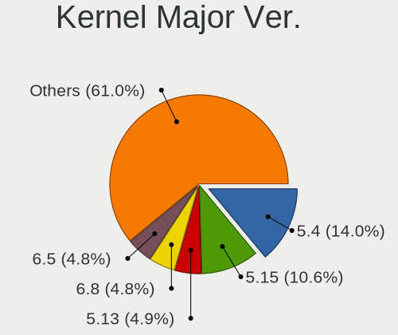
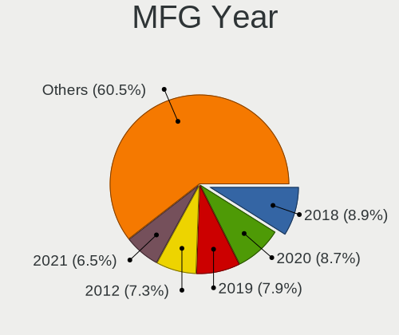

Linux in UK - Tested Hardware & Statistics
------------------------------------------

A project to collect tested hardware configurations for Linux in UK.

Anyone can contribute to this report by the [hw-probe](https://github.com/linuxhw/hw-probe) tool:

    sudo -E hw-probe -all -upload

Please contribute! Especially if your hardware is rare.

This is a report for all computer types. See also reports for [desktops](/Location/UK/Desktop/README.md) and [notebooks](/Location/UK/Notebook/README.md).

Contents
--------

* [ Test Cases ](#test-cases)

* [ System ](#system)
  - [ OS                       ](#os)
  - [ OS Family                ](#os-family)
  - [ Kernel                   ](#kernel)
  - [ Kernel Family            ](#kernel-family)
  - [ Kernel Major Ver.        ](#kernel-major-ver)
  - [ Arch                     ](#arch)
  - [ DE                       ](#de)
  - [ Display Server           ](#display-server)
  - [ Display Manager          ](#display-manager)
  - [ OS Lang                  ](#os-lang)
  - [ Boot Mode                ](#boot-mode)
  - [ Filesystem               ](#filesystem)
  - [ Part. scheme             ](#part-scheme)
  - [ Dual Boot with Linux/BSD ](#dual-boot-with-linuxbsd)
  - [ Dual Boot (Win)          ](#dual-boot-win)

* [ Board ](#board)
  - [ Vendor                   ](#vendor)
  - [ Model                    ](#model)
  - [ Model Family             ](#model-family)
  - [ MFG Year                 ](#mfg-year)
  - [ Form Factor              ](#form-factor)
  - [ Secure Boot              ](#secure-boot)
  - [ Coreboot                 ](#coreboot)
  - [ RAM Size                 ](#ram-size)
  - [ RAM Used                 ](#ram-used)
  - [ Total Drives             ](#total-drives)
  - [ Has CD-ROM               ](#has-cd-rom)
  - [ Has Ethernet             ](#has-ethernet)
  - [ Has WiFi                 ](#has-wifi)
  - [ Has Bluetooth            ](#has-bluetooth)

* [ Location ](#location)
  - [ Country                  ](#country)
  - [ City                     ](#city)

* [ Drives ](#drives)
  - [ Drive Vendor             ](#drive-vendor)
  - [ Drive Model              ](#drive-model)
  - [ HDD Vendor               ](#hdd-vendor)
  - [ SSD Vendor               ](#ssd-vendor)
  - [ Drive Kind               ](#drive-kind)
  - [ Drive Connector          ](#drive-connector)
  - [ Drive Size               ](#drive-size)
  - [ Space Total              ](#space-total)
  - [ Space Used               ](#space-used)
  - [ Malfunc. Drives          ](#malfunc-drives)
  - [ Malfunc. Drive Vendor    ](#malfunc-drive-vendor)
  - [ Malfunc. HDD Vendor      ](#malfunc-hdd-vendor)
  - [ Malfunc. Drive Kind      ](#malfunc-drive-kind)
  - [ Failed Drives            ](#failed-drives)
  - [ Failed Drive Vendor      ](#failed-drive-vendor)
  - [ Drive Status             ](#drive-status)

* [ Storage controller ](#storage-controller)
  - [ Storage Vendor           ](#storage-vendor)
  - [ Storage Model            ](#storage-model)
  - [ Storage Kind             ](#storage-kind)

* [ Processor ](#processor)
  - [ CPU Vendor               ](#cpu-vendor)
  - [ CPU Model                ](#cpu-model)
  - [ CPU Model Family         ](#cpu-model-family)
  - [ CPU Cores                ](#cpu-cores)
  - [ CPU Sockets              ](#cpu-sockets)
  - [ CPU Threads              ](#cpu-threads)
  - [ CPU Op-Modes             ](#cpu-op-modes)
  - [ CPU Microcode            ](#cpu-microcode)
  - [ CPU Microarch            ](#cpu-microarch)

* [ Graphics ](#graphics)
  - [ GPU Vendor               ](#gpu-vendor)
  - [ GPU Model                ](#gpu-model)
  - [ GPU Combo                ](#gpu-combo)
  - [ GPU Driver               ](#gpu-driver)
  - [ GPU Memory               ](#gpu-memory)

* [ Monitor ](#monitor)
  - [ Monitor Vendor           ](#monitor-vendor)
  - [ Monitor Model            ](#monitor-model)
  - [ Monitor Resolution       ](#monitor-resolution)
  - [ Monitor Diagonal         ](#monitor-diagonal)
  - [ Monitor Width            ](#monitor-width)
  - [ Aspect Ratio             ](#aspect-ratio)
  - [ Monitor Area             ](#monitor-area)
  - [ Pixel Density            ](#pixel-density)
  - [ Multiple Monitors        ](#multiple-monitors)

* [ Network ](#network)
  - [ Net Controller Vendor    ](#net-controller-vendor)
  - [ Net Controller Model     ](#net-controller-model)
  - [ Wireless Vendor          ](#wireless-vendor)
  - [ Wireless Model           ](#wireless-model)
  - [ Ethernet Vendor          ](#ethernet-vendor)
  - [ Ethernet Model           ](#ethernet-model)
  - [ Net Controller Kind      ](#net-controller-kind)
  - [ Used Controller          ](#used-controller)
  - [ NICs                     ](#nics)
  - [ IPv6                     ](#ipv6)

* [ Bluetooth ](#bluetooth)
  - [ Bluetooth Vendor         ](#bluetooth-vendor)
  - [ Bluetooth Model          ](#bluetooth-model)

* [ Sound ](#sound)
  - [ Sound Vendor             ](#sound-vendor)
  - [ Sound Model              ](#sound-model)

* [ Memory ](#memory)
  - [ Memory Vendor            ](#memory-vendor)
  - [ Memory Model             ](#memory-model)
  - [ Memory Kind              ](#memory-kind)
  - [ Memory Form Factor       ](#memory-form-factor)
  - [ Memory Size              ](#memory-size)
  - [ Memory Speed             ](#memory-speed)

* [ Printers & scanners ](#printers--scanners)
  - [ Printer Vendor           ](#printer-vendor)
  - [ Printer Model            ](#printer-model)
  - [ Scanner Vendor           ](#scanner-vendor)
  - [ Scanner Model            ](#scanner-model)

* [ Camera ](#camera)
  - [ Camera Vendor            ](#camera-vendor)
  - [ Camera Model             ](#camera-model)

* [ Security ](#security)
  - [ Fingerprint Vendor       ](#fingerprint-vendor)
  - [ Fingerprint Model        ](#fingerprint-model)
  - [ Chipcard Vendor          ](#chipcard-vendor)
  - [ Chipcard Model           ](#chipcard-model)

* [ Unsupported ](#unsupported)
  - [ Unsupported Devices      ](#unsupported-devices)
  - [ Unsupported Device Types ](#unsupported-device-types)

Test Cases
----------

Total: 8753

| Vendor        | Model                       | Form-Factor | Probe                                                      | Date         |
|---------------|-----------------------------|-------------|------------------------------------------------------------|--------------|
| HP            | ProBook 430 G4              | Notebook    | [cae67b53da](https://linux-hardware.org/?probe=cae67b53da) | May 06, 2022 |
| Acer          | Swift SF314-41              | Notebook    | [3dbf93ec7f](https://linux-hardware.org/?probe=3dbf93ec7f) | May 06, 2022 |
| Dell          | Inspiron 1525               | Notebook    | [67dbf0ac88](https://linux-hardware.org/?probe=67dbf0ac88) | May 05, 2022 |
| ASUSTek       | A68HM-PLUS                  | Desktop     | [149d1c8c87](https://linux-hardware.org/?probe=149d1c8c87) | May 05, 2022 |
| ASUSTek       | PRIME H510M-E               | Desktop     | [b9e969d2ba](https://linux-hardware.org/?probe=b9e969d2ba) | May 05, 2022 |
| HP            | 339A                        | Desktop     | [d58b95ebb1](https://linux-hardware.org/?probe=d58b95ebb1) | May 05, 2022 |
| MSI           | MPG X570 GAMING PLUS        | Desktop     | [e074ed44da](https://linux-hardware.org/?probe=e074ed44da) | May 04, 2022 |
| Gigabyte      | X99-UD4-CF                  | Desktop     | [d5cd65ba5b](https://linux-hardware.org/?probe=d5cd65ba5b) | May 04, 2022 |
| ASUSTek       | VivoBook_ASUSLaptop X512... | Notebook    | [8aadfc9dc1](https://linux-hardware.org/?probe=8aadfc9dc1) | May 04, 2022 |
| Acer          | Aspire A515-45              | Notebook    | [e5f3e5b086](https://linux-hardware.org/?probe=e5f3e5b086) | May 04, 2022 |
| Lenovo        | ThinkPad P50 20EQS0VV0C     | Notebook    | [4ce87e4da1](https://linux-hardware.org/?probe=4ce87e4da1) | May 04, 2022 |
| ASRock        | Z390 Extreme4               | Desktop     | [344c43c31a](https://linux-hardware.org/?probe=344c43c31a) | May 04, 2022 |
| HP            | EliteBook 820 G2            | Notebook    | [0e78293e95](https://linux-hardware.org/?probe=0e78293e95) | May 03, 2022 |
| Lenovo        | ThinkPad T410 25223FG       | Notebook    | [584ec1055a](https://linux-hardware.org/?probe=584ec1055a) | May 03, 2022 |
| Lenovo        | ThinkPad T410 25223FG       | Notebook    | [2e4fdc00b2](https://linux-hardware.org/?probe=2e4fdc00b2) | May 03, 2022 |
| ASUSTek       | E200HA                      | Notebook    | [399a40cb14](https://linux-hardware.org/?probe=399a40cb14) | May 03, 2022 |
| MSI           | Z590 PRO WIFI               | Desktop     | [17aad0bb78](https://linux-hardware.org/?probe=17aad0bb78) | May 03, 2022 |
| Lenovo        | Z50-75 80EC                 | Notebook    | [d16211782e](https://linux-hardware.org/?probe=d16211782e) | May 03, 2022 |
| Dell          | Latitude E7470              | Notebook    | [7991dfd7a5](https://linux-hardware.org/?probe=7991dfd7a5) | May 03, 2022 |
| Gigabyte      | 970A-DS3P                   | Desktop     | [f337a6103d](https://linux-hardware.org/?probe=f337a6103d) | May 03, 2022 |
| Dell          | 0200DY A03                  | Desktop     | [116d1b0421](https://linux-hardware.org/?probe=116d1b0421) | May 02, 2022 |
| Acer          | Aspire XC-830               | Desktop     | [7431774485](https://linux-hardware.org/?probe=7431774485) | May 02, 2022 |
| Lenovo        | ThinkPad X1 Carbon Gen 9... | Notebook    | [981f468940](https://linux-hardware.org/?probe=981f468940) | May 02, 2022 |
| Lenovo        | ThinkPad X250 20CMCTO1WW    | Notebook    | [6a9dfa32d3](https://linux-hardware.org/?probe=6a9dfa32d3) | May 02, 2022 |
| Acer          | Aspire A515-45              | Notebook    | [8cf5364699](https://linux-hardware.org/?probe=8cf5364699) | May 02, 2022 |
| ASUSTek       | PRIME B450M-A               | Desktop     | [bbbfaa9157](https://linux-hardware.org/?probe=bbbfaa9157) | May 02, 2022 |
| Toshiba       | Satellite P850              | Notebook    | [8e97662196](https://linux-hardware.org/?probe=8e97662196) | May 02, 2022 |
| Intel         | DQ57TM AAE70931-403         | Desktop     | [dd1df3c77d](https://linux-hardware.org/?probe=dd1df3c77d) | May 02, 2022 |
| Acer          | Aspire V5-573P              | Notebook    | [b64d1453d5](https://linux-hardware.org/?probe=b64d1453d5) | May 02, 2022 |
| Gigabyte      | 970A-DS3P                   | Desktop     | [2a59cf07e5](https://linux-hardware.org/?probe=2a59cf07e5) | May 02, 2022 |
| Lenovo        | ThinkPad L380 Yoga 20M7S... | Convertible | [fad7884cb4](https://linux-hardware.org/?probe=fad7884cb4) | May 02, 2022 |
| ASUSTek       | UX310UA                     | Notebook    | [80fce5caed](https://linux-hardware.org/?probe=80fce5caed) | May 01, 2022 |
| Dell          | XPS 13 9310                 | Notebook    | [03b461596c](https://linux-hardware.org/?probe=03b461596c) | May 01, 2022 |
| Dell          | XPS 15 9570                 | Notebook    | [133b6670de](https://linux-hardware.org/?probe=133b6670de) | May 01, 2022 |
| Lenovo        | IdeaPad Gaming 3 15IHU6 ... | Notebook    | [ab553d3a2f](https://linux-hardware.org/?probe=ab553d3a2f) | May 01, 2022 |
| Acer          | Aspire XC-830               | Desktop     | [a9b2669d09](https://linux-hardware.org/?probe=a9b2669d09) | May 01, 2022 |
| Acer          | Aspire A515-45              | Notebook    | [a5fd51cc39](https://linux-hardware.org/?probe=a5fd51cc39) | May 01, 2022 |
| ASUSTek       | TUF Gaming Z690-PLUS WIF... | Desktop     | [b4d4e52220](https://linux-hardware.org/?probe=b4d4e52220) | Apr 30, 2022 |
| ASUSTek       | TUF Gaming FX705GM_FX705... | Notebook    | [3589ada8b3](https://linux-hardware.org/?probe=3589ada8b3) | Apr 30, 2022 |
| Lenovo        | ThinkBook 15 G2 ITL 20VE    | Notebook    | [31b081b116](https://linux-hardware.org/?probe=31b081b116) | Apr 30, 2022 |
| Gigabyte      | B550M DS3H                  | Desktop     | [f62d8963d7](https://linux-hardware.org/?probe=f62d8963d7) | Apr 30, 2022 |
| Gigabyte      | B550M DS3H                  | Desktop     | [7797c23169](https://linux-hardware.org/?probe=7797c23169) | Apr 30, 2022 |
| Valve         | Jupiter                     | Notebook    | [1c826aed5e](https://linux-hardware.org/?probe=1c826aed5e) | Apr 30, 2022 |
| Gigabyte      | Z68AP-D3                    | Desktop     | [af8b52acd3](https://linux-hardware.org/?probe=af8b52acd3) | Apr 29, 2022 |
| MSI           | B450 TOMAHAWK MAX           | Desktop     | [b443315241](https://linux-hardware.org/?probe=b443315241) | Apr 29, 2022 |
| Lenovo        | Z50-75 80EC                 | Notebook    | [f301c52b41](https://linux-hardware.org/?probe=f301c52b41) | Apr 29, 2022 |
| Lenovo        | ThinkPad T450 20BV001YMS    | Notebook    | [f38b762c83](https://linux-hardware.org/?probe=f38b762c83) | Apr 29, 2022 |
| Acer          | Aspire XC-830               | Desktop     | [257e472e1a](https://linux-hardware.org/?probe=257e472e1a) | Apr 29, 2022 |
| HP            | ENVY x360 Convertible 13... | Convertible | [ad8bbf54e3](https://linux-hardware.org/?probe=ad8bbf54e3) | Apr 29, 2022 |
| Toshiba       | Satellite Pro R50-B         | Notebook    | [6a8bdd387c](https://linux-hardware.org/?probe=6a8bdd387c) | Apr 29, 2022 |
| ASUSTek       | ASUS TUF Gaming F15 FX50... | Notebook    | [df82c076b8](https://linux-hardware.org/?probe=df82c076b8) | Apr 29, 2022 |
| Lenovo        | ThinkCentre M91p 7052A9G    | Desktop     | [277754d8c1](https://linux-hardware.org/?probe=277754d8c1) | Apr 29, 2022 |
| MSI           | B450 TOMAHAWK MAX           | Desktop     | [589a22c0c6](https://linux-hardware.org/?probe=589a22c0c6) | Apr 29, 2022 |
| Lenovo        | ThinkPad T480 20L50004UK    | Notebook    | [34015c4874](https://linux-hardware.org/?probe=34015c4874) | Apr 29, 2022 |
| ASUSTek       | TUF Gaming X570-PLUS        | Desktop     | [a26fd2399d](https://linux-hardware.org/?probe=a26fd2399d) | Apr 29, 2022 |
| MSI           | X470 GAMING PLUS MAX        | Desktop     | [d291472a69](https://linux-hardware.org/?probe=d291472a69) | Apr 28, 2022 |
| ASRock        | P67 Pro3                    | Desktop     | [f7fed2c8eb](https://linux-hardware.org/?probe=f7fed2c8eb) | Apr 28, 2022 |
| ASRock        | B450M Pro4                  | Desktop     | [773f69d63b](https://linux-hardware.org/?probe=773f69d63b) | Apr 28, 2022 |
| Acer          | Aspire XC-830               | Desktop     | [4e6d6e311c](https://linux-hardware.org/?probe=4e6d6e311c) | Apr 28, 2022 |
| Lenovo        | IdeaPad 320S-14IKB 80X4     | Notebook    | [06ef070e40](https://linux-hardware.org/?probe=06ef070e40) | Apr 28, 2022 |
| Lenovo        | IdeaPad 320S-14IKB 80X4     | Notebook    | [8ef803f8c9](https://linux-hardware.org/?probe=8ef803f8c9) | Apr 28, 2022 |
| Dell          | 08HPGT A01                  | Desktop     | [a12d1b0c47](https://linux-hardware.org/?probe=a12d1b0c47) | Apr 28, 2022 |
| ASRock        | B450M Pro4                  | Desktop     | [2943b21899](https://linux-hardware.org/?probe=2943b21899) | Apr 28, 2022 |
| ASUSTek       | FX503VM                     | Notebook    | [c227966510](https://linux-hardware.org/?probe=c227966510) | Apr 27, 2022 |
| ASUSTek       | FX503VM                     | Notebook    | [1275aa643d](https://linux-hardware.org/?probe=1275aa643d) | Apr 27, 2022 |
| ASUSTek       | Z87-PLUS                    | Desktop     | [3b25bc9d0d](https://linux-hardware.org/?probe=3b25bc9d0d) | Apr 27, 2022 |
| Acer          | Aspire XC-830               | Desktop     | [2fa6666d88](https://linux-hardware.org/?probe=2fa6666d88) | Apr 27, 2022 |
| Acer          | Aspire XC-830               | Desktop     | [b45bd0a0a0](https://linux-hardware.org/?probe=b45bd0a0a0) | Apr 27, 2022 |
| HP            | 8437                        | Desktop     | [c9444c57eb](https://linux-hardware.org/?probe=c9444c57eb) | Apr 27, 2022 |
| HP            | 8437                        | Desktop     | [cb1aa84569](https://linux-hardware.org/?probe=cb1aa84569) | Apr 27, 2022 |
| ASUSTek       | H110M-A/M.2                 | Desktop     | [4c6852d631](https://linux-hardware.org/?probe=4c6852d631) | Apr 27, 2022 |
| Gigabyte      | 970A-DS3P                   | Desktop     | [1fc7423fdf](https://linux-hardware.org/?probe=1fc7423fdf) | Apr 27, 2022 |
| Lenovo        | ThinkPad T470 W10DG 20JN... | Notebook    | [37501fa5f3](https://linux-hardware.org/?probe=37501fa5f3) | Apr 27, 2022 |
| Pegatron      | 2A99                        | Desktop     | [92c0dec6fa](https://linux-hardware.org/?probe=92c0dec6fa) | Apr 27, 2022 |
| Dell          | Inspiron 5415               | Notebook    | [5edac5d5a6](https://linux-hardware.org/?probe=5edac5d5a6) | Apr 27, 2022 |
| ASUSTek       | Pro WS WRX80E-SAGE SE WI... | Desktop     | [a3f49d1a04](https://linux-hardware.org/?probe=a3f49d1a04) | Apr 27, 2022 |
| ASUSTek       | Pro WS WRX80E-SAGE SE WI... | Desktop     | [b47f678ce9](https://linux-hardware.org/?probe=b47f678ce9) | Apr 27, 2022 |
| ASUSTek       | P9X79                       | Desktop     | [ba50a20e23](https://linux-hardware.org/?probe=ba50a20e23) | Apr 27, 2022 |
| Notebook      | W130SV                      | Notebook    | [a88535a3a5](https://linux-hardware.org/?probe=a88535a3a5) | Apr 27, 2022 |
| Dell          | 0T10XW A02                  | Desktop     | [9202f4bade](https://linux-hardware.org/?probe=9202f4bade) | Apr 27, 2022 |
| Lenovo        | IdeaPadFlex 15 20309        | Notebook    | [d23e7110f6](https://linux-hardware.org/?probe=d23e7110f6) | Apr 27, 2022 |
| Lenovo        | IdeaPadFlex 15 20309        | Notebook    | [3390e01a9c](https://linux-hardware.org/?probe=3390e01a9c) | Apr 27, 2022 |
| ASUSTek       | ROG CROSSHAIR VIII HERO     | Desktop     | [1f10d820f8](https://linux-hardware.org/?probe=1f10d820f8) | Apr 27, 2022 |
| ASUSTek       | ROG CROSSHAIR VIII HERO     | Desktop     | [dfadead480](https://linux-hardware.org/?probe=dfadead480) | Apr 27, 2022 |
| PC Special... | NJ50_70CU                   | Notebook    | [a9b4399cad](https://linux-hardware.org/?probe=a9b4399cad) | Apr 26, 2022 |
| Dell          | 0WR7PY A03                  | Desktop     | [4ac0a4dff1](https://linux-hardware.org/?probe=4ac0a4dff1) | Apr 26, 2022 |
| MSI           | GF63 Thin 10SC              | Notebook    | [bc3cbdbc1f](https://linux-hardware.org/?probe=bc3cbdbc1f) | Apr 26, 2022 |
| Acer          | NC-E5-573-36PM              | Notebook    | [a98a807776](https://linux-hardware.org/?probe=a98a807776) | Apr 26, 2022 |
| MSI           | GP66 Leopard 11UH           | Notebook    | [549c216d66](https://linux-hardware.org/?probe=549c216d66) | Apr 26, 2022 |
| Dell          | XPS 13 9310                 | Notebook    | [1f95a73d57](https://linux-hardware.org/?probe=1f95a73d57) | Apr 26, 2022 |
| AZW           | U59                         | Desktop     | [ecee060925](https://linux-hardware.org/?probe=ecee060925) | Apr 26, 2022 |
| Dell          | 0VNM11 A00                  | Desktop     | [6aae7c23ad](https://linux-hardware.org/?probe=6aae7c23ad) | Apr 26, 2022 |
| Apple         | MacBookPro11,1              | Notebook    | [a8626eb701](https://linux-hardware.org/?probe=a8626eb701) | Apr 26, 2022 |
| Acer          | Aspire E1-571               | Notebook    | [35824f9b37](https://linux-hardware.org/?probe=35824f9b37) | Apr 25, 2022 |
| Gigabyte      | X570 AORUS MASTER           | Desktop     | [4a9e24224a](https://linux-hardware.org/?probe=4a9e24224a) | Apr 25, 2022 |
| MSI           | B450 TOMAHAWK               | Desktop     | [148f1cc5e8](https://linux-hardware.org/?probe=148f1cc5e8) | Apr 25, 2022 |
| Dell          | 0T10XW A02                  | Desktop     | [cd96ab234b](https://linux-hardware.org/?probe=cd96ab234b) | Apr 25, 2022 |
| ASUSTek       | ROG STRIX Z590-F GAMING ... | Desktop     | [1b0a41c232](https://linux-hardware.org/?probe=1b0a41c232) | Apr 25, 2022 |
| Dell          | 0GXM1W A02                  | Desktop     | [6564561a75](https://linux-hardware.org/?probe=6564561a75) | Apr 24, 2022 |
| HP            | Pavilion dv6                | Notebook    | [83093f24ef](https://linux-hardware.org/?probe=83093f24ef) | Apr 24, 2022 |
| MSI           | B450 TOMAHAWK MAX           | Desktop     | [182279920b](https://linux-hardware.org/?probe=182279920b) | Apr 24, 2022 |
| ZOTAC         | ZBOXSD-ID12/ID13            | Mini pc     | [730b034ed7](https://linux-hardware.org/?probe=730b034ed7) | Apr 24, 2022 |
| Dell          | 0XR1GT A00                  | Desktop     | [2a3b9ad6cf](https://linux-hardware.org/?probe=2a3b9ad6cf) | Apr 24, 2022 |
| Dell          | 0GXM1W A02                  | Desktop     | [af6b49b2a5](https://linux-hardware.org/?probe=af6b49b2a5) | Apr 24, 2022 |
| Dell          | XPS 15 9510                 | Notebook    | [a934bef382](https://linux-hardware.org/?probe=a934bef382) | Apr 24, 2022 |
| Lenovo        | ThinkBook 15 G2 ITL 20VE    | Notebook    | [fbb2b97e0f](https://linux-hardware.org/?probe=fbb2b97e0f) | Apr 24, 2022 |
| Dell          | XPS 15 9510                 | Notebook    | [b61b2af9eb](https://linux-hardware.org/?probe=b61b2af9eb) | Apr 23, 2022 |
| Intel         | X99                         | Desktop     | [1c9a508130](https://linux-hardware.org/?probe=1c9a508130) | Apr 23, 2022 |
| Purism        | Librem 14                   | Notebook    | [9d078217f1](https://linux-hardware.org/?probe=9d078217f1) | Apr 23, 2022 |
| Acer          | Swift SF315-52              | Notebook    | [089d81a936](https://linux-hardware.org/?probe=089d81a936) | Apr 23, 2022 |
| Unknown       | Unknown                     | Desktop     | [5d54074527](https://linux-hardware.org/?probe=5d54074527) | Apr 23, 2022 |
| ASUSTek       | ZenBook UX433FA_UX433FA     | Notebook    | [0ca0b999d6](https://linux-hardware.org/?probe=0ca0b999d6) | Apr 23, 2022 |
| HP            | Pavilion g6                 | Notebook    | [796bf7f467](https://linux-hardware.org/?probe=796bf7f467) | Apr 23, 2022 |
| Dell          | Latitude E7450              | Notebook    | [5ce1623306](https://linux-hardware.org/?probe=5ce1623306) | Apr 22, 2022 |
| MSI           | MPG Z590 GAMING EDGE WIF... | Desktop     | [18f00ab5d9](https://linux-hardware.org/?probe=18f00ab5d9) | Apr 22, 2022 |
| HP            | Pavilion dv6                | Notebook    | [16e2c4e6d3](https://linux-hardware.org/?probe=16e2c4e6d3) | Apr 22, 2022 |
| Acer          | Aspire E1-571               | Notebook    | [6d4294bbf8](https://linux-hardware.org/?probe=6d4294bbf8) | Apr 22, 2022 |
| Acer          | Aspire E1-571               | Notebook    | [202353253a](https://linux-hardware.org/?probe=202353253a) | Apr 22, 2022 |
| ASUSTek       | Z87-PLUS                    | Desktop     | [cdc3ddaa2d](https://linux-hardware.org/?probe=cdc3ddaa2d) | Apr 22, 2022 |
| Microsoft     | Surface Pro                 | Tablet      | [12d817136f](https://linux-hardware.org/?probe=12d817136f) | Apr 22, 2022 |
| ASUSTek       | P9X79                       | Desktop     | [5f754cd313](https://linux-hardware.org/?probe=5f754cd313) | Apr 22, 2022 |
| CyberPower... | Tracer II                   | Notebook    | [4582a60770](https://linux-hardware.org/?probe=4582a60770) | Apr 21, 2022 |
| Dynabook      | PORTEGE X30L-J              | Notebook    | [5894fd3a34](https://linux-hardware.org/?probe=5894fd3a34) | Apr 21, 2022 |
| Unknown       | Unknown                     | Desktop     | [80099b4b7f](https://linux-hardware.org/?probe=80099b4b7f) | Apr 21, 2022 |
| Dell          | Latitude D430               | Notebook    | [00ddfbe46f](https://linux-hardware.org/?probe=00ddfbe46f) | Apr 20, 2022 |
| Dixonsxp      | Unknown                     | Notebook    | [65e40dacf4](https://linux-hardware.org/?probe=65e40dacf4) | Apr 20, 2022 |
| Gigabyte      | Z68AP-D3                    | Desktop     | [76d25fd5c1](https://linux-hardware.org/?probe=76d25fd5c1) | Apr 20, 2022 |
| Samsung       | 950XDB/951XDB/950XDY        | Notebook    | [336a67fbee](https://linux-hardware.org/?probe=336a67fbee) | Apr 19, 2022 |
| HP            | Notebook                    | Notebook    | [f6d84934cd](https://linux-hardware.org/?probe=f6d84934cd) | Apr 19, 2022 |
| Dell          | 0GY6Y8 A02                  | Desktop     | [abf93cff25](https://linux-hardware.org/?probe=abf93cff25) | Apr 19, 2022 |
| Lenovo        | IdeaPad S540-15IML D 81N... | Notebook    | [58dc7c7bf2](https://linux-hardware.org/?probe=58dc7c7bf2) | Apr 19, 2022 |
| Biostar       | H55A+                       | Desktop     | [3b18e10f6c](https://linux-hardware.org/?probe=3b18e10f6c) | Apr 19, 2022 |
| Lenovo        | ThinkPad X220 4291QT1       | Notebook    | [9ffcb6bf7a](https://linux-hardware.org/?probe=9ffcb6bf7a) | Apr 18, 2022 |
| ASUSTek       | ROG Maximus XI HERO         | Desktop     | [d2a4b7e7ed](https://linux-hardware.org/?probe=d2a4b7e7ed) | Apr 18, 2022 |
| ASUSTek       | ROG Flow X13 GV301QH_GV3... | Notebook    | [6db9a3dea0](https://linux-hardware.org/?probe=6db9a3dea0) | Apr 18, 2022 |
| Lenovo        | ThinkPad X230 23202DG       | Notebook    | [c7f2c2e71c](https://linux-hardware.org/?probe=c7f2c2e71c) | Apr 18, 2022 |
| HP            | Pavilion Gaming Laptop 1... | Notebook    | [42db396ee8](https://linux-hardware.org/?probe=42db396ee8) | Apr 18, 2022 |
| HP            | Pavilion Gaming Laptop 1... | Notebook    | [4dc4e0af40](https://linux-hardware.org/?probe=4dc4e0af40) | Apr 18, 2022 |
| Gigabyte      | X570 GAMING X               | Desktop     | [d0cd53048e](https://linux-hardware.org/?probe=d0cd53048e) | Apr 18, 2022 |
| Gigabyte      | X570 GAMING X               | Desktop     | [8436ff452b](https://linux-hardware.org/?probe=8436ff452b) | Apr 18, 2022 |
| ASUSTek       | ROG STRIX B450-F GAMING     | Desktop     | [cc4a1b8b6f](https://linux-hardware.org/?probe=cc4a1b8b6f) | Apr 17, 2022 |
| Lenovo        | 30D0 SDK0J40705 WIN 3425... | Desktop     | [fa96d5405d](https://linux-hardware.org/?probe=fa96d5405d) | Apr 17, 2022 |
| Gigabyte      | B550 AORUS ELITE V2         | Desktop     | [b35ed6654a](https://linux-hardware.org/?probe=b35ed6654a) | Apr 17, 2022 |
| HUAWEI        | KLVL-WXX9                   | Notebook    | [9868b4e681](https://linux-hardware.org/?probe=9868b4e681) | Apr 17, 2022 |
| Valve         | Jupiter                     | Notebook    | [4f23fab4fd](https://linux-hardware.org/?probe=4f23fab4fd) | Apr 17, 2022 |
| Lenovo        | ThinkPad X220 4291QT1       | Notebook    | [00a23bc10c](https://linux-hardware.org/?probe=00a23bc10c) | Apr 17, 2022 |
| ASUSTek       | PRIME A320M-K               | Desktop     | [bdb3506164](https://linux-hardware.org/?probe=bdb3506164) | Apr 17, 2022 |
| Apple         | Mac-F22C86C8                | Mini pc     | [47fc027d41](https://linux-hardware.org/?probe=47fc027d41) | Apr 17, 2022 |
| ASUSTek       | TUF Gaming X570-PLUS        | Desktop     | [a4dda68647](https://linux-hardware.org/?probe=a4dda68647) | Apr 17, 2022 |
| Apple         | Mac-F22C86C8                | Mini pc     | [9eac0ebbce](https://linux-hardware.org/?probe=9eac0ebbce) | Apr 17, 2022 |
| ASUSTek       | PRIME A320M-K               | Desktop     | [b5094d96cc](https://linux-hardware.org/?probe=b5094d96cc) | Apr 16, 2022 |
| Lenovo        | ThinkPad L440 20ASA02800    | Notebook    | [697a90ffa2](https://linux-hardware.org/?probe=697a90ffa2) | Apr 16, 2022 |
| Lenovo        | 30D0 SDK0J40705 WIN 3425... | Desktop     | [474bb81b18](https://linux-hardware.org/?probe=474bb81b18) | Apr 15, 2022 |
| Lenovo        | 30D0 SDK0J40705 WIN 3425... | Desktop     | [f6a1a50a75](https://linux-hardware.org/?probe=f6a1a50a75) | Apr 15, 2022 |
| ASUSTek       | M5A78L/USB3                 | Desktop     | [48deb234f0](https://linux-hardware.org/?probe=48deb234f0) | Apr 15, 2022 |
| ASUSTek       | M5A78L/USB3                 | Desktop     | [bb302cfbbd](https://linux-hardware.org/?probe=bb302cfbbd) | Apr 15, 2022 |
| Dell          | Inspiron N5110              | Notebook    | [5ae4706be7](https://linux-hardware.org/?probe=5ae4706be7) | Apr 15, 2022 |
| ASUSTek       | P8Z77-V LX                  | Desktop     | [997b338c67](https://linux-hardware.org/?probe=997b338c67) | Apr 15, 2022 |
| Dell          | 0P01GV A03                  | Desktop     | [7d156875bb](https://linux-hardware.org/?probe=7d156875bb) | Apr 15, 2022 |
| MSI           | MPG B550 GAMING EDGE WIF... | Desktop     | [4a93a73c74](https://linux-hardware.org/?probe=4a93a73c74) | Apr 15, 2022 |
| Toshiba       | Satellite P50t-A            | Notebook    | [f2eef93c50](https://linux-hardware.org/?probe=f2eef93c50) | Apr 15, 2022 |
| Dell          | 0200DY A00                  | Desktop     | [1b0ad4ce13](https://linux-hardware.org/?probe=1b0ad4ce13) | Apr 14, 2022 |
| HP            | ENVY 13                     | Notebook    | [4b0b543bdf](https://linux-hardware.org/?probe=4b0b543bdf) | Apr 14, 2022 |
| Apple         | Mac-031B6874CF7F642A iMa... | All in one  | [a10ea959f8](https://linux-hardware.org/?probe=a10ea959f8) | Apr 14, 2022 |
| Lenovo        | Legion 5 15IMH05 82AU       | Notebook    | [4b3cedca6f](https://linux-hardware.org/?probe=4b3cedca6f) | Apr 14, 2022 |
| Framework     | Laptop                      | Notebook    | [8734154fb6](https://linux-hardware.org/?probe=8734154fb6) | Apr 14, 2022 |
| Lenovo        | ThinkPad X220 4291QT1       | Notebook    | [9e6fc630f4](https://linux-hardware.org/?probe=9e6fc630f4) | Apr 14, 2022 |
| Pegatron      | 2AD5                        | Desktop     | [e172be90b8](https://linux-hardware.org/?probe=e172be90b8) | Apr 14, 2022 |
| Lenovo        | Legion 5 15IMH05H 81Y6      | Notebook    | [c9e8c79a2e](https://linux-hardware.org/?probe=c9e8c79a2e) | Apr 14, 2022 |
| ASUSTek       | F2A85-V                     | Desktop     | [6200a8f946](https://linux-hardware.org/?probe=6200a8f946) | Apr 14, 2022 |
| Gigabyte      | B460 HD3                    | Desktop     | [c3c9ea3a20](https://linux-hardware.org/?probe=c3c9ea3a20) | Apr 14, 2022 |
| Framework     | Laptop                      | Notebook    | [2550bb5cd7](https://linux-hardware.org/?probe=2550bb5cd7) | Apr 14, 2022 |
| Lenovo        | ThinkPad X1 Extreme Gen ... | Notebook    | [960f707d0f](https://linux-hardware.org/?probe=960f707d0f) | Apr 14, 2022 |
| Lenovo        | ThinkPad P14s Gen 1 20Y1... | Notebook    | [9dd2675f34](https://linux-hardware.org/?probe=9dd2675f34) | Apr 14, 2022 |
| Lenovo        | Legion R7000 2020 82B6      | Notebook    | [260c012f44](https://linux-hardware.org/?probe=260c012f44) | Apr 14, 2022 |
| ASUSTek       | P8H67-M                     | Desktop     | [ca7dd7880b](https://linux-hardware.org/?probe=ca7dd7880b) | Apr 14, 2022 |
| Gigabyte      | B550 AORUS PRO V2           | Desktop     | [2a5f0afcc8](https://linux-hardware.org/?probe=2a5f0afcc8) | Apr 14, 2022 |
| Dell          | Inspiron 5415               | Notebook    | [89de41a490](https://linux-hardware.org/?probe=89de41a490) | Apr 14, 2022 |
| ASUSTek       | ASUS TUF Gaming F15 FX50... | Notebook    | [0517baf6ee](https://linux-hardware.org/?probe=0517baf6ee) | Apr 14, 2022 |
| Lenovo        | ThinkPad X220 429136G       | Notebook    | [92555ffe91](https://linux-hardware.org/?probe=92555ffe91) | Apr 14, 2022 |
| Lenovo        | ThinkPad T490 20N2000LUK    | Notebook    | [a394ce9693](https://linux-hardware.org/?probe=a394ce9693) | Apr 13, 2022 |
| Lenovo        | ThinkPad X220 4291QT1       | Notebook    | [58ef1f3594](https://linux-hardware.org/?probe=58ef1f3594) | Apr 13, 2022 |
| MSI           | MPG X570 GAMING PLUS        | Desktop     | [0c0f293e16](https://linux-hardware.org/?probe=0c0f293e16) | Apr 13, 2022 |
| ASUSTek       | Z97-A                       | Desktop     | [df33a057b6](https://linux-hardware.org/?probe=df33a057b6) | Apr 13, 2022 |
| ASUSTek       | PRIME H310M-A R2.0          | Desktop     | [4c86ab8c47](https://linux-hardware.org/?probe=4c86ab8c47) | Apr 13, 2022 |
| ASUSTek       | Z97-A                       | Desktop     | [94783711b3](https://linux-hardware.org/?probe=94783711b3) | Apr 13, 2022 |
| HP            | EliteBook 840 G2            | Notebook    | [ec9869d115](https://linux-hardware.org/?probe=ec9869d115) | Apr 13, 2022 |
| ASUSTek       | PRIME B550-PLUS             | Desktop     | [bad4b60ec4](https://linux-hardware.org/?probe=bad4b60ec4) | Apr 13, 2022 |
| Dell          | XPS 15 9500                 | Notebook    | [986cb2363c](https://linux-hardware.org/?probe=986cb2363c) | Apr 13, 2022 |
| ASRock        | TRX40 Taichi                | Desktop     | [7ce5e071a2](https://linux-hardware.org/?probe=7ce5e071a2) | Apr 13, 2022 |
| Lenovo        | Legion 5P 15ARH05H 82GU     | Notebook    | [a31cc5eb3b](https://linux-hardware.org/?probe=a31cc5eb3b) | Apr 13, 2022 |
| Gigabyte      | X570 GAMING X               | Desktop     | [b089bb9293](https://linux-hardware.org/?probe=b089bb9293) | Apr 13, 2022 |
| Intel         | NUC5CPYB H61145-408         | Mini pc     | [6113e480b5](https://linux-hardware.org/?probe=6113e480b5) | Apr 13, 2022 |
| Toshiba       | TECRA X40-D                 | Notebook    | [d18cfd17bb](https://linux-hardware.org/?probe=d18cfd17bb) | Apr 13, 2022 |
| LG Electro... | 16Z90P-K.AA78A1             | Notebook    | [f7d44e9cd6](https://linux-hardware.org/?probe=f7d44e9cd6) | Apr 13, 2022 |
| Lenovo        | ThinkPad P14s Gen 1 20Y1... | Notebook    | [cfa1e38deb](https://linux-hardware.org/?probe=cfa1e38deb) | Apr 13, 2022 |
| Intel         | D54250WYK H13922-303        | Desktop     | [8619f35452](https://linux-hardware.org/?probe=8619f35452) | Apr 13, 2022 |
| Dell          | Precision 5530              | Notebook    | [3c4cc67cc4](https://linux-hardware.org/?probe=3c4cc67cc4) | Apr 13, 2022 |
| ASUSTek       | PRIME X370-PRO              | Desktop     | [f2a040ef2b](https://linux-hardware.org/?probe=f2a040ef2b) | Apr 13, 2022 |
| Pegatron      | 2A99h                       | Desktop     | [0d208bc673](https://linux-hardware.org/?probe=0d208bc673) | Apr 13, 2022 |
| HP            | Pavilion g6                 | Notebook    | [44035cfa83](https://linux-hardware.org/?probe=44035cfa83) | Apr 13, 2022 |
| MSI           | 970 GAMING                  | Desktop     | [25d8968f19](https://linux-hardware.org/?probe=25d8968f19) | Apr 13, 2022 |
| Pegatron      | 2A99h                       | Desktop     | [7a31392de4](https://linux-hardware.org/?probe=7a31392de4) | Apr 13, 2022 |
| HP            | ENVY x360 Convertible 13... | Convertible | [5029c3c4a2](https://linux-hardware.org/?probe=5029c3c4a2) | Apr 13, 2022 |
| HP            | 2215                        | Desktop     | [5acea5fa0a](https://linux-hardware.org/?probe=5acea5fa0a) | Apr 13, 2022 |
| Gigabyte      | Z390 DESIGNARE-CF           | Desktop     | [b00858fa95](https://linux-hardware.org/?probe=b00858fa95) | Apr 13, 2022 |
| Dell          | 0WR7PY A03                  | Desktop     | [221b65ebf0](https://linux-hardware.org/?probe=221b65ebf0) | Apr 12, 2022 |
| MSI           | X570-A PRO                  | Desktop     | [5d33b64d12](https://linux-hardware.org/?probe=5d33b64d12) | Apr 12, 2022 |
| Dell          | Vostro 5515                 | Notebook    | [710d07a9bd](https://linux-hardware.org/?probe=710d07a9bd) | Apr 12, 2022 |
| Dell          | Vostro 5515                 | Notebook    | [677234b8b8](https://linux-hardware.org/?probe=677234b8b8) | Apr 12, 2022 |
| HP            | ProBook 6570b               | Notebook    | [63d922ecdd](https://linux-hardware.org/?probe=63d922ecdd) | Apr 12, 2022 |
| HP            | ProBook 6570b               | Notebook    | [87414e70aa](https://linux-hardware.org/?probe=87414e70aa) | Apr 11, 2022 |
| ASRock        | G41M-GS                     | Desktop     | [f3e24ea1c9](https://linux-hardware.org/?probe=f3e24ea1c9) | Apr 11, 2022 |
| ASUSTek       | F2A85-V                     | Desktop     | [4457cfd21d](https://linux-hardware.org/?probe=4457cfd21d) | Apr 11, 2022 |
| Raspberry ... | Raspberry Pi 4 Model B R... | Soc         | [5bce6bbead](https://linux-hardware.org/?probe=5bce6bbead) | Apr 11, 2022 |
| ASUSTek       | PRIME Z390-A                | Desktop     | [21767e12e4](https://linux-hardware.org/?probe=21767e12e4) | Apr 11, 2022 |
| Dell          | Inspiron 5415               | Notebook    | [6c85a524a1](https://linux-hardware.org/?probe=6c85a524a1) | Apr 11, 2022 |
| ASUSTek       | ROG Flow X13 GV301QH_GV3... | Notebook    | [fcfc2b41a7](https://linux-hardware.org/?probe=fcfc2b41a7) | Apr 10, 2022 |
| Intel         | DH67BL AAG10189-211         | Desktop     | [e664ba6c5a](https://linux-hardware.org/?probe=e664ba6c5a) | Apr 10, 2022 |
| Dell          | 03NVJ6 A00                  | Desktop     | [c640615939](https://linux-hardware.org/?probe=c640615939) | Apr 10, 2022 |
| Dell          | 0T10XW A02                  | Desktop     | [01e9bf2cee](https://linux-hardware.org/?probe=01e9bf2cee) | Apr 10, 2022 |
| ASUSTek       | P6T                         | Desktop     | [579a4a7f83](https://linux-hardware.org/?probe=579a4a7f83) | Apr 10, 2022 |
| ASUSTek       | VivoBook_ASUSLaptop X515... | Notebook    | [34b32b5b14](https://linux-hardware.org/?probe=34b32b5b14) | Apr 10, 2022 |
| ASUSTek       | VivoBook_ASUSLaptop X509... | Notebook    | [f4d9933ef2](https://linux-hardware.org/?probe=f4d9933ef2) | Apr 10, 2022 |
| Acer          | Aspire E1-571               | Notebook    | [d7170319fc](https://linux-hardware.org/?probe=d7170319fc) | Apr 10, 2022 |
| TUXEDO        | Pulse 15 Gen1               | Notebook    | [8a0974e971](https://linux-hardware.org/?probe=8a0974e971) | Apr 10, 2022 |
| ASUSTek       | PRIME B350-PLUS             | Desktop     | [9971d706c5](https://linux-hardware.org/?probe=9971d706c5) | Apr 10, 2022 |
| Raspberry ... | Raspberry Pi                | Soc         | [eec4231e44](https://linux-hardware.org/?probe=eec4231e44) | Apr 10, 2022 |
| HP            | Laptop 15-da0xxx            | Notebook    | [7187b2e6ee](https://linux-hardware.org/?probe=7187b2e6ee) | Apr 10, 2022 |
| ASUSTek       | UX310UA                     | Notebook    | [732364c253](https://linux-hardware.org/?probe=732364c253) | Apr 09, 2022 |
| ASUSTek       | TUF Gaming B560-PLUS WIF... | Desktop     | [0bac47f3e6](https://linux-hardware.org/?probe=0bac47f3e6) | Apr 09, 2022 |
| ASUSTek       | Z170 PRO GAMING             | Desktop     | [5a09d1fa57](https://linux-hardware.org/?probe=5a09d1fa57) | Apr 09, 2022 |
| Gigabyte      | GA-78LMT-S2                 | Desktop     | [cf308c090a](https://linux-hardware.org/?probe=cf308c090a) | Apr 09, 2022 |
| Advent        | Tacto Purple                | Notebook    | [5ad7851c7a](https://linux-hardware.org/?probe=5ad7851c7a) | Apr 09, 2022 |
| Lenovo        | ThinkPad T440 20B7A1P700    | Notebook    | [919af587bb](https://linux-hardware.org/?probe=919af587bb) | Apr 09, 2022 |
| Lenovo        | ThinkPad T440 20B7A1P700    | Notebook    | [3b16991947](https://linux-hardware.org/?probe=3b16991947) | Apr 08, 2022 |
| CyberPower... | Tracer II                   | Notebook    | [735f98bbb9](https://linux-hardware.org/?probe=735f98bbb9) | Apr 08, 2022 |
| Dell          | G7 7700                     | Notebook    | [86fff99f90](https://linux-hardware.org/?probe=86fff99f90) | Apr 08, 2022 |
| Acer          | Aspire A315-31              | Notebook    | [afd87f36b2](https://linux-hardware.org/?probe=afd87f36b2) | Apr 08, 2022 |
| Fujitsu       | D3219-A1 S26361-D3219-A1    | Desktop     | [53afee4cf6](https://linux-hardware.org/?probe=53afee4cf6) | Apr 08, 2022 |
| AZW           | U59                         | Desktop     | [d84f7caf26](https://linux-hardware.org/?probe=d84f7caf26) | Apr 08, 2022 |
| Lenovo        | Flex 2-15 20405             | Notebook    | [b7d6ae3171](https://linux-hardware.org/?probe=b7d6ae3171) | Apr 08, 2022 |
| Getac         | S400                        | Notebook    | [7f8a76a614](https://linux-hardware.org/?probe=7f8a76a614) | Apr 08, 2022 |
| ASUSTek       | TUF Gaming X570-PLUS        | Desktop     | [d75f38ec35](https://linux-hardware.org/?probe=d75f38ec35) | Apr 08, 2022 |
| Acer          | Aspire A315-54              | Notebook    | [596a2a878c](https://linux-hardware.org/?probe=596a2a878c) | Apr 08, 2022 |
| MSI           | Z370-A PRO                  | Desktop     | [52f833f67d](https://linux-hardware.org/?probe=52f833f67d) | Apr 07, 2022 |
| ASUSTek       | Z97-K                       | Desktop     | [6451bf5197](https://linux-hardware.org/?probe=6451bf5197) | Apr 07, 2022 |
| ASUSTek       | TUF Gaming B560-PLUS WIF... | Desktop     | [b9eb04d2d8](https://linux-hardware.org/?probe=b9eb04d2d8) | Apr 07, 2022 |
| ASUSTek       | ROG STRIX B450-F GAMING ... | Desktop     | [5370b9e906](https://linux-hardware.org/?probe=5370b9e906) | Apr 07, 2022 |
| ARKA          | BOOK                        | Notebook    | [44809cec7b](https://linux-hardware.org/?probe=44809cec7b) | Apr 06, 2022 |
| Dell          | 0JP3NX A01                  | Desktop     | [159b7c81e0](https://linux-hardware.org/?probe=159b7c81e0) | Apr 06, 2022 |
| Lenovo        | ThinkPad T15 Gen 2i 20W4... | Notebook    | [bb750c0f56](https://linux-hardware.org/?probe=bb750c0f56) | Apr 06, 2022 |
| Dell          | Inspiron 16 7610            | Notebook    | [8b2c078f25](https://linux-hardware.org/?probe=8b2c078f25) | Apr 06, 2022 |
| ASUSTek       | PRIME H370M-PLUS            | Desktop     | [efae0e63ab](https://linux-hardware.org/?probe=efae0e63ab) | Apr 06, 2022 |
| MSI           | GL63 9SD                    | Notebook    | [6b4f4b5c10](https://linux-hardware.org/?probe=6b4f4b5c10) | Apr 06, 2022 |
| Gigabyte      | Z170N-Gaming 5              | Desktop     | [f0472bcf0d](https://linux-hardware.org/?probe=f0472bcf0d) | Apr 05, 2022 |
| Gigabyte      | Z170N-Gaming 5              | Desktop     | [9ee2f76c12](https://linux-hardware.org/?probe=9ee2f76c12) | Apr 05, 2022 |
| ASUSTek       | PRIME H510M-E               | Desktop     | [77b4a03b19](https://linux-hardware.org/?probe=77b4a03b19) | Apr 05, 2022 |
| Apple         | Mac-F4208EC8 PVT            | Mini pc     | [069a2be036](https://linux-hardware.org/?probe=069a2be036) | Apr 05, 2022 |
| Lenovo        | ThinkPad T15 Gen 2i 20W4... | Notebook    | [943191da55](https://linux-hardware.org/?probe=943191da55) | Apr 05, 2022 |
| HP            | 0A9Ch                       | Desktop     | [5a415a150f](https://linux-hardware.org/?probe=5a415a150f) | Apr 05, 2022 |
| Dell          | 09KPNV A00                  | Desktop     | [0a06779a5a](https://linux-hardware.org/?probe=0a06779a5a) | Apr 05, 2022 |
| ASUSTek       | TUF Gaming B550-PLUS        | Desktop     | [8a3966d71c](https://linux-hardware.org/?probe=8a3966d71c) | Apr 05, 2022 |
| ASUSTek       | M4A78LT-M                   | Desktop     | [ea53fbbc2a](https://linux-hardware.org/?probe=ea53fbbc2a) | Apr 04, 2022 |
| ASUSTek       | VivoBook_ASUSLaptop X515... | Notebook    | [952a71b37e](https://linux-hardware.org/?probe=952a71b37e) | Apr 04, 2022 |
| Dell          | Latitude E6530              | Notebook    | [a63f363043](https://linux-hardware.org/?probe=a63f363043) | Apr 04, 2022 |
| Acer          | Aspire M3910                | Desktop     | [bb407c8963](https://linux-hardware.org/?probe=bb407c8963) | Apr 04, 2022 |
| Dell          | Inspiron 7559               | Notebook    | [4efbcf88a2](https://linux-hardware.org/?probe=4efbcf88a2) | Apr 04, 2022 |
| Panasonic     | CF-H2BJJHZDE                | Tablet      | [50e0a85fd3](https://linux-hardware.org/?probe=50e0a85fd3) | Apr 04, 2022 |
| Lenovo        | ThinkPad T410 2522AC1       | Notebook    | [b22a799f67](https://linux-hardware.org/?probe=b22a799f67) | Apr 04, 2022 |
| Dell          | Inspiron 3576               | Notebook    | [b768d18e12](https://linux-hardware.org/?probe=b768d18e12) | Apr 04, 2022 |
| Sony          | VPCEB4L1E                   | Notebook    | [358783a077](https://linux-hardware.org/?probe=358783a077) | Apr 03, 2022 |
| ASUSTek       | P9X79                       | Desktop     | [bb18f1eb8f](https://linux-hardware.org/?probe=bb18f1eb8f) | Apr 03, 2022 |
| Valve         | Jupiter                     | Notebook    | [ec05067a1d](https://linux-hardware.org/?probe=ec05067a1d) | Apr 03, 2022 |
| Raspberry ... | Raspberry Pi 4 Model B R... | Soc         | [894d2f4814](https://linux-hardware.org/?probe=894d2f4814) | Apr 03, 2022 |
| HP            | Notebook                    | Notebook    | [e1af57dc16](https://linux-hardware.org/?probe=e1af57dc16) | Apr 02, 2022 |
| Acer          | Aspire A315-21              | Notebook    | [5d522cd1b9](https://linux-hardware.org/?probe=5d522cd1b9) | Apr 02, 2022 |
| Dell          | 0X2MKR A00                  | All in one  | [446d4b4c59](https://linux-hardware.org/?probe=446d4b4c59) | Apr 02, 2022 |
| ASUSTek       | ROG CROSSHAIR VII HERO      | Desktop     | [35f6caff42](https://linux-hardware.org/?probe=35f6caff42) | Apr 02, 2022 |
| ASUSTek       | F2A85-V                     | Desktop     | [6056351804](https://linux-hardware.org/?probe=6056351804) | Apr 02, 2022 |
| ASUSTek       | ROG STRIX B550-E GAMING     | Desktop     | [68483bc13a](https://linux-hardware.org/?probe=68483bc13a) | Apr 02, 2022 |
| Raspberry ... | Raspberry Pi                | Soc         | [4a757bd59d](https://linux-hardware.org/?probe=4a757bd59d) | Apr 02, 2022 |
| Dell          | 07PR60 A00                  | Desktop     | [40f34fbc8f](https://linux-hardware.org/?probe=40f34fbc8f) | Apr 01, 2022 |
| Acer          | Aspire XC-895 V:1.0         | Desktop     | [2671214482](https://linux-hardware.org/?probe=2671214482) | Apr 01, 2022 |
| ASUSTek       | PN51-E1                     | Mini pc     | [c22fa84e7b](https://linux-hardware.org/?probe=c22fa84e7b) | Apr 01, 2022 |
| Apple         | Mac-F60DEB81FF30ACF6 Mac... | Desktop     | [d685d62203](https://linux-hardware.org/?probe=d685d62203) | Apr 01, 2022 |
| PC Special... | PC5x_7xHP_HR_HS             | Notebook    | [82ec2ff5f6](https://linux-hardware.org/?probe=82ec2ff5f6) | Apr 01, 2022 |
| PC Special... | PC5x_7xHP_HR_HS             | Notebook    | [7aefa77b4b](https://linux-hardware.org/?probe=7aefa77b4b) | Apr 01, 2022 |
| HP            | Pavilion Notebook           | Notebook    | [e81da10444](https://linux-hardware.org/?probe=e81da10444) | Apr 01, 2022 |
| Toshiba       | dynabook R73/A              | Notebook    | [42b60c90c7](https://linux-hardware.org/?probe=42b60c90c7) | Apr 01, 2022 |
| HP            | ProBook 6570b               | Notebook    | [0609df27fa](https://linux-hardware.org/?probe=0609df27fa) | Mar 31, 2022 |
| HP            | Laptop 14-cm0xxx            | Notebook    | [01f7a198c5](https://linux-hardware.org/?probe=01f7a198c5) | Mar 31, 2022 |
| Apple         | MacBookPro6,1               | Notebook    | [c55872162d](https://linux-hardware.org/?probe=c55872162d) | Mar 31, 2022 |
| Lenovo        | ThinkBook 15 G2 ITL 20VE    | Notebook    | [cc95f0e3ab](https://linux-hardware.org/?probe=cc95f0e3ab) | Mar 31, 2022 |
| Acer          | Aspire A315-21              | Notebook    | [b0bacf15b5](https://linux-hardware.org/?probe=b0bacf15b5) | Mar 31, 2022 |
| Valve         | Jupiter                     | Notebook    | [cc50319a5a](https://linux-hardware.org/?probe=cc50319a5a) | Mar 31, 2022 |
| System76      | Lemur Pro                   | Notebook    | [34b16b2584](https://linux-hardware.org/?probe=34b16b2584) | Mar 31, 2022 |
| ASUSTek       | M5A78L/USB3                 | Desktop     | [986a42ba64](https://linux-hardware.org/?probe=986a42ba64) | Mar 31, 2022 |
| Apple         | Mac-F60DEB81FF30ACF6 Mac... | Desktop     | [09c3268643](https://linux-hardware.org/?probe=09c3268643) | Mar 31, 2022 |
| Razer         | Blade 15 (2022) - RZ09-0... | Notebook    | [b47301d663](https://linux-hardware.org/?probe=b47301d663) | Mar 31, 2022 |
| ASUSTek       | ROG STRIX B450-F GAMING     | Desktop     | [101c38851b](https://linux-hardware.org/?probe=101c38851b) | Mar 31, 2022 |
| Apple         | Mac-F60DEB81FF30ACF6 Mac... | Desktop     | [0236d370e9](https://linux-hardware.org/?probe=0236d370e9) | Mar 31, 2022 |
| Lenovo        | IdeaPad 5 14IIL05 81YH      | Notebook    | [9db5eb67b3](https://linux-hardware.org/?probe=9db5eb67b3) | Mar 31, 2022 |
| Lenovo        | IdeaPad 5 14IIL05 81YH      | Notebook    | [90ec98a922](https://linux-hardware.org/?probe=90ec98a922) | Mar 31, 2022 |
| Apple         | Mac-63001698E7A34814 iMa... | All in one  | [5e0222bdc7](https://linux-hardware.org/?probe=5e0222bdc7) | Mar 31, 2022 |
| Lenovo        | ThinkPad P15 Gen 1 20STS... | Notebook    | [05c02cbe41](https://linux-hardware.org/?probe=05c02cbe41) | Mar 31, 2022 |
| ASRock        | P67 Pro3                    | Desktop     | [4a4493ce71](https://linux-hardware.org/?probe=4a4493ce71) | Mar 31, 2022 |
| ASUSTek       | M5A78L/USB3                 | Desktop     | [92eae45686](https://linux-hardware.org/?probe=92eae45686) | Mar 30, 2022 |
| Lenovo        | ThinkPad X230 23202DG       | Notebook    | [10fe068865](https://linux-hardware.org/?probe=10fe068865) | Mar 30, 2022 |
| ASUSTek       | FX503VM                     | Notebook    | [1f2167e189](https://linux-hardware.org/?probe=1f2167e189) | Mar 30, 2022 |
| Lenovo        | ThinkPad T470 W10DG 20JN... | Notebook    | [48e596f082](https://linux-hardware.org/?probe=48e596f082) | Mar 30, 2022 |
| Lenovo        | ThinkPad T470 W10DG 20JN... | Notebook    | [fab15ee731](https://linux-hardware.org/?probe=fab15ee731) | Mar 30, 2022 |
| Apple         | MacBookPro14,3              | Notebook    | [33107e3ea3](https://linux-hardware.org/?probe=33107e3ea3) | Mar 29, 2022 |
| Samsung       | 930QCA                      | Convertible | [08d30ac431](https://linux-hardware.org/?probe=08d30ac431) | Mar 29, 2022 |
| Dell          | XPS 15 9500                 | Notebook    | [8cf6c58236](https://linux-hardware.org/?probe=8cf6c58236) | Mar 29, 2022 |
| IP3 Tech      | GB3                         | Mini pc     | [f271b0ce8b](https://linux-hardware.org/?probe=f271b0ce8b) | Mar 29, 2022 |
| Gigabyte      | X99-UD4-CF                  | Desktop     | [2a9a30b011](https://linux-hardware.org/?probe=2a9a30b011) | Mar 29, 2022 |
| Intel         | DQ77MK AAG39642-400         | Desktop     | [29e7a23412](https://linux-hardware.org/?probe=29e7a23412) | Mar 28, 2022 |
| Dell          | XPS 17 9710                 | Notebook    | [461d175c44](https://linux-hardware.org/?probe=461d175c44) | Mar 28, 2022 |
| HP            | Stream Laptop 14-ax0XX      | Notebook    | [2b7fe29925](https://linux-hardware.org/?probe=2b7fe29925) | Mar 28, 2022 |
| ASUSTek       | P9X79                       | Desktop     | [7ec3f97491](https://linux-hardware.org/?probe=7ec3f97491) | Mar 28, 2022 |
| Lenovo        | ThinkPad X230 23202DG       | Notebook    | [323ca65327](https://linux-hardware.org/?probe=323ca65327) | Mar 28, 2022 |
| Dell          | XPS 17 9710                 | Notebook    | [ecf7b98552](https://linux-hardware.org/?probe=ecf7b98552) | Mar 28, 2022 |
| IP3 Tech      | GB3                         | Mini pc     | [d1635f1e9e](https://linux-hardware.org/?probe=d1635f1e9e) | Mar 28, 2022 |
| Lenovo        | SDK0E50510 WIN              | Desktop     | [996a5d269c](https://linux-hardware.org/?probe=996a5d269c) | Mar 28, 2022 |
| Raspberry ... | Raspberry Pi                | Soc         | [bac5e4b9c2](https://linux-hardware.org/?probe=bac5e4b9c2) | Mar 27, 2022 |
| Raspberry ... | Raspberry Pi                | Soc         | [12b7ee9f76](https://linux-hardware.org/?probe=12b7ee9f76) | Mar 27, 2022 |
| Dell          | Latitude E6400              | Notebook    | [01815a09bb](https://linux-hardware.org/?probe=01815a09bb) | Mar 27, 2022 |
| Gigabyte      | B450M DS3H-CF               | Desktop     | [badb9dcc14](https://linux-hardware.org/?probe=badb9dcc14) | Mar 26, 2022 |
| Gigabyte      | B450M DS3H-CF               | Desktop     | [32115c5548](https://linux-hardware.org/?probe=32115c5548) | Mar 26, 2022 |
| Acer          | Predator G3-605             | Desktop     | [9a26fde0c3](https://linux-hardware.org/?probe=9a26fde0c3) | Mar 26, 2022 |
| ASUSTek       | Maximus IV GENE-Z/GEN3      | Desktop     | [aae529497f](https://linux-hardware.org/?probe=aae529497f) | Mar 25, 2022 |
| Gigabyte      | GA-990X-Gaming SLI-CF       | Desktop     | [381e2b1130](https://linux-hardware.org/?probe=381e2b1130) | Mar 25, 2022 |
| MSI           | GE63 Raider RGB 8RE         | Notebook    | [df2ffaa70a](https://linux-hardware.org/?probe=df2ffaa70a) | Mar 25, 2022 |
| MSI           | GL63 9SD                    | Notebook    | [d82d8f7857](https://linux-hardware.org/?probe=d82d8f7857) | Mar 25, 2022 |
| Dell          | 08WKV3 A00                  | Desktop     | [04bca4a56e](https://linux-hardware.org/?probe=04bca4a56e) | Mar 25, 2022 |
| Google        | Banon                       | Notebook    | [422e2dc398](https://linux-hardware.org/?probe=422e2dc398) | Mar 24, 2022 |
| MSI           | MAG B550M MORTAR WIFI       | Desktop     | [994cca77b2](https://linux-hardware.org/?probe=994cca77b2) | Mar 24, 2022 |
| MSI           | MAG B550M MORTAR WIFI       | Desktop     | [fe7be471b2](https://linux-hardware.org/?probe=fe7be471b2) | Mar 24, 2022 |
| Valve         | Jupiter                     | Notebook    | [f3713888de](https://linux-hardware.org/?probe=f3713888de) | Mar 24, 2022 |
| HP            | 82FF                        | Desktop     | [cb8d5d95bb](https://linux-hardware.org/?probe=cb8d5d95bb) | Mar 24, 2022 |
| Dell          | Vostro 5515                 | Notebook    | [b3f93f17bb](https://linux-hardware.org/?probe=b3f93f17bb) | Mar 24, 2022 |
| HP            | ENVY x360 Convertible 15... | Convertible | [cafc2e5aad](https://linux-hardware.org/?probe=cafc2e5aad) | Mar 24, 2022 |
| Dell          | 0KWVT8 A00                  | Desktop     | [5e2b36f808](https://linux-hardware.org/?probe=5e2b36f808) | Mar 24, 2022 |
| ASUSTek       | Maximus IV GENE-Z/GEN3      | Desktop     | [87989ace9b](https://linux-hardware.org/?probe=87989ace9b) | Mar 24, 2022 |
| ASUSTek       | ROG Zephyrus M15 GU502LW... | Notebook    | [c9775b9b30](https://linux-hardware.org/?probe=c9775b9b30) | Mar 23, 2022 |
| Valve         | Jupiter                     | Notebook    | [d181a912af](https://linux-hardware.org/?probe=d181a912af) | Mar 23, 2022 |
| Dell          | 0M858N A00                  | Desktop     | [b5b6beaa5d](https://linux-hardware.org/?probe=b5b6beaa5d) | Mar 23, 2022 |
| Apple         | MacBookAir6,2               | Notebook    | [7c31f8a6ac](https://linux-hardware.org/?probe=7c31f8a6ac) | Mar 23, 2022 |
| ASUSTek       | VivoBook_ASUSLaptop X760... | Notebook    | [713ff9dcb8](https://linux-hardware.org/?probe=713ff9dcb8) | Mar 23, 2022 |
| Gigabyte      | X79-UD3                     | Desktop     | [6a88c14776](https://linux-hardware.org/?probe=6a88c14776) | Mar 23, 2022 |
| HP            | 1589                        | Desktop     | [1758805274](https://linux-hardware.org/?probe=1758805274) | Mar 23, 2022 |
| ASUSTek       | ROG CROSSHAIR VII HERO      | Desktop     | [86c831ce79](https://linux-hardware.org/?probe=86c831ce79) | Mar 23, 2022 |
| Dell          | 0NK70N A03                  | Desktop     | [e5fe628a7b](https://linux-hardware.org/?probe=e5fe628a7b) | Mar 23, 2022 |
| Lenovo        | ThinkPad X230 23202DG       | Notebook    | [5b74db2557](https://linux-hardware.org/?probe=5b74db2557) | Mar 22, 2022 |
| HP            | ProLiant ML310e Gen8        | Desktop     | [db93476384](https://linux-hardware.org/?probe=db93476384) | Mar 22, 2022 |
| Acer          | Aspire E1-571               | Notebook    | [125e86f141](https://linux-hardware.org/?probe=125e86f141) | Mar 22, 2022 |
| Acer          | Aspire E1-571               | Notebook    | [f349e1ecd3](https://linux-hardware.org/?probe=f349e1ecd3) | Mar 22, 2022 |
| ASUSTek       | M5A78L-M/USB3               | Desktop     | [3429bc98ac](https://linux-hardware.org/?probe=3429bc98ac) | Mar 22, 2022 |
| Lenovo        | Z50-70 20354                | Notebook    | [b03762a80b](https://linux-hardware.org/?probe=b03762a80b) | Mar 22, 2022 |
| HP            | Pavilion g7                 | Notebook    | [9d4d9b0c34](https://linux-hardware.org/?probe=9d4d9b0c34) | Mar 22, 2022 |
| HP            | Pavilion g6                 | Notebook    | [3568c4160a](https://linux-hardware.org/?probe=3568c4160a) | Mar 22, 2022 |
| HP            | ProLiant ML310e Gen8        | Desktop     | [c8afce0622](https://linux-hardware.org/?probe=c8afce0622) | Mar 22, 2022 |
| Sony          | SVP1321B4E                  | Notebook    | [b539c23011](https://linux-hardware.org/?probe=b539c23011) | Mar 21, 2022 |
| HP            | 0B54h D                     | Desktop     | [7153ec172b](https://linux-hardware.org/?probe=7153ec172b) | Mar 21, 2022 |
| HP            | 255 G7 Notebook PC          | Notebook    | [ce0d6584b2](https://linux-hardware.org/?probe=ce0d6584b2) | Mar 21, 2022 |
| ASUSTek       | PRIME B450M-A II            | Desktop     | [672496577e](https://linux-hardware.org/?probe=672496577e) | Mar 21, 2022 |
| Lenovo        | ThinkPad X1 Extreme 2nd ... | Notebook    | [b708e920f3](https://linux-hardware.org/?probe=b708e920f3) | Mar 21, 2022 |
| HP            | Laptop 15-db0xxx            | Notebook    | [e0f906e560](https://linux-hardware.org/?probe=e0f906e560) | Mar 21, 2022 |
| MSI           | B450 GAMING PRO CARBON M... | Desktop     | [9ca3ea91d3](https://linux-hardware.org/?probe=9ca3ea91d3) | Mar 21, 2022 |
| MSI           | MAG B550M BAZOOKA           | Desktop     | [fbbcb0de35](https://linux-hardware.org/?probe=fbbcb0de35) | Mar 21, 2022 |
| ASUSTek       | M4A78-VM                    | Desktop     | [c48ac764a4](https://linux-hardware.org/?probe=c48ac764a4) | Mar 20, 2022 |
| Lenovo        | IdeaPad S540-13API 81XC     | Notebook    | [543e44c95a](https://linux-hardware.org/?probe=543e44c95a) | Mar 20, 2022 |
| Dell          | Latitude 7490               | Notebook    | [0799e0955b](https://linux-hardware.org/?probe=0799e0955b) | Mar 20, 2022 |
| HUAWEI        | KLVL-WXX9                   | Notebook    | [7ad353e47f](https://linux-hardware.org/?probe=7ad353e47f) | Mar 20, 2022 |
| Lenovo        | G510 20238                  | Notebook    | [2de5cec732](https://linux-hardware.org/?probe=2de5cec732) | Mar 20, 2022 |
| ASRock        | H61M-VG3                    | Desktop     | [6e1d3b66a7](https://linux-hardware.org/?probe=6e1d3b66a7) | Mar 20, 2022 |
| ASUSTek       | PRIME X570-PRO              | Desktop     | [beda807e51](https://linux-hardware.org/?probe=beda807e51) | Mar 20, 2022 |
| HP            | G61                         | Notebook    | [833491ff37](https://linux-hardware.org/?probe=833491ff37) | Mar 19, 2022 |
| Dell          | 0P01GV A03                  | Desktop     | [54c52f2837](https://linux-hardware.org/?probe=54c52f2837) | Mar 19, 2022 |
| Dell          | Latitude 3540               | Notebook    | [6d95fdc85c](https://linux-hardware.org/?probe=6d95fdc85c) | Mar 19, 2022 |
| Dell          | Inspiron 5415               | Notebook    | [eab20e919d](https://linux-hardware.org/?probe=eab20e919d) | Mar 19, 2022 |
| HP            | Pavilion Notebook           | Notebook    | [02e461a122](https://linux-hardware.org/?probe=02e461a122) | Mar 19, 2022 |
| MSI           | Z97 GUARD-PRO               | Desktop     | [a412a37e5f](https://linux-hardware.org/?probe=a412a37e5f) | Mar 18, 2022 |
| Dell          | XPS 15 7590                 | Notebook    | [df2a40363b](https://linux-hardware.org/?probe=df2a40363b) | Mar 18, 2022 |
| Valve         | Jupiter                     | Notebook    | [0b6a21cf35](https://linux-hardware.org/?probe=0b6a21cf35) | Mar 18, 2022 |
| Gigabyte      | H110M-S2H-CF                | Desktop     | [f3b0889850](https://linux-hardware.org/?probe=f3b0889850) | Mar 18, 2022 |
| ASUSTek       | ROG STRIX B550-F GAMING     | Desktop     | [dc3b3ab391](https://linux-hardware.org/?probe=dc3b3ab391) | Mar 18, 2022 |
| Gigabyte      | 970A-DS3P                   | Desktop     | [66f505c139](https://linux-hardware.org/?probe=66f505c139) | Mar 18, 2022 |
| Microsoft     | Surface Pro                 | Tablet      | [35b41c3626](https://linux-hardware.org/?probe=35b41c3626) | Mar 18, 2022 |
| Dell          | Inspiron 7577               | Notebook    | [1b90446e3a](https://linux-hardware.org/?probe=1b90446e3a) | Mar 17, 2022 |
| Packard Be... | IMEDIA S2885                | Desktop     | [1cf614db1e](https://linux-hardware.org/?probe=1cf614db1e) | Mar 17, 2022 |
| HP            | Presario CQ57               | Notebook    | [052d5a695c](https://linux-hardware.org/?probe=052d5a695c) | Mar 17, 2022 |
| Lenovo        | ThinkPad T460s 20F9S02U0... | Notebook    | [f255ab814c](https://linux-hardware.org/?probe=f255ab814c) | Mar 17, 2022 |
| IP3 Tech      | GB3B                        | Mini pc     | [f3e9d39894](https://linux-hardware.org/?probe=f3e9d39894) | Mar 17, 2022 |
| Gigabyte      | EX58-UD5                    | Desktop     | [f445174807](https://linux-hardware.org/?probe=f445174807) | Mar 17, 2022 |
| Apple         | MacBookPro1,1               | Notebook    | [4add06ac06](https://linux-hardware.org/?probe=4add06ac06) | Mar 17, 2022 |
| GEO           | GeoFlex 110                 | Convertible | [763a31bbc5](https://linux-hardware.org/?probe=763a31bbc5) | Mar 16, 2022 |
| Gigabyte      | H61M-USB3V                  | Desktop     | [d5afbde22c](https://linux-hardware.org/?probe=d5afbde22c) | Mar 16, 2022 |
| HP            | EliteBook 2740p             | Notebook    | [8cfadb8983](https://linux-hardware.org/?probe=8cfadb8983) | Mar 16, 2022 |
| Microsoft     | Surface Pro 4               | Tablet      | [c6a31b3447](https://linux-hardware.org/?probe=c6a31b3447) | Mar 16, 2022 |
| Toshiba       | Satellite Pro C50-A-1E6     | Notebook    | [ad8e612da5](https://linux-hardware.org/?probe=ad8e612da5) | Mar 15, 2022 |
| Apple         | MacBookPro10,1              | Notebook    | [6b3e010244](https://linux-hardware.org/?probe=6b3e010244) | Mar 15, 2022 |
| Dell          | 0P01GV A03                  | Desktop     | [1272dc8512](https://linux-hardware.org/?probe=1272dc8512) | Mar 14, 2022 |
| HP            | 8056                        | Desktop     | [4e8b5eb8bd](https://linux-hardware.org/?probe=4e8b5eb8bd) | Mar 14, 2022 |
| Google        | Samus                       | Notebook    | [9e3da82a58](https://linux-hardware.org/?probe=9e3da82a58) | Mar 14, 2022 |
| Lenovo        | ThinkPad T450s 20BXCTO1W... | Notebook    | [4d32980028](https://linux-hardware.org/?probe=4d32980028) | Mar 14, 2022 |
| Apple         | MacBookPro1,1               | Notebook    | [1f948586ca](https://linux-hardware.org/?probe=1f948586ca) | Mar 14, 2022 |
| Apple         | Mac-FA842E06C61E91C5 iMa... | All in one  | [446c515964](https://linux-hardware.org/?probe=446c515964) | Mar 14, 2022 |
| ASUSTek       | VivoBook_ASUS Laptop E21... | Notebook    | [ef6a4d20a7](https://linux-hardware.org/?probe=ef6a4d20a7) | Mar 14, 2022 |
| Lenovo        | IdeaPad Z580                | Notebook    | [b5a56fb84b](https://linux-hardware.org/?probe=b5a56fb84b) | Mar 14, 2022 |
| Lenovo        | IdeaPad Z580                | Notebook    | [80590bb756](https://linux-hardware.org/?probe=80590bb756) | Mar 14, 2022 |
| Alienware     | 0TYR0X A00                  | Desktop     | [b82ab5d2d7](https://linux-hardware.org/?probe=b82ab5d2d7) | Mar 14, 2022 |
| Raspberry ... | Raspberry Pi                | Soc         | [b8354230c7](https://linux-hardware.org/?probe=b8354230c7) | Mar 13, 2022 |
| Lenovo        | ThinkPad T14s Gen 1 20UH... | Notebook    | [5570a879d3](https://linux-hardware.org/?probe=5570a879d3) | Mar 13, 2022 |
| Lenovo        | ThinkPad T14s Gen 1 20UH... | Notebook    | [d6cae900dc](https://linux-hardware.org/?probe=d6cae900dc) | Mar 13, 2022 |
| Alienware     | M14xR1                      | Notebook    | [b98eb5e7cc](https://linux-hardware.org/?probe=b98eb5e7cc) | Mar 13, 2022 |
| MSI           | GP66 Leopard 11UH           | Notebook    | [1e2a1731f7](https://linux-hardware.org/?probe=1e2a1731f7) | Mar 13, 2022 |
| ASUSTek       | PN61                        | Mini pc     | [d9003d95d7](https://linux-hardware.org/?probe=d9003d95d7) | Mar 13, 2022 |
| MSI           | MPG X570S EDGE MAX WIFI     | Desktop     | [595ba4af42](https://linux-hardware.org/?probe=595ba4af42) | Mar 13, 2022 |
| Gigabyte      | 8IPE775/-G                  | Desktop     | [7888ddbc2b](https://linux-hardware.org/?probe=7888ddbc2b) | Mar 13, 2022 |
| Lenovo        | ThinkPad T490 20N2S1CV00    | Notebook    | [b013642d11](https://linux-hardware.org/?probe=b013642d11) | Mar 12, 2022 |
| MSI           | 2A9C                        | Desktop     | [99c139f47b](https://linux-hardware.org/?probe=99c139f47b) | Mar 12, 2022 |
| Packard Be... | EasyNote TN36               | Notebook    | [0af6d015a3](https://linux-hardware.org/?probe=0af6d015a3) | Mar 12, 2022 |
| HP            | EliteBook 2560p             | Notebook    | [b12027d55b](https://linux-hardware.org/?probe=b12027d55b) | Mar 12, 2022 |
| ASUSTek       | ROG STRIX Z370-E GAMING     | Desktop     | [c92ad1d825](https://linux-hardware.org/?probe=c92ad1d825) | Mar 12, 2022 |
| Apple         | Mac-942B59F58194171B iMa... | All in one  | [98fd2cf2c6](https://linux-hardware.org/?probe=98fd2cf2c6) | Mar 12, 2022 |
| Jumper        | EZbook                      | Notebook    | [c374bd5058](https://linux-hardware.org/?probe=c374bd5058) | Mar 11, 2022 |
| Apple         | MacBookAir3,1               | Notebook    | [320f9e6841](https://linux-hardware.org/?probe=320f9e6841) | Mar 11, 2022 |
| Lenovo        | 36D9 SDK0J40700 WIN 3258... | Desktop     | [034b528c9b](https://linux-hardware.org/?probe=034b528c9b) | Mar 11, 2022 |
| Toshiba       | Satellite L350D             | Notebook    | [9e9c1b741b](https://linux-hardware.org/?probe=9e9c1b741b) | Mar 11, 2022 |
| Pine Micro... | Pine64 PinePhone (1.2)      | Phone       | [8898d4987b](https://linux-hardware.org/?probe=8898d4987b) | Mar 11, 2022 |
| Dell          | Inspiron 5415               | Notebook    | [7adb5a975b](https://linux-hardware.org/?probe=7adb5a975b) | Mar 11, 2022 |
| Apple         | MacBookPro11,4              | Notebook    | [b27d8c8724](https://linux-hardware.org/?probe=b27d8c8724) | Mar 10, 2022 |
| Clevo         | P15xEMx                     | Notebook    | [08e970fd6c](https://linux-hardware.org/?probe=08e970fd6c) | Mar 10, 2022 |
| Dell          | Latitude 7420               | Notebook    | [af5f1055fe](https://linux-hardware.org/?probe=af5f1055fe) | Mar 10, 2022 |
| Dell          | Vostro 3560                 | Notebook    | [42f4724835](https://linux-hardware.org/?probe=42f4724835) | Mar 09, 2022 |
| Gigabyte      | H61M-DS2 DVI                | Desktop     | [1cac878272](https://linux-hardware.org/?probe=1cac878272) | Mar 09, 2022 |
| MSI           | 760GM-P34                   | Desktop     | [c9524dc5a1](https://linux-hardware.org/?probe=c9524dc5a1) | Mar 09, 2022 |
| Biostar       | X370GTN                     | Desktop     | [338dd33ac5](https://linux-hardware.org/?probe=338dd33ac5) | Mar 09, 2022 |
| EVGA          | X299 FTW K                  | Desktop     | [6f9489b2e6](https://linux-hardware.org/?probe=6f9489b2e6) | Mar 09, 2022 |
| Dell          | 0KJCC5 A00                  | Desktop     | [524b675e7e](https://linux-hardware.org/?probe=524b675e7e) | Mar 09, 2022 |
| GEO           | GeoFlex 110                 | Convertible | [22a8fc3127](https://linux-hardware.org/?probe=22a8fc3127) | Mar 09, 2022 |
| GEO           | GeoFlex 110                 | Convertible | [e2ab3d192c](https://linux-hardware.org/?probe=e2ab3d192c) | Mar 09, 2022 |
| Apple         | MacBookPro1,1               | Notebook    | [6563e94c95](https://linux-hardware.org/?probe=6563e94c95) | Mar 09, 2022 |
| Dell          | 0GY6Y8 A02                  | Desktop     | [55c84f7f05](https://linux-hardware.org/?probe=55c84f7f05) | Mar 09, 2022 |
| Acer          | TPDS05 R3700                | Desktop     | [48fc5c9d8b](https://linux-hardware.org/?probe=48fc5c9d8b) | Mar 08, 2022 |
| Apple         | MacBookPro11,4              | Notebook    | [f3eb9f941a](https://linux-hardware.org/?probe=f3eb9f941a) | Mar 08, 2022 |
| HP            | Stream Notebook             | Notebook    | [ef7dc93a65](https://linux-hardware.org/?probe=ef7dc93a65) | Mar 08, 2022 |
| Notebook      | PCx0Dx                      | Notebook    | [2819c9e72e](https://linux-hardware.org/?probe=2819c9e72e) | Mar 07, 2022 |
| Notebook      | PCx0Dx                      | Notebook    | [38c484b64e](https://linux-hardware.org/?probe=38c484b64e) | Mar 07, 2022 |
| Acer          | TP-W700-53334G12            | Notebook    | [61d5d1483d](https://linux-hardware.org/?probe=61d5d1483d) | Mar 07, 2022 |
| HP            | 255 G3                      | Notebook    | [cd0bde08da](https://linux-hardware.org/?probe=cd0bde08da) | Mar 07, 2022 |
| Gigabyte      | AB350-Gaming 3-CF           | Desktop     | [f0a65362c5](https://linux-hardware.org/?probe=f0a65362c5) | Mar 07, 2022 |
| Gigabyte      | Z170X-UD3-CF                | Desktop     | [3ec7a7f643](https://linux-hardware.org/?probe=3ec7a7f643) | Mar 06, 2022 |
| ASUSTek       | M4N78-AM                    | Desktop     | [3cd1923a76](https://linux-hardware.org/?probe=3cd1923a76) | Mar 06, 2022 |
| MSI           | MAG Z690 TOMAHAWK WIFI D... | Desktop     | [055b6bd058](https://linux-hardware.org/?probe=055b6bd058) | Mar 06, 2022 |
| Toshiba       | Satellite Pro C50-A-1E5     | Notebook    | [ac3b4acda7](https://linux-hardware.org/?probe=ac3b4acda7) | Mar 06, 2022 |
| Lenovo        | IdeaPad 1 11IGL05 81VT      | Notebook    | [35f0ef9cb6](https://linux-hardware.org/?probe=35f0ef9cb6) | Mar 06, 2022 |
| iOTA          | IOTA2320                    | Notebook    | [6cf7733a53](https://linux-hardware.org/?probe=6cf7733a53) | Mar 06, 2022 |
| ASUSTek       | ROG STRIX X370-F GAMING     | Desktop     | [e45f91366e](https://linux-hardware.org/?probe=e45f91366e) | Mar 06, 2022 |
| ASUSTek       | SABERTOOTH 990FX R2.0       | Desktop     | [b50e430cd8](https://linux-hardware.org/?probe=b50e430cd8) | Mar 06, 2022 |
| Lenovo        | ThinkBook 16p Gen 2 20YM    | Notebook    | [ca93876528](https://linux-hardware.org/?probe=ca93876528) | Mar 06, 2022 |
| Acer          | Swift SF314-42              | Notebook    | [2afe92c38f](https://linux-hardware.org/?probe=2afe92c38f) | Mar 06, 2022 |
| Dell          | XPS 13 9380                 | Notebook    | [efc6123d49](https://linux-hardware.org/?probe=efc6123d49) | Mar 06, 2022 |
| MSI           | P67A-GD65                   | Desktop     | [b79a915db5](https://linux-hardware.org/?probe=b79a915db5) | Mar 05, 2022 |
| Acer          | TP-W700-53334G12            | Notebook    | [cf6bad7b5c](https://linux-hardware.org/?probe=cf6bad7b5c) | Mar 05, 2022 |
| HP            | EliteBook 2560p             | Notebook    | [0d4a567ac4](https://linux-hardware.org/?probe=0d4a567ac4) | Mar 05, 2022 |
| Acer          | Aspire E1-522               | Notebook    | [1d4f09c200](https://linux-hardware.org/?probe=1d4f09c200) | Mar 05, 2022 |
| Unknown       | Unknown                     | Notebook    | [c447074d2b](https://linux-hardware.org/?probe=c447074d2b) | Mar 05, 2022 |
| Raspberry ... | Raspberry Pi                | Soc         | [0b96f93c52](https://linux-hardware.org/?probe=0b96f93c52) | Mar 05, 2022 |
| Lenovo        | IdeaPad 500-15ISK 80NT      | Notebook    | [2a1c30169a](https://linux-hardware.org/?probe=2a1c30169a) | Mar 05, 2022 |
| HP            | 843F                        | Desktop     | [c1a4bbe881](https://linux-hardware.org/?probe=c1a4bbe881) | Mar 05, 2022 |
| ASUSTek       | ROG STRIX X370-F GAMING     | Desktop     | [a74b04333e](https://linux-hardware.org/?probe=a74b04333e) | Mar 05, 2022 |
| Jumper        | EZbook                      | Notebook    | [09544efb61](https://linux-hardware.org/?probe=09544efb61) | Mar 05, 2022 |
| Gigabyte      | 970A-DS3P                   | Desktop     | [63c5cafc39](https://linux-hardware.org/?probe=63c5cafc39) | Mar 04, 2022 |
| Samsung       | 530U3BI/530U4BI/530U4BH     | Notebook    | [61191e0c42](https://linux-hardware.org/?probe=61191e0c42) | Mar 04, 2022 |
| MSI           | GS60 6QE                    | Notebook    | [caec25c98b](https://linux-hardware.org/?probe=caec25c98b) | Mar 04, 2022 |
| MSI           | GS60 6QE                    | Notebook    | [3e98f59715](https://linux-hardware.org/?probe=3e98f59715) | Mar 04, 2022 |
| Apple         | MacBookPro11,4              | Notebook    | [fb03915a3e](https://linux-hardware.org/?probe=fb03915a3e) | Mar 03, 2022 |
| HP            | Pavilion Laptop 14-ce0xx... | Notebook    | [134d1cf65b](https://linux-hardware.org/?probe=134d1cf65b) | Mar 03, 2022 |
| HP            | Spectre x360 Convertible    | Convertible | [7d46bb8f25](https://linux-hardware.org/?probe=7d46bb8f25) | Mar 03, 2022 |
| HP            | 15                          | Notebook    | [1d090e42e2](https://linux-hardware.org/?probe=1d090e42e2) | Mar 03, 2022 |
| HP            | 15                          | Notebook    | [c9a13c5150](https://linux-hardware.org/?probe=c9a13c5150) | Mar 03, 2022 |
| HP            | EliteBook 840 G7 Noteboo... | Notebook    | [30565cb2f9](https://linux-hardware.org/?probe=30565cb2f9) | Mar 03, 2022 |
| Lenovo        | IdeaPad 1 11IGL05 81VT      | Notebook    | [806101c474](https://linux-hardware.org/?probe=806101c474) | Mar 03, 2022 |
| Dell          | Latitude E6530              | Notebook    | [f13c84346e](https://linux-hardware.org/?probe=f13c84346e) | Mar 02, 2022 |
| HP            | 0B54h D                     | Desktop     | [399cc50503](https://linux-hardware.org/?probe=399cc50503) | Mar 02, 2022 |
| Dell          | Inspiron 16 7610            | Notebook    | [da9f6479f1](https://linux-hardware.org/?probe=da9f6479f1) | Mar 02, 2022 |
| Jumper        | EZbook                      | Notebook    | [de9a14c4ec](https://linux-hardware.org/?probe=de9a14c4ec) | Mar 02, 2022 |
| Apple         | MacBookPro9,2               | Notebook    | [7fc2d5d090](https://linux-hardware.org/?probe=7fc2d5d090) | Mar 02, 2022 |
| HP            | Unknown                     | Notebook    | [4c84c909eb](https://linux-hardware.org/?probe=4c84c909eb) | Mar 02, 2022 |
| Gigabyte      | 970A-DS3P                   | Desktop     | [b6502f1cf3](https://linux-hardware.org/?probe=b6502f1cf3) | Mar 02, 2022 |
| MSI           | GF63 Thin 9SC               | Notebook    | [3327e56999](https://linux-hardware.org/?probe=3327e56999) | Mar 01, 2022 |
| MSI           | GF63 Thin 9SC               | Notebook    | [5e3f7f344c](https://linux-hardware.org/?probe=5e3f7f344c) | Mar 01, 2022 |
| HP            | ProBook 4340s               | Notebook    | [2b4257b1c2](https://linux-hardware.org/?probe=2b4257b1c2) | Mar 01, 2022 |
| Dell          | 0X2MKR A00                  | All in one  | [0dcb1b8c3c](https://linux-hardware.org/?probe=0dcb1b8c3c) | Mar 01, 2022 |
| Apple         | MacBookAir6,2               | Notebook    | [2660f37932](https://linux-hardware.org/?probe=2660f37932) | Mar 01, 2022 |
| Intel         | DQ965GF AAD41016-600        | Desktop     | [9f338ccbd8](https://linux-hardware.org/?probe=9f338ccbd8) | Mar 01, 2022 |
| HP            | 0B4Ch D                     | Desktop     | [dc25902f7e](https://linux-hardware.org/?probe=dc25902f7e) | Feb 28, 2022 |
| Acer          | Aspire E1-522               | Notebook    | [4245cd910a](https://linux-hardware.org/?probe=4245cd910a) | Feb 28, 2022 |
| Apple         | Mac-00BE6ED71E35EB86 iMa... | All in one  | [435548337a](https://linux-hardware.org/?probe=435548337a) | Feb 28, 2022 |
| MSI           | MPG Z390 GAMING PLUS        | Desktop     | [9648d5b905](https://linux-hardware.org/?probe=9648d5b905) | Feb 28, 2022 |
| Alienware     | 0TYR0X A00                  | Desktop     | [17eda5de26](https://linux-hardware.org/?probe=17eda5de26) | Feb 28, 2022 |
| Acer          | Aspire A515-45              | Notebook    | [f2e18241da](https://linux-hardware.org/?probe=f2e18241da) | Feb 28, 2022 |
| Acer          | Aspire Z1801                | All in one  | [e4a1e2ea9b](https://linux-hardware.org/?probe=e4a1e2ea9b) | Feb 28, 2022 |
| ASUSTek       | M4N72-E                     | Desktop     | [c3fe570b4d](https://linux-hardware.org/?probe=c3fe570b4d) | Feb 28, 2022 |
| HP            | ProBook 450 G8 Notebook ... | Notebook    | [c4b3104959](https://linux-hardware.org/?probe=c4b3104959) | Feb 28, 2022 |
| HP            | Spectre x360 2-in-1 Lapt... | Convertible | [d3f2971c3c](https://linux-hardware.org/?probe=d3f2971c3c) | Feb 27, 2022 |
| Notebook      | P15SM-A                     | Desktop     | [dfe7b95d25](https://linux-hardware.org/?probe=dfe7b95d25) | Feb 27, 2022 |
| Acer          | TP-W700-53334G12            | Notebook    | [4f274ebb66](https://linux-hardware.org/?probe=4f274ebb66) | Feb 27, 2022 |
| Samsung       | 550P5C/550P7C               | Notebook    | [f14f73025f](https://linux-hardware.org/?probe=f14f73025f) | Feb 27, 2022 |
| ASUSTek       | M2N68-AM SE2                | Desktop     | [711184caa5](https://linux-hardware.org/?probe=711184caa5) | Feb 27, 2022 |
| Samsung       | 550P5C/550P7C               | Notebook    | [24861666e2](https://linux-hardware.org/?probe=24861666e2) | Feb 27, 2022 |
| Unknown       | Intel X79                   | Desktop     | [6a9245acd2](https://linux-hardware.org/?probe=6a9245acd2) | Feb 27, 2022 |
| Apple         | Mac-00BE6ED71E35EB86 iMa... | All in one  | [1163e289a9](https://linux-hardware.org/?probe=1163e289a9) | Feb 27, 2022 |
| Apple         | Mac-00BE6ED71E35EB86 iMa... | All in one  | [fa88748b6b](https://linux-hardware.org/?probe=fa88748b6b) | Feb 27, 2022 |
| Entroware     | Hybris                      | Notebook    | [e7628c79c3](https://linux-hardware.org/?probe=e7628c79c3) | Feb 27, 2022 |
| Acer          | Swift SF114-34              | Notebook    | [49fb58c88b](https://linux-hardware.org/?probe=49fb58c88b) | Feb 27, 2022 |
| Raspberry ... | Raspberry Pi                | Soc         | [eab0bfce5e](https://linux-hardware.org/?probe=eab0bfce5e) | Feb 27, 2022 |
| ASRock        | FM2A88X+ Killer             | Desktop     | [4f5cd3d750](https://linux-hardware.org/?probe=4f5cd3d750) | Feb 26, 2022 |
| ASRock        | H670M-ITX/ax                | Desktop     | [532115a4ec](https://linux-hardware.org/?probe=532115a4ec) | Feb 26, 2022 |
| ASRock        | FM2A88X+ Killer             | Desktop     | [cc86c9d580](https://linux-hardware.org/?probe=cc86c9d580) | Feb 26, 2022 |
| HP            | ENVY x360 Convertible 15... | Convertible | [2e3931f1fb](https://linux-hardware.org/?probe=2e3931f1fb) | Feb 26, 2022 |
| Lenovo        | ThinkPad P15 Gen 1 20SUS... | Notebook    | [4365bdf905](https://linux-hardware.org/?probe=4365bdf905) | Feb 26, 2022 |
| ASRock        | H61M-ITX                    | Desktop     | [081ea4e585](https://linux-hardware.org/?probe=081ea4e585) | Feb 26, 2022 |
| Intel         | NUC7i5BNB J31144-311        | Mini pc     | [7f8770afc4](https://linux-hardware.org/?probe=7f8770afc4) | Feb 26, 2022 |
| Lenovo        | 310C SDK0J40697 WIN 3305... | Mini pc     | [b4770c2901](https://linux-hardware.org/?probe=b4770c2901) | Feb 26, 2022 |
| Lenovo        | 310C SDK0J40697 WIN 3305... | Mini pc     | [8a91d1a9ff](https://linux-hardware.org/?probe=8a91d1a9ff) | Feb 26, 2022 |
| Dell          | 0D28YY A03                  | Desktop     | [a61b7b1a9d](https://linux-hardware.org/?probe=a61b7b1a9d) | Feb 26, 2022 |
| Lenovo        | IdeaPad S540-13API 81XC     | Notebook    | [f719a93837](https://linux-hardware.org/?probe=f719a93837) | Feb 25, 2022 |
| Unknown       | Unknown                     | Desktop     | [3030271376](https://linux-hardware.org/?probe=3030271376) | Feb 25, 2022 |
| Dell          | 0D28YY A03                  | Desktop     | [255c47a106](https://linux-hardware.org/?probe=255c47a106) | Feb 25, 2022 |
| Dell          | 0X2MKR A00                  | All in one  | [9f89568d74](https://linux-hardware.org/?probe=9f89568d74) | Feb 25, 2022 |
| MSI           | MS-7502 Fab D               | Desktop     | [0149efd00d](https://linux-hardware.org/?probe=0149efd00d) | Feb 25, 2022 |
| Dell          | 0X2MKR A00                  | All in one  | [af96125d83](https://linux-hardware.org/?probe=af96125d83) | Feb 25, 2022 |
| MSI           | Z270 GAMING PLUS            | Desktop     | [b4e5bf2bd6](https://linux-hardware.org/?probe=b4e5bf2bd6) | Feb 25, 2022 |
| ASUSTek       | T102HA                      | Tablet      | [ecc5ad7332](https://linux-hardware.org/?probe=ecc5ad7332) | Feb 25, 2022 |
| Lenovo        | ThinkPad T410 2537A12       | Notebook    | [ec01c23749](https://linux-hardware.org/?probe=ec01c23749) | Feb 24, 2022 |
| MSI           | B350 TOMAHAWK               | Desktop     | [e1ddcb9f9a](https://linux-hardware.org/?probe=e1ddcb9f9a) | Feb 24, 2022 |
| Gigabyte      | B85M-HD3                    | Desktop     | [160a1d60b3](https://linux-hardware.org/?probe=160a1d60b3) | Feb 24, 2022 |
| HP            | 3047h                       | Desktop     | [34a5c05e7d](https://linux-hardware.org/?probe=34a5c05e7d) | Feb 24, 2022 |
| Acer          | TPDS05 R3700                | Desktop     | [df877f2b77](https://linux-hardware.org/?probe=df877f2b77) | Feb 24, 2022 |
| Acer          | TPDS05 R3700                | Desktop     | [4957d6525b](https://linux-hardware.org/?probe=4957d6525b) | Feb 24, 2022 |
| Dell          | 0X2MKR A00                  | All in one  | [fba21fd476](https://linux-hardware.org/?probe=fba21fd476) | Feb 24, 2022 |
| MSI           | MAG X570 TOMAHAWK WIFI      | Desktop     | [b80a8fbd1b](https://linux-hardware.org/?probe=b80a8fbd1b) | Feb 24, 2022 |
| ASUSTek       | M4N68T-M-LE-V2              | Desktop     | [e639fc94c0](https://linux-hardware.org/?probe=e639fc94c0) | Feb 23, 2022 |
| MSI           | 2AE0                        | Desktop     | [74c496c824](https://linux-hardware.org/?probe=74c496c824) | Feb 23, 2022 |
| SLIMBOOK      | TITAN                       | Notebook    | [182750aa6b](https://linux-hardware.org/?probe=182750aa6b) | Feb 23, 2022 |
| Lenovo        | 3102 SDK0J40697 WIN 3305... | Desktop     | [6d2bec51f3](https://linux-hardware.org/?probe=6d2bec51f3) | Feb 23, 2022 |
| Google        | Edgar                       | Notebook    | [46f5948f03](https://linux-hardware.org/?probe=46f5948f03) | Feb 23, 2022 |
| Dell          | 0X2MKR A00                  | All in one  | [92f05e4fbd](https://linux-hardware.org/?probe=92f05e4fbd) | Feb 23, 2022 |
| Acer          | AO725                       | Notebook    | [65d4162ffe](https://linux-hardware.org/?probe=65d4162ffe) | Feb 23, 2022 |
| Lenovo        | ThinkPad P51 20HHCTO1WW     | Notebook    | [742af9249b](https://linux-hardware.org/?probe=742af9249b) | Feb 23, 2022 |
| Alienware     | 0TYR0X A00                  | Desktop     | [892e886901](https://linux-hardware.org/?probe=892e886901) | Feb 23, 2022 |
| HP            | Spectre x360 2-in-1 Lapt... | Convertible | [c4b59e08bc](https://linux-hardware.org/?probe=c4b59e08bc) | Feb 22, 2022 |
| Gigabyte      | Z370 AORUS Gaming 7         | Desktop     | [f1f42dcf94](https://linux-hardware.org/?probe=f1f42dcf94) | Feb 22, 2022 |
| Alienware     | 0TYR0X A00                  | Desktop     | [71cac3ebdd](https://linux-hardware.org/?probe=71cac3ebdd) | Feb 22, 2022 |
| Gigabyte      | Z370 AORUS Gaming 7         | Desktop     | [0dbe303c5a](https://linux-hardware.org/?probe=0dbe303c5a) | Feb 22, 2022 |
| MSI           | B450M PRO-VDH MAX           | Desktop     | [d521452c73](https://linux-hardware.org/?probe=d521452c73) | Feb 22, 2022 |
| Dell          | 0VV4V0 A00                  | All in one  | [320aa1e42f](https://linux-hardware.org/?probe=320aa1e42f) | Feb 22, 2022 |
| HP            | Pavilion dv7                | Notebook    | [e5544b291b](https://linux-hardware.org/?probe=e5544b291b) | Feb 22, 2022 |
| Google        | Lindar                      | Notebook    | [1a350b747f](https://linux-hardware.org/?probe=1a350b747f) | Feb 22, 2022 |
| Apple         | MacBookPro1,1               | Notebook    | [555ecdf4e9](https://linux-hardware.org/?probe=555ecdf4e9) | Feb 22, 2022 |
| Apple         | MacBookPro1,1               | Notebook    | [8ebe1ad906](https://linux-hardware.org/?probe=8ebe1ad906) | Feb 22, 2022 |
| ASUSTek       | P5KPL-AM EPU                | Desktop     | [979289afcb](https://linux-hardware.org/?probe=979289afcb) | Feb 21, 2022 |
| Dell          | Inspiron 5759               | Notebook    | [89c67bc757](https://linux-hardware.org/?probe=89c67bc757) | Feb 21, 2022 |
| Lenovo        | 3172 SDK0J40697 WIN 3305... | Mini pc     | [c419233c03](https://linux-hardware.org/?probe=c419233c03) | Feb 21, 2022 |
| Dell          | 0VV4V0 A00                  | All in one  | [c857a2c621](https://linux-hardware.org/?probe=c857a2c621) | Feb 21, 2022 |
| Dell          | 0VV4V0 A00                  | All in one  | [362ee918ac](https://linux-hardware.org/?probe=362ee918ac) | Feb 21, 2022 |
| Lenovo        | IdeaPad Y700-15ISK 80NV     | Notebook    | [d1f67de0fb](https://linux-hardware.org/?probe=d1f67de0fb) | Feb 21, 2022 |
| HP            | EliteBook 2560p             | Notebook    | [aea94057eb](https://linux-hardware.org/?probe=aea94057eb) | Feb 20, 2022 |
| Dell          | 0WMJ54 A01                  | Desktop     | [eb584535c7](https://linux-hardware.org/?probe=eb584535c7) | Feb 20, 2022 |
| Dell          | Latitude E7240              | Notebook    | [56e2e00db1](https://linux-hardware.org/?probe=56e2e00db1) | Feb 20, 2022 |
| Dell          | Latitude E7240              | Notebook    | [2d5df75b0d](https://linux-hardware.org/?probe=2d5df75b0d) | Feb 20, 2022 |
| HP            | 843F                        | Desktop     | [8dfd1523c9](https://linux-hardware.org/?probe=8dfd1523c9) | Feb 20, 2022 |
| Lenovo        | IdeaPad 500-15ISK 80NT      | Notebook    | [6205aed9e8](https://linux-hardware.org/?probe=6205aed9e8) | Feb 20, 2022 |
| Raspberry ... | Raspberry Pi                | Soc         | [afdbc607c5](https://linux-hardware.org/?probe=afdbc607c5) | Feb 19, 2022 |
| Radxa         | ROCK Pi X v1.4              | Notebook    | [dd6d9dc630](https://linux-hardware.org/?probe=dd6d9dc630) | Feb 19, 2022 |
| Lenovo        | ThinkPad T410 2537A12       | Notebook    | [7326d20b88](https://linux-hardware.org/?probe=7326d20b88) | Feb 19, 2022 |
| Apple         | MacBook5,1                  | Notebook    | [3503d61993](https://linux-hardware.org/?probe=3503d61993) | Feb 19, 2022 |
| ASUSTek       | ZenBook UX425JA_UX425JA     | Notebook    | [7ad48c7fcf](https://linux-hardware.org/?probe=7ad48c7fcf) | Feb 19, 2022 |
| Dell          | 0PU052                      | Desktop     | [20d5c30034](https://linux-hardware.org/?probe=20d5c30034) | Feb 19, 2022 |
| HP            | Pavilion Laptop 14-ce0xx... | Notebook    | [44210b95fe](https://linux-hardware.org/?probe=44210b95fe) | Feb 19, 2022 |
| Intel         | DH61BE AAG14062-210         | Desktop     | [00566bb73f](https://linux-hardware.org/?probe=00566bb73f) | Feb 19, 2022 |
| HP            | Stream Laptop 11-ak0xxx     | Notebook    | [5a0d00befe](https://linux-hardware.org/?probe=5a0d00befe) | Feb 19, 2022 |
| Dell          | 0DR845                      | Desktop     | [73ab1563bc](https://linux-hardware.org/?probe=73ab1563bc) | Feb 18, 2022 |
| Lenovo        | ThinkPad X230 2325FG0       | Notebook    | [d8480748c7](https://linux-hardware.org/?probe=d8480748c7) | Feb 18, 2022 |
| Gigabyte      | B550 AORUS PRO V2           | Desktop     | [2d8f28d6c4](https://linux-hardware.org/?probe=2d8f28d6c4) | Feb 18, 2022 |
| Toshiba       | Satellite L350D             | Notebook    | [00eac655e9](https://linux-hardware.org/?probe=00eac655e9) | Feb 18, 2022 |
| Dell          | 08NPPY A00                  | Desktop     | [476adbddc1](https://linux-hardware.org/?probe=476adbddc1) | Feb 18, 2022 |
| Dell          | 0GY6Y8 A02                  | Desktop     | [345b25d5eb](https://linux-hardware.org/?probe=345b25d5eb) | Feb 18, 2022 |
| HP            | Notebook                    | Notebook    | [aee3f5ce0b](https://linux-hardware.org/?probe=aee3f5ce0b) | Feb 18, 2022 |
| ASUSTek       | P5G41T-M LX3 PLUS           | Desktop     | [74fbcf5fd5](https://linux-hardware.org/?probe=74fbcf5fd5) | Feb 17, 2022 |
| ASUSTek       | PRIME H510M-A               | Desktop     | [7ab68e0043](https://linux-hardware.org/?probe=7ab68e0043) | Feb 17, 2022 |
| Lenovo        | IdeaPad S540-13API 81XC     | Notebook    | [b9dec24676](https://linux-hardware.org/?probe=b9dec24676) | Feb 17, 2022 |
| Gigabyte      | B460 HD3                    | Desktop     | [661166a163](https://linux-hardware.org/?probe=661166a163) | Feb 17, 2022 |
| Lenovo        | 3102 SDK0J40697 WIN 3305... | Desktop     | [2dece71caa](https://linux-hardware.org/?probe=2dece71caa) | Feb 17, 2022 |
| ASUSTek       | X556UB                      | Notebook    | [33eaab7189](https://linux-hardware.org/?probe=33eaab7189) | Feb 16, 2022 |
| HP            | Spectre x360 2-in-1 Lapt... | Convertible | [d1f8637478](https://linux-hardware.org/?probe=d1f8637478) | Feb 16, 2022 |
| Fujitsu       | LIFEBOOK E736               | Notebook    | [b5da44235a](https://linux-hardware.org/?probe=b5da44235a) | Feb 16, 2022 |
| Intel         | DP55WB AAE64798-205         | Desktop     | [a1e396ab15](https://linux-hardware.org/?probe=a1e396ab15) | Feb 16, 2022 |
| ASRock        | N68-GS                      | Desktop     | [89ba0e5a52](https://linux-hardware.org/?probe=89ba0e5a52) | Feb 16, 2022 |
| Gigabyte      | B85M-DS3H-A                 | Desktop     | [16f0a2b700](https://linux-hardware.org/?probe=16f0a2b700) | Feb 16, 2022 |
| Dell          | Latitude 5320               | Notebook    | [13c53062b6](https://linux-hardware.org/?probe=13c53062b6) | Feb 16, 2022 |
| ASUSTek       | M5A78L-M/USB3               | Desktop     | [dca11c2c66](https://linux-hardware.org/?probe=dca11c2c66) | Feb 16, 2022 |
| Jumper        | EZbook                      | Notebook    | [4e3450d009](https://linux-hardware.org/?probe=4e3450d009) | Feb 16, 2022 |
| ASUSTek       | X550CA                      | Notebook    | [b889f04704](https://linux-hardware.org/?probe=b889f04704) | Feb 16, 2022 |
| ASUSTek       | ROG STRIX B450-F GAMING ... | Desktop     | [1e8c363a67](https://linux-hardware.org/?probe=1e8c363a67) | Feb 16, 2022 |
| Dell          | 0GXM1W A00                  | Desktop     | [f54569882a](https://linux-hardware.org/?probe=f54569882a) | Feb 16, 2022 |
| Jumper        | EZbook                      | Notebook    | [f27f93bafe](https://linux-hardware.org/?probe=f27f93bafe) | Feb 16, 2022 |
| Dell          | 073MMW A03                  | Desktop     | [0e15edeb64](https://linux-hardware.org/?probe=0e15edeb64) | Feb 15, 2022 |
| HP            | ProBook 430 G4              | Notebook    | [20bf4c2464](https://linux-hardware.org/?probe=20bf4c2464) | Feb 15, 2022 |
| HP            | Notebook                    | Notebook    | [7e7b9be307](https://linux-hardware.org/?probe=7e7b9be307) | Feb 15, 2022 |
| HP            | EliteBook 2570p             | Notebook    | [cd8a9df065](https://linux-hardware.org/?probe=cd8a9df065) | Feb 15, 2022 |
| Acer          | Veriton M680G               | Desktop     | [e25a40166f](https://linux-hardware.org/?probe=e25a40166f) | Feb 15, 2022 |
| Acer          | Aspire A517-52              | Notebook    | [1ae327b586](https://linux-hardware.org/?probe=1ae327b586) | Feb 15, 2022 |
| Toshiba       | Satellite L750              | Notebook    | [4a84859a37](https://linux-hardware.org/?probe=4a84859a37) | Feb 15, 2022 |
| Acer          | Nitro AN515-54              | Notebook    | [f83ccc9cce](https://linux-hardware.org/?probe=f83ccc9cce) | Feb 15, 2022 |
| Dell          | XPS 13 9310                 | Notebook    | [c1227bf037](https://linux-hardware.org/?probe=c1227bf037) | Feb 14, 2022 |
| Jumper        | EZbook                      | Notebook    | [2a16a25836](https://linux-hardware.org/?probe=2a16a25836) | Feb 14, 2022 |
| Acer          | Aspire A514-53              | Notebook    | [5765e1b103](https://linux-hardware.org/?probe=5765e1b103) | Feb 14, 2022 |
| ASUSTek       | F2A55-M LK2                 | Desktop     | [55a7c8230f](https://linux-hardware.org/?probe=55a7c8230f) | Feb 14, 2022 |
| HP            | 255 G6 Notebook PC          | Notebook    | [3dc88df597](https://linux-hardware.org/?probe=3dc88df597) | Feb 13, 2022 |
| Acer          | Aspire A315-21              | Notebook    | [966036984e](https://linux-hardware.org/?probe=966036984e) | Feb 13, 2022 |
| HP            | Compaq 6910p (GR670ET#UU... | Notebook    | [f21dcf572e](https://linux-hardware.org/?probe=f21dcf572e) | Feb 13, 2022 |
| HP            | Compaq 6910p (GR670ET#UU... | Notebook    | [7f07e2a9da](https://linux-hardware.org/?probe=7f07e2a9da) | Feb 13, 2022 |
| Acer          | Aspire A315-21              | Notebook    | [a8496ddfda](https://linux-hardware.org/?probe=a8496ddfda) | Feb 13, 2022 |
| ASUSTek       | P8H61-MX R2.0               | Desktop     | [8bd0ac2f4d](https://linux-hardware.org/?probe=8bd0ac2f4d) | Feb 13, 2022 |
| Gigabyte      | Z370 AORUS Gaming 7         | Desktop     | [ead5c5ff20](https://linux-hardware.org/?probe=ead5c5ff20) | Feb 13, 2022 |
| Dell          | Latitude E6420              | Notebook    | [019b0aeeea](https://linux-hardware.org/?probe=019b0aeeea) | Feb 13, 2022 |
| Gigabyte      | Z370 AORUS Gaming 7         | Desktop     | [2e1614e8b3](https://linux-hardware.org/?probe=2e1614e8b3) | Feb 13, 2022 |
| ASRock        | B550 Phantom Gaming 4       | Desktop     | [a60918c82b](https://linux-hardware.org/?probe=a60918c82b) | Feb 13, 2022 |
| Dell          | Inspiron 5579               | Notebook    | [8ae7432b94](https://linux-hardware.org/?probe=8ae7432b94) | Feb 13, 2022 |
| Dell          | Inspiron 5515               | Notebook    | [27dad40db4](https://linux-hardware.org/?probe=27dad40db4) | Feb 13, 2022 |
| Lenovo        | ThinkPad T420 4236KU9       | Notebook    | [0412384bc2](https://linux-hardware.org/?probe=0412384bc2) | Feb 13, 2022 |
| Dell          | Inspiron 5567               | Notebook    | [b2d1482541](https://linux-hardware.org/?probe=b2d1482541) | Feb 13, 2022 |
| PC Special... | NH5xAx                      | Notebook    | [5e0b855dbf](https://linux-hardware.org/?probe=5e0b855dbf) | Feb 13, 2022 |
| Lenovo        | ThinkPad L380 20M5S08R00    | Notebook    | [a505a2ae47](https://linux-hardware.org/?probe=a505a2ae47) | Feb 12, 2022 |
| Lenovo        | ThinkPad L380 20M5S08R00    | Notebook    | [315d27f7d7](https://linux-hardware.org/?probe=315d27f7d7) | Feb 12, 2022 |
| HP            | 0B54h D                     | Desktop     | [c9f9611ea4](https://linux-hardware.org/?probe=c9f9611ea4) | Feb 12, 2022 |
| Dell          | Latitude 3390 2-in-1        | Notebook    | [c6fa52f6e0](https://linux-hardware.org/?probe=c6fa52f6e0) | Feb 12, 2022 |
| Intel         | DQ35JO AAE41927-803         | Desktop     | [45149ce1e9](https://linux-hardware.org/?probe=45149ce1e9) | Feb 12, 2022 |
| HONOR         | HLYL-WXX9                   | Notebook    | [1bce93c4ad](https://linux-hardware.org/?probe=1bce93c4ad) | Feb 12, 2022 |
| Gigabyte      | G31M-S2L                    | Desktop     | [baa5837734](https://linux-hardware.org/?probe=baa5837734) | Feb 12, 2022 |
| ASUSTek       | P5G41C-M LX                 | Desktop     | [fcf08f865e](https://linux-hardware.org/?probe=fcf08f865e) | Feb 12, 2022 |
| Lenovo        | Flex 2-15 20405             | Notebook    | [7ae6513197](https://linux-hardware.org/?probe=7ae6513197) | Feb 12, 2022 |
| Dell          | 0YC03K A04                  | Desktop     | [2c74fc8e5f](https://linux-hardware.org/?probe=2c74fc8e5f) | Feb 12, 2022 |
| Apple         | MacBookAir6,1               | Notebook    | [0d07efd7dd](https://linux-hardware.org/?probe=0d07efd7dd) | Feb 12, 2022 |
| ASUSTek       | P5G41T-M LX3 PLUS           | Desktop     | [0468bb5fc0](https://linux-hardware.org/?probe=0468bb5fc0) | Feb 12, 2022 |
| HP            | 255 G3                      | Notebook    | [73426584f7](https://linux-hardware.org/?probe=73426584f7) | Feb 11, 2022 |
| TUXEDO        | Pulse 15 Gen1               | Notebook    | [7ffdca7ea4](https://linux-hardware.org/?probe=7ffdca7ea4) | Feb 11, 2022 |
| MSI           | X470 GAMING PRO CARBON      | Desktop     | [b138a07f00](https://linux-hardware.org/?probe=b138a07f00) | Feb 11, 2022 |
| Gigabyte      | GA-MA78LMT-US2H             | Desktop     | [92612952d4](https://linux-hardware.org/?probe=92612952d4) | Feb 11, 2022 |
| Acer          | Aspire Z5610                | All in one  | [141f5642fc](https://linux-hardware.org/?probe=141f5642fc) | Feb 11, 2022 |
| HP            | Pavilion Laptop 15-eh0xx... | Notebook    | [c8c2ede566](https://linux-hardware.org/?probe=c8c2ede566) | Feb 11, 2022 |
| Samsung       | 355V4C/356V4C/3445VC/354... | Notebook    | [c1ba1e4fe7](https://linux-hardware.org/?probe=c1ba1e4fe7) | Feb 11, 2022 |
| ASUSTek       | P7H55-M/USB3                | Desktop     | [302e757209](https://linux-hardware.org/?probe=302e757209) | Feb 11, 2022 |
| Apple         | Mac-27ADBB7B4CEE8E61 iMa... | All in one  | [7757be603c](https://linux-hardware.org/?probe=7757be603c) | Feb 11, 2022 |
| ASUSTek       | M4A87TD/USB3                | Desktop     | [0bec7946da](https://linux-hardware.org/?probe=0bec7946da) | Feb 11, 2022 |
| ASUSTek       | ROG CROSSHAIR VIII DARK ... | Desktop     | [50383ac9b6](https://linux-hardware.org/?probe=50383ac9b6) | Feb 11, 2022 |
| Dell          | XPS 15 7590                 | Notebook    | [4756364ef6](https://linux-hardware.org/?probe=4756364ef6) | Feb 10, 2022 |
| Samsung       | DP500A2D-A01UK SEC_SW_RE... | All in one  | [42348fc745](https://linux-hardware.org/?probe=42348fc745) | Feb 10, 2022 |
| Dell          | 0X2MKR A00                  | All in one  | [746d949d27](https://linux-hardware.org/?probe=746d949d27) | Feb 10, 2022 |
| Gigabyte      | GA-MA78LMT-US2H             | Desktop     | [28d3d06486](https://linux-hardware.org/?probe=28d3d06486) | Feb 10, 2022 |
| Gigabyte      | GA-MA78LMT-US2H             | Desktop     | [18a9ddcd83](https://linux-hardware.org/?probe=18a9ddcd83) | Feb 10, 2022 |
| Sony          | VPCEL2S1E                   | Notebook    | [5bc3063386](https://linux-hardware.org/?probe=5bc3063386) | Feb 10, 2022 |
| Dell          | 0HHV7N A00                  | Desktop     | [5d231b638c](https://linux-hardware.org/?probe=5d231b638c) | Feb 10, 2022 |
| Gigabyte      | B550 GAMING X V2            | Desktop     | [60ee5faa6c](https://linux-hardware.org/?probe=60ee5faa6c) | Feb 10, 2022 |
| ASRock        | Z370 Pro4                   | Desktop     | [c9aa1fb558](https://linux-hardware.org/?probe=c9aa1fb558) | Feb 10, 2022 |
| MSI           | 2AE0                        | Desktop     | [406d6d6fd0](https://linux-hardware.org/?probe=406d6d6fd0) | Feb 10, 2022 |
| ASUSTek       | M5A78L-M/USB3               | Desktop     | [f57e835c6e](https://linux-hardware.org/?probe=f57e835c6e) | Feb 09, 2022 |
| Intel         | DQ57TM AAE70931-401         | Desktop     | [532b003b77](https://linux-hardware.org/?probe=532b003b77) | Feb 09, 2022 |
| Dell          | XPS 13 9370                 | Notebook    | [7360a72c44](https://linux-hardware.org/?probe=7360a72c44) | Feb 09, 2022 |
| HP            | Pavilion g6                 | Notebook    | [fc1a305abe](https://linux-hardware.org/?probe=fc1a305abe) | Feb 09, 2022 |
| Lenovo        | ThinkPad T430 2349GAG       | Notebook    | [b2cd2857d3](https://linux-hardware.org/?probe=b2cd2857d3) | Feb 09, 2022 |
| Dell          | XPS 13 9370                 | Notebook    | [d0bfe3fa56](https://linux-hardware.org/?probe=d0bfe3fa56) | Feb 09, 2022 |
| Apple         | Mac-F221BEC8                | Desktop     | [9196bd025d](https://linux-hardware.org/?probe=9196bd025d) | Feb 09, 2022 |
| MSI           | B450 TOMAHAWK MAX II        | Desktop     | [b98ae7b6b2](https://linux-hardware.org/?probe=b98ae7b6b2) | Feb 09, 2022 |
| Timi          | TM1613                      | Notebook    | [737c2fcb2f](https://linux-hardware.org/?probe=737c2fcb2f) | Feb 09, 2022 |
| Intel         | NUC8BEB J72688-305          | Mini pc     | [57130ac0ab](https://linux-hardware.org/?probe=57130ac0ab) | Feb 08, 2022 |
| Acer          | Aspire A515-43              | Notebook    | [2b3ad05e55](https://linux-hardware.org/?probe=2b3ad05e55) | Feb 08, 2022 |
| Lenovo        | V15-ADA 82C7                | Notebook    | [85f930f1fc](https://linux-hardware.org/?probe=85f930f1fc) | Feb 08, 2022 |
| ASRock        | Z87M Pro4                   | Desktop     | [9fc521ec2a](https://linux-hardware.org/?probe=9fc521ec2a) | Feb 08, 2022 |
| Dell          | 0J3C2F A00                  | Desktop     | [44eeacc539](https://linux-hardware.org/?probe=44eeacc539) | Feb 08, 2022 |
| Radxa         | ROCK Pi X v1.4              | Notebook    | [6a3bd80ed5](https://linux-hardware.org/?probe=6a3bd80ed5) | Feb 08, 2022 |
| ASUSTek       | 1000HE                      | Notebook    | [5dd6246e59](https://linux-hardware.org/?probe=5dd6246e59) | Feb 08, 2022 |
| HP            | 8350                        | Desktop     | [31f2f10b25](https://linux-hardware.org/?probe=31f2f10b25) | Feb 08, 2022 |
| Microsoft     | Surface Pro 4               | Tablet      | [c8e90b7e34](https://linux-hardware.org/?probe=c8e90b7e34) | Feb 08, 2022 |
| Apple         | Mac-F42386C8 PVT            | All in one  | [c26f81e381](https://linux-hardware.org/?probe=c26f81e381) | Feb 08, 2022 |
| ASUSTek       | VivoBook_ASUSLaptop X513... | Notebook    | [0cc7c7e225](https://linux-hardware.org/?probe=0cc7c7e225) | Feb 08, 2022 |
| Pegatron      | 2A73                        | Desktop     | [c03e3773c2](https://linux-hardware.org/?probe=c03e3773c2) | Feb 08, 2022 |
| Viglen        | VUB1                        | Notebook    | [13f512e2d1](https://linux-hardware.org/?probe=13f512e2d1) | Feb 08, 2022 |
| HUAWEI        | NBLK-WAX9X                  | Notebook    | [09af3e68dd](https://linux-hardware.org/?probe=09af3e68dd) | Feb 07, 2022 |
| ASUSTek       | A68HM-PLUS                  | Desktop     | [416a8fa0e3](https://linux-hardware.org/?probe=416a8fa0e3) | Feb 07, 2022 |
| Dell          | 0J3C2F A00                  | Desktop     | [be3458e846](https://linux-hardware.org/?probe=be3458e846) | Feb 07, 2022 |
| ASUSTek       | ROG STRIX X570-F GAMING     | Desktop     | [4cd52923d0](https://linux-hardware.org/?probe=4cd52923d0) | Feb 07, 2022 |
| MSI           | X470 GAMING PLUS MAX        | Desktop     | [08cbea7180](https://linux-hardware.org/?probe=08cbea7180) | Feb 07, 2022 |
| ASUSTek       | A68HM-PLUS                  | Desktop     | [db93ace578](https://linux-hardware.org/?probe=db93ace578) | Feb 07, 2022 |
| ASUSTek       | PRIME H310M-A R2.0          | Desktop     | [c924cab121](https://linux-hardware.org/?probe=c924cab121) | Feb 07, 2022 |
| Google        | Banon                       | Notebook    | [4b63fecdf6](https://linux-hardware.org/?probe=4b63fecdf6) | Feb 07, 2022 |
| Lenovo        | ThinkPad X201 3626AT7       | Notebook    | [92b79d9ade](https://linux-hardware.org/?probe=92b79d9ade) | Feb 07, 2022 |
| Toshiba       | Satellite L750              | Notebook    | [3e64e98234](https://linux-hardware.org/?probe=3e64e98234) | Feb 07, 2022 |
| Google        | Pantheon                    | Notebook    | [eebf10f1bb](https://linux-hardware.org/?probe=eebf10f1bb) | Feb 07, 2022 |
| Google        | Pantheon                    | Notebook    | [54f96033d0](https://linux-hardware.org/?probe=54f96033d0) | Feb 07, 2022 |
| Gigabyte      | Z170XP-SLI-CF               | Desktop     | [56726f31e3](https://linux-hardware.org/?probe=56726f31e3) | Feb 07, 2022 |
| Lenovo        | ThinkCentre M91p 4480B2G    | Desktop     | [c5db8c7811](https://linux-hardware.org/?probe=c5db8c7811) | Feb 06, 2022 |
| Lenovo        | ThinkCentre M91p 4480B2G    | Desktop     | [96e92c90a5](https://linux-hardware.org/?probe=96e92c90a5) | Feb 06, 2022 |
| Dell          | G5 5587                     | Notebook    | [33819e0316](https://linux-hardware.org/?probe=33819e0316) | Feb 06, 2022 |
| Dell          | G5 5587                     | Notebook    | [6fcaa54ab0](https://linux-hardware.org/?probe=6fcaa54ab0) | Feb 06, 2022 |
| Timi          | TM1613                      | Notebook    | [8d16a0555c](https://linux-hardware.org/?probe=8d16a0555c) | Feb 06, 2022 |
| Lenovo        | IdeaPad 330-15IKB 81DC      | Notebook    | [da3b8d9778](https://linux-hardware.org/?probe=da3b8d9778) | Feb 06, 2022 |
| Dell          | 00V62H A01                  | Desktop     | [a5db2b8436](https://linux-hardware.org/?probe=a5db2b8436) | Feb 06, 2022 |
| ASUSTek       | Puffer                      | Desktop     | [a14c8ed9ad](https://linux-hardware.org/?probe=a14c8ed9ad) | Feb 06, 2022 |
| HP            | ENVY x360 Convertible 13... | Convertible | [92a8bf9033](https://linux-hardware.org/?probe=92a8bf9033) | Feb 06, 2022 |
| Lenovo        | IdeaPad 330-15ARR 81D2      | Notebook    | [dc86c1f5d5](https://linux-hardware.org/?probe=dc86c1f5d5) | Feb 05, 2022 |
| Lenovo        | 3111 SDK0J40697 WIN 3305... | Mini pc     | [b9d4efb68c](https://linux-hardware.org/?probe=b9d4efb68c) | Feb 05, 2022 |
| Apple         | MacBookPro7,1               | Notebook    | [ace4bb0837](https://linux-hardware.org/?probe=ace4bb0837) | Feb 05, 2022 |
| Apple         | MacBookPro7,1               | Notebook    | [beeb5ea0d7](https://linux-hardware.org/?probe=beeb5ea0d7) | Feb 05, 2022 |
| HP            | EliteBook 820 G2            | Notebook    | [7ca305cd80](https://linux-hardware.org/?probe=7ca305cd80) | Feb 05, 2022 |
| Apple         | MacBookPro9,2               | Notebook    | [63f2430481](https://linux-hardware.org/?probe=63f2430481) | Feb 05, 2022 |
| Acer          | Aspire 5551                 | Notebook    | [9287291d62](https://linux-hardware.org/?probe=9287291d62) | Feb 04, 2022 |
| Lenovo        | ThinkPad X131e 33711Q7      | Notebook    | [2423cfbdf7](https://linux-hardware.org/?probe=2423cfbdf7) | Feb 04, 2022 |
| Gigabyte      | G31M-S2L                    | Desktop     | [3fc3a14ef3](https://linux-hardware.org/?probe=3fc3a14ef3) | Feb 04, 2022 |
| HP            | 8703                        | Desktop     | [11bdfccc66](https://linux-hardware.org/?probe=11bdfccc66) | Feb 04, 2022 |
| Dell          | 0KCKR5 A02                  | Server      | [3a287683dc](https://linux-hardware.org/?probe=3a287683dc) | Feb 04, 2022 |
| Dell          | 0FRVY0 A00                  | Server      | [c8d2d41009](https://linux-hardware.org/?probe=c8d2d41009) | Feb 04, 2022 |
| Supermicro    | X7SPA-HF                    | Desktop     | [cd72b4c75e](https://linux-hardware.org/?probe=cd72b4c75e) | Feb 04, 2022 |
| TYAN Compu... | S5207                       | Desktop     | [421dcad166](https://linux-hardware.org/?probe=421dcad166) | Feb 04, 2022 |
| MSI           | H81M-P33                    | Desktop     | [38b8a1408d](https://linux-hardware.org/?probe=38b8a1408d) | Feb 04, 2022 |
| Dell          | Latitude E5430 non-vPro     | Notebook    | [5ed9b5b2b8](https://linux-hardware.org/?probe=5ed9b5b2b8) | Feb 04, 2022 |
| Lenovo        | Yoga Slim 7 Carbon 14ACN... | Notebook    | [5828b467b9](https://linux-hardware.org/?probe=5828b467b9) | Feb 04, 2022 |
| Dell          | XPS 15 9500                 | Notebook    | [748e3fae6c](https://linux-hardware.org/?probe=748e3fae6c) | Feb 04, 2022 |
| Lenovo        | ThinkPad S1 Yoga 12 20DK... | Notebook    | [dc54fcc2ff](https://linux-hardware.org/?probe=dc54fcc2ff) | Feb 04, 2022 |
| Google        | Banon                       | Notebook    | [66f185fafb](https://linux-hardware.org/?probe=66f185fafb) | Feb 04, 2022 |
| Dell          | XPS 13 9310                 | Notebook    | [28544c13f5](https://linux-hardware.org/?probe=28544c13f5) | Feb 04, 2022 |
| Google        | Banon                       | Notebook    | [be4603cd8a](https://linux-hardware.org/?probe=be4603cd8a) | Feb 03, 2022 |
| Dell          | XPS 15 9550                 | Notebook    | [61f97dad6e](https://linux-hardware.org/?probe=61f97dad6e) | Feb 03, 2022 |
| Dell          | 0TP406                      | Desktop     | [0f9ee9945c](https://linux-hardware.org/?probe=0f9ee9945c) | Feb 03, 2022 |
| MSI           | 0A48                        | Desktop     | [aeacbf4016](https://linux-hardware.org/?probe=aeacbf4016) | Feb 03, 2022 |
| ASRock        | Z77 Pro3                    | Desktop     | [0bd2b97304](https://linux-hardware.org/?probe=0bd2b97304) | Feb 03, 2022 |
| Teclast       | F7S                         | Notebook    | [352c4a7941](https://linux-hardware.org/?probe=352c4a7941) | Feb 03, 2022 |
| Dell          | 0XHGV1 A00                  | Desktop     | [447e92a014](https://linux-hardware.org/?probe=447e92a014) | Feb 03, 2022 |
| MSI           | 0A48                        | Desktop     | [2a0ede94bd](https://linux-hardware.org/?probe=2a0ede94bd) | Feb 03, 2022 |
| ASUSTek       | Q87M-E                      | Desktop     | [99abdcb1fe](https://linux-hardware.org/?probe=99abdcb1fe) | Feb 02, 2022 |
| Novatech      | 15.6 nSpire Laptop          | Notebook    | [6fe78d2f4b](https://linux-hardware.org/?probe=6fe78d2f4b) | Feb 02, 2022 |
| HP            | ProLiant DL160 G6           | Server      | [537e8d34b7](https://linux-hardware.org/?probe=537e8d34b7) | Feb 02, 2022 |
| Dell          | XPS 15 9570                 | Notebook    | [d1f8ff2cb8](https://linux-hardware.org/?probe=d1f8ff2cb8) | Feb 02, 2022 |
| Dell          | Inspiron 7501               | Notebook    | [5f664815d0](https://linux-hardware.org/?probe=5f664815d0) | Feb 02, 2022 |
| Lenovo        | ThinkPad R61e 7649AL6       | Notebook    | [e7595e9b45](https://linux-hardware.org/?probe=e7595e9b45) | Feb 02, 2022 |
| Sony          | SVD1121Q2EB                 | Notebook    | [8e484b15d2](https://linux-hardware.org/?probe=8e484b15d2) | Feb 02, 2022 |
| Lenovo        | ThinkPad T420 4236KU9       | Notebook    | [ae25a7a57d](https://linux-hardware.org/?probe=ae25a7a57d) | Feb 02, 2022 |
| Jumper        | EZbook                      | Notebook    | [93bb9c8e78](https://linux-hardware.org/?probe=93bb9c8e78) | Feb 01, 2022 |
| Dell          | 0FJM8V A03                  | Server      | [398f8f6326](https://linux-hardware.org/?probe=398f8f6326) | Feb 01, 2022 |
| Lenovo        | IdeaPad S130-11IGM 81J1     | Notebook    | [7db720ba39](https://linux-hardware.org/?probe=7db720ba39) | Feb 01, 2022 |
| PC Special... | NH5xAx                      | Notebook    | [6c8a746762](https://linux-hardware.org/?probe=6c8a746762) | Feb 01, 2022 |
| Toshiba       | Satellite Pro R850          | Notebook    | [8d5f88157a](https://linux-hardware.org/?probe=8d5f88157a) | Feb 01, 2022 |
| Toshiba       | Satellite C50-A-19T         | Notebook    | [7ea7ab684e](https://linux-hardware.org/?probe=7ea7ab684e) | Feb 01, 2022 |
| Dell          | 0X2MKR A00                  | All in one  | [3671be5b6a](https://linux-hardware.org/?probe=3671be5b6a) | Jan 31, 2022 |
| HP            | ProBook 650 G2              | Notebook    | [1835f9c2d4](https://linux-hardware.org/?probe=1835f9c2d4) | Jan 31, 2022 |
| Acer          | Aspire ES1-411              | Notebook    | [8d478b1936](https://linux-hardware.org/?probe=8d478b1936) | Jan 31, 2022 |
| Lenovo        | V145-15AST 81MT             | Notebook    | [83f9f7b941](https://linux-hardware.org/?probe=83f9f7b941) | Jan 31, 2022 |
| ASUSTek       | X555UJ                      | Notebook    | [a44843be2c](https://linux-hardware.org/?probe=a44843be2c) | Jan 31, 2022 |
| Lenovo        | Yoga S940-14IWL 81Q7        | Notebook    | [316ea97198](https://linux-hardware.org/?probe=316ea97198) | Jan 31, 2022 |
| AVITA         | NS14A6                      | Notebook    | [bbf5494b7f](https://linux-hardware.org/?probe=bbf5494b7f) | Jan 30, 2022 |
| AVITA         | NS14A6                      | Notebook    | [5cb93a7ead](https://linux-hardware.org/?probe=5cb93a7ead) | Jan 30, 2022 |
| Raspberry ... | Raspberry Pi                | Soc         | [da8754f5d5](https://linux-hardware.org/?probe=da8754f5d5) | Jan 30, 2022 |
| Apple         | Mac-F65AE981FFA204ED Mac... | Mini pc     | [a72ab8595e](https://linux-hardware.org/?probe=a72ab8595e) | Jan 30, 2022 |
| ASUSTek       | ROG Maximus XI HERO         | Desktop     | [87a19ca6bd](https://linux-hardware.org/?probe=87a19ca6bd) | Jan 30, 2022 |
| HP            | Compaq nw9440 (EY615ET#A... | Notebook    | [6a5c3254ab](https://linux-hardware.org/?probe=6a5c3254ab) | Jan 30, 2022 |
| ASUSTek       | Z97-PRO GAMER               | Desktop     | [625e78374f](https://linux-hardware.org/?probe=625e78374f) | Jan 29, 2022 |
| HP            | 212B                        | Desktop     | [353b0dde99](https://linux-hardware.org/?probe=353b0dde99) | Jan 29, 2022 |
| MSI           | H81M-P33                    | Desktop     | [d06c6f8577](https://linux-hardware.org/?probe=d06c6f8577) | Jan 29, 2022 |
| Dell          | Vostro 3560                 | Notebook    | [27250b902e](https://linux-hardware.org/?probe=27250b902e) | Jan 29, 2022 |
| ASUSTek       | X99-DELUXE                  | Desktop     | [4ffe151e7a](https://linux-hardware.org/?probe=4ffe151e7a) | Jan 29, 2022 |
| GPD           | G1621-02                    | Notebook    | [7bc0adb6d3](https://linux-hardware.org/?probe=7bc0adb6d3) | Jan 28, 2022 |
| Acer          | Aspire Z5610                | All in one  | [9b77a999c4](https://linux-hardware.org/?probe=9b77a999c4) | Jan 28, 2022 |
| Dell          | XPS 15 9550                 | Notebook    | [bd70dabde4](https://linux-hardware.org/?probe=bd70dabde4) | Jan 28, 2022 |
| Dell          | Latitude E6510              | Notebook    | [a571bdc501](https://linux-hardware.org/?probe=a571bdc501) | Jan 28, 2022 |
| ASUSTek       | PRIME X370-PRO              | Desktop     | [49f803336e](https://linux-hardware.org/?probe=49f803336e) | Jan 27, 2022 |
| Dell          | 0M017G A00                  | Desktop     | [aa8f4035b5](https://linux-hardware.org/?probe=aa8f4035b5) | Jan 27, 2022 |
| ASUSTek       | M5A97 R2.0                  | Desktop     | [0b68e07d9b](https://linux-hardware.org/?probe=0b68e07d9b) | Jan 27, 2022 |
| ASUSTek       | M5A97 R2.0                  | Desktop     | [c83a519db9](https://linux-hardware.org/?probe=c83a519db9) | Jan 27, 2022 |
| Toshiba       | Satellite L750              | Notebook    | [6a8c5526f8](https://linux-hardware.org/?probe=6a8c5526f8) | Jan 27, 2022 |
| Dell          | 0M017G A00                  | Desktop     | [bb36894a2c](https://linux-hardware.org/?probe=bb36894a2c) | Jan 27, 2022 |
| Apple         | MacBookAir6,1               | Notebook    | [c7bf1e2cab](https://linux-hardware.org/?probe=c7bf1e2cab) | Jan 26, 2022 |
| ASUSTek       | M2N68-AM Plus               | Desktop     | [38afcc5ebd](https://linux-hardware.org/?probe=38afcc5ebd) | Jan 26, 2022 |
| HP            | ProBook 440 G8 Notebook ... | Notebook    | [11d9c59e44](https://linux-hardware.org/?probe=11d9c59e44) | Jan 26, 2022 |
| ASUSTek       | A88XM-A                     | Desktop     | [a91c7ce0bd](https://linux-hardware.org/?probe=a91c7ce0bd) | Jan 26, 2022 |
| ASUSTek       | M2N68-AM Plus               | Desktop     | [e2a82eff7e](https://linux-hardware.org/?probe=e2a82eff7e) | Jan 26, 2022 |
| ASUSTek       | A88XM-A                     | Desktop     | [c6c0f18149](https://linux-hardware.org/?probe=c6c0f18149) | Jan 26, 2022 |
| MSI           | B450 GAMING PRO CARBON A... | Desktop     | [2ea8885694](https://linux-hardware.org/?probe=2ea8885694) | Jan 26, 2022 |
| Dell          | XPS 15 7590                 | Notebook    | [f31c2dda65](https://linux-hardware.org/?probe=f31c2dda65) | Jan 26, 2022 |
| Samsung       | 935XDB                      | Notebook    | [ef096190b6](https://linux-hardware.org/?probe=ef096190b6) | Jan 26, 2022 |
| ASUSTek       | ROG STRIX B450-F GAMING ... | Desktop     | [0b57afd8bf](https://linux-hardware.org/?probe=0b57afd8bf) | Jan 26, 2022 |
| Samsung       | RV420/RV520/RV720/E3530/... | Notebook    | [e3308423e5](https://linux-hardware.org/?probe=e3308423e5) | Jan 26, 2022 |
| Dell          | 06NWYK A01                  | Desktop     | [dbc44c9f4a](https://linux-hardware.org/?probe=dbc44c9f4a) | Jan 25, 2022 |
| Dell          | 06NWYK A01                  | Desktop     | [693f4a0a48](https://linux-hardware.org/?probe=693f4a0a48) | Jan 25, 2022 |
| MSI           | B450 GAMING PRO CARBON A... | Desktop     | [12e94e5413](https://linux-hardware.org/?probe=12e94e5413) | Jan 25, 2022 |
| IP3 Tech      | GB3B                        | Mini pc     | [47e447f5da](https://linux-hardware.org/?probe=47e447f5da) | Jan 25, 2022 |
| HP            | ProBook 650 G5              | Notebook    | [fe61272ae2](https://linux-hardware.org/?probe=fe61272ae2) | Jan 25, 2022 |
| ASUSTek       | PN50-E1                     | Mini pc     | [f9a8d0f268](https://linux-hardware.org/?probe=f9a8d0f268) | Jan 25, 2022 |
| ASUSTek       | PN50-E1                     | Mini pc     | [aafd5f07b5](https://linux-hardware.org/?probe=aafd5f07b5) | Jan 25, 2022 |
| ASUSTek       | PRIME B450M-K               | Desktop     | [e53b358176](https://linux-hardware.org/?probe=e53b358176) | Jan 25, 2022 |
| Lenovo        | ThinkPad T15 Gen 2i 20W4... | Notebook    | [f4ad8a6220](https://linux-hardware.org/?probe=f4ad8a6220) | Jan 25, 2022 |
| HP            | 83E2                        | Desktop     | [1f0f221e5b](https://linux-hardware.org/?probe=1f0f221e5b) | Jan 24, 2022 |
| Lenovo        | 3100 SDK0J40700 WIN 3258... | Desktop     | [d914fce08c](https://linux-hardware.org/?probe=d914fce08c) | Jan 24, 2022 |
| ASUSTek       | ROG STRIX B450-F GAMING ... | Desktop     | [269d1509c2](https://linux-hardware.org/?probe=269d1509c2) | Jan 24, 2022 |
| Dell          | Latitude D531               | Notebook    | [e9e8fa864a](https://linux-hardware.org/?probe=e9e8fa864a) | Jan 24, 2022 |
| Unknown       | Unknown                     | Soc         | [4320623bd1](https://linux-hardware.org/?probe=4320623bd1) | Jan 24, 2022 |
| Dell          | 0HN7XN A01                  | Desktop     | [7cb75a1cf3](https://linux-hardware.org/?probe=7cb75a1cf3) | Jan 24, 2022 |
| Raspberry ... | Raspberry Pi                | Soc         | [7986235186](https://linux-hardware.org/?probe=7986235186) | Jan 23, 2022 |
| MSI           | 760GM-P23                   | Desktop     | [65ce5265d3](https://linux-hardware.org/?probe=65ce5265d3) | Jan 23, 2022 |
| Lenovo        | IdeaPad Y500 9541           | Notebook    | [f9fd02faac](https://linux-hardware.org/?probe=f9fd02faac) | Jan 23, 2022 |
| Dell          | 0X2MKR A00                  | All in one  | [ed1ec29d64](https://linux-hardware.org/?probe=ed1ec29d64) | Jan 23, 2022 |
| Lenovo        | IdeaPad Y500 9541           | Notebook    | [47e812ac04](https://linux-hardware.org/?probe=47e812ac04) | Jan 23, 2022 |
| Acer          | Aspire A615-51              | Notebook    | [a7cd7b1960](https://linux-hardware.org/?probe=a7cd7b1960) | Jan 23, 2022 |
| ASUSTek       | X450LD                      | Notebook    | [07edc503a1](https://linux-hardware.org/?probe=07edc503a1) | Jan 23, 2022 |
| Acer          | Aspire 8935G                | Notebook    | [a1b815e026](https://linux-hardware.org/?probe=a1b815e026) | Jan 23, 2022 |
| HP            | 1495                        | Desktop     | [11a5c09560](https://linux-hardware.org/?probe=11a5c09560) | Jan 23, 2022 |
| Acer          | Aspire 5738                 | Notebook    | [619ebd38aa](https://linux-hardware.org/?probe=619ebd38aa) | Jan 23, 2022 |
| Acer          | Aspire 5738                 | Notebook    | [cfb12999e8](https://linux-hardware.org/?probe=cfb12999e8) | Jan 23, 2022 |
| Unknown       | Intel X79                   | Desktop     | [7d1ab99839](https://linux-hardware.org/?probe=7d1ab99839) | Jan 23, 2022 |
| HP            | Laptop 14s-fq0xxx           | Notebook    | [05d9d96be4](https://linux-hardware.org/?probe=05d9d96be4) | Jan 23, 2022 |
| ASUSTek       | PRIME H310M-K R2.0          | Desktop     | [157ee8c8d9](https://linux-hardware.org/?probe=157ee8c8d9) | Jan 23, 2022 |
| Alienware     | 17 R4                       | Notebook    | [d82171f734](https://linux-hardware.org/?probe=d82171f734) | Jan 22, 2022 |
| Lenovo        | ThinkPad T430 2349U4B       | Notebook    | [8cf6949b05](https://linux-hardware.org/?probe=8cf6949b05) | Jan 22, 2022 |
| Dell          | Latitude E6400              | Notebook    | [c18fa2fa99](https://linux-hardware.org/?probe=c18fa2fa99) | Jan 22, 2022 |
| HP            | ZBook Power G7 Mobile Wo... | Notebook    | [b8b6a312b1](https://linux-hardware.org/?probe=b8b6a312b1) | Jan 21, 2022 |
| Acer          | Aspire A515-44              | Notebook    | [f348809f89](https://linux-hardware.org/?probe=f348809f89) | Jan 21, 2022 |
| ASUSTek       | M2N68-AM Plus               | Desktop     | [42f09fd170](https://linux-hardware.org/?probe=42f09fd170) | Jan 21, 2022 |
| ASUSTek       | ROG STRIX X570-E GAMING     | Desktop     | [75d67cd8a4](https://linux-hardware.org/?probe=75d67cd8a4) | Jan 20, 2022 |
| Fujitsu       | LIFEBOOK E753               | Notebook    | [d44da01e91](https://linux-hardware.org/?probe=d44da01e91) | Jan 20, 2022 |
| Gigabyte      | Z390 AORUS MASTER-CF        | Desktop     | [04926d5643](https://linux-hardware.org/?probe=04926d5643) | Jan 20, 2022 |
| ASUSTek       | PRIME X570-PRO              | Desktop     | [4eeedfe547](https://linux-hardware.org/?probe=4eeedfe547) | Jan 20, 2022 |
| ASUSTek       | VivoBook_ASUSLaptop X513... | Notebook    | [3dd4035494](https://linux-hardware.org/?probe=3dd4035494) | Jan 19, 2022 |
| Lenovo        | IdeaPad S540-13API 81XC     | Notebook    | [29fd90e072](https://linux-hardware.org/?probe=29fd90e072) | Jan 19, 2022 |
| Lenovo        | IdeaPad S540-13API 81XC     | Notebook    | [cf702f0baa](https://linux-hardware.org/?probe=cf702f0baa) | Jan 19, 2022 |
| ASUSTek       | VivoBook_ASUSLaptop X513... | Notebook    | [377afa98c8](https://linux-hardware.org/?probe=377afa98c8) | Jan 19, 2022 |
| Dell          | 0F6X5P A00                  | Desktop     | [a75addb4d5](https://linux-hardware.org/?probe=a75addb4d5) | Jan 18, 2022 |
| Raspberry ... | Raspberry Pi                | Soc         | [1af13788c5](https://linux-hardware.org/?probe=1af13788c5) | Jan 18, 2022 |
| Jumper        | EZbook                      | Notebook    | [c6f783a8ad](https://linux-hardware.org/?probe=c6f783a8ad) | Jan 17, 2022 |
| Jumper        | EZbook                      | Notebook    | [f476b26c5b](https://linux-hardware.org/?probe=f476b26c5b) | Jan 17, 2022 |
| Acer          | Aspire 5740                 | Notebook    | [005887e692](https://linux-hardware.org/?probe=005887e692) | Jan 17, 2022 |
| Jumper        | EZbook                      | Notebook    | [6c949f1929](https://linux-hardware.org/?probe=6c949f1929) | Jan 17, 2022 |
| HP            | 86EE                        | All in one  | [b200dc3d0f](https://linux-hardware.org/?probe=b200dc3d0f) | Jan 17, 2022 |
| HP            | 3032h                       | Desktop     | [a7e9e3a024](https://linux-hardware.org/?probe=a7e9e3a024) | Jan 16, 2022 |
| ASUSTek       | P9X79                       | Desktop     | [2afe3ef5cc](https://linux-hardware.org/?probe=2afe3ef5cc) | Jan 16, 2022 |
| Dell          | 0M5DCD A00                  | Desktop     | [f7e362d977](https://linux-hardware.org/?probe=f7e362d977) | Jan 16, 2022 |
| Lenovo        | ThinkPad X1 Tablet 20GHC... | Tablet      | [923ccb09a5](https://linux-hardware.org/?probe=923ccb09a5) | Jan 16, 2022 |
| Dell          | 0XR1GT A00                  | Desktop     | [a988797ac9](https://linux-hardware.org/?probe=a988797ac9) | Jan 16, 2022 |
| Microsoft     | Surface Go 2                | Tablet      | [e530d905da](https://linux-hardware.org/?probe=e530d905da) | Jan 16, 2022 |
| Dell          | 03NVJ6 A02                  | Desktop     | [b59d482466](https://linux-hardware.org/?probe=b59d482466) | Jan 16, 2022 |
| Viglen        | VUB1                        | Notebook    | [d16d7f30b3](https://linux-hardware.org/?probe=d16d7f30b3) | Jan 16, 2022 |
| ASUSTek       | VivoBook_ASUSLaptop X513... | Notebook    | [5248d37c26](https://linux-hardware.org/?probe=5248d37c26) | Jan 15, 2022 |
| Toshiba       | EQUIUM P200D                | Notebook    | [b28ab84bf8](https://linux-hardware.org/?probe=b28ab84bf8) | Jan 15, 2022 |
| Lenovo        | IdeaPad S540-13API 81XC     | Notebook    | [142bc361ba](https://linux-hardware.org/?probe=142bc361ba) | Jan 15, 2022 |
| Lenovo        | ThinkPad X1 Carbon 2nd 2... | Notebook    | [dae8d10589](https://linux-hardware.org/?probe=dae8d10589) | Jan 15, 2022 |
| ASUSTek       | SABERTOOTH P67              | Desktop     | [5d9e7dcdd1](https://linux-hardware.org/?probe=5d9e7dcdd1) | Jan 15, 2022 |
| Lenovo        | ThinkPad X1 Carbon 2nd 2... | Notebook    | [fb799bb9f5](https://linux-hardware.org/?probe=fb799bb9f5) | Jan 15, 2022 |
| Toshiba       | Satellite C55-C             | Notebook    | [80fb337bde](https://linux-hardware.org/?probe=80fb337bde) | Jan 15, 2022 |
| ASUSTek       | Q87M-E                      | Desktop     | [30309c0416](https://linux-hardware.org/?probe=30309c0416) | Jan 15, 2022 |
| Lenovo        | ThinkPad E490 20N8CTO1WW    | Notebook    | [779202413e](https://linux-hardware.org/?probe=779202413e) | Jan 15, 2022 |
| Dell          | 0NDYHG A01                  | Desktop     | [cc3a8808e7](https://linux-hardware.org/?probe=cc3a8808e7) | Jan 15, 2022 |
| LG Electro... | 16Z90P-K.AA72A1             | Notebook    | [5c76ea5424](https://linux-hardware.org/?probe=5c76ea5424) | Jan 15, 2022 |
| Dell          | Inspiron 3583               | Notebook    | [fdac2f87fe](https://linux-hardware.org/?probe=fdac2f87fe) | Jan 14, 2022 |
| Lenovo        | ThinkPad T450s 20BXCTO1W... | Notebook    | [5c41a54599](https://linux-hardware.org/?probe=5c41a54599) | Jan 14, 2022 |
| Gigabyte      | B550 AORUS ELITE            | Desktop     | [fb9ba11b01](https://linux-hardware.org/?probe=fb9ba11b01) | Jan 14, 2022 |
| MSI           | MPG X570 GAMING PLUS        | Desktop     | [8ee9c2f3fe](https://linux-hardware.org/?probe=8ee9c2f3fe) | Jan 14, 2022 |
| Gigabyte      | Z490 AORUS MASTER           | Desktop     | [7de1f8971f](https://linux-hardware.org/?probe=7de1f8971f) | Jan 14, 2022 |
| Raspberry ... | Raspberry Pi                | Soc         | [ac5c6f30a2](https://linux-hardware.org/?probe=ac5c6f30a2) | Jan 14, 2022 |
| ASUSTek       | P5G41T-M LX2/GB             | Desktop     | [ae9f25c32f](https://linux-hardware.org/?probe=ae9f25c32f) | Jan 14, 2022 |
| Dell          | Latitude D620               | Notebook    | [a43c35d2fa](https://linux-hardware.org/?probe=a43c35d2fa) | Jan 14, 2022 |
| MSI           | MS-B0961                    | All in one  | [de1e024cad](https://linux-hardware.org/?probe=de1e024cad) | Jan 13, 2022 |
| HP            | ENVY x360 Convertible 13... | Convertible | [f11276b7a0](https://linux-hardware.org/?probe=f11276b7a0) | Jan 13, 2022 |
| Apple         | MacBook6,1                  | Notebook    | [e9f23e9f5f](https://linux-hardware.org/?probe=e9f23e9f5f) | Jan 13, 2022 |
| ASUSTek       | K54C                        | Notebook    | [048477ec85](https://linux-hardware.org/?probe=048477ec85) | Jan 13, 2022 |
| Apple         | MacBook6,1                  | Notebook    | [85d81f357a](https://linux-hardware.org/?probe=85d81f357a) | Jan 13, 2022 |
| ASUSTek       | P5G41T-M LX2/GB             | Desktop     | [766bd5092b](https://linux-hardware.org/?probe=766bd5092b) | Jan 13, 2022 |
| MSI           | MAG B550M MORTAR            | Desktop     | [c7567b5c29](https://linux-hardware.org/?probe=c7567b5c29) | Jan 13, 2022 |
| HP            | ENVY x360 Convertible 13... | Convertible | [216bfa74a9](https://linux-hardware.org/?probe=216bfa74a9) | Jan 13, 2022 |
| Nvidia        | Tegra                       | Soc         | [b2621747db](https://linux-hardware.org/?probe=b2621747db) | Jan 13, 2022 |
| Packard Be... | EasyNote TE11HC             | Notebook    | [6e5a2e29f4](https://linux-hardware.org/?probe=6e5a2e29f4) | Jan 12, 2022 |
| Nvidia        | Tegra                       | Soc         | [71cf155467](https://linux-hardware.org/?probe=71cf155467) | Jan 12, 2022 |
| Intel         | DQ57TM AAE92694-400         | Desktop     | [59ef421003](https://linux-hardware.org/?probe=59ef421003) | Jan 12, 2022 |
| Dell          | 0PU052                      | Desktop     | [5eab76d857](https://linux-hardware.org/?probe=5eab76d857) | Jan 12, 2022 |
| Packard Be... | EG43M                       | Desktop     | [bd7097f415](https://linux-hardware.org/?probe=bd7097f415) | Jan 12, 2022 |
| HP            | ProLiant ML350 G5           | Desktop     | [dc2a5d2e53](https://linux-hardware.org/?probe=dc2a5d2e53) | Jan 12, 2022 |
| Toshiba       | Satellite C650              | Notebook    | [07ead176f9](https://linux-hardware.org/?probe=07ead176f9) | Jan 12, 2022 |
| Acer          | Aspire M3910                | Desktop     | [f96c1c4347](https://linux-hardware.org/?probe=f96c1c4347) | Jan 12, 2022 |
| Gigabyte      | Z77X-D3H                    | Desktop     | [4168195256](https://linux-hardware.org/?probe=4168195256) | Jan 11, 2022 |
| Toshiba       | Satellite C660D             | Notebook    | [99d2f2253d](https://linux-hardware.org/?probe=99d2f2253d) | Jan 11, 2022 |
| Dell          | Latitude 3410               | Notebook    | [f9933fb000](https://linux-hardware.org/?probe=f9933fb000) | Jan 11, 2022 |
| Dell          | Inspiron N5110              | Notebook    | [79eb4b2eee](https://linux-hardware.org/?probe=79eb4b2eee) | Jan 11, 2022 |
| Dell          | Latitude 7280               | Notebook    | [80f69f0294](https://linux-hardware.org/?probe=80f69f0294) | Jan 11, 2022 |
| Gigabyte      | GA-990X-Gaming SLI-CF       | Desktop     | [a7be44496a](https://linux-hardware.org/?probe=a7be44496a) | Jan 11, 2022 |
| HP            | G70                         | Notebook    | [5db05fe4eb](https://linux-hardware.org/?probe=5db05fe4eb) | Jan 10, 2022 |
| Lenovo        | IdeaPad S340-15API 81NC     | Notebook    | [1e31796586](https://linux-hardware.org/?probe=1e31796586) | Jan 10, 2022 |
| ASUSTek       | Pro WS X570-ACE             | Desktop     | [63db2e4ecc](https://linux-hardware.org/?probe=63db2e4ecc) | Jan 10, 2022 |
| ASUSTek       | Pro WS X570-ACE             | Desktop     | [132d4e0b47](https://linux-hardware.org/?probe=132d4e0b47) | Jan 10, 2022 |
| ASUSTek       | Z97-P                       | Desktop     | [9683b70727](https://linux-hardware.org/?probe=9683b70727) | Jan 10, 2022 |
| Dell          | 06NWYK A01                  | Desktop     | [98c10ce544](https://linux-hardware.org/?probe=98c10ce544) | Jan 10, 2022 |
| Lenovo        | ThinkPad T15 Gen 2i 20W4... | Notebook    | [bb8e7fc409](https://linux-hardware.org/?probe=bb8e7fc409) | Jan 10, 2022 |
| Dell          | Inspiron 1720               | Notebook    | [e3e7fc8951](https://linux-hardware.org/?probe=e3e7fc8951) | Jan 10, 2022 |
| ASUSTek       | ROG STRIX B450-F GAMING ... | Desktop     | [a27eed4aa9](https://linux-hardware.org/?probe=a27eed4aa9) | Jan 10, 2022 |
| HP            | ENVY Laptop 14-eb0xxx       | Notebook    | [bbcda99dab](https://linux-hardware.org/?probe=bbcda99dab) | Jan 10, 2022 |
| Dell          | Latitude E6320              | Notebook    | [0e34f6fd45](https://linux-hardware.org/?probe=0e34f6fd45) | Jan 10, 2022 |
| Samsung       | 350V5C/351V5C/3540VC/344... | Notebook    | [148b934acf](https://linux-hardware.org/?probe=148b934acf) | Jan 09, 2022 |
| Fujitsu Si... | AMILO PRO V3515             | Notebook    | [d537e0bc35](https://linux-hardware.org/?probe=d537e0bc35) | Jan 09, 2022 |
| Gigabyte      | X570 AORUS ELITE            | Desktop     | [7ce29e0c54](https://linux-hardware.org/?probe=7ce29e0c54) | Jan 09, 2022 |
| Fujitsu Si... | AMILO PRO V3515             | Notebook    | [4bfe339a98](https://linux-hardware.org/?probe=4bfe339a98) | Jan 09, 2022 |
| Lenovo        | ThinkPad T570 20HAS11J00    | Notebook    | [8bcfe1042a](https://linux-hardware.org/?probe=8bcfe1042a) | Jan 09, 2022 |
| Dell          | 014GRG A03                  | Desktop     | [34303e2252](https://linux-hardware.org/?probe=34303e2252) | Jan 09, 2022 |
| Dell          | Inspiron M5040              | Notebook    | [2fa8f23cb9](https://linux-hardware.org/?probe=2fa8f23cb9) | Jan 09, 2022 |
| Dell          | Inspiron M5040              | Notebook    | [a0b1a9f1d3](https://linux-hardware.org/?probe=a0b1a9f1d3) | Jan 09, 2022 |
| Gigabyte      | B460 HD3                    | Desktop     | [99b99bd757](https://linux-hardware.org/?probe=99b99bd757) | Jan 09, 2022 |
| Dell          | 0WR7PY A03                  | Desktop     | [dc2e38d1ed](https://linux-hardware.org/?probe=dc2e38d1ed) | Jan 09, 2022 |
| Acer          | Aspire 5551                 | Notebook    | [ce439720ef](https://linux-hardware.org/?probe=ce439720ef) | Jan 09, 2022 |
| Gigabyte      | B250M-DS3H-CF               | Desktop     | [e5f97aa1fb](https://linux-hardware.org/?probe=e5f97aa1fb) | Jan 09, 2022 |
| ASUSTek       | Commando                    | Desktop     | [8ce355c181](https://linux-hardware.org/?probe=8ce355c181) | Jan 09, 2022 |
| ASUSTek       | SABERTOOTH Z87              | Desktop     | [4f96e12143](https://linux-hardware.org/?probe=4f96e12143) | Jan 09, 2022 |
| ASUSTek       | SABERTOOTH Z87              | Desktop     | [66a67c86af](https://linux-hardware.org/?probe=66a67c86af) | Jan 09, 2022 |
| ASUSTek       | M5A97 R2.0                  | Desktop     | [f48dc8b412](https://linux-hardware.org/?probe=f48dc8b412) | Jan 08, 2022 |
| ASUSTek       | Commando                    | Desktop     | [e06fe58b34](https://linux-hardware.org/?probe=e06fe58b34) | Jan 08, 2022 |
| Dell          | Inspiron 1720               | Notebook    | [8c9acc1c52](https://linux-hardware.org/?probe=8c9acc1c52) | Jan 08, 2022 |
| Dell          | 0WR7PY A01                  | Desktop     | [31dca40457](https://linux-hardware.org/?probe=31dca40457) | Jan 08, 2022 |
| Dell          | XPS 13 9310                 | Notebook    | [e0dfa537f4](https://linux-hardware.org/?probe=e0dfa537f4) | Jan 08, 2022 |
| HP            | 81BB                        | All in one  | [516f843813](https://linux-hardware.org/?probe=516f843813) | Jan 08, 2022 |
| ASUSTek       | M5A78L-M/USB3               | Desktop     | [b5fbd6f1c9](https://linux-hardware.org/?probe=b5fbd6f1c9) | Jan 08, 2022 |
| HP            | Laptop 15-da0xxx            | Notebook    | [4e21fb8625](https://linux-hardware.org/?probe=4e21fb8625) | Jan 08, 2022 |
| HP            | Laptop 15-da0xxx            | Notebook    | [a6b32b67b4](https://linux-hardware.org/?probe=a6b32b67b4) | Jan 08, 2022 |
| Lenovo        | Legion 5 15IMH05H 81Y6      | Notebook    | [34d2cd6d9c](https://linux-hardware.org/?probe=34d2cd6d9c) | Jan 08, 2022 |
| HP            | Pavilion Gaming Laptop 1... | Notebook    | [a23bb3d2c0](https://linux-hardware.org/?probe=a23bb3d2c0) | Jan 08, 2022 |
| Dell          | XPS 15 9510                 | Notebook    | [d3bd574234](https://linux-hardware.org/?probe=d3bd574234) | Jan 07, 2022 |
| MSI           | B550M PRO-VDH               | Desktop     | [5c63b79779](https://linux-hardware.org/?probe=5c63b79779) | Jan 07, 2022 |
| Dell          | XPS 13 9310                 | Notebook    | [aa1ce4d9ca](https://linux-hardware.org/?probe=aa1ce4d9ca) | Jan 07, 2022 |
| Raspberry ... | Raspberry Pi                | Soc         | [0106ee2bda](https://linux-hardware.org/?probe=0106ee2bda) | Jan 07, 2022 |
| Raspberry ... | Raspberry Pi                | Soc         | [f09949e50f](https://linux-hardware.org/?probe=f09949e50f) | Jan 07, 2022 |
| Raspberry ... | Raspberry Pi                | Soc         | [faffa9ba50](https://linux-hardware.org/?probe=faffa9ba50) | Jan 07, 2022 |
| Toshiba       | Satellite L755              | Notebook    | [df6cc34c45](https://linux-hardware.org/?probe=df6cc34c45) | Jan 07, 2022 |
| Samsung       | R530/R730                   | Notebook    | [d07e567173](https://linux-hardware.org/?probe=d07e567173) | Jan 07, 2022 |
| Razer         | Blade 17 (Mid 2021) - RZ... | Notebook    | [4a33da1bc1](https://linux-hardware.org/?probe=4a33da1bc1) | Jan 06, 2022 |
| ASUSTek       | ROG STRIX B450-F GAMING ... | Desktop     | [5cec5778a0](https://linux-hardware.org/?probe=5cec5778a0) | Jan 06, 2022 |
| Star Labs     | StarBook                    | Notebook    | [bd2b8ba939](https://linux-hardware.org/?probe=bd2b8ba939) | Jan 06, 2022 |
| Lenovo        | ThinkPad L380 20M6S1VV00    | Notebook    | [bc4fe37053](https://linux-hardware.org/?probe=bc4fe37053) | Jan 06, 2022 |
| HUAWEI        | MACHD-WXX9                  | Notebook    | [6c5e2e7851](https://linux-hardware.org/?probe=6c5e2e7851) | Jan 06, 2022 |
| Lenovo        | Legion 5 15IMH05H 81Y6      | Notebook    | [c4db605668](https://linux-hardware.org/?probe=c4db605668) | Jan 06, 2022 |
| Gigabyte      | Z390 GAMING SLI-CF          | Desktop     | [affb3b3f70](https://linux-hardware.org/?probe=affb3b3f70) | Jan 06, 2022 |
| MSI           | Z390-A PRO                  | Desktop     | [b1fe0d9671](https://linux-hardware.org/?probe=b1fe0d9671) | Jan 06, 2022 |
| HP            | EliteBook 820 G2            | Notebook    | [b5ab89a508](https://linux-hardware.org/?probe=b5ab89a508) | Jan 05, 2022 |
| Lenovo        | Legion 5 15ARH05H 82B1      | Notebook    | [a568bef730](https://linux-hardware.org/?probe=a568bef730) | Jan 05, 2022 |
| GEO           | GeoFlex 340                 | Convertible | [753514265b](https://linux-hardware.org/?probe=753514265b) | Jan 05, 2022 |
| HP            | Pavilion x2 Detachable      | Notebook    | [7b43e5d7fd](https://linux-hardware.org/?probe=7b43e5d7fd) | Jan 05, 2022 |
| ASUSTek       | ROG CROSSHAIR VIII DARK ... | Desktop     | [b58f7257b9](https://linux-hardware.org/?probe=b58f7257b9) | Jan 05, 2022 |
| Dell          | Latitude E6520              | Notebook    | [39a940ae21](https://linux-hardware.org/?probe=39a940ae21) | Jan 05, 2022 |
| Dell          | Latitude E6520              | Notebook    | [7934f16463](https://linux-hardware.org/?probe=7934f16463) | Jan 05, 2022 |
| Intel         | NUC5CPYB H61145-408         | Mini pc     | [0e14f8a417](https://linux-hardware.org/?probe=0e14f8a417) | Jan 05, 2022 |
| Raspberry ... | Raspberry Pi                | Soc         | [2bcd672c37](https://linux-hardware.org/?probe=2bcd672c37) | Jan 04, 2022 |
| Lenovo        | IdeaPad 120S-11IAP 81A4     | Notebook    | [c7f2471bdf](https://linux-hardware.org/?probe=c7f2471bdf) | Jan 04, 2022 |
| Apple         | MacBookPro9,2               | Notebook    | [a1c3f24aab](https://linux-hardware.org/?probe=a1c3f24aab) | Jan 04, 2022 |
| Star Labs     | LabTop                      | Notebook    | [043cd26c60](https://linux-hardware.org/?probe=043cd26c60) | Jan 04, 2022 |
| ASUSTek       | X555QG                      | Notebook    | [a10e6b5ec0](https://linux-hardware.org/?probe=a10e6b5ec0) | Jan 04, 2022 |
| Dell          | Inspiron 7591               | Notebook    | [4044cf11d2](https://linux-hardware.org/?probe=4044cf11d2) | Jan 04, 2022 |
| Lenovo        | IdeaPad 330-15IKB 81DC      | Notebook    | [e88914bd49](https://linux-hardware.org/?probe=e88914bd49) | Jan 04, 2022 |
| Fujitsu       | D3446-S1 S26361-D3446-S1    | Desktop     | [8b38b529e9](https://linux-hardware.org/?probe=8b38b529e9) | Jan 03, 2022 |
| ASUSTek       | X555QG                      | Notebook    | [9062bc4b1d](https://linux-hardware.org/?probe=9062bc4b1d) | Jan 03, 2022 |
| HP            | Pavilion x2 Detachable      | Notebook    | [db6b6f9863](https://linux-hardware.org/?probe=db6b6f9863) | Jan 03, 2022 |
| HP            | ProLiant ML350 G5           | Desktop     | [fcdc25fdc9](https://linux-hardware.org/?probe=fcdc25fdc9) | Jan 03, 2022 |
| ASUSTek       | P6T DELUXE                  | Desktop     | [08864b62d7](https://linux-hardware.org/?probe=08864b62d7) | Jan 03, 2022 |
| Dell          | Latitude E5440              | Notebook    | [16fbe4c9c0](https://linux-hardware.org/?probe=16fbe4c9c0) | Jan 03, 2022 |
| Unknown       | Intel X79                   | Desktop     | [eb2d09ced7](https://linux-hardware.org/?probe=eb2d09ced7) | Jan 03, 2022 |
| Unknown       | Intel X79                   | Desktop     | [a8698b6f96](https://linux-hardware.org/?probe=a8698b6f96) | Jan 03, 2022 |
| ASUSTek       | Z97-P                       | Desktop     | [f159c9804a](https://linux-hardware.org/?probe=f159c9804a) | Jan 03, 2022 |
| Lenovo        | ThinkPad S1 Yoga 20CDA03... | Notebook    | [59a73a8864](https://linux-hardware.org/?probe=59a73a8864) | Jan 02, 2022 |
| Unknown       | Unknown                     | Notebook    | [033354ee53](https://linux-hardware.org/?probe=033354ee53) | Jan 02, 2022 |
| Unknown       | Unknown                     | Notebook    | [809200ad60](https://linux-hardware.org/?probe=809200ad60) | Jan 02, 2022 |
| Acer          | FMCP7AM                     | Desktop     | [cd1463cb99](https://linux-hardware.org/?probe=cd1463cb99) | Jan 02, 2022 |
| Lenovo        | IdeaPad 500S-13ISK 80Q2     | Notebook    | [bcc27ef54b](https://linux-hardware.org/?probe=bcc27ef54b) | Jan 02, 2022 |
| HP            | ENVY x360 Convertible 13... | Convertible | [a1e4b315dc](https://linux-hardware.org/?probe=a1e4b315dc) | Jan 02, 2022 |
| Google        | Rammus                      | Notebook    | [aa3b26a209](https://linux-hardware.org/?probe=aa3b26a209) | Jan 02, 2022 |
| AMI           | Aptio CRB                   | Mini pc     | [f483ddc44f](https://linux-hardware.org/?probe=f483ddc44f) | Jan 01, 2022 |
| Lenovo        | IdeaPad S540-13API 81XC     | Notebook    | [4c8824cb05](https://linux-hardware.org/?probe=4c8824cb05) | Jan 01, 2022 |
| ASUSTek       | G771JMC                     | Notebook    | [8a937cb99d](https://linux-hardware.org/?probe=8a937cb99d) | Jan 01, 2022 |
| MSI           | 2A9C                        | Desktop     | [8d08f7f383](https://linux-hardware.org/?probe=8d08f7f383) | Dec 31, 2021 |
| Gigabyte      | B150-HD3P-CF                | Desktop     | [46c8424272](https://linux-hardware.org/?probe=46c8424272) | Dec 31, 2021 |
| HP            | Pavilion x2 Detachable      | Notebook    | [9ab20c3fde](https://linux-hardware.org/?probe=9ab20c3fde) | Dec 31, 2021 |
| Acer          | Aspire 5920                 | Notebook    | [b492dec09b](https://linux-hardware.org/?probe=b492dec09b) | Dec 31, 2021 |
| Lenovo        | IdeaPad S540-13API 81XC     | Notebook    | [c599a26a65](https://linux-hardware.org/?probe=c599a26a65) | Dec 31, 2021 |
| ASRock        | A75M-HVS                    | Desktop     | [d77bbe23b5](https://linux-hardware.org/?probe=d77bbe23b5) | Dec 30, 2021 |
| Apple         | MacBookPro11,5              | Notebook    | [7e02c5721d](https://linux-hardware.org/?probe=7e02c5721d) | Dec 30, 2021 |
| HP            | Pavilion g6                 | Notebook    | [4c4cc2921d](https://linux-hardware.org/?probe=4c4cc2921d) | Dec 30, 2021 |
| Google        | Chell                       | Notebook    | [9a2a4a03ed](https://linux-hardware.org/?probe=9a2a4a03ed) | Dec 30, 2021 |
| Lenovo        | B50-30 80ES                 | Notebook    | [a1a074beba](https://linux-hardware.org/?probe=a1a074beba) | Dec 30, 2021 |
| ASUSTek       | SABERTOOTH X79              | Desktop     | [7a52d24e53](https://linux-hardware.org/?probe=7a52d24e53) | Dec 30, 2021 |
| ASUSTek       | SABERTOOTH X79              | Desktop     | [c3973e2439](https://linux-hardware.org/?probe=c3973e2439) | Dec 30, 2021 |
| MSI           | Z390-A PRO                  | Desktop     | [9be23e2b2d](https://linux-hardware.org/?probe=9be23e2b2d) | Dec 30, 2021 |
| Lenovo        | ThinkPad T430 2349U4B       | Notebook    | [3088a2d8ad](https://linux-hardware.org/?probe=3088a2d8ad) | Dec 29, 2021 |
| ASUSTek       | PRIME B450M-A               | Desktop     | [9e39899ddf](https://linux-hardware.org/?probe=9e39899ddf) | Dec 29, 2021 |
| Dell          | Inspiron 1720               | Notebook    | [b40685ea7b](https://linux-hardware.org/?probe=b40685ea7b) | Dec 29, 2021 |
| Dell          | XPS 13 9370                 | Notebook    | [f20a77fa7e](https://linux-hardware.org/?probe=f20a77fa7e) | Dec 29, 2021 |
| Intel         | NUC8BEB J72692-309          | Mini pc     | [6d7c53d047](https://linux-hardware.org/?probe=6d7c53d047) | Dec 29, 2021 |
| Intel         | DH61BE AAG14062-210         | Desktop     | [121b6af376](https://linux-hardware.org/?probe=121b6af376) | Dec 29, 2021 |
| Lenovo        | ThinkBook 14p Gen 2 20YN    | Notebook    | [80d5326578](https://linux-hardware.org/?probe=80d5326578) | Dec 29, 2021 |
| HUAWEI        | KLVL-WXX9                   | Notebook    | [88344cd6d3](https://linux-hardware.org/?probe=88344cd6d3) | Dec 28, 2021 |
| Gigabyte      | 970A-DS3P                   | Desktop     | [14038ff02e](https://linux-hardware.org/?probe=14038ff02e) | Dec 28, 2021 |
| ASRock        | H97 Killer                  | Desktop     | [d2cec18342](https://linux-hardware.org/?probe=d2cec18342) | Dec 28, 2021 |
| ASRock        | G31M-GS                     | Desktop     | [d31b2036c2](https://linux-hardware.org/?probe=d31b2036c2) | Dec 28, 2021 |
| Dell          | 014GRG A03                  | Desktop     | [da2995fc1f](https://linux-hardware.org/?probe=da2995fc1f) | Dec 28, 2021 |
| Apple         | Mac-F221BEC8                | Desktop     | [4cce063737](https://linux-hardware.org/?probe=4cce063737) | Dec 28, 2021 |
| Dell          | Latitude E7470              | Notebook    | [55e3078baf](https://linux-hardware.org/?probe=55e3078baf) | Dec 28, 2021 |
| Lenovo        | ThinkPad X201 3680MG1       | Notebook    | [54c076eb59](https://linux-hardware.org/?probe=54c076eb59) | Dec 28, 2021 |
| HP            | 255 G5                      | Notebook    | [0bf7bc5435](https://linux-hardware.org/?probe=0bf7bc5435) | Dec 28, 2021 |
| Fujitsu Si... | AMILO Li 1818               | Notebook    | [9189d1790a](https://linux-hardware.org/?probe=9189d1790a) | Dec 28, 2021 |
| ASUSTek       | TUF GAMING B550-PLUS        | Desktop     | [34c9874e50](https://linux-hardware.org/?probe=34c9874e50) | Dec 27, 2021 |
| Acer          | Aspire 5680                 | Notebook    | [3d8d482ea9](https://linux-hardware.org/?probe=3d8d482ea9) | Dec 27, 2021 |
| ASRock        | H97 Killer                  | Desktop     | [000e706fbc](https://linux-hardware.org/?probe=000e706fbc) | Dec 27, 2021 |
| Acer          | Aspire 5680                 | Notebook    | [259eff60ce](https://linux-hardware.org/?probe=259eff60ce) | Dec 27, 2021 |
| Acer          | Aspire 5680                 | Notebook    | [792445969b](https://linux-hardware.org/?probe=792445969b) | Dec 27, 2021 |
| HUAWEI        | KPL-W0X                     | Notebook    | [0551e72ef6](https://linux-hardware.org/?probe=0551e72ef6) | Dec 27, 2021 |
| HUAWEI        | KPL-W0X                     | Notebook    | [64d4de98ff](https://linux-hardware.org/?probe=64d4de98ff) | Dec 27, 2021 |
| Unknown       | Unknown                     | Notebook    | [ea795a97e1](https://linux-hardware.org/?probe=ea795a97e1) | Dec 26, 2021 |
| Lenovo        | IdeaPad S540-13API 81XC     | Notebook    | [e3a3030886](https://linux-hardware.org/?probe=e3a3030886) | Dec 26, 2021 |
| Lenovo        | IdeaPad S540-13API 81XC     | Notebook    | [c7612aac66](https://linux-hardware.org/?probe=c7612aac66) | Dec 26, 2021 |
| ASRock        | H97 Killer                  | Desktop     | [f37b55a91b](https://linux-hardware.org/?probe=f37b55a91b) | Dec 26, 2021 |
| Acer          | Aspire 5750G                | Notebook    | [052954142f](https://linux-hardware.org/?probe=052954142f) | Dec 26, 2021 |
| Raspberry ... | Raspberry Pi                | Soc         | [588620e35b](https://linux-hardware.org/?probe=588620e35b) | Dec 26, 2021 |
| ASRock        | H97 Killer                  | Desktop     | [4848b5e28d](https://linux-hardware.org/?probe=4848b5e28d) | Dec 25, 2021 |
| Fusion5       | FWIN232_PLUS                | Notebook    | [ce10f25e8c](https://linux-hardware.org/?probe=ce10f25e8c) | Dec 25, 2021 |
| Dell          | Latitude E6400              | Notebook    | [ff2ee90fee](https://linux-hardware.org/?probe=ff2ee90fee) | Dec 25, 2021 |
| Gigabyte      | A320M-S2H-CF                | Desktop     | [6c56118d24](https://linux-hardware.org/?probe=6c56118d24) | Dec 25, 2021 |
| Chuwi         | LarkBox Pro                 | Desktop     | [88241722a5](https://linux-hardware.org/?probe=88241722a5) | Dec 25, 2021 |
| HP            | EliteBook 840 G3            | Notebook    | [d149e3e8cd](https://linux-hardware.org/?probe=d149e3e8cd) | Dec 24, 2021 |
| ASUSTek       | VivoBook_ASUSLaptop X513... | Notebook    | [93e3145404](https://linux-hardware.org/?probe=93e3145404) | Dec 24, 2021 |
| ASRock        | H97 Killer                  | Desktop     | [600279bb7c](https://linux-hardware.org/?probe=600279bb7c) | Dec 24, 2021 |
| HP            | EliteBook 840 G6            | Notebook    | [459f0e8c25](https://linux-hardware.org/?probe=459f0e8c25) | Dec 24, 2021 |
| ASUSTek       | ROG STRIX B450-F GAMING     | Desktop     | [d971e22ea1](https://linux-hardware.org/?probe=d971e22ea1) | Dec 24, 2021 |
| Raspberry ... | Raspberry Pi                | Soc         | [73cfb1d650](https://linux-hardware.org/?probe=73cfb1d650) | Dec 24, 2021 |
| ASRock        | H97 Killer                  | Desktop     | [b3c9fc74c9](https://linux-hardware.org/?probe=b3c9fc74c9) | Dec 24, 2021 |
| HP            | ZBook 14 G2                 | Notebook    | [65796f1946](https://linux-hardware.org/?probe=65796f1946) | Dec 24, 2021 |
| HP            | EliteBook 840 G6            | Notebook    | [b1cff9b1b4](https://linux-hardware.org/?probe=b1cff9b1b4) | Dec 24, 2021 |
| HP            | EliteBook 840 G5            | Notebook    | [f84bf4846c](https://linux-hardware.org/?probe=f84bf4846c) | Dec 24, 2021 |
| HP            | EliteBook 840 G5            | Notebook    | [a4f7e27b61](https://linux-hardware.org/?probe=a4f7e27b61) | Dec 24, 2021 |
| Dell          | 0WF810                      | Desktop     | [77db7ecb38](https://linux-hardware.org/?probe=77db7ecb38) | Dec 23, 2021 |
| Sun Micros... | Sun Fire X2270 M2 375-36... | Server      | [f2e3845822](https://linux-hardware.org/?probe=f2e3845822) | Dec 23, 2021 |
| Dell          | Inspiron 1720               | Notebook    | [6d1e22e244](https://linux-hardware.org/?probe=6d1e22e244) | Dec 23, 2021 |
| HP            | EliteBook 840 G6            | Notebook    | [c658d7097b](https://linux-hardware.org/?probe=c658d7097b) | Dec 23, 2021 |
| Dell          | 014GRG A03                  | Desktop     | [b1326aa14b](https://linux-hardware.org/?probe=b1326aa14b) | Dec 23, 2021 |
| ASRock        | H97 Killer                  | Desktop     | [c1b79b60e8](https://linux-hardware.org/?probe=c1b79b60e8) | Dec 23, 2021 |
| Microsoft     | Surface Pro 4               | Tablet      | [8bb2ad2c01](https://linux-hardware.org/?probe=8bb2ad2c01) | Dec 23, 2021 |
| Dell          | Latitude E5540              | Notebook    | [e289fc7147](https://linux-hardware.org/?probe=e289fc7147) | Dec 23, 2021 |
| ASRock        | 970 Pro3 R2.0               | Desktop     | [4658d07ba2](https://linux-hardware.org/?probe=4658d07ba2) | Dec 23, 2021 |
| Pegatron      | Maureen                     | Desktop     | [4bb6b10ba4](https://linux-hardware.org/?probe=4bb6b10ba4) | Dec 23, 2021 |
| ASUSTek       | Z87-DELUXE                  | Desktop     | [efdf9bd8ec](https://linux-hardware.org/?probe=efdf9bd8ec) | Dec 23, 2021 |
| ASRock        | Z370 Pro4                   | Desktop     | [482842307e](https://linux-hardware.org/?probe=482842307e) | Dec 23, 2021 |
| Advent        | Monza T100                  | Notebook    | [7355d1ae53](https://linux-hardware.org/?probe=7355d1ae53) | Dec 23, 2021 |
| Dell          | 0WR7PY A03                  | Desktop     | [b9dbb92d3c](https://linux-hardware.org/?probe=b9dbb92d3c) | Dec 22, 2021 |
| HP            | EliteBook 2540p             | Notebook    | [5ce9a3ea6c](https://linux-hardware.org/?probe=5ce9a3ea6c) | Dec 22, 2021 |
| Dell          | Latitude E6230              | Notebook    | [f0372edeb0](https://linux-hardware.org/?probe=f0372edeb0) | Dec 22, 2021 |
| Dell          | Inspiron 5570               | Notebook    | [a955b3649c](https://linux-hardware.org/?probe=a955b3649c) | Dec 22, 2021 |
| Gigabyte      | Z390 UD                     | Desktop     | [17162c392d](https://linux-hardware.org/?probe=17162c392d) | Dec 22, 2021 |
| Gigabyte      | F2A68HM-HD2                 | Desktop     | [d883865ac9](https://linux-hardware.org/?probe=d883865ac9) | Dec 22, 2021 |
| HP            | ENVY x360 Convertible 13... | Convertible | [18ea7c2e7e](https://linux-hardware.org/?probe=18ea7c2e7e) | Dec 22, 2021 |
| Advent        | Tacto Purple                | Notebook    | [ac9fd78933](https://linux-hardware.org/?probe=ac9fd78933) | Dec 22, 2021 |
| Microsoft     | Surface Pro                 | Tablet      | [95f5a7b84d](https://linux-hardware.org/?probe=95f5a7b84d) | Dec 22, 2021 |
| Dell          | Latitude E6230              | Notebook    | [686fb1e16d](https://linux-hardware.org/?probe=686fb1e16d) | Dec 22, 2021 |
| HP            | 2820h                       | Desktop     | [3e0046043f](https://linux-hardware.org/?probe=3e0046043f) | Dec 21, 2021 |
| ASUSTek       | ROG STRIX B450-F GAMING ... | Desktop     | [6e060be970](https://linux-hardware.org/?probe=6e060be970) | Dec 21, 2021 |
| Lenovo        | SHARKBAY SDK0E50510 WIN     | Desktop     | [08b6d29632](https://linux-hardware.org/?probe=08b6d29632) | Dec 21, 2021 |
| ASUSTek       | E402SA                      | Notebook    | [e76b0dc53f](https://linux-hardware.org/?probe=e76b0dc53f) | Dec 21, 2021 |
| Lenovo        | IdeaPad S130-11IGM 81J1     | Notebook    | [8f7a53f316](https://linux-hardware.org/?probe=8f7a53f316) | Dec 20, 2021 |
| Dell          | G7 7700                     | Notebook    | [4d9c5113e2](https://linux-hardware.org/?probe=4d9c5113e2) | Dec 20, 2021 |
| Dell          | 03NVJ6 A02                  | Desktop     | [685819bc74](https://linux-hardware.org/?probe=685819bc74) | Dec 20, 2021 |
| ASUSTek       | ROG STRIX B450-F GAMING ... | Desktop     | [f203cad33d](https://linux-hardware.org/?probe=f203cad33d) | Dec 20, 2021 |
| ASRock        | B450M-HDV R4.0              | Desktop     | [210f1589c4](https://linux-hardware.org/?probe=210f1589c4) | Dec 20, 2021 |
| Gigabyte      | H61M-USB3V                  | Desktop     | [d05d2fe462](https://linux-hardware.org/?probe=d05d2fe462) | Dec 20, 2021 |
| Dell          | G7 7700                     | Notebook    | [58e0b0cb22](https://linux-hardware.org/?probe=58e0b0cb22) | Dec 20, 2021 |
| MSI           | GE63 Raider RGB 8RE         | Notebook    | [95a47ab984](https://linux-hardware.org/?probe=95a47ab984) | Dec 19, 2021 |
| ASRock        | B450M-HDV R4.0              | Desktop     | [35182a65bb](https://linux-hardware.org/?probe=35182a65bb) | Dec 19, 2021 |
| HP            | Pavilion dv3                | Notebook    | [8a8a99eb2e](https://linux-hardware.org/?probe=8a8a99eb2e) | Dec 19, 2021 |
| Intel         | NUC10i7FNB K61360-306       | Mini pc     | [6a0d90696f](https://linux-hardware.org/?probe=6a0d90696f) | Dec 19, 2021 |
| HP            | Pavilion dv7                | Notebook    | [bfc5e45295](https://linux-hardware.org/?probe=bfc5e45295) | Dec 19, 2021 |
| HP            | Pavilion dv7                | Notebook    | [184202cc4e](https://linux-hardware.org/?probe=184202cc4e) | Dec 19, 2021 |
| HP            | Pavilion 15                 | Notebook    | [809e8e53b8](https://linux-hardware.org/?probe=809e8e53b8) | Dec 19, 2021 |
| HP            | 1496                        | Desktop     | [c7f2e6586c](https://linux-hardware.org/?probe=c7f2e6586c) | Dec 19, 2021 |
| Dell          | 014GRG A03                  | Desktop     | [15c2ba91b7](https://linux-hardware.org/?probe=15c2ba91b7) | Dec 19, 2021 |
| Dell          | XPS 13 7390 2-in-1          | Convertible | [25c7dd18f2](https://linux-hardware.org/?probe=25c7dd18f2) | Dec 19, 2021 |
| Lenovo        | ThinkPad E495 20NECTO1WW    | Notebook    | [515a90b57b](https://linux-hardware.org/?probe=515a90b57b) | Dec 18, 2021 |
| ASRock        | 775Dual-VSTA                | Desktop     | [ab1b144f72](https://linux-hardware.org/?probe=ab1b144f72) | Dec 18, 2021 |
| Raspberry ... | Raspberry Pi                | Soc         | [615adeaed3](https://linux-hardware.org/?probe=615adeaed3) | Dec 18, 2021 |
| Acer          | EM61SM/EM61PM               | Desktop     | [28533baa5a](https://linux-hardware.org/?probe=28533baa5a) | Dec 18, 2021 |
| Acer          | EM61SM/EM61PM               | Desktop     | [1a6d1fc80e](https://linux-hardware.org/?probe=1a6d1fc80e) | Dec 18, 2021 |
| Gigabyte      | GA-78LMT-S2                 | Desktop     | [75aec07ed3](https://linux-hardware.org/?probe=75aec07ed3) | Dec 18, 2021 |
| Lenovo        | ThinkPad X230 2325SYU       | Notebook    | [3b01a9e8eb](https://linux-hardware.org/?probe=3b01a9e8eb) | Dec 18, 2021 |
| Gigabyte      | P17FR5                      | Notebook    | [5259f024b4](https://linux-hardware.org/?probe=5259f024b4) | Dec 17, 2021 |
| Dell          | Inspiron N5010              | Notebook    | [5ae44ae2be](https://linux-hardware.org/?probe=5ae44ae2be) | Dec 17, 2021 |
| Intel         | NUC7i5BNB J31144-311        | Mini pc     | [03ba4058db](https://linux-hardware.org/?probe=03ba4058db) | Dec 17, 2021 |
| HP            | Pavilion 15                 | Notebook    | [92071ce7a4](https://linux-hardware.org/?probe=92071ce7a4) | Dec 17, 2021 |
| Gigabyte      | B450 AORUS ELITE            | Desktop     | [444737e990](https://linux-hardware.org/?probe=444737e990) | Dec 17, 2021 |
| Xunlong       | Orange Pi PC                | Soc         | [e112a02e93](https://linux-hardware.org/?probe=e112a02e93) | Dec 16, 2021 |
| Dell          | G5 5590                     | Notebook    | [b628b14dea](https://linux-hardware.org/?probe=b628b14dea) | Dec 16, 2021 |
| Lenovo        | ThinkPad T14s Gen 2i 20W... | Notebook    | [a77249c08b](https://linux-hardware.org/?probe=a77249c08b) | Dec 16, 2021 |
| Lenovo        | ThinkPad E15 20RD0015UK     | Notebook    | [0fca0b679f](https://linux-hardware.org/?probe=0fca0b679f) | Dec 16, 2021 |
| ASUSTek       | ROG STRIX B450-F GAMING ... | Desktop     | [e0c828271e](https://linux-hardware.org/?probe=e0c828271e) | Dec 16, 2021 |
| ASUSTek       | K54L                        | Notebook    | [335a4179a6](https://linux-hardware.org/?probe=335a4179a6) | Dec 16, 2021 |
| ASUSTek       | ROG CROSSHAIR VI EXTREME    | Desktop     | [7d11758943](https://linux-hardware.org/?probe=7d11758943) | Dec 16, 2021 |
| ASUSTek       | ROG STRIX X570-I GAMING     | Desktop     | [ce1e47fdc8](https://linux-hardware.org/?probe=ce1e47fdc8) | Dec 16, 2021 |
| Dell          | XPS 15 9570                 | Notebook    | [3a5c1ae641](https://linux-hardware.org/?probe=3a5c1ae641) | Dec 16, 2021 |
| ASUSTek       | ROG STRIX X570-E GAMING     | Desktop     | [e2633be8cd](https://linux-hardware.org/?probe=e2633be8cd) | Dec 16, 2021 |
| Packard Be... | EasyNote TK13BZ             | Notebook    | [e08d4e940c](https://linux-hardware.org/?probe=e08d4e940c) | Dec 15, 2021 |
| PC Special... | TN1-156M                    | Notebook    | [979cb58b29](https://linux-hardware.org/?probe=979cb58b29) | Dec 15, 2021 |
| Raspberry ... | Raspberry Pi                | Soc         | [da8c18883d](https://linux-hardware.org/?probe=da8c18883d) | Dec 15, 2021 |
| Dell          | 042P49 A01                  | Desktop     | [631c0da1c5](https://linux-hardware.org/?probe=631c0da1c5) | Dec 15, 2021 |
| MSI           | MPG B550 GAMING EDGE WIF... | Desktop     | [60a7206b05](https://linux-hardware.org/?probe=60a7206b05) | Dec 15, 2021 |
| Acer          | Swift SF314-51              | Notebook    | [3a62e5502b](https://linux-hardware.org/?probe=3a62e5502b) | Dec 15, 2021 |
| Toshiba       | Satellite L50-B             | Notebook    | [7d61b680b2](https://linux-hardware.org/?probe=7d61b680b2) | Dec 15, 2021 |
| ASUSTek       | K53E                        | Notebook    | [d6bec520cd](https://linux-hardware.org/?probe=d6bec520cd) | Dec 15, 2021 |
| ASUSTek       | PN51-E1                     | Mini pc     | [23354fdfc7](https://linux-hardware.org/?probe=23354fdfc7) | Dec 15, 2021 |
| Unknown       | Intel X79                   | Desktop     | [a2ef0675af](https://linux-hardware.org/?probe=a2ef0675af) | Dec 14, 2021 |
| HP            | 18E5                        | Desktop     | [88f87a7a1b](https://linux-hardware.org/?probe=88f87a7a1b) | Dec 14, 2021 |
| ASUSTek       | ROG STRIX B450-F GAMING ... | Desktop     | [d2653b1c59](https://linux-hardware.org/?probe=d2653b1c59) | Dec 14, 2021 |
| Dell          | Latitude E5470              | Notebook    | [01151a0efb](https://linux-hardware.org/?probe=01151a0efb) | Dec 14, 2021 |
| ASUSTek       | P8P67 LE                    | Desktop     | [36ce439bef](https://linux-hardware.org/?probe=36ce439bef) | Dec 14, 2021 |
| HP            | 2AE3                        | Desktop     | [fb02077f16](https://linux-hardware.org/?probe=fb02077f16) | Dec 14, 2021 |
| Lenovo        | ThinkPad L440 20ASA15T00    | Notebook    | [65db46eac3](https://linux-hardware.org/?probe=65db46eac3) | Dec 14, 2021 |
| Lenovo        | SHARKBAY SDK0E50510 WIN     | Desktop     | [6e565c7d72](https://linux-hardware.org/?probe=6e565c7d72) | Dec 14, 2021 |
| Lenovo        | SHARKBAY SDK0E50510 WIN     | Desktop     | [6211226c2e](https://linux-hardware.org/?probe=6211226c2e) | Dec 14, 2021 |
| HP            | 2AE3                        | Desktop     | [18efa559b9](https://linux-hardware.org/?probe=18efa559b9) | Dec 14, 2021 |
| Toshiba       | Satellite L350D             | Notebook    | [e32681daca](https://linux-hardware.org/?probe=e32681daca) | Dec 13, 2021 |
| ASUSTek       | UL30A                       | Notebook    | [3f3677f6ee](https://linux-hardware.org/?probe=3f3677f6ee) | Dec 13, 2021 |
| ASUSTek       | N3050T                      | Desktop     | [e7cdbc085c](https://linux-hardware.org/?probe=e7cdbc085c) | Dec 13, 2021 |
| MSI           | MPG X570 GAMING PLUS        | Desktop     | [4a3082eef5](https://linux-hardware.org/?probe=4a3082eef5) | Dec 13, 2021 |
| ASUSTek       | SABERTOOTH X58              | Desktop     | [28e1968e2a](https://linux-hardware.org/?probe=28e1968e2a) | Dec 13, 2021 |
| HP            | 18E9                        | Desktop     | [870f4a67a7](https://linux-hardware.org/?probe=870f4a67a7) | Dec 13, 2021 |
| HP            | Elite Dragonfly             | Convertible | [d25e8dec93](https://linux-hardware.org/?probe=d25e8dec93) | Dec 13, 2021 |
| Microsoft     | Surface Pro 4               | Tablet      | [e8a44e7fb4](https://linux-hardware.org/?probe=e8a44e7fb4) | Dec 12, 2021 |
| Dell          | G7 7700                     | Notebook    | [5814c7f594](https://linux-hardware.org/?probe=5814c7f594) | Dec 12, 2021 |
| HP            | EliteBook 850 G3            | Notebook    | [7cf21876b0](https://linux-hardware.org/?probe=7cf21876b0) | Dec 12, 2021 |
| Packard Be... | IMEDIA S2185                | Desktop     | [26f91db3d6](https://linux-hardware.org/?probe=26f91db3d6) | Dec 12, 2021 |
| Acer          | Aspire A315-31              | Notebook    | [24c8e29d95](https://linux-hardware.org/?probe=24c8e29d95) | Dec 12, 2021 |
| MSI           | B450 GAMING PRO CARBON A... | Desktop     | [981dc4e673](https://linux-hardware.org/?probe=981dc4e673) | Dec 12, 2021 |
| OBSIDIAN-P... | P65xHP                      | Notebook    | [73bbe1f2d5](https://linux-hardware.org/?probe=73bbe1f2d5) | Dec 12, 2021 |
| Lenovo        | 3106 SDK0J40697 WIN 3305... | Desktop     | [d08ae710bd](https://linux-hardware.org/?probe=d08ae710bd) | Dec 12, 2021 |
| Lenovo        | IdeaPad 510S-14ISK 80TK     | Notebook    | [6343dc8a43](https://linux-hardware.org/?probe=6343dc8a43) | Dec 12, 2021 |
| Apple         | MacBookPro11,5              | Notebook    | [e59e1a3c29](https://linux-hardware.org/?probe=e59e1a3c29) | Dec 12, 2021 |
| ASUSTek       | ROG STRIX B450-F GAMING ... | Desktop     | [d25b03b97c](https://linux-hardware.org/?probe=d25b03b97c) | Dec 12, 2021 |
| ASUSTek       | X99-S                       | Desktop     | [df25f864d4](https://linux-hardware.org/?probe=df25f864d4) | Dec 11, 2021 |
| ASUSTek       | X99-S                       | Desktop     | [862776d0cd](https://linux-hardware.org/?probe=862776d0cd) | Dec 11, 2021 |
| Dell          | Inspiron 7501               | Notebook    | [25566e4f44](https://linux-hardware.org/?probe=25566e4f44) | Dec 11, 2021 |
| Dell          | Latitude E5400              | Notebook    | [2444de97e0](https://linux-hardware.org/?probe=2444de97e0) | Dec 11, 2021 |
| Dell          | XPS 15 9570                 | Notebook    | [40b1d83a44](https://linux-hardware.org/?probe=40b1d83a44) | Dec 11, 2021 |
| ASUSTek       | CROSSHAIR VI HERO           | Desktop     | [34dacc4911](https://linux-hardware.org/?probe=34dacc4911) | Dec 11, 2021 |
| ASUSTek       | P6T SE                      | Desktop     | [433ef01ee4](https://linux-hardware.org/?probe=433ef01ee4) | Dec 11, 2021 |
| ASUSTek       | PRIME B450M-A II            | Desktop     | [1b3b98bfd7](https://linux-hardware.org/?probe=1b3b98bfd7) | Dec 11, 2021 |
| Packard Be... | IMEDIA S3810                | Desktop     | [f8085b1034](https://linux-hardware.org/?probe=f8085b1034) | Dec 11, 2021 |
| Gigabyte      | GA-78LMT-S2                 | Desktop     | [2ab5b57cc9](https://linux-hardware.org/?probe=2ab5b57cc9) | Dec 11, 2021 |
| Dell          | Inspiron 7501               | Notebook    | [9d9b833c3a](https://linux-hardware.org/?probe=9d9b833c3a) | Dec 11, 2021 |
| ASUSTek       | T12Eg                       | Notebook    | [115e8b584f](https://linux-hardware.org/?probe=115e8b584f) | Dec 11, 2021 |
| HP            | 620                         | Notebook    | [2bb3a99685](https://linux-hardware.org/?probe=2bb3a99685) | Dec 11, 2021 |
| Dell          | Latitude 7300               | Notebook    | [2bb3c232b6](https://linux-hardware.org/?probe=2bb3c232b6) | Dec 11, 2021 |
| Lenovo        | ThinkPad T410 2537Z7A       | Notebook    | [d6ddba3925](https://linux-hardware.org/?probe=d6ddba3925) | Dec 10, 2021 |
| HP            | Pavilion 15                 | Notebook    | [a041b0e713](https://linux-hardware.org/?probe=a041b0e713) | Dec 10, 2021 |
| HP            | Compaq Presario CQ70        | Notebook    | [4bb08207dd](https://linux-hardware.org/?probe=4bb08207dd) | Dec 10, 2021 |
| HP            | EliteBook 2740p             | Notebook    | [36b9025cb3](https://linux-hardware.org/?probe=36b9025cb3) | Dec 10, 2021 |
| ASUSTek       | PRIME B350-PLUS             | Desktop     | [96e7ac029b](https://linux-hardware.org/?probe=96e7ac029b) | Dec 10, 2021 |
| HP            | 2AE3                        | Desktop     | [097cb47ea8](https://linux-hardware.org/?probe=097cb47ea8) | Dec 10, 2021 |
| HP            | 2AE3                        | Desktop     | [751335e09a](https://linux-hardware.org/?probe=751335e09a) | Dec 10, 2021 |
| Dell          | Latitude E7440              | Notebook    | [ff067012c5](https://linux-hardware.org/?probe=ff067012c5) | Dec 09, 2021 |
| Gigabyte      | X470 AORUS GAMING 7 WIFI... | Desktop     | [463119e0f9](https://linux-hardware.org/?probe=463119e0f9) | Dec 09, 2021 |
| Gigabyte      | H55M-UD2H                   | Desktop     | [8b0a2e2d10](https://linux-hardware.org/?probe=8b0a2e2d10) | Dec 09, 2021 |
| Star Labs     | StarBook                    | Notebook    | [e9414e6bc4](https://linux-hardware.org/?probe=e9414e6bc4) | Dec 09, 2021 |
| Dell          | XPS 13 9305                 | Notebook    | [60e57ae6dd](https://linux-hardware.org/?probe=60e57ae6dd) | Dec 09, 2021 |
| YJKC          | vBOOK Plus RVP7             | Notebook    | [5a0e887e34](https://linux-hardware.org/?probe=5a0e887e34) | Dec 09, 2021 |
| HUAWEI        | HKD-WXX                     | Notebook    | [2e235ec353](https://linux-hardware.org/?probe=2e235ec353) | Dec 09, 2021 |
| ASUSTek       | ROG STRIX B450-F GAMING ... | Desktop     | [e7b92397a3](https://linux-hardware.org/?probe=e7b92397a3) | Dec 09, 2021 |
| ASUSTek       | ROG STRIX B450-F GAMING ... | Desktop     | [464ca4f312](https://linux-hardware.org/?probe=464ca4f312) | Dec 09, 2021 |
| Gigabyte      | GA-78LMT-S2                 | Desktop     | [77320fb731](https://linux-hardware.org/?probe=77320fb731) | Dec 09, 2021 |
| Dell          | Inspiron 7386               | Convertible | [66e7ddf3f0](https://linux-hardware.org/?probe=66e7ddf3f0) | Dec 09, 2021 |
| MSI           | GE63 Raider RGB 8RE         | Notebook    | [8fe2d382de](https://linux-hardware.org/?probe=8fe2d382de) | Dec 08, 2021 |
| Dell          | 0MGK50 A02                  | Desktop     | [df4bb96e67](https://linux-hardware.org/?probe=df4bb96e67) | Dec 08, 2021 |
| MSI           | B365M PLUS                  | Desktop     | [2b5c7216f7](https://linux-hardware.org/?probe=2b5c7216f7) | Dec 08, 2021 |
| HP            | ProBook 450 G2              | Notebook    | [8d99e35e5f](https://linux-hardware.org/?probe=8d99e35e5f) | Dec 08, 2021 |
| HP            | 2AE3                        | Desktop     | [a1cc0f1566](https://linux-hardware.org/?probe=a1cc0f1566) | Dec 08, 2021 |
| HUAWEI        | BOHB-WAX9                   | Notebook    | [025cafb2b9](https://linux-hardware.org/?probe=025cafb2b9) | Dec 08, 2021 |
| Lenovo        | ThinkPad T410 2537BU1       | Notebook    | [f39903a445](https://linux-hardware.org/?probe=f39903a445) | Dec 08, 2021 |
| Acer          | Aspire E1-530               | Notebook    | [e3ece66b6e](https://linux-hardware.org/?probe=e3ece66b6e) | Dec 08, 2021 |
| MSI           | Z97S SLI PLUS               | Desktop     | [aacfa64783](https://linux-hardware.org/?probe=aacfa64783) | Dec 08, 2021 |
| HP            | 0A60h                       | Desktop     | [e66c5a9a93](https://linux-hardware.org/?probe=e66c5a9a93) | Dec 07, 2021 |
| Dell          | G15 5515                    | Notebook    | [beea6ef657](https://linux-hardware.org/?probe=beea6ef657) | Dec 07, 2021 |
| Dell          | 0D28YY A00                  | Desktop     | [4c043a698b](https://linux-hardware.org/?probe=4c043a698b) | Dec 07, 2021 |
| Chuwi         | LarkBox Pro                 | Desktop     | [83e11d1eae](https://linux-hardware.org/?probe=83e11d1eae) | Dec 07, 2021 |
| Toshiba       | Satellite Pro A200          | Notebook    | [29468572fb](https://linux-hardware.org/?probe=29468572fb) | Dec 07, 2021 |
| HP            | 0A9Ch                       | Desktop     | [9bbd755279](https://linux-hardware.org/?probe=9bbd755279) | Dec 07, 2021 |
| Lenovo        | ThinkPad T440p 20AWS1200... | Notebook    | [6c0b436855](https://linux-hardware.org/?probe=6c0b436855) | Dec 07, 2021 |
| Unknown       | Unknown                     | Notebook    | [2b26e185d0](https://linux-hardware.org/?probe=2b26e185d0) | Dec 06, 2021 |
| Unknown       | Unknown                     | Notebook    | [f09a7c7125](https://linux-hardware.org/?probe=f09a7c7125) | Dec 06, 2021 |
| Acer          | Swift SF314-51              | Notebook    | [8d158d2fb2](https://linux-hardware.org/?probe=8d158d2fb2) | Dec 06, 2021 |
| Samsung       | NC10                        | Notebook    | [323152de74](https://linux-hardware.org/?probe=323152de74) | Dec 06, 2021 |
| ASUSTek       | PRIME H310M-K R2.0          | Desktop     | [7dba1540ad](https://linux-hardware.org/?probe=7dba1540ad) | Dec 06, 2021 |
| iOTA          | FLO                         | Notebook    | [0331ac814d](https://linux-hardware.org/?probe=0331ac814d) | Dec 06, 2021 |
| HP            | ENVY x360 Convertible 13... | Convertible | [05538278b6](https://linux-hardware.org/?probe=05538278b6) | Dec 06, 2021 |
| HP            | EliteBook 2540p             | Notebook    | [e9992afde5](https://linux-hardware.org/?probe=e9992afde5) | Dec 06, 2021 |
| Dell          | 0427JK A00                  | Desktop     | [7f5adb4cb3](https://linux-hardware.org/?probe=7f5adb4cb3) | Dec 06, 2021 |
| Dell          | Precision M90               | Notebook    | [2e56447259](https://linux-hardware.org/?probe=2e56447259) | Dec 05, 2021 |
| Fujitsu       | D3446-S1 S26361-D3446-S1    | Desktop     | [077673c895](https://linux-hardware.org/?probe=077673c895) | Dec 05, 2021 |
| Apple         | MacBookAir6,2               | Notebook    | [b8b39011ae](https://linux-hardware.org/?probe=b8b39011ae) | Dec 05, 2021 |
| Dell          | 0KRC95 A00                  | Desktop     | [d16dfb27de](https://linux-hardware.org/?probe=d16dfb27de) | Dec 05, 2021 |
| Lenovo        | IdeaPad S540-15IWL GTX 8... | Notebook    | [d566229da2](https://linux-hardware.org/?probe=d566229da2) | Dec 05, 2021 |
| ASUSTek       | ROG CROSSHAIR VIII DARK ... | Desktop     | [e146faa19c](https://linux-hardware.org/?probe=e146faa19c) | Dec 05, 2021 |
| Biostar       | N68S3B                      | Desktop     | [ce45df0214](https://linux-hardware.org/?probe=ce45df0214) | Dec 05, 2021 |
| Dell          | Inspiron 5405               | Notebook    | [91806303e6](https://linux-hardware.org/?probe=91806303e6) | Dec 05, 2021 |
| ASUSTek       | FX503VD                     | Notebook    | [6b5bd7a6d3](https://linux-hardware.org/?probe=6b5bd7a6d3) | Dec 05, 2021 |
| Lenovo        | B50-45 80F0                 | Notebook    | [ad8816adfe](https://linux-hardware.org/?probe=ad8816adfe) | Dec 05, 2021 |
| Lenovo        | 3744 WIN SDK0J40700 3258... | All in one  | [b3edfbfee7](https://linux-hardware.org/?probe=b3edfbfee7) | Dec 05, 2021 |
| Gigabyte      | H97N-WIFI                   | Desktop     | [646eb8cd7d](https://linux-hardware.org/?probe=646eb8cd7d) | Dec 04, 2021 |
| Microsoft     | Surface Pro 4               | Tablet      | [b8813e5654](https://linux-hardware.org/?probe=b8813e5654) | Dec 04, 2021 |
| HP            | Pavilion 15                 | Notebook    | [62a93f4abd](https://linux-hardware.org/?probe=62a93f4abd) | Dec 04, 2021 |
| HP            | Pavilion 15                 | Notebook    | [ac9d70d45a](https://linux-hardware.org/?probe=ac9d70d45a) | Dec 04, 2021 |
| HONOR         | HLYL-WXX9                   | Notebook    | [dc6750fc43](https://linux-hardware.org/?probe=dc6750fc43) | Dec 03, 2021 |
| HP            | Spectre x360 Convertible    | Convertible | [8812b5d4fd](https://linux-hardware.org/?probe=8812b5d4fd) | Dec 03, 2021 |
| Lenovo        | IdeaPad 305-15IBD 80NJ      | Notebook    | [1e7448340f](https://linux-hardware.org/?probe=1e7448340f) | Dec 03, 2021 |
| Lenovo        | IdeaPad 305-15IBD 80NJ      | Notebook    | [ad072ababb](https://linux-hardware.org/?probe=ad072ababb) | Dec 03, 2021 |
| PC Special... | NH5x_7xDCx_DDx              | Notebook    | [c7f6dbb8de](https://linux-hardware.org/?probe=c7f6dbb8de) | Dec 03, 2021 |
| Acer          | Aspire A515-56              | Notebook    | [77cded600e](https://linux-hardware.org/?probe=77cded600e) | Dec 02, 2021 |
| Acer          | Aspire A515-56              | Notebook    | [7691b4a03e](https://linux-hardware.org/?probe=7691b4a03e) | Dec 02, 2021 |
| Gigabyte      | B460M DS3H V2               | Desktop     | [a0a3f5e715](https://linux-hardware.org/?probe=a0a3f5e715) | Dec 02, 2021 |
| Dell          | 0WF810                      | Desktop     | [d943ed3484](https://linux-hardware.org/?probe=d943ed3484) | Dec 02, 2021 |
| ASRock        | H170M-ITX/DL                | Desktop     | [a1583e74ac](https://linux-hardware.org/?probe=a1583e74ac) | Dec 02, 2021 |
| HP            | 0B4Ch D                     | Desktop     | [4201144caa](https://linux-hardware.org/?probe=4201144caa) | Dec 02, 2021 |
| HP            | 0B4Ch D                     | Desktop     | [a22a6ea09a](https://linux-hardware.org/?probe=a22a6ea09a) | Dec 02, 2021 |
| Gigabyte      | B450 I AORUS PRO WIFI-CF    | Desktop     | [6a8021e535](https://linux-hardware.org/?probe=6a8021e535) | Dec 02, 2021 |
| MSI           | H61M-P31/W8                 | Desktop     | [bf482fa861](https://linux-hardware.org/?probe=bf482fa861) | Dec 02, 2021 |
| Raspberry ... | Raspberry Pi                | Soc         | [807a8acefd](https://linux-hardware.org/?probe=807a8acefd) | Dec 02, 2021 |
| ASUSTek       | ROG Zephyrus S17 GX703HS... | Notebook    | [32a7506932](https://linux-hardware.org/?probe=32a7506932) | Dec 01, 2021 |
| ASUSTek       | TUF B450-PLUS GAMING        | Desktop     | [61bcdd744b](https://linux-hardware.org/?probe=61bcdd744b) | Dec 01, 2021 |
| HP            | ProBook 440 G8 Notebook ... | Notebook    | [a70cef2501](https://linux-hardware.org/?probe=a70cef2501) | Dec 01, 2021 |
| HP            | ProBook 450 G2              | Notebook    | [9abee94f22](https://linux-hardware.org/?probe=9abee94f22) | Dec 01, 2021 |
| ASUSTek       | CROSSHAIR VI HERO           | Desktop     | [876f4598f0](https://linux-hardware.org/?probe=876f4598f0) | Dec 01, 2021 |
| Dell          | Latitude 7280               | Notebook    | [512a0bb958](https://linux-hardware.org/?probe=512a0bb958) | Dec 01, 2021 |
| AMI           | Aptio CRB                   | Mini pc     | [9aafaab56e](https://linux-hardware.org/?probe=9aafaab56e) | Dec 01, 2021 |
| Apple         | Mac-942B59F58194171B iMa... | All in one  | [2c511573ce](https://linux-hardware.org/?probe=2c511573ce) | Nov 30, 2021 |
| ASRock        | 970 Pro3 R2.0               | Desktop     | [20db47125e](https://linux-hardware.org/?probe=20db47125e) | Nov 30, 2021 |
| ASRock        | 970 Pro3 R2.0               | Desktop     | [3ccb9d6a82](https://linux-hardware.org/?probe=3ccb9d6a82) | Nov 30, 2021 |
| Toshiba       | PORTEGE M780                | Notebook    | [c68379ab38](https://linux-hardware.org/?probe=c68379ab38) | Nov 30, 2021 |
| Tablet        | 8                           | Notebook    | [36164d26c8](https://linux-hardware.org/?probe=36164d26c8) | Nov 30, 2021 |
| HP            | 1495                        | Desktop     | [81d72efebc](https://linux-hardware.org/?probe=81d72efebc) | Nov 30, 2021 |
| HP            | 2215                        | Desktop     | [a9a43dfbe0](https://linux-hardware.org/?probe=a9a43dfbe0) | Nov 30, 2021 |
| Apple         | Mac-F221BEC8                | Desktop     | [b752e7c259](https://linux-hardware.org/?probe=b752e7c259) | Nov 30, 2021 |
| Lenovo        | V110-15IKB 80TH             | Notebook    | [8e8f9d7961](https://linux-hardware.org/?probe=8e8f9d7961) | Nov 29, 2021 |
| Gigabyte      | B450 AORUS PRO-CF           | Desktop     | [24b15affa6](https://linux-hardware.org/?probe=24b15affa6) | Nov 29, 2021 |
| Gigabyte      | GA-78LMT-S2                 | Desktop     | [d5015724c8](https://linux-hardware.org/?probe=d5015724c8) | Nov 29, 2021 |
| ASUSTek       | ROG STRIX B450-F GAMING ... | Desktop     | [5e6aa10813](https://linux-hardware.org/?probe=5e6aa10813) | Nov 29, 2021 |
| Dell          | Latitude 7275               | Notebook    | [bf808d506c](https://linux-hardware.org/?probe=bf808d506c) | Nov 29, 2021 |
| HP            | ElitePad 1000 G2            | Notebook    | [1f9ff5886c](https://linux-hardware.org/?probe=1f9ff5886c) | Nov 29, 2021 |
| Gigabyte      | EX58-UD3R                   | Desktop     | [8ece12c9e6](https://linux-hardware.org/?probe=8ece12c9e6) | Nov 28, 2021 |
| HP            | Pavilion 15                 | Notebook    | [c08d8f6418](https://linux-hardware.org/?probe=c08d8f6418) | Nov 28, 2021 |
| HP            | ProLiant MicroServer        | Desktop     | [af5f461e74](https://linux-hardware.org/?probe=af5f461e74) | Nov 28, 2021 |
| Dell          | Inspiron 5558               | Notebook    | [b003366a2c](https://linux-hardware.org/?probe=b003366a2c) | Nov 28, 2021 |
| Gigabyte      | M57SLI-S4                   | Desktop     | [a9e4e25600](https://linux-hardware.org/?probe=a9e4e25600) | Nov 28, 2021 |
| MSI           | B75A-G41                    | Desktop     | [ebedf5b920](https://linux-hardware.org/?probe=ebedf5b920) | Nov 28, 2021 |
| ECS           | GeForce6100PM-M2            | Desktop     | [032a2baaca](https://linux-hardware.org/?probe=032a2baaca) | Nov 28, 2021 |
| Dell          | XPS 15 9570                 | Notebook    | [ee3aa93d09](https://linux-hardware.org/?probe=ee3aa93d09) | Nov 28, 2021 |
| HUAWEI        | KPL-W0X                     | Notebook    | [11e8a78550](https://linux-hardware.org/?probe=11e8a78550) | Nov 28, 2021 |
| Lenovo        | ThinkPad X1 Tablet 20GHC... | Tablet      | [c9a56629e1](https://linux-hardware.org/?probe=c9a56629e1) | Nov 28, 2021 |
| ASUSTek       | ROG STRIX B450-F GAMING ... | Desktop     | [be44e9c10b](https://linux-hardware.org/?probe=be44e9c10b) | Nov 28, 2021 |
| Acer          | TravelMate P214-52          | Notebook    | [bea2d6c254](https://linux-hardware.org/?probe=bea2d6c254) | Nov 27, 2021 |
| Dell          | Inspiron 14-3452            | Notebook    | [b0fb64bf16](https://linux-hardware.org/?probe=b0fb64bf16) | Nov 27, 2021 |
| ASUSTek       | P6T SE                      | Desktop     | [e46b6302cc](https://linux-hardware.org/?probe=e46b6302cc) | Nov 27, 2021 |
| Gigabyte      | GA-78LMT-S2                 | Desktop     | [2ffa26a48c](https://linux-hardware.org/?probe=2ffa26a48c) | Nov 27, 2021 |
| HP            | 83EE                        | Desktop     | [19b7dc07a6](https://linux-hardware.org/?probe=19b7dc07a6) | Nov 27, 2021 |
| Acer          | Swift SF314-42              | Notebook    | [c5b8c42409](https://linux-hardware.org/?probe=c5b8c42409) | Nov 27, 2021 |
| PC Special... | X170KM-G                    | Notebook    | [6321e2900b](https://linux-hardware.org/?probe=6321e2900b) | Nov 27, 2021 |
| Medion        | BEAST X10                   | Notebook    | [98d8ad97d8](https://linux-hardware.org/?probe=98d8ad97d8) | Nov 27, 2021 |
| Acer          | Aspire Z3-615               | All in one  | [4e971f0caa](https://linux-hardware.org/?probe=4e971f0caa) | Nov 27, 2021 |
| Acer          | Nitro AN515-52              | Notebook    | [49a5e6faa8](https://linux-hardware.org/?probe=49a5e6faa8) | Nov 26, 2021 |
| Dell          | 0W5363                      | Desktop     | [60dbdd680a](https://linux-hardware.org/?probe=60dbdd680a) | Nov 26, 2021 |
| TUXEDO        | Pulse 15 Gen1               | Notebook    | [c8a72fc7e2](https://linux-hardware.org/?probe=c8a72fc7e2) | Nov 26, 2021 |
| Gigabyte      | B365M DS3H                  | Desktop     | [de16934dc5](https://linux-hardware.org/?probe=de16934dc5) | Nov 26, 2021 |
| Gigabyte      | B365M DS3H                  | Desktop     | [05c154f263](https://linux-hardware.org/?probe=05c154f263) | Nov 26, 2021 |
| Apple         | MacBook4,1                  | Notebook    | [e69007b550](https://linux-hardware.org/?probe=e69007b550) | Nov 26, 2021 |
| Dell          | 0D28YY A00                  | Desktop     | [2bc32a3aff](https://linux-hardware.org/?probe=2bc32a3aff) | Nov 26, 2021 |
| HP            | Pavilion g7                 | Notebook    | [e8dcea99ad](https://linux-hardware.org/?probe=e8dcea99ad) | Nov 26, 2021 |
| ENTITY        | ENTYA11Q120                 | Notebook    | [38796d7825](https://linux-hardware.org/?probe=38796d7825) | Nov 25, 2021 |
| HP            | 2179                        | All in one  | [121210497a](https://linux-hardware.org/?probe=121210497a) | Nov 25, 2021 |
| Dell          | Latitude D430               | Notebook    | [ade3c9d36c](https://linux-hardware.org/?probe=ade3c9d36c) | Nov 25, 2021 |
| ASUSTek       | P6T SE                      | Desktop     | [9523dc010d](https://linux-hardware.org/?probe=9523dc010d) | Nov 25, 2021 |
| ASUSTek       | PRIME X370-PRO              | Desktop     | [c2a925dc00](https://linux-hardware.org/?probe=c2a925dc00) | Nov 24, 2021 |
| ASUSTek       | PRIME X370-PRO              | Desktop     | [126f22ba0b](https://linux-hardware.org/?probe=126f22ba0b) | Nov 24, 2021 |
| HP            | Elite x2 1012 G1            | Notebook    | [5e2d2a574d](https://linux-hardware.org/?probe=5e2d2a574d) | Nov 24, 2021 |
| ASUSTek       | M5A88-V EVO                 | Desktop     | [5843422adb](https://linux-hardware.org/?probe=5843422adb) | Nov 24, 2021 |
| Dell          | XPS 13 9300                 | Notebook    | [a91462bd5a](https://linux-hardware.org/?probe=a91462bd5a) | Nov 24, 2021 |
| MSI           | B450 TOMAHAWK MAX           | Desktop     | [6a09368b75](https://linux-hardware.org/?probe=6a09368b75) | Nov 24, 2021 |
| Lenovo        | Legion R9000P2021H 82JQ     | Notebook    | [4a634caeca](https://linux-hardware.org/?probe=4a634caeca) | Nov 24, 2021 |
| Gigabyte      | H310M H x.x                 | Desktop     | [156a920647](https://linux-hardware.org/?probe=156a920647) | Nov 24, 2021 |
| Lenovo        | SHARKBAY 0B98401 WIN        | Desktop     | [286c984252](https://linux-hardware.org/?probe=286c984252) | Nov 24, 2021 |
| HP            | Pavilion Laptop 15-eh0xx... | Notebook    | [fac556ebbe](https://linux-hardware.org/?probe=fac556ebbe) | Nov 24, 2021 |
| Dell          | Inspiron 5570               | Notebook    | [774f732180](https://linux-hardware.org/?probe=774f732180) | Nov 24, 2021 |
| Dell          | XPS 15 9570                 | Notebook    | [524d775cd9](https://linux-hardware.org/?probe=524d775cd9) | Nov 24, 2021 |
| ASUSTek       | ROG STRIX B450-F GAMING ... | Desktop     | [9dc059644a](https://linux-hardware.org/?probe=9dc059644a) | Nov 23, 2021 |
| ASUSTek       | SABERTOOTH X58              | Desktop     | [35534f78a5](https://linux-hardware.org/?probe=35534f78a5) | Nov 23, 2021 |
| HP            | 83E1                        | Desktop     | [7598ac7e6c](https://linux-hardware.org/?probe=7598ac7e6c) | Nov 23, 2021 |
| Lenovo        | ThinkPad X1 Extreme 2nd ... | Notebook    | [44bf6f6d6f](https://linux-hardware.org/?probe=44bf6f6d6f) | Nov 23, 2021 |
| Dell          | Latitude 5285               | Tablet      | [568757f9f8](https://linux-hardware.org/?probe=568757f9f8) | Nov 23, 2021 |
| ASUSTek       | M5A78L-M PLUS/USB3          | Desktop     | [4f44f7543f](https://linux-hardware.org/?probe=4f44f7543f) | Nov 23, 2021 |
| ASUSTek       | PRIME B550-PLUS             | Desktop     | [4368bd67ac](https://linux-hardware.org/?probe=4368bd67ac) | Nov 23, 2021 |
| ASUSTek       | PRIME B550-PLUS             | Desktop     | [686454975b](https://linux-hardware.org/?probe=686454975b) | Nov 23, 2021 |
| Apple         | MacBookPro7,1               | Notebook    | [7a3c9113a5](https://linux-hardware.org/?probe=7a3c9113a5) | Nov 23, 2021 |
| Dell          | Latitude 5285               | Tablet      | [b94897c7f7](https://linux-hardware.org/?probe=b94897c7f7) | Nov 23, 2021 |
| Gigabyte      | GA-990X-Gaming SLI-CF       | Desktop     | [fade956732](https://linux-hardware.org/?probe=fade956732) | Nov 22, 2021 |
| MSI           | MPG Z390 GAMING EDGE AC     | Desktop     | [791626a325](https://linux-hardware.org/?probe=791626a325) | Nov 22, 2021 |
| ASUSTek       | AT3IONT-I                   | Desktop     | [b8f5329824](https://linux-hardware.org/?probe=b8f5329824) | Nov 22, 2021 |
| Intel         | NUC7i5BNB J31144-311        | Mini pc     | [07c3e7d363](https://linux-hardware.org/?probe=07c3e7d363) | Nov 22, 2021 |
| HP            | 0AA4h                       | Desktop     | [22c6e4fffd](https://linux-hardware.org/?probe=22c6e4fffd) | Nov 22, 2021 |
| ASUSTek       | ROG STRIX X570-F GAMING     | Desktop     | [1d6f8e4128](https://linux-hardware.org/?probe=1d6f8e4128) | Nov 22, 2021 |
| Lenovo        | ThinkPad T470s W10DG 20J... | Notebook    | [3964ebaadd](https://linux-hardware.org/?probe=3964ebaadd) | Nov 22, 2021 |
| ASUSTek       | PRIME H310M-K R2.0          | Desktop     | [47fe68608a](https://linux-hardware.org/?probe=47fe68608a) | Nov 22, 2021 |
| Dell          | XPS 13 9360                 | Notebook    | [d62dae58f1](https://linux-hardware.org/?probe=d62dae58f1) | Nov 21, 2021 |
| HP            | Pavilion Laptop 15-eh0xx... | Notebook    | [bbb0689dea](https://linux-hardware.org/?probe=bbb0689dea) | Nov 21, 2021 |
| Dell          | 03NVJ6 A02                  | Desktop     | [00a8a0ab87](https://linux-hardware.org/?probe=00a8a0ab87) | Nov 21, 2021 |
| Gigabyte      | GA-990FXA-UD3               | Desktop     | [6534c6b46c](https://linux-hardware.org/?probe=6534c6b46c) | Nov 21, 2021 |
| Lenovo        | IdeaPad S130-11IGM 81J1     | Notebook    | [b7ebd50e73](https://linux-hardware.org/?probe=b7ebd50e73) | Nov 21, 2021 |
| Gigabyte      | P55-UD3                     | Desktop     | [6fbfc34971](https://linux-hardware.org/?probe=6fbfc34971) | Nov 21, 2021 |
| Dell          | Inspiron 5570               | Notebook    | [d73b7c147b](https://linux-hardware.org/?probe=d73b7c147b) | Nov 21, 2021 |
| Dell          | Precision 7560              | Notebook    | [03782fee6b](https://linux-hardware.org/?probe=03782fee6b) | Nov 20, 2021 |
| HP            | Pavilion 15                 | Notebook    | [45a3de863b](https://linux-hardware.org/?probe=45a3de863b) | Nov 20, 2021 |
| Panasonic     | CF-192VYFX1M                | Notebook    | [efac7f4d90](https://linux-hardware.org/?probe=efac7f4d90) | Nov 20, 2021 |
| Apple         | Mac-77F17D7DA9285301 iMa... | All in one  | [e46e1b875a](https://linux-hardware.org/?probe=e46e1b875a) | Nov 20, 2021 |
| Panasonic     | CF-192VYFX1M                | Notebook    | [3bf756ab75](https://linux-hardware.org/?probe=3bf756ab75) | Nov 20, 2021 |
| HP            | 3048h                       | Desktop     | [e38eb769b5](https://linux-hardware.org/?probe=e38eb769b5) | Nov 20, 2021 |
| ASUSTek       | ROG STRIX X570-F GAMING     | Desktop     | [e3644a6168](https://linux-hardware.org/?probe=e3644a6168) | Nov 20, 2021 |
| Dell          | 0KWVT8 A00                  | Desktop     | [a6f003d198](https://linux-hardware.org/?probe=a6f003d198) | Nov 20, 2021 |
| Lenovo        | V155-15API 81V5             | Notebook    | [2fa6ddfb10](https://linux-hardware.org/?probe=2fa6ddfb10) | Nov 20, 2021 |
| HP            | EliteBook 2560p             | Notebook    | [9cb0209a6c](https://linux-hardware.org/?probe=9cb0209a6c) | Nov 20, 2021 |
| MSI           | GE66 Raider 11UG            | Notebook    | [fe677aa4e9](https://linux-hardware.org/?probe=fe677aa4e9) | Nov 20, 2021 |
| Dell          | Precision M4800             | Notebook    | [01073ad18c](https://linux-hardware.org/?probe=01073ad18c) | Nov 19, 2021 |
| MSI           | H81M-P33                    | Desktop     | [cc4ed13747](https://linux-hardware.org/?probe=cc4ed13747) | Nov 19, 2021 |
| ASUSTek       | P8P67 PRO                   | Desktop     | [e797ef583f](https://linux-hardware.org/?probe=e797ef583f) | Nov 19, 2021 |
| Gigabyte      | GA-78LMT-S2                 | Desktop     | [efaad13102](https://linux-hardware.org/?probe=efaad13102) | Nov 19, 2021 |
| Toshiba       | Satellite C50D-B            | Notebook    | [6c92d7fef6](https://linux-hardware.org/?probe=6c92d7fef6) | Nov 19, 2021 |
| HP            | Stream Notebook             | Notebook    | [9aec7ac35a](https://linux-hardware.org/?probe=9aec7ac35a) | Nov 19, 2021 |
| HP            | Stream Notebook             | Notebook    | [0745217a3b](https://linux-hardware.org/?probe=0745217a3b) | Nov 19, 2021 |
| ASUSTek       | X401A1                      | Notebook    | [fa9b9fa473](https://linux-hardware.org/?probe=fa9b9fa473) | Nov 19, 2021 |
| Lenovo        | IdeaPad 305-15IBD 80NJ      | Notebook    | [aa6ce224ea](https://linux-hardware.org/?probe=aa6ce224ea) | Nov 19, 2021 |
| Lenovo        | ThinkPad X1 Carbon 6th 2... | Notebook    | [f5a721bf24](https://linux-hardware.org/?probe=f5a721bf24) | Nov 19, 2021 |
| Schenker      | X170KM-G                    | Notebook    | [79bb8af2a1](https://linux-hardware.org/?probe=79bb8af2a1) | Nov 19, 2021 |
| Lenovo        | SHARKBAY 0B98401 WIN        | Desktop     | [b5ee9cfe18](https://linux-hardware.org/?probe=b5ee9cfe18) | Nov 19, 2021 |
| Dell          | XPS 13 9305                 | Notebook    | [294350e1a2](https://linux-hardware.org/?probe=294350e1a2) | Nov 19, 2021 |
| Dell          | 0M017G A00                  | Desktop     | [d3cd1538f2](https://linux-hardware.org/?probe=d3cd1538f2) | Nov 18, 2021 |
| Dell          | Venue 11 Pro 7130 vPro      | Notebook    | [1219c8fdca](https://linux-hardware.org/?probe=1219c8fdca) | Nov 18, 2021 |
| Dell          | 0KWVT8 A00                  | Desktop     | [93b90c3da4](https://linux-hardware.org/?probe=93b90c3da4) | Nov 18, 2021 |
| Gigabyte      | H310M S2H x.x               | Desktop     | [10578c9535](https://linux-hardware.org/?probe=10578c9535) | Nov 18, 2021 |
| ASUSTek       | ROG STRIX X570-E GAMING     | Desktop     | [c5c112ae1d](https://linux-hardware.org/?probe=c5c112ae1d) | Nov 18, 2021 |
| Dell          | Inspiron 5402               | Notebook    | [6d0f30370a](https://linux-hardware.org/?probe=6d0f30370a) | Nov 17, 2021 |
| Gigabyte      | A320M-S2H-CF                | Desktop     | [6d93d44cf9](https://linux-hardware.org/?probe=6d93d44cf9) | Nov 17, 2021 |
| Intel         | NUC10i7FNB K61360-305       | Mini pc     | [3cbee876cb](https://linux-hardware.org/?probe=3cbee876cb) | Nov 17, 2021 |
| Intel         | NUC10i7FNB K61360-305       | Mini pc     | [92f0b10f02](https://linux-hardware.org/?probe=92f0b10f02) | Nov 17, 2021 |
| ASUSTek       | SABERTOOTH 990FX R2.0       | Desktop     | [3e92c96ac0](https://linux-hardware.org/?probe=3e92c96ac0) | Nov 17, 2021 |
| Gigabyte      | B365M DS3H                  | Desktop     | [4115d29b86](https://linux-hardware.org/?probe=4115d29b86) | Nov 17, 2021 |
| Dell          | XPS 13 9310 2-in-1          | Convertible | [9c44bc92ae](https://linux-hardware.org/?probe=9c44bc92ae) | Nov 16, 2021 |
| Dell          | XPS 13 9310 2-in-1          | Convertible | [1f5deb0f31](https://linux-hardware.org/?probe=1f5deb0f31) | Nov 16, 2021 |
| ASUSTek       | TUF Gaming FX705GM_FX705... | Notebook    | [dfdeaca88b](https://linux-hardware.org/?probe=dfdeaca88b) | Nov 16, 2021 |
| Lenovo        | IdeaPad S130-11IGM 81J1     | Notebook    | [641218d2e6](https://linux-hardware.org/?probe=641218d2e6) | Nov 16, 2021 |
| ASUSTek       | CM6330_CM6630_CM6730_CM6... | Desktop     | [e72b06779f](https://linux-hardware.org/?probe=e72b06779f) | Nov 16, 2021 |
| Lenovo        | ThinkPad T440p 20AWS0Q30... | Notebook    | [3ddad52d21](https://linux-hardware.org/?probe=3ddad52d21) | Nov 16, 2021 |
| ENTITY        | ENTYA11Q120                 | Notebook    | [d67e7a19dd](https://linux-hardware.org/?probe=d67e7a19dd) | Nov 16, 2021 |
| ASUSTek       | P8H61-MX R2.0               | Desktop     | [75e04ad411](https://linux-hardware.org/?probe=75e04ad411) | Nov 16, 2021 |
| Lenovo        | 364F SDK0J40700 WIN 3258... | Desktop     | [bb50b7d97c](https://linux-hardware.org/?probe=bb50b7d97c) | Nov 16, 2021 |
| Dell          | System Inspiron N7110       | Notebook    | [5f4573ad05](https://linux-hardware.org/?probe=5f4573ad05) | Nov 16, 2021 |
| Apple         | MacBookPro6,2               | Notebook    | [75e80e1ea8](https://linux-hardware.org/?probe=75e80e1ea8) | Nov 15, 2021 |
| ASUSTek       | CM6330_CM6630_CM6730_CM6... | Desktop     | [345ebb92ec](https://linux-hardware.org/?probe=345ebb92ec) | Nov 15, 2021 |
| HP            | Pavilion 15                 | Notebook    | [c57cb4e3ee](https://linux-hardware.org/?probe=c57cb4e3ee) | Nov 15, 2021 |
| Dell          | 0D28YY A00                  | Desktop     | [5565624f6f](https://linux-hardware.org/?probe=5565624f6f) | Nov 15, 2021 |
| Dell          | 0D28YY A00                  | Desktop     | [f7f26d66a5](https://linux-hardware.org/?probe=f7f26d66a5) | Nov 15, 2021 |
| MOTILE        | M142                        | Notebook    | [d56931cbc6](https://linux-hardware.org/?probe=d56931cbc6) | Nov 15, 2021 |
| Dell          | XPS 15 9570                 | Notebook    | [74e99a032e](https://linux-hardware.org/?probe=74e99a032e) | Nov 15, 2021 |
| PC Special... | X170SM                      | Notebook    | [a177a36d19](https://linux-hardware.org/?probe=a177a36d19) | Nov 15, 2021 |
| Dell          | XPS 15 9500                 | Notebook    | [a589e9ccfc](https://linux-hardware.org/?probe=a589e9ccfc) | Nov 14, 2021 |
| MSI           | B450 TOMAHAWK MAX           | Desktop     | [542b1538bf](https://linux-hardware.org/?probe=542b1538bf) | Nov 14, 2021 |
| Dell          | 0M5DCD A00                  | Desktop     | [0e77c9ff09](https://linux-hardware.org/?probe=0e77c9ff09) | Nov 14, 2021 |
| Gigabyte      | Z390 M GAMING-CF            | Desktop     | [377f724a3e](https://linux-hardware.org/?probe=377f724a3e) | Nov 14, 2021 |
| Apple         | MacBookPro6,2               | Notebook    | [a778aba19c](https://linux-hardware.org/?probe=a778aba19c) | Nov 14, 2021 |
| HP            | 620                         | Notebook    | [86bcf95d93](https://linux-hardware.org/?probe=86bcf95d93) | Nov 14, 2021 |
| ASUSTek       | Z97-P                       | Desktop     | [5a55005b33](https://linux-hardware.org/?probe=5a55005b33) | Nov 13, 2021 |
| Dell          | 0GXM1W A02                  | Desktop     | [d446993ec9](https://linux-hardware.org/?probe=d446993ec9) | Nov 13, 2021 |
| ASUSTek       | 900                         | Notebook    | [1919d281ef](https://linux-hardware.org/?probe=1919d281ef) | Nov 13, 2021 |
| ENTITY        | ENTYA11Q120                 | Notebook    | [0ee98ad50e](https://linux-hardware.org/?probe=0ee98ad50e) | Nov 13, 2021 |
| ASUSTek       | ROG STRIX X570-E GAMING     | Desktop     | [caba9b6b30](https://linux-hardware.org/?probe=caba9b6b30) | Nov 13, 2021 |
| ASUSTek       | PRIME X470-PRO              | Desktop     | [6419aed207](https://linux-hardware.org/?probe=6419aed207) | Nov 13, 2021 |
| HP            | ENVY x360 Convertible 13... | Convertible | [40de24f0e5](https://linux-hardware.org/?probe=40de24f0e5) | Nov 13, 2021 |
| Gigabyte      | GA-78LMT-S2                 | Desktop     | [c5ea8c3a2a](https://linux-hardware.org/?probe=c5ea8c3a2a) | Nov 13, 2021 |
| HP            | Notebook                    | Notebook    | [226dc7dc39](https://linux-hardware.org/?probe=226dc7dc39) | Nov 12, 2021 |
| Dell          | XPS 15 9570                 | Notebook    | [abb7877540](https://linux-hardware.org/?probe=abb7877540) | Nov 12, 2021 |
| HP            | Notebook                    | Notebook    | [c03f407f50](https://linux-hardware.org/?probe=c03f407f50) | Nov 12, 2021 |
| Medion        | MS-7800                     | Desktop     | [f87484fbec](https://linux-hardware.org/?probe=f87484fbec) | Nov 12, 2021 |
| Dell          | XPS 15 9570                 | Notebook    | [7d4e321511](https://linux-hardware.org/?probe=7d4e321511) | Nov 12, 2021 |
| ASUSTek       | ROG Strix G731GW_G731GW     | Notebook    | [c64aae1257](https://linux-hardware.org/?probe=c64aae1257) | Nov 12, 2021 |
| Lenovo        | Aptio CRB 31900056 WIN      | Mini pc     | [0a2e33dad2](https://linux-hardware.org/?probe=0a2e33dad2) | Nov 11, 2021 |
| Gigabyte      | AB350-Gaming 3-CF           | Desktop     | [7a2464824d](https://linux-hardware.org/?probe=7a2464824d) | Nov 11, 2021 |
| MSI           | H81M-P33                    | Desktop     | [a42a22a526](https://linux-hardware.org/?probe=a42a22a526) | Nov 11, 2021 |
| Gigabyte      | B550M DS3H                  | Desktop     | [51777be647](https://linux-hardware.org/?probe=51777be647) | Nov 11, 2021 |
| ASUSTek       | ROG STRIX B450-F GAMING ... | Desktop     | [eece1d5528](https://linux-hardware.org/?probe=eece1d5528) | Nov 11, 2021 |
| Dell          | 03NVJ6 A00                  | Desktop     | [61bfe5dfa7](https://linux-hardware.org/?probe=61bfe5dfa7) | Nov 11, 2021 |
| Dell          | Inspiron 1545               | Notebook    | [93456dc08a](https://linux-hardware.org/?probe=93456dc08a) | Nov 11, 2021 |
| HP            | 350 G2                      | Notebook    | [4622bfdef5](https://linux-hardware.org/?probe=4622bfdef5) | Nov 11, 2021 |
| Dell          | Inspiron 1750               | Notebook    | [6ffff20ec8](https://linux-hardware.org/?probe=6ffff20ec8) | Nov 11, 2021 |
| HP            | ENVY m6                     | Notebook    | [83c010511b](https://linux-hardware.org/?probe=83c010511b) | Nov 10, 2021 |
| Toshiba       | Satellite C850-1KN          | Notebook    | [1640cd94d0](https://linux-hardware.org/?probe=1640cd94d0) | Nov 10, 2021 |
| ASUSTek       | SABERTOOTH X79              | Desktop     | [4549230d4e](https://linux-hardware.org/?probe=4549230d4e) | Nov 10, 2021 |
| SIEMENS       | SIMATIC Field PG M3         | Notebook    | [4482b478f6](https://linux-hardware.org/?probe=4482b478f6) | Nov 10, 2021 |
| Toshiba       | Satellite L50-C             | Notebook    | [5a9ebbcad0](https://linux-hardware.org/?probe=5a9ebbcad0) | Nov 09, 2021 |
| HP            | 1850                        | Desktop     | [be26330bbe](https://linux-hardware.org/?probe=be26330bbe) | Nov 09, 2021 |
| Dell          | Precision M3800             | Notebook    | [94e7e6104d](https://linux-hardware.org/?probe=94e7e6104d) | Nov 09, 2021 |
| ASRock        | N68-GS4 FX R2.0             | Desktop     | [5831452011](https://linux-hardware.org/?probe=5831452011) | Nov 09, 2021 |
| Gigabyte      | H110M-S2H-CF                | Desktop     | [c046d8e28c](https://linux-hardware.org/?probe=c046d8e28c) | Nov 09, 2021 |
| MSI           | MAG B550 TOMAHAWK           | Desktop     | [a6a6f59d46](https://linux-hardware.org/?probe=a6a6f59d46) | Nov 09, 2021 |
| Gigabyte      | B450 AORUS PRO-CF           | Desktop     | [e7579f2fcf](https://linux-hardware.org/?probe=e7579f2fcf) | Nov 09, 2021 |
| MSI           | MAG B365M MORTAR            | Desktop     | [5e5fefb1b6](https://linux-hardware.org/?probe=5e5fefb1b6) | Nov 09, 2021 |
| MSI           | MAG B550 TOMAHAWK           | Desktop     | [3d661ce2df](https://linux-hardware.org/?probe=3d661ce2df) | Nov 09, 2021 |
| Dell          | Inspiron 1764               | Notebook    | [319a6efc5a](https://linux-hardware.org/?probe=319a6efc5a) | Nov 09, 2021 |
| Lenovo        | ThinkPad E15 20RD006BUS     | Notebook    | [7bfaa1b6a9](https://linux-hardware.org/?probe=7bfaa1b6a9) | Nov 09, 2021 |
| Lenovo        | ThinkPad E15 20RD006BUS     | Notebook    | [d0bedfe49d](https://linux-hardware.org/?probe=d0bedfe49d) | Nov 09, 2021 |
| HP            | EliteBook 840 G8 Noteboo... | Notebook    | [6ef3dbe032](https://linux-hardware.org/?probe=6ef3dbe032) | Nov 09, 2021 |
| ASUSTek       | ROG STRIX X570-F GAMING     | Desktop     | [abffeccfd1](https://linux-hardware.org/?probe=abffeccfd1) | Nov 09, 2021 |
| Fujitsu       | D3120-A1 S26361-D3120-A1    | Desktop     | [31ffcb5018](https://linux-hardware.org/?probe=31ffcb5018) | Nov 09, 2021 |
| ASUSTek       | ROG STRIX X570-F GAMING     | Desktop     | [c41b91ddde](https://linux-hardware.org/?probe=c41b91ddde) | Nov 09, 2021 |
| Fujitsu       | LIFEBOOK E780               | Notebook    | [eee48a9b12](https://linux-hardware.org/?probe=eee48a9b12) | Nov 09, 2021 |
| ASUSTek       | ProArt Z490-CREATOR 10G     | Desktop     | [1672137390](https://linux-hardware.org/?probe=1672137390) | Nov 08, 2021 |
| HP            | Pavilion Laptop 14-ce3xx... | Notebook    | [d410e36b94](https://linux-hardware.org/?probe=d410e36b94) | Nov 08, 2021 |
| HP            | EliteBook 840 G8 Noteboo... | Notebook    | [ed9cd44b17](https://linux-hardware.org/?probe=ed9cd44b17) | Nov 08, 2021 |
| Dell          | Latitude E6400              | Notebook    | [57751131b5](https://linux-hardware.org/?probe=57751131b5) | Nov 08, 2021 |
| MSI           | GF63 Thin 9SC               | Notebook    | [d85e7a0ad3](https://linux-hardware.org/?probe=d85e7a0ad3) | Nov 07, 2021 |
| Acer          | Nitro AN515-52              | Notebook    | [4b834a3bff](https://linux-hardware.org/?probe=4b834a3bff) | Nov 07, 2021 |
| Acer          | Nitro AN515-52              | Notebook    | [8c6816916c](https://linux-hardware.org/?probe=8c6816916c) | Nov 07, 2021 |
| Lenovo        | Yoga 920-13IKB 80Y7         | Convertible | [80c808336f](https://linux-hardware.org/?probe=80c808336f) | Nov 07, 2021 |
| ASUSTek       | ROG STRIX B450-F GAMING ... | Desktop     | [0ed60610db](https://linux-hardware.org/?probe=0ed60610db) | Nov 07, 2021 |
| Toshiba       | Satellite Pro S300          | Notebook    | [a9dd74e832](https://linux-hardware.org/?probe=a9dd74e832) | Nov 07, 2021 |
| Acer          | Nitro AN515-43              | Notebook    | [2e89cb2e33](https://linux-hardware.org/?probe=2e89cb2e33) | Nov 07, 2021 |
| Acer          | Aspire Z3-615               | All in one  | [6b47cff347](https://linux-hardware.org/?probe=6b47cff347) | Nov 07, 2021 |
| ASUSTek       | ROG STRIX X570-E GAMING     | Desktop     | [20fdb1b588](https://linux-hardware.org/?probe=20fdb1b588) | Nov 07, 2021 |
| Dell          | Latitude E7440              | Notebook    | [816aaeac91](https://linux-hardware.org/?probe=816aaeac91) | Nov 06, 2021 |
| Dell          | Latitude E7440              | Notebook    | [bdd82f1a23](https://linux-hardware.org/?probe=bdd82f1a23) | Nov 06, 2021 |
| Lenovo        | ThinkPad X1 Carbon 6th 2... | Notebook    | [ced169a0b1](https://linux-hardware.org/?probe=ced169a0b1) | Nov 06, 2021 |
| MSI           | X399 GAMING PRO CARBON A... | Desktop     | [9ceab9ce1b](https://linux-hardware.org/?probe=9ceab9ce1b) | Nov 06, 2021 |
| ASRock        | B560M-HDV                   | Desktop     | [0246e9b73a](https://linux-hardware.org/?probe=0246e9b73a) | Nov 06, 2021 |
| HP            | 0A98h                       | Desktop     | [110c37e799](https://linux-hardware.org/?probe=110c37e799) | Nov 06, 2021 |
| ASUSTek       | VivoBook_ASUSLaptop X421... | Notebook    | [73b5ea9e0b](https://linux-hardware.org/?probe=73b5ea9e0b) | Nov 06, 2021 |
| Raspberry ... | Raspberry Pi                | Soc         | [9d7947a5a8](https://linux-hardware.org/?probe=9d7947a5a8) | Nov 06, 2021 |
| Dell          | 0GK35Y A00                  | Desktop     | [bd1f33d4b9](https://linux-hardware.org/?probe=bd1f33d4b9) | Nov 06, 2021 |
| Dell          | 0GK35Y A00                  | Desktop     | [bbd15fbb5c](https://linux-hardware.org/?probe=bbd15fbb5c) | Nov 06, 2021 |
| HP            | ProBook 430 G4              | Notebook    | [d5ff59ee05](https://linux-hardware.org/?probe=d5ff59ee05) | Nov 05, 2021 |
| Intel         | NUC7i5BNB J31144-311        | Mini pc     | [d4672db4a9](https://linux-hardware.org/?probe=d4672db4a9) | Nov 05, 2021 |
| HP            | Spectre x360 Convertible    | Convertible | [43d9b0df9e](https://linux-hardware.org/?probe=43d9b0df9e) | Nov 05, 2021 |
| Raspberry ... | Raspberry Pi                | Soc         | [c28c41bdd4](https://linux-hardware.org/?probe=c28c41bdd4) | Nov 05, 2021 |
| Dell          | Inspiron 7501               | Notebook    | [3690315342](https://linux-hardware.org/?probe=3690315342) | Nov 05, 2021 |
| HUAWEI        | KLVD-WXX9                   | Notebook    | [b69ad25203](https://linux-hardware.org/?probe=b69ad25203) | Nov 04, 2021 |
| MSI           | E350DM-E33                  | Desktop     | [d44e9f05c0](https://linux-hardware.org/?probe=d44e9f05c0) | Nov 04, 2021 |
| ASUSTek       | SABERTOOTH 990FX R2.0       | Desktop     | [03f41a1ad2](https://linux-hardware.org/?probe=03f41a1ad2) | Nov 04, 2021 |
| Lenovo        | G505s 20255                 | Notebook    | [e7bb09ee7d](https://linux-hardware.org/?probe=e7bb09ee7d) | Nov 04, 2021 |
| ASUSTek       | VivoBook_ASUSLaptop X513... | Notebook    | [dc8f8db0fd](https://linux-hardware.org/?probe=dc8f8db0fd) | Nov 04, 2021 |
| ASUSTek       | VivoBook_ASUSLaptop X513... | Notebook    | [dc325a808a](https://linux-hardware.org/?probe=dc325a808a) | Nov 04, 2021 |
| ASUSTek       | VivoBook_ASUSLaptop X513... | Notebook    | [9fe96f497b](https://linux-hardware.org/?probe=9fe96f497b) | Nov 04, 2021 |
| MSI           | GF75 Thin 10SDR             | Notebook    | [ebc4629f36](https://linux-hardware.org/?probe=ebc4629f36) | Nov 04, 2021 |
| MSI           | GF75 Thin 10SDR             | Notebook    | [619a95f37b](https://linux-hardware.org/?probe=619a95f37b) | Nov 04, 2021 |
| HP            | 350 G2                      | Notebook    | [34baec037c](https://linux-hardware.org/?probe=34baec037c) | Nov 04, 2021 |
| Lenovo        | ThinkPad X270 20HN0013UK    | Notebook    | [8454cff91f](https://linux-hardware.org/?probe=8454cff91f) | Nov 04, 2021 |
| ASUSTek       | Z87-DELUXE                  | Desktop     | [5a4355a42b](https://linux-hardware.org/?probe=5a4355a42b) | Nov 04, 2021 |
| Pegatron      | EVE                         | Desktop     | [b3e2638017](https://linux-hardware.org/?probe=b3e2638017) | Nov 03, 2021 |
| Packard Be... | AAXSKB-VA                   | All in one  | [f2d5d040cf](https://linux-hardware.org/?probe=f2d5d040cf) | Nov 03, 2021 |
| Lenovo        | ThinkPad E14 20RA0020AU     | Notebook    | [8c19662b7e](https://linux-hardware.org/?probe=8c19662b7e) | Nov 03, 2021 |
| Dell          | Vostro 3560                 | Notebook    | [cc1347a298](https://linux-hardware.org/?probe=cc1347a298) | Nov 03, 2021 |
| Samsung       | 950QDB                      | Convertible | [515607bf99](https://linux-hardware.org/?probe=515607bf99) | Nov 02, 2021 |
| Lenovo        | IdeaPad 330-14AST 81D5      | Notebook    | [1cef1efaf7](https://linux-hardware.org/?probe=1cef1efaf7) | Nov 02, 2021 |
| HP            | Notebook                    | Notebook    | [ee3bc3deef](https://linux-hardware.org/?probe=ee3bc3deef) | Nov 02, 2021 |
| Lenovo        | ThinkPad X230 2325DV5       | Notebook    | [96534678e0](https://linux-hardware.org/?probe=96534678e0) | Nov 02, 2021 |
| Samsung       | 550P5C/550P7C               | Notebook    | [279da063de](https://linux-hardware.org/?probe=279da063de) | Nov 02, 2021 |
| Acer          | Aspire 5630                 | Notebook    | [83204d14a3](https://linux-hardware.org/?probe=83204d14a3) | Nov 02, 2021 |
| Acer          | Aspire ES1-531              | Notebook    | [4958eac65a](https://linux-hardware.org/?probe=4958eac65a) | Nov 02, 2021 |
| Lenovo        | IdeaPad Z580                | Notebook    | [0f9c8eb860](https://linux-hardware.org/?probe=0f9c8eb860) | Nov 02, 2021 |
| ASUSTek       | Z170-P                      | Desktop     | [5dfe7ca832](https://linux-hardware.org/?probe=5dfe7ca832) | Nov 01, 2021 |
| Lenovo        | ThinkPad E14 Gen 2 20TA0... | Notebook    | [c911492ba6](https://linux-hardware.org/?probe=c911492ba6) | Nov 01, 2021 |
| HP            | ZBook Firefly 14 G7 Mobi... | Notebook    | [d414f9ec2d](https://linux-hardware.org/?probe=d414f9ec2d) | Nov 01, 2021 |
| ASUSTek       | ROG STRIX B450-F GAMING     | Desktop     | [80627a5a8a](https://linux-hardware.org/?probe=80627a5a8a) | Nov 01, 2021 |
| Foxconn       | H61MXV/H67MXV               | Desktop     | [01a3346d88](https://linux-hardware.org/?probe=01a3346d88) | Nov 01, 2021 |
| ASUSTek       | VivoBook_ASUSLaptop X509... | Notebook    | [67f0b45a7a](https://linux-hardware.org/?probe=67f0b45a7a) | Nov 01, 2021 |
| Acer          | Aspire A517-52              | Notebook    | [efdb9e6636](https://linux-hardware.org/?probe=efdb9e6636) | Nov 01, 2021 |
| Wistron       | ProLiant ML110 G5           | Desktop     | [6b2b63756d](https://linux-hardware.org/?probe=6b2b63756d) | Oct 31, 2021 |
| Samsung       | 550P5C/550P7C               | Notebook    | [95c381ccd9](https://linux-hardware.org/?probe=95c381ccd9) | Oct 31, 2021 |
| Apple         | Mac-F2238AC8                | All in one  | [bd1cb6f826](https://linux-hardware.org/?probe=bd1cb6f826) | Oct 31, 2021 |
| Dell          | 0T1D10 A01                  | Desktop     | [cfdd30c7c7](https://linux-hardware.org/?probe=cfdd30c7c7) | Oct 31, 2021 |
| HP            | Pavilion g6                 | Notebook    | [d954a6ba33](https://linux-hardware.org/?probe=d954a6ba33) | Oct 31, 2021 |
| ASUSTek       | STRIX B250F GAMING          | Desktop     | [381023907e](https://linux-hardware.org/?probe=381023907e) | Oct 31, 2021 |
| Microsoft     | Surface Pro                 | Tablet      | [6039985c3f](https://linux-hardware.org/?probe=6039985c3f) | Oct 31, 2021 |
| Microsoft     | Surface Pro                 | Tablet      | [d92a4dbde4](https://linux-hardware.org/?probe=d92a4dbde4) | Oct 31, 2021 |
| Dell          | 06NWYK A01                  | Desktop     | [497c824fd5](https://linux-hardware.org/?probe=497c824fd5) | Oct 31, 2021 |
| HP            | ENVY x360 Convertible 13... | Convertible | [28b152bb19](https://linux-hardware.org/?probe=28b152bb19) | Oct 30, 2021 |
| Fujitsu       | D3430-A1 S26361-D3430-A1    | Desktop     | [c3479871d7](https://linux-hardware.org/?probe=c3479871d7) | Oct 30, 2021 |
| ASRock        | 760GM-HDV                   | Desktop     | [33fefe9de1](https://linux-hardware.org/?probe=33fefe9de1) | Oct 30, 2021 |
| Lenovo        | ThinkPad X230 2325L19       | Notebook    | [a120083d3c](https://linux-hardware.org/?probe=a120083d3c) | Oct 30, 2021 |
| Dell          | 06NWYK A01                  | Desktop     | [1d0625eb89](https://linux-hardware.org/?probe=1d0625eb89) | Oct 30, 2021 |
| ASUSTek       | VivoBook_ASUSLaptop X509... | Notebook    | [8bf4a2f1a1](https://linux-hardware.org/?probe=8bf4a2f1a1) | Oct 30, 2021 |
| Lenovo        | IdeaPad Z580                | Notebook    | [16ebdc4388](https://linux-hardware.org/?probe=16ebdc4388) | Oct 30, 2021 |
| Lenovo        | IdeaPad Z580                | Notebook    | [6260be6de5](https://linux-hardware.org/?probe=6260be6de5) | Oct 30, 2021 |
| HP            | Pavilion Laptop 14-dv0xx... | Notebook    | [af0a995721](https://linux-hardware.org/?probe=af0a995721) | Oct 30, 2021 |
| Apple         | MacBookPro8,2               | Notebook    | [27f53da246](https://linux-hardware.org/?probe=27f53da246) | Oct 30, 2021 |
| Apple         | Mac-F2238AC8                | All in one  | [d09085816d](https://linux-hardware.org/?probe=d09085816d) | Oct 29, 2021 |
| MSI           | B450M MORTAR MAX            | Desktop     | [cadb142111](https://linux-hardware.org/?probe=cadb142111) | Oct 29, 2021 |
| ASUSTek       | Z170-A                      | Desktop     | [aea7d9561e](https://linux-hardware.org/?probe=aea7d9561e) | Oct 29, 2021 |
| Lenovo        | Legion 5 15ARH05 82B5       | Notebook    | [3cdc08297e](https://linux-hardware.org/?probe=3cdc08297e) | Oct 29, 2021 |
| HP            | OMEN by Laptop 15-dc0xxx    | Notebook    | [5fbdc9f939](https://linux-hardware.org/?probe=5fbdc9f939) | Oct 29, 2021 |
| Lenovo        | ThinkPad X240 20AMA1Y3UK    | Notebook    | [f802abef07](https://linux-hardware.org/?probe=f802abef07) | Oct 29, 2021 |
| Gigabyte      | B460 HD3                    | Desktop     | [d3aa74a821](https://linux-hardware.org/?probe=d3aa74a821) | Oct 29, 2021 |
| ASUSTek       | H81I-PLUS                   | Desktop     | [352946e177](https://linux-hardware.org/?probe=352946e177) | Oct 29, 2021 |
| Lenovo        | ThinkCentre Edge72 3484F... | Desktop     | [d99aef9e28](https://linux-hardware.org/?probe=d99aef9e28) | Oct 29, 2021 |
| Intel         | NUC7i5BNB J31144-311        | Mini pc     | [82b124d8c4](https://linux-hardware.org/?probe=82b124d8c4) | Oct 29, 2021 |
| Acer          | Aspire A315-21              | Notebook    | [f5f4e2457b](https://linux-hardware.org/?probe=f5f4e2457b) | Oct 29, 2021 |
| MSI           | MPG B550I GAMING EDGE MA... | Desktop     | [c7fd942b8b](https://linux-hardware.org/?probe=c7fd942b8b) | Oct 29, 2021 |
| Fusion5       | FWIN232                     | Tablet      | [43e493b8cf](https://linux-hardware.org/?probe=43e493b8cf) | Oct 29, 2021 |
| PC Special... | NP5x_NP6x_NP7xHP            | Notebook    | [621aa75bf6](https://linux-hardware.org/?probe=621aa75bf6) | Oct 29, 2021 |
| Microsoft     | Surface Pro 6               | Tablet      | [dec018e9b6](https://linux-hardware.org/?probe=dec018e9b6) | Oct 29, 2021 |
| HP            | 255 G5                      | Notebook    | [5614e34f51](https://linux-hardware.org/?probe=5614e34f51) | Oct 28, 2021 |
| ASUSTek       | Z97-P                       | Desktop     | [f7ce357637](https://linux-hardware.org/?probe=f7ce357637) | Oct 28, 2021 |
| Acer          | Aspire A315-21              | Notebook    | [35b5fcb787](https://linux-hardware.org/?probe=35b5fcb787) | Oct 28, 2021 |
| ASUSTek       | ROG CROSSHAIR VIII HERO     | Desktop     | [e9cc487951](https://linux-hardware.org/?probe=e9cc487951) | Oct 28, 2021 |
| Dell          | Inspiron 16 7610            | Notebook    | [ec6b71abb7](https://linux-hardware.org/?probe=ec6b71abb7) | Oct 28, 2021 |
| MSI           | Z97M GAMING                 | Desktop     | [3aeeebeb96](https://linux-hardware.org/?probe=3aeeebeb96) | Oct 28, 2021 |
| Lenovo        | ThinkPad T15g Gen 1 20UR... | Notebook    | [6ae3033841](https://linux-hardware.org/?probe=6ae3033841) | Oct 28, 2021 |
| HP            | Pavilion g6                 | Notebook    | [1bfea4f4f9](https://linux-hardware.org/?probe=1bfea4f4f9) | Oct 28, 2021 |
| Razer         | Blade                       | Notebook    | [744799a3c4](https://linux-hardware.org/?probe=744799a3c4) | Oct 28, 2021 |
| MSI           | MEG X570 UNIFY              | Desktop     | [7c73c4e6f0](https://linux-hardware.org/?probe=7c73c4e6f0) | Oct 27, 2021 |
| Lenovo        | ThinkPad L15 Gen 1 20U70... | Notebook    | [e9a8fb1275](https://linux-hardware.org/?probe=e9a8fb1275) | Oct 27, 2021 |
| Dell          | 0M858N A00                  | Desktop     | [f27a29129f](https://linux-hardware.org/?probe=f27a29129f) | Oct 27, 2021 |
| ASUSTek       | VivoBook 12_ASUS Laptop ... | Notebook    | [10e9f4b604](https://linux-hardware.org/?probe=10e9f4b604) | Oct 27, 2021 |
| Lenovo        | ThinkPad E14 Gen 3 20Y7C... | Notebook    | [cec5669039](https://linux-hardware.org/?probe=cec5669039) | Oct 27, 2021 |
| Dell          | Latitude 5420               | Notebook    | [6eef53ac22](https://linux-hardware.org/?probe=6eef53ac22) | Oct 27, 2021 |
| Dell          | Latitude 5420               | Notebook    | [6d4e346031](https://linux-hardware.org/?probe=6d4e346031) | Oct 27, 2021 |
| Foxconn       | 45CMX/45GMX/45CMX-K         | Desktop     | [0e8d69e9b8](https://linux-hardware.org/?probe=0e8d69e9b8) | Oct 27, 2021 |
| Toshiba       | PORTEGE R830                | Notebook    | [6378d53c40](https://linux-hardware.org/?probe=6378d53c40) | Oct 27, 2021 |
| ASUSTek       | VivoBook_ASUSLaptop X512... | Notebook    | [823c6074d8](https://linux-hardware.org/?probe=823c6074d8) | Oct 27, 2021 |
| HP            | Pavilion Laptop 15-cw1xx... | Notebook    | [406fcb6975](https://linux-hardware.org/?probe=406fcb6975) | Oct 27, 2021 |
| Lenovo        | Legion Y920-17IKB Laptop... | Notebook    | [830d4c9d9d](https://linux-hardware.org/?probe=830d4c9d9d) | Oct 26, 2021 |
| Toshiba       | Satellite Pro S300          | Notebook    | [6a42c7bf7a](https://linux-hardware.org/?probe=6a42c7bf7a) | Oct 26, 2021 |
| HP            | EliteBook 820 G3            | Notebook    | [fe1d484f1b](https://linux-hardware.org/?probe=fe1d484f1b) | Oct 26, 2021 |
| ASUSTek       | PRIME A520M-K               | Desktop     | [740c97fb1c](https://linux-hardware.org/?probe=740c97fb1c) | Oct 26, 2021 |
| Toshiba       | PORTEGE R830                | Notebook    | [0ad7e689f1](https://linux-hardware.org/?probe=0ad7e689f1) | Oct 26, 2021 |
| ASUSTek       | ROG STRIX X570-E GAMING     | Desktop     | [d0cb96f5b2](https://linux-hardware.org/?probe=d0cb96f5b2) | Oct 26, 2021 |
| Dell          | XPS 15 9510                 | Notebook    | [58adbd547f](https://linux-hardware.org/?probe=58adbd547f) | Oct 26, 2021 |
| Dell          | XPS 15 9510                 | Notebook    | [9ef9cd176e](https://linux-hardware.org/?probe=9ef9cd176e) | Oct 26, 2021 |
| ASUSTek       | ROG CROSSHAIR VIII HERO     | Desktop     | [cb6d9e548b](https://linux-hardware.org/?probe=cb6d9e548b) | Oct 26, 2021 |
| ASRock        | X570 Pro4                   | Desktop     | [39f15bd886](https://linux-hardware.org/?probe=39f15bd886) | Oct 26, 2021 |
| Samsung       | 900X3C/900X3D/900X3E/900... | Notebook    | [0396eac317](https://linux-hardware.org/?probe=0396eac317) | Oct 26, 2021 |
| Dell          | XPS 15 9510                 | Notebook    | [a1bb38b636](https://linux-hardware.org/?probe=a1bb38b636) | Oct 25, 2021 |
| Apple         | Mac-F4218EC8 DVT            | All in one  | [58205197ac](https://linux-hardware.org/?probe=58205197ac) | Oct 25, 2021 |
| ASUSTek       | VivoBook_ASUSLaptop X509... | Notebook    | [111b26a250](https://linux-hardware.org/?probe=111b26a250) | Oct 25, 2021 |
| Acer          | AOA150                      | Notebook    | [1380638bb1](https://linux-hardware.org/?probe=1380638bb1) | Oct 25, 2021 |
| HP            | Laptop 15-da0xxx            | Notebook    | [f0a8fa5e7a](https://linux-hardware.org/?probe=f0a8fa5e7a) | Oct 25, 2021 |
| HP            | 1850                        | Desktop     | [e8c750c4b9](https://linux-hardware.org/?probe=e8c750c4b9) | Oct 25, 2021 |
| Sun Micros... | Sun Fire X2270 M2 375-36... | Server      | [bde0be6a50](https://linux-hardware.org/?probe=bde0be6a50) | Oct 24, 2021 |
| Apple         | MacBookPro12,1              | Notebook    | [ad90be24b1](https://linux-hardware.org/?probe=ad90be24b1) | Oct 24, 2021 |
| Sun Micros... | Sun Fire X2270 M2 375-36... | Server      | [39b1b9c30a](https://linux-hardware.org/?probe=39b1b9c30a) | Oct 24, 2021 |
| ASUSTek       | N55SL                       | Notebook    | [11ed4def95](https://linux-hardware.org/?probe=11ed4def95) | Oct 24, 2021 |
| HP            | G70                         | Notebook    | [68fb8430c2](https://linux-hardware.org/?probe=68fb8430c2) | Oct 24, 2021 |
| HP            | G70                         | Notebook    | [3e2c50a321](https://linux-hardware.org/?probe=3e2c50a321) | Oct 24, 2021 |
| MSI           | MS-16Y1                     | Notebook    | [59b7bef8c0](https://linux-hardware.org/?probe=59b7bef8c0) | Oct 24, 2021 |
| HP            | ENVY x360 Convertible 15... | Convertible | [f3d65bb221](https://linux-hardware.org/?probe=f3d65bb221) | Oct 24, 2021 |
| HP            | Pavilion g6                 | Notebook    | [2dfb826827](https://linux-hardware.org/?probe=2dfb826827) | Oct 24, 2021 |
| MSI           | MS-16Y1                     | Notebook    | [ce1a32bc3f](https://linux-hardware.org/?probe=ce1a32bc3f) | Oct 24, 2021 |
| ASUSTek       | TUF GAMING X570-PLUS        | Desktop     | [2b52b81540](https://linux-hardware.org/?probe=2b52b81540) | Oct 24, 2021 |
| MSI           | B450-A PRO MAX              | Desktop     | [6014d2da08](https://linux-hardware.org/?probe=6014d2da08) | Oct 24, 2021 |
| HP            | Pavilion g6                 | Notebook    | [7be969965e](https://linux-hardware.org/?probe=7be969965e) | Oct 24, 2021 |
| HUAWEI        | WRT-WX9                     | Notebook    | [3236bd0634](https://linux-hardware.org/?probe=3236bd0634) | Oct 23, 2021 |
| Samsung       | 530U3C/530U4C/532U3C        | Notebook    | [56448c0f76](https://linux-hardware.org/?probe=56448c0f76) | Oct 23, 2021 |
| Lenovo        | IdeaPad S340-14API 81NB     | Notebook    | [09addf2612](https://linux-hardware.org/?probe=09addf2612) | Oct 23, 2021 |
| MSI           | GL73 8RD                    | Notebook    | [cf259f0674](https://linux-hardware.org/?probe=cf259f0674) | Oct 23, 2021 |
| MSI           | MPG B550I GAMING EDGE MA... | Desktop     | [b08fed2b81](https://linux-hardware.org/?probe=b08fed2b81) | Oct 23, 2021 |
| Gigabyte      | GA-990FXA-UD3               | Desktop     | [facb3c762d](https://linux-hardware.org/?probe=facb3c762d) | Oct 23, 2021 |
| Dell          | 0TP406                      | Desktop     | [df97b29e2e](https://linux-hardware.org/?probe=df97b29e2e) | Oct 23, 2021 |
| ZOOSTORM      | 7200-9041A                  | Notebook    | [6fe3800dd3](https://linux-hardware.org/?probe=6fe3800dd3) | Oct 22, 2021 |
| Dell          | 0TP406                      | Desktop     | [5e3ac96715](https://linux-hardware.org/?probe=5e3ac96715) | Oct 22, 2021 |
| HP            | 255 G5                      | Notebook    | [02e4b753ca](https://linux-hardware.org/?probe=02e4b753ca) | Oct 22, 2021 |
| Toshiba       | STI NA 1401                 | Notebook    | [6857085d5c](https://linux-hardware.org/?probe=6857085d5c) | Oct 22, 2021 |
| ASUSTek       | Q87M-E                      | Desktop     | [2253d95e90](https://linux-hardware.org/?probe=2253d95e90) | Oct 22, 2021 |
| Gigabyte      | GA-990FXA-UD3               | Desktop     | [abf6fca6c4](https://linux-hardware.org/?probe=abf6fca6c4) | Oct 22, 2021 |
| Unknown       | Unknown                     | Notebook    | [f0368052cb](https://linux-hardware.org/?probe=f0368052cb) | Oct 22, 2021 |
| MSI           | MPG B550I GAMING EDGE MA... | Desktop     | [6a2b670752](https://linux-hardware.org/?probe=6a2b670752) | Oct 22, 2021 |
| Dell          | 0G679R                      | Desktop     | [e77852d5c2](https://linux-hardware.org/?probe=e77852d5c2) | Oct 22, 2021 |
| Dell          | XPS 15 7590                 | Notebook    | [51162ce3fb](https://linux-hardware.org/?probe=51162ce3fb) | Oct 22, 2021 |
| MSI           | FM2-A55M-E33                | Desktop     | [08a5e38790](https://linux-hardware.org/?probe=08a5e38790) | Oct 22, 2021 |
| Apple         | MacBookPro12,1              | Notebook    | [8a199e27bf](https://linux-hardware.org/?probe=8a199e27bf) | Oct 22, 2021 |
| Dell          | 0M858N A00                  | Desktop     | [2f6f65525a](https://linux-hardware.org/?probe=2f6f65525a) | Oct 21, 2021 |
| Apple         | MacBookPro12,1              | Notebook    | [271e56e195](https://linux-hardware.org/?probe=271e56e195) | Oct 21, 2021 |
| Apple         | MacBookPro12,1              | Notebook    | [3735576026](https://linux-hardware.org/?probe=3735576026) | Oct 21, 2021 |
| HP            | ENVY m6                     | Notebook    | [a3dfb4ccf4](https://linux-hardware.org/?probe=a3dfb4ccf4) | Oct 21, 2021 |
| SLIMBOOK      | PROX15-AMD                  | Notebook    | [2d60265f85](https://linux-hardware.org/?probe=2d60265f85) | Oct 21, 2021 |
| Apple         | Mac-AA95B1DDAB278B95 iMa... | All in one  | [90e49546c2](https://linux-hardware.org/?probe=90e49546c2) | Oct 21, 2021 |
| HUAWEI        | WRT-WX9                     | Notebook    | [f106a5f8f7](https://linux-hardware.org/?probe=f106a5f8f7) | Oct 21, 2021 |
| Gigabyte      | H61M-S2PV                   | Desktop     | [74a6f72f79](https://linux-hardware.org/?probe=74a6f72f79) | Oct 21, 2021 |
| Dell          | Latitude E6500              | Notebook    | [84217e1781](https://linux-hardware.org/?probe=84217e1781) | Oct 21, 2021 |
| Dell          | 0M858N A00                  | Desktop     | [a473e9ed9c](https://linux-hardware.org/?probe=a473e9ed9c) | Oct 21, 2021 |
| MSI           | Z77A-G43                    | Desktop     | [3bd9604ae7](https://linux-hardware.org/?probe=3bd9604ae7) | Oct 20, 2021 |
| MSI           | GP72 2QD                    | Notebook    | [75801b27ae](https://linux-hardware.org/?probe=75801b27ae) | Oct 20, 2021 |
| MSI           | GP72 2QD                    | Notebook    | [bd12b3e948](https://linux-hardware.org/?probe=bd12b3e948) | Oct 20, 2021 |
| Acer          | Aspire ES1-531              | Notebook    | [dc6378e76b](https://linux-hardware.org/?probe=dc6378e76b) | Oct 20, 2021 |
| ASUSTek       | ROG CROSSHAIR VIII HERO     | Desktop     | [eb02a6d4d5](https://linux-hardware.org/?probe=eb02a6d4d5) | Oct 20, 2021 |
| Lenovo        | ThinkPad X220 4291B48       | Notebook    | [402ddbaa44](https://linux-hardware.org/?probe=402ddbaa44) | Oct 20, 2021 |
| HUAWEI        | KLVL-WXX9                   | Notebook    | [4517a98ebf](https://linux-hardware.org/?probe=4517a98ebf) | Oct 20, 2021 |
| ASUSTek       | Basswood                    | Desktop     | [41a11f1678](https://linux-hardware.org/?probe=41a11f1678) | Oct 20, 2021 |
| Dell          | Latitude E5430 non-vPro     | Notebook    | [a6dc95fa65](https://linux-hardware.org/?probe=a6dc95fa65) | Oct 19, 2021 |
| Dell          | Latitude E5430 non-vPro     | Notebook    | [bcbf3d5ce9](https://linux-hardware.org/?probe=bcbf3d5ce9) | Oct 19, 2021 |
| Apple         | MacBookPro9,2               | Notebook    | [0ec3c548af](https://linux-hardware.org/?probe=0ec3c548af) | Oct 19, 2021 |
| Acer          | Extensa 215-51              | Notebook    | [a49d58aa94](https://linux-hardware.org/?probe=a49d58aa94) | Oct 19, 2021 |
| HP            | 255 G3                      | Notebook    | [e2b0881704](https://linux-hardware.org/?probe=e2b0881704) | Oct 19, 2021 |
| HP            | 255 G3                      | Notebook    | [46474a3fec](https://linux-hardware.org/?probe=46474a3fec) | Oct 19, 2021 |
| Dell          | Latitude D630               | Notebook    | [a21cbd39f7](https://linux-hardware.org/?probe=a21cbd39f7) | Oct 19, 2021 |
| Dell          | 0PU052                      | Desktop     | [1bb0034b64](https://linux-hardware.org/?probe=1bb0034b64) | Oct 19, 2021 |
| ASUSTek       | TUF GAMING X570-PLUS        | Desktop     | [4bf0ef8f9b](https://linux-hardware.org/?probe=4bf0ef8f9b) | Oct 18, 2021 |
| Intel         | NUC11TNBi7 M11895-402       | Mini pc     | [3738610b69](https://linux-hardware.org/?probe=3738610b69) | Oct 18, 2021 |
| Lenovo        | ThinkPad T450 20BUS1S81U    | Notebook    | [92fb8505aa](https://linux-hardware.org/?probe=92fb8505aa) | Oct 18, 2021 |
| ASUSTek       | A88XM-E                     | Desktop     | [82894be7a8](https://linux-hardware.org/?probe=82894be7a8) | Oct 18, 2021 |
| Dell          | Latitude E7440              | Notebook    | [98c988645f](https://linux-hardware.org/?probe=98c988645f) | Oct 18, 2021 |
| MSI           | GF62 8RC                    | Notebook    | [89d77a3654](https://linux-hardware.org/?probe=89d77a3654) | Oct 18, 2021 |
| AZW           | SEi                         | Notebook    | [0e29003348](https://linux-hardware.org/?probe=0e29003348) | Oct 18, 2021 |
| MSI           | MS-7255 V2.0                | Desktop     | [c61d7b8758](https://linux-hardware.org/?probe=c61d7b8758) | Oct 17, 2021 |
| Apple         | Mac-27ADBB7B4CEE8E61 iMa... | All in one  | [d5bcf80b27](https://linux-hardware.org/?probe=d5bcf80b27) | Oct 17, 2021 |
| Apple         | Mac-AA95B1DDAB278B95 iMa... | All in one  | [90a3d77b31](https://linux-hardware.org/?probe=90a3d77b31) | Oct 17, 2021 |
| GEO           | GeoBook3X                   | Notebook    | [30b2e46c1b](https://linux-hardware.org/?probe=30b2e46c1b) | Oct 17, 2021 |
| Gigabyte      | Z77-D3H                     | Desktop     | [f7ffa54af0](https://linux-hardware.org/?probe=f7ffa54af0) | Oct 17, 2021 |
| Lenovo        | ThinkPad X1 Carbon 6th 2... | Notebook    | [d8df5c8003](https://linux-hardware.org/?probe=d8df5c8003) | Oct 17, 2021 |
| Lenovo        | Larne CRB 31900058 WIN 2... | All in one  | [fb267ca5ae](https://linux-hardware.org/?probe=fb267ca5ae) | Oct 17, 2021 |
| Fujitsu Si... | LIFEBOOK S7110              | Notebook    | [8b97914970](https://linux-hardware.org/?probe=8b97914970) | Oct 17, 2021 |
| Gigabyte      | M68MT-S2P                   | Desktop     | [d10202fe29](https://linux-hardware.org/?probe=d10202fe29) | Oct 17, 2021 |
| Acer          | Aspire R3-131T              | Notebook    | [014464c088](https://linux-hardware.org/?probe=014464c088) | Oct 17, 2021 |
| Dell          | 0WMJ54 A01                  | Desktop     | [088da5f604](https://linux-hardware.org/?probe=088da5f604) | Oct 17, 2021 |
| ASUSTek       | SABERTOOTH 990FX R2.0       | Desktop     | [6e13fb31c9](https://linux-hardware.org/?probe=6e13fb31c9) | Oct 17, 2021 |
| Unknown       | CherryTrail                 | Notebook    | [01d095b201](https://linux-hardware.org/?probe=01d095b201) | Oct 17, 2021 |
| Gigabyte      | GA-78LMT-S2                 | Desktop     | [c3d2211487](https://linux-hardware.org/?probe=c3d2211487) | Oct 17, 2021 |
| Dell          | 09KPNV A00                  | Desktop     | [59c0064e39](https://linux-hardware.org/?probe=59c0064e39) | Oct 17, 2021 |
| Lenovo        | ThinkPad T420 4236MD3       | Notebook    | [a23b230ad9](https://linux-hardware.org/?probe=a23b230ad9) | Oct 17, 2021 |
| Lenovo        | ThinkPad T430 2349GCG       | Notebook    | [a55a4e03d5](https://linux-hardware.org/?probe=a55a4e03d5) | Oct 17, 2021 |
| Dell          | Latitude E6440              | Notebook    | [640d2341de](https://linux-hardware.org/?probe=640d2341de) | Oct 17, 2021 |
| HP            | 8267 A01                    | Mini pc     | [edc6f2231b](https://linux-hardware.org/?probe=edc6f2231b) | Oct 16, 2021 |
| HP            | 8267 A01                    | Mini pc     | [0fa70257c9](https://linux-hardware.org/?probe=0fa70257c9) | Oct 16, 2021 |
| ASUSTek       | ROG STRIX X570-I GAMING     | Desktop     | [8b87eef23f](https://linux-hardware.org/?probe=8b87eef23f) | Oct 16, 2021 |
| HP            | ENVY x360 Convertible 15... | Convertible | [deb206b64f](https://linux-hardware.org/?probe=deb206b64f) | Oct 16, 2021 |
| GEO           | GeoBook3X                   | Notebook    | [42793f73be](https://linux-hardware.org/?probe=42793f73be) | Oct 16, 2021 |
| ASUSTek       | TUF Z390-PRO GAMING         | Desktop     | [aa8e220390](https://linux-hardware.org/?probe=aa8e220390) | Oct 16, 2021 |
| Notebook      | P17SM-A                     | Notebook    | [34a5253469](https://linux-hardware.org/?probe=34a5253469) | Oct 16, 2021 |
| Lenovo        | ThinkCentre M81 5049P14     | Desktop     | [a704730f9f](https://linux-hardware.org/?probe=a704730f9f) | Oct 16, 2021 |
| Sony          | VGN-NR38S_S                 | Notebook    | [f7636d73e3](https://linux-hardware.org/?probe=f7636d73e3) | Oct 16, 2021 |
| Sony          | VGN-NR38S_S                 | Notebook    | [dfc2df1a7c](https://linux-hardware.org/?probe=dfc2df1a7c) | Oct 16, 2021 |
| Gigabyte      | H61M-USB3V                  | Desktop     | [37a0658b60](https://linux-hardware.org/?probe=37a0658b60) | Oct 15, 2021 |
| HP            | Stream Notebook PC 11       | Notebook    | [49e4112b11](https://linux-hardware.org/?probe=49e4112b11) | Oct 15, 2021 |
| Notebook      | P17SM-A                     | Notebook    | [b4660289b3](https://linux-hardware.org/?probe=b4660289b3) | Oct 15, 2021 |
| HP            | Stream Notebook PC 11       | Notebook    | [99d5f1aa6a](https://linux-hardware.org/?probe=99d5f1aa6a) | Oct 15, 2021 |
| Gigabyte      | 970A-DS3P                   | Desktop     | [7de05cdbc3](https://linux-hardware.org/?probe=7de05cdbc3) | Oct 15, 2021 |
| Dell          | 040DDP A00                  | Desktop     | [95249e56f5](https://linux-hardware.org/?probe=95249e56f5) | Oct 15, 2021 |
| HP            | 0A60h                       | Desktop     | [e2eb4c51df](https://linux-hardware.org/?probe=e2eb4c51df) | Oct 15, 2021 |
| Gigabyte      | 970A-DS3P                   | Desktop     | [66b0e77a10](https://linux-hardware.org/?probe=66b0e77a10) | Oct 15, 2021 |
| Lenovo        | ThinkPad T440p 20AWS0Q30... | Notebook    | [36f407c3aa](https://linux-hardware.org/?probe=36f407c3aa) | Oct 15, 2021 |
| Lenovo        | ThinkPad T440p 20AWS0Q30... | Notebook    | [1b3b80e104](https://linux-hardware.org/?probe=1b3b80e104) | Oct 15, 2021 |
| Lenovo        | ThinkBook 14-IIL 20SL       | Notebook    | [e16a7eaba9](https://linux-hardware.org/?probe=e16a7eaba9) | Oct 15, 2021 |
| Toshiba       | PORTEGE R830                | Notebook    | [06223f6db9](https://linux-hardware.org/?probe=06223f6db9) | Oct 15, 2021 |
| Clevo         | P65_P67SE                   | Notebook    | [9fbcbe3f46](https://linux-hardware.org/?probe=9fbcbe3f46) | Oct 15, 2021 |
| Wistron       | ProLiant ML110 G5           | Desktop     | [9c853800c8](https://linux-hardware.org/?probe=9c853800c8) | Oct 15, 2021 |
| Lenovo        | ThinkPad X270 W10DG 20K5... | Notebook    | [cc3eb1805e](https://linux-hardware.org/?probe=cc3eb1805e) | Oct 14, 2021 |
| MSI           | B560M PRO-VDH               | Desktop     | [2a4135bc50](https://linux-hardware.org/?probe=2a4135bc50) | Oct 14, 2021 |
| Fujitsu       | D3598-B1 S26361-D3598-B1    | Desktop     | [33a89c4c5a](https://linux-hardware.org/?probe=33a89c4c5a) | Oct 14, 2021 |
| Lenovo        | ThinkPad T470 20HEA0TLUK    | Notebook    | [ca50fa4ac4](https://linux-hardware.org/?probe=ca50fa4ac4) | Oct 14, 2021 |
| ASUSTek       | E520                        | Desktop     | [a6f7d970df](https://linux-hardware.org/?probe=a6f7d970df) | Oct 14, 2021 |
| Dell          | Inspiron 7520               | Notebook    | [9a64d0961f](https://linux-hardware.org/?probe=9a64d0961f) | Oct 14, 2021 |
| Acer          | Aspire ES1-531              | Notebook    | [e24a348b5f](https://linux-hardware.org/?probe=e24a348b5f) | Oct 13, 2021 |
| HP            | Laptop 15-da0xxx            | Notebook    | [120780e701](https://linux-hardware.org/?probe=120780e701) | Oct 13, 2021 |
| Toshiba       | Satellite L750              | Notebook    | [d01836d406](https://linux-hardware.org/?probe=d01836d406) | Oct 13, 2021 |
| Acer          | Aspire ES1-531              | Notebook    | [023faa0df4](https://linux-hardware.org/?probe=023faa0df4) | Oct 13, 2021 |
| Lenovo        | ThinkCentre M81 5049P14     | Desktop     | [b63be8b686](https://linux-hardware.org/?probe=b63be8b686) | Oct 13, 2021 |
| Lenovo        | ThinkPad E15 20RD0015UK     | Notebook    | [d1cdbd537e](https://linux-hardware.org/?probe=d1cdbd537e) | Oct 13, 2021 |
| Lenovo        | ThinkCentre M81 5049P14     | Desktop     | [4d55080e0e](https://linux-hardware.org/?probe=4d55080e0e) | Oct 13, 2021 |
| Lenovo        | ThinkPad T440p 20AWS1200... | Notebook    | [8fe4b6921b](https://linux-hardware.org/?probe=8fe4b6921b) | Oct 13, 2021 |
| Lenovo        | G505s 20255                 | Notebook    | [099b6f5ebb](https://linux-hardware.org/?probe=099b6f5ebb) | Oct 13, 2021 |
| Toshiba       | Satellite Pro S300          | Notebook    | [8465636993](https://linux-hardware.org/?probe=8465636993) | Oct 13, 2021 |
| Lenovo        | G505s 20255                 | Notebook    | [8f9da6144d](https://linux-hardware.org/?probe=8f9da6144d) | Oct 12, 2021 |
| HP            | 1850                        | Desktop     | [60e45cdd58](https://linux-hardware.org/?probe=60e45cdd58) | Oct 12, 2021 |
| Dell          | Latitude E7270              | Notebook    | [425e5e3667](https://linux-hardware.org/?probe=425e5e3667) | Oct 12, 2021 |
| HP            | Notebook                    | Notebook    | [58c6628ba2](https://linux-hardware.org/?probe=58c6628ba2) | Oct 12, 2021 |
| Lenovo        | ThinkPad T440p 20AWS1200... | Notebook    | [92401f2840](https://linux-hardware.org/?probe=92401f2840) | Oct 12, 2021 |
| HP            | Notebook                    | Notebook    | [f3f5e6256d](https://linux-hardware.org/?probe=f3f5e6256d) | Oct 12, 2021 |
| Lenovo        | ThinkPad X260 20F5S08N00    | Notebook    | [c8e9d8e7a9](https://linux-hardware.org/?probe=c8e9d8e7a9) | Oct 12, 2021 |
| Apple         | MacBook7,1                  | Notebook    | [450992ab23](https://linux-hardware.org/?probe=450992ab23) | Oct 12, 2021 |
| Toshiba       | Satellite Pro S300          | Notebook    | [2531699f84](https://linux-hardware.org/?probe=2531699f84) | Oct 12, 2021 |
| Acer          | Aspire ES1-531              | Notebook    | [2a96c0566a](https://linux-hardware.org/?probe=2a96c0566a) | Oct 12, 2021 |
| ASUSTek       | ROG STRIX B450-F GAMING ... | Desktop     | [eb4a97ceef](https://linux-hardware.org/?probe=eb4a97ceef) | Oct 12, 2021 |
| HUAWEI        | HBL-WX9                     | Notebook    | [4598e8498d](https://linux-hardware.org/?probe=4598e8498d) | Oct 12, 2021 |
| ASRock        | Z370 Gaming K6              | Desktop     | [3f995fd287](https://linux-hardware.org/?probe=3f995fd287) | Oct 12, 2021 |
| ASUSTek       | ROG STRIX Z390-F GAMING     | Desktop     | [694de952d2](https://linux-hardware.org/?probe=694de952d2) | Oct 12, 2021 |
| ASUSTek       | ROG STRIX Z390-F GAMING     | Desktop     | [91ba591940](https://linux-hardware.org/?probe=91ba591940) | Oct 12, 2021 |
| Giani Limi... | ENY1158M                    | Notebook    | [1f9a85e980](https://linux-hardware.org/?probe=1f9a85e980) | Oct 11, 2021 |
| Giani Limi... | ENY1158M                    | Notebook    | [4516242881](https://linux-hardware.org/?probe=4516242881) | Oct 11, 2021 |
| Lenovo        | ThinkPad X260 20F5S08N00    | Notebook    | [0d336a4605](https://linux-hardware.org/?probe=0d336a4605) | Oct 11, 2021 |
| ASUSTek       | ROG STRIX X570-E GAMING     | Desktop     | [a94b3893c1](https://linux-hardware.org/?probe=a94b3893c1) | Oct 11, 2021 |
| Sun Micros... | Ultra 27 52                 | Desktop     | [144b473603](https://linux-hardware.org/?probe=144b473603) | Oct 11, 2021 |
| Toshiba       | Satellite Pro S300          | Notebook    | [488aaf559a](https://linux-hardware.org/?probe=488aaf559a) | Oct 11, 2021 |
| HP            | 8767 A                      | Desktop     | [9e052340b3](https://linux-hardware.org/?probe=9e052340b3) | Oct 11, 2021 |
| Alienware     | M11x R2                     | Notebook    | [e45fcc146d](https://linux-hardware.org/?probe=e45fcc146d) | Oct 10, 2021 |
| ASUSTek       | Z97-P                       | Desktop     | [d56e5dc989](https://linux-hardware.org/?probe=d56e5dc989) | Oct 10, 2021 |
| Lenovo        | ThinkPad X260 20F5S08N00    | Notebook    | [f8f9a09e2a](https://linux-hardware.org/?probe=f8f9a09e2a) | Oct 10, 2021 |
| MSI           | X470 GAMING PLUS MAX        | Desktop     | [aabedcd74f](https://linux-hardware.org/?probe=aabedcd74f) | Oct 10, 2021 |
| Lenovo        | ThinkPad X260 20F5S08N00    | Notebook    | [d6c8e16cdb](https://linux-hardware.org/?probe=d6c8e16cdb) | Oct 10, 2021 |
| ASUSTek       | TUF GAMING X570-PLUS        | Desktop     | [96a8c4ff7a](https://linux-hardware.org/?probe=96a8c4ff7a) | Oct 10, 2021 |
| MSI           | FM2-A55M-E33                | Desktop     | [bcf7dcdd2c](https://linux-hardware.org/?probe=bcf7dcdd2c) | Oct 09, 2021 |
| MSI           | FM2-A55M-E33                | Desktop     | [0b3691d096](https://linux-hardware.org/?probe=0b3691d096) | Oct 09, 2021 |
| Toshiba       | PORTEGE R830                | Notebook    | [43d48e705c](https://linux-hardware.org/?probe=43d48e705c) | Oct 09, 2021 |
| ASRock        | H110M-ITX/ac                | Desktop     | [261f3477ea](https://linux-hardware.org/?probe=261f3477ea) | Oct 09, 2021 |
| ASUSTek       | STRIX B250F GAMING          | Desktop     | [e4e8fba89b](https://linux-hardware.org/?probe=e4e8fba89b) | Oct 09, 2021 |
| Lenovo        | IdeaPad Z580                | Notebook    | [4eb9dff99e](https://linux-hardware.org/?probe=4eb9dff99e) | Oct 09, 2021 |
| Dell          | 0GXM1W A00                  | Desktop     | [a7c68b574b](https://linux-hardware.org/?probe=a7c68b574b) | Oct 09, 2021 |
| Gigabyte      | AB350-Gaming 3-CF           | Desktop     | [f6e75d0258](https://linux-hardware.org/?probe=f6e75d0258) | Oct 09, 2021 |
| Lenovo        | 3098 SDK0E50510 WIN         | Desktop     | [3238831a01](https://linux-hardware.org/?probe=3238831a01) | Oct 09, 2021 |
| Lenovo        | 3098 SDK0E50510 WIN         | Desktop     | [7d133d5c43](https://linux-hardware.org/?probe=7d133d5c43) | Oct 09, 2021 |
| Toshiba       | Satellite Pro S300          | Notebook    | [35569955fe](https://linux-hardware.org/?probe=35569955fe) | Oct 09, 2021 |
| Alienware     | M11x R2                     | Notebook    | [a2bb09f85a](https://linux-hardware.org/?probe=a2bb09f85a) | Oct 09, 2021 |
| ASUSTek       | M5A97 LE R2.0               | Desktop     | [017240c471](https://linux-hardware.org/?probe=017240c471) | Oct 08, 2021 |
| MSI           | GE63 Raider RGB 8RE         | Notebook    | [168f21cc93](https://linux-hardware.org/?probe=168f21cc93) | Oct 08, 2021 |
| Shuttle       | SX50 V10                    | Desktop     | [8547733d58](https://linux-hardware.org/?probe=8547733d58) | Oct 08, 2021 |
| ASUSTek       | ROG STRIX X570-I GAMING     | Desktop     | [7d98e00fdf](https://linux-hardware.org/?probe=7d98e00fdf) | Oct 08, 2021 |
| Dell          | 096JG8 A01                  | Desktop     | [92f15aeb4d](https://linux-hardware.org/?probe=92f15aeb4d) | Oct 08, 2021 |
| ASUSTek       | VivoBook_ASUSLaptop X421... | Notebook    | [b77373d120](https://linux-hardware.org/?probe=b77373d120) | Oct 08, 2021 |
| Dell          | Latitude E6410              | Notebook    | [ae1e256153](https://linux-hardware.org/?probe=ae1e256153) | Oct 07, 2021 |
| Dell          | Latitude E5520              | Notebook    | [5cabb513b7](https://linux-hardware.org/?probe=5cabb513b7) | Oct 07, 2021 |
| Matsushita... | CF-19CHB23BE                | Notebook    | [7024487bcd](https://linux-hardware.org/?probe=7024487bcd) | Oct 07, 2021 |
| Dell          | Latitude E5520              | Notebook    | [26bed2c57f](https://linux-hardware.org/?probe=26bed2c57f) | Oct 07, 2021 |
| Gigabyte      | Z170-Gaming K3-CF           | Desktop     | [d8a64024f9](https://linux-hardware.org/?probe=d8a64024f9) | Oct 07, 2021 |
| HUAWEI        | BOHK-WAX9X                  | Notebook    | [b5e4091864](https://linux-hardware.org/?probe=b5e4091864) | Oct 07, 2021 |
| ASUSTek       | STRIX B250F GAMING          | Desktop     | [eb87784b09](https://linux-hardware.org/?probe=eb87784b09) | Oct 06, 2021 |
| Apple         | MacBookPro5,1               | Notebook    | [8f41815859](https://linux-hardware.org/?probe=8f41815859) | Oct 06, 2021 |
| ASUSTek       | STRIX B250F GAMING          | Desktop     | [ceefec9a7f](https://linux-hardware.org/?probe=ceefec9a7f) | Oct 06, 2021 |
| Lenovo        | V330-14ARR 81B1             | Notebook    | [d28b90efdc](https://linux-hardware.org/?probe=d28b90efdc) | Oct 06, 2021 |
| MSI           | B350 PC MATE                | Desktop     | [1571a4c2b8](https://linux-hardware.org/?probe=1571a4c2b8) | Oct 05, 2021 |
| MSI           | B350 PC MATE                | Desktop     | [6604c31862](https://linux-hardware.org/?probe=6604c31862) | Oct 05, 2021 |
| HP            | Notebook                    | Notebook    | [88b07c9f57](https://linux-hardware.org/?probe=88b07c9f57) | Oct 05, 2021 |
| Lenovo        | IdeaPad 3 15ALC6 82KU       | Notebook    | [a68932119c](https://linux-hardware.org/?probe=a68932119c) | Oct 05, 2021 |
| Lenovo        | ThinkPad X1 Carbon 7th 2... | Notebook    | [2a1930c4e4](https://linux-hardware.org/?probe=2a1930c4e4) | Oct 05, 2021 |
| HP            | Notebook                    | Notebook    | [28c9b584b1](https://linux-hardware.org/?probe=28c9b584b1) | Oct 05, 2021 |
| HP            | ProBook 430 G6              | Notebook    | [c020fa352e](https://linux-hardware.org/?probe=c020fa352e) | Oct 05, 2021 |
| MSI           | B450M MORTAR MAX            | Desktop     | [a72102fdb0](https://linux-hardware.org/?probe=a72102fdb0) | Oct 05, 2021 |
| Lenovo        | IdeaPad Z580                | Notebook    | [aefc3c3de8](https://linux-hardware.org/?probe=aefc3c3de8) | Oct 05, 2021 |
| MSI           | FM2-A55M-E33                | Desktop     | [2ff5df695f](https://linux-hardware.org/?probe=2ff5df695f) | Oct 05, 2021 |
| HUAWEI        | KLVL-WXX9                   | Notebook    | [c3cccd51c4](https://linux-hardware.org/?probe=c3cccd51c4) | Oct 05, 2021 |
| ASUSTek       | E520                        | Desktop     | [ea42a2f6ea](https://linux-hardware.org/?probe=ea42a2f6ea) | Oct 04, 2021 |
| Wistron       | ProLiant ML110 G5           | Desktop     | [cb1a47fe79](https://linux-hardware.org/?probe=cb1a47fe79) | Oct 04, 2021 |
| Lenovo        | Legion 7 15IMH05 81YT       | Notebook    | [16641afc6c](https://linux-hardware.org/?probe=16641afc6c) | Oct 04, 2021 |
| ASRock        | Z590M-ITX/ax                | Desktop     | [90dbdbed7b](https://linux-hardware.org/?probe=90dbdbed7b) | Oct 04, 2021 |
| MSI           | Traveller 1591              | Notebook    | [46430a6e00](https://linux-hardware.org/?probe=46430a6e00) | Oct 04, 2021 |
| ASRock        | FM2A75M Pro4+               | Desktop     | [d9637236c2](https://linux-hardware.org/?probe=d9637236c2) | Oct 04, 2021 |
| MSI           | FM2-A55M-E33                | Desktop     | [f6ff6eebb3](https://linux-hardware.org/?probe=f6ff6eebb3) | Oct 04, 2021 |
| Acer          | Aspire M3920                | Desktop     | [515bfbee2e](https://linux-hardware.org/?probe=515bfbee2e) | Oct 04, 2021 |
| HP            | Notebook                    | Notebook    | [c405133048](https://linux-hardware.org/?probe=c405133048) | Oct 03, 2021 |
| Acer          | Aspire E5-511               | Notebook    | [7191b6c18e](https://linux-hardware.org/?probe=7191b6c18e) | Oct 03, 2021 |
| ASUSTek       | P8H61-I LX                  | Desktop     | [9e9099a53d](https://linux-hardware.org/?probe=9e9099a53d) | Oct 03, 2021 |
| Acer          | Aspire E5-511               | Notebook    | [96a7960f7d](https://linux-hardware.org/?probe=96a7960f7d) | Oct 03, 2021 |
| Dell          | Latitude E7450              | Notebook    | [f7faec22bf](https://linux-hardware.org/?probe=f7faec22bf) | Oct 03, 2021 |
| MSI           | B350 PC MATE                | Desktop     | [91b89eebf6](https://linux-hardware.org/?probe=91b89eebf6) | Oct 03, 2021 |
| Dell          | Latitude E7450              | Notebook    | [f5dea355f4](https://linux-hardware.org/?probe=f5dea355f4) | Oct 03, 2021 |
| MSI           | B350 PC MATE                | Desktop     | [904bccbac0](https://linux-hardware.org/?probe=904bccbac0) | Oct 03, 2021 |
| Gigabyte      | GA-970A-DS3                 | Desktop     | [97958d9c7e](https://linux-hardware.org/?probe=97958d9c7e) | Oct 03, 2021 |
| Dell          | Inspiron N7010              | Notebook    | [8fb386fbe6](https://linux-hardware.org/?probe=8fb386fbe6) | Oct 03, 2021 |
| Toshiba       | Satellite C55D-A-15H        | Notebook    | [b182b45fa5](https://linux-hardware.org/?probe=b182b45fa5) | Oct 03, 2021 |
| ASUSTek       | A88XM-PLUS                  | Desktop     | [9ced5db194](https://linux-hardware.org/?probe=9ced5db194) | Oct 03, 2021 |
| HP            | EliteBook 8440p             | Notebook    | [fc981d78af](https://linux-hardware.org/?probe=fc981d78af) | Oct 02, 2021 |
| Dell          | Inspiron 7501               | Notebook    | [1d532e72c0](https://linux-hardware.org/?probe=1d532e72c0) | Oct 02, 2021 |
| HP            | 1497                        | Desktop     | [5a161ee044](https://linux-hardware.org/?probe=5a161ee044) | Oct 02, 2021 |
| Lenovo        | 31900058 STD                | Desktop     | [5b14d08827](https://linux-hardware.org/?probe=5b14d08827) | Oct 02, 2021 |
| Acer          | Veriton M680G               | Desktop     | [5ab503ab75](https://linux-hardware.org/?probe=5ab503ab75) | Oct 02, 2021 |
| Acer          | Veriton M680G               | Desktop     | [3e3bbe8299](https://linux-hardware.org/?probe=3e3bbe8299) | Oct 02, 2021 |
| MiTAC         | PD14RI                      | Desktop     | [04ec92a4b9](https://linux-hardware.org/?probe=04ec92a4b9) | Oct 02, 2021 |
| Lenovo        | ThinkPad X220 Tablet 429... | Notebook    | [627f5a64cf](https://linux-hardware.org/?probe=627f5a64cf) | Oct 02, 2021 |
| Fujitsu       | D3120-A1 S26361-D3120-A1    | Desktop     | [8b1d38b8bf](https://linux-hardware.org/?probe=8b1d38b8bf) | Oct 02, 2021 |
| Dell          | XPS 15 9570                 | Notebook    | [51def17c28](https://linux-hardware.org/?probe=51def17c28) | Oct 01, 2021 |
| Gigabyte      | H81M-S2PV                   | Desktop     | [a02538183c](https://linux-hardware.org/?probe=a02538183c) | Oct 01, 2021 |
| ASUSTek       | M4A88T-V EVO/USB3           | Desktop     | [4a4f239e4d](https://linux-hardware.org/?probe=4a4f239e4d) | Oct 01, 2021 |
| ASUSTek       | SABERTOOTH 990FX R2.0       | Desktop     | [45d12f532c](https://linux-hardware.org/?probe=45d12f532c) | Oct 01, 2021 |
| MSI           | B450 TOMAHAWK MAX           | Desktop     | [b877dfade2](https://linux-hardware.org/?probe=b877dfade2) | Oct 01, 2021 |
| ASRock        | H110M-G/M.2                 | Desktop     | [fa98bc9cc1](https://linux-hardware.org/?probe=fa98bc9cc1) | Oct 01, 2021 |
| Lenovo        | IdeaPad 3 15ADA05 81W1      | Notebook    | [ac9ea9b008](https://linux-hardware.org/?probe=ac9ea9b008) | Sep 30, 2021 |
| Acer          | Aspire R3-131T              | Notebook    | [7716dd2a46](https://linux-hardware.org/?probe=7716dd2a46) | Sep 30, 2021 |
| Lenovo        | Flex 2-15D 20377            | Notebook    | [962373c0ab](https://linux-hardware.org/?probe=962373c0ab) | Sep 30, 2021 |
| Lenovo        | Flex 2-15D 20377            | Notebook    | [04aa52d7ef](https://linux-hardware.org/?probe=04aa52d7ef) | Sep 29, 2021 |
| Dell          | Latitude E6520              | Notebook    | [bc30346369](https://linux-hardware.org/?probe=bc30346369) | Sep 29, 2021 |
| Gigabyte      | GA-78LMT-S2                 | Desktop     | [a6dd9f56f4](https://linux-hardware.org/?probe=a6dd9f56f4) | Sep 29, 2021 |
| HUAWEI        | MACHC-WAX9                  | Notebook    | [ae8aed0f28](https://linux-hardware.org/?probe=ae8aed0f28) | Sep 29, 2021 |
| HP            | ProBook 440 G8 Notebook ... | Notebook    | [e11ce63403](https://linux-hardware.org/?probe=e11ce63403) | Sep 29, 2021 |
| Clevo         | P65_P67SE                   | Notebook    | [c7d36fe67f](https://linux-hardware.org/?probe=c7d36fe67f) | Sep 29, 2021 |
| HP            | EliteBook 840 G7 Noteboo... | Notebook    | [b535b99341](https://linux-hardware.org/?probe=b535b99341) | Sep 29, 2021 |
| Toshiba       | Satellite L755D             | Notebook    | [aca989dcc4](https://linux-hardware.org/?probe=aca989dcc4) | Sep 29, 2021 |
| HP            | EliteBook 840 G7 Noteboo... | Notebook    | [f04c751d60](https://linux-hardware.org/?probe=f04c751d60) | Sep 29, 2021 |
| Chuwi         | UBook X                     | Convertible | [b227e694f7](https://linux-hardware.org/?probe=b227e694f7) | Sep 29, 2021 |
| ASRock        | FM2A75M Pro4+               | Desktop     | [d0f4eaa9f8](https://linux-hardware.org/?probe=d0f4eaa9f8) | Sep 29, 2021 |
| Wistron       | ProLiant ML110 G5           | Desktop     | [b8259fc9b0](https://linux-hardware.org/?probe=b8259fc9b0) | Sep 28, 2021 |
| Sony          | VPCCB3P1E                   | Notebook    | [963f47731d](https://linux-hardware.org/?probe=963f47731d) | Sep 28, 2021 |
| Linx          | LINX12X64                   | Tablet      | [f4c91e377c](https://linux-hardware.org/?probe=f4c91e377c) | Sep 28, 2021 |
| Linx          | LINX12X64                   | Tablet      | [b7f9874fae](https://linux-hardware.org/?probe=b7f9874fae) | Sep 28, 2021 |
| Dell          | Latitude E5520              | Notebook    | [9b959d4529](https://linux-hardware.org/?probe=9b959d4529) | Sep 28, 2021 |
| Foxconn       | 2ABF                        | Desktop     | [2acf5e4c6d](https://linux-hardware.org/?probe=2acf5e4c6d) | Sep 28, 2021 |
| Dell          | Latitude E6400              | Notebook    | [eb47d36417](https://linux-hardware.org/?probe=eb47d36417) | Sep 28, 2021 |
| Linx          | LINX1010B                   | Notebook    | [5fd6a97443](https://linux-hardware.org/?probe=5fd6a97443) | Sep 28, 2021 |
| ASUSTek       | H110I-PLUS                  | Desktop     | [cc901dcf4f](https://linux-hardware.org/?probe=cc901dcf4f) | Sep 27, 2021 |
| Dell          | 03NVJ6 A00                  | Desktop     | [5422d3bf1d](https://linux-hardware.org/?probe=5422d3bf1d) | Sep 27, 2021 |
| Unknown       | Unknown                     | Notebook    | [af4bbffabf](https://linux-hardware.org/?probe=af4bbffabf) | Sep 27, 2021 |
| Dell          | 0TNXNR A01                  | Desktop     | [781c19cc33](https://linux-hardware.org/?probe=781c19cc33) | Sep 27, 2021 |
| Purism        | Librem 14                   | Notebook    | [68e8f5b427](https://linux-hardware.org/?probe=68e8f5b427) | Sep 27, 2021 |
| ASUSTek       | VivoBook_ASUSLaptop X421... | Notebook    | [ec7578e1e4](https://linux-hardware.org/?probe=ec7578e1e4) | Sep 27, 2021 |
| Packard Be... | EasyNote TM98               | Notebook    | [0308468347](https://linux-hardware.org/?probe=0308468347) | Sep 26, 2021 |
| Unknown       | Unknown                     | Notebook    | [81fd834473](https://linux-hardware.org/?probe=81fd834473) | Sep 26, 2021 |
| ASUSTek       | P7H55-M LE                  | Desktop     | [83dc9c6220](https://linux-hardware.org/?probe=83dc9c6220) | Sep 26, 2021 |
| ASUSTek       | TUF GAMING B450M-PLUS II    | Desktop     | [241866fa37](https://linux-hardware.org/?probe=241866fa37) | Sep 26, 2021 |
| Dell          | Latitude E5470              | Notebook    | [24f254f7e8](https://linux-hardware.org/?probe=24f254f7e8) | Sep 25, 2021 |
| Lenovo        | G50-45 80E3                 | Notebook    | [8472ba62c8](https://linux-hardware.org/?probe=8472ba62c8) | Sep 25, 2021 |
| ASUSTek       | P8Z77-V LX                  | Desktop     | [e47c168067](https://linux-hardware.org/?probe=e47c168067) | Sep 25, 2021 |
| Acer          | Aspire V3-571G              | Notebook    | [8bc152aa27](https://linux-hardware.org/?probe=8bc152aa27) | Sep 25, 2021 |
| Google        | Banon                       | Notebook    | [764debedcd](https://linux-hardware.org/?probe=764debedcd) | Sep 25, 2021 |
| MSI           | GF63 Thin 10SC              | Notebook    | [9901d02ea5](https://linux-hardware.org/?probe=9901d02ea5) | Sep 25, 2021 |
| HP            | ENVY TS 15                  | Notebook    | [2822e5f0b3](https://linux-hardware.org/?probe=2822e5f0b3) | Sep 25, 2021 |
| Supermicro    | X8DTH                       | Server      | [d3dc168a2a](https://linux-hardware.org/?probe=d3dc168a2a) | Sep 25, 2021 |
| Acer          | Nitro AN515-54              | Notebook    | [45bf15cb7f](https://linux-hardware.org/?probe=45bf15cb7f) | Sep 25, 2021 |
| Acer          | Aspire V3-571G              | Notebook    | [9d3daebd14](https://linux-hardware.org/?probe=9d3daebd14) | Sep 25, 2021 |
| Lenovo        | ThinkCentre M71e 3166W1D    | Desktop     | [a7bf48b126](https://linux-hardware.org/?probe=a7bf48b126) | Sep 24, 2021 |
| Gigabyte      | EX58-UD5                    | Desktop     | [505c585a78](https://linux-hardware.org/?probe=505c585a78) | Sep 24, 2021 |
| ASUSTek       | VivoBook_ASUSLaptop X415... | Notebook    | [e3a2a08368](https://linux-hardware.org/?probe=e3a2a08368) | Sep 24, 2021 |
| HP            | 255 G6 Notebook PC          | Notebook    | [f13da59e69](https://linux-hardware.org/?probe=f13da59e69) | Sep 24, 2021 |
| Lenovo        | ThinkPad T480s 20L8S0230... | Notebook    | [04b5e431fe](https://linux-hardware.org/?probe=04b5e431fe) | Sep 24, 2021 |
| MSI           | E350DM-E33                  | Desktop     | [725bc6ab87](https://linux-hardware.org/?probe=725bc6ab87) | Sep 24, 2021 |
| HP            | OMEN by Laptop 17-an0xx     | Notebook    | [fa3f31f773](https://linux-hardware.org/?probe=fa3f31f773) | Sep 24, 2021 |
| Dell          | XPS 15 9500                 | Notebook    | [04d40a1180](https://linux-hardware.org/?probe=04d40a1180) | Sep 24, 2021 |
| Gigabyte      | H81M-DS2V                   | Desktop     | [82e7b4e2b0](https://linux-hardware.org/?probe=82e7b4e2b0) | Sep 24, 2021 |
| Toshiba       | Satellite C870-1H2          | Notebook    | [73615204f8](https://linux-hardware.org/?probe=73615204f8) | Sep 23, 2021 |
| ASUSTek       | PRIME X470-PRO              | Desktop     | [b38d253458](https://linux-hardware.org/?probe=b38d253458) | Sep 23, 2021 |
| Gigabyte      | H81M-DS2V                   | Desktop     | [5f070ce188](https://linux-hardware.org/?probe=5f070ce188) | Sep 23, 2021 |
| Apple         | MacBookPro6,2               | Notebook    | [01f37a66c7](https://linux-hardware.org/?probe=01f37a66c7) | Sep 23, 2021 |
| ASUSTek       | SABERTOOTH Z77              | Desktop     | [cfa65f0f9c](https://linux-hardware.org/?probe=cfa65f0f9c) | Sep 22, 2021 |
| Apple         | Mac-FA842E06C61E91C5 iMa... | All in one  | [ff839b201e](https://linux-hardware.org/?probe=ff839b201e) | Sep 22, 2021 |
| Apple         | Mac-FA842E06C61E91C5 iMa... | All in one  | [96b28eb906](https://linux-hardware.org/?probe=96b28eb906) | Sep 22, 2021 |
| Lenovo        | 31900058 STD                | Desktop     | [e24cae5c2f](https://linux-hardware.org/?probe=e24cae5c2f) | Sep 22, 2021 |
| Samsung       | Galaxy A5U (EUR)            | Phone       | [fd645550c4](https://linux-hardware.org/?probe=fd645550c4) | Sep 22, 2021 |
| ASUSTek       | X99-S                       | Desktop     | [454c9e999e](https://linux-hardware.org/?probe=454c9e999e) | Sep 22, 2021 |
| Entroware     | Aether                      | Notebook    | [c65a69857f](https://linux-hardware.org/?probe=c65a69857f) | Sep 22, 2021 |
| HP            | EliteBook 2740p             | Notebook    | [e8d8bc3eb6](https://linux-hardware.org/?probe=e8d8bc3eb6) | Sep 22, 2021 |
| HP            | EliteBook 2740p             | Notebook    | [0f2ea86a13](https://linux-hardware.org/?probe=0f2ea86a13) | Sep 22, 2021 |
| ASUSTek       | P7H55-M LE                  | Desktop     | [393fcd4089](https://linux-hardware.org/?probe=393fcd4089) | Sep 22, 2021 |
| Dell          | Latitude E7240              | Notebook    | [7048aa6e8b](https://linux-hardware.org/?probe=7048aa6e8b) | Sep 22, 2021 |
| HP            | Notebook                    | Notebook    | [91d439a6a4](https://linux-hardware.org/?probe=91d439a6a4) | Sep 22, 2021 |
| Dynabook      | PORTEGE A30-E               | Notebook    | [93fd738472](https://linux-hardware.org/?probe=93fd738472) | Sep 21, 2021 |
| Dynabook      | PORTEGE A30-E               | Notebook    | [0ec5acd020](https://linux-hardware.org/?probe=0ec5acd020) | Sep 21, 2021 |
| ASUSTek       | Z97-P                       | Desktop     | [19fd5c624f](https://linux-hardware.org/?probe=19fd5c624f) | Sep 21, 2021 |
| Lenovo        | ThinkPad T14 Gen 2i 20W0... | Notebook    | [5e6cd3a827](https://linux-hardware.org/?probe=5e6cd3a827) | Sep 21, 2021 |
| ASUSTek       | Z170-A                      | Desktop     | [c5d41182c1](https://linux-hardware.org/?probe=c5d41182c1) | Sep 21, 2021 |
| SeeedStudi... | ODYSSEY-X86J41X5 SD-BS-C... | Desktop     | [855a10f536](https://linux-hardware.org/?probe=855a10f536) | Sep 21, 2021 |
| Lenovo        | IdeaPad S340-15API 81NC     | Notebook    | [2e3e323c0d](https://linux-hardware.org/?probe=2e3e323c0d) | Sep 21, 2021 |
| ASUSTek       | P7H55-M LE                  | Desktop     | [e3d21c46e4](https://linux-hardware.org/?probe=e3d21c46e4) | Sep 20, 2021 |
| HP            | 250 G6 Notebook PC          | Notebook    | [51719d36a4](https://linux-hardware.org/?probe=51719d36a4) | Sep 20, 2021 |
| Dell          | Latitude 5401               | Notebook    | [334511b0c1](https://linux-hardware.org/?probe=334511b0c1) | Sep 20, 2021 |
| ASUSTek       | PRIME B450-PLUS             | Desktop     | [a0b7d0cf25](https://linux-hardware.org/?probe=a0b7d0cf25) | Sep 20, 2021 |
| ASUSTek       | VivoBook_ASUSLaptop X509... | Notebook    | [fb5bd05aed](https://linux-hardware.org/?probe=fb5bd05aed) | Sep 20, 2021 |
| ASUSTek       | P9X79                       | Desktop     | [99528281d1](https://linux-hardware.org/?probe=99528281d1) | Sep 20, 2021 |
| Supermicro    | X8DTH                       | Server      | [d6a6b87b9c](https://linux-hardware.org/?probe=d6a6b87b9c) | Sep 20, 2021 |
| HP            | Compaq 2510p                | Notebook    | [1f3c069a21](https://linux-hardware.org/?probe=1f3c069a21) | Sep 20, 2021 |
| HP            | 255 G6 Notebook PC          | Notebook    | [967b032d5b](https://linux-hardware.org/?probe=967b032d5b) | Sep 19, 2021 |
| Maibenben     | PC34 V1.0                   | Desktop     | [10d3e02dfb](https://linux-hardware.org/?probe=10d3e02dfb) | Sep 19, 2021 |
| Gigabyte      | Z77-D3H                     | Desktop     | [c86625aa34](https://linux-hardware.org/?probe=c86625aa34) | Sep 19, 2021 |
| MSI           | B450 GAMING PLUS MAX        | Desktop     | [961e347941](https://linux-hardware.org/?probe=961e347941) | Sep 19, 2021 |
| HP            | Spectre x360 Convertible... | Convertible | [9ea3b3a8d4](https://linux-hardware.org/?probe=9ea3b3a8d4) | Sep 19, 2021 |
| ASUSTek       | SABERTOOTH 990FX            | Desktop     | [30e4588bc9](https://linux-hardware.org/?probe=30e4588bc9) | Sep 19, 2021 |
| Gigabyte      | Z170X-Gaming 3              | Desktop     | [79de562e96](https://linux-hardware.org/?probe=79de562e96) | Sep 19, 2021 |
| ASUSTek       | PRIME B450M-A               | Desktop     | [a8d544a8cc](https://linux-hardware.org/?probe=a8d544a8cc) | Sep 19, 2021 |
| Lenovo        | V330-14ARR 81B1             | Notebook    | [5f85396861](https://linux-hardware.org/?probe=5f85396861) | Sep 19, 2021 |
| ASUSTek       | M4A785TD-V EVO              | Desktop     | [ca800107fc](https://linux-hardware.org/?probe=ca800107fc) | Sep 18, 2021 |
| HP            | ENVY x360 Convertible 15... | Convertible | [ffc90dca02](https://linux-hardware.org/?probe=ffc90dca02) | Sep 18, 2021 |
| Gigabyte      | F2A88XM-D3H                 | Desktop     | [3562e1d9e4](https://linux-hardware.org/?probe=3562e1d9e4) | Sep 18, 2021 |
| Apple         | Mac-FC02E91DDD3FA6A4 iMa... | All in one  | [e0a3dee012](https://linux-hardware.org/?probe=e0a3dee012) | Sep 18, 2021 |
| Gigabyte      | B460 HD3                    | Desktop     | [fcd5acbc90](https://linux-hardware.org/?probe=fcd5acbc90) | Sep 18, 2021 |
| Toshiba       | Satellite C850-1KN          | Notebook    | [add02dc457](https://linux-hardware.org/?probe=add02dc457) | Sep 18, 2021 |
| ASUSTek       | STRIX B250F GAMING          | Desktop     | [aed9deb51b](https://linux-hardware.org/?probe=aed9deb51b) | Sep 18, 2021 |
| PC Special... | NH5x_7xDCx_DDx              | Notebook    | [6e347c5a75](https://linux-hardware.org/?probe=6e347c5a75) | Sep 18, 2021 |
| Lenovo        | ThinkPad Edge E540 20C60... | Notebook    | [5f6c98d219](https://linux-hardware.org/?probe=5f6c98d219) | Sep 18, 2021 |
| MSI           | GF63 Thin 10SC              | Notebook    | [c91f893a5d](https://linux-hardware.org/?probe=c91f893a5d) | Sep 18, 2021 |
| ASUSTek       | ROG Maximus XI HERO         | Desktop     | [a6ad2cfbf4](https://linux-hardware.org/?probe=a6ad2cfbf4) | Sep 18, 2021 |
| Dell          | 0PU052                      | Desktop     | [a4220ae695](https://linux-hardware.org/?probe=a4220ae695) | Sep 18, 2021 |
| Acer          | Aspire 5542                 | Notebook    | [dfa471a829](https://linux-hardware.org/?probe=dfa471a829) | Sep 17, 2021 |
| Lenovo        | V330-14ARR 81B1             | Notebook    | [6727c18ec4](https://linux-hardware.org/?probe=6727c18ec4) | Sep 17, 2021 |
| Acer          | Aspire 5542                 | Notebook    | [d862c4ce39](https://linux-hardware.org/?probe=d862c4ce39) | Sep 17, 2021 |
| ASUSTek       | TUF Gaming FX505DT_FX505... | Notebook    | [ba0e1028c3](https://linux-hardware.org/?probe=ba0e1028c3) | Sep 17, 2021 |
| ASUSTek       | ZenBook UX325JA_UX325JA     | Notebook    | [6ffc1e94a8](https://linux-hardware.org/?probe=6ffc1e94a8) | Sep 17, 2021 |
| AWOW          | AK41                        | Desktop     | [4acb262154](https://linux-hardware.org/?probe=4acb262154) | Sep 17, 2021 |
| Dell          | XPS 13 9370                 | Notebook    | [0198772029](https://linux-hardware.org/?probe=0198772029) | Sep 17, 2021 |
| Fujitsu       | D3120-A1 S26361-D3120-A1    | Desktop     | [fdd8f9dd8e](https://linux-hardware.org/?probe=fdd8f9dd8e) | Sep 17, 2021 |
| Gigabyte      | X570 AORUS ELITE            | Desktop     | [0abd7690c0](https://linux-hardware.org/?probe=0abd7690c0) | Sep 17, 2021 |
| HP            | Notebook                    | Notebook    | [6b2785c2e0](https://linux-hardware.org/?probe=6b2785c2e0) | Sep 17, 2021 |
| Dell          | Latitude E5500              | Notebook    | [286c99863b](https://linux-hardware.org/?probe=286c99863b) | Sep 16, 2021 |
| Fujitsu       | D3120-A1 S26361-D3120-A1    | Desktop     | [ab3ad8009e](https://linux-hardware.org/?probe=ab3ad8009e) | Sep 16, 2021 |
| BESSTAR Te... | Cherry Trail CR             | Mini pc     | [220acb8f8f](https://linux-hardware.org/?probe=220acb8f8f) | Sep 16, 2021 |
| BESSTAR Te... | Cherry Trail CR             | Mini pc     | [6bc981dced](https://linux-hardware.org/?probe=6bc981dced) | Sep 16, 2021 |
| ASRock        | B450 Pro4                   | Desktop     | [042032eec7](https://linux-hardware.org/?probe=042032eec7) | Sep 16, 2021 |
| HP            | EliteBook 840 G6            | Notebook    | [0e1e6ded7b](https://linux-hardware.org/?probe=0e1e6ded7b) | Sep 16, 2021 |
| Jumper        | EZpad .A002                 | Notebook    | [c62d842a68](https://linux-hardware.org/?probe=c62d842a68) | Sep 16, 2021 |
| ASRock        | B550M-HDV                   | Desktop     | [03747e8a64](https://linux-hardware.org/?probe=03747e8a64) | Sep 15, 2021 |
| Lenovo        | ThinkPad X1 Yoga 3rd 20L... | Convertible | [36dbfef2b7](https://linux-hardware.org/?probe=36dbfef2b7) | Sep 15, 2021 |
| Acer          | Acadia V1.45                | Notebook    | [aa3f685f0a](https://linux-hardware.org/?probe=aa3f685f0a) | Sep 15, 2021 |
| Acer          | Acadia V1.45                | Notebook    | [cd630332c7](https://linux-hardware.org/?probe=cd630332c7) | Sep 15, 2021 |
| Intel         | NUC8BEB J72692-308          | Mini pc     | [bcb153aec3](https://linux-hardware.org/?probe=bcb153aec3) | Sep 15, 2021 |
| Apple         | Mac-35C5E08120C7EEAF Mac... | Mini pc     | [d0e1428a82](https://linux-hardware.org/?probe=d0e1428a82) | Sep 15, 2021 |
| Apple         | Mac-35C5E08120C7EEAF Mac... | Mini pc     | [f84ec7de50](https://linux-hardware.org/?probe=f84ec7de50) | Sep 15, 2021 |
| Toshiba       | Satellite PRO C850-1H8      | Notebook    | [ea23c035b2](https://linux-hardware.org/?probe=ea23c035b2) | Sep 15, 2021 |
| HP            | ENVY Laptop 13-ba0xxx       | Notebook    | [3e845646c9](https://linux-hardware.org/?probe=3e845646c9) | Sep 15, 2021 |
| Dell          | XPS 15 9510                 | Notebook    | [bd0090fcf5](https://linux-hardware.org/?probe=bd0090fcf5) | Sep 15, 2021 |
| HP            | Laptop 15s-fq2xxx           | Notebook    | [cfa6202518](https://linux-hardware.org/?probe=cfa6202518) | Sep 14, 2021 |
| Unknown       | Raspberry Pi                | Soc         | [7159ae163a](https://linux-hardware.org/?probe=7159ae163a) | Sep 14, 2021 |
| HP            | Laptop 15s-fq2xxx           | Notebook    | [726c3230ef](https://linux-hardware.org/?probe=726c3230ef) | Sep 14, 2021 |
| Intel         | NUC8BEB J72693-309          | Mini pc     | [9ec65d8702](https://linux-hardware.org/?probe=9ec65d8702) | Sep 14, 2021 |
| Intel         | NUC7JYB J67969-401          | Mini pc     | [c1f78b36e0](https://linux-hardware.org/?probe=c1f78b36e0) | Sep 14, 2021 |
| HP            | 8446                        | All in one  | [7744251d76](https://linux-hardware.org/?probe=7744251d76) | Sep 14, 2021 |
| HP            | Notebook                    | Notebook    | [d6825ad86c](https://linux-hardware.org/?probe=d6825ad86c) | Sep 14, 2021 |
| Apple         | MacBookPro11,4              | Notebook    | [0c17be4850](https://linux-hardware.org/?probe=0c17be4850) | Sep 14, 2021 |
| ASUSTek       | E402MA                      | Notebook    | [3a3d47ae61](https://linux-hardware.org/?probe=3a3d47ae61) | Sep 14, 2021 |
| Sony          | VGN-SR5                     | Notebook    | [199ae9a9dd](https://linux-hardware.org/?probe=199ae9a9dd) | Sep 14, 2021 |
| Lenovo        | V330-14ARR 81B1             | Notebook    | [afe7ce5dd8](https://linux-hardware.org/?probe=afe7ce5dd8) | Sep 14, 2021 |
| HP            | EliteBook Folio 9470m       | Notebook    | [b054524aac](https://linux-hardware.org/?probe=b054524aac) | Sep 14, 2021 |
| HP            | EliteBook Folio 9470m       | Notebook    | [1e5aa389bc](https://linux-hardware.org/?probe=1e5aa389bc) | Sep 13, 2021 |
| ASRock        | Q77M vPro                   | Desktop     | [4ee80780df](https://linux-hardware.org/?probe=4ee80780df) | Sep 13, 2021 |
| ASRock        | Q77M vPro                   | Desktop     | [11278bcc7d](https://linux-hardware.org/?probe=11278bcc7d) | Sep 13, 2021 |
| ASUSTek       | Z97-P                       | Desktop     | [76922d0f6e](https://linux-hardware.org/?probe=76922d0f6e) | Sep 13, 2021 |
| ASUSTek       | Z97-P                       | Desktop     | [cc23991381](https://linux-hardware.org/?probe=cc23991381) | Sep 13, 2021 |
| Lenovo        | G50-80 80L0                 | Notebook    | [eee9e1661b](https://linux-hardware.org/?probe=eee9e1661b) | Sep 13, 2021 |
| GPD           | MicroPC                     | Notebook    | [e389ea1b46](https://linux-hardware.org/?probe=e389ea1b46) | Sep 13, 2021 |
| HP            | OMEN by Laptop 17-an0xx     | Notebook    | [bc67d877ef](https://linux-hardware.org/?probe=bc67d877ef) | Sep 13, 2021 |
| Acer          | Aspire ES1-512              | Notebook    | [90d1ec7a8e](https://linux-hardware.org/?probe=90d1ec7a8e) | Sep 12, 2021 |
| HP            | Pavilion Notebook           | Notebook    | [591ba7a77c](https://linux-hardware.org/?probe=591ba7a77c) | Sep 12, 2021 |
| Dell          | Latitude E5500              | Notebook    | [1e20247950](https://linux-hardware.org/?probe=1e20247950) | Sep 12, 2021 |
| Lenovo        | IdeaPad S130-14IGM 81J2     | Notebook    | [f1c929c7fe](https://linux-hardware.org/?probe=f1c929c7fe) | Sep 12, 2021 |
| Lenovo        | ThinkCentre Edge72 3484F... | Desktop     | [b5e881383b](https://linux-hardware.org/?probe=b5e881383b) | Sep 11, 2021 |
| Lenovo        | ThinkPad X1 Carbon 5th 2... | Notebook    | [ddde472ce9](https://linux-hardware.org/?probe=ddde472ce9) | Sep 11, 2021 |
| Acer          | EM61SM/EM61PM               | Desktop     | [de627f1a6c](https://linux-hardware.org/?probe=de627f1a6c) | Sep 10, 2021 |
| Pegatron      | 2AB5                        | Desktop     | [3c335b37fa](https://linux-hardware.org/?probe=3c335b37fa) | Sep 10, 2021 |
| ASUSTek       | PRIME A320M-K               | Desktop     | [4721566a56](https://linux-hardware.org/?probe=4721566a56) | Sep 10, 2021 |
| Intel         | DG45FC AAE27730-305         | Desktop     | [5f39b924e3](https://linux-hardware.org/?probe=5f39b924e3) | Sep 10, 2021 |
| Toshiba       | Satellite Pro L450D         | Notebook    | [a15c916899](https://linux-hardware.org/?probe=a15c916899) | Sep 10, 2021 |
| Apple         | MacBook7,1                  | Notebook    | [0e84cda6a6](https://linux-hardware.org/?probe=0e84cda6a6) | Sep 10, 2021 |
| Razer         | Blade 15 Advanced Model ... | Notebook    | [0c83ae1e11](https://linux-hardware.org/?probe=0c83ae1e11) | Sep 10, 2021 |
| HP            | Notebook                    | Notebook    | [24690d1b8b](https://linux-hardware.org/?probe=24690d1b8b) | Sep 09, 2021 |
| Dell          | XPS 13 7390                 | Notebook    | [b8fecfa6b6](https://linux-hardware.org/?probe=b8fecfa6b6) | Sep 09, 2021 |
| Toshiba       | Satellite C50-B             | Notebook    | [e5ff747ab0](https://linux-hardware.org/?probe=e5ff747ab0) | Sep 09, 2021 |
| Gateway       | NV57H                       | Notebook    | [3228806258](https://linux-hardware.org/?probe=3228806258) | Sep 09, 2021 |
| HP            | 255 G7 Notebook PC          | Notebook    | [6ab68f26ba](https://linux-hardware.org/?probe=6ab68f26ba) | Sep 09, 2021 |
| ASUSTek       | ROG Maximus X HERO          | Desktop     | [5ce713a2f7](https://linux-hardware.org/?probe=5ce713a2f7) | Sep 09, 2021 |
| Acer          | Aspire M1930                | Desktop     | [b302c41ff0](https://linux-hardware.org/?probe=b302c41ff0) | Sep 09, 2021 |
| HP            | EliteBook 840 G7 Noteboo... | Notebook    | [570aa41791](https://linux-hardware.org/?probe=570aa41791) | Sep 09, 2021 |
| Dell          | Inspiron 7306 2n1           | Convertible | [044e6afdf4](https://linux-hardware.org/?probe=044e6afdf4) | Sep 09, 2021 |
| HP            | ZBook 17 G5                 | Notebook    | [92b0b6c126](https://linux-hardware.org/?probe=92b0b6c126) | Sep 09, 2021 |
| Toshiba       | Satellite C50-B             | Notebook    | [619576a8a6](https://linux-hardware.org/?probe=619576a8a6) | Sep 09, 2021 |
| Toshiba       | Satellite C50-B             | Notebook    | [1bc618039b](https://linux-hardware.org/?probe=1bc618039b) | Sep 09, 2021 |
| Toshiba       | Satellite C50-B             | Notebook    | [514665210d](https://linux-hardware.org/?probe=514665210d) | Sep 09, 2021 |
| ASUSTek       | A68HM-PLUS                  | Desktop     | [443986835d](https://linux-hardware.org/?probe=443986835d) | Sep 09, 2021 |
| Acer          | Aspire A315-21              | Notebook    | [b89568cf4b](https://linux-hardware.org/?probe=b89568cf4b) | Sep 09, 2021 |
| Linx          | LINX1010B                   | Notebook    | [9dd21e89cd](https://linux-hardware.org/?probe=9dd21e89cd) | Sep 09, 2021 |
| ASUSTek       | A88XM-A                     | Desktop     | [b1f8d57cae](https://linux-hardware.org/?probe=b1f8d57cae) | Sep 09, 2021 |
| Dell          | XPS 13 7390                 | Notebook    | [581b818f1f](https://linux-hardware.org/?probe=581b818f1f) | Sep 08, 2021 |
| Dell          | XPS 13 7390                 | Notebook    | [5f255ee421](https://linux-hardware.org/?probe=5f255ee421) | Sep 08, 2021 |
| Biostar       | A780L3C                     | Desktop     | [65fe5eaa0f](https://linux-hardware.org/?probe=65fe5eaa0f) | Sep 08, 2021 |
| MSI           | MAG B550 TOMAHAWK           | Desktop     | [8fb079c22c](https://linux-hardware.org/?probe=8fb079c22c) | Sep 08, 2021 |
| ASRock        | A320M-HDV R4.0              | Desktop     | [eff923e231](https://linux-hardware.org/?probe=eff923e231) | Sep 08, 2021 |
| Dell          | 09KPNV A01                  | Desktop     | [f3c9b271f1](https://linux-hardware.org/?probe=f3c9b271f1) | Sep 08, 2021 |
| Gigabyte      | AB350M-Gaming 3-CF          | Desktop     | [39518c4805](https://linux-hardware.org/?probe=39518c4805) | Sep 08, 2021 |
| Maibenben     | PC34 V1.0                   | Desktop     | [dd82d2282e](https://linux-hardware.org/?probe=dd82d2282e) | Sep 08, 2021 |
| Sony          | VGN-SR5                     | Notebook    | [7f93c9c366](https://linux-hardware.org/?probe=7f93c9c366) | Sep 08, 2021 |
| HP            | ENVY Notebook               | Notebook    | [5dbf3a9523](https://linux-hardware.org/?probe=5dbf3a9523) | Sep 08, 2021 |
| HP            | ENVY Notebook               | Notebook    | [3f338ee0d6](https://linux-hardware.org/?probe=3f338ee0d6) | Sep 08, 2021 |
| Dell          | 00V62H A00                  | Desktop     | [0138372e13](https://linux-hardware.org/?probe=0138372e13) | Sep 07, 2021 |
| Lenovo        | SDK0J40705 WIN 342503681... | Desktop     | [922e1625b6](https://linux-hardware.org/?probe=922e1625b6) | Sep 07, 2021 |
| ASUSTek       | P5E                         | Desktop     | [f2536ac0ff](https://linux-hardware.org/?probe=f2536ac0ff) | Sep 07, 2021 |
| ASUSTek       | AM1M-A                      | Desktop     | [4963032754](https://linux-hardware.org/?probe=4963032754) | Sep 07, 2021 |
| Lenovo        | ThinkPad T460p 20FWS0C50... | Notebook    | [5ac7df1c1c](https://linux-hardware.org/?probe=5ac7df1c1c) | Sep 07, 2021 |
| HP            | 84DE                        | All in one  | [995c565e2c](https://linux-hardware.org/?probe=995c565e2c) | Sep 07, 2021 |
| HP            | 84DE                        | All in one  | [0b98214466](https://linux-hardware.org/?probe=0b98214466) | Sep 07, 2021 |
| Dell          | XPS 15 9510                 | Notebook    | [7ca1df084e](https://linux-hardware.org/?probe=7ca1df084e) | Sep 07, 2021 |
| Gigabyte      | Z170-Gaming K3-CF           | Desktop     | [b094346e99](https://linux-hardware.org/?probe=b094346e99) | Sep 07, 2021 |
| ASUSTek       | ROG STRIX Z390-F GAMING     | Desktop     | [e0fba8ec14](https://linux-hardware.org/?probe=e0fba8ec14) | Sep 07, 2021 |
| ASUSTek       | ROG STRIX Z390-F GAMING     | Desktop     | [ad994fdd18](https://linux-hardware.org/?probe=ad994fdd18) | Sep 07, 2021 |
| Toshiba       | TECRA M9                    | Notebook    | [75287979cc](https://linux-hardware.org/?probe=75287979cc) | Sep 07, 2021 |
| Acer          | Aspire 7738                 | Notebook    | [ab6b1bb415](https://linux-hardware.org/?probe=ab6b1bb415) | Sep 07, 2021 |
| Acer          | Swift SF114-34              | Notebook    | [8a66ec8e37](https://linux-hardware.org/?probe=8a66ec8e37) | Sep 07, 2021 |
| ASUSTek       | Z97-P                       | Desktop     | [5245e12646](https://linux-hardware.org/?probe=5245e12646) | Sep 06, 2021 |
| ASUSTek       | Z97-P                       | Desktop     | [e7d6b0559a](https://linux-hardware.org/?probe=e7d6b0559a) | Sep 06, 2021 |
| HPE           | ProLiant MicroServer Gen... | Server      | [1969f4e6ec](https://linux-hardware.org/?probe=1969f4e6ec) | Sep 06, 2021 |
| MSI           | B560M PRO-VDH               | Desktop     | [807eed7553](https://linux-hardware.org/?probe=807eed7553) | Sep 06, 2021 |
| Dell          | 0WR7PY A02                  | Desktop     | [b5e3a47db9](https://linux-hardware.org/?probe=b5e3a47db9) | Sep 06, 2021 |
| Lenovo        | Bantry CRB 31900058 STD     | Desktop     | [938b16305c](https://linux-hardware.org/?probe=938b16305c) | Sep 06, 2021 |
| Lenovo        | Bantry CRB 31900058 STD     | Desktop     | [67630c1611](https://linux-hardware.org/?probe=67630c1611) | Sep 06, 2021 |
| Lenovo        | SDK0J40705 WIN 342503681... | Desktop     | [0cb477dc5b](https://linux-hardware.org/?probe=0cb477dc5b) | Sep 05, 2021 |
| Dell          | XPS 13 9305                 | Notebook    | [6139009738](https://linux-hardware.org/?probe=6139009738) | Sep 05, 2021 |
| Dell          | Latitude E7450              | Notebook    | [090d2bd5c7](https://linux-hardware.org/?probe=090d2bd5c7) | Sep 05, 2021 |
| Unknown       | Raspberry Pi                | Soc         | [9c948c3882](https://linux-hardware.org/?probe=9c948c3882) | Sep 05, 2021 |
| HP            | Laptop 15-bs0xx             | Notebook    | [7aeb789bf5](https://linux-hardware.org/?probe=7aeb789bf5) | Sep 05, 2021 |
| Gateway       | NV57H                       | Notebook    | [efa8fe88d3](https://linux-hardware.org/?probe=efa8fe88d3) | Sep 05, 2021 |
| Dell          | 0GXM1W A02                  | Desktop     | [9da21e8c06](https://linux-hardware.org/?probe=9da21e8c06) | Sep 05, 2021 |
| Dell          | Latitude E6410              | Notebook    | [62c06fee3f](https://linux-hardware.org/?probe=62c06fee3f) | Sep 04, 2021 |
| ASUSTek       | AM1M-A                      | Desktop     | [bbe431b15f](https://linux-hardware.org/?probe=bbe431b15f) | Sep 04, 2021 |
| eii           | WSA116                      | Notebook    | [c3a328b794](https://linux-hardware.org/?probe=c3a328b794) | Sep 04, 2021 |
| Acer          | Aspire 5733                 | Notebook    | [938038dc19](https://linux-hardware.org/?probe=938038dc19) | Sep 04, 2021 |
| Dell          | 0HP962                      | Desktop     | [48d5a5e8ef](https://linux-hardware.org/?probe=48d5a5e8ef) | Sep 04, 2021 |
| Dell          | Latitude E6410              | Notebook    | [68bfcce1f7](https://linux-hardware.org/?probe=68bfcce1f7) | Sep 04, 2021 |
| Chuwi         | CoreBook Pro                | Notebook    | [0fcccea10f](https://linux-hardware.org/?probe=0fcccea10f) | Sep 04, 2021 |
| eii           | WSA116                      | Notebook    | [bad23ad0a0](https://linux-hardware.org/?probe=bad23ad0a0) | Sep 04, 2021 |
| Gigabyte      | Z170-Gaming K3-CF           | Desktop     | [f07151c6ac](https://linux-hardware.org/?probe=f07151c6ac) | Sep 04, 2021 |
| Intel         | DQ77MK AAG39642-500         | Desktop     | [391c101a92](https://linux-hardware.org/?probe=391c101a92) | Sep 04, 2021 |
| ASUSTek       | AM1M-A                      | Desktop     | [4d7a9bb2cf](https://linux-hardware.org/?probe=4d7a9bb2cf) | Sep 04, 2021 |
| Dell          | Latitude E7450              | Notebook    | [c2d943414c](https://linux-hardware.org/?probe=c2d943414c) | Sep 04, 2021 |
| HP            | EliteBook 2560p             | Notebook    | [d2bba3f247](https://linux-hardware.org/?probe=d2bba3f247) | Sep 03, 2021 |
| ASRock        | A300M-STX                   | Desktop     | [811f366c65](https://linux-hardware.org/?probe=811f366c65) | Sep 03, 2021 |
| Toshiba       | Satellite L750              | Notebook    | [0701437d79](https://linux-hardware.org/?probe=0701437d79) | Sep 03, 2021 |
| ASUSTek       | M5A78L-M/USB3               | Desktop     | [eb63e95eda](https://linux-hardware.org/?probe=eb63e95eda) | Sep 03, 2021 |
| ASUSTek       | GR8                         | Notebook    | [eb4fb4e1f2](https://linux-hardware.org/?probe=eb4fb4e1f2) | Sep 03, 2021 |
| ASRock        | B450 Steel Legend           | Desktop     | [b548c2ffad](https://linux-hardware.org/?probe=b548c2ffad) | Sep 03, 2021 |
| Acer          | Aspire R3-131T              | Notebook    | [62485c81e9](https://linux-hardware.org/?probe=62485c81e9) | Sep 02, 2021 |
| Acer          | Aspire R3-131T              | Notebook    | [43c77616d3](https://linux-hardware.org/?probe=43c77616d3) | Sep 02, 2021 |
| Dell          | 0J3C2F A01                  | Desktop     | [57e7819c28](https://linux-hardware.org/?probe=57e7819c28) | Sep 02, 2021 |
| Dell          | Inspiron 7306 2n1           | Convertible | [49170bd478](https://linux-hardware.org/?probe=49170bd478) | Sep 02, 2021 |
| ASUSTek       | ROG STRIX Z590-F GAMING ... | Desktop     | [c9476d5d06](https://linux-hardware.org/?probe=c9476d5d06) | Sep 02, 2021 |
| Jumper        | EZbook                      | Notebook    | [d353bb80f2](https://linux-hardware.org/?probe=d353bb80f2) | Sep 02, 2021 |
| Dell          | 0GXM1W A02                  | Desktop     | [7649e79abf](https://linux-hardware.org/?probe=7649e79abf) | Sep 01, 2021 |
| Acer          | Aspire E1-571               | Notebook    | [67978afd9a](https://linux-hardware.org/?probe=67978afd9a) | Sep 01, 2021 |
| Lenovo        | SDK0J40705 WIN 342503681... | Desktop     | [f9084037fb](https://linux-hardware.org/?probe=f9084037fb) | Sep 01, 2021 |
| Lenovo        | 3703 SDK0J40700 WIN 3258... | All in one  | [5da493de55](https://linux-hardware.org/?probe=5da493de55) | Sep 01, 2021 |
| Gigabyte      | B250M-DS3H-CF               | Desktop     | [7bb30a79c1](https://linux-hardware.org/?probe=7bb30a79c1) | Sep 01, 2021 |
| Fusion5       | FWIN232 PLUS                | Tablet      | [e6a99aea30](https://linux-hardware.org/?probe=e6a99aea30) | Sep 01, 2021 |
| Raspberry ... | Raspberry Pi                | Soc         | [ad1fdaa4c8](https://linux-hardware.org/?probe=ad1fdaa4c8) | Sep 01, 2021 |
| Lenovo        | SDK0J40705 WIN 342503681... | Desktop     | [6cc08cc5fb](https://linux-hardware.org/?probe=6cc08cc5fb) | Sep 01, 2021 |
| Dell          | 0N047H A03                  | Server      | [fef0199664](https://linux-hardware.org/?probe=fef0199664) | Sep 01, 2021 |
| Dell          | XPS 13 9350                 | Notebook    | [6ce2d4fb15](https://linux-hardware.org/?probe=6ce2d4fb15) | Sep 01, 2021 |
| Lenovo        | SDK0J40705 WIN 342503681... | Desktop     | [cd40ede4b6](https://linux-hardware.org/?probe=cd40ede4b6) | Sep 01, 2021 |
| Acer          | Aspire A315-54              | Notebook    | [402fd1200d](https://linux-hardware.org/?probe=402fd1200d) | Aug 31, 2021 |
| HP            | Spectre x360 Convertible    | Convertible | [e1dfe46f2f](https://linux-hardware.org/?probe=e1dfe46f2f) | Aug 31, 2021 |
| Dell          | 0GXM1W A02                  | Desktop     | [8a4f402be1](https://linux-hardware.org/?probe=8a4f402be1) | Aug 31, 2021 |
| HP            | EliteBook 820 G1            | Notebook    | [32eee16f4c](https://linux-hardware.org/?probe=32eee16f4c) | Aug 31, 2021 |
| MSI           | E350DM-E33                  | Desktop     | [d1bc30b527](https://linux-hardware.org/?probe=d1bc30b527) | Aug 31, 2021 |
| ASUSTek       | ASUS TUF Gaming F15 FX50... | Notebook    | [9a332493d0](https://linux-hardware.org/?probe=9a332493d0) | Aug 31, 2021 |
| ASUSTek       | ASUS TUF Gaming F15 FX50... | Notebook    | [a3fee1671b](https://linux-hardware.org/?probe=a3fee1671b) | Aug 31, 2021 |
| Dell          | XPS 15 9560                 | Notebook    | [8f1f4a2c99](https://linux-hardware.org/?probe=8f1f4a2c99) | Aug 31, 2021 |
| Dell          | XPS 15 9560                 | Notebook    | [d33400a4fe](https://linux-hardware.org/?probe=d33400a4fe) | Aug 31, 2021 |
| Lenovo        | IdeaPad Y510P 20217         | Notebook    | [858de30180](https://linux-hardware.org/?probe=858de30180) | Aug 31, 2021 |
| Gigabyte      | X7V2                        | Notebook    | [320c23f0d7](https://linux-hardware.org/?probe=320c23f0d7) | Aug 31, 2021 |
| ASUSTek       | H110M-A                     | Desktop     | [1ce9477a20](https://linux-hardware.org/?probe=1ce9477a20) | Aug 31, 2021 |
| Lenovo        | B50-30 80ES                 | Notebook    | [3b8f234fa8](https://linux-hardware.org/?probe=3b8f234fa8) | Aug 31, 2021 |
| HUAWEI        | KLVL-WXX9                   | Notebook    | [b86e557def](https://linux-hardware.org/?probe=b86e557def) | Aug 31, 2021 |
| Lenovo        | SDK0J40705 WIN 342503681... | Desktop     | [e0439d7048](https://linux-hardware.org/?probe=e0439d7048) | Aug 31, 2021 |
| ASUSTek       | Z87-DELUXE                  | Desktop     | [5e8d8b35df](https://linux-hardware.org/?probe=5e8d8b35df) | Aug 31, 2021 |
| HP            | Pavilion 15                 | Notebook    | [13ae124697](https://linux-hardware.org/?probe=13ae124697) | Aug 31, 2021 |
| Apple         | Mac-BE088AF8C5EB4FA2 iMa... | All in one  | [9526471745](https://linux-hardware.org/?probe=9526471745) | Aug 30, 2021 |
| Lenovo        | SDK0J40705 WIN 342503681... | Desktop     | [969162fe45](https://linux-hardware.org/?probe=969162fe45) | Aug 30, 2021 |
| Lenovo        | SDK0J40705 WIN 342503681... | Desktop     | [d532b9c69c](https://linux-hardware.org/?probe=d532b9c69c) | Aug 30, 2021 |
| Sony          | SVE1712C5E                  | Notebook    | [4b7551ddca](https://linux-hardware.org/?probe=4b7551ddca) | Aug 30, 2021 |
| Lenovo        | ThinkPad Helix 36986CG      | Notebook    | [06ee7d4c06](https://linux-hardware.org/?probe=06ee7d4c06) | Aug 30, 2021 |
| Intel         | DQ77MK AAG39642-500         | Desktop     | [000d760a55](https://linux-hardware.org/?probe=000d760a55) | Aug 30, 2021 |
| Notebook      | N150CU                      | Notebook    | [089eb8d3f8](https://linux-hardware.org/?probe=089eb8d3f8) | Aug 30, 2021 |
| Dell          | 0D28YY A01                  | Desktop     | [c56901e13e](https://linux-hardware.org/?probe=c56901e13e) | Aug 30, 2021 |
| Toshiba       | Satellite A200              | Notebook    | [e120bda033](https://linux-hardware.org/?probe=e120bda033) | Aug 30, 2021 |
| Gigabyte      | X470 AORUS ULTRA GAMING-... | Desktop     | [2ee21f9b6e](https://linux-hardware.org/?probe=2ee21f9b6e) | Aug 30, 2021 |
| Gigabyte      | X470 AORUS ULTRA GAMING-... | Desktop     | [a828ec8dd0](https://linux-hardware.org/?probe=a828ec8dd0) | Aug 30, 2021 |
| Dell          | Latitude E5530 non-vPro     | Notebook    | [875e21217a](https://linux-hardware.org/?probe=875e21217a) | Aug 30, 2021 |
| Dell          | 0D28YY A01                  | Desktop     | [153ad5ee53](https://linux-hardware.org/?probe=153ad5ee53) | Aug 30, 2021 |
| Dell          | 0GXM1W A02                  | Desktop     | [bc5e53f3e1](https://linux-hardware.org/?probe=bc5e53f3e1) | Aug 29, 2021 |
| Gigabyte      | B450 I AORUS PRO WIFI-CF    | Desktop     | [89c397b882](https://linux-hardware.org/?probe=89c397b882) | Aug 29, 2021 |
| Dell          | 0HN7XN A01                  | Desktop     | [13159b5018](https://linux-hardware.org/?probe=13159b5018) | Aug 29, 2021 |
| Sony          | SVE1511P1EW                 | Notebook    | [1d6a07ca23](https://linux-hardware.org/?probe=1d6a07ca23) | Aug 29, 2021 |
| Lenovo        | ThinkPad X260 20F600A2UK    | Notebook    | [a0b76184c5](https://linux-hardware.org/?probe=a0b76184c5) | Aug 29, 2021 |
| Dell          | Inspiron 3480               | Notebook    | [7d6dae82da](https://linux-hardware.org/?probe=7d6dae82da) | Aug 29, 2021 |
| Gigabyte      | A320M-H-CF                  | Desktop     | [a089d56f43](https://linux-hardware.org/?probe=a089d56f43) | Aug 29, 2021 |
| Gigabyte      | A320M-S2H-CF                | Desktop     | [c03162947f](https://linux-hardware.org/?probe=c03162947f) | Aug 29, 2021 |
| MSI           | B550M PRO-VDH WIFI          | Desktop     | [41e440c2e5](https://linux-hardware.org/?probe=41e440c2e5) | Aug 29, 2021 |
| MSI           | B550M PRO-VDH WIFI          | Desktop     | [e086d2eb61](https://linux-hardware.org/?probe=e086d2eb61) | Aug 29, 2021 |
| MSI           | Z87-G43                     | Desktop     | [a219ff197d](https://linux-hardware.org/?probe=a219ff197d) | Aug 29, 2021 |
| Teclast       | F15 Plus                    | Notebook    | [68843ef68c](https://linux-hardware.org/?probe=68843ef68c) | Aug 28, 2021 |
| Lenovo        | ThinkPad X230 2325SYU       | Notebook    | [167a9692d8](https://linux-hardware.org/?probe=167a9692d8) | Aug 28, 2021 |
| Acer          | Aspire E1-571               | Notebook    | [72be41f477](https://linux-hardware.org/?probe=72be41f477) | Aug 28, 2021 |
| Acer          | Aspire 5745DG               | Notebook    | [17516ffffa](https://linux-hardware.org/?probe=17516ffffa) | Aug 28, 2021 |
| Sony          | SVE1511P1EW                 | Notebook    | [d94d23606c](https://linux-hardware.org/?probe=d94d23606c) | Aug 28, 2021 |
| Lenovo        | Board                       | Desktop     | [ec9c58b54e](https://linux-hardware.org/?probe=ec9c58b54e) | Aug 28, 2021 |
| HP            | 255 G6 Notebook PC          | Notebook    | [b90ff9465e](https://linux-hardware.org/?probe=b90ff9465e) | Aug 28, 2021 |
| Dell          | 0D28YY A01                  | Desktop     | [b79861fda0](https://linux-hardware.org/?probe=b79861fda0) | Aug 28, 2021 |
| ASUSTek       | ROG STRIX B550-F GAMING     | Desktop     | [b1272a2d2d](https://linux-hardware.org/?probe=b1272a2d2d) | Aug 28, 2021 |
| Acer          | Aspire 5745DG               | Notebook    | [2d07a72cbe](https://linux-hardware.org/?probe=2d07a72cbe) | Aug 28, 2021 |
| ASUSTek       | ROG STRIX B550-E GAMING     | Desktop     | [4d249ae75f](https://linux-hardware.org/?probe=4d249ae75f) | Aug 28, 2021 |
| HP            | Pavilion Gaming Laptop 1... | Notebook    | [f6fa665265](https://linux-hardware.org/?probe=f6fa665265) | Aug 27, 2021 |
| MSI           | A320M-A PRO M2              | Desktop     | [fda90307d4](https://linux-hardware.org/?probe=fda90307d4) | Aug 27, 2021 |
| Apple         | MacBookPro16,2              | Notebook    | [7e1625f75d](https://linux-hardware.org/?probe=7e1625f75d) | Aug 27, 2021 |
| Apple         | MacBookPro16,2              | Notebook    | [c488aefbc6](https://linux-hardware.org/?probe=c488aefbc6) | Aug 26, 2021 |
| Dell          | XPS 13 9310                 | Notebook    | [08009ad892](https://linux-hardware.org/?probe=08009ad892) | Aug 26, 2021 |
| HP            | EliteBook 2560p             | Notebook    | [dcbc419b6b](https://linux-hardware.org/?probe=dcbc419b6b) | Aug 26, 2021 |
| Lenovo        | ThinkPad SL510 28752NG      | Notebook    | [285a023dd8](https://linux-hardware.org/?probe=285a023dd8) | Aug 26, 2021 |
| Teclast       | F15 Plus                    | Notebook    | [1da9444bdf](https://linux-hardware.org/?probe=1da9444bdf) | Aug 26, 2021 |
| ASUSTek       | Z97-P                       | Desktop     | [1fc077ad52](https://linux-hardware.org/?probe=1fc077ad52) | Aug 26, 2021 |
| Acer          | Aspire one 1-431            | Notebook    | [44472e729c](https://linux-hardware.org/?probe=44472e729c) | Aug 26, 2021 |
| ASUSTek       | PRIME A320M-K               | Desktop     | [ed679d238e](https://linux-hardware.org/?probe=ed679d238e) | Aug 26, 2021 |
| HP            | EliteBook Folio 9470m       | Notebook    | [b5f3118201](https://linux-hardware.org/?probe=b5f3118201) | Aug 26, 2021 |
| ASRock        | H61M-ITX                    | Desktop     | [4f191c568f](https://linux-hardware.org/?probe=4f191c568f) | Aug 26, 2021 |
| ASUSTek       | PRIME Z390-A                | Desktop     | [6e2699cc9e](https://linux-hardware.org/?probe=6e2699cc9e) | Aug 26, 2021 |
| Acer          | Aspire 3810T                | Notebook    | [d88bb2ec02](https://linux-hardware.org/?probe=d88bb2ec02) | Aug 26, 2021 |
| Dell          | 0D28YY A01                  | Desktop     | [3129839a3b](https://linux-hardware.org/?probe=3129839a3b) | Aug 26, 2021 |
| Lenovo        | ThinkPad Helix 36986CG      | Notebook    | [dd4f9a4e00](https://linux-hardware.org/?probe=dd4f9a4e00) | Aug 25, 2021 |
| Dell          | Inspiron 3537               | Notebook    | [7bab6dd9db](https://linux-hardware.org/?probe=7bab6dd9db) | Aug 25, 2021 |
| Dell          | 0N047H A03                  | Server      | [246d827bf8](https://linux-hardware.org/?probe=246d827bf8) | Aug 25, 2021 |
| Gigabyte      | Z77X-D3H                    | Desktop     | [2509d57e06](https://linux-hardware.org/?probe=2509d57e06) | Aug 25, 2021 |
| HP            | Pavilion 15                 | Notebook    | [3535aaba36](https://linux-hardware.org/?probe=3535aaba36) | Aug 25, 2021 |
| Clevo         | P7xxDM2-G                   | Notebook    | [3ec36f9808](https://linux-hardware.org/?probe=3ec36f9808) | Aug 25, 2021 |
| Dell          | 0TP406                      | Desktop     | [72a3d9ac12](https://linux-hardware.org/?probe=72a3d9ac12) | Aug 25, 2021 |
| Dell          | 0D28YY A01                  | Desktop     | [97244fc520](https://linux-hardware.org/?probe=97244fc520) | Aug 24, 2021 |
| ASUSTek       | ROG STRIX B550-E GAMING     | Desktop     | [f4f3979169](https://linux-hardware.org/?probe=f4f3979169) | Aug 24, 2021 |
| Supermicro    | X8DTH                       | Server      | [e7e8b73641](https://linux-hardware.org/?probe=e7e8b73641) | Aug 24, 2021 |
| ASRock        | A320M-HDV R4.0              | Desktop     | [268ea8030b](https://linux-hardware.org/?probe=268ea8030b) | Aug 24, 2021 |
| ASUSTek       | STRIX B250F GAMING          | Desktop     | [72d74408e6](https://linux-hardware.org/?probe=72d74408e6) | Aug 24, 2021 |
| Gigabyte      | A320M-H-CF                  | Desktop     | [cd71732431](https://linux-hardware.org/?probe=cd71732431) | Aug 24, 2021 |
| HP            | EliteBook 820 G4            | Notebook    | [5d6a3388dc](https://linux-hardware.org/?probe=5d6a3388dc) | Aug 24, 2021 |
| Acer          | Swift SF314-42              | Notebook    | [98c2c3d5ac](https://linux-hardware.org/?probe=98c2c3d5ac) | Aug 24, 2021 |
| Dell          | 0PU052                      | Desktop     | [639d8ed1b3](https://linux-hardware.org/?probe=639d8ed1b3) | Aug 23, 2021 |
| GEO           | GeoBook3                    | Notebook    | [fd999a9ccb](https://linux-hardware.org/?probe=fd999a9ccb) | Aug 23, 2021 |
| eMachines     | E525                        | Notebook    | [b50ab92d73](https://linux-hardware.org/?probe=b50ab92d73) | Aug 23, 2021 |
| ASUSTek       | Z170 PRO GAMING             | Desktop     | [014af10464](https://linux-hardware.org/?probe=014af10464) | Aug 23, 2021 |
| Lenovo        | ThinkPad X220 4290PC9       | Notebook    | [1da25f0c39](https://linux-hardware.org/?probe=1da25f0c39) | Aug 23, 2021 |
| Lenovo        | ThinkPad X220 4290PC9       | Notebook    | [3003d19058](https://linux-hardware.org/?probe=3003d19058) | Aug 23, 2021 |
| Dell          | Inspiron 3505               | Notebook    | [5947294929](https://linux-hardware.org/?probe=5947294929) | Aug 23, 2021 |
| Dell          | 0PU052                      | Desktop     | [7d02b28426](https://linux-hardware.org/?probe=7d02b28426) | Aug 23, 2021 |
| Dell          | Studio 1569                 | Notebook    | [600cbb330c](https://linux-hardware.org/?probe=600cbb330c) | Aug 23, 2021 |
| Lenovo        | 31900058 STD                | Desktop     | [fc54dc715f](https://linux-hardware.org/?probe=fc54dc715f) | Aug 23, 2021 |
| Dell          | Latitude E6410              | Notebook    | [764744f17c](https://linux-hardware.org/?probe=764744f17c) | Aug 23, 2021 |
| Dell          | 0TT708 A01                  | Desktop     | [5058172a35](https://linux-hardware.org/?probe=5058172a35) | Aug 22, 2021 |
| MSI           | E350DM-E33                  | Desktop     | [c1f85a0dd1](https://linux-hardware.org/?probe=c1f85a0dd1) | Aug 22, 2021 |
| Toshiba       | Satellite C55D-A-15H        | Notebook    | [68c3524d9f](https://linux-hardware.org/?probe=68c3524d9f) | Aug 22, 2021 |
| Alienware     | 07W25T A00                  | Desktop     | [9de02c2502](https://linux-hardware.org/?probe=9de02c2502) | Aug 22, 2021 |
| Alienware     | 07W25T A00                  | Desktop     | [592ec5b28e](https://linux-hardware.org/?probe=592ec5b28e) | Aug 22, 2021 |
| ASUSTek       | SABERTOOTH Z87              | Desktop     | [f462df4832](https://linux-hardware.org/?probe=f462df4832) | Aug 22, 2021 |
| ASUSTek       | ROG STRIX Z490-E GAMING     | Desktop     | [15175b4f4f](https://linux-hardware.org/?probe=15175b4f4f) | Aug 22, 2021 |
| ASUSTek       | ROG STRIX Z490-E GAMING     | Desktop     | [02ccc1eb70](https://linux-hardware.org/?probe=02ccc1eb70) | Aug 22, 2021 |
| Gigabyte      | H61M-S2-B3                  | Desktop     | [e0eedc1563](https://linux-hardware.org/?probe=e0eedc1563) | Aug 22, 2021 |
| Gigabyte      | A320M-H-CF                  | Desktop     | [1c1434ce76](https://linux-hardware.org/?probe=1c1434ce76) | Aug 21, 2021 |
| Dell          | Inspiron 7415 2-in-1        | Convertible | [64757557ed](https://linux-hardware.org/?probe=64757557ed) | Aug 21, 2021 |
| Teclast       | F15S                        | Notebook    | [29cf2b77a8](https://linux-hardware.org/?probe=29cf2b77a8) | Aug 21, 2021 |
| ASUSTek       | ZenBook UX434FQ             | Notebook    | [e5778c606b](https://linux-hardware.org/?probe=e5778c606b) | Aug 21, 2021 |
| ASUSTek       | GR8                         | Notebook    | [88416da5e8](https://linux-hardware.org/?probe=88416da5e8) | Aug 21, 2021 |
| Lenovo        | IdeaPad 330-17IKB 81DM      | Notebook    | [e17fcec0b4](https://linux-hardware.org/?probe=e17fcec0b4) | Aug 21, 2021 |
| HP            | EliteBook 820 G4            | Notebook    | [d31c0fcaac](https://linux-hardware.org/?probe=d31c0fcaac) | Aug 21, 2021 |
| Lenovo        | IdeaPad 3 15ADA05 81W1      | Notebook    | [18d79e5a84](https://linux-hardware.org/?probe=18d79e5a84) | Aug 21, 2021 |
| Gigabyte      | 970A-DS3P                   | Desktop     | [d6672308c5](https://linux-hardware.org/?probe=d6672308c5) | Aug 20, 2021 |
| ASUSTek       | P8P67 LE                    | Desktop     | [a679909847](https://linux-hardware.org/?probe=a679909847) | Aug 20, 2021 |
| Gigabyte      | X570 AORUS ELITE            | Desktop     | [83dc2b2034](https://linux-hardware.org/?probe=83dc2b2034) | Aug 20, 2021 |
| Sony          | VGN-SR5                     | Notebook    | [3bbd8b33f0](https://linux-hardware.org/?probe=3bbd8b33f0) | Aug 20, 2021 |
| Teclast       | F15S                        | Notebook    | [256a38cfc0](https://linux-hardware.org/?probe=256a38cfc0) | Aug 20, 2021 |
| Dell          | 0D28YY A01                  | Desktop     | [6f08d0dd20](https://linux-hardware.org/?probe=6f08d0dd20) | Aug 20, 2021 |
| Dell          | 0RY007                      | Desktop     | [c0cc6172aa](https://linux-hardware.org/?probe=c0cc6172aa) | Aug 20, 2021 |
| Dell          | Latitude E4200              | Notebook    | [db5bad5ade](https://linux-hardware.org/?probe=db5bad5ade) | Aug 20, 2021 |
| HP            | ElitePad 1000 G2            | Notebook    | [d8d2d8a3d6](https://linux-hardware.org/?probe=d8d2d8a3d6) | Aug 20, 2021 |
| Dell          | 0D28YY A01                  | Desktop     | [4f52520969](https://linux-hardware.org/?probe=4f52520969) | Aug 20, 2021 |
| Lenovo        | ThinkPad T580 20LAS5XS00    | Notebook    | [472494a25c](https://linux-hardware.org/?probe=472494a25c) | Aug 20, 2021 |
| Gigabyte      | Z170-Gaming K3-CF           | Desktop     | [ae02b6e88b](https://linux-hardware.org/?probe=ae02b6e88b) | Aug 19, 2021 |
| ASRock        | B550M Pro4                  | Desktop     | [6d4b2d1904](https://linux-hardware.org/?probe=6d4b2d1904) | Aug 19, 2021 |
| Lenovo        | ThinkPad T420 4180PA9       | Notebook    | [17b9828f96](https://linux-hardware.org/?probe=17b9828f96) | Aug 19, 2021 |
| HP            | Presario C700               | Notebook    | [fa731abf46](https://linux-hardware.org/?probe=fa731abf46) | Aug 19, 2021 |
| RuggedPC      | Caterpillar T20             | Tablet      | [1bf2275be4](https://linux-hardware.org/?probe=1bf2275be4) | Aug 19, 2021 |
| Dell          | Latitude 7390               | Notebook    | [d45edee596](https://linux-hardware.org/?probe=d45edee596) | Aug 19, 2021 |
| Gigabyte      | B250M-DS3H-CF               | Desktop     | [84153c2a8d](https://linux-hardware.org/?probe=84153c2a8d) | Aug 19, 2021 |
| Dell          | Latitude 7390               | Notebook    | [a24f4f931b](https://linux-hardware.org/?probe=a24f4f931b) | Aug 19, 2021 |
| ASUSTek       | ROG STRIX B450-F GAMING ... | Desktop     | [969bb451d5](https://linux-hardware.org/?probe=969bb451d5) | Aug 19, 2021 |
| Lenovo        | ThinkPad T61 7661ZLF        | Notebook    | [d28b77f82f](https://linux-hardware.org/?probe=d28b77f82f) | Aug 19, 2021 |
| Dell          | Latitude E6330              | Notebook    | [6116924818](https://linux-hardware.org/?probe=6116924818) | Aug 19, 2021 |
| ASUSTek       | PN50-E1                     | Mini pc     | [5b5ab8ed19](https://linux-hardware.org/?probe=5b5ab8ed19) | Aug 18, 2021 |
| Gigabyte      | GA-78LMT-S2P                | Desktop     | [8ebd81f2b9](https://linux-hardware.org/?probe=8ebd81f2b9) | Aug 18, 2021 |
| Lenovo        | ThinkPad X250 20CLS1LC1K    | Notebook    | [d693db633c](https://linux-hardware.org/?probe=d693db633c) | Aug 18, 2021 |
| Lenovo        | Board                       | Desktop     | [3de8569fe7](https://linux-hardware.org/?probe=3de8569fe7) | Aug 18, 2021 |
| Dell          | Latitude 5401               | Notebook    | [1162a29698](https://linux-hardware.org/?probe=1162a29698) | Aug 18, 2021 |
| Gigabyte      | X570 AORUS ELITE            | Desktop     | [701e3f8543](https://linux-hardware.org/?probe=701e3f8543) | Aug 18, 2021 |
| Dell          | XPS 15 7590                 | Notebook    | [3d348a9d2a](https://linux-hardware.org/?probe=3d348a9d2a) | Aug 18, 2021 |
| Dell          | Latitude 5401               | Notebook    | [9fd21a3e30](https://linux-hardware.org/?probe=9fd21a3e30) | Aug 18, 2021 |
| Toshiba       | PORTEGE Z930                | Notebook    | [a49ad7f306](https://linux-hardware.org/?probe=a49ad7f306) | Aug 18, 2021 |
| Dell          | 0D28YY A01                  | Desktop     | [94f71656d6](https://linux-hardware.org/?probe=94f71656d6) | Aug 18, 2021 |
| PC Special... | N130BU                      | Notebook    | [5fee63c283](https://linux-hardware.org/?probe=5fee63c283) | Aug 17, 2021 |
| Lenovo        | ThinkPad E14 20RA001BUK     | Notebook    | [584785653a](https://linux-hardware.org/?probe=584785653a) | Aug 17, 2021 |
| Unknown       | TB-4000                     | Desktop     | [19fe989de3](https://linux-hardware.org/?probe=19fe989de3) | Aug 17, 2021 |
| Unknown       | TB-4000                     | Desktop     | [2cff8a7294](https://linux-hardware.org/?probe=2cff8a7294) | Aug 17, 2021 |
| Lenovo        | ThinkPad X230 2325V1K       | Notebook    | [7d414b5aee](https://linux-hardware.org/?probe=7d414b5aee) | Aug 17, 2021 |
| Dell          | 0WR7PY A02                  | Desktop     | [b9a9785dcc](https://linux-hardware.org/?probe=b9a9785dcc) | Aug 17, 2021 |
| Lenovo        | IdeaPad 710S-13ISK 80SW     | Notebook    | [10cec0686e](https://linux-hardware.org/?probe=10cec0686e) | Aug 17, 2021 |
| Microsoft     | Surface Book 2              | Tablet      | [d379d1e2a5](https://linux-hardware.org/?probe=d379d1e2a5) | Aug 16, 2021 |
| ASUSTek       | M4A78 PRO                   | Desktop     | [2ec59cc4a3](https://linux-hardware.org/?probe=2ec59cc4a3) | Aug 16, 2021 |
| Lenovo        | 0B98401 PRO                 | Desktop     | [537aee667d](https://linux-hardware.org/?probe=537aee667d) | Aug 16, 2021 |
| Dell          | G3 3590                     | Notebook    | [05e11ad38d](https://linux-hardware.org/?probe=05e11ad38d) | Aug 16, 2021 |
| HP            | 2B3E                        | All in one  | [d2de88ef3c](https://linux-hardware.org/?probe=d2de88ef3c) | Aug 15, 2021 |
| Acer          | Swift SF114-34              | Notebook    | [0a37eed9e8](https://linux-hardware.org/?probe=0a37eed9e8) | Aug 15, 2021 |
| Lenovo        | ThinkPad X1 Carbon 7th 2... | Notebook    | [8e47965ba8](https://linux-hardware.org/?probe=8e47965ba8) | Aug 15, 2021 |
| Acer          | Aspire E500                 | Desktop     | [90210dde7b](https://linux-hardware.org/?probe=90210dde7b) | Aug 15, 2021 |
| Acer          | Aspire E500                 | Desktop     | [b6d4223ae5](https://linux-hardware.org/?probe=b6d4223ae5) | Aug 15, 2021 |
| Gigabyte      | Z97P-D3                     | Desktop     | [e0da7c67e7](https://linux-hardware.org/?probe=e0da7c67e7) | Aug 15, 2021 |
| ASUSTek       | TUF GAMING B550M-PLUS       | Desktop     | [f931b86af5](https://linux-hardware.org/?probe=f931b86af5) | Aug 15, 2021 |
| Lenovo        | V145-15AST 81MT             | Notebook    | [4050883692](https://linux-hardware.org/?probe=4050883692) | Aug 15, 2021 |
| ASUSTek       | H81M-E                      | Desktop     | [ef71998e85](https://linux-hardware.org/?probe=ef71998e85) | Aug 15, 2021 |
| Acer          | Aspire TC-885 V:1.1         | Desktop     | [37efc109dc](https://linux-hardware.org/?probe=37efc109dc) | Aug 15, 2021 |
| HUAWEI        | BOHK-WAX9X                  | Notebook    | [f406892aa9](https://linux-hardware.org/?probe=f406892aa9) | Aug 15, 2021 |
| HUAWEI        | BOHK-WAX9X                  | Notebook    | [b333da4703](https://linux-hardware.org/?probe=b333da4703) | Aug 14, 2021 |
| ASUSTek       | ROG STRIX TRX40-XE GAMIN... | Desktop     | [a6e0859eac](https://linux-hardware.org/?probe=a6e0859eac) | Aug 14, 2021 |
| ASUSTek       | Maximus VII GENE            | Desktop     | [400f842023](https://linux-hardware.org/?probe=400f842023) | Aug 14, 2021 |
| Dell          | 0WR7PY A02                  | Desktop     | [7828e457fd](https://linux-hardware.org/?probe=7828e457fd) | Aug 14, 2021 |
| Dell          | Vostro 14 5401              | Notebook    | [af21a56956](https://linux-hardware.org/?probe=af21a56956) | Aug 14, 2021 |
| ASUSTek       | TUF B450M-PLUS GAMING       | Desktop     | [9a62c654ea](https://linux-hardware.org/?probe=9a62c654ea) | Aug 14, 2021 |
| ASUSTek       | ROG STRIX TRX40-XE GAMIN... | Desktop     | [5ce5d800d3](https://linux-hardware.org/?probe=5ce5d800d3) | Aug 14, 2021 |
| ASUSTek       | PRIME Z390-P                | Desktop     | [dfe51161fe](https://linux-hardware.org/?probe=dfe51161fe) | Aug 14, 2021 |
| ECS           | H61H2-TI                    | All in one  | [dd57d8772a](https://linux-hardware.org/?probe=dd57d8772a) | Aug 14, 2021 |
| ASUSTek       | TUF B450M-PLUS GAMING       | Desktop     | [8339d132a3](https://linux-hardware.org/?probe=8339d132a3) | Aug 14, 2021 |
| Dell          | 0MH651                      | Desktop     | [5268cfdd62](https://linux-hardware.org/?probe=5268cfdd62) | Aug 14, 2021 |
| Dell          | 0D28YY A01                  | Desktop     | [599f91ad85](https://linux-hardware.org/?probe=599f91ad85) | Aug 14, 2021 |
| HP            | 630                         | Notebook    | [d55ac2f925](https://linux-hardware.org/?probe=d55ac2f925) | Aug 14, 2021 |
| ASRock        | X300TM-ITX                  | Desktop     | [7a67243762](https://linux-hardware.org/?probe=7a67243762) | Aug 14, 2021 |
| ECS           | H61H2-TI                    | All in one  | [1507b37439](https://linux-hardware.org/?probe=1507b37439) | Aug 14, 2021 |
| ASUSTek       | ROG STRIX B450-F GAMING ... | Desktop     | [816a9456a3](https://linux-hardware.org/?probe=816a9456a3) | Aug 14, 2021 |
| HP            | Spectre x360 Convertible    | Convertible | [a746c422c5](https://linux-hardware.org/?probe=a746c422c5) | Aug 14, 2021 |
| HP            | Spectre x360 Convertible    | Convertible | [cd8b8b47eb](https://linux-hardware.org/?probe=cd8b8b47eb) | Aug 14, 2021 |
| Acer          | Aspire A514-54              | Notebook    | [dcfc87a32f](https://linux-hardware.org/?probe=dcfc87a32f) | Aug 14, 2021 |
| Acer          | Aspire A514-54              | Notebook    | [e354646c04](https://linux-hardware.org/?probe=e354646c04) | Aug 13, 2021 |
| Apple         | MacBookPro15,2              | Notebook    | [63f618a951](https://linux-hardware.org/?probe=63f618a951) | Aug 13, 2021 |
| Intel         | B75                         | Desktop     | [2bac7a8140](https://linux-hardware.org/?probe=2bac7a8140) | Aug 13, 2021 |
| Gigabyte      | Z390 AORUS PRO WIFI-CF      | Desktop     | [ccc387436e](https://linux-hardware.org/?probe=ccc387436e) | Aug 13, 2021 |
| Gigabyte      | Z390 AORUS PRO WIFI-CF      | Desktop     | [fc9d4eb6f9](https://linux-hardware.org/?probe=fc9d4eb6f9) | Aug 13, 2021 |
| Dell          | Precision 7550              | Notebook    | [71ea7d7b3b](https://linux-hardware.org/?probe=71ea7d7b3b) | Aug 13, 2021 |
| Lenovo        | ThinkCentre Edge72 3484F... | Desktop     | [49c7fa8df0](https://linux-hardware.org/?probe=49c7fa8df0) | Aug 13, 2021 |
| HP            | 8446                        | All in one  | [2d1f0d3db0](https://linux-hardware.org/?probe=2d1f0d3db0) | Aug 13, 2021 |
| Dell          | 0D28YY A01                  | Desktop     | [bf1444d4f9](https://linux-hardware.org/?probe=bf1444d4f9) | Aug 12, 2021 |
| HP            | Pavilion dv9700             | Notebook    | [790aecb1f9](https://linux-hardware.org/?probe=790aecb1f9) | Aug 12, 2021 |
| HP            | Pavilion dv9700             | Notebook    | [9f0ff56bae](https://linux-hardware.org/?probe=9f0ff56bae) | Aug 12, 2021 |
| Unknown       | Unknown                     | Notebook    | [490660f375](https://linux-hardware.org/?probe=490660f375) | Aug 12, 2021 |
| Dell          | Latitude 5300               | Notebook    | [17a1dbdc0d](https://linux-hardware.org/?probe=17a1dbdc0d) | Aug 12, 2021 |
| HUAWEI        | NBLB-WAX9N                  | Notebook    | [34848a17dc](https://linux-hardware.org/?probe=34848a17dc) | Aug 12, 2021 |
| ASUSTek       | A7N8X-LA                    | Desktop     | [0e9fd81caf](https://linux-hardware.org/?probe=0e9fd81caf) | Aug 11, 2021 |
| ASUSTek       | A7N8X-LA                    | Desktop     | [f14c99bbce](https://linux-hardware.org/?probe=f14c99bbce) | Aug 11, 2021 |
| Jumper        | EZbook                      | Notebook    | [2b7966034e](https://linux-hardware.org/?probe=2b7966034e) | Aug 11, 2021 |
| Raspberry ... | Raspberry Pi                | Soc         | [f0ca1ee787](https://linux-hardware.org/?probe=f0ca1ee787) | Aug 11, 2021 |
| ASRock        | H470M-STX                   | Desktop     | [73dd46e48a](https://linux-hardware.org/?probe=73dd46e48a) | Aug 11, 2021 |
| Supermicro    | X8DTH                       | Server      | [9cdd18878b](https://linux-hardware.org/?probe=9cdd18878b) | Aug 11, 2021 |
| eMachines     | E520 V1.06                  | Notebook    | [4f4024098f](https://linux-hardware.org/?probe=4f4024098f) | Aug 10, 2021 |
| Dell          | 0PU052                      | Desktop     | [950d7b72b8](https://linux-hardware.org/?probe=950d7b72b8) | Aug 10, 2021 |
| TYAN Compu... | S3970                       | Desktop     | [89a0dfa231](https://linux-hardware.org/?probe=89a0dfa231) | Aug 10, 2021 |
| Gigabyte      | M57SLI-S4                   | Desktop     | [dc6d81f2c5](https://linux-hardware.org/?probe=dc6d81f2c5) | Aug 10, 2021 |
| Lenovo        | ThinkBook 15 G2 ITL 20VE    | Notebook    | [02a92f8ff3](https://linux-hardware.org/?probe=02a92f8ff3) | Aug 10, 2021 |
| Dell          | Inspiron 3480               | Notebook    | [c18c50ce7b](https://linux-hardware.org/?probe=c18c50ce7b) | Aug 10, 2021 |
| Acer          | Aspire E1-571               | Notebook    | [2e1d243729](https://linux-hardware.org/?probe=2e1d243729) | Aug 10, 2021 |
| MSI           | FM2-A55M-P33                | Desktop     | [22ffcc8c10](https://linux-hardware.org/?probe=22ffcc8c10) | Aug 10, 2021 |
| MSI           | GT60 2OC/2OD                | Notebook    | [cc3235c479](https://linux-hardware.org/?probe=cc3235c479) | Aug 09, 2021 |
| Apple         | MacBookPro10,1              | Notebook    | [e658937af2](https://linux-hardware.org/?probe=e658937af2) | Aug 09, 2021 |
| Lenovo        | ThinkPad T480 20L5CTO1WW    | Notebook    | [3f30f452cf](https://linux-hardware.org/?probe=3f30f452cf) | Aug 09, 2021 |
| MSI           | MAG B550 TOMAHAWK           | Desktop     | [d914912052](https://linux-hardware.org/?probe=d914912052) | Aug 09, 2021 |
| MSI           | MAG B550 TOMAHAWK           | Desktop     | [31f5694698](https://linux-hardware.org/?probe=31f5694698) | Aug 08, 2021 |
| HP            | EliteBook 840 G1            | Notebook    | [88cd03034a](https://linux-hardware.org/?probe=88cd03034a) | Aug 08, 2021 |
| Gigabyte      | B450M DS3H-CF               | Desktop     | [d01419ba41](https://linux-hardware.org/?probe=d01419ba41) | Aug 08, 2021 |
| PC Special... | GK7NR0R                     | Notebook    | [97aec9c50f](https://linux-hardware.org/?probe=97aec9c50f) | Aug 08, 2021 |
| Dell          | Inspiron 1501               | Notebook    | [58a2ef72c9](https://linux-hardware.org/?probe=58a2ef72c9) | Aug 08, 2021 |
| HP            | EliteBook 820 G1            | Notebook    | [830eaafeac](https://linux-hardware.org/?probe=830eaafeac) | Aug 08, 2021 |
| ASRock        | X370 Killer SLI             | Desktop     | [8a0885afb6](https://linux-hardware.org/?probe=8a0885afb6) | Aug 08, 2021 |
| Dell          | XPS 13 7390                 | Notebook    | [9ca022bb25](https://linux-hardware.org/?probe=9ca022bb25) | Aug 08, 2021 |
| ASRock        | Z97 Pro4                    | Desktop     | [090d12a96f](https://linux-hardware.org/?probe=090d12a96f) | Aug 08, 2021 |
| Acer          | Aspire 4820T                | Notebook    | [3711d645ea](https://linux-hardware.org/?probe=3711d645ea) | Aug 08, 2021 |
| MSI           | FM2-A55M-P33                | Desktop     | [7bb16b9a62](https://linux-hardware.org/?probe=7bb16b9a62) | Aug 08, 2021 |
| MSI           | FM2-A55M-P33                | Desktop     | [5b435fd416](https://linux-hardware.org/?probe=5b435fd416) | Aug 08, 2021 |
| Jumper        | EZbook                      | Convertible | [bdc5a26fce](https://linux-hardware.org/?probe=bdc5a26fce) | Aug 08, 2021 |
| Acer          | Swift SF314-51              | Notebook    | [88fa728376](https://linux-hardware.org/?probe=88fa728376) | Aug 07, 2021 |
| Dell          | 0HN7XN A01                  | Desktop     | [6db6e2e64e](https://linux-hardware.org/?probe=6db6e2e64e) | Aug 07, 2021 |
| Gigabyte      | Z87-HD3                     | Desktop     | [1cec27cddd](https://linux-hardware.org/?probe=1cec27cddd) | Aug 07, 2021 |
| Gigabyte      | Z87-HD3                     | Desktop     | [fd27db6b06](https://linux-hardware.org/?probe=fd27db6b06) | Aug 07, 2021 |
| MSI           | Z97 GAMING 9 AC             | Desktop     | [17ce8c5436](https://linux-hardware.org/?probe=17ce8c5436) | Aug 07, 2021 |
| Panasonic     | CF-19KDR78CE                | Notebook    | [29eee33555](https://linux-hardware.org/?probe=29eee33555) | Aug 07, 2021 |
| Dell          | 0D28YY A01                  | Desktop     | [3bde2e73c1](https://linux-hardware.org/?probe=3bde2e73c1) | Aug 07, 2021 |
| Gigabyte      | Z77-D3H                     | Desktop     | [4ff5966d22](https://linux-hardware.org/?probe=4ff5966d22) | Aug 07, 2021 |
| Gigabyte      | GA-78LMT-S2                 | Desktop     | [bbaf2f86e2](https://linux-hardware.org/?probe=bbaf2f86e2) | Aug 07, 2021 |
| Lenovo        | SHARKBAY 0B98401 PRO        | Desktop     | [fd15e7b399](https://linux-hardware.org/?probe=fd15e7b399) | Aug 07, 2021 |
| Dell          | 0D28YY A01                  | Desktop     | [d701717927](https://linux-hardware.org/?probe=d701717927) | Aug 07, 2021 |
| Gigabyte      | B450 I AORUS PRO WIFI-CF    | Desktop     | [24d92ae4db](https://linux-hardware.org/?probe=24d92ae4db) | Aug 07, 2021 |
| Gigabyte      | B450 I AORUS PRO WIFI-CF    | Desktop     | [c45499e754](https://linux-hardware.org/?probe=c45499e754) | Aug 07, 2021 |
| Dell          | XPS 13 9305                 | Notebook    | [33674e8363](https://linux-hardware.org/?probe=33674e8363) | Aug 07, 2021 |
| Dell          | 0D28YY A01                  | Desktop     | [af29cc7bcf](https://linux-hardware.org/?probe=af29cc7bcf) | Aug 07, 2021 |
| ASRock        | B550M-ITX/ac                | Desktop     | [5049ffb672](https://linux-hardware.org/?probe=5049ffb672) | Aug 07, 2021 |
| Dell          | 0D28YY A01                  | Desktop     | [87717d0c5d](https://linux-hardware.org/?probe=87717d0c5d) | Aug 06, 2021 |
| Gigabyte      | B450 I AORUS PRO WIFI-CF    | Desktop     | [40033bb091](https://linux-hardware.org/?probe=40033bb091) | Aug 06, 2021 |
| Apple         | Mac-AA95B1DDAB278B95 iMa... | All in one  | [6222e37530](https://linux-hardware.org/?probe=6222e37530) | Aug 06, 2021 |
| Gigabyte      | A320M-S2H-CF                | Desktop     | [09fa4c99dc](https://linux-hardware.org/?probe=09fa4c99dc) | Aug 06, 2021 |
| Apple         | Mac-AA95B1DDAB278B95 iMa... | All in one  | [3d75016d62](https://linux-hardware.org/?probe=3d75016d62) | Aug 06, 2021 |
| Raspberry ... | Raspberry Pi                | Soc         | [0a387b2df0](https://linux-hardware.org/?probe=0a387b2df0) | Aug 06, 2021 |
| Gigabyte      | B450 I AORUS PRO WIFI-CF    | Desktop     | [c3ac112d1b](https://linux-hardware.org/?probe=c3ac112d1b) | Aug 06, 2021 |
| Gigabyte      | GA-78LMT-USB3               | Desktop     | [31d159af99](https://linux-hardware.org/?probe=31d159af99) | Aug 06, 2021 |
| Lenovo        | SHARKBAY 0B98401 PRO        | Desktop     | [463d805b1e](https://linux-hardware.org/?probe=463d805b1e) | Aug 06, 2021 |
| Apple         | MacBookPro16,2              | Notebook    | [4c2763b512](https://linux-hardware.org/?probe=4c2763b512) | Aug 06, 2021 |
| HUAWEI        | BOHK-WAX9X                  | Notebook    | [e715646b33](https://linux-hardware.org/?probe=e715646b33) | Aug 05, 2021 |
| Dell          | 0D28YY A01                  | Desktop     | [1957e721bb](https://linux-hardware.org/?probe=1957e721bb) | Aug 05, 2021 |
| MSI           | MAG B550M MORTAR            | Desktop     | [912b2a77a2](https://linux-hardware.org/?probe=912b2a77a2) | Aug 05, 2021 |
| Unknown       | Unknown                     | Desktop     | [f16fda6f0c](https://linux-hardware.org/?probe=f16fda6f0c) | Aug 05, 2021 |
| Dell          | 0D28YY A01                  | Desktop     | [8fed2c87c2](https://linux-hardware.org/?probe=8fed2c87c2) | Aug 05, 2021 |
| Dell          | 0MN1TX A03                  | Desktop     | [30bf6c3644](https://linux-hardware.org/?probe=30bf6c3644) | Aug 05, 2021 |
| Intel         | NUC9i5QNB K49247-403        | Mini pc     | [d553bc172b](https://linux-hardware.org/?probe=d553bc172b) | Aug 05, 2021 |
| Acer          | Aspire ES1-512              | Notebook    | [f3f2c36b90](https://linux-hardware.org/?probe=f3f2c36b90) | Aug 05, 2021 |
| Dell          | 0MN1TX A03                  | Desktop     | [5ed4bd700f](https://linux-hardware.org/?probe=5ed4bd700f) | Aug 05, 2021 |
| Lenovo        | ThinkPad T480s 20L70025U... | Notebook    | [6ac6264a7e](https://linux-hardware.org/?probe=6ac6264a7e) | Aug 05, 2021 |
| Lenovo        | ThinkPad T480s 20L70025U... | Notebook    | [88329f7bbc](https://linux-hardware.org/?probe=88329f7bbc) | Aug 05, 2021 |
| Intel         | H61M-S2PV                   | Desktop     | [a7ed913051](https://linux-hardware.org/?probe=a7ed913051) | Aug 05, 2021 |
| Samsung       | 700Z3C/700Z5C               | Notebook    | [943cd26aaa](https://linux-hardware.org/?probe=943cd26aaa) | Aug 05, 2021 |
| ASRock        | A320M-HDV R4.0              | Desktop     | [554e2acead](https://linux-hardware.org/?probe=554e2acead) | Aug 05, 2021 |
| HP            | 3397                        | Desktop     | [40172ce141](https://linux-hardware.org/?probe=40172ce141) | Aug 04, 2021 |
| HP            | 3397                        | Desktop     | [720eb80d3e](https://linux-hardware.org/?probe=720eb80d3e) | Aug 04, 2021 |
| Intel         | NUC9i5QNB K49247-403        | Mini pc     | [4bc53024ba](https://linux-hardware.org/?probe=4bc53024ba) | Aug 04, 2021 |
| Samsung       | R519/R719                   | Notebook    | [63b8e64258](https://linux-hardware.org/?probe=63b8e64258) | Aug 04, 2021 |
| Dell          | Latitude E5500              | Notebook    | [0688139a45](https://linux-hardware.org/?probe=0688139a45) | Aug 04, 2021 |
| Lenovo        | ThinkPad X230 Tablet 343... | Notebook    | [76ae0e2554](https://linux-hardware.org/?probe=76ae0e2554) | Aug 04, 2021 |
| Lenovo        | Yoga 510-14AST 80S9         | Convertible | [6931fae5cc](https://linux-hardware.org/?probe=6931fae5cc) | Aug 04, 2021 |
| ASUSTek       | PRIME X370-PRO              | Desktop     | [dce96ae07e](https://linux-hardware.org/?probe=dce96ae07e) | Aug 04, 2021 |
| ASUSTek       | PRIME X370-PRO              | Desktop     | [345ce8fb64](https://linux-hardware.org/?probe=345ce8fb64) | Aug 04, 2021 |
| Toshiba       | QOSMIO X70-A                | Notebook    | [4c65635b12](https://linux-hardware.org/?probe=4c65635b12) | Aug 04, 2021 |
| Gigabyte      | X570 AORUS ELITE            | Desktop     | [ef7a0635f4](https://linux-hardware.org/?probe=ef7a0635f4) | Aug 04, 2021 |
| Dell          | XPS 13 7390 2-in-1          | Convertible | [b9a947530b](https://linux-hardware.org/?probe=b9a947530b) | Aug 03, 2021 |
| HP            | ENVY Laptop 13-ad0xx        | Notebook    | [fc2c2761bc](https://linux-hardware.org/?probe=fc2c2761bc) | Aug 03, 2021 |
| HP            | ENVY Laptop 13-ad0xx        | Notebook    | [636e961fcc](https://linux-hardware.org/?probe=636e961fcc) | Aug 03, 2021 |
| ASUSTek       | T102HA                      | Tablet      | [e94701caeb](https://linux-hardware.org/?probe=e94701caeb) | Aug 03, 2021 |
| ASUSTek       | PRIME B450-PLUS             | Desktop     | [55cd593df1](https://linux-hardware.org/?probe=55cd593df1) | Aug 03, 2021 |
| Notebook      | W65_67SZ                    | Notebook    | [ddd6f26db4](https://linux-hardware.org/?probe=ddd6f26db4) | Aug 03, 2021 |
| ASUSTek       | PRIME A320M-C R2.0          | Desktop     | [32e0ae8af0](https://linux-hardware.org/?probe=32e0ae8af0) | Aug 03, 2021 |
| ASUSTek       | ROG STRIX Z390-F GAMING     | Desktop     | [f19b657d96](https://linux-hardware.org/?probe=f19b657d96) | Aug 03, 2021 |
| AMI           | Intel                       | Convertible | [af553a6cf8](https://linux-hardware.org/?probe=af553a6cf8) | Aug 03, 2021 |
| MSI           | 760GM-P23                   | Desktop     | [93b6f212af](https://linux-hardware.org/?probe=93b6f212af) | Aug 02, 2021 |
| Dell          | 0TY565                      | Desktop     | [e2b168eb4f](https://linux-hardware.org/?probe=e2b168eb4f) | Aug 02, 2021 |
| Dell          | Inspiron 14 5410            | Notebook    | [a51160dff7](https://linux-hardware.org/?probe=a51160dff7) | Aug 02, 2021 |
| ASUSTek       | P8Z77-V LX                  | Desktop     | [dfdf1e3309](https://linux-hardware.org/?probe=dfdf1e3309) | Aug 02, 2021 |
| HP            | 2AE3                        | Desktop     | [6780c45f7c](https://linux-hardware.org/?probe=6780c45f7c) | Aug 02, 2021 |
| HP            | EliteBook 820 G1            | Notebook    | [7b564a6ba6](https://linux-hardware.org/?probe=7b564a6ba6) | Aug 02, 2021 |
| HP            | Presario CQ61               | Notebook    | [b405d74912](https://linux-hardware.org/?probe=b405d74912) | Aug 02, 2021 |
| MSI           | H81M-P33                    | Desktop     | [f0164ad102](https://linux-hardware.org/?probe=f0164ad102) | Aug 02, 2021 |
| MSI           | X470 GAMING PLUS MAX        | Desktop     | [cb617ee0fa](https://linux-hardware.org/?probe=cb617ee0fa) | Aug 02, 2021 |
| Gigabyte      | B550M DS3H                  | Desktop     | [fbd8d927e6](https://linux-hardware.org/?probe=fbd8d927e6) | Aug 02, 2021 |
| HP            | EliteBook 820 G1            | Notebook    | [e9e0269b1a](https://linux-hardware.org/?probe=e9e0269b1a) | Aug 01, 2021 |
| Acer          | Swift SF313-53              | Notebook    | [5144862148](https://linux-hardware.org/?probe=5144862148) | Aug 01, 2021 |
| Lenovo        | ThinkPad X201 3626GWG       | Notebook    | [3709f5744a](https://linux-hardware.org/?probe=3709f5744a) | Aug 01, 2021 |
| ASRock        | X570 Pro4                   | Desktop     | [8486506e51](https://linux-hardware.org/?probe=8486506e51) | Aug 01, 2021 |
| Lenovo        | 30D0 SDK0J40697 WIN 3305... | Desktop     | [ce0a571a8e](https://linux-hardware.org/?probe=ce0a571a8e) | Aug 01, 2021 |
| Dell          | 0D28YY A01                  | Desktop     | [3d97d80723](https://linux-hardware.org/?probe=3d97d80723) | Aug 01, 2021 |
| Gigabyte      | GA-78LMT-USB3               | Desktop     | [710ec38bd4](https://linux-hardware.org/?probe=710ec38bd4) | Aug 01, 2021 |
| Lenovo        | IdeaPad 510-15ISK 80SR      | Notebook    | [d9c0588d44](https://linux-hardware.org/?probe=d9c0588d44) | Aug 01, 2021 |
| Dell          | 0D28YY A01                  | Desktop     | [69226516bc](https://linux-hardware.org/?probe=69226516bc) | Aug 01, 2021 |
| Dell          | 0N047H A03                  | Server      | [bced18ad98](https://linux-hardware.org/?probe=bced18ad98) | Aug 01, 2021 |
| HP            | 3648h                       | Desktop     | [b6fa1195a8](https://linux-hardware.org/?probe=b6fa1195a8) | Jul 31, 2021 |
| Dell          | Latitude E5520              | Notebook    | [495c7ad655](https://linux-hardware.org/?probe=495c7ad655) | Jul 31, 2021 |
| Gigabyte      | Z170X-UD3-CF                | Desktop     | [43a6598dac](https://linux-hardware.org/?probe=43a6598dac) | Jul 31, 2021 |
| Gigabyte      | AX370-Gaming K5-CF          | Desktop     | [3132af196e](https://linux-hardware.org/?probe=3132af196e) | Jul 31, 2021 |
| Acer          | Aspire 5920                 | Notebook    | [f41defe215](https://linux-hardware.org/?probe=f41defe215) | Jul 31, 2021 |
| MSI           | B450 GAMING PLUS MAX        | Desktop     | [c46b65e280](https://linux-hardware.org/?probe=c46b65e280) | Jul 31, 2021 |
| HP            | ENVY Laptop 13-ad0xx        | Notebook    | [842c9c2629](https://linux-hardware.org/?probe=842c9c2629) | Jul 30, 2021 |
| Acer          | Aspire 7720                 | Notebook    | [6472272bf7](https://linux-hardware.org/?probe=6472272bf7) | Jul 30, 2021 |
| HP            | Pavilion dv9700             | Notebook    | [28fd6ffaf6](https://linux-hardware.org/?probe=28fd6ffaf6) | Jul 30, 2021 |
| Lenovo        | G50-30 80G0                 | Notebook    | [6a85bc6617](https://linux-hardware.org/?probe=6a85bc6617) | Jul 29, 2021 |
| Samsung       | 935XDB                      | Notebook    | [ebc69d8a77](https://linux-hardware.org/?probe=ebc69d8a77) | Jul 29, 2021 |
| Dell          | XPS 13 7390                 | Notebook    | [370cea169d](https://linux-hardware.org/?probe=370cea169d) | Jul 29, 2021 |
| Dell          | XPS 13 7390                 | Notebook    | [a5a9ca4678](https://linux-hardware.org/?probe=a5a9ca4678) | Jul 29, 2021 |
| Intel         | DQ57TM AAE70931-404         | Desktop     | [ea8a454a4f](https://linux-hardware.org/?probe=ea8a454a4f) | Jul 29, 2021 |
| Acer          | Aspire V5-123               | Notebook    | [95f4089ece](https://linux-hardware.org/?probe=95f4089ece) | Jul 28, 2021 |
| Acer          | Aspire V5-123               | Notebook    | [06eeeeb88e](https://linux-hardware.org/?probe=06eeeeb88e) | Jul 28, 2021 |
| Packard Be... | EasyNote TK37               | Notebook    | [0bb3a8a239](https://linux-hardware.org/?probe=0bb3a8a239) | Jul 28, 2021 |
| Acer          | Aspire E1-571               | Notebook    | [c8dcbefee2](https://linux-hardware.org/?probe=c8dcbefee2) | Jul 28, 2021 |
| Dell          | Inspiron 3502               | Notebook    | [9216707eed](https://linux-hardware.org/?probe=9216707eed) | Jul 28, 2021 |
| Gigabyte      | GA-78LMT-S2                 | Desktop     | [105a1e855d](https://linux-hardware.org/?probe=105a1e855d) | Jul 28, 2021 |
| Dell          | 0D28YY A01                  | Desktop     | [8b5af8c088](https://linux-hardware.org/?probe=8b5af8c088) | Jul 28, 2021 |
| MSI           | A320M-A PRO MAX             | Desktop     | [4772eaea38](https://linux-hardware.org/?probe=4772eaea38) | Jul 28, 2021 |
| ASUSTek       | PRIME X570-PRO              | Desktop     | [7fa4a7bf63](https://linux-hardware.org/?probe=7fa4a7bf63) | Jul 28, 2021 |
| HP            | 255 G7 Notebook PC          | Notebook    | [4b4496337a](https://linux-hardware.org/?probe=4b4496337a) | Jul 27, 2021 |
| ASUSTek       | PRIME X570-PRO              | Desktop     | [df0a4b1a0f](https://linux-hardware.org/?probe=df0a4b1a0f) | Jul 27, 2021 |
| HP            | Spectre x360 Convertible... | Convertible | [b00a4be291](https://linux-hardware.org/?probe=b00a4be291) | Jul 27, 2021 |
| Lenovo        | ThinkPad X240 20AL008EUK    | Notebook    | [367150f04f](https://linux-hardware.org/?probe=367150f04f) | Jul 27, 2021 |
| Apple         | MacBook4,1                  | Notebook    | [e9628ef49a](https://linux-hardware.org/?probe=e9628ef49a) | Jul 27, 2021 |
| Dell          | XPS 13 9310                 | Notebook    | [0a30fad96c](https://linux-hardware.org/?probe=0a30fad96c) | Jul 27, 2021 |
| Dell          | 0D28YY A01                  | Desktop     | [6cd0733dae](https://linux-hardware.org/?probe=6cd0733dae) | Jul 27, 2021 |
| HP            | Presario CQ61               | Notebook    | [7e71abdf35](https://linux-hardware.org/?probe=7e71abdf35) | Jul 27, 2021 |
| HP            | Compaq Presario CQ61        | Notebook    | [8120e40bf1](https://linux-hardware.org/?probe=8120e40bf1) | Jul 27, 2021 |
| Dell          | Latitude E5520              | Notebook    | [cae8dd2173](https://linux-hardware.org/?probe=cae8dd2173) | Jul 27, 2021 |
| OrangePi      | 4                           | Soc         | [b638d18837](https://linux-hardware.org/?probe=b638d18837) | Jul 27, 2021 |
| Gigabyte      | GA-78LMT-S2                 | Desktop     | [7b93cc547a](https://linux-hardware.org/?probe=7b93cc547a) | Jul 27, 2021 |
| Biostar       | A780L3L                     | Desktop     | [fbf078ab5c](https://linux-hardware.org/?probe=fbf078ab5c) | Jul 27, 2021 |
| ASUSTek       | PRIME B350-PLUS             | Desktop     | [7770cf36c7](https://linux-hardware.org/?probe=7770cf36c7) | Jul 27, 2021 |
| Lenovo        | IdeaPad 1 11ADA05 82GV      | Notebook    | [113c8ab052](https://linux-hardware.org/?probe=113c8ab052) | Jul 27, 2021 |
| Teclast       | F6 Pro                      | Notebook    | [e28004c24b](https://linux-hardware.org/?probe=e28004c24b) | Jul 27, 2021 |
| HP            | Laptop 14-cm0xxx            | Notebook    | [4f0cb504ec](https://linux-hardware.org/?probe=4f0cb504ec) | Jul 26, 2021 |
| Gigabyte      | B550 AORUS ELITE V2         | Desktop     | [855bff097c](https://linux-hardware.org/?probe=855bff097c) | Jul 26, 2021 |
| Acer          | Aspire E1-571               | Notebook    | [c0b436063c](https://linux-hardware.org/?probe=c0b436063c) | Jul 26, 2021 |
| Lenovo        | IdeaPad 5 15ARE05 81YQ      | Notebook    | [51fe0127e7](https://linux-hardware.org/?probe=51fe0127e7) | Jul 26, 2021 |
| PC Special... | OctaneVI 15                 | Notebook    | [05e8f69907](https://linux-hardware.org/?probe=05e8f69907) | Jul 26, 2021 |
| Dell          | 0D28YY A01                  | Desktop     | [ebaa9a7e7a](https://linux-hardware.org/?probe=ebaa9a7e7a) | Jul 26, 2021 |
| Lenovo        | ThinkPad W541 20EGS3630L    | Notebook    | [f5300e1df8](https://linux-hardware.org/?probe=f5300e1df8) | Jul 26, 2021 |
| ASUSTek       | PRIME B550-PLUS             | Desktop     | [8b0f398a93](https://linux-hardware.org/?probe=8b0f398a93) | Jul 26, 2021 |
| ASUSTek       | PRIME B550-PLUS             | Desktop     | [cd62d88495](https://linux-hardware.org/?probe=cd62d88495) | Jul 26, 2021 |
| Dell          | Inspiron 14 5410            | Notebook    | [56b3acce43](https://linux-hardware.org/?probe=56b3acce43) | Jul 26, 2021 |
| Dell          | Inspiron 14 5410            | Notebook    | [d0f249489f](https://linux-hardware.org/?probe=d0f249489f) | Jul 26, 2021 |
| Apple         | MacBookPro9,2               | Notebook    | [c676ac21ee](https://linux-hardware.org/?probe=c676ac21ee) | Jul 26, 2021 |
| HP            | 255 G3                      | Notebook    | [cd8de84d34](https://linux-hardware.org/?probe=cd8de84d34) | Jul 26, 2021 |
| HP            | G70                         | Notebook    | [70a70f922e](https://linux-hardware.org/?probe=70a70f922e) | Jul 26, 2021 |
| Gigabyte      | Z370M D3H-CF                | Desktop     | [3caa24688c](https://linux-hardware.org/?probe=3caa24688c) | Jul 26, 2021 |
| Dell          | 0PTTT9 A00                  | Desktop     | [113235448d](https://linux-hardware.org/?probe=113235448d) | Jul 25, 2021 |
| Acer          | Aspire X3990                | Desktop     | [82004eb423](https://linux-hardware.org/?probe=82004eb423) | Jul 25, 2021 |
| Gigabyte      | GA-MA74GM-S2H               | Desktop     | [69bc249119](https://linux-hardware.org/?probe=69bc249119) | Jul 25, 2021 |
| Acer          | Aspire X3990                | Desktop     | [ff61ec9b47](https://linux-hardware.org/?probe=ff61ec9b47) | Jul 25, 2021 |
| HP            | ProLiant MicroServer Gen... | Desktop     | [2bcfda70b5](https://linux-hardware.org/?probe=2bcfda70b5) | Jul 25, 2021 |
| Gigabyte      | B450 I AORUS PRO WIFI-CF    | Desktop     | [d6e4e7f445](https://linux-hardware.org/?probe=d6e4e7f445) | Jul 25, 2021 |
| PC Special... | NV4XMB,ME,MZ                | Notebook    | [eb789efe18](https://linux-hardware.org/?probe=eb789efe18) | Jul 25, 2021 |
| ASRock        | Z97 Extreme6                | Desktop     | [84730f7819](https://linux-hardware.org/?probe=84730f7819) | Jul 25, 2021 |
| Dell          | XPS 15 9510                 | Notebook    | [074932b079](https://linux-hardware.org/?probe=074932b079) | Jul 25, 2021 |
| Lenovo        | ThinkPad T430 2349BW1       | Notebook    | [75c4d5c7a9](https://linux-hardware.org/?probe=75c4d5c7a9) | Jul 25, 2021 |
| Lenovo        | ThinkPad T470 W10DG 20JN... | Notebook    | [a30a8b568e](https://linux-hardware.org/?probe=a30a8b568e) | Jul 25, 2021 |
| Gigabyte      | B550I AORUS PRO AX          | Desktop     | [c873d77069](https://linux-hardware.org/?probe=c873d77069) | Jul 25, 2021 |
| Gigabyte      | Z97X-UD3H-CF                | Desktop     | [6630c7ef27](https://linux-hardware.org/?probe=6630c7ef27) | Jul 25, 2021 |
| Lenovo        | Yoga 530-14IKB 81EK         | Convertible | [e1db015807](https://linux-hardware.org/?probe=e1db015807) | Jul 25, 2021 |
| Dell          | Inspiron 5423               | Notebook    | [f15c87c33c](https://linux-hardware.org/?probe=f15c87c33c) | Jul 25, 2021 |
| ASUSTek       | ZenBook UX325JA_UX325JA     | Notebook    | [70ddebc8cc](https://linux-hardware.org/?probe=70ddebc8cc) | Jul 25, 2021 |
| ASUSTek       | ZenBook UX325JA_UX325JA     | Notebook    | [455c830431](https://linux-hardware.org/?probe=455c830431) | Jul 25, 2021 |
| Gigabyte      | B450 I AORUS PRO WIFI-CF    | Desktop     | [731b4837dc](https://linux-hardware.org/?probe=731b4837dc) | Jul 25, 2021 |
| Gigabyte      | B450 I AORUS PRO WIFI-CF    | Desktop     | [7d7ebd3f1e](https://linux-hardware.org/?probe=7d7ebd3f1e) | Jul 25, 2021 |
| HP            | Compaq CQ58                 | Notebook    | [96df68c59e](https://linux-hardware.org/?probe=96df68c59e) | Jul 25, 2021 |
| Gigabyte      | GA-MA74GM-S2H               | Desktop     | [56198fa6c1](https://linux-hardware.org/?probe=56198fa6c1) | Jul 24, 2021 |
| ASRock        | X570 Taichi                 | Desktop     | [edbcb6ab8d](https://linux-hardware.org/?probe=edbcb6ab8d) | Jul 24, 2021 |
| Lenovo        | SHARKBAY 0B98401 PRO        | Desktop     | [ac19f19ff3](https://linux-hardware.org/?probe=ac19f19ff3) | Jul 24, 2021 |
| Intel         | DQ57TM AAE70931-404         | Desktop     | [d9d7230d77](https://linux-hardware.org/?probe=d9d7230d77) | Jul 24, 2021 |
| HP            | EliteBook x360 1030 G3      | Convertible | [0c49a20e7c](https://linux-hardware.org/?probe=0c49a20e7c) | Jul 24, 2021 |
| HP            | G70                         | Notebook    | [ca61f66774](https://linux-hardware.org/?probe=ca61f66774) | Jul 24, 2021 |
| Gigabyte      | 970A-DS3P                   | Desktop     | [bf73ea51b4](https://linux-hardware.org/?probe=bf73ea51b4) | Jul 24, 2021 |
| Dell          | 02P9X9 A00                  | Server      | [b23b38cfa6](https://linux-hardware.org/?probe=b23b38cfa6) | Jul 24, 2021 |
| Gigabyte      | Z370M D3H-CF                | Desktop     | [2fc6763e52](https://linux-hardware.org/?probe=2fc6763e52) | Jul 24, 2021 |
| Gigabyte      | Z97X-SLI-CF                 | Desktop     | [a19ff7fb6a](https://linux-hardware.org/?probe=a19ff7fb6a) | Jul 23, 2021 |
| Apple         | Mac-F42C88C8 Proto1         | Desktop     | [d4c8d7a489](https://linux-hardware.org/?probe=d4c8d7a489) | Jul 23, 2021 |
| ASUSTek       | TP550LA                     | Notebook    | [2a5843180d](https://linux-hardware.org/?probe=2a5843180d) | Jul 23, 2021 |
| HP            | 3396                        | Desktop     | [59321676bc](https://linux-hardware.org/?probe=59321676bc) | Jul 23, 2021 |
| Acer          | Veriton M680G               | Desktop     | [e009063902](https://linux-hardware.org/?probe=e009063902) | Jul 23, 2021 |
| Dell          | 0N047H A03                  | Server      | [185a22c496](https://linux-hardware.org/?probe=185a22c496) | Jul 23, 2021 |
| Dell          | 0D28YY A01                  | Desktop     | [77b7f1787c](https://linux-hardware.org/?probe=77b7f1787c) | Jul 23, 2021 |
| Dell          | Precision 7530              | Notebook    | [ae6bf75479](https://linux-hardware.org/?probe=ae6bf75479) | Jul 23, 2021 |
| Dell          | XPS 15 9510                 | Notebook    | [e05ed6b947](https://linux-hardware.org/?probe=e05ed6b947) | Jul 23, 2021 |
| HP            | 18E5                        | Desktop     | [52f8cb965f](https://linux-hardware.org/?probe=52f8cb965f) | Jul 22, 2021 |
| Lenovo        | ThinkPad E590 20NB001AUK    | Notebook    | [8c32e162f5](https://linux-hardware.org/?probe=8c32e162f5) | Jul 22, 2021 |
| Dell          | Latitude E5520              | Notebook    | [0112c3a302](https://linux-hardware.org/?probe=0112c3a302) | Jul 22, 2021 |
| ASRock        | H470M-STX                   | Desktop     | [2b06fc5589](https://linux-hardware.org/?probe=2b06fc5589) | Jul 22, 2021 |
| Intel         | X79 V2.4F                   | Desktop     | [62eca59ba3](https://linux-hardware.org/?probe=62eca59ba3) | Jul 22, 2021 |
| Intel         | X79 V2.4F                   | Desktop     | [c469ee9d35](https://linux-hardware.org/?probe=c469ee9d35) | Jul 22, 2021 |
| Dell          | Inspiron 5515               | Notebook    | [262db9da1d](https://linux-hardware.org/?probe=262db9da1d) | Jul 22, 2021 |
| Acer          | WMCP78M                     | Desktop     | [4d35606ff5](https://linux-hardware.org/?probe=4d35606ff5) | Jul 22, 2021 |
| Dell          | Latitude 5590               | Notebook    | [eed7897b2e](https://linux-hardware.org/?probe=eed7897b2e) | Jul 21, 2021 |
| ASUSTek       | H170 PRO GAMING             | Desktop     | [8e9fa75ba6](https://linux-hardware.org/?probe=8e9fa75ba6) | Jul 21, 2021 |
| Microsoft     | Surface Book 2              | Tablet      | [490d082b82](https://linux-hardware.org/?probe=490d082b82) | Jul 21, 2021 |
| Dell          | Inspiron 7415 2-in-1        | Convertible | [29e4fc068f](https://linux-hardware.org/?probe=29e4fc068f) | Jul 21, 2021 |
| Dell          | Latitude E6330              | Notebook    | [772c8f269b](https://linux-hardware.org/?probe=772c8f269b) | Jul 21, 2021 |
| Dell          | 0D28YY A01                  | Desktop     | [5e436e1ce2](https://linux-hardware.org/?probe=5e436e1ce2) | Jul 21, 2021 |
| Dell          | Inspiron 1545               | Notebook    | [53c277ece0](https://linux-hardware.org/?probe=53c277ece0) | Jul 21, 2021 |
| HP            | EliteBook 8570p             | Notebook    | [fcc24e96e1](https://linux-hardware.org/?probe=fcc24e96e1) | Jul 21, 2021 |
| Dell          | Inspiron 1545               | Notebook    | [d61be7331f](https://linux-hardware.org/?probe=d61be7331f) | Jul 21, 2021 |
| Dell          | Inspiron 1545               | Notebook    | [58c6f9efd3](https://linux-hardware.org/?probe=58c6f9efd3) | Jul 21, 2021 |
| Lenovo        | IdeaPad 710S-13ISK 80SW     | Notebook    | [977c0df343](https://linux-hardware.org/?probe=977c0df343) | Jul 21, 2021 |
| ASUSTek       | ROG STRIX B450-F GAMING ... | Desktop     | [7cd3b13d49](https://linux-hardware.org/?probe=7cd3b13d49) | Jul 20, 2021 |
| Lenovo        | ThinkBook 14s Yoga ITL 2... | Convertible | [8aac3e0f74](https://linux-hardware.org/?probe=8aac3e0f74) | Jul 20, 2021 |
| Dell          | 0HD5W2 A01                  | Desktop     | [ece0155c70](https://linux-hardware.org/?probe=ece0155c70) | Jul 20, 2021 |
| ASUSTek       | ROG STRIX X470-F GAMING     | Desktop     | [eb9c99a6db](https://linux-hardware.org/?probe=eb9c99a6db) | Jul 20, 2021 |
| Gigabyte      | GA-78LMT-S2                 | Desktop     | [daccb6a8e2](https://linux-hardware.org/?probe=daccb6a8e2) | Jul 20, 2021 |
| ASUSTek       | ROG STRIX Z370-G GAMING     | Desktop     | [f1c20a19bb](https://linux-hardware.org/?probe=f1c20a19bb) | Jul 19, 2021 |
| ASUSTek       | ROG STRIX B450-F GAMING     | Desktop     | [1ff1bc803b](https://linux-hardware.org/?probe=1ff1bc803b) | Jul 19, 2021 |
| HP            | G62                         | Notebook    | [eb9037941e](https://linux-hardware.org/?probe=eb9037941e) | Jul 19, 2021 |
| HP            | 3396                        | Desktop     | [f8be364d3c](https://linux-hardware.org/?probe=f8be364d3c) | Jul 19, 2021 |
| MSI           | B450M PRO-VDH MAX           | Desktop     | [653301cedd](https://linux-hardware.org/?probe=653301cedd) | Jul 19, 2021 |
| MSI           | B450M PRO-VDH MAX           | Desktop     | [2047045e78](https://linux-hardware.org/?probe=2047045e78) | Jul 19, 2021 |
| MSI           | MAG X570 TOMAHAWK WIFI      | Desktop     | [ec0e7ce341](https://linux-hardware.org/?probe=ec0e7ce341) | Jul 19, 2021 |
| Dell          | XPS 13 9310                 | Notebook    | [29e1b14111](https://linux-hardware.org/?probe=29e1b14111) | Jul 18, 2021 |
| Lenovo        | ThinkPad X1 Carbon 4th 2... | Notebook    | [e1d4b0e45d](https://linux-hardware.org/?probe=e1d4b0e45d) | Jul 18, 2021 |
| Gigabyte      | B460 HD3                    | Desktop     | [e92a7942d5](https://linux-hardware.org/?probe=e92a7942d5) | Jul 18, 2021 |
| Gigabyte      | B460 HD3                    | Desktop     | [a43624a24b](https://linux-hardware.org/?probe=a43624a24b) | Jul 18, 2021 |
| Dell          | Inspiron 3780               | Notebook    | [b3bd1dbe25](https://linux-hardware.org/?probe=b3bd1dbe25) | Jul 18, 2021 |
| Dell          | Inspiron 3780               | Notebook    | [fba70c883f](https://linux-hardware.org/?probe=fba70c883f) | Jul 18, 2021 |
| ASUSTek       | ROG STRIX B450-F GAMING     | Desktop     | [a2940be0c2](https://linux-hardware.org/?probe=a2940be0c2) | Jul 18, 2021 |
| Acer          | Veriton M680G               | Desktop     | [26d76634f5](https://linux-hardware.org/?probe=26d76634f5) | Jul 17, 2021 |
| Lenovo        | 3151 SDK0J40697 WIN 3305... | Mini pc     | [76152ddce8](https://linux-hardware.org/?probe=76152ddce8) | Jul 17, 2021 |
| Dell          | Inspiron 7415 2-in-1        | Convertible | [6075480dad](https://linux-hardware.org/?probe=6075480dad) | Jul 17, 2021 |
| Lenovo        | ThinkPad T510 4313CTO       | Notebook    | [d26488aaaa](https://linux-hardware.org/?probe=d26488aaaa) | Jul 17, 2021 |
| Lenovo        | ThinkPad T510 4313CTO       | Notebook    | [ac8b344912](https://linux-hardware.org/?probe=ac8b344912) | Jul 17, 2021 |
| HP            | EliteBook 6930p             | Notebook    | [92e5b634e3](https://linux-hardware.org/?probe=92e5b634e3) | Jul 17, 2021 |
| HP            | EliteBook 6930p             | Notebook    | [281e76021a](https://linux-hardware.org/?probe=281e76021a) | Jul 17, 2021 |
| Dell          | 0F6X5P A00                  | Desktop     | [1c50e0b0ff](https://linux-hardware.org/?probe=1c50e0b0ff) | Jul 17, 2021 |
| Gigabyte      | GA-78LMT-USB3 SEx           | Desktop     | [bedb8b374f](https://linux-hardware.org/?probe=bedb8b374f) | Jul 17, 2021 |
| Dell          | 0N047H A03                  | Server      | [76b3c178af](https://linux-hardware.org/?probe=76b3c178af) | Jul 17, 2021 |
| Dell          | 0N047H A03                  | Server      | [dade6d61a5](https://linux-hardware.org/?probe=dade6d61a5) | Jul 16, 2021 |
| Dell          | 0D28YY A01                  | Desktop     | [f0027b8414](https://linux-hardware.org/?probe=f0027b8414) | Jul 16, 2021 |
| EVGA          | 140-SS-E177                 | Desktop     | [f62e1f17ec](https://linux-hardware.org/?probe=f62e1f17ec) | Jul 16, 2021 |
| Lenovo        | Z50-70 20354                | Notebook    | [85aadf8abd](https://linux-hardware.org/?probe=85aadf8abd) | Jul 16, 2021 |
| Acer          | Aspire 5733                 | Notebook    | [a0124586a3](https://linux-hardware.org/?probe=a0124586a3) | Jul 16, 2021 |
| ASUSTek       | ROG STRIX B450-F GAMING     | Desktop     | [0d56a66148](https://linux-hardware.org/?probe=0d56a66148) | Jul 16, 2021 |
| Dell          | 0N047H A03                  | Server      | [3a22edd15d](https://linux-hardware.org/?probe=3a22edd15d) | Jul 15, 2021 |
| Apple         | MacBookPro5,5               | Notebook    | [63feee4495](https://linux-hardware.org/?probe=63feee4495) | Jul 15, 2021 |
| Gigabyte      | GA-78LMT-USB3 SEx           | Desktop     | [e5b47e2d75](https://linux-hardware.org/?probe=e5b47e2d75) | Jul 15, 2021 |
| Lenovo        | IdeaPad 5 14ARE05 81YM      | Notebook    | [66444576e6](https://linux-hardware.org/?probe=66444576e6) | Jul 14, 2021 |
| HP            | Spectre x360 Convertible... | Convertible | [402385e552](https://linux-hardware.org/?probe=402385e552) | Jul 14, 2021 |
| Acer          | Aspire V3-371               | Notebook    | [3c456ff1ff](https://linux-hardware.org/?probe=3c456ff1ff) | Jul 14, 2021 |
| Lenovo        | Z50-70 20354                | Notebook    | [b2c80f450e](https://linux-hardware.org/?probe=b2c80f450e) | Jul 14, 2021 |
| HP            | 829A                        | Mini pc     | [45e512f146](https://linux-hardware.org/?probe=45e512f146) | Jul 14, 2021 |
| Acer          | Aspire E1-571               | Notebook    | [2fe5ad7a78](https://linux-hardware.org/?probe=2fe5ad7a78) | Jul 14, 2021 |
| Lenovo        | IdeaPad 330S-14IKB 81F4     | Notebook    | [a087510823](https://linux-hardware.org/?probe=a087510823) | Jul 14, 2021 |
| ASUSTek       | M4A88T-M/USB3               | Desktop     | [8d97ffe700](https://linux-hardware.org/?probe=8d97ffe700) | Jul 14, 2021 |
| Gigabyte      | GA-78LMT-S2                 | Desktop     | [6056d2ec09](https://linux-hardware.org/?probe=6056d2ec09) | Jul 14, 2021 |
| ASRock        | H110M-STX                   | Desktop     | [6dc021be20](https://linux-hardware.org/?probe=6dc021be20) | Jul 14, 2021 |
| ASUSTek       | UX32A                       | Notebook    | [0c2a7bcf53](https://linux-hardware.org/?probe=0c2a7bcf53) | Jul 14, 2021 |
| ASRock        | H470M-STX                   | Desktop     | [929192be0f](https://linux-hardware.org/?probe=929192be0f) | Jul 14, 2021 |
| Dell          | 0RK936                      | Desktop     | [f0d44b4e2f](https://linux-hardware.org/?probe=f0d44b4e2f) | Jul 13, 2021 |
| Dell          | Precision M4600             | Notebook    | [0242a479d2](https://linux-hardware.org/?probe=0242a479d2) | Jul 13, 2021 |
| ASUSTek       | ROG STRIX B550-F GAMING     | Desktop     | [5b9e8c2d22](https://linux-hardware.org/?probe=5b9e8c2d22) | Jul 13, 2021 |
| Lenovo        | V330-15IKB 81AX             | Notebook    | [e915c49d68](https://linux-hardware.org/?probe=e915c49d68) | Jul 13, 2021 |
| ASUSTek       | P8P67 LE                    | Desktop     | [72497bac92](https://linux-hardware.org/?probe=72497bac92) | Jul 12, 2021 |
| Pegatron      | 2A84h                       | Desktop     | [2320fe89e0](https://linux-hardware.org/?probe=2320fe89e0) | Jul 12, 2021 |
| Dell          | 0D28YY A01                  | Desktop     | [ac92e036fe](https://linux-hardware.org/?probe=ac92e036fe) | Jul 12, 2021 |
| Gigabyte      | M57SLI-S4                   | Desktop     | [456981cfae](https://linux-hardware.org/?probe=456981cfae) | Jul 12, 2021 |
| HP            | Pavilion Gaming Laptop 1... | Notebook    | [50f500af5b](https://linux-hardware.org/?probe=50f500af5b) | Jul 12, 2021 |
| HP            | Laptop 15-da0xxx            | Notebook    | [ac11a7435b](https://linux-hardware.org/?probe=ac11a7435b) | Jul 12, 2021 |
| TUXEDO        | Pulse 14 Gen1               | Notebook    | [422410f18b](https://linux-hardware.org/?probe=422410f18b) | Jul 12, 2021 |
| TUXEDO        | Pulse 14 Gen1               | Notebook    | [5301fe2213](https://linux-hardware.org/?probe=5301fe2213) | Jul 12, 2021 |
| Star Labs     | LabTop                      | Notebook    | [66b11f0101](https://linux-hardware.org/?probe=66b11f0101) | Jul 12, 2021 |
| Linx          | VISION004                   | Notebook    | [52bb79b8a7](https://linux-hardware.org/?probe=52bb79b8a7) | Jul 12, 2021 |
| Dell          | 0D441T A03                  | Desktop     | [b856bd878e](https://linux-hardware.org/?probe=b856bd878e) | Jul 12, 2021 |
| Gigabyte      | GA-78LMT-S2                 | Desktop     | [3e374ce4b9](https://linux-hardware.org/?probe=3e374ce4b9) | Jul 12, 2021 |
| Dell          | 0N047H A03                  | Server      | [e797b2faa9](https://linux-hardware.org/?probe=e797b2faa9) | Jul 12, 2021 |
| Dell          | XPS 15 9575                 | Convertible | [9694d7fb43](https://linux-hardware.org/?probe=9694d7fb43) | Jul 12, 2021 |
| Gigabyte      | Z270P-D3-CF                 | Desktop     | [2d2febc502](https://linux-hardware.org/?probe=2d2febc502) | Jul 11, 2021 |
| HP            | EliteBook 850 G7 Noteboo... | Notebook    | [7e7fbaff11](https://linux-hardware.org/?probe=7e7fbaff11) | Jul 11, 2021 |
| Gigabyte      | X570 AORUS MASTER           | Desktop     | [44354be4d7](https://linux-hardware.org/?probe=44354be4d7) | Jul 11, 2021 |
| ASUSTek       | P6T DELUXE V2               | Desktop     | [975dc0ab8f](https://linux-hardware.org/?probe=975dc0ab8f) | Jul 11, 2021 |
| Dell          | XPS 15 9560                 | Notebook    | [62a4b43bb7](https://linux-hardware.org/?probe=62a4b43bb7) | Jul 11, 2021 |
| Sony          | VPCSB1C5E                   | Notebook    | [2878014d7a](https://linux-hardware.org/?probe=2878014d7a) | Jul 11, 2021 |
| Sony          | VPCSB1C5E                   | Notebook    | [4cfb82cbfe](https://linux-hardware.org/?probe=4cfb82cbfe) | Jul 11, 2021 |
| HP            | Pavilion Gaming Laptop 1... | Notebook    | [7a7638e735](https://linux-hardware.org/?probe=7a7638e735) | Jul 11, 2021 |
| Gigabyte      | X399 DESIGNARE EX-CF        | Desktop     | [e6255c5a59](https://linux-hardware.org/?probe=e6255c5a59) | Jul 11, 2021 |
| Apple         | Mac-27AD2F918AE68F61 Mac... | Desktop     | [610b9319e9](https://linux-hardware.org/?probe=610b9319e9) | Jul 10, 2021 |
| HP            | EliteBook 820 G1            | Notebook    | [58f56b325b](https://linux-hardware.org/?probe=58f56b325b) | Jul 10, 2021 |
| Star Labs     | LabTop                      | Notebook    | [638d7361f8](https://linux-hardware.org/?probe=638d7361f8) | Jul 10, 2021 |
| Lenovo        | IdeaPad 320-17IKB 81BJ      | Notebook    | [e7b4fc0440](https://linux-hardware.org/?probe=e7b4fc0440) | Jul 10, 2021 |
| Supermicro    | X8DTH                       | Server      | [2cd9beee8c](https://linux-hardware.org/?probe=2cd9beee8c) | Jul 10, 2021 |
| ASUSTek       | PRIME H310M-R R2.0          | Desktop     | [aabd4b96a3](https://linux-hardware.org/?probe=aabd4b96a3) | Jul 10, 2021 |
| ASUSTek       | PRIME H310M-R R2.0          | Desktop     | [0b634b20a8](https://linux-hardware.org/?probe=0b634b20a8) | Jul 10, 2021 |
| Dell          | Precision M6800             | Notebook    | [0783858f11](https://linux-hardware.org/?probe=0783858f11) | Jul 09, 2021 |
| Lenovo        | ThinkServer TS140           | Desktop     | [ce4504e2f0](https://linux-hardware.org/?probe=ce4504e2f0) | Jul 09, 2021 |
| Lenovo        | ThinkServer TS140           | Desktop     | [927c1f1b83](https://linux-hardware.org/?probe=927c1f1b83) | Jul 09, 2021 |
| Lenovo        | IdeaCentre A310 10056       | All in one  | [8f25ed4108](https://linux-hardware.org/?probe=8f25ed4108) | Jul 09, 2021 |
| MSI           | X470 GAMING PLUS MAX        | Desktop     | [b943914d72](https://linux-hardware.org/?probe=b943914d72) | Jul 09, 2021 |
| Dell          | 0D28YY A01                  | Desktop     | [752faee05e](https://linux-hardware.org/?probe=752faee05e) | Jul 09, 2021 |
| HP            | Pavilion Laptop 14-ce0xx... | Notebook    | [3dab621700](https://linux-hardware.org/?probe=3dab621700) | Jul 09, 2021 |
| Dell          | 0N047H A03                  | Server      | [324a030823](https://linux-hardware.org/?probe=324a030823) | Jul 09, 2021 |
| Gigabyte      | A320M-S2H-CF                | Desktop     | [65dab5ea20](https://linux-hardware.org/?probe=65dab5ea20) | Jul 08, 2021 |
| Acer          | Aspire X3990                | Desktop     | [93490ecc08](https://linux-hardware.org/?probe=93490ecc08) | Jul 08, 2021 |
| Dell          | XPS 13 9360                 | Notebook    | [252e038506](https://linux-hardware.org/?probe=252e038506) | Jul 08, 2021 |
| Dell          | XPS 13 9360                 | Notebook    | [bb7d68bae6](https://linux-hardware.org/?probe=bb7d68bae6) | Jul 08, 2021 |
| eMachines     | eME732                      | Notebook    | [50e1042533](https://linux-hardware.org/?probe=50e1042533) | Jul 08, 2021 |
| ASUSTek       | X99-DELUXE                  | Desktop     | [cb24d096c3](https://linux-hardware.org/?probe=cb24d096c3) | Jul 08, 2021 |
| Gigabyte      | B550M AORUS ELITE           | Desktop     | [f463800460](https://linux-hardware.org/?probe=f463800460) | Jul 08, 2021 |
| MSI           | H61M-P31/W8                 | Desktop     | [34e19b7f44](https://linux-hardware.org/?probe=34e19b7f44) | Jul 07, 2021 |
| Lenovo        | ThinkPad X240 20AMA52RUK    | Notebook    | [34acf2547e](https://linux-hardware.org/?probe=34acf2547e) | Jul 07, 2021 |
| Apple         | MacBookPro7,1               | Notebook    | [36f2033f76](https://linux-hardware.org/?probe=36f2033f76) | Jul 07, 2021 |
| Acer          | Aspire 5749                 | Notebook    | [7aa3ecf46d](https://linux-hardware.org/?probe=7aa3ecf46d) | Jul 07, 2021 |
| ASUSTek       | X555LA                      | Notebook    | [8c44ea27c9](https://linux-hardware.org/?probe=8c44ea27c9) | Jul 06, 2021 |
| ASUSTek       | X555LA                      | Notebook    | [9974f7325e](https://linux-hardware.org/?probe=9974f7325e) | Jul 06, 2021 |
| Biostar       | B450MH                      | Desktop     | [8c18de889a](https://linux-hardware.org/?probe=8c18de889a) | Jul 06, 2021 |
| HP            | 0A80h                       | Desktop     | [1d3b01bec4](https://linux-hardware.org/?probe=1d3b01bec4) | Jul 06, 2021 |
| HP            | 84DE                        | All in one  | [da7ea61fdd](https://linux-hardware.org/?probe=da7ea61fdd) | Jul 06, 2021 |
| HP            | 84DE                        | All in one  | [34723e30ec](https://linux-hardware.org/?probe=34723e30ec) | Jul 06, 2021 |
| ASUSTek       | P6T DELUXE V2               | Desktop     | [79439ee3af](https://linux-hardware.org/?probe=79439ee3af) | Jul 06, 2021 |
| Toshiba       | Satellite C650              | Notebook    | [e2f7021326](https://linux-hardware.org/?probe=e2f7021326) | Jul 06, 2021 |
| Lenovo        | MIIX 510-12ISK 80U1         | Tablet      | [e1bee3cd30](https://linux-hardware.org/?probe=e1bee3cd30) | Jul 06, 2021 |
| Dell          | Precision M4400             | Notebook    | [684c6ee1c0](https://linux-hardware.org/?probe=684c6ee1c0) | Jul 06, 2021 |
| Lenovo        | ThinkPad X230 23252R0       | Notebook    | [cd6b8da5f5](https://linux-hardware.org/?probe=cd6b8da5f5) | Jul 06, 2021 |
| Lenovo        | ThinkPad X230 23252R0       | Notebook    | [8b7e31aeb4](https://linux-hardware.org/?probe=8b7e31aeb4) | Jul 06, 2021 |
| ASUSTek       | H81I-PLUS                   | Desktop     | [fdf65e0442](https://linux-hardware.org/?probe=fdf65e0442) | Jul 06, 2021 |
| Entroware     | Apollo                      | Notebook    | [e707e4f502](https://linux-hardware.org/?probe=e707e4f502) | Jul 06, 2021 |
| ASUSTek       | H81I-PLUS                   | Desktop     | [3280faff12](https://linux-hardware.org/?probe=3280faff12) | Jul 06, 2021 |
| ASUSTek       | ROG Maximus X HERO          | Desktop     | [0345fe1b56](https://linux-hardware.org/?probe=0345fe1b56) | Jul 05, 2021 |
| Lenovo        | IdeaCentre A310 10056       | All in one  | [9d0bdddf87](https://linux-hardware.org/?probe=9d0bdddf87) | Jul 05, 2021 |
| HP            | ENVY Laptop 13-ad0xx        | Notebook    | [92cfe5edd3](https://linux-hardware.org/?probe=92cfe5edd3) | Jul 05, 2021 |
| HP            | 83E8                        | Desktop     | [dd469e94e9](https://linux-hardware.org/?probe=dd469e94e9) | Jul 05, 2021 |
| ASUSTek       | H110M-K                     | Desktop     | [5ba6ef3378](https://linux-hardware.org/?probe=5ba6ef3378) | Jul 05, 2021 |
| Dell          | 0TP406                      | Desktop     | [23a9dae189](https://linux-hardware.org/?probe=23a9dae189) | Jul 05, 2021 |
| ASUSTek       | P6T DELUXE V2               | Desktop     | [9bff78fa3b](https://linux-hardware.org/?probe=9bff78fa3b) | Jul 05, 2021 |
| Toshiba       | Satellite C650              | Notebook    | [c9a7314217](https://linux-hardware.org/?probe=c9a7314217) | Jul 05, 2021 |
| Gigabyte      | X570 AORUS ELITE            | Desktop     | [cf8e6fadef](https://linux-hardware.org/?probe=cf8e6fadef) | Jul 05, 2021 |
| Lenovo        | IdeaPad 710S-13ISK 80SW     | Notebook    | [3803784209](https://linux-hardware.org/?probe=3803784209) | Jul 05, 2021 |
| Dell          | 0D28YY A01                  | Desktop     | [4358b4fdea](https://linux-hardware.org/?probe=4358b4fdea) | Jul 04, 2021 |
| ASRock        | 760GM-HDV                   | Desktop     | [dfb6dc5f84](https://linux-hardware.org/?probe=dfb6dc5f84) | Jul 04, 2021 |
| PC Special... | N550RN                      | Notebook    | [dc21c20be8](https://linux-hardware.org/?probe=dc21c20be8) | Jul 04, 2021 |
| Dell          | 0N047H A03                  | Server      | [1e2e984e67](https://linux-hardware.org/?probe=1e2e984e67) | Jul 04, 2021 |
| Dell          | G3 3579                     | Notebook    | [92a8136dc4](https://linux-hardware.org/?probe=92a8136dc4) | Jul 03, 2021 |
| MSI           | PRESTIGE X570 CREATION      | Desktop     | [f61ba12c20](https://linux-hardware.org/?probe=f61ba12c20) | Jul 03, 2021 |
| MSI           | H310M PRO-D                 | Desktop     | [9e65e72132](https://linux-hardware.org/?probe=9e65e72132) | Jul 03, 2021 |
| ASUSTek       | H81M-PLUS                   | Desktop     | [b9f3018824](https://linux-hardware.org/?probe=b9f3018824) | Jul 03, 2021 |
| HP            | EliteBook x360 1030 G2      | Convertible | [9282890b2e](https://linux-hardware.org/?probe=9282890b2e) | Jul 02, 2021 |
| ASUSTek       | ROG CROSSHAIR VIII HERO     | Desktop     | [a2acbde7fd](https://linux-hardware.org/?probe=a2acbde7fd) | Jul 02, 2021 |
| Sony          | VGN-FZ11M                   | Notebook    | [24e370afbc](https://linux-hardware.org/?probe=24e370afbc) | Jul 02, 2021 |
| Sony          | VGN-FZ11M                   | Notebook    | [2654ceb68b](https://linux-hardware.org/?probe=2654ceb68b) | Jul 02, 2021 |
| MSI           | GE76 Raider 11UH            | Notebook    | [3f205f2881](https://linux-hardware.org/?probe=3f205f2881) | Jul 02, 2021 |
| Gigabyte      | X570 AORUS ELITE            | Desktop     | [c198cbd693](https://linux-hardware.org/?probe=c198cbd693) | Jul 02, 2021 |
| Gigabyte      | GA-78LMT-S2                 | Desktop     | [770f8cbd9f](https://linux-hardware.org/?probe=770f8cbd9f) | Jul 02, 2021 |
| Apple         | MacBookPro11,5              | Notebook    | [ea85c0f143](https://linux-hardware.org/?probe=ea85c0f143) | Jul 02, 2021 |
| Apple         | MacBookPro11,5              | Notebook    | [beb6e31fa9](https://linux-hardware.org/?probe=beb6e31fa9) | Jul 02, 2021 |
| Dell          | 0D28YY A01                  | Desktop     | [94c42f1e1d](https://linux-hardware.org/?probe=94c42f1e1d) | Jul 02, 2021 |
| HP            | ProBook 430 G3              | Notebook    | [36176e3082](https://linux-hardware.org/?probe=36176e3082) | Jul 02, 2021 |
| HP            | ENVY Laptop 13-ba0xxx       | Notebook    | [181cfa9437](https://linux-hardware.org/?probe=181cfa9437) | Jul 01, 2021 |
| ASRock        | N68C-S UCC                  | Desktop     | [9acfe86828](https://linux-hardware.org/?probe=9acfe86828) | Jul 01, 2021 |
| HP            | EliteBook 840 G3            | Notebook    | [7dcd0d9b6f](https://linux-hardware.org/?probe=7dcd0d9b6f) | Jul 01, 2021 |
| HP            | EliteBook 840 G3            | Notebook    | [50ff643c64](https://linux-hardware.org/?probe=50ff643c64) | Jul 01, 2021 |
| ASRock        | N68C-S UCC                  | Desktop     | [0afed30de0](https://linux-hardware.org/?probe=0afed30de0) | Jul 01, 2021 |
| ASUSTek       | P6T DELUXE V2               | Desktop     | [ed48f1abd9](https://linux-hardware.org/?probe=ed48f1abd9) | Jul 01, 2021 |
| Dell          | 0D28YY A01                  | Desktop     | [c7b9018598](https://linux-hardware.org/?probe=c7b9018598) | Jul 01, 2021 |
| Dell          | Studio 1735                 | Notebook    | [2ed92032e0](https://linux-hardware.org/?probe=2ed92032e0) | Jul 01, 2021 |
| Intel         | DQ67SW AAG12527-310         | Desktop     | [d1ccd9254a](https://linux-hardware.org/?probe=d1ccd9254a) | Jul 01, 2021 |
| Gigabyte      | GA-78LMT-S2                 | Desktop     | [41fa3fc246](https://linux-hardware.org/?probe=41fa3fc246) | Jul 01, 2021 |
| Gigabyte      | MMLP3AP-00                  | Notebook    | [44e9e4c71a](https://linux-hardware.org/?probe=44e9e4c71a) | Jul 01, 2021 |
| Dell          | 0D28YY A01                  | Desktop     | [d95ce95021](https://linux-hardware.org/?probe=d95ce95021) | Jul 01, 2021 |
| ASUSTek       | P6T DELUXE V2               | Desktop     | [74c758d4a4](https://linux-hardware.org/?probe=74c758d4a4) | Jul 01, 2021 |
| Dell          | 0N047H A03                  | Server      | [252ee933de](https://linux-hardware.org/?probe=252ee933de) | Jul 01, 2021 |
| Dell          | 02P9X9 A03                  | Server      | [9dd822d511](https://linux-hardware.org/?probe=9dd822d511) | Jul 01, 2021 |
| ASUSTek       | Z170-DELUXE                 | Desktop     | [4da51dfa47](https://linux-hardware.org/?probe=4da51dfa47) | Jun 30, 2021 |
| Toshiba       | QOSMIO X70-A                | Notebook    | [e214ce4b74](https://linux-hardware.org/?probe=e214ce4b74) | Jun 30, 2021 |
| Dell          | Inspiron 3505               | Notebook    | [820725cbbd](https://linux-hardware.org/?probe=820725cbbd) | Jun 30, 2021 |
| Gigabyte      | Z170X-Gaming 7              | Desktop     | [56d9443186](https://linux-hardware.org/?probe=56d9443186) | Jun 30, 2021 |
| ASUSTek       | P6T DELUXE V2               | Desktop     | [96988184c2](https://linux-hardware.org/?probe=96988184c2) | Jun 30, 2021 |
| ASUSTek       | 900HD                       | Notebook    | [7ac91a39d7](https://linux-hardware.org/?probe=7ac91a39d7) | Jun 30, 2021 |
| ASUSTek       | 900HD                       | Notebook    | [61e06e9ebd](https://linux-hardware.org/?probe=61e06e9ebd) | Jun 30, 2021 |
| Dell          | Latitude E6320              | Notebook    | [dd93a97faf](https://linux-hardware.org/?probe=dd93a97faf) | Jun 29, 2021 |
| Notebook      | P17SM-A                     | Notebook    | [dcf91492a2](https://linux-hardware.org/?probe=dcf91492a2) | Jun 29, 2021 |
| ASUSTek       | P6T DELUXE V2               | Desktop     | [53e10255f6](https://linux-hardware.org/?probe=53e10255f6) | Jun 29, 2021 |
| Acer          | Aspire ES1-531              | Notebook    | [ee9a33e3d6](https://linux-hardware.org/?probe=ee9a33e3d6) | Jun 29, 2021 |
| Dell          | 0D28YY A01                  | Desktop     | [a861d1164e](https://linux-hardware.org/?probe=a861d1164e) | Jun 29, 2021 |
| Acer          | WMCP78M                     | Desktop     | [086bb70458](https://linux-hardware.org/?probe=086bb70458) | Jun 29, 2021 |
| eMachines     | eME732                      | Notebook    | [81bbc7fe0f](https://linux-hardware.org/?probe=81bbc7fe0f) | Jun 29, 2021 |
| eMachines     | eME732                      | Notebook    | [1f334d1a64](https://linux-hardware.org/?probe=1f334d1a64) | Jun 29, 2021 |
| Dell          | G3 3579                     | Notebook    | [5c3d32395b](https://linux-hardware.org/?probe=5c3d32395b) | Jun 29, 2021 |
| Dell          | G3 3579                     | Notebook    | [5a87054082](https://linux-hardware.org/?probe=5a87054082) | Jun 29, 2021 |
| HP            | Stream Notebook PC 13       | Notebook    | [59f4d0c56b](https://linux-hardware.org/?probe=59f4d0c56b) | Jun 29, 2021 |
| HP            | Pavilion Laptop 15-cw0xx... | Notebook    | [c92e11a5de](https://linux-hardware.org/?probe=c92e11a5de) | Jun 29, 2021 |
| ASUSTek       | P6T DELUXE V2               | Desktop     | [127803224b](https://linux-hardware.org/?probe=127803224b) | Jun 28, 2021 |
| Fujitsu       | D3120-A1 S26361-D3120-A1    | Desktop     | [2b17a2763c](https://linux-hardware.org/?probe=2b17a2763c) | Jun 28, 2021 |
| Lenovo        | Yoga 530-14IKB 81EK         | Convertible | [a68897f1b5](https://linux-hardware.org/?probe=a68897f1b5) | Jun 28, 2021 |
| Apple         | MacBookPro11,5              | Notebook    | [924bb2e204](https://linux-hardware.org/?probe=924bb2e204) | Jun 28, 2021 |
| Apple         | MacBookPro8,1               | Notebook    | [aac1bf4737](https://linux-hardware.org/?probe=aac1bf4737) | Jun 28, 2021 |
| Lenovo        | IdeaPad 510S-14ISK 80TK     | Notebook    | [ceab39c39a](https://linux-hardware.org/?probe=ceab39c39a) | Jun 28, 2021 |
| Apple         | MacBookPro11,5              | Notebook    | [29dedcc0c7](https://linux-hardware.org/?probe=29dedcc0c7) | Jun 28, 2021 |
| Dell          | 0HN7XN A01                  | Desktop     | [61993f8c31](https://linux-hardware.org/?probe=61993f8c31) | Jun 28, 2021 |
| MSI           | B360-A PRO                  | Desktop     | [a623ec911c](https://linux-hardware.org/?probe=a623ec911c) | Jun 28, 2021 |
| Dixonsxp      | F71IX1                      | Notebook    | [104090904d](https://linux-hardware.org/?probe=104090904d) | Jun 28, 2021 |
| PC Special... | N85_N87,HJ,HJ1,HK1          | Notebook    | [498bab90e2](https://linux-hardware.org/?probe=498bab90e2) | Jun 28, 2021 |
| HP            | 339A                        | Desktop     | [f7045a85f1](https://linux-hardware.org/?probe=f7045a85f1) | Jun 27, 2021 |
| ASUSTek       | ZenBook UX562IA_UM562IA     | Convertible | [8e0a4f8e98](https://linux-hardware.org/?probe=8e0a4f8e98) | Jun 27, 2021 |
| HP            | ENVY x360 Convertible 15... | Convertible | [b0e2de6bbe](https://linux-hardware.org/?probe=b0e2de6bbe) | Jun 27, 2021 |
| HP            | 339A                        | Desktop     | [efc2a68df7](https://linux-hardware.org/?probe=efc2a68df7) | Jun 27, 2021 |
| MSI           | X470 GAMING PLUS MAX        | Desktop     | [15884a55b2](https://linux-hardware.org/?probe=15884a55b2) | Jun 27, 2021 |
| MSI           | X470 GAMING PLUS MAX        | Desktop     | [921fcdf0c3](https://linux-hardware.org/?probe=921fcdf0c3) | Jun 27, 2021 |
| ASRock        | P67 Pro3                    | Desktop     | [89753befcd](https://linux-hardware.org/?probe=89753befcd) | Jun 27, 2021 |
| Lenovo        | 31900058 STD                | Desktop     | [50c94838b6](https://linux-hardware.org/?probe=50c94838b6) | Jun 27, 2021 |
| Alienware     | m15 Ryzen Ed. R5            | Notebook    | [d48faf5072](https://linux-hardware.org/?probe=d48faf5072) | Jun 27, 2021 |
| Gigabyte      | X570 AORUS MASTER           | Desktop     | [5eefba228e](https://linux-hardware.org/?probe=5eefba228e) | Jun 27, 2021 |
| Gigabyte      | X570 AORUS MASTER           | Desktop     | [1f10b72f37](https://linux-hardware.org/?probe=1f10b72f37) | Jun 27, 2021 |
| ASUSTek       | VivoBook_ASUSLaptop E203... | Notebook    | [2279bef5dc](https://linux-hardware.org/?probe=2279bef5dc) | Jun 27, 2021 |
| ASUSTek       | VivoBook_ASUSLaptop E203... | Notebook    | [6bf8a2ed63](https://linux-hardware.org/?probe=6bf8a2ed63) | Jun 27, 2021 |
| ASUSTek       | ROG CROSSHAIR VIII HERO     | Desktop     | [d442a66371](https://linux-hardware.org/?probe=d442a66371) | Jun 27, 2021 |
| Pegatron      | 2AB5                        | Desktop     | [8fae33ceb8](https://linux-hardware.org/?probe=8fae33ceb8) | Jun 26, 2021 |
| Intel         | DH55TC AAE70932-206         | Desktop     | [61b50d18dd](https://linux-hardware.org/?probe=61b50d18dd) | Jun 26, 2021 |
| Apple         | Mac-27ADBB7B4CEE8E61 iMa... | All in one  | [2a61b1829b](https://linux-hardware.org/?probe=2a61b1829b) | Jun 26, 2021 |
| ASUSTek       | M5A78L-M/USB3               | Desktop     | [32ab76285a](https://linux-hardware.org/?probe=32ab76285a) | Jun 26, 2021 |
| Lenovo        | Yoga C930-13IKB 81C4        | Convertible | [920b597b7a](https://linux-hardware.org/?probe=920b597b7a) | Jun 26, 2021 |
| Gigabyte      | GA-A55M-DS2                 | Desktop     | [41fb54855c](https://linux-hardware.org/?probe=41fb54855c) | Jun 26, 2021 |
| Razer         | Blade 15 Mid 2019-Base      | Notebook    | [69f9da2ac3](https://linux-hardware.org/?probe=69f9da2ac3) | Jun 26, 2021 |
| Raspberry ... | Raspberry Pi 4 Model B R... | Soc         | [772a91651b](https://linux-hardware.org/?probe=772a91651b) | Jun 26, 2021 |
| Dell          | Latitude E6400              | Notebook    | [b734b58b9a](https://linux-hardware.org/?probe=b734b58b9a) | Jun 25, 2021 |
| ASUSTek       | N55SF                       | Notebook    | [8bf331c7f3](https://linux-hardware.org/?probe=8bf331c7f3) | Jun 25, 2021 |
| Gigabyte      | GA-78LMT-S2                 | Desktop     | [e5d0779ad2](https://linux-hardware.org/?probe=e5d0779ad2) | Jun 25, 2021 |
| MSI           | H61M-P31/W8                 | Desktop     | [a8479de901](https://linux-hardware.org/?probe=a8479de901) | Jun 24, 2021 |
| ASUSTek       | PRIME B360-PLUS             | Desktop     | [1f4ef21a29](https://linux-hardware.org/?probe=1f4ef21a29) | Jun 24, 2021 |
| Gigabyte      | G1.Sniper B5-CF             | Desktop     | [2b56e30c17](https://linux-hardware.org/?probe=2b56e30c17) | Jun 24, 2021 |
| Gigabyte      | G1.Sniper B5-CF             | Desktop     | [3f4332e82f](https://linux-hardware.org/?probe=3f4332e82f) | Jun 24, 2021 |
| Dell          | Inspiron 3505               | Notebook    | [1ef90ce444](https://linux-hardware.org/?probe=1ef90ce444) | Jun 24, 2021 |
| Lenovo        | SHARKBAY 0B98401 PRO        | Desktop     | [e24031d13d](https://linux-hardware.org/?probe=e24031d13d) | Jun 23, 2021 |
| ASUSTek       | ROG STRIX X570-E GAMING     | Desktop     | [60e9dfbb43](https://linux-hardware.org/?probe=60e9dfbb43) | Jun 23, 2021 |
| Dell          | 0N047H A03                  | Server      | [2bf23617d3](https://linux-hardware.org/?probe=2bf23617d3) | Jun 23, 2021 |
| MSI           | B360-A PRO                  | Desktop     | [edb9789b63](https://linux-hardware.org/?probe=edb9789b63) | Jun 23, 2021 |
| ASUSTek       | Z170-A                      | Desktop     | [c640d90f90](https://linux-hardware.org/?probe=c640d90f90) | Jun 23, 2021 |
| Lenovo        | ThinkPad T580 20LAS3NJ0B    | Notebook    | [3e8ac913f5](https://linux-hardware.org/?probe=3e8ac913f5) | Jun 23, 2021 |
| MSI           | H61M-P31/W8                 | Desktop     | [2f94e6e262](https://linux-hardware.org/?probe=2f94e6e262) | Jun 22, 2021 |
| ASUSTek       | P5G41T-M LX2/GB             | Desktop     | [d444752046](https://linux-hardware.org/?probe=d444752046) | Jun 22, 2021 |
| ASUSTek       | M4A88T-M/USB3               | Desktop     | [7c8ebe4ceb](https://linux-hardware.org/?probe=7c8ebe4ceb) | Jun 22, 2021 |
| ASUSTek       | Maximus VIII HERO ALPHA     | Desktop     | [6e095bb160](https://linux-hardware.org/?probe=6e095bb160) | Jun 22, 2021 |
| Dell          | Latitude E7440              | Notebook    | [176b7cddb3](https://linux-hardware.org/?probe=176b7cddb3) | Jun 21, 2021 |
| Gigabyte      | G1.Sniper 3                 | Desktop     | [4ad401770e](https://linux-hardware.org/?probe=4ad401770e) | Jun 21, 2021 |
| Panasonic     | CF-30KAPAQ2B                | Notebook    | [2d99638aed](https://linux-hardware.org/?probe=2d99638aed) | Jun 21, 2021 |
| Acer          | Swift SF114-32              | Notebook    | [14a96970a1](https://linux-hardware.org/?probe=14a96970a1) | Jun 21, 2021 |
| Apple         | Mac-27ADBB7B4CEE8E61 iMa... | All in one  | [0a9814d6d9](https://linux-hardware.org/?probe=0a9814d6d9) | Jun 21, 2021 |
| Gigabyte      | A320M-S2H V2-CF             | Desktop     | [d2519fe6fd](https://linux-hardware.org/?probe=d2519fe6fd) | Jun 21, 2021 |
| Lenovo        | Yoga 9 15IMH5 82DE          | Convertible | [235d2d6944](https://linux-hardware.org/?probe=235d2d6944) | Jun 21, 2021 |
| MSI           | 2AE0                        | Desktop     | [305442818d](https://linux-hardware.org/?probe=305442818d) | Jun 21, 2021 |
| ASUSTek       | Z97-P                       | Desktop     | [3e013acd03](https://linux-hardware.org/?probe=3e013acd03) | Jun 21, 2021 |
| Gigabyte      | A320M-S2H-CF                | Desktop     | [49c2e3aee9](https://linux-hardware.org/?probe=49c2e3aee9) | Jun 21, 2021 |
| Dell          | Latitude E6400              | Notebook    | [341a89c91d](https://linux-hardware.org/?probe=341a89c91d) | Jun 20, 2021 |
| Acer          | Aspire 5733                 | Notebook    | [8af31493ae](https://linux-hardware.org/?probe=8af31493ae) | Jun 20, 2021 |
| Dell          | Latitude E6400              | Notebook    | [547126dd82](https://linux-hardware.org/?probe=547126dd82) | Jun 20, 2021 |
| Dell          | 0D28YY A01                  | Desktop     | [5cdcacb2f2](https://linux-hardware.org/?probe=5cdcacb2f2) | Jun 20, 2021 |
| ASUSTek       | A88XM-E                     | Desktop     | [f9c27b350f](https://linux-hardware.org/?probe=f9c27b350f) | Jun 20, 2021 |
| Gigabyte      | G1.Sniper 3                 | Desktop     | [bfac6e1e60](https://linux-hardware.org/?probe=bfac6e1e60) | Jun 20, 2021 |
| ASUSTek       | H61M-A/USB3                 | Desktop     | [094124cf96](https://linux-hardware.org/?probe=094124cf96) | Jun 19, 2021 |
| Gigabyte      | G1.Sniper 3                 | Desktop     | [5240b82490](https://linux-hardware.org/?probe=5240b82490) | Jun 19, 2021 |
| Foxconn       | 45CMX/45GMX/45CMX-K         | Desktop     | [069ad44fca](https://linux-hardware.org/?probe=069ad44fca) | Jun 19, 2021 |
| Dell          | Latitude E5430 non-vPro     | Notebook    | [ed52fe230a](https://linux-hardware.org/?probe=ed52fe230a) | Jun 19, 2021 |
| Dell          | 0PTTT9 A01                  | Desktop     | [1154063733](https://linux-hardware.org/?probe=1154063733) | Jun 19, 2021 |
| ASUSTek       | ROG STRIX X570-F GAMING     | Desktop     | [31c18be478](https://linux-hardware.org/?probe=31c18be478) | Jun 19, 2021 |
| ASUSTek       | ROG STRIX X570-F GAMING     | Desktop     | [3dca88b4e4](https://linux-hardware.org/?probe=3dca88b4e4) | Jun 19, 2021 |
| ASRock        | Z97 Extreme6                | Desktop     | [a30b82c873](https://linux-hardware.org/?probe=a30b82c873) | Jun 19, 2021 |
| HP            | Spectre x360 Convertible... | Convertible | [d41809b4c9](https://linux-hardware.org/?probe=d41809b4c9) | Jun 19, 2021 |
| ECS           | H61H2-TI                    | All in one  | [f8a9a819f3](https://linux-hardware.org/?probe=f8a9a819f3) | Jun 18, 2021 |
| Gigabyte      | H61M-S2PV                   | Desktop     | [162addf6e2](https://linux-hardware.org/?probe=162addf6e2) | Jun 18, 2021 |
| ASUSTek       | ROG Strix G533QR_G533QR     | Notebook    | [d14e0ef395](https://linux-hardware.org/?probe=d14e0ef395) | Jun 18, 2021 |
| Toshiba       | Satellite C55D-A-15H        | Notebook    | [b63f00e9dd](https://linux-hardware.org/?probe=b63f00e9dd) | Jun 18, 2021 |
| HP            | 81C5 MVB                    | Desktop     | [eb5550cdef](https://linux-hardware.org/?probe=eb5550cdef) | Jun 17, 2021 |
| Gigabyte      | G1.Sniper 3                 | Desktop     | [044e190bd7](https://linux-hardware.org/?probe=044e190bd7) | Jun 17, 2021 |
| Dell          | Latitude E5510              | Notebook    | [e163ed19d5](https://linux-hardware.org/?probe=e163ed19d5) | Jun 17, 2021 |
| Schenker      | XMG CORE (M19, GTX 1650)    | Notebook    | [22aabc71ef](https://linux-hardware.org/?probe=22aabc71ef) | Jun 17, 2021 |
| Schenker      | XMG CORE (M19, GTX 1650)    | Notebook    | [99a0a332ec](https://linux-hardware.org/?probe=99a0a332ec) | Jun 17, 2021 |
| ASUSTek       | P6T DELUXE V2               | Desktop     | [a96afb4d88](https://linux-hardware.org/?probe=a96afb4d88) | Jun 17, 2021 |
| Dell          | 0N047H A03                  | Server      | [d1f126d690](https://linux-hardware.org/?probe=d1f126d690) | Jun 17, 2021 |
| ASUSTek       | P5N73-CM                    | Desktop     | [5320c39497](https://linux-hardware.org/?probe=5320c39497) | Jun 16, 2021 |
| ASUSTek       | P5N73-CM                    | Desktop     | [096e520c57](https://linux-hardware.org/?probe=096e520c57) | Jun 16, 2021 |
| HP            | Pavilion Laptop 15-cw1xx... | Notebook    | [a5b1129bb5](https://linux-hardware.org/?probe=a5b1129bb5) | Jun 16, 2021 |
| HP            | Pavilion Laptop 15-cw0xx... | Notebook    | [490fa8038c](https://linux-hardware.org/?probe=490fa8038c) | Jun 16, 2021 |
| Toshiba       | QOSMIO X70-A                | Notebook    | [c4bb68787a](https://linux-hardware.org/?probe=c4bb68787a) | Jun 16, 2021 |
| Lenovo        | ThinkPad L390 Yoga 20NT0... | Convertible | [8a95d8badc](https://linux-hardware.org/?probe=8a95d8badc) | Jun 16, 2021 |
| Dell          | 0D28YY A01                  | Desktop     | [f6b05efbb8](https://linux-hardware.org/?probe=f6b05efbb8) | Jun 16, 2021 |
| Dell          | Latitude E6400              | Notebook    | [9f99c4d6e5](https://linux-hardware.org/?probe=9f99c4d6e5) | Jun 16, 2021 |
| Intel         | NUC5i3RYB H41000-502        | Mini pc     | [370f7f875d](https://linux-hardware.org/?probe=370f7f875d) | Jun 15, 2021 |
| Sony          | VGN-FW21L                   | Notebook    | [fe6647a4b1](https://linux-hardware.org/?probe=fe6647a4b1) | Jun 15, 2021 |
| Acer          | AOD257                      | Notebook    | [50b9a36d40](https://linux-hardware.org/?probe=50b9a36d40) | Jun 15, 2021 |
| Lenovo        | ThinkPad T420 4236RQ5       | Notebook    | [45dcaa268c](https://linux-hardware.org/?probe=45dcaa268c) | Jun 15, 2021 |
| Toshiba       | Satellite L350D             | Notebook    | [df12800afd](https://linux-hardware.org/?probe=df12800afd) | Jun 15, 2021 |
| Lenovo        | ThinkPad T420 4236RQ5       | Notebook    | [3dd4e39c6a](https://linux-hardware.org/?probe=3dd4e39c6a) | Jun 15, 2021 |
| Dell          | 0VD98F A04                  | Desktop     | [cb13b27ef2](https://linux-hardware.org/?probe=cb13b27ef2) | Jun 15, 2021 |
| Apple         | Mac-AA95B1DDAB278B95 iMa... | All in one  | [cc36c68569](https://linux-hardware.org/?probe=cc36c68569) | Jun 14, 2021 |
| Apple         | MacBookAir1,1               | Notebook    | [a6cf581d50](https://linux-hardware.org/?probe=a6cf581d50) | Jun 14, 2021 |
| Lenovo        | Yoga C930-13IKB 81C4        | Convertible | [8a654550e9](https://linux-hardware.org/?probe=8a654550e9) | Jun 14, 2021 |
| Dell          | 03NVJ6 A00                  | Desktop     | [1b0ac499c3](https://linux-hardware.org/?probe=1b0ac499c3) | Jun 14, 2021 |
| Apple         | MacBookAir1,1               | Notebook    | [48c28ecda7](https://linux-hardware.org/?probe=48c28ecda7) | Jun 14, 2021 |
| Lenovo        | ThinkPad E590 20NB0029UK    | Notebook    | [073912d946](https://linux-hardware.org/?probe=073912d946) | Jun 14, 2021 |
| Toshiba       | Satellite C55D-A-15H        | Notebook    | [95d4db4781](https://linux-hardware.org/?probe=95d4db4781) | Jun 14, 2021 |
| Lenovo        | ThinkPad P1 20MD0002UK      | Notebook    | [76bb868606](https://linux-hardware.org/?probe=76bb868606) | Jun 14, 2021 |
| Dell          | Latitude 3470               | Notebook    | [fc5081466f](https://linux-hardware.org/?probe=fc5081466f) | Jun 14, 2021 |
| Sony          | SVF1521A7EB                 | Notebook    | [0b7fc5715a](https://linux-hardware.org/?probe=0b7fc5715a) | Jun 13, 2021 |
| Acer          | Aspire ES1-512              | Notebook    | [f684e4786d](https://linux-hardware.org/?probe=f684e4786d) | Jun 13, 2021 |
| Dell          | Studio 1735                 | Notebook    | [6cd1b25005](https://linux-hardware.org/?probe=6cd1b25005) | Jun 13, 2021 |
| Sony          | SVF1521A7EB                 | Notebook    | [e1894916d3](https://linux-hardware.org/?probe=e1894916d3) | Jun 13, 2021 |
| HP            | 3396                        | Desktop     | [79224b0b14](https://linux-hardware.org/?probe=79224b0b14) | Jun 13, 2021 |
| Lenovo        | Yoga 530-14ARR 81H9         | Convertible | [4d915ac887](https://linux-hardware.org/?probe=4d915ac887) | Jun 13, 2021 |
| HP            | 3396                        | Desktop     | [be21a901a7](https://linux-hardware.org/?probe=be21a901a7) | Jun 13, 2021 |
| HP            | ENVY Notebook               | Notebook    | [a69f50c924](https://linux-hardware.org/?probe=a69f50c924) | Jun 13, 2021 |
| Dell          | 0D28YY A01                  | Desktop     | [9a18a08c1f](https://linux-hardware.org/?probe=9a18a08c1f) | Jun 13, 2021 |
| Gigabyte      | B550I AORUS PRO AX          | Desktop     | [34801a2f74](https://linux-hardware.org/?probe=34801a2f74) | Jun 12, 2021 |
| ASUSTek       | P6T DELUXE V2               | Desktop     | [1d7447eb07](https://linux-hardware.org/?probe=1d7447eb07) | Jun 12, 2021 |
| Lenovo        | ThinkPad T480s 20L7CTO1W... | Notebook    | [5b1b3e5eb5](https://linux-hardware.org/?probe=5b1b3e5eb5) | Jun 12, 2021 |
| Dell          | 0WG864                      | Desktop     | [f87d1e613e](https://linux-hardware.org/?probe=f87d1e613e) | Jun 12, 2021 |
| Dell          | XPS 13 9370                 | Notebook    | [9e3a58b257](https://linux-hardware.org/?probe=9e3a58b257) | Jun 12, 2021 |
| Dell          | XPS 13 9370                 | Notebook    | [2aa1efb008](https://linux-hardware.org/?probe=2aa1efb008) | Jun 12, 2021 |
| Gigabyte      | Z270X-Gaming 7              | Desktop     | [98f14d9b09](https://linux-hardware.org/?probe=98f14d9b09) | Jun 11, 2021 |
| Lenovo        | Yoga 3 14 80JH              | Notebook    | [32e7e7d668](https://linux-hardware.org/?probe=32e7e7d668) | Jun 11, 2021 |
| PC Special... | GK5NPFO                     | Notebook    | [38b9682492](https://linux-hardware.org/?probe=38b9682492) | Jun 11, 2021 |
| PC Special... | GK5NPFO                     | Notebook    | [47a7837795](https://linux-hardware.org/?probe=47a7837795) | Jun 11, 2021 |
| Toshiba       | Satellite L50-B             | Notebook    | [d188ddaff3](https://linux-hardware.org/?probe=d188ddaff3) | Jun 11, 2021 |
| Dell          | 0D28YY A01                  | Desktop     | [073273f6a4](https://linux-hardware.org/?probe=073273f6a4) | Jun 11, 2021 |
| Gigabyte      | GA-78LMT-USB3 x.x           | Desktop     | [698a5ea843](https://linux-hardware.org/?probe=698a5ea843) | Jun 11, 2021 |
| ASUSTek       | P6T DELUXE V2               | Desktop     | [ea8c769e6f](https://linux-hardware.org/?probe=ea8c769e6f) | Jun 11, 2021 |
| Gigabyte      | Z270X-Gaming 7              | Desktop     | [740e65713f](https://linux-hardware.org/?probe=740e65713f) | Jun 11, 2021 |
| Dell          | Latitude 3470               | Notebook    | [030ebe1467](https://linux-hardware.org/?probe=030ebe1467) | Jun 11, 2021 |
| Gigabyte      | G1.Sniper 3                 | Desktop     | [46d639e847](https://linux-hardware.org/?probe=46d639e847) | Jun 10, 2021 |
| Gigabyte      | H81M-DS2V                   | Desktop     | [4bbf266b53](https://linux-hardware.org/?probe=4bbf266b53) | Jun 10, 2021 |
| Lenovo        | ThinkPad 13 2nd Gen 20J1... | Notebook    | [ae5cc4dd77](https://linux-hardware.org/?probe=ae5cc4dd77) | Jun 10, 2021 |
| Dell          | XPS 15 9500                 | Notebook    | [fa7bfd58f6](https://linux-hardware.org/?probe=fa7bfd58f6) | Jun 10, 2021 |
| MSI           | 970 GAMING                  | Desktop     | [cc0d8a379b](https://linux-hardware.org/?probe=cc0d8a379b) | Jun 10, 2021 |
| Dell          | Venue 11 Pro 7140           | Notebook    | [d84f718db5](https://linux-hardware.org/?probe=d84f718db5) | Jun 10, 2021 |
| Dell          | G5 5505                     | Notebook    | [4a64eaeed5](https://linux-hardware.org/?probe=4a64eaeed5) | Jun 10, 2021 |
| ASUSTek       | VivoBook_ASUSLaptop X403... | Notebook    | [1f8af79fb0](https://linux-hardware.org/?probe=1f8af79fb0) | Jun 09, 2021 |
| Dell          | Venue 11 Pro 7140           | Notebook    | [e9ff1ba01f](https://linux-hardware.org/?probe=e9ff1ba01f) | Jun 09, 2021 |
| Fujitsu       | STYLISTIC Q702              | Notebook    | [7607b3bb86](https://linux-hardware.org/?probe=7607b3bb86) | Jun 09, 2021 |
| HP            | Laptop 14-cm0xxx            | Notebook    | [28fb1b0135](https://linux-hardware.org/?probe=28fb1b0135) | Jun 08, 2021 |
| Dell          | 0PTTT9 A01                  | Desktop     | [1dfe7bd3cb](https://linux-hardware.org/?probe=1dfe7bd3cb) | Jun 08, 2021 |
| Raspberry ... | Raspberry Pi 3 Model B R... | Soc         | [68132917e8](https://linux-hardware.org/?probe=68132917e8) | Jun 08, 2021 |
| ASUSTek       | Maximus VII GENE            | Desktop     | [f5ca08156d](https://linux-hardware.org/?probe=f5ca08156d) | Jun 08, 2021 |
| Gigabyte      | GA-78LMT-S2                 | Desktop     | [4ad89178cc](https://linux-hardware.org/?probe=4ad89178cc) | Jun 08, 2021 |
| Gigabyte      | X570 I AORUS PRO WIFI       | Desktop     | [ed31182c51](https://linux-hardware.org/?probe=ed31182c51) | Jun 07, 2021 |
| Gigabyte      | EP43-DS3                    | Desktop     | [ed9feab726](https://linux-hardware.org/?probe=ed9feab726) | Jun 07, 2021 |
| ASUSTek       | STRIX B250F GAMING          | Desktop     | [172643ea98](https://linux-hardware.org/?probe=172643ea98) | Jun 07, 2021 |
| Fujitsu Si... | D1567 S26361-D1567          | Desktop     | [b26937abc3](https://linux-hardware.org/?probe=b26937abc3) | Jun 07, 2021 |
| Fujitsu Si... | D1567 S26361-D1567          | Desktop     | [ebb04fb6c9](https://linux-hardware.org/?probe=ebb04fb6c9) | Jun 07, 2021 |
| Acer          | Aspire A515-44              | Notebook    | [60b4c707ad](https://linux-hardware.org/?probe=60b4c707ad) | Jun 07, 2021 |
| ASUSTek       | M4A88T-M/USB3               | Desktop     | [f0bd1ecbba](https://linux-hardware.org/?probe=f0bd1ecbba) | Jun 07, 2021 |
| ASUSTek       | P6T DELUXE V2               | Desktop     | [ed3738d3f4](https://linux-hardware.org/?probe=ed3738d3f4) | Jun 07, 2021 |
| Lenovo        | ThinkPad X13 Yoga Gen 1 ... | Convertible | [18df123a3f](https://linux-hardware.org/?probe=18df123a3f) | Jun 07, 2021 |
| HP            | G62                         | Notebook    | [f779c341e4](https://linux-hardware.org/?probe=f779c341e4) | Jun 07, 2021 |
| Medion        | WIM2200                     | Notebook    | [85a41a6749](https://linux-hardware.org/?probe=85a41a6749) | Jun 07, 2021 |
| HP            | Compaq 6910p                | Notebook    | [dcf8ea2636](https://linux-hardware.org/?probe=dcf8ea2636) | Jun 07, 2021 |
| Dell          | 0GDG8Y A00                  | Desktop     | [c007f9db78](https://linux-hardware.org/?probe=c007f9db78) | Jun 06, 2021 |
| Jumper        | Ezbook X3                   | Notebook    | [156e7d1f45](https://linux-hardware.org/?probe=156e7d1f45) | Jun 06, 2021 |
| Dell          | XPS 13 9310                 | Notebook    | [64d9cfa382](https://linux-hardware.org/?probe=64d9cfa382) | Jun 06, 2021 |
| Samsung       | 900X3G                      | Notebook    | [2ce9dac4c3](https://linux-hardware.org/?probe=2ce9dac4c3) | Jun 06, 2021 |
| Samsung       | 900X3G                      | Notebook    | [1f7e3d2301](https://linux-hardware.org/?probe=1f7e3d2301) | Jun 06, 2021 |
| Dell          | XPS 13 9310                 | Notebook    | [b3d1e1b346](https://linux-hardware.org/?probe=b3d1e1b346) | Jun 06, 2021 |
| Gigabyte      | GA-78LMT-S2                 | Desktop     | [803800a2ea](https://linux-hardware.org/?probe=803800a2ea) | Jun 06, 2021 |
| Dell          | 0D28YY A01                  | Desktop     | [485a6fe2dd](https://linux-hardware.org/?probe=485a6fe2dd) | Jun 06, 2021 |
| HP            | 870C                        | Desktop     | [2161a2184f](https://linux-hardware.org/?probe=2161a2184f) | Jun 06, 2021 |
| Apple         | Mac-F2268CC8                | All in one  | [7daa23eeed](https://linux-hardware.org/?probe=7daa23eeed) | Jun 06, 2021 |
| ASRock        | Z97 Extreme6                | Desktop     | [aa7c5caf25](https://linux-hardware.org/?probe=aa7c5caf25) | Jun 06, 2021 |
| Sony          | VPCSA25GX                   | Notebook    | [48258c4c38](https://linux-hardware.org/?probe=48258c4c38) | Jun 06, 2021 |
| Samsung       | Q330                        | Notebook    | [4bdfd22fe6](https://linux-hardware.org/?probe=4bdfd22fe6) | Jun 05, 2021 |
| ASUSTek       | T100TA                      | Notebook    | [6bd42268f6](https://linux-hardware.org/?probe=6bd42268f6) | Jun 05, 2021 |
| Dell          | 0WG864                      | Desktop     | [d72c25e601](https://linux-hardware.org/?probe=d72c25e601) | Jun 05, 2021 |
| MSI           | X99A SLI Krait Edition      | Desktop     | [53f89be1b8](https://linux-hardware.org/?probe=53f89be1b8) | Jun 05, 2021 |
| MSI           | X99A SLI Krait Edition      | Desktop     | [f9626d011c](https://linux-hardware.org/?probe=f9626d011c) | Jun 05, 2021 |
| Gigabyte      | Z87-HD3                     | Desktop     | [8ca2af34b9](https://linux-hardware.org/?probe=8ca2af34b9) | Jun 05, 2021 |
| Samsung       | 350V5C/350V5X/350V4C/350... | Notebook    | [eb4f7a5cf5](https://linux-hardware.org/?probe=eb4f7a5cf5) | Jun 05, 2021 |
| Acer          | Aspire 5742Z                | Notebook    | [89ae1206bb](https://linux-hardware.org/?probe=89ae1206bb) | Jun 05, 2021 |
| Medion        | WIM2200                     | Notebook    | [e2492d5642](https://linux-hardware.org/?probe=e2492d5642) | Jun 05, 2021 |
| ASRock        | 970 Extreme4                | Desktop     | [6bb04a23b1](https://linux-hardware.org/?probe=6bb04a23b1) | Jun 05, 2021 |
| ASRock        | Z97 Extreme6                | Desktop     | [99bc345630](https://linux-hardware.org/?probe=99bc345630) | Jun 05, 2021 |
| MSI           | A78M-E35                    | Desktop     | [4d4959df32](https://linux-hardware.org/?probe=4d4959df32) | Jun 04, 2021 |
| MSI           | A78M-E35                    | Desktop     | [7dc4db6092](https://linux-hardware.org/?probe=7dc4db6092) | Jun 04, 2021 |
| Dell          | Latitude E6510              | Notebook    | [7f86c73ee7](https://linux-hardware.org/?probe=7f86c73ee7) | Jun 04, 2021 |
| ASUSTek       | P6T DELUXE V2               | Desktop     | [727bf198c3](https://linux-hardware.org/?probe=727bf198c3) | Jun 04, 2021 |
| Acer          | FMCP7AM                     | Desktop     | [c9f48c1d32](https://linux-hardware.org/?probe=c9f48c1d32) | Jun 04, 2021 |
| ASUSTek       | ROG STRIX B450-F GAMING     | Desktop     | [659589f1a8](https://linux-hardware.org/?probe=659589f1a8) | Jun 04, 2021 |
| Dixonsxp      | Unknown                     | Notebook    | [53428cc56a](https://linux-hardware.org/?probe=53428cc56a) | Jun 04, 2021 |
| Motion Com... | C5te                        | Notebook    | [9eb48c4b07](https://linux-hardware.org/?probe=9eb48c4b07) | Jun 04, 2021 |
| Dell          | Inspiron 3480               | Notebook    | [cf9db1ce7a](https://linux-hardware.org/?probe=cf9db1ce7a) | Jun 04, 2021 |
| Lenovo        | ThinkPad T440p 20AWA0850... | Notebook    | [8390e1030c](https://linux-hardware.org/?probe=8390e1030c) | Jun 04, 2021 |
| Dell          | Inspiron 7537               | Notebook    | [385c30d3a6](https://linux-hardware.org/?probe=385c30d3a6) | Jun 04, 2021 |
| ASUSTek       | PRIME A320M-K               | Desktop     | [c3e1c7c5ba](https://linux-hardware.org/?probe=c3e1c7c5ba) | Jun 03, 2021 |
| ASUSTek       | SABERTOOTH X79              | Desktop     | [746f47e17c](https://linux-hardware.org/?probe=746f47e17c) | Jun 03, 2021 |
| HP            | EliteBook 840 G1            | Notebook    | [7a364bc855](https://linux-hardware.org/?probe=7a364bc855) | Jun 03, 2021 |
| ECS           | H61H2-TI                    | All in one  | [35b729e93d](https://linux-hardware.org/?probe=35b729e93d) | Jun 03, 2021 |
| Dell          | Inspiron 1545               | Notebook    | [56dc35f6b4](https://linux-hardware.org/?probe=56dc35f6b4) | Jun 03, 2021 |
| Toshiba       | Satellite C850-1KN          | Notebook    | [021f126726](https://linux-hardware.org/?probe=021f126726) | Jun 03, 2021 |
| HP            | Pavilion Notebook           | Notebook    | [add42dfbf9](https://linux-hardware.org/?probe=add42dfbf9) | Jun 03, 2021 |
| Gigabyte      | GA-78LMT-S2                 | Desktop     | [ceafe797e2](https://linux-hardware.org/?probe=ceafe797e2) | Jun 03, 2021 |
| Foxconn       | A76ML-K 30                  | Desktop     | [5981198dbd](https://linux-hardware.org/?probe=5981198dbd) | Jun 02, 2021 |
| ASUSTek       | VivoBook_ASUS Laptop E40... | Notebook    | [66dc392cc0](https://linux-hardware.org/?probe=66dc392cc0) | Jun 02, 2021 |
| Dell          | Studio 1735                 | Notebook    | [b0485d3960](https://linux-hardware.org/?probe=b0485d3960) | Jun 02, 2021 |
| ASUSTek       | M5A97 R2.0                  | Desktop     | [568847c7b0](https://linux-hardware.org/?probe=568847c7b0) | Jun 02, 2021 |
| MSI           | 970 GAMING                  | Desktop     | [65e62cfb15](https://linux-hardware.org/?probe=65e62cfb15) | Jun 02, 2021 |
| Acer          | Aspire A515-44              | Notebook    | [0f80210c56](https://linux-hardware.org/?probe=0f80210c56) | Jun 02, 2021 |
| Acer          | Aspire A515-44              | Notebook    | [8f5cb26311](https://linux-hardware.org/?probe=8f5cb26311) | Jun 02, 2021 |
| HP            | Pavilion dv2500             | Notebook    | [cd43feabac](https://linux-hardware.org/?probe=cd43feabac) | Jun 02, 2021 |
| MSI           | MPG Z390 GAMING PRO CARB... | Desktop     | [c31c1c69c6](https://linux-hardware.org/?probe=c31c1c69c6) | Jun 02, 2021 |
| Clevo         | P65_P67SE                   | Notebook    | [336cc6f919](https://linux-hardware.org/?probe=336cc6f919) | Jun 01, 2021 |
| ASUSTek       | P6T DELUXE V2               | Desktop     | [d51992d0b3](https://linux-hardware.org/?probe=d51992d0b3) | Jun 01, 2021 |
| ASRock        | P55M Pro                    | Desktop     | [efceb4e712](https://linux-hardware.org/?probe=efceb4e712) | Jun 01, 2021 |
| Lenovo        | Z50-70 20354                | Notebook    | [02dc78feda](https://linux-hardware.org/?probe=02dc78feda) | Jun 01, 2021 |
| Intel         | DQ67SW AAG12527-310         | Desktop     | [a25665710e](https://linux-hardware.org/?probe=a25665710e) | Jun 01, 2021 |
| Gigabyte      | A320M-S2H-CF                | Desktop     | [f5dafbe2de](https://linux-hardware.org/?probe=f5dafbe2de) | Jun 01, 2021 |
| HP            | Laptop 15-da0xxx            | Notebook    | [7fea036197](https://linux-hardware.org/?probe=7fea036197) | Jun 01, 2021 |
| Gigabyte      | GA-78LMT-S2                 | Desktop     | [2eae1e2cf4](https://linux-hardware.org/?probe=2eae1e2cf4) | Jun 01, 2021 |
| Intel         | DQ67SW AAG12527-310         | Desktop     | [5e809e3c9c](https://linux-hardware.org/?probe=5e809e3c9c) | Jun 01, 2021 |
| Apple         | Mac-F4208DA9 PVT            | Desktop     | [fd79a580d8](https://linux-hardware.org/?probe=fd79a580d8) | Jun 01, 2021 |
| ASRock        | B550M Pro4                  | Desktop     | [d5f17bf23f](https://linux-hardware.org/?probe=d5f17bf23f) | Jun 01, 2021 |
| Dell          | 0D28YY A01                  | Desktop     | [db42b43d7e](https://linux-hardware.org/?probe=db42b43d7e) | Jun 01, 2021 |
| ASUSTek       | P6T DELUXE V2               | Desktop     | [2e1659cd91](https://linux-hardware.org/?probe=2e1659cd91) | Jun 01, 2021 |
| Dell          | 0N047H A03                  | Server      | [4debada4bf](https://linux-hardware.org/?probe=4debada4bf) | Jun 01, 2021 |
| ASUSTek       | TUF B450-PLUS GAMING        | Desktop     | [5f1e86f753](https://linux-hardware.org/?probe=5f1e86f753) | May 31, 2021 |
| ASUSTek       | M4A88T-M/USB3               | Desktop     | [67b53f9bdb](https://linux-hardware.org/?probe=67b53f9bdb) | May 31, 2021 |
| Dell          | 0D28YY A01                  | Desktop     | [bfa6d609ba](https://linux-hardware.org/?probe=bfa6d609ba) | May 31, 2021 |
| Dell          | 0GXM1W A01                  | Desktop     | [4daf9fdc0d](https://linux-hardware.org/?probe=4daf9fdc0d) | May 31, 2021 |
| Dell          | Latitude E6520              | Notebook    | [e58b9d7ea5](https://linux-hardware.org/?probe=e58b9d7ea5) | May 31, 2021 |
| Dell          | 0KRC95 A00                  | Desktop     | [913ea68973](https://linux-hardware.org/?probe=913ea68973) | May 31, 2021 |
| ASUSTek       | M4A88T-M/USB3               | Desktop     | [efdc771921](https://linux-hardware.org/?probe=efdc771921) | May 31, 2021 |
| Raspberry ... | Raspberry Pi 4 Model B R... | Soc         | [23a20d91ef](https://linux-hardware.org/?probe=23a20d91ef) | May 31, 2021 |
| Dell          | Inspiron 1545               | Notebook    | [f0d0f92fd9](https://linux-hardware.org/?probe=f0d0f92fd9) | May 31, 2021 |
| Dell          | 0WG864                      | Desktop     | [3e22711262](https://linux-hardware.org/?probe=3e22711262) | May 31, 2021 |
| Gigabyte      | Z390 UD                     | Desktop     | [e8b8b03ebd](https://linux-hardware.org/?probe=e8b8b03ebd) | May 30, 2021 |
| Panasonic     | CF-30KAPAQ2B                | Notebook    | [4502b92271](https://linux-hardware.org/?probe=4502b92271) | May 29, 2021 |
| Panasonic     | CF-30KAPAQ2B                | Notebook    | [c82b9835eb](https://linux-hardware.org/?probe=c82b9835eb) | May 29, 2021 |
| Dell          | Inspiron 11-3162            | Notebook    | [9426352cd8](https://linux-hardware.org/?probe=9426352cd8) | May 29, 2021 |
| Dell          | Inspiron 11-3162            | Notebook    | [78f3a5c104](https://linux-hardware.org/?probe=78f3a5c104) | May 29, 2021 |
| HP            | Pavilion g7                 | Notebook    | [582c1aa224](https://linux-hardware.org/?probe=582c1aa224) | May 29, 2021 |
| Lenovo        | Z50-70 20354                | Notebook    | [092d53f34c](https://linux-hardware.org/?probe=092d53f34c) | May 28, 2021 |
| Acer          | Aspire E5-475               | Notebook    | [5b883a30b7](https://linux-hardware.org/?probe=5b883a30b7) | May 28, 2021 |
| Dell          | Latitude 5290 2-in-1        | Tablet      | [1abea9314a](https://linux-hardware.org/?probe=1abea9314a) | May 28, 2021 |
| MSI           | MPG Z390 GAMING PLUS        | Desktop     | [2eebd180f8](https://linux-hardware.org/?probe=2eebd180f8) | May 28, 2021 |
| Shuttle       | SH55J V10                   | Desktop     | [8240168c32](https://linux-hardware.org/?probe=8240168c32) | May 28, 2021 |
| Dell          | Inspiron 7537               | Notebook    | [42b94aaec9](https://linux-hardware.org/?probe=42b94aaec9) | May 28, 2021 |
| Sony          | VGN-NS20E_P                 | Notebook    | [3867b88c77](https://linux-hardware.org/?probe=3867b88c77) | May 28, 2021 |
| Dell          | Inspiron 7537               | Notebook    | [82e6ff7fe9](https://linux-hardware.org/?probe=82e6ff7fe9) | May 28, 2021 |
| Gigabyte      | Z390 GAMING X-CF            | Desktop     | [70a090b795](https://linux-hardware.org/?probe=70a090b795) | May 28, 2021 |
| Lenovo        | SDK0J40705 WIN 342503681... | Desktop     | [2767965856](https://linux-hardware.org/?probe=2767965856) | May 27, 2021 |
| HP            | 3396                        | Desktop     | [25fffcb5c5](https://linux-hardware.org/?probe=25fffcb5c5) | May 27, 2021 |
| Lenovo        | SDK0J40705 WIN 342503681... | Desktop     | [67b0fcc402](https://linux-hardware.org/?probe=67b0fcc402) | May 27, 2021 |
| ASUSTek       | P6T DELUXE V2               | Desktop     | [cfd370d421](https://linux-hardware.org/?probe=cfd370d421) | May 27, 2021 |
| ASUSTek       | ROG STRIX Z390-E GAMING     | Desktop     | [503815f87f](https://linux-hardware.org/?probe=503815f87f) | May 27, 2021 |
| MSI           | B450-A PRO MAX              | Desktop     | [6787b45989](https://linux-hardware.org/?probe=6787b45989) | May 27, 2021 |
| ASUSTek       | Z97-K                       | Desktop     | [bd81547cf5](https://linux-hardware.org/?probe=bd81547cf5) | May 27, 2021 |
| Lenovo        | 36F7 SDK0J40700 WIN 3258... | Desktop     | [973e323f3c](https://linux-hardware.org/?probe=973e323f3c) | May 27, 2021 |
| Gigabyte      | Z390 UD                     | Desktop     | [0bd01d5baa](https://linux-hardware.org/?probe=0bd01d5baa) | May 27, 2021 |
| MSI           | X470 GAMING PLUS MAX        | Desktop     | [b58732d371](https://linux-hardware.org/?probe=b58732d371) | May 27, 2021 |
| Gigabyte      | TRX40 AORUS PRO WIFI        | Desktop     | [cf31dd498a](https://linux-hardware.org/?probe=cf31dd498a) | May 26, 2021 |
| Gigabyte      | B450 AORUS ELITE            | Desktop     | [0e768a753a](https://linux-hardware.org/?probe=0e768a753a) | May 26, 2021 |
| Gigabyte      | GA-78LMT-S2                 | Desktop     | [d052b85a94](https://linux-hardware.org/?probe=d052b85a94) | May 26, 2021 |
| Fujitsu       | LIFEBOOK AH512              | Notebook    | [49988b9914](https://linux-hardware.org/?probe=49988b9914) | May 26, 2021 |
| Gigabyte      | H77M-D3H                    | Desktop     | [c2a9934461](https://linux-hardware.org/?probe=c2a9934461) | May 26, 2021 |
| Gigabyte      | GA-78LMT-S2                 | Desktop     | [49a2cce83d](https://linux-hardware.org/?probe=49a2cce83d) | May 26, 2021 |
| Acer          | Aspire R3-131T              | Notebook    | [04a7537109](https://linux-hardware.org/?probe=04a7537109) | May 26, 2021 |
| MSI           | GE72VR 6RF                  | Notebook    | [faea47290a](https://linux-hardware.org/?probe=faea47290a) | May 26, 2021 |
| Lenovo        | ThinkPad E14 20RA001BUK     | Notebook    | [fb9abea0c5](https://linux-hardware.org/?probe=fb9abea0c5) | May 26, 2021 |
| Lenovo        | ThinkPad Edge 0301CTO       | Notebook    | [799a0611f5](https://linux-hardware.org/?probe=799a0611f5) | May 26, 2021 |
| ASUSTek       | M5A78L-M/USB3               | Desktop     | [4885a47075](https://linux-hardware.org/?probe=4885a47075) | May 26, 2021 |
| Acer          | Aspire 4820T                | Notebook    | [e52917fa7b](https://linux-hardware.org/?probe=e52917fa7b) | May 26, 2021 |
| Dell          | Latitude 3190               | Notebook    | [b4b340d25f](https://linux-hardware.org/?probe=b4b340d25f) | May 25, 2021 |
| ASRock        | N68C-S UCC                  | Desktop     | [5822d31941](https://linux-hardware.org/?probe=5822d31941) | May 25, 2021 |
| ASUSTek       | P8Z77-V LX2                 | Desktop     | [58a5849cc5](https://linux-hardware.org/?probe=58a5849cc5) | May 25, 2021 |
| PC Special... | NL40_50CU                   | Notebook    | [4c801a7970](https://linux-hardware.org/?probe=4c801a7970) | May 25, 2021 |
| ASRock        | 760GM-HDV                   | Desktop     | [9e6bde1bad](https://linux-hardware.org/?probe=9e6bde1bad) | May 25, 2021 |
| ASUSTek       | Pro WS X570-ACE             | Desktop     | [6e60025ac5](https://linux-hardware.org/?probe=6e60025ac5) | May 25, 2021 |
| Lenovo        | V110-15AST 80TD             | Notebook    | [59984ff619](https://linux-hardware.org/?probe=59984ff619) | May 25, 2021 |
| HP            | 0A9Ch                       | Desktop     | [3b9c7e2331](https://linux-hardware.org/?probe=3b9c7e2331) | May 25, 2021 |
| ASUSTek       | P6T DELUXE V2               | Desktop     | [9059ccf52f](https://linux-hardware.org/?probe=9059ccf52f) | May 25, 2021 |
| Lenovo        | SDK0J40705 WIN 342503681... | Desktop     | [843f1d9b38](https://linux-hardware.org/?probe=843f1d9b38) | May 25, 2021 |
| Fujitsu Si... | D2598-A1 S26361-D2598-A1    | Desktop     | [5f8d31f08d](https://linux-hardware.org/?probe=5f8d31f08d) | May 25, 2021 |
| Dell          | 0D28YY A01                  | Desktop     | [1bbdf4baa5](https://linux-hardware.org/?probe=1bbdf4baa5) | May 25, 2021 |
| Dell          | 0N047H A03                  | Server      | [619c02cbd2](https://linux-hardware.org/?probe=619c02cbd2) | May 25, 2021 |
| Dell          | Inspiron 7501               | Notebook    | [836ea11085](https://linux-hardware.org/?probe=836ea11085) | May 25, 2021 |
| Dell          | Inspiron 7501               | Notebook    | [e789ad8de7](https://linux-hardware.org/?probe=e789ad8de7) | May 25, 2021 |
| Dell          | 0D28YY A01                  | Desktop     | [4bd51e385d](https://linux-hardware.org/?probe=4bd51e385d) | May 25, 2021 |
| ASUSTek       | P6T DELUXE V2               | Desktop     | [5b9ccdef2a](https://linux-hardware.org/?probe=5b9ccdef2a) | May 25, 2021 |
| Dell          | 0N047H A03                  | Server      | [bc635eb240](https://linux-hardware.org/?probe=bc635eb240) | May 25, 2021 |
| Lenovo        | SDK0J40705 WIN 342503681... | Desktop     | [5794d366c2](https://linux-hardware.org/?probe=5794d366c2) | May 25, 2021 |
| HP            | Stream 7 Tablet             | Tablet      | [32c0e61ea7](https://linux-hardware.org/?probe=32c0e61ea7) | May 24, 2021 |
| Dell          | 0JP3NX A01                  | Desktop     | [ce3e0081a5](https://linux-hardware.org/?probe=ce3e0081a5) | May 23, 2021 |
| Gigabyte      | Z97N-Gaming 5               | Desktop     | [acb5422415](https://linux-hardware.org/?probe=acb5422415) | May 23, 2021 |
| HP            | ElitePad 1000 G2            | Notebook    | [96dd791427](https://linux-hardware.org/?probe=96dd791427) | May 23, 2021 |
| HP            | ElitePad 1000 G2            | Notebook    | [b61dc9551a](https://linux-hardware.org/?probe=b61dc9551a) | May 23, 2021 |
| ASUSTek       | TUF B450-PLUS GAMING        | Desktop     | [197058801a](https://linux-hardware.org/?probe=197058801a) | May 23, 2021 |
| Dell          | XPS 13 9360                 | Notebook    | [97dbd7a2d0](https://linux-hardware.org/?probe=97dbd7a2d0) | May 23, 2021 |
| Raspberry ... | Raspberry Pi 4 Model B R... | Soc         | [39b269a883](https://linux-hardware.org/?probe=39b269a883) | May 23, 2021 |
| Lenovo        | ThinkPad T480 20L5CTO1WW    | Notebook    | [fc12f446bb](https://linux-hardware.org/?probe=fc12f446bb) | May 23, 2021 |
| Raspberry ... | Raspberry Pi 4 Model B R... | Soc         | [74e472db93](https://linux-hardware.org/?probe=74e472db93) | May 23, 2021 |
| Sony          | VGN-FS415B                  | Notebook    | [8e75f0e93f](https://linux-hardware.org/?probe=8e75f0e93f) | May 23, 2021 |
| Packard Be... | IMEDIA S3810                | Desktop     | [0b338ecaf1](https://linux-hardware.org/?probe=0b338ecaf1) | May 23, 2021 |
| HP            | 8184 X4                     | Desktop     | [af59cc6653](https://linux-hardware.org/?probe=af59cc6653) | May 23, 2021 |
| ASUSTek       | E520                        | Desktop     | [365928bc42](https://linux-hardware.org/?probe=365928bc42) | May 23, 2021 |
| HP            | Stream Laptop 14-ax0XX      | Notebook    | [ab155989aa](https://linux-hardware.org/?probe=ab155989aa) | May 23, 2021 |
| HP            | Stream Laptop 14-ax0XX      | Notebook    | [7d7fba74e7](https://linux-hardware.org/?probe=7d7fba74e7) | May 23, 2021 |
| HUAWEI        | KLVL-WXX9                   | Notebook    | [8a8a2bded7](https://linux-hardware.org/?probe=8a8a2bded7) | May 23, 2021 |
| HP            | Pavilion g6                 | Notebook    | [c4f732fef3](https://linux-hardware.org/?probe=c4f732fef3) | May 22, 2021 |
| OEGStone      | C4100/C5100                 | Notebook    | [e313346413](https://linux-hardware.org/?probe=e313346413) | May 22, 2021 |
| Dell          | 0D28YY A02                  | Desktop     | [014c517807](https://linux-hardware.org/?probe=014c517807) | May 22, 2021 |
| HP            | Stream Notebook PC 11       | Notebook    | [d06a7ca46b](https://linux-hardware.org/?probe=d06a7ca46b) | May 22, 2021 |
| Apple         | Mac-F227BEC8 PVT            | All in one  | [00cc913f3d](https://linux-hardware.org/?probe=00cc913f3d) | May 22, 2021 |
| MSI           | GP72 2QD                    | Notebook    | [d9546e4563](https://linux-hardware.org/?probe=d9546e4563) | May 22, 2021 |
| Lenovo        | ThinkPad P17 Gen 1 20SQS... | Notebook    | [b71f289496](https://linux-hardware.org/?probe=b71f289496) | May 22, 2021 |
| MSI           | MPG Z490 GAMING PLUS        | Desktop     | [4ea4310ddc](https://linux-hardware.org/?probe=4ea4310ddc) | May 22, 2021 |
| Apple         | Mac-F227BEC8 PVT            | All in one  | [a4c679c8dd](https://linux-hardware.org/?probe=a4c679c8dd) | May 21, 2021 |
| Raspberry ... | Raspberry Pi                | Soc         | [d1341837d9](https://linux-hardware.org/?probe=d1341837d9) | May 21, 2021 |
| ASUSTek       | STRIX B250F GAMING          | Desktop     | [affeebefe4](https://linux-hardware.org/?probe=affeebefe4) | May 21, 2021 |
| Lenovo        | ThinkPad T430 2347AY1       | Notebook    | [f4fd2617fd](https://linux-hardware.org/?probe=f4fd2617fd) | May 21, 2021 |
| Lenovo        | ThinkPad T430 2347AY1       | Notebook    | [4ec054948d](https://linux-hardware.org/?probe=4ec054948d) | May 21, 2021 |
| ASRock        | B550M-ITX/ac                | Desktop     | [57c580e8cc](https://linux-hardware.org/?probe=57c580e8cc) | May 21, 2021 |
| Dell          | Latitude 7410               | Notebook    | [9b51be96ad](https://linux-hardware.org/?probe=9b51be96ad) | May 21, 2021 |
| Dell          | Latitude 7410               | Notebook    | [bea5d7d5d7](https://linux-hardware.org/?probe=bea5d7d5d7) | May 21, 2021 |
| Lenovo        | ThinkPad X230 2325V1K       | Notebook    | [3d514df658](https://linux-hardware.org/?probe=3d514df658) | May 21, 2021 |
| Gigabyte      | Z97-HD3                     | Desktop     | [17a4fb05f4](https://linux-hardware.org/?probe=17a4fb05f4) | May 21, 2021 |
| ASUSTek       | M5A78L-M/USB3               | Desktop     | [8439e409a3](https://linux-hardware.org/?probe=8439e409a3) | May 21, 2021 |
| Toshiba       | Satellite L50-B             | Notebook    | [1c388b7952](https://linux-hardware.org/?probe=1c388b7952) | May 21, 2021 |
| HP            | 15                          | Notebook    | [814d85cf91](https://linux-hardware.org/?probe=814d85cf91) | May 20, 2021 |
| Raspberry ... | Raspberry Pi                | Soc         | [efdb159b87](https://linux-hardware.org/?probe=efdb159b87) | May 20, 2021 |
| ASUSTek       | M5A78L-M/USB3               | Desktop     | [9ffd9251da](https://linux-hardware.org/?probe=9ffd9251da) | May 20, 2021 |
| Dell          | 0PTTT9 A00                  | Desktop     | [e5b81a0da1](https://linux-hardware.org/?probe=e5b81a0da1) | May 20, 2021 |
| Lenovo        | 312A SDK0J40697 WIN 3305... | Desktop     | [c42c33d78a](https://linux-hardware.org/?probe=c42c33d78a) | May 20, 2021 |
| MSI           | MPG X570 GAMING PLUS        | Desktop     | [cd11019de2](https://linux-hardware.org/?probe=cd11019de2) | May 19, 2021 |
| ASRock        | X570 Phantom Gaming 4       | Desktop     | [0bee5ba8a8](https://linux-hardware.org/?probe=0bee5ba8a8) | May 19, 2021 |
| Dixonsxp      | F71IX1                      | Notebook    | [c4eb5546ba](https://linux-hardware.org/?probe=c4eb5546ba) | May 19, 2021 |
| ASUSTek       | ROG CROSSHAIR VIII HERO     | Desktop     | [4f3165b957](https://linux-hardware.org/?probe=4f3165b957) | May 19, 2021 |
| Samsung       | 700Z3C/700Z5C               | Notebook    | [3b6226081b](https://linux-hardware.org/?probe=3b6226081b) | May 19, 2021 |
| Lenovo        | ThinkPad P17 Gen 1 20SQS... | Notebook    | [a177654d13](https://linux-hardware.org/?probe=a177654d13) | May 19, 2021 |
| Dell          | XPS 13 9360                 | Notebook    | [cb72db0851](https://linux-hardware.org/?probe=cb72db0851) | May 19, 2021 |
| HP            | 158B                        | Desktop     | [730c09f9e6](https://linux-hardware.org/?probe=730c09f9e6) | May 19, 2021 |
| eMachines     | Padus                       | Notebook    | [4a6a75378d](https://linux-hardware.org/?probe=4a6a75378d) | May 19, 2021 |
| ASUSTek       | TUF GAMING X570-PLUS        | Desktop     | [b3af421ae5](https://linux-hardware.org/?probe=b3af421ae5) | May 18, 2021 |
| Dell          | Precision M6500             | Notebook    | [e56c7ef208](https://linux-hardware.org/?probe=e56c7ef208) | May 18, 2021 |
| ASUSTek       | ROG STRIX B450-I GAMING     | Desktop     | [bf35fefb45](https://linux-hardware.org/?probe=bf35fefb45) | May 18, 2021 |
| Apple         | MacBookPro9,2               | Notebook    | [19c76a69a3](https://linux-hardware.org/?probe=19c76a69a3) | May 18, 2021 |
| ASUSTek       | TUF B450M-PLUS GAMING       | Desktop     | [f12c26f48d](https://linux-hardware.org/?probe=f12c26f48d) | May 18, 2021 |
| Dell          | XPS 13 9343                 | Notebook    | [4ee08e92ae](https://linux-hardware.org/?probe=4ee08e92ae) | May 18, 2021 |
| Raspberry ... | Raspberry Pi                | Soc         | [1beabcf9d0](https://linux-hardware.org/?probe=1beabcf9d0) | May 18, 2021 |
| Packard Be... | IPISB-AG                    | All in one  | [0362e43257](https://linux-hardware.org/?probe=0362e43257) | May 18, 2021 |
| Gigabyte      | GA-990FXA-UD3               | Desktop     | [ab87264048](https://linux-hardware.org/?probe=ab87264048) | May 18, 2021 |
| Dell          | Inspiron 1545               | Notebook    | [5e0338e726](https://linux-hardware.org/?probe=5e0338e726) | May 18, 2021 |
| HUAWEI        | BOHK-WAX9X                  | Notebook    | [d9592ead1e](https://linux-hardware.org/?probe=d9592ead1e) | May 18, 2021 |
| Gigabyte      | A320M-S2H-CF                | Desktop     | [64c121a751](https://linux-hardware.org/?probe=64c121a751) | May 18, 2021 |
| Fujitsu       | LIFEBOOK AH512              | Notebook    | [e5231cdf9b](https://linux-hardware.org/?probe=e5231cdf9b) | May 17, 2021 |
| ASUSTek       | M5A97 LE R2.0               | Desktop     | [1cdcecadab](https://linux-hardware.org/?probe=1cdcecadab) | May 17, 2021 |
| HP            | EliteBook 840 G5            | Notebook    | [ef516b4f37](https://linux-hardware.org/?probe=ef516b4f37) | May 17, 2021 |
| HP            | ProLiant MicroServer        | Desktop     | [26cb6ebfbb](https://linux-hardware.org/?probe=26cb6ebfbb) | May 17, 2021 |
| Lenovo        | ThinkPad P15v Gen 1 20TQ... | Notebook    | [12cc462c7e](https://linux-hardware.org/?probe=12cc462c7e) | May 17, 2021 |
| Lenovo        | Legion Y540-15IRH 81SX      | Notebook    | [1cbc821b64](https://linux-hardware.org/?probe=1cbc821b64) | May 17, 2021 |
| Toshiba       | Satellite L500D             | Notebook    | [959bafa5bd](https://linux-hardware.org/?probe=959bafa5bd) | May 17, 2021 |
| HP            | ProLiant DL360 G7           | Server      | [c56840df98](https://linux-hardware.org/?probe=c56840df98) | May 17, 2021 |
| HP            | ProBook 450 G0              | Notebook    | [5e25937ac8](https://linux-hardware.org/?probe=5e25937ac8) | May 16, 2021 |

...

See full list of test cases in the file [Test_Cases.md](</Location/UK/All/Test_Cases.md>).

System
------

OS
--

Installed operating systems

| Name                 | Computers | Percent |
|----------------------|-----------|---------|
| Ubuntu 20.04         | 1077      | 19.42%  |
| Ubuntu 18.04         | 587       | 10.58%  |
| OpenMandriva 4.2     | 128       | 2.31%   |
| Linux Mint 19.3      | 111       | 2%      |
| Linux Mint 20.2      | 109       | 1.97%   |
| Pop!_OS 20.04        | 106       | 1.91%   |
| Ubuntu 19.04         | 105       | 1.89%   |
| Ubuntu 20.10         | 101       | 1.82%   |
| Pop!_OS 21.04        | 100       | 1.8%    |
| KDE neon 20.04       | 96        | 1.73%   |
| Ubuntu 21.10         | 93        | 1.68%   |
| Zorin 16             | 92        | 1.66%   |
| Ubuntu 19.10         | 92        | 1.66%   |
| Zorin 15             | 88        | 1.59%   |
| Pop!_OS 20.10        | 84        | 1.51%   |
| Debian 11            | 84        | 1.51%   |
| Linux Mint 20.1      | 82        | 1.48%   |
| Arch Rolling         | 81        | 1.46%   |
| Ubuntu 21.04         | 80        | 1.44%   |
| Arch                 | 80        | 1.44%   |
| Manjaro              | 78        | 1.41%   |
| ArcoLinux Rolling    | 71        | 1.28%   |
| Xubuntu 20.04        | 68        | 1.23%   |
| Linux Mint 20        | 64        | 1.15%   |
| Fedora 34            | 59        | 1.06%   |
| Ubuntu 18.10         | 56        | 1.01%   |
| Linux Mint 20.3      | 56        | 1.01%   |
| Kubuntu 20.04        | 56        | 1.01%   |
| Pop!_OS 21.10        | 54        | 0.97%   |
| Fedora 35            | 53        | 0.96%   |
| OpenMandriva 4.3     | 52        | 0.94%   |
| Fedora 33            | 48        | 0.87%   |
| Fedora 31            | 48        | 0.87%   |
| Ubuntu 16.04         | 47        | 0.85%   |
| Debian 10            | 47        | 0.85%   |
| Fedora 32            | 43        | 0.78%   |
| BlackPanther 18.1    | 38        | 0.69%   |
| Xubuntu 18.04        | 35        | 0.63%   |
| Ubuntu MATE 20.04    | 32        | 0.58%   |
| ROSA R10             | 32        | 0.58%   |
| Linux Mint 19.1      | 32        | 0.58%   |
| Gentoo 2.7           | 30        | 0.54%   |
| Endless 3.7.8        | 23        | 0.41%   |
| Linux Mint 19.2      | 22        | 0.4%    |
| Ubuntu 22.04         | 20        | 0.36%   |
| Gentoo 2.6           | 20        | 0.36%   |
| Debian Testing       | 20        | 0.36%   |
| Elementary 6.1       | 18        | 0.32%   |
| Fedora 30            | 17        | 0.31%   |
| OpenMandriva 4.50    | 16        | 0.29%   |
| Elementary 5.1.7     | 15        | 0.27%   |
| ROSA R9              | 14        | 0.25%   |
| LMDE 4               | 14        | 0.25%   |
| Kubuntu 18.04        | 14        | 0.25%   |
| Garuda Linux Soaring | 14        | 0.25%   |
| CentOS 8             | 14        | 0.25%   |
| Peppermint 10        | 13        | 0.23%   |
| Manjaro 20.2.1       | 13        | 0.23%   |
| KDE neon 18.04       | 13        | 0.23%   |
| EndeavourOS Rolling  | 13        | 0.23%   |

OS Family
---------

OS without a version

| Name          | Computers | Percent |
|---------------|-----------|---------|
| Ubuntu        | 2177      | 41.12%  |
| Linux Mint    | 465       | 8.78%   |
| Pop!_OS       | 332       | 6.27%   |
| Fedora        | 271       | 5.12%   |
| OpenMandriva  | 197       | 3.72%   |
| Zorin         | 190       | 3.59%   |
| Manjaro       | 175       | 3.31%   |
| Debian        | 167       | 3.15%   |
| Arch          | 159       | 3%      |
| Xubuntu       | 122       | 2.3%    |
| Kubuntu       | 110       | 2.08%   |
| KDE neon      | 108       | 2.04%   |
| ArcoLinux     | 75        | 1.42%   |
| ROSA          | 71        | 1.34%   |
| Ubuntu MATE   | 56        | 1.06%   |
| Elementary    | 53        | 1%      |
| Gentoo        | 52        | 0.98%   |
| Endless       | 50        | 0.94%   |
| openSUSE      | 43        | 0.81%   |
| Clear Linux   | 39        | 0.74%   |
| BlackPanther  | 39        | 0.74%   |
| Lubuntu       | 36        | 0.68%   |
| Kali          | 28        | 0.53%   |
| CentOS        | 24        | 0.45%   |
| LMDE          | 20        | 0.38%   |
| MX            | 17        | 0.32%   |
| Garuda Linux  | 17        | 0.32%   |
| EndeavourOS   | 17        | 0.32%   |
| Ubuntu Budgie | 15        | 0.28%   |
| Raspbian      | 14        | 0.26%   |
| Peppermint    | 14        | 0.26%   |
| Slackware     | 10        | 0.19%   |
| RHEL          | 10        | 0.19%   |
| Parrot        | 9         | 0.17%   |
| Reborn OS     | 6         | 0.11%   |
| NixOS         | 6         | 0.11%   |
| Mageia        | 6         | 0.11%   |
| PureOS        | 5         | 0.09%   |
| Manjaro-ARM   | 5         | 0.09%   |
| Makulu        | 5         | 0.09%   |
| Chrome OS     | 5         | 0.09%   |
| Artix         | 5         | 0.09%   |
| Alpine        | 5         | 0.09%   |
| Void Linux    | 4         | 0.08%   |
| SteamOS       | 4         | 0.08%   |
| Sparky        | 4         | 0.08%   |
| Oracle Linux  | 4         | 0.08%   |
| LinuxFX       | 4         | 0.08%   |
| Hash Linux    | 4         | 0.08%   |
| Solus         | 3         | 0.06%   |
| Siduction     | 3         | 0.06%   |
| Nitrux        | 3         | 0.06%   |
| Linux Lite    | 3         | 0.06%   |
| Q4OS          | 2         | 0.04%   |
| Devuan        | 2         | 0.04%   |
| antergos      | 2         | 0.04%   |
| Xero          | 1         | 0.02%   |
| Salient OS    | 1         | 0.02%   |
| Rocky Linux   | 1         | 0.02%   |
| Regata OS     | 1         | 0.02%   |

Kernel
------

Version of the Linux kernel

| Version                         | Computers | Percent |
|---------------------------------|-----------|---------|
| 5.4.0-42-generic                | 154       | 2.45%   |
| 5.10.14-desktop-1omv4002        | 125       | 1.99%   |
| 5.4.0-48-generic                | 84        | 1.34%   |
| 5.4.0-52-generic                | 78        | 1.24%   |
| 5.4.0-29-generic                | 72        | 1.15%   |
| 5.4.0-26-generic                | 68        | 1.08%   |
| 5.3.0-28-generic                | 65        | 1.04%   |
| 5.3.0-40-generic                | 61        | 0.97%   |
| 5.4.0-37-generic                | 54        | 0.86%   |
| 5.4.0-40-generic                | 53        | 0.84%   |
| 5.16.7-desktop-1omv4003         | 51        | 0.81%   |
| 5.4.0-58-generic                | 50        | 0.8%    |
| 5.11.0-27-generic               | 50        | 0.8%    |
| 5.4.0-65-generic                | 46        | 0.73%   |
| 5.4.0-33-generic                | 45        | 0.72%   |
| 5.11.0-38-generic               | 45        | 0.72%   |
| 5.0.0-32-generic                | 45        | 0.72%   |
| 5.13.0-7614-generic             | 43        | 0.69%   |
| 5.3.0-46-generic                | 42        | 0.67%   |
| 5.11.0-25-generic               | 42        | 0.67%   |
| 5.4.0-7634-generic              | 41        | 0.65%   |
| 5.4.0-66-generic                | 41        | 0.65%   |
| 5.4.0-54-generic                | 41        | 0.65%   |
| 5.11.0-37-generic               | 41        | 0.65%   |
| 5.8.0-7630-generic              | 39        | 0.62%   |
| 5.8.0-43-generic                | 39        | 0.62%   |
| 5.4.0-74-generic                | 39        | 0.62%   |
| 5.11.0-7620-generic             | 39        | 0.62%   |
| 5.0.0-37-generic                | 39        | 0.62%   |
| 5.4.0-91-generic                | 38        | 0.61%   |
| 5.8.0-44-generic                | 37        | 0.59%   |
| 5.4.0-56-generic                | 37        | 0.59%   |
| 5.3.0-42-generic                | 37        | 0.59%   |
| 5.13.0-28-generic               | 37        | 0.59%   |
| 5.11.0-40-generic               | 37        | 0.59%   |
| 5.4.0-47-generic                | 36        | 0.57%   |
| 5.8.0-50-generic                | 35        | 0.56%   |
| 5.4.0-73-generic                | 35        | 0.56%   |
| 5.13.0-39-generic               | 35        | 0.56%   |
| 5.11.0-43-generic               | 35        | 0.56%   |
| 5.4.0-31-generic                | 34        | 0.54%   |
| 5.11.0-34-generic               | 32        | 0.51%   |
| 5.11.0-41-generic               | 31        | 0.49%   |
| 5.10.0-8-amd64                  | 31        | 0.49%   |
| 4.18.0-15-generic               | 30        | 0.48%   |
| 5.8.0-53-generic                | 29        | 0.46%   |
| 5.4.0-77-generic                | 28        | 0.45%   |
| 4.18.16-desktop-1bP             | 28        | 0.45%   |
| 5.8.0-48-generic                | 27        | 0.43%   |
| 5.4.0-7642-generic              | 26        | 0.41%   |
| 5.4.0-70-generic                | 26        | 0.41%   |
| 5.4.0-80-generic                | 25        | 0.4%    |
| 5.13.0-27-generic               | 25        | 0.4%    |
| 5.0.0-23-generic                | 25        | 0.4%    |
| 4.9.60-nrj-desktop-1rosa-x86_64 | 25        | 0.4%    |
| 5.8.0-55-generic                | 24        | 0.38%   |
| 5.8.0-41-generic                | 23        | 0.37%   |
| 5.4.0-81-generic                | 23        | 0.37%   |
| 5.4.0-72-generic                | 23        | 0.37%   |
| 5.13.0-30-generic               | 23        | 0.37%   |

Kernel Family
-------------

Linux kernel without a distro release

| Version | Computers | Percent |
|---------|-----------|---------|
| 5.4.0   | 1397      | 24.3%   |
| 5.11.0  | 448       | 7.79%   |
| 5.8.0   | 447       | 7.78%   |
| 4.15.0  | 408       | 7.1%    |
| 5.3.0   | 375       | 6.52%   |
| 5.13.0  | 305       | 5.31%   |
| 5.0.0   | 244       | 4.24%   |
| 4.18.0  | 176       | 3.06%   |
| 5.10.14 | 125       | 2.17%   |
| 5.10.0  | 113       | 1.97%   |
| 4.19.0  | 56        | 0.97%   |
| 5.16.7  | 52        | 0.9%    |
| 5.15.0  | 39        | 0.68%   |
| 4.18.16 | 31        | 0.54%   |
| 4.9.60  | 26        | 0.45%   |
| 5.9.16  | 25        | 0.43%   |
| 5.14.0  | 24        | 0.42%   |
| 4.4.0   | 20        | 0.35%   |
| 5.16.11 | 18        | 0.31%   |
| 5.15.12 | 17        | 0.3%    |
| 5.13.12 | 17        | 0.3%    |
| 5.7.0   | 16        | 0.28%   |
| 5.17.1  | 16        | 0.28%   |
| 4.9.20  | 16        | 0.28%   |
| 5.15.15 | 15        | 0.26%   |
| 5.12.4  | 15        | 0.26%   |
| 5.12.13 | 15        | 0.26%   |
| 5.6.0   | 14        | 0.24%   |
| 5.8.6   | 13        | 0.23%   |
| 5.6.14  | 13        | 0.23%   |
| 5.9.1   | 12        | 0.21%   |
| 5.3.18  | 12        | 0.21%   |
| 5.16.0  | 12        | 0.21%   |
| 5.13.13 | 12        | 0.21%   |
| 4.9.0   | 12        | 0.21%   |
| 5.9.11  | 11        | 0.19%   |
| 5.9.0   | 11        | 0.19%   |
| 5.8.11  | 11        | 0.19%   |
| 5.16.15 | 11        | 0.19%   |
| 5.15.5  | 11        | 0.19%   |
| 5.13.8  | 11        | 0.19%   |
| 5.15.7  | 10        | 0.17%   |
| 5.15.6  | 10        | 0.17%   |
| 5.14.14 | 10        | 0.17%   |
| 5.13.19 | 10        | 0.17%   |
| 5.8.16  | 9         | 0.16%   |
| 5.6.15  | 9         | 0.16%   |
| 5.3.7   | 9         | 0.16%   |
| 5.16.18 | 9         | 0.16%   |
| 5.15.8  | 9         | 0.16%   |
| 5.14.10 | 9         | 0.16%   |
| 5.12.9  | 9         | 0.16%   |
| 5.12.7  | 9         | 0.16%   |
| 5.9.14  | 8         | 0.14%   |
| 5.8.18  | 8         | 0.14%   |
| 5.4.13  | 8         | 0.14%   |
| 5.16.2  | 8         | 0.14%   |
| 5.15.28 | 8         | 0.14%   |
| 5.14.12 | 8         | 0.14%   |
| 5.12.14 | 8         | 0.14%   |

Kernel Major Ver.
-----------------

Linux kernel major version

| Version | Computers | Percent |
|---------|-----------|---------|
| 5.4     | 1485      | 26.24%  |
| 5.8     | 535       | 9.45%   |
| 5.11    | 507       | 8.96%   |
| 5.3     | 423       | 7.47%   |
| 4.15    | 410       | 7.24%   |
| 5.13    | 389       | 6.87%   |
| 5.10    | 369       | 6.52%   |
| 5.0     | 254       | 4.49%   |
| 4.18    | 210       | 3.71%   |
| 5.15    | 164       | 2.9%    |
| 5.16    | 148       | 2.61%   |
| 5.9     | 95        | 1.68%   |
| 5.12    | 89        | 1.57%   |
| 5.14    | 88        | 1.55%   |
| 4.19    | 87        | 1.54%   |
| 5.6     | 75        | 1.33%   |
| 4.9     | 71        | 1.25%   |
| 5.7     | 69        | 1.22%   |
| 5.5     | 42        | 0.74%   |
| 5.17    | 36        | 0.64%   |
| 4.4     | 24        | 0.42%   |
| 5.2     | 22        | 0.39%   |
| 5.1     | 16        | 0.28%   |
| 4.14    | 10        | 0.18%   |
| 4.1     | 9         | 0.16%   |
| 3.10    | 7         | 0.12%   |
| 4.20    | 5         | 0.09%   |
| 4.13    | 5         | 0.09%   |
| 4.16    | 3         | 0.05%   |
| 4.12    | 3         | 0.05%   |
| 3.13    | 3         | 0.05%   |
| 4.8     | 2         | 0.04%   |
| 5       | 1         | 0.02%   |
| 4.6     | 1         | 0.02%   |
| 4.17    | 1         | 0.02%   |
| 4.10    | 1         | 0.02%   |
| 3.19    | 1         | 0.02%   |

Arch
----

OS architecture (x86_64, i586, etc.)

| Name    | Computers | Percent |
|---------|-----------|---------|
| x86_64  | 4869      | 95.36%  |
| i686    | 161       | 3.15%   |
| aarch64 | 57        | 1.12%   |
| armv7l  | 19        | 0.37%   |

DE
--

Desktop Environment

| Name             | Computers | Percent |
|------------------|-----------|---------|
| GNOME            | 2482      | 46.28%  |
| Unknown          | 843       | 15.72%  |
| KDE5             | 612       | 11.41%  |
| X-Cinnamon       | 368       | 6.86%   |
| XFCE             | 337       | 6.28%   |
| KDE              | 173       | 3.23%   |
| MATE             | 142       | 2.65%   |
| Cinnamon         | 75        | 1.4%    |
| Unity            | 49        | 0.91%   |
| Pantheon         | 49        | 0.91%   |
| LXDE             | 35        | 0.65%   |
| KDE4             | 34        | 0.63%   |
| LXQt             | 32        | 0.6%    |
| i3               | 24        | 0.45%   |
| GNOME Flashback  | 23        | 0.43%   |
| Budgie           | 23        | 0.43%   |
| Deepin           | 11        | 0.21%   |
| sway             | 7         | 0.13%   |
| Openbox          | 7         | 0.13%   |
| qtile            | 6         | 0.11%   |
| GNOME Classic    | 6         | 0.11%   |
| awesome          | 6         | 0.11%   |
| xmonad           | 3         | 0.06%   |
| dwm              | 3         | 0.06%   |
| bspwm            | 3         | 0.06%   |
| Cutefish         | 2         | 0.04%   |
| xubuntu          | 1         | 0.02%   |
| trinity          | 1         | 0.02%   |
| Phosh:GNOME      | 1         | 0.02%   |
| lightdm-xsession | 1         | 0.02%   |
| LeftWM           | 1         | 0.02%   |
| i3-with-shmlog   | 1         | 0.02%   |
| GNUstep          | 1         | 0.02%   |
| enlightenment    | 1         | 0.02%   |

Display Server
--------------

X11 or Wayland

| Name    | Computers | Percent |
|---------|-----------|---------|
| X11     | 4236      | 80.89%  |
| Wayland | 466       | 8.9%    |
| Unknown | 427       | 8.15%   |
| Tty     | 108       | 2.06%   |

Display Manager
---------------

SDDM, LightDM, etc.

| Name    | Computers | Percent |
|---------|-----------|---------|
| Unknown | 3380      | 63.68%  |
| SDDM    | 574       | 10.81%  |
| GDM     | 569       | 10.72%  |
| LightDM | 293       | 5.52%   |
| GDM3    | 235       | 4.43%   |
| TDM     | 198       | 3.73%   |
| KDM     | 33        | 0.62%   |
| XDM     | 13        | 0.24%   |
| LXDM    | 5         | 0.09%   |
| SLiM    | 3         | 0.06%   |
| Ly      | 3         | 0.06%   |
| NODM    | 1         | 0.02%   |
| MDM     | 1         | 0.02%   |

OS Lang
-------

Language

| Lang           | Computers | Percent |
|----------------|-----------|---------|
| en_GB          | 3716      | 70.97%  |
| Unknown        | 785       | 14.99%  |
| en_US          | 505       | 9.64%   |
| C              | 77        | 1.47%   |
| pl_PL          | 45        | 0.86%   |
| ru_RU          | 10        | 0.19%   |
| POSIX          | 9         | 0.17%   |
| de_DE          | 9         | 0.17%   |
| en_CA          | 8         | 0.15%   |
| it_IT          | 7         | 0.13%   |
| hu_HU          | 5         | 0.1%    |
| en_IN          | 5         | 0.1%    |
| en_IE          | 5         | 0.1%    |
| pt_PT          | 4         | 0.08%   |
| fr_FR          | 4         | 0.08%   |
| cs_CZ          | 4         | 0.08%   |
| zh_CN          | 3         | 0.06%   |
| sk_SK          | 3         | 0.06%   |
| pt_BR          | 3         | 0.06%   |
| es_ES          | 3         | 0.06%   |
| en_ZA          | 3         | 0.06%   |
| C.UTF8         | 3         | 0.06%   |
| ro_RO          | 2         | 0.04%   |
| nl_NL          | 2         | 0.04%   |
| en_AU          | 2         | 0.04%   |
| da_DK          | 2         | 0.04%   |
| bg_BG          | 2         | 0.04%   |
| wbp_AU         | 1         | 0.02%   |
| uk_UA          | 1         | 0.02%   |
| tr_TR          | 1         | 0.02%   |
| nl_BE          | 1         | 0.02%   |
| fi_FI          | 1         | 0.02%   |
| en_US.utf-8    | 1         | 0.02%   |
| en_IL          | 1         | 0.02%   |
| en_HK          | 1         | 0.02%   |
| en_GB.utf-8    | 1         | 0.02%   |
| en_GB.iso88591 | 1         | 0.02%   |

Boot Mode
---------

EFI or BIOS

| Mode | Computers | Percent |
|------|-----------|---------|
| BIOS | 2821      | 54.06%  |
| EFI  | 2397      | 45.94%  |

Filesystem
----------

Type of filesystem

| Type     | Computers | Percent |
|----------|-----------|---------|
| Ext4     | 4238      | 81.09%  |
| Btrfs    | 307       | 5.87%   |
| Overlay  | 296       | 5.66%   |
| Unknown  | 222       | 4.25%   |
| Xfs      | 73        | 1.4%    |
| Zfs      | 41        | 0.78%   |
| Ext2     | 17        | 0.33%   |
| Tmpfs    | 11        | 0.21%   |
| Ext3     | 10        | 0.19%   |
| F2fs     | 7         | 0.13%   |
| Reiserfs | 1         | 0.02%   |
| Lvm      | 1         | 0.02%   |
| ExX4     | 1         | 0.02%   |
| Aufs     | 1         | 0.02%   |

Part. scheme
------------

Scheme of partitioning

| Type    | Computers | Percent |
|---------|-----------|---------|
| Unknown | 3494      | 67.14%  |
| GPT     | 1276      | 24.52%  |
| MBR     | 434       | 8.34%   |

Dual Boot with Linux/BSD
------------------------

Hosting more than one Linux/BSD

| Dual boot | Computers | Percent |
|-----------|-----------|---------|
| No        | 4464      | 85.81%  |
| Yes       | 738       | 14.19%  |

Dual Boot (Win)
---------------

Hosting Linux and Windows

| Dual boot | Computers | Percent |
|-----------|-----------|---------|
| No        | 3751      | 72.23%  |
| Yes       | 1442      | 27.77%  |

Board
-----

Vendor
------

Motherboard manufacturer

| Name                    | Computers | Percent |
|-------------------------|-----------|---------|
| Dell                    | 834       | 16.35%  |
| ASUSTek Computer        | 756       | 14.82%  |
| Hewlett-Packard         | 646       | 12.66%  |
| Lenovo                  | 616       | 12.07%  |
| Gigabyte Technology     | 386       | 7.57%   |
| MSI                     | 266       | 5.21%   |
| Acer                    | 247       | 4.84%   |
| ASRock                  | 168       | 3.29%   |
| Apple                   | 143       | 2.8%    |
| Toshiba                 | 128       | 2.51%   |
| Intel                   | 97        | 1.9%    |
| Samsung Electronics     | 64        | 1.25%   |
| Sony                    | 50        | 0.98%   |
| Raspberry Pi Foundation | 49        | 0.96%   |
| Unknown                 | 42        | 0.82%   |
| PC Specialist           | 36        | 0.71%   |
| Fujitsu                 | 36        | 0.71%   |
| Packard Bell            | 29        | 0.57%   |
| HUAWEI                  | 28        | 0.55%   |
| Foxconn                 | 28        | 0.55%   |
| Microsoft               | 24        | 0.47%   |
| Google                  | 24        | 0.47%   |
| Notebook                | 21        | 0.41%   |
| Pegatron                | 20        | 0.39%   |
| Alienware               | 18        | 0.35%   |
| Fujitsu Siemens         | 17        | 0.33%   |
| Biostar                 | 14        | 0.27%   |
| Medion                  | 13        | 0.25%   |
| Dixonsxp                | 13        | 0.25%   |
| Star Labs               | 12        | 0.24%   |
| Razer                   | 11        | 0.22%   |
| Linx                    | 11        | 0.22%   |
| AMI                     | 10        | 0.2%    |
| Advent                  | 10        | 0.2%    |
| Entroware               | 9         | 0.18%   |
| Chuwi                   | 9         | 0.18%   |
| Jumper                  | 8         | 0.16%   |
| Clevo                   | 8         | 0.16%   |
| Shuttle                 | 7         | 0.14%   |
| Panasonic               | 7         | 0.14%   |
| GEO                     | 7         | 0.14%   |
| Supermicro              | 6         | 0.12%   |
| ECS                     | 6         | 0.12%   |
| TUXEDO                  | 5         | 0.1%    |
| Teclast                 | 5         | 0.1%    |
| Nvidia                  | 5         | 0.1%    |
| eMachines               | 5         | 0.1%    |
| ZOTAC                   | 4         | 0.08%   |
| Valve                   | 4         | 0.08%   |
| TYAN Computer           | 4         | 0.08%   |
| LG Electronics          | 4         | 0.08%   |
| IP3 Tech                | 4         | 0.08%   |
| Fusion5                 | 4         | 0.08%   |
| Timi                    | 3         | 0.06%   |
| Purism                  | 3         | 0.06%   |
| Pine Microsystems       | 3         | 0.06%   |
| OEGStone                | 3         | 0.06%   |
| Novatech                | 3         | 0.06%   |
| IBM                     | 3         | 0.06%   |
| Huanan                  | 3         | 0.06%   |

Model
-----

Motherboard model

| Name                               | Computers | Percent |
|------------------------------------|-----------|---------|
| Unknown                            | 62        | 1.22%   |
| ASUS All Series                    | 59        | 1.16%   |
| RPi Raspberry Pi                   | 25        | 0.49%   |
| Dell OptiPlex 7010                 | 24        | 0.47%   |
| MSI MS-7C02                        | 19        | 0.37%   |
| HP Pavilion g6                     | 18        | 0.35%   |
| Dell OptiPlex 755                  | 18        | 0.35%   |
| ASUS ROG STRIX B450-F GAMING       | 16        | 0.31%   |
| ASUS M5A78L-M/USB3                 | 16        | 0.31%   |
| HP Pavilion 15                     | 15        | 0.29%   |
| Dell OptiPlex 780                  | 14        | 0.27%   |
| MSI MS-7C37                        | 13        | 0.25%   |
| HP Notebook                        | 13        | 0.25%   |
| Dell OptiPlex 790                  | 13        | 0.25%   |
| ASUS TUF GAMING X570-PLUS          | 13        | 0.25%   |
| HP Pavilion Notebook               | 12        | 0.24%   |
| Dell XPS 13 9370                   | 12        | 0.24%   |
| Dell Inspiron 1545                 | 12        | 0.24%   |
| Gigabyte X570 AORUS ELITE          | 11        | 0.22%   |
| Dell XPS 15 9570                   | 11        | 0.22%   |
| Dell XPS 15 7590                   | 11        | 0.22%   |
| Dell Latitude E6410                | 11        | 0.22%   |
| Dell Latitude E6400                | 11        | 0.22%   |
| Gigabyte 970A-DS3P                 | 10        | 0.2%    |
| Dell XPS 15 9560                   | 10        | 0.2%    |
| Dell XPS 13 9360                   | 10        | 0.2%    |
| Dell Latitude E7240                | 10        | 0.2%    |
| Lenovo V145-15AST 81MT             | 9         | 0.18%   |
| Gigabyte GA-78LMT-USB3 6.0         | 9         | 0.18%   |
| Gigabyte GA-78LMT-USB3             | 9         | 0.18%   |
| Dell XPS 13 9380                   | 9         | 0.18%   |
| Dell Vostro 200                    | 9         | 0.18%   |
| Dell Latitude E7440                | 9         | 0.18%   |
| ASUS PRIME B450M-A                 | 9         | 0.18%   |
| Toshiba Satellite C660             | 8         | 0.16%   |
| RPi Raspberry Pi 4 Model B Rev 1.1 | 8         | 0.16%   |
| MSI MS-7B85                        | 8         | 0.16%   |
| Lenovo Z50-75 80EC                 | 8         | 0.16%   |
| HP ProLiant MicroServer            | 8         | 0.16%   |
| HP Laptop 15-da0xxx                | 8         | 0.16%   |
| HP Laptop 15-bw0xx                 | 8         | 0.16%   |
| HP 15                              | 8         | 0.16%   |
| Gigabyte B450M DS3H                | 8         | 0.16%   |
| Dell XPS 15 9550                   | 8         | 0.16%   |
| Dell XPS 13 9310                   | 8         | 0.16%   |
| Dell Precision WorkStation T3500   | 8         | 0.16%   |
| Dell Latitude E7450                | 8         | 0.16%   |
| ASUS ROG CROSSHAIR VIII HERO       | 8         | 0.16%   |
| ASUS PRIME X370-PRO                | 8         | 0.16%   |
| ASUS PRIME A320M-K                 | 8         | 0.16%   |
| ASRock N68C-S UCC                  | 8         | 0.16%   |
| Apple MacBookPro9,2                | 8         | 0.16%   |
| MSI MS-7B79                        | 7         | 0.14%   |
| MSI MS-7A34                        | 7         | 0.14%   |
| MSI MS-7758                        | 7         | 0.14%   |
| MSI MS-7721                        | 7         | 0.14%   |
| Microsoft Surface Pro 4            | 7         | 0.14%   |
| HP Stream Laptop 14-ax0XX          | 7         | 0.14%   |
| HP Pavilion dv6                    | 7         | 0.14%   |
| Gigabyte H61M-S2PV                 | 7         | 0.14%   |

Model Family
------------

Motherboard model prefix

| Name                   | Computers | Percent |
|------------------------|-----------|---------|
| Lenovo ThinkPad        | 297       | 5.82%   |
| Dell Latitude          | 193       | 3.78%   |
| Acer Aspire            | 183       | 3.59%   |
| Dell Inspiron          | 178       | 3.49%   |
| Dell OptiPlex          | 145       | 2.84%   |
| Dell XPS               | 137       | 2.69%   |
| Toshiba Satellite      | 113       | 2.21%   |
| HP Pavilion            | 113       | 2.21%   |
| Lenovo IdeaPad         | 103       | 2.02%   |
| ASUS ROG               | 101       | 1.98%   |
| ASUS PRIME             | 90        | 1.76%   |
| HP EliteBook           | 81        | 1.59%   |
| Dell Precision         | 78        | 1.53%   |
| HP Compaq              | 74        | 1.45%   |
| Unknown                | 62        | 1.22%   |
| ASUS All               | 59        | 1.16%   |
| RPi Raspberry          | 49        | 0.96%   |
| Lenovo ThinkCentre     | 45        | 0.88%   |
| HP ProBook             | 43        | 0.84%   |
| HP Laptop              | 42        | 0.82%   |
| ASUS TUF               | 40        | 0.78%   |
| Dell Vostro            | 39        | 0.76%   |
| HP ENVY                | 37        | 0.73%   |
| ASUS VivoBook          | 32        | 0.63%   |
| Lenovo Yoga            | 26        | 0.51%   |
| Microsoft Surface      | 24        | 0.47%   |
| HP Stream              | 24        | 0.47%   |
| HP ProLiant            | 24        | 0.47%   |
| ASUS M5A78L-M          | 23        | 0.45%   |
| Gigabyte X570          | 22        | 0.43%   |
| Gigabyte GA-78LMT-USB3 | 20        | 0.39%   |
| MSI MS-7C02            | 19        | 0.37%   |
| HP Spectre             | 17        | 0.33%   |
| Acer Swift             | 17        | 0.33%   |
| HP EliteDesk           | 16        | 0.31%   |
| Gigabyte Z390          | 16        | 0.31%   |
| ASUS ZenBook           | 16        | 0.31%   |
| Lenovo Legion          | 15        | 0.29%   |
| Fujitsu ESPRIMO        | 15        | 0.29%   |
| Dell PowerEdge         | 15        | 0.29%   |
| ASUS SABERTOOTH        | 15        | 0.29%   |
| HP 255                 | 14        | 0.27%   |
| MSI MS-7C37            | 13        | 0.25%   |
| Lenovo IdeaCentre      | 13        | 0.25%   |
| HP ProDesk             | 13        | 0.25%   |
| HP Notebook            | 13        | 0.25%   |
| Fujitsu LIFEBOOK       | 13        | 0.25%   |
| HP Presario            | 12        | 0.24%   |
| Gigabyte B450M         | 12        | 0.24%   |
| ASUS Maximus           | 12        | 0.24%   |
| Razer Blade            | 11        | 0.22%   |
| Packard Bell EasyNote  | 11        | 0.22%   |
| Gigabyte A320M-S2H     | 11        | 0.22%   |
| Gigabyte 970A-DS3P     | 11        | 0.22%   |
| Dell Studio            | 11        | 0.22%   |
| ASUS P8Z77-V           | 11        | 0.22%   |
| Packard Bell iMedia    | 10        | 0.2%    |
| Lenovo ThinkBook       | 10        | 0.2%    |
| HP OMEN                | 10        | 0.2%    |
| Gigabyte B450          | 10        | 0.2%    |

MFG Year
--------

Motherboard manufacture year

| Year    | Computers | Percent |
|---------|-----------|---------|
| 2018    | 540       | 10.58%  |
| 2019    | 457       | 8.96%   |
| 2012    | 450       | 8.82%   |
| 2020    | 387       | 7.59%   |
| 2011    | 376       | 7.37%   |
| 2013    | 364       | 7.13%   |
| 2014    | 346       | 6.78%   |
| 2017    | 345       | 6.76%   |
| 2010    | 316       | 6.19%   |
| 2015    | 277       | 5.43%   |
| 2016    | 270       | 5.29%   |
| 2009    | 233       | 4.57%   |
| 2008    | 226       | 4.43%   |
| 2021    | 178       | 3.49%   |
| 2007    | 162       | 3.18%   |
| Unknown | 69        | 1.35%   |
| 2006    | 68        | 1.33%   |
| 2005    | 21        | 0.41%   |
| 2022    | 6         | 0.12%   |
| 2004    | 6         | 0.12%   |
| 2003    | 3         | 0.06%   |
| 2002    | 2         | 0.04%   |

Form Factor
-----------

Physical design of the computer

| Name           | Computers | Percent |
|----------------|-----------|---------|
| Notebook       | 2567      | 50.31%  |
| Desktop        | 2114      | 41.43%  |
| All in one     | 87        | 1.71%   |
| Convertible    | 84        | 1.65%   |
| Mini pc        | 79        | 1.55%   |
| System on chip | 68        | 1.33%   |
| Tablet         | 60        | 1.18%   |
| Server         | 38        | 0.74%   |
| Phone          | 4         | 0.08%   |
| Stick pc       | 1         | 0.02%   |

Secure Boot
-----------

Enabled or disabled

| State    | Computers | Percent |
|----------|-----------|---------|
| Disabled | 4739      | 92.22%  |
| Enabled  | 400       | 7.78%   |

Coreboot
--------

Have coreboot on board

| Used | Computers | Percent |
|------|-----------|---------|
| No   | 5069      | 99.35%  |
| Yes  | 33        | 0.65%   |

RAM Size
--------

Total RAM memory

| Size in GB      | Computers | Percent |
|-----------------|-----------|---------|
| 4.01-8.0        | 1128      | 21.73%  |
| 16.01-24.0      | 1096      | 21.11%  |
| 3.01-4.0        | 979       | 18.86%  |
| 8.01-16.0       | 879       | 16.93%  |
| 32.01-64.0      | 497       | 9.57%   |
| 1.01-2.0        | 260       | 5.01%   |
| 64.01-256.0     | 133       | 2.56%   |
| 2.01-3.0        | 102       | 1.96%   |
| 24.01-32.0      | 60        | 1.16%   |
| 0.51-1.0        | 50        | 0.96%   |
| More than 256.0 | 3         | 0.06%   |
| 0.01-0.5        | 3         | 0.06%   |
| Unknown         | 1         | 0.02%   |

RAM Used
--------

Used RAM memory

| Used GB     | Computers | Percent |
|-------------|-----------|---------|
| 1.01-2.0    | 2264      | 39.45%  |
| 2.01-3.0    | 1376      | 23.98%  |
| 4.01-8.0    | 686       | 11.95%  |
| 3.01-4.0    | 637       | 11.1%   |
| 0.51-1.0    | 427       | 7.44%   |
| 8.01-16.0   | 201       | 3.5%    |
| 0.01-0.5    | 81        | 1.41%   |
| 16.01-24.0  | 35        | 0.61%   |
| 24.01-32.0  | 15        | 0.26%   |
| 32.01-64.0  | 11        | 0.19%   |
| Unknown     | 4         | 0.07%   |
| 64.01-256.0 | 2         | 0.03%   |

Total Drives
------------

Number of drives on board

| Drives  | Computers | Percent |
|---------|-----------|---------|
| 1       | 2975      | 56.24%  |
| 2       | 1309      | 24.74%  |
| 3       | 431       | 8.15%   |
| 4       | 249       | 4.71%   |
| 5       | 127       | 2.4%    |
| 6       | 67        | 1.27%   |
| 0       | 54        | 1.02%   |
| 7       | 30        | 0.57%   |
| 9       | 13        | 0.25%   |
| 8       | 13        | 0.25%   |
| Unknown | 8         | 0.15%   |
| 11      | 5         | 0.09%   |
| 12      | 4         | 0.08%   |
| 10      | 2         | 0.04%   |
| 21      | 1         | 0.02%   |
| 20      | 1         | 0.02%   |
| 13      | 1         | 0.02%   |

Has CD-ROM
----------

Has CD-ROM on board

| Presented | Computers | Percent |
|-----------|-----------|---------|
| No        | 2901      | 56.26%  |
| Yes       | 2255      | 43.74%  |

Has Ethernet
------------

Has Ethernet on board

| Presented | Computers | Percent |
|-----------|-----------|---------|
| Yes       | 4390      | 85.91%  |
| No        | 720       | 14.09%  |

Has WiFi
--------

Has WiFi module

| Presented | Computers | Percent |
|-----------|-----------|---------|
| Yes       | 3823      | 74.32%  |
| No        | 1321      | 25.68%  |

Has Bluetooth
-------------

Has Bluetooth module

| Presented | Computers | Percent |
|-----------|-----------|---------|
| Yes       | 2826      | 54.71%  |
| No        | 2339      | 45.29%  |

Location
--------

Country
-------

Geographic location (country)

| Country | Computers | Percent |
|---------|-----------|---------|
| UK      | 5102      | 100%    |

City
----

Geographic location (city)

| City                | Computers | Percent |
|---------------------|-----------|---------|
| London              | 406       | 7.23%   |
| Manchester          | 117       | 2.08%   |
| Birmingham          | 104       | 1.85%   |
| Glasgow             | 101       | 1.8%    |
| Bristol             | 97        | 1.73%   |
| Edinburgh           | 79        | 1.41%   |
| Nottingham          | 73        | 1.3%    |
| Sheffield           | 60        | 1.07%   |
| Liverpool           | 54        | 0.96%   |
| Cambridge           | 53        | 0.94%   |
| Reading             | 52        | 0.93%   |
| Leeds               | 49        | 0.87%   |
| Norwich             | 47        | 0.84%   |
| Southampton         | 41        | 0.73%   |
| Coventry            | 40        | 0.71%   |
| Newcastle upon Tyne | 36        | 0.64%   |
| Oxford              | 35        | 0.62%   |
| Croydon             | 35        | 0.62%   |
| Leicester           | 33        | 0.59%   |
| Islington           | 33        | 0.59%   |
| Gloucester          | 33        | 0.59%   |
| Aberdeen            | 33        | 0.59%   |
| Cardiff             | 32        | 0.57%   |
| York                | 31        | 0.55%   |
| Bradford            | 29        | 0.52%   |
| Wigan               | 28        | 0.5%    |
| Milton Keynes       | 28        | 0.5%    |
| Bolton              | 28        | 0.5%    |
| Wolverhampton       | 27        | 0.48%   |
| Swindon             | 27        | 0.48%   |
| Poplar              | 27        | 0.48%   |
| Derby               | 26        | 0.46%   |
| Swansea             | 25        | 0.45%   |
| Sunderland          | 25        | 0.45%   |
| Belfast             | 24        | 0.43%   |
| Balham              | 24        | 0.43%   |
| Stoke-on-Trent      | 23        | 0.41%   |
| Plymouth            | 23        | 0.41%   |
| Brighton            | 23        | 0.41%   |
| Northampton         | 22        | 0.39%   |
| Oldham              | 21        | 0.37%   |
| Walsall             | 20        | 0.36%   |
| Hampstead           | 20        | 0.36%   |
| Finchley            | 20        | 0.36%   |
| Maidstone           | 19        | 0.34%   |
| Ipswich             | 19        | 0.34%   |
| Harrow              | 19        | 0.34%   |
| Hackney             | 19        | 0.34%   |
| Woking              | 18        | 0.32%   |
| St Albans           | 18        | 0.32%   |
| Rotherham           | 18        | 0.32%   |
| Hull                | 18        | 0.32%   |
| Dulwich             | 18        | 0.32%   |
| Welwyn Garden City  | 17        | 0.3%    |
| Telford             | 17        | 0.3%    |
| Portsmouth          | 17        | 0.3%    |
| Mansfield           | 17        | 0.3%    |
| Gillingham          | 17        | 0.3%    |
| Clapham             | 17        | 0.3%    |
| Chelmsford          | 17        | 0.3%    |

Drives
------

Drive Vendor
------------

Hard drive vendors

| Vendor                    | Computers | Drives | Percent |
|---------------------------|-----------|--------|---------|
| Seagate                   | 1235      | 2066   | 16.09%  |
| Samsung Electronics       | 1151      | 1810   | 14.99%  |
| WDC                       | 1138      | 1954   | 14.82%  |
| Toshiba                   | 552       | 762    | 7.19%   |
| Sandisk                   | 424       | 558    | 5.52%   |
| Unknown                   | 408       | 579    | 5.31%   |
| Crucial                   | 381       | 561    | 4.96%   |
| Kingston                  | 339       | 466    | 4.42%   |
| Hitachi                   | 329       | 454    | 4.29%   |
| Intel                     | 161       | 215    | 2.1%    |
| SK Hynix                  | 143       | 174    | 1.86%   |
| HGST                      | 139       | 205    | 1.81%   |
| Phison                    | 107       | 150    | 1.39%   |
| Apple                     | 73        | 100    | 0.95%   |
| China                     | 71        | 100    | 0.92%   |
| Micron Technology         | 69        | 83     | 0.9%    |
| A-DATA Technology         | 68        | 90     | 0.89%   |
| MAXTOR                    | 55        | 83     | 0.72%   |
| OCZ                       | 54        | 61     | 0.7%    |
| LITEON                    | 43        | 49     | 0.56%   |
| Corsair                   | 43        | 58     | 0.56%   |
| Transcend                 | 42        | 50     | 0.55%   |
| PNY                       | 41        | 54     | 0.53%   |
| Fujitsu                   | 37        | 49     | 0.48%   |
| KIOXIA                    | 34        | 45     | 0.44%   |
| Silicon Motion            | 30        | 41     | 0.39%   |
| LITEONIT                  | 29        | 35     | 0.38%   |
| JMicron                   | 20        | 31     | 0.26%   |
| ASMT                      | 19        | 51     | 0.25%   |
| Patriot                   | 18        | 29     | 0.23%   |
| Integral                  | 18        | 21     | 0.23%   |
| Micron/Crucial Technology | 17        | 25     | 0.22%   |
| SABRENT                   | 14        | 16     | 0.18%   |
| Drevo                     | 14        | 19     | 0.18%   |
| Gigabyte Technology       | 13        | 20     | 0.17%   |
| Unknown                   | 13        | 15     | 0.17%   |
| SPCC                      | 12        | 20     | 0.16%   |
| Team                      | 11        | 11     | 0.14%   |
| Vaseky                    | 10        | 14     | 0.13%   |
| TCSUNBOW                  | 9         | 14     | 0.12%   |
| Netac                     | 9         | 11     | 0.12%   |
| Hewlett-Packard           | 9         | 15     | 0.12%   |
| XPG                       | 8         | 9      | 0.1%    |
| TO Exter                  | 8         | 10     | 0.1%    |
| Lexar                     | 8         | 10     | 0.1%    |
| KingFast                  | 8         | 8      | 0.1%    |
| Lenovo                    | 7         | 7      | 0.09%   |
| USB3.0                    | 6         | 10     | 0.08%   |
| PLEXTOR                   | 6         | 10     | 0.08%   |
| KIOXIA-EXCERIA            | 6         | 9      | 0.08%   |
| KingDian                  | 6         | 8      | 0.08%   |
| ORTIAL                    | 5         | 5      | 0.07%   |
| NGFF                      | 5         | 5      | 0.07%   |
| KingSpec                  | 5         | 7      | 0.07%   |
| BIWIN                     | 5         | 5      | 0.07%   |
| SATA SSD                  | 4         | 4      | 0.05%   |
| Realtek                   | 4         | 5      | 0.05%   |
| Mushkin                   | 4         | 4      | 0.05%   |
| Intenso                   | 4         | 5      | 0.05%   |
| Dogfish                   | 4         | 4      | 0.05%   |

Drive Model
-----------

Hard drive models

| Model                              | Computers | Percent |
|------------------------------------|-----------|---------|
| Unknown MMC Card  32GB             | 103       | 1.19%   |
| Seagate ST3500312CS 500GB          | 75        | 0.87%   |
| Samsung SSD 850 EVO 250GB          | 71        | 0.82%   |
| Samsung SSD 850 EVO 500GB          | 61        | 0.71%   |
| Kingston SA400S37240G 240GB SSD    | 61        | 0.71%   |
| Kingston SA400S37120G 120GB SSD    | 58        | 0.67%   |
| Unknown MMC Card  64GB             | 54        | 0.62%   |
| Seagate ST1000LM024 HN-M101MBB 1TB | 54        | 0.62%   |
| Samsung SSD 860 EVO 500GB          | 54        | 0.62%   |
| Crucial CT500MX500SSD1 500GB       | 54        | 0.62%   |
| Seagate ST1000DM010-2EP102 1TB     | 53        | 0.61%   |
| Samsung NVMe SSD Drive 500GB       | 52        | 0.6%    |
| Seagate ST1000LM035-1RK172 1TB     | 50        | 0.58%   |
| Seagate ST2000DM008-2FR102 2TB     | 49        | 0.57%   |
| Seagate ST500DM002-1BD142 500GB    | 47        | 0.54%   |
| Samsung SSD 970 EVO Plus 1TB       | 46        | 0.53%   |
| Crucial CT1000MX500SSD1 1TB        | 46        | 0.53%   |
| Unknown MMC Card  128GB            | 45        | 0.52%   |
| Samsung NVMe SSD Drive 1TB         | 45        | 0.52%   |
| Samsung SSD 860 EVO 1TB            | 43        | 0.5%    |
| Samsung NVMe SSD Drive 512GB       | 42        | 0.49%   |
| Samsung NVMe SSD Drive 256GB       | 42        | 0.49%   |
| Toshiba MQ01ABD100 1TB             | 39        | 0.45%   |
| Kingston SV300S37A120G 120GB SSD   | 34        | 0.39%   |
| HGST HTS721010A9E630 1TB           | 33        | 0.38%   |
| Crucial CT250MX500SSD1 250GB       | 33        | 0.38%   |
| Seagate ST2000DM001-1ER164 2TB     | 32        | 0.37%   |
| Samsung SSD 840 EVO 250GB          | 32        | 0.37%   |
| Seagate Expansion+ 2TB             | 31        | 0.36%   |
| SanDisk SSD PLUS 240GB             | 31        | 0.36%   |
| Toshiba NVMe SSD Drive 256GB       | 30        | 0.35%   |
| Unknown SD/MMC/MS PRO 128GB        | 29        | 0.34%   |
| Toshiba DT01ACA100 1TB             | 28        | 0.32%   |
| Crucial CT240BX500SSD1 240GB       | 28        | 0.32%   |
| HGST HTS541010A9E680 1TB           | 27        | 0.31%   |
| Toshiba MQ01ABF050 500GB           | 26        | 0.3%    |
| Seagate ST4000DM004-2CV104 4TB     | 26        | 0.3%    |
| Seagate ST1000DM003-1ER162 1TB     | 26        | 0.3%    |
| Unknown MMC Card  16GB             | 25        | 0.29%   |
| SanDisk SSD PLUS 480GB             | 25        | 0.29%   |
| Samsung NVMe SSD Drive 1024GB      | 25        | 0.29%   |
| Samsung HD103SJ 1TB                | 25        | 0.29%   |
| WDC WD20EZRX-00D8PB0 2TB           | 24        | 0.28%   |
| Toshiba HDWD130 3TB                | 24        | 0.28%   |
| Seagate ST1000DM003-1CH162 1TB     | 24        | 0.28%   |
| Sandisk NVMe SSD Drive 1TB         | 24        | 0.28%   |
| Samsung SSD 860 QVO 1TB            | 24        | 0.28%   |
| Samsung NVMe SSD Drive 250GB       | 24        | 0.28%   |
| WDC WD10EZEX-08WN4A0 1TB           | 23        | 0.27%   |
| Seagate ST3500418AS 500GB          | 23        | 0.27%   |
| Seagate Expansion Desk 3TB         | 23        | 0.27%   |
| Sandisk NVMe SSD Drive 512GB       | 23        | 0.27%   |
| Phison Sabrent 256GB               | 23        | 0.27%   |
| Samsung SSD 860 EVO 250GB          | 22        | 0.25%   |
| WDC WDS500G2B0A-00SM50 500GB SSD   | 21        | 0.24%   |
| WDC WD20EZRZ-00Z5HB0 2TB           | 21        | 0.24%   |
| Seagate ST2000DM006-2DM164 2TB     | 21        | 0.24%   |
| Seagate ST2000DM001-1CH164 2TB     | 21        | 0.24%   |
| Hitachi HDP725050GLA360 500GB      | 21        | 0.24%   |
| Crucial CT525MX300SSD1 528GB       | 21        | 0.24%   |

HDD Vendor
----------

Hard disk drive vendors

| Vendor              | Computers | Drives | Percent |
|---------------------|-----------|--------|---------|
| Seagate             | 1196      | 1991   | 35.36%  |
| WDC                 | 917       | 1616   | 27.11%  |
| Toshiba             | 404       | 567    | 11.95%  |
| Hitachi             | 328       | 452    | 9.7%    |
| Samsung Electronics | 171       | 245    | 5.06%   |
| HGST                | 139       | 205    | 4.11%   |
| MAXTOR              | 45        | 73     | 1.33%   |
| Fujitsu             | 37        | 49     | 1.09%   |
| Unknown             | 35        | 49     | 1.03%   |
| Apple               | 35        | 40     | 1.03%   |
| ASMT                | 17        | 48     | 0.5%    |
| SABRENT             | 13        | 15     | 0.38%   |
| Hewlett-Packard     | 8         | 14     | 0.24%   |
| USB3.0              | 6         | 10     | 0.18%   |
| ASMT109x            | 3         | 6      | 0.09%   |
| asmedia             | 3         | 8      | 0.09%   |
| WD MediaMax         | 2         | 2      | 0.06%   |
| USB                 | 2         | 2      | 0.06%   |
| JMicron             | 2         | 4      | 0.06%   |
| IBM/Hitachi         | 2         | 2      | 0.06%   |
| ExcelStor           | 2         | 4      | 0.06%   |
| TrueNAS             | 1         | 3      | 0.03%   |
| sage                | 1         | 1      | 0.03%   |
| QUANTUM             | 1         | 1      | 0.03%   |
| PHD 3.0             | 1         | 1      | 0.03%   |
| NETAPP              | 1         | 4      | 0.03%   |
| Maxone              | 1         | 1      | 0.03%   |
| MARVELL             | 1         | 1      | 0.03%   |
| Magnetic Data       | 1         | 1      | 0.03%   |
| LIO-ORG             | 1         | 8      | 0.03%   |
| LaCie               | 1         | 1      | 0.03%   |
| KESU                | 1         | 6      | 0.03%   |
| Intenso             | 1         | 1      | 0.03%   |
| HPE                 | 1         | 2      | 0.03%   |
| HGST HTS            | 1         | 1      | 0.03%   |
| Unknown             | 1         | 1      | 0.03%   |

SSD Vendor
----------

Solid state drive vendors

| Vendor              | Computers | Drives | Percent |
|---------------------|-----------|--------|---------|
| Samsung Electronics | 616       | 919    | 23.45%  |
| Crucial             | 358       | 530    | 13.63%  |
| SanDisk             | 317       | 403    | 12.07%  |
| Kingston            | 297       | 398    | 11.31%  |
| WDC                 | 139       | 203    | 5.29%   |
| Intel               | 75        | 85     | 2.85%   |
| China               | 67        | 96     | 2.55%   |
| OCZ                 | 54        | 61     | 2.06%   |
| A-DATA Technology   | 54        | 69     | 2.06%   |
| Toshiba             | 48        | 60     | 1.83%   |
| Micron Technology   | 43        | 51     | 1.64%   |
| LITEON              | 42        | 48     | 1.6%    |
| Transcend           | 41        | 49     | 1.56%   |
| SK Hynix            | 41        | 52     | 1.56%   |
| PNY                 | 38        | 47     | 1.45%   |
| Apple               | 34        | 46     | 1.29%   |
| LITEONIT            | 29        | 35     | 1.1%    |
| Corsair             | 26        | 35     | 0.99%   |
| Patriot             | 18        | 29     | 0.69%   |
| Integral            | 18        | 21     | 0.69%   |
| Unknown             | 16        | 17     | 0.61%   |
| Seagate             | 16        | 20     | 0.61%   |
| Drevo               | 14        | 19     | 0.53%   |
| Team                | 11        | 11     | 0.42%   |
| MAXTOR              | 10        | 10     | 0.38%   |
| JMicron             | 10        | 15     | 0.38%   |
| Vaseky              | 9         | 13     | 0.34%   |
| SPCC                | 9         | 17     | 0.34%   |
| Gigabyte Technology | 9         | 14     | 0.34%   |
| TO Exter            | 8         | 10     | 0.3%    |
| TCSUNBOW            | 8         | 13     | 0.3%    |
| Netac               | 8         | 9      | 0.3%    |
| Lexar               | 8         | 10     | 0.3%    |
| PLEXTOR             | 6         | 10     | 0.23%   |
| ORTIAL              | 5         | 5      | 0.19%   |
| NGFF                | 5         | 5      | 0.19%   |
| KIOXIA-EXCERIA      | 5         | 8      | 0.19%   |
| KingSpec            | 5         | 7      | 0.19%   |
| KingDian            | 5         | 7      | 0.19%   |
| Mushkin             | 4         | 4      | 0.15%   |
| Dogfish             | 4         | 4      | 0.15%   |
| BIWIN               | 4         | 4      | 0.15%   |
| BHT                 | 4         | 7      | 0.15%   |
| Argon               | 4         | 7      | 0.15%   |
| ZTC                 | 3         | 8      | 0.11%   |
| Zheino              | 3         | 6      | 0.11%   |
| Star                | 3         | 4      | 0.11%   |
| Intenso             | 3         | 4      | 0.11%   |
| BAITITON            | 3         | 4      | 0.11%   |
| W800S               | 2         | 2      | 0.08%   |
| Verbatim            | 2         | 2      | 0.08%   |
| VENO                | 2         | 5      | 0.08%   |
| V Series            | 2         | 2      | 0.08%   |
| Solid               | 2         | 2      | 0.08%   |
| Pioneer             | 2         | 2      | 0.08%   |
| OCZ-VERTEX          | 2         | 2      | 0.08%   |
| KIOXIA-E            | 2         | 3      | 0.08%   |
| KingFast            | 2         | 2      | 0.08%   |
| Hypertec            | 2         | 2      | 0.08%   |
| Hoodisk             | 2         | 2      | 0.08%   |

Drive Kind
----------

HDD or SSD

| Kind    | Computers | Drives | Percent |
|---------|-----------|--------|---------|
| HDD     | 2735      | 5435   | 40.87%  |
| SSD     | 2222      | 3596   | 33.2%   |
| NVMe    | 1259      | 1832   | 18.81%  |
| MMC     | 358       | 501    | 5.35%   |
| Unknown | 118       | 175    | 1.76%   |

Drive Connector
---------------

SATA, SAS, NVMe, etc.

| Type | Computers | Drives | Percent |
|------|-----------|--------|---------|
| SATA | 4030      | 8627   | 67.48%  |
| NVMe | 1258      | 1827   | 21.06%  |
| MMC  | 358       | 501    | 5.99%   |
| SAS  | 326       | 584    | 5.46%   |

Drive Size
----------

Size of hard drive

| Size in TB | Computers | Drives | Percent |
|------------|-----------|--------|---------|
| 0.01-0.5   | 3028      | 5101   | 56.7%   |
| 0.51-1.0   | 1411      | 2191   | 26.42%  |
| 1.01-2.0   | 493       | 863    | 9.23%   |
| 2.01-3.0   | 155       | 294    | 2.9%    |
| 3.01-4.0   | 142       | 263    | 2.66%   |
| 4.01-10.0  | 96        | 280    | 1.8%    |
| 10.01-20.0 | 14        | 38     | 0.26%   |
| 0          | 1         | 1      | 0.02%   |

Space Total
-----------

Amount of disk space available on the file system

| Size in GB     | Computers | Percent |
|----------------|-----------|---------|
| 101-250        | 1537      | 28.45%  |
| 251-500        | 1047      | 19.38%  |
| 501-1000       | 784       | 14.51%  |
| 1001-2000      | 401       | 7.42%   |
| 51-100         | 366       | 6.78%   |
| 1-20           | 339       | 6.28%   |
| More than 3000 | 310       | 5.74%   |
| 21-50          | 279       | 5.16%   |
| 2001-3000      | 179       | 3.31%   |
| Unknown        | 160       | 2.96%   |

Space Used
----------

Amount of used disk space

| Used GB        | Computers | Percent |
|----------------|-----------|---------|
| 1-20           | 2300      | 40.82%  |
| 21-50          | 922       | 16.36%  |
| 101-250        | 630       | 11.18%  |
| 51-100         | 597       | 10.6%   |
| 251-500        | 382       | 6.78%   |
| 501-1000       | 283       | 5.02%   |
| 1001-2000      | 178       | 3.16%   |
| Unknown        | 160       | 2.84%   |
| More than 3000 | 119       | 2.11%   |
| 2001-3000      | 61        | 1.08%   |
| 0              | 2         | 0.04%   |

Malfunc. Drives
---------------

Drive models with a malfunction

| Model                                    | Computers | Drives | Percent |
|------------------------------------------|-----------|--------|---------|
| HGST HTS725050A7E630 500GB               | 6         | 7      | 1.68%   |
| Seagate ST1000LM035-1RK172 1TB           | 5         | 5      | 1.4%    |
| Seagate ST9500325AS 500GB                | 4         | 4      | 1.12%   |
| Seagate ST500DM002-1BD142 500GB          | 4         | 4      | 1.12%   |
| Seagate ST3500418AS 500GB                | 4         | 4      | 1.12%   |
| Seagate ST3500312CS 500GB                | 4         | 7      | 1.12%   |
| Seagate ST1000LM024 HN-M101MBB 1TB       | 4         | 5      | 1.12%   |
| Samsung Electronics HD103UJ 1TB          | 4         | 5      | 1.12%   |
| Hitachi HTS545025B9A300 250GB            | 4         | 4      | 1.12%   |
| WDC WD5000BEVT-75A0RT0 500GB             | 3         | 5      | 0.84%   |
| WDC WD20EZRZ-00Z5HB0 2TB                 | 3         | 3      | 0.84%   |
| Toshiba DT01ACA050 500GB                 | 3         | 4      | 0.84%   |
| Seagate ST3500620AS 500GB                | 3         | 4      | 0.84%   |
| Samsung Electronics SSD 960 EVO 250GB    | 3         | 4      | 0.84%   |
| Samsung Electronics HD103SJ 1TB          | 3         | 3      | 0.84%   |
| Hitachi HTS542512K9SA00 120GB            | 3         | 3      | 0.84%   |
| Hitachi HDT721010SLA360 1TB              | 3         | 4      | 0.84%   |
| Hitachi HDS721010CLA332 1TB              | 3         | 3      | 0.84%   |
| Hitachi HDP725050GLA360 500GB            | 3         | 3      | 0.84%   |
| Crucial CT525MX300SSD4 528GB             | 3         | 3      | 0.84%   |
| WDC WD800JD-00HKA0 80GB                  | 2         | 2      | 0.56%   |
| WDC WD6400AAKS-22A7B2 640GB              | 2         | 2      | 0.56%   |
| WDC WD6400AAKS-22A7B0 640GB              | 2         | 2      | 0.56%   |
| WDC WD5000BEVT-60A0RT0 500GB             | 2         | 3      | 0.56%   |
| WDC WD3200AAKS-75B3A0 320GB              | 2         | 2      | 0.56%   |
| WDC WD2500BEVT-80A23T0 250GB             | 2         | 7      | 0.56%   |
| WDC WD10EZEX-00WN4A0 1TB                 | 2         | 2      | 0.56%   |
| WDC WD10EADS-00L5B1 1TB                  | 2         | 2      | 0.56%   |
| Unknown MM0500EBKAE 500GB                | 2         | 2      | 0.56%   |
| Toshiba MK3276GSX -63 320GB              | 2         | 2      | 0.56%   |
| Toshiba MK1656GSY 160GB                  | 2         | 2      | 0.56%   |
| Toshiba DT01ACA100 1TB                   | 2         | 2      | 0.56%   |
| Seagate ST500LT012-9WS142 500GB          | 2         | 2      | 0.56%   |
| Seagate ST500LT012-1DG142 500GB          | 2         | 2      | 0.56%   |
| Seagate ST500LM021-1KJ152 500GB          | 2         | 2      | 0.56%   |
| Seagate ST500LM000-SSHD-8GB              | 2         | 2      | 0.56%   |
| Seagate ST500DM002-1BC142 500GB          | 2         | 2      | 0.56%   |
| Seagate ST31000524AS 1TB                 | 2         | 2      | 0.56%   |
| Seagate ST31000333AS 1TB                 | 2         | 2      | 0.56%   |
| Seagate ST31000322CS 1TB                 | 2         | 2      | 0.56%   |
| Seagate ST1000LM014-SSHD-8GB             | 2         | 3      | 0.56%   |
| Seagate ST1000DM003-9YN162 1TB           | 2         | 3      | 0.56%   |
| SanDisk SDSSDA240G 240GB                 | 2         | 3      | 0.56%   |
| Samsung Electronics SSD 970 EVO 2TB      | 2         | 2      | 0.56%   |
| Samsung Electronics SSD 870 EVO 2TB      | 2         | 5      | 0.56%   |
| Samsung Electronics SSD 840 Series 120GB | 2         | 2      | 0.56%   |
| Samsung Electronics HD501LJ 500GB        | 2         | 2      | 0.56%   |
| LITEON CS1-SP32-11 M.2 2242 32GB SSD     | 2         | 2      | 0.56%   |
| Kingston SH103S3120G 120GB SSD           | 2         | 4      | 0.56%   |
| Intel SSDSA2M080G2GC 80GB                | 2         | 2      | 0.56%   |
| Hitachi HUA723030ALA640 3TB              | 2         | 4      | 0.56%   |
| Hitachi HTS547575A9E384 752GB            | 2         | 4      | 0.56%   |
| Hitachi HTS547564A9E384 640GB            | 2         | 2      | 0.56%   |
| Hitachi HTS545032B9A302 320GB            | 2         | 3      | 0.56%   |
| Hitachi HDS722020ALA330 2TB              | 2         | 16     | 0.56%   |
| HGST HTS721010A9E630 1TB                 | 2         | 2      | 0.56%   |
| HGST HTS541010A9E680 1TB                 | 2         | 2      | 0.56%   |
| Crucial M4-CT512M4SSD2 512GB             | 2         | 2      | 0.56%   |
| Crucial CT480M500SSD1 480GB              | 2         | 2      | 0.56%   |
| Crucial CT275MX300SSD1 275GB             | 2         | 2      | 0.56%   |

Malfunc. Drive Vendor
---------------------

Vendors of faulty drives

| Vendor              | Computers | Drives | Percent |
|---------------------|-----------|--------|---------|
| Seagate             | 89        | 107    | 25.72%  |
| WDC                 | 72        | 128    | 20.81%  |
| Hitachi             | 42        | 66     | 12.14%  |
| Samsung Electronics | 28        | 35     | 8.09%   |
| Crucial             | 21        | 27     | 6.07%   |
| Toshiba             | 19        | 24     | 5.49%   |
| HGST                | 14        | 15     | 4.05%   |
| SanDisk             | 10        | 14     | 2.89%   |
| Intel               | 10        | 11     | 2.89%   |
| Kingston            | 6         | 8      | 1.73%   |
| MAXTOR              | 4         | 4      | 1.16%   |
| Fujitsu             | 4         | 4      | 1.16%   |
| SK Hynix            | 3         | 3      | 0.87%   |
| LITEON              | 3         | 3      | 0.87%   |
| Corsair             | 3         | 7      | 0.87%   |
| A-DATA Technology   | 3         | 3      | 0.87%   |
| Unknown             | 2         | 2      | 0.58%   |
| Micron Technology   | 2         | 2      | 0.58%   |
| Hewlett-Packard     | 2         | 2      | 0.58%   |
| Zheino              | 1         | 2      | 0.29%   |
| VENO                | 1         | 1      | 0.29%   |
| Team                | 1         | 1      | 0.29%   |
| faspeed             | 1         | 1      | 0.29%   |
| DREVO               | 1         | 1      | 0.29%   |
| BIWIN               | 1         | 1      | 0.29%   |
| BAITITON            | 1         | 2      | 0.29%   |
| Apacer              | 1         | 1      | 0.29%   |
| Anobit              | 1         | 1      | 0.29%   |

Malfunc. HDD Vendor
-------------------

Vendors of faulty HDD drives

| Vendor              | Computers | Drives | Percent |
|---------------------|-----------|--------|---------|
| Seagate             | 89        | 107    | 34.5%   |
| WDC                 | 71        | 127    | 27.52%  |
| Hitachi             | 42        | 66     | 16.28%  |
| Toshiba             | 18        | 23     | 6.98%   |
| HGST                | 14        | 15     | 5.43%   |
| Samsung Electronics | 12        | 15     | 4.65%   |
| MAXTOR              | 4         | 4      | 1.55%   |
| Fujitsu             | 4         | 4      | 1.55%   |
| Unknown             | 2         | 2      | 0.78%   |
| Hewlett-Packard     | 2         | 2      | 0.78%   |

Malfunc. Drive Kind
-------------------

Kinds of faulty drives

| Kind | Computers | Drives | Percent |
|------|-----------|--------|---------|
| HDD  | 233       | 365    | 72.59%  |
| SSD  | 75        | 96     | 23.36%  |
| NVMe | 13        | 15     | 4.05%   |

Failed Drives
-------------

Failed drive models

| Model                            | Computers | Drives | Percent |
|----------------------------------|-----------|--------|---------|
| Toshiba THNSN5512GPUK NVMe 512GB | 2         | 3      | 50%     |
| Toshiba MQ01ABD100 1TB           | 1         | 1      | 25%     |
| Seagate ST3160815AS 160GB        | 1         | 1      | 25%     |

Failed Drive Vendor
-------------------

Failed drive vendors

| Vendor  | Computers | Drives | Percent |
|---------|-----------|--------|---------|
| Toshiba | 3         | 4      | 75%     |
| Seagate | 1         | 1      | 25%     |

Drive Status
------------

Number of failed and malfunc. drives

| Status   | Computers | Drives | Percent |
|----------|-----------|--------|---------|
| Detected | 3631      | 8008   | 66.56%  |
| Works    | 1509      | 3050   | 27.66%  |
| Malfunc  | 311       | 476    | 5.7%    |
| Failed   | 4         | 5      | 0.07%   |

Storage controller
------------------

Storage Vendor
--------------

Storage controller vendors

| Vendor                           | Computers | Percent |
|----------------------------------|-----------|---------|
| Intel                            | 3326      | 52.99%  |
| AMD                              | 1091      | 17.38%  |
| Samsung Electronics              | 523       | 8.33%   |
| Sandisk                          | 194       | 3.09%   |
| Phison Electronics               | 132       | 2.1%    |
| ASMedia Technology               | 132       | 2.1%    |
| Nvidia                           | 120       | 1.91%   |
| Toshiba America Info Systems     | 109       | 1.74%   |
| Marvell Technology Group         | 101       | 1.61%   |
| SK Hynix                         | 98        | 1.56%   |
| JMicron Technology               | 74        | 1.18%   |
| Kingston Technology Company      | 44        | 0.7%    |
| Micron/Crucial Technology        | 40        | 0.64%   |
| KIOXIA                           | 33        | 0.53%   |
| Silicon Motion                   | 32        | 0.51%   |
| Micron Technology                | 28        | 0.45%   |
| LSI Logic / Symbios Logic        | 27        | 0.43%   |
| ADATA Technology                 | 24        | 0.38%   |
| VIA Technologies                 | 19        | 0.3%    |
| Silicon Image                    | 18        | 0.29%   |
| Broadcom / LSI                   | 18        | 0.29%   |
| Silicon Integrated Systems [SiS] | 15        | 0.24%   |
| Seagate Technology               | 12        | 0.19%   |
| Hewlett-Packard                  | 9         | 0.14%   |
| Realtek Semiconductor            | 7         | 0.11%   |
| Lenovo                           | 7         | 0.11%   |
| Apple                            | 7         | 0.11%   |
| Adaptec                          | 7         | 0.11%   |
| Union Memory (Shenzhen)          | 4         | 0.06%   |
| Lite-On Technology               | 4         | 0.06%   |
| Integrated Technology Express    | 3         | 0.05%   |
| Solid State Storage Technology   | 2         | 0.03%   |
| Shenzhen Longsys Electronics     | 2         | 0.03%   |
| Lite-On IT Corp. / Plextor       | 2         | 0.03%   |
| Dell                             | 2         | 0.03%   |
| Yangtze Memory Technologies      | 1         | 0.02%   |
| ULi Electronics                  | 1         | 0.02%   |
| Promise Technology               | 1         | 0.02%   |
| OCZ Technology Group             | 1         | 0.02%   |
| O2 Micro                         | 1         | 0.02%   |
| Initio                           | 1         | 0.02%   |
| Enmotus                          | 1         | 0.02%   |
| Broadcom                         | 1         | 0.02%   |
| Biwin Storage Technology         | 1         | 0.02%   |
| Areca Technology                 | 1         | 0.02%   |
| Advanced System Products         | 1         | 0.02%   |

Storage Model
-------------

Storage controller models

| Model                                                                                   | Computers | Percent |
|-----------------------------------------------------------------------------------------|-----------|---------|
| AMD FCH SATA Controller [AHCI mode]                                                     | 727       | 9.76%   |
| Samsung NVMe SSD Controller SM981/PM981/PM983                                           | 306       | 4.11%   |
| Intel 8 Series/C220 Series Chipset Family 6-port SATA Controller 1 [AHCI mode]          | 225       | 3.02%   |
| Intel 7 Series Chipset Family 6-port SATA Controller [AHCI mode]                        | 211       | 2.83%   |
| Intel Sunrise Point-LP SATA Controller [AHCI mode]                                      | 204       | 2.74%   |
| Intel 82801 Mobile SATA Controller [RAID mode]                                          | 184       | 2.47%   |
| AMD 400 Series Chipset SATA Controller                                                  | 157       | 2.11%   |
| Intel 6 Series/C200 Series Chipset Family 6 port Mobile SATA AHCI Controller            | 154       | 2.07%   |
| AMD SB7x0/SB8x0/SB9x0 SATA Controller [AHCI mode]                                       | 143       | 1.92%   |
| AMD SB7x0/SB8x0/SB9x0 IDE Controller                                                    | 138       | 1.85%   |
| Intel 6 Series/C200 Series Chipset Family 6 port Desktop SATA AHCI Controller           | 130       | 1.75%   |
| ASMedia ASM1062 Serial ATA Controller                                                   | 126       | 1.69%   |
| Intel 82801IBM/IEM (ICH9M/ICH9M-E) 4 port SATA Controller [AHCI mode]                   | 125       | 1.68%   |
| Intel Q170/Q150/B150/H170/H110/Z170/CM236 Chipset SATA Controller [AHCI Mode]           | 106       | 1.42%   |
| Intel 7 Series/C210 Series Chipset Family 6-port SATA Controller [AHCI mode]            | 104       | 1.4%    |
| Intel 8 Series SATA Controller 1 [AHCI mode]                                            | 100       | 1.34%   |
| Intel 200 Series PCH SATA controller [AHCI mode]                                        | 97        | 1.3%    |
| Intel SATA Controller [RAID mode]                                                       | 95        | 1.28%   |
| AMD SB7x0/SB8x0/SB9x0 SATA Controller [IDE mode]                                        | 93        | 1.25%   |
| Intel Cannon Lake Mobile PCH SATA AHCI Controller                                       | 91        | 1.22%   |
| Intel 82801G (ICH7 Family) IDE Controller                                               | 89        | 1.2%    |
| Intel 5 Series/3400 Series Chipset 6 port SATA AHCI Controller                          | 86        | 1.15%   |
| Phison E12 NVMe Controller                                                              | 85        | 1.14%   |
| Intel Wildcat Point-LP SATA Controller [AHCI Mode]                                      | 85        | 1.14%   |
| Samsung NVMe SSD Controller SM961/PM961/SM963                                           | 82        | 1.1%    |
| Intel NM10/ICH7 Family SATA Controller [IDE mode]                                       | 78        | 1.05%   |
| Intel Cannon Lake PCH SATA AHCI Controller                                              | 71        | 0.95%   |
| Intel 82801HM/HEM (ICH8M/ICH8M-E) IDE Controller                                        | 66        | 0.89%   |
| Intel HM170/QM170 Chipset SATA Controller [AHCI Mode]                                   | 58        | 0.78%   |
| Intel 82801HM/HEM (ICH8M/ICH8M-E) SATA Controller [AHCI mode]                           | 56        | 0.75%   |
| Intel 5 Series/3400 Series Chipset 4 port SATA AHCI Controller                          | 56        | 0.75%   |
| AMD 500 Series Chipset SATA Controller                                                  | 55        | 0.74%   |
| Intel Comet Lake SATA AHCI Controller                                                   | 54        | 0.73%   |
| Intel 6 Series/C200 Series Chipset Family Desktop SATA Controller (IDE mode, ports 0-3) | 52        | 0.7%    |
| Intel Volume Management Device NVMe RAID Controller                                     | 51        | 0.68%   |
| Intel Atom/Celeron/Pentium Processor x5-E8000/J3xxx/N3xxx Series SATA Controller        | 51        | 0.68%   |
| Intel 6 Series/C200 Series Chipset Family Desktop SATA Controller (IDE mode, ports 4-5) | 51        | 0.68%   |
| Samsung NVMe SSD Controller 980                                                         | 49        | 0.66%   |
| Nvidia MCP61 SATA Controller                                                            | 49        | 0.66%   |
| Sandisk WD Blue SN550 NVMe SSD                                                          | 48        | 0.64%   |
| Intel 82801I (ICH9 Family) 2 port SATA Controller [IDE mode]                            | 48        | 0.64%   |
| Sandisk WD Black SN750 / PC SN730 NVMe SSD                                              | 47        | 0.63%   |
| Intel 9 Series Chipset Family SATA Controller [AHCI Mode]                               | 47        | 0.63%   |
| Intel Atom Processor E3800 Series SATA AHCI Controller                                  | 46        | 0.62%   |
| Intel 5 Series/3400 Series Chipset 4 port SATA IDE Controller                           | 44        | 0.59%   |
| Intel Celeron/Pentium Silver Processor SATA Controller                                  | 43        | 0.58%   |
| Intel 82801IR/IO/IH (ICH9R/DO/DH) 4 port SATA Controller [IDE mode]                     | 43        | 0.58%   |
| JMicron JMB363 SATA/IDE Controller                                                      | 42        | 0.56%   |
| Intel Celeron N3350/Pentium N4200/Atom E3900 Series SATA AHCI Controller                | 42        | 0.56%   |
| Intel Cannon Point-LP SATA Controller [AHCI Mode]                                       | 42        | 0.56%   |
| AMD 300 Series Chipset SATA Controller                                                  | 41        | 0.55%   |
| Intel 82801JI (ICH10 Family) SATA AHCI Controller                                       | 40        | 0.54%   |
| Intel 5 Series/3400 Series Chipset 2 port SATA IDE Controller                           | 40        | 0.54%   |
| Intel SSD 660P Series                                                                   | 38        | 0.51%   |
| Intel C600/X79 series chipset 6-Port SATA AHCI Controller                               | 38        | 0.51%   |
| Nvidia MCP61 IDE                                                                        | 36        | 0.48%   |
| Toshiba America Info Systems XG6 NVMe SSD Controller                                    | 34        | 0.46%   |
| Sandisk WD Black 2018/SN750 / PC SN720 NVMe SSD                                         | 33        | 0.44%   |
| Samsung NVMe SSD Controller PM9A1/PM9A3/980PRO                                          | 33        | 0.44%   |
| Intel 82801JI (ICH10 Family) 4 port SATA IDE Controller #1                              | 33        | 0.44%   |

Storage Kind
------------

Kind of storage controller (IDE, SATA, NVMe, SAS, ...)

| Kind | Computers | Percent |
|------|-----------|---------|
| SATA | 3695      | 58.14%  |
| NVMe | 1277      | 20.09%  |
| IDE  | 918       | 14.45%  |
| RAID | 413       | 6.5%    |
| SAS  | 28        | 0.44%   |
| SCSI | 24        | 0.38%   |

Processor
---------

CPU Vendor
----------

Processor vendors

| Vendor       | Computers | Percent |
|--------------|-----------|---------|
| Intel        | 3774      | 73.97%  |
| AMD          | 1253      | 24.56%  |
| ARM          | 73        | 1.43%   |
| QUALCOMM     | 1         | 0.02%   |
| CentaurHauls | 1         | 0.02%   |

CPU Model
---------

Processor models

| Model                                         | Computers | Percent |
|-----------------------------------------------|-----------|---------|
| AMD Ryzen 5 3600 6-Core Processor             | 62        | 1.21%   |
| ARM Processor                                 | 55        | 1.07%   |
| Intel Core i5-8250U CPU @ 1.60GHz             | 47        | 0.92%   |
| Intel Core i7-8550U CPU @ 1.80GHz             | 39        | 0.76%   |
| Intel Core i7-7700HQ CPU @ 2.80GHz            | 37        | 0.72%   |
| Intel Core i7-8750H CPU @ 2.20GHz             | 36        | 0.7%    |
| Intel Core i7-8565U CPU @ 1.80GHz             | 36        | 0.7%    |
| Intel Core i7-7500U CPU @ 2.70GHz             | 36        | 0.7%    |
| Intel Core i5-3320M CPU @ 2.60GHz             | 35        | 0.68%   |
| Intel Core i5-2520M CPU @ 2.50GHz             | 34        | 0.66%   |
| Intel 11th Gen Core i7-1165G7 @ 2.80GHz       | 34        | 0.66%   |
| AMD Ryzen 7 3700X 8-Core Processor            | 34        | 0.66%   |
| AMD FX-8350 Eight-Core Processor              | 33        | 0.64%   |
| Intel Atom x5-Z8350 CPU @ 1.44GHz             | 32        | 0.63%   |
| Intel Core i5-6200U CPU @ 2.30GHz             | 31        | 0.61%   |
| Intel Core i5-3210M CPU @ 2.50GHz             | 31        | 0.61%   |
| Intel Celeron CPU N3060 @ 1.60GHz             | 31        | 0.61%   |
| Intel Core i7-9750H CPU @ 2.60GHz             | 30        | 0.59%   |
| Intel Core i7-3770 CPU @ 3.40GHz              | 30        | 0.59%   |
| Intel Core i7-2600 CPU @ 3.40GHz              | 30        | 0.59%   |
| Intel Core i5-7200U CPU @ 2.50GHz             | 30        | 0.59%   |
| Intel Core i5-6300U CPU @ 2.40GHz             | 30        | 0.59%   |
| Intel Core i7-6700K CPU @ 4.00GHz             | 29        | 0.57%   |
| Intel Core i5-8265U CPU @ 1.60GHz             | 28        | 0.55%   |
| AMD Ryzen 7 2700X Eight-Core Processor        | 28        | 0.55%   |
| Intel Core i7-4790K CPU @ 4.00GHz             | 27        | 0.53%   |
| Intel Core i7-10750H CPU @ 2.60GHz            | 25        | 0.49%   |
| Intel Core i7-10510U CPU @ 1.80GHz            | 25        | 0.49%   |
| Intel Core i3-2120 CPU @ 3.30GHz              | 25        | 0.49%   |
| Intel Celeron CPU N2840 @ 2.16GHz             | 25        | 0.49%   |
| Intel Core i5-5200U CPU @ 2.20GHz             | 24        | 0.47%   |
| Intel Core i5-4300U CPU @ 1.90GHz             | 22        | 0.43%   |
| Intel Core i5-2400 CPU @ 3.10GHz              | 22        | 0.43%   |
| Intel Core i5 CPU M 520 @ 2.40GHz             | 22        | 0.43%   |
| Intel Core 2 Duo CPU E8400 @ 3.00GHz          | 22        | 0.43%   |
| AMD Ryzen 9 3900X 12-Core Processor           | 22        | 0.43%   |
| Intel Core i7-6700HQ CPU @ 2.60GHz            | 21        | 0.41%   |
| Intel Core i7-4790 CPU @ 3.60GHz              | 21        | 0.41%   |
| Intel Core i5-10210U CPU @ 1.60GHz            | 21        | 0.41%   |
| AMD Ryzen 5 3600X 6-Core Processor            | 21        | 0.41%   |
| Intel Celeron N4000 CPU @ 1.10GHz             | 20        | 0.39%   |
| Intel Celeron CPU N3350 @ 1.10GHz             | 20        | 0.39%   |
| AMD Ryzen 9 3950X 16-Core Processor           | 20        | 0.39%   |
| AMD Ryzen 5 3500U with Radeon Vega Mobile Gfx | 20        | 0.39%   |
| Intel Core i5-3470 CPU @ 3.20GHz              | 19        | 0.37%   |
| AMD Ryzen 7 1700 Eight-Core Processor         | 19        | 0.37%   |
| AMD Ryzen 5 2500U with Radeon Vega Mobile Gfx | 19        | 0.37%   |
| AMD FX-6300 Six-Core Processor                | 19        | 0.37%   |
| Intel Core i5-3570K CPU @ 3.40GHz             | 18        | 0.35%   |
| Intel Celeron CPU N3050 @ 1.60GHz             | 18        | 0.35%   |
| Intel Core i7-8700 CPU @ 3.20GHz              | 17        | 0.33%   |
| Intel Core i7-6500U CPU @ 2.50GHz             | 17        | 0.33%   |
| Intel Core i5-2410M CPU @ 2.30GHz             | 17        | 0.33%   |
| Intel Core i3-3110M CPU @ 2.40GHz             | 17        | 0.33%   |
| Intel Core 2 Quad CPU Q6600 @ 2.40GHz         | 17        | 0.33%   |
| Intel 11th Gen Core i5-1135G7 @ 2.40GHz       | 17        | 0.33%   |
| AMD Ryzen 7 4800H with Radeon Graphics        | 17        | 0.33%   |
| AMD Ryzen 5 2600 Six-Core Processor           | 17        | 0.33%   |
| Intel Core i7-7700K CPU @ 4.20GHz             | 16        | 0.31%   |
| Intel Core i5-4200U CPU @ 1.60GHz             | 16        | 0.31%   |

CPU Model Family
----------------

Processor model prefix

| Model                   | Computers | Percent |
|-------------------------|-----------|---------|
| Intel Core i5           | 1041      | 20.37%  |
| Intel Core i7           | 1030      | 20.16%  |
| Intel Core i3           | 334       | 6.54%   |
| Intel Core 2 Duo        | 251       | 4.91%   |
| AMD Ryzen 5             | 241       | 4.72%   |
| Intel Celeron           | 237       | 4.64%   |
| AMD Ryzen 7             | 203       | 3.97%   |
| Other                   | 193       | 3.78%   |
| Intel Xeon              | 154       | 3.01%   |
| Intel Pentium           | 148       | 2.9%    |
| AMD FX                  | 116       | 2.27%   |
| Intel Atom              | 103       | 2.02%   |
| AMD Ryzen 9             | 76        | 1.49%   |
| AMD A6                  | 67        | 1.31%   |
| AMD Ryzen 3             | 65        | 1.27%   |
| AMD A8                  | 59        | 1.15%   |
| Intel Core 2 Quad       | 57        | 1.12%   |
| Intel Pentium Dual-Core | 54        | 1.06%   |
| Intel Core 2            | 50        | 0.98%   |
| AMD A10                 | 45        | 0.88%   |
| Intel Core i9           | 39        | 0.76%   |
| Intel Pentium Dual      | 37        | 0.72%   |
| AMD Athlon II X2        | 34        | 0.67%   |
| AMD A4                  | 32        | 0.63%   |
| AMD Phenom II X4        | 29        | 0.57%   |
| Intel Genuine           | 24        | 0.47%   |
| AMD Athlon 64 X2        | 21        | 0.41%   |
| Intel Pentium 4         | 20        | 0.39%   |
| Intel Celeron Dual-Core | 18        | 0.35%   |
| AMD Ryzen Threadripper  | 18        | 0.35%   |
| AMD E1                  | 18        | 0.35%   |
| ARM BCM                 | 17        | 0.33%   |
| AMD E                   | 17        | 0.33%   |
| AMD Athlon              | 15        | 0.29%   |
| Intel Pentium D         | 14        | 0.27%   |
| Intel Celeron M         | 12        | 0.23%   |
| AMD Phenom II X6        | 12        | 0.23%   |
| AMD Athlon II X4        | 12        | 0.23%   |
| AMD E2                  | 11        | 0.22%   |
| AMD Phenom              | 10        | 0.2%    |
| Intel Pentium Silver    | 9         | 0.18%   |
| AMD Sempron             | 9         | 0.18%   |
| AMD Ryzen 7 PRO         | 9         | 0.18%   |
| Intel Pentium M         | 8         | 0.16%   |
| Intel Core m3           | 7         | 0.14%   |
| AMD Turion II Neo       | 7         | 0.14%   |
| AMD Turion 64 X2 Mobile | 7         | 0.14%   |
| AMD Athlon II           | 7         | 0.14%   |
| AMD Athlon X2           | 6         | 0.12%   |
| AMD Athlon 64           | 6         | 0.12%   |
| Intel Core m5           | 5         | 0.1%    |
| AMD Turion 64 Mobile    | 5         | 0.1%    |
| AMD Ryzen 5 PRO         | 5         | 0.1%    |
| AMD Phenom II X2        | 5         | 0.1%    |
| AMD Opteron             | 5         | 0.1%    |
| AMD Athlon II X3        | 5         | 0.1%    |
| Intel Core M            | 4         | 0.08%   |
| Intel Core 2 Extreme    | 4         | 0.08%   |
| AMD PRO A10             | 4         | 0.08%   |
| AMD Phenom II           | 4         | 0.08%   |

CPU Cores
---------

Number of processor cores

| Number  | Computers | Percent |
|---------|-----------|---------|
| 2       | 2200      | 43.06%  |
| 4       | 1770      | 34.64%  |
| 6       | 473       | 9.26%   |
| 8       | 320       | 6.26%   |
| 1       | 156       | 3.05%   |
| 12      | 62        | 1.21%   |
| 16      | 46        | 0.9%    |
| 3       | 45        | 0.88%   |
| 10      | 11        | 0.22%   |
| 24      | 9         | 0.18%   |
| 32      | 5         | 0.1%    |
| Unknown | 3         | 0.06%   |
| 40      | 2         | 0.04%   |
| 20      | 2         | 0.04%   |
| 14      | 2         | 0.04%   |
| 64      | 1         | 0.02%   |
| 28      | 1         | 0.02%   |
| 18      | 1         | 0.02%   |

CPU Sockets
-----------

Number of sockets

| Number  | Computers | Percent |
|---------|-----------|---------|
| 1       | 5029      | 98.57%  |
| 2       | 67        | 1.31%   |
| Unknown | 3         | 0.06%   |
| 4       | 2         | 0.04%   |
| 3       | 1         | 0.02%   |

CPU Threads
-----------

Threads per core (Hyper-Threading)

| Number  | Computers | Percent |
|---------|-----------|---------|
| 2       | 3164      | 61.95%  |
| 1       | 1940      | 37.99%  |
| Unknown | 3         | 0.06%   |

CPU Op-Modes
------------

CPU Operation Modes (32-bit, 64-bit)

| Op mode        | Computers | Percent |
|----------------|-----------|---------|
| 32-bit, 64-bit | 4896      | 95.44%  |
| Unknown        | 161       | 3.14%   |
| 32-bit         | 68        | 1.33%   |
| 64-bit         | 5         | 0.1%    |

CPU Microcode
-------------

Microcode number

| Number     | Computers | Percent |
|------------|-----------|---------|
| Unknown    | 1077      | 20.37%  |
| 0x206a7    | 312       | 5.9%    |
| 0x306a9    | 302       | 5.71%   |
| 0x306c3    | 252       | 4.77%   |
| 0x1067a    | 221       | 4.18%   |
| 0x906ea    | 133       | 2.52%   |
| 0x506e3    | 111       | 2.1%    |
| 0x806ea    | 107       | 2.02%   |
| 0x40651    | 104       | 1.97%   |
| 0x20655    | 104       | 1.97%   |
| 0x406e3    | 100       | 1.89%   |
| 0x08701021 | 100       | 1.89%   |
| 0x806ec    | 95        | 1.8%    |
| 0x806e9    | 95        | 1.8%    |
| 0x6fd      | 86        | 1.63%   |
| 0x906e9    | 85        | 1.61%   |
| 0x306d4    | 82        | 1.55%   |
| 0x406c4    | 78        | 1.48%   |
| 0x010000c8 | 65        | 1.23%   |
| 0x06000852 | 63        | 1.19%   |
| 0x06001119 | 61        | 1.15%   |
| 0x806c1    | 59        | 1.12%   |
| 0x10676    | 57        | 1.08%   |
| 0x30678    | 53        | 1%      |
| 0x08701013 | 50        | 0.95%   |
| 0x0800820d | 49        | 0.93%   |
| 0x6fb      | 44        | 0.83%   |
| 0x08108109 | 42        | 0.79%   |
| 0x20652    | 39        | 0.74%   |
| 0xa0652    | 38        | 0.72%   |
| 0x906ed    | 38        | 0.72%   |
| 0x506c9    | 37        | 0.7%    |
| 0x406c3    | 36        | 0.68%   |
| 0x06006705 | 36        | 0.68%   |
| 0x08108102 | 34        | 0.64%   |
| 0x6f6      | 33        | 0.62%   |
| 0x706a1    | 30        | 0.57%   |
| 0x206c2    | 30        | 0.57%   |
| 0x106e5    | 30        | 0.57%   |
| 0x07030105 | 28        | 0.53%   |
| 0x706e5    | 26        | 0.49%   |
| 0x06003106 | 26        | 0.49%   |
| 0x106a5    | 25        | 0.47%   |
| 0x08001138 | 25        | 0.47%   |
| 0x306f2    | 24        | 0.45%   |
| 0x08600106 | 24        | 0.45%   |
| 0x06006704 | 24        | 0.45%   |
| 0x05000119 | 24        | 0.45%   |
| 0x206d7    | 22        | 0.42%   |
| 0x0810100b | 22        | 0.42%   |
| 0x0a201009 | 21        | 0.4%    |
| 0x010000db | 20        | 0.38%   |
| 0xa0655    | 19        | 0.36%   |
| 0x306e4    | 19        | 0.36%   |
| 0x0a201016 | 19        | 0.36%   |
| 0x806eb    | 17        | 0.32%   |
| 0x106c2    | 17        | 0.32%   |
| 0x08600104 | 17        | 0.32%   |
| 0x08001137 | 17        | 0.32%   |
| 0x806d1    | 16        | 0.3%    |

CPU Microarch
-------------

Microarchitecture

| Name             | Computers | Percent |
|------------------|-----------|---------|
| KabyLake         | 745       | 14.58%  |
| Haswell          | 448       | 8.77%   |
| SandyBridge      | 399       | 7.81%   |
| IvyBridge        | 373       | 7.3%    |
| Penryn           | 314       | 6.15%   |
| Skylake          | 263       | 5.15%   |
| Zen 2            | 255       | 4.99%   |
| Core             | 220       | 4.31%   |
| Westmere         | 203       | 3.97%   |
| Silvermont       | 203       | 3.97%   |
| Zen+             | 172       | 3.37%   |
| Piledriver       | 158       | 3.09%   |
| K10              | 144       | 2.82%   |
| Zen              | 118       | 2.31%   |
| Unknown          | 116       | 2.27%   |
| Broadwell        | 107       | 2.09%   |
| CometLake        | 86        | 1.68%   |
| Excavator        | 85        | 1.66%   |
| TigerLake        | 72        | 1.41%   |
| Nehalem          | 67        | 1.31%   |
| Zen 3            | 62        | 1.21%   |
| K8 Hammer        | 52        | 1.02%   |
| IceLake          | 52        | 1.02%   |
| Goldmont plus    | 48        | 0.94%   |
| Goldmont         | 44        | 0.86%   |
| Puma             | 43        | 0.84%   |
| NetBurst         | 39        | 0.76%   |
| Steamroller      | 38        | 0.74%   |
| Bonnell          | 38        | 0.74%   |
| Bobcat           | 37        | 0.72%   |
| P6               | 35        | 0.69%   |
| Bulldozer        | 23        | 0.45%   |
| Jaguar           | 22        | 0.43%   |
| K8 & K10 hybrid  | 10        | 0.2%    |
| K10 Llano        | 8         | 0.16%   |
| K6               | 4         | 0.08%   |
| Alderlake Hybrid | 3         | 0.06%   |
| Tremont          | 2         | 0.04%   |

Graphics
--------

GPU Vendor
----------

Vendors of graphics cards

| Vendor                                       | Computers | Percent |
|----------------------------------------------|-----------|---------|
| Intel                                        | 2795      | 48.69%  |
| Nvidia                                       | 1624      | 28.29%  |
| AMD                                          | 1259      | 21.93%  |
| Matrox Electronics Systems                   | 25        | 0.44%   |
| Silicon Integrated Systems [SiS]             | 15        | 0.26%   |
| ATI Technologies                             | 7         | 0.12%   |
| ASPEED Technology                            | 7         | 0.12%   |
| VIA Technologies                             | 5         | 0.09%   |
| XGI Technology (eXtreme Graphics Innovation) | 1         | 0.02%   |
| Huawei Technologies                          | 1         | 0.02%   |
| Alliance Semiconductor                       | 1         | 0.02%   |

GPU Model
---------

Graphics card models

| Model                                                                                    | Computers | Percent |
|------------------------------------------------------------------------------------------|-----------|---------|
| Intel 2nd Generation Core Processor Family Integrated Graphics Controller                | 292       | 4.91%   |
| Intel 3rd Gen Core processor Graphics Controller                                         | 202       | 3.4%    |
| Intel Mobile 4 Series Chipset Integrated Graphics Controller                             | 128       | 2.15%   |
| Intel Core Processor Integrated Graphics Controller                                      | 127       | 2.14%   |
| Intel Atom/Celeron/Pentium Processor x5-E8000/J3xxx/N3xxx Integrated Graphics Controller | 127       | 2.14%   |
| Intel Haswell-ULT Integrated Graphics Controller                                         | 120       | 2.02%   |
| AMD Ellesmere [Radeon RX 470/480/570/570X/580/580X/590]                                  | 120       | 2.02%   |
| Intel UHD Graphics 620                                                                   | 116       | 1.95%   |
| Intel Xeon E3-1200 v3/4th Gen Core Processor Integrated Graphics Controller              | 110       | 1.85%   |
| Intel CoffeeLake-H GT2 [UHD Graphics 630]                                                | 101       | 1.7%    |
| Intel Skylake GT2 [HD Graphics 520]                                                      | 99        | 1.67%   |
| Intel HD Graphics 620                                                                    | 97        | 1.63%   |
| AMD Picasso/Raven 2 [Radeon Vega Series / Radeon Vega Mobile Series]                     | 89        | 1.5%    |
| Nvidia GK208B [GeForce GT 710]                                                           | 83        | 1.4%    |
| Intel HD Graphics 5500                                                                   | 79        | 1.33%   |
| Intel WhiskeyLake-U GT2 [UHD Graphics 620]                                               | 78        | 1.31%   |
| Intel HD Graphics 630                                                                    | 76        | 1.28%   |
| Intel Atom Processor Z36xxx/Z37xxx Series Graphics & Display                             | 76        | 1.28%   |
| Intel HD Graphics 530                                                                    | 69        | 1.16%   |
| Intel 4th Gen Core Processor Integrated Graphics Controller                              | 69        | 1.16%   |
| Intel TigerLake-LP GT2 [Iris Xe Graphics]                                                | 67        | 1.13%   |
| AMD Renoir                                                                               | 65        | 1.09%   |
| AMD Stoney [Radeon R2/R3/R4/R5 Graphics]                                                 | 64        | 1.08%   |
| Intel CometLake-U GT2 [UHD Graphics]                                                     | 55        | 0.93%   |
| Nvidia GP107 [GeForce GTX 1050 Ti]                                                       | 51        | 0.86%   |
| Intel Mobile 945GM/GMS/GME, 943/940GML Express Integrated Graphics Controller            | 49        | 0.82%   |
| Intel Xeon E3-1200 v2/3rd Gen Core processor Graphics Controller                         | 47        | 0.79%   |
| Intel CometLake-H GT2 [UHD Graphics]                                                     | 47        | 0.79%   |
| Intel Mobile GM965/GL960 Integrated Graphics Controller (secondary)                      | 45        | 0.76%   |
| Intel Mobile GM965/GL960 Integrated Graphics Controller (primary)                        | 45        | 0.76%   |
| AMD Raven Ridge [Radeon Vega Series / Radeon Vega Mobile Series]                         | 45        | 0.76%   |
| Intel GeminiLake [UHD Graphics 600]                                                      | 42        | 0.71%   |
| Intel CoffeeLake-S GT2 [UHD Graphics 630]                                                | 42        | 0.71%   |
| Intel 4 Series Chipset Integrated Graphics Controller                                    | 42        | 0.71%   |
| AMD Cedar [Radeon HD 5000/6000/7350/8350 Series]                                         | 41        | 0.69%   |
| Nvidia GT218 [GeForce 210]                                                               | 40        | 0.67%   |
| AMD Navi 10 [Radeon RX 5600 OEM/5600 XT / 5700/5700 XT]                                  | 40        | 0.67%   |
| Nvidia GM204 [GeForce GTX 970]                                                           | 37        | 0.62%   |
| Nvidia GP107M [GeForce GTX 1050 Ti Mobile]                                               | 36        | 0.61%   |
| Nvidia GP106 [GeForce GTX 1060 6GB]                                                      | 36        | 0.61%   |
| Intel HD Graphics 500                                                                    | 35        | 0.59%   |
| Intel Mobile 945GM/GMS, 943/940GML Express Integrated Graphics Controller                | 34        | 0.57%   |
| Nvidia GM206 [GeForce GTX 960]                                                           | 33        | 0.56%   |
| Nvidia GP108 [GeForce GT 1030]                                                           | 31        | 0.52%   |
| Nvidia GP104 [GeForce GTX 1080]                                                          | 31        | 0.52%   |
| Nvidia GM107 [GeForce GTX 750 Ti]                                                        | 30        | 0.5%    |
| Nvidia GP104 [GeForce GTX 1070]                                                          | 29        | 0.49%   |
| AMD Mullins [Radeon R4/R5 Graphics]                                                      | 28        | 0.47%   |
| Nvidia GP106M [GeForce GTX 1060 Mobile]                                                  | 27        | 0.45%   |
| Nvidia TU117M [GeForce GTX 1650 Mobile / Max-Q]                                          | 26        | 0.44%   |
| Nvidia GP107M [GeForce GTX 1050 Mobile]                                                  | 26        | 0.44%   |
| AMD RS780L [Radeon 3000]                                                                 | 26        | 0.44%   |
| Intel 4th Generation Core Processor Family Integrated Graphics Controller                | 24        | 0.4%    |
| Nvidia GF119 [GeForce GT 610]                                                            | 23        | 0.39%   |
| Nvidia GP102 [GeForce GTX 1080 Ti]                                                       | 22        | 0.37%   |
| Nvidia GK208B [GeForce GT 730]                                                           | 22        | 0.37%   |
| Intel 82Q35 Express Integrated Graphics Controller                                       | 21        | 0.35%   |
| AMD Lucienne                                                                             | 20        | 0.34%   |
| AMD RS880M [Mobility Radeon HD 4225/4250]                                                | 19        | 0.32%   |
| Nvidia TU116 [GeForce GTX 1660 SUPER]                                                    | 18        | 0.3%    |

GPU Combo
---------

Combinations of graphics cards

| Name                                 | Computers | Percent |
|--------------------------------------|-----------|---------|
| 1 x Intel                            | 2178      | 42.36%  |
| 1 x AMD                              | 1073      | 20.87%  |
| 1 x Nvidia                           | 1065      | 20.71%  |
| Intel + Nvidia                       | 473       | 9.2%    |
| Other                                | 81        | 1.58%   |
| Intel + AMD                          | 80        | 1.56%   |
| 2 x AMD                              | 53        | 1.03%   |
| AMD + Nvidia                         | 48        | 0.93%   |
| 2 x Nvidia                           | 27        | 0.53%   |
| 1 x Matrox                           | 21        | 0.41%   |
| 1 x SiS                              | 14        | 0.27%   |
| 1 x VIA                              | 5         | 0.1%    |
| 1 x ASPEED                           | 4         | 0.08%   |
| Nvidia + Matrox                      | 3         | 0.06%   |
| Nvidia + ASPEED                      | 3         | 0.06%   |
| 2 x AMD + 1 x Nvidia                 | 2         | 0.04%   |
| Intel + 2 x Nvidia                   | 2         | 0.04%   |
| Intel + AMD + 1 x Nvidia             | 2         | 0.04%   |
| 3 x AMD                              | 1         | 0.02%   |
| 2 x Nvidia + 1 x Matrox              | 1         | 0.02%   |
| 2 x AMD + 1 x Alliance Semiconductor | 1         | 0.02%   |
| 1 x XGI                              | 1         | 0.02%   |
| 1 x Intel + 3 x Nvidia               | 1         | 0.02%   |
| 1 x Huawei Technologies              | 1         | 0.02%   |
| AMD + SiS                            | 1         | 0.02%   |
| AMD + ASPEED                         | 1         | 0.02%   |

GPU Driver
----------

Free vs proprietary

| Driver      | Computers | Percent |
|-------------|-----------|---------|
| Free        | 3996      | 76.99%  |
| Proprietary | 931       | 17.94%  |
| Unknown     | 263       | 5.07%   |

GPU Memory
----------

Total video memory

| Size in GB | Computers | Percent |
|------------|-----------|---------|
| Unknown    | 2761      | 52.36%  |
| 0.01-0.5   | 652       | 12.36%  |
| 1.01-2.0   | 624       | 11.83%  |
| 0.51-1.0   | 420       | 7.97%   |
| 3.01-4.0   | 344       | 6.52%   |
| 7.01-8.0   | 236       | 4.48%   |
| 5.01-6.0   | 129       | 2.45%   |
| 8.01-16.0  | 61        | 1.16%   |
| 2.01-3.0   | 40        | 0.76%   |
| 16.01-24.0 | 3         | 0.06%   |
| 4.01-5.0   | 1         | 0.02%   |
| 24.01-32.0 | 1         | 0.02%   |
| 0          | 1         | 0.02%   |

Monitor
-------

Monitor Vendor
--------------

Monitor vendors

| Vendor                  | Computers | Percent |
|-------------------------|-----------|---------|
| Samsung Electronics     | 634       | 11.82%  |
| AU Optronics            | 605       | 11.28%  |
| LG Display              | 460       | 8.58%   |
| Dell                    | 391       | 7.29%   |
| Chimei Innolux          | 348       | 6.49%   |
| BOE                     | 304       | 5.67%   |
| Acer                    | 253       | 4.72%   |
| Goldstar                | 193       | 3.6%    |
| Hewlett-Packard         | 181       | 3.37%   |
| BenQ                    | 167       | 3.11%   |
| AOC                     | 167       | 3.11%   |
| Sharp                   | 156       | 2.91%   |
| Apple                   | 117       | 2.18%   |
| Iiyama                  | 110       | 2.05%   |
| Ancor Communications    | 108       | 2.01%   |
| Lenovo                  | 97        | 1.81%   |
| Philips                 | 72        | 1.34%   |
| Chi Mei Optoelectronics | 63        | 1.17%   |
| Sony                    | 61        | 1.14%   |
| ViewSonic               | 59        | 1.1%    |
| Unknown                 | 56        | 1.04%   |
| HannStar                | 48        | 0.9%    |
| PANDA                   | 45        | 0.84%   |
| LG Philips              | 42        | 0.78%   |
| Panasonic               | 39        | 0.73%   |
| ASUSTek Computer        | 36        | 0.67%   |
| LG Electronics          | 34        | 0.63%   |
| Toshiba                 | 31        | 0.58%   |
| InfoVision              | 28        | 0.52%   |
| Vestel Elektronik       | 25        | 0.47%   |
| NEC Computers           | 20        | 0.37%   |
| MSI                     | 15        | 0.28%   |
| LGD                     | 13        | 0.24%   |
| OEM                     | 12        | 0.22%   |
| Hitachi                 | 12        | 0.22%   |
| Fujitsu Siemens         | 12        | 0.22%   |
| Idek Iiyama             | 11        | 0.21%   |
| Eizo                    | 11        | 0.21%   |
| InnoLux Display         | 10        | 0.19%   |
| CVT                     | 10        | 0.19%   |
| MiTAC                   | 9         | 0.17%   |
| Gigabyte Technology     | 9         | 0.17%   |
| MStar                   | 8         | 0.15%   |
| HPN                     | 8         | 0.15%   |
| GNR                     | 8         | 0.15%   |
| CPT                     | 8         | 0.15%   |
| ___                     | 7         | 0.13%   |
| Pixio                   | 7         | 0.13%   |
| Packard Bell            | 7         | 0.13%   |
| HannStar Display        | 7         | 0.13%   |
| Seiko/Epson             | 6         | 0.11%   |
| RTK                     | 6         | 0.11%   |
| Quanta Display          | 6         | 0.11%   |
| Lenovo Group Limited    | 6         | 0.11%   |
| GKE                     | 6         | 0.11%   |
| DENON                   | 6         | 0.11%   |
| Vestel                  | 5         | 0.09%   |
| RS                      | 5         | 0.09%   |
| Plain Tree Systems      | 5         | 0.09%   |
| Onkyo                   | 5         | 0.09%   |

Monitor Model
-------------

Monitor models

| Model                                                                 | Computers | Percent |
|-----------------------------------------------------------------------|-----------|---------|
| AU Optronics LCD Monitor AUO38ED 1920x1080 344x193mm 15.5-inch        | 32        | 0.57%   |
| Vestel Elektronik 32FHD_LCD_TV VES3700 1920x1080 700x390mm 31.5-inch  | 25        | 0.45%   |
| Samsung Electronics LCD Monitor SEC5441 1366x768 309x174mm 14.0-inch  | 25        | 0.45%   |
| LG Display LCD Monitor LGD02DC 1366x768 344x194mm 15.5-inch           | 23        | 0.41%   |
| AU Optronics LCD Monitor AUO22EC 1366x768 344x193mm 15.5-inch         | 23        | 0.41%   |
| AU Optronics LCD Monitor AUO21ED 1920x1080 344x193mm 15.5-inch        | 22        | 0.39%   |
| Goldstar LG ULTRAWIDE GSM59F1 2560x1080 800x340mm 34.2-inch           | 21        | 0.38%   |
| AU Optronics LCD Monitor AUO106C 1366x768 277x156mm 12.5-inch         | 20        | 0.36%   |
| Chimei Innolux LCD Monitor CMN14D4 1920x1080 309x173mm 13.9-inch      | 18        | 0.32%   |
| Chimei Innolux LCD Monitor CMN15DB 1366x768 344x193mm 15.5-inch       | 16        | 0.29%   |
| AOC 2369 AOC2369 1920x1080 509x286mm 23.0-inch                        | 15        | 0.27%   |
| Sharp LCD Monitor SHP148D 3840x2160 344x194mm 15.5-inch               | 13        | 0.23%   |
| LG Display LCD Monitor LGD033A 1366x768 344x194mm 15.5-inch           | 13        | 0.23%   |
| LG Display LCD Monitor LGD02D8 1366x768 277x156mm 12.5-inch           | 13        | 0.23%   |
| Chimei Innolux LCD Monitor CMN15F5 1920x1080 344x193mm 15.5-inch      | 13        | 0.23%   |
| Chimei Innolux LCD Monitor CMN1132 1366x768 256x144mm 11.6-inch       | 13        | 0.23%   |
| Panasonic TV MEIA296 1280x1024 698x392mm 31.5-inch                    | 12        | 0.22%   |
| Goldstar FULL HD GSM5B55 1920x1080 480x270mm 21.7-inch                | 12        | 0.22%   |
| Dell U2412M DELA07A 1920x1200 518x324mm 24.1-inch                     | 12        | 0.22%   |
| AU Optronics LCD Monitor AUO61ED 1920x1080 344x194mm 15.5-inch        | 12        | 0.22%   |
| AOC 2270W AOC2270 1920x1080 477x268mm 21.5-inch                       | 12        | 0.22%   |
| Sharp LCD Monitor SHP1484 1920x1080 294x165mm 13.3-inch               | 11        | 0.2%    |
| Samsung Electronics LCD Monitor SEC5541 1366x768 344x193mm 15.5-inch  | 11        | 0.2%    |
| Samsung Electronics LCD Monitor SAM0B30 1920x1080 885x498mm 40.0-inch | 11        | 0.2%    |
| Panasonic LCD Monitor MEI96A2 2880x1620 344x193mm 15.5-inch           | 11        | 0.2%    |
| BenQ GL2450H BNQ78A7 1920x1080 531x298mm 24.0-inch                    | 11        | 0.2%    |
| Acer K242HL ACR03E3 1920x1080 531x299mm 24.0-inch                     | 11        | 0.2%    |
| OEM 32W_LCD_TV OEM3700 1920x540                                       | 10        | 0.18%   |
| Chimei Innolux LCD Monitor CMN14D5 1920x1080 309x173mm 13.9-inch      | 10        | 0.18%   |
| AU Optronics LCD Monitor AUO71EC 1366x768 344x193mm 15.5-inch         | 10        | 0.18%   |
| AU Optronics LCD Monitor AUO2E3C 1366x768 309x173mm 13.9-inch         | 10        | 0.18%   |
| AU Optronics LCD Monitor AUO26EC 1366x768 344x193mm 15.5-inch         | 10        | 0.18%   |
| AU Optronics LCD Monitor AUO133D 1920x1080 309x173mm 13.9-inch        | 10        | 0.18%   |
| AU Optronics LCD Monitor AUO10EC 1366x768 344x193mm 15.5-inch         | 10        | 0.18%   |
| Acer S240HL ACR0289 1920x1080 531x299mm 24.0-inch                     | 10        | 0.18%   |
| Sharp LCD Monitor SHP14AD 3840x2160 294x165mm 13.3-inch               | 9         | 0.16%   |
| Sharp LCD Monitor SHP1453 1920x1080 346x194mm 15.6-inch               | 9         | 0.16%   |
| Samsung Electronics LCD Monitor SEC544B 1600x900 382x215mm 17.3-inch  | 9         | 0.16%   |
| Samsung Electronics C24F390 SAM0D2C 1920x1080 521x293mm 23.5-inch     | 9         | 0.16%   |
| LG Display LCD Monitor LGD0555 1536x1024 263x175mm 12.4-inch          | 9         | 0.16%   |
| Lenovo LCD Monitor LEN4011 1280x800 261x163mm 12.1-inch               | 9         | 0.16%   |
| Chimei Innolux LCD Monitor CMN15E7 1920x1080 344x193mm 15.5-inch      | 9         | 0.16%   |
| Chimei Innolux LCD Monitor CMN14C9 1920x1080 309x173mm 13.9-inch      | 9         | 0.16%   |
| BOE LCD Monitor BOE06A5 1366x768 344x194mm 15.5-inch                  | 9         | 0.16%   |
| BOE LCD Monitor BOE0687 1920x1080 344x193mm 15.5-inch                 | 9         | 0.16%   |
| BenQ GL2250H BNQ78A1 1920x1080 477x268mm 21.5-inch                    | 9         | 0.16%   |
| AU Optronics LCD Monitor AUO21EC 1366x768 344x194mm 15.5-inch         | 9         | 0.16%   |
| AU Optronics LCD Monitor AUO206C 1366x768 277x156mm 12.5-inch         | 9         | 0.16%   |
| Toshiba 50UHD_LCD_TV TSB3700 1920x1080 1360x768mm 61.5-inch           | 8         | 0.14%   |
| Sharp LCD Monitor SHP144A 3200x1800 294x165mm 13.3-inch               | 8         | 0.14%   |
| Samsung Electronics LCD Monitor SDCA029 3840x2160 344x194mm 15.5-inch | 8         | 0.14%   |
| PANDA LCD Monitor NCP0036 1920x1080 344x194mm 15.5-inch               | 8         | 0.14%   |
| LG Display LP156WH2-TLAA LGD0230 1366x768 344x194mm 15.5-inch         | 8         | 0.14%   |
| LG Display LCD Monitor LGD053F 1920x1080 344x194mm 15.5-inch          | 8         | 0.14%   |
| LG Display LCD Monitor LGD0250 1366x768 345x194mm 15.6-inch           | 8         | 0.14%   |
| Goldstar IPS FULLHD GSM5AB8 1920x1080 480x270mm 21.7-inch             | 8         | 0.14%   |
| Chimei Innolux LCD Monitor CMN15CA 1366x768 344x193mm 15.5-inch       | 8         | 0.14%   |
| AU Optronics LCD Monitor AUO70EC 1366x768 344x193mm 15.5-inch         | 8         | 0.14%   |
| AU Optronics LCD Monitor AUO5B2D 1920x1080 293x162mm 13.2-inch        | 8         | 0.14%   |
| AU Optronics LCD Monitor AUO213E 1600x900 309x174mm 14.0-inch         | 8         | 0.14%   |

Monitor Resolution
------------------

Monitor screen resolution

| Resolution         | Computers | Percent |
|--------------------|-----------|---------|
| 1920x1080 (FHD)    | 2159      | 41.45%  |
| 1366x768 (WXGA)    | 913       | 17.53%  |
| 3840x2160 (4K)     | 362       | 6.95%   |
| 2560x1440 (QHD)    | 242       | 4.65%   |
| 1280x1024 (SXGA)   | 199       | 3.82%   |
| 1280x800 (WXGA)    | 171       | 3.28%   |
| 1600x900 (HD+)     | 153       | 2.94%   |
| 1440x900 (WXGA+)   | 150       | 2.88%   |
| 1680x1050 (WSXGA+) | 139       | 2.67%   |
| 1920x1200 (WUXGA)  | 108       | 2.07%   |
| Unknown            | 96        | 1.84%   |
| 3440x1440          | 53        | 1.02%   |
| 1360x768           | 46        | 0.88%   |
| 2560x1080          | 42        | 0.81%   |
| 3840x1080          | 38        | 0.73%   |
| 2560x1600          | 28        | 0.54%   |
| 1920x540           | 27        | 0.52%   |
| 1024x768 (XGA)     | 26        | 0.5%    |
| 3200x1800 (QHD+)   | 24        | 0.46%   |
| 1024x600           | 18        | 0.35%   |
| 3840x2400          | 17        | 0.33%   |
| 1600x1200          | 17        | 0.33%   |
| 1280x720 (HD)      | 17        | 0.33%   |
| 2736x1824          | 16        | 0.31%   |
| 2880x1800          | 13        | 0.25%   |
| 2160x1440          | 11        | 0.21%   |
| 5760x1080          | 7         | 0.13%   |
| 5120x1440          | 7         | 0.13%   |
| 2288x1287          | 7         | 0.13%   |
| 3200x1080          | 5         | 0.1%    |
| 800x1280           | 4         | 0.08%   |
| 7680x2160          | 4         | 0.08%   |
| 3840x1200          | 4         | 0.08%   |
| 2880x1920          | 4         | 0.08%   |
| 2256x1504          | 4         | 0.08%   |
| 1920x1280          | 4         | 0.08%   |
| 1680x945           | 4         | 0.08%   |
| 5760x2160          | 3         | 0.06%   |
| 4480x1440          | 3         | 0.06%   |
| 1280x768           | 3         | 0.06%   |
| 4480x1080          | 2         | 0.04%   |
| 3840x1600          | 2         | 0.04%   |
| 3456x2160          | 2         | 0.04%   |
| 3360x1080          | 2         | 0.04%   |
| 3360x1050          | 2         | 0.04%   |
| 3120x1050          | 2         | 0.04%   |
| 3072x1920          | 2         | 0.04%   |
| 3000x2000          | 2         | 0.04%   |
| 2944x1080          | 2         | 0.04%   |
| 2560x1700          | 2         | 0.04%   |
| 2048x1152          | 2         | 0.04%   |
| 2048x1080          | 2         | 0.04%   |
| 1360x765           | 2         | 0.04%   |
| 1280x960           | 2         | 0.04%   |
| 8960x2160          | 1         | 0.02%   |
| 800x480            | 1         | 0.02%   |
| 7680x1440          | 1         | 0.02%   |
| 7680x1080          | 1         | 0.02%   |
| 7280x1440          | 1         | 0.02%   |
| 6720x1050          | 1         | 0.02%   |

Monitor Diagonal
----------------

Diagonal size in inches

| Inches  | Computers | Percent |
|---------|-----------|---------|
| 15      | 1220      | 22.87%  |
| 13      | 501       | 9.39%   |
| Unknown | 417       | 7.82%   |
| 27      | 410       | 7.69%   |
| 24      | 375       | 7.03%   |
| 23      | 329       | 6.17%   |
| 21      | 297       | 5.57%   |
| 14      | 294       | 5.51%   |
| 17      | 278       | 5.21%   |
| 12      | 165       | 3.09%   |
| 19      | 155       | 2.91%   |
| 31      | 91        | 1.71%   |
| 22      | 88        | 1.65%   |
| 11      | 86        | 1.61%   |
| 18      | 76        | 1.42%   |
| 34      | 73        | 1.37%   |
| 84      | 72        | 1.35%   |
| 20      | 54        | 1.01%   |
| 72      | 42        | 0.79%   |
| 26      | 33        | 0.62%   |
| 10      | 32        | 0.6%    |
| 25      | 29        | 0.54%   |
| 54      | 27        | 0.51%   |
| 32      | 21        | 0.39%   |
| 40      | 17        | 0.32%   |
| 33      | 14        | 0.26%   |
| 16      | 14        | 0.26%   |
| 55      | 11        | 0.21%   |
| 48      | 11        | 0.21%   |
| 39      | 11        | 0.21%   |
| 52      | 9         | 0.17%   |
| 28      | 9         | 0.17%   |
| 65      | 8         | 0.15%   |
| 43      | 7         | 0.13%   |
| 8       | 7         | 0.13%   |
| 60      | 6         | 0.11%   |
| 35      | 6         | 0.11%   |
| 29      | 6         | 0.11%   |
| 142     | 4         | 0.07%   |
| 46      | 4         | 0.07%   |
| 49      | 3         | 0.06%   |
| 47      | 3         | 0.06%   |
| 37      | 3         | 0.06%   |
| 99      | 2         | 0.04%   |
| 75      | 2         | 0.04%   |
| 57      | 2         | 0.04%   |
| 50      | 2         | 0.04%   |
| 42      | 2         | 0.04%   |
| 30      | 2         | 0.04%   |
| 66      | 1         | 0.02%   |
| 63      | 1         | 0.02%   |
| 44      | 1         | 0.02%   |
| 41      | 1         | 0.02%   |

Monitor Width
-------------

Physical width

| Width in mm    | Computers | Percent |
|----------------|-----------|---------|
| 301-350        | 1770      | 33.62%  |
| 501-600        | 1051      | 19.97%  |
| 201-300        | 593       | 11.27%  |
| 401-500        | 575       | 10.92%  |
| Unknown        | 417       | 7.92%   |
| 351-400        | 324       | 6.16%   |
| 601-700        | 165       | 3.13%   |
| 1501-2000      | 114       | 2.17%   |
| 701-800        | 108       | 2.05%   |
| 1001-1500      | 89        | 1.69%   |
| 801-900        | 36        | 0.68%   |
| 901-1000       | 9         | 0.17%   |
| 101-200        | 7         | 0.13%   |
| More than 2000 | 6         | 0.11%   |

Aspect Ratio
------------

Proportional relationship between the width and the height

| Ratio   | Computers | Percent |
|---------|-----------|---------|
| 16/9    | 3536      | 71.83%  |
| 16/10   | 601       | 12.21%  |
| Unknown | 367       | 7.45%   |
| 5/4     | 184       | 3.74%   |
| 21/9    | 86        | 1.75%   |
| 3/2     | 61        | 1.24%   |
| 4/3     | 54        | 1.1%    |
| 32/9    | 12        | 0.24%   |
| 6/5     | 8         | 0.16%   |
| 1.00    | 6         | 0.12%   |
| 0.62    | 5         | 0.1%    |
| 3.20    | 2         | 0.04%   |
| 0.45    | 1         | 0.02%   |

Monitor Area
------------

Area in inch

| Area in inch | Computers | Percent |
|----------------|-----------|---------|
| 101-110        | 1220      | 23.08%  |
| 201-250        | 873       | 16.52%  |
| 81-90          | 529       | 10.01%  |
| 301-350        | 434       | 8.21%   |
| Unknown        | 417       | 7.89%   |
| 151-200        | 321       | 6.07%   |
| 71-80          | 281       | 5.32%   |
| 351-500        | 212       | 4.01%   |
| More than 1000 | 188       | 3.56%   |
| 121-130        | 148       | 2.8%    |
| 61-70          | 147       | 2.78%   |
| 251-300        | 141       | 2.67%   |
| 141-150        | 138       | 2.61%   |
| 51-60          | 88        | 1.66%   |
| 501-1000       | 58        | 1.1%    |
| 131-140        | 38        | 0.72%   |
| 41-50          | 30        | 0.57%   |
| 111-120        | 11        | 0.21%   |
| 1-40           | 7         | 0.13%   |
| 91-100         | 5         | 0.09%   |

Pixel Density
-------------

Pixels per inch

| Density       | Computers | Percent |
|---------------|-----------|---------|
| 51-100        | 1677      | 32.52%  |
| 101-120       | 1292      | 25.05%  |
| 121-160       | 1190      | 23.08%  |
| Unknown       | 417       | 8.09%   |
| 161-240       | 299       | 5.8%    |
| More than 240 | 142       | 2.75%   |
| 1-50          | 140       | 2.71%   |

Multiple Monitors
-----------------

Total monitors connected

| Total | Computers | Percent |
|-------|-----------|---------|
| 1     | 4236      | 81.07%  |
| 2     | 658       | 12.59%  |
| 0     | 253       | 4.84%   |
| 3     | 70        | 1.34%   |
| 4     | 7         | 0.13%   |
| 5     | 1         | 0.02%   |

Network
-------

Net Controller Vendor
---------------------

Controller vendors

| Vendor                            | Computers | Percent |
|-----------------------------------|-----------|---------|
| Intel                             | 2493      | 32.81%  |
| Realtek Semiconductor             | 2486      | 32.72%  |
| Qualcomm Atheros                  | 848       | 11.16%  |
| Broadcom                          | 555       | 7.3%    |
| Ralink Technology                 | 165       | 2.17%   |
| Marvell Technology Group          | 124       | 1.63%   |
| Broadcom Limited                  | 102       | 1.34%   |
| Nvidia                            | 98        | 1.29%   |
| Ralink                            | 95        | 1.25%   |
| TP-Link                           | 76        | 1%      |
| Ericsson Business Mobile Networks | 34        | 0.45%   |
| Dell                              | 32        | 0.42%   |
| DisplayLink                       | 31        | 0.41%   |
| MediaTek                          | 27        | 0.36%   |
| Microsoft                         | 25        | 0.33%   |
| Belkin Components                 | 24        | 0.32%   |
| Samsung Electronics               | 23        | 0.3%    |
| Qualcomm Atheros Communications   | 22        | 0.29%   |
| NetGear                           | 22        | 0.29%   |
| ASIX Electronics                  | 22        | 0.29%   |
| Edimax Technology                 | 21        | 0.28%   |
| Huawei Technologies               | 19        | 0.25%   |
| Hewlett-Packard                   | 16        | 0.21%   |
| Silicon Integrated Systems [SiS]  | 15        | 0.2%    |
| Lenovo                            | 14        | 0.18%   |
| VIA Technologies                  | 10        | 0.13%   |
| Aquantia                          | 10        | 0.13%   |
| JMicron Technology                | 9         | 0.12%   |
| D-Link                            | 9         | 0.12%   |
| ASUSTek Computer                  | 9         | 0.12%   |
| Qualcomm                          | 8         | 0.11%   |
| Sierra Wireless                   | 7         | 0.09%   |
| Microchip Technology              | 7         | 0.09%   |
| Apple                             | 7         | 0.09%   |
| Xiaomi                            | 6         | 0.08%   |
| Mellanox Technologies             | 6         | 0.08%   |
| D-Link System                     | 6         | 0.08%   |
| Motorola PCS                      | 5         | 0.07%   |
| Micro Star International          | 5         | 0.07%   |
| Attansic Technology               | 5         | 0.07%   |
| Arduino SA                        | 5         | 0.07%   |
| ZyDAS                             | 4         | 0.05%   |
| ZTE WCDMA Technologies MSM        | 4         | 0.05%   |
| Linksys                           | 4         | 0.05%   |
| IMC Networks                      | 4         | 0.05%   |
| ICS Advent                        | 4         | 0.05%   |
| 3Com                              | 4         | 0.05%   |
| TRENDnet                          | 3         | 0.04%   |
| Texas Instruments                 | 3         | 0.04%   |
| T & A Mobile Phones               | 3         | 0.04%   |
| Sitecom Europe                    | 3         | 0.04%   |
| QLogic                            | 3         | 0.04%   |
| OPPO Electronics                  | 3         | 0.04%   |
| Oculus VR                         | 3         | 0.04%   |
| Wacom                             | 2         | 0.03%   |
| U-Blox                            | 2         | 0.03%   |
| Standard Microsystems             | 2         | 0.03%   |
| OnePlus Technology (Shenzhen)     | 2         | 0.03%   |
| HTC (High Tech Computer)          | 2         | 0.03%   |
| HMD Global                        | 2         | 0.03%   |

Net Controller Model
--------------------

Controller models

| Model                                                                   | Computers | Percent |
|-------------------------------------------------------------------------|-----------|---------|
| Realtek RTL8111/8168/8411 PCI Express Gigabit Ethernet Controller       | 1661      | 18.48%  |
| Realtek RTL810xE PCI Express Fast Ethernet controller                   | 314       | 3.49%   |
| Intel Wi-Fi 6 AX200                                                     | 228       | 2.54%   |
| Intel 82579LM Gigabit Network Connection (Lewisville)                   | 225       | 2.5%    |
| Intel I211 Gigabit Network Connection                                   | 175       | 1.95%   |
| Intel Wireless 8265 / 8275                                              | 140       | 1.56%   |
| Intel Wireless 7260                                                     | 133       | 1.48%   |
| Intel Wireless 7265                                                     | 123       | 1.37%   |
| Qualcomm Atheros QCA9377 802.11ac Wireless Network Adapter              | 117       | 1.3%    |
| Qualcomm Atheros QCA6174 802.11ac Wireless Network Adapter              | 114       | 1.27%   |
| Realtek RTL8153 Gigabit Ethernet Adapter                                | 108       | 1.2%    |
| Intel Centrino Advanced-N 6205 [Taylor Peak]                            | 104       | 1.16%   |
| Intel Ethernet Connection (2) I219-V                                    | 93        | 1.03%   |
| Realtek RTL8821CE 802.11ac PCIe Wireless Network Adapter                | 91        | 1.01%   |
| Qualcomm Atheros QCA9565 / AR9565 Wireless Network Adapter              | 89        | 0.99%   |
| Intel Wireless 8260                                                     | 89        | 0.99%   |
| Qualcomm Atheros AR9485 Wireless Network Adapter                        | 86        | 0.96%   |
| Intel Wireless 3165                                                     | 81        | 0.9%    |
| Qualcomm Atheros AR9285 Wireless Network Adapter (PCI-Express)          | 75        | 0.83%   |
| Realtek RTL8125 2.5GbE Controller                                       | 74        | 0.82%   |
| Intel Wireless-AC 9260                                                  | 72        | 0.8%    |
| Intel Ethernet Connection I217-LM                                       | 72        | 0.8%    |
| Intel Cannon Lake PCH CNVi WiFi                                         | 69        | 0.77%   |
| Intel 82577LM Gigabit Network Connection                                | 60        | 0.67%   |
| Realtek RTL88x2bu [AC1200 Techkey]                                      | 59        | 0.66%   |
| Intel 82579V Gigabit Network Connection                                 | 59        | 0.66%   |
| Intel Ethernet Connection (7) I219-V                                    | 57        | 0.63%   |
| Ralink MT7601U Wireless Adapter                                         | 55        | 0.61%   |
| Intel Cannon Point-LP CNVi [Wireless-AC]                                | 55        | 0.61%   |
| Realtek RTL8723BE PCIe Wireless Network Adapter                         | 53        | 0.59%   |
| Broadcom BCM4313 802.11bgn Wireless Network Adapter                     | 53        | 0.59%   |
| Intel Ethernet Connection I218-LM                                       | 50        | 0.56%   |
| Intel Wi-Fi 6 AX201                                                     | 49        | 0.55%   |
| Intel Dual Band Wireless-AC 3168NGW [Stone Peak]                        | 49        | 0.55%   |
| Broadcom BCM43142 802.11b/g/n                                           | 49        | 0.55%   |
| Intel PRO/Wireless 3945ABG [Golan] Network Connection                   | 48        | 0.53%   |
| Intel Comet Lake PCH-LP CNVi WiFi                                       | 48        | 0.53%   |
| Realtek 802.11ac NIC                                                    | 47        | 0.52%   |
| Realtek RTL8822CE 802.11ac PCIe Wireless Network Adapter                | 46        | 0.51%   |
| Ralink RT5370 Wireless Adapter                                          | 44        | 0.49%   |
| Qualcomm Atheros AR8151 v2.0 Gigabit Ethernet                           | 44        | 0.49%   |
| Nvidia MCP61 Ethernet                                                   | 44        | 0.49%   |
| Intel Comet Lake PCH CNVi WiFi                                          | 44        | 0.49%   |
| Intel Wireless 3160                                                     | 43        | 0.48%   |
| Intel WiFi Link 5100                                                    | 43        | 0.48%   |
| Qualcomm Atheros AR242x / AR542x Wireless Network Adapter (PCI-Express) | 42        | 0.47%   |
| Realtek RTL-8100/8101L/8139 PCI Fast Ethernet Adapter                   | 40        | 0.44%   |
| Intel Centrino Advanced-N 6200                                          | 40        | 0.44%   |
| Qualcomm Atheros AR9462 Wireless Network Adapter                        | 39        | 0.43%   |
| Broadcom BCM4360 802.11ac Wireless Network Adapter                      | 39        | 0.43%   |
| Intel Ethernet Connection (4) I219-LM                                   | 38        | 0.42%   |
| Qualcomm Atheros Killer E220x Gigabit Ethernet Controller               | 37        | 0.41%   |
| Intel 82566DM-2 Gigabit Network Connection                              | 36        | 0.4%    |
| Realtek RTL8188CE 802.11b/g/n WiFi Adapter                              | 35        | 0.39%   |
| Intel Centrino Ultimate-N 6300                                          | 35        | 0.39%   |
| Intel Centrino Advanced-N 6235                                          | 35        | 0.39%   |
| Qualcomm Atheros AR9287 Wireless Network Adapter (PCI-Express)          | 34        | 0.38%   |
| Realtek RTL8192EE PCIe Wireless Network Adapter                         | 33        | 0.37%   |
| Intel Ethernet Connection I217-V                                        | 33        | 0.37%   |
| Intel Ethernet Connection (3) I218-LM                                   | 32        | 0.36%   |

Wireless Vendor
---------------

Wireless vendors

| Vendor                          | Computers | Percent |
|---------------------------------|-----------|---------|
| Intel                           | 1756      | 42.9%   |
| Qualcomm Atheros                | 683       | 16.69%  |
| Realtek Semiconductor           | 667       | 16.3%   |
| Broadcom                        | 344       | 8.4%    |
| Ralink Technology               | 165       | 4.03%   |
| Ralink                          | 94        | 2.3%    |
| Broadcom Limited                | 72        | 1.76%   |
| TP-Link                         | 71        | 1.73%   |
| Microsoft                       | 24        | 0.59%   |
| Belkin Components               | 24        | 0.59%   |
| Qualcomm Atheros Communications | 22        | 0.54%   |
| NetGear                         | 22        | 0.54%   |
| Marvell Technology Group        | 21        | 0.51%   |
| Edimax Technology               | 21        | 0.51%   |
| MediaTek                        | 19        | 0.46%   |
| Dell                            | 18        | 0.44%   |
| D-Link                          | 9         | 0.22%   |
| ASUSTek Computer                | 8         | 0.2%    |
| Micro Star International        | 5         | 0.12%   |
| D-Link System                   | 5         | 0.12%   |
| ZyDAS                           | 4         | 0.1%    |
| Sierra Wireless                 | 4         | 0.1%    |
| Qualcomm                        | 4         | 0.1%    |
| IMC Networks                    | 4         | 0.1%    |
| TRENDnet                        | 3         | 0.07%   |
| Sitecom Europe                  | 3         | 0.07%   |
| Linksys                         | 3         | 0.07%   |
| Wacom                           | 2         | 0.05%   |
| Gemtek                          | 2         | 0.05%   |
| Wilocity                        | 1         | 0.02%   |
| Texas Instruments               | 1         | 0.02%   |
| Senao                           | 1         | 0.02%   |
| Samsung Electronics             | 1         | 0.02%   |
| Philips (or NXP)                | 1         | 0.02%   |
| InProComm                       | 1         | 0.02%   |
| Hewlett-Packard                 | 1         | 0.02%   |
| Fujitsu Siemens Computers       | 1         | 0.02%   |
| Fibocom                         | 1         | 0.02%   |
| CyberTAN Technology             | 1         | 0.02%   |
| BUFFALO                         | 1         | 0.02%   |
| Apple                           | 1         | 0.02%   |
| AboCom Systems                  | 1         | 0.02%   |
| 3Com                            | 1         | 0.02%   |

Wireless Model
--------------

Wireless models

| Model                                                                   | Computers | Percent |
|-------------------------------------------------------------------------|-----------|---------|
| Intel Wi-Fi 6 AX200                                                     | 228       | 5.52%   |
| Intel Wireless 8265 / 8275                                              | 140       | 3.39%   |
| Intel Wireless 7260                                                     | 133       | 3.22%   |
| Intel Wireless 7265                                                     | 123       | 2.98%   |
| Qualcomm Atheros QCA9377 802.11ac Wireless Network Adapter              | 117       | 2.83%   |
| Qualcomm Atheros QCA6174 802.11ac Wireless Network Adapter              | 114       | 2.76%   |
| Intel Centrino Advanced-N 6205 [Taylor Peak]                            | 104       | 2.52%   |
| Realtek RTL8821CE 802.11ac PCIe Wireless Network Adapter                | 91        | 2.2%    |
| Qualcomm Atheros QCA9565 / AR9565 Wireless Network Adapter              | 89        | 2.15%   |
| Intel Wireless 8260                                                     | 89        | 2.15%   |
| Qualcomm Atheros AR9485 Wireless Network Adapter                        | 86        | 2.08%   |
| Intel Wireless 3165                                                     | 81        | 1.96%   |
| Qualcomm Atheros AR9285 Wireless Network Adapter (PCI-Express)          | 75        | 1.82%   |
| Intel Wireless-AC 9260                                                  | 72        | 1.74%   |
| Intel Cannon Lake PCH CNVi WiFi                                         | 69        | 1.67%   |
| Realtek RTL88x2bu [AC1200 Techkey]                                      | 59        | 1.43%   |
| Ralink MT7601U Wireless Adapter                                         | 55        | 1.33%   |
| Intel Cannon Point-LP CNVi [Wireless-AC]                                | 55        | 1.33%   |
| Realtek RTL8723BE PCIe Wireless Network Adapter                         | 53        | 1.28%   |
| Broadcom BCM4313 802.11bgn Wireless Network Adapter                     | 53        | 1.28%   |
| Intel Wi-Fi 6 AX201                                                     | 49        | 1.19%   |
| Intel Dual Band Wireless-AC 3168NGW [Stone Peak]                        | 49        | 1.19%   |
| Broadcom BCM43142 802.11b/g/n                                           | 49        | 1.19%   |
| Intel PRO/Wireless 3945ABG [Golan] Network Connection                   | 48        | 1.16%   |
| Intel Comet Lake PCH-LP CNVi WiFi                                       | 48        | 1.16%   |
| Realtek 802.11ac NIC                                                    | 47        | 1.14%   |
| Realtek RTL8822CE 802.11ac PCIe Wireless Network Adapter                | 46        | 1.11%   |
| Ralink RT5370 Wireless Adapter                                          | 44        | 1.06%   |
| Intel Comet Lake PCH CNVi WiFi                                          | 44        | 1.06%   |
| Intel Wireless 3160                                                     | 43        | 1.04%   |
| Intel WiFi Link 5100                                                    | 43        | 1.04%   |
| Qualcomm Atheros AR242x / AR542x Wireless Network Adapter (PCI-Express) | 42        | 1.02%   |
| Intel Centrino Advanced-N 6200                                          | 40        | 0.97%   |
| Qualcomm Atheros AR9462 Wireless Network Adapter                        | 39        | 0.94%   |
| Broadcom BCM4360 802.11ac Wireless Network Adapter                      | 39        | 0.94%   |
| Realtek RTL8188CE 802.11b/g/n WiFi Adapter                              | 35        | 0.85%   |
| Intel Centrino Ultimate-N 6300                                          | 35        | 0.85%   |
| Intel Centrino Advanced-N 6235                                          | 35        | 0.85%   |
| Qualcomm Atheros AR9287 Wireless Network Adapter (PCI-Express)          | 34        | 0.82%   |
| Realtek RTL8192EE PCIe Wireless Network Adapter                         | 33        | 0.8%    |
| Intel Wi-Fi 6 AX210/AX211/AX411 160MHz                                  | 31        | 0.75%   |
| Qualcomm Atheros AR93xx Wireless Network Adapter                        | 29        | 0.7%    |
| Ralink RT2870/RT3070 Wireless Adapter                                   | 28        | 0.68%   |
| TP-Link TL-WN823N v2/v3 [Realtek RTL8192EU]                             | 27        | 0.65%   |
| Qualcomm Atheros AR928X Wireless Network Adapter (PCI-Express)          | 27        | 0.65%   |
| Realtek RTL8188EUS 802.11n Wireless Network Adapter                     | 26        | 0.63%   |
| Intel Dual Band Wireless-AC 3165 Plus Bluetooth                         | 26        | 0.63%   |
| Realtek RTL8822BE 802.11a/b/g/n/ac WiFi adapter                         | 25        | 0.61%   |
| Intel Centrino Wireless-N 2230                                          | 25        | 0.61%   |
| Broadcom Limited BCM4312 802.11b/g LP-PHY                               | 24        | 0.58%   |
| Broadcom BCM4331 802.11a/b/g/n                                          | 23        | 0.56%   |
| Broadcom BCM4322 802.11a/b/g/n Wireless LAN Controller                  | 23        | 0.56%   |
| Realtek RTL8821AE 802.11ac PCIe Wireless Network Adapter                | 22        | 0.53%   |
| Realtek RTL8812AU 802.11a/b/g/n/ac 2T2R DB WLAN Adapter                 | 22        | 0.53%   |
| Realtek RTL8723DE Wireless Network Adapter                              | 22        | 0.53%   |
| Ralink RT3090 Wireless 802.11n 1T/1R PCIe                               | 22        | 0.53%   |
| Realtek RTL8188CUS 802.11n WLAN Adapter                                 | 20        | 0.48%   |
| Marvell Group 88W8897 [AVASTAR] 802.11ac Wireless                       | 20        | 0.48%   |
| Broadcom BCM43602 802.11ac Wireless LAN SoC                             | 20        | 0.48%   |
| Qualcomm Atheros AR9271 802.11n                                         | 19        | 0.46%   |

Ethernet Vendor
---------------

Ethernet vendors

| Vendor                                 | Computers | Percent |
|----------------------------------------|-----------|---------|
| Realtek Semiconductor                  | 2213      | 47.69%  |
| Intel                                  | 1416      | 30.52%  |
| Broadcom                               | 295       | 6.36%   |
| Qualcomm Atheros                       | 241       | 5.19%   |
| Marvell Technology Group               | 103       | 2.22%   |
| Nvidia                                 | 98        | 2.11%   |
| Broadcom Limited                       | 33        | 0.71%   |
| DisplayLink                            | 31        | 0.67%   |
| Samsung Electronics                    | 22        | 0.47%   |
| ASIX Electronics                       | 22        | 0.47%   |
| Huawei Technologies                    | 16        | 0.34%   |
| Silicon Integrated Systems [SiS]       | 14        | 0.3%    |
| Lenovo                                 | 13        | 0.28%   |
| VIA Technologies                       | 10        | 0.22%   |
| Aquantia                               | 10        | 0.22%   |
| JMicron Technology                     | 9         | 0.19%   |
| MediaTek                               | 8         | 0.17%   |
| Microchip Technology                   | 7         | 0.15%   |
| Xiaomi                                 | 6         | 0.13%   |
| TP-Link                                | 5         | 0.11%   |
| Motorola PCS                           | 5         | 0.11%   |
| Mellanox Technologies                  | 5         | 0.11%   |
| Attansic Technology                    | 5         | 0.11%   |
| Apple                                  | 5         | 0.11%   |
| ZTE WCDMA Technologies MSM             | 4         | 0.09%   |
| Qualcomm                               | 4         | 0.09%   |
| ICS Advent                             | 4         | 0.09%   |
| T & A Mobile Phones                    | 3         | 0.06%   |
| Sierra Wireless                        | 3         | 0.06%   |
| OPPO Electronics                       | 3         | 0.06%   |
| Hewlett-Packard                        | 3         | 0.06%   |
| 3Com                                   | 3         | 0.06%   |
| Standard Microsystems                  | 2         | 0.04%   |
| QLogic                                 | 2         | 0.04%   |
| OnePlus Technology (Shenzhen)          | 2         | 0.04%   |
| HTC (High Tech Computer)               | 2         | 0.04%   |
| HMD Global                             | 2         | 0.04%   |
| Google                                 | 2         | 0.04%   |
| SysKonnect                             | 1         | 0.02%   |
| Sony Ericsson Mobile Communications AB | 1         | 0.02%   |
| Research In Motion                     | 1         | 0.02%   |
| NetXen Incorporated                    | 1         | 0.02%   |
| Microsoft                              | 1         | 0.02%   |
| Linksys                                | 1         | 0.02%   |
| Emulex                                 | 1         | 0.02%   |
| D-Link System                          | 1         | 0.02%   |
| ASUSTek Computer                       | 1         | 0.02%   |

Ethernet Model
--------------

Ethernet models

| Model                                                             | Computers | Percent |
|-------------------------------------------------------------------|-----------|---------|
| Realtek RTL8111/8168/8411 PCI Express Gigabit Ethernet Controller | 1661      | 35.06%  |
| Realtek RTL810xE PCI Express Fast Ethernet controller             | 314       | 6.63%   |
| Intel 82579LM Gigabit Network Connection (Lewisville)             | 225       | 4.75%   |
| Intel I211 Gigabit Network Connection                             | 175       | 3.69%   |
| Realtek RTL8153 Gigabit Ethernet Adapter                          | 108       | 2.28%   |
| Intel Ethernet Connection (2) I219-V                              | 93        | 1.96%   |
| Realtek RTL8125 2.5GbE Controller                                 | 74        | 1.56%   |
| Intel Ethernet Connection I217-LM                                 | 72        | 1.52%   |
| Intel 82577LM Gigabit Network Connection                          | 60        | 1.27%   |
| Intel 82579V Gigabit Network Connection                           | 59        | 1.25%   |
| Intel Ethernet Connection (7) I219-V                              | 57        | 1.2%    |
| Intel Ethernet Connection I218-LM                                 | 50        | 1.06%   |
| Qualcomm Atheros AR8151 v2.0 Gigabit Ethernet                     | 44        | 0.93%   |
| Nvidia MCP61 Ethernet                                             | 44        | 0.93%   |
| Realtek RTL-8100/8101L/8139 PCI Fast Ethernet Adapter             | 40        | 0.84%   |
| Intel Ethernet Connection (4) I219-LM                             | 38        | 0.8%    |
| Qualcomm Atheros Killer E220x Gigabit Ethernet Controller         | 37        | 0.78%   |
| Intel 82566DM-2 Gigabit Network Connection                        | 36        | 0.76%   |
| Intel Ethernet Connection I217-V                                  | 33        | 0.7%    |
| Intel Ethernet Connection (3) I218-LM                             | 32        | 0.68%   |
| Intel Ethernet Connection (2) I219-LM                             | 31        | 0.65%   |
| Intel Ethernet Connection (2) I218-V                              | 31        | 0.65%   |
| Broadcom NetXtreme BCM57766 Gigabit Ethernet PCIe                 | 30        | 0.63%   |
| Broadcom NetXtreme BCM5761 Gigabit Ethernet PCIe                  | 29        | 0.61%   |
| Intel Ethernet Connection I219-LM                                 | 28        | 0.59%   |
| Intel Ethernet Connection (6) I219-V                              | 28        | 0.59%   |
| Intel 82574L Gigabit Network Connection                           | 28        | 0.59%   |
| Intel 82567LM Gigabit Network Connection                          | 28        | 0.59%   |
| Marvell Group 88E8040 PCI-E Fast Ethernet Controller              | 27        | 0.57%   |
| Intel Ethernet Connection (4) I219-V                              | 27        | 0.57%   |
| Intel 82567LM-3 Gigabit Network Connection                        | 26        | 0.55%   |
| Broadcom NetXtreme BCM57765 Gigabit Ethernet PCIe                 | 26        | 0.55%   |
| Broadcom NetXtreme BCM5764M Gigabit Ethernet PCIe                 | 23        | 0.49%   |
| Qualcomm Atheros Killer E2500 Gigabit Ethernet Controller         | 22        | 0.46%   |
| Intel I210 Gigabit Network Connection                             | 22        | 0.46%   |
| Intel Ethernet Controller I225-V                                  | 22        | 0.46%   |
| Intel Ethernet Connection (7) I219-LM                             | 20        | 0.42%   |
| Qualcomm Atheros Killer E2400 Gigabit Ethernet Controller         | 19        | 0.4%    |
| Qualcomm Atheros AR8161 Gigabit Ethernet                          | 19        | 0.4%    |
| Broadcom NetLink BCM57785 Gigabit Ethernet PCIe                   | 19        | 0.4%    |
| Intel 82562V-2 10/100 Network Connection                          | 18        | 0.38%   |
| Marvell Group 88E8056 PCI-E Gigabit Ethernet Controller           | 17        | 0.36%   |
| Broadcom NetLink BCM57780 Gigabit Ethernet PCIe                   | 17        | 0.36%   |
| Qualcomm Atheros AR8152 v2.0 Fast Ethernet                        | 16        | 0.34%   |
| Nvidia MCP79 Ethernet                                             | 16        | 0.34%   |
| Samsung Galaxy series, misc. (tethering mode)                     | 15        | 0.32%   |
| Intel Ethernet Connection I219-V                                  | 15        | 0.32%   |
| Intel 82578DM Gigabit Network Connection                          | 15        | 0.32%   |
| Qualcomm Atheros QCA8171 Gigabit Ethernet                         | 14        | 0.3%    |
| Realtek RTL8152 Fast Ethernet Adapter                             | 13        | 0.27%   |
| Broadcom NetLink BCM5784M Gigabit Ethernet PCIe                   | 13        | 0.27%   |
| ASIX AX88179 Gigabit Ethernet                                     | 13        | 0.27%   |
| Qualcomm Atheros AR8132 Fast Ethernet                             | 12        | 0.25%   |
| Intel 82566MM Gigabit Network Connection                          | 12        | 0.25%   |
| Huawei JNY-LX1                                                    | 12        | 0.25%   |
| Silicon Integrated Systems [SiS] 191 Gigabit Ethernet Adapter     | 11        | 0.23%   |
| Qualcomm Atheros QCA8172 Fast Ethernet                            | 11        | 0.23%   |
| Qualcomm Atheros AR8121/AR8113/AR8114 Gigabit or Fast Ethernet    | 11        | 0.23%   |
| Intel Ethernet Connection (10) I219-V                             | 11        | 0.23%   |
| Broadcom NetXtreme BCM5720 Gigabit Ethernet PCIe                  | 11        | 0.23%   |

Net Controller Kind
-------------------

Ethernet, WiFi or modem

| Kind     | Computers | Percent |
|----------|-----------|---------|
| Ethernet | 4386      | 52.72%  |
| WiFi     | 3815      | 45.85%  |
| Modem    | 104       | 1.25%   |
| Unknown  | 15        | 0.18%   |

Used Controller
---------------

Currently used network controller

| Kind     | Computers | Percent |
|----------|-----------|---------|
| WiFi     | 3188      | 51.74%  |
| Ethernet | 2966      | 48.14%  |
| Modem    | 4         | 0.06%   |
| Unknown  | 3         | 0.05%   |

NICs
----

Total network controllers on board

| Total | Computers | Percent |
|-------|-----------|---------|
| 2     | 2745      | 53.39%  |
| 1     | 2098      | 40.81%  |
| 0     | 149       | 2.9%    |
| 3     | 107       | 2.08%   |
| 4     | 26        | 0.51%   |
| 5     | 13        | 0.25%   |
| 6     | 3         | 0.06%   |

IPv6
----

IPv6 vs IPv4

| Used | Computers | Percent |
|------|-----------|---------|
| No   | 4702      | 90.98%  |
| Yes  | 466       | 9.02%   |

Bluetooth
---------

Bluetooth Vendor
----------------

Controller vendors

| Vendor                          | Computers | Percent |
|---------------------------------|-----------|---------|
| Intel                           | 1294      | 45.07%  |
| Cambridge Silicon Radio         | 243       | 8.46%   |
| Qualcomm Atheros Communications | 241       | 8.39%   |
| Realtek Semiconductor           | 219       | 7.63%   |
| Broadcom                        | 213       | 7.42%   |
| Apple                           | 133       | 4.63%   |
| Lite-On Technology              | 74        | 2.58%   |
| IMC Networks                    | 69        | 2.4%    |
| Foxconn / Hon Hai               | 66        | 2.3%    |
| Dell                            | 64        | 2.23%   |
| ASUSTek Computer                | 61        | 2.12%   |
| Toshiba                         | 36        | 1.25%   |
| Hewlett-Packard                 | 34        | 1.18%   |
| Marvell Semiconductor           | 21        | 0.73%   |
| Realtek                         | 15        | 0.52%   |
| Belkin Components               | 14        | 0.49%   |
| Alps Electric                   | 14        | 0.49%   |
| Foxconn International           | 11        | 0.38%   |
| Ralink                          | 9         | 0.31%   |
| Integrated System Solution      | 8         | 0.28%   |
| Askey Computer                  | 6         | 0.21%   |
| Taiyo Yuden                     | 5         | 0.17%   |
| Ralink Technology               | 5         | 0.17%   |
| Logitech                        | 3         | 0.1%    |
| HTC (High Tech Computer)        | 3         | 0.1%    |
| Micro Star International        | 2         | 0.07%   |
| Edimax Technology               | 2         | 0.07%   |
| TP-Link                         | 1         | 0.03%   |
| Sitecom Europe                  | 1         | 0.03%   |
| SINO WEALTH                     | 1         | 0.03%   |
| Qcom                            | 1         | 0.03%   |
| Fujitsu                         | 1         | 0.03%   |
| Creative Technology             | 1         | 0.03%   |

Bluetooth Model
---------------

Controller models

| Model                                               | Computers | Percent |
|-----------------------------------------------------|-----------|---------|
| Intel Bluetooth wireless interface                  | 567       | 19.74%  |
| Cambridge Silicon Radio Bluetooth Dongle (HCI mode) | 243       | 8.46%   |
| Intel AX200 Bluetooth                               | 208       | 7.24%   |
| Intel AX201 Bluetooth                               | 156       | 5.43%   |
| Intel Bluetooth 9460/9560 Jefferson Peak (JfP)      | 151       | 5.26%   |
| Realtek Bluetooth Radio                             | 122       | 4.25%   |
| Qualcomm Atheros  Bluetooth Device                  | 91        | 3.17%   |
| Intel Wireless-AC 9260 Bluetooth Adapter            | 63        | 2.19%   |
| Qualcomm Atheros QCA61x4 Bluetooth 4.0              | 57        | 1.98%   |
| Broadcom BCM20702A0 Bluetooth 4.0                   | 56        | 1.95%   |
| Intel Centrino Bluetooth Wireless Transceiver       | 53        | 1.85%   |
| Apple Bluetooth Host Controller                     | 50        | 1.74%   |
| Apple Bluetooth USB Host Controller                 | 48        | 1.67%   |
| Intel Wireless-AC 3168 Bluetooth                    | 46        | 1.6%    |
| Realtek  Bluetooth 4.2 Adapter                      | 45        | 1.57%   |
| Qualcomm Atheros AR3012 Bluetooth 4.0               | 42        | 1.46%   |
| Foxconn / Hon Hai Bluetooth Device                  | 41        | 1.43%   |
| Broadcom BCM2045B (BDC-2.1)                         | 35        | 1.22%   |
| Lite-On Qualcomm Atheros QCA9377 Bluetooth          | 32        | 1.11%   |
| Qualcomm Atheros AR3011 Bluetooth                   | 29        | 1.01%   |
| Intel AX210 Bluetooth                               | 29        | 1.01%   |
| IMC Networks Bluetooth Radio                        | 29        | 1.01%   |
| ASUS Broadcom BCM20702A0 Bluetooth                  | 27        | 0.94%   |
| Dell DW375 Bluetooth Module                         | 23        | 0.8%    |
| Realtek 802.11n WLAN Adapter                        | 22        | 0.77%   |
| Intel Bluetooth Device                              | 22        | 0.77%   |
| Broadcom BCM20702 Bluetooth 4.0 [ThinkPad]          | 22        | 0.77%   |
| IMC Networks Bluetooth Device                       | 21        | 0.73%   |
| Marvell Bluetooth and Wireless LAN Composite        | 19        | 0.66%   |
| Lite-On Bluetooth Device                            | 17        | 0.59%   |
| HP Bluetooth 2.0 Interface [Broadcom BCM2045]       | 17        | 0.59%   |
| Realtek RTL8821A Bluetooth                          | 16        | 0.56%   |
| Lite-On Atheros AR3012 Bluetooth                    | 16        | 0.56%   |
| Dell BCM20702A0 Bluetooth Module                    | 16        | 0.56%   |
| Apple Built-in Bluetooth 2.0+EDR HCI                | 16        | 0.56%   |
| Apple Bluetooth HCI                                 | 16        | 0.56%   |
| Realtek Bluetooth Radio                             | 15        | 0.52%   |
| HP Broadcom 2070 Bluetooth Combo                    | 13        | 0.45%   |
| Realtek RTL8723B Bluetooth                          | 12        | 0.42%   |
| Broadcom BCM2045 Bluetooth                          | 12        | 0.42%   |
| Toshiba Bluetooth Device                            | 11        | 0.38%   |
| Foxconn International BCM43142A0 Bluetooth module   | 11        | 0.38%   |
| Qualcomm Atheros Bluetooth USB Host Controller      | 10        | 0.35%   |
| Broadcom HP Portable SoftSailing                    | 10        | 0.35%   |
| Broadcom BCM43142A0 Bluetooth 4.0                   | 10        | 0.35%   |
| Ralink RT3290 Bluetooth                             | 9         | 0.31%   |
| Qualcomm Atheros AR9462 Bluetooth                   | 9         | 0.31%   |
| Dell Wireless 365 Bluetooth                         | 9         | 0.31%   |
| Broadcom BCM43142A0 Bluetooth Device                | 8         | 0.28%   |
| Toshiba Integrated Bluetooth HCI                    | 7         | 0.24%   |
| Toshiba Atheros AR3012 Bluetooth                    | 7         | 0.24%   |
| Foxconn / Hon Hai Bluetooth USB Host Controller     | 7         | 0.24%   |
| Broadcom BCM2070 Bluetooth Device                   | 7         | 0.24%   |
| Broadcom BCM2070 Bluetooth 2.1 + EDR                | 7         | 0.24%   |
| Dell Wireless 370 Bluetooth Mini-card               | 6         | 0.21%   |
| Belkin Components Bluetooth Mini Dongle             | 6         | 0.21%   |
| ASUS Qualcomm Bluetooth 4.1                         | 6         | 0.21%   |
| ASUS Bluetooth Radio                                | 6         | 0.21%   |
| ASUS BCM20702A0                                     | 6         | 0.21%   |
| Askey Bluetooth Device                              | 6         | 0.21%   |

Sound
-----

Sound Vendor
------------

Sound card vendors

| Vendor                               | Computers | Percent |
|--------------------------------------|-----------|---------|
| Intel                                | 3555      | 50.59%  |
| AMD                                  | 1428      | 20.32%  |
| Nvidia                               | 1268      | 18.04%  |
| C-Media Electronics                  | 130       | 1.85%   |
| Creative Labs                        | 72        | 1.02%   |
| Texas Instruments                    | 36        | 0.51%   |
| Logitech                             | 34        | 0.48%   |
| JMTek                                | 26        | 0.37%   |
| Focusrite-Novation                   | 25        | 0.36%   |
| Creative Technology                  | 25        | 0.36%   |
| Realtek Semiconductor                | 22        | 0.31%   |
| Plantronics                          | 22        | 0.31%   |
| SteelSeries ApS                      | 19        | 0.27%   |
| Razer USA                            | 18        | 0.26%   |
| GN Netcom                            | 18        | 0.26%   |
| VIA Technologies                     | 17        | 0.24%   |
| Blue Microphones                     | 16        | 0.23%   |
| Silicon Integrated Systems [SiS]     | 15        | 0.21%   |
| Corsair                              | 15        | 0.21%   |
| Kingston Technology                  | 13        | 0.19%   |
| ASUSTek Computer                     | 13        | 0.19%   |
| Generalplus Technology               | 11        | 0.16%   |
| Dell                                 | 10        | 0.14%   |
| Sennheiser Communications            | 9         | 0.13%   |
| Lenovo                               | 8         | 0.11%   |
| ATI Technologies                     | 8         | 0.11%   |
| Apple                                | 8         | 0.11%   |
| Tenx Technology                      | 7         | 0.1%    |
| Micro Star International             | 7         | 0.1%    |
| AKAI Professional M.I.               | 7         | 0.1%    |
| GYROCOM C&C                          | 6         | 0.09%   |
| XMOS                                 | 5         | 0.07%   |
| Thesycon Systemsoftware & Consulting | 5         | 0.07%   |
| Sony                                 | 5         | 0.07%   |
| Conexant Systems                     | 5         | 0.07%   |
| BEHRINGER International              | 5         | 0.07%   |
| Yamaha                               | 4         | 0.06%   |
| Microsoft                            | 4         | 0.06%   |
| M-Audio                              | 4         | 0.06%   |
| Hewlett-Packard                      | 4         | 0.06%   |
| Alesis                               | 4         | 0.06%   |
| Valve Software                       | 3         | 0.04%   |
| Unknown                              | 3         | 0.04%   |
| Turtle Beach                         | 3         | 0.04%   |
| Samsung Electronics                  | 3         | 0.04%   |
| Nektar                               | 3         | 0.04%   |
| Native Instruments                   | 3         | 0.04%   |
| FiiO Electronics Technology          | 3         | 0.04%   |
| Elite Silicon                        | 3         | 0.04%   |
| Elgato Systems                       | 3         | 0.04%   |
| EGO SYStems                          | 3         | 0.04%   |
| DigiTech                             | 3         | 0.04%   |
| Cambridge Audio                      | 3         | 0.04%   |
| AudioQuest                           | 3         | 0.04%   |
| Astro Gaming                         | 3         | 0.04%   |
| Asahi Kasei Microsystems             | 3         | 0.04%   |
| Toshiba                              | 2         | 0.03%   |
| Samson Technologies                  | 2         | 0.03%   |
| RODE Microphones                     | 2         | 0.03%   |
| QinHeng Electronics                  | 2         | 0.03%   |

Sound Model
-----------

Sound card models

| Model                                                                                             | Computers | Percent |
|---------------------------------------------------------------------------------------------------|-----------|---------|
| Intel 7 Series/C216 Chipset Family High Definition Audio Controller                               | 362       | 4.37%   |
| Intel Sunrise Point-LP HD Audio                                                                   | 359       | 4.33%   |
| Intel 6 Series/C200 Series Chipset Family High Definition Audio Controller                        | 350       | 4.22%   |
| AMD Family 17h/19h HD Audio Controller                                                            | 249       | 3%      |
| Intel 8 Series/C220 Series Chipset High Definition Audio Controller                               | 244       | 2.94%   |
| AMD SBx00 Azalia (Intel HDA)                                                                      | 229       | 2.76%   |
| Intel 82801I (ICH9 Family) HD Audio Controller                                                    | 226       | 2.73%   |
| AMD Starship/Matisse HD Audio Controller                                                          | 222       | 2.68%   |
| Intel 5 Series/3400 Series Chipset High Definition Audio                                          | 197       | 2.38%   |
| Intel Xeon E3-1200 v3/4th Gen Core Processor HD Audio Controller                                  | 193       | 2.33%   |
| AMD FCH Azalia Controller                                                                         | 193       | 2.33%   |
| Intel Cannon Lake PCH cAVS                                                                        | 188       | 2.27%   |
| Intel NM10/ICH7 Family High Definition Audio Controller                                           | 144       | 1.74%   |
| AMD Family 17h (Models 00h-0fh) HD Audio Controller                                               | 137       | 1.65%   |
| Intel 100 Series/C230 Series Chipset Family HD Audio Controller                                   | 129       | 1.56%   |
| AMD Raven/Raven2/Fenghuang HDMI/DP Audio Controller                                               | 128       | 1.54%   |
| Intel 8 Series HD Audio Controller                                                                | 122       | 1.47%   |
| AMD Ellesmere HDMI Audio [Radeon RX 470/480 / 570/580/590]                                        | 121       | 1.46%   |
| Intel Haswell-ULT HD Audio Controller                                                             | 120       | 1.45%   |
| Nvidia GK208 HDMI/DP Audio Controller                                                             | 118       | 1.42%   |
| Nvidia GP107GL High Definition Audio Controller                                                   | 110       | 1.33%   |
| Intel 200 Series PCH HD Audio                                                                     | 103       | 1.24%   |
| Intel Broadwell-U Audio Controller                                                                | 101       | 1.22%   |
| Intel Wildcat Point-LP High Definition Audio Controller                                           | 98        | 1.18%   |
| Intel Cannon Point-LP High Definition Audio Controller                                            | 95        | 1.15%   |
| Intel 82801H (ICH8 Family) HD Audio Controller                                                    | 91        | 1.1%    |
| AMD Renoir Radeon High Definition Audio Controller                                                | 89        | 1.07%   |
| Intel Atom/Celeron/Pentium Processor x5-E8000/J3xxx/N3xxx Series High Definition Audio Controller | 82        | 0.99%   |
| AMD Family 15h (Models 60h-6fh) Audio Controller                                                  | 81        | 0.98%   |
| Nvidia GP104 High Definition Audio Controller                                                     | 80        | 0.96%   |
| Nvidia GP106 High Definition Audio Controller                                                     | 79        | 0.95%   |
| AMD Kabini HDMI/DP Audio                                                                          | 77        | 0.93%   |
| Intel 82801JI (ICH10 Family) HD Audio Controller                                                  | 74        | 0.89%   |
| Intel Tiger Lake-LP Smart Sound Technology Audio Controller                                       | 72        | 0.87%   |
| Nvidia High Definition Audio Controller                                                           | 69        | 0.83%   |
| Intel Comet Lake PCH-LP cAVS                                                                      | 65        | 0.78%   |
| Intel Comet Lake PCH cAVS                                                                         | 65        | 0.78%   |
| Nvidia TU106 High Definition Audio Controller                                                     | 62        | 0.75%   |
| AMD High Definition Audio Controller                                                              | 61        | 0.74%   |
| Intel CM238 HD Audio Controller                                                                   | 58        | 0.7%    |
| Intel Atom Processor Z36xxx/Z37xxx Series High Definition Audio Controller                        | 58        | 0.7%    |
| Nvidia TU116 High Definition Audio Controller                                                     | 55        | 0.66%   |
| AMD Oland/Hainan/Cape Verde/Pitcairn HDMI Audio [Radeon HD 7000 Series]                           | 55        | 0.66%   |
| Nvidia GK107 HDMI Audio Controller                                                                | 54        | 0.65%   |
| Nvidia GF108 High Definition Audio Controller                                                     | 53        | 0.64%   |
| Nvidia GM107 High Definition Audio Controller [GeForce 940MX]                                     | 52        | 0.63%   |
| Nvidia GM204 High Definition Audio Controller                                                     | 49        | 0.59%   |
| AMD Trinity HDMI Audio Controller                                                                 | 49        | 0.59%   |
| Nvidia MCP61 High Definition Audio                                                                | 48        | 0.58%   |
| Intel 9 Series Chipset Family HD Audio Controller                                                 | 48        | 0.58%   |
| Intel Celeron/Pentium Silver Processor High Definition Audio                                      | 47        | 0.57%   |
| AMD Navi 10 HDMI Audio                                                                            | 47        | 0.57%   |
| Nvidia GK104 HDMI Audio Controller                                                                | 46        | 0.55%   |
| Intel Celeron N3350/Pentium N4200/Atom E3900 Series Audio Cluster                                 | 44        | 0.53%   |
| AMD Cedar HDMI Audio [Radeon HD 5400/6300/7300 Series]                                            | 44        | 0.53%   |
| Nvidia GF119 HDMI Audio Controller                                                                | 43        | 0.52%   |
| Nvidia GM206 High Definition Audio Controller                                                     | 42        | 0.51%   |
| AMD Baffin HDMI/DP Audio [Radeon RX 550 640SP / RX 560/560X]                                      | 42        | 0.51%   |
| Intel C600/X79 series chipset High Definition Audio Controller                                    | 38        | 0.46%   |
| Nvidia TU107 GeForce GTX 1650 High Definition Audio Controller                                    | 37        | 0.45%   |

Memory
------

Memory Vendor
-------------

Memory module vendors

| Vendor                       | Computers | Percent |
|------------------------------|-----------|---------|
| Samsung Electronics          | 498       | 19.33%  |
| SK Hynix                     | 444       | 17.24%  |
| Corsair                      | 318       | 12.34%  |
| Unknown                      | 268       | 10.4%   |
| Micron Technology            | 254       | 9.86%   |
| Crucial                      | 252       | 9.78%   |
| Kingston                     | 233       | 9.05%   |
| Ramaxel Technology           | 39        | 1.51%   |
| Elpida                       | 36        | 1.4%    |
| Nanya Technology             | 33        | 1.28%   |
| A-DATA Technology            | 33        | 1.28%   |
| G.Skill                      | 25        | 0.97%   |
| Team                         | 22        | 0.85%   |
| Unknown (ABCD)               | 15        | 0.58%   |
| Patriot                      | 11        | 0.43%   |
| Transcend                    | 8         | 0.31%   |
| Qimonda                      | 7         | 0.27%   |
| ASint Technology             | 7         | 0.27%   |
| GOODRAM                      | 5         | 0.19%   |
| A Force                      | 5         | 0.19%   |
| Klevv                        | 4         | 0.16%   |
| Apacer                       | 4         | 0.16%   |
| Toshiba                      | 3         | 0.12%   |
| Hewlett-Packard              | 3         | 0.12%   |
| Axiom                        | 3         | 0.12%   |
| Unknown                      | 3         | 0.12%   |
| Unknown (F301)               | 2         | 0.08%   |
| Unknown (0x0702)             | 2         | 0.08%   |
| TIMETEC                      | 2         | 0.08%   |
| Infineon                     | 2         | 0.08%   |
| GSkill                       | 2         | 0.08%   |
| CSX                          | 2         | 0.08%   |
| Avant                        | 2         | 0.08%   |
| Wilk Elektronik              | 1         | 0.04%   |
| V-Color                      | 1         | 0.04%   |
| Uroad                        | 1         | 0.04%   |
| Unknown (0x4000000000000000) | 1         | 0.04%   |
| Unifosa                      | 1         | 0.04%   |
| Undefined-000B               | 1         | 0.04%   |
| Thermaltake                  | 1         | 0.04%   |
| Smart                        | 1         | 0.04%   |
| Silicon Power                | 1         | 0.04%   |
| SHARETRONIC                  | 1         | 0.04%   |
| Ramos Technology             | 1         | 0.04%   |
| ProMos                       | 1         | 0.04%   |
| PRINCETON                    | 1         | 0.04%   |
| PNY                          | 1         | 0.04%   |
| OnBoard                      | 1         | 0.04%   |
| OCZ                          | 1         | 0.04%   |
| Miron                        | 1         | 0.04%   |
| Memox                        | 1         | 0.04%   |
| Lexar Co Limited             | 1         | 0.04%   |
| KETECH                       | 1         | 0.04%   |
| J&A Information              | 1         | 0.04%   |
| HPE                          | 1         | 0.04%   |
| Goldkey                      | 1         | 0.04%   |
| GeIL                         | 1         | 0.04%   |
| Essencore                    | 1         | 0.04%   |
| ChangXin Memory              | 1         | 0.04%   |
| ATP                          | 1         | 0.04%   |

Memory Model
------------

Memory module models

| Model                                                               | Computers | Percent |
|---------------------------------------------------------------------|-----------|---------|
| SK Hynix RAM HMA81GS6AFR8N-UH 8GB SODIMM DDR4 2667MT/s              | 31        | 1.11%   |
| Samsung RAM M471A1K43DB1-CTD 8GB SODIMM DDR4 2667MT/s               | 23        | 0.82%   |
| Corsair RAM CMK16GX4M2B3200C16 8GB DIMM DDR4 3600MT/s               | 23        | 0.82%   |
| SK Hynix RAM HMT41GS6BFR8A-PB 8GB SODIMM DDR3 1600MT/s              | 22        | 0.79%   |
| Samsung RAM M471A5244CB0-CTD 4GB SODIMM DDR4 3266MT/s               | 21        | 0.75%   |
| SK Hynix RAM HMT451S6BFR8A-PB 4GB SODIMM DDR3 1600MT/s              | 17        | 0.61%   |
| Samsung RAM M471B1G73DB0-YK0 8GB SODIMM DDR3 1600MT/s               | 17        | 0.61%   |
| SK Hynix RAM HMA851S6CJR6N-VK 4GB SODIMM DDR4 2667MT/s              | 16        | 0.57%   |
| Samsung RAM M471B5173QH0-YK0 4GB SODIMM DDR3 1600MT/s               | 16        | 0.57%   |
| Samsung RAM M471B5273DH0-CH9 4GB SODIMM DDR3 1334MT/s               | 15        | 0.54%   |
| Samsung RAM M471A1K43CB1-CRC 8GB SODIMM DDR4 2667MT/s               | 15        | 0.54%   |
| Samsung RAM M471A1K43DB1-CWE 8GB SODIMM DDR4 3200MT/s               | 14        | 0.5%    |
| Corsair RAM CMK16GX4M2A2666C16 8GB DIMM DDR4 3200MT/s               | 14        | 0.5%    |
| Unknown RAM Module 4096MB DIMM 1333MT/s                             | 13        | 0.46%   |
| Samsung RAM M471B5273CH0-CH9 4096MB SODIMM DDR3 1334MT/s            | 13        | 0.46%   |
| Corsair RAM CMK32GX4M2B3200C16 16GB DIMM DDR4 3400MT/s              | 13        | 0.46%   |
| Samsung RAM M471A1G44AB0-CWE 8GB SODIMM DDR4 3200MT/s               | 12        | 0.43%   |
| Corsair RAM CMK16GX4M2B3000C15 8GB DIMM DDR4 3000MT/s               | 12        | 0.43%   |
| SK Hynix RAM HMA81GS6DJR8N-XN 8GB SODIMM DDR4 3200MT/s              | 11        | 0.39%   |
| Samsung RAM M471B5773CHS-CH9 2GB SODIMM DDR3 4199MT/s               | 11        | 0.39%   |
| Samsung RAM M471A5244CB0-CRC 4096MB SODIMM DDR4 2667MT/s            | 11        | 0.39%   |
| Crucial RAM CT51264BF160B.C16F 4GB SODIMM DDR3 1600MT/s             | 11        | 0.39%   |
| Unknown (ABCD) RAM 123456789012345678 2048MB SODIMM LPDDR4 2400MT/s | 10        | 0.36%   |
| SK Hynix RAM HMA82GS6AFR8N-UH 16384MB SODIMM DDR4 2667MT/s          | 10        | 0.36%   |
| SK Hynix RAM HMA81GS6CJR8N-VK 8GB SODIMM DDR4 2667MT/s              | 10        | 0.36%   |
| Samsung RAM M471B5173EB0-YK0 4GB SODIMM DDR3 1600MT/s               | 10        | 0.36%   |
| Samsung RAM M471B1G73QH0-YK0 8GB SODIMM DDR3 1600MT/s               | 10        | 0.36%   |
| Samsung RAM M471A1K43CB1-CTD 8GB SODIMM DDR4 2667MT/s               | 10        | 0.36%   |
| Crucial RAM CT102464BF160B.C16 8GB SODIMM DDR3 1600MT/s             | 10        | 0.36%   |
| Unknown RAM Module 4096MB DIMM DDR3 1333MT/s                        | 9         | 0.32%   |
| SK Hynix RAM HMA81GS6JJR8N-VK 8GB SODIMM DDR4 2667MT/s              | 9         | 0.32%   |
| Crucial RAM CT102464BF160B.M16 8GB SODIMM DDR3 1600MT/s             | 9         | 0.32%   |
| Corsair RAM CMZ8GX3M2A1600C9 4096MB DIMM DDR3 1600MT/s              | 9         | 0.32%   |
| SK Hynix RAM HMT351S6EFR8C-PB 4096MB SODIMM DDR3 1600MT/s           | 8         | 0.29%   |
| SK Hynix RAM HMT351S6CFR8C-PB 4GB SODIMM DDR3 1600MT/s              | 8         | 0.29%   |
| Samsung RAM M471B5173DB0-YK0 4096MB SODIMM DDR3 1600MT/s            | 8         | 0.29%   |
| Micron RAM 4ATF51264HZ-2G6E1 4096MB SODIMM DDR4 2667MT/s            | 8         | 0.29%   |
| Unknown RAM Module 2048MB DIMM DDR2 800MT/s                         | 7         | 0.25%   |
| Samsung RAM M471B1G73EB0-YK0 8192MB SODIMM DDR3 1600MT/s            | 7         | 0.25%   |
| Samsung RAM M471A1K43BB1-CRC 8GB SODIMM DDR4 2667MT/s               | 7         | 0.25%   |
| Samsung RAM M471A1G44AB0-CWE 8GB Row Of Chips DDR4 3200MT/s         | 7         | 0.25%   |
| Corsair RAM CMK16GX4M2A2400C14 8GB DIMM DDR4 2800MT/s               | 7         | 0.25%   |
| Unknown RAM Module 4GB DIMM 1333MT/s                                | 6         | 0.21%   |
| Unknown RAM Module 2048MB DIMM 1333MT/s                             | 6         | 0.21%   |
| SK Hynix RAM Module 4096MB SODIMM DDR3 1600MT/s                     | 6         | 0.21%   |
| SK Hynix RAM HMT425S6AFR6A-PB 2GB SODIMM DDR3 1600MT/s              | 6         | 0.21%   |
| SK Hynix RAM HMT41GS6AFR8A-PB 8GB SODIMM DDR3 1600MT/s              | 6         | 0.21%   |
| SK Hynix RAM HMT351S6CFR8C-PB 4096MB SODIMM DDR3 1600MT/s           | 6         | 0.21%   |
| SK Hynix RAM HMAA1GS6CJR6N-XN 8GB SODIMM DDR4 3200MT/s              | 6         | 0.21%   |
| SK Hynix RAM HMA851S6JJR6N-VK 4GB SODIMM DDR4 2667MT/s              | 6         | 0.21%   |
| SK Hynix RAM HMA851S6AFR6N-UH 4GB SODIMM DDR4 2400MT/s              | 6         | 0.21%   |
| SK Hynix RAM HMA41GS6AFR8N-TF 8GB SODIMM DDR4 2667MT/s              | 6         | 0.21%   |
| SK Hynix RAM H9CCNNNCLGALAR-NVD 8192MB Row Of Chips LPDDR3 2133MT/s | 6         | 0.21%   |
| Samsung RAM M471B5773DH0-CH9 2GB SODIMM DDR3 1600MT/s               | 6         | 0.21%   |
| Samsung RAM M471A2K43CB1-CRC 16GB SODIMM DDR4 2667MT/s              | 6         | 0.21%   |
| Micron RAM 8KTF51264HZ-1G6E1 4GB SODIMM DDR3 1600MT/s               | 6         | 0.21%   |
| Micron RAM 8JTF51264AZ-1G6E1 4GB DIMM DDR3 1600MT/s                 | 6         | 0.21%   |
| Micron RAM 4ATF51264HZ-3G2J1 4GB Row Of Chips DDR4 3200MT/s         | 6         | 0.21%   |
| Micron RAM 4ATF1G64HZ-3G2E1 8GB SODIMM DDR4 3200MT/s                | 6         | 0.21%   |
| Kingston RAM KHX1600C10D3/8G 8GB DIMM DDR3 1600MT/s                 | 6         | 0.21%   |

Memory Kind
-----------

Memory module kinds

| Kind    | Computers | Percent |
|---------|-----------|---------|
| DDR4    | 985       | 44.07%  |
| DDR3    | 788       | 35.26%  |
| DDR2    | 133       | 5.95%   |
| LPDDR3  | 86        | 3.85%   |
| Unknown | 82        | 3.67%   |
| SDRAM   | 66        | 2.95%   |
| LPDDR4  | 65        | 2.91%   |
| DDR     | 22        | 0.98%   |
| DRAM    | 8         | 0.36%   |

Memory Form Factor
------------------

Physical design of the memory module

| Name         | Computers | Percent |
|--------------|-----------|---------|
| SODIMM       | 1131      | 51.29%  |
| DIMM         | 894       | 40.54%  |
| Row Of Chips | 147       | 6.67%   |
| Chip         | 16        | 0.73%   |
| Unknown      | 8         | 0.36%   |
| RIMM         | 6         | 0.27%   |
| FB-DIMM      | 3         | 0.14%   |

Memory Size
-----------

Memory module size

| Size   | Computers | Percent |
|--------|-----------|---------|
| 8192   | 867       | 35.71%  |
| 4096   | 719       | 29.61%  |
| 2048   | 332       | 13.67%  |
| 16384  | 328       | 13.51%  |
| 1024   | 114       | 4.7%    |
| 32768  | 51        | 2.1%    |
| 512    | 13        | 0.54%   |
| 131072 | 1         | 0.04%   |
| 256    | 1         | 0.04%   |
| 16     | 1         | 0.04%   |
| 13     | 1         | 0.04%   |

Memory Speed
------------

Memory module speed

| Speed   | Computers | Percent |
|---------|-----------|---------|
| 1600    | 516       | 21.14%  |
| 2667    | 333       | 13.64%  |
| 3200    | 248       | 10.16%  |
| 1333    | 207       | 8.48%   |
| 2400    | 197       | 8.07%   |
| 2133    | 139       | 5.69%   |
| 667     | 81        | 3.32%   |
| 3600    | 75        | 3.07%   |
| 1867    | 70        | 2.87%   |
| 1334    | 63        | 2.58%   |
| 800     | 63        | 2.58%   |
| Unknown | 48        | 1.97%   |
| 1067    | 33        | 1.35%   |
| 4267    | 30        | 1.23%   |
| 3000    | 26        | 1.07%   |
| 3266    | 25        | 1.02%   |
| 2048    | 24        | 0.98%   |
| 1066    | 23        | 0.94%   |
| 1866    | 18        | 0.74%   |
| 2666    | 16        | 0.66%   |
| 4199    | 15        | 0.61%   |
| 533     | 15        | 0.61%   |
| 400     | 15        | 0.61%   |
| 3466    | 14        | 0.57%   |
| 3400    | 14        | 0.57%   |
| 3733    | 13        | 0.53%   |
| 2800    | 13        | 0.53%   |
| 2933    | 11        | 0.45%   |
| 1800    | 11        | 0.45%   |
| 975     | 9         | 0.37%   |
| 49926   | 5         | 0.2%    |
| 4266    | 5         | 0.2%    |
| 3100    | 5         | 0.2%    |
| 1639    | 5         | 0.2%    |
| 3800    | 4         | 0.16%   |
| 3066    | 4         | 0.16%   |
| 2000    | 4         | 0.16%   |
| 3533    | 3         | 0.12%   |
| 3007    | 3         | 0.12%   |
| 2733    | 3         | 0.12%   |
| 2200    | 3         | 0.12%   |
| 933     | 3         | 0.12%   |
| 4000    | 2         | 0.08%   |
| 3334    | 2         | 0.08%   |
| 3067    | 2         | 0.08%   |
| 3020    | 2         | 0.08%   |
| 2465    | 2         | 0.08%   |
| 2134    | 2         | 0.08%   |
| 333     | 2         | 0.08%   |
| 8400    | 1         | 0.04%   |
| 4800    | 1         | 0.04%   |
| 3500    | 1         | 0.04%   |
| 3333    | 1         | 0.04%   |
| 2802    | 1         | 0.04%   |
| 2747    | 1         | 0.04%   |
| 2132    | 1         | 0.04%   |
| 1776    | 1         | 0.04%   |
| 1648    | 1         | 0.04%   |
| 1400    | 1         | 0.04%   |
| 1367    | 1         | 0.04%   |

Printers & scanners
-------------------

Printer Vendor
--------------

Printer device vendors

| Vendor                | Computers | Percent |
|-----------------------|-----------|---------|
| Hewlett-Packard       | 56        | 41.79%  |
| Canon                 | 23        | 17.16%  |
| Seiko Epson           | 14        | 10.45%  |
| Samsung Electronics   | 12        | 8.96%   |
| Brother Industries    | 10        | 7.46%   |
| Prolific Technology   | 5         | 3.73%   |
| STMicroelectronics    | 2         | 1.49%   |
| Oki Data              | 2         | 1.49%   |
| Lexmark International | 2         | 1.49%   |
| Kyocera               | 2         | 1.49%   |
| Seiko Instruments     | 1         | 0.75%   |
| Ricoh                 | 1         | 0.75%   |
| QinHeng Electronics   | 1         | 0.75%   |
| Dymo-CoStar           | 1         | 0.75%   |
| Dell                  | 1         | 0.75%   |
| Apple                 | 1         | 0.75%   |

Printer Model
-------------

Printer device models

| Model                                                     | Computers | Percent |
|-----------------------------------------------------------|-----------|---------|
| Seiko Epson Printer                                       | 6         | 4.41%   |
| Prolific PL2305 Parallel Port                             | 5         | 3.68%   |
| HP ENVY 5000 series                                       | 5         | 3.68%   |
| HP ENVY 4520 series                                       | 5         | 3.68%   |
| Canon PIXMA MG2500 Series                                 | 5         | 3.68%   |
| HP DeskJet 2600 series                                    | 4         | 2.94%   |
| STMicroelectronics LED badge -- mini LED display -- 11x44 | 2         | 1.47%   |
| Seiko Epson XP-243 245 247 Series                         | 2         | 1.47%   |
| Seiko Epson XP-202 203 206 Series                         | 2         | 1.47%   |
| Samsung ML-2250 Series                                    | 2         | 1.47%   |
| Samsung ML-216x Series Laser Printer                      | 2         | 1.47%   |
| Samsung C43x Series                                       | 2         | 1.47%   |
| Oki Data USB Device                                       | 2         | 1.47%   |
| HP LaserJet 200 colorMFP M276nw                           | 2         | 1.47%   |
| HP Deskjet F2280 series                                   | 2         | 1.47%   |
| HP DeskJet 3630 series                                    | 2         | 1.47%   |
| HP Deskjet 2540 series                                    | 2         | 1.47%   |
| HP DeskJet 2130 series                                    | 2         | 1.47%   |
| HP Deskjet 1000 J110 series                               | 2         | 1.47%   |
| Canon PIXMA MX920 Series                                  | 2         | 1.47%   |
| Canon PIXMA MP495                                         | 2         | 1.47%   |
| Canon MG5700 series                                       | 2         | 1.47%   |
| Canon iP7200 series                                       | 2         | 1.47%   |
| Canon CanoScan LiDE 300                                   | 2         | 1.47%   |
| Brother HL-3140CW series                                  | 2         | 1.47%   |
| Brother DCP-7055 scanner/printer                          | 2         | 1.47%   |
| Seiko Instruments SLP-450 Driver                          | 1         | 0.74%   |
| Seiko Epson XP-211 214 216 Series                         | 1         | 0.74%   |
| Seiko Epson WF-3520 Series                                | 1         | 0.74%   |
| Seiko Epson WF-2010 Series                                | 1         | 0.74%   |
| Seiko Epson ME Office 600F/Stylus Office BX300F/TX300F    | 1         | 0.74%   |
| Seiko Epson L355 Series                                   | 1         | 0.74%   |
| Samsung SCX-4300 Series                                   | 1         | 0.74%   |
| Samsung ML-1865                                           | 1         | 0.74%   |
| Samsung M2020 Series                                      | 1         | 0.74%   |
| Samsung CLX-6260 Series                                   | 1         | 0.74%   |
| Samsung CLP-300 Series                                    | 1         | 0.74%   |
| Samsung C48x Series Color Laser Multifunction Printer     | 1         | 0.74%   |
| Ricoh SP C260SFNw                                         | 1         | 0.74%   |
| QinHeng CH340S                                            | 1         | 0.74%   |
| Lexmark International MS610de                             | 1         | 0.74%   |
| Lexmark International C544                                | 1         | 0.74%   |
| Kyocera FS-1320D Printer                                  | 1         | 0.74%   |
| Kyocera FS-1041                                           | 1         | 0.74%   |
| HP PhotoSmart 130                                         | 1         | 0.74%   |
| HP OfficeJet Pro 7720 series                              | 1         | 0.74%   |
| HP OfficeJet Pro 6960                                     | 1         | 0.74%   |
| HP OfficeJet 5200 series                                  | 1         | 0.74%   |
| HP Officejet 4630 series                                  | 1         | 0.74%   |
| HP Officejet 4620 series                                  | 1         | 0.74%   |
| HP Officejet 4500 G510n-z                                 | 1         | 0.74%   |
| HP LaserJet Professional P 1102w                          | 1         | 0.74%   |
| HP LaserJet Pro M201dw                                    | 1         | 0.74%   |
| HP LaserJet Pro M148f-M149f                               | 1         | 0.74%   |
| HP LaserJet P2015 series                                  | 1         | 0.74%   |
| HP LaserJet P1005                                         | 1         | 0.74%   |
| HP LaserJet 3050                                          | 1         | 0.74%   |
| HP LaserJet 2300d                                         | 1         | 0.74%   |
| HP LaserJet 1320                                          | 1         | 0.74%   |
| HP LaserJet 1300                                          | 1         | 0.74%   |

Scanner Vendor
--------------

Scanner device vendors

| Vendor             | Computers | Percent |
|--------------------|-----------|---------|
| Canon              | 21        | 61.76%  |
| Seiko Epson        | 8         | 23.53%  |
| Hewlett-Packard    | 2         | 5.88%   |
| Ultima Electronics | 1         | 2.94%   |
| Mustek Systems     | 1         | 2.94%   |
| AGFA-Gevaert NV    | 1         | 2.94%   |

Scanner Model
-------------

Scanner device models

| Model                                                                                 | Computers | Percent |
|---------------------------------------------------------------------------------------|-----------|---------|
| Canon CanoScan N1240U/LiDE 30                                                         | 4         | 11.76%  |
| Canon CanoScan LiDE 220                                                               | 4         | 11.76%  |
| Canon CanoScan N670U/N676U/LiDE 20                                                    | 3         | 8.82%   |
| Canon CanoScan LiDE 110                                                               | 3         | 8.82%   |
| Seiko Epson Scanner                                                                   | 2         | 5.88%   |
| HP ScanJet 5300c/5370c                                                                | 2         | 5.88%   |
| Ultima Artec Ultima 2000 (GT6801 based)/Lifetec LT9385/ScanMagic 1200 UB Plus Scanner | 1         | 2.94%   |
| Seiko Epson GT-X820 [Perfection V600 Photo]                                           | 1         | 2.94%   |
| Seiko Epson GT-X770 [Perfection V500]                                                 | 1         | 2.94%   |
| Seiko Epson GT-X750 [Perfection 4490 Photo]                                           | 1         | 2.94%   |
| Seiko Epson GT-F650 [GT-S600/Perfection V10/V100]                                     | 1         | 2.94%   |
| Seiko Epson GT-8400UF [Perfection 1670/1670 PHOTO]                                    | 1         | 2.94%   |
| Seiko Epson GT-8300UF [Perfection 1660 PHOTO]                                         | 1         | 2.94%   |
| Mustek Systems BearPaw 1200 CU Plus                                                   | 1         | 2.94%   |
| Canon CanoScan LiDE 90                                                                | 1         | 2.94%   |
| Canon CanoScan LiDE 70                                                                | 1         | 2.94%   |
| Canon CanoScan LiDE 600F                                                              | 1         | 2.94%   |
| Canon CanoScan LiDE 210                                                               | 1         | 2.94%   |
| Canon CanoScan LiDE 200                                                               | 1         | 2.94%   |
| Canon CanoScan LiDE 100                                                               | 1         | 2.94%   |
| Canon CanoScan 3000/3000F/3000ex                                                      | 1         | 2.94%   |
| AGFA-Gevaert NV SnapScan 1212U (?)                                                    | 1         | 2.94%   |

Camera
------

Camera Vendor
-------------

Camera device vendors

| Vendor                                 | Computers | Percent |
|----------------------------------------|-----------|---------|
| Chicony Electronics                    | 637       | 22.08%  |
| Microdia                               | 300       | 10.4%   |
| Realtek Semiconductor                  | 237       | 8.21%   |
| Logitech                               | 189       | 6.55%   |
| IMC Networks                           | 186       | 6.45%   |
| Acer                                   | 160       | 5.55%   |
| Sunplus Innovation Technology          | 140       | 4.85%   |
| Apple                                  | 115       | 3.99%   |
| Cheng Uei Precision Industry (Foxlink) | 104       | 3.6%    |
| Suyin                                  | 98        | 3.4%    |
| Quanta                                 | 79        | 2.74%   |
| Lite-On Technology                     | 66        | 2.29%   |
| Syntek                                 | 55        | 1.91%   |
| Microsoft                              | 55        | 1.91%   |
| Silicon Motion                         | 48        | 1.66%   |
| Alcor Micro                            | 43        | 1.49%   |
| Ricoh                                  | 39        | 1.35%   |
| Samsung Electronics                    | 35        | 1.21%   |
| Lenovo                                 | 30        | 1.04%   |
| Z-Star Microelectronics                | 22        | 0.76%   |
| Generalplus Technology                 | 20        | 0.69%   |
| GEMBIRD                                | 17        | 0.59%   |
| ARC International                      | 17        | 0.59%   |
| Primax Electronics                     | 11        | 0.38%   |
| Creative Technology                    | 11        | 0.38%   |
| MacroSilicon                           | 10        | 0.35%   |
| Luxvisions Innotech Limited            | 10        | 0.35%   |
| Aveo Technology                        | 10        | 0.35%   |
| ALi                                    | 10        | 0.35%   |
| Razer USA                              | 9         | 0.31%   |
| Sunplus Technology                     | 6         | 0.21%   |
| OmniVision Technologies                | 6         | 0.21%   |
| Importek                               | 6         | 0.21%   |
| Huawei Technologies                    | 6         | 0.21%   |
| Genesys Logic                          | 6         | 0.21%   |
| Unknown                                | 5         | 0.17%   |
| Sonix Technology                       | 5         | 0.17%   |
| DigiTech                               | 5         | 0.17%   |
| webcam                                 | 4         | 0.14%   |
| Tobii Technology AB                    | 4         | 0.14%   |
| Hewlett-Packard                        | 4         | 0.14%   |
| Arkmicro Technologies                  | 4         | 0.14%   |
| WCM_USB                                | 3         | 0.1%    |
| WaveRider Communications               | 3         | 0.1%    |
| Pixart Imaging                         | 3         | 0.1%    |
| Leap Motion                            | 3         | 0.1%    |
| Intel                                  | 3         | 0.1%    |
| Google                                 | 3         | 0.1%    |
| Foxconn / Hon Hai                      | 3         | 0.1%    |
| YGTek                                  | 2         | 0.07%   |
| Valve Software                         | 2         | 0.07%   |
| Trust                                  | 2         | 0.07%   |
| SJ-180517-N                            | 2         | 0.07%   |
| KYE Systems (Mouse Systems)            | 2         | 0.07%   |
| Jieli Technology                       | 2         | 0.07%   |
| GenesysLogic Technology                | 2         | 0.07%   |
| Cubeternet                             | 2         | 0.07%   |
| AVerMedia Technologies                 | 2         | 0.07%   |
| Alpha Imaging Technology               | 2         | 0.07%   |
| Y Media                                | 1         | 0.03%   |

Camera Model
------------

Camera device models

| Model                                                          | Computers | Percent |
|----------------------------------------------------------------|-----------|---------|
| Microdia Integrated_Webcam_HD                                  | 130       | 4.46%   |
| Chicony Integrated Camera                                      | 105       | 3.61%   |
| Realtek Integrated_Webcam_HD                                   | 77        | 2.64%   |
| Logitech HD Pro Webcam C920                                    | 58        | 1.99%   |
| Chicony HD WebCam                                              | 55        | 1.89%   |
| IMC Networks Integrated Camera                                 | 54        | 1.85%   |
| Sunplus Integrated_Webcam_HD                                   | 51        | 1.75%   |
| IMC Networks USB2.0 HD UVC WebCam                              | 40        | 1.37%   |
| Chicony TOSHIBA Web Camera - HD                                | 40        | 1.37%   |
| Logitech Webcam C270                                           | 39        | 1.34%   |
| Samsung Galaxy A5 (MTP)                                        | 35        | 1.2%    |
| Apple FaceTime HD Camera (Built-in)                            | 34        | 1.17%   |
| Apple Built-in iSight                                          | 34        | 1.17%   |
| Microdia Integrated Webcam                                     | 31        | 1.06%   |
| Acer Integrated Camera                                         | 30        | 1.03%   |
| Realtek USB Camera                                             | 29        | 1%      |
| Lite-On Integrated Camera                                      | 28        | 0.96%   |
| Chicony USB2.0 Camera                                          | 28        | 0.96%   |
| Microdia Webcam Vitade AF                                      | 26        | 0.89%   |
| Chicony USB 2.0 camera                                         | 26        | 0.89%   |
| Apple iPhone 5/5C/5S/6/SE                                      | 26        | 0.89%   |
| Chicony HP TrueVision HD Camera                                | 24        | 0.82%   |
| Chicony HP Truevision HD                                       | 21        | 0.72%   |
| Microsoft LifeCam HD-3000                                      | 20        | 0.69%   |
| Cheng Uei Precision Industry (Foxlink) HP TrueVision HD        | 20        | 0.69%   |
| Alcor Micro USB 2.0 Camera                                     | 20        | 0.69%   |
| Acer Lenovo EasyCamera                                         | 20        | 0.69%   |
| Microsoft LifeCam Cinema                                       | 19        | 0.65%   |
| Chicony VGA WebCam                                             | 19        | 0.65%   |
| Chicony EasyCamera                                             | 19        | 0.65%   |
| Apple FaceTime HD Camera                                       | 19        | 0.65%   |
| Syntek Lenovo EasyCamera                                       | 18        | 0.62%   |
| Chicony HP HD Camera                                           | 18        | 0.62%   |
| Acer SunplusIT Integrated Camera                               | 18        | 0.62%   |
| Syntek Integrated Camera                                       | 17        | 0.58%   |
| Microdia USB 2.0 Camera                                        | 17        | 0.58%   |
| Chicony Lenovo Integrated Camera (0.3MP)                       | 17        | 0.58%   |
| ARC International Camera                                       | 17        | 0.58%   |
| Lenovo Integrated Webcam [R5U877]                              | 16        | 0.55%   |
| Chicony CNF9055 Toshiba Webcam                                 | 16        | 0.55%   |
| Syntek EasyCamera                                              | 15        | 0.52%   |
| Quanta HD User Facing                                          | 15        | 0.52%   |
| IMC Networks USB2.0 VGA UVC WebCam                             | 14        | 0.48%   |
| Chicony HP Wide Vision HD Camera                               | 14        | 0.48%   |
| Acer EasyCamera                                                | 14        | 0.48%   |
| Acer BisonCam,NB Pro                                           | 14        | 0.48%   |
| Realtek Integrated Webcam HD                                   | 13        | 0.45%   |
| Realtek FULL HD 1080P Webcam                                   | 13        | 0.45%   |
| Chicony Integrated Camera (1280x720@30)                        | 13        | 0.45%   |
| Chicony HP HD Webcam                                           | 13        | 0.45%   |
| Cheng Uei Precision Industry (Foxlink) Webcam                  | 13        | 0.45%   |
| Suyin HP Truevision HD                                         | 12        | 0.41%   |
| Realtek Integrated Webcam                                      | 12        | 0.41%   |
| Cheng Uei Precision Industry (Foxlink) HP TrueVision HD Camera | 12        | 0.41%   |
| Realtek HP Truevision HD                                       | 11        | 0.38%   |
| Microdia Integrated Webcam HD                                  | 11        | 0.38%   |
| Acer BisonCam, NB Pro                                          | 11        | 0.38%   |
| Suyin Acer/HP Integrated Webcam [CN0314]                       | 10        | 0.34%   |
| Realtek USB2.0 VGA UVC WebCam                                  | 10        | 0.34%   |
| Quanta HP Webcam                                               | 10        | 0.34%   |

Security
--------

Fingerprint Vendor
------------------

Fingerprint sensor vendors

| Vendor                     | Computers | Percent |
|----------------------------|-----------|---------|
| Validity Sensors           | 165       | 33.4%   |
| Synaptics                  | 126       | 25.51%  |
| Shenzhen Goodix Technology | 69        | 13.97%  |
| Upek                       | 37        | 7.49%   |
| AuthenTec                  | 37        | 7.49%   |
| LighTuning Technology      | 25        | 5.06%   |
| Elan Microelectronics      | 20        | 4.05%   |
| STMicroelectronics         | 13        | 2.63%   |
| Samsung Electronics        | 1         | 0.2%    |
| Focal-systems.Corp         | 1         | 0.2%    |

Fingerprint Model
-----------------

Fingerprint sensor models

| Model                                                                      | Computers | Percent |
|----------------------------------------------------------------------------|-----------|---------|
| Upek Biometric Touchchip/Touchstrip Fingerprint Sensor                     | 36        | 7.29%   |
| Unknown                                                                    | 36        | 7.29%   |
| Validity Sensors VFS495 Fingerprint Reader                                 | 34        | 6.88%   |
| Synaptics Prometheus MIS Touch Fingerprint Reader                          | 33        | 6.68%   |
| Shenzhen Goodix  Fingerprint Device                                        | 32        | 6.48%   |
| Validity Sensors VFS 5011 fingerprint sensor                               | 28        | 5.67%   |
| Shenzhen Goodix FingerPrint                                                | 19        | 3.85%   |
| Synaptics Metallica MIS Touch Fingerprint Reader                           | 18        | 3.64%   |
| Shenzhen Goodix Fingerprint Reader                                         | 18        | 3.64%   |
| Validity Sensors Synaptics WBDI                                            | 13        | 2.63%   |
| Synaptics  WBDI                                                            | 13        | 2.63%   |
| STMicroelectronics Fingerprint Reader                                      | 13        | 2.63%   |
| Validity Sensors VFS491                                                    | 12        | 2.43%   |
| Validity Sensors Swipe Fingerprint Sensor                                  | 12        | 2.43%   |
| AuthenTec AES2501 Fingerprint Sensor                                       | 12        | 2.43%   |
| Validity Sensors VFS7500 Touch Fingerprint Sensor                          | 11        | 2.23%   |
| LighTuning ES603 Swipe Fingerprint Sensor                                  | 11        | 2.23%   |
| Validity Sensors VFS5011 Fingerprint Reader                                | 10        | 2.02%   |
| Validity Sensors VFS471 Fingerprint Reader                                 | 10        | 2.02%   |
| LighTuning EgisTec Touch Fingerprint Sensor                                | 10        | 2.02%   |
| Elan ELAN:Fingerprint                                                      | 10        | 2.02%   |
| Validity Sensors VFS451 Fingerprint Reader                                 | 9         | 1.82%   |
| Validity Sensors Synaptics VFS7552 Touch Fingerprint Sensor with PurePrint | 9         | 1.82%   |
| Synaptics WBDI Device                                                      | 7         | 1.42%   |
| Elan fingerprint sensor [FeinTech FPS00200]                                | 7         | 1.42%   |
| AuthenTec AES2810                                                          | 7         | 1.42%   |
| Synaptics Metallica MOH Touch Fingerprint Reader                           | 6         | 1.21%   |
| Validity Sensors VFS301 Fingerprint Reader                                 | 5         | 1.01%   |
| Synaptics  WBDI Fingerprint Reader - USB 052                               | 5         | 1.01%   |
| Synaptics  FS7604 Touch Fingerprint Sensor with PurePrint                  | 5         | 1.01%   |
| AuthenTec Fingerprint Sensor                                               | 5         | 1.01%   |
| AuthenTec AES2550 Fingerprint Sensor                                       | 5         | 1.01%   |
| AuthenTec AES1600                                                          | 5         | 1.01%   |
| Validity Sensors VFS7552 Touch Fingerprint Sensor                          | 4         | 0.81%   |
| Validity Sensors Fingerprint scanner                                       | 4         | 0.81%   |
| LighTuning Fingerprint Reader                                              | 4         | 0.81%   |
| Validity Sensors Synaptics VFS7552 Touch Fingerprint Sensor                | 3         | 0.61%   |
| Synaptics  VFS7552 Touch Fingerprint Sensor with PurePrint                 | 3         | 0.61%   |
| Elan ELAN:ARM-M4                                                           | 3         | 0.61%   |
| AuthenTec AES1660 Fingerprint Sensor                                       | 3         | 0.61%   |
| Validity Sensors VFS Fingerprint sensor                                    | 1         | 0.2%    |
| Upek TCS5B Fingerprint sensor                                              | 1         | 0.2%    |
| Samsung Fingerprint Sensor Device - 730B                                   | 1         | 0.2%    |
| Focal-systems.Corp FT9201Fingerprint.                                      | 1         | 0.2%    |

Chipcard Vendor
---------------

Chipcard module vendors

| Vendor                | Computers | Percent |
|-----------------------|-----------|---------|
| Broadcom              | 129       | 52.44%  |
| Alcor Micro           | 57        | 23.17%  |
| Upek                  | 20        | 8.13%   |
| O2 Micro              | 15        | 6.1%    |
| Lenovo                | 14        | 5.69%   |
| SCM Microsystems      | 3         | 1.22%   |
| Gemalto (was Gemplus) | 3         | 1.22%   |
| Purism, SPC           | 1         | 0.41%   |
| Hewlett-Packard       | 1         | 0.41%   |
| Clay Logic            | 1         | 0.41%   |
| Chicony Electronics   | 1         | 0.41%   |
| BIT4ID                | 1         | 0.41%   |

Chipcard Model
--------------

Chipcard module models

| Model                                                                        | Computers | Percent |
|------------------------------------------------------------------------------|-----------|---------|
| Broadcom BCM5880 Secure Applications Processor                               | 60        | 24.39%  |
| Alcor Micro AU9540 Smartcard Reader                                          | 53        | 21.54%  |
| Broadcom 5880                                                                | 30        | 12.2%   |
| Broadcom BCM5880 Secure Applications Processor with fingerprint swipe sensor | 22        | 8.94%   |
| Upek TouchChip Fingerprint Coprocessor (WBF advanced mode)                   | 20        | 8.13%   |
| Broadcom 58200                                                               | 15        | 6.1%    |
| Lenovo Integrated Smart Card Reader                                          | 14        | 5.69%   |
| O2 Micro OZ776 CCID Smartcard Reader                                         | 10        | 4.07%   |
| O2 Micro Oz776 SmartCard Reader                                              | 5         | 2.03%   |
| Alcor Micro Watchdata W 1981                                                 | 4         | 1.63%   |
| Gemalto (was Gemplus) Compact Smart Card Reader Writer                       | 3         | 1.22%   |
| SCM Microsystems SCR3340 - ExpressCard54 Smart Card Reader                   | 2         | 0.81%   |
| Broadcom BCM5880 Secure Applications Processor with fingerprint touch sensor | 2         | 0.81%   |
| SCM Microsystems SCR35xx Smart Card Reader                                   | 1         | 0.41%   |
| Purism, SPC Librem Key                                                       | 1         | 0.41%   |
| Hewlett-Packard SC Keyboard - Apollo (Liteon)                                | 1         | 0.41%   |
| Clay Logic Nitrokey Pro                                                      | 1         | 0.41%   |
| Chicony Electronics HP Skylab USB Smartcard Keyboard                         | 1         | 0.41%   |
| BIT4ID miniLector EVO                                                        | 1         | 0.41%   |

Unsupported
-----------

Unsupported Devices
-------------------

Total unsupported devices on board

| Total | Computers | Percent |
|-------|-----------|---------|
| 0     | 3727      | 71.1%   |
| 1     | 1211      | 23.1%   |
| 2     | 248       | 4.73%   |
| 3     | 39        | 0.74%   |
| 4     | 9         | 0.17%   |
| 5     | 3         | 0.06%   |
| 7     | 2         | 0.04%   |
| 6     | 2         | 0.04%   |
| 8     | 1         | 0.02%   |

Unsupported Device Types
------------------------

Types of unsupported devices

| Type                     | Computers | Percent |
|--------------------------|-----------|---------|
| Fingerprint reader       | 482       | 26.43%  |
| Graphics card            | 336       | 18.42%  |
| Net/wireless             | 315       | 17.27%  |
| Chipcard                 | 228       | 12.5%   |
| Multimedia controller    | 107       | 5.87%   |
| Communication controller | 93        | 5.1%    |
| Unassigned class         | 42        | 2.3%    |
| Sound                    | 36        | 1.97%   |
| Camera                   | 35        | 1.92%   |
| Bluetooth                | 34        | 1.86%   |
| Storage                  | 33        | 1.81%   |
| Net/ethernet             | 17        | 0.93%   |
| Modem                    | 15        | 0.82%   |
| Card reader              | 15        | 0.82%   |
| Network                  | 11        | 0.6%    |
| Flash memory             | 7         | 0.38%   |
| Storage/raid             | 6         | 0.33%   |
| Firewire controller      | 5         | 0.27%   |
| Storage/ide              | 3         | 0.16%   |
| Dvb card                 | 3         | 0.16%   |
| Storage/nvme             | 1         | 0.05%   |

