Linux in UK - Tested Hardware & Statistics (Desktops)
-----------------------------------------------------

A project to collect tested hardware configurations for Linux in UK.

Anyone can contribute to this report by the [hw-probe](https://github.com/linuxhw/hw-probe) tool:

    sudo -E hw-probe -all -upload

Please contribute! Especially if your hardware is rare.

Contents
--------

* [ Test Cases ](#test-cases)

* [ System ](#system)
  - [ OS                       ](#os)
  - [ OS Family                ](#os-family)
  - [ Kernel                   ](#kernel)
  - [ Kernel Family            ](#kernel-family)
  - [ Kernel Major Ver.        ](#kernel-major-ver)
  - [ Arch                     ](#arch)
  - [ DE                       ](#de)
  - [ Display Server           ](#display-server)
  - [ Display Manager          ](#display-manager)
  - [ OS Lang                  ](#os-lang)
  - [ Boot Mode                ](#boot-mode)
  - [ Filesystem               ](#filesystem)
  - [ Part. scheme             ](#part-scheme)
  - [ Dual Boot with Linux/BSD ](#dual-boot-with-linuxbsd)
  - [ Dual Boot (Win)          ](#dual-boot-win)

* [ Board ](#board)
  - [ Vendor                   ](#vendor)
  - [ Model                    ](#model)
  - [ Model Family             ](#model-family)
  - [ MFG Year                 ](#mfg-year)
  - [ Form Factor              ](#form-factor)
  - [ Secure Boot              ](#secure-boot)
  - [ Coreboot                 ](#coreboot)
  - [ RAM Size                 ](#ram-size)
  - [ RAM Used                 ](#ram-used)
  - [ Total Drives             ](#total-drives)
  - [ Has CD-ROM               ](#has-cd-rom)
  - [ Has Ethernet             ](#has-ethernet)
  - [ Has WiFi                 ](#has-wifi)
  - [ Has Bluetooth            ](#has-bluetooth)

* [ Location ](#location)
  - [ Country                  ](#country)
  - [ City                     ](#city)

* [ Drives ](#drives)
  - [ Drive Vendor             ](#drive-vendor)
  - [ Drive Model              ](#drive-model)
  - [ HDD Vendor               ](#hdd-vendor)
  - [ SSD Vendor               ](#ssd-vendor)
  - [ Drive Kind               ](#drive-kind)
  - [ Drive Connector          ](#drive-connector)
  - [ Drive Size               ](#drive-size)
  - [ Space Total              ](#space-total)
  - [ Space Used               ](#space-used)
  - [ Malfunc. Drives          ](#malfunc-drives)
  - [ Malfunc. Drive Vendor    ](#malfunc-drive-vendor)
  - [ Malfunc. HDD Vendor      ](#malfunc-hdd-vendor)
  - [ Malfunc. Drive Kind      ](#malfunc-drive-kind)
  - [ Failed Drives            ](#failed-drives)
  - [ Failed Drive Vendor      ](#failed-drive-vendor)
  - [ Drive Status             ](#drive-status)

* [ Storage controller ](#storage-controller)
  - [ Storage Vendor           ](#storage-vendor)
  - [ Storage Model            ](#storage-model)
  - [ Storage Kind             ](#storage-kind)

* [ Processor ](#processor)
  - [ CPU Vendor               ](#cpu-vendor)
  - [ CPU Model                ](#cpu-model)
  - [ CPU Model Family         ](#cpu-model-family)
  - [ CPU Cores                ](#cpu-cores)
  - [ CPU Sockets              ](#cpu-sockets)
  - [ CPU Threads              ](#cpu-threads)
  - [ CPU Op-Modes             ](#cpu-op-modes)
  - [ CPU Microcode            ](#cpu-microcode)
  - [ CPU Microarch            ](#cpu-microarch)

* [ Graphics ](#graphics)
  - [ GPU Vendor               ](#gpu-vendor)
  - [ GPU Model                ](#gpu-model)
  - [ GPU Combo                ](#gpu-combo)
  - [ GPU Driver               ](#gpu-driver)
  - [ GPU Memory               ](#gpu-memory)

* [ Monitor ](#monitor)
  - [ Monitor Vendor           ](#monitor-vendor)
  - [ Monitor Model            ](#monitor-model)
  - [ Monitor Resolution       ](#monitor-resolution)
  - [ Monitor Diagonal         ](#monitor-diagonal)
  - [ Monitor Width            ](#monitor-width)
  - [ Aspect Ratio             ](#aspect-ratio)
  - [ Monitor Area             ](#monitor-area)
  - [ Pixel Density            ](#pixel-density)
  - [ Multiple Monitors        ](#multiple-monitors)

* [ Network ](#network)
  - [ Net Controller Vendor    ](#net-controller-vendor)
  - [ Net Controller Model     ](#net-controller-model)
  - [ Wireless Vendor          ](#wireless-vendor)
  - [ Wireless Model           ](#wireless-model)
  - [ Ethernet Vendor          ](#ethernet-vendor)
  - [ Ethernet Model           ](#ethernet-model)
  - [ Net Controller Kind      ](#net-controller-kind)
  - [ Used Controller          ](#used-controller)
  - [ NICs                     ](#nics)
  - [ IPv6                     ](#ipv6)

* [ Bluetooth ](#bluetooth)
  - [ Bluetooth Vendor         ](#bluetooth-vendor)
  - [ Bluetooth Model          ](#bluetooth-model)

* [ Sound ](#sound)
  - [ Sound Vendor             ](#sound-vendor)
  - [ Sound Model              ](#sound-model)

* [ Memory ](#memory)
  - [ Memory Vendor            ](#memory-vendor)
  - [ Memory Model             ](#memory-model)
  - [ Memory Kind              ](#memory-kind)
  - [ Memory Form Factor       ](#memory-form-factor)
  - [ Memory Size              ](#memory-size)
  - [ Memory Speed             ](#memory-speed)

* [ Printers & scanners ](#printers--scanners)
  - [ Printer Vendor           ](#printer-vendor)
  - [ Printer Model            ](#printer-model)
  - [ Scanner Vendor           ](#scanner-vendor)
  - [ Scanner Model            ](#scanner-model)

* [ Camera ](#camera)
  - [ Camera Vendor            ](#camera-vendor)
  - [ Camera Model             ](#camera-model)

* [ Security ](#security)
  - [ Fingerprint Vendor       ](#fingerprint-vendor)
  - [ Fingerprint Model        ](#fingerprint-model)
  - [ Chipcard Vendor          ](#chipcard-vendor)
  - [ Chipcard Model           ](#chipcard-model)

* [ Unsupported ](#unsupported)
  - [ Unsupported Devices      ](#unsupported-devices)
  - [ Unsupported Device Types ](#unsupported-device-types)

Test Cases
----------

Total: 4036

| Vendor        | Model                       | Probe                                                      | Date         |
|---------------|-----------------------------|------------------------------------------------------------|--------------|
| Dell          | 0JP3NX A01                  | [0749146323](https://linux-hardware.org/?probe=0749146323) | Dec 31, 2022 |
| ASUSTek       | ROG STRIX X570-F GAMING     | [7e22db9b23](https://linux-hardware.org/?probe=7e22db9b23) | Dec 31, 2022 |
| MSI           | Z170A GAMING PRO CARBON     | [7c96c6776e](https://linux-hardware.org/?probe=7c96c6776e) | Dec 31, 2022 |
| HP            | 840A                        | [ad51866fe9](https://linux-hardware.org/?probe=ad51866fe9) | Dec 31, 2022 |
| ASUSTek       | Z170M-PLUS                  | [858fd62d74](https://linux-hardware.org/?probe=858fd62d74) | Dec 30, 2022 |
| ASRock        | X670E Steel Legend          | [6aa950201f](https://linux-hardware.org/?probe=6aa950201f) | Dec 30, 2022 |
| Lenovo        | ThinkStation C20 4263BA7    | [7b55955e2a](https://linux-hardware.org/?probe=7b55955e2a) | Dec 30, 2022 |
| ASUSTek       | PRIME B450-PLUS             | [e9a313bb81](https://linux-hardware.org/?probe=e9a313bb81) | Dec 28, 2022 |
| HP            | 840A                        | [85b8b7f9b1](https://linux-hardware.org/?probe=85b8b7f9b1) | Dec 28, 2022 |
| ASUSTek       | ROG STRIX B450-F GAMING     | [24b822291e](https://linux-hardware.org/?probe=24b822291e) | Dec 28, 2022 |
| Dell          | 0D883F A06                  | [23c5689182](https://linux-hardware.org/?probe=23c5689182) | Dec 28, 2022 |
| Dell          | 0D883F A06                  | [8e9e780028](https://linux-hardware.org/?probe=8e9e780028) | Dec 28, 2022 |
| HP            | 0AE4h                       | [c44d06efa6](https://linux-hardware.org/?probe=c44d06efa6) | Dec 28, 2022 |
| Gigabyte      | MJPLNBB-00                  | [879a5b77ff](https://linux-hardware.org/?probe=879a5b77ff) | Dec 28, 2022 |
| ASUSTek       | ROG STRIX B550-F GAMING     | [c62ee60963](https://linux-hardware.org/?probe=c62ee60963) | Dec 27, 2022 |
| ASUSTek       | ROG STRIX B550-F GAMING     | [20ca7dd779](https://linux-hardware.org/?probe=20ca7dd779) | Dec 27, 2022 |
| ASUSTek       | TUF Gaming B550-PLUS        | [f2751df7ec](https://linux-hardware.org/?probe=f2751df7ec) | Dec 27, 2022 |
| Dell          | 040DDP A01                  | [92825b79ee](https://linux-hardware.org/?probe=92825b79ee) | Dec 27, 2022 |
| ASRock        | Z690 Taichi                 | [4a4e2975d2](https://linux-hardware.org/?probe=4a4e2975d2) | Dec 27, 2022 |
| Alienware     | 07JNH0 A00                  | [41c418873b](https://linux-hardware.org/?probe=41c418873b) | Dec 26, 2022 |
| ASUSTek       | ROG STRIX B550-F GAMING     | [c44d3c60da](https://linux-hardware.org/?probe=c44d3c60da) | Dec 25, 2022 |
| ASUSTek       | ROG STRIX B550-F GAMING     | [a46d6a7706](https://linux-hardware.org/?probe=a46d6a7706) | Dec 25, 2022 |
| ASUSTek       | X99-DELUXE                  | [3d538213fc](https://linux-hardware.org/?probe=3d538213fc) | Dec 25, 2022 |
| ASUSTek       | NARRA3                      | [cc0a64d0df](https://linux-hardware.org/?probe=cc0a64d0df) | Dec 25, 2022 |
| Dell          | 0D6H9T A00                  | [778c642778](https://linux-hardware.org/?probe=778c642778) | Dec 25, 2022 |
| Dell          | 0D6H9T A00                  | [ef62b12cdb](https://linux-hardware.org/?probe=ef62b12cdb) | Dec 24, 2022 |
| ASUSTek       | ROG STRIX B550-F GAMING     | [91fb8b9a21](https://linux-hardware.org/?probe=91fb8b9a21) | Dec 24, 2022 |
| Unknown       | Unknown                     | [85a74e99ff](https://linux-hardware.org/?probe=85a74e99ff) | Dec 23, 2022 |
| Gigabyte      | X570 AORUS XTREME           | [0ca6dca505](https://linux-hardware.org/?probe=0ca6dca505) | Dec 23, 2022 |
| Gigabyte      | X570 AORUS XTREME           | [7123056cea](https://linux-hardware.org/?probe=7123056cea) | Dec 23, 2022 |
| Gigabyte      | MJPLNBB-00                  | [a9e701a27a](https://linux-hardware.org/?probe=a9e701a27a) | Dec 23, 2022 |
| Gigabyte      | MJPLNBB-00                  | [17c300ac96](https://linux-hardware.org/?probe=17c300ac96) | Dec 22, 2022 |
| Lenovo        | SHARKBAY SDK0E50510 WIN     | [877545dd5c](https://linux-hardware.org/?probe=877545dd5c) | Dec 22, 2022 |
| Gigabyte      | B450 AORUS M                | [74f0c818d6](https://linux-hardware.org/?probe=74f0c818d6) | Dec 21, 2022 |
| Dell          | 018D1Y A00                  | [d63c07df34](https://linux-hardware.org/?probe=d63c07df34) | Dec 21, 2022 |
| Gigabyte      | B550I AORUS PRO AX          | [33fce09f33](https://linux-hardware.org/?probe=33fce09f33) | Dec 20, 2022 |
| Gigabyte      | B550I AORUS PRO AX          | [858931394a](https://linux-hardware.org/?probe=858931394a) | Dec 20, 2022 |
| MSI           | X399 SLI PLUS               | [fdf00892eb](https://linux-hardware.org/?probe=fdf00892eb) | Dec 19, 2022 |
| Gigabyte      | 970A-UD3P                   | [0690e94fd6](https://linux-hardware.org/?probe=0690e94fd6) | Dec 19, 2022 |
| ASRock        | B650E PG Riptide WiFi       | [86cedc585c](https://linux-hardware.org/?probe=86cedc585c) | Dec 19, 2022 |
| Gigabyte      | GA-78LMT-USB3               | [e8b08e9f68](https://linux-hardware.org/?probe=e8b08e9f68) | Dec 18, 2022 |
| Dell          | 018D1Y A00                  | [03db07e80d](https://linux-hardware.org/?probe=03db07e80d) | Dec 18, 2022 |
| Dell          | 018D1Y A00                  | [d2076f2a7a](https://linux-hardware.org/?probe=d2076f2a7a) | Dec 17, 2022 |
| Gigabyte      | X570 AORUS XTREME           | [ec4188fb59](https://linux-hardware.org/?probe=ec4188fb59) | Dec 17, 2022 |
| HP            | 8906 SMVB                   | [2f27a6ddd3](https://linux-hardware.org/?probe=2f27a6ddd3) | Dec 16, 2022 |
| Intel         | X79M-S                      | [f99b1f2b67](https://linux-hardware.org/?probe=f99b1f2b67) | Dec 16, 2022 |
| MSI           | B550-A PRO                  | [3a9c3088c9](https://linux-hardware.org/?probe=3a9c3088c9) | Dec 16, 2022 |
| MSI           | B550-A PRO                  | [7c5cc51ed4](https://linux-hardware.org/?probe=7c5cc51ed4) | Dec 16, 2022 |
| Gigabyte      | B550 AORUS ELITE AX V2      | [0fe564693b](https://linux-hardware.org/?probe=0fe564693b) | Dec 16, 2022 |
| Lenovo        | 0B98401 PRO                 | [aac750d7d1](https://linux-hardware.org/?probe=aac750d7d1) | Dec 14, 2022 |
| MSI           | B550-A PRO                  | [47d6df705b](https://linux-hardware.org/?probe=47d6df705b) | Dec 13, 2022 |
| ECS           | GeForce7050M-M              | [118a28442e](https://linux-hardware.org/?probe=118a28442e) | Dec 13, 2022 |
| ASRock        | H510M-HDV                   | [16d5f27d87](https://linux-hardware.org/?probe=16d5f27d87) | Dec 13, 2022 |
| Lenovo        | 30D2 SDK0J40705 WIN 3425... | [80281a1e7b](https://linux-hardware.org/?probe=80281a1e7b) | Dec 11, 2022 |
| MSI           | B550-A PRO                  | [d198c7fc5e](https://linux-hardware.org/?probe=d198c7fc5e) | Dec 11, 2022 |
| MSI           | MPG X570 GAMING EDGE WIF... | [9d7365bdd6](https://linux-hardware.org/?probe=9d7365bdd6) | Dec 10, 2022 |
| ASUSTek       | PRIME A320M-K               | [5073afb493](https://linux-hardware.org/?probe=5073afb493) | Dec 10, 2022 |
| Supermicro    | C7Q67 V1.01                 | [8f571548fd](https://linux-hardware.org/?probe=8f571548fd) | Dec 10, 2022 |
| Intel         | Los Lunas 2 FAB             | [a6b8e30388](https://linux-hardware.org/?probe=a6b8e30388) | Dec 10, 2022 |
| MSI           | MPG X670E CARBON WIFI       | [7968282240](https://linux-hardware.org/?probe=7968282240) | Dec 10, 2022 |
| Dell          | 0GU083 A00                  | [1f3f73a41c](https://linux-hardware.org/?probe=1f3f73a41c) | Dec 09, 2022 |
| Gigabyte      | Z590I VISION D              | [9cc2be8747](https://linux-hardware.org/?probe=9cc2be8747) | Dec 09, 2022 |
| ASUSTek       | TUF B450M-PLUS GAMING       | [3832c3e444](https://linux-hardware.org/?probe=3832c3e444) | Dec 09, 2022 |
| ASUSTek       | ROG STRIX B550-F GAMING     | [1280df2c5d](https://linux-hardware.org/?probe=1280df2c5d) | Dec 08, 2022 |
| Gigabyte      | A320M-S2H-CF                | [5544994d11](https://linux-hardware.org/?probe=5544994d11) | Dec 08, 2022 |
| Gigabyte      | B85M-DS3H-A                 | [e11fca23e8](https://linux-hardware.org/?probe=e11fca23e8) | Dec 08, 2022 |
| ASUSTek       | TUF Gaming X570-PLUS        | [172c6c1300](https://linux-hardware.org/?probe=172c6c1300) | Dec 08, 2022 |
| Shenzhen M... | HX90G                       | [83a892b661](https://linux-hardware.org/?probe=83a892b661) | Dec 08, 2022 |
| MSI           | B450M PRO-VDH MAX           | [4158e5b80f](https://linux-hardware.org/?probe=4158e5b80f) | Dec 07, 2022 |
| MSI           | B550-A PRO                  | [eb1b8bc98a](https://linux-hardware.org/?probe=eb1b8bc98a) | Dec 06, 2022 |
| ASUSTek       | Z170 PRO GAMING             | [54fffddad1](https://linux-hardware.org/?probe=54fffddad1) | Dec 06, 2022 |
| ASUSTek       | P5G41T-M LX V2              | [da0d74a201](https://linux-hardware.org/?probe=da0d74a201) | Dec 05, 2022 |
| HP            | 8350                        | [f7768016d5](https://linux-hardware.org/?probe=f7768016d5) | Dec 05, 2022 |
| Gigabyte      | Z97-HD3                     | [9b7999b50d](https://linux-hardware.org/?probe=9b7999b50d) | Dec 05, 2022 |
| ASRock        | B450M-HDV R4.0              | [53ae0e1b6c](https://linux-hardware.org/?probe=53ae0e1b6c) | Dec 05, 2022 |
| Gigabyte      | GA-990X-Gaming SLI-CF       | [a0ff47f000](https://linux-hardware.org/?probe=a0ff47f000) | Dec 04, 2022 |
| ASUSTek       | ROG STRIX B450-F GAMING     | [4d38cbb41a](https://linux-hardware.org/?probe=4d38cbb41a) | Dec 04, 2022 |
| ASUSTek       | ROG STRIX B450-F GAMING     | [7428311d73](https://linux-hardware.org/?probe=7428311d73) | Dec 04, 2022 |
| Gigabyte      | 970A-DS3P                   | [c09783ccde](https://linux-hardware.org/?probe=c09783ccde) | Dec 04, 2022 |
| MSI           | MAG B550 TOMAHAWK           | [9eb248d38e](https://linux-hardware.org/?probe=9eb248d38e) | Dec 04, 2022 |
| MSI           | MPG Z390 GAMING PLUS        | [6c694b8c98](https://linux-hardware.org/?probe=6c694b8c98) | Dec 03, 2022 |
| ASUSTek       | ROG STRIX X670E-E GAMING... | [61e955b5a6](https://linux-hardware.org/?probe=61e955b5a6) | Dec 03, 2022 |
| ASUSTek       | ROG STRIX X670E-E GAMING... | [dc9c0686e7](https://linux-hardware.org/?probe=dc9c0686e7) | Dec 03, 2022 |
| MSI           | MPG B550 GAMING EDGE WIF... | [f477b8f059](https://linux-hardware.org/?probe=f477b8f059) | Dec 03, 2022 |
| Dell          | 02YYK5 A01                  | [eb9887d9d4](https://linux-hardware.org/?probe=eb9887d9d4) | Dec 02, 2022 |
| ASUSTek       | A8N-E                       | [a1020380dd](https://linux-hardware.org/?probe=a1020380dd) | Dec 02, 2022 |
| MSI           | MAG B650M MORTAR WIFI       | [8e317647dc](https://linux-hardware.org/?probe=8e317647dc) | Dec 02, 2022 |
| ASUSTek       | PRIME B550-PLUS             | [a4ed7efef9](https://linux-hardware.org/?probe=a4ed7efef9) | Dec 01, 2022 |
| ASUSTek       | PRIME B550-PLUS             | [5eebfea632](https://linux-hardware.org/?probe=5eebfea632) | Dec 01, 2022 |
| MSI           | PRO Z690-A DDR4             | [db5a886817](https://linux-hardware.org/?probe=db5a886817) | Dec 01, 2022 |
| Acer          | Aspire XC-780               | [b385e11c00](https://linux-hardware.org/?probe=b385e11c00) | Dec 01, 2022 |
| Dell          | 0G254H A00                  | [473fb8a09a](https://linux-hardware.org/?probe=473fb8a09a) | Dec 01, 2022 |
| ASUSTek       | Maximus VIII RANGER         | [c8d4cd1faf](https://linux-hardware.org/?probe=c8d4cd1faf) | Dec 01, 2022 |
| ASUSTek       | Maximus VIII RANGER         | [866e8151d7](https://linux-hardware.org/?probe=866e8151d7) | Dec 01, 2022 |
| Lenovo        | SHARKBAY SDK0E50510 WIN     | [2f59960e11](https://linux-hardware.org/?probe=2f59960e11) | Dec 01, 2022 |
| Lenovo        | SHARKBAY SDK0E50510 WIN     | [c155b94a47](https://linux-hardware.org/?probe=c155b94a47) | Dec 01, 2022 |
| Gigabyte      | Z590I VISION D              | [655e907d62](https://linux-hardware.org/?probe=655e907d62) | Dec 01, 2022 |
| Dell          | 0D28YY A00                  | [4af0b7dc59](https://linux-hardware.org/?probe=4af0b7dc59) | Nov 30, 2022 |
| Dell          | 0D28YY A00                  | [bc8c993489](https://linux-hardware.org/?probe=bc8c993489) | Nov 30, 2022 |
| ASRock        | H470M-HDV/M.2               | [c01129a199](https://linux-hardware.org/?probe=c01129a199) | Nov 29, 2022 |
| MSI           | PRO Z690-A DDR4             | [bd30397e24](https://linux-hardware.org/?probe=bd30397e24) | Nov 29, 2022 |
| MSI           | PRO Z690-A DDR4             | [3b4f834c63](https://linux-hardware.org/?probe=3b4f834c63) | Nov 29, 2022 |
| Gigabyte      | B450M DS3H V2               | [f00a357dbe](https://linux-hardware.org/?probe=f00a357dbe) | Nov 29, 2022 |
| Lenovo        | 364F SDK0J40700 WIN 3258... | [481a664e0a](https://linux-hardware.org/?probe=481a664e0a) | Nov 29, 2022 |
| Gigabyte      | X570 AORUS MASTER           | [f2c8b52293](https://linux-hardware.org/?probe=f2c8b52293) | Nov 28, 2022 |
| Gigabyte      | A520M S2H                   | [151f18b424](https://linux-hardware.org/?probe=151f18b424) | Nov 28, 2022 |
| Gigabyte      | Z690 AORUS ELITE AX         | [3ba81fa674](https://linux-hardware.org/?probe=3ba81fa674) | Nov 28, 2022 |
| ASUSTek       | M4A87TD/USB3                | [e38a783ce1](https://linux-hardware.org/?probe=e38a783ce1) | Nov 28, 2022 |
| MSI           | MPG B550 GAMING PLUS        | [341bca1753](https://linux-hardware.org/?probe=341bca1753) | Nov 28, 2022 |
| Acer          | Nitro N50-610               | [1a50d26810](https://linux-hardware.org/?probe=1a50d26810) | Nov 27, 2022 |
| Acer          | Nitro N50-610               | [b924b1fdd6](https://linux-hardware.org/?probe=b924b1fdd6) | Nov 27, 2022 |
| ASUSTek       | M5A78L-M LX                 | [c924457e4b](https://linux-hardware.org/?probe=c924457e4b) | Nov 27, 2022 |
| Packard Be... | MCP73VT-PM                  | [e2e6da1ef3](https://linux-hardware.org/?probe=e2e6da1ef3) | Nov 27, 2022 |
| Gigabyte      | X399 DESIGNARE EX-CF        | [677279419f](https://linux-hardware.org/?probe=677279419f) | Nov 27, 2022 |
| ASRock        | 970 Pro3 R2.0               | [79cce0ef33](https://linux-hardware.org/?probe=79cce0ef33) | Nov 27, 2022 |
| HP            | 0AA8h                       | [dba59690d7](https://linux-hardware.org/?probe=dba59690d7) | Nov 26, 2022 |
| MSI           | B550M PRO-VDH               | [ba7b5c7748](https://linux-hardware.org/?probe=ba7b5c7748) | Nov 26, 2022 |
| MSI           | B450 TOMAHAWK MAX           | [6f867d822a](https://linux-hardware.org/?probe=6f867d822a) | Nov 25, 2022 |
| MSI           | A520M-A PRO                 | [8db2bc8883](https://linux-hardware.org/?probe=8db2bc8883) | Nov 25, 2022 |
| MSI           | MPG X570 GAMING EDGE WIF... | [b70689b098](https://linux-hardware.org/?probe=b70689b098) | Nov 24, 2022 |
| MSI           | MPG X570 GAMING EDGE WIF... | [62c027aa0e](https://linux-hardware.org/?probe=62c027aa0e) | Nov 24, 2022 |
| ASUSTek       | PRIME A320M-K               | [5ea9d52f04](https://linux-hardware.org/?probe=5ea9d52f04) | Nov 24, 2022 |
| MSI           | MAG X570 TOMAHAWK WIFI      | [c0ce9a3ff3](https://linux-hardware.org/?probe=c0ce9a3ff3) | Nov 23, 2022 |
| Dell          | 0P01GV A03                  | [470e942150](https://linux-hardware.org/?probe=470e942150) | Nov 23, 2022 |
| ASUSTek       | B85M-E                      | [ce01aee504](https://linux-hardware.org/?probe=ce01aee504) | Nov 22, 2022 |
| ASUSTek       | PRIME X570-PRO              | [7399298a0f](https://linux-hardware.org/?probe=7399298a0f) | Nov 22, 2022 |
| ASUSTek       | B85M-E                      | [12aac56052](https://linux-hardware.org/?probe=12aac56052) | Nov 22, 2022 |
| MSI           | B350 TOMAHAWK               | [d300e0c9cf](https://linux-hardware.org/?probe=d300e0c9cf) | Nov 21, 2022 |
| Dell          | 08NPPY A00                  | [24fb42db2b](https://linux-hardware.org/?probe=24fb42db2b) | Nov 21, 2022 |
| HP            | 822A                        | [b464dc4cf0](https://linux-hardware.org/?probe=b464dc4cf0) | Nov 21, 2022 |
| ASUSTek       | PRIME Z590-P                | [ac1533973e](https://linux-hardware.org/?probe=ac1533973e) | Nov 20, 2022 |
| ASUSTek       | SABERTOOTH 990FX R2.0       | [8e65fdc84b](https://linux-hardware.org/?probe=8e65fdc84b) | Nov 20, 2022 |
| ASUSTek       | SABERTOOTH 990FX R2.0       | [74187a44ae](https://linux-hardware.org/?probe=74187a44ae) | Nov 20, 2022 |
| Gigabyte      | GA-MA770T-UD3P              | [237b1cf2af](https://linux-hardware.org/?probe=237b1cf2af) | Nov 20, 2022 |
| Gigabyte      | B550 AORUS ELITE V2         | [61738f6d8a](https://linux-hardware.org/?probe=61738f6d8a) | Nov 19, 2022 |
| HP            | 8626                        | [f2098a2414](https://linux-hardware.org/?probe=f2098a2414) | Nov 19, 2022 |
| HP            | 8626                        | [05ebc14932](https://linux-hardware.org/?probe=05ebc14932) | Nov 19, 2022 |
| Gigabyte      | GA-78LMT-S2P                | [24518f7bf0](https://linux-hardware.org/?probe=24518f7bf0) | Nov 19, 2022 |
| Gigabyte      | A320M-S2H-CF                | [d304f26226](https://linux-hardware.org/?probe=d304f26226) | Nov 19, 2022 |
| MSI           | MEG Z490I UNIFY             | [89b7e22011](https://linux-hardware.org/?probe=89b7e22011) | Nov 19, 2022 |
| Unknown       | Unknown                     | [554da2ef73](https://linux-hardware.org/?probe=554da2ef73) | Nov 18, 2022 |
| Gigabyte      | H61M-USB3V                  | [e034e5bbb2](https://linux-hardware.org/?probe=e034e5bbb2) | Nov 18, 2022 |
| ASUSTek       | PRIME A320M-K               | [e6c324007b](https://linux-hardware.org/?probe=e6c324007b) | Nov 18, 2022 |
| ASUSTek       | Maximus VIII GENE           | [8b542ffc42](https://linux-hardware.org/?probe=8b542ffc42) | Nov 17, 2022 |
| ASUSTek       | PRIME X470-PRO              | [882e91c53a](https://linux-hardware.org/?probe=882e91c53a) | Nov 16, 2022 |
| ASUSTek       | PRIME X470-PRO              | [83c0e1f2a1](https://linux-hardware.org/?probe=83c0e1f2a1) | Nov 16, 2022 |
| HP            | 0AA4h                       | [328259669b](https://linux-hardware.org/?probe=328259669b) | Nov 16, 2022 |
| Dell          | 0WR7PY A02                  | [feeb9c7afd](https://linux-hardware.org/?probe=feeb9c7afd) | Nov 15, 2022 |
| ASUSTek       | ROG STRIX X570-F GAMING     | [f074ef2e7c](https://linux-hardware.org/?probe=f074ef2e7c) | Nov 15, 2022 |
| Lenovo        | 3106 SDK0J40697 WIN 3305... | [92a9bbc9a0](https://linux-hardware.org/?probe=92a9bbc9a0) | Nov 14, 2022 |
| Dell          | 03KWTV A02                  | [2853121816](https://linux-hardware.org/?probe=2853121816) | Nov 14, 2022 |
| ASUSTek       | P8Z77-V LX                  | [2d904e2be7](https://linux-hardware.org/?probe=2d904e2be7) | Nov 13, 2022 |
| Gigabyte      | GA-MA770-UD3                | [d31168230f](https://linux-hardware.org/?probe=d31168230f) | Nov 13, 2022 |
| Colorful T... | I-H110-SI1                  | [50c44868e2](https://linux-hardware.org/?probe=50c44868e2) | Nov 13, 2022 |
| ASUSTek       | TUF Gaming X570-PLUS        | [f84f4f8173](https://linux-hardware.org/?probe=f84f4f8173) | Nov 12, 2022 |
| ASUSTek       | PRIME B550-PLUS             | [b2dbd8f602](https://linux-hardware.org/?probe=b2dbd8f602) | Nov 12, 2022 |
| ASUSTek       | PRIME B550-PLUS             | [59a0a26e78](https://linux-hardware.org/?probe=59a0a26e78) | Nov 12, 2022 |
| ASUSTek       | PRIME B550-PLUS             | [59d3c93814](https://linux-hardware.org/?probe=59d3c93814) | Nov 12, 2022 |
| ASUSTek       | PRIME B550-PLUS             | [dc0e46c7b3](https://linux-hardware.org/?probe=dc0e46c7b3) | Nov 12, 2022 |
| ASUSTek       | PRIME B550-PLUS             | [75f7a51f9e](https://linux-hardware.org/?probe=75f7a51f9e) | Nov 12, 2022 |
| JGINYUE       | X79M-PLUS V2.3              | [8dac2a9292](https://linux-hardware.org/?probe=8dac2a9292) | Nov 12, 2022 |
| Silicom       | MinnowBoard Turbot          | [8fd6be3ee5](https://linux-hardware.org/?probe=8fd6be3ee5) | Nov 11, 2022 |
| ASRock        | B365M Pro4-F                | [aa006ea111](https://linux-hardware.org/?probe=aa006ea111) | Nov 10, 2022 |
| ASUSTek       | PRIME B350-PLUS             | [009f3d82e9](https://linux-hardware.org/?probe=009f3d82e9) | Nov 10, 2022 |
| HP            | 840A                        | [96a97a230e](https://linux-hardware.org/?probe=96a97a230e) | Nov 08, 2022 |
| ASUSTek       | PRIME X370-PRO              | [0b65e26932](https://linux-hardware.org/?probe=0b65e26932) | Nov 08, 2022 |
| Dell          | 0XCR8D A02                  | [53dff9d6c0](https://linux-hardware.org/?probe=53dff9d6c0) | Nov 08, 2022 |
| Dell          | 0XCR8D A02                  | [c1b96e2040](https://linux-hardware.org/?probe=c1b96e2040) | Nov 08, 2022 |
| ASUSTek       | TUF Gaming Z490-PLUS        | [4239b9f4a9](https://linux-hardware.org/?probe=4239b9f4a9) | Nov 06, 2022 |
| Dell          | 09D2HH A00                  | [7a4477cf7b](https://linux-hardware.org/?probe=7a4477cf7b) | Nov 05, 2022 |
| ASUSTek       | PRIME A320M-K               | [c7dc8f4eb6](https://linux-hardware.org/?probe=c7dc8f4eb6) | Nov 05, 2022 |
| ASUSTek       | PRIME B550-PLUS             | [c177c82021](https://linux-hardware.org/?probe=c177c82021) | Nov 05, 2022 |
| Gigabyte      | A320M-S2H-CF                | [3f2ef35b32](https://linux-hardware.org/?probe=3f2ef35b32) | Nov 04, 2022 |
| Gigabyte      | X570 I AORUS PRO WIFI       | [d2a6ea0b28](https://linux-hardware.org/?probe=d2a6ea0b28) | Nov 04, 2022 |
| MSI           | MPG Z590 GAMING PLUS        | [96e0465554](https://linux-hardware.org/?probe=96e0465554) | Nov 04, 2022 |
| Dell          | 0HN7XN A01                  | [baf6b79b85](https://linux-hardware.org/?probe=baf6b79b85) | Nov 03, 2022 |
| ASUSTek       | PRIME Z270-P                | [3b8c01f3d5](https://linux-hardware.org/?probe=3b8c01f3d5) | Nov 03, 2022 |
| Acer          | H57M01                      | [bfbf74ff75](https://linux-hardware.org/?probe=bfbf74ff75) | Nov 03, 2022 |
| MSI           | H81M-E35 V2                 | [db83c146a6](https://linux-hardware.org/?probe=db83c146a6) | Nov 02, 2022 |
| MSI           | X399 SLI PLUS               | [4191ce8788](https://linux-hardware.org/?probe=4191ce8788) | Nov 02, 2022 |
| ASUSTek       | ROG STRIX X570-F GAMING     | [711e95b72e](https://linux-hardware.org/?probe=711e95b72e) | Nov 02, 2022 |
| ASUSTek       | ROG STRIX X570-F GAMING     | [ff0c19c661](https://linux-hardware.org/?probe=ff0c19c661) | Nov 02, 2022 |
| Phoenix       | POULSBO                     | [177f05205b](https://linux-hardware.org/?probe=177f05205b) | Nov 01, 2022 |
| Gigabyte      | H81M-DS2V                   | [caffb9ebd7](https://linux-hardware.org/?probe=caffb9ebd7) | Nov 01, 2022 |
| ASUSTek       | TUF Gaming X570-PLUS        | [0131299a9e](https://linux-hardware.org/?probe=0131299a9e) | Nov 01, 2022 |
| ASUSTek       | PRIME A320M-K               | [87187c0e23](https://linux-hardware.org/?probe=87187c0e23) | Oct 31, 2022 |
| Acer          | Aspire TC-280               | [68679c6495](https://linux-hardware.org/?probe=68679c6495) | Oct 31, 2022 |
| MSI           | A320M-A PRO                 | [8769289ea5](https://linux-hardware.org/?probe=8769289ea5) | Oct 31, 2022 |
| Gigabyte      | Z170-Gaming K3              | [d84f634b59](https://linux-hardware.org/?probe=d84f634b59) | Oct 31, 2022 |
| ASUSTek       | PRIME B550-PLUS             | [4820bca604](https://linux-hardware.org/?probe=4820bca604) | Oct 30, 2022 |
| ASUSTek       | PRIME B550-PLUS             | [cdca8a4d95](https://linux-hardware.org/?probe=cdca8a4d95) | Oct 30, 2022 |
| Gigabyte      | X570S AORUS PRO AX          | [03d14141e4](https://linux-hardware.org/?probe=03d14141e4) | Oct 30, 2022 |
| Dell          | 02YYK5 A01                  | [b7760774ca](https://linux-hardware.org/?probe=b7760774ca) | Oct 30, 2022 |
| ASUSTek       | PRIME A320M-K               | [4bc0220a01](https://linux-hardware.org/?probe=4bc0220a01) | Oct 30, 2022 |
| MSI           | A320M-A PRO                 | [23ad30db1a](https://linux-hardware.org/?probe=23ad30db1a) | Oct 29, 2022 |
| ASUSTek       | PRIME A320M-K               | [bd18c2b33d](https://linux-hardware.org/?probe=bd18c2b33d) | Oct 29, 2022 |
| Gigabyte      | B550 AORUS ELITE            | [957fc9af86](https://linux-hardware.org/?probe=957fc9af86) | Oct 29, 2022 |
| Gigabyte      | B550 GAMING X V2            | [b4ba1b8d5a](https://linux-hardware.org/?probe=b4ba1b8d5a) | Oct 29, 2022 |
| MSI           | MPG B550 GAMING PLUS        | [7d5d2ec0ba](https://linux-hardware.org/?probe=7d5d2ec0ba) | Oct 28, 2022 |
| Alienware     | 046MHW A00                  | [5a5511a68b](https://linux-hardware.org/?probe=5a5511a68b) | Oct 27, 2022 |
| MSI           | B450M MORTAR                | [44e8a164d1](https://linux-hardware.org/?probe=44e8a164d1) | Oct 27, 2022 |
| ASUSTek       | P8H61/USB3                  | [c20c97e43e](https://linux-hardware.org/?probe=c20c97e43e) | Oct 27, 2022 |
| Gigabyte      | H61N-USB3                   | [ff94581714](https://linux-hardware.org/?probe=ff94581714) | Oct 27, 2022 |
| Gigabyte      | B450 I AORUS PRO WIFI-CF    | [d8343e2db5](https://linux-hardware.org/?probe=d8343e2db5) | Oct 26, 2022 |
| ASUSTek       | TUF Gaming Z690-PLUS WIF... | [58af9b9a77](https://linux-hardware.org/?probe=58af9b9a77) | Oct 26, 2022 |
| Alienware     | 046MHW A00                  | [592883e78e](https://linux-hardware.org/?probe=592883e78e) | Oct 25, 2022 |
| Alienware     | 046MHW A00                  | [734fb9ac8c](https://linux-hardware.org/?probe=734fb9ac8c) | Oct 25, 2022 |
| ASUSTek       | PRIME B450-PLUS             | [3a10949e83](https://linux-hardware.org/?probe=3a10949e83) | Oct 25, 2022 |
| ASRock        | FM2A88M-HD+ R2.0            | [10e0a497e9](https://linux-hardware.org/?probe=10e0a497e9) | Oct 25, 2022 |
| ASUSTek       | PRIME B550-PLUS             | [db4db1b508](https://linux-hardware.org/?probe=db4db1b508) | Oct 25, 2022 |
| ASUSTek       | PRIME X470-PRO              | [b4d5421b09](https://linux-hardware.org/?probe=b4d5421b09) | Oct 25, 2022 |
| Acer          | Aspire XC-830               | [2692d8c0cd](https://linux-hardware.org/?probe=2692d8c0cd) | Oct 24, 2022 |
| Gigabyte      | E350N WIN8                  | [bff16c4d6c](https://linux-hardware.org/?probe=bff16c4d6c) | Oct 24, 2022 |
| Acer          | Aspire XC-830               | [8b6263dc68](https://linux-hardware.org/?probe=8b6263dc68) | Oct 24, 2022 |
| Acer          | WMCP78M                     | [f4e3945dea](https://linux-hardware.org/?probe=f4e3945dea) | Oct 23, 2022 |
| Gigabyte      | X570S AORUS MASTER          | [b9e4b934ee](https://linux-hardware.org/?probe=b9e4b934ee) | Oct 23, 2022 |
| Dell          | 0HN7XN A01                  | [4e75c878a3](https://linux-hardware.org/?probe=4e75c878a3) | Oct 22, 2022 |
| ASUSTek       | PRIME B550-PLUS             | [7f855c9b05](https://linux-hardware.org/?probe=7f855c9b05) | Oct 22, 2022 |
| Dell          | 07PR60 A00                  | [a1cb6d4862](https://linux-hardware.org/?probe=a1cb6d4862) | Oct 22, 2022 |
| ASRock        | B450M-HDV R4.0              | [0ec4fb54a6](https://linux-hardware.org/?probe=0ec4fb54a6) | Oct 21, 2022 |
| ASRock        | B450M-HDV R4.0              | [1f659498a2](https://linux-hardware.org/?probe=1f659498a2) | Oct 21, 2022 |
| ASUSTek       | ROG Maximus XI HERO         | [2f6d59ec8b](https://linux-hardware.org/?probe=2f6d59ec8b) | Oct 21, 2022 |
| Gigabyte      | P67A-UD3                    | [96b72bfa8a](https://linux-hardware.org/?probe=96b72bfa8a) | Oct 19, 2022 |
| ASUSTek       | H81I-PLUS                   | [c30eaa0009](https://linux-hardware.org/?probe=c30eaa0009) | Oct 19, 2022 |
| Gigabyte      | X570S AORUS MASTER          | [495c7fdc3d](https://linux-hardware.org/?probe=495c7fdc3d) | Oct 18, 2022 |
| ASRock        | 960GC-GS FX                 | [1223730da0](https://linux-hardware.org/?probe=1223730da0) | Oct 18, 2022 |
| Dell          | 0T10XW A02                  | [04bef71f33](https://linux-hardware.org/?probe=04bef71f33) | Oct 18, 2022 |
| ASUSTek       | H81I-PLUS                   | [d5d3ad3491](https://linux-hardware.org/?probe=d5d3ad3491) | Oct 18, 2022 |
| MSI           | Z590-A PRO                  | [0a30a79788](https://linux-hardware.org/?probe=0a30a79788) | Oct 17, 2022 |
| MSI           | Z590-A PRO                  | [a4f5a5b0be](https://linux-hardware.org/?probe=a4f5a5b0be) | Oct 17, 2022 |
| MSI           | Z590-A PRO                  | [e2991c4619](https://linux-hardware.org/?probe=e2991c4619) | Oct 17, 2022 |
| Dell          | 0KJCC5 A00                  | [d6a23d7f6d](https://linux-hardware.org/?probe=d6a23d7f6d) | Oct 17, 2022 |
| Gigabyte      | X570S AORUS PRO AX          | [61aeb93e12](https://linux-hardware.org/?probe=61aeb93e12) | Oct 16, 2022 |
| ASRock        | N68-S                       | [356bdaf8d8](https://linux-hardware.org/?probe=356bdaf8d8) | Oct 16, 2022 |
| ASUSTek       | ROG CROSSHAIR VIII IMPAC... | [bf7cebc10e](https://linux-hardware.org/?probe=bf7cebc10e) | Oct 16, 2022 |
| ASUSTek       | ROG STRIX X570-F GAMING     | [bf0e112f9a](https://linux-hardware.org/?probe=bf0e112f9a) | Oct 16, 2022 |
| Gigabyte      | A320M-S2H-CF                | [77f04d4628](https://linux-hardware.org/?probe=77f04d4628) | Oct 16, 2022 |
| ASUSTek       | ROG CROSSHAIR VIII DARK ... | [d2b5d08432](https://linux-hardware.org/?probe=d2b5d08432) | Oct 15, 2022 |
| ASUSTek       | M5A78L-M/USB3               | [ef118e61f2](https://linux-hardware.org/?probe=ef118e61f2) | Oct 15, 2022 |
| Dell          | 0J3C2F A01                  | [b30840548a](https://linux-hardware.org/?probe=b30840548a) | Oct 15, 2022 |
| ASUSTek       | ROG STRIX X570-F GAMING     | [e037086b30](https://linux-hardware.org/?probe=e037086b30) | Oct 14, 2022 |
| Dell          | 0HN7XN A01                  | [a71fb08b36](https://linux-hardware.org/?probe=a71fb08b36) | Oct 14, 2022 |
| MSI           | FM2-A55M-E33                | [1fe306ae1e](https://linux-hardware.org/?probe=1fe306ae1e) | Oct 13, 2022 |
| Gigabyte      | H81M-S2H                    | [3e38f64c1c](https://linux-hardware.org/?probe=3e38f64c1c) | Oct 13, 2022 |
| Dell          | 0HN7XN A01                  | [abf7c780d2](https://linux-hardware.org/?probe=abf7c780d2) | Oct 13, 2022 |
| ASUSTek       | M5A78L-M PLUS/USB3          | [f55bb836c3](https://linux-hardware.org/?probe=f55bb836c3) | Oct 13, 2022 |
| ASUSTek       | PRIME A520M-K               | [e1bdf49dbf](https://linux-hardware.org/?probe=e1bdf49dbf) | Oct 13, 2022 |
| ASUSTek       | TUF Gaming B560-PLUS WIF... | [3ffa813244](https://linux-hardware.org/?probe=3ffa813244) | Oct 13, 2022 |
| Gigabyte      | H81M-H                      | [63731688d0](https://linux-hardware.org/?probe=63731688d0) | Oct 13, 2022 |
| ASUSTek       | P8Z68-V PRO                 | [977ba540ba](https://linux-hardware.org/?probe=977ba540ba) | Oct 12, 2022 |
| MSI           | B450M MORTAR MAX            | [c82722f056](https://linux-hardware.org/?probe=c82722f056) | Oct 12, 2022 |
| Gigabyte      | AB350-Gaming-CF             | [0bc0b385c3](https://linux-hardware.org/?probe=0bc0b385c3) | Oct 12, 2022 |
| ASUSTek       | P6T SE                      | [4ba4bc909d](https://linux-hardware.org/?probe=4ba4bc909d) | Oct 12, 2022 |
| ASUSTek       | H81I-PLUS                   | [1c508c2425](https://linux-hardware.org/?probe=1c508c2425) | Oct 12, 2022 |
| Gigabyte      | AB350-Gaming-CF             | [c213445487](https://linux-hardware.org/?probe=c213445487) | Oct 11, 2022 |
| Dell          | 02YYK5 A01                  | [f263785a18](https://linux-hardware.org/?probe=f263785a18) | Oct 11, 2022 |
| ASUSTek       | ROG CROSSHAIR VIII HERO     | [2b7e826ffe](https://linux-hardware.org/?probe=2b7e826ffe) | Oct 10, 2022 |
| Gigabyte      | X570 AORUS ULTRA            | [7bed9aed61](https://linux-hardware.org/?probe=7bed9aed61) | Oct 09, 2022 |
| Gigabyte      | H61M-DS2 DVI                | [e51edac602](https://linux-hardware.org/?probe=e51edac602) | Oct 08, 2022 |
| ASRock        | N68-S                       | [6483604e68](https://linux-hardware.org/?probe=6483604e68) | Oct 08, 2022 |
| ASRock        | N68-S                       | [49c45b72cf](https://linux-hardware.org/?probe=49c45b72cf) | Oct 08, 2022 |
| Gigabyte      | 970A-DS3P                   | [2920ed8076](https://linux-hardware.org/?probe=2920ed8076) | Oct 08, 2022 |
| HP            | 822A                        | [c893a1b314](https://linux-hardware.org/?probe=c893a1b314) | Oct 07, 2022 |
| Inventec      | DQ Class A02                | [08c66f26fe](https://linux-hardware.org/?probe=08c66f26fe) | Oct 07, 2022 |
| Gigabyte      | X570 AORUS XTREME           | [2f0b4a72b3](https://linux-hardware.org/?probe=2f0b4a72b3) | Oct 06, 2022 |
| MSI           | B450-A PRO MAX              | [bb71e0e8c3](https://linux-hardware.org/?probe=bb71e0e8c3) | Oct 05, 2022 |
| Gigabyte      | X570 AORUS ULTRA            | [56cf39c1dd](https://linux-hardware.org/?probe=56cf39c1dd) | Oct 05, 2022 |
| HP            | 2B60 MVB                    | [092e063471](https://linux-hardware.org/?probe=092e063471) | Oct 05, 2022 |
| Gigabyte      | X570 AORUS ULTRA            | [8bef2621c5](https://linux-hardware.org/?probe=8bef2621c5) | Oct 05, 2022 |
| ASUSTek       | Rampage V EXTREME           | [b63bfc9b4c](https://linux-hardware.org/?probe=b63bfc9b4c) | Oct 04, 2022 |
| Dell          | 01TKCC A01                  | [65103a04c3](https://linux-hardware.org/?probe=65103a04c3) | Oct 04, 2022 |
| HP            | 8105                        | [50aaff9f71](https://linux-hardware.org/?probe=50aaff9f71) | Oct 03, 2022 |
| Apple         | Mac-F221BEC8                | [15ed095440](https://linux-hardware.org/?probe=15ed095440) | Oct 02, 2022 |
| ASRock        | X300M-STX                   | [f6e2c51367](https://linux-hardware.org/?probe=f6e2c51367) | Sep 30, 2022 |
| Apple         | Mac-F221BEC8                | [ab0a3e1a94](https://linux-hardware.org/?probe=ab0a3e1a94) | Sep 30, 2022 |
| ASUSTek       | PRIME B360M-A               | [f0eae50061](https://linux-hardware.org/?probe=f0eae50061) | Sep 30, 2022 |
| ASUSTek       | ROG CROSSHAIR VIII HERO     | [8c116d30f9](https://linux-hardware.org/?probe=8c116d30f9) | Sep 30, 2022 |
| Intel         | DH55TC AAE70932-206         | [ac93c3912d](https://linux-hardware.org/?probe=ac93c3912d) | Sep 28, 2022 |
| Medion        | MS-7713                     | [36ca6b7f38](https://linux-hardware.org/?probe=36ca6b7f38) | Sep 27, 2022 |
| Gigabyte      | B450 I AORUS PRO WIFI-CF    | [9f85096ed9](https://linux-hardware.org/?probe=9f85096ed9) | Sep 27, 2022 |
| Gigabyte      | B450 I AORUS PRO WIFI-CF    | [19fe9ebfb6](https://linux-hardware.org/?probe=19fe9ebfb6) | Sep 27, 2022 |
| HP            | 3031h                       | [8aa316f69f](https://linux-hardware.org/?probe=8aa316f69f) | Sep 27, 2022 |
| HP            | 3031h                       | [8e4696435d](https://linux-hardware.org/?probe=8e4696435d) | Sep 27, 2022 |
| Dell          | 03NVJ6 A03                  | [2241dbc067](https://linux-hardware.org/?probe=2241dbc067) | Sep 26, 2022 |
| Dell          | 03NVJ6 A03                  | [2deb1ce174](https://linux-hardware.org/?probe=2deb1ce174) | Sep 26, 2022 |
| ASUSTek       | P5N7A-VM                    | [e8ac8a9926](https://linux-hardware.org/?probe=e8ac8a9926) | Sep 26, 2022 |
| ASUSTek       | ROG CROSSHAIR VIII DARK ... | [6373bf42ef](https://linux-hardware.org/?probe=6373bf42ef) | Sep 26, 2022 |
| MSI           | B450 TOMAHAWK               | [8af0b5fe75](https://linux-hardware.org/?probe=8af0b5fe75) | Sep 26, 2022 |
| ASUSTek       | PRIME Z590M-PLUS            | [ba4b216db1](https://linux-hardware.org/?probe=ba4b216db1) | Sep 25, 2022 |
| ASUSTek       | PRIME A320M-K               | [bc6b161dc9](https://linux-hardware.org/?probe=bc6b161dc9) | Sep 25, 2022 |
| Dell          | 0NW73C A00                  | [77cf7277d5](https://linux-hardware.org/?probe=77cf7277d5) | Sep 24, 2022 |
| Dell          | 0NW73C A00                  | [80835077a4](https://linux-hardware.org/?probe=80835077a4) | Sep 24, 2022 |
| ASUSTek       | PRIME B660M-A D4            | [542249f675](https://linux-hardware.org/?probe=542249f675) | Sep 24, 2022 |
| Dell          | 0NW73C A00                  | [7d50214415](https://linux-hardware.org/?probe=7d50214415) | Sep 23, 2022 |
| Dell          | 0WR7PY A02                  | [0c47cbc25d](https://linux-hardware.org/?probe=0c47cbc25d) | Sep 23, 2022 |
| Dell          | 0WR7PY A02                  | [53fc678043](https://linux-hardware.org/?probe=53fc678043) | Sep 23, 2022 |
| MSI           | FM2-A55M-E33                | [4867faffbf](https://linux-hardware.org/?probe=4867faffbf) | Sep 23, 2022 |
| Dell          | 0YU822 A00                  | [034dbdc359](https://linux-hardware.org/?probe=034dbdc359) | Sep 22, 2022 |
| Dell          | 0D28YY A03                  | [24230f3e30](https://linux-hardware.org/?probe=24230f3e30) | Sep 21, 2022 |
| Gigabyte      | GA-78LMT-USB3 R2 sex        | [6c7d6ef178](https://linux-hardware.org/?probe=6c7d6ef178) | Sep 20, 2022 |
| ASUSTek       | TUF Gaming X570-PLUS        | [92d0d41e58](https://linux-hardware.org/?probe=92d0d41e58) | Sep 19, 2022 |
| Gigabyte      | A320M-S2H-CF                | [8d2c35d5f2](https://linux-hardware.org/?probe=8d2c35d5f2) | Sep 19, 2022 |
| Acer          | Aspire M3970                | [e366f1be3b](https://linux-hardware.org/?probe=e366f1be3b) | Sep 18, 2022 |
| Gigabyte      | GA-78LMT-USB3 SEx           | [fa4082533e](https://linux-hardware.org/?probe=fa4082533e) | Sep 18, 2022 |
| Gigabyte      | GA-78LMT-USB3 SEx           | [a418c3e997](https://linux-hardware.org/?probe=a418c3e997) | Sep 18, 2022 |
| ASUSTek       | ROG CROSSHAIR VIII HERO     | [a5d838868a](https://linux-hardware.org/?probe=a5d838868a) | Sep 18, 2022 |
| ASUSTek       | PRIME B660M-A D4            | [1f27376b8e](https://linux-hardware.org/?probe=1f27376b8e) | Sep 18, 2022 |
| Dell          | 0G785M A00                  | [c1045050d6](https://linux-hardware.org/?probe=c1045050d6) | Sep 17, 2022 |
| MSI           | H110M PRO-VD                | [2299dc1786](https://linux-hardware.org/?probe=2299dc1786) | Sep 17, 2022 |
| Gigabyte      | B365M DS3H                  | [36a7673265](https://linux-hardware.org/?probe=36a7673265) | Sep 17, 2022 |
| ASRock        | B550M-ITX/ac                | [379aaf7b61](https://linux-hardware.org/?probe=379aaf7b61) | Sep 16, 2022 |
| Lenovo        | 30D2 SDK0J40705 WIN 3425... | [4d4809282a](https://linux-hardware.org/?probe=4d4809282a) | Sep 16, 2022 |
| Lenovo        | 30D2 SDK0J40705 WIN 3425... | [54588ca345](https://linux-hardware.org/?probe=54588ca345) | Sep 16, 2022 |
| MSI           | X399 SLI PLUS               | [f686754b27](https://linux-hardware.org/?probe=f686754b27) | Sep 16, 2022 |
| Dell          | 03TJ75 A00                  | [70ef579566](https://linux-hardware.org/?probe=70ef579566) | Sep 15, 2022 |
| MSI           | Z370-A PRO                  | [d923c9e35f](https://linux-hardware.org/?probe=d923c9e35f) | Sep 15, 2022 |
| ASUSTek       | ROG STRIX B450-F GAMING     | [7ad1180946](https://linux-hardware.org/?probe=7ad1180946) | Sep 14, 2022 |
| ASRock        | Z77 Pro4-M                  | [38928465ac](https://linux-hardware.org/?probe=38928465ac) | Sep 13, 2022 |
| Dell          | 0P01GV A03                  | [f23afc903c](https://linux-hardware.org/?probe=f23afc903c) | Sep 13, 2022 |
| ASUSTek       | TUF B450M-PLUS GAMING       | [743af62b4c](https://linux-hardware.org/?probe=743af62b4c) | Sep 12, 2022 |
| ASUSTek       | Maximus VII GENE            | [3ae7faf18d](https://linux-hardware.org/?probe=3ae7faf18d) | Sep 11, 2022 |
| ASUSTek       | ROG STRIX B550-F GAMING     | [9a2030683a](https://linux-hardware.org/?probe=9a2030683a) | Sep 11, 2022 |
| HP            | ProLiant MicroServer        | [a36990dcf7](https://linux-hardware.org/?probe=a36990dcf7) | Sep 10, 2022 |
| ASUSTek       | P5N7A-VM                    | [ac23f75aa7](https://linux-hardware.org/?probe=ac23f75aa7) | Sep 10, 2022 |
| ASUSTek       | Maximus VII GENE            | [2097faef20](https://linux-hardware.org/?probe=2097faef20) | Sep 10, 2022 |
| ASUSTek       | Maximus VII GENE            | [4799406c7d](https://linux-hardware.org/?probe=4799406c7d) | Sep 10, 2022 |
| Lenovo        | ThinkCentre A70 7099A5G     | [102cf248e9](https://linux-hardware.org/?probe=102cf248e9) | Sep 10, 2022 |
| HP            | ProLiant MicroServer        | [6d58a3f327](https://linux-hardware.org/?probe=6d58a3f327) | Sep 09, 2022 |
| HP            | ProLiant MicroServer        | [08e7851933](https://linux-hardware.org/?probe=08e7851933) | Sep 09, 2022 |
| Dell          | 0P01GV A03                  | [d71609c89e](https://linux-hardware.org/?probe=d71609c89e) | Sep 09, 2022 |
| ASUSTek       | ROG STRIX B550-I GAMING     | [b3aa7bd9ca](https://linux-hardware.org/?probe=b3aa7bd9ca) | Sep 09, 2022 |
| ASUSTek       | ROG CROSSHAIR VIII HERO     | [36b349b529](https://linux-hardware.org/?probe=36b349b529) | Sep 09, 2022 |
| HP            | 1494                        | [5f0a73b28f](https://linux-hardware.org/?probe=5f0a73b28f) | Sep 09, 2022 |
| Dell          | 00V62H A01                  | [ae1a9f37a7](https://linux-hardware.org/?probe=ae1a9f37a7) | Sep 08, 2022 |
| MSI           | B550M-A PRO                 | [b2cd3df6bc](https://linux-hardware.org/?probe=b2cd3df6bc) | Sep 08, 2022 |
| Dell          | 0MN1TX A02                  | [c9d50b8db9](https://linux-hardware.org/?probe=c9d50b8db9) | Sep 08, 2022 |
| ASUSTek       | PRIME A320M-K               | [c750440eb3](https://linux-hardware.org/?probe=c750440eb3) | Sep 07, 2022 |
| ASUSTek       | ROG STRIX B550-F GAMING     | [4ebd2a22bf](https://linux-hardware.org/?probe=4ebd2a22bf) | Sep 07, 2022 |
| ASUSTek       | A88X-GAMER                  | [15fe45edd7](https://linux-hardware.org/?probe=15fe45edd7) | Sep 06, 2022 |
| Gigabyte      | 990XA-UD3                   | [43f7cbff06](https://linux-hardware.org/?probe=43f7cbff06) | Sep 05, 2022 |
| HP            | 805A                        | [78b10fb63d](https://linux-hardware.org/?probe=78b10fb63d) | Sep 04, 2022 |
| Gigabyte      | H97N-WIFI                   | [fb64be85f1](https://linux-hardware.org/?probe=fb64be85f1) | Sep 04, 2022 |
| Gigabyte      | X570S AORUS PRO AX          | [f42f75038e](https://linux-hardware.org/?probe=f42f75038e) | Sep 03, 2022 |
| Gigabyte      | 970A-DS3P                   | [47a080e25c](https://linux-hardware.org/?probe=47a080e25c) | Sep 03, 2022 |
| Lenovo        | SHARKBAY SDK0E50510 WIN     | [d664029076](https://linux-hardware.org/?probe=d664029076) | Sep 02, 2022 |
| Gigabyte      | F2A68HM-HD2                 | [d798ebf303](https://linux-hardware.org/?probe=d798ebf303) | Sep 02, 2022 |
| MSI           | X99A GAMING 7               | [347f4d8534](https://linux-hardware.org/?probe=347f4d8534) | Sep 02, 2022 |
| Gigabyte      | H310N x.x                   | [c6c8617f48](https://linux-hardware.org/?probe=c6c8617f48) | Sep 02, 2022 |
| HP            | 8767 A                      | [62e70ef3e8](https://linux-hardware.org/?probe=62e70ef3e8) | Sep 02, 2022 |
| Gigabyte      | GA-970A-UD3                 | [e9f6cafc6c](https://linux-hardware.org/?probe=e9f6cafc6c) | Sep 02, 2022 |
| ASUSTek       | PRIME A320M-K               | [bdae2c60cd](https://linux-hardware.org/?probe=bdae2c60cd) | Sep 01, 2022 |
| Lenovo        | ThinkCentre M58e 7408BA5    | [4384314f98](https://linux-hardware.org/?probe=4384314f98) | Sep 01, 2022 |
| MSI           | H81M-P33                    | [8d15799ff9](https://linux-hardware.org/?probe=8d15799ff9) | Sep 01, 2022 |
| MSI           | MAG B550M MORTAR WIFI       | [f4d5b9fc69](https://linux-hardware.org/?probe=f4d5b9fc69) | Aug 31, 2022 |
| Dell          | 0CRH6C A02                  | [edb6d4d6c2](https://linux-hardware.org/?probe=edb6d4d6c2) | Aug 31, 2022 |
| Gigabyte      | X570S AORUS ELITE AX        | [36eb80672f](https://linux-hardware.org/?probe=36eb80672f) | Aug 31, 2022 |
| ASUSTek       | PRIME X299-DELUXE           | [a76390d5fc](https://linux-hardware.org/?probe=a76390d5fc) | Aug 31, 2022 |
| ASUSTek       | Z170 PRO GAMING             | [555e7c0745](https://linux-hardware.org/?probe=555e7c0745) | Aug 30, 2022 |
| Alienware     | 01NYPT A00                  | [cd95b79270](https://linux-hardware.org/?probe=cd95b79270) | Aug 29, 2022 |
| ASUSTek       | Maximus VIII HERO           | [8a68d394b8](https://linux-hardware.org/?probe=8a68d394b8) | Aug 29, 2022 |
| MSI           | B450M MORTAR MAX            | [2d89536f80](https://linux-hardware.org/?probe=2d89536f80) | Aug 28, 2022 |
| MSI           | B450M PRO-M2 MAX            | [5e6e789346](https://linux-hardware.org/?probe=5e6e789346) | Aug 28, 2022 |
| Pegatron      | VIOLET6                     | [f17bcbfc4b](https://linux-hardware.org/?probe=f17bcbfc4b) | Aug 28, 2022 |
| Pegatron      | VIOLET6                     | [4960a57d91](https://linux-hardware.org/?probe=4960a57d91) | Aug 28, 2022 |
| ASUSTek       | PRIME B450M-A II            | [37bdc91d97](https://linux-hardware.org/?probe=37bdc91d97) | Aug 26, 2022 |
| ASUSTek       | P8Z68-V LE                  | [9839e8eeff](https://linux-hardware.org/?probe=9839e8eeff) | Aug 26, 2022 |
| Lenovo        | SHARKBAY 0B98405 STD        | [f8f9cd2bfc](https://linux-hardware.org/?probe=f8f9cd2bfc) | Aug 25, 2022 |
| ASUSTek       | PRIME H510M-E               | [c1c6b26e42](https://linux-hardware.org/?probe=c1c6b26e42) | Aug 25, 2022 |
| Gigabyte      | X570S AORUS PRO AX          | [4fb948980f](https://linux-hardware.org/?probe=4fb948980f) | Aug 25, 2022 |
| HP            | 2AFB                        | [ea3ce3f8dd](https://linux-hardware.org/?probe=ea3ce3f8dd) | Aug 24, 2022 |
| Dell          | 0200DY A03                  | [9da770b898](https://linux-hardware.org/?probe=9da770b898) | Aug 24, 2022 |
| Dell          | 08HPGT A01                  | [744f838dc2](https://linux-hardware.org/?probe=744f838dc2) | Aug 24, 2022 |
| ASRock        | X570M Pro4                  | [f2bc1e0fae](https://linux-hardware.org/?probe=f2bc1e0fae) | Aug 23, 2022 |
| Gigabyte      | 970A-DS3P                   | [79bc344d85](https://linux-hardware.org/?probe=79bc344d85) | Aug 23, 2022 |
| ASUSTek       | M5A78L-M/USB3               | [fa5f1121d5](https://linux-hardware.org/?probe=fa5f1121d5) | Aug 22, 2022 |
| Gigabyte      | B450 AORUS M                | [68fa656563](https://linux-hardware.org/?probe=68fa656563) | Aug 21, 2022 |
| HP            | 805B                        | [e7fa1a7244](https://linux-hardware.org/?probe=e7fa1a7244) | Aug 21, 2022 |
| Unknown       | X79A                        | [5c545069e2](https://linux-hardware.org/?probe=5c545069e2) | Aug 21, 2022 |
| ASUSTek       | ROG STRIX X299-E GAMING     | [3a7a62f6f8](https://linux-hardware.org/?probe=3a7a62f6f8) | Aug 19, 2022 |
| ECS           | GF8100VM-M5                 | [0dcfde6fc6](https://linux-hardware.org/?probe=0dcfde6fc6) | Aug 18, 2022 |
| HP            | 8591                        | [4235eb97c1](https://linux-hardware.org/?probe=4235eb97c1) | Aug 18, 2022 |
| MSI           | B450-A PRO MAX              | [9a1a049600](https://linux-hardware.org/?probe=9a1a049600) | Aug 18, 2022 |
| ASRock        | Z490 Phantom Gaming 4       | [7b66b20b9f](https://linux-hardware.org/?probe=7b66b20b9f) | Aug 17, 2022 |
| ASRock        | B550M-ITX/ac                | [6a95ac6709](https://linux-hardware.org/?probe=6a95ac6709) | Aug 17, 2022 |
| HP            | 0B54h D                     | [2d1764e553](https://linux-hardware.org/?probe=2d1764e553) | Aug 16, 2022 |
| Gigabyte      | GA-970A-UD3                 | [9a1ff39910](https://linux-hardware.org/?probe=9a1ff39910) | Aug 15, 2022 |
| Acer          | Aspire XC-330               | [2012033d09](https://linux-hardware.org/?probe=2012033d09) | Aug 14, 2022 |
| Gigabyte      | X570 I AORUS PRO WIFI       | [c2c1f93ff4](https://linux-hardware.org/?probe=c2c1f93ff4) | Aug 14, 2022 |
| ASRock        | B450M Pro4                  | [ac9e2d3187](https://linux-hardware.org/?probe=ac9e2d3187) | Aug 14, 2022 |
| Dell          | 0KP561                      | [38f01be008](https://linux-hardware.org/?probe=38f01be008) | Aug 13, 2022 |
| Dell          | 0KP561                      | [293f6f95bb](https://linux-hardware.org/?probe=293f6f95bb) | Aug 13, 2022 |
| Dell          | 08WKV3 A00                  | [4e57c20454](https://linux-hardware.org/?probe=4e57c20454) | Aug 13, 2022 |
| ASUSTek       | ROG STRIX X299-E GAMING     | [5ef85261aa](https://linux-hardware.org/?probe=5ef85261aa) | Aug 13, 2022 |
| MSI           | A68HM-E33 V2                | [762f08a697](https://linux-hardware.org/?probe=762f08a697) | Aug 13, 2022 |
| ASUSTek       | PRIME A320M-K               | [44f3f1991f](https://linux-hardware.org/?probe=44f3f1991f) | Aug 13, 2022 |
| ASUSTek       | ROG Maximus XI HERO         | [5c8d31c692](https://linux-hardware.org/?probe=5c8d31c692) | Aug 13, 2022 |
| MSI           | Z97M-G43                    | [6e7d79dac7](https://linux-hardware.org/?probe=6e7d79dac7) | Aug 12, 2022 |
| ASRock        | FM2A88M-HD+ R2.0            | [e1f4ef0670](https://linux-hardware.org/?probe=e1f4ef0670) | Aug 12, 2022 |
| Dell          | 0T10XW A02                  | [45491460bc](https://linux-hardware.org/?probe=45491460bc) | Aug 12, 2022 |
| ASRock        | B450M Pro4                  | [57c63e8fb9](https://linux-hardware.org/?probe=57c63e8fb9) | Aug 12, 2022 |
| HP            | 304Ah                       | [bc1242ecf9](https://linux-hardware.org/?probe=bc1242ecf9) | Aug 12, 2022 |
| HP            | 304Ah                       | [82db2a1b27](https://linux-hardware.org/?probe=82db2a1b27) | Aug 12, 2022 |
| MSI           | MPG Z390 GAMING PLUS        | [73bf30c596](https://linux-hardware.org/?probe=73bf30c596) | Aug 11, 2022 |
| MSI           | MPG Z390 GAMING PLUS        | [a3aa50c16a](https://linux-hardware.org/?probe=a3aa50c16a) | Aug 10, 2022 |
| OEM_MB        | NARRA3                      | [4574011966](https://linux-hardware.org/?probe=4574011966) | Aug 09, 2022 |
| OEM_MB        | NARRA3                      | [8454f0f091](https://linux-hardware.org/?probe=8454f0f091) | Aug 09, 2022 |
| Dell          | 0782GW A01                  | [b3ebc3aed3](https://linux-hardware.org/?probe=b3ebc3aed3) | Aug 08, 2022 |
| Gigabyte      | A320M-S2H-CF                | [31c87abaf3](https://linux-hardware.org/?probe=31c87abaf3) | Aug 07, 2022 |
| Gigabyte      | A320M-H-CF                  | [4015089c1e](https://linux-hardware.org/?probe=4015089c1e) | Aug 06, 2022 |
| ASUSTek       | TUF B450M-PLUS GAMING       | [3e7a65077d](https://linux-hardware.org/?probe=3e7a65077d) | Aug 06, 2022 |
| ASUSTek       | Rampage V EXTREME           | [000a2985cc](https://linux-hardware.org/?probe=000a2985cc) | Aug 06, 2022 |
| Intel         | D525MW AAE93082-401         | [a225baa8a4](https://linux-hardware.org/?probe=a225baa8a4) | Aug 05, 2022 |
| MSI           | A320M-A PRO M2              | [dd98f4e118](https://linux-hardware.org/?probe=dd98f4e118) | Aug 05, 2022 |
| Dell          | 03NVJ6 A00                  | [9655bf78d0](https://linux-hardware.org/?probe=9655bf78d0) | Aug 05, 2022 |
| Gigabyte      | GA-990X-Gaming SLI-CF       | [eb168cff15](https://linux-hardware.org/?probe=eb168cff15) | Aug 04, 2022 |
| Dell          | 0T10XW A02                  | [66c1af1f67](https://linux-hardware.org/?probe=66c1af1f67) | Aug 04, 2022 |
| Gigabyte      | M68MT-S2P                   | [7c41cd3006](https://linux-hardware.org/?probe=7c41cd3006) | Aug 04, 2022 |
| MSI           | B450 TOMAHAWK MAX           | [7c4355417f](https://linux-hardware.org/?probe=7c4355417f) | Aug 03, 2022 |
| MSI           | MPG X570 GAMING PLUS        | [6e77095fb6](https://linux-hardware.org/?probe=6e77095fb6) | Aug 03, 2022 |
| Gigabyte      | GA-78LMT-USB3 R2 sex        | [4e6ea804e9](https://linux-hardware.org/?probe=4e6ea804e9) | Aug 02, 2022 |
| Intel         | DQ57TM AAE92694-401         | [d0b939d1ff](https://linux-hardware.org/?probe=d0b939d1ff) | Aug 02, 2022 |
| ASUSTek       | PRIME B250M-A               | [b9f727338f](https://linux-hardware.org/?probe=b9f727338f) | Aug 01, 2022 |
| Dell          | 0F8098                      | [4e6058685a](https://linux-hardware.org/?probe=4e6058685a) | Jul 30, 2022 |
| ASUSTek       | GA15DH                      | [ae5b3f7aa5](https://linux-hardware.org/?probe=ae5b3f7aa5) | Jul 30, 2022 |
| ASUSTek       | PRIME A320M-A               | [38d33f0f0e](https://linux-hardware.org/?probe=38d33f0f0e) | Jul 30, 2022 |
| MSI           | MPG B550 GAMING EDGE WIF... | [9258c864d5](https://linux-hardware.org/?probe=9258c864d5) | Jul 29, 2022 |
| ASUSTek       | ProArt X570-CREATOR WIFI    | [297217baa1](https://linux-hardware.org/?probe=297217baa1) | Jul 28, 2022 |
| MSI           | AM1I                        | [63e6d4040e](https://linux-hardware.org/?probe=63e6d4040e) | Jul 28, 2022 |
| ASRock        | FM2A55M-DGS                 | [d30fc86506](https://linux-hardware.org/?probe=d30fc86506) | Jul 28, 2022 |
| MSI           | B450 TOMAHAWK MAX           | [df54f79195](https://linux-hardware.org/?probe=df54f79195) | Jul 28, 2022 |
| ASUSTek       | ROG STRIX B550-F GAMING     | [4a2fff69f5](https://linux-hardware.org/?probe=4a2fff69f5) | Jul 27, 2022 |
| Gigabyte      | H97-Gaming 3                | [90656d8ef4](https://linux-hardware.org/?probe=90656d8ef4) | Jul 27, 2022 |
| Foxconn       | A76ML-K 30                  | [7b118c6a6b](https://linux-hardware.org/?probe=7b118c6a6b) | Jul 27, 2022 |
| Apple         | Mac-F221BEC8                | [98461afcdb](https://linux-hardware.org/?probe=98461afcdb) | Jul 27, 2022 |
| Apple         | Mac-F221BEC8                | [703ce95e74](https://linux-hardware.org/?probe=703ce95e74) | Jul 27, 2022 |
| Gigabyte      | B450 AORUS M                | [f9b0fe48d6](https://linux-hardware.org/?probe=f9b0fe48d6) | Jul 27, 2022 |
| ASUSTek       | ROG STRIX X570-I GAMING     | [b41540a078](https://linux-hardware.org/?probe=b41540a078) | Jul 26, 2022 |
| Gigabyte      | 970A-DS3P                   | [5263528b46](https://linux-hardware.org/?probe=5263528b46) | Jul 26, 2022 |
| Unknown       | Unknown                     | [fad6d4558f](https://linux-hardware.org/?probe=fad6d4558f) | Jul 26, 2022 |
| ASUSTek       | ROG STRIX B550-F GAMING     | [311984b36d](https://linux-hardware.org/?probe=311984b36d) | Jul 26, 2022 |
| ASUSTek       | PRIME B450-PLUS             | [32045fd953](https://linux-hardware.org/?probe=32045fd953) | Jul 26, 2022 |
| Medion        | MS-7800                     | [cb2ef643bb](https://linux-hardware.org/?probe=cb2ef643bb) | Jul 26, 2022 |
| Dell          | 0HD5W2 A01                  | [d2f8761a45](https://linux-hardware.org/?probe=d2f8761a45) | Jul 25, 2022 |
| ASRock        | A520M-ITX/ac                | [876c779461](https://linux-hardware.org/?probe=876c779461) | Jul 25, 2022 |
| MSI           | X470 GAMING PLUS MAX        | [fe6b7362b8](https://linux-hardware.org/?probe=fe6b7362b8) | Jul 25, 2022 |
| Gigabyte      | X570 I AORUS PRO WIFI       | [b874a0aa8e](https://linux-hardware.org/?probe=b874a0aa8e) | Jul 25, 2022 |
| Dell          | 0VHWTR A01                  | [9796d6eca3](https://linux-hardware.org/?probe=9796d6eca3) | Jul 24, 2022 |
| Medion        | MS-7800                     | [320071c9a0](https://linux-hardware.org/?probe=320071c9a0) | Jul 24, 2022 |
| Fujitsu       | D3162-A1 S26361-D3162-A1    | [567addf380](https://linux-hardware.org/?probe=567addf380) | Jul 24, 2022 |
| MSI           | MPG Z390 GAMING EDGE AC     | [903908877a](https://linux-hardware.org/?probe=903908877a) | Jul 24, 2022 |
| Fujitsu       | D3500-A1 S26361-D3500-A1    | [ba1841221c](https://linux-hardware.org/?probe=ba1841221c) | Jul 24, 2022 |
| ASUSTek       | ROG STRIX B550-F GAMING     | [e512b2f9f2](https://linux-hardware.org/?probe=e512b2f9f2) | Jul 23, 2022 |
| Dell          | 0J8H4R A01                  | [3d7d06475c](https://linux-hardware.org/?probe=3d7d06475c) | Jul 23, 2022 |
| Dell          | 0FDY5C A00                  | [f5d81fb635](https://linux-hardware.org/?probe=f5d81fb635) | Jul 23, 2022 |
| Dell          | 0FDY5C A00                  | [83cf5f7085](https://linux-hardware.org/?probe=83cf5f7085) | Jul 23, 2022 |
| Dell          | 0P01GV A03                  | [60b77cc6b5](https://linux-hardware.org/?probe=60b77cc6b5) | Jul 22, 2022 |
| Gigabyte      | X570 I AORUS PRO WIFI       | [f383b92a53](https://linux-hardware.org/?probe=f383b92a53) | Jul 22, 2022 |
| ASUSTek       | 970 PRO GAMING/AURA         | [b73fab8218](https://linux-hardware.org/?probe=b73fab8218) | Jul 22, 2022 |
| Gigabyte      | Z97-D3H-CF                  | [07be23439c](https://linux-hardware.org/?probe=07be23439c) | Jul 21, 2022 |
| HP            | 1998                        | [82c8302941](https://linux-hardware.org/?probe=82c8302941) | Jul 21, 2022 |
| MSI           | B150M BAZOOKA               | [41053f8c0e](https://linux-hardware.org/?probe=41053f8c0e) | Jul 21, 2022 |
| ASUSTek       | H110M-R                     | [34942a8abc](https://linux-hardware.org/?probe=34942a8abc) | Jul 20, 2022 |
| Gigabyte      | B550M AORUS PRO-P           | [55fdb6713c](https://linux-hardware.org/?probe=55fdb6713c) | Jul 19, 2022 |
| ASUSTek       | H81M-E                      | [4696230d64](https://linux-hardware.org/?probe=4696230d64) | Jul 19, 2022 |
| Acer          | Predator PO3-620            | [f3e22c0e6d](https://linux-hardware.org/?probe=f3e22c0e6d) | Jul 18, 2022 |
| ASUSTek       | TUF Gaming X570-PLUS        | [dac8603f3d](https://linux-hardware.org/?probe=dac8603f3d) | Jul 17, 2022 |
| Gigabyte      | H310M H x.x                 | [b864280c98](https://linux-hardware.org/?probe=b864280c98) | Jul 17, 2022 |
| Intel         | DQ67SW AAG12527-310         | [9a4907d88c](https://linux-hardware.org/?probe=9a4907d88c) | Jul 17, 2022 |
| Gigabyte      | Z170X-Gaming 7              | [5096e0dfea](https://linux-hardware.org/?probe=5096e0dfea) | Jul 17, 2022 |
| Gigabyte      | X570 AORUS XTREME           | [4142cbc3d4](https://linux-hardware.org/?probe=4142cbc3d4) | Jul 16, 2022 |
| HP            | 88BF                        | [92b12df551](https://linux-hardware.org/?probe=92b12df551) | Jul 15, 2022 |
| ASUSTek       | ROG STRIX Z490-F GAMING     | [7efe67fd9a](https://linux-hardware.org/?probe=7efe67fd9a) | Jul 15, 2022 |
| BESSTAR Te... | TL50                        | [c77ff65710](https://linux-hardware.org/?probe=c77ff65710) | Jul 15, 2022 |
| ASUSTek       | ProArt X570-CREATOR WIFI    | [fecf83d1eb](https://linux-hardware.org/?probe=fecf83d1eb) | Jul 14, 2022 |
| ASUSTek       | ProArt X570-CREATOR WIFI    | [0893dc4cc3](https://linux-hardware.org/?probe=0893dc4cc3) | Jul 14, 2022 |
| Gigabyte      | 970A-DS3P                   | [4de6deb720](https://linux-hardware.org/?probe=4de6deb720) | Jul 14, 2022 |
| MSI           | B365M PRO-VDH               | [7ff6dc5131](https://linux-hardware.org/?probe=7ff6dc5131) | Jul 13, 2022 |
| MSI           | B450 TOMAHAWK MAX           | [ac37352e9b](https://linux-hardware.org/?probe=ac37352e9b) | Jul 13, 2022 |
| ASUSTek       | ROG Maximus X HERO          | [575388d90b](https://linux-hardware.org/?probe=575388d90b) | Jul 12, 2022 |
| HP            | 3398                        | [1b964004d9](https://linux-hardware.org/?probe=1b964004d9) | Jul 12, 2022 |
| ASRock        | Wolfdale1333-D667           | [80e47e8ff5](https://linux-hardware.org/?probe=80e47e8ff5) | Jul 12, 2022 |
| ASUSTek       | V-P8H61E                    | [f8e5b72d1c](https://linux-hardware.org/?probe=f8e5b72d1c) | Jul 12, 2022 |
| Dell          | 0P01GV A03                  | [6b4cd20919](https://linux-hardware.org/?probe=6b4cd20919) | Jul 12, 2022 |
| Gigabyte      | X570S AORUS PRO AX          | [42b248f049](https://linux-hardware.org/?probe=42b248f049) | Jul 11, 2022 |
| Gigabyte      | A320M-S2H-CF                | [0967e17760](https://linux-hardware.org/?probe=0967e17760) | Jul 11, 2022 |
| ASRock        | P43DE                       | [0dbb7293a1](https://linux-hardware.org/?probe=0dbb7293a1) | Jul 11, 2022 |
| Gigabyte      | AB350M-Gaming 3-CF          | [978d27ca8b](https://linux-hardware.org/?probe=978d27ca8b) | Jul 10, 2022 |
| Gigabyte      | AB350M-Gaming 3-CF          | [3209c50980](https://linux-hardware.org/?probe=3209c50980) | Jul 10, 2022 |
| Dell          | 0J3C2F A00                  | [36252f70d6](https://linux-hardware.org/?probe=36252f70d6) | Jul 10, 2022 |
| Dell          | 0J3C2F A00                  | [e3197762a9](https://linux-hardware.org/?probe=e3197762a9) | Jul 10, 2022 |
| ASRock        | P43DE                       | [2aa8290d56](https://linux-hardware.org/?probe=2aa8290d56) | Jul 10, 2022 |
| ASRock        | Z77 Pro3                    | [289b6912d0](https://linux-hardware.org/?probe=289b6912d0) | Jul 10, 2022 |
| Gigabyte      | Z77-D3H                     | [f9e15346d3](https://linux-hardware.org/?probe=f9e15346d3) | Jul 10, 2022 |
| Gigabyte      | GA-78LMT-S2P                | [a374367376](https://linux-hardware.org/?probe=a374367376) | Jul 09, 2022 |
| ASRock        | A320M-HDV R4.0              | [4f7f102599](https://linux-hardware.org/?probe=4f7f102599) | Jul 08, 2022 |
| MSI           | B450-A PRO MAX              | [32d1c38bf4](https://linux-hardware.org/?probe=32d1c38bf4) | Jul 08, 2022 |
| Gigabyte      | X570 AORUS ELITE            | [3458084b51](https://linux-hardware.org/?probe=3458084b51) | Jul 08, 2022 |
| ASUSTek       | PRIME X370-PRO              | [d96e1a1528](https://linux-hardware.org/?probe=d96e1a1528) | Jul 08, 2022 |
| Dell          | 0DR845                      | [424649e737](https://linux-hardware.org/?probe=424649e737) | Jul 07, 2022 |
| Inventec      | D CLASS A02                 | [0fecc82851](https://linux-hardware.org/?probe=0fecc82851) | Jul 06, 2022 |
| Gigabyte      | Z170X-UD3-CF                | [aecc3e1863](https://linux-hardware.org/?probe=aecc3e1863) | Jul 06, 2022 |
| Inventec      | D CLASS A02                 | [ac1652fd54](https://linux-hardware.org/?probe=ac1652fd54) | Jul 06, 2022 |
| Gigabyte      | B550 GAMING X V2            | [61eaf99aca](https://linux-hardware.org/?probe=61eaf99aca) | Jul 05, 2022 |
| Gigabyte      | B550 GAMING X V2            | [812733dd89](https://linux-hardware.org/?probe=812733dd89) | Jul 05, 2022 |
| Dell          | 054KM3 A01                  | [407b210bfe](https://linux-hardware.org/?probe=407b210bfe) | Jul 05, 2022 |
| ASUSTek       | ROG CROSSHAIR VIII DARK ... | [685e3d36bc](https://linux-hardware.org/?probe=685e3d36bc) | Jul 04, 2022 |
| ASUSTek       | ROG CROSSHAIR VIII DARK ... | [b436712f17](https://linux-hardware.org/?probe=b436712f17) | Jul 04, 2022 |
| Gigabyte      | X570 AORUS ULTRA            | [c76805b11f](https://linux-hardware.org/?probe=c76805b11f) | Jul 04, 2022 |
| Gigabyte      | A320M-S2H-CF                | [7f4faab065](https://linux-hardware.org/?probe=7f4faab065) | Jul 04, 2022 |
| Apple         | Mac-F60DEB81FF30ACF6 Mac... | [a6fb0fd95c](https://linux-hardware.org/?probe=a6fb0fd95c) | Jul 03, 2022 |
| Gigabyte      | Z87X-OC-CF                  | [654459e245](https://linux-hardware.org/?probe=654459e245) | Jul 03, 2022 |
| MSI           | B450-A PRO MAX              | [e2ff106ce0](https://linux-hardware.org/?probe=e2ff106ce0) | Jul 03, 2022 |
| Gigabyte      | A320M-S2H-CF                | [24d32e73bd](https://linux-hardware.org/?probe=24d32e73bd) | Jul 03, 2022 |
| HP            | 8350                        | [39a8a75ebe](https://linux-hardware.org/?probe=39a8a75ebe) | Jul 03, 2022 |
| Acer          | Aspire TC-1660 V:1.1        | [4b65cbc6e6](https://linux-hardware.org/?probe=4b65cbc6e6) | Jul 03, 2022 |
| Intel         | DQ57TM AAE70931-403         | [92c11e77c4](https://linux-hardware.org/?probe=92c11e77c4) | Jul 03, 2022 |
| Dell          | 0P01GV A03                  | [0bbac8ce1f](https://linux-hardware.org/?probe=0bbac8ce1f) | Jul 01, 2022 |
| ASUSTek       | TUF Gaming X570-PLUS        | [7e14880c80](https://linux-hardware.org/?probe=7e14880c80) | Jun 30, 2022 |
| HP            | 0B54h D                     | [bef89f554e](https://linux-hardware.org/?probe=bef89f554e) | Jun 30, 2022 |
| ASRock        | AB350 Pro4                  | [7049f819f0](https://linux-hardware.org/?probe=7049f819f0) | Jun 30, 2022 |
| MSI           | MAG B550 TOMAHAWK           | [7a90f7795b](https://linux-hardware.org/?probe=7a90f7795b) | Jun 30, 2022 |
| Gigabyte      | GA-78LMT-USB3               | [608388f911](https://linux-hardware.org/?probe=608388f911) | Jun 29, 2022 |
| Dell          | 0XCR8D A02                  | [4573e16702](https://linux-hardware.org/?probe=4573e16702) | Jun 29, 2022 |
| ASRock        | H61M-ITX                    | [e8d5e4ff14](https://linux-hardware.org/?probe=e8d5e4ff14) | Jun 29, 2022 |
| ASUSTek       | PRIME B550-PLUS             | [3ba50e78b9](https://linux-hardware.org/?probe=3ba50e78b9) | Jun 29, 2022 |
| ASUSTek       | PRIME B550-PLUS             | [f33854651b](https://linux-hardware.org/?probe=f33854651b) | Jun 29, 2022 |
| ASRock        | P43DE                       | [f52d106d92](https://linux-hardware.org/?probe=f52d106d92) | Jun 28, 2022 |
| ASUSTek       | M5A97 EVO R2.0              | [287a6346a7](https://linux-hardware.org/?probe=287a6346a7) | Jun 27, 2022 |
| Dell          | 0P01GV A03                  | [74401fdf8b](https://linux-hardware.org/?probe=74401fdf8b) | Jun 26, 2022 |
| HP            | 1496                        | [97616aecd6](https://linux-hardware.org/?probe=97616aecd6) | Jun 26, 2022 |
| ASRock        | H61M-ITX                    | [6c9ee0dadd](https://linux-hardware.org/?probe=6c9ee0dadd) | Jun 26, 2022 |
| HP            | 1496                        | [3ab73cb742](https://linux-hardware.org/?probe=3ab73cb742) | Jun 26, 2022 |
| Intel         | DQ57TM AAE70931-403         | [357e062693](https://linux-hardware.org/?probe=357e062693) | Jun 25, 2022 |
| ASRock        | P43DE                       | [80f90e4fcd](https://linux-hardware.org/?probe=80f90e4fcd) | Jun 24, 2022 |
| Dell          | 0XR1GT A00                  | [0d72ab6a71](https://linux-hardware.org/?probe=0d72ab6a71) | Jun 24, 2022 |
| HP            | 8265                        | [3de1cae37a](https://linux-hardware.org/?probe=3de1cae37a) | Jun 24, 2022 |
| Apple         | Mac-F60DEB81FF30ACF6 Mac... | [04e6f0ee4a](https://linux-hardware.org/?probe=04e6f0ee4a) | Jun 24, 2022 |
| ABIT          | IP35 Pro                    | [a5f262c233](https://linux-hardware.org/?probe=a5f262c233) | Jun 23, 2022 |
| HP            | 3397                        | [3c7afd0ee2](https://linux-hardware.org/?probe=3c7afd0ee2) | Jun 23, 2022 |
| Dell          | 02YYK5 A00                  | [7a571de1b9](https://linux-hardware.org/?probe=7a571de1b9) | Jun 22, 2022 |
| Unknown       | Unknown                     | [6024015ecc](https://linux-hardware.org/?probe=6024015ecc) | Jun 21, 2022 |
| MSI           | A320M-A PRO                 | [1f3b17165b](https://linux-hardware.org/?probe=1f3b17165b) | Jun 21, 2022 |
| HP            | ProLiant ML110 G7           | [1cd927a911](https://linux-hardware.org/?probe=1cd927a911) | Jun 21, 2022 |
| HP            | 2B4B                        | [0e699c16a4](https://linux-hardware.org/?probe=0e699c16a4) | Jun 21, 2022 |
| HP            | 2B4B                        | [d179d2050d](https://linux-hardware.org/?probe=d179d2050d) | Jun 21, 2022 |
| Dell          | 0XCR8D A02                  | [9423c99e6c](https://linux-hardware.org/?probe=9423c99e6c) | Jun 21, 2022 |
| ASUSTek       | Z170 PRO GAMING/AURA        | [6ddca91c97](https://linux-hardware.org/?probe=6ddca91c97) | Jun 21, 2022 |
| Biostar       | N68S3+                      | [efe83d16ac](https://linux-hardware.org/?probe=efe83d16ac) | Jun 21, 2022 |
| MSI           | MPG B550 GAMING EDGE WIF... | [f3176204c8](https://linux-hardware.org/?probe=f3176204c8) | Jun 21, 2022 |
| Gigabyte      | MZBAYAP-00                  | [f8a734d114](https://linux-hardware.org/?probe=f8a734d114) | Jun 20, 2022 |
| Unknown       | Unknown                     | [604913c4e4](https://linux-hardware.org/?probe=604913c4e4) | Jun 20, 2022 |
| Gigabyte      | X570 AORUS MASTER           | [d5af99ece6](https://linux-hardware.org/?probe=d5af99ece6) | Jun 20, 2022 |
| MSI           | A320M-A PRO                 | [8cecec73c6](https://linux-hardware.org/?probe=8cecec73c6) | Jun 19, 2022 |
| Dell          | 0HD5W2 A01                  | [714a296099](https://linux-hardware.org/?probe=714a296099) | Jun 19, 2022 |
| ASUSTek       | ROG CROSSHAIR VIII DARK ... | [560fa88cad](https://linux-hardware.org/?probe=560fa88cad) | Jun 19, 2022 |
| HP            | 843B                        | [21619041e8](https://linux-hardware.org/?probe=21619041e8) | Jun 19, 2022 |
| Gigabyte      | X570S AORUS PRO AX          | [ff71b93299](https://linux-hardware.org/?probe=ff71b93299) | Jun 19, 2022 |
| HP            | 1494                        | [2dc41c0b99](https://linux-hardware.org/?probe=2dc41c0b99) | Jun 19, 2022 |
| ASUSTek       | ROG STRIX B550-F GAMING     | [bbe948274e](https://linux-hardware.org/?probe=bbe948274e) | Jun 18, 2022 |
| ASUSTek       | ROG STRIX B550-F GAMING     | [c61fdedfff](https://linux-hardware.org/?probe=c61fdedfff) | Jun 18, 2022 |
| Gigabyte      | MZBAYAP-00                  | [8fb623d313](https://linux-hardware.org/?probe=8fb623d313) | Jun 17, 2022 |
| ASUSTek       | ROG CROSSHAIR VIII DARK ... | [f4178c276d](https://linux-hardware.org/?probe=f4178c276d) | Jun 16, 2022 |
| Gigabyte      | F2A78M-HD2                  | [d6be55432d](https://linux-hardware.org/?probe=d6be55432d) | Jun 16, 2022 |
| Lenovo        | 3102 SDK0J40697 WIN 3305... | [cee122d15f](https://linux-hardware.org/?probe=cee122d15f) | Jun 16, 2022 |
| AZW           | Gemini T34                  | [553b174ce2](https://linux-hardware.org/?probe=553b174ce2) | Jun 16, 2022 |
| HP            | 3031h                       | [00080c0264](https://linux-hardware.org/?probe=00080c0264) | Jun 16, 2022 |
| ASRock        | B550M-ITX/ac                | [42fd0dcad9](https://linux-hardware.org/?probe=42fd0dcad9) | Jun 16, 2022 |
| ASUSTek       | ROG CROSSHAIR VIII DARK ... | [e8f85ab771](https://linux-hardware.org/?probe=e8f85ab771) | Jun 16, 2022 |
| MSI           | B450 TOMAHAWK MAX           | [994f64f470](https://linux-hardware.org/?probe=994f64f470) | Jun 15, 2022 |
| MSI           | B450 TOMAHAWK MAX           | [d5cefb3aa6](https://linux-hardware.org/?probe=d5cefb3aa6) | Jun 15, 2022 |
| ASRock        | B450 Gaming-ITX/ac          | [5afd9dcda0](https://linux-hardware.org/?probe=5afd9dcda0) | Jun 15, 2022 |
| Gigabyte      | X570 AORUS XTREME           | [e00b8334dd](https://linux-hardware.org/?probe=e00b8334dd) | Jun 15, 2022 |
| ASUSTek       | PRIME Z370-P                | [b6cdb73504](https://linux-hardware.org/?probe=b6cdb73504) | Jun 15, 2022 |
| Dell          | 0XCR8D A02                  | [134e7208cc](https://linux-hardware.org/?probe=134e7208cc) | Jun 15, 2022 |
| ASUSTek       | ROG CROSSHAIR VIII DARK ... | [131a938c5e](https://linux-hardware.org/?probe=131a938c5e) | Jun 14, 2022 |
| Intel         | DH67BL AAG10189-211         | [15cb74d079](https://linux-hardware.org/?probe=15cb74d079) | Jun 13, 2022 |
| Dell          | 09D2HH A00                  | [fde3cee794](https://linux-hardware.org/?probe=fde3cee794) | Jun 13, 2022 |
| HP            | 18E5                        | [275b8ca77c](https://linux-hardware.org/?probe=275b8ca77c) | Jun 12, 2022 |
| Dell          | 0P01GV A03                  | [c1e6618ac5](https://linux-hardware.org/?probe=c1e6618ac5) | Jun 12, 2022 |
| Dell          | 0KC9NP A01                  | [c573376df6](https://linux-hardware.org/?probe=c573376df6) | Jun 11, 2022 |
| MSI           | X99A GAMING PRO CARBON      | [31275cdf72](https://linux-hardware.org/?probe=31275cdf72) | Jun 10, 2022 |
| MSI           | X99A GAMING PRO CARBON      | [9e574bef7c](https://linux-hardware.org/?probe=9e574bef7c) | Jun 10, 2022 |
| ASUSTek       | ROG Maximus XII HERO        | [843d2132ad](https://linux-hardware.org/?probe=843d2132ad) | Jun 09, 2022 |
| ASUSTek       | PRIME B350-PLUS             | [7cdc9be674](https://linux-hardware.org/?probe=7cdc9be674) | Jun 09, 2022 |
| ASUSTek       | ROG CROSSHAIR VIII DARK ... | [6d195af721](https://linux-hardware.org/?probe=6d195af721) | Jun 09, 2022 |
| Dell          | 0XR1GT A00                  | [8c3fd28612](https://linux-hardware.org/?probe=8c3fd28612) | Jun 08, 2022 |
| AZW           | Gemini J45                  | [f4d7238f95](https://linux-hardware.org/?probe=f4d7238f95) | Jun 08, 2022 |
| Fujitsu       | D2990-A1 S26361-D2990-A1    | [36d73de92c](https://linux-hardware.org/?probe=36d73de92c) | Jun 08, 2022 |
| Apple         | Mac-F221BEC8                | [b56845a5b8](https://linux-hardware.org/?probe=b56845a5b8) | Jun 08, 2022 |
| MSI           | B550-A PRO                  | [13c7b714dc](https://linux-hardware.org/?probe=13c7b714dc) | Jun 07, 2022 |
| Dell          | 0WR7PY A03                  | [902546cb45](https://linux-hardware.org/?probe=902546cb45) | Jun 06, 2022 |
| ASUSTek       | TUF Z270 MARK 2             | [e993e32a56](https://linux-hardware.org/?probe=e993e32a56) | Jun 06, 2022 |
| Dell          | 0WR7PY A01                  | [39c37e56ec](https://linux-hardware.org/?probe=39c37e56ec) | Jun 04, 2022 |
| ASUSTek       | ROG CROSSHAIR VIII DARK ... | [9829bd8f60](https://linux-hardware.org/?probe=9829bd8f60) | Jun 03, 2022 |
| HP            | 8055                        | [400c0e19cc](https://linux-hardware.org/?probe=400c0e19cc) | Jun 02, 2022 |
| ASUSTek       | PRIME A320M-K               | [2a7bfa492d](https://linux-hardware.org/?probe=2a7bfa492d) | Jun 02, 2022 |
| MSI           | MAG B550 TOMAHAWK           | [bede15789b](https://linux-hardware.org/?probe=bede15789b) | Jun 02, 2022 |
| ASUSTek       | P9X79                       | [fdadcc5b74](https://linux-hardware.org/?probe=fdadcc5b74) | Jun 01, 2022 |
| HP            | ProLiant ML110 Gen9         | [2940e1d0b2](https://linux-hardware.org/?probe=2940e1d0b2) | May 31, 2022 |
| HP            | 09E8h                       | [9c75a338fc](https://linux-hardware.org/?probe=9c75a338fc) | May 31, 2022 |
| Gigabyte      | Q35M-S2                     | [7ef3498226](https://linux-hardware.org/?probe=7ef3498226) | May 30, 2022 |
| MW            | GMLK-2_5G4L                 | [69e61d13d7](https://linux-hardware.org/?probe=69e61d13d7) | May 30, 2022 |
| ECS           | GF8100VM-M5                 | [f36fc15fdc](https://linux-hardware.org/?probe=f36fc15fdc) | May 30, 2022 |
| Intel         | DQ35JO AAD82085-803         | [40429e6d9a](https://linux-hardware.org/?probe=40429e6d9a) | May 29, 2022 |
| ASUSTek       | ROG STRIX B450-F GAMING ... | [c11ae8de66](https://linux-hardware.org/?probe=c11ae8de66) | May 29, 2022 |
| ASUSTek       | ROG STRIX B450-F GAMING ... | [0e5f6d9e4c](https://linux-hardware.org/?probe=0e5f6d9e4c) | May 29, 2022 |
| Lenovo        | SHARKBAY SDK0E50510 PRO     | [1094233e96](https://linux-hardware.org/?probe=1094233e96) | May 28, 2022 |
| Dell          | 0GXM1W A02                  | [8e0891e3c7](https://linux-hardware.org/?probe=8e0891e3c7) | May 27, 2022 |
| Dell          | 09KPNV A01                  | [b98a471ead](https://linux-hardware.org/?probe=b98a471ead) | May 27, 2022 |
| Dell          | 09KPNV A01                  | [44162ea497](https://linux-hardware.org/?probe=44162ea497) | May 27, 2022 |
| MSI           | TRX40 PRO WIFI              | [36ee0ea60c](https://linux-hardware.org/?probe=36ee0ea60c) | May 27, 2022 |
| YANYU         | ITX-N29 VER:1.3             | [b577dd621f](https://linux-hardware.org/?probe=b577dd621f) | May 27, 2022 |
| Dell          | 02K9CR A03                  | [5656d7a0d5](https://linux-hardware.org/?probe=5656d7a0d5) | May 27, 2022 |
| MSI           | MAG B550 TOMAHAWK           | [d1891c2d3b](https://linux-hardware.org/?probe=d1891c2d3b) | May 27, 2022 |
| ASUSTek       | PRIME A520M-K               | [ab13de0478](https://linux-hardware.org/?probe=ab13de0478) | May 27, 2022 |
| Gigabyte      | Z170XP-SLI-CF               | [d4bef1e450](https://linux-hardware.org/?probe=d4bef1e450) | May 26, 2022 |
| ASUSTek       | TUF Gaming X570-PLUS        | [a649429f59](https://linux-hardware.org/?probe=a649429f59) | May 25, 2022 |
| Dell          | 0WG864                      | [5bda6fbb3a](https://linux-hardware.org/?probe=5bda6fbb3a) | May 24, 2022 |
| Seeed Stud... | ODYSSEY-X86J41X5 SD-BS-C... | [de2c57e521](https://linux-hardware.org/?probe=de2c57e521) | May 24, 2022 |
| MSI           | H61M-P31/W8                 | [2be14c5fa8](https://linux-hardware.org/?probe=2be14c5fa8) | May 24, 2022 |
| ASUSTek       | PRIME B350-PLUS             | [f87621c475](https://linux-hardware.org/?probe=f87621c475) | May 24, 2022 |
| Acer          | Aspire XC-830               | [0339b395ed](https://linux-hardware.org/?probe=0339b395ed) | May 23, 2022 |
| ASUSTek       | PRIME Z270-P                | [afb47f4860](https://linux-hardware.org/?probe=afb47f4860) | May 23, 2022 |
| Gigabyte      | B85M-DS3H-A                 | [f833ddc13b](https://linux-hardware.org/?probe=f833ddc13b) | May 23, 2022 |
| Lenovo        | 364F SDK0J40700 WIN 3258... | [2034bf506d](https://linux-hardware.org/?probe=2034bf506d) | May 23, 2022 |
| Gigabyte      | B85M-DS3H                   | [63d7169ac1](https://linux-hardware.org/?probe=63d7169ac1) | May 22, 2022 |
| Unknown       | HX90                        | [22dac34b7b](https://linux-hardware.org/?probe=22dac34b7b) | May 21, 2022 |
| MSI           | 2AE0                        | [d99294cadc](https://linux-hardware.org/?probe=d99294cadc) | May 21, 2022 |
| Gigabyte      | X570 AORUS MASTER           | [1609781085](https://linux-hardware.org/?probe=1609781085) | May 20, 2022 |
| Gigabyte      | GA-78LMT-S2P                | [2211d5c2a2](https://linux-hardware.org/?probe=2211d5c2a2) | May 20, 2022 |
| Dell          | 0P01GV A03                  | [45fa54c9ff](https://linux-hardware.org/?probe=45fa54c9ff) | May 20, 2022 |
| ASUSTek       | H110M-R                     | [7cae58580a](https://linux-hardware.org/?probe=7cae58580a) | May 20, 2022 |
| Apple         | Mac-F221BEC8                | [27ebc7fd11](https://linux-hardware.org/?probe=27ebc7fd11) | May 19, 2022 |
| Apple         | Mac-F221BEC8                | [ae9b0dc77e](https://linux-hardware.org/?probe=ae9b0dc77e) | May 19, 2022 |
| ASUSTek       | H110M-A/DP                  | [9e2c754ed6](https://linux-hardware.org/?probe=9e2c754ed6) | May 19, 2022 |
| MSI           | X470 GAMING PRO CARBON      | [b098eb44db](https://linux-hardware.org/?probe=b098eb44db) | May 18, 2022 |
| ASUSTek       | G15DK                       | [1df44e40e2](https://linux-hardware.org/?probe=1df44e40e2) | May 17, 2022 |
| MSI           | X470 GAMING PRO CARBON      | [78fe695a2f](https://linux-hardware.org/?probe=78fe695a2f) | May 16, 2022 |
| Gigabyte      | GA-78LMT-USB3               | [7fcd8503ab](https://linux-hardware.org/?probe=7fcd8503ab) | May 16, 2022 |
| MSI           | B550-A PRO                  | [874d108fe3](https://linux-hardware.org/?probe=874d108fe3) | May 16, 2022 |
| MSI           | MPG B550 GAMING EDGE WIF... | [beaaf4e7f7](https://linux-hardware.org/?probe=beaaf4e7f7) | May 15, 2022 |
| MSI           | MPG B550 GAMING PLUS        | [a48bb9c613](https://linux-hardware.org/?probe=a48bb9c613) | May 14, 2022 |
| Acer          | Aspire XC-830               | [951323a711](https://linux-hardware.org/?probe=951323a711) | May 14, 2022 |
| ASUSTek       | Z97-P                       | [3fc95850aa](https://linux-hardware.org/?probe=3fc95850aa) | May 14, 2022 |
| ASUSTek       | ROG Maximus XI HERO         | [eef86f3d24](https://linux-hardware.org/?probe=eef86f3d24) | May 14, 2022 |
| ASUSTek       | 970 PRO GAMING/AURA         | [67dbfe0d98](https://linux-hardware.org/?probe=67dbfe0d98) | May 14, 2022 |
| ASUSTek       | A68HM-PLUS                  | [433432f3ee](https://linux-hardware.org/?probe=433432f3ee) | May 12, 2022 |
| AZW           | BT3 X                       | [a17cb64acb](https://linux-hardware.org/?probe=a17cb64acb) | May 12, 2022 |
| Gigabyte      | B450 AORUS PRO-CF           | [578328d0b5](https://linux-hardware.org/?probe=578328d0b5) | May 12, 2022 |
| Gigabyte      | 970A-DS3P                   | [5d84102fa2](https://linux-hardware.org/?probe=5d84102fa2) | May 11, 2022 |
| ASRock        | Z390 Extreme4               | [4142d08db8](https://linux-hardware.org/?probe=4142d08db8) | May 11, 2022 |
| Gigabyte      | A320M-S2H-CF                | [c703872774](https://linux-hardware.org/?probe=c703872774) | May 11, 2022 |
| MSI           | MPG X570 GAMING EDGE WIF... | [08deba5f5f](https://linux-hardware.org/?probe=08deba5f5f) | May 11, 2022 |
| MSI           | MPG X570S EDGE MAX WIFI     | [f790f52fa7](https://linux-hardware.org/?probe=f790f52fa7) | May 11, 2022 |
| ASUSTek       | PRIME H510M-E               | [0fed762686](https://linux-hardware.org/?probe=0fed762686) | May 10, 2022 |
| ASUSTek       | M5A78L-M/USB3               | [ace8669bdd](https://linux-hardware.org/?probe=ace8669bdd) | May 10, 2022 |
| Gigabyte      | Z97X-Gaming 5               | [77145b587d](https://linux-hardware.org/?probe=77145b587d) | May 09, 2022 |
| Gigabyte      | Z97X-Gaming 5               | [e3f65dec10](https://linux-hardware.org/?probe=e3f65dec10) | May 09, 2022 |
| Acer          | Revo RL80                   | [c48857049a](https://linux-hardware.org/?probe=c48857049a) | May 08, 2022 |
| Gigabyte      | X470 AORUS GAMING 7 WIFI... | [8964a4c5ec](https://linux-hardware.org/?probe=8964a4c5ec) | May 08, 2022 |
| ASRock        | B250M-HDV                   | [87ed69fff0](https://linux-hardware.org/?probe=87ed69fff0) | May 08, 2022 |
| Dell          | 0M858N A00                  | [a864f8a7c4](https://linux-hardware.org/?probe=a864f8a7c4) | May 07, 2022 |
| ASUSTek       | A68HM-PLUS                  | [149d1c8c87](https://linux-hardware.org/?probe=149d1c8c87) | May 05, 2022 |
| ASUSTek       | PRIME H510M-E               | [b9e969d2ba](https://linux-hardware.org/?probe=b9e969d2ba) | May 05, 2022 |
| HP            | 339A                        | [d58b95ebb1](https://linux-hardware.org/?probe=d58b95ebb1) | May 05, 2022 |
| MSI           | MPG X570 GAMING PLUS        | [e074ed44da](https://linux-hardware.org/?probe=e074ed44da) | May 04, 2022 |
| Gigabyte      | X99-UD4-CF                  | [d5cd65ba5b](https://linux-hardware.org/?probe=d5cd65ba5b) | May 04, 2022 |
| ASRock        | Z390 Extreme4               | [344c43c31a](https://linux-hardware.org/?probe=344c43c31a) | May 04, 2022 |
| MSI           | Z590 PRO WIFI               | [17aad0bb78](https://linux-hardware.org/?probe=17aad0bb78) | May 03, 2022 |
| Gigabyte      | 970A-DS3P                   | [f337a6103d](https://linux-hardware.org/?probe=f337a6103d) | May 03, 2022 |
| Dell          | 0200DY A03                  | [116d1b0421](https://linux-hardware.org/?probe=116d1b0421) | May 02, 2022 |
| Acer          | Aspire XC-830               | [7431774485](https://linux-hardware.org/?probe=7431774485) | May 02, 2022 |
| ASUSTek       | PRIME B450M-A               | [bbbfaa9157](https://linux-hardware.org/?probe=bbbfaa9157) | May 02, 2022 |
| Intel         | DQ57TM AAE70931-403         | [dd1df3c77d](https://linux-hardware.org/?probe=dd1df3c77d) | May 02, 2022 |
| ASUSTek       | TUF Gaming Z690-PLUS WIF... | [b4d4e52220](https://linux-hardware.org/?probe=b4d4e52220) | Apr 30, 2022 |
| Gigabyte      | B550M DS3H                  | [f62d8963d7](https://linux-hardware.org/?probe=f62d8963d7) | Apr 30, 2022 |
| Gigabyte      | B550M DS3H                  | [7797c23169](https://linux-hardware.org/?probe=7797c23169) | Apr 30, 2022 |
| Gigabyte      | Z68AP-D3                    | [af8b52acd3](https://linux-hardware.org/?probe=af8b52acd3) | Apr 29, 2022 |
| MSI           | B450 TOMAHAWK MAX           | [b443315241](https://linux-hardware.org/?probe=b443315241) | Apr 29, 2022 |
| Lenovo        | ThinkCentre M91p 7052A9G    | [277754d8c1](https://linux-hardware.org/?probe=277754d8c1) | Apr 29, 2022 |
| MSI           | B450 TOMAHAWK MAX           | [589a22c0c6](https://linux-hardware.org/?probe=589a22c0c6) | Apr 29, 2022 |
| ASUSTek       | TUF Gaming X570-PLUS        | [a26fd2399d](https://linux-hardware.org/?probe=a26fd2399d) | Apr 29, 2022 |
| MSI           | X470 GAMING PLUS MAX        | [d291472a69](https://linux-hardware.org/?probe=d291472a69) | Apr 28, 2022 |
| ASRock        | P67 Pro3                    | [f7fed2c8eb](https://linux-hardware.org/?probe=f7fed2c8eb) | Apr 28, 2022 |
| ASRock        | B450M Pro4                  | [773f69d63b](https://linux-hardware.org/?probe=773f69d63b) | Apr 28, 2022 |
| Acer          | Aspire XC-830               | [4e6d6e311c](https://linux-hardware.org/?probe=4e6d6e311c) | Apr 28, 2022 |
| Dell          | 08HPGT A01                  | [a12d1b0c47](https://linux-hardware.org/?probe=a12d1b0c47) | Apr 28, 2022 |
| ASRock        | B450M Pro4                  | [2943b21899](https://linux-hardware.org/?probe=2943b21899) | Apr 28, 2022 |
| ASUSTek       | Z87-PLUS                    | [3b25bc9d0d](https://linux-hardware.org/?probe=3b25bc9d0d) | Apr 27, 2022 |
| Acer          | Aspire XC-830               | [b45bd0a0a0](https://linux-hardware.org/?probe=b45bd0a0a0) | Apr 27, 2022 |
| HP            | 8437                        | [c9444c57eb](https://linux-hardware.org/?probe=c9444c57eb) | Apr 27, 2022 |
| HP            | 8437                        | [cb1aa84569](https://linux-hardware.org/?probe=cb1aa84569) | Apr 27, 2022 |
| ASUSTek       | H110M-A/M.2                 | [4c6852d631](https://linux-hardware.org/?probe=4c6852d631) | Apr 27, 2022 |
| Gigabyte      | 970A-DS3P                   | [1fc7423fdf](https://linux-hardware.org/?probe=1fc7423fdf) | Apr 27, 2022 |
| Pegatron      | 2A99                        | [92c0dec6fa](https://linux-hardware.org/?probe=92c0dec6fa) | Apr 27, 2022 |
| ASUSTek       | Pro WS WRX80E-SAGE SE WI... | [a3f49d1a04](https://linux-hardware.org/?probe=a3f49d1a04) | Apr 27, 2022 |
| ASUSTek       | Pro WS WRX80E-SAGE SE WI... | [b47f678ce9](https://linux-hardware.org/?probe=b47f678ce9) | Apr 27, 2022 |
| ASUSTek       | P9X79                       | [ba50a20e23](https://linux-hardware.org/?probe=ba50a20e23) | Apr 27, 2022 |
| Dell          | 0T10XW A02                  | [9202f4bade](https://linux-hardware.org/?probe=9202f4bade) | Apr 27, 2022 |
| ASUSTek       | ROG CROSSHAIR VIII HERO     | [1f10d820f8](https://linux-hardware.org/?probe=1f10d820f8) | Apr 27, 2022 |
| ASUSTek       | ROG CROSSHAIR VIII HERO     | [dfadead480](https://linux-hardware.org/?probe=dfadead480) | Apr 27, 2022 |
| Dell          | 0WR7PY A03                  | [4ac0a4dff1](https://linux-hardware.org/?probe=4ac0a4dff1) | Apr 26, 2022 |
| AZW           | U59                         | [ecee060925](https://linux-hardware.org/?probe=ecee060925) | Apr 26, 2022 |
| Dell          | 0VNM11 A00                  | [6aae7c23ad](https://linux-hardware.org/?probe=6aae7c23ad) | Apr 26, 2022 |
| Gigabyte      | X570 AORUS MASTER           | [4a9e24224a](https://linux-hardware.org/?probe=4a9e24224a) | Apr 25, 2022 |
| MSI           | B450 TOMAHAWK               | [148f1cc5e8](https://linux-hardware.org/?probe=148f1cc5e8) | Apr 25, 2022 |
| ASUSTek       | ROG STRIX Z590-F GAMING ... | [1b0a41c232](https://linux-hardware.org/?probe=1b0a41c232) | Apr 25, 2022 |
| Dell          | 0GXM1W A02                  | [6564561a75](https://linux-hardware.org/?probe=6564561a75) | Apr 24, 2022 |
| MSI           | B450 TOMAHAWK MAX           | [182279920b](https://linux-hardware.org/?probe=182279920b) | Apr 24, 2022 |
| Dell          | 0XR1GT A00                  | [2a3b9ad6cf](https://linux-hardware.org/?probe=2a3b9ad6cf) | Apr 24, 2022 |
| Dell          | 0GXM1W A02                  | [af6b49b2a5](https://linux-hardware.org/?probe=af6b49b2a5) | Apr 24, 2022 |
| Intel         | X99                         | [1c9a508130](https://linux-hardware.org/?probe=1c9a508130) | Apr 23, 2022 |
| Unknown       | Unknown                     | [5d54074527](https://linux-hardware.org/?probe=5d54074527) | Apr 23, 2022 |
| MSI           | MPG Z590 GAMING EDGE WIF... | [18f00ab5d9](https://linux-hardware.org/?probe=18f00ab5d9) | Apr 22, 2022 |
| ASUSTek       | Z87-PLUS                    | [cdc3ddaa2d](https://linux-hardware.org/?probe=cdc3ddaa2d) | Apr 22, 2022 |
| ASUSTek       | P9X79                       | [5f754cd313](https://linux-hardware.org/?probe=5f754cd313) | Apr 22, 2022 |
| Unknown       | Unknown                     | [80099b4b7f](https://linux-hardware.org/?probe=80099b4b7f) | Apr 21, 2022 |
| Gigabyte      | Z68AP-D3                    | [76d25fd5c1](https://linux-hardware.org/?probe=76d25fd5c1) | Apr 20, 2022 |
| Dell          | 0GY6Y8 A02                  | [abf93cff25](https://linux-hardware.org/?probe=abf93cff25) | Apr 19, 2022 |
| Biostar       | H55A+                       | [3b18e10f6c](https://linux-hardware.org/?probe=3b18e10f6c) | Apr 19, 2022 |
| ASUSTek       | ROG Maximus XI HERO         | [d2a4b7e7ed](https://linux-hardware.org/?probe=d2a4b7e7ed) | Apr 18, 2022 |
| Gigabyte      | X570 GAMING X               | [d0cd53048e](https://linux-hardware.org/?probe=d0cd53048e) | Apr 18, 2022 |
| Gigabyte      | X570 GAMING X               | [8436ff452b](https://linux-hardware.org/?probe=8436ff452b) | Apr 18, 2022 |
| ASUSTek       | ROG STRIX B450-F GAMING     | [cc4a1b8b6f](https://linux-hardware.org/?probe=cc4a1b8b6f) | Apr 17, 2022 |
| Lenovo        | 30D0 SDK0J40705 WIN 3425... | [fa96d5405d](https://linux-hardware.org/?probe=fa96d5405d) | Apr 17, 2022 |
| Gigabyte      | B550 AORUS ELITE V2         | [b35ed6654a](https://linux-hardware.org/?probe=b35ed6654a) | Apr 17, 2022 |
| ASUSTek       | PRIME A320M-K               | [bdb3506164](https://linux-hardware.org/?probe=bdb3506164) | Apr 17, 2022 |
| ASUSTek       | TUF Gaming X570-PLUS        | [a4dda68647](https://linux-hardware.org/?probe=a4dda68647) | Apr 17, 2022 |
| ASUSTek       | PRIME A320M-K               | [b5094d96cc](https://linux-hardware.org/?probe=b5094d96cc) | Apr 16, 2022 |
| Lenovo        | 30D0 SDK0J40705 WIN 3425... | [474bb81b18](https://linux-hardware.org/?probe=474bb81b18) | Apr 15, 2022 |
| Lenovo        | 30D0 SDK0J40705 WIN 3425... | [f6a1a50a75](https://linux-hardware.org/?probe=f6a1a50a75) | Apr 15, 2022 |
| ASUSTek       | M5A78L/USB3                 | [48deb234f0](https://linux-hardware.org/?probe=48deb234f0) | Apr 15, 2022 |
| ASUSTek       | P8Z77-V LX                  | [997b338c67](https://linux-hardware.org/?probe=997b338c67) | Apr 15, 2022 |
| Dell          | 0P01GV A03                  | [7d156875bb](https://linux-hardware.org/?probe=7d156875bb) | Apr 15, 2022 |
| MSI           | MPG B550 GAMING EDGE WIF... | [4a93a73c74](https://linux-hardware.org/?probe=4a93a73c74) | Apr 15, 2022 |
| Dell          | 0200DY A00                  | [1b0ad4ce13](https://linux-hardware.org/?probe=1b0ad4ce13) | Apr 14, 2022 |
| Pegatron      | 2AD5                        | [e172be90b8](https://linux-hardware.org/?probe=e172be90b8) | Apr 14, 2022 |
| ASUSTek       | F2A85-V                     | [6200a8f946](https://linux-hardware.org/?probe=6200a8f946) | Apr 14, 2022 |
| Gigabyte      | B460 HD3                    | [c3c9ea3a20](https://linux-hardware.org/?probe=c3c9ea3a20) | Apr 14, 2022 |
| ASUSTek       | P8H67-M                     | [ca7dd7880b](https://linux-hardware.org/?probe=ca7dd7880b) | Apr 14, 2022 |
| Gigabyte      | B550 AORUS PRO V2           | [2a5f0afcc8](https://linux-hardware.org/?probe=2a5f0afcc8) | Apr 14, 2022 |
| MSI           | MPG X570 GAMING PLUS        | [0c0f293e16](https://linux-hardware.org/?probe=0c0f293e16) | Apr 13, 2022 |
| ASUSTek       | Z97-A                       | [df33a057b6](https://linux-hardware.org/?probe=df33a057b6) | Apr 13, 2022 |
| ASUSTek       | PRIME H310M-A R2.0          | [4c86ab8c47](https://linux-hardware.org/?probe=4c86ab8c47) | Apr 13, 2022 |
| ASUSTek       | Z97-A                       | [94783711b3](https://linux-hardware.org/?probe=94783711b3) | Apr 13, 2022 |
| ASUSTek       | PRIME B550-PLUS             | [bad4b60ec4](https://linux-hardware.org/?probe=bad4b60ec4) | Apr 13, 2022 |
| ASRock        | TRX40 Taichi                | [7ce5e071a2](https://linux-hardware.org/?probe=7ce5e071a2) | Apr 13, 2022 |
| Gigabyte      | X570 GAMING X               | [b089bb9293](https://linux-hardware.org/?probe=b089bb9293) | Apr 13, 2022 |
| Intel         | D54250WYK H13922-303        | [8619f35452](https://linux-hardware.org/?probe=8619f35452) | Apr 13, 2022 |
| ASUSTek       | PRIME X370-PRO              | [f2a040ef2b](https://linux-hardware.org/?probe=f2a040ef2b) | Apr 13, 2022 |
| Pegatron      | 2A99h                       | [0d208bc673](https://linux-hardware.org/?probe=0d208bc673) | Apr 13, 2022 |
| MSI           | 970 GAMING                  | [25d8968f19](https://linux-hardware.org/?probe=25d8968f19) | Apr 13, 2022 |
| Pegatron      | 2A99h                       | [7a31392de4](https://linux-hardware.org/?probe=7a31392de4) | Apr 13, 2022 |
| HP            | 2215                        | [5acea5fa0a](https://linux-hardware.org/?probe=5acea5fa0a) | Apr 13, 2022 |
| Gigabyte      | Z390 DESIGNARE-CF           | [b00858fa95](https://linux-hardware.org/?probe=b00858fa95) | Apr 13, 2022 |
| Dell          | 0WR7PY A03                  | [221b65ebf0](https://linux-hardware.org/?probe=221b65ebf0) | Apr 12, 2022 |
| MSI           | X570-A PRO                  | [5d33b64d12](https://linux-hardware.org/?probe=5d33b64d12) | Apr 12, 2022 |
| ASRock        | G41M-GS                     | [f3e24ea1c9](https://linux-hardware.org/?probe=f3e24ea1c9) | Apr 11, 2022 |
| ASUSTek       | PRIME Z390-A                | [21767e12e4](https://linux-hardware.org/?probe=21767e12e4) | Apr 11, 2022 |
| Intel         | DH67BL AAG10189-211         | [e664ba6c5a](https://linux-hardware.org/?probe=e664ba6c5a) | Apr 10, 2022 |
| Dell          | 03NVJ6 A00                  | [c640615939](https://linux-hardware.org/?probe=c640615939) | Apr 10, 2022 |
| Dell          | 0T10XW A02                  | [01e9bf2cee](https://linux-hardware.org/?probe=01e9bf2cee) | Apr 10, 2022 |
| ASUSTek       | P6T                         | [579a4a7f83](https://linux-hardware.org/?probe=579a4a7f83) | Apr 10, 2022 |
| ASUSTek       | PRIME B350-PLUS             | [9971d706c5](https://linux-hardware.org/?probe=9971d706c5) | Apr 10, 2022 |
| ASUSTek       | Z170 PRO GAMING             | [5a09d1fa57](https://linux-hardware.org/?probe=5a09d1fa57) | Apr 09, 2022 |
| Gigabyte      | GA-78LMT-S2                 | [cf308c090a](https://linux-hardware.org/?probe=cf308c090a) | Apr 09, 2022 |
| Fujitsu       | D3219-A1 S26361-D3219-A1    | [53afee4cf6](https://linux-hardware.org/?probe=53afee4cf6) | Apr 08, 2022 |
| AZW           | U59                         | [d84f7caf26](https://linux-hardware.org/?probe=d84f7caf26) | Apr 08, 2022 |
| ASUSTek       | TUF Gaming X570-PLUS        | [d75f38ec35](https://linux-hardware.org/?probe=d75f38ec35) | Apr 08, 2022 |
| MSI           | Z370-A PRO                  | [52f833f67d](https://linux-hardware.org/?probe=52f833f67d) | Apr 07, 2022 |
| ASUSTek       | Z97-K                       | [6451bf5197](https://linux-hardware.org/?probe=6451bf5197) | Apr 07, 2022 |
| ASUSTek       | TUF Gaming B560-PLUS WIF... | [b9eb04d2d8](https://linux-hardware.org/?probe=b9eb04d2d8) | Apr 07, 2022 |
| ASUSTek       | ROG STRIX B450-F GAMING ... | [5370b9e906](https://linux-hardware.org/?probe=5370b9e906) | Apr 07, 2022 |
| Dell          | 0JP3NX A01                  | [159b7c81e0](https://linux-hardware.org/?probe=159b7c81e0) | Apr 06, 2022 |
| ASUSTek       | PRIME H370M-PLUS            | [efae0e63ab](https://linux-hardware.org/?probe=efae0e63ab) | Apr 06, 2022 |
| Gigabyte      | Z170N-Gaming 5              | [f0472bcf0d](https://linux-hardware.org/?probe=f0472bcf0d) | Apr 05, 2022 |
| Gigabyte      | Z170N-Gaming 5              | [9ee2f76c12](https://linux-hardware.org/?probe=9ee2f76c12) | Apr 05, 2022 |
| ASUSTek       | PRIME H510M-E               | [77b4a03b19](https://linux-hardware.org/?probe=77b4a03b19) | Apr 05, 2022 |
| HP            | 0A9Ch                       | [5a415a150f](https://linux-hardware.org/?probe=5a415a150f) | Apr 05, 2022 |
| Dell          | 09KPNV A00                  | [0a06779a5a](https://linux-hardware.org/?probe=0a06779a5a) | Apr 05, 2022 |
| ASUSTek       | TUF Gaming B550-PLUS        | [8a3966d71c](https://linux-hardware.org/?probe=8a3966d71c) | Apr 05, 2022 |
| ASUSTek       | M4A78LT-M                   | [ea53fbbc2a](https://linux-hardware.org/?probe=ea53fbbc2a) | Apr 04, 2022 |
| Acer          | Aspire M3910                | [bb407c8963](https://linux-hardware.org/?probe=bb407c8963) | Apr 04, 2022 |
| ASUSTek       | P9X79                       | [bb18f1eb8f](https://linux-hardware.org/?probe=bb18f1eb8f) | Apr 03, 2022 |
| ASUSTek       | ROG CROSSHAIR VII HERO      | [35f6caff42](https://linux-hardware.org/?probe=35f6caff42) | Apr 02, 2022 |
| ASUSTek       | F2A85-V                     | [6056351804](https://linux-hardware.org/?probe=6056351804) | Apr 02, 2022 |
| ASUSTek       | ROG STRIX B550-E GAMING     | [68483bc13a](https://linux-hardware.org/?probe=68483bc13a) | Apr 02, 2022 |
| Dell          | 07PR60 A00                  | [40f34fbc8f](https://linux-hardware.org/?probe=40f34fbc8f) | Apr 01, 2022 |
| Acer          | Aspire XC-895 V:1.0         | [2671214482](https://linux-hardware.org/?probe=2671214482) | Apr 01, 2022 |
| Apple         | Mac-F60DEB81FF30ACF6 Mac... | [d685d62203](https://linux-hardware.org/?probe=d685d62203) | Apr 01, 2022 |
| Apple         | Mac-F60DEB81FF30ACF6 Mac... | [09c3268643](https://linux-hardware.org/?probe=09c3268643) | Mar 31, 2022 |
| ASUSTek       | ROG STRIX B450-F GAMING     | [101c38851b](https://linux-hardware.org/?probe=101c38851b) | Mar 31, 2022 |
| Apple         | Mac-F60DEB81FF30ACF6 Mac... | [0236d370e9](https://linux-hardware.org/?probe=0236d370e9) | Mar 31, 2022 |
| ASRock        | P67 Pro3                    | [4a4493ce71](https://linux-hardware.org/?probe=4a4493ce71) | Mar 31, 2022 |
| ASUSTek       | M5A78L/USB3                 | [92eae45686](https://linux-hardware.org/?probe=92eae45686) | Mar 30, 2022 |
| Gigabyte      | X99-UD4-CF                  | [2a9a30b011](https://linux-hardware.org/?probe=2a9a30b011) | Mar 29, 2022 |
| Intel         | DQ77MK AAG39642-400         | [29e7a23412](https://linux-hardware.org/?probe=29e7a23412) | Mar 28, 2022 |
| ASUSTek       | P9X79                       | [7ec3f97491](https://linux-hardware.org/?probe=7ec3f97491) | Mar 28, 2022 |
| Lenovo        | SDK0E50510 WIN              | [996a5d269c](https://linux-hardware.org/?probe=996a5d269c) | Mar 28, 2022 |
| Gigabyte      | B450M DS3H-CF               | [badb9dcc14](https://linux-hardware.org/?probe=badb9dcc14) | Mar 26, 2022 |
| Gigabyte      | B450M DS3H-CF               | [32115c5548](https://linux-hardware.org/?probe=32115c5548) | Mar 26, 2022 |
| Acer          | Predator G3-605             | [9a26fde0c3](https://linux-hardware.org/?probe=9a26fde0c3) | Mar 26, 2022 |
| ASUSTek       | Maximus IV GENE-Z/GEN3      | [aae529497f](https://linux-hardware.org/?probe=aae529497f) | Mar 25, 2022 |
| Gigabyte      | GA-990X-Gaming SLI-CF       | [381e2b1130](https://linux-hardware.org/?probe=381e2b1130) | Mar 25, 2022 |
| Dell          | 08WKV3 A00                  | [04bca4a56e](https://linux-hardware.org/?probe=04bca4a56e) | Mar 25, 2022 |
| MSI           | MAG B550M MORTAR WIFI       | [994cca77b2](https://linux-hardware.org/?probe=994cca77b2) | Mar 24, 2022 |
| MSI           | MAG B550M MORTAR WIFI       | [fe7be471b2](https://linux-hardware.org/?probe=fe7be471b2) | Mar 24, 2022 |
| HP            | 82FF                        | [cb8d5d95bb](https://linux-hardware.org/?probe=cb8d5d95bb) | Mar 24, 2022 |
| Dell          | 0KWVT8 A00                  | [5e2b36f808](https://linux-hardware.org/?probe=5e2b36f808) | Mar 24, 2022 |
| ASUSTek       | Maximus IV GENE-Z/GEN3      | [87989ace9b](https://linux-hardware.org/?probe=87989ace9b) | Mar 24, 2022 |
| Dell          | 0M858N A00                  | [b5b6beaa5d](https://linux-hardware.org/?probe=b5b6beaa5d) | Mar 23, 2022 |
| Gigabyte      | X79-UD3                     | [6a88c14776](https://linux-hardware.org/?probe=6a88c14776) | Mar 23, 2022 |
| HP            | 1589                        | [1758805274](https://linux-hardware.org/?probe=1758805274) | Mar 23, 2022 |
| ASUSTek       | ROG CROSSHAIR VII HERO      | [86c831ce79](https://linux-hardware.org/?probe=86c831ce79) | Mar 23, 2022 |
| Dell          | 0NK70N A03                  | [e5fe628a7b](https://linux-hardware.org/?probe=e5fe628a7b) | Mar 23, 2022 |
| HP            | ProLiant ML310e Gen8        | [db93476384](https://linux-hardware.org/?probe=db93476384) | Mar 22, 2022 |
| ASUSTek       | M5A78L-M/USB3               | [3429bc98ac](https://linux-hardware.org/?probe=3429bc98ac) | Mar 22, 2022 |
| HP            | ProLiant ML310e Gen8        | [c8afce0622](https://linux-hardware.org/?probe=c8afce0622) | Mar 22, 2022 |
| HP            | 0B54h D                     | [7153ec172b](https://linux-hardware.org/?probe=7153ec172b) | Mar 21, 2022 |
| ASUSTek       | PRIME B450M-A II            | [672496577e](https://linux-hardware.org/?probe=672496577e) | Mar 21, 2022 |
| MSI           | B450 GAMING PRO CARBON M... | [9ca3ea91d3](https://linux-hardware.org/?probe=9ca3ea91d3) | Mar 21, 2022 |
| MSI           | MAG B550M BAZOOKA           | [fbbcb0de35](https://linux-hardware.org/?probe=fbbcb0de35) | Mar 21, 2022 |
| ASUSTek       | M4A78-VM                    | [c48ac764a4](https://linux-hardware.org/?probe=c48ac764a4) | Mar 20, 2022 |
| ASRock        | H61M-VG3                    | [6e1d3b66a7](https://linux-hardware.org/?probe=6e1d3b66a7) | Mar 20, 2022 |
| ASUSTek       | PRIME X570-PRO              | [beda807e51](https://linux-hardware.org/?probe=beda807e51) | Mar 20, 2022 |
| Dell          | 0P01GV A03                  | [54c52f2837](https://linux-hardware.org/?probe=54c52f2837) | Mar 19, 2022 |
| MSI           | Z97 GUARD-PRO               | [a412a37e5f](https://linux-hardware.org/?probe=a412a37e5f) | Mar 18, 2022 |
| Gigabyte      | H110M-S2H-CF                | [f3b0889850](https://linux-hardware.org/?probe=f3b0889850) | Mar 18, 2022 |
| ASUSTek       | ROG STRIX B550-F GAMING     | [dc3b3ab391](https://linux-hardware.org/?probe=dc3b3ab391) | Mar 18, 2022 |
| Packard Be... | IMEDIA S2885                | [1cf614db1e](https://linux-hardware.org/?probe=1cf614db1e) | Mar 17, 2022 |
| Gigabyte      | EX58-UD5                    | [f445174807](https://linux-hardware.org/?probe=f445174807) | Mar 17, 2022 |
| Gigabyte      | H61M-USB3V                  | [d5afbde22c](https://linux-hardware.org/?probe=d5afbde22c) | Mar 16, 2022 |
| Dell          | 0P01GV A03                  | [1272dc8512](https://linux-hardware.org/?probe=1272dc8512) | Mar 14, 2022 |
| HP            | 8056                        | [4e8b5eb8bd](https://linux-hardware.org/?probe=4e8b5eb8bd) | Mar 14, 2022 |
| Alienware     | 0TYR0X A00                  | [b82ab5d2d7](https://linux-hardware.org/?probe=b82ab5d2d7) | Mar 14, 2022 |
| MSI           | MPG X570S EDGE MAX WIFI     | [595ba4af42](https://linux-hardware.org/?probe=595ba4af42) | Mar 13, 2022 |
| Gigabyte      | 8IPE775/-G                  | [7888ddbc2b](https://linux-hardware.org/?probe=7888ddbc2b) | Mar 13, 2022 |
| MSI           | 2A9C                        | [99c139f47b](https://linux-hardware.org/?probe=99c139f47b) | Mar 12, 2022 |
| ASUSTek       | ROG STRIX Z370-E GAMING     | [c92ad1d825](https://linux-hardware.org/?probe=c92ad1d825) | Mar 12, 2022 |
| Lenovo        | 36D9 SDK0J40700 WIN 3258... | [034b528c9b](https://linux-hardware.org/?probe=034b528c9b) | Mar 11, 2022 |
| Gigabyte      | H61M-DS2 DVI                | [1cac878272](https://linux-hardware.org/?probe=1cac878272) | Mar 09, 2022 |
| MSI           | 760GM-P34                   | [c9524dc5a1](https://linux-hardware.org/?probe=c9524dc5a1) | Mar 09, 2022 |
| Biostar       | X370GTN                     | [338dd33ac5](https://linux-hardware.org/?probe=338dd33ac5) | Mar 09, 2022 |
| EVGA          | X299 FTW K                  | [6f9489b2e6](https://linux-hardware.org/?probe=6f9489b2e6) | Mar 09, 2022 |
| Dell          | 0KJCC5 A00                  | [524b675e7e](https://linux-hardware.org/?probe=524b675e7e) | Mar 09, 2022 |
| Dell          | 0GY6Y8 A02                  | [55c84f7f05](https://linux-hardware.org/?probe=55c84f7f05) | Mar 09, 2022 |
| Acer          | TPDS05 R3700                | [48fc5c9d8b](https://linux-hardware.org/?probe=48fc5c9d8b) | Mar 08, 2022 |
| Gigabyte      | AB350-Gaming 3-CF           | [f0a65362c5](https://linux-hardware.org/?probe=f0a65362c5) | Mar 07, 2022 |
| Gigabyte      | Z170X-UD3-CF                | [3ec7a7f643](https://linux-hardware.org/?probe=3ec7a7f643) | Mar 06, 2022 |
| ASUSTek       | M4N78-AM                    | [3cd1923a76](https://linux-hardware.org/?probe=3cd1923a76) | Mar 06, 2022 |
| MSI           | MAG Z690 TOMAHAWK WIFI D... | [055b6bd058](https://linux-hardware.org/?probe=055b6bd058) | Mar 06, 2022 |
| ASUSTek       | ROG STRIX X370-F GAMING     | [e45f91366e](https://linux-hardware.org/?probe=e45f91366e) | Mar 06, 2022 |
| ASUSTek       | SABERTOOTH 990FX R2.0       | [b50e430cd8](https://linux-hardware.org/?probe=b50e430cd8) | Mar 06, 2022 |
| MSI           | P67A-GD65                   | [b79a915db5](https://linux-hardware.org/?probe=b79a915db5) | Mar 05, 2022 |
| HP            | 843F                        | [c1a4bbe881](https://linux-hardware.org/?probe=c1a4bbe881) | Mar 05, 2022 |
| ASUSTek       | ROG STRIX X370-F GAMING     | [a74b04333e](https://linux-hardware.org/?probe=a74b04333e) | Mar 05, 2022 |
| Gigabyte      | 970A-DS3P                   | [63c5cafc39](https://linux-hardware.org/?probe=63c5cafc39) | Mar 04, 2022 |
| HP            | 0B54h D                     | [399cc50503](https://linux-hardware.org/?probe=399cc50503) | Mar 02, 2022 |
| Gigabyte      | 970A-DS3P                   | [b6502f1cf3](https://linux-hardware.org/?probe=b6502f1cf3) | Mar 02, 2022 |
| Intel         | DQ965GF AAD41016-600        | [9f338ccbd8](https://linux-hardware.org/?probe=9f338ccbd8) | Mar 01, 2022 |
| HP            | 0B4Ch D                     | [dc25902f7e](https://linux-hardware.org/?probe=dc25902f7e) | Feb 28, 2022 |
| MSI           | MPG Z390 GAMING PLUS        | [9648d5b905](https://linux-hardware.org/?probe=9648d5b905) | Feb 28, 2022 |
| Alienware     | 0TYR0X A00                  | [17eda5de26](https://linux-hardware.org/?probe=17eda5de26) | Feb 28, 2022 |
| ASUSTek       | M4N72-E                     | [c3fe570b4d](https://linux-hardware.org/?probe=c3fe570b4d) | Feb 28, 2022 |
| ASUSTek       | M2N68-AM SE2                | [711184caa5](https://linux-hardware.org/?probe=711184caa5) | Feb 27, 2022 |
| Unknown       | Intel X79                   | [6a9245acd2](https://linux-hardware.org/?probe=6a9245acd2) | Feb 27, 2022 |
| ASRock        | FM2A88X+ Killer             | [4f5cd3d750](https://linux-hardware.org/?probe=4f5cd3d750) | Feb 26, 2022 |
| ASRock        | H670M-ITX/ax                | [532115a4ec](https://linux-hardware.org/?probe=532115a4ec) | Feb 26, 2022 |
| ASRock        | FM2A88X+ Killer             | [cc86c9d580](https://linux-hardware.org/?probe=cc86c9d580) | Feb 26, 2022 |
| ASRock        | H61M-ITX                    | [081ea4e585](https://linux-hardware.org/?probe=081ea4e585) | Feb 26, 2022 |
| Dell          | 0D28YY A03                  | [a61b7b1a9d](https://linux-hardware.org/?probe=a61b7b1a9d) | Feb 26, 2022 |
| Unknown       | Unknown                     | [3030271376](https://linux-hardware.org/?probe=3030271376) | Feb 25, 2022 |
| Dell          | 0D28YY A03                  | [255c47a106](https://linux-hardware.org/?probe=255c47a106) | Feb 25, 2022 |
| MSI           | MS-7502 Fab D               | [0149efd00d](https://linux-hardware.org/?probe=0149efd00d) | Feb 25, 2022 |
| MSI           | Z270 GAMING PLUS            | [b4e5bf2bd6](https://linux-hardware.org/?probe=b4e5bf2bd6) | Feb 25, 2022 |
| MSI           | B350 TOMAHAWK               | [e1ddcb9f9a](https://linux-hardware.org/?probe=e1ddcb9f9a) | Feb 24, 2022 |
| Gigabyte      | B85M-HD3                    | [160a1d60b3](https://linux-hardware.org/?probe=160a1d60b3) | Feb 24, 2022 |
| HP            | 3047h                       | [34a5c05e7d](https://linux-hardware.org/?probe=34a5c05e7d) | Feb 24, 2022 |
| Acer          | TPDS05 R3700                | [df877f2b77](https://linux-hardware.org/?probe=df877f2b77) | Feb 24, 2022 |
| MSI           | MAG X570 TOMAHAWK WIFI      | [b80a8fbd1b](https://linux-hardware.org/?probe=b80a8fbd1b) | Feb 24, 2022 |
| ASUSTek       | M4N68T-M-LE-V2              | [e639fc94c0](https://linux-hardware.org/?probe=e639fc94c0) | Feb 23, 2022 |
| MSI           | 2AE0                        | [74c496c824](https://linux-hardware.org/?probe=74c496c824) | Feb 23, 2022 |
| Lenovo        | 3102 SDK0J40697 WIN 3305... | [6d2bec51f3](https://linux-hardware.org/?probe=6d2bec51f3) | Feb 23, 2022 |
| Alienware     | 0TYR0X A00                  | [892e886901](https://linux-hardware.org/?probe=892e886901) | Feb 23, 2022 |
| Gigabyte      | Z370 AORUS Gaming 7         | [f1f42dcf94](https://linux-hardware.org/?probe=f1f42dcf94) | Feb 22, 2022 |
| Alienware     | 0TYR0X A00                  | [71cac3ebdd](https://linux-hardware.org/?probe=71cac3ebdd) | Feb 22, 2022 |
| Gigabyte      | Z370 AORUS Gaming 7         | [0dbe303c5a](https://linux-hardware.org/?probe=0dbe303c5a) | Feb 22, 2022 |
| MSI           | B450M PRO-VDH MAX           | [d521452c73](https://linux-hardware.org/?probe=d521452c73) | Feb 22, 2022 |
| ASUSTek       | P5KPL-AM EPU                | [979289afcb](https://linux-hardware.org/?probe=979289afcb) | Feb 21, 2022 |
| Dell          | 0WMJ54 A01                  | [eb584535c7](https://linux-hardware.org/?probe=eb584535c7) | Feb 20, 2022 |
| HP            | 843F                        | [8dfd1523c9](https://linux-hardware.org/?probe=8dfd1523c9) | Feb 20, 2022 |
| Dell          | 0PU052                      | [20d5c30034](https://linux-hardware.org/?probe=20d5c30034) | Feb 19, 2022 |
| Intel         | DH61BE AAG14062-210         | [00566bb73f](https://linux-hardware.org/?probe=00566bb73f) | Feb 19, 2022 |
| Dell          | 0DR845                      | [73ab1563bc](https://linux-hardware.org/?probe=73ab1563bc) | Feb 18, 2022 |
| Gigabyte      | B550 AORUS PRO V2           | [2d8f28d6c4](https://linux-hardware.org/?probe=2d8f28d6c4) | Feb 18, 2022 |
| Dell          | 08NPPY A00                  | [476adbddc1](https://linux-hardware.org/?probe=476adbddc1) | Feb 18, 2022 |
| Dell          | 0GY6Y8 A02                  | [345b25d5eb](https://linux-hardware.org/?probe=345b25d5eb) | Feb 18, 2022 |
| ASUSTek       | P5G41T-M LX3 PLUS           | [74fbcf5fd5](https://linux-hardware.org/?probe=74fbcf5fd5) | Feb 17, 2022 |
| ASUSTek       | PRIME H510M-A               | [7ab68e0043](https://linux-hardware.org/?probe=7ab68e0043) | Feb 17, 2022 |
| Gigabyte      | B460 HD3                    | [661166a163](https://linux-hardware.org/?probe=661166a163) | Feb 17, 2022 |
| Lenovo        | 3102 SDK0J40697 WIN 3305... | [2dece71caa](https://linux-hardware.org/?probe=2dece71caa) | Feb 17, 2022 |
| Intel         | DP55WB AAE64798-205         | [a1e396ab15](https://linux-hardware.org/?probe=a1e396ab15) | Feb 16, 2022 |
| ASRock        | N68-GS                      | [89ba0e5a52](https://linux-hardware.org/?probe=89ba0e5a52) | Feb 16, 2022 |
| Gigabyte      | B85M-DS3H-A                 | [16f0a2b700](https://linux-hardware.org/?probe=16f0a2b700) | Feb 16, 2022 |
| ASUSTek       | M5A78L-M/USB3               | [dca11c2c66](https://linux-hardware.org/?probe=dca11c2c66) | Feb 16, 2022 |
| ASUSTek       | ROG STRIX B450-F GAMING ... | [1e8c363a67](https://linux-hardware.org/?probe=1e8c363a67) | Feb 16, 2022 |
| Dell          | 0GXM1W A00                  | [f54569882a](https://linux-hardware.org/?probe=f54569882a) | Feb 16, 2022 |
| Dell          | 073MMW A03                  | [0e15edeb64](https://linux-hardware.org/?probe=0e15edeb64) | Feb 15, 2022 |
| Acer          | Veriton M680G               | [e25a40166f](https://linux-hardware.org/?probe=e25a40166f) | Feb 15, 2022 |
| ASUSTek       | F2A55-M LK2                 | [55a7c8230f](https://linux-hardware.org/?probe=55a7c8230f) | Feb 14, 2022 |
| ASUSTek       | P8H61-MX R2.0               | [8bd0ac2f4d](https://linux-hardware.org/?probe=8bd0ac2f4d) | Feb 13, 2022 |
| Gigabyte      | Z370 AORUS Gaming 7         | [ead5c5ff20](https://linux-hardware.org/?probe=ead5c5ff20) | Feb 13, 2022 |
| Gigabyte      | Z370 AORUS Gaming 7         | [2e1614e8b3](https://linux-hardware.org/?probe=2e1614e8b3) | Feb 13, 2022 |
| ASRock        | B550 Phantom Gaming 4       | [a60918c82b](https://linux-hardware.org/?probe=a60918c82b) | Feb 13, 2022 |
| HP            | 0B54h D                     | [c9f9611ea4](https://linux-hardware.org/?probe=c9f9611ea4) | Feb 12, 2022 |
| Intel         | DQ35JO AAE41927-803         | [45149ce1e9](https://linux-hardware.org/?probe=45149ce1e9) | Feb 12, 2022 |
| Gigabyte      | G31M-S2L                    | [baa5837734](https://linux-hardware.org/?probe=baa5837734) | Feb 12, 2022 |
| ASUSTek       | P5G41C-M LX                 | [fcf08f865e](https://linux-hardware.org/?probe=fcf08f865e) | Feb 12, 2022 |
| Dell          | 0YC03K A04                  | [2c74fc8e5f](https://linux-hardware.org/?probe=2c74fc8e5f) | Feb 12, 2022 |
| ASUSTek       | P5G41T-M LX3 PLUS           | [0468bb5fc0](https://linux-hardware.org/?probe=0468bb5fc0) | Feb 12, 2022 |
| MSI           | X470 GAMING PRO CARBON      | [b138a07f00](https://linux-hardware.org/?probe=b138a07f00) | Feb 11, 2022 |
| Gigabyte      | GA-MA78LMT-US2H             | [92612952d4](https://linux-hardware.org/?probe=92612952d4) | Feb 11, 2022 |
| ASUSTek       | P7H55-M/USB3                | [302e757209](https://linux-hardware.org/?probe=302e757209) | Feb 11, 2022 |
| ASUSTek       | M4A87TD/USB3                | [0bec7946da](https://linux-hardware.org/?probe=0bec7946da) | Feb 11, 2022 |
| ASUSTek       | ROG CROSSHAIR VIII DARK ... | [50383ac9b6](https://linux-hardware.org/?probe=50383ac9b6) | Feb 11, 2022 |
| Gigabyte      | GA-MA78LMT-US2H             | [18a9ddcd83](https://linux-hardware.org/?probe=18a9ddcd83) | Feb 10, 2022 |
| Dell          | 0HHV7N A00                  | [5d231b638c](https://linux-hardware.org/?probe=5d231b638c) | Feb 10, 2022 |
| Gigabyte      | B550 GAMING X V2            | [60ee5faa6c](https://linux-hardware.org/?probe=60ee5faa6c) | Feb 10, 2022 |
| ASRock        | Z370 Pro4                   | [c9aa1fb558](https://linux-hardware.org/?probe=c9aa1fb558) | Feb 10, 2022 |
| MSI           | 2AE0                        | [406d6d6fd0](https://linux-hardware.org/?probe=406d6d6fd0) | Feb 10, 2022 |
| ASUSTek       | M5A78L-M/USB3               | [f57e835c6e](https://linux-hardware.org/?probe=f57e835c6e) | Feb 09, 2022 |
| Intel         | DQ57TM AAE70931-401         | [532b003b77](https://linux-hardware.org/?probe=532b003b77) | Feb 09, 2022 |
| Apple         | Mac-F221BEC8                | [9196bd025d](https://linux-hardware.org/?probe=9196bd025d) | Feb 09, 2022 |
| MSI           | B450 TOMAHAWK MAX II        | [b98ae7b6b2](https://linux-hardware.org/?probe=b98ae7b6b2) | Feb 09, 2022 |
| ASRock        | Z87M Pro4                   | [9fc521ec2a](https://linux-hardware.org/?probe=9fc521ec2a) | Feb 08, 2022 |
| Dell          | 0J3C2F A00                  | [44eeacc539](https://linux-hardware.org/?probe=44eeacc539) | Feb 08, 2022 |
| HP            | 8350                        | [31f2f10b25](https://linux-hardware.org/?probe=31f2f10b25) | Feb 08, 2022 |
| Pegatron      | 2A73                        | [c03e3773c2](https://linux-hardware.org/?probe=c03e3773c2) | Feb 08, 2022 |
| ASUSTek       | A68HM-PLUS                  | [416a8fa0e3](https://linux-hardware.org/?probe=416a8fa0e3) | Feb 07, 2022 |
| Dell          | 0J3C2F A00                  | [be3458e846](https://linux-hardware.org/?probe=be3458e846) | Feb 07, 2022 |
| ASUSTek       | ROG STRIX X570-F GAMING     | [4cd52923d0](https://linux-hardware.org/?probe=4cd52923d0) | Feb 07, 2022 |
| MSI           | X470 GAMING PLUS MAX        | [08cbea7180](https://linux-hardware.org/?probe=08cbea7180) | Feb 07, 2022 |
| ASUSTek       | A68HM-PLUS                  | [db93ace578](https://linux-hardware.org/?probe=db93ace578) | Feb 07, 2022 |
| ASUSTek       | PRIME H310M-A R2.0          | [c924cab121](https://linux-hardware.org/?probe=c924cab121) | Feb 07, 2022 |
| Gigabyte      | Z170XP-SLI-CF               | [56726f31e3](https://linux-hardware.org/?probe=56726f31e3) | Feb 07, 2022 |
| Lenovo        | ThinkCentre M91p 4480B2G    | [c5db8c7811](https://linux-hardware.org/?probe=c5db8c7811) | Feb 06, 2022 |
| Lenovo        | ThinkCentre M91p 4480B2G    | [96e92c90a5](https://linux-hardware.org/?probe=96e92c90a5) | Feb 06, 2022 |
| Dell          | 00V62H A01                  | [a5db2b8436](https://linux-hardware.org/?probe=a5db2b8436) | Feb 06, 2022 |
| ASUSTek       | Puffer                      | [a14c8ed9ad](https://linux-hardware.org/?probe=a14c8ed9ad) | Feb 06, 2022 |
| Gigabyte      | G31M-S2L                    | [3fc3a14ef3](https://linux-hardware.org/?probe=3fc3a14ef3) | Feb 04, 2022 |
| HP            | 8703                        | [11bdfccc66](https://linux-hardware.org/?probe=11bdfccc66) | Feb 04, 2022 |
| Supermicro    | X7SPA-HF                    | [cd72b4c75e](https://linux-hardware.org/?probe=cd72b4c75e) | Feb 04, 2022 |
| TYAN Compu... | S5207                       | [421dcad166](https://linux-hardware.org/?probe=421dcad166) | Feb 04, 2022 |
| MSI           | H81M-P33                    | [38b8a1408d](https://linux-hardware.org/?probe=38b8a1408d) | Feb 04, 2022 |
| Dell          | 0TP406                      | [0f9ee9945c](https://linux-hardware.org/?probe=0f9ee9945c) | Feb 03, 2022 |
| MSI           | 0A48                        | [aeacbf4016](https://linux-hardware.org/?probe=aeacbf4016) | Feb 03, 2022 |
| ASRock        | Z77 Pro3                    | [0bd2b97304](https://linux-hardware.org/?probe=0bd2b97304) | Feb 03, 2022 |
| Dell          | 0XHGV1 A00                  | [447e92a014](https://linux-hardware.org/?probe=447e92a014) | Feb 03, 2022 |
| MSI           | 0A48                        | [2a0ede94bd](https://linux-hardware.org/?probe=2a0ede94bd) | Feb 03, 2022 |
| ASUSTek       | Q87M-E                      | [99abdcb1fe](https://linux-hardware.org/?probe=99abdcb1fe) | Feb 02, 2022 |
| ASUSTek       | ROG Maximus XI HERO         | [87a19ca6bd](https://linux-hardware.org/?probe=87a19ca6bd) | Jan 30, 2022 |
| ASUSTek       | Z97-PRO GAMER               | [625e78374f](https://linux-hardware.org/?probe=625e78374f) | Jan 29, 2022 |
| HP            | 212B                        | [353b0dde99](https://linux-hardware.org/?probe=353b0dde99) | Jan 29, 2022 |
| MSI           | H81M-P33                    | [d06c6f8577](https://linux-hardware.org/?probe=d06c6f8577) | Jan 29, 2022 |
| ASUSTek       | X99-DELUXE                  | [4ffe151e7a](https://linux-hardware.org/?probe=4ffe151e7a) | Jan 29, 2022 |
| ASUSTek       | PRIME X370-PRO              | [49f803336e](https://linux-hardware.org/?probe=49f803336e) | Jan 27, 2022 |
| Dell          | 0M017G A00                  | [aa8f4035b5](https://linux-hardware.org/?probe=aa8f4035b5) | Jan 27, 2022 |
| ASUSTek       | M5A97 R2.0                  | [0b68e07d9b](https://linux-hardware.org/?probe=0b68e07d9b) | Jan 27, 2022 |
| ASUSTek       | M5A97 R2.0                  | [c83a519db9](https://linux-hardware.org/?probe=c83a519db9) | Jan 27, 2022 |
| Dell          | 0M017G A00                  | [bb36894a2c](https://linux-hardware.org/?probe=bb36894a2c) | Jan 27, 2022 |
| ASUSTek       | M2N68-AM Plus               | [38afcc5ebd](https://linux-hardware.org/?probe=38afcc5ebd) | Jan 26, 2022 |
| ASUSTek       | A88XM-A                     | [a91c7ce0bd](https://linux-hardware.org/?probe=a91c7ce0bd) | Jan 26, 2022 |
| ASUSTek       | M2N68-AM Plus               | [e2a82eff7e](https://linux-hardware.org/?probe=e2a82eff7e) | Jan 26, 2022 |
| ASUSTek       | A88XM-A                     | [c6c0f18149](https://linux-hardware.org/?probe=c6c0f18149) | Jan 26, 2022 |
| MSI           | B450 GAMING PRO CARBON A... | [2ea8885694](https://linux-hardware.org/?probe=2ea8885694) | Jan 26, 2022 |
| ASUSTek       | ROG STRIX B450-F GAMING ... | [0b57afd8bf](https://linux-hardware.org/?probe=0b57afd8bf) | Jan 26, 2022 |
| Dell          | 06NWYK A01                  | [dbc44c9f4a](https://linux-hardware.org/?probe=dbc44c9f4a) | Jan 25, 2022 |
| MSI           | B450 GAMING PRO CARBON A... | [12e94e5413](https://linux-hardware.org/?probe=12e94e5413) | Jan 25, 2022 |
| ASUSTek       | PRIME B450M-K               | [e53b358176](https://linux-hardware.org/?probe=e53b358176) | Jan 25, 2022 |
| HP            | 83E2                        | [1f0f221e5b](https://linux-hardware.org/?probe=1f0f221e5b) | Jan 24, 2022 |
| Lenovo        | 3100 SDK0J40700 WIN 3258... | [d914fce08c](https://linux-hardware.org/?probe=d914fce08c) | Jan 24, 2022 |
| ASUSTek       | ROG STRIX B450-F GAMING ... | [269d1509c2](https://linux-hardware.org/?probe=269d1509c2) | Jan 24, 2022 |
| Dell          | 0HN7XN A01                  | [7cb75a1cf3](https://linux-hardware.org/?probe=7cb75a1cf3) | Jan 24, 2022 |
| MSI           | 760GM-P23                   | [65ce5265d3](https://linux-hardware.org/?probe=65ce5265d3) | Jan 23, 2022 |
| HP            | 1495                        | [11a5c09560](https://linux-hardware.org/?probe=11a5c09560) | Jan 23, 2022 |
| Unknown       | Intel X79                   | [7d1ab99839](https://linux-hardware.org/?probe=7d1ab99839) | Jan 23, 2022 |
| ASUSTek       | PRIME H310M-K R2.0          | [157ee8c8d9](https://linux-hardware.org/?probe=157ee8c8d9) | Jan 23, 2022 |
| ASUSTek       | M2N68-AM Plus               | [42f09fd170](https://linux-hardware.org/?probe=42f09fd170) | Jan 21, 2022 |
| ASUSTek       | ROG STRIX X570-E GAMING     | [75d67cd8a4](https://linux-hardware.org/?probe=75d67cd8a4) | Jan 20, 2022 |
| Gigabyte      | Z390 AORUS MASTER-CF        | [04926d5643](https://linux-hardware.org/?probe=04926d5643) | Jan 20, 2022 |
| ASUSTek       | PRIME X570-PRO              | [4eeedfe547](https://linux-hardware.org/?probe=4eeedfe547) | Jan 20, 2022 |
| Dell          | 0F6X5P A00                  | [a75addb4d5](https://linux-hardware.org/?probe=a75addb4d5) | Jan 18, 2022 |
| HP            | 3032h                       | [a7e9e3a024](https://linux-hardware.org/?probe=a7e9e3a024) | Jan 16, 2022 |
| ASUSTek       | P9X79                       | [2afe3ef5cc](https://linux-hardware.org/?probe=2afe3ef5cc) | Jan 16, 2022 |
| Dell          | 0M5DCD A00                  | [f7e362d977](https://linux-hardware.org/?probe=f7e362d977) | Jan 16, 2022 |
| Dell          | 0XR1GT A00                  | [a988797ac9](https://linux-hardware.org/?probe=a988797ac9) | Jan 16, 2022 |
| Dell          | 03NVJ6 A02                  | [b59d482466](https://linux-hardware.org/?probe=b59d482466) | Jan 16, 2022 |
| ASUSTek       | SABERTOOTH P67              | [5d9e7dcdd1](https://linux-hardware.org/?probe=5d9e7dcdd1) | Jan 15, 2022 |
| ASUSTek       | Q87M-E                      | [30309c0416](https://linux-hardware.org/?probe=30309c0416) | Jan 15, 2022 |
| Dell          | 0NDYHG A01                  | [cc3a8808e7](https://linux-hardware.org/?probe=cc3a8808e7) | Jan 15, 2022 |
| Gigabyte      | B550 AORUS ELITE            | [fb9ba11b01](https://linux-hardware.org/?probe=fb9ba11b01) | Jan 14, 2022 |

...

See full list of test cases in the file [Test_Cases.md](</Location/UK/Desktop/Test_Cases.md>).

System
------

OS
--

Installed operating systems

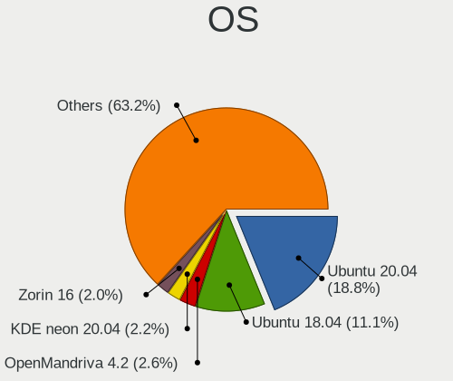

| Name                         | Desktops | Percent |
|------------------------------|----------|---------|
| Ubuntu 20.04                 | 472      | 17.07%  |
| Ubuntu 18.04                 | 274      | 9.91%   |
| Ubuntu 22.04                 | 99       | 3.58%   |
| OpenMandriva 4.2             | 67       | 2.42%   |
| Zorin 16                     | 63       | 2.28%   |
| Arch Rolling                 | 60       | 2.17%   |
| KDE neon 20.04               | 56       | 2.03%   |
| Debian 11                    | 55       | 1.99%   |
| Pop!_OS 20.04                | 48       | 1.74%   |
| OpenMandriva 4.3             | 48       | 1.74%   |
| Linux Mint 20.3              | 46       | 1.66%   |
| Pop!_OS 21.04                | 45       | 1.63%   |
| Linux Mint 20.2              | 44       | 1.59%   |
| ArcoLinux Rolling            | 44       | 1.59%   |
| Pop!_OS 20.10                | 41       | 1.48%   |
| Manjaro                      | 40       | 1.45%   |
| Ubuntu 19.04                 | 37       | 1.34%   |
| Linux Mint 19.3              | 37       | 1.34%   |
| Zorin 15                     | 36       | 1.3%    |
| Arch                         | 36       | 1.3%    |
| Xubuntu 20.04                | 34       | 1.23%   |
| Ubuntu 19.10                 | 33       | 1.19%   |
| Linux Mint 20.1              | 33       | 1.19%   |
| Ubuntu 21.10                 | 31       | 1.12%   |
| Kubuntu 20.04                | 28       | 1.01%   |
| Pop!_OS 22.04                | 27       | 0.98%   |
| Linux Mint 20                | 26       | 0.94%   |
| Ubuntu 21.04                 | 24       | 0.87%   |
| Ubuntu 20.10                 | 24       | 0.87%   |
| Fedora 36                    | 24       | 0.87%   |
| Debian 10                    | 24       | 0.87%   |
| Ubuntu 18.10                 | 22       | 0.8%    |
| Fedora 34                    | 22       | 0.8%    |
| Fedora 33                    | 20       | 0.72%   |
| Gentoo 2.7                   | 19       | 0.69%   |
| Fedora 35                    | 19       | 0.69%   |
| openSUSE Tumbleweed-XXXXXXXX | 18       | 0.65%   |
| OpenMandriva 4.50            | 18       | 0.65%   |
| Linux Mint 19.1              | 18       | 0.65%   |
| Fedora 31                    | 18       | 0.65%   |

OS Family
---------

OS without a version

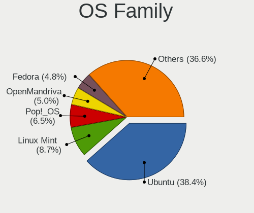

| Name          | Desktops | Percent |
|---------------|----------|---------|
| Ubuntu        | 990      | 37.74%  |
| Linux Mint    | 228      | 8.69%   |
| Pop!_OS       | 173      | 6.6%    |
| OpenMandriva  | 139      | 5.3%    |
| Fedora        | 127      | 4.84%   |
| Zorin         | 101      | 3.85%   |
| Debian        | 100      | 3.81%   |
| Arch          | 96       | 3.66%   |
| Manjaro       | 73       | 2.78%   |
| KDE neon      | 70       | 2.67%   |
| Kubuntu       | 61       | 2.33%   |
| Xubuntu       | 54       | 2.06%   |
| ArcoLinux     | 44       | 1.68%   |
| ROSA          | 39       | 1.49%   |
| Gentoo        | 34       | 1.3%    |
| openSUSE      | 25       | 0.95%   |
| Clear Linux   | 21       | 0.8%    |
| Ubuntu Unity  | 20       | 0.76%   |
| Elementary    | 20       | 0.76%   |
| Ubuntu MATE   | 19       | 0.72%   |
| Endless       | 17       | 0.65%   |
| Kali          | 14       | 0.53%   |
| BlackPanther  | 14       | 0.53%   |
| CentOS        | 13       | 0.5%    |
| Lubuntu       | 11       | 0.42%   |
| Slackware     | 8        | 0.3%    |
| SteamOS       | 7        | 0.27%   |
| RHEL          | 6        | 0.23%   |
| LMDE          | 6        | 0.23%   |
| Garuda Linux  | 6        | 0.23%   |
| EndeavourOS   | 6        | 0.23%   |
| Reborn OS     | 5        | 0.19%   |
| Nobara        | 5        | 0.19%   |
| MX            | 5        | 0.19%   |
| UbuntuDDE     | 4        | 0.15%   |
| Peppermint    | 4        | 0.15%   |
| Mageia        | 4        | 0.15%   |
| Xero          | 3        | 0.11%   |
| Ubuntu Budgie | 3        | 0.11%   |
| NixOS         | 3        | 0.11%   |

Kernel
------

Version of the Linux kernel

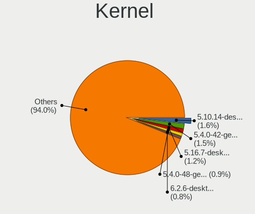

| Version                  | Desktops | Percent |
|--------------------------|----------|---------|
| 5.10.14-desktop-1omv4002 | 67       | 2.12%   |
| 5.4.0-42-generic         | 65       | 2.06%   |
| 5.16.7-desktop-1omv4003  | 48       | 1.52%   |
| 5.4.0-48-generic         | 39       | 1.23%   |
| 5.4.0-52-generic         | 32       | 1.01%   |
| 5.4.0-29-generic         | 31       | 0.98%   |
| 5.4.0-26-generic         | 30       | 0.95%   |
| 5.3.0-28-generic         | 27       | 0.85%   |
| 5.4.0-37-generic         | 26       | 0.82%   |
| 5.15.0-52-generic        | 24       | 0.76%   |
| 5.3.0-40-generic         | 23       | 0.73%   |
| 5.15.0-46-generic        | 23       | 0.73%   |
| 5.4.0-66-generic         | 22       | 0.7%    |
| 5.4.0-65-generic         | 22       | 0.7%    |
| 5.4.0-47-generic         | 21       | 0.66%   |
| 5.4.0-40-generic         | 21       | 0.66%   |
| 5.4.0-74-generic         | 20       | 0.63%   |
| 5.4.0-33-generic         | 20       | 0.63%   |
| 5.8.0-7630-generic       | 19       | 0.6%    |
| 5.15.0-56-generic        | 19       | 0.6%    |
| 5.13.0-7614-generic      | 19       | 0.6%    |
| 5.13.0-39-generic        | 19       | 0.6%    |
| 5.11.0-7620-generic      | 19       | 0.6%    |
| 5.4.0-54-generic         | 18       | 0.57%   |
| 5.3.0-46-generic         | 18       | 0.57%   |
| 5.11.0-40-generic        | 18       | 0.57%   |
| 5.4.0-72-generic         | 17       | 0.54%   |
| 5.4.0-58-generic         | 17       | 0.54%   |
| 5.15.0-48-generic        | 17       | 0.54%   |
| 5.11.0-25-generic        | 17       | 0.54%   |
| 5.4.0-91-generic         | 16       | 0.51%   |
| 5.4.0-7634-generic       | 16       | 0.51%   |
| 5.15.0-53-generic        | 16       | 0.51%   |
| 5.11.0-43-generic        | 15       | 0.47%   |
| 5.11.0-27-generic        | 15       | 0.47%   |
| 5.8.0-50-generic         | 14       | 0.44%   |
| 5.4.0-73-generic         | 14       | 0.44%   |
| 5.4.0-31-generic         | 14       | 0.44%   |
| 5.13.0-28-generic        | 14       | 0.44%   |
| 5.4.0-88-generic         | 13       | 0.41%   |

Kernel Family
-------------

Linux kernel without a distro release

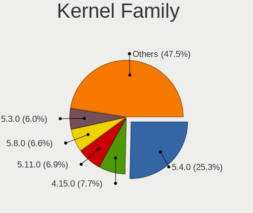

| Version | Desktops | Percent |
|---------|----------|---------|
| 5.4.0   | 648      | 22.31%  |
| 4.15.0  | 190      | 6.54%   |
| 5.15.0  | 176      | 6.06%   |
| 5.11.0  | 169      | 5.82%   |
| 5.8.0   | 161      | 5.54%   |
| 5.13.0  | 155      | 5.34%   |
| 5.3.0   | 145      | 4.99%   |
| 5.0.0   | 90       | 3.1%    |
| 4.18.0  | 73       | 2.51%   |
| 5.10.14 | 67       | 2.31%   |
| 5.10.0  | 62       | 2.13%   |
| 5.16.7  | 48       | 1.65%   |
| 4.19.0  | 25       | 0.86%   |
| 5.19.0  | 18       | 0.62%   |
| 5.17.5  | 14       | 0.48%   |
| 4.9.60  | 14       | 0.48%   |
| 5.9.16  | 12       | 0.41%   |
| 5.18.0  | 12       | 0.41%   |
| 5.14.0  | 11       | 0.38%   |
| 4.4.0   | 11       | 0.38%   |
| 5.18.12 | 10       | 0.34%   |
| 4.18.16 | 10       | 0.34%   |
| 5.19.5  | 9        | 0.31%   |
| 4.9.20  | 9        | 0.31%   |
| 6.0.8   | 8        | 0.28%   |
| 5.8.6   | 8        | 0.28%   |
| 5.6.14  | 8        | 0.28%   |
| 5.16.11 | 8        | 0.28%   |
| 5.13.19 | 8        | 0.28%   |
| 5.12.4  | 8        | 0.28%   |
| 6.0.6   | 7        | 0.24%   |
| 5.7.0   | 7        | 0.24%   |
| 5.6.0   | 7        | 0.24%   |
| 5.17.1  | 7        | 0.24%   |
| 5.17.0  | 7        | 0.24%   |
| 5.15.7  | 7        | 0.24%   |
| 5.13.12 | 7        | 0.24%   |
| 4.9.0   | 7        | 0.24%   |
| 5.9.11  | 6        | 0.21%   |
| 5.5.11  | 6        | 0.21%   |

Kernel Major Ver.
-----------------

Linux kernel major version

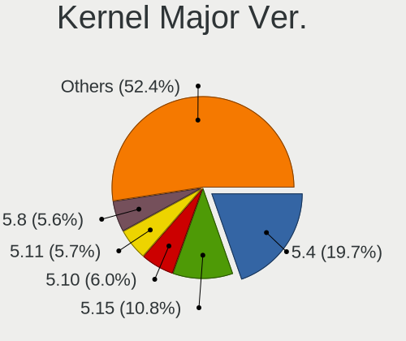

| Version | Desktops | Percent |
|---------|----------|---------|
| 5.4     | 689      | 24.18%  |
| 5.15    | 241      | 8.46%   |
| 5.11    | 203      | 7.12%   |
| 5.8     | 200      | 7.02%   |
| 4.15    | 191      | 6.7%    |
| 5.10    | 190      | 6.67%   |
| 5.13    | 189      | 6.63%   |
| 5.3     | 169      | 5.93%   |
| 5.0     | 93       | 3.26%   |
| 4.18    | 84       | 2.95%   |
| 5.16    | 80       | 2.81%   |
| 5.19    | 54       | 1.89%   |
| 5.18    | 47       | 1.65%   |
| 5.9     | 42       | 1.47%   |
| 5.17    | 41       | 1.44%   |
| 6.0     | 39       | 1.37%   |
| 5.14    | 38       | 1.33%   |
| 5.12    | 37       | 1.3%    |
| 5.6     | 36       | 1.26%   |
| 4.9     | 36       | 1.26%   |
| 4.19    | 36       | 1.26%   |
| 5.7     | 32       | 1.12%   |
| 5.5     | 19       | 0.67%   |
| 4.4     | 13       | 0.46%   |
| 5.2     | 12       | 0.42%   |
| 5.1     | 7        | 0.25%   |
| 4.1     | 7        | 0.25%   |
| 6.1     | 5        | 0.18%   |
| 3.10    | 5        | 0.18%   |
| 4.14    | 4        | 0.14%   |
| 4.13    | 4        | 0.14%   |
| 4.20    | 2        | 0.07%   |
| 3.13    | 2        | 0.07%   |
| 4.12    | 1        | 0.04%   |
| 4.10    | 1        | 0.04%   |
| 3.19    | 1        | 0.04%   |

Arch
----

OS architecture (x86_64, i586, etc.)

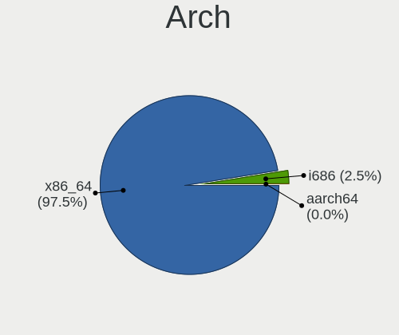

| Name    | Desktops | Percent |
|---------|----------|---------|
| x86_64  | 2450     | 97.61%  |
| i686    | 59       | 2.35%   |
| aarch64 | 1        | 0.04%   |

DE
--

Desktop Environment

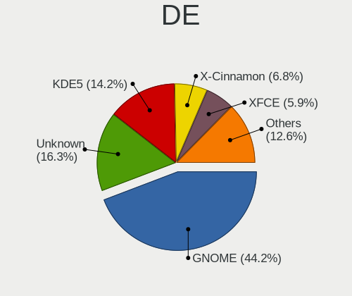

| Name             | Desktops | Percent |
|------------------|----------|---------|
| GNOME            | 1177     | 44.4%   |
| KDE5             | 404      | 15.24%  |
| Unknown          | 401      | 15.13%  |
| X-Cinnamon       | 182      | 6.87%   |
| XFCE             | 164      | 6.19%   |
| KDE              | 80       | 3.02%   |
| MATE             | 62       | 2.34%   |
| Cinnamon         | 36       | 1.36%   |
| KDE4             | 22       | 0.83%   |
| Unity            | 21       | 0.79%   |
| Pantheon         | 19       | 0.72%   |
| LXDE             | 12       | 0.45%   |
| LXQt             | 10       | 0.38%   |
| GNOME Flashback  | 9        | 0.34%   |
| Deepin           | 9        | 0.34%   |
| i3               | 8        | 0.3%    |
| sway             | 6        | 0.23%   |
| Openbox          | 4        | 0.15%   |
| Budgie           | 4        | 0.15%   |
| lightdm-xsession | 3        | 0.11%   |
| GNOME Classic    | 3        | 0.11%   |
| xmonad           | 2        | 0.08%   |
| qtile            | 2        | 0.08%   |
| awesome          | 2        | 0.08%   |
| xubuntu          | 1        | 0.04%   |
| WindowMaker      | 1        | 0.04%   |
| LeftWM           | 1        | 0.04%   |
| icewm            | 1        | 0.04%   |
| Hyprland         | 1        | 0.04%   |
| enlightenment    | 1        | 0.04%   |
| DWM              | 1        | 0.04%   |
| Cutefish         | 1        | 0.04%   |
| bspwm            | 1        | 0.04%   |

Display Server
--------------

X11 or Wayland

| Name    | Desktops | Percent |
|---------|----------|---------|
| X11     | 2098     | 81.22%  |
| Wayland | 219      | 8.48%   |
| Unknown | 184      | 7.12%   |
| Tty     | 81       | 3.14%   |
| Web     | 1        | 0.04%   |

Display Manager
---------------

SDDM, LightDM, etc.

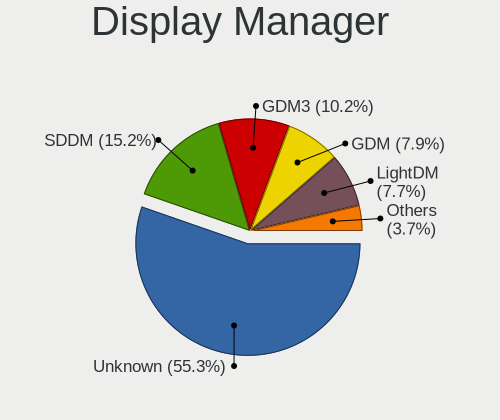

| Name    | Desktops | Percent |
|---------|----------|---------|
| Unknown | 1579     | 60.24%  |
| SDDM    | 350      | 13.35%  |
| GDM     | 209      | 7.97%   |
| GDM3    | 192      | 7.33%   |
| LightDM | 172      | 6.56%   |
| TDM     | 80       | 3.05%   |
| KDM     | 20       | 0.76%   |
| XDM     | 7        | 0.27%   |
| LXDM    | 4        | 0.15%   |
| SLiM    | 3        | 0.11%   |
| Ly      | 2        | 0.08%   |
| XINIT   | 1        | 0.04%   |
| MDM     | 1        | 0.04%   |
| GREETD  | 1        | 0.04%   |

OS Lang
-------

Language

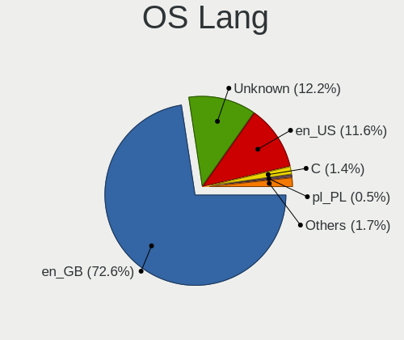

| Lang           | Desktops | Percent |
|----------------|----------|---------|
| en_GB          | 1863     | 72.29%  |
| Unknown        | 356      | 13.81%  |
| en_US          | 272      | 10.55%  |
| C              | 35       | 1.36%   |
| pl_PL          | 13       | 0.5%    |
| ru_RU          | 4        | 0.16%   |
| POSIX          | 4        | 0.16%   |
| en_IE          | 4        | 0.16%   |
| en_CA          | 3        | 0.12%   |
| ro_RO          | 2        | 0.08%   |
| nl_NL          | 2        | 0.08%   |
| hu_HU          | 2        | 0.08%   |
| de_DE          | 2        | 0.08%   |
| C.UTF8         | 2        | 0.08%   |
| wbp_AU         | 1        | 0.04%   |
| uk_UA          | 1        | 0.04%   |
| sk_SK          | 1        | 0.04%   |
| pt_PT          | 1        | 0.04%   |
| pt_BR          | 1        | 0.04%   |
| it_IT          | 1        | 0.04%   |
| fi_FI          | 1        | 0.04%   |
| en_ZA          | 1        | 0.04%   |
| en_US.utf-8    | 1        | 0.04%   |
| en_IN          | 1        | 0.04%   |
| en_GB.iso88591 | 1        | 0.04%   |
| cs_CZ          | 1        | 0.04%   |
| bg_BG          | 1        | 0.04%   |

Boot Mode
---------

EFI or BIOS

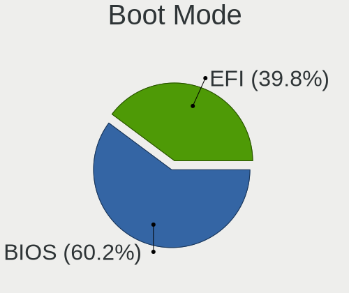

| Mode | Desktops | Percent |
|------|----------|---------|
| BIOS | 1577     | 61.43%  |
| EFI  | 990      | 38.57%  |

Filesystem
----------

Type of filesystem

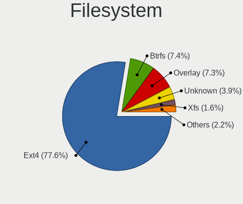

| Type     | Desktops | Percent |
|----------|----------|---------|
| Ext4     | 2032     | 78.7%   |
| Overlay  | 174      | 6.74%   |
| Btrfs    | 173      | 6.7%    |
| Unknown  | 110      | 4.26%   |
| Xfs      | 38       | 1.47%   |
| Zfs      | 24       | 0.93%   |
| Ext2     | 10       | 0.39%   |
| Tmpfs    | 8        | 0.31%   |
| Ext3     | 7        | 0.27%   |
| F2fs     | 3        | 0.12%   |
| Reiserfs | 1        | 0.04%   |
| ExX4     | 1        | 0.04%   |
| Aufs     | 1        | 0.04%   |

Part. scheme
------------

Scheme of partitioning

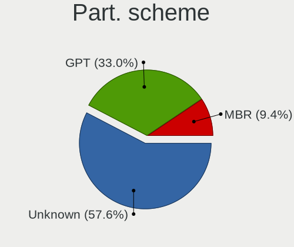

| Type    | Desktops | Percent |
|---------|----------|---------|
| Unknown | 1630     | 63.45%  |
| GPT     | 694      | 27.01%  |
| MBR     | 245      | 9.54%   |

Dual Boot with Linux/BSD
------------------------

Hosting more than one Linux/BSD

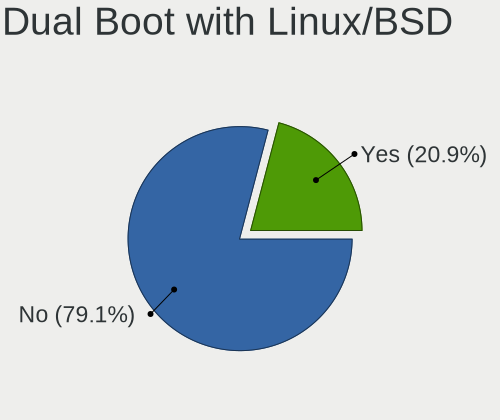

| Dual boot | Desktops | Percent |
|-----------|----------|---------|
| No        | 2038     | 78.9%   |
| Yes       | 545      | 21.1%   |

Dual Boot (Win)
---------------

Hosting Linux and Windows

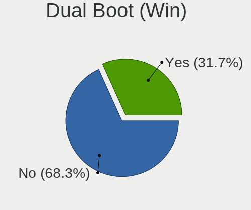

| Dual boot | Desktops | Percent |
|-----------|----------|---------|
| No        | 1746     | 68.02%  |
| Yes       | 821      | 31.98%  |

Board
-----

Vendor
------

Motherboard manufacturer

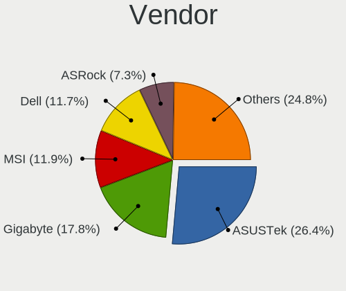

| Name                | Desktops | Percent |
|---------------------|----------|---------|
| ASUSTek Computer    | 657      | 26.18%  |
| Gigabyte Technology | 451      | 17.97%  |
| Dell                | 307      | 12.23%  |
| MSI                 | 288      | 11.47%  |
| ASRock              | 193      | 7.69%   |
| Hewlett-Packard     | 174      | 6.93%   |
| Lenovo              | 81       | 3.23%   |
| Intel               | 60       | 2.39%   |
| Acer                | 54       | 2.15%   |
| Foxconn             | 29       | 1.16%   |
| Fujitsu             | 23       | 0.92%   |
| Pegatron            | 21       | 0.84%   |
| Apple               | 18       | 0.72%   |
| Unknown             | 16       | 0.64%   |
| Biostar             | 15       | 0.6%    |
| Packard Bell        | 14       | 0.56%   |
| Medion              | 11       | 0.44%   |
| Alienware           | 9        | 0.36%   |
| Shuttle             | 7        | 0.28%   |
| Fujitsu Siemens     | 7        | 0.28%   |
| ECS                 | 7        | 0.28%   |
| AZW                 | 5        | 0.2%    |
| TYAN Computer       | 4        | 0.16%   |
| Supermicro          | 4        | 0.16%   |
| Inventec            | 4        | 0.16%   |
| OEM_MB              | 3        | 0.12%   |
| Huanan              | 3        | 0.12%   |
| AMI                 | 3        | 0.12%   |
| Wistron             | 2        | 0.08%   |
| Seeed Studio        | 2        | 0.08%   |
| MiTAC               | 2        | 0.08%   |
| EVGA                | 2        | 0.08%   |
| ASRockRack          | 2        | 0.08%   |
| Advent              | 2        | 0.08%   |
| ABIT                | 2        | 0.08%   |
| YANYU               | 1        | 0.04%   |
| XFX                 | 1        | 0.04%   |
| Uniwill             | 1        | 0.04%   |
| SYWZ                | 1        | 0.04%   |
| Sun Microsystems    | 1        | 0.04%   |

Model
-----

Motherboard model

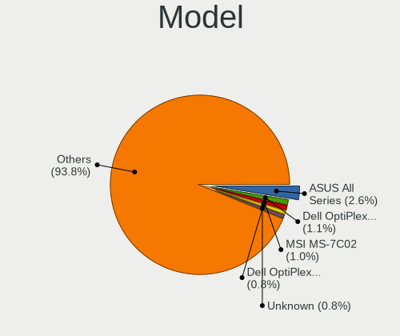

| Name                             | Desktops | Percent |
|----------------------------------|----------|---------|
| ASUS All Series                  | 65       | 2.59%   |
| Dell OptiPlex 7010               | 27       | 1.08%   |
| MSI MS-7C02                      | 25       | 1%      |
| MSI MS-7C37                      | 18       | 0.72%   |
| Dell OptiPlex 755                | 18       | 0.72%   |
| ASUS ROG STRIX B450-F GAMING     | 18       | 0.72%   |
| Dell OptiPlex 780                | 17       | 0.68%   |
| ASUS M5A78L-M/USB3               | 17       | 0.68%   |
| Unknown                          | 17       | 0.68%   |
| Dell OptiPlex 790                | 16       | 0.64%   |
| ASUS TUF Gaming X570-PLUS        | 16       | 0.64%   |
| ASUS PRIME A320M-K               | 13       | 0.52%   |
| Gigabyte X570 AORUS ELITE        | 12       | 0.48%   |
| Gigabyte 970A-DS3P               | 12       | 0.48%   |
| HP ProLiant MicroServer          | 10       | 0.4%    |
| Gigabyte GA-78LMT-USB3 6.0       | 10       | 0.4%    |
| Gigabyte GA-78LMT-USB3           | 10       | 0.4%    |
| ASUS ROG CROSSHAIR VIII HERO     | 10       | 0.4%    |
| Dell Vostro 200                  | 9        | 0.36%   |
| Dell OptiPlex 3020               | 9        | 0.36%   |
| ASUS ROG STRIX B550-F GAMING     | 9        | 0.36%   |
| ASUS PRIME B450M-A               | 9        | 0.36%   |
| ASUS PRIME B450-PLUS             | 9        | 0.36%   |
| MSI MS-7B85                      | 8        | 0.32%   |
| MSI MS-7B79                      | 8        | 0.32%   |
| MSI MS-7A34                      | 8        | 0.32%   |
| MSI MS-7721                      | 8        | 0.32%   |
| Gigabyte H61M-DS2 DVI            | 8        | 0.32%   |
| Gigabyte B450M DS3H              | 8        | 0.32%   |
| Gigabyte A320M-S2H               | 8        | 0.32%   |
| Dell Precision WorkStation T3500 | 8        | 0.32%   |
| Dell OptiPlex 9020               | 8        | 0.32%   |
| ASUS PRIME X370-PRO              | 8        | 0.32%   |
| ASUS PRIME B350-PLUS             | 8        | 0.32%   |
| ASRock N68C-S UCC                | 8        | 0.32%   |
| MSI MS-7C91                      | 7        | 0.28%   |
| MSI MS-7B89                      | 7        | 0.28%   |
| MSI MS-7A38                      | 7        | 0.28%   |
| MSI MS-7817                      | 7        | 0.28%   |
| MSI MS-7758                      | 7        | 0.28%   |

Model Family
------------

Motherboard model prefix

| Name                   | Desktops | Percent |
|------------------------|----------|---------|
| Dell OptiPlex          | 171      | 6.81%   |
| ASUS ROG               | 116      | 4.62%   |
| ASUS PRIME             | 109      | 4.34%   |
| ASUS All               | 65       | 2.59%   |
| HP Compaq              | 57       | 2.27%   |
| Lenovo ThinkCentre     | 53       | 2.11%   |
| Dell Precision         | 48       | 1.91%   |
| Acer Aspire            | 39       | 1.55%   |
| ASUS TUF               | 38       | 1.51%   |
| Dell Inspiron          | 33       | 1.31%   |
| Gigabyte X570          | 32       | 1.27%   |
| MSI MS-7C02            | 25       | 1%      |
| ASUS M5A78L-M          | 25       | 1%      |
| Gigabyte GA-78LMT-USB3 | 24       | 0.96%   |
| Dell Vostro            | 23       | 0.92%   |
| HP EliteDesk           | 21       | 0.84%   |
| HP ProLiant            | 20       | 0.8%    |
| MSI MS-7C37            | 18       | 0.72%   |
| Fujitsu ESPRIMO        | 18       | 0.72%   |
| Unknown                | 17       | 0.68%   |
| Gigabyte Z390          | 16       | 0.64%   |
| ASUS SABERTOOTH        | 16       | 0.64%   |
| Gigabyte B450          | 15       | 0.6%    |
| ASUS Maximus           | 15       | 0.6%    |
| HP ProDesk             | 14       | 0.56%   |
| Gigabyte B450M         | 13       | 0.52%   |
| Gigabyte 970A-DS3P     | 13       | 0.52%   |
| Gigabyte B550          | 12       | 0.48%   |
| Gigabyte A320M-S2H     | 12       | 0.48%   |
| ASUS P8Z77-V           | 12       | 0.48%   |
| Packard Bell IMEDIA    | 10       | 0.4%    |
| Foxconn Pro            | 9        | 0.36%   |
| Dell XPS               | 9        | 0.36%   |
| ASUS M5A97             | 9        | 0.36%   |
| ASRock N68C-S          | 9        | 0.36%   |
| MSI MS-7B85            | 8        | 0.32%   |
| MSI MS-7B79            | 8        | 0.32%   |
| MSI MS-7A34            | 8        | 0.32%   |
| MSI MS-7721            | 8        | 0.32%   |
| HP Pavilion            | 8        | 0.32%   |

MFG Year
--------

Motherboard manufacture year

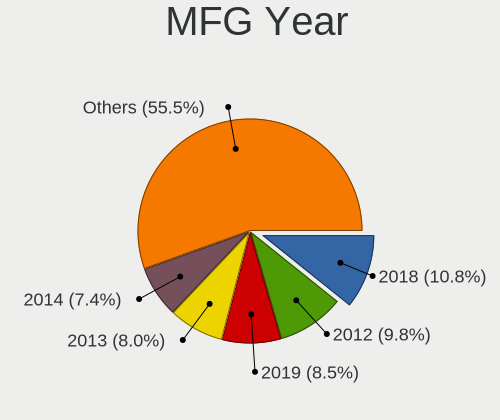

| Year | Desktops | Percent |
|------|----------|---------|
| 2018 | 274      | 10.92%  |
| 2012 | 252      | 10.04%  |
| 2019 | 225      | 8.96%   |
| 2013 | 205      | 8.17%   |
| 2014 | 192      | 7.65%   |
| 2011 | 186      | 7.41%   |
| 2010 | 165      | 6.57%   |
| 2017 | 164      | 6.53%   |
| 2020 | 160      | 6.37%   |
| 2009 | 133      | 5.3%    |
| 2008 | 102      | 4.06%   |
| 2015 | 98       | 3.9%    |
| 2016 | 94       | 3.75%   |
| 2007 | 89       | 3.55%   |
| 2021 | 80       | 3.19%   |
| 2006 | 40       | 1.59%   |
| 2022 | 23       | 0.92%   |
| 2005 | 19       | 0.76%   |
| 2004 | 6        | 0.24%   |
| 2003 | 2        | 0.08%   |
| 2002 | 1        | 0.04%   |

Form Factor
-----------

Physical design of the computer

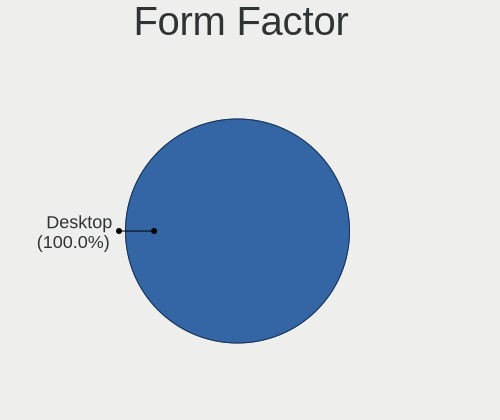

| Name    | Desktops | Percent |
|---------|----------|---------|
| Desktop | 2510     | 100%    |

Secure Boot
-----------

Enabled or disabled

| State    | Desktops | Percent |
|----------|----------|---------|
| Disabled | 2455     | 97.38%  |
| Enabled  | 66       | 2.62%   |

Coreboot
--------

Have coreboot on board

| Used | Desktops | Percent |
|------|----------|---------|
| No   | 2509     | 99.96%  |
| Yes  | 1        | 0.04%   |

RAM Size
--------

Total RAM memory

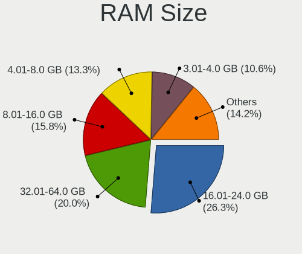

| Size in GB      | Desktops | Percent |
|-----------------|----------|---------|
| 16.01-24.0      | 677      | 26.38%  |
| 8.01-16.0       | 490      | 19.1%   |
| 32.01-64.0      | 409      | 15.94%  |
| 4.01-8.0        | 349      | 13.6%   |
| 3.01-4.0        | 344      | 13.41%  |
| 64.01-256.0     | 114      | 4.44%   |
| 1.01-2.0        | 75       | 2.92%   |
| 24.01-32.0      | 57       | 2.22%   |
| 2.01-3.0        | 33       | 1.29%   |
| 0.51-1.0        | 14       | 0.55%   |
| More than 256.0 | 4        | 0.16%   |

RAM Used
--------

Used RAM memory

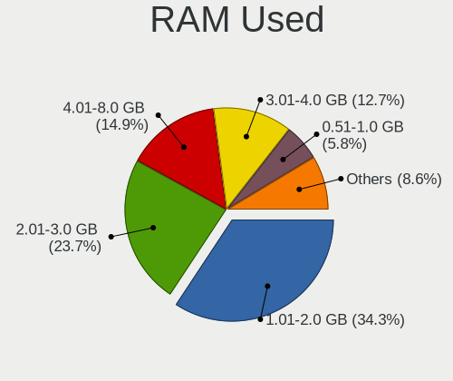

| Used GB     | Desktops | Percent |
|-------------|----------|---------|
| 1.01-2.0    | 1063     | 36.96%  |
| 2.01-3.0    | 671      | 23.33%  |
| 4.01-8.0    | 382      | 13.28%  |
| 3.01-4.0    | 346      | 12.03%  |
| 0.51-1.0    | 193      | 6.71%   |
| 8.01-16.0   | 137      | 4.76%   |
| 0.01-0.5    | 34       | 1.18%   |
| 16.01-24.0  | 25       | 0.87%   |
| 24.01-32.0  | 13       | 0.45%   |
| 32.01-64.0  | 8        | 0.28%   |
| 64.01-256.0 | 2        | 0.07%   |
| Unknown     | 2        | 0.07%   |

Total Drives
------------

Number of drives on board

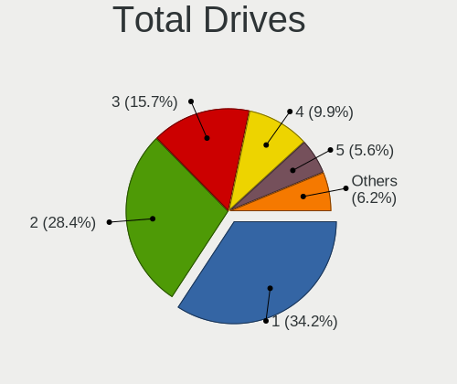

| Drives  | Desktops | Percent |
|---------|----------|---------|
| 1       | 903      | 34.08%  |
| 2       | 758      | 28.6%   |
| 3       | 414      | 15.62%  |
| 4       | 262      | 9.89%   |
| 5       | 148      | 5.58%   |
| 6       | 77       | 2.91%   |
| 7       | 29       | 1.09%   |
| 0       | 18       | 0.68%   |
| 8       | 13       | 0.49%   |
| 9       | 10       | 0.38%   |
| 12      | 5        | 0.19%   |
| 11      | 5        | 0.19%   |
| 10      | 4        | 0.15%   |
| 21      | 1        | 0.04%   |
| 20      | 1        | 0.04%   |
| 13      | 1        | 0.04%   |
| Unknown | 1        | 0.04%   |

Has CD-ROM
----------

Has CD-ROM on board

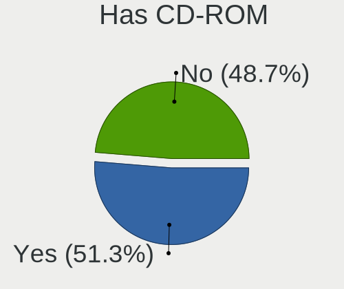

| Presented | Desktops | Percent |
|-----------|----------|---------|
| Yes       | 1324     | 51.78%  |
| No        | 1233     | 48.22%  |

Has Ethernet
------------

Has Ethernet on board

| Presented | Desktops | Percent |
|-----------|----------|---------|
| Yes       | 2476     | 98.61%  |
| No        | 35       | 1.39%   |

Has WiFi
--------

Has WiFi module

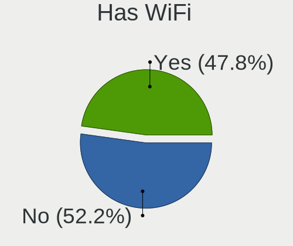

| Presented | Desktops | Percent |
|-----------|----------|---------|
| No        | 1340     | 52.38%  |
| Yes       | 1218     | 47.62%  |

Has Bluetooth
-------------

Has Bluetooth module

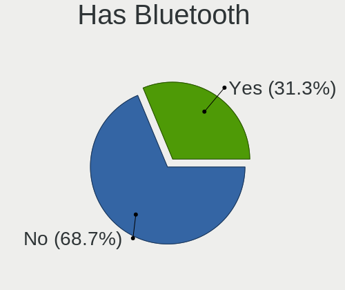

| Presented | Desktops | Percent |
|-----------|----------|---------|
| No        | 1751     | 68.51%  |
| Yes       | 805      | 31.49%  |

Location
--------

Country
-------

Geographic location (country)

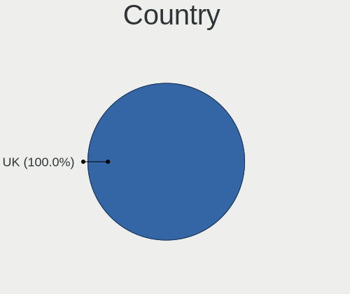

| Country | Desktops | Percent |
|---------|----------|---------|
| UK      | 2510     | 100%    |

City
----

Geographic location (city)

| City                | Desktops | Percent |
|---------------------|----------|---------|
| London              | 147      | 5.29%   |
| Manchester          | 78       | 2.81%   |
| Bristol             | 50       | 1.8%    |
| Birmingham          | 42       | 1.51%   |
| Sheffield           | 40       | 1.44%   |
| Nottingham          | 37       | 1.33%   |
| Glasgow             | 33       | 1.19%   |
| Edinburgh           | 30       | 1.08%   |
| Liverpool           | 25       | 0.9%    |
| Derby               | 25       | 0.9%    |
| Leeds               | 24       | 0.86%   |
| Southampton         | 22       | 0.79%   |
| Norwich             | 22       | 0.79%   |
| Cambridge           | 22       | 0.79%   |
| Reading             | 21       | 0.76%   |
| Croydon             | 21       | 0.76%   |
| Milton Keynes       | 20       | 0.72%   |
| Islington           | 20       | 0.72%   |
| Newcastle upon Tyne | 18       | 0.65%   |
| Stockport           | 17       | 0.61%   |
| Swindon             | 16       | 0.58%   |
| Gloucester          | 16       | 0.58%   |
| Cardiff             | 16       | 0.58%   |
| Wolverhampton       | 15       | 0.54%   |
| Wigan               | 14       | 0.5%    |
| Hackney             | 14       | 0.5%    |
| Bradford            | 14       | 0.5%    |
| York                | 13       | 0.47%   |
| Sunderland          | 13       | 0.47%   |
| Stoke-on-Trent      | 13       | 0.47%   |
| Plymouth            | 13       | 0.47%   |
| Rotherham           | 12       | 0.43%   |
| Portsmouth          | 12       | 0.43%   |
| Clapham             | 12       | 0.43%   |
| Aberdeen            | 12       | 0.43%   |
| Walsall             | 11       | 0.4%    |
| Twickenham          | 11       | 0.4%    |
| Telford             | 11       | 0.4%    |
| Peterborough        | 11       | 0.4%    |
| Leicester           | 11       | 0.4%    |

Drives
------

Drive Vendor
------------

Hard drive vendors

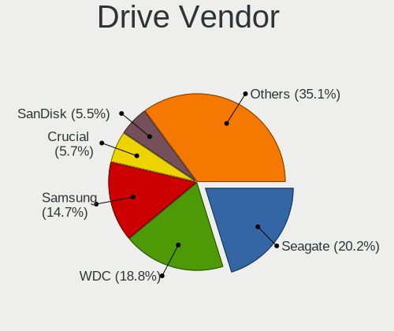

| Vendor                    | Desktops | Drives | Percent |
|---------------------------|----------|--------|---------|
| Seagate                   | 967      | 1702   | 20%     |
| WDC                       | 888      | 1617   | 18.37%  |
| Samsung Electronics       | 714      | 1264   | 14.77%  |
| Crucial                   | 292      | 439    | 6.04%   |
| SanDisk                   | 276      | 389    | 5.71%   |
| Toshiba                   | 260      | 408    | 5.38%   |
| Kingston                  | 242      | 350    | 5.01%   |
| Hitachi                   | 203      | 301    | 4.2%    |
| Phison                    | 100      | 140    | 2.07%   |
| Intel                     | 67       | 107    | 1.39%   |
| China                     | 55       | 79     | 1.14%   |
| Unknown                   | 53       | 87     | 1.1%    |
| A-DATA Technology         | 53       | 74     | 1.1%    |
| Maxtor                    | 52       | 79     | 1.08%   |
| OCZ                       | 47       | 55     | 0.97%   |
| HGST                      | 40       | 61     | 0.83%   |
| Corsair                   | 35       | 49     | 0.72%   |
| Silicon Motion            | 28       | 37     | 0.58%   |
| PNY                       | 28       | 35     | 0.58%   |
| SK hynix                  | 19       | 25     | 0.39%   |
| Micron Technology         | 18       | 19     | 0.37%   |
| Transcend                 | 17       | 20     | 0.35%   |
| Patriot                   | 16       | 23     | 0.33%   |
| JMicron Technology        | 16       | 25     | 0.33%   |
| Micron/Crucial Technology | 14       | 24     | 0.29%   |
| LITEON                    | 14       | 17     | 0.29%   |
| Gigabyte Technology       | 14       | 21     | 0.29%   |
| Apple                     | 13       | 15     | 0.27%   |
| SABRENT                   | 12       | 12     | 0.25%   |
| Integral                  | 12       | 15     | 0.25%   |
| ASMT                      | 12       | 17     | 0.25%   |
| Phison Electronics        | 11       | 21     | 0.23%   |
| Hewlett-Packard           | 11       | 17     | 0.23%   |
| Fujitsu                   | 10       | 18     | 0.21%   |
| Drevo                     | 10       | 16     | 0.21%   |
| LITEONIT                  | 9        | 11     | 0.19%   |
| Lexar                     | 9        | 10     | 0.19%   |
| Unknown                   | 8        | 10     | 0.17%   |
| Vaseky                    | 7        | 10     | 0.14%   |
| SPCC                      | 7        | 12     | 0.14%   |

Drive Model
-----------

Hard drive models

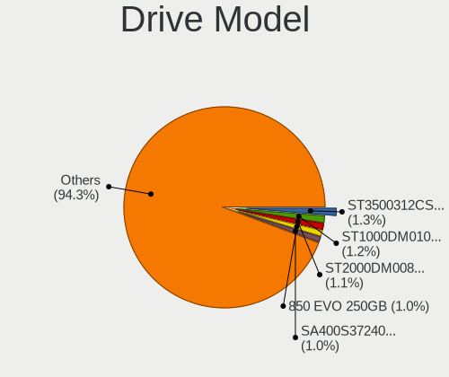

| Model                            | Desktops | Percent |
|----------------------------------|----------|---------|
| Seagate ST3500312CS 500GB        | 81       | 1.41%   |
| Seagate ST1000DM010-2EP102 1TB   | 66       | 1.15%   |
| Samsung SSD 850 EVO 250GB        | 63       | 1.09%   |
| Seagate ST2000DM008-2FR102 2TB   | 60       | 1.04%   |
| Kingston SA400S37240G 240GB SSD  | 55       | 0.96%   |
| Seagate ST500DM002-1BD142 500GB  | 50       | 0.87%   |
| Samsung SSD 850 EVO 500GB        | 45       | 0.78%   |
| Crucial CT1000MX500SSD1 1TB      | 43       | 0.75%   |
| Samsung NVMe SSD Drive 500GB     | 41       | 0.71%   |
| Kingston SA400S37120G 120GB SSD  | 41       | 0.71%   |
| Samsung SSD 860 EVO 1TB          | 40       | 0.69%   |
| Crucial CT500MX500SSD1 500GB     | 40       | 0.69%   |
| Samsung SSD 860 EVO 500GB        | 37       | 0.64%   |
| Seagate ST4000DM004-2CV104 4TB   | 33       | 0.57%   |
| Seagate ST2000DM001-1ER164 2TB   | 33       | 0.57%   |
| Samsung NVMe SSD Drive 1TB       | 32       | 0.56%   |
| Samsung SSD 970 EVO Plus 1TB     | 31       | 0.54%   |
| Toshiba DT01ACA100 1TB           | 30       | 0.52%   |
| Seagate ST1000DM003-1ER162 1TB   | 28       | 0.49%   |
| Seagate ST1000DM003-1CH162 1TB   | 28       | 0.49%   |
| WDC WD10EZEX-08WN4A0 1TB         | 27       | 0.47%   |
| Toshiba HDWD130 3TB              | 27       | 0.47%   |
| Seagate ST3500418AS 500GB        | 27       | 0.47%   |
| Seagate ST2000DM006-2DM164 2TB   | 27       | 0.47%   |
| Samsung HD103SJ 1TB              | 27       | 0.47%   |
| Toshiba HDWD110 1TB              | 26       | 0.45%   |
| Samsung SSD 840 EVO 250GB        | 26       | 0.45%   |
| WDC WD20EZRX-00D8PB0 2TB         | 25       | 0.43%   |
| Kingston SV300S37A120G 120GB SSD | 25       | 0.43%   |
| WDC WD20EZRZ-00Z5HB0 2TB         | 24       | 0.42%   |
| Crucial CT240BX500SSD1 240GB     | 24       | 0.42%   |
| Seagate ST2000DM001-1CH164 2TB   | 23       | 0.4%    |
| Toshiba DT01ACA200 2TB           | 22       | 0.38%   |
| SanDisk NVMe SSD Drive 1TB       | 22       | 0.38%   |
| Phison Sabrent 1TB               | 22       | 0.38%   |
| Crucial CT250MX500SSD1 250GB     | 22       | 0.38%   |
| Seagate ST8000DM004-2CX188 8TB   | 21       | 0.36%   |
| Hitachi HDP725050GLA360 500GB    | 21       | 0.36%   |
| Seagate ST1000DM003-9YN162 1TB   | 19       | 0.33%   |
| SanDisk SSD PLUS 480GB           | 19       | 0.33%   |

HDD Vendor
----------

Hard disk drive vendors

| Vendor              | Desktops | Drives | Percent |
|---------------------|----------|--------|---------|
| Seagate             | 940      | 1642   | 37.72%  |
| WDC                 | 778      | 1420   | 31.22%  |
| Toshiba             | 236      | 365    | 9.47%   |
| Hitachi             | 203      | 301    | 8.15%   |
| Samsung Electronics | 159      | 232    | 6.38%   |
| Maxtor              | 45       | 72     | 1.81%   |
| HGST                | 40       | 61     | 1.61%   |
| Unknown             | 22       | 27     | 0.88%   |
| ASMT                | 12       | 17     | 0.48%   |
| Hewlett-Packard     | 10       | 16     | 0.4%    |
| Fujitsu             | 10       | 18     | 0.4%    |
| Apple               | 7        | 8      | 0.28%   |
| ASMedia             | 4        | 10     | 0.16%   |
| WD MediaMax         | 3        | 3      | 0.12%   |
| HPE                 | 3        | 5      | 0.12%   |
| ASMT109x            | 3        | 5      | 0.12%   |
| USB3.0              | 2        | 3      | 0.08%   |
| USB                 | 2        | 2      | 0.08%   |
| ExcelStor           | 2        | 4      | 0.08%   |
| TrueNAS             | 1        | 3      | 0.04%   |
| SAGE                | 1        | 1      | 0.04%   |
| RSH-339             | 1        | 1      | 0.04%   |
| Quantum             | 1        | 1      | 0.04%   |
| MARVELL             | 1        | 1      | 0.04%   |
| Magnetic Data       | 1        | 1      | 0.04%   |
| LIO-ORG             | 1        | 8      | 0.04%   |
| KESU                | 1        | 5      | 0.04%   |
| JMicron Technology  | 1        | 1      | 0.04%   |
| Advantech           | 1        | 1      | 0.04%   |
| Unknown             | 1        | 1      | 0.04%   |

SSD Vendor
----------

Solid state drive vendors

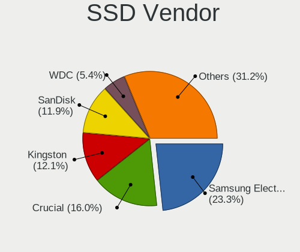

| Vendor              | Desktops | Drives | Percent |
|---------------------|----------|--------|---------|
| Samsung Electronics | 420      | 650    | 24.03%  |
| Crucial             | 273      | 416    | 15.62%  |
| Kingston            | 219      | 313    | 12.53%  |
| SanDisk             | 216      | 283    | 12.36%  |
| WDC                 | 95       | 129    | 5.43%   |
| China               | 53       | 77     | 3.03%   |
| OCZ                 | 47       | 55     | 2.69%   |
| A-DATA Technology   | 42       | 56     | 2.4%    |
| Intel               | 32       | 38     | 1.83%   |
| PNY                 | 27       | 34     | 1.54%   |
| Toshiba             | 21       | 24     | 1.2%    |
| Corsair             | 21       | 29     | 1.2%    |
| Patriot             | 16       | 23     | 0.92%   |
| Transcend           | 15       | 18     | 0.86%   |
| LITEON              | 14       | 17     | 0.8%    |
| SK hynix            | 12       | 14     | 0.69%   |
| Micron Technology   | 12       | 12     | 0.69%   |
| Integral            | 12       | 15     | 0.69%   |
| Gigabyte Technology | 11       | 16     | 0.63%   |
| Drevo               | 10       | 16     | 0.57%   |
| Unknown             | 9        | 14     | 0.51%   |
| Seagate             | 9        | 11     | 0.51%   |
| LITEONIT            | 9        | 11     | 0.51%   |
| Lexar               | 9        | 10     | 0.51%   |
| JMicron Technology  | 8        | 13     | 0.46%   |
| Vaseky              | 7        | 10     | 0.4%    |
| Maxtor              | 7        | 7      | 0.4%    |
| Team                | 6        | 6      | 0.34%   |
| KIOXIA-EXCERIA      | 6        | 10     | 0.34%   |
| Unknown             | 6        | 7      | 0.34%   |
| TO Exter            | 5        | 6      | 0.29%   |
| TCSUNBOW            | 5        | 7      | 0.29%   |
| SPCC                | 5        | 10     | 0.29%   |
| Netac               | 5        | 6      | 0.29%   |
| Apple               | 5        | 6      | 0.29%   |
| ORTIAL              | 4        | 4      | 0.23%   |
| KingSpec            | 4        | 6      | 0.23%   |
| KingDian            | 4        | 4      | 0.23%   |
| XUM                 | 3        | 3      | 0.17%   |
| Verbatim            | 3        | 3      | 0.17%   |

Drive Kind
----------

HDD or SSD

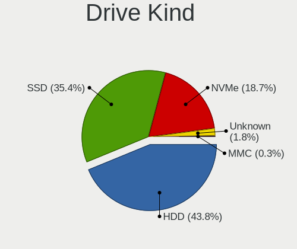

| Kind    | Desktops | Drives | Percent |
|---------|----------|--------|---------|
| HDD     | 1816     | 4235   | 46.65%  |
| SSD     | 1380     | 2468   | 35.45%  |
| NVMe    | 620      | 1051   | 15.93%  |
| Unknown | 68       | 102    | 1.75%   |
| MMC     | 9        | 11     | 0.23%   |

Drive Connector
---------------

SATA, SAS, NVMe, etc.

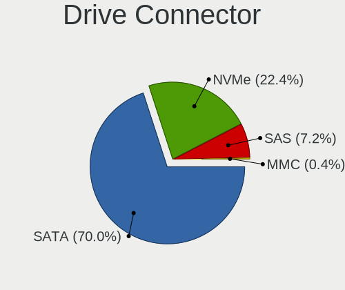

| Type | Desktops | Drives | Percent |
|------|----------|--------|---------|
| SATA | 2335     | 6454   | 73.57%  |
| NVMe | 608      | 1036   | 19.16%  |
| SAS  | 222      | 366    | 6.99%   |
| MMC  | 9        | 11     | 0.28%   |

Drive Size
----------

Size of hard drive

| Size in TB | Desktops | Drives | Percent |
|------------|----------|--------|---------|
| 0.01-0.5   | 1763     | 3408   | 48.62%  |
| 0.51-1.0   | 946      | 1567   | 26.09%  |
| 1.01-2.0   | 452      | 798    | 12.47%  |
| 3.01-4.0   | 173      | 317    | 4.77%   |
| 2.01-3.0   | 142      | 259    | 3.92%   |
| 4.01-10.0  | 131      | 304    | 3.61%   |
| 10.01-20.0 | 18       | 49     | 0.5%    |
| 0          | 1        | 1      | 0.03%   |

Space Total
-----------

Amount of disk space available on the file system

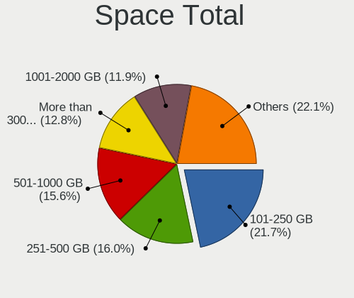

| Size in GB     | Desktops | Percent |
|----------------|----------|---------|
| 101-250        | 618      | 22.81%  |
| 251-500        | 439      | 16.21%  |
| 501-1000       | 432      | 15.95%  |
| More than 3000 | 315      | 11.63%  |
| 1001-2000      | 315      | 11.63%  |
| 2001-3000      | 152      | 5.61%   |
| 1-20           | 147      | 5.43%   |
| 51-100         | 134      | 4.95%   |
| Unknown        | 97       | 3.58%   |
| 21-50          | 60       | 2.21%   |

Space Used
----------

Amount of used disk space

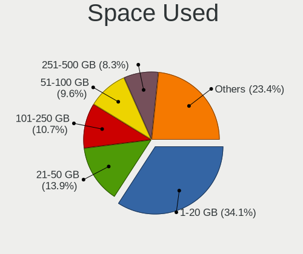

| Used GB        | Desktops | Percent |
|----------------|----------|---------|
| 1-20           | 950      | 33.58%  |
| 21-50          | 386      | 13.64%  |
| 101-250        | 311      | 10.99%  |
| 51-100         | 276      | 9.76%   |
| 251-500        | 237      | 8.38%   |
| 501-1000       | 218      | 7.71%   |
| 1001-2000      | 166      | 5.87%   |
| More than 3000 | 125      | 4.42%   |
| Unknown        | 97       | 3.43%   |
| 2001-3000      | 62       | 2.19%   |
| 0              | 1        | 0.04%   |

Malfunc. Drives
---------------

Drive models with a malfunction

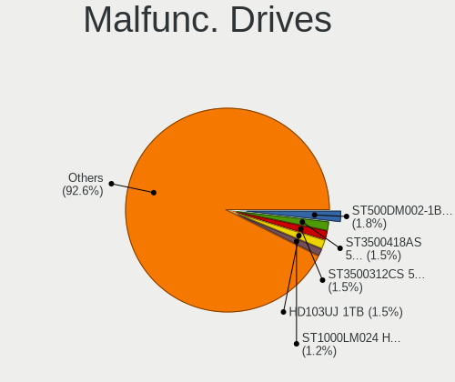

| Model                                    | Desktops | Drives | Percent |
|------------------------------------------|----------|--------|---------|
| Seagate ST500DM002-1BD142 500GB          | 5        | 5      | 1.73%   |
| Seagate ST3500312CS 500GB                | 5        | 7      | 1.73%   |
| Samsung Electronics HD103UJ 1TB          | 5        | 7      | 1.73%   |
| Seagate ST3500418AS 500GB                | 4        | 4      | 1.38%   |
| Samsung Electronics HD103SJ 1TB          | 4        | 5      | 1.38%   |
| WDC WD20EZRZ-00Z5HB0 2TB                 | 3        | 3      | 1.04%   |
| Toshiba DT01ACA050 500GB                 | 3        | 4      | 1.04%   |
| Seagate ST3500620AS 500GB                | 3        | 4      | 1.04%   |
| Seagate ST1000LM024 HN-M101MBB 1TB       | 3        | 6      | 1.04%   |
| Samsung Electronics SSD 960 EVO 250GB    | 3        | 4      | 1.04%   |
| Samsung Electronics SSD 840 Series 120GB | 3        | 3      | 1.04%   |
| Hitachi HUA723030ALA640 3TB              | 3        | 4      | 1.04%   |
| Hitachi HDS721010CLA332 1TB              | 3        | 3      | 1.04%   |
| Hitachi HDP725050GLA360 500GB            | 3        | 3      | 1.04%   |
| WDC WD800JD-00HKA0 80GB                  | 2        | 2      | 0.69%   |
| WDC WD6400AAKS-22A7B2 640GB              | 2        | 2      | 0.69%   |
| WDC WD6400AAKS-22A7B0 640GB              | 2        | 2      | 0.69%   |
| WDC WD5000BEVT-75A0RT0 500GB             | 2        | 4      | 0.69%   |
| WDC WD5000AAKX-75U6AA0 500GB             | 2        | 2      | 0.69%   |
| WDC WD3200AAKS-75B3A0 320GB              | 2        | 2      | 0.69%   |
| WDC WD10EZEX-00WN4A0 1TB                 | 2        | 2      | 0.69%   |
| WDC WD10EARS-00Y5B1 1TB                  | 2        | 3      | 0.69%   |
| WDC WD10EADS-00L5B1 1TB                  | 2        | 2      | 0.69%   |
| Unknown MM0500EBKAE 500GB                | 2        | 2      | 0.69%   |
| Toshiba DT01ACA100 1TB                   | 2        | 2      | 0.69%   |
| Seagate ST9500325AS 500GB                | 2        | 2      | 0.69%   |
| Seagate ST500DM002-1BC142 500GB          | 2        | 3      | 0.69%   |
| Seagate ST31000524AS 1TB                 | 2        | 2      | 0.69%   |
| Seagate ST31000333AS 1TB                 | 2        | 2      | 0.69%   |
| Seagate ST31000322CS 1TB                 | 2        | 2      | 0.69%   |
| Seagate ST2000DM006-2DM164 2TB           | 2        | 2      | 0.69%   |
| Seagate ST2000DM001-1CH164 2TB           | 2        | 3      | 0.69%   |
| Seagate ST1000DM003-9YN162 1TB           | 2        | 3      | 0.69%   |
| Samsung Electronics SSD 970 EVO 2TB      | 2        | 2      | 0.69%   |
| Samsung Electronics HD501LJ 500GB        | 2        | 2      | 0.69%   |
| Kingston SH103S3120G 120GB SSD           | 2        | 4      | 0.69%   |
| Intel SSDSA2M080G2GC 80GB                | 2        | 2      | 0.69%   |
| Intel SSDPEKKW512G7 512GB                | 2        | 4      | 0.69%   |
| Hitachi HTS545025B9A300 250GB            | 2        | 2      | 0.69%   |
| Hitachi HDT725025VLA380 250GB            | 2        | 2      | 0.69%   |

Malfunc. Drive Vendor
---------------------

Vendors of faulty drives

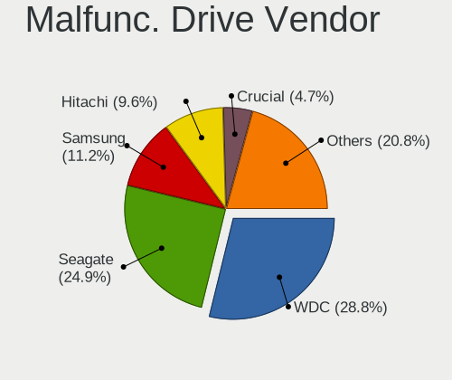

| Vendor              | Desktops | Drives | Percent |
|---------------------|----------|--------|---------|
| WDC                 | 77       | 114    | 27.9%   |
| Seagate             | 73       | 93     | 26.45%  |
| Samsung Electronics | 31       | 42     | 11.23%  |
| Hitachi             | 28       | 47     | 10.14%  |
| Crucial             | 12       | 18     | 4.35%   |
| Toshiba             | 11       | 16     | 3.99%   |
| SanDisk             | 7        | 11     | 2.54%   |
| Intel               | 6        | 10     | 2.17%   |
| Maxtor              | 4        | 4      | 1.45%   |
| Kingston            | 4        | 6      | 1.45%   |
| A-DATA Technology   | 3        | 3      | 1.09%   |
| Unknown             | 2        | 2      | 0.72%   |
| Micron Technology   | 2        | 2      | 0.72%   |
| HGST                | 2        | 2      | 0.72%   |
| Hewlett-Packard     | 2        | 2      | 0.72%   |
| Corsair             | 2        | 6      | 0.72%   |
| WD MediaMax         | 1        | 1      | 0.36%   |
| VENO                | 1        | 1      | 0.36%   |
| SK hynix            | 1        | 1      | 0.36%   |
| LITEON              | 1        | 1      | 0.36%   |
| Faspeed             | 1        | 1      | 0.36%   |
| Drevo               | 1        | 4      | 0.36%   |
| China               | 1        | 1      | 0.36%   |
| BIWIN               | 1        | 1      | 0.36%   |
| BAITITON            | 1        | 4      | 0.36%   |
| AGI                 | 1        | 1      | 0.36%   |

Malfunc. HDD Vendor
-------------------

Vendors of faulty HDD drives

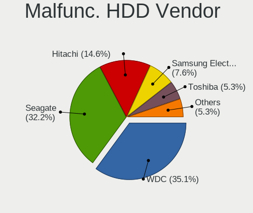

| Vendor              | Desktops | Drives | Percent |
|---------------------|----------|--------|---------|
| WDC                 | 76       | 113    | 35.51%  |
| Seagate             | 73       | 93     | 34.11%  |
| Hitachi             | 28       | 47     | 13.08%  |
| Samsung Electronics | 15       | 22     | 7.01%   |
| Toshiba             | 11       | 16     | 5.14%   |
| Maxtor              | 4        | 4      | 1.87%   |
| Unknown             | 2        | 2      | 0.93%   |
| HGST                | 2        | 2      | 0.93%   |
| Hewlett-Packard     | 2        | 2      | 0.93%   |
| WD MediaMax         | 1        | 1      | 0.47%   |

Malfunc. Drive Kind
-------------------

Kinds of faulty drives

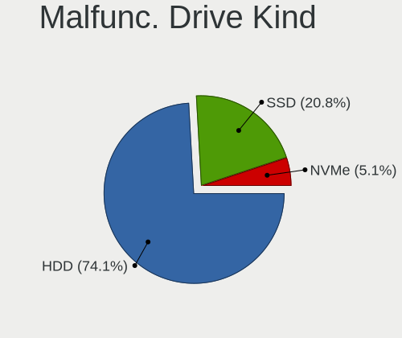

| Kind | Desktops | Drives | Percent |
|------|----------|--------|---------|
| HDD  | 181      | 302    | 74.49%  |
| SSD  | 48       | 73     | 19.75%  |
| NVMe | 14       | 19     | 5.76%   |

Failed Drives
-------------

Failed drive models

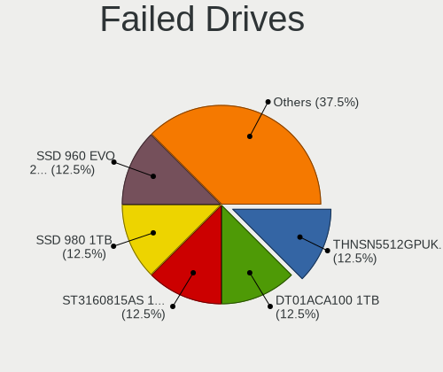

| Model                             | Desktops | Drives | Percent |
|-----------------------------------|----------|--------|---------|
| Toshiba THNSN5512GPUK NVMe 512GB  | 1        | 1      | 16.67%  |
| Toshiba DT01ACA100 1TB            | 1        | 1      | 16.67%  |
| Seagate ST3160815AS 160GB         | 1        | 1      | 16.67%  |
| Samsung Electronics SSD 980 1TB   | 1        | 1      | 16.67%  |
| Samsung Electronics HD502IJ 500GB | 1        | 1      | 16.67%  |
| Hitachi HTS547550A9E384 500GB     | 1        | 1      | 16.67%  |

Failed Drive Vendor
-------------------

Failed drive vendors

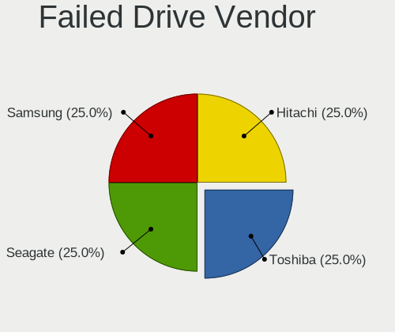

| Vendor              | Desktops | Drives | Percent |
|---------------------|----------|--------|---------|
| Toshiba             | 2        | 2      | 33.33%  |
| Samsung Electronics | 2        | 2      | 33.33%  |
| Seagate             | 1        | 1      | 16.67%  |
| Hitachi             | 1        | 1      | 16.67%  |

Drive Status
------------

Number of failed and malfunc. drives

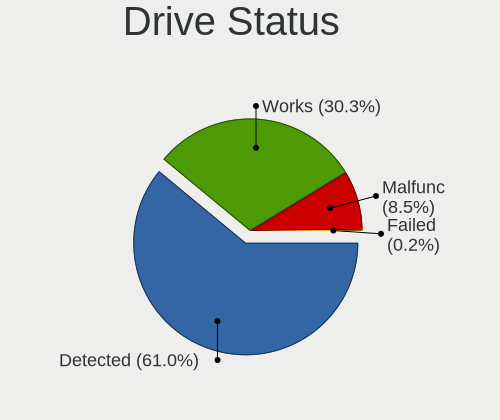

| Status   | Desktops | Drives | Percent |
|----------|----------|--------|---------|
| Detected | 1732     | 5161   | 61.9%   |
| Works    | 828      | 2306   | 29.59%  |
| Malfunc  | 233      | 394    | 8.33%   |
| Failed   | 5        | 6      | 0.18%   |

Storage controller
------------------

Storage Vendor
--------------

Storage controller vendors

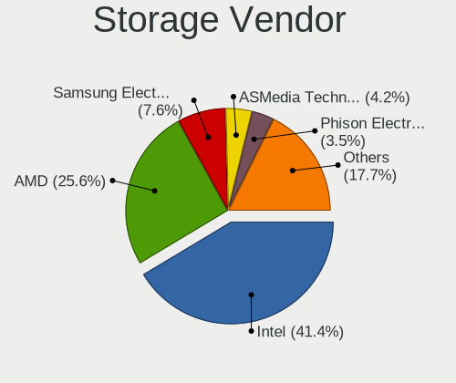

| Vendor                           | Desktops | Percent |
|----------------------------------|----------|---------|
| Intel                            | 1488     | 41.68%  |
| AMD                              | 913      | 25.57%  |
| Samsung Electronics              | 264      | 7.39%   |
| ASMedia Technology               | 150      | 4.2%    |
| Phison Electronics               | 126      | 3.53%   |
| SanDisk                          | 107      | 3%      |
| Nvidia                           | 99       | 2.77%   |
| Marvell Technology Group         | 94       | 2.63%   |
| JMicron Technology               | 79       | 2.21%   |
| Micron/Crucial Technology        | 34       | 0.95%   |
| Silicon Motion                   | 30       | 0.84%   |
| Kingston Technology Company      | 25       | 0.7%    |
| ADATA Technology                 | 21       | 0.59%   |
| VIA Technologies                 | 17       | 0.48%   |
| Silicon Image                    | 17       | 0.48%   |
| Seagate Technology               | 16       | 0.45%   |
| LSI Logic / Symbios Logic        | 16       | 0.45%   |
| Broadcom / LSI                   | 16       | 0.45%   |
| Toshiba America Info Systems     | 10       | 0.28%   |
| Adaptec                          | 9        | 0.25%   |
| SK hynix                         | 8        | 0.22%   |
| Realtek Semiconductor            | 7        | 0.2%    |
| Micron Technology                | 6        | 0.17%   |
| Silicon Integrated Systems [SiS] | 3        | 0.08%   |
| KIOXIA                           | 3        | 0.08%   |
| Integrated Technology Express    | 3        | 0.08%   |
| Hewlett-Packard                  | 3        | 0.08%   |
| ULi Electronics                  | 1        | 0.03%   |
| Shenzhen Longsys Electronics     | 1        | 0.03%   |
| Initio                           | 1        | 0.03%   |
| Broadcom                         | 1        | 0.03%   |
| Apple                            | 1        | 0.03%   |
| Advanced System Products         | 1        | 0.03%   |

Storage Model
-------------

Storage controller models

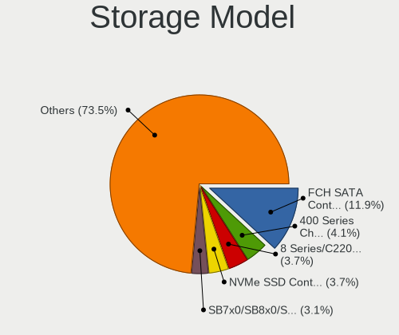

| Model                                                                                   | Desktops | Percent |
|-----------------------------------------------------------------------------------------|----------|---------|
| AMD FCH SATA Controller [AHCI mode]                                                     | 538      | 11.63%  |
| AMD 400 Series Chipset SATA Controller                                                  | 189      | 4.08%   |
| Intel 8 Series/C220 Series Chipset Family 6-port SATA Controller 1 [AHCI mode]          | 169      | 3.65%   |
| Samsung NVMe SSD Controller SM981/PM981/PM983                                           | 164      | 3.54%   |
| AMD SB7x0/SB8x0/SB9x0 IDE Controller                                                    | 146      | 3.16%   |
| ASMedia ASM1062 Serial ATA Controller                                                   | 143      | 3.09%   |
| Intel 6 Series/C200 Series Chipset Family 6 port Desktop SATA AHCI Controller           | 136      | 2.94%   |
| AMD SB7x0/SB8x0/SB9x0 SATA Controller [AHCI mode]                                       | 121      | 2.62%   |
| Intel Q170/Q150/B150/H170/H110/Z170/CM236 Chipset SATA Controller [AHCI Mode]           | 108      | 2.33%   |
| Intel SATA Controller [RAID mode]                                                       | 107      | 2.31%   |
| Intel 7 Series/C210 Series Chipset Family 6-port SATA Controller [AHCI mode]            | 107      | 2.31%   |
| Intel 200 Series PCH SATA controller [AHCI mode]                                        | 103      | 2.23%   |
| AMD SB7x0/SB8x0/SB9x0 SATA Controller [IDE mode]                                        | 101      | 2.18%   |
| AMD 500 Series Chipset SATA Controller                                                  | 83       | 1.79%   |
| Intel NM10/ICH7 Family SATA Controller [IDE mode]                                       | 82       | 1.77%   |
| Phison E12 NVMe Controller                                                              | 75       | 1.62%   |
| Intel Cannon Lake PCH SATA AHCI Controller                                              | 75       | 1.62%   |
| Intel 82801G (ICH7 Family) IDE Controller                                               | 61       | 1.32%   |
| Nvidia MCP61 SATA Controller                                                            | 55       | 1.19%   |
| Intel 9 Series Chipset Family SATA Controller [AHCI Mode]                               | 54       | 1.17%   |
| Intel 6 Series/C200 Series Chipset Family Desktop SATA Controller (IDE mode, ports 4-5) | 54       | 1.17%   |
| Intel 6 Series/C200 Series Chipset Family Desktop SATA Controller (IDE mode, ports 0-3) | 54       | 1.17%   |
| Intel 82801I (ICH9 Family) 2 port SATA Controller [IDE mode]                            | 51       | 1.1%    |
| AMD 300 Series Chipset SATA Controller                                                  | 49       | 1.06%   |
| Intel 82801IR/IO/IH (ICH9R/DO/DH) 4 port SATA Controller [IDE mode]                     | 46       | 0.99%   |
| Intel 82801JI (ICH10 Family) SATA AHCI Controller                                       | 43       | 0.93%   |
| Phison E16 PCIe4 NVMe Controller                                                        | 42       | 0.91%   |
| JMicron JMB363 SATA/IDE Controller                                                      | 42       | 0.91%   |
| Samsung NVMe SSD Controller SM961/PM961/SM963                                           | 41       | 0.89%   |
| Nvidia MCP61 IDE                                                                        | 40       | 0.86%   |
| AMD FCH SATA Controller D                                                               | 38       | 0.82%   |
| Intel C600/X79 series chipset 6-Port SATA AHCI Controller                               | 36       | 0.78%   |
| SanDisk WD Blue SN550 NVMe SSD                                                          | 35       | 0.76%   |
| Samsung NVMe SSD Controller PM9A1/PM9A3/980PRO                                          | 34       | 0.73%   |
| Intel 82801JI (ICH10 Family) 2 port SATA IDE Controller #2                              | 32       | 0.69%   |
| AMD FCH IDE Controller                                                                  | 31       | 0.67%   |
| Intel 82801JI (ICH10 Family) 4 port SATA IDE Controller #1                              | 30       | 0.65%   |
| Intel 82Q35 Express PT IDER Controller                                                  | 28       | 0.61%   |
| Intel 5 Series/3400 Series Chipset 4 port SATA IDE Controller                           | 28       | 0.61%   |
| Intel 4 Series Chipset PT IDER Controller                                               | 28       | 0.61%   |

Storage Kind
------------

Kind of storage controller (IDE, SATA, NVMe, SAS, ...)

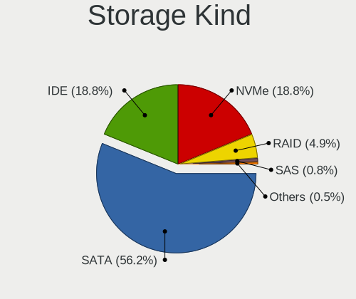

| Kind | Desktops | Percent |
|------|----------|---------|
| SATA | 1980     | 55.93%  |
| IDE  | 717      | 20.25%  |
| NVMe | 614      | 17.34%  |
| RAID | 182      | 5.14%   |
| SAS  | 26       | 0.73%   |
| SCSI | 21       | 0.59%   |

Processor
---------

CPU Vendor
----------

Processor vendors

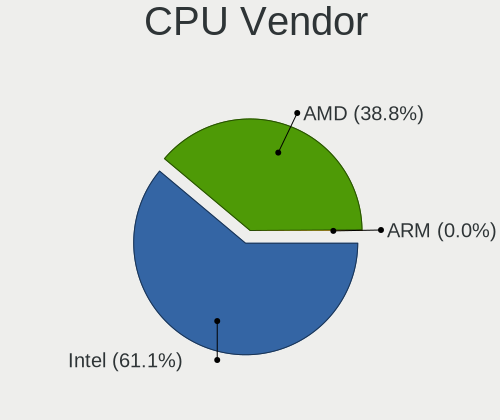

| Vendor       | Desktops | Percent |
|--------------|----------|---------|
| Intel        | 1507     | 60.04%  |
| AMD          | 1001     | 39.88%  |
| CentaurHauls | 1        | 0.04%   |
| ARM          | 1        | 0.04%   |

CPU Model
---------

Processor models

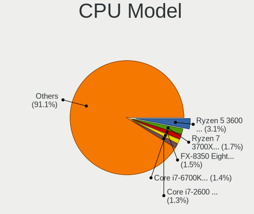

| Model                                       | Desktops | Percent |
|---------------------------------------------|----------|---------|
| AMD Ryzen 5 3600 6-Core Processor           | 74       | 2.93%   |
| AMD Ryzen 7 3700X 8-Core Processor          | 43       | 1.7%    |
| AMD FX-8350 Eight-Core Processor            | 37       | 1.47%   |
| Intel Core i7-6700K CPU @ 4.00GHz           | 34       | 1.35%   |
| Intel Core i7-2600 CPU @ 3.40GHz            | 33       | 1.31%   |
| AMD Ryzen 7 2700X Eight-Core Processor      | 33       | 1.31%   |
| Intel Core i7-4790K CPU @ 4.00GHz           | 31       | 1.23%   |
| Intel Core i7-3770 CPU @ 3.40GHz            | 31       | 1.23%   |
| AMD Ryzen 9 3900X 12-Core Processor         | 30       | 1.19%   |
| Intel Core i5-2400 CPU @ 3.10GHz            | 26       | 1.03%   |
| Intel Core i3-2120 CPU @ 3.30GHz            | 25       | 0.99%   |
| AMD Ryzen 5 5600X 6-Core Processor          | 25       | 0.99%   |
| Intel Core 2 Duo CPU E8400 @ 3.00GHz        | 24       | 0.95%   |
| AMD Ryzen 5 3600X 6-Core Processor          | 24       | 0.95%   |
| AMD FX-6300 Six-Core Processor              | 24       | 0.95%   |
| Intel Core i7-4790 CPU @ 3.60GHz            | 23       | 0.91%   |
| Intel Core i5-3470 CPU @ 3.20GHz            | 21       | 0.83%   |
| AMD Ryzen 9 3950X 16-Core Processor         | 21       | 0.83%   |
| AMD Ryzen 9 5900X 12-Core Processor         | 20       | 0.79%   |
| AMD Ryzen 7 1700 Eight-Core Processor       | 20       | 0.79%   |
| Intel Core i5-4590 CPU @ 3.30GHz            | 19       | 0.75%   |
| Intel Core i5-3570K CPU @ 3.40GHz           | 19       | 0.75%   |
| Intel Core 2 Quad CPU Q6600 @ 2.40GHz       | 19       | 0.75%   |
| AMD Ryzen 5 2600 Six-Core Processor         | 18       | 0.71%   |
| Intel Core i5-4570 CPU @ 3.20GHz            | 17       | 0.67%   |
| Intel Core i5-4460 CPU @ 3.20GHz            | 17       | 0.67%   |
| AMD Ryzen 9 5950X 16-Core Processor         | 17       | 0.67%   |
| AMD Ryzen 5 1600 Six-Core Processor         | 17       | 0.67%   |
| Intel Core i9-9900K CPU @ 3.60GHz           | 16       | 0.63%   |
| Intel Core i7-8700 CPU @ 3.20GHz            | 16       | 0.63%   |
| Intel Core i7-2600K CPU @ 3.40GHz           | 16       | 0.63%   |
| AMD Ryzen 3 3200G with Radeon Vega Graphics | 16       | 0.63%   |
| AMD Ryzen 3 2200G with Radeon Vega Graphics | 16       | 0.63%   |
| Intel Core i7-7700K CPU @ 4.20GHz           | 15       | 0.59%   |
| Intel Core i5-6500 CPU @ 3.20GHz            | 15       | 0.59%   |
| Intel Core i5 CPU 650 @ 3.20GHz             | 15       | 0.59%   |
| Intel Core i7-6700 CPU @ 3.40GHz            | 14       | 0.55%   |
| AMD Ryzen 7 2700 Eight-Core Processor       | 14       | 0.55%   |
| AMD Ryzen 5 3400G with Radeon Vega Graphics | 14       | 0.55%   |
| Intel Core i7-9700K CPU @ 3.60GHz           | 13       | 0.51%   |

CPU Model Family
----------------

Processor model prefix

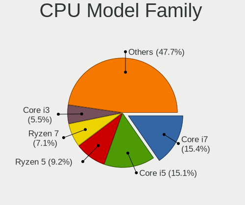

| Model                   | Desktops | Percent |
|-------------------------|----------|---------|
| Intel Core i7           | 396      | 15.73%  |
| Intel Core i5           | 373      | 14.81%  |
| AMD Ryzen 5             | 221      | 8.78%   |
| AMD Ryzen 7             | 153      | 6.08%   |
| Intel Core i3           | 145      | 5.76%   |
| Intel Xeon              | 139      | 5.52%   |
| AMD FX                  | 126      | 5%      |
| AMD Ryzen 9             | 99       | 3.93%   |
| Intel Core 2 Duo        | 97       | 3.85%   |
| Intel Pentium           | 62       | 2.46%   |
| Intel Core 2 Quad       | 61       | 2.42%   |
| Intel Celeron           | 49       | 1.95%   |
| AMD Ryzen 3             | 45       | 1.79%   |
| AMD A10                 | 38       | 1.51%   |
| Other                   | 37       | 1.47%   |
| AMD Athlon II X2        | 37       | 1.47%   |
| AMD A8                  | 35       | 1.39%   |
| Intel Pentium Dual-Core | 34       | 1.35%   |
| AMD Phenom II X4        | 30       | 1.19%   |
| Intel Core i9           | 27       | 1.07%   |
| Intel Core 2            | 22       | 0.87%   |
| AMD Ryzen Threadripper  | 22       | 0.87%   |
| AMD Athlon 64 X2        | 21       | 0.83%   |
| Intel Pentium 4         | 20       | 0.79%   |
| Intel Atom              | 19       | 0.75%   |
| AMD A6                  | 19       | 0.75%   |
| AMD A4                  | 17       | 0.68%   |
| Intel Pentium Dual      | 16       | 0.64%   |
| AMD Athlon II X4        | 16       | 0.64%   |
| Intel Pentium D         | 15       | 0.6%    |
| AMD Phenom              | 14       | 0.56%   |
| AMD Athlon              | 14       | 0.56%   |
| AMD Phenom II X6        | 13       | 0.52%   |
| AMD Turion II Neo       | 8        | 0.32%   |
| AMD Sempron             | 7        | 0.28%   |
| AMD Phenom II X2        | 6        | 0.24%   |
| AMD Athlon X4           | 6        | 0.24%   |
| AMD Athlon 64           | 6        | 0.24%   |
| AMD Ryzen 7 PRO         | 5        | 0.2%    |
| AMD E                   | 5        | 0.2%    |

CPU Cores
---------

Number of processor cores

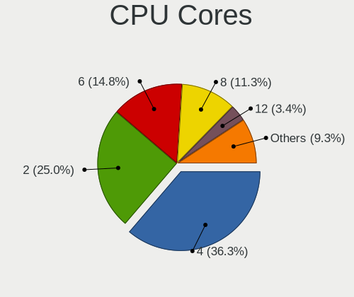

| Number | Desktops | Percent |
|--------|----------|---------|
| 4      | 937      | 37.21%  |
| 2      | 660      | 26.21%  |
| 6      | 364      | 14.46%  |
| 8      | 267      | 10.6%   |
| 12     | 77       | 3.06%   |
| 1      | 75       | 2.98%   |
| 3      | 54       | 2.14%   |
| 16     | 51       | 2.03%   |
| 10     | 13       | 0.52%   |
| 24     | 11       | 0.44%   |
| 32     | 4        | 0.16%   |
| 14     | 2        | 0.08%   |
| 64     | 1        | 0.04%   |
| 28     | 1        | 0.04%   |
| 18     | 1        | 0.04%   |

CPU Sockets
-----------

Number of sockets

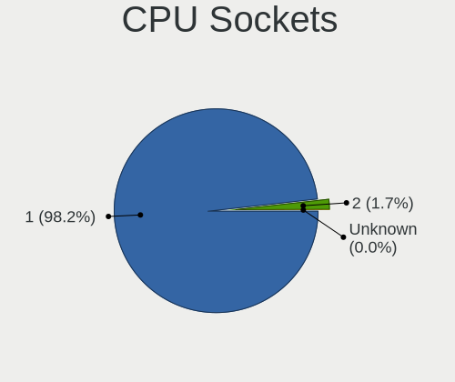

| Number | Desktops | Percent |
|--------|----------|---------|
| 1      | 2464     | 98.17%  |
| 2      | 46       | 1.83%   |

CPU Threads
-----------

Threads per core (Hyper-Threading)

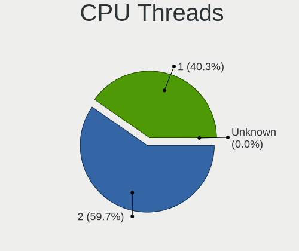

| Number | Desktops | Percent |
|--------|----------|---------|
| 2      | 1464     | 58.21%  |
| 1      | 1051     | 41.79%  |

CPU Op-Modes
------------

CPU Operation Modes (32-bit, 64-bit)

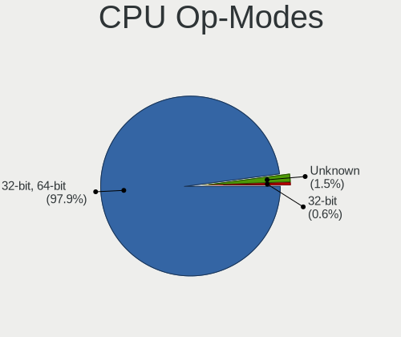

| Op mode        | Desktops | Percent |
|----------------|----------|---------|
| 32-bit, 64-bit | 2457     | 97.46%  |
| Unknown        | 47       | 1.86%   |
| 32-bit         | 17       | 0.67%   |

CPU Microcode
-------------

Microcode number

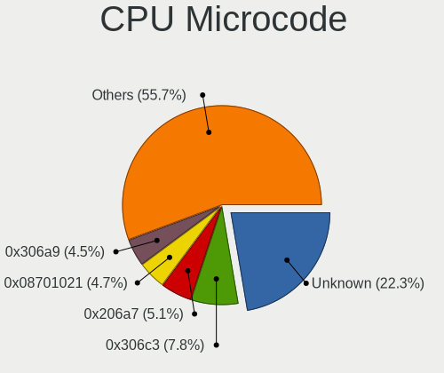

| Number     | Desktops | Percent |
|------------|----------|---------|
| Unknown    | 564      | 21.56%  |
| 0x306c3    | 209      | 7.99%   |
| 0x206a7    | 140      | 5.35%   |
| 0x08701021 | 122      | 4.66%   |
| 0x306a9    | 118      | 4.51%   |
| 0x1067a    | 104      | 3.98%   |
| 0x506e3    | 89       | 3.4%    |
| 0x06000852 | 69       | 2.64%   |
| 0x010000c8 | 64       | 2.45%   |
| 0x906ea    | 61       | 2.33%   |
| 0x0800820d | 58       | 2.22%   |
| 0x06001119 | 53       | 2.03%   |
| 0x08701013 | 50       | 1.91%   |
| 0x906e9    | 43       | 1.64%   |
| 0x6fb      | 35       | 1.34%   |
| 0x10676    | 30       | 1.15%   |
| 0x08001138 | 30       | 1.15%   |
| 0x906ed    | 28       | 1.07%   |
| 0x6fd      | 28       | 1.07%   |
| 0x0a201016 | 27       | 1.03%   |
| 0x206c2    | 26       | 0.99%   |
| 0x106a5    | 24       | 0.92%   |
| 0x0a201009 | 24       | 0.92%   |
| 0x06003106 | 24       | 0.92%   |
| 0x206d7    | 23       | 0.88%   |
| 0xa0655    | 22       | 0.84%   |
| 0x08108109 | 22       | 0.84%   |
| 0x306f2    | 20       | 0.76%   |
| 0x106e5    | 20       | 0.76%   |
| 0x010000db | 20       | 0.76%   |
| 0x08001137 | 18       | 0.69%   |
| 0x20655    | 17       | 0.65%   |
| 0x0600063e | 16       | 0.61%   |
| 0x306e4    | 15       | 0.57%   |
| 0x20652    | 15       | 0.57%   |
| 0x906ec    | 14       | 0.54%   |
| 0x6f2      | 12       | 0.46%   |
| 0x10677    | 12       | 0.46%   |
| 0xa0671    | 10       | 0.38%   |
| 0xa0653    | 9        | 0.34%   |

CPU Microarch
-------------

Microarchitecture

| Name             | Desktops | Percent |
|------------------|----------|---------|
| Haswell          | 271      | 10.76%  |
| Zen 2            | 236      | 9.37%   |
| SandyBridge      | 205      | 8.14%   |
| KabyLake         | 199      | 7.9%    |
| IvyBridge        | 162      | 6.43%   |
| Piledriver       | 159      | 6.31%   |
| Penryn           | 158      | 6.27%   |
| K10              | 143      | 5.68%   |
| Zen+             | 123      | 4.88%   |
| Skylake          | 123      | 4.88%   |
| Core             | 101      | 4.01%   |
| Zen              | 99       | 3.93%   |
| Zen 3            | 93       | 3.69%   |
| Westmere         | 68       | 2.7%    |
| Nehalem          | 56       | 2.22%   |
| NetBurst         | 39       | 1.55%   |
| Steamroller      | 37       | 1.47%   |
| K8 Hammer        | 37       | 1.47%   |
| CometLake        | 37       | 1.47%   |
| Bulldozer        | 25       | 0.99%   |
| Unknown          | 23       | 0.91%   |
| Silvermont       | 22       | 0.87%   |
| Excavator        | 20       | 0.79%   |
| Bonnell          | 15       | 0.6%    |
| Bobcat           | 10       | 0.4%    |
| Jaguar           | 8        | 0.32%   |
| Goldmont plus    | 8        | 0.32%   |
| Broadwell        | 8        | 0.32%   |
| Alderlake Hybrid | 7        | 0.28%   |
| Icelake          | 6        | 0.24%   |
| Goldmont         | 6        | 0.24%   |
| K10 Llano        | 5        | 0.2%    |
| K6               | 4        | 0.16%   |
| Tremont          | 3        | 0.12%   |
| Puma             | 2        | 0.08%   |
| TigerLake        | 1        | 0.04%   |

Graphics
--------

GPU Vendor
----------

Vendors of graphics cards

| Vendor                                       | Desktops | Percent |
|----------------------------------------------|----------|---------|
| Nvidia                                       | 1160     | 42.8%   |
| AMD                                          | 827      | 30.52%  |
| Intel                                        | 702      | 25.9%   |
| Matrox Electronics Systems                   | 7        | 0.26%   |
| ATI Technologies                             | 4        | 0.15%   |
| ASPEED Technology                            | 4        | 0.15%   |
| Silicon Integrated Systems [SiS]             | 3        | 0.11%   |
| XGI Technology (eXtreme Graphics Innovation) | 1        | 0.04%   |
| VIA Technologies                             | 1        | 0.04%   |
| Alliance Semiconductor                       | 1        | 0.04%   |

GPU Model
---------

Graphics card models

| Model                                                                       | Desktops | Percent |
|-----------------------------------------------------------------------------|----------|---------|
| Intel Xeon E3-1200 v3/4th Gen Core Processor Integrated Graphics Controller | 130      | 4.62%   |
| AMD Ellesmere [Radeon RX 470/480/570/570X/580/580X/590]                     | 130      | 4.62%   |
| Nvidia GK208B [GeForce GT 710]                                              | 99       | 3.52%   |
| Intel 2nd Generation Core Processor Family Integrated Graphics Controller   | 99       | 3.52%   |
| Nvidia GP107 [GeForce GTX 1050 Ti]                                          | 59       | 2.1%    |
| Intel Xeon E3-1200 v2/3rd Gen Core processor Graphics Controller            | 51       | 1.81%   |
| Intel 4 Series Chipset Integrated Graphics Controller                       | 50       | 1.78%   |
| Intel HD Graphics 530                                                       | 47       | 1.67%   |
| Intel CoffeeLake-S GT2 [UHD Graphics 630]                                   | 47       | 1.67%   |
| AMD Cedar [Radeon HD 5000/6000/7350/8350 Series]                            | 47       | 1.67%   |
| AMD Navi 10 [Radeon RX 5600 OEM/5600 XT / 5700/5700 XT]                     | 46       | 1.64%   |
| Nvidia GT218 [GeForce 210]                                                  | 44       | 1.56%   |
| Nvidia GP106 [GeForce GTX 1060 6GB]                                         | 41       | 1.46%   |
| Nvidia GM204 [GeForce GTX 970]                                              | 40       | 1.42%   |
| Nvidia GM206 [GeForce GTX 960]                                              | 39       | 1.39%   |
| Nvidia GP108 [GeForce GT 1030]                                              | 36       | 1.28%   |
| Nvidia GP104 [GeForce GTX 1080]                                             | 36       | 1.28%   |
| Nvidia GP104 [GeForce GTX 1070]                                             | 36       | 1.28%   |
| Nvidia GM107 [GeForce GTX 750 Ti]                                           | 36       | 1.28%   |
| AMD RS780L [Radeon 3000]                                                    | 28       | 1%      |
| Nvidia GF119 [GeForce GT 610]                                               | 26       | 0.92%   |
| Intel HD Graphics 630                                                       | 26       | 0.92%   |
| Intel 4th Generation Core Processor Family Integrated Graphics Controller   | 26       | 0.92%   |
| AMD Picasso/Raven 2 [Radeon Vega Series / Radeon Vega Mobile Series]        | 26       | 0.92%   |
| Nvidia GK208B [GeForce GT 730]                                              | 23       | 0.82%   |
| Nvidia GP102 [GeForce GTX 1080 Ti]                                          | 22       | 0.78%   |
| Intel IvyBridge GT2 [HD Graphics 4000]                                      | 22       | 0.78%   |
| Intel 82Q35 Express Integrated Graphics Controller                          | 22       | 0.78%   |
| AMD Kaveri [Radeon R7 Graphics]                                             | 21       | 0.75%   |
| Nvidia TU116 [GeForce GTX 1660 SUPER]                                       | 20       | 0.71%   |
| Intel Core Processor Integrated Graphics Controller                         | 20       | 0.71%   |
| AMD Raven Ridge [Radeon Vega Series / Radeon Vega Mobile Series]            | 20       | 0.71%   |
| AMD Navi 21 [Radeon RX 6800/6800 XT / 6900 XT]                              | 19       | 0.68%   |
| Nvidia GP106 [GeForce GTX 1060 3GB]                                         | 18       | 0.64%   |
| Intel CometLake-S GT2 [UHD Graphics 630]                                    | 18       | 0.64%   |
| Nvidia TU117 [GeForce GTX 1650]                                             | 17       | 0.6%    |
| Nvidia GP107 [GeForce GTX 1050]                                             | 17       | 0.6%    |
| AMD Lexa PRO [Radeon 540/540X/550/550X / RX 540X/550/550X]                  | 17       | 0.6%    |
| AMD Caicos [Radeon HD 6450/7450/8450 / R5 230 OEM]                          | 17       | 0.6%    |
| Nvidia TU106 [GeForce RTX 2060 Rev. A]                                      | 16       | 0.57%   |

GPU Combo
---------

Combinations of graphics cards

| Name                                 | Desktops | Percent |
|--------------------------------------|----------|---------|
| 1 x Nvidia                           | 1057     | 41.39%  |
| 1 x AMD                              | 738      | 28.9%   |
| 1 x Intel                            | 569      | 22.28%  |
| Intel + Nvidia                       | 51       | 2%      |
| 2 x AMD                              | 43       | 1.68%   |
| AMD + Nvidia                         | 26       | 1.02%   |
| 2 x Nvidia                           | 25       | 0.98%   |
| Intel + AMD                          | 16       | 0.63%   |
| 1 x Matrox                           | 7        | 0.27%   |
| Other                                | 5        | 0.2%    |
| 2 x AMD + 1 x Nvidia                 | 2        | 0.08%   |
| 1 x SiS                              | 2        | 0.08%   |
| 1 x ASPEED                           | 2        | 0.08%   |
| 3 x AMD                              | 1        | 0.04%   |
| 2 x Intel                            | 1        | 0.04%   |
| 2 x AMD + 1 x Alliance Semiconductor | 1        | 0.04%   |
| 1 x XGI                              | 1        | 0.04%   |
| 1 x VIA                              | 1        | 0.04%   |
| Nvidia + ASPEED                      | 1        | 0.04%   |
| 1 x Intel + 3 x Nvidia               | 1        | 0.04%   |
| Intel + 2 x Nvidia                   | 1        | 0.04%   |
| Intel + AMD + 1 x Nvidia             | 1        | 0.04%   |
| AMD + SiS                            | 1        | 0.04%   |
| AMD + ASPEED                         | 1        | 0.04%   |

GPU Driver
----------

Free vs proprietary

| Driver      | Desktops | Percent |
|-------------|----------|---------|
| Free        | 1744     | 67.44%  |
| Proprietary | 708      | 27.38%  |
| Unknown     | 134      | 5.18%   |

GPU Memory
----------

Total video memory

| Size in GB | Desktops | Percent |
|------------|----------|---------|
| Unknown    | 941      | 35.77%  |
| 1.01-2.0   | 400      | 15.2%   |
| 0.51-1.0   | 320      | 12.16%  |
| 0.01-0.5   | 301      | 11.44%  |
| 7.01-8.0   | 258      | 9.81%   |
| 3.01-4.0   | 202      | 7.68%   |
| 5.01-6.0   | 93       | 3.53%   |
| 8.01-16.0  | 76       | 2.89%   |
| 2.01-3.0   | 35       | 1.33%   |
| 16.01-24.0 | 3        | 0.11%   |
| 4.01-5.0   | 1        | 0.04%   |
| 24.01-32.0 | 1        | 0.04%   |

Monitor
-------

Monitor Vendor
--------------

Monitor vendors

| Vendor               | Desktops | Percent |
|----------------------|----------|---------|
| Dell                 | 357      | 13.49%  |
| Samsung Electronics  | 325      | 12.28%  |
| Acer                 | 244      | 9.22%   |
| Goldstar             | 178      | 6.72%   |
| AOC                  | 171      | 6.46%   |
| BenQ                 | 165      | 6.23%   |
| Hewlett-Packard      | 164      | 6.2%    |
| Iiyama               | 106      | 4%      |
| Ancor Communications | 96       | 3.63%   |
| Philips              | 70       | 2.64%   |
| ViewSonic            | 58       | 2.19%   |
| Unknown              | 56       | 2.12%   |
| Sony                 | 54       | 2.04%   |
| HannStar             | 42       | 1.59%   |
| ASUSTek Computer     | 40       | 1.51%   |
| LG Electronics       | 37       | 1.4%    |
| Lenovo               | 36       | 1.36%   |
| Toshiba              | 26       | 0.98%   |
| Panasonic            | 26       | 0.98%   |
| Vestel Elektronik    | 24       | 0.91%   |
| NEC Computers        | 21       | 0.79%   |
| MSI                  | 20       | 0.76%   |
| OEM                  | 14       | 0.53%   |
| Gigabyte Technology  | 14       | 0.53%   |
| MiTAC                | 12       | 0.45%   |
| Hitachi              | 12       | 0.45%   |
| Idek Iiyama          | 11       | 0.42%   |
| Fujitsu Siemens      | 11       | 0.42%   |
| CVT                  | 11       | 0.42%   |
| Pixio                | 10       | 0.38%   |
| Eizo                 | 10       | 0.38%   |
| Sharp                | 9        | 0.34%   |
| GNR                  | 8        | 0.3%    |
| Packard Bell         | 7        | 0.26%   |
| MStar                | 7        | 0.26%   |
| HPN                  | 7        | 0.26%   |
| HannStar Display     | 7        | 0.26%   |
| AUS                  | 7        | 0.26%   |
| ___                  | 6        | 0.23%   |
| Vestel               | 6        | 0.23%   |

Monitor Model
-------------

Monitor models

| Model                                                                 | Desktops | Percent |
|-----------------------------------------------------------------------|----------|---------|
| Vestel Elektronik 40UHD_LCD_TV VES3700 3840x2160 890x500mm 40.2-inch  | 24       | 0.84%   |
| AOC 2369M AOC2369 1920x1080 509x286mm 23.0-inch                       | 17       | 0.6%    |
| Goldstar ULTRAWIDE GSM59F1 2560x1080 798x334mm 34.1-inch              | 14       | 0.49%   |
| AOC 2270W AOC2270 1920x1080 477x268mm 21.5-inch                       | 13       | 0.46%   |
| Panasonic TV MEIA296 1920x1080 698x392mm 31.5-inch                    | 12       | 0.42%   |
| OEM 22W_LCD_TV OEM3700 1920x540                                       | 12       | 0.42%   |
| Dell U2412M DELA07A 1920x1200 518x324mm 24.1-inch                     | 11       | 0.39%   |
| BenQ GL2450H BNQ78A7 1920x1080 531x298mm 24.0-inch                    | 11       | 0.39%   |
| Acer K242HL ACR03E3 1920x1080 531x299mm 24.0-inch                     | 11       | 0.39%   |
| Samsung Electronics C24F390 SAM0D2C 1920x1080 521x293mm 23.5-inch     | 10       | 0.35%   |
| Acer S240HL ACR0289 1920x1080 531x299mm 24.0-inch                     | 10       | 0.35%   |
| Toshiba 55UHD_LCD_TV TSB3700 3840x2160 1100x620mm 49.7-inch           | 9        | 0.32%   |
| Goldstar FULL HD GSM5B55 1920x1080 480x270mm 21.7-inch                | 9        | 0.32%   |
| AOC 2470W AOC2470 1920x1080 521x293mm 23.5-inch                       | 9        | 0.32%   |
| Iiyama PL2409HD IVM560C 1920x1080 520x290mm 23.4-inch                 | 8        | 0.28%   |
| MiTAC DSGi TV SZM0308 1920x1080 880x490mm 39.7-inch                   | 7        | 0.25%   |
| Dell E176FP DELA014 1280x1024 338x270mm 17.0-inch                     | 7        | 0.25%   |
| BenQ GW2765 BNQ78D6 2560x1440 597x336mm 27.0-inch                     | 7        | 0.25%   |
| BenQ EW3270U BNQ7950 3840x2160 698x393mm 31.5-inch                    | 7        | 0.25%   |
| Ancor Communications VS248 ACI2498 1920x1080 531x299mm 24.0-inch      | 7        | 0.25%   |
| Unknown LCD Monitor SAMSUNG 1920x1080                                 | 6        | 0.21%   |
| Samsung Electronics SyncMaster SAM027F 1680x1050 474x296mm 22.0-inch  | 6        | 0.21%   |
| Philips PHL 273V7 PHLC156 1920x1080 598x336mm 27.0-inch               | 6        | 0.21%   |
| Iiyama PL2377 IVM561D 1920x1080 510x287mm 23.0-inch                   | 6        | 0.21%   |
| Goldstar LG ULTRAGEAR GSM5B7F 2560x1440 600x340mm 27.2-inch           | 6        | 0.21%   |
| Goldstar IPS FULLHD GSM5AB8 1920x1080 480x270mm 21.7-inch             | 6        | 0.21%   |
| Goldstar HDR 4K GSM7707 3840x2160 600x340mm 27.2-inch                 | 6        | 0.21%   |
| GNR TG700H PGE1704 1280x1024 338x270mm 17.0-inch                      | 6        | 0.21%   |
| CVT CVTE TV CVT0003 1920x1080 575x323mm 26.0-inch                     | 6        | 0.21%   |
| BenQ LCD Monitor GL2450H 1920x1080                                    | 6        | 0.21%   |
| BenQ GL2760 BNQ78D5 1920x1080 598x336mm 27.0-inch                     | 6        | 0.21%   |
| BenQ GL2460 BNQ78CE 1920x1080 531x299mm 24.0-inch                     | 6        | 0.21%   |
| ASUSTek Computer VP28U AUS28B1 3840x2160 621x341mm 27.9-inch          | 6        | 0.21%   |
| AOC 2460G5 AOC2460 1920x1080 531x299mm 24.0-inch                      | 6        | 0.21%   |
| Ancor Communications VE247 ACI2493 1920x1080 530x300mm 24.0-inch      | 6        | 0.21%   |
| Ancor Communications ASUS VC239 ACI23C4 1920x1080 509x286mm 23.0-inch | 6        | 0.21%   |
| Acer S271HL ACR02CA 1920x1080 598x336mm 27.0-inch                     | 6        | 0.21%   |
| Acer S220HQL ACR0281 1920x1080 477x268mm 21.5-inch                    | 6        | 0.21%   |
| Acer K222HQL ACR03E1 1920x1080 477x268mm 21.5-inch                    | 6        | 0.21%   |
| ___ LCDTV16 ___9000 1360x768                                          | 5        | 0.18%   |

Monitor Resolution
------------------

Monitor screen resolution

| Resolution         | Desktops | Percent |
|--------------------|----------|---------|
| 1920x1080 (FHD)    | 1145     | 44.07%  |
| 3840x2160 (4K)     | 256      | 9.85%   |
| 2560x1440 (QHD)    | 203      | 7.81%   |
| 1280x1024 (SXGA)   | 195      | 7.51%   |
| 1680x1050 (WSXGA+) | 131      | 5.04%   |
| 1440x900 (WXGA+)   | 91       | 3.5%    |
| Unknown            | 87       | 3.35%   |
| 1920x1200 (WUXGA)  | 75       | 2.89%   |
| 3440x1440          | 54       | 2.08%   |
| 1360x768           | 45       | 1.73%   |
| 3840x1080          | 44       | 1.69%   |
| 1600x900 (HD+)     | 37       | 1.42%   |
| 1920x540           | 35       | 1.35%   |
| 2560x1080          | 28       | 1.08%   |
| 1366x768 (WXGA)    | 27       | 1.04%   |
| 1024x768 (XGA)     | 22       | 0.85%   |
| 1600x1200          | 20       | 0.77%   |
| 1280x720 (HD)      | 15       | 0.58%   |
| 2288x1287          | 8        | 0.31%   |
| 5760x1080          | 7        | 0.27%   |
| 5120x1440          | 7        | 0.27%   |
| 7680x2160          | 5        | 0.19%   |
| 2560x1600          | 5        | 0.19%   |
| 3840x1200          | 4        | 0.15%   |
| 5760x2160          | 3        | 0.12%   |
| 4480x1440          | 3        | 0.12%   |
| 3200x1080          | 3        | 0.12%   |
| 4480x1080          | 2        | 0.08%   |
| 3360x1080          | 2        | 0.08%   |
| 3360x1050          | 2        | 0.08%   |
| 3120x1050          | 2        | 0.08%   |
| 2944x1080          | 2        | 0.08%   |
| 2048x1152          | 2        | 0.08%   |
| 2048x1080          | 2        | 0.08%   |
| 7680x1440          | 1        | 0.04%   |
| 7280x1440          | 1        | 0.04%   |
| 6720x1050          | 1        | 0.04%   |
| 6400x2160          | 1        | 0.04%   |
| 5760x1440          | 1        | 0.04%   |
| 5760x1200          | 1        | 0.04%   |

Monitor Diagonal
----------------

Diagonal size in inches

| Inches  | Desktops | Percent |
|---------|----------|---------|
| Unknown | 377      | 14.32%  |
| 27      | 365      | 13.87%  |
| 24      | 354      | 13.45%  |
| 23      | 303      | 11.51%  |
| 21      | 267      | 10.14%  |
| 19      | 149      | 5.66%   |
| 17      | 106      | 4.03%   |
| 31      | 95       | 3.61%   |
| 22      | 86       | 3.27%   |
| 84      | 71       | 2.7%    |
| 34      | 61       | 2.32%   |
| 18      | 53       | 2.01%   |
| 20      | 51       | 1.94%   |
| 72      | 40       | 1.52%   |
| 15      | 29       | 1.1%    |
| 32      | 24       | 0.91%   |
| 26      | 22       | 0.84%   |
| 25      | 17       | 0.65%   |
| 54      | 14       | 0.53%   |
| 39      | 13       | 0.49%   |
| 33      | 13       | 0.49%   |
| 48      | 11       | 0.42%   |
| 60      | 9        | 0.34%   |
| 40      | 9        | 0.34%   |
| 55      | 8        | 0.3%    |
| 52      | 8        | 0.3%    |
| 46      | 8        | 0.3%    |
| 28      | 7        | 0.27%   |
| 43      | 6        | 0.23%   |
| 142     | 5        | 0.19%   |
| 65      | 5        | 0.19%   |
| 35      | 5        | 0.19%   |
| 29      | 5        | 0.19%   |
| 12      | 5        | 0.19%   |
| 57      | 3        | 0.11%   |
| 49      | 3        | 0.11%   |
| 37      | 3        | 0.11%   |
| 30      | 3        | 0.11%   |
| 14      | 3        | 0.11%   |
| 50      | 2        | 0.08%   |

Monitor Width
-------------

Physical width

| Width in mm    | Desktops | Percent |
|----------------|----------|---------|
| 501-600        | 934      | 36.57%  |
| 401-500        | 524      | 20.52%  |
| Unknown        | 377      | 14.76%  |
| 601-700        | 156      | 6.11%   |
| 301-350        | 134      | 5.25%   |
| 1501-2000      | 110      | 4.31%   |
| 701-800        | 97       | 3.8%    |
| 351-400        | 94       | 3.68%   |
| 1001-1500      | 76       | 2.98%   |
| 801-900        | 29       | 1.14%   |
| 201-300        | 9        | 0.35%   |
| 901-1000       | 8        | 0.31%   |
| More than 2000 | 5        | 0.2%    |
| 101-200        | 1        | 0.04%   |

Aspect Ratio
------------

Proportional relationship between the width and the height

| Ratio   | Desktops | Percent |
|---------|----------|---------|
| 16/9    | 1465     | 60.02%  |
| Unknown | 337      | 13.81%  |
| 16/10   | 293      | 12%     |
| 5/4     | 183      | 7.5%    |
| 21/9    | 72       | 2.95%   |
| 4/3     | 46       | 1.88%   |
| 32/9    | 17       | 0.7%    |
| 3/2     | 13       | 0.53%   |
| 1.00    | 7        | 0.29%   |
| 6/5     | 6        | 0.25%   |
| 3.20    | 2        | 0.08%   |

Monitor Area
------------

Area in inch²

| Area in inch² | Desktops | Percent |
|----------------|----------|---------|
| 201-250        | 798      | 30.93%  |
| 301-350        | 378      | 14.65%  |
| Unknown        | 377      | 14.61%  |
| 151-200        | 303      | 11.74%  |
| 351-500        | 204      | 7.91%   |
| More than 1000 | 163      | 6.32%   |
| 251-300        | 128      | 4.96%   |
| 141-150        | 125      | 4.84%   |
| 501-1000       | 58       | 2.25%   |
| 101-110        | 27       | 1.05%   |
| 71-80          | 5        | 0.19%   |
| 131-140        | 3        | 0.12%   |
| 111-120        | 3        | 0.12%   |
| 81-90          | 2        | 0.08%   |
| 41-50          | 2        | 0.08%   |
| 121-130        | 2        | 0.08%   |
| 1-40           | 1        | 0.04%   |
| 91-100         | 1        | 0.04%   |

Pixel Density
-------------

Pixels per inch

| Density       | Desktops | Percent |
|---------------|----------|---------|
| 51-100        | 1382     | 56.04%  |
| 101-120       | 442      | 17.92%  |
| Unknown       | 377      | 15.29%  |
| 1-50          | 112      | 4.54%   |
| 121-160       | 106      | 4.3%    |
| 161-240       | 46       | 1.87%   |
| More than 240 | 1        | 0.04%   |

Multiple Monitors
-----------------

Total monitors connected

| Total | Desktops | Percent |
|-------|----------|---------|
| 1     | 1987     | 76.57%  |
| 2     | 392      | 15.11%  |
| 0     | 161      | 6.2%    |
| 3     | 50       | 1.93%   |
| 4     | 5        | 0.19%   |

Network
-------

Net Controller Vendor
---------------------

Controller vendors

| Vendor                           | Desktops | Percent |
|----------------------------------|----------|---------|
| Realtek Semiconductor            | 1429     | 38.94%  |
| Intel                            | 1114     | 30.35%  |
| Qualcomm Atheros                 | 231      | 6.29%   |
| Broadcom                         | 193      | 5.26%   |
| Ralink Technology                | 132      | 3.6%    |
| Nvidia                           | 85       | 2.32%   |
| Ralink                           | 56       | 1.53%   |
| TP-Link                          | 55       | 1.5%    |
| Broadcom Limited                 | 32       | 0.87%   |
| Microsoft                        | 31       | 0.84%   |
| Marvell Technology Group         | 31       | 0.84%   |
| MediaTek                         | 24       | 0.65%   |
| Belkin Components                | 22       | 0.6%    |
| Qualcomm Atheros Communications  | 18       | 0.49%   |
| NetGear                          | 18       | 0.49%   |
| Edimax Technology                | 15       | 0.41%   |
| Samsung Electronics              | 14       | 0.38%   |
| Aquantia                         | 14       | 0.38%   |
| Huawei Technologies              | 10       | 0.27%   |
| Mellanox Technologies            | 7        | 0.19%   |
| D-Link System                    | 7        | 0.19%   |
| D-Link                           | 7        | 0.19%   |
| ASUSTek Computer                 | 7        | 0.19%   |
| Xiaomi                           | 6        | 0.16%   |
| VIA Technologies                 | 6        | 0.16%   |
| ASIX Electronics                 | 6        | 0.16%   |
| IMC Networks                     | 5        | 0.14%   |
| DisplayLink                      | 5        | 0.14%   |
| Silicon Integrated Systems [SiS] | 4        | 0.11%   |
| OnePlus Technology (Shenzhen)    | 4        | 0.11%   |
| Apple                            | 4        | 0.11%   |
| ZyDAS                            | 3        | 0.08%   |
| ZTE WCDMA Technologies MSM       | 3        | 0.08%   |
| TRENDnet                         | 3        | 0.08%   |
| Sitecom Europe                   | 3        | 0.08%   |
| OPPO Electronics                 | 3        | 0.08%   |
| Oculus VR                        | 3        | 0.08%   |
| Google                           | 3        | 0.08%   |
| Gemtek                           | 3        | 0.08%   |
| Arduino SA                       | 3        | 0.08%   |

Net Controller Model
--------------------

Controller models

| Model                                                             | Desktops | Percent |
|-------------------------------------------------------------------|----------|---------|
| Realtek RTL8111/8168/8411 PCI Express Gigabit Ethernet Controller | 1107     | 26.56%  |
| Intel I211 Gigabit Network Connection                             | 216      | 5.18%   |
| Intel Wi-Fi 6 AX200                                               | 133      | 3.19%   |
| Intel 82579LM Gigabit Network Connection (Lewisville)             | 114      | 2.74%   |
| Intel Ethernet Connection (2) I219-V                              | 108      | 2.59%   |
| Realtek RTL8125 2.5GbE Controller                                 | 92       | 2.21%   |
| Intel Ethernet Connection (7) I219-V                              | 54       | 1.3%    |
| Intel Ethernet Connection I217-LM                                 | 53       | 1.27%   |
| Intel 82579V Gigabit Network Connection                           | 52       | 1.25%   |
| Ralink MT7601U Wireless Adapter                                   | 50       | 1.2%    |
| Nvidia MCP61 Ethernet                                             | 50       | 1.2%    |
| Realtek RTL88x2bu [AC1200 Techkey]                                | 48       | 1.15%   |
| Realtek 802.11ac NIC                                              | 46       | 1.1%    |
| Intel Ethernet Controller I225-V                                  | 40       | 0.96%   |
| Realtek RTL8192EE PCIe Wireless Network Adapter                   | 38       | 0.91%   |
| Intel Wireless-AC 9260                                            | 37       | 0.89%   |
| Intel 82566DM-2 Gigabit Network Connection                        | 37       | 0.89%   |
| Ralink RT5370 Wireless Adapter                                    | 35       | 0.84%   |
| Intel Ethernet Connection (2) I218-V                              | 35       | 0.84%   |
| Broadcom BCM4360 802.11ac Wireless Network Adapter                | 35       | 0.84%   |
| Realtek RTL810xE PCI Express Fast Ethernet controller             | 33       | 0.79%   |
| Intel Ethernet Connection I217-V                                  | 33       | 0.79%   |
| Intel 82574L Gigabit Network Connection                           | 32       | 0.77%   |
| Intel 82567LM-3 Gigabit Network Connection                        | 31       | 0.74%   |
| Qualcomm Atheros Killer E220x Gigabit Ethernet Controller         | 30       | 0.72%   |
| Intel Dual Band Wireless-AC 3168NGW [Stone Peak]                  | 29       | 0.7%    |
| Intel Wireless 7260                                               | 25       | 0.6%    |
| Realtek RTL8188EUS 802.11n Wireless Network Adapter               | 24       | 0.58%   |
| Qualcomm Atheros AR9485 Wireless Network Adapter                  | 24       | 0.58%   |
| Intel Wi-Fi 6 AX210/AX211/AX411 160MHz                            | 24       | 0.58%   |
| Ralink RT2870/RT3070 Wireless Adapter                             | 23       | 0.55%   |
| Qualcomm Atheros AR8151 v2.0 Gigabit Ethernet                     | 23       | 0.55%   |
| Qualcomm Atheros AR93xx Wireless Network Adapter                  | 22       | 0.53%   |
| Intel Cannon Lake PCH CNVi WiFi                                   | 22       | 0.53%   |
| Realtek RTL8188CUS 802.11n WLAN Adapter                           | 21       | 0.5%    |
| Realtek RTL8153 Gigabit Ethernet Adapter                          | 21       | 0.5%    |
| Broadcom NetXtreme BCM5761 Gigabit Ethernet PCIe                  | 20       | 0.48%   |
| Intel Ethernet Connection (2) I219-LM                             | 19       | 0.46%   |
| TP-Link TL-WN823N v2/v3 [Realtek RTL8192EU]                       | 18       | 0.43%   |
| Qualcomm Atheros AR9287 Wireless Network Adapter (PCI-Express)    | 18       | 0.43%   |

Wireless Vendor
---------------

Wireless vendors

| Vendor                          | Desktops | Percent |
|---------------------------------|----------|---------|
| Intel                           | 355      | 26.61%  |
| Realtek Semiconductor           | 330      | 24.74%  |
| Qualcomm Atheros                | 137      | 10.27%  |
| Ralink Technology               | 132      | 9.9%    |
| Broadcom                        | 84       | 6.3%    |
| TP-Link                         | 55       | 4.12%   |
| Ralink                          | 55       | 4.12%   |
| Microsoft                       | 31       | 2.32%   |
| Belkin Components               | 22       | 1.65%   |
| MediaTek                        | 19       | 1.42%   |
| Qualcomm Atheros Communications | 18       | 1.35%   |
| NetGear                         | 18       | 1.35%   |
| Edimax Technology               | 15       | 1.12%   |
| Broadcom Limited                | 15       | 1.12%   |
| ASUSTek Computer                | 7        | 0.52%   |
| D-Link System                   | 6        | 0.45%   |
| D-Link                          | 6        | 0.45%   |
| IMC Networks                    | 5        | 0.37%   |
| ZyDAS                           | 3        | 0.22%   |
| TRENDnet                        | 3        | 0.22%   |
| Sitecom Europe                  | 3        | 0.22%   |
| Gemtek                          | 3        | 0.22%   |
| Wilocity                        | 2        | 0.15%   |
| Linksys                         | 2        | 0.15%   |
| Wacom                           | 1        | 0.07%   |
| Texas Instruments               | 1        | 0.07%   |
| Philips (or NXP)                | 1        | 0.07%   |
| Micro Star International        | 1        | 0.07%   |
| Marvell Technology Group        | 1        | 0.07%   |
| Dell                            | 1        | 0.07%   |
| CyberTAN Technology             | 1        | 0.07%   |
| AboCom Systems                  | 1        | 0.07%   |

Wireless Model
--------------

Wireless models

| Model                                                          | Desktops | Percent |
|----------------------------------------------------------------|----------|---------|
| Intel Wi-Fi 6 AX200                                            | 133      | 9.78%   |
| Ralink MT7601U Wireless Adapter                                | 50       | 3.68%   |
| Realtek RTL88x2bu [AC1200 Techkey]                             | 48       | 3.53%   |
| Realtek 802.11ac NIC                                           | 46       | 3.38%   |
| Realtek RTL8192EE PCIe Wireless Network Adapter                | 38       | 2.79%   |
| Intel Wireless-AC 9260                                         | 37       | 2.72%   |
| Ralink RT5370 Wireless Adapter                                 | 35       | 2.57%   |
| Broadcom BCM4360 802.11ac Wireless Network Adapter             | 35       | 2.57%   |
| Intel Dual Band Wireless-AC 3168NGW [Stone Peak]               | 29       | 2.13%   |
| Intel Wireless 7260                                            | 25       | 1.84%   |
| Realtek RTL8188EUS 802.11n Wireless Network Adapter            | 24       | 1.76%   |
| Qualcomm Atheros AR9485 Wireless Network Adapter               | 24       | 1.76%   |
| Intel Wi-Fi 6 AX210/AX211/AX411 160MHz                         | 24       | 1.76%   |
| Ralink RT2870/RT3070 Wireless Adapter                          | 23       | 1.69%   |
| Qualcomm Atheros AR93xx Wireless Network Adapter               | 22       | 1.62%   |
| Intel Cannon Lake PCH CNVi WiFi                                | 22       | 1.62%   |
| Realtek RTL8188CUS 802.11n WLAN Adapter                        | 21       | 1.54%   |
| TP-Link TL-WN823N v2/v3 [Realtek RTL8192EU]                    | 18       | 1.32%   |
| Qualcomm Atheros AR9287 Wireless Network Adapter (PCI-Express) | 18       | 1.32%   |
| Realtek RTL8192CU 802.11n WLAN Adapter                         | 17       | 1.25%   |
| Qualcomm Atheros AR9271 802.11n                                | 16       | 1.18%   |
| Realtek RTL8192CE PCIe Wireless Network Adapter                | 15       | 1.1%    |
| Qualcomm Atheros AR9227 Wireless Network Adapter               | 15       | 1.1%    |
| Intel Wireless 8260                                            | 15       | 1.1%    |
| Realtek RTL8812AU 802.11a/b/g/n/ac 2T2R DB WLAN Adapter        | 14       | 1.03%   |
| Realtek RTL8821AE 802.11ac PCIe Wireless Network Adapter       | 13       | 0.96%   |
| Qualcomm Atheros QCA6174 802.11ac Wireless Network Adapter     | 13       | 0.96%   |
| Qualcomm Atheros AR9462 Wireless Network Adapter               | 13       | 0.96%   |
| Microsoft XBOX ACC                                             | 13       | 0.96%   |
| Intel Wireless 3165                                            | 12       | 0.88%   |
| Realtek RTL8822BE 802.11a/b/g/n/ac WiFi adapter                | 11       | 0.81%   |
| Realtek RTL8812AE 802.11ac PCIe Wireless Network Adapter       | 11       | 0.81%   |
| Realtek RTL8821CE 802.11ac PCIe Wireless Network Adapter       | 10       | 0.74%   |
| Realtek RTL8811AU 802.11a/b/g/n/ac WLAN Adapter                | 10       | 0.74%   |
| Microsoft Xbox 360 Wireless Adapter                            | 10       | 0.74%   |
| Intel Wireless 7265                                            | 10       | 0.74%   |
| TP-Link 802.11ac WLAN Adapter                                  | 9        | 0.66%   |
| Qualcomm Atheros QCA9565 / AR9565 Wireless Network Adapter     | 9        | 0.66%   |
| Microsoft Wireless XBox Controller Dongle                      | 9        | 0.66%   |
| Intel Comet Lake PCH CNVi WiFi                                 | 9        | 0.66%   |

Ethernet Vendor
---------------

Ethernet vendors

| Vendor                                 | Desktops | Percent |
|----------------------------------------|----------|---------|
| Realtek Semiconductor                  | 1274     | 47.47%  |
| Intel                                  | 945      | 35.21%  |
| Broadcom                               | 116      | 4.32%   |
| Qualcomm Atheros                       | 104      | 3.87%   |
| Nvidia                                 | 85       | 3.17%   |
| Marvell Technology Group               | 30       | 1.12%   |
| Broadcom Limited                       | 17       | 0.63%   |
| Samsung Electronics                    | 14       | 0.52%   |
| Aquantia                               | 14       | 0.52%   |
| Huawei Technologies                    | 8        | 0.3%    |
| Xiaomi                                 | 6        | 0.22%   |
| VIA Technologies                       | 6        | 0.22%   |
| Mellanox Technologies                  | 6        | 0.22%   |
| ASIX Electronics                       | 6        | 0.22%   |
| MediaTek                               | 5        | 0.19%   |
| DisplayLink                            | 5        | 0.19%   |
| Silicon Integrated Systems [SiS]       | 4        | 0.15%   |
| ZTE WCDMA Technologies MSM             | 3        | 0.11%   |
| OPPO Electronics                       | 3        | 0.11%   |
| OnePlus Technology (Shenzhen)          | 3        | 0.11%   |
| Google                                 | 3        | 0.11%   |
| Apple                                  | 3        | 0.11%   |
| 3Com                                   | 3        | 0.11%   |
| T & A Mobile Phones                    | 2        | 0.07%   |
| Sony Ericsson Mobile Communications AB | 2        | 0.07%   |
| Motorola PCS                           | 2        | 0.07%   |
| Lenovo                                 | 2        | 0.07%   |
| HMD Global                             | 2        | 0.07%   |
| Emulex                                 | 2        | 0.07%   |
| SysKonnect                             | 1        | 0.04%   |
| Research In Motion                     | 1        | 0.04%   |
| Qualcomm                               | 1        | 0.04%   |
| QLogic                                 | 1        | 0.04%   |
| NetXen Incorporated                    | 1        | 0.04%   |
| Microchip Technology                   | 1        | 0.04%   |
| HTC (High Tech Computer)               | 1        | 0.04%   |
| D-Link System                          | 1        | 0.04%   |
| D-Link                                 | 1        | 0.04%   |

Ethernet Model
--------------

Ethernet models

| Model                                                             | Desktops | Percent |
|-------------------------------------------------------------------|----------|---------|
| Realtek RTL8111/8168/8411 PCI Express Gigabit Ethernet Controller | 1107     | 39.94%  |
| Intel I211 Gigabit Network Connection                             | 216      | 7.79%   |
| Intel 82579LM Gigabit Network Connection (Lewisville)             | 114      | 4.11%   |
| Intel Ethernet Connection (2) I219-V                              | 108      | 3.9%    |
| Realtek RTL8125 2.5GbE Controller                                 | 92       | 3.32%   |
| Intel Ethernet Connection (7) I219-V                              | 54       | 1.95%   |
| Intel Ethernet Connection I217-LM                                 | 53       | 1.91%   |
| Intel 82579V Gigabit Network Connection                           | 52       | 1.88%   |
| Nvidia MCP61 Ethernet                                             | 50       | 1.8%    |
| Intel Ethernet Controller I225-V                                  | 40       | 1.44%   |
| Intel 82566DM-2 Gigabit Network Connection                        | 37       | 1.33%   |
| Intel Ethernet Connection (2) I218-V                              | 35       | 1.26%   |
| Realtek RTL810xE PCI Express Fast Ethernet controller             | 33       | 1.19%   |
| Intel Ethernet Connection I217-V                                  | 33       | 1.19%   |
| Intel 82574L Gigabit Network Connection                           | 32       | 1.15%   |
| Intel 82567LM-3 Gigabit Network Connection                        | 31       | 1.12%   |
| Qualcomm Atheros Killer E220x Gigabit Ethernet Controller         | 30       | 1.08%   |
| Qualcomm Atheros AR8151 v2.0 Gigabit Ethernet                     | 23       | 0.83%   |
| Realtek RTL8153 Gigabit Ethernet Adapter                          | 21       | 0.76%   |
| Broadcom NetXtreme BCM5761 Gigabit Ethernet PCIe                  | 20       | 0.72%   |
| Intel Ethernet Connection (2) I219-LM                             | 19       | 0.69%   |
| Intel 82562V-2 10/100 Network Connection                          | 18       | 0.65%   |
| Realtek RTL-8100/8101L/8139 PCI Fast Ethernet Adapter             | 17       | 0.61%   |
| Marvell Group 88E8056 PCI-E Gigabit Ethernet Controller           | 17       | 0.61%   |
| Intel 82578DM Gigabit Network Connection                          | 17       | 0.61%   |
| Qualcomm Atheros AR8161 Gigabit Ethernet                          | 16       | 0.58%   |
| Broadcom NetLink BCM57780 Gigabit Ethernet PCIe                   | 13       | 0.47%   |
| Intel I210 Gigabit Network Connection                             | 12       | 0.43%   |
| Broadcom NetXtreme BCM5764M Gigabit Ethernet PCIe                 | 12       | 0.43%   |
| Samsung Galaxy series, misc. (tethering mode)                     | 11       | 0.4%    |
| Realtek RTL8169 PCI Gigabit Ethernet Controller                   | 11       | 0.4%    |
| Broadcom NetXtreme BCM5754 Gigabit Ethernet PCI Express           | 11       | 0.4%    |
| Broadcom NetXtreme BCM5723 Gigabit Ethernet PCIe                  | 11       | 0.4%    |
| Aquantia AQC107 NBase-T/IEEE 802.3bz Ethernet Controller [AQtion] | 11       | 0.4%    |
| Qualcomm Atheros Killer E2400 Gigabit Ethernet Controller         | 10       | 0.36%   |
| Intel Ethernet Connection (7) I219-LM                             | 9        | 0.32%   |
| Intel Ethernet Connection (11) I219-V                             | 9        | 0.32%   |
| Intel 82578DC Gigabit Network Connection                          | 9        | 0.32%   |
| Nvidia MCP77 Ethernet                                             | 8        | 0.29%   |
| Qualcomm Atheros Killer E2500 Gigabit Ethernet Controller         | 7        | 0.25%   |

Net Controller Kind
-------------------

Ethernet, WiFi or modem

| Kind     | Desktops | Percent |
|----------|----------|---------|
| Ethernet | 2475     | 66.43%  |
| WiFi     | 1216     | 32.64%  |
| Modem    | 27       | 0.72%   |
| Unknown  | 8        | 0.21%   |

Used Controller
---------------

Currently used network controller

| Kind     | Desktops | Percent |
|----------|----------|---------|
| Ethernet | 1923     | 73.42%  |
| WiFi     | 696      | 26.58%  |

NICs
----

Total network controllers on board

| Total | Desktops | Percent |
|-------|----------|---------|
| 1     | 1574     | 61.77%  |
| 2     | 803      | 31.51%  |
| 3     | 112      | 4.4%    |
| 0     | 27       | 1.06%   |
| 4     | 15       | 0.59%   |
| 5     | 14       | 0.55%   |
| 6     | 2        | 0.08%   |
| 8     | 1        | 0.04%   |

IPv6
----

IPv6 vs IPv4

| Used | Desktops | Percent |
|------|----------|---------|
| No   | 2255     | 88.5%   |
| Yes  | 293      | 11.5%   |

Bluetooth
---------

Bluetooth Vendor
----------------

Controller vendors

| Vendor                          | Desktops | Percent |
|---------------------------------|----------|---------|
| Intel                           | 302      | 36.3%   |
| Cambridge Silicon Radio         | 225      | 27.04%  |
| Broadcom                        | 75       | 9.01%   |
| ASUSTek Computer                | 61       | 7.33%   |
| Realtek Semiconductor           | 44       | 5.29%   |
| Qualcomm Atheros Communications | 29       | 3.49%   |
| Apple                           | 24       | 2.88%   |
| Belkin Components               | 13       | 1.56%   |
| Integrated System Solution      | 8        | 0.96%   |
| IMC Networks                    | 8        | 0.96%   |
| TP-Link                         | 7        | 0.84%   |
| MediaTek                        | 6        | 0.72%   |
| Lite-On Technology              | 6        | 0.72%   |
| HTC (High Tech Computer)        | 4        | 0.48%   |
| Dell                            | 4        | 0.48%   |
| Micro Star International        | 3        | 0.36%   |
| Logitech                        | 3        | 0.36%   |
| Foxconn / Hon Hai               | 3        | 0.36%   |
| Hewlett-Packard                 | 2        | 0.24%   |
| Taiyo Yuden                     | 1        | 0.12%   |
| SINO WEALTH                     | 1        | 0.12%   |
| Edimax Technology               | 1        | 0.12%   |
| Cypress Semiconductor           | 1        | 0.12%   |
| Creative Technology             | 1        | 0.12%   |

Bluetooth Model
---------------

Controller models

| Model                                                                | Desktops | Percent |
|----------------------------------------------------------------------|----------|---------|
| Cambridge Silicon Radio Bluetooth Dongle (HCI mode)                  | 225      | 27.04%  |
| Intel AX200 Bluetooth                                                | 115      | 13.82%  |
| Intel Bluetooth wireless interface                                   | 61       | 7.33%   |
| Broadcom BCM20702A0 Bluetooth 4.0                                    | 61       | 7.33%   |
| Intel Wireless-AC 9260 Bluetooth Adapter                             | 35       | 4.21%   |
| Realtek Bluetooth Radio                                              | 31       | 3.73%   |
| Intel Wireless-AC 3168 Bluetooth                                     | 26       | 3.13%   |
| Intel Bluetooth 9460/9560 Jefferson Peak (JfP)                       | 26       | 3.13%   |
| ASUS Broadcom BCM20702A0 Bluetooth                                   | 24       | 2.88%   |
| Intel AX210 Bluetooth                                                | 21       | 2.52%   |
| Intel AX201 Bluetooth                                                | 14       | 1.68%   |
| Apple Bluetooth USB Host Controller                                  | 10       | 1.2%    |
| Qualcomm Atheros  Bluetooth Device                                   | 9        | 1.08%   |
| Realtek RTL8821A Bluetooth                                           | 8        | 0.96%   |
| IMC Networks Bluetooth Radio                                         | 8        | 0.96%   |
| TP-Link UB500 Adapter                                                | 7        | 0.84%   |
| ASUS Broadcom BCM20702 Single-Chip Bluetooth 4.0 + LE                | 7        | 0.84%   |
| ASUS Bluetooth Radio                                                 | 7        | 0.84%   |
| ASUS Bluetooth Device                                                | 7        | 0.84%   |
| Qualcomm Atheros Bluetooth USB Host Controller                       | 6        | 0.72%   |
| Qualcomm Atheros AR3011 Bluetooth                                    | 6        | 0.72%   |
| MediaTek Wireless_Device                                             | 6        | 0.72%   |
| ASUS Qualcomm Bluetooth 4.1                                          | 6        | 0.72%   |
| ASUS BCM20702A0                                                      | 6        | 0.72%   |
| Apple Built-in Bluetooth 2.0+EDR HCI                                 | 6        | 0.72%   |
| Apple Bluetooth HCI                                                  | 6        | 0.72%   |
| Integrated System Solution Bluetooth Device                          | 5        | 0.6%    |
| Belkin Components Bluetooth Mini Dongle                              | 5        | 0.6%    |
| Realtek  Bluetooth 4.2 Adapter                                       | 4        | 0.48%   |
| HTC (High Tech Computer) Vive Hub Bluetooth 4.1 (Broadcom BCM920703) | 4        | 0.48%   |
| Broadcom BCM2035 Bluetooth dongle                                    | 4        | 0.48%   |
| Qualcomm Atheros AR9462 Bluetooth                                    | 3        | 0.36%   |
| Qualcomm Atheros AR3012 Bluetooth 4.0                                | 3        | 0.36%   |
| Logitech BT Mini-Receiver (HCI mode)                                 | 3        | 0.36%   |
| Lite-On Bluetooth Device                                             | 3        | 0.36%   |
| Intel Bluetooth Device                                               | 3        | 0.36%   |
| Integrated System Solution KY-BT100 Bluetooth Adapter                | 3        | 0.36%   |
| Belkin Components F8T065BF Mini Bluetooth 4.0 Adapter                | 3        | 0.36%   |
| ASUS Bluetooth Adapter                                               | 3        | 0.36%   |
| Qualcomm Atheros QCA61x4 Bluetooth 4.0                               | 2        | 0.24%   |

Sound
-----

Sound Vendor
------------

Sound card vendors

| Vendor                               | Desktops | Percent |
|--------------------------------------|----------|---------|
| Intel                                | 1409     | 32.71%  |
| AMD                                  | 1141     | 26.49%  |
| Nvidia                               | 1093     | 25.37%  |
| C-Media Electronics                  | 122      | 2.83%   |
| Creative Labs                        | 78       | 1.81%   |
| Logitech                             | 42       | 0.97%   |
| Texas Instruments                    | 35       | 0.81%   |
| Razer USA                            | 24       | 0.56%   |
| Focusrite-Novation                   | 24       | 0.56%   |
| Creative Technology                  | 22       | 0.51%   |
| SteelSeries ApS                      | 21       | 0.49%   |
| JMTek                                | 18       | 0.42%   |
| Kingston Technology                  | 15       | 0.35%   |
| ASUSTek Computer                     | 15       | 0.35%   |
| Corsair                              | 14       | 0.32%   |
| VIA Technologies                     | 12       | 0.28%   |
| Micro Star International             | 12       | 0.28%   |
| Blue Microphones                     | 12       | 0.28%   |
| Tenx Technology                      | 8        | 0.19%   |
| Sennheiser Communications            | 8        | 0.19%   |
| Plantronics                          | 8        | 0.19%   |
| Generalplus Technology               | 8        | 0.19%   |
| Realtek Semiconductor                | 7        | 0.16%   |
| GN Netcom                            | 6        | 0.14%   |
| Dell                                 | 6        | 0.14%   |
| Unknown                              | 5        | 0.12%   |
| Thesycon Systemsoftware & Consulting | 5        | 0.12%   |
| Samson Technologies                  | 5        | 0.12%   |
| GYROCOM C&C                          | 5        | 0.12%   |
| BEHRINGER International              | 5        | 0.12%   |
| Turtle Beach                         | 4        | 0.09%   |
| M-Audio                              | 4        | 0.09%   |
| Elgato Systems                       | 4        | 0.09%   |
| ATI Technologies                     | 4        | 0.09%   |
| AKAI Professional M.I.               | 4        | 0.09%   |
| XMOS                                 | 3        | 0.07%   |
| Valve Software                       | 3        | 0.07%   |
| Sony                                 | 3        | 0.07%   |
| Silicon Integrated Systems [SiS]     | 3        | 0.07%   |
| Nektar                               | 3        | 0.07%   |

Sound Model
-----------

Sound card models

| Model                                                                      | Desktops | Percent |
|----------------------------------------------------------------------------|----------|---------|
| AMD Starship/Matisse HD Audio Controller                                   | 291      | 5.76%   |
| AMD SBx00 Azalia (Intel HDA)                                               | 206      | 4.08%   |
| Intel 6 Series/C200 Series Chipset Family High Definition Audio Controller | 187      | 3.7%    |
| Intel 8 Series/C220 Series Chipset High Definition Audio Controller        | 178      | 3.53%   |
| AMD Family 17h (Models 00h-0fh) HD Audio Controller                        | 155      | 3.07%   |
| Intel Xeon E3-1200 v3/4th Gen Core Processor HD Audio Controller           | 147      | 2.91%   |
| Nvidia GK208 HDMI/DP Audio Controller                                      | 131      | 2.59%   |
| AMD Ellesmere HDMI Audio [Radeon RX 470/480 / 570/580/590]                 | 131      | 2.59%   |
| Intel 7 Series/C216 Chipset Family High Definition Audio Controller        | 122      | 2.42%   |
| Intel 200 Series PCH HD Audio                                              | 111      | 2.2%    |
| Intel 100 Series/C230 Series Chipset Family HD Audio Controller            | 108      | 2.14%   |
| AMD FCH Azalia Controller                                                  | 108      | 2.14%   |
| AMD Family 17h/19h HD Audio Controller                                     | 87       | 1.72%   |
| Nvidia GP107GL High Definition Audio Controller                            | 84       | 1.66%   |
| Intel 82801JI (ICH10 Family) HD Audio Controller                           | 83       | 1.64%   |
| Nvidia GP104 High Definition Audio Controller                              | 82       | 1.62%   |
| Intel NM10/ICH7 Family High Definition Audio Controller                    | 82       | 1.62%   |
| Intel Cannon Lake PCH cAVS                                                 | 81       | 1.6%    |
| Intel 82801I (ICH9 Family) HD Audio Controller                             | 76       | 1.51%   |
| Nvidia High Definition Audio Controller                                    | 60       | 1.19%   |
| Nvidia GP106 High Definition Audio Controller                              | 60       | 1.19%   |
| AMD Oland/Hainan/Cape Verde/Pitcairn HDMI Audio [Radeon HD 7000 Series]    | 60       | 1.19%   |
| Intel 5 Series/3400 Series Chipset High Definition Audio                   | 58       | 1.15%   |
| Intel 9 Series Chipset Family HD Audio Controller                          | 56       | 1.11%   |
| AMD Navi 10 HDMI Audio                                                     | 54       | 1.07%   |
| Nvidia MCP61 High Definition Audio                                         | 53       | 1.05%   |
| Nvidia GM107 High Definition Audio Controller [GeForce 940MX]              | 51       | 1.01%   |
| Nvidia TU116 High Definition Audio Controller                              | 48       | 0.95%   |
| Nvidia GM206 High Definition Audio Controller                              | 48       | 0.95%   |
| Nvidia GM204 High Definition Audio Controller                              | 48       | 0.95%   |
| AMD Raven/Raven2/Fenghuang HDMI/DP Audio Controller                        | 46       | 0.91%   |
| AMD Cedar HDMI Audio [Radeon HD 5400/6300/7300 Series]                     | 45       | 0.89%   |
| AMD Baffin HDMI/DP Audio [Radeon RX 550 640SP / RX 560/560X]               | 45       | 0.89%   |
| Nvidia GF119 HDMI Audio Controller                                         | 43       | 0.85%   |
| Intel C600/X79 series chipset High Definition Audio Controller             | 42       | 0.83%   |
| AMD Navi 21/23 HDMI/DP Audio Controller                                    | 42       | 0.83%   |
| Nvidia TU106 High Definition Audio Controller                              | 37       | 0.73%   |
| Nvidia GK107 HDMI Audio Controller                                         | 37       | 0.73%   |
| Nvidia GP108 High Definition Audio Controller                              | 36       | 0.71%   |
| Nvidia TU104 HD Audio Controller                                           | 35       | 0.69%   |

Memory
------

Memory Vendor
-------------

Memory module vendors

| Vendor                       | Desktops | Percent |
|------------------------------|----------|---------|
| Corsair                      | 344      | 26.46%  |
| Unknown                      | 177      | 13.62%  |
| Crucial                      | 155      | 11.92%  |
| Kingston                     | 151      | 11.62%  |
| Samsung Electronics          | 109      | 8.38%   |
| SK hynix                     | 107      | 8.23%   |
| Micron Technology            | 75       | 5.77%   |
| G.Skill                      | 27       | 2.08%   |
| Team                         | 25       | 1.92%   |
| A-DATA Technology            | 23       | 1.77%   |
| Patriot                      | 15       | 1.15%   |
| Nanya Technology             | 11       | 0.85%   |
| Elpida                       | 10       | 0.77%   |
| Ramaxel Technology           | 9        | 0.69%   |
| Unknown (ABCD)               | 5        | 0.38%   |
| Transcend                    | 5        | 0.38%   |
| Timetec                      | 4        | 0.31%   |
| ASint Technology             | 4        | 0.31%   |
| A Force                      | 4        | 0.31%   |
| Qimonda                      | 3        | 0.23%   |
| KLEVV                        | 3        | 0.23%   |
| Hewlett-Packard              | 3        | 0.23%   |
| Infineon                     | 2        | 0.15%   |
| CSX                          | 2        | 0.15%   |
| Axiom                        | 2        | 0.15%   |
| Apacer                       | 2        | 0.15%   |
| Unknown                      | 2        | 0.15%   |
| Wilk Elektronik              | 1        | 0.08%   |
| V-Color                      | 1        | 0.08%   |
| Unknown (0x4000000000000000) | 1        | 0.08%   |
| Unknown (0x0702)             | 1        | 0.08%   |
| Undefined-000B               | 1        | 0.08%   |
| Thermaltake                  | 1        | 0.08%   |
| Silicon Power                | 1        | 0.08%   |
| Ramos Technology             | 1        | 0.08%   |
| ProMos                       | 1        | 0.08%   |
| Princeton                    | 1        | 0.08%   |
| PNY                          | 1        | 0.08%   |
| OCZ                          | 1        | 0.08%   |
| Lexar Co Limited             | 1        | 0.08%   |

Memory Model
------------

Memory module models

| Model                                                        | Desktops | Percent |
|--------------------------------------------------------------|----------|---------|
| Corsair RAM CMK16GX4M2B3200C16 8GB DIMM DDR4 3600MT/s        | 33       | 2.29%   |
| Corsair RAM CMK16GX4M2B3000C15 8GB DIMM DDR4 3200MT/s        | 16       | 1.11%   |
| Corsair RAM CMK32GX4M2B3200C16 16GB DIMM DDR4 3400MT/s       | 15       | 1.04%   |
| Unknown RAM Module 4096MB DIMM 1333MT/s                      | 14       | 0.97%   |
| Corsair RAM CMK16GX4M2A2666C16 8GB DIMM DDR4 3400MT/s        | 14       | 0.97%   |
| Corsair RAM CMZ8GX3M2A1600C9 4GB DIMM DDR3 1600MT/s          | 10       | 0.69%   |
| Unknown RAM Module 4GB DIMM 1333MT/s                         | 9        | 0.62%   |
| Unknown RAM Module 4096MB DIMM DDR3 1333MT/s                 | 7        | 0.49%   |
| Unknown RAM Module 2048MB DIMM DDR2 800MT/s                  | 7        | 0.49%   |
| SK hynix RAM HMT451U6AFR8C-PB 4GB DIMM DDR3 1600MT/s         | 7        | 0.49%   |
| Patriot RAM 3200 C16 Series 16GB DIMM DDR4 3200MT/s          | 7        | 0.49%   |
| Kingston RAM KHX1600C10D3/8G 8192MB DIMM DDR3 1600MT/s       | 7        | 0.49%   |
| Corsair RAM CML16GX3M2A1600C10 8GB DIMM DDR3 1600MT/s        | 7        | 0.49%   |
| Corsair RAM CMK16GX4M2D3000C16 8GB DIMM DDR4 3200MT/s        | 7        | 0.49%   |
| Corsair RAM CMK16GX4M2A2400C14 8GB DIMM DDR4 2800MT/s        | 7        | 0.49%   |
| Unknown RAM Module 4GB DIMM DDR3 1333MT/s                    | 6        | 0.42%   |
| Unknown RAM Module 2048MB DIMM 1333MT/s                      | 6        | 0.42%   |
| SK hynix RAM HMT351U6CFR8C-PB 4096MB DIMM DDR3 1800MT/s      | 6        | 0.42%   |
| Samsung RAM M3 78T2863QZS-CF7 1GB DIMM DDR2 800MT/s          | 6        | 0.42%   |
| Micron RAM 8JTF51264AZ-1G6E1 4GB DIMM DDR3 1600MT/s          | 6        | 0.42%   |
| Crucial RAM CT8G4DFD824A.C16FHP 8GB DIMM DDR4 2400MT/s       | 6        | 0.42%   |
| Corsair RAM CMW16GX4M2C3200C16 8GB DIMM DDR4 3733MT/s        | 6        | 0.42%   |
| Corsair RAM CMK32GX4M2A2666C16 16GB DIMM DDR4 3100MT/s       | 6        | 0.42%   |
| Unknown RAM Module 4096MB DIMM 667MT/s                       | 5        | 0.35%   |
| Unknown RAM Module 2GB DIMM 1333MT/s                         | 5        | 0.35%   |
| Unknown RAM Module 2048MB DIMM 800MT/s                       | 5        | 0.35%   |
| Unknown RAM Module 2048MB DIMM 400MT/s                       | 5        | 0.35%   |
| Unknown (ABCD) RAM 123456789012345678 4GB DIMM DDR4 2400MT/s | 5        | 0.35%   |
| SK hynix RAM HYMP112U64CP8-S6 1GB DIMM DDR2 800MT/s          | 5        | 0.35%   |
| SK hynix RAM HMT451U6BFR8C-PB 4GB DIMM DDR3 1600MT/s         | 5        | 0.35%   |
| Samsung RAM M378B5773CH0-CH9 2GB DIMM DDR3 1867MT/s          | 5        | 0.35%   |
| Samsung RAM M378B5273DH0-CH9 4096MB DIMM DDR3 2133MT/s       | 5        | 0.35%   |
| Kingston RAM KHX3200C16D4/8GX 8GB DIMM DDR4 3600MT/s         | 5        | 0.35%   |
| Kingston RAM KHX1866C10D3/8G 8GB DIMM DDR3 2133MT/s          | 5        | 0.35%   |
| Kingston RAM KCM633-ELC 1024MB DIMM DDR2 2048MT/s            | 5        | 0.35%   |
| Crucial RAM ST51264BA1339.16FM 4096MB DIMM DDR3 1333MT/s     | 5        | 0.35%   |
| Crucial RAM CT51264BA160B.C16F 4GB DIMM DDR3 1600MT/s        | 5        | 0.35%   |
| Corsair RAM CMW32GX4M2Z3600C18 16GB DIMM DDR4 3733MT/s       | 5        | 0.35%   |
| Corsair RAM CMK8GX4M1A2400C16 8GB DIMM DDR4 2800MT/s         | 5        | 0.35%   |
| Corsair RAM CMK32GX4M2E3200C16 16384MB DIMM DDR4 3200MT/s    | 5        | 0.35%   |

Memory Kind
-----------

Memory module kinds

| Kind    | Desktops | Percent |
|---------|----------|---------|
| DDR4    | 528      | 46.23%  |
| DDR3    | 381      | 33.36%  |
| Unknown | 83       | 7.27%   |
| DDR2    | 80       | 7.01%   |
| SDRAM   | 43       | 3.77%   |
| DDR     | 15       | 1.31%   |
| LPDDR4  | 6        | 0.53%   |
| DDR5    | 6        | 0.53%   |

Memory Form Factor
------------------

Physical design of the memory module

| Name         | Desktops | Percent |
|--------------|----------|---------|
| DIMM         | 1055     | 94.87%  |
| SODIMM       | 47       | 4.23%   |
| RIMM         | 5        | 0.45%   |
| FB-DIMM      | 4        | 0.36%   |
| Row Of Chips | 1        | 0.09%   |

Memory Size
-----------

Memory module size

| Size   | Desktops | Percent |
|--------|----------|---------|
| 8192   | 438      | 35.67%  |
| 4096   | 289      | 23.53%  |
| 16384  | 205      | 16.69%  |
| 2048   | 171      | 13.93%  |
| 1024   | 63       | 5.13%   |
| 32768  | 52       | 4.23%   |
| 512    | 6        | 0.49%   |
| 131072 | 1        | 0.08%   |
| 256    | 1        | 0.08%   |
| 16     | 1        | 0.08%   |
| 13     | 1        | 0.08%   |

Memory Speed
------------

Memory module speed

| Speed   | Desktops | Percent |
|---------|----------|---------|
| 1600    | 223      | 17.56%  |
| 1333    | 156      | 12.28%  |
| 3200    | 112      | 8.82%   |
| 3600    | 98       | 7.72%   |
| 2400    | 97       | 7.64%   |
| 2133    | 57       | 4.49%   |
| 800     | 55       | 4.33%   |
| 667     | 52       | 4.09%   |
| 2667    | 44       | 3.46%   |
| 3400    | 38       | 2.99%   |
| 3000    | 30       | 2.36%   |
| 1867    | 29       | 2.28%   |
| 3733    | 20       | 1.57%   |
| 2800    | 20       | 1.57%   |
| 3466    | 18       | 1.42%   |
| 2933    | 18       | 1.42%   |
| 2666    | 17       | 1.34%   |
| 1066    | 17       | 1.34%   |
| Unknown | 16       | 1.26%   |
| 1800    | 14       | 1.1%    |
| 1866    | 13       | 1.02%   |
| 400     | 13       | 1.02%   |
| 533     | 11       | 0.87%   |
| 2048    | 9        | 0.71%   |
| 3800    | 7        | 0.55%   |
| 49926   | 6        | 0.47%   |
| 3100    | 6        | 0.47%   |
| 1067    | 6        | 0.47%   |
| 2000    | 5        | 0.39%   |
| 4800    | 4        | 0.31%   |
| 3007    | 4        | 0.31%   |
| 1648    | 4        | 0.31%   |
| 3334    | 3        | 0.24%   |
| 3266    | 3        | 0.24%   |
| 2733    | 3        | 0.24%   |
| 2448    | 3        | 0.24%   |
| 2200    | 3        | 0.24%   |
| 1639    | 3        | 0.24%   |
| 1334    | 3        | 0.24%   |
| 5800    | 2        | 0.16%   |

Printers & scanners
-------------------

Printer Vendor
--------------

Printer device vendors

| Vendor                | Desktops | Percent |
|-----------------------|----------|---------|
| Hewlett-Packard       | 52       | 45.61%  |
| Canon                 | 19       | 16.67%  |
| Seiko Epson           | 12       | 10.53%  |
| Samsung Electronics   | 9        | 7.89%   |
| Brother Industries    | 8        | 7.02%   |
| Prolific Technology   | 3        | 2.63%   |
| QinHeng Electronics   | 2        | 1.75%   |
| Dymo-CoStar           | 2        | 1.75%   |
| Seiko Instruments     | 1        | 0.88%   |
| Ricoh                 | 1        | 0.88%   |
| Oki Data              | 1        | 0.88%   |
| Lexmark International | 1        | 0.88%   |
| Kyocera               | 1        | 0.88%   |
| Dell                  | 1        | 0.88%   |
| Apple                 | 1        | 0.88%   |

Printer Model
-------------

Printer device models

| Model                                | Desktops | Percent |
|--------------------------------------|----------|---------|
| Seiko Epson Printer                  | 5        | 4.35%   |
| HP ENVY 5000 series                  | 4        | 3.48%   |
| HP ENVY 4520 series                  | 4        | 3.48%   |
| HP DeskJet 2620 All-in-One Printer   | 4        | 3.48%   |
| Canon PIXMA MG2500 Series            | 4        | 3.48%   |
| Prolific PL2305 Parallel Port        | 3        | 2.61%   |
| Seiko Epson XP-243 245 247 Series    | 2        | 1.74%   |
| Seiko Epson XP-200 Series            | 2        | 1.74%   |
| Samsung ML-2250 Series               | 2        | 1.74%   |
| Samsung ML-216x Series Laser Printer | 2        | 1.74%   |
| QinHeng CH340S                       | 2        | 1.74%   |
| HP LaserJet 200 colorMFP M276nw      | 2        | 1.74%   |
| HP Deskjet F2280 series              | 2        | 1.74%   |
| HP DeskJet 3630 series               | 2        | 1.74%   |
| HP DeskJet 2130 series               | 2        | 1.74%   |
| HP Deskjet 1000 J110 series          | 2        | 1.74%   |
| HP Color LaserJet CP1215             | 2        | 1.74%   |
| Canon PIXMA MX920 Series             | 2        | 1.74%   |
| Canon PIXMA MP495                    | 2        | 1.74%   |
| Canon MG5700 series                  | 2        | 1.74%   |
| Canon iP7200 series                  | 2        | 1.74%   |
| Brother HL-3140CW series             | 2        | 1.74%   |
| Seiko Instruments SLP-450 Driver     | 1        | 0.87%   |
| Seiko Epson XP-211 214 216 Series    | 1        | 0.87%   |
| Seiko Epson WF-3520 Series           | 1        | 0.87%   |
| Seiko Epson WF-2010 Series           | 1        | 0.87%   |
| Seiko Epson L355 Series              | 1        | 0.87%   |
| Samsung SCX-4300 Series              | 1        | 0.87%   |
| Samsung ML-1865                      | 1        | 0.87%   |
| Samsung M2020 Series                 | 1        | 0.87%   |
| Samsung C48x Series                  | 1        | 0.87%   |
| Samsung C43x Series                  | 1        | 0.87%   |
| Ricoh SP C260SFNw                    | 1        | 0.87%   |
| Oki Data USB Device                  | 1        | 0.87%   |
| Lexmark International CS417dn        | 1        | 0.87%   |
| Kyocera FS-1320D Printer             | 1        | 0.87%   |
| HP PhotoSmart 130                    | 1        | 0.87%   |
| HP OfficeJet Pro 7720 series         | 1        | 0.87%   |
| HP OfficeJet Pro 6960                | 1        | 0.87%   |
| HP OfficeJet 5200 series             | 1        | 0.87%   |

Scanner Vendor
--------------

Scanner device vendors

| Vendor             | Desktops | Percent |
|--------------------|----------|---------|
| Canon              | 17       | 62.96%  |
| Seiko Epson        | 6        | 22.22%  |
| Ultima Electronics | 2        | 7.41%   |
| Mustek Systems     | 1        | 3.7%    |
| AGFA-Gevaert NV    | 1        | 3.7%    |

Scanner Model
-------------

Scanner device models

| Model                                                                                 | Desktops | Percent |
|---------------------------------------------------------------------------------------|----------|---------|
| Canon CanoScan N1240U/LiDE 30                                                         | 5        | 18.52%  |
| Canon CanoScan N670U/N676U/LiDE 20                                                    | 3        | 11.11%  |
| Canon CanoScan LiDE 220                                                               | 3        | 11.11%  |
| Ultima Artec Ultima 2000 (GT6801 based)/Lifetec LT9385/ScanMagic 1200 UB Plus Scanner | 2        | 7.41%   |
| Seiko Epson Scanner                                                                   | 1        | 3.7%    |
| Seiko Epson GT-X770 [Perfection V500]                                                 | 1        | 3.7%    |
| Seiko Epson GT-X750 [Perfection 4490 Photo]                                           | 1        | 3.7%    |
| Seiko Epson GT-F650 [GT-S600/Perfection V10/V100]                                     | 1        | 3.7%    |
| Seiko Epson GT-8400UF [Perfection 1670/1670 PHOTO]                                    | 1        | 3.7%    |
| Seiko Epson GT-8300UF [Perfection 1660 PHOTO]                                         | 1        | 3.7%    |
| Mustek Systems BearPaw 1200 CU Plus                                                   | 1        | 3.7%    |
| Canon CanoScan LiDE 90                                                                | 1        | 3.7%    |
| Canon CanoScan LiDE 70                                                                | 1        | 3.7%    |
| Canon CanoScan LiDE 210                                                               | 1        | 3.7%    |
| Canon CanoScan LiDE 200                                                               | 1        | 3.7%    |
| Canon CanoScan LiDE 110                                                               | 1        | 3.7%    |
| Canon CanoScan LiDE 100                                                               | 1        | 3.7%    |
| AGFA-Gevaert NV SnapScan 1212U (?)                                                    | 1        | 3.7%    |

Camera
------

Camera Vendor
-------------

Camera device vendors

| Vendor                        | Desktops | Percent |
|-------------------------------|----------|---------|
| Logitech                      | 185      | 34.77%  |
| Microsoft                     | 47       | 8.83%   |
| Microdia                      | 45       | 8.46%   |
| Samsung Electronics           | 21       | 3.95%   |
| ARC International             | 18       | 3.38%   |
| Realtek Semiconductor         | 17       | 3.2%    |
| Generalplus Technology        | 16       | 3.01%   |
| Sunplus Innovation Technology | 15       | 2.82%   |
| Apple                         | 15       | 2.82%   |
| GEMBIRD                       | 13       | 2.44%   |
| Creative Technology           | 12       | 2.26%   |
| Chicony Electronics           | 12       | 2.26%   |
| MacroSilicon                  | 11       | 2.07%   |
| Aveo Technology               | 9        | 1.69%   |
| Z-Star Microelectronics       | 7        | 1.32%   |
| Razer USA                     | 7        | 1.32%   |
| Huawei Technologies           | 7        | 1.32%   |
| Hewlett-Packard               | 6        | 1.13%   |
| Lenovo                        | 4        | 0.75%   |
| Genesys Logic                 | 4        | 0.75%   |
| WCM_USB                       | 3        | 0.56%   |
| Tobii Technology AB           | 3        | 0.56%   |
| Arkmicro Technologies         | 3        | 0.56%   |
| YGTek                         | 2        | 0.38%   |
| Valve Software                | 2        | 0.38%   |
| Trust                         | 2        | 0.38%   |
| Sonix Technology              | 2        | 0.38%   |
| SJ-180517-N                   | 2        | 0.38%   |
| Nokia Mobile Phones           | 2        | 0.38%   |
| Linux Foundation              | 2        | 0.38%   |
| LG Electronics                | 2        | 0.38%   |
| Leap Motion                   | 2        | 0.38%   |
| KYE Systems (Mouse Systems)   | 2        | 0.38%   |
| HTC (High Tech Computer)      | 2        | 0.38%   |
| Google                        | 2        | 0.38%   |
| Cubeternet                    | 2        | 0.38%   |
| Alcor Micro                   | 2        | 0.38%   |
| Acer                          | 2        | 0.38%   |
| WaveRider Communications      | 1        | 0.19%   |
| Unknown                       | 1        | 0.19%   |

Camera Model
------------

Camera device models

| Model                                             | Desktops | Percent |
|---------------------------------------------------|----------|---------|
| Logitech HD Pro Webcam C920                       | 56       | 10.45%  |
| Logitech Webcam C270                              | 37       | 6.9%    |
| Samsung Galaxy A5 (MTP)                           | 21       | 3.92%   |
| Microsoft LifeCam HD-3000                         | 21       | 3.92%   |
| Microdia Webcam Vitade AF                         | 19       | 3.54%   |
| ARC International Camera                          | 18       | 3.36%   |
| Microsoft LifeCam Cinema                          | 16       | 2.99%   |
| Microdia USB 2.0 Camera                           | 16       | 2.99%   |
| Apple iPhone5/5C/5S/6                             | 15       | 2.8%    |
| MacroSilicon USB Video                            | 11       | 2.05%   |
| Realtek Full HD webcam                            | 10       | 1.87%   |
| Logitech C922 Pro Stream Webcam                   | 10       | 1.87%   |
| Logitech Webcam Pro 9000                          | 8        | 1.49%   |
| Logitech Webcam C930e                             | 8        | 1.49%   |
| Logitech HD Webcam C615                           | 7        | 1.31%   |
| Huawei UVC Camera                                 | 7        | 1.31%   |
| Generalplus GENERAL WEBCAM                        | 7        | 1.31%   |
| GEMBIRD Generic UVC 1.00 camera [AppoTech AX2311] | 7        | 1.31%   |
| Logitech Webcam C310                              | 6        | 1.12%   |
| Logitech C920 PRO HD Webcam                       | 6        | 1.12%   |
| Logitech B525 HD Webcam                           | 6        | 1.12%   |
| Generalplus 808 Camera #9 (web-cam mode)          | 6        | 1.12%   |
| GEMBIRD USB2.0 PC CAMERA                          | 6        | 1.12%   |
| Sunplus Full HD webcam                            | 5        | 0.93%   |
| Logitech Logi 4K Stream Edition                   | 5        | 0.93%   |
| Logitech HD Webcam C525                           | 5        | 0.93%   |
| Creative Live! Cam Chat HD [VF0700]               | 5        | 0.93%   |
| Aveo USB2.0 Camera                                | 5        | 0.93%   |
| Z-Star Venus USB2.0 Camera                        | 4        | 0.75%   |
| Realtek USB Camera                                | 4        | 0.75%   |
| Razer USA Gaming Webcam [Kiyo]                    | 4        | 0.75%   |
| Microdia Sonix USB 2.0 Camera                     | 4        | 0.75%   |
| Microdia Camera                                   | 4        | 0.75%   |
| Logitech Webcam C925e                             | 4        | 0.75%   |
| Logitech QuickCam Pro 9000                        | 4        | 0.75%   |
| Logitech HD Webcam C910                           | 4        | 0.75%   |
| HP Webcam HD 2300                                 | 4        | 0.75%   |
| Aveo UVC camera (Bresser microscope)              | 4        | 0.75%   |
| WCM_USB WEB CAM                                   | 3        | 0.56%   |
| Tobii AB EyeChip                                  | 3        | 0.56%   |

Security
--------

Fingerprint Vendor
------------------

Fingerprint sensor vendors

| Vendor                     | Desktops | Percent |
|----------------------------|----------|---------|
| Elan Microelectronics      | 9        | 50%     |
| Synaptics                  | 5        | 27.78%  |
| STMicroelectronics         | 2        | 11.11%  |
| Shenzhen Goodix Technology | 1        | 5.56%   |
| LighTuning Technology      | 1        | 5.56%   |

Fingerprint Model
-----------------

Fingerprint sensor models

| Model                                        | Desktops | Percent |
|----------------------------------------------|----------|---------|
| Elan fingerprint sensor [FeinTech FPS00200]  | 9        | 50%     |
| Synaptics  WBDI Fingerprint Reader - USB 052 | 5        | 27.78%  |
| STMicroelectronics Fingerprint Reader        | 2        | 11.11%  |
| Shenzhen Goodix  Fingerprint Device          | 1        | 5.56%   |
| LighTuning ES603 Swipe Fingerprint Sensor    | 1        | 5.56%   |

Chipcard Vendor
---------------

Chipcard module vendors

| Vendor          | Desktops | Percent |
|-----------------|----------|---------|
| Alcor Micro     | 5        | 55.56%  |
| OmniKey         | 1        | 11.11%  |
| Lenovo          | 1        | 11.11%  |
| Hewlett-Packard | 1        | 11.11%  |
| BIT4ID          | 1        | 11.11%  |

Chipcard Model
--------------

Chipcard module models

| Model                                         | Desktops | Percent |
|-----------------------------------------------|----------|---------|
| Alcor Micro Watchdata W 1981                  | 3        | 33.33%  |
| Alcor Micro AU9540 Smartcard Reader           | 2        | 22.22%  |
| OmniKey 3x21 Smart Card Reader                | 1        | 11.11%  |
| Lenovo Smartcard Keyboard                     | 1        | 11.11%  |
| Hewlett-Packard SC Keyboard - Apollo (Liteon) | 1        | 11.11%  |
| BIT4ID miniLector EVO                         | 1        | 11.11%  |

Unsupported
-----------

Unsupported Devices
-------------------

Total unsupported devices on board

| Total | Desktops | Percent |
|-------|----------|---------|
| 0     | 2110     | 81.19%  |
| 1     | 408      | 15.7%   |
| 2     | 60       | 2.31%   |
| 3     | 13       | 0.5%    |
| 4     | 7        | 0.27%   |
| 7     | 1        | 0.04%   |

Unsupported Device Types
------------------------

Types of unsupported devices

| Type                     | Desktops | Percent |
|--------------------------|----------|---------|
| Graphics card            | 181      | 32.61%  |
| Net/wireless             | 172      | 30.99%  |
| Communication controller | 42       | 7.57%   |
| Unassigned class         | 37       | 6.67%   |
| Multimedia controller    | 26       | 4.68%   |
| Sound                    | 24       | 4.32%   |
| Fingerprint reader       | 17       | 3.06%   |
| Camera                   | 14       | 2.52%   |
| Bluetooth                | 10       | 1.8%    |
| Chipcard                 | 7        | 1.26%   |
| Storage/raid             | 6        | 1.08%   |
| Network                  | 6        | 1.08%   |
| Net/ethernet             | 6        | 1.08%   |
| Storage/ide              | 2        | 0.36%   |
| Modem                    | 2        | 0.36%   |
| Storage                  | 1        | 0.18%   |
| Dvb card                 | 1        | 0.18%   |
| Card reader              | 1        | 0.18%   |

