Linux in UK - Tested Hardware & Statistics (Desktops)
-----------------------------------------------------

A project to collect tested hardware configurations for Linux in UK.

Anyone can contribute to this report by the [hw-probe](https://github.com/linuxhw/hw-probe) tool:

    sudo -E hw-probe -all -upload

Please contribute! Especially if your hardware is rare.

Contents
--------

* [ Test Cases ](#test-cases)

* [ System ](#system)
  - [ OS                       ](#os)
  - [ OS Family                ](#os-family)
  - [ Kernel                   ](#kernel)
  - [ Kernel Family            ](#kernel-family)
  - [ Kernel Major Ver.        ](#kernel-major-ver)
  - [ Arch                     ](#arch)
  - [ DE                       ](#de)
  - [ Display Server           ](#display-server)
  - [ Display Manager          ](#display-manager)
  - [ OS Lang                  ](#os-lang)
  - [ Boot Mode                ](#boot-mode)
  - [ Filesystem               ](#filesystem)
  - [ Part. scheme             ](#part-scheme)
  - [ Dual Boot with Linux/BSD ](#dual-boot-with-linuxbsd)
  - [ Dual Boot (Win)          ](#dual-boot-win)

* [ Board ](#board)
  - [ Vendor                   ](#vendor)
  - [ Model                    ](#model)
  - [ Model Family             ](#model-family)
  - [ MFG Year                 ](#mfg-year)
  - [ Form Factor              ](#form-factor)
  - [ Secure Boot              ](#secure-boot)
  - [ Coreboot                 ](#coreboot)
  - [ RAM Size                 ](#ram-size)
  - [ RAM Used                 ](#ram-used)
  - [ Total Drives             ](#total-drives)
  - [ Has CD-ROM               ](#has-cd-rom)
  - [ Has Ethernet             ](#has-ethernet)
  - [ Has WiFi                 ](#has-wifi)
  - [ Has Bluetooth            ](#has-bluetooth)

* [ Location ](#location)
  - [ Country                  ](#country)
  - [ City                     ](#city)

* [ Drives ](#drives)
  - [ Drive Vendor             ](#drive-vendor)
  - [ Drive Model              ](#drive-model)
  - [ HDD Vendor               ](#hdd-vendor)
  - [ SSD Vendor               ](#ssd-vendor)
  - [ Drive Kind               ](#drive-kind)
  - [ Drive Connector          ](#drive-connector)
  - [ Drive Size               ](#drive-size)
  - [ Space Total              ](#space-total)
  - [ Space Used               ](#space-used)
  - [ Malfunc. Drives          ](#malfunc-drives)
  - [ Malfunc. Drive Vendor    ](#malfunc-drive-vendor)
  - [ Malfunc. HDD Vendor      ](#malfunc-hdd-vendor)
  - [ Malfunc. Drive Kind      ](#malfunc-drive-kind)
  - [ Failed Drives            ](#failed-drives)
  - [ Failed Drive Vendor      ](#failed-drive-vendor)
  - [ Drive Status             ](#drive-status)

* [ Storage controller ](#storage-controller)
  - [ Storage Vendor           ](#storage-vendor)
  - [ Storage Model            ](#storage-model)
  - [ Storage Kind             ](#storage-kind)

* [ Processor ](#processor)
  - [ CPU Vendor               ](#cpu-vendor)
  - [ CPU Model                ](#cpu-model)
  - [ CPU Model Family         ](#cpu-model-family)
  - [ CPU Cores                ](#cpu-cores)
  - [ CPU Sockets              ](#cpu-sockets)
  - [ CPU Threads              ](#cpu-threads)
  - [ CPU Op-Modes             ](#cpu-op-modes)
  - [ CPU Microcode            ](#cpu-microcode)
  - [ CPU Microarch            ](#cpu-microarch)

* [ Graphics ](#graphics)
  - [ GPU Vendor               ](#gpu-vendor)
  - [ GPU Model                ](#gpu-model)
  - [ GPU Combo                ](#gpu-combo)
  - [ GPU Driver               ](#gpu-driver)
  - [ GPU Memory               ](#gpu-memory)

* [ Monitor ](#monitor)
  - [ Monitor Vendor           ](#monitor-vendor)
  - [ Monitor Model            ](#monitor-model)
  - [ Monitor Resolution       ](#monitor-resolution)
  - [ Monitor Diagonal         ](#monitor-diagonal)
  - [ Monitor Width            ](#monitor-width)
  - [ Aspect Ratio             ](#aspect-ratio)
  - [ Monitor Area             ](#monitor-area)
  - [ Pixel Density            ](#pixel-density)
  - [ Multiple Monitors        ](#multiple-monitors)

* [ Network ](#network)
  - [ Net Controller Vendor    ](#net-controller-vendor)
  - [ Net Controller Model     ](#net-controller-model)
  - [ Wireless Vendor          ](#wireless-vendor)
  - [ Wireless Model           ](#wireless-model)
  - [ Ethernet Vendor          ](#ethernet-vendor)
  - [ Ethernet Model           ](#ethernet-model)
  - [ Net Controller Kind      ](#net-controller-kind)
  - [ Used Controller          ](#used-controller)
  - [ NICs                     ](#nics)
  - [ IPv6                     ](#ipv6)

* [ Bluetooth ](#bluetooth)
  - [ Bluetooth Vendor         ](#bluetooth-vendor)
  - [ Bluetooth Model          ](#bluetooth-model)

* [ Sound ](#sound)
  - [ Sound Vendor             ](#sound-vendor)
  - [ Sound Model              ](#sound-model)

* [ Memory ](#memory)
  - [ Memory Vendor            ](#memory-vendor)
  - [ Memory Model             ](#memory-model)
  - [ Memory Kind              ](#memory-kind)
  - [ Memory Form Factor       ](#memory-form-factor)
  - [ Memory Size              ](#memory-size)
  - [ Memory Speed             ](#memory-speed)

* [ Printers & scanners ](#printers--scanners)
  - [ Printer Vendor           ](#printer-vendor)
  - [ Printer Model            ](#printer-model)
  - [ Scanner Vendor           ](#scanner-vendor)
  - [ Scanner Model            ](#scanner-model)

* [ Camera ](#camera)
  - [ Camera Vendor            ](#camera-vendor)
  - [ Camera Model             ](#camera-model)

* [ Security ](#security)
  - [ Fingerprint Vendor       ](#fingerprint-vendor)
  - [ Fingerprint Model        ](#fingerprint-model)
  - [ Chipcard Vendor          ](#chipcard-vendor)
  - [ Chipcard Model           ](#chipcard-model)

* [ Unsupported ](#unsupported)
  - [ Unsupported Devices      ](#unsupported-devices)
  - [ Unsupported Device Types ](#unsupported-device-types)

Test Cases
----------

Total: 7994

| Vendor        | Model                       | Probe                                                      | Date         |
|---------------|-----------------------------|------------------------------------------------------------|--------------|
| AZW           | EQ V1.0                     | [f32045dbee](https://linux-hardware.org/?probe=f32045dbee) | Jan 03, 2026 |
| AZW           | EQ V1.0                     | [878db0f602](https://linux-hardware.org/?probe=878db0f602) | Jan 03, 2026 |
| MSI           | MAG Z890 TOMAHAWK WIFI      | [bad5b843d0](https://linux-hardware.org/?probe=bad5b843d0) | Jan 02, 2026 |
| MSI           | MAG Z890 TOMAHAWK WIFI      | [9d64b8a0f9](https://linux-hardware.org/?probe=9d64b8a0f9) | Jan 02, 2026 |
| MSI           | X470 GAMING PRO CARBON      | [0a215bad0e](https://linux-hardware.org/?probe=0a215bad0e) | Jan 01, 2026 |
| MSI           | MPG Z490 GAMING PLUS        | [a109c6cb5b](https://linux-hardware.org/?probe=a109c6cb5b) | Dec 31, 2025 |
| MSI           | MAG B550 TOMAHAWK           | [42573ea25d](https://linux-hardware.org/?probe=42573ea25d) | Dec 31, 2025 |
| Apple         | Mac-27AD2F918AE68F61 Mac... | [4022e0ba09](https://linux-hardware.org/?probe=4022e0ba09) | Dec 31, 2025 |
| GMKtec        | NucBox M7 Pro               | [ce07b55854](https://linux-hardware.org/?probe=ce07b55854) | Dec 31, 2025 |
| MSI           | B550M PRO-VDH               | [aa61ffcbb1](https://linux-hardware.org/?probe=aa61ffcbb1) | Dec 31, 2025 |
| ASUSTek       | PRIME Z790-P WIFI           | [1f02c0cdd6](https://linux-hardware.org/?probe=1f02c0cdd6) | Dec 30, 2025 |
| ASUSTek       | TUF Gaming X570-PLUS        | [3e937d7f8b](https://linux-hardware.org/?probe=3e937d7f8b) | Dec 30, 2025 |
| HP            | 18E7                        | [6cb55bfbd6](https://linux-hardware.org/?probe=6cb55bfbd6) | Dec 30, 2025 |
| HP            | 18E7                        | [8944362361](https://linux-hardware.org/?probe=8944362361) | Dec 30, 2025 |
| AZW           | EQ V1.0                     | [d222f8dc87](https://linux-hardware.org/?probe=d222f8dc87) | Dec 30, 2025 |
| ASUSTek       | ROG STRIX Z490-F GAMING     | [515f17b9ad](https://linux-hardware.org/?probe=515f17b9ad) | Dec 30, 2025 |
| ASUSTek       | PRIME Z370-P                | [781b6e2444](https://linux-hardware.org/?probe=781b6e2444) | Dec 30, 2025 |
| ASUSTek       | ROG STRIX Z490-F GAMING     | [94264b114a](https://linux-hardware.org/?probe=94264b114a) | Dec 30, 2025 |
| HP            | 339A                        | [b860cf1d1f](https://linux-hardware.org/?probe=b860cf1d1f) | Dec 29, 2025 |
| MSI           | B650 GAMING PLUS WIFI       | [a34d11be49](https://linux-hardware.org/?probe=a34d11be49) | Dec 29, 2025 |
| Fujitsu       | D2990-A3 S26361-D2990-A3    | [85ce80df7b](https://linux-hardware.org/?probe=85ce80df7b) | Dec 29, 2025 |
| ASUSTek       | PRIME Z590-A                | [b8940cc8c6](https://linux-hardware.org/?probe=b8940cc8c6) | Dec 28, 2025 |
| ASRock        | Z790 Pro RS                 | [1b7171b8c2](https://linux-hardware.org/?probe=1b7171b8c2) | Dec 28, 2025 |
| Dell          | 0PC5F7 A00                  | [64aff84971](https://linux-hardware.org/?probe=64aff84971) | Dec 28, 2025 |
| ASUSTek       | ROG STRIX Z370-F GAMING     | [d4cb70dbd2](https://linux-hardware.org/?probe=d4cb70dbd2) | Dec 28, 2025 |
| Gigabyte      | Z87-HD3                     | [5c045be16d](https://linux-hardware.org/?probe=5c045be16d) | Dec 28, 2025 |
| ASUSTek       | ROG STRIX B550-F GAMING ... | [6e5b2bcaaa](https://linux-hardware.org/?probe=6e5b2bcaaa) | Dec 28, 2025 |
| Unknown       | Unknown                     | [69e30f3ae7](https://linux-hardware.org/?probe=69e30f3ae7) | Dec 28, 2025 |
| Unknown       | Unknown                     | [249d2d491f](https://linux-hardware.org/?probe=249d2d491f) | Dec 28, 2025 |
| Gigabyte      | Z170X-Gaming 3              | [c7365d0e80](https://linux-hardware.org/?probe=c7365d0e80) | Dec 27, 2025 |
| ASUSTek       | TUF Gaming A620M-PLUS WI... | [469b0ccb13](https://linux-hardware.org/?probe=469b0ccb13) | Dec 27, 2025 |
| Unknown       | Unknown                     | [c7157eef56](https://linux-hardware.org/?probe=c7157eef56) | Dec 27, 2025 |
| MSI           | B550-A PRO                  | [98bd0a5099](https://linux-hardware.org/?probe=98bd0a5099) | Dec 27, 2025 |
| Gigabyte      | X570S AORUS PRO AX          | [232ad44eed](https://linux-hardware.org/?probe=232ad44eed) | Dec 27, 2025 |
| ASUSTek       | H81M-K                      | [8d7c5d3e8e](https://linux-hardware.org/?probe=8d7c5d3e8e) | Dec 26, 2025 |
| MSI           | B450 TOMAHAWK               | [25a17bb4a2](https://linux-hardware.org/?probe=25a17bb4a2) | Dec 26, 2025 |
| ASUSTek       | PRIME B450M-K II            | [d43c4b9a1d](https://linux-hardware.org/?probe=d43c4b9a1d) | Dec 26, 2025 |
| ASUSTek       | P8H61-I R2.0                | [a25b7427a8](https://linux-hardware.org/?probe=a25b7427a8) | Dec 25, 2025 |
| Gigabyte      | Z97X-UD5H-BK                | [76e4abaef2](https://linux-hardware.org/?probe=76e4abaef2) | Dec 25, 2025 |
| ASRock        | B450 Steel Legend           | [85415e35d1](https://linux-hardware.org/?probe=85415e35d1) | Dec 25, 2025 |
| MSI           | MAG Z390 TOMAHAWK           | [ea09e6ecc9](https://linux-hardware.org/?probe=ea09e6ecc9) | Dec 25, 2025 |
| ASUSTek       | PRIME B450M-K               | [c98262f8b4](https://linux-hardware.org/?probe=c98262f8b4) | Dec 24, 2025 |
| MSI           | MPG B550 GAMING PLUS        | [34614f2812](https://linux-hardware.org/?probe=34614f2812) | Dec 24, 2025 |
| Dell          | 0GXM1W A01                  | [62ead940b4](https://linux-hardware.org/?probe=62ead940b4) | Dec 24, 2025 |
| ASUSTek       | PRIME B550M-A WIFI II       | [168a53a632](https://linux-hardware.org/?probe=168a53a632) | Dec 23, 2025 |
| Gigabyte      | B850 AORUS ELITE WIFI7      | [6832f640fd](https://linux-hardware.org/?probe=6832f640fd) | Dec 23, 2025 |
| Gigabyte      | B850 AORUS ELITE WIFI7      | [71e92959c1](https://linux-hardware.org/?probe=71e92959c1) | Dec 23, 2025 |
| Biostar       | B450MHP                     | [92ea7a0e1c](https://linux-hardware.org/?probe=92ea7a0e1c) | Dec 23, 2025 |
| MSI           | PRO Z690-A DDR4             | [0b9e72c85b](https://linux-hardware.org/?probe=0b9e72c85b) | Dec 23, 2025 |
| MSI           | PRO Z690-A DDR4             | [99b8ebc3e8](https://linux-hardware.org/?probe=99b8ebc3e8) | Dec 23, 2025 |
| ASUSTek       | ROG CROSSHAIR VI EXTREME    | [4e0b681199](https://linux-hardware.org/?probe=4e0b681199) | Dec 23, 2025 |
| MSI           | B550M PRO-VDH WIFI          | [46c65b128c](https://linux-hardware.org/?probe=46c65b128c) | Dec 22, 2025 |
| Gigabyte      | M68MT-S2P                   | [c325acb01d](https://linux-hardware.org/?probe=c325acb01d) | Dec 22, 2025 |
| ASUSTek       | Z170-A                      | [a1d88d703a](https://linux-hardware.org/?probe=a1d88d703a) | Dec 22, 2025 |
| MSI           | MPG X570 GAMING EDGE WIF... | [e2b529b867](https://linux-hardware.org/?probe=e2b529b867) | Dec 21, 2025 |
| MSI           | B450M-A PRO MAX             | [8e26e2d072](https://linux-hardware.org/?probe=8e26e2d072) | Dec 21, 2025 |
| Foxconn       | 2ABF                        | [855efcaf4f](https://linux-hardware.org/?probe=855efcaf4f) | Dec 21, 2025 |
| MSI           | B450 TOMAHAWK               | [188f8f8c68](https://linux-hardware.org/?probe=188f8f8c68) | Dec 20, 2025 |
| Acer          | Batman A01                  | [91c64528db](https://linux-hardware.org/?probe=91c64528db) | Dec 20, 2025 |
| BESSTAR Te... | B550                        | [4ccc224c5a](https://linux-hardware.org/?probe=4ccc224c5a) | Dec 20, 2025 |
| MSI           | B650M PROJECT ZERO          | [c8122666b9](https://linux-hardware.org/?probe=c8122666b9) | Dec 20, 2025 |
| Unknown       | Unknown                     | [de7e838d75](https://linux-hardware.org/?probe=de7e838d75) | Dec 20, 2025 |
| Gigabyte      | B650 AORUS ELITE AX V2      | [1187287e2c](https://linux-hardware.org/?probe=1187287e2c) | Dec 20, 2025 |
| HP            | 2B47                        | [8759e67437](https://linux-hardware.org/?probe=8759e67437) | Dec 19, 2025 |
| ASUSTek       | ROG STRIX B650-A GAMING ... | [a51c7df981](https://linux-hardware.org/?probe=a51c7df981) | Dec 19, 2025 |
| MSI           | B450 TOMAHAWK MAX           | [8121630302](https://linux-hardware.org/?probe=8121630302) | Dec 19, 2025 |
| MSI           | B450 TOMAHAWK MAX           | [31b14706b6](https://linux-hardware.org/?probe=31b14706b6) | Dec 19, 2025 |
| Gigabyte      | Z590 AORUS ULTRA            | [90ec4eb6da](https://linux-hardware.org/?probe=90ec4eb6da) | Dec 19, 2025 |
| Gigabyte      | Z270X-Gaming K5             | [3576b0ffec](https://linux-hardware.org/?probe=3576b0ffec) | Dec 19, 2025 |
| ASUSTek       | ROG STRIX B550-F GAMING ... | [73c1604cc2](https://linux-hardware.org/?probe=73c1604cc2) | Dec 18, 2025 |
| ASUSTek       | PRIME B450M-K II            | [5d3d83f3fa](https://linux-hardware.org/?probe=5d3d83f3fa) | Dec 18, 2025 |
| ASUSTek       | M5A99FX PRO R2.0            | [44edc8e4d3](https://linux-hardware.org/?probe=44edc8e4d3) | Dec 18, 2025 |
| Gigabyte      | Z370P D3-CF                 | [a352ae0ded](https://linux-hardware.org/?probe=a352ae0ded) | Dec 18, 2025 |
| Star Labs     | Byte                        | [fe67cfe474](https://linux-hardware.org/?probe=fe67cfe474) | Dec 18, 2025 |
| AZW           | Speed S                     | [286b90df26](https://linux-hardware.org/?probe=286b90df26) | Dec 18, 2025 |
| AZW           | Speed S                     | [4c22f71c01](https://linux-hardware.org/?probe=4c22f71c01) | Dec 18, 2025 |
| Gigabyte      | A520M K V2                  | [ba9ffb859e](https://linux-hardware.org/?probe=ba9ffb859e) | Dec 18, 2025 |
| ASUSTek       | F1A55-M LX                  | [174d8ba4ff](https://linux-hardware.org/?probe=174d8ba4ff) | Dec 18, 2025 |
| ASUSTek       | ROG STRIX B550-I GAMING     | [21ba85fbd1](https://linux-hardware.org/?probe=21ba85fbd1) | Dec 18, 2025 |
| MSI           | X470 GAMING PRO CARBON      | [8031e195fc](https://linux-hardware.org/?probe=8031e195fc) | Dec 18, 2025 |
| HP            | 1587h                       | [ee137884ce](https://linux-hardware.org/?probe=ee137884ce) | Dec 18, 2025 |
| MSI           | MAG X570 TOMAHAWK WIFI      | [21d7df9b7e](https://linux-hardware.org/?probe=21d7df9b7e) | Dec 18, 2025 |
| MSI           | B550-A PRO                  | [d9fdfba463](https://linux-hardware.org/?probe=d9fdfba463) | Dec 18, 2025 |
| Dell          | 03D1TV A00                  | [196f4d0114](https://linux-hardware.org/?probe=196f4d0114) | Dec 17, 2025 |
| MSI           | MAG B550 TOMAHAWK           | [3bf4745996](https://linux-hardware.org/?probe=3bf4745996) | Dec 17, 2025 |
| MSI           | B550-A PRO                  | [c085cb5d6a](https://linux-hardware.org/?probe=c085cb5d6a) | Dec 17, 2025 |
| ASUSTek       | PRIME A520M-A II            | [581f4be95b](https://linux-hardware.org/?probe=581f4be95b) | Dec 17, 2025 |
| ASUSTek       | ROG Maximus XIII HERO       | [be4cfe525d](https://linux-hardware.org/?probe=be4cfe525d) | Dec 17, 2025 |
| ASUSTek       | PRIME B550M-K               | [9d29baeafa](https://linux-hardware.org/?probe=9d29baeafa) | Dec 17, 2025 |
| Gigabyte      | Z370 HD3-CF M2PMEX1OE19H... | [d102ed75af](https://linux-hardware.org/?probe=d102ed75af) | Dec 17, 2025 |
| AZW           | MINI S                      | [669317bdf8](https://linux-hardware.org/?probe=669317bdf8) | Dec 16, 2025 |
| Gigabyte      | X99-UD4P-CF                 | [a51bfff036](https://linux-hardware.org/?probe=a51bfff036) | Dec 16, 2025 |
| HP            | 212B                        | [8dac560f97](https://linux-hardware.org/?probe=8dac560f97) | Dec 16, 2025 |
| AZW           | MINI S                      | [934e78aec8](https://linux-hardware.org/?probe=934e78aec8) | Dec 15, 2025 |
| MSI           | Z97 GAMING 7                | [0ef5f1560d](https://linux-hardware.org/?probe=0ef5f1560d) | Dec 15, 2025 |
| MAXSUN        | MS-Challenger B450M         | [f13c4b0510](https://linux-hardware.org/?probe=f13c4b0510) | Dec 15, 2025 |
| Dell          | 0F6X5P A00                  | [3c0bd50d08](https://linux-hardware.org/?probe=3c0bd50d08) | Dec 15, 2025 |
| ASUSTek       | PRIME B450M-A               | [0a98c395be](https://linux-hardware.org/?probe=0a98c395be) | Dec 15, 2025 |
| ASUSTek       | PRIME B450M-A               | [884050e954](https://linux-hardware.org/?probe=884050e954) | Dec 15, 2025 |
| Unknown       | Unknown                     | [624c91fdaf](https://linux-hardware.org/?probe=624c91fdaf) | Dec 15, 2025 |
| Unknown       | Unknown                     | [fb40fa405b](https://linux-hardware.org/?probe=fb40fa405b) | Dec 15, 2025 |
| Dell          | 0WR7PY A02                  | [295df02dbe](https://linux-hardware.org/?probe=295df02dbe) | Dec 14, 2025 |
| ASUSTek       | PRIME B860-PLUS WIFI        | [fa15cbcabd](https://linux-hardware.org/?probe=fa15cbcabd) | Dec 14, 2025 |
| MSI           | Lion i3-5005U               | [7e5b944223](https://linux-hardware.org/?probe=7e5b944223) | Dec 14, 2025 |
| MSI           | MPG X870E CARBON WIFI       | [c96dfe3523](https://linux-hardware.org/?probe=c96dfe3523) | Dec 14, 2025 |
| ASUSTek       | PRIME B450M-K               | [7977578328](https://linux-hardware.org/?probe=7977578328) | Dec 14, 2025 |
| ASRock        | B450M/ac R2.0               | [4db9550032](https://linux-hardware.org/?probe=4db9550032) | Dec 14, 2025 |
| Gigabyte      | B450M DS3H-CF               | [584303a06f](https://linux-hardware.org/?probe=584303a06f) | Dec 14, 2025 |
| Gigabyte      | B450M DS3H-CF               | [fa96ea28b8](https://linux-hardware.org/?probe=fa96ea28b8) | Dec 13, 2025 |
| Acer          | Aspire X3470                | [711fe20d18](https://linux-hardware.org/?probe=711fe20d18) | Dec 13, 2025 |
| Packard Be... | IMEDIA S2185                | [dbcc6b1f48](https://linux-hardware.org/?probe=dbcc6b1f48) | Dec 13, 2025 |
| AZW           | EQ V1.0                     | [acd7d603ba](https://linux-hardware.org/?probe=acd7d603ba) | Dec 13, 2025 |
| Dell          | 0J3C2F A00                  | [0d17669a0d](https://linux-hardware.org/?probe=0d17669a0d) | Dec 12, 2025 |
| Dell          | 040DDP A01                  | [44b961d5c7](https://linux-hardware.org/?probe=44b961d5c7) | Dec 12, 2025 |
| ASUSTek       | ROG STRIX Z490-E GAMING     | [b70ebed59d](https://linux-hardware.org/?probe=b70ebed59d) | Dec 11, 2025 |
| ASUSTek       | ROG STRIX Z490-E GAMING     | [ef60ca111f](https://linux-hardware.org/?probe=ef60ca111f) | Dec 11, 2025 |
| HP            | 8062                        | [8d1bcbda8b](https://linux-hardware.org/?probe=8d1bcbda8b) | Dec 10, 2025 |
| Gigabyte      | Z170-Gaming K3-CF           | [2b89830147](https://linux-hardware.org/?probe=2b89830147) | Dec 10, 2025 |
| MSI           | MPG X670E CARBON WIFI       | [b219d2d3db](https://linux-hardware.org/?probe=b219d2d3db) | Dec 10, 2025 |
| MSI           | Z97 GAMING 7                | [8b5159b164](https://linux-hardware.org/?probe=8b5159b164) | Dec 09, 2025 |
| Dell          | 03NVJ6 A01                  | [6a06b3c989](https://linux-hardware.org/?probe=6a06b3c989) | Dec 09, 2025 |
| HP            | 1906                        | [2a62c7fe62](https://linux-hardware.org/?probe=2a62c7fe62) | Dec 09, 2025 |
| ASUSTek       | ROG STRIX Z390-F GAMING     | [045750805c](https://linux-hardware.org/?probe=045750805c) | Dec 09, 2025 |
| Gigabyte      | B550M DS3H                  | [dab92a23b2](https://linux-hardware.org/?probe=dab92a23b2) | Dec 09, 2025 |
| ASUSTek       | ROG STRIX X570-F GAMING     | [7d57e967fb](https://linux-hardware.org/?probe=7d57e967fb) | Dec 08, 2025 |
| Acer          | Predator PO5-610_RGB V:1... | [b06dd976d4](https://linux-hardware.org/?probe=b06dd976d4) | Dec 08, 2025 |
| Gigabyte      | A320M-H-CF                  | [e5817b87e4](https://linux-hardware.org/?probe=e5817b87e4) | Dec 08, 2025 |
| Gigabyte      | X570S AORUS ELITE AX        | [cd9f248de8](https://linux-hardware.org/?probe=cd9f248de8) | Dec 08, 2025 |
| HP            | 1494                        | [fd3b57c069](https://linux-hardware.org/?probe=fd3b57c069) | Dec 07, 2025 |
| HP            | 1494                        | [4c4c7768b6](https://linux-hardware.org/?probe=4c4c7768b6) | Dec 07, 2025 |
| Gigabyte      | Z370 HD3-CF M2PMEX1OE19H... | [9ee0667ad8](https://linux-hardware.org/?probe=9ee0667ad8) | Dec 07, 2025 |
| Dell          | 042P49 A02                  | [df635dff04](https://linux-hardware.org/?probe=df635dff04) | Dec 07, 2025 |
| MSI           | B560M PRO-VDH WIFI          | [8c4b353329](https://linux-hardware.org/?probe=8c4b353329) | Dec 07, 2025 |
| Gigabyte      | 970A-DS3P                   | [1d2a6d6227](https://linux-hardware.org/?probe=1d2a6d6227) | Dec 07, 2025 |
| HP            | 89B4 A                      | [f42b43befa](https://linux-hardware.org/?probe=f42b43befa) | Dec 07, 2025 |
| Gigabyte      | H97N-WIFI                   | [5e097fd1aa](https://linux-hardware.org/?probe=5e097fd1aa) | Dec 07, 2025 |
| Gigabyte      | X570S AORUS ELITE AX        | [838f3d2abe](https://linux-hardware.org/?probe=838f3d2abe) | Dec 07, 2025 |
| MSI           | PRO B650M-P                 | [1df50727fe](https://linux-hardware.org/?probe=1df50727fe) | Dec 07, 2025 |
| Gigabyte      | H81M-S2H                    | [da168628f2](https://linux-hardware.org/?probe=da168628f2) | Dec 07, 2025 |
| MSI           | PRO B760M-P DDR4            | [be435d5db5](https://linux-hardware.org/?probe=be435d5db5) | Dec 07, 2025 |
| Dell          | 05XGC8 A01                  | [4e6f87766a](https://linux-hardware.org/?probe=4e6f87766a) | Dec 06, 2025 |
| ASRock        | Z590 Phantom Gaming 4       | [721a465b4c](https://linux-hardware.org/?probe=721a465b4c) | Dec 06, 2025 |
| MSI           | PRO A620M-B                 | [9912953d70](https://linux-hardware.org/?probe=9912953d70) | Dec 06, 2025 |
| ASUSTek       | PRIME Z790-A WIFI           | [329c004f55](https://linux-hardware.org/?probe=329c004f55) | Dec 06, 2025 |
| MSI           | B450M MORTAR                | [5ed09d9584](https://linux-hardware.org/?probe=5ed09d9584) | Dec 06, 2025 |
| MSI           | B450 TOMAHAWK               | [4a2ea085a2](https://linux-hardware.org/?probe=4a2ea085a2) | Dec 06, 2025 |
| ASUSTek       | ROG STRIX B550-I GAMING     | [83bf41d49e](https://linux-hardware.org/?probe=83bf41d49e) | Dec 05, 2025 |
| GMKtec        | NucBox M7 Pro               | [53fc166c5f](https://linux-hardware.org/?probe=53fc166c5f) | Dec 05, 2025 |
| Unknown       | Unknown                     | [89ee417986](https://linux-hardware.org/?probe=89ee417986) | Dec 05, 2025 |
| ASUSTek       | PRIME B550M-A WIFI II       | [edf5920d23](https://linux-hardware.org/?probe=edf5920d23) | Dec 05, 2025 |
| MSI           | B450 TOMAHAWK MAX           | [1f89be23ff](https://linux-hardware.org/?probe=1f89be23ff) | Dec 04, 2025 |
| ASUSTek       | ROG STRIX X570-F GAMING     | [30b0040eb7](https://linux-hardware.org/?probe=30b0040eb7) | Dec 04, 2025 |
| ASUSTek       | TUF B450M-PLUS GAMING       | [00779ee7ec](https://linux-hardware.org/?probe=00779ee7ec) | Dec 04, 2025 |
| Fujitsu       | D3632-A1 S26361-D3632-A1    | [2aa8b2036b](https://linux-hardware.org/?probe=2aa8b2036b) | Dec 04, 2025 |
| Gigabyte      | Z77X-D3H                    | [09c5c7d223](https://linux-hardware.org/?probe=09c5c7d223) | Dec 04, 2025 |
| Gigabyte      | B550I AORUS PRO AX          | [2eb3959346](https://linux-hardware.org/?probe=2eb3959346) | Dec 04, 2025 |
| MSI           | B550 GAMING GEN3            | [8eebc2ec19](https://linux-hardware.org/?probe=8eebc2ec19) | Dec 04, 2025 |
| ASUSTek       | PRIME X870-P WIFI           | [b22c625b6e](https://linux-hardware.org/?probe=b22c625b6e) | Dec 04, 2025 |
| Gigabyte      | Z370 AORUS Gaming 7         | [fc202d9153](https://linux-hardware.org/?probe=fc202d9153) | Dec 04, 2025 |
| Gigabyte      | X570 AORUS PRO              | [3cce6b0eb4](https://linux-hardware.org/?probe=3cce6b0eb4) | Dec 03, 2025 |
| MSI           | PRO Z690-A WIFI             | [9431b767be](https://linux-hardware.org/?probe=9431b767be) | Dec 03, 2025 |
| Gigabyte      | X570 AORUS ELITE            | [aa65b940b0](https://linux-hardware.org/?probe=aa65b940b0) | Dec 03, 2025 |
| Gigabyte      | H510M H                     | [3bd1ff125a](https://linux-hardware.org/?probe=3bd1ff125a) | Dec 03, 2025 |
| Gigabyte      | H310M A-CF                  | [9868d596d4](https://linux-hardware.org/?probe=9868d596d4) | Dec 03, 2025 |
| ASUSTek       | PRIME B660-PLUS D4          | [1d0eb1d8ec](https://linux-hardware.org/?probe=1d0eb1d8ec) | Dec 02, 2025 |
| Gigabyte      | B550 AORUS ELITE V2         | [a88cb122f0](https://linux-hardware.org/?probe=a88cb122f0) | Dec 02, 2025 |
| Gigabyte      | B650 AORUS ELITE AX V2      | [8534198a05](https://linux-hardware.org/?probe=8534198a05) | Dec 01, 2025 |
| ASUSTek       | TUF Gaming B650M-PLUS       | [32f8ed103f](https://linux-hardware.org/?probe=32f8ed103f) | Dec 01, 2025 |
| ASUSTek       | ROG STRIX B650E-I GAMING... | [3777d6b826](https://linux-hardware.org/?probe=3777d6b826) | Dec 01, 2025 |
| MSI           | B550 GAMING GEN3            | [7303873a9e](https://linux-hardware.org/?probe=7303873a9e) | Dec 01, 2025 |
| MSI           | X470 GAMING PRO CARBON      | [76242f0f5c](https://linux-hardware.org/?probe=76242f0f5c) | Dec 01, 2025 |
| Dell          | 03NVJ6 A01                  | [7acd5bb9d0](https://linux-hardware.org/?probe=7acd5bb9d0) | Dec 01, 2025 |
| Dell          | 03NVJ6 A01                  | [7171be6dfd](https://linux-hardware.org/?probe=7171be6dfd) | Dec 01, 2025 |
| ASRock        | B460 Pro4                   | [44b441deb0](https://linux-hardware.org/?probe=44b441deb0) | Nov 30, 2025 |
| Dell          | 073MMW A03                  | [a8108e134f](https://linux-hardware.org/?probe=a8108e134f) | Nov 29, 2025 |
| JGINYUE       | B550i-GAMING                | [207cee83f7](https://linux-hardware.org/?probe=207cee83f7) | Nov 29, 2025 |
| ASUSTek       | ROG STRIX Z490-F GAMING     | [a5c92106eb](https://linux-hardware.org/?probe=a5c92106eb) | Nov 29, 2025 |
| Gigabyte      | Z370 AORUS Gaming 7         | [8c6fd1447e](https://linux-hardware.org/?probe=8c6fd1447e) | Nov 29, 2025 |
| Fujitsu       | D3230-A1 S26361-D3230-A1    | [fc5bd10887](https://linux-hardware.org/?probe=fc5bd10887) | Nov 28, 2025 |
| Dell          | 0JP3NX A02                  | [c2217b6482](https://linux-hardware.org/?probe=c2217b6482) | Nov 28, 2025 |
| ASUSTek       | ROG STRIX Z490-A GAMING     | [751ba097a6](https://linux-hardware.org/?probe=751ba097a6) | Nov 28, 2025 |
| Gigabyte      | Z170-HD3P-CF                | [46028a4540](https://linux-hardware.org/?probe=46028a4540) | Nov 28, 2025 |
| Shenzhen M... | DNBIB                       | [dbeb7f232a](https://linux-hardware.org/?probe=dbeb7f232a) | Nov 28, 2025 |
| MSI           | X470 GAMING PRO CARBON      | [538e57b770](https://linux-hardware.org/?probe=538e57b770) | Nov 28, 2025 |
| ASUSTek       | ROG CROSSHAIR VIII IMPAC... | [37f6d19abf](https://linux-hardware.org/?probe=37f6d19abf) | Nov 28, 2025 |
| ASUSTek       | M5A78L-M/USB3               | [cf3f33b633](https://linux-hardware.org/?probe=cf3f33b633) | Nov 28, 2025 |
| Gigabyte      | Z170-HD3P-CF                | [13752f5872](https://linux-hardware.org/?probe=13752f5872) | Nov 27, 2025 |
| HP            | 802E                        | [4a03873fd6](https://linux-hardware.org/?probe=4a03873fd6) | Nov 27, 2025 |
| MSI           | B350 PC MATE                | [5d2b7de212](https://linux-hardware.org/?probe=5d2b7de212) | Nov 27, 2025 |
| ASUSTek       | PRIME A520M-A II            | [3544d338fe](https://linux-hardware.org/?probe=3544d338fe) | Nov 27, 2025 |
| MSI           | MPG Z690 EDGE WIFI DDR4     | [b29d6a1a1a](https://linux-hardware.org/?probe=b29d6a1a1a) | Nov 26, 2025 |
| ASRock        | B450 Gaming-ITX/ac          | [f70bd46450](https://linux-hardware.org/?probe=f70bd46450) | Nov 26, 2025 |
| Dell          | 0D28YY A00                  | [5739693c8f](https://linux-hardware.org/?probe=5739693c8f) | Nov 26, 2025 |
| AZW           | MINI S                      | [ce0881d794](https://linux-hardware.org/?probe=ce0881d794) | Nov 26, 2025 |
| Gigabyte      | X570 I AORUS PRO WIFI       | [7cfdb0eaf0](https://linux-hardware.org/?probe=7cfdb0eaf0) | Nov 26, 2025 |
| Foxconn       | 2ABF                        | [b726855b9a](https://linux-hardware.org/?probe=b726855b9a) | Nov 26, 2025 |
| ASUSTek       | PRIME B650M-A WIFI II       | [f22f5763b4](https://linux-hardware.org/?probe=f22f5763b4) | Nov 26, 2025 |
| MSI           | MAG X570 TOMAHAWK WIFI      | [70347ecc7e](https://linux-hardware.org/?probe=70347ecc7e) | Nov 26, 2025 |
| ASUSTek       | PRIME X570-PRO              | [2dbbf74f55](https://linux-hardware.org/?probe=2dbbf74f55) | Nov 26, 2025 |
| ASUSTek       | P8Z77-V LX                  | [3be180fadf](https://linux-hardware.org/?probe=3be180fadf) | Nov 25, 2025 |
| Gigabyte      | MFLP3AP-00\2.x              | [d4b77f3634](https://linux-hardware.org/?probe=d4b77f3634) | Nov 25, 2025 |
| Gigabyte      | GA-970A-DS3                 | [9b73d35fd7](https://linux-hardware.org/?probe=9b73d35fd7) | Nov 24, 2025 |
| ASUSTek       | PRIME X870-P                | [0712343478](https://linux-hardware.org/?probe=0712343478) | Nov 24, 2025 |
| Acer          | Aspire X3990                | [c41ade2326](https://linux-hardware.org/?probe=c41ade2326) | Nov 23, 2025 |
| Dell          | 0D24M8 A01                  | [75aa04a1ce](https://linux-hardware.org/?probe=75aa04a1ce) | Nov 23, 2025 |
| ASRock        | H570M-ITX/ac                | [043c25e88e](https://linux-hardware.org/?probe=043c25e88e) | Nov 23, 2025 |
| MSI           | MAG X670E TOMAHAWK WIFI     | [49a66cf66f](https://linux-hardware.org/?probe=49a66cf66f) | Nov 23, 2025 |
| ASUSTek       | TUF Gaming B650-PLUS WIF... | [4435523e95](https://linux-hardware.org/?probe=4435523e95) | Nov 23, 2025 |
| ASUSTek       | TUF Gaming B650-PLUS WIF... | [6ba657f6bc](https://linux-hardware.org/?probe=6ba657f6bc) | Nov 23, 2025 |
| ASUSTek       | ROG CROSSHAIR X870E HERO    | [6dcca275d9](https://linux-hardware.org/?probe=6dcca275d9) | Nov 23, 2025 |
| ASRock        | X399 Taichi                 | [5c7e638322](https://linux-hardware.org/?probe=5c7e638322) | Nov 23, 2025 |
| MSI           | X370 GAMING PRO CARBON      | [fce2a8584c](https://linux-hardware.org/?probe=fce2a8584c) | Nov 22, 2025 |
| MSI           | B350 PC MATE                | [56e1597bd6](https://linux-hardware.org/?probe=56e1597bd6) | Nov 22, 2025 |
| Lenovo        | ThinkCentre M91p 7033DP4    | [ddf78254af](https://linux-hardware.org/?probe=ddf78254af) | Nov 22, 2025 |
| Gigabyte      | B550M DS3H                  | [0a61400004](https://linux-hardware.org/?probe=0a61400004) | Nov 22, 2025 |
| MSI           | MPG B550 GAMING PLUS        | [201d82cc51](https://linux-hardware.org/?probe=201d82cc51) | Nov 22, 2025 |
| Gigabyte      | B550M DS3H                  | [3a5a092c86](https://linux-hardware.org/?probe=3a5a092c86) | Nov 21, 2025 |
| Intel         | X79 V1.x                    | [eeef4fe12f](https://linux-hardware.org/?probe=eeef4fe12f) | Nov 21, 2025 |
| Intel         | X79 V1.x                    | [f89a14ad2e](https://linux-hardware.org/?probe=f89a14ad2e) | Nov 21, 2025 |
| Dell          | 088DT1 A01                  | [44d64f5b68](https://linux-hardware.org/?probe=44d64f5b68) | Nov 21, 2025 |
| ASUSTek       | ROG STRIX B450-F GAMING ... | [d068ac8b2b](https://linux-hardware.org/?probe=d068ac8b2b) | Nov 20, 2025 |
| ASUSTek       | ROG STRIX H370-I GAMING     | [d2f14e142f](https://linux-hardware.org/?probe=d2f14e142f) | Nov 20, 2025 |
| Gigabyte      | H510M S2H V2                | [3a7334ab09](https://linux-hardware.org/?probe=3a7334ab09) | Nov 20, 2025 |
| Unknown       | Unknown                     | [014fd5d7cb](https://linux-hardware.org/?probe=014fd5d7cb) | Nov 20, 2025 |
| HP            | 1998                        | [96d9fc4925](https://linux-hardware.org/?probe=96d9fc4925) | Nov 20, 2025 |
| ASUSTek       | P8Z77-V LX                  | [dbcbcc819a](https://linux-hardware.org/?probe=dbcbcc819a) | Nov 20, 2025 |
| Dell          | 0XD433 A01                  | [d924a2265f](https://linux-hardware.org/?probe=d924a2265f) | Nov 20, 2025 |
| ASUSTek       | Z170-P                      | [1145a729c1](https://linux-hardware.org/?probe=1145a729c1) | Nov 19, 2025 |
| HP            | 802E                        | [3f94249ba1](https://linux-hardware.org/?probe=3f94249ba1) | Nov 19, 2025 |
| Gigabyte      | AX370-Gaming K5-CF          | [9244a078a8](https://linux-hardware.org/?probe=9244a078a8) | Nov 19, 2025 |
| Apple         | Mac-F221BEC8                | [1de4ec40db](https://linux-hardware.org/?probe=1de4ec40db) | Nov 19, 2025 |
| MSI           | B550M PRO-VDH               | [ad94d72f82](https://linux-hardware.org/?probe=ad94d72f82) | Nov 19, 2025 |
| Gigabyte      | H510M S2H V2                | [56d5e85ff8](https://linux-hardware.org/?probe=56d5e85ff8) | Nov 19, 2025 |
| Gigabyte      | X58A-UD3R                   | [0130c6909a](https://linux-hardware.org/?probe=0130c6909a) | Nov 19, 2025 |
| MSI           | X470 GAMING PLUS MAX        | [ea956a746a](https://linux-hardware.org/?probe=ea956a746a) | Nov 19, 2025 |
| HP            | 3646h                       | [b1b1ce12bc](https://linux-hardware.org/?probe=b1b1ce12bc) | Nov 19, 2025 |
| Gigabyte      | G1.Sniper B5-CF             | [f92f0802c1](https://linux-hardware.org/?probe=f92f0802c1) | Nov 18, 2025 |
| ASUSTek       | ROG STRIX X870-F GAMING ... | [dbd68d52d0](https://linux-hardware.org/?probe=dbd68d52d0) | Nov 18, 2025 |
| MSI           | MAG B550 TOMAHAWK           | [e24b5fe525](https://linux-hardware.org/?probe=e24b5fe525) | Nov 18, 2025 |
| ASUSTek       | ROG STRIX B550-A GAMING     | [2745643ea4](https://linux-hardware.org/?probe=2745643ea4) | Nov 18, 2025 |
| Gigabyte      | X570S UD                    | [31acd9e699](https://linux-hardware.org/?probe=31acd9e699) | Nov 17, 2025 |
| ASUSTek       | TUF B450M-PLUS GAMING       | [a296a8649b](https://linux-hardware.org/?probe=a296a8649b) | Nov 17, 2025 |
| Dell          | 03KWTV A00                  | [c16567816d](https://linux-hardware.org/?probe=c16567816d) | Nov 17, 2025 |
| Dell          | 0XHGV1 A01                  | [5c2f6706ff](https://linux-hardware.org/?probe=5c2f6706ff) | Nov 17, 2025 |
| Gigabyte      | B550M DS3H                  | [ab168d5fd8](https://linux-hardware.org/?probe=ab168d5fd8) | Nov 16, 2025 |
| ASUSTek       | PRIME Z590-P                | [2f6a29e2d1](https://linux-hardware.org/?probe=2f6a29e2d1) | Nov 16, 2025 |
| Gigabyte      | A320M-S2H V2-CF             | [f731264eda](https://linux-hardware.org/?probe=f731264eda) | Nov 16, 2025 |
| ASRock        | X370 Gaming-ITX/ac          | [9b905a8eb8](https://linux-hardware.org/?probe=9b905a8eb8) | Nov 15, 2025 |
| ASUSTek       | Z87-K                       | [e69e90c651](https://linux-hardware.org/?probe=e69e90c651) | Nov 15, 2025 |
| Shenzhen M... | F7BFC                       | [154c37fe20](https://linux-hardware.org/?probe=154c37fe20) | Nov 15, 2025 |
| ASRock        | X399 Taichi                 | [fe17bf701a](https://linux-hardware.org/?probe=fe17bf701a) | Nov 15, 2025 |
| Gigabyte      | B660 DS3H AX DDR4           | [9fa7c59c09](https://linux-hardware.org/?probe=9fa7c59c09) | Nov 15, 2025 |
| MSI           | X470 GAMING PRO CARBON      | [81831d47ca](https://linux-hardware.org/?probe=81831d47ca) | Nov 14, 2025 |
| ASRock        | B250 Pro4                   | [cb22bd169a](https://linux-hardware.org/?probe=cb22bd169a) | Nov 14, 2025 |
| Gigabyte      | A520M K V2                  | [9761251850](https://linux-hardware.org/?probe=9761251850) | Nov 14, 2025 |
| MSI           | B550M PRO-VDH WIFI          | [e10248752a](https://linux-hardware.org/?probe=e10248752a) | Nov 14, 2025 |
| ASUSTek       | ROG STRIX B450-F GAMING     | [468a7b3904](https://linux-hardware.org/?probe=468a7b3904) | Nov 13, 2025 |
| Gigabyte      | A320M-H-CF                  | [809d82d7d0](https://linux-hardware.org/?probe=809d82d7d0) | Nov 13, 2025 |
| HP            | 859B                        | [145250b2b3](https://linux-hardware.org/?probe=145250b2b3) | Nov 12, 2025 |
| Gigabyte      | B550M DS3H                  | [0f12ab62ce](https://linux-hardware.org/?probe=0f12ab62ce) | Nov 12, 2025 |
| LinuxConta... | Incus pc-q35-10.1           | [21bb246293](https://linux-hardware.org/?probe=21bb246293) | Nov 11, 2025 |
| AZW           | MINI S                      | [8ed5f586c2](https://linux-hardware.org/?probe=8ed5f586c2) | Nov 11, 2025 |
| Dell          | 0HN7XN A01                  | [245eb18f8c](https://linux-hardware.org/?probe=245eb18f8c) | Nov 11, 2025 |
| HP            | 1790                        | [a02fb9e4ab](https://linux-hardware.org/?probe=a02fb9e4ab) | Nov 10, 2025 |
| ASUSTek       | PRIME H270-PRO              | [1efc935440](https://linux-hardware.org/?probe=1efc935440) | Nov 10, 2025 |
| HP            | 2AF3                        | [235ba97839](https://linux-hardware.org/?probe=235ba97839) | Nov 10, 2025 |
| Gigabyte      | A520M S2H                   | [22388385e2](https://linux-hardware.org/?probe=22388385e2) | Nov 10, 2025 |
| Gigabyte      | X870E AORUS PRO             | [a8520e7578](https://linux-hardware.org/?probe=a8520e7578) | Nov 10, 2025 |
| HP            | 198E                        | [7ee6a70d18](https://linux-hardware.org/?probe=7ee6a70d18) | Nov 09, 2025 |
| ASUSTek       | PRIME B450-PLUS             | [c094c42198](https://linux-hardware.org/?probe=c094c42198) | Nov 09, 2025 |
| Dell          | 0KC9NP A00                  | [1a1bf5d2d3](https://linux-hardware.org/?probe=1a1bf5d2d3) | Nov 09, 2025 |
| HP            | 3396                        | [234d62e2bf](https://linux-hardware.org/?probe=234d62e2bf) | Nov 09, 2025 |
| ASUSTek       | ROG STRIX B550-F GAMING     | [c779fae7ac](https://linux-hardware.org/?probe=c779fae7ac) | Nov 08, 2025 |
| Gigabyte      | H610I DDR4                  | [ddbca2ca25](https://linux-hardware.org/?probe=ddbca2ca25) | Nov 07, 2025 |
| Gigabyte      | Z690 UD DDR4                | [848962f6ab](https://linux-hardware.org/?probe=848962f6ab) | Nov 07, 2025 |
| MSI           | MPG X570 GAMING PLUS        | [72d1dd57c4](https://linux-hardware.org/?probe=72d1dd57c4) | Nov 07, 2025 |
| MSI           | A520M-A PRO                 | [c79060063c](https://linux-hardware.org/?probe=c79060063c) | Nov 06, 2025 |
| HP            | 1825                        | [95eca0a9a4](https://linux-hardware.org/?probe=95eca0a9a4) | Nov 06, 2025 |
| Gigabyte      | E350N WIN8                  | [39e40a518f](https://linux-hardware.org/?probe=39e40a518f) | Nov 06, 2025 |
| ASUSTek       | P5QL-CM                     | [c958648fcf](https://linux-hardware.org/?probe=c958648fcf) | Nov 06, 2025 |
| ASUSTek       | PRIME B450-PLUS             | [3c18d2a8bf](https://linux-hardware.org/?probe=3c18d2a8bf) | Nov 05, 2025 |
| MSI           | MAG X670E TOMAHAWK WIFI     | [ff4b690e69](https://linux-hardware.org/?probe=ff4b690e69) | Nov 05, 2025 |
| ASUSTek       | ROG STRIX X370-F GAMING     | [4006fef9fc](https://linux-hardware.org/?probe=4006fef9fc) | Nov 05, 2025 |
| MSI           | B450 TOMAHAWK MAX           | [383750bdc2](https://linux-hardware.org/?probe=383750bdc2) | Nov 05, 2025 |
| ASRock        | B650E PG Riptide WiFi       | [23fcd790e0](https://linux-hardware.org/?probe=23fcd790e0) | Nov 05, 2025 |
| MSI           | MAG X670E TOMAHAWK WIFI     | [c0503c03b2](https://linux-hardware.org/?probe=c0503c03b2) | Nov 04, 2025 |
| ASUSTek       | TUF Gaming Z890-PLUS WIF... | [a646b556af](https://linux-hardware.org/?probe=a646b556af) | Nov 04, 2025 |
| ASUSTek       | TUF Gaming Z890-PLUS WIF... | [ddf1f28d45](https://linux-hardware.org/?probe=ddf1f28d45) | Nov 04, 2025 |
| MSI           | MAG B550 TOMAHAWK           | [76867decaa](https://linux-hardware.org/?probe=76867decaa) | Nov 04, 2025 |
| Apple         | Mac-F221BEC8                | [afabdf3d9a](https://linux-hardware.org/?probe=afabdf3d9a) | Nov 03, 2025 |
| MSI           | Z97I AC                     | [edd8a20016](https://linux-hardware.org/?probe=edd8a20016) | Nov 03, 2025 |
| MSI           | MAG Z490 TOMAHAWK           | [df3e6c7b17](https://linux-hardware.org/?probe=df3e6c7b17) | Nov 03, 2025 |
| ASUSTek       | ROG CROSSHAIR X870E HERO    | [22ab0c5da4](https://linux-hardware.org/?probe=22ab0c5da4) | Nov 03, 2025 |
| MSI           | A320M-A PRO                 | [e9a96786b9](https://linux-hardware.org/?probe=e9a96786b9) | Nov 03, 2025 |
| Gigabyte      | H81M-S2V                    | [093ed66aac](https://linux-hardware.org/?probe=093ed66aac) | Nov 02, 2025 |
| MSI           | MPG X570 GAMING PLUS        | [cb3945e61e](https://linux-hardware.org/?probe=cb3945e61e) | Nov 02, 2025 |
| MSI           | MAG B850M MORTAR WIFI       | [6a2a9cb454](https://linux-hardware.org/?probe=6a2a9cb454) | Nov 02, 2025 |
| Lenovo        | 3106 SDK0J40700 WIN 3258... | [a249a7a4e0](https://linux-hardware.org/?probe=a249a7a4e0) | Nov 02, 2025 |
| Gigabyte      | MQLP5AP-00                  | [310cf20191](https://linux-hardware.org/?probe=310cf20191) | Nov 02, 2025 |
| Gigabyte      | B550 AORUS ELITE AX V2      | [70ffaaaf4d](https://linux-hardware.org/?probe=70ffaaaf4d) | Nov 02, 2025 |
| ASRock        | X870E Nova WiFi             | [7f7f9ffc90](https://linux-hardware.org/?probe=7f7f9ffc90) | Nov 02, 2025 |
| Gigabyte      | H61M-DS2 DVI                | [3481b320e8](https://linux-hardware.org/?probe=3481b320e8) | Nov 01, 2025 |
| MSI           | B850 GAMING PLUS WIFI       | [acc9c608c4](https://linux-hardware.org/?probe=acc9c608c4) | Nov 01, 2025 |
| ASUSTek       | TUF Gaming Z790-PLUS WIF... | [39b807c64d](https://linux-hardware.org/?probe=39b807c64d) | Nov 01, 2025 |
| MSI           | X470 GAMING PRO CARBON      | [f40f893a78](https://linux-hardware.org/?probe=f40f893a78) | Nov 01, 2025 |
| Acer          | Aspire X3990                | [470aa0c0c4](https://linux-hardware.org/?probe=470aa0c0c4) | Nov 01, 2025 |
| Pegatron      | 2AD5                        | [af0536768f](https://linux-hardware.org/?probe=af0536768f) | Nov 01, 2025 |
| ASUSTek       | A88XM-PLUS                  | [cf168cd177](https://linux-hardware.org/?probe=cf168cd177) | Oct 31, 2025 |
| Gigabyte      | B450 I AORUS PRO WIFI-CF    | [9ad68c1a42](https://linux-hardware.org/?probe=9ad68c1a42) | Oct 31, 2025 |
| ASUSTek       | TUF Gaming Z790-PLUS WIF... | [df3a1d3ce9](https://linux-hardware.org/?probe=df3a1d3ce9) | Oct 31, 2025 |
| Gigabyte      | G1.Sniper B5-CF             | [329d2021cf](https://linux-hardware.org/?probe=329d2021cf) | Oct 31, 2025 |
| ASUSTek       | PRIME B550M-A               | [29245d698a](https://linux-hardware.org/?probe=29245d698a) | Oct 31, 2025 |
| ASUSTek       | PRIME B550M-A               | [c919189ae9](https://linux-hardware.org/?probe=c919189ae9) | Oct 31, 2025 |
| Gigabyte      | X570 AORUS MASTER           | [424ce8ea5c](https://linux-hardware.org/?probe=424ce8ea5c) | Oct 31, 2025 |
| Gigabyte      | X470 AORUS GAMING 7 WIFI... | [62f5ddd0bd](https://linux-hardware.org/?probe=62f5ddd0bd) | Oct 30, 2025 |
| AZW           | MINI S                      | [8d56763b43](https://linux-hardware.org/?probe=8d56763b43) | Oct 30, 2025 |
| ASUSTek       | ROG STRIX B650E-F GAMING... | [0e7def1395](https://linux-hardware.org/?probe=0e7def1395) | Oct 30, 2025 |
| Gigabyte      | B550M DS3H                  | [c5904c9fa2](https://linux-hardware.org/?probe=c5904c9fa2) | Oct 30, 2025 |
| Gigabyte      | B450M DS3H-CF               | [01c5b62c53](https://linux-hardware.org/?probe=01c5b62c53) | Oct 30, 2025 |
| MSI           | MAG B650 TOMAHAWK WIFI      | [25d06bb7a6](https://linux-hardware.org/?probe=25d06bb7a6) | Oct 30, 2025 |
| MSI           | A320M-A PRO                 | [ac7ccce3f9](https://linux-hardware.org/?probe=ac7ccce3f9) | Oct 30, 2025 |
| HP            | 2B34                        | [e4f84c4125](https://linux-hardware.org/?probe=e4f84c4125) | Oct 30, 2025 |
| Dell          | 0WMJ54 A01                  | [f282d60359](https://linux-hardware.org/?probe=f282d60359) | Oct 29, 2025 |
| Lenovo        | 36F7 SDK0J40700 WIN 3258... | [0335277bdf](https://linux-hardware.org/?probe=0335277bdf) | Oct 29, 2025 |
| Dell          | 0MGK50 A02                  | [66de9918e9](https://linux-hardware.org/?probe=66de9918e9) | Oct 29, 2025 |
| ASUSTek       | ROG STRIX B450-F GAMING     | [ce7a47dd26](https://linux-hardware.org/?probe=ce7a47dd26) | Oct 29, 2025 |
| ASUSTek       | TUF Gaming Z790-PLUS WIF... | [3edda0d9c9](https://linux-hardware.org/?probe=3edda0d9c9) | Oct 29, 2025 |
| ASUSTek       | ROG STRIX B650E-F GAMING... | [a34d1afd16](https://linux-hardware.org/?probe=a34d1afd16) | Oct 29, 2025 |
| Gigabyte      | A320M-H-CF                  | [b37e8ff6f6](https://linux-hardware.org/?probe=b37e8ff6f6) | Oct 28, 2025 |
| ASUSTek       | ProArt X870E-CREATOR WIF... | [4d2889b0ff](https://linux-hardware.org/?probe=4d2889b0ff) | Oct 28, 2025 |
| ECS           | A520AM4-M3                  | [4a8267fae4](https://linux-hardware.org/?probe=4a8267fae4) | Oct 28, 2025 |
| Dell          | 0R849J A01                  | [e2d53eb637](https://linux-hardware.org/?probe=e2d53eb637) | Oct 28, 2025 |
| Intel         | X79 V1.x                    | [b5cb021383](https://linux-hardware.org/?probe=b5cb021383) | Oct 28, 2025 |
| Gigabyte      | Z370 AORUS Gaming K3-CF     | [93e8d29928](https://linux-hardware.org/?probe=93e8d29928) | Oct 28, 2025 |
| ASRock        | X370 Gaming-ITX/ac          | [6eb0b5537e](https://linux-hardware.org/?probe=6eb0b5537e) | Oct 28, 2025 |
| Gigabyte      | B450M DS3H-CF               | [c6ba010045](https://linux-hardware.org/?probe=c6ba010045) | Oct 27, 2025 |
| MSI           | Z87-G45 GAMING              | [1a0fd5a102](https://linux-hardware.org/?probe=1a0fd5a102) | Oct 27, 2025 |
| Dell          | 0PC5F7 A03                  | [e1283169af](https://linux-hardware.org/?probe=e1283169af) | Oct 27, 2025 |
| ASRock        | Z790 PG Lightning           | [a3da73e0fc](https://linux-hardware.org/?probe=a3da73e0fc) | Oct 27, 2025 |
| GMKtec        | NucBox M7 Pro               | [2b19c94f0c](https://linux-hardware.org/?probe=2b19c94f0c) | Oct 27, 2025 |
| ASUSTek       | Maximus VII RANGER          | [d87f3ce5a6](https://linux-hardware.org/?probe=d87f3ce5a6) | Oct 26, 2025 |
| ASUSTek       | PRIME B650-PLUS             | [3452a06a5d](https://linux-hardware.org/?probe=3452a06a5d) | Oct 26, 2025 |
| MSI           | MPG B550 GAMING PLUS        | [bb041d1353](https://linux-hardware.org/?probe=bb041d1353) | Oct 26, 2025 |
| ASUSTek       | PRIME B350-PLUS             | [4f837f2e98](https://linux-hardware.org/?probe=4f837f2e98) | Oct 25, 2025 |
| ASRock        | B650 LiveMixer              | [465a742dac](https://linux-hardware.org/?probe=465a742dac) | Oct 25, 2025 |
| Gigabyte      | 970A-DS3P                   | [ff019c6a5c](https://linux-hardware.org/?probe=ff019c6a5c) | Oct 25, 2025 |
| Gigabyte      | 970A-DS3P                   | [d33f827c50](https://linux-hardware.org/?probe=d33f827c50) | Oct 25, 2025 |
| MSI           | B450M PRO-VDH MAX           | [87e5e7a028](https://linux-hardware.org/?probe=87e5e7a028) | Oct 24, 2025 |
| Gigabyte      | AX370-Gaming K5-CF          | [e1627c7495](https://linux-hardware.org/?probe=e1627c7495) | Oct 24, 2025 |
| Unknown       | Unknown                     | [4b5fb7e6b1](https://linux-hardware.org/?probe=4b5fb7e6b1) | Oct 24, 2025 |
| ASUSTek       | PRIME H610M-A D4            | [1484cbd722](https://linux-hardware.org/?probe=1484cbd722) | Oct 24, 2025 |
| ASUSTek       | ROG CROSSHAIR VI EXTREME    | [887f319dea](https://linux-hardware.org/?probe=887f319dea) | Oct 24, 2025 |
| ASUSTek       | ProArt X870E-CREATOR WIF... | [e3d031e25d](https://linux-hardware.org/?probe=e3d031e25d) | Oct 24, 2025 |
| MSI           | PRO B650M-A WIFI            | [46ea3c889c](https://linux-hardware.org/?probe=46ea3c889c) | Oct 24, 2025 |
| MSI           | PRO B650M-A WIFI            | [aa2a6c5f3c](https://linux-hardware.org/?probe=aa2a6c5f3c) | Oct 24, 2025 |
| Gigabyte      | B85-HD3                     | [c63aec7fd8](https://linux-hardware.org/?probe=c63aec7fd8) | Oct 23, 2025 |
| Gigabyte      | Z490 AORUS PRO AX           | [8b6522c721](https://linux-hardware.org/?probe=8b6522c721) | Oct 23, 2025 |
| Gigabyte      | B550M DS3H                  | [61f97684cd](https://linux-hardware.org/?probe=61f97684cd) | Oct 23, 2025 |
| ASUSTek       | P8P67 LE                    | [70f581e844](https://linux-hardware.org/?probe=70f581e844) | Oct 22, 2025 |
| ASUSTek       | PRIME B250M-A               | [246eb0a03e](https://linux-hardware.org/?probe=246eb0a03e) | Oct 22, 2025 |
| AZW           | MINI S                      | [9b67a7d997](https://linux-hardware.org/?probe=9b67a7d997) | Oct 22, 2025 |
| MSI           | MAG Z490 TOMAHAWK           | [f8e9ad88cd](https://linux-hardware.org/?probe=f8e9ad88cd) | Oct 22, 2025 |
| Dell          | 0KRC95 A01                  | [1e72e2c17d](https://linux-hardware.org/?probe=1e72e2c17d) | Oct 22, 2025 |
| Gigabyte      | X570S AERO G                | [12cd56f71d](https://linux-hardware.org/?probe=12cd56f71d) | Oct 22, 2025 |
| Unknown       | Unknown                     | [c5ec554796](https://linux-hardware.org/?probe=c5ec554796) | Oct 21, 2025 |
| ASUSTek       | A68HM-PLUS                  | [ebb3f14b94](https://linux-hardware.org/?probe=ebb3f14b94) | Oct 21, 2025 |
| MACHINIST     | E5-MR9A V1.0                | [ece3d3d2b0](https://linux-hardware.org/?probe=ece3d3d2b0) | Oct 21, 2025 |
| Shenzhen M... | F1WSA                       | [8b8ffa35b1](https://linux-hardware.org/?probe=8b8ffa35b1) | Oct 21, 2025 |
| ASUSTek       | Maximus VII IMPACT          | [1a5768ec08](https://linux-hardware.org/?probe=1a5768ec08) | Oct 20, 2025 |
| Gigabyte      | H61M-S2PV                   | [c751799616](https://linux-hardware.org/?probe=c751799616) | Oct 20, 2025 |
| HP            | 0A04h                       | [e5391055d7](https://linux-hardware.org/?probe=e5391055d7) | Oct 20, 2025 |
| MSI           | A320M-A PRO MAX             | [5948e1cab5](https://linux-hardware.org/?probe=5948e1cab5) | Oct 19, 2025 |
| HP            | 8299                        | [f7149f2b38](https://linux-hardware.org/?probe=f7149f2b38) | Oct 19, 2025 |
| HP            | 8299                        | [581aafd25c](https://linux-hardware.org/?probe=581aafd25c) | Oct 19, 2025 |
| Gigabyte      | X570 AORUS ULTRA            | [7e19544171](https://linux-hardware.org/?probe=7e19544171) | Oct 18, 2025 |
| ASUSTek       | TUF Gaming B760M-PLUS WI... | [444501af94](https://linux-hardware.org/?probe=444501af94) | Oct 18, 2025 |
| ASUSTek       | Pro WS TRX50-SAGE WIFI A    | [ef82283ed8](https://linux-hardware.org/?probe=ef82283ed8) | Oct 18, 2025 |
| HP            | 2B46                        | [9934cc8b47](https://linux-hardware.org/?probe=9934cc8b47) | Oct 18, 2025 |
| Gigabyte      | Z97X-UD5H-BK                | [1a43c747dc](https://linux-hardware.org/?probe=1a43c747dc) | Oct 17, 2025 |
| Dell          | 0HY9JP A00                  | [db1ce32fe2](https://linux-hardware.org/?probe=db1ce32fe2) | Oct 17, 2025 |
| ASUSTek       | PRIME B350-PLUS             | [a3417a33f6](https://linux-hardware.org/?probe=a3417a33f6) | Oct 17, 2025 |
| ASUSTek       | ProArt B650-CREATOR         | [97932dd11e](https://linux-hardware.org/?probe=97932dd11e) | Oct 17, 2025 |
| MSI           | A320M-A PRO                 | [5b2ecf58f7](https://linux-hardware.org/?probe=5b2ecf58f7) | Oct 16, 2025 |
| Gigabyte      | X570S AERO G                | [cf9bb4a2eb](https://linux-hardware.org/?probe=cf9bb4a2eb) | Oct 16, 2025 |
| MSI           | B550-A PRO                  | [0db265b8a6](https://linux-hardware.org/?probe=0db265b8a6) | Oct 16, 2025 |
| Gigabyte      | B450M S2H                   | [7a8f846917](https://linux-hardware.org/?probe=7a8f846917) | Oct 16, 2025 |
| ASUSTek       | PRIME X670E-PRO WIFI        | [bba3a4b740](https://linux-hardware.org/?probe=bba3a4b740) | Oct 15, 2025 |
| MSI           | X470 GAMING PRO CARBON      | [936e85f1c1](https://linux-hardware.org/?probe=936e85f1c1) | Oct 15, 2025 |
| MSI           | MAG X870E TOMAHAWK WIFI     | [cb7876ef34](https://linux-hardware.org/?probe=cb7876ef34) | Oct 15, 2025 |
| Gigabyte      | A520I AC                    | [18b2053da0](https://linux-hardware.org/?probe=18b2053da0) | Oct 14, 2025 |
| Fujitsu       | D3120-A1 S26361-D3120-A1    | [ffeaecf182](https://linux-hardware.org/?probe=ffeaecf182) | Oct 14, 2025 |
| GEEKOM        | A5                          | [b39f464108](https://linux-hardware.org/?probe=b39f464108) | Oct 14, 2025 |
| ASUSTek       | ROG STRIX B550-F GAMING     | [a06c8217f8](https://linux-hardware.org/?probe=a06c8217f8) | Oct 14, 2025 |
| Gigabyte      | MZBAYAP-00                  | [85f383a62d](https://linux-hardware.org/?probe=85f383a62d) | Oct 14, 2025 |
| MSI           | MAG X870E TOMAHAWK WIFI     | [083f1ea0fc](https://linux-hardware.org/?probe=083f1ea0fc) | Oct 13, 2025 |
| Dell          | 0KJCC5 A00                  | [10d8dc84a6](https://linux-hardware.org/?probe=10d8dc84a6) | Oct 13, 2025 |
| ASUSTek       | TUF Gaming B650M-E WIFI     | [698faf5228](https://linux-hardware.org/?probe=698faf5228) | Oct 13, 2025 |
| MSI           | B550M PRO-VDH WIFI          | [c066ead262](https://linux-hardware.org/?probe=c066ead262) | Oct 13, 2025 |
| Gigabyte      | B450 AORUS ELITE            | [6680cebeb3](https://linux-hardware.org/?probe=6680cebeb3) | Oct 13, 2025 |
| Gigabyte      | X570 I AORUS PRO WIFI       | [231597d1c2](https://linux-hardware.org/?probe=231597d1c2) | Oct 13, 2025 |
| ASUSTek       | ROG STRIX B550-F GAMING     | [38434ef077](https://linux-hardware.org/?probe=38434ef077) | Oct 12, 2025 |
| Gigabyte      | X570 AORUS PRO              | [58b1689c57](https://linux-hardware.org/?probe=58b1689c57) | Oct 12, 2025 |
| Acer          | Predator PO3-640            | [0e57e72288](https://linux-hardware.org/?probe=0e57e72288) | Oct 12, 2025 |
| ASUSTek       | M4A78LT-M-LE                | [2431721c93](https://linux-hardware.org/?probe=2431721c93) | Oct 11, 2025 |
| HP            | 82A2                        | [0e5ba6e3c6](https://linux-hardware.org/?probe=0e5ba6e3c6) | Oct 11, 2025 |
| Gigabyte      | B550M DS3H                  | [f3463682e0](https://linux-hardware.org/?probe=f3463682e0) | Oct 11, 2025 |
| ASUSTek       | TUF Gaming Z890-PLUS WIF... | [43222e0c6e](https://linux-hardware.org/?probe=43222e0c6e) | Oct 11, 2025 |
| ASUSTek       | ROG CROSSHAIR X870E EXTR... | [784bb4532b](https://linux-hardware.org/?probe=784bb4532b) | Oct 11, 2025 |
| AMI           | Intel                       | [dd5eb926ac](https://linux-hardware.org/?probe=dd5eb926ac) | Oct 11, 2025 |
| AMI           | Intel                       | [f54accee34](https://linux-hardware.org/?probe=f54accee34) | Oct 11, 2025 |
| Dell          | 0VHWTR A02                  | [32c379054d](https://linux-hardware.org/?probe=32c379054d) | Oct 11, 2025 |
| ASUSTek       | ROG STRIX B550-F GAMING     | [e2791e2c5a](https://linux-hardware.org/?probe=e2791e2c5a) | Oct 11, 2025 |
| ASUSTek       | PRIME B350-PLUS             | [f512eb325b](https://linux-hardware.org/?probe=f512eb325b) | Oct 11, 2025 |
| Dell          | 0D24M8 A01                  | [b4985e0404](https://linux-hardware.org/?probe=b4985e0404) | Oct 11, 2025 |
| ASUSTek       | Z87M-PLUS                   | [fcb5c74c36](https://linux-hardware.org/?probe=fcb5c74c36) | Oct 11, 2025 |
| ASRock        | X870E Nova WiFi             | [4be79406d5](https://linux-hardware.org/?probe=4be79406d5) | Oct 11, 2025 |
| ASUSTek       | PRIME B350-PLUS             | [d93c2bd194](https://linux-hardware.org/?probe=d93c2bd194) | Oct 10, 2025 |
| HP            | 0AA0h                       | [d1cd55b826](https://linux-hardware.org/?probe=d1cd55b826) | Oct 09, 2025 |
| Dell          | 0WMJ54 A01                  | [b8ae9c3ebd](https://linux-hardware.org/?probe=b8ae9c3ebd) | Oct 09, 2025 |
| Gigabyte      | H310M S2H                   | [923c3eb49b](https://linux-hardware.org/?probe=923c3eb49b) | Oct 09, 2025 |
| ASUSTek       | Rampage V EXTREME           | [8e77e08027](https://linux-hardware.org/?probe=8e77e08027) | Oct 08, 2025 |
| Gigabyte      | X870 EAGLE WIFI7            | [47867b9562](https://linux-hardware.org/?probe=47867b9562) | Oct 08, 2025 |
| ASUSTek       | STRIX Z270F GAMING          | [df9639d16a](https://linux-hardware.org/?probe=df9639d16a) | Oct 08, 2025 |
| ASUSTek       | ROG STRIX B450-F GAMING     | [9083698b7a](https://linux-hardware.org/?probe=9083698b7a) | Oct 07, 2025 |
| Gigabyte      | A320M-S2H V2-CF             | [2fb08b4fa7](https://linux-hardware.org/?probe=2fb08b4fa7) | Oct 07, 2025 |
| Acer          | Aspire TC-780               | [bf33426733](https://linux-hardware.org/?probe=bf33426733) | Oct 06, 2025 |
| ASUSTek       | PRIME B250M-PLUS            | [1da037e7ae](https://linux-hardware.org/?probe=1da037e7ae) | Oct 06, 2025 |
| ASUSTek       | PRIME A320M-E               | [23f1424924](https://linux-hardware.org/?probe=23f1424924) | Oct 06, 2025 |
| GEEKOM        | A8 MAX                      | [2b8ba41253](https://linux-hardware.org/?probe=2b8ba41253) | Oct 06, 2025 |
| Dell          | 0KJCC5 A00                  | [b6aa1a0398](https://linux-hardware.org/?probe=b6aa1a0398) | Oct 06, 2025 |
| HP            | 2B2C                        | [ccfd117e71](https://linux-hardware.org/?probe=ccfd117e71) | Oct 06, 2025 |
| MSI           | Z270 PC MATE                | [73fd75d376](https://linux-hardware.org/?probe=73fd75d376) | Oct 06, 2025 |
| ASUSTek       | H97I-PLUS                   | [a82218ea64](https://linux-hardware.org/?probe=a82218ea64) | Oct 06, 2025 |
| HP            | 82C9                        | [89cb86261c](https://linux-hardware.org/?probe=89cb86261c) | Oct 05, 2025 |
| Dell          | 0MN1TX A02                  | [2a4405b432](https://linux-hardware.org/?probe=2a4405b432) | Oct 05, 2025 |
| ASUSTek       | H81M-PLUS                   | [f8c95063e0](https://linux-hardware.org/?probe=f8c95063e0) | Oct 05, 2025 |
| MSI           | X470 GAMING PRO CARBON      | [674a11c951](https://linux-hardware.org/?probe=674a11c951) | Oct 04, 2025 |
| Gigabyte      | B550M DS3H                  | [e2e69f66bb](https://linux-hardware.org/?probe=e2e69f66bb) | Oct 04, 2025 |
| MSI           | B550-A PRO                  | [7b376162bb](https://linux-hardware.org/?probe=7b376162bb) | Oct 03, 2025 |
| ASRock        | X870E Taichi Lite           | [ea39754a97](https://linux-hardware.org/?probe=ea39754a97) | Oct 03, 2025 |
| Lenovo        | 30D0 SDK0J40697 WIN 3305... | [3b637642c3](https://linux-hardware.org/?probe=3b637642c3) | Oct 03, 2025 |
| MSI           | MPG Z490 GAMING EDGE WIF... | [4ab0548496](https://linux-hardware.org/?probe=4ab0548496) | Oct 03, 2025 |
| MSI           | MAG Z890 TOMAHAWK WIFI      | [d376fd836c](https://linux-hardware.org/?probe=d376fd836c) | Oct 02, 2025 |
| Gigabyte      | B650 GAMING X AX V2         | [4f7b0de0cb](https://linux-hardware.org/?probe=4f7b0de0cb) | Oct 01, 2025 |
| ASRock        | X870E Taichi                | [e78cf77b54](https://linux-hardware.org/?probe=e78cf77b54) | Oct 01, 2025 |
| ASRock        | X870E Taichi                | [996c8ab87a](https://linux-hardware.org/?probe=996c8ab87a) | Oct 01, 2025 |
| HP            | 2B2C                        | [53257905eb](https://linux-hardware.org/?probe=53257905eb) | Oct 01, 2025 |
| MSI           | X470 GAMING PRO CARBON      | [0db9ef8eee](https://linux-hardware.org/?probe=0db9ef8eee) | Oct 01, 2025 |
| ASUSTek       | PRIME A320M-A               | [42b89c3cc6](https://linux-hardware.org/?probe=42b89c3cc6) | Sep 30, 2025 |
| HP            | 21EF                        | [171f6ccf30](https://linux-hardware.org/?probe=171f6ccf30) | Sep 29, 2025 |
| ASUSTek       | Rampage V EXTREME           | [07da38940d](https://linux-hardware.org/?probe=07da38940d) | Sep 29, 2025 |
| ASUSTek       | TUF Gaming B560-PLUS WIF... | [b9891f37a1](https://linux-hardware.org/?probe=b9891f37a1) | Sep 29, 2025 |
| HP            | 1998                        | [fec34f073d](https://linux-hardware.org/?probe=fec34f073d) | Sep 29, 2025 |
| ASUSTek       | TUF Gaming B560-PLUS WIF... | [d11d0572d8](https://linux-hardware.org/?probe=d11d0572d8) | Sep 29, 2025 |
| ASUSTek       | TUF Gaming Z890-PLUS WIF... | [b5ba2c2a4d](https://linux-hardware.org/?probe=b5ba2c2a4d) | Sep 28, 2025 |
| ASUSTek       | P8Z77-V LX                  | [0593f197a1](https://linux-hardware.org/?probe=0593f197a1) | Sep 28, 2025 |
| Gigabyte      | A320M-S2H-CF                | [bca16f521e](https://linux-hardware.org/?probe=bca16f521e) | Sep 28, 2025 |
| Gigabyte      | B360M H                     | [5369c60a61](https://linux-hardware.org/?probe=5369c60a61) | Sep 27, 2025 |
| ASUSTek       | Z87-K                       | [80b66327e4](https://linux-hardware.org/?probe=80b66327e4) | Sep 27, 2025 |
| Gigabyte      | A520M S2H                   | [699f0b85bd](https://linux-hardware.org/?probe=699f0b85bd) | Sep 26, 2025 |
| ASUSTek       | X99-DELUXE                  | [dde7e128eb](https://linux-hardware.org/?probe=dde7e128eb) | Sep 26, 2025 |
| HP            | 212B                        | [fa94659ce6](https://linux-hardware.org/?probe=fa94659ce6) | Sep 26, 2025 |
| Adreamer      | LibraBox 10                 | [a814aa6d4d](https://linux-hardware.org/?probe=a814aa6d4d) | Sep 25, 2025 |
| ASRock        | 990FX Extreme9              | [d72b29d699](https://linux-hardware.org/?probe=d72b29d699) | Sep 25, 2025 |
| MSI           | PRO B650M-A WIFI            | [b813af4e2c](https://linux-hardware.org/?probe=b813af4e2c) | Sep 24, 2025 |
| Adreamer      | LibraBox 10                 | [816d14dd93](https://linux-hardware.org/?probe=816d14dd93) | Sep 24, 2025 |
| MSI           | MEG X570 UNIFY              | [8ed7bcf178](https://linux-hardware.org/?probe=8ed7bcf178) | Sep 24, 2025 |
| MSI           | 2A9C                        | [bfdb44ac91](https://linux-hardware.org/?probe=bfdb44ac91) | Sep 24, 2025 |
| MSI           | PRO B650M-A WIFI            | [9e761287ba](https://linux-hardware.org/?probe=9e761287ba) | Sep 24, 2025 |
| Dell          | 04Y8V0 A02                  | [092d6fa466](https://linux-hardware.org/?probe=092d6fa466) | Sep 24, 2025 |
| Dell          | 06C1R0 A00                  | [7bdd199d64](https://linux-hardware.org/?probe=7bdd199d64) | Sep 24, 2025 |
| ASUSTek       | TUF Gaming X570-PLUS        | [62c8bbe78e](https://linux-hardware.org/?probe=62c8bbe78e) | Sep 23, 2025 |
| Gigabyte      | G1.Sniper B5-CF             | [5925ba847d](https://linux-hardware.org/?probe=5925ba847d) | Sep 23, 2025 |
| Biostar       | Hi-Fi B85S3+                | [8d77282364](https://linux-hardware.org/?probe=8d77282364) | Sep 22, 2025 |
| MSI           | B560M PRO-E                 | [0023d576a4](https://linux-hardware.org/?probe=0023d576a4) | Sep 21, 2025 |
| Lenovo        | MAHOBAY                     | [9c9d66fb22](https://linux-hardware.org/?probe=9c9d66fb22) | Sep 21, 2025 |
| ASUSTek       | PRIME X570-PRO              | [26433a6350](https://linux-hardware.org/?probe=26433a6350) | Sep 21, 2025 |
| HP            | 0AE8h C                     | [554d34c751](https://linux-hardware.org/?probe=554d34c751) | Sep 21, 2025 |
| HP            | 82C9                        | [b9b928b6c0](https://linux-hardware.org/?probe=b9b928b6c0) | Sep 20, 2025 |
| MSI           | X670E GAMING PLUS WIFI      | [dcee662d32](https://linux-hardware.org/?probe=dcee662d32) | Sep 20, 2025 |
| Gigabyte      | B550M AORUS PRO-P           | [48932f95c5](https://linux-hardware.org/?probe=48932f95c5) | Sep 19, 2025 |
| ASUSTek       | ROG STRIX Z490-E GAMING     | [341bd7edab](https://linux-hardware.org/?probe=341bd7edab) | Sep 18, 2025 |
| Lenovo        | 3098 SDK0J40705 WIN 3425... | [2c30513fb8](https://linux-hardware.org/?probe=2c30513fb8) | Sep 18, 2025 |
| Gigabyte      | AB350-Gaming-CF             | [9983b6a5de](https://linux-hardware.org/?probe=9983b6a5de) | Sep 18, 2025 |
| Biostar       | A960D+                      | [a568332286](https://linux-hardware.org/?probe=a568332286) | Sep 18, 2025 |
| ASUSTek       | PRIME X870-P WIFI           | [d5608d4329](https://linux-hardware.org/?probe=d5608d4329) | Sep 18, 2025 |
| ASUSTek       | Pro WS WRX90E-SAGE SE       | [0064791728](https://linux-hardware.org/?probe=0064791728) | Sep 18, 2025 |
| Gigabyte      | Z97X-Gaming 5               | [7bfeeee306](https://linux-hardware.org/?probe=7bfeeee306) | Sep 18, 2025 |
| Dell          | 0D881F A06                  | [abec202cb7](https://linux-hardware.org/?probe=abec202cb7) | Sep 18, 2025 |
| ASUSTek       | M4A89GTD-PRO/USB3           | [91281f0fcb](https://linux-hardware.org/?probe=91281f0fcb) | Sep 17, 2025 |
| HP            | 8056                        | [4e43af07f2](https://linux-hardware.org/?probe=4e43af07f2) | Sep 16, 2025 |
| ASUSTek       | ROG STRIX B550-F GAMING ... | [c7acdeabfb](https://linux-hardware.org/?probe=c7acdeabfb) | Sep 16, 2025 |
| HP            | 158A                        | [6dc3f6ec21](https://linux-hardware.org/?probe=6dc3f6ec21) | Sep 15, 2025 |
| HP            | 158A                        | [ad44eaabb2](https://linux-hardware.org/?probe=ad44eaabb2) | Sep 15, 2025 |
| ASUSTek       | TUF Gaming B650M-E WIFI     | [962c091c81](https://linux-hardware.org/?probe=962c091c81) | Sep 15, 2025 |
| Gigabyte      | B650 AORUS ELITE AX         | [e0c8b7adef](https://linux-hardware.org/?probe=e0c8b7adef) | Sep 14, 2025 |
| Dell          | 0JJ7YG A00                  | [82933df225](https://linux-hardware.org/?probe=82933df225) | Sep 14, 2025 |
| ASUSTek       | PRIME B350-PLUS             | [2b68814e91](https://linux-hardware.org/?probe=2b68814e91) | Sep 14, 2025 |
| ASUSTek       | ROG STRIX B650E-F GAMING... | [411193e46e](https://linux-hardware.org/?probe=411193e46e) | Sep 13, 2025 |
| MSI           | A520M-A PRO                 | [ccf82ea241](https://linux-hardware.org/?probe=ccf82ea241) | Sep 13, 2025 |
| ASUSTek       | PRIME H610M-A D4            | [12b207eae1](https://linux-hardware.org/?probe=12b207eae1) | Sep 13, 2025 |
| ASUSTek       | PRIME H610M-A D4            | [73dd34006d](https://linux-hardware.org/?probe=73dd34006d) | Sep 13, 2025 |
| ASUSTek       | ROG STRIX B650E-F GAMING... | [ac5dc30400](https://linux-hardware.org/?probe=ac5dc30400) | Sep 13, 2025 |
| ASUSTek       | TUF Gaming Z690-PLUS WIF... | [7bb1912782](https://linux-hardware.org/?probe=7bb1912782) | Sep 13, 2025 |
| ASUSTek       | Z170 PRO GAMING             | [630a4fbd18](https://linux-hardware.org/?probe=630a4fbd18) | Sep 13, 2025 |
| ASUSTek       | ROG STRIX Z370-F GAMING     | [b7dbfac0e0](https://linux-hardware.org/?probe=b7dbfac0e0) | Sep 12, 2025 |
| MSI           | MAG B550 TOMAHAWK           | [ffbc704bed](https://linux-hardware.org/?probe=ffbc704bed) | Sep 12, 2025 |
| Kllisre       | X99-F4 V2.0                 | [aa7191ea19](https://linux-hardware.org/?probe=aa7191ea19) | Sep 12, 2025 |
| MSI           | B450 TOMAHAWK MAX           | [5c34865960](https://linux-hardware.org/?probe=5c34865960) | Sep 10, 2025 |
| ASRock        | B460 Pro4                   | [cdad2032b5](https://linux-hardware.org/?probe=cdad2032b5) | Sep 10, 2025 |
| NEXCOM        | VTC-7251 C                  | [7fb2794479](https://linux-hardware.org/?probe=7fb2794479) | Sep 09, 2025 |
| Gigabyte      | Z97X-Gaming 5               | [e4e5f469e8](https://linux-hardware.org/?probe=e4e5f469e8) | Sep 09, 2025 |
| MSI           | MAG B550 TOMAHAWK           | [1352162d6d](https://linux-hardware.org/?probe=1352162d6d) | Sep 09, 2025 |
| ASUSTek       | Pro WS WRX80E-SAGE SE WI... | [ced9177c07](https://linux-hardware.org/?probe=ced9177c07) | Sep 09, 2025 |
| ASUSTek       | H81-PLUS                    | [9717823033](https://linux-hardware.org/?probe=9717823033) | Sep 08, 2025 |
| Gigabyte      | B550 AORUS ELITE            | [54ea589f76](https://linux-hardware.org/?probe=54ea589f76) | Sep 07, 2025 |
| HP            | 1998                        | [f4754481c8](https://linux-hardware.org/?probe=f4754481c8) | Sep 07, 2025 |
| ASRock        | X370 Gaming K4              | [ad55b58518](https://linux-hardware.org/?probe=ad55b58518) | Sep 07, 2025 |
| Unknown       | Unknown                     | [7d8d58cc13](https://linux-hardware.org/?probe=7d8d58cc13) | Sep 07, 2025 |
| ASUSTek       | P6X58D-E                    | [41e0b4d171](https://linux-hardware.org/?probe=41e0b4d171) | Sep 07, 2025 |
| ASUSTek       | H81-PLUS                    | [4c7349b517](https://linux-hardware.org/?probe=4c7349b517) | Sep 07, 2025 |
| ASUSTek       | PRIME X870-P WIFI           | [83c020ef1d](https://linux-hardware.org/?probe=83c020ef1d) | Sep 06, 2025 |
| ASUSTek       | ROG STRIX X670E-E GAMING... | [175d16d0fe](https://linux-hardware.org/?probe=175d16d0fe) | Sep 06, 2025 |
| Dell          | 0478VN A00                  | [637ec074a6](https://linux-hardware.org/?probe=637ec074a6) | Sep 06, 2025 |
| MSI           | B550-A PRO                  | [1f916c4263](https://linux-hardware.org/?probe=1f916c4263) | Sep 06, 2025 |
| HP            | 8056                        | [55f7cf1dc9](https://linux-hardware.org/?probe=55f7cf1dc9) | Sep 05, 2025 |
| BESSTAR Te... | UM700                       | [92cf190a52](https://linux-hardware.org/?probe=92cf190a52) | Sep 05, 2025 |
| Foxconn       | A74ML-K                     | [5ba1ce9138](https://linux-hardware.org/?probe=5ba1ce9138) | Sep 05, 2025 |
| Gigabyte      | Z270-Gaming K3              | [ad5c6ba113](https://linux-hardware.org/?probe=ad5c6ba113) | Sep 05, 2025 |
| ASUSTek       | X99-E WS                    | [6ec2fcc9bf](https://linux-hardware.org/?probe=6ec2fcc9bf) | Sep 05, 2025 |
| Dell          | 0WR7PY A01                  | [b0e223d7e1](https://linux-hardware.org/?probe=b0e223d7e1) | Sep 04, 2025 |
| Gigabyte      | B650M D3HP AX               | [98c08f511a](https://linux-hardware.org/?probe=98c08f511a) | Sep 03, 2025 |
| ASUSTek       | X99-S                       | [9a40d297f0](https://linux-hardware.org/?probe=9a40d297f0) | Sep 03, 2025 |
| ASUSTek       | ROG STRIX X670E-F GAMING... | [0ba083003a](https://linux-hardware.org/?probe=0ba083003a) | Sep 03, 2025 |
| ASRock        | X570 Phantom Gaming 4       | [d321cbd453](https://linux-hardware.org/?probe=d321cbd453) | Sep 03, 2025 |
| ASUSTek       | H81M-PLUS                   | [b120aa887a](https://linux-hardware.org/?probe=b120aa887a) | Sep 02, 2025 |
| ASUSTek       | PRIME B550-PLUS             | [64ab0733e6](https://linux-hardware.org/?probe=64ab0733e6) | Sep 02, 2025 |
| Lenovo        | Bantry CRB 31900058 STD     | [7678bf9a3e](https://linux-hardware.org/?probe=7678bf9a3e) | Sep 02, 2025 |
| MSI           | MAG Z790 TOMAHAWK WIFI      | [e3cdb63968](https://linux-hardware.org/?probe=e3cdb63968) | Sep 02, 2025 |
| MSI           | MPG X570 GAMING PLUS        | [8156ebdf9f](https://linux-hardware.org/?probe=8156ebdf9f) | Sep 02, 2025 |
| ASUSTek       | ProArt X670E-CREATOR WIF... | [7300802095](https://linux-hardware.org/?probe=7300802095) | Sep 01, 2025 |
| MSI           | H110M PRO-VD                | [ba904379ec](https://linux-hardware.org/?probe=ba904379ec) | Sep 01, 2025 |
| Unknown       | Unknown                     | [51f3dcd050](https://linux-hardware.org/?probe=51f3dcd050) | Sep 01, 2025 |
| Gigabyte      | Z390 I AORUS PRO WIFI-CF    | [31939579fa](https://linux-hardware.org/?probe=31939579fa) | Sep 01, 2025 |
| MSI           | X470 GAMING PRO CARBON      | [1b00862ab4](https://linux-hardware.org/?probe=1b00862ab4) | Sep 01, 2025 |
| Dell          | 0YXT71 A02                  | [8d1a23dae7](https://linux-hardware.org/?probe=8d1a23dae7) | Aug 31, 2025 |
| MSI           | B650 GAMING PLUS WIFI       | [a5a36130eb](https://linux-hardware.org/?probe=a5a36130eb) | Aug 31, 2025 |
| HP            | 8299                        | [26911f8555](https://linux-hardware.org/?probe=26911f8555) | Aug 30, 2025 |
| ASUSTek       | H81I-PLUS                   | [9f8d6f77a0](https://linux-hardware.org/?probe=9f8d6f77a0) | Aug 30, 2025 |
| MSI           | MAG B550 TOMAHAWK           | [a55fcfd885](https://linux-hardware.org/?probe=a55fcfd885) | Aug 30, 2025 |
| ASUSTek       | H81M-PLUS                   | [770216cd69](https://linux-hardware.org/?probe=770216cd69) | Aug 28, 2025 |
| HP            | 82C9                        | [56f61f9a55](https://linux-hardware.org/?probe=56f61f9a55) | Aug 28, 2025 |
| ASUSTek       | TUF Gaming X570-PLUS        | [147de32a6c](https://linux-hardware.org/?probe=147de32a6c) | Aug 27, 2025 |
| HP            | 82C9                        | [65ee2b865b](https://linux-hardware.org/?probe=65ee2b865b) | Aug 27, 2025 |
| AZW           | MINI S                      | [04b9fce030](https://linux-hardware.org/?probe=04b9fce030) | Aug 27, 2025 |
| ASRock        | B650E Steel Legend WiFi     | [5074400a85](https://linux-hardware.org/?probe=5074400a85) | Aug 26, 2025 |
| Intel         | X99-P4 V1.0                 | [a64997fb6d](https://linux-hardware.org/?probe=a64997fb6d) | Aug 26, 2025 |
| Gigabyte      | F2A78M-HD2                  | [645bc8e74d](https://linux-hardware.org/?probe=645bc8e74d) | Aug 25, 2025 |
| MSI           | B650M GAMING PLUS WIFI      | [f61820ef05](https://linux-hardware.org/?probe=f61820ef05) | Aug 25, 2025 |
| GMKtec        | NucBox K8 Plus              | [6e711510b7](https://linux-hardware.org/?probe=6e711510b7) | Aug 24, 2025 |
| Gigabyte      | X870I AORUS PRO ICE         | [78f5b69f67](https://linux-hardware.org/?probe=78f5b69f67) | Aug 24, 2025 |
| Lenovo        | MAHOBAY NOK                 | [ac7b6466b5](https://linux-hardware.org/?probe=ac7b6466b5) | Aug 24, 2025 |
| Gigabyte      | X870I AORUS PRO ICE         | [e55e7b636e](https://linux-hardware.org/?probe=e55e7b636e) | Aug 24, 2025 |
| ASUSTek       | PRIME H610M-A D4            | [c87b82ac76](https://linux-hardware.org/?probe=c87b82ac76) | Aug 23, 2025 |
| ASUSTek       | ROG STRIX B650E-E GAMING... | [7a34e5e24b](https://linux-hardware.org/?probe=7a34e5e24b) | Aug 23, 2025 |
| Gigabyte      | 990FXA-UD3                  | [0e2c50af10](https://linux-hardware.org/?probe=0e2c50af10) | Aug 22, 2025 |
| ASUSTek       | ROG STRIX Z390-F GAMING     | [b05245c451](https://linux-hardware.org/?probe=b05245c451) | Aug 22, 2025 |
| Gigabyte      | H81M-S2H                    | [c2736c2f4b](https://linux-hardware.org/?probe=c2736c2f4b) | Aug 22, 2025 |
| ASUSTek       | ROG STRIX B550-F GAMING     | [558600c887](https://linux-hardware.org/?probe=558600c887) | Aug 21, 2025 |
| HP            | 86FC MVB                    | [ab18369547](https://linux-hardware.org/?probe=ab18369547) | Aug 21, 2025 |
| GMKtec        | NucBox M7 Pro               | [48454feccf](https://linux-hardware.org/?probe=48454feccf) | Aug 20, 2025 |
| ASUSTek       | P8Z77-V LX                  | [d2e8a886d3](https://linux-hardware.org/?probe=d2e8a886d3) | Aug 19, 2025 |
| Acer          | WMCP78M                     | [8c9d149bba](https://linux-hardware.org/?probe=8c9d149bba) | Aug 19, 2025 |
| HP            | 82A2                        | [639c12e2d3](https://linux-hardware.org/?probe=639c12e2d3) | Aug 18, 2025 |
| ASRock        | A620M Pro RS                | [d05aa58daa](https://linux-hardware.org/?probe=d05aa58daa) | Aug 18, 2025 |
| MSI           | MAG B660 TOMAHAWK WIFI D... | [b247a2933f](https://linux-hardware.org/?probe=b247a2933f) | Aug 18, 2025 |
| AZW           | EQ V1.0                     | [4f9babbfd9](https://linux-hardware.org/?probe=4f9babbfd9) | Aug 18, 2025 |
| Apple         | Mac-27AD2F918AE68F61 Mac... | [60ead14ed7](https://linux-hardware.org/?probe=60ead14ed7) | Aug 17, 2025 |
| HP            | 2B47                        | [e1f44ef13b](https://linux-hardware.org/?probe=e1f44ef13b) | Aug 17, 2025 |
| ASUSTek       | PRIME Z690M-PLUS D4         | [135f986d44](https://linux-hardware.org/?probe=135f986d44) | Aug 17, 2025 |
| MSI           | PRO A620M-E                 | [8a291e5f56](https://linux-hardware.org/?probe=8a291e5f56) | Aug 16, 2025 |
| Gigabyte      | B550M AORUS ELITE AX        | [197cf7f0bf](https://linux-hardware.org/?probe=197cf7f0bf) | Aug 16, 2025 |
| ASUSTek       | H81M-PLUS                   | [994842d222](https://linux-hardware.org/?probe=994842d222) | Aug 16, 2025 |
| ASUSTek       | PRIME Z690M-PLUS D4         | [0f7ea4c3d8](https://linux-hardware.org/?probe=0f7ea4c3d8) | Aug 16, 2025 |
| ASUSTek       | Pro WS WRX80E-SAGE SE WI... | [2cfc3b7e72](https://linux-hardware.org/?probe=2cfc3b7e72) | Aug 16, 2025 |
| ASUSTek       | Pro WS WRX80E-SAGE SE WI... | [12c92832ce](https://linux-hardware.org/?probe=12c92832ce) | Aug 16, 2025 |
| Acer          | WG43M                       | [1b8b39cd97](https://linux-hardware.org/?probe=1b8b39cd97) | Aug 16, 2025 |
| MSI           | MEG X570 UNIFY              | [98ca8191d0](https://linux-hardware.org/?probe=98ca8191d0) | Aug 15, 2025 |
| ASUSTek       | ROG STRIX Z490-F GAMING     | [c750728cb1](https://linux-hardware.org/?probe=c750728cb1) | Aug 15, 2025 |
| ASRock        | X870E Taichi                | [d63f896457](https://linux-hardware.org/?probe=d63f896457) | Aug 15, 2025 |
| ASUSTek       | PRIME B550M-A WIFI II       | [0a2a98f0f4](https://linux-hardware.org/?probe=0a2a98f0f4) | Aug 15, 2025 |
| Lenovo        | 30D2 SDK0J40705 WIN 3425... | [73d747a9b1](https://linux-hardware.org/?probe=73d747a9b1) | Aug 15, 2025 |
| ASUSTek       | PRIME X670-P WIFI           | [e127395e64](https://linux-hardware.org/?probe=e127395e64) | Aug 15, 2025 |
| Unknown       | Unknown                     | [2fc9f37961](https://linux-hardware.org/?probe=2fc9f37961) | Aug 14, 2025 |
| MSI           | Z170A PC MATE               | [b07684c702](https://linux-hardware.org/?probe=b07684c702) | Aug 14, 2025 |
| ASRock        | X670E PG Lightning          | [177c999900](https://linux-hardware.org/?probe=177c999900) | Aug 14, 2025 |
| Gigabyte      | A320M-S2H-CF                | [72f3de28e6](https://linux-hardware.org/?probe=72f3de28e6) | Aug 13, 2025 |
| ASUSTek       | M5A78L-M/USB3               | [5a3153b532](https://linux-hardware.org/?probe=5a3153b532) | Aug 12, 2025 |
| MSI           | B550 GAMING GEN3            | [933129b0c2](https://linux-hardware.org/?probe=933129b0c2) | Aug 12, 2025 |
| Gigabyte      | B550M K                     | [dec0698ad0](https://linux-hardware.org/?probe=dec0698ad0) | Aug 11, 2025 |
| MSI           | B550-A PRO                  | [73aa23cf46](https://linux-hardware.org/?probe=73aa23cf46) | Aug 11, 2025 |
| Apple         | Mac-F221BEC8                | [02f2c66f3b](https://linux-hardware.org/?probe=02f2c66f3b) | Aug 10, 2025 |
| Apple         | Mac-F221BEC8                | [a1300c7e25](https://linux-hardware.org/?probe=a1300c7e25) | Aug 10, 2025 |
| HP            | 82C9                        | [56904c6eff](https://linux-hardware.org/?probe=56904c6eff) | Aug 10, 2025 |
| HP            | 8056                        | [914aac0ad1](https://linux-hardware.org/?probe=914aac0ad1) | Aug 10, 2025 |
| Gigabyte      | A320M-S2H-CF                | [645b14166c](https://linux-hardware.org/?probe=645b14166c) | Aug 09, 2025 |
| Gigabyte      | B550I AORUS PRO AX          | [41243f832d](https://linux-hardware.org/?probe=41243f832d) | Aug 09, 2025 |
| ASUSTek       | PRIME B560-PLUS             | [ac6e6e1071](https://linux-hardware.org/?probe=ac6e6e1071) | Aug 09, 2025 |
| ASUSTek       | ROG STRIX X570-F GAMING     | [2ec49c4ec9](https://linux-hardware.org/?probe=2ec49c4ec9) | Aug 09, 2025 |
| ASUSTek       | TUF Gaming B550-PLUS WIF... | [ea063827aa](https://linux-hardware.org/?probe=ea063827aa) | Aug 08, 2025 |
| ASUSTek       | TUF Gaming B550-PLUS WIF... | [241aeca85a](https://linux-hardware.org/?probe=241aeca85a) | Aug 08, 2025 |
| Gigabyte      | B560M D3H                   | [d746988f9e](https://linux-hardware.org/?probe=d746988f9e) | Aug 08, 2025 |
| ASUSTek       | PRIME A520M-A II            | [65d6cd8e1c](https://linux-hardware.org/?probe=65d6cd8e1c) | Aug 08, 2025 |
| ASUSTek       | ROG Maximus Z790 HERO       | [a0f0ea7331](https://linux-hardware.org/?probe=a0f0ea7331) | Aug 08, 2025 |
| Kllisre       | B450M-F V8.0                | [1af8a9240c](https://linux-hardware.org/?probe=1af8a9240c) | Aug 08, 2025 |
| ASRock        | B550M-ITX/ac                | [990209430e](https://linux-hardware.org/?probe=990209430e) | Aug 08, 2025 |
| Gigabyte      | AB350-Gaming 3-CF           | [3fee4080a5](https://linux-hardware.org/?probe=3fee4080a5) | Aug 07, 2025 |
| ASUSTek       | ROG STRIX X570-F GAMING     | [176435d536](https://linux-hardware.org/?probe=176435d536) | Aug 07, 2025 |
| Dell          | 00V62H A01                  | [841c9df1e8](https://linux-hardware.org/?probe=841c9df1e8) | Aug 07, 2025 |
| BOSCH         | CCTV APP AEL1 1             | [d6029846a9](https://linux-hardware.org/?probe=d6029846a9) | Aug 07, 2025 |
| MSI           | A520M-A PRO                 | [b27e9b2876](https://linux-hardware.org/?probe=b27e9b2876) | Aug 07, 2025 |
| MSI           | A520M-A PRO                 | [440de32eb0](https://linux-hardware.org/?probe=440de32eb0) | Aug 06, 2025 |
| ASRock        | Z77 Extreme4                | [f230e93d04](https://linux-hardware.org/?probe=f230e93d04) | Aug 06, 2025 |
| Dell          | 0DPCG7 A00                  | [8d702d48c9](https://linux-hardware.org/?probe=8d702d48c9) | Aug 06, 2025 |
| BOSCH         | CCTV APP AEL1 1             | [fc70f237b5](https://linux-hardware.org/?probe=fc70f237b5) | Aug 06, 2025 |
| ECS           | A520AM4-M3                  | [76314e93dd](https://linux-hardware.org/?probe=76314e93dd) | Aug 06, 2025 |
| ASUSTek       | ROG STRIX B550-F GAMING     | [9e14e84063](https://linux-hardware.org/?probe=9e14e84063) | Aug 06, 2025 |
| ASRock        | A300M-STX                   | [bbc0298798](https://linux-hardware.org/?probe=bbc0298798) | Aug 06, 2025 |
| HP            | 870C                        | [46b90d7385](https://linux-hardware.org/?probe=46b90d7385) | Aug 05, 2025 |
| ASRock        | Z690M-ITX/ax                | [4bab1b3310](https://linux-hardware.org/?probe=4bab1b3310) | Aug 05, 2025 |
| ASUSTek       | PRIME B450-PLUS             | [aec5f38ec6](https://linux-hardware.org/?probe=aec5f38ec6) | Aug 05, 2025 |
| Lenovo        | 30D0 SDK0J40705 WIN 3425... | [f3e074d727](https://linux-hardware.org/?probe=f3e074d727) | Aug 04, 2025 |
| Gigabyte      | Z690 AORUS MASTER           | [88b6fe5758](https://linux-hardware.org/?probe=88b6fe5758) | Aug 04, 2025 |
| ASUSTek       | ROG STRIX B550-F GAMING ... | [6e7d388728](https://linux-hardware.org/?probe=6e7d388728) | Aug 03, 2025 |
| ASUSTek       | ROG STRIX B550-F GAMING ... | [63d16495f0](https://linux-hardware.org/?probe=63d16495f0) | Aug 03, 2025 |
| ASUSTek       | Pro WS TRX50-SAGE WIFI      | [c4639113d0](https://linux-hardware.org/?probe=c4639113d0) | Aug 03, 2025 |
| ASUSTek       | PRIME Z490-A                | [ed697f6bb6](https://linux-hardware.org/?probe=ed697f6bb6) | Aug 02, 2025 |
| HP            | 0AE8h C                     | [2f865cf26c](https://linux-hardware.org/?probe=2f865cf26c) | Aug 01, 2025 |
| MSI           | Z890 GAMING PLUS WIFI       | [7134e51d78](https://linux-hardware.org/?probe=7134e51d78) | Aug 01, 2025 |
| Gigabyte      | B550M DS3H                  | [8a378daab3](https://linux-hardware.org/?probe=8a378daab3) | Aug 01, 2025 |
| Unknown       | Unknown                     | [ac193afb3c](https://linux-hardware.org/?probe=ac193afb3c) | Aug 01, 2025 |
| ASRock        | B650M-HDV/M.2               | [32f206f20f](https://linux-hardware.org/?probe=32f206f20f) | Jul 31, 2025 |
| MSI           | A520M-A PRO                 | [daae88979a](https://linux-hardware.org/?probe=daae88979a) | Jul 31, 2025 |
| Gigabyte      | G41M-Combo                  | [bb4a47ce77](https://linux-hardware.org/?probe=bb4a47ce77) | Jul 31, 2025 |
| Gigabyte      | X670 GAMING X AX V2         | [68318eef6c](https://linux-hardware.org/?probe=68318eef6c) | Jul 30, 2025 |
| MSI           | MAG B550 TOMAHAWK           | [930073ea4a](https://linux-hardware.org/?probe=930073ea4a) | Jul 29, 2025 |
| Gigabyte      | X570 AORUS ULTRA            | [f29bb7c87a](https://linux-hardware.org/?probe=f29bb7c87a) | Jul 29, 2025 |
| ASUSTek       | ROG STRIX B550-F GAMING ... | [9ade948eac](https://linux-hardware.org/?probe=9ade948eac) | Jul 29, 2025 |
| MSI           | PRO H610M-B DDR4            | [a8c84d2442](https://linux-hardware.org/?probe=a8c84d2442) | Jul 28, 2025 |
| Gigabyte      | B550 GAMING X V2            | [77c10f5ef5](https://linux-hardware.org/?probe=77c10f5ef5) | Jul 28, 2025 |
| Dell          | 08NPPY A00                  | [4ecf42f06a](https://linux-hardware.org/?probe=4ecf42f06a) | Jul 28, 2025 |
| Dell          | 0HHV7N A00                  | [f450736788](https://linux-hardware.org/?probe=f450736788) | Jul 27, 2025 |
| ASUSTek       | CROSSHAIR V FORMULA-Z       | [e244d145f0](https://linux-hardware.org/?probe=e244d145f0) | Jul 27, 2025 |
| ASUSTek       | TUF Gaming B650-E WIFI      | [e6d111d525](https://linux-hardware.org/?probe=e6d111d525) | Jul 27, 2025 |
| ASUSTek       | P5KPL-AM IN/GB              | [41a73472ba](https://linux-hardware.org/?probe=41a73472ba) | Jul 27, 2025 |
| ASUSTek       | P5KPL-AM IN/GB              | [262dd6cca6](https://linux-hardware.org/?probe=262dd6cca6) | Jul 26, 2025 |
| ASUSTek       | ROG STRIX B550-F GAMING     | [0480d860dd](https://linux-hardware.org/?probe=0480d860dd) | Jul 26, 2025 |
| MSI           | H110M PRO-D                 | [68d1b1c342](https://linux-hardware.org/?probe=68d1b1c342) | Jul 24, 2025 |
| Gigabyte      | B85M-DS3H                   | [6f6d9cf9fd](https://linux-hardware.org/?probe=6f6d9cf9fd) | Jul 24, 2025 |
| Unknown       | Unknown                     | [3a35039595](https://linux-hardware.org/?probe=3a35039595) | Jul 23, 2025 |
| Lenovo        | SHARKBAY 0B98417 WIN        | [dd23c2a335](https://linux-hardware.org/?probe=dd23c2a335) | Jul 23, 2025 |
| Gigabyte      | X870 EAGLE WIFI7            | [b1271913d3](https://linux-hardware.org/?probe=b1271913d3) | Jul 23, 2025 |
| ASUSTek       | 970 PRO GAMING/AURA         | [a701a3cbe4](https://linux-hardware.org/?probe=a701a3cbe4) | Jul 23, 2025 |
| Gigabyte      | A320M-S2H-CF                | [8cb12d52e2](https://linux-hardware.org/?probe=8cb12d52e2) | Jul 22, 2025 |
| Gigabyte      | B550M AORUS ELITE           | [aa9d99fc9f](https://linux-hardware.org/?probe=aa9d99fc9f) | Jul 22, 2025 |
| Gigabyte      | B450M DS3H-CF               | [859dfd843c](https://linux-hardware.org/?probe=859dfd843c) | Jul 22, 2025 |
| HP            | 212B                        | [704127acfa](https://linux-hardware.org/?probe=704127acfa) | Jul 21, 2025 |
| ASUSTek       | PRIME B450M-A               | [f37b4562b1](https://linux-hardware.org/?probe=f37b4562b1) | Jul 21, 2025 |
| ASUSTek       | P8B75-V                     | [00a1983123](https://linux-hardware.org/?probe=00a1983123) | Jul 21, 2025 |
| Intel         | DG41RQ AAE54511-203         | [9f19eb0190](https://linux-hardware.org/?probe=9f19eb0190) | Jul 21, 2025 |
| ASUSTek       | 970 PRO GAMING/AURA         | [c2f1cdcda4](https://linux-hardware.org/?probe=c2f1cdcda4) | Jul 21, 2025 |
| ASUSTek       | ROG STRIX X570-E GAMING ... | [62fe8888d1](https://linux-hardware.org/?probe=62fe8888d1) | Jul 21, 2025 |
| MSI           | PRO A620M-E                 | [19ced0db24](https://linux-hardware.org/?probe=19ced0db24) | Jul 20, 2025 |
| Biostar       | GF8200C M2+                 | [d16552cbba](https://linux-hardware.org/?probe=d16552cbba) | Jul 20, 2025 |
| Dell          | 0WR7PY A02                  | [de8396041f](https://linux-hardware.org/?probe=de8396041f) | Jul 20, 2025 |
| ASUSTek       | ROG STRIX Z790-F GAMING ... | [d676c67821](https://linux-hardware.org/?probe=d676c67821) | Jul 19, 2025 |
| MSI           | X470 GAMING PRO CARBON      | [619a3a2150](https://linux-hardware.org/?probe=619a3a2150) | Jul 19, 2025 |
| ASUSTek       | PRIME X570-P                | [46b9bc129a](https://linux-hardware.org/?probe=46b9bc129a) | Jul 19, 2025 |
| AZW           | Green G3                    | [17802cd0e4](https://linux-hardware.org/?probe=17802cd0e4) | Jul 19, 2025 |
| ASUSTek       | ROG STRIX Z790-F GAMING ... | [f4a482b2b3](https://linux-hardware.org/?probe=f4a482b2b3) | Jul 19, 2025 |
| HP            | 212B                        | [fb2bdba3dc](https://linux-hardware.org/?probe=fb2bdba3dc) | Jul 19, 2025 |
| Dell          | 0MWYPT A01                  | [43ef1c47db](https://linux-hardware.org/?probe=43ef1c47db) | Jul 19, 2025 |
| MSI           | B450 TOMAHAWK MAX II        | [e12963de4b](https://linux-hardware.org/?probe=e12963de4b) | Jul 18, 2025 |
| ASUSTek       | ROG STRIX B550-A GAMING     | [ecdd611459](https://linux-hardware.org/?probe=ecdd611459) | Jul 18, 2025 |
| HP            | 8704                        | [ecb751d964](https://linux-hardware.org/?probe=ecb751d964) | Jul 18, 2025 |
| Gigabyte      | B365 M AORUS ELITE-CF       | [31dcf0dde0](https://linux-hardware.org/?probe=31dcf0dde0) | Jul 18, 2025 |
| ASUSTek       | PRIME A520M-K               | [90f7933051](https://linux-hardware.org/?probe=90f7933051) | Jul 18, 2025 |
| ASUSTek       | PRIME Q270M-C               | [b960b012f9](https://linux-hardware.org/?probe=b960b012f9) | Jul 18, 2025 |
| Dell          | 0GXM1W A02                  | [47c485adf3](https://linux-hardware.org/?probe=47c485adf3) | Jul 18, 2025 |
| JINGSHA       | H311M-K Coffelake           | [09df2b2a44](https://linux-hardware.org/?probe=09df2b2a44) | Jul 17, 2025 |
| Gigabyte      | F2A78M-HD2                  | [61ff0e821c](https://linux-hardware.org/?probe=61ff0e821c) | Jul 17, 2025 |
| AZW           | MINI S                      | [949cfdc3bd](https://linux-hardware.org/?probe=949cfdc3bd) | Jul 17, 2025 |
| ASUSTek       | PRIME X370-PRO              | [6070e2e250](https://linux-hardware.org/?probe=6070e2e250) | Jul 16, 2025 |
| MSI           | PRO B760M-A WIFI DDR4       | [ae2e4435bd](https://linux-hardware.org/?probe=ae2e4435bd) | Jul 16, 2025 |
| ASUSTek       | CROSSHAIR VI HERO           | [d1ed37f610](https://linux-hardware.org/?probe=d1ed37f610) | Jul 16, 2025 |
| Fujitsu       | D3041-A1 S26361-D3041-A1    | [6357f91d39](https://linux-hardware.org/?probe=6357f91d39) | Jul 16, 2025 |
| ASRock        | X670E Taichi                | [9eebf90c8f](https://linux-hardware.org/?probe=9eebf90c8f) | Jul 16, 2025 |
| ASUSTek       | TUF Z270 MARK 2             | [6e1522c970](https://linux-hardware.org/?probe=6e1522c970) | Jul 16, 2025 |
| ASUSTek       | TUF Gaming B650-PLUS        | [fb579adb14](https://linux-hardware.org/?probe=fb579adb14) | Jul 16, 2025 |
| Gigabyte      | B650I AX                    | [917698c28a](https://linux-hardware.org/?probe=917698c28a) | Jul 15, 2025 |
| HP            | 2129                        | [30811f81a0](https://linux-hardware.org/?probe=30811f81a0) | Jul 15, 2025 |
| ASUSTek       | TUF Gaming B660-PLUS WIF... | [cac7c87484](https://linux-hardware.org/?probe=cac7c87484) | Jul 15, 2025 |
| MSI           | MPG X870E CARBON WIFI       | [6860ac06b7](https://linux-hardware.org/?probe=6860ac06b7) | Jul 15, 2025 |
| MSI           | MAG X570 TOMAHAWK WIFI      | [4ca6dc62ac](https://linux-hardware.org/?probe=4ca6dc62ac) | Jul 14, 2025 |
| MSI           | MAG X570 TOMAHAWK WIFI      | [9a92479165](https://linux-hardware.org/?probe=9a92479165) | Jul 14, 2025 |
| Shenzhen M... | F7BFC                       | [1220538887](https://linux-hardware.org/?probe=1220538887) | Jul 13, 2025 |
| Gigabyte      | Z390 AORUS PRO WIFI-CF      | [306b992269](https://linux-hardware.org/?probe=306b992269) | Jul 13, 2025 |
| Gigabyte      | Z390 AORUS PRO WIFI-CF      | [8225723fc5](https://linux-hardware.org/?probe=8225723fc5) | Jul 13, 2025 |
| Dell          | 0WR7PY A01                  | [c58a3158e3](https://linux-hardware.org/?probe=c58a3158e3) | Jul 13, 2025 |
| MSI           | Z68A-GD65                   | [e9577a944a](https://linux-hardware.org/?probe=e9577a944a) | Jul 12, 2025 |
| ASUSTek       | ROG CROSSHAIR VIII HERO     | [8358046f73](https://linux-hardware.org/?probe=8358046f73) | Jul 12, 2025 |
| Lenovo        | 3743 SDK0J40709 WIN 3259... | [67e6a13296](https://linux-hardware.org/?probe=67e6a13296) | Jul 12, 2025 |
| Gigabyte      | GA-970A-DS3                 | [c0856ca4fa](https://linux-hardware.org/?probe=c0856ca4fa) | Jul 12, 2025 |
| Intel         | DQ67SW AAG12527-310         | [12fde23ef2](https://linux-hardware.org/?probe=12fde23ef2) | Jul 12, 2025 |
| Shenzhen M... | F7BAA                       | [59747c37dc](https://linux-hardware.org/?probe=59747c37dc) | Jul 12, 2025 |
| ASUSTek       | PRIME X570-P                | [d07124273a](https://linux-hardware.org/?probe=d07124273a) | Jul 12, 2025 |
| HP            | 0A68h                       | [b1f13e3c8d](https://linux-hardware.org/?probe=b1f13e3c8d) | Jul 11, 2025 |
| Intel         | DH61CR AAG14064-210         | [1094b0836e](https://linux-hardware.org/?probe=1094b0836e) | Jul 11, 2025 |
| MSI           | MAG B650 TOMAHAWK WIFI      | [f644c95302](https://linux-hardware.org/?probe=f644c95302) | Jul 11, 2025 |
| ASRock        | B550M Pro4                  | [1f3f32f6a8](https://linux-hardware.org/?probe=1f3f32f6a8) | Jul 11, 2025 |
| ASRock        | B550M Pro4                  | [07c244fff5](https://linux-hardware.org/?probe=07c244fff5) | Jul 11, 2025 |
| Dell          | 0154PF A00                  | [73c13c3764](https://linux-hardware.org/?probe=73c13c3764) | Jul 11, 2025 |
| MSI           | X470 GAMING PRO CARBON      | [182938a4b6](https://linux-hardware.org/?probe=182938a4b6) | Jul 10, 2025 |
| GEEKOM        | Mini IT13                   | [1973f6f6c5](https://linux-hardware.org/?probe=1973f6f6c5) | Jul 10, 2025 |
| Gigabyte      | X299 UD4 Pro-CF             | [e5d3acd73b](https://linux-hardware.org/?probe=e5d3acd73b) | Jul 09, 2025 |
| Unknown       | Unknown                     | [5efd181788](https://linux-hardware.org/?probe=5efd181788) | Jul 09, 2025 |
| MSI           | MEG X570 ACE                | [d4bfef41c0](https://linux-hardware.org/?probe=d4bfef41c0) | Jul 09, 2025 |
| HP            | 2B28                        | [ca0e88ea86](https://linux-hardware.org/?probe=ca0e88ea86) | Jul 09, 2025 |
| HP            | 2B28                        | [baded8ac45](https://linux-hardware.org/?probe=baded8ac45) | Jul 09, 2025 |
| ASUSTek       | P8B75-M LX                  | [34d82ef8e7](https://linux-hardware.org/?probe=34d82ef8e7) | Jul 08, 2025 |
| ASUSTek       | H97M-E                      | [5e36a73137](https://linux-hardware.org/?probe=5e36a73137) | Jul 08, 2025 |
| ASRock        | H61M-DG3/USB3               | [fbb01b7648](https://linux-hardware.org/?probe=fbb01b7648) | Jul 08, 2025 |
| ASRock        | X570S PG Riptide            | [9cbf64ba67](https://linux-hardware.org/?probe=9cbf64ba67) | Jul 07, 2025 |
| Gigabyte      | 970A-D3                     | [1af43855ff](https://linux-hardware.org/?probe=1af43855ff) | Jul 07, 2025 |
| Dell          | 04YP6J A02                  | [42063bcaac](https://linux-hardware.org/?probe=42063bcaac) | Jul 07, 2025 |
| MSI           | X470 GAMING PLUS MAX        | [f0639067c5](https://linux-hardware.org/?probe=f0639067c5) | Jul 06, 2025 |
| Gigabyte      | H410M S2H                   | [ceccb6e96d](https://linux-hardware.org/?probe=ceccb6e96d) | Jul 06, 2025 |
| ASRock        | X570S PG Riptide            | [1bf06e11fa](https://linux-hardware.org/?probe=1bf06e11fa) | Jul 06, 2025 |
| ASRock        | Z270 Pro4                   | [79cca86b3f](https://linux-hardware.org/?probe=79cca86b3f) | Jul 06, 2025 |
| MSI           | Z97 GAMING 5                | [9bd8d1560b](https://linux-hardware.org/?probe=9bd8d1560b) | Jul 05, 2025 |
| HP            | 158B                        | [7d99bf231e](https://linux-hardware.org/?probe=7d99bf231e) | Jul 05, 2025 |
| HP            | 158B                        | [8c0e6659c0](https://linux-hardware.org/?probe=8c0e6659c0) | Jul 05, 2025 |
| Shenzhen M... | F7BFC                       | [7b6ba229e5](https://linux-hardware.org/?probe=7b6ba229e5) | Jul 04, 2025 |
| Gigabyte      | B450 AORUS M                | [f61ff4df60](https://linux-hardware.org/?probe=f61ff4df60) | Jul 04, 2025 |
| ASUSTek       | PRIME B350M-A               | [fb56c5d58a](https://linux-hardware.org/?probe=fb56c5d58a) | Jul 03, 2025 |
| ASUSTek       | ROG STRIX Z790-F GAMING ... | [211346b4cf](https://linux-hardware.org/?probe=211346b4cf) | Jul 03, 2025 |
| MACHINIST     | X99-MR9A PRO MAX V5.1       | [548e993275](https://linux-hardware.org/?probe=548e993275) | Jul 03, 2025 |
| Gigabyte      | B550 GAMING X V2            | [2eef598be7](https://linux-hardware.org/?probe=2eef598be7) | Jul 03, 2025 |
| ASUSTek       | ROG STRIX X870E-E GAMING... | [ecf7642225](https://linux-hardware.org/?probe=ecf7642225) | Jul 03, 2025 |
| Dell          | 0XR1GT A00                  | [16c4021d46](https://linux-hardware.org/?probe=16c4021d46) | Jul 02, 2025 |
| AZW           | MINI S                      | [0082121fc6](https://linux-hardware.org/?probe=0082121fc6) | Jul 02, 2025 |
| Shenzhen M... | F7BFC                       | [3f25ae42c8](https://linux-hardware.org/?probe=3f25ae42c8) | Jul 01, 2025 |
| HP            | 8299                        | [a185dc6289](https://linux-hardware.org/?probe=a185dc6289) | Jul 01, 2025 |
| MSI           | B450 GAMING PRO CARBON M... | [b62eb509e7](https://linux-hardware.org/?probe=b62eb509e7) | Jun 30, 2025 |
| Gigabyte      | B550 GAMING X V2            | [d04cf3688a](https://linux-hardware.org/?probe=d04cf3688a) | Jun 30, 2025 |
| Gigabyte      | Z170X-Gaming 7              | [a795fe54b5](https://linux-hardware.org/?probe=a795fe54b5) | Jun 30, 2025 |
| ASUSTek       | ROG STRIX B650E-I GAMING... | [ccf4345d6d](https://linux-hardware.org/?probe=ccf4345d6d) | Jun 29, 2025 |
| ASUSTek       | ROG STRIX B650E-I GAMING... | [60be8e7cd3](https://linux-hardware.org/?probe=60be8e7cd3) | Jun 29, 2025 |
| HP            | 1497                        | [f90f5ab185](https://linux-hardware.org/?probe=f90f5ab185) | Jun 29, 2025 |
| ASUSTek       | TUF Gaming X570-PLUS        | [758792f91a](https://linux-hardware.org/?probe=758792f91a) | Jun 29, 2025 |
| MSI           | MAG X570 TOMAHAWK WIFI      | [9e9fb20892](https://linux-hardware.org/?probe=9e9fb20892) | Jun 29, 2025 |
| MSI           | A320M-A PRO                 | [53532c7cc3](https://linux-hardware.org/?probe=53532c7cc3) | Jun 28, 2025 |
| Acer          | Veriton N2590G V:1.0        | [c9e3b95e49](https://linux-hardware.org/?probe=c9e3b95e49) | Jun 28, 2025 |
| Gigabyte      | 970A-DS3P                   | [9fd1a944ec](https://linux-hardware.org/?probe=9fd1a944ec) | Jun 28, 2025 |
| ASUSTek       | PRIME B350-PLUS             | [f88f49a549](https://linux-hardware.org/?probe=f88f49a549) | Jun 28, 2025 |
| ASUSTek       | TUF Gaming B650M-E WIFI     | [cbbe748bd2](https://linux-hardware.org/?probe=cbbe748bd2) | Jun 28, 2025 |
| ASUSTek       | H81M-PLUS                   | [d7cb0c6347](https://linux-hardware.org/?probe=d7cb0c6347) | Jun 28, 2025 |
| MSI           | MAG B550 TOMAHAWK           | [db1aa5b980](https://linux-hardware.org/?probe=db1aa5b980) | Jun 27, 2025 |
| Lenovo        | 36F7 SDK0J40700 WIN 3258... | [7f33350270](https://linux-hardware.org/?probe=7f33350270) | Jun 27, 2025 |
| AZW           | MINI S                      | [6ea19cd681](https://linux-hardware.org/?probe=6ea19cd681) | Jun 27, 2025 |
| ASRock        | X570 Phantom Gaming 4       | [61ff9aeb0c](https://linux-hardware.org/?probe=61ff9aeb0c) | Jun 26, 2025 |
| Lenovo        | 3753 SDK0T76461 WIN 3422... | [6b16448c5b](https://linux-hardware.org/?probe=6b16448c5b) | Jun 26, 2025 |
| MSI           | MAG X670E TOMAHAWK WIFI     | [a65f9dc377](https://linux-hardware.org/?probe=a65f9dc377) | Jun 26, 2025 |
| Gigabyte      | B550M DS3H AC               | [5620853262](https://linux-hardware.org/?probe=5620853262) | Jun 25, 2025 |
| Fujitsu       | D3430-U1 S26361-D3430-U1    | [c6c01dcbee](https://linux-hardware.org/?probe=c6c01dcbee) | Jun 25, 2025 |
| ASRock        | AB350 Pro4                  | [4d77d25e6a](https://linux-hardware.org/?probe=4d77d25e6a) | Jun 25, 2025 |
| Gigabyte      | X570 AORUS PRO              | [25d4911863](https://linux-hardware.org/?probe=25d4911863) | Jun 25, 2025 |
| MSI           | MAG X670E TOMAHAWK WIFI     | [3a1a2f29dd](https://linux-hardware.org/?probe=3a1a2f29dd) | Jun 25, 2025 |
| ASUSTek       | ROG STRIX B550-E GAMING     | [09fc8bf3db](https://linux-hardware.org/?probe=09fc8bf3db) | Jun 24, 2025 |
| ASUSTek       | PRIME H310M-A R2.0          | [82679550a3](https://linux-hardware.org/?probe=82679550a3) | Jun 24, 2025 |
| Lenovo        | 3106 SDK0J40700 WIN 3258... | [995770f123](https://linux-hardware.org/?probe=995770f123) | Jun 24, 2025 |
| ASUSTek       | P8Z77-V LX                  | [45eac1e36a](https://linux-hardware.org/?probe=45eac1e36a) | Jun 24, 2025 |
| Gigabyte      | B550M K                     | [a3011b840d](https://linux-hardware.org/?probe=a3011b840d) | Jun 24, 2025 |
| ASUSTek       | P5KC                        | [728b93aadd](https://linux-hardware.org/?probe=728b93aadd) | Jun 23, 2025 |
| MSI           | PRO B760M-P DDR4            | [643d3a7471](https://linux-hardware.org/?probe=643d3a7471) | Jun 23, 2025 |
| ASUSTek       | ROG STRIX B760-F GAMING ... | [a762954b44](https://linux-hardware.org/?probe=a762954b44) | Jun 23, 2025 |
| HP            | 1850                        | [bb3d388782](https://linux-hardware.org/?probe=bb3d388782) | Jun 22, 2025 |
| ASUSTek       | TUF Gaming B550-PLUS WIF... | [39d310f903](https://linux-hardware.org/?probe=39d310f903) | Jun 22, 2025 |
| ASUSTek       | TUF Gaming A620M-PLUS WI... | [7b5db4b236](https://linux-hardware.org/?probe=7b5db4b236) | Jun 20, 2025 |
| ASUSTek       | H81M-K                      | [77f76fd9b4](https://linux-hardware.org/?probe=77f76fd9b4) | Jun 19, 2025 |
| MSI           | B650 GAMING PLUS WIFI       | [53e2bca590](https://linux-hardware.org/?probe=53e2bca590) | Jun 19, 2025 |
| Intel         | B75                         | [9f2a28c22a](https://linux-hardware.org/?probe=9f2a28c22a) | Jun 18, 2025 |
| ASUSTek       | ROG STRIX X670E-F GAMING... | [ef04a42e42](https://linux-hardware.org/?probe=ef04a42e42) | Jun 18, 2025 |
| ASRock        | Z77 Extreme4                | [21dc11e18c](https://linux-hardware.org/?probe=21dc11e18c) | Jun 18, 2025 |
| Lenovo        | 312A SDK0J40697 WIN 3305... | [d5797869e8](https://linux-hardware.org/?probe=d5797869e8) | Jun 18, 2025 |
| ASUSTek       | PRIME X570-P                | [f936302250](https://linux-hardware.org/?probe=f936302250) | Jun 17, 2025 |
| Foxconn       | H67MP-S/-V/H67MP            | [6fabd02905](https://linux-hardware.org/?probe=6fabd02905) | Jun 17, 2025 |
| HP            | ProLiant MicroServer Gen... | [c975373fe8](https://linux-hardware.org/?probe=c975373fe8) | Jun 17, 2025 |
| ASUSTek       | X99-A II                    | [16c594c08d](https://linux-hardware.org/?probe=16c594c08d) | Jun 17, 2025 |
| ASUSTek       | PRIME H310-PLUS R2.0        | [f4bbc50f36](https://linux-hardware.org/?probe=f4bbc50f36) | Jun 17, 2025 |
| Lenovo        | ThinkCentre M71e 3157CV5    | [0f270f6996](https://linux-hardware.org/?probe=0f270f6996) | Jun 17, 2025 |
| Apple         | Mac-F42C88C8 Proto1         | [acbdf30af3](https://linux-hardware.org/?probe=acbdf30af3) | Jun 16, 2025 |
| Gigabyte      | Z690 UD DDR4                | [8ae29f9a1a](https://linux-hardware.org/?probe=8ae29f9a1a) | Jun 16, 2025 |
| Dell          | 0T10XW A01                  | [929f2e62bb](https://linux-hardware.org/?probe=929f2e62bb) | Jun 15, 2025 |
| MSI           | B450M PRO-VDH MAX           | [f6f537ec05](https://linux-hardware.org/?probe=f6f537ec05) | Jun 15, 2025 |
| LinuxConta... | Incus pc-q35-9.0            | [434b16a69d](https://linux-hardware.org/?probe=434b16a69d) | Jun 15, 2025 |
| ASUSTek       | A88XM-A                     | [9952041b01](https://linux-hardware.org/?probe=9952041b01) | Jun 15, 2025 |
| ASUSTek       | H97M-E                      | [dc4f785444](https://linux-hardware.org/?probe=dc4f785444) | Jun 15, 2025 |
| Huanan        | X99-F8 GAMING V5.0          | [c3c69a273f](https://linux-hardware.org/?probe=c3c69a273f) | Jun 14, 2025 |
| Gigabyte      | AX370-Gaming 5              | [c73241352f](https://linux-hardware.org/?probe=c73241352f) | Jun 14, 2025 |
| MSI           | MAG B550 TOMAHAWK           | [7f811b34ce](https://linux-hardware.org/?probe=7f811b34ce) | Jun 14, 2025 |
| Gigabyte      | X470 AORUS ULTRA GAMING-... | [85e12a64df](https://linux-hardware.org/?probe=85e12a64df) | Jun 13, 2025 |
| ASUSTek       | PRIME A520M-A II            | [513606b50c](https://linux-hardware.org/?probe=513606b50c) | Jun 13, 2025 |
| MSI           | B350 PC MATE                | [f0cc77dce5](https://linux-hardware.org/?probe=f0cc77dce5) | Jun 13, 2025 |
| Gigabyte      | X870 EAGLE WIFI7            | [eac2656017](https://linux-hardware.org/?probe=eac2656017) | Jun 13, 2025 |
| MSI           | MEG X570 ACE                | [b36bbc049f](https://linux-hardware.org/?probe=b36bbc049f) | Jun 13, 2025 |
| ASUSTek       | PRIME X870-P                | [d2fa5add8a](https://linux-hardware.org/?probe=d2fa5add8a) | Jun 13, 2025 |
| MSI           | B450M-A PRO MAX             | [cae9f3cb73](https://linux-hardware.org/?probe=cae9f3cb73) | Jun 12, 2025 |
| Gigabyte      | 970A-DS3P                   | [fc089ea8ab](https://linux-hardware.org/?probe=fc089ea8ab) | Jun 12, 2025 |
| MSI           | X470 GAMING PRO CARBON      | [96d75296bd](https://linux-hardware.org/?probe=96d75296bd) | Jun 11, 2025 |
| Dell          | 0GY6Y8 A02                  | [a4cc4e01fa](https://linux-hardware.org/?probe=a4cc4e01fa) | Jun 11, 2025 |
| MSI           | PRO Z690-P DDR4             | [5ab95ff8dd](https://linux-hardware.org/?probe=5ab95ff8dd) | Jun 11, 2025 |
| MSI           | MEG X570 ACE                | [25e16d97fd](https://linux-hardware.org/?probe=25e16d97fd) | Jun 11, 2025 |
| ASUSTek       | ROG STRIX Z490-E GAMING     | [ae53801aa4](https://linux-hardware.org/?probe=ae53801aa4) | Jun 11, 2025 |
| MSI           | MAG B550 TOMAHAWK           | [52b0a2bb7a](https://linux-hardware.org/?probe=52b0a2bb7a) | Jun 10, 2025 |
| ASRock        | B450 Steel Legend           | [a778c4fcb5](https://linux-hardware.org/?probe=a778c4fcb5) | Jun 10, 2025 |
| Dell          | 0FDY5C A00                  | [a06e331ee6](https://linux-hardware.org/?probe=a06e331ee6) | Jun 10, 2025 |
| ASUSTek       | PRIME B450-PLUS             | [ce98cb345f](https://linux-hardware.org/?probe=ce98cb345f) | Jun 10, 2025 |
| MACHINIST     | X99-RS9 V1.11               | [9d3ea0a321](https://linux-hardware.org/?probe=9d3ea0a321) | Jun 10, 2025 |
| Gigabyte      | Z790 D AX                   | [03a0489fe0](https://linux-hardware.org/?probe=03a0489fe0) | Jun 10, 2025 |
| ASUSTek       | P5B-Deluxe                  | [628956a333](https://linux-hardware.org/?probe=628956a333) | Jun 10, 2025 |
| MSI           | MAG B550 TOMAHAWK           | [4129984885](https://linux-hardware.org/?probe=4129984885) | Jun 10, 2025 |
| Unknown       | Unknown                     | [da5dce9e31](https://linux-hardware.org/?probe=da5dce9e31) | Jun 10, 2025 |
| MSI           | MPG X570S EDGE MAX WIFI     | [249bd4d02a](https://linux-hardware.org/?probe=249bd4d02a) | Jun 09, 2025 |
| MSI           | MAG B550 TOMAHAWK           | [3a768d0b0e](https://linux-hardware.org/?probe=3a768d0b0e) | Jun 09, 2025 |
| ASRock        | B450 Pro4                   | [ff288160c9](https://linux-hardware.org/?probe=ff288160c9) | Jun 08, 2025 |
| MSI           | MPG X870E EDGE TI WIFI      | [a695ee10ed](https://linux-hardware.org/?probe=a695ee10ed) | Jun 08, 2025 |
| Lenovo        | ThinkCentre M71e 3157CV5    | [b29e0f5f36](https://linux-hardware.org/?probe=b29e0f5f36) | Jun 08, 2025 |
| ASUSTek       | PRIME B450M-A II            | [ca85ecedab](https://linux-hardware.org/?probe=ca85ecedab) | Jun 08, 2025 |
| ASUSTek       | M5A78L-M/USB3               | [8188154baa](https://linux-hardware.org/?probe=8188154baa) | Jun 08, 2025 |
| ASUSTek       | ROG STRIX Z490-E GAMING     | [063bb8808a](https://linux-hardware.org/?probe=063bb8808a) | Jun 08, 2025 |
| ASUSTek       | PRIME Z590-P                | [1cc840d22a](https://linux-hardware.org/?probe=1cc840d22a) | Jun 08, 2025 |
| ASUSTek       | H110M-PLUS                  | [36a9493758](https://linux-hardware.org/?probe=36a9493758) | Jun 07, 2025 |
| ASUSTek       | PRIME X370-A                | [35d3db447a](https://linux-hardware.org/?probe=35d3db447a) | Jun 07, 2025 |
| ASUSTek       | Pro WS TRX50-SAGE WIFI      | [45369f3336](https://linux-hardware.org/?probe=45369f3336) | Jun 07, 2025 |
| ASUSTek       | P8P67 LE                    | [67dbc87a4a](https://linux-hardware.org/?probe=67dbc87a4a) | Jun 07, 2025 |
| ASUSTek       | A68HM-K                     | [eae797bb04](https://linux-hardware.org/?probe=eae797bb04) | Jun 06, 2025 |
| ASUSTek       | PRIME B560-PLUS             | [63bc66b7a9](https://linux-hardware.org/?probe=63bc66b7a9) | Jun 06, 2025 |
| ASUSTek       | PRIME B560-PLUS             | [bfb1eaac27](https://linux-hardware.org/?probe=bfb1eaac27) | Jun 06, 2025 |
| Gigabyte      | B450M GAMING                | [136d567c6d](https://linux-hardware.org/?probe=136d567c6d) | Jun 05, 2025 |
| Gigabyte      | 970A-DS3P                   | [16f30de33a](https://linux-hardware.org/?probe=16f30de33a) | Jun 05, 2025 |
| Gigabyte      | B450 AORUS PRO-CF           | [929f526045](https://linux-hardware.org/?probe=929f526045) | Jun 05, 2025 |
| MSI           | MAG B550 TOMAHAWK           | [190760a000](https://linux-hardware.org/?probe=190760a000) | Jun 05, 2025 |
| ASRock        | B850 Steel Legend WiFi      | [e2845eca4c](https://linux-hardware.org/?probe=e2845eca4c) | Jun 05, 2025 |
| ASRock        | B850 Steel Legend WiFi      | [9971cf0f0b](https://linux-hardware.org/?probe=9971cf0f0b) | Jun 05, 2025 |
| Gigabyte      | AB350M-Gaming 3-CF          | [f14ad2fc35](https://linux-hardware.org/?probe=f14ad2fc35) | Jun 05, 2025 |
| ASUSTek       | H81M-PLUS                   | [8666029682](https://linux-hardware.org/?probe=8666029682) | Jun 04, 2025 |
| Gigabyte      | AB350M-Gaming 3-CF          | [53f1f72a42](https://linux-hardware.org/?probe=53f1f72a42) | Jun 04, 2025 |
| Gigabyte      | Z170X-Gaming 3              | [99f6eae65e](https://linux-hardware.org/?probe=99f6eae65e) | Jun 03, 2025 |
| Gigabyte      | Z170X-Gaming 7              | [16d20b1a54](https://linux-hardware.org/?probe=16d20b1a54) | Jun 03, 2025 |
| AZW           | U59                         | [abcd977cdc](https://linux-hardware.org/?probe=abcd977cdc) | Jun 03, 2025 |
| HP            | 8425                        | [31872dbf1b](https://linux-hardware.org/?probe=31872dbf1b) | Jun 03, 2025 |
| Foxconn       | Irvine HP P/N               | [eb809cc01c](https://linux-hardware.org/?probe=eb809cc01c) | Jun 03, 2025 |
| Gigabyte      | Z170X-Gaming 3              | [7533c2deab](https://linux-hardware.org/?probe=7533c2deab) | Jun 03, 2025 |
| ASUSTek       | ROG STRIX B550-F GAMING     | [5199c26603](https://linux-hardware.org/?probe=5199c26603) | Jun 01, 2025 |
| ASUSTek       | ROG STRIX B550-F GAMING     | [d492ff4343](https://linux-hardware.org/?probe=d492ff4343) | Jun 01, 2025 |
| Gigabyte      | EP45C-DS3R                  | [951935d979](https://linux-hardware.org/?probe=951935d979) | Jun 01, 2025 |
| shnagzhaoy... | B85M-PRO V1.1               | [ed1f6cd468](https://linux-hardware.org/?probe=ed1f6cd468) | Jun 01, 2025 |
| MSI           | A520M-A PRO                 | [f859f6df1a](https://linux-hardware.org/?probe=f859f6df1a) | Jun 01, 2025 |
| HP            | 212B                        | [de3cf3a5c0](https://linux-hardware.org/?probe=de3cf3a5c0) | Jun 01, 2025 |
| MSI           | X470 GAMING PRO CARBON      | [5b8607214d](https://linux-hardware.org/?probe=5b8607214d) | Jun 01, 2025 |
| GIADA         | BayTrail JHS60K             | [530bb2738e](https://linux-hardware.org/?probe=530bb2738e) | Jun 01, 2025 |
| ASUSTek       | H81M-PLUS                   | [5b4e349255](https://linux-hardware.org/?probe=5b4e349255) | Jun 01, 2025 |
| ASUSTek       | PRIME B460-PLUS             | [82fb06c056](https://linux-hardware.org/?probe=82fb06c056) | May 31, 2025 |
| ASUSTek       | PRIME Z590-P                | [cf050c9a76](https://linux-hardware.org/?probe=cf050c9a76) | May 31, 2025 |
| ASUSTek       | P8Z77-V LX                  | [1971e23470](https://linux-hardware.org/?probe=1971e23470) | May 30, 2025 |
| ASUSTek       | PRIME B350-PLUS             | [d4947c7a93](https://linux-hardware.org/?probe=d4947c7a93) | May 30, 2025 |
| Gigabyte      | Z97X-Gaming 5               | [3e216b1761](https://linux-hardware.org/?probe=3e216b1761) | May 29, 2025 |
| Biostar       | A960D+                      | [57901d0614](https://linux-hardware.org/?probe=57901d0614) | May 29, 2025 |
| ASUSTek       | P8Z77-V LX                  | [acc5a6866e](https://linux-hardware.org/?probe=acc5a6866e) | May 29, 2025 |
| ASUSTek       | ROG STRIX Z490-E GAMING     | [b72658ae69](https://linux-hardware.org/?probe=b72658ae69) | May 29, 2025 |
| MSI           | B450I GAMING PLUS AC        | [4f2a709382](https://linux-hardware.org/?probe=4f2a709382) | May 29, 2025 |
| Gigabyte      | X570 AORUS ELITE            | [14a2548e78](https://linux-hardware.org/?probe=14a2548e78) | May 28, 2025 |
| ASUSTek       | PRIME B840M-A WIFI          | [745923f8c6](https://linux-hardware.org/?probe=745923f8c6) | May 28, 2025 |
| Gigabyte      | B450M DS3H-CF               | [422a72abb4](https://linux-hardware.org/?probe=422a72abb4) | May 28, 2025 |
| ASUSTek       | P5KC                        | [45aee9032a](https://linux-hardware.org/?probe=45aee9032a) | May 27, 2025 |
| HP            | 2820h                       | [8a44fb4f78](https://linux-hardware.org/?probe=8a44fb4f78) | May 27, 2025 |
| MSI           | MEG X570 ACE                | [992c15ea2b](https://linux-hardware.org/?probe=992c15ea2b) | May 27, 2025 |
| ASUSTek       | ROG STRIX X670E-F GAMING... | [b481ab4524](https://linux-hardware.org/?probe=b481ab4524) | May 27, 2025 |
| ASUSTek       | H81M-PLUS                   | [99bbe9f9c8](https://linux-hardware.org/?probe=99bbe9f9c8) | May 27, 2025 |
| ASRock        | X870E Taichi Lite           | [5a60af5b9b](https://linux-hardware.org/?probe=5a60af5b9b) | May 26, 2025 |
| Lenovo        | MAHOBAY NO DPK              | [e57c947aa3](https://linux-hardware.org/?probe=e57c947aa3) | May 26, 2025 |
| ASRock        | B650M-HDV/M.2               | [1419274025](https://linux-hardware.org/?probe=1419274025) | May 26, 2025 |
| Intel         | DH61AG AAG23736-500         | [3b131b1748](https://linux-hardware.org/?probe=3b131b1748) | May 25, 2025 |
| MSI           | A520M-A PRO                 | [3fa3b47a05](https://linux-hardware.org/?probe=3fa3b47a05) | May 25, 2025 |
| ASUSTek       | ROG STRIX B550-F GAMING ... | [4eac3bbcf0](https://linux-hardware.org/?probe=4eac3bbcf0) | May 25, 2025 |
| MSI           | MPG X570 GAMING EDGE WIF... | [1fa87d871e](https://linux-hardware.org/?probe=1fa87d871e) | May 24, 2025 |
| MSI           | B550M PRO-VDH WIFI          | [5ae9acaba9](https://linux-hardware.org/?probe=5ae9acaba9) | May 24, 2025 |
| MSI           | MPG Z490 GAMING PLUS        | [86dac35d8f](https://linux-hardware.org/?probe=86dac35d8f) | May 24, 2025 |
| MSI           | MEG X570 ACE                | [a637945569](https://linux-hardware.org/?probe=a637945569) | May 24, 2025 |
| MSI           | MPG Z490 GAMING PLUS        | [63d71888f5](https://linux-hardware.org/?probe=63d71888f5) | May 24, 2025 |
| ASUSTek       | PRIME B560-PLUS             | [1a1632874a](https://linux-hardware.org/?probe=1a1632874a) | May 24, 2025 |
| HP            | 8455                        | [c2ff30fae6](https://linux-hardware.org/?probe=c2ff30fae6) | May 24, 2025 |
| Gigabyte      | X58-USB3                    | [704b2100ab](https://linux-hardware.org/?probe=704b2100ab) | May 24, 2025 |
| ASUSTek       | PRIME B560-PLUS             | [2744f55365](https://linux-hardware.org/?probe=2744f55365) | May 24, 2025 |
| Gigabyte      | X58-USB3                    | [27786c7b04](https://linux-hardware.org/?probe=27786c7b04) | May 24, 2025 |
| ASUSTek       | PRIME B660M-K D4            | [0aeb52899a](https://linux-hardware.org/?probe=0aeb52899a) | May 24, 2025 |
| MSI           | PRO Z790-A MAX WIFI         | [5015f676b3](https://linux-hardware.org/?probe=5015f676b3) | May 23, 2025 |
| Gigabyte      | A520I AC                    | [8675054c5c](https://linux-hardware.org/?probe=8675054c5c) | May 23, 2025 |
| ASUSTek       | PRIME A520M-K               | [054031b9f8](https://linux-hardware.org/?probe=054031b9f8) | May 23, 2025 |
| MSI           | X470 GAMING PLUS MAX        | [17220c540f](https://linux-hardware.org/?probe=17220c540f) | May 22, 2025 |
| Intel         | DH61AG AAG23736-500         | [420caa293f](https://linux-hardware.org/?probe=420caa293f) | May 22, 2025 |
| ASRock        | N68PV-GS                    | [4dc6229e8f](https://linux-hardware.org/?probe=4dc6229e8f) | May 22, 2025 |
| ASRock        | N68PV-GS                    | [2f597eee86](https://linux-hardware.org/?probe=2f597eee86) | May 22, 2025 |
| Dell          | 0D24M8 A01                  | [fce1c8ce01](https://linux-hardware.org/?probe=fce1c8ce01) | May 22, 2025 |
| ASUSTek       | Z170-P                      | [6c5d229cc4](https://linux-hardware.org/?probe=6c5d229cc4) | May 22, 2025 |
| Gigabyte      | Z97X-UD5H                   | [4f6aad5c6b](https://linux-hardware.org/?probe=4f6aad5c6b) | May 21, 2025 |
| ASRock        | B650M Pro RS WiFi           | [76bf848109](https://linux-hardware.org/?probe=76bf848109) | May 21, 2025 |
| ASUSTek       | ROG STRIX X870E-E GAMING... | [a24feced13](https://linux-hardware.org/?probe=a24feced13) | May 20, 2025 |
| AZW           | MINI S                      | [868a31cd34](https://linux-hardware.org/?probe=868a31cd34) | May 20, 2025 |
| MSI           | PRO X870-P WIFI             | [5fd8fc3b3c](https://linux-hardware.org/?probe=5fd8fc3b3c) | May 20, 2025 |
| AZW           | MINI S                      | [d8645d9a1a](https://linux-hardware.org/?probe=d8645d9a1a) | May 20, 2025 |
| Gigabyte      | B250M-D3H-CF                | [ad2000a55f](https://linux-hardware.org/?probe=ad2000a55f) | May 20, 2025 |
| ASUSTek       | Maximus VIII GENE           | [6a87a8e1bc](https://linux-hardware.org/?probe=6a87a8e1bc) | May 19, 2025 |
| Gigabyte      | 970A-DS3P                   | [0dde9c59f6](https://linux-hardware.org/?probe=0dde9c59f6) | May 19, 2025 |
| HP            | 18E4                        | [27723f3092](https://linux-hardware.org/?probe=27723f3092) | May 19, 2025 |
| ASUSTek       | ROG CROSSHAIR VIII FORMU... | [6c4d55c403](https://linux-hardware.org/?probe=6c4d55c403) | May 18, 2025 |
| ASUSTek       | TUF Gaming X570-PLUS        | [ab377959f7](https://linux-hardware.org/?probe=ab377959f7) | May 18, 2025 |
| ASUSTek       | H81I-PLUS                   | [e4be55e4d1](https://linux-hardware.org/?probe=e4be55e4d1) | May 18, 2025 |
| HP            | 82FF                        | [86a7c0338d](https://linux-hardware.org/?probe=86a7c0338d) | May 18, 2025 |
| HP            | 82FF                        | [ac6d73e58f](https://linux-hardware.org/?probe=ac6d73e58f) | May 18, 2025 |
| ASUSTek       | TUF Gaming B550-PLUS        | [2527ae5c45](https://linux-hardware.org/?probe=2527ae5c45) | May 17, 2025 |
| HP            | 8617                        | [613a19dbf9](https://linux-hardware.org/?probe=613a19dbf9) | May 17, 2025 |
| Gigabyte      | A320M-S2H-CF                | [0418bb093e](https://linux-hardware.org/?probe=0418bb093e) | May 16, 2025 |
| Gigabyte      | 990FXA-UD3                  | [5ae6f9c2b9](https://linux-hardware.org/?probe=5ae6f9c2b9) | May 16, 2025 |
| Gigabyte      | Z97X-UD5H                   | [369f95a59d](https://linux-hardware.org/?probe=369f95a59d) | May 15, 2025 |
| Acer          | Aspire X1935                | [f0a8b7cc45](https://linux-hardware.org/?probe=f0a8b7cc45) | May 15, 2025 |
| MSI           | B650 GAMING PLUS WIFI       | [55f5f99718](https://linux-hardware.org/?probe=55f5f99718) | May 15, 2025 |
| MSI           | B450M-A PRO MAX             | [1e7ef02a9c](https://linux-hardware.org/?probe=1e7ef02a9c) | May 15, 2025 |
| ASUSTek       | TUF Gaming B550-PLUS        | [820c046b48](https://linux-hardware.org/?probe=820c046b48) | May 15, 2025 |
| ASUSTek       | PRIME B450M-A II            | [5cb02f23dd](https://linux-hardware.org/?probe=5cb02f23dd) | May 15, 2025 |
| ASUSTek       | ROG STRIX X670E-F GAMING... | [8026a3c2cf](https://linux-hardware.org/?probe=8026a3c2cf) | May 14, 2025 |
| MSI           | B450 GAMING PLUS MAX        | [d1c85fc568](https://linux-hardware.org/?probe=d1c85fc568) | May 14, 2025 |
| Lenovo        | 0B98401 PRO                 | [62c9fa9edf](https://linux-hardware.org/?probe=62c9fa9edf) | May 14, 2025 |
| ASUSTek       | Maximus V FORMULA           | [56c89e1ee5](https://linux-hardware.org/?probe=56c89e1ee5) | May 14, 2025 |
| ASRock        | A320M-HDV                   | [667282acad](https://linux-hardware.org/?probe=667282acad) | May 14, 2025 |
| Gigabyte      | 970A-DS3P                   | [10ff02cd00](https://linux-hardware.org/?probe=10ff02cd00) | May 13, 2025 |
| Gigabyte      | H510M S2H V2                | [2f6e5a2556](https://linux-hardware.org/?probe=2f6e5a2556) | May 13, 2025 |
| ASRock        | FM2A68M-DG3+                | [0c4fcddebd](https://linux-hardware.org/?probe=0c4fcddebd) | May 13, 2025 |
| ASUSTek       | ROG STRIX B350-F GAMING     | [6833eea3cf](https://linux-hardware.org/?probe=6833eea3cf) | May 13, 2025 |
| ASUSTek       | PRIME B460-PLUS             | [0ee188f07f](https://linux-hardware.org/?probe=0ee188f07f) | May 13, 2025 |
| Gigabyte      | X870 AORUS ELITE WIFI7 I... | [449f67fc14](https://linux-hardware.org/?probe=449f67fc14) | May 12, 2025 |
| Dell          | 0YXT71 A02                  | [1d9c3a4b84](https://linux-hardware.org/?probe=1d9c3a4b84) | May 12, 2025 |
| Dell          | 0WR7PY A02                  | [2cfd16fb9b](https://linux-hardware.org/?probe=2cfd16fb9b) | May 12, 2025 |
| MSI           | A320M-A PRO M2              | [929ccba6e8](https://linux-hardware.org/?probe=929ccba6e8) | May 12, 2025 |
| ASUSTek       | Maximus VIII GENE           | [450066d2e3](https://linux-hardware.org/?probe=450066d2e3) | May 11, 2025 |
| ASUSTek       | M5A78L-M/USB3               | [6f9d60ada7](https://linux-hardware.org/?probe=6f9d60ada7) | May 11, 2025 |
| HP            | 8062                        | [9f25031ec5](https://linux-hardware.org/?probe=9f25031ec5) | May 11, 2025 |
| LinuxConta... | Incus pc-q35-10.1           | [c15a9f20e0](https://linux-hardware.org/?probe=c15a9f20e0) | May 11, 2025 |
| ASUSTek       | STRIX Z270F GAMING          | [5978297fa9](https://linux-hardware.org/?probe=5978297fa9) | May 11, 2025 |
| HP            | 18E4                        | [a68e0cae16](https://linux-hardware.org/?probe=a68e0cae16) | May 10, 2025 |
| Gigabyte      | AX370-Gaming K7             | [e76c44db01](https://linux-hardware.org/?probe=e76c44db01) | May 10, 2025 |
| HP            | 83E1                        | [d7ee5b43b7](https://linux-hardware.org/?probe=d7ee5b43b7) | May 10, 2025 |
| HP            | 83E1                        | [ffcaedea24](https://linux-hardware.org/?probe=ffcaedea24) | May 10, 2025 |
| MSI           | MAG B550 TOMAHAWK           | [a8aaafd118](https://linux-hardware.org/?probe=a8aaafd118) | May 09, 2025 |
| AZW           | MINI S                      | [790b2f5e79](https://linux-hardware.org/?probe=790b2f5e79) | May 09, 2025 |
| Entroware     | Hades ED05R3                | [6d535b4e99](https://linux-hardware.org/?probe=6d535b4e99) | May 09, 2025 |
| ASUSTek       | A68HM-PLUS                  | [b1379140ef](https://linux-hardware.org/?probe=b1379140ef) | May 09, 2025 |
| ASRock        | B550M Pro4                  | [02d449d89c](https://linux-hardware.org/?probe=02d449d89c) | May 08, 2025 |
| ASUSTek       | M5A78L-M PLUS/USB3          | [880c0d821c](https://linux-hardware.org/?probe=880c0d821c) | May 07, 2025 |
| Biostar       | B450MHP                     | [d93c22ee7c](https://linux-hardware.org/?probe=d93c22ee7c) | May 07, 2025 |
| ASUSTek       | TUF Gaming B660-PLUS WIF... | [94a6cb9a35](https://linux-hardware.org/?probe=94a6cb9a35) | May 07, 2025 |
| Acer          | Aspire XC-603               | [c44b560b02](https://linux-hardware.org/?probe=c44b560b02) | May 07, 2025 |
| ASRock        | H81 Pro BTC                 | [dd245e4b66](https://linux-hardware.org/?probe=dd245e4b66) | May 07, 2025 |
| Dell          | 0DFRFW A01                  | [89a61645ba](https://linux-hardware.org/?probe=89a61645ba) | May 06, 2025 |
| MSI           | G41M-P28                    | [58d57317b3](https://linux-hardware.org/?probe=58d57317b3) | May 06, 2025 |
| ASUSTek       | PRIME Z590-P                | [cbb3cd6163](https://linux-hardware.org/?probe=cbb3cd6163) | May 06, 2025 |
| MSI           | H110M PRO-VH                | [aeeb51721a](https://linux-hardware.org/?probe=aeeb51721a) | May 06, 2025 |
| Gigabyte      | H510M S2H V2                | [a4c8cb2109](https://linux-hardware.org/?probe=a4c8cb2109) | May 06, 2025 |
| Gigabyte      | B850 GAMING WIFI6           | [b8a72a03a7](https://linux-hardware.org/?probe=b8a72a03a7) | May 05, 2025 |
| Gigabyte      | X570 GAMING X               | [0f9958e3e4](https://linux-hardware.org/?probe=0f9958e3e4) | May 05, 2025 |
| Dell          | 0K240Y A01                  | [4096b0b3e2](https://linux-hardware.org/?probe=4096b0b3e2) | May 05, 2025 |
| Dell          | 0D24M8 A01                  | [82cf54d2f8](https://linux-hardware.org/?probe=82cf54d2f8) | May 05, 2025 |
| ASUSTek       | ROG STRIX B550-F GAMING     | [6d9ddbc641](https://linux-hardware.org/?probe=6d9ddbc641) | May 05, 2025 |
| Alienware     | 0XJKKD A01                  | [b6122d476f](https://linux-hardware.org/?probe=b6122d476f) | May 05, 2025 |
| MSI           | B650 GAMING PLUS WIFI       | [46280e0dc3](https://linux-hardware.org/?probe=46280e0dc3) | May 05, 2025 |
| Dell          | 0200DY A00                  | [abf7e4bac9](https://linux-hardware.org/?probe=abf7e4bac9) | May 05, 2025 |
| MSI           | A320M-A PRO                 | [ea9e940c38](https://linux-hardware.org/?probe=ea9e940c38) | May 04, 2025 |
| ASUSTek       | ROG STRIX X470-F GAMING     | [97821d2a1d](https://linux-hardware.org/?probe=97821d2a1d) | May 04, 2025 |
| Gigabyte      | X870 AORUS ELITE WIFI7 I... | [64f630eeac](https://linux-hardware.org/?probe=64f630eeac) | May 04, 2025 |
| ASRock        | X570 Taichi                 | [739f87a4e4](https://linux-hardware.org/?probe=739f87a4e4) | May 03, 2025 |
| HP            | 158B                        | [60ac4972f0](https://linux-hardware.org/?probe=60ac4972f0) | May 03, 2025 |
| MSI           | X470 GAMING PRO CARBON      | [b9378a849c](https://linux-hardware.org/?probe=b9378a849c) | May 03, 2025 |
| ASRock        | Z790 PG Lightning           | [95b6b7c4f1](https://linux-hardware.org/?probe=95b6b7c4f1) | May 03, 2025 |
| HP            | 158A                        | [9e0f06aa88](https://linux-hardware.org/?probe=9e0f06aa88) | May 02, 2025 |
| ASUSTek       | ROG STRIX Z490-E GAMING     | [863a1c5b98](https://linux-hardware.org/?probe=863a1c5b98) | May 02, 2025 |
| ASUSTek       | ROG STRIX Z490-E GAMING     | [56d850f818](https://linux-hardware.org/?probe=56d850f818) | May 02, 2025 |
| MSI           | MAG B550M MORTAR WIFI       | [efbf72052d](https://linux-hardware.org/?probe=efbf72052d) | May 01, 2025 |
| Gigabyte      | HA65M-D2H-B3                | [0afb8cc26b](https://linux-hardware.org/?probe=0afb8cc26b) | May 01, 2025 |
| Gigabyte      | H610M S2H DDR4              | [efc982cd54](https://linux-hardware.org/?probe=efc982cd54) | May 01, 2025 |
| MSI           | X470 GAMING PRO CARBON      | [6a626fcd0c](https://linux-hardware.org/?probe=6a626fcd0c) | May 01, 2025 |

...

See full list of test cases in the file [Test_Cases.md](</Location/UK/Desktop/Test_Cases.md>).

System
------

OS
--

Installed operating systems

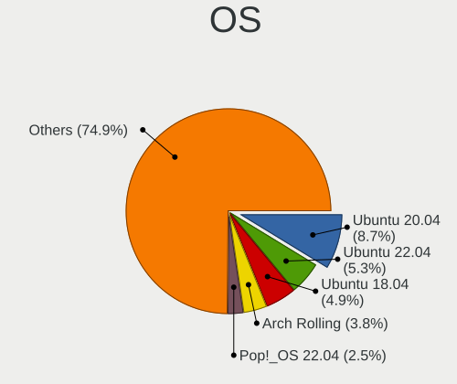

| Name                         | Desktops | Percent |
|------------------------------|----------|---------|
| Ubuntu 20.04                 | 497      | 8.72%   |
| Ubuntu 22.04                 | 300      | 5.26%   |
| Ubuntu 18.04                 | 280      | 4.91%   |
| Arch Rolling                 | 214      | 3.76%   |
| Pop!_OS 22.04                | 142      | 2.49%   |
| Ubuntu 24.04                 | 136      | 2.39%   |
| Debian 12                    | 109      | 1.91%   |
| Zorin 16                     | 98       | 1.72%   |
| ArcoLinux Rolling            | 96       | 1.68%   |
| Linux Mint 22.1              | 84       | 1.47%   |
| Zorin 17                     | 83       | 1.46%   |
| Debian 11                    | 78       | 1.37%   |
| Fedora 40                    | 76       | 1.33%   |
| OpenMandriva 24.12           | 71       | 1.25%   |
| Manjaro                      | 70       | 1.23%   |
| OpenMandriva 4.2             | 68       | 1.19%   |
| Linux Mint 20.3              | 58       | 1.02%   |
| Linux Mint 21.3              | 56       | 0.98%   |
| KDE neon 20.04               | 56       | 0.98%   |
| OpenMandriva 4.3             | 55       | 0.97%   |
| Linux Mint 22.2              | 53       | 0.93%   |
| Bazzite 42                   | 53       | 0.93%   |
| openSUSE Tumbleweed-XXXXXXXX | 52       | 0.91%   |
| Fedora 42                    | 51       | 0.89%   |
| Fedora 41                    | 50       | 0.88%   |
| Pop!_OS 20.04                | 48       | 0.84%   |
| OpenMandriva 23.08           | 46       | 0.81%   |
| Linux Mint 20.2              | 46       | 0.81%   |
| Pop!_OS 21.04                | 45       | 0.79%   |
| Linux Mint 21.1              | 45       | 0.79%   |
| Fedora 39                    | 44       | 0.77%   |
| Pop!_OS 20.10                | 41       | 0.72%   |
| Linux Mint 21.2              | 41       | 0.72%   |
| KDE neon 22.04               | 41       | 0.72%   |
| OpenMandriva 5.0             | 40       | 0.7%    |
| OpenMandriva 25.90           | 38       | 0.67%   |
| OpenMandriva 25.06           | 38       | 0.67%   |
| Zorin 15                     | 37       | 0.65%   |
| Xubuntu 20.04                | 37       | 0.65%   |
| Ubuntu 19.04                 | 37       | 0.65%   |

OS Family
---------

OS without a version

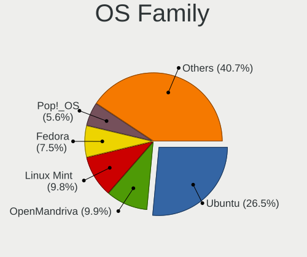

| Name          | Desktops | Percent |
|---------------|----------|---------|
| Ubuntu        | 1412     | 26.47%  |
| OpenMandriva  | 530      | 9.93%   |
| Linux Mint    | 525      | 9.84%   |
| Fedora        | 399      | 7.48%   |
| Pop!_OS       | 299      | 5.6%    |
| Debian        | 256      | 4.8%    |
| Arch          | 249      | 4.67%   |
| Zorin         | 245      | 4.59%   |
| Kubuntu       | 137      | 2.57%   |
| Manjaro       | 127      | 2.38%   |
| KDE neon      | 123      | 2.31%   |
| Bazzite       | 108      | 2.02%   |
| ArcoLinux     | 96       | 1.8%    |
| Xubuntu       | 72       | 1.35%   |
| openSUSE      | 64       | 1.2%    |
| Gentoo        | 60       | 1.12%   |
| Nobara        | 47       | 0.88%   |
| ROSA          | 45       | 0.84%   |
| EndeavourOS   | 35       | 0.66%   |
| Elementary    | 30       | 0.56%   |
| CachyOS       | 27       | 0.51%   |
| Ubuntu MATE   | 26       | 0.49%   |
| Clear Linux   | 24       | 0.45%   |
| Ubuntu Unity  | 23       | 0.43%   |
| LMDE          | 22       | 0.41%   |
| Kali          | 21       | 0.39%   |
| Garuda Linux  | 21       | 0.39%   |
| Endless       | 21       | 0.39%   |
| NixOS         | 20       | 0.37%   |
| MX            | 19       | 0.36%   |
| Lubuntu       | 18       | 0.34%   |
| BlackPanther  | 18       | 0.34%   |
| SteamOS       | 16       | 0.3%    |
| CentOS        | 15       | 0.28%   |
| Slackware     | 12       | 0.22%   |
| Rocky Linux   | 9        | 0.17%   |
| RHEL          | 9        | 0.17%   |
| Void Linux    | 7        | 0.13%   |
| ChimeraOS     | 7        | 0.13%   |
| Ubuntu Budgie | 6        | 0.11%   |

Kernel
------

Version of the Linux kernel

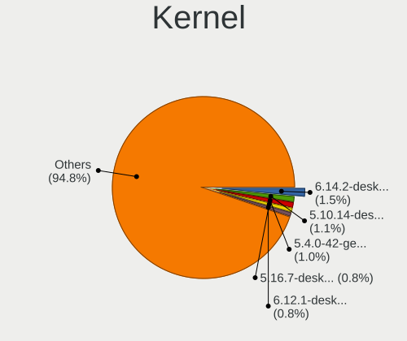

| Version                  | Desktops | Percent |
|--------------------------|----------|---------|
| 6.14.2-desktop-3omv2590  | 98       | 1.52%   |
| 5.10.14-desktop-1omv4002 | 68       | 1.06%   |
| 5.4.0-42-generic         | 65       | 1.01%   |
| 5.16.7-desktop-1omv4003  | 52       | 0.81%   |
| 6.12.1-desktop-1omv2490  | 50       | 0.78%   |
| 6.6.2-desktop-1omv2390   | 41       | 0.64%   |
| 5.4.0-48-generic         | 39       | 0.61%   |
| 6.2.6-desktop-1omv2390   | 35       | 0.54%   |
| 6.1.1-desktop-1omv2290   | 35       | 0.54%   |
| 6.4.11-desktop-1omv2390  | 33       | 0.51%   |
| 6.9.3-76060903-generic   | 32       | 0.5%    |
| 5.4.0-52-generic         | 32       | 0.5%    |
| 5.4.0-29-generic         | 31       | 0.48%   |
| 6.8.0-51-generic         | 30       | 0.47%   |
| 5.4.0-26-generic         | 30       | 0.47%   |
| 6.14.0-33-generic        | 29       | 0.45%   |
| 5.15.0-56-generic        | 28       | 0.43%   |
| 5.3.0-28-generic         | 27       | 0.42%   |
| 6.8.0-52-generic         | 26       | 0.4%    |
| 6.5.0-28-generic         | 26       | 0.4%    |
| 5.4.0-37-generic         | 26       | 0.4%    |
| 6.8.0-60-generic         | 24       | 0.37%   |
| 5.15.0-91-generic        | 24       | 0.37%   |
| 5.15.0-52-generic        | 24       | 0.37%   |
| 5.15.0-46-generic        | 24       | 0.37%   |
| 6.5.0-14-generic         | 23       | 0.36%   |
| 5.3.0-40-generic         | 23       | 0.36%   |
| 6.14.0-37-generic        | 22       | 0.34%   |
| 6.12.9-desktop-1omv2490  | 22       | 0.34%   |
| 5.4.0-66-generic         | 22       | 0.34%   |
| 5.4.0-65-generic         | 22       | 0.34%   |
| 5.15.0-58-generic        | 22       | 0.34%   |
| 5.4.0-47-generic         | 21       | 0.33%   |
| 5.4.0-40-generic         | 21       | 0.33%   |
| 6.12.10-76061203-generic | 20       | 0.31%   |
| 5.4.0-74-generic         | 20       | 0.31%   |
| 5.4.0-33-generic         | 20       | 0.31%   |
| 5.13.0-39-generic        | 20       | 0.31%   |
| 6.2.0-36-generic         | 19       | 0.29%   |
| 6.12.6-desktop-1omv2490  | 19       | 0.29%   |

Kernel Family
-------------

Linux kernel without a distro release

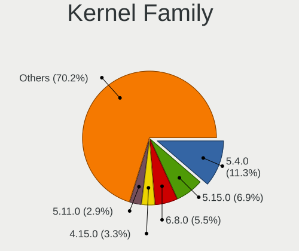

| Version | Desktops | Percent |
|---------|----------|---------|
| 5.4.0   | 677      | 11.31%  |
| 5.15.0  | 412      | 6.89%   |
| 6.8.0   | 329      | 5.5%    |
| 4.15.0  | 195      | 3.26%   |
| 5.11.0  | 171      | 2.86%   |
| 5.8.0   | 163      | 2.72%   |
| 5.13.0  | 157      | 2.62%   |
| 6.5.0   | 149      | 2.49%   |
| 5.3.0   | 145      | 2.42%   |
| 6.14.0  | 135      | 2.26%   |
| 6.2.0   | 117      | 1.96%   |
| 6.1.0   | 113      | 1.89%   |
| 6.14.2  | 110      | 1.84%   |
| 5.19.0  | 104      | 1.74%   |
| 5.0.0   | 90       | 1.5%    |
| 5.10.0  | 86       | 1.44%   |
| 6.11.0  | 85       | 1.42%   |
| 4.18.0  | 76       | 1.27%   |
| 5.10.14 | 68       | 1.14%   |
| 6.2.6   | 55       | 0.92%   |
| 6.12.1  | 54       | 0.9%    |
| 5.16.7  | 52       | 0.87%   |
| 6.6.2   | 46       | 0.77%   |
| 6.17.7  | 44       | 0.74%   |
| 6.1.1   | 39       | 0.65%   |
| 6.4.11  | 36       | 0.6%    |
| 6.9.3   | 33       | 0.55%   |
| 6.12.9  | 28       | 0.47%   |
| 4.19.0  | 27       | 0.45%   |
| 6.12.10 | 24       | 0.4%    |
| 5.14.0  | 23       | 0.38%   |
| 6.14.6  | 22       | 0.37%   |
| 6.13.5  | 22       | 0.37%   |
| 6.12.6  | 22       | 0.37%   |
| 6.5.6   | 20       | 0.33%   |
| 6.16.4  | 20       | 0.33%   |
| 6.15.6  | 17       | 0.28%   |
| 6.10.0  | 17       | 0.28%   |
| 6.5.5   | 16       | 0.27%   |
| 6.16.3  | 16       | 0.27%   |

Kernel Major Ver.
-----------------

Linux kernel major version

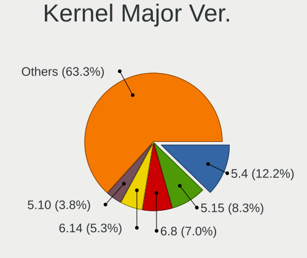

| Version | Desktops | Percent |
|---------|----------|---------|
| 5.4     | 720      | 12.25%  |
| 5.15    | 490      | 8.33%   |
| 6.8     | 414      | 7.04%   |
| 6.14    | 311      | 5.29%   |
| 5.10    | 222      | 3.78%   |
| 6.1     | 215      | 3.66%   |
| 6.2     | 214      | 3.64%   |
| 6.12    | 212      | 3.61%   |
| 6.5     | 211      | 3.59%   |
| 5.11    | 205      | 3.49%   |
| 5.8     | 202      | 3.44%   |
| 4.15    | 196      | 3.33%   |
| 5.13    | 191      | 3.25%   |
| 5.3     | 169      | 2.87%   |
| 6.11    | 156      | 2.65%   |
| 5.19    | 147      | 2.5%    |
| 6.6     | 143      | 2.43%   |
| 6.17    | 122      | 2.08%   |
| 5.0     | 93       | 1.58%   |
| 4.18    | 90       | 1.53%   |
| 5.16    | 87       | 1.48%   |
| 6.9     | 85       | 1.45%   |
| 6.4     | 85       | 1.45%   |
| 6.10    | 80       | 1.36%   |
| 6.13    | 77       | 1.31%   |
| 6.15    | 71       | 1.21%   |
| 6.16    | 68       | 1.16%   |
| 6.0     | 57       | 0.97%   |
| 5.14    | 52       | 0.88%   |
| 5.18    | 48       | 0.82%   |
| 6.3     | 45       | 0.77%   |
| 5.17    | 44       | 0.75%   |
| 5.9     | 42       | 0.71%   |
| 6.7     | 40       | 0.68%   |
| 4.19    | 39       | 0.66%   |
| 4.9     | 38       | 0.65%   |
| 5.12    | 37       | 0.63%   |
| 5.6     | 36       | 0.61%   |
| 5.7     | 32       | 0.54%   |
| 5.5     | 19       | 0.32%   |

Arch
----

OS architecture (x86_64, i586, etc.)

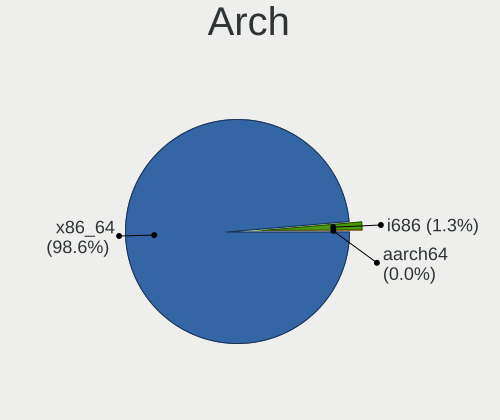

| Name    | Desktops | Percent |
|---------|----------|---------|
| x86_64  | 4996     | 98.64%  |
| i686    | 64       | 1.26%   |
| armv7l  | 3        | 0.06%   |
| riscv64 | 1        | 0.02%   |
| aarch64 | 1        | 0.02%   |

DE
--

Desktop Environment

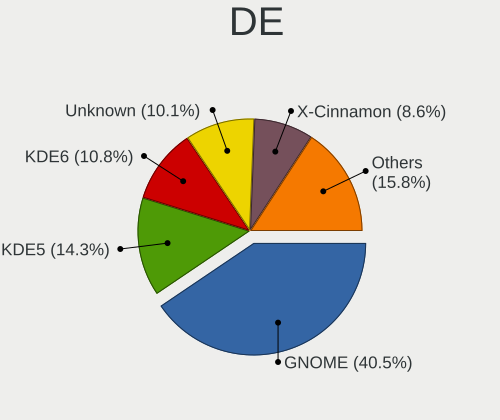

| Name             | Desktops | Percent |
|------------------|----------|---------|
| GNOME            | 2182     | 40.54%  |
| KDE5             | 768      | 14.27%  |
| KDE6             | 579      | 10.76%  |
| Unknown          | 541      | 10.05%  |
| X-Cinnamon       | 462      | 8.58%   |
| XFCE             | 303      | 5.63%   |
| KDE              | 108      | 2.01%   |
| MATE             | 103      | 1.91%   |
| Cinnamon         | 49       | 0.91%   |
| LXQt             | 43       | 0.8%    |
| Pantheon         | 30       | 0.56%   |
| Unity            | 25       | 0.46%   |
| KDE4             | 25       | 0.46%   |
| Hyprland         | 21       | 0.39%   |
| i3               | 20       | 0.37%   |
| LXDE             | 17       | 0.32%   |
| COSMIC           | 16       | 0.3%    |
| sway             | 13       | 0.24%   |
| GNOME Flashback  | 12       | 0.22%   |
| Budgie           | 10       | 0.19%   |
| Deepin           | 9        | 0.17%   |
| GNOME Classic    | 7        | 0.13%   |
| lightdm-xsession | 5        | 0.09%   |
| openbox          | 4        | 0.07%   |
| awesome          | 4        | 0.07%   |
| bspwm            | 3        | 0.06%   |
| xmonad           | 2        | 0.04%   |
| qtile            | 2        | 0.04%   |
| icewm            | 2        | 0.04%   |
| Enlightenment    | 2        | 0.04%   |
| Endless:GNOME    | 2        | 0.04%   |
| dwm              | 2        | 0.04%   |
| chadwm           | 2        | 0.04%   |
| xubuntu          | 1        | 0.02%   |
| WindowMaker      | 1        | 0.02%   |
| pika:GNOME       | 1        | 0.02%   |
| niri             | 1        | 0.02%   |
| mwm              | 1        | 0.02%   |
| LeftWM           | 1        | 0.02%   |
| labwc:wlroots    | 1        | 0.02%   |

Display Server
--------------

X11 or Wayland

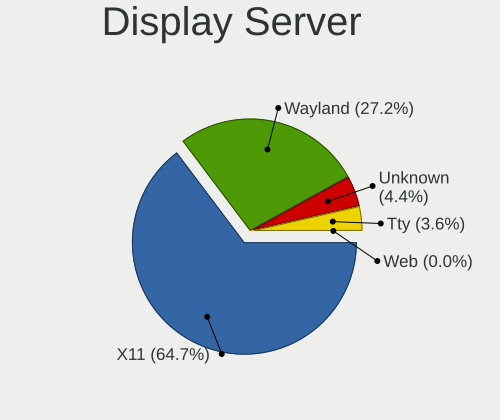

| Name    | Desktops | Percent |
|---------|----------|---------|
| X11     | 3426     | 64.74%  |
| Wayland | 1442     | 27.25%  |
| Unknown | 235      | 4.44%   |
| Tty     | 188      | 3.55%   |
| Web     | 1        | 0.02%   |

Display Manager
---------------

SDDM, LightDM, etc.

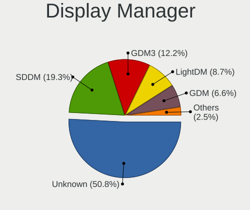

| Name           | Desktops | Percent |
|----------------|----------|---------|
| Unknown        | 2694     | 50.82%  |
| SDDM           | 1021     | 19.26%  |
| GDM3           | 645      | 12.17%  |
| LightDM        | 462      | 8.72%   |
| GDM            | 348      | 6.56%   |
| TDM            | 80       | 1.51%   |
| KDM            | 20       | 0.38%   |
| XDM            | 9        | 0.17%   |
| SLiM           | 6        | 0.11%   |
| LXDM           | 4        | 0.08%   |
| Ly             | 3        | 0.06%   |
| GREETD         | 3        | 0.06%   |
| LY-DM          | 2        | 0.04%   |
| COSMIC-GREETER | 2        | 0.04%   |
| XINIT          | 1        | 0.02%   |
| MDM            | 1        | 0.02%   |

OS Lang
-------

Language

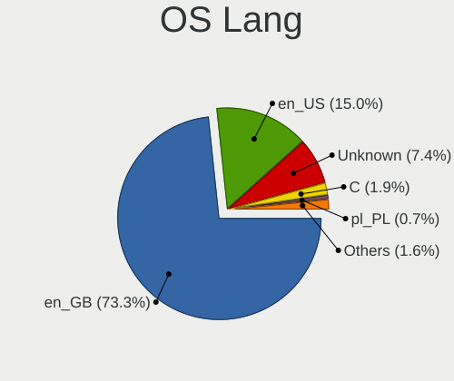

| Lang             | Desktops | Percent |
|------------------|----------|---------|
| en_GB            | 3817     | 73.33%  |
| en_US            | 781      | 15%     |
| Unknown          | 385      | 7.4%    |
| C                | 101      | 1.94%   |
| pl_PL            | 36       | 0.69%   |
| ru_RU            | 10       | 0.19%   |
| en_IE            | 9        | 0.17%   |
| POSIX            | 7        | 0.13%   |
| it_IT            | 5        | 0.1%    |
| en_CA            | 5        | 0.1%    |
| de_DE            | 4        | 0.08%   |
| C.UTF8           | 4        | 0.08%   |
| ro_RO            | 3        | 0.06%   |
| lt_LT            | 3        | 0.06%   |
| hu_HU            | 3        | 0.06%   |
| fr_FR            | 3        | 0.06%   |
| uk_UA            | 2        | 0.04%   |
| nl_NL            | 2        | 0.04%   |
| es_ES            | 2        | 0.04%   |
| en_ZA            | 2        | 0.04%   |
| cs_CZ            | 2        | 0.04%   |
| zh_CN            | 1        | 0.02%   |
| wbp_AU           | 1        | 0.02%   |
| us               | 1        | 0.02%   |
| sk_SK            | 1        | 0.02%   |
| ru_UA            | 1        | 0.02%   |
| pt_PT            | 1        | 0.02%   |
| pt_BR            | 1        | 0.02%   |
| nl_BE            | 1        | 0.02%   |
| nb_NO            | 1        | 0.02%   |
| fi_FI            | 1        | 0.02%   |
| et_EE            | 1        | 0.02%   |
| en_US.utf-8      | 1        | 0.02%   |
| en_SG            | 1        | 0.02%   |
| en_IN            | 1        | 0.02%   |
| en_GB.iso88591   | 1        | 0.02%   |
| en_GB.ISO-8859-1 | 1        | 0.02%   |
| en_DK            | 1        | 0.02%   |
| en_AU            | 1        | 0.02%   |
| bg_BG            | 1        | 0.02%   |

Boot Mode
---------

EFI or BIOS

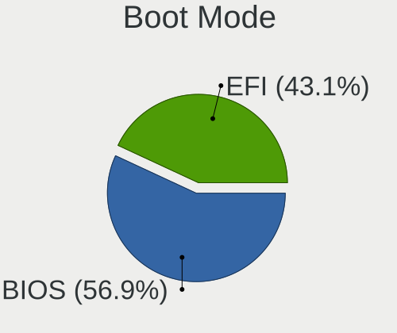

| Mode | Desktops | Percent |
|------|----------|---------|
| BIOS | 2956     | 56.92%  |
| EFI  | 2237     | 43.08%  |

Filesystem
----------

Type of filesystem

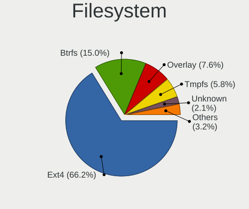

| Type     | Desktops | Percent |
|----------|----------|---------|
| Ext4     | 3495     | 66.23%  |
| Btrfs    | 793      | 15.03%  |
| Overlay  | 403      | 7.64%   |
| Tmpfs    | 306      | 5.8%    |
| Unknown  | 111      | 2.1%    |
| Xfs      | 85       | 1.61%   |
| Zfs      | 43       | 0.81%   |
| Ext2     | 14       | 0.27%   |
| Ext3     | 11       | 0.21%   |
| F2fs     | 8        | 0.15%   |
| Aufs     | 2        | 0.04%   |
| XXXXXXX  | 1        | 0.02%   |
| XXXX     | 1        | 0.02%   |
| Rootfs   | 1        | 0.02%   |
| Reiserfs | 1        | 0.02%   |
| Jfs      | 1        | 0.02%   |
| ExX4     | 1        | 0.02%   |

Part. scheme
------------

Scheme of partitioning

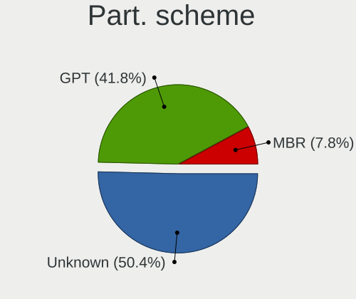

| Type    | Desktops | Percent |
|---------|----------|---------|
| Unknown | 2632     | 50.38%  |
| GPT     | 2182     | 41.77%  |
| MBR     | 410      | 7.85%   |

Dual Boot with Linux/BSD
------------------------

Hosting more than one Linux/BSD

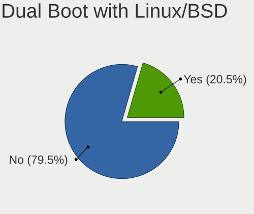

| Dual boot | Desktops | Percent |
|-----------|----------|---------|
| No        | 4157     | 79.47%  |
| Yes       | 1074     | 20.53%  |

Dual Boot (Win)
---------------

Hosting Linux and Windows

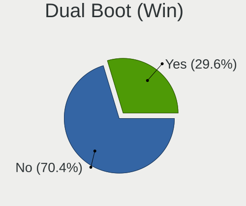

| Dual boot | Desktops | Percent |
|-----------|----------|---------|
| No        | 3645     | 70.37%  |
| Yes       | 1535     | 29.63%  |

Board
-----

Vendor
------

Motherboard manufacturer

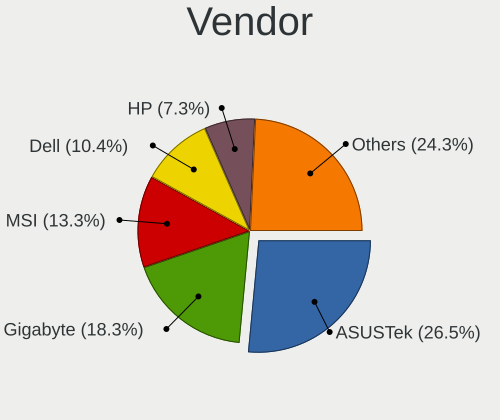

| Name                                 | Desktops | Percent |
|--------------------------------------|----------|---------|
| ASUSTek Computer                     | 1341     | 26.49%  |
| Gigabyte Technology                  | 925      | 18.27%  |
| MSI                                  | 671      | 13.25%  |
| Dell                                 | 527      | 10.41%  |
| Hewlett-Packard                      | 370      | 7.31%   |
| ASRock                               | 349      | 6.89%   |
| Lenovo                               | 157      | 3.1%    |
| Acer                                 | 102      | 2.01%   |
| Intel                                | 100      | 1.98%   |
| Unknown                              | 64       | 1.26%   |
| Foxconn                              | 45       | 0.89%   |
| Fujitsu                              | 41       | 0.81%   |
| Apple                                | 32       | 0.63%   |
| Biostar                              | 30       | 0.59%   |
| Pegatron                             | 28       | 0.55%   |
| AZW                                  | 26       | 0.51%   |
| Shenzhen Meigao Electronic Equipment | 21       | 0.41%   |
| Packard Bell                         | 20       | 0.4%    |
| Medion                               | 16       | 0.32%   |
| ECS                                  | 12       | 0.24%   |
| Alienware                            | 12       | 0.24%   |
| Supermicro                           | 11       | 0.22%   |
| Shuttle                              | 10       | 0.2%    |
| GEEKOM                               | 9        | 0.18%   |
| Fujitsu Siemens                      | 8        | 0.16%   |
| Inventec                             | 7        | 0.14%   |
| AMI                                  | 7        | 0.14%   |
| Huanan                               | 6        | 0.12%   |
| GMKtec                               | 6        | 0.12%   |
| MACHINIST                            | 5        | 0.1%    |
| LinuxContainers                      | 5        | 0.1%    |
| BESSTAR Tech                         | 5        | 0.1%    |
| TYAN Computer                        | 4        | 0.08%   |
| NZXT                                 | 4        | 0.08%   |
| JGINYUE                              | 4        | 0.08%   |
| Trigkey                              | 3        | 0.06%   |
| OEM_MB                               | 3        | 0.06%   |
| Google                               | 3        | 0.06%   |
| Entroware                            | 3        | 0.06%   |
| ASRockRack                           | 3        | 0.06%   |

Model
-----

Motherboard model

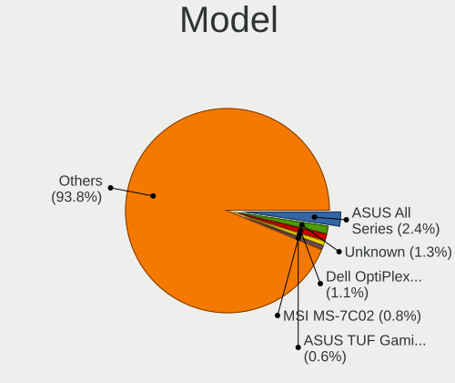

| Name                                 | Desktops | Percent |
|--------------------------------------|----------|---------|
| ASUS All Series                      | 120      | 2.37%   |
| Unknown                              | 66       | 1.3%    |
| Dell OptiPlex 7010                   | 57       | 1.13%   |
| MSI MS-7C02                          | 39       | 0.77%   |
| ASUS TUF Gaming X570-PLUS            | 32       | 0.63%   |
| MSI MS-7C37                          | 31       | 0.61%   |
| ASUS M5A78L-M/USB3                   | 30       | 0.59%   |
| Gigabyte B550M DS3H                  | 28       | 0.55%   |
| MSI MS-7C91                          | 27       | 0.53%   |
| MSI MS-7C56                          | 27       | 0.53%   |
| ASUS ROG STRIX B450-F GAMING         | 26       | 0.51%   |
| Dell OptiPlex 780                    | 25       | 0.49%   |
| Gigabyte X570 AORUS ELITE            | 24       | 0.47%   |
| ASUS ROG STRIX B550-F GAMING         | 23       | 0.45%   |
| Dell OptiPlex 755                    | 22       | 0.43%   |
| Dell OptiPlex 3020                   | 21       | 0.41%   |
| ASUS PRIME A320M-K                   | 21       | 0.41%   |
| Dell OptiPlex 790                    | 20       | 0.4%    |
| Gigabyte B450M DS3H                  | 19       | 0.38%   |
| Gigabyte 970A-DS3P                   | 19       | 0.38%   |
| MSI MS-7B79                          | 18       | 0.36%   |
| Gigabyte A320M-S2H                   | 18       | 0.36%   |
| Dell OptiPlex 3050                   | 18       | 0.36%   |
| MSI MS-7B89                          | 17       | 0.34%   |
| Gigabyte B550I AORUS PRO AX          | 17       | 0.34%   |
| Dell OptiPlex 9020                   | 17       | 0.34%   |
| ASUS PRIME B450-PLUS                 | 17       | 0.34%   |
| HP ProLiant MicroServer              | 16       | 0.32%   |
| Gigabyte GA-78LMT-USB3               | 16       | 0.32%   |
| ASUS ROG STRIX X570-F GAMING         | 16       | 0.32%   |
| MSI MS-7B86                          | 15       | 0.3%    |
| HP EliteDesk 800 G1 SFF              | 14       | 0.28%   |
| ASUS ROG CROSSHAIR VIII HERO         | 14       | 0.28%   |
| ASUS PRIME B350-PLUS                 | 14       | 0.28%   |
| MSI MS-7C95                          | 13       | 0.26%   |
| MSI MS-7A38                          | 13       | 0.26%   |
| ASUS ROG STRIX B550-F GAMING WIFI II | 13       | 0.26%   |
| Apple MacPro5,1                      | 13       | 0.26%   |
| MSI MS-7C84                          | 12       | 0.24%   |
| MSI MS-7B85                          | 12       | 0.24%   |

Model Family
------------

Motherboard model prefix

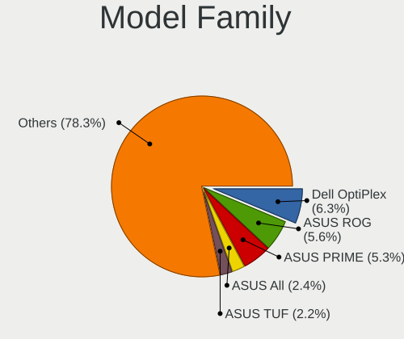

| Name                   | Desktops | Percent |
|------------------------|----------|---------|
| Dell OptiPlex          | 320      | 6.32%   |
| ASUS ROG               | 285      | 5.63%   |
| ASUS PRIME             | 266      | 5.25%   |
| ASUS All               | 120      | 2.37%   |
| ASUS TUF               | 110      | 2.17%   |
| Lenovo ThinkCentre     | 96       | 1.9%    |
| HP Compaq              | 91       | 1.8%    |
| Dell Precision         | 77       | 1.52%   |
| Acer Aspire            | 68       | 1.34%   |
| Unknown                | 66       | 1.3%    |
| Gigabyte X570          | 65       | 1.28%   |
| HP EliteDesk           | 57       | 1.13%   |
| Dell Inspiron          | 48       | 0.95%   |
| Gigabyte B550M         | 43       | 0.85%   |
| ASUS M5A78L-M          | 43       | 0.85%   |
| HP ProDesk             | 41       | 0.81%   |
| MSI MS-7C02            | 39       | 0.77%   |
| Gigabyte B550          | 34       | 0.67%   |
| Fujitsu ESPRIMO        | 32       | 0.63%   |
| Dell Vostro            | 32       | 0.63%   |
| MSI MS-7C37            | 31       | 0.61%   |
| Gigabyte GA-78LMT-USB3 | 31       | 0.61%   |
| Gigabyte B450M         | 31       | 0.61%   |
| HP ProLiant            | 29       | 0.57%   |
| Gigabyte B450          | 29       | 0.57%   |
| MSI MS-7C91            | 27       | 0.53%   |
| MSI MS-7C56            | 27       | 0.53%   |
| Gigabyte Z390          | 26       | 0.51%   |
| Gigabyte A320M-S2H     | 24       | 0.47%   |
| ASUS SABERTOOTH        | 23       | 0.45%   |
| ASRock X570            | 22       | 0.43%   |
| ASUS P8Z77-V           | 21       | 0.41%   |
| Gigabyte 970A-DS3P     | 20       | 0.4%    |
| Lenovo ThinkStation    | 19       | 0.38%   |
| MSI MS-7B79            | 18       | 0.36%   |
| ASUS Maximus           | 18       | 0.36%   |
| ASUS M5A97             | 18       | 0.36%   |
| MSI MS-7B89            | 17       | 0.34%   |
| Gigabyte B550I         | 17       | 0.34%   |
| ASRock B450M           | 17       | 0.34%   |

MFG Year
--------

Motherboard manufacture year

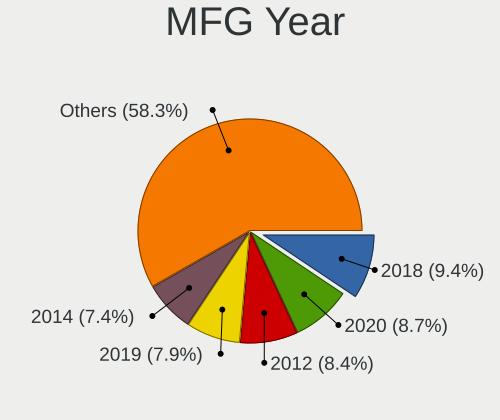

| Year    | Desktops | Percent |
|---------|----------|---------|
| 2018    | 475      | 9.38%   |
| 2020    | 440      | 8.69%   |
| 2012    | 424      | 8.37%   |
| 2019    | 399      | 7.88%   |
| 2014    | 375      | 7.41%   |
| 2013    | 365      | 7.21%   |
| 2017    | 297      | 5.87%   |
| 2022    | 278      | 5.49%   |
| 2011    | 276      | 5.45%   |
| 2021    | 260      | 5.14%   |
| 2010    | 231      | 4.56%   |
| 2016    | 203      | 4.01%   |
| 2023    | 194      | 3.83%   |
| 2009    | 189      | 3.73%   |
| 2015    | 186      | 3.67%   |
| 2008    | 130      | 2.57%   |
| 2024    | 118      | 2.33%   |
| 2007    | 114      | 2.25%   |
| 2006    | 52       | 1.03%   |
| 2005    | 20       | 0.4%    |
| 2025    | 19       | 0.38%   |
| 2004    | 7        | 0.14%   |
| Unknown | 5        | 0.1%    |
| 2003    | 4        | 0.08%   |
| 2002    | 2        | 0.04%   |

Form Factor
-----------

Physical design of the computer

| Name    | Desktops | Percent |
|---------|----------|---------|
| Desktop | 5063     | 100%    |

Secure Boot
-----------

Enabled or disabled

| State    | Desktops | Percent |
|----------|----------|---------|
| Disabled | 4920     | 96.7%   |
| Enabled  | 168      | 3.3%    |

Coreboot
--------

Have coreboot on board

| Used | Desktops | Percent |
|------|----------|---------|
| No   | 5059     | 99.92%  |
| Yes  | 4        | 0.08%   |

RAM Size
--------

Total RAM memory

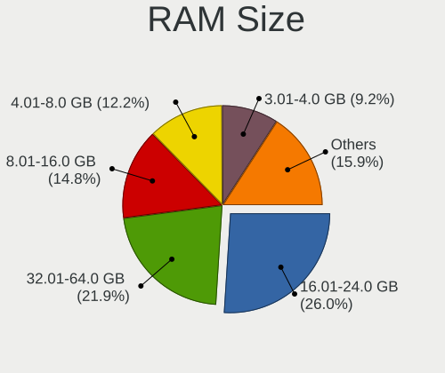

| Size in GB      | Desktops | Percent |
|-----------------|----------|---------|
| 16.01-24.0      | 1355     | 26.01%  |
| 32.01-64.0      | 1142     | 21.92%  |
| 8.01-16.0       | 769      | 14.76%  |
| 4.01-8.0        | 638      | 12.25%  |
| 3.01-4.0        | 479      | 9.19%   |
| 64.01-256.0     | 410      | 7.87%   |
| 24.01-32.0      | 248      | 4.76%   |
| 1.01-2.0        | 87       | 1.67%   |
| 2.01-3.0        | 49       | 0.94%   |
| 0.51-1.0        | 18       | 0.35%   |
| More than 256.0 | 13       | 0.25%   |
| 0.01-0.5        | 2        | 0.04%   |

RAM Used
--------

Used RAM memory

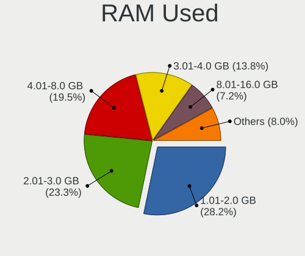

| Used GB     | Desktops | Percent |
|-------------|----------|---------|
| 1.01-2.0    | 1635     | 28.25%  |
| 2.01-3.0    | 1349     | 23.31%  |
| 4.01-8.0    | 1127     | 19.47%  |
| 3.01-4.0    | 798      | 13.79%  |
| 8.01-16.0   | 415      | 7.17%   |
| 0.51-1.0    | 259      | 4.47%   |
| 16.01-24.0  | 86       | 1.49%   |
| 0.01-0.5    | 58       | 1%      |
| 24.01-32.0  | 29       | 0.5%    |
| 32.01-64.0  | 24       | 0.41%   |
| 64.01-256.0 | 5        | 0.09%   |
| Unknown     | 2        | 0.03%   |
| 0           | 1        | 0.02%   |

Total Drives
------------

Number of drives on board

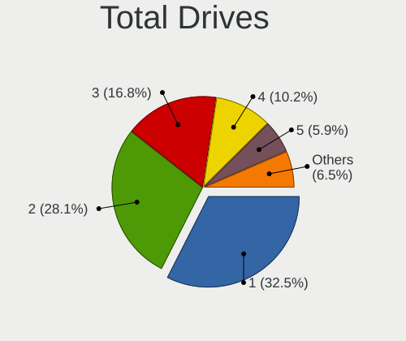

| Drives  | Desktops | Percent |
|---------|----------|---------|
| 1       | 1744     | 32.48%  |
| 2       | 1510     | 28.12%  |
| 3       | 900      | 16.76%  |
| 4       | 549      | 10.22%  |
| 5       | 317      | 5.9%    |
| 6       | 154      | 2.87%   |
| 7       | 81       | 1.51%   |
| 8       | 33       | 0.61%   |
| 0       | 31       | 0.58%   |
| 9       | 15       | 0.28%   |
| 10      | 12       | 0.22%   |
| 11      | 9        | 0.17%   |
| 12      | 6        | 0.11%   |
| 13      | 2        | 0.04%   |
| 29      | 1        | 0.02%   |
| 25      | 1        | 0.02%   |
| 23      | 1        | 0.02%   |
| 21      | 1        | 0.02%   |
| 20      | 1        | 0.02%   |
| 14      | 1        | 0.02%   |
| Unknown | 1        | 0.02%   |

Has CD-ROM
----------

Has CD-ROM on board

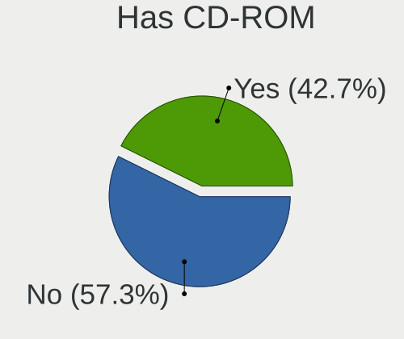

| Presented | Desktops | Percent |
|-----------|----------|---------|
| No        | 2955     | 57.32%  |
| Yes       | 2200     | 42.68%  |

Has Ethernet
------------

Has Ethernet on board

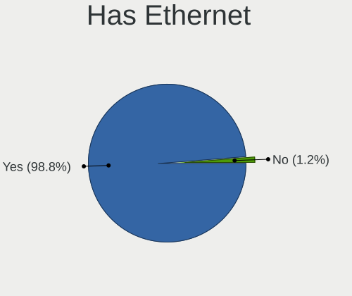

| Presented | Desktops | Percent |
|-----------|----------|---------|
| Yes       | 5001     | 98.76%  |
| No        | 63       | 1.24%   |

Has WiFi
--------

Has WiFi module

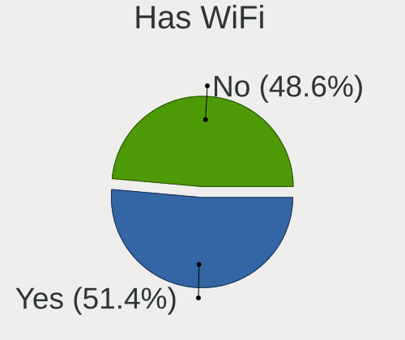

| Presented | Desktops | Percent |
|-----------|----------|---------|
| Yes       | 2660     | 51.41%  |
| No        | 2514     | 48.59%  |

Has Bluetooth
-------------

Has Bluetooth module

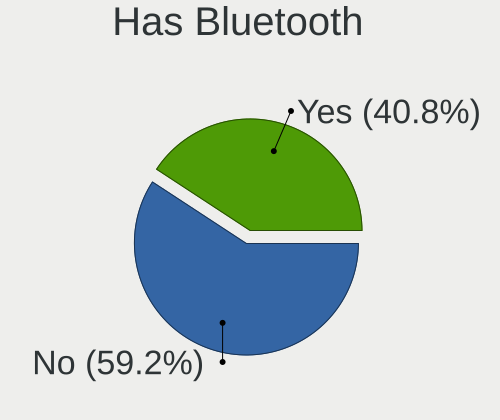

| Presented | Desktops | Percent |
|-----------|----------|---------|
| No        | 3061     | 59.23%  |
| Yes       | 2107     | 40.77%  |

Location
--------

Country
-------

Geographic location (country)

| Country | Desktops | Percent |
|---------|----------|---------|
| UK      | 5063     | 100%    |

City
----

Geographic location (city)

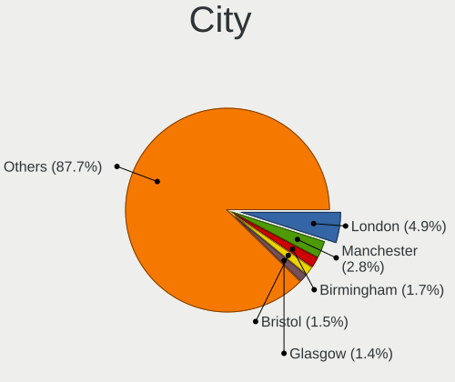

| City                 | Desktops | Percent |
|----------------------|----------|---------|
| London               | 280      | 4.95%   |
| Manchester           | 157      | 2.77%   |
| Birmingham           | 98       | 1.73%   |
| Bristol              | 84       | 1.48%   |
| Glasgow              | 77       | 1.36%   |
| Nottingham           | 69       | 1.22%   |
| Leeds                | 63       | 1.11%   |
| Sheffield            | 62       | 1.1%    |
| Liverpool            | 58       | 1.02%   |
| Edinburgh            | 54       | 0.95%   |
| Southampton          | 53       | 0.94%   |
| Reading              | 47       | 0.83%   |
| Islington            | 44       | 0.78%   |
| Croydon              | 41       | 0.72%   |
| Cardiff              | 41       | 0.72%   |
| Milton Keynes        | 38       | 0.67%   |
| Derby                | 37       | 0.65%   |
| Norwich              | 36       | 0.64%   |
| Newcastle upon Tyne  | 36       | 0.64%   |
| Cambridge            | 36       | 0.64%   |
| Bradford             | 36       | 0.64%   |
| Leicester            | 34       | 0.6%    |
| Coventry             | 30       | 0.53%   |
| Rotherham            | 29       | 0.51%   |
| Plymouth             | 29       | 0.51%   |
| Hackney              | 29       | 0.51%   |
| Stoke-on-Trent       | 28       | 0.49%   |
| Southwark            | 28       | 0.49%   |
| Kingston upon Thames | 27       | 0.48%   |
| City of Westminster  | 27       | 0.48%   |
| Swindon              | 26       | 0.46%   |
| Stockport            | 26       | 0.46%   |
| Hull                 | 25       | 0.44%   |
| City of London       | 25       | 0.44%   |
| Brent                | 25       | 0.44%   |
| Barnet               | 25       | 0.44%   |
| Slough               | 24       | 0.42%   |
| Portsmouth           | 24       | 0.42%   |
| Belfast              | 24       | 0.42%   |
| Lincoln              | 23       | 0.41%   |

Drives
------

Drive Vendor
------------

Hard drive vendors

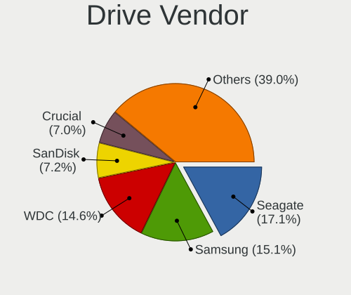

| Vendor                       | Desktops | Drives | Percent |
|------------------------------|----------|--------|---------|
| Seagate                      | 1739     | 3137   | 17.07%  |
| Samsung Electronics          | 1540     | 2903   | 15.11%  |
| WDC                          | 1488     | 2714   | 14.6%   |
| SanDisk                      | 736      | 1084   | 7.22%   |
| Crucial                      | 716      | 1064   | 7.03%   |
| Kingston                     | 489      | 704    | 4.8%    |
| Toshiba                      | 464      | 737    | 4.55%   |
| Hitachi                      | 298      | 436    | 2.92%   |
| Micron/Crucial Technology    | 209      | 290    | 2.05%   |
| Phison Electronics           | 135      | 231    | 1.32%   |
| China                        | 133      | 186    | 1.31%   |
| Phison                       | 130      | 178    | 1.28%   |
| Intel                        | 129      | 217    | 1.27%   |
| Unknown                      | 111      | 204    | 1.09%   |
| A-DATA Technology            | 91       | 129    | 0.89%   |
| HGST                         | 81       | 142    | 0.79%   |
| OCZ                          | 78       | 90     | 0.77%   |
| Micron Technology            | 74       | 85     | 0.73%   |
| SK hynix                     | 73       | 91     | 0.72%   |
| Maxtor                       | 66       | 99     | 0.65%   |
| PNY                          | 64       | 83     | 0.63%   |
| Corsair                      | 63       | 85     | 0.62%   |
| Silicon Motion               | 58       | 97     | 0.57%   |
| MAXIO Technology (Hangzhou)  | 57       | 85     | 0.56%   |
| Kingston Technology Company  | 57       | 74     | 0.56%   |
| Patriot                      | 43       | 65     | 0.42%   |
| Fanxiang                     | 43       | 75     | 0.42%   |
| Integral                     | 42       | 52     | 0.41%   |
| ADATA Technology             | 39       | 53     | 0.38%   |
| Netac                        | 37       | 48     | 0.36%   |
| JMicron Technology           | 35       | 52     | 0.34%   |
| Lexar                        | 34       | 39     | 0.33%   |
| Transcend                    | 33       | 37     | 0.32%   |
| SPCC                         | 30       | 45     | 0.29%   |
| SABRENT                      | 28       | 35     | 0.27%   |
| Gigabyte Technology          | 28       | 41     | 0.27%   |
| Shenzhen Longsys Electronics | 27       | 35     | 0.26%   |
| Unknown                      | 26       | 33     | 0.26%   |
| ASMT                         | 24       | 36     | 0.24%   |
| LITEON                       | 23       | 31     | 0.23%   |

Drive Model
-----------

Hard drive models

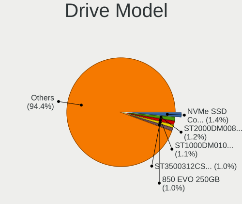

| Model                                              | Desktops | Percent |
|----------------------------------------------------|----------|---------|
| Samsung NVMe SSD Controller SM981/PM981/PM983 1TB  | 170      | 1.4%    |
| Seagate ST2000DM008-2FR102 2TB                     | 142      | 1.17%   |
| Seagate ST1000DM010-2EP102 1TB                     | 136      | 1.12%   |
| Seagate ST3500312CS 500GB                          | 116      | 0.96%   |
| Samsung SSD 850 EVO 250GB                          | 116      | 0.96%   |
| Kingston SA400S37240G 240GB SSD                    | 115      | 0.95%   |
| Crucial CT1000MX500SSD1 1TB                        | 105      | 0.86%   |
| Micron/Crucial P2 NVMe PCIe SSD 2TB                | 99       | 0.82%   |
| Seagate ST500DM002-1BD142 500GB                    | 93       | 0.77%   |
| Samsung SSD 860 EVO 1TB                            | 89       | 0.73%   |
| Crucial CT500MX500SSD1 500GB                       | 88       | 0.72%   |
| Samsung SSD 850 EVO 500GB                          | 83       | 0.68%   |
| Samsung NVMe SSD Controller PM9A1/PM9A3/980PRO 1TB | 83       | 0.68%   |
| Samsung SSD 860 EVO 500GB                          | 79       | 0.65%   |
| Seagate ST4000DM004-2CV104 4TB                     | 74       | 0.61%   |
| Phison E12 NVMe Controller 1TB                     | 62       | 0.51%   |
| Kingston SA400S37120G 120GB SSD                    | 62       | 0.51%   |
| Crucial CT240BX500SSD1 240GB                       | 59       | 0.49%   |
| Toshiba DT01ACA100 1TB                             | 54       | 0.44%   |
| Kingston SA400S37480G 480GB SSD                    | 53       | 0.44%   |
| Seagate ST1000DM003-1ER162 1TB                     | 51       | 0.42%   |
| Samsung SSD 840 EVO 250GB                          | 49       | 0.4%    |
| Seagate ST2000DM006-2DM164 2TB                     | 48       | 0.4%    |
| Samsung SSD 980 1TB                                | 48       | 0.4%    |
| Samsung SSD 970 EVO Plus 1TB                       | 48       | 0.4%    |
| Crucial CT1000BX500SSD1 1TB                        | 48       | 0.4%    |
| Seagate ST2000DM001-1ER164 2TB                     | 47       | 0.39%   |
| Toshiba HDWD130 3TB                                | 46       | 0.38%   |
| Sandisk WD Blue SN550 NVMe SSD 1024GB              | 46       | 0.38%   |
| Toshiba HDWD110 1TB                                | 45       | 0.37%   |
| Seagate ST1000DM003-1CH162 1TB                     | 45       | 0.37%   |
| Kingston SV300S37A120G 120GB SSD                   | 45       | 0.37%   |
| Crucial CT480BX500SSD1 480GB                       | 45       | 0.37%   |
| WDC WD10EZEX-08WN4A0 1TB                           | 44       | 0.36%   |
| Seagate ST2000DM001-1CH164 2TB                     | 43       | 0.35%   |
| SanDisk SSD PLUS 480GB                             | 43       | 0.35%   |
| Sandisk WD Black SN850 1TB                         | 42       | 0.35%   |
| Seagate ST3500418AS 500GB                          | 41       | 0.34%   |
| Samsung SSD 870 QVO 1TB                            | 41       | 0.34%   |
| Samsung NVMe SSD Drive 500GB                       | 41       | 0.34%   |

HDD Vendor
----------

Hard disk drive vendors

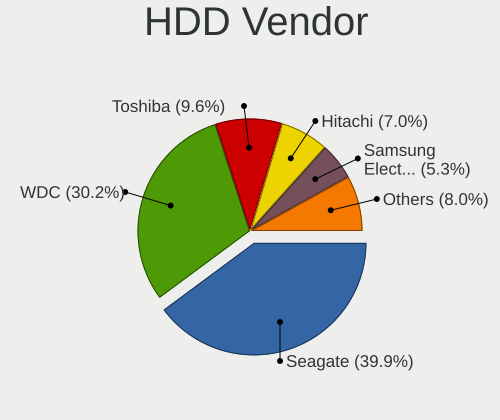

| Vendor              | Desktops | Drives | Percent |
|---------------------|----------|--------|---------|
| Seagate             | 1692     | 3001   | 39.86%  |
| WDC                 | 1280     | 2328   | 30.15%  |
| Toshiba             | 408      | 644    | 9.61%   |
| Hitachi             | 298      | 436    | 7.02%   |
| Samsung Electronics | 227      | 349    | 5.35%   |
| HGST                | 79       | 140    | 1.86%   |
| Maxtor              | 56       | 88     | 1.32%   |
| Unknown             | 40       | 50     | 0.94%   |
| JMicron Technology  | 17       | 29     | 0.4%    |
| Hewlett-Packard     | 16       | 25     | 0.38%   |
| ASMT                | 14       | 22     | 0.33%   |
| Fujitsu             | 13       | 23     | 0.31%   |
| Apple               | 13       | 15     | 0.31%   |
| TO Exter            | 10       | 18     | 0.24%   |
| HPE                 | 6        | 9      | 0.14%   |
| ASMedia             | 6        | 12     | 0.14%   |
| QEMU                | 5        | 9      | 0.12%   |
| External            | 5        | 7      | 0.12%   |
| WD MediaMax         | 4        | 4      | 0.09%   |
| USB3.0              | 4        | 5      | 0.09%   |
| SSK                 | 4        | 4      | 0.09%   |
| RSH-339             | 4        | 4      | 0.09%   |
| TrueNAS             | 3        | 7      | 0.07%   |
| QNAP                | 3        | 3      | 0.07%   |
| Inateck             | 3        | 4      | 0.07%   |
| ASMT109x            | 3        | 5      | 0.07%   |
| USB                 | 2        | 2      | 0.05%   |
| Quantum             | 2        | 5      | 0.05%   |
| MARVELL             | 2        | 4      | 0.05%   |
| HGST HTS            | 2        | 5      | 0.05%   |
| ExcelStor           | 2        | 5      | 0.05%   |
| Unknown             | 2        | 3      | 0.05%   |
| TPH01204000GB       | 1        | 1      | 0.02%   |
| TPH01203000GB       | 1        | 1      | 0.02%   |
| TPH00402000GB       | 1        | 1      | 0.02%   |
| TDAS                | 1        | 8      | 0.02%   |
| TANDBERG            | 1        | 1      | 0.02%   |
| SSI                 | 1        | 1      | 0.02%   |
| SATAFIRM            | 1        | 2      | 0.02%   |
| SAGE                | 1        | 1      | 0.02%   |

SSD Vendor
----------

Solid state drive vendors

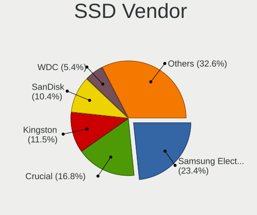

| Vendor              | Desktops | Drives | Percent |
|---------------------|----------|--------|---------|
| Samsung Electronics | 865      | 1460   | 23.38%  |
| Crucial             | 623      | 924    | 16.84%  |
| Kingston            | 425      | 614    | 11.49%  |
| SanDisk             | 384      | 513    | 10.38%  |
| WDC                 | 198      | 274    | 5.35%   |
| China               | 129      | 182    | 3.49%   |
| OCZ                 | 78       | 90     | 2.11%   |
| A-DATA Technology   | 73       | 104    | 1.97%   |
| PNY                 | 63       | 82     | 1.7%    |
| Intel               | 61       | 78     | 1.65%   |
| Integral            | 42       | 52     | 1.14%   |
| Toshiba             | 40       | 51     | 1.08%   |
| Patriot             | 39       | 61     | 1.05%   |
| Corsair             | 38       | 51     | 1.03%   |
| SK hynix            | 33       | 39     | 0.89%   |
| Transcend           | 31       | 35     | 0.84%   |
| Micron Technology   | 31       | 35     | 0.84%   |
| Netac               | 29       | 39     | 0.78%   |
| SABRENT             | 26       | 33     | 0.7%    |
| SPCC                | 25       | 40     | 0.68%   |
| Seagate             | 24       | 38     | 0.65%   |
| Fanxiang            | 24       | 33     | 0.65%   |
| LITEON              | 22       | 30     | 0.59%   |
| Gigabyte Technology | 22       | 32     | 0.59%   |
| Lexar               | 21       | 23     | 0.57%   |
| Unknown             | 18       | 23     | 0.49%   |
| KIOXIA-EXCERIA      | 16       | 29     | 0.43%   |
| KingSpec            | 16       | 22     | 0.43%   |
| LITEONIT            | 14       | 17     | 0.38%   |
| Team                | 13       | 14     | 0.35%   |
| Drevo               | 12       | 24     | 0.32%   |
| XUM                 | 11       | 11     | 0.3%    |
| Maxtor              | 10       | 11     | 0.27%   |
| Vaseky              | 9        | 15     | 0.24%   |
| TCSUNBOW            | 9        | 15     | 0.24%   |
| ORTIAL              | 9        | 11     | 0.24%   |
| Unknown             | 8        | 15     | 0.22%   |
| Plextor             | 8        | 10     | 0.22%   |
| GOODRAM             | 7        | 11     | 0.19%   |
| ASMT                | 7        | 7      | 0.19%   |

Drive Kind
----------

HDD or SSD

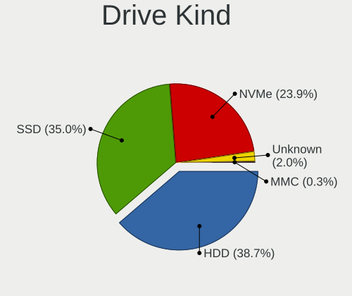

| Kind    | Desktops | Drives | Percent |
|---------|----------|--------|---------|
| HDD     | 3170     | 7311   | 38.72%  |
| SSD     | 2866     | 5382   | 35.01%  |
| NVMe    | 1959     | 3716   | 23.93%  |
| Unknown | 167      | 260    | 2.04%   |
| MMC     | 25       | 34     | 0.31%   |

Drive Connector
---------------

SATA, SAS, NVMe, etc.

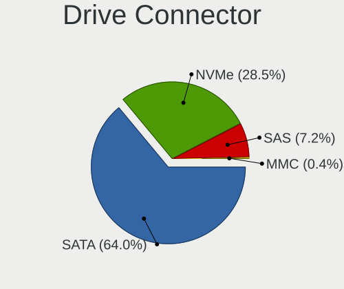

| Type | Desktops | Drives | Percent |
|------|----------|--------|---------|
| SATA | 4390     | 12086  | 63.97%  |
| NVMe | 1953     | 3672   | 28.46%  |
| SAS  | 495      | 911    | 7.21%   |
| MMC  | 25       | 34     | 0.36%   |

Drive Size
----------

Size of hard drive

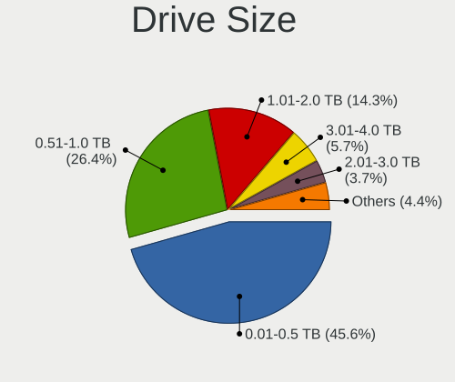

| Size in TB | Desktops | Drives | Percent |
|------------|----------|--------|---------|
| 0.01-0.5   | 3133     | 6059   | 45.6%   |
| 0.51-1.0   | 1814     | 3078   | 26.4%   |
| 1.01-2.0   | 979      | 1684   | 14.25%  |
| 3.01-4.0   | 391      | 726    | 5.69%   |
| 2.01-3.0   | 251      | 434    | 3.65%   |
| 4.01-10.0  | 243      | 562    | 3.54%   |
| 10.01-20.0 | 54       | 144    | 0.79%   |
| 20.01-50.0 | 4        | 5      | 0.06%   |
| 0          | 1        | 1      | 0.01%   |

Space Total
-----------

Amount of disk space available on the file system

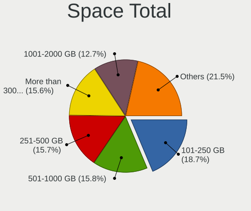

| Size in GB     | Desktops | Percent |
|----------------|----------|---------|
| 101-250        | 1033     | 18.67%  |
| 501-1000       | 876      | 15.83%  |
| 251-500        | 870      | 15.72%  |
| More than 3000 | 862      | 15.58%  |
| 1001-2000      | 705      | 12.74%  |
| 2001-3000      | 344      | 6.22%   |
| 1-20           | 336      | 6.07%   |
| 51-100         | 215      | 3.89%   |
| Unknown        | 200      | 3.61%   |
| 21-50          | 92       | 1.66%   |

Space Used
----------

Amount of used disk space

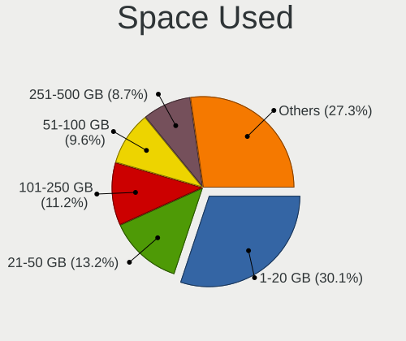

| Used GB        | Desktops | Percent |
|----------------|----------|---------|
| 1-20           | 1724     | 30.1%   |
| 21-50          | 754      | 13.16%  |
| 101-250        | 641      | 11.19%  |
| 51-100         | 550      | 9.6%    |
| 251-500        | 498      | 8.69%   |
| 501-1000       | 473      | 8.26%   |
| 1001-2000      | 403      | 7.04%   |
| More than 3000 | 328      | 5.73%   |
| Unknown        | 200      | 3.49%   |
| 2001-3000      | 143      | 2.5%    |
| 0              | 14       | 0.24%   |

Malfunc. Drives
---------------

Drive models with a malfunction

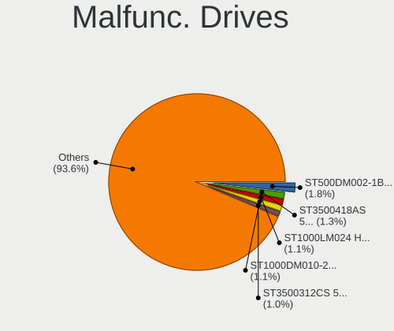

| Model                                                         | Desktops | Drives | Percent |
|---------------------------------------------------------------|----------|--------|---------|
| Seagate ST500DM002-1BD142 500GB                               | 11       | 11     | 1.79%   |
| Seagate ST3500418AS 500GB                                     | 8        | 8      | 1.3%    |
| Seagate ST1000LM024 HN-M101MBB 1TB                            | 7        | 12     | 1.14%   |
| Seagate ST1000DM010-2EP102 1TB                                | 7        | 8      | 1.14%   |
| Seagate ST3500312CS 500GB                                     | 6        | 8      | 0.98%   |
| Seagate ST2000DM001-1CH164 2TB                                | 6        | 7      | 0.98%   |
| SanDisk SSD PLUS 480GB                                        | 6        | 6      | 0.98%   |
| Samsung Electronics HD103UJ 1TB                               | 6        | 8      | 0.98%   |
| WDC WD30EFRX-68EUZN0 3TB                                      | 5        | 6      | 0.81%   |
| Samsung Electronics HD501LJ 500GB                             | 5        | 5      | 0.81%   |
| Samsung Electronics HD103SJ 1TB                               | 5        | 6      | 0.81%   |
| Hitachi HDS721010CLA332 1TB                                   | 5        | 5      | 0.81%   |
| WDC WD40EFRX-68WT0N0 4TB                                      | 4        | 11     | 0.65%   |
| WDC WD30EFRX-68AX9N0 3TB                                      | 4        | 6      | 0.65%   |
| Toshiba DT01ACA050 500GB                                      | 4        | 5      | 0.65%   |
| Seagate ST500LM021-1KJ152 500GB                               | 4        | 5      | 0.65%   |
| Seagate ST31000524AS 1TB                                      | 4        | 4      | 0.65%   |
| Samsung Electronics SSD 970 EVO Plus 1TB                      | 4        | 5      | 0.65%   |
| Samsung Electronics SSD 960 EVO 250GB                         | 4        | 5      | 0.65%   |
| WDC WD6400AAKS-22A7B2 640GB                                   | 3        | 3      | 0.49%   |
| WDC WD5000BEVT-75A0RT0 500GB                                  | 3        | 5      | 0.49%   |
| WDC WD5000AAKX-75U6AA0 500GB                                  | 3        | 3      | 0.49%   |
| WDC WD30EZRX-00D8PB0 3TB                                      | 3        | 5      | 0.49%   |
| WDC WD20EZRZ-00Z5HB0 2TB                                      | 3        | 3      | 0.49%   |
| WDC WD10EURX-83UY4Y0 1TB                                      | 3        | 4      | 0.49%   |
| WDC WD10EARS-00Y5B1 1TB                                       | 3        | 4      | 0.49%   |
| Toshiba DT01ACA100 1TB                                        | 3        | 3      | 0.49%   |
| Seagate ST8000DM004-2CX188 8TB                                | 3        | 3      | 0.49%   |
| Seagate ST500LT012-1DG142 500GB                               | 3        | 4      | 0.49%   |
| Seagate ST3500620AS 500GB                                     | 3        | 4      | 0.49%   |
| Seagate ST3000DM001-9YN166 3TB                                | 3        | 3      | 0.49%   |
| Seagate ST2000DM006-2DM164 2TB                                | 3        | 3      | 0.49%   |
| Seagate ST1000DX001-1CM162 1TB                                | 3        | 4      | 0.49%   |
| Seagate ST1000DM003-1ER162 1TB                                | 3        | 3      | 0.49%   |
| SanDisk SSD PLUS 240GB                                        | 3        | 3      | 0.49%   |
| Samsung Electronics SSD 870 EVO 500GB                         | 3        | 3      | 0.49%   |
| Samsung Electronics SSD 870 EVO 2TB                           | 3        | 7      | 0.49%   |
| Samsung Electronics SSD 870 EVO 1TB                           | 3        | 3      | 0.49%   |
| Samsung Electronics SSD 840 Series 120GB                      | 3        | 3      | 0.49%   |
| Samsung Electronics NVMe SSD Controller SM981/PM981/PM983 1TB | 3        | 3      | 0.49%   |

Malfunc. Drive Vendor
---------------------

Vendors of faulty drives

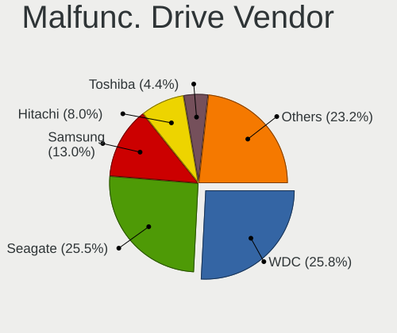

| Vendor              | Desktops | Drives | Percent |
|---------------------|----------|--------|---------|
| WDC                 | 151      | 223    | 25.81%  |
| Seagate             | 149      | 206    | 25.47%  |
| Samsung Electronics | 76       | 100    | 12.99%  |
| Hitachi             | 47       | 70     | 8.03%   |
| Toshiba             | 26       | 33     | 4.44%   |
| Crucial             | 24       | 32     | 4.1%    |
| SanDisk             | 19       | 23     | 3.25%   |
| Intel               | 13       | 26     | 2.22%   |
| Kingston            | 11       | 15     | 1.88%   |
| Maxtor              | 6        | 8      | 1.03%   |
| HGST                | 6        | 6      | 1.03%   |
| Corsair             | 6        | 10     | 1.03%   |
| A-DATA Technology   | 6        | 9      | 1.03%   |
| Micron Technology   | 4        | 4      | 0.68%   |
| China               | 4        | 7      | 0.68%   |
| SK hynix            | 3        | 3      | 0.51%   |
| Netac               | 3        | 3      | 0.51%   |
| WD MediaMax         | 2        | 2      | 0.34%   |
| Unknown             | 2        | 2      | 0.34%   |
| OCZ                 | 2        | 2      | 0.34%   |
| Hewlett-Packard     | 2        | 2      | 0.34%   |
| Drevo               | 2        | 11     | 0.34%   |
| BAITITON            | 2        | 8      | 0.34%   |
| XrayDisk            | 1        | 1      | 0.17%   |
| VENO                | 1        | 1      | 0.17%   |
| TPH01203000GB       | 1        | 1      | 0.17%   |
| SPCC                | 1        | 1      | 0.17%   |
| PNY                 | 1        | 1      | 0.17%   |
| Phison Electronics  | 1        | 1      | 0.17%   |
| Patriot             | 1        | 1      | 0.17%   |
| Mushkin             | 1        | 1      | 0.17%   |
| LITEON              | 1        | 1      | 0.17%   |
| Lexar               | 1        | 1      | 0.17%   |
| KingSpec            | 1        | 1      | 0.17%   |
| HPE                 | 1        | 1      | 0.17%   |
| faspeed             | 1        | 1      | 0.17%   |
| Fanxiang            | 1        | 1      | 0.17%   |
| BIWIN               | 1        | 1      | 0.17%   |
| AGI                 | 1        | 1      | 0.17%   |
| ADATA Technology    | 1        | 1      | 0.17%   |

Malfunc. HDD Vendor
-------------------

Vendors of faulty HDD drives

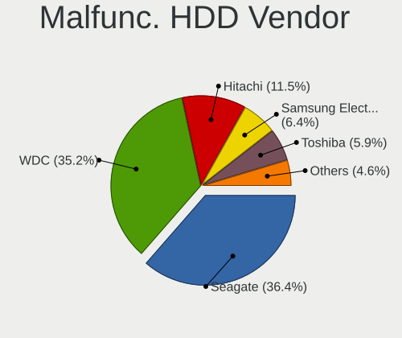

| Vendor              | Desktops | Drives | Percent |
|---------------------|----------|--------|---------|
| Seagate             | 149      | 206    | 36.43%  |
| WDC                 | 144      | 215    | 35.21%  |
| Hitachi             | 47       | 70     | 11.49%  |
| Samsung Electronics | 26       | 36     | 6.36%   |
| Toshiba             | 24       | 31     | 5.87%   |
| Maxtor              | 6        | 8      | 1.47%   |
| HGST                | 6        | 6      | 1.47%   |
| WD MediaMax         | 2        | 2      | 0.49%   |
| Unknown             | 2        | 2      | 0.49%   |
| Hewlett-Packard     | 2        | 2      | 0.49%   |
| TPH01203000GB       | 1        | 1      | 0.24%   |

Malfunc. Drive Kind
-------------------

Kinds of faulty drives

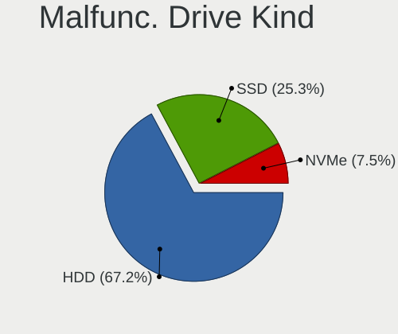

| Kind | Desktops | Drives | Percent |
|------|----------|--------|---------|
| HDD  | 358      | 579    | 67.17%  |
| SSD  | 135      | 190    | 25.33%  |
| NVMe | 40       | 55     | 7.5%    |

Failed Drives
-------------

Failed drive models

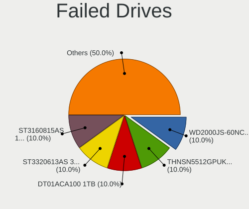

| Model                                 | Desktops | Drives | Percent |
|---------------------------------------|----------|--------|---------|
| WDC WD2000JS-60NCB1 200GB             | 1        | 1      | 10%     |
| Toshiba THNSN5512GPUK NVMe 512GB      | 1        | 1      | 10%     |
| Toshiba DT01ACA100 1TB                | 1        | 1      | 10%     |
| Seagate ST3320613AS 320GB             | 1        | 1      | 10%     |
| Seagate ST3160815AS 160GB             | 1        | 1      | 10%     |
| Samsung Electronics SSD 980 1TB       | 1        | 1      | 10%     |
| Samsung Electronics SSD 960 EVO 250GB | 1        | 2      | 10%     |
| Samsung Electronics HD502IJ 500GB     | 1        | 1      | 10%     |
| Samsung Electronics HD204UI 2TB       | 1        | 1      | 10%     |
| Hitachi HTS547550A9E384 500GB         | 1        | 1      | 10%     |

Failed Drive Vendor
-------------------

Failed drive vendors

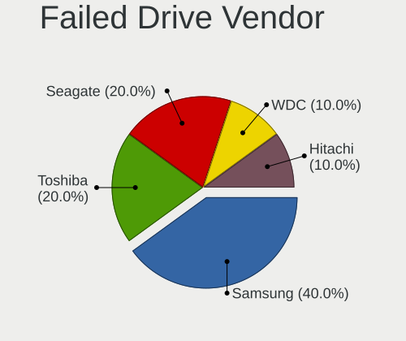

| Vendor              | Desktops | Drives | Percent |
|---------------------|----------|--------|---------|
| Samsung Electronics | 4        | 5      | 40%     |
| Toshiba             | 2        | 2      | 20%     |
| Seagate             | 2        | 2      | 20%     |
| WDC                 | 1        | 1      | 10%     |
| Hitachi             | 1        | 1      | 10%     |

Drive Status
------------

Number of failed and malfunc. drives

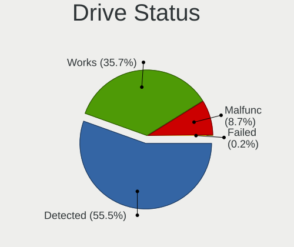

| Status   | Desktops | Drives | Percent |
|----------|----------|--------|---------|
| Detected | 3187     | 9913   | 55.47%  |
| Works    | 2049     | 5955   | 35.67%  |
| Malfunc  | 500      | 824    | 8.7%    |
| Failed   | 9        | 11     | 0.16%   |

Storage controller
------------------

Storage Vendor
--------------

Storage controller vendors

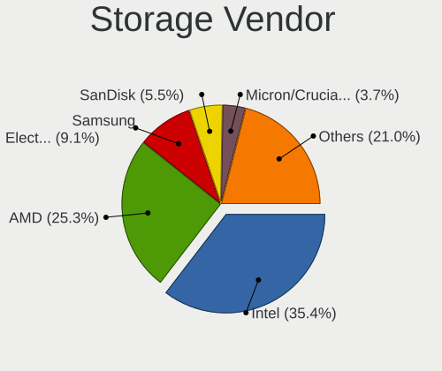

| Vendor                           | Desktops | Percent |
|----------------------------------|----------|---------|
| Intel                            | 2851     | 35.42%  |
| AMD                              | 2037     | 25.3%   |
| Samsung Electronics              | 731      | 9.08%   |
| SanDisk                          | 440      | 5.47%   |
| Micron/Crucial Technology        | 299      | 3.71%   |
| ASMedia Technology               | 290      | 3.6%    |
| Phison Electronics               | 283      | 3.52%   |
| Marvell Technology Group         | 141      | 1.75%   |
| Kingston Technology Company      | 123      | 1.53%   |
| Nvidia                           | 120      | 1.49%   |
| JMicron Technology               | 111      | 1.38%   |
| MAXIO Technology (Hangzhou)      | 67       | 0.83%   |
| Silicon Motion                   | 66       | 0.82%   |
| ADATA Technology                 | 60       | 0.75%   |
| Micron Technology                | 50       | 0.62%   |
| SK hynix                         | 40       | 0.5%    |
| Shenzhen Longsys Electronics     | 36       | 0.45%   |
| LSI Logic / Symbios Logic        | 34       | 0.42%   |
| Seagate Technology               | 32       | 0.4%    |
| Broadcom / LSI                   | 28       | 0.35%   |
| Silicon Image                    | 27       | 0.34%   |
| Toshiba America Info Systems     | 26       | 0.32%   |
| Realtek Semiconductor            | 25       | 0.31%   |
| KIOXIA                           | 24       | 0.3%    |
| VIA Technologies                 | 18       | 0.22%   |
| Solidigm                         | 17       | 0.21%   |
| Adaptec                          | 12       | 0.15%   |
| INNOGRIT                         | 10       | 0.12%   |
| Biwin Storage Technology         | 9        | 0.11%   |
| Red Hat                          | 5        | 0.06%   |
| Netac Technology                 | 5        | 0.06%   |
| Integrated Technology Express    | 5        | 0.06%   |
| Silicon Integrated Systems [SiS] | 4        | 0.05%   |
| Hewlett-Packard                  | 4        | 0.05%   |
| Union Memory (Shenzhen)          | 3        | 0.04%   |
| Hosin Global Electronics         | 3        | 0.04%   |
| Apple                            | 2        | 0.02%   |
| Advanced System Products         | 2        | 0.02%   |
| YEESTOR Microelectronics         | 1        | 0.01%   |
| ULi Electronics                  | 1        | 0.01%   |

Storage Model
-------------

Storage controller models

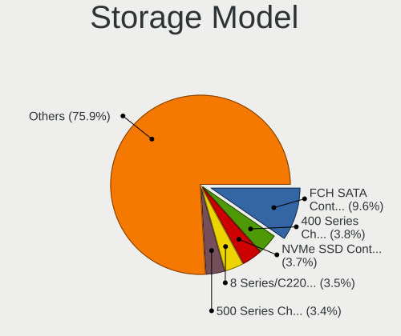

| Model                                                                                   | Desktops | Percent |
|-----------------------------------------------------------------------------------------|----------|---------|
| AMD FCH SATA Controller [AHCI mode]                                                     | 947      | 9.63%   |
| AMD 400 Series Chipset SATA Controller                                                  | 371      | 3.77%   |
| Samsung NVMe SSD Controller SM981/PM981/PM983                                           | 367      | 3.73%   |
| Intel 8 Series/C220 Series Chipset Family 6-port SATA Controller 1 [AHCI mode]          | 344      | 3.5%    |
| AMD 500 Series Chipset SATA Controller                                                  | 338      | 3.44%   |
| ASMedia ASM1061/ASM1062 Serial ATA Controller                                           | 271      | 2.76%   |
| AMD 600 Series Chipset SATA Controller                                                  | 250      | 2.54%   |
| AMD SB7x0/SB8x0/SB9x0 IDE Controller                                                    | 219      | 2.23%   |
| Intel Q170/Q150/B150/H170/H110/Z170/CM236 Chipset SATA Controller [AHCI Mode]           | 218      | 2.22%   |
| Intel 6 Series/C200 Series Chipset Family 6 port Desktop SATA AHCI Controller           | 216      | 2.2%    |
| Intel 200 Series PCH SATA controller [AHCI mode]                                        | 212      | 2.16%   |
| Intel SATA Controller [RAID mode]                                                       | 210      | 2.14%   |
| Intel 7 Series/C210 Series Chipset Family 6-port SATA Controller [AHCI mode]            | 197      | 2%      |
| AMD SB7x0/SB8x0/SB9x0 SATA Controller [AHCI mode]                                       | 188      | 1.91%   |
| Micron/Crucial P2 [Nick P2] / P3 / P3 Plus NVMe PCIe SSD (DRAM-less)                    | 160      | 1.63%   |
| AMD SB7x0/SB8x0/SB9x0 SATA Controller [IDE mode]                                        | 152      | 1.55%   |
| Phison E12 NVMe Controller                                                              | 146      | 1.48%   |
| Intel Cannon Lake PCH SATA AHCI Controller                                              | 140      | 1.42%   |
| Samsung NVMe SSD Controller PM9A1/PM9A3/980PRO                                          | 138      | 1.4%    |
| Intel NM10/ICH7 Family SATA Controller [IDE mode]                                       | 113      | 1.15%   |
| Intel 9 Series Chipset Family SATA Controller [AHCI Mode]                               | 98       | 1%      |
| Intel Alder Lake-S PCH SATA Controller [AHCI Mode]                                      | 95       | 0.97%   |
| SanDisk Ultra 3D / WD PC SN530, IX SN530, Blue SN550 NVMe SSD (DRAM-less)               | 92       | 0.94%   |
| Intel 82801G (ICH7 Family) IDE Controller                                               | 87       | 0.88%   |
| AMD A320 Chipset SATA Controller [AHCI mode]                                            | 87       | 0.88%   |
| Samsung NVMe SSD Controller 980 (DRAM-less)                                             | 80       | 0.81%   |
| AMD 300 Series Chipset SATA Controller                                                  | 80       | 0.81%   |
| Samsung NVMe SSD Controller SM961/PM961/SM963                                           | 79       | 0.8%    |
| Intel 6 Series/C200 Series Chipset Family Desktop SATA Controller (IDE mode, ports 4-5) | 78       | 0.79%   |
| Intel 6 Series/C200 Series Chipset Family Desktop SATA Controller (IDE mode, ports 0-3) | 78       | 0.79%   |
| Phison E16 PCIe4 NVMe Controller                                                        | 77       | 0.78%   |
| Intel Raptor Lake SATA AHCI Controller                                                  | 77       | 0.78%   |
| Samsung NVMe SSD Controller S4LV008[Pascal]                                             | 73       | 0.74%   |
| Sandisk WD Black SN850X NVMe SSD                                                        | 68       | 0.69%   |
| Intel 82801JI (ICH10 Family) SATA AHCI Controller                                       | 64       | 0.65%   |
| Nvidia MCP61 SATA Controller                                                            | 63       | 0.64%   |
| Intel 82801I (ICH9 Family) 2 port SATA Controller [IDE mode]                            | 59       | 0.6%    |
| Intel 500 Series Chipset Family SATA AHCI Controller                                    | 59       | 0.6%    |
| SanDisk WD SN560/SN740/SN770/SN5000 NVMe SSD                                            | 55       | 0.56%   |
| SanDisk WD PC SN810 / Black SN850 NVMe SSD                                              | 55       | 0.56%   |

Storage Kind
------------

Kind of storage controller (IDE, SATA, NVMe, SAS, ...)

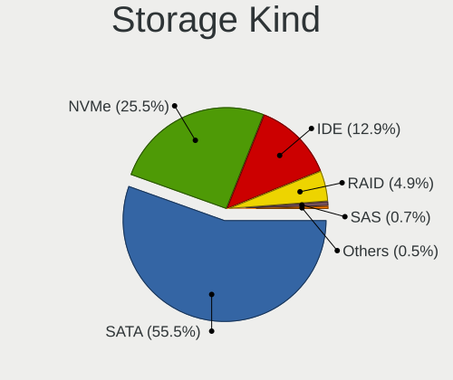

| Kind | Desktops | Percent |
|------|----------|---------|
| SATA | 4254     | 55.46%  |
| NVMe | 1959     | 25.54%  |
| IDE  | 987      | 12.87%  |
| RAID | 377      | 4.92%   |
| SAS  | 56       | 0.73%   |
| SCSI | 37       | 0.48%   |

Processor
---------

CPU Vendor
----------

Processor vendors

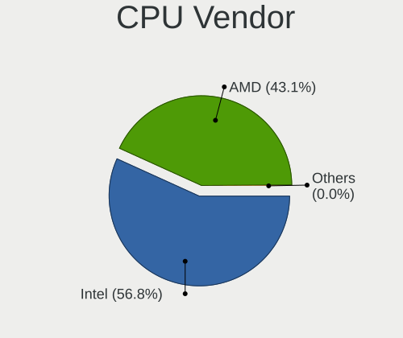

| Vendor                | Desktops | Percent |
|-----------------------|----------|---------|
| Intel                 | 2875     | 56.78%  |
| AMD                   | 2182     | 43.1%   |
| ARM                   | 3        | 0.06%   |
| sifive,u74-mc         | 1        | 0.02%   |
| Marvell Semiconductor | 1        | 0.02%   |
| CentaurHauls          | 1        | 0.02%   |

CPU Model
---------

Processor models

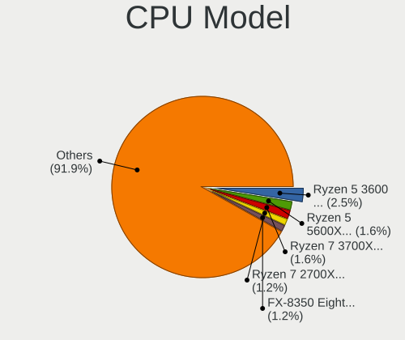

| Model                                       | Desktops | Percent |
|---------------------------------------------|----------|---------|
| AMD Ryzen 5 3600 6-Core Processor           | 129      | 2.53%   |
| AMD Ryzen 5 5600X 6-Core Processor          | 82       | 1.61%   |
| AMD Ryzen 7 3700X 8-Core Processor          | 81       | 1.59%   |
| AMD Ryzen 7 2700X Eight-Core Processor      | 62       | 1.21%   |
| AMD FX-8350 Eight-Core Processor            | 61       | 1.19%   |
| AMD Ryzen 7 5800X 8-Core Processor          | 60       | 1.18%   |
| AMD Ryzen 9 5900X 12-Core Processor         | 58       | 1.14%   |
| Intel Core i7-3770 CPU @ 3.40GHz            | 57       | 1.12%   |
| Intel Core i7-4790K CPU @ 4.00GHz           | 56       | 1.1%    |
| AMD Ryzen 9 5950X 16-Core Processor         | 53       | 1.04%   |
| AMD Ryzen 9 3900X 12-Core Processor         | 53       | 1.04%   |
| AMD Ryzen 5 5600G with Radeon Graphics      | 53       | 1.04%   |
| Intel Core i7-4790 CPU @ 3.60GHz            | 51       | 1%      |
| Intel Core i7-6700K CPU @ 4.00GHz           | 50       | 0.98%   |
| Intel Core i5-3470 CPU @ 3.20GHz            | 47       | 0.92%   |
| Intel Core i7-2600 CPU @ 3.40GHz            | 46       | 0.9%    |
| Intel Core i5-2400 CPU @ 3.10GHz            | 44       | 0.86%   |
| AMD Ryzen 5 2600 Six-Core Processor         | 42       | 0.82%   |
| Intel Core i5-6500 CPU @ 3.20GHz            | 41       | 0.8%    |
| AMD FX-6300 Six-Core Processor              | 40       | 0.78%   |
| Intel Core i7-6700 CPU @ 3.40GHz            | 37       | 0.72%   |
| Intel Core 2 Duo CPU E8400 @ 3.00GHz        | 37       | 0.72%   |
| Intel Core i7-7700K CPU @ 4.20GHz           | 33       | 0.65%   |
| AMD Ryzen 7 5800X3D 8-Core Processor        | 33       | 0.65%   |
| AMD Ryzen 7 5700X 8-Core Processor          | 33       | 0.65%   |
| AMD Ryzen 7 5700G with Radeon Graphics      | 33       | 0.65%   |
| Intel Core i5-4570 CPU @ 3.20GHz            | 32       | 0.63%   |
| Intel Core i5-4460 CPU @ 3.20GHz            | 32       | 0.63%   |
| Intel Core i3-2120 CPU @ 3.30GHz            | 32       | 0.63%   |
| AMD Ryzen 7 9800X3D 8-Core Processor        | 32       | 0.63%   |
| AMD Ryzen 7 7800X3D 8-Core Processor        | 32       | 0.63%   |
| AMD Ryzen 5 1600 Six-Core Processor         | 32       | 0.63%   |
| Intel Core i5-4590 CPU @ 3.30GHz            | 31       | 0.61%   |
| Intel Core i5-3570K CPU @ 3.40GHz           | 31       | 0.61%   |
| AMD Ryzen 5 3600X 6-Core Processor          | 30       | 0.59%   |
| Intel Core i7-8700 CPU @ 3.20GHz            | 29       | 0.57%   |
| Intel Core i7-9700K CPU @ 3.60GHz           | 28       | 0.55%   |
| AMD Ryzen 5 3400G with Radeon Vega Graphics | 28       | 0.55%   |
| Intel Core i7-4770 CPU @ 3.40GHz            | 27       | 0.53%   |
| AMD Ryzen 9 3950X 16-Core Processor         | 26       | 0.51%   |

CPU Model Family
----------------

Processor model prefix

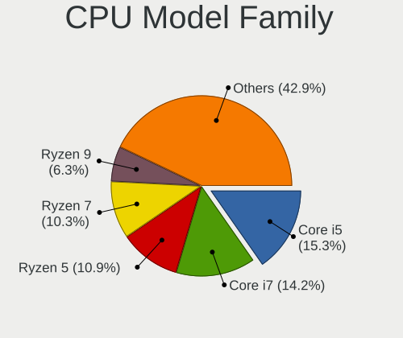

| Model                   | Desktops | Percent |
|-------------------------|----------|---------|
| Intel Core i5           | 779      | 15.3%   |
| Intel Core i7           | 725      | 14.24%  |
| AMD Ryzen 5             | 557      | 10.94%  |
| AMD Ryzen 7             | 525      | 10.31%  |
| AMD Ryzen 9             | 320      | 6.29%   |
| Other                   | 262      | 5.15%   |
| Intel Xeon              | 256      | 5.03%   |
| Intel Core i3           | 238      | 4.68%   |
| AMD FX                  | 204      | 4.01%   |
| Intel Core 2 Duo        | 130      | 2.55%   |
| Intel Celeron           | 93       | 1.83%   |
| Intel Pentium           | 86       | 1.69%   |
| Intel Core 2 Quad       | 80       | 1.57%   |
| AMD Ryzen 3             | 77       | 1.51%   |
| Intel Core i9           | 68       | 1.34%   |
| Intel Pentium Dual-Core | 53       | 1.04%   |
| AMD A8                  | 50       | 0.98%   |
| AMD A10                 | 50       | 0.98%   |
| AMD Athlon II X2        | 49       | 0.96%   |
| AMD Ryzen Threadripper  | 42       | 0.83%   |
| AMD Phenom II X4        | 36       | 0.71%   |
| AMD A6                  | 35       | 0.69%   |
| AMD Athlon 64 X2        | 29       | 0.57%   |
| Intel Core 2            | 27       | 0.53%   |
| Intel Atom              | 27       | 0.53%   |
| Intel Pentium 4         | 23       | 0.45%   |
| AMD A4                  | 21       | 0.41%   |
| Intel Pentium Dual      | 20       | 0.39%   |
| AMD Phenom II X6        | 19       | 0.37%   |
| AMD Athlon II X4        | 19       | 0.37%   |
| AMD Athlon              | 18       | 0.35%   |
| Intel Pentium D         | 17       | 0.33%   |
| AMD Phenom              | 15       | 0.29%   |
| AMD Turion II Neo       | 12       | 0.24%   |
| AMD Ryzen 5 PRO         | 11       | 0.22%   |
| AMD Sempron             | 9        | 0.18%   |
| AMD Athlon II X3        | 9        | 0.18%   |
| AMD E                   | 8        | 0.16%   |
| AMD Athlon X4           | 8        | 0.16%   |
| AMD Athlon 64           | 8        | 0.16%   |

CPU Cores
---------

Number of processor cores

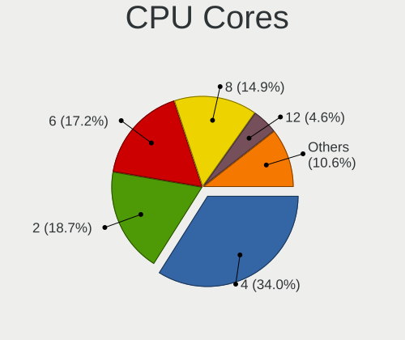

| Number  | Desktops | Percent |
|---------|----------|---------|
| 4       | 1731     | 33.96%  |
| 2       | 955      | 18.74%  |
| 6       | 879      | 17.25%  |
| 8       | 758      | 14.87%  |
| 12      | 235      | 4.61%   |
| 16      | 191      | 3.75%   |
| 1       | 106      | 2.08%   |
| 3       | 74       | 1.45%   |
| 10      | 54       | 1.06%   |
| 24      | 44       | 0.86%   |
| 14      | 34       | 0.67%   |
| 20      | 12       | 0.24%   |
| 32      | 11       | 0.22%   |
| 28      | 3        | 0.06%   |
| 18      | 3        | 0.06%   |
| 64      | 2        | 0.04%   |
| 44      | 1        | 0.02%   |
| 40      | 1        | 0.02%   |
| 36      | 1        | 0.02%   |
| 22      | 1        | 0.02%   |
| Unknown | 1        | 0.02%   |

CPU Sockets
-----------

Number of sockets

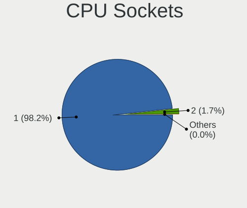

| Number  | Desktops | Percent |
|---------|----------|---------|
| 1       | 4974     | 98.24%  |
| 2       | 84       | 1.66%   |
| 20      | 2        | 0.04%   |
| 14      | 1        | 0.02%   |
| 0       | 1        | 0.02%   |
| Unknown | 1        | 0.02%   |

CPU Threads
-----------

Threads per core (Hyper-Threading)

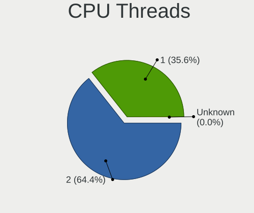

| Number  | Desktops | Percent |
|---------|----------|---------|
| 2       | 3271     | 64.38%  |
| 1       | 1808     | 35.58%  |
| 12      | 1        | 0.02%   |
| Unknown | 1        | 0.02%   |

CPU Op-Modes
------------

CPU Operation Modes (32-bit, 64-bit)

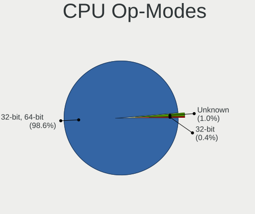

| Op mode        | Desktops | Percent |
|----------------|----------|---------|
| 32-bit, 64-bit | 5002     | 98.58%  |
| Unknown        | 53       | 1.04%   |
| 32-bit         | 19       | 0.37%   |

CPU Microcode
-------------

Microcode number

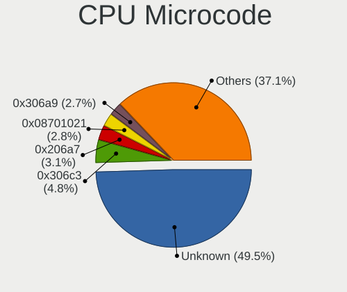

| Number     | Desktops | Percent |
|------------|----------|---------|
| Unknown    | 2640     | 49.52%  |
| 0x306c3    | 257      | 4.82%   |
| 0x206a7    | 164      | 3.08%   |
| 0x08701021 | 147      | 2.76%   |
| 0x306a9    | 145      | 2.72%   |
| 0x1067a    | 114      | 2.14%   |
| 0x506e3    | 110      | 2.06%   |
| 0x06000852 | 91       | 1.71%   |
| 0x0800820d | 89       | 1.67%   |
| 0x010000c8 | 76       | 1.43%   |
| 0x906ea    | 73       | 1.37%   |
| 0x06001119 | 62       | 1.16%   |
| 0x08701013 | 57       | 1.07%   |
| 0x906e9    | 56       | 1.05%   |
| 0x0a201016 | 40       | 0.75%   |
| 0x08001138 | 37       | 0.69%   |
| 0x6fb      | 36       | 0.68%   |
| 0x10676    | 33       | 0.62%   |
| 0x0a601203 | 33       | 0.62%   |
| 0x6fd      | 32       | 0.6%    |
| 0x0a20120a | 32       | 0.6%    |
| 0x08108109 | 31       | 0.58%   |
| 0x06003106 | 31       | 0.58%   |
| 0x906ed    | 30       | 0.56%   |
| 0x206c2    | 30       | 0.56%   |
| 0x0a201009 | 30       | 0.56%   |
| 0xa0655    | 29       | 0.54%   |
| 0x106a5    | 26       | 0.49%   |
| 0x206d7    | 25       | 0.47%   |
| 0x0a50000d | 25       | 0.47%   |
| 0x08001137 | 24       | 0.45%   |
| 0x306f2    | 21       | 0.39%   |
| 0x0600063e | 21       | 0.39%   |
| 0x010000db | 21       | 0.39%   |
| 0x20655    | 20       | 0.38%   |
| 0x106e5    | 20       | 0.38%   |
| 0x306e4    | 19       | 0.36%   |
| 0x90672    | 17       | 0.32%   |
| 0x906ec    | 16       | 0.3%    |
| 0x20652    | 15       | 0.28%   |

CPU Microarch
-------------

Microarchitecture

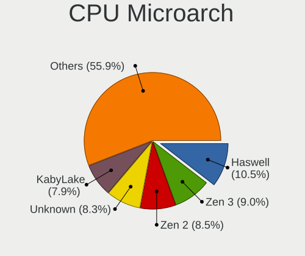

| Name             | Desktops | Percent |
|------------------|----------|---------|
| Haswell          | 533      | 10.47%  |
| Zen 3            | 458      | 8.99%   |
| Zen 2            | 431      | 8.46%   |
| Unknown          | 421      | 8.27%   |
| KabyLake         | 402      | 7.89%   |
| IvyBridge        | 301      | 5.91%   |
| SandyBridge      | 299      | 5.87%   |
| Skylake          | 251      | 4.93%   |
| Piledriver       | 240      | 4.71%   |
| Zen+             | 227      | 4.46%   |
| Penryn           | 227      | 4.46%   |
| K10              | 184      | 3.61%   |
| Zen              | 155      | 3.04%   |
| Core             | 126      | 2.47%   |
| Alderlake Hybrid | 114      | 2.24%   |
| CometLake        | 103      | 2.02%   |
| Westmere         | 91       | 1.79%   |
| Nehalem          | 77       | 1.51%   |
| Steamroller      | 53       | 1.04%   |
| K8 Hammer        | 48       | 0.94%   |
| NetBurst         | 44       | 0.86%   |
| Bulldozer        | 40       | 0.79%   |
| Broadwell        | 39       | 0.77%   |
| Silvermont       | 36       | 0.71%   |
| Excavator        | 33       | 0.65%   |
| Icelake          | 25       | 0.49%   |
| Bonnell          | 21       | 0.41%   |
| Gracemont        | 20       | 0.39%   |
| Goldmont plus    | 18       | 0.35%   |
| Tremont          | 14       | 0.27%   |
| Goldmont         | 12       | 0.24%   |
| Bobcat           | 12       | 0.24%   |
| K10 Llano        | 11       | 0.22%   |
| Jaguar           | 11       | 0.22%   |
| Puma             | 5        | 0.1%    |
| K6               | 5        | 0.1%    |
| TigerLake        | 4        | 0.08%   |
| Lunarlake Hybrid | 1        | 0.02%   |

Graphics
--------

GPU Vendor
----------

Vendors of graphics cards

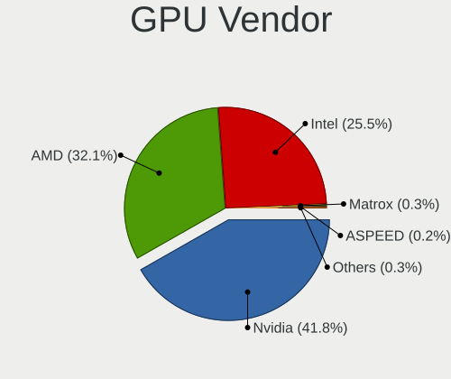

| Vendor                                       | Desktops | Percent |
|----------------------------------------------|----------|---------|
| Nvidia                                       | 2318     | 41.77%  |
| AMD                                          | 1779     | 32.05%  |
| Intel                                        | 1414     | 25.48%  |
| Matrox Electronics Systems                   | 14       | 0.25%   |
| ASPEED Technology                            | 10       | 0.18%   |
| Red Hat                                      | 5        | 0.09%   |
| ATI Technologies                             | 4        | 0.07%   |
| Silicon Integrated Systems [SiS]             | 3        | 0.05%   |
| XGI Technology (eXtreme Graphics Innovation) | 1        | 0.02%   |
| VIA Technologies                             | 1        | 0.02%   |
| Alliance Semiconductor                       | 1        | 0.02%   |

GPU Model
---------

Graphics card models

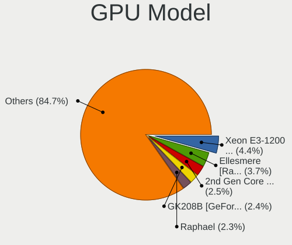

| Model                                                                       | Desktops | Percent |
|-----------------------------------------------------------------------------|----------|---------|
| Intel Xeon E3-1200 v3/4th Gen Core Processor Integrated Graphics Controller | 254      | 4.36%   |
| AMD Ellesmere [Radeon RX 470/480/570/570X/580/580X/590]                     | 214      | 3.67%   |
| Intel 2nd Generation Core Processor Family Integrated Graphics Controller   | 148      | 2.54%   |
| Nvidia GK208B [GeForce GT 710]                                              | 138      | 2.37%   |
| AMD Raphael                                                                 | 136      | 2.33%   |
| Intel Skylake-S GT2 [HD Graphics 530]                                       | 118      | 2.03%   |
| Nvidia GP107 [GeForce GTX 1050 Ti]                                          | 114      | 1.96%   |
| Intel CoffeeLake-S GT2 [UHD Graphics 630]                                   | 99       | 1.7%    |
| Intel Xeon E3-1200 v2/3rd Gen Core processor Graphics Controller            | 92       | 1.58%   |
| Nvidia GP106 [GeForce GTX 1060 6GB]                                         | 87       | 1.49%   |
| Intel 4 Series Chipset Integrated Graphics Controller                       | 78       | 1.34%   |
| AMD Navi 10 [Radeon RX 5600 OEM/5600 XT / 5700/5700 XT]                     | 78       | 1.34%   |
| AMD Navi 21 [Radeon RX 6800/6800 XT / 6900 XT]                              | 73       | 1.25%   |
| Nvidia GP108 [GeForce GT 1030]                                              | 72       | 1.24%   |
| Nvidia GM204 [GeForce GTX 970]                                              | 69       | 1.18%   |
| Nvidia GP104 [GeForce GTX 1070]                                             | 65       | 1.12%   |
| AMD Cezanne [Radeon Vega Series / Radeon Vega Mobile Series]                | 65       | 1.12%   |
| Intel Kaby Lake-S GT2 [HD Graphics 630]                                     | 64       | 1.1%    |
| AMD Navi 23 [Radeon RX 6600/6600 XT/6600M]                                  | 64       | 1.1%    |
| AMD Navi 31 [Radeon RX 7900 XT/7900 XTX/7900 GRE/7900M]                     | 61       | 1.05%   |
| AMD Cedar [Radeon HD 5000/6000/7350/8350 Series]                            | 60       | 1.03%   |
| Nvidia GP104 [GeForce GTX 1080]                                             | 58       | 1%      |
| AMD Navi 22 [Radeon RX 6700/6700 XT/6750 XT / 6800M/6850M XT]               | 57       | 0.98%   |
| Nvidia GM107 [GeForce GTX 750 Ti]                                           | 56       | 0.96%   |
| AMD Granite Ridge [Radeon Graphics]                                         | 55       | 0.94%   |
| Nvidia GT218 [GeForce 210]                                                  | 54       | 0.93%   |
| Nvidia GM206 [GeForce GTX 960]                                              | 53       | 0.91%   |
| Nvidia GA106 [GeForce RTX 3060 Lite Hash Rate]                              | 49       | 0.84%   |
| AMD Picasso/Raven 2 [Radeon Vega Series / Radeon Vega Mobile Series]        | 49       | 0.84%   |
| Intel IvyBridge GT2 [HD Graphics 4000]                                      | 47       | 0.81%   |
| Nvidia GP102 [GeForce GTX 1080 Ti]                                          | 45       | 0.77%   |
| Intel 4th Generation Core Processor Family Integrated Graphics Controller   | 45       | 0.77%   |
| Nvidia TU104 [GeForce RTX 2070 SUPER]                                       | 44       | 0.76%   |
| Nvidia TU117 [GeForce GTX 1650]                                             | 42       | 0.72%   |
| Nvidia GF119 [GeForce GT 610]                                               | 40       | 0.69%   |
| Nvidia GK208B [GeForce GT 730]                                              | 39       | 0.67%   |
| Nvidia GP106 [GeForce GTX 1060 3GB]                                         | 37       | 0.64%   |
| Intel Alder Lake-N [UHD Graphics]                                           | 37       | 0.64%   |
| AMD Navi 32 [Radeon RX 7700 XT / 7800 XT]                                   | 37       | 0.64%   |
| Intel CometLake-S GT2 [UHD Graphics 630]                                    | 35       | 0.6%    |

GPU Combo
---------

Combinations of graphics cards

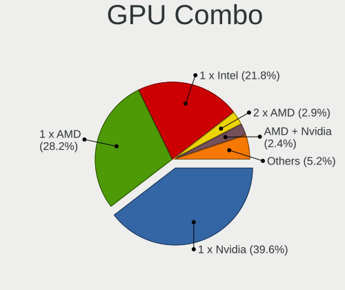

| Name                                 | Desktops | Percent |
|--------------------------------------|----------|---------|
| 1 x Nvidia                           | 2047     | 39.59%  |
| 1 x AMD                              | 1458     | 28.2%   |
| 1 x Intel                            | 1125     | 21.76%  |
| 2 x AMD                              | 149      | 2.88%   |
| AMD + Nvidia                         | 125      | 2.42%   |
| Intel + Nvidia                       | 113      | 2.19%   |
| Intel + AMD                          | 46       | 0.89%   |
| 2 x Nvidia                           | 35       | 0.68%   |
| 2 x Intel                            | 13       | 0.25%   |
| 1 x Matrox                           | 12       | 0.23%   |
| Other                                | 10       | 0.19%   |
| 1 x ASPEED                           | 7        | 0.14%   |
| 1 x Red Hat                          | 5        | 0.1%    |
| Intel + AMD + 1 x Nvidia             | 5        | 0.1%    |
| 2 x AMD + 1 x Nvidia                 | 3        | 0.06%   |
| 3 x AMD                              | 2        | 0.04%   |
| 1 x SiS                              | 2        | 0.04%   |
| Nvidia + ASPEED                      | 2        | 0.04%   |
| 3 x AMD + 1 x Nvidia                 | 1        | 0.02%   |
| 2 x AMD + 1 x Alliance Semiconductor | 1        | 0.02%   |
| 1 x XGI                              | 1        | 0.02%   |
| 1 x VIA                              | 1        | 0.02%   |
| Nvidia + Matrox                      | 1        | 0.02%   |
| 1 x Intel + 3 x Nvidia               | 1        | 0.02%   |
| Intel + 2 x Nvidia                   | 1        | 0.02%   |
| Intel + 2 x AMD                      | 1        | 0.02%   |
| Intel + AMD + 3 x Nvidia             | 1        | 0.02%   |
| AMD + SiS                            | 1        | 0.02%   |
| AMD + Matrox                         | 1        | 0.02%   |
| AMD + ASPEED                         | 1        | 0.02%   |

GPU Driver
----------

Free vs proprietary

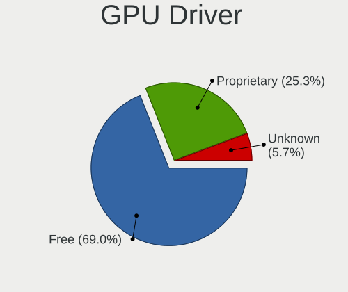

| Driver      | Desktops | Percent |
|-------------|----------|---------|
| Free        | 3607     | 69.01%  |
| Proprietary | 1321     | 25.27%  |
| Unknown     | 299      | 5.72%   |

GPU Memory
----------

Total video memory

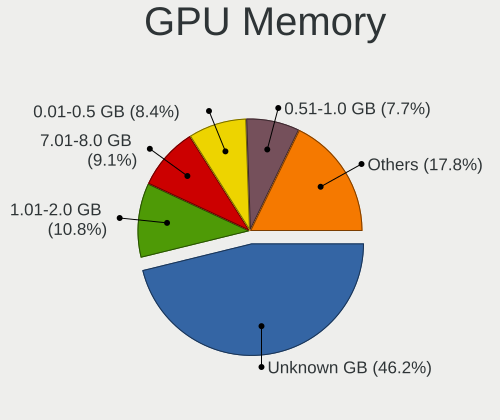

| Size in GB | Desktops | Percent |
|------------|----------|---------|
| Unknown    | 2455     | 46.17%  |
| 1.01-2.0   | 572      | 10.76%  |
| 7.01-8.0   | 483      | 9.08%   |
| 0.01-0.5   | 449      | 8.44%   |
| 0.51-1.0   | 411      | 7.73%   |
| 3.01-4.0   | 351      | 6.6%    |
| 8.01-16.0  | 315      | 5.92%   |
| 5.01-6.0   | 167      | 3.14%   |
| 16.01-24.0 | 54       | 1.02%   |
| 2.01-3.0   | 53       | 1%      |
| 4.01-5.0   | 3        | 0.06%   |
| 24.01-32.0 | 3        | 0.06%   |
| 32.01-64.0 | 1        | 0.02%   |

Monitor
-------

Monitor Vendor
--------------

Monitor vendors

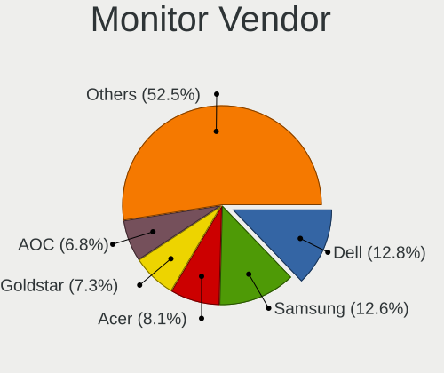

| Vendor               | Desktops | Percent |
|----------------------|----------|---------|
| Dell                 | 702      | 12.81%  |
| Samsung Electronics  | 691      | 12.6%   |
| Acer                 | 443      | 8.08%   |
| Goldstar             | 398      | 7.26%   |
| AOC                  | 372      | 6.79%   |
| BenQ                 | 337      | 6.15%   |
| Hewlett-Packard      | 325      | 5.93%   |
| Iiyama               | 230      | 4.2%    |
| Ancor Communications | 182      | 3.32%   |
| Philips              | 160      | 2.92%   |
| ASUSTek Computer     | 130      | 2.37%   |
| ViewSonic            | 117      | 2.13%   |
| MSI                  | 105      | 1.92%   |
| Lenovo               | 97       | 1.77%   |
| Sony                 | 96       | 1.75%   |
| Unknown              | 78       | 1.42%   |
| HannStar             | 65       | 1.19%   |
| Panasonic            | 52       | 0.95%   |
| LG Electronics       | 52       | 0.95%   |
| Gigabyte Technology  | 51       | 0.93%   |
| Vestel Elektronik    | 48       | 0.88%   |
| Toshiba              | 45       | 0.82%   |
| HKC                  | 45       | 0.82%   |
| NEC Computers        | 34       | 0.62%   |
| Hitachi              | 24       | 0.44%   |
| Eizo                 | 24       | 0.44%   |
| OEM                  | 20       | 0.36%   |
| Pixio                | 19       | 0.35%   |
| Idek Iiyama          | 19       | 0.35%   |
| CVT                  | 19       | 0.35%   |
| MiTAC                | 16       | 0.29%   |
| Sharp                | 15       | 0.27%   |
| HUAWEI               | 15       | 0.27%   |
| Fujitsu Siemens      | 15       | 0.27%   |
| Unknown              | 15       | 0.27%   |
| RTK                  | 14       | 0.26%   |
| MStar                | 12       | 0.22%   |
| Packard Bell         | 10       | 0.18%   |
| Denver               | 10       | 0.18%   |
| ___                  | 9        | 0.16%   |

Monitor Model
-------------

Monitor models

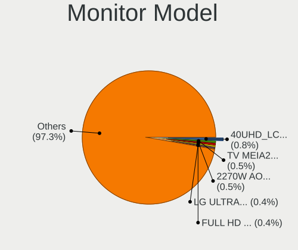

| Model                                                                  | Desktops | Percent |
|------------------------------------------------------------------------|----------|---------|
| Vestel Elektronik 40UHD_LCD_TV VES3700 3840x2160 880x500mm 39.8-inch   | 47       | 0.8%    |
| Panasonic TV MEIA296 1920x1080 698x392mm 31.5-inch                     | 32       | 0.55%   |
| AOC 2270W AOC2270 1920x1080 477x268mm 21.5-inch                        | 32       | 0.55%   |
| Goldstar LG ULTRAWIDE GSM59F1 2560x1080 670x280mm 28.6-inch            | 25       | 0.43%   |
| Goldstar FULL HD GSM5B55 1920x1080 480x270mm 21.7-inch                 | 25       | 0.43%   |
| Dell U2412M DELA07A 1920x1200 518x324mm 24.1-inch                      | 25       | 0.43%   |
| BenQ GL2450H BNQ78A7 1920x1080 531x298mm 24.0-inch                     | 24       | 0.41%   |
| AOC 2369M AOC2369 1920x1080 509x286mm 23.0-inch                        | 24       | 0.41%   |
| AOC 27G2G4 AOC2702 1920x1080 598x336mm 27.0-inch                       | 23       | 0.39%   |
| Unknown LCD Monitor FFFF 2288x1287 2550x2550mm 142.0-inch              | 20       | 0.34%   |
| Goldstar LG TV SSCR2 GSMC0C8 3840x2160                                 | 20       | 0.34%   |
| AOC 24G2W1G3 AOC2402 1920x1080 527x296mm 23.8-inch                     | 19       | 0.32%   |
| Toshiba 43UHD_LCD_TV TSB3700 3840x2160 940x540mm 42.7-inch             | 18       | 0.31%   |
| Samsung Electronics C24F390 SAM0D2C 1920x1080 521x293mm 23.5-inch      | 18       | 0.31%   |
| AOC 2470W AOC2470 1920x1080 521x293mm 23.5-inch                        | 17       | 0.29%   |
| Ancor Communications VS248 ACI2498 1920x1080 531x299mm 24.0-inch       | 17       | 0.29%   |
| Acer K222HQL ACR03E1 1920x1080 477x268mm 21.5-inch                     | 17       | 0.29%   |
| Goldstar HDR 4K GSM7707 3840x2160 600x340mm 27.2-inch                  | 16       | 0.27%   |
| BenQ GW2765 BNQ78D6 2560x1440 597x336mm 27.0-inch                      | 16       | 0.27%   |
| Acer S240HL ACR0289 1920x1080 531x299mm 24.0-inch                      | 16       | 0.27%   |
| Acer K242HL ACR03E3 1920x1080 531x299mm 24.0-inch                      | 16       | 0.27%   |
| Philips PHL 273V7 PHLC156 1920x1080 598x336mm 27.0-inch                | 15       | 0.26%   |
| OEM 32W_LCD_TV OEM3700 1920x540                                        | 15       | 0.26%   |
| Unknown                                                                | 15       | 0.26%   |
| ASUSTek Computer VP28U AUS28B1 3840x2160 621x341mm 27.9-inch           | 14       | 0.24%   |
| AOC G2460 AOC2460 1920x1080 531x299mm 24.0-inch                        | 14       | 0.24%   |
| Iiyama PL2409HD IVM560C 1920x1080 521x293mm 23.5-inch                  | 13       | 0.22%   |
| BenQ EW3270U BNQ7950 3840x2160 698x393mm 31.5-inch                     | 13       | 0.22%   |
| Acer S271HL ACR02CA 1920x1080 598x336mm 27.0-inch                      | 13       | 0.22%   |
| Samsung Electronics U32J59x SAM0F33 3840x2160 697x392mm 31.5-inch      | 12       | 0.2%    |
| Goldstar HDR 4K GSM7706 3840x2160 600x340mm 27.2-inch                  | 12       | 0.2%    |
| BenQ GL2250H BNQ78A1 1920x1080 477x268mm 21.5-inch                     | 12       | 0.2%    |
| Samsung Electronics C49RG9x SAM0F9C 3360x1440 1193x336mm 48.8-inch     | 11       | 0.19%   |
| Samsung Electronics C27F390 SAM0D32 1920x1080 598x336mm 27.0-inch      | 11       | 0.19%   |
| MSI Optix MAG27CQ MSI1462 2560x1440 597x336mm 27.0-inch                | 11       | 0.19%   |
| Iiyama PL2730H IVM663A 1920x1080 598x336mm 27.0-inch                   | 11       | 0.19%   |
| Goldstar Ultra HD GSM5B09 3840x2160 600x340mm 27.2-inch                | 11       | 0.19%   |
| CVT CVTE TV CVT0003 1920x1080 575x323mm 26.0-inch                      | 11       | 0.19%   |
| BenQ EL2870U BNQ7949 3840x2160 621x341mm 27.9-inch                     | 11       | 0.19%   |
| Ancor Communications ASUS PB287Q ACI28A3 3840x2160 621x341mm 27.9-inch | 11       | 0.19%   |

Monitor Resolution
------------------

Monitor screen resolution

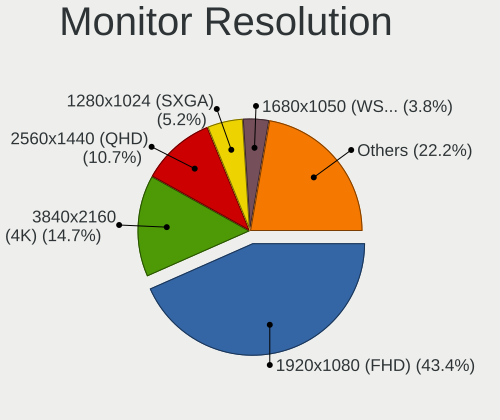

| Resolution         | Desktops | Percent |
|--------------------|----------|---------|
| 1920x1080 (FHD)    | 2297     | 43.38%  |
| 3840x2160 (4K)     | 779      | 14.71%  |
| 2560x1440 (QHD)    | 568      | 10.73%  |
| 1280x1024 (SXGA)   | 273      | 5.16%   |
| 1680x1050 (WSXGA+) | 200      | 3.78%   |
| 3440x1440          | 160      | 3.02%   |
| 1920x1200 (WUXGA)  | 143      | 2.7%    |
| 1440x900 (WXGA+)   | 132      | 2.49%   |
| Unknown            | 115      | 2.17%   |
| 1600x900 (HD+)     | 74       | 1.4%    |
| 3840x1080          | 73       | 1.38%   |
| 1360x768           | 65       | 1.23%   |
| 2560x1080          | 60       | 1.13%   |
| 1366x768 (WXGA)    | 55       | 1.04%   |
| 1920x540           | 52       | 0.98%   |
| 1600x1200          | 31       | 0.59%   |
| 1024x768 (XGA)     | 29       | 0.55%   |
| 2288x1287          | 24       | 0.45%   |
| 1280x720 (HD)      | 22       | 0.42%   |
| 3840x1600          | 12       | 0.23%   |
| 2560x1600          | 10       | 0.19%   |
| 5120x1440          | 8        | 0.15%   |
| 5760x1080          | 7        | 0.13%   |
| 3840x1200          | 7        | 0.13%   |
| 7680x2160          | 6        | 0.11%   |
| 2160x1440          | 6        | 0.11%   |
| 4480x1440          | 5        | 0.09%   |
| 2560x1397          | 5        | 0.09%   |
| 2048x1152          | 5        | 0.09%   |
| 5760x2160          | 4        | 0.08%   |
| 3200x1080          | 4        | 0.08%   |
| 2560x2880          | 4        | 0.08%   |
| 6400x2160          | 3        | 0.06%   |
| 1280x800 (WXGA)    | 3        | 0.06%   |
| 4480x1080          | 2        | 0.04%   |
| 3360x1080          | 2        | 0.04%   |
| 3360x1050          | 2        | 0.04%   |
| 3120x1050          | 2        | 0.04%   |
| 2960x1050          | 2        | 0.04%   |
| 2944x1080          | 2        | 0.04%   |

Monitor Diagonal
----------------

Diagonal size in inches

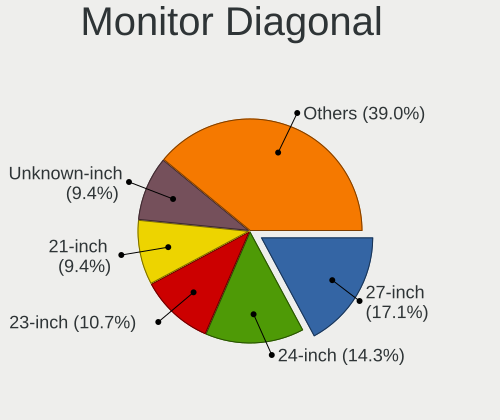

| Inches  | Desktops | Percent |
|---------|----------|---------|
| 27      | 933      | 17.15%  |
| 24      | 780      | 14.34%  |
| 23      | 583      | 10.71%  |
| 21      | 511      | 9.39%   |
| Unknown | 510      | 9.37%   |
| 31      | 326      | 5.99%   |
| 19      | 242      | 4.45%   |
| 34      | 181      | 3.33%   |
| 84      | 178      | 3.27%   |
| 22      | 139      | 2.55%   |
| 17      | 137      | 2.52%   |
| 20      | 103      | 1.89%   |
| 72      | 80       | 1.47%   |
| 18      | 78       | 1.43%   |
| 32      | 73       | 1.34%   |
| 15      | 56       | 1.03%   |
| 26      | 52       | 0.96%   |
| 40      | 45       | 0.83%   |
| 25      | 35       | 0.64%   |
| 48      | 31       | 0.57%   |
| 54      | 28       | 0.51%   |
| 28      | 22       | 0.4%    |
| 142     | 20       | 0.37%   |
| 65      | 19       | 0.35%   |
| 33      | 18       | 0.33%   |
| 43      | 17       | 0.31%   |
| 39      | 17       | 0.31%   |
| 29      | 17       | 0.31%   |
| 63      | 15       | 0.28%   |
| 52      | 15       | 0.28%   |
| 46      | 15       | 0.28%   |
| 36      | 15       | 0.28%   |
| 60      | 14       | 0.26%   |
| 42      | 12       | 0.22%   |
| 37      | 11       | 0.2%    |
| 35      | 11       | 0.2%    |
| 14      | 10       | 0.18%   |
| 57      | 9        | 0.17%   |
| 75      | 8        | 0.15%   |
| 55      | 6        | 0.11%   |

Monitor Width
-------------

Physical width

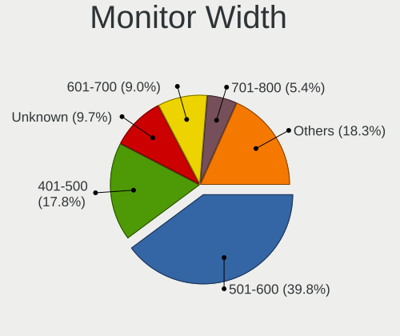

| Width in mm    | Desktops | Percent |
|----------------|----------|---------|
| 501-600        | 2091     | 39.83%  |
| 401-500        | 933      | 17.77%  |
| Unknown        | 510      | 9.71%   |
| 601-700        | 471      | 8.97%   |
| 701-800        | 284      | 5.41%   |
| 1501-2000      | 271      | 5.16%   |
| 301-350        | 194      | 3.7%    |
| 1001-1500      | 181      | 3.45%   |
| 351-400        | 153      | 2.91%   |
| 801-900        | 86       | 1.64%   |
| 901-1000       | 36       | 0.69%   |
| More than 2000 | 21       | 0.4%    |
| 201-300        | 18       | 0.34%   |
| 101-200        | 1        | 0.02%   |

Aspect Ratio
------------

Proportional relationship between the width and the height

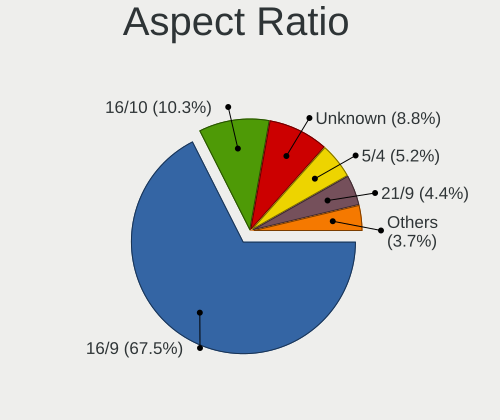

| Ratio   | Desktops | Percent |
|---------|----------|---------|
| 16/9    | 3342     | 67.54%  |
| 16/10   | 508      | 10.27%  |
| Unknown | 434      | 8.77%   |
| 5/4     | 259      | 5.23%   |
| 21/9    | 220      | 4.45%   |
| 4/3     | 66       | 1.33%   |
| 32/9    | 47       | 0.95%   |
| 1.00    | 25       | 0.51%   |
| 3/2     | 20       | 0.4%    |
| 6/5     | 15       | 0.3%    |
| 3.20    | 4        | 0.08%   |
| 0.89    | 4        | 0.08%   |
| 0.56    | 2        | 0.04%   |
| 2.00    | 1        | 0.02%   |
| 0.25    | 1        | 0.02%   |

Monitor Area
------------

Area in inch²

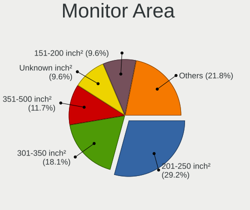

| Area in inch² | Desktops | Percent |
|----------------|----------|---------|
| 201-250        | 1555     | 29.22%  |
| 301-350        | 963      | 18.1%   |
| 351-500        | 623      | 11.71%  |
| Unknown        | 510      | 9.58%   |
| 151-200        | 509      | 9.57%   |
| More than 1000 | 409      | 7.69%   |
| 251-300        | 301      | 5.66%   |
| 501-1000       | 186      | 3.5%    |
| 141-150        | 177      | 3.33%   |
| 101-110        | 53       | 1%      |
| 111-120        | 11       | 0.21%   |
| 81-90          | 5        | 0.09%   |
| 71-80          | 5        | 0.09%   |
| 131-140        | 4        | 0.08%   |
| 91-100         | 3        | 0.06%   |
| 41-50          | 2        | 0.04%   |
| 121-130        | 2        | 0.04%   |
| 61-70          | 1        | 0.02%   |
| 51-60          | 1        | 0.02%   |
| 1-40           | 1        | 0.02%   |

Pixel Density
-------------

Pixels per inch

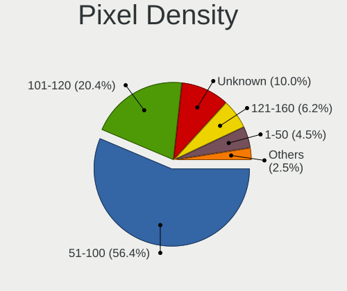

| Density       | Desktops | Percent |
|---------------|----------|---------|
| 51-100        | 2862     | 56.36%  |
| 101-120       | 1035     | 20.38%  |
| Unknown       | 510      | 10.04%  |
| 121-160       | 315      | 6.2%    |
| 1-50          | 228      | 4.49%   |
| 161-240       | 127      | 2.5%    |
| More than 240 | 1        | 0.02%   |

Multiple Monitors
-----------------

Total monitors connected

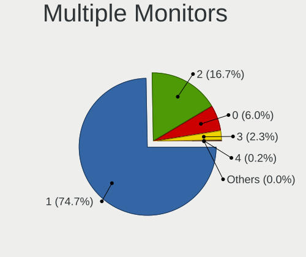

| Total | Desktops | Percent |
|-------|----------|---------|
| 1     | 3914     | 74.71%  |
| 2     | 876      | 16.72%  |
| 0     | 315      | 6.01%   |
| 3     | 119      | 2.27%   |
| 4     | 13       | 0.25%   |
| 5     | 2        | 0.04%   |

Network
-------

Net Controller Vendor
---------------------

Controller vendors

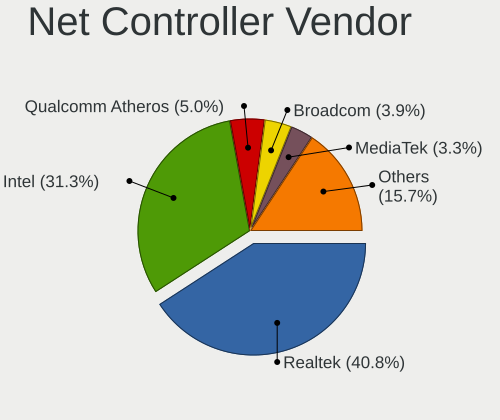

| Vendor                           | Desktops | Percent |
|----------------------------------|----------|---------|
| Realtek Semiconductor            | 3083     | 40.84%  |
| Intel                            | 2363     | 31.3%   |
| Qualcomm Atheros                 | 375      | 4.97%   |
| Broadcom                         | 296      | 3.92%   |
| MediaTek                         | 247      | 3.27%   |
| Ralink Technology                | 194      | 2.57%   |
| TP-Link                          | 136      | 1.8%    |
| Nvidia                           | 102      | 1.35%   |
| Ralink                           | 83       | 1.1%    |
| Microsoft                        | 59       | 0.78%   |
| Aquantia                         | 50       | 0.66%   |
| Marvell Technology Group         | 42       | 0.56%   |
| Broadcom Limited                 | 41       | 0.54%   |
| NetGear                          | 33       | 0.44%   |
| Samsung Electronics              | 30       | 0.4%    |
| Belkin Components                | 29       | 0.38%   |
| ASIX Electronics                 | 29       | 0.38%   |
| Qualcomm Atheros Communications  | 27       | 0.36%   |
| Edimax Technology                | 21       | 0.28%   |
| Huawei Technologies              | 18       | 0.24%   |
| DisplayLink                      | 15       | 0.2%    |
| ASUSTek Computer                 | 14       | 0.19%   |
| Mellanox Technologies            | 13       | 0.17%   |
| Google                           | 12       | 0.16%   |
| D-Link                           | 12       | 0.16%   |
| Qualcomm Technologies            | 11       | 0.15%   |
| Xiaomi                           | 10       | 0.13%   |
| QinHeng Electronics              | 9        | 0.12%   |
| D-Link System                    | 9        | 0.12%   |
| Apple                            | 8        | 0.11%   |
| VIA Technologies                 | 7        | 0.09%   |
| OPPO Electronics                 | 7        | 0.09%   |
| Motorola PCS                     | 7        | 0.09%   |
| IMC Networks                     | 7        | 0.09%   |
| Gemtek                           | 7        | 0.09%   |
| Arduino SA                       | 7        | 0.09%   |
| ZTE WCDMA Technologies MSM       | 6        | 0.08%   |
| Microchip Technology             | 6        | 0.08%   |
| Texas Instruments                | 5        | 0.07%   |
| Silicon Integrated Systems [SiS] | 5        | 0.07%   |

Net Controller Model
--------------------

Controller models

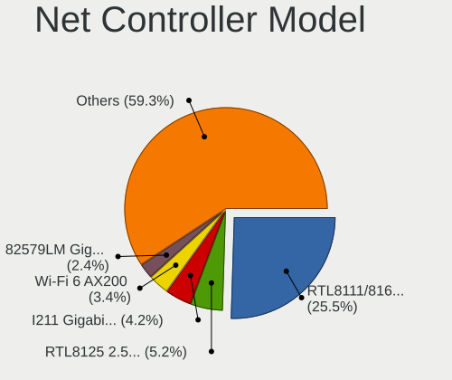

| Model                                                                  | Desktops | Percent |
|------------------------------------------------------------------------|----------|---------|
| Realtek RTL8111/8168/8211/8411 PCI Express Gigabit Ethernet Controller | 2229     | 25.49%  |
| Realtek RTL8125 2.5GbE Controller                                      | 456      | 5.22%   |
| Intel I211 Gigabit Network Connection                                  | 369      | 4.22%   |
| Intel Wi-Fi 6 AX200                                                    | 296      | 3.39%   |
| Intel 82579LM Gigabit Network Connection (Lewisville)                  | 213      | 2.44%   |
| Intel Ethernet Controller I225-V                                       | 203      | 2.32%   |
| Intel Ethernet Connection (2) I219-V                                   | 174      | 1.99%   |
| Intel Wi-Fi 6E(802.11ax) AX210/AX1675* 2x2 [Typhoon Peak]              | 136      | 1.56%   |
| Intel Ethernet Connection I217-LM                                      | 126      | 1.44%   |
| MediaTek MT7922 802.11ax PCI Express Wireless Network Adapter          | 125      | 1.43%   |
| Realtek 802.11ac NIC                                                   | 102      | 1.17%   |
| Realtek RTL88x2bu [AC1200 Techkey]                                     | 93       | 1.06%   |
| Intel Ethernet Connection (7) I219-V                                   | 88       | 1.01%   |
| Ralink MT7601U Wireless Adapter                                        | 79       | 0.9%    |
| Intel 82579V Gigabit Network Connection                                | 74       | 0.85%   |
| Realtek RTL8192EE PCIe Wireless Network Adapter                        | 73       | 0.83%   |
| Intel Wi-Fi 5(802.11ac) Wireless-AC 9x6x [Thunder Peak]                | 70       | 0.8%    |
| Realtek RTL8153 Gigabit Ethernet Adapter                               | 69       | 0.79%   |
| Broadcom BCM4360 802.11ac Dual Band Wireless Network Adapter           | 62       | 0.71%   |
| Intel 82574L Gigabit Network Connection                                | 60       | 0.69%   |
| Intel Ethernet Controller I226-V                                       | 57       | 0.65%   |
| Nvidia MCP61 Ethernet                                                  | 56       | 0.64%   |
| Intel Dual Band Wireless-AC 3168NGW [Stone Peak]                       | 56       | 0.64%   |
| Intel Ethernet Connection (2) I218-V                                   | 55       | 0.63%   |
| Realtek RTL8821CE 802.11ac PCIe Wireless Network Adapter               | 54       | 0.62%   |
| Qualcomm Atheros Killer E220x Gigabit Ethernet Controller              | 54       | 0.62%   |
| Intel Ethernet Connection I217-V                                       | 54       | 0.62%   |
| Intel 700 Series Chipset CNVi WiFi                                     | 53       | 0.61%   |
| Intel Ethernet Connection (2) I219-LM                                  | 52       | 0.59%   |
| Ralink RT5370 Wireless Adapter                                         | 48       | 0.55%   |
| Realtek RTL8188EUS 802.11n Wireless Network Adapter                    | 46       | 0.53%   |
| MediaTek MT7921K (RZ608) Wi-Fi 6E 80MHz                                | 46       | 0.53%   |
| Intel Alder Lake-S PCH CNVi WiFi                                       | 46       | 0.53%   |
| Intel 82567LM-3 Gigabit Network Connection                             | 46       | 0.53%   |
| Intel Wireless 7260                                                    | 45       | 0.51%   |
| Intel 82566DM-2 Gigabit Network Connection                             | 44       | 0.5%    |
| Realtek RTL810xE PCI Express Fast Ethernet controller                  | 43       | 0.49%   |
| TP-Link TL-WN823N v2/v3 [Realtek RTL8192EU]                            | 41       | 0.47%   |
| Intel Cannon Lake PCH CNVi WiFi                                        | 40       | 0.46%   |
| Qualcomm Atheros AR9485 Wireless Network Adapter                       | 39       | 0.45%   |

Wireless Vendor
---------------

Wireless vendors

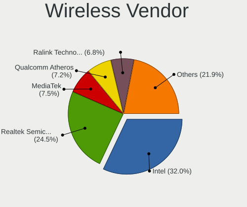

| Vendor                          | Desktops | Percent |
|---------------------------------|----------|---------|
| Intel                           | 920      | 32.03%  |
| Realtek Semiconductor           | 705      | 24.55%  |
| MediaTek                        | 215      | 7.49%   |
| Qualcomm Atheros                | 208      | 7.24%   |
| Ralink Technology               | 194      | 6.75%   |
| Broadcom                        | 146      | 5.08%   |
| TP-Link                         | 136      | 4.74%   |
| Ralink                          | 82       | 2.86%   |
| Microsoft                       | 58       | 2.02%   |
| NetGear                         | 33       | 1.15%   |
| Belkin Components               | 28       | 0.97%   |
| Qualcomm Atheros Communications | 27       | 0.94%   |
| Edimax Technology               | 21       | 0.73%   |
| Broadcom Limited                | 17       | 0.59%   |
| ASUSTek Computer                | 14       | 0.49%   |
| D-Link                          | 12       | 0.42%   |
| IMC Networks                    | 7        | 0.24%   |
| Gemtek                          | 7        | 0.24%   |
| D-Link System                   | 7        | 0.24%   |
| ZyDAS                           | 4        | 0.14%   |
| Linksys                         | 4        | 0.14%   |
| TRENDnet                        | 3        | 0.1%    |
| Sitecom Europe                  | 3        | 0.1%    |
| Realtek                         | 3        | 0.1%    |
| Qualcomm Technologies           | 3        | 0.1%    |
| Wilocity                        | 2        | 0.07%   |
| Philips (or NXP)                | 2        | 0.07%   |
| Marvell Technology Group        | 2        | 0.07%   |
| Z-Com                           | 1        | 0.03%   |
| Wistron NeWeb                   | 1        | 0.03%   |
| Wacom                           | 1        | 0.03%   |
| Texas Instruments               | 1        | 0.03%   |
| Micro Star International        | 1        | 0.03%   |
| Dell                            | 1        | 0.03%   |
| CyberTAN Technology             | 1        | 0.03%   |
| BUFFALO                         | 1        | 0.03%   |
| AboCom Systems                  | 1        | 0.03%   |

Wireless Model
--------------

Wireless models

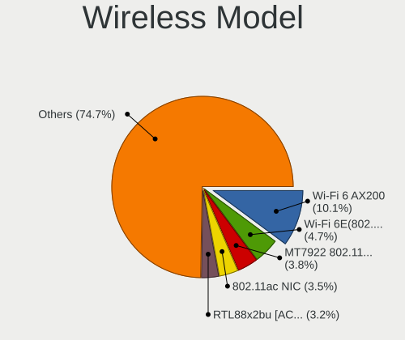

| Model                                                          | Desktops | Percent |
|----------------------------------------------------------------|----------|---------|
| Intel Wi-Fi 6 AX200                                            | 296      | 10.14%  |
| Intel Wi-Fi 6E(802.11ax) AX210/AX1675* 2x2 [Typhoon Peak]      | 136      | 4.66%   |
| MediaTek MT7922 802.11ax PCI Express Wireless Network Adapter  | 110      | 3.77%   |
| Realtek 802.11ac NIC                                           | 102      | 3.5%    |
| Realtek RTL88x2bu [AC1200 Techkey]                             | 93       | 3.19%   |
| Ralink MT7601U Wireless Adapter                                | 79       | 2.71%   |
| Realtek RTL8192EE PCIe Wireless Network Adapter                | 73       | 2.5%    |
| Intel Wi-Fi 5(802.11ac) Wireless-AC 9x6x [Thunder Peak]        | 70       | 2.4%    |
| Broadcom BCM4360 802.11ac Dual Band Wireless Network Adapter   | 62       | 2.12%   |
| Intel Dual Band Wireless-AC 3168NGW [Stone Peak]               | 56       | 1.92%   |
| Realtek RTL8821CE 802.11ac PCIe Wireless Network Adapter       | 54       | 1.85%   |
| Intel 700 Series Chipset CNVi WiFi                             | 53       | 1.82%   |
| Ralink RT5370 Wireless Adapter                                 | 48       | 1.64%   |
| Realtek RTL8188EUS 802.11n Wireless Network Adapter            | 46       | 1.58%   |
| MediaTek MT7921K (RZ608) Wi-Fi 6E 80MHz                        | 46       | 1.58%   |
| Intel Wireless 7260                                            | 45       | 1.54%   |
| TP-Link TL-WN823N v2/v3 [Realtek RTL8192EU]                    | 41       | 1.41%   |
| Intel Cannon Lake PCH CNVi WiFi                                | 40       | 1.37%   |
| Qualcomm Atheros AR9485 Wireless Network Adapter               | 39       | 1.34%   |
| Intel Wireless 7265                                            | 36       | 1.23%   |
| Intel Wireless 3165                                            | 35       | 1.2%    |
| Qualcomm Atheros AR93xx Wireless Network Adapter               | 33       | 1.13%   |
| Realtek RTL8192EU 802.11b/g/n WLAN Adapter                     | 30       | 1.03%   |
| Qualcomm Atheros AR9287 Wireless Network Adapter (PCI-Express) | 30       | 1.03%   |
| Ralink RT2870/RT3070 Wireless Adapter                          | 29       | 0.99%   |
| Intel Alder Lake-S PCH CNVi WiFi                               | 27       | 0.93%   |
| Realtek RTL8812AE 802.11ac PCIe Wireless Network Adapter       | 26       | 0.89%   |
| Realtek RTL8192CE PCIe Wireless Network Adapter                | 26       | 0.89%   |
| Realtek RTL8821AE 802.11ac PCIe Wireless Network Adapter       | 25       | 0.86%   |
| Realtek RTL8188CUS 802.11n WLAN Adapter                        | 25       | 0.86%   |
| Microsoft Xbox Wireless Adapter for Windows                    | 25       | 0.86%   |
| Qualcomm Atheros AR9271 802.11n                                | 24       | 0.82%   |
| Intel Wireless 8260                                            | 24       | 0.82%   |
| Realtek RTL8192CU 802.11n WLAN Adapter                         | 22       | 0.75%   |
| Intel Comet Lake PCH CNVi WiFi                                 | 22       | 0.75%   |
| TP-Link 802.11ac WLAN Adapter                                  | 21       | 0.72%   |
| Realtek RTL8852CE PCIe 802.11ax Wireless Network Controller    | 20       | 0.69%   |
| Qualcomm Atheros AR9462 Wireless Network Adapter               | 20       | 0.69%   |
| Realtek RTL8812AU 802.11a/b/g/n/ac 2T2R DB WLAN Adapter        | 19       | 0.65%   |
| Microsoft Wireless XBox Controller Dongle                      | 19       | 0.65%   |

Ethernet Vendor
---------------

Ethernet vendors

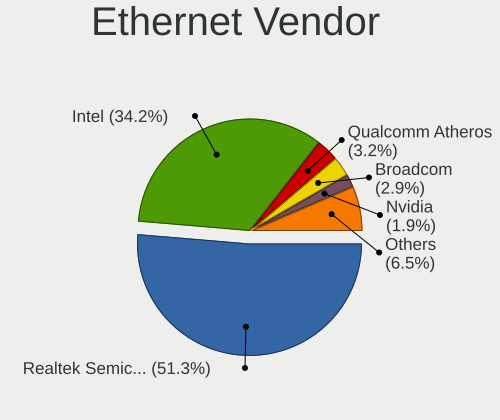

| Vendor                                 | Desktops | Percent |
|----------------------------------------|----------|---------|
| Realtek Semiconductor                  | 2815     | 51.33%  |
| Intel                                  | 1877     | 34.23%  |
| Qualcomm Atheros                       | 177      | 3.23%   |
| Broadcom                               | 158      | 2.88%   |
| Nvidia                                 | 102      | 1.86%   |
| Aquantia                               | 50       | 0.91%   |
| Marvell Technology Group               | 40       | 0.73%   |
| Samsung Electronics                    | 30       | 0.55%   |
| MediaTek                               | 29       | 0.53%   |
| ASIX Electronics                       | 29       | 0.53%   |
| Broadcom Limited                       | 24       | 0.44%   |
| Huawei Technologies                    | 16       | 0.29%   |
| DisplayLink                            | 15       | 0.27%   |
| Mellanox Technologies                  | 12       | 0.22%   |
| Google                                 | 12       | 0.22%   |
| Xiaomi                                 | 10       | 0.18%   |
| Qualcomm Technologies                  | 8        | 0.15%   |
| VIA Technologies                       | 7        | 0.13%   |
| OPPO Electronics                       | 7        | 0.13%   |
| Motorola PCS                           | 7        | 0.13%   |
| Apple                                  | 6        | 0.11%   |
| Silicon Integrated Systems [SiS]       | 5        | 0.09%   |
| Emulex                                 | 4        | 0.07%   |
| T & A Mobile Phones                    | 3        | 0.05%   |
| Qualcomm                               | 3        | 0.05%   |
| OnePlus Technology (Shenzhen)          | 3        | 0.05%   |
| Microchip Technology                   | 3        | 0.05%   |
| Lenovo                                 | 3        | 0.05%   |
| 3Com                                   | 3        | 0.05%   |
| Spreadtrum Communications              | 2        | 0.04%   |
| Sony Ericsson Mobile Communications AB | 2        | 0.04%   |
| Solarflare Communications              | 2        | 0.04%   |
| QLogic                                 | 2        | 0.04%   |
| Netchip Technology                     | 2        | 0.04%   |
| Insyde Software                        | 2        | 0.04%   |
| HMD Global                             | 2        | 0.04%   |
| D-Link System                          | 2        | 0.04%   |
| ZTE WCDMA Technologies MSM             | 1        | 0.02%   |
| SysKonnect                             | 1        | 0.02%   |
| Research In Motion                     | 1        | 0.02%   |

Ethernet Model
--------------

Ethernet models

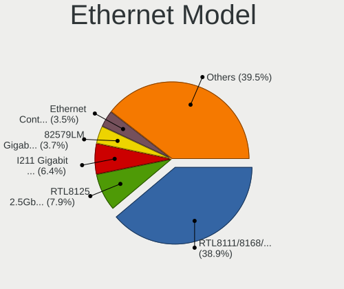

| Model                                                                          | Desktops | Percent |
|--------------------------------------------------------------------------------|----------|---------|
| Realtek RTL8111/8168/8211/8411 PCI Express Gigabit Ethernet Controller         | 2229     | 38.86%  |
| Realtek RTL8125 2.5GbE Controller                                              | 456      | 7.95%   |
| Intel I211 Gigabit Network Connection                                          | 369      | 6.43%   |
| Intel 82579LM Gigabit Network Connection (Lewisville)                          | 213      | 3.71%   |
| Intel Ethernet Controller I225-V                                               | 203      | 3.54%   |
| Intel Ethernet Connection (2) I219-V                                           | 174      | 3.03%   |
| Intel Ethernet Connection I217-LM                                              | 126      | 2.2%    |
| Intel Ethernet Connection (7) I219-V                                           | 88       | 1.53%   |
| Intel 82579V Gigabit Network Connection                                        | 74       | 1.29%   |
| Realtek RTL8153 Gigabit Ethernet Adapter                                       | 69       | 1.2%    |
| Intel 82574L Gigabit Network Connection                                        | 60       | 1.05%   |
| Intel Ethernet Controller I226-V                                               | 57       | 0.99%   |
| Nvidia MCP61 Ethernet                                                          | 56       | 0.98%   |
| Intel Ethernet Connection (2) I218-V                                           | 55       | 0.96%   |
| Qualcomm Atheros Killer E220x Gigabit Ethernet Controller                      | 54       | 0.94%   |
| Intel Ethernet Connection I217-V                                               | 54       | 0.94%   |
| Intel Ethernet Connection (2) I219-LM                                          | 52       | 0.91%   |
| Intel 82567LM-3 Gigabit Network Connection                                     | 46       | 0.8%    |
| Intel 82566DM-2 Gigabit Network Connection                                     | 44       | 0.77%   |
| Realtek RTL810xE PCI Express Fast Ethernet controller                          | 43       | 0.75%   |
| Qualcomm Atheros AR8151 v2.0 Gigabit Ethernet                                  | 35       | 0.61%   |
| Intel I210 Gigabit Network Connection                                          | 33       | 0.58%   |
| Broadcom NetXtreme BCM5761 Gigabit Ethernet PCIe                               | 26       | 0.45%   |
| ASIX AX88179 Gigabit Ethernet                                                  | 25       | 0.44%   |
| Aquantia AQtion AQC107 NBase-T/IEEE 802.3an Ethernet Controller [Atlantic 10G] | 25       | 0.44%   |
| Samsung Galaxy series, misc. (tethering mode)                                  | 22       | 0.38%   |
| Realtek RTL8126 5GbE Controller                                                | 22       | 0.38%   |
| Qualcomm Atheros Killer E2400 Gigabit Ethernet Controller                      | 22       | 0.38%   |
| Marvell Group 88E8056 PCI-E Gigabit Ethernet Controller                        | 22       | 0.38%   |
| Intel Ethernet Connection (7) I219-LM                                          | 21       | 0.37%   |
| Intel 82578DM Gigabit Network Connection                                       | 20       | 0.35%   |
| Intel 82562V-2 10/100 Network Connection                                       | 20       | 0.35%   |
| Qualcomm Atheros AR8161 Gigabit Ethernet                                       | 19       | 0.33%   |
| Intel Ethernet Connection (5) I219-LM                                          | 19       | 0.33%   |
| Intel Alder Lake-S PCH CNVi WiFi                                               | 19       | 0.33%   |
| Broadcom NetLink BCM57780 Gigabit Ethernet PCIe                                | 19       | 0.33%   |
| Realtek RTL-8100/8101L/8139 PCI Fast Ethernet Adapter                          | 18       | 0.31%   |
| Realtek RTL8169 PCI Gigabit Ethernet Controller                                | 17       | 0.3%    |
| Realtek Killer E3000 2.5GbE Controller                                         | 17       | 0.3%    |
| Intel Ethernet Connection (14) I219-V                                          | 17       | 0.3%    |

Net Controller Kind
-------------------

Ethernet, WiFi or modem

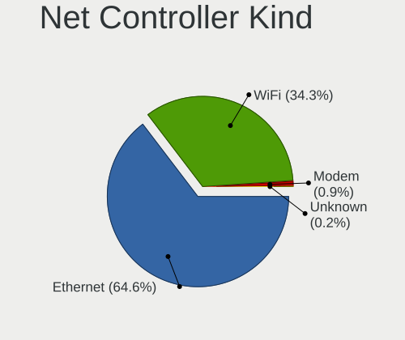

| Kind     | Desktops | Percent |
|----------|----------|---------|
| Ethernet | 5000     | 64.64%  |
| WiFi     | 2651     | 34.27%  |
| Modem    | 70       | 0.9%    |
| Unknown  | 14       | 0.18%   |

Used Controller
---------------

Currently used network controller

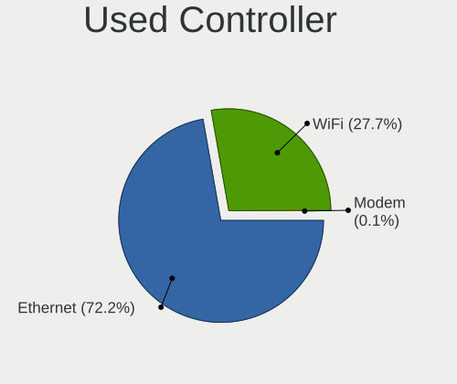

| Kind     | Desktops | Percent |
|----------|----------|---------|
| Ethernet | 3836     | 72.23%  |
| WiFi     | 1472     | 27.72%  |
| Modem    | 3        | 0.06%   |

NICs
----

Total network controllers on board

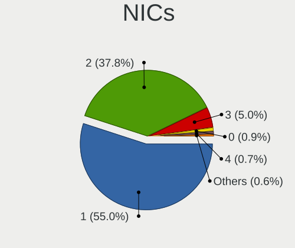

| Total | Desktops | Percent |
|-------|----------|---------|
| 1     | 2822     | 55%     |
| 2     | 1941     | 37.83%  |
| 3     | 256      | 4.99%   |
| 0     | 46       | 0.9%    |
| 4     | 37       | 0.72%   |
| 5     | 21       | 0.41%   |
| 6     | 7        | 0.14%   |
| 8     | 1        | 0.02%   |

IPv6
----

IPv6 vs IPv4

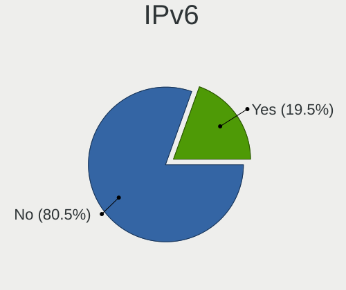

| Used | Desktops | Percent |
|------|----------|---------|
| No   | 4155     | 80.46%  |
| Yes  | 1009     | 19.54%  |

Bluetooth
---------

Bluetooth Vendor
----------------

Controller vendors

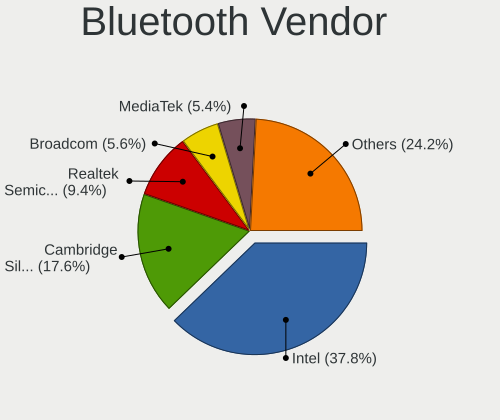

| Vendor                          | Desktops | Percent |
|---------------------------------|----------|---------|
| Intel                           | 833      | 37.79%  |
| Cambridge Silicon Radio         | 387      | 17.56%  |
| Realtek Semiconductor           | 208      | 9.44%   |
| Broadcom                        | 123      | 5.58%   |
| MediaTek                        | 120      | 5.44%   |
| ASUSTek Computer                | 110      | 4.99%   |
| IMC Networks                    | 86       | 3.9%    |
| Foxconn / Hon Hai               | 72       | 3.27%   |
| TP-Link                         | 65       | 2.95%   |
| Qualcomm Atheros Communications | 45       | 2.04%   |
| Apple                           | 39       | 1.77%   |
| Integrated System Solution      | 17       | 0.77%   |
| Belkin Components               | 16       | 0.73%   |
| Lite-On Technology              | 15       | 0.68%   |
| Unknown                         | 15       | 0.68%   |
| Actions                         | 9        | 0.41%   |
| Realtek                         | 8        | 0.36%   |
| HTC (High Tech Computer)        | 6        | 0.27%   |
| Logitech                        | 5        | 0.23%   |
| Dell                            | 5        | 0.23%   |
| Micro Star International        | 4        | 0.18%   |
| Mercucys                        | 3        | 0.14%   |
| SINO WEALTH                     | 2        | 0.09%   |
| Hewlett-Packard                 | 2        | 0.09%   |
| Cypress Semiconductor           | 2        | 0.09%   |
| Creative Technology             | 2        | 0.09%   |
| Taiyo Yuden                     | 1        | 0.05%   |
| Qcom                            | 1        | 0.05%   |
| Edimax Technology               | 1        | 0.05%   |
| D-Link                          | 1        | 0.05%   |
| Corsair                         | 1        | 0.05%   |

Bluetooth Model
---------------

Controller models

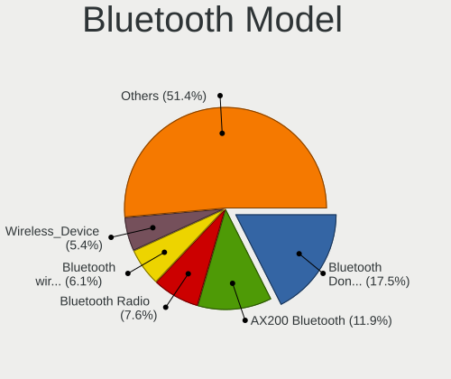

| Model                                                 | Desktops | Percent |
|-------------------------------------------------------|----------|---------|
| Cambridge Silicon Radio Bluetooth Dongle (HCI mode)   | 387      | 17.54%  |
| Intel AX200 Bluetooth                                 | 263      | 11.92%  |
| Realtek Bluetooth Radio                               | 167      | 7.57%   |
| Intel Bluetooth wireless interface                    | 135      | 6.12%   |
| MediaTek Wireless_Device                              | 120      | 5.44%   |
| Intel AX210 Bluetooth                                 | 118      | 5.35%   |
| Broadcom BCM20702A0 Bluetooth 4.0                     | 101      | 4.58%   |
| Intel AX201 Bluetooth                                 | 74       | 3.35%   |
| Intel Bluetooth Device                                | 72       | 3.26%   |
| TP-Link TP-T@- UB500 Adapter                          | 65       | 2.95%   |
| Intel Wireless-AC 9260 Bluetooth Adapter              | 65       | 2.95%   |
| Intel Wireless-AC 3168 Bluetooth                      | 53       | 2.4%    |
| Foxconn / Hon Hai Wireless_Device                     | 53       | 2.4%    |
| ASUS Broadcom BCM20702A0 Bluetooth                    | 48       | 2.18%   |
| Intel Bluetooth 9460/9560 Jefferson Peak (JfP)        | 47       | 2.13%   |
| IMC Networks Bluetooth Radio                          | 46       | 2.09%   |
| IMC Networks Wireless_Device                          | 39       | 1.77%   |
| Apple Bluetooth Host Controller                       | 17       | 0.77%   |
| Qualcomm Atheros  Bluetooth Device                    | 16       | 0.73%   |
| Foxconn / Hon Hai Bluetooth Device                    | 15       | 0.68%   |
| Unknown                                               | 15       | 0.68%   |
| Integrated System Solution Bluetooth Device           | 13       | 0.59%   |
| Realtek RTL8821A Bluetooth                            | 12       | 0.54%   |
| ASUS Bluetooth Radio                                  | 12       | 0.54%   |
| ASUS BCM20702A0                                       | 12       | 0.54%   |
| Apple Built-in Bluetooth 2.0+EDR HCI                  | 11       | 0.5%    |
| ASUS Broadcom BCM20702 Single-Chip Bluetooth 4.0 + LE | 10       | 0.45%   |
| Apple Bluetooth HCI                                   | 10       | 0.45%   |
| Qualcomm Atheros Bluetooth USB Host Controller        | 9        | 0.41%   |
| Qualcomm Atheros AR3011 Bluetooth                     | 9        | 0.41%   |
| Actions general adapter                               | 9        | 0.41%   |
| Realtek  Bluetooth 4.2 Adapter                        | 8        | 0.36%   |
| Realtek Bluetooth 5.3 Radio                           | 8        | 0.36%   |
| Realtek Bluetooth Radio                               | 8        | 0.36%   |
| Intel Centrino Bluetooth Wireless Transceiver         | 8        | 0.36%   |
| ASUS Qualcomm Bluetooth 4.1                           | 8        | 0.36%   |
| ASUS ASUS USB-BT500                                   | 8        | 0.36%   |
| Realtek Bluetooth 5.4 Radio                           | 7        | 0.32%   |
| Lite-On Bluetooth Device                              | 7        | 0.32%   |
| Qualcomm Atheros AR9462 Bluetooth                     | 6        | 0.27%   |

Sound
-----

Sound Vendor
------------

Sound card vendors

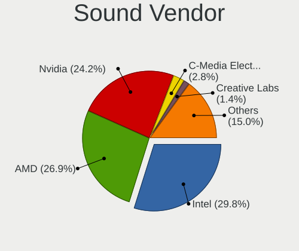

| Vendor                                       | Desktops | Percent |
|----------------------------------------------|----------|---------|
| Intel                                        | 2752     | 29.84%  |
| AMD                                          | 2477     | 26.85%  |
| Nvidia                                       | 2228     | 24.15%  |
| C-Media Electronics                          | 256      | 2.78%   |
| Creative Labs                                | 131      | 1.42%   |
| Logitech                                     | 105      | 1.14%   |
| ASUSTek Computer                             | 79       | 0.86%   |
| Texas Instruments                            | 78       | 0.85%   |
| Razer USA                                    | 62       | 0.67%   |
| Micro Star International                     | 60       | 0.65%   |
| SteelSeries ApS                              | 59       | 0.64%   |
| Focusrite-Novation                           | 59       | 0.64%   |
| Creative Technology                          | 49       | 0.53%   |
| JMTek                                        | 45       | 0.49%   |
| Kingston Technology                          | 34       | 0.37%   |
| Corsair                                      | 34       | 0.37%   |
| Zoran Co. Personal Media Division (Nogatech) | 27       | 0.29%   |
| Hewlett-Packard                              | 26       | 0.28%   |
| BEHRINGER International                      | 26       | 0.28%   |
| Thesycon Systemsoftware & Consulting         | 25       | 0.27%   |
| Blue Microphones                             | 25       | 0.27%   |
| Realtek Semiconductor                        | 24       | 0.26%   |
| GN Netcom                                    | 23       | 0.25%   |
| VIA Technologies                             | 22       | 0.24%   |
| Plantronics                                  | 20       | 0.22%   |
| Generalplus Technology                       | 20       | 0.22%   |
| Sony                                         | 19       | 0.21%   |
| KTMicro                                      | 17       | 0.18%   |
| ASRock                                       | 16       | 0.17%   |
| DSEA A/S                                     | 14       | 0.15%   |
| Tenx Technology                              | 13       | 0.14%   |
| Jieli Technology                             | 13       | 0.14%   |
| Giga-Byte Technology                         | 12       | 0.13%   |
| FiiO Electronics Technology                  | 12       | 0.13%   |
| Samson Technologies                          | 11       | 0.12%   |
| Astro Gaming                                 | 11       | 0.12%   |
| Valve Software                               | 10       | 0.11%   |
| XMOS                                         | 9        | 0.1%    |
| GYROCOM C&C                                  | 9        | 0.1%    |
| AKAI Professional M.I.                       | 9        | 0.1%    |

Sound Model
-----------

Sound card models

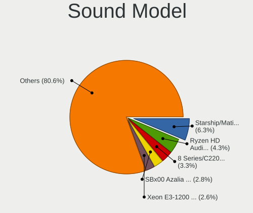

| Model                                                                      | Desktops | Percent |
|----------------------------------------------------------------------------|----------|---------|
| AMD Starship/Matisse HD Audio Controller                                   | 695      | 6.31%   |
| AMD Ryzen HD Audio Controller                                              | 477      | 4.33%   |
| Intel 8 Series/C220 Series Chipset High Definition Audio Controller        | 369      | 3.35%   |
| AMD SBx00 Azalia (Intel HDA)                                               | 310      | 2.81%   |
| Intel Xeon E3-1200 v3/4th Gen Core Processor HD Audio Controller           | 289      | 2.62%   |
| Intel 6 Series/C200 Series Chipset Family High Definition Audio Controller | 288      | 2.61%   |
| AMD Family 17h (Models 00h-0fh) HD Audio Controller                        | 269      | 2.44%   |
| Intel 200 Series PCH HD Audio                                              | 234      | 2.12%   |
| AMD Navi 21/23 HDMI/DP Audio Controller                                    | 229      | 2.08%   |
| AMD Ellesmere HDMI Audio [Radeon RX 470/480 / 570/580/590]                 | 226      | 2.05%   |
| Intel 7 Series/C216 Chipset Family High Definition Audio Controller        | 224      | 2.03%   |
| Intel 100 Series/C230 Series Chipset Family HD Audio Controller            | 223      | 2.02%   |
| AMD Radeon High Definition Audio Controller                                | 222      | 2.02%   |
| Nvidia GK208 HDMI/DP Audio Controller                                      | 190      | 1.72%   |
| AMD FCH Azalia Controller                                                  | 156      | 1.42%   |
| Nvidia GP107GL High Definition Audio Controller                            | 155      | 1.41%   |
| Intel Cannon Lake PCH cAVS                                                 | 155      | 1.41%   |
| AMD Renoir/Cezanne HDMI/DP Audio Controller                                | 152      | 1.38%   |
| Nvidia GP104 High Definition Audio Controller                              | 144      | 1.31%   |
| Nvidia GP106 High Definition Audio Controller                              | 131      | 1.19%   |
| Intel 82801JI (ICH10 Family) HD Audio Controller                           | 121      | 1.1%    |
| AMD Navi 31 HDMI/DP Audio                                                  | 119      | 1.08%   |
| Intel NM10/ICH7 Family High Definition Audio Controller                    | 118      | 1.07%   |
| Nvidia GA102 High Definition Audio Controller                              | 115      | 1.04%   |
| Nvidia GA104 High Definition Audio Controller                              | 113      | 1.03%   |
| AMD Oland/Hainan/Cape Verde/Pitcairn HDMI Audio [Radeon HD 7000 Series]    | 105      | 0.95%   |
| Intel 9 Series Chipset Family HD Audio Controller                          | 104      | 0.94%   |
| Nvidia TU116 High Definition Audio Controller                              | 101      | 0.92%   |
| AMD Navi 10 HDMI Audio                                                     | 96       | 0.87%   |
| Intel 82801I (ICH9 Family) HD Audio Controller                             | 94       | 0.85%   |
| Intel Alder Lake-S HD Audio Controller                                     | 92       | 0.84%   |
| Nvidia TU104 HD Audio Controller                                           | 90       | 0.82%   |
| Nvidia TU106 High Definition Audio Controller                              | 87       | 0.79%   |
| Nvidia GM204 High Definition Audio Controller                              | 86       | 0.78%   |
| Nvidia GM107 High Definition Audio Controller [GeForce 940MX]              | 86       | 0.78%   |
| Nvidia High Definition Audio Controller                                    | 82       | 0.74%   |
| Intel Raptor Lake High Definition Audio Controller                         | 77       | 0.7%    |
| AMD Raven/Raven2/Fenghuang HDMI/DP Audio Controller                        | 77       | 0.7%    |
| AMD Baffin HDMI/DP Audio [Radeon RX 550 640SP / RX 560/560X]               | 76       | 0.69%   |
| Intel 5 Series/3400 Series Chipset High Definition Audio                   | 75       | 0.68%   |

Memory
------

Memory Vendor
-------------

Memory module vendors

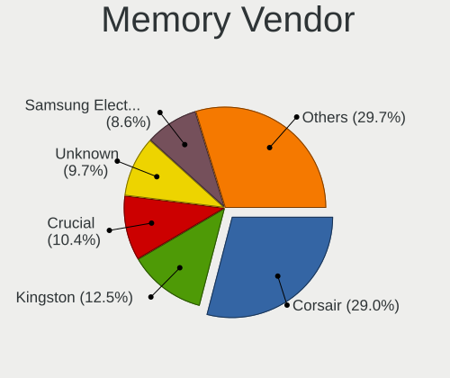

| Vendor                       | Desktops | Percent |
|------------------------------|----------|---------|
| Corsair                      | 840      | 29.04%  |
| Kingston                     | 362      | 12.51%  |
| Crucial                      | 301      | 10.4%   |
| Unknown                      | 282      | 9.75%   |
| Samsung Electronics          | 248      | 8.57%   |
| SK hynix                     | 233      | 8.05%   |
| Micron Technology            | 158      | 5.46%   |
| G.Skill                      | 78       | 2.7%    |
| A-DATA Technology            | 63       | 2.18%   |
| Team                         | 46       | 1.59%   |
| Unknown                      | 42       | 1.45%   |
| Patriot                      | 29       | 1%      |
| Nanya Technology             | 23       | 0.8%    |
| Ramaxel Technology           | 21       | 0.73%   |
| Elpida                       | 16       | 0.55%   |
| Unknown (ABCD)               | 9        | 0.31%   |
| Timetec                      | 8        | 0.28%   |
| KLEVV                        | 8        | 0.28%   |
| Transcend                    | 7        | 0.24%   |
| ASint Technology             | 6        | 0.21%   |
| A Force                      | 6        | 0.21%   |
| QEMU                         | 5        | 0.17%   |
| Patriot Memory               | 5        | 0.17%   |
| Lexar                        | 5        | 0.17%   |
| Hewlett-Packard              | 5        | 0.17%   |
| Qimonda                      | 4        | 0.14%   |
| Patriot Memory (PDP Systems) | 4        | 0.14%   |
| Lexar Co Limited             | 4        | 0.14%   |
| Apacer                       | 4        | 0.14%   |
| Unknown (0x0E9D)             | 3        | 0.1%    |
| GeIL                         | 3        | 0.1%    |
| CSX                          | 3        | 0.1%    |
| Wodposit                     | 2        | 0.07%   |
| Unknown (83CB)               | 2        | 0.07%   |
| Unknown (0x0B45)             | 2        | 0.07%   |
| Thermaltake                  | 2        | 0.07%   |
| Princeton                    | 2        | 0.07%   |
| PNY                          | 2        | 0.07%   |
| Netac                        | 2        | 0.07%   |
| Infineon                     | 2        | 0.07%   |

Memory Model
------------

Memory module models

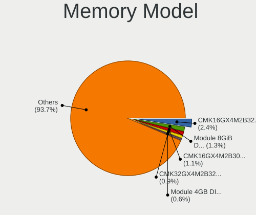

| Model                                                          | Desktops | Percent |
|----------------------------------------------------------------|----------|---------|
| Corsair RAM CMK16GX4M2B3200C16 8GB DIMM DDR4 3600MT/s          | 76       | 2.4%    |
| Unknown                                                        | 42       | 1.32%   |
| Corsair RAM CMK16GX4M2B3000C15 8GB DIMM DDR4 3600MT/s          | 36       | 1.14%   |
| Corsair RAM CMK32GX4M2B3200C16 16GB DIMM DDR4 3800MT/s         | 27       | 0.85%   |
| Unknown RAM Module 4GB DIMM 1333MT/s                           | 20       | 0.63%   |
| Corsair RAM CMK32GX4M2Z3600C18 16GB DIMM DDR4 3800MT/s         | 20       | 0.63%   |
| Corsair RAM CMW16GX4M2C3200C16 8GB DIMM DDR4 3733MT/s          | 19       | 0.6%    |
| Corsair RAM CMK32GX4M2E3200C16 16GB DIMM DDR4 3600MT/s         | 19       | 0.6%    |
| Corsair RAM CMK16GX4M2A2666C16 8GB DIMM DDR4 3400MT/s          | 19       | 0.6%    |
| Corsair RAM CMK16GX4M2D3000C16 8GB DIMM DDR4 3400MT/s          | 18       | 0.57%   |
| Micron RAM 8JTF51264AZ-1G6E1 4GB DIMM DDR3 1600MT/s            | 16       | 0.5%    |
| Corsair RAM CMK16GX4M2D3600C18 8GB DIMM DDR4 4000MT/s          | 16       | 0.5%    |
| Unknown RAM Module 4096MB DIMM 1333MT/s                        | 15       | 0.47%   |
| Patriot RAM 3200 C16 Series 8GB DIMM DDR4 3600MT/s             | 14       | 0.44%   |
| Kingston RAM KHX1600C9D3/4GX 4GB DIMM DDR3 1867MT/s            | 14       | 0.44%   |
| Unknown RAM Module 8GB DIMM DDR3 1600MT/s                      | 13       | 0.41%   |
| Corsair RAM CMZ8GX3M2A1600C9 4GB DIMM SDRAM 1800MT/s           | 13       | 0.41%   |
| Corsair RAM CMK64GX4M2E3200C16 32GB DIMM DDR4 3600MT/s         | 13       | 0.41%   |
| Corsair RAM CMK32GX4M2B3000C15 16GB DIMM DDR4 3000MT/s         | 13       | 0.41%   |
| Corsair RAM CMK16GX4M2A2400C14 8GB DIMM DDR4 2800MT/s          | 13       | 0.41%   |
| SK hynix RAM HMT351U6CFR8C-PB 4GB DIMM DDR3 1800MT/s           | 12       | 0.38%   |
| Kingston RAM KHX3200C16D4/8GX 8GB DIMM DDR4 3733MT/s           | 12       | 0.38%   |
| Corsair RAM CMK8GX4M1A2400C16 8GB DIMM DDR4 3066MT/s           | 12       | 0.38%   |
| Corsair RAM CMK32GX4M2A2666C16 16GB DIMM DDR4 2667MT/s         | 12       | 0.38%   |
| SK hynix RAM HMT451U6AFR8C-PB 4GB DIMM DDR3 1600MT/s           | 11       | 0.35%   |
| Kingston RAM KHX1600C10D3/8G 8GB DIMM DDR3 2133MT/s            | 11       | 0.35%   |
| Kingston RAM KF3200C16D4/16GX 16GB DIMM DDR4 3733MT/s          | 11       | 0.35%   |
| Corsair RAM CMW32GX4M2Z3600C18 16GB DIMM DDR4 3733MT/s         | 11       | 0.35%   |
| Corsair RAM CMK16GX4M2Z3600C18 8GB DIMM DDR4 3600MT/s          | 11       | 0.35%   |
| Unknown RAM Module 4GB DIMM DDR3 1333MT/s                      | 10       | 0.32%   |
| SK hynix RAM HMT451U6BFR8C-PB 4GB DIMM DDR3 1600MT/s           | 10       | 0.32%   |
| Samsung RAM M378B5673FH0-CH9 2GB DIMM DDR3 1600MT/s            | 10       | 0.32%   |
| Corsair RAM CMK64GX4M2D3600C18 32GB DIMM DDR4 3600MT/s         | 10       | 0.32%   |
| A-DATA RAM DDR4 3200 16GB DIMM DDR4 3600MT/s                   | 10       | 0.32%   |
| Unknown (ABCD) RAM 123456789012345678 2GB DIMM LPDDR4 2133MT/s | 9        | 0.28%   |
| Samsung RAM M378B5173DB0-CK0 4096MB DIMM DDR3 1600MT/s         | 9        | 0.28%   |
| Kingston RAM KHX1866C10D3/8G 8GB DIMM DDR3 1867MT/s            | 9        | 0.28%   |
| Crucial RAM CT102464BD160B.C16 8GB DIMM DDR3 1600MT/s          | 9        | 0.28%   |
| Corsair RAM CMK32GX5M2B6000Z30 16GB DIMM DDR5 6000MT/s         | 9        | 0.28%   |
| Corsair RAM CMK32GX4M2Z3200C16 16GB DIMM DDR4 3200MT/s         | 9        | 0.28%   |

Memory Kind
-----------

Memory module kinds

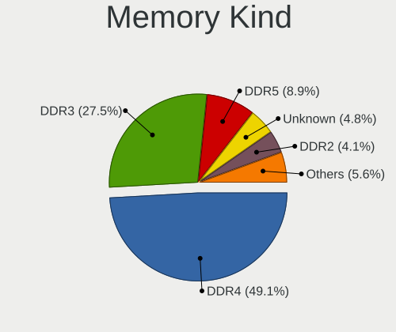

| Kind    | Desktops | Percent |
|---------|----------|---------|
| DDR4    | 1257     | 49.1%   |
| DDR3    | 705      | 27.54%  |
| DDR5    | 228      | 8.91%   |
| Unknown | 122      | 4.77%   |
| DDR2    | 105      | 4.1%    |
| SDRAM   | 92       | 3.59%   |
| DDR     | 19       | 0.74%   |
| LPDDR5  | 11       | 0.43%   |
| LPDDR4  | 11       | 0.43%   |
| RAM     | 5        | 0.2%    |
| DRAM    | 5        | 0.2%    |

Memory Form Factor
------------------

Physical design of the memory module

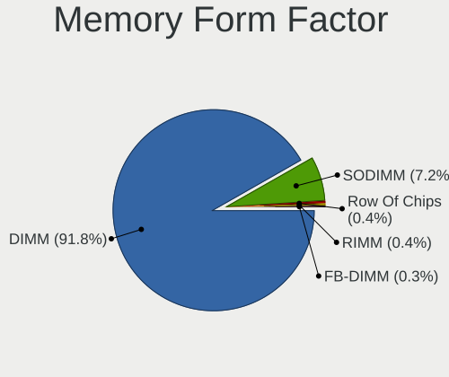

| Name         | Desktops | Percent |
|--------------|----------|---------|
| DIMM         | 2294     | 91.76%  |
| SODIMM       | 180      | 7.2%    |
| Row Of Chips | 10       | 0.4%    |
| RIMM         | 9        | 0.36%   |
| FB-DIMM      | 7        | 0.28%   |

Memory Size
-----------

Memory module size

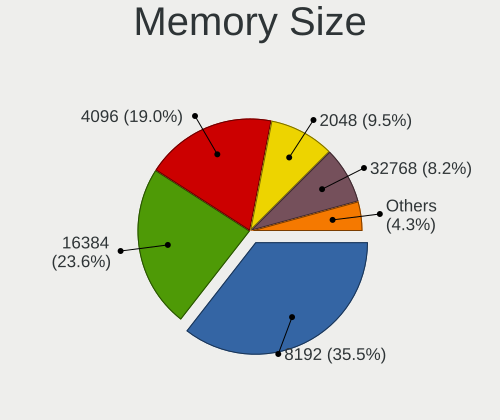

| Size   | Desktops | Percent |
|--------|----------|---------|
| 8192   | 977      | 35.54%  |
| 16384  | 648      | 23.57%  |
| 4096   | 521      | 18.95%  |
| 2048   | 260      | 9.46%   |
| 32768  | 226      | 8.22%   |
| 1024   | 86       | 3.13%   |
| 49152  | 13       | 0.47%   |
| 512    | 7        | 0.25%   |
| 24576  | 4        | 0.15%   |
| 65536  | 3        | 0.11%   |
| 131072 | 1        | 0.04%   |
| 256    | 1        | 0.04%   |
| 16     | 1        | 0.04%   |
| 13     | 1        | 0.04%   |

Memory Speed
------------

Memory module speed

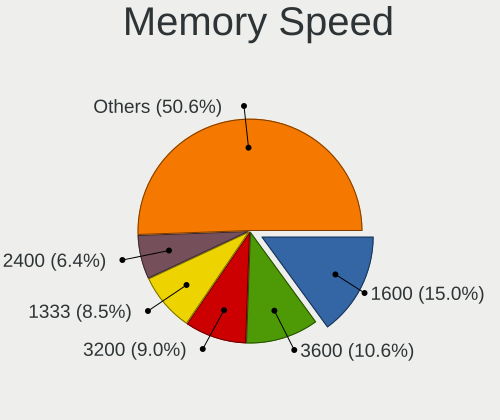

| Speed   | Desktops | Percent |
|---------|----------|---------|
| 1600    | 426      | 14.98%  |
| 3600    | 301      | 10.58%  |
| 3200    | 255      | 8.97%   |
| 1333    | 242      | 8.51%   |
| 2400    | 182      | 6.4%    |
| 2133    | 133      | 4.68%   |
| 2667    | 113      | 3.97%   |
| 6000    | 86       | 3.02%   |
| 3733    | 79       | 2.78%   |
| 800     | 79       | 2.78%   |
| 3800    | 74       | 2.6%    |
| 667     | 63       | 2.22%   |
| 3000    | 58       | 2.04%   |
| 3400    | 55       | 1.93%   |
| 1800    | 45       | 1.58%   |
| 2666    | 44       | 1.55%   |
| 4800    | 43       | 1.51%   |
| 1867    | 38       | 1.34%   |
| 5600    | 36       | 1.27%   |
| 2933    | 36       | 1.27%   |
| 1866    | 35       | 1.23%   |
| 6400    | 28       | 0.98%   |
| 2800    | 27       | 0.95%   |
| Unknown | 27       | 0.95%   |
| 4000    | 26       | 0.91%   |
| 1066    | 25       | 0.88%   |
| 5200    | 15       | 0.53%   |
| 3466    | 14       | 0.49%   |
| 3066    | 14       | 0.49%   |
| 533     | 14       | 0.49%   |
| 400     | 14       | 0.49%   |
| 3100    | 12       | 0.42%   |
| 1067    | 11       | 0.39%   |
| 3333    | 10       | 0.35%   |
| 2048    | 10       | 0.35%   |
| 2000    | 10       | 0.35%   |
| 3266    | 9        | 0.32%   |
| 1334    | 9        | 0.32%   |
| 6200    | 8        | 0.28%   |
| 49926   | 7        | 0.25%   |

Printers & scanners
-------------------

Printer Vendor
--------------

Printer device vendors

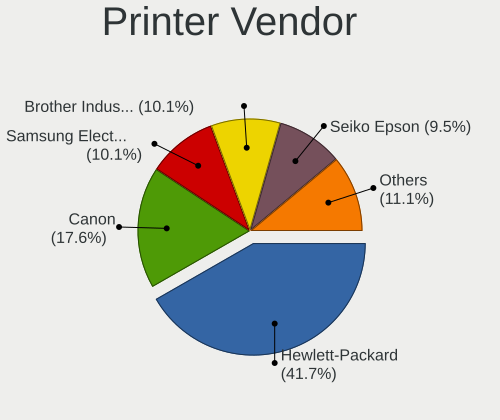

| Vendor                   | Desktops | Percent |
|--------------------------|----------|---------|
| Hewlett-Packard          | 83       | 41.71%  |
| Canon                    | 35       | 17.59%  |
| Samsung Electronics      | 20       | 10.05%  |
| Brother Industries       | 20       | 10.05%  |
| Seiko Epson              | 19       | 9.55%   |
| QinHeng Electronics      | 3        | 1.51%   |
| Prolific Technology      | 3        | 1.51%   |
| Lexmark International    | 3        | 1.51%   |
| Ricoh                    | 2        | 1.01%   |
| Pantum                   | 2        | 1.01%   |
| Dymo-CoStar              | 2        | 1.01%   |
| Zhuhai Poskey Technology | 1        | 0.5%    |
| Seiko Instruments        | 1        | 0.5%    |
| Oki Data                 | 1        | 0.5%    |
| Kyocera                  | 1        | 0.5%    |
| Dell                     | 1        | 0.5%    |
| Custom Engineering SPA   | 1        | 0.5%    |
| Apple                    | 1        | 0.5%    |

Printer Model
-------------

Printer device models

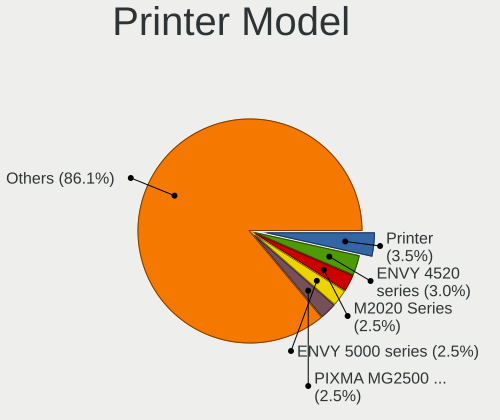

| Model                                | Desktops | Percent |
|--------------------------------------|----------|---------|
| Seiko Epson Printer                  | 7        | 3.48%   |
| HP ENVY 4520 series                  | 6        | 2.99%   |
| Samsung M2020 Series                 | 5        | 2.49%   |
| HP ENVY 5000 series                  | 5        | 2.49%   |
| Canon PIXMA MG2500 Series            | 5        | 2.49%   |
| HP DeskJet 2600 series               | 4        | 1.99%   |
| Canon iP7200 series                  | 4        | 1.99%   |
| QinHeng CH340S                       | 3        | 1.49%   |
| Prolific PL2305 Parallel Port        | 3        | 1.49%   |
| HP OfficeJet 3830 series             | 3        | 1.49%   |
| HP LaserJet P1005                    | 3        | 1.49%   |
| HP DeskJet 3630 series               | 3        | 1.49%   |
| HP DeskJet 2700 series               | 3        | 1.49%   |
| HP Deskjet 2540 series               | 3        | 1.49%   |
| HP DeskJet 2130 series               | 3        | 1.49%   |
| Canon TS3100 series                  | 3        | 1.49%   |
| Seiko Epson XP-240 Series            | 2        | 1%      |
| Seiko Epson EPSON XP-205 207 Series  | 2        | 1%      |
| Samsung ML-2250 Series               | 2        | 1%      |
| Samsung ML-216x Series Laser Printer | 2        | 1%      |
| HP LaserJet 200 colorMFP M276nw      | 2        | 1%      |
| HP ENVY 5540 series                  | 2        | 1%      |
| HP Deskjet F2280 series              | 2        | 1%      |
| HP DeskJet 4100 series               | 2        | 1%      |
| HP Deskjet 1000 J110 series          | 2        | 1%      |
| HP Color LaserJet CP1215             | 2        | 1%      |
| Canon TS3300 series                  | 2        | 1%      |
| Canon PIXMA MX920 Series             | 2        | 1%      |
| Canon PIXMA MP495                    | 2        | 1%      |
| Canon PIXMA MG3600 Series            | 2        | 1%      |
| Canon MG5700 series                  | 2        | 1%      |
| Canon LiDE 300                       | 2        | 1%      |
| Brother HL-3140CW series             | 2        | 1%      |
| Brother HL-1210W series              | 2        | 1%      |
| Brother DCP-1610W                    | 2        | 1%      |
| Zhuhai Poskey 4B-2054L               | 1        | 0.5%    |
| Seiko Instruments SLP-450 Driver     | 1        | 0.5%    |
| Seiko Epson XP-5100 Series           | 1        | 0.5%    |
| Seiko Epson XP-4100 Series           | 1        | 0.5%    |
| Seiko Epson XP-211 214 216 Series    | 1        | 0.5%    |

Scanner Vendor
--------------

Scanner device vendors

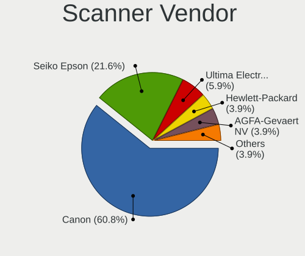

| Vendor             | Desktops | Percent |
|--------------------|----------|---------|
| Canon              | 31       | 60.78%  |
| Seiko Epson        | 11       | 21.57%  |
| Ultima Electronics | 3        | 5.88%   |
| Hewlett-Packard    | 2        | 3.92%   |
| AGFA-Gevaert NV    | 2        | 3.92%   |
| UMAX               | 1        | 1.96%   |
| Mustek Systems     | 1        | 1.96%   |

Scanner Model
-------------

Scanner device models

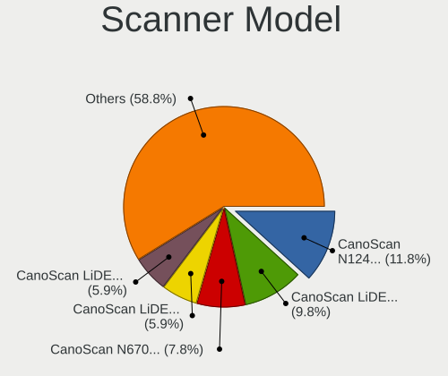

| Model                                                                                 | Desktops | Percent |
|---------------------------------------------------------------------------------------|----------|---------|
| Canon CanoScan N1240U/LiDE 30                                                         | 6        | 11.76%  |
| Canon CanoScan LiDE 220                                                               | 5        | 9.8%    |
| Canon CanoScan N670U/N676U/LiDE 20                                                    | 4        | 7.84%   |
| Canon CanoScan LIDE 25                                                                | 3        | 5.88%   |
| Canon CanoScan LiDE 210                                                               | 3        | 5.88%   |
| Canon CanoScan LiDE 200                                                               | 3        | 5.88%   |
| Ultima Artec Ultima 2000 (GT6801 based)/Lifetec LT9385/ScanMagic 1200 UB Plus Scanner | 2        | 3.92%   |
| Seiko Epson GT-X770 [Perfection V500]                                                 | 2        | 3.92%   |
| Seiko Epson GT-8300UF [Perfection 1660 PHOTO]                                         | 2        | 3.92%   |
| Canon CanoScan LiDE 110                                                               | 2        | 3.92%   |
| AGFA-Gevaert NV SnapScan 1212U (?)                                                    | 2        | 3.92%   |
| UMAX Astra 2200/2200SU                                                                | 1        | 1.96%   |
| Ultima Artec E+ Pro                                                                   | 1        | 1.96%   |
| Seiko Epson Scanner                                                                   | 1        | 1.96%   |
| Seiko Epson Perfection V37/V370                                                       | 1        | 1.96%   |
| Seiko Epson GT-X750 [Perfection 4490 Photo]                                           | 1        | 1.96%   |
| Seiko Epson GT-F730 [GT-S630/Perfection V33/V330 Photo]                               | 1        | 1.96%   |
| Seiko Epson GT-F650 [GT-S600/Perfection V10/V100]                                     | 1        | 1.96%   |
| Seiko Epson GT-8700/GT-8700F [Perfection 1640SU/1640SU PHOTO]                         | 1        | 1.96%   |
| Seiko Epson GT-8400UF [Perfection 1670/1670 PHOTO]                                    | 1        | 1.96%   |
| Mustek Systems BearPaw 1200 CU Plus                                                   | 1        | 1.96%   |
| HP Scanjet G2710                                                                      | 1        | 1.96%   |
| HP ScanJet 3400cse                                                                    | 1        | 1.96%   |
| Canon CanoScan LiDE 90                                                                | 1        | 1.96%   |
| Canon CanoScan LiDE 70                                                                | 1        | 1.96%   |
| Canon CanoScan LiDE 50/LiDE 35/LiDE 40                                                | 1        | 1.96%   |
| Canon CanoScan LiDE 120                                                               | 1        | 1.96%   |
| Canon CanoScan LiDE 100                                                               | 1        | 1.96%   |

Camera
------

Camera Vendor
-------------

Camera device vendors

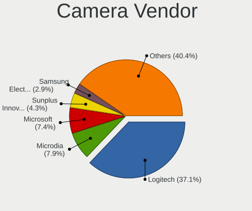

| Vendor                        | Desktops | Percent |
|-------------------------------|----------|---------|
| Logitech                      | 407      | 37.1%   |
| Microdia                      | 87       | 7.93%   |
| Microsoft                     | 81       | 7.38%   |
| Sunplus Innovation Technology | 47       | 4.28%   |
| Samsung Electronics           | 32       | 2.92%   |
| ARC International             | 30       | 2.73%   |
| Apple                         | 30       | 2.73%   |
| Generalplus Technology        | 29       | 2.64%   |
| Realtek Semiconductor         | 28       | 2.55%   |
| MacroSilicon                  | 22       | 2.01%   |
| GEMBIRD                       | 20       | 1.82%   |
| Creative Technology           | 20       | 1.82%   |
| Chicony Electronics           | 18       | 1.64%   |
| Razer USA                     | 15       | 1.37%   |
| Hewlett-Packard               | 14       | 1.28%   |
| Z-Star Microelectronics       | 13       | 1.19%   |
| webcam                        | 10       | 0.91%   |
| Huawei Technologies           | 10       | 0.91%   |
| Aveo Technology               | 10       | 0.91%   |
| Anker PowerConf C200          | 10       | 0.91%   |
| Valve Software                | 8        | 0.73%   |
| Tobii Technology AB           | 7        | 0.64%   |
| SunplusIT                     | 7        | 0.64%   |
| Lenovo                        | 7        | 0.64%   |
| Genesys Logic                 | 7        | 0.64%   |
| Trust                         | 6        | 0.55%   |
| WCM_USB                       | 5        | 0.46%   |
| AVerMedia Technologies        | 5        | 0.46%   |
| YGTek                         | 4        | 0.36%   |
| ValueHD                       | 4        | 0.36%   |
| OmniVision Technologies       | 4        | 0.36%   |
| Netchip Technology            | 4        | 0.36%   |
| KYE Systems (Mouse Systems)   | 4        | 0.36%   |
| Arkmicro Technologies         | 4        | 0.36%   |
| A4Tech                        | 4        | 0.36%   |
| webcamvendor                  | 3        | 0.27%   |
| Sunplus IT                    | 3        | 0.27%   |
| Sonix Technology              | 3        | 0.27%   |
| Remo Tech                     | 3        | 0.27%   |
| Quanta                        | 3        | 0.27%   |

Camera Model
------------

Camera device models

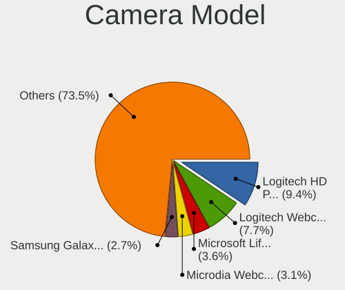

| Model                                             | Desktops | Percent |
|---------------------------------------------------|----------|---------|
| Logitech HD Pro Webcam C920                       | 104      | 9.42%   |
| Logitech Webcam C270                              | 85       | 7.7%    |
| Microsoft LifeCam HD-3000                         | 40       | 3.62%   |
| Microdia Webcam Vitade AF                         | 34       | 3.08%   |
| Samsung Galaxy series, misc. (MTP mode)           | 30       | 2.72%   |
| ARC International Camera                          | 30       | 2.72%   |
| Apple iPhone 5/5C/5S/6/SE/7/8/X                   | 29       | 2.63%   |
| Logitech C922 Pro Stream Webcam                   | 26       | 2.36%   |
| Logitech C920 PRO HD Webcam                       | 25       | 2.26%   |
| Microdia USB 2.0 Camera                           | 23       | 2.08%   |
| Sunplus Full HD webcam                            | 20       | 1.81%   |
| MacroSilicon USB Video                            | 20       | 1.81%   |
| Microsoft LifeCam Cinema                          | 19       | 1.72%   |
| Logitech HD Webcam C615                           | 17       | 1.54%   |
| Realtek FULL HD 1080P Webcam                      | 15       | 1.36%   |
| Logitech Webcam C930e                             | 15       | 1.36%   |
| Logitech BRIO Ultra HD Webcam                     | 15       | 1.36%   |
| Logitech BRIO 4K Stream Edition                   | 15       | 1.36%   |
| Generalplus GENERAL WEBCAM                        | 15       | 1.36%   |
| Logitech StreamCam                                | 11       | 1%      |
| GEMBIRD Generic UVC 1.00 camera [AppoTech AX2311] | 11       | 1%      |
| webcam webcam                                     | 10       | 0.91%   |
| Logitech Logitech Webcam C925e                    | 10       | 0.91%   |
| Huawei HiCamera                                   | 10       | 0.91%   |
| Generalplus 808 Camera #9 (web-cam mode)          | 10       | 0.91%   |
| Anker PowerConf C200 Anker PowerConf C200         | 10       | 0.91%   |
| Sunplus SPCA2281 Web Camera                       | 9        | 0.82%   |
| Logitech Webcam Pro 9000                          | 9        | 0.82%   |
| Logitech Webcam C310                              | 9        | 0.82%   |
| GEMBIRD USB2.0 PC CAMERA                          | 9        | 0.82%   |
| Valve Software 3D Camera                          | 8        | 0.72%   |
| Microdia Sonix USB 2.0 Camera                     | 8        | 0.72%   |
| Microdia CyberTrack H7                            | 8        | 0.72%   |
| Logitech QuickCam Pro 9000                        | 8        | 0.72%   |
| Logitech B525 HD Webcam                           | 8        | 0.72%   |
| HP Webcam HD 2300                                 | 8        | 0.72%   |
| Tobii AB EyeChip                                  | 7        | 0.63%   |
| Razer USA Gaming Webcam [Kiyo]                    | 7        | 0.63%   |
| Sunplus USB 2.0 Camera                            | 6        | 0.54%   |
| Realtek USB Camera                                | 6        | 0.54%   |

Security
--------

Fingerprint Vendor
------------------

Fingerprint sensor vendors

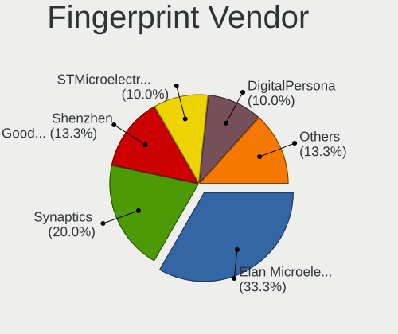

| Vendor                     | Desktops | Percent |
|----------------------------|----------|---------|
| Elan Microelectronics      | 10       | 33.33%  |
| Synaptics                  | 6        | 20%     |
| Shenzhen Goodix Technology | 4        | 13.33%  |
| STMicroelectronics         | 3        | 10%     |
| DigitalPersona             | 3        | 10%     |
| AuthenTec                  | 2        | 6.67%   |
| Microsoft                  | 1        | 3.33%   |
| LighTuning Technology      | 1        | 3.33%   |

Fingerprint Model
-----------------

Fingerprint sensor models

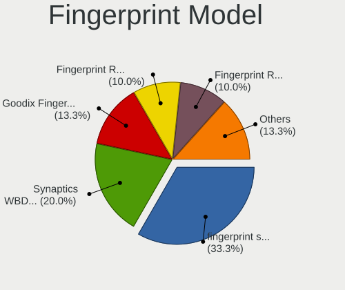

| Model                                        | Desktops | Percent |
|----------------------------------------------|----------|---------|
| Elan fingerprint sensor [FeinTech FPS00200]  | 10       | 33.33%  |
| Synaptics  WBDI Fingerprint Reader - USB 052 | 6        | 20%     |
| Shenzhen Goodix  Fingerprint Device          | 4        | 13.33%  |
| STMicroelectronics Fingerprint Reader        | 3        | 10%     |
| DigitalPersona Fingerprint Reader            | 3        | 10%     |
| Microsoft Fingerprint Reader                 | 1        | 3.33%   |
| LighTuning ES603 Swipe Fingerprint Sensor    | 1        | 3.33%   |
| AuthenTec Fingerprint Sensor                 | 1        | 3.33%   |
| AuthenTec AES2501 Fingerprint Sensor         | 1        | 3.33%   |

Chipcard Vendor
---------------

Chipcard module vendors

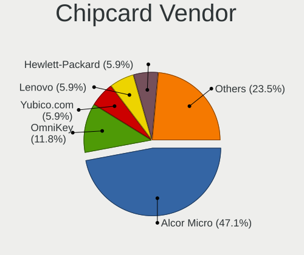

| Vendor                    | Desktops | Percent |
|---------------------------|----------|---------|
| Alcor Micro               | 8        | 47.06%  |
| OmniKey                   | 2        | 11.76%  |
| Yubico.com                | 1        | 5.88%   |
| Lenovo                    | 1        | 5.88%   |
| Hewlett-Packard           | 1        | 5.88%   |
| Gemalto (was Gemplus)     | 1        | 5.88%   |
| Bit4id                    | 1        | 5.88%   |
| Aladdin Knowledge Systems | 1        | 5.88%   |
| Advanced Card Systems     | 1        | 5.88%   |

Chipcard Model
--------------

Chipcard module models

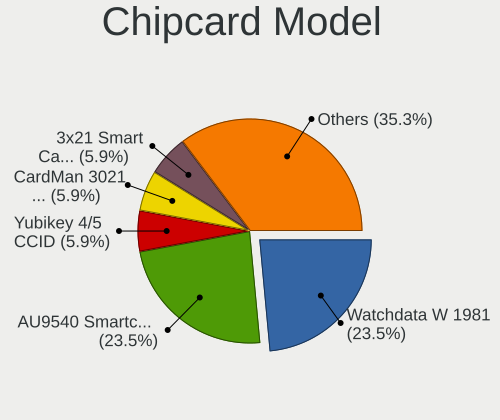

| Model                                         | Desktops | Percent |
|-----------------------------------------------|----------|---------|
| Alcor Micro Watchdata W 1981                  | 4        | 23.53%  |
| Alcor Micro AU9540 Smartcard Reader           | 4        | 23.53%  |
| Yubico.com Yubikey 4/5 CCID                   | 1        | 5.88%   |
| OmniKey CardMan 3021 / 3121                   | 1        | 5.88%   |
| OmniKey 3x21 Smart Card Reader                | 1        | 5.88%   |
| Lenovo Smartcard Keyboard                     | 1        | 5.88%   |
| Hewlett-Packard SC Keyboard - Apollo (Liteon) | 1        | 5.88%   |
| Gemalto (was Gemplus) eToken 5110+ FIPS       | 1        | 5.88%   |
| Bit4id miniLector EVO                         | 1        | 5.88%   |
| Aladdin Knowledge Systems Token JC            | 1        | 5.88%   |
| Advanced Card Systems ACR1252 CL Reader PICC  | 1        | 5.88%   |

Unsupported
-----------

Unsupported Devices
-------------------

Total unsupported devices on board

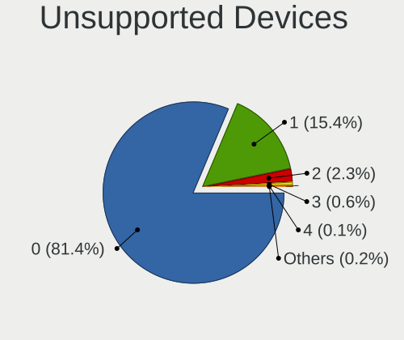

| Total | Desktops | Percent |
|-------|----------|---------|
| 0     | 4263     | 81.35%  |
| 1     | 807      | 15.4%   |
| 2     | 121      | 2.31%   |
| 3     | 34       | 0.65%   |
| 4     | 7        | 0.13%   |
| 5     | 3        | 0.06%   |
| 7     | 2        | 0.04%   |
| 6     | 2        | 0.04%   |
| 8     | 1        | 0.02%   |

Unsupported Device Types
------------------------

Types of unsupported devices

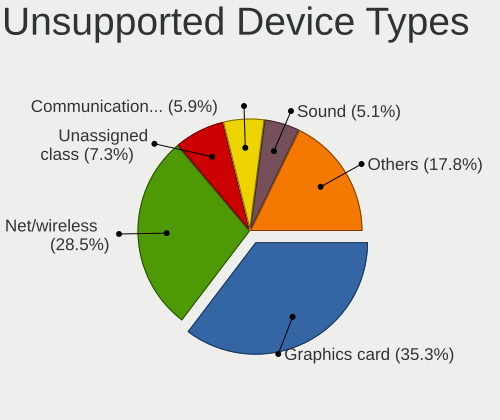

| Type                     | Desktops | Percent |
|--------------------------|----------|---------|
| Graphics card            | 393      | 35.34%  |
| Net/wireless             | 317      | 28.51%  |
| Unassigned class         | 81       | 7.28%   |
| Communication controller | 66       | 5.94%   |
| Sound                    | 57       | 5.13%   |
| Multimedia controller    | 44       | 3.96%   |
| Fingerprint reader       | 26       | 2.34%   |
| Bluetooth                | 24       | 2.16%   |
| Camera                   | 22       | 1.98%   |
| Net/ethernet             | 19       | 1.71%   |
| Network                  | 17       | 1.53%   |
| Storage/raid             | 15       | 1.35%   |
| Chipcard                 | 13       | 1.17%   |
| Modem                    | 4        | 0.36%   |
| Firewire controller      | 3        | 0.27%   |
| Card reader              | 3        | 0.27%   |
| Tv card                  | 2        | 0.18%   |
| Storage/ide              | 2        | 0.18%   |
| Unclassified device      | 1        | 0.09%   |
| Storage/ata              | 1        | 0.09%   |
| Storage                  | 1        | 0.09%   |
| Dvb card                 | 1        | 0.09%   |

