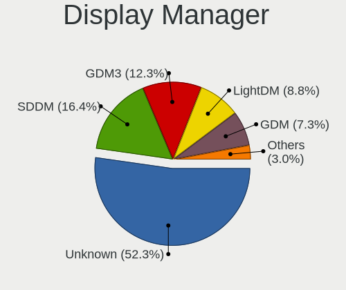
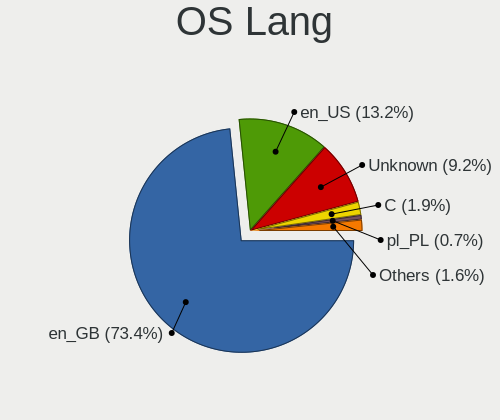
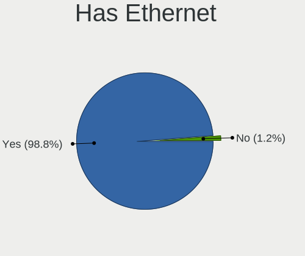
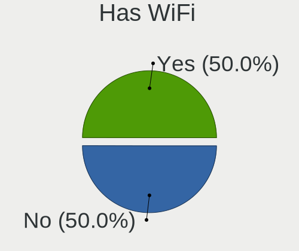
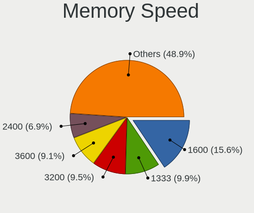

Linux in UK - Tested Hardware & Statistics (Desktops)
-----------------------------------------------------

A project to collect tested hardware configurations for Linux in UK.

Anyone can contribute to this report by the [hw-probe](https://github.com/linuxhw/hw-probe) tool:

    sudo -E hw-probe -all -upload

Please contribute! Especially if your hardware is rare.

Contents
--------

* [ Test Cases ](#test-cases)

* [ System ](#system)
  - [ OS                       ](#os)
  - [ OS Family                ](#os-family)
  - [ Kernel                   ](#kernel)
  - [ Kernel Family            ](#kernel-family)
  - [ Kernel Major Ver.        ](#kernel-major-ver)
  - [ Arch                     ](#arch)
  - [ DE                       ](#de)
  - [ Display Server           ](#display-server)
  - [ Display Manager          ](#display-manager)
  - [ OS Lang                  ](#os-lang)
  - [ Boot Mode                ](#boot-mode)
  - [ Filesystem               ](#filesystem)
  - [ Part. scheme             ](#part-scheme)
  - [ Dual Boot with Linux/BSD ](#dual-boot-with-linuxbsd)
  - [ Dual Boot (Win)          ](#dual-boot-win)

* [ Board ](#board)
  - [ Vendor                   ](#vendor)
  - [ Model                    ](#model)
  - [ Model Family             ](#model-family)
  - [ MFG Year                 ](#mfg-year)
  - [ Form Factor              ](#form-factor)
  - [ Secure Boot              ](#secure-boot)
  - [ Coreboot                 ](#coreboot)
  - [ RAM Size                 ](#ram-size)
  - [ RAM Used                 ](#ram-used)
  - [ Total Drives             ](#total-drives)
  - [ Has CD-ROM               ](#has-cd-rom)
  - [ Has Ethernet             ](#has-ethernet)
  - [ Has WiFi                 ](#has-wifi)
  - [ Has Bluetooth            ](#has-bluetooth)

* [ Location ](#location)
  - [ Country                  ](#country)
  - [ City                     ](#city)

* [ Drives ](#drives)
  - [ Drive Vendor             ](#drive-vendor)
  - [ Drive Model              ](#drive-model)
  - [ HDD Vendor               ](#hdd-vendor)
  - [ SSD Vendor               ](#ssd-vendor)
  - [ Drive Kind               ](#drive-kind)
  - [ Drive Connector          ](#drive-connector)
  - [ Drive Size               ](#drive-size)
  - [ Space Total              ](#space-total)
  - [ Space Used               ](#space-used)
  - [ Malfunc. Drives          ](#malfunc-drives)
  - [ Malfunc. Drive Vendor    ](#malfunc-drive-vendor)
  - [ Malfunc. HDD Vendor      ](#malfunc-hdd-vendor)
  - [ Malfunc. Drive Kind      ](#malfunc-drive-kind)
  - [ Failed Drives            ](#failed-drives)
  - [ Failed Drive Vendor      ](#failed-drive-vendor)
  - [ Drive Status             ](#drive-status)

* [ Storage controller ](#storage-controller)
  - [ Storage Vendor           ](#storage-vendor)
  - [ Storage Model            ](#storage-model)
  - [ Storage Kind             ](#storage-kind)

* [ Processor ](#processor)
  - [ CPU Vendor               ](#cpu-vendor)
  - [ CPU Model                ](#cpu-model)
  - [ CPU Model Family         ](#cpu-model-family)
  - [ CPU Cores                ](#cpu-cores)
  - [ CPU Sockets              ](#cpu-sockets)
  - [ CPU Threads              ](#cpu-threads)
  - [ CPU Op-Modes             ](#cpu-op-modes)
  - [ CPU Microcode            ](#cpu-microcode)
  - [ CPU Microarch            ](#cpu-microarch)

* [ Graphics ](#graphics)
  - [ GPU Vendor               ](#gpu-vendor)
  - [ GPU Model                ](#gpu-model)
  - [ GPU Combo                ](#gpu-combo)
  - [ GPU Driver               ](#gpu-driver)
  - [ GPU Memory               ](#gpu-memory)

* [ Monitor ](#monitor)
  - [ Monitor Vendor           ](#monitor-vendor)
  - [ Monitor Model            ](#monitor-model)
  - [ Monitor Resolution       ](#monitor-resolution)
  - [ Monitor Diagonal         ](#monitor-diagonal)
  - [ Monitor Width            ](#monitor-width)
  - [ Aspect Ratio             ](#aspect-ratio)
  - [ Monitor Area             ](#monitor-area)
  - [ Pixel Density            ](#pixel-density)
  - [ Multiple Monitors        ](#multiple-monitors)

* [ Network ](#network)
  - [ Net Controller Vendor    ](#net-controller-vendor)
  - [ Net Controller Model     ](#net-controller-model)
  - [ Wireless Vendor          ](#wireless-vendor)
  - [ Wireless Model           ](#wireless-model)
  - [ Ethernet Vendor          ](#ethernet-vendor)
  - [ Ethernet Model           ](#ethernet-model)
  - [ Net Controller Kind      ](#net-controller-kind)
  - [ Used Controller          ](#used-controller)
  - [ NICs                     ](#nics)
  - [ IPv6                     ](#ipv6)

* [ Bluetooth ](#bluetooth)
  - [ Bluetooth Vendor         ](#bluetooth-vendor)
  - [ Bluetooth Model          ](#bluetooth-model)

* [ Sound ](#sound)
  - [ Sound Vendor             ](#sound-vendor)
  - [ Sound Model              ](#sound-model)

* [ Memory ](#memory)
  - [ Memory Vendor            ](#memory-vendor)
  - [ Memory Model             ](#memory-model)
  - [ Memory Kind              ](#memory-kind)
  - [ Memory Form Factor       ](#memory-form-factor)
  - [ Memory Size              ](#memory-size)
  - [ Memory Speed             ](#memory-speed)

* [ Printers & scanners ](#printers--scanners)
  - [ Printer Vendor           ](#printer-vendor)
  - [ Printer Model            ](#printer-model)
  - [ Scanner Vendor           ](#scanner-vendor)
  - [ Scanner Model            ](#scanner-model)

* [ Camera ](#camera)
  - [ Camera Vendor            ](#camera-vendor)
  - [ Camera Model             ](#camera-model)

* [ Security ](#security)
  - [ Fingerprint Vendor       ](#fingerprint-vendor)
  - [ Fingerprint Model        ](#fingerprint-model)
  - [ Chipcard Vendor          ](#chipcard-vendor)
  - [ Chipcard Model           ](#chipcard-model)

* [ Unsupported ](#unsupported)
  - [ Unsupported Devices      ](#unsupported-devices)
  - [ Unsupported Device Types ](#unsupported-device-types)

Test Cases
----------

Total: 6453

| Vendor        | Model                       | Probe                                                      | Date         |
|---------------|-----------------------------|------------------------------------------------------------|--------------|
| BESSTAR Te... | HM80                        | [84decd497d](https://linux-hardware.org/?probe=84decd497d) | Jan 06, 2025 |
| MSI           | B650 GAMING PLUS WIFI       | [1ff9c9f7cb](https://linux-hardware.org/?probe=1ff9c9f7cb) | Jan 06, 2025 |
| ASUSTek       | PRIME B660M-A WIFI D4       | [f8371d3425](https://linux-hardware.org/?probe=f8371d3425) | Jan 05, 2025 |
| MSI           | B450M MORTAR MAX            | [46e01ddb23](https://linux-hardware.org/?probe=46e01ddb23) | Jan 05, 2025 |
| Gigabyte      | B650M AORUS ELITE AX        | [e0e8e3f7e0](https://linux-hardware.org/?probe=e0e8e3f7e0) | Jan 04, 2025 |
| Gigabyte      | MZBSWMP-00                  | [f24a8a2441](https://linux-hardware.org/?probe=f24a8a2441) | Jan 04, 2025 |
| Gigabyte      | B550M DS3H                  | [675c306b51](https://linux-hardware.org/?probe=675c306b51) | Jan 03, 2025 |
| ASUSTek       | PRIME X570-P                | [d19c6cfd10](https://linux-hardware.org/?probe=d19c6cfd10) | Jan 03, 2025 |
| ASUSTek       | ROG STRIX Z790-F GAMING ... | [e8f18de27b](https://linux-hardware.org/?probe=e8f18de27b) | Jan 03, 2025 |
| Dell          | 0NC2VH A01                  | [42baf9ae55](https://linux-hardware.org/?probe=42baf9ae55) | Jan 03, 2025 |
| HP            | ProLiant MicroServer        | [f99b996d05](https://linux-hardware.org/?probe=f99b996d05) | Jan 02, 2025 |
| MACHINIST     | E5-MR9A V1.0                | [302d708c3c](https://linux-hardware.org/?probe=302d708c3c) | Jan 02, 2025 |
| HP            | ProLiant MicroServer        | [74107b78f7](https://linux-hardware.org/?probe=74107b78f7) | Jan 02, 2025 |
| Dell          | 0PU052                      | [5dbb155ab6](https://linux-hardware.org/?probe=5dbb155ab6) | Jan 02, 2025 |
| Gigabyte      | B550 AORUS ELITE AX V2      | [8f4880d03e](https://linux-hardware.org/?probe=8f4880d03e) | Jan 02, 2025 |
| Gigabyte      | B550 AORUS ELITE AX V2      | [f85dcfe010](https://linux-hardware.org/?probe=f85dcfe010) | Jan 02, 2025 |
| Gigabyte      | B365M DS3H                  | [a49fde4df3](https://linux-hardware.org/?probe=a49fde4df3) | Jan 02, 2025 |
| MSI           | X470 GAMING PRO CARBON      | [0a1f200989](https://linux-hardware.org/?probe=0a1f200989) | Jan 01, 2025 |
| ASUSTek       | P5G41T-M LX2/GB             | [61c106bd12](https://linux-hardware.org/?probe=61c106bd12) | Dec 30, 2024 |
| BESSTAR Te... | HM80                        | [6762cc7f0e](https://linux-hardware.org/?probe=6762cc7f0e) | Dec 30, 2024 |
| Gigabyte      | Z68X-UD3-B3                 | [519bca1a90](https://linux-hardware.org/?probe=519bca1a90) | Dec 30, 2024 |
| Dell          | 0K240Y A02                  | [bf8d86985d](https://linux-hardware.org/?probe=bf8d86985d) | Dec 30, 2024 |
| Lenovo        | 3328 SDK0T76463 WIN 3422... | [4dde6cad5a](https://linux-hardware.org/?probe=4dde6cad5a) | Dec 30, 2024 |
| HP            | 8906 SMVB                   | [c7a78e601d](https://linux-hardware.org/?probe=c7a78e601d) | Dec 29, 2024 |
| Dell          | 0XCR8D A03                  | [77abfbec81](https://linux-hardware.org/?probe=77abfbec81) | Dec 29, 2024 |
| MSI           | X470 GAMING PRO CARBON      | [6ec37ed4b3](https://linux-hardware.org/?probe=6ec37ed4b3) | Dec 29, 2024 |
| Shenzhen M... | AHWSA                       | [170e260a3f](https://linux-hardware.org/?probe=170e260a3f) | Dec 28, 2024 |
| Dell          | 0JP3NX A01                  | [b123c88223](https://linux-hardware.org/?probe=b123c88223) | Dec 27, 2024 |
| Dell          | 0JP3NX A01                  | [84b0bca79f](https://linux-hardware.org/?probe=84b0bca79f) | Dec 27, 2024 |
| HP            | 212B                        | [0f306fdade](https://linux-hardware.org/?probe=0f306fdade) | Dec 26, 2024 |
| ASUSTek       | SABERTOOTH X99              | [a4baa76691](https://linux-hardware.org/?probe=a4baa76691) | Dec 26, 2024 |
| ASUSTek       | Z170-A                      | [96e5e9d5fd](https://linux-hardware.org/?probe=96e5e9d5fd) | Dec 26, 2024 |
| MSI           | B450 TOMAHAWK MAX II        | [9f6237983d](https://linux-hardware.org/?probe=9f6237983d) | Dec 25, 2024 |
| ASUSTek       | ROG STRIX B550-F GAMING     | [edc0d78348](https://linux-hardware.org/?probe=edc0d78348) | Dec 25, 2024 |
| AMD           | Pumori CRB                  | [5f646677b2](https://linux-hardware.org/?probe=5f646677b2) | Dec 24, 2024 |
| ASUSTek       | ROG STRIX B550-F GAMING     | [beb32e86ef](https://linux-hardware.org/?probe=beb32e86ef) | Dec 24, 2024 |
| Supermicro    | X13SCH-SYS                  | [4291b9f111](https://linux-hardware.org/?probe=4291b9f111) | Dec 24, 2024 |
| Supermicro    | X13SCH-SYS                  | [e8b89f7b32](https://linux-hardware.org/?probe=e8b89f7b32) | Dec 24, 2024 |
| Supermicro    | X13SCH-SYS                  | [1f136d48ed](https://linux-hardware.org/?probe=1f136d48ed) | Dec 24, 2024 |
| HP            | 304Bh                       | [a578f26b30](https://linux-hardware.org/?probe=a578f26b30) | Dec 24, 2024 |
| Acer          | Predator PO3-600 V:1.1      | [8473ea95de](https://linux-hardware.org/?probe=8473ea95de) | Dec 23, 2024 |
| Lenovo        | Bantry CRB 31900002 WIN ... | [2a9d2d981b](https://linux-hardware.org/?probe=2a9d2d981b) | Dec 23, 2024 |
| ASUSTek       | ROG STRIX B650E-I GAMING... | [f34d1131ed](https://linux-hardware.org/?probe=f34d1131ed) | Dec 23, 2024 |
| ASUSTek       | TUF Gaming B650-PLUS        | [e83481000e](https://linux-hardware.org/?probe=e83481000e) | Dec 22, 2024 |
| HP            | 3397                        | [d72e973be9](https://linux-hardware.org/?probe=d72e973be9) | Dec 22, 2024 |
| ASUSTek       | ROG STRIX X870E-E GAMING... | [92c5acc84f](https://linux-hardware.org/?probe=92c5acc84f) | Dec 22, 2024 |
| ASUSTek       | M5A78L-M LE                 | [c510ddb2e2](https://linux-hardware.org/?probe=c510ddb2e2) | Dec 22, 2024 |
| ASUSTek       | ROG STRIX X370-F GAMING     | [a1e3da32e8](https://linux-hardware.org/?probe=a1e3da32e8) | Dec 22, 2024 |
| Fujitsu       | D2990-A2 S26361-D2990-A2    | [f6869ae032](https://linux-hardware.org/?probe=f6869ae032) | Dec 21, 2024 |
| Gigabyte      | B550 AORUS ELITE AX V2      | [7519002463](https://linux-hardware.org/?probe=7519002463) | Dec 21, 2024 |
| Gigabyte      | B550 AORUS ELITE AX V2      | [ec4fbed784](https://linux-hardware.org/?probe=ec4fbed784) | Dec 21, 2024 |
| Dell          | 0M863N A01                  | [6c1814a9f9](https://linux-hardware.org/?probe=6c1814a9f9) | Dec 20, 2024 |
| HP            | 8055                        | [549a29a030](https://linux-hardware.org/?probe=549a29a030) | Dec 20, 2024 |
| Dell          | 0JP3NX A01                  | [8675954a59](https://linux-hardware.org/?probe=8675954a59) | Dec 20, 2024 |
| HP            | 18E7                        | [1e44952230](https://linux-hardware.org/?probe=1e44952230) | Dec 19, 2024 |
| Dell          | 0WG860                      | [4c6d6d2f4d](https://linux-hardware.org/?probe=4c6d6d2f4d) | Dec 19, 2024 |
| Gigabyte      | Z97X-UD3H-CF                | [93bf226f2b](https://linux-hardware.org/?probe=93bf226f2b) | Dec 19, 2024 |
| AZW           | MINI S                      | [a357f70913](https://linux-hardware.org/?probe=a357f70913) | Dec 18, 2024 |
| ASUSTek       | TUF Gaming B550-PLUS        | [ef5de4811b](https://linux-hardware.org/?probe=ef5de4811b) | Dec 18, 2024 |
| ASRock        | B550M-ITX/ac                | [8a3a09683f](https://linux-hardware.org/?probe=8a3a09683f) | Dec 17, 2024 |
| ASUSTek       | ROG STRIX B550-A GAMING     | [6ca07fcdfb](https://linux-hardware.org/?probe=6ca07fcdfb) | Dec 17, 2024 |
| Apple         | Mac-F221BEC8                | [7bfff86b7f](https://linux-hardware.org/?probe=7bfff86b7f) | Dec 17, 2024 |
| ASUSTek       | ROG STRIX B550-F GAMING     | [f294cbd961](https://linux-hardware.org/?probe=f294cbd961) | Dec 17, 2024 |
| MSI           | MPG B550 GAMING CARBON W... | [3893ecf2d0](https://linux-hardware.org/?probe=3893ecf2d0) | Dec 16, 2024 |
| ASUSTek       | ProArt X870E-CREATOR WIF... | [4828ed9df5](https://linux-hardware.org/?probe=4828ed9df5) | Dec 16, 2024 |
| ASUSTek       | TUF Gaming X870-PLUS WIF... | [9acf9973e2](https://linux-hardware.org/?probe=9acf9973e2) | Dec 16, 2024 |
| MSI           | PRO B650M-A WIFI            | [ea8ffcb3c8](https://linux-hardware.org/?probe=ea8ffcb3c8) | Dec 15, 2024 |
| MSI           | PRO B650M-A WIFI            | [5c0f89d5b9](https://linux-hardware.org/?probe=5c0f89d5b9) | Dec 15, 2024 |
| ASUSTek       | ROG STRIX B660-G GAMING ... | [05b354d61e](https://linux-hardware.org/?probe=05b354d61e) | Dec 15, 2024 |
| AZW           | MINI S                      | [72d625f895](https://linux-hardware.org/?probe=72d625f895) | Dec 15, 2024 |
| JGINYUE       | B650I Night Devil Ver:      | [d98b74d533](https://linux-hardware.org/?probe=d98b74d533) | Dec 15, 2024 |
| Dell          | 0VD5HY A04                  | [bfd38d2ff9](https://linux-hardware.org/?probe=bfd38d2ff9) | Dec 15, 2024 |
| Dell          | 0WG860                      | [7c259daf00](https://linux-hardware.org/?probe=7c259daf00) | Dec 14, 2024 |
| MSI           | MAG X670E TOMAHAWK WIFI     | [2e6582243b](https://linux-hardware.org/?probe=2e6582243b) | Dec 14, 2024 |
| Acer          | Aspire M1470                | [92955cff66](https://linux-hardware.org/?probe=92955cff66) | Dec 12, 2024 |
| Dell          | 0GXM1W A00                  | [c5335e493b](https://linux-hardware.org/?probe=c5335e493b) | Dec 12, 2024 |
| Dell          | 02YYK5 A00                  | [ec5c256ab3](https://linux-hardware.org/?probe=ec5c256ab3) | Dec 12, 2024 |
| Gigabyte      | B550 AORUS ELITE AX V2      | [a8e6ed60fc](https://linux-hardware.org/?probe=a8e6ed60fc) | Dec 11, 2024 |
| MSI           | PRO B760-P WIFI DDR4        | [d31df0a834](https://linux-hardware.org/?probe=d31df0a834) | Dec 11, 2024 |
| ASUSTek       | X99-S                       | [9dd3ab24cd](https://linux-hardware.org/?probe=9dd3ab24cd) | Dec 11, 2024 |
| Gigabyte      | B550M DS3H                  | [94a77ffd8f](https://linux-hardware.org/?probe=94a77ffd8f) | Dec 10, 2024 |
| Gigabyte      | B365M DS3H                  | [c57a6afba7](https://linux-hardware.org/?probe=c57a6afba7) | Dec 10, 2024 |
| Gigabyte      | B550M DS3H                  | [49dc0a4f78](https://linux-hardware.org/?probe=49dc0a4f78) | Dec 10, 2024 |
| ASUSTek       | TUF Gaming B550-PLUS        | [8b136e72e1](https://linux-hardware.org/?probe=8b136e72e1) | Dec 09, 2024 |
| ASUSTek       | Pro WS WRX80E-SAGE SE WI... | [d873aaad11](https://linux-hardware.org/?probe=d873aaad11) | Dec 09, 2024 |
| Win Elemen... | M6                          | [ece3dbe8e5](https://linux-hardware.org/?probe=ece3dbe8e5) | Dec 09, 2024 |
| Gigabyte      | B550 AORUS ELITE V2         | [ef4c34446d](https://linux-hardware.org/?probe=ef4c34446d) | Dec 08, 2024 |
| ASUSTek       | ROG Maximus X HERO          | [13abb368c7](https://linux-hardware.org/?probe=13abb368c7) | Dec 08, 2024 |
| ASRock        | X399 Taichi                 | [bcdb542f1c](https://linux-hardware.org/?probe=bcdb542f1c) | Dec 07, 2024 |
| Dell          | 0100P6 A01                  | [e6c535b6c5](https://linux-hardware.org/?probe=e6c535b6c5) | Dec 07, 2024 |
| Dell          | 0VRWRC A00                  | [e5eed30893](https://linux-hardware.org/?probe=e5eed30893) | Dec 07, 2024 |
| Gigabyte      | B550 GAMING X V2            | [0a316b6841](https://linux-hardware.org/?probe=0a316b6841) | Dec 07, 2024 |
| MSI           | X299 RAIDER                 | [f0bcb53763](https://linux-hardware.org/?probe=f0bcb53763) | Dec 07, 2024 |
| ASRock        | B550M Steel Legend          | [6f47f74e85](https://linux-hardware.org/?probe=6f47f74e85) | Dec 07, 2024 |
| Gigabyte      | B250M-DS3H-CF               | [765f860e00](https://linux-hardware.org/?probe=765f860e00) | Dec 06, 2024 |
| ASUSTek       | ROG STRIX Z490-E GAMING     | [496a116678](https://linux-hardware.org/?probe=496a116678) | Dec 06, 2024 |
| ASUSTek       | ROG STRIX B450-F GAMING ... | [7e5c438d1a](https://linux-hardware.org/?probe=7e5c438d1a) | Dec 05, 2024 |
| ASRock        | AM2NF6G-VSTA                | [566a1892c4](https://linux-hardware.org/?probe=566a1892c4) | Dec 04, 2024 |
| Inventec      | Z CLASS A02                 | [bdb8bdc00a](https://linux-hardware.org/?probe=bdb8bdc00a) | Dec 04, 2024 |
| Supermicro    | X9DRL-3F/iF                 | [cf165ddf30](https://linux-hardware.org/?probe=cf165ddf30) | Dec 03, 2024 |
| Gigabyte      | B550 AORUS ELITE V2         | [3c075a4675](https://linux-hardware.org/?probe=3c075a4675) | Dec 03, 2024 |
| Gigabyte      | A520M S2H                   | [4d622a8900](https://linux-hardware.org/?probe=4d622a8900) | Dec 03, 2024 |
| Gigabyte      | H310M H x.x                 | [0dc20f6efc](https://linux-hardware.org/?probe=0dc20f6efc) | Dec 02, 2024 |
| Lenovo        | ThinkCentre M58p 7220AVG    | [9d47a500ed](https://linux-hardware.org/?probe=9d47a500ed) | Dec 01, 2024 |
| Gigabyte      | X470 AORUS ULTRA GAMING-... | [d3c7962136](https://linux-hardware.org/?probe=d3c7962136) | Dec 01, 2024 |
| Dell          | 088DT1 A01                  | [ba38d6b924](https://linux-hardware.org/?probe=ba38d6b924) | Dec 01, 2024 |
| BESSTAR Te... | HM80                        | [329d588b3e](https://linux-hardware.org/?probe=329d588b3e) | Nov 30, 2024 |
| MSI           | MAG B550 TOMAHAWK           | [a834234236](https://linux-hardware.org/?probe=a834234236) | Nov 30, 2024 |
| ASRock        | X670E Taichi                | [e20725a706](https://linux-hardware.org/?probe=e20725a706) | Nov 30, 2024 |
| Gigabyte      | B450 AORUS ELITE            | [745588252f](https://linux-hardware.org/?probe=745588252f) | Nov 30, 2024 |
| MSI           | MPG X570 GAMING PRO CARB... | [fce79773b2](https://linux-hardware.org/?probe=fce79773b2) | Nov 29, 2024 |
| MSI           | MEG X570 UNIFY              | [c1cb2f65cb](https://linux-hardware.org/?probe=c1cb2f65cb) | Nov 29, 2024 |
| MSI           | X470 GAMING PRO CARBON      | [ea4aa1f387](https://linux-hardware.org/?probe=ea4aa1f387) | Nov 29, 2024 |
| ASUSTek       | ROG STRIX X370-F GAMING     | [95680c9fec](https://linux-hardware.org/?probe=95680c9fec) | Nov 29, 2024 |
| MSI           | B550-A PRO                  | [b8646c3e51](https://linux-hardware.org/?probe=b8646c3e51) | Nov 28, 2024 |
| MSI           | MEG X570 UNIFY              | [1a873a668f](https://linux-hardware.org/?probe=1a873a668f) | Nov 27, 2024 |
| ASUSTek       | TUF B450-PLUS GAMING        | [737048a59d](https://linux-hardware.org/?probe=737048a59d) | Nov 27, 2024 |
| ASRockRack    | X470D4U2-2T                 | [81ca96dad8](https://linux-hardware.org/?probe=81ca96dad8) | Nov 26, 2024 |
| HP            | 81C5 MVB                    | [6f9f169263](https://linux-hardware.org/?probe=6f9f169263) | Nov 26, 2024 |
| Gigabyte      | B550M DS3H                  | [7154d27150](https://linux-hardware.org/?probe=7154d27150) | Nov 25, 2024 |
| Gigabyte      | Z390 UD                     | [81652d9ab3](https://linux-hardware.org/?probe=81652d9ab3) | Nov 25, 2024 |
| MSI           | PRO Z790-P WIFI             | [a328fc2fe6](https://linux-hardware.org/?probe=a328fc2fe6) | Nov 25, 2024 |
| ASUSTek       | ROG STRIX Z490-F GAMING     | [c7f9d667fa](https://linux-hardware.org/?probe=c7f9d667fa) | Nov 25, 2024 |
| HP            | 81C5 MVB                    | [9aa92c417c](https://linux-hardware.org/?probe=9aa92c417c) | Nov 24, 2024 |
| MSI           | X470 GAMING PRO CARBON      | [2412cb727b](https://linux-hardware.org/?probe=2412cb727b) | Nov 23, 2024 |
| MSI           | MAG B650M MORTAR WIFI       | [1fda2a7642](https://linux-hardware.org/?probe=1fda2a7642) | Nov 23, 2024 |
| HP            | 845A                        | [6fcba62b48](https://linux-hardware.org/?probe=6fcba62b48) | Nov 23, 2024 |
| Biostar       | GF8200C M2+                 | [07b481323c](https://linux-hardware.org/?probe=07b481323c) | Nov 22, 2024 |
| Biostar       | GF8200C M2+                 | [8094c6177a](https://linux-hardware.org/?probe=8094c6177a) | Nov 22, 2024 |
| ASUSTek       | SABERTOOTH Z77              | [a0f8d129fd](https://linux-hardware.org/?probe=a0f8d129fd) | Nov 22, 2024 |
| Dell          | 0HD5W2 A01                  | [92e0094425](https://linux-hardware.org/?probe=92e0094425) | Nov 22, 2024 |
| MSI           | B450-A PRO MAX              | [83f630a6e3](https://linux-hardware.org/?probe=83f630a6e3) | Nov 22, 2024 |
| ASUSTek       | Z170-P                      | [814a4954e8](https://linux-hardware.org/?probe=814a4954e8) | Nov 22, 2024 |
| HP            | 1497                        | [f622e5cde1](https://linux-hardware.org/?probe=f622e5cde1) | Nov 22, 2024 |
| ASUSTek       | M5A78L-M LX3                | [29613a4747](https://linux-hardware.org/?probe=29613a4747) | Nov 22, 2024 |
| AZW           | MINI S                      | [f34d9b64c1](https://linux-hardware.org/?probe=f34d9b64c1) | Nov 22, 2024 |
| Biostar       | TA790GX A2+                 | [5175f22e13](https://linux-hardware.org/?probe=5175f22e13) | Nov 22, 2024 |
| Biostar       | TA790GX A2+                 | [6e53fc76ee](https://linux-hardware.org/?probe=6e53fc76ee) | Nov 21, 2024 |
| Lenovo        | 3768 NO DPK                 | [853c2e946f](https://linux-hardware.org/?probe=853c2e946f) | Nov 21, 2024 |
| MSI           | X470 GAMING PRO CARBON      | [8ef382c079](https://linux-hardware.org/?probe=8ef382c079) | Nov 21, 2024 |
| Dell          | 0HD5W2 A01                  | [bce97e2d1d](https://linux-hardware.org/?probe=bce97e2d1d) | Nov 21, 2024 |
| HP            | 8056                        | [3c550cfd71](https://linux-hardware.org/?probe=3c550cfd71) | Nov 21, 2024 |
| MSI           | B550-A PRO                  | [c9482feedb](https://linux-hardware.org/?probe=c9482feedb) | Nov 20, 2024 |
| Dell          | 0WMJ54 A01                  | [16f22944e3](https://linux-hardware.org/?probe=16f22944e3) | Nov 20, 2024 |
| ASUSTek       | ROG STRIX B650E-F GAMING... | [30dc93f797](https://linux-hardware.org/?probe=30dc93f797) | Nov 20, 2024 |
| Shenzhen M... | AHWSA                       | [58d4d43025](https://linux-hardware.org/?probe=58d4d43025) | Nov 20, 2024 |
| Shenzhen M... | AHBNB OEM                   | [777e9726b5](https://linux-hardware.org/?probe=777e9726b5) | Nov 20, 2024 |
| Unknown       | Unknown                     | [d33042b64f](https://linux-hardware.org/?probe=d33042b64f) | Nov 20, 2024 |
| MSI           | B450-A PRO MAX              | [d24344a88b](https://linux-hardware.org/?probe=d24344a88b) | Nov 19, 2024 |
| Dell          | 02YYK5 A00                  | [3c97d85a1b](https://linux-hardware.org/?probe=3c97d85a1b) | Nov 19, 2024 |
| Gigabyte      | TRX40 DESIGNARE             | [96735d84cb](https://linux-hardware.org/?probe=96735d84cb) | Nov 18, 2024 |
| MSI           | MAG B550 TOMAHAWK           | [571dd6599b](https://linux-hardware.org/?probe=571dd6599b) | Nov 17, 2024 |
| Gigabyte      | X670 AORUS ELITE AX         | [2c760ab64f](https://linux-hardware.org/?probe=2c760ab64f) | Nov 17, 2024 |
| MSI           | B560M PRO-VDH WIFI          | [4fe8b8ac1d](https://linux-hardware.org/?probe=4fe8b8ac1d) | Nov 16, 2024 |
| MSI           | PRO Z790-A WIFI             | [0c8044a2d4](https://linux-hardware.org/?probe=0c8044a2d4) | Nov 16, 2024 |
| HP            | 83E1                        | [55a514549a](https://linux-hardware.org/?probe=55a514549a) | Nov 16, 2024 |
| Gigabyte      | B550 AORUS ELITE V2         | [67dac8ba1a](https://linux-hardware.org/?probe=67dac8ba1a) | Nov 16, 2024 |
| Dell          | 073MMW A03                  | [715ccc808c](https://linux-hardware.org/?probe=715ccc808c) | Nov 16, 2024 |
| Dell          | 073MMW A03                  | [f7d046b276](https://linux-hardware.org/?probe=f7d046b276) | Nov 15, 2024 |
| MSI           | A320M-A PRO MAX             | [2ab5021d2a](https://linux-hardware.org/?probe=2ab5021d2a) | Nov 15, 2024 |
| ASUSTek       | Rampage II Extreme          | [83ac4d04af](https://linux-hardware.org/?probe=83ac4d04af) | Nov 15, 2024 |
| Gigabyte      | X470 AORUS ULTRA GAMING-... | [913db6a19a](https://linux-hardware.org/?probe=913db6a19a) | Nov 15, 2024 |
| Gigabyte      | B550 GAMING X V2            | [79ab287168](https://linux-hardware.org/?probe=79ab287168) | Nov 15, 2024 |
| MSI           | MEG X570 UNIFY              | [057c9f6d92](https://linux-hardware.org/?probe=057c9f6d92) | Nov 15, 2024 |
| HP            | ProLiant MicroServer        | [a18eb1e052](https://linux-hardware.org/?probe=a18eb1e052) | Nov 14, 2024 |
| Gigabyte      | X570 AORUS ELITE            | [327175be42](https://linux-hardware.org/?probe=327175be42) | Nov 13, 2024 |
| ASUSTek       | ROG STRIX B550-F GAMING     | [136a3d6103](https://linux-hardware.org/?probe=136a3d6103) | Nov 11, 2024 |
| MSI           | MAG B560M MORTAR WIFI       | [6f17b403f8](https://linux-hardware.org/?probe=6f17b403f8) | Nov 11, 2024 |
| Dell          | 08NPPY A00                  | [55c68fb44b](https://linux-hardware.org/?probe=55c68fb44b) | Nov 11, 2024 |
| Dell          | 0P01GV A03                  | [33df1e3f43](https://linux-hardware.org/?probe=33df1e3f43) | Nov 11, 2024 |
| ASUSTek       | ROG STRIX B650E-F GAMING... | [f72acbadb4](https://linux-hardware.org/?probe=f72acbadb4) | Nov 10, 2024 |
| Gigabyte      | X670 AORUS ELITE AX         | [eb4f0658cd](https://linux-hardware.org/?probe=eb4f0658cd) | Nov 09, 2024 |
| HP            | 1905                        | [02b35a093f](https://linux-hardware.org/?probe=02b35a093f) | Nov 08, 2024 |
| ASUSTek       | ROG STRIX B550-A GAMING     | [0c4a99defe](https://linux-hardware.org/?probe=0c4a99defe) | Nov 08, 2024 |
| ASUSTek       | PRIME A520M-K               | [0ee75416e7](https://linux-hardware.org/?probe=0ee75416e7) | Nov 08, 2024 |
| ASUSTek       | Z170-P                      | [a9f4c3bdab](https://linux-hardware.org/?probe=a9f4c3bdab) | Nov 08, 2024 |
| MSI           | X470 GAMING PLUS            | [95953f3019](https://linux-hardware.org/?probe=95953f3019) | Nov 08, 2024 |
| Gigabyte      | H310M H x.x                 | [e65f49d183](https://linux-hardware.org/?probe=e65f49d183) | Nov 07, 2024 |
| ASUSTek       | PRIME B650-PLUS             | [c5a85c4a6f](https://linux-hardware.org/?probe=c5a85c4a6f) | Nov 07, 2024 |
| Acer          | Aspire XC-840               | [ae1020a30f](https://linux-hardware.org/?probe=ae1020a30f) | Nov 06, 2024 |
| ASRock        | B650M-HDV/M.2               | [8825bddeb0](https://linux-hardware.org/?probe=8825bddeb0) | Nov 06, 2024 |
| Dell          | 0D02VH A01                  | [05f4bb88ff](https://linux-hardware.org/?probe=05f4bb88ff) | Nov 06, 2024 |
| Dell          | 0PU052                      | [715778241f](https://linux-hardware.org/?probe=715778241f) | Nov 05, 2024 |
| HP            | 8298                        | [ff6e607a99](https://linux-hardware.org/?probe=ff6e607a99) | Nov 05, 2024 |
| ASUSTek       | P7P55D-E                    | [e6cddc3d72](https://linux-hardware.org/?probe=e6cddc3d72) | Nov 05, 2024 |
| Gigabyte      | B450 I AORUS PRO WIFI-CF    | [d9f0d25d5f](https://linux-hardware.org/?probe=d9f0d25d5f) | Nov 05, 2024 |
| ASUSTek       | ROG STRIX Z790-F GAMING ... | [b93e8b3828](https://linux-hardware.org/?probe=b93e8b3828) | Nov 04, 2024 |
| Gigabyte      | Z77-DS3H                    | [6a09c5bd87](https://linux-hardware.org/?probe=6a09c5bd87) | Nov 04, 2024 |
| MSI           | MAG B650 TOMAHAWK WIFI      | [f0b8294d19](https://linux-hardware.org/?probe=f0b8294d19) | Nov 04, 2024 |
| Gigabyte      | Z270P-D3-CF                 | [5d9228981e](https://linux-hardware.org/?probe=5d9228981e) | Nov 04, 2024 |
| Acer          | Aspire XC-840               | [4a797f7b20](https://linux-hardware.org/?probe=4a797f7b20) | Nov 04, 2024 |
| MSI           | H410M-A PRO                 | [aef6cda20f](https://linux-hardware.org/?probe=aef6cda20f) | Nov 04, 2024 |
| MSI           | H410M-A PRO                 | [bfd3bebc8c](https://linux-hardware.org/?probe=bfd3bebc8c) | Nov 03, 2024 |
| MSI           | MAG B550 TOMAHAWK           | [2a160effed](https://linux-hardware.org/?probe=2a160effed) | Nov 03, 2024 |
| ASUSTek       | Q87M-E                      | [e45e88ac29](https://linux-hardware.org/?probe=e45e88ac29) | Nov 03, 2024 |
| Gigabyte      | X670 AORUS ELITE AX         | [0c8904d7c7](https://linux-hardware.org/?probe=0c8904d7c7) | Nov 03, 2024 |
| Dell          | 0NC2VH A01                  | [802b368b02](https://linux-hardware.org/?probe=802b368b02) | Nov 03, 2024 |
| ASUSTek       | ROG STRIX Z490-E GAMING     | [c1564b6ab8](https://linux-hardware.org/?probe=c1564b6ab8) | Nov 03, 2024 |
| Gigabyte      | X570S AORUS ELITE AX        | [1f803f9081](https://linux-hardware.org/?probe=1f803f9081) | Nov 02, 2024 |
| Gigabyte      | X570S AORUS ELITE AX        | [d0796bb407](https://linux-hardware.org/?probe=d0796bb407) | Nov 01, 2024 |
| MSI           | X470 GAMING PRO CARBON      | [d9043dc2d5](https://linux-hardware.org/?probe=d9043dc2d5) | Nov 01, 2024 |
| ASRock        | Z270 Pro4                   | [eb833701a1](https://linux-hardware.org/?probe=eb833701a1) | Oct 31, 2024 |
| MSI           | PRO Z790-P WIFI             | [b0168ae6f4](https://linux-hardware.org/?probe=b0168ae6f4) | Oct 31, 2024 |
| ASUSTek       | PRIME B650-PLUS             | [2c6943fd48](https://linux-hardware.org/?probe=2c6943fd48) | Oct 31, 2024 |
| HP            | 859B                        | [75749e37f1](https://linux-hardware.org/?probe=75749e37f1) | Oct 31, 2024 |
| Dell          | 0WR7PY A02                  | [49fc527ebf](https://linux-hardware.org/?probe=49fc527ebf) | Oct 31, 2024 |
| ASUSTek       | PRIME B450-PLUS             | [2c694b863b](https://linux-hardware.org/?probe=2c694b863b) | Oct 30, 2024 |
| Gigabyte      | B450 AORUS PRO-CF           | [c4f0ec932d](https://linux-hardware.org/?probe=c4f0ec932d) | Oct 30, 2024 |
| Gigabyte      | B450 AORUS PRO-CF           | [c453bcc368](https://linux-hardware.org/?probe=c453bcc368) | Oct 30, 2024 |
| ASRock        | A320M-HDV                   | [605574a95c](https://linux-hardware.org/?probe=605574a95c) | Oct 29, 2024 |
| Inventec      | Z CLASS A02                 | [f100f7e527](https://linux-hardware.org/?probe=f100f7e527) | Oct 29, 2024 |
| ASRock        | A320M-HDV                   | [1afede481b](https://linux-hardware.org/?probe=1afede481b) | Oct 29, 2024 |
| MSI           | MAG B650 TOMAHAWK WIFI      | [fcbbf29a16](https://linux-hardware.org/?probe=fcbbf29a16) | Oct 28, 2024 |
| Gigabyte      | X870 EAGLE WIFI7            | [f02048f788](https://linux-hardware.org/?probe=f02048f788) | Oct 28, 2024 |
| Gigabyte      | X670E AORUS PRO X           | [e1d10c7809](https://linux-hardware.org/?probe=e1d10c7809) | Oct 27, 2024 |
| ASRock        | X570S PG Riptide            | [11404c6734](https://linux-hardware.org/?probe=11404c6734) | Oct 27, 2024 |
| ASRock        | X570S PG Riptide            | [e227559e6e](https://linux-hardware.org/?probe=e227559e6e) | Oct 27, 2024 |
| Dell          | 09430Y A00                  | [7d8b519289](https://linux-hardware.org/?probe=7d8b519289) | Oct 26, 2024 |
| ASUSTek       | PRIME Z790-V AX             | [6cf269e31f](https://linux-hardware.org/?probe=6cf269e31f) | Oct 26, 2024 |
| HP            | 8056                        | [3cc6dc3879](https://linux-hardware.org/?probe=3cc6dc3879) | Oct 26, 2024 |
| Unknown       | Unknown                     | [ddcfe8c8bc](https://linux-hardware.org/?probe=ddcfe8c8bc) | Oct 26, 2024 |
| ASUSTek       | M4A89GTD-PRO/USB3           | [122c1b297b](https://linux-hardware.org/?probe=122c1b297b) | Oct 25, 2024 |
| MSI           | MPG B550 GAMING EDGE WIF... | [544658d9b3](https://linux-hardware.org/?probe=544658d9b3) | Oct 25, 2024 |
| ASUSTek       | ROG STRIX B550-I GAMING     | [b7ecba25e9](https://linux-hardware.org/?probe=b7ecba25e9) | Oct 25, 2024 |
| ASUSTek       | PRIME Z390-A                | [03f25d4aa0](https://linux-hardware.org/?probe=03f25d4aa0) | Oct 25, 2024 |
| Dell          | 096JG8 A01                  | [722bf90535](https://linux-hardware.org/?probe=722bf90535) | Oct 25, 2024 |
| Dell          | 096JG8 A01                  | [cb93482227](https://linux-hardware.org/?probe=cb93482227) | Oct 25, 2024 |
| Gigabyte      | A520M DS3H V2               | [2d2fe10015](https://linux-hardware.org/?probe=2d2fe10015) | Oct 25, 2024 |
| MSI           | PRO Z690-A DDR4             | [2ebfa3b8c4](https://linux-hardware.org/?probe=2ebfa3b8c4) | Oct 24, 2024 |
| MSI           | MPG B650 EDGE WIFI          | [2d03a71708](https://linux-hardware.org/?probe=2d03a71708) | Oct 24, 2024 |
| ASUSTek       | PRIME B760M-A WIFI D4       | [fab41d4199](https://linux-hardware.org/?probe=fab41d4199) | Oct 24, 2024 |
| Dell          | 0P01GV A03                  | [ca5b8a5982](https://linux-hardware.org/?probe=ca5b8a5982) | Oct 24, 2024 |
| ASUSTek       | PRIME Z790M-PLUS            | [33ef297188](https://linux-hardware.org/?probe=33ef297188) | Oct 24, 2024 |
| MSI           | X570-A PRO                  | [34af986c90](https://linux-hardware.org/?probe=34af986c90) | Oct 23, 2024 |
| ASUSTek       | B85M-E                      | [0750f91898](https://linux-hardware.org/?probe=0750f91898) | Oct 23, 2024 |
| ECS           | GLKD-I2                     | [0bfb2e49b4](https://linux-hardware.org/?probe=0bfb2e49b4) | Oct 23, 2024 |
| ASUSTek       | PRIME X670E-PRO WIFI        | [91a21d18a4](https://linux-hardware.org/?probe=91a21d18a4) | Oct 22, 2024 |
| MSI           | B550-A PRO                  | [f193e74093](https://linux-hardware.org/?probe=f193e74093) | Oct 22, 2024 |
| ASUSTek       | TUF Gaming X570-PRO         | [c4cd814f22](https://linux-hardware.org/?probe=c4cd814f22) | Oct 22, 2024 |
| ASUSTek       | M4A89GTD-PRO/USB3           | [e7e05c7d64](https://linux-hardware.org/?probe=e7e05c7d64) | Oct 22, 2024 |
| MSI           | X470 GAMING PLUS            | [ef704f4563](https://linux-hardware.org/?probe=ef704f4563) | Oct 21, 2024 |
| HP            | 89B5 A                      | [9c683ac116](https://linux-hardware.org/?probe=9c683ac116) | Oct 21, 2024 |
| Gigabyte      | B550M DS3H                  | [5be190671f](https://linux-hardware.org/?probe=5be190671f) | Oct 21, 2024 |
| MSI           | MPG B650 EDGE WIFI          | [d86b5ef934](https://linux-hardware.org/?probe=d86b5ef934) | Oct 21, 2024 |
| MSI           | G41TM-P31                   | [4a0f7d5481](https://linux-hardware.org/?probe=4a0f7d5481) | Oct 21, 2024 |
| ECS           | GeForce6100PM-M2            | [ba0d87fee9](https://linux-hardware.org/?probe=ba0d87fee9) | Oct 21, 2024 |
| Gigabyte      | B450M GAMING                | [c2c4b8de25](https://linux-hardware.org/?probe=c2c4b8de25) | Oct 20, 2024 |
| HP            | 1905                        | [688122fc21](https://linux-hardware.org/?probe=688122fc21) | Oct 19, 2024 |
| Gigabyte      | X570 AORUS ELITE            | [1517e4e467](https://linux-hardware.org/?probe=1517e4e467) | Oct 19, 2024 |
| ASRock        | Z87 Extreme4                | [aadb366598](https://linux-hardware.org/?probe=aadb366598) | Oct 19, 2024 |
| Apple         | Mac-F221BEC8                | [3fe9aff632](https://linux-hardware.org/?probe=3fe9aff632) | Oct 19, 2024 |
| ASUSTek       | PRIME B550M-K               | [1af65cb620](https://linux-hardware.org/?probe=1af65cb620) | Oct 19, 2024 |
| Apple         | Mac-F221BEC8                | [4d690686b2](https://linux-hardware.org/?probe=4d690686b2) | Oct 18, 2024 |
| Gigabyte      | Z490 AORUS ELITE AC         | [072f15df81](https://linux-hardware.org/?probe=072f15df81) | Oct 18, 2024 |
| ASUSTek       | ROG STRIX Z490-E GAMING     | [9e7a13a9ec](https://linux-hardware.org/?probe=9e7a13a9ec) | Oct 18, 2024 |
| ASUSTek       | ROG STRIX Z490-E GAMING     | [a2ee249f8b](https://linux-hardware.org/?probe=a2ee249f8b) | Oct 17, 2024 |
| ASUSTek       | PRIME B450M-K II            | [6bd60915e3](https://linux-hardware.org/?probe=6bd60915e3) | Oct 17, 2024 |
| AZW           | MINI S                      | [bc0bd0e50a](https://linux-hardware.org/?probe=bc0bd0e50a) | Oct 16, 2024 |
| Lenovo        | SHARKBAY NOK                | [8764f71376](https://linux-hardware.org/?probe=8764f71376) | Oct 15, 2024 |
| Gigabyte      | H310M H x.x                 | [bae4e2cea5](https://linux-hardware.org/?probe=bae4e2cea5) | Oct 15, 2024 |
| MSI           | B250M PRO-VDH               | [6800ef729e](https://linux-hardware.org/?probe=6800ef729e) | Oct 14, 2024 |
| ASRock        | B550 PG Riptide             | [79f316cb2d](https://linux-hardware.org/?probe=79f316cb2d) | Oct 14, 2024 |
| Unknown       | Unknown                     | [e628f4d4cb](https://linux-hardware.org/?probe=e628f4d4cb) | Oct 14, 2024 |
| MSI           | MPG B550 GAMING PLUS        | [3f6c1aa9d4](https://linux-hardware.org/?probe=3f6c1aa9d4) | Oct 14, 2024 |
| ASUSTek       | TUF Gaming B650-PLUS WIF... | [8cbc4ad7e7](https://linux-hardware.org/?probe=8cbc4ad7e7) | Oct 14, 2024 |
| HP            | 0A04h                       | [7ea9e99abb](https://linux-hardware.org/?probe=7ea9e99abb) | Oct 14, 2024 |
| Lenovo        | ThinkCentre M91p 4524W1K    | [8336e2d523](https://linux-hardware.org/?probe=8336e2d523) | Oct 13, 2024 |
| ASUSTek       | PRIME H510M-A               | [10344dbe2e](https://linux-hardware.org/?probe=10344dbe2e) | Oct 13, 2024 |
| Gigabyte      | B550I AORUS PRO AX          | [9e89e0d62c](https://linux-hardware.org/?probe=9e89e0d62c) | Oct 12, 2024 |
| Gigabyte      | B650I AX                    | [be7d845a8d](https://linux-hardware.org/?probe=be7d845a8d) | Oct 12, 2024 |
| ASUSTek       | PRIME H310M-R R2.0          | [700a309817](https://linux-hardware.org/?probe=700a309817) | Oct 12, 2024 |
| ASUSTek       | PRIME H310M-R R2.0          | [57aa3bcdd4](https://linux-hardware.org/?probe=57aa3bcdd4) | Oct 12, 2024 |
| Gigabyte      | X570 AORUS ULTRA            | [25a6d436a9](https://linux-hardware.org/?probe=25a6d436a9) | Oct 11, 2024 |
| ASUSTek       | PRIME B450M-A II            | [5b10354b76](https://linux-hardware.org/?probe=5b10354b76) | Oct 11, 2024 |
| Gigabyte      | X570 AORUS ULTRA            | [4a3a5090d1](https://linux-hardware.org/?probe=4a3a5090d1) | Oct 11, 2024 |
| ASUSTek       | PRIME Z370-A                | [daf9be143c](https://linux-hardware.org/?probe=daf9be143c) | Oct 11, 2024 |
| MSI           | MAG Z690 TOMAHAWK WIFI D... | [280e815020](https://linux-hardware.org/?probe=280e815020) | Oct 10, 2024 |
| ASUSTek       | ROG STRIX X670E-I GAMING... | [51818e978a](https://linux-hardware.org/?probe=51818e978a) | Oct 09, 2024 |
| ASUSTek       | PRIME Z590-A                | [87d6b9ea2a](https://linux-hardware.org/?probe=87d6b9ea2a) | Oct 09, 2024 |
| Gigabyte      | B550I AORUS PRO AX          | [992478ad99](https://linux-hardware.org/?probe=992478ad99) | Oct 09, 2024 |
| Gigabyte      | B550I AORUS PRO AX          | [7ee5755291](https://linux-hardware.org/?probe=7ee5755291) | Oct 09, 2024 |
| Gigabyte      | Z170-Gaming K3              | [b1b80de039](https://linux-hardware.org/?probe=b1b80de039) | Oct 08, 2024 |
| Lenovo        | 1066 NOK                    | [197f6c315a](https://linux-hardware.org/?probe=197f6c315a) | Oct 07, 2024 |
| ASUSTek       | ROG STRIX X670E-E GAMING... | [c47b6f3b03](https://linux-hardware.org/?probe=c47b6f3b03) | Oct 07, 2024 |
| ASUSTek       | ROG STRIX X670E-E GAMING... | [591dc011b4](https://linux-hardware.org/?probe=591dc011b4) | Oct 07, 2024 |
| Gigabyte      | GA-990X-Gaming SLI-CF       | [4d326b7674](https://linux-hardware.org/?probe=4d326b7674) | Oct 07, 2024 |
| Gigabyte      | GA-990X-Gaming SLI-CF       | [95d79048ca](https://linux-hardware.org/?probe=95d79048ca) | Oct 07, 2024 |
| ASUSTek       | PRIME B450M-K II            | [3f9e4d3cd2](https://linux-hardware.org/?probe=3f9e4d3cd2) | Oct 06, 2024 |
| Gigabyte      | B450 AORUS M                | [6dcbefdc51](https://linux-hardware.org/?probe=6dcbefdc51) | Oct 06, 2024 |
| ASUSTek       | M4A87TD/USB3                | [fb9c9f4215](https://linux-hardware.org/?probe=fb9c9f4215) | Oct 06, 2024 |
| HP            | 212B                        | [9633c45e85](https://linux-hardware.org/?probe=9633c45e85) | Oct 05, 2024 |
| ASUSTek       | ROG STRIX B550-F GAMING     | [da1eba59d9](https://linux-hardware.org/?probe=da1eba59d9) | Oct 05, 2024 |
| ASRock        | X370 Killer SLI             | [70467ef34d](https://linux-hardware.org/?probe=70467ef34d) | Oct 05, 2024 |
| MSI           | X470 GAMING PRO CARBON      | [a6f1e4b465](https://linux-hardware.org/?probe=a6f1e4b465) | Oct 05, 2024 |
| HP            | 8299                        | [5424f37e2d](https://linux-hardware.org/?probe=5424f37e2d) | Oct 05, 2024 |
| Dell          | 03RT16 A00                  | [64aac2f712](https://linux-hardware.org/?probe=64aac2f712) | Oct 05, 2024 |
| ASRock        | B450 Pro4                   | [e388b60674](https://linux-hardware.org/?probe=e388b60674) | Oct 05, 2024 |
| Gigabyte      | B450M GAMING                | [5a7e21c336](https://linux-hardware.org/?probe=5a7e21c336) | Oct 04, 2024 |
| ASUSTek       | PRIME Z790M-PLUS            | [08670414fe](https://linux-hardware.org/?probe=08670414fe) | Oct 04, 2024 |
| Gigabyte      | B450M GAMING                | [09718bd83a](https://linux-hardware.org/?probe=09718bd83a) | Oct 04, 2024 |
| MSI           | MAG X570 TOMAHAWK WIFI      | [1abd4662b5](https://linux-hardware.org/?probe=1abd4662b5) | Oct 04, 2024 |
| Lenovo        | SHARKBAY NOK                | [878a868d96](https://linux-hardware.org/?probe=878a868d96) | Oct 04, 2024 |
| ASRock        | B650E Steel Legend WiFi     | [5352ac4a44](https://linux-hardware.org/?probe=5352ac4a44) | Oct 04, 2024 |
| ASUSTek       | Pro WS TRX50-SAGE WIFI      | [129ec6b984](https://linux-hardware.org/?probe=129ec6b984) | Oct 04, 2024 |
| ASRock        | TRX40 Creator               | [25fbbdb6f6](https://linux-hardware.org/?probe=25fbbdb6f6) | Oct 03, 2024 |
| HP            | 158A                        | [5ef07c2202](https://linux-hardware.org/?probe=5ef07c2202) | Oct 03, 2024 |
| HP            | 158A                        | [d23ba5cf96](https://linux-hardware.org/?probe=d23ba5cf96) | Oct 03, 2024 |
| Acer          | FIH57                       | [b5f488ca02](https://linux-hardware.org/?probe=b5f488ca02) | Oct 02, 2024 |
| ASUSTek       | Q87M-E                      | [21cda763c8](https://linux-hardware.org/?probe=21cda763c8) | Oct 02, 2024 |
| Intel         | HM570                       | [cd0df994f6](https://linux-hardware.org/?probe=cd0df994f6) | Oct 02, 2024 |
| Intel         | X79 (INTEL Xeon E5/Corei... | [7f1be258a1](https://linux-hardware.org/?probe=7f1be258a1) | Oct 02, 2024 |
| ASRock        | Z790 Pro RS/D4              | [fbe99fdf47](https://linux-hardware.org/?probe=fbe99fdf47) | Oct 02, 2024 |
| ASUSTek       | PRIME X570-PRO              | [bc7fdf7279](https://linux-hardware.org/?probe=bc7fdf7279) | Oct 01, 2024 |
| ASRock        | A320M Pro4-F                | [afe4fe8ec5](https://linux-hardware.org/?probe=afe4fe8ec5) | Oct 01, 2024 |
| ASRock        | A320M Pro4-F                | [b1afeb5cb3](https://linux-hardware.org/?probe=b1afeb5cb3) | Oct 01, 2024 |
| MSI           | B550M PRO-VDH WIFI          | [6e019fd901](https://linux-hardware.org/?probe=6e019fd901) | Sep 30, 2024 |
| MSI           | MPG B650 EDGE WIFI          | [f3244d0419](https://linux-hardware.org/?probe=f3244d0419) | Sep 30, 2024 |
| Gigabyte      | B85-HD3                     | [7b518dcbc1](https://linux-hardware.org/?probe=7b518dcbc1) | Sep 29, 2024 |
| Acer          | Nitro N50-620               | [3271c3b752](https://linux-hardware.org/?probe=3271c3b752) | Sep 29, 2024 |
| HP            | 18E5                        | [e1758fc5c4](https://linux-hardware.org/?probe=e1758fc5c4) | Sep 29, 2024 |
| Gigabyte      | B85-HD3                     | [1f52e1a158](https://linux-hardware.org/?probe=1f52e1a158) | Sep 29, 2024 |
| Lenovo        | SHARKBAY NO DPK             | [28d2042fa4](https://linux-hardware.org/?probe=28d2042fa4) | Sep 28, 2024 |
| ASRock        | X670E Taichi                | [38c09012e1](https://linux-hardware.org/?probe=38c09012e1) | Sep 27, 2024 |
| HP            | 212B                        | [b32272f4b6](https://linux-hardware.org/?probe=b32272f4b6) | Sep 27, 2024 |
| ASUSTek       | Pro WS TRX50-SAGE WIFI      | [fda12e45a5](https://linux-hardware.org/?probe=fda12e45a5) | Sep 27, 2024 |
| Intel         | IPC-ADN2L                   | [7aaa04ef0f](https://linux-hardware.org/?probe=7aaa04ef0f) | Sep 27, 2024 |
| MSI           | H410M-A PRO                 | [13cba33fe8](https://linux-hardware.org/?probe=13cba33fe8) | Sep 25, 2024 |
| Gigabyte      | A320M-H-CF                  | [7c192b9025](https://linux-hardware.org/?probe=7c192b9025) | Sep 25, 2024 |
| ASUSTek       | PRIME B350-PLUS             | [9b3981618d](https://linux-hardware.org/?probe=9b3981618d) | Sep 25, 2024 |
| ASUSTek       | PRIME B350-PLUS             | [8b349a041b](https://linux-hardware.org/?probe=8b349a041b) | Sep 25, 2024 |
| ASUSTek       | PRIME B550-PLUS             | [5dd2d607b6](https://linux-hardware.org/?probe=5dd2d607b6) | Sep 24, 2024 |
| ASUSTek       | M4A89GTD-PRO/USB3           | [0a94539557](https://linux-hardware.org/?probe=0a94539557) | Sep 24, 2024 |
| Acer          | FIH57                       | [d281d08f5b](https://linux-hardware.org/?probe=d281d08f5b) | Sep 24, 2024 |
| MACHINIST     | E5-MR9S V1.0                | [334e949999](https://linux-hardware.org/?probe=334e949999) | Sep 24, 2024 |
| MSI           | PRO Z690-A                  | [ff4b5a3e3d](https://linux-hardware.org/?probe=ff4b5a3e3d) | Sep 24, 2024 |
| MSI           | MAG B550 TOMAHAWK           | [854c1d4b3a](https://linux-hardware.org/?probe=854c1d4b3a) | Sep 24, 2024 |
| Gigabyte      | GA-78LMT-USB3               | [1e4a64e920](https://linux-hardware.org/?probe=1e4a64e920) | Sep 23, 2024 |
| Gigabyte      | B550 AORUS PRO AC           | [7c31f00b6d](https://linux-hardware.org/?probe=7c31f00b6d) | Sep 23, 2024 |
| MSI           | B450 GAMING PLUS MAX        | [7e5ac90a81](https://linux-hardware.org/?probe=7e5ac90a81) | Sep 23, 2024 |
| Gigabyte      | 970A-DS3P                   | [b5cff39380](https://linux-hardware.org/?probe=b5cff39380) | Sep 23, 2024 |
| ASUSTek       | TUF Gaming B550-PLUS WIF... | [3943663520](https://linux-hardware.org/?probe=3943663520) | Sep 22, 2024 |
| Gigabyte      | B550 GAMING X V2            | [44e17a96c2](https://linux-hardware.org/?probe=44e17a96c2) | Sep 22, 2024 |
| ASUSTek       | PRIME Z270-P                | [f13d62356a](https://linux-hardware.org/?probe=f13d62356a) | Sep 22, 2024 |
| Gigabyte      | 970A-DS3P                   | [8ee1bad547](https://linux-hardware.org/?probe=8ee1bad547) | Sep 22, 2024 |
| ASRock        | AB350 Gaming-ITX/ac         | [bd1e851da7](https://linux-hardware.org/?probe=bd1e851da7) | Sep 22, 2024 |
| Gigabyte      | H310M H x.x                 | [a8b3838f38](https://linux-hardware.org/?probe=a8b3838f38) | Sep 22, 2024 |
| AZW           | MINI S                      | [ba5ec1c07b](https://linux-hardware.org/?probe=ba5ec1c07b) | Sep 22, 2024 |
| HP            | 8350                        | [e19d087c6d](https://linux-hardware.org/?probe=e19d087c6d) | Sep 22, 2024 |
| HP            | 158B                        | [0d647c016a](https://linux-hardware.org/?probe=0d647c016a) | Sep 21, 2024 |
| ASUSTek       | TUF Gaming A520M-PLUS II    | [092d86fe18](https://linux-hardware.org/?probe=092d86fe18) | Sep 21, 2024 |
| Gigabyte      | Z270X-UD3-CF                | [4ce74710e0](https://linux-hardware.org/?probe=4ce74710e0) | Sep 21, 2024 |
| Gigabyte      | Z270X-UD3-CF                | [81c8c2dd33](https://linux-hardware.org/?probe=81c8c2dd33) | Sep 21, 2024 |
| Gigabyte      | A320M-S2H-CF                | [1a65b79c49](https://linux-hardware.org/?probe=1a65b79c49) | Sep 20, 2024 |
| Gigabyte      | A320M-S2H-CF                | [04ce3b5ab8](https://linux-hardware.org/?probe=04ce3b5ab8) | Sep 20, 2024 |
| Lenovo        | NO DPK                      | [55c567c63a](https://linux-hardware.org/?probe=55c567c63a) | Sep 20, 2024 |
| ASUSTek       | TUF Gaming B650-E WIFI      | [cbdf576f50](https://linux-hardware.org/?probe=cbdf576f50) | Sep 19, 2024 |
| HP            | 8061                        | [64bbbb7c61](https://linux-hardware.org/?probe=64bbbb7c61) | Sep 17, 2024 |
| ASUSTek       | TUF Gaming X570-PLUS        | [3248ed31c8](https://linux-hardware.org/?probe=3248ed31c8) | Sep 17, 2024 |
| Gigabyte      | X570 AORUS ELITE            | [fdc01ef65f](https://linux-hardware.org/?probe=fdc01ef65f) | Sep 16, 2024 |
| Unknown       | Unknown                     | [0800bbd95c](https://linux-hardware.org/?probe=0800bbd95c) | Sep 16, 2024 |
| Unknown       | Unknown                     | [2f2ab8f279](https://linux-hardware.org/?probe=2f2ab8f279) | Sep 16, 2024 |
| Unknown       | Unknown                     | [b86219f79f](https://linux-hardware.org/?probe=b86219f79f) | Sep 15, 2024 |
| Acer          | Veriton E430 v1.0           | [05cc1d1e3f](https://linux-hardware.org/?probe=05cc1d1e3f) | Sep 15, 2024 |
| MSI           | X470 GAMING PRO CARBON      | [b48e7ccff0](https://linux-hardware.org/?probe=b48e7ccff0) | Sep 15, 2024 |
| HP            | 198E                        | [2700570f53](https://linux-hardware.org/?probe=2700570f53) | Sep 14, 2024 |
| Gigabyte      | X670 AORUS ELITE AX         | [aa48534d01](https://linux-hardware.org/?probe=aa48534d01) | Sep 14, 2024 |
| HP            | 8298                        | [c0613d67ec](https://linux-hardware.org/?probe=c0613d67ec) | Sep 14, 2024 |
| LinuxConta... | Incus pc-q35-9.0            | [be45a83951](https://linux-hardware.org/?probe=be45a83951) | Sep 14, 2024 |
| ASUSTek       | PRIME B450M-A II            | [b834985b1c](https://linux-hardware.org/?probe=b834985b1c) | Sep 14, 2024 |
| MSI           | Z87-G45 GAMING              | [05853bb917](https://linux-hardware.org/?probe=05853bb917) | Sep 14, 2024 |
| Lenovo        | SHARKBAY NOK                | [7a6f092e7a](https://linux-hardware.org/?probe=7a6f092e7a) | Sep 13, 2024 |
| ASUSTek       | TUF Gaming X670E-PLUS WI... | [5a9b439eae](https://linux-hardware.org/?probe=5a9b439eae) | Sep 13, 2024 |
| ASUSTek       | TUF Gaming X570-PLUS        | [e746d8e01c](https://linux-hardware.org/?probe=e746d8e01c) | Sep 13, 2024 |
| ASUSTek       | TUF Gaming X670E-PLUS WI... | [3987ccca17](https://linux-hardware.org/?probe=3987ccca17) | Sep 13, 2024 |
| HP            | 1496                        | [51cf55da8e](https://linux-hardware.org/?probe=51cf55da8e) | Sep 13, 2024 |
| HP            | 1496                        | [16502281cc](https://linux-hardware.org/?probe=16502281cc) | Sep 13, 2024 |
| HP            | 212B                        | [9bf97f904d](https://linux-hardware.org/?probe=9bf97f904d) | Sep 13, 2024 |
| ASUSTek       | SABERTOOTH X99              | [5cd300f652](https://linux-hardware.org/?probe=5cd300f652) | Sep 13, 2024 |
| ASUSTek       | PRIME Z790M-PLUS            | [d4b5c60864](https://linux-hardware.org/?probe=d4b5c60864) | Sep 12, 2024 |
| Gigabyte      | H310M H x.x                 | [ae8a8db77d](https://linux-hardware.org/?probe=ae8a8db77d) | Sep 11, 2024 |
| ASUSTek       | ROG STRIX B550-A GAMING     | [720aa7026f](https://linux-hardware.org/?probe=720aa7026f) | Sep 11, 2024 |
| Dell          | 048DY8 A01                  | [abc608fa11](https://linux-hardware.org/?probe=abc608fa11) | Sep 11, 2024 |
| HP            | 18E5                        | [9a9206a375](https://linux-hardware.org/?probe=9a9206a375) | Sep 11, 2024 |
| ASUSTek       | ROG CROSSHAIR VIII HERO     | [7afc6efd27](https://linux-hardware.org/?probe=7afc6efd27) | Sep 11, 2024 |
| HP            | 3033h                       | [8d9686bf00](https://linux-hardware.org/?probe=8d9686bf00) | Sep 10, 2024 |
| ASUSTek       | ROG STRIX B550-A GAMING     | [95d5d73a85](https://linux-hardware.org/?probe=95d5d73a85) | Sep 10, 2024 |
| HP            | 1496                        | [9c85110b54](https://linux-hardware.org/?probe=9c85110b54) | Sep 10, 2024 |
| Intel         | IPC-ADN2L                   | [274c57803d](https://linux-hardware.org/?probe=274c57803d) | Sep 09, 2024 |
| ASUSTek       | PRIME B450M-A II            | [7ac3c7a300](https://linux-hardware.org/?probe=7ac3c7a300) | Sep 09, 2024 |
| ASUSTek       | Z170 PRO GAMING             | [47253bcf4b](https://linux-hardware.org/?probe=47253bcf4b) | Sep 09, 2024 |
| HP            | 843B                        | [7138c68a99](https://linux-hardware.org/?probe=7138c68a99) | Sep 09, 2024 |
| MSI           | B360M BAZOOKA               | [c306aed70e](https://linux-hardware.org/?probe=c306aed70e) | Sep 08, 2024 |
| Gigabyte      | Z390 AORUS MASTER-CF        | [6bf4023e86](https://linux-hardware.org/?probe=6bf4023e86) | Sep 07, 2024 |
| Acer          | Aspire M1930                | [6935bec83d](https://linux-hardware.org/?probe=6935bec83d) | Sep 07, 2024 |
| Acer          | Aspire M1930                | [02eaf44b15](https://linux-hardware.org/?probe=02eaf44b15) | Sep 07, 2024 |
| Lenovo        | MAHOBAY NOK                 | [f401d0f3d7](https://linux-hardware.org/?probe=f401d0f3d7) | Sep 07, 2024 |
| ASUSTek       | ROG STRIX Z490-F GAMING     | [0d129c2fb7](https://linux-hardware.org/?probe=0d129c2fb7) | Sep 07, 2024 |
| ASUSTek       | Z170-A                      | [76fe85f480](https://linux-hardware.org/?probe=76fe85f480) | Sep 07, 2024 |
| ASUSTek       | H110I-PLUS                  | [75725ca538](https://linux-hardware.org/?probe=75725ca538) | Sep 07, 2024 |
| ASUSTek       | H110I-PLUS                  | [a6ea0191c3](https://linux-hardware.org/?probe=a6ea0191c3) | Sep 07, 2024 |
| Gigabyte      | X670 GAMING X AX            | [9ae4a883e8](https://linux-hardware.org/?probe=9ae4a883e8) | Sep 06, 2024 |
| LinuxConta... | Incus pc-q35-9.0            | [f249e62ef5](https://linux-hardware.org/?probe=f249e62ef5) | Sep 05, 2024 |
| ASRock        | B760M-STX                   | [4d715fcdab](https://linux-hardware.org/?probe=4d715fcdab) | Sep 05, 2024 |
| Gigabyte      | MZBAYAB-00                  | [9a0b33091e](https://linux-hardware.org/?probe=9a0b33091e) | Sep 05, 2024 |
| HP            | 802E                        | [57fb4600b5](https://linux-hardware.org/?probe=57fb4600b5) | Sep 05, 2024 |
| MSI           | PRO Z790-P WIFI             | [6f3f22e2ac](https://linux-hardware.org/?probe=6f3f22e2ac) | Sep 04, 2024 |
| ASUSTek       | M5A78L-M/USB3               | [6f4213eab2](https://linux-hardware.org/?probe=6f4213eab2) | Sep 04, 2024 |
| Gigabyte      | GA-970A-DS3                 | [1dac9cd4a6](https://linux-hardware.org/?probe=1dac9cd4a6) | Sep 04, 2024 |
| ASUSTek       | ROG STRIX X470-F GAMING     | [a841980936](https://linux-hardware.org/?probe=a841980936) | Sep 04, 2024 |
| Gigabyte      | A520I AC                    | [5351be60b3](https://linux-hardware.org/?probe=5351be60b3) | Sep 03, 2024 |
| ASRock        | H67M                        | [755733f8ee](https://linux-hardware.org/?probe=755733f8ee) | Sep 03, 2024 |
| Dell          | 0NW73C A01                  | [c1d4357f6a](https://linux-hardware.org/?probe=c1d4357f6a) | Sep 03, 2024 |
| Gigabyte      | GA-970A-DS3                 | [3b70937885](https://linux-hardware.org/?probe=3b70937885) | Sep 03, 2024 |
| MSI           | Z87-G45 GAMING              | [836659b2ea](https://linux-hardware.org/?probe=836659b2ea) | Sep 02, 2024 |
| Gigabyte      | B360M-D3P-WG-CF             | [b2a8f2c6ae](https://linux-hardware.org/?probe=b2a8f2c6ae) | Sep 02, 2024 |
| ASUSTek       | P7H55-M/USB3                | [2c2ef636bf](https://linux-hardware.org/?probe=2c2ef636bf) | Sep 02, 2024 |
| ASUSTek       | Maximus VII RANGER          | [57e19b2048](https://linux-hardware.org/?probe=57e19b2048) | Sep 01, 2024 |
| ASUSTek       | Maximus VII RANGER          | [c230fbc806](https://linux-hardware.org/?probe=c230fbc806) | Sep 01, 2024 |
| Acer          | Predator PO3-655            | [4681f849e9](https://linux-hardware.org/?probe=4681f849e9) | Sep 01, 2024 |
| Gigabyte      | G1.Sniper B5-CF             | [ceb507c394](https://linux-hardware.org/?probe=ceb507c394) | Sep 01, 2024 |
| MSI           | X470 GAMING PRO CARBON      | [249520907c](https://linux-hardware.org/?probe=249520907c) | Sep 01, 2024 |
| Dell          | 0JP3NX A01                  | [0353987388](https://linux-hardware.org/?probe=0353987388) | Aug 31, 2024 |
| Dell          | 0KRC95 A02                  | [0667ab09cf](https://linux-hardware.org/?probe=0667ab09cf) | Aug 31, 2024 |
| ASUSTek       | Q87M-E                      | [cde0fe3292](https://linux-hardware.org/?probe=cde0fe3292) | Aug 31, 2024 |
| ASUSTek       | H87M-E                      | [d96d545feb](https://linux-hardware.org/?probe=d96d545feb) | Aug 31, 2024 |
| Unknown       | Unknown                     | [4917282be0](https://linux-hardware.org/?probe=4917282be0) | Aug 30, 2024 |
| HP            | 8054                        | [7d4ec384ee](https://linux-hardware.org/?probe=7d4ec384ee) | Aug 30, 2024 |
| ASUSTek       | ROG STRIX X370-F GAMING     | [b8a3e200f4](https://linux-hardware.org/?probe=b8a3e200f4) | Aug 29, 2024 |
| ASUSTek       | ROG STRIX B550-I GAMING     | [99c7ccfe79](https://linux-hardware.org/?probe=99c7ccfe79) | Aug 29, 2024 |
| Alienware     | 0KM92T A00                  | [75cd3bfead](https://linux-hardware.org/?probe=75cd3bfead) | Aug 29, 2024 |
| MSI           | Z490-A PRO                  | [5a34458c30](https://linux-hardware.org/?probe=5a34458c30) | Aug 29, 2024 |
| ASRock        | B550 Taichi                 | [c0740cc1dd](https://linux-hardware.org/?probe=c0740cc1dd) | Aug 28, 2024 |
| Gigabyte      | X470 AORUS ULTRA GAMING-... | [fa61a264a5](https://linux-hardware.org/?probe=fa61a264a5) | Aug 28, 2024 |
| ASRock        | A520M-HVS                   | [ca5f3081c3](https://linux-hardware.org/?probe=ca5f3081c3) | Aug 27, 2024 |
| Lenovo        | MAHOBAY 0B98401 PRO         | [e5e2564583](https://linux-hardware.org/?probe=e5e2564583) | Aug 27, 2024 |
| MSI           | B550-A PRO                  | [017aa66195](https://linux-hardware.org/?probe=017aa66195) | Aug 27, 2024 |
| ASUSTek       | ROG STRIX X670E-E GAMING... | [2437ded49b](https://linux-hardware.org/?probe=2437ded49b) | Aug 26, 2024 |
| ASRock        | A320M-HDV                   | [561ae6416f](https://linux-hardware.org/?probe=561ae6416f) | Aug 26, 2024 |
| MSI           | Z97S SLI Krait Edition      | [9060411fb3](https://linux-hardware.org/?probe=9060411fb3) | Aug 24, 2024 |
| Pegatron      | IPMEL-PRC V1                | [ecf58e2328](https://linux-hardware.org/?probe=ecf58e2328) | Aug 23, 2024 |
| Foxconn       | H61MXL/H61MXL-K             | [d00e0f2aa0](https://linux-hardware.org/?probe=d00e0f2aa0) | Aug 22, 2024 |
| Intel         | IPC-ADN2L                   | [ae4b2a34b4](https://linux-hardware.org/?probe=ae4b2a34b4) | Aug 22, 2024 |
| Intel         | IPC-ADN2L                   | [c84a1852b8](https://linux-hardware.org/?probe=c84a1852b8) | Aug 22, 2024 |
| ASRock        | B760M-STX                   | [0a0fc81c8f](https://linux-hardware.org/?probe=0a0fc81c8f) | Aug 22, 2024 |
| Dell          | 0VRWRC A00                  | [1cc469a71c](https://linux-hardware.org/?probe=1cc469a71c) | Aug 22, 2024 |
| MSI           | B560M PRO-VDH               | [7593fb1c03](https://linux-hardware.org/?probe=7593fb1c03) | Aug 22, 2024 |
| Gigabyte      | H310M H x.x                 | [9a058d3e51](https://linux-hardware.org/?probe=9a058d3e51) | Aug 21, 2024 |
| Gigabyte      | X570S AORUS ELITE AX        | [f876c15e77](https://linux-hardware.org/?probe=f876c15e77) | Aug 21, 2024 |
| MSI           | B560M PRO-VDH               | [5e9b039338](https://linux-hardware.org/?probe=5e9b039338) | Aug 20, 2024 |
| Gigabyte      | AB350N-Gaming WIFI-CF       | [bd31c65fbe](https://linux-hardware.org/?probe=bd31c65fbe) | Aug 20, 2024 |
| Dell          | 0D02VH A01                  | [63715055e5](https://linux-hardware.org/?probe=63715055e5) | Aug 20, 2024 |
| Dell          | 0Y7WYT A00                  | [424ff20df0](https://linux-hardware.org/?probe=424ff20df0) | Aug 20, 2024 |
| Acer          | Aspire X1920                | [32697961da](https://linux-hardware.org/?probe=32697961da) | Aug 20, 2024 |
| MSI           | MAG X570 TOMAHAWK WIFI      | [a200900f16](https://linux-hardware.org/?probe=a200900f16) | Aug 20, 2024 |
| MSI           | B450M MORTAR MAX            | [59ad1a7c85](https://linux-hardware.org/?probe=59ad1a7c85) | Aug 19, 2024 |
| Gigabyte      | AX370M-DS3H-CF              | [583151fea7](https://linux-hardware.org/?probe=583151fea7) | Aug 19, 2024 |
| Gigabyte      | 970A-DS3P                   | [e3935d5f06](https://linux-hardware.org/?probe=e3935d5f06) | Aug 19, 2024 |
| HP            | 21EF 00~                   | [f5af34ffb0](https://linux-hardware.org/?probe=f5af34ffb0) | Aug 19, 2024 |
| Gigabyte      | GA-970A-DS3                 | [d81d89aa9f](https://linux-hardware.org/?probe=d81d89aa9f) | Aug 18, 2024 |
| Dell          | 0HD5W2 A00                  | [ee4ee704a4](https://linux-hardware.org/?probe=ee4ee704a4) | Aug 18, 2024 |
| ASUSTek       | ROG CROSSHAIR VIII DARK ... | [45d1fcf0d7](https://linux-hardware.org/?probe=45d1fcf0d7) | Aug 18, 2024 |
| ASUSTek       | B85M-E                      | [cc8568504c](https://linux-hardware.org/?probe=cc8568504c) | Aug 18, 2024 |
| ASUSTek       | ROG STRIX B550-F GAMING ... | [890ede67b0](https://linux-hardware.org/?probe=890ede67b0) | Aug 17, 2024 |
| ASUSTek       | ROG STRIX B550-F GAMING ... | [45e6f3d441](https://linux-hardware.org/?probe=45e6f3d441) | Aug 16, 2024 |
| HP            | 2AF3                        | [b76bf860f1](https://linux-hardware.org/?probe=b76bf860f1) | Aug 16, 2024 |
| MSI           | MAG B460M MORTAR WIFI       | [2065377afb](https://linux-hardware.org/?probe=2065377afb) | Aug 16, 2024 |
| HP            | 21EF 00~                   | [d1f60a2ec3](https://linux-hardware.org/?probe=d1f60a2ec3) | Aug 16, 2024 |
| MSI           | X470 GAMING PRO CARBON      | [82e70084ce](https://linux-hardware.org/?probe=82e70084ce) | Aug 16, 2024 |
| Fujitsu       | D3402-A1 S26361-D3402-A1    | [88cb1b8cc5](https://linux-hardware.org/?probe=88cb1b8cc5) | Aug 15, 2024 |
| MSI           | MAG B550 TOMAHAWK           | [c30422de88](https://linux-hardware.org/?probe=c30422de88) | Aug 15, 2024 |
| Gigabyte      | G1.SNIPER B7-CF             | [9c74fd2453](https://linux-hardware.org/?probe=9c74fd2453) | Aug 15, 2024 |
| Dell          | 04PT3G A00                  | [3e8b5b99a7](https://linux-hardware.org/?probe=3e8b5b99a7) | Aug 14, 2024 |
| ASUSTek       | P8Z77-V                     | [7c056063d4](https://linux-hardware.org/?probe=7c056063d4) | Aug 14, 2024 |
| ASRock        | B450M-HDV R4.0              | [e462b74326](https://linux-hardware.org/?probe=e462b74326) | Aug 14, 2024 |
| ASUSTek       | ROG STRIX B450-F GAMING     | [a711b11bb5](https://linux-hardware.org/?probe=a711b11bb5) | Aug 14, 2024 |
| AZW           | MINI S                      | [1c27408bdf](https://linux-hardware.org/?probe=1c27408bdf) | Aug 13, 2024 |
| ASUSTek       | PRIME B650-PLUS             | [bd67fc9306](https://linux-hardware.org/?probe=bd67fc9306) | Aug 13, 2024 |
| MSI           | B450M MORTAR                | [e33031f2ec](https://linux-hardware.org/?probe=e33031f2ec) | Aug 13, 2024 |
| Gigabyte      | B760M DS3H AX               | [2511e2e27c](https://linux-hardware.org/?probe=2511e2e27c) | Aug 12, 2024 |
| ASUSTek       | ROG STRIX Z790-E GAMING ... | [42f787fefb](https://linux-hardware.org/?probe=42f787fefb) | Aug 12, 2024 |
| ASUSTek       | PRIME H610M-A WIFI D4       | [3bed2b05ef](https://linux-hardware.org/?probe=3bed2b05ef) | Aug 12, 2024 |
| HP            | 18E7                        | [a4ffbeb8fc](https://linux-hardware.org/?probe=a4ffbeb8fc) | Aug 12, 2024 |
| ASUSTek       | ROG STRIX X570-F GAMING     | [a8a2ca27f5](https://linux-hardware.org/?probe=a8a2ca27f5) | Aug 11, 2024 |
| HP            | 87D6 SMVB                   | [a82f98acbb](https://linux-hardware.org/?probe=a82f98acbb) | Aug 11, 2024 |
| MSI           | Z97S SLI Krait Edition      | [8325df24e8](https://linux-hardware.org/?probe=8325df24e8) | Aug 11, 2024 |
| ASUSTek       | ROG STRIX B450-F GAMING     | [f17d30bee1](https://linux-hardware.org/?probe=f17d30bee1) | Aug 10, 2024 |
| Gigabyte      | B650M AORUS ELITE AX        | [4fc9916095](https://linux-hardware.org/?probe=4fc9916095) | Aug 10, 2024 |
| ASUSTek       | ROG STRIX B450-F GAMING     | [49d572df1d](https://linux-hardware.org/?probe=49d572df1d) | Aug 10, 2024 |
| ASUSTek       | TUF Gaming B450M-PLUS II    | [57e8458491](https://linux-hardware.org/?probe=57e8458491) | Aug 09, 2024 |
| Dell          | 0WMJ54 A01                  | [f6b6d30415](https://linux-hardware.org/?probe=f6b6d30415) | Aug 08, 2024 |
| MSI           | B450-A PRO MAX              | [51e792b664](https://linux-hardware.org/?probe=51e792b664) | Aug 08, 2024 |
| HP            | 0A04h                       | [f476265afe](https://linux-hardware.org/?probe=f476265afe) | Aug 08, 2024 |
| ASUSTek       | PRIME B550M-A WIFI II       | [d7db9b2eac](https://linux-hardware.org/?probe=d7db9b2eac) | Aug 08, 2024 |
| ASRock        | B450M-HDV R4.0              | [f0f35a0614](https://linux-hardware.org/?probe=f0f35a0614) | Aug 08, 2024 |
| ASRock        | B650M Pro RS WiFi           | [3b82fe6d6a](https://linux-hardware.org/?probe=3b82fe6d6a) | Aug 08, 2024 |
| HP            | 1495                        | [11c82a7271](https://linux-hardware.org/?probe=11c82a7271) | Aug 08, 2024 |
| Dell          | 0D02VH A01                  | [4c8e0873e0](https://linux-hardware.org/?probe=4c8e0873e0) | Aug 07, 2024 |
| Shenzhen M... | RPFXI                       | [1071c11393](https://linux-hardware.org/?probe=1071c11393) | Aug 06, 2024 |
| MSI           | MAG B550 TOMAHAWK           | [f42d300f1f](https://linux-hardware.org/?probe=f42d300f1f) | Aug 06, 2024 |
| Gigabyte      | GA-880GMA-UD2H              | [7598d21dbd](https://linux-hardware.org/?probe=7598d21dbd) | Aug 06, 2024 |
| ASUSTek       | ROG STRIX B550-F GAMING     | [f3af4463f4](https://linux-hardware.org/?probe=f3af4463f4) | Aug 05, 2024 |
| MSI           | B450 TOMAHAWK MAX II        | [3571fff949](https://linux-hardware.org/?probe=3571fff949) | Aug 05, 2024 |
| Dell          | 06CV2N A01                  | [4c5c7fedbc](https://linux-hardware.org/?probe=4c5c7fedbc) | Aug 04, 2024 |
| ASUSTek       | Z170-A                      | [1aa9b81e7f](https://linux-hardware.org/?probe=1aa9b81e7f) | Aug 04, 2024 |
| ASUSTek       | PRIME H310M-R R2.0          | [61a0d663e1](https://linux-hardware.org/?probe=61a0d663e1) | Aug 04, 2024 |
| ASUSTek       | PRIME X670E-PRO WIFI        | [b142fe5011](https://linux-hardware.org/?probe=b142fe5011) | Aug 04, 2024 |
| Gigabyte      | B550I AORUS PRO AX          | [5daee9e90d](https://linux-hardware.org/?probe=5daee9e90d) | Aug 03, 2024 |
| ASUSTek       | PRIME B550M-A               | [f44d3a410b](https://linux-hardware.org/?probe=f44d3a410b) | Aug 03, 2024 |
| MSI           | X470 GAMING PRO CARBON      | [66634e8715](https://linux-hardware.org/?probe=66634e8715) | Aug 03, 2024 |
| Huanan        | X99-F8 GAMING V5.0          | [f0791a3f01](https://linux-hardware.org/?probe=f0791a3f01) | Aug 03, 2024 |
| MSI           | Z97S SLI Krait Edition      | [545569ca69](https://linux-hardware.org/?probe=545569ca69) | Aug 03, 2024 |
| ASUSTek       | PRIME X670E-PRO WIFI        | [ca761ed6b1](https://linux-hardware.org/?probe=ca761ed6b1) | Aug 02, 2024 |
| MSI           | B550-A PRO                  | [7ba698a628](https://linux-hardware.org/?probe=7ba698a628) | Aug 02, 2024 |
| MSI           | X570-A PRO                  | [18003923c9](https://linux-hardware.org/?probe=18003923c9) | Aug 02, 2024 |
| ASUSTek       | TUF Gaming X570-PLUS        | [2db98ba75c](https://linux-hardware.org/?probe=2db98ba75c) | Aug 01, 2024 |
| Gigabyte      | Z170X-Gaming 7              | [4a8ea05dd6](https://linux-hardware.org/?probe=4a8ea05dd6) | Aug 01, 2024 |
| Acer          | Predator PO3-640            | [8e58ed0479](https://linux-hardware.org/?probe=8e58ed0479) | Aug 01, 2024 |
| Acer          | Predator PO3-640            | [53f05960f1](https://linux-hardware.org/?probe=53f05960f1) | Aug 01, 2024 |
| MSI           | 970A SLI Krait Edition      | [a1636d9c36](https://linux-hardware.org/?probe=a1636d9c36) | Aug 01, 2024 |
| MSI           | 970A SLI Krait Edition      | [337a3488ce](https://linux-hardware.org/?probe=337a3488ce) | Aug 01, 2024 |
| MSI           | X470 GAMING PRO CARBON      | [91ac23bd2e](https://linux-hardware.org/?probe=91ac23bd2e) | Aug 01, 2024 |
| Gigabyte      | GA-78LMT-USB3               | [f9b69bff33](https://linux-hardware.org/?probe=f9b69bff33) | Jul 31, 2024 |
| Dell          | 0KYWH7 A01                  | [270c00f058](https://linux-hardware.org/?probe=270c00f058) | Jul 31, 2024 |
| ASUSTek       | PRIME H310M-A R2.0          | [e6f84db5ca](https://linux-hardware.org/?probe=e6f84db5ca) | Jul 31, 2024 |
| ASRock        | Z390 Extreme4               | [f6c2be6c81](https://linux-hardware.org/?probe=f6c2be6c81) | Jul 31, 2024 |
| MSI           | X470 GAMING PLUS MAX        | [eadf688d56](https://linux-hardware.org/?probe=eadf688d56) | Jul 30, 2024 |
| MSI           | X470 GAMING PLUS MAX        | [0267810b9c](https://linux-hardware.org/?probe=0267810b9c) | Jul 30, 2024 |
| Seco          | D62 B.1                     | [fa8221ca8a](https://linux-hardware.org/?probe=fa8221ca8a) | Jul 30, 2024 |
| MSI           | A320M PRO-VH PLUS           | [fe0642521d](https://linux-hardware.org/?probe=fe0642521d) | Jul 29, 2024 |
| ASUSTek       | ROG STRIX B650E-F GAMING... | [7374902608](https://linux-hardware.org/?probe=7374902608) | Jul 29, 2024 |
| ASUSTek       | PRIME Z790-P WIFI           | [6b679c5717](https://linux-hardware.org/?probe=6b679c5717) | Jul 29, 2024 |
| Gigabyte      | G1.Sniper B5-CF             | [ee63a4b93c](https://linux-hardware.org/?probe=ee63a4b93c) | Jul 28, 2024 |
| ASRock        | Z170 Extreme4               | [3417f9aa3d](https://linux-hardware.org/?probe=3417f9aa3d) | Jul 28, 2024 |
| Dell          | 0NW73C A01                  | [8770974d6a](https://linux-hardware.org/?probe=8770974d6a) | Jul 28, 2024 |
| ASUSTek       | ROG STRIX B550-XE GAMING... | [5eeb285b4b](https://linux-hardware.org/?probe=5eeb285b4b) | Jul 28, 2024 |
| Dell          | 04PT3G A00                  | [a8fe2a17ab](https://linux-hardware.org/?probe=a8fe2a17ab) | Jul 27, 2024 |
| ASUSTek       | TUF Gaming B550-PLUS        | [1db191b4d3](https://linux-hardware.org/?probe=1db191b4d3) | Jul 27, 2024 |
| ASUSTek       | ROG STRIX B550-F GAMING     | [54a9a69848](https://linux-hardware.org/?probe=54a9a69848) | Jul 26, 2024 |
| Huanan        | X99-F8 GAMING V5.0          | [debcfd35b4](https://linux-hardware.org/?probe=debcfd35b4) | Jul 26, 2024 |
| ASUSTek       | M5A97 R2.0                  | [eaab2b6733](https://linux-hardware.org/?probe=eaab2b6733) | Jul 26, 2024 |
| ASUSTek       | PRIME H610M-A D4            | [b7ff387235](https://linux-hardware.org/?probe=b7ff387235) | Jul 26, 2024 |
| ASUSTek       | ROG STRIX B650E-I GAMING... | [4989de734b](https://linux-hardware.org/?probe=4989de734b) | Jul 25, 2024 |
| ASUSTek       | Z170 PRO GAMING             | [ffa823879e](https://linux-hardware.org/?probe=ffa823879e) | Jul 25, 2024 |
| ASUSTek       | Z170 PRO GAMING             | [b3ded0b9fe](https://linux-hardware.org/?probe=b3ded0b9fe) | Jul 25, 2024 |
| ASUSTek       | TUF Gaming X570-PRO         | [9012ef4428](https://linux-hardware.org/?probe=9012ef4428) | Jul 25, 2024 |
| HP            | 0A68h                       | [ebcd32f69a](https://linux-hardware.org/?probe=ebcd32f69a) | Jul 25, 2024 |
| HP            | 0A68h                       | [645529c495](https://linux-hardware.org/?probe=645529c495) | Jul 25, 2024 |
| MSI           | B85M-P33                    | [69883afb1e](https://linux-hardware.org/?probe=69883afb1e) | Jul 25, 2024 |
| Lenovo        | MAHOBAY NOK                 | [9ebc304ea6](https://linux-hardware.org/?probe=9ebc304ea6) | Jul 24, 2024 |
| HP            | 0A04h                       | [cc93501e4b](https://linux-hardware.org/?probe=cc93501e4b) | Jul 23, 2024 |
| Intel         | B75                         | [f050c22ae8](https://linux-hardware.org/?probe=f050c22ae8) | Jul 23, 2024 |
| Dell          | 0HN7XN A01                  | [2e8b1aeb7b](https://linux-hardware.org/?probe=2e8b1aeb7b) | Jul 23, 2024 |
| Gigabyte      | X570 AORUS ELITE            | [06ec7cb14f](https://linux-hardware.org/?probe=06ec7cb14f) | Jul 23, 2024 |
| Dell          | 0JP3NX A01                  | [036e4a29ed](https://linux-hardware.org/?probe=036e4a29ed) | Jul 23, 2024 |
| Dell          | 0JP3NX A01                  | [18a4f76d43](https://linux-hardware.org/?probe=18a4f76d43) | Jul 23, 2024 |
| Lenovo        | MAHOBAY Win8 MM DPK IPG     | [72f48be8d0](https://linux-hardware.org/?probe=72f48be8d0) | Jul 22, 2024 |
| Gigabyte      | B550M DS3H                  | [03179392b1](https://linux-hardware.org/?probe=03179392b1) | Jul 22, 2024 |
| Gigabyte      | H310M H x.x                 | [b154f9d3f7](https://linux-hardware.org/?probe=b154f9d3f7) | Jul 22, 2024 |
| ASUSTek       | ROG STRIX X570-E GAMING ... | [32871a8581](https://linux-hardware.org/?probe=32871a8581) | Jul 22, 2024 |
| Gigabyte      | B650I AORUS ULTRA           | [c1228312f5](https://linux-hardware.org/?probe=c1228312f5) | Jul 21, 2024 |
| Gigabyte      | B550I AORUS PRO AX          | [d02a4f21f8](https://linux-hardware.org/?probe=d02a4f21f8) | Jul 21, 2024 |
| Gigabyte      | X470 AORUS ULTRA GAMING-... | [0c9e996233](https://linux-hardware.org/?probe=0c9e996233) | Jul 21, 2024 |
| MSI           | H61M-P31/W8                 | [e3370d6e55](https://linux-hardware.org/?probe=e3370d6e55) | Jul 21, 2024 |
| ASUSTek       | A7N8X-E                     | [1ccdb4c80f](https://linux-hardware.org/?probe=1ccdb4c80f) | Jul 20, 2024 |
| ASRock        | B450M Pro4-F                | [1c128b6fee](https://linux-hardware.org/?probe=1c128b6fee) | Jul 20, 2024 |
| HP            | 1495                        | [e201240344](https://linux-hardware.org/?probe=e201240344) | Jul 19, 2024 |
| Gigabyte      | X670E AORUS XTREME          | [d20c9376fa](https://linux-hardware.org/?probe=d20c9376fa) | Jul 19, 2024 |
| Gigabyte      | F2A68HM-S1                  | [6f1800773c](https://linux-hardware.org/?probe=6f1800773c) | Jul 19, 2024 |
| BESSTAR Te... | UM700                       | [e224fb7757](https://linux-hardware.org/?probe=e224fb7757) | Jul 18, 2024 |
| ECS           | H67H2-M2                    | [494797d21b](https://linux-hardware.org/?probe=494797d21b) | Jul 17, 2024 |
| ASUSTek       | PRIME B550M-A               | [c6bf3313ac](https://linux-hardware.org/?probe=c6bf3313ac) | Jul 17, 2024 |
| Gigabyte      | 970-GAMING                  | [97f733c58c](https://linux-hardware.org/?probe=97f733c58c) | Jul 17, 2024 |
| MSI           | B650M GAMING PLUS WIFI      | [002123358d](https://linux-hardware.org/?probe=002123358d) | Jul 17, 2024 |
| AZW           | MINI S                      | [253e91100f](https://linux-hardware.org/?probe=253e91100f) | Jul 17, 2024 |
| ASUSTek       | H81I-PLUS                   | [617f231e5d](https://linux-hardware.org/?probe=617f231e5d) | Jul 17, 2024 |
| MSI           | B450 TOMAHAWK MAX II        | [1e38b6ee2b](https://linux-hardware.org/?probe=1e38b6ee2b) | Jul 16, 2024 |
| ASUSTek       | A7N8X-E                     | [70f27bc56a](https://linux-hardware.org/?probe=70f27bc56a) | Jul 15, 2024 |
| MSI           | H61M-P31/W8                 | [41c32ed230](https://linux-hardware.org/?probe=41c32ed230) | Jul 14, 2024 |
| MSI           | H81M-E33                    | [f6a735aea8](https://linux-hardware.org/?probe=f6a735aea8) | Jul 14, 2024 |
| Gigabyte      | H97-D3H-CF                  | [ea9ae29548](https://linux-hardware.org/?probe=ea9ae29548) | Jul 14, 2024 |
| ASUSTek       | ROG STRIX B550-F GAMING ... | [5a9e0947a0](https://linux-hardware.org/?probe=5a9e0947a0) | Jul 14, 2024 |
| MSI           | B365M PRO-VDH               | [2615e114de](https://linux-hardware.org/?probe=2615e114de) | Jul 13, 2024 |
| HP            | 2B34                        | [9ee5932126](https://linux-hardware.org/?probe=9ee5932126) | Jul 13, 2024 |
| Unknown       | Unknown                     | [cdba4ff0e2](https://linux-hardware.org/?probe=cdba4ff0e2) | Jul 13, 2024 |
| ASUSTek       | PRIME H310-PLUS R2.0        | [1420a02a05](https://linux-hardware.org/?probe=1420a02a05) | Jul 13, 2024 |
| ECS           | GeForce7050M-M              | [870ee7444e](https://linux-hardware.org/?probe=870ee7444e) | Jul 13, 2024 |
| ECS           | GeForce7050M-M              | [03e05002a6](https://linux-hardware.org/?probe=03e05002a6) | Jul 13, 2024 |
| HP            | 3397                        | [2de4d4f4bb](https://linux-hardware.org/?probe=2de4d4f4bb) | Jul 12, 2024 |
| Gigabyte      | A320M-H-CF                  | [d707b04e42](https://linux-hardware.org/?probe=d707b04e42) | Jul 12, 2024 |
| Sun Micros... | Ultra 24 50                 | [84d28cdb89](https://linux-hardware.org/?probe=84d28cdb89) | Jul 11, 2024 |
| GMKtec        | NucBox K2                   | [57fb4005bd](https://linux-hardware.org/?probe=57fb4005bd) | Jul 11, 2024 |
| ASUSTek       | H81I-PLUS                   | [8ef35b45cf](https://linux-hardware.org/?probe=8ef35b45cf) | Jul 10, 2024 |
| ASUSTek       | M5A78L-M/USB3               | [6d995ffeef](https://linux-hardware.org/?probe=6d995ffeef) | Jul 10, 2024 |
| Gigabyte      | B650M AORUS ELITE AX        | [e968a8de3d](https://linux-hardware.org/?probe=e968a8de3d) | Jul 09, 2024 |
| Gigabyte      | X570 AORUS ELITE            | [26e97b5e0f](https://linux-hardware.org/?probe=26e97b5e0f) | Jul 09, 2024 |
| Lenovo        | MAHOBAY Win8 MM DPK IPG     | [07c5cc4b07](https://linux-hardware.org/?probe=07c5cc4b07) | Jul 09, 2024 |
| MSI           | B450 TOMAHAWK               | [2938398b92](https://linux-hardware.org/?probe=2938398b92) | Jul 08, 2024 |
| Gigabyte      | GA-A55M-S2V                 | [de88c20652](https://linux-hardware.org/?probe=de88c20652) | Jul 08, 2024 |
| Dell          | 0KRC95 A01                  | [137a12420a](https://linux-hardware.org/?probe=137a12420a) | Jul 08, 2024 |
| ASUSTek       | PRIME Z790-A WIFI           | [81c85d5ff8](https://linux-hardware.org/?probe=81c85d5ff8) | Jul 07, 2024 |
| ASUSTek       | PRIME H370M-PLUS            | [fd662d09f6](https://linux-hardware.org/?probe=fd662d09f6) | Jul 07, 2024 |
| ASUSTek       | PRIME Z790-A WIFI           | [20b015f9c1](https://linux-hardware.org/?probe=20b015f9c1) | Jul 07, 2024 |
| ASUSTek       | PRIME Z790-A WIFI           | [6e7a122d5b](https://linux-hardware.org/?probe=6e7a122d5b) | Jul 07, 2024 |
| HP            | 87D6 SMVB                   | [8421fd2cd4](https://linux-hardware.org/?probe=8421fd2cd4) | Jul 06, 2024 |
| Gigabyte      | MZBAYAP-00                  | [cd1e4598f1](https://linux-hardware.org/?probe=cd1e4598f1) | Jul 05, 2024 |
| ASUSTek       | Z170-A                      | [448a362678](https://linux-hardware.org/?probe=448a362678) | Jul 05, 2024 |
| ASRock        | X670E Taichi                | [3641e3c6d3](https://linux-hardware.org/?probe=3641e3c6d3) | Jul 05, 2024 |
| MSI           | Z790 GAMING PLUS WIFI       | [0e9c2e373c](https://linux-hardware.org/?probe=0e9c2e373c) | Jul 05, 2024 |
| HP            | ProLiant MicroServer        | [d267ba0e5b](https://linux-hardware.org/?probe=d267ba0e5b) | Jul 05, 2024 |
| HP            | ProLiant MicroServer        | [b75ecd99c5](https://linux-hardware.org/?probe=b75ecd99c5) | Jul 05, 2024 |
| Gigabyte      | X570S AERO G                | [843ab4b92c](https://linux-hardware.org/?probe=843ab4b92c) | Jul 03, 2024 |
| HP            | 8860 A                      | [9dada0037b](https://linux-hardware.org/?probe=9dada0037b) | Jul 02, 2024 |
| ASUSTek       | TUF Gaming X570-PLUS        | [0e10411d34](https://linux-hardware.org/?probe=0e10411d34) | Jul 01, 2024 |
| Intel         | B75                         | [a802335b68](https://linux-hardware.org/?probe=a802335b68) | Jul 01, 2024 |
| Dell          | 06FW8P A00                  | [7736008bf8](https://linux-hardware.org/?probe=7736008bf8) | Jul 01, 2024 |
| ASUSTek       | PRIME B550M-K               | [9f75776772](https://linux-hardware.org/?probe=9f75776772) | Jul 01, 2024 |
| Dell          | 0WMJ54 A01                  | [3f6936bca1](https://linux-hardware.org/?probe=3f6936bca1) | Jul 01, 2024 |
| MSI           | MAG B460 TORPEDO            | [070bd1ea81](https://linux-hardware.org/?probe=070bd1ea81) | Jul 01, 2024 |
| MSI           | X470 GAMING PRO CARBON      | [03349c5084](https://linux-hardware.org/?probe=03349c5084) | Jul 01, 2024 |
| ASRock        | A300M-STX                   | [908285457d](https://linux-hardware.org/?probe=908285457d) | Jun 29, 2024 |
| HP            | 21D0                        | [3bb0dc1ca4](https://linux-hardware.org/?probe=3bb0dc1ca4) | Jun 29, 2024 |
| Gigabyte      | H310M H x.x                 | [077f62a33e](https://linux-hardware.org/?probe=077f62a33e) | Jun 28, 2024 |
| Dell          | 02YYK5 A01                  | [886f5d4cbc](https://linux-hardware.org/?probe=886f5d4cbc) | Jun 28, 2024 |
| ASUSTek       | PRIME X570-P                | [56c6fbbd6f](https://linux-hardware.org/?probe=56c6fbbd6f) | Jun 28, 2024 |
| ASUSTek       | TUF Gaming Z690-PLUS D4     | [2460493b7a](https://linux-hardware.org/?probe=2460493b7a) | Jun 27, 2024 |
| ASUSTek       | TUF Gaming B650M-PLUS WI... | [168e04d029](https://linux-hardware.org/?probe=168e04d029) | Jun 27, 2024 |
| Gigabyte      | H110M-S2H-CF                | [8ac3eff5ed](https://linux-hardware.org/?probe=8ac3eff5ed) | Jun 27, 2024 |
| ASUSTek       | P8Z68-V LX                  | [6aaf1f5ee3](https://linux-hardware.org/?probe=6aaf1f5ee3) | Jun 26, 2024 |
| ASUSTek       | PRIME Z390-P                | [1b0549fd0b](https://linux-hardware.org/?probe=1b0549fd0b) | Jun 26, 2024 |
| Dell          | 0VHRW1 A03                  | [4b034f0990](https://linux-hardware.org/?probe=4b034f0990) | Jun 26, 2024 |
| Lenovo        | MAHOBAY 0B98401 PRO         | [ccd0aed735](https://linux-hardware.org/?probe=ccd0aed735) | Jun 25, 2024 |
| MSI           | Z790 GAMING PLUS WIFI       | [de6c63735c](https://linux-hardware.org/?probe=de6c63735c) | Jun 25, 2024 |
| MSI           | MAG X570 TOMAHAWK WIFI      | [9f5a8cdb08](https://linux-hardware.org/?probe=9f5a8cdb08) | Jun 25, 2024 |
| HP            | 1496                        | [697290ca7b](https://linux-hardware.org/?probe=697290ca7b) | Jun 24, 2024 |
| HP            | 1496                        | [732fe59724](https://linux-hardware.org/?probe=732fe59724) | Jun 24, 2024 |
| Gigabyte      | X570 I AORUS PRO WIFI       | [43bdcb8bff](https://linux-hardware.org/?probe=43bdcb8bff) | Jun 23, 2024 |
| ASUSTek       | PRIME B450-PLUS             | [0c4916d095](https://linux-hardware.org/?probe=0c4916d095) | Jun 23, 2024 |
| MSI           | Z790 GAMING PLUS WIFI       | [54b86a5399](https://linux-hardware.org/?probe=54b86a5399) | Jun 23, 2024 |
| AZW           | MINI S                      | [5c6d4ba711](https://linux-hardware.org/?probe=5c6d4ba711) | Jun 22, 2024 |
| Gigabyte      | Z97X-UD5H                   | [c523c8728a](https://linux-hardware.org/?probe=c523c8728a) | Jun 22, 2024 |
| HP            | 8860 A                      | [27ecd754ba](https://linux-hardware.org/?probe=27ecd754ba) | Jun 22, 2024 |
| HP            | 8350                        | [92b9c3514b](https://linux-hardware.org/?probe=92b9c3514b) | Jun 20, 2024 |
| Dell          | 08NPPY A00                  | [a415337644](https://linux-hardware.org/?probe=a415337644) | Jun 19, 2024 |
| ASRock        | A320M-HDV R4.0              | [0430bb7d21](https://linux-hardware.org/?probe=0430bb7d21) | Jun 19, 2024 |
| Huanan        | X99-F8 GAMING V5.0          | [afa208f023](https://linux-hardware.org/?probe=afa208f023) | Jun 19, 2024 |
| HP            | ProLiant MicroServer        | [ff01e19586](https://linux-hardware.org/?probe=ff01e19586) | Jun 18, 2024 |
| Gigabyte      | X570 GAMING X               | [71031380c8](https://linux-hardware.org/?probe=71031380c8) | Jun 18, 2024 |
| ASUSTek       | Z170-A                      | [183a029a81](https://linux-hardware.org/?probe=183a029a81) | Jun 18, 2024 |
| MSI           | Z390-A PRO                  | [01dbafbb6e](https://linux-hardware.org/?probe=01dbafbb6e) | Jun 18, 2024 |
| ASUSTek       | A7N8X-E                     | [94e76f5f06](https://linux-hardware.org/?probe=94e76f5f06) | Jun 18, 2024 |
| Gigabyte      | A520I AC                    | [16df295c2e](https://linux-hardware.org/?probe=16df295c2e) | Jun 18, 2024 |
| ASRock        | B450M Steel Legend          | [ffc9e0875c](https://linux-hardware.org/?probe=ffc9e0875c) | Jun 17, 2024 |
| ASUSTek       | ROG STRIX Z690-F GAMING ... | [8a08c54055](https://linux-hardware.org/?probe=8a08c54055) | Jun 17, 2024 |
| Gigabyte      | A620I AX                    | [e26a9a0e94](https://linux-hardware.org/?probe=e26a9a0e94) | Jun 17, 2024 |
| HP            | 8184 X4                     | [1a34360b06](https://linux-hardware.org/?probe=1a34360b06) | Jun 17, 2024 |
| Gigabyte      | Z590 AORUS PRO AX           | [2bdbfd5ccd](https://linux-hardware.org/?probe=2bdbfd5ccd) | Jun 15, 2024 |
| ASRock        | B650I Lightning WiFi        | [52fe0de9e2](https://linux-hardware.org/?probe=52fe0de9e2) | Jun 15, 2024 |
| ASRock        | B650I Lightning WiFi        | [23b7eff311](https://linux-hardware.org/?probe=23b7eff311) | Jun 15, 2024 |
| Gigabyte      | B650 AORUS ELITE AX         | [1452f03d11](https://linux-hardware.org/?probe=1452f03d11) | Jun 15, 2024 |
| Shuttle       | FH81                        | [4d072e74c0](https://linux-hardware.org/?probe=4d072e74c0) | Jun 15, 2024 |
| Gigabyte      | B760M DS3H DDR4             | [15f142485c](https://linux-hardware.org/?probe=15f142485c) | Jun 15, 2024 |
| ASUSTek       | TUF Gaming B550-PLUS WIF... | [7ece4ddc17](https://linux-hardware.org/?probe=7ece4ddc17) | Jun 14, 2024 |
| Dell          | 0WMJ54 A01                  | [337d57352e](https://linux-hardware.org/?probe=337d57352e) | Jun 14, 2024 |
| ASUSTek       | ROG STRIX B660-F GAMING ... | [3832c9f478](https://linux-hardware.org/?probe=3832c9f478) | Jun 14, 2024 |
| ASUSTek       | Maximus VII RANGER          | [ddf7990c5b](https://linux-hardware.org/?probe=ddf7990c5b) | Jun 14, 2024 |
| Gigabyte      | Z97P-D3                     | [1a267f549a](https://linux-hardware.org/?probe=1a267f549a) | Jun 14, 2024 |
| ASUSTek       | M5A78L-M/USB3               | [a36f6851fe](https://linux-hardware.org/?probe=a36f6851fe) | Jun 14, 2024 |
| ASUSTek       | PRIME B550M-A               | [1877c173ae](https://linux-hardware.org/?probe=1877c173ae) | Jun 13, 2024 |
| MSI           | B450M PRO-VDH MAX           | [432cebcb58](https://linux-hardware.org/?probe=432cebcb58) | Jun 13, 2024 |
| Dell          | 073MMW A00                  | [ee3b67bbad](https://linux-hardware.org/?probe=ee3b67bbad) | Jun 13, 2024 |
| ASUSTek       | P6X58D-E                    | [78a00f04ae](https://linux-hardware.org/?probe=78a00f04ae) | Jun 13, 2024 |
| ASUSTek       | M5A78L-M/USB3               | [8d41eec671](https://linux-hardware.org/?probe=8d41eec671) | Jun 13, 2024 |
| Gigabyte      | B450 AORUS ELITE            | [d7bc3f312a](https://linux-hardware.org/?probe=d7bc3f312a) | Jun 12, 2024 |
| Gigabyte      | B450 AORUS ELITE            | [4c0fc4a1ec](https://linux-hardware.org/?probe=4c0fc4a1ec) | Jun 12, 2024 |
| Gigabyte      | B150M-D2V DDR3-CF           | [74d9d69aee](https://linux-hardware.org/?probe=74d9d69aee) | Jun 12, 2024 |
| ASRock        | 970 Extreme3 R2.0           | [d2dd523d6f](https://linux-hardware.org/?probe=d2dd523d6f) | Jun 11, 2024 |
| ASUSTek       | PRIME H610M-K D4            | [2bcce1eb1d](https://linux-hardware.org/?probe=2bcce1eb1d) | Jun 11, 2024 |
| ASUSTek       | ROG Maximus Z690 HERO       | [e410fbc83c](https://linux-hardware.org/?probe=e410fbc83c) | Jun 10, 2024 |
| Dell          | 0FDY5C A00                  | [c458103b30](https://linux-hardware.org/?probe=c458103b30) | Jun 10, 2024 |
| ASUSTek       | PRIME Z490-P                | [c35a093e49](https://linux-hardware.org/?probe=c35a093e49) | Jun 10, 2024 |
| Gigabyte      | A520I AC                    | [4e4898cb0d](https://linux-hardware.org/?probe=4e4898cb0d) | Jun 09, 2024 |
| ASUSTek       | ROG STRIX B550-F GAMING     | [d547e27088](https://linux-hardware.org/?probe=d547e27088) | Jun 09, 2024 |
| Gigabyte      | Z77N-WIFI                   | [d7a2a81328](https://linux-hardware.org/?probe=d7a2a81328) | Jun 09, 2024 |
| Dell          | OptiPlex 9010               | [d25bc32f77](https://linux-hardware.org/?probe=d25bc32f77) | Jun 08, 2024 |
| ASUSTek       | ROG STRIX B550-F GAMING ... | [1bd06c13ce](https://linux-hardware.org/?probe=1bd06c13ce) | Jun 08, 2024 |
| ASUSTek       | ROG STRIX B550-F GAMING ... | [df3ab4e94b](https://linux-hardware.org/?probe=df3ab4e94b) | Jun 08, 2024 |
| HP            | 8062                        | [4e05352650](https://linux-hardware.org/?probe=4e05352650) | Jun 08, 2024 |
| Gigabyte      | H81M-D2V                    | [4746b3785e](https://linux-hardware.org/?probe=4746b3785e) | Jun 08, 2024 |
| Dell          | 06FW8P A00                  | [b2de42f90f](https://linux-hardware.org/?probe=b2de42f90f) | Jun 08, 2024 |
| ASRock        | B450M-HDV R4.0              | [1438e24b36](https://linux-hardware.org/?probe=1438e24b36) | Jun 07, 2024 |
| MSI           | B450M MORTAR MAX            | [5bec71f136](https://linux-hardware.org/?probe=5bec71f136) | Jun 07, 2024 |
| MSI           | B460M PRO-VDH WIFI          | [b822272844](https://linux-hardware.org/?probe=b822272844) | Jun 07, 2024 |
| MSI           | B460M PRO-VDH WIFI          | [9e624d8f94](https://linux-hardware.org/?probe=9e624d8f94) | Jun 07, 2024 |
| ASUSTek       | SABERTOOTH 990FX R2.0       | [66de5464ad](https://linux-hardware.org/?probe=66de5464ad) | Jun 07, 2024 |
| ASUSTek       | ROG STRIX B550-A GAMING     | [5d7166d92e](https://linux-hardware.org/?probe=5d7166d92e) | Jun 06, 2024 |
| Gigabyte      | GA-970A-DS3                 | [cf1672b123](https://linux-hardware.org/?probe=cf1672b123) | Jun 05, 2024 |
| Gigabyte      | GA-970A-DS3                 | [b9ed610bc5](https://linux-hardware.org/?probe=b9ed610bc5) | Jun 05, 2024 |
| ASUSTek       | PRIME B250M-A               | [a659934c95](https://linux-hardware.org/?probe=a659934c95) | Jun 05, 2024 |
| MSI           | MAG B550 TOMAHAWK           | [8fbbd98d08](https://linux-hardware.org/?probe=8fbbd98d08) | Jun 04, 2024 |
| HP            | 8752                        | [ce62d5199b](https://linux-hardware.org/?probe=ce62d5199b) | Jun 04, 2024 |
| MSI           | MAG B550 TOMAHAWK           | [f5bc6c6c54](https://linux-hardware.org/?probe=f5bc6c6c54) | Jun 04, 2024 |
| ASRock        | B650E Taichi Lite           | [ff3af03c45](https://linux-hardware.org/?probe=ff3af03c45) | Jun 04, 2024 |
| MSI           | MAG B550 TOMAHAWK           | [26f885572f](https://linux-hardware.org/?probe=26f885572f) | Jun 04, 2024 |
| ASUSTek       | ROG STRIX B650E-E GAMING... | [130137359a](https://linux-hardware.org/?probe=130137359a) | Jun 04, 2024 |
| Dell          | 09M8Y8 A01                  | [3d4835d57a](https://linux-hardware.org/?probe=3d4835d57a) | Jun 03, 2024 |
| ASUSTek       | ROG STRIX X670E-I GAMING... | [69b6277fcf](https://linux-hardware.org/?probe=69b6277fcf) | Jun 03, 2024 |
| Gigabyte      | Z97P-D3                     | [64e2c6259f](https://linux-hardware.org/?probe=64e2c6259f) | Jun 02, 2024 |
| ASUSTek       | PRIME B550M-A               | [743e1de387](https://linux-hardware.org/?probe=743e1de387) | Jun 02, 2024 |
| MSI           | MPG B650 EDGE WIFI          | [e1adf09d60](https://linux-hardware.org/?probe=e1adf09d60) | Jun 02, 2024 |
| MSI           | MPG B650 EDGE WIFI          | [96cbb6e9fc](https://linux-hardware.org/?probe=96cbb6e9fc) | Jun 02, 2024 |
| Apple         | Mac-F42C88C8 Proto1         | [319a6a2eea](https://linux-hardware.org/?probe=319a6a2eea) | May 31, 2024 |
| MSI           | Z370-A PRO                  | [25e41253a7](https://linux-hardware.org/?probe=25e41253a7) | May 31, 2024 |
| ASUSTek       | A88XM-E                     | [c970f97974](https://linux-hardware.org/?probe=c970f97974) | May 31, 2024 |
| ASUSTek       | TUF Gaming B650-PLUS WIF... | [6ae2fb7b81](https://linux-hardware.org/?probe=6ae2fb7b81) | May 30, 2024 |
| ASUSTek       | TUF Gaming B650-PLUS WIF... | [1dc7d75f4e](https://linux-hardware.org/?probe=1dc7d75f4e) | May 30, 2024 |
| ASUSTek       | ROG Maximus XI HERO         | [1ea82e8394](https://linux-hardware.org/?probe=1ea82e8394) | May 30, 2024 |
| Gigabyte      | F2A78M-HD2                  | [2ef2740e8e](https://linux-hardware.org/?probe=2ef2740e8e) | May 30, 2024 |
| ASUSTek       | PRIME B560-PLUS             | [70ee11a840](https://linux-hardware.org/?probe=70ee11a840) | May 29, 2024 |
| ASUSTek       | ROG STRIX B550-F GAMING     | [176b1af44c](https://linux-hardware.org/?probe=176b1af44c) | May 29, 2024 |
| Shuttle       | FH170                       | [7d64c3247b](https://linux-hardware.org/?probe=7d64c3247b) | May 29, 2024 |
| ASUSTek       | A88XM-A                     | [4b9f7e6b3c](https://linux-hardware.org/?probe=4b9f7e6b3c) | May 29, 2024 |
| MSI           | MAG Z690 TOMAHAWK WIFI D... | [29bb8c9cd5](https://linux-hardware.org/?probe=29bb8c9cd5) | May 29, 2024 |
| Gigabyte      | B550M DS3H                  | [248bbb1f38](https://linux-hardware.org/?probe=248bbb1f38) | May 28, 2024 |
| ASUSTek       | P5G41T-M LX2/GB             | [13d2704598](https://linux-hardware.org/?probe=13d2704598) | May 28, 2024 |
| Gigabyte      | H310M H x.x                 | [3c94dae712](https://linux-hardware.org/?probe=3c94dae712) | May 28, 2024 |
| Acer          | Nitro N50-640               | [4d1247e5d8](https://linux-hardware.org/?probe=4d1247e5d8) | May 27, 2024 |
| MSI           | MAG B650 TOMAHAWK WIFI      | [64d0817408](https://linux-hardware.org/?probe=64d0817408) | May 27, 2024 |
| Dell          | 04PT3G A00                  | [ec036532b2](https://linux-hardware.org/?probe=ec036532b2) | May 27, 2024 |
| Foxconn       | Irvine HP P/N               | [d82937f6cf](https://linux-hardware.org/?probe=d82937f6cf) | May 26, 2024 |
| Dell          | 0Y5DDC A00                  | [f16f90432d](https://linux-hardware.org/?probe=f16f90432d) | May 25, 2024 |
| ASUSTek       | PRIME H370M-PLUS            | [5676eb00c8](https://linux-hardware.org/?probe=5676eb00c8) | May 25, 2024 |
| ASUSTek       | M5A99X EVO R2.0             | [4ac0c989b0](https://linux-hardware.org/?probe=4ac0c989b0) | May 25, 2024 |
| Gigabyte      | B650 GAMING X AX V2         | [1ef73d1745](https://linux-hardware.org/?probe=1ef73d1745) | May 24, 2024 |
| Gigabyte      | Z97X-Gaming 5               | [945b192586](https://linux-hardware.org/?probe=945b192586) | May 24, 2024 |
| HP            | 18E7                        | [09bd5d9c1e](https://linux-hardware.org/?probe=09bd5d9c1e) | May 24, 2024 |
| Gigabyte      | X570 AORUS MASTER           | [eaf9fa8e3b](https://linux-hardware.org/?probe=eaf9fa8e3b) | May 22, 2024 |
| Gigabyte      | X570 AORUS MASTER           | [5d83ab9730](https://linux-hardware.org/?probe=5d83ab9730) | May 22, 2024 |
| Gigabyte      | B650 EAGLE AX               | [410f3900d4](https://linux-hardware.org/?probe=410f3900d4) | May 22, 2024 |
| ASUSTek       | ROG STRIX X570-F GAMING     | [2b8fd9a04d](https://linux-hardware.org/?probe=2b8fd9a04d) | May 20, 2024 |
| HP            | 158A                        | [4b7b051549](https://linux-hardware.org/?probe=4b7b051549) | May 20, 2024 |
| ASRock        | X570 Steel Legend           | [c3c15a60e1](https://linux-hardware.org/?probe=c3c15a60e1) | May 19, 2024 |
| HP            | 8350                        | [f98db1ae01](https://linux-hardware.org/?probe=f98db1ae01) | May 19, 2024 |
| Packard Be... | IXTREME M5850               | [f194715c8c](https://linux-hardware.org/?probe=f194715c8c) | May 19, 2024 |
| MSI           | MPG B550 GAMING PLUS        | [d949bd1fbc](https://linux-hardware.org/?probe=d949bd1fbc) | May 18, 2024 |
| Gigabyte      | GA-990X-Gaming SLI-CF       | [ccc9d03eb5](https://linux-hardware.org/?probe=ccc9d03eb5) | May 17, 2024 |
| ASUSTek       | PRIME B350-PLUS             | [2bd08e3fb5](https://linux-hardware.org/?probe=2bd08e3fb5) | May 17, 2024 |
| Gigabyte      | B660I AORUS PRO DDR4        | [6bdfb2641c](https://linux-hardware.org/?probe=6bdfb2641c) | May 17, 2024 |
| Lenovo        | SHARKBAY 0B98401 PRO        | [c1e007701d](https://linux-hardware.org/?probe=c1e007701d) | May 17, 2024 |
| ASUSTek       | PRIME B550-PLUS             | [7896c8734e](https://linux-hardware.org/?probe=7896c8734e) | May 16, 2024 |
| ASUSTek       | PRIME B360M-A               | [c2294b4750](https://linux-hardware.org/?probe=c2294b4750) | May 16, 2024 |
| ASUSTek       | ROG STRIX B450-F GAMING     | [930575c4e1](https://linux-hardware.org/?probe=930575c4e1) | May 16, 2024 |
| Unknown       | Unknown                     | [acb6ecbcf7](https://linux-hardware.org/?probe=acb6ecbcf7) | May 16, 2024 |
| Lenovo        | ThinkStation S30 0606AD5    | [81204f95a0](https://linux-hardware.org/?probe=81204f95a0) | May 15, 2024 |
| Apple         | Mac-F221BEC8                | [7e0b1cb345](https://linux-hardware.org/?probe=7e0b1cb345) | May 14, 2024 |
| ASRock        | AB350 Pro4                  | [1435b92f99](https://linux-hardware.org/?probe=1435b92f99) | May 14, 2024 |
| Fujitsu       | D3223-A1 S26361-D3223-A1    | [2ac4f65651](https://linux-hardware.org/?probe=2ac4f65651) | May 13, 2024 |
| Gigabyte      | EP43-DS3LR                  | [e82835983b](https://linux-hardware.org/?probe=e82835983b) | May 13, 2024 |
| MSI           | MPG B550 GAMING PLUS        | [1748ce8131](https://linux-hardware.org/?probe=1748ce8131) | May 12, 2024 |
| Gigabyte      | 990FXA-UD5                  | [a3281bb29e](https://linux-hardware.org/?probe=a3281bb29e) | May 12, 2024 |
| Huanan        | X99-F8 GAMING V5.0          | [61f57f6e23](https://linux-hardware.org/?probe=61f57f6e23) | May 11, 2024 |
| HP            | 82C9                        | [fdc1e2349b](https://linux-hardware.org/?probe=fdc1e2349b) | May 11, 2024 |
| ASRock        | X570 Steel Legend           | [d096ea3c2c](https://linux-hardware.org/?probe=d096ea3c2c) | May 11, 2024 |
| MSI           | X470 GAMING PRO CARBON      | [1cc56e9dae](https://linux-hardware.org/?probe=1cc56e9dae) | May 11, 2024 |
| MSI           | MAG A520M VECTOR WIFI       | [9d3c7cbab9](https://linux-hardware.org/?probe=9d3c7cbab9) | May 11, 2024 |
| HP            | 18E7                        | [9b299f732c](https://linux-hardware.org/?probe=9b299f732c) | May 10, 2024 |
| Gigabyte      | B550M DS3H                  | [726bd895d9](https://linux-hardware.org/?probe=726bd895d9) | May 10, 2024 |
| MSI           | Z790 GAMING PLUS WIFI       | [134f7ad848](https://linux-hardware.org/?probe=134f7ad848) | May 10, 2024 |
| ASUSTek       | H110M-A/DP                  | [da62dd4045](https://linux-hardware.org/?probe=da62dd4045) | May 08, 2024 |
| ASUSTek       | H110M-A/DP                  | [b8d75a4ac5](https://linux-hardware.org/?probe=b8d75a4ac5) | May 08, 2024 |
| Gigabyte      | Z97X-Gaming 5               | [8256dfc204](https://linux-hardware.org/?probe=8256dfc204) | May 08, 2024 |
| Gigabyte      | B650 AORUS ELITE AX V2      | [cb100ba8bc](https://linux-hardware.org/?probe=cb100ba8bc) | May 08, 2024 |
| Huanan        | X99-F8 GAMING V5.0          | [541eebe872](https://linux-hardware.org/?probe=541eebe872) | May 08, 2024 |
| Unknown       | Unknown                     | [14f9a58589](https://linux-hardware.org/?probe=14f9a58589) | May 08, 2024 |
| ASUSTek       | CROSSHAIR VI HERO           | [13c15b0230](https://linux-hardware.org/?probe=13c15b0230) | May 08, 2024 |
| ASUSTek       | PRIME B760M-A WIFI D4       | [d83d6a3460](https://linux-hardware.org/?probe=d83d6a3460) | May 07, 2024 |
| Gigabyte      | X570S AERO G                | [051c9db94b](https://linux-hardware.org/?probe=051c9db94b) | May 07, 2024 |
| ASRock        | B450M Pro4-F                | [0c73837ccd](https://linux-hardware.org/?probe=0c73837ccd) | May 07, 2024 |
| ASUSTek       | TUF B450M-PLUS GAMING       | [73060b4642](https://linux-hardware.org/?probe=73060b4642) | May 07, 2024 |
| MSI           | H110M PRO-VH                | [f0e62a158e](https://linux-hardware.org/?probe=f0e62a158e) | May 06, 2024 |
| Unknown       | Unknown                     | [b6bf02e276](https://linux-hardware.org/?probe=b6bf02e276) | May 06, 2024 |
| Lenovo        | SHARKBAY NOK                | [11bef15f7d](https://linux-hardware.org/?probe=11bef15f7d) | May 06, 2024 |
| Unknown       | Unknown                     | [9f8df7b114](https://linux-hardware.org/?probe=9f8df7b114) | May 06, 2024 |
| Gigabyte      | H610M K DDR4                | [da4e59e69d](https://linux-hardware.org/?probe=da4e59e69d) | May 05, 2024 |
| ASRock        | B560 Pro4                   | [30ae860ce9](https://linux-hardware.org/?probe=30ae860ce9) | May 04, 2024 |
| HP            | 8350                        | [23dcdf2ff3](https://linux-hardware.org/?probe=23dcdf2ff3) | May 04, 2024 |
| ASUSTek       | PRIME B560-PLUS             | [44afb954d6](https://linux-hardware.org/?probe=44afb954d6) | May 04, 2024 |
| ASUSTek       | ROG STRIX Z490-F GAMING     | [be77d3d806](https://linux-hardware.org/?probe=be77d3d806) | May 04, 2024 |
| Dell          | 0HD5W2 A01                  | [1f5ee22f75](https://linux-hardware.org/?probe=1f5ee22f75) | May 03, 2024 |
| HP            | 83F0                        | [896e46f757](https://linux-hardware.org/?probe=896e46f757) | May 03, 2024 |
| ASUSTek       | PRIME B450M-A               | [e832587255](https://linux-hardware.org/?probe=e832587255) | May 03, 2024 |
| Dell          | 0HD5W2 A01                  | [c7875c3103](https://linux-hardware.org/?probe=c7875c3103) | May 03, 2024 |
| ASRock        | X300M-STX                   | [58d58080cd](https://linux-hardware.org/?probe=58d58080cd) | May 03, 2024 |
| HP            | 8062                        | [87c4c1fbfb](https://linux-hardware.org/?probe=87c4c1fbfb) | May 02, 2024 |
| Dell          | 0VRWRC A00                  | [137a659482](https://linux-hardware.org/?probe=137a659482) | May 02, 2024 |
| MSI           | MAG B550 TOMAHAWK           | [8c1fc35187](https://linux-hardware.org/?probe=8c1fc35187) | May 02, 2024 |
| Gigabyte      | X470 AORUS ULTRA GAMING-... | [f40340d3fa](https://linux-hardware.org/?probe=f40340d3fa) | May 02, 2024 |
| MSI           | B450 GAMING PLUS MAX        | [3146b9914d](https://linux-hardware.org/?probe=3146b9914d) | May 01, 2024 |
| Gigabyte      | H61M-S2PV                   | [45bb15cd11](https://linux-hardware.org/?probe=45bb15cd11) | May 01, 2024 |
| Gigabyte      | B660M DS3H AX DDR4          | [cfdd3a4535](https://linux-hardware.org/?probe=cfdd3a4535) | May 01, 2024 |
| GEEKOM        | A7                          | [f9437ebaa0](https://linux-hardware.org/?probe=f9437ebaa0) | May 01, 2024 |
| MSI           | X470 GAMING PRO CARBON      | [6486b4f435](https://linux-hardware.org/?probe=6486b4f435) | May 01, 2024 |
| Gigabyte      | F2A88XM-DS2                 | [2a13216c9b](https://linux-hardware.org/?probe=2a13216c9b) | Apr 30, 2024 |
| MSI           | Z170A GAMING M5             | [1d4b2dd7e3](https://linux-hardware.org/?probe=1d4b2dd7e3) | Apr 30, 2024 |
| MSI           | MAG Z690 TOMAHAWK WIFI D... | [5cc26d31fa](https://linux-hardware.org/?probe=5cc26d31fa) | Apr 30, 2024 |
| Unknown       | Unknown                     | [b2784a219f](https://linux-hardware.org/?probe=b2784a219f) | Apr 29, 2024 |
| Unknown       | Unknown                     | [5189791d8b](https://linux-hardware.org/?probe=5189791d8b) | Apr 29, 2024 |
| HP            | 3398                        | [e412887ebc](https://linux-hardware.org/?probe=e412887ebc) | Apr 29, 2024 |
| Dell          | 07PR60 A00                  | [6897b908da](https://linux-hardware.org/?probe=6897b908da) | Apr 28, 2024 |
| Fujitsu       | D3433-S2 S26361-D3433-S2    | [ed1d2dac2d](https://linux-hardware.org/?probe=ed1d2dac2d) | Apr 28, 2024 |
| Gigabyte      | A620I AX                    | [eeea04465b](https://linux-hardware.org/?probe=eeea04465b) | Apr 28, 2024 |
| ASUSTek       | PRIME B550M-A               | [4536896f41](https://linux-hardware.org/?probe=4536896f41) | Apr 27, 2024 |
| MSI           | Z97 PC Mate                 | [44a2eb8cdb](https://linux-hardware.org/?probe=44a2eb8cdb) | Apr 27, 2024 |
| MSI           | H310M PRO-M2 PLUS           | [5004ab8c5b](https://linux-hardware.org/?probe=5004ab8c5b) | Apr 27, 2024 |
| Gigabyte      | B550I AORUS PRO AX          | [7d60545173](https://linux-hardware.org/?probe=7d60545173) | Apr 27, 2024 |
| Gigabyte      | B550I AORUS PRO AX          | [b4d4155591](https://linux-hardware.org/?probe=b4d4155591) | Apr 27, 2024 |
| AOpen         | D1009 A1A4                  | [d8b2d00731](https://linux-hardware.org/?probe=d8b2d00731) | Apr 27, 2024 |
| AOpen         | D1009 A1A4                  | [f5399e68ef](https://linux-hardware.org/?probe=f5399e68ef) | Apr 27, 2024 |
| ASUSTek       | PRIME B450M-A               | [fe59c3a4da](https://linux-hardware.org/?probe=fe59c3a4da) | Apr 27, 2024 |
| Gigabyte      | B450M GAMING                | [5d2ca0a62d](https://linux-hardware.org/?probe=5d2ca0a62d) | Apr 27, 2024 |
| MSI           | B550M PRO-VDH WIFI          | [694a93488d](https://linux-hardware.org/?probe=694a93488d) | Apr 26, 2024 |
| Gigabyte      | 970A-UD3P                   | [4fe6c4e2bd](https://linux-hardware.org/?probe=4fe6c4e2bd) | Apr 26, 2024 |
| Gigabyte      | B450M DS3H WIFI-CF          | [14dee832b2](https://linux-hardware.org/?probe=14dee832b2) | Apr 26, 2024 |
| MSI           | Z790 GAMING PLUS WIFI       | [c1242570d2](https://linux-hardware.org/?probe=c1242570d2) | Apr 25, 2024 |
| Gigabyte      | F2A68HM-HD2                 | [4f56e23067](https://linux-hardware.org/?probe=4f56e23067) | Apr 25, 2024 |
| Apple         | Mac-F60DEB81FF30ACF6 Mac... | [713bf3357d](https://linux-hardware.org/?probe=713bf3357d) | Apr 24, 2024 |
| Gigabyte      | 970A-DS3P                   | [0253ffc79c](https://linux-hardware.org/?probe=0253ffc79c) | Apr 24, 2024 |
| Dell          | 0HHV7N A00                  | [328456d99c](https://linux-hardware.org/?probe=328456d99c) | Apr 23, 2024 |
| Dell          | 0HHV7N A00                  | [dbe31bb448](https://linux-hardware.org/?probe=dbe31bb448) | Apr 23, 2024 |
| ASUSTek       | ROG STRIX Z790-A GAMING ... | [cb411ef765](https://linux-hardware.org/?probe=cb411ef765) | Apr 22, 2024 |
| Gigabyte      | Z790 AORUS ELITE AX         | [1c066ce5e2](https://linux-hardware.org/?probe=1c066ce5e2) | Apr 21, 2024 |
| Dell          | 088DT1 A01                  | [4a09358541](https://linux-hardware.org/?probe=4a09358541) | Apr 21, 2024 |
| Dell          | 088DT1 A01                  | [3dcdb47fd0](https://linux-hardware.org/?probe=3dcdb47fd0) | Apr 21, 2024 |
| HP            | 87D6 SMVB                   | [b3862648a1](https://linux-hardware.org/?probe=b3862648a1) | Apr 21, 2024 |
| Acer          | WG43M                       | [93fcdbd13d](https://linux-hardware.org/?probe=93fcdbd13d) | Apr 20, 2024 |
| Dell          | 0NK70N A03                  | [a6862dfd01](https://linux-hardware.org/?probe=a6862dfd01) | Apr 20, 2024 |
| Gigabyte      | H97M-D3H                    | [15a0f07250](https://linux-hardware.org/?probe=15a0f07250) | Apr 20, 2024 |
| Supermicro    | X10DAI                      | [cd2bb43eb4](https://linux-hardware.org/?probe=cd2bb43eb4) | Apr 19, 2024 |
| Supermicro    | X10DAI                      | [053e65f727](https://linux-hardware.org/?probe=053e65f727) | Apr 19, 2024 |
| MSI           | B85I                        | [8751cf893f](https://linux-hardware.org/?probe=8751cf893f) | Apr 19, 2024 |
| MSI           | X470 GAMING PRO CARBON      | [78cd7a86b3](https://linux-hardware.org/?probe=78cd7a86b3) | Apr 17, 2024 |
| MSI           | MPG Z490 GAMING PLUS        | [8249b3fb0c](https://linux-hardware.org/?probe=8249b3fb0c) | Apr 17, 2024 |
| Unknown       | Unknown                     | [27c4d07af4](https://linux-hardware.org/?probe=27c4d07af4) | Apr 17, 2024 |
| Gigabyte      | Z97X-Gaming 5               | [f08c90bc44](https://linux-hardware.org/?probe=f08c90bc44) | Apr 17, 2024 |
| Gigabyte      | 970A-DS3P                   | [53055c8335](https://linux-hardware.org/?probe=53055c8335) | Apr 17, 2024 |
| MSI           | A55M-P33                    | [0f6fc5a77e](https://linux-hardware.org/?probe=0f6fc5a77e) | Apr 17, 2024 |
| ASUSTek       | Z170 PRO GAMING             | [e45ac0e9cc](https://linux-hardware.org/?probe=e45ac0e9cc) | Apr 16, 2024 |
| ASUSTek       | ROG STRIX B650E-I GAMING... | [41c197d579](https://linux-hardware.org/?probe=41c197d579) | Apr 16, 2024 |
| ASUSTek       | ROG STRIX X670E-E GAMING... | [25c95d871e](https://linux-hardware.org/?probe=25c95d871e) | Apr 16, 2024 |
| Gigabyte      | H310M H x.x                 | [1e1b1e0544](https://linux-hardware.org/?probe=1e1b1e0544) | Apr 16, 2024 |
| MSI           | B450 TOMAHAWK MAX II        | [d504f8b8a6](https://linux-hardware.org/?probe=d504f8b8a6) | Apr 16, 2024 |
| Dell          | 0HD5W2 A01                  | [1c7957de19](https://linux-hardware.org/?probe=1c7957de19) | Apr 16, 2024 |
| HP            | 8299                        | [1a596e43da](https://linux-hardware.org/?probe=1a596e43da) | Apr 15, 2024 |
| ASUSTek       | B85M-G                      | [d8294ede23](https://linux-hardware.org/?probe=d8294ede23) | Apr 15, 2024 |
| ASUSTek       | Pro WS TRX50-SAGE WIFI      | [ac85313920](https://linux-hardware.org/?probe=ac85313920) | Apr 15, 2024 |
| HP            | 8299                        | [aa03fa8e4c](https://linux-hardware.org/?probe=aa03fa8e4c) | Apr 15, 2024 |
| ASRock        | 960GM-GS3 FX                | [fb44984605](https://linux-hardware.org/?probe=fb44984605) | Apr 15, 2024 |
| HP            | 3646h                       | [281438274d](https://linux-hardware.org/?probe=281438274d) | Apr 13, 2024 |
| Shenzhen M... | F7BAA                       | [1015688c75](https://linux-hardware.org/?probe=1015688c75) | Apr 13, 2024 |
| MSI           | MAG A520M VECTOR WIFI       | [a8de6973de](https://linux-hardware.org/?probe=a8de6973de) | Apr 13, 2024 |
| ASUSTek       | PRIME X670-P                | [a1b2161457](https://linux-hardware.org/?probe=a1b2161457) | Apr 12, 2024 |
| ASUSTek       | ROG STRIX B550-F GAMING ... | [aa96253b80](https://linux-hardware.org/?probe=aa96253b80) | Apr 12, 2024 |
| ASUSTek       | TUF Gaming Z690-PLUS WIF... | [b977bc3a0a](https://linux-hardware.org/?probe=b977bc3a0a) | Apr 12, 2024 |
| Gigabyte      | B550 AORUS PRO              | [5858a2ed28](https://linux-hardware.org/?probe=5858a2ed28) | Apr 12, 2024 |
| HP            | 8062                        | [358bbe16f0](https://linux-hardware.org/?probe=358bbe16f0) | Apr 11, 2024 |
| Huanan        | X99-F8 GAMING V5.0          | [4e43e18d89](https://linux-hardware.org/?probe=4e43e18d89) | Apr 10, 2024 |
| Foxconn       | 2A8C                        | [9d16faea24](https://linux-hardware.org/?probe=9d16faea24) | Apr 10, 2024 |
| Lenovo        | 36E9 SDK0R32862 WIN 3258... | [e494587893](https://linux-hardware.org/?probe=e494587893) | Apr 09, 2024 |
| MSI           | A520M-A PRO                 | [bd3db073e2](https://linux-hardware.org/?probe=bd3db073e2) | Apr 09, 2024 |
| MSI           | A520M-A PRO                 | [c1bde6f19b](https://linux-hardware.org/?probe=c1bde6f19b) | Apr 09, 2024 |
| ASUSTek       | ROG STRIX X670E-E GAMING... | [6d013c64d2](https://linux-hardware.org/?probe=6d013c64d2) | Apr 08, 2024 |
| Dell          | 08NPPY A00                  | [b4c4108be3](https://linux-hardware.org/?probe=b4c4108be3) | Apr 08, 2024 |
| MSI           | B450 GAMING PLUS MAX        | [12d5a6c723](https://linux-hardware.org/?probe=12d5a6c723) | Apr 08, 2024 |
| ASUSTek       | K30BF_M32BF                 | [4538260fe0](https://linux-hardware.org/?probe=4538260fe0) | Apr 08, 2024 |
| Dell          | 08NPPY A00                  | [16c1c681a3](https://linux-hardware.org/?probe=16c1c681a3) | Apr 08, 2024 |
| Gigabyte      | GA-880GM-UD2H               | [8bd7df2e63](https://linux-hardware.org/?probe=8bd7df2e63) | Apr 07, 2024 |
| ASUSTek       | ROG STRIX B550-E GAMING     | [8d7890aa2d](https://linux-hardware.org/?probe=8d7890aa2d) | Apr 06, 2024 |
| Intel         | DH61CR AAG14064-204         | [aa8d9012d2](https://linux-hardware.org/?probe=aa8d9012d2) | Apr 06, 2024 |
| HP            | 1790                        | [0038bf2917](https://linux-hardware.org/?probe=0038bf2917) | Apr 06, 2024 |
| ASUSTek       | ROG STRIX B450-I GAMING     | [d0b50bb8cf](https://linux-hardware.org/?probe=d0b50bb8cf) | Apr 06, 2024 |
| Intel         | DH67CF AAG10215-203         | [c26c93bb88](https://linux-hardware.org/?probe=c26c93bb88) | Apr 06, 2024 |
| Gigabyte      | B550 AORUS ELITE AX V2      | [f37f18a2f2](https://linux-hardware.org/?probe=f37f18a2f2) | Apr 05, 2024 |
| ASUSTek       | PRIME B650M-A WIFI II       | [68d2448180](https://linux-hardware.org/?probe=68d2448180) | Apr 05, 2024 |
| ASUSTek       | ROG STRIX B550-F GAMING     | [34cf4260a3](https://linux-hardware.org/?probe=34cf4260a3) | Apr 05, 2024 |
| Gigabyte      | TRX40 AORUS PRO WIFI        | [319248f75b](https://linux-hardware.org/?probe=319248f75b) | Apr 05, 2024 |
| ASUSTek       | PRIME A320M-R               | [e04d3554e4](https://linux-hardware.org/?probe=e04d3554e4) | Apr 03, 2024 |
| Dell          | 0GCY4M A01                  | [febcab65c7](https://linux-hardware.org/?probe=febcab65c7) | Apr 03, 2024 |
| Acer          | Aspire XC-780               | [28ef93502a](https://linux-hardware.org/?probe=28ef93502a) | Apr 03, 2024 |
| Gigabyte      | Z97X-Gaming 5               | [ce53254be7](https://linux-hardware.org/?probe=ce53254be7) | Apr 02, 2024 |
| MSI           | A88XI AC                    | [5fbf5d05af](https://linux-hardware.org/?probe=5fbf5d05af) | Apr 02, 2024 |
| Intel         | JSL MRD                     | [781573233b](https://linux-hardware.org/?probe=781573233b) | Apr 02, 2024 |
| Intel         | JSL MRD                     | [c49773732a](https://linux-hardware.org/?probe=c49773732a) | Apr 02, 2024 |
| MSI           | A520M-A PRO                 | [67f2e7a5f4](https://linux-hardware.org/?probe=67f2e7a5f4) | Apr 01, 2024 |
| ASUSTek       | ROG STRIX B450-F GAMING     | [c6393a22e1](https://linux-hardware.org/?probe=c6393a22e1) | Apr 01, 2024 |
| Gigabyte      | X570 AORUS ELITE            | [cf3a89d3d4](https://linux-hardware.org/?probe=cf3a89d3d4) | Apr 01, 2024 |
| Dell          | 0PTTT9 A01                  | [00d2c75a39](https://linux-hardware.org/?probe=00d2c75a39) | Apr 01, 2024 |
| MSI           | X470 GAMING PRO CARBON      | [d82daf5b14](https://linux-hardware.org/?probe=d82daf5b14) | Apr 01, 2024 |
| MSI           | Z390-A PRO                  | [5b4d358bde](https://linux-hardware.org/?probe=5b4d358bde) | Mar 31, 2024 |
| ASUSTek       | ROG STRIX B550-F GAMING ... | [a539ea2bad](https://linux-hardware.org/?probe=a539ea2bad) | Mar 31, 2024 |
| ASUSTek       | G11CD                       | [40ab66cb00](https://linux-hardware.org/?probe=40ab66cb00) | Mar 31, 2024 |
| GEEKOM        | A5                          | [da516126ba](https://linux-hardware.org/?probe=da516126ba) | Mar 31, 2024 |
| ASUSTek       | AT3N7A-I                    | [0af90b54ec](https://linux-hardware.org/?probe=0af90b54ec) | Mar 30, 2024 |
| Unknown       | Unknown                     | [cd151074ab](https://linux-hardware.org/?probe=cd151074ab) | Mar 30, 2024 |
| Gigabyte      | B450M DS3H V2               | [e239e5305b](https://linux-hardware.org/?probe=e239e5305b) | Mar 30, 2024 |
| Unknown       | Unknown                     | [3222ce9e74](https://linux-hardware.org/?probe=3222ce9e74) | Mar 30, 2024 |
| ASUSTek       | SABERTOOTH X99              | [9eadaaa051](https://linux-hardware.org/?probe=9eadaaa051) | Mar 29, 2024 |
| Fujitsu       | D2990-A3 S26361-D2990-A3    | [3296c48ec2](https://linux-hardware.org/?probe=3296c48ec2) | Mar 29, 2024 |
| Gigabyte      | GA-78LMT-USB3               | [7f8a245399](https://linux-hardware.org/?probe=7f8a245399) | Mar 29, 2024 |
| Gigabyte      | GA-78LMT-USB3               | [7b17376565](https://linux-hardware.org/?probe=7b17376565) | Mar 29, 2024 |
| ASUSTek       | H81T                        | [a21269bbc5](https://linux-hardware.org/?probe=a21269bbc5) | Mar 28, 2024 |
| Gigabyte      | GA-990X-Gaming SLI-CF       | [697b22a027](https://linux-hardware.org/?probe=697b22a027) | Mar 28, 2024 |
| Gigabyte      | A620I AX                    | [23531206bf](https://linux-hardware.org/?probe=23531206bf) | Mar 28, 2024 |
| MSI           | B450-A PRO MAX              | [0d965c6ad6](https://linux-hardware.org/?probe=0d965c6ad6) | Mar 28, 2024 |
| Fujitsu       | D2990-A3 S26361-D2990-A3    | [dca99d78bd](https://linux-hardware.org/?probe=dca99d78bd) | Mar 27, 2024 |
| Dell          | 0YC03K A04                  | [5f8bc97385](https://linux-hardware.org/?probe=5f8bc97385) | Mar 27, 2024 |
| HP            | 18E7                        | [ff6a9328f3](https://linux-hardware.org/?probe=ff6a9328f3) | Mar 27, 2024 |
| ASUSTek       | P8Z68-V PRO GEN3            | [9bcf8d91cc](https://linux-hardware.org/?probe=9bcf8d91cc) | Mar 26, 2024 |
| Gigabyte      | Z97P-D3                     | [269ee0ed72](https://linux-hardware.org/?probe=269ee0ed72) | Mar 26, 2024 |
| GEEKOM        | A5                          | [657f58922b](https://linux-hardware.org/?probe=657f58922b) | Mar 26, 2024 |
| Gigabyte      | Z97P-D3                     | [4b656f9e6d](https://linux-hardware.org/?probe=4b656f9e6d) | Mar 25, 2024 |
| HP            | 3029h                       | [1913f87768](https://linux-hardware.org/?probe=1913f87768) | Mar 25, 2024 |
| Dell          | 02M8NY A00                  | [0f0dde91e3](https://linux-hardware.org/?probe=0f0dde91e3) | Mar 25, 2024 |
| Dell          | 02M8NY A00                  | [fad2bb75b1](https://linux-hardware.org/?probe=fad2bb75b1) | Mar 25, 2024 |
| Dell          | 0HMX8D A01                  | [8cd1470fc0](https://linux-hardware.org/?probe=8cd1470fc0) | Mar 25, 2024 |
| MSI           | PRO H610M-E DDR4            | [cf6f76433e](https://linux-hardware.org/?probe=cf6f76433e) | Mar 25, 2024 |
| Unknown       | Unknown                     | [0e68a4f6db](https://linux-hardware.org/?probe=0e68a4f6db) | Mar 24, 2024 |
| NZXT          | N5 Z690                     | [53116e0b19](https://linux-hardware.org/?probe=53116e0b19) | Mar 24, 2024 |
| Gigabyte      | B450M DS3H-CF               | [58ff9b49c3](https://linux-hardware.org/?probe=58ff9b49c3) | Mar 23, 2024 |
| ASUSTek       | Maximus VI HERO             | [4fac588ebc](https://linux-hardware.org/?probe=4fac588ebc) | Mar 23, 2024 |
| ASUSTek       | Maximus VI HERO             | [2016d6fb0a](https://linux-hardware.org/?probe=2016d6fb0a) | Mar 23, 2024 |
| Gigabyte      | H310M H x.x                 | [b3627389b8](https://linux-hardware.org/?probe=b3627389b8) | Mar 23, 2024 |
| Gigabyte      | Z390 AORUS PRO-CF           | [7d8078d060](https://linux-hardware.org/?probe=7d8078d060) | Mar 23, 2024 |
| MSI           | MAG B550 TOMAHAWK MAX WI... | [0f718ad2b9](https://linux-hardware.org/?probe=0f718ad2b9) | Mar 23, 2024 |
| HPE           | ProLiant MicroServer Gen... | [237cf90962](https://linux-hardware.org/?probe=237cf90962) | Mar 22, 2024 |
| NCR           | Misano                      | [d31ebf4987](https://linux-hardware.org/?probe=d31ebf4987) | Mar 22, 2024 |
| HP            | 3397                        | [fa2e73b012](https://linux-hardware.org/?probe=fa2e73b012) | Mar 22, 2024 |
| ASUSTek       | PRIME A320M-K               | [73769f6724](https://linux-hardware.org/?probe=73769f6724) | Mar 21, 2024 |
| MSI           | B550M PRO-VDH WIFI          | [3597d1a106](https://linux-hardware.org/?probe=3597d1a106) | Mar 21, 2024 |
| ASUSTek       | PRIME X570-PRO              | [56b4e033b8](https://linux-hardware.org/?probe=56b4e033b8) | Mar 20, 2024 |
| AMI           | Intel                       | [fc4348f291](https://linux-hardware.org/?probe=fc4348f291) | Mar 20, 2024 |
| ASUSTek       | B85M-E                      | [e3a6512d0c](https://linux-hardware.org/?probe=e3a6512d0c) | Mar 20, 2024 |
| Acer          | Veriton L6610G              | [c5e6b0ac2a](https://linux-hardware.org/?probe=c5e6b0ac2a) | Mar 19, 2024 |
| Lenovo        | MAHOBAY 0B98401 PRO         | [ba841a4a3f](https://linux-hardware.org/?probe=ba841a4a3f) | Mar 19, 2024 |
| ASUSTek       | TUF Gaming X570-PLUS        | [2ec5403695](https://linux-hardware.org/?probe=2ec5403695) | Mar 19, 2024 |
| ASUSTek       | PRIME A320M-K               | [2559083db4](https://linux-hardware.org/?probe=2559083db4) | Mar 19, 2024 |
| MSI           | B350M MORTAR                | [8d5526d959](https://linux-hardware.org/?probe=8d5526d959) | Mar 18, 2024 |
| ASUSTek       | TUF Gaming Z690-PLUS WIF... | [0eaf5f5be0](https://linux-hardware.org/?probe=0eaf5f5be0) | Mar 18, 2024 |
| ASUSTek       | PRIME Z690-P WIFI D4        | [2d7fd89873](https://linux-hardware.org/?probe=2d7fd89873) | Mar 18, 2024 |
| Lenovo        | ThinkStation S30 0606AD5    | [8a703c6f02](https://linux-hardware.org/?probe=8a703c6f02) | Mar 17, 2024 |
| Gigabyte      | H81M-D2V                    | [0176617472](https://linux-hardware.org/?probe=0176617472) | Mar 17, 2024 |
| Foxconn       | H61MXL/H61MXL-K             | [427e8024f2](https://linux-hardware.org/?probe=427e8024f2) | Mar 17, 2024 |
| ASRock        | A780GM-LE                   | [cfc1958990](https://linux-hardware.org/?probe=cfc1958990) | Mar 17, 2024 |
| Unknown       | 1.0                         | [95713f1f4b](https://linux-hardware.org/?probe=95713f1f4b) | Mar 17, 2024 |
| MSI           | MAG B550M BAZOOKA           | [6f59b5bfa1](https://linux-hardware.org/?probe=6f59b5bfa1) | Mar 17, 2024 |
| Dell          | 0MGK50 A02                  | [bfc52bd2e3](https://linux-hardware.org/?probe=bfc52bd2e3) | Mar 16, 2024 |
| Dell          | 0MGK50 A02                  | [0580ebdf9c](https://linux-hardware.org/?probe=0580ebdf9c) | Mar 16, 2024 |
| Gigabyte      | Z370 AORUS ULTRA GAMING-... | [7953afffd9](https://linux-hardware.org/?probe=7953afffd9) | Mar 16, 2024 |
| Packard Be... | IXTREME M5850               | [62a2a2e36f](https://linux-hardware.org/?probe=62a2a2e36f) | Mar 15, 2024 |
| Packard Be... | IXTREME M5850               | [6be53e6dad](https://linux-hardware.org/?probe=6be53e6dad) | Mar 15, 2024 |
| ASUSTek       | M5A78L/USB3                 | [69c98f08eb](https://linux-hardware.org/?probe=69c98f08eb) | Mar 15, 2024 |
| HP            | ProLiant ML10 v2            | [6f3897abd9](https://linux-hardware.org/?probe=6f3897abd9) | Mar 15, 2024 |
| HP            | 83EE                        | [3c8891b8fd](https://linux-hardware.org/?probe=3c8891b8fd) | Mar 14, 2024 |
| Gigabyte      | B550I AORUS PRO AX          | [45e29d86a8](https://linux-hardware.org/?probe=45e29d86a8) | Mar 14, 2024 |
| ASUSTek       | ROG STRIX B450-F GAMING     | [98db1944cf](https://linux-hardware.org/?probe=98db1944cf) | Mar 14, 2024 |
| MACHINIST     | X99 PR9                     | [481821b9ad](https://linux-hardware.org/?probe=481821b9ad) | Mar 12, 2024 |
| HP            | 212A                        | [51db86fb44](https://linux-hardware.org/?probe=51db86fb44) | Mar 12, 2024 |
| HP            | 212A                        | [4a6e30808e](https://linux-hardware.org/?probe=4a6e30808e) | Mar 12, 2024 |
| Gigabyte      | A320M-S2H-CF                | [020b8b531a](https://linux-hardware.org/?probe=020b8b531a) | Mar 12, 2024 |
| ASRock        | B650M PG Riptide            | [9f24004a90](https://linux-hardware.org/?probe=9f24004a90) | Mar 12, 2024 |
| Gigabyte      | A320M-S2H-CF                | [84502e8400](https://linux-hardware.org/?probe=84502e8400) | Mar 12, 2024 |
| Dell          | 048DY8 A01                  | [23ac7afe02](https://linux-hardware.org/?probe=23ac7afe02) | Mar 11, 2024 |
| Dell          | 048DY8 A01                  | [d1eb9c18ad](https://linux-hardware.org/?probe=d1eb9c18ad) | Mar 11, 2024 |
| Gigabyte      | B550I AORUS PRO AX          | [db466790ad](https://linux-hardware.org/?probe=db466790ad) | Mar 11, 2024 |
| ASRock        | 970 Performance             | [9fa6357517](https://linux-hardware.org/?probe=9fa6357517) | Mar 09, 2024 |
| Foxconn       | 946 7MA Series              | [7453cdde18](https://linux-hardware.org/?probe=7453cdde18) | Mar 09, 2024 |
| Gigabyte      | B550 AORUS ELITE V2         | [b1e17a6ec4](https://linux-hardware.org/?probe=b1e17a6ec4) | Mar 08, 2024 |
| ASUSTek       | Q87M-E                      | [6c1f8f0b34](https://linux-hardware.org/?probe=6c1f8f0b34) | Mar 08, 2024 |
| MSI           | B450M MORTAR MAX            | [f5af865ffc](https://linux-hardware.org/?probe=f5af865ffc) | Mar 07, 2024 |
| Gigabyte      | AB350M-HD3-CF se1           | [6f60e3f76e](https://linux-hardware.org/?probe=6f60e3f76e) | Mar 07, 2024 |
| ASUSTek       | ROG STRIX X670E-F GAMING... | [dd3df4cff2](https://linux-hardware.org/?probe=dd3df4cff2) | Mar 07, 2024 |
| ASUSTek       | PRIME B450M-A II            | [69cfc7b5d9](https://linux-hardware.org/?probe=69cfc7b5d9) | Mar 07, 2024 |
| MSI           | Z170A GAMING M7             | [77c9f60bb0](https://linux-hardware.org/?probe=77c9f60bb0) | Mar 06, 2024 |
| Gigabyte      | X570S AERO G                | [8bf6517d80](https://linux-hardware.org/?probe=8bf6517d80) | Mar 06, 2024 |
| ASRock        | X570 Phantom Gaming 4       | [e13f691ca7](https://linux-hardware.org/?probe=e13f691ca7) | Mar 06, 2024 |
| MSI           | MAG X570S TORPEDO MAX       | [3a31238bd4](https://linux-hardware.org/?probe=3a31238bd4) | Mar 05, 2024 |
| Unknown       | Unknown                     | [7709b92d0a](https://linux-hardware.org/?probe=7709b92d0a) | Mar 05, 2024 |
| Dell          | 0HD5W2 A01                  | [f015ff4f75](https://linux-hardware.org/?probe=f015ff4f75) | Mar 05, 2024 |
| Gigabyte      | B550I AORUS PRO AX          | [2733b2752d](https://linux-hardware.org/?probe=2733b2752d) | Mar 04, 2024 |
| ASUSTek       | TUF Gaming B550M-PLUS       | [10591ca03d](https://linux-hardware.org/?probe=10591ca03d) | Mar 04, 2024 |
| AZW           | MINI S                      | [dc07e234d0](https://linux-hardware.org/?probe=dc07e234d0) | Mar 03, 2024 |
| ASRock        | 990FX Extreme3              | [91334fd7e7](https://linux-hardware.org/?probe=91334fd7e7) | Mar 02, 2024 |
| Acer          | FIH57                       | [4b9a9a43f3](https://linux-hardware.org/?probe=4b9a9a43f3) | Mar 02, 2024 |
| Acer          | Veriton X2631G V:1.0        | [59356c0dcb](https://linux-hardware.org/?probe=59356c0dcb) | Mar 02, 2024 |
| Gigabyte      | P35-DQ6                     | [72241dfaa6](https://linux-hardware.org/?probe=72241dfaa6) | Mar 02, 2024 |
| Gigabyte      | X670 AORUS ELITE AX         | [92b98e9789](https://linux-hardware.org/?probe=92b98e9789) | Mar 02, 2024 |
| ASRock        | B450M Pro4-F R2.0           | [97b861c12b](https://linux-hardware.org/?probe=97b861c12b) | Mar 01, 2024 |
| Unknown       | Unknown                     | [271452e819](https://linux-hardware.org/?probe=271452e819) | Mar 01, 2024 |
| Shenzhen M... | RPFXI                       | [6ed9064b66](https://linux-hardware.org/?probe=6ed9064b66) | Mar 01, 2024 |
| MSI           | X470 GAMING PRO CARBON      | [b58bb65fff](https://linux-hardware.org/?probe=b58bb65fff) | Mar 01, 2024 |
| Gigabyte      | A320M-S2H-CF                | [0300215254](https://linux-hardware.org/?probe=0300215254) | Feb 29, 2024 |
| ASRock        | G31M-GS                     | [40f4f84d77](https://linux-hardware.org/?probe=40f4f84d77) | Feb 29, 2024 |
| Gigabyte      | X670E AORUS XTREME          | [94090f0c82](https://linux-hardware.org/?probe=94090f0c82) | Feb 29, 2024 |

...

See full list of test cases in the file [Test_Cases.md](</Location/UK/Desktop/Test_Cases.md>).

System
------

OS
--

Installed operating systems

| Name                         | Desktops | Percent |
|------------------------------|----------|---------|
| Ubuntu 20.04                 | 492      | 10.96%  |
| Ubuntu 22.04                 | 290      | 6.46%   |
| Ubuntu 18.04                 | 279      | 6.22%   |
| Arch Rolling                 | 148      | 3.3%    |
| Pop!_OS 22.04                | 102      | 2.27%   |
| Zorin 16                     | 98       | 2.18%   |
| ArcoLinux Rolling            | 90       | 2%      |
| Debian 12                    | 83       | 1.85%   |
| Debian 11                    | 77       | 1.72%   |
| Fedora 40                    | 73       | 1.63%   |
| OpenMandriva 4.2             | 68       | 1.51%   |
| Manjaro                      | 63       | 1.4%    |
| Linux Mint 20.3              | 56       | 1.25%   |
| KDE neon 20.04               | 56       | 1.25%   |
| OpenMandriva 4.3             | 55       | 1.23%   |
| Ubuntu 24.04                 | 53       | 1.18%   |
| Pop!_OS 20.04                | 48       | 1.07%   |
| Linux Mint 21.3              | 48       | 1.07%   |
| Linux Mint 20.2              | 46       | 1.02%   |
| Pop!_OS 21.04                | 45       | 1%      |
| Linux Mint 21.1              | 45       | 1%      |
| openSUSE Tumbleweed-XXXXXXXX | 44       | 0.98%   |
| Fedora 39                    | 44       | 0.98%   |
| Pop!_OS 20.10                | 41       | 0.91%   |
| OpenMandriva 23.08           | 41       | 0.91%   |
| Linux Mint 21.2              | 40       | 0.89%   |
| KDE neon 22.04               | 40       | 0.89%   |
| Zorin 17                     | 38       | 0.85%   |
| Zorin 15                     | 37       | 0.82%   |
| Ubuntu 19.04                 | 37       | 0.82%   |
| Linux Mint 19.3              | 37       | 0.82%   |
| Arch                         | 36       | 0.8%    |
| Xubuntu 20.04                | 35       | 0.78%   |
| OpenMandriva 23.01           | 35       | 0.78%   |
| Linux Mint 20.1              | 35       | 0.78%   |
| OpenMandriva 23.03           | 34       | 0.76%   |
| Ubuntu 19.10                 | 33       | 0.74%   |
| Ubuntu 21.10                 | 31       | 0.69%   |
| Kubuntu 20.04                | 29       | 0.65%   |
| Fedora 38                    | 29       | 0.65%   |

OS Family
---------

OS without a version

| Name          | Desktops | Percent |
|---------------|----------|---------|
| Ubuntu        | 1295     | 30.75%  |
| Linux Mint    | 378      | 8.97%   |
| OpenMandriva  | 308      | 7.31%   |
| Fedora        | 297      | 7.05%   |
| Pop!_OS       | 249      | 5.91%   |
| Debian        | 214      | 5.08%   |
| Arch          | 184      | 4.37%   |
| Zorin         | 173      | 4.11%   |
| Kubuntu       | 113      | 2.68%   |
| Manjaro       | 109      | 2.59%   |
| KDE neon      | 101      | 2.4%    |
| ArcoLinux     | 90       | 2.14%   |
| Xubuntu       | 65       | 1.54%   |
| openSUSE      | 55       | 1.31%   |
| Gentoo        | 53       | 1.26%   |
| ROSA          | 43       | 1.02%   |
| Nobara        | 34       | 0.81%   |
| Elementary    | 26       | 0.62%   |
| Ubuntu MATE   | 25       | 0.59%   |
| EndeavourOS   | 25       | 0.59%   |
| Clear Linux   | 24       | 0.57%   |
| Ubuntu Unity  | 23       | 0.55%   |
| Kali          | 19       | 0.45%   |
| Garuda Linux  | 19       | 0.45%   |
| Endless       | 19       | 0.45%   |
| BlackPanther  | 18       | 0.43%   |
| LMDE          | 17       | 0.4%    |
| MX            | 16       | 0.38%   |
| Lubuntu       | 16       | 0.38%   |
| CentOS        | 15       | 0.36%   |
| NixOS         | 13       | 0.31%   |
| Slackware     | 12       | 0.28%   |
| SteamOS       | 9        | 0.21%   |
| RHEL          | 9        | 0.21%   |
| Bazzite       | 8        | 0.19%   |
| Xero          | 5        | 0.12%   |
| Void Linux    | 5        | 0.12%   |
| Ubuntu Budgie | 5        | 0.12%   |
| Rocky Linux   | 5        | 0.12%   |
| Reborn OS     | 5        | 0.12%   |

Kernel
------

Version of the Linux kernel

| Version                  | Desktops | Percent |
|--------------------------|----------|---------|
| 5.10.14-desktop-1omv4002 | 68       | 1.33%   |
| 5.4.0-42-generic         | 65       | 1.27%   |
| 5.16.7-desktop-1omv4003  | 52       | 1.01%   |
| 5.4.0-48-generic         | 39       | 0.76%   |
| 6.4.11-desktop-1omv2390  | 33       | 0.64%   |
| 6.2.6-desktop-1omv2390   | 33       | 0.64%   |
| 6.1.1-desktop-1omv2290   | 33       | 0.64%   |
| 5.4.0-52-generic         | 32       | 0.62%   |
| 5.4.0-29-generic         | 31       | 0.6%    |
| 5.4.0-26-generic         | 30       | 0.58%   |
| 5.15.0-56-generic        | 28       | 0.55%   |
| 5.3.0-28-generic         | 27       | 0.53%   |
| 5.4.0-37-generic         | 26       | 0.51%   |
| 6.5.0-28-generic         | 25       | 0.49%   |
| 5.15.0-91-generic        | 24       | 0.47%   |
| 5.15.0-52-generic        | 24       | 0.47%   |
| 5.15.0-46-generic        | 24       | 0.47%   |
| 6.6.2-desktop-1omv2390   | 23       | 0.45%   |
| 6.5.0-14-generic         | 23       | 0.45%   |
| 5.3.0-40-generic         | 23       | 0.45%   |
| 5.4.0-66-generic         | 22       | 0.43%   |
| 5.4.0-65-generic         | 22       | 0.43%   |
| 5.15.0-58-generic        | 22       | 0.43%   |
| 5.4.0-47-generic         | 21       | 0.41%   |
| 5.4.0-40-generic         | 21       | 0.41%   |
| 6.9.3-76060903-generic   | 20       | 0.39%   |
| 5.4.0-74-generic         | 20       | 0.39%   |
| 5.4.0-33-generic         | 20       | 0.39%   |
| 5.13.0-39-generic        | 20       | 0.39%   |
| 6.2.0-36-generic         | 19       | 0.37%   |
| 5.8.0-7630-generic       | 19       | 0.37%   |
| 5.13.0-7614-generic      | 19       | 0.37%   |
| 5.11.0-7620-generic      | 19       | 0.37%   |
| 5.4.0-58-generic         | 18       | 0.35%   |
| 5.4.0-54-generic         | 18       | 0.35%   |
| 5.3.0-46-generic         | 18       | 0.35%   |
| 5.11.0-40-generic        | 18       | 0.35%   |
| 6.2.6-76060206-generic   | 17       | 0.33%   |
| 6.2.0-26-generic         | 17       | 0.33%   |
| 5.4.0-72-generic         | 17       | 0.33%   |

Kernel Family
-------------

Linux kernel without a distro release

| Version | Desktops | Percent |
|---------|----------|---------|
| 5.4.0   | 674      | 14.23%  |
| 5.15.0  | 394      | 8.32%   |
| 4.15.0  | 195      | 4.12%   |
| 5.11.0  | 171      | 3.61%   |
| 5.8.0   | 162      | 3.42%   |
| 5.13.0  | 157      | 3.31%   |
| 6.5.0   | 147      | 3.1%    |
| 5.3.0   | 145      | 3.06%   |
| 6.8.0   | 129      | 2.72%   |
| 6.2.0   | 117      | 2.47%   |
| 5.19.0  | 104      | 2.2%    |
| 5.0.0   | 90       | 1.9%    |
| 6.1.0   | 87       | 1.84%   |
| 5.10.0  | 85       | 1.79%   |
| 4.18.0  | 75       | 1.58%   |
| 5.10.14 | 68       | 1.44%   |
| 6.2.6   | 52       | 1.1%    |
| 5.16.7  | 52       | 1.1%    |
| 6.1.1   | 37       | 0.78%   |
| 6.4.11  | 36       | 0.76%   |
| 6.6.2   | 28       | 0.59%   |
| 4.19.0  | 27       | 0.57%   |
| 6.9.3   | 21       | 0.44%   |
| 5.14.0  | 21       | 0.44%   |
| 6.5.6   | 20       | 0.42%   |
| 6.12.1  | 17       | 0.36%   |
| 6.11.0  | 17       | 0.36%   |
| 6.10.0  | 17       | 0.36%   |
| 6.5.5   | 16       | 0.34%   |
| 5.17.5  | 16       | 0.34%   |
| 4.9.60  | 14       | 0.3%    |
| 6.8.11  | 13       | 0.27%   |
| 6.11.5  | 13       | 0.27%   |
| 6.10.6  | 13       | 0.27%   |
| 4.18.16 | 13       | 0.27%   |
| 5.9.16  | 12       | 0.25%   |
| 5.18.0  | 12       | 0.25%   |
| 6.9.7   | 11       | 0.23%   |
| 6.6.7   | 11       | 0.23%   |
| 6.6.6   | 11       | 0.23%   |

Kernel Major Ver.
-----------------

Linux kernel major version

| Version | Desktops | Percent |
|---------|----------|---------|
| 5.4     | 717      | 15.42%  |
| 5.15    | 472      | 10.15%  |
| 5.10    | 221      | 4.75%   |
| 6.2     | 211      | 4.54%   |
| 6.8     | 208      | 4.47%   |
| 6.5     | 208      | 4.47%   |
| 5.11    | 205      | 4.41%   |
| 5.8     | 201      | 4.32%   |
| 4.15    | 196      | 4.21%   |
| 5.13    | 191      | 4.11%   |
| 6.1     | 185      | 3.98%   |
| 5.3     | 169      | 3.63%   |
| 5.19    | 147      | 3.16%   |
| 6.6     | 119      | 2.56%   |
| 5.0     | 93       | 2%      |
| 4.18    | 89       | 1.91%   |
| 5.16    | 87       | 1.87%   |
| 6.11    | 81       | 1.74%   |
| 6.4     | 80       | 1.72%   |
| 6.10    | 79       | 1.7%    |
| 6.9     | 72       | 1.55%   |
| 6.0     | 57       | 1.23%   |
| 5.14    | 50       | 1.08%   |
| 5.18    | 48       | 1.03%   |
| 6.3     | 45       | 0.97%   |
| 5.17    | 44       | 0.95%   |
| 5.9     | 42       | 0.9%    |
| 6.7     | 39       | 0.84%   |
| 4.19    | 39       | 0.84%   |
| 4.9     | 38       | 0.82%   |
| 5.12    | 37       | 0.8%    |
| 5.6     | 36       | 0.77%   |
| 5.7     | 32       | 0.69%   |
| 6.12    | 31       | 0.67%   |
| 5.5     | 19       | 0.41%   |
| 4.4     | 13       | 0.28%   |
| 5.2     | 12       | 0.26%   |
| 3.10    | 8        | 0.17%   |
| 5.1     | 7        | 0.15%   |
| 4.1     | 7        | 0.15%   |

Arch
----

OS architecture (x86_64, i586, etc.)

| Name    | Desktops | Percent |
|---------|----------|---------|
| x86_64  | 3937     | 98.3%   |
| i686    | 64       | 1.6%    |
| armv7l  | 2        | 0.05%   |
| riscv64 | 1        | 0.02%   |
| aarch64 | 1        | 0.02%   |

DE
--

Desktop Environment

| Name             | Desktops | Percent |
|------------------|----------|---------|
| GNOME            | 1845     | 43.47%  |
| KDE5             | 717      | 16.89%  |
| Unknown          | 524      | 12.35%  |
| X-Cinnamon       | 329      | 7.75%   |
| XFCE             | 259      | 6.1%    |
| KDE6             | 118      | 2.78%   |
| KDE              | 93       | 2.19%   |
| MATE             | 87       | 2.05%   |
| Cinnamon         | 44       | 1.04%   |
| LXQt             | 27       | 0.64%   |
| Pantheon         | 26       | 0.61%   |
| Unity            | 25       | 0.59%   |
| KDE4             | 22       | 0.52%   |
| LXDE             | 17       | 0.4%    |
| i3               | 15       | 0.35%   |
| sway             | 13       | 0.31%   |
| Hyprland         | 13       | 0.31%   |
| GNOME Flashback  | 10       | 0.24%   |
| Deepin           | 9        | 0.21%   |
| Budgie           | 7        | 0.16%   |
| lightdm-xsession | 5        | 0.12%   |
| GNOME Classic    | 5        | 0.12%   |
| openbox          | 4        | 0.09%   |
| COSMIC           | 4        | 0.09%   |
| awesome          | 4        | 0.09%   |
| bspwm            | 3        | 0.07%   |
| xmonad           | 2        | 0.05%   |
| qtile            | 2        | 0.05%   |
| icewm            | 2        | 0.05%   |
| Enlightenment    | 2        | 0.05%   |
| chadwm           | 2        | 0.05%   |
| xubuntu          | 1        | 0.02%   |
| WindowMaker      | 1        | 0.02%   |
| pika:GNOME       | 1        | 0.02%   |
| mwm              | 1        | 0.02%   |
| LeftWM           | 1        | 0.02%   |
| labwc:wlroots    | 1        | 0.02%   |
| DWM              | 1        | 0.02%   |
| Cutefish         | 1        | 0.02%   |
| BunsenLabs       | 1        | 0.02%   |

Display Server
--------------

X11 or Wayland

| Name    | Desktops | Percent |
|---------|----------|---------|
| X11     | 2929     | 70.17%  |
| Wayland | 867      | 20.77%  |
| Unknown | 223      | 5.34%   |
| Tty     | 154      | 3.69%   |
| Web     | 1        | 0.02%   |

Display Manager
---------------

SDDM, LightDM, etc.

| Name           | Desktops | Percent |
|----------------|----------|---------|
| Unknown        | 2194     | 52.25%  |
| SDDM           | 689      | 16.41%  |
| GDM3           | 516      | 12.29%  |
| LightDM        | 370      | 8.81%   |
| GDM            | 305      | 7.26%   |
| TDM            | 80       | 1.91%   |
| KDM            | 20       | 0.48%   |
| XDM            | 8        | 0.19%   |
| SLiM           | 5        | 0.12%   |
| LXDM           | 4        | 0.1%    |
| Ly             | 2        | 0.05%   |
| GREETD         | 2        | 0.05%   |
| XINIT          | 1        | 0.02%   |
| MDM            | 1        | 0.02%   |
| LY-DM          | 1        | 0.02%   |
| COSMIC-GREETER | 1        | 0.02%   |

OS Lang
-------

Language

| Lang             | Desktops | Percent |
|------------------|----------|---------|
| en_GB            | 3019     | 73.38%  |
| en_US            | 542      | 13.17%  |
| Unknown          | 380      | 9.24%   |
| C                | 79       | 1.92%   |
| pl_PL            | 27       | 0.66%   |
| ru_RU            | 9        | 0.22%   |
| POSIX            | 7        | 0.17%   |
| en_IE            | 7        | 0.17%   |
| en_CA            | 4        | 0.1%    |
| de_DE            | 4        | 0.1%    |
| C.UTF8           | 4        | 0.1%    |
| ro_RO            | 3        | 0.07%   |
| lt_LT            | 3        | 0.07%   |
| nl_NL            | 2        | 0.05%   |
| it_IT            | 2        | 0.05%   |
| hu_HU            | 2        | 0.05%   |
| en_ZA            | 2        | 0.05%   |
| zh_CN            | 1        | 0.02%   |
| wbp_AU           | 1        | 0.02%   |
| us               | 1        | 0.02%   |
| uk_UA            | 1        | 0.02%   |
| sk_SK            | 1        | 0.02%   |
| pt_PT            | 1        | 0.02%   |
| pt_BR            | 1        | 0.02%   |
| fr_FR            | 1        | 0.02%   |
| fi_FI            | 1        | 0.02%   |
| et_EE            | 1        | 0.02%   |
| en_US.utf-8      | 1        | 0.02%   |
| en_SG            | 1        | 0.02%   |
| en_IN            | 1        | 0.02%   |
| en_GB.iso88591   | 1        | 0.02%   |
| en_GB.ISO-8859-1 | 1        | 0.02%   |
| en_DK            | 1        | 0.02%   |
| cs_CZ            | 1        | 0.02%   |
| bg_BG            | 1        | 0.02%   |

Boot Mode
---------

EFI or BIOS

| Mode | Desktops | Percent |
|------|----------|---------|
| BIOS | 2383     | 58.05%  |
| EFI  | 1722     | 41.95%  |

Filesystem
----------

Type of filesystem

| Type     | Desktops | Percent |
|----------|----------|---------|
| Ext4     | 2896     | 69.45%  |
| Btrfs    | 509      | 12.21%  |
| Overlay  | 298      | 7.15%   |
| Tmpfs    | 212      | 5.08%   |
| Unknown  | 111      | 2.66%   |
| Xfs      | 71       | 1.7%    |
| Zfs      | 36       | 0.86%   |
| Ext2     | 14       | 0.34%   |
| Ext3     | 9        | 0.22%   |
| F2fs     | 6        | 0.14%   |
| Aufs     | 2        | 0.05%   |
| XXXXXXX  | 1        | 0.02%   |
| XXXX     | 1        | 0.02%   |
| Rootfs   | 1        | 0.02%   |
| Reiserfs | 1        | 0.02%   |
| Jfs      | 1        | 0.02%   |
| ExX4     | 1        | 0.02%   |

Part. scheme
------------

Scheme of partitioning

| Type    | Desktops | Percent |
|---------|----------|---------|
| Unknown | 2165     | 52.37%  |
| GPT     | 1598     | 38.66%  |
| MBR     | 371      | 8.97%   |

Dual Boot with Linux/BSD
------------------------

Hosting more than one Linux/BSD

| Dual boot | Desktops | Percent |
|-----------|----------|---------|
| No        | 3275     | 79.11%  |
| Yes       | 865      | 20.89%  |

Dual Boot (Win)
---------------

Hosting Linux and Windows

| Dual boot | Desktops | Percent |
|-----------|----------|---------|
| No        | 2840     | 69.23%  |
| Yes       | 1262     | 30.77%  |

Board
-----

Vendor
------

Motherboard manufacturer

| Name                                 | Desktops | Percent |
|--------------------------------------|----------|---------|
| ASUSTek Computer                     | 1049     | 26.21%  |
| Gigabyte Technology                  | 725      | 18.11%  |
| MSI                                  | 489      | 12.22%  |
| Dell                                 | 443      | 11.07%  |
| Hewlett-Packard                      | 295      | 7.37%   |
| ASRock                               | 285      | 7.12%   |
| Lenovo                               | 134      | 3.35%   |
| Acer                                 | 87       | 2.17%   |
| Intel                                | 85       | 2.12%   |
| Unknown                              | 47       | 1.17%   |
| Foxconn                              | 39       | 0.97%   |
| Fujitsu                              | 34       | 0.85%   |
| Apple                                | 27       | 0.67%   |
| Pegatron                             | 26       | 0.65%   |
| Biostar                              | 25       | 0.62%   |
| AZW                                  | 18       | 0.45%   |
| Packard Bell                         | 17       | 0.42%   |
| Medion                               | 15       | 0.37%   |
| Shenzhen Meigao Electronic Equipment | 11       | 0.27%   |
| ECS                                  | 11       | 0.27%   |
| Alienware                            | 11       | 0.27%   |
| Supermicro                           | 10       | 0.25%   |
| Shuttle                              | 10       | 0.25%   |
| Fujitsu Siemens                      | 8        | 0.2%    |
| Inventec                             | 7        | 0.17%   |
| AMI                                  | 6        | 0.15%   |
| TYAN Computer                        | 4        | 0.1%    |
| Huanan                               | 4        | 0.1%    |
| BESSTAR Tech                         | 4        | 0.1%    |
| OEM_MB                               | 3        | 0.07%   |
| NZXT                                 | 3        | 0.07%   |
| MACHINIST                            | 3        | 0.07%   |
| GEEKOM                               | 3        | 0.07%   |
| ASRockRack                           | 3        | 0.07%   |
| YANYU                                | 2        | 0.05%   |
| Wistron                              | 2        | 0.05%   |
| Trigkey                              | 2        | 0.05%   |
| SYWZ                                 | 2        | 0.05%   |
| Sun Microsystems                     | 2        | 0.05%   |
| Seeed Studio                         | 2        | 0.05%   |

Model
-----

Motherboard model

| Name                         | Desktops | Percent |
|------------------------------|----------|---------|
| ASUS All Series              | 95       | 2.37%   |
| Unknown                      | 48       | 1.2%    |
| Dell OptiPlex 7010           | 42       | 1.05%   |
| MSI MS-7C02                  | 32       | 0.8%    |
| ASUS TUF Gaming X570-PLUS    | 26       | 0.65%   |
| ASUS M5A78L-M/USB3           | 25       | 0.62%   |
| MSI MS-7C37                  | 24       | 0.6%    |
| ASUS ROG STRIX B450-F GAMING | 23       | 0.57%   |
| Dell OptiPlex 780            | 21       | 0.52%   |
| Dell OptiPlex 755            | 21       | 0.52%   |
| MSI MS-7C91                  | 19       | 0.47%   |
| Gigabyte X570 AORUS ELITE    | 19       | 0.47%   |
| ASUS PRIME A320M-K           | 19       | 0.47%   |
| Dell OptiPlex 790            | 18       | 0.45%   |
| ASUS ROG STRIX B550-F GAMING | 18       | 0.45%   |
| MSI MS-7C56                  | 17       | 0.42%   |
| Gigabyte B550M DS3H          | 17       | 0.42%   |
| Gigabyte 970A-DS3P           | 17       | 0.42%   |
| Dell OptiPlex 3050           | 16       | 0.4%    |
| Dell OptiPlex 3020           | 16       | 0.4%    |
| MSI MS-7B79                  | 15       | 0.37%   |
| HP ProLiant MicroServer      | 15       | 0.37%   |
| Gigabyte GA-78LMT-USB3       | 15       | 0.37%   |
| MSI MS-7B89                  | 14       | 0.35%   |
| Gigabyte B550I AORUS PRO AX  | 14       | 0.35%   |
| Gigabyte A320M-S2H           | 14       | 0.35%   |
| Gigabyte B450M DS3H          | 13       | 0.32%   |
| ASUS PRIME B450-PLUS         | 13       | 0.32%   |
| Dell OptiPlex 9020           | 12       | 0.3%    |
| ASUS ROG STRIX X570-F GAMING | 12       | 0.3%    |
| ASUS ROG CROSSHAIR VIII HERO | 12       | 0.3%    |
| MSI MS-7A38                  | 11       | 0.27%   |
| MSI MS-7A34                  | 11       | 0.27%   |
| MSI MS-7693                  | 11       | 0.27%   |
| HP EliteDesk 800 G1 SFF      | 11       | 0.27%   |
| Dell OptiPlex 7040           | 11       | 0.27%   |
| Dell OptiPlex 7020           | 11       | 0.27%   |
| Apple MacPro5,1              | 11       | 0.27%   |
| MSI MS-7B85                  | 10       | 0.25%   |
| MSI MS-7817                  | 10       | 0.25%   |

Model Family
------------

Motherboard model prefix

| Name                   | Desktops | Percent |
|------------------------|----------|---------|
| Dell OptiPlex          | 264      | 6.6%    |
| ASUS ROG               | 212      | 5.3%    |
| ASUS PRIME             | 195      | 4.87%   |
| ASUS All               | 95       | 2.37%   |
| HP Compaq              | 84       | 2.1%    |
| Lenovo ThinkCentre     | 81       | 2.02%   |
| ASUS TUF               | 78       | 1.95%   |
| Dell Precision         | 70       | 1.75%   |
| Acer Aspire            | 58       | 1.45%   |
| Gigabyte X570          | 50       | 1.25%   |
| Unknown                | 48       | 1.2%    |
| HP EliteDesk           | 41       | 1.02%   |
| Dell Inspiron          | 38       | 0.95%   |
| ASUS M5A78L-M          | 37       | 0.92%   |
| MSI MS-7C02            | 32       | 0.8%    |
| HP ProDesk             | 31       | 0.77%   |
| Gigabyte GA-78LMT-USB3 | 30       | 0.75%   |
| Dell Vostro            | 29       | 0.72%   |
| HP ProLiant            | 27       | 0.67%   |
| Gigabyte B550          | 26       | 0.65%   |
| Gigabyte B450          | 26       | 0.65%   |
| Fujitsu ESPRIMO        | 25       | 0.62%   |
| MSI MS-7C37            | 24       | 0.6%    |
| Gigabyte B550M         | 24       | 0.6%    |
| Gigabyte B450M         | 23       | 0.57%   |
| ASUS SABERTOOTH        | 22       | 0.55%   |
| Gigabyte Z390          | 20       | 0.5%    |
| MSI MS-7C91            | 19       | 0.47%   |
| Lenovo ThinkStation    | 18       | 0.45%   |
| Gigabyte A320M-S2H     | 18       | 0.45%   |
| Gigabyte 970A-DS3P     | 18       | 0.45%   |
| MSI MS-7C56            | 17       | 0.42%   |
| ASUS P8Z77-V           | 16       | 0.4%    |
| ASUS Maximus           | 16       | 0.4%    |
| ASRock X570            | 16       | 0.4%    |
| MSI MS-7B79            | 15       | 0.37%   |
| ASRock B450M           | 15       | 0.37%   |
| MSI MS-7B89            | 14       | 0.35%   |
| Gigabyte B550I         | 14       | 0.35%   |
| ASUS M5A97             | 14       | 0.35%   |

MFG Year
--------

Motherboard manufacture year

| Year    | Desktops | Percent |
|---------|----------|---------|
| 2018    | 394      | 9.84%   |
| 2012    | 360      | 8.99%   |
| 2020    | 329      | 8.22%   |
| 2019    | 316      | 7.89%   |
| 2014    | 309      | 7.72%   |
| 2013    | 295      | 7.37%   |
| 2011    | 250      | 6.25%   |
| 2017    | 243      | 6.07%   |
| 2010    | 213      | 5.32%   |
| 2021    | 193      | 4.82%   |
| 2022    | 173      | 4.32%   |
| 2009    | 167      | 4.17%   |
| 2016    | 161      | 4.02%   |
| 2015    | 160      | 4%      |
| 2008    | 120      | 3%      |
| 2007    | 108      | 2.7%    |
| 2023    | 101      | 2.52%   |
| 2006    | 49       | 1.22%   |
| 2024    | 28       | 0.7%    |
| 2005    | 19       | 0.47%   |
| 2004    | 5        | 0.12%   |
| 2003    | 4        | 0.1%    |
| Unknown | 4        | 0.1%    |
| 2002    | 2        | 0.05%   |

Form Factor
-----------

Physical design of the computer

| Name    | Desktops | Percent |
|---------|----------|---------|
| Desktop | 4003     | 100%    |

Secure Boot
-----------

Enabled or disabled

| State    | Desktops | Percent |
|----------|----------|---------|
| Disabled | 3897     | 96.89%  |
| Enabled  | 125      | 3.11%   |

Coreboot
--------

Have coreboot on board

| Used | Desktops | Percent |
|------|----------|---------|
| No   | 4001     | 99.95%  |
| Yes  | 2        | 0.05%   |

RAM Size
--------

Total RAM memory

| Size in GB      | Desktops | Percent |
|-----------------|----------|---------|
| 16.01-24.0      | 1083     | 26.29%  |
| 32.01-64.0      | 822      | 19.95%  |
| 8.01-16.0       | 650      | 15.78%  |
| 4.01-8.0        | 546      | 13.25%  |
| 3.01-4.0        | 436      | 10.58%  |
| 64.01-256.0     | 278      | 6.75%   |
| 24.01-32.0      | 150      | 3.64%   |
| 1.01-2.0        | 85       | 2.06%   |
| 2.01-3.0        | 44       | 1.07%   |
| 0.51-1.0        | 18       | 0.44%   |
| More than 256.0 | 7        | 0.17%   |
| 0.01-0.5        | 1        | 0.02%   |

RAM Used
--------

Used RAM memory

| Used GB     | Desktops | Percent |
|-------------|----------|---------|
| 1.01-2.0    | 1420     | 30.87%  |
| 2.01-3.0    | 1072     | 23.3%   |
| 4.01-8.0    | 803      | 17.46%  |
| 3.01-4.0    | 621      | 13.5%   |
| 8.01-16.0   | 282      | 6.13%   |
| 0.51-1.0    | 236      | 5.13%   |
| 16.01-24.0  | 65       | 1.41%   |
| 0.01-0.5    | 52       | 1.13%   |
| 24.01-32.0  | 25       | 0.54%   |
| 32.01-64.0  | 16       | 0.35%   |
| 64.01-256.0 | 5        | 0.11%   |
| Unknown     | 2        | 0.04%   |
| 0           | 1        | 0.02%   |

Total Drives
------------

Number of drives on board

| Drives  | Desktops | Percent |
|---------|----------|---------|
| 1       | 1407     | 33.15%  |
| 2       | 1180     | 27.8%   |
| 3       | 699      | 16.47%  |
| 4       | 433      | 10.2%   |
| 5       | 255      | 6.01%   |
| 6       | 121      | 2.85%   |
| 7       | 55       | 1.3%    |
| 0       | 28       | 0.66%   |
| 8       | 24       | 0.57%   |
| 9       | 14       | 0.33%   |
| 10      | 8        | 0.19%   |
| 11      | 7        | 0.16%   |
| 12      | 5        | 0.12%   |
| 13      | 2        | 0.05%   |
| 29      | 1        | 0.02%   |
| 25      | 1        | 0.02%   |
| 23      | 1        | 0.02%   |
| 21      | 1        | 0.02%   |
| 20      | 1        | 0.02%   |
| Unknown | 1        | 0.02%   |

Has CD-ROM
----------

Has CD-ROM on board

| Presented | Desktops | Percent |
|-----------|----------|---------|
| No        | 2214     | 54.25%  |
| Yes       | 1867     | 45.75%  |

Has Ethernet
------------

Has Ethernet on board

| Presented | Desktops | Percent |
|-----------|----------|---------|
| Yes       | 3954     | 98.75%  |
| No        | 50       | 1.25%   |

Has WiFi
--------

Has WiFi module

| Presented | Desktops | Percent |
|-----------|----------|---------|
| No        | 2048     | 50.04%  |
| Yes       | 2045     | 49.96%  |

Has Bluetooth
-------------

Has Bluetooth module

| Presented | Desktops | Percent |
|-----------|----------|---------|
| No        | 2556     | 62.52%  |
| Yes       | 1532     | 37.48%  |

Location
--------

Country
-------

Geographic location (country)

| Country | Desktops | Percent |
|---------|----------|---------|
| UK      | 4003     | 100%    |

City
----

Geographic location (city)

| City                | Desktops | Percent |
|---------------------|----------|---------|
| London              | 235      | 5.23%   |
| Manchester          | 125      | 2.78%   |
| Birmingham          | 73       | 1.63%   |
| Bristol             | 69       | 1.54%   |
| Glasgow             | 63       | 1.4%    |
| Sheffield           | 57       | 1.27%   |
| Nottingham          | 55       | 1.22%   |
| Leeds               | 49       | 1.09%   |
| Edinburgh           | 48       | 1.07%   |
| Liverpool           | 42       | 0.94%   |
| Islington           | 37       | 0.82%   |
| Southampton         | 36       | 0.8%    |
| Reading             | 36       | 0.8%    |
| Cardiff             | 36       | 0.8%    |
| Norwich             | 35       | 0.78%   |
| Derby               | 35       | 0.78%   |
| Croydon             | 34       | 0.76%   |
| Milton Keynes       | 31       | 0.69%   |
| Cambridge           | 27       | 0.6%    |
| Newcastle upon Tyne | 26       | 0.58%   |
| Leicester           | 26       | 0.58%   |
| Bradford            | 26       | 0.58%   |
| Hackney             | 24       | 0.53%   |
| Stockport           | 23       | 0.51%   |
| Swindon             | 22       | 0.49%   |
| Stoke-on-Trent      | 22       | 0.49%   |
| York                | 21       | 0.47%   |
| Rotherham           | 21       | 0.47%   |
| Portsmouth          | 21       | 0.47%   |
| Gloucester          | 20       | 0.45%   |
| Coventry            | 20       | 0.45%   |
| Wolverhampton       | 19       | 0.42%   |
| Peterborough        | 19       | 0.42%   |
| Bolton              | 19       | 0.42%   |
| Warrington          | 18       | 0.4%    |
| Sunderland          | 18       | 0.4%    |
| Stockton-on-Tees    | 18       | 0.4%    |
| Plymouth            | 18       | 0.4%    |
| City of Westminster | 18       | 0.4%    |
| Barnet              | 18       | 0.4%    |

Drives
------

Drive Vendor
------------

Hard drive vendors

| Vendor                      | Desktops | Drives | Percent |
|-----------------------------|----------|--------|---------|
| Seagate                     | 1440     | 2633   | 18.12%  |
| WDC                         | 1266     | 2351   | 15.93%  |
| Samsung Electronics         | 1193     | 2237   | 15.02%  |
| Crucial                     | 550      | 830    | 6.92%   |
| SanDisk                     | 517      | 774    | 6.51%   |
| Toshiba                     | 391      | 622    | 4.92%   |
| Kingston                    | 389      | 563    | 4.9%    |
| Hitachi                     | 256      | 384    | 3.22%   |
| Phison                      | 119      | 163    | 1.5%    |
| Micron/Crucial Technology   | 107      | 154    | 1.35%   |
| Intel                       | 107      | 185    | 1.35%   |
| China                       | 103      | 141    | 1.3%    |
| Unknown                     | 83       | 165    | 1.04%   |
| Phison Electronics          | 80       | 150    | 1.01%   |
| A-DATA Technology           | 80       | 112    | 1.01%   |
| OCZ                         | 67       | 78     | 0.84%   |
| HGST                        | 67       | 113    | 0.84%   |
| Maxtor                      | 64       | 97     | 0.81%   |
| SK hynix                    | 53       | 66     | 0.67%   |
| Corsair                     | 52       | 72     | 0.65%   |
| Silicon Motion              | 47       | 69     | 0.59%   |
| PNY                         | 41       | 53     | 0.52%   |
| Micron Technology           | 40       | 44     | 0.5%    |
| Integral                    | 32       | 38     | 0.4%    |
| Kingston Technology Company | 31       | 40     | 0.39%   |
| Transcend                   | 28       | 32     | 0.35%   |
| SABRENT                     | 28       | 32     | 0.35%   |
| Patriot                     | 28       | 40     | 0.35%   |
| Fanxiang                    | 26       | 41     | 0.33%   |
| Netac                       | 25       | 36     | 0.31%   |
| Gigabyte Technology         | 24       | 36     | 0.3%    |
| JMicron Technology          | 23       | 33     | 0.29%   |
| ADATA Technology            | 23       | 31     | 0.29%   |
| SPCC                        | 22       | 32     | 0.28%   |
| LITEON                      | 22       | 27     | 0.28%   |
| Lexar                       | 21       | 25     | 0.26%   |
| ASMT                        | 20       | 29     | 0.25%   |
| Apple                       | 20       | 23     | 0.25%   |
| MAXIO Technology (Hangzhou) | 18       | 22     | 0.23%   |
| Unknown                     | 18       | 22     | 0.23%   |

Drive Model
-----------

Hard drive models

| Model                                                | Desktops | Percent |
|------------------------------------------------------|----------|---------|
| Seagate ST2000DM008-2FR102 2TB                       | 113      | 1.19%   |
| Seagate ST1000DM010-2EP102 1TB                       | 112      | 1.18%   |
| Seagate ST3500312CS 500GB                            | 107      | 1.13%   |
| Samsung NVMe SSD Controller SM981/PM981/PM983 512GB  | 105      | 1.11%   |
| Samsung SSD 850 EVO 250GB                            | 99       | 1.04%   |
| Kingston SA400S37240G 240GB SSD                      | 85       | 0.9%    |
| Crucial CT1000MX500SSD1 1TB                          | 79       | 0.83%   |
| Crucial CT500MX500SSD1 500GB                         | 75       | 0.79%   |
| Seagate ST500DM002-1BD142 500GB                      | 71       | 0.75%   |
| Samsung SSD 850 EVO 500GB                            | 70       | 0.74%   |
| Samsung SSD 860 EVO 1TB                              | 67       | 0.71%   |
| Seagate ST4000DM004-2CV104 4TB                       | 62       | 0.65%   |
| Micron/Crucial P2 NVMe PCIe SSD 500GB                | 61       | 0.64%   |
| Samsung SSD 860 EVO 500GB                            | 60       | 0.63%   |
| Samsung NVMe SSD Controller PM9A1/PM9A3/980PRO 512GB | 53       | 0.56%   |
| Kingston SA400S37120G 120GB SSD                      | 52       | 0.55%   |
| Toshiba DT01ACA100 1TB                               | 48       | 0.51%   |
| Crucial CT240BX500SSD1 240GB                         | 45       | 0.47%   |
| Seagate ST2000DM001-1ER164 2TB                       | 42       | 0.44%   |
| Samsung NVMe SSD Drive 500GB                         | 41       | 0.43%   |
| Toshiba HDWD130 3TB                                  | 40       | 0.42%   |
| Samsung SSD 970 EVO Plus 1TB                         | 40       | 0.42%   |
| Kingston SV300S37A120G 120GB SSD                     | 40       | 0.42%   |
| WDC WD10EZEX-08WN4A0 1TB                             | 39       | 0.41%   |
| Seagate ST2000DM006-2DM164 2TB                       | 39       | 0.41%   |
| Seagate ST2000DM001-1CH164 2TB                       | 38       | 0.4%    |
| Seagate ST1000DM003-1ER162 1TB                       | 38       | 0.4%    |
| Samsung HD103SJ 1TB                                  | 38       | 0.4%    |
| Toshiba HDWD110 1TB                                  | 37       | 0.39%   |
| Seagate ST1000DM003-1CH162 1TB                       | 37       | 0.39%   |
| Phison E12 NVMe Controller 480GB                     | 37       | 0.39%   |
| SanDisk SSD PLUS 480GB                               | 36       | 0.38%   |
| Samsung SSD 840 EVO 250GB                            | 36       | 0.38%   |
| Crucial CT480BX500SSD1 480GB                         | 34       | 0.36%   |
| Crucial CT1000BX500SSD1 1TB                          | 34       | 0.36%   |
| Seagate ST3500418AS 500GB                            | 33       | 0.35%   |
| Samsung SSD 870 QVO 1TB                              | 33       | 0.35%   |
| Kingston SA400S37480G 480GB SSD                      | 33       | 0.35%   |
| Crucial CT250MX500SSD1 250GB                         | 33       | 0.35%   |
| Toshiba DT01ACA200 2TB                               | 32       | 0.34%   |

HDD Vendor
----------

Hard disk drive vendors

| Vendor              | Desktops | Drives | Percent |
|---------------------|----------|--------|---------|
| Seagate             | 1400     | 2515   | 38.89%  |
| WDC                 | 1094     | 2032   | 30.39%  |
| Toshiba             | 343      | 542    | 9.53%   |
| Hitachi             | 256      | 384    | 7.11%   |
| Samsung Electronics | 206      | 318    | 5.72%   |
| HGST                | 66       | 112    | 1.83%   |
| Maxtor              | 55       | 87     | 1.53%   |
| Unknown             | 29       | 37     | 0.81%   |
| SABRENT             | 27       | 30     | 0.75%   |
| Hewlett-Packard     | 14       | 22     | 0.39%   |
| Fujitsu             | 13       | 23     | 0.36%   |
| ASMT                | 13       | 17     | 0.36%   |
| Apple               | 12       | 14     | 0.33%   |
| JMicron Technology  | 11       | 17     | 0.31%   |
| TO Exter            | 9        | 13     | 0.25%   |
| External            | 5        | 7      | 0.14%   |
| ASMedia             | 5        | 11     | 0.14%   |
| WD MediaMax         | 4        | 4      | 0.11%   |
| HPE                 | 4        | 7      | 0.11%   |
| QNAP                | 3        | 3      | 0.08%   |
| ASMT109x            | 3        | 5      | 0.08%   |
| USB                 | 2        | 2      | 0.06%   |
| RSH-339             | 2        | 2      | 0.06%   |
| QEMU                | 2        | 2      | 0.06%   |
| MARVELL             | 2        | 2      | 0.06%   |
| Inateck             | 2        | 2      | 0.06%   |
| ExcelStor           | 2        | 5      | 0.06%   |
| USB3.0              | 1        | 2      | 0.03%   |
| TPH01204000GB       | 1        | 1      | 0.03%   |
| TDAS                | 1        | 8      | 0.03%   |
| SSI                 | 1        | 1      | 0.03%   |
| SAGE                | 1        | 1      | 0.03%   |
| RSH-319             | 1        | 1      | 0.03%   |
| Quantum             | 1        | 1      | 0.03%   |
| Magnetic Data       | 1        | 1      | 0.03%   |
| LIO-ORG             | 1        | 8      | 0.03%   |
| LaCie               | 1        | 1      | 0.03%   |
| KESU                | 1        | 5      | 0.03%   |
| HGST HTS            | 1        | 1      | 0.03%   |
| H/W                 | 1        | 1      | 0.03%   |

SSD Vendor
----------

Solid state drive vendors

| Vendor              | Desktops | Drives | Percent |
|---------------------|----------|--------|---------|
| Samsung Electronics | 679      | 1129   | 23.71%  |
| Crucial             | 476      | 719    | 16.62%  |
| Kingston            | 336      | 490    | 11.73%  |
| SanDisk             | 309      | 421    | 10.79%  |
| WDC                 | 158      | 225    | 5.52%   |
| China               | 100      | 138    | 3.49%   |
| OCZ                 | 67       | 78     | 2.34%   |
| A-DATA Technology   | 64       | 89     | 2.23%   |
| Intel               | 48       | 60     | 1.68%   |
| PNY                 | 40       | 52     | 1.4%    |
| Toshiba             | 36       | 44     | 1.26%   |
| Integral            | 32       | 38     | 1.12%   |
| Corsair             | 32       | 44     | 1.12%   |
| Transcend           | 26       | 30     | 0.91%   |
| Patriot             | 24       | 36     | 0.84%   |
| SK hynix            | 23       | 29     | 0.8%    |
| LITEON              | 21       | 26     | 0.73%   |
| Seagate             | 20       | 30     | 0.7%    |
| Netac               | 20       | 30     | 0.7%    |
| Micron Technology   | 19       | 21     | 0.66%   |
| Gigabyte Technology | 19       | 29     | 0.66%   |
| SPCC                | 18       | 28     | 0.63%   |
| Fanxiang            | 16       | 20     | 0.56%   |
| Lexar               | 13       | 14     | 0.45%   |
| KIOXIA-EXCERIA      | 13       | 24     | 0.45%   |
| Unknown             | 13       | 16     | 0.45%   |
| LITEONIT            | 12       | 15     | 0.42%   |
| Drevo               | 12       | 24     | 0.42%   |
| Team                | 11       | 11     | 0.38%   |
| Vaseky              | 9        | 14     | 0.31%   |
| TCSUNBOW            | 9        | 14     | 0.31%   |
| Maxtor              | 9        | 10     | 0.31%   |
| ORTIAL              | 8        | 10     | 0.28%   |
| ASMT                | 7        | 11     | 0.24%   |
| Apple               | 7        | 8      | 0.24%   |
| Apacer              | 7        | 11     | 0.24%   |
| XUM                 | 6        | 6      | 0.21%   |
| Unknown             | 6        | 13     | 0.21%   |
| Plextor             | 5        | 7      | 0.17%   |
| KingSpec            | 5        | 8      | 0.17%   |

Drive Kind
----------

HDD or SSD

| Kind    | Desktops | Drives | Percent |
|---------|----------|--------|---------|
| HDD     | 2646     | 6252   | 41.41%  |
| SSD     | 2235     | 4190   | 34.98%  |
| NVMe    | 1364     | 2514   | 21.35%  |
| Unknown | 126      | 208    | 1.97%   |
| MMC     | 18       | 23     | 0.28%   |

Drive Connector
---------------

SATA, SAS, NVMe, etc.

| Type | Desktops | Drives | Percent |
|------|----------|--------|---------|
| SATA | 3561     | 9969   | 66.84%  |
| NVMe | 1358     | 2486   | 25.49%  |
| SAS  | 391      | 709    | 7.34%   |
| MMC  | 18       | 23     | 0.34%   |

Drive Size
----------

Size of hard drive

| Size in TB | Desktops | Drives | Percent |
|------------|----------|--------|---------|
| 0.01-0.5   | 2588     | 5071   | 46.32%  |
| 0.51-1.0   | 1482     | 2514   | 26.53%  |
| 1.01-2.0   | 777      | 1349   | 13.91%  |
| 3.01-4.0   | 289      | 564    | 5.17%   |
| 2.01-3.0   | 211      | 366    | 3.78%   |
| 4.01-10.0  | 188      | 450    | 3.36%   |
| 10.01-20.0 | 50       | 126    | 0.89%   |
| 20.01-50.0 | 1        | 1      | 0.02%   |
| 0          | 1        | 1      | 0.02%   |

Space Total
-----------

Amount of disk space available on the file system

| Size in GB     | Desktops | Percent |
|----------------|----------|---------|
| 101-250        | 865      | 19.82%  |
| 251-500        | 699      | 16.01%  |
| 501-1000       | 678      | 15.53%  |
| More than 3000 | 637      | 14.59%  |
| 1001-2000      | 538      | 12.33%  |
| 2001-3000      | 265      | 6.07%   |
| 1-20           | 263      | 6.03%   |
| 51-100         | 187      | 4.28%   |
| Unknown        | 150      | 3.44%   |
| 21-50          | 83       | 1.9%    |

Space Used
----------

Amount of used disk space

| Used GB        | Desktops | Percent |
|----------------|----------|---------|
| 1-20           | 1422     | 31.38%  |
| 21-50          | 599      | 13.22%  |
| 101-250        | 512      | 11.3%   |
| 51-100         | 431      | 9.51%   |
| 251-500        | 393      | 8.67%   |
| 501-1000       | 366      | 8.08%   |
| 1001-2000      | 298      | 6.58%   |
| More than 3000 | 251      | 5.54%   |
| Unknown        | 150      | 3.31%   |
| 2001-3000      | 107      | 2.36%   |
| 0              | 3        | 0.07%   |

Malfunc. Drives
---------------

Drive models with a malfunction

| Model                                    | Desktops | Drives | Percent |
|------------------------------------------|----------|--------|---------|
| Seagate ST500DM002-1BD142 500GB          | 7        | 7      | 1.43%   |
| Seagate ST3500418AS 500GB                | 6        | 6      | 1.22%   |
| Samsung Electronics HD103UJ 1TB          | 6        | 8      | 1.22%   |
| Seagate ST3500312CS 500GB                | 5        | 7      | 1.02%   |
| Seagate ST2000DM001-1CH164 2TB           | 5        | 6      | 1.02%   |
| Seagate ST1000LM024 HN-M101MBB 1TB       | 5        | 10     | 1.02%   |
| WDC WD40EFRX-68WT0N0 4TB                 | 4        | 11     | 0.81%   |
| Seagate ST500LM021-1KJ152 500GB          | 4        | 5      | 0.81%   |
| Seagate ST1000DM010-2EP102 1TB           | 4        | 5      | 0.81%   |
| Samsung Electronics SSD 960 EVO 250GB    | 4        | 5      | 0.81%   |
| Samsung Electronics HD103SJ 1TB          | 4        | 5      | 0.81%   |
| Hitachi HDS721010CLA332 1TB              | 4        | 4      | 0.81%   |
| WDC WD6400AAKS-22A7B2 640GB              | 3        | 3      | 0.61%   |
| WDC WD5000BEVT-75A0RT0 500GB             | 3        | 5      | 0.61%   |
| WDC WD30EZRX-00D8PB0 3TB                 | 3        | 3      | 0.61%   |
| WDC WD30EFRX-68AX9N0 3TB                 | 3        | 3      | 0.61%   |
| WDC WD20EZRZ-00Z5HB0 2TB                 | 3        | 3      | 0.61%   |
| WDC WD10EARS-00Y5B1 1TB                  | 3        | 4      | 0.61%   |
| Toshiba DT01ACA050 500GB                 | 3        | 4      | 0.61%   |
| Seagate ST500LT012-1DG142 500GB          | 3        | 4      | 0.61%   |
| Seagate ST3500620AS 500GB                | 3        | 4      | 0.61%   |
| Seagate ST2000DM006-2DM164 2TB           | 3        | 3      | 0.61%   |
| SanDisk SSD PLUS 480GB                   | 3        | 3      | 0.61%   |
| Samsung Electronics SSD 970 EVO Plus 1TB | 3        | 4      | 0.61%   |
| Samsung Electronics SSD 870 EVO 500GB    | 3        | 3      | 0.61%   |
| Samsung Electronics SSD 840 Series 120GB | 3        | 3      | 0.61%   |
| Samsung Electronics HD501LJ 500GB        | 3        | 3      | 0.61%   |
| Intel SSDPEKKW512G7 512GB                | 3        | 6      | 0.61%   |
| Hitachi HUA723030ALA640 3TB              | 3        | 4      | 0.61%   |
| Hitachi HDT721010SLA360 1TB              | 3        | 3      | 0.61%   |
| Hitachi HDS722020ALA330 2TB              | 3        | 18     | 0.61%   |
| Hitachi HDP725050GLA360 500GB            | 3        | 3      | 0.61%   |
| Crucial CT480M500SSD1 480GB              | 3        | 3      | 0.61%   |
| WDC WD800JD-00HKA0 80GB                  | 2        | 2      | 0.41%   |
| WDC WD6400AAKS-22A7B0 640GB              | 2        | 2      | 0.41%   |
| WDC WD60EFRX-68L0BN1 6TB                 | 2        | 19     | 0.41%   |
| WDC WD5000AAKX-75U6AA0 500GB             | 2        | 2      | 0.41%   |
| WDC WD40EZRZ-00WN9B0 4TB                 | 2        | 2      | 0.41%   |
| WDC WD3200AAKS-75B3A0 320GB              | 2        | 2      | 0.41%   |
| WDC WD30PURX-64P6ZY0 3TB                 | 2        | 3      | 0.41%   |

Malfunc. Drive Vendor
---------------------

Vendors of faulty drives

| Vendor              | Desktops | Drives | Percent |
|---------------------|----------|--------|---------|
| WDC                 | 130      | 194    | 28.02%  |
| Seagate             | 117      | 168    | 25.22%  |
| Samsung Electronics | 57       | 77     | 12.28%  |
| Hitachi             | 39       | 62     | 8.41%   |
| Toshiba             | 20       | 25     | 4.31%   |
| Crucial             | 19       | 27     | 4.09%   |
| SanDisk             | 12       | 16     | 2.59%   |
| Intel               | 11       | 24     | 2.37%   |
| Kingston            | 8        | 11     | 1.72%   |
| Maxtor              | 6        | 8      | 1.29%   |
| Corsair             | 5        | 9      | 1.08%   |
| A-DATA Technology   | 5        | 8      | 1.08%   |
| HGST                | 4        | 4      | 0.86%   |
| China               | 3        | 3      | 0.65%   |
| WD MediaMax         | 2        | 2      | 0.43%   |
| Unknown             | 2        | 2      | 0.43%   |
| SK hynix            | 2        | 2      | 0.43%   |
| Micron Technology   | 2        | 2      | 0.43%   |
| Hewlett-Packard     | 2        | 2      | 0.43%   |
| Drevo               | 2        | 11     | 0.43%   |
| XrayDisk            | 1        | 1      | 0.22%   |
| VENO                | 1        | 1      | 0.22%   |
| Phison Electronics  | 1        | 1      | 0.22%   |
| Patriot             | 1        | 1      | 0.22%   |
| OCZ                 | 1        | 1      | 0.22%   |
| Netac               | 1        | 1      | 0.22%   |
| Mushkin             | 1        | 1      | 0.22%   |
| LITEON              | 1        | 1      | 0.22%   |
| Lexar               | 1        | 1      | 0.22%   |
| KingSpec            | 1        | 1      | 0.22%   |
| faspeed             | 1        | 1      | 0.22%   |
| BIWIN               | 1        | 1      | 0.22%   |
| BAITITON            | 1        | 7      | 0.22%   |
| AGI                 | 1        | 1      | 0.22%   |
| 2.5"                | 1        | 1      | 0.22%   |
| Unknown             | 1        | 1      | 0.22%   |

Malfunc. HDD Vendor
-------------------

Vendors of faulty HDD drives

| Vendor              | Desktops | Drives | Percent |
|---------------------|----------|--------|---------|
| WDC                 | 124      | 187    | 36.9%   |
| Seagate             | 117      | 168    | 34.82%  |
| Hitachi             | 39       | 62     | 11.61%  |
| Samsung Electronics | 22       | 31     | 6.55%   |
| Toshiba             | 18       | 23     | 5.36%   |
| Maxtor              | 6        | 8      | 1.79%   |
| HGST                | 4        | 4      | 1.19%   |
| WD MediaMax         | 2        | 2      | 0.6%    |
| Unknown             | 2        | 2      | 0.6%    |
| Hewlett-Packard     | 2        | 2      | 0.6%    |

Malfunc. Drive Kind
-------------------

Kinds of faulty drives

| Kind | Desktops | Drives | Percent |
|------|----------|--------|---------|
| HDD  | 292      | 489    | 69.52%  |
| SSD  | 95       | 143    | 22.62%  |
| NVMe | 33       | 47     | 7.86%   |

Failed Drives
-------------

Failed drive models

| Model                                 | Desktops | Drives | Percent |
|---------------------------------------|----------|--------|---------|
| Toshiba THNSN5512GPUK NVMe 512GB      | 1        | 1      | 12.5%   |
| Toshiba DT01ACA100 1TB                | 1        | 1      | 12.5%   |
| Seagate ST3160815AS 160GB             | 1        | 1      | 12.5%   |
| Samsung Electronics SSD 980 1TB       | 1        | 1      | 12.5%   |
| Samsung Electronics SSD 960 EVO 250GB | 1        | 2      | 12.5%   |
| Samsung Electronics HD502IJ 500GB     | 1        | 1      | 12.5%   |
| Samsung Electronics HD204UI 2TB       | 1        | 1      | 12.5%   |
| Hitachi HTS547550A9E384 500GB         | 1        | 1      | 12.5%   |

Failed Drive Vendor
-------------------

Failed drive vendors

| Vendor              | Desktops | Drives | Percent |
|---------------------|----------|--------|---------|
| Samsung Electronics | 4        | 5      | 50%     |
| Toshiba             | 2        | 2      | 25%     |
| Seagate             | 1        | 1      | 12.5%   |
| Hitachi             | 1        | 1      | 12.5%   |

Drive Status
------------

Number of failed and malfunc. drives

| Status   | Desktops | Drives | Percent |
|----------|----------|--------|---------|
| Detected | 2575     | 7927   | 56.67%  |
| Works    | 1563     | 4572   | 34.4%   |
| Malfunc  | 399      | 679    | 8.78%   |
| Failed   | 7        | 9      | 0.15%   |

Storage controller
------------------

Storage Vendor
--------------

Storage controller vendors

| Vendor                           | Desktops | Percent |
|----------------------------------|----------|---------|
| Intel                            | 2312     | 37.73%  |
| AMD                              | 1548     | 25.26%  |
| Samsung Electronics              | 535      | 8.73%   |
| SanDisk                          | 280      | 4.57%   |
| ASMedia Technology               | 227      | 3.7%    |
| Phison Electronics               | 216      | 3.52%   |
| Micron/Crucial Technology        | 181      | 2.95%   |
| Marvell Technology Group         | 121      | 1.97%   |
| Nvidia                           | 114      | 1.86%   |
| JMicron Technology               | 100      | 1.63%   |
| Kingston Technology Company      | 84       | 1.37%   |
| Silicon Motion                   | 55       | 0.9%    |
| ADATA Technology                 | 43       | 0.7%    |
| SK hynix                         | 30       | 0.49%   |
| LSI Logic / Symbios Logic        | 29       | 0.47%   |
| Seagate Technology               | 27       | 0.44%   |
| Micron Technology                | 26       | 0.42%   |
| Silicon Image                    | 25       | 0.41%   |
| MAXIO Technology (Hangzhou)      | 24       | 0.39%   |
| Broadcom / LSI                   | 22       | 0.36%   |
| Toshiba America Info Systems     | 20       | 0.33%   |
| VIA Technologies                 | 18       | 0.29%   |
| Shenzhen Longsys Electronics     | 16       | 0.26%   |
| Realtek Semiconductor            | 12       | 0.2%    |
| Adaptec                          | 12       | 0.2%    |
| KIOXIA                           | 10       | 0.16%   |
| Solidigm                         | 9        | 0.15%   |
| Integrated Technology Express    | 5        | 0.08%   |
| Silicon Integrated Systems [SiS] | 4        | 0.07%   |
| INNOGRIT                         | 4        | 0.07%   |
| Hewlett-Packard                  | 3        | 0.05%   |
| Red Hat                          | 2        | 0.03%   |
| Netac Technology                 | 2        | 0.03%   |
| Hosin Global Electronics         | 2        | 0.03%   |
| Advanced System Products         | 2        | 0.03%   |
| Union Memory (Shenzhen)          | 1        | 0.02%   |
| ULi Electronics                  | 1        | 0.02%   |
| Solid State Storage Technology   | 1        | 0.02%   |
| Lite-On Technology               | 1        | 0.02%   |
| Initio                           | 1        | 0.02%   |

Storage Model
-------------

Storage controller models

| Model                                                                                   | Desktops | Percent |
|-----------------------------------------------------------------------------------------|----------|---------|
| AMD FCH SATA Controller [AHCI mode]                                                     | 792      | 10.34%  |
| AMD 400 Series Chipset SATA Controller                                                  | 300      | 3.92%   |
| Samsung NVMe SSD Controller SM981/PM981/PM983                                           | 286      | 3.73%   |
| Intel 8 Series/C220 Series Chipset Family 6-port SATA Controller 1 [AHCI mode]          | 281      | 3.67%   |
| AMD 500 Series Chipset SATA Controller                                                  | 222      | 2.9%    |
| ASMedia ASM1061/ASM1062 Serial ATA Controller                                           | 213      | 2.78%   |
| AMD SB7x0/SB8x0/SB9x0 IDE Controller                                                    | 202      | 2.64%   |
| Intel 6 Series/C200 Series Chipset Family 6 port Desktop SATA AHCI Controller           | 183      | 2.39%   |
| Intel Q170/Q150/B150/H170/H110/Z170/CM236 Chipset SATA Controller [AHCI Mode]           | 175      | 2.28%   |
| AMD SB7x0/SB8x0/SB9x0 SATA Controller [AHCI mode]                                       | 173      | 2.26%   |
| Intel SATA Controller [RAID mode]                                                       | 172      | 2.25%   |
| Intel 200 Series PCH SATA controller [AHCI mode]                                        | 166      | 2.17%   |
| Intel 7 Series/C210 Series Chipset Family 6-port SATA Controller [AHCI mode]            | 158      | 2.06%   |
| AMD SB7x0/SB8x0/SB9x0 SATA Controller [IDE mode]                                        | 140      | 1.83%   |
| Phison E12 NVMe Controller                                                              | 117      | 1.53%   |
| Intel Cannon Lake PCH SATA AHCI Controller                                              | 113      | 1.48%   |
| Micron/Crucial P2 [Nick P2] / P3 / P3 Plus NVMe PCIe SSD (DRAM-less)                    | 111      | 1.45%   |
| AMD 600 Series Chipset SATA Controller                                                  | 109      | 1.42%   |
| Samsung NVMe SSD Controller PM9A1/PM9A3/980PRO                                          | 102      | 1.33%   |
| Intel NM10/ICH7 Family SATA Controller [IDE mode]                                       | 102      | 1.33%   |
| Intel 9 Series Chipset Family SATA Controller [AHCI Mode]                               | 80       | 1.04%   |
| Intel 82801G (ICH7 Family) IDE Controller                                               | 79       | 1.03%   |
| AMD A320 Chipset SATA Controller [AHCI mode]                                            | 70       | 0.91%   |
| SanDisk Ultra 3D / WD PC SN530, IX SN530, Blue SN550 NVMe SSD (DRAM-less)               | 68       | 0.89%   |
| Samsung NVMe SSD Controller SM961/PM961/SM963                                           | 67       | 0.87%   |
| Intel 6 Series/C200 Series Chipset Family Desktop SATA Controller (IDE mode, ports 4-5) | 67       | 0.87%   |
| Intel 6 Series/C200 Series Chipset Family Desktop SATA Controller (IDE mode, ports 0-3) | 67       | 0.87%   |
| Phison E16 PCIe4 NVMe Controller                                                        | 65       | 0.85%   |
| AMD 300 Series Chipset SATA Controller                                                  | 64       | 0.84%   |
| Nvidia MCP61 SATA Controller                                                            | 62       | 0.81%   |
| Intel Alder Lake-S PCH SATA Controller [AHCI Mode]                                      | 61       | 0.8%    |
| Intel 82801JI (ICH10 Family) SATA AHCI Controller                                       | 57       | 0.74%   |
| Intel 82801I (ICH9 Family) 2 port SATA Controller [IDE mode]                            | 56       | 0.73%   |
| Samsung NVMe SSD Controller 980 (DRAM-less)                                             | 55       | 0.72%   |
| Intel 82801IR/IO/IH (ICH9R/DO/DH) 4 port SATA Controller [IDE mode]                     | 51       | 0.67%   |
| JMicron JMB363 SATA/IDE Controller                                                      | 48       | 0.63%   |
| Nvidia MCP61 IDE                                                                        | 46       | 0.6%    |
| Intel C600/X79 series chipset 6-Port SATA AHCI Controller                               | 46       | 0.6%    |
| Intel Raptor Lake SATA AHCI Controller                                                  | 44       | 0.57%   |
| Intel 500 Series Chipset Family SATA AHCI Controller                                    | 43       | 0.56%   |

Storage Kind
------------

Kind of storage controller (IDE, SATA, NVMe, SAS, ...)

| Kind | Desktops | Percent |
|------|----------|---------|
| SATA | 3310     | 55.56%  |
| NVMe | 1365     | 22.91%  |
| IDE  | 903      | 15.16%  |
| RAID | 304      | 5.1%    |
| SAS  | 44       | 0.74%   |
| SCSI | 32       | 0.54%   |

Processor
---------

CPU Vendor
----------

Processor vendors

| Vendor                | Desktops | Percent |
|-----------------------|----------|---------|
| Intel                 | 2336     | 58.36%  |
| AMD                   | 1662     | 41.52%  |
| ARM                   | 2        | 0.05%   |
| sifive,u74-mc         | 1        | 0.02%   |
| Marvell Semiconductor | 1        | 0.02%   |
| CentaurHauls          | 1        | 0.02%   |

CPU Model
---------

Processor models

| Model                                       | Desktops | Percent |
|---------------------------------------------|----------|---------|
| AMD Ryzen 5 3600 6-Core Processor           | 105      | 2.6%    |
| AMD Ryzen 7 3700X 8-Core Processor          | 64       | 1.59%   |
| AMD FX-8350 Eight-Core Processor            | 58       | 1.44%   |
| AMD Ryzen 7 2700X Eight-Core Processor      | 55       | 1.36%   |
| AMD Ryzen 5 5600X 6-Core Processor          | 54       | 1.34%   |
| Intel Core i7-4790K CPU @ 4.00GHz           | 46       | 1.14%   |
| Intel Core i7-6700K CPU @ 4.00GHz           | 45       | 1.11%   |
| AMD Ryzen 9 5900X 12-Core Processor         | 44       | 1.09%   |
| Intel Core i7-4790 CPU @ 3.60GHz            | 42       | 1.04%   |
| AMD Ryzen 9 3900X 12-Core Processor         | 42       | 1.04%   |
| Intel Core i7-3770 CPU @ 3.40GHz            | 41       | 1.02%   |
| AMD Ryzen 7 5800X 8-Core Processor          | 40       | 0.99%   |
| Intel Core i7-2600 CPU @ 3.40GHz            | 39       | 0.97%   |
| AMD Ryzen 5 5600G with Radeon Graphics      | 38       | 0.94%   |
| AMD FX-6300 Six-Core Processor              | 37       | 0.92%   |
| Intel Core i5-3470 CPU @ 3.20GHz            | 36       | 0.89%   |
| Intel Core i5-2400 CPU @ 3.10GHz            | 36       | 0.89%   |
| AMD Ryzen 9 5950X 16-Core Processor         | 36       | 0.89%   |
| Intel Core 2 Duo CPU E8400 @ 3.00GHz        | 34       | 0.84%   |
| Intel Core i5-6500 CPU @ 3.20GHz            | 32       | 0.79%   |
| AMD Ryzen 5 2600 Six-Core Processor         | 31       | 0.77%   |
| Intel Core i5-4590 CPU @ 3.30GHz            | 29       | 0.72%   |
| Intel Core i7-6700 CPU @ 3.40GHz            | 28       | 0.69%   |
| Intel Core i3-2120 CPU @ 3.30GHz            | 28       | 0.69%   |
| AMD Ryzen 5 3600X 6-Core Processor          | 28       | 0.69%   |
| Intel Core i5-4460 CPU @ 3.20GHz            | 27       | 0.67%   |
| Intel Core i7-8700 CPU @ 3.20GHz            | 26       | 0.64%   |
| Intel Core i5-4570 CPU @ 3.20GHz            | 26       | 0.64%   |
| Intel Core i5-3570K CPU @ 3.40GHz           | 26       | 0.64%   |
| Intel Core i7-7700K CPU @ 4.20GHz           | 25       | 0.62%   |
| AMD Ryzen 5 1600 Six-Core Processor         | 25       | 0.62%   |
| AMD Ryzen 9 3950X 16-Core Processor         | 24       | 0.59%   |
| AMD Ryzen 7 1700 Eight-Core Processor       | 24       | 0.59%   |
| Intel Core i7-4770 CPU @ 3.40GHz            | 23       | 0.57%   |
| Intel Core 2 Quad CPU Q6600 @ 2.40GHz       | 22       | 0.55%   |
| AMD Ryzen 7 5700G with Radeon Graphics      | 22       | 0.55%   |
| AMD Ryzen 5 3400G with Radeon Vega Graphics | 22       | 0.55%   |
| Intel Core i7-3770K CPU @ 3.50GHz           | 21       | 0.52%   |
| Intel Core i9-9900K CPU @ 3.60GHz           | 20       | 0.5%    |
| AMD Ryzen 7 3800X 8-Core Processor          | 20       | 0.5%    |

CPU Model Family
----------------

Processor model prefix

| Model                   | Desktops | Percent |
|-------------------------|----------|---------|
| Intel Core i5           | 615      | 15.29%  |
| Intel Core i7           | 588      | 14.62%  |
| AMD Ryzen 5             | 396      | 9.85%   |
| AMD Ryzen 7             | 347      | 8.63%   |
| AMD Ryzen 9             | 215      | 5.35%   |
| Intel Xeon              | 213      | 5.3%    |
| Intel Core i3           | 209      | 5.2%    |
| AMD FX                  | 187      | 4.65%   |
| Other                   | 173      | 4.3%    |
| Intel Core 2 Duo        | 120      | 2.98%   |
| Intel Pentium           | 78       | 1.94%   |
| Intel Celeron           | 77       | 1.91%   |
| Intel Core 2 Quad       | 70       | 1.74%   |
| AMD Ryzen 3             | 60       | 1.49%   |
| Intel Pentium Dual-Core | 49       | 1.22%   |
| Intel Core i9           | 48       | 1.19%   |
| AMD A10                 | 45       | 1.12%   |
| AMD Athlon II X2        | 44       | 1.09%   |
| AMD A8                  | 44       | 1.09%   |
| AMD Ryzen Threadripper  | 38       | 0.94%   |
| AMD Phenom II X4        | 34       | 0.85%   |
| AMD A6                  | 30       | 0.75%   |
| AMD Athlon 64 X2        | 29       | 0.72%   |
| Intel Core 2            | 26       | 0.65%   |
| Intel Atom              | 24       | 0.6%    |
| Intel Pentium 4         | 21       | 0.52%   |
| AMD A4                  | 20       | 0.5%    |
| Intel Pentium Dual      | 19       | 0.47%   |
| AMD Phenom II X6        | 19       | 0.47%   |
| AMD Athlon II X4        | 18       | 0.45%   |
| Intel Pentium D         | 17       | 0.42%   |
| AMD Athlon              | 16       | 0.4%    |
| AMD Phenom              | 15       | 0.37%   |
| AMD Turion II Neo       | 12       | 0.3%    |
| AMD Sempron             | 8        | 0.2%    |
| AMD Ryzen 5 PRO         | 8        | 0.2%    |
| AMD Athlon II X3        | 8        | 0.2%    |
| AMD Athlon 64           | 8        | 0.2%    |
| AMD Phenom II X2        | 7        | 0.17%   |
| AMD Athlon X4           | 7        | 0.17%   |

CPU Cores
---------

Number of processor cores

| Number  | Desktops | Percent |
|---------|----------|---------|
| 4       | 1408     | 34.97%  |
| 2       | 870      | 21.61%  |
| 6       | 646      | 16.05%  |
| 8       | 528      | 13.11%  |
| 12      | 168      | 4.17%   |
| 16      | 128      | 3.18%   |
| 1       | 96       | 2.38%   |
| 3       | 71       | 1.76%   |
| 10      | 35       | 0.87%   |
| 24      | 30       | 0.75%   |
| 14      | 20       | 0.5%    |
| 32      | 8        | 0.2%    |
| 20      | 5        | 0.12%   |
| 28      | 3        | 0.07%   |
| 18      | 3        | 0.07%   |
| 64      | 2        | 0.05%   |
| 44      | 1        | 0.02%   |
| 40      | 1        | 0.02%   |
| 36      | 1        | 0.02%   |
| 22      | 1        | 0.02%   |
| Unknown | 1        | 0.02%   |

CPU Sockets
-----------

Number of sockets

| Number  | Desktops | Percent |
|---------|----------|---------|
| 1       | 3932     | 98.23%  |
| 2       | 69       | 1.72%   |
| 0       | 1        | 0.02%   |
| Unknown | 1        | 0.02%   |

CPU Threads
-----------

Threads per core (Hyper-Threading)

| Number  | Desktops | Percent |
|---------|----------|---------|
| 2       | 2510     | 62.58%  |
| 1       | 1500     | 37.4%   |
| Unknown | 1        | 0.02%   |

CPU Op-Modes
------------

CPU Operation Modes (32-bit, 64-bit)

| Op mode        | Desktops | Percent |
|----------------|----------|---------|
| 32-bit, 64-bit | 3943     | 98.23%  |
| Unknown        | 52       | 1.3%    |
| 32-bit         | 19       | 0.47%   |

CPU Microcode
-------------

Microcode number

| Number     | Desktops | Percent |
|------------|----------|---------|
| Unknown    | 1593     | 37.59%  |
| 0x306c3    | 256      | 6.04%   |
| 0x206a7    | 162      | 3.82%   |
| 0x08701021 | 146      | 3.45%   |
| 0x306a9    | 142      | 3.35%   |
| 0x1067a    | 112      | 2.64%   |
| 0x506e3    | 110      | 2.6%    |
| 0x06000852 | 91       | 2.15%   |
| 0x0800820d | 88       | 2.08%   |
| 0x010000c8 | 75       | 1.77%   |
| 0x906ea    | 70       | 1.65%   |
| 0x06001119 | 62       | 1.46%   |
| 0x08701013 | 57       | 1.34%   |
| 0x906e9    | 55       | 1.3%    |
| 0x0a201016 | 39       | 0.92%   |
| 0x08001138 | 37       | 0.87%   |
| 0x6fb      | 36       | 0.85%   |
| 0x0a601203 | 33       | 0.78%   |
| 0x6fd      | 32       | 0.76%   |
| 0x10676    | 31       | 0.73%   |
| 0x06003106 | 31       | 0.73%   |
| 0x206c2    | 30       | 0.71%   |
| 0x0a20120a | 30       | 0.71%   |
| 0x08108109 | 30       | 0.71%   |
| 0x906ed    | 29       | 0.68%   |
| 0x0a201009 | 29       | 0.68%   |
| 0xa0655    | 28       | 0.66%   |
| 0x106a5    | 26       | 0.61%   |
| 0x206d7    | 25       | 0.59%   |
| 0x0a50000d | 24       | 0.57%   |
| 0x08001137 | 24       | 0.57%   |
| 0x0600063e | 21       | 0.5%    |
| 0x306f2    | 20       | 0.47%   |
| 0x20655    | 20       | 0.47%   |
| 0x106e5    | 20       | 0.47%   |
| 0x010000db | 20       | 0.47%   |
| 0x306e4    | 18       | 0.42%   |
| 0x90672    | 17       | 0.4%    |
| 0x906ec    | 16       | 0.38%   |
| 0x20652    | 15       | 0.35%   |

CPU Microarch
-------------

Microarchitecture

| Name             | Desktops | Percent |
|------------------|----------|---------|
| Haswell          | 434      | 10.79%  |
| Zen 2            | 350      | 8.7%    |
| KabyLake         | 315      | 7.83%   |
| Zen 3            | 290      | 7.21%   |
| SandyBridge      | 261      | 6.49%   |
| IvyBridge        | 243      | 6.04%   |
| Piledriver       | 220      | 5.47%   |
| Skylake          | 206      | 5.12%   |
| Unknown          | 205      | 5.09%   |
| Penryn           | 201      | 5%      |
| Zen+             | 190      | 4.72%   |
| K10              | 173      | 4.3%    |
| Zen              | 134      | 3.33%   |
| Core             | 120      | 2.98%   |
| Westmere         | 85       | 2.11%   |
| CometLake        | 76       | 1.89%   |
| Nehalem          | 68       | 1.69%   |
| Alderlake Hybrid | 68       | 1.69%   |
| K8 Hammer        | 47       | 1.17%   |
| Steamroller      | 46       | 1.14%   |
| NetBurst         | 42       | 1.04%   |
| Bulldozer        | 37       | 0.92%   |
| Silvermont       | 30       | 0.75%   |
| Excavator        | 30       | 0.75%   |
| Broadwell        | 27       | 0.67%   |
| Icelake          | 20       | 0.5%    |
| Bonnell          | 18       | 0.45%   |
| Tremont          | 12       | 0.3%    |
| Goldmont plus    | 12       | 0.3%    |
| Goldmont         | 11       | 0.27%   |
| Bobcat           | 11       | 0.27%   |
| Jaguar           | 10       | 0.25%   |
| Gracemont        | 10       | 0.25%   |
| K10 Llano        | 9        | 0.22%   |
| K6               | 5        | 0.12%   |
| TigerLake        | 4        | 0.1%    |
| Puma             | 4        | 0.1%    |

Graphics
--------

GPU Vendor
----------

Vendors of graphics cards

| Vendor                                       | Desktops | Percent |
|----------------------------------------------|----------|---------|
| Nvidia                                       | 1851     | 42.42%  |
| AMD                                          | 1337     | 30.64%  |
| Intel                                        | 1143     | 26.19%  |
| Matrox Electronics Systems                   | 12       | 0.27%   |
| ASPEED Technology                            | 9        | 0.21%   |
| ATI Technologies                             | 4        | 0.09%   |
| Silicon Integrated Systems [SiS]             | 3        | 0.07%   |
| Red Hat                                      | 2        | 0.05%   |
| XGI Technology (eXtreme Graphics Innovation) | 1        | 0.02%   |
| VIA Technologies                             | 1        | 0.02%   |
| Alliance Semiconductor                       | 1        | 0.02%   |

GPU Model
---------

Graphics card models

| Model                                                                       | Desktops | Percent |
|-----------------------------------------------------------------------------|----------|---------|
| Intel Xeon E3-1200 v3/4th Gen Core Processor Integrated Graphics Controller | 211      | 4.63%   |
| AMD Ellesmere [Radeon RX 470/480/570/570X/580/580X/590]                     | 180      | 3.95%   |
| Intel 2nd Generation Core Processor Family Integrated Graphics Controller   | 129      | 2.83%   |
| Nvidia GK208B [GeForce GT 710]                                              | 128      | 2.81%   |
| Intel HD Graphics 530                                                       | 90       | 1.97%   |
| Nvidia GP107 [GeForce GTX 1050 Ti]                                          | 88       | 1.93%   |
| Intel CoffeeLake-S GT2 [UHD Graphics 630]                                   | 82       | 1.8%    |
| AMD Raphael                                                                 | 79       | 1.73%   |
| Intel Xeon E3-1200 v2/3rd Gen Core processor Graphics Controller            | 76       | 1.67%   |
| AMD Navi 10 [Radeon RX 5600 OEM/5600 XT / 5700/5700 XT]                     | 71       | 1.56%   |
| Intel 4 Series Chipset Integrated Graphics Controller                       | 70       | 1.54%   |
| Nvidia GP106 [GeForce GTX 1060 6GB]                                         | 66       | 1.45%   |
| Nvidia GP108 [GeForce GT 1030]                                              | 62       | 1.36%   |
| Nvidia GM204 [GeForce GTX 970]                                              | 58       | 1.27%   |
| Nvidia GP104 [GeForce GTX 1070]                                             | 54       | 1.18%   |
| Nvidia GT218 [GeForce 210]                                                  | 53       | 1.16%   |
| AMD Cedar [Radeon HD 5000/6000/7350/8350 Series]                            | 53       | 1.16%   |
| AMD Navi 21 [Radeon RX 6800/6800 XT / 6900 XT]                              | 50       | 1.1%    |
| Nvidia GM107 [GeForce GTX 750 Ti]                                           | 49       | 1.08%   |
| Nvidia GM206 [GeForce GTX 960]                                              | 48       | 1.05%   |
| Nvidia GP104 [GeForce GTX 1080]                                             | 47       | 1.03%   |
| Intel HD Graphics 630                                                       | 47       | 1.03%   |
| AMD Cezanne [Radeon Vega Series / Radeon Vega Mobile Series]                | 45       | 0.99%   |
| Intel 4th Generation Core Processor Family Integrated Graphics Controller   | 40       | 0.88%   |
| Nvidia GP102 [GeForce GTX 1080 Ti]                                          | 39       | 0.86%   |
| AMD Navi 23 [Radeon RX 6600/6600 XT/6600M]                                  | 39       | 0.86%   |
| Nvidia GF119 [GeForce GT 610]                                               | 38       | 0.83%   |
| Intel IvyBridge GT2 [HD Graphics 4000]                                      | 38       | 0.83%   |
| AMD Picasso/Raven 2 [Radeon Vega Series / Radeon Vega Mobile Series]        | 38       | 0.83%   |
| AMD Navi 22 [Radeon RX 6700/6700 XT/6750 XT / 6800M/6850M XT]               | 37       | 0.81%   |
| Nvidia GK208B [GeForce GT 730]                                              | 33       | 0.72%   |
| AMD RS780L [Radeon 3000]                                                    | 32       | 0.7%    |
| Nvidia TU117 [GeForce GTX 1650]                                             | 31       | 0.68%   |
| Nvidia TU116 [GeForce GTX 1660 SUPER]                                       | 30       | 0.66%   |
| Nvidia TU106 [GeForce RTX 2060 Rev. A]                                      | 30       | 0.66%   |
| Nvidia TU104 [GeForce RTX 2070 SUPER]                                       | 30       | 0.66%   |
| Nvidia GP106 [GeForce GTX 1060 3GB]                                         | 29       | 0.64%   |
| Intel CometLake-S GT2 [UHD Graphics 630]                                    | 29       | 0.64%   |
| AMD Navi 31 [Radeon RX 7900 XT/7900 XTX/7900 GRE/7900M]                     | 29       | 0.64%   |
| AMD Lexa PRO [Radeon 540/540X/550/550X / RX 540X/550/550X]                  | 28       | 0.61%   |

GPU Combo
---------

Combinations of graphics cards

| Name                                 | Desktops | Percent |
|--------------------------------------|----------|---------|
| 1 x Nvidia                           | 1657     | 40.54%  |
| 1 x AMD                              | 1138     | 27.84%  |
| 1 x Intel                            | 913      | 22.34%  |
| 2 x AMD                              | 91       | 2.23%   |
| Intel + Nvidia                       | 89       | 2.18%   |
| AMD + Nvidia                         | 73       | 1.79%   |
| 2 x Nvidia                           | 33       | 0.81%   |
| Intel + AMD                          | 31       | 0.76%   |
| 2 x Intel                            | 11       | 0.27%   |
| 1 x Matrox                           | 10       | 0.24%   |
| Other                                | 9        | 0.22%   |
| 1 x ASPEED                           | 7        | 0.17%   |
| Intel + AMD + 1 x Nvidia             | 4        | 0.1%    |
| 2 x AMD + 1 x Nvidia                 | 3        | 0.07%   |
| 3 x AMD                              | 2        | 0.05%   |
| 1 x SiS                              | 2        | 0.05%   |
| 1 x Red Hat                          | 2        | 0.05%   |
| 2 x AMD + 1 x Alliance Semiconductor | 1        | 0.02%   |
| 1 x XGI                              | 1        | 0.02%   |
| 1 x VIA                              | 1        | 0.02%   |
| Nvidia + Matrox                      | 1        | 0.02%   |
| Nvidia + ASPEED                      | 1        | 0.02%   |
| 1 x Intel + 3 x Nvidia               | 1        | 0.02%   |
| Intel + 2 x Nvidia                   | 1        | 0.02%   |
| Intel + 2 x AMD                      | 1        | 0.02%   |
| Intel + AMD + 3 x Nvidia             | 1        | 0.02%   |
| AMD + SiS                            | 1        | 0.02%   |
| AMD + Matrox                         | 1        | 0.02%   |
| AMD + ASPEED                         | 1        | 0.02%   |

GPU Driver
----------

Free vs proprietary

| Driver      | Desktops | Percent |
|-------------|----------|---------|
| Free        | 2762     | 66.91%  |
| Proprietary | 1131     | 27.4%   |
| Unknown     | 235      | 5.69%   |

GPU Memory
----------

Total video memory

| Size in GB | Desktops | Percent |
|------------|----------|---------|
| Unknown    | 1763     | 41.88%  |
| 1.01-2.0   | 522      | 12.4%   |
| 7.01-8.0   | 408      | 9.69%   |
| 0.01-0.5   | 400      | 9.5%    |
| 0.51-1.0   | 380      | 9.03%   |
| 3.01-4.0   | 296      | 7.03%   |
| 8.01-16.0  | 215      | 5.11%   |
| 5.01-6.0   | 141      | 3.35%   |
| 2.01-3.0   | 49       | 1.16%   |
| 16.01-24.0 | 32       | 0.76%   |
| 4.01-5.0   | 2        | 0.05%   |
| 32.01-64.0 | 1        | 0.02%   |
| 24.01-32.0 | 1        | 0.02%   |

Monitor
-------

Monitor Vendor
--------------

Monitor vendors

| Vendor               | Desktops | Percent |
|----------------------|----------|---------|
| Dell                 | 558      | 13.09%  |
| Samsung Electronics  | 530      | 12.43%  |
| Acer                 | 364      | 8.54%   |
| Goldstar             | 303      | 7.11%   |
| AOC                  | 291      | 6.82%   |
| BenQ                 | 280      | 6.57%   |
| Hewlett-Packard      | 249      | 5.84%   |
| Iiyama               | 185      | 4.34%   |
| Ancor Communications | 144      | 3.38%   |
| Philips              | 119      | 2.79%   |
| ViewSonic            | 91       | 2.13%   |
| ASUSTek Computer     | 84       | 1.97%   |
| Sony                 | 80       | 1.88%   |
| Lenovo               | 70       | 1.64%   |
| Unknown              | 67       | 1.57%   |
| HannStar             | 56       | 1.31%   |
| MSI                  | 50       | 1.17%   |
| LG Electronics       | 50       | 1.17%   |
| Panasonic            | 43       | 1.01%   |
| Vestel Elektronik    | 40       | 0.94%   |
| Toshiba              | 37       | 0.87%   |
| Gigabyte Technology  | 36       | 0.84%   |
| NEC Computers        | 30       | 0.7%    |
| HKC                  | 21       | 0.49%   |
| Eizo                 | 21       | 0.49%   |
| OEM                  | 20       | 0.47%   |
| Idek Iiyama          | 18       | 0.42%   |
| Hitachi              | 18       | 0.42%   |
| CVT                  | 16       | 0.38%   |
| Pixio                | 14       | 0.33%   |
| MiTAC                | 14       | 0.33%   |
| Fujitsu Siemens      | 13       | 0.3%    |
| Unknown              | 13       | 0.3%    |
| Sharp                | 12       | 0.28%   |
| MStar                | 11       | 0.26%   |
| Vestel               | 8        | 0.19%   |
| RTK                  | 8        | 0.19%   |
| HUAWEI               | 8        | 0.19%   |
| HPN                  | 8        | 0.19%   |
| HannStar Display     | 8        | 0.19%   |

Monitor Model
-------------

Monitor models

| Model                                                                  | Desktops | Percent |
|------------------------------------------------------------------------|----------|---------|
| Vestel Elektronik 49FHD_LCD_TV VES3700 1920x1080 1280x720mm 57.8-inch  | 39       | 0.85%   |
| AOC 2270W AOC2270 1920x1080 477x268mm 21.5-inch                        | 26       | 0.57%   |
| Panasonic TV MEIA296 1920x1080 698x392mm 31.5-inch                     | 24       | 0.53%   |
| Goldstar ULTRAWIDE GSM59F1 2560x1080 677x290mm 29.0-inch               | 22       | 0.48%   |
| Dell U2412M DELA07A 1920x1200 518x324mm 24.1-inch                      | 21       | 0.46%   |
| Goldstar FULL HD GSM5B55 1920x1080 480x270mm 21.7-inch                 | 20       | 0.44%   |
| AOC 2369M AOC2369 1920x1080 509x286mm 23.0-inch                        | 20       | 0.44%   |
| BenQ GL2450H BNQ78A7 1920x1080 530x300mm 24.0-inch                     | 18       | 0.39%   |
| Goldstar LG TV SSCR2 GSMC0C8 3840x2160                                 | 16       | 0.35%   |
| Acer K242HL ACR03E3 1920x1080 531x299mm 24.0-inch                      | 16       | 0.35%   |
| Samsung Electronics C24F390 SAM0D2C 1920x1080 521x293mm 23.5-inch      | 15       | 0.33%   |
| OEM 215_LCD_TV OEM3700 1920x1080                                       | 15       | 0.33%   |
| AOC 2470W AOC2470 1920x1080 521x293mm 23.5-inch                        | 15       | 0.33%   |
| AOC Q27G2WG4 AOC2702 2560x1440 597x336mm 27.0-inch                     | 14       | 0.31%   |
| Acer S240HL ACR0289 1920x1080 531x299mm 24.0-inch                      | 13       | 0.28%   |
| Unknown                                                                | 13       | 0.28%   |
| Toshiba 55UHD_LCD_TV TSB3700 3840x2160 1872x1053mm 84.6-inch           | 12       | 0.26%   |
| BenQ GW2765 BNQ78D6 2560x1440 597x336mm 27.0-inch                      | 12       | 0.26%   |
| BenQ EW3270U BNQ7950 3840x2160 698x393mm 31.5-inch                     | 12       | 0.26%   |
| ASUSTek Computer VP28U AUS28B1 3840x2160 621x341mm 27.9-inch           | 12       | 0.26%   |
| AOC 2460G4 AOC2460 1920x1080 531x299mm 24.0-inch                       | 12       | 0.26%   |
| Ancor Communications VS248 ACI2498 1920x1080 531x299mm 24.0-inch       | 12       | 0.26%   |
| Acer S271HL ACR02CA 1920x1080 598x336mm 27.0-inch                      | 12       | 0.26%   |
| Acer K222HQL ACR03E1 1920x1080 477x268mm 21.5-inch                     | 12       | 0.26%   |
| Unknown LCD Monitor FFFF 2288x1287 2550x2550mm 142.0-inch              | 11       | 0.24%   |
| Iiyama PL2409HD IVM560C 1920x1080 521x293mm 23.5-inch                  | 11       | 0.24%   |
| AOC 24G2W1G5 AOC2402 1920x1080 527x296mm 23.8-inch                     | 11       | 0.24%   |
| Philips PHL 273V7 PHLC156 1920x1080 598x336mm 27.0-inch                | 10       | 0.22%   |
| Goldstar HDR 4K GSM7706 3840x2160 600x340mm 27.2-inch                  | 10       | 0.22%   |
| Sony TV SNYE903 1920x1080                                              | 9        | 0.2%    |
| Samsung Electronics C27F390 SAM0D32 1920x1080 600x340mm 27.2-inch      | 9        | 0.2%    |
| Goldstar Ultra HD GSM5B08 3840x2160 600x340mm 27.2-inch                | 9        | 0.2%    |
| Dell P2419H DELD0DA 1920x1080 527x296mm 23.8-inch                      | 9        | 0.2%    |
| CVT CVTE TV CVT0003 1440x900                                           | 9        | 0.2%    |
| BenQ GW2280 BNQ78E8 1920x1080 476x268mm 21.5-inch                      | 9        | 0.2%    |
| BenQ GW2270 BNQ78DB 1920x1080 476x268mm 21.5-inch                      | 9        | 0.2%    |
| BenQ GL2760 BNQ78D5 1920x1080 598x336mm 27.0-inch                      | 9        | 0.2%    |
| BenQ GL2250H BNQ78A1 1920x1080 477x268mm 21.5-inch                     | 9        | 0.2%    |
| Ancor Communications ASUS PB287Q ACI28A3 3840x2160 621x341mm 27.9-inch | 9        | 0.2%    |
| Toshiba TV TSB0108 1920x540                                            | 8        | 0.18%   |

Monitor Resolution
------------------

Monitor screen resolution

| Resolution         | Desktops | Percent |
|--------------------|----------|---------|
| 1920x1080 (FHD)    | 1799     | 43.56%  |
| 3840x2160 (4K)     | 548      | 13.27%  |
| 2560x1440 (QHD)    | 391      | 9.47%   |
| 1280x1024 (SXGA)   | 247      | 5.98%   |
| 1680x1050 (WSXGA+) | 179      | 4.33%   |
| 1440x900 (WXGA+)   | 118      | 2.86%   |
| 1920x1200 (WUXGA)  | 115      | 2.78%   |
| 3440x1440          | 111      | 2.69%   |
| Unknown            | 110      | 2.66%   |
| 1600x900 (HD+)     | 60       | 1.45%   |
| 3840x1080          | 58       | 1.4%    |
| 1360x768           | 53       | 1.28%   |
| 2560x1080          | 48       | 1.16%   |
| 1920x540           | 46       | 1.11%   |
| 1366x768 (WXGA)    | 42       | 1.02%   |
| 1024x768 (XGA)     | 26       | 0.63%   |
| 1600x1200          | 23       | 0.56%   |
| 1280x720 (HD)      | 20       | 0.48%   |
| 2288x1287          | 15       | 0.36%   |
| 5120x1440          | 8        | 0.19%   |
| 3840x1600          | 8        | 0.19%   |
| 5760x1080          | 7        | 0.17%   |
| 3840x1200          | 7        | 0.17%   |
| 2560x1600          | 7        | 0.17%   |
| 7680x2160          | 6        | 0.15%   |
| 2048x1152          | 6        | 0.15%   |
| 5760x2160          | 4        | 0.1%    |
| 4480x1440          | 4        | 0.1%    |
| 3200x1080          | 4        | 0.1%    |
| 6400x2160          | 3        | 0.07%   |
| 1280x800 (WXGA)    | 3        | 0.07%   |
| 4480x1080          | 2        | 0.05%   |
| 3360x1080          | 2        | 0.05%   |
| 3360x1050          | 2        | 0.05%   |
| 3120x1050          | 2        | 0.05%   |
| 2960x1050          | 2        | 0.05%   |
| 2944x1080          | 2        | 0.05%   |
| 2048x1080          | 2        | 0.05%   |
| 8320x2160          | 1        | 0.02%   |
| 7680x1440          | 1        | 0.02%   |

Monitor Diagonal
----------------

Diagonal size in inches

| Inches  | Desktops | Percent |
|---------|----------|---------|
| 27      | 664      | 15.71%  |
| 24      | 596      | 14.1%   |
| Unknown | 478      | 11.31%  |
| 23      | 451      | 10.67%  |
| 21      | 414      | 9.79%   |
| 31      | 227      | 5.37%   |
| 19      | 215      | 5.09%   |
| 84      | 125      | 2.96%   |
| 34      | 125      | 2.96%   |
| 17      | 125      | 2.96%   |
| 22      | 122      | 2.89%   |
| 20      | 78       | 1.85%   |
| 72      | 67       | 1.59%   |
| 18      | 66       | 1.56%   |
| 32      | 57       | 1.35%   |
| 15      | 39       | 0.92%   |
| 26      | 35       | 0.83%   |
| 40      | 34       | 0.8%    |
| 25      | 29       | 0.69%   |
| 54      | 23       | 0.54%   |
| 48      | 22       | 0.52%   |
| 28      | 19       | 0.45%   |
| 33      | 16       | 0.38%   |
| 46      | 14       | 0.33%   |
| 52      | 13       | 0.31%   |
| 39      | 13       | 0.31%   |
| 65      | 12       | 0.28%   |
| 60      | 12       | 0.28%   |
| 43      | 12       | 0.28%   |
| 142     | 11       | 0.26%   |
| 42      | 11       | 0.26%   |
| 37      | 9        | 0.21%   |
| 35      | 9        | 0.21%   |
| 14      | 7        | 0.17%   |
| 57      | 6        | 0.14%   |
| 55      | 6        | 0.14%   |
| 36      | 6        | 0.14%   |
| 29      | 6        | 0.14%   |
| 16      | 6        | 0.14%   |
| 12      | 6        | 0.14%   |

Monitor Width
-------------

Physical width

| Width in mm    | Desktops | Percent |
|----------------|----------|---------|
| 501-600        | 1560     | 38.09%  |
| 401-500        | 773      | 18.87%  |
| Unknown        | 478      | 11.67%  |
| 601-700        | 335      | 8.18%   |
| 701-800        | 203      | 4.96%   |
| 1501-2000      | 196      | 4.79%   |
| 301-350        | 164      | 4%      |
| 351-400        | 138      | 3.37%   |
| 1001-1500      | 128      | 3.13%   |
| 801-900        | 65       | 1.59%   |
| 901-1000       | 26       | 0.63%   |
| 201-300        | 17       | 0.42%   |
| More than 2000 | 12       | 0.29%   |
| 101-200        | 1        | 0.02%   |

Aspect Ratio
------------

Proportional relationship between the width and the height

| Ratio   | Desktops | Percent |
|---------|----------|---------|
| 16/9    | 2506     | 64.72%  |
| 16/10   | 425      | 10.98%  |
| Unknown | 419      | 10.82%  |
| 5/4     | 231      | 5.97%   |
| 21/9    | 152      | 3.93%   |
| 4/3     | 54       | 1.39%   |
| 32/9    | 27       | 0.7%    |
| 3/2     | 18       | 0.46%   |
| 1.00    | 16       | 0.41%   |
| 6/5     | 15       | 0.39%   |
| 3.20    | 4        | 0.1%    |
| 0.56    | 2        | 0.05%   |
| 2.00    | 1        | 0.03%   |
| 0.89    | 1        | 0.03%   |
| 0.25    | 1        | 0.03%   |

Monitor Area
------------

Area in inch

| Area in inch | Desktops | Percent |
|----------------|----------|---------|
| 201-250        | 1228     | 29.7%   |
| 301-350        | 686      | 16.59%  |
| Unknown        | 478      | 11.56%  |
| 351-500        | 443      | 10.72%  |
| 151-200        | 432      | 10.45%  |
| More than 1000 | 292      | 7.06%   |
| 251-300        | 225      | 5.44%   |
| 141-150        | 154      | 3.73%   |
| 501-1000       | 127      | 3.07%   |
| 101-110        | 42       | 1.02%   |
| 71-80          | 5        | 0.12%   |
| 111-120        | 5        | 0.12%   |
| 131-140        | 4        | 0.1%    |
| 81-90          | 3        | 0.07%   |
| 51-60          | 2        | 0.05%   |
| 41-50          | 2        | 0.05%   |
| 121-130        | 2        | 0.05%   |
| 91-100         | 2        | 0.05%   |
| 61-70          | 1        | 0.02%   |
| 1-40           | 1        | 0.02%   |

Pixel Density
-------------

Pixels per inch

| Density       | Desktops | Percent |
|---------------|----------|---------|
| 51-100        | 2217     | 56.2%   |
| 101-120       | 757      | 19.19%  |
| Unknown       | 478      | 12.12%  |
| 121-160       | 228      | 5.78%   |
| 1-50          | 174      | 4.41%   |
| 161-240       | 90       | 2.28%   |
| More than 240 | 1        | 0.03%   |

Multiple Monitors
-----------------

Total monitors connected

| Total | Desktops | Percent |
|-------|----------|---------|
| 1     | 3116     | 75.17%  |
| 2     | 658      | 15.87%  |
| 0     | 272      | 6.56%   |
| 3     | 86       | 2.07%   |
| 4     | 13       | 0.31%   |

Network
-------

Net Controller Vendor
---------------------

Controller vendors

| Vendor                           | Desktops | Percent |
|----------------------------------|----------|---------|
| Realtek Semiconductor            | 2370     | 39.98%  |
| Intel                            | 1859     | 31.36%  |
| Qualcomm Atheros                 | 315      | 5.31%   |
| Broadcom                         | 260      | 4.39%   |
| Ralink Technology                | 177      | 2.99%   |
| MediaTek                         | 129      | 2.18%   |
| TP-Link                          | 108      | 1.82%   |
| Nvidia                           | 97       | 1.64%   |
| Ralink                           | 71       | 1.2%    |
| Microsoft                        | 45       | 0.76%   |
| Marvell Technology Group         | 40       | 0.67%   |
| Broadcom Limited                 | 39       | 0.66%   |
| Aquantia                         | 35       | 0.59%   |
| NetGear                          | 28       | 0.47%   |
| Belkin Components                | 26       | 0.44%   |
| Qualcomm Atheros Communications  | 25       | 0.42%   |
| Samsung Electronics              | 24       | 0.4%    |
| ASIX Electronics                 | 19       | 0.32%   |
| Edimax Technology                | 18       | 0.3%    |
| Huawei Technologies              | 15       | 0.25%   |
| DisplayLink                      | 12       | 0.2%    |
| Mellanox Technologies            | 11       | 0.19%   |
| ASUSTek Computer                 | 11       | 0.19%   |
| D-Link                           | 9        | 0.15%   |
| Xiaomi                           | 8        | 0.13%   |
| D-Link System                    | 8        | 0.13%   |
| VIA Technologies                 | 7        | 0.12%   |
| IMC Networks                     | 7        | 0.12%   |
| Apple                            | 7        | 0.12%   |
| ZTE WCDMA Technologies MSM       | 6        | 0.1%    |
| OPPO Electronics                 | 6        | 0.1%    |
| Gemtek                           | 6        | 0.1%    |
| Arduino SA                       | 6        | 0.1%    |
| Texas Instruments                | 5        | 0.08%   |
| Silicon Integrated Systems [SiS] | 5        | 0.08%   |
| Motorola PCS                     | 5        | 0.08%   |
| Microchip Technology             | 5        | 0.08%   |
| Google                           | 5        | 0.08%   |
| ZyDAS                            | 4        | 0.07%   |
| OnePlus Technology (Shenzhen)    | 4        | 0.07%   |

Net Controller Model
--------------------

Controller models

| Model                                                                  | Desktops | Percent |
|------------------------------------------------------------------------|----------|---------|
| Realtek RTL8111/8168/8211/8411 PCI Express Gigabit Ethernet Controller | 1775     | 26.04%  |
| Intel I211 Gigabit Network Connection                                  | 307      | 4.5%    |
| Realtek RTL8125 2.5GbE Controller                                      | 269      | 3.95%   |
| Intel Wi-Fi 6 AX200                                                    | 216      | 3.17%   |
| Intel 82579LM Gigabit Network Connection (Lewisville)                  | 178      | 2.61%   |
| Intel Ethernet Controller I225-V                                       | 144      | 2.11%   |
| Intel Ethernet Connection (2) I219-V                                   | 144      | 2.11%   |
| Intel Ethernet Connection I217-LM                                      | 104      | 1.53%   |
| Intel Wi-Fi 6E(802.11ax) AX210/AX1675* 2x2 [Typhoon Peak]              | 92       | 1.35%   |
| Realtek RTL88x2bu [AC1200 Techkey]                                     | 79       | 1.16%   |
| Realtek 802.11ac NIC                                                   | 75       | 1.1%    |
| Ralink MT7601U Wireless Adapter                                        | 69       | 1.01%   |
| Intel Ethernet Connection (7) I219-V                                   | 68       | 1%      |
| Intel 82579V Gigabit Network Connection                                | 67       | 0.98%   |
| MediaTek MT7922 802.11ax PCI Express Wireless Network Adapter          | 60       | 0.88%   |
| Realtek RTL8192EE PCIe Wireless Network Adapter                        | 58       | 0.85%   |
| Intel Wi-Fi 5(802.11ac) Wireless-AC 9x6x [Thunder Peak]                | 56       | 0.82%   |
| Nvidia MCP61 Ethernet                                                  | 55       | 0.81%   |
| Broadcom BCM4360 802.11ac Dual Band Wireless Network Adapter           | 52       | 0.76%   |
| Intel 82574L Gigabit Network Connection                                | 50       | 0.73%   |
| Intel Ethernet Connection (2) I218-V                                   | 49       | 0.72%   |
| Realtek RTL8153 Gigabit Ethernet Adapter                               | 48       | 0.7%    |
| Intel Ethernet Connection I217-V                                       | 47       | 0.69%   |
| Ralink RT5370 Wireless Adapter                                         | 45       | 0.66%   |
| Intel Dual Band Wireless-AC 3168NGW [Stone Peak]                       | 45       | 0.66%   |
| Intel Ethernet Connection (2) I219-LM                                  | 42       | 0.62%   |
| Intel 82566DM-2 Gigabit Network Connection                             | 42       | 0.62%   |
| Realtek RTL8188EUS 802.11n Wireless Network Adapter                    | 41       | 0.6%    |
| Intel 82567LM-3 Gigabit Network Connection                             | 41       | 0.6%    |
| Realtek RTL810xE PCI Express Fast Ethernet controller                  | 40       | 0.59%   |
| Qualcomm Atheros Killer E220x Gigabit Ethernet Controller              | 40       | 0.59%   |
| Intel Wireless 7260                                                    | 38       | 0.56%   |
| Realtek RTL8821CE 802.11ac PCIe Wireless Network Adapter               | 36       | 0.53%   |
| Qualcomm Atheros AR9485 Wireless Network Adapter                       | 35       | 0.51%   |
| MediaTek MT7921K (RZ608) Wi-Fi 6E 80MHz                                | 33       | 0.48%   |
| Intel Cannon Lake PCH CNVi WiFi                                        | 33       | 0.48%   |
| TP-Link TL-WN823N v2/v3 [Realtek RTL8192EU]                            | 32       | 0.47%   |
| Microsoft Xbox Wireless Adapter for Windows                            | 32       | 0.47%   |
| Qualcomm Atheros AR8151 v2.0 Gigabit Ethernet                          | 31       | 0.45%   |
| Intel Raptor Lake-S PCH CNVi WiFi                                      | 31       | 0.45%   |

Wireless Vendor
---------------

Wireless vendors

| Vendor                          | Desktops | Percent |
|---------------------------------|----------|---------|
| Intel                           | 686      | 30.87%  |
| Realtek Semiconductor           | 548      | 24.66%  |
| Qualcomm Atheros                | 184      | 8.28%   |
| Ralink Technology               | 177      | 7.97%   |
| Broadcom                        | 125      | 5.63%   |
| TP-Link                         | 108      | 4.86%   |
| MediaTek                        | 99       | 4.46%   |
| Ralink                          | 70       | 3.15%   |
| Microsoft                       | 44       | 1.98%   |
| NetGear                         | 28       | 1.26%   |
| Qualcomm Atheros Communications | 25       | 1.13%   |
| Belkin Components               | 25       | 1.13%   |
| Edimax Technology               | 18       | 0.81%   |
| Broadcom Limited                | 17       | 0.77%   |
| ASUSTek Computer                | 11       | 0.5%    |
| D-Link                          | 9        | 0.41%   |
| IMC Networks                    | 7        | 0.32%   |
| D-Link System                   | 7        | 0.32%   |
| Gemtek                          | 6        | 0.27%   |
| ZyDAS                           | 4        | 0.18%   |
| TRENDnet                        | 3        | 0.14%   |
| Sitecom Europe                  | 3        | 0.14%   |
| Linksys                         | 3        | 0.14%   |
| Wilocity                        | 2        | 0.09%   |
| Philips (or NXP)                | 2        | 0.09%   |
| Marvell Technology Group        | 2        | 0.09%   |
| Wistron NeWeb                   | 1        | 0.05%   |
| Wacom                           | 1        | 0.05%   |
| Texas Instruments               | 1        | 0.05%   |
| Realtek                         | 1        | 0.05%   |
| Qualcomm Technologies           | 1        | 0.05%   |
| Micro Star International        | 1        | 0.05%   |
| Dell                            | 1        | 0.05%   |
| CyberTAN Technology             | 1        | 0.05%   |
| AboCom Systems                  | 1        | 0.05%   |

Wireless Model
--------------

Wireless models

| Model                                                          | Desktops | Percent |
|----------------------------------------------------------------|----------|---------|
| Intel Wi-Fi 6 AX200                                            | 216      | 9.54%   |
| Intel Wi-Fi 6E(802.11ax) AX210/AX1675* 2x2 [Typhoon Peak]      | 92       | 4.07%   |
| Realtek RTL88x2bu [AC1200 Techkey]                             | 79       | 3.49%   |
| Realtek 802.11ac NIC                                           | 75       | 3.31%   |
| Ralink MT7601U Wireless Adapter                                | 69       | 3.05%   |
| Realtek RTL8192EE PCIe Wireless Network Adapter                | 58       | 2.56%   |
| Intel Wi-Fi 5(802.11ac) Wireless-AC 9x6x [Thunder Peak]        | 56       | 2.47%   |
| Broadcom BCM4360 802.11ac Dual Band Wireless Network Adapter   | 52       | 2.3%    |
| Ralink RT5370 Wireless Adapter                                 | 45       | 1.99%   |
| Intel Dual Band Wireless-AC 3168NGW [Stone Peak]               | 45       | 1.99%   |
| Realtek RTL8188EUS 802.11n Wireless Network Adapter            | 41       | 1.81%   |
| MediaTek MT7922 802.11ax PCI Express Wireless Network Adapter  | 39       | 1.72%   |
| Intel Wireless 7260                                            | 38       | 1.68%   |
| Realtek RTL8821CE 802.11ac PCIe Wireless Network Adapter       | 36       | 1.59%   |
| Qualcomm Atheros AR9485 Wireless Network Adapter               | 35       | 1.55%   |
| MediaTek MT7921K (RZ608) Wi-Fi 6E 80MHz                        | 33       | 1.46%   |
| Intel Cannon Lake PCH CNVi WiFi                                | 33       | 1.46%   |
| TP-Link TL-WN823N v2/v3 [Realtek RTL8192EU]                    | 32       | 1.41%   |
| Microsoft Xbox Wireless Adapter for Windows                    | 32       | 1.41%   |
| Intel Alder Lake-S PCH CNVi WiFi                               | 31       | 1.37%   |
| Qualcomm Atheros AR9287 Wireless Network Adapter (PCI-Express) | 30       | 1.33%   |
| Intel Raptor Lake-S PCH CNVi WiFi                              | 29       | 1.28%   |
| Qualcomm Atheros AR93xx Wireless Network Adapter               | 28       | 1.24%   |
| Intel Wireless 3165                                            | 28       | 1.24%   |
| Ralink RT2870/RT3070 Wireless Adapter                          | 27       | 1.19%   |
| Realtek RTL8188CUS 802.11n WLAN Adapter                        | 23       | 1.02%   |
| Realtek RTL8821AE 802.11ac PCIe Wireless Network Adapter       | 22       | 0.97%   |
| Qualcomm Atheros AR9271 802.11n                                | 22       | 0.97%   |
| Intel Wireless 8260                                            | 21       | 0.93%   |
| Intel Wireless 7265                                            | 21       | 0.93%   |
| Realtek RTL8192CE PCIe Wireless Network Adapter                | 20       | 0.88%   |
| Realtek RTL8192EU 802.11b/g/n WLAN Adapter                     | 19       | 0.84%   |
| Realtek RTL8192CU 802.11n WLAN Adapter                         | 19       | 0.84%   |
| Realtek RTL8812AU 802.11a/b/g/n/ac 2T2R DB WLAN Adapter        | 18       | 0.8%    |
| Intel Comet Lake PCH CNVi WiFi                                 | 18       | 0.8%    |
| Realtek RTL8812AE 802.11ac PCIe Wireless Network Adapter       | 17       | 0.75%   |
| Qualcomm Atheros AR9227 Wireless Network Adapter               | 17       | 0.75%   |
| TP-Link 802.11ac WLAN Adapter                                  | 16       | 0.71%   |
| Qualcomm Atheros AR9462 Wireless Network Adapter               | 16       | 0.71%   |
| Realtek RTL8822BE 802.11a/b/g/n/ac WiFi adapter                | 15       | 0.66%   |

Ethernet Vendor
---------------

Ethernet vendors

| Vendor                                 | Desktops | Percent |
|----------------------------------------|----------|---------|
| Realtek Semiconductor                  | 2146     | 49.75%  |
| Intel                                  | 1507     | 34.93%  |
| Broadcom                               | 143      | 3.31%   |
| Qualcomm Atheros                       | 141      | 3.27%   |
| Nvidia                                 | 97       | 2.25%   |
| Marvell Technology Group               | 38       | 0.88%   |
| Aquantia                               | 35       | 0.81%   |
| MediaTek                               | 27       | 0.63%   |
| Broadcom Limited                       | 22       | 0.51%   |
| ASIX Electronics                       | 19       | 0.44%   |
| Samsung Electronics                    | 18       | 0.42%   |
| Huawei Technologies                    | 13       | 0.3%    |
| DisplayLink                            | 12       | 0.28%   |
| Mellanox Technologies                  | 10       | 0.23%   |
| Xiaomi                                 | 8        | 0.19%   |
| VIA Technologies                       | 7        | 0.16%   |
| OPPO Electronics                       | 6        | 0.14%   |
| Apple                                  | 6        | 0.14%   |
| Silicon Integrated Systems [SiS]       | 5        | 0.12%   |
| Motorola PCS                           | 5        | 0.12%   |
| Google                                 | 5        | 0.12%   |
| Emulex                                 | 4        | 0.09%   |
| T & A Mobile Phones                    | 3        | 0.07%   |
| Qualcomm                               | 3        | 0.07%   |
| OnePlus Technology (Shenzhen)          | 3        | 0.07%   |
| Microchip Technology                   | 3        | 0.07%   |
| Lenovo                                 | 3        | 0.07%   |
| 3Com                                   | 3        | 0.07%   |
| Spreadtrum Communications              | 2        | 0.05%   |
| Sony Ericsson Mobile Communications AB | 2        | 0.05%   |
| Solarflare Communications              | 2        | 0.05%   |
| Netchip Technology                     | 2        | 0.05%   |
| Insyde Software                        | 2        | 0.05%   |
| HMD Global                             | 2        | 0.05%   |
| ZTE WCDMA Technologies MSM             | 1        | 0.02%   |
| SysKonnect                             | 1        | 0.02%   |
| Research In Motion                     | 1        | 0.02%   |
| QLogic                                 | 1        | 0.02%   |
| NetXen Incorporated                    | 1        | 0.02%   |
| Microsoft                              | 1        | 0.02%   |

Ethernet Model
--------------

Ethernet models

| Model                                                                          | Desktops | Percent |
|--------------------------------------------------------------------------------|----------|---------|
| Realtek RTL8111/8168/8211/8411 PCI Express Gigabit Ethernet Controller         | 1775     | 39.64%  |
| Intel I211 Gigabit Network Connection                                          | 307      | 6.86%   |
| Realtek RTL8125 2.5GbE Controller                                              | 268      | 5.98%   |
| Intel 82579LM Gigabit Network Connection (Lewisville)                          | 178      | 3.97%   |
| Intel Ethernet Controller I225-V                                               | 144      | 3.22%   |
| Intel Ethernet Connection (2) I219-V                                           | 144      | 3.22%   |
| Intel Ethernet Connection I217-LM                                              | 104      | 2.32%   |
| Intel Ethernet Connection (7) I219-V                                           | 68       | 1.52%   |
| Intel 82579V Gigabit Network Connection                                        | 67       | 1.5%    |
| Nvidia MCP61 Ethernet                                                          | 55       | 1.23%   |
| Intel 82574L Gigabit Network Connection                                        | 50       | 1.12%   |
| Intel Ethernet Connection (2) I218-V                                           | 49       | 1.09%   |
| Realtek RTL8153 Gigabit Ethernet Adapter                                       | 48       | 1.07%   |
| Intel Ethernet Connection I217-V                                               | 47       | 1.05%   |
| Intel Ethernet Connection (2) I219-LM                                          | 42       | 0.94%   |
| Intel 82566DM-2 Gigabit Network Connection                                     | 42       | 0.94%   |
| Intel 82567LM-3 Gigabit Network Connection                                     | 41       | 0.92%   |
| Realtek RTL810xE PCI Express Fast Ethernet controller                          | 40       | 0.89%   |
| Qualcomm Atheros Killer E220x Gigabit Ethernet Controller                      | 40       | 0.89%   |
| Qualcomm Atheros AR8151 v2.0 Gigabit Ethernet                                  | 31       | 0.69%   |
| Intel I210 Gigabit Network Connection                                          | 27       | 0.6%    |
| Intel Ethernet Controller I226-V                                               | 24       | 0.54%   |
| Broadcom NetXtreme BCM5761 Gigabit Ethernet PCIe                               | 24       | 0.54%   |
| Aquantia AQtion AQC107 NBase-T/IEEE 802.3an Ethernet Controller [Atlantic 10G] | 22       | 0.49%   |
| MediaTek MT7922 802.11ax PCI Express Wireless Network Adapter                  | 21       | 0.47%   |
| Marvell Group 88E8056 PCI-E Gigabit Ethernet Controller                        | 20       | 0.45%   |
| Intel 82578DM Gigabit Network Connection                                       | 20       | 0.45%   |
| Intel 82562V-2 10/100 Network Connection                                       | 20       | 0.45%   |
| Samsung Galaxy series, misc. (tethering mode)                                  | 18       | 0.4%    |
| Realtek RTL-8100/8101L/8139 PCI Fast Ethernet Adapter                          | 18       | 0.4%    |
| Qualcomm Atheros Killer E2400 Gigabit Ethernet Controller                      | 17       | 0.38%   |
| Qualcomm Atheros AR8161 Gigabit Ethernet                                       | 17       | 0.38%   |
| Intel Ethernet Connection (7) I219-LM                                          | 17       | 0.38%   |
| Realtek RTL8169 PCI Gigabit Ethernet Controller                                | 16       | 0.36%   |
| Broadcom NetXtreme BCM5723 Gigabit Ethernet PCIe                               | 16       | 0.36%   |
| Broadcom NetLink BCM57780 Gigabit Ethernet PCIe                                | 15       | 0.33%   |
| ASIX AX88179 Gigabit Ethernet                                                  | 15       | 0.33%   |
| Broadcom NetXtreme BCM5764M Gigabit Ethernet PCIe                              | 14       | 0.31%   |
| Intel Ethernet Connection (11) I219-V                                          | 12       | 0.27%   |
| Intel 82578DC Gigabit Network Connection                                       | 12       | 0.27%   |

Net Controller Kind
-------------------

Ethernet, WiFi or modem

| Kind     | Desktops | Percent |
|----------|----------|---------|
| Ethernet | 3953     | 65.18%  |
| WiFi     | 2041     | 33.65%  |
| Modem    | 58       | 0.96%   |
| Unknown  | 13       | 0.21%   |

Used Controller
---------------

Currently used network controller

| Kind     | Desktops | Percent |
|----------|----------|---------|
| Ethernet | 3057     | 72.7%   |
| WiFi     | 1145     | 27.23%  |
| Modem    | 3        | 0.07%   |

NICs
----

Total network controllers on board

| Total | Desktops | Percent |
|-------|----------|---------|
| 1     | 2342     | 57.68%  |
| 2     | 1436     | 35.37%  |
| 3     | 190      | 4.68%   |
| 0     | 38       | 0.94%   |
| 4     | 29       | 0.71%   |
| 5     | 19       | 0.47%   |
| 6     | 5        | 0.12%   |
| 8     | 1        | 0.02%   |

IPv6
----

IPv6 vs IPv4

| Used | Desktops | Percent |
|------|----------|---------|
| No   | 3400     | 83.46%  |
| Yes  | 674      | 16.54%  |

Bluetooth
---------

Bluetooth Vendor
----------------

Controller vendors

| Vendor                          | Desktops | Percent |
|---------------------------------|----------|---------|
| Intel                           | 611      | 38.38%  |
| Cambridge Silicon Radio         | 320      | 20.1%   |
| Realtek Semiconductor           | 137      | 8.61%   |
| Broadcom                        | 111      | 6.97%   |
| ASUSTek Computer                | 87       | 5.46%   |
| MediaTek                        | 67       | 4.21%   |
| IMC Networks                    | 44       | 2.76%   |
| Qualcomm Atheros Communications | 38       | 2.39%   |
| TP-Link                         | 33       | 2.07%   |
| Apple                           | 33       | 2.07%   |
| Foxconn / Hon Hai               | 28       | 1.76%   |
| Belkin Components               | 15       | 0.94%   |
| Integrated System Solution      | 14       | 0.88%   |
| Lite-On Technology              | 9        | 0.57%   |
| Unknown                         | 6        | 0.38%   |
| Realtek                         | 5        | 0.31%   |
| Logitech                        | 5        | 0.31%   |
| HTC (High Tech Computer)        | 5        | 0.31%   |
| Dell                            | 5        | 0.31%   |
| Micro Star International        | 4        | 0.25%   |
| Actions                         | 3        | 0.19%   |
| SINO WEALTH                     | 2        | 0.13%   |
| Hewlett-Packard                 | 2        | 0.13%   |
| Creative Technology             | 2        | 0.13%   |
| Taiyo Yuden                     | 1        | 0.06%   |
| Qcom                            | 1        | 0.06%   |
| Edimax Technology               | 1        | 0.06%   |
| D-Link                          | 1        | 0.06%   |
| Cypress Semiconductor           | 1        | 0.06%   |
| Corsair                         | 1        | 0.06%   |

Bluetooth Model
---------------

Controller models

| Model                                                                | Desktops | Percent |
|----------------------------------------------------------------------|----------|---------|
| Cambridge Silicon Radio Bluetooth Dongle (HCI mode)                  | 320      | 20.09%  |
| Intel AX200 Bluetooth                                                | 191      | 11.99%  |
| Realtek Bluetooth Radio                                              | 110      | 6.91%   |
| Intel Bluetooth wireless interface                                   | 108      | 6.78%   |
| Broadcom BCM20702A0 Bluetooth 4.0                                    | 90       | 5.65%   |
| Intel AX210 Bluetooth                                                | 83       | 5.21%   |
| MediaTek Wireless_Device                                             | 67       | 4.21%   |
| Intel Wireless-AC 9260 Bluetooth Adapter                             | 52       | 3.26%   |
| Intel AX201 Bluetooth                                                | 52       | 3.26%   |
| Intel Wireless-AC 3168 Bluetooth                                     | 42       | 2.64%   |
| Intel AX211 Bluetooth                                                | 41       | 2.57%   |
| Intel Bluetooth 9460/9560 Jefferson Peak (JfP)                       | 38       | 2.39%   |
| ASUS Broadcom BCM20702A0 Bluetooth                                   | 36       | 2.26%   |
| TP-Link TP-Link Bluetooth USB Adapter                                | 33       | 2.07%   |
| IMC Networks Bluetooth Radio                                         | 28       | 1.76%   |
| Foxconn / Hon Hai Wireless_Device                                    | 24       | 1.51%   |
| IMC Networks Wireless_Device                                         | 16       | 1%      |
| Apple Bluetooth Host Controller                                      | 14       | 0.88%   |
| Qualcomm Atheros  Bluetooth Device                                   | 11       | 0.69%   |
| Realtek RTL8821A Bluetooth                                           | 10       | 0.63%   |
| Integrated System Solution Bluetooth Device                          | 10       | 0.63%   |
| ASUS Bluetooth Radio                                                 | 10       | 0.63%   |
| ASUS BCM20702A0                                                      | 10       | 0.63%   |
| Apple Built-in Bluetooth 2.0+EDR HCI                                 | 10       | 0.63%   |
| Qualcomm Atheros AR3011 Bluetooth                                    | 9        | 0.56%   |
| ASUS Broadcom BCM20702 Single-Chip Bluetooth 4.0 + LE                | 9        | 0.56%   |
| Qualcomm Atheros Bluetooth USB Host Controller                       | 8        | 0.5%    |
| Apple Bluetooth HCI                                                  | 8        | 0.5%    |
| Realtek  Bluetooth 4.2 Adapter                                       | 7        | 0.44%   |
| ASUS Qualcomm Bluetooth 4.1                                          | 7        | 0.44%   |
| Realtek Bluetooth 5.3 Radio                                          | 6        | 0.38%   |
| Belkin Components Bluetooth Mini Dongle                              | 6        | 0.38%   |
| Unknown                                                              | 6        | 0.38%   |
| Realtek Bluetooth Radio                                              | 5        | 0.31%   |
| Qualcomm Atheros AR9462 Bluetooth                                    | 5        | 0.31%   |
| Logitech BT Mini-Receiver (HCI mode)                                 | 5        | 0.31%   |
| Lite-On Bluetooth Device                                             | 5        | 0.31%   |
| Intel Centrino Bluetooth Wireless Transceiver                        | 5        | 0.31%   |
| HTC (High Tech Computer) Vive Hub Bluetooth 4.1 (Broadcom BCM920703) | 5        | 0.31%   |
| Broadcom BCM2035 Bluetooth dongle                                    | 5        | 0.31%   |

Sound
-----

Sound Vendor
------------

Sound card vendors

| Vendor                                          | Desktops | Percent |
|-------------------------------------------------|----------|---------|
| Intel                                           | 2217     | 31%     |
| AMD                                             | 1878     | 26.26%  |
| Nvidia                                          | 1768     | 24.72%  |
| C-Media Electronics                             | 199      | 2.78%   |
| Creative Labs                                   | 106      | 1.48%   |
| Logitech                                        | 80       | 1.12%   |
| Texas Instruments                               | 57       | 0.8%    |
| ASUSTek Computer                                | 54       | 0.76%   |
| Razer USA                                       | 46       | 0.64%   |
| Focusrite-Novation                              | 44       | 0.62%   |
| SteelSeries ApS                                 | 40       | 0.56%   |
| Micro Star International                        | 40       | 0.56%   |
| Creative Technology                             | 38       | 0.53%   |
| JMTek                                           | 29       | 0.41%   |
| Corsair                                         | 25       | 0.35%   |
| Kingston Technology                             | 24       | 0.34%   |
| Thesycon Systemsoftware & Consulting            | 22       | 0.31%   |
| VIA Technologies                                | 20       | 0.28%   |
| Realtek Semiconductor                           | 20       | 0.28%   |
| GN Netcom                                       | 19       | 0.27%   |
| Blue Microphones                                | 19       | 0.27%   |
| Zoran Co. Personal Media Division (Nogatech)    | 17       | 0.24%   |
| BEHRINGER International                         | 16       | 0.22%   |
| Plantronics                                     | 15       | 0.21%   |
| Generalplus Technology                          | 13       | 0.18%   |
| Tenx Technology                                 | 12       | 0.17%   |
| KTMicro                                         | 11       | 0.15%   |
| DSEA A/S                                        | 11       | 0.15%   |
| Sony                                            | 10       | 0.14%   |
| Hewlett-Packard                                 | 10       | 0.14%   |
| Astro Gaming                                    | 9        | 0.13%   |
| Valve Software                                  | 8        | 0.11%   |
| Samson Technologies                             | 8        | 0.11%   |
| Giga-Byte Technology                            | 8        | 0.11%   |
| FiiO Electronics Technology                     | 8        | 0.11%   |
| XMOS                                            | 7        | 0.1%    |
| Dell                                            | 7        | 0.1%    |
| AKAI Professional M.I.                          | 7        | 0.1%    |
| RODE Microphones                                | 6        | 0.08%   |
| Licensed by Sony Computer Entertainment America | 6        | 0.08%   |

Sound Model
-----------

Sound card models

| Model                                                                      | Desktops | Percent |
|----------------------------------------------------------------------------|----------|---------|
| AMD Starship/Matisse HD Audio Controller                                   | 506      | 5.98%   |
| Intel 8 Series/C220 Series Chipset High Definition Audio Controller        | 300      | 3.54%   |
| AMD SBx00 Azalia (Intel HDA)                                               | 286      | 3.38%   |
| AMD Family 17h/19h/1ah HD Audio Controller                                 | 267      | 3.15%   |
| Intel 6 Series/C200 Series Chipset Family High Definition Audio Controller | 246      | 2.91%   |
| Intel Xeon E3-1200 v3/4th Gen Core Processor HD Audio Controller           | 242      | 2.86%   |
| AMD Family 17h (Models 00h-0fh) HD Audio Controller                        | 231      | 2.73%   |
| AMD Ellesmere HDMI Audio [Radeon RX 470/480 / 570/580/590]                 | 187      | 2.21%   |
| Intel 200 Series PCH HD Audio                                              | 181      | 2.14%   |
| Intel 7 Series/C216 Chipset Family High Definition Audio Controller        | 180      | 2.13%   |
| Intel 100 Series/C230 Series Chipset Family HD Audio Controller            | 178      | 2.1%    |
| Nvidia GK208 HDMI/DP Audio Controller                                      | 173      | 2.04%   |
| AMD Navi 21/23 HDMI/DP Audio Controller                                    | 143      | 1.69%   |
| AMD FCH Azalia Controller                                                  | 139      | 1.64%   |
| Intel Cannon Lake PCH cAVS                                                 | 126      | 1.49%   |
| Nvidia GP107GL High Definition Audio Controller                            | 124      | 1.47%   |
| Nvidia GP104 High Definition Audio Controller                              | 114      | 1.35%   |
| Intel NM10/ICH7 Family High Definition Audio Controller                    | 105      | 1.24%   |
| Intel 82801JI (ICH10 Family) HD Audio Controller                           | 104      | 1.23%   |
| AMD Renoir Radeon High Definition Audio Controller                         | 103      | 1.22%   |
| Nvidia GP106 High Definition Audio Controller                              | 100      | 1.18%   |
| AMD Rembrandt Radeon High Definition Audio Controller                      | 93       | 1.1%    |
| Intel 82801I (ICH9 Family) HD Audio Controller                             | 90       | 1.06%   |
| AMD Oland/Hainan/Cape Verde/Pitcairn HDMI Audio [Radeon HD 7000 Series]    | 88       | 1.04%   |
| Intel 9 Series Chipset Family HD Audio Controller                          | 86       | 1.02%   |
| AMD Navi 10 HDMI Audio                                                     | 85       | 1%      |
| Nvidia GA104 High Definition Audio Controller                              | 81       | 0.96%   |
| Nvidia GA102 High Definition Audio Controller                              | 80       | 0.95%   |
| Nvidia TU116 High Definition Audio Controller                              | 78       | 0.92%   |
| Nvidia High Definition Audio Controller                                    | 76       | 0.9%    |
| Nvidia GM107 High Definition Audio Controller [GeForce 940MX]              | 73       | 0.86%   |
| Nvidia TU106 High Definition Audio Controller                              | 72       | 0.85%   |
| Intel 5 Series/3400 Series Chipset High Definition Audio                   | 71       | 0.84%   |
| Nvidia GM204 High Definition Audio Controller                              | 70       | 0.83%   |
| Nvidia TU104 HD Audio Controller                                           | 66       | 0.78%   |
| Nvidia GM206 High Definition Audio Controller                              | 66       | 0.78%   |
| AMD Baffin HDMI/DP Audio [Radeon RX 550 640SP / RX 560/560X]               | 65       | 0.77%   |
| AMD Raven/Raven2/Fenghuang HDMI/DP Audio Controller                        | 63       | 0.74%   |
| Nvidia GP108 High Definition Audio Controller                              | 62       | 0.73%   |
| Nvidia MCP61 High Definition Audio                                         | 60       | 0.71%   |

Memory
------

Memory Vendor
-------------

Memory module vendors

| Vendor                       | Desktops | Percent |
|------------------------------|----------|---------|
| Corsair                      | 642      | 28.27%  |
| Kingston                     | 291      | 12.81%  |
| Unknown                      | 251      | 11.05%  |
| Crucial                      | 242      | 10.66%  |
| SK hynix                     | 193      | 8.5%    |
| Samsung Electronics          | 187      | 8.23%   |
| Micron Technology            | 123      | 5.42%   |
| G.Skill                      | 58       | 2.55%   |
| A-DATA Technology            | 45       | 1.98%   |
| Team                         | 32       | 1.41%   |
| Unknown                      | 23       | 1.01%   |
| Nanya Technology             | 20       | 0.88%   |
| Ramaxel Technology           | 18       | 0.79%   |
| Patriot                      | 18       | 0.79%   |
| Elpida                       | 13       | 0.57%   |
| Unknown (ABCD)               | 8        | 0.35%   |
| KLEVV                        | 8        | 0.35%   |
| Transcend                    | 6        | 0.26%   |
| ASint Technology             | 6        | 0.26%   |
| A Force                      | 6        | 0.26%   |
| Hewlett-Packard              | 5        | 0.22%   |
| Timetec                      | 4        | 0.18%   |
| Qimonda                      | 4        | 0.18%   |
| Lexar                        | 4        | 0.18%   |
| Apacer                       | 4        | 0.18%   |
| Patriot Memory (PDP Systems) | 3        | 0.13%   |
| Lexar Co Limited             | 3        | 0.13%   |
| CSX                          | 3        | 0.13%   |
| Thermaltake                  | 2        | 0.09%   |
| QEMU                         | 2        | 0.09%   |
| Infineon                     | 2        | 0.09%   |
| GOODRAM                      | 2        | 0.09%   |
| GeIL                         | 2        | 0.09%   |
| Axiom                        | 2        | 0.09%   |
| Wilk Elektronik              | 1        | 0.04%   |
| V-Color                      | 1        | 0.04%   |
| Unknown (9B0D)               | 1        | 0.04%   |
| Unknown (89F7)               | 1        | 0.04%   |
| Unknown (83CB)               | 1        | 0.04%   |
| Unknown (0x5846)             | 1        | 0.04%   |

Memory Model
------------

Memory module models

| Model                                                        | Desktops | Percent |
|--------------------------------------------------------------|----------|---------|
| Corsair RAM CMK16GX4M2B3200C16 8GB DIMM DDR4 3600MT/s        | 60       | 2.4%    |
| Corsair RAM CMK16GX4M2B3000C15 8GB DIMM DDR4 3600MT/s        | 25       | 1%      |
| Unknown                                                      | 23       | 0.92%   |
| Unknown RAM Module 4GB DIMM 1333MT/s                         | 20       | 0.8%    |
| Corsair RAM CMK32GX4M2B3200C16 16GB DIMM DDR4 3800MT/s       | 20       | 0.8%    |
| Corsair RAM CMK16GX4M2A2666C16 8GB DIMM DDR4 3400MT/s        | 18       | 0.72%   |
| Corsair RAM CMW16GX4M2C3200C16 8GB DIMM DDR4 3733MT/s        | 16       | 0.64%   |
| Corsair RAM CMK16GX4M2D3000C16 8GB DIMM DDR4 3200MT/s        | 16       | 0.64%   |
| Unknown RAM Module 4096MB DIMM 1333MT/s                      | 15       | 0.6%    |
| Corsair RAM CMK32GX4M2Z3600C18 16GB DIMM DDR4 3800MT/s       | 15       | 0.6%    |
| Micron RAM 8JTF51264AZ-1G6E1 4GB DIMM 1600MT/s               | 12       | 0.48%   |
| Corsair RAM CMZ8GX3M2A1600C9 4GB DIMM DDR3 1800MT/s          | 12       | 0.48%   |
| Corsair RAM CMK32GX4M2E3200C16 16GB DIMM DDR4 3534MT/s       | 12       | 0.48%   |
| Corsair RAM CMK16GX4M2D3600C18 8GB DIMM DDR4 3600MT/s        | 12       | 0.48%   |
| SK hynix RAM HMT351U6CFR8C-PB 4GB DIMM DDR3 1800MT/s         | 11       | 0.44%   |
| Kingston RAM KHX1600C9D3/4GX 4GB DIMM DDR3 1800MT/s          | 11       | 0.44%   |
| Corsair RAM CMK32GX4M2B3000C15 16GB DIMM DDR4 3000MT/s       | 11       | 0.44%   |
| Corsair RAM CMK16GX4M2A2400C14 8GB DIMM DDR4 2800MT/s        | 11       | 0.44%   |
| SK hynix RAM HMT451U6AFR8C-PB 4GB DIMM DDR3 1600MT/s         | 10       | 0.4%    |
| Kingston RAM KHX1600C10D3/8G 8GB DIMM DDR3 1600MT/s          | 10       | 0.4%    |
| Corsair RAM CMK64GX4M2E3200C16 32GB DIMM DDR4 3600MT/s       | 10       | 0.4%    |
| Unknown RAM Module 4GB DIMM DDR3 1333MT/s                    | 9        | 0.36%   |
| SK hynix RAM HMT451U6BFR8C-PB 4GB DIMM DDR3 1600MT/s         | 9        | 0.36%   |
| Patriot RAM 3200 C16 Series 4GB DIMM DDR4 3600MT/s           | 9        | 0.36%   |
| Kingston RAM KHX3200C16D4/8GX 8GB DIMM DDR4 3733MT/s         | 9        | 0.36%   |
| Kingston RAM KHX1866C10D3/8G 8GB DIMM DDR3 2133MT/s          | 9        | 0.36%   |
| Corsair RAM CMW32GX4M2Z3600C18 16GB DIMM DDR4 3733MT/s       | 9        | 0.36%   |
| Unknown RAM Module 8GB DIMM DDR3 1600MT/s                    | 8        | 0.32%   |
| Unknown (ABCD) RAM 123456789012345678 2GB DIMM DDR3 2400MT/s | 8        | 0.32%   |
| Corsair RAM CMK8GX4M1A2400C16 8GB DIMM DDR4 3066MT/s         | 8        | 0.32%   |
| Unknown RAM Module 8GB DIMM 1333MT/s                         | 7        | 0.28%   |
| Unknown RAM Module 4096MB DIMM DDR3 1333MT/s                 | 7        | 0.28%   |
| Unknown RAM Module 2GB DIMM 800MT/s                          | 7        | 0.28%   |
| Unknown RAM Module 2048MB DIMM DDR2 800MT/s                  | 7        | 0.28%   |
| Samsung RAM M378B5273DH0-CH9 4GB DIMM DDR3 2133MT/s          | 7        | 0.28%   |
| Samsung RAM M378B5173DB0-CK0 4096MB DIMM DDR3 1600MT/s       | 7        | 0.28%   |
| Samsung RAM M3 78T2863QZS-CF7 1GB DIMM DDR2 800MT/s          | 7        | 0.28%   |
| Crucial RAM CT51264BA160B.C16F 4GB DIMM DDR3 1600MT/s        | 7        | 0.28%   |
| Crucial RAM CT102464BD160B.C16 8GB DIMM DDR3 1600MT/s        | 7        | 0.28%   |
| Corsair RAM CML16GX3M2A1600C10 8GB DIMM DDR3 1600MT/s        | 7        | 0.28%   |

Memory Kind
-----------

Memory module kinds

| Kind    | Desktops | Percent |
|---------|----------|---------|
| DDR4    | 970      | 48.62%  |
| DDR3    | 603      | 30.23%  |
| Unknown | 117      | 5.86%   |
| DDR5    | 108      | 5.41%   |
| DDR2    | 97       | 4.86%   |
| SDRAM   | 63       | 3.16%   |
| DDR     | 18       | 0.9%    |
| LPDDR4  | 10       | 0.5%    |
| LPDDR5  | 5        | 0.25%   |
| RAM     | 2        | 0.1%    |
| DRAM    | 2        | 0.1%    |

Memory Form Factor
------------------

Physical design of the memory module

| Name         | Desktops | Percent |
|--------------|----------|---------|
| DIMM         | 1810     | 92.68%  |
| SODIMM       | 122      | 6.25%   |
| Row Of Chips | 7        | 0.36%   |
| RIMM         | 7        | 0.36%   |
| FB-DIMM      | 7        | 0.36%   |

Memory Size
-----------

Memory module size

| Size   | Desktops | Percent |
|--------|----------|---------|
| 8192   | 768      | 35.62%  |
| 4096   | 465      | 21.57%  |
| 16384  | 458      | 21.24%  |
| 2048   | 233      | 10.81%  |
| 32768  | 137      | 6.35%   |
| 1024   | 78       | 3.62%   |
| 512    | 7        | 0.32%   |
| 49152  | 5        | 0.23%   |
| 131072 | 1        | 0.05%   |
| 24576  | 1        | 0.05%   |
| 256    | 1        | 0.05%   |
| 16     | 1        | 0.05%   |
| 13     | 1        | 0.05%   |

Memory Speed
------------

Memory module speed

| Speed   | Desktops | Percent |
|---------|----------|---------|
| 1600    | 348      | 15.6%   |
| 1333    | 220      | 9.86%   |
| 3200    | 212      | 9.5%    |
| 3600    | 204      | 9.14%   |
| 2400    | 155      | 6.95%   |
| 2133    | 101      | 4.53%   |
| 2667    | 91       | 4.08%   |
| 800     | 74       | 3.32%   |
| 667     | 58       | 2.6%    |
| 3800    | 54       | 2.42%   |
| 3733    | 52       | 2.33%   |
| 3000    | 52       | 2.33%   |
| 1867    | 42       | 1.88%   |
| 1800    | 40       | 1.79%   |
| 2666    | 33       | 1.48%   |
| 4800    | 32       | 1.43%   |
| 3400    | 32       | 1.43%   |
| 2933    | 30       | 1.34%   |
| 1866    | 30       | 1.34%   |
| 6000    | 27       | 1.21%   |
| 2800    | 24       | 1.08%   |
| 1066    | 23       | 1.03%   |
| Unknown | 23       | 1.03%   |
| 5600    | 17       | 0.76%   |
| 6400    | 14       | 0.63%   |
| 3666    | 13       | 0.58%   |
| 400     | 13       | 0.58%   |
| 5200    | 12       | 0.54%   |
| 3534    | 12       | 0.54%   |
| 533     | 12       | 0.54%   |
| 3066    | 10       | 0.45%   |
| 2048    | 10       | 0.45%   |
| 3466    | 9        | 0.4%    |
| 3266    | 8        | 0.36%   |
| 2000    | 8        | 0.36%   |
| 1067    | 8        | 0.36%   |
| 49926   | 7        | 0.31%   |
| 3100    | 7        | 0.31%   |
| 5800    | 6        | 0.27%   |
| 1648    | 6        | 0.27%   |

Printers & scanners
-------------------

Printer Vendor
--------------

Printer device vendors

| Vendor                   | Desktops | Percent |
|--------------------------|----------|---------|
| Hewlett-Packard          | 74       | 42.29%  |
| Canon                    | 30       | 17.14%  |
| Seiko Epson              | 17       | 9.71%   |
| Brother Industries       | 17       | 9.71%   |
| Samsung Electronics      | 16       | 9.14%   |
| QinHeng Electronics      | 3        | 1.71%   |
| Prolific Technology      | 3        | 1.71%   |
| Ricoh                    | 2        | 1.14%   |
| Pantum                   | 2        | 1.14%   |
| Lexmark International    | 2        | 1.14%   |
| Dymo-CoStar              | 2        | 1.14%   |
| Zhuhai Poskey Technology | 1        | 0.57%   |
| Seiko Instruments        | 1        | 0.57%   |
| Oki Data                 | 1        | 0.57%   |
| Kyocera                  | 1        | 0.57%   |
| Dell                     | 1        | 0.57%   |
| Custom Engineering SPA   | 1        | 0.57%   |
| Apple                    | 1        | 0.57%   |

Printer Model
-------------

Printer device models

| Model                                | Desktops | Percent |
|--------------------------------------|----------|---------|
| Seiko Epson Printer                  | 7        | 3.95%   |
| HP ENVY 5000 series                  | 5        | 2.82%   |
| HP ENVY 4520 series                  | 5        | 2.82%   |
| Canon PIXMA MG2500 Series            | 5        | 2.82%   |
| Samsung M2020 Series                 | 4        | 2.26%   |
| HP DeskJet 2620 All-in-One Printer   | 4        | 2.26%   |
| QinHeng CH340S                       | 3        | 1.69%   |
| Prolific PL2305 Parallel Port        | 3        | 1.69%   |
| HP OfficeJet 3830 series             | 3        | 1.69%   |
| HP DeskJet 2130 series               | 3        | 1.69%   |
| Canon TS3100 series                  | 3        | 1.69%   |
| Seiko Epson XP-243 245 247 Series    | 2        | 1.13%   |
| Seiko Epson XP-205 207 Series        | 2        | 1.13%   |
| Samsung ML-2250 Series               | 2        | 1.13%   |
| Samsung ML-216x Series Laser Printer | 2        | 1.13%   |
| HP LaserJet P1005                    | 2        | 1.13%   |
| HP LaserJet 200 colorMFP M276nw      | 2        | 1.13%   |
| HP ENVY 5540 series                  | 2        | 1.13%   |
| HP Deskjet F2280 series              | 2        | 1.13%   |
| HP DeskJet 4100 series               | 2        | 1.13%   |
| HP DeskJet 3630 series               | 2        | 1.13%   |
| HP DeskJet 2700 series               | 2        | 1.13%   |
| HP Deskjet 2540 series               | 2        | 1.13%   |
| HP Deskjet 1000 J110 series          | 2        | 1.13%   |
| HP Color LaserJet CP1215             | 2        | 1.13%   |
| Canon PIXMA MX920 Series             | 2        | 1.13%   |
| Canon PIXMA MP495                    | 2        | 1.13%   |
| Canon MG5700 series                  | 2        | 1.13%   |
| Canon iP7200 series                  | 2        | 1.13%   |
| Brother HL-3140CW series             | 2        | 1.13%   |
| Brother DCP-1610W                    | 2        | 1.13%   |
| Zhuhai Poskey 4B-2054L               | 1        | 0.56%   |
| Seiko Instruments SLP-450 Driver     | 1        | 0.56%   |
| Seiko Epson XP-4100 Series           | 1        | 0.56%   |
| Seiko Epson XP-211 214 216 Series    | 1        | 0.56%   |
| Seiko Epson XP-2100 Series           | 1        | 0.56%   |
| Seiko Epson WF-3520 Series           | 1        | 0.56%   |
| Seiko Epson WF-2870 Series           | 1        | 0.56%   |
| Seiko Epson WF-2010 Series           | 1        | 0.56%   |
| Seiko Epson L355 Series              | 1        | 0.56%   |

Scanner Vendor
--------------

Scanner device vendors

| Vendor             | Desktops | Percent |
|--------------------|----------|---------|
| Canon              | 28       | 60.87%  |
| Seiko Epson        | 11       | 23.91%  |
| Ultima Electronics | 3        | 6.52%   |
| UMAX               | 1        | 2.17%   |
| Mustek Systems     | 1        | 2.17%   |
| Hewlett-Packard    | 1        | 2.17%   |
| AGFA-Gevaert NV    | 1        | 2.17%   |

Scanner Model
-------------

Scanner device models

| Model                                                                                 | Desktops | Percent |
|---------------------------------------------------------------------------------------|----------|---------|
| Canon CanoScan N1240U/LiDE 30                                                         | 5        | 10.87%  |
| Canon CanoScan LiDE 220                                                               | 4        | 8.7%    |
| Canon CanoScan N670U/N676U/LiDE 20                                                    | 3        | 6.52%   |
| Canon CanoScan LIDE 25                                                                | 3        | 6.52%   |
| Canon CanoScan LiDE 210                                                               | 3        | 6.52%   |
| Canon CanoScan LiDE 200                                                               | 3        | 6.52%   |
| Ultima Artec Ultima 2000 (GT6801 based)/Lifetec LT9385/ScanMagic 1200 UB Plus Scanner | 2        | 4.35%   |
| Seiko Epson GT-X770 [Perfection V500]                                                 | 2        | 4.35%   |
| Seiko Epson GT-8300UF [Perfection 1660 PHOTO]                                         | 2        | 4.35%   |
| Canon CanoScan LiDE 110                                                               | 2        | 4.35%   |
| UMAX Astra 2200/2200SU                                                                | 1        | 2.17%   |
| Ultima Artec E+ Pro                                                                   | 1        | 2.17%   |
| Seiko Epson Scanner                                                                   | 1        | 2.17%   |
| Seiko Epson Perfection V37/V370                                                       | 1        | 2.17%   |
| Seiko Epson GT-X750 [Perfection 4490 Photo]                                           | 1        | 2.17%   |
| Seiko Epson GT-F730 [GT-S630/Perfection V33/V330 Photo]                               | 1        | 2.17%   |
| Seiko Epson GT-F650 [GT-S600/Perfection V10/V100]                                     | 1        | 2.17%   |
| Seiko Epson GT-8700/GT-8700F [Perfection 1640SU/1640SU PHOTO]                         | 1        | 2.17%   |
| Seiko Epson GT-8400UF [Perfection 1670/1670 PHOTO]                                    | 1        | 2.17%   |
| Mustek Systems BearPaw 1200 CU Plus                                                   | 1        | 2.17%   |
| HP Scanjet G2710                                                                      | 1        | 2.17%   |
| Canon CanoScan LiDE 90                                                                | 1        | 2.17%   |
| Canon CanoScan LiDE 70                                                                | 1        | 2.17%   |
| Canon CanoScan LiDE 50/LiDE 35/LiDE 40                                                | 1        | 2.17%   |
| Canon CanoScan LiDE 120                                                               | 1        | 2.17%   |
| Canon CanoScan LiDE 100                                                               | 1        | 2.17%   |
| AGFA-Gevaert NV SnapScan 1212U (?)                                                    | 1        | 2.17%   |

Camera
------

Camera Vendor
-------------

Camera device vendors

| Vendor                        | Desktops | Percent |
|-------------------------------|----------|---------|
| Logitech                      | 324      | 37.2%   |
| Microdia                      | 71       | 8.15%   |
| Microsoft                     | 66       | 7.58%   |
| ARC International             | 30       | 3.44%   |
| Apple                         | 28       | 3.21%   |
| Sunplus Innovation Technology | 26       | 2.99%   |
| Samsung Electronics           | 26       | 2.99%   |
| Generalplus Technology        | 24       | 2.76%   |
| Realtek Semiconductor         | 23       | 2.64%   |
| Creative Technology           | 19       | 2.18%   |
| GEMBIRD                       | 18       | 2.07%   |
| Chicony Electronics           | 17       | 1.95%   |
| MacroSilicon                  | 16       | 1.84%   |
| Z-Star Microelectronics       | 12       | 1.38%   |
| Razer USA                     | 12       | 1.38%   |
| Hewlett-Packard               | 11       | 1.26%   |
| Huawei Technologies           | 10       | 1.15%   |
| Aveo Technology               | 10       | 1.15%   |
| Tobii Technology AB           | 7        | 0.8%    |
| Genesys Logic                 | 7        | 0.8%    |
| Valve Software                | 6        | 0.69%   |
| Trust                         | 6        | 0.69%   |
| Lenovo                        | 6        | 0.69%   |
| WCM_USB                       | 5        | 0.57%   |
| SunplusIT                     | 4        | 0.46%   |
| OmniVision Technologies       | 4        | 0.46%   |
| KYE Systems (Mouse Systems)   | 4        | 0.46%   |
| Arkmicro Technologies         | 4        | 0.46%   |
| Anker PowerConf C200          | 4        | 0.46%   |
| 2M UVC CAMERA                 | 4        | 0.46%   |
| Quanta                        | 3        | 0.34%   |
| AVerMedia Technologies        | 3        | 0.34%   |
| YGTek                         | 2        | 0.23%   |
| ValueHD                       | 2        | 0.23%   |
| Sunplus IT                    | 2        | 0.23%   |
| Sonix Technology              | 2        | 0.23%   |
| Remo Tech                     | 2        | 0.23%   |
| Oculus VR                     | 2        | 0.23%   |
| Nokia Mobile Phones           | 2        | 0.23%   |
| Linux Foundation              | 2        | 0.23%   |

Camera Model
------------

Camera device models

| Model                                             | Desktops | Percent |
|---------------------------------------------------|----------|---------|
| Logitech HD Pro Webcam C920                       | 105      | 11.96%  |
| Logitech Webcam C270                              | 69       | 7.86%   |
| Microsoft LifeCam HD-3000                         | 33       | 3.76%   |
| ARC International Camera                          | 30       | 3.42%   |
| Microdia Webcam Vitade AF                         | 29       | 3.3%    |
| Apple iPhone 5/5C/5S/6/SE/7/8/X/XR                | 27       | 3.08%   |
| Samsung Galaxy series, misc. (MTP mode)           | 26       | 2.96%   |
| Logitech C922 Pro Stream Webcam                   | 20       | 2.28%   |
| Microsoft LifeCam Cinema                          | 18       | 2.05%   |
| Microdia USB 2.0 Camera                           | 18       | 2.05%   |
| MacroSilicon USB Video                            | 16       | 1.82%   |
| Realtek FULL HD 1080P Webcam                      | 15       | 1.71%   |
| Generalplus GENERAL WEBCAM                        | 14       | 1.59%   |
| Logitech HD Webcam C615                           | 12       | 1.37%   |
| Logitech BRIO Ultra HD Webcam                     | 12       | 1.37%   |
| Sunplus Full HD webcam                            | 11       | 1.25%   |
| Logitech Webcam C930e                             | 11       | 1.25%   |
| Logitech BRIO 4K Stream Edition                   | 10       | 1.14%   |
| Huawei HiCamera                                   | 10       | 1.14%   |
| Logitech StreamCam                                | 9        | 1.03%   |
| GEMBIRD USB2.0 PC CAMERA                          | 9        | 1.03%   |
| GEMBIRD Generic UVC 1.00 camera [AppoTech AX2311] | 9        | 1.03%   |
| Logitech Webcam Pro 9000                          | 8        | 0.91%   |
| Logitech Webcam C310                              | 8        | 0.91%   |
| Logitech B525 HD Webcam                           | 8        | 0.91%   |
| Generalplus 808 Camera #9 (web-cam mode)          | 8        | 0.91%   |
| Tobii AB EyeChip                                  | 7        | 0.8%    |
| Razer USA Gaming Webcam [Kiyo]                    | 7        | 0.8%    |
| Microdia Sonix USB 2.0 Camera                     | 7        | 0.8%    |
| Logitech Logitech Webcam C925e                    | 7        | 0.8%    |
| HP HP Webcam HD 2300                              | 7        | 0.8%    |
| Valve Software 3D Camera                          | 6        | 0.68%   |
| Microdia Camera                                   | 6        | 0.68%   |
| Logitech QuickCam Pro 9000                        | 6        | 0.68%   |
| WCM_USB WEB CAM                                   | 5        | 0.57%   |
| Microdia Streaming Camera W8GS                    | 5        | 0.57%   |
| Logitech HD Webcam C525                           | 5        | 0.57%   |
| Aveo UVC camera (Bresser microscope)              | 5        | 0.57%   |
| Aveo USB2.0 Camera                                | 5        | 0.57%   |
| Z-Star Venus USB2.0 Camera                        | 4        | 0.46%   |

Security
--------

Fingerprint Vendor
------------------

Fingerprint sensor vendors

| Vendor                     | Desktops | Percent |
|----------------------------|----------|---------|
| Elan Microelectronics      | 9        | 39.13%  |
| Synaptics                  | 5        | 21.74%  |
| STMicroelectronics         | 3        | 13.04%  |
| Shenzhen Goodix Technology | 2        | 8.7%    |
| AuthenTec                  | 2        | 8.7%    |
| Microsoft                  | 1        | 4.35%   |
| LighTuning Technology      | 1        | 4.35%   |

Fingerprint Model
-----------------

Fingerprint sensor models

| Model                                        | Desktops | Percent |
|----------------------------------------------|----------|---------|
| Elan fingerprint sensor [FeinTech FPS00200]  | 9        | 39.13%  |
| Synaptics  WBDI Fingerprint Reader - USB 052 | 5        | 21.74%  |
| STMicroelectronics Fingerprint Reader        | 3        | 13.04%  |
| Shenzhen Goodix  Fingerprint Device          | 2        | 8.7%    |
| Microsoft Fingerprint Reader                 | 1        | 4.35%   |
| LighTuning ES603 Swipe Fingerprint Sensor    | 1        | 4.35%   |
| AuthenTec Fingerprint Sensor                 | 1        | 4.35%   |
| AuthenTec AES2501 Fingerprint Sensor         | 1        | 4.35%   |

Chipcard Vendor
---------------

Chipcard module vendors

| Vendor                    | Desktops | Percent |
|---------------------------|----------|---------|
| Alcor Micro               | 7        | 43.75%  |
| OmniKey                   | 2        | 12.5%   |
| Yubico.com                | 1        | 6.25%   |
| Lenovo                    | 1        | 6.25%   |
| Hewlett-Packard           | 1        | 6.25%   |
| Gemalto (was Gemplus)     | 1        | 6.25%   |
| Bit4id                    | 1        | 6.25%   |
| Aladdin Knowledge Systems | 1        | 6.25%   |
| Advanced Card Systems     | 1        | 6.25%   |

Chipcard Model
--------------

Chipcard module models

| Model                                         | Desktops | Percent |
|-----------------------------------------------|----------|---------|
| Alcor Micro Watchdata W 1981                  | 4        | 25%     |
| Alcor Micro AU9540 Smartcard Reader           | 3        | 18.75%  |
| Yubico.com Yubikey 4/5 CCID                   | 1        | 6.25%   |
| OmniKey CardMan 3021 / 3121                   | 1        | 6.25%   |
| OmniKey 3x21 Smart Card Reader                | 1        | 6.25%   |
| Lenovo Smartcard Keyboard                     | 1        | 6.25%   |
| Hewlett-Packard SC Keyboard - Apollo (Liteon) | 1        | 6.25%   |
| Gemalto (was Gemplus) eToken 5110+ FIPS       | 1        | 6.25%   |
| Bit4id miniLector EVO                         | 1        | 6.25%   |
| Aladdin Knowledge Systems Token JC            | 1        | 6.25%   |
| Advanced Card Systems ACR1252 CL Reader PICC  | 1        | 6.25%   |

Unsupported
-----------

Unsupported Devices
-------------------

Total unsupported devices on board

| Total | Desktops | Percent |
|-------|----------|---------|
| 0     | 3304     | 79.63%  |
| 1     | 696      | 16.78%  |
| 2     | 108      | 2.6%    |
| 3     | 27       | 0.65%   |
| 4     | 7        | 0.17%   |
| 5     | 3        | 0.07%   |
| 7     | 2        | 0.05%   |
| 8     | 1        | 0.02%   |
| 6     | 1        | 0.02%   |

Unsupported Device Types
------------------------

Types of unsupported devices

| Type                     | Desktops | Percent |
|--------------------------|----------|---------|
| Graphics card            | 365      | 38.14%  |
| Net/wireless             | 257      | 26.85%  |
| Unassigned class         | 63       | 6.58%   |
| Communication controller | 62       | 6.48%   |
| Sound                    | 48       | 5.02%   |
| Multimedia controller    | 36       | 3.76%   |
| Fingerprint reader       | 21       | 2.19%   |
| Camera                   | 20       | 2.09%   |
| Bluetooth                | 19       | 1.99%   |
| Net/ethernet             | 15       | 1.57%   |
| Network                  | 13       | 1.36%   |
| Chipcard                 | 12       | 1.25%   |
| Storage/raid             | 9        | 0.94%   |
| Modem                    | 4        | 0.42%   |
| Firewire controller      | 3        | 0.31%   |
| Card reader              | 3        | 0.31%   |
| Storage/ide              | 2        | 0.21%   |
| Unclassified device      | 1        | 0.1%    |
| Tv card                  | 1        | 0.1%    |
| Storage/ata              | 1        | 0.1%    |
| Storage                  | 1        | 0.1%    |
| Dvb card                 | 1        | 0.1%    |

