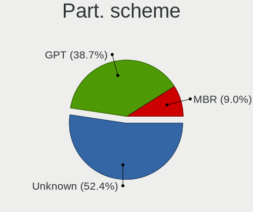
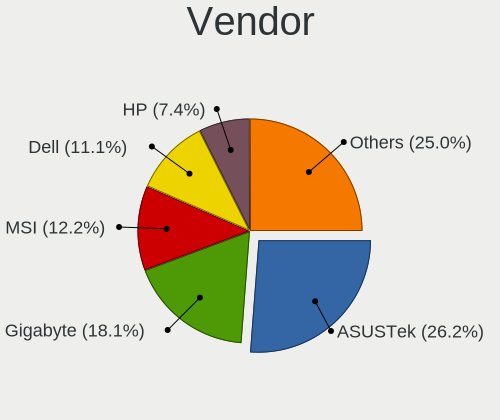
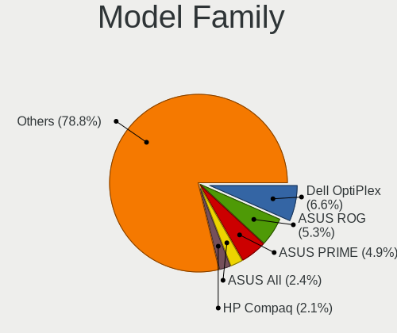
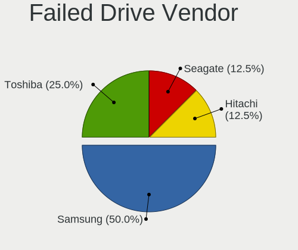
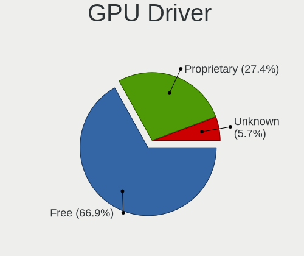
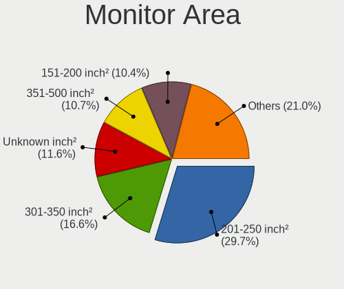
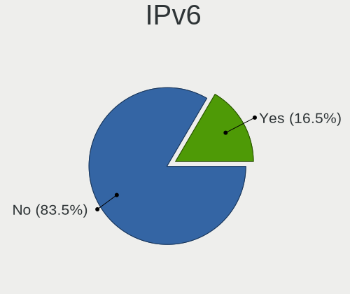
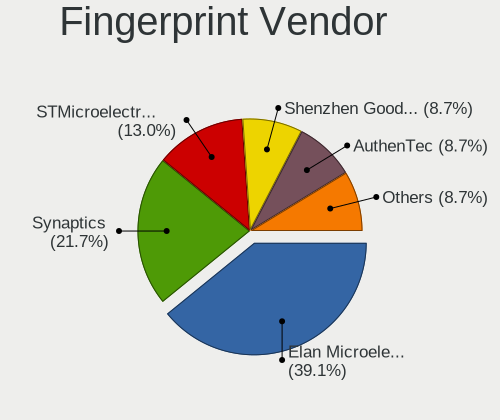

Linux in UK - Tested Hardware & Statistics (Desktops)
-----------------------------------------------------

A project to collect tested hardware configurations for Linux in UK.

Anyone can contribute to this report by the [hw-probe](https://github.com/linuxhw/hw-probe) tool:

    sudo -E hw-probe -all -upload

Please contribute! Especially if your hardware is rare.

Contents
--------

* [ Test Cases ](#test-cases)

* [ System ](#system)
  - [ OS                       ](#os)
  - [ OS Family                ](#os-family)
  - [ Kernel                   ](#kernel)
  - [ Kernel Family            ](#kernel-family)
  - [ Kernel Major Ver.        ](#kernel-major-ver)
  - [ Arch                     ](#arch)
  - [ DE                       ](#de)
  - [ Display Server           ](#display-server)
  - [ Display Manager          ](#display-manager)
  - [ OS Lang                  ](#os-lang)
  - [ Boot Mode                ](#boot-mode)
  - [ Filesystem               ](#filesystem)
  - [ Part. scheme             ](#part-scheme)
  - [ Dual Boot with Linux/BSD ](#dual-boot-with-linuxbsd)
  - [ Dual Boot (Win)          ](#dual-boot-win)

* [ Board ](#board)
  - [ Vendor                   ](#vendor)
  - [ Model                    ](#model)
  - [ Model Family             ](#model-family)
  - [ MFG Year                 ](#mfg-year)
  - [ Form Factor              ](#form-factor)
  - [ Secure Boot              ](#secure-boot)
  - [ Coreboot                 ](#coreboot)
  - [ RAM Size                 ](#ram-size)
  - [ RAM Used                 ](#ram-used)
  - [ Total Drives             ](#total-drives)
  - [ Has CD-ROM               ](#has-cd-rom)
  - [ Has Ethernet             ](#has-ethernet)
  - [ Has WiFi                 ](#has-wifi)
  - [ Has Bluetooth            ](#has-bluetooth)

* [ Location ](#location)
  - [ Country                  ](#country)
  - [ City                     ](#city)

* [ Drives ](#drives)
  - [ Drive Vendor             ](#drive-vendor)
  - [ Drive Model              ](#drive-model)
  - [ HDD Vendor               ](#hdd-vendor)
  - [ SSD Vendor               ](#ssd-vendor)
  - [ Drive Kind               ](#drive-kind)
  - [ Drive Connector          ](#drive-connector)
  - [ Drive Size               ](#drive-size)
  - [ Space Total              ](#space-total)
  - [ Space Used               ](#space-used)
  - [ Malfunc. Drives          ](#malfunc-drives)
  - [ Malfunc. Drive Vendor    ](#malfunc-drive-vendor)
  - [ Malfunc. HDD Vendor      ](#malfunc-hdd-vendor)
  - [ Malfunc. Drive Kind      ](#malfunc-drive-kind)
  - [ Failed Drives            ](#failed-drives)
  - [ Failed Drive Vendor      ](#failed-drive-vendor)
  - [ Drive Status             ](#drive-status)

* [ Storage controller ](#storage-controller)
  - [ Storage Vendor           ](#storage-vendor)
  - [ Storage Model            ](#storage-model)
  - [ Storage Kind             ](#storage-kind)

* [ Processor ](#processor)
  - [ CPU Vendor               ](#cpu-vendor)
  - [ CPU Model                ](#cpu-model)
  - [ CPU Model Family         ](#cpu-model-family)
  - [ CPU Cores                ](#cpu-cores)
  - [ CPU Sockets              ](#cpu-sockets)
  - [ CPU Threads              ](#cpu-threads)
  - [ CPU Op-Modes             ](#cpu-op-modes)
  - [ CPU Microcode            ](#cpu-microcode)
  - [ CPU Microarch            ](#cpu-microarch)

* [ Graphics ](#graphics)
  - [ GPU Vendor               ](#gpu-vendor)
  - [ GPU Model                ](#gpu-model)
  - [ GPU Combo                ](#gpu-combo)
  - [ GPU Driver               ](#gpu-driver)
  - [ GPU Memory               ](#gpu-memory)

* [ Monitor ](#monitor)
  - [ Monitor Vendor           ](#monitor-vendor)
  - [ Monitor Model            ](#monitor-model)
  - [ Monitor Resolution       ](#monitor-resolution)
  - [ Monitor Diagonal         ](#monitor-diagonal)
  - [ Monitor Width            ](#monitor-width)
  - [ Aspect Ratio             ](#aspect-ratio)
  - [ Monitor Area             ](#monitor-area)
  - [ Pixel Density            ](#pixel-density)
  - [ Multiple Monitors        ](#multiple-monitors)

* [ Network ](#network)
  - [ Net Controller Vendor    ](#net-controller-vendor)
  - [ Net Controller Model     ](#net-controller-model)
  - [ Wireless Vendor          ](#wireless-vendor)
  - [ Wireless Model           ](#wireless-model)
  - [ Ethernet Vendor          ](#ethernet-vendor)
  - [ Ethernet Model           ](#ethernet-model)
  - [ Net Controller Kind      ](#net-controller-kind)
  - [ Used Controller          ](#used-controller)
  - [ NICs                     ](#nics)
  - [ IPv6                     ](#ipv6)

* [ Bluetooth ](#bluetooth)
  - [ Bluetooth Vendor         ](#bluetooth-vendor)
  - [ Bluetooth Model          ](#bluetooth-model)

* [ Sound ](#sound)
  - [ Sound Vendor             ](#sound-vendor)
  - [ Sound Model              ](#sound-model)

* [ Memory ](#memory)
  - [ Memory Vendor            ](#memory-vendor)
  - [ Memory Model             ](#memory-model)
  - [ Memory Kind              ](#memory-kind)
  - [ Memory Form Factor       ](#memory-form-factor)
  - [ Memory Size              ](#memory-size)
  - [ Memory Speed             ](#memory-speed)

* [ Printers & scanners ](#printers--scanners)
  - [ Printer Vendor           ](#printer-vendor)
  - [ Printer Model            ](#printer-model)
  - [ Scanner Vendor           ](#scanner-vendor)
  - [ Scanner Model            ](#scanner-model)

* [ Camera ](#camera)
  - [ Camera Vendor            ](#camera-vendor)
  - [ Camera Model             ](#camera-model)

* [ Security ](#security)
  - [ Fingerprint Vendor       ](#fingerprint-vendor)
  - [ Fingerprint Model        ](#fingerprint-model)
  - [ Chipcard Vendor          ](#chipcard-vendor)
  - [ Chipcard Model           ](#chipcard-model)

* [ Unsupported ](#unsupported)
  - [ Unsupported Devices      ](#unsupported-devices)
  - [ Unsupported Device Types ](#unsupported-device-types)

Test Cases
----------

Total: 5691

| Vendor        | Model                       | Probe                                                      | Date         |
|---------------|-----------------------------|------------------------------------------------------------|--------------|
| ASUSTek       | H110M-A/DP                  | [da62dd4045](https://linux-hardware.org/?probe=da62dd4045) | May 08, 2024 |
| ASUSTek       | H110M-A/DP                  | [b8d75a4ac5](https://linux-hardware.org/?probe=b8d75a4ac5) | May 08, 2024 |
| Gigabyte      | Z97X-Gaming 5               | [8256dfc204](https://linux-hardware.org/?probe=8256dfc204) | May 08, 2024 |
| Gigabyte      | B650 AORUS ELITE AX V2      | [cb100ba8bc](https://linux-hardware.org/?probe=cb100ba8bc) | May 08, 2024 |
| Huanan        | X99-F8 GAMING V5.0          | [541eebe872](https://linux-hardware.org/?probe=541eebe872) | May 08, 2024 |
| Unknown       | Unknown                     | [14f9a58589](https://linux-hardware.org/?probe=14f9a58589) | May 08, 2024 |
| ASUSTek       | CROSSHAIR VI HERO           | [13c15b0230](https://linux-hardware.org/?probe=13c15b0230) | May 08, 2024 |
| ASUSTek       | PRIME B760M-A WIFI D4       | [d83d6a3460](https://linux-hardware.org/?probe=d83d6a3460) | May 07, 2024 |
| Gigabyte      | X570S AERO G                | [051c9db94b](https://linux-hardware.org/?probe=051c9db94b) | May 07, 2024 |
| ASRock        | B450M Pro4-F                | [0c73837ccd](https://linux-hardware.org/?probe=0c73837ccd) | May 07, 2024 |
| ASUSTek       | TUF B450M-PLUS GAMING       | [73060b4642](https://linux-hardware.org/?probe=73060b4642) | May 07, 2024 |
| MSI           | H110M PRO-VH                | [f0e62a158e](https://linux-hardware.org/?probe=f0e62a158e) | May 06, 2024 |
| Unknown       | Unknown                     | [b6bf02e276](https://linux-hardware.org/?probe=b6bf02e276) | May 06, 2024 |
| Lenovo        | SHARKBAY NOK                | [11bef15f7d](https://linux-hardware.org/?probe=11bef15f7d) | May 06, 2024 |
| Unknown       | Unknown                     | [9f8df7b114](https://linux-hardware.org/?probe=9f8df7b114) | May 06, 2024 |
| Gigabyte      | H610M K DDR4                | [da4e59e69d](https://linux-hardware.org/?probe=da4e59e69d) | May 05, 2024 |
| ASRock        | B560 Pro4                   | [30ae860ce9](https://linux-hardware.org/?probe=30ae860ce9) | May 04, 2024 |
| HP            | 8350                        | [23dcdf2ff3](https://linux-hardware.org/?probe=23dcdf2ff3) | May 04, 2024 |
| ASUSTek       | PRIME B560-PLUS             | [44afb954d6](https://linux-hardware.org/?probe=44afb954d6) | May 04, 2024 |
| ASUSTek       | ROG STRIX Z490-F GAMING     | [be77d3d806](https://linux-hardware.org/?probe=be77d3d806) | May 04, 2024 |
| Dell          | 0HD5W2 A01                  | [1f5ee22f75](https://linux-hardware.org/?probe=1f5ee22f75) | May 03, 2024 |
| HP            | 83F0                        | [896e46f757](https://linux-hardware.org/?probe=896e46f757) | May 03, 2024 |
| ASUSTek       | PRIME B450M-A               | [e832587255](https://linux-hardware.org/?probe=e832587255) | May 03, 2024 |
| Dell          | 0HD5W2 A01                  | [c7875c3103](https://linux-hardware.org/?probe=c7875c3103) | May 03, 2024 |
| ASRock        | X300M-STX                   | [58d58080cd](https://linux-hardware.org/?probe=58d58080cd) | May 03, 2024 |
| HP            | 8062                        | [87c4c1fbfb](https://linux-hardware.org/?probe=87c4c1fbfb) | May 02, 2024 |
| Dell          | 0VRWRC A00                  | [137a659482](https://linux-hardware.org/?probe=137a659482) | May 02, 2024 |
| MSI           | MAG B550 TOMAHAWK           | [8c1fc35187](https://linux-hardware.org/?probe=8c1fc35187) | May 02, 2024 |
| Gigabyte      | X470 AORUS ULTRA GAMING-... | [f40340d3fa](https://linux-hardware.org/?probe=f40340d3fa) | May 02, 2024 |
| MSI           | B450 GAMING PLUS MAX        | [3146b9914d](https://linux-hardware.org/?probe=3146b9914d) | May 01, 2024 |
| Gigabyte      | H61M-S2PV                   | [45bb15cd11](https://linux-hardware.org/?probe=45bb15cd11) | May 01, 2024 |
| Gigabyte      | B660M DS3H AX DDR4          | [cfdd3a4535](https://linux-hardware.org/?probe=cfdd3a4535) | May 01, 2024 |
| GEEKOM        | A7                          | [f9437ebaa0](https://linux-hardware.org/?probe=f9437ebaa0) | May 01, 2024 |
| MSI           | X470 GAMING PRO CARBON      | [6486b4f435](https://linux-hardware.org/?probe=6486b4f435) | May 01, 2024 |
| Gigabyte      | F2A88XM-DS2                 | [2a13216c9b](https://linux-hardware.org/?probe=2a13216c9b) | Apr 30, 2024 |
| MSI           | Z170A GAMING M5             | [1d4b2dd7e3](https://linux-hardware.org/?probe=1d4b2dd7e3) | Apr 30, 2024 |
| MSI           | MAG Z690 TOMAHAWK WIFI D... | [5cc26d31fa](https://linux-hardware.org/?probe=5cc26d31fa) | Apr 30, 2024 |
| Unknown       | Unknown                     | [b2784a219f](https://linux-hardware.org/?probe=b2784a219f) | Apr 29, 2024 |
| Unknown       | Unknown                     | [5189791d8b](https://linux-hardware.org/?probe=5189791d8b) | Apr 29, 2024 |
| HP            | 3398                        | [e412887ebc](https://linux-hardware.org/?probe=e412887ebc) | Apr 29, 2024 |
| Dell          | 07PR60 A00                  | [6897b908da](https://linux-hardware.org/?probe=6897b908da) | Apr 28, 2024 |
| Fujitsu       | D3433-S2 S26361-D3433-S2    | [ed1d2dac2d](https://linux-hardware.org/?probe=ed1d2dac2d) | Apr 28, 2024 |
| Gigabyte      | A620I AX                    | [eeea04465b](https://linux-hardware.org/?probe=eeea04465b) | Apr 28, 2024 |
| ASUSTek       | PRIME B550M-A               | [4536896f41](https://linux-hardware.org/?probe=4536896f41) | Apr 27, 2024 |
| MSI           | Z97 PC Mate                 | [44a2eb8cdb](https://linux-hardware.org/?probe=44a2eb8cdb) | Apr 27, 2024 |
| MSI           | H310M PRO-M2 PLUS           | [5004ab8c5b](https://linux-hardware.org/?probe=5004ab8c5b) | Apr 27, 2024 |
| Gigabyte      | B550I AORUS PRO AX          | [7d60545173](https://linux-hardware.org/?probe=7d60545173) | Apr 27, 2024 |
| Gigabyte      | B550I AORUS PRO AX          | [b4d4155591](https://linux-hardware.org/?probe=b4d4155591) | Apr 27, 2024 |
| AOpen         | D1009 A1A4                  | [d8b2d00731](https://linux-hardware.org/?probe=d8b2d00731) | Apr 27, 2024 |
| AOpen         | D1009 A1A4                  | [f5399e68ef](https://linux-hardware.org/?probe=f5399e68ef) | Apr 27, 2024 |
| ASUSTek       | PRIME B450M-A               | [fe59c3a4da](https://linux-hardware.org/?probe=fe59c3a4da) | Apr 27, 2024 |
| Gigabyte      | B450M GAMING                | [5d2ca0a62d](https://linux-hardware.org/?probe=5d2ca0a62d) | Apr 27, 2024 |
| MSI           | B550M PRO-VDH WIFI          | [694a93488d](https://linux-hardware.org/?probe=694a93488d) | Apr 26, 2024 |
| Gigabyte      | 970A-UD3P                   | [4fe6c4e2bd](https://linux-hardware.org/?probe=4fe6c4e2bd) | Apr 26, 2024 |
| Gigabyte      | B450M DS3H WIFI-CF          | [14dee832b2](https://linux-hardware.org/?probe=14dee832b2) | Apr 26, 2024 |
| MSI           | Z790 GAMING PLUS WIFI       | [c1242570d2](https://linux-hardware.org/?probe=c1242570d2) | Apr 25, 2024 |
| Gigabyte      | F2A68HM-HD2                 | [4f56e23067](https://linux-hardware.org/?probe=4f56e23067) | Apr 25, 2024 |
| Apple         | Mac-F60DEB81FF30ACF6 Mac... | [713bf3357d](https://linux-hardware.org/?probe=713bf3357d) | Apr 24, 2024 |
| Gigabyte      | 970A-DS3P                   | [0253ffc79c](https://linux-hardware.org/?probe=0253ffc79c) | Apr 24, 2024 |
| Dell          | 0HHV7N A00                  | [328456d99c](https://linux-hardware.org/?probe=328456d99c) | Apr 23, 2024 |
| Dell          | 0HHV7N A00                  | [dbe31bb448](https://linux-hardware.org/?probe=dbe31bb448) | Apr 23, 2024 |
| ASUSTek       | ROG STRIX Z790-A GAMING ... | [cb411ef765](https://linux-hardware.org/?probe=cb411ef765) | Apr 22, 2024 |
| Gigabyte      | Z790 AORUS ELITE AX         | [1c066ce5e2](https://linux-hardware.org/?probe=1c066ce5e2) | Apr 21, 2024 |
| Dell          | 088DT1 A01                  | [4a09358541](https://linux-hardware.org/?probe=4a09358541) | Apr 21, 2024 |
| Dell          | 088DT1 A01                  | [3dcdb47fd0](https://linux-hardware.org/?probe=3dcdb47fd0) | Apr 21, 2024 |
| HP            | 87D6 SMVB                   | [b3862648a1](https://linux-hardware.org/?probe=b3862648a1) | Apr 21, 2024 |
| Acer          | WG43M                       | [93fcdbd13d](https://linux-hardware.org/?probe=93fcdbd13d) | Apr 20, 2024 |
| Dell          | 0NK70N A03                  | [a6862dfd01](https://linux-hardware.org/?probe=a6862dfd01) | Apr 20, 2024 |
| Gigabyte      | H97M-D3H                    | [15a0f07250](https://linux-hardware.org/?probe=15a0f07250) | Apr 20, 2024 |
| Supermicro    | X10DAI                      | [cd2bb43eb4](https://linux-hardware.org/?probe=cd2bb43eb4) | Apr 19, 2024 |
| Supermicro    | X10DAI                      | [053e65f727](https://linux-hardware.org/?probe=053e65f727) | Apr 19, 2024 |
| MSI           | B85I                        | [8751cf893f](https://linux-hardware.org/?probe=8751cf893f) | Apr 19, 2024 |
| MSI           | X470 GAMING PRO CARBON      | [78cd7a86b3](https://linux-hardware.org/?probe=78cd7a86b3) | Apr 17, 2024 |
| MSI           | MPG Z490 GAMING PLUS        | [8249b3fb0c](https://linux-hardware.org/?probe=8249b3fb0c) | Apr 17, 2024 |
| Unknown       | Unknown                     | [27c4d07af4](https://linux-hardware.org/?probe=27c4d07af4) | Apr 17, 2024 |
| Gigabyte      | Z97X-Gaming 5               | [f08c90bc44](https://linux-hardware.org/?probe=f08c90bc44) | Apr 17, 2024 |
| Gigabyte      | 970A-DS3P                   | [53055c8335](https://linux-hardware.org/?probe=53055c8335) | Apr 17, 2024 |
| MSI           | A55M-P33                    | [0f6fc5a77e](https://linux-hardware.org/?probe=0f6fc5a77e) | Apr 17, 2024 |
| ASUSTek       | Z170 PRO GAMING             | [e45ac0e9cc](https://linux-hardware.org/?probe=e45ac0e9cc) | Apr 16, 2024 |
| ASUSTek       | ROG STRIX B650E-I GAMING... | [41c197d579](https://linux-hardware.org/?probe=41c197d579) | Apr 16, 2024 |
| ASUSTek       | ROG STRIX X670E-E GAMING... | [25c95d871e](https://linux-hardware.org/?probe=25c95d871e) | Apr 16, 2024 |
| Gigabyte      | H310M H x.x                 | [1e1b1e0544](https://linux-hardware.org/?probe=1e1b1e0544) | Apr 16, 2024 |
| MSI           | B450 TOMAHAWK MAX II        | [d504f8b8a6](https://linux-hardware.org/?probe=d504f8b8a6) | Apr 16, 2024 |
| Dell          | 0HD5W2 A01                  | [1c7957de19](https://linux-hardware.org/?probe=1c7957de19) | Apr 16, 2024 |
| HP            | 8299                        | [1a596e43da](https://linux-hardware.org/?probe=1a596e43da) | Apr 15, 2024 |
| ASUSTek       | B85M-G                      | [d8294ede23](https://linux-hardware.org/?probe=d8294ede23) | Apr 15, 2024 |
| ASUSTek       | Pro WS TRX50-SAGE WIFI      | [ac85313920](https://linux-hardware.org/?probe=ac85313920) | Apr 15, 2024 |
| HP            | 8299                        | [aa03fa8e4c](https://linux-hardware.org/?probe=aa03fa8e4c) | Apr 15, 2024 |
| ASRock        | 960GM-GS3 FX                | [fb44984605](https://linux-hardware.org/?probe=fb44984605) | Apr 15, 2024 |
| HP            | 3646h                       | [281438274d](https://linux-hardware.org/?probe=281438274d) | Apr 13, 2024 |
| Shenzhen M... | F7BAA                       | [1015688c75](https://linux-hardware.org/?probe=1015688c75) | Apr 13, 2024 |
| MSI           | MAG A520M VECTOR WIFI       | [a8de6973de](https://linux-hardware.org/?probe=a8de6973de) | Apr 13, 2024 |
| ASUSTek       | PRIME X670-P                | [a1b2161457](https://linux-hardware.org/?probe=a1b2161457) | Apr 12, 2024 |
| ASUSTek       | ROG STRIX B550-F GAMING ... | [aa96253b80](https://linux-hardware.org/?probe=aa96253b80) | Apr 12, 2024 |
| ASUSTek       | TUF Gaming Z690-PLUS WIF... | [b977bc3a0a](https://linux-hardware.org/?probe=b977bc3a0a) | Apr 12, 2024 |
| Gigabyte      | B550 AORUS PRO              | [5858a2ed28](https://linux-hardware.org/?probe=5858a2ed28) | Apr 12, 2024 |
| HP            | 8062                        | [358bbe16f0](https://linux-hardware.org/?probe=358bbe16f0) | Apr 11, 2024 |
| Huanan        | X99-F8 GAMING V5.0          | [4e43e18d89](https://linux-hardware.org/?probe=4e43e18d89) | Apr 10, 2024 |
| Foxconn       | 2A8C                        | [9d16faea24](https://linux-hardware.org/?probe=9d16faea24) | Apr 10, 2024 |
| Lenovo        | 36E9 SDK0R32862 WIN 3258... | [e494587893](https://linux-hardware.org/?probe=e494587893) | Apr 09, 2024 |
| MSI           | A520M-A PRO                 | [bd3db073e2](https://linux-hardware.org/?probe=bd3db073e2) | Apr 09, 2024 |
| MSI           | A520M-A PRO                 | [c1bde6f19b](https://linux-hardware.org/?probe=c1bde6f19b) | Apr 09, 2024 |
| ASUSTek       | ROG STRIX X670E-E GAMING... | [6d013c64d2](https://linux-hardware.org/?probe=6d013c64d2) | Apr 08, 2024 |
| Dell          | 08NPPY A00                  | [b4c4108be3](https://linux-hardware.org/?probe=b4c4108be3) | Apr 08, 2024 |
| MSI           | B450 GAMING PLUS MAX        | [12d5a6c723](https://linux-hardware.org/?probe=12d5a6c723) | Apr 08, 2024 |
| ASUSTek       | K30BF_M32BF                 | [4538260fe0](https://linux-hardware.org/?probe=4538260fe0) | Apr 08, 2024 |
| Dell          | 08NPPY A00                  | [16c1c681a3](https://linux-hardware.org/?probe=16c1c681a3) | Apr 08, 2024 |
| Gigabyte      | GA-880GM-UD2H               | [8bd7df2e63](https://linux-hardware.org/?probe=8bd7df2e63) | Apr 07, 2024 |
| ASUSTek       | ROG STRIX B550-E GAMING     | [8d7890aa2d](https://linux-hardware.org/?probe=8d7890aa2d) | Apr 06, 2024 |
| Intel         | DH61CR AAG14064-204         | [aa8d9012d2](https://linux-hardware.org/?probe=aa8d9012d2) | Apr 06, 2024 |
| HP            | 1790                        | [0038bf2917](https://linux-hardware.org/?probe=0038bf2917) | Apr 06, 2024 |
| ASUSTek       | ROG STRIX B450-I GAMING     | [d0b50bb8cf](https://linux-hardware.org/?probe=d0b50bb8cf) | Apr 06, 2024 |
| Intel         | DH67CF AAG10215-203         | [c26c93bb88](https://linux-hardware.org/?probe=c26c93bb88) | Apr 06, 2024 |
| Gigabyte      | B550 AORUS ELITE AX V2      | [f37f18a2f2](https://linux-hardware.org/?probe=f37f18a2f2) | Apr 05, 2024 |
| ASUSTek       | PRIME B650M-A WIFI II       | [68d2448180](https://linux-hardware.org/?probe=68d2448180) | Apr 05, 2024 |
| ASUSTek       | ROG STRIX B550-F GAMING     | [34cf4260a3](https://linux-hardware.org/?probe=34cf4260a3) | Apr 05, 2024 |
| Gigabyte      | TRX40 AORUS PRO WIFI        | [319248f75b](https://linux-hardware.org/?probe=319248f75b) | Apr 05, 2024 |
| ASUSTek       | PRIME A320M-R               | [e04d3554e4](https://linux-hardware.org/?probe=e04d3554e4) | Apr 03, 2024 |
| Dell          | 0GCY4M A01                  | [febcab65c7](https://linux-hardware.org/?probe=febcab65c7) | Apr 03, 2024 |
| Acer          | Aspire XC-780               | [28ef93502a](https://linux-hardware.org/?probe=28ef93502a) | Apr 03, 2024 |
| Gigabyte      | Z97X-Gaming 5               | [ce53254be7](https://linux-hardware.org/?probe=ce53254be7) | Apr 02, 2024 |
| MSI           | A88XI AC                    | [5fbf5d05af](https://linux-hardware.org/?probe=5fbf5d05af) | Apr 02, 2024 |
| Intel         | JSL MRD                     | [781573233b](https://linux-hardware.org/?probe=781573233b) | Apr 02, 2024 |
| Intel         | JSL MRD                     | [c49773732a](https://linux-hardware.org/?probe=c49773732a) | Apr 02, 2024 |
| MSI           | A520M-A PRO                 | [67f2e7a5f4](https://linux-hardware.org/?probe=67f2e7a5f4) | Apr 01, 2024 |
| ASUSTek       | ROG STRIX B450-F GAMING     | [c6393a22e1](https://linux-hardware.org/?probe=c6393a22e1) | Apr 01, 2024 |
| Gigabyte      | X570 AORUS ELITE            | [cf3a89d3d4](https://linux-hardware.org/?probe=cf3a89d3d4) | Apr 01, 2024 |
| Dell          | 0PTTT9 A01                  | [00d2c75a39](https://linux-hardware.org/?probe=00d2c75a39) | Apr 01, 2024 |
| MSI           | X470 GAMING PRO CARBON      | [d82daf5b14](https://linux-hardware.org/?probe=d82daf5b14) | Apr 01, 2024 |
| MSI           | Z390-A PRO                  | [5b4d358bde](https://linux-hardware.org/?probe=5b4d358bde) | Mar 31, 2024 |
| ASUSTek       | ROG STRIX B550-F GAMING ... | [a539ea2bad](https://linux-hardware.org/?probe=a539ea2bad) | Mar 31, 2024 |
| ASUSTek       | G11CD                       | [40ab66cb00](https://linux-hardware.org/?probe=40ab66cb00) | Mar 31, 2024 |
| GEEKOM        | A5                          | [da516126ba](https://linux-hardware.org/?probe=da516126ba) | Mar 31, 2024 |
| ASUSTek       | AT3N7A-I                    | [0af90b54ec](https://linux-hardware.org/?probe=0af90b54ec) | Mar 30, 2024 |
| Unknown       | Unknown                     | [cd151074ab](https://linux-hardware.org/?probe=cd151074ab) | Mar 30, 2024 |
| Gigabyte      | B450M DS3H V2               | [e239e5305b](https://linux-hardware.org/?probe=e239e5305b) | Mar 30, 2024 |
| Unknown       | Unknown                     | [3222ce9e74](https://linux-hardware.org/?probe=3222ce9e74) | Mar 30, 2024 |
| ASUSTek       | SABERTOOTH X99              | [9eadaaa051](https://linux-hardware.org/?probe=9eadaaa051) | Mar 29, 2024 |
| Fujitsu       | D2990-A3 S26361-D2990-A3    | [3296c48ec2](https://linux-hardware.org/?probe=3296c48ec2) | Mar 29, 2024 |
| Gigabyte      | GA-78LMT-USB3               | [7f8a245399](https://linux-hardware.org/?probe=7f8a245399) | Mar 29, 2024 |
| Gigabyte      | GA-78LMT-USB3               | [7b17376565](https://linux-hardware.org/?probe=7b17376565) | Mar 29, 2024 |
| ASUSTek       | H81T                        | [a21269bbc5](https://linux-hardware.org/?probe=a21269bbc5) | Mar 28, 2024 |
| Gigabyte      | GA-990X-Gaming SLI-CF       | [697b22a027](https://linux-hardware.org/?probe=697b22a027) | Mar 28, 2024 |
| Gigabyte      | A620I AX                    | [23531206bf](https://linux-hardware.org/?probe=23531206bf) | Mar 28, 2024 |
| MSI           | B450-A PRO MAX              | [0d965c6ad6](https://linux-hardware.org/?probe=0d965c6ad6) | Mar 28, 2024 |
| Fujitsu       | D2990-A3 S26361-D2990-A3    | [dca99d78bd](https://linux-hardware.org/?probe=dca99d78bd) | Mar 27, 2024 |
| Dell          | 0YC03K A04                  | [5f8bc97385](https://linux-hardware.org/?probe=5f8bc97385) | Mar 27, 2024 |
| HP            | 18E7                        | [ff6a9328f3](https://linux-hardware.org/?probe=ff6a9328f3) | Mar 27, 2024 |
| ASUSTek       | P8Z68-V PRO GEN3            | [9bcf8d91cc](https://linux-hardware.org/?probe=9bcf8d91cc) | Mar 26, 2024 |
| Gigabyte      | Z97P-D3                     | [269ee0ed72](https://linux-hardware.org/?probe=269ee0ed72) | Mar 26, 2024 |
| GEEKOM        | A5                          | [657f58922b](https://linux-hardware.org/?probe=657f58922b) | Mar 26, 2024 |
| Gigabyte      | Z97P-D3                     | [4b656f9e6d](https://linux-hardware.org/?probe=4b656f9e6d) | Mar 25, 2024 |
| HP            | 3029h                       | [1913f87768](https://linux-hardware.org/?probe=1913f87768) | Mar 25, 2024 |
| Dell          | 02M8NY A00                  | [0f0dde91e3](https://linux-hardware.org/?probe=0f0dde91e3) | Mar 25, 2024 |
| Dell          | 02M8NY A00                  | [fad2bb75b1](https://linux-hardware.org/?probe=fad2bb75b1) | Mar 25, 2024 |
| Dell          | 0HMX8D A01                  | [8cd1470fc0](https://linux-hardware.org/?probe=8cd1470fc0) | Mar 25, 2024 |
| MSI           | PRO H610M-E DDR4            | [cf6f76433e](https://linux-hardware.org/?probe=cf6f76433e) | Mar 25, 2024 |
| Unknown       | Unknown                     | [0e68a4f6db](https://linux-hardware.org/?probe=0e68a4f6db) | Mar 24, 2024 |
| NZXT          | N5 Z690                     | [53116e0b19](https://linux-hardware.org/?probe=53116e0b19) | Mar 24, 2024 |
| Gigabyte      | B450M DS3H-CF               | [58ff9b49c3](https://linux-hardware.org/?probe=58ff9b49c3) | Mar 23, 2024 |
| ASUSTek       | Maximus VI HERO             | [4fac588ebc](https://linux-hardware.org/?probe=4fac588ebc) | Mar 23, 2024 |
| ASUSTek       | Maximus VI HERO             | [2016d6fb0a](https://linux-hardware.org/?probe=2016d6fb0a) | Mar 23, 2024 |
| Gigabyte      | H310M H x.x                 | [b3627389b8](https://linux-hardware.org/?probe=b3627389b8) | Mar 23, 2024 |
| Gigabyte      | Z390 AORUS PRO-CF           | [7d8078d060](https://linux-hardware.org/?probe=7d8078d060) | Mar 23, 2024 |
| MSI           | MAG B550 TOMAHAWK MAX WI... | [0f718ad2b9](https://linux-hardware.org/?probe=0f718ad2b9) | Mar 23, 2024 |
| HPE           | ProLiant MicroServer Gen... | [237cf90962](https://linux-hardware.org/?probe=237cf90962) | Mar 22, 2024 |
| NCR           | Misano                      | [d31ebf4987](https://linux-hardware.org/?probe=d31ebf4987) | Mar 22, 2024 |
| HP            | 3397                        | [fa2e73b012](https://linux-hardware.org/?probe=fa2e73b012) | Mar 22, 2024 |
| ASUSTek       | PRIME A320M-K               | [73769f6724](https://linux-hardware.org/?probe=73769f6724) | Mar 21, 2024 |
| MSI           | B550M PRO-VDH WIFI          | [3597d1a106](https://linux-hardware.org/?probe=3597d1a106) | Mar 21, 2024 |
| ASUSTek       | PRIME X570-PRO              | [56b4e033b8](https://linux-hardware.org/?probe=56b4e033b8) | Mar 20, 2024 |
| AMI           | Intel                       | [fc4348f291](https://linux-hardware.org/?probe=fc4348f291) | Mar 20, 2024 |
| ASUSTek       | B85M-E                      | [e3a6512d0c](https://linux-hardware.org/?probe=e3a6512d0c) | Mar 20, 2024 |
| Acer          | Veriton L6610G              | [c5e6b0ac2a](https://linux-hardware.org/?probe=c5e6b0ac2a) | Mar 19, 2024 |
| Lenovo        | MAHOBAY 0B98401 PRO         | [ba841a4a3f](https://linux-hardware.org/?probe=ba841a4a3f) | Mar 19, 2024 |
| ASUSTek       | TUF Gaming X570-PLUS        | [2ec5403695](https://linux-hardware.org/?probe=2ec5403695) | Mar 19, 2024 |
| ASUSTek       | PRIME A320M-K               | [2559083db4](https://linux-hardware.org/?probe=2559083db4) | Mar 19, 2024 |
| MSI           | B350M MORTAR                | [8d5526d959](https://linux-hardware.org/?probe=8d5526d959) | Mar 18, 2024 |
| ASUSTek       | TUF Gaming Z690-PLUS WIF... | [0eaf5f5be0](https://linux-hardware.org/?probe=0eaf5f5be0) | Mar 18, 2024 |
| ASUSTek       | PRIME Z690-P WIFI D4        | [2d7fd89873](https://linux-hardware.org/?probe=2d7fd89873) | Mar 18, 2024 |
| Lenovo        | ThinkStation S30 0606AD5    | [8a703c6f02](https://linux-hardware.org/?probe=8a703c6f02) | Mar 17, 2024 |
| Gigabyte      | H81M-D2V                    | [0176617472](https://linux-hardware.org/?probe=0176617472) | Mar 17, 2024 |
| Foxconn       | H61MXL/H61MXL-K             | [427e8024f2](https://linux-hardware.org/?probe=427e8024f2) | Mar 17, 2024 |
| ASRock        | A780GM-LE                   | [cfc1958990](https://linux-hardware.org/?probe=cfc1958990) | Mar 17, 2024 |
| Unknown       | 1.0                         | [95713f1f4b](https://linux-hardware.org/?probe=95713f1f4b) | Mar 17, 2024 |
| MSI           | MAG B550M BAZOOKA           | [6f59b5bfa1](https://linux-hardware.org/?probe=6f59b5bfa1) | Mar 17, 2024 |
| Dell          | 0MGK50 A02                  | [bfc52bd2e3](https://linux-hardware.org/?probe=bfc52bd2e3) | Mar 16, 2024 |
| Dell          | 0MGK50 A02                  | [0580ebdf9c](https://linux-hardware.org/?probe=0580ebdf9c) | Mar 16, 2024 |
| Gigabyte      | Z370 AORUS ULTRA GAMING-... | [7953afffd9](https://linux-hardware.org/?probe=7953afffd9) | Mar 16, 2024 |
| Packard Be... | IXTREME M5850               | [62a2a2e36f](https://linux-hardware.org/?probe=62a2a2e36f) | Mar 15, 2024 |
| Packard Be... | IXTREME M5850               | [6be53e6dad](https://linux-hardware.org/?probe=6be53e6dad) | Mar 15, 2024 |
| ASUSTek       | M5A78L/USB3                 | [69c98f08eb](https://linux-hardware.org/?probe=69c98f08eb) | Mar 15, 2024 |
| HP            | ProLiant ML10 v2            | [6f3897abd9](https://linux-hardware.org/?probe=6f3897abd9) | Mar 15, 2024 |
| HP            | 83EE                        | [3c8891b8fd](https://linux-hardware.org/?probe=3c8891b8fd) | Mar 14, 2024 |
| Gigabyte      | B550I AORUS PRO AX          | [45e29d86a8](https://linux-hardware.org/?probe=45e29d86a8) | Mar 14, 2024 |
| ASUSTek       | ROG STRIX B450-F GAMING     | [98db1944cf](https://linux-hardware.org/?probe=98db1944cf) | Mar 14, 2024 |
| MACHINIST     | X99 PR9                     | [481821b9ad](https://linux-hardware.org/?probe=481821b9ad) | Mar 12, 2024 |
| HP            | 212A                        | [51db86fb44](https://linux-hardware.org/?probe=51db86fb44) | Mar 12, 2024 |
| HP            | 212A                        | [4a6e30808e](https://linux-hardware.org/?probe=4a6e30808e) | Mar 12, 2024 |
| Gigabyte      | A320M-S2H-CF                | [020b8b531a](https://linux-hardware.org/?probe=020b8b531a) | Mar 12, 2024 |
| ASRock        | B650M PG Riptide            | [9f24004a90](https://linux-hardware.org/?probe=9f24004a90) | Mar 12, 2024 |
| Gigabyte      | A320M-S2H-CF                | [84502e8400](https://linux-hardware.org/?probe=84502e8400) | Mar 12, 2024 |
| Dell          | 048DY8 A01                  | [23ac7afe02](https://linux-hardware.org/?probe=23ac7afe02) | Mar 11, 2024 |
| Dell          | 048DY8 A01                  | [d1eb9c18ad](https://linux-hardware.org/?probe=d1eb9c18ad) | Mar 11, 2024 |
| Gigabyte      | B550I AORUS PRO AX          | [db466790ad](https://linux-hardware.org/?probe=db466790ad) | Mar 11, 2024 |
| ASRock        | 970 Performance             | [9fa6357517](https://linux-hardware.org/?probe=9fa6357517) | Mar 09, 2024 |
| Foxconn       | 946 7MA Series              | [7453cdde18](https://linux-hardware.org/?probe=7453cdde18) | Mar 09, 2024 |
| Gigabyte      | B550 AORUS ELITE V2         | [b1e17a6ec4](https://linux-hardware.org/?probe=b1e17a6ec4) | Mar 08, 2024 |
| ASUSTek       | Q87M-E                      | [6c1f8f0b34](https://linux-hardware.org/?probe=6c1f8f0b34) | Mar 08, 2024 |
| MSI           | B450M MORTAR MAX            | [f5af865ffc](https://linux-hardware.org/?probe=f5af865ffc) | Mar 07, 2024 |
| Gigabyte      | AB350M-HD3-CF se1           | [6f60e3f76e](https://linux-hardware.org/?probe=6f60e3f76e) | Mar 07, 2024 |
| ASUSTek       | ROG STRIX X670E-F GAMING... | [dd3df4cff2](https://linux-hardware.org/?probe=dd3df4cff2) | Mar 07, 2024 |
| ASUSTek       | PRIME B450M-A II            | [69cfc7b5d9](https://linux-hardware.org/?probe=69cfc7b5d9) | Mar 07, 2024 |
| MSI           | Z170A GAMING M7             | [77c9f60bb0](https://linux-hardware.org/?probe=77c9f60bb0) | Mar 06, 2024 |
| Gigabyte      | X570S AERO G                | [8bf6517d80](https://linux-hardware.org/?probe=8bf6517d80) | Mar 06, 2024 |
| ASRock        | X570 Phantom Gaming 4       | [e13f691ca7](https://linux-hardware.org/?probe=e13f691ca7) | Mar 06, 2024 |
| MSI           | MAG X570S TORPEDO MAX       | [3a31238bd4](https://linux-hardware.org/?probe=3a31238bd4) | Mar 05, 2024 |
| Unknown       | Unknown                     | [7709b92d0a](https://linux-hardware.org/?probe=7709b92d0a) | Mar 05, 2024 |
| Dell          | 0HD5W2 A01                  | [f015ff4f75](https://linux-hardware.org/?probe=f015ff4f75) | Mar 05, 2024 |
| Gigabyte      | B550I AORUS PRO AX          | [2733b2752d](https://linux-hardware.org/?probe=2733b2752d) | Mar 04, 2024 |
| ASUSTek       | TUF Gaming B550M-PLUS       | [10591ca03d](https://linux-hardware.org/?probe=10591ca03d) | Mar 04, 2024 |
| AZW           | MINI S                      | [dc07e234d0](https://linux-hardware.org/?probe=dc07e234d0) | Mar 03, 2024 |
| ASRock        | 990FX Extreme3              | [91334fd7e7](https://linux-hardware.org/?probe=91334fd7e7) | Mar 02, 2024 |
| Acer          | FIH57                       | [4b9a9a43f3](https://linux-hardware.org/?probe=4b9a9a43f3) | Mar 02, 2024 |
| Acer          | Veriton X2631G V:1.0        | [59356c0dcb](https://linux-hardware.org/?probe=59356c0dcb) | Mar 02, 2024 |
| Gigabyte      | P35-DQ6                     | [72241dfaa6](https://linux-hardware.org/?probe=72241dfaa6) | Mar 02, 2024 |
| Gigabyte      | X670 AORUS ELITE AX         | [92b98e9789](https://linux-hardware.org/?probe=92b98e9789) | Mar 02, 2024 |
| ASRock        | B450M Pro4-F R2.0           | [97b861c12b](https://linux-hardware.org/?probe=97b861c12b) | Mar 01, 2024 |
| Unknown       | Unknown                     | [271452e819](https://linux-hardware.org/?probe=271452e819) | Mar 01, 2024 |
| Shenzhen M... | RPFXI                       | [6ed9064b66](https://linux-hardware.org/?probe=6ed9064b66) | Mar 01, 2024 |
| MSI           | X470 GAMING PRO CARBON      | [b58bb65fff](https://linux-hardware.org/?probe=b58bb65fff) | Mar 01, 2024 |
| Gigabyte      | A320M-S2H-CF                | [0300215254](https://linux-hardware.org/?probe=0300215254) | Feb 29, 2024 |
| ASRock        | G31M-GS                     | [40f4f84d77](https://linux-hardware.org/?probe=40f4f84d77) | Feb 29, 2024 |
| Gigabyte      | X670E AORUS XTREME          | [94090f0c82](https://linux-hardware.org/?probe=94090f0c82) | Feb 29, 2024 |
| Dell          | 04YP6J A02                  | [a07c13e0c0](https://linux-hardware.org/?probe=a07c13e0c0) | Feb 29, 2024 |
| Dell          | 04YP6J A02                  | [7f454b2e4f](https://linux-hardware.org/?probe=7f454b2e4f) | Feb 29, 2024 |
| Dell          | 0KRC95 A01                  | [d5238923cd](https://linux-hardware.org/?probe=d5238923cd) | Feb 28, 2024 |
| NZXT          | N7 Z790                     | [983e6338eb](https://linux-hardware.org/?probe=983e6338eb) | Feb 28, 2024 |
| Lenovo        | NO DPK                      | [a3cff4a822](https://linux-hardware.org/?probe=a3cff4a822) | Feb 28, 2024 |
| ASUSTek       | PRIME H310-PLUS R2.0        | [643ccfeebb](https://linux-hardware.org/?probe=643ccfeebb) | Feb 27, 2024 |
| ASUSTek       | Z170-A                      | [1501e42b01](https://linux-hardware.org/?probe=1501e42b01) | Feb 27, 2024 |
| Lenovo        | 3176 SDK0J40697 WIN 3305... | [9321cb6e46](https://linux-hardware.org/?probe=9321cb6e46) | Feb 26, 2024 |
| MSI           | X570-A PRO                  | [e9f2c5ca41](https://linux-hardware.org/?probe=e9f2c5ca41) | Feb 26, 2024 |
| MSI           | B450-A PRO MAX              | [4e4ef2d81d](https://linux-hardware.org/?probe=4e4ef2d81d) | Feb 26, 2024 |
| Intel         | D54250WYK H13922-303        | [125932cb50](https://linux-hardware.org/?probe=125932cb50) | Feb 26, 2024 |
| Unknown       | Unknown                     | [14c3da9627](https://linux-hardware.org/?probe=14c3da9627) | Feb 25, 2024 |
| MSI           | B450M MORTAR MAX            | [6ec6fec129](https://linux-hardware.org/?probe=6ec6fec129) | Feb 25, 2024 |
| Gigabyte      | A520M DS3H V2               | [cfe98fe21e](https://linux-hardware.org/?probe=cfe98fe21e) | Feb 24, 2024 |
| Lenovo        | 1030 SDK0K17763 WIN 1801... | [2d3278af13](https://linux-hardware.org/?probe=2d3278af13) | Feb 24, 2024 |
| Dell          | 0P01GV A03                  | [41e2d95cdd](https://linux-hardware.org/?probe=41e2d95cdd) | Feb 23, 2024 |
| MSI           | 2A9C                        | [ef6d2b1db7](https://linux-hardware.org/?probe=ef6d2b1db7) | Feb 23, 2024 |
| ASUSTek       | ROG STRIX X670E-F GAMING... | [322513c6ae](https://linux-hardware.org/?probe=322513c6ae) | Feb 23, 2024 |
| ASUSTek       | TUF Gaming B550M-PLUS WI... | [81f080198e](https://linux-hardware.org/?probe=81f080198e) | Feb 22, 2024 |
| Gigabyte      | A620I AX                    | [b6a40823a4](https://linux-hardware.org/?probe=b6a40823a4) | Feb 22, 2024 |
| ASUSTek       | ROG STRIX B550-F GAMING     | [ccd339e5e4](https://linux-hardware.org/?probe=ccd339e5e4) | Feb 22, 2024 |
| ASRock        | B450M Pro4                  | [6ca9a09551](https://linux-hardware.org/?probe=6ca9a09551) | Feb 21, 2024 |
| Gigabyte      | H310M H x.x                 | [115b071eaa](https://linux-hardware.org/?probe=115b071eaa) | Feb 21, 2024 |
| Lenovo        | SKYBAY SDK0J40700 WIN 32... | [ede6bceec9](https://linux-hardware.org/?probe=ede6bceec9) | Feb 21, 2024 |
| Gigabyte      | A320M-H-CF                  | [954a5c5822](https://linux-hardware.org/?probe=954a5c5822) | Feb 20, 2024 |
| MSI           | A88XI AC                    | [5f7b7b0d9d](https://linux-hardware.org/?probe=5f7b7b0d9d) | Feb 19, 2024 |
| AZW           | Gemini T45                  | [9a81383d10](https://linux-hardware.org/?probe=9a81383d10) | Feb 19, 2024 |
| TB            | WTR R1                      | [ab65edc6c3](https://linux-hardware.org/?probe=ab65edc6c3) | Feb 19, 2024 |
| ASUSTek       | Z170-A                      | [a14a54ac8f](https://linux-hardware.org/?probe=a14a54ac8f) | Feb 19, 2024 |
| ASUSTek       | PRIME B550-PLUS             | [bf5e8e0844](https://linux-hardware.org/?probe=bf5e8e0844) | Feb 19, 2024 |
| Apple         | Mac-F221BEC8                | [d646c0bdff](https://linux-hardware.org/?probe=d646c0bdff) | Feb 18, 2024 |
| Lenovo        | 1030 SDK0K17763 WIN 1801... | [606dba6c35](https://linux-hardware.org/?probe=606dba6c35) | Feb 18, 2024 |
| MSI           | A88XI AC                    | [5d3e12f970](https://linux-hardware.org/?probe=5d3e12f970) | Feb 17, 2024 |
| MSI           | A88XI AC                    | [506adc2855](https://linux-hardware.org/?probe=506adc2855) | Feb 17, 2024 |
| Unknown       | KLX99                       | [f987799e6d](https://linux-hardware.org/?probe=f987799e6d) | Feb 17, 2024 |
| MSI           | B450M PRO-VDH MAX           | [4212e56281](https://linux-hardware.org/?probe=4212e56281) | Feb 17, 2024 |
| Gigabyte      | B660 DS3H AX DDR4           | [993110fab0](https://linux-hardware.org/?probe=993110fab0) | Feb 16, 2024 |
| Gigabyte      | H310M H x.x                 | [1f5ae33c3d](https://linux-hardware.org/?probe=1f5ae33c3d) | Feb 16, 2024 |
| Gigabyte      | GA-990FX-GAMING             | [5d0399919a](https://linux-hardware.org/?probe=5d0399919a) | Feb 16, 2024 |
| HP            | 0AECh D                     | [f542fee953](https://linux-hardware.org/?probe=f542fee953) | Feb 15, 2024 |
| Gigabyte      | A620I AX                    | [de854f2e5e](https://linux-hardware.org/?probe=de854f2e5e) | Feb 15, 2024 |
| Dell          | 0HHV7N A00                  | [809cfa76c6](https://linux-hardware.org/?probe=809cfa76c6) | Feb 15, 2024 |
| Unknown       | Unknown                     | [37f24823aa](https://linux-hardware.org/?probe=37f24823aa) | Feb 15, 2024 |
| Dell          | 0WR7PY A03                  | [139c5372a7](https://linux-hardware.org/?probe=139c5372a7) | Feb 15, 2024 |
| ASUSTek       | Z170-A                      | [6428e7d8bf](https://linux-hardware.org/?probe=6428e7d8bf) | Feb 14, 2024 |
| Acer          | Predator PO3-640            | [4e920c60c3](https://linux-hardware.org/?probe=4e920c60c3) | Feb 14, 2024 |
| Acer          | Predator PO3-640            | [b081b6359d](https://linux-hardware.org/?probe=b081b6359d) | Feb 13, 2024 |
| Dell          | 0P01GV A03                  | [97efa2a106](https://linux-hardware.org/?probe=97efa2a106) | Feb 13, 2024 |
| Lenovo        | SHARKBAY NO DPK             | [e8c1265b41](https://linux-hardware.org/?probe=e8c1265b41) | Feb 13, 2024 |
| Gigabyte      | Z97X-Gaming 5               | [e9061646f8](https://linux-hardware.org/?probe=e9061646f8) | Feb 12, 2024 |
| Supermicro    | X9DRL-3F/iF                 | [b0e11c346d](https://linux-hardware.org/?probe=b0e11c346d) | Feb 12, 2024 |
| Gigabyte      | A320M-H-CF                  | [76b99bc559](https://linux-hardware.org/?probe=76b99bc559) | Feb 12, 2024 |
| Gigabyte      | B550 AORUS ELITE V2         | [89dc16a204](https://linux-hardware.org/?probe=89dc16a204) | Feb 12, 2024 |
| Gigabyte      | B550 AORUS ELITE V2         | [d8095f4230](https://linux-hardware.org/?probe=d8095f4230) | Feb 12, 2024 |
| Lenovo        | 0B98401 PRO                 | [e3ad18986b](https://linux-hardware.org/?probe=e3ad18986b) | Feb 12, 2024 |
| Gigabyte      | B550I AORUS PRO AX          | [42c6599286](https://linux-hardware.org/?probe=42c6599286) | Feb 12, 2024 |
| Biostar       | A68MHE                      | [adf7cb9274](https://linux-hardware.org/?probe=adf7cb9274) | Feb 12, 2024 |
| YANYU         | EPIC-C19                    | [9a93a8fd98](https://linux-hardware.org/?probe=9a93a8fd98) | Feb 12, 2024 |
| Gigabyte      | GA-78LMT-USB3               | [a1d03fa1e8](https://linux-hardware.org/?probe=a1d03fa1e8) | Feb 11, 2024 |
| ASUSTek       | SABERTOOTH X58              | [2eda41290c](https://linux-hardware.org/?probe=2eda41290c) | Feb 09, 2024 |
| ASUSTek       | CP6230                      | [f7485287f1](https://linux-hardware.org/?probe=f7485287f1) | Feb 08, 2024 |
| Gigabyte      | 970A-UD3P                   | [5f96eaea3b](https://linux-hardware.org/?probe=5f96eaea3b) | Feb 08, 2024 |
| MSI           | B350 GAMING PLUS            | [9c5b5ac0b9](https://linux-hardware.org/?probe=9c5b5ac0b9) | Feb 08, 2024 |
| ASUSTek       | ROG Maximus Z790 HERO       | [b792464ace](https://linux-hardware.org/?probe=b792464ace) | Feb 08, 2024 |
| ASUSTek       | H110M-A/M.2                 | [9c0a07bf2b](https://linux-hardware.org/?probe=9c0a07bf2b) | Feb 08, 2024 |
| Sun Micros... | Ultra 24 50                 | [50e6ac064a](https://linux-hardware.org/?probe=50e6ac064a) | Feb 08, 2024 |
| ASUSTek       | PRIME B550M-A WIFI II       | [0769801ae8](https://linux-hardware.org/?probe=0769801ae8) | Feb 08, 2024 |
| ASUSTek       | H110M-A/M.2                 | [7350797e64](https://linux-hardware.org/?probe=7350797e64) | Feb 07, 2024 |
| Lenovo        | 3708 SDK0J40700 WIN 3258... | [1604e3dfc7](https://linux-hardware.org/?probe=1604e3dfc7) | Feb 07, 2024 |
| Lenovo        | 3708 SDK0J40700 WIN 3258... | [77fcfa862b](https://linux-hardware.org/?probe=77fcfa862b) | Feb 07, 2024 |
| MSI           | B550-A PRO                  | [3ca8af8999](https://linux-hardware.org/?probe=3ca8af8999) | Feb 07, 2024 |
| MSI           | MPG B550 GAMING PLUS        | [c47a46ccaf](https://linux-hardware.org/?probe=c47a46ccaf) | Feb 06, 2024 |
| Unknown       | Unknown                     | [e38bcac0f1](https://linux-hardware.org/?probe=e38bcac0f1) | Feb 06, 2024 |
| Gigabyte      | B550M DS3H                  | [a50feca5c5](https://linux-hardware.org/?probe=a50feca5c5) | Feb 05, 2024 |
| AZW           | Gemini T45                  | [a07e2329bb](https://linux-hardware.org/?probe=a07e2329bb) | Feb 05, 2024 |
| ASUSTek       | ROG STRIX Z790-I GAMING ... | [b34e94536e](https://linux-hardware.org/?probe=b34e94536e) | Feb 05, 2024 |
| AZW           | Gemini T45                  | [5caae813f4](https://linux-hardware.org/?probe=5caae813f4) | Feb 05, 2024 |
| Gigabyte      | A620I AX                    | [feabd89de5](https://linux-hardware.org/?probe=feabd89de5) | Feb 05, 2024 |
| HP            | 0AECh D                     | [ca758dbc5c](https://linux-hardware.org/?probe=ca758dbc5c) | Feb 05, 2024 |
| MSI           | X470 GAMING PRO CARBON      | [429b3c3517](https://linux-hardware.org/?probe=429b3c3517) | Feb 05, 2024 |
| Intel         | DH55TC AAE70932-206         | [ef1cb4b37b](https://linux-hardware.org/?probe=ef1cb4b37b) | Feb 05, 2024 |
| Dell          | 0P01GV A03                  | [6f4fb7888a](https://linux-hardware.org/?probe=6f4fb7888a) | Feb 05, 2024 |
| HP            | 0AECh D                     | [8e34a7f2b3](https://linux-hardware.org/?probe=8e34a7f2b3) | Feb 04, 2024 |
| ASRock        | X670E Pro RS                | [46e2d314c3](https://linux-hardware.org/?probe=46e2d314c3) | Feb 04, 2024 |
| MSI           | B450M MORTAR TITANIUM       | [d574e7c03a](https://linux-hardware.org/?probe=d574e7c03a) | Feb 04, 2024 |
| ASUSTek       | ROG STRIX Z790-I GAMING ... | [abdae6d53a](https://linux-hardware.org/?probe=abdae6d53a) | Feb 04, 2024 |
| Unknown       | Unknown                     | [48a88ebbfb](https://linux-hardware.org/?probe=48a88ebbfb) | Feb 04, 2024 |
| ASRock        | B550M Pro4                  | [66ad35082d](https://linux-hardware.org/?probe=66ad35082d) | Feb 04, 2024 |
| ASUSTek       | Z170-A                      | [93f73b46ec](https://linux-hardware.org/?probe=93f73b46ec) | Feb 03, 2024 |
| Gigabyte      | H310M H x.x                 | [850c95998d](https://linux-hardware.org/?probe=850c95998d) | Feb 03, 2024 |
| ASUSTek       | TUF Gaming B650-PLUS        | [d389e86e31](https://linux-hardware.org/?probe=d389e86e31) | Feb 02, 2024 |
| Dell          | 0YC03K A03                  | [e6d016f309](https://linux-hardware.org/?probe=e6d016f309) | Feb 02, 2024 |
| Gigabyte      | A320M-S2H-CF                | [ef0de660b6](https://linux-hardware.org/?probe=ef0de660b6) | Feb 01, 2024 |
| Gigabyte      | Z790 AORUS PRO X            | [de6afda636](https://linux-hardware.org/?probe=de6afda636) | Feb 01, 2024 |
| MSI           | X470 GAMING PRO CARBON      | [9d2088ace3](https://linux-hardware.org/?probe=9d2088ace3) | Feb 01, 2024 |
| Gigabyte      | B450M K-CF                  | [c58dd08065](https://linux-hardware.org/?probe=c58dd08065) | Jan 31, 2024 |
| ASUSTek       | PRIME A320M-K               | [348cad0405](https://linux-hardware.org/?probe=348cad0405) | Jan 31, 2024 |
| ASUSTek       | PRIME B450M-A               | [20471f1e71](https://linux-hardware.org/?probe=20471f1e71) | Jan 31, 2024 |
| Gigabyte      | X570 GAMING X               | [3418c8d84c](https://linux-hardware.org/?probe=3418c8d84c) | Jan 30, 2024 |
| ASRock        | A320M-HDV R3.0              | [57e466f18c](https://linux-hardware.org/?probe=57e466f18c) | Jan 30, 2024 |
| Biostar       | MCP6P3                      | [cbb6a42f28](https://linux-hardware.org/?probe=cbb6a42f28) | Jan 30, 2024 |
| Biostar       | MCP6P3                      | [55f83d7c17](https://linux-hardware.org/?probe=55f83d7c17) | Jan 30, 2024 |
| AZW           | MINI S 10                   | [d707319ed7](https://linux-hardware.org/?probe=d707319ed7) | Jan 29, 2024 |
| ASUSTek       | ROG STRIX B550-F GAMING     | [7433d96930](https://linux-hardware.org/?probe=7433d96930) | Jan 29, 2024 |
| ASUSTek       | M4A78LT-M                   | [fff97c0d16](https://linux-hardware.org/?probe=fff97c0d16) | Jan 29, 2024 |
| Foxconn       | 2A8C                        | [042483c307](https://linux-hardware.org/?probe=042483c307) | Jan 29, 2024 |
| Gigabyte      | 970A-UD3P                   | [156193b673](https://linux-hardware.org/?probe=156193b673) | Jan 28, 2024 |
| Acer          | TDPS05 R3700                | [d2ef9055f2](https://linux-hardware.org/?probe=d2ef9055f2) | Jan 28, 2024 |
| Dell          | 08K0X7 A00                  | [981f5fcf48](https://linux-hardware.org/?probe=981f5fcf48) | Jan 28, 2024 |
| Foxconn       | 946 7MA Series              | [8ef460557c](https://linux-hardware.org/?probe=8ef460557c) | Jan 28, 2024 |
| ASUSTek       | M5A78L-M/USB3               | [c9870d08e7](https://linux-hardware.org/?probe=c9870d08e7) | Jan 27, 2024 |
| HP            | 8105                        | [41fdf37154](https://linux-hardware.org/?probe=41fdf37154) | Jan 27, 2024 |
| Biostar       | A10N-8800E                  | [6035efec56](https://linux-hardware.org/?probe=6035efec56) | Jan 27, 2024 |
| Biostar       | A10N-8800E                  | [9eab4dee46](https://linux-hardware.org/?probe=9eab4dee46) | Jan 27, 2024 |
| ASUSTek       | H81M-PLUS                   | [be944e9cf6](https://linux-hardware.org/?probe=be944e9cf6) | Jan 27, 2024 |
| Biostar       | Z490GTN                     | [4f1869ea6a](https://linux-hardware.org/?probe=4f1869ea6a) | Jan 25, 2024 |
| ASRock        | B450M Pro4                  | [23faf0c03e](https://linux-hardware.org/?probe=23faf0c03e) | Jan 25, 2024 |
| Dell          | 0HHV7N A00                  | [fda3733e63](https://linux-hardware.org/?probe=fda3733e63) | Jan 25, 2024 |
| ECS           | H67H2-M2                    | [e4ad7bd4f2](https://linux-hardware.org/?probe=e4ad7bd4f2) | Jan 25, 2024 |
| Lenovo        | 3106 SDK0J40709 WIN 3259... | [bbc8707e00](https://linux-hardware.org/?probe=bbc8707e00) | Jan 25, 2024 |
| Dell          | 0GCY4M A01                  | [7570087915](https://linux-hardware.org/?probe=7570087915) | Jan 25, 2024 |
| ASUSTek       | Z97-P                       | [0803e06982](https://linux-hardware.org/?probe=0803e06982) | Jan 25, 2024 |
| MSI           | B450M MORTAR MAX            | [969d0f1bef](https://linux-hardware.org/?probe=969d0f1bef) | Jan 25, 2024 |
| MSI           | MEG X399 CREATION           | [b598a0fd29](https://linux-hardware.org/?probe=b598a0fd29) | Jan 25, 2024 |
| ASUSTek       | P5G41T-M LX2/GB             | [642c49982c](https://linux-hardware.org/?probe=642c49982c) | Jan 24, 2024 |
| AZW           | Gemini T45                  | [5a3dba74d6](https://linux-hardware.org/?probe=5a3dba74d6) | Jan 24, 2024 |
| AZW           | Gemini T45                  | [a0e1db7908](https://linux-hardware.org/?probe=a0e1db7908) | Jan 24, 2024 |
| ASUSTek       | M5A97 R2.0                  | [738c84d746](https://linux-hardware.org/?probe=738c84d746) | Jan 23, 2024 |
| ASUSTek       | Berkeley                    | [c7d349a7f0](https://linux-hardware.org/?probe=c7d349a7f0) | Jan 23, 2024 |
| ASUSTek       | ROG CROSSHAIR VII HERO      | [f2919e84e4](https://linux-hardware.org/?probe=f2919e84e4) | Jan 22, 2024 |
| MSI           | MAG X570S TORPEDO MAX       | [97f9705158](https://linux-hardware.org/?probe=97f9705158) | Jan 22, 2024 |
| Lenovo        | 102F SDK0J40697 WIN 3305... | [a9b6876050](https://linux-hardware.org/?probe=a9b6876050) | Jan 22, 2024 |
| Gigabyte      | H310M H x.x                 | [7164188034](https://linux-hardware.org/?probe=7164188034) | Jan 22, 2024 |
| MSI           | MPG B460I GAMING EDGE WI... | [2449b6b678](https://linux-hardware.org/?probe=2449b6b678) | Jan 22, 2024 |
| Fujitsu       | D3222-B1 S26361-D3222-B1    | [7eea5af3e6](https://linux-hardware.org/?probe=7eea5af3e6) | Jan 22, 2024 |
| HP            | 18E5                        | [69ba380344](https://linux-hardware.org/?probe=69ba380344) | Jan 21, 2024 |
| ASUSTek       | ROG STRIX B550-F GAMING ... | [97588f48fc](https://linux-hardware.org/?probe=97588f48fc) | Jan 21, 2024 |
| Foxconn       | 946 7MA Series              | [40261803d6](https://linux-hardware.org/?probe=40261803d6) | Jan 21, 2024 |
| ECS           | H61H2-M2                    | [ecb9ae8bed](https://linux-hardware.org/?probe=ecb9ae8bed) | Jan 20, 2024 |
| Dell          | 0GDG8Y A00                  | [8f41b6b7f9](https://linux-hardware.org/?probe=8f41b6b7f9) | Jan 20, 2024 |
| MSI           | Z270 GAMING M5              | [e8e8d1eac7](https://linux-hardware.org/?probe=e8e8d1eac7) | Jan 20, 2024 |
| ASRock        | X670E Taichi Carrara        | [52318f5ae6](https://linux-hardware.org/?probe=52318f5ae6) | Jan 20, 2024 |
| ASUSTek       | PRIME Z690-P WIFI           | [5ab5b74cfa](https://linux-hardware.org/?probe=5ab5b74cfa) | Jan 20, 2024 |
| ASUSTek       | ROG Maximus XI HERO         | [d10d02479b](https://linux-hardware.org/?probe=d10d02479b) | Jan 19, 2024 |
| ASUSTek       | PRIME B550M-K               | [59c00448b4](https://linux-hardware.org/?probe=59c00448b4) | Jan 19, 2024 |
| MSI           | MPG Z690 CARBON WIFI        | [4b5ab9a0fd](https://linux-hardware.org/?probe=4b5ab9a0fd) | Jan 19, 2024 |
| Dell          | 02YYK5 A00                  | [0ee138a094](https://linux-hardware.org/?probe=0ee138a094) | Jan 19, 2024 |
| Lenovo        | 102F SDK0J40697 WIN 3305... | [27fefbcd84](https://linux-hardware.org/?probe=27fefbcd84) | Jan 19, 2024 |
| BESSTAR Te... | UM700                       | [cf8648f144](https://linux-hardware.org/?probe=cf8648f144) | Jan 18, 2024 |
| HP            | 8298                        | [9702f87120](https://linux-hardware.org/?probe=9702f87120) | Jan 18, 2024 |
| Lenovo        | 3106 SDK0J40709 WIN 3259... | [370e1682cf](https://linux-hardware.org/?probe=370e1682cf) | Jan 18, 2024 |
| ASUSTek       | PRIME B460M-A               | [518ca600f6](https://linux-hardware.org/?probe=518ca600f6) | Jan 18, 2024 |
| HP            | 3397                        | [a46224b9bc](https://linux-hardware.org/?probe=a46224b9bc) | Jan 17, 2024 |
| MSI           | PRO B650M-P                 | [13bd535c3f](https://linux-hardware.org/?probe=13bd535c3f) | Jan 17, 2024 |
| Dell          | 04Y8V0 A02                  | [f7b5e8a248](https://linux-hardware.org/?probe=f7b5e8a248) | Jan 15, 2024 |
| ASRock        | B650 PG Lightning           | [ff371f0408](https://linux-hardware.org/?probe=ff371f0408) | Jan 15, 2024 |
| ASUSTek       | M5A99X EVO                  | [46ceed2d83](https://linux-hardware.org/?probe=46ceed2d83) | Jan 15, 2024 |
| MSI           | X470 GAMING PRO CARBON      | [cdfc29ad66](https://linux-hardware.org/?probe=cdfc29ad66) | Jan 15, 2024 |
| Gigabyte      | 990FXA-UD3                  | [cd7b830381](https://linux-hardware.org/?probe=cd7b830381) | Jan 14, 2024 |
| Gigabyte      | 990FXA-UD3                  | [84ecce6ca6](https://linux-hardware.org/?probe=84ecce6ca6) | Jan 14, 2024 |
| Dell          | 0XCR8D A01                  | [761cd45b4a](https://linux-hardware.org/?probe=761cd45b4a) | Jan 14, 2024 |
| Dell          | 09M8Y8 A01                  | [0372519ba2](https://linux-hardware.org/?probe=0372519ba2) | Jan 14, 2024 |
| MSI           | MPG X670E CARBON WIFI       | [7f4b2938a3](https://linux-hardware.org/?probe=7f4b2938a3) | Jan 14, 2024 |
| BESSTAR Te... | HM80                        | [3d9f1350b3](https://linux-hardware.org/?probe=3d9f1350b3) | Jan 14, 2024 |
| Gigabyte      | 970A-DS3P                   | [1b6a4a4985](https://linux-hardware.org/?probe=1b6a4a4985) | Jan 13, 2024 |
| ASUSTek       | P8Z77-V LX                  | [6be6b20963](https://linux-hardware.org/?probe=6be6b20963) | Jan 13, 2024 |
| ASUSTek       | P8Z77-V LX                  | [dba611325e](https://linux-hardware.org/?probe=dba611325e) | Jan 13, 2024 |
| Dell          | 073MMW A00                  | [88f464f54c](https://linux-hardware.org/?probe=88f464f54c) | Jan 13, 2024 |
| Acer          | FMCP7A-ION                  | [07a359d0d4](https://linux-hardware.org/?probe=07a359d0d4) | Jan 13, 2024 |
| HP            | 1998                        | [4201d22b9a](https://linux-hardware.org/?probe=4201d22b9a) | Jan 13, 2024 |
| Acer          | Veriton X2631G V:1.0        | [56b1b4f807](https://linux-hardware.org/?probe=56b1b4f807) | Jan 13, 2024 |
| Intel         | DH55TC AAE70932-206         | [98b9fa844b](https://linux-hardware.org/?probe=98b9fa844b) | Jan 12, 2024 |
| Lenovo        | 364F SDK0J40700 WIN 3258... | [b6d8783c20](https://linux-hardware.org/?probe=b6d8783c20) | Jan 12, 2024 |
| Medion        | MS-7713                     | [6264963f7f](https://linux-hardware.org/?probe=6264963f7f) | Jan 11, 2024 |
| HP            | 1494                        | [2d0efc2df1](https://linux-hardware.org/?probe=2d0efc2df1) | Jan 11, 2024 |
| ASUSTek       | H81I-PLUS                   | [c51ffcf76e](https://linux-hardware.org/?probe=c51ffcf76e) | Jan 10, 2024 |
| MSI           | B450M PRO-VDH MAX           | [7c77830f2f](https://linux-hardware.org/?probe=7c77830f2f) | Jan 10, 2024 |
| Dell          | 04Y8V0 A02                  | [f3180a8cdf](https://linux-hardware.org/?probe=f3180a8cdf) | Jan 10, 2024 |
| Dell          | 0WR7PY A01                  | [6d4f4bbf6c](https://linux-hardware.org/?probe=6d4f4bbf6c) | Jan 08, 2024 |
| Shenzhen M... | F7BRC                       | [720a2d2f2e](https://linux-hardware.org/?probe=720a2d2f2e) | Jan 08, 2024 |
| ASRock        | X670E Taichi Carrara        | [f827ab96ab](https://linux-hardware.org/?probe=f827ab96ab) | Jan 07, 2024 |
| ASRock        | A320M-HDV R3.0              | [64b1b511e6](https://linux-hardware.org/?probe=64b1b511e6) | Jan 07, 2024 |
| MSI           | B450M MORTAR MAX            | [34f9702909](https://linux-hardware.org/?probe=34f9702909) | Jan 06, 2024 |
| Gigabyte      | B550M DS3H                  | [d4c6189dfc](https://linux-hardware.org/?probe=d4c6189dfc) | Jan 06, 2024 |
| Gigabyte      | AX370-Gaming K5-CF          | [99a8eed63b](https://linux-hardware.org/?probe=99a8eed63b) | Jan 05, 2024 |
| ASRock        | FM2A88X Extreme4+           | [3a9475e1ae](https://linux-hardware.org/?probe=3a9475e1ae) | Jan 05, 2024 |
| Pegatron      | EVANS                       | [ae4c2b1fae](https://linux-hardware.org/?probe=ae4c2b1fae) | Jan 05, 2024 |
| HP            | 8105                        | [c0cf6c94e0](https://linux-hardware.org/?probe=c0cf6c94e0) | Jan 04, 2024 |
| ASUSTek       | TUF Gaming X570-PLUS        | [2f31bf4a09](https://linux-hardware.org/?probe=2f31bf4a09) | Jan 03, 2024 |
| ASUSTek       | PRIME H310M-E               | [6fe5c13887](https://linux-hardware.org/?probe=6fe5c13887) | Jan 03, 2024 |
| HP            | 3397                        | [3339eb00ce](https://linux-hardware.org/?probe=3339eb00ce) | Jan 03, 2024 |
| ASRock        | A520M-ITX/ac                | [7bd61f9bd1](https://linux-hardware.org/?probe=7bd61f9bd1) | Jan 02, 2024 |
| Gigabyte      | H310M H x.x                 | [31c94a2bae](https://linux-hardware.org/?probe=31c94a2bae) | Jan 02, 2024 |
| Dell          | 00V62H A01                  | [814a75afd3](https://linux-hardware.org/?probe=814a75afd3) | Jan 02, 2024 |
| ASRock        | B550M Pro4                  | [9eb47b934a](https://linux-hardware.org/?probe=9eb47b934a) | Jan 02, 2024 |
| ASRock        | Z77 Professional            | [d1d9fce85d](https://linux-hardware.org/?probe=d1d9fce85d) | Jan 01, 2024 |
| HP            | 82A2                        | [7cc3d17916](https://linux-hardware.org/?probe=7cc3d17916) | Jan 01, 2024 |
| ASRock        | X570 Phantom Gaming-ITX/... | [58557ae7c7](https://linux-hardware.org/?probe=58557ae7c7) | Jan 01, 2024 |
| Pegatron      | EVANS                       | [b2a67b83cd](https://linux-hardware.org/?probe=b2a67b83cd) | Jan 01, 2024 |
| MSI           | X470 GAMING PRO CARBON      | [8a1771af4b](https://linux-hardware.org/?probe=8a1771af4b) | Jan 01, 2024 |
| ASUSTek       | ROG STRIX B550-E GAMING     | [4fb6fd51a2](https://linux-hardware.org/?probe=4fb6fd51a2) | Jan 01, 2024 |
| ASUSTek       | PRIME A320M-K               | [f45ebb1f0d](https://linux-hardware.org/?probe=f45ebb1f0d) | Dec 31, 2023 |
| ASUSTek       | ROG STRIX B550-E GAMING     | [eb264efa92](https://linux-hardware.org/?probe=eb264efa92) | Dec 31, 2023 |
| Gigabyte      | AX370-Gaming K5-CF          | [ba1b2a738a](https://linux-hardware.org/?probe=ba1b2a738a) | Dec 30, 2023 |
| Dell          | 0V8WGR A00                  | [88a9972a33](https://linux-hardware.org/?probe=88a9972a33) | Dec 30, 2023 |
| Dell          | 0V8WGR A00                  | [91be04698f](https://linux-hardware.org/?probe=91be04698f) | Dec 30, 2023 |
| MSI           | B450 TOMAHAWK MAX           | [403210cab1](https://linux-hardware.org/?probe=403210cab1) | Dec 29, 2023 |
| ASUSTek       | TUF Gaming X570-PLUS        | [50eef7421d](https://linux-hardware.org/?probe=50eef7421d) | Dec 29, 2023 |
| Gigabyte      | 990FXA-UD3                  | [9104adc237](https://linux-hardware.org/?probe=9104adc237) | Dec 29, 2023 |
| ASUSTek       | X99-DELUXE                  | [2433b4bc75](https://linux-hardware.org/?probe=2433b4bc75) | Dec 29, 2023 |
| Gigabyte      | X570 GAMING X               | [617d953e8f](https://linux-hardware.org/?probe=617d953e8f) | Dec 29, 2023 |
| Gigabyte      | X570 GAMING X               | [587d9f4fcb](https://linux-hardware.org/?probe=587d9f4fcb) | Dec 29, 2023 |
| MSI           | X470 GAMING PRO CARBON      | [3700165122](https://linux-hardware.org/?probe=3700165122) | Dec 28, 2023 |
| Dell          | 04Y8V0 A02                  | [ba96083a55](https://linux-hardware.org/?probe=ba96083a55) | Dec 28, 2023 |
| Dell          | 0R230R A00                  | [50111db215](https://linux-hardware.org/?probe=50111db215) | Dec 28, 2023 |
| ASUSTek       | TUF Gaming X570-PLUS        | [ee1b832527](https://linux-hardware.org/?probe=ee1b832527) | Dec 28, 2023 |
| HP            | 2AFB                        | [5279d471aa](https://linux-hardware.org/?probe=5279d471aa) | Dec 27, 2023 |
| ASUSTek       | UN42                        | [1b146f734f](https://linux-hardware.org/?probe=1b146f734f) | Dec 27, 2023 |
| MSI           | MPG B550 GAMING PLUS        | [bfa7e572a4](https://linux-hardware.org/?probe=bfa7e572a4) | Dec 27, 2023 |
| ASRock        | X670E Steel Legend          | [fde01139b9](https://linux-hardware.org/?probe=fde01139b9) | Dec 27, 2023 |
| MSI           | B450 TOMAHAWK MAX           | [d661150c95](https://linux-hardware.org/?probe=d661150c95) | Dec 27, 2023 |
| Dell          | 0KWVT8 A03                  | [fae868ef79](https://linux-hardware.org/?probe=fae868ef79) | Dec 26, 2023 |
| ASUSTek       | ROG STRIX X670E-E GAMING... | [ca94325310](https://linux-hardware.org/?probe=ca94325310) | Dec 26, 2023 |
| ASUSTek       | PRIME X670E-PRO WIFI        | [e6cbc30aad](https://linux-hardware.org/?probe=e6cbc30aad) | Dec 25, 2023 |
| Gigabyte      | GA-990X-Gaming SLI-CF       | [915a47dab1](https://linux-hardware.org/?probe=915a47dab1) | Dec 24, 2023 |
| ASUSTek       | Z97-K                       | [2474ae00d3](https://linux-hardware.org/?probe=2474ae00d3) | Dec 24, 2023 |
| Acer          | Veriton X2631G V:1.0        | [c9555a34f2](https://linux-hardware.org/?probe=c9555a34f2) | Dec 23, 2023 |
| Gigabyte      | AB350-Gaming 3-CF           | [b49d16daf5](https://linux-hardware.org/?probe=b49d16daf5) | Dec 21, 2023 |
| ASRock        | B550M Pro4                  | [bb26992a0a](https://linux-hardware.org/?probe=bb26992a0a) | Dec 21, 2023 |
| ASUSTek       | M5A99X EVO                  | [c0c637bbba](https://linux-hardware.org/?probe=c0c637bbba) | Dec 21, 2023 |
| Acer          | Veriton X2631G V:1.0        | [7597019eca](https://linux-hardware.org/?probe=7597019eca) | Dec 21, 2023 |
| ASRock        | H610M-HVS                   | [25b5c11ccc](https://linux-hardware.org/?probe=25b5c11ccc) | Dec 20, 2023 |
| ASUSTek       | TUF Gaming X570-PLUS        | [98eee633b1](https://linux-hardware.org/?probe=98eee633b1) | Dec 20, 2023 |
| MSI           | 970 GAMING                  | [cb71670ca0](https://linux-hardware.org/?probe=cb71670ca0) | Dec 20, 2023 |
| Intel         | DH55TC AAE70932-206         | [3003aeb5a9](https://linux-hardware.org/?probe=3003aeb5a9) | Dec 20, 2023 |
| Gigabyte      | Z390 UD                     | [8e6c8be806](https://linux-hardware.org/?probe=8e6c8be806) | Dec 19, 2023 |
| Gigabyte      | B550M DS3H                  | [0fd7e9086a](https://linux-hardware.org/?probe=0fd7e9086a) | Dec 19, 2023 |
| MSI           | A520M-A PRO                 | [5781ca34c8](https://linux-hardware.org/?probe=5781ca34c8) | Dec 19, 2023 |
| Gigabyte      | Z590I VISION D              | [92531d60e9](https://linux-hardware.org/?probe=92531d60e9) | Dec 19, 2023 |
| ASRock        | B650M Pro RS                | [df96c996dd](https://linux-hardware.org/?probe=df96c996dd) | Dec 18, 2023 |
| MSI           | MAG B550 TOMAHAWK           | [38b0463b4a](https://linux-hardware.org/?probe=38b0463b4a) | Dec 18, 2023 |
| Gigabyte      | Z77-D3H                     | [8f34c208f2](https://linux-hardware.org/?probe=8f34c208f2) | Dec 18, 2023 |
| ASUSTek       | ROG STRIX Z390-E GAMING     | [a62323f9e3](https://linux-hardware.org/?probe=a62323f9e3) | Dec 18, 2023 |
| MSI           | X470 GAMING PRO CARBON      | [6115b25184](https://linux-hardware.org/?probe=6115b25184) | Dec 18, 2023 |
| BESSTAR Te... | UM700                       | [ac4adad071](https://linux-hardware.org/?probe=ac4adad071) | Dec 18, 2023 |
| MSI           | MAG B550M BAZOOKA           | [474668dbec](https://linux-hardware.org/?probe=474668dbec) | Dec 18, 2023 |
| ASUSTek       | PRIME H310M-A R2.0          | [c0b618e2ab](https://linux-hardware.org/?probe=c0b618e2ab) | Dec 18, 2023 |
| Gigabyte      | B550I AORUS PRO AX          | [825b7230bc](https://linux-hardware.org/?probe=825b7230bc) | Dec 18, 2023 |
| ASRock        | X670E Taichi Carrara        | [2d0eb33a7a](https://linux-hardware.org/?probe=2d0eb33a7a) | Dec 17, 2023 |
| Gigabyte      | B550M DS3H                  | [28d755787e](https://linux-hardware.org/?probe=28d755787e) | Dec 17, 2023 |
| ASUSTek       | ROG STRIX B550-E GAMING     | [316b12645c](https://linux-hardware.org/?probe=316b12645c) | Dec 17, 2023 |
| MSI           | MAG A520M VECTOR WIFI       | [0f2293e8d1](https://linux-hardware.org/?probe=0f2293e8d1) | Dec 17, 2023 |
| ASUSTek       | ROG STRIX X670E-F GAMING... | [36f9f51f5d](https://linux-hardware.org/?probe=36f9f51f5d) | Dec 16, 2023 |
| HP            | 3397                        | [7b379848f1](https://linux-hardware.org/?probe=7b379848f1) | Dec 16, 2023 |
| Gigabyte      | Z77-D3H                     | [52012e39df](https://linux-hardware.org/?probe=52012e39df) | Dec 16, 2023 |
| Dell          | 02YYK5 A01                  | [0558258245](https://linux-hardware.org/?probe=0558258245) | Dec 16, 2023 |
| Dell          | 0HY9JP A00                  | [5af488fb21](https://linux-hardware.org/?probe=5af488fb21) | Dec 16, 2023 |
| ASUSTek       | ROG STRIX B550-E GAMING     | [ec182b1b52](https://linux-hardware.org/?probe=ec182b1b52) | Dec 16, 2023 |
| HP            | 2AFB                        | [4160a75172](https://linux-hardware.org/?probe=4160a75172) | Dec 15, 2023 |
| Dell          | 0HY9JP A00                  | [3a2a8878eb](https://linux-hardware.org/?probe=3a2a8878eb) | Dec 15, 2023 |
| HP            | 8592                        | [511feb6066](https://linux-hardware.org/?probe=511feb6066) | Dec 15, 2023 |
| HP            | 8592                        | [c5817452fd](https://linux-hardware.org/?probe=c5817452fd) | Dec 15, 2023 |
| ASUSTek       | ROG STRIX B550-E GAMING     | [39f4b40998](https://linux-hardware.org/?probe=39f4b40998) | Dec 14, 2023 |
| ASUSTek       | PRIME A320M-K               | [7e358e1c4b](https://linux-hardware.org/?probe=7e358e1c4b) | Dec 14, 2023 |
| MSI           | B450M PRO-M2 MAX            | [93e9419d49](https://linux-hardware.org/?probe=93e9419d49) | Dec 14, 2023 |
| ASUSTek       | P7P55D-E                    | [3280eaaea1](https://linux-hardware.org/?probe=3280eaaea1) | Dec 14, 2023 |
| ASUSTek       | P7P55D-E                    | [3f2ed65cf0](https://linux-hardware.org/?probe=3f2ed65cf0) | Dec 13, 2023 |
| Gigabyte      | GA-990X-Gaming SLI-CF       | [01f7be08ae](https://linux-hardware.org/?probe=01f7be08ae) | Dec 13, 2023 |
| Gigabyte      | B550 AORUS ELITE V2         | [22dfb202b4](https://linux-hardware.org/?probe=22dfb202b4) | Dec 12, 2023 |
| ASUSTek       | TUF X470-PLUS GAMING        | [0a531cbda1](https://linux-hardware.org/?probe=0a531cbda1) | Dec 12, 2023 |
| Gigabyte      | H310M H x.x                 | [bcf9fba46f](https://linux-hardware.org/?probe=bcf9fba46f) | Dec 12, 2023 |
| Unknown       | Unknown                     | [c9eae3e15f](https://linux-hardware.org/?probe=c9eae3e15f) | Dec 12, 2023 |
| ASUSTek       | PRIME H610M-A D4            | [39a6569b14](https://linux-hardware.org/?probe=39a6569b14) | Dec 12, 2023 |
| Dell          | 07WP95 A02                  | [b5d957b7ec](https://linux-hardware.org/?probe=b5d957b7ec) | Dec 12, 2023 |
| MSI           | X470 GAMING PRO CARBON      | [281cfa9ff7](https://linux-hardware.org/?probe=281cfa9ff7) | Dec 11, 2023 |
| Entroware     | Poseidon                    | [88c52d72cc](https://linux-hardware.org/?probe=88c52d72cc) | Dec 11, 2023 |
| ASUSTek       | A88XM-E                     | [ef34073e18](https://linux-hardware.org/?probe=ef34073e18) | Dec 11, 2023 |
| ASUSTek       | P8Z68-V PRO GEN3            | [76c38ed49a](https://linux-hardware.org/?probe=76c38ed49a) | Dec 11, 2023 |
| Gigabyte      | F2A68HM-HD2                 | [237db70b40](https://linux-hardware.org/?probe=237db70b40) | Dec 10, 2023 |
| ASUSTek       | P8H61-MX USB3               | [60d3606ca9](https://linux-hardware.org/?probe=60d3606ca9) | Dec 10, 2023 |
| Medion        | B360H4-EM V1.0              | [a0d6ba0881](https://linux-hardware.org/?probe=a0d6ba0881) | Dec 08, 2023 |
| Gigabyte      | X670 AORUS ELITE AX         | [df7eb64dd1](https://linux-hardware.org/?probe=df7eb64dd1) | Dec 08, 2023 |
| ASUSTek       | PRIME A320M-K               | [0403680fc9](https://linux-hardware.org/?probe=0403680fc9) | Dec 07, 2023 |
| Gigabyte      | 970A-DS3                    | [cad7bc7542](https://linux-hardware.org/?probe=cad7bc7542) | Dec 07, 2023 |
| ASUSTek       | ROG STRIX X670E-F GAMING... | [5ba88bb243](https://linux-hardware.org/?probe=5ba88bb243) | Dec 06, 2023 |
| HP            | 2AFB                        | [a91d9cd265](https://linux-hardware.org/?probe=a91d9cd265) | Dec 06, 2023 |
| ASUSTek       | ROG STRIX B650E-I GAMING... | [38945d6d2e](https://linux-hardware.org/?probe=38945d6d2e) | Dec 05, 2023 |
| MSI           | MAG B650 TOMAHAWK WIFI      | [eebdbc8611](https://linux-hardware.org/?probe=eebdbc8611) | Dec 04, 2023 |
| ASUSTek       | Z170-A                      | [8a8bfb131c](https://linux-hardware.org/?probe=8a8bfb131c) | Dec 04, 2023 |
| ASUSTek       | TUF Gaming B560-PLUS WIF... | [325091c7a2](https://linux-hardware.org/?probe=325091c7a2) | Dec 04, 2023 |
| ASUSTek       | SABERTOOTH 990FX R2.0       | [f013a81cbb](https://linux-hardware.org/?probe=f013a81cbb) | Dec 03, 2023 |
| MSI           | B450M MORTAR                | [5e8bdafa0a](https://linux-hardware.org/?probe=5e8bdafa0a) | Dec 03, 2023 |
| Dell          | 0KWVT8 A02                  | [3c6a13271b](https://linux-hardware.org/?probe=3c6a13271b) | Dec 03, 2023 |
| Trigkey       | Green G4 10                 | [bade24732d](https://linux-hardware.org/?probe=bade24732d) | Dec 03, 2023 |
| Trigkey       | Green G4 10                 | [b3d175cddb](https://linux-hardware.org/?probe=b3d175cddb) | Dec 03, 2023 |
| Dell          | 03NVJ6 A02                  | [7f9b2fa7e0](https://linux-hardware.org/?probe=7f9b2fa7e0) | Dec 03, 2023 |
| Dell          | 0JP3NX A01                  | [bb746b7506](https://linux-hardware.org/?probe=bb746b7506) | Dec 02, 2023 |
| Gigabyte      | X670 AORUS ELITE AX         | [8fd7437767](https://linux-hardware.org/?probe=8fd7437767) | Dec 01, 2023 |
| MSI           | X470 GAMING PRO CARBON      | [88bd7270db](https://linux-hardware.org/?probe=88bd7270db) | Dec 01, 2023 |
| Lenovo        | NO DPK                      | [1ba43c09a6](https://linux-hardware.org/?probe=1ba43c09a6) | Nov 30, 2023 |
| HP            | 1495                        | [9dcb53a8c2](https://linux-hardware.org/?probe=9dcb53a8c2) | Nov 30, 2023 |
| ASRock        | X399 Taichi                 | [5e8be973c6](https://linux-hardware.org/?probe=5e8be973c6) | Nov 29, 2023 |
| ASUSTek       | ROG STRIX X570-F GAMING     | [2c9b3f229e](https://linux-hardware.org/?probe=2c9b3f229e) | Nov 29, 2023 |
| Unknown       | HX90                        | [54a2eb227b](https://linux-hardware.org/?probe=54a2eb227b) | Nov 29, 2023 |
| HP            | 8643 SMVB                   | [dae10e70d0](https://linux-hardware.org/?probe=dae10e70d0) | Nov 29, 2023 |
| Acer          | Aspire TC-885 V:1.1         | [a97b3bd106](https://linux-hardware.org/?probe=a97b3bd106) | Nov 29, 2023 |
| MSI           | MAG B550 TOMAHAWK           | [fc4e66ac12](https://linux-hardware.org/?probe=fc4e66ac12) | Nov 29, 2023 |
| MSI           | A320M-A PRO                 | [96af3871d2](https://linux-hardware.org/?probe=96af3871d2) | Nov 29, 2023 |
| ASUSTek       | PRIME X370-A                | [491dd5c51b](https://linux-hardware.org/?probe=491dd5c51b) | Nov 28, 2023 |
| Gigabyte      | B550 AORUS ELITE AX V2      | [7378c9d9a4](https://linux-hardware.org/?probe=7378c9d9a4) | Nov 28, 2023 |
| Gigabyte      | Z97X-Gaming 3               | [549e026701](https://linux-hardware.org/?probe=549e026701) | Nov 28, 2023 |
| Acer          | Aspire TC-280               | [bfd90230bc](https://linux-hardware.org/?probe=bfd90230bc) | Nov 27, 2023 |
| Gigabyte      | Z77X-UP5 TH-CF              | [5ab684ace6](https://linux-hardware.org/?probe=5ab684ace6) | Nov 27, 2023 |
| ASUSTek       | Z170-A                      | [d4488776c4](https://linux-hardware.org/?probe=d4488776c4) | Nov 27, 2023 |
| ASUSTek       | G11CB                       | [31f2fc857d](https://linux-hardware.org/?probe=31f2fc857d) | Nov 27, 2023 |
| Acer          | Aspire TC-280               | [4b2fec8699](https://linux-hardware.org/?probe=4b2fec8699) | Nov 27, 2023 |
| HP            | 8184 X4                     | [0813228fc1](https://linux-hardware.org/?probe=0813228fc1) | Nov 27, 2023 |
| ASUSTek       | M5A78L-M/USB3               | [dda972d27c](https://linux-hardware.org/?probe=dda972d27c) | Nov 26, 2023 |
| HP            | 8704                        | [594422dbde](https://linux-hardware.org/?probe=594422dbde) | Nov 26, 2023 |
| Gigabyte      | G41M-ES2L                   | [f2856297d6](https://linux-hardware.org/?probe=f2856297d6) | Nov 26, 2023 |
| HP            | 2820h                       | [b1659e17cb](https://linux-hardware.org/?probe=b1659e17cb) | Nov 26, 2023 |
| Dell          | 0WR7PY A01                  | [cceb19120f](https://linux-hardware.org/?probe=cceb19120f) | Nov 26, 2023 |
| ASRock        | B450M Steel Legend          | [b0f55cc692](https://linux-hardware.org/?probe=b0f55cc692) | Nov 26, 2023 |
| ASUSTek       | ROG STRIX Z590-F GAMING ... | [26b99168f7](https://linux-hardware.org/?probe=26b99168f7) | Nov 26, 2023 |
| ASUSTek       | H97-PLUS                    | [e4c365b554](https://linux-hardware.org/?probe=e4c365b554) | Nov 26, 2023 |
| Gigabyte      | B550 AORUS ELITE AX V2      | [44dfa50d7d](https://linux-hardware.org/?probe=44dfa50d7d) | Nov 25, 2023 |
| MSI           | MAG B760M MORTAR WIFI DD... | [b11fcf42c2](https://linux-hardware.org/?probe=b11fcf42c2) | Nov 25, 2023 |
| ASUSTek       | Z170M-PLUS                  | [5bbefae656](https://linux-hardware.org/?probe=5bbefae656) | Nov 25, 2023 |
| Gigabyte      | Z370 AORUS Ultra Gaming-... | [22bbe29da3](https://linux-hardware.org/?probe=22bbe29da3) | Nov 25, 2023 |
| Gigabyte      | Z370 AORUS Ultra Gaming-... | [62033adcb7](https://linux-hardware.org/?probe=62033adcb7) | Nov 25, 2023 |
| Dell          | 02M8NY A00                  | [4c874a153e](https://linux-hardware.org/?probe=4c874a153e) | Nov 25, 2023 |
| Gigabyte      | B550 AORUS ELITE AX V2      | [5c29cfeb41](https://linux-hardware.org/?probe=5c29cfeb41) | Nov 25, 2023 |
| ASUSTek       | P8Z77-V LX                  | [f4a77c64b0](https://linux-hardware.org/?probe=f4a77c64b0) | Nov 24, 2023 |
| ASUSTek       | PRIME H610M-A D4            | [16e9af1d1a](https://linux-hardware.org/?probe=16e9af1d1a) | Nov 24, 2023 |
| Dell          | 0TP406                      | [cc0c592ca4](https://linux-hardware.org/?probe=cc0c592ca4) | Nov 24, 2023 |
| MSI           | MAG B550 TOMAHAWK           | [b98f204f02](https://linux-hardware.org/?probe=b98f204f02) | Nov 23, 2023 |
| Lenovo        | MAHOBAY 0B98401 PRO         | [31b35710ab](https://linux-hardware.org/?probe=31b35710ab) | Nov 23, 2023 |
| Gigabyte      | H310M H x.x                 | [b1d5cf3254](https://linux-hardware.org/?probe=b1d5cf3254) | Nov 23, 2023 |
| HP            | 3029h                       | [2dd2ec759b](https://linux-hardware.org/?probe=2dd2ec759b) | Nov 23, 2023 |
| MSI           | X470 GAMING PLUS MAX        | [24ebfe35c8](https://linux-hardware.org/?probe=24ebfe35c8) | Nov 22, 2023 |
| MSI           | PRO Z790-A WIFI             | [b564a39ed5](https://linux-hardware.org/?probe=b564a39ed5) | Nov 22, 2023 |
| ASUSTek       | ROG STRIX X570-F GAMING     | [205b0b2438](https://linux-hardware.org/?probe=205b0b2438) | Nov 22, 2023 |
| Gigabyte      | H510M S2H V2                | [00c164e154](https://linux-hardware.org/?probe=00c164e154) | Nov 21, 2023 |
| Dell          | 02M8NY A00                  | [7795e6e71f](https://linux-hardware.org/?probe=7795e6e71f) | Nov 20, 2023 |
| ASUSTek       | PRIME X570-PRO              | [f58ea2a820](https://linux-hardware.org/?probe=f58ea2a820) | Nov 20, 2023 |
| Dell          | 0YJPT1 A00                  | [7728c1ff4c](https://linux-hardware.org/?probe=7728c1ff4c) | Nov 20, 2023 |
| Dell          | 02M8NY A00                  | [dd2bdfb403](https://linux-hardware.org/?probe=dd2bdfb403) | Nov 20, 2023 |
| ASUSTek       | ROG STRIX X670E-E GAMING... | [db14a6cc67](https://linux-hardware.org/?probe=db14a6cc67) | Nov 20, 2023 |
| ASRock        | X570 Pro4                   | [9bf1dda551](https://linux-hardware.org/?probe=9bf1dda551) | Nov 19, 2023 |
| HP            | 2B47                        | [86e6bb9503](https://linux-hardware.org/?probe=86e6bb9503) | Nov 19, 2023 |
| HP            | 2B47                        | [ba5e6806fc](https://linux-hardware.org/?probe=ba5e6806fc) | Nov 19, 2023 |
| ASUSTek       | M2NPV-VM                    | [be4bd9aeaf](https://linux-hardware.org/?probe=be4bd9aeaf) | Nov 18, 2023 |
| ASUSTek       | P5G41T-M LX2/GB             | [bfbed17470](https://linux-hardware.org/?probe=bfbed17470) | Nov 18, 2023 |
| Dell          | 0DY62R A01                  | [03f9c7a1f2](https://linux-hardware.org/?probe=03f9c7a1f2) | Nov 17, 2023 |
| Gigabyte      | Z790 GAMING X AX            | [0ebd3e6dd0](https://linux-hardware.org/?probe=0ebd3e6dd0) | Nov 17, 2023 |
| MSI           | B450 TOMAHAWK MAX           | [6b4903cbb7](https://linux-hardware.org/?probe=6b4903cbb7) | Nov 17, 2023 |
| Dell          | 0HHV7N A00                  | [9bb04e6b68](https://linux-hardware.org/?probe=9bb04e6b68) | Nov 17, 2023 |
| Intel         | DQ77MK AAG39642-500         | [dbcccfee47](https://linux-hardware.org/?probe=dbcccfee47) | Nov 16, 2023 |
| Dell          | 03KWTV A00                  | [794f73f426](https://linux-hardware.org/?probe=794f73f426) | Nov 16, 2023 |
| Gigabyte      | H310M H x.x                 | [a95e23a38b](https://linux-hardware.org/?probe=a95e23a38b) | Nov 16, 2023 |
| ASRock        | X570M Pro4                  | [b166167703](https://linux-hardware.org/?probe=b166167703) | Nov 16, 2023 |
| NZXT          | N7 B650E                    | [588de38c13](https://linux-hardware.org/?probe=588de38c13) | Nov 16, 2023 |
| ASUSTek       | P5G41T-M LX                 | [63ba7cf0b1](https://linux-hardware.org/?probe=63ba7cf0b1) | Nov 16, 2023 |
| Intel         | DQ77MK AAG39642-500         | [19d77470a5](https://linux-hardware.org/?probe=19d77470a5) | Nov 16, 2023 |
| Gigabyte      | F2A68HM-HD2                 | [389f2adb17](https://linux-hardware.org/?probe=389f2adb17) | Nov 16, 2023 |
| ASUSTek       | A88XM-PLUS                  | [c951dffd5f](https://linux-hardware.org/?probe=c951dffd5f) | Nov 15, 2023 |
| ASUSTek       | A88XM-PLUS                  | [cc83fead4c](https://linux-hardware.org/?probe=cc83fead4c) | Nov 15, 2023 |
| Gigabyte      | B85M-HD3                    | [5992237ea5](https://linux-hardware.org/?probe=5992237ea5) | Nov 15, 2023 |
| Dell          | 0DFRFW A01                  | [dc42526823](https://linux-hardware.org/?probe=dc42526823) | Nov 15, 2023 |
| Fujitsu       | D3403-U1 S26361-D3403-U1    | [7580fdc874](https://linux-hardware.org/?probe=7580fdc874) | Nov 15, 2023 |
| Shenzhen M... | F7BAA                       | [e91aa41101](https://linux-hardware.org/?probe=e91aa41101) | Nov 15, 2023 |
| Gigabyte      | X570 I AORUS PRO WIFI       | [6a6b0096bb](https://linux-hardware.org/?probe=6a6b0096bb) | Nov 15, 2023 |
| Alienware     | 0P0JWX A00                  | [06fd25c3b5](https://linux-hardware.org/?probe=06fd25c3b5) | Nov 14, 2023 |
| Gigabyte      | B365M DS3H                  | [23196bda4d](https://linux-hardware.org/?probe=23196bda4d) | Nov 14, 2023 |
| Gigabyte      | H510M S2H V2                | [7b17ba0f7f](https://linux-hardware.org/?probe=7b17ba0f7f) | Nov 14, 2023 |
| Gigabyte      | B450 AORUS PRO-CF           | [edc5aa4d33](https://linux-hardware.org/?probe=edc5aa4d33) | Nov 13, 2023 |
| Dell          | 0P01GV A03                  | [9ae5ddcf15](https://linux-hardware.org/?probe=9ae5ddcf15) | Nov 12, 2023 |
| Trigkey       | Green G4 10                 | [13e4a51787](https://linux-hardware.org/?probe=13e4a51787) | Nov 12, 2023 |
| Gigabyte      | Z97X-Gaming 5               | [b310ceb608](https://linux-hardware.org/?probe=b310ceb608) | Nov 12, 2023 |
| ASUSTek       | ROG STRIX B550-XE GAMING... | [3b4f0e52cf](https://linux-hardware.org/?probe=3b4f0e52cf) | Nov 10, 2023 |
| ASUSTek       | ROG STRIX B550-XE GAMING... | [ea0ea2dcff](https://linux-hardware.org/?probe=ea0ea2dcff) | Nov 10, 2023 |
| Gigabyte      | H67MA-USB3-B3               | [a6a53a60f0](https://linux-hardware.org/?probe=a6a53a60f0) | Nov 10, 2023 |
| Dell          | 0TY565                      | [9bf6328f12](https://linux-hardware.org/?probe=9bf6328f12) | Nov 09, 2023 |
| Gigabyte      | A520I AC                    | [5a4538afb3](https://linux-hardware.org/?probe=5a4538afb3) | Nov 09, 2023 |
| ASUSTek       | Z87-A                       | [669cb641ab](https://linux-hardware.org/?probe=669cb641ab) | Nov 09, 2023 |
| Lenovo        | 3106 SDK0J40700 WIN 3258... | [95cf0f4ff0](https://linux-hardware.org/?probe=95cf0f4ff0) | Nov 08, 2023 |
| Lenovo        | SHARKBAY NOK                | [e46ed9f47e](https://linux-hardware.org/?probe=e46ed9f47e) | Nov 08, 2023 |
| ASUSTek       | TUF Gaming X670E-PLUS WI... | [978f54c17b](https://linux-hardware.org/?probe=978f54c17b) | Nov 08, 2023 |
| MSI           | H110M PRO-VD                | [6795a19ca5](https://linux-hardware.org/?probe=6795a19ca5) | Nov 08, 2023 |
| MSI           | MAG B650 TOMAHAWK WIFI      | [b48cc5df9c](https://linux-hardware.org/?probe=b48cc5df9c) | Nov 08, 2023 |
| Gigabyte      | H310M H x.x                 | [5c1aced8cf](https://linux-hardware.org/?probe=5c1aced8cf) | Nov 08, 2023 |
| Gigabyte      | 970A-DS3P                   | [c81bc71fdb](https://linux-hardware.org/?probe=c81bc71fdb) | Nov 08, 2023 |
| Dell          | 0HHV7N A00                  | [2be7c3b6d6](https://linux-hardware.org/?probe=2be7c3b6d6) | Nov 07, 2023 |
| Dell          | 0TY565                      | [1597a5eaf7](https://linux-hardware.org/?probe=1597a5eaf7) | Nov 07, 2023 |
| Gigabyte      | X670 AORUS ELITE AX         | [2e09b6a2b0](https://linux-hardware.org/?probe=2e09b6a2b0) | Nov 07, 2023 |
| MSI           | PRO Z790-A WIFI             | [a675ce6c08](https://linux-hardware.org/?probe=a675ce6c08) | Nov 07, 2023 |
| HP            | 2AF3                        | [19333e743d](https://linux-hardware.org/?probe=19333e743d) | Nov 07, 2023 |
| Lenovo        | SHARKBAY NOK                | [26332591d7](https://linux-hardware.org/?probe=26332591d7) | Nov 06, 2023 |
| GMKtec        | NucBox K2                   | [a88d491579](https://linux-hardware.org/?probe=a88d491579) | Nov 06, 2023 |
| MSI           | MAG X670E TOMAHAWK WIFI     | [d95f04dd2c](https://linux-hardware.org/?probe=d95f04dd2c) | Nov 05, 2023 |
| MSI           | MAG B650 TOMAHAWK WIFI      | [38b95c0462](https://linux-hardware.org/?probe=38b95c0462) | Nov 05, 2023 |
| ASUSTek       | ROG STRIX X670E-E GAMING... | [f48ca40214](https://linux-hardware.org/?probe=f48ca40214) | Nov 05, 2023 |
| ASUSTek       | P5G41T-M LX2/GB             | [5196f9303d](https://linux-hardware.org/?probe=5196f9303d) | Nov 05, 2023 |
| Gigabyte      | B550 GAMING X V2            | [9213826ac6](https://linux-hardware.org/?probe=9213826ac6) | Nov 05, 2023 |
| HP            | 8643 SMVB                   | [22b09dfb91](https://linux-hardware.org/?probe=22b09dfb91) | Nov 05, 2023 |
| Gigabyte      | GA-970A-DS3                 | [a513bb8188](https://linux-hardware.org/?probe=a513bb8188) | Nov 04, 2023 |
| MSI           | X470 GAMING PLUS MAX        | [4e3cd50b3f](https://linux-hardware.org/?probe=4e3cd50b3f) | Nov 04, 2023 |
| ASUSTek       | ROG CROSSHAIR VIII DARK ... | [367bde5a11](https://linux-hardware.org/?probe=367bde5a11) | Nov 03, 2023 |
| ASUSTek       | PRIME H770-PLUS D4          | [62645c6b56](https://linux-hardware.org/?probe=62645c6b56) | Nov 02, 2023 |
| Dell          | 03TJ75 A00                  | [e082a50dde](https://linux-hardware.org/?probe=e082a50dde) | Nov 02, 2023 |
| Gigabyte      | Z97X-Gaming 5               | [1ca6496a6c](https://linux-hardware.org/?probe=1ca6496a6c) | Nov 01, 2023 |
| ASUSTek       | PRIME B550M-A WIFI II       | [801d83a570](https://linux-hardware.org/?probe=801d83a570) | Nov 01, 2023 |
| HP            | 0A58h                       | [9dd3c3fdfb](https://linux-hardware.org/?probe=9dd3c3fdfb) | Nov 01, 2023 |
| ASUSTek       | PRIME B550-PLUS             | [037e92aebd](https://linux-hardware.org/?probe=037e92aebd) | Nov 01, 2023 |
| Unknown       | Unknown                     | [c7ce75613c](https://linux-hardware.org/?probe=c7ce75613c) | Nov 01, 2023 |
| MSI           | X470 GAMING PRO CARBON      | [7271f0fc8c](https://linux-hardware.org/?probe=7271f0fc8c) | Nov 01, 2023 |
| MSI           | Z87-G45 GAMING              | [962f4ccb9e](https://linux-hardware.org/?probe=962f4ccb9e) | Oct 31, 2023 |
| Lenovo        | MAHOBAY                     | [319e545ba5](https://linux-hardware.org/?probe=319e545ba5) | Oct 31, 2023 |
| HP            | 0A58h                       | [f7c62b9410](https://linux-hardware.org/?probe=f7c62b9410) | Oct 31, 2023 |
| Dell          | 0R849J A01                  | [3891d2fd80](https://linux-hardware.org/?probe=3891d2fd80) | Oct 31, 2023 |
| Intel         | H311 DS3 V1.0               | [2eabffe817](https://linux-hardware.org/?probe=2eabffe817) | Oct 31, 2023 |
| Gigabyte      | B365M DS3H                  | [0a5b6171b7](https://linux-hardware.org/?probe=0a5b6171b7) | Oct 30, 2023 |
| ASUSTek       | ROG STRIX Z590-F GAMING ... | [af050c4fa2](https://linux-hardware.org/?probe=af050c4fa2) | Oct 29, 2023 |
| ASUSTek       | M4A89GTD-PRO/USB3           | [9ca810aaa6](https://linux-hardware.org/?probe=9ca810aaa6) | Oct 29, 2023 |
| Biostar       | G31D-M7                     | [192416033b](https://linux-hardware.org/?probe=192416033b) | Oct 28, 2023 |
| ASRock        | B450 Steel Legend           | [967ed7a2b9](https://linux-hardware.org/?probe=967ed7a2b9) | Oct 28, 2023 |
| ASUSTek       | ROG STRIX X670E-F GAMING... | [bee59e348e](https://linux-hardware.org/?probe=bee59e348e) | Oct 28, 2023 |
| ASRock        | X670E Taichi Carrara        | [2ff3541961](https://linux-hardware.org/?probe=2ff3541961) | Oct 28, 2023 |
| MSI           | PRO Z790-P WIFI             | [60372b59fe](https://linux-hardware.org/?probe=60372b59fe) | Oct 28, 2023 |
| HP            | 2AF3                        | [f7c7d92cea](https://linux-hardware.org/?probe=f7c7d92cea) | Oct 28, 2023 |
| MSI           | B450M MORTAR MAX            | [ab3b2be8f5](https://linux-hardware.org/?probe=ab3b2be8f5) | Oct 26, 2023 |
| MSI           | B450M MORTAR MAX            | [8f83740c8d](https://linux-hardware.org/?probe=8f83740c8d) | Oct 26, 2023 |
| Foxconn       | 2AA9h                       | [dade54701d](https://linux-hardware.org/?probe=dade54701d) | Oct 26, 2023 |
| ASUSTek       | ROG STRIX X670E-E GAMING... | [8926585836](https://linux-hardware.org/?probe=8926585836) | Oct 26, 2023 |
| ASUSTek       | Z170M-PLUS                  | [b75faeaf8a](https://linux-hardware.org/?probe=b75faeaf8a) | Oct 25, 2023 |
| ASRock        | A520M-ITX/ac                | [8a5e0bd9d6](https://linux-hardware.org/?probe=8a5e0bd9d6) | Oct 25, 2023 |
| ASUSTek       | PRIME A320M-K               | [f88a2686e9](https://linux-hardware.org/?probe=f88a2686e9) | Oct 25, 2023 |
| ASUSTek       | Z170-P                      | [62bbdaec23](https://linux-hardware.org/?probe=62bbdaec23) | Oct 24, 2023 |
| Gigabyte      | B450 AORUS M                | [706967e8e6](https://linux-hardware.org/?probe=706967e8e6) | Oct 24, 2023 |
| Acer          | Aspire XC-1760              | [8a5c420847](https://linux-hardware.org/?probe=8a5c420847) | Oct 24, 2023 |
| MSI           | MAG B650 TOMAHAWK WIFI      | [268b32d9bf](https://linux-hardware.org/?probe=268b32d9bf) | Oct 24, 2023 |
| Gigabyte      | X570S AORUS ELITE AX        | [5ad24eb928](https://linux-hardware.org/?probe=5ad24eb928) | Oct 24, 2023 |
| MSI           | MAG B550 TOMAHAWK           | [2d6bcd74d8](https://linux-hardware.org/?probe=2d6bcd74d8) | Oct 24, 2023 |
| ASUSTek       | Z170M-PLUS                  | [95b5ac0a0e](https://linux-hardware.org/?probe=95b5ac0a0e) | Oct 24, 2023 |
| Gigabyte      | B365M DS3H                  | [87102526a5](https://linux-hardware.org/?probe=87102526a5) | Oct 24, 2023 |
| ASUSTek       | Z170-P                      | [47b5a808aa](https://linux-hardware.org/?probe=47b5a808aa) | Oct 24, 2023 |
| Gigabyte      | A520I AC                    | [fc82aed364](https://linux-hardware.org/?probe=fc82aed364) | Oct 23, 2023 |
| Gigabyte      | H310M H x.x                 | [d8c12e782e](https://linux-hardware.org/?probe=d8c12e782e) | Oct 23, 2023 |
| Gigabyte      | B85N PHOENIX-CF             | [a64a820d24](https://linux-hardware.org/?probe=a64a820d24) | Oct 22, 2023 |
| ASUSTek       | PRIME H310-PLUS R2.0        | [58a9a7a091](https://linux-hardware.org/?probe=58a9a7a091) | Oct 22, 2023 |
| Gigabyte      | 990FXA-UD5                  | [c81764ba28](https://linux-hardware.org/?probe=c81764ba28) | Oct 22, 2023 |
| ASUSTek       | PRIME H310-PLUS R2.0        | [9b380c5e6a](https://linux-hardware.org/?probe=9b380c5e6a) | Oct 22, 2023 |
| Gigabyte      | 990FXA-UD5                  | [98a242f151](https://linux-hardware.org/?probe=98a242f151) | Oct 21, 2023 |
| Lenovo        | ThinkServer TS140           | [b52eba9a1b](https://linux-hardware.org/?probe=b52eba9a1b) | Oct 21, 2023 |
| ASRock        | X570 Pro4                   | [f350ad7b18](https://linux-hardware.org/?probe=f350ad7b18) | Oct 20, 2023 |
| MSI           | G41TM-P31                   | [3ed69770a6](https://linux-hardware.org/?probe=3ed69770a6) | Oct 20, 2023 |
| MSI           | X470 GAMING PRO CARBON      | [a0cdc0c3e1](https://linux-hardware.org/?probe=a0cdc0c3e1) | Oct 19, 2023 |
| Pegatron      | Benicia                     | [c8ec5c8db0](https://linux-hardware.org/?probe=c8ec5c8db0) | Oct 19, 2023 |
| ASUSTek       | PRIME X470-PRO              | [9d63ed7f5f](https://linux-hardware.org/?probe=9d63ed7f5f) | Oct 19, 2023 |
| Acer          | Aspire TC-1760              | [9e4ac23c4b](https://linux-hardware.org/?probe=9e4ac23c4b) | Oct 19, 2023 |
| ASUSTek       | STRIX Z270E GAMING          | [baacbfa91a](https://linux-hardware.org/?probe=baacbfa91a) | Oct 19, 2023 |
| Gigabyte      | G1.Sniper A88X-CF           | [534b565ca1](https://linux-hardware.org/?probe=534b565ca1) | Oct 18, 2023 |
| HP            | 3646h                       | [6a679937c4](https://linux-hardware.org/?probe=6a679937c4) | Oct 18, 2023 |
| HP            | 2B44                        | [9ec07b67b2](https://linux-hardware.org/?probe=9ec07b67b2) | Oct 18, 2023 |
| ASUSTek       | ROG Rampage VI EXTREME E... | [3d5d8ee9e6](https://linux-hardware.org/?probe=3d5d8ee9e6) | Oct 17, 2023 |
| Gigabyte      | GA-970A-DS3                 | [86d888a421](https://linux-hardware.org/?probe=86d888a421) | Oct 17, 2023 |
| Gigabyte      | H310M H x.x                 | [98b06c3d78](https://linux-hardware.org/?probe=98b06c3d78) | Oct 17, 2023 |
| Shenzhen M... | F7BSC                       | [8522bfdadd](https://linux-hardware.org/?probe=8522bfdadd) | Oct 16, 2023 |
| Gigabyte      | B450M DS3H-CF               | [acd4052588](https://linux-hardware.org/?probe=acd4052588) | Oct 16, 2023 |
| Gigabyte      | X570 I AORUS PRO WIFI       | [453546268b](https://linux-hardware.org/?probe=453546268b) | Oct 16, 2023 |
| HP            | ProLiant ML350 Gen9         | [468a686a40](https://linux-hardware.org/?probe=468a686a40) | Oct 15, 2023 |
| ASRock        | B85M                        | [1712e16d1c](https://linux-hardware.org/?probe=1712e16d1c) | Oct 15, 2023 |
| Dell          | 0MWYPT A01                  | [67933e3dd7](https://linux-hardware.org/?probe=67933e3dd7) | Oct 14, 2023 |
| Dell          | 0Y2K8N A01                  | [32a0d75e98](https://linux-hardware.org/?probe=32a0d75e98) | Oct 14, 2023 |
| Gigabyte      | Z590I VISION D              | [725929fa07](https://linux-hardware.org/?probe=725929fa07) | Oct 14, 2023 |
| Gigabyte      | Z170M-D3H-CF                | [c090855f1d](https://linux-hardware.org/?probe=c090855f1d) | Oct 13, 2023 |
| Inventec      | DQ Class A02                | [675695eef9](https://linux-hardware.org/?probe=675695eef9) | Oct 12, 2023 |
| Intel         | X99-P4 V1.0                 | [afe1fd91c2](https://linux-hardware.org/?probe=afe1fd91c2) | Oct 12, 2023 |
| ASUSTek       | Q170M-C                     | [07a8a2d89f](https://linux-hardware.org/?probe=07a8a2d89f) | Oct 12, 2023 |
| Gigabyte      | A320M-H-CF                  | [a549a213f1](https://linux-hardware.org/?probe=a549a213f1) | Oct 12, 2023 |
| Dell          | 0T10XW A00                  | [1489eccd85](https://linux-hardware.org/?probe=1489eccd85) | Oct 12, 2023 |
| MSI           | X470 GAMING PLUS            | [5d9cf3ae21](https://linux-hardware.org/?probe=5d9cf3ae21) | Oct 11, 2023 |
| ASUSTek       | Z97-DELUXE                  | [2e77fb6729](https://linux-hardware.org/?probe=2e77fb6729) | Oct 11, 2023 |
| ASUSTek       | Z97-DELUXE                  | [fa0785421a](https://linux-hardware.org/?probe=fa0785421a) | Oct 11, 2023 |
| Dell          | 03NVJ6 A02                  | [0f40b40836](https://linux-hardware.org/?probe=0f40b40836) | Oct 11, 2023 |
| Gigabyte      | X570 AORUS ELITE            | [9b5d4b21a7](https://linux-hardware.org/?probe=9b5d4b21a7) | Oct 11, 2023 |
| Gigabyte      | B550M DS3H                  | [4c0b8f71c3](https://linux-hardware.org/?probe=4c0b8f71c3) | Oct 10, 2023 |
| Lenovo        | 3106 SDK0J40709 WIN 3259... | [22d9a872fe](https://linux-hardware.org/?probe=22d9a872fe) | Oct 10, 2023 |
| Lenovo        | SHARKBAY NOK                | [b14d9fc84b](https://linux-hardware.org/?probe=b14d9fc84b) | Oct 10, 2023 |
| Dell          | 03NVJ6 A02                  | [8f7a44301e](https://linux-hardware.org/?probe=8f7a44301e) | Oct 10, 2023 |
| ASUSTek       | M5A78L-M/USB3               | [ec66d208a0](https://linux-hardware.org/?probe=ec66d208a0) | Oct 10, 2023 |
| Gigabyte      | Z690 UD DDR4                | [8b0cd9f9f7](https://linux-hardware.org/?probe=8b0cd9f9f7) | Oct 10, 2023 |
| Gigabyte      | X399 DESIGNARE EX-CF        | [d9bbe8269c](https://linux-hardware.org/?probe=d9bbe8269c) | Oct 10, 2023 |
| ASUSTek       | SABERTOOTH 990FX R2.0       | [ac48da1d5c](https://linux-hardware.org/?probe=ac48da1d5c) | Oct 09, 2023 |
| Gigabyte      | X570S AORUS ELITE AX        | [f0f128becf](https://linux-hardware.org/?probe=f0f128becf) | Oct 09, 2023 |
| MSI           | MAG B550 TOMAHAWK           | [165a7d4ae1](https://linux-hardware.org/?probe=165a7d4ae1) | Oct 09, 2023 |
| MSI           | X470 GAMING PRO CARBON      | [f6dac1e5f6](https://linux-hardware.org/?probe=f6dac1e5f6) | Oct 09, 2023 |
| Acer          | Aspire TC-1760              | [c9e56d83be](https://linux-hardware.org/?probe=c9e56d83be) | Oct 08, 2023 |
| Gigabyte      | Z390 AORUS MASTER-CF        | [7623527bdb](https://linux-hardware.org/?probe=7623527bdb) | Oct 08, 2023 |
| Dell          | 0WR7PY A03                  | [7bd89c0f18](https://linux-hardware.org/?probe=7bd89c0f18) | Oct 07, 2023 |
| Lenovo        | SHARKBAY NOK                | [71ab2a6c8b](https://linux-hardware.org/?probe=71ab2a6c8b) | Oct 07, 2023 |
| MSI           | Z97 PC Mate                 | [6e2fa2dc88](https://linux-hardware.org/?probe=6e2fa2dc88) | Oct 07, 2023 |
| Dell          | 0WR7PY A02                  | [6507df947b](https://linux-hardware.org/?probe=6507df947b) | Oct 06, 2023 |
| Gigabyte      | B550 GAMING X V2            | [06f03211a6](https://linux-hardware.org/?probe=06f03211a6) | Oct 06, 2023 |
| Apple         | Mac-F42C88C8 Proto1         | [b00d1d81e3](https://linux-hardware.org/?probe=b00d1d81e3) | Oct 05, 2023 |
| HP            | 8350                        | [28bfb834e4](https://linux-hardware.org/?probe=28bfb834e4) | Oct 04, 2023 |
| Gigabyte      | B450M DS3H-CF               | [cbf93da8d0](https://linux-hardware.org/?probe=cbf93da8d0) | Oct 04, 2023 |
| Dell          | 0VNM11 A00                  | [127d9678c2](https://linux-hardware.org/?probe=127d9678c2) | Oct 04, 2023 |
| ECS           | GF8100VM-M5                 | [4534c53242](https://linux-hardware.org/?probe=4534c53242) | Oct 03, 2023 |
| Gigabyte      | B550 AORUS ELITE AX V2      | [ab5cf455ba](https://linux-hardware.org/?probe=ab5cf455ba) | Oct 03, 2023 |
| IP3 Tech      | IB8                         | [ca4d58a353](https://linux-hardware.org/?probe=ca4d58a353) | Oct 03, 2023 |
| Gigabyte      | B550M AORUS PRO-P           | [c5223b1e21](https://linux-hardware.org/?probe=c5223b1e21) | Oct 02, 2023 |
| ASUSTek       | ROG STRIX X670E-F GAMING... | [06f658c722](https://linux-hardware.org/?probe=06f658c722) | Oct 02, 2023 |
| Gigabyte      | H310M H x.x                 | [3c76ca2934](https://linux-hardware.org/?probe=3c76ca2934) | Oct 01, 2023 |
| MSI           | X470 GAMING PLUS            | [113ab4dbc3](https://linux-hardware.org/?probe=113ab4dbc3) | Oct 01, 2023 |
| MSI           | X470 GAMING PRO CARBON      | [1448f32279](https://linux-hardware.org/?probe=1448f32279) | Oct 01, 2023 |
| ASUSTek       | ROG STRIX B450-F GAMING     | [0b4432877e](https://linux-hardware.org/?probe=0b4432877e) | Sep 30, 2023 |
| Medion        | B660M DS3H AX DDR4          | [1dbbeda8cd](https://linux-hardware.org/?probe=1dbbeda8cd) | Sep 30, 2023 |
| Medion        | B660M DS3H AX DDR4          | [57a42b9ccf](https://linux-hardware.org/?probe=57a42b9ccf) | Sep 30, 2023 |
| Gigabyte      | X399 DESIGNARE EX-CF        | [4835df59b1](https://linux-hardware.org/?probe=4835df59b1) | Sep 30, 2023 |
| Intel         | D33217CK G76541-302         | [d1aab6a8d0](https://linux-hardware.org/?probe=d1aab6a8d0) | Sep 29, 2023 |
| MSI           | MPG Z390 GAMING PLUS        | [c602f8fba9](https://linux-hardware.org/?probe=c602f8fba9) | Sep 29, 2023 |
| ASUSTek       | P8H61-MX USB3               | [5d1175b3f3](https://linux-hardware.org/?probe=5d1175b3f3) | Sep 28, 2023 |
| HP            | 3397                        | [5c1b3bed0b](https://linux-hardware.org/?probe=5c1b3bed0b) | Sep 28, 2023 |
| ASUSTek       | P8H61-MX USB3               | [31fe0087b8](https://linux-hardware.org/?probe=31fe0087b8) | Sep 28, 2023 |
| Lenovo        | ThinkServer TS140           | [0e08685628](https://linux-hardware.org/?probe=0e08685628) | Sep 28, 2023 |
| ASUSTek       | P8H77-V                     | [24ff983f95](https://linux-hardware.org/?probe=24ff983f95) | Sep 28, 2023 |
| ASUSTek       | ROG STRIX B550-F GAMING     | [cc0d6b9ebb](https://linux-hardware.org/?probe=cc0d6b9ebb) | Sep 27, 2023 |
| ASUSTek       | ROG STRIX B550-F GAMING ... | [0f2a543485](https://linux-hardware.org/?probe=0f2a543485) | Sep 27, 2023 |
| ASUSTek       | ROG STRIX B550-F GAMING ... | [75f65a0438](https://linux-hardware.org/?probe=75f65a0438) | Sep 27, 2023 |
| Lenovo        | 102F SDK0E50510 WIN 2625... | [4a36dbb8ff](https://linux-hardware.org/?probe=4a36dbb8ff) | Sep 26, 2023 |
| Lenovo        | ThinkServer TS140           | [461eeadd52](https://linux-hardware.org/?probe=461eeadd52) | Sep 26, 2023 |
| BESSTAR Te... | UM700                       | [efd53d662d](https://linux-hardware.org/?probe=efd53d662d) | Sep 25, 2023 |
| MSI           | MAG B550 TOMAHAWK           | [3420c7e013](https://linux-hardware.org/?probe=3420c7e013) | Sep 25, 2023 |
| ASUSTek       | H81I-PLUS                   | [e7a6f47b2f](https://linux-hardware.org/?probe=e7a6f47b2f) | Sep 25, 2023 |
| ASUSTek       | H81I-PLUS                   | [8b10c3ad64](https://linux-hardware.org/?probe=8b10c3ad64) | Sep 25, 2023 |
| Gigabyte      | B550 AORUS ELITE AX V2      | [6185e37a03](https://linux-hardware.org/?probe=6185e37a03) | Sep 25, 2023 |
| ASUSTek       | Z170M-PLUS                  | [2bb252778b](https://linux-hardware.org/?probe=2bb252778b) | Sep 25, 2023 |
| ASUSTek       | M5A78L-M/USB3               | [e513362f71](https://linux-hardware.org/?probe=e513362f71) | Sep 22, 2023 |
| HP            | 1998                        | [f2c4af4cb6](https://linux-hardware.org/?probe=f2c4af4cb6) | Sep 22, 2023 |
| HP            | 1998                        | [ef51f7d583](https://linux-hardware.org/?probe=ef51f7d583) | Sep 22, 2023 |
| ASUSTek       | PRIME B460M-A               | [7ecfb9c56f](https://linux-hardware.org/?probe=7ecfb9c56f) | Sep 22, 2023 |
| MSI           | MPG Z790 CARBON WIFI        | [d9d063b9e8](https://linux-hardware.org/?probe=d9d063b9e8) | Sep 22, 2023 |
| MSI           | B550M PRO-VDH WIFI          | [c2c49834e5](https://linux-hardware.org/?probe=c2c49834e5) | Sep 21, 2023 |
| Gigabyte      | GA-970A-DS3                 | [54a894ffd7](https://linux-hardware.org/?probe=54a894ffd7) | Sep 21, 2023 |
| Dell          | 0GY6Y8 A02                  | [92b6ccd3ad](https://linux-hardware.org/?probe=92b6ccd3ad) | Sep 21, 2023 |
| MSI           | MPG Z790 CARBON WIFI        | [6aae39a72b](https://linux-hardware.org/?probe=6aae39a72b) | Sep 21, 2023 |
| Dell          | 00V62H A00                  | [66262df4c4](https://linux-hardware.org/?probe=66262df4c4) | Sep 21, 2023 |
| Unknown       | Unknown                     | [043be725eb](https://linux-hardware.org/?probe=043be725eb) | Sep 21, 2023 |
| Dell          | 0RY206                      | [11a31518a3](https://linux-hardware.org/?probe=11a31518a3) | Sep 20, 2023 |
| MSI           | Z270 GAMING M5              | [005d3394c9](https://linux-hardware.org/?probe=005d3394c9) | Sep 20, 2023 |
| ASUSTek       | Z170M-PLUS                  | [2b913a2e83](https://linux-hardware.org/?probe=2b913a2e83) | Sep 19, 2023 |
| Gigabyte      | B550 AORUS ELITE AX V2      | [85d131b5fc](https://linux-hardware.org/?probe=85d131b5fc) | Sep 18, 2023 |
| ASUSTek       | ROG STRIX X670E-A GAMING... | [144dcee0ae](https://linux-hardware.org/?probe=144dcee0ae) | Sep 18, 2023 |
| Unknown       | Unknown                     | [2d2ec7d22c](https://linux-hardware.org/?probe=2d2ec7d22c) | Sep 18, 2023 |
| Gigabyte      | Z97P-D3                     | [3baa74b1a6](https://linux-hardware.org/?probe=3baa74b1a6) | Sep 17, 2023 |
| Dell          | 0KWVT8 A03                  | [cd0090bea7](https://linux-hardware.org/?probe=cd0090bea7) | Sep 16, 2023 |
| ASUSTek       | ROG STRIX Z590-F GAMING ... | [cd5cabf48f](https://linux-hardware.org/?probe=cd5cabf48f) | Sep 16, 2023 |
| Acer          | Aspire XC-330               | [8913a6c47f](https://linux-hardware.org/?probe=8913a6c47f) | Sep 16, 2023 |
| ASUSTek       | A88XM-E                     | [2dae5fb442](https://linux-hardware.org/?probe=2dae5fb442) | Sep 16, 2023 |
| ASUSTek       | ROG STRIX X670E-F GAMING... | [d23a7d46f3](https://linux-hardware.org/?probe=d23a7d46f3) | Sep 15, 2023 |
| HP            | 0A9Ch                       | [4894ac01b8](https://linux-hardware.org/?probe=4894ac01b8) | Sep 14, 2023 |
| ASUSTek       | ROG CROSSHAIR VIII DARK ... | [ff1efba80e](https://linux-hardware.org/?probe=ff1efba80e) | Sep 13, 2023 |
| MSI           | Z170A-G45 GAMING            | [40aee3739e](https://linux-hardware.org/?probe=40aee3739e) | Sep 13, 2023 |
| MSI           | Z170A-G45 GAMING            | [9bbec30b2f](https://linux-hardware.org/?probe=9bbec30b2f) | Sep 13, 2023 |
| Gigabyte      | X570 AORUS ELITE            | [7769de42b0](https://linux-hardware.org/?probe=7769de42b0) | Sep 13, 2023 |
| ASUSTek       | PRIME B550-PLUS             | [8fc40b8424](https://linux-hardware.org/?probe=8fc40b8424) | Sep 12, 2023 |
| Intel         | JSL MRD                     | [b360f71c3d](https://linux-hardware.org/?probe=b360f71c3d) | Sep 11, 2023 |
| HP            | 2B36                        | [ac92866980](https://linux-hardware.org/?probe=ac92866980) | Sep 11, 2023 |
| Dell          | 0GXM1W A01                  | [ff9bf89fad](https://linux-hardware.org/?probe=ff9bf89fad) | Sep 11, 2023 |
| ASUSTek       | ROG STRIX B550-F GAMING     | [0ac203a0c5](https://linux-hardware.org/?probe=0ac203a0c5) | Sep 11, 2023 |
| Lenovo        | SHARKBAY NOK                | [dc3c32cc6a](https://linux-hardware.org/?probe=dc3c32cc6a) | Sep 11, 2023 |
| ASUSTek       | ROG STRIX B550-F GAMING     | [793d3e47ff](https://linux-hardware.org/?probe=793d3e47ff) | Sep 10, 2023 |
| ASUSTek       | M4A87TD/USB3                | [6aea4eb6c4](https://linux-hardware.org/?probe=6aea4eb6c4) | Sep 09, 2023 |
| ASRock        | B550M-ITX/ac                | [cdf1a3f17b](https://linux-hardware.org/?probe=cdf1a3f17b) | Sep 09, 2023 |
| Dell          | 00V62H A00                  | [1474c70336](https://linux-hardware.org/?probe=1474c70336) | Sep 09, 2023 |
| ASRock        | A520M-ITX/ac                | [0429117716](https://linux-hardware.org/?probe=0429117716) | Sep 08, 2023 |
| ASUSTek       | P8Z77-I DELUXE              | [b5081191af](https://linux-hardware.org/?probe=b5081191af) | Sep 08, 2023 |
| HP            | 1497                        | [1729554f58](https://linux-hardware.org/?probe=1729554f58) | Sep 07, 2023 |
| Shenzhen M... | AHBAA OEM                   | [d4e6f24af3](https://linux-hardware.org/?probe=d4e6f24af3) | Sep 07, 2023 |
| MSI           | MAG B650 TOMAHAWK WIFI      | [3221a3e5dd](https://linux-hardware.org/?probe=3221a3e5dd) | Sep 07, 2023 |
| MSI           | MAG B650 TOMAHAWK WIFI      | [13bae1c4e9](https://linux-hardware.org/?probe=13bae1c4e9) | Sep 07, 2023 |
| ASRock        | Z87 Pro4                    | [89b861e771](https://linux-hardware.org/?probe=89b861e771) | Sep 06, 2023 |
| HP            | 1497                        | [66bc78bedb](https://linux-hardware.org/?probe=66bc78bedb) | Sep 05, 2023 |
| ASRock        | B550 Phantom Gaming-ITX/... | [dcb565d513](https://linux-hardware.org/?probe=dcb565d513) | Sep 04, 2023 |
| ASUSTek       | ROG STRIX X670E-A GAMING... | [80a94d69c2](https://linux-hardware.org/?probe=80a94d69c2) | Sep 04, 2023 |
| ASUSTek       | A88XM-E                     | [464ff29a95](https://linux-hardware.org/?probe=464ff29a95) | Sep 04, 2023 |
| ASUSTek       | M5A78L-M/USB3               | [15826e3d9e](https://linux-hardware.org/?probe=15826e3d9e) | Sep 04, 2023 |
| Unknown       | Unknown                     | [a0e83b70f5](https://linux-hardware.org/?probe=a0e83b70f5) | Sep 03, 2023 |
| ASUSTek       | Rampage V EDITION 10        | [a30ea8885d](https://linux-hardware.org/?probe=a30ea8885d) | Sep 03, 2023 |
| ASUSTek       | Rampage V EDITION 10        | [727e431acb](https://linux-hardware.org/?probe=727e431acb) | Sep 03, 2023 |
| ASUSTek       | STRIKER II EXTREME          | [eafb53342a](https://linux-hardware.org/?probe=eafb53342a) | Sep 03, 2023 |
| ASUSTek       | ROG STRIX X670E-F GAMING... | [e6df46a4a8](https://linux-hardware.org/?probe=e6df46a4a8) | Sep 03, 2023 |
| MSI           | B560M PRO-E                 | [17eed28ecb](https://linux-hardware.org/?probe=17eed28ecb) | Sep 02, 2023 |
| Medion        | B460H6-EM                   | [ec8f0bbb13](https://linux-hardware.org/?probe=ec8f0bbb13) | Sep 02, 2023 |
| MSI           | A320M-A PRO M2              | [6745b7e37d](https://linux-hardware.org/?probe=6745b7e37d) | Sep 01, 2023 |
| MSI           | PRO Z690-P DDR4             | [6cd52cad83](https://linux-hardware.org/?probe=6cd52cad83) | Sep 01, 2023 |
| Dell          | 00V62H A01                  | [5b976d122b](https://linux-hardware.org/?probe=5b976d122b) | Sep 01, 2023 |
| ASUSTek       | SABERTOOTH Z77              | [73147203ca](https://linux-hardware.org/?probe=73147203ca) | Sep 01, 2023 |
| MSI           | X470 GAMING PRO CARBON      | [d80ee341d8](https://linux-hardware.org/?probe=d80ee341d8) | Sep 01, 2023 |
| Dell          | 0XPDFK A01                  | [ac52854722](https://linux-hardware.org/?probe=ac52854722) | Aug 31, 2023 |
| Dell          | 0P01GV A03                  | [ef4d28f614](https://linux-hardware.org/?probe=ef4d28f614) | Aug 31, 2023 |
| Gigabyte      | GA-73PVM-S2H                | [4abb2ab82b](https://linux-hardware.org/?probe=4abb2ab82b) | Aug 31, 2023 |
| Dell          | 0D6H9T A00                  | [9830dce088](https://linux-hardware.org/?probe=9830dce088) | Aug 31, 2023 |
| ASUSTek       | PRIME X570-P                | [f0f4af9185](https://linux-hardware.org/?probe=f0f4af9185) | Aug 31, 2023 |
| AZW           | MINI S                      | [fb828c24eb](https://linux-hardware.org/?probe=fb828c24eb) | Aug 31, 2023 |
| MSI           | 970 GAMING                  | [f468606e38](https://linux-hardware.org/?probe=f468606e38) | Aug 30, 2023 |
| ASUSTek       | PRIME Z270-P                | [c4bec90c4e](https://linux-hardware.org/?probe=c4bec90c4e) | Aug 29, 2023 |
| ASUSTek       | ROG CROSSHAIR VIII DARK ... | [c190907cc8](https://linux-hardware.org/?probe=c190907cc8) | Aug 29, 2023 |
| Dell          | 096JG8 A01                  | [0789880eae](https://linux-hardware.org/?probe=0789880eae) | Aug 29, 2023 |
| Dell          | 0T10XW A00                  | [cc093c964f](https://linux-hardware.org/?probe=cc093c964f) | Aug 29, 2023 |
| Gigabyte      | X470 AORUS ULTRA GAMING-... | [d97cedcf3c](https://linux-hardware.org/?probe=d97cedcf3c) | Aug 28, 2023 |
| HC Technol... | HCAR5000-MI                 | [50b9b4c466](https://linux-hardware.org/?probe=50b9b4c466) | Aug 28, 2023 |
| ASUSTek       | ROG STRIX B550-F GAMING     | [2b217724e7](https://linux-hardware.org/?probe=2b217724e7) | Aug 28, 2023 |
| ASUSTek       | ROG STRIX B550-F GAMING     | [306a487e6d](https://linux-hardware.org/?probe=306a487e6d) | Aug 28, 2023 |
| Dell          | 0JP3NX A01                  | [f52ee2433e](https://linux-hardware.org/?probe=f52ee2433e) | Aug 28, 2023 |
| Dell          | 0D24M8 A00                  | [08229cf960](https://linux-hardware.org/?probe=08229cf960) | Aug 28, 2023 |
| Dell          | 0RY206                      | [fff4c01588](https://linux-hardware.org/?probe=fff4c01588) | Aug 27, 2023 |
| Packard Be... | IMEDIA S3730                | [88e192b5f0](https://linux-hardware.org/?probe=88e192b5f0) | Aug 27, 2023 |
| HP            | 843C                        | [6ad21e7d94](https://linux-hardware.org/?probe=6ad21e7d94) | Aug 27, 2023 |
| Packard Be... | IMEDIA S3730                | [fc3a889045](https://linux-hardware.org/?probe=fc3a889045) | Aug 26, 2023 |
| Dell          | 0GXM1W A01                  | [9bd4ef3aac](https://linux-hardware.org/?probe=9bd4ef3aac) | Aug 26, 2023 |
| Dell          | 07PR60 A00                  | [6f26d24018](https://linux-hardware.org/?probe=6f26d24018) | Aug 26, 2023 |
| Dell          | 0GXM1W A01                  | [978f1e9fa5](https://linux-hardware.org/?probe=978f1e9fa5) | Aug 26, 2023 |
| MSI           | X470 GAMING PRO CARBON      | [5004de7897](https://linux-hardware.org/?probe=5004de7897) | Aug 26, 2023 |
| MSI           | A320M-A PRO                 | [0145505cea](https://linux-hardware.org/?probe=0145505cea) | Aug 25, 2023 |
| MSI           | MPG X670E CARBON WIFI       | [3add2f8945](https://linux-hardware.org/?probe=3add2f8945) | Aug 25, 2023 |
| ASRock        | B450M Pro4                  | [8237cf85b3](https://linux-hardware.org/?probe=8237cf85b3) | Aug 25, 2023 |
| ASUSTek       | PRIME B550-PLUS             | [51ea627e30](https://linux-hardware.org/?probe=51ea627e30) | Aug 25, 2023 |
| ASUSTek       | PRIME B550-PLUS             | [c8e9f89359](https://linux-hardware.org/?probe=c8e9f89359) | Aug 25, 2023 |
| Shenzhen M... | F7BAA                       | [3ac1398c61](https://linux-hardware.org/?probe=3ac1398c61) | Aug 25, 2023 |
| Gigabyte      | Z170X-Gaming 7              | [3ddae42f27](https://linux-hardware.org/?probe=3ddae42f27) | Aug 25, 2023 |
| MSI           | B550-A PRO                  | [f2f57d0e61](https://linux-hardware.org/?probe=f2f57d0e61) | Aug 23, 2023 |
| MSI           | PRO Z690-A WIFI DDR4        | [3a0ddb0171](https://linux-hardware.org/?probe=3a0ddb0171) | Aug 23, 2023 |
| ASUSTek       | PRIME B450M-A II            | [618b994ac1](https://linux-hardware.org/?probe=618b994ac1) | Aug 23, 2023 |
| Lenovo        | 1046 SDK0T08861 WIN 3305... | [fe7b3d01bb](https://linux-hardware.org/?probe=fe7b3d01bb) | Aug 22, 2023 |
| ASUSTek       | PRIME X470-PRO              | [e5301a4a98](https://linux-hardware.org/?probe=e5301a4a98) | Aug 22, 2023 |
| ASUSTek       | ROG STRIX B550-F GAMING     | [99448eedb6](https://linux-hardware.org/?probe=99448eedb6) | Aug 21, 2023 |
| HP            | 8054                        | [d5582dbf37](https://linux-hardware.org/?probe=d5582dbf37) | Aug 21, 2023 |
| ASUSTek       | ROG STRIX X670E-F GAMING... | [50af29acb9](https://linux-hardware.org/?probe=50af29acb9) | Aug 19, 2023 |
| Foxconn       | A74MX-S/A74MX-K             | [1cd8a1d54a](https://linux-hardware.org/?probe=1cd8a1d54a) | Aug 19, 2023 |
| Pegatron      | 2A94h                       | [e9816ab65b](https://linux-hardware.org/?probe=e9816ab65b) | Aug 19, 2023 |
| Intel         | DH67CL AAG10212-205         | [329cfbcae1](https://linux-hardware.org/?probe=329cfbcae1) | Aug 18, 2023 |
| MSI           | Indio                       | [162ed509d4](https://linux-hardware.org/?probe=162ed509d4) | Aug 18, 2023 |
| Inventec      | DQ Class A02                | [92a3afc475](https://linux-hardware.org/?probe=92a3afc475) | Aug 17, 2023 |
| Dell          | 0KP561                      | [2b6a6b6139](https://linux-hardware.org/?probe=2b6a6b6139) | Aug 17, 2023 |
| Dell          | 0VRWRC A00                  | [b27f36262e](https://linux-hardware.org/?probe=b27f36262e) | Aug 16, 2023 |
| Gigabyte      | Z590 VISION G               | [0954ff78e7](https://linux-hardware.org/?probe=0954ff78e7) | Aug 16, 2023 |
| MSI           | B450M PRO-VDH PLUS          | [c3d834a0df](https://linux-hardware.org/?probe=c3d834a0df) | Aug 16, 2023 |
| ASUSTek       | PRIME A320M-R               | [0e1d37c108](https://linux-hardware.org/?probe=0e1d37c108) | Aug 16, 2023 |
| MSI           | 970A-G46                    | [d1b6347c9a](https://linux-hardware.org/?probe=d1b6347c9a) | Aug 15, 2023 |
| Dell          | 0RY206                      | [f060a8a559](https://linux-hardware.org/?probe=f060a8a559) | Aug 14, 2023 |
| ASUSTek       | ROG STRIX X670E-F GAMING... | [dfae10b78d](https://linux-hardware.org/?probe=dfae10b78d) | Aug 14, 2023 |
| Gigabyte      | 970A-DS3P                   | [302fb03dce](https://linux-hardware.org/?probe=302fb03dce) | Aug 13, 2023 |
| ASUSTek       | TUF Gaming X570-PLUS        | [f09f15784f](https://linux-hardware.org/?probe=f09f15784f) | Aug 13, 2023 |
| MSI           | B450 TOMAHAWK MAX II        | [493f1773eb](https://linux-hardware.org/?probe=493f1773eb) | Aug 13, 2023 |
| Gigabyte      | B450 GAMING X               | [d6cfe894c9](https://linux-hardware.org/?probe=d6cfe894c9) | Aug 13, 2023 |
| ASUSTek       | ROG STRIX X570-E GAMING ... | [b0f8b16669](https://linux-hardware.org/?probe=b0f8b16669) | Aug 13, 2023 |
| Gigabyte      | Z97X-Gaming 5               | [74e54546c6](https://linux-hardware.org/?probe=74e54546c6) | Aug 13, 2023 |
| Gigabyte      | Z690 AORUS MASTER           | [760a5d6077](https://linux-hardware.org/?probe=760a5d6077) | Aug 13, 2023 |
| ASUSTek       | PRIME B550-PLUS             | [a4f97e45f1](https://linux-hardware.org/?probe=a4f97e45f1) | Aug 12, 2023 |
| Gigabyte      | B550M AORUS PRO-P           | [a737674e04](https://linux-hardware.org/?probe=a737674e04) | Aug 12, 2023 |
| ASRock        | B85M Pro4                   | [108dae1eae](https://linux-hardware.org/?probe=108dae1eae) | Aug 12, 2023 |
| ASUSTek       | Z170-P                      | [a32f4633c2](https://linux-hardware.org/?probe=a32f4633c2) | Aug 12, 2023 |
| MSI           | X470 GAMING PRO CARBON      | [b4b9fa2d17](https://linux-hardware.org/?probe=b4b9fa2d17) | Aug 12, 2023 |
| MSI           | X470 GAMING PRO CARBON      | [181db8cf87](https://linux-hardware.org/?probe=181db8cf87) | Aug 11, 2023 |
| ASUSTek       | PRIME B450-PLUS             | [44fe085499](https://linux-hardware.org/?probe=44fe085499) | Aug 10, 2023 |
| Gigabyte      | B450M DS3H-CF               | [ee14fdafcf](https://linux-hardware.org/?probe=ee14fdafcf) | Aug 10, 2023 |
| ASUSTek       | PRIME A320M-K               | [67414922e3](https://linux-hardware.org/?probe=67414922e3) | Aug 10, 2023 |
| Gigabyte      | Z690 AORUS MASTER           | [be6c815f39](https://linux-hardware.org/?probe=be6c815f39) | Aug 10, 2023 |
| ASUSTek       | Q87M-E                      | [0dee84c129](https://linux-hardware.org/?probe=0dee84c129) | Aug 10, 2023 |
| ASUSTek       | M5A97 LE R2.0               | [8d27e3953f](https://linux-hardware.org/?probe=8d27e3953f) | Aug 09, 2023 |
| Dell          | 02YYK5 A00                  | [14382141e9](https://linux-hardware.org/?probe=14382141e9) | Aug 09, 2023 |
| ASUSTek       | PRIME B450-PLUS             | [691838cd8c](https://linux-hardware.org/?probe=691838cd8c) | Aug 09, 2023 |
| Gigabyte      | B450 AORUS M                | [965220ce86](https://linux-hardware.org/?probe=965220ce86) | Aug 07, 2023 |
| MSI           | 970A-G43                    | [68384da884](https://linux-hardware.org/?probe=68384da884) | Aug 06, 2023 |
| Gigabyte      | AB350-Gaming-CF             | [c3df1aaae9](https://linux-hardware.org/?probe=c3df1aaae9) | Aug 06, 2023 |
| Gigabyte      | Z270P-D3-CF                 | [ec7fa20ab4](https://linux-hardware.org/?probe=ec7fa20ab4) | Aug 06, 2023 |
| Gigabyte      | H81M-S2H                    | [247f361473](https://linux-hardware.org/?probe=247f361473) | Aug 06, 2023 |
| MSI           | FM2-A55M-E33                | [28384fb38c](https://linux-hardware.org/?probe=28384fb38c) | Aug 06, 2023 |
| Gigabyte      | Z270P-D3-CF                 | [5ec7de1222](https://linux-hardware.org/?probe=5ec7de1222) | Aug 06, 2023 |
| MSI           | MPG X570S EDGE MAX WIFI     | [ffa55735b6](https://linux-hardware.org/?probe=ffa55735b6) | Aug 06, 2023 |
| ASRock        | X570 Taichi                 | [34e27f60e0](https://linux-hardware.org/?probe=34e27f60e0) | Aug 05, 2023 |
| Gigabyte      | H81M-S2H                    | [f74b524df1](https://linux-hardware.org/?probe=f74b524df1) | Aug 04, 2023 |
| MSI           | MPG X670E CARBON WIFI       | [cc7ae6c4e9](https://linux-hardware.org/?probe=cc7ae6c4e9) | Aug 04, 2023 |
| Gigabyte      | B450 GAMING X               | [bb292f568a](https://linux-hardware.org/?probe=bb292f568a) | Aug 03, 2023 |
| Gigabyte      | X570S AORUS ELITE AX        | [1a9566fa0a](https://linux-hardware.org/?probe=1a9566fa0a) | Aug 03, 2023 |
| ASUSTek       | ROG STRIX B760-A GAMING ... | [f629b6e16e](https://linux-hardware.org/?probe=f629b6e16e) | Aug 03, 2023 |
| Lenovo        | ThinkCentre M91p 4518A4M    | [04f8c42dba](https://linux-hardware.org/?probe=04f8c42dba) | Aug 02, 2023 |
| Supermicro    | X9DAi                       | [d7390704d8](https://linux-hardware.org/?probe=d7390704d8) | Aug 02, 2023 |
| Gigabyte      | B560 AORUS PRO AX           | [c7e057da76](https://linux-hardware.org/?probe=c7e057da76) | Aug 02, 2023 |
| Gigabyte      | H81M-S2H                    | [0e5d30b504](https://linux-hardware.org/?probe=0e5d30b504) | Aug 01, 2023 |
| MSI           | X470 GAMING PRO CARBON      | [48c7912f46](https://linux-hardware.org/?probe=48c7912f46) | Aug 01, 2023 |
| HP            | 3398                        | [c271d5d40e](https://linux-hardware.org/?probe=c271d5d40e) | Jul 31, 2023 |
| MSI           | H81M-P33                    | [d5cb55a484](https://linux-hardware.org/?probe=d5cb55a484) | Jul 31, 2023 |
| ASUSTek       | ROG STRIX B550-F GAMING     | [07a919f178](https://linux-hardware.org/?probe=07a919f178) | Jul 31, 2023 |
| Dell          | 0CU409                      | [7b665ec8f2](https://linux-hardware.org/?probe=7b665ec8f2) | Jul 30, 2023 |
| ASUSTek       | ROG STRIX B550-F GAMING     | [2b75ad8b2c](https://linux-hardware.org/?probe=2b75ad8b2c) | Jul 30, 2023 |
| Lenovo        | ThinkCentre M91p 4518A4M    | [2ba45b1cfa](https://linux-hardware.org/?probe=2ba45b1cfa) | Jul 30, 2023 |
| MSI           | MPG X570S EDGE MAX WIFI     | [9469c1037c](https://linux-hardware.org/?probe=9469c1037c) | Jul 29, 2023 |
| ASUSTek       | PRIME B450-PLUS             | [fecdf7e593](https://linux-hardware.org/?probe=fecdf7e593) | Jul 29, 2023 |
| Dell          | 0PU052                      | [f51bdc3bf5](https://linux-hardware.org/?probe=f51bdc3bf5) | Jul 28, 2023 |
| ASUSTek       | ROG STRIX B550-F GAMING     | [4a34b9da9b](https://linux-hardware.org/?probe=4a34b9da9b) | Jul 27, 2023 |
| ASUSTek       | ROG STRIX B550-F GAMING     | [a26bbadd26](https://linux-hardware.org/?probe=a26bbadd26) | Jul 27, 2023 |
| Gigabyte      | B650M AORUS ELITE AX        | [4895ec9de1](https://linux-hardware.org/?probe=4895ec9de1) | Jul 27, 2023 |
| ASUSTek       | PRIME A320M-K               | [3f7bed61a8](https://linux-hardware.org/?probe=3f7bed61a8) | Jul 26, 2023 |
| MSI           | X470 GAMING PRO CARBON      | [810ff8bbd6](https://linux-hardware.org/?probe=810ff8bbd6) | Jul 26, 2023 |
| ASUSTek       | ROG STRIX X570-F GAMING     | [aed4f431ec](https://linux-hardware.org/?probe=aed4f431ec) | Jul 26, 2023 |
| ASRock        | B450M Steel Legend          | [4b9680f094](https://linux-hardware.org/?probe=4b9680f094) | Jul 25, 2023 |
| MSI           | A68HM-E33 V2                | [858b41037e](https://linux-hardware.org/?probe=858b41037e) | Jul 25, 2023 |
| Gigabyte      | MJPLNBB-00                  | [8f4eb83f05](https://linux-hardware.org/?probe=8f4eb83f05) | Jul 25, 2023 |
| Gigabyte      | GA-880GM-UD2H               | [5be0e1a212](https://linux-hardware.org/?probe=5be0e1a212) | Jul 24, 2023 |
| ASUSTek       | ROG CROSSHAIR VIII HERO     | [2ff464874e](https://linux-hardware.org/?probe=2ff464874e) | Jul 24, 2023 |
| ASUSTek       | TUF Gaming Z790-PLUS D4     | [4c4109b8f3](https://linux-hardware.org/?probe=4c4109b8f3) | Jul 23, 2023 |
| HP            | 8350                        | [f17382c501](https://linux-hardware.org/?probe=f17382c501) | Jul 23, 2023 |
| ASUSTek       | TUF Gaming Z790-PLUS D4     | [d89bdeec87](https://linux-hardware.org/?probe=d89bdeec87) | Jul 23, 2023 |
| Dell          | 0757V0 A00                  | [e367a3740a](https://linux-hardware.org/?probe=e367a3740a) | Jul 23, 2023 |
| MSI           | MAG B650 TOMAHAWK WIFI      | [13bb65f561](https://linux-hardware.org/?probe=13bb65f561) | Jul 23, 2023 |
| ASUSTek       | M5A78L-M/USB3               | [5072be5d0f](https://linux-hardware.org/?probe=5072be5d0f) | Jul 22, 2023 |
| Gigabyte      | X470 AORUS GAMING 7 WIFI... | [b8cf03e7b7](https://linux-hardware.org/?probe=b8cf03e7b7) | Jul 22, 2023 |
| Gigabyte      | H81M-DS2V                   | [f27670217e](https://linux-hardware.org/?probe=f27670217e) | Jul 22, 2023 |
| Fujitsu       | D3403-A1 S26361-D3403-A1    | [9f52ae219f](https://linux-hardware.org/?probe=9f52ae219f) | Jul 22, 2023 |
| Shenzhen M... | HX90G                       | [355ac636c1](https://linux-hardware.org/?probe=355ac636c1) | Jul 21, 2023 |
| MSI           | Z97 PC Mate                 | [a131a7a5fb](https://linux-hardware.org/?probe=a131a7a5fb) | Jul 21, 2023 |
| Lenovo        | Win8 Pro DPK TPG            | [6b8d5cb0c1](https://linux-hardware.org/?probe=6b8d5cb0c1) | Jul 21, 2023 |
| ASUSTek       | PRIME B450-PLUS             | [1ee2e5b63d](https://linux-hardware.org/?probe=1ee2e5b63d) | Jul 20, 2023 |
| ASUSTek       | TUF Gaming Z590-PLUS WIF... | [a6c81d2b9e](https://linux-hardware.org/?probe=a6c81d2b9e) | Jul 18, 2023 |
| ASUSTek       | ROG STRIX B550-E GAMING     | [f0ecaa209e](https://linux-hardware.org/?probe=f0ecaa209e) | Jul 18, 2023 |
| Packard Be... | IMEDIA S2885                | [fa20588062](https://linux-hardware.org/?probe=fa20588062) | Jul 17, 2023 |
| ASUSTek       | TUF X299 MARK 2             | [db1e3d03e2](https://linux-hardware.org/?probe=db1e3d03e2) | Jul 17, 2023 |
| ASUSTek       | M5A97 LE R2.0               | [4dacb4cf51](https://linux-hardware.org/?probe=4dacb4cf51) | Jul 17, 2023 |
| ASUSTek       | ROG STRIX B550-A GAMING     | [15d7862757](https://linux-hardware.org/?probe=15d7862757) | Jul 16, 2023 |
| Dell          | 0WMJ54 A01                  | [07161141b4](https://linux-hardware.org/?probe=07161141b4) | Jul 16, 2023 |
| MSI           | X470 GAMING PRO CARBON      | [164e93a53b](https://linux-hardware.org/?probe=164e93a53b) | Jul 16, 2023 |
| ASUSTek       | M5A97 LE R2.0               | [87763ca861](https://linux-hardware.org/?probe=87763ca861) | Jul 16, 2023 |
| Dell          | Dimension 4500S             | [f10ee5f25d](https://linux-hardware.org/?probe=f10ee5f25d) | Jul 16, 2023 |
| Gigabyte      | Z390 AORUS PRO-CF           | [a4bd524029](https://linux-hardware.org/?probe=a4bd524029) | Jul 15, 2023 |
| Dell          | 073MMW A03                  | [f76738403e](https://linux-hardware.org/?probe=f76738403e) | Jul 15, 2023 |
| ASRock        | A320M-HDV R3.0              | [8e41b4b86d](https://linux-hardware.org/?probe=8e41b4b86d) | Jul 15, 2023 |
| Gigabyte      | B360M DS3H                  | [08dede9db3](https://linux-hardware.org/?probe=08dede9db3) | Jul 15, 2023 |
| Unknown       | Unknown                     | [3caf271d7c](https://linux-hardware.org/?probe=3caf271d7c) | Jul 15, 2023 |
| Unknown       | Unknown                     | [689d391a1d](https://linux-hardware.org/?probe=689d391a1d) | Jul 15, 2023 |
| Gigabyte      | 970A-DS3P                   | [32b56b85c4](https://linux-hardware.org/?probe=32b56b85c4) | Jul 15, 2023 |
| Gigabyte      | B450 AORUS M                | [2f5c2842c2](https://linux-hardware.org/?probe=2f5c2842c2) | Jul 14, 2023 |
| ASUSTek       | H81I-PLUS                   | [dc3bdab530](https://linux-hardware.org/?probe=dc3bdab530) | Jul 14, 2023 |
| MSI           | MAG B550 TOMAHAWK           | [0ac2423aa2](https://linux-hardware.org/?probe=0ac2423aa2) | Jul 14, 2023 |
| Lenovo        | SHARKBAY SDK0E50510 PRO     | [2b9ee1f8b7](https://linux-hardware.org/?probe=2b9ee1f8b7) | Jul 14, 2023 |
| ASUSTek       | H81I-PLUS                   | [fc3514e9a6](https://linux-hardware.org/?probe=fc3514e9a6) | Jul 14, 2023 |
| MSI           | PRO Z790-A WIFI             | [c1dba9e7b8](https://linux-hardware.org/?probe=c1dba9e7b8) | Jul 14, 2023 |
| ASUSTek       | P5E-V HDMI                  | [460e520a69](https://linux-hardware.org/?probe=460e520a69) | Jul 13, 2023 |
| MSI           | MAG B550 TOMAHAWK           | [2f943c811e](https://linux-hardware.org/?probe=2f943c811e) | Jul 13, 2023 |
| Gigabyte      | Z97MX-Gaming 5              | [f8ffcb4828](https://linux-hardware.org/?probe=f8ffcb4828) | Jul 12, 2023 |
| ASUSTek       | A88XM-E                     | [e951c1d4f4](https://linux-hardware.org/?probe=e951c1d4f4) | Jul 12, 2023 |
| Gigabyte      | X570 AORUS PRO              | [e49876314d](https://linux-hardware.org/?probe=e49876314d) | Jul 11, 2023 |
| MSI           | B350M MORTAR                | [069cf3a06d](https://linux-hardware.org/?probe=069cf3a06d) | Jul 11, 2023 |
| ASRock        | A320M-HDV R4.0              | [ab81f36697](https://linux-hardware.org/?probe=ab81f36697) | Jul 11, 2023 |
| ASRock        | X570 Pro4                   | [db34bf69af](https://linux-hardware.org/?probe=db34bf69af) | Jul 11, 2023 |
| ASRock        | X570 Pro4                   | [059cda8a87](https://linux-hardware.org/?probe=059cda8a87) | Jul 11, 2023 |
| MSI           | B450M MORTAR TITANIUM       | [59c50a4a34](https://linux-hardware.org/?probe=59c50a4a34) | Jul 11, 2023 |
| Gigabyte      | Z370 AORUS Gaming 3         | [08d9fe81da](https://linux-hardware.org/?probe=08d9fe81da) | Jul 10, 2023 |
| Acidanther... | Mac-27AD2F918AE68F61 Mac... | [429e4e7636](https://linux-hardware.org/?probe=429e4e7636) | Jul 10, 2023 |
| Gigabyte      | H61M-DS2 DVI                | [44f9b46596](https://linux-hardware.org/?probe=44f9b46596) | Jul 10, 2023 |
| ASRock        | B450M-HDV R4.0              | [f24ba1fb9c](https://linux-hardware.org/?probe=f24ba1fb9c) | Jul 09, 2023 |
| MSI           | X470 GAMING PRO CARBON      | [17c907528f](https://linux-hardware.org/?probe=17c907528f) | Jul 09, 2023 |
| ASUSTek       | ROG STRIX B450-I GAMING     | [aa2805e577](https://linux-hardware.org/?probe=aa2805e577) | Jul 09, 2023 |
| Unknown       | Unknown                     | [89a5a4461f](https://linux-hardware.org/?probe=89a5a4461f) | Jul 09, 2023 |
| ASUSTek       | ROG STRIX Z590-F GAMING ... | [0b6dcc1ea9](https://linux-hardware.org/?probe=0b6dcc1ea9) | Jul 09, 2023 |

...

See full list of test cases in the file [Test_Cases.md](</Location/UK/Desktop/Test_Cases.md>).

System
------

OS
--

Installed operating systems

| Name                         | Desktops | Percent |
|------------------------------|----------|---------|
| Ubuntu 20.04                 | 483      | 12.3%   |
| Ubuntu 18.04                 | 279      | 7.1%    |
| Ubuntu 22.04                 | 263      | 6.7%    |
| Arch Rolling                 | 110      | 2.8%    |
| Zorin 16                     | 95       | 2.42%   |
| ArcoLinux Rolling            | 85       | 2.16%   |
| Pop!_OS 22.04                | 76       | 1.94%   |
| Debian 11                    | 74       | 1.88%   |
| OpenMandriva 4.2             | 68       | 1.73%   |
| Manjaro                      | 57       | 1.45%   |
| Linux Mint 20.3              | 57       | 1.45%   |
| KDE neon 20.04               | 56       | 1.43%   |
| OpenMandriva 4.3             | 54       | 1.38%   |
| Pop!_OS 20.04                | 48       | 1.22%   |
| Linux Mint 20.2              | 46       | 1.17%   |
| Pop!_OS 21.04                | 45       | 1.15%   |
| Debian 12                    | 45       | 1.15%   |
| Linux Mint 21.1              | 43       | 1.09%   |
| Pop!_OS 20.10                | 41       | 1.04%   |
| Linux Mint 21.2              | 39       | 0.99%   |
| Zorin 15                     | 37       | 0.94%   |
| Ubuntu 19.04                 | 37       | 0.94%   |
| OpenMandriva 23.08           | 37       | 0.94%   |
| Linux Mint 19.3              | 37       | 0.94%   |
| openSUSE Tumbleweed-XXXXXXXX | 36       | 0.92%   |
| Fedora 39                    | 36       | 0.92%   |
| Arch                         | 36       | 0.92%   |
| Xubuntu 20.04                | 35       | 0.89%   |
| OpenMandriva 23.01           | 35       | 0.89%   |
| Linux Mint 20.1              | 35       | 0.89%   |
| OpenMandriva 23.03           | 34       | 0.87%   |
| Ubuntu 19.10                 | 33       | 0.84%   |
| KDE neon 22.04               | 33       | 0.84%   |
| Ubuntu 21.10                 | 31       | 0.79%   |
| Kubuntu 20.04                | 29       | 0.74%   |
| Linux Mint 21.3              | 28       | 0.71%   |
| Fedora 38                    | 28       | 0.71%   |
| Kubuntu 22.04                | 27       | 0.69%   |
| Fedora 36                    | 27       | 0.69%   |
| Linux Mint 20                | 26       | 0.66%   |

OS Family
---------

OS without a version

| Name          | Desktops | Percent |
|---------------|----------|---------|
| Ubuntu        | 1212     | 32.89%  |
| Linux Mint    | 344      | 9.34%   |
| OpenMandriva  | 259      | 7.03%   |
| Pop!_OS       | 221      | 6%      |
| Fedora        | 207      | 5.62%   |
| Debian        | 169      | 4.59%   |
| Zorin         | 151      | 4.1%    |
| Arch          | 146      | 3.96%   |
| Kubuntu       | 99       | 2.69%   |
| Manjaro       | 98       | 2.66%   |
| KDE neon      | 92       | 2.5%    |
| ArcoLinux     | 85       | 2.31%   |
| Xubuntu       | 64       | 1.74%   |
| openSUSE      | 47       | 1.28%   |
| Gentoo        | 47       | 1.28%   |
| ROSA          | 43       | 1.17%   |
| Nobara        | 25       | 0.68%   |
| Ubuntu MATE   | 24       | 0.65%   |
| Elementary    | 24       | 0.65%   |
| Clear Linux   | 23       | 0.62%   |
| Ubuntu Unity  | 22       | 0.6%    |
| Endless       | 19       | 0.52%   |
| BlackPanther  | 17       | 0.46%   |
| Lubuntu       | 16       | 0.43%   |
| Kali          | 16       | 0.43%   |
| CentOS        | 15       | 0.41%   |
| LMDE          | 14       | 0.38%   |
| EndeavourOS   | 14       | 0.38%   |
| MX            | 13       | 0.35%   |
| Garuda Linux  | 12       | 0.33%   |
| Slackware     | 11       | 0.3%    |
| NixOS         | 9        | 0.24%   |
| SteamOS       | 8        | 0.22%   |
| RHEL          | 8        | 0.22%   |
| Xero          | 5        | 0.14%   |
| Reborn OS     | 5        | 0.14%   |
| Peppermint    | 5        | 0.14%   |
| ChimeraOS     | 5        | 0.14%   |
| UbuntuDDE     | 4        | 0.11%   |
| Ubuntu Budgie | 4        | 0.11%   |

Kernel
------

Version of the Linux kernel

| Version                  | Desktops | Percent |
|--------------------------|----------|---------|
| 5.10.14-desktop-1omv4002 | 68       | 1.51%   |
| 5.4.0-42-generic         | 65       | 1.45%   |
| 5.16.7-desktop-1omv4003  | 51       | 1.13%   |
| 5.4.0-48-generic         | 39       | 0.87%   |
| 6.2.6-desktop-1omv2390   | 33       | 0.73%   |
| 6.1.1-desktop-1omv2290   | 33       | 0.73%   |
| 5.4.0-52-generic         | 32       | 0.71%   |
| 5.4.0-29-generic         | 31       | 0.69%   |
| 6.4.11-desktop-1omv2390  | 30       | 0.67%   |
| 5.4.0-26-generic         | 30       | 0.67%   |
| 5.15.0-56-generic        | 28       | 0.62%   |
| 5.3.0-28-generic         | 27       | 0.6%    |
| 5.4.0-37-generic         | 26       | 0.58%   |
| 5.15.0-91-generic        | 24       | 0.53%   |
| 5.15.0-52-generic        | 24       | 0.53%   |
| 5.15.0-46-generic        | 24       | 0.53%   |
| 6.5.0-14-generic         | 23       | 0.51%   |
| 5.3.0-40-generic         | 23       | 0.51%   |
| 6.5.0-28-generic         | 22       | 0.49%   |
| 5.4.0-66-generic         | 22       | 0.49%   |
| 5.4.0-65-generic         | 22       | 0.49%   |
| 5.15.0-58-generic        | 22       | 0.49%   |
| 5.4.0-47-generic         | 21       | 0.47%   |
| 5.4.0-40-generic         | 21       | 0.47%   |
| 5.4.0-74-generic         | 20       | 0.44%   |
| 5.4.0-33-generic         | 20       | 0.44%   |
| 5.13.0-39-generic        | 20       | 0.44%   |
| 6.2.0-36-generic         | 19       | 0.42%   |
| 5.8.0-7630-generic       | 19       | 0.42%   |
| 5.13.0-7614-generic      | 19       | 0.42%   |
| 5.11.0-7620-generic      | 19       | 0.42%   |
| 5.4.0-58-generic         | 18       | 0.4%    |
| 5.4.0-54-generic         | 18       | 0.4%    |
| 5.3.0-46-generic         | 18       | 0.4%    |
| 5.11.0-40-generic        | 18       | 0.4%    |
| 6.2.6-76060206-generic   | 17       | 0.38%   |
| 6.2.0-26-generic         | 17       | 0.38%   |
| 5.4.0-72-generic         | 17       | 0.38%   |
| 6.2.0-39-generic         | 16       | 0.36%   |
| 5.4.0-91-generic         | 16       | 0.36%   |

Kernel Family
-------------

Linux kernel without a distro release

| Version | Desktops | Percent |
|---------|----------|---------|
| 5.4.0   | 670      | 16.2%   |
| 5.15.0  | 359      | 8.68%   |
| 4.15.0  | 193      | 4.67%   |
| 5.11.0  | 170      | 4.11%   |
| 5.8.0   | 162      | 3.92%   |
| 5.13.0  | 157      | 3.8%    |
| 5.3.0   | 145      | 3.5%    |
| 6.2.0   | 118      | 2.85%   |
| 6.5.0   | 114      | 2.76%   |
| 5.19.0  | 104      | 2.51%   |
| 5.0.0   | 90       | 2.18%   |
| 5.10.0  | 83       | 2.01%   |
| 4.18.0  | 74       | 1.79%   |
| 5.10.14 | 68       | 1.64%   |
| 6.1.0   | 55       | 1.33%   |
| 6.2.6   | 52       | 1.26%   |
| 5.16.7  | 51       | 1.23%   |
| 6.1.1   | 37       | 0.89%   |
| 6.4.11  | 33       | 0.8%    |
| 4.19.0  | 27       | 0.65%   |
| 6.6.2   | 20       | 0.48%   |
| 6.5.6   | 18       | 0.44%   |
| 5.14.0  | 17       | 0.41%   |
| 6.5.5   | 16       | 0.39%   |
| 5.17.5  | 16       | 0.39%   |
| 4.9.60  | 14       | 0.34%   |
| 5.9.16  | 12       | 0.29%   |
| 5.18.0  | 12       | 0.29%   |
| 4.18.16 | 12       | 0.29%   |
| 6.6.6   | 11       | 0.27%   |
| 6.0.0   | 11       | 0.27%   |
| 4.4.0   | 11       | 0.27%   |
| 6.7.9   | 10       | 0.24%   |
| 6.6.10  | 10       | 0.24%   |
| 6.0.12  | 10       | 0.24%   |
| 5.18.12 | 10       | 0.24%   |
| 5.16.13 | 10       | 0.24%   |
| 6.8.0   | 9        | 0.22%   |
| 6.7.6   | 9        | 0.22%   |
| 6.6.7   | 9        | 0.22%   |

Kernel Major Ver.
-----------------

Linux kernel major version

| Version | Desktops | Percent |
|---------|----------|---------|
| 5.4     | 713      | 17.56%  |
| 5.15    | 436      | 10.74%  |
| 5.10    | 218      | 5.37%   |
| 6.2     | 211      | 5.2%    |
| 5.11    | 204      | 5.02%   |
| 5.8     | 201      | 4.95%   |
| 4.15    | 194      | 4.78%   |
| 5.13    | 191      | 4.7%    |
| 6.5     | 171      | 4.21%   |
| 5.3     | 169      | 4.16%   |
| 6.1     | 151      | 3.72%   |
| 5.19    | 147      | 3.62%   |
| 5.0     | 93       | 2.29%   |
| 6.6     | 92       | 2.27%   |
| 4.18    | 87       | 2.14%   |
| 5.16    | 86       | 2.12%   |
| 6.4     | 76       | 1.87%   |
| 6.0     | 57       | 1.4%    |
| 5.18    | 48       | 1.18%   |
| 5.14    | 46       | 1.13%   |
| 5.17    | 45       | 1.11%   |
| 6.3     | 43       | 1.06%   |
| 5.9     | 42       | 1.03%   |
| 4.19    | 39       | 0.96%   |
| 6.7     | 38       | 0.94%   |
| 4.9     | 38       | 0.94%   |
| 6.8     | 37       | 0.91%   |
| 5.12    | 37       | 0.91%   |
| 5.6     | 36       | 0.89%   |
| 5.7     | 32       | 0.79%   |
| 5.5     | 19       | 0.47%   |
| 4.4     | 13       | 0.32%   |
| 5.2     | 12       | 0.3%    |
| 3.10    | 8        | 0.2%    |
| 5.1     | 7        | 0.17%   |
| 4.1     | 7        | 0.17%   |
| 4.14    | 4        | 0.1%    |
| 4.13    | 4        | 0.1%    |
| 4.20    | 2        | 0.05%   |
| 3.13    | 2        | 0.05%   |

Arch
----

OS architecture (x86_64, i586, etc.)

| Name    | Desktops | Percent |
|---------|----------|---------|
| x86_64  | 3446     | 98.09%  |
| i686    | 63       | 1.79%   |
| armv7l  | 2        | 0.06%   |
| riscv64 | 1        | 0.03%   |
| aarch64 | 1        | 0.03%   |

DE
--

Desktop Environment

| Name             | Desktops | Percent |
|------------------|----------|---------|
| GNOME            | 1629     | 43.88%  |
| KDE5             | 672      | 18.1%   |
| Unknown          | 462      | 12.45%  |
| X-Cinnamon       | 292      | 7.87%   |
| XFCE             | 232      | 6.25%   |
| KDE              | 85       | 2.29%   |
| MATE             | 82       | 2.21%   |
| Cinnamon         | 42       | 1.13%   |
| Unity            | 23       | 0.62%   |
| Pantheon         | 23       | 0.62%   |
| LXQt             | 22       | 0.59%   |
| KDE4             | 22       | 0.59%   |
| KDE6             | 18       | 0.48%   |
| LXDE             | 16       | 0.43%   |
| i3               | 13       | 0.35%   |
| sway             | 10       | 0.27%   |
| GNOME Flashback  | 10       | 0.27%   |
| Deepin           | 9        | 0.24%   |
| Hyprland         | 7        | 0.19%   |
| Budgie           | 7        | 0.19%   |
| openbox          | 4        | 0.11%   |
| lightdm-xsession | 4        | 0.11%   |
| GNOME Classic    | 4        | 0.11%   |
| bspwm            | 3        | 0.08%   |
| awesome          | 3        | 0.08%   |
| xmonad           | 2        | 0.05%   |
| qtile            | 2        | 0.05%   |
| icewm            | 2        | 0.05%   |
| Enlightenment    | 2        | 0.05%   |
| chadwm           | 2        | 0.05%   |
| xubuntu          | 1        | 0.03%   |
| WindowMaker      | 1        | 0.03%   |
| pika:GNOME       | 1        | 0.03%   |
| mwm              | 1        | 0.03%   |
| LeftWM           | 1        | 0.03%   |
| DWM              | 1        | 0.03%   |
| Cutefish         | 1        | 0.03%   |
| BunsenLabs       | 1        | 0.03%   |

Display Server
--------------

X11 or Wayland

| Name    | Desktops | Percent |
|---------|----------|---------|
| X11     | 2724     | 74.61%  |
| Wayland | 591      | 16.19%  |
| Unknown | 207      | 5.67%   |
| Tty     | 128      | 3.51%   |
| Web     | 1        | 0.03%   |

Display Manager
---------------

SDDM, LightDM, etc.

| Name    | Desktops | Percent |
|---------|----------|---------|
| Unknown | 1970     | 53.47%  |
| SDDM    | 583      | 15.83%  |
| GDM3    | 421      | 11.43%  |
| LightDM | 312      | 8.47%   |
| GDM     | 275      | 7.46%   |
| TDM     | 80       | 2.17%   |
| KDM     | 20       | 0.54%   |
| XDM     | 8        | 0.22%   |
| SLiM    | 5        | 0.14%   |
| LXDM    | 4        | 0.11%   |
| Ly      | 2        | 0.05%   |
| GREETD  | 2        | 0.05%   |
| XINIT   | 1        | 0.03%   |
| MDM     | 1        | 0.03%   |

OS Lang
-------

Language

| Lang           | Desktops | Percent |
|----------------|----------|---------|
| en_GB          | 2652     | 73.38%  |
| en_US          | 442      | 12.23%  |
| Unknown        | 371      | 10.27%  |
| C              | 65       | 1.8%    |
| pl_PL          | 25       | 0.69%   |
| ru_RU          | 7        | 0.19%   |
| POSIX          | 7        | 0.19%   |
| en_IE          | 6        | 0.17%   |
| C.UTF8         | 4        | 0.11%   |
| ro_RO          | 3        | 0.08%   |
| lt_LT          | 3        | 0.08%   |
| en_CA          | 3        | 0.08%   |
| de_DE          | 3        | 0.08%   |
| nl_NL          | 2        | 0.06%   |
| hu_HU          | 2        | 0.06%   |
| en_ZA          | 2        | 0.06%   |
| zh_CN          | 1        | 0.03%   |
| wbp_AU         | 1        | 0.03%   |
| us             | 1        | 0.03%   |
| uk_UA          | 1        | 0.03%   |
| sk_SK          | 1        | 0.03%   |
| pt_PT          | 1        | 0.03%   |
| pt_BR          | 1        | 0.03%   |
| it_IT          | 1        | 0.03%   |
| fr_FR          | 1        | 0.03%   |
| fi_FI          | 1        | 0.03%   |
| et_EE          | 1        | 0.03%   |
| en_US.utf-8    | 1        | 0.03%   |
| en_SG          | 1        | 0.03%   |
| en_IN          | 1        | 0.03%   |
| en_GB.iso88591 | 1        | 0.03%   |
| cs_CZ          | 1        | 0.03%   |
| bg_BG          | 1        | 0.03%   |

Boot Mode
---------

EFI or BIOS

| Mode | Desktops | Percent |
|------|----------|---------|
| BIOS | 2096     | 58.22%  |
| EFI  | 1504     | 41.78%  |

Filesystem
----------

Type of filesystem

| Type     | Desktops | Percent |
|----------|----------|---------|
| Ext4     | 2651     | 72.61%  |
| Btrfs    | 361      | 9.89%   |
| Overlay  | 261      | 7.15%   |
| Tmpfs    | 146      | 4%      |
| Unknown  | 111      | 3.04%   |
| Xfs      | 58       | 1.59%   |
| Zfs      | 30       | 0.82%   |
| Ext2     | 13       | 0.36%   |
| Ext3     | 8        | 0.22%   |
| F2fs     | 5        | 0.14%   |
| Aufs     | 2        | 0.05%   |
| XXXXXXX  | 1        | 0.03%   |
| XXXX     | 1        | 0.03%   |
| Rootfs   | 1        | 0.03%   |
| Reiserfs | 1        | 0.03%   |
| ExX4     | 1        | 0.03%   |

Part. scheme
------------

Scheme of partitioning

| Type    | Desktops | Percent |
|---------|----------|---------|
| Unknown | 1972     | 54.43%  |
| GPT     | 1318     | 36.38%  |
| MBR     | 333      | 9.19%   |

Dual Boot with Linux/BSD
------------------------

Hosting more than one Linux/BSD

| Dual boot | Desktops | Percent |
|-----------|----------|---------|
| No        | 2870     | 79.09%  |
| Yes       | 759      | 20.91%  |

Dual Boot (Win)
---------------

Hosting Linux and Windows

| Dual boot | Desktops | Percent |
|-----------|----------|---------|
| No        | 2469     | 68.62%  |
| Yes       | 1129     | 31.38%  |

Board
-----

Vendor
------

Motherboard manufacturer

| Name                                 | Desktops | Percent |
|--------------------------------------|----------|---------|
| ASUSTek Computer                     | 914      | 26.03%  |
| Gigabyte Technology                  | 630      | 17.94%  |
| MSI                                  | 421      | 11.99%  |
| Dell                                 | 403      | 11.48%  |
| ASRock                               | 253      | 7.21%   |
| Hewlett-Packard                      | 245      | 6.98%   |
| Lenovo                               | 119      | 3.39%   |
| Intel                                | 79       | 2.25%   |
| Acer                                 | 76       | 2.16%   |
| Unknown                              | 41       | 1.17%   |
| Foxconn                              | 38       | 1.08%   |
| Fujitsu                              | 31       | 0.88%   |
| Pegatron                             | 25       | 0.71%   |
| Apple                                | 24       | 0.68%   |
| Biostar                              | 23       | 0.66%   |
| Packard Bell                         | 17       | 0.48%   |
| AZW                                  | 17       | 0.48%   |
| Medion                               | 15       | 0.43%   |
| Alienware                            | 10       | 0.28%   |
| ECS                                  | 9        | 0.26%   |
| Supermicro                           | 8        | 0.23%   |
| Shuttle                              | 8        | 0.23%   |
| Fujitsu Siemens                      | 8        | 0.23%   |
| Shenzhen Meigao Electronic Equipment | 7        | 0.2%    |
| Inventec                             | 6        | 0.17%   |
| AMI                                  | 6        | 0.17%   |
| TYAN Computer                        | 4        | 0.11%   |
| Huanan                               | 4        | 0.11%   |
| OEM_MB                               | 3        | 0.09%   |
| NZXT                                 | 3        | 0.09%   |
| GEEKOM                               | 3        | 0.09%   |
| BESSTAR Tech                         | 3        | 0.09%   |
| YANYU                                | 2        | 0.06%   |
| Wistron                              | 2        | 0.06%   |
| Trigkey                              | 2        | 0.06%   |
| SYWZ                                 | 2        | 0.06%   |
| Sun Microsystems                     | 2        | 0.06%   |
| Seeed Studio                         | 2        | 0.06%   |
| MiTAC                                | 2        | 0.06%   |
| HPE                                  | 2        | 0.06%   |

Model
-----

Motherboard model

| Name                         | Desktops | Percent |
|------------------------------|----------|---------|
| ASUS All Series              | 88       | 2.51%   |
| Unknown                      | 42       | 1.2%    |
| Dell OptiPlex 7010           | 39       | 1.11%   |
| MSI MS-7C02                  | 30       | 0.85%   |
| ASUS M5A78L-M/USB3           | 23       | 0.66%   |
| MSI MS-7C37                  | 22       | 0.63%   |
| ASUS TUF Gaming X570-PLUS    | 22       | 0.63%   |
| Dell OptiPlex 780            | 21       | 0.6%    |
| Dell OptiPlex 755            | 21       | 0.6%    |
| ASUS ROG STRIX B450-F GAMING | 21       | 0.6%    |
| ASUS PRIME A320M-K           | 19       | 0.54%   |
| Dell OptiPlex 790            | 18       | 0.51%   |
| MSI MS-7C91                  | 17       | 0.48%   |
| Gigabyte 970A-DS3P           | 16       | 0.46%   |
| Gigabyte X570 AORUS ELITE    | 15       | 0.43%   |
| ASUS ROG STRIX B550-F GAMING | 15       | 0.43%   |
| Dell OptiPlex 3020           | 14       | 0.4%    |
| MSI MS-7B79                  | 13       | 0.37%   |
| Gigabyte GA-78LMT-USB3       | 13       | 0.37%   |
| Gigabyte B450M DS3H          | 13       | 0.37%   |
| Gigabyte A320M-S2H           | 13       | 0.37%   |
| ASUS PRIME B450-PLUS         | 12       | 0.34%   |
| MSI MS-7B89                  | 11       | 0.31%   |
| MSI MS-7A34                  | 11       | 0.31%   |
| HP ProLiant MicroServer      | 11       | 0.31%   |
| HP EliteDesk 800 G1 SFF      | 11       | 0.31%   |
| Dell OptiPlex 9020           | 11       | 0.31%   |
| Dell OptiPlex 3050           | 11       | 0.31%   |
| ASUS ROG CROSSHAIR VIII HERO | 11       | 0.31%   |
| MSI MS-7C56                  | 10       | 0.28%   |
| MSI MS-7B85                  | 10       | 0.28%   |
| MSI MS-7A38                  | 10       | 0.28%   |
| MSI MS-7721                  | 10       | 0.28%   |
| MSI MS-7693                  | 10       | 0.28%   |
| Gigabyte GA-78LMT-USB3 6.0   | 10       | 0.28%   |
| Gigabyte B550M DS3H          | 10       | 0.28%   |
| Gigabyte B550I AORUS PRO AX  | 10       | 0.28%   |
| Dell Vostro 200              | 10       | 0.28%   |
| Dell OptiPlex 7020           | 10       | 0.28%   |
| ASUS ROG STRIX X570-F GAMING | 10       | 0.28%   |

Model Family
------------

Motherboard model prefix

| Name                   | Desktops | Percent |
|------------------------|----------|---------|
| Dell OptiPlex          | 235      | 6.69%   |
| ASUS ROG               | 173      | 4.93%   |
| ASUS PRIME             | 161      | 4.59%   |
| ASUS All               | 88       | 2.51%   |
| HP Compaq              | 76       | 2.16%   |
| Lenovo ThinkCentre     | 73       | 2.08%   |
| Dell Precision         | 66       | 1.88%   |
| ASUS TUF               | 60       | 1.71%   |
| Acer Aspire            | 53       | 1.51%   |
| Gigabyte X570          | 43       | 1.22%   |
| Unknown                | 42       | 1.2%    |
| Dell Inspiron          | 36       | 1.03%   |
| HP EliteDesk           | 33       | 0.94%   |
| ASUS M5A78L-M          | 33       | 0.94%   |
| MSI MS-7C02            | 30       | 0.85%   |
| Gigabyte GA-78LMT-USB3 | 28       | 0.8%    |
| Dell Vostro            | 26       | 0.74%   |
| HP ProDesk             | 25       | 0.71%   |
| HP ProLiant            | 23       | 0.66%   |
| MSI MS-7C37            | 22       | 0.63%   |
| Gigabyte B450M         | 22       | 0.63%   |
| Gigabyte B450          | 22       | 0.63%   |
| Fujitsu ESPRIMO        | 22       | 0.63%   |
| Gigabyte B550          | 20       | 0.57%   |
| ASUS SABERTOOTH        | 20       | 0.57%   |
| Gigabyte Z390          | 19       | 0.54%   |
| MSI MS-7C91            | 17       | 0.48%   |
| Gigabyte B550M         | 17       | 0.48%   |
| Gigabyte A320M-S2H     | 17       | 0.48%   |
| Gigabyte 970A-DS3P     | 17       | 0.48%   |
| ASUS Maximus           | 16       | 0.46%   |
| Lenovo ThinkStation    | 15       | 0.43%   |
| ASUS P8Z77-V           | 15       | 0.43%   |
| ASRock X570            | 14       | 0.4%    |
| ASRock B450M           | 14       | 0.4%    |
| MSI MS-7B79            | 13       | 0.37%   |
| Dell XPS               | 13       | 0.37%   |
| ASUS M5A97             | 13       | 0.37%   |
| Packard Bell IMEDIA    | 12       | 0.34%   |
| Lenovo IdeaCentre      | 12       | 0.34%   |

MFG Year
--------

Motherboard manufacture year

| Year    | Desktops | Percent |
|---------|----------|---------|
| 2018    | 359      | 10.23%  |
| 2012    | 320      | 9.11%   |
| 2019    | 283      | 8.06%   |
| 2014    | 272      | 7.75%   |
| 2013    | 267      | 7.6%    |
| 2020    | 264      | 7.52%   |
| 2011    | 234      | 6.66%   |
| 2017    | 223      | 6.35%   |
| 2010    | 201      | 5.72%   |
| 2009    | 159      | 4.53%   |
| 2021    | 156      | 4.44%   |
| 2015    | 141      | 4.02%   |
| 2016    | 140      | 3.99%   |
| 2022    | 128      | 3.65%   |
| 2008    | 116      | 3.3%    |
| 2007    | 105      | 2.99%   |
| 2023    | 61       | 1.74%   |
| 2006    | 47       | 1.34%   |
| 2005    | 19       | 0.54%   |
| 2004    | 6        | 0.17%   |
| 2024    | 3        | 0.09%   |
| Unknown | 3        | 0.09%   |
| 2003    | 2        | 0.06%   |
| 2002    | 2        | 0.06%   |

Form Factor
-----------

Physical design of the computer

| Name    | Desktops | Percent |
|---------|----------|---------|
| Desktop | 3511     | 100%    |

Secure Boot
-----------

Enabled or disabled

| State    | Desktops | Percent |
|----------|----------|---------|
| Disabled | 3420     | 96.94%  |
| Enabled  | 108      | 3.06%   |

Coreboot
--------

Have coreboot on board

| Used | Desktops | Percent |
|------|----------|---------|
| No   | 3509     | 99.94%  |
| Yes  | 2        | 0.06%   |

RAM Size
--------

Total RAM memory

| Size in GB      | Desktops | Percent |
|-----------------|----------|---------|
| 16.01-24.0      | 959      | 26.58%  |
| 32.01-64.0      | 669      | 18.54%  |
| 8.01-16.0       | 598      | 16.57%  |
| 4.01-8.0        | 490      | 13.58%  |
| 3.01-4.0        | 414      | 11.47%  |
| 64.01-256.0     | 222      | 6.15%   |
| 24.01-32.0      | 107      | 2.97%   |
| 1.01-2.0        | 84       | 2.33%   |
| 2.01-3.0        | 41       | 1.14%   |
| 0.51-1.0        | 17       | 0.47%   |
| More than 256.0 | 6        | 0.17%   |
| 0.01-0.5        | 1        | 0.03%   |

RAM Used
--------

Used RAM memory

| Used GB     | Desktops | Percent |
|-------------|----------|---------|
| 1.01-2.0    | 1321     | 32.69%  |
| 2.01-3.0    | 958      | 23.71%  |
| 4.01-8.0    | 646      | 15.99%  |
| 3.01-4.0    | 541      | 13.39%  |
| 0.51-1.0    | 222      | 5.49%   |
| 8.01-16.0   | 220      | 5.44%   |
| 0.01-0.5    | 48       | 1.19%   |
| 16.01-24.0  | 46       | 1.14%   |
| 24.01-32.0  | 20       | 0.49%   |
| 32.01-64.0  | 12       | 0.3%    |
| 64.01-256.0 | 4        | 0.1%    |
| Unknown     | 2        | 0.05%   |
| 0           | 1        | 0.02%   |

Total Drives
------------

Number of drives on board

| Drives  | Desktops | Percent |
|---------|----------|---------|
| 1       | 1264     | 33.94%  |
| 2       | 1033     | 27.74%  |
| 3       | 604      | 16.22%  |
| 4       | 372      | 9.99%   |
| 5       | 216      | 5.8%    |
| 6       | 109      | 2.93%   |
| 7       | 42       | 1.13%   |
| 0       | 25       | 0.67%   |
| 8       | 20       | 0.54%   |
| 9       | 13       | 0.35%   |
| 11      | 7        | 0.19%   |
| 10      | 7        | 0.19%   |
| 12      | 5        | 0.13%   |
| 13      | 2        | 0.05%   |
| 29      | 1        | 0.03%   |
| 25      | 1        | 0.03%   |
| 21      | 1        | 0.03%   |
| 20      | 1        | 0.03%   |
| Unknown | 1        | 0.03%   |

Has CD-ROM
----------

Has CD-ROM on board

| Presented | Desktops | Percent |
|-----------|----------|---------|
| No        | 1859     | 51.9%   |
| Yes       | 1723     | 48.1%   |

Has Ethernet
------------

Has Ethernet on board

| Presented | Desktops | Percent |
|-----------|----------|---------|
| Yes       | 3465     | 98.66%  |
| No        | 47       | 1.34%   |

Has WiFi
--------

Has WiFi module

| Presented | Desktops | Percent |
|-----------|----------|---------|
| No        | 1819     | 50.68%  |
| Yes       | 1770     | 49.32%  |

Has Bluetooth
-------------

Has Bluetooth module

| Presented | Desktops | Percent |
|-----------|----------|---------|
| No        | 2309     | 64.5%   |
| Yes       | 1271     | 35.5%   |

Location
--------

Country
-------

Geographic location (country)

| Country | Desktops | Percent |
|---------|----------|---------|
| UK      | 3511     | 100%    |

City
----

Geographic location (city)

| City                | Desktops | Percent |
|---------------------|----------|---------|
| London              | 212      | 5.38%   |
| Manchester          | 107      | 2.72%   |
| Birmingham          | 66       | 1.68%   |
| Bristol             | 63       | 1.6%    |
| Sheffield           | 53       | 1.35%   |
| Nottingham          | 51       | 1.29%   |
| Glasgow             | 50       | 1.27%   |
| Leeds               | 44       | 1.12%   |
| Edinburgh           | 44       | 1.12%   |
| Liverpool           | 39       | 0.99%   |
| Islington           | 34       | 0.86%   |
| Norwich             | 33       | 0.84%   |
| Derby               | 33       | 0.84%   |
| Reading             | 32       | 0.81%   |
| Croydon             | 31       | 0.79%   |
| Cardiff             | 30       | 0.76%   |
| Milton Keynes       | 29       | 0.74%   |
| Southampton         | 26       | 0.66%   |
| Cambridge           | 26       | 0.66%   |
| Bradford            | 24       | 0.61%   |
| Newcastle upon Tyne | 23       | 0.58%   |
| Stockport           | 20       | 0.51%   |
| Hackney             | 20       | 0.51%   |
| York                | 19       | 0.48%   |
| Swindon             | 19       | 0.48%   |
| Stoke-on-Trent      | 19       | 0.48%   |
| Leicester           | 19       | 0.48%   |
| Wolverhampton       | 18       | 0.46%   |
| Gloucester          | 18       | 0.46%   |
| Sunderland          | 17       | 0.43%   |
| Portsmouth          | 17       | 0.43%   |
| Wigan               | 16       | 0.41%   |
| Warrington          | 16       | 0.41%   |
| Swansea             | 16       | 0.41%   |
| Rotherham           | 16       | 0.41%   |
| Plymouth            | 15       | 0.38%   |
| Peterborough        | 15       | 0.38%   |
| Oxford              | 15       | 0.38%   |
| Lincoln             | 15       | 0.38%   |
| Gillingham          | 15       | 0.38%   |

Drives
------

Drive Vendor
------------

Hard drive vendors

| Vendor                      | Desktops | Drives | Percent |
|-----------------------------|----------|--------|---------|
| Seagate                     | 1293     | 2349   | 18.78%  |
| WDC                         | 1157     | 2139   | 16.8%   |
| Samsung Electronics         | 1023     | 1890   | 14.86%  |
| Crucial                     | 468      | 706    | 6.8%    |
| Sandisk                     | 418      | 636    | 6.07%   |
| Toshiba                     | 354      | 561    | 5.14%   |
| Kingston                    | 337      | 478    | 4.89%   |
| Hitachi                     | 243      | 358    | 3.53%   |
| Phison                      | 113      | 157    | 1.64%   |
| Intel                       | 96       | 163    | 1.39%   |
| China                       | 89       | 120    | 1.29%   |
| Unknown                     | 71       | 138    | 1.03%   |
| Micron/Crucial Technology   | 67       | 103    | 0.97%   |
| OCZ                         | 66       | 77     | 0.96%   |
| A-DATA Technology           | 65       | 94     | 0.94%   |
| Maxtor                      | 59       | 92     | 0.86%   |
| HGST                        | 57       | 86     | 0.83%   |
| Phison Electronics          | 50       | 102    | 0.73%   |
| Corsair                     | 43       | 59     | 0.62%   |
| Silicon Motion              | 42       | 57     | 0.61%   |
| SK hynix                    | 37       | 44     | 0.54%   |
| PNY                         | 37       | 49     | 0.54%   |
| Integral                    | 28       | 33     | 0.41%   |
| Micron Technology           | 27       | 28     | 0.39%   |
| Patriot                     | 25       | 35     | 0.36%   |
| Transcend                   | 24       | 28     | 0.35%   |
| Kingston Technology Company | 22       | 25     | 0.32%   |
| Gigabyte Technology         | 22       | 32     | 0.32%   |
| SABRENT                     | 19       | 23     | 0.28%   |
| Netac                       | 19       | 29     | 0.28%   |
| LITEON                      | 19       | 24     | 0.28%   |
| ASMT                        | 19       | 27     | 0.28%   |
| ADATA Technology            | 19       | 25     | 0.28%   |
| JMicron Technology          | 18       | 27     | 0.26%   |
| Apple                       | 18       | 21     | 0.26%   |
| KIOXIA-EXCERIA              | 16       | 24     | 0.23%   |
| Fanxiang                    | 16       | 20     | 0.23%   |
| Unknown                     | 16       | 20     | 0.23%   |
| SPCC                        | 15       | 24     | 0.22%   |
| Lexar                       | 14       | 15     | 0.2%    |

Drive Model
-----------

Hard drive models

| Model                                              | Desktops | Percent |
|----------------------------------------------------|----------|---------|
| Seagate ST3500312CS 500GB                          | 101      | 1.23%   |
| Seagate ST1000DM010-2EP102 1TB                     | 100      | 1.21%   |
| Seagate ST2000DM008-2FR102 2TB                     | 99       | 1.2%    |
| Samsung SSD 850 EVO 250GB                          | 84       | 1.02%   |
| Kingston SA400S37240G 240GB SSD                    | 79       | 0.96%   |
| Samsung NVMe SSD Controller SM981/PM981/PM983 1TB  | 76       | 0.92%   |
| Crucial CT1000MX500SSD1 1TB                        | 63       | 0.76%   |
| Crucial CT500MX500SSD1 500GB                       | 62       | 0.75%   |
| Seagate ST500DM002-1BD142 500GB                    | 61       | 0.74%   |
| Samsung SSD 860 EVO 1TB                            | 59       | 0.72%   |
| Samsung SSD 850 EVO 500GB                          | 59       | 0.72%   |
| Seagate ST4000DM004-2CV104 4TB                     | 53       | 0.64%   |
| Samsung SSD 860 EVO 500GB                          | 52       | 0.63%   |
| Kingston SA400S37120G 120GB SSD                    | 48       | 0.58%   |
| Toshiba DT01ACA100 1TB                             | 43       | 0.52%   |
| Seagate ST2000DM001-1ER164 2TB                     | 41       | 0.5%    |
| Samsung NVMe SSD Drive 500GB                       | 41       | 0.5%    |
| Samsung SSD 970 EVO Plus 1TB                       | 39       | 0.47%   |
| Crucial CT240BX500SSD1 240GB                       | 39       | 0.47%   |
| Seagate ST2000DM006-2DM164 2TB                     | 37       | 0.45%   |
| WDC WD10EZEX-08WN4A0 1TB                           | 36       | 0.44%   |
| Toshiba HDWD130 3TB                                | 36       | 0.44%   |
| Micron/Crucial P2 NVMe PCIe SSD 4TB                | 36       | 0.44%   |
| Seagate ST1000DM003-1ER162 1TB                     | 35       | 0.42%   |
| Seagate ST1000DM003-1CH162 1TB                     | 35       | 0.42%   |
| Seagate ST2000DM001-1CH164 2TB                     | 34       | 0.41%   |
| Samsung NVMe SSD Controller PM9A1/PM9A3/980PRO 1TB | 34       | 0.41%   |
| Samsung HD103SJ 1TB                                | 34       | 0.41%   |
| Kingston SV300S37A120G 120GB SSD                   | 34       | 0.41%   |
| Toshiba HDWD110 1TB                                | 33       | 0.4%    |
| Seagate ST3500418AS 500GB                          | 33       | 0.4%    |
| Samsung SSD 840 EVO 250GB                          | 33       | 0.4%    |
| SanDisk SSD PLUS 480GB                             | 32       | 0.39%   |
| Samsung NVMe SSD Drive 1TB                         | 32       | 0.39%   |
| SanDisk NVMe SSD Drive 1TB                         | 31       | 0.38%   |
| Crucial CT1000BX500SSD1 1TB                        | 30       | 0.36%   |
| Samsung SSD 870 QVO 1TB                            | 29       | 0.35%   |
| WDC WD20EZRX-00D8PB0 2TB                           | 28       | 0.34%   |
| Toshiba DT01ACA200 2TB                             | 28       | 0.34%   |
| Crucial CT480BX500SSD1 480GB                       | 28       | 0.34%   |

HDD Vendor
----------

Hard disk drive vendors

| Vendor              | Desktops | Drives | Percent |
|---------------------|----------|--------|---------|
| Seagate             | 1255     | 2252   | 38.39%  |
| WDC                 | 1011     | 1861   | 30.93%  |
| Toshiba             | 310      | 488    | 9.48%   |
| Hitachi             | 243      | 358    | 7.43%   |
| Samsung Electronics | 192      | 290    | 5.87%   |
| HGST                | 56       | 85     | 1.71%   |
| Maxtor              | 52       | 84     | 1.59%   |
| Unknown             | 28       | 36     | 0.86%   |
| SABRENT             | 19       | 22     | 0.58%   |
| Hewlett-Packard     | 13       | 21     | 0.4%    |
| ASMT                | 12       | 18     | 0.37%   |
| Fujitsu             | 11       | 19     | 0.34%   |
| JMicron Technology  | 10       | 15     | 0.31%   |
| Apple               | 10       | 12     | 0.31%   |
| TO Exter            | 8        | 9      | 0.24%   |
| WD MediaMax         | 4        | 4      | 0.12%   |
| HPE                 | 4        | 7      | 0.12%   |
| ASMedia             | 4        | 9      | 0.12%   |
| ASMT109x            | 3        | 5      | 0.09%   |
| USB                 | 2        | 2      | 0.06%   |
| RSH-339             | 2        | 2      | 0.06%   |
| ExcelStor           | 2        | 5      | 0.06%   |
| USB3.0              | 1        | 2      | 0.03%   |
| TPH01204000GB       | 1        | 1      | 0.03%   |
| TDAS                | 1        | 8      | 0.03%   |
| SSI                 | 1        | 1      | 0.03%   |
| SAGE                | 1        | 1      | 0.03%   |
| RSH-319             | 1        | 1      | 0.03%   |
| Quantum             | 1        | 1      | 0.03%   |
| MARVELL             | 1        | 1      | 0.03%   |
| Magnetic Data       | 1        | 1      | 0.03%   |
| LIO-ORG             | 1        | 8      | 0.03%   |
| LaCie               | 1        | 1      | 0.03%   |
| KESU                | 1        | 5      | 0.03%   |
| Inateck             | 1        | 1      | 0.03%   |
| H/W                 | 1        | 1      | 0.03%   |
| FC-1307             | 1        | 3      | 0.03%   |
| External            | 1        | 1      | 0.03%   |
| Advantech           | 1        | 1      | 0.03%   |
| Unknown             | 1        | 1      | 0.03%   |

SSD Vendor
----------

Solid state drive vendors

| Vendor              | Desktops | Drives | Percent |
|---------------------|----------|--------|---------|
| Samsung Electronics | 586      | 962    | 23.46%  |
| Crucial             | 411      | 622    | 16.45%  |
| Kingston            | 300      | 426    | 12.01%  |
| SanDisk             | 281      | 387    | 11.25%  |
| WDC                 | 133      | 191    | 5.32%   |
| China               | 86       | 117    | 3.44%   |
| OCZ                 | 66       | 77     | 2.64%   |
| A-DATA Technology   | 50       | 72     | 2%      |
| Intel               | 43       | 53     | 1.72%   |
| PNY                 | 36       | 48     | 1.44%   |
| Toshiba             | 34       | 41     | 1.36%   |
| Integral            | 28       | 33     | 1.12%   |
| Corsair             | 26       | 35     | 1.04%   |
| Transcend           | 22       | 26     | 0.88%   |
| Patriot             | 22       | 32     | 0.88%   |
| SK hynix            | 19       | 22     | 0.76%   |
| LITEON              | 19       | 24     | 0.76%   |
| Gigabyte Technology | 18       | 26     | 0.72%   |
| Seagate             | 16       | 22     | 0.64%   |
| Netac               | 16       | 24     | 0.64%   |
| Micron Technology   | 15       | 15     | 0.6%    |
| KIOXIA-EXCERIA      | 13       | 21     | 0.52%   |
| SPCC                | 12       | 21     | 0.48%   |
| Drevo               | 12       | 24     | 0.48%   |
| Unknown             | 12       | 15     | 0.48%   |
| LITEONIT            | 11       | 13     | 0.44%   |
| Vaseky              | 9        | 14     | 0.36%   |
| Team                | 9        | 9      | 0.36%   |
| Lexar               | 9        | 10     | 0.36%   |
| ORTIAL              | 8        | 9      | 0.32%   |
| ASMT                | 8        | 8      | 0.32%   |
| TCSUNBOW            | 7        | 10     | 0.28%   |
| Maxtor              | 7        | 8      | 0.28%   |
| Apple               | 7        | 8      | 0.28%   |
| XUM                 | 6        | 6      | 0.24%   |
| Unknown             | 6        | 12     | 0.24%   |
| Fanxiang            | 6        | 6      | 0.24%   |
| Plextor             | 5        | 7      | 0.2%    |
| KingSpec            | 5        | 8      | 0.2%    |
| KingDian            | 5        | 5      | 0.2%    |

Drive Kind
----------

HDD or SSD

| Kind    | Desktops | Drives | Percent |
|---------|----------|--------|---------|
| HDD     | 2392     | 5643   | 43.11%  |
| SSD     | 1963     | 3621   | 35.38%  |
| NVMe    | 1074     | 1946   | 19.36%  |
| Unknown | 103      | 166    | 1.86%   |
| MMC     | 16       | 20     | 0.29%   |

Drive Connector
---------------

SATA, SAS, NVMe, etc.

| Type | Desktops | Drives | Percent |
|------|----------|--------|---------|
| SATA | 3174     | 8837   | 69.03%  |
| NVMe | 1069     | 1932   | 23.25%  |
| SAS  | 339      | 607    | 7.37%   |
| MMC  | 16       | 20     | 0.35%   |

Drive Size
----------

Size of hard drive

| Size in TB      | Desktops | Drives | Percent |
|-----------------|----------|--------|---------|
| 0.01-0.5        | 2333     | 4556   | 46.96%  |
| 0.51-1.0        | 1328     | 2240   | 26.73%  |
| 1.01-2.0        | 668      | 1150   | 13.45%  |
| 3.01-4.0        | 249      | 490    | 5.01%   |
| 2.01-3.0        | 188      | 332    | 3.78%   |
| 4.01-10.0       | 162      | 399    | 3.26%   |
| 10.01-20.0      | 38       | 95     | 0.76%   |
| More than 100.0 | 1        | 1      | 0.02%   |
| 0               | 1        | 1      | 0.02%   |

Space Total
-----------

Amount of disk space available on the file system

| Size in GB     | Desktops | Percent |
|----------------|----------|---------|
| 101-250        | 796      | 20.79%  |
| 251-500        | 614      | 16.04%  |
| 501-1000       | 600      | 15.67%  |
| More than 3000 | 523      | 13.66%  |
| 1001-2000      | 469      | 12.25%  |
| 1-20           | 231      | 6.03%   |
| 2001-3000      | 222      | 5.8%    |
| 51-100         | 168      | 4.39%   |
| Unknown        | 128      | 3.34%   |
| 21-50          | 78       | 2.04%   |

Space Used
----------

Amount of used disk space

| Used GB        | Desktops | Percent |
|----------------|----------|---------|
| 1-20           | 1280     | 32.19%  |
| 21-50          | 528      | 13.28%  |
| 101-250        | 455      | 11.44%  |
| 51-100         | 381      | 9.58%   |
| 251-500        | 336      | 8.45%   |
| 501-1000       | 317      | 7.97%   |
| 1001-2000      | 251      | 6.31%   |
| More than 3000 | 210      | 5.28%   |
| Unknown        | 128      | 3.22%   |
| 2001-3000      | 90       | 2.26%   |
| 0              | 1        | 0.03%   |

Malfunc. Drives
---------------

Drive models with a malfunction

| Model                                    | Desktops | Drives | Percent |
|------------------------------------------|----------|--------|---------|
| Seagate ST500DM002-1BD142 500GB          | 6        | 6      | 1.36%   |
| Seagate ST3500418AS 500GB                | 6        | 6      | 1.36%   |
| Samsung Electronics HD103UJ 1TB          | 6        | 8      | 1.36%   |
| Seagate ST3500312CS 500GB                | 5        | 7      | 1.13%   |
| Seagate ST2000DM001-1CH164 2TB           | 5        | 6      | 1.13%   |
| Seagate ST1000LM024 HN-M101MBB 1TB       | 5        | 9      | 1.13%   |
| WDC WD40EFRX-68WT0N0 4TB                 | 4        | 11     | 0.91%   |
| Samsung Electronics SSD 960 EVO 250GB    | 4        | 5      | 0.91%   |
| Samsung Electronics HD103SJ 1TB          | 4        | 5      | 0.91%   |
| Hitachi HDS721010CLA332 1TB              | 4        | 4      | 0.91%   |
| WDC WD6400AAKS-22A7B2 640GB              | 3        | 3      | 0.68%   |
| WDC WD5000BEVT-75A0RT0 500GB             | 3        | 5      | 0.68%   |
| WDC WD20EZRZ-00Z5HB0 2TB                 | 3        | 3      | 0.68%   |
| WDC WD10EARS-00Y5B1 1TB                  | 3        | 4      | 0.68%   |
| Toshiba DT01ACA050 500GB                 | 3        | 4      | 0.68%   |
| Seagate ST500LT012-1DG142 500GB          | 3        | 4      | 0.68%   |
| Seagate ST500LM021-1KJ152 500GB          | 3        | 4      | 0.68%   |
| Seagate ST3500620AS 500GB                | 3        | 4      | 0.68%   |
| Seagate ST2000DM006-2DM164 2TB           | 3        | 3      | 0.68%   |
| Samsung Electronics SSD 970 EVO Plus 1TB | 3        | 4      | 0.68%   |
| Samsung Electronics SSD 840 Series 120GB | 3        | 3      | 0.68%   |
| Intel SSDPEKKW512G7 512GB                | 3        | 6      | 0.68%   |
| Hitachi HUA723030ALA640 3TB              | 3        | 4      | 0.68%   |
| Hitachi HDT721010SLA360 1TB              | 3        | 3      | 0.68%   |
| Hitachi HDP725050GLA360 500GB            | 3        | 3      | 0.68%   |
| Crucial CT480M500SSD1 480GB              | 3        | 3      | 0.68%   |
| WDC WD800JD-00HKA0 80GB                  | 2        | 2      | 0.45%   |
| WDC WD6400AAKS-22A7B0 640GB              | 2        | 2      | 0.45%   |
| WDC WD60EFRX-68L0BN1 6TB                 | 2        | 19     | 0.45%   |
| WDC WD5000AAKX-75U6AA0 500GB             | 2        | 2      | 0.45%   |
| WDC WD40EZRZ-00WN9B0 4TB                 | 2        | 2      | 0.45%   |
| WDC WD3200AAKS-75B3A0 320GB              | 2        | 2      | 0.45%   |
| WDC WD30PURX-64P6ZY0 3TB                 | 2        | 3      | 0.45%   |
| WDC WD30EZRX-00SPEB0 3TB                 | 2        | 2      | 0.45%   |
| WDC WD30EZRX-00MMMB0 3TB                 | 2        | 2      | 0.45%   |
| WDC WD30EFRX-68AX9N0 3TB                 | 2        | 2      | 0.45%   |
| WDC WD20EURX-63T0FY0 2TB                 | 2        | 3      | 0.45%   |
| WDC WD20EARX-00PASB0 2TB                 | 2        | 2      | 0.45%   |
| WDC WD10EZEX-60ZF5A0 1TB                 | 2        | 4      | 0.45%   |
| WDC WD10EZEX-08WN4A0 1TB                 | 2        | 2      | 0.45%   |

Malfunc. Drive Vendor
---------------------

Vendors of faulty drives

| Vendor              | Desktops | Drives | Percent |
|---------------------|----------|--------|---------|
| WDC                 | 119      | 181    | 28.61%  |
| Seagate             | 103      | 143    | 24.76%  |
| Samsung Electronics | 51       | 70     | 12.26%  |
| Hitachi             | 37       | 58     | 8.89%   |
| Crucial             | 18       | 26     | 4.33%   |
| Toshiba             | 17       | 22     | 4.09%   |
| SanDisk             | 11       | 15     | 2.64%   |
| Intel               | 10       | 22     | 2.4%    |
| Maxtor              | 6        | 8      | 1.44%   |
| Kingston            | 6        | 9      | 1.44%   |
| A-DATA Technology   | 5        | 8      | 1.2%    |
| HGST                | 3        | 3      | 0.72%   |
| Corsair             | 3        | 7      | 0.72%   |
| China               | 3        | 3      | 0.72%   |
| WD MediaMax         | 2        | 2      | 0.48%   |
| Unknown             | 2        | 2      | 0.48%   |
| Micron Technology   | 2        | 2      | 0.48%   |
| Hewlett-Packard     | 2        | 2      | 0.48%   |
| Drevo               | 2        | 11     | 0.48%   |
| XrayDisk            | 1        | 1      | 0.24%   |
| VENO                | 1        | 1      | 0.24%   |
| SK hynix            | 1        | 1      | 0.24%   |
| OCZ                 | 1        | 1      | 0.24%   |
| Netac               | 1        | 1      | 0.24%   |
| Mushkin             | 1        | 1      | 0.24%   |
| LITEON              | 1        | 1      | 0.24%   |
| Lexar               | 1        | 1      | 0.24%   |
| KingSpec            | 1        | 1      | 0.24%   |
| faspeed             | 1        | 1      | 0.24%   |
| BIWIN               | 1        | 1      | 0.24%   |
| BAITITON            | 1        | 5      | 0.24%   |
| AGI                 | 1        | 1      | 0.24%   |
| Unknown             | 1        | 1      | 0.24%   |

Malfunc. HDD Vendor
-------------------

Vendors of faulty HDD drives

| Vendor              | Desktops | Drives | Percent |
|---------------------|----------|--------|---------|
| WDC                 | 115      | 176    | 37.58%  |
| Seagate             | 103      | 143    | 33.66%  |
| Hitachi             | 37       | 58     | 12.09%  |
| Samsung Electronics | 21       | 30     | 6.86%   |
| Toshiba             | 15       | 20     | 4.9%    |
| Maxtor              | 6        | 8      | 1.96%   |
| HGST                | 3        | 3      | 0.98%   |
| WD MediaMax         | 2        | 2      | 0.65%   |
| Unknown             | 2        | 2      | 0.65%   |
| Hewlett-Packard     | 2        | 2      | 0.65%   |

Malfunc. Drive Kind
-------------------

Kinds of faulty drives

| Kind | Desktops | Drives | Percent |
|------|----------|--------|---------|
| HDD  | 263      | 444    | 70.7%   |
| SSD  | 82       | 128    | 22.04%  |
| NVMe | 27       | 40     | 7.26%   |

Failed Drives
-------------

Failed drive models

| Model                                 | Desktops | Drives | Percent |
|---------------------------------------|----------|--------|---------|
| Toshiba THNSN5512GPUK NVMe 512GB      | 1        | 1      | 14.29%  |
| Toshiba DT01ACA100 1TB                | 1        | 1      | 14.29%  |
| Seagate ST3160815AS 160GB             | 1        | 1      | 14.29%  |
| Samsung Electronics SSD 980 1TB       | 1        | 1      | 14.29%  |
| Samsung Electronics SSD 960 EVO 250GB | 1        | 2      | 14.29%  |
| Samsung Electronics HD502IJ 500GB     | 1        | 1      | 14.29%  |
| Hitachi HTS547550A9E384 500GB         | 1        | 1      | 14.29%  |

Failed Drive Vendor
-------------------

Failed drive vendors

| Vendor              | Desktops | Drives | Percent |
|---------------------|----------|--------|---------|
| Samsung Electronics | 3        | 4      | 42.86%  |
| Toshiba             | 2        | 2      | 28.57%  |
| Seagate             | 1        | 1      | 14.29%  |
| Hitachi             | 1        | 1      | 14.29%  |

Drive Status
------------

Number of failed and malfunc. drives

| Status   | Desktops | Drives | Percent |
|----------|----------|--------|---------|
| Detected | 2285     | 6967   | 57.48%  |
| Works    | 1330     | 3809   | 33.46%  |
| Malfunc  | 354      | 612    | 8.91%   |
| Failed   | 6        | 8      | 0.15%   |

Storage controller
------------------

Storage Vendor
--------------

Storage controller vendors

| Vendor                           | Desktops | Percent |
|----------------------------------|----------|---------|
| Intel                            | 2060     | 39.46%  |
| AMD                              | 1317     | 25.23%  |
| Samsung Electronics              | 438      | 8.39%   |
| SanDisk                          | 202      | 3.87%   |
| ASMedia Technology               | 200      | 3.83%   |
| Phison Electronics               | 180      | 3.45%   |
| Micron/Crucial Technology        | 127      | 2.43%   |
| Marvell Technology Group         | 115      | 2.2%    |
| Nvidia                           | 109      | 2.09%   |
| JMicron Technology               | 95       | 1.82%   |
| Kingston Technology Company      | 58       | 1.11%   |
| Silicon Motion                   | 47       | 0.9%    |
| ADATA Technology                 | 38       | 0.73%   |
| LSI Logic / Symbios Logic        | 26       | 0.5%    |
| Seagate Technology               | 25       | 0.48%   |
| Silicon Image                    | 22       | 0.42%   |
| Broadcom / LSI                   | 21       | 0.4%    |
| VIA Technologies                 | 18       | 0.34%   |
| SK hynix                         | 18       | 0.34%   |
| Toshiba America Info Systems     | 17       | 0.33%   |
| MAXIO Technology (Hangzhou)      | 14       | 0.27%   |
| Micron Technology                | 13       | 0.25%   |
| Realtek Semiconductor            | 11       | 0.21%   |
| Adaptec                          | 10       | 0.19%   |
| Shenzhen Longsys Electronics     | 7        | 0.13%   |
| KIOXIA                           | 7        | 0.13%   |
| Silicon Integrated Systems [SiS] | 4        | 0.08%   |
| Solidigm                         | 3        | 0.06%   |
| Integrated Technology Express    | 3        | 0.06%   |
| INNOGRIT                         | 3        | 0.06%   |
| Hewlett-Packard                  | 3        | 0.06%   |
| Hosin Global Electronics         | 2        | 0.04%   |
| Advanced System Products         | 2        | 0.04%   |
| Union Memory (Shenzhen)          | 1        | 0.02%   |
| ULi Electronics                  | 1        | 0.02%   |
| Solid State Storage Technology   | 1        | 0.02%   |
| Initio                           | 1        | 0.02%   |
| Broadcom                         | 1        | 0.02%   |
| Apple                            | 1        | 0.02%   |

Storage Model
-------------

Storage controller models

| Model                                                                                   | Desktops | Percent |
|-----------------------------------------------------------------------------------------|----------|---------|
| AMD FCH SATA Controller [AHCI mode]                                                     | 716      | 10.84%  |
| AMD 400 Series Chipset SATA Controller                                                  | 266      | 4.03%   |
| Samsung NVMe SSD Controller SM981/PM981/PM983                                           | 248      | 3.75%   |
| Intel 8 Series/C220 Series Chipset Family 6-port SATA Controller 1 [AHCI mode]          | 247      | 3.74%   |
| ASMedia ASM1061/ASM1062 Serial ATA Controller                                           | 189      | 2.86%   |
| AMD SB7x0/SB8x0/SB9x0 IDE Controller                                                    | 185      | 2.8%    |
| Intel 6 Series/C200 Series Chipset Family 6 port Desktop SATA AHCI Controller           | 168      | 2.54%   |
| AMD 500 Series Chipset SATA Controller                                                  | 167      | 2.53%   |
| AMD SB7x0/SB8x0/SB9x0 SATA Controller [AHCI mode]                                       | 158      | 2.39%   |
| Intel Q170/Q150/B150/H170/H110/Z170/CM236 Chipset SATA Controller [AHCI Mode]           | 154      | 2.33%   |
| Intel SATA Controller [RAID mode]                                                       | 150      | 2.27%   |
| Intel 200 Series PCH SATA controller [AHCI mode]                                        | 147      | 2.23%   |
| Intel 7 Series/C210 Series Chipset Family 6-port SATA Controller [AHCI mode]            | 144      | 2.18%   |
| AMD SB7x0/SB8x0/SB9x0 SATA Controller [IDE mode]                                        | 128      | 1.94%   |
| Phison E12 NVMe Controller                                                              | 103      | 1.56%   |
| Intel Cannon Lake PCH SATA AHCI Controller                                              | 100      | 1.51%   |
| Intel NM10/ICH7 Family SATA Controller [IDE mode]                                       | 98       | 1.48%   |
| Micron/Crucial P2 [Nick P2] / P3 / P3 Plus NVMe PCIe SSD (DRAM-less)                    | 81       | 1.23%   |
| Samsung NVMe SSD Controller PM9A1/PM9A3/980PRO                                          | 77       | 1.17%   |
| Intel 82801G (ICH7 Family) IDE Controller                                               | 75       | 1.14%   |
| Intel 9 Series Chipset Family SATA Controller [AHCI Mode]                               | 73       | 1.11%   |
| Intel 6 Series/C200 Series Chipset Family Desktop SATA Controller (IDE mode, ports 4-5) | 65       | 0.98%   |
| Intel 6 Series/C200 Series Chipset Family Desktop SATA Controller (IDE mode, ports 0-3) | 65       | 0.98%   |
| AMD FCH SATA Controller D                                                               | 62       | 0.94%   |
| Nvidia MCP61 SATA Controller                                                            | 60       | 0.91%   |
| AMD 300 Series Chipset SATA Controller                                                  | 59       | 0.89%   |
| AMD 600 Series Chipset SATA Controller                                                  | 57       | 0.86%   |
| Samsung NVMe SSD Controller SM961/PM961/SM963                                           | 56       | 0.85%   |
| Intel 82801I (ICH9 Family) 2 port SATA Controller [IDE mode]                            | 56       | 0.85%   |
| SanDisk Ultra 3D / WD Blue SN550 NVMe SSD                                               | 55       | 0.83%   |
| Phison E16 PCIe4 NVMe Controller                                                        | 53       | 0.8%    |
| Intel 82801JI (ICH10 Family) SATA AHCI Controller                                       | 52       | 0.79%   |
| Intel 82801IR/IO/IH (ICH9R/DO/DH) 4 port SATA Controller [IDE mode]                     | 51       | 0.77%   |
| JMicron JMB363 SATA/IDE Controller                                                      | 47       | 0.71%   |
| Intel Alder Lake-S PCH SATA Controller [AHCI Mode]                                      | 45       | 0.68%   |
| Nvidia MCP61 IDE                                                                        | 44       | 0.67%   |
| Intel C600/X79 series chipset 6-Port SATA AHCI Controller                               | 43       | 0.65%   |
| Samsung NVMe SSD Controller 980 (DRAM-less)                                             | 42       | 0.64%   |
| Intel C610/X99 series chipset sSATA Controller [AHCI mode]                              | 39       | 0.59%   |
| Intel 82801JI (ICH10 Family) 2 port SATA IDE Controller #2                              | 37       | 0.56%   |

Storage Kind
------------

Kind of storage controller (IDE, SATA, NVMe, SAS, ...)

| Kind | Desktops | Percent |
|------|----------|---------|
| SATA | 2862     | 56.02%  |
| NVMe | 1075     | 21.04%  |
| IDE  | 857      | 16.77%  |
| RAID | 249      | 4.87%   |
| SAS  | 39       | 0.76%   |
| SCSI | 27       | 0.53%   |

Processor
---------

CPU Vendor
----------

Processor vendors

| Vendor                | Desktops | Percent |
|-----------------------|----------|---------|
| Intel                 | 2082     | 59.3%   |
| AMD                   | 1424     | 40.56%  |
| ARM                   | 2        | 0.06%   |
| sifive,u74-mc         | 1        | 0.03%   |
| Marvell Semiconductor | 1        | 0.03%   |
| CentaurHauls          | 1        | 0.03%   |

CPU Model
---------

Processor models

| Model                                       | Desktops | Percent |
|---------------------------------------------|----------|---------|
| AMD Ryzen 5 3600 6-Core Processor           | 96       | 2.71%   |
| AMD Ryzen 7 3700X 8-Core Processor          | 60       | 1.69%   |
| AMD FX-8350 Eight-Core Processor            | 53       | 1.5%    |
| AMD Ryzen 7 2700X Eight-Core Processor      | 50       | 1.41%   |
| AMD Ryzen 5 5600X 6-Core Processor          | 46       | 1.3%    |
| Intel Core i7-4790K CPU @ 4.00GHz           | 41       | 1.16%   |
| Intel Core i7-6700K CPU @ 4.00GHz           | 39       | 1.1%    |
| Intel Core i7-4790 CPU @ 3.60GHz            | 39       | 1.1%    |
| Intel Core i7-2600 CPU @ 3.40GHz            | 39       | 1.1%    |
| Intel Core i7-3770 CPU @ 3.40GHz            | 38       | 1.07%   |
| AMD FX-6300 Six-Core Processor              | 36       | 1.02%   |
| AMD Ryzen 9 3900X 12-Core Processor         | 35       | 0.99%   |
| Intel Core i5-2400 CPU @ 3.10GHz            | 33       | 0.93%   |
| AMD Ryzen 9 5900X 12-Core Processor         | 33       | 0.93%   |
| Intel Core i5-3470 CPU @ 3.20GHz            | 32       | 0.9%    |
| Intel Core 2 Duo CPU E8400 @ 3.00GHz        | 32       | 0.9%    |
| AMD Ryzen 9 5950X 16-Core Processor         | 29       | 0.82%   |
| AMD Ryzen 5 5600G with Radeon Graphics      | 29       | 0.82%   |
| AMD Ryzen 7 5800X 8-Core Processor          | 28       | 0.79%   |
| AMD Ryzen 5 3600X 6-Core Processor          | 27       | 0.76%   |
| AMD Ryzen 5 2600 Six-Core Processor         | 27       | 0.76%   |
| Intel Core i5-6500 CPU @ 3.20GHz            | 26       | 0.73%   |
| Intel Core i3-2120 CPU @ 3.30GHz            | 26       | 0.73%   |
| Intel Core i5-4460 CPU @ 3.20GHz            | 25       | 0.71%   |
| AMD Ryzen 5 1600 Six-Core Processor         | 25       | 0.71%   |
| Intel Core i5-4590 CPU @ 3.30GHz            | 24       | 0.68%   |
| Intel Core i5-3570K CPU @ 3.40GHz           | 24       | 0.68%   |
| Intel Core i7-7700K CPU @ 4.20GHz           | 23       | 0.65%   |
| Intel Core i5-4570 CPU @ 3.20GHz            | 23       | 0.65%   |
| AMD Ryzen 9 3950X 16-Core Processor         | 23       | 0.65%   |
| Intel Core i7-6700 CPU @ 3.40GHz            | 22       | 0.62%   |
| Intel Core 2 Quad CPU Q6600 @ 2.40GHz       | 22       | 0.62%   |
| AMD Ryzen 7 1700 Eight-Core Processor       | 22       | 0.62%   |
| Intel Core i7-8700 CPU @ 3.20GHz            | 21       | 0.59%   |
| Intel Core i7-3770K CPU @ 3.50GHz           | 20       | 0.56%   |
| Intel Core i9-9900K CPU @ 3.60GHz           | 19       | 0.54%   |
| Intel Core i7-8700K CPU @ 3.70GHz           | 18       | 0.51%   |
| Intel Core i3-2100 CPU @ 3.10GHz            | 18       | 0.51%   |
| AMD Ryzen 5 3400G with Radeon Vega Graphics | 18       | 0.51%   |
| AMD Ryzen 3 2200G with Radeon Vega Graphics | 18       | 0.51%   |

CPU Model Family
----------------

Processor model prefix

| Model                   | Desktops | Percent |
|-------------------------|----------|---------|
| Intel Core i5           | 533      | 15.1%   |
| Intel Core i7           | 527      | 14.93%  |
| AMD Ryzen 5             | 335      | 9.49%   |
| AMD Ryzen 7             | 267      | 7.57%   |
| Intel Core i3           | 194      | 5.5%    |
| Intel Xeon              | 189      | 5.36%   |
| AMD Ryzen 9             | 170      | 4.82%   |
| AMD FX                  | 170      | 4.82%   |
| Other                   | 126      | 3.57%   |
| Intel Core 2 Duo        | 115      | 3.26%   |
| Intel Pentium           | 76       | 2.15%   |
| Intel Celeron           | 73       | 2.07%   |
| Intel Core 2 Quad       | 70       | 1.98%   |
| AMD Ryzen 3             | 55       | 1.56%   |
| Intel Pentium Dual-Core | 46       | 1.3%    |
| AMD Athlon II X2        | 44       | 1.25%   |
| AMD A8                  | 44       | 1.25%   |
| AMD A10                 | 43       | 1.22%   |
| Intel Core i9           | 41       | 1.16%   |
| AMD Phenom II X4        | 34       | 0.96%   |
| AMD Ryzen Threadripper  | 33       | 0.94%   |
| AMD Athlon 64 X2        | 27       | 0.77%   |
| AMD A6                  | 27       | 0.77%   |
| Intel Core 2            | 24       | 0.68%   |
| Intel Atom              | 23       | 0.65%   |
| Intel Pentium 4         | 21       | 0.6%    |
| AMD A4                  | 19       | 0.54%   |
| Intel Pentium Dual      | 18       | 0.51%   |
| AMD Athlon II X4        | 18       | 0.51%   |
| Intel Pentium D         | 17       | 0.48%   |
| AMD Phenom II X6        | 16       | 0.45%   |
| AMD Athlon              | 16       | 0.45%   |
| AMD Phenom              | 15       | 0.43%   |
| AMD Turion II Neo       | 9        | 0.26%   |
| AMD Sempron             | 7        | 0.2%    |
| AMD Phenom II X2        | 7        | 0.2%    |
| AMD Athlon II X3        | 7        | 0.2%    |
| AMD Athlon 64           | 7        | 0.2%    |
| AMD Ryzen 7 PRO         | 6        | 0.17%   |
| AMD Ryzen 5 PRO         | 6        | 0.17%   |

CPU Cores
---------

Number of processor cores

| Number  | Desktops | Percent |
|---------|----------|---------|
| 4       | 1269     | 35.96%  |
| 2       | 823      | 23.32%  |
| 6       | 546      | 15.47%  |
| 8       | 429      | 12.16%  |
| 12      | 126      | 3.57%   |
| 16      | 102      | 2.89%   |
| 1       | 88       | 2.49%   |
| 3       | 68       | 1.93%   |
| 10      | 28       | 0.79%   |
| 24      | 23       | 0.65%   |
| 14      | 7        | 0.2%    |
| 32      | 6        | 0.17%   |
| 28      | 3        | 0.09%   |
| 20      | 3        | 0.09%   |
| 18      | 2        | 0.06%   |
| 64      | 1        | 0.03%   |
| 44      | 1        | 0.03%   |
| 40      | 1        | 0.03%   |
| 36      | 1        | 0.03%   |
| 22      | 1        | 0.03%   |
| Unknown | 1        | 0.03%   |

CPU Sockets
-----------

Number of sockets

| Number  | Desktops | Percent |
|---------|----------|---------|
| 1       | 3447     | 98.18%  |
| 2       | 62       | 1.77%   |
| 0       | 1        | 0.03%   |
| Unknown | 1        | 0.03%   |

CPU Threads
-----------

Threads per core (Hyper-Threading)

| Number  | Desktops | Percent |
|---------|----------|---------|
| 2       | 2148     | 61.06%  |
| 1       | 1369     | 38.91%  |
| Unknown | 1        | 0.03%   |

CPU Op-Modes
------------

CPU Operation Modes (32-bit, 64-bit)

| Op mode        | Desktops | Percent |
|----------------|----------|---------|
| 32-bit, 64-bit | 3453     | 98.04%  |
| Unknown        | 51       | 1.45%   |
| 32-bit         | 18       | 0.51%   |

CPU Microcode
-------------

Microcode number

| Number     | Desktops | Percent |
|------------|----------|---------|
| Unknown    | 1139     | 30.71%  |
| 0x306c3    | 245      | 6.61%   |
| 0x206a7    | 158      | 4.26%   |
| 0x08701021 | 145      | 3.91%   |
| 0x306a9    | 138      | 3.72%   |
| 0x1067a    | 111      | 2.99%   |
| 0x506e3    | 105      | 2.83%   |
| 0x06000852 | 88       | 2.37%   |
| 0x0800820d | 86       | 2.32%   |
| 0x010000c8 | 73       | 1.97%   |
| 0x906ea    | 68       | 1.83%   |
| 0x06001119 | 60       | 1.62%   |
| 0x08701013 | 57       | 1.54%   |
| 0x906e9    | 53       | 1.43%   |
| 0x0a201016 | 38       | 1.02%   |
| 0x08001138 | 37       | 1%      |
| 0x6fb      | 36       | 0.97%   |
| 0x0a601203 | 32       | 0.86%   |
| 0x10676    | 31       | 0.84%   |
| 0x6fd      | 30       | 0.81%   |
| 0x206c2    | 30       | 0.81%   |
| 0x06003106 | 30       | 0.81%   |
| 0x906ed    | 29       | 0.78%   |
| 0x0a201009 | 29       | 0.78%   |
| 0x08108109 | 29       | 0.78%   |
| 0xa0655    | 28       | 0.75%   |
| 0x0a20120a | 28       | 0.75%   |
| 0x206d7    | 25       | 0.67%   |
| 0x106a5    | 25       | 0.67%   |
| 0x08001137 | 24       | 0.65%   |
| 0x0a50000d | 22       | 0.59%   |
| 0x306f2    | 20       | 0.54%   |
| 0x20655    | 20       | 0.54%   |
| 0x106e5    | 20       | 0.54%   |
| 0x0600063e | 20       | 0.54%   |
| 0x010000db | 20       | 0.54%   |
| 0x306e4    | 18       | 0.49%   |
| 0x90672    | 17       | 0.46%   |
| 0x906ec    | 16       | 0.43%   |
| 0x20652    | 15       | 0.4%    |

CPU Microarch
-------------

Microarchitecture

| Name             | Desktops | Percent |
|------------------|----------|---------|
| Haswell          | 386      | 10.93%  |
| Zen 2            | 309      | 8.75%   |
| KabyLake         | 278      | 7.87%   |
| SandyBridge      | 244      | 6.91%   |
| IvyBridge        | 222      | 6.29%   |
| Zen 3            | 214      | 6.06%   |
| Piledriver       | 206      | 5.83%   |
| Penryn           | 194      | 5.49%   |
| Skylake          | 178      | 5.04%   |
| Zen+             | 173      | 4.9%    |
| K10              | 164      | 4.64%   |
| Unknown          | 123      | 3.48%   |
| Zen              | 122      | 3.46%   |
| Core             | 114      | 3.23%   |
| Westmere         | 81       | 2.29%   |
| Nehalem          | 64       | 1.81%   |
| CometLake        | 61       | 1.73%   |
| Alderlake Hybrid | 45       | 1.27%   |
| Steamroller      | 44       | 1.25%   |
| K8 Hammer        | 44       | 1.25%   |
| NetBurst         | 42       | 1.19%   |
| Bulldozer        | 31       | 0.88%   |
| Excavator        | 29       | 0.82%   |
| Silvermont       | 27       | 0.76%   |
| Broadwell        | 23       | 0.65%   |
| Bonnell          | 18       | 0.51%   |
| Icelake          | 17       | 0.48%   |
| Tremont          | 11       | 0.31%   |
| Goldmont plus    | 11       | 0.31%   |
| Goldmont         | 11       | 0.31%   |
| Jaguar           | 10       | 0.28%   |
| Bobcat           | 10       | 0.28%   |
| K10 Llano        | 7        | 0.2%    |
| Gracemont        | 7        | 0.2%    |
| TigerLake        | 4        | 0.11%   |
| K6               | 4        | 0.11%   |
| Puma             | 3        | 0.08%   |

Graphics
--------

GPU Vendor
----------

Vendors of graphics cards

| Vendor                                       | Desktops | Percent |
|----------------------------------------------|----------|---------|
| Nvidia                                       | 1617     | 42.45%  |
| AMD                                          | 1157     | 30.38%  |
| Intel                                        | 1008     | 26.46%  |
| Matrox Electronics Systems                   | 11       | 0.29%   |
| ASPEED Technology                            | 6        | 0.16%   |
| ATI Technologies                             | 4        | 0.11%   |
| Silicon Integrated Systems [SiS]             | 3        | 0.08%   |
| XGI Technology (eXtreme Graphics Innovation) | 1        | 0.03%   |
| VIA Technologies                             | 1        | 0.03%   |
| Alliance Semiconductor                       | 1        | 0.03%   |

GPU Model
---------

Graphics card models

| Model                                                                       | Desktops | Percent |
|-----------------------------------------------------------------------------|----------|---------|
| Intel Xeon E3-1200 v3/4th Gen Core Processor Integrated Graphics Controller | 186      | 4.69%   |
| AMD Ellesmere [Radeon RX 470/480/570/570X/580/580X/590]                     | 163      | 4.11%   |
| Nvidia GK208B [GeForce GT 710]                                              | 120      | 3.02%   |
| Intel 2nd Generation Core Processor Family Integrated Graphics Controller   | 120      | 3.02%   |
| Nvidia GP107 [GeForce GTX 1050 Ti]                                          | 82       | 2.07%   |
| Intel HD Graphics 530                                                       | 75       | 1.89%   |
| Intel CoffeeLake-S GT2 [UHD Graphics 630]                                   | 70       | 1.76%   |
| Intel Xeon E3-1200 v2/3rd Gen Core processor Graphics Controller            | 69       | 1.74%   |
| Intel 4 Series Chipset Integrated Graphics Controller                       | 64       | 1.61%   |
| AMD Navi 10 [Radeon RX 5600 OEM/5600 XT / 5700/5700 XT]                     | 63       | 1.59%   |
| Nvidia GP108 [GeForce GT 1030]                                              | 59       | 1.49%   |
| Nvidia GP106 [GeForce GTX 1060 6GB]                                         | 57       | 1.44%   |
| Nvidia GM204 [GeForce GTX 970]                                              | 52       | 1.31%   |
| AMD Cedar [Radeon HD 5000/6000/7350/8350 Series]                            | 51       | 1.29%   |
| Nvidia GP104 [GeForce GTX 1070]                                             | 50       | 1.26%   |
| Nvidia GT218 [GeForce 210]                                                  | 48       | 1.21%   |
| AMD Raphael                                                                 | 46       | 1.16%   |
| Nvidia GP104 [GeForce GTX 1080]                                             | 45       | 1.13%   |
| Nvidia GM206 [GeForce GTX 960]                                              | 45       | 1.13%   |
| Nvidia GM107 [GeForce GTX 750 Ti]                                           | 45       | 1.13%   |
| AMD Navi 21 [Radeon RX 6800/6800 XT / 6900 XT]                              | 41       | 1.03%   |
| Intel HD Graphics 630                                                       | 39       | 0.98%   |
| Nvidia GF119 [GeForce GT 610]                                               | 37       | 0.93%   |
| Intel 4th Generation Core Processor Family Integrated Graphics Controller   | 36       | 0.91%   |
| Intel IvyBridge GT2 [HD Graphics 4000]                                      | 35       | 0.88%   |
| AMD Picasso/Raven 2 [Radeon Vega Series / Radeon Vega Mobile Series]        | 35       | 0.88%   |
| Nvidia GP102 [GeForce GTX 1080 Ti]                                          | 34       | 0.86%   |
| AMD Cezanne [Radeon Vega Series / Radeon Vega Mobile Series]                | 34       | 0.86%   |
| AMD RS780L [Radeon 3000]                                                    | 32       | 0.81%   |
| AMD Navi 23 [Radeon RX 6600/6600 XT/6600M]                                  | 29       | 0.73%   |
| Nvidia TU116 [GeForce GTX 1660 SUPER]                                       | 27       | 0.68%   |
| Nvidia GP106 [GeForce GTX 1060 3GB]                                         | 27       | 0.68%   |
| Nvidia GK208B [GeForce GT 730]                                              | 27       | 0.68%   |
| Nvidia TU117 [GeForce GTX 1650]                                             | 26       | 0.66%   |
| AMD Lexa PRO [Radeon 540/540X/550/550X / RX 540X/550/550X]                  | 26       | 0.66%   |
| AMD Kaveri [Radeon R7 Graphics]                                             | 25       | 0.63%   |
| Nvidia TU104 [GeForce RTX 2070 SUPER]                                       | 24       | 0.6%    |
| Intel 82Q35 Express Integrated Graphics Controller                          | 24       | 0.6%    |
| AMD Raven Ridge [Radeon Vega Series / Radeon Vega Mobile Series]            | 24       | 0.6%    |
| Intel Core Processor Integrated Graphics Controller                         | 23       | 0.58%   |

GPU Combo
---------

Combinations of graphics cards

| Name                                 | Desktops | Percent |
|--------------------------------------|----------|---------|
| 1 x Nvidia                           | 1460     | 40.73%  |
| 1 x AMD                              | 1011     | 28.2%   |
| 1 x Intel                            | 813      | 22.68%  |
| Intel + Nvidia                       | 75       | 2.09%   |
| 2 x AMD                              | 68       | 1.9%    |
| AMD + Nvidia                         | 51       | 1.42%   |
| 2 x Nvidia                           | 30       | 0.84%   |
| Intel + AMD                          | 27       | 0.75%   |
| Other                                | 9        | 0.25%   |
| 1 x Matrox                           | 9        | 0.25%   |
| 2 x Intel                            | 7        | 0.2%    |
| 1 x ASPEED                           | 4        | 0.11%   |
| 2 x AMD + 1 x Nvidia                 | 3        | 0.08%   |
| Intel + AMD + 1 x Nvidia             | 3        | 0.08%   |
| 1 x SiS                              | 2        | 0.06%   |
| 3 x AMD                              | 1        | 0.03%   |
| 2 x AMD + 1 x Alliance Semiconductor | 1        | 0.03%   |
| 1 x XGI                              | 1        | 0.03%   |
| 1 x VIA                              | 1        | 0.03%   |
| Nvidia + Matrox                      | 1        | 0.03%   |
| Nvidia + ASPEED                      | 1        | 0.03%   |
| 1 x Intel + 3 x Nvidia               | 1        | 0.03%   |
| Intel + 2 x Nvidia                   | 1        | 0.03%   |
| Intel + 2 x AMD                      | 1        | 0.03%   |
| Intel + AMD + 3 x Nvidia             | 1        | 0.03%   |
| AMD + SiS                            | 1        | 0.03%   |
| AMD + Matrox                         | 1        | 0.03%   |
| AMD + ASPEED                         | 1        | 0.03%   |

GPU Driver
----------

Free vs proprietary

| Driver      | Desktops | Percent |
|-------------|----------|---------|
| Free        | 2431     | 67.1%   |
| Proprietary | 994      | 27.44%  |
| Unknown     | 198      | 5.47%   |

GPU Memory
----------

Total video memory

| Size in GB | Desktops | Percent |
|------------|----------|---------|
| Unknown    | 1465     | 39.66%  |
| 1.01-2.0   | 495      | 13.4%   |
| 0.01-0.5   | 377      | 10.21%  |
| 7.01-8.0   | 364      | 9.85%   |
| 0.51-1.0   | 362      | 9.8%    |
| 3.01-4.0   | 278      | 7.53%   |
| 8.01-16.0  | 163      | 4.41%   |
| 5.01-6.0   | 122      | 3.3%    |
| 2.01-3.0   | 46       | 1.25%   |
| 16.01-24.0 | 19       | 0.51%   |
| 4.01-5.0   | 2        | 0.05%   |
| 24.01-32.0 | 1        | 0.03%   |

Monitor
-------

Monitor Vendor
--------------

Monitor vendors

| Vendor               | Desktops | Percent |
|----------------------|----------|---------|
| Dell                 | 483      | 13.08%  |
| Samsung Electronics  | 462      | 12.51%  |
| Acer                 | 318      | 8.61%   |
| Goldstar             | 253      | 6.85%   |
| AOC                  | 246      | 6.66%   |
| BenQ                 | 235      | 6.36%   |
| Hewlett-Packard      | 219      | 5.93%   |
| Iiyama               | 159      | 4.31%   |
| Ancor Communications | 130      | 3.52%   |
| Philips              | 108      | 2.92%   |
| ViewSonic            | 81       | 2.19%   |
| Sony                 | 71       | 1.92%   |
| ASUSTek Computer     | 71       | 1.92%   |
| Unknown              | 62       | 1.68%   |
| Lenovo               | 59       | 1.6%    |
| HannStar             | 54       | 1.46%   |
| LG Electronics       | 48       | 1.3%    |
| Panasonic            | 38       | 1.03%   |
| MSI                  | 38       | 1.03%   |
| Toshiba              | 35       | 0.95%   |
| Vestel Elektronik    | 33       | 0.89%   |
| Gigabyte Technology  | 26       | 0.7%    |
| NEC Computers        | 25       | 0.68%   |
| OEM                  | 18       | 0.49%   |
| Idek Iiyama          | 16       | 0.43%   |
| Hitachi              | 16       | 0.43%   |
| Eizo                 | 16       | 0.43%   |
| HKC                  | 15       | 0.41%   |
| CVT                  | 15       | 0.41%   |
| Pixio                | 13       | 0.35%   |
| MiTAC                | 13       | 0.35%   |
| Unknown              | 12       | 0.32%   |
| Sharp                | 11       | 0.3%    |
| MStar                | 11       | 0.3%    |
| Fujitsu Siemens      | 11       | 0.3%    |
| HPN                  | 8        | 0.22%   |
| HannStar Display     | 8        | 0.22%   |
| GNR                  | 8        | 0.22%   |
| Vestel               | 7        | 0.19%   |
| Plain Tree Systems   | 7        | 0.19%   |

Monitor Model
-------------

Monitor models

| Model                                                                  | Desktops | Percent |
|------------------------------------------------------------------------|----------|---------|
| Vestel Elektronik 22W_LCD_TV VES3700 1920x540                          | 32       | 0.81%   |
| Panasonic TV MEIA296 1920x1080 698x392mm 31.5-inch                     | 20       | 0.5%    |
| AOC 2270W AOC2270 1920x1080 477x268mm 21.5-inch                        | 20       | 0.5%    |
| Goldstar ULTRAWIDE GSM59F1 2560x1080 673x284mm 28.8-inch               | 19       | 0.48%   |
| AOC 2369M AOC2369 1920x1080 509x286mm 23.0-inch                        | 19       | 0.48%   |
| Dell U2412M DELA07A 1920x1200 518x324mm 24.1-inch                      | 18       | 0.45%   |
| BenQ GL2450H BNQ78A7 1920x1080 531x298mm 24.0-inch                     | 18       | 0.45%   |
| Goldstar FULL HD GSM5B55 1920x1080 480x270mm 21.7-inch                 | 15       | 0.38%   |
| OEM 26W_LCD_TV OEM3700 1920x540                                        | 14       | 0.35%   |
| AOC 2470W AOC2470 1920x1080 521x293mm 23.5-inch                        | 14       | 0.35%   |
| Acer K242HL ACR03E3 1920x1080 531x299mm 24.0-inch                      | 14       | 0.35%   |
| Samsung Electronics C24F390 SAM0D2C 1920x1080 521x293mm 23.5-inch      | 13       | 0.33%   |
| Acer S240HL ACR0289 1920x1080 531x299mm 24.0-inch                      | 13       | 0.33%   |
| Unknown                                                                | 12       | 0.3%    |
| Toshiba 49UHD_LCD_TV TSB3700 3840x2160 1872x1053mm 84.6-inch           | 11       | 0.28%   |
| ASUSTek Computer VP28U AUS28B1 3840x2160 621x341mm 27.9-inch           | 11       | 0.28%   |
| AOC G2460PG AOC2460 1920x1080 531x299mm 24.0-inch                      | 11       | 0.28%   |
| Iiyama PL2409HD IVM560C 1920x1080 521x293mm 23.5-inch                  | 10       | 0.25%   |
| Goldstar TV SSCR2 GSMC0C8 3840x2160                                    | 10       | 0.25%   |
| BenQ GW2765 BNQ78D6 2560x1440 597x336mm 27.0-inch                      | 10       | 0.25%   |
| BenQ EW3270U BNQ7950 3840x2160 698x393mm 31.5-inch                     | 10       | 0.25%   |
| Ancor Communications VS248 ACI2498 1920x1080 531x299mm 24.0-inch       | 10       | 0.25%   |
| Acer S271HL ACR02CA 1920x1080 598x336mm 27.0-inch                      | 10       | 0.25%   |
| Sony TV SNYE903 1920x1080                                              | 9        | 0.23%   |
| AOC 27G2G3 AOC2702 1920x1080 598x336mm 27.0-inch                       | 9        | 0.23%   |
| Acer K222HQL ACR03E1 1920x1080 480x270mm 21.7-inch                     | 9        | 0.23%   |
| Philips PHL 273V7 PHLC156 1920x1080 598x336mm 27.0-inch                | 8        | 0.2%    |
| MStar TV MST0030 1920x1080 708x398mm 32.0-inch                         | 8        | 0.2%    |
| Iiyama PL2730H IVM663A 1920x1080 598x336mm 27.0-inch                   | 8        | 0.2%    |
| Goldstar HDR 4K GSM7706 3840x2160 600x340mm 27.2-inch                  | 8        | 0.2%    |
| CVT CVTE TV CVT0003 1360x768 575x323mm 26.0-inch                       | 8        | 0.2%    |
| BenQ GW2270 BNQ78DB 1920x1080 476x268mm 21.5-inch                      | 8        | 0.2%    |
| BenQ GL2760 BNQ78D5 1920x1080 598x336mm 27.0-inch                      | 8        | 0.2%    |
| Ancor Communications VE247 ACI2493 1920x1080 531x299mm 24.0-inch       | 8        | 0.2%    |
| Ancor Communications ASUS PB287Q ACI28A3 3840x2160 621x341mm 27.9-inch | 8        | 0.2%    |
| ViewSonic VX3276-QHD VSCE635 2560x1440 698x393mm 31.5-inch             | 7        | 0.18%   |
| Unknown LCD Monitor FFFF 2288x1287 2550x2550mm 142.0-inch              | 7        | 0.18%   |
| Toshiba TV TSB0108 1360x768 698x393mm 31.5-inch                        | 7        | 0.18%   |
| Samsung Electronics C49RG9x SAM0F9C 3840x1080 1193x336mm 48.8-inch     | 7        | 0.18%   |
| Samsung Electronics C27F390 SAM0D32 1920x1080 598x336mm 27.0-inch      | 7        | 0.18%   |

Monitor Resolution
------------------

Monitor screen resolution

| Resolution         | Desktops | Percent |
|--------------------|----------|---------|
| 1920x1080 (FHD)    | 1584     | 44.02%  |
| 3840x2160 (4K)     | 438      | 12.17%  |
| 2560x1440 (QHD)    | 314      | 8.73%   |
| 1280x1024 (SXGA)   | 232      | 6.45%   |
| 1680x1050 (WSXGA+) | 165      | 4.59%   |
| 1440x900 (WXGA+)   | 112      | 3.11%   |
| 1920x1200 (WUXGA)  | 103      | 2.86%   |
| Unknown            | 102      | 2.83%   |
| 3440x1440          | 88       | 2.45%   |
| 3840x1080          | 54       | 1.5%    |
| 1600x900 (HD+)     | 54       | 1.5%    |
| 1360x768           | 50       | 1.39%   |
| 2560x1080          | 42       | 1.17%   |
| 1920x540           | 41       | 1.14%   |
| 1366x768 (WXGA)    | 40       | 1.11%   |
| 1024x768 (XGA)     | 26       | 0.72%   |
| 1600x1200          | 22       | 0.61%   |
| 1280x720 (HD)      | 18       | 0.5%    |
| 2288x1287          | 11       | 0.31%   |
| 5120x1440          | 8        | 0.22%   |
| 5760x1080          | 7        | 0.19%   |
| 3840x1200          | 7        | 0.19%   |
| 7680x2160          | 6        | 0.17%   |
| 2560x1600          | 6        | 0.17%   |
| 3840x1600          | 5        | 0.14%   |
| 5760x2160          | 4        | 0.11%   |
| 3200x1080          | 4        | 0.11%   |
| 2048x1152          | 4        | 0.11%   |
| 4480x1440          | 3        | 0.08%   |
| 1280x800 (WXGA)    | 3        | 0.08%   |
| 6400x2160          | 2        | 0.06%   |
| 4480x1080          | 2        | 0.06%   |
| 3360x1080          | 2        | 0.06%   |
| 3360x1050          | 2        | 0.06%   |
| 3120x1050          | 2        | 0.06%   |
| 2944x1080          | 2        | 0.06%   |
| 2048x1080          | 2        | 0.06%   |
| 8320x2160          | 1        | 0.03%   |
| 7680x1440          | 1        | 0.03%   |
| 7280x1440          | 1        | 0.03%   |

Monitor Diagonal
----------------

Diagonal size in inches

| Inches  | Desktops | Percent |
|---------|----------|---------|
| 27      | 544      | 14.85%  |
| 24      | 513      | 14%     |
| Unknown | 455      | 12.42%  |
| 23      | 398      | 10.87%  |
| 21      | 382      | 10.43%  |
| 19      | 201      | 5.49%   |
| 31      | 162      | 4.42%   |
| 17      | 116      | 3.17%   |
| 84      | 107      | 2.92%   |
| 22      | 105      | 2.87%   |
| 34      | 96       | 2.62%   |
| 20      | 70       | 1.91%   |
| 18      | 65       | 1.77%   |
| 72      | 59       | 1.61%   |
| 32      | 43       | 1.17%   |
| 15      | 37       | 1.01%   |
| 26      | 29       | 0.79%   |
| 25      | 25       | 0.68%   |
| 40      | 23       | 0.63%   |
| 54      | 18       | 0.49%   |
| 39      | 18       | 0.49%   |
| 48      | 16       | 0.44%   |
| 33      | 15       | 0.41%   |
| 28      | 14       | 0.38%   |
| 52      | 12       | 0.33%   |
| 60      | 11       | 0.3%    |
| 46      | 11       | 0.3%    |
| 43      | 11       | 0.3%    |
| 65      | 10       | 0.27%   |
| 35      | 9        | 0.25%   |
| 42      | 8        | 0.22%   |
| 142     | 7        | 0.19%   |
| 37      | 7        | 0.19%   |
| 29      | 7        | 0.19%   |
| 55      | 6        | 0.16%   |
| 14      | 6        | 0.16%   |
| 12      | 6        | 0.16%   |
| 57      | 5        | 0.14%   |
| 36      | 5        | 0.14%   |
| 30      | 4        | 0.11%   |

Monitor Width
-------------

Physical width

| Width in mm    | Desktops | Percent |
|----------------|----------|---------|
| 501-600        | 1322     | 37.18%  |
| 401-500        | 708      | 19.91%  |
| Unknown        | 455      | 12.8%   |
| 601-700        | 258      | 7.26%   |
| 1501-2000      | 168      | 4.72%   |
| 701-800        | 159      | 4.47%   |
| 301-350        | 152      | 4.27%   |
| 351-400        | 131      | 3.68%   |
| 1001-1500      | 104      | 2.92%   |
| 801-900        | 56       | 1.57%   |
| 901-1000       | 20       | 0.56%   |
| 201-300        | 15       | 0.42%   |
| More than 2000 | 8        | 0.22%   |

Aspect Ratio
------------

Proportional relationship between the width and the height

| Ratio   | Desktops | Percent |
|---------|----------|---------|
| 16/9    | 2134     | 63.12%  |
| Unknown | 403      | 11.92%  |
| 16/10   | 385      | 11.39%  |
| 5/4     | 217      | 6.42%   |
| 21/9    | 120      | 3.55%   |
| 4/3     | 53       | 1.57%   |
| 32/9    | 22       | 0.65%   |
| 3/2     | 16       | 0.47%   |
| 6/5     | 14       | 0.41%   |
| 1.00    | 11       | 0.33%   |
| 3.20    | 4        | 0.12%   |
| 2.00    | 1        | 0.03%   |
| 0.56    | 1        | 0.03%   |

Monitor Area
------------

Area in inch

| Area in inch | Desktops | Percent |
|----------------|----------|---------|
| 201-250        | 1087     | 30.28%  |
| 301-350        | 562      | 15.65%  |
| Unknown        | 455      | 12.67%  |
| 151-200        | 398      | 11.09%  |
| 351-500        | 335      | 9.33%   |
| More than 1000 | 243      | 6.77%   |
| 251-300        | 200      | 5.57%   |
| 141-150        | 145      | 4.04%   |
| 501-1000       | 104      | 2.9%    |
| 101-110        | 37       | 1.03%   |
| 71-80          | 5        | 0.14%   |
| 111-120        | 5        | 0.14%   |
| 131-140        | 3        | 0.08%   |
| 81-90          | 2        | 0.06%   |
| 51-60          | 2        | 0.06%   |
| 41-50          | 2        | 0.06%   |
| 121-130        | 2        | 0.06%   |
| 91-100         | 2        | 0.06%   |
| 61-70          | 1        | 0.03%   |

Pixel Density
-------------

Pixels per inch

| Density       | Desktops | Percent |
|---------------|----------|---------|
| 51-100        | 1919     | 55.91%  |
| 101-120       | 656      | 19.11%  |
| Unknown       | 455      | 13.26%  |
| 121-160       | 188      | 5.48%   |
| 1-50          | 149      | 4.34%   |
| 161-240       | 64       | 1.86%   |
| More than 240 | 1        | 0.03%   |

Multiple Monitors
-----------------

Total monitors connected

| Total | Desktops | Percent |
|-------|----------|---------|
| 1     | 2760     | 75.8%   |
| 2     | 558      | 15.33%  |
| 0     | 240      | 6.59%   |
| 3     | 75       | 2.06%   |
| 4     | 8        | 0.22%   |

Network
-------

Net Controller Vendor
---------------------

Controller vendors

| Vendor                           | Desktops | Percent |
|----------------------------------|----------|---------|
| Realtek Semiconductor            | 2063     | 39.86%  |
| Intel                            | 1601     | 30.93%  |
| Qualcomm Atheros                 | 295      | 5.7%    |
| Broadcom                         | 240      | 4.64%   |
| Ralink Technology                | 162      | 3.13%   |
| Nvidia                           | 92       | 1.78%   |
| TP-Link                          | 90       | 1.74%   |
| MediaTek                         | 83       | 1.6%    |
| Ralink                           | 68       | 1.31%   |
| Microsoft                        | 38       | 0.73%   |
| Broadcom Limited                 | 38       | 0.73%   |
| Marvell Technology Group         | 37       | 0.71%   |
| Aquantia                         | 28       | 0.54%   |
| NetGear                          | 25       | 0.48%   |
| Belkin Components                | 25       | 0.48%   |
| Qualcomm Atheros Communications  | 23       | 0.44%   |
| Samsung Electronics              | 22       | 0.43%   |
| Edimax Technology                | 16       | 0.31%   |
| Huawei Technologies              | 15       | 0.29%   |
| ASIX Electronics                 | 15       | 0.29%   |
| ASUSTek Computer                 | 11       | 0.21%   |
| Mellanox Technologies            | 10       | 0.19%   |
| DisplayLink                      | 9        | 0.17%   |
| D-Link System                    | 8        | 0.15%   |
| D-Link                           | 8        | 0.15%   |
| Xiaomi                           | 7        | 0.14%   |
| VIA Technologies                 | 7        | 0.14%   |
| IMC Networks                     | 7        | 0.14%   |
| Apple                            | 7        | 0.14%   |
| ZTE WCDMA Technologies MSM       | 6        | 0.12%   |
| Texas Instruments                | 5        | 0.1%    |
| Silicon Integrated Systems [SiS] | 5        | 0.1%    |
| OPPO Electronics                 | 5        | 0.1%    |
| Google                           | 5        | 0.1%    |
| Gemtek                           | 5        | 0.1%    |
| Arduino SA                       | 5        | 0.1%    |
| ZyDAS                            | 4        | 0.08%   |
| OnePlus Technology (Shenzhen)    | 4        | 0.08%   |
| Motorola PCS                     | 4        | 0.08%   |
| Microchip Technology             | 4        | 0.08%   |

Net Controller Model
--------------------

Controller models

| Model                                                                  | Desktops | Percent |
|------------------------------------------------------------------------|----------|---------|
| Realtek RTL8111/8168/8211/8411 PCI Express Gigabit Ethernet Controller | 1575     | 26.63%  |
| Intel I211 Gigabit Network Connection                                  | 276      | 4.67%   |
| Realtek RTL8125 2.5GbE Controller                                      | 191      | 3.23%   |
| Intel Wi-Fi 6 AX200                                                    | 186      | 3.14%   |
| Intel 82579LM Gigabit Network Connection (Lewisville)                  | 160      | 2.7%    |
| Intel Ethernet Connection (2) I219-V                                   | 134      | 2.27%   |
| Intel Ethernet Controller I225-V                                       | 102      | 1.72%   |
| Intel Ethernet Connection I217-LM                                      | 88       | 1.49%   |
| Realtek RTL88x2bu [AC1200 Techkey]                                     | 67       | 1.13%   |
| Intel Wi-Fi 6E(802.11ax) AX210/AX1675* 2x2 [Typhoon Peak]              | 67       | 1.13%   |
| Realtek 802.11ac NIC                                                   | 64       | 1.08%   |
| Intel 82579V Gigabit Network Connection                                | 64       | 1.08%   |
| Intel Ethernet Connection (7) I219-V                                   | 63       | 1.07%   |
| Ralink MT7601U Wireless Adapter                                        | 62       | 1.05%   |
| Realtek RTL8192EE PCIe Wireless Network Adapter                        | 53       | 0.9%    |
| Nvidia MCP61 Ethernet                                                  | 53       | 0.9%    |
| Intel Wi-Fi 5(802.11ac) Wireless-AC 9x6x [Thunder Peak]                | 50       | 0.85%   |
| Broadcom BCM4360 802.11ac Dual Band Wireless Network Adapter           | 47       | 0.79%   |
| Intel Ethernet Connection (2) I218-V                                   | 46       | 0.78%   |
| Ralink RT5370 Wireless Adapter                                         | 43       | 0.73%   |
| Intel 82574L Gigabit Network Connection                                | 42       | 0.71%   |
| Intel 82566DM-2 Gigabit Network Connection                             | 42       | 0.71%   |
| Intel Ethernet Connection I217-V                                       | 40       | 0.68%   |
| Intel Dual Band Wireless-AC 3168NGW [Stone Peak]                       | 40       | 0.68%   |
| Realtek RTL810xE PCI Express Fast Ethernet controller                  | 39       | 0.66%   |
| Qualcomm Atheros Killer E220x Gigabit Ethernet Controller              | 38       | 0.64%   |
| Intel 82567LM-3 Gigabit Network Connection                             | 38       | 0.64%   |
| Realtek RTL8153 Gigabit Ethernet Adapter                               | 37       | 0.63%   |
| Realtek RTL8188EUS 802.11n Wireless Network Adapter                    | 33       | 0.56%   |
| Qualcomm Atheros AR9485 Wireless Network Adapter                       | 32       | 0.54%   |
| Intel Wireless 7260                                                    | 32       | 0.54%   |
| Intel Ethernet Connection (2) I219-LM                                  | 32       | 0.54%   |
| Qualcomm Atheros AR8151 v2.0 Gigabit Ethernet                          | 30       | 0.51%   |
| MediaTek MT7922 802.11ax PCI Express Wireless Network Adapter          | 30       | 0.51%   |
| Realtek RTL8821CE 802.11ac PCIe Wireless Network Adapter               | 29       | 0.49%   |
| Intel Cannon Lake PCH CNVi WiFi                                        | 28       | 0.47%   |
| TP-Link TL-WN823N v2/v3 [Realtek RTL8192EU]                            | 27       | 0.46%   |
| Ralink RT2870/RT3070 Wireless Adapter                                  | 27       | 0.46%   |
| Qualcomm Atheros AR93xx Wireless Network Adapter                       | 27       | 0.46%   |
| MediaTek MT7921K (RZ608) Wi-Fi 6E 80MHz                                | 27       | 0.46%   |

Wireless Vendor
---------------

Wireless vendors

| Vendor                          | Desktops | Percent |
|---------------------------------|----------|---------|
| Intel                           | 569      | 29.51%  |
| Realtek Semiconductor           | 474      | 24.59%  |
| Qualcomm Atheros                | 171      | 8.87%   |
| Ralink Technology               | 162      | 8.4%    |
| Broadcom                        | 113      | 5.86%   |
| TP-Link                         | 90       | 4.67%   |
| MediaTek                        | 77       | 3.99%   |
| Ralink                          | 67       | 3.48%   |
| Microsoft                       | 38       | 1.97%   |
| NetGear                         | 25       | 1.3%    |
| Belkin Components               | 24       | 1.24%   |
| Qualcomm Atheros Communications | 23       | 1.19%   |
| Edimax Technology               | 16       | 0.83%   |
| Broadcom Limited                | 16       | 0.83%   |
| ASUSTek Computer                | 11       | 0.57%   |
| D-Link                          | 8        | 0.41%   |
| IMC Networks                    | 7        | 0.36%   |
| D-Link System                   | 7        | 0.36%   |
| Gemtek                          | 5        | 0.26%   |
| ZyDAS                           | 4        | 0.21%   |
| TRENDnet                        | 3        | 0.16%   |
| Sitecom Europe                  | 3        | 0.16%   |
| Linksys                         | 3        | 0.16%   |
| Wilocity                        | 2        | 0.1%    |
| Philips (or NXP)                | 2        | 0.1%    |
| Marvell Technology Group        | 2        | 0.1%    |
| Wacom                           | 1        | 0.05%   |
| Texas Instruments               | 1        | 0.05%   |
| Micro Star International        | 1        | 0.05%   |
| Dell                            | 1        | 0.05%   |
| CyberTAN Technology             | 1        | 0.05%   |
| AboCom Systems                  | 1        | 0.05%   |

Wireless Model
--------------

Wireless models

| Model                                                          | Desktops | Percent |
|----------------------------------------------------------------|----------|---------|
| Intel Wi-Fi 6 AX200                                            | 186      | 9.46%   |
| Realtek RTL88x2bu [AC1200 Techkey]                             | 67       | 3.41%   |
| Intel Wi-Fi 6E(802.11ax) AX210/AX1675* 2x2 [Typhoon Peak]      | 67       | 3.41%   |
| Realtek 802.11ac NIC                                           | 64       | 3.26%   |
| Ralink MT7601U Wireless Adapter                                | 62       | 3.15%   |
| Realtek RTL8192EE PCIe Wireless Network Adapter                | 53       | 2.7%    |
| Intel Wi-Fi 5(802.11ac) Wireless-AC 9x6x [Thunder Peak]        | 50       | 2.54%   |
| Broadcom BCM4360 802.11ac Dual Band Wireless Network Adapter   | 47       | 2.39%   |
| Ralink RT5370 Wireless Adapter                                 | 43       | 2.19%   |
| Intel Dual Band Wireless-AC 3168NGW [Stone Peak]               | 40       | 2.03%   |
| Realtek RTL8188EUS 802.11n Wireless Network Adapter            | 33       | 1.68%   |
| Qualcomm Atheros AR9485 Wireless Network Adapter               | 32       | 1.63%   |
| Intel Wireless 7260                                            | 32       | 1.63%   |
| MediaTek MT7922 802.11ax PCI Express Wireless Network Adapter  | 30       | 1.53%   |
| Realtek RTL8821CE 802.11ac PCIe Wireless Network Adapter       | 29       | 1.48%   |
| Intel Cannon Lake PCH CNVi WiFi                                | 28       | 1.42%   |
| TP-Link TL-WN823N v2/v3 [Realtek RTL8192EU]                    | 27       | 1.37%   |
| Ralink RT2870/RT3070 Wireless Adapter                          | 27       | 1.37%   |
| Qualcomm Atheros AR93xx Wireless Network Adapter               | 27       | 1.37%   |
| MediaTek MT7921K (RZ608) Wi-Fi 6E 80MHz                        | 27       | 1.37%   |
| Qualcomm Atheros AR9287 Wireless Network Adapter (PCI-Express) | 26       | 1.32%   |
| Intel Wireless 3165                                            | 25       | 1.27%   |
| Realtek RTL8188CUS 802.11n WLAN Adapter                        | 22       | 1.12%   |
| Realtek RTL8821AE 802.11ac PCIe Wireless Network Adapter       | 21       | 1.07%   |
| Intel Alder Lake-S PCH CNVi WiFi                               | 21       | 1.07%   |
| Qualcomm Atheros AR9271 802.11n                                | 20       | 1.02%   |
| Realtek RTL8192CU 802.11n WLAN Adapter                         | 19       | 0.97%   |
| Realtek RTL8192CE PCIe Wireless Network Adapter                | 19       | 0.97%   |
| Intel Wireless 8260                                            | 19       | 0.97%   |
| Intel Wireless 7265                                            | 17       | 0.86%   |
| Intel Comet Lake PCH CNVi WiFi                                 | 17       | 0.86%   |
| Realtek RTL8812AU 802.11a/b/g/n/ac 2T2R DB WLAN Adapter        | 16       | 0.81%   |
| Realtek RTL8192EU 802.11b/g/n WLAN Adapter                     | 16       | 0.81%   |
| Qualcomm Atheros AR9462 Wireless Network Adapter               | 16       | 0.81%   |
| Qualcomm Atheros AR9227 Wireless Network Adapter               | 16       | 0.81%   |
| Realtek RTL8812AE 802.11ac PCIe Wireless Network Adapter       | 15       | 0.76%   |
| Intel Raptor Lake-S PCH CNVi WiFi                              | 15       | 0.76%   |
| TP-Link 802.11ac WLAN Adapter                                  | 14       | 0.71%   |
| Realtek RTL8822BE 802.11a/b/g/n/ac WiFi adapter                | 14       | 0.71%   |
| Qualcomm Atheros QCA6174 802.11ac Wireless Network Adapter     | 14       | 0.71%   |

Ethernet Vendor
---------------

Ethernet vendors

| Vendor                                 | Desktops | Percent |
|----------------------------------------|----------|---------|
| Realtek Semiconductor                  | 1856     | 49.36%  |
| Intel                                  | 1307     | 34.76%  |
| Broadcom                               | 135      | 3.59%   |
| Qualcomm Atheros                       | 134      | 3.56%   |
| Nvidia                                 | 92       | 2.45%   |
| Marvell Technology Group               | 35       | 0.93%   |
| Aquantia                               | 28       | 0.74%   |
| Samsung Electronics                    | 22       | 0.59%   |
| Broadcom Limited                       | 22       | 0.59%   |
| ASIX Electronics                       | 15       | 0.4%    |
| Huawei Technologies                    | 13       | 0.35%   |
| Mellanox Technologies                  | 9        | 0.24%   |
| DisplayLink                            | 9        | 0.24%   |
| Xiaomi                                 | 7        | 0.19%   |
| VIA Technologies                       | 7        | 0.19%   |
| ZTE WCDMA Technologies MSM             | 6        | 0.16%   |
| Apple                                  | 6        | 0.16%   |
| Silicon Integrated Systems [SiS]       | 5        | 0.13%   |
| OPPO Electronics                       | 5        | 0.13%   |
| MediaTek                               | 5        | 0.13%   |
| Google                                 | 5        | 0.13%   |
| Emulex                                 | 4        | 0.11%   |
| T & A Mobile Phones                    | 3        | 0.08%   |
| Qualcomm                               | 3        | 0.08%   |
| OnePlus Technology (Shenzhen)          | 3        | 0.08%   |
| Motorola PCS                           | 3        | 0.08%   |
| 3Com                                   | 3        | 0.08%   |
| Sony Ericsson Mobile Communications AB | 2        | 0.05%   |
| Solarflare Communications              | 2        | 0.05%   |
| Microchip Technology                   | 2        | 0.05%   |
| Lenovo                                 | 2        | 0.05%   |
| HMD Global                             | 2        | 0.05%   |
| SysKonnect                             | 1        | 0.03%   |
| Spreadtrum Communications              | 1        | 0.03%   |
| Research In Motion                     | 1        | 0.03%   |
| QLogic                                 | 1        | 0.03%   |
| NetXen Incorporated                    | 1        | 0.03%   |
| HTC (High Tech Computer)               | 1        | 0.03%   |
| D-Link System                          | 1        | 0.03%   |
| Belkin Components                      | 1        | 0.03%   |

Ethernet Model
--------------

Ethernet models

| Model                                                                          | Desktops | Percent |
|--------------------------------------------------------------------------------|----------|---------|
| Realtek RTL8111/8168/8211/8411 PCI Express Gigabit Ethernet Controller         | 1575     | 40.44%  |
| Intel I211 Gigabit Network Connection                                          | 276      | 7.09%   |
| Realtek RTL8125 2.5GbE Controller                                              | 191      | 4.9%    |
| Intel 82579LM Gigabit Network Connection (Lewisville)                          | 160      | 4.11%   |
| Intel Ethernet Connection (2) I219-V                                           | 134      | 3.44%   |
| Intel Ethernet Controller I225-V                                               | 102      | 2.62%   |
| Intel Ethernet Connection I217-LM                                              | 88       | 2.26%   |
| Intel 82579V Gigabit Network Connection                                        | 64       | 1.64%   |
| Intel Ethernet Connection (7) I219-V                                           | 63       | 1.62%   |
| Nvidia MCP61 Ethernet                                                          | 53       | 1.36%   |
| Intel Ethernet Connection (2) I218-V                                           | 46       | 1.18%   |
| Intel 82574L Gigabit Network Connection                                        | 42       | 1.08%   |
| Intel 82566DM-2 Gigabit Network Connection                                     | 42       | 1.08%   |
| Intel Ethernet Connection I217-V                                               | 40       | 1.03%   |
| Realtek RTL810xE PCI Express Fast Ethernet controller                          | 39       | 1%      |
| Qualcomm Atheros Killer E220x Gigabit Ethernet Controller                      | 38       | 0.98%   |
| Intel 82567LM-3 Gigabit Network Connection                                     | 38       | 0.98%   |
| Realtek RTL8153 Gigabit Ethernet Adapter                                       | 37       | 0.95%   |
| Intel Ethernet Connection (2) I219-LM                                          | 32       | 0.82%   |
| Qualcomm Atheros AR8151 v2.0 Gigabit Ethernet                                  | 30       | 0.77%   |
| Broadcom NetXtreme BCM5761 Gigabit Ethernet PCIe                               | 23       | 0.59%   |
| Intel I210 Gigabit Network Connection                                          | 22       | 0.56%   |
| Intel 82562V-2 10/100 Network Connection                                       | 20       | 0.51%   |
| Intel 82578DM Gigabit Network Connection                                       | 19       | 0.49%   |
| Aquantia AQtion AQC107 NBase-T/IEEE 802.3an Ethernet Controller [Atlantic 10G] | 19       | 0.49%   |
| Realtek RTL-8100/8101L/8139 PCI Fast Ethernet Adapter                          | 18       | 0.46%   |
| Marvell Group 88E8056 PCI-E Gigabit Ethernet Controller                        | 18       | 0.46%   |
| Samsung Galaxy series, misc. (tethering mode)                                  | 17       | 0.44%   |
| Qualcomm Atheros AR8161 Gigabit Ethernet                                       | 17       | 0.44%   |
| Qualcomm Atheros Killer E2400 Gigabit Ethernet Controller                      | 15       | 0.39%   |
| Realtek RTL8169 PCI Gigabit Ethernet Controller                                | 14       | 0.36%   |
| Broadcom NetXtreme BCM5764M Gigabit Ethernet PCIe                              | 14       | 0.36%   |
| Broadcom NetLink BCM57780 Gigabit Ethernet PCIe                                | 14       | 0.36%   |
| Intel Ethernet Controller I226-V                                               | 13       | 0.33%   |
| Intel Ethernet Connection (7) I219-LM                                          | 13       | 0.33%   |
| Intel Ethernet Connection (11) I219-V                                          | 12       | 0.31%   |
| Broadcom NetXtreme BCM5754 Gigabit Ethernet PCI Express                        | 12       | 0.31%   |
| Broadcom NetXtreme BCM5723 Gigabit Ethernet PCIe                               | 12       | 0.31%   |
| Intel 82578DC Gigabit Network Connection                                       | 11       | 0.28%   |
| ASIX AX88179 Gigabit Ethernet                                                  | 11       | 0.28%   |

Net Controller Kind
-------------------

Ethernet, WiFi or modem

| Kind     | Desktops | Percent |
|----------|----------|---------|
| Ethernet | 3464     | 65.56%  |
| WiFi     | 1768     | 33.46%  |
| Modem    | 41       | 0.78%   |
| Unknown  | 11       | 0.21%   |

Used Controller
---------------

Currently used network controller

| Kind     | Desktops | Percent |
|----------|----------|---------|
| Ethernet | 2693     | 73.16%  |
| WiFi     | 988      | 26.84%  |

NICs
----

Total network controllers on board

| Total | Desktops | Percent |
|-------|----------|---------|
| 1     | 2109     | 59.18%  |
| 2     | 1208     | 33.89%  |
| 3     | 166      | 4.66%   |
| 0     | 35       | 0.98%   |
| 4     | 25       | 0.7%    |
| 5     | 16       | 0.45%   |
| 6     | 4        | 0.11%   |
| 8     | 1        | 0.03%   |

IPv6
----

IPv6 vs IPv4

| Used | Desktops | Percent |
|------|----------|---------|
| No   | 3043     | 85.26%  |
| Yes  | 526      | 14.74%  |

Bluetooth
---------

Bluetooth Vendor
----------------

Controller vendors

| Vendor                          | Desktops | Percent |
|---------------------------------|----------|---------|
| Intel                           | 499      | 37.75%  |
| Cambridge Silicon Radio         | 291      | 22.01%  |
| Realtek Semiconductor           | 104      | 7.87%   |
| Broadcom                        | 98       | 7.41%   |
| ASUSTek Computer                | 83       | 6.28%   |
| MediaTek                        | 47       | 3.56%   |
| Qualcomm Atheros Communications | 35       | 2.65%   |
| Apple                           | 30       | 2.27%   |
| IMC Networks                    | 26       | 1.97%   |
| TP-Link                         | 22       | 1.66%   |
| Belkin Components               | 15       | 1.13%   |
| Integrated System Solution      | 14       | 1.06%   |
| Foxconn / Hon Hai               | 14       | 1.06%   |
| Lite-On Technology              | 9        | 0.68%   |
| Logitech                        | 5        | 0.38%   |
| HTC (High Tech Computer)        | 5        | 0.38%   |
| Dell                            | 5        | 0.38%   |
| Micro Star International        | 4        | 0.3%    |
| Unknown                         | 3        | 0.23%   |
| Realtek                         | 2        | 0.15%   |
| Hewlett-Packard                 | 2        | 0.15%   |
| Taiyo Yuden                     | 1        | 0.08%   |
| SINO WEALTH                     | 1        | 0.08%   |
| Qcom                            | 1        | 0.08%   |
| Edimax Technology               | 1        | 0.08%   |
| D-Link                          | 1        | 0.08%   |
| Cypress Semiconductor           | 1        | 0.08%   |
| Creative Technology             | 1        | 0.08%   |
| Corsair                         | 1        | 0.08%   |
| Actions                         | 1        | 0.08%   |

Bluetooth Model
---------------

Controller models

| Model                                                                | Desktops | Percent |
|----------------------------------------------------------------------|----------|---------|
| Cambridge Silicon Radio Bluetooth Dongle (HCI mode)                  | 291      | 22%     |
| Intel AX200 Bluetooth                                                | 161      | 12.17%  |
| Realtek Bluetooth Radio                                              | 82       | 6.2%    |
| Broadcom BCM20702A0 Bluetooth 4.0                                    | 79       | 5.97%   |
| Intel Bluetooth wireless interface                                   | 72       | 5.44%   |
| Intel AX210 Bluetooth                                                | 59       | 4.46%   |
| MediaTek Wireless_Device                                             | 47       | 3.55%   |
| Intel Wireless-AC 9260 Bluetooth Adapter                             | 47       | 3.55%   |
| Intel AX201 Bluetooth                                                | 41       | 3.1%    |
| Intel Wireless-AC 3168 Bluetooth                                     | 37       | 2.8%    |
| ASUS Broadcom BCM20702A0 Bluetooth                                   | 33       | 2.49%   |
| Intel Bluetooth 9460/9560 Jefferson Peak (JfP)                       | 32       | 2.42%   |
| Intel Bluetooth Device                                               | 25       | 1.89%   |
| Intel AX211 Bluetooth                                                | 23       | 1.74%   |
| TP-Link UB500 Adapter                                                | 22       | 1.66%   |
| IMC Networks Bluetooth Radio                                         | 19       | 1.44%   |
| Apple Bluetooth Host Controller                                      | 14       | 1.06%   |
| Foxconn / Hon Hai Wireless_Device                                    | 11       | 0.83%   |
| Qualcomm Atheros  Bluetooth Device                                   | 10       | 0.76%   |
| Integrated System Solution Bluetooth Device                          | 10       | 0.76%   |
| ASUS Bluetooth Radio                                                 | 10       | 0.76%   |
| ASUS BCM20702A0                                                      | 10       | 0.76%   |
| Realtek RTL8821A Bluetooth                                           | 9        | 0.68%   |
| Qualcomm Atheros AR3011 Bluetooth                                    | 9        | 0.68%   |
| ASUS Broadcom BCM20702 Single-Chip Bluetooth 4.0 + LE                | 9        | 0.68%   |
| Apple Built-in Bluetooth 2.0+EDR HCI                                 | 8        | 0.6%    |
| Qualcomm Atheros Bluetooth USB Host Controller                       | 7        | 0.53%   |
| IMC Networks Wireless_Device                                         | 7        | 0.53%   |
| ASUS Qualcomm Bluetooth 4.1                                          | 7        | 0.53%   |
| Apple Bluetooth HCI                                                  | 7        | 0.53%   |
| Belkin Components Bluetooth Mini Dongle                              | 6        | 0.45%   |
| Realtek  Bluetooth 4.2 Adapter                                       | 5        | 0.38%   |
| Logitech BT Mini-Receiver (HCI mode)                                 | 5        | 0.38%   |
| Lite-On Bluetooth Device                                             | 5        | 0.38%   |
| HTC (High Tech Computer) Vive Hub Bluetooth 4.1 (Broadcom BCM920703) | 5        | 0.38%   |
| ASUS Bluetooth Device                                                | 5        | 0.38%   |
| Qualcomm Atheros AR9462 Bluetooth                                    | 4        | 0.3%    |
| Integrated System Solution KY-BT100 Bluetooth Adapter                | 4        | 0.3%    |
| Broadcom BCM2035 Bluetooth dongle                                    | 4        | 0.3%    |
| Belkin Components F8T065BF Mini Bluetooth 4.0 Adapter                | 4        | 0.3%    |

Sound
-----

Sound Vendor
------------

Sound card vendors

| Vendor                                       | Desktops | Percent |
|----------------------------------------------|----------|---------|
| Intel                                        | 1969     | 31.81%  |
| AMD                                          | 1621     | 26.19%  |
| Nvidia                                       | 1537     | 24.83%  |
| C-Media Electronics                          | 178      | 2.88%   |
| Creative Labs                                | 97       | 1.57%   |
| Logitech                                     | 64       | 1.03%   |
| Texas Instruments                            | 53       | 0.86%   |
| Razer USA                                    | 40       | 0.65%   |
| ASUSTek Computer                             | 39       | 0.63%   |
| Focusrite-Novation                           | 34       | 0.55%   |
| Micro Star International                     | 33       | 0.53%   |
| Creative Technology                          | 32       | 0.52%   |
| SteelSeries ApS                              | 29       | 0.47%   |
| JMTek                                        | 26       | 0.42%   |
| Kingston Technology                          | 19       | 0.31%   |
| Corsair                                      | 19       | 0.31%   |
| Blue Microphones                             | 19       | 0.31%   |
| VIA Technologies                             | 16       | 0.26%   |
| Thesycon Systemsoftware & Consulting         | 15       | 0.24%   |
| GN Netcom                                    | 15       | 0.24%   |
| Realtek Semiconductor                        | 14       | 0.23%   |
| BEHRINGER International                      | 13       | 0.21%   |
| Generalplus Technology                       | 12       | 0.19%   |
| Zoran Co. Personal Media Division (Nogatech) | 11       | 0.18%   |
| Tenx Technology                              | 11       | 0.18%   |
| Plantronics                                  | 10       | 0.16%   |
| DSEA A/S                                     | 9        | 0.15%   |
| Valve Software                               | 7        | 0.11%   |
| KTMicro                                      | 7        | 0.11%   |
| Dell                                         | 7        | 0.11%   |
| Sony                                         | 6        | 0.1%    |
| Sennheiser Communications                    | 6        | 0.1%    |
| Samson Technologies                          | 6        | 0.1%    |
| Hewlett-Packard                              | 6        | 0.1%    |
| FiiO Electronics Technology                  | 6        | 0.1%    |
| Cambridge Silicon Radio                      | 6        | 0.1%    |
| AKAI Professional M.I.                       | 6        | 0.1%    |
| XMOS                                         | 5        | 0.08%   |
| M-Audio                                      | 5        | 0.08%   |
| GYROCOM C&C                                  | 5        | 0.08%   |

Sound Model
-----------

Sound card models

| Model                                                                      | Desktops | Percent |
|----------------------------------------------------------------------------|----------|---------|
| AMD Starship/Matisse HD Audio Controller                                   | 424      | 5.81%   |
| AMD SBx00 Azalia (Intel HDA)                                               | 264      | 3.62%   |
| Intel 8 Series/C220 Series Chipset High Definition Audio Controller        | 262      | 3.59%   |
| Intel 6 Series/C200 Series Chipset Family High Definition Audio Controller | 230      | 3.15%   |
| Intel Xeon E3-1200 v3/4th Gen Core Processor HD Audio Controller           | 213      | 2.92%   |
| AMD Family 17h (Models 00h-0fh) HD Audio Controller                        | 210      | 2.88%   |
| AMD Family 17h/19h HD Audio Controller                                     | 192      | 2.63%   |
| AMD Ellesmere HDMI Audio [Radeon RX 470/480 / 570/580/590]                 | 169      | 2.32%   |
| Intel 7 Series/C216 Chipset Family High Definition Audio Controller        | 166      | 2.28%   |
| Intel 200 Series PCH HD Audio                                              | 160      | 2.19%   |
| Nvidia GK208 HDMI/DP Audio Controller                                      | 159      | 2.18%   |
| Intel 100 Series/C230 Series Chipset Family HD Audio Controller            | 156      | 2.14%   |
| AMD FCH Azalia Controller                                                  | 130      | 1.78%   |
| Nvidia GP107GL High Definition Audio Controller                            | 114      | 1.56%   |
| Intel Cannon Lake PCH cAVS                                                 | 110      | 1.51%   |
| Nvidia GP104 High Definition Audio Controller                              | 106      | 1.45%   |
| AMD Navi 21/23 HDMI/DP Audio Controller                                    | 104      | 1.43%   |
| Intel NM10/ICH7 Family High Definition Audio Controller                    | 100      | 1.37%   |
| Intel 82801JI (ICH10 Family) HD Audio Controller                           | 98       | 1.34%   |
| Intel 82801I (ICH9 Family) HD Audio Controller                             | 90       | 1.23%   |
| Nvidia GP106 High Definition Audio Controller                              | 89       | 1.22%   |
| Intel 9 Series Chipset Family HD Audio Controller                          | 78       | 1.07%   |
| AMD Oland/Hainan/Cape Verde/Pitcairn HDMI Audio [Radeon HD 7000 Series]    | 78       | 1.07%   |
| AMD Renoir Radeon High Definition Audio Controller                         | 75       | 1.03%   |
| AMD Navi 10 HDMI Audio                                                     | 75       | 1.03%   |
| Nvidia High Definition Audio Controller                                    | 71       | 0.97%   |
| Intel 5 Series/3400 Series Chipset High Definition Audio                   | 68       | 0.93%   |
| Nvidia TU116 High Definition Audio Controller                              | 67       | 0.92%   |
| Nvidia GM107 High Definition Audio Controller [GeForce 940MX]              | 66       | 0.9%    |
| Nvidia GM204 High Definition Audio Controller                              | 63       | 0.86%   |
| Nvidia GM206 High Definition Audio Controller                              | 60       | 0.82%   |
| Nvidia GA104 High Definition Audio Controller                              | 60       | 0.82%   |
| AMD Baffin HDMI/DP Audio [Radeon RX 550 640SP / RX 560/560X]               | 60       | 0.82%   |
| Nvidia TU106 High Definition Audio Controller                              | 59       | 0.81%   |
| Nvidia GP108 High Definition Audio Controller                              | 59       | 0.81%   |
| Nvidia GF119 HDMI Audio Controller                                         | 59       | 0.81%   |
| AMD Raven/Raven2/Fenghuang HDMI/DP Audio Controller                        | 59       | 0.81%   |
| Nvidia MCP61 High Definition Audio                                         | 58       | 0.8%    |
| Nvidia GA102 High Definition Audio Controller                              | 58       | 0.8%    |
| Nvidia TU104 HD Audio Controller                                           | 56       | 0.77%   |

Memory
------

Memory Vendor
-------------

Memory module vendors

| Vendor                       | Desktops | Percent |
|------------------------------|----------|---------|
| Corsair                      | 539      | 27.25%  |
| Kingston                     | 253      | 12.79%  |
| Unknown                      | 232      | 11.73%  |
| Crucial                      | 212      | 10.72%  |
| SK hynix                     | 169      | 8.54%   |
| Samsung Electronics          | 163      | 8.24%   |
| Micron Technology            | 105      | 5.31%   |
| G.Skill                      | 50       | 2.53%   |
| A-DATA Technology            | 39       | 1.97%   |
| Team                         | 27       | 1.37%   |
| Unknown                      | 21       | 1.06%   |
| Patriot                      | 18       | 0.91%   |
| Nanya Technology             | 18       | 0.91%   |
| Ramaxel Technology           | 17       | 0.86%   |
| Elpida                       | 13       | 0.66%   |
| Unknown (ABCD)               | 8        | 0.4%    |
| KLEVV                        | 7        | 0.35%   |
| Transcend                    | 6        | 0.3%    |
| ASint Technology             | 6        | 0.3%    |
| Hewlett-Packard              | 5        | 0.25%   |
| A Force                      | 5        | 0.25%   |
| Timetec                      | 4        | 0.2%    |
| Qimonda                      | 4        | 0.2%    |
| Lexar                        | 4        | 0.2%    |
| Apacer                       | 4        | 0.2%    |
| Lexar Co Limited             | 3        | 0.15%   |
| CSX                          | 3        | 0.15%   |
| Thermaltake                  | 2        | 0.1%    |
| Patriot Memory (PDP Systems) | 2        | 0.1%    |
| Infineon                     | 2        | 0.1%    |
| GOODRAM                      | 2        | 0.1%    |
| Axiom                        | 2        | 0.1%    |
| Wilk Elektronik              | 1        | 0.05%   |
| V-Color                      | 1        | 0.05%   |
| Unknown (9B0D)               | 1        | 0.05%   |
| Unknown (89F7)               | 1        | 0.05%   |
| Unknown (83CB)               | 1        | 0.05%   |
| Unknown (0x5846)             | 1        | 0.05%   |
| Unknown (0x4000000000000000) | 1        | 0.05%   |
| Unknown (0x0E9D)             | 1        | 0.05%   |

Memory Model
------------

Memory module models

| Model                                                        | Desktops | Percent |
|--------------------------------------------------------------|----------|---------|
| Corsair RAM CMK16GX4M2B3200C16 8GB DIMM DDR4 3600MT/s        | 50       | 2.29%   |
| Corsair RAM CMK16GX4M2B3000C15 8GB DIMM DDR4 3600MT/s        | 22       | 1.01%   |
| Unknown                                                      | 21       | 0.96%   |
| Corsair RAM CMK32GX4M2B3200C16 16GB DIMM DDR4 3800MT/s       | 18       | 0.83%   |
| Corsair RAM CMK16GX4M2A2666C16 8GB DIMM DDR4 3400MT/s        | 18       | 0.83%   |
| Unknown RAM Module 4GB DIMM 1333MT/s                         | 15       | 0.69%   |
| Unknown RAM Module 4096MB DIMM 1333MT/s                      | 15       | 0.69%   |
| Micron RAM 8JTF51264AZ-1G6E1 4GB DIMM DDR3 1600MT/s          | 12       | 0.55%   |
| Corsair RAM CMK32GX4M2Z3600C18 16GB DIMM DDR4 3800MT/s       | 12       | 0.55%   |
| Kingston RAM KHX1600C9D3/4GX 4GB DIMM DDR3 1600MT/s          | 11       | 0.5%    |
| Corsair RAM CMZ8GX3M2A1600C9 4GB DIMM DDR3 1800MT/s          | 11       | 0.5%    |
| Corsair RAM CMK16GX4M2D3600C18 8GB DIMM DDR4 3600MT/s        | 11       | 0.5%    |
| Corsair RAM CMK16GX4M2A2400C14 8GB DIMM DDR4 2800MT/s        | 11       | 0.5%    |
| Corsair RAM CMK32GX4M2E3200C16 16GB DIMM DDR4 3534MT/s       | 10       | 0.46%   |
| Corsair RAM CMK32GX4M2B3000C15 16GB DIMM DDR4 3000MT/s       | 10       | 0.46%   |
| Corsair RAM CMK16GX4M2D3000C16 8GB DIMM DDR4 3200MT/s        | 10       | 0.46%   |
| Unknown RAM Module 4GB DIMM DDR3 1333MT/s                    | 9        | 0.41%   |
| SK hynix RAM HMT451U6AFR8C-PB 4GB DIMM DDR3 1600MT/s         | 9        | 0.41%   |
| SK hynix RAM HMT351U6CFR8C-PB 4GB DIMM DDR3 1800MT/s         | 9        | 0.41%   |
| Patriot RAM 3200 C16 Series 8GB DIMM DDR4 3600MT/s           | 9        | 0.41%   |
| Kingston RAM KHX3200C16D4/8GX 8GB DIMM DDR4 3733MT/s         | 9        | 0.41%   |
| Corsair RAM CMW16GX4M2C3200C16 8GB DIMM DDR4 3733MT/s        | 9        | 0.41%   |
| Unknown (ABCD) RAM 123456789012345678 4GB DIMM DDR4 2400MT/s | 8        | 0.37%   |
| Kingston RAM KHX1866C10D3/8G 8GB DIMM DDR3 2133MT/s          | 8        | 0.37%   |
| Kingston RAM KHX1600C10D3/8G 8GB DIMM DDR3 1648MT/s          | 8        | 0.37%   |
| Corsair RAM CMK8GX4M1A2400C16 8GB DIMM DDR4 3066MT/s         | 8        | 0.37%   |
| Corsair RAM CMK64GX4M2E3200C16 32GB DIMM DDR4 3600MT/s       | 8        | 0.37%   |
| Unknown RAM Module 4096MB DIMM DDR3 1333MT/s                 | 7        | 0.32%   |
| Unknown RAM Module 2048MB DIMM DDR2 800MT/s                  | 7        | 0.32%   |
| Samsung RAM M378B5273DH0-CH9 4096MB DIMM DDR3 2133MT/s       | 7        | 0.32%   |
| Crucial RAM CT51264BA160B.C16F 4GB DIMM DDR3 1600MT/s        | 7        | 0.32%   |
| Crucial RAM CT102464BD160B.C16 8GB DIMM DDR3 1600MT/s        | 7        | 0.32%   |
| Corsair RAM CML16GX3M2A1600C10 8GB DIMM DDR3 1600MT/s        | 7        | 0.32%   |
| Corsair RAM CMK32GX4M2A2666C16 16GB DIMM DDR4 3100MT/s       | 7        | 0.32%   |
| Corsair RAM CMK16GX4M2Z3200C16 8GB DIMM DDR4 3200MT/s        | 7        | 0.32%   |
| Corsair RAM CM4X16GE2400Z16K4 16GB DIMM DDR4 2400MT/s        | 7        | 0.32%   |
| A-DATA RAM DDR4 3200 8GB DIMM DDR4 3600MT/s                  | 7        | 0.32%   |
| Unknown RAM Module 8GB DIMM 1333MT/s                         | 6        | 0.28%   |
| Unknown RAM Module 2GB DIMM DDR2 800MT/s                     | 6        | 0.28%   |
| Unknown RAM Module 2GB DIMM 800MT/s                          | 6        | 0.28%   |

Memory Kind
-----------

Memory module kinds

| Kind    | Desktops | Percent |
|---------|----------|---------|
| DDR4    | 839      | 48.47%  |
| DDR3    | 542      | 31.31%  |
| Unknown | 106      | 6.12%   |
| DDR2    | 93       | 5.37%   |
| DDR5    | 61       | 3.52%   |
| SDRAM   | 60       | 3.47%   |
| DDR     | 18       | 1.04%   |
| LPDDR4  | 9        | 0.52%   |
| LPDDR5  | 2        | 0.12%   |
| DRAM    | 1        | 0.06%   |

Memory Form Factor
------------------

Physical design of the memory module

| Name         | Desktops | Percent |
|--------------|----------|---------|
| DIMM         | 1574     | 93.03%  |
| SODIMM       | 102      | 6.03%   |
| RIMM         | 7        | 0.41%   |
| FB-DIMM      | 6        | 0.35%   |
| Row Of Chips | 3        | 0.18%   |

Memory Size
-----------

Memory module size

| Size   | Desktops | Percent |
|--------|----------|---------|
| 8192   | 668      | 35.65%  |
| 4096   | 410      | 21.88%  |
| 16384  | 371      | 19.8%   |
| 2048   | 222      | 11.85%  |
| 32768  | 111      | 5.92%   |
| 1024   | 77       | 4.11%   |
| 512    | 7        | 0.37%   |
| 49152  | 3        | 0.16%   |
| 131072 | 1        | 0.05%   |
| 24576  | 1        | 0.05%   |
| 256    | 1        | 0.05%   |
| 16     | 1        | 0.05%   |
| 13     | 1        | 0.05%   |

Memory Speed
------------

Memory module speed

| Speed   | Desktops | Percent |
|---------|----------|---------|
| 1600    | 309      | 15.92%  |
| 1333    | 205      | 10.56%  |
| 3200    | 180      | 9.27%   |
| 3600    | 173      | 8.91%   |
| 2400    | 139      | 7.16%   |
| 2133    | 86       | 4.43%   |
| 2667    | 80       | 4.12%   |
| 800     | 70       | 3.61%   |
| 667     | 56       | 2.89%   |
| 3000    | 44       | 2.27%   |
| 3800    | 42       | 2.16%   |
| 1867    | 39       | 2.01%   |
| 3733    | 38       | 1.96%   |
| 1800    | 34       | 1.75%   |
| 3400    | 33       | 1.7%    |
| 2666    | 31       | 1.6%    |
| 2933    | 27       | 1.39%   |
| 1866    | 27       | 1.39%   |
| 2800    | 24       | 1.24%   |
| 4800    | 23       | 1.18%   |
| 1066    | 22       | 1.13%   |
| Unknown | 20       | 1.03%   |
| 3066    | 14       | 0.72%   |
| 400     | 13       | 0.67%   |
| 6000    | 12       | 0.62%   |
| 533     | 12       | 0.62%   |
| 3666    | 11       | 0.57%   |
| 3534    | 10       | 0.52%   |
| 2048    | 10       | 0.52%   |
| 1067    | 8        | 0.41%   |
| 49926   | 7        | 0.36%   |
| 6400    | 7        | 0.36%   |
| 5600    | 7        | 0.36%   |
| 3266    | 7        | 0.36%   |
| 3100    | 7        | 0.36%   |
| 5200    | 6        | 0.31%   |
| 2000    | 6        | 0.31%   |
| 1648    | 6        | 0.31%   |
| 3466    | 5        | 0.26%   |
| 3007    | 5        | 0.26%   |

Printers & scanners
-------------------

Printer Vendor
--------------

Printer device vendors

| Vendor                 | Desktops | Percent |
|------------------------|----------|---------|
| Hewlett-Packard        | 71       | 43.56%  |
| Canon                  | 28       | 17.18%  |
| Seiko Epson            | 15       | 9.2%    |
| Samsung Electronics    | 15       | 9.2%    |
| Brother Industries     | 15       | 9.2%    |
| Prolific Technology    | 3        | 1.84%   |
| Ricoh                  | 2        | 1.23%   |
| QinHeng Electronics    | 2        | 1.23%   |
| Pantum                 | 2        | 1.23%   |
| Lexmark International  | 2        | 1.23%   |
| Dymo-CoStar            | 2        | 1.23%   |
| Seiko Instruments      | 1        | 0.61%   |
| Oki Data               | 1        | 0.61%   |
| Kyocera                | 1        | 0.61%   |
| Dell                   | 1        | 0.61%   |
| Custom Engineering SPA | 1        | 0.61%   |
| Apple                  | 1        | 0.61%   |

Printer Model
-------------

Printer device models

| Model                                | Desktops | Percent |
|--------------------------------------|----------|---------|
| Seiko Epson Printer                  | 6        | 3.66%   |
| HP ENVY 4520 series                  | 5        | 3.05%   |
| Canon PIXMA MG2500 Series            | 5        | 3.05%   |
| Samsung M2020 Series                 | 4        | 2.44%   |
| HP ENVY 5000 series                  | 4        | 2.44%   |
| HP DeskJet 2600 series               | 4        | 2.44%   |
| Prolific PL2305 Parallel Port        | 3        | 1.83%   |
| HP OfficeJet 3830 series             | 3        | 1.83%   |
| HP DeskJet 2130 series               | 3        | 1.83%   |
| Canon TS3100 series                  | 3        | 1.83%   |
| Seiko Epson XP-240 Series            | 2        | 1.22%   |
| Seiko Epson XP-205 207 Series        | 2        | 1.22%   |
| Samsung ML-2250 Series               | 2        | 1.22%   |
| Samsung ML-216x Series Laser Printer | 2        | 1.22%   |
| QinHeng CH340S                       | 2        | 1.22%   |
| HP LaserJet P1005                    | 2        | 1.22%   |
| HP LaserJet 200 colorMFP M276nw      | 2        | 1.22%   |
| HP Deskjet F2280 series              | 2        | 1.22%   |
| HP DeskJet 3630 series               | 2        | 1.22%   |
| HP DeskJet 2700 series               | 2        | 1.22%   |
| HP Deskjet 2540 series               | 2        | 1.22%   |
| HP Deskjet 1000 J110 series          | 2        | 1.22%   |
| HP Color LaserJet CP1215             | 2        | 1.22%   |
| Canon PIXMA MX920 Series             | 2        | 1.22%   |
| Canon PIXMA MP495                    | 2        | 1.22%   |
| Canon MG5700 series                  | 2        | 1.22%   |
| Canon iP7200 series                  | 2        | 1.22%   |
| Brother HL-3140CW series             | 2        | 1.22%   |
| Seiko Instruments SLP-450 Driver     | 1        | 0.61%   |
| Seiko Epson XP-4100 Series           | 1        | 0.61%   |
| Seiko Epson XP-215 217 Series        | 1        | 0.61%   |
| Seiko Epson XP-2100 Series           | 1        | 0.61%   |
| Seiko Epson WF-3520 Series           | 1        | 0.61%   |
| Seiko Epson WF-2010 Series           | 1        | 0.61%   |
| Seiko Epson L355 Series              | 1        | 0.61%   |
| Samsung SCX-4300 Series              | 1        | 0.61%   |
| Samsung SCX-4200 series              | 1        | 0.61%   |
| Samsung SCX-3400 Series              | 1        | 0.61%   |
| Samsung ML-1865                      | 1        | 0.61%   |
| Samsung M2070 Series                 | 1        | 0.61%   |

Scanner Vendor
--------------

Scanner device vendors

| Vendor             | Desktops | Percent |
|--------------------|----------|---------|
| Canon              | 26       | 63.41%  |
| Seiko Epson        | 8        | 19.51%  |
| Ultima Electronics | 3        | 7.32%   |
| UMAX               | 1        | 2.44%   |
| Mustek Systems     | 1        | 2.44%   |
| Hewlett-Packard    | 1        | 2.44%   |
| AGFA-Gevaert NV    | 1        | 2.44%   |

Scanner Model
-------------

Scanner device models

| Model                                                                                 | Desktops | Percent |
|---------------------------------------------------------------------------------------|----------|---------|
| Canon CanoScan N1240U/LiDE 30                                                         | 5        | 12.2%   |
| Canon CanoScan LiDE 220                                                               | 4        | 9.76%   |
| Canon CanoScan N670U/N676U/LiDE 20                                                    | 3        | 7.32%   |
| Canon CanoScan LIDE 25                                                                | 3        | 7.32%   |
| Ultima Artec Ultima 2000 (GT6801 based)/Lifetec LT9385/ScanMagic 1200 UB Plus Scanner | 2        | 4.88%   |
| Seiko Epson GT-X770 [Perfection V500]                                                 | 2        | 4.88%   |
| Canon CanoScan LiDE 210                                                               | 2        | 4.88%   |
| Canon CanoScan LiDE 200                                                               | 2        | 4.88%   |
| Canon CanoScan LiDE 110                                                               | 2        | 4.88%   |
| UMAX Astra 2200/2200SU                                                                | 1        | 2.44%   |
| Ultima Artec E+ Pro                                                                   | 1        | 2.44%   |
| Seiko Epson Scanner                                                                   | 1        | 2.44%   |
| Seiko Epson GT-X750 [Perfection 4490 Photo]                                           | 1        | 2.44%   |
| Seiko Epson GT-F730 [GT-S630/Perfection V33/V330 Photo]                               | 1        | 2.44%   |
| Seiko Epson GT-F650 [GT-S600/Perfection V10/V100]                                     | 1        | 2.44%   |
| Seiko Epson GT-8400UF [Perfection 1670/1670 PHOTO]                                    | 1        | 2.44%   |
| Seiko Epson GT-8300UF [Perfection 1660 PHOTO]                                         | 1        | 2.44%   |
| Mustek Systems BearPaw 1200 CU Plus                                                   | 1        | 2.44%   |
| HP Scanjet G2710                                                                      | 1        | 2.44%   |
| Canon CanoScan LiDE 90                                                                | 1        | 2.44%   |
| Canon CanoScan LiDE 70                                                                | 1        | 2.44%   |
| Canon CanoScan LiDE 50/LiDE 35/LiDE 40                                                | 1        | 2.44%   |
| Canon CanoScan LiDE 120                                                               | 1        | 2.44%   |
| Canon CanoScan LiDE 100                                                               | 1        | 2.44%   |
| AGFA-Gevaert NV SnapScan 1212U (?)                                                    | 1        | 2.44%   |

Camera
------

Camera Vendor
-------------

Camera device vendors

| Vendor                        | Desktops | Percent |
|-------------------------------|----------|---------|
| Logitech                      | 276      | 35.94%  |
| Microdia                      | 66       | 8.59%   |
| Microsoft                     | 61       | 7.94%   |
| ARC International             | 28       | 3.65%   |
| Samsung Electronics           | 26       | 3.39%   |
| Apple                         | 24       | 3.13%   |
| Sunplus Innovation Technology | 22       | 2.86%   |
| Realtek Semiconductor         | 22       | 2.86%   |
| Generalplus Technology        | 22       | 2.86%   |
| GEMBIRD                       | 18       | 2.34%   |
| Creative Technology           | 17       | 2.21%   |
| Chicony Electronics           | 17       | 2.21%   |
| MacroSilicon                  | 14       | 1.82%   |
| Z-Star Microelectronics       | 12       | 1.56%   |
| Razer USA                     | 11       | 1.43%   |
| Huawei Technologies           | 10       | 1.3%    |
| Hewlett-Packard               | 9        | 1.17%   |
| Aveo Technology               | 9        | 1.17%   |
| Tobii Technology AB           | 6        | 0.78%   |
| WCM_USB                       | 5        | 0.65%   |
| Valve Software                | 5        | 0.65%   |
| Trust                         | 5        | 0.65%   |
| Genesys Logic                 | 5        | 0.65%   |
| Sunplus IT                    | 4        | 0.52%   |
| Lenovo                        | 4        | 0.52%   |
| KYE Systems (Mouse Systems)   | 4        | 0.52%   |
| OmniVision Technologies       | 3        | 0.39%   |
| Arkmicro Technologies         | 3        | 0.39%   |
| YGTek                         | 2        | 0.26%   |
| ValueHD                       | 2        | 0.26%   |
| SunplusIT                     | 2        | 0.26%   |
| Sonix Technology              | 2        | 0.26%   |
| Remo Tech                     | 2        | 0.26%   |
| Quanta                        | 2        | 0.26%   |
| Oculus VR                     | 2        | 0.26%   |
| Nokia Mobile Phones           | 2        | 0.26%   |
| Linux Foundation              | 2        | 0.26%   |
| LG Electronics                | 2        | 0.26%   |
| Leap Motion                   | 2        | 0.26%   |
| HTC (High Tech Computer)      | 2        | 0.26%   |

Camera Model
------------

Camera device models

| Model                                             | Desktops | Percent |
|---------------------------------------------------|----------|---------|
| Logitech HD Pro Webcam C920                       | 75       | 9.68%   |
| Logitech Webcam C270                              | 58       | 7.48%   |
| Microsoft LifeCam HD-3000                         | 29       | 3.74%   |
| ARC International Camera                          | 28       | 3.61%   |
| Microdia Webcam Vitade AF                         | 27       | 3.48%   |
| Samsung Galaxy series, misc. (MTP mode)           | 26       | 3.35%   |
| Apple iPhone 5/5C/5S/6/SE/7/8/X                   | 24       | 3.1%    |
| Microdia USB 2.0 Camera                           | 20       | 2.58%   |
| Logitech C922 Pro Stream Webcam                   | 19       | 2.45%   |
| Microsoft LifeCam Cinema                          | 17       | 2.19%   |
| Realtek FULL HD 1080P Webcam                      | 14       | 1.81%   |
| MacroSilicon MiraBox Capture                      | 14       | 1.81%   |
| Logitech HD Webcam C615                           | 12       | 1.55%   |
| Logitech C920 PRO HD Webcam                       | 12       | 1.55%   |
| Logitech Webcam C930e                             | 10       | 1.29%   |
| Logitech BRIO 4K Stream Edition                   | 10       | 1.29%   |
| Huawei HiCamera                                   | 10       | 1.29%   |
| Generalplus CAMERA - UVC                          | 10       | 1.29%   |
| GEMBIRD USB2.0 PC CAMERA                          | 9        | 1.16%   |
| GEMBIRD Generic UVC 1.00 camera [AppoTech AX2311] | 9        | 1.16%   |
| Logitech Webcam Pro 9000                          | 8        | 1.03%   |
| Logitech Webcam C310                              | 8        | 1.03%   |
| Logitech B525 HD Webcam                           | 8        | 1.03%   |
| Generalplus 808 Camera                            | 8        | 1.03%   |
| Sunplus Full HD webcam                            | 7        | 0.9%    |
| Microdia Sonix USB 2.0 Camera                     | 7        | 0.9%    |
| Logitech StreamCam                                | 7        | 0.9%    |
| HP Webcam HD 2300                                 | 7        | 0.9%    |
| Tobii AB EyeChip                                  | 6        | 0.77%   |
| Razer USA Gaming Webcam [Kiyo]                    | 6        | 0.77%   |
| Microdia Camera                                   | 6        | 0.77%   |
| Logitech Webcam C925e                             | 6        | 0.77%   |
| Logitech QuickCam Pro 9000                        | 6        | 0.77%   |
| Logitech BRIO Ultra HD Webcam                     | 6        | 0.77%   |
| WCM_USB WEB CAM                                   | 5        | 0.65%   |
| Valve Software 3D Camera                          | 5        | 0.65%   |
| Logitech HD Webcam C525                           | 5        | 0.65%   |
| Aveo USB2.0 Camera                                | 5        | 0.65%   |
| Z-Star Venus USB2.0 Camera                        | 4        | 0.52%   |
| Microsoft LifeCam Studio                          | 4        | 0.52%   |

Security
--------

Fingerprint Vendor
------------------

Fingerprint sensor vendors

| Vendor                     | Desktops | Percent |
|----------------------------|----------|---------|
| Elan Microelectronics      | 9        | 39.13%  |
| Synaptics                  | 5        | 21.74%  |
| STMicroelectronics         | 3        | 13.04%  |
| Shenzhen Goodix Technology | 2        | 8.7%    |
| AuthenTec                  | 2        | 8.7%    |
| Microsoft                  | 1        | 4.35%   |
| LighTuning Technology      | 1        | 4.35%   |

Fingerprint Model
-----------------

Fingerprint sensor models

| Model                                        | Desktops | Percent |
|----------------------------------------------|----------|---------|
| Elan fingerprint sensor [FeinTech FPS00200]  | 9        | 39.13%  |
| Synaptics  WBDI Fingerprint Reader - USB 052 | 5        | 21.74%  |
| STMicroelectronics Fingerprint Reader        | 3        | 13.04%  |
| Shenzhen Goodix  Fingerprint Device          | 2        | 8.7%    |
| Microsoft Fingerprint Reader                 | 1        | 4.35%   |
| LighTuning ES603 Swipe Fingerprint Sensor    | 1        | 4.35%   |
| AuthenTec Fingerprint Sensor                 | 1        | 4.35%   |
| AuthenTec AES2501 Fingerprint Sensor         | 1        | 4.35%   |

Chipcard Vendor
---------------

Chipcard module vendors

| Vendor                    | Desktops | Percent |
|---------------------------|----------|---------|
| Alcor Micro               | 6        | 40%     |
| OmniKey                   | 2        | 13.33%  |
| Yubico.com                | 1        | 6.67%   |
| Lenovo                    | 1        | 6.67%   |
| Hewlett-Packard           | 1        | 6.67%   |
| Gemalto (was Gemplus)     | 1        | 6.67%   |
| Bit4id                    | 1        | 6.67%   |
| Aladdin Knowledge Systems | 1        | 6.67%   |
| Advanced Card Systems     | 1        | 6.67%   |

Chipcard Model
--------------

Chipcard module models

| Model                                         | Desktops | Percent |
|-----------------------------------------------|----------|---------|
| Alcor Micro Watchdata W 1981                  | 4        | 26.67%  |
| Alcor Micro AU9540 Smartcard Reader           | 2        | 13.33%  |
| Yubico.com Yubikey 4/5 CCID                   | 1        | 6.67%   |
| OmniKey CardMan 3021 / 3121                   | 1        | 6.67%   |
| OmniKey 3x21 Smart Card Reader                | 1        | 6.67%   |
| Lenovo Smartcard Keyboard                     | 1        | 6.67%   |
| Hewlett-Packard SC Keyboard - Apollo (Liteon) | 1        | 6.67%   |
| Gemalto (was Gemplus) eToken 5110+ FIPS       | 1        | 6.67%   |
| Bit4id miniLector EVO                         | 1        | 6.67%   |
| Aladdin Knowledge Systems Token JC            | 1        | 6.67%   |
| Advanced Card Systems ACR1252 CL Reader PICC  | 1        | 6.67%   |

Unsupported
-----------

Unsupported Devices
-------------------

Total unsupported devices on board

| Total | Desktops | Percent |
|-------|----------|---------|
| 0     | 2917     | 80.09%  |
| 1     | 594      | 16.31%  |
| 2     | 94       | 2.58%   |
| 3     | 25       | 0.69%   |
| 4     | 6        | 0.16%   |
| 5     | 3        | 0.08%   |
| 7     | 2        | 0.05%   |
| 6     | 1        | 0.03%   |

Unsupported Device Types
------------------------

Types of unsupported devices

| Type                     | Desktops | Percent |
|--------------------------|----------|---------|
| Graphics card            | 300      | 36.54%  |
| Net/wireless             | 226      | 27.53%  |
| Unassigned class         | 57       | 6.94%   |
| Communication controller | 53       | 6.46%   |
| Sound                    | 43       | 5.24%   |
| Multimedia controller    | 33       | 4.02%   |
| Fingerprint reader       | 21       | 2.56%   |
| Camera                   | 19       | 2.31%   |
| Bluetooth                | 18       | 2.19%   |
| Net/ethernet             | 11       | 1.34%   |
| Chipcard                 | 11       | 1.34%   |
| Network                  | 9        | 1.1%    |
| Storage/raid             | 8        | 0.97%   |
| Modem                    | 3        | 0.37%   |
| Storage/ide              | 2        | 0.24%   |
| Card reader              | 2        | 0.24%   |
| Unclassified device      | 1        | 0.12%   |
| Tv card                  | 1        | 0.12%   |
| Storage                  | 1        | 0.12%   |
| Firewire controller      | 1        | 0.12%   |
| Dvb card                 | 1        | 0.12%   |

