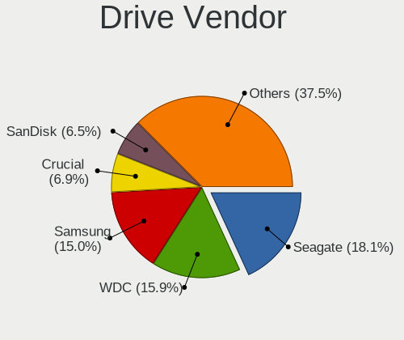
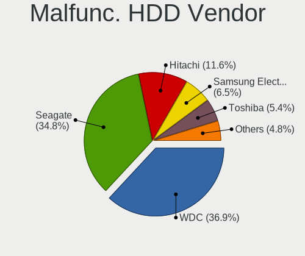
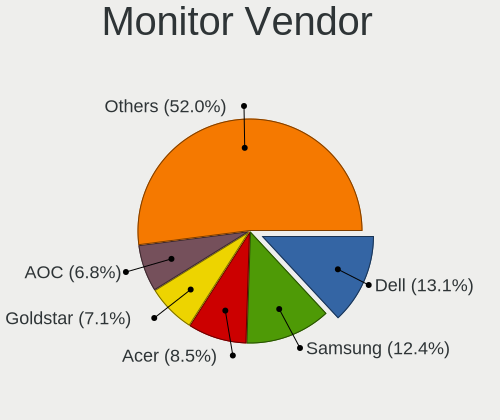
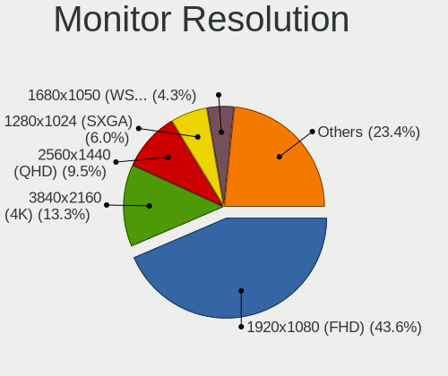
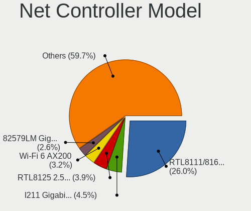
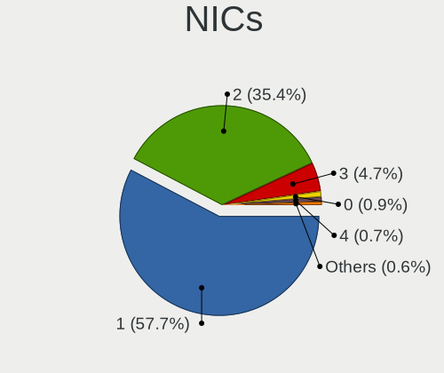
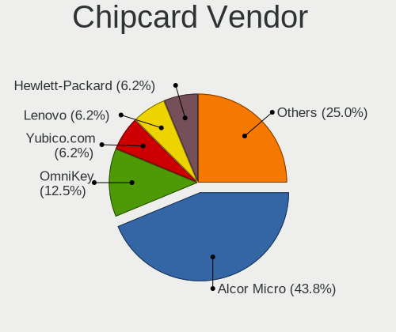

Linux in UK - Tested Hardware & Statistics (Desktops)
-----------------------------------------------------

A project to collect tested hardware configurations for Linux in UK.

Anyone can contribute to this report by the [hw-probe](https://github.com/linuxhw/hw-probe) tool:

    sudo -E hw-probe -all -upload

Please contribute! Especially if your hardware is rare.

Contents
--------

* [ Test Cases ](#test-cases)

* [ System ](#system)
  - [ OS                       ](#os)
  - [ OS Family                ](#os-family)
  - [ Kernel                   ](#kernel)
  - [ Kernel Family            ](#kernel-family)
  - [ Kernel Major Ver.        ](#kernel-major-ver)
  - [ Arch                     ](#arch)
  - [ DE                       ](#de)
  - [ Display Server           ](#display-server)
  - [ Display Manager          ](#display-manager)
  - [ OS Lang                  ](#os-lang)
  - [ Boot Mode                ](#boot-mode)
  - [ Filesystem               ](#filesystem)
  - [ Part. scheme             ](#part-scheme)
  - [ Dual Boot with Linux/BSD ](#dual-boot-with-linuxbsd)
  - [ Dual Boot (Win)          ](#dual-boot-win)

* [ Board ](#board)
  - [ Vendor                   ](#vendor)
  - [ Model                    ](#model)
  - [ Model Family             ](#model-family)
  - [ MFG Year                 ](#mfg-year)
  - [ Form Factor              ](#form-factor)
  - [ Secure Boot              ](#secure-boot)
  - [ Coreboot                 ](#coreboot)
  - [ RAM Size                 ](#ram-size)
  - [ RAM Used                 ](#ram-used)
  - [ Total Drives             ](#total-drives)
  - [ Has CD-ROM               ](#has-cd-rom)
  - [ Has Ethernet             ](#has-ethernet)
  - [ Has WiFi                 ](#has-wifi)
  - [ Has Bluetooth            ](#has-bluetooth)

* [ Location ](#location)
  - [ Country                  ](#country)
  - [ City                     ](#city)

* [ Drives ](#drives)
  - [ Drive Vendor             ](#drive-vendor)
  - [ Drive Model              ](#drive-model)
  - [ HDD Vendor               ](#hdd-vendor)
  - [ SSD Vendor               ](#ssd-vendor)
  - [ Drive Kind               ](#drive-kind)
  - [ Drive Connector          ](#drive-connector)
  - [ Drive Size               ](#drive-size)
  - [ Space Total              ](#space-total)
  - [ Space Used               ](#space-used)
  - [ Malfunc. Drives          ](#malfunc-drives)
  - [ Malfunc. Drive Vendor    ](#malfunc-drive-vendor)
  - [ Malfunc. HDD Vendor      ](#malfunc-hdd-vendor)
  - [ Malfunc. Drive Kind      ](#malfunc-drive-kind)
  - [ Failed Drives            ](#failed-drives)
  - [ Failed Drive Vendor      ](#failed-drive-vendor)
  - [ Drive Status             ](#drive-status)

* [ Storage controller ](#storage-controller)
  - [ Storage Vendor           ](#storage-vendor)
  - [ Storage Model            ](#storage-model)
  - [ Storage Kind             ](#storage-kind)

* [ Processor ](#processor)
  - [ CPU Vendor               ](#cpu-vendor)
  - [ CPU Model                ](#cpu-model)
  - [ CPU Model Family         ](#cpu-model-family)
  - [ CPU Cores                ](#cpu-cores)
  - [ CPU Sockets              ](#cpu-sockets)
  - [ CPU Threads              ](#cpu-threads)
  - [ CPU Op-Modes             ](#cpu-op-modes)
  - [ CPU Microcode            ](#cpu-microcode)
  - [ CPU Microarch            ](#cpu-microarch)

* [ Graphics ](#graphics)
  - [ GPU Vendor               ](#gpu-vendor)
  - [ GPU Model                ](#gpu-model)
  - [ GPU Combo                ](#gpu-combo)
  - [ GPU Driver               ](#gpu-driver)
  - [ GPU Memory               ](#gpu-memory)

* [ Monitor ](#monitor)
  - [ Monitor Vendor           ](#monitor-vendor)
  - [ Monitor Model            ](#monitor-model)
  - [ Monitor Resolution       ](#monitor-resolution)
  - [ Monitor Diagonal         ](#monitor-diagonal)
  - [ Monitor Width            ](#monitor-width)
  - [ Aspect Ratio             ](#aspect-ratio)
  - [ Monitor Area             ](#monitor-area)
  - [ Pixel Density            ](#pixel-density)
  - [ Multiple Monitors        ](#multiple-monitors)

* [ Network ](#network)
  - [ Net Controller Vendor    ](#net-controller-vendor)
  - [ Net Controller Model     ](#net-controller-model)
  - [ Wireless Vendor          ](#wireless-vendor)
  - [ Wireless Model           ](#wireless-model)
  - [ Ethernet Vendor          ](#ethernet-vendor)
  - [ Ethernet Model           ](#ethernet-model)
  - [ Net Controller Kind      ](#net-controller-kind)
  - [ Used Controller          ](#used-controller)
  - [ NICs                     ](#nics)
  - [ IPv6                     ](#ipv6)

* [ Bluetooth ](#bluetooth)
  - [ Bluetooth Vendor         ](#bluetooth-vendor)
  - [ Bluetooth Model          ](#bluetooth-model)

* [ Sound ](#sound)
  - [ Sound Vendor             ](#sound-vendor)
  - [ Sound Model              ](#sound-model)

* [ Memory ](#memory)
  - [ Memory Vendor            ](#memory-vendor)
  - [ Memory Model             ](#memory-model)
  - [ Memory Kind              ](#memory-kind)
  - [ Memory Form Factor       ](#memory-form-factor)
  - [ Memory Size              ](#memory-size)
  - [ Memory Speed             ](#memory-speed)

* [ Printers & scanners ](#printers--scanners)
  - [ Printer Vendor           ](#printer-vendor)
  - [ Printer Model            ](#printer-model)
  - [ Scanner Vendor           ](#scanner-vendor)
  - [ Scanner Model            ](#scanner-model)

* [ Camera ](#camera)
  - [ Camera Vendor            ](#camera-vendor)
  - [ Camera Model             ](#camera-model)

* [ Security ](#security)
  - [ Fingerprint Vendor       ](#fingerprint-vendor)
  - [ Fingerprint Model        ](#fingerprint-model)
  - [ Chipcard Vendor          ](#chipcard-vendor)
  - [ Chipcard Model           ](#chipcard-model)

* [ Unsupported ](#unsupported)
  - [ Unsupported Devices      ](#unsupported-devices)
  - [ Unsupported Device Types ](#unsupported-device-types)

Test Cases
----------

Total: 3698

| Vendor        | Model                       | Probe                                                      | Date         |
|---------------|-----------------------------|------------------------------------------------------------|--------------|
| ASUSTek       | PRIME A320M-K               | [bdae2c60cd](https://linux-hardware.org/?probe=bdae2c60cd) | Sep 01, 2022 |
| Lenovo        | ThinkCentre M58e 7408BA5    | [4384314f98](https://linux-hardware.org/?probe=4384314f98) | Sep 01, 2022 |
| MSI           | H81M-P33                    | [8d15799ff9](https://linux-hardware.org/?probe=8d15799ff9) | Sep 01, 2022 |
| ASUSTek       | ROG STRIX B550-F GAMING     | [3ea6fa4079](https://linux-hardware.org/?probe=3ea6fa4079) | Aug 31, 2022 |
| MSI           | MAG B550M MORTAR WIFI       | [f4d5b9fc69](https://linux-hardware.org/?probe=f4d5b9fc69) | Aug 31, 2022 |
| Dell          | 0CRH6C A02                  | [edb6d4d6c2](https://linux-hardware.org/?probe=edb6d4d6c2) | Aug 31, 2022 |
| Gigabyte      | X570S AORUS ELITE AX        | [36eb80672f](https://linux-hardware.org/?probe=36eb80672f) | Aug 31, 2022 |
| ASUSTek       | PRIME X299-DELUXE           | [a76390d5fc](https://linux-hardware.org/?probe=a76390d5fc) | Aug 31, 2022 |
| ASUSTek       | Z170 PRO GAMING             | [555e7c0745](https://linux-hardware.org/?probe=555e7c0745) | Aug 30, 2022 |
| Alienware     | 01NYPT A00                  | [cd95b79270](https://linux-hardware.org/?probe=cd95b79270) | Aug 29, 2022 |
| ASUSTek       | Maximus VIII HERO           | [8a68d394b8](https://linux-hardware.org/?probe=8a68d394b8) | Aug 29, 2022 |
| MSI           | B450M MORTAR MAX            | [2d89536f80](https://linux-hardware.org/?probe=2d89536f80) | Aug 28, 2022 |
| MSI           | B450M PRO-M2 MAX            | [5e6e789346](https://linux-hardware.org/?probe=5e6e789346) | Aug 28, 2022 |
| Pegatron      | VIOLET6                     | [f17bcbfc4b](https://linux-hardware.org/?probe=f17bcbfc4b) | Aug 28, 2022 |
| Pegatron      | VIOLET6                     | [4960a57d91](https://linux-hardware.org/?probe=4960a57d91) | Aug 28, 2022 |
| ASUSTek       | PRIME B450M-A II            | [37bdc91d97](https://linux-hardware.org/?probe=37bdc91d97) | Aug 26, 2022 |
| ASUSTek       | P8Z68-V LE                  | [9839e8eeff](https://linux-hardware.org/?probe=9839e8eeff) | Aug 26, 2022 |
| Lenovo        | SHARKBAY 0B98405 STD        | [f8f9cd2bfc](https://linux-hardware.org/?probe=f8f9cd2bfc) | Aug 25, 2022 |
| ASUSTek       | PRIME H510M-E               | [c1c6b26e42](https://linux-hardware.org/?probe=c1c6b26e42) | Aug 25, 2022 |
| Gigabyte      | X570S AORUS PRO AX          | [4fb948980f](https://linux-hardware.org/?probe=4fb948980f) | Aug 25, 2022 |
| HP            | 2AFB                        | [ea3ce3f8dd](https://linux-hardware.org/?probe=ea3ce3f8dd) | Aug 24, 2022 |
| Dell          | 0200DY A03                  | [9da770b898](https://linux-hardware.org/?probe=9da770b898) | Aug 24, 2022 |
| Dell          | 08HPGT A01                  | [744f838dc2](https://linux-hardware.org/?probe=744f838dc2) | Aug 24, 2022 |
| ASRock        | X570M Pro4                  | [f2bc1e0fae](https://linux-hardware.org/?probe=f2bc1e0fae) | Aug 23, 2022 |
| Gigabyte      | 970A-DS3P                   | [79bc344d85](https://linux-hardware.org/?probe=79bc344d85) | Aug 23, 2022 |
| ASUSTek       | M5A78L-M/USB3               | [fa5f1121d5](https://linux-hardware.org/?probe=fa5f1121d5) | Aug 22, 2022 |
| Gigabyte      | B450 AORUS M                | [68fa656563](https://linux-hardware.org/?probe=68fa656563) | Aug 21, 2022 |
| HP            | 805B                        | [e7fa1a7244](https://linux-hardware.org/?probe=e7fa1a7244) | Aug 21, 2022 |
| Unknown       | X79A                        | [5c545069e2](https://linux-hardware.org/?probe=5c545069e2) | Aug 21, 2022 |
| ASUSTek       | ROG STRIX X299-E GAMING     | [3a7a62f6f8](https://linux-hardware.org/?probe=3a7a62f6f8) | Aug 19, 2022 |
| ECS           | GF8100VM-M5                 | [0dcfde6fc6](https://linux-hardware.org/?probe=0dcfde6fc6) | Aug 18, 2022 |
| HP            | 8591                        | [4235eb97c1](https://linux-hardware.org/?probe=4235eb97c1) | Aug 18, 2022 |
| MSI           | B450-A PRO MAX              | [9a1a049600](https://linux-hardware.org/?probe=9a1a049600) | Aug 18, 2022 |
| ASRock        | Z490 Phantom Gaming 4       | [7b66b20b9f](https://linux-hardware.org/?probe=7b66b20b9f) | Aug 17, 2022 |
| ASRock        | B550M-ITX/ac                | [6a95ac6709](https://linux-hardware.org/?probe=6a95ac6709) | Aug 17, 2022 |
| HP            | 0B54h D                     | [2d1764e553](https://linux-hardware.org/?probe=2d1764e553) | Aug 16, 2022 |
| Gigabyte      | GA-970A-UD3                 | [9a1ff39910](https://linux-hardware.org/?probe=9a1ff39910) | Aug 15, 2022 |
| Acer          | Aspire XC-330               | [2012033d09](https://linux-hardware.org/?probe=2012033d09) | Aug 14, 2022 |
| Gigabyte      | X570 I AORUS PRO WIFI       | [c2c1f93ff4](https://linux-hardware.org/?probe=c2c1f93ff4) | Aug 14, 2022 |
| ASRock        | B450M Pro4                  | [ac9e2d3187](https://linux-hardware.org/?probe=ac9e2d3187) | Aug 14, 2022 |
| Dell          | 0KP561                      | [38f01be008](https://linux-hardware.org/?probe=38f01be008) | Aug 13, 2022 |
| Dell          | 0KP561                      | [293f6f95bb](https://linux-hardware.org/?probe=293f6f95bb) | Aug 13, 2022 |
| Dell          | 08WKV3 A00                  | [4e57c20454](https://linux-hardware.org/?probe=4e57c20454) | Aug 13, 2022 |
| ASUSTek       | ROG STRIX X299-E GAMING     | [5ef85261aa](https://linux-hardware.org/?probe=5ef85261aa) | Aug 13, 2022 |
| MSI           | A68HM-E33 V2                | [762f08a697](https://linux-hardware.org/?probe=762f08a697) | Aug 13, 2022 |
| ASUSTek       | PRIME A320M-K               | [44f3f1991f](https://linux-hardware.org/?probe=44f3f1991f) | Aug 13, 2022 |
| ASUSTek       | ROG Maximus XI HERO         | [5c8d31c692](https://linux-hardware.org/?probe=5c8d31c692) | Aug 13, 2022 |
| MSI           | Z97M-G43                    | [6e7d79dac7](https://linux-hardware.org/?probe=6e7d79dac7) | Aug 12, 2022 |
| ASRock        | FM2A88M-HD+ R2.0            | [e1f4ef0670](https://linux-hardware.org/?probe=e1f4ef0670) | Aug 12, 2022 |
| Dell          | 0T10XW A02                  | [45491460bc](https://linux-hardware.org/?probe=45491460bc) | Aug 12, 2022 |
| ASRock        | B450M Pro4                  | [57c63e8fb9](https://linux-hardware.org/?probe=57c63e8fb9) | Aug 12, 2022 |
| HP            | 304Ah                       | [bc1242ecf9](https://linux-hardware.org/?probe=bc1242ecf9) | Aug 12, 2022 |
| HP            | 304Ah                       | [82db2a1b27](https://linux-hardware.org/?probe=82db2a1b27) | Aug 12, 2022 |
| MSI           | MPG Z390 GAMING PLUS        | [73bf30c596](https://linux-hardware.org/?probe=73bf30c596) | Aug 11, 2022 |
| MSI           | MPG Z390 GAMING PLUS        | [a3aa50c16a](https://linux-hardware.org/?probe=a3aa50c16a) | Aug 10, 2022 |
| OEM_MB        | NARRA3                      | [4574011966](https://linux-hardware.org/?probe=4574011966) | Aug 09, 2022 |
| OEM_MB        | NARRA3                      | [8454f0f091](https://linux-hardware.org/?probe=8454f0f091) | Aug 09, 2022 |
| Dell          | 0782GW A01                  | [b3ebc3aed3](https://linux-hardware.org/?probe=b3ebc3aed3) | Aug 08, 2022 |
| ASUSTek       | ROG STRIX B550-F GAMING     | [ef0510a3a8](https://linux-hardware.org/?probe=ef0510a3a8) | Aug 07, 2022 |
| ASUSTek       | Rampage V EXTREME           | [d04d31476f](https://linux-hardware.org/?probe=d04d31476f) | Aug 07, 2022 |
| Gigabyte      | A320M-S2H-CF                | [31c87abaf3](https://linux-hardware.org/?probe=31c87abaf3) | Aug 07, 2022 |
| Gigabyte      | A320M-H-CF                  | [4015089c1e](https://linux-hardware.org/?probe=4015089c1e) | Aug 06, 2022 |
| ASUSTek       | TUF B450M-PLUS GAMING       | [3e7a65077d](https://linux-hardware.org/?probe=3e7a65077d) | Aug 06, 2022 |
| ASUSTek       | Rampage V EXTREME           | [000a2985cc](https://linux-hardware.org/?probe=000a2985cc) | Aug 06, 2022 |
| Intel         | D525MW AAE93082-401         | [a225baa8a4](https://linux-hardware.org/?probe=a225baa8a4) | Aug 05, 2022 |
| MSI           | A320M-A PRO M2              | [dd98f4e118](https://linux-hardware.org/?probe=dd98f4e118) | Aug 05, 2022 |
| Dell          | 03NVJ6 A00                  | [9655bf78d0](https://linux-hardware.org/?probe=9655bf78d0) | Aug 05, 2022 |
| Gigabyte      | GA-990X-Gaming SLI-CF       | [eb168cff15](https://linux-hardware.org/?probe=eb168cff15) | Aug 04, 2022 |
| Dell          | 0T10XW A02                  | [66c1af1f67](https://linux-hardware.org/?probe=66c1af1f67) | Aug 04, 2022 |
| Gigabyte      | M68MT-S2P                   | [7c41cd3006](https://linux-hardware.org/?probe=7c41cd3006) | Aug 04, 2022 |
| MSI           | B450 TOMAHAWK MAX           | [7c4355417f](https://linux-hardware.org/?probe=7c4355417f) | Aug 03, 2022 |
| MSI           | MPG X570 GAMING PLUS        | [6e77095fb6](https://linux-hardware.org/?probe=6e77095fb6) | Aug 03, 2022 |
| Gigabyte      | GA-78LMT-USB3 R2 sex        | [4e6ea804e9](https://linux-hardware.org/?probe=4e6ea804e9) | Aug 02, 2022 |
| Intel         | DQ57TM AAE92694-401         | [d0b939d1ff](https://linux-hardware.org/?probe=d0b939d1ff) | Aug 02, 2022 |
| ASUSTek       | PRIME B250M-A               | [b9f727338f](https://linux-hardware.org/?probe=b9f727338f) | Aug 01, 2022 |
| Dell          | 0F8098                      | [4e6058685a](https://linux-hardware.org/?probe=4e6058685a) | Jul 30, 2022 |
| ASUSTek       | GA15DH                      | [ae5b3f7aa5](https://linux-hardware.org/?probe=ae5b3f7aa5) | Jul 30, 2022 |
| ASUSTek       | PRIME A320M-A               | [38d33f0f0e](https://linux-hardware.org/?probe=38d33f0f0e) | Jul 30, 2022 |
| MSI           | MPG B550 GAMING EDGE WIF... | [9258c864d5](https://linux-hardware.org/?probe=9258c864d5) | Jul 29, 2022 |
| MSI           | MPG B550 GAMING EDGE WIF... | [ebe9fe3b1a](https://linux-hardware.org/?probe=ebe9fe3b1a) | Jul 29, 2022 |
| ASUSTek       | ProArt X570-CREATOR WIFI    | [297217baa1](https://linux-hardware.org/?probe=297217baa1) | Jul 28, 2022 |
| MSI           | AM1I                        | [63e6d4040e](https://linux-hardware.org/?probe=63e6d4040e) | Jul 28, 2022 |
| ASRock        | FM2A55M-DGS                 | [d30fc86506](https://linux-hardware.org/?probe=d30fc86506) | Jul 28, 2022 |
| MSI           | B450 TOMAHAWK MAX           | [df54f79195](https://linux-hardware.org/?probe=df54f79195) | Jul 28, 2022 |
| ASUSTek       | ROG STRIX B550-F GAMING     | [4a2fff69f5](https://linux-hardware.org/?probe=4a2fff69f5) | Jul 27, 2022 |
| Gigabyte      | H97-Gaming 3                | [90656d8ef4](https://linux-hardware.org/?probe=90656d8ef4) | Jul 27, 2022 |
| Foxconn       | A76ML-K 30                  | [7b118c6a6b](https://linux-hardware.org/?probe=7b118c6a6b) | Jul 27, 2022 |
| Apple         | Mac-F221BEC8                | [98461afcdb](https://linux-hardware.org/?probe=98461afcdb) | Jul 27, 2022 |
| Apple         | Mac-F221BEC8                | [703ce95e74](https://linux-hardware.org/?probe=703ce95e74) | Jul 27, 2022 |
| Gigabyte      | B450 AORUS M                | [f9b0fe48d6](https://linux-hardware.org/?probe=f9b0fe48d6) | Jul 27, 2022 |
| ASUSTek       | ROG STRIX X570-I GAMING     | [b41540a078](https://linux-hardware.org/?probe=b41540a078) | Jul 26, 2022 |
| Gigabyte      | 970A-DS3P                   | [5263528b46](https://linux-hardware.org/?probe=5263528b46) | Jul 26, 2022 |
| Unknown       | Unknown                     | [fad6d4558f](https://linux-hardware.org/?probe=fad6d4558f) | Jul 26, 2022 |
| Gigabyte      | 970A-DS3P                   | [9f2d322e07](https://linux-hardware.org/?probe=9f2d322e07) | Jul 26, 2022 |
| ASUSTek       | ROG STRIX B550-F GAMING     | [311984b36d](https://linux-hardware.org/?probe=311984b36d) | Jul 26, 2022 |
| ASUSTek       | PRIME B450-PLUS             | [32045fd953](https://linux-hardware.org/?probe=32045fd953) | Jul 26, 2022 |
| Medion        | MS-7800                     | [cb2ef643bb](https://linux-hardware.org/?probe=cb2ef643bb) | Jul 26, 2022 |
| Dell          | 0HD5W2 A01                  | [d2f8761a45](https://linux-hardware.org/?probe=d2f8761a45) | Jul 25, 2022 |
| ASRock        | A520M-ITX/ac                | [876c779461](https://linux-hardware.org/?probe=876c779461) | Jul 25, 2022 |
| MSI           | X470 GAMING PLUS MAX        | [fe6b7362b8](https://linux-hardware.org/?probe=fe6b7362b8) | Jul 25, 2022 |
| Gigabyte      | X570 I AORUS PRO WIFI       | [b874a0aa8e](https://linux-hardware.org/?probe=b874a0aa8e) | Jul 25, 2022 |
| Dell          | 0VHWTR A01                  | [9796d6eca3](https://linux-hardware.org/?probe=9796d6eca3) | Jul 24, 2022 |
| Medion        | MS-7800                     | [320071c9a0](https://linux-hardware.org/?probe=320071c9a0) | Jul 24, 2022 |
| Fujitsu       | D3162-A1 S26361-D3162-A1    | [567addf380](https://linux-hardware.org/?probe=567addf380) | Jul 24, 2022 |
| MSI           | MPG Z390 GAMING EDGE AC     | [903908877a](https://linux-hardware.org/?probe=903908877a) | Jul 24, 2022 |
| Fujitsu       | D3500-A1 S26361-D3500-A1    | [ba1841221c](https://linux-hardware.org/?probe=ba1841221c) | Jul 24, 2022 |
| ASUSTek       | ROG STRIX B550-F GAMING     | [e512b2f9f2](https://linux-hardware.org/?probe=e512b2f9f2) | Jul 23, 2022 |
| Dell          | 0J8H4R A01                  | [3d7d06475c](https://linux-hardware.org/?probe=3d7d06475c) | Jul 23, 2022 |
| Dell          | 0FDY5C A00                  | [f5d81fb635](https://linux-hardware.org/?probe=f5d81fb635) | Jul 23, 2022 |
| Dell          | 0FDY5C A00                  | [83cf5f7085](https://linux-hardware.org/?probe=83cf5f7085) | Jul 23, 2022 |
| Dell          | 0P01GV A03                  | [60b77cc6b5](https://linux-hardware.org/?probe=60b77cc6b5) | Jul 22, 2022 |
| Gigabyte      | X570 I AORUS PRO WIFI       | [f383b92a53](https://linux-hardware.org/?probe=f383b92a53) | Jul 22, 2022 |
| ASUSTek       | 970 PRO GAMING/AURA         | [b73fab8218](https://linux-hardware.org/?probe=b73fab8218) | Jul 22, 2022 |
| Gigabyte      | Z97-D3H-CF                  | [07be23439c](https://linux-hardware.org/?probe=07be23439c) | Jul 21, 2022 |
| HP            | 1998                        | [82c8302941](https://linux-hardware.org/?probe=82c8302941) | Jul 21, 2022 |
| MSI           | B150M BAZOOKA               | [41053f8c0e](https://linux-hardware.org/?probe=41053f8c0e) | Jul 21, 2022 |
| ASUSTek       | H110M-R                     | [34942a8abc](https://linux-hardware.org/?probe=34942a8abc) | Jul 20, 2022 |
| Gigabyte      | B550M AORUS PRO-P           | [55fdb6713c](https://linux-hardware.org/?probe=55fdb6713c) | Jul 19, 2022 |
| ASUSTek       | H81M-E                      | [4696230d64](https://linux-hardware.org/?probe=4696230d64) | Jul 19, 2022 |
| Acer          | Predator PO3-620            | [f3e22c0e6d](https://linux-hardware.org/?probe=f3e22c0e6d) | Jul 18, 2022 |
| ASUSTek       | TUF Gaming X570-PLUS        | [dac8603f3d](https://linux-hardware.org/?probe=dac8603f3d) | Jul 17, 2022 |
| Gigabyte      | H310M H x.x                 | [b864280c98](https://linux-hardware.org/?probe=b864280c98) | Jul 17, 2022 |
| Intel         | DQ67SW AAG12527-310         | [9a4907d88c](https://linux-hardware.org/?probe=9a4907d88c) | Jul 17, 2022 |
| Gigabyte      | Z170X-Gaming 7              | [5096e0dfea](https://linux-hardware.org/?probe=5096e0dfea) | Jul 17, 2022 |
| Gigabyte      | X570 AORUS XTREME           | [4142cbc3d4](https://linux-hardware.org/?probe=4142cbc3d4) | Jul 16, 2022 |
| HP            | 88BF                        | [92b12df551](https://linux-hardware.org/?probe=92b12df551) | Jul 15, 2022 |
| ASUSTek       | ROG STRIX Z490-F GAMING     | [7efe67fd9a](https://linux-hardware.org/?probe=7efe67fd9a) | Jul 15, 2022 |
| BESSTAR Te... | TL50                        | [c77ff65710](https://linux-hardware.org/?probe=c77ff65710) | Jul 15, 2022 |
| ASUSTek       | ProArt X570-CREATOR WIFI    | [fecf83d1eb](https://linux-hardware.org/?probe=fecf83d1eb) | Jul 14, 2022 |
| ASUSTek       | ProArt X570-CREATOR WIFI    | [0893dc4cc3](https://linux-hardware.org/?probe=0893dc4cc3) | Jul 14, 2022 |
| Gigabyte      | 970A-DS3P                   | [4de6deb720](https://linux-hardware.org/?probe=4de6deb720) | Jul 14, 2022 |
| MSI           | B365M PRO-VDH               | [7ff6dc5131](https://linux-hardware.org/?probe=7ff6dc5131) | Jul 13, 2022 |
| MSI           | B450 TOMAHAWK MAX           | [ac37352e9b](https://linux-hardware.org/?probe=ac37352e9b) | Jul 13, 2022 |
| Gigabyte      | H310M H x.x                 | [78bb4d2a41](https://linux-hardware.org/?probe=78bb4d2a41) | Jul 13, 2022 |
| ASUSTek       | ROG Maximus X HERO          | [575388d90b](https://linux-hardware.org/?probe=575388d90b) | Jul 12, 2022 |
| HP            | 3398                        | [1b964004d9](https://linux-hardware.org/?probe=1b964004d9) | Jul 12, 2022 |
| ASRock        | Wolfdale1333-D667           | [80e47e8ff5](https://linux-hardware.org/?probe=80e47e8ff5) | Jul 12, 2022 |
| ASUSTek       | V-P8H61E                    | [f8e5b72d1c](https://linux-hardware.org/?probe=f8e5b72d1c) | Jul 12, 2022 |
| Dell          | 0P01GV A03                  | [6b4cd20919](https://linux-hardware.org/?probe=6b4cd20919) | Jul 12, 2022 |
| Gigabyte      | X570S AORUS PRO AX          | [42b248f049](https://linux-hardware.org/?probe=42b248f049) | Jul 11, 2022 |
| Gigabyte      | A320M-S2H-CF                | [0967e17760](https://linux-hardware.org/?probe=0967e17760) | Jul 11, 2022 |
| ASRock        | P43DE                       | [0dbb7293a1](https://linux-hardware.org/?probe=0dbb7293a1) | Jul 11, 2022 |
| Gigabyte      | AB350M-Gaming 3-CF          | [978d27ca8b](https://linux-hardware.org/?probe=978d27ca8b) | Jul 10, 2022 |
| Gigabyte      | AB350M-Gaming 3-CF          | [3209c50980](https://linux-hardware.org/?probe=3209c50980) | Jul 10, 2022 |
| Dell          | 0J3C2F A00                  | [36252f70d6](https://linux-hardware.org/?probe=36252f70d6) | Jul 10, 2022 |
| Dell          | 0J3C2F A00                  | [e3197762a9](https://linux-hardware.org/?probe=e3197762a9) | Jul 10, 2022 |
| ASRock        | P43DE                       | [2aa8290d56](https://linux-hardware.org/?probe=2aa8290d56) | Jul 10, 2022 |
| ASRock        | Z77 Pro3                    | [289b6912d0](https://linux-hardware.org/?probe=289b6912d0) | Jul 10, 2022 |
| Gigabyte      | Z77-D3H                     | [f9e15346d3](https://linux-hardware.org/?probe=f9e15346d3) | Jul 10, 2022 |
| ASRock        | Z77 Pro3                    | [a03b01d3b5](https://linux-hardware.org/?probe=a03b01d3b5) | Jul 10, 2022 |
| Gigabyte      | GA-78LMT-S2P                | [a374367376](https://linux-hardware.org/?probe=a374367376) | Jul 09, 2022 |
| ASRock        | A320M-HDV R4.0              | [4f7f102599](https://linux-hardware.org/?probe=4f7f102599) | Jul 08, 2022 |
| MSI           | B450-A PRO MAX              | [32d1c38bf4](https://linux-hardware.org/?probe=32d1c38bf4) | Jul 08, 2022 |
| Gigabyte      | X570 AORUS ELITE            | [3458084b51](https://linux-hardware.org/?probe=3458084b51) | Jul 08, 2022 |
| ASUSTek       | PRIME X370-PRO              | [d96e1a1528](https://linux-hardware.org/?probe=d96e1a1528) | Jul 08, 2022 |
| Dell          | 0DR845                      | [424649e737](https://linux-hardware.org/?probe=424649e737) | Jul 07, 2022 |
| Inventec      | D CLASS A02                 | [0fecc82851](https://linux-hardware.org/?probe=0fecc82851) | Jul 06, 2022 |
| Gigabyte      | Z170X-UD3-CF                | [aecc3e1863](https://linux-hardware.org/?probe=aecc3e1863) | Jul 06, 2022 |
| Inventec      | D CLASS A02                 | [ac1652fd54](https://linux-hardware.org/?probe=ac1652fd54) | Jul 06, 2022 |
| Gigabyte      | B550 GAMING X V2            | [61eaf99aca](https://linux-hardware.org/?probe=61eaf99aca) | Jul 05, 2022 |
| Gigabyte      | B550 GAMING X V2            | [812733dd89](https://linux-hardware.org/?probe=812733dd89) | Jul 05, 2022 |
| Dell          | 054KM3 A01                  | [407b210bfe](https://linux-hardware.org/?probe=407b210bfe) | Jul 05, 2022 |
| ASUSTek       | ROG CROSSHAIR VIII DARK ... | [685e3d36bc](https://linux-hardware.org/?probe=685e3d36bc) | Jul 04, 2022 |
| ASUSTek       | ROG CROSSHAIR VIII DARK ... | [b436712f17](https://linux-hardware.org/?probe=b436712f17) | Jul 04, 2022 |
| Gigabyte      | X570 AORUS ULTRA            | [c76805b11f](https://linux-hardware.org/?probe=c76805b11f) | Jul 04, 2022 |
| Gigabyte      | A320M-S2H-CF                | [7f4faab065](https://linux-hardware.org/?probe=7f4faab065) | Jul 04, 2022 |
| Apple         | Mac-F60DEB81FF30ACF6 Mac... | [a6fb0fd95c](https://linux-hardware.org/?probe=a6fb0fd95c) | Jul 03, 2022 |
| Gigabyte      | Z87X-OC-CF                  | [654459e245](https://linux-hardware.org/?probe=654459e245) | Jul 03, 2022 |
| MSI           | B450-A PRO MAX              | [e2ff106ce0](https://linux-hardware.org/?probe=e2ff106ce0) | Jul 03, 2022 |
| Gigabyte      | A320M-S2H-CF                | [24d32e73bd](https://linux-hardware.org/?probe=24d32e73bd) | Jul 03, 2022 |
| HP            | 8350                        | [39a8a75ebe](https://linux-hardware.org/?probe=39a8a75ebe) | Jul 03, 2022 |
| Acer          | Aspire TC-1660 V:1.1        | [4b65cbc6e6](https://linux-hardware.org/?probe=4b65cbc6e6) | Jul 03, 2022 |
| Intel         | DQ57TM AAE70931-403         | [92c11e77c4](https://linux-hardware.org/?probe=92c11e77c4) | Jul 03, 2022 |
| Dell          | 0P01GV A03                  | [0bbac8ce1f](https://linux-hardware.org/?probe=0bbac8ce1f) | Jul 01, 2022 |
| ASUSTek       | TUF Gaming X570-PLUS        | [7e14880c80](https://linux-hardware.org/?probe=7e14880c80) | Jun 30, 2022 |
| HP            | 0B54h D                     | [bef89f554e](https://linux-hardware.org/?probe=bef89f554e) | Jun 30, 2022 |
| ASRock        | AB350 Pro4                  | [7049f819f0](https://linux-hardware.org/?probe=7049f819f0) | Jun 30, 2022 |
| MSI           | MAG B550 TOMAHAWK           | [7a90f7795b](https://linux-hardware.org/?probe=7a90f7795b) | Jun 30, 2022 |
| Gigabyte      | GA-78LMT-USB3               | [608388f911](https://linux-hardware.org/?probe=608388f911) | Jun 29, 2022 |
| Dell          | 0XCR8D A02                  | [4573e16702](https://linux-hardware.org/?probe=4573e16702) | Jun 29, 2022 |
| ASRock        | H61M-ITX                    | [e8d5e4ff14](https://linux-hardware.org/?probe=e8d5e4ff14) | Jun 29, 2022 |
| ASUSTek       | PRIME B550-PLUS             | [3ba50e78b9](https://linux-hardware.org/?probe=3ba50e78b9) | Jun 29, 2022 |
| ASUSTek       | PRIME B550-PLUS             | [f33854651b](https://linux-hardware.org/?probe=f33854651b) | Jun 29, 2022 |
| ASRock        | P43DE                       | [f52d106d92](https://linux-hardware.org/?probe=f52d106d92) | Jun 28, 2022 |
| ASUSTek       | M5A97 EVO R2.0              | [287a6346a7](https://linux-hardware.org/?probe=287a6346a7) | Jun 27, 2022 |
| Dell          | 0P01GV A03                  | [74401fdf8b](https://linux-hardware.org/?probe=74401fdf8b) | Jun 26, 2022 |
| HP            | 1496                        | [97616aecd6](https://linux-hardware.org/?probe=97616aecd6) | Jun 26, 2022 |
| ASRock        | H61M-ITX                    | [6c9ee0dadd](https://linux-hardware.org/?probe=6c9ee0dadd) | Jun 26, 2022 |
| HP            | 1496                        | [3ab73cb742](https://linux-hardware.org/?probe=3ab73cb742) | Jun 26, 2022 |
| Intel         | DQ57TM AAE70931-403         | [357e062693](https://linux-hardware.org/?probe=357e062693) | Jun 25, 2022 |
| ASRock        | P43DE                       | [80f90e4fcd](https://linux-hardware.org/?probe=80f90e4fcd) | Jun 24, 2022 |
| Dell          | 0XR1GT A00                  | [0d72ab6a71](https://linux-hardware.org/?probe=0d72ab6a71) | Jun 24, 2022 |
| HP            | 8265                        | [3de1cae37a](https://linux-hardware.org/?probe=3de1cae37a) | Jun 24, 2022 |
| Apple         | Mac-F60DEB81FF30ACF6 Mac... | [04e6f0ee4a](https://linux-hardware.org/?probe=04e6f0ee4a) | Jun 24, 2022 |
| ABIT          | IP35 Pro                    | [a5f262c233](https://linux-hardware.org/?probe=a5f262c233) | Jun 23, 2022 |
| HP            | 3397                        | [3c7afd0ee2](https://linux-hardware.org/?probe=3c7afd0ee2) | Jun 23, 2022 |
| Dell          | 02YYK5 A00                  | [7a571de1b9](https://linux-hardware.org/?probe=7a571de1b9) | Jun 22, 2022 |
| Unknown       | Unknown                     | [6024015ecc](https://linux-hardware.org/?probe=6024015ecc) | Jun 21, 2022 |
| MSI           | A320M-A PRO                 | [1f3b17165b](https://linux-hardware.org/?probe=1f3b17165b) | Jun 21, 2022 |
| HP            | ProLiant ML110 G7           | [1cd927a911](https://linux-hardware.org/?probe=1cd927a911) | Jun 21, 2022 |
| HP            | 2B4B                        | [0e699c16a4](https://linux-hardware.org/?probe=0e699c16a4) | Jun 21, 2022 |
| HP            | 2B4B                        | [d179d2050d](https://linux-hardware.org/?probe=d179d2050d) | Jun 21, 2022 |
| Dell          | 0XCR8D A02                  | [9423c99e6c](https://linux-hardware.org/?probe=9423c99e6c) | Jun 21, 2022 |
| ASUSTek       | Z170 PRO GAMING/AURA        | [6ddca91c97](https://linux-hardware.org/?probe=6ddca91c97) | Jun 21, 2022 |
| Biostar       | N68S3+                      | [efe83d16ac](https://linux-hardware.org/?probe=efe83d16ac) | Jun 21, 2022 |
| MSI           | MPG B550 GAMING EDGE WIF... | [f3176204c8](https://linux-hardware.org/?probe=f3176204c8) | Jun 21, 2022 |
| Gigabyte      | MZBAYAP-00                  | [f8a734d114](https://linux-hardware.org/?probe=f8a734d114) | Jun 20, 2022 |
| Unknown       | Unknown                     | [604913c4e4](https://linux-hardware.org/?probe=604913c4e4) | Jun 20, 2022 |
| Gigabyte      | X570 AORUS MASTER           | [d5af99ece6](https://linux-hardware.org/?probe=d5af99ece6) | Jun 20, 2022 |
| MSI           | A320M-A PRO                 | [8cecec73c6](https://linux-hardware.org/?probe=8cecec73c6) | Jun 19, 2022 |
| Dell          | 0HD5W2 A01                  | [714a296099](https://linux-hardware.org/?probe=714a296099) | Jun 19, 2022 |
| ASUSTek       | ROG CROSSHAIR VIII DARK ... | [560fa88cad](https://linux-hardware.org/?probe=560fa88cad) | Jun 19, 2022 |
| HP            | 843B                        | [21619041e8](https://linux-hardware.org/?probe=21619041e8) | Jun 19, 2022 |
| Gigabyte      | X570S AORUS PRO AX          | [ff71b93299](https://linux-hardware.org/?probe=ff71b93299) | Jun 19, 2022 |
| HP            | 1494                        | [2dc41c0b99](https://linux-hardware.org/?probe=2dc41c0b99) | Jun 19, 2022 |
| ASUSTek       | ROG STRIX B550-F GAMING     | [bbe948274e](https://linux-hardware.org/?probe=bbe948274e) | Jun 18, 2022 |
| ASUSTek       | ROG STRIX B550-F GAMING     | [c61fdedfff](https://linux-hardware.org/?probe=c61fdedfff) | Jun 18, 2022 |
| Gigabyte      | MZBAYAP-00                  | [8fb623d313](https://linux-hardware.org/?probe=8fb623d313) | Jun 17, 2022 |
| ASUSTek       | ROG CROSSHAIR VIII DARK ... | [f4178c276d](https://linux-hardware.org/?probe=f4178c276d) | Jun 16, 2022 |
| Gigabyte      | F2A78M-HD2                  | [d6be55432d](https://linux-hardware.org/?probe=d6be55432d) | Jun 16, 2022 |
| Lenovo        | 3102 SDK0J40697 WIN 3305... | [cee122d15f](https://linux-hardware.org/?probe=cee122d15f) | Jun 16, 2022 |
| AZW           | Gemini T34                  | [553b174ce2](https://linux-hardware.org/?probe=553b174ce2) | Jun 16, 2022 |
| HP            | 3031h                       | [00080c0264](https://linux-hardware.org/?probe=00080c0264) | Jun 16, 2022 |
| ASRock        | B550M-ITX/ac                | [42fd0dcad9](https://linux-hardware.org/?probe=42fd0dcad9) | Jun 16, 2022 |
| ASUSTek       | ROG CROSSHAIR VIII DARK ... | [e8f85ab771](https://linux-hardware.org/?probe=e8f85ab771) | Jun 16, 2022 |
| MSI           | B450 TOMAHAWK MAX           | [994f64f470](https://linux-hardware.org/?probe=994f64f470) | Jun 15, 2022 |
| MSI           | B450 TOMAHAWK MAX           | [d5cefb3aa6](https://linux-hardware.org/?probe=d5cefb3aa6) | Jun 15, 2022 |
| ASRock        | B450 Gaming-ITX/ac          | [5afd9dcda0](https://linux-hardware.org/?probe=5afd9dcda0) | Jun 15, 2022 |
| Gigabyte      | X570 AORUS XTREME           | [e00b8334dd](https://linux-hardware.org/?probe=e00b8334dd) | Jun 15, 2022 |
| ASUSTek       | PRIME Z370-P                | [b6cdb73504](https://linux-hardware.org/?probe=b6cdb73504) | Jun 15, 2022 |
| Dell          | 0XCR8D A02                  | [134e7208cc](https://linux-hardware.org/?probe=134e7208cc) | Jun 15, 2022 |
| ASUSTek       | ROG CROSSHAIR VIII DARK ... | [131a938c5e](https://linux-hardware.org/?probe=131a938c5e) | Jun 14, 2022 |
| Intel         | DH67BL AAG10189-211         | [15cb74d079](https://linux-hardware.org/?probe=15cb74d079) | Jun 13, 2022 |
| Dell          | 09D2HH A00                  | [fde3cee794](https://linux-hardware.org/?probe=fde3cee794) | Jun 13, 2022 |
| HP            | 18E5                        | [275b8ca77c](https://linux-hardware.org/?probe=275b8ca77c) | Jun 12, 2022 |
| Dell          | 0P01GV A03                  | [c1e6618ac5](https://linux-hardware.org/?probe=c1e6618ac5) | Jun 12, 2022 |
| Dell          | 0KC9NP A01                  | [c573376df6](https://linux-hardware.org/?probe=c573376df6) | Jun 11, 2022 |
| MSI           | X99A GAMING PRO CARBON      | [31275cdf72](https://linux-hardware.org/?probe=31275cdf72) | Jun 10, 2022 |
| MSI           | X99A GAMING PRO CARBON      | [9e574bef7c](https://linux-hardware.org/?probe=9e574bef7c) | Jun 10, 2022 |
| ASUSTek       | ROG Maximus XII HERO        | [843d2132ad](https://linux-hardware.org/?probe=843d2132ad) | Jun 09, 2022 |
| ASUSTek       | PRIME B350-PLUS             | [7cdc9be674](https://linux-hardware.org/?probe=7cdc9be674) | Jun 09, 2022 |
| ASUSTek       | ROG CROSSHAIR VIII DARK ... | [6d195af721](https://linux-hardware.org/?probe=6d195af721) | Jun 09, 2022 |
| Dell          | 0XR1GT A00                  | [8c3fd28612](https://linux-hardware.org/?probe=8c3fd28612) | Jun 08, 2022 |
| AZW           | Gemini J45                  | [f4d7238f95](https://linux-hardware.org/?probe=f4d7238f95) | Jun 08, 2022 |
| Fujitsu       | D2990-A1 S26361-D2990-A1    | [36d73de92c](https://linux-hardware.org/?probe=36d73de92c) | Jun 08, 2022 |
| Apple         | Mac-F221BEC8                | [b56845a5b8](https://linux-hardware.org/?probe=b56845a5b8) | Jun 08, 2022 |
| MSI           | B550-A PRO                  | [13c7b714dc](https://linux-hardware.org/?probe=13c7b714dc) | Jun 07, 2022 |
| Dell          | 0WR7PY A03                  | [902546cb45](https://linux-hardware.org/?probe=902546cb45) | Jun 06, 2022 |
| ASUSTek       | ROG CROSSHAIR VIII DARK ... | [0b042e37b3](https://linux-hardware.org/?probe=0b042e37b3) | Jun 06, 2022 |
| ASUSTek       | TUF Z270 MARK 2             | [e993e32a56](https://linux-hardware.org/?probe=e993e32a56) | Jun 06, 2022 |
| HP            | 8350                        | [63a9e40af6](https://linux-hardware.org/?probe=63a9e40af6) | Jun 05, 2022 |
| Dell          | 0WR7PY A01                  | [39c37e56ec](https://linux-hardware.org/?probe=39c37e56ec) | Jun 04, 2022 |
| ASUSTek       | ROG CROSSHAIR VIII DARK ... | [9829bd8f60](https://linux-hardware.org/?probe=9829bd8f60) | Jun 03, 2022 |
| HP            | 8055                        | [400c0e19cc](https://linux-hardware.org/?probe=400c0e19cc) | Jun 02, 2022 |
| ASUSTek       | PRIME A320M-K               | [2a7bfa492d](https://linux-hardware.org/?probe=2a7bfa492d) | Jun 02, 2022 |
| MSI           | MAG B550 TOMAHAWK           | [bede15789b](https://linux-hardware.org/?probe=bede15789b) | Jun 02, 2022 |
| ASUSTek       | P9X79                       | [fdadcc5b74](https://linux-hardware.org/?probe=fdadcc5b74) | Jun 01, 2022 |
| HP            | ProLiant ML110 Gen9         | [2940e1d0b2](https://linux-hardware.org/?probe=2940e1d0b2) | May 31, 2022 |
| HP            | 09E8h                       | [9c75a338fc](https://linux-hardware.org/?probe=9c75a338fc) | May 31, 2022 |
| Gigabyte      | Q35M-S2                     | [7ef3498226](https://linux-hardware.org/?probe=7ef3498226) | May 30, 2022 |
| MW            | GMLK-2_5G4L                 | [69e61d13d7](https://linux-hardware.org/?probe=69e61d13d7) | May 30, 2022 |
| ECS           | GF8100VM-M5                 | [f36fc15fdc](https://linux-hardware.org/?probe=f36fc15fdc) | May 30, 2022 |
| Intel         | DQ35JO AAD82085-803         | [40429e6d9a](https://linux-hardware.org/?probe=40429e6d9a) | May 29, 2022 |
| ASUSTek       | ROG STRIX B450-F GAMING ... | [c11ae8de66](https://linux-hardware.org/?probe=c11ae8de66) | May 29, 2022 |
| ASUSTek       | ROG STRIX B450-F GAMING ... | [0e5f6d9e4c](https://linux-hardware.org/?probe=0e5f6d9e4c) | May 29, 2022 |
| Lenovo        | SHARKBAY SDK0E50510 PRO     | [1094233e96](https://linux-hardware.org/?probe=1094233e96) | May 28, 2022 |
| Dell          | 0GXM1W A02                  | [8e0891e3c7](https://linux-hardware.org/?probe=8e0891e3c7) | May 27, 2022 |
| Dell          | 09KPNV A01                  | [b98a471ead](https://linux-hardware.org/?probe=b98a471ead) | May 27, 2022 |
| Dell          | 09KPNV A01                  | [44162ea497](https://linux-hardware.org/?probe=44162ea497) | May 27, 2022 |
| MSI           | TRX40 PRO WIFI              | [36ee0ea60c](https://linux-hardware.org/?probe=36ee0ea60c) | May 27, 2022 |
| YANYU         | ITX-N29 VER:1.3             | [b577dd621f](https://linux-hardware.org/?probe=b577dd621f) | May 27, 2022 |
| Dell          | 02K9CR A03                  | [5656d7a0d5](https://linux-hardware.org/?probe=5656d7a0d5) | May 27, 2022 |
| MSI           | MAG B550 TOMAHAWK           | [d1891c2d3b](https://linux-hardware.org/?probe=d1891c2d3b) | May 27, 2022 |
| ASUSTek       | PRIME A520M-K               | [ab13de0478](https://linux-hardware.org/?probe=ab13de0478) | May 27, 2022 |
| Gigabyte      | Z170XP-SLI-CF               | [d4bef1e450](https://linux-hardware.org/?probe=d4bef1e450) | May 26, 2022 |
| ASUSTek       | TUF Gaming X570-PLUS        | [a649429f59](https://linux-hardware.org/?probe=a649429f59) | May 25, 2022 |
| Dell          | 0WG864                      | [5bda6fbb3a](https://linux-hardware.org/?probe=5bda6fbb3a) | May 24, 2022 |
| Seeed Stud... | ODYSSEY-X86J41X5 SD-BS-C... | [de2c57e521](https://linux-hardware.org/?probe=de2c57e521) | May 24, 2022 |
| MSI           | H61M-P31/W8                 | [2be14c5fa8](https://linux-hardware.org/?probe=2be14c5fa8) | May 24, 2022 |
| ASUSTek       | PRIME B350-PLUS             | [f87621c475](https://linux-hardware.org/?probe=f87621c475) | May 24, 2022 |
| Acer          | Aspire XC-830               | [0339b395ed](https://linux-hardware.org/?probe=0339b395ed) | May 23, 2022 |
| ASUSTek       | PRIME Z270-P                | [afb47f4860](https://linux-hardware.org/?probe=afb47f4860) | May 23, 2022 |
| Gigabyte      | B85M-DS3H-A                 | [f833ddc13b](https://linux-hardware.org/?probe=f833ddc13b) | May 23, 2022 |
| Lenovo        | 364F SDK0J40700 WIN 3258... | [2034bf506d](https://linux-hardware.org/?probe=2034bf506d) | May 23, 2022 |
| Gigabyte      | B85M-DS3H                   | [63d7169ac1](https://linux-hardware.org/?probe=63d7169ac1) | May 22, 2022 |
| Unknown       | HX90                        | [22dac34b7b](https://linux-hardware.org/?probe=22dac34b7b) | May 21, 2022 |
| MSI           | 2AE0                        | [d99294cadc](https://linux-hardware.org/?probe=d99294cadc) | May 21, 2022 |
| Gigabyte      | X570 AORUS MASTER           | [1609781085](https://linux-hardware.org/?probe=1609781085) | May 20, 2022 |
| Gigabyte      | GA-78LMT-S2P                | [2211d5c2a2](https://linux-hardware.org/?probe=2211d5c2a2) | May 20, 2022 |
| Dell          | 0P01GV A03                  | [45fa54c9ff](https://linux-hardware.org/?probe=45fa54c9ff) | May 20, 2022 |
| ASUSTek       | H110M-R                     | [7cae58580a](https://linux-hardware.org/?probe=7cae58580a) | May 20, 2022 |
| Apple         | Mac-F221BEC8                | [27ebc7fd11](https://linux-hardware.org/?probe=27ebc7fd11) | May 19, 2022 |
| Apple         | Mac-F221BEC8                | [ae9b0dc77e](https://linux-hardware.org/?probe=ae9b0dc77e) | May 19, 2022 |
| ASUSTek       | H110M-A/DP                  | [9e2c754ed6](https://linux-hardware.org/?probe=9e2c754ed6) | May 19, 2022 |
| MSI           | X470 GAMING PRO CARBON      | [b098eb44db](https://linux-hardware.org/?probe=b098eb44db) | May 18, 2022 |
| ASUSTek       | G15DK                       | [1df44e40e2](https://linux-hardware.org/?probe=1df44e40e2) | May 17, 2022 |
| MSI           | X470 GAMING PRO CARBON      | [78fe695a2f](https://linux-hardware.org/?probe=78fe695a2f) | May 16, 2022 |
| Gigabyte      | GA-78LMT-USB3               | [7fcd8503ab](https://linux-hardware.org/?probe=7fcd8503ab) | May 16, 2022 |
| MSI           | B550-A PRO                  | [874d108fe3](https://linux-hardware.org/?probe=874d108fe3) | May 16, 2022 |
| MSI           | MPG B550 GAMING EDGE WIF... | [beaaf4e7f7](https://linux-hardware.org/?probe=beaaf4e7f7) | May 15, 2022 |
| MSI           | MPG B550 GAMING PLUS        | [a48bb9c613](https://linux-hardware.org/?probe=a48bb9c613) | May 14, 2022 |
| Acer          | Aspire XC-830               | [951323a711](https://linux-hardware.org/?probe=951323a711) | May 14, 2022 |
| ASUSTek       | Z97-P                       | [3fc95850aa](https://linux-hardware.org/?probe=3fc95850aa) | May 14, 2022 |
| ASUSTek       | ROG Maximus XI HERO         | [eef86f3d24](https://linux-hardware.org/?probe=eef86f3d24) | May 14, 2022 |
| ASUSTek       | 970 PRO GAMING/AURA         | [67dbfe0d98](https://linux-hardware.org/?probe=67dbfe0d98) | May 14, 2022 |
| ASUSTek       | A68HM-PLUS                  | [433432f3ee](https://linux-hardware.org/?probe=433432f3ee) | May 12, 2022 |
| AZW           | BT3 X                       | [a17cb64acb](https://linux-hardware.org/?probe=a17cb64acb) | May 12, 2022 |
| Gigabyte      | B450 AORUS PRO-CF           | [578328d0b5](https://linux-hardware.org/?probe=578328d0b5) | May 12, 2022 |
| Gigabyte      | 970A-DS3P                   | [5d84102fa2](https://linux-hardware.org/?probe=5d84102fa2) | May 11, 2022 |
| ASRock        | Z390 Extreme4               | [4142d08db8](https://linux-hardware.org/?probe=4142d08db8) | May 11, 2022 |
| Gigabyte      | A320M-S2H-CF                | [c703872774](https://linux-hardware.org/?probe=c703872774) | May 11, 2022 |
| MSI           | MPG X570 GAMING EDGE WIF... | [08deba5f5f](https://linux-hardware.org/?probe=08deba5f5f) | May 11, 2022 |
| MSI           | MPG X570S EDGE MAX WIFI     | [f790f52fa7](https://linux-hardware.org/?probe=f790f52fa7) | May 11, 2022 |
| ASUSTek       | PRIME H510M-E               | [0fed762686](https://linux-hardware.org/?probe=0fed762686) | May 10, 2022 |
| ASUSTek       | M5A78L-M/USB3               | [ace8669bdd](https://linux-hardware.org/?probe=ace8669bdd) | May 10, 2022 |
| Gigabyte      | Z97X-Gaming 5               | [77145b587d](https://linux-hardware.org/?probe=77145b587d) | May 09, 2022 |
| Gigabyte      | Z97X-Gaming 5               | [e3f65dec10](https://linux-hardware.org/?probe=e3f65dec10) | May 09, 2022 |
| Acer          | Revo RL80                   | [c48857049a](https://linux-hardware.org/?probe=c48857049a) | May 08, 2022 |
| Gigabyte      | X470 AORUS GAMING 7 WIFI... | [8964a4c5ec](https://linux-hardware.org/?probe=8964a4c5ec) | May 08, 2022 |
| ASRock        | B250M-HDV                   | [87ed69fff0](https://linux-hardware.org/?probe=87ed69fff0) | May 08, 2022 |
| Dell          | 0M858N A00                  | [a864f8a7c4](https://linux-hardware.org/?probe=a864f8a7c4) | May 07, 2022 |
| ASUSTek       | A68HM-PLUS                  | [149d1c8c87](https://linux-hardware.org/?probe=149d1c8c87) | May 05, 2022 |
| ASUSTek       | PRIME H510M-E               | [b9e969d2ba](https://linux-hardware.org/?probe=b9e969d2ba) | May 05, 2022 |
| HP            | 339A                        | [d58b95ebb1](https://linux-hardware.org/?probe=d58b95ebb1) | May 05, 2022 |
| MSI           | MPG X570 GAMING PLUS        | [e074ed44da](https://linux-hardware.org/?probe=e074ed44da) | May 04, 2022 |
| Gigabyte      | X99-UD4-CF                  | [d5cd65ba5b](https://linux-hardware.org/?probe=d5cd65ba5b) | May 04, 2022 |
| ASRock        | Z390 Extreme4               | [344c43c31a](https://linux-hardware.org/?probe=344c43c31a) | May 04, 2022 |
| MSI           | Z590 PRO WIFI               | [17aad0bb78](https://linux-hardware.org/?probe=17aad0bb78) | May 03, 2022 |
| Gigabyte      | 970A-DS3P                   | [f337a6103d](https://linux-hardware.org/?probe=f337a6103d) | May 03, 2022 |
| Dell          | 0200DY A03                  | [116d1b0421](https://linux-hardware.org/?probe=116d1b0421) | May 02, 2022 |
| Acer          | Aspire XC-830               | [7431774485](https://linux-hardware.org/?probe=7431774485) | May 02, 2022 |
| ASUSTek       | PRIME B450M-A               | [bbbfaa9157](https://linux-hardware.org/?probe=bbbfaa9157) | May 02, 2022 |
| Intel         | DQ57TM AAE70931-403         | [dd1df3c77d](https://linux-hardware.org/?probe=dd1df3c77d) | May 02, 2022 |
| ASUSTek       | TUF Gaming Z690-PLUS WIF... | [b4d4e52220](https://linux-hardware.org/?probe=b4d4e52220) | Apr 30, 2022 |
| Gigabyte      | B550M DS3H                  | [f62d8963d7](https://linux-hardware.org/?probe=f62d8963d7) | Apr 30, 2022 |
| Gigabyte      | B550M DS3H                  | [7797c23169](https://linux-hardware.org/?probe=7797c23169) | Apr 30, 2022 |
| Gigabyte      | Z68AP-D3                    | [af8b52acd3](https://linux-hardware.org/?probe=af8b52acd3) | Apr 29, 2022 |
| MSI           | B450 TOMAHAWK MAX           | [b443315241](https://linux-hardware.org/?probe=b443315241) | Apr 29, 2022 |
| Lenovo        | ThinkCentre M91p 7052A9G    | [277754d8c1](https://linux-hardware.org/?probe=277754d8c1) | Apr 29, 2022 |
| MSI           | B450 TOMAHAWK MAX           | [589a22c0c6](https://linux-hardware.org/?probe=589a22c0c6) | Apr 29, 2022 |
| ASUSTek       | TUF Gaming X570-PLUS        | [a26fd2399d](https://linux-hardware.org/?probe=a26fd2399d) | Apr 29, 2022 |
| MSI           | X470 GAMING PLUS MAX        | [d291472a69](https://linux-hardware.org/?probe=d291472a69) | Apr 28, 2022 |
| ASRock        | P67 Pro3                    | [f7fed2c8eb](https://linux-hardware.org/?probe=f7fed2c8eb) | Apr 28, 2022 |
| ASRock        | B450M Pro4                  | [773f69d63b](https://linux-hardware.org/?probe=773f69d63b) | Apr 28, 2022 |
| Acer          | Aspire XC-830               | [4e6d6e311c](https://linux-hardware.org/?probe=4e6d6e311c) | Apr 28, 2022 |
| Dell          | 08HPGT A01                  | [a12d1b0c47](https://linux-hardware.org/?probe=a12d1b0c47) | Apr 28, 2022 |
| ASRock        | B450M Pro4                  | [2943b21899](https://linux-hardware.org/?probe=2943b21899) | Apr 28, 2022 |
| ASUSTek       | Z87-PLUS                    | [3b25bc9d0d](https://linux-hardware.org/?probe=3b25bc9d0d) | Apr 27, 2022 |
| Acer          | Aspire XC-830               | [b45bd0a0a0](https://linux-hardware.org/?probe=b45bd0a0a0) | Apr 27, 2022 |
| HP            | 8437                        | [c9444c57eb](https://linux-hardware.org/?probe=c9444c57eb) | Apr 27, 2022 |
| HP            | 8437                        | [cb1aa84569](https://linux-hardware.org/?probe=cb1aa84569) | Apr 27, 2022 |
| ASUSTek       | H110M-A/M.2                 | [4c6852d631](https://linux-hardware.org/?probe=4c6852d631) | Apr 27, 2022 |
| Gigabyte      | 970A-DS3P                   | [1fc7423fdf](https://linux-hardware.org/?probe=1fc7423fdf) | Apr 27, 2022 |
| Pegatron      | 2A99                        | [92c0dec6fa](https://linux-hardware.org/?probe=92c0dec6fa) | Apr 27, 2022 |
| ASUSTek       | Pro WS WRX80E-SAGE SE WI... | [a3f49d1a04](https://linux-hardware.org/?probe=a3f49d1a04) | Apr 27, 2022 |
| ASUSTek       | Pro WS WRX80E-SAGE SE WI... | [b47f678ce9](https://linux-hardware.org/?probe=b47f678ce9) | Apr 27, 2022 |
| ASUSTek       | P9X79                       | [ba50a20e23](https://linux-hardware.org/?probe=ba50a20e23) | Apr 27, 2022 |
| Dell          | 0T10XW A02                  | [9202f4bade](https://linux-hardware.org/?probe=9202f4bade) | Apr 27, 2022 |
| ASUSTek       | ROG CROSSHAIR VIII HERO     | [1f10d820f8](https://linux-hardware.org/?probe=1f10d820f8) | Apr 27, 2022 |
| ASUSTek       | ROG CROSSHAIR VIII HERO     | [dfadead480](https://linux-hardware.org/?probe=dfadead480) | Apr 27, 2022 |
| Dell          | 0WR7PY A03                  | [4ac0a4dff1](https://linux-hardware.org/?probe=4ac0a4dff1) | Apr 26, 2022 |
| AZW           | U59                         | [ecee060925](https://linux-hardware.org/?probe=ecee060925) | Apr 26, 2022 |
| Dell          | 0VNM11 A00                  | [6aae7c23ad](https://linux-hardware.org/?probe=6aae7c23ad) | Apr 26, 2022 |
| Gigabyte      | X570 AORUS MASTER           | [4a9e24224a](https://linux-hardware.org/?probe=4a9e24224a) | Apr 25, 2022 |
| MSI           | B450 TOMAHAWK               | [148f1cc5e8](https://linux-hardware.org/?probe=148f1cc5e8) | Apr 25, 2022 |
| ASUSTek       | ROG STRIX Z590-F GAMING ... | [1b0a41c232](https://linux-hardware.org/?probe=1b0a41c232) | Apr 25, 2022 |
| Dell          | 0GXM1W A02                  | [6564561a75](https://linux-hardware.org/?probe=6564561a75) | Apr 24, 2022 |
| MSI           | B450 TOMAHAWK MAX           | [182279920b](https://linux-hardware.org/?probe=182279920b) | Apr 24, 2022 |
| Dell          | 0XR1GT A00                  | [2a3b9ad6cf](https://linux-hardware.org/?probe=2a3b9ad6cf) | Apr 24, 2022 |
| Dell          | 0GXM1W A02                  | [af6b49b2a5](https://linux-hardware.org/?probe=af6b49b2a5) | Apr 24, 2022 |
| Intel         | X99                         | [1c9a508130](https://linux-hardware.org/?probe=1c9a508130) | Apr 23, 2022 |
| Unknown       | Unknown                     | [5d54074527](https://linux-hardware.org/?probe=5d54074527) | Apr 23, 2022 |
| MSI           | MPG Z590 GAMING EDGE WIF... | [18f00ab5d9](https://linux-hardware.org/?probe=18f00ab5d9) | Apr 22, 2022 |
| ASUSTek       | Z87-PLUS                    | [cdc3ddaa2d](https://linux-hardware.org/?probe=cdc3ddaa2d) | Apr 22, 2022 |
| ASUSTek       | P9X79                       | [5f754cd313](https://linux-hardware.org/?probe=5f754cd313) | Apr 22, 2022 |
| Unknown       | Unknown                     | [80099b4b7f](https://linux-hardware.org/?probe=80099b4b7f) | Apr 21, 2022 |
| Gigabyte      | Z68AP-D3                    | [76d25fd5c1](https://linux-hardware.org/?probe=76d25fd5c1) | Apr 20, 2022 |
| Dell          | 0GY6Y8 A02                  | [abf93cff25](https://linux-hardware.org/?probe=abf93cff25) | Apr 19, 2022 |
| Biostar       | H55A+                       | [3b18e10f6c](https://linux-hardware.org/?probe=3b18e10f6c) | Apr 19, 2022 |
| ASUSTek       | ROG Maximus XI HERO         | [d2a4b7e7ed](https://linux-hardware.org/?probe=d2a4b7e7ed) | Apr 18, 2022 |
| Gigabyte      | X570 GAMING X               | [d0cd53048e](https://linux-hardware.org/?probe=d0cd53048e) | Apr 18, 2022 |
| Gigabyte      | X570 GAMING X               | [8436ff452b](https://linux-hardware.org/?probe=8436ff452b) | Apr 18, 2022 |
| ASUSTek       | ROG STRIX B450-F GAMING     | [cc4a1b8b6f](https://linux-hardware.org/?probe=cc4a1b8b6f) | Apr 17, 2022 |
| Lenovo        | 30D0 SDK0J40705 WIN 3425... | [fa96d5405d](https://linux-hardware.org/?probe=fa96d5405d) | Apr 17, 2022 |
| Gigabyte      | B550 AORUS ELITE V2         | [b35ed6654a](https://linux-hardware.org/?probe=b35ed6654a) | Apr 17, 2022 |
| ASUSTek       | PRIME A320M-K               | [bdb3506164](https://linux-hardware.org/?probe=bdb3506164) | Apr 17, 2022 |
| ASUSTek       | TUF Gaming X570-PLUS        | [a4dda68647](https://linux-hardware.org/?probe=a4dda68647) | Apr 17, 2022 |
| ASUSTek       | PRIME A320M-K               | [b5094d96cc](https://linux-hardware.org/?probe=b5094d96cc) | Apr 16, 2022 |
| Lenovo        | 30D0 SDK0J40705 WIN 3425... | [474bb81b18](https://linux-hardware.org/?probe=474bb81b18) | Apr 15, 2022 |
| Lenovo        | 30D0 SDK0J40705 WIN 3425... | [f6a1a50a75](https://linux-hardware.org/?probe=f6a1a50a75) | Apr 15, 2022 |
| ASUSTek       | M5A78L/USB3                 | [48deb234f0](https://linux-hardware.org/?probe=48deb234f0) | Apr 15, 2022 |
| ASUSTek       | P8Z77-V LX                  | [997b338c67](https://linux-hardware.org/?probe=997b338c67) | Apr 15, 2022 |
| Dell          | 0P01GV A03                  | [7d156875bb](https://linux-hardware.org/?probe=7d156875bb) | Apr 15, 2022 |
| MSI           | MPG B550 GAMING EDGE WIF... | [4a93a73c74](https://linux-hardware.org/?probe=4a93a73c74) | Apr 15, 2022 |
| Dell          | 0200DY A00                  | [1b0ad4ce13](https://linux-hardware.org/?probe=1b0ad4ce13) | Apr 14, 2022 |
| Pegatron      | 2AD5                        | [e172be90b8](https://linux-hardware.org/?probe=e172be90b8) | Apr 14, 2022 |
| ASUSTek       | F2A85-V                     | [6200a8f946](https://linux-hardware.org/?probe=6200a8f946) | Apr 14, 2022 |
| Gigabyte      | B460 HD3                    | [c3c9ea3a20](https://linux-hardware.org/?probe=c3c9ea3a20) | Apr 14, 2022 |
| ASUSTek       | P8H67-M                     | [ca7dd7880b](https://linux-hardware.org/?probe=ca7dd7880b) | Apr 14, 2022 |
| Gigabyte      | B550 AORUS PRO V2           | [2a5f0afcc8](https://linux-hardware.org/?probe=2a5f0afcc8) | Apr 14, 2022 |
| MSI           | MPG X570 GAMING PLUS        | [0c0f293e16](https://linux-hardware.org/?probe=0c0f293e16) | Apr 13, 2022 |
| ASUSTek       | Z97-A                       | [df33a057b6](https://linux-hardware.org/?probe=df33a057b6) | Apr 13, 2022 |
| ASUSTek       | PRIME H310M-A R2.0          | [4c86ab8c47](https://linux-hardware.org/?probe=4c86ab8c47) | Apr 13, 2022 |
| ASUSTek       | Z97-A                       | [94783711b3](https://linux-hardware.org/?probe=94783711b3) | Apr 13, 2022 |
| ASUSTek       | PRIME B550-PLUS             | [bad4b60ec4](https://linux-hardware.org/?probe=bad4b60ec4) | Apr 13, 2022 |
| ASRock        | TRX40 Taichi                | [7ce5e071a2](https://linux-hardware.org/?probe=7ce5e071a2) | Apr 13, 2022 |
| Gigabyte      | X570 GAMING X               | [b089bb9293](https://linux-hardware.org/?probe=b089bb9293) | Apr 13, 2022 |
| Intel         | D54250WYK H13922-303        | [8619f35452](https://linux-hardware.org/?probe=8619f35452) | Apr 13, 2022 |
| ASUSTek       | PRIME X370-PRO              | [f2a040ef2b](https://linux-hardware.org/?probe=f2a040ef2b) | Apr 13, 2022 |
| Pegatron      | 2A99h                       | [0d208bc673](https://linux-hardware.org/?probe=0d208bc673) | Apr 13, 2022 |
| MSI           | 970 GAMING                  | [25d8968f19](https://linux-hardware.org/?probe=25d8968f19) | Apr 13, 2022 |
| Pegatron      | 2A99h                       | [7a31392de4](https://linux-hardware.org/?probe=7a31392de4) | Apr 13, 2022 |
| HP            | 2215                        | [5acea5fa0a](https://linux-hardware.org/?probe=5acea5fa0a) | Apr 13, 2022 |
| Gigabyte      | Z390 DESIGNARE-CF           | [b00858fa95](https://linux-hardware.org/?probe=b00858fa95) | Apr 13, 2022 |
| Dell          | 0WR7PY A03                  | [221b65ebf0](https://linux-hardware.org/?probe=221b65ebf0) | Apr 12, 2022 |
| MSI           | X570-A PRO                  | [5d33b64d12](https://linux-hardware.org/?probe=5d33b64d12) | Apr 12, 2022 |
| ASRock        | G41M-GS                     | [f3e24ea1c9](https://linux-hardware.org/?probe=f3e24ea1c9) | Apr 11, 2022 |
| ASUSTek       | PRIME Z390-A                | [21767e12e4](https://linux-hardware.org/?probe=21767e12e4) | Apr 11, 2022 |
| Intel         | DH67BL AAG10189-211         | [e664ba6c5a](https://linux-hardware.org/?probe=e664ba6c5a) | Apr 10, 2022 |
| Dell          | 03NVJ6 A00                  | [c640615939](https://linux-hardware.org/?probe=c640615939) | Apr 10, 2022 |
| Dell          | 0T10XW A02                  | [01e9bf2cee](https://linux-hardware.org/?probe=01e9bf2cee) | Apr 10, 2022 |
| ASUSTek       | P6T                         | [579a4a7f83](https://linux-hardware.org/?probe=579a4a7f83) | Apr 10, 2022 |
| ASUSTek       | PRIME B350-PLUS             | [9971d706c5](https://linux-hardware.org/?probe=9971d706c5) | Apr 10, 2022 |
| ASUSTek       | TUF Gaming B560-PLUS WIF... | [0bac47f3e6](https://linux-hardware.org/?probe=0bac47f3e6) | Apr 09, 2022 |
| ASUSTek       | Z170 PRO GAMING             | [5a09d1fa57](https://linux-hardware.org/?probe=5a09d1fa57) | Apr 09, 2022 |
| Gigabyte      | GA-78LMT-S2                 | [cf308c090a](https://linux-hardware.org/?probe=cf308c090a) | Apr 09, 2022 |
| Fujitsu       | D3219-A1 S26361-D3219-A1    | [53afee4cf6](https://linux-hardware.org/?probe=53afee4cf6) | Apr 08, 2022 |
| AZW           | U59                         | [d84f7caf26](https://linux-hardware.org/?probe=d84f7caf26) | Apr 08, 2022 |
| ASUSTek       | TUF Gaming X570-PLUS        | [d75f38ec35](https://linux-hardware.org/?probe=d75f38ec35) | Apr 08, 2022 |
| MSI           | Z370-A PRO                  | [52f833f67d](https://linux-hardware.org/?probe=52f833f67d) | Apr 07, 2022 |
| ASUSTek       | Z97-K                       | [6451bf5197](https://linux-hardware.org/?probe=6451bf5197) | Apr 07, 2022 |
| ASUSTek       | TUF Gaming B560-PLUS WIF... | [b9eb04d2d8](https://linux-hardware.org/?probe=b9eb04d2d8) | Apr 07, 2022 |
| ASUSTek       | ROG STRIX B450-F GAMING ... | [5370b9e906](https://linux-hardware.org/?probe=5370b9e906) | Apr 07, 2022 |
| Dell          | 0JP3NX A01                  | [159b7c81e0](https://linux-hardware.org/?probe=159b7c81e0) | Apr 06, 2022 |
| ASUSTek       | PRIME H370M-PLUS            | [efae0e63ab](https://linux-hardware.org/?probe=efae0e63ab) | Apr 06, 2022 |
| Gigabyte      | Z170N-Gaming 5              | [f0472bcf0d](https://linux-hardware.org/?probe=f0472bcf0d) | Apr 05, 2022 |
| Gigabyte      | Z170N-Gaming 5              | [9ee2f76c12](https://linux-hardware.org/?probe=9ee2f76c12) | Apr 05, 2022 |
| ASUSTek       | PRIME H510M-E               | [77b4a03b19](https://linux-hardware.org/?probe=77b4a03b19) | Apr 05, 2022 |
| HP            | 0A9Ch                       | [5a415a150f](https://linux-hardware.org/?probe=5a415a150f) | Apr 05, 2022 |
| Dell          | 09KPNV A00                  | [0a06779a5a](https://linux-hardware.org/?probe=0a06779a5a) | Apr 05, 2022 |
| ASUSTek       | TUF Gaming B550-PLUS        | [8a3966d71c](https://linux-hardware.org/?probe=8a3966d71c) | Apr 05, 2022 |
| ASUSTek       | M4A78LT-M                   | [ea53fbbc2a](https://linux-hardware.org/?probe=ea53fbbc2a) | Apr 04, 2022 |
| Acer          | Aspire M3910                | [bb407c8963](https://linux-hardware.org/?probe=bb407c8963) | Apr 04, 2022 |
| ASUSTek       | P9X79                       | [bb18f1eb8f](https://linux-hardware.org/?probe=bb18f1eb8f) | Apr 03, 2022 |
| ASUSTek       | ROG CROSSHAIR VII HERO      | [35f6caff42](https://linux-hardware.org/?probe=35f6caff42) | Apr 02, 2022 |
| ASUSTek       | F2A85-V                     | [6056351804](https://linux-hardware.org/?probe=6056351804) | Apr 02, 2022 |
| ASUSTek       | ROG STRIX B550-E GAMING     | [68483bc13a](https://linux-hardware.org/?probe=68483bc13a) | Apr 02, 2022 |
| Dell          | 07PR60 A00                  | [40f34fbc8f](https://linux-hardware.org/?probe=40f34fbc8f) | Apr 01, 2022 |
| Acer          | Aspire XC-895 V:1.0         | [2671214482](https://linux-hardware.org/?probe=2671214482) | Apr 01, 2022 |
| Apple         | Mac-F60DEB81FF30ACF6 Mac... | [d685d62203](https://linux-hardware.org/?probe=d685d62203) | Apr 01, 2022 |
| Apple         | Mac-F60DEB81FF30ACF6 Mac... | [09c3268643](https://linux-hardware.org/?probe=09c3268643) | Mar 31, 2022 |
| ASUSTek       | ROG STRIX B450-F GAMING     | [101c38851b](https://linux-hardware.org/?probe=101c38851b) | Mar 31, 2022 |
| Apple         | Mac-F60DEB81FF30ACF6 Mac... | [0236d370e9](https://linux-hardware.org/?probe=0236d370e9) | Mar 31, 2022 |
| ASRock        | P67 Pro3                    | [4a4493ce71](https://linux-hardware.org/?probe=4a4493ce71) | Mar 31, 2022 |
| ASUSTek       | M5A78L/USB3                 | [92eae45686](https://linux-hardware.org/?probe=92eae45686) | Mar 30, 2022 |
| Gigabyte      | X99-UD4-CF                  | [2a9a30b011](https://linux-hardware.org/?probe=2a9a30b011) | Mar 29, 2022 |
| Intel         | DQ77MK AAG39642-400         | [29e7a23412](https://linux-hardware.org/?probe=29e7a23412) | Mar 28, 2022 |
| ASUSTek       | P9X79                       | [7ec3f97491](https://linux-hardware.org/?probe=7ec3f97491) | Mar 28, 2022 |
| Lenovo        | SDK0E50510 WIN              | [996a5d269c](https://linux-hardware.org/?probe=996a5d269c) | Mar 28, 2022 |
| Gigabyte      | B450M DS3H-CF               | [badb9dcc14](https://linux-hardware.org/?probe=badb9dcc14) | Mar 26, 2022 |
| Gigabyte      | B450M DS3H-CF               | [32115c5548](https://linux-hardware.org/?probe=32115c5548) | Mar 26, 2022 |
| Acer          | Predator G3-605             | [9a26fde0c3](https://linux-hardware.org/?probe=9a26fde0c3) | Mar 26, 2022 |
| ASUSTek       | Maximus IV GENE-Z/GEN3      | [aae529497f](https://linux-hardware.org/?probe=aae529497f) | Mar 25, 2022 |
| Gigabyte      | GA-990X-Gaming SLI-CF       | [381e2b1130](https://linux-hardware.org/?probe=381e2b1130) | Mar 25, 2022 |
| Dell          | 08WKV3 A00                  | [04bca4a56e](https://linux-hardware.org/?probe=04bca4a56e) | Mar 25, 2022 |
| MSI           | MAG B550M MORTAR WIFI       | [994cca77b2](https://linux-hardware.org/?probe=994cca77b2) | Mar 24, 2022 |
| MSI           | MAG B550M MORTAR WIFI       | [fe7be471b2](https://linux-hardware.org/?probe=fe7be471b2) | Mar 24, 2022 |
| HP            | 82FF                        | [cb8d5d95bb](https://linux-hardware.org/?probe=cb8d5d95bb) | Mar 24, 2022 |
| Dell          | 0KWVT8 A00                  | [5e2b36f808](https://linux-hardware.org/?probe=5e2b36f808) | Mar 24, 2022 |
| ASUSTek       | Maximus IV GENE-Z/GEN3      | [87989ace9b](https://linux-hardware.org/?probe=87989ace9b) | Mar 24, 2022 |
| Dell          | 0M858N A00                  | [b5b6beaa5d](https://linux-hardware.org/?probe=b5b6beaa5d) | Mar 23, 2022 |
| Gigabyte      | X79-UD3                     | [6a88c14776](https://linux-hardware.org/?probe=6a88c14776) | Mar 23, 2022 |
| HP            | 1589                        | [1758805274](https://linux-hardware.org/?probe=1758805274) | Mar 23, 2022 |
| ASUSTek       | ROG CROSSHAIR VII HERO      | [86c831ce79](https://linux-hardware.org/?probe=86c831ce79) | Mar 23, 2022 |
| Dell          | 0NK70N A03                  | [e5fe628a7b](https://linux-hardware.org/?probe=e5fe628a7b) | Mar 23, 2022 |
| HP            | ProLiant ML310e Gen8        | [db93476384](https://linux-hardware.org/?probe=db93476384) | Mar 22, 2022 |
| ASUSTek       | M5A78L-M/USB3               | [3429bc98ac](https://linux-hardware.org/?probe=3429bc98ac) | Mar 22, 2022 |
| HP            | ProLiant ML310e Gen8        | [c8afce0622](https://linux-hardware.org/?probe=c8afce0622) | Mar 22, 2022 |
| HP            | 0B54h D                     | [7153ec172b](https://linux-hardware.org/?probe=7153ec172b) | Mar 21, 2022 |
| ASUSTek       | PRIME B450M-A II            | [672496577e](https://linux-hardware.org/?probe=672496577e) | Mar 21, 2022 |
| MSI           | B450 GAMING PRO CARBON M... | [9ca3ea91d3](https://linux-hardware.org/?probe=9ca3ea91d3) | Mar 21, 2022 |
| MSI           | MAG B550M BAZOOKA           | [fbbcb0de35](https://linux-hardware.org/?probe=fbbcb0de35) | Mar 21, 2022 |
| ASUSTek       | M4A78-VM                    | [c48ac764a4](https://linux-hardware.org/?probe=c48ac764a4) | Mar 20, 2022 |
| ASRock        | H61M-VG3                    | [6e1d3b66a7](https://linux-hardware.org/?probe=6e1d3b66a7) | Mar 20, 2022 |
| ASUSTek       | PRIME X570-PRO              | [beda807e51](https://linux-hardware.org/?probe=beda807e51) | Mar 20, 2022 |
| Dell          | 0P01GV A03                  | [54c52f2837](https://linux-hardware.org/?probe=54c52f2837) | Mar 19, 2022 |
| MSI           | Z97 GUARD-PRO               | [a412a37e5f](https://linux-hardware.org/?probe=a412a37e5f) | Mar 18, 2022 |
| Gigabyte      | H110M-S2H-CF                | [f3b0889850](https://linux-hardware.org/?probe=f3b0889850) | Mar 18, 2022 |
| ASUSTek       | ROG STRIX B550-F GAMING     | [dc3b3ab391](https://linux-hardware.org/?probe=dc3b3ab391) | Mar 18, 2022 |
| Packard Be... | IMEDIA S2885                | [1cf614db1e](https://linux-hardware.org/?probe=1cf614db1e) | Mar 17, 2022 |
| Gigabyte      | EX58-UD5                    | [f445174807](https://linux-hardware.org/?probe=f445174807) | Mar 17, 2022 |
| Gigabyte      | H61M-USB3V                  | [d5afbde22c](https://linux-hardware.org/?probe=d5afbde22c) | Mar 16, 2022 |
| Dell          | 0P01GV A03                  | [1272dc8512](https://linux-hardware.org/?probe=1272dc8512) | Mar 14, 2022 |
| HP            | 8056                        | [4e8b5eb8bd](https://linux-hardware.org/?probe=4e8b5eb8bd) | Mar 14, 2022 |
| Alienware     | 0TYR0X A00                  | [b82ab5d2d7](https://linux-hardware.org/?probe=b82ab5d2d7) | Mar 14, 2022 |
| MSI           | MPG X570S EDGE MAX WIFI     | [595ba4af42](https://linux-hardware.org/?probe=595ba4af42) | Mar 13, 2022 |
| Gigabyte      | 8IPE775/-G                  | [7888ddbc2b](https://linux-hardware.org/?probe=7888ddbc2b) | Mar 13, 2022 |
| MSI           | 2A9C                        | [99c139f47b](https://linux-hardware.org/?probe=99c139f47b) | Mar 12, 2022 |
| ASUSTek       | ROG STRIX Z370-E GAMING     | [c92ad1d825](https://linux-hardware.org/?probe=c92ad1d825) | Mar 12, 2022 |
| Lenovo        | 36D9 SDK0J40700 WIN 3258... | [034b528c9b](https://linux-hardware.org/?probe=034b528c9b) | Mar 11, 2022 |
| Gigabyte      | H61M-DS2 DVI                | [1cac878272](https://linux-hardware.org/?probe=1cac878272) | Mar 09, 2022 |
| MSI           | 760GM-P34                   | [c9524dc5a1](https://linux-hardware.org/?probe=c9524dc5a1) | Mar 09, 2022 |
| Biostar       | X370GTN                     | [338dd33ac5](https://linux-hardware.org/?probe=338dd33ac5) | Mar 09, 2022 |
| EVGA          | X299 FTW K                  | [6f9489b2e6](https://linux-hardware.org/?probe=6f9489b2e6) | Mar 09, 2022 |
| Dell          | 0KJCC5 A00                  | [524b675e7e](https://linux-hardware.org/?probe=524b675e7e) | Mar 09, 2022 |
| Dell          | 0GY6Y8 A02                  | [55c84f7f05](https://linux-hardware.org/?probe=55c84f7f05) | Mar 09, 2022 |
| Acer          | TPDS05 R3700                | [48fc5c9d8b](https://linux-hardware.org/?probe=48fc5c9d8b) | Mar 08, 2022 |
| Gigabyte      | AB350-Gaming 3-CF           | [f0a65362c5](https://linux-hardware.org/?probe=f0a65362c5) | Mar 07, 2022 |
| Gigabyte      | Z170X-UD3-CF                | [3ec7a7f643](https://linux-hardware.org/?probe=3ec7a7f643) | Mar 06, 2022 |
| ASUSTek       | M4N78-AM                    | [3cd1923a76](https://linux-hardware.org/?probe=3cd1923a76) | Mar 06, 2022 |
| MSI           | MAG Z690 TOMAHAWK WIFI D... | [055b6bd058](https://linux-hardware.org/?probe=055b6bd058) | Mar 06, 2022 |
| ASUSTek       | ROG STRIX X370-F GAMING     | [e45f91366e](https://linux-hardware.org/?probe=e45f91366e) | Mar 06, 2022 |
| ASUSTek       | SABERTOOTH 990FX R2.0       | [b50e430cd8](https://linux-hardware.org/?probe=b50e430cd8) | Mar 06, 2022 |
| MSI           | P67A-GD65                   | [b79a915db5](https://linux-hardware.org/?probe=b79a915db5) | Mar 05, 2022 |
| HP            | 843F                        | [c1a4bbe881](https://linux-hardware.org/?probe=c1a4bbe881) | Mar 05, 2022 |
| ASUSTek       | ROG STRIX X370-F GAMING     | [a74b04333e](https://linux-hardware.org/?probe=a74b04333e) | Mar 05, 2022 |
| Gigabyte      | 970A-DS3P                   | [63c5cafc39](https://linux-hardware.org/?probe=63c5cafc39) | Mar 04, 2022 |
| HP            | 0B54h D                     | [399cc50503](https://linux-hardware.org/?probe=399cc50503) | Mar 02, 2022 |
| Gigabyte      | 970A-DS3P                   | [b6502f1cf3](https://linux-hardware.org/?probe=b6502f1cf3) | Mar 02, 2022 |
| Intel         | DQ965GF AAD41016-600        | [9f338ccbd8](https://linux-hardware.org/?probe=9f338ccbd8) | Mar 01, 2022 |
| HP            | 0B4Ch D                     | [dc25902f7e](https://linux-hardware.org/?probe=dc25902f7e) | Feb 28, 2022 |
| MSI           | MPG Z390 GAMING PLUS        | [9648d5b905](https://linux-hardware.org/?probe=9648d5b905) | Feb 28, 2022 |
| Alienware     | 0TYR0X A00                  | [17eda5de26](https://linux-hardware.org/?probe=17eda5de26) | Feb 28, 2022 |
| ASUSTek       | M4N72-E                     | [c3fe570b4d](https://linux-hardware.org/?probe=c3fe570b4d) | Feb 28, 2022 |
| ASUSTek       | M2N68-AM SE2                | [711184caa5](https://linux-hardware.org/?probe=711184caa5) | Feb 27, 2022 |
| Unknown       | Intel X79                   | [6a9245acd2](https://linux-hardware.org/?probe=6a9245acd2) | Feb 27, 2022 |
| ASRock        | FM2A88X+ Killer             | [4f5cd3d750](https://linux-hardware.org/?probe=4f5cd3d750) | Feb 26, 2022 |
| ASRock        | H670M-ITX/ax                | [532115a4ec](https://linux-hardware.org/?probe=532115a4ec) | Feb 26, 2022 |
| ASRock        | FM2A88X+ Killer             | [cc86c9d580](https://linux-hardware.org/?probe=cc86c9d580) | Feb 26, 2022 |
| ASRock        | H61M-ITX                    | [081ea4e585](https://linux-hardware.org/?probe=081ea4e585) | Feb 26, 2022 |
| Dell          | 0D28YY A03                  | [a61b7b1a9d](https://linux-hardware.org/?probe=a61b7b1a9d) | Feb 26, 2022 |
| Unknown       | Unknown                     | [3030271376](https://linux-hardware.org/?probe=3030271376) | Feb 25, 2022 |
| Dell          | 0D28YY A03                  | [255c47a106](https://linux-hardware.org/?probe=255c47a106) | Feb 25, 2022 |
| MSI           | MS-7502 Fab D               | [0149efd00d](https://linux-hardware.org/?probe=0149efd00d) | Feb 25, 2022 |
| MSI           | Z270 GAMING PLUS            | [b4e5bf2bd6](https://linux-hardware.org/?probe=b4e5bf2bd6) | Feb 25, 2022 |
| MSI           | B350 TOMAHAWK               | [e1ddcb9f9a](https://linux-hardware.org/?probe=e1ddcb9f9a) | Feb 24, 2022 |
| Gigabyte      | B85M-HD3                    | [160a1d60b3](https://linux-hardware.org/?probe=160a1d60b3) | Feb 24, 2022 |
| HP            | 3047h                       | [34a5c05e7d](https://linux-hardware.org/?probe=34a5c05e7d) | Feb 24, 2022 |
| Acer          | TPDS05 R3700                | [df877f2b77](https://linux-hardware.org/?probe=df877f2b77) | Feb 24, 2022 |
| MSI           | MAG X570 TOMAHAWK WIFI      | [b80a8fbd1b](https://linux-hardware.org/?probe=b80a8fbd1b) | Feb 24, 2022 |
| ASUSTek       | M4N68T-M-LE-V2              | [e639fc94c0](https://linux-hardware.org/?probe=e639fc94c0) | Feb 23, 2022 |
| MSI           | 2AE0                        | [74c496c824](https://linux-hardware.org/?probe=74c496c824) | Feb 23, 2022 |
| Lenovo        | 3102 SDK0J40697 WIN 3305... | [6d2bec51f3](https://linux-hardware.org/?probe=6d2bec51f3) | Feb 23, 2022 |
| Alienware     | 0TYR0X A00                  | [892e886901](https://linux-hardware.org/?probe=892e886901) | Feb 23, 2022 |
| Gigabyte      | Z370 AORUS Gaming 7         | [f1f42dcf94](https://linux-hardware.org/?probe=f1f42dcf94) | Feb 22, 2022 |
| Alienware     | 0TYR0X A00                  | [71cac3ebdd](https://linux-hardware.org/?probe=71cac3ebdd) | Feb 22, 2022 |
| Gigabyte      | Z370 AORUS Gaming 7         | [0dbe303c5a](https://linux-hardware.org/?probe=0dbe303c5a) | Feb 22, 2022 |
| MSI           | B450M PRO-VDH MAX           | [d521452c73](https://linux-hardware.org/?probe=d521452c73) | Feb 22, 2022 |
| ASUSTek       | P5KPL-AM EPU                | [979289afcb](https://linux-hardware.org/?probe=979289afcb) | Feb 21, 2022 |
| Dell          | 0WMJ54 A01                  | [eb584535c7](https://linux-hardware.org/?probe=eb584535c7) | Feb 20, 2022 |
| HP            | 843F                        | [8dfd1523c9](https://linux-hardware.org/?probe=8dfd1523c9) | Feb 20, 2022 |
| Dell          | 0PU052                      | [20d5c30034](https://linux-hardware.org/?probe=20d5c30034) | Feb 19, 2022 |
| Intel         | DH61BE AAG14062-210         | [00566bb73f](https://linux-hardware.org/?probe=00566bb73f) | Feb 19, 2022 |
| Dell          | 0DR845                      | [73ab1563bc](https://linux-hardware.org/?probe=73ab1563bc) | Feb 18, 2022 |
| Gigabyte      | B550 AORUS PRO V2           | [2d8f28d6c4](https://linux-hardware.org/?probe=2d8f28d6c4) | Feb 18, 2022 |
| Dell          | 08NPPY A00                  | [476adbddc1](https://linux-hardware.org/?probe=476adbddc1) | Feb 18, 2022 |
| Dell          | 0GY6Y8 A02                  | [345b25d5eb](https://linux-hardware.org/?probe=345b25d5eb) | Feb 18, 2022 |
| ASUSTek       | P5G41T-M LX3 PLUS           | [74fbcf5fd5](https://linux-hardware.org/?probe=74fbcf5fd5) | Feb 17, 2022 |
| ASUSTek       | PRIME H510M-A               | [7ab68e0043](https://linux-hardware.org/?probe=7ab68e0043) | Feb 17, 2022 |
| Gigabyte      | B460 HD3                    | [661166a163](https://linux-hardware.org/?probe=661166a163) | Feb 17, 2022 |
| Lenovo        | 3102 SDK0J40697 WIN 3305... | [2dece71caa](https://linux-hardware.org/?probe=2dece71caa) | Feb 17, 2022 |
| Intel         | DP55WB AAE64798-205         | [a1e396ab15](https://linux-hardware.org/?probe=a1e396ab15) | Feb 16, 2022 |
| ASRock        | N68-GS                      | [89ba0e5a52](https://linux-hardware.org/?probe=89ba0e5a52) | Feb 16, 2022 |
| Gigabyte      | B85M-DS3H-A                 | [16f0a2b700](https://linux-hardware.org/?probe=16f0a2b700) | Feb 16, 2022 |
| ASUSTek       | M5A78L-M/USB3               | [dca11c2c66](https://linux-hardware.org/?probe=dca11c2c66) | Feb 16, 2022 |
| ASUSTek       | ROG STRIX B450-F GAMING ... | [1e8c363a67](https://linux-hardware.org/?probe=1e8c363a67) | Feb 16, 2022 |
| Dell          | 0GXM1W A00                  | [f54569882a](https://linux-hardware.org/?probe=f54569882a) | Feb 16, 2022 |
| Dell          | 073MMW A03                  | [0e15edeb64](https://linux-hardware.org/?probe=0e15edeb64) | Feb 15, 2022 |
| Acer          | Veriton M680G               | [e25a40166f](https://linux-hardware.org/?probe=e25a40166f) | Feb 15, 2022 |
| ASUSTek       | F2A55-M LK2                 | [55a7c8230f](https://linux-hardware.org/?probe=55a7c8230f) | Feb 14, 2022 |
| ASUSTek       | P8H61-MX R2.0               | [8bd0ac2f4d](https://linux-hardware.org/?probe=8bd0ac2f4d) | Feb 13, 2022 |
| Gigabyte      | Z370 AORUS Gaming 7         | [ead5c5ff20](https://linux-hardware.org/?probe=ead5c5ff20) | Feb 13, 2022 |
| Gigabyte      | Z370 AORUS Gaming 7         | [2e1614e8b3](https://linux-hardware.org/?probe=2e1614e8b3) | Feb 13, 2022 |
| ASRock        | B550 Phantom Gaming 4       | [a60918c82b](https://linux-hardware.org/?probe=a60918c82b) | Feb 13, 2022 |
| HP            | 0B54h D                     | [c9f9611ea4](https://linux-hardware.org/?probe=c9f9611ea4) | Feb 12, 2022 |
| Intel         | DQ35JO AAE41927-803         | [45149ce1e9](https://linux-hardware.org/?probe=45149ce1e9) | Feb 12, 2022 |
| Gigabyte      | G31M-S2L                    | [baa5837734](https://linux-hardware.org/?probe=baa5837734) | Feb 12, 2022 |
| ASUSTek       | P5G41C-M LX                 | [fcf08f865e](https://linux-hardware.org/?probe=fcf08f865e) | Feb 12, 2022 |
| Dell          | 0YC03K A04                  | [2c74fc8e5f](https://linux-hardware.org/?probe=2c74fc8e5f) | Feb 12, 2022 |
| ASUSTek       | P5G41T-M LX3 PLUS           | [0468bb5fc0](https://linux-hardware.org/?probe=0468bb5fc0) | Feb 12, 2022 |
| MSI           | X470 GAMING PRO CARBON      | [b138a07f00](https://linux-hardware.org/?probe=b138a07f00) | Feb 11, 2022 |
| Gigabyte      | GA-MA78LMT-US2H             | [92612952d4](https://linux-hardware.org/?probe=92612952d4) | Feb 11, 2022 |
| ASUSTek       | P7H55-M/USB3                | [302e757209](https://linux-hardware.org/?probe=302e757209) | Feb 11, 2022 |
| ASUSTek       | M4A87TD/USB3                | [0bec7946da](https://linux-hardware.org/?probe=0bec7946da) | Feb 11, 2022 |
| ASUSTek       | ROG CROSSHAIR VIII DARK ... | [50383ac9b6](https://linux-hardware.org/?probe=50383ac9b6) | Feb 11, 2022 |
| Gigabyte      | GA-MA78LMT-US2H             | [18a9ddcd83](https://linux-hardware.org/?probe=18a9ddcd83) | Feb 10, 2022 |
| Dell          | 0HHV7N A00                  | [5d231b638c](https://linux-hardware.org/?probe=5d231b638c) | Feb 10, 2022 |
| Gigabyte      | B550 GAMING X V2            | [60ee5faa6c](https://linux-hardware.org/?probe=60ee5faa6c) | Feb 10, 2022 |
| ASRock        | Z370 Pro4                   | [c9aa1fb558](https://linux-hardware.org/?probe=c9aa1fb558) | Feb 10, 2022 |
| MSI           | 2AE0                        | [406d6d6fd0](https://linux-hardware.org/?probe=406d6d6fd0) | Feb 10, 2022 |
| ASUSTek       | M5A78L-M/USB3               | [f57e835c6e](https://linux-hardware.org/?probe=f57e835c6e) | Feb 09, 2022 |
| Intel         | DQ57TM AAE70931-401         | [532b003b77](https://linux-hardware.org/?probe=532b003b77) | Feb 09, 2022 |
| Apple         | Mac-F221BEC8                | [9196bd025d](https://linux-hardware.org/?probe=9196bd025d) | Feb 09, 2022 |
| MSI           | B450 TOMAHAWK MAX II        | [b98ae7b6b2](https://linux-hardware.org/?probe=b98ae7b6b2) | Feb 09, 2022 |
| ASRock        | Z87M Pro4                   | [9fc521ec2a](https://linux-hardware.org/?probe=9fc521ec2a) | Feb 08, 2022 |
| Dell          | 0J3C2F A00                  | [44eeacc539](https://linux-hardware.org/?probe=44eeacc539) | Feb 08, 2022 |
| HP            | 8350                        | [31f2f10b25](https://linux-hardware.org/?probe=31f2f10b25) | Feb 08, 2022 |
| Pegatron      | 2A73                        | [c03e3773c2](https://linux-hardware.org/?probe=c03e3773c2) | Feb 08, 2022 |
| ASUSTek       | A68HM-PLUS                  | [416a8fa0e3](https://linux-hardware.org/?probe=416a8fa0e3) | Feb 07, 2022 |
| Dell          | 0J3C2F A00                  | [be3458e846](https://linux-hardware.org/?probe=be3458e846) | Feb 07, 2022 |
| ASUSTek       | ROG STRIX X570-F GAMING     | [4cd52923d0](https://linux-hardware.org/?probe=4cd52923d0) | Feb 07, 2022 |
| MSI           | X470 GAMING PLUS MAX        | [08cbea7180](https://linux-hardware.org/?probe=08cbea7180) | Feb 07, 2022 |
| ASUSTek       | A68HM-PLUS                  | [db93ace578](https://linux-hardware.org/?probe=db93ace578) | Feb 07, 2022 |
| ASUSTek       | PRIME H310M-A R2.0          | [c924cab121](https://linux-hardware.org/?probe=c924cab121) | Feb 07, 2022 |
| Gigabyte      | Z170XP-SLI-CF               | [56726f31e3](https://linux-hardware.org/?probe=56726f31e3) | Feb 07, 2022 |
| Lenovo        | ThinkCentre M91p 4480B2G    | [c5db8c7811](https://linux-hardware.org/?probe=c5db8c7811) | Feb 06, 2022 |
| Lenovo        | ThinkCentre M91p 4480B2G    | [96e92c90a5](https://linux-hardware.org/?probe=96e92c90a5) | Feb 06, 2022 |
| Dell          | 00V62H A01                  | [a5db2b8436](https://linux-hardware.org/?probe=a5db2b8436) | Feb 06, 2022 |
| ASUSTek       | Puffer                      | [a14c8ed9ad](https://linux-hardware.org/?probe=a14c8ed9ad) | Feb 06, 2022 |
| Gigabyte      | G31M-S2L                    | [3fc3a14ef3](https://linux-hardware.org/?probe=3fc3a14ef3) | Feb 04, 2022 |
| HP            | 8703                        | [11bdfccc66](https://linux-hardware.org/?probe=11bdfccc66) | Feb 04, 2022 |
| Supermicro    | X7SPA-HF                    | [cd72b4c75e](https://linux-hardware.org/?probe=cd72b4c75e) | Feb 04, 2022 |
| TYAN Compu... | S5207                       | [421dcad166](https://linux-hardware.org/?probe=421dcad166) | Feb 04, 2022 |
| MSI           | H81M-P33                    | [38b8a1408d](https://linux-hardware.org/?probe=38b8a1408d) | Feb 04, 2022 |
| Dell          | 0TP406                      | [0f9ee9945c](https://linux-hardware.org/?probe=0f9ee9945c) | Feb 03, 2022 |
| MSI           | 0A48                        | [aeacbf4016](https://linux-hardware.org/?probe=aeacbf4016) | Feb 03, 2022 |
| ASRock        | Z77 Pro3                    | [0bd2b97304](https://linux-hardware.org/?probe=0bd2b97304) | Feb 03, 2022 |
| Dell          | 0XHGV1 A00                  | [447e92a014](https://linux-hardware.org/?probe=447e92a014) | Feb 03, 2022 |
| MSI           | 0A48                        | [2a0ede94bd](https://linux-hardware.org/?probe=2a0ede94bd) | Feb 03, 2022 |
| ASUSTek       | Q87M-E                      | [99abdcb1fe](https://linux-hardware.org/?probe=99abdcb1fe) | Feb 02, 2022 |
| ASUSTek       | ROG Maximus XI HERO         | [87a19ca6bd](https://linux-hardware.org/?probe=87a19ca6bd) | Jan 30, 2022 |
| ASUSTek       | Z97-PRO GAMER               | [625e78374f](https://linux-hardware.org/?probe=625e78374f) | Jan 29, 2022 |
| HP            | 212B                        | [353b0dde99](https://linux-hardware.org/?probe=353b0dde99) | Jan 29, 2022 |
| MSI           | H81M-P33                    | [d06c6f8577](https://linux-hardware.org/?probe=d06c6f8577) | Jan 29, 2022 |
| ASUSTek       | X99-DELUXE                  | [4ffe151e7a](https://linux-hardware.org/?probe=4ffe151e7a) | Jan 29, 2022 |
| ASUSTek       | PRIME X370-PRO              | [49f803336e](https://linux-hardware.org/?probe=49f803336e) | Jan 27, 2022 |
| Dell          | 0M017G A00                  | [aa8f4035b5](https://linux-hardware.org/?probe=aa8f4035b5) | Jan 27, 2022 |
| ASUSTek       | M5A97 R2.0                  | [0b68e07d9b](https://linux-hardware.org/?probe=0b68e07d9b) | Jan 27, 2022 |
| ASUSTek       | M5A97 R2.0                  | [c83a519db9](https://linux-hardware.org/?probe=c83a519db9) | Jan 27, 2022 |
| Dell          | 0M017G A00                  | [bb36894a2c](https://linux-hardware.org/?probe=bb36894a2c) | Jan 27, 2022 |
| ASUSTek       | M2N68-AM Plus               | [38afcc5ebd](https://linux-hardware.org/?probe=38afcc5ebd) | Jan 26, 2022 |
| ASUSTek       | A88XM-A                     | [a91c7ce0bd](https://linux-hardware.org/?probe=a91c7ce0bd) | Jan 26, 2022 |
| ASUSTek       | M2N68-AM Plus               | [e2a82eff7e](https://linux-hardware.org/?probe=e2a82eff7e) | Jan 26, 2022 |
| ASUSTek       | A88XM-A                     | [c6c0f18149](https://linux-hardware.org/?probe=c6c0f18149) | Jan 26, 2022 |
| MSI           | B450 GAMING PRO CARBON A... | [2ea8885694](https://linux-hardware.org/?probe=2ea8885694) | Jan 26, 2022 |
| ASUSTek       | ROG STRIX B450-F GAMING ... | [0b57afd8bf](https://linux-hardware.org/?probe=0b57afd8bf) | Jan 26, 2022 |
| Dell          | 06NWYK A01                  | [dbc44c9f4a](https://linux-hardware.org/?probe=dbc44c9f4a) | Jan 25, 2022 |
| MSI           | B450 GAMING PRO CARBON A... | [12e94e5413](https://linux-hardware.org/?probe=12e94e5413) | Jan 25, 2022 |
| ASUSTek       | PRIME B450M-K               | [e53b358176](https://linux-hardware.org/?probe=e53b358176) | Jan 25, 2022 |
| HP            | 83E2                        | [1f0f221e5b](https://linux-hardware.org/?probe=1f0f221e5b) | Jan 24, 2022 |
| Lenovo        | 3100 SDK0J40700 WIN 3258... | [d914fce08c](https://linux-hardware.org/?probe=d914fce08c) | Jan 24, 2022 |
| ASUSTek       | ROG STRIX B450-F GAMING ... | [269d1509c2](https://linux-hardware.org/?probe=269d1509c2) | Jan 24, 2022 |
| Dell          | 0HN7XN A01                  | [7cb75a1cf3](https://linux-hardware.org/?probe=7cb75a1cf3) | Jan 24, 2022 |
| MSI           | 760GM-P23                   | [65ce5265d3](https://linux-hardware.org/?probe=65ce5265d3) | Jan 23, 2022 |
| HP            | 1495                        | [11a5c09560](https://linux-hardware.org/?probe=11a5c09560) | Jan 23, 2022 |
| Unknown       | Intel X79                   | [7d1ab99839](https://linux-hardware.org/?probe=7d1ab99839) | Jan 23, 2022 |
| ASUSTek       | PRIME H310M-K R2.0          | [157ee8c8d9](https://linux-hardware.org/?probe=157ee8c8d9) | Jan 23, 2022 |
| ASUSTek       | M2N68-AM Plus               | [42f09fd170](https://linux-hardware.org/?probe=42f09fd170) | Jan 21, 2022 |
| ASUSTek       | ROG STRIX X570-E GAMING     | [75d67cd8a4](https://linux-hardware.org/?probe=75d67cd8a4) | Jan 20, 2022 |
| Gigabyte      | Z390 AORUS MASTER-CF        | [04926d5643](https://linux-hardware.org/?probe=04926d5643) | Jan 20, 2022 |
| ASUSTek       | PRIME X570-PRO              | [4eeedfe547](https://linux-hardware.org/?probe=4eeedfe547) | Jan 20, 2022 |
| Dell          | 0F6X5P A00                  | [a75addb4d5](https://linux-hardware.org/?probe=a75addb4d5) | Jan 18, 2022 |
| HP            | 3032h                       | [a7e9e3a024](https://linux-hardware.org/?probe=a7e9e3a024) | Jan 16, 2022 |
| ASUSTek       | P9X79                       | [2afe3ef5cc](https://linux-hardware.org/?probe=2afe3ef5cc) | Jan 16, 2022 |
| Dell          | 0M5DCD A00                  | [f7e362d977](https://linux-hardware.org/?probe=f7e362d977) | Jan 16, 2022 |
| Dell          | 0XR1GT A00                  | [a988797ac9](https://linux-hardware.org/?probe=a988797ac9) | Jan 16, 2022 |
| Dell          | 03NVJ6 A02                  | [b59d482466](https://linux-hardware.org/?probe=b59d482466) | Jan 16, 2022 |
| ASUSTek       | SABERTOOTH P67              | [5d9e7dcdd1](https://linux-hardware.org/?probe=5d9e7dcdd1) | Jan 15, 2022 |
| ASUSTek       | Q87M-E                      | [30309c0416](https://linux-hardware.org/?probe=30309c0416) | Jan 15, 2022 |
| Dell          | 0NDYHG A01                  | [cc3a8808e7](https://linux-hardware.org/?probe=cc3a8808e7) | Jan 15, 2022 |
| Gigabyte      | B550 AORUS ELITE            | [fb9ba11b01](https://linux-hardware.org/?probe=fb9ba11b01) | Jan 14, 2022 |
| MSI           | MPG X570 GAMING PLUS        | [8ee9c2f3fe](https://linux-hardware.org/?probe=8ee9c2f3fe) | Jan 14, 2022 |
| Gigabyte      | Z490 AORUS MASTER           | [7de1f8971f](https://linux-hardware.org/?probe=7de1f8971f) | Jan 14, 2022 |
| ASUSTek       | P5G41T-M LX2/GB             | [ae9f25c32f](https://linux-hardware.org/?probe=ae9f25c32f) | Jan 14, 2022 |
| ASUSTek       | P5G41T-M LX2/GB             | [766bd5092b](https://linux-hardware.org/?probe=766bd5092b) | Jan 13, 2022 |
| MSI           | MAG B550M MORTAR            | [c7567b5c29](https://linux-hardware.org/?probe=c7567b5c29) | Jan 13, 2022 |
| Intel         | DQ57TM AAE92694-400         | [59ef421003](https://linux-hardware.org/?probe=59ef421003) | Jan 12, 2022 |
| Dell          | 0PU052                      | [5eab76d857](https://linux-hardware.org/?probe=5eab76d857) | Jan 12, 2022 |
| Packard Be... | EG43M                       | [bd7097f415](https://linux-hardware.org/?probe=bd7097f415) | Jan 12, 2022 |
| HP            | ProLiant ML350 G5           | [dc2a5d2e53](https://linux-hardware.org/?probe=dc2a5d2e53) | Jan 12, 2022 |
| Gigabyte      | Z77X-D3H                    | [4168195256](https://linux-hardware.org/?probe=4168195256) | Jan 11, 2022 |
| Gigabyte      | GA-990X-Gaming SLI-CF       | [a7be44496a](https://linux-hardware.org/?probe=a7be44496a) | Jan 11, 2022 |
| ASUSTek       | Pro WS X570-ACE             | [63db2e4ecc](https://linux-hardware.org/?probe=63db2e4ecc) | Jan 10, 2022 |
| ASUSTek       | Pro WS X570-ACE             | [132d4e0b47](https://linux-hardware.org/?probe=132d4e0b47) | Jan 10, 2022 |
| ASUSTek       | Z97-P                       | [9683b70727](https://linux-hardware.org/?probe=9683b70727) | Jan 10, 2022 |
| Dell          | 06NWYK A01                  | [98c10ce544](https://linux-hardware.org/?probe=98c10ce544) | Jan 10, 2022 |
| Gigabyte      | X570 AORUS ELITE            | [7ce29e0c54](https://linux-hardware.org/?probe=7ce29e0c54) | Jan 09, 2022 |
| Dell          | 014GRG A03                  | [34303e2252](https://linux-hardware.org/?probe=34303e2252) | Jan 09, 2022 |
| Dell          | 0WR7PY A03                  | [dc2e38d1ed](https://linux-hardware.org/?probe=dc2e38d1ed) | Jan 09, 2022 |
| Gigabyte      | B250M-DS3H-CF               | [e5f97aa1fb](https://linux-hardware.org/?probe=e5f97aa1fb) | Jan 09, 2022 |
| ASUSTek       | Commando                    | [8ce355c181](https://linux-hardware.org/?probe=8ce355c181) | Jan 09, 2022 |
| ASUSTek       | SABERTOOTH Z87              | [4f96e12143](https://linux-hardware.org/?probe=4f96e12143) | Jan 09, 2022 |
| ASUSTek       | SABERTOOTH Z87              | [66a67c86af](https://linux-hardware.org/?probe=66a67c86af) | Jan 09, 2022 |
| ASUSTek       | M5A97 R2.0                  | [f48dc8b412](https://linux-hardware.org/?probe=f48dc8b412) | Jan 08, 2022 |
| ASUSTek       | Commando                    | [e06fe58b34](https://linux-hardware.org/?probe=e06fe58b34) | Jan 08, 2022 |
| Dell          | 0WR7PY A01                  | [31dca40457](https://linux-hardware.org/?probe=31dca40457) | Jan 08, 2022 |
| ASUSTek       | M5A78L-M/USB3               | [b5fbd6f1c9](https://linux-hardware.org/?probe=b5fbd6f1c9) | Jan 08, 2022 |
| MSI           | B550M PRO-VDH               | [5c63b79779](https://linux-hardware.org/?probe=5c63b79779) | Jan 07, 2022 |
| ASUSTek       | ROG STRIX B450-F GAMING ... | [5cec5778a0](https://linux-hardware.org/?probe=5cec5778a0) | Jan 06, 2022 |
| Gigabyte      | Z390 GAMING SLI-CF          | [affb3b3f70](https://linux-hardware.org/?probe=affb3b3f70) | Jan 06, 2022 |
| MSI           | Z390-A PRO                  | [b1fe0d9671](https://linux-hardware.org/?probe=b1fe0d9671) | Jan 06, 2022 |
| ASUSTek       | ROG CROSSHAIR VIII DARK ... | [b58f7257b9](https://linux-hardware.org/?probe=b58f7257b9) | Jan 05, 2022 |
| Fujitsu       | D3446-S1 S26361-D3446-S1    | [8b38b529e9](https://linux-hardware.org/?probe=8b38b529e9) | Jan 03, 2022 |
| HP            | ProLiant ML350 G5           | [fcdc25fdc9](https://linux-hardware.org/?probe=fcdc25fdc9) | Jan 03, 2022 |
| ASUSTek       | P6T DELUXE                  | [08864b62d7](https://linux-hardware.org/?probe=08864b62d7) | Jan 03, 2022 |
| Unknown       | Intel X79                   | [eb2d09ced7](https://linux-hardware.org/?probe=eb2d09ced7) | Jan 03, 2022 |
| Unknown       | Intel X79                   | [a8698b6f96](https://linux-hardware.org/?probe=a8698b6f96) | Jan 03, 2022 |
| ASUSTek       | Z97-P                       | [f159c9804a](https://linux-hardware.org/?probe=f159c9804a) | Jan 03, 2022 |
| Acer          | FMCP7AM                     | [cd1463cb99](https://linux-hardware.org/?probe=cd1463cb99) | Jan 02, 2022 |
| MSI           | 2A9C                        | [8d08f7f383](https://linux-hardware.org/?probe=8d08f7f383) | Dec 31, 2021 |
| Gigabyte      | B150-HD3P-CF                | [46c8424272](https://linux-hardware.org/?probe=46c8424272) | Dec 31, 2021 |
| ASRock        | A75M-HVS                    | [d77bbe23b5](https://linux-hardware.org/?probe=d77bbe23b5) | Dec 30, 2021 |
| ASUSTek       | SABERTOOTH X79              | [7a52d24e53](https://linux-hardware.org/?probe=7a52d24e53) | Dec 30, 2021 |
| ASUSTek       | SABERTOOTH X79              | [c3973e2439](https://linux-hardware.org/?probe=c3973e2439) | Dec 30, 2021 |
| MSI           | Z390-A PRO                  | [9be23e2b2d](https://linux-hardware.org/?probe=9be23e2b2d) | Dec 30, 2021 |
| ASUSTek       | PRIME B450M-A               | [9e39899ddf](https://linux-hardware.org/?probe=9e39899ddf) | Dec 29, 2021 |
| Intel         | DH61BE AAG14062-210         | [121b6af376](https://linux-hardware.org/?probe=121b6af376) | Dec 29, 2021 |
| Gigabyte      | 970A-DS3P                   | [14038ff02e](https://linux-hardware.org/?probe=14038ff02e) | Dec 28, 2021 |
| ASRock        | H97 Killer                  | [d2cec18342](https://linux-hardware.org/?probe=d2cec18342) | Dec 28, 2021 |
| ASRock        | G31M-GS                     | [d31b2036c2](https://linux-hardware.org/?probe=d31b2036c2) | Dec 28, 2021 |
| Apple         | Mac-F221BEC8                | [4cce063737](https://linux-hardware.org/?probe=4cce063737) | Dec 28, 2021 |
| ASUSTek       | TUF Gaming B550-PLUS        | [34c9874e50](https://linux-hardware.org/?probe=34c9874e50) | Dec 27, 2021 |
| ASRock        | H97 Killer                  | [f37b55a91b](https://linux-hardware.org/?probe=f37b55a91b) | Dec 26, 2021 |
| Gigabyte      | A320M-S2H-CF                | [6c56118d24](https://linux-hardware.org/?probe=6c56118d24) | Dec 25, 2021 |
| ASUSTek       | ROG STRIX B450-F GAMING     | [d971e22ea1](https://linux-hardware.org/?probe=d971e22ea1) | Dec 24, 2021 |
| ASRock        | H97 Killer                  | [b3c9fc74c9](https://linux-hardware.org/?probe=b3c9fc74c9) | Dec 24, 2021 |
| Dell          | 0WF810                      | [77db7ecb38](https://linux-hardware.org/?probe=77db7ecb38) | Dec 23, 2021 |
| ASRock        | H97 Killer                  | [c1b79b60e8](https://linux-hardware.org/?probe=c1b79b60e8) | Dec 23, 2021 |
| ASRock        | 970 Pro3 R2.0               | [4658d07ba2](https://linux-hardware.org/?probe=4658d07ba2) | Dec 23, 2021 |
| Pegatron      | Maureen                     | [4bb6b10ba4](https://linux-hardware.org/?probe=4bb6b10ba4) | Dec 23, 2021 |
| ASUSTek       | Z87-DELUXE                  | [efdf9bd8ec](https://linux-hardware.org/?probe=efdf9bd8ec) | Dec 23, 2021 |
| ASRock        | Z370 Pro4                   | [482842307e](https://linux-hardware.org/?probe=482842307e) | Dec 23, 2021 |
| Dell          | 0WR7PY A03                  | [b9dbb92d3c](https://linux-hardware.org/?probe=b9dbb92d3c) | Dec 22, 2021 |
| Gigabyte      | Z390 UD                     | [17162c392d](https://linux-hardware.org/?probe=17162c392d) | Dec 22, 2021 |
| Gigabyte      | F2A68HM-HD2                 | [d883865ac9](https://linux-hardware.org/?probe=d883865ac9) | Dec 22, 2021 |
| HP            | 2820h                       | [3e0046043f](https://linux-hardware.org/?probe=3e0046043f) | Dec 21, 2021 |
| Lenovo        | SHARKBAY SDK0E50510 WIN     | [08b6d29632](https://linux-hardware.org/?probe=08b6d29632) | Dec 21, 2021 |
| Dell          | 03NVJ6 A02                  | [685819bc74](https://linux-hardware.org/?probe=685819bc74) | Dec 20, 2021 |
| ASRock        | B450M-HDV R4.0              | [210f1589c4](https://linux-hardware.org/?probe=210f1589c4) | Dec 20, 2021 |
| Gigabyte      | H61M-USB3V                  | [d05d2fe462](https://linux-hardware.org/?probe=d05d2fe462) | Dec 20, 2021 |
| ASRock        | B450M-HDV R4.0              | [35182a65bb](https://linux-hardware.org/?probe=35182a65bb) | Dec 19, 2021 |
| HP            | 1496                        | [c7f2e6586c](https://linux-hardware.org/?probe=c7f2e6586c) | Dec 19, 2021 |
| Dell          | 014GRG A03                  | [15c2ba91b7](https://linux-hardware.org/?probe=15c2ba91b7) | Dec 19, 2021 |
| ASRock        | 775Dual-VSTA                | [ab1b144f72](https://linux-hardware.org/?probe=ab1b144f72) | Dec 18, 2021 |
| Acer          | EM61SM/EM61PM               | [28533baa5a](https://linux-hardware.org/?probe=28533baa5a) | Dec 18, 2021 |
| Acer          | EM61SM/EM61PM               | [1a6d1fc80e](https://linux-hardware.org/?probe=1a6d1fc80e) | Dec 18, 2021 |
| Gigabyte      | GA-78LMT-S2                 | [75aec07ed3](https://linux-hardware.org/?probe=75aec07ed3) | Dec 18, 2021 |
| Gigabyte      | B450 AORUS ELITE            | [444737e990](https://linux-hardware.org/?probe=444737e990) | Dec 17, 2021 |
| ASUSTek       | ROG CROSSHAIR VI EXTREME    | [7d11758943](https://linux-hardware.org/?probe=7d11758943) | Dec 16, 2021 |
| ASUSTek       | ROG STRIX X570-I GAMING     | [ce1e47fdc8](https://linux-hardware.org/?probe=ce1e47fdc8) | Dec 16, 2021 |
| ASUSTek       | ROG STRIX X570-E GAMING     | [e2633be8cd](https://linux-hardware.org/?probe=e2633be8cd) | Dec 16, 2021 |
| Dell          | 042P49 A01                  | [631c0da1c5](https://linux-hardware.org/?probe=631c0da1c5) | Dec 15, 2021 |
| MSI           | MPG B550 GAMING EDGE WIF... | [60a7206b05](https://linux-hardware.org/?probe=60a7206b05) | Dec 15, 2021 |
| HP            | 18E5                        | [88f87a7a1b](https://linux-hardware.org/?probe=88f87a7a1b) | Dec 14, 2021 |
| ASUSTek       | P8P67 LE                    | [36ce439bef](https://linux-hardware.org/?probe=36ce439bef) | Dec 14, 2021 |
| HP            | 2AE3                        | [fb02077f16](https://linux-hardware.org/?probe=fb02077f16) | Dec 14, 2021 |
| Lenovo        | SHARKBAY SDK0E50510 WIN     | [6211226c2e](https://linux-hardware.org/?probe=6211226c2e) | Dec 14, 2021 |
| HP            | 2AE3                        | [18efa559b9](https://linux-hardware.org/?probe=18efa559b9) | Dec 14, 2021 |
| ASUSTek       | N3050T                      | [e7cdbc085c](https://linux-hardware.org/?probe=e7cdbc085c) | Dec 13, 2021 |
| MSI           | MPG X570 GAMING PLUS        | [4a3082eef5](https://linux-hardware.org/?probe=4a3082eef5) | Dec 13, 2021 |
| ASUSTek       | SABERTOOTH X58              | [28e1968e2a](https://linux-hardware.org/?probe=28e1968e2a) | Dec 13, 2021 |
| HP            | 18E9                        | [870f4a67a7](https://linux-hardware.org/?probe=870f4a67a7) | Dec 13, 2021 |
| Packard Be... | IMEDIA S2185                | [26f91db3d6](https://linux-hardware.org/?probe=26f91db3d6) | Dec 12, 2021 |
| MSI           | B450 GAMING PRO CARBON A... | [981dc4e673](https://linux-hardware.org/?probe=981dc4e673) | Dec 12, 2021 |
| Lenovo        | 3106 SDK0J40697 WIN 3305... | [d08ae710bd](https://linux-hardware.org/?probe=d08ae710bd) | Dec 12, 2021 |
| ASUSTek       | X99-S                       | [df25f864d4](https://linux-hardware.org/?probe=df25f864d4) | Dec 11, 2021 |
| ASUSTek       | X99-S                       | [862776d0cd](https://linux-hardware.org/?probe=862776d0cd) | Dec 11, 2021 |
| ASUSTek       | CROSSHAIR VI HERO           | [34dacc4911](https://linux-hardware.org/?probe=34dacc4911) | Dec 11, 2021 |
| ASUSTek       | P6T SE                      | [433ef01ee4](https://linux-hardware.org/?probe=433ef01ee4) | Dec 11, 2021 |
| ASUSTek       | PRIME B450M-A II            | [1b3b98bfd7](https://linux-hardware.org/?probe=1b3b98bfd7) | Dec 11, 2021 |
| Packard Be... | IMEDIA S3810                | [f8085b1034](https://linux-hardware.org/?probe=f8085b1034) | Dec 11, 2021 |
| Gigabyte      | GA-78LMT-S2                 | [2ab5b57cc9](https://linux-hardware.org/?probe=2ab5b57cc9) | Dec 11, 2021 |
| ASUSTek       | PRIME B350-PLUS             | [96e7ac029b](https://linux-hardware.org/?probe=96e7ac029b) | Dec 10, 2021 |
| HP            | 2AE3                        | [097cb47ea8](https://linux-hardware.org/?probe=097cb47ea8) | Dec 10, 2021 |
| HP            | 2AE3                        | [751335e09a](https://linux-hardware.org/?probe=751335e09a) | Dec 10, 2021 |
| Gigabyte      | X470 AORUS GAMING 7 WIFI... | [463119e0f9](https://linux-hardware.org/?probe=463119e0f9) | Dec 09, 2021 |
| Gigabyte      | H55M-UD2H                   | [8b0a2e2d10](https://linux-hardware.org/?probe=8b0a2e2d10) | Dec 09, 2021 |
| ASUSTek       | ROG STRIX B450-F GAMING ... | [e7b92397a3](https://linux-hardware.org/?probe=e7b92397a3) | Dec 09, 2021 |
| Dell          | 0MGK50 A02                  | [df4bb96e67](https://linux-hardware.org/?probe=df4bb96e67) | Dec 08, 2021 |
| MSI           | B365M PLUS                  | [2b5c7216f7](https://linux-hardware.org/?probe=2b5c7216f7) | Dec 08, 2021 |
| HP            | 2AE3                        | [a1cc0f1566](https://linux-hardware.org/?probe=a1cc0f1566) | Dec 08, 2021 |
| MSI           | Z97S SLI PLUS               | [aacfa64783](https://linux-hardware.org/?probe=aacfa64783) | Dec 08, 2021 |
| HP            | 0A60h                       | [e66c5a9a93](https://linux-hardware.org/?probe=e66c5a9a93) | Dec 07, 2021 |
| Dell          | 0D28YY A00                  | [4c043a698b](https://linux-hardware.org/?probe=4c043a698b) | Dec 07, 2021 |
| HP            | 0A9Ch                       | [9bbd755279](https://linux-hardware.org/?probe=9bbd755279) | Dec 07, 2021 |
| ASUSTek       | PRIME H310M-K R2.0          | [7dba1540ad](https://linux-hardware.org/?probe=7dba1540ad) | Dec 06, 2021 |
| Dell          | 0427JK A00                  | [7f5adb4cb3](https://linux-hardware.org/?probe=7f5adb4cb3) | Dec 06, 2021 |
| Fujitsu       | D3446-S1 S26361-D3446-S1    | [077673c895](https://linux-hardware.org/?probe=077673c895) | Dec 05, 2021 |
| Dell          | 0KRC95 A00                  | [d16dfb27de](https://linux-hardware.org/?probe=d16dfb27de) | Dec 05, 2021 |
| ASUSTek       | ROG CROSSHAIR VIII DARK ... | [e146faa19c](https://linux-hardware.org/?probe=e146faa19c) | Dec 05, 2021 |
| Biostar       | N68S3B                      | [ce45df0214](https://linux-hardware.org/?probe=ce45df0214) | Dec 05, 2021 |
| Gigabyte      | H97N-WIFI                   | [646eb8cd7d](https://linux-hardware.org/?probe=646eb8cd7d) | Dec 04, 2021 |
| Dell          | 0WF810                      | [d943ed3484](https://linux-hardware.org/?probe=d943ed3484) | Dec 02, 2021 |
| ASRock        | H170M-ITX/DL                | [a1583e74ac](https://linux-hardware.org/?probe=a1583e74ac) | Dec 02, 2021 |
| HP            | 0B4Ch D                     | [4201144caa](https://linux-hardware.org/?probe=4201144caa) | Dec 02, 2021 |
| HP            | 0B4Ch D                     | [a22a6ea09a](https://linux-hardware.org/?probe=a22a6ea09a) | Dec 02, 2021 |
| Gigabyte      | B450 I AORUS PRO WIFI-CF    | [6a8021e535](https://linux-hardware.org/?probe=6a8021e535) | Dec 02, 2021 |
| MSI           | H61M-P31/W8                 | [bf482fa861](https://linux-hardware.org/?probe=bf482fa861) | Dec 02, 2021 |
| ASUSTek       | TUF B450-PLUS GAMING        | [61bcdd744b](https://linux-hardware.org/?probe=61bcdd744b) | Dec 01, 2021 |
| ASUSTek       | CROSSHAIR VI HERO           | [876f4598f0](https://linux-hardware.org/?probe=876f4598f0) | Dec 01, 2021 |
| ASRock        | 970 Pro3 R2.0               | [20db47125e](https://linux-hardware.org/?probe=20db47125e) | Nov 30, 2021 |
| ASRock        | 970 Pro3 R2.0               | [3ccb9d6a82](https://linux-hardware.org/?probe=3ccb9d6a82) | Nov 30, 2021 |
| HP            | 1495                        | [81d72efebc](https://linux-hardware.org/?probe=81d72efebc) | Nov 30, 2021 |
| HP            | 2215                        | [a9a43dfbe0](https://linux-hardware.org/?probe=a9a43dfbe0) | Nov 30, 2021 |
| Apple         | Mac-F221BEC8                | [b752e7c259](https://linux-hardware.org/?probe=b752e7c259) | Nov 30, 2021 |
| Gigabyte      | B450 AORUS PRO-CF           | [24b15affa6](https://linux-hardware.org/?probe=24b15affa6) | Nov 29, 2021 |
| Gigabyte      | GA-78LMT-S2                 | [d5015724c8](https://linux-hardware.org/?probe=d5015724c8) | Nov 29, 2021 |
| ASUSTek       | ROG STRIX B450-F GAMING ... | [5e6aa10813](https://linux-hardware.org/?probe=5e6aa10813) | Nov 29, 2021 |
| Gigabyte      | EX58-UD3R                   | [8ece12c9e6](https://linux-hardware.org/?probe=8ece12c9e6) | Nov 28, 2021 |
| HP            | ProLiant MicroServer        | [af5f461e74](https://linux-hardware.org/?probe=af5f461e74) | Nov 28, 2021 |
| Gigabyte      | M57SLI-S4                   | [a9e4e25600](https://linux-hardware.org/?probe=a9e4e25600) | Nov 28, 2021 |
| MSI           | B75A-G41                    | [ebedf5b920](https://linux-hardware.org/?probe=ebedf5b920) | Nov 28, 2021 |
| ECS           | GeForce6100PM-M2            | [032a2baaca](https://linux-hardware.org/?probe=032a2baaca) | Nov 28, 2021 |
| ASUSTek       | ROG STRIX B450-F GAMING ... | [be44e9c10b](https://linux-hardware.org/?probe=be44e9c10b) | Nov 28, 2021 |
| Gigabyte      | GA-78LMT-S2                 | [2ffa26a48c](https://linux-hardware.org/?probe=2ffa26a48c) | Nov 27, 2021 |
| HP            | 83EE                        | [19b7dc07a6](https://linux-hardware.org/?probe=19b7dc07a6) | Nov 27, 2021 |
| Dell          | 0W5363                      | [60dbdd680a](https://linux-hardware.org/?probe=60dbdd680a) | Nov 26, 2021 |
| Gigabyte      | B365M DS3H                  | [de16934dc5](https://linux-hardware.org/?probe=de16934dc5) | Nov 26, 2021 |
| Gigabyte      | B365M DS3H                  | [05c154f263](https://linux-hardware.org/?probe=05c154f263) | Nov 26, 2021 |
| Dell          | 0D28YY A00                  | [2bc32a3aff](https://linux-hardware.org/?probe=2bc32a3aff) | Nov 26, 2021 |
| HP            | 2179                        | [121210497a](https://linux-hardware.org/?probe=121210497a) | Nov 25, 2021 |
| ASUSTek       | P6T SE                      | [9523dc010d](https://linux-hardware.org/?probe=9523dc010d) | Nov 25, 2021 |
| ASUSTek       | PRIME X370-PRO              | [c2a925dc00](https://linux-hardware.org/?probe=c2a925dc00) | Nov 24, 2021 |
| ASUSTek       | PRIME X370-PRO              | [126f22ba0b](https://linux-hardware.org/?probe=126f22ba0b) | Nov 24, 2021 |
| ASUSTek       | M5A88-V EVO                 | [5843422adb](https://linux-hardware.org/?probe=5843422adb) | Nov 24, 2021 |
| MSI           | B450 TOMAHAWK MAX           | [6a09368b75](https://linux-hardware.org/?probe=6a09368b75) | Nov 24, 2021 |
| Gigabyte      | H310M H x.x                 | [156a920647](https://linux-hardware.org/?probe=156a920647) | Nov 24, 2021 |
| Lenovo        | SHARKBAY 0B98401 WIN        | [286c984252](https://linux-hardware.org/?probe=286c984252) | Nov 24, 2021 |
| ASUSTek       | SABERTOOTH X58              | [35534f78a5](https://linux-hardware.org/?probe=35534f78a5) | Nov 23, 2021 |
| HP            | 83E1                        | [7598ac7e6c](https://linux-hardware.org/?probe=7598ac7e6c) | Nov 23, 2021 |
| ASUSTek       | M5A78L-M PLUS/USB3          | [4f44f7543f](https://linux-hardware.org/?probe=4f44f7543f) | Nov 23, 2021 |
| ASUSTek       | PRIME B550-PLUS             | [4368bd67ac](https://linux-hardware.org/?probe=4368bd67ac) | Nov 23, 2021 |
| ASUSTek       | PRIME B550-PLUS             | [686454975b](https://linux-hardware.org/?probe=686454975b) | Nov 23, 2021 |
| Gigabyte      | GA-990X-Gaming SLI-CF       | [fade956732](https://linux-hardware.org/?probe=fade956732) | Nov 22, 2021 |
| MSI           | MPG Z390 GAMING EDGE AC     | [791626a325](https://linux-hardware.org/?probe=791626a325) | Nov 22, 2021 |
| ASUSTek       | AT3IONT-I                   | [b8f5329824](https://linux-hardware.org/?probe=b8f5329824) | Nov 22, 2021 |
| HP            | 0AA4h                       | [22c6e4fffd](https://linux-hardware.org/?probe=22c6e4fffd) | Nov 22, 2021 |
| ASUSTek       | ROG STRIX X570-F GAMING     | [1d6f8e4128](https://linux-hardware.org/?probe=1d6f8e4128) | Nov 22, 2021 |
| ASUSTek       | PRIME H310M-K R2.0          | [47fe68608a](https://linux-hardware.org/?probe=47fe68608a) | Nov 22, 2021 |
| Dell          | 03NVJ6 A02                  | [00a8a0ab87](https://linux-hardware.org/?probe=00a8a0ab87) | Nov 21, 2021 |
| Gigabyte      | GA-990FXA-UD3               | [6534c6b46c](https://linux-hardware.org/?probe=6534c6b46c) | Nov 21, 2021 |
| Gigabyte      | P55-UD3                     | [6fbfc34971](https://linux-hardware.org/?probe=6fbfc34971) | Nov 21, 2021 |
| HP            | 3048h                       | [e38eb769b5](https://linux-hardware.org/?probe=e38eb769b5) | Nov 20, 2021 |
| ASUSTek       | ROG STRIX X570-F GAMING     | [e3644a6168](https://linux-hardware.org/?probe=e3644a6168) | Nov 20, 2021 |
| Dell          | 0KWVT8 A00                  | [a6f003d198](https://linux-hardware.org/?probe=a6f003d198) | Nov 20, 2021 |
| MSI           | H81M-P33                    | [cc4ed13747](https://linux-hardware.org/?probe=cc4ed13747) | Nov 19, 2021 |
| ASUSTek       | P8P67 PRO                   | [e797ef583f](https://linux-hardware.org/?probe=e797ef583f) | Nov 19, 2021 |
| Gigabyte      | GA-78LMT-S2                 | [efaad13102](https://linux-hardware.org/?probe=efaad13102) | Nov 19, 2021 |
| Lenovo        | SHARKBAY 0B98401 WIN        | [b5ee9cfe18](https://linux-hardware.org/?probe=b5ee9cfe18) | Nov 19, 2021 |
| Dell          | 0M017G A00                  | [d3cd1538f2](https://linux-hardware.org/?probe=d3cd1538f2) | Nov 18, 2021 |
| Dell          | 0KWVT8 A00                  | [93b90c3da4](https://linux-hardware.org/?probe=93b90c3da4) | Nov 18, 2021 |
| Gigabyte      | H310M S2H x.x               | [10578c9535](https://linux-hardware.org/?probe=10578c9535) | Nov 18, 2021 |
| ASUSTek       | ROG STRIX X570-E GAMING     | [c5c112ae1d](https://linux-hardware.org/?probe=c5c112ae1d) | Nov 18, 2021 |
| Gigabyte      | A320M-S2H-CF                | [6d93d44cf9](https://linux-hardware.org/?probe=6d93d44cf9) | Nov 17, 2021 |
| ASUSTek       | SABERTOOTH 990FX R2.0       | [3e92c96ac0](https://linux-hardware.org/?probe=3e92c96ac0) | Nov 17, 2021 |
| Gigabyte      | B365M DS3H                  | [4115d29b86](https://linux-hardware.org/?probe=4115d29b86) | Nov 17, 2021 |
| ASUSTek       | CM6330_CM6630_CM6730_CM6... | [e72b06779f](https://linux-hardware.org/?probe=e72b06779f) | Nov 16, 2021 |
| ASUSTek       | P8H61-MX R2.0               | [75e04ad411](https://linux-hardware.org/?probe=75e04ad411) | Nov 16, 2021 |
| Lenovo        | 364F SDK0J40700 WIN 3258... | [bb50b7d97c](https://linux-hardware.org/?probe=bb50b7d97c) | Nov 16, 2021 |
| ASUSTek       | CM6330_CM6630_CM6730_CM6... | [345ebb92ec](https://linux-hardware.org/?probe=345ebb92ec) | Nov 15, 2021 |
| Dell          | 0D28YY A00                  | [5565624f6f](https://linux-hardware.org/?probe=5565624f6f) | Nov 15, 2021 |
| Dell          | 0D28YY A00                  | [f7f26d66a5](https://linux-hardware.org/?probe=f7f26d66a5) | Nov 15, 2021 |
| MSI           | B450 TOMAHAWK MAX           | [542b1538bf](https://linux-hardware.org/?probe=542b1538bf) | Nov 14, 2021 |
| Dell          | 0M5DCD A00                  | [0e77c9ff09](https://linux-hardware.org/?probe=0e77c9ff09) | Nov 14, 2021 |
| Gigabyte      | Z390 M GAMING-CF            | [377f724a3e](https://linux-hardware.org/?probe=377f724a3e) | Nov 14, 2021 |
| ASUSTek       | Z97-P                       | [5a55005b33](https://linux-hardware.org/?probe=5a55005b33) | Nov 13, 2021 |
| Dell          | 0GXM1W A02                  | [d446993ec9](https://linux-hardware.org/?probe=d446993ec9) | Nov 13, 2021 |
| ASUSTek       | PRIME X470-PRO              | [6419aed207](https://linux-hardware.org/?probe=6419aed207) | Nov 13, 2021 |
| Gigabyte      | GA-78LMT-S2                 | [c5ea8c3a2a](https://linux-hardware.org/?probe=c5ea8c3a2a) | Nov 13, 2021 |
| Medion        | MS-7800                     | [f87484fbec](https://linux-hardware.org/?probe=f87484fbec) | Nov 12, 2021 |
| Gigabyte      | AB350-Gaming 3-CF           | [7a2464824d](https://linux-hardware.org/?probe=7a2464824d) | Nov 11, 2021 |
| MSI           | H81M-P33                    | [a42a22a526](https://linux-hardware.org/?probe=a42a22a526) | Nov 11, 2021 |
| Gigabyte      | B550M DS3H                  | [51777be647](https://linux-hardware.org/?probe=51777be647) | Nov 11, 2021 |
| ASUSTek       | ROG STRIX B450-F GAMING ... | [eece1d5528](https://linux-hardware.org/?probe=eece1d5528) | Nov 11, 2021 |
| Dell          | 03NVJ6 A00                  | [61bfe5dfa7](https://linux-hardware.org/?probe=61bfe5dfa7) | Nov 11, 2021 |
| ASUSTek       | SABERTOOTH X79              | [4549230d4e](https://linux-hardware.org/?probe=4549230d4e) | Nov 10, 2021 |
| HP            | 1850                        | [be26330bbe](https://linux-hardware.org/?probe=be26330bbe) | Nov 09, 2021 |
| ASRock        | N68-GS4 FX R2.0             | [5831452011](https://linux-hardware.org/?probe=5831452011) | Nov 09, 2021 |
| Gigabyte      | H110M-S2H-CF                | [c046d8e28c](https://linux-hardware.org/?probe=c046d8e28c) | Nov 09, 2021 |
| MSI           | MAG B550 TOMAHAWK           | [a6a6f59d46](https://linux-hardware.org/?probe=a6a6f59d46) | Nov 09, 2021 |
| Gigabyte      | B450 AORUS PRO-CF           | [e7579f2fcf](https://linux-hardware.org/?probe=e7579f2fcf) | Nov 09, 2021 |
| MSI           | MAG B365M MORTAR            | [5e5fefb1b6](https://linux-hardware.org/?probe=5e5fefb1b6) | Nov 09, 2021 |
| MSI           | MAG B550 TOMAHAWK           | [3d661ce2df](https://linux-hardware.org/?probe=3d661ce2df) | Nov 09, 2021 |
| ASUSTek       | ROG STRIX X570-F GAMING     | [abffeccfd1](https://linux-hardware.org/?probe=abffeccfd1) | Nov 09, 2021 |
| Fujitsu       | D3120-A1 S26361-D3120-A1    | [31ffcb5018](https://linux-hardware.org/?probe=31ffcb5018) | Nov 09, 2021 |
| ASUSTek       | ROG STRIX X570-F GAMING     | [c41b91ddde](https://linux-hardware.org/?probe=c41b91ddde) | Nov 09, 2021 |
| ASUSTek       | ProArt Z490-CREATOR 10G     | [1672137390](https://linux-hardware.org/?probe=1672137390) | Nov 08, 2021 |
| MSI           | X399 GAMING PRO CARBON A... | [9ceab9ce1b](https://linux-hardware.org/?probe=9ceab9ce1b) | Nov 06, 2021 |
| ASRock        | B560M-HDV                   | [0246e9b73a](https://linux-hardware.org/?probe=0246e9b73a) | Nov 06, 2021 |
| HP            | 0A98h                       | [110c37e799](https://linux-hardware.org/?probe=110c37e799) | Nov 06, 2021 |
| Dell          | 0GK35Y A00                  | [bd1f33d4b9](https://linux-hardware.org/?probe=bd1f33d4b9) | Nov 06, 2021 |
| Dell          | 0GK35Y A00                  | [bbd15fbb5c](https://linux-hardware.org/?probe=bbd15fbb5c) | Nov 06, 2021 |
| MSI           | E350DM-E33                  | [d44e9f05c0](https://linux-hardware.org/?probe=d44e9f05c0) | Nov 04, 2021 |
| ASUSTek       | SABERTOOTH 990FX R2.0       | [03f41a1ad2](https://linux-hardware.org/?probe=03f41a1ad2) | Nov 04, 2021 |
| ASUSTek       | Z87-DELUXE                  | [5a4355a42b](https://linux-hardware.org/?probe=5a4355a42b) | Nov 04, 2021 |
| Pegatron      | EVE                         | [b3e2638017](https://linux-hardware.org/?probe=b3e2638017) | Nov 03, 2021 |
| ASUSTek       | Z170-P                      | [5dfe7ca832](https://linux-hardware.org/?probe=5dfe7ca832) | Nov 01, 2021 |
| ASUSTek       | ROG STRIX B450-F GAMING     | [80627a5a8a](https://linux-hardware.org/?probe=80627a5a8a) | Nov 01, 2021 |
| Foxconn       | H61MXV/H67MXV               | [01a3346d88](https://linux-hardware.org/?probe=01a3346d88) | Nov 01, 2021 |
| Wistron       | ProLiant ML110 G5           | [6b2b63756d](https://linux-hardware.org/?probe=6b2b63756d) | Oct 31, 2021 |
| Dell          | 0T1D10 A01                  | [cfdd30c7c7](https://linux-hardware.org/?probe=cfdd30c7c7) | Oct 31, 2021 |
| ASUSTek       | STRIX B250F GAMING          | [381023907e](https://linux-hardware.org/?probe=381023907e) | Oct 31, 2021 |
| Dell          | 06NWYK A01                  | [497c824fd5](https://linux-hardware.org/?probe=497c824fd5) | Oct 31, 2021 |
| Fujitsu       | D3430-A1 S26361-D3430-A1    | [c3479871d7](https://linux-hardware.org/?probe=c3479871d7) | Oct 30, 2021 |
| ASRock        | 760GM-HDV                   | [33fefe9de1](https://linux-hardware.org/?probe=33fefe9de1) | Oct 30, 2021 |
| Dell          | 06NWYK A01                  | [1d0625eb89](https://linux-hardware.org/?probe=1d0625eb89) | Oct 30, 2021 |
| MSI           | B450M MORTAR MAX            | [cadb142111](https://linux-hardware.org/?probe=cadb142111) | Oct 29, 2021 |
| ASUSTek       | Z170-A                      | [aea7d9561e](https://linux-hardware.org/?probe=aea7d9561e) | Oct 29, 2021 |
| Gigabyte      | B460 HD3                    | [d3aa74a821](https://linux-hardware.org/?probe=d3aa74a821) | Oct 29, 2021 |
| ASUSTek       | H81I-PLUS                   | [352946e177](https://linux-hardware.org/?probe=352946e177) | Oct 29, 2021 |
| Lenovo        | ThinkCentre Edge72 3484F... | [d99aef9e28](https://linux-hardware.org/?probe=d99aef9e28) | Oct 29, 2021 |
| MSI           | MPG B550I GAMING EDGE MA... | [c7fd942b8b](https://linux-hardware.org/?probe=c7fd942b8b) | Oct 29, 2021 |
| ASUSTek       | Z97-P                       | [f7ce357637](https://linux-hardware.org/?probe=f7ce357637) | Oct 28, 2021 |
| ASUSTek       | ROG CROSSHAIR VIII HERO     | [e9cc487951](https://linux-hardware.org/?probe=e9cc487951) | Oct 28, 2021 |
| MSI           | Z97M GAMING                 | [3aeeebeb96](https://linux-hardware.org/?probe=3aeeebeb96) | Oct 28, 2021 |
| MSI           | MEG X570 UNIFY              | [7c73c4e6f0](https://linux-hardware.org/?probe=7c73c4e6f0) | Oct 27, 2021 |
| Dell          | 0M858N A00                  | [f27a29129f](https://linux-hardware.org/?probe=f27a29129f) | Oct 27, 2021 |
| Foxconn       | 45CMX/45GMX/45CMX-K         | [0e8d69e9b8](https://linux-hardware.org/?probe=0e8d69e9b8) | Oct 27, 2021 |
| ASUSTek       | PRIME A520M-K               | [740c97fb1c](https://linux-hardware.org/?probe=740c97fb1c) | Oct 26, 2021 |
| ASUSTek       | ROG STRIX X570-E GAMING     | [d0cb96f5b2](https://linux-hardware.org/?probe=d0cb96f5b2) | Oct 26, 2021 |
| ASRock        | X570 Pro4                   | [39f15bd886](https://linux-hardware.org/?probe=39f15bd886) | Oct 26, 2021 |
| HP            | 1850                        | [e8c750c4b9](https://linux-hardware.org/?probe=e8c750c4b9) | Oct 25, 2021 |
| ASUSTek       | TUF Gaming X570-PLUS        | [2b52b81540](https://linux-hardware.org/?probe=2b52b81540) | Oct 24, 2021 |
| MSI           | B450-A PRO MAX              | [6014d2da08](https://linux-hardware.org/?probe=6014d2da08) | Oct 24, 2021 |
| Gigabyte      | GA-990FXA-UD3               | [facb3c762d](https://linux-hardware.org/?probe=facb3c762d) | Oct 23, 2021 |
| Dell          | 0TP406                      | [df97b29e2e](https://linux-hardware.org/?probe=df97b29e2e) | Oct 23, 2021 |
| Dell          | 0TP406                      | [5e3ac96715](https://linux-hardware.org/?probe=5e3ac96715) | Oct 22, 2021 |
| Gigabyte      | GA-990FXA-UD3               | [abf6fca6c4](https://linux-hardware.org/?probe=abf6fca6c4) | Oct 22, 2021 |
| MSI           | MPG B550I GAMING EDGE MA... | [6a2b670752](https://linux-hardware.org/?probe=6a2b670752) | Oct 22, 2021 |
| Dell          | 0G679R                      | [e77852d5c2](https://linux-hardware.org/?probe=e77852d5c2) | Oct 22, 2021 |
| MSI           | FM2-A55M-E33                | [08a5e38790](https://linux-hardware.org/?probe=08a5e38790) | Oct 22, 2021 |
| Gigabyte      | H61M-S2PV                   | [74a6f72f79](https://linux-hardware.org/?probe=74a6f72f79) | Oct 21, 2021 |
| Dell          | 0M858N A00                  | [a473e9ed9c](https://linux-hardware.org/?probe=a473e9ed9c) | Oct 21, 2021 |
| MSI           | Z77A-G43                    | [3bd9604ae7](https://linux-hardware.org/?probe=3bd9604ae7) | Oct 20, 2021 |
| ASUSTek       | ROG CROSSHAIR VIII HERO     | [eb02a6d4d5](https://linux-hardware.org/?probe=eb02a6d4d5) | Oct 20, 2021 |
| ASUSTek       | Basswood                    | [41a11f1678](https://linux-hardware.org/?probe=41a11f1678) | Oct 20, 2021 |
| Dell          | 0PU052                      | [1bb0034b64](https://linux-hardware.org/?probe=1bb0034b64) | Oct 19, 2021 |
| ASUSTek       | TUF Gaming X570-PLUS        | [4bf0ef8f9b](https://linux-hardware.org/?probe=4bf0ef8f9b) | Oct 18, 2021 |
| ASUSTek       | A88XM-E                     | [82894be7a8](https://linux-hardware.org/?probe=82894be7a8) | Oct 18, 2021 |
| MSI           | MS-7255 V2.0                | [c61d7b8758](https://linux-hardware.org/?probe=c61d7b8758) | Oct 17, 2021 |
| Gigabyte      | Z77-D3H                     | [f7ffa54af0](https://linux-hardware.org/?probe=f7ffa54af0) | Oct 17, 2021 |
| Gigabyte      | M68MT-S2P                   | [d10202fe29](https://linux-hardware.org/?probe=d10202fe29) | Oct 17, 2021 |
| Dell          | 0WMJ54 A01                  | [088da5f604](https://linux-hardware.org/?probe=088da5f604) | Oct 17, 2021 |
| ASUSTek       | SABERTOOTH 990FX R2.0       | [6e13fb31c9](https://linux-hardware.org/?probe=6e13fb31c9) | Oct 17, 2021 |
| Dell          | 09KPNV A00                  | [59c0064e39](https://linux-hardware.org/?probe=59c0064e39) | Oct 17, 2021 |
| ASUSTek       | ROG STRIX X570-I GAMING     | [8b87eef23f](https://linux-hardware.org/?probe=8b87eef23f) | Oct 16, 2021 |
| ASUSTek       | TUF Z390-PRO GAMING         | [aa8e220390](https://linux-hardware.org/?probe=aa8e220390) | Oct 16, 2021 |
| Lenovo        | ThinkCentre M81 5049P14     | [a704730f9f](https://linux-hardware.org/?probe=a704730f9f) | Oct 16, 2021 |
| Gigabyte      | H61M-USB3V                  | [37a0658b60](https://linux-hardware.org/?probe=37a0658b60) | Oct 15, 2021 |
| Gigabyte      | 970A-DS3P                   | [7de05cdbc3](https://linux-hardware.org/?probe=7de05cdbc3) | Oct 15, 2021 |
| Dell          | 040DDP A00                  | [95249e56f5](https://linux-hardware.org/?probe=95249e56f5) | Oct 15, 2021 |
| HP            | 0A60h                       | [e2eb4c51df](https://linux-hardware.org/?probe=e2eb4c51df) | Oct 15, 2021 |
| Gigabyte      | 970A-DS3P                   | [66b0e77a10](https://linux-hardware.org/?probe=66b0e77a10) | Oct 15, 2021 |
| MSI           | B560M PRO-VDH               | [2a4135bc50](https://linux-hardware.org/?probe=2a4135bc50) | Oct 14, 2021 |
| Fujitsu       | D3598-B1 S26361-D3598-B1    | [33a89c4c5a](https://linux-hardware.org/?probe=33a89c4c5a) | Oct 14, 2021 |
| ASUSTek       | E520                        | [a6f7d970df](https://linux-hardware.org/?probe=a6f7d970df) | Oct 14, 2021 |
| Lenovo        | ThinkCentre M81 5049P14     | [4d55080e0e](https://linux-hardware.org/?probe=4d55080e0e) | Oct 13, 2021 |
| HP            | 1850                        | [60e45cdd58](https://linux-hardware.org/?probe=60e45cdd58) | Oct 12, 2021 |
| ASUSTek       | ROG STRIX B450-F GAMING ... | [eb4a97ceef](https://linux-hardware.org/?probe=eb4a97ceef) | Oct 12, 2021 |
| ASRock        | Z370 Gaming K6              | [3f995fd287](https://linux-hardware.org/?probe=3f995fd287) | Oct 12, 2021 |
| ASUSTek       | ROG STRIX Z390-F GAMING     | [694de952d2](https://linux-hardware.org/?probe=694de952d2) | Oct 12, 2021 |
| ASUSTek       | ROG STRIX Z390-F GAMING     | [91ba591940](https://linux-hardware.org/?probe=91ba591940) | Oct 12, 2021 |
| ASUSTek       | ROG STRIX X570-E GAMING     | [a94b3893c1](https://linux-hardware.org/?probe=a94b3893c1) | Oct 11, 2021 |
| Sun Micros... | Ultra 27 52                 | [144b473603](https://linux-hardware.org/?probe=144b473603) | Oct 11, 2021 |
| HP            | 8767 A                      | [9e052340b3](https://linux-hardware.org/?probe=9e052340b3) | Oct 11, 2021 |
| ASUSTek       | Z97-P                       | [d56e5dc989](https://linux-hardware.org/?probe=d56e5dc989) | Oct 10, 2021 |
| MSI           | X470 GAMING PLUS MAX        | [aabedcd74f](https://linux-hardware.org/?probe=aabedcd74f) | Oct 10, 2021 |
| ASUSTek       | TUF Gaming X570-PLUS        | [96a8c4ff7a](https://linux-hardware.org/?probe=96a8c4ff7a) | Oct 10, 2021 |
| MSI           | FM2-A55M-E33                | [bcf7dcdd2c](https://linux-hardware.org/?probe=bcf7dcdd2c) | Oct 09, 2021 |
| MSI           | FM2-A55M-E33                | [0b3691d096](https://linux-hardware.org/?probe=0b3691d096) | Oct 09, 2021 |
| ASUSTek       | STRIX B250F GAMING          | [e4e8fba89b](https://linux-hardware.org/?probe=e4e8fba89b) | Oct 09, 2021 |
| Dell          | 0GXM1W A00                  | [a7c68b574b](https://linux-hardware.org/?probe=a7c68b574b) | Oct 09, 2021 |
| Gigabyte      | AB350-Gaming 3-CF           | [f6e75d0258](https://linux-hardware.org/?probe=f6e75d0258) | Oct 09, 2021 |
| Lenovo        | 3098 SDK0E50510 WIN         | [3238831a01](https://linux-hardware.org/?probe=3238831a01) | Oct 09, 2021 |
| Lenovo        | 3098 SDK0E50510 WIN         | [7d133d5c43](https://linux-hardware.org/?probe=7d133d5c43) | Oct 09, 2021 |
| ASUSTek       | M5A97 LE R2.0               | [017240c471](https://linux-hardware.org/?probe=017240c471) | Oct 08, 2021 |
| Shuttle       | SX50 V10                    | [8547733d58](https://linux-hardware.org/?probe=8547733d58) | Oct 08, 2021 |
| ASUSTek       | ROG STRIX X570-I GAMING     | [7d98e00fdf](https://linux-hardware.org/?probe=7d98e00fdf) | Oct 08, 2021 |
| Dell          | 096JG8 A01                  | [92f15aeb4d](https://linux-hardware.org/?probe=92f15aeb4d) | Oct 08, 2021 |
| Gigabyte      | Z170-Gaming K3-CF           | [d8a64024f9](https://linux-hardware.org/?probe=d8a64024f9) | Oct 07, 2021 |
| ASUSTek       | STRIX B250F GAMING          | [ceefec9a7f](https://linux-hardware.org/?probe=ceefec9a7f) | Oct 06, 2021 |
| MSI           | B350 PC MATE                | [1571a4c2b8](https://linux-hardware.org/?probe=1571a4c2b8) | Oct 05, 2021 |
| MSI           | B450M MORTAR MAX            | [a72102fdb0](https://linux-hardware.org/?probe=a72102fdb0) | Oct 05, 2021 |
| MSI           | FM2-A55M-E33                | [2ff5df695f](https://linux-hardware.org/?probe=2ff5df695f) | Oct 05, 2021 |
| ASUSTek       | E520                        | [ea42a2f6ea](https://linux-hardware.org/?probe=ea42a2f6ea) | Oct 04, 2021 |
| ASRock        | Z590M-ITX/ax                | [90dbdbed7b](https://linux-hardware.org/?probe=90dbdbed7b) | Oct 04, 2021 |
| ASRock        | FM2A75M Pro4+               | [d9637236c2](https://linux-hardware.org/?probe=d9637236c2) | Oct 04, 2021 |
| MSI           | FM2-A55M-E33                | [f6ff6eebb3](https://linux-hardware.org/?probe=f6ff6eebb3) | Oct 04, 2021 |
| Acer          | Aspire M3920                | [515bfbee2e](https://linux-hardware.org/?probe=515bfbee2e) | Oct 04, 2021 |
| ASUSTek       | P8H61-I LX                  | [9e9099a53d](https://linux-hardware.org/?probe=9e9099a53d) | Oct 03, 2021 |
| MSI           | B350 PC MATE                | [91b89eebf6](https://linux-hardware.org/?probe=91b89eebf6) | Oct 03, 2021 |
| MSI           | B350 PC MATE                | [904bccbac0](https://linux-hardware.org/?probe=904bccbac0) | Oct 03, 2021 |
| Gigabyte      | GA-970A-DS3                 | [97958d9c7e](https://linux-hardware.org/?probe=97958d9c7e) | Oct 03, 2021 |
| ASUSTek       | A88XM-PLUS                  | [9ced5db194](https://linux-hardware.org/?probe=9ced5db194) | Oct 03, 2021 |
| HP            | 1497                        | [5a161ee044](https://linux-hardware.org/?probe=5a161ee044) | Oct 02, 2021 |
| Lenovo        | 31900058 STD                | [5b14d08827](https://linux-hardware.org/?probe=5b14d08827) | Oct 02, 2021 |
| Acer          | Veriton M680G               | [5ab503ab75](https://linux-hardware.org/?probe=5ab503ab75) | Oct 02, 2021 |
| MiTAC         | PD14RI                      | [04ec92a4b9](https://linux-hardware.org/?probe=04ec92a4b9) | Oct 02, 2021 |
| Fujitsu       | D3120-A1 S26361-D3120-A1    | [8b1d38b8bf](https://linux-hardware.org/?probe=8b1d38b8bf) | Oct 02, 2021 |
| Gigabyte      | H81M-S2PV                   | [a02538183c](https://linux-hardware.org/?probe=a02538183c) | Oct 01, 2021 |
| ASUSTek       | M4A88T-V EVO/USB3           | [4a4f239e4d](https://linux-hardware.org/?probe=4a4f239e4d) | Oct 01, 2021 |
| ASUSTek       | SABERTOOTH 990FX R2.0       | [45d12f532c](https://linux-hardware.org/?probe=45d12f532c) | Oct 01, 2021 |
| MSI           | B450 TOMAHAWK MAX           | [b877dfade2](https://linux-hardware.org/?probe=b877dfade2) | Oct 01, 2021 |
| ASRock        | H110M-G/M.2                 | [fa98bc9cc1](https://linux-hardware.org/?probe=fa98bc9cc1) | Oct 01, 2021 |
| Gigabyte      | GA-78LMT-S2                 | [a6dd9f56f4](https://linux-hardware.org/?probe=a6dd9f56f4) | Sep 29, 2021 |
| ASRock        | FM2A75M Pro4+               | [d0f4eaa9f8](https://linux-hardware.org/?probe=d0f4eaa9f8) | Sep 29, 2021 |
| Wistron       | ProLiant ML110 G5           | [b8259fc9b0](https://linux-hardware.org/?probe=b8259fc9b0) | Sep 28, 2021 |
| Foxconn       | 2ABF                        | [2acf5e4c6d](https://linux-hardware.org/?probe=2acf5e4c6d) | Sep 28, 2021 |
| ASUSTek       | H110I-PLUS                  | [cc901dcf4f](https://linux-hardware.org/?probe=cc901dcf4f) | Sep 27, 2021 |
| Dell          | 03NVJ6 A00                  | [5422d3bf1d](https://linux-hardware.org/?probe=5422d3bf1d) | Sep 27, 2021 |
| Dell          | 0TNXNR A01                  | [781c19cc33](https://linux-hardware.org/?probe=781c19cc33) | Sep 27, 2021 |
| ASUSTek       | P7H55-M LE                  | [83dc9c6220](https://linux-hardware.org/?probe=83dc9c6220) | Sep 26, 2021 |
| ASUSTek       | TUF Gaming B450M-PLUS II    | [241866fa37](https://linux-hardware.org/?probe=241866fa37) | Sep 26, 2021 |
| ASUSTek       | P8Z77-V LX                  | [e47c168067](https://linux-hardware.org/?probe=e47c168067) | Sep 25, 2021 |
| Lenovo        | ThinkCentre M71e 3166W1D    | [a7bf48b126](https://linux-hardware.org/?probe=a7bf48b126) | Sep 24, 2021 |
| Gigabyte      | EX58-UD5                    | [505c585a78](https://linux-hardware.org/?probe=505c585a78) | Sep 24, 2021 |
| Gigabyte      | H81M-DS2V                   | [82e7b4e2b0](https://linux-hardware.org/?probe=82e7b4e2b0) | Sep 24, 2021 |
| ASUSTek       | PRIME X470-PRO              | [b38d253458](https://linux-hardware.org/?probe=b38d253458) | Sep 23, 2021 |
| Gigabyte      | H81M-DS2V                   | [5f070ce188](https://linux-hardware.org/?probe=5f070ce188) | Sep 23, 2021 |
| ASUSTek       | SABERTOOTH Z77              | [cfa65f0f9c](https://linux-hardware.org/?probe=cfa65f0f9c) | Sep 22, 2021 |
| Lenovo        | 31900058 STD                | [e24cae5c2f](https://linux-hardware.org/?probe=e24cae5c2f) | Sep 22, 2021 |
| ASUSTek       | X99-S                       | [454c9e999e](https://linux-hardware.org/?probe=454c9e999e) | Sep 22, 2021 |
| ASUSTek       | P7H55-M LE                  | [393fcd4089](https://linux-hardware.org/?probe=393fcd4089) | Sep 22, 2021 |
| ASUSTek       | Z97-P                       | [19fd5c624f](https://linux-hardware.org/?probe=19fd5c624f) | Sep 21, 2021 |
| ASUSTek       | Z170-A                      | [c5d41182c1](https://linux-hardware.org/?probe=c5d41182c1) | Sep 21, 2021 |
| Seeed Stud... | ODYSSEY-X86J41X5 SD-BS-C... | [855a10f536](https://linux-hardware.org/?probe=855a10f536) | Sep 21, 2021 |
| ASUSTek       | P7H55-M LE                  | [e3d21c46e4](https://linux-hardware.org/?probe=e3d21c46e4) | Sep 20, 2021 |
| ASUSTek       | PRIME B450-PLUS             | [a0b7d0cf25](https://linux-hardware.org/?probe=a0b7d0cf25) | Sep 20, 2021 |
| ASUSTek       | P9X79                       | [99528281d1](https://linux-hardware.org/?probe=99528281d1) | Sep 20, 2021 |
| Maibenben     | PC34 V1.0                   | [10d3e02dfb](https://linux-hardware.org/?probe=10d3e02dfb) | Sep 19, 2021 |
| Gigabyte      | Z77-D3H                     | [c86625aa34](https://linux-hardware.org/?probe=c86625aa34) | Sep 19, 2021 |
| MSI           | B450 GAMING PLUS MAX        | [961e347941](https://linux-hardware.org/?probe=961e347941) | Sep 19, 2021 |
| ASUSTek       | SABERTOOTH 990FX            | [30e4588bc9](https://linux-hardware.org/?probe=30e4588bc9) | Sep 19, 2021 |
| Gigabyte      | Z170X-Gaming 3              | [79de562e96](https://linux-hardware.org/?probe=79de562e96) | Sep 19, 2021 |
| ASUSTek       | PRIME B450M-A               | [a8d544a8cc](https://linux-hardware.org/?probe=a8d544a8cc) | Sep 19, 2021 |
| ASUSTek       | M4A785TD-V EVO              | [ca800107fc](https://linux-hardware.org/?probe=ca800107fc) | Sep 18, 2021 |
| Gigabyte      | F2A88XM-D3H                 | [3562e1d9e4](https://linux-hardware.org/?probe=3562e1d9e4) | Sep 18, 2021 |
| ASUSTek       | ROG Maximus XI HERO         | [a6ad2cfbf4](https://linux-hardware.org/?probe=a6ad2cfbf4) | Sep 18, 2021 |
| Dell          | 0PU052                      | [a4220ae695](https://linux-hardware.org/?probe=a4220ae695) | Sep 18, 2021 |
| AWOW          | AK41                        | [4acb262154](https://linux-hardware.org/?probe=4acb262154) | Sep 17, 2021 |
| Fujitsu       | D3120-A1 S26361-D3120-A1    | [fdd8f9dd8e](https://linux-hardware.org/?probe=fdd8f9dd8e) | Sep 17, 2021 |
| Gigabyte      | X570 AORUS ELITE            | [0abd7690c0](https://linux-hardware.org/?probe=0abd7690c0) | Sep 17, 2021 |
| Fujitsu       | D3120-A1 S26361-D3120-A1    | [ab3ad8009e](https://linux-hardware.org/?probe=ab3ad8009e) | Sep 16, 2021 |
| ASRock        | B450 Pro4                   | [042032eec7](https://linux-hardware.org/?probe=042032eec7) | Sep 16, 2021 |
| ASRock        | B550M-HDV                   | [03747e8a64](https://linux-hardware.org/?probe=03747e8a64) | Sep 15, 2021 |
| ASRock        | Q77M vPro                   | [4ee80780df](https://linux-hardware.org/?probe=4ee80780df) | Sep 13, 2021 |
| ASRock        | Q77M vPro                   | [11278bcc7d](https://linux-hardware.org/?probe=11278bcc7d) | Sep 13, 2021 |
| ASUSTek       | Z97-P                       | [76922d0f6e](https://linux-hardware.org/?probe=76922d0f6e) | Sep 13, 2021 |
| Acer          | EM61SM/EM61PM               | [de627f1a6c](https://linux-hardware.org/?probe=de627f1a6c) | Sep 10, 2021 |
| Pegatron      | 2AB5                        | [3c335b37fa](https://linux-hardware.org/?probe=3c335b37fa) | Sep 10, 2021 |
| ASUSTek       | PRIME A320M-K               | [4721566a56](https://linux-hardware.org/?probe=4721566a56) | Sep 10, 2021 |
| Intel         | DG45FC AAE27730-305         | [5f39b924e3](https://linux-hardware.org/?probe=5f39b924e3) | Sep 10, 2021 |
| ASUSTek       | ROG Maximus X HERO          | [5ce713a2f7](https://linux-hardware.org/?probe=5ce713a2f7) | Sep 09, 2021 |
| Acer          | Aspire M1930                | [b302c41ff0](https://linux-hardware.org/?probe=b302c41ff0) | Sep 09, 2021 |
| ASUSTek       | A68HM-PLUS                  | [443986835d](https://linux-hardware.org/?probe=443986835d) | Sep 09, 2021 |
| ASUSTek       | A88XM-A                     | [b1f8d57cae](https://linux-hardware.org/?probe=b1f8d57cae) | Sep 09, 2021 |
| Biostar       | A780L3C                     | [65fe5eaa0f](https://linux-hardware.org/?probe=65fe5eaa0f) | Sep 08, 2021 |
| MSI           | MAG B550 TOMAHAWK           | [8fb079c22c](https://linux-hardware.org/?probe=8fb079c22c) | Sep 08, 2021 |
| ASRock        | A320M-HDV R4.0              | [eff923e231](https://linux-hardware.org/?probe=eff923e231) | Sep 08, 2021 |
| Dell          | 09KPNV A01                  | [f3c9b271f1](https://linux-hardware.org/?probe=f3c9b271f1) | Sep 08, 2021 |
| Gigabyte      | AB350M-Gaming 3-CF          | [39518c4805](https://linux-hardware.org/?probe=39518c4805) | Sep 08, 2021 |
| Maibenben     | PC34 V1.0                   | [dd82d2282e](https://linux-hardware.org/?probe=dd82d2282e) | Sep 08, 2021 |
| Dell          | 00V62H A00                  | [0138372e13](https://linux-hardware.org/?probe=0138372e13) | Sep 07, 2021 |
| Lenovo        | 3098 SDK0J40705 WIN 3425... | [922e1625b6](https://linux-hardware.org/?probe=922e1625b6) | Sep 07, 2021 |
| ASUSTek       | P5E                         | [f2536ac0ff](https://linux-hardware.org/?probe=f2536ac0ff) | Sep 07, 2021 |
| ASUSTek       | AM1M-A                      | [4963032754](https://linux-hardware.org/?probe=4963032754) | Sep 07, 2021 |
| Gigabyte      | Z170-Gaming K3-CF           | [b094346e99](https://linux-hardware.org/?probe=b094346e99) | Sep 07, 2021 |
| ASUSTek       | ROG STRIX Z390-F GAMING     | [e0fba8ec14](https://linux-hardware.org/?probe=e0fba8ec14) | Sep 07, 2021 |
| ASUSTek       | Z97-P                       | [e7d6b0559a](https://linux-hardware.org/?probe=e7d6b0559a) | Sep 06, 2021 |
| MSI           | B560M PRO-VDH               | [807eed7553](https://linux-hardware.org/?probe=807eed7553) | Sep 06, 2021 |
| Dell          | 0WR7PY A02                  | [b5e3a47db9](https://linux-hardware.org/?probe=b5e3a47db9) | Sep 06, 2021 |
| Lenovo        | Bantry CRB 31900058 STD     | [938b16305c](https://linux-hardware.org/?probe=938b16305c) | Sep 06, 2021 |
| Lenovo        | Bantry CRB 31900058 STD     | [67630c1611](https://linux-hardware.org/?probe=67630c1611) | Sep 06, 2021 |
| Dell          | 0GXM1W A02                  | [9da21e8c06](https://linux-hardware.org/?probe=9da21e8c06) | Sep 05, 2021 |
| Dell          | 0HP962                      | [48d5a5e8ef](https://linux-hardware.org/?probe=48d5a5e8ef) | Sep 04, 2021 |
| Gigabyte      | Z170-Gaming K3-CF           | [f07151c6ac](https://linux-hardware.org/?probe=f07151c6ac) | Sep 04, 2021 |
| Intel         | DQ77MK AAG39642-500         | [391c101a92](https://linux-hardware.org/?probe=391c101a92) | Sep 04, 2021 |
| ASUSTek       | AM1M-A                      | [4d7a9bb2cf](https://linux-hardware.org/?probe=4d7a9bb2cf) | Sep 04, 2021 |
| ASRock        | A300M-STX                   | [811f366c65](https://linux-hardware.org/?probe=811f366c65) | Sep 03, 2021 |
| ASUSTek       | M5A78L-M/USB3               | [eb63e95eda](https://linux-hardware.org/?probe=eb63e95eda) | Sep 03, 2021 |
| ASRock        | B450 Steel Legend           | [b548c2ffad](https://linux-hardware.org/?probe=b548c2ffad) | Sep 03, 2021 |
| Dell          | 0J3C2F A01                  | [57e7819c28](https://linux-hardware.org/?probe=57e7819c28) | Sep 02, 2021 |
| ASUSTek       | ROG STRIX Z590-F GAMING ... | [c9476d5d06](https://linux-hardware.org/?probe=c9476d5d06) | Sep 02, 2021 |
| Gigabyte      | B250M-DS3H-CF               | [7bb30a79c1](https://linux-hardware.org/?probe=7bb30a79c1) | Sep 01, 2021 |
| Dell          | 0GXM1W A02                  | [8a4f402be1](https://linux-hardware.org/?probe=8a4f402be1) | Aug 31, 2021 |
| MSI           | E350DM-E33                  | [d1bc30b527](https://linux-hardware.org/?probe=d1bc30b527) | Aug 31, 2021 |
| ASUSTek       | H110M-A                     | [1ce9477a20](https://linux-hardware.org/?probe=1ce9477a20) | Aug 31, 2021 |
| ASUSTek       | Z87-DELUXE                  | [5e8d8b35df](https://linux-hardware.org/?probe=5e8d8b35df) | Aug 31, 2021 |
| Lenovo        | 3098 SDK0J40705 WIN 3425... | [d532b9c69c](https://linux-hardware.org/?probe=d532b9c69c) | Aug 30, 2021 |
| Intel         | DQ77MK AAG39642-500         | [000d760a55](https://linux-hardware.org/?probe=000d760a55) | Aug 30, 2021 |
| Dell          | 0D28YY A01                  | [c56901e13e](https://linux-hardware.org/?probe=c56901e13e) | Aug 30, 2021 |
| Gigabyte      | X470 AORUS ULTRA GAMING-... | [2ee21f9b6e](https://linux-hardware.org/?probe=2ee21f9b6e) | Aug 30, 2021 |
| Gigabyte      | X470 AORUS ULTRA GAMING-... | [a828ec8dd0](https://linux-hardware.org/?probe=a828ec8dd0) | Aug 30, 2021 |
| Dell          | 0GXM1W A02                  | [bc5e53f3e1](https://linux-hardware.org/?probe=bc5e53f3e1) | Aug 29, 2021 |
| Gigabyte      | B450 I AORUS PRO WIFI-CF    | [89c397b882](https://linux-hardware.org/?probe=89c397b882) | Aug 29, 2021 |
| Dell          | 0HN7XN A01                  | [13159b5018](https://linux-hardware.org/?probe=13159b5018) | Aug 29, 2021 |
| Gigabyte      | A320M-H-CF                  | [a089d56f43](https://linux-hardware.org/?probe=a089d56f43) | Aug 29, 2021 |
| Gigabyte      | A320M-S2H-CF                | [c03162947f](https://linux-hardware.org/?probe=c03162947f) | Aug 29, 2021 |
| MSI           | B550M PRO-VDH WIFI          | [41e440c2e5](https://linux-hardware.org/?probe=41e440c2e5) | Aug 29, 2021 |
| MSI           | B550M PRO-VDH WIFI          | [e086d2eb61](https://linux-hardware.org/?probe=e086d2eb61) | Aug 29, 2021 |
| MSI           | Z87-G43                     | [a219ff197d](https://linux-hardware.org/?probe=a219ff197d) | Aug 29, 2021 |
| Lenovo        | ThinkStation D20 415579G    | [ec9c58b54e](https://linux-hardware.org/?probe=ec9c58b54e) | Aug 28, 2021 |
| ASUSTek       | ROG STRIX B550-F GAMING     | [b1272a2d2d](https://linux-hardware.org/?probe=b1272a2d2d) | Aug 28, 2021 |
| ASUSTek       | ROG STRIX B550-E GAMING     | [4d249ae75f](https://linux-hardware.org/?probe=4d249ae75f) | Aug 28, 2021 |
| MSI           | A320M-A PRO M2              | [fda90307d4](https://linux-hardware.org/?probe=fda90307d4) | Aug 27, 2021 |
| ASUSTek       | Z97-P                       | [1fc077ad52](https://linux-hardware.org/?probe=1fc077ad52) | Aug 26, 2021 |
| ASUSTek       | PRIME A320M-K               | [ed679d238e](https://linux-hardware.org/?probe=ed679d238e) | Aug 26, 2021 |
| ASRock        | H61M-ITX                    | [4f191c568f](https://linux-hardware.org/?probe=4f191c568f) | Aug 26, 2021 |
| ASUSTek       | PRIME Z390-A                | [6e2699cc9e](https://linux-hardware.org/?probe=6e2699cc9e) | Aug 26, 2021 |
| Gigabyte      | Z77X-D3H                    | [2509d57e06](https://linux-hardware.org/?probe=2509d57e06) | Aug 25, 2021 |
| Dell          | 0TP406                      | [72a3d9ac12](https://linux-hardware.org/?probe=72a3d9ac12) | Aug 25, 2021 |
| ASUSTek       | ROG STRIX B550-E GAMING     | [f4f3979169](https://linux-hardware.org/?probe=f4f3979169) | Aug 24, 2021 |
| ASRock        | A320M-HDV R4.0              | [268ea8030b](https://linux-hardware.org/?probe=268ea8030b) | Aug 24, 2021 |
| Dell          | 0PU052                      | [639d8ed1b3](https://linux-hardware.org/?probe=639d8ed1b3) | Aug 23, 2021 |
| ASUSTek       | Z170 PRO GAMING             | [014af10464](https://linux-hardware.org/?probe=014af10464) | Aug 23, 2021 |
| Dell          | 0PU052                      | [7d02b28426](https://linux-hardware.org/?probe=7d02b28426) | Aug 23, 2021 |
| Lenovo        | 31900058 STD                | [fc54dc715f](https://linux-hardware.org/?probe=fc54dc715f) | Aug 23, 2021 |
| Dell          | 0TT708 A01                  | [5058172a35](https://linux-hardware.org/?probe=5058172a35) | Aug 22, 2021 |
| MSI           | E350DM-E33                  | [c1f85a0dd1](https://linux-hardware.org/?probe=c1f85a0dd1) | Aug 22, 2021 |
| Alienware     | 07W25T A00                  | [9de02c2502](https://linux-hardware.org/?probe=9de02c2502) | Aug 22, 2021 |
| Alienware     | 07W25T A00                  | [592ec5b28e](https://linux-hardware.org/?probe=592ec5b28e) | Aug 22, 2021 |
| ASUSTek       | SABERTOOTH Z87              | [f462df4832](https://linux-hardware.org/?probe=f462df4832) | Aug 22, 2021 |
| ASUSTek       | ROG STRIX Z490-E GAMING     | [15175b4f4f](https://linux-hardware.org/?probe=15175b4f4f) | Aug 22, 2021 |
| ASUSTek       | ROG STRIX Z490-E GAMING     | [02ccc1eb70](https://linux-hardware.org/?probe=02ccc1eb70) | Aug 22, 2021 |
| Gigabyte      | H61M-S2-B3                  | [e0eedc1563](https://linux-hardware.org/?probe=e0eedc1563) | Aug 22, 2021 |
| Gigabyte      | A320M-H-CF                  | [1c1434ce76](https://linux-hardware.org/?probe=1c1434ce76) | Aug 21, 2021 |
| Gigabyte      | 970A-DS3P                   | [d6672308c5](https://linux-hardware.org/?probe=d6672308c5) | Aug 20, 2021 |
| ASUSTek       | P8P67 LE                    | [a679909847](https://linux-hardware.org/?probe=a679909847) | Aug 20, 2021 |
| Gigabyte      | X570 AORUS ELITE            | [83dc2b2034](https://linux-hardware.org/?probe=83dc2b2034) | Aug 20, 2021 |
| Dell          | 0D28YY A01                  | [6f08d0dd20](https://linux-hardware.org/?probe=6f08d0dd20) | Aug 20, 2021 |
| Dell          | 0RY007                      | [c0cc6172aa](https://linux-hardware.org/?probe=c0cc6172aa) | Aug 20, 2021 |
| Gigabyte      | Z170-Gaming K3-CF           | [ae02b6e88b](https://linux-hardware.org/?probe=ae02b6e88b) | Aug 19, 2021 |
| ASRock        | B550M Pro4                  | [6d4b2d1904](https://linux-hardware.org/?probe=6d4b2d1904) | Aug 19, 2021 |
| Gigabyte      | B250M-DS3H-CF               | [84153c2a8d](https://linux-hardware.org/?probe=84153c2a8d) | Aug 19, 2021 |
| ASUSTek       | ROG STRIX B450-F GAMING ... | [969bb451d5](https://linux-hardware.org/?probe=969bb451d5) | Aug 19, 2021 |
| Gigabyte      | GA-78LMT-S2P                | [8ebd81f2b9](https://linux-hardware.org/?probe=8ebd81f2b9) | Aug 18, 2021 |
| Lenovo        | H330                        | [3de8569fe7](https://linux-hardware.org/?probe=3de8569fe7) | Aug 18, 2021 |
| Gigabyte      | X570 AORUS ELITE            | [701e3f8543](https://linux-hardware.org/?probe=701e3f8543) | Aug 18, 2021 |
| Unknown       | TB-4000                     | [19fe989de3](https://linux-hardware.org/?probe=19fe989de3) | Aug 17, 2021 |
| Unknown       | TB-4000                     | [2cff8a7294](https://linux-hardware.org/?probe=2cff8a7294) | Aug 17, 2021 |
| Dell          | 0WR7PY A02                  | [b9a9785dcc](https://linux-hardware.org/?probe=b9a9785dcc) | Aug 17, 2021 |
| ASUSTek       | M4A78 PRO                   | [2ec59cc4a3](https://linux-hardware.org/?probe=2ec59cc4a3) | Aug 16, 2021 |
| Lenovo        | 0B98401 PRO                 | [537aee667d](https://linux-hardware.org/?probe=537aee667d) | Aug 16, 2021 |
| Acer          | Aspire E500                 | [90210dde7b](https://linux-hardware.org/?probe=90210dde7b) | Aug 15, 2021 |
| Acer          | Aspire E500                 | [b6d4223ae5](https://linux-hardware.org/?probe=b6d4223ae5) | Aug 15, 2021 |
| Gigabyte      | Z97P-D3                     | [e0da7c67e7](https://linux-hardware.org/?probe=e0da7c67e7) | Aug 15, 2021 |
| ASUSTek       | TUF Gaming B550M-PLUS       | [f931b86af5](https://linux-hardware.org/?probe=f931b86af5) | Aug 15, 2021 |
| ASUSTek       | H81M-E                      | [ef71998e85](https://linux-hardware.org/?probe=ef71998e85) | Aug 15, 2021 |
| Acer          | Aspire TC-885 V:1.1         | [37efc109dc](https://linux-hardware.org/?probe=37efc109dc) | Aug 15, 2021 |
| ASUSTek       | ROG STRIX TRX40-XE GAMIN... | [a6e0859eac](https://linux-hardware.org/?probe=a6e0859eac) | Aug 14, 2021 |
| ASUSTek       | Maximus VII GENE            | [400f842023](https://linux-hardware.org/?probe=400f842023) | Aug 14, 2021 |
| Dell          | 0WR7PY A02                  | [7828e457fd](https://linux-hardware.org/?probe=7828e457fd) | Aug 14, 2021 |
| ASUSTek       | TUF B450M-PLUS GAMING       | [9a62c654ea](https://linux-hardware.org/?probe=9a62c654ea) | Aug 14, 2021 |
| ASUSTek       | ROG STRIX TRX40-XE GAMIN... | [5ce5d800d3](https://linux-hardware.org/?probe=5ce5d800d3) | Aug 14, 2021 |
| ASUSTek       | PRIME Z390-P                | [dfe51161fe](https://linux-hardware.org/?probe=dfe51161fe) | Aug 14, 2021 |
| ASUSTek       | TUF B450M-PLUS GAMING       | [8339d132a3](https://linux-hardware.org/?probe=8339d132a3) | Aug 14, 2021 |
| Dell          | 0MH651                      | [5268cfdd62](https://linux-hardware.org/?probe=5268cfdd62) | Aug 14, 2021 |
| Dell          | 0D28YY A01                  | [599f91ad85](https://linux-hardware.org/?probe=599f91ad85) | Aug 14, 2021 |
| ASRock        | X300TM-ITX                  | [7a67243762](https://linux-hardware.org/?probe=7a67243762) | Aug 14, 2021 |
| ASUSTek       | ROG STRIX B450-F GAMING ... | [816a9456a3](https://linux-hardware.org/?probe=816a9456a3) | Aug 14, 2021 |
| Intel         | B75                         | [2bac7a8140](https://linux-hardware.org/?probe=2bac7a8140) | Aug 13, 2021 |
| Gigabyte      | Z390 AORUS PRO WIFI-CF      | [ccc387436e](https://linux-hardware.org/?probe=ccc387436e) | Aug 13, 2021 |
| Lenovo        | ThinkCentre Edge72 3484F... | [49c7fa8df0](https://linux-hardware.org/?probe=49c7fa8df0) | Aug 13, 2021 |
| ASUSTek       | A7N8X-LA                    | [0e9fd81caf](https://linux-hardware.org/?probe=0e9fd81caf) | Aug 11, 2021 |
| ASUSTek       | A7N8X-LA                    | [f14c99bbce](https://linux-hardware.org/?probe=f14c99bbce) | Aug 11, 2021 |
| ASRock        | H470M-STX                   | [73dd46e48a](https://linux-hardware.org/?probe=73dd46e48a) | Aug 11, 2021 |
| Dell          | 0PU052                      | [950d7b72b8](https://linux-hardware.org/?probe=950d7b72b8) | Aug 10, 2021 |
| TYAN Compu... | S3970                       | [89a0dfa231](https://linux-hardware.org/?probe=89a0dfa231) | Aug 10, 2021 |
| Gigabyte      | M57SLI-S4                   | [dc6d81f2c5](https://linux-hardware.org/?probe=dc6d81f2c5) | Aug 10, 2021 |
| MSI           | FM2-A55M-P33                | [22ffcc8c10](https://linux-hardware.org/?probe=22ffcc8c10) | Aug 10, 2021 |
| MSI           | MAG B550 TOMAHAWK           | [d914912052](https://linux-hardware.org/?probe=d914912052) | Aug 09, 2021 |
| MSI           | MAG B550 TOMAHAWK           | [31f5694698](https://linux-hardware.org/?probe=31f5694698) | Aug 08, 2021 |
| Gigabyte      | B450M DS3H-CF               | [d01419ba41](https://linux-hardware.org/?probe=d01419ba41) | Aug 08, 2021 |
| ASRock        | X370 Killer SLI             | [8a0885afb6](https://linux-hardware.org/?probe=8a0885afb6) | Aug 08, 2021 |
| ASRock        | Z97 Pro4                    | [090d12a96f](https://linux-hardware.org/?probe=090d12a96f) | Aug 08, 2021 |
| MSI           | FM2-A55M-P33                | [5b435fd416](https://linux-hardware.org/?probe=5b435fd416) | Aug 08, 2021 |
| Dell          | 0HN7XN A01                  | [6db6e2e64e](https://linux-hardware.org/?probe=6db6e2e64e) | Aug 07, 2021 |
| Gigabyte      | Z87-HD3                     | [1cec27cddd](https://linux-hardware.org/?probe=1cec27cddd) | Aug 07, 2021 |
| Gigabyte      | Z87-HD3                     | [fd27db6b06](https://linux-hardware.org/?probe=fd27db6b06) | Aug 07, 2021 |
| MSI           | Z97 GAMING 9 AC             | [17ce8c5436](https://linux-hardware.org/?probe=17ce8c5436) | Aug 07, 2021 |
| Gigabyte      | Z77-D3H                     | [4ff5966d22](https://linux-hardware.org/?probe=4ff5966d22) | Aug 07, 2021 |
| Gigabyte      | GA-78LMT-S2                 | [bbaf2f86e2](https://linux-hardware.org/?probe=bbaf2f86e2) | Aug 07, 2021 |
| Lenovo        | SHARKBAY 0B98401 PRO        | [fd15e7b399](https://linux-hardware.org/?probe=fd15e7b399) | Aug 07, 2021 |
| Gigabyte      | B450 I AORUS PRO WIFI-CF    | [24d92ae4db](https://linux-hardware.org/?probe=24d92ae4db) | Aug 07, 2021 |
| Gigabyte      | B450 I AORUS PRO WIFI-CF    | [c45499e754](https://linux-hardware.org/?probe=c45499e754) | Aug 07, 2021 |
| ASRock        | B550M-ITX/ac                | [5049ffb672](https://linux-hardware.org/?probe=5049ffb672) | Aug 07, 2021 |
| Gigabyte      | A320M-S2H-CF                | [09fa4c99dc](https://linux-hardware.org/?probe=09fa4c99dc) | Aug 06, 2021 |
| Gigabyte      | B450 I AORUS PRO WIFI-CF    | [c3ac112d1b](https://linux-hardware.org/?probe=c3ac112d1b) | Aug 06, 2021 |
| Gigabyte      | GA-78LMT-USB3               | [31d159af99](https://linux-hardware.org/?probe=31d159af99) | Aug 06, 2021 |
| MSI           | MAG B550M MORTAR            | [912b2a77a2](https://linux-hardware.org/?probe=912b2a77a2) | Aug 05, 2021 |
| Unknown       | Unknown                     | [f16fda6f0c](https://linux-hardware.org/?probe=f16fda6f0c) | Aug 05, 2021 |
| Dell          | 0MN1TX A03                  | [30bf6c3644](https://linux-hardware.org/?probe=30bf6c3644) | Aug 05, 2021 |
| Dell          | 0MN1TX A03                  | [5ed4bd700f](https://linux-hardware.org/?probe=5ed4bd700f) | Aug 05, 2021 |
| Intel         | H61M-S2PV                   | [a7ed913051](https://linux-hardware.org/?probe=a7ed913051) | Aug 05, 2021 |
| ASRock        | A320M-HDV R4.0              | [554e2acead](https://linux-hardware.org/?probe=554e2acead) | Aug 05, 2021 |
| HP            | 3397                        | [40172ce141](https://linux-hardware.org/?probe=40172ce141) | Aug 04, 2021 |
| HP            | 3397                        | [720eb80d3e](https://linux-hardware.org/?probe=720eb80d3e) | Aug 04, 2021 |
| ASUSTek       | PRIME X370-PRO              | [dce96ae07e](https://linux-hardware.org/?probe=dce96ae07e) | Aug 04, 2021 |
| ASUSTek       | PRIME X370-PRO              | [345ce8fb64](https://linux-hardware.org/?probe=345ce8fb64) | Aug 04, 2021 |
| Gigabyte      | X570 AORUS ELITE            | [ef7a0635f4](https://linux-hardware.org/?probe=ef7a0635f4) | Aug 04, 2021 |
| ASUSTek       | PRIME B450-PLUS             | [55cd593df1](https://linux-hardware.org/?probe=55cd593df1) | Aug 03, 2021 |
| ASUSTek       | ROG STRIX Z390-F GAMING     | [f19b657d96](https://linux-hardware.org/?probe=f19b657d96) | Aug 03, 2021 |
| MSI           | 760GM-P23                   | [93b6f212af](https://linux-hardware.org/?probe=93b6f212af) | Aug 02, 2021 |
| Dell          | 0TY565                      | [e2b168eb4f](https://linux-hardware.org/?probe=e2b168eb4f) | Aug 02, 2021 |
| ASUSTek       | P8Z77-V LX                  | [dfdf1e3309](https://linux-hardware.org/?probe=dfdf1e3309) | Aug 02, 2021 |
| HP            | 2AE3                        | [6780c45f7c](https://linux-hardware.org/?probe=6780c45f7c) | Aug 02, 2021 |
| MSI           | H81M-P33                    | [f0164ad102](https://linux-hardware.org/?probe=f0164ad102) | Aug 02, 2021 |
| MSI           | X470 GAMING PLUS MAX        | [cb617ee0fa](https://linux-hardware.org/?probe=cb617ee0fa) | Aug 02, 2021 |
| Gigabyte      | B550M DS3H                  | [fbd8d927e6](https://linux-hardware.org/?probe=fbd8d927e6) | Aug 02, 2021 |
| ASRock        | X570 Pro4                   | [8486506e51](https://linux-hardware.org/?probe=8486506e51) | Aug 01, 2021 |
| Lenovo        | 30D0 SDK0J40697 WIN 3305... | [ce0a571a8e](https://linux-hardware.org/?probe=ce0a571a8e) | Aug 01, 2021 |
| Gigabyte      | GA-78LMT-USB3               | [710ec38bd4](https://linux-hardware.org/?probe=710ec38bd4) | Aug 01, 2021 |
| HP            | 3648h                       | [b6fa1195a8](https://linux-hardware.org/?probe=b6fa1195a8) | Jul 31, 2021 |
| Gigabyte      | Z170X-UD3-CF                | [43a6598dac](https://linux-hardware.org/?probe=43a6598dac) | Jul 31, 2021 |
| Gigabyte      | AX370-Gaming K5-CF          | [3132af196e](https://linux-hardware.org/?probe=3132af196e) | Jul 31, 2021 |
| MSI           | B450 GAMING PLUS MAX        | [c46b65e280](https://linux-hardware.org/?probe=c46b65e280) | Jul 31, 2021 |
| Intel         | DQ57TM AAE70931-404         | [ea8a454a4f](https://linux-hardware.org/?probe=ea8a454a4f) | Jul 29, 2021 |
| Gigabyte      | GA-78LMT-S2                 | [105a1e855d](https://linux-hardware.org/?probe=105a1e855d) | Jul 28, 2021 |
| MSI           | A320M-A PRO MAX             | [4772eaea38](https://linux-hardware.org/?probe=4772eaea38) | Jul 28, 2021 |
| ASUSTek       | PRIME X570-PRO              | [7fa4a7bf63](https://linux-hardware.org/?probe=7fa4a7bf63) | Jul 28, 2021 |
| ASUSTek       | PRIME X570-PRO              | [df0a4b1a0f](https://linux-hardware.org/?probe=df0a4b1a0f) | Jul 27, 2021 |
| Gigabyte      | GA-78LMT-S2                 | [7b93cc547a](https://linux-hardware.org/?probe=7b93cc547a) | Jul 27, 2021 |
| Biostar       | A780L3L                     | [fbf078ab5c](https://linux-hardware.org/?probe=fbf078ab5c) | Jul 27, 2021 |
| ASUSTek       | PRIME B350-PLUS             | [7770cf36c7](https://linux-hardware.org/?probe=7770cf36c7) | Jul 27, 2021 |
| Gigabyte      | B550 AORUS ELITE V2         | [855bff097c](https://linux-hardware.org/?probe=855bff097c) | Jul 26, 2021 |
| ASUSTek       | PRIME B550-PLUS             | [8b0f398a93](https://linux-hardware.org/?probe=8b0f398a93) | Jul 26, 2021 |
| ASUSTek       | PRIME B550-PLUS             | [cd62d88495](https://linux-hardware.org/?probe=cd62d88495) | Jul 26, 2021 |
| Gigabyte      | Z370M D3H-CF                | [3caa24688c](https://linux-hardware.org/?probe=3caa24688c) | Jul 26, 2021 |
| Dell          | 0PTTT9 A00                  | [113235448d](https://linux-hardware.org/?probe=113235448d) | Jul 25, 2021 |
| Acer          | Aspire X3990                | [82004eb423](https://linux-hardware.org/?probe=82004eb423) | Jul 25, 2021 |
| Gigabyte      | GA-MA74GM-S2H               | [69bc249119](https://linux-hardware.org/?probe=69bc249119) | Jul 25, 2021 |
| Acer          | Aspire X3990                | [ff61ec9b47](https://linux-hardware.org/?probe=ff61ec9b47) | Jul 25, 2021 |
| HP            | ProLiant MicroServer Gen... | [2bcfda70b5](https://linux-hardware.org/?probe=2bcfda70b5) | Jul 25, 2021 |
| Gigabyte      | B450 I AORUS PRO WIFI-CF    | [d6e4e7f445](https://linux-hardware.org/?probe=d6e4e7f445) | Jul 25, 2021 |
| ASRock        | Z97 Extreme6                | [84730f7819](https://linux-hardware.org/?probe=84730f7819) | Jul 25, 2021 |
| Gigabyte      | B550I AORUS PRO AX          | [c873d77069](https://linux-hardware.org/?probe=c873d77069) | Jul 25, 2021 |
| Gigabyte      | Z97X-UD3H-CF                | [6630c7ef27](https://linux-hardware.org/?probe=6630c7ef27) | Jul 25, 2021 |
| Gigabyte      | B450 I AORUS PRO WIFI-CF    | [731b4837dc](https://linux-hardware.org/?probe=731b4837dc) | Jul 25, 2021 |
| Gigabyte      | B450 I AORUS PRO WIFI-CF    | [7d7ebd3f1e](https://linux-hardware.org/?probe=7d7ebd3f1e) | Jul 25, 2021 |
| Gigabyte      | GA-MA74GM-S2H               | [56198fa6c1](https://linux-hardware.org/?probe=56198fa6c1) | Jul 24, 2021 |
| ASRock        | X570 Taichi                 | [edbcb6ab8d](https://linux-hardware.org/?probe=edbcb6ab8d) | Jul 24, 2021 |
| Lenovo        | SHARKBAY 0B98401 PRO        | [ac19f19ff3](https://linux-hardware.org/?probe=ac19f19ff3) | Jul 24, 2021 |
| Intel         | DQ57TM AAE70931-404         | [d9d7230d77](https://linux-hardware.org/?probe=d9d7230d77) | Jul 24, 2021 |
| Gigabyte      | 970A-DS3P                   | [bf73ea51b4](https://linux-hardware.org/?probe=bf73ea51b4) | Jul 24, 2021 |
| Gigabyte      | Z370M D3H-CF                | [2fc6763e52](https://linux-hardware.org/?probe=2fc6763e52) | Jul 24, 2021 |
| Gigabyte      | Z97X-SLI-CF                 | [a19ff7fb6a](https://linux-hardware.org/?probe=a19ff7fb6a) | Jul 23, 2021 |
| Apple         | Mac-F42C88C8 Proto1         | [d4c8d7a489](https://linux-hardware.org/?probe=d4c8d7a489) | Jul 23, 2021 |
| HP            | 3396                        | [59321676bc](https://linux-hardware.org/?probe=59321676bc) | Jul 23, 2021 |
| HP            | 18E5                        | [52f8cb965f](https://linux-hardware.org/?probe=52f8cb965f) | Jul 22, 2021 |
| ASRock        | H470M-STX                   | [2b06fc5589](https://linux-hardware.org/?probe=2b06fc5589) | Jul 22, 2021 |
| Intel         | X79 V2.4F                   | [62eca59ba3](https://linux-hardware.org/?probe=62eca59ba3) | Jul 22, 2021 |
| Intel         | X79 V2.4F                   | [c469ee9d35](https://linux-hardware.org/?probe=c469ee9d35) | Jul 22, 2021 |
| Acer          | WMCP78M                     | [4d35606ff5](https://linux-hardware.org/?probe=4d35606ff5) | Jul 22, 2021 |
| ASUSTek       | H170 PRO GAMING             | [8e9fa75ba6](https://linux-hardware.org/?probe=8e9fa75ba6) | Jul 21, 2021 |
| ASUSTek       | ROG STRIX B450-F GAMING ... | [7cd3b13d49](https://linux-hardware.org/?probe=7cd3b13d49) | Jul 20, 2021 |
| ASUSTek       | ROG STRIX X470-F GAMING     | [eb9c99a6db](https://linux-hardware.org/?probe=eb9c99a6db) | Jul 20, 2021 |
| Gigabyte      | GA-78LMT-S2                 | [daccb6a8e2](https://linux-hardware.org/?probe=daccb6a8e2) | Jul 20, 2021 |
| ASUSTek       | ROG STRIX Z370-G GAMING     | [f1c20a19bb](https://linux-hardware.org/?probe=f1c20a19bb) | Jul 19, 2021 |
| ASUSTek       | ROG STRIX B450-F GAMING     | [1ff1bc803b](https://linux-hardware.org/?probe=1ff1bc803b) | Jul 19, 2021 |
| MSI           | B450M PRO-VDH MAX           | [653301cedd](https://linux-hardware.org/?probe=653301cedd) | Jul 19, 2021 |
| MSI           | B450M PRO-VDH MAX           | [2047045e78](https://linux-hardware.org/?probe=2047045e78) | Jul 19, 2021 |
| MSI           | MAG X570 TOMAHAWK WIFI      | [ec0e7ce341](https://linux-hardware.org/?probe=ec0e7ce341) | Jul 19, 2021 |
| Gigabyte      | B460 HD3                    | [a43624a24b](https://linux-hardware.org/?probe=a43624a24b) | Jul 18, 2021 |
| ASUSTek       | ROG STRIX B450-F GAMING     | [a2940be0c2](https://linux-hardware.org/?probe=a2940be0c2) | Jul 18, 2021 |
| Acer          | Veriton M680G               | [26d76634f5](https://linux-hardware.org/?probe=26d76634f5) | Jul 17, 2021 |
| Dell          | 0F6X5P A00                  | [1c50e0b0ff](https://linux-hardware.org/?probe=1c50e0b0ff) | Jul 17, 2021 |
| Gigabyte      | GA-78LMT-USB3 SEx           | [bedb8b374f](https://linux-hardware.org/?probe=bedb8b374f) | Jul 17, 2021 |
| EVGA          | 140-SS-E177                 | [f62e1f17ec](https://linux-hardware.org/?probe=f62e1f17ec) | Jul 16, 2021 |
| ASUSTek       | ROG STRIX B450-F GAMING     | [0d56a66148](https://linux-hardware.org/?probe=0d56a66148) | Jul 16, 2021 |
| Gigabyte      | GA-78LMT-USB3 SEx           | [e5b47e2d75](https://linux-hardware.org/?probe=e5b47e2d75) | Jul 15, 2021 |
| ASUSTek       | M4A88T-M/USB3               | [8d97ffe700](https://linux-hardware.org/?probe=8d97ffe700) | Jul 14, 2021 |
| ASRock        | H110M-STX                   | [6dc021be20](https://linux-hardware.org/?probe=6dc021be20) | Jul 14, 2021 |
| ASRock        | H470M-STX                   | [929192be0f](https://linux-hardware.org/?probe=929192be0f) | Jul 14, 2021 |
| Dell          | 0RK936                      | [f0d44b4e2f](https://linux-hardware.org/?probe=f0d44b4e2f) | Jul 13, 2021 |
| ASUSTek       | ROG STRIX B550-F GAMING     | [5b9e8c2d22](https://linux-hardware.org/?probe=5b9e8c2d22) | Jul 13, 2021 |
| ASUSTek       | P8P67 LE                    | [72497bac92](https://linux-hardware.org/?probe=72497bac92) | Jul 12, 2021 |
| Pegatron      | 2A84h                       | [2320fe89e0](https://linux-hardware.org/?probe=2320fe89e0) | Jul 12, 2021 |
| Gigabyte      | M57SLI-S4                   | [456981cfae](https://linux-hardware.org/?probe=456981cfae) | Jul 12, 2021 |
| Dell          | 0D441T A03                  | [b856bd878e](https://linux-hardware.org/?probe=b856bd878e) | Jul 12, 2021 |
| Gigabyte      | Z270P-D3-CF                 | [2d2febc502](https://linux-hardware.org/?probe=2d2febc502) | Jul 11, 2021 |
| Gigabyte      | X570 AORUS MASTER           | [44354be4d7](https://linux-hardware.org/?probe=44354be4d7) | Jul 11, 2021 |
| ASUSTek       | P6T DELUXE V2               | [975dc0ab8f](https://linux-hardware.org/?probe=975dc0ab8f) | Jul 11, 2021 |
| Gigabyte      | X399 DESIGNARE EX-CF        | [e6255c5a59](https://linux-hardware.org/?probe=e6255c5a59) | Jul 11, 2021 |
| Apple         | Mac-27AD2F918AE68F61 Mac... | [610b9319e9](https://linux-hardware.org/?probe=610b9319e9) | Jul 10, 2021 |
| ASUSTek       | PRIME H310M-R R2.0          | [aabd4b96a3](https://linux-hardware.org/?probe=aabd4b96a3) | Jul 10, 2021 |
| ASUSTek       | PRIME H310M-R R2.0          | [0b634b20a8](https://linux-hardware.org/?probe=0b634b20a8) | Jul 10, 2021 |
| Lenovo        | ThinkServer TS140           | [ce4504e2f0](https://linux-hardware.org/?probe=ce4504e2f0) | Jul 09, 2021 |
| Lenovo        | ThinkServer TS140           | [927c1f1b83](https://linux-hardware.org/?probe=927c1f1b83) | Jul 09, 2021 |
| Gigabyte      | A320M-S2H-CF                | [65dab5ea20](https://linux-hardware.org/?probe=65dab5ea20) | Jul 08, 2021 |
| Acer          | Aspire X3990                | [93490ecc08](https://linux-hardware.org/?probe=93490ecc08) | Jul 08, 2021 |
| ASUSTek       | X99-DELUXE                  | [cb24d096c3](https://linux-hardware.org/?probe=cb24d096c3) | Jul 08, 2021 |
| Gigabyte      | B550M AORUS ELITE           | [f463800460](https://linux-hardware.org/?probe=f463800460) | Jul 08, 2021 |
| MSI           | H61M-P31/W8                 | [34e19b7f44](https://linux-hardware.org/?probe=34e19b7f44) | Jul 07, 2021 |
| Biostar       | B450MH                      | [8c18de889a](https://linux-hardware.org/?probe=8c18de889a) | Jul 06, 2021 |
| HP            | 0A80h                       | [1d3b01bec4](https://linux-hardware.org/?probe=1d3b01bec4) | Jul 06, 2021 |
| ASUSTek       | H81I-PLUS                   | [fdf65e0442](https://linux-hardware.org/?probe=fdf65e0442) | Jul 06, 2021 |
| ASUSTek       | ROG Maximus X HERO          | [0345fe1b56](https://linux-hardware.org/?probe=0345fe1b56) | Jul 05, 2021 |
| HP            | 83E8                        | [dd469e94e9](https://linux-hardware.org/?probe=dd469e94e9) | Jul 05, 2021 |
| ASUSTek       | H110M-K                     | [5ba6ef3378](https://linux-hardware.org/?probe=5ba6ef3378) | Jul 05, 2021 |
| Dell          | 0TP406                      | [23a9dae189](https://linux-hardware.org/?probe=23a9dae189) | Jul 05, 2021 |
| Gigabyte      | X570 AORUS ELITE            | [cf8e6fadef](https://linux-hardware.org/?probe=cf8e6fadef) | Jul 05, 2021 |
| ASRock        | 760GM-HDV                   | [dfb6dc5f84](https://linux-hardware.org/?probe=dfb6dc5f84) | Jul 04, 2021 |
| MSI           | PRESTIGE X570 CREATION      | [f61ba12c20](https://linux-hardware.org/?probe=f61ba12c20) | Jul 03, 2021 |
| MSI           | H310M PRO-D                 | [9e65e72132](https://linux-hardware.org/?probe=9e65e72132) | Jul 03, 2021 |
| ASUSTek       | H81M-PLUS                   | [b9f3018824](https://linux-hardware.org/?probe=b9f3018824) | Jul 03, 2021 |
| ASUSTek       | ROG CROSSHAIR VIII HERO     | [a2acbde7fd](https://linux-hardware.org/?probe=a2acbde7fd) | Jul 02, 2021 |
| Gigabyte      | X570 AORUS ELITE            | [c198cbd693](https://linux-hardware.org/?probe=c198cbd693) | Jul 02, 2021 |
| ASRock        | N68C-S UCC                  | [9acfe86828](https://linux-hardware.org/?probe=9acfe86828) | Jul 01, 2021 |
| ASRock        | N68C-S UCC                  | [0afed30de0](https://linux-hardware.org/?probe=0afed30de0) | Jul 01, 2021 |
| Dell          | 0D28YY A01                  | [c7b9018598](https://linux-hardware.org/?probe=c7b9018598) | Jul 01, 2021 |
| Intel         | DQ67SW AAG12527-310         | [d1ccd9254a](https://linux-hardware.org/?probe=d1ccd9254a) | Jul 01, 2021 |
| ASUSTek       | Z170-DELUXE                 | [4da51dfa47](https://linux-hardware.org/?probe=4da51dfa47) | Jun 30, 2021 |
| Gigabyte      | Z170X-Gaming 7              | [56d9443186](https://linux-hardware.org/?probe=56d9443186) | Jun 30, 2021 |
| Acer          | WMCP78M                     | [086bb70458](https://linux-hardware.org/?probe=086bb70458) | Jun 29, 2021 |
| Fujitsu       | D3120-A1 S26361-D3120-A1    | [2b17a2763c](https://linux-hardware.org/?probe=2b17a2763c) | Jun 28, 2021 |
| Dell          | 0HN7XN A01                  | [61993f8c31](https://linux-hardware.org/?probe=61993f8c31) | Jun 28, 2021 |
| MSI           | B360-A PRO                  | [a623ec911c](https://linux-hardware.org/?probe=a623ec911c) | Jun 28, 2021 |
| HP            | 339A                        | [f7045a85f1](https://linux-hardware.org/?probe=f7045a85f1) | Jun 27, 2021 |
| HP            | 339A                        | [efc2a68df7](https://linux-hardware.org/?probe=efc2a68df7) | Jun 27, 2021 |
| MSI           | X470 GAMING PLUS MAX        | [15884a55b2](https://linux-hardware.org/?probe=15884a55b2) | Jun 27, 2021 |
| MSI           | X470 GAMING PLUS MAX        | [921fcdf0c3](https://linux-hardware.org/?probe=921fcdf0c3) | Jun 27, 2021 |
| ASRock        | P67 Pro3                    | [89753befcd](https://linux-hardware.org/?probe=89753befcd) | Jun 27, 2021 |
| Lenovo        | 31900058 STD                | [50c94838b6](https://linux-hardware.org/?probe=50c94838b6) | Jun 27, 2021 |
| Gigabyte      | X570 AORUS MASTER           | [5eefba228e](https://linux-hardware.org/?probe=5eefba228e) | Jun 27, 2021 |
| Gigabyte      | X570 AORUS MASTER           | [1f10b72f37](https://linux-hardware.org/?probe=1f10b72f37) | Jun 27, 2021 |
| ASUSTek       | ROG CROSSHAIR VIII HERO     | [d442a66371](https://linux-hardware.org/?probe=d442a66371) | Jun 27, 2021 |
| Pegatron      | 2AB5                        | [8fae33ceb8](https://linux-hardware.org/?probe=8fae33ceb8) | Jun 26, 2021 |
| Intel         | DH55TC AAE70932-206         | [61b50d18dd](https://linux-hardware.org/?probe=61b50d18dd) | Jun 26, 2021 |
| ASUSTek       | M5A78L-M/USB3               | [32ab76285a](https://linux-hardware.org/?probe=32ab76285a) | Jun 26, 2021 |
| Gigabyte      | GA-A55M-DS2                 | [41fb54855c](https://linux-hardware.org/?probe=41fb54855c) | Jun 26, 2021 |
| Gigabyte      | GA-78LMT-S2                 | [e5d0779ad2](https://linux-hardware.org/?probe=e5d0779ad2) | Jun 25, 2021 |
| ASUSTek       | PRIME B360-PLUS             | [1f4ef21a29](https://linux-hardware.org/?probe=1f4ef21a29) | Jun 24, 2021 |
| Gigabyte      | G1.Sniper B5-CF             | [2b56e30c17](https://linux-hardware.org/?probe=2b56e30c17) | Jun 24, 2021 |
| Gigabyte      | G1.Sniper B5-CF             | [3f4332e82f](https://linux-hardware.org/?probe=3f4332e82f) | Jun 24, 2021 |
| Lenovo        | SHARKBAY 0B98401 PRO        | [e24031d13d](https://linux-hardware.org/?probe=e24031d13d) | Jun 23, 2021 |
| ASUSTek       | ROG STRIX X570-E GAMING     | [60e9dfbb43](https://linux-hardware.org/?probe=60e9dfbb43) | Jun 23, 2021 |
| ASUSTek       | Z170-A                      | [c640d90f90](https://linux-hardware.org/?probe=c640d90f90) | Jun 23, 2021 |
| MSI           | H61M-P31/W8                 | [2f94e6e262](https://linux-hardware.org/?probe=2f94e6e262) | Jun 22, 2021 |
| ASUSTek       | P5G41T-M LX2/GB             | [d444752046](https://linux-hardware.org/?probe=d444752046) | Jun 22, 2021 |
| ASUSTek       | M4A88T-M/USB3               | [7c8ebe4ceb](https://linux-hardware.org/?probe=7c8ebe4ceb) | Jun 22, 2021 |
| ASUSTek       | Maximus VIII HERO ALPHA     | [6e095bb160](https://linux-hardware.org/?probe=6e095bb160) | Jun 22, 2021 |
| Gigabyte      | G1.Sniper 3                 | [4ad401770e](https://linux-hardware.org/?probe=4ad401770e) | Jun 21, 2021 |
| Gigabyte      | A320M-S2H V2-CF             | [d2519fe6fd](https://linux-hardware.org/?probe=d2519fe6fd) | Jun 21, 2021 |
| MSI           | 2AE0                        | [305442818d](https://linux-hardware.org/?probe=305442818d) | Jun 21, 2021 |
| ASUSTek       | Z97-P                       | [3e013acd03](https://linux-hardware.org/?probe=3e013acd03) | Jun 21, 2021 |
| Gigabyte      | A320M-S2H-CF                | [49c2e3aee9](https://linux-hardware.org/?probe=49c2e3aee9) | Jun 21, 2021 |
| Dell          | 0D28YY A01                  | [5cdcacb2f2](https://linux-hardware.org/?probe=5cdcacb2f2) | Jun 20, 2021 |
| ASUSTek       | A88XM-E                     | [f9c27b350f](https://linux-hardware.org/?probe=f9c27b350f) | Jun 20, 2021 |
| Gigabyte      | G1.Sniper 3                 | [bfac6e1e60](https://linux-hardware.org/?probe=bfac6e1e60) | Jun 20, 2021 |
| ASUSTek       | H61M-A/USB3                 | [094124cf96](https://linux-hardware.org/?probe=094124cf96) | Jun 19, 2021 |
| Gigabyte      | G1.Sniper 3                 | [5240b82490](https://linux-hardware.org/?probe=5240b82490) | Jun 19, 2021 |
| Foxconn       | 45CMX/45GMX/45CMX-K         | [069ad44fca](https://linux-hardware.org/?probe=069ad44fca) | Jun 19, 2021 |
| Dell          | 0PTTT9 A01                  | [1154063733](https://linux-hardware.org/?probe=1154063733) | Jun 19, 2021 |
| ASUSTek       | ROG STRIX X570-F GAMING     | [31c18be478](https://linux-hardware.org/?probe=31c18be478) | Jun 19, 2021 |
| ASUSTek       | ROG STRIX X570-F GAMING     | [3dca88b4e4](https://linux-hardware.org/?probe=3dca88b4e4) | Jun 19, 2021 |
| ASRock        | Z97 Extreme6                | [a30b82c873](https://linux-hardware.org/?probe=a30b82c873) | Jun 19, 2021 |
| Gigabyte      | H61M-S2PV                   | [162addf6e2](https://linux-hardware.org/?probe=162addf6e2) | Jun 18, 2021 |
| HP            | 81C5 MVB                    | [eb5550cdef](https://linux-hardware.org/?probe=eb5550cdef) | Jun 17, 2021 |
| ASUSTek       | P5N73-CM                    | [5320c39497](https://linux-hardware.org/?probe=5320c39497) | Jun 16, 2021 |
| ASUSTek       | P5N73-CM                    | [096e520c57](https://linux-hardware.org/?probe=096e520c57) | Jun 16, 2021 |
| Dell          | 0VD98F A04                  | [cb13b27ef2](https://linux-hardware.org/?probe=cb13b27ef2) | Jun 15, 2021 |
| Dell          | 03NVJ6 A00                  | [1b0ac499c3](https://linux-hardware.org/?probe=1b0ac499c3) | Jun 14, 2021 |
| HP            | 3396                        | [79224b0b14](https://linux-hardware.org/?probe=79224b0b14) | Jun 13, 2021 |
| HP            | 3396                        | [be21a901a7](https://linux-hardware.org/?probe=be21a901a7) | Jun 13, 2021 |
| Gigabyte      | B550I AORUS PRO AX          | [34801a2f74](https://linux-hardware.org/?probe=34801a2f74) | Jun 12, 2021 |
| Dell          | 0WG864                      | [f87d1e613e](https://linux-hardware.org/?probe=f87d1e613e) | Jun 12, 2021 |
| Gigabyte      | Z270X-Gaming 7              | [98f14d9b09](https://linux-hardware.org/?probe=98f14d9b09) | Jun 11, 2021 |
| Gigabyte      | GA-78LMT-USB3 x.x           | [698a5ea843](https://linux-hardware.org/?probe=698a5ea843) | Jun 11, 2021 |
| Gigabyte      | Z270X-Gaming 7              | [740e65713f](https://linux-hardware.org/?probe=740e65713f) | Jun 11, 2021 |
| Gigabyte      | G1.Sniper 3                 | [46d639e847](https://linux-hardware.org/?probe=46d639e847) | Jun 10, 2021 |
| Gigabyte      | H81M-DS2V                   | [4bbf266b53](https://linux-hardware.org/?probe=4bbf266b53) | Jun 10, 2021 |
| Dell          | 0PTTT9 A01                  | [1dfe7bd3cb](https://linux-hardware.org/?probe=1dfe7bd3cb) | Jun 08, 2021 |
| ASUSTek       | Maximus VII GENE            | [f5ca08156d](https://linux-hardware.org/?probe=f5ca08156d) | Jun 08, 2021 |
| Gigabyte      | GA-78LMT-S2                 | [4ad89178cc](https://linux-hardware.org/?probe=4ad89178cc) | Jun 08, 2021 |
| Gigabyte      | X570 I AORUS PRO WIFI       | [ed31182c51](https://linux-hardware.org/?probe=ed31182c51) | Jun 07, 2021 |
| Gigabyte      | EP43-DS3                    | [ed9feab726](https://linux-hardware.org/?probe=ed9feab726) | Jun 07, 2021 |
| ASUSTek       | STRIX B250F GAMING          | [172643ea98](https://linux-hardware.org/?probe=172643ea98) | Jun 07, 2021 |
| Fujitsu Si... | D1567 S26361-D1567          | [b26937abc3](https://linux-hardware.org/?probe=b26937abc3) | Jun 07, 2021 |
| Fujitsu Si... | D1567 S26361-D1567          | [ebb04fb6c9](https://linux-hardware.org/?probe=ebb04fb6c9) | Jun 07, 2021 |
| ASUSTek       | M4A88T-M/USB3               | [f0bd1ecbba](https://linux-hardware.org/?probe=f0bd1ecbba) | Jun 07, 2021 |
| Dell          | 0GDG8Y A00                  | [c007f9db78](https://linux-hardware.org/?probe=c007f9db78) | Jun 06, 2021 |
| Gigabyte      | GA-78LMT-S2                 | [803800a2ea](https://linux-hardware.org/?probe=803800a2ea) | Jun 06, 2021 |
| HP            | 870C                        | [2161a2184f](https://linux-hardware.org/?probe=2161a2184f) | Jun 06, 2021 |
| ASRock        | Z97 Extreme6                | [aa7c5caf25](https://linux-hardware.org/?probe=aa7c5caf25) | Jun 06, 2021 |
| Dell          | 0WG864                      | [d72c25e601](https://linux-hardware.org/?probe=d72c25e601) | Jun 05, 2021 |
| MSI           | X99A SLI Krait Edition      | [53f89be1b8](https://linux-hardware.org/?probe=53f89be1b8) | Jun 05, 2021 |
| MSI           | X99A SLI Krait Edition      | [f9626d011c](https://linux-hardware.org/?probe=f9626d011c) | Jun 05, 2021 |
| Gigabyte      | Z87-HD3                     | [8ca2af34b9](https://linux-hardware.org/?probe=8ca2af34b9) | Jun 05, 2021 |
| ASRock        | 970 Extreme4                | [6bb04a23b1](https://linux-hardware.org/?probe=6bb04a23b1) | Jun 05, 2021 |
| ASRock        | Z97 Extreme6                | [99bc345630](https://linux-hardware.org/?probe=99bc345630) | Jun 05, 2021 |
| MSI           | A78M-E35                    | [4d4959df32](https://linux-hardware.org/?probe=4d4959df32) | Jun 04, 2021 |
| MSI           | A78M-E35                    | [7dc4db6092](https://linux-hardware.org/?probe=7dc4db6092) | Jun 04, 2021 |
| ASUSTek       | ROG STRIX B450-F GAMING     | [659589f1a8](https://linux-hardware.org/?probe=659589f1a8) | Jun 04, 2021 |
| ASUSTek       | PRIME A320M-K               | [c3e1c7c5ba](https://linux-hardware.org/?probe=c3e1c7c5ba) | Jun 03, 2021 |
| ASUSTek       | SABERTOOTH X79              | [746f47e17c](https://linux-hardware.org/?probe=746f47e17c) | Jun 03, 2021 |
| Foxconn       | A76ML-K 30                  | [5981198dbd](https://linux-hardware.org/?probe=5981198dbd) | Jun 02, 2021 |
| ASUSTek       | M5A97 R2.0                  | [568847c7b0](https://linux-hardware.org/?probe=568847c7b0) | Jun 02, 2021 |
| MSI           | 970 GAMING                  | [65e62cfb15](https://linux-hardware.org/?probe=65e62cfb15) | Jun 02, 2021 |
| MSI           | MPG Z390 GAMING PRO CARB... | [c31c1c69c6](https://linux-hardware.org/?probe=c31c1c69c6) | Jun 02, 2021 |
| ASRock        | P55M Pro                    | [efceb4e712](https://linux-hardware.org/?probe=efceb4e712) | Jun 01, 2021 |
| Gigabyte      | A320M-S2H-CF                | [f5dafbe2de](https://linux-hardware.org/?probe=f5dafbe2de) | Jun 01, 2021 |
| Intel         | DQ67SW AAG12527-310         | [5e809e3c9c](https://linux-hardware.org/?probe=5e809e3c9c) | Jun 01, 2021 |
| Apple         | Mac-F4208DA9 PVT            | [fd79a580d8](https://linux-hardware.org/?probe=fd79a580d8) | Jun 01, 2021 |
| ASRock        | B550M Pro4                  | [d5f17bf23f](https://linux-hardware.org/?probe=d5f17bf23f) | Jun 01, 2021 |
| ASUSTek       | TUF B450-PLUS GAMING        | [5f1e86f753](https://linux-hardware.org/?probe=5f1e86f753) | May 31, 2021 |
| Dell          | 0GXM1W A01                  | [4daf9fdc0d](https://linux-hardware.org/?probe=4daf9fdc0d) | May 31, 2021 |
| Dell          | 0KRC95 A00                  | [913ea68973](https://linux-hardware.org/?probe=913ea68973) | May 31, 2021 |
| Dell          | 0WG864                      | [3e22711262](https://linux-hardware.org/?probe=3e22711262) | May 31, 2021 |
| Gigabyte      | Z390 UD                     | [e8b8b03ebd](https://linux-hardware.org/?probe=e8b8b03ebd) | May 30, 2021 |
| MSI           | MPG Z390 GAMING PLUS        | [2eebd180f8](https://linux-hardware.org/?probe=2eebd180f8) | May 28, 2021 |
| Shuttle       | SH55J V10                   | [8240168c32](https://linux-hardware.org/?probe=8240168c32) | May 28, 2021 |
| Gigabyte      | Z390 GAMING X-CF            | [70a090b795](https://linux-hardware.org/?probe=70a090b795) | May 28, 2021 |
| Lenovo        | 3098 SDK0J40705 WIN 3425... | [2767965856](https://linux-hardware.org/?probe=2767965856) | May 27, 2021 |
| HP            | 3396                        | [25fffcb5c5](https://linux-hardware.org/?probe=25fffcb5c5) | May 27, 2021 |
| ASUSTek       | P6T DELUXE V2               | [cfd370d421](https://linux-hardware.org/?probe=cfd370d421) | May 27, 2021 |
| ASUSTek       | ROG STRIX Z390-E GAMING     | [503815f87f](https://linux-hardware.org/?probe=503815f87f) | May 27, 2021 |
| MSI           | B450-A PRO MAX              | [6787b45989](https://linux-hardware.org/?probe=6787b45989) | May 27, 2021 |
| ASUSTek       | Z97-K                       | [bd81547cf5](https://linux-hardware.org/?probe=bd81547cf5) | May 27, 2021 |
| Lenovo        | 36F7 SDK0J40700 WIN 3258... | [973e323f3c](https://linux-hardware.org/?probe=973e323f3c) | May 27, 2021 |
| Gigabyte      | Z390 UD                     | [0bd01d5baa](https://linux-hardware.org/?probe=0bd01d5baa) | May 27, 2021 |
| MSI           | X470 GAMING PLUS MAX        | [b58732d371](https://linux-hardware.org/?probe=b58732d371) | May 27, 2021 |
| Gigabyte      | TRX40 AORUS PRO WIFI        | [cf31dd498a](https://linux-hardware.org/?probe=cf31dd498a) | May 26, 2021 |
| Gigabyte      | B450 AORUS ELITE            | [0e768a753a](https://linux-hardware.org/?probe=0e768a753a) | May 26, 2021 |
| Gigabyte      | H77M-D3H                    | [c2a9934461](https://linux-hardware.org/?probe=c2a9934461) | May 26, 2021 |
| Gigabyte      | GA-78LMT-S2                 | [49a2cce83d](https://linux-hardware.org/?probe=49a2cce83d) | May 26, 2021 |
| ASUSTek       | M5A78L-M/USB3               | [4885a47075](https://linux-hardware.org/?probe=4885a47075) | May 26, 2021 |
| ASRock        | N68C-S UCC                  | [5822d31941](https://linux-hardware.org/?probe=5822d31941) | May 25, 2021 |
| ASUSTek       | P8Z77-V LX2                 | [58a5849cc5](https://linux-hardware.org/?probe=58a5849cc5) | May 25, 2021 |
| ASUSTek       | Pro WS X570-ACE             | [6e60025ac5](https://linux-hardware.org/?probe=6e60025ac5) | May 25, 2021 |
| HP            | 0A9Ch                       | [3b9c7e2331](https://linux-hardware.org/?probe=3b9c7e2331) | May 25, 2021 |
| ASUSTek       | P6T DELUXE V2               | [9059ccf52f](https://linux-hardware.org/?probe=9059ccf52f) | May 25, 2021 |
| Lenovo        | 3098 SDK0J40705 WIN 3425... | [843f1d9b38](https://linux-hardware.org/?probe=843f1d9b38) | May 25, 2021 |
| Fujitsu Si... | D2598-A1 S26361-D2598-A1    | [5f8d31f08d](https://linux-hardware.org/?probe=5f8d31f08d) | May 25, 2021 |
| Dell          | 0D28YY A01                  | [4bd51e385d](https://linux-hardware.org/?probe=4bd51e385d) | May 25, 2021 |
| ASUSTek       | P6T DELUXE V2               | [5b9ccdef2a](https://linux-hardware.org/?probe=5b9ccdef2a) | May 25, 2021 |
| Lenovo        | 3098 SDK0J40705 WIN 3425... | [5794d366c2](https://linux-hardware.org/?probe=5794d366c2) | May 25, 2021 |
| Dell          | 0JP3NX A01                  | [ce3e0081a5](https://linux-hardware.org/?probe=ce3e0081a5) | May 23, 2021 |
| Gigabyte      | Z97N-Gaming 5               | [acb5422415](https://linux-hardware.org/?probe=acb5422415) | May 23, 2021 |
| Packard Be... | IMEDIA S3810                | [0b338ecaf1](https://linux-hardware.org/?probe=0b338ecaf1) | May 23, 2021 |
| HP            | 8184 X4                     | [af59cc6653](https://linux-hardware.org/?probe=af59cc6653) | May 23, 2021 |
| ASUSTek       | E520                        | [365928bc42](https://linux-hardware.org/?probe=365928bc42) | May 23, 2021 |
| Dell          | 0D28YY A02                  | [014c517807](https://linux-hardware.org/?probe=014c517807) | May 22, 2021 |
| MSI           | MPG Z490 GAMING PLUS        | [4ea4310ddc](https://linux-hardware.org/?probe=4ea4310ddc) | May 22, 2021 |
| ASRock        | B550M-ITX/ac                | [57c580e8cc](https://linux-hardware.org/?probe=57c580e8cc) | May 21, 2021 |
| Gigabyte      | Z97-HD3                     | [17a4fb05f4](https://linux-hardware.org/?probe=17a4fb05f4) | May 21, 2021 |
| ASUSTek       | M5A78L-M/USB3               | [8439e409a3](https://linux-hardware.org/?probe=8439e409a3) | May 21, 2021 |
| ASUSTek       | M5A78L-M/USB3               | [9ffd9251da](https://linux-hardware.org/?probe=9ffd9251da) | May 20, 2021 |
| Dell          | 0PTTT9 A00                  | [e5b81a0da1](https://linux-hardware.org/?probe=e5b81a0da1) | May 20, 2021 |
| Lenovo        | 312A SDK0J40697 WIN 3305... | [c42c33d78a](https://linux-hardware.org/?probe=c42c33d78a) | May 20, 2021 |
| MSI           | MPG X570 GAMING PLUS        | [cd11019de2](https://linux-hardware.org/?probe=cd11019de2) | May 19, 2021 |
| ASRock        | X570 Phantom Gaming 4       | [0bee5ba8a8](https://linux-hardware.org/?probe=0bee5ba8a8) | May 19, 2021 |
| ASUSTek       | ROG CROSSHAIR VIII HERO     | [4f3165b957](https://linux-hardware.org/?probe=4f3165b957) | May 19, 2021 |
| HP            | 158B                        | [730c09f9e6](https://linux-hardware.org/?probe=730c09f9e6) | May 19, 2021 |
| ASUSTek       | ROG STRIX B450-I GAMING     | [bf35fefb45](https://linux-hardware.org/?probe=bf35fefb45) | May 18, 2021 |
| ASUSTek       | TUF B450M-PLUS GAMING       | [f12c26f48d](https://linux-hardware.org/?probe=f12c26f48d) | May 18, 2021 |
| Gigabyte      | GA-990FXA-UD3               | [ab87264048](https://linux-hardware.org/?probe=ab87264048) | May 18, 2021 |
| Gigabyte      | A320M-S2H-CF                | [64c121a751](https://linux-hardware.org/?probe=64c121a751) | May 18, 2021 |
| ASUSTek       | M5A97 LE R2.0               | [1cdcecadab](https://linux-hardware.org/?probe=1cdcecadab) | May 17, 2021 |
| HP            | ProLiant MicroServer        | [26cb6ebfbb](https://linux-hardware.org/?probe=26cb6ebfbb) | May 17, 2021 |
| Pegatron      | 2AB5                        | [ef62ad9c4b](https://linux-hardware.org/?probe=ef62ad9c4b) | May 15, 2021 |
| Apple         | Mac-F221BEC8                | [637ea140ae](https://linux-hardware.org/?probe=637ea140ae) | May 15, 2021 |
| Apple         | Mac-F221BEC8                | [0d737eab8c](https://linux-hardware.org/?probe=0d737eab8c) | May 15, 2021 |
| ASUSTek       | B85M-G                      | [53e1a5e21a](https://linux-hardware.org/?probe=53e1a5e21a) | May 15, 2021 |
| Acer          | TPDS05 R3700                | [9abf1ed283](https://linux-hardware.org/?probe=9abf1ed283) | May 15, 2021 |
| ASUSTek       | PRIME X470-PRO              | [065d69be16](https://linux-hardware.org/?probe=065d69be16) | May 13, 2021 |
| Fujitsu       | D3128-B2 S26361-D3128-B2    | [d018e3fe5a](https://linux-hardware.org/?probe=d018e3fe5a) | May 13, 2021 |
| ASUSTek       | Benicia                     | [d8f52bab1c](https://linux-hardware.org/?probe=d8f52bab1c) | May 12, 2021 |
| ASUSTek       | Benicia                     | [a36fa0a3b4](https://linux-hardware.org/?probe=a36fa0a3b4) | May 12, 2021 |
| Dell          | 09KPNV A00                  | [8530bb15d7](https://linux-hardware.org/?probe=8530bb15d7) | May 12, 2021 |
| Dell          | 0XR1GT A00                  | [a502e8842e](https://linux-hardware.org/?probe=a502e8842e) | May 12, 2021 |
| Dell          | 0PU052                      | [f37eeb25ea](https://linux-hardware.org/?probe=f37eeb25ea) | May 12, 2021 |
| ASRock        | A300M-STX                   | [fc96347868](https://linux-hardware.org/?probe=fc96347868) | May 12, 2021 |
| ASUSTek       | PRIME B350-PLUS             | [0d964b5339](https://linux-hardware.org/?probe=0d964b5339) | May 12, 2021 |
| ASUSTek       | PRIME B350-PLUS             | [383f9a1f6c](https://linux-hardware.org/?probe=383f9a1f6c) | May 12, 2021 |
| Dell          | 02K9CR A02                  | [6b03c7e506](https://linux-hardware.org/?probe=6b03c7e506) | May 12, 2021 |
| Gigabyte      | Z77-D3H                     | [71f4ed3e35](https://linux-hardware.org/?probe=71f4ed3e35) | May 11, 2021 |
| ASUSTek       | PRIME B550-PLUS             | [33a95ff348](https://linux-hardware.org/?probe=33a95ff348) | May 10, 2021 |
| ASUSTek       | PRIME B550M-K               | [d8274a2024](https://linux-hardware.org/?probe=d8274a2024) | May 10, 2021 |
| ASUSTek       | PRIME B550-PLUS             | [40a8a145e6](https://linux-hardware.org/?probe=40a8a145e6) | May 10, 2021 |
| Dell          | 0HHV7N A00                  | [c95af35aaa](https://linux-hardware.org/?probe=c95af35aaa) | May 10, 2021 |
| SYWZ          | S210H Series                | [b4f62dddd2](https://linux-hardware.org/?probe=b4f62dddd2) | May 10, 2021 |
| Gigabyte      | B550M AORUS PRO-P           | [001a20d362](https://linux-hardware.org/?probe=001a20d362) | May 09, 2021 |
| Gigabyte      | X570 AORUS PRO              | [9f52d4aaef](https://linux-hardware.org/?probe=9f52d4aaef) | May 09, 2021 |
| Gigabyte      | GA-MA790XT-UD4P             | [c653a6cc08](https://linux-hardware.org/?probe=c653a6cc08) | May 09, 2021 |
| Packard Be... | ONETWO L5861                | [1cbee8a7ef](https://linux-hardware.org/?probe=1cbee8a7ef) | May 09, 2021 |
| Gigabyte      | Z390 AORUS PRO WIFI-CF      | [b2a98215c7](https://linux-hardware.org/?probe=b2a98215c7) | May 08, 2021 |
| Dell          | 03NVJ6 A01                  | [9483ef1cab](https://linux-hardware.org/?probe=9483ef1cab) | May 07, 2021 |
| HP            | 3396                        | [5cf224e475](https://linux-hardware.org/?probe=5cf224e475) | May 07, 2021 |
| Gigabyte      | X570 AORUS MASTER           | [36a21dabee](https://linux-hardware.org/?probe=36a21dabee) | May 06, 2021 |
| Gigabyte      | A320M-S2H V2-CF             | [111d060632](https://linux-hardware.org/?probe=111d060632) | May 06, 2021 |
| Gigabyte      | A320M-S2H V2-CF             | [0c4b720331](https://linux-hardware.org/?probe=0c4b720331) | May 06, 2021 |
| HPE           | ProLiant MicroServer Gen... | [ab3c1bee64](https://linux-hardware.org/?probe=ab3c1bee64) | May 06, 2021 |
| ASUSTek       | LOCKTITE                    | [7b15ec2ec1](https://linux-hardware.org/?probe=7b15ec2ec1) | May 06, 2021 |
| ASUSTek       | ROG STRIX Z490-F GAMING     | [ae47b37161](https://linux-hardware.org/?probe=ae47b37161) | May 05, 2021 |
| Gigabyte      | X570 I AORUS PRO WIFI       | [397ac047c5](https://linux-hardware.org/?probe=397ac047c5) | May 05, 2021 |
| Huanan        | X58-RX3.0 V111              | [5181d65714](https://linux-hardware.org/?probe=5181d65714) | May 04, 2021 |
| ASUSTek       | ROG STRIX B360-I GAMING     | [e729b8c3b6](https://linux-hardware.org/?probe=e729b8c3b6) | May 04, 2021 |
| Lenovo        | SHARKBAY SDK0E50510 WIN     | [f5a0bfb5fd](https://linux-hardware.org/?probe=f5a0bfb5fd) | May 04, 2021 |
| Gigabyte      | X570 AORUS MASTER           | [6c6c5bf2ea](https://linux-hardware.org/?probe=6c6c5bf2ea) | May 03, 2021 |
| MSI           | B450 TOMAHAWK MAX           | [d91ffc6c21](https://linux-hardware.org/?probe=d91ffc6c21) | May 03, 2021 |
| ASUSTek       | TUF Gaming X570-PLUS        | [1d8b6518f9](https://linux-hardware.org/?probe=1d8b6518f9) | May 02, 2021 |
| Gigabyte      | Z490 AORUS ELITE AC         | [978ae6f2cb](https://linux-hardware.org/?probe=978ae6f2cb) | May 02, 2021 |
| MSI           | B550M PRO-VDH WIFI          | [9ff1a95290](https://linux-hardware.org/?probe=9ff1a95290) | May 01, 2021 |
| ASUSTek       | ROG STRIX B450-I GAMING     | [a208e8a358](https://linux-hardware.org/?probe=a208e8a358) | May 01, 2021 |
| Gigabyte      | Z87-HD3                     | [49db46df46](https://linux-hardware.org/?probe=49db46df46) | May 01, 2021 |
| ASRock        | 990FX Extreme3              | [7d53a1d19e](https://linux-hardware.org/?probe=7d53a1d19e) | May 01, 2021 |
| Intel         | DX79SI AAG28808-602         | [24893e9cc2](https://linux-hardware.org/?probe=24893e9cc2) | Apr 30, 2021 |
| Packard Be... | ONETWO L5861                | [28f6b8fe5f](https://linux-hardware.org/?probe=28f6b8fe5f) | Apr 30, 2021 |
| Packard Be... | ONETWO L5861                | [3213d30f68](https://linux-hardware.org/?probe=3213d30f68) | Apr 30, 2021 |
| ASUSTek       | ROG STRIX B550-F GAMING     | [25692dd301](https://linux-hardware.org/?probe=25692dd301) | Apr 30, 2021 |
| Gigabyte      | MZAPLBP-00                  | [c49d034062](https://linux-hardware.org/?probe=c49d034062) | Apr 29, 2021 |
| ASUSTek       | M4A78LT-M                   | [25dbc0913b](https://linux-hardware.org/?probe=25dbc0913b) | Apr 29, 2021 |
| ASRock        | 760GM-HDV                   | [0432637015](https://linux-hardware.org/?probe=0432637015) | Apr 29, 2021 |
| ASUSTek       | Z97-P                       | [e9382657eb](https://linux-hardware.org/?probe=e9382657eb) | Apr 29, 2021 |
| Dell          | 0773VG A00                  | [1e2cc675fa](https://linux-hardware.org/?probe=1e2cc675fa) | Apr 29, 2021 |
| Acer          | MCP73 NVIDIA MCP73          | [8533331911](https://linux-hardware.org/?probe=8533331911) | Apr 28, 2021 |
| Gigabyte      | GA-990X-Gaming SLI-CF       | [2ae84cb8d8](https://linux-hardware.org/?probe=2ae84cb8d8) | Apr 28, 2021 |
| Lenovo        | 36F7 SDK0J40700 WIN 3258... | [2466020caa](https://linux-hardware.org/?probe=2466020caa) | Apr 27, 2021 |
| MSI           | X470 GAMING PLUS MAX        | [1461711eb0](https://linux-hardware.org/?probe=1461711eb0) | Apr 27, 2021 |
| Lenovo        | SHARKBAY 31900058 STD       | [bf88eb1600](https://linux-hardware.org/?probe=bf88eb1600) | Apr 26, 2021 |
| Gigabyte      | H61M-S2-B3                  | [0bc44f87a4](https://linux-hardware.org/?probe=0bc44f87a4) | Apr 26, 2021 |
| HP            | 8265                        | [3c6bca2a55](https://linux-hardware.org/?probe=3c6bca2a55) | Apr 26, 2021 |
| ASUSTek       | PRIME Z270-P                | [85c420f04f](https://linux-hardware.org/?probe=85c420f04f) | Apr 24, 2021 |
| Gigabyte      | Z390 AORUS ULTRA-CF         | [43bc2ef593](https://linux-hardware.org/?probe=43bc2ef593) | Apr 23, 2021 |
| Acer          | WMCP78M                     | [4c4b83ca44](https://linux-hardware.org/?probe=4c4b83ca44) | Apr 23, 2021 |
| Fujitsu       | D3598-B1 S26361-D3598-B1    | [9bf79ef1cd](https://linux-hardware.org/?probe=9bf79ef1cd) | Apr 23, 2021 |
| Gigabyte      | H61M-USB3V                  | [51fd34a847](https://linux-hardware.org/?probe=51fd34a847) | Apr 22, 2021 |
| MSI           | B350 GAMING PRO CARBON      | [5693b8409f](https://linux-hardware.org/?probe=5693b8409f) | Apr 21, 2021 |
| MSI           | B350 GAMING PRO CARBON      | [dfa11944c2](https://linux-hardware.org/?probe=dfa11944c2) | Apr 21, 2021 |
| Dell          | 018D1Y A00                  | [71e1e3019c](https://linux-hardware.org/?probe=71e1e3019c) | Apr 21, 2021 |
| Huanan        | X79-8D VAA31                | [7e1b191a5f](https://linux-hardware.org/?probe=7e1b191a5f) | Apr 21, 2021 |
| Gigabyte      | 990FXA-UD7                  | [f4365c697b](https://linux-hardware.org/?probe=f4365c697b) | Apr 20, 2021 |
| Medion        | MS-7800                     | [a250c58b30](https://linux-hardware.org/?probe=a250c58b30) | Apr 20, 2021 |
| ASRock        | B450 Gaming-ITX/ac          | [f806bb8401](https://linux-hardware.org/?probe=f806bb8401) | Apr 20, 2021 |
| Dell          | 0HD5W2 A01                  | [14f5b0daaf](https://linux-hardware.org/?probe=14f5b0daaf) | Apr 19, 2021 |
| Gigabyte      | A320M-S2H V2-CF             | [dd7de4b49f](https://linux-hardware.org/?probe=dd7de4b49f) | Apr 19, 2021 |
| ASUSTek       | PRIME B450M-A               | [7f599e2b8c](https://linux-hardware.org/?probe=7f599e2b8c) | Apr 19, 2021 |
| Dell          | 03TJ75 A03                  | [d3656da65f](https://linux-hardware.org/?probe=d3656da65f) | Apr 19, 2021 |
| ASUSTek       | Z97-DELUXE                  | [266937d103](https://linux-hardware.org/?probe=266937d103) | Apr 19, 2021 |
| Gigabyte      | H61M-USB3V                  | [0ebfeb7dc6](https://linux-hardware.org/?probe=0ebfeb7dc6) | Apr 19, 2021 |
| Gigabyte      | A320M-S2H-CF                | [dbc571160d](https://linux-hardware.org/?probe=dbc571160d) | Apr 18, 2021 |
| Gigabyte      | H61M-USB3V                  | [16759fcbfa](https://linux-hardware.org/?probe=16759fcbfa) | Apr 18, 2021 |
| AMI           | Cherry Trail CR             | [88da31c3c4](https://linux-hardware.org/?probe=88da31c3c4) | Apr 17, 2021 |
| Gigabyte      | X99-Ultra Gaming-CF         | [b155ad651b](https://linux-hardware.org/?probe=b155ad651b) | Apr 17, 2021 |
| Huanan        | X58-RX3.0 V111              | [52841d2dbf](https://linux-hardware.org/?probe=52841d2dbf) | Apr 17, 2021 |
| Gigabyte      | B85M-D3H                    | [a16e9aea15](https://linux-hardware.org/?probe=a16e9aea15) | Apr 17, 2021 |
| Gigabyte      | Z97-HD3                     | [0d355ea442](https://linux-hardware.org/?probe=0d355ea442) | Apr 16, 2021 |
| Acer          | TPDS05 R3700                | [4c7b9482f3](https://linux-hardware.org/?probe=4c7b9482f3) | Apr 15, 2021 |
| HP            | 0A9Ch                       | [7162a05c76](https://linux-hardware.org/?probe=7162a05c76) | Apr 15, 2021 |
| Gigabyte      | B85N PHOENIX-CF             | [2ba69fa7a9](https://linux-hardware.org/?probe=2ba69fa7a9) | Apr 15, 2021 |
| Gigabyte      | Z270X-Gaming 9              | [eac4070207](https://linux-hardware.org/?probe=eac4070207) | Apr 14, 2021 |
| Dell          | 09KPNV A00                  | [4fc6e5fa65](https://linux-hardware.org/?probe=4fc6e5fa65) | Apr 14, 2021 |
| Intel         | DN2820FYK H24582-202        | [920e36be7e](https://linux-hardware.org/?probe=920e36be7e) | Apr 14, 2021 |
| ASRock        | H410M-HVS R2.0              | [01e25e1661](https://linux-hardware.org/?probe=01e25e1661) | Apr 14, 2021 |
| ASUSTek       | SABERTOOTH Z87              | [542d0b7163](https://linux-hardware.org/?probe=542d0b7163) | Apr 13, 2021 |
| Gigabyte      | B550M AORUS PRO             | [a635a3acb3](https://linux-hardware.org/?probe=a635a3acb3) | Apr 13, 2021 |
| Gigabyte      | F2A78M-HD2                  | [40a120bfc0](https://linux-hardware.org/?probe=40a120bfc0) | Apr 12, 2021 |
| ASUSTek       | M5A99FX PRO R2.0            | [c98cfb843f](https://linux-hardware.org/?probe=c98cfb843f) | Apr 12, 2021 |
| ASUSTek       | M4A78 PRO                   | [2a14b8b31b](https://linux-hardware.org/?probe=2a14b8b31b) | Apr 12, 2021 |
| ASUSTek       | ROG STRIX B450-I GAMING     | [228fdf6515](https://linux-hardware.org/?probe=228fdf6515) | Apr 11, 2021 |
| ASUSTek       | A88XM-A                     | [f45450d286](https://linux-hardware.org/?probe=f45450d286) | Apr 11, 2021 |
| ASUSTek       | A88XM-A                     | [4f8e5536f6](https://linux-hardware.org/?probe=4f8e5536f6) | Apr 11, 2021 |
| HP            | 1495                        | [ea73a6b117](https://linux-hardware.org/?probe=ea73a6b117) | Apr 11, 2021 |
| Lenovo        | ThinkCentre M90p 3257A8G    | [13617eb92d](https://linux-hardware.org/?probe=13617eb92d) | Apr 11, 2021 |
| ASRock        | AB350M-HDV                  | [d4844ab30d](https://linux-hardware.org/?probe=d4844ab30d) | Apr 11, 2021 |
| Gigabyte      | B250M-DS3H-CF               | [6a95e8597b](https://linux-hardware.org/?probe=6a95e8597b) | Apr 10, 2021 |
| ASUSTek       | M5A99X EVO R2.0             | [ab108a774e](https://linux-hardware.org/?probe=ab108a774e) | Apr 09, 2021 |
| MSI           | 970A-G43                    | [4618a9eef4](https://linux-hardware.org/?probe=4618a9eef4) | Apr 09, 2021 |
| ASUSTek       | ROG STRIX X470-I GAMING     | [0b127087c5](https://linux-hardware.org/?probe=0b127087c5) | Apr 09, 2021 |
| ASUSTek       | Z170 PRO GAMING             | [d71ff72306](https://linux-hardware.org/?probe=d71ff72306) | Apr 09, 2021 |
| ASUSTek       | ROG STRIX B450-F GAMING     | [9a7aaa4e63](https://linux-hardware.org/?probe=9a7aaa4e63) | Apr 09, 2021 |
| ASUSTek       | M5A99X EVO R2.0             | [662aef1568](https://linux-hardware.org/?probe=662aef1568) | Apr 09, 2021 |
| Gigabyte      | H81M-DS2V                   | [10c2081d29](https://linux-hardware.org/?probe=10c2081d29) | Apr 08, 2021 |
| Gigabyte      | H170M-DS3H-CF               | [90c6b23e03](https://linux-hardware.org/?probe=90c6b23e03) | Apr 08, 2021 |
| ASUSTek       | Z97-P                       | [8eabf292c7](https://linux-hardware.org/?probe=8eabf292c7) | Apr 08, 2021 |
| Lenovo        | ThinkCentre A58 751577G     | [d5c67d25f6](https://linux-hardware.org/?probe=d5c67d25f6) | Apr 06, 2021 |
| Dell          | 03NVJ6 A01                  | [dcb0a0a3f3](https://linux-hardware.org/?probe=dcb0a0a3f3) | Apr 05, 2021 |
| Dell          | 03NVJ6 A01                  | [0b617509b1](https://linux-hardware.org/?probe=0b617509b1) | Apr 05, 2021 |
| Gigabyte      | B75M-D3H                    | [3c5bd6f1d5](https://linux-hardware.org/?probe=3c5bd6f1d5) | Apr 05, 2021 |
| Biostar       | TB250-BTC                   | [a1b3b845a7](https://linux-hardware.org/?probe=a1b3b845a7) | Apr 05, 2021 |
| Biostar       | TB250-BTC                   | [908171f266](https://linux-hardware.org/?probe=908171f266) | Apr 05, 2021 |
| ASUSTek       | Z97-P                       | [c7ad3e6579](https://linux-hardware.org/?probe=c7ad3e6579) | Apr 05, 2021 |
| Dell          | 0KRC95 A00                  | [fa32361dbb](https://linux-hardware.org/?probe=fa32361dbb) | Apr 04, 2021 |
| HP            | 0B40h                       | [e7bdfcd90c](https://linux-hardware.org/?probe=e7bdfcd90c) | Apr 04, 2021 |
| ASRock        | Z370M Pro4                  | [ee927160ea](https://linux-hardware.org/?probe=ee927160ea) | Apr 04, 2021 |
| Dell          | 0PU052                      | [8b35a68b60](https://linux-hardware.org/?probe=8b35a68b60) | Apr 04, 2021 |
| Dell          | 0CU409                      | [dc84cc6c95](https://linux-hardware.org/?probe=dc84cc6c95) | Apr 03, 2021 |
| ASUSTek       | Z87I-PRO                    | [54051c40ab](https://linux-hardware.org/?probe=54051c40ab) | Apr 03, 2021 |
| Intel         | DG41MJ AAE54659-206         | [d7673aebbf](https://linux-hardware.org/?probe=d7673aebbf) | Apr 02, 2021 |
| ASUSTek       | ROG STRIX B550-F GAMING     | [2e8131b875](https://linux-hardware.org/?probe=2e8131b875) | Apr 02, 2021 |
| MSI           | Z390-A PRO                  | [0078498cad](https://linux-hardware.org/?probe=0078498cad) | Apr 02, 2021 |
| MSI           | Z390-A PRO                  | [8a0dfe22e2](https://linux-hardware.org/?probe=8a0dfe22e2) | Apr 02, 2021 |
| Intel         | DG41MJ AAE54659-206         | [b5ce264f12](https://linux-hardware.org/?probe=b5ce264f12) | Apr 02, 2021 |
| MSI           | MPG Z390M GAMING EDGE AC    | [0ed3b611b8](https://linux-hardware.org/?probe=0ed3b611b8) | Apr 01, 2021 |
| ASRock        | B550 Phantom Gaming 4       | [d951bd0b4f](https://linux-hardware.org/?probe=d951bd0b4f) | Apr 01, 2021 |
| ASRock        | AB350M-HDV                  | [23502edac5](https://linux-hardware.org/?probe=23502edac5) | Apr 01, 2021 |
| ASRock        | AB350M-HDV                  | [13b2fdddc0](https://linux-hardware.org/?probe=13b2fdddc0) | Apr 01, 2021 |
| OEM_MB        | Acacia                      | [ac7b2a7d3a](https://linux-hardware.org/?probe=ac7b2a7d3a) | Apr 01, 2021 |
| HP            | 3397                        | [e5812883ce](https://linux-hardware.org/?probe=e5812883ce) | Mar 31, 2021 |
| ASUSTek       | P8H61                       | [cb9797346b](https://linux-hardware.org/?probe=cb9797346b) | Mar 30, 2021 |
| Huanan        | X58-RX3.0 V111              | [c18bd3abe8](https://linux-hardware.org/?probe=c18bd3abe8) | Mar 30, 2021 |
| ASRock        | AB350M-HDV                  | [e7139c09d8](https://linux-hardware.org/?probe=e7139c09d8) | Mar 30, 2021 |
| ASUSTek       | PRIME B450-PLUS             | [9a5a233a94](https://linux-hardware.org/?probe=9a5a233a94) | Mar 30, 2021 |
| Gigabyte      | Z390 AORUS PRO WIFI-CF      | [3515fc5b18](https://linux-hardware.org/?probe=3515fc5b18) | Mar 30, 2021 |
| Gigabyte      | GA-990FXA-UD3               | [d7926f13f7](https://linux-hardware.org/?probe=d7926f13f7) | Mar 28, 2021 |
| ASRock        | X570M Pro4                  | [80605a4235](https://linux-hardware.org/?probe=80605a4235) | Mar 28, 2021 |
| Dell          | 0KRC95 A00                  | [9d042e8dab](https://linux-hardware.org/?probe=9d042e8dab) | Mar 28, 2021 |
| Dell          | 0KRC95 A00                  | [442fe70c67](https://linux-hardware.org/?probe=442fe70c67) | Mar 28, 2021 |
| Dell          | 00V62H A01                  | [48b5a16690](https://linux-hardware.org/?probe=48b5a16690) | Mar 28, 2021 |
| Dell          | 03NVJ6 A03                  | [1cfd75328b](https://linux-hardware.org/?probe=1cfd75328b) | Mar 27, 2021 |
| Dell          | 0KRC95 A01                  | [1a427502a4](https://linux-hardware.org/?probe=1a427502a4) | Mar 27, 2021 |
| Dell          | 0KRC95 A01                  | [a97f6c2ace](https://linux-hardware.org/?probe=a97f6c2ace) | Mar 27, 2021 |
| Dell          | 0KRC95 A01                  | [c534ea75f9](https://linux-hardware.org/?probe=c534ea75f9) | Mar 27, 2021 |
| Gigabyte      | Z97X-Gaming 5               | [ab9c020fbf](https://linux-hardware.org/?probe=ab9c020fbf) | Mar 26, 2021 |
| MSI           | B450 TOMAHAWK MAX           | [59bd550297](https://linux-hardware.org/?probe=59bd550297) | Mar 26, 2021 |
| HP            | 0A9Ch                       | [01393ea8a1](https://linux-hardware.org/?probe=01393ea8a1) | Mar 26, 2021 |
| Gigabyte      | B550I AORUS PRO AX          | [51338ba1c5](https://linux-hardware.org/?probe=51338ba1c5) | Mar 25, 2021 |
| Gigabyte      | B550I AORUS PRO AX          | [3244396436](https://linux-hardware.org/?probe=3244396436) | Mar 25, 2021 |
| Gigabyte      | X570 AORUS ELITE            | [eec8a8d63a](https://linux-hardware.org/?probe=eec8a8d63a) | Mar 25, 2021 |
| ASRock        | 760GM-HDV                   | [7a874b3aa5](https://linux-hardware.org/?probe=7a874b3aa5) | Mar 24, 2021 |
| ASUSTek       | M4A78LT-M                   | [2f674f8447](https://linux-hardware.org/?probe=2f674f8447) | Mar 23, 2021 |
| ASUSTek       | M4A78LT-M                   | [2080ff4b17](https://linux-hardware.org/?probe=2080ff4b17) | Mar 23, 2021 |
| Gigabyte      | B450M GAMING                | [f9ba1e4acb](https://linux-hardware.org/?probe=f9ba1e4acb) | Mar 23, 2021 |
| ASUSTek       | Z97-P                       | [28b0cd10de](https://linux-hardware.org/?probe=28b0cd10de) | Mar 22, 2021 |
| Gigabyte      | Z97X-Gaming 5               | [5d83038560](https://linux-hardware.org/?probe=5d83038560) | Mar 22, 2021 |
| ASUSTek       | M5A78L-M/USB3               | [5c844eef2d](https://linux-hardware.org/?probe=5c844eef2d) | Mar 21, 2021 |
| Dell          | 0P301D A00                  | [6fe18f41c2](https://linux-hardware.org/?probe=6fe18f41c2) | Mar 20, 2021 |
| ASRock        | G31M-S                      | [3f42a19b3e](https://linux-hardware.org/?probe=3f42a19b3e) | Mar 20, 2021 |
| Acer          | WMCP78M                     | [90d2d81baf](https://linux-hardware.org/?probe=90d2d81baf) | Mar 19, 2021 |
| Gigabyte      | Z97X-Gaming 5               | [3795b5e3a6](https://linux-hardware.org/?probe=3795b5e3a6) | Mar 19, 2021 |
| ASUSTek       | Z170-PRO                    | [fac92e100a](https://linux-hardware.org/?probe=fac92e100a) | Mar 19, 2021 |
| HP            | 0B40h                       | [6363fa906d](https://linux-hardware.org/?probe=6363fa906d) | Mar 18, 2021 |
| ASRock        | A300M-STX                   | [171a4c5b29](https://linux-hardware.org/?probe=171a4c5b29) | Mar 18, 2021 |
| MiTAC         | PD10BI PD10BI-702           | [63335e1b88](https://linux-hardware.org/?probe=63335e1b88) | Mar 18, 2021 |
| MiTAC         | PD10BI PD10BI-702           | [5d23375dcd](https://linux-hardware.org/?probe=5d23375dcd) | Mar 18, 2021 |
| ASRock        | B550M-HDV                   | [dbf1d57662](https://linux-hardware.org/?probe=dbf1d57662) | Mar 17, 2021 |
| Dell          | 0Y2YM6 A00                  | [d91551dac1](https://linux-hardware.org/?probe=d91551dac1) | Mar 17, 2021 |
| ASRock        | B360M Xtreme                | [78cee3b747](https://linux-hardware.org/?probe=78cee3b747) | Mar 17, 2021 |
| ASUSTek       | ROG CROSSHAIR VIII HERO     | [36d59387e1](https://linux-hardware.org/?probe=36d59387e1) | Mar 17, 2021 |
| ASUSTek       | TUF Z270 MARK 2             | [2af8233774](https://linux-hardware.org/?probe=2af8233774) | Mar 17, 2021 |
| ASUSTek       | STRIX B250H GAMING          | [c3fc416c61](https://linux-hardware.org/?probe=c3fc416c61) | Mar 17, 2021 |
| ASRock        | 990FX Killer                | [625c91fa18](https://linux-hardware.org/?probe=625c91fa18) | Mar 16, 2021 |
| ASRock        | A300M-STX                   | [76d57c57cd](https://linux-hardware.org/?probe=76d57c57cd) | Mar 16, 2021 |
| ASUSTek       | TUF Gaming X570-PLUS        | [527e19f019](https://linux-hardware.org/?probe=527e19f019) | Mar 16, 2021 |
| MSI           | B350M MORTAR                | [f4aa6323df](https://linux-hardware.org/?probe=f4aa6323df) | Mar 15, 2021 |
| Dell          | 0CU409                      | [2b828b9b00](https://linux-hardware.org/?probe=2b828b9b00) | Mar 14, 2021 |
| Dell          | 0CU409                      | [94cc682cec](https://linux-hardware.org/?probe=94cc682cec) | Mar 14, 2021 |
| ASRock        | A300M-STX                   | [aa4cad4469](https://linux-hardware.org/?probe=aa4cad4469) | Mar 14, 2021 |
| ASUSTek       | SABERTOOTH 990FX R2.0       | [d433b8baab](https://linux-hardware.org/?probe=d433b8baab) | Mar 14, 2021 |
| Dell          | 03NVJ6 A00                  | [2b8f8e4cec](https://linux-hardware.org/?probe=2b8f8e4cec) | Mar 14, 2021 |
| ASUSTek       | Z97-P                       | [0b18aa7931](https://linux-hardware.org/?probe=0b18aa7931) | Mar 13, 2021 |
| Uniwill       | 255KI / 259KI Series        | [e9bc9b3c8a](https://linux-hardware.org/?probe=e9bc9b3c8a) | Mar 13, 2021 |
| ASUSTek       | PRIME B450M-A               | [d56dffd054](https://linux-hardware.org/?probe=d56dffd054) | Mar 13, 2021 |
| Dell          | 09KPNV A00                  | [369547d653](https://linux-hardware.org/?probe=369547d653) | Mar 12, 2021 |
| MSI           | B450M MORTAR MAX            | [b40d3ff1b0](https://linux-hardware.org/?probe=b40d3ff1b0) | Mar 12, 2021 |
| Unknown       | Unknown                     | [09d61276ce](https://linux-hardware.org/?probe=09d61276ce) | Mar 12, 2021 |
| ASUSTek       | ROG STRIX X570-E GAMING     | [89693fb5d6](https://linux-hardware.org/?probe=89693fb5d6) | Mar 12, 2021 |
| ASRock        | X570 Steel Legend           | [1ca4ded62d](https://linux-hardware.org/?probe=1ca4ded62d) | Mar 12, 2021 |
| Minix         | D2550-HD V1.0               | [d57105f794](https://linux-hardware.org/?probe=d57105f794) | Mar 11, 2021 |
| Medion        | MS-7800                     | [f83e2dac58](https://linux-hardware.org/?probe=f83e2dac58) | Mar 11, 2021 |
| HP            | 3048h                       | [3355fc2bdf](https://linux-hardware.org/?probe=3355fc2bdf) | Mar 11, 2021 |
| Gigabyte      | GA-990FXA-UD3               | [2d19367d99](https://linux-hardware.org/?probe=2d19367d99) | Mar 11, 2021 |
| ASUSTek       | PCH-DL                      | [a9c46a46ed](https://linux-hardware.org/?probe=a9c46a46ed) | Mar 11, 2021 |
| Dell          | 0PTTT9 A01                  | [b00213d33d](https://linux-hardware.org/?probe=b00213d33d) | Mar 11, 2021 |
| MSI           | X470 GAMING PLUS MAX        | [e89740f79f](https://linux-hardware.org/?probe=e89740f79f) | Mar 11, 2021 |
| ASUSTek       | Z170 PRO GAMING             | [8ece9cc665](https://linux-hardware.org/?probe=8ece9cc665) | Mar 11, 2021 |
| Gigabyte      | H170M-DS3H-CF               | [cb660b1b0b](https://linux-hardware.org/?probe=cb660b1b0b) | Mar 10, 2021 |
| Minix         | D2550-HD V1.0               | [b29659f41a](https://linux-hardware.org/?probe=b29659f41a) | Mar 10, 2021 |
| ASUSTek       | ROG STRIX B450-F GAMING     | [8eebcbc6c7](https://linux-hardware.org/?probe=8eebcbc6c7) | Mar 10, 2021 |
| HP            | 0B4Ch D                     | [9661b664e8](https://linux-hardware.org/?probe=9661b664e8) | Mar 10, 2021 |
| Gigabyte      | F2A85X-UP4                  | [926ae13f69](https://linux-hardware.org/?probe=926ae13f69) | Mar 09, 2021 |
| ASUSTek       | P5K Premium                 | [868aaae2fd](https://linux-hardware.org/?probe=868aaae2fd) | Mar 09, 2021 |
| ASUSTek       | PRIME B450M-A II            | [c49fb5396f](https://linux-hardware.org/?probe=c49fb5396f) | Mar 09, 2021 |
| Dell          | 0G3HR7 A00                  | [7ee5c39c1a](https://linux-hardware.org/?probe=7ee5c39c1a) | Mar 09, 2021 |
| HP            | 3048h                       | [b45345ccb7](https://linux-hardware.org/?probe=b45345ccb7) | Mar 09, 2021 |
| Gigabyte      | B550M AORUS PRO             | [41de0a7ee7](https://linux-hardware.org/?probe=41de0a7ee7) | Mar 08, 2021 |
| Gigabyte      | H61M-DS2 DVI                | [4657649905](https://linux-hardware.org/?probe=4657649905) | Mar 08, 2021 |
| Dell          | 0G3HR7 A00                  | [e569e4d4e7](https://linux-hardware.org/?probe=e569e4d4e7) | Mar 08, 2021 |
| Dell          | 0CU409                      | [099a34d523](https://linux-hardware.org/?probe=099a34d523) | Mar 07, 2021 |
| ASRock        | H81 Pro BTC                 | [e52b1d0360](https://linux-hardware.org/?probe=e52b1d0360) | Mar 07, 2021 |
| Gigabyte      | H61M-DS2 DVI                | [38be0d570e](https://linux-hardware.org/?probe=38be0d570e) | Mar 07, 2021 |
| Gigabyte      | B250-HD3P-CF                | [d793ca26b2](https://linux-hardware.org/?probe=d793ca26b2) | Mar 07, 2021 |
| ASUSTek       | P5K Premium                 | [551f3363c1](https://linux-hardware.org/?probe=551f3363c1) | Mar 07, 2021 |
| Dell          | 0RD203                      | [3a9c112992](https://linux-hardware.org/?probe=3a9c112992) | Mar 07, 2021 |
| Dell          | 0RD203                      | [00a7560365](https://linux-hardware.org/?probe=00a7560365) | Mar 07, 2021 |
| MSI           | A88XM-E35                   | [a3c5a13af0](https://linux-hardware.org/?probe=a3c5a13af0) | Mar 06, 2021 |
| Intel         | DG41RQ AAE54511-203         | [7896915678](https://linux-hardware.org/?probe=7896915678) | Mar 06, 2021 |
| MSI           | X470 GAMING PLUS MAX        | [26cefc29d9](https://linux-hardware.org/?probe=26cefc29d9) | Mar 06, 2021 |
| Gigabyte      | GA-78LMT-USB3               | [cada9e3d8e](https://linux-hardware.org/?probe=cada9e3d8e) | Mar 05, 2021 |
| ASUSTek       | CP6230                      | [2656fdead7](https://linux-hardware.org/?probe=2656fdead7) | Mar 05, 2021 |
| MSI           | B550M PRO-VDH WIFI          | [ccc507d50b](https://linux-hardware.org/?probe=ccc507d50b) | Mar 05, 2021 |
| Gigabyte      | A320M-S2H-CF                | [535ea77e4f](https://linux-hardware.org/?probe=535ea77e4f) | Mar 05, 2021 |
| Hardkernel    | ODROID-H2                   | [4047711d09](https://linux-hardware.org/?probe=4047711d09) | Mar 05, 2021 |
| Gigabyte      | M68MT-S2                    | [b0904aa606](https://linux-hardware.org/?probe=b0904aa606) | Mar 05, 2021 |
| Gigabyte      | M68MT-S2                    | [918d4fe19f](https://linux-hardware.org/?probe=918d4fe19f) | Mar 05, 2021 |
| SolidRun      | CEX7 Platform               | [66e1d65053](https://linux-hardware.org/?probe=66e1d65053) | Mar 04, 2021 |
| MSI           | MEG X570 UNIFY              | [070a7b98aa](https://linux-hardware.org/?probe=070a7b98aa) | Mar 04, 2021 |
| ASUSTek       | CM6330_CM6630_CM6730_CM6... | [7be31defb9](https://linux-hardware.org/?probe=7be31defb9) | Mar 04, 2021 |
| Fujitsu       | D3598-B1 S26361-D3598-B1    | [a33b78b0e6](https://linux-hardware.org/?probe=a33b78b0e6) | Mar 04, 2021 |
| Fujitsu       | D3598-B1 S26361-D3598-B1    | [ac12d7d409](https://linux-hardware.org/?probe=ac12d7d409) | Mar 04, 2021 |
| Gigabyte      | X58A-UD3R                   | [9e465d9970](https://linux-hardware.org/?probe=9e465d9970) | Mar 04, 2021 |
| MSI           | A88XM-E35                   | [1757c7189a](https://linux-hardware.org/?probe=1757c7189a) | Mar 03, 2021 |
| ASUSTek       | Z87-DELUXE                  | [a42c6fba38](https://linux-hardware.org/?probe=a42c6fba38) | Mar 03, 2021 |
| MSI           | B450 TOMAHAWK MAX           | [160e3ef52a](https://linux-hardware.org/?probe=160e3ef52a) | Mar 02, 2021 |
| ASUSTek       | P5QL-E                      | [f68060c11f](https://linux-hardware.org/?probe=f68060c11f) | Mar 02, 2021 |
| ASRock        | 760GM-HDV                   | [020f7b35b9](https://linux-hardware.org/?probe=020f7b35b9) | Mar 02, 2021 |
| IBM           | 8172W5K                     | [2b1eed5f2c](https://linux-hardware.org/?probe=2b1eed5f2c) | Mar 02, 2021 |
| MSI           | B450M MORTAR MAX            | [f9d2730cb4](https://linux-hardware.org/?probe=f9d2730cb4) | Mar 02, 2021 |
| ASUSTek       | M5A99FX PRO R2.0            | [927ea68f9f](https://linux-hardware.org/?probe=927ea68f9f) | Mar 02, 2021 |
| ASUSTek       | M5A99FX PRO R2.0            | [413e1f3dd7](https://linux-hardware.org/?probe=413e1f3dd7) | Mar 02, 2021 |
| ASUSTek       | M5A99FX PRO R2.0            | [44904f3de6](https://linux-hardware.org/?probe=44904f3de6) | Mar 02, 2021 |
| Gigabyte      | B550M DS3H                  | [60389b7ffa](https://linux-hardware.org/?probe=60389b7ffa) | Mar 02, 2021 |
| Gigabyte      | B450M DS3H-CF               | [82c3aabe5d](https://linux-hardware.org/?probe=82c3aabe5d) | Mar 02, 2021 |
| ASUSTek       | M5A99FX PRO R2.0            | [6cd953f597](https://linux-hardware.org/?probe=6cd953f597) | Mar 02, 2021 |
| Dell          | 0K216C                      | [1f4fb8cc42](https://linux-hardware.org/?probe=1f4fb8cc42) | Mar 02, 2021 |
| Dell          | 0PU052                      | [3839b34d2b](https://linux-hardware.org/?probe=3839b34d2b) | Mar 01, 2021 |
| Dell          | 0NK70N A03                  | [f62aef3e7a](https://linux-hardware.org/?probe=f62aef3e7a) | Feb 28, 2021 |
| Dell          | 0K216C                      | [edbaf73f30](https://linux-hardware.org/?probe=edbaf73f30) | Feb 28, 2021 |
| Gigabyte      | Z390 M GAMING-CF            | [3c0c20b369](https://linux-hardware.org/?probe=3c0c20b369) | Feb 28, 2021 |
| MSI           | A58M-E35                    | [69e7014508](https://linux-hardware.org/?probe=69e7014508) | Feb 28, 2021 |
| ASRock        | 760GM-HDV                   | [cfb043d7c3](https://linux-hardware.org/?probe=cfb043d7c3) | Feb 28, 2021 |
| Foxconn       | 45CMX/45GMX/45CMX-K         | [b4566e328f](https://linux-hardware.org/?probe=b4566e328f) | Feb 27, 2021 |
| Lenovo        | ThinkCentre A70z 0401CWG    | [9beac5a5df](https://linux-hardware.org/?probe=9beac5a5df) | Feb 27, 2021 |
| Gigabyte      | Z77X-UD3H                   | [6f49c2288d](https://linux-hardware.org/?probe=6f49c2288d) | Feb 27, 2021 |
| Gigabyte      | Z77X-UD3H                   | [fd2bf42cc7](https://linux-hardware.org/?probe=fd2bf42cc7) | Feb 27, 2021 |
| MSI           | Z390-A PRO                  | [33281f109c](https://linux-hardware.org/?probe=33281f109c) | Feb 27, 2021 |
| Gigabyte      | A320M-S2H-CF                | [d8d6f8bfb8](https://linux-hardware.org/?probe=d8d6f8bfb8) | Feb 26, 2021 |
| HP            | 0B40h                       | [fb13d939da](https://linux-hardware.org/?probe=fb13d939da) | Feb 26, 2021 |
| Dell          | 0K83V0 A00                  | [586e62ab9f](https://linux-hardware.org/?probe=586e62ab9f) | Feb 26, 2021 |
| Gigabyte      | EX58-UD5                    | [878a610905](https://linux-hardware.org/?probe=878a610905) | Feb 26, 2021 |
| ASUSTek       | SABERTOOTH 990FX R2.0       | [505b4cd304](https://linux-hardware.org/?probe=505b4cd304) | Feb 25, 2021 |
| Dell          | 00V62H A01                  | [6b720947b7](https://linux-hardware.org/?probe=6b720947b7) | Feb 25, 2021 |
| ASUSTek       | P8P67 PRO                   | [44f9e95948](https://linux-hardware.org/?probe=44f9e95948) | Feb 24, 2021 |
| Gigabyte      | B550M DS3H                  | [66e74bc5f6](https://linux-hardware.org/?probe=66e74bc5f6) | Feb 24, 2021 |
| ASUSTek       | STRIX Z270G GAMING          | [a73760f638](https://linux-hardware.org/?probe=a73760f638) | Feb 24, 2021 |
| HP            | 2B52                        | [756eed253c](https://linux-hardware.org/?probe=756eed253c) | Feb 23, 2021 |
| ASUSTek       | ROG STRIX B450-F GAMING     | [d854654bad](https://linux-hardware.org/?probe=d854654bad) | Feb 23, 2021 |
| ASUSTek       | Z87-DELUXE                  | [e5747cbc08](https://linux-hardware.org/?probe=e5747cbc08) | Feb 23, 2021 |
| MSI           | H310M PRO-VDH PLUS          | [82ebcdd568](https://linux-hardware.org/?probe=82ebcdd568) | Feb 22, 2021 |
| Intel         | DH55PJ AAE93812-302         | [b255f21865](https://linux-hardware.org/?probe=b255f21865) | Feb 22, 2021 |
| Dell          | 048DY8 A01                  | [7d749b3ecc](https://linux-hardware.org/?probe=7d749b3ecc) | Feb 21, 2021 |
| Acer          | FMCP7AM                     | [b2a993ff98](https://linux-hardware.org/?probe=b2a993ff98) | Feb 21, 2021 |
| ASUSTek       | TUF B450M-PLUS GAMING       | [e6bcb06746](https://linux-hardware.org/?probe=e6bcb06746) | Feb 20, 2021 |
| Gigabyte      | B450 AORUS PRO-CF           | [1866202015](https://linux-hardware.org/?probe=1866202015) | Feb 20, 2021 |
| MSI           | B450 TOMAHAWK MAX           | [a260cee836](https://linux-hardware.org/?probe=a260cee836) | Feb 20, 2021 |
| ASUSTek       | TUF Gaming X570-PLUS        | [1ccf763515](https://linux-hardware.org/?probe=1ccf763515) | Feb 20, 2021 |
| ASRock        | 970DE3/U3S3                 | [4440bec08e](https://linux-hardware.org/?probe=4440bec08e) | Feb 20, 2021 |
| Gigabyte      | Z390 GAMING X-CF            | [685813d425](https://linux-hardware.org/?probe=685813d425) | Feb 20, 2021 |
| Gigabyte      | Z390 GAMING X-CF            | [ece2c66d4c](https://linux-hardware.org/?probe=ece2c66d4c) | Feb 19, 2021 |
| Dell          | 0MGK50 A02                  | [50a844754f](https://linux-hardware.org/?probe=50a844754f) | Feb 19, 2021 |
| ASUSTek       | TUF Z390-PLUS GAMING        | [2a92164d58](https://linux-hardware.org/?probe=2a92164d58) | Feb 19, 2021 |
| ASUSTek       | TUF B450M-PLUS GAMING       | [25a2434de6](https://linux-hardware.org/?probe=25a2434de6) | Feb 19, 2021 |
| ASUSTek       | P9X79 PRO                   | [c8b6de14b8](https://linux-hardware.org/?probe=c8b6de14b8) | Feb 19, 2021 |
| Gigabyte      | B550M DS3H                  | [dfc9445678](https://linux-hardware.org/?probe=dfc9445678) | Feb 19, 2021 |
| ASRock        | ALiveNF6G-VSTA              | [591a138bba](https://linux-hardware.org/?probe=591a138bba) | Feb 18, 2021 |
| Dell          | 0JC474                      | [26ed6eb12e](https://linux-hardware.org/?probe=26ed6eb12e) | Feb 18, 2021 |
| ASUSTek       | M5A78L/USB3                 | [10ee841597](https://linux-hardware.org/?probe=10ee841597) | Feb 17, 2021 |
| Gigabyte      | Z77-D3H                     | [927d662923](https://linux-hardware.org/?probe=927d662923) | Feb 17, 2021 |
| ASRock        | B550 Phantom Gaming 4       | [85a4674a50](https://linux-hardware.org/?probe=85a4674a50) | Feb 17, 2021 |
| Intel         | DQ67OW AAG12528-306         | [fc1203a2bb](https://linux-hardware.org/?probe=fc1203a2bb) | Feb 17, 2021 |
| MSI           | A68HM GRENADE               | [ef233c3c7f](https://linux-hardware.org/?probe=ef233c3c7f) | Feb 17, 2021 |
| Dell          | 03TJ75 A03                  | [166783bebe](https://linux-hardware.org/?probe=166783bebe) | Feb 16, 2021 |
| ASUSTek       | PRIME B250M-PLUS            | [dec4b0d5e4](https://linux-hardware.org/?probe=dec4b0d5e4) | Feb 16, 2021 |
| Acer          | WMCP78M                     | [17ba33e2c6](https://linux-hardware.org/?probe=17ba33e2c6) | Feb 16, 2021 |
| ASUSTek       | PRIME B250M-PLUS            | [7cee0dee18](https://linux-hardware.org/?probe=7cee0dee18) | Feb 16, 2021 |
| Fujitsu       | D2950-A1 S26361-D2950-A1    | [ee8dc7da28](https://linux-hardware.org/?probe=ee8dc7da28) | Feb 16, 2021 |
| Dell          | 06FW8P A01                  | [b556bb5009](https://linux-hardware.org/?probe=b556bb5009) | Feb 15, 2021 |
| Dell          | 06FW8P A01                  | [badfdf40b0](https://linux-hardware.org/?probe=badfdf40b0) | Feb 15, 2021 |
| Lenovo        | 3106 SDK0J40697 WIN 3305... | [29d597e712](https://linux-hardware.org/?probe=29d597e712) | Feb 15, 2021 |
| Lenovo        | 3106 SDK0J40697 WIN 3305... | [e9c8138adb](https://linux-hardware.org/?probe=e9c8138adb) | Feb 15, 2021 |
| Foxconn       | 45CMX/45GMX/45CMX-K         | [adf0d7d6e5](https://linux-hardware.org/?probe=adf0d7d6e5) | Feb 14, 2021 |
| Dell          | 0P301D A00                  | [201634388b](https://linux-hardware.org/?probe=201634388b) | Feb 14, 2021 |
| ASRock        | N68C-S                      | [5c775cdfce](https://linux-hardware.org/?probe=5c775cdfce) | Feb 14, 2021 |
| HP            | 339A                        | [28d7d73e86](https://linux-hardware.org/?probe=28d7d73e86) | Feb 13, 2021 |
| Gigabyte      | B450 AORUS ELITE            | [d1d653933a](https://linux-hardware.org/?probe=d1d653933a) | Feb 13, 2021 |
| ASRock        | H81M-DGS R2.0               | [4033e9544e](https://linux-hardware.org/?probe=4033e9544e) | Feb 13, 2021 |
| Dell          | 0CRH6C A00                  | [0d8a77b65a](https://linux-hardware.org/?probe=0d8a77b65a) | Feb 13, 2021 |
| ASUSTek       | P5K SE                      | [90219a7f36](https://linux-hardware.org/?probe=90219a7f36) | Feb 12, 2021 |
| ASUSTek       | P5K SE                      | [b4277a2bcf](https://linux-hardware.org/?probe=b4277a2bcf) | Feb 12, 2021 |
| Dell          | 03NVJ6 A00                  | [87f43dfecd](https://linux-hardware.org/?probe=87f43dfecd) | Feb 12, 2021 |
| HP            | 2B34                        | [9925c456e7](https://linux-hardware.org/?probe=9925c456e7) | Feb 11, 2021 |
| Intel         | DH55TC AAE70932-302         | [892541cbd2](https://linux-hardware.org/?probe=892541cbd2) | Feb 11, 2021 |
| ASUSTek       | PRIME B550M-K               | [1eafbe5f45](https://linux-hardware.org/?probe=1eafbe5f45) | Feb 10, 2021 |
| ASRock        | B550 Phantom Gaming 4       | [e11200bd19](https://linux-hardware.org/?probe=e11200bd19) | Feb 10, 2021 |
| ASUSTek       | ROG STRIX B350-F GAMING     | [268b9f895a](https://linux-hardware.org/?probe=268b9f895a) | Feb 10, 2021 |
| MSI           | H310M PRO-VDH PLUS          | [59eb6ebeb3](https://linux-hardware.org/?probe=59eb6ebeb3) | Feb 10, 2021 |
| MSI           | B450 TOMAHAWK MAX           | [3c70865351](https://linux-hardware.org/?probe=3c70865351) | Feb 10, 2021 |
| Intel         | DQ77MK AAG39642-500         | [efa3cd781e](https://linux-hardware.org/?probe=efa3cd781e) | Feb 10, 2021 |
| Apple         | Mac-F42C88C8 Proto1         | [42dd05d164](https://linux-hardware.org/?probe=42dd05d164) | Feb 09, 2021 |
| Gigabyte      | F2A55M-HD2                  | [c438473c4f](https://linux-hardware.org/?probe=c438473c4f) | Feb 09, 2021 |
| MSI           | MAG B460M MORTAR WIFI       | [926432f142](https://linux-hardware.org/?probe=926432f142) | Feb 09, 2021 |
| Dell          | 04Y8V0 A02                  | [bba26ead46](https://linux-hardware.org/?probe=bba26ead46) | Feb 09, 2021 |
| Gigabyte      | Z77-DS3H                    | [a5a556b691](https://linux-hardware.org/?probe=a5a556b691) | Feb 09, 2021 |
| MSI           | Z77A-GD65 GAMING            | [ee65522a67](https://linux-hardware.org/?probe=ee65522a67) | Feb 09, 2021 |
| Gigabyte      | Z490 VISION G               | [3826beb366](https://linux-hardware.org/?probe=3826beb366) | Feb 08, 2021 |
| HP            | ProLiant MicroServer        | [239eccaa55](https://linux-hardware.org/?probe=239eccaa55) | Feb 08, 2021 |
| ASUSTek       | P5KPL-AM EPU                | [0e66e4c23d](https://linux-hardware.org/?probe=0e66e4c23d) | Feb 08, 2021 |
| HP            | ProLiant MicroServer        | [394af8312b](https://linux-hardware.org/?probe=394af8312b) | Feb 07, 2021 |
| HP            | ProLiant MicroServer        | [0e61287ad7](https://linux-hardware.org/?probe=0e61287ad7) | Feb 07, 2021 |
| Gigabyte      | B550M DS3H                  | [d403b6cdf1](https://linux-hardware.org/?probe=d403b6cdf1) | Feb 07, 2021 |
| ASUSTek       | PRIME X399-A                | [6c983e5ac2](https://linux-hardware.org/?probe=6c983e5ac2) | Feb 07, 2021 |
| Dell          | 0PU052                      | [875e1b3813](https://linux-hardware.org/?probe=875e1b3813) | Feb 07, 2021 |
| Apple         | Mac-F42C88C8 Proto1         | [69e8b78e83](https://linux-hardware.org/?probe=69e8b78e83) | Feb 07, 2021 |
| Gigabyte      | X570 AORUS ELITE            | [2da7976e6a](https://linux-hardware.org/?probe=2da7976e6a) | Feb 07, 2021 |
| Gigabyte      | X570 AORUS ELITE            | [e8798a5185](https://linux-hardware.org/?probe=e8798a5185) | Feb 07, 2021 |
| ASRock        | X399 Professional Gaming    | [cf9cd8fbf4](https://linux-hardware.org/?probe=cf9cd8fbf4) | Feb 06, 2021 |
| Gigabyte      | H61M-DS2 DVI                | [6e605fd64d](https://linux-hardware.org/?probe=6e605fd64d) | Feb 06, 2021 |
| ASUSTek       | PRIME B450M-A               | [6042185966](https://linux-hardware.org/?probe=6042185966) | Feb 05, 2021 |
| Gigabyte      | H61M-DS2 DVI                | [ec667e7b35](https://linux-hardware.org/?probe=ec667e7b35) | Feb 05, 2021 |
| ASUSTek       | PRIME B450M-A               | [8c4549fed4](https://linux-hardware.org/?probe=8c4549fed4) | Feb 05, 2021 |
| Dell          | 0F6X5P A00                  | [d0a5fc20ca](https://linux-hardware.org/?probe=d0a5fc20ca) | Feb 05, 2021 |
| ASUSTek       | ROG Maximus XI HERO         | [1614eb4fd0](https://linux-hardware.org/?probe=1614eb4fd0) | Feb 05, 2021 |
| ASUSTek       | PRIME B250M-PLUS            | [b51b7e8413](https://linux-hardware.org/?probe=b51b7e8413) | Feb 05, 2021 |
| Fujitsu       | D2950-A1 S26361-D2950-A1    | [ace7980934](https://linux-hardware.org/?probe=ace7980934) | Feb 04, 2021 |
| Dell          | 0YJPT1 A00                  | [c21af112b2](https://linux-hardware.org/?probe=c21af112b2) | Feb 04, 2021 |
| Intel         | DH61DL AAG14066-202         | [4087169f53](https://linux-hardware.org/?probe=4087169f53) | Feb 04, 2021 |
| Gigabyte      | Z87X-UD4H-CF                | [12425cc77d](https://linux-hardware.org/?probe=12425cc77d) | Feb 04, 2021 |
| Medion        | H61H2-LM3                   | [580a224664](https://linux-hardware.org/?probe=580a224664) | Feb 04, 2021 |
| ASRock        | Z75 Pro3                    | [f2d919b5c5](https://linux-hardware.org/?probe=f2d919b5c5) | Feb 03, 2021 |
| MSI           | MPG Z490 GAMING PLUS        | [59683af6d8](https://linux-hardware.org/?probe=59683af6d8) | Feb 03, 2021 |
| ASRock        | B550 Phantom Gaming 4       | [359d047766](https://linux-hardware.org/?probe=359d047766) | Feb 03, 2021 |
| ASUSTek       | PRIME B250M-PLUS            | [3f3c7ad317](https://linux-hardware.org/?probe=3f3c7ad317) | Feb 02, 2021 |
| Gigabyte      | GA-MA78LMT-US2H             | [b8a4970597](https://linux-hardware.org/?probe=b8a4970597) | Feb 02, 2021 |
| ASUSTek       | P8P67 PRO                   | [e1efd2133a](https://linux-hardware.org/?probe=e1efd2133a) | Feb 02, 2021 |
| ASUSTek       | TUF Z390-PLUS GAMING        | [f7283604b3](https://linux-hardware.org/?probe=f7283604b3) | Feb 02, 2021 |
| ASUSTek       | ROG STRIX X570-E GAMING     | [3040992201](https://linux-hardware.org/?probe=3040992201) | Feb 02, 2021 |
| Foxconn       | 2ABF                        | [0f52276211](https://linux-hardware.org/?probe=0f52276211) | Feb 02, 2021 |
| ASUSTek       | CP6230                      | [887a9205c1](https://linux-hardware.org/?probe=887a9205c1) | Feb 02, 2021 |
| Gigabyte      | EX58-UD5                    | [9743cd82ce](https://linux-hardware.org/?probe=9743cd82ce) | Feb 01, 2021 |
| Pegatron      | NARRA3                      | [e4ff7e257c](https://linux-hardware.org/?probe=e4ff7e257c) | Feb 01, 2021 |
| Dell          | 088DT1 A01                  | [af175510ba](https://linux-hardware.org/?probe=af175510ba) | Jan 31, 2021 |
| ASUSTek       | PRIME B550M-K               | [0136199c9d](https://linux-hardware.org/?probe=0136199c9d) | Jan 30, 2021 |
| MSI           | B450I GAMING PLUS AC        | [d91ab330cf](https://linux-hardware.org/?probe=d91ab330cf) | Jan 30, 2021 |
| Dell          | 0GXM1W A01                  | [19e89b6bc6](https://linux-hardware.org/?probe=19e89b6bc6) | Jan 30, 2021 |
| ASUSTek       | PRIME B550M-K               | [c2dbb969f8](https://linux-hardware.org/?probe=c2dbb969f8) | Jan 30, 2021 |
| ASRock        | B85M Pro4                   | [d7b5c7e13c](https://linux-hardware.org/?probe=d7b5c7e13c) | Jan 30, 2021 |
| MSI           | Z270 GAMING M5              | [f4bdd12df2](https://linux-hardware.org/?probe=f4bdd12df2) | Jan 30, 2021 |
| Gigabyte      | H81M-S2PV                   | [31fb44d31e](https://linux-hardware.org/?probe=31fb44d31e) | Jan 29, 2021 |
| Dell          | 0FDY5C A00                  | [15ba5c46fd](https://linux-hardware.org/?probe=15ba5c46fd) | Jan 29, 2021 |
| MSI           | X470 GAMING PLUS MAX        | [274c92316b](https://linux-hardware.org/?probe=274c92316b) | Jan 29, 2021 |
| Dell          | 03TJ75 A03                  | [5061ffb844](https://linux-hardware.org/?probe=5061ffb844) | Jan 28, 2021 |
| Unknown       | Unknown                     | [b2861f7a73](https://linux-hardware.org/?probe=b2861f7a73) | Jan 28, 2021 |
| ASUSTek       | ROG ZENITH II EXTREME       | [96ac3a1cc3](https://linux-hardware.org/?probe=96ac3a1cc3) | Jan 27, 2021 |
| Acer          | Predator PO3-600 V:1.1      | [5472812a40](https://linux-hardware.org/?probe=5472812a40) | Jan 27, 2021 |
| ASRock        | B85M Pro4                   | [049bd1a01d](https://linux-hardware.org/?probe=049bd1a01d) | Jan 27, 2021 |
| MSI           | X470 GAMING PLUS MAX        | [9e1e8fce3e](https://linux-hardware.org/?probe=9e1e8fce3e) | Jan 27, 2021 |
| Dell          | 0FDY5C A00                  | [db28400ca3](https://linux-hardware.org/?probe=db28400ca3) | Jan 27, 2021 |
| ASUSTek       | Rampage II Extreme          | [55610726df](https://linux-hardware.org/?probe=55610726df) | Jan 26, 2021 |
| ASUSTek       | P8P67 PRO                   | [d95c2e74cc](https://linux-hardware.org/?probe=d95c2e74cc) | Jan 26, 2021 |
| Gigabyte      | X570 AORUS ELITE            | [20d082d72c](https://linux-hardware.org/?probe=20d082d72c) | Jan 26, 2021 |
| ASUSTek       | P8H77-V LE                  | [00f31e50fb](https://linux-hardware.org/?probe=00f31e50fb) | Jan 26, 2021 |
| HP            | 0B4Ch D                     | [bfb3b6dad5](https://linux-hardware.org/?probe=bfb3b6dad5) | Jan 26, 2021 |
| HP            | 0B4Ch D                     | [16678c2ed0](https://linux-hardware.org/?probe=16678c2ed0) | Jan 26, 2021 |
| Gigabyte      | F2A75M-HD2                  | [66c8d532cc](https://linux-hardware.org/?probe=66c8d532cc) | Jan 26, 2021 |
| Gigabyte      | F2A75M-HD2                  | [068a50df4d](https://linux-hardware.org/?probe=068a50df4d) | Jan 26, 2021 |
| ASUSTek       | PRIME A320M-K               | [673c0c0dc4](https://linux-hardware.org/?probe=673c0c0dc4) | Jan 26, 2021 |
| Acer          | F672CR R01-A4               | [8d41694165](https://linux-hardware.org/?probe=8d41694165) | Jan 25, 2021 |
| ASRock        | B85M Pro4                   | [75b691d3bd](https://linux-hardware.org/?probe=75b691d3bd) | Jan 25, 2021 |
| ASUSTek       | ROG STRIX B550-F GAMING     | [1d3a4d3a8f](https://linux-hardware.org/?probe=1d3a4d3a8f) | Jan 25, 2021 |
| Dell          | 0U7077                      | [dc13be448c](https://linux-hardware.org/?probe=dc13be448c) | Jan 25, 2021 |
| ASUSTek       | P7H55D-M EVO                | [cfc6294323](https://linux-hardware.org/?probe=cfc6294323) | Jan 25, 2021 |
| Gigabyte      | B450M DS3H-CF               | [56e53b5ee3](https://linux-hardware.org/?probe=56e53b5ee3) | Jan 25, 2021 |
| ASUSTek       | TUF Gaming X570-PLUS        | [3a43e75dc5](https://linux-hardware.org/?probe=3a43e75dc5) | Jan 24, 2021 |
| Biostar       | A68N-5100                   | [a542e59964](https://linux-hardware.org/?probe=a542e59964) | Jan 24, 2021 |
| ASUSTek       | M5A97 R2.0                  | [c75cc8ceb3](https://linux-hardware.org/?probe=c75cc8ceb3) | Jan 24, 2021 |
| Biostar       | A68N-5100                   | [3d0d9fdd94](https://linux-hardware.org/?probe=3d0d9fdd94) | Jan 24, 2021 |
| Dell          | 07N90W A00                  | [af22929c46](https://linux-hardware.org/?probe=af22929c46) | Jan 24, 2021 |
| MSI           | B550M PRO-VDH WIFI          | [4695d8c639](https://linux-hardware.org/?probe=4695d8c639) | Jan 24, 2021 |
| Dell          | 0PTTT9 A01                  | [15b1c6b4b4](https://linux-hardware.org/?probe=15b1c6b4b4) | Jan 24, 2021 |
| Dell          | 03TJ75 A03                  | [3e270a098a](https://linux-hardware.org/?probe=3e270a098a) | Jan 23, 2021 |
| Packard Be... | IMEDIA S3810                | [2d3fbbdbc5](https://linux-hardware.org/?probe=2d3fbbdbc5) | Jan 23, 2021 |
| Gigabyte      | B450M GAMING                | [c6757c06f6](https://linux-hardware.org/?probe=c6757c06f6) | Jan 23, 2021 |
| ASUSTek       | P8H61-M LE/USB3             | [e404a8f853](https://linux-hardware.org/?probe=e404a8f853) | Jan 23, 2021 |
| ASUSTek       | PRIME H270-PLUS             | [3f895b585b](https://linux-hardware.org/?probe=3f895b585b) | Jan 22, 2021 |
| ASUSTek       | A68HM-PLUS                  | [a716ece0ad](https://linux-hardware.org/?probe=a716ece0ad) | Jan 22, 2021 |
| MSI           | B450M PRO-M2 MAX            | [55dfa5fdaa](https://linux-hardware.org/?probe=55dfa5fdaa) | Jan 21, 2021 |
| Gigabyte      | X570 AORUS ULTRA            | [8177211677](https://linux-hardware.org/?probe=8177211677) | Jan 21, 2021 |
| Pegatron      | M2N-VM1394                  | [5405301d47](https://linux-hardware.org/?probe=5405301d47) | Jan 21, 2021 |
| ASUSTek       | M5A97 LE R2.0               | [38c7fc7c73](https://linux-hardware.org/?probe=38c7fc7c73) | Jan 21, 2021 |
| ASUSTek       | TUF B450-PLUS GAMING        | [fda5fabbf5](https://linux-hardware.org/?probe=fda5fabbf5) | Jan 21, 2021 |
| ASUSTek       | P8H67-M LE                  | [8f52596f26](https://linux-hardware.org/?probe=8f52596f26) | Jan 20, 2021 |
| MSI           | X470 GAMING PLUS MAX        | [4d0344b8dc](https://linux-hardware.org/?probe=4d0344b8dc) | Jan 20, 2021 |
| ASUSTek       | ROG STRIX X370-F GAMING     | [8d455bbc9b](https://linux-hardware.org/?probe=8d455bbc9b) | Jan 20, 2021 |
| Gigabyte      | GA-990X-Gaming SLI-CF       | [899c8f0af6](https://linux-hardware.org/?probe=899c8f0af6) | Jan 20, 2021 |
| Apple         | Mac-F42C88C8 Proto1         | [f5928c49fe](https://linux-hardware.org/?probe=f5928c49fe) | Jan 19, 2021 |
| Pegatron      | M2N-VM1394                  | [837561f3bf](https://linux-hardware.org/?probe=837561f3bf) | Jan 19, 2021 |
| Lenovo        | 1036 SDK0Q40081 WIN 3305... | [c4dc7abdff](https://linux-hardware.org/?probe=c4dc7abdff) | Jan 19, 2021 |
| Lenovo        | ThinkCentre M90p 3257A8G    | [165079588d](https://linux-hardware.org/?probe=165079588d) | Jan 19, 2021 |
| Dell          | 0K216C                      | [c1cf70d814](https://linux-hardware.org/?probe=c1cf70d814) | Jan 19, 2021 |
| Gigabyte      | B450M DS3H-CF               | [8c1e988f7e](https://linux-hardware.org/?probe=8c1e988f7e) | Jan 18, 2021 |
| Gigabyte      | GA-MA78LMT-US2H             | [a416766bf6](https://linux-hardware.org/?probe=a416766bf6) | Jan 17, 2021 |
| ASUSTek       | P8H67-M LE                  | [2b8c59eb24](https://linux-hardware.org/?probe=2b8c59eb24) | Jan 17, 2021 |
| ASUSTek       | P8H67-M LE                  | [6ea22d96f8](https://linux-hardware.org/?probe=6ea22d96f8) | Jan 17, 2021 |
| Dell          | 09KPNV A00                  | [d92809a26a](https://linux-hardware.org/?probe=d92809a26a) | Jan 16, 2021 |
| Hardkernel    | ODROID-H2                   | [612d77c58d](https://linux-hardware.org/?probe=612d77c58d) | Jan 16, 2021 |
| ASUSTek       | ROG STRIX B450-F GAMING     | [dadc6f3bf3](https://linux-hardware.org/?probe=dadc6f3bf3) | Jan 16, 2021 |
| Dell          | 07PR60 A00                  | [a81434fc40](https://linux-hardware.org/?probe=a81434fc40) | Jan 15, 2021 |
| ASUSTek       | A88XM-PLUS                  | [6d7d5a2760](https://linux-hardware.org/?probe=6d7d5a2760) | Jan 15, 2021 |
| ASUSTek       | STRIX B250F GAMING          | [605c9b4d80](https://linux-hardware.org/?probe=605c9b4d80) | Jan 15, 2021 |
| MSI           | X470 GAMING PRO MAX         | [ef19f435be](https://linux-hardware.org/?probe=ef19f435be) | Jan 15, 2021 |
| HP            | 1998                        | [265c56874e](https://linux-hardware.org/?probe=265c56874e) | Jan 15, 2021 |
| ASUSTek       | PRIME H310M-A R2.0          | [1f636824b2](https://linux-hardware.org/?probe=1f636824b2) | Jan 15, 2021 |
| Gigabyte      | GA-MA69GM-S2H               | [ccb7e318d1](https://linux-hardware.org/?probe=ccb7e318d1) | Jan 15, 2021 |
| MSI           | MS-7502 Fab D               | [3f422e0757](https://linux-hardware.org/?probe=3f422e0757) | Jan 14, 2021 |
| ASUSTek       | PRIME B450M-A               | [38f7afa8df](https://linux-hardware.org/?probe=38f7afa8df) | Jan 14, 2021 |
| ASRock        | 970 Pro3 R2.0               | [0b0e33481d](https://linux-hardware.org/?probe=0b0e33481d) | Jan 13, 2021 |
| MSI           | Z370 PC PRO                 | [a92fc81771](https://linux-hardware.org/?probe=a92fc81771) | Jan 13, 2021 |
| Medion        | MS-7800                     | [ca6622ce36](https://linux-hardware.org/?probe=ca6622ce36) | Jan 12, 2021 |
| MSI           | MAG X570 TOMAHAWK WIFI      | [6d0b6eb155](https://linux-hardware.org/?probe=6d0b6eb155) | Jan 12, 2021 |
| Dell          | 0K83V0 A00                  | [1e589df27b](https://linux-hardware.org/?probe=1e589df27b) | Jan 12, 2021 |
| Unknown       | Intel X79                   | [8aa4df594f](https://linux-hardware.org/?probe=8aa4df594f) | Jan 12, 2021 |
| ASUSTek       | P5K-E                       | [1293d5ec96](https://linux-hardware.org/?probe=1293d5ec96) | Jan 12, 2021 |
| Gigabyte      | H77M-D3H                    | [d739cd559c](https://linux-hardware.org/?probe=d739cd559c) | Jan 11, 2021 |
| TYAN Compu... | D2533 S26361-D2533-A11      | [032066549f](https://linux-hardware.org/?probe=032066549f) | Jan 11, 2021 |
| MSI           | 2A9C                        | [5da08b027b](https://linux-hardware.org/?probe=5da08b027b) | Jan 11, 2021 |
| ASUSTek       | PRIME B450M-K               | [398ae5d87a](https://linux-hardware.org/?probe=398ae5d87a) | Jan 10, 2021 |
| Inventec      | Z CLASS A02                 | [a189a8c1db](https://linux-hardware.org/?probe=a189a8c1db) | Jan 10, 2021 |
| Dell          | 0PU052                      | [855a0698a6](https://linux-hardware.org/?probe=855a0698a6) | Jan 10, 2021 |
| Dell          | 0PU052                      | [4472b7cd46](https://linux-hardware.org/?probe=4472b7cd46) | Jan 10, 2021 |
| Fujitsu Si... | D2817-A1 S26361-D2817-A1    | [debdeaa1b8](https://linux-hardware.org/?probe=debdeaa1b8) | Jan 09, 2021 |
| Medion        | MS-7800                     | [6a9bb58113](https://linux-hardware.org/?probe=6a9bb58113) | Jan 09, 2021 |
| ASUSTek       | ROG STRIX B450-F GAMING     | [3d922eac56](https://linux-hardware.org/?probe=3d922eac56) | Jan 09, 2021 |
| MSI           | B75A-G43                    | [55fc783471](https://linux-hardware.org/?probe=55fc783471) | Jan 08, 2021 |
| ASUSTek       | P8Z77-V LX2                 | [b550457399](https://linux-hardware.org/?probe=b550457399) | Jan 08, 2021 |
| ASUSTek       | P8Z77-V LX2                 | [3a943656e5](https://linux-hardware.org/?probe=3a943656e5) | Jan 08, 2021 |
| Foxconn       | VL280U Proto1               | [3de93d9877](https://linux-hardware.org/?probe=3de93d9877) | Jan 08, 2021 |
| Shuttle       | FH81                        | [b8346aec0a](https://linux-hardware.org/?probe=b8346aec0a) | Jan 07, 2021 |
| ASUSTek       | B85M-G                      | [b4def56032](https://linux-hardware.org/?probe=b4def56032) | Jan 07, 2021 |
| TYAN Compu... | D2533 S26361-D2533-A11      | [8c347be7f3](https://linux-hardware.org/?probe=8c347be7f3) | Jan 07, 2021 |
| ASUSTek       | SABERTOOTH 990FX R2.0       | [920ed3109b](https://linux-hardware.org/?probe=920ed3109b) | Jan 07, 2021 |
| ASUSTek       | SABERTOOTH 990FX R2.0       | [173f6c2595](https://linux-hardware.org/?probe=173f6c2595) | Jan 07, 2021 |
| Dell          | OptiPlex 580                | [28f7852e30](https://linux-hardware.org/?probe=28f7852e30) | Jan 06, 2021 |
| ASUSTek       | M5A78L-M LX V2              | [d681950f18](https://linux-hardware.org/?probe=d681950f18) | Jan 06, 2021 |
| HP            | 2B34                        | [682a77512b](https://linux-hardware.org/?probe=682a77512b) | Jan 06, 2021 |
| Dell          | 02YYK5 A01                  | [f50fd232e1](https://linux-hardware.org/?probe=f50fd232e1) | Jan 06, 2021 |
| ASUSTek       | TUF X299 MARK 2             | [690c35938f](https://linux-hardware.org/?probe=690c35938f) | Jan 04, 2021 |
| Intel         | DN2820FYK H24582-201        | [ff9f5f8044](https://linux-hardware.org/?probe=ff9f5f8044) | Jan 04, 2021 |
| ASUSTek       | PRIME H310M-K R2.0          | [ed3e1cc88a](https://linux-hardware.org/?probe=ed3e1cc88a) | Jan 04, 2021 |
| ASUSTek       | PRIME H310M-K R2.0          | [fb77017d74](https://linux-hardware.org/?probe=fb77017d74) | Jan 04, 2021 |
| Dell          | 0PTTT9 A01                  | [0aee9744e0](https://linux-hardware.org/?probe=0aee9744e0) | Jan 04, 2021 |
| HP            | ProLiant ML350 G6           | [87ed5ac6dc](https://linux-hardware.org/?probe=87ed5ac6dc) | Jan 03, 2021 |
| ASUSTek       | PRIME X470-PRO              | [a54e3fe7d8](https://linux-hardware.org/?probe=a54e3fe7d8) | Jan 03, 2021 |
| ASRock        | FM2A68M-HD+                 | [830a7fa9e7](https://linux-hardware.org/?probe=830a7fa9e7) | Jan 03, 2021 |
| Apple         | Mac-F60DEB81FF30ACF6 Mac... | [9186cb01bd](https://linux-hardware.org/?probe=9186cb01bd) | Jan 02, 2021 |
| Dell          | 0HY9JP A01                  | [9ff9d69f0e](https://linux-hardware.org/?probe=9ff9d69f0e) | Jan 02, 2021 |
| HP            | 0A9Ch                       | [494107d097](https://linux-hardware.org/?probe=494107d097) | Jan 02, 2021 |
| HP            | 0A9Ch                       | [4c7df68aaa](https://linux-hardware.org/?probe=4c7df68aaa) | Jan 02, 2021 |
| Intel         | DN2820FYK H24582-201        | [4d4bd38bf4](https://linux-hardware.org/?probe=4d4bd38bf4) | Jan 02, 2021 |
| ASUSTek       | PRIME X370-PRO              | [8aba93936a](https://linux-hardware.org/?probe=8aba93936a) | Jan 02, 2021 |
| ASUSTek       | M4N68T-M-V2                 | [6c5353d3b9](https://linux-hardware.org/?probe=6c5353d3b9) | Jan 01, 2021 |
| ASUSTek       | M5A99X EVO R2.0             | [5b3af441ae](https://linux-hardware.org/?probe=5b3af441ae) | Jan 01, 2021 |
| ASUSTek       | M5A99X EVO R2.0             | [903973759d](https://linux-hardware.org/?probe=903973759d) | Dec 31, 2020 |
| ASUSTek       | Rampage II Extreme          | [328a87d931](https://linux-hardware.org/?probe=328a87d931) | Dec 30, 2020 |
| ASUSTek       | PRIME X370-PRO              | [c753a1f903](https://linux-hardware.org/?probe=c753a1f903) | Dec 30, 2020 |
| ASUSTek       | P5Q                         | [ab88fdaba5](https://linux-hardware.org/?probe=ab88fdaba5) | Dec 29, 2020 |
| Shuttle       | FH81                        | [b593f02056](https://linux-hardware.org/?probe=b593f02056) | Dec 28, 2020 |
| ASUSTek       | ROG STRIX X570-F GAMING     | [ff5959297d](https://linux-hardware.org/?probe=ff5959297d) | Dec 28, 2020 |
| MSI           | MAG X570 TOMAHAWK WIFI      | [32f4ad3f0f](https://linux-hardware.org/?probe=32f4ad3f0f) | Dec 28, 2020 |
| ASUSTek       | P7P55D-E                    | [7ef37d8a5b](https://linux-hardware.org/?probe=7ef37d8a5b) | Dec 28, 2020 |
| Dell          | 03NVJ6 A00                  | [9fd35ffaa3](https://linux-hardware.org/?probe=9fd35ffaa3) | Dec 27, 2020 |
| ASUSTek       | ROG STRIX X570-F GAMING     | [432327f385](https://linux-hardware.org/?probe=432327f385) | Dec 27, 2020 |
| Acer          | Aspire M3400                | [15f937b87b](https://linux-hardware.org/?probe=15f937b87b) | Dec 27, 2020 |
| ASUSTek       | P8Z68-V GEN3                | [8cb47f7ab4](https://linux-hardware.org/?probe=8cb47f7ab4) | Dec 26, 2020 |
| Fujitsu       | D3430-A1 S26361-D3430-A1    | [7f9030e7b8](https://linux-hardware.org/?probe=7f9030e7b8) | Dec 26, 2020 |
| Dell          | 03TJ75 A03                  | [cd13a721ac](https://linux-hardware.org/?probe=cd13a721ac) | Dec 24, 2020 |
| Gigabyte      | H81M-S2H                    | [64c97f6650](https://linux-hardware.org/?probe=64c97f6650) | Dec 24, 2020 |
| Dell          | 0WG864                      | [f5cb8c4f4a](https://linux-hardware.org/?probe=f5cb8c4f4a) | Dec 23, 2020 |
| HP            | 3646h                       | [4639f5213f](https://linux-hardware.org/?probe=4639f5213f) | Dec 22, 2020 |
| Dell          | 0RK936                      | [0583a6bc47](https://linux-hardware.org/?probe=0583a6bc47) | Dec 22, 2020 |
| ASRock        | N68C-GS FX                  | [9030631690](https://linux-hardware.org/?probe=9030631690) | Dec 21, 2020 |
| Gigabyte      | A320M-H-CF                  | [6cba2e4602](https://linux-hardware.org/?probe=6cba2e4602) | Dec 21, 2020 |
| ASRock        | N68C-GS FX                  | [37e8e0b3b0](https://linux-hardware.org/?probe=37e8e0b3b0) | Dec 21, 2020 |
| Acer          | Extensa M2610 V:1.0         | [d00fae856f](https://linux-hardware.org/?probe=d00fae856f) | Dec 21, 2020 |
| ASUSTek       | H81M-PLUS                   | [95b2733321](https://linux-hardware.org/?probe=95b2733321) | Dec 20, 2020 |
| ASRock        | 970M Pro3                   | [3eb4312562](https://linux-hardware.org/?probe=3eb4312562) | Dec 19, 2020 |
| Gigabyte      | GA-970A-DS3                 | [50fe78a1fe](https://linux-hardware.org/?probe=50fe78a1fe) | Dec 18, 2020 |
| MSI           | X99A GAMING PRO CARBON      | [93b0e14e6d](https://linux-hardware.org/?probe=93b0e14e6d) | Dec 18, 2020 |
| MSI           | X99A GAMING PRO CARBON      | [7d3a6971f3](https://linux-hardware.org/?probe=7d3a6971f3) | Dec 18, 2020 |
| Dell          | OptiPlex 580                | [db31d45e0e](https://linux-hardware.org/?probe=db31d45e0e) | Dec 18, 2020 |
| Gigabyte      | GA-78LMT-USB3               | [d5f20c8da7](https://linux-hardware.org/?probe=d5f20c8da7) | Dec 17, 2020 |
| Dell          | 0HN7XN A01                  | [11d88b0256](https://linux-hardware.org/?probe=11d88b0256) | Dec 16, 2020 |
| Gigabyte      | X570 I AORUS PRO WIFI       | [3028db7e1e](https://linux-hardware.org/?probe=3028db7e1e) | Dec 16, 2020 |
| MSI           | B450 GAMING PLUS MAX        | [53b6433201](https://linux-hardware.org/?probe=53b6433201) | Dec 15, 2020 |
| Packard Be... | IMEDIA S2984                | [edf84d2336](https://linux-hardware.org/?probe=edf84d2336) | Dec 15, 2020 |
| Dell          | 03NVJ6 A01                  | [8226cd7051](https://linux-hardware.org/?probe=8226cd7051) | Dec 15, 2020 |
| ASUSTek       | ROG STRIX Z390-F GAMING     | [8d44c5ee07](https://linux-hardware.org/?probe=8d44c5ee07) | Dec 15, 2020 |
| Gigabyte      | Z97X-UD3H-BK-CF             | [c076684b07](https://linux-hardware.org/?probe=c076684b07) | Dec 14, 2020 |
| ASUSTek       | Z170-DELUXE                 | [354f430cf1](https://linux-hardware.org/?probe=354f430cf1) | Dec 14, 2020 |
| Gigabyte      | H77M-D3H                    | [d3da81020f](https://linux-hardware.org/?probe=d3da81020f) | Dec 13, 2020 |
| Gigabyte      | G1.Sniper A88X-CF           | [161a7cbe22](https://linux-hardware.org/?probe=161a7cbe22) | Dec 12, 2020 |
| ASUSTek       | A88XM-PLUS                  | [3a9260dbd5](https://linux-hardware.org/?probe=3a9260dbd5) | Dec 12, 2020 |
| ASUSTek       | M2N-E SLI                   | [f25a67b7ca](https://linux-hardware.org/?probe=f25a67b7ca) | Dec 11, 2020 |
| Gigabyte      | EX58-UD5                    | [846fea1d93](https://linux-hardware.org/?probe=846fea1d93) | Dec 11, 2020 |
| Dell          | 0WG864                      | [de92f1f8e4](https://linux-hardware.org/?probe=de92f1f8e4) | Dec 11, 2020 |
| ASUSTek       | P5LD2EB-DHS                 | [def69ee348](https://linux-hardware.org/?probe=def69ee348) | Dec 10, 2020 |
| ASUSTek       | ROG CROSSHAIR VIII HERO     | [ae807dedac](https://linux-hardware.org/?probe=ae807dedac) | Dec 10, 2020 |
| ASUSTek       | ROG CROSSHAIR VIII HERO     | [b165256f93](https://linux-hardware.org/?probe=b165256f93) | Dec 09, 2020 |
| ASUSTek       | PRIME Z270-P                | [a626a26216](https://linux-hardware.org/?probe=a626a26216) | Dec 09, 2020 |
| Gigabyte      | GA-MA770-UD3                | [ca894e32ce](https://linux-hardware.org/?probe=ca894e32ce) | Dec 09, 2020 |
| Gigabyte      | GA-MA770-UD3                | [9e1f69842b](https://linux-hardware.org/?probe=9e1f69842b) | Dec 09, 2020 |
| Gigabyte      | H67A-UD3H                   | [3f9a43b57f](https://linux-hardware.org/?probe=3f9a43b57f) | Dec 09, 2020 |
| Gigabyte      | A320M-S2H-CF                | [e3e5635a6e](https://linux-hardware.org/?probe=e3e5635a6e) | Dec 07, 2020 |
| MSI           | Z270 GAMING PRO CARBON      | [0dfdb60807](https://linux-hardware.org/?probe=0dfdb60807) | Dec 06, 2020 |
| Gigabyte      | F2A88XM-DS2                 | [1b5123770e](https://linux-hardware.org/?probe=1b5123770e) | Dec 06, 2020 |
| Medion        | MS-7646                     | [cca7482dd4](https://linux-hardware.org/?probe=cca7482dd4) | Dec 06, 2020 |
| ASUSTek       | H110M-K                     | [6847225ed7](https://linux-hardware.org/?probe=6847225ed7) | Dec 06, 2020 |
| MSI           | Z390-A PRO                  | [4d4243c9e8](https://linux-hardware.org/?probe=4d4243c9e8) | Dec 05, 2020 |
| Lenovo        | 30BE SDK0J40697 WIN 3305... | [427497efa0](https://linux-hardware.org/?probe=427497efa0) | Dec 05, 2020 |
| Dell          | 03NVJ6 A00                  | [00b63dbba3](https://linux-hardware.org/?probe=00b63dbba3) | Dec 04, 2020 |
| Dell          | 0U7077                      | [13630c9676](https://linux-hardware.org/?probe=13630c9676) | Dec 04, 2020 |
| Lenovo        | 0B98401 PRO                 | [ab06e56856](https://linux-hardware.org/?probe=ab06e56856) | Dec 04, 2020 |
| MSI           | X570-A PRO                  | [9705c3843b](https://linux-hardware.org/?probe=9705c3843b) | Dec 03, 2020 |
| Gigabyte      | X570 AORUS MASTER           | [5c1f8b26c4](https://linux-hardware.org/?probe=5c1f8b26c4) | Dec 03, 2020 |
| Dell          | 0D02VH A01                  | [972c8fd92e](https://linux-hardware.org/?probe=972c8fd92e) | Dec 03, 2020 |
| Dell          | 0U7077                      | [9452ed4fec](https://linux-hardware.org/?probe=9452ed4fec) | Dec 03, 2020 |
| Acer          | TPDS05 R3700                | [d6c16c5786](https://linux-hardware.org/?probe=d6c16c5786) | Dec 02, 2020 |
| Gigabyte      | H61M-DS2 DVI                | [72edbf54e5](https://linux-hardware.org/?probe=72edbf54e5) | Dec 02, 2020 |
| Gigabyte      | X99-Gaming 7 WIFI           | [02f825c83c](https://linux-hardware.org/?probe=02f825c83c) | Dec 02, 2020 |
| ASUSTek       | Rampage IV EXTREME          | [7c3d1cfc19](https://linux-hardware.org/?probe=7c3d1cfc19) | Dec 01, 2020 |
| Dell          | 00V62H A01                  | [061e4a812e](https://linux-hardware.org/?probe=061e4a812e) | Nov 30, 2020 |
| HP            | 18E9                        | [a349fa5383](https://linux-hardware.org/?probe=a349fa5383) | Nov 29, 2020 |
| Gigabyte      | H55M-S2H                    | [c8491efa2f](https://linux-hardware.org/?probe=c8491efa2f) | Nov 29, 2020 |
| Intel         | DP55WB AAE64798-205         | [601ec634cb](https://linux-hardware.org/?probe=601ec634cb) | Nov 29, 2020 |
| ASUSTek       | Berkeley                    | [8b258ad928](https://linux-hardware.org/?probe=8b258ad928) | Nov 29, 2020 |
| Gigabyte      | B450 AORUS PRO-CF           | [f74678e005](https://linux-hardware.org/?probe=f74678e005) | Nov 28, 2020 |
| ASUSTek       | PRIME B450M-A               | [c588dc3be6](https://linux-hardware.org/?probe=c588dc3be6) | Nov 27, 2020 |
| ASUSTek       | PRIME B450M-A               | [7409b9c522](https://linux-hardware.org/?probe=7409b9c522) | Nov 27, 2020 |
| Gigabyte      | A320M-S2H V2-CF             | [b01be59520](https://linux-hardware.org/?probe=b01be59520) | Nov 27, 2020 |
| Gigabyte      | GA-MA770T-UD3               | [873ae302a9](https://linux-hardware.org/?probe=873ae302a9) | Nov 27, 2020 |
| Gigabyte      | A320M-S2H V2-CF             | [f334493904](https://linux-hardware.org/?probe=f334493904) | Nov 27, 2020 |
| HP            | 0B4Ch D                     | [97cc2526bc](https://linux-hardware.org/?probe=97cc2526bc) | Nov 27, 2020 |
| Dell          | 0HHV7N A00                  | [4bf6ce0f8c](https://linux-hardware.org/?probe=4bf6ce0f8c) | Nov 27, 2020 |
| ASUSTek       | ROG CROSSHAIR VIII HERO     | [ba86d65e42](https://linux-hardware.org/?probe=ba86d65e42) | Nov 27, 2020 |
| Dell          | 0PU052                      | [5620d9165c](https://linux-hardware.org/?probe=5620d9165c) | Nov 26, 2020 |
| Medion        | MS-7646                     | [a875f62503](https://linux-hardware.org/?probe=a875f62503) | Nov 26, 2020 |
| ASUSTek       | P9X79 PRO                   | [81fefe15d3](https://linux-hardware.org/?probe=81fefe15d3) | Nov 26, 2020 |
| Dell          | 03NVJ6 A02                  | [d001b57598](https://linux-hardware.org/?probe=d001b57598) | Nov 26, 2020 |
| Dell          | 0WR7PY A02                  | [425d99f3d7](https://linux-hardware.org/?probe=425d99f3d7) | Nov 25, 2020 |
| Gigabyte      | B450 AORUS PRO-CF           | [d7103bc1a5](https://linux-hardware.org/?probe=d7103bc1a5) | Nov 25, 2020 |
| ASUSTek       | Rampage IV EXTREME          | [a3c554166c](https://linux-hardware.org/?probe=a3c554166c) | Nov 25, 2020 |
| ASUSTek       | Rampage IV EXTREME          | [a51a7fbe00](https://linux-hardware.org/?probe=a51a7fbe00) | Nov 25, 2020 |
| ASUSTek       | PRIME B250M-PLUS            | [4320343477](https://linux-hardware.org/?probe=4320343477) | Nov 24, 2020 |
| ASUSTek       | PRIME B450M-A               | [d4f8648d28](https://linux-hardware.org/?probe=d4f8648d28) | Nov 24, 2020 |
| Lenovo        | ThinkServer TS140           | [ab27a1c8b9](https://linux-hardware.org/?probe=ab27a1c8b9) | Nov 24, 2020 |
| Lenovo        | ThinkServer TS140           | [df59a146cd](https://linux-hardware.org/?probe=df59a146cd) | Nov 24, 2020 |
| ASUSTek       | ROG CROSSHAIR VIII HERO     | [7e6ac3d0c4](https://linux-hardware.org/?probe=7e6ac3d0c4) | Nov 23, 2020 |
| ASUSTek       | Maximus VIII FORMULA        | [6bfb7d2b4c](https://linux-hardware.org/?probe=6bfb7d2b4c) | Nov 23, 2020 |
| Gigabyte      | Z390 UD                     | [7aee1156d8](https://linux-hardware.org/?probe=7aee1156d8) | Nov 22, 2020 |
| ASUSTek       | A88XM-PLUS                  | [be30fd5f7a](https://linux-hardware.org/?probe=be30fd5f7a) | Nov 22, 2020 |
| ECS           | GF8100VM-M5                 | [35bfd13207](https://linux-hardware.org/?probe=35bfd13207) | Nov 22, 2020 |
| Lenovo        | SKYBAY SDK0J40700 WIN 32... | [cbeac8d729](https://linux-hardware.org/?probe=cbeac8d729) | Nov 22, 2020 |
| ASRock        | X399 Professional Gaming    | [b5f250fad9](https://linux-hardware.org/?probe=b5f250fad9) | Nov 22, 2020 |
| HP            | 18E9                        | [8fc0c2b597](https://linux-hardware.org/?probe=8fc0c2b597) | Nov 22, 2020 |
| Intel         | DQ67SW AAG12527-310         | [d710b2fa31](https://linux-hardware.org/?probe=d710b2fa31) | Nov 22, 2020 |
| MSI           | MPG X570 GAMING PLUS        | [4e8fd44c40](https://linux-hardware.org/?probe=4e8fd44c40) | Nov 21, 2020 |
| Apple         | Mac-F4208DC8 PVT            | [e4e41dca23](https://linux-hardware.org/?probe=e4e41dca23) | Nov 21, 2020 |
| Gigabyte      | B365M DS3H                  | [e524baccca](https://linux-hardware.org/?probe=e524baccca) | Nov 20, 2020 |
| Gigabyte      | B450M DS3H-CF               | [2d91511cf4](https://linux-hardware.org/?probe=2d91511cf4) | Nov 20, 2020 |
| ASUSTek       | ROG STRIX TRX40-E GAMING    | [8b1f5d16fc](https://linux-hardware.org/?probe=8b1f5d16fc) | Nov 18, 2020 |
| MSI           | 970A SLI Krait Edition      | [40a410873a](https://linux-hardware.org/?probe=40a410873a) | Nov 18, 2020 |
| Gigabyte      | H55M-S2H                    | [b92ceb2cd3](https://linux-hardware.org/?probe=b92ceb2cd3) | Nov 18, 2020 |
| ASUSTek       | WS C246M PRO Series         | [502bd89093](https://linux-hardware.org/?probe=502bd89093) | Nov 18, 2020 |
| ASUSTek       | WS C246M PRO Series         | [dc20d9cf64](https://linux-hardware.org/?probe=dc20d9cf64) | Nov 17, 2020 |
| Lenovo        | Win8 Pro DPK TPG            | [d8a43c445c](https://linux-hardware.org/?probe=d8a43c445c) | Nov 17, 2020 |
| Fujitsu       | D3430-A1 S26361-D3430-A1    | [127eedf56c](https://linux-hardware.org/?probe=127eedf56c) | Nov 17, 2020 |
| Fujitsu       | D3430-A1 S26361-D3430-A1    | [bd9ce72f5b](https://linux-hardware.org/?probe=bd9ce72f5b) | Nov 16, 2020 |
| Gigabyte      | Z77-DS3H                    | [69644a2b37](https://linux-hardware.org/?probe=69644a2b37) | Nov 16, 2020 |
| ASUSTek       | PRIME Z270-A                | [d47493ecae](https://linux-hardware.org/?probe=d47493ecae) | Nov 16, 2020 |
| MSI           | X570-A PRO                  | [54a703ec63](https://linux-hardware.org/?probe=54a703ec63) | Nov 15, 2020 |
| Acer          | Aspire XC-704               | [24053b5610](https://linux-hardware.org/?probe=24053b5610) | Nov 15, 2020 |
| MSI           | B450 TOMAHAWK MAX           | [a7dc1a7b3a](https://linux-hardware.org/?probe=a7dc1a7b3a) | Nov 15, 2020 |
| Gigabyte      | H81M-S2H                    | [54fd3c5678](https://linux-hardware.org/?probe=54fd3c5678) | Nov 15, 2020 |
| HP            | 212A                        | [90ce777d83](https://linux-hardware.org/?probe=90ce777d83) | Nov 14, 2020 |
| HP            | 0A60h                       | [500b218ead](https://linux-hardware.org/?probe=500b218ead) | Nov 14, 2020 |
| Gigabyte      | GA-78LMT-USB3 SEx           | [2dfb60451f](https://linux-hardware.org/?probe=2dfb60451f) | Nov 13, 2020 |
| Gigabyte      | Z390 UD                     | [681439cbb2](https://linux-hardware.org/?probe=681439cbb2) | Nov 13, 2020 |
| Acer          | EM61SM/EM61PM               | [54b2a67e58](https://linux-hardware.org/?probe=54b2a67e58) | Nov 13, 2020 |
| ASRock        | FM2A68M-HD+                 | [1780fb85b3](https://linux-hardware.org/?probe=1780fb85b3) | Nov 13, 2020 |
| MSI           | X370 GAMING PLUS            | [6d37a9f469](https://linux-hardware.org/?probe=6d37a9f469) | Nov 12, 2020 |
| Apple         | Mac-F4208DC8 PVT            | [f242c563bd](https://linux-hardware.org/?probe=f242c563bd) | Nov 12, 2020 |
| Intel         | H61MA-D3V                   | [faa62105af](https://linux-hardware.org/?probe=faa62105af) | Nov 12, 2020 |
| ASUSTek       | ROG STRIX B450-F GAMING     | [e963c883c8](https://linux-hardware.org/?probe=e963c883c8) | Nov 11, 2020 |
| Gigabyte      | H61M-DS2 DVI                | [6490760b59](https://linux-hardware.org/?probe=6490760b59) | Nov 11, 2020 |
| MSI           | PRESTIGE X570 CREATION      | [33f2d1ef8d](https://linux-hardware.org/?probe=33f2d1ef8d) | Nov 10, 2020 |
| Gigabyte      | H61M-S2PV                   | [d366814dff](https://linux-hardware.org/?probe=d366814dff) | Nov 10, 2020 |
| Lenovo        | ThinkCentre M91p 4512A47    | [7efad9603e](https://linux-hardware.org/?probe=7efad9603e) | Nov 10, 2020 |
| ASUSTek       | M5A78L-M/USB3               | [521629e12d](https://linux-hardware.org/?probe=521629e12d) | Nov 10, 2020 |
| Gigabyte      | EG41MFT-US2H                | [20196f8626](https://linux-hardware.org/?probe=20196f8626) | Nov 10, 2020 |
| Pegatron      | 2AB5                        | [7327a9365c](https://linux-hardware.org/?probe=7327a9365c) | Nov 09, 2020 |
| Gigabyte      | GA-78LMT-USB3 SEx           | [ca8dd27b9c](https://linux-hardware.org/?probe=ca8dd27b9c) | Nov 09, 2020 |
| ASUSTek       | Z170M-PLUS                  | [91713321f9](https://linux-hardware.org/?probe=91713321f9) | Nov 09, 2020 |
| Gigabyte      | H77M-D3H                    | [f972ed6374](https://linux-hardware.org/?probe=f972ed6374) | Nov 09, 2020 |
| Gigabyte      | Z97X-Gaming 7               | [1d99b0fd87](https://linux-hardware.org/?probe=1d99b0fd87) | Nov 09, 2020 |
| Gigabyte      | Z97X-Gaming 7               | [4d7df0f9d1](https://linux-hardware.org/?probe=4d7df0f9d1) | Nov 08, 2020 |
| Fujitsu       | D3430-A1 S26361-D3430-A1    | [49ced34d3e](https://linux-hardware.org/?probe=49ced34d3e) | Nov 08, 2020 |
| ASUSTek       | PRIME B450M-A               | [a7bb20fa67](https://linux-hardware.org/?probe=a7bb20fa67) | Nov 08, 2020 |
| Gigabyte      | GA-78LMT-USB3               | [8957e37d05](https://linux-hardware.org/?probe=8957e37d05) | Nov 08, 2020 |
| Intel         | DQ67SW AAG12527-310         | [11a4013d28](https://linux-hardware.org/?probe=11a4013d28) | Nov 08, 2020 |
| MSI           | B450 GAMING PLUS            | [687f0f72d2](https://linux-hardware.org/?probe=687f0f72d2) | Nov 07, 2020 |
| Dell          | 088DT1 A01                  | [9da129354a](https://linux-hardware.org/?probe=9da129354a) | Nov 07, 2020 |
| Acer          | H57M01                      | [afa242fee4](https://linux-hardware.org/?probe=afa242fee4) | Nov 07, 2020 |
| ASUSTek       | M5A78L-M LX V2              | [2e6d4602ae](https://linux-hardware.org/?probe=2e6d4602ae) | Nov 07, 2020 |
| ASUSTek       | PRIME B450-PLUS             | [78feb68c0c](https://linux-hardware.org/?probe=78feb68c0c) | Nov 06, 2020 |
| ASUSTek       | TUF Gaming X570-PLUS        | [2f3d4edf62](https://linux-hardware.org/?probe=2f3d4edf62) | Nov 06, 2020 |
| HP            | 21F5 0A                     | [0e6bce1fa4](https://linux-hardware.org/?probe=0e6bce1fa4) | Nov 05, 2020 |
| Dell          | 054KM3 A00                  | [e24f78dcc5](https://linux-hardware.org/?probe=e24f78dcc5) | Nov 05, 2020 |
| Dell          | 0Y2MRG A00                  | [3e3caf5b13](https://linux-hardware.org/?probe=3e3caf5b13) | Nov 05, 2020 |
| Dell          | 0Y2MRG A00                  | [2c802fe288](https://linux-hardware.org/?probe=2c802fe288) | Nov 04, 2020 |
| Gigabyte      | B550I AORUS PRO AX          | [dbb963aab0](https://linux-hardware.org/?probe=dbb963aab0) | Nov 04, 2020 |
| Gigabyte      | M52L-S3                     | [dde5925ab6](https://linux-hardware.org/?probe=dde5925ab6) | Nov 03, 2020 |
| Dell          | 0HN7XN A01                  | [bc13097054](https://linux-hardware.org/?probe=bc13097054) | Nov 03, 2020 |
| Dell          | 0JC474                      | [3fa38b417c](https://linux-hardware.org/?probe=3fa38b417c) | Nov 02, 2020 |
| ASUSTek       | Maximus Formula             | [1efcf06dbd](https://linux-hardware.org/?probe=1efcf06dbd) | Nov 02, 2020 |
| MSI           | MS-7369                     | [cdf9343319](https://linux-hardware.org/?probe=cdf9343319) | Nov 02, 2020 |
| Gigabyte      | F2A68HM-HD2                 | [b3df391ba8](https://linux-hardware.org/?probe=b3df391ba8) | Nov 02, 2020 |
| ASRock        | X79 Extreme11               | [c0122e3715](https://linux-hardware.org/?probe=c0122e3715) | Nov 02, 2020 |
| Gigabyte      | X570 AORUS ELITE            | [3e982c90d8](https://linux-hardware.org/?probe=3e982c90d8) | Nov 01, 2020 |
| Intel         | DN2820FYK H24582-202        | [1379002508](https://linux-hardware.org/?probe=1379002508) | Nov 01, 2020 |
| Gigabyte      | X570 AORUS ELITE            | [76d6d24e66](https://linux-hardware.org/?probe=76d6d24e66) | Nov 01, 2020 |
| Dell          | 0WMJ54 A01                  | [362ebe7b74](https://linux-hardware.org/?probe=362ebe7b74) | Nov 01, 2020 |
| ASUSTek       | Z170-DELUXE                 | [716eb05b77](https://linux-hardware.org/?probe=716eb05b77) | Nov 01, 2020 |
| ASUSTek       | A88XM-A                     | [c02b06f51f](https://linux-hardware.org/?probe=c02b06f51f) | Oct 31, 2020 |
| Acer          | Veriton M680G               | [4c37dd9018](https://linux-hardware.org/?probe=4c37dd9018) | Oct 31, 2020 |
| Packard Be... | IMEDIA S2984                | [0fc497595d](https://linux-hardware.org/?probe=0fc497595d) | Oct 31, 2020 |
| MSI           | X370 GAMING PLUS            | [7c015fc075](https://linux-hardware.org/?probe=7c015fc075) | Oct 30, 2020 |
| Dell          | 0CRH6C A00                  | [6c7a1bb3c3](https://linux-hardware.org/?probe=6c7a1bb3c3) | Oct 29, 2020 |
| Gigabyte      | F2A85XM-D3H                 | [23a46f007d](https://linux-hardware.org/?probe=23a46f007d) | Oct 29, 2020 |
| Gigabyte      | AB350M-Gaming 3-CF          | [08b544552e](https://linux-hardware.org/?probe=08b544552e) | Oct 29, 2020 |
| MSI           | B450 GAMING PRO CARBON A... | [c5f0b8bde6](https://linux-hardware.org/?probe=c5f0b8bde6) | Oct 29, 2020 |
| Fujitsu       | D3230-A1 S26361-D3230-A1    | [2820d811b5](https://linux-hardware.org/?probe=2820d811b5) | Oct 29, 2020 |
| ASRock        | J4105B-ITX                  | [135bae3679](https://linux-hardware.org/?probe=135bae3679) | Oct 29, 2020 |
| Dell          | 0PTTT9 A01                  | [ca0b765ec4](https://linux-hardware.org/?probe=ca0b765ec4) | Oct 29, 2020 |
| Dell          | 0PU052                      | [990c95aeaf](https://linux-hardware.org/?probe=990c95aeaf) | Oct 29, 2020 |
| ASUSTek       | Z170 PRO GAMING             | [28f7ce8b6a](https://linux-hardware.org/?probe=28f7ce8b6a) | Oct 29, 2020 |
| ASUSTek       | Z170 PRO GAMING             | [4d44254704](https://linux-hardware.org/?probe=4d44254704) | Oct 29, 2020 |
| Dell          | 0PU052                      | [3eb9b51dc2](https://linux-hardware.org/?probe=3eb9b51dc2) | Oct 28, 2020 |
| MSI           | B360-A PRO                  | [dadba1b4c0](https://linux-hardware.org/?probe=dadba1b4c0) | Oct 28, 2020 |
| ASRock        | B450M Pro4-F                | [af983ae9e6](https://linux-hardware.org/?probe=af983ae9e6) | Oct 28, 2020 |
| ASRock        | Z87E-ITX                    | [dbb5f050b6](https://linux-hardware.org/?probe=dbb5f050b6) | Oct 28, 2020 |
| Dell          | 0YJPT1 A00                  | [2173bb301d](https://linux-hardware.org/?probe=2173bb301d) | Oct 27, 2020 |
| ASUSTek       | P8Z68-V                     | [04892f6b29](https://linux-hardware.org/?probe=04892f6b29) | Oct 27, 2020 |
| ASUSTek       | P8Z68-V                     | [3d105f382a](https://linux-hardware.org/?probe=3d105f382a) | Oct 27, 2020 |
| Intel         | DQ67SW AAG12527-310         | [98fb034ac8](https://linux-hardware.org/?probe=98fb034ac8) | Oct 27, 2020 |
| HP            | 0A9Ch                       | [5bf2300fbb](https://linux-hardware.org/?probe=5bf2300fbb) | Oct 27, 2020 |
| Fujitsu       | D3430-A1 S26361-D3430-A1    | [dff50d7bd0](https://linux-hardware.org/?probe=dff50d7bd0) | Oct 27, 2020 |
| Dell          | 0P01GV A03                  | [a524fd8a46](https://linux-hardware.org/?probe=a524fd8a46) | Oct 26, 2020 |
| HP            | 0A9Ch                       | [520ef22702](https://linux-hardware.org/?probe=520ef22702) | Oct 26, 2020 |
| Dell          | 0CRH6C A00                  | [a5104b71be](https://linux-hardware.org/?probe=a5104b71be) | Oct 26, 2020 |
| MSI           | PRESTIGE X570 CREATION      | [c2a821b26a](https://linux-hardware.org/?probe=c2a821b26a) | Oct 25, 2020 |
| Gigabyte      | AX370-Gaming 5              | [8e4b8f29b7](https://linux-hardware.org/?probe=8e4b8f29b7) | Oct 23, 2020 |
| Gigabyte      | Z77-D3H                     | [26f91cadbf](https://linux-hardware.org/?probe=26f91cadbf) | Oct 23, 2020 |
| ASRock        | J4105B-ITX                  | [28143b5603](https://linux-hardware.org/?probe=28143b5603) | Oct 23, 2020 |
| ASRock        | J4105B-ITX                  | [d9ad6cec58](https://linux-hardware.org/?probe=d9ad6cec58) | Oct 23, 2020 |
| Dell          | 0X9M3X A03                  | [0fbdc774f7](https://linux-hardware.org/?probe=0fbdc774f7) | Oct 23, 2020 |
| Foxconn       | 2AB1h                       | [f16a86763c](https://linux-hardware.org/?probe=f16a86763c) | Oct 23, 2020 |
| Gigabyte      | H77M-D3H                    | [584063e568](https://linux-hardware.org/?probe=584063e568) | Oct 23, 2020 |
| ASUSTek       | P5N-E SLI                   | [42cb284fb5](https://linux-hardware.org/?probe=42cb284fb5) | Oct 23, 2020 |
| Foxconn       | 2AB1h                       | [775325ac41](https://linux-hardware.org/?probe=775325ac41) | Oct 22, 2020 |
| Packard Be... | Veriton M275                | [b1f171782b](https://linux-hardware.org/?probe=b1f171782b) | Oct 22, 2020 |
| Dell          | 0D28YY A01                  | [b5ad99768b](https://linux-hardware.org/?probe=b5ad99768b) | Oct 22, 2020 |
| HP            | 18E7                        | [89cb3b3e08](https://linux-hardware.org/?probe=89cb3b3e08) | Oct 22, 2020 |
| Dell          | 0TT708 A01                  | [a4e35461e6](https://linux-hardware.org/?probe=a4e35461e6) | Oct 22, 2020 |
| ASUSTek       | TUF Gaming Z490-PLUS        | [fd920bd976](https://linux-hardware.org/?probe=fd920bd976) | Oct 22, 2020 |
| MSI           | Z370 GAMING PLUS            | [a5246866a5](https://linux-hardware.org/?probe=a5246866a5) | Oct 21, 2020 |
| MSI           | Z370 GAMING PLUS            | [19879c3493](https://linux-hardware.org/?probe=19879c3493) | Oct 21, 2020 |
| Unknown       | Intel X79                   | [844bc2247d](https://linux-hardware.org/?probe=844bc2247d) | Oct 21, 2020 |
| Gigabyte      | AX370-Gaming 5              | [0a1feb0ca4](https://linux-hardware.org/?probe=0a1feb0ca4) | Oct 20, 2020 |
| Quanta        | 2ABB 101                    | [8b21d5ca6c](https://linux-hardware.org/?probe=8b21d5ca6c) | Oct 19, 2020 |
| Quanta        | 2ABB 101                    | [a32c0ba9de](https://linux-hardware.org/?probe=a32c0ba9de) | Oct 19, 2020 |
| SiS Techno... | 661                         | [841ee85bb9](https://linux-hardware.org/?probe=841ee85bb9) | Oct 19, 2020 |
| Gigabyte      | Z390 AORUS PRO-CF           | [bb123bcce6](https://linux-hardware.org/?probe=bb123bcce6) | Oct 19, 2020 |
| ASRock        | Z390M-ITX/ac                | [06eb8afdbc](https://linux-hardware.org/?probe=06eb8afdbc) | Oct 19, 2020 |
| ASUSTek       | SABERTOOTH 990FX R2.0       | [e50d2bd553](https://linux-hardware.org/?probe=e50d2bd553) | Oct 18, 2020 |
| ASRock        | Z87E-ITX                    | [74571087f9](https://linux-hardware.org/?probe=74571087f9) | Oct 17, 2020 |
| Dell          | 0JC474                      | [84b45c0d45](https://linux-hardware.org/?probe=84b45c0d45) | Oct 17, 2020 |
| Gigabyte      | F2A68HM-HD2                 | [6fb235c5bd](https://linux-hardware.org/?probe=6fb235c5bd) | Oct 17, 2020 |
| Gigabyte      | F2A68HM-HD2                 | [167bad53d3](https://linux-hardware.org/?probe=167bad53d3) | Oct 17, 2020 |
| Gigabyte      | GA-78LMT-USB3 SEx           | [50453a3ff1](https://linux-hardware.org/?probe=50453a3ff1) | Oct 17, 2020 |
| Dell          | 0D28YY A01                  | [75fcbe9f11](https://linux-hardware.org/?probe=75fcbe9f11) | Oct 16, 2020 |
| ASUSTek       | ROG CROSSHAIR VIII HERO     | [256b1a7773](https://linux-hardware.org/?probe=256b1a7773) | Oct 16, 2020 |
| ASUSTek       | Maximus VIII GENE           | [5a2a0e34ec](https://linux-hardware.org/?probe=5a2a0e34ec) | Oct 15, 2020 |
| Dell          | 0Y2MRG A00                  | [de4bab9198](https://linux-hardware.org/?probe=de4bab9198) | Oct 15, 2020 |
| Pegatron      | M2N-VM1394                  | [1fe28c5fbb](https://linux-hardware.org/?probe=1fe28c5fbb) | Oct 15, 2020 |
| MSI           | B550M PRO-VDH WIFI          | [2c4fc7773a](https://linux-hardware.org/?probe=2c4fc7773a) | Oct 14, 2020 |
| Gigabyte      | H87M-HD3                    | [877cf6e54f](https://linux-hardware.org/?probe=877cf6e54f) | Oct 14, 2020 |
| ASUSTek       | PRIME X470-PRO              | [6c0addf227](https://linux-hardware.org/?probe=6c0addf227) | Oct 14, 2020 |
| Gigabyte      | M68M-S2P                    | [c300a1ca3d](https://linux-hardware.org/?probe=c300a1ca3d) | Oct 14, 2020 |
| Entroware     | Nyx                         | [e349c62572](https://linux-hardware.org/?probe=e349c62572) | Oct 14, 2020 |
| Dell          | 0DR845                      | [3d72ec3241](https://linux-hardware.org/?probe=3d72ec3241) | Oct 14, 2020 |
| ASUSTek       | PRIME B450-PLUS             | [afa3aae782](https://linux-hardware.org/?probe=afa3aae782) | Oct 13, 2020 |
| ASUSTek       | M5A97 LE R2.0               | [7adaf0b52a](https://linux-hardware.org/?probe=7adaf0b52a) | Oct 13, 2020 |
| Gigabyte      | P35-DS3R                    | [a41c7e88a5](https://linux-hardware.org/?probe=a41c7e88a5) | Oct 13, 2020 |
| Gigabyte      | Z390 AORUS MASTER-CF        | [4e1d74d062](https://linux-hardware.org/?probe=4e1d74d062) | Oct 12, 2020 |
| Dell          | 00V62H A00                  | [63e99f7590](https://linux-hardware.org/?probe=63e99f7590) | Oct 12, 2020 |
| ASUSTek       | TUF Gaming X570-PLUS        | [a777efd4a1](https://linux-hardware.org/?probe=a777efd4a1) | Oct 12, 2020 |
| ASRock        | X99M Extreme4               | [4d507c45a2](https://linux-hardware.org/?probe=4d507c45a2) | Oct 12, 2020 |
| ASUSTek       | H81M-P-SI                   | [523acaadc7](https://linux-hardware.org/?probe=523acaadc7) | Oct 11, 2020 |
| MSI           | H87-G43                     | [6fb9bf8242](https://linux-hardware.org/?probe=6fb9bf8242) | Oct 11, 2020 |
| Lenovo        | SHARKBAY SDK0E50510 PRO     | [518c37bfcc](https://linux-hardware.org/?probe=518c37bfcc) | Oct 11, 2020 |
| MSI           | MPG X570 GAMING PLUS        | [1517d95ef5](https://linux-hardware.org/?probe=1517d95ef5) | Oct 11, 2020 |
| ASUSTek       | TUF Gaming Z490-PLUS        | [d223059320](https://linux-hardware.org/?probe=d223059320) | Oct 11, 2020 |
| MSI           | Z87 MPOWER MAX              | [b6749ebeb5](https://linux-hardware.org/?probe=b6749ebeb5) | Oct 11, 2020 |
| MSI           | Z87 MPOWER MAX              | [6154eaaf88](https://linux-hardware.org/?probe=6154eaaf88) | Oct 11, 2020 |
| HP            | ProLiant MicroServer        | [2d5933ac7e](https://linux-hardware.org/?probe=2d5933ac7e) | Oct 10, 2020 |
| HP            | ProLiant MicroServer        | [dc6e97ee91](https://linux-hardware.org/?probe=dc6e97ee91) | Oct 09, 2020 |
| HP            | 1998                        | [fdbdafb7ca](https://linux-hardware.org/?probe=fdbdafb7ca) | Oct 09, 2020 |
| ASRock        | FM2A75 Pro4                 | [78c91301ec](https://linux-hardware.org/?probe=78c91301ec) | Oct 09, 2020 |
| Dell          | 0GTK4K A02                  | [5e81f45485](https://linux-hardware.org/?probe=5e81f45485) | Oct 09, 2020 |
| Dell          | 0GTK4K A02                  | [83adab7085](https://linux-hardware.org/?probe=83adab7085) | Oct 08, 2020 |
| ASUSTek       | A88XM-E                     | [44bd808d32](https://linux-hardware.org/?probe=44bd808d32) | Oct 08, 2020 |
| Intel         | DP55WB AAE64798-205         | [98d47624a1](https://linux-hardware.org/?probe=98d47624a1) | Oct 07, 2020 |
| ASUSTek       | M4A87TD/USB3                | [6a58f23a74](https://linux-hardware.org/?probe=6a58f23a74) | Oct 07, 2020 |
| ASUSTek       | A88XM-A                     | [cf0ab6600e](https://linux-hardware.org/?probe=cf0ab6600e) | Oct 06, 2020 |
| Dell          | 0WR7PY A02                  | [f76825647c](https://linux-hardware.org/?probe=f76825647c) | Oct 06, 2020 |
| Dell          | 0GDG8Y A00                  | [74206d67f4](https://linux-hardware.org/?probe=74206d67f4) | Oct 06, 2020 |
| Acer          | Aspire X1420                | [6f9a4a2500](https://linux-hardware.org/?probe=6f9a4a2500) | Oct 06, 2020 |
| Gigabyte      | B450M DS3H-CF               | [2f75e778d0](https://linux-hardware.org/?probe=2f75e778d0) | Oct 06, 2020 |
| Gigabyte      | B450M DS3H-CF               | [f613e53807](https://linux-hardware.org/?probe=f613e53807) | Oct 06, 2020 |
| ASUSTek       | A88XM-A                     | [5a528c8011](https://linux-hardware.org/?probe=5a528c8011) | Oct 06, 2020 |
| ASRock        | 970DE3/U3S3                 | [692fc1327a](https://linux-hardware.org/?probe=692fc1327a) | Oct 05, 2020 |
| ASRock        | 970DE3/U3S3                 | [633e0de308](https://linux-hardware.org/?probe=633e0de308) | Oct 05, 2020 |
| Gigabyte      | Z77-D3H                     | [66018917e4](https://linux-hardware.org/?probe=66018917e4) | Oct 05, 2020 |
| Gigabyte      | B550 AORUS MASTER           | [e0e3eab6cc](https://linux-hardware.org/?probe=e0e3eab6cc) | Oct 05, 2020 |
| Dell          | 00FKMJ A00                  | [516d723c41](https://linux-hardware.org/?probe=516d723c41) | Oct 04, 2020 |
| ASUSTek       | M5A78L-M LX V2              | [8174433592](https://linux-hardware.org/?probe=8174433592) | Oct 04, 2020 |
| Dell          | 0WR7PY A02                  | [311b9240ca](https://linux-hardware.org/?probe=311b9240ca) | Oct 03, 2020 |
| Gigabyte      | G1.Sniper A88X-CF           | [cc57ab5ffa](https://linux-hardware.org/?probe=cc57ab5ffa) | Oct 03, 2020 |
| Dell          | 0WR7PY A02                  | [c4b8ca371c](https://linux-hardware.org/?probe=c4b8ca371c) | Oct 03, 2020 |
| Gigabyte      | AX370-Gaming 5              | [c63ab5a7f0](https://linux-hardware.org/?probe=c63ab5a7f0) | Oct 03, 2020 |
| Dell          | 0PU052                      | [e2e65a1fa7](https://linux-hardware.org/?probe=e2e65a1fa7) | Oct 02, 2020 |
| ASRock        | 970 Pro3 R2.0               | [98400991aa](https://linux-hardware.org/?probe=98400991aa) | Oct 02, 2020 |
| Dell          | 0M863N A00                  | [4ffc77e348](https://linux-hardware.org/?probe=4ffc77e348) | Oct 02, 2020 |
| Dell          | 0M863N A00                  | [3719f7c699](https://linux-hardware.org/?probe=3719f7c699) | Oct 02, 2020 |
| Gigabyte      | B550 AORUS MASTER           | [a8a7ce277d](https://linux-hardware.org/?probe=a8a7ce277d) | Oct 02, 2020 |
| MSI           | AMETHYST-M                  | [51174b9519](https://linux-hardware.org/?probe=51174b9519) | Oct 02, 2020 |
| Gigabyte      | B550 AORUS MASTER           | [9815fc9492](https://linux-hardware.org/?probe=9815fc9492) | Oct 02, 2020 |
| Dell          | 0WR7PY A02                  | [44ffa409aa](https://linux-hardware.org/?probe=44ffa409aa) | Oct 01, 2020 |
| ASUSTek       | PRIME A320M-K               | [3a50ecba5f](https://linux-hardware.org/?probe=3a50ecba5f) | Oct 01, 2020 |
| ASUSTek       | P5Q SE2                     | [71374f5369](https://linux-hardware.org/?probe=71374f5369) | Oct 01, 2020 |
| ECS           | 945GCT-M                    | [82e112c97c](https://linux-hardware.org/?probe=82e112c97c) | Sep 30, 2020 |
| HP            | 1495                        | [0b848e88ef](https://linux-hardware.org/?probe=0b848e88ef) | Sep 30, 2020 |
| Biostar       | N61PC-M2S                   | [f41fe9205d](https://linux-hardware.org/?probe=f41fe9205d) | Sep 30, 2020 |
| ASUSTek       | A88XM-A                     | [d822785861](https://linux-hardware.org/?probe=d822785861) | Sep 30, 2020 |
| ASUSTek       | A88XM-A                     | [b0a785eecd](https://linux-hardware.org/?probe=b0a785eecd) | Sep 30, 2020 |
| Acer          | Veriton M680G               | [427d9f5cfc](https://linux-hardware.org/?probe=427d9f5cfc) | Sep 29, 2020 |
| Acer          | RS740DV                     | [46719c33e6](https://linux-hardware.org/?probe=46719c33e6) | Sep 29, 2020 |
| ASUSTek       | TUF Gaming X570-PLUS        | [1a39857940](https://linux-hardware.org/?probe=1a39857940) | Sep 29, 2020 |
| ASUSTek       | M4N78-AM                    | [f33e85067a](https://linux-hardware.org/?probe=f33e85067a) | Sep 29, 2020 |
| ASUSTek       | M4N78-AM                    | [afee64dc30](https://linux-hardware.org/?probe=afee64dc30) | Sep 29, 2020 |
| MSI           | X99A GAMING 7               | [aea9e2e41d](https://linux-hardware.org/?probe=aea9e2e41d) | Sep 29, 2020 |
| ASRock        | B550M-ITX/ac                | [ff0933f3e5](https://linux-hardware.org/?probe=ff0933f3e5) | Sep 29, 2020 |
| Gigabyte      | GA-78LMT-USB3 SEx           | [cb88d55f32](https://linux-hardware.org/?probe=cb88d55f32) | Sep 29, 2020 |
| Gigabyte      | GA-78LMT-USB3 R2 sex        | [629f3ac361](https://linux-hardware.org/?probe=629f3ac361) | Sep 29, 2020 |
| Intel         | DQ67OW AAG28716-309         | [2c3f07791c](https://linux-hardware.org/?probe=2c3f07791c) | Sep 29, 2020 |
| MSI           | B450I GAMING PLUS AC        | [bd8cb19abd](https://linux-hardware.org/?probe=bd8cb19abd) | Sep 28, 2020 |
| ASRock        | B450M Steel Legend          | [db1a88bde7](https://linux-hardware.org/?probe=db1a88bde7) | Sep 28, 2020 |
| Intel         | DQ67OW AAG28716-309         | [0102e49127](https://linux-hardware.org/?probe=0102e49127) | Sep 28, 2020 |
| Gigabyte      | Z87X-UD5H-CF                | [26582439ee](https://linux-hardware.org/?probe=26582439ee) | Sep 28, 2020 |
| Gigabyte      | X570 AORUS ELITE            | [18a33fca91](https://linux-hardware.org/?probe=18a33fca91) | Sep 28, 2020 |
| ASRock        | X99 Extreme6                | [3424ea0d86](https://linux-hardware.org/?probe=3424ea0d86) | Sep 28, 2020 |
| Lenovo        | 36D9 SDK0J40700 WIN 3258... | [37bfdf0a1c](https://linux-hardware.org/?probe=37bfdf0a1c) | Sep 28, 2020 |
| MSI           | TRX40 PRO 10G               | [c5bfd6f383](https://linux-hardware.org/?probe=c5bfd6f383) | Sep 28, 2020 |
| ASRock        | 970M Pro3                   | [a60586ecb9](https://linux-hardware.org/?probe=a60586ecb9) | Sep 28, 2020 |
| MSI           | Z97 GAMING 3                | [6d001271c1](https://linux-hardware.org/?probe=6d001271c1) | Sep 28, 2020 |
| ASUSTek       | Z170-P                      | [8b058755ba](https://linux-hardware.org/?probe=8b058755ba) | Sep 28, 2020 |
| ASUSTek       | STRIX Z270E GAMING          | [1657cc81ad](https://linux-hardware.org/?probe=1657cc81ad) | Sep 28, 2020 |
| ASUSTek       | Z87-PRO                     | [2e2c4e8c44](https://linux-hardware.org/?probe=2e2c4e8c44) | Sep 28, 2020 |
| ASUSTek       | Maximus VIII HERO ALPHA     | [f906ef3de5](https://linux-hardware.org/?probe=f906ef3de5) | Sep 28, 2020 |
| Gigabyte      | GA-MA78G-DS3H               | [796e1a6d75](https://linux-hardware.org/?probe=796e1a6d75) | Sep 27, 2020 |
| HP            | 198E                        | [3658ce1721](https://linux-hardware.org/?probe=3658ce1721) | Sep 26, 2020 |
| ASUSTek       | M5A99X EVO R2.0             | [070306e232](https://linux-hardware.org/?probe=070306e232) | Sep 26, 2020 |
| ASUSTek       | ROG CROSSHAIR VIII IMPAC... | [6bd75ff152](https://linux-hardware.org/?probe=6bd75ff152) | Sep 25, 2020 |
| HP            | 0AA8h                       | [244549772f](https://linux-hardware.org/?probe=244549772f) | Sep 25, 2020 |
| HP            | 0AA8h                       | [80cbff87bd](https://linux-hardware.org/?probe=80cbff87bd) | Sep 24, 2020 |
| MSI           | B450 TOMAHAWK MAX           | [9b4e5ad1b6](https://linux-hardware.org/?probe=9b4e5ad1b6) | Sep 24, 2020 |
| ASUSTek       | M5A78L-M LX V2              | [918e747daf](https://linux-hardware.org/?probe=918e747daf) | Sep 24, 2020 |
| ASUSTek       | PRIME H270-PLUS             | [9b795d90fe](https://linux-hardware.org/?probe=9b795d90fe) | Sep 23, 2020 |
| Packard Be... | IMEDIA S2984                | [69de93a0c1](https://linux-hardware.org/?probe=69de93a0c1) | Sep 23, 2020 |
| ASRock        | 980DE3/U3S3                 | [02c0b744ce](https://linux-hardware.org/?probe=02c0b744ce) | Sep 23, 2020 |
| ASUSTek       | TUF X299 MARK 2             | [4c6dea9fbe](https://linux-hardware.org/?probe=4c6dea9fbe) | Sep 23, 2020 |
| MSI           | X570-A PRO                  | [3a856a26d1](https://linux-hardware.org/?probe=3a856a26d1) | Sep 22, 2020 |
| MSI           | B450M PRO-VDH PLUS          | [aac147ef3c](https://linux-hardware.org/?probe=aac147ef3c) | Sep 22, 2020 |
| Fujitsu       | D3041-A1 S26361-D3041-A1    | [8710eeb275](https://linux-hardware.org/?probe=8710eeb275) | Sep 22, 2020 |
| MSI           | B450 TOMAHAWK MAX           | [53003b52c7](https://linux-hardware.org/?probe=53003b52c7) | Sep 22, 2020 |
| Dell          | 00V62H A01                  | [1e86820881](https://linux-hardware.org/?probe=1e86820881) | Sep 22, 2020 |
| Gigabyte      | B550M AORUS PRO             | [17e933a69c](https://linux-hardware.org/?probe=17e933a69c) | Sep 21, 2020 |
| ASUSTek       | M5A99X EVO R2.0             | [8f3fdd66bc](https://linux-hardware.org/?probe=8f3fdd66bc) | Sep 21, 2020 |
| Gigabyte      | F2A78M-DS2                  | [d1012c95dd](https://linux-hardware.org/?probe=d1012c95dd) | Sep 21, 2020 |
| Fujitsu Si... | D2530                       | [2cbbb6577d](https://linux-hardware.org/?probe=2cbbb6577d) | Sep 21, 2020 |
| MSI           | B450 TOMAHAWK               | [47178f8450](https://linux-hardware.org/?probe=47178f8450) | Sep 20, 2020 |
| Gigabyte      | F2A78M-DS2                  | [c09c5bfff2](https://linux-hardware.org/?probe=c09c5bfff2) | Sep 20, 2020 |
| Gigabyte      | F2A78M-DS2                  | [05bc835518](https://linux-hardware.org/?probe=05bc835518) | Sep 20, 2020 |
| MSI           | B450 TOMAHAWK               | [5f04623552](https://linux-hardware.org/?probe=5f04623552) | Sep 19, 2020 |
| ASRock        | X570M Pro4                  | [5c87e0034e](https://linux-hardware.org/?probe=5c87e0034e) | Sep 19, 2020 |
| ASUSTek       | PRIME A320M-K               | [ef257ceba6](https://linux-hardware.org/?probe=ef257ceba6) | Sep 18, 2020 |
| HP            | 3047h                       | [e95be58845](https://linux-hardware.org/?probe=e95be58845) | Sep 18, 2020 |
| Gigabyte      | 970A-UD3P                   | [a881918b8e](https://linux-hardware.org/?probe=a881918b8e) | Sep 17, 2020 |
| Gigabyte      | H81M-HD3                    | [f9ae5c7070](https://linux-hardware.org/?probe=f9ae5c7070) | Sep 17, 2020 |
| Intel         | B75                         | [0bbd4974f9](https://linux-hardware.org/?probe=0bbd4974f9) | Sep 17, 2020 |
| ASRock        | X570 Pro4                   | [188298c45e](https://linux-hardware.org/?probe=188298c45e) | Sep 17, 2020 |
| ASUSTek       | M4A87TD/USB3                | [be14476c4b](https://linux-hardware.org/?probe=be14476c4b) | Sep 16, 2020 |
| ASUSTek       | Maximus VIII FORMULA        | [76db4e2dc5](https://linux-hardware.org/?probe=76db4e2dc5) | Sep 16, 2020 |
| ASUSTek       | ROG CROSSHAIR VIII HERO     | [10fd52489e](https://linux-hardware.org/?probe=10fd52489e) | Sep 16, 2020 |
| Lenovo        | MAHOBAY NO DPK              | [305be28893](https://linux-hardware.org/?probe=305be28893) | Sep 15, 2020 |
| ASUSTek       | P5W DH Deluxe               | [6ee10c2413](https://linux-hardware.org/?probe=6ee10c2413) | Sep 15, 2020 |
| Fujitsu Si... | P5LD2-FM-DH-VP              | [dae3374f32](https://linux-hardware.org/?probe=dae3374f32) | Sep 14, 2020 |
| MSI           | X470 GAMING PRO CARBON      | [c678230ef3](https://linux-hardware.org/?probe=c678230ef3) | Sep 14, 2020 |
| ASUSTek       | ROG STRIX B550-F GAMING     | [7fe42c31d7](https://linux-hardware.org/?probe=7fe42c31d7) | Sep 13, 2020 |
| Dell          | 0Y2K8N A01                  | [f4703bdce8](https://linux-hardware.org/?probe=f4703bdce8) | Sep 13, 2020 |
| Gigabyte      | G1.Sniper B5-CF             | [675a984b3e](https://linux-hardware.org/?probe=675a984b3e) | Sep 13, 2020 |
| ASUSTek       | Q87M-E                      | [c6a7c7d6e0](https://linux-hardware.org/?probe=c6a7c7d6e0) | Sep 13, 2020 |
| Dell          | 0HX555                      | [c2e48280f6](https://linux-hardware.org/?probe=c2e48280f6) | Sep 13, 2020 |
| Dell          | 0WG864                      | [fa12f9413f](https://linux-hardware.org/?probe=fa12f9413f) | Sep 12, 2020 |
| Dell          | 0WG864                      | [456382938e](https://linux-hardware.org/?probe=456382938e) | Sep 12, 2020 |
| Gigabyte      | B550M AORUS PRO             | [50a3035c47](https://linux-hardware.org/?probe=50a3035c47) | Sep 12, 2020 |
| Dell          | 0HX555                      | [6c4c67af97](https://linux-hardware.org/?probe=6c4c67af97) | Sep 12, 2020 |
| MSI           | B450 TOMAHAWK MAX           | [6e13f73f98](https://linux-hardware.org/?probe=6e13f73f98) | Sep 11, 2020 |
| HP            | 18E9                        | [509630dfd5](https://linux-hardware.org/?probe=509630dfd5) | Sep 11, 2020 |
| Gigabyte      | 970A-DS3P FX                | [e32f5aeccb](https://linux-hardware.org/?probe=e32f5aeccb) | Sep 11, 2020 |
| ASUSTek       | PRIME A320M-R               | [a60df628c7](https://linux-hardware.org/?probe=a60df628c7) | Sep 11, 2020 |
| Gigabyte      | G1.Sniper B5-CF             | [d93688fb72](https://linux-hardware.org/?probe=d93688fb72) | Sep 11, 2020 |
| Dell          | 0GU083 A00                  | [aa8467fe14](https://linux-hardware.org/?probe=aa8467fe14) | Sep 10, 2020 |
| Huanan        | X79-8D VAA31                | [e0551a0a1c](https://linux-hardware.org/?probe=e0551a0a1c) | Sep 10, 2020 |
| Unknown       | Unknown                     | [b64046b3ac](https://linux-hardware.org/?probe=b64046b3ac) | Sep 10, 2020 |
| Unknown       | Unknown                     | [6bf63819ad](https://linux-hardware.org/?probe=6bf63819ad) | Sep 10, 2020 |
| ASUSTek       | Maximus VII HERO            | [e3f6d10799](https://linux-hardware.org/?probe=e3f6d10799) | Sep 10, 2020 |
| Acer          | Aspire M3910                | [9b27ded01d](https://linux-hardware.org/?probe=9b27ded01d) | Sep 10, 2020 |
| Acer          | Extensa M2610 V:1.0         | [a88acda2f0](https://linux-hardware.org/?probe=a88acda2f0) | Sep 09, 2020 |
| Acer          | Extensa M2610 V:1.0         | [1a550f2bcd](https://linux-hardware.org/?probe=1a550f2bcd) | Sep 09, 2020 |
| Gigabyte      | F2A68HM-HD2                 | [70a3fc00f1](https://linux-hardware.org/?probe=70a3fc00f1) | Sep 09, 2020 |
| Gigabyte      | A320M-S2H-CF                | [223327c010](https://linux-hardware.org/?probe=223327c010) | Sep 09, 2020 |
| Dell          | 0200DY A00                  | [b5e8077f81](https://linux-hardware.org/?probe=b5e8077f81) | Sep 09, 2020 |
| Dell          | 0200DY A00                  | [e2fb633f39](https://linux-hardware.org/?probe=e2fb633f39) | Sep 08, 2020 |
| Gigabyte      | C246-WU4-CF                 | [368fc19f5f](https://linux-hardware.org/?probe=368fc19f5f) | Sep 08, 2020 |
| ASUSTek       | Maximus VIII FORMULA        | [306e3a8c9d](https://linux-hardware.org/?probe=306e3a8c9d) | Sep 08, 2020 |
| Huanan        | X79-8D VAA31                | [66006c461d](https://linux-hardware.org/?probe=66006c461d) | Sep 06, 2020 |
| ASUSTek       | P5QL/EPU                    | [2a4bffe883](https://linux-hardware.org/?probe=2a4bffe883) | Sep 06, 2020 |
| MSI           | H110M PRO-VD PLUS           | [92288e102f](https://linux-hardware.org/?probe=92288e102f) | Sep 06, 2020 |
| Gigabyte      | Z370P D3-CF                 | [a111826280](https://linux-hardware.org/?probe=a111826280) | Sep 06, 2020 |
| Gigabyte      | Z370P D3-CF                 | [14a1404a5b](https://linux-hardware.org/?probe=14a1404a5b) | Sep 06, 2020 |
| Foxconn       | VL280U Proto1               | [58881fce68](https://linux-hardware.org/?probe=58881fce68) | Sep 06, 2020 |
| ASUSTek       | PRIME B450-PLUS             | [9567bc8b9a](https://linux-hardware.org/?probe=9567bc8b9a) | Sep 06, 2020 |
| Dell          | 0D441T A00                  | [1074fdd9ae](https://linux-hardware.org/?probe=1074fdd9ae) | Sep 06, 2020 |
| ASRock        | G31M-S                      | [6c8178c6dd](https://linux-hardware.org/?probe=6c8178c6dd) | Sep 05, 2020 |
| ASRock        | G31M-S                      | [4b0ba43e35](https://linux-hardware.org/?probe=4b0ba43e35) | Sep 05, 2020 |
| ASUSTek       | ROG STRIX B450-F GAMING     | [a1cc53584d](https://linux-hardware.org/?probe=a1cc53584d) | Sep 05, 2020 |
| ASUSTek       | ROG STRIX B550-I GAMING     | [c01f4e7bbb](https://linux-hardware.org/?probe=c01f4e7bbb) | Sep 05, 2020 |
| MSI           | Creator TRX40               | [48149893d7](https://linux-hardware.org/?probe=48149893d7) | Sep 04, 2020 |
| HP            | 2AF3                        | [436d491c10](https://linux-hardware.org/?probe=436d491c10) | Sep 04, 2020 |
| HP            | 2AF3                        | [9618698fa4](https://linux-hardware.org/?probe=9618698fa4) | Sep 04, 2020 |
| Gigabyte      | B550 AORUS MASTER           | [3f66cf719f](https://linux-hardware.org/?probe=3f66cf719f) | Sep 03, 2020 |
| ASUSTek       | PRIME H270-PLUS             | [e28c22009b](https://linux-hardware.org/?probe=e28c22009b) | Sep 03, 2020 |
| ASUSTek       | PRIME B350-PLUS             | [c1e0bb11dd](https://linux-hardware.org/?probe=c1e0bb11dd) | Sep 03, 2020 |
| MSI           | B450M PRO-VDH MAX           | [5a2bfdd232](https://linux-hardware.org/?probe=5a2bfdd232) | Sep 03, 2020 |
| HP            | 18E7                        | [5c9c98fe70](https://linux-hardware.org/?probe=5c9c98fe70) | Sep 02, 2020 |
| ASUSTek       | H81M-PLUS                   | [04222e60b0](https://linux-hardware.org/?probe=04222e60b0) | Sep 02, 2020 |
| Dell          | 0PU052                      | [9a31999f07](https://linux-hardware.org/?probe=9a31999f07) | Aug 31, 2020 |
| Gigabyte      | B450M DS3H-CF               | [c3715c80a4](https://linux-hardware.org/?probe=c3715c80a4) | Aug 31, 2020 |
| Shuttle       | FH87                        | [087c5627a0](https://linux-hardware.org/?probe=087c5627a0) | Aug 30, 2020 |
| ASUSTek       | P8H67-M                     | [a8d9840864](https://linux-hardware.org/?probe=a8d9840864) | Aug 30, 2020 |
| ASUSTek       | ROG STRIX B360-F GAMING     | [aec0ad1a8f](https://linux-hardware.org/?probe=aec0ad1a8f) | Aug 30, 2020 |
| Gigabyte      | X99-Gaming G1 WIFI          | [f9d1f6bd7f](https://linux-hardware.org/?probe=f9d1f6bd7f) | Aug 30, 2020 |
| Gigabyte      | X58A-UD3R                   | [b26cdf0225](https://linux-hardware.org/?probe=b26cdf0225) | Aug 29, 2020 |
| Foxconn       | H61MXL/H61MXL-K             | [d8263a5704](https://linux-hardware.org/?probe=d8263a5704) | Aug 29, 2020 |
| MSI           | B550-A PRO                  | [8a0712da96](https://linux-hardware.org/?probe=8a0712da96) | Aug 28, 2020 |
| Gigabyte      | B550 AORUS MASTER           | [678bedc354](https://linux-hardware.org/?probe=678bedc354) | Aug 28, 2020 |
| Gigabyte      | B450 AORUS ELITE            | [c4b1d4f498](https://linux-hardware.org/?probe=c4b1d4f498) | Aug 28, 2020 |
| Gigabyte      | B550 AORUS MASTER           | [3dbf2981c3](https://linux-hardware.org/?probe=3dbf2981c3) | Aug 28, 2020 |
| Gigabyte      | B550 AORUS MASTER           | [0fd15f53af](https://linux-hardware.org/?probe=0fd15f53af) | Aug 28, 2020 |
| Gigabyte      | B550 AORUS MASTER           | [2a061d684e](https://linux-hardware.org/?probe=2a061d684e) | Aug 28, 2020 |
| ASUSTek       | Maximus VIII FORMULA        | [7b8babe846](https://linux-hardware.org/?probe=7b8babe846) | Aug 27, 2020 |
| Dell          | 07N90W A01                  | [54980420e0](https://linux-hardware.org/?probe=54980420e0) | Aug 27, 2020 |
| ASUSTek       | X99-WS/IPMI                 | [77b76c4d0e](https://linux-hardware.org/?probe=77b76c4d0e) | Aug 27, 2020 |
| Foxconn       | 2AAF                        | [6eaae1b678](https://linux-hardware.org/?probe=6eaae1b678) | Aug 27, 2020 |
| ASUSTek       | Z87-A                       | [9d112058bc](https://linux-hardware.org/?probe=9d112058bc) | Aug 26, 2020 |
| ASRock        | Z87E-ITX                    | [e286963b35](https://linux-hardware.org/?probe=e286963b35) | Aug 26, 2020 |
| HP            | 09F0h                       | [6cac410acb](https://linux-hardware.org/?probe=6cac410acb) | Aug 26, 2020 |
| Gigabyte      | H81M-HD3                    | [abad0be786](https://linux-hardware.org/?probe=abad0be786) | Aug 25, 2020 |
| ASUSTek       | PRIME Z270-P                | [b39122c844](https://linux-hardware.org/?probe=b39122c844) | Aug 25, 2020 |
| ASUSTek       | Z170-A                      | [af1f86e610](https://linux-hardware.org/?probe=af1f86e610) | Aug 25, 2020 |
| ASUSTek       | ROG CROSSHAIR VIII HERO     | [d17e5bf1f8](https://linux-hardware.org/?probe=d17e5bf1f8) | Aug 25, 2020 |
| ASUSTek       | PRIME B450-PLUS             | [a768c2c4d0](https://linux-hardware.org/?probe=a768c2c4d0) | Aug 25, 2020 |
| ASUSTek       | M5A78L-M/USB3               | [5ef7a4cb4f](https://linux-hardware.org/?probe=5ef7a4cb4f) | Aug 24, 2020 |
| ASUSTek       | PRIME B450-PLUS             | [3eeb090a1f](https://linux-hardware.org/?probe=3eeb090a1f) | Aug 24, 2020 |
| ASUSTek       | Q87M-E                      | [4c8543634c](https://linux-hardware.org/?probe=4c8543634c) | Aug 23, 2020 |
| Fujitsu       | D3430-A1 S26361-D3430-A1    | [fae28ae77a](https://linux-hardware.org/?probe=fae28ae77a) | Aug 23, 2020 |
| Apple         | Mac-F42C88C8 Proto1         | [98772bc53c](https://linux-hardware.org/?probe=98772bc53c) | Aug 23, 2020 |
| Gigabyte      | Z170X-Gaming 7              | [9b13901024](https://linux-hardware.org/?probe=9b13901024) | Aug 23, 2020 |
| Pegatron      | Benicia                     | [dc886f9509](https://linux-hardware.org/?probe=dc886f9509) | Aug 23, 2020 |
| Pegatron      | Benicia                     | [e1db3125c7](https://linux-hardware.org/?probe=e1db3125c7) | Aug 23, 2020 |
| Gigabyte      | GA-78LMT-USB3               | [6d0120c876](https://linux-hardware.org/?probe=6d0120c876) | Aug 22, 2020 |
| ASUSTek       | TUF B450-PLUS GAMING        | [d5f55644ec](https://linux-hardware.org/?probe=d5f55644ec) | Aug 22, 2020 |
| HP            | 1998                        | [3e1f6da773](https://linux-hardware.org/?probe=3e1f6da773) | Aug 21, 2020 |
| ASUSTek       | Maximus VIII FORMULA        | [531169eb19](https://linux-hardware.org/?probe=531169eb19) | Aug 21, 2020 |
| Dell          | 0PU052                      | [ad5edd5c3c](https://linux-hardware.org/?probe=ad5edd5c3c) | Aug 21, 2020 |
| Apple         | Mac-F42C88C8 Proto1         | [f471373fd1](https://linux-hardware.org/?probe=f471373fd1) | Aug 20, 2020 |
| Foxconn       | 2ABF                        | [ffbadcdc36](https://linux-hardware.org/?probe=ffbadcdc36) | Aug 20, 2020 |
| Dell          | 0HJ054                      | [341f639318](https://linux-hardware.org/?probe=341f639318) | Aug 20, 2020 |
| Dell          | 0HN7XN A01                  | [7406968d29](https://linux-hardware.org/?probe=7406968d29) | Aug 20, 2020 |
| ASRock        | X99M Extreme4               | [f3c3b89863](https://linux-hardware.org/?probe=f3c3b89863) | Aug 20, 2020 |
| ASUSTek       | PRIME Z270-P                | [f3ea863c21](https://linux-hardware.org/?probe=f3ea863c21) | Aug 19, 2020 |
| Dell          | 09M8Y8 A01                  | [0da4fd7184](https://linux-hardware.org/?probe=0da4fd7184) | Aug 19, 2020 |
| MSI           | E350DM-E33                  | [d3c786b087](https://linux-hardware.org/?probe=d3c786b087) | Aug 19, 2020 |
| ASUSTek       | M4A87TD/USB3                | [33bf8a1800](https://linux-hardware.org/?probe=33bf8a1800) | Aug 19, 2020 |
| ASUSTek       | PRIME H310M-A R2.0          | [dd91c7c9e4](https://linux-hardware.org/?probe=dd91c7c9e4) | Aug 18, 2020 |
| MSI           | Indio                       | [1dc37c8446](https://linux-hardware.org/?probe=1dc37c8446) | Aug 18, 2020 |
| Gigabyte      | Z77X-UD5H                   | [7766825b5a](https://linux-hardware.org/?probe=7766825b5a) | Aug 18, 2020 |
| MSI           | Indio                       | [a48d74d590](https://linux-hardware.org/?probe=a48d74d590) | Aug 18, 2020 |
| Gigabyte      | B460 HD3                    | [56fbda7952](https://linux-hardware.org/?probe=56fbda7952) | Aug 18, 2020 |
| Acer          | EQ45LM                      | [2e18ed2d52](https://linux-hardware.org/?probe=2e18ed2d52) | Aug 18, 2020 |
| ASUSTek       | PRIME Z390-A                | [43472b7112](https://linux-hardware.org/?probe=43472b7112) | Aug 18, 2020 |
| Dell          | 0WF810                      | [92501039d7](https://linux-hardware.org/?probe=92501039d7) | Aug 18, 2020 |
| ASUSTek       | ROG STRIX Z370-G GAMING     | [04becaa837](https://linux-hardware.org/?probe=04becaa837) | Aug 17, 2020 |
| MSI           | E350DM-E33                  | [711230e0c8](https://linux-hardware.org/?probe=711230e0c8) | Aug 17, 2020 |
| HP            | 2820h                       | [17091e3eda](https://linux-hardware.org/?probe=17091e3eda) | Aug 17, 2020 |
| HP            | 0B4Ch D                     | [a03d70cb5b](https://linux-hardware.org/?probe=a03d70cb5b) | Aug 16, 2020 |
| Dell          | 0PU052                      | [f7616a2cae](https://linux-hardware.org/?probe=f7616a2cae) | Aug 16, 2020 |
| ASUSTek       | ROG STRIX B550-I GAMING     | [3bf428534c](https://linux-hardware.org/?probe=3bf428534c) | Aug 16, 2020 |
| MSI           | B450M PRO-VDH PLUS          | [32ae11e70f](https://linux-hardware.org/?probe=32ae11e70f) | Aug 15, 2020 |
| ASUSTek       | H81I-PLUS                   | [8fd3a3d50b](https://linux-hardware.org/?probe=8fd3a3d50b) | Aug 15, 2020 |
| ASUSTek       | SABERTOOTH Z87              | [86ff4005e2](https://linux-hardware.org/?probe=86ff4005e2) | Aug 15, 2020 |
| Gigabyte      | AX370-Gaming 5              | [b46facac65](https://linux-hardware.org/?probe=b46facac65) | Aug 15, 2020 |
| ASUSTek       | ROG STRIX B550-I GAMING     | [81bf17b3b8](https://linux-hardware.org/?probe=81bf17b3b8) | Aug 15, 2020 |
| ASUSTek       | ROG STRIX B350-F GAMING     | [0a2496b9ff](https://linux-hardware.org/?probe=0a2496b9ff) | Aug 15, 2020 |
| Gigabyte      | EX58-UD5                    | [be7061ad7c](https://linux-hardware.org/?probe=be7061ad7c) | Aug 14, 2020 |
| Dell          | 0CU409                      | [a50d8254e5](https://linux-hardware.org/?probe=a50d8254e5) | Aug 14, 2020 |
| ASUSTek       | ROG STRIX B450-F GAMING     | [dcf4c94a42](https://linux-hardware.org/?probe=dcf4c94a42) | Aug 13, 2020 |
| Foxconn       | H61MXL-K                    | [5fd7d2d4f1](https://linux-hardware.org/?probe=5fd7d2d4f1) | Aug 12, 2020 |
| MSI           | B350 PC MATE                | [0d1eb9465b](https://linux-hardware.org/?probe=0d1eb9465b) | Aug 12, 2020 |
| Dell          | 07N90W A01                  | [416b07e5e7](https://linux-hardware.org/?probe=416b07e5e7) | Aug 11, 2020 |
| Dell          | 0D28YY A02                  | [607c11be7c](https://linux-hardware.org/?probe=607c11be7c) | Aug 11, 2020 |
| Intel         | DQ965GF AAD41016-600        | [b79f5f33d2](https://linux-hardware.org/?probe=b79f5f33d2) | Aug 11, 2020 |
| HP            | 0A9Ch                       | [e494b3189b](https://linux-hardware.org/?probe=e494b3189b) | Aug 10, 2020 |
| MSI           | H87-G43                     | [80b52d227f](https://linux-hardware.org/?probe=80b52d227f) | Aug 10, 2020 |
| Foxconn       | 45CMX/45GMX/45CMX-K         | [a63d22889a](https://linux-hardware.org/?probe=a63d22889a) | Aug 10, 2020 |
| Acer          | Veriton M680G               | [c1bfc683b3](https://linux-hardware.org/?probe=c1bfc683b3) | Aug 09, 2020 |
| Acer          | Veriton M680G               | [31715432e5](https://linux-hardware.org/?probe=31715432e5) | Aug 09, 2020 |
| ASUSTek       | Z87M-PLUS                   | [844cca1bee](https://linux-hardware.org/?probe=844cca1bee) | Aug 09, 2020 |
| MSI           | B450 TOMAHAWK MAX           | [20f88ec504](https://linux-hardware.org/?probe=20f88ec504) | Aug 09, 2020 |
| ASUSTek       | Maximus VIII HERO           | [4b724f657a](https://linux-hardware.org/?probe=4b724f657a) | Aug 09, 2020 |
| Gigabyte      | GA-78LMT-USB3               | [0dc510c22f](https://linux-hardware.org/?probe=0dc510c22f) | Aug 08, 2020 |
| ASUSTek       | Maximus VIII FORMULA        | [73462df387](https://linux-hardware.org/?probe=73462df387) | Aug 07, 2020 |
| Dell          | 0HH807                      | [fbe89329eb](https://linux-hardware.org/?probe=fbe89329eb) | Aug 07, 2020 |
| Abaco Syst... | IPN254 1A                   | [2f03dc661b](https://linux-hardware.org/?probe=2f03dc661b) | Aug 07, 2020 |
| ASRock        | B450 Gaming-ITX/ac          | [3e788a2bd9](https://linux-hardware.org/?probe=3e788a2bd9) | Aug 07, 2020 |
| Abaco Syst... | IPN254 1A                   | [b059c88f60](https://linux-hardware.org/?probe=b059c88f60) | Aug 07, 2020 |
| Gigabyte      | H97N-WIFI                   | [608ff52425](https://linux-hardware.org/?probe=608ff52425) | Aug 06, 2020 |
| MSI           | Z77A-G43                    | [ba79499032](https://linux-hardware.org/?probe=ba79499032) | Aug 05, 2020 |
| ASRock        | Z370 Killer SLI             | [c1576f7b77](https://linux-hardware.org/?probe=c1576f7b77) | Aug 05, 2020 |
| ASRock        | B360M Xtreme                | [bd7ced093c](https://linux-hardware.org/?probe=bd7ced093c) | Aug 05, 2020 |
| Gigabyte      | G31M-ES2L                   | [a579fdae8c](https://linux-hardware.org/?probe=a579fdae8c) | Aug 05, 2020 |
| Gigabyte      | G31M-ES2L                   | [26226bd06e](https://linux-hardware.org/?probe=26226bd06e) | Aug 05, 2020 |
| ASRock        | Z370 Killer SLI             | [7a45db6e83](https://linux-hardware.org/?probe=7a45db6e83) | Aug 04, 2020 |
| ASUSTek       | Maximus VIII FORMULA        | [c6e023b617](https://linux-hardware.org/?probe=c6e023b617) | Aug 04, 2020 |
| ASUSTek       | PRIME H310M-R R2.0          | [2f71e9b242](https://linux-hardware.org/?probe=2f71e9b242) | Aug 03, 2020 |
| MSI           | Z77A-G43                    | [b0e6b8219b](https://linux-hardware.org/?probe=b0e6b8219b) | Aug 03, 2020 |
| MSI           | MS-7309                     | [7f9691b25c](https://linux-hardware.org/?probe=7f9691b25c) | Aug 03, 2020 |
| ASUSTek       | A88XM-PLUS                  | [f71837cca3](https://linux-hardware.org/?probe=f71837cca3) | Aug 03, 2020 |
| Acer          | Aspire XC-885 V:1.1         | [a8a61ce3d0](https://linux-hardware.org/?probe=a8a61ce3d0) | Aug 03, 2020 |
| Acer          | Aspire XC-885 V:1.1         | [5e6fa478f8](https://linux-hardware.org/?probe=5e6fa478f8) | Aug 03, 2020 |
| Foxconn       | H61MXL-K                    | [9ad8f94c65](https://linux-hardware.org/?probe=9ad8f94c65) | Aug 02, 2020 |
| ASRock        | FM2A88M Pro3+               | [39cb3f602b](https://linux-hardware.org/?probe=39cb3f602b) | Aug 02, 2020 |
| Foxconn       | 2AB1h                       | [d7dc688561](https://linux-hardware.org/?probe=d7dc688561) | Aug 02, 2020 |
| MSI           | MS-7309                     | [fd5686a0cf](https://linux-hardware.org/?probe=fd5686a0cf) | Jul 31, 2020 |
| HP            | 8105                        | [be6943d665](https://linux-hardware.org/?probe=be6943d665) | Jul 31, 2020 |
| MSI           | B450 GAMING PRO CARBON M... | [5f606ade37](https://linux-hardware.org/?probe=5f606ade37) | Jul 31, 2020 |
| Foxconn       | H61MXL/H61MXL-K             | [5149e2ba00](https://linux-hardware.org/?probe=5149e2ba00) | Jul 30, 2020 |
| ASUSTek       | Maximus VIII FORMULA        | [9da44bebdd](https://linux-hardware.org/?probe=9da44bebdd) | Jul 29, 2020 |
| Alienware     | 0PGRP5 A02                  | [72bfb8d807](https://linux-hardware.org/?probe=72bfb8d807) | Jul 29, 2020 |
| Dell          | 0M863N A00                  | [0359c45784](https://linux-hardware.org/?probe=0359c45784) | Jul 29, 2020 |
| Dell          | 0M863N A00                  | [6b435bdcb8](https://linux-hardware.org/?probe=6b435bdcb8) | Jul 29, 2020 |
| Gigabyte      | GA-MA790XT-UD4P             | [f8cd5633a6](https://linux-hardware.org/?probe=f8cd5633a6) | Jul 29, 2020 |
| ASUSTek       | M4A88T-M/USB3               | [3efd733193](https://linux-hardware.org/?probe=3efd733193) | Jul 29, 2020 |
| ASUSTek       | M11BB                       | [cdfe8b44ca](https://linux-hardware.org/?probe=cdfe8b44ca) | Jul 28, 2020 |
| HP            | 2AF7                        | [e999e28c5b](https://linux-hardware.org/?probe=e999e28c5b) | Jul 28, 2020 |
| Lenovo        | ThinkCentre M90 5474B3G     | [21b24a0310](https://linux-hardware.org/?probe=21b24a0310) | Jul 28, 2020 |
| Dell          | 0D28YY A02                  | [9e7e3308d8](https://linux-hardware.org/?probe=9e7e3308d8) | Jul 27, 2020 |
| Foxconn       | H61MXL-K                    | [fcd0d00e15](https://linux-hardware.org/?probe=fcd0d00e15) | Jul 27, 2020 |
| MSI           | Z270 GAMING M3              | [78228d9733](https://linux-hardware.org/?probe=78228d9733) | Jul 26, 2020 |
| Foxconn       | 2A8C                        | [0a0f14854b](https://linux-hardware.org/?probe=0a0f14854b) | Jul 26, 2020 |
| Gigabyte      | GA-MA790XT-UD4P             | [209a9cd17b](https://linux-hardware.org/?probe=209a9cd17b) | Jul 26, 2020 |
| Gigabyte      | X99-Gaming 7 WIFI           | [e340cdaf55](https://linux-hardware.org/?probe=e340cdaf55) | Jul 26, 2020 |
| ASUSTek       | TUF Gaming X570-PLUS        | [8c21cd27e5](https://linux-hardware.org/?probe=8c21cd27e5) | Jul 26, 2020 |
| MSI           | X570-A PRO                  | [0b2568cf3d](https://linux-hardware.org/?probe=0b2568cf3d) | Jul 25, 2020 |
| Dell          | 0PU052                      | [b28494ae7a](https://linux-hardware.org/?probe=b28494ae7a) | Jul 25, 2020 |
| MSI           | MS-7309                     | [c4c83deafb](https://linux-hardware.org/?probe=c4c83deafb) | Jul 25, 2020 |
| MSI           | MS-7309                     | [824eb80752](https://linux-hardware.org/?probe=824eb80752) | Jul 25, 2020 |
| Acer          | Aspire X1420                | [be1fc5dc41](https://linux-hardware.org/?probe=be1fc5dc41) | Jul 25, 2020 |
| ASUSTek       | PRIME Z370-P                | [f526c1ab74](https://linux-hardware.org/?probe=f526c1ab74) | Jul 24, 2020 |
| ASUSTek       | P5QL-E                      | [de0932949b](https://linux-hardware.org/?probe=de0932949b) | Jul 23, 2020 |
| Dell          | 0PU052                      | [acb1617c30](https://linux-hardware.org/?probe=acb1617c30) | Jul 23, 2020 |
| ASUSTek       | P8Z77-V PRO                 | [92f70f9480](https://linux-hardware.org/?probe=92f70f9480) | Jul 23, 2020 |
| Gigabyte      | H270M-DS3H-CF               | [45fbe66a1b](https://linux-hardware.org/?probe=45fbe66a1b) | Jul 22, 2020 |
| ASUSTek       | PRIME A320M-K               | [d9d5e8712b](https://linux-hardware.org/?probe=d9d5e8712b) | Jul 22, 2020 |
| ASUSTek       | TUF Z370-PRO GAMING         | [91cc67b8f4](https://linux-hardware.org/?probe=91cc67b8f4) | Jul 22, 2020 |
| ASUSTek       | TUF Gaming B550M-PLUS       | [a4ac8bb34b](https://linux-hardware.org/?probe=a4ac8bb34b) | Jul 20, 2020 |
| ASUSTek       | B150M-A                     | [c3e0b271a9](https://linux-hardware.org/?probe=c3e0b271a9) | Jul 18, 2020 |
| ASUSTek       | P7H55D-M EVO                | [298e558310](https://linux-hardware.org/?probe=298e558310) | Jul 18, 2020 |
| Gigabyte      | F2A68HM-HD2                 | [e210f33886](https://linux-hardware.org/?probe=e210f33886) | Jul 18, 2020 |
| ASUSTek       | P8Z77-V PRO                 | [dc31745f7d](https://linux-hardware.org/?probe=dc31745f7d) | Jul 17, 2020 |
| Gigabyte      | 970A-DS3P FX                | [2943021e0f](https://linux-hardware.org/?probe=2943021e0f) | Jul 17, 2020 |
| ASUSTek       | PRIME B450M-K               | [07ff33b818](https://linux-hardware.org/?probe=07ff33b818) | Jul 17, 2020 |
| MSI           | B450M MORTAR MAX            | [06b31a06c5](https://linux-hardware.org/?probe=06b31a06c5) | Jul 15, 2020 |
| ASUSTek       | H81I-PLUS                   | [04c8665f5e](https://linux-hardware.org/?probe=04c8665f5e) | Jul 15, 2020 |
| Gigabyte      | M68M-S2P                    | [465fde3d71](https://linux-hardware.org/?probe=465fde3d71) | Jul 15, 2020 |
| ASUSTek       | PRIME Z270-P                | [a50c792692](https://linux-hardware.org/?probe=a50c792692) | Jul 14, 2020 |
| Gigabyte      | 970A-DS3P                   | [ee918422af](https://linux-hardware.org/?probe=ee918422af) | Jul 14, 2020 |
| Advent        | Unknown                     | [019ee7d960](https://linux-hardware.org/?probe=019ee7d960) | Jul 13, 2020 |
| Intel         | DQ67SW AAG12527-310         | [2328b4de8f](https://linux-hardware.org/?probe=2328b4de8f) | Jul 13, 2020 |
| ASUSTek       | Z87M-PLUS                   | [d0c246206e](https://linux-hardware.org/?probe=d0c246206e) | Jul 13, 2020 |
| ASRock        | FM2A88M Pro3+               | [5777ff2959](https://linux-hardware.org/?probe=5777ff2959) | Jul 13, 2020 |
| Dell          | 0RK936                      | [1a871d9847](https://linux-hardware.org/?probe=1a871d9847) | Jul 12, 2020 |
| Dell          | 0RK936                      | [f159593921](https://linux-hardware.org/?probe=f159593921) | Jul 12, 2020 |
| ASUSTek       | ROG STRIX Z370-E GAMING     | [beb2d64cb3](https://linux-hardware.org/?probe=beb2d64cb3) | Jul 12, 2020 |
| Dell          | 0PU052                      | [0fcc515b20](https://linux-hardware.org/?probe=0fcc515b20) | Jul 12, 2020 |
| Dell          | 0PU052                      | [e457783b05](https://linux-hardware.org/?probe=e457783b05) | Jul 12, 2020 |
| MSI           | Z97 GAMING 3                | [fde42d9736](https://linux-hardware.org/?probe=fde42d9736) | Jul 12, 2020 |
| ASUSTek       | ROG STRIX Z370-G GAMING     | [fd02125249](https://linux-hardware.org/?probe=fd02125249) | Jul 11, 2020 |
| Foxconn       | 8657MF-series               | [3c9a2f5db5](https://linux-hardware.org/?probe=3c9a2f5db5) | Jul 11, 2020 |
| Lenovo        | MAHOBAY 0B98401 PRO         | [38c7492040](https://linux-hardware.org/?probe=38c7492040) | Jul 10, 2020 |
| ASUSTek       | Crosshair IV Formula        | [799e215a48](https://linux-hardware.org/?probe=799e215a48) | Jul 10, 2020 |
| ASUSTek       | PRIME H310M-A R2.0          | [1c888774ed](https://linux-hardware.org/?probe=1c888774ed) | Jul 10, 2020 |
| ASUSTek       | ROG STRIX B450-F GAMING     | [9124e27c61](https://linux-hardware.org/?probe=9124e27c61) | Jul 10, 2020 |
| ASUSTek       | PRIME B450M-K               | [75d5639eab](https://linux-hardware.org/?probe=75d5639eab) | Jul 09, 2020 |
| ASUSTek       | PRIME B450M-K               | [eec0d5f1f0](https://linux-hardware.org/?probe=eec0d5f1f0) | Jul 09, 2020 |
| Acer          | FIH57                       | [2708e911cb](https://linux-hardware.org/?probe=2708e911cb) | Jul 09, 2020 |
| ASUSTek       | P5KPL-AM IN/ROEM/SI         | [d380d427c1](https://linux-hardware.org/?probe=d380d427c1) | Jul 08, 2020 |
| ASUSTek       | P5KPL-AM IN/ROEM/SI         | [548aabd129](https://linux-hardware.org/?probe=548aabd129) | Jul 07, 2020 |
| ASUSTek       | ROG STRIX B450-I GAMING     | [699f21fa41](https://linux-hardware.org/?probe=699f21fa41) | Jul 07, 2020 |
| HP            | 0A9Ch                       | [321f1eaf39](https://linux-hardware.org/?probe=321f1eaf39) | Jul 07, 2020 |
| Gigabyte      | AB350-Gaming 3-CF           | [5bbbf8df96](https://linux-hardware.org/?probe=5bbbf8df96) | Jul 06, 2020 |
| ASUSTek       | M4A89GTD-PRO                | [b066fd06df](https://linux-hardware.org/?probe=b066fd06df) | Jul 06, 2020 |
| ASUSTek       | P9X79 PRO                   | [737c05379f](https://linux-hardware.org/?probe=737c05379f) | Jul 06, 2020 |
| MSI           | AMETHYST-M                  | [1df79efa7b](https://linux-hardware.org/?probe=1df79efa7b) | Jul 04, 2020 |
| Gigabyte      | 970A-DS3P FX                | [080989d5f9](https://linux-hardware.org/?probe=080989d5f9) | Jul 04, 2020 |
| Gigabyte      | 970A-DS3P FX                | [fde34b0be2](https://linux-hardware.org/?probe=fde34b0be2) | Jul 04, 2020 |
| Dell          | 0D883F A06                  | [09395389e5](https://linux-hardware.org/?probe=09395389e5) | Jul 04, 2020 |
| Fujitsu       | D3041-A1 S26361-D3041-A1    | [f2d11c922c](https://linux-hardware.org/?probe=f2d11c922c) | Jul 03, 2020 |
| ASUSTek       | PRIME B350M-K               | [425cda0412](https://linux-hardware.org/?probe=425cda0412) | Jul 03, 2020 |
| ASUSTek       | PRIME Z270-A                | [c3e9442665](https://linux-hardware.org/?probe=c3e9442665) | Jul 03, 2020 |
| ASUSTek       | Q87M-E                      | [f464b8b0d1](https://linux-hardware.org/?probe=f464b8b0d1) | Jul 03, 2020 |
| ASUSTek       | PRIME Z270-A                | [af8368714d](https://linux-hardware.org/?probe=af8368714d) | Jul 03, 2020 |
| Apple         | Mac-F60DEB81FF30ACF6 Mac... | [8eba4aab16](https://linux-hardware.org/?probe=8eba4aab16) | Jul 03, 2020 |
| ASUSTek       | PRIME X570-PRO              | [dd3e957888](https://linux-hardware.org/?probe=dd3e957888) | Jul 03, 2020 |
| ASUSTek       | K30BF_M32BF_A_F_K31BF_6     | [e349b1c5e0](https://linux-hardware.org/?probe=e349b1c5e0) | Jul 02, 2020 |
| Apple         | Mac-F4208DC8 PVT            | [262ffe493c](https://linux-hardware.org/?probe=262ffe493c) | Jul 02, 2020 |
| ASUSTek       | B75M-A                      | [19d715cc29](https://linux-hardware.org/?probe=19d715cc29) | Jul 01, 2020 |
| Apple         | Mac-F60DEB81FF30ACF6 Mac... | [217265f8b3](https://linux-hardware.org/?probe=217265f8b3) | Jul 01, 2020 |
| ASUSTek       | B75M-A                      | [7c902136f4](https://linux-hardware.org/?probe=7c902136f4) | Jul 01, 2020 |
| ASUSTek       | A88XM-E                     | [b0c5dc5b31](https://linux-hardware.org/?probe=b0c5dc5b31) | Jul 01, 2020 |
| ASUSTek       | SABERTOOTH 990FX            | [d5d1c33d6f](https://linux-hardware.org/?probe=d5d1c33d6f) | Jul 01, 2020 |
| ASUSTek       | A88XM-E                     | [036d77ce1d](https://linux-hardware.org/?probe=036d77ce1d) | Jul 01, 2020 |
| ASUSTek       | ROG ZENITH EXTREME          | [9c77388e7a](https://linux-hardware.org/?probe=9c77388e7a) | Jul 01, 2020 |
| ASUSTek       | Maximus VIII GENE           | [22df869ecb](https://linux-hardware.org/?probe=22df869ecb) | Jul 01, 2020 |
| MSI           | Z370 PC PRO                 | [cfd8b5c981](https://linux-hardware.org/?probe=cfd8b5c981) | Jun 30, 2020 |
| ASUSTek       | PRIME H310M-A R2.0          | [3ac64b4c57](https://linux-hardware.org/?probe=3ac64b4c57) | Jun 30, 2020 |
| MSI           | B450 GAMING PRO CARBON A... | [899c6d3ded](https://linux-hardware.org/?probe=899c6d3ded) | Jun 30, 2020 |
| Dell          | 04GJJT A00                  | [6df3d85768](https://linux-hardware.org/?probe=6df3d85768) | Jun 30, 2020 |
| HP            | 82F2                        | [d30f05256c](https://linux-hardware.org/?probe=d30f05256c) | Jun 30, 2020 |
| MSI           | X370 SLI PLUS               | [3a3835d50f](https://linux-hardware.org/?probe=3a3835d50f) | Jun 30, 2020 |
| Medion        | E1210 Ver.001               | [c7bd16ca06](https://linux-hardware.org/?probe=c7bd16ca06) | Jun 29, 2020 |
| Gigabyte      | A320M-S2H-CF                | [7eca36c72b](https://linux-hardware.org/?probe=7eca36c72b) | Jun 29, 2020 |
| ASUSTek       | Z97-P                       | [c4454af020](https://linux-hardware.org/?probe=c4454af020) | Jun 29, 2020 |
| ASUSTek       | Puffer                      | [5a6724a6bb](https://linux-hardware.org/?probe=5a6724a6bb) | Jun 29, 2020 |
| ASUSTek       | M5A88-V EVO                 | [9f1d771372](https://linux-hardware.org/?probe=9f1d771372) | Jun 29, 2020 |
| Foxconn       | 2ABF                        | [ab9f0e4dd9](https://linux-hardware.org/?probe=ab9f0e4dd9) | Jun 28, 2020 |
| ASUSTek       | ROG STRIX B450-F GAMING     | [e910b52208](https://linux-hardware.org/?probe=e910b52208) | Jun 27, 2020 |
| Gigabyte      | B450 I AORUS PRO WIFI-CF    | [957ec007de](https://linux-hardware.org/?probe=957ec007de) | Jun 27, 2020 |
| Gigabyte      | Z390 AORUS ULTRA-CF         | [f61fb65566](https://linux-hardware.org/?probe=f61fb65566) | Jun 27, 2020 |
| ASRock        | H110M-STX                   | [2983550898](https://linux-hardware.org/?probe=2983550898) | Jun 27, 2020 |
| ASUSTek       | Z170 PRO GAMING             | [12ca04e727](https://linux-hardware.org/?probe=12ca04e727) | Jun 27, 2020 |
| ASUSTek       | PRIME B350M-K               | [8ec8741aa2](https://linux-hardware.org/?probe=8ec8741aa2) | Jun 27, 2020 |
| ASRock        | B85M Pro4                   | [6fc4b2b7b8](https://linux-hardware.org/?probe=6fc4b2b7b8) | Jun 26, 2020 |
| ASUSTek       | ROG STRIX B450-F GAMING     | [e9c5705467](https://linux-hardware.org/?probe=e9c5705467) | Jun 25, 2020 |
| ASRock        | B85M Pro4                   | [48ea6b12f6](https://linux-hardware.org/?probe=48ea6b12f6) | Jun 25, 2020 |
| MSI           | MS-7250                     | [8bf298a811](https://linux-hardware.org/?probe=8bf298a811) | Jun 24, 2020 |
| ASUSTek       | P8Z77-V PREMIUM             | [9689772caa](https://linux-hardware.org/?probe=9689772caa) | Jun 23, 2020 |
| ASUSTek       | PRIME B450M-A               | [6533c926f7](https://linux-hardware.org/?probe=6533c926f7) | Jun 23, 2020 |
| Dell          | 0JC474                      | [06b72739fc](https://linux-hardware.org/?probe=06b72739fc) | Jun 23, 2020 |
| Foxconn       | 2AAF                        | [3f067143ab](https://linux-hardware.org/?probe=3f067143ab) | Jun 23, 2020 |
| MSI           | B450M MORTAR MAX            | [a01c283ebe](https://linux-hardware.org/?probe=a01c283ebe) | Jun 22, 2020 |
| ASUSTek       | P8Z77-V                     | [f94256b581](https://linux-hardware.org/?probe=f94256b581) | Jun 22, 2020 |
| Apple         | Mac-F221BEC8                | [1d28c30569](https://linux-hardware.org/?probe=1d28c30569) | Jun 22, 2020 |
| ASUSTek       | PRIME B450M-A               | [e39dd7001e](https://linux-hardware.org/?probe=e39dd7001e) | Jun 22, 2020 |
| ASUSTek       | Maximus VIII RANGER         | [90f87f40df](https://linux-hardware.org/?probe=90f87f40df) | Jun 22, 2020 |
| Gigabyte      | X470 AORUS GAMING 7 WIFI... | [222efa63fe](https://linux-hardware.org/?probe=222efa63fe) | Jun 22, 2020 |
| ASUSTek       | PRIME A320M-K               | [275cd0d941](https://linux-hardware.org/?probe=275cd0d941) | Jun 22, 2020 |
| MSI           | Z77A-G43                    | [924550f298](https://linux-hardware.org/?probe=924550f298) | Jun 21, 2020 |
| ASRock        | H67M-GE                     | [f43135a0b4](https://linux-hardware.org/?probe=f43135a0b4) | Jun 21, 2020 |
| MSI           | Z77A-G43                    | [9b99497ec4](https://linux-hardware.org/?probe=9b99497ec4) | Jun 21, 2020 |
| ASUSTek       | ROG Maximus XI HERO         | [bd07b0cc89](https://linux-hardware.org/?probe=bd07b0cc89) | Jun 21, 2020 |
| Dell          | 0RY007                      | [6ff7c7478e](https://linux-hardware.org/?probe=6ff7c7478e) | Jun 21, 2020 |
| Apple         | Mac-F42C88C8 Proto1         | [abe5e8b828](https://linux-hardware.org/?probe=abe5e8b828) | Jun 21, 2020 |
| Dell          | 0RY007                      | [8e0fca9cef](https://linux-hardware.org/?probe=8e0fca9cef) | Jun 21, 2020 |
| ASUSTek       | M5A78L/USB3                 | [67c4745d3a](https://linux-hardware.org/?probe=67c4745d3a) | Jun 21, 2020 |
| MSI           | Z370 PC PRO                 | [701127d4a5](https://linux-hardware.org/?probe=701127d4a5) | Jun 21, 2020 |
| ASUSTek       | Maximus VIII GENE           | [bca4094a52](https://linux-hardware.org/?probe=bca4094a52) | Jun 21, 2020 |
| Foxconn       | 2AAF                        | [16eb6336ca](https://linux-hardware.org/?probe=16eb6336ca) | Jun 21, 2020 |
| ASRock        | A75M-HVS                    | [729f379298](https://linux-hardware.org/?probe=729f379298) | Jun 20, 2020 |
| Gigabyte      | H61M-DS2 DVI                | [9bca7320bd](https://linux-hardware.org/?probe=9bca7320bd) | Jun 20, 2020 |
| ASRock        | X570M Pro4                  | [09e38d8d1d](https://linux-hardware.org/?probe=09e38d8d1d) | Jun 20, 2020 |
| Gigabyte      | H310M S2H x.x               | [7ec1b97719](https://linux-hardware.org/?probe=7ec1b97719) | Jun 20, 2020 |
| ASRock        | Z170 Extreme7+              | [56fa210d0c](https://linux-hardware.org/?probe=56fa210d0c) | Jun 20, 2020 |
| ASRock        | Z170 Extreme7+              | [b2d975c2e7](https://linux-hardware.org/?probe=b2d975c2e7) | Jun 20, 2020 |
| ASRock        | B450M-HDV R4.0              | [fd99c5b684](https://linux-hardware.org/?probe=fd99c5b684) | Jun 20, 2020 |
| HP            | ProLiant MicroServer        | [1f2d306b05](https://linux-hardware.org/?probe=1f2d306b05) | Jun 20, 2020 |
| Gigabyte      | B450M DS3H-CF               | [127f8c1370](https://linux-hardware.org/?probe=127f8c1370) | Jun 19, 2020 |
| MSI           | Z370 PC PRO                 | [ed2f4502c3](https://linux-hardware.org/?probe=ed2f4502c3) | Jun 19, 2020 |
| Gigabyte      | H310M S2H x.x               | [26018540a4](https://linux-hardware.org/?probe=26018540a4) | Jun 18, 2020 |
| ASRock        | B75 Pro3-M                  | [b512b37c4d](https://linux-hardware.org/?probe=b512b37c4d) | Jun 18, 2020 |
| ASRock        | B75 Pro3-M                  | [107d8f46e4](https://linux-hardware.org/?probe=107d8f46e4) | Jun 18, 2020 |
| Gigabyte      | AX370-Gaming K5-CF          | [89eb9c5d0b](https://linux-hardware.org/?probe=89eb9c5d0b) | Jun 18, 2020 |
| MSI           | B450M MORTAR MAX            | [4ebd6d8318](https://linux-hardware.org/?probe=4ebd6d8318) | Jun 18, 2020 |
| MSI           | B450M MORTAR MAX            | [7f12aa0c07](https://linux-hardware.org/?probe=7f12aa0c07) | Jun 18, 2020 |
| ASRock        | 4Core1600-GLAN              | [adfa5361ec](https://linux-hardware.org/?probe=adfa5361ec) | Jun 18, 2020 |
| ASRock        | A320M-HDV R4.0              | [1d7b37caf8](https://linux-hardware.org/?probe=1d7b37caf8) | Jun 17, 2020 |
| MSI           | MAG X570 TOMAHAWK WIFI      | [a7879dfbc3](https://linux-hardware.org/?probe=a7879dfbc3) | Jun 17, 2020 |
| MSI           | B450 TOMAHAWK               | [fbf5660f1b](https://linux-hardware.org/?probe=fbf5660f1b) | Jun 17, 2020 |
| ASUSTek       | P8H61-MX                    | [7eda272642](https://linux-hardware.org/?probe=7eda272642) | Jun 17, 2020 |
| ASUSTek       | TUF Z370-PLUS GAMING II     | [6616ff30ee](https://linux-hardware.org/?probe=6616ff30ee) | Jun 17, 2020 |
| ASUSTek       | ROG CROSSHAIR VIII HERO     | [a91b7a6ef3](https://linux-hardware.org/?probe=a91b7a6ef3) | Jun 16, 2020 |
| MSI           | MPG X570 GAMING PRO CARB... | [9ac74f4765](https://linux-hardware.org/?probe=9ac74f4765) | Jun 16, 2020 |
| MSI           | B450 TOMAHAWK               | [0462747d71](https://linux-hardware.org/?probe=0462747d71) | Jun 16, 2020 |
| Dell          | 039VR8 A00                  | [d386006ad9](https://linux-hardware.org/?probe=d386006ad9) | Jun 15, 2020 |
| MSI           | 970A-G43                    | [d4c73caff6](https://linux-hardware.org/?probe=d4c73caff6) | Jun 15, 2020 |
| ASUSTek       | M4A88TD-V EVO/USB3          | [9f5daf2f6b](https://linux-hardware.org/?probe=9f5daf2f6b) | Jun 15, 2020 |
| MSI           | X370 SLI PLUS               | [796d817286](https://linux-hardware.org/?probe=796d817286) | Jun 14, 2020 |
| Foxconn       | 2ABF                        | [29b8346464](https://linux-hardware.org/?probe=29b8346464) | Jun 14, 2020 |
| ASUSTek       | ROG STRIX B450-F GAMING     | [e1ec02d177](https://linux-hardware.org/?probe=e1ec02d177) | Jun 14, 2020 |
| ASUSTek       | Maximus VI GENE             | [2ac86104ff](https://linux-hardware.org/?probe=2ac86104ff) | Jun 14, 2020 |
| ASUSTek       | ROG CROSSHAIR VIII HERO     | [78a788e5aa](https://linux-hardware.org/?probe=78a788e5aa) | Jun 14, 2020 |
| Gigabyte      | GA-78LMT-USB3               | [358e086ce3](https://linux-hardware.org/?probe=358e086ce3) | Jun 14, 2020 |
| Gigabyte      | GA-78LMT-USB3               | [6700a5b937](https://linux-hardware.org/?probe=6700a5b937) | Jun 14, 2020 |
| ASRock        | A75M-HVS                    | [813e62c385](https://linux-hardware.org/?probe=813e62c385) | Jun 14, 2020 |
| MSI           | Z77A-G43                    | [3621df7e24](https://linux-hardware.org/?probe=3621df7e24) | Jun 14, 2020 |
| ASUSTek       | ROG STRIX B450-F GAMING     | [dba75a08aa](https://linux-hardware.org/?probe=dba75a08aa) | Jun 13, 2020 |
| Packard Be... | IMEDIA S3720                | [3a26598f2e](https://linux-hardware.org/?probe=3a26598f2e) | Jun 13, 2020 |
| ASUSTek       | M4A78LT-M-LE                | [e292fd84ef](https://linux-hardware.org/?probe=e292fd84ef) | Jun 13, 2020 |
| Dell          | 0CU409                      | [50ff8ff82e](https://linux-hardware.org/?probe=50ff8ff82e) | Jun 12, 2020 |
| Gigabyte      | H67MA-UD2H-B3               | [cb9f0e6375](https://linux-hardware.org/?probe=cb9f0e6375) | Jun 12, 2020 |
| MSI           | H61M-P31/W8                 | [33efe75deb](https://linux-hardware.org/?probe=33efe75deb) | Jun 12, 2020 |
| Gigabyte      | H61M-USB3V                  | [4765048ec9](https://linux-hardware.org/?probe=4765048ec9) | Jun 12, 2020 |
| HP            | ProLiant MicroServer        | [877bf4d14b](https://linux-hardware.org/?probe=877bf4d14b) | Jun 11, 2020 |
| HP            | 3646h                       | [67d6e3de13](https://linux-hardware.org/?probe=67d6e3de13) | Jun 11, 2020 |
| ASRock        | B450M Pro4-F                | [4283ddae2d](https://linux-hardware.org/?probe=4283ddae2d) | Jun 11, 2020 |
| Gigabyte      | B450M DS3H-CF               | [8c83fcab63](https://linux-hardware.org/?probe=8c83fcab63) | Jun 10, 2020 |
| Acer          | Aspire X1420                | [045fc57ea2](https://linux-hardware.org/?probe=045fc57ea2) | Jun 10, 2020 |
| MSI           | 970A-G43 PLUS               | [0398ba2155](https://linux-hardware.org/?probe=0398ba2155) | Jun 10, 2020 |
| HP            | ProLiant MicroServer        | [7e35ff2693](https://linux-hardware.org/?probe=7e35ff2693) | Jun 10, 2020 |
| Gigabyte      | H97N-WIFI                   | [ce56bebe1a](https://linux-hardware.org/?probe=ce56bebe1a) | Jun 10, 2020 |
| Gigabyte      | H81M-S2H                    | [e382af3dbb](https://linux-hardware.org/?probe=e382af3dbb) | Jun 10, 2020 |
| Foxconn       | 2ABF                        | [d495dd5272](https://linux-hardware.org/?probe=d495dd5272) | Jun 10, 2020 |
| Gigabyte      | H61M-DS2 DVI                | [2009456b3a](https://linux-hardware.org/?probe=2009456b3a) | Jun 10, 2020 |
| Gigabyte      | GA-990X-Gaming SLI-CF       | [4fd763760c](https://linux-hardware.org/?probe=4fd763760c) | Jun 09, 2020 |
| Gigabyte      | H61M-DS2 DVI                | [ac186a1a4f](https://linux-hardware.org/?probe=ac186a1a4f) | Jun 09, 2020 |
| Gigabyte      | EX58-UD5                    | [510369cf1f](https://linux-hardware.org/?probe=510369cf1f) | Jun 09, 2020 |
| Acer          | Aspire X1420                | [30d6f79743](https://linux-hardware.org/?probe=30d6f79743) | Jun 09, 2020 |
| ASUSTek       | Z170-A                      | [81dbec3df4](https://linux-hardware.org/?probe=81dbec3df4) | Jun 09, 2020 |
| ASUSTek       | TUF B450-PLUS GAMING        | [09b4fd6e23](https://linux-hardware.org/?probe=09b4fd6e23) | Jun 09, 2020 |
| Gigabyte      | A320M-S2H-CF                | [59f7b1701e](https://linux-hardware.org/?probe=59f7b1701e) | Jun 09, 2020 |
| ASUSTek       | TUF Gaming X570-PLUS        | [deea01d471](https://linux-hardware.org/?probe=deea01d471) | Jun 08, 2020 |
| Fujitsu Si... | D2817-A1 S26361-D2817-A1    | [1be62ecd9b](https://linux-hardware.org/?probe=1be62ecd9b) | Jun 08, 2020 |
| ASUSTek       | P7P55D LE                   | [cdccbffe3e](https://linux-hardware.org/?probe=cdccbffe3e) | Jun 08, 2020 |
| Dell          | 088DT1 A01                  | [4cc00c0b24](https://linux-hardware.org/?probe=4cc00c0b24) | Jun 08, 2020 |
| ASUSTek       | STRIX Z270H GAMING K1       | [4027aaa720](https://linux-hardware.org/?probe=4027aaa720) | Jun 08, 2020 |
| ASUSTek       | STRIX Z270H GAMING K1       | [f96eafeaa1](https://linux-hardware.org/?probe=f96eafeaa1) | Jun 08, 2020 |
| ASUSTek       | Z170 PRO GAMING             | [50cf5c19df](https://linux-hardware.org/?probe=50cf5c19df) | Jun 08, 2020 |
| ASUSTek       | P6T7 WS SUPERCOMPUTER       | [f5365d1540](https://linux-hardware.org/?probe=f5365d1540) | Jun 07, 2020 |
| ASUSTek       | PRIME A320M-K               | [a9265e50d1](https://linux-hardware.org/?probe=a9265e50d1) | Jun 07, 2020 |
| ASUSTek       | A88XM-PLUS                  | [9c57c2c81d](https://linux-hardware.org/?probe=9c57c2c81d) | Jun 06, 2020 |
| ASUSTek       | A88XM-PLUS                  | [2a6d578647](https://linux-hardware.org/?probe=2a6d578647) | Jun 06, 2020 |
| ASUSTek       | P5B-MX/WiFi-AP              | [afaa3a3830](https://linux-hardware.org/?probe=afaa3a3830) | Jun 06, 2020 |
| ASUSTek       | P5B-MX/WiFi-AP              | [3acd4b4d68](https://linux-hardware.org/?probe=3acd4b4d68) | Jun 06, 2020 |
| XFX           | MB-750I-72P9                | [3b6f246900](https://linux-hardware.org/?probe=3b6f246900) | Jun 06, 2020 |
| Dell          | 0NKW6Y A02                  | [9ae6da98bc](https://linux-hardware.org/?probe=9ae6da98bc) | Jun 06, 2020 |
| ASUSTek       | CM6330_CM6630_CM6730_CM6... | [3c649760e2](https://linux-hardware.org/?probe=3c649760e2) | Jun 06, 2020 |
| ASUSTek       | CM6330_CM6630_CM6730_CM6... | [e4fda8082b](https://linux-hardware.org/?probe=e4fda8082b) | Jun 06, 2020 |
| Gigabyte      | H61M-USB3V                  | [747637fba1](https://linux-hardware.org/?probe=747637fba1) | Jun 05, 2020 |
| Gigabyte      | A320M-S2H-CF                | [7cb5c6a27d](https://linux-hardware.org/?probe=7cb5c6a27d) | Jun 05, 2020 |
| Dell          | 0RY007                      | [5997fe79f6](https://linux-hardware.org/?probe=5997fe79f6) | Jun 05, 2020 |
| HP            | ProLiant ML110 G7           | [8c079b6ce1](https://linux-hardware.org/?probe=8c079b6ce1) | Jun 04, 2020 |
| ASUSTek       | PRIME X399-A                | [ac738b7834](https://linux-hardware.org/?probe=ac738b7834) | Jun 04, 2020 |
| ASUSTek       | PRIME X399-A                | [93ea0e41b4](https://linux-hardware.org/?probe=93ea0e41b4) | Jun 04, 2020 |
| ASUSTek       | PRIME B450M-A               | [38d7220c47](https://linux-hardware.org/?probe=38d7220c47) | Jun 04, 2020 |
| MSI           | H310M PRO-VDH PLUS          | [7528e975ff](https://linux-hardware.org/?probe=7528e975ff) | Jun 04, 2020 |
| MSI           | H310M PRO-VDH PLUS          | [de8702051e](https://linux-hardware.org/?probe=de8702051e) | Jun 04, 2020 |
| Dell          | 01TKCC A01                  | [492e4cf9f8](https://linux-hardware.org/?probe=492e4cf9f8) | Jun 04, 2020 |
| ASUSTek       | PRIME X370-PRO              | [725e4103b2](https://linux-hardware.org/?probe=725e4103b2) | Jun 04, 2020 |
| ASUSTek       | ROG STRIX B450-F GAMING     | [656aaf0582](https://linux-hardware.org/?probe=656aaf0582) | Jun 03, 2020 |
| ASUSTek       | Z170 PRO GAMING             | [e69d1396bf](https://linux-hardware.org/?probe=e69d1396bf) | Jun 03, 2020 |
| MSI           | Z77A-G43                    | [76257b9b3d](https://linux-hardware.org/?probe=76257b9b3d) | Jun 03, 2020 |
| Gigabyte      | H81M-S2H                    | [8c8d4b9e16](https://linux-hardware.org/?probe=8c8d4b9e16) | Jun 03, 2020 |
| Gigabyte      | M68MT-S2                    | [45a4878bd9](https://linux-hardware.org/?probe=45a4878bd9) | Jun 02, 2020 |
| Pegatron      | 2A94h                       | [25deb23010](https://linux-hardware.org/?probe=25deb23010) | Jun 02, 2020 |
| Pegatron      | 2A94h                       | [b9727908d6](https://linux-hardware.org/?probe=b9727908d6) | Jun 02, 2020 |
| ASUSTek       | PRIME X470-PRO              | [02bf476d3b](https://linux-hardware.org/?probe=02bf476d3b) | Jun 02, 2020 |
| HP            | 0B4Ch D                     | [840a06419c](https://linux-hardware.org/?probe=840a06419c) | Jun 02, 2020 |
| Gigabyte      | H81M-S2V                    | [9792f8e784](https://linux-hardware.org/?probe=9792f8e784) | Jun 02, 2020 |
| Fujitsu       | D2924-A1 S26361-D2924-A1    | [76816ee4c7](https://linux-hardware.org/?probe=76816ee4c7) | Jun 02, 2020 |
| Gigabyte      | H61M-DS2 DVI                | [5d725af4d7](https://linux-hardware.org/?probe=5d725af4d7) | Jun 02, 2020 |
| Gigabyte      | B450M DS3H-CF               | [4da2820688](https://linux-hardware.org/?probe=4da2820688) | Jun 02, 2020 |
| Gigabyte      | H61M-USB3V                  | [de39075832](https://linux-hardware.org/?probe=de39075832) | Jun 02, 2020 |
| Gigabyte      | H61M-S2PV                   | [f5e84f5275](https://linux-hardware.org/?probe=f5e84f5275) | Jun 01, 2020 |
| Gigabyte      | H110-D3A-CF                 | [b739e651ba](https://linux-hardware.org/?probe=b739e651ba) | Jun 01, 2020 |
| ASRock        | FM2A88X Pro3+               | [143a16e899](https://linux-hardware.org/?probe=143a16e899) | Jun 01, 2020 |
| ASUSTek       | ROG STRIX B450-F GAMING     | [a4b84660d8](https://linux-hardware.org/?probe=a4b84660d8) | Jun 01, 2020 |
| MSI           | X570-A PRO                  | [7577354aa2](https://linux-hardware.org/?probe=7577354aa2) | Jun 01, 2020 |
| MSI           | FM2-A55M-E33                | [045faf1fea](https://linux-hardware.org/?probe=045faf1fea) | May 31, 2020 |
| MSI           | MEG X570 UNIFY              | [8ef776172e](https://linux-hardware.org/?probe=8ef776172e) | May 31, 2020 |
| MSI           | MEG X570 UNIFY              | [0897c71959](https://linux-hardware.org/?probe=0897c71959) | May 31, 2020 |
| Intel         | DG45ID AAE46743-303         | [a401a76cc7](https://linux-hardware.org/?probe=a401a76cc7) | May 31, 2020 |
| Unknown       | Unknown                     | [f9571f404c](https://linux-hardware.org/?probe=f9571f404c) | May 30, 2020 |
| ASUSTek       | Maximus VIII HERO           | [740ab53ee9](https://linux-hardware.org/?probe=740ab53ee9) | May 30, 2020 |
| Gigabyte      | A320M-S2H V2-CF             | [088cc3570b](https://linux-hardware.org/?probe=088cc3570b) | May 30, 2020 |
| Gigabyte      | A320M-S2H V2-CF             | [baff411d98](https://linux-hardware.org/?probe=baff411d98) | May 30, 2020 |
| Dell          | 0VRWRC A00                  | [dd7e20baec](https://linux-hardware.org/?probe=dd7e20baec) | May 29, 2020 |
| MSI           | MPG X570 GAMING PLUS        | [f86c7f17db](https://linux-hardware.org/?probe=f86c7f17db) | May 29, 2020 |
| Dell          | 0VRWRC A00                  | [c27987482d](https://linux-hardware.org/?probe=c27987482d) | May 29, 2020 |
| ASUSTek       | A8NE-FM                     | [a93ae2a87a](https://linux-hardware.org/?probe=a93ae2a87a) | May 29, 2020 |
| ASUSTek       | B150I PRO GAMING/WIFI/AU... | [30d0d0984d](https://linux-hardware.org/?probe=30d0d0984d) | May 29, 2020 |
| Dell          | 00V62H A01                  | [3b4bd73d35](https://linux-hardware.org/?probe=3b4bd73d35) | May 29, 2020 |
| ASUSTek       | P5QL/EPU                    | [c29717d54c](https://linux-hardware.org/?probe=c29717d54c) | May 29, 2020 |
| ASUSTek       | Berkeley                    | [c76ff8cd8a](https://linux-hardware.org/?probe=c76ff8cd8a) | May 28, 2020 |
| ASUSTek       | P8H61-MX R2.0               | [af8eae7639](https://linux-hardware.org/?probe=af8eae7639) | May 28, 2020 |
| ASUSTek       | P8H61-MX R2.0               | [75da159d0d](https://linux-hardware.org/?probe=75da159d0d) | May 28, 2020 |
| Gigabyte      | B450M GAMING                | [2f29a817ba](https://linux-hardware.org/?probe=2f29a817ba) | May 28, 2020 |
| ASUSTek       | N3050M-E                    | [4952494867](https://linux-hardware.org/?probe=4952494867) | May 28, 2020 |
| Dell          | 00V62H A01                  | [4155857891](https://linux-hardware.org/?probe=4155857891) | May 28, 2020 |
| Dell          | 00V62H A01                  | [a0cab7cea9](https://linux-hardware.org/?probe=a0cab7cea9) | May 28, 2020 |
| MSI           | 970A-G43                    | [ada20a047e](https://linux-hardware.org/?probe=ada20a047e) | May 27, 2020 |
| HP            | 158A                        | [168b6808cc](https://linux-hardware.org/?probe=168b6808cc) | May 27, 2020 |
| Gigabyte      | H61M-DS2 DVI                | [afa25c4d72](https://linux-hardware.org/?probe=afa25c4d72) | May 27, 2020 |
| ASUSTek       | B75M-PLUS                   | [6134b12a92](https://linux-hardware.org/?probe=6134b12a92) | May 27, 2020 |
| ASRock        | 985GM-GS3 FX                | [bde47e7839](https://linux-hardware.org/?probe=bde47e7839) | May 27, 2020 |
| Fujitsu Si... | D2817-A1 S26361-D2817-A1    | [2308f0476c](https://linux-hardware.org/?probe=2308f0476c) | May 27, 2020 |
| Dell          | 0XR1GT A00                  | [25b7a3bd9c](https://linux-hardware.org/?probe=25b7a3bd9c) | May 26, 2020 |
| Apple         | Mac-F42C88C8 Proto1         | [c58ad42baf](https://linux-hardware.org/?probe=c58ad42baf) | May 26, 2020 |
| Intel         | DQ67OW AAG12528-309         | [f136c5742e](https://linux-hardware.org/?probe=f136c5742e) | May 26, 2020 |
| Packard Be... | IMEDIA S2984                | [5848444c4f](https://linux-hardware.org/?probe=5848444c4f) | May 26, 2020 |
| ASRock        | X570 Pro4                   | [f41e2d996d](https://linux-hardware.org/?probe=f41e2d996d) | May 26, 2020 |
| Dell          | 04YP6J A02                  | [a1829c6703](https://linux-hardware.org/?probe=a1829c6703) | May 26, 2020 |
| Gigabyte      | Z97X-UD5H                   | [19610eb160](https://linux-hardware.org/?probe=19610eb160) | May 25, 2020 |
| Dell          | 04YP6J A02                  | [186a58a3cb](https://linux-hardware.org/?probe=186a58a3cb) | May 25, 2020 |
| Gigabyte      | H81M-DS2V                   | [54b1d28f95](https://linux-hardware.org/?probe=54b1d28f95) | May 25, 2020 |
| HP            | 158A                        | [33b507076d](https://linux-hardware.org/?probe=33b507076d) | May 25, 2020 |
| ASUSTek       | PRIME Z270-P                | [22b5cb911a](https://linux-hardware.org/?probe=22b5cb911a) | May 25, 2020 |
| Dell          | 01TKCC A01                  | [d9b3e9af2d](https://linux-hardware.org/?probe=d9b3e9af2d) | May 25, 2020 |
| Dell          | 04YP6J A02                  | [81b1ba0c86](https://linux-hardware.org/?probe=81b1ba0c86) | May 25, 2020 |
| Dell          | 04YP6J A02                  | [0ee0f49db5](https://linux-hardware.org/?probe=0ee0f49db5) | May 25, 2020 |
| Gigabyte      | 990FXA-UD5                  | [cd3018f0d7](https://linux-hardware.org/?probe=cd3018f0d7) | May 25, 2020 |
| HP            | 3396                        | [a4da6a4902](https://linux-hardware.org/?probe=a4da6a4902) | May 24, 2020 |
| ASUSTek       | M4A78LT-M-LE                | [817e432182](https://linux-hardware.org/?probe=817e432182) | May 24, 2020 |
| Dell          | 03NVJ6 A02                  | [273a14700c](https://linux-hardware.org/?probe=273a14700c) | May 23, 2020 |
| Gigabyte      | Z97-D3H-CF                  | [ee01aa2119](https://linux-hardware.org/?probe=ee01aa2119) | May 23, 2020 |
| Biostar       | N61PC-M2S                   | [90d1393499](https://linux-hardware.org/?probe=90d1393499) | May 23, 2020 |
| Acer          | H57M01                      | [0c0b15a81b](https://linux-hardware.org/?probe=0c0b15a81b) | May 23, 2020 |
| MSI           | B450 TOMAHAWK MAX           | [4cc8f4bfcf](https://linux-hardware.org/?probe=4cc8f4bfcf) | May 23, 2020 |
| ASUSTek       | P7P55D-E LX                 | [096387dd68](https://linux-hardware.org/?probe=096387dd68) | May 22, 2020 |
| Dell          | 0N867P A02                  | [7ae0acb2b9](https://linux-hardware.org/?probe=7ae0acb2b9) | May 22, 2020 |
| ASUSTek       | H81M-C                      | [903b8221b8](https://linux-hardware.org/?probe=903b8221b8) | May 22, 2020 |
| Foxconn       | 2ABF                        | [6a67d33b59](https://linux-hardware.org/?probe=6a67d33b59) | May 21, 2020 |
| Gigabyte      | H61M-S2PV                   | [408a4d1cf3](https://linux-hardware.org/?probe=408a4d1cf3) | May 21, 2020 |
| ASUSTek       | PRIME B450-PLUS             | [0ce4245402](https://linux-hardware.org/?probe=0ce4245402) | May 21, 2020 |
| ASUSTek       | PRIME Z390-P                | [dff2c1013d](https://linux-hardware.org/?probe=dff2c1013d) | May 21, 2020 |
| Dell          | 0D28YY A01                  | [595626fa9e](https://linux-hardware.org/?probe=595626fa9e) | May 20, 2020 |
| Dell          | 0D28YY A01                  | [5f7b61023b](https://linux-hardware.org/?probe=5f7b61023b) | May 20, 2020 |
| MSI           | G41M-S03                    | [e41ebf5979](https://linux-hardware.org/?probe=e41ebf5979) | May 20, 2020 |
| ASUSTek       | B250 MINING EXPERT          | [a448e4c31f](https://linux-hardware.org/?probe=a448e4c31f) | May 20, 2020 |
| MSI           | Boston                      | [816c07ea54](https://linux-hardware.org/?probe=816c07ea54) | May 20, 2020 |
| Gigabyte      | H61M-DS2 DVI                | [b276e6e00a](https://linux-hardware.org/?probe=b276e6e00a) | May 20, 2020 |
| MSI           | B350 TOMAHAWK               | [6200f0efe0](https://linux-hardware.org/?probe=6200f0efe0) | May 19, 2020 |
| Gigabyte      | X58-USB3                    | [93d999144b](https://linux-hardware.org/?probe=93d999144b) | May 19, 2020 |
| Gigabyte      | X58-USB3                    | [08cca00f21](https://linux-hardware.org/?probe=08cca00f21) | May 19, 2020 |
| Gigabyte      | M68MT-S2                    | [5aaf37191d](https://linux-hardware.org/?probe=5aaf37191d) | May 19, 2020 |
| ASUSTek       | F2A85-M LE                  | [f32c575d17](https://linux-hardware.org/?probe=f32c575d17) | May 19, 2020 |
| Intel         | DN2820FYK H24582-204        | [3b9c495f23](https://linux-hardware.org/?probe=3b9c495f23) | May 18, 2020 |
| Dell          | 0T10XW A00                  | [5d808dab2c](https://linux-hardware.org/?probe=5d808dab2c) | May 18, 2020 |
| ASUSTek       | H81M-C                      | [042598be4c](https://linux-hardware.org/?probe=042598be4c) | May 18, 2020 |
| Dell          | 06NWYK A01                  | [a7b1202861](https://linux-hardware.org/?probe=a7b1202861) | May 18, 2020 |
| ASUSTek       | P7P55D-E LX                 | [48617e15fb](https://linux-hardware.org/?probe=48617e15fb) | May 17, 2020 |
| ASRock        | 960GM-GS3 FX                | [5b329e3e7b](https://linux-hardware.org/?probe=5b329e3e7b) | May 17, 2020 |
| Gigabyte      | 990FXA-UD5                  | [d1bc2f8fcf](https://linux-hardware.org/?probe=d1bc2f8fcf) | May 17, 2020 |
| Gigabyte      | B450M DS3H-CF               | [efd0440a98](https://linux-hardware.org/?probe=efd0440a98) | May 17, 2020 |
| ASUSTek       | P5QL/EPU                    | [2d2b436444](https://linux-hardware.org/?probe=2d2b436444) | May 17, 2020 |
| MSI           | B450 TOMAHAWK MAX           | [879a12dcb6](https://linux-hardware.org/?probe=879a12dcb6) | May 17, 2020 |
| Dell          | 06NWYK A01                  | [08d1880149](https://linux-hardware.org/?probe=08d1880149) | May 16, 2020 |
| ASUSTek       | SABERTOOTH Z97 MARK 1       | [45cf501f99](https://linux-hardware.org/?probe=45cf501f99) | May 16, 2020 |
| ASUSTek       | PRIME Z270-P                | [06c3144b45](https://linux-hardware.org/?probe=06c3144b45) | May 16, 2020 |
| ASUSTek       | P5W                         | [f59b257518](https://linux-hardware.org/?probe=f59b257518) | May 16, 2020 |
| ASUSTek       | P5W                         | [4de5898545](https://linux-hardware.org/?probe=4de5898545) | May 16, 2020 |
| MSI           | B350 TOMAHAWK               | [5bbec6b001](https://linux-hardware.org/?probe=5bbec6b001) | May 16, 2020 |
| Dell          | 0K216C                      | [219e79c7c5](https://linux-hardware.org/?probe=219e79c7c5) | May 16, 2020 |
| Fujitsu       | D3223-A1 S26361-D3223-A1    | [8d2b1d5750](https://linux-hardware.org/?probe=8d2b1d5750) | May 16, 2020 |
| Gigabyte      | EP45T-UD3R                  | [0fb4c2bdda](https://linux-hardware.org/?probe=0fb4c2bdda) | May 15, 2020 |
| Fujitsu       | D3223-A1 S26361-D3223-A1    | [674f512aff](https://linux-hardware.org/?probe=674f512aff) | May 15, 2020 |
| Dell          | 0J32FG A06                  | [d5d2970bc5](https://linux-hardware.org/?probe=d5d2970bc5) | May 15, 2020 |
| ASUSTek       | P7H55D-M EVO                | [fabd1e8692](https://linux-hardware.org/?probe=fabd1e8692) | May 15, 2020 |
| ASUSTek       | SABERTOOTH Z97 MARK 1       | [b97e801691](https://linux-hardware.org/?probe=b97e801691) | May 15, 2020 |
| ASUSTek       | ROG ZENITH II EXTREME       | [e102a9e0c7](https://linux-hardware.org/?probe=e102a9e0c7) | May 14, 2020 |
| ASUSTek       | ROG ZENITH II EXTREME       | [99fdda3e5e](https://linux-hardware.org/?probe=99fdda3e5e) | May 14, 2020 |
| Dell          | 07PR60 A00                  | [adad2981d6](https://linux-hardware.org/?probe=adad2981d6) | May 14, 2020 |
| HP            | 0AACh                       | [e3fb9bbac4](https://linux-hardware.org/?probe=e3fb9bbac4) | May 14, 2020 |
| Gigabyte      | EX58-UD5                    | [20999e7744](https://linux-hardware.org/?probe=20999e7744) | May 14, 2020 |
| Gigabyte      | H61M-S2PV                   | [eac0c3b15b](https://linux-hardware.org/?probe=eac0c3b15b) | May 14, 2020 |
| Gigabyte      | Z390 UD                     | [a2a67207fb](https://linux-hardware.org/?probe=a2a67207fb) | May 14, 2020 |
| Gigabyte      | GA-78LMT-USB3 x.x           | [0b1fc6d6ce](https://linux-hardware.org/?probe=0b1fc6d6ce) | May 14, 2020 |
| Packard Be... | IMEDIA S2984                | [53d36f9775](https://linux-hardware.org/?probe=53d36f9775) | May 13, 2020 |
| Gigabyte      | 990FXA-UD3                  | [63f8447e8d](https://linux-hardware.org/?probe=63f8447e8d) | May 13, 2020 |
| Acer          | MCP73O NVIDIA MCP73O        | [25be25d5ee](https://linux-hardware.org/?probe=25be25d5ee) | May 13, 2020 |
| ASUSTek       | F2A85-M LE                  | [ed1cd0dc59](https://linux-hardware.org/?probe=ed1cd0dc59) | May 13, 2020 |
| Dell          | 00V62H A01                  | [9e0f39f739](https://linux-hardware.org/?probe=9e0f39f739) | May 13, 2020 |
| HP            | 822A                        | [82bed7ba0b](https://linux-hardware.org/?probe=82bed7ba0b) | May 13, 2020 |
| AOpen         | i45GMt-HR R1.02 Dec.21.2... | [d81fb81e70](https://linux-hardware.org/?probe=d81fb81e70) | May 12, 2020 |
| Gigabyte      | B450 AORUS ELITE            | [72bdb89f6b](https://linux-hardware.org/?probe=72bdb89f6b) | May 12, 2020 |
| ASUSTek       | M5A78L-M/USB3               | [d932872569](https://linux-hardware.org/?probe=d932872569) | May 11, 2020 |
| ASUSTek       | PRIME A320M-K               | [09688a9144](https://linux-hardware.org/?probe=09688a9144) | May 11, 2020 |
| ASRock        | G41M-VS3                    | [4c4220a886](https://linux-hardware.org/?probe=4c4220a886) | May 10, 2020 |
| Gigabyte      | GA-7VA                      | [279c8e8873](https://linux-hardware.org/?probe=279c8e8873) | May 10, 2020 |
| ASRock        | N68C-S UCC                  | [2882328f41](https://linux-hardware.org/?probe=2882328f41) | May 10, 2020 |
| Lenovo        | ThinkCentre M55 8810B78     | [f2ad880b09](https://linux-hardware.org/?probe=f2ad880b09) | May 10, 2020 |
| HP            | 09F0h                       | [2519fea0a8](https://linux-hardware.org/?probe=2519fea0a8) | May 10, 2020 |
| Gigabyte      | F2A78M-HD2                  | [e712921c8b](https://linux-hardware.org/?probe=e712921c8b) | May 09, 2020 |
| Gigabyte      | F2A85X-D3H                  | [d1ba1c9efa](https://linux-hardware.org/?probe=d1ba1c9efa) | May 09, 2020 |
| ASUSTek       | ROG STRIX B360-H GAMING     | [34acb53944](https://linux-hardware.org/?probe=34acb53944) | May 08, 2020 |
| HP            | 1494                        | [d459055e23](https://linux-hardware.org/?probe=d459055e23) | May 08, 2020 |
| ASUSTek       | P8Z68-V PRO                 | [fdd5566428](https://linux-hardware.org/?probe=fdd5566428) | May 08, 2020 |
| Fujitsu       | D2990-A1 S26361-D2990-A1    | [b8cbdaf355](https://linux-hardware.org/?probe=b8cbdaf355) | May 08, 2020 |
| ASUSTek       | P8Z68-V PRO                 | [77de333e23](https://linux-hardware.org/?probe=77de333e23) | May 08, 2020 |
| MSI           | G41M-P25                    | [e1592a090c](https://linux-hardware.org/?probe=e1592a090c) | May 08, 2020 |
| ASUSTek       | A68HM-PLUS                  | [64e017b86d](https://linux-hardware.org/?probe=64e017b86d) | May 07, 2020 |
| ASRock        | X399 Professional Gaming    | [1cc55d496c](https://linux-hardware.org/?probe=1cc55d496c) | May 07, 2020 |
| ASRock        | B450M-HDV R4.0              | [484cc8fd5a](https://linux-hardware.org/?probe=484cc8fd5a) | May 07, 2020 |
| ASRock        | B450M-HDV R4.0              | [dbbea9cdaf](https://linux-hardware.org/?probe=dbbea9cdaf) | May 07, 2020 |
| MSI           | MPG Z390 GAMING EDGE AC     | [1975614888](https://linux-hardware.org/?probe=1975614888) | May 07, 2020 |
| ASRock        | X570 Taichi                 | [cf18843c25](https://linux-hardware.org/?probe=cf18843c25) | May 06, 2020 |
| ASRock        | X399 Professional Gaming    | [b06e1719d8](https://linux-hardware.org/?probe=b06e1719d8) | May 06, 2020 |
| Gigabyte      | P55-USB3                    | [c6321d3a0e](https://linux-hardware.org/?probe=c6321d3a0e) | May 06, 2020 |
| Dell          | 0T568R A00                  | [b2771ebd93](https://linux-hardware.org/?probe=b2771ebd93) | May 06, 2020 |
| HP            | 3397                        | [d5693de014](https://linux-hardware.org/?probe=d5693de014) | May 06, 2020 |
| Dell          | 0X8DXD A01                  | [1f6e70f794](https://linux-hardware.org/?probe=1f6e70f794) | May 06, 2020 |
| ASUSTek       | M5A78L-M/USB3               | [d8f320cedb](https://linux-hardware.org/?probe=d8f320cedb) | May 05, 2020 |
| Gigabyte      | EP43-DS3                    | [d88bd7b908](https://linux-hardware.org/?probe=d88bd7b908) | May 05, 2020 |
| ASUSTek       | PRIME H310M-A R2.0          | [d963617232](https://linux-hardware.org/?probe=d963617232) | May 05, 2020 |
| Gigabyte      | Z77X-D3H                    | [f0ff7d7068](https://linux-hardware.org/?probe=f0ff7d7068) | May 05, 2020 |
| Dell          | 0GDG8Y A00                  | [a757a049e9](https://linux-hardware.org/?probe=a757a049e9) | May 05, 2020 |
| Dell          | 0JC474                      | [6c54e6a6f2](https://linux-hardware.org/?probe=6c54e6a6f2) | May 05, 2020 |
| Lenovo        | ThinkCentre M55 8810B78     | [484494d28e](https://linux-hardware.org/?probe=484494d28e) | May 05, 2020 |
| Dell          | 0JC474                      | [24f10f2347](https://linux-hardware.org/?probe=24f10f2347) | May 05, 2020 |
| ASUSTek       | PRIME A320M-K               | [55789c303a](https://linux-hardware.org/?probe=55789c303a) | May 05, 2020 |
| ASUSTek       | PRIME A320M-K               | [b2df591f23](https://linux-hardware.org/?probe=b2df591f23) | May 05, 2020 |
| HP            | 822A                        | [e0bc279762](https://linux-hardware.org/?probe=e0bc279762) | May 05, 2020 |
| ASUSTek       | H110M-A/M.2                 | [135b5883e5](https://linux-hardware.org/?probe=135b5883e5) | May 04, 2020 |
| Intel         | DQ57TM AAE70931-404         | [764b4310c3](https://linux-hardware.org/?probe=764b4310c3) | May 04, 2020 |
| ASUSTek       | M5A78L-M/USB3               | [6f06fefdbe](https://linux-hardware.org/?probe=6f06fefdbe) | May 04, 2020 |
| ASUSTek       | P6T7 WS SUPERCOMPUTER       | [fd5e763eea](https://linux-hardware.org/?probe=fd5e763eea) | May 03, 2020 |
| ASUSTek       | ROG CROSSHAIR VIII HERO     | [d8ee29f255](https://linux-hardware.org/?probe=d8ee29f255) | May 03, 2020 |
| Gigabyte      | Z270X-Ultra Gaming-CF       | [5db0a085b6](https://linux-hardware.org/?probe=5db0a085b6) | May 03, 2020 |
| ASUSTek       | P5G41C-M LX                 | [180e7f281b](https://linux-hardware.org/?probe=180e7f281b) | May 03, 2020 |
| HP            | ProLiant MicroServer Gen... | [d61527d0ac](https://linux-hardware.org/?probe=d61527d0ac) | May 03, 2020 |
| ASUSTek       | P8Z77-V LX2                 | [78c8718f81](https://linux-hardware.org/?probe=78c8718f81) | May 02, 2020 |
| Gigabyte      | B450M DS3H-CF               | [a90b0b05f4](https://linux-hardware.org/?probe=a90b0b05f4) | May 02, 2020 |
| ASUSTek       | Maximus V FORMULA           | [c22ef5b009](https://linux-hardware.org/?probe=c22ef5b009) | May 02, 2020 |
| ASUSTek       | Maximus V FORMULA           | [f4fe832ee5](https://linux-hardware.org/?probe=f4fe832ee5) | May 02, 2020 |
| Gigabyte      | Z170X-Gaming 7              | [9d31f63ac7](https://linux-hardware.org/?probe=9d31f63ac7) | May 01, 2020 |
| Gigabyte      | Z170X-Gaming 7              | [9a2dbbea6d](https://linux-hardware.org/?probe=9a2dbbea6d) | May 01, 2020 |
| HP            | 843B                        | [2b62828b22](https://linux-hardware.org/?probe=2b62828b22) | May 01, 2020 |
| MSI           | B75MA-P45                   | [5b75bdcf8c](https://linux-hardware.org/?probe=5b75bdcf8c) | May 01, 2020 |
| ASUSTek       | P7P55D                      | [70b6423fa2](https://linux-hardware.org/?probe=70b6423fa2) | Apr 30, 2020 |
| Lenovo        | Remore CRB Win8 MM DPK I... | [b8b72ea6fb](https://linux-hardware.org/?probe=b8b72ea6fb) | Apr 30, 2020 |
| ASUSTek       | Maximus VI HERO             | [8239ef7fdd](https://linux-hardware.org/?probe=8239ef7fdd) | Apr 29, 2020 |
| ASUSTek       | Maximus VI HERO             | [edf4426b46](https://linux-hardware.org/?probe=edf4426b46) | Apr 29, 2020 |
| Biostar       | TH55B HD                    | [3b28b0e6bc](https://linux-hardware.org/?probe=3b28b0e6bc) | Apr 29, 2020 |
| HP            | 0B54h D                     | [b26a2cf102](https://linux-hardware.org/?probe=b26a2cf102) | Apr 29, 2020 |
| Gigabyte      | M68MT-S2                    | [2f0913da2d](https://linux-hardware.org/?probe=2f0913da2d) | Apr 28, 2020 |
| ASRock        | A300M-STX                   | [bc2806e377](https://linux-hardware.org/?probe=bc2806e377) | Apr 28, 2020 |
| Intel         | DG31PR AAD97573-306         | [8dabc89c4e](https://linux-hardware.org/?probe=8dabc89c4e) | Apr 28, 2020 |
| Foxconn       | 2ABF                        | [b31faa4664](https://linux-hardware.org/?probe=b31faa4664) | Apr 28, 2020 |
| Lenovo        | 3098 0B98401 PRO            | [c9a279cf97](https://linux-hardware.org/?probe=c9a279cf97) | Apr 28, 2020 |
| ASUSTek       | PRIME Z370-P                | [7dfa763f99](https://linux-hardware.org/?probe=7dfa763f99) | Apr 28, 2020 |
| HP            | 0B54h D                     | [b0f27464b3](https://linux-hardware.org/?probe=b0f27464b3) | Apr 27, 2020 |
| Gigabyte      | 970A-DS3P                   | [2871d414a3](https://linux-hardware.org/?probe=2871d414a3) | Apr 26, 2020 |
| Dell          | 0WG864                      | [549da2f483](https://linux-hardware.org/?probe=549da2f483) | Apr 26, 2020 |
| Dell          | 0WG864                      | [8e55465ae6](https://linux-hardware.org/?probe=8e55465ae6) | Apr 26, 2020 |
| Lenovo        | ThinkCentre M70e 0830WCG    | [3c1c356145](https://linux-hardware.org/?probe=3c1c356145) | Apr 26, 2020 |
| Gigabyte      | X99-UD4-CF                  | [0ca48f215b](https://linux-hardware.org/?probe=0ca48f215b) | Apr 26, 2020 |
| Gigabyte      | H81M-S2H                    | [0460c9018c](https://linux-hardware.org/?probe=0460c9018c) | Apr 26, 2020 |
| Gigabyte      | H81M-S2H                    | [9972e788d9](https://linux-hardware.org/?probe=9972e788d9) | Apr 26, 2020 |
| MSI           | B450 GAMING PRO CARBON A... | [e804b201a1](https://linux-hardware.org/?probe=e804b201a1) | Apr 26, 2020 |
| Gigabyte      | AX370-Gaming 5              | [0c5c2c3f41](https://linux-hardware.org/?probe=0c5c2c3f41) | Apr 26, 2020 |
| MSI           | B450 GAMING PRO CARBON A... | [ea35c6a9ca](https://linux-hardware.org/?probe=ea35c6a9ca) | Apr 26, 2020 |
| ASUSTek       | PRIME Z270-P                | [dce9001816](https://linux-hardware.org/?probe=dce9001816) | Apr 25, 2020 |
| ASUSTek       | H81M-PLUS                   | [e3585e69e2](https://linux-hardware.org/?probe=e3585e69e2) | Apr 24, 2020 |
| ASUSTek       | Z97-P                       | [3461bbc7d0](https://linux-hardware.org/?probe=3461bbc7d0) | Apr 24, 2020 |
| HP            | 18E7                        | [16fa26ee89](https://linux-hardware.org/?probe=16fa26ee89) | Apr 24, 2020 |
| Gigabyte      | Z390 UD                     | [92dbfbec6d](https://linux-hardware.org/?probe=92dbfbec6d) | Apr 23, 2020 |
| Dell          | 0K83V0 A00                  | [93aa92a5d2](https://linux-hardware.org/?probe=93aa92a5d2) | Apr 22, 2020 |
| Foxconn       | Lucknow                     | [d8cfdef38e](https://linux-hardware.org/?probe=d8cfdef38e) | Apr 22, 2020 |
| ASUSTek       | PRIME H270M-PLUS            | [f0154d9fc9](https://linux-hardware.org/?probe=f0154d9fc9) | Apr 22, 2020 |
| Dell          | 0K83V0 A00                  | [72102f6f46](https://linux-hardware.org/?probe=72102f6f46) | Apr 22, 2020 |
| Dell          | 03NVJ6 A02                  | [4cdc75dd40](https://linux-hardware.org/?probe=4cdc75dd40) | Apr 22, 2020 |
| ASRock        | FM2A75 Pro4                 | [3d17251dfa](https://linux-hardware.org/?probe=3d17251dfa) | Apr 21, 2020 |
| ASRock        | FM2A75 Pro4                 | [6fd32cc015](https://linux-hardware.org/?probe=6fd32cc015) | Apr 21, 2020 |
| ASRock        | FM2A75 Pro4                 | [0e575b1961](https://linux-hardware.org/?probe=0e575b1961) | Apr 21, 2020 |
| HP            | 1998                        | [e23f3c0afe](https://linux-hardware.org/?probe=e23f3c0afe) | Apr 21, 2020 |
| Biostar       | A10N-8800E                  | [7626433aa7](https://linux-hardware.org/?probe=7626433aa7) | Apr 21, 2020 |
| Gigabyte      | F2A68HM-HD2                 | [d34b720e1c](https://linux-hardware.org/?probe=d34b720e1c) | Apr 21, 2020 |
| Gigabyte      | F2A68HM-HD2                 | [de365730ab](https://linux-hardware.org/?probe=de365730ab) | Apr 21, 2020 |
| Gigabyte      | F2A68HM-HD2                 | [7c2cce30e5](https://linux-hardware.org/?probe=7c2cce30e5) | Apr 21, 2020 |
| Acer          | Aspire M3910                | [7ea9d53f04](https://linux-hardware.org/?probe=7ea9d53f04) | Apr 20, 2020 |
| ASUSTek       | P7H55D-M EVO                | [e098e37b24](https://linux-hardware.org/?probe=e098e37b24) | Apr 20, 2020 |
| Lenovo        | 1036 SDK0Q40112 WIN 3305... | [61b0176f1f](https://linux-hardware.org/?probe=61b0176f1f) | Apr 20, 2020 |
| ASUSTek       | H81M-P-SI                   | [3486a66a97](https://linux-hardware.org/?probe=3486a66a97) | Apr 19, 2020 |
| Gigabyte      | B450 I AORUS PRO WIFI-CF    | [69e1333a21](https://linux-hardware.org/?probe=69e1333a21) | Apr 19, 2020 |
| Dell          | 02N3WF A01                  | [a21a188cd8](https://linux-hardware.org/?probe=a21a188cd8) | Apr 19, 2020 |
| Dell          | 02N3WF A01                  | [c2bf735906](https://linux-hardware.org/?probe=c2bf735906) | Apr 19, 2020 |
| Gigabyte      | B450 I AORUS PRO WIFI-CF    | [793c5a8bc1](https://linux-hardware.org/?probe=793c5a8bc1) | Apr 19, 2020 |
| Fujitsu Si... | D2817-A1 S26361-D2817-A1    | [afcd24835e](https://linux-hardware.org/?probe=afcd24835e) | Apr 18, 2020 |
| ASUSTek       | Maximus VIII RANGER         | [e19c0ff599](https://linux-hardware.org/?probe=e19c0ff599) | Apr 18, 2020 |
| Dell          | 0K216C                      | [28a9147b64](https://linux-hardware.org/?probe=28a9147b64) | Apr 17, 2020 |
| ASUSTek       | SABERTOOTH Z97 MARK 2       | [62886fb58a](https://linux-hardware.org/?probe=62886fb58a) | Apr 17, 2020 |
| Gigabyte      | AB350-Gaming 3-CF           | [d95ba2a24f](https://linux-hardware.org/?probe=d95ba2a24f) | Apr 17, 2020 |
| Gigabyte      | AB350-Gaming 3-CF           | [6f19300ead](https://linux-hardware.org/?probe=6f19300ead) | Apr 17, 2020 |
| Gigabyte      | AB350-Gaming 3-CF           | [8fb550a6d8](https://linux-hardware.org/?probe=8fb550a6d8) | Apr 17, 2020 |
| ASUSTek       | SABERTOOTH Z97 MARK 2       | [9d2facf7e2](https://linux-hardware.org/?probe=9d2facf7e2) | Apr 17, 2020 |
| Dell          | 05XGC8 A01                  | [f243c5fe72](https://linux-hardware.org/?probe=f243c5fe72) | Apr 17, 2020 |
| Dell          | 05XGC8 A01                  | [7e85fad5a0](https://linux-hardware.org/?probe=7e85fad5a0) | Apr 17, 2020 |
| Gigabyte      | B450 I AORUS PRO WIFI-CF    | [6b98bc1610](https://linux-hardware.org/?probe=6b98bc1610) | Apr 16, 2020 |
| Dell          | 0TY565                      | [a7a72c7386](https://linux-hardware.org/?probe=a7a72c7386) | Apr 16, 2020 |
| Dell          | 0K216C                      | [0645e9b9dd](https://linux-hardware.org/?probe=0645e9b9dd) | Apr 16, 2020 |
| Gigabyte      | B450M DS3H-CF               | [fd072a8574](https://linux-hardware.org/?probe=fd072a8574) | Apr 15, 2020 |
| Lenovo        | 36E1 SDK0J40709 WIN 3259... | [31f5158c61](https://linux-hardware.org/?probe=31f5158c61) | Apr 14, 2020 |
| HP            | 1906                        | [25ada8f7b0](https://linux-hardware.org/?probe=25ada8f7b0) | Apr 13, 2020 |
| HP            | 1906                        | [e6199b2afe](https://linux-hardware.org/?probe=e6199b2afe) | Apr 13, 2020 |
| Lenovo        | SHARKBAY SDK0E50512 STD     | [67b5a2334d](https://linux-hardware.org/?probe=67b5a2334d) | Apr 13, 2020 |
| Nvidia        | FN68PT V10                  | [98845b76ae](https://linux-hardware.org/?probe=98845b76ae) | Apr 13, 2020 |
| Nvidia        | FN68PT V10                  | [6b683c8e20](https://linux-hardware.org/?probe=6b683c8e20) | Apr 13, 2020 |
| Gigabyte      | Z68XP-UD3                   | [3634fdcd0c](https://linux-hardware.org/?probe=3634fdcd0c) | Apr 12, 2020 |
| ASUSTek       | M5A78L-M PLUS/USB3          | [0c408d9a3e](https://linux-hardware.org/?probe=0c408d9a3e) | Apr 12, 2020 |
| ASUSTek       | M5A78L-M PLUS/USB3          | [8c1604adcb](https://linux-hardware.org/?probe=8c1604adcb) | Apr 12, 2020 |
| Gigabyte      | AX370M-DS3H-CF              | [14674e0ca8](https://linux-hardware.org/?probe=14674e0ca8) | Apr 11, 2020 |
| Gigabyte      | H77N-WIFI                   | [4b431bed15](https://linux-hardware.org/?probe=4b431bed15) | Apr 10, 2020 |
| Dell          | 0NW73C A00                  | [e53b932545](https://linux-hardware.org/?probe=e53b932545) | Apr 09, 2020 |
| ASRock        | Z77 Extreme6                | [69895f85c2](https://linux-hardware.org/?probe=69895f85c2) | Apr 09, 2020 |
| Acer          | WG43M                       | [0804f35107](https://linux-hardware.org/?probe=0804f35107) | Apr 09, 2020 |
| Acer          | WG43M                       | [9d652b29c0](https://linux-hardware.org/?probe=9d652b29c0) | Apr 09, 2020 |
| Packard Be... | IMEDIA S2984                | [71ba64958f](https://linux-hardware.org/?probe=71ba64958f) | Apr 08, 2020 |
| Gigabyte      | M68M-S2P                    | [9339b8430f](https://linux-hardware.org/?probe=9339b8430f) | Apr 08, 2020 |
| Lenovo        | 3102 SDK0J40697 WIN 3305... | [86b3c7c88e](https://linux-hardware.org/?probe=86b3c7c88e) | Apr 08, 2020 |
| Gigabyte      | X99-UD4-CF                  | [4123899e71](https://linux-hardware.org/?probe=4123899e71) | Apr 08, 2020 |
| Lenovo        | Tiger Hill                  | [b1393ddb5a](https://linux-hardware.org/?probe=b1393ddb5a) | Apr 08, 2020 |
| Lenovo        | Tiger Hill                  | [122ea8633e](https://linux-hardware.org/?probe=122ea8633e) | Apr 08, 2020 |
| MSI           | H310M PRO-M2 PLUS           | [17635b85ea](https://linux-hardware.org/?probe=17635b85ea) | Apr 08, 2020 |
| ASUSTek       | PRIME Z370-P                | [ad5a70ea5b](https://linux-hardware.org/?probe=ad5a70ea5b) | Apr 07, 2020 |
| ASRock        | AB350 Gaming-ITX/ac         | [e33d4f3f9a](https://linux-hardware.org/?probe=e33d4f3f9a) | Apr 07, 2020 |
| Gigabyte      | F2A88XM-D3H                 | [e38e3b9abc](https://linux-hardware.org/?probe=e38e3b9abc) | Apr 06, 2020 |
| MSI           | X99A SLI PLUS               | [32d5183912](https://linux-hardware.org/?probe=32d5183912) | Apr 06, 2020 |
| Advent        | DT2                         | [a715a916f9](https://linux-hardware.org/?probe=a715a916f9) | Apr 06, 2020 |
| ECS           | H61H2-MV                    | [b040cb5ab5](https://linux-hardware.org/?probe=b040cb5ab5) | Apr 06, 2020 |
| Gigabyte      | F2A68HM-HD2                 | [1013dc1d5f](https://linux-hardware.org/?probe=1013dc1d5f) | Apr 06, 2020 |
| Gigabyte      | F2A68HM-HD2                 | [3c115dc0b0](https://linux-hardware.org/?probe=3c115dc0b0) | Apr 06, 2020 |
| Gigabyte      | B450M DS3H-CF               | [22f84ef7bc](https://linux-hardware.org/?probe=22f84ef7bc) | Apr 04, 2020 |
| ASRock        | X570 Phantom Gaming 4       | [8aa81c64e5](https://linux-hardware.org/?probe=8aa81c64e5) | Apr 04, 2020 |
| Fujitsu Si... | D2841-A1 S26361-D2841-A1    | [46a665f364](https://linux-hardware.org/?probe=46a665f364) | Apr 03, 2020 |
| Fujitsu Si... | D2841-A1 S26361-D2841-A1    | [3100949c7e](https://linux-hardware.org/?probe=3100949c7e) | Apr 03, 2020 |
| Gigabyte      | GA-990X-Gaming SLI-CF       | [7759201b72](https://linux-hardware.org/?probe=7759201b72) | Apr 03, 2020 |
| Dell          | 0HP962                      | [8928e961c5](https://linux-hardware.org/?probe=8928e961c5) | Apr 02, 2020 |
| MSI           | B450M PRO-VDH MAX           | [ae7fad4fbe](https://linux-hardware.org/?probe=ae7fad4fbe) | Apr 02, 2020 |
| ASUSTek       | M5A97 R2.0                  | [59ca8a3f25](https://linux-hardware.org/?probe=59ca8a3f25) | Apr 02, 2020 |
| ASUSTek       | A55BM-A/USB3                | [45833dd1b3](https://linux-hardware.org/?probe=45833dd1b3) | Apr 02, 2020 |
| Fujitsu       | D3011-A1 S26361-D3011-A1    | [a36cd58c4e](https://linux-hardware.org/?probe=a36cd58c4e) | Apr 01, 2020 |
| Pegatron      | M2N-VM1394                  | [d9097d1147](https://linux-hardware.org/?probe=d9097d1147) | Apr 01, 2020 |
| Google        | Panther                     | [0c8bae8dde](https://linux-hardware.org/?probe=0c8bae8dde) | Apr 01, 2020 |
| MSI           | B450 TOMAHAWK               | [e5cf0ff7d7](https://linux-hardware.org/?probe=e5cf0ff7d7) | Apr 01, 2020 |
| MSI           | 970A-G43                    | [b69d36ad40](https://linux-hardware.org/?probe=b69d36ad40) | Mar 31, 2020 |
| ASUSTek       | SABERTOOTH 990FX R2.0       | [f6e5343aa5](https://linux-hardware.org/?probe=f6e5343aa5) | Mar 31, 2020 |
| HP            | 0AA8h                       | [7796eae2f8](https://linux-hardware.org/?probe=7796eae2f8) | Mar 31, 2020 |
| HP            | 0AA8h                       | [b4ded5dae3](https://linux-hardware.org/?probe=b4ded5dae3) | Mar 31, 2020 |
| ASUSTek       | P8Z77-V                     | [e9614f283c](https://linux-hardware.org/?probe=e9614f283c) | Mar 30, 2020 |
| MSI           | B450 TOMAHAWK MAX           | [990ac70454](https://linux-hardware.org/?probe=990ac70454) | Mar 30, 2020 |
| Dell          | Inspiron 546                | [eb38fafdd2](https://linux-hardware.org/?probe=eb38fafdd2) | Mar 29, 2020 |
| ASUSTek       | A88XM-A                     | [91cd9c10ae](https://linux-hardware.org/?probe=91cd9c10ae) | Mar 29, 2020 |
| Gigabyte      | M68M-S2P                    | [beed81fe1c](https://linux-hardware.org/?probe=beed81fe1c) | Mar 28, 2020 |
| Dell          | 0VRWRC A00                  | [9a00f29bb8](https://linux-hardware.org/?probe=9a00f29bb8) | Mar 28, 2020 |
| ASUSTek       | M4N68T-M-V2                 | [381187d681](https://linux-hardware.org/?probe=381187d681) | Mar 28, 2020 |
| ASRock        | H81M-HDS R2.0               | [05fd0a57a4](https://linux-hardware.org/?probe=05fd0a57a4) | Mar 28, 2020 |
| Gigabyte      | H77N-WIFI                   | [594dedd96e](https://linux-hardware.org/?probe=594dedd96e) | Mar 27, 2020 |
| Gigabyte      | H61M-S2PV                   | [f14d34978e](https://linux-hardware.org/?probe=f14d34978e) | Mar 26, 2020 |
| ASRock        | X570 Taichi                 | [3ab302b801](https://linux-hardware.org/?probe=3ab302b801) | Mar 26, 2020 |
| ASUSTek       | ROG CROSSHAIR VIII HERO     | [18e07bee29](https://linux-hardware.org/?probe=18e07bee29) | Mar 26, 2020 |
| Foxconn       | 2ABF                        | [e7f38127f9](https://linux-hardware.org/?probe=e7f38127f9) | Mar 26, 2020 |
| ASUSTek       | ROG Maximus X HERO          | [581217af06](https://linux-hardware.org/?probe=581217af06) | Mar 26, 2020 |
| ASUSTek       | ROG Maximus X HERO          | [e9424adfcc](https://linux-hardware.org/?probe=e9424adfcc) | Mar 26, 2020 |
| Dell          | 0HP962                      | [adc2718e05](https://linux-hardware.org/?probe=adc2718e05) | Mar 26, 2020 |
| Dell          | 0HP962                      | [5524699e19](https://linux-hardware.org/?probe=5524699e19) | Mar 26, 2020 |
| Gigabyte      | H61M-S2PV                   | [5abfb915a2](https://linux-hardware.org/?probe=5abfb915a2) | Mar 25, 2020 |
| ASUSTek       | A88XM-A/USB                 | [33c89dafc5](https://linux-hardware.org/?probe=33c89dafc5) | Mar 25, 2020 |
| Alienware     | 046MHW A00                  | [1ffa4a67bd](https://linux-hardware.org/?probe=1ffa4a67bd) | Mar 25, 2020 |
| ASUSTek       | A88XM-A                     | [3a0a133155](https://linux-hardware.org/?probe=3a0a133155) | Mar 25, 2020 |
| Gigabyte      | AX370M-DS3H-CF              | [cb419680d3](https://linux-hardware.org/?probe=cb419680d3) | Mar 25, 2020 |
| Dell          | 09KPNV A00                  | [95061e0695](https://linux-hardware.org/?probe=95061e0695) | Mar 24, 2020 |
| ASUSTek       | M5A78L-M LX3                | [a1d462bda8](https://linux-hardware.org/?probe=a1d462bda8) | Mar 24, 2020 |
| Gigabyte      | B150N Phoenix-WIFI-CF       | [0152b2a75a](https://linux-hardware.org/?probe=0152b2a75a) | Mar 24, 2020 |
| Gigabyte      | B150N Phoenix-WIFI-CF       | [62dd3d2861](https://linux-hardware.org/?probe=62dd3d2861) | Mar 24, 2020 |
| MSI           | B450M PRO-VDH MAX           | [90acf80051](https://linux-hardware.org/?probe=90acf80051) | Mar 23, 2020 |
| ASRock        | Z370 Pro4                   | [dbe816eeca](https://linux-hardware.org/?probe=dbe816eeca) | Mar 23, 2020 |
| AMI           | Cherry Trail FFD            | [564853bd92](https://linux-hardware.org/?probe=564853bd92) | Mar 23, 2020 |
| AMI           | Cherry Trail FFD            | [c57300926c](https://linux-hardware.org/?probe=c57300926c) | Mar 23, 2020 |
| HP            | ProLiant ML350 G6           | [b31f91edc1](https://linux-hardware.org/?probe=b31f91edc1) | Mar 22, 2020 |
| Gigabyte      | B450 AORUS ELITE            | [e3f54b1b68](https://linux-hardware.org/?probe=e3f54b1b68) | Mar 22, 2020 |
| ASUSTek       | M5A78L-M LX3                | [593badcd76](https://linux-hardware.org/?probe=593badcd76) | Mar 22, 2020 |
| Biostar       | TH55B HD                    | [8926135676](https://linux-hardware.org/?probe=8926135676) | Mar 21, 2020 |

...

See full list of test cases in the file [Test_Cases.md](</Location/UK/Desktop/Test_Cases.md>).

System
------

OS
--

Installed operating systems

| Name                         | Desktops | Percent |
|------------------------------|----------|---------|
| Ubuntu 20.04                 | 468      | 18.48%  |
| Ubuntu 18.04                 | 276      | 10.9%   |
| OpenMandriva 4.2             | 66       | 2.61%   |
| KDE neon 20.04               | 55       | 2.17%   |
| Zorin 16                     | 52       | 2.05%   |
| Ubuntu 22.04                 | 51       | 2.01%   |
| Arch Rolling                 | 51       | 2.01%   |
| Pop!_OS 20.04                | 47       | 1.86%   |
| Pop!_OS 21.04                | 45       | 1.78%   |
| Debian 11                    | 45       | 1.78%   |
| Linux Mint 20.2              | 44       | 1.74%   |
| Pop!_OS 20.10                | 40       | 1.58%   |
| OpenMandriva 4.3             | 40       | 1.58%   |
| Linux Mint 20.3              | 39       | 1.54%   |
| ArcoLinux Rolling            | 38       | 1.5%    |
| Ubuntu 19.04                 | 37       | 1.46%   |
| Manjaro                      | 37       | 1.46%   |
| Zorin 15                     | 36       | 1.42%   |
| Linux Mint 19.3              | 36       | 1.42%   |
| Arch                         | 35       | 1.38%   |
| Ubuntu 19.10                 | 34       | 1.34%   |
| Xubuntu 20.04                | 33       | 1.3%    |
| Linux Mint 20.1              | 32       | 1.26%   |
| Ubuntu 21.10                 | 31       | 1.22%   |
| Kubuntu 20.04                | 28       | 1.11%   |
| Linux Mint 20                | 26       | 1.03%   |
| Ubuntu 21.04                 | 24       | 0.95%   |
| Ubuntu 20.10                 | 24       | 0.95%   |
| Debian 10                    | 23       | 0.91%   |
| Ubuntu 18.10                 | 22       | 0.87%   |
| Fedora 34                    | 22       | 0.87%   |
| Ubuntu 16.04                 | 20       | 0.79%   |
| Fedora 33                    | 20       | 0.79%   |
| Gentoo 2.7                   | 19       | 0.75%   |
| Linux Mint 19.1              | 18       | 0.71%   |
| Fedora 35                    | 18       | 0.71%   |
| Fedora 31                    | 18       | 0.71%   |
| Pop!_OS 21.10                | 17       | 0.67%   |
| Fedora 36                    | 17       | 0.67%   |
| ROSA R10                     | 14       | 0.55%   |
| openSUSE Tumbleweed-XXXXXXXX | 14       | 0.55%   |
| Fedora 32                    | 14       | 0.55%   |
| BlackPanther 18.1            | 14       | 0.55%   |
| Pop!_OS 22.04                | 13       | 0.51%   |
| Linux Mint 19.2              | 13       | 0.51%   |
| Gentoo 2.6                   | 13       | 0.51%   |
| Ubuntu MATE 20.04            | 12       | 0.47%   |
| Fedora 30                    | 11       | 0.43%   |
| Debian Testing               | 11       | 0.43%   |
| Xubuntu 18.04                | 10       | 0.39%   |
| Endless 3.7.8                | 10       | 0.39%   |
| ROSA R9                      | 9        | 0.36%   |
| Elementary 6.1               | 9        | 0.36%   |
| ROSA R8.1                    | 8        | 0.32%   |
| OpenMandriva 4.50            | 8        | 0.32%   |
| Kubuntu 22.04                | 7        | 0.28%   |
| Kubuntu 21.04                | 7        | 0.28%   |
| Kubuntu 18.04                | 7        | 0.28%   |
| KDE neon 18.04               | 7        | 0.28%   |
| CentOS 7                     | 7        | 0.28%   |

OS Family
---------

OS without a version

| Name          | Desktops | Percent |
|---------------|----------|---------|
| Ubuntu        | 948      | 39.35%  |
| Linux Mint    | 208      | 8.63%   |
| Pop!_OS       | 157      | 6.52%   |
| OpenMandriva  | 120      | 4.98%   |
| Fedora        | 115      | 4.77%   |
| Zorin         | 90       | 3.74%   |
| Debian        | 89       | 3.69%   |
| Arch          | 86       | 3.57%   |
| Manjaro       | 68       | 2.82%   |
| KDE neon      | 63       | 2.62%   |
| Kubuntu       | 56       | 2.32%   |
| Xubuntu       | 51       | 2.12%   |
| ROSA          | 38       | 1.58%   |
| ArcoLinux     | 38       | 1.58%   |
| Gentoo        | 31       | 1.29%   |
| openSUSE      | 21       | 0.87%   |
| Clear Linux   | 21       | 0.87%   |
| Elementary    | 20       | 0.83%   |
| Ubuntu MATE   | 19       | 0.79%   |
| Endless       | 17       | 0.71%   |
| BlackPanther  | 14       | 0.58%   |
| Kali          | 12       | 0.5%    |
| CentOS        | 12       | 0.5%    |
| Lubuntu       | 8        | 0.33%   |
| Slackware     | 7        | 0.29%   |
| RHEL          | 6        | 0.25%   |
| LMDE          | 6        | 0.25%   |
| Garuda Linux  | 6        | 0.25%   |
| EndeavourOS   | 6        | 0.25%   |
| Reborn OS     | 5        | 0.21%   |
| MX            | 5        | 0.21%   |
| SteamOS       | 4        | 0.17%   |
| Peppermint    | 4        | 0.17%   |
| Mageia        | 4        | 0.17%   |
| UbuntuDDE     | 3        | 0.12%   |
| Nobara        | 3        | 0.12%   |
| NixOS         | 3        | 0.12%   |
| Makulu        | 3        | 0.12%   |
| LinuxFX       | 3        | 0.12%   |
| Hash Linux    | 3        | 0.12%   |
| Feren OS      | 3        | 0.12%   |
| Devuan        | 3        | 0.12%   |
| Chrome OS     | 3        | 0.12%   |
| Xero          | 2        | 0.08%   |
| Ubuntu Studio | 2        | 0.08%   |
| Ubuntu Budgie | 2        | 0.08%   |
| Sparky        | 2        | 0.08%   |
| Kaisen        | 2        | 0.08%   |
| Alpine        | 2        | 0.08%   |
| Void Linux    | 1        | 0.04%   |
| Siduction     | 1        | 0.04%   |
| Salient OS    | 1        | 0.04%   |
| Regata OS     | 1        | 0.04%   |
| Redcore       | 1        | 0.04%   |
| Parrot        | 1        | 0.04%   |
| Oracle Linux  | 1        | 0.04%   |
| Mabox         | 1        | 0.04%   |
| Linux Lite    | 1        | 0.04%   |
| Lilidog       | 1        | 0.04%   |
| Deepin        | 1        | 0.04%   |

Kernel
------

Version of the Linux kernel

| Version                         | Desktops | Percent |
|---------------------------------|----------|---------|
| 5.10.14-desktop-1omv4002        | 66       | 2.28%   |
| 5.4.0-42-generic                | 65       | 2.24%   |
| 5.16.7-desktop-1omv4003         | 40       | 1.38%   |
| 5.4.0-48-generic                | 39       | 1.35%   |
| 5.4.0-52-generic                | 32       | 1.1%    |
| 5.4.0-29-generic                | 31       | 1.07%   |
| 5.4.0-26-generic                | 30       | 1.04%   |
| 5.3.0-28-generic                | 27       | 0.93%   |
| 5.4.0-37-generic                | 26       | 0.9%    |
| 5.3.0-40-generic                | 23       | 0.79%   |
| 5.4.0-66-generic                | 22       | 0.76%   |
| 5.4.0-65-generic                | 22       | 0.76%   |
| 5.4.0-47-generic                | 21       | 0.72%   |
| 5.4.0-40-generic                | 21       | 0.72%   |
| 5.4.0-74-generic                | 20       | 0.69%   |
| 5.4.0-33-generic                | 20       | 0.69%   |
| 5.8.0-7630-generic              | 19       | 0.66%   |
| 5.13.0-7614-generic             | 19       | 0.66%   |
| 5.11.0-7620-generic             | 19       | 0.66%   |
| 5.4.0-54-generic                | 18       | 0.62%   |
| 5.3.0-46-generic                | 18       | 0.62%   |
| 5.13.0-39-generic               | 18       | 0.62%   |
| 5.11.0-40-generic               | 18       | 0.62%   |
| 5.4.0-72-generic                | 17       | 0.59%   |
| 5.4.0-58-generic                | 17       | 0.59%   |
| 5.11.0-25-generic               | 17       | 0.59%   |
| 5.4.0-91-generic                | 16       | 0.55%   |
| 5.4.0-7634-generic              | 16       | 0.55%   |
| 5.15.0-46-generic               | 16       | 0.55%   |
| 5.11.0-43-generic               | 15       | 0.52%   |
| 5.11.0-27-generic               | 15       | 0.52%   |
| 5.8.0-50-generic                | 14       | 0.48%   |
| 5.4.0-31-generic                | 14       | 0.48%   |
| 5.13.0-28-generic               | 14       | 0.48%   |
| 5.4.0-88-generic                | 13       | 0.45%   |
| 5.4.0-80-generic                | 13       | 0.45%   |
| 5.4.0-73-generic                | 13       | 0.45%   |
| 5.4.0-56-generic                | 13       | 0.45%   |
| 5.10.0-8-amd64                  | 13       | 0.45%   |
| 5.0.0-37-generic                | 13       | 0.45%   |
| 4.9.60-nrj-desktop-1rosa-x86_64 | 13       | 0.45%   |
| 5.8.0-44-generic                | 12       | 0.41%   |
| 5.4.0-81-generic                | 12       | 0.41%   |
| 5.4.0-7642-generic              | 12       | 0.41%   |
| 5.3.0-53-generic                | 12       | 0.41%   |
| 5.13.0-40-generic               | 12       | 0.41%   |
| 5.11.0-41-generic               | 12       | 0.41%   |
| 5.11.0-37-generic               | 12       | 0.41%   |
| 5.0.0-32-generic                | 12       | 0.41%   |
| 4.18.0-15-generic               | 12       | 0.41%   |
| 5.8.0-53-generic                | 11       | 0.38%   |
| 5.8.0-43-generic                | 11       | 0.38%   |
| 5.4.0-90-generic                | 11       | 0.38%   |
| 5.15.0-41-generic               | 11       | 0.38%   |
| 5.13.0-35-generic               | 11       | 0.38%   |
| 5.11.0-34-generic               | 11       | 0.38%   |
| 5.0.0-23-generic                | 11       | 0.38%   |
| 4.18.0-17-generic               | 11       | 0.38%   |
| 5.8.0-59-generic                | 10       | 0.35%   |
| 5.4.0-77-generic                | 10       | 0.35%   |

Kernel Family
-------------

Linux kernel without a distro release

| Version | Desktops | Percent |
|---------|----------|---------|
| 5.4.0   | 633      | 23.82%  |
| 4.15.0  | 189      | 7.11%   |
| 5.11.0  | 169      | 6.36%   |
| 5.8.0   | 160      | 6.02%   |
| 5.13.0  | 151      | 5.68%   |
| 5.3.0   | 145      | 5.46%   |
| 5.0.0   | 90       | 3.39%   |
| 5.15.0  | 79       | 2.97%   |
| 4.18.0  | 73       | 2.75%   |
| 5.10.14 | 66       | 2.48%   |
| 5.10.0  | 54       | 2.03%   |
| 5.16.7  | 40       | 1.51%   |
| 4.19.0  | 25       | 0.94%   |
| 4.9.60  | 14       | 0.53%   |
| 5.9.16  | 12       | 0.45%   |
| 5.17.5  | 12       | 0.45%   |
| 5.14.0  | 11       | 0.41%   |
| 4.4.0   | 11       | 0.41%   |
| 5.18.12 | 10       | 0.38%   |
| 4.18.16 | 10       | 0.38%   |
| 5.18.0  | 9        | 0.34%   |
| 4.9.20  | 9        | 0.34%   |
| 5.8.6   | 8        | 0.3%    |
| 5.6.14  | 8        | 0.3%    |
| 5.16.11 | 8        | 0.3%    |
| 5.13.19 | 8        | 0.3%    |
| 5.12.4  | 8        | 0.3%    |
| 5.6.0   | 7        | 0.26%   |
| 5.17.1  | 7        | 0.26%   |
| 5.17.0  | 7        | 0.26%   |
| 5.15.7  | 7        | 0.26%   |
| 5.13.12 | 7        | 0.26%   |
| 4.9.0   | 7        | 0.26%   |
| 5.9.11  | 6        | 0.23%   |
| 5.7.0   | 6        | 0.23%   |
| 5.5.11  | 6        | 0.23%   |
| 5.15.15 | 6        | 0.23%   |
| 5.15.12 | 6        | 0.23%   |
| 5.12.7  | 6        | 0.23%   |
| 5.11.11 | 6        | 0.23%   |
| 5.9.1   | 5        | 0.19%   |
| 5.3.18  | 5        | 0.19%   |
| 5.2.0   | 5        | 0.19%   |
| 5.18.11 | 5        | 0.19%   |
| 5.17.15 | 5        | 0.19%   |
| 5.16.13 | 5        | 0.19%   |
| 5.15.5  | 5        | 0.19%   |
| 5.11.2  | 5        | 0.19%   |
| 5.10.13 | 5        | 0.19%   |
| 4.1.38  | 5        | 0.19%   |
| 5.9.9   | 4        | 0.15%   |
| 5.8.5   | 4        | 0.15%   |
| 5.8.13  | 4        | 0.15%   |
| 5.8.11  | 4        | 0.15%   |
| 5.8.10  | 4        | 0.15%   |
| 5.7.12  | 4        | 0.15%   |
| 5.6.15  | 4        | 0.15%   |
| 5.6.13  | 4        | 0.15%   |
| 5.3.7   | 4        | 0.15%   |
| 5.3.11  | 4        | 0.15%   |

Kernel Major Ver.
-----------------

Linux kernel major version

| Version | Desktops | Percent |
|---------|----------|---------|
| 5.4     | 673      | 25.83%  |
| 5.11    | 203      | 7.79%   |
| 5.8     | 200      | 7.67%   |
| 4.15    | 190      | 7.29%   |
| 5.13    | 184      | 7.06%   |
| 5.10    | 181      | 6.95%   |
| 5.3     | 169      | 6.49%   |
| 5.15    | 139      | 5.33%   |
| 5.0     | 93       | 3.57%   |
| 4.18    | 84       | 3.22%   |
| 5.16    | 72       | 2.76%   |
| 5.18    | 43       | 1.65%   |
| 5.9     | 42       | 1.61%   |
| 5.17    | 38       | 1.46%   |
| 5.14    | 37       | 1.42%   |
| 5.12    | 37       | 1.42%   |
| 5.6     | 36       | 1.38%   |
| 4.9     | 36       | 1.38%   |
| 4.19    | 36       | 1.38%   |
| 5.7     | 31       | 1.19%   |
| 5.5     | 19       | 0.73%   |
| 4.4     | 13       | 0.5%    |
| 5.2     | 12       | 0.46%   |
| 5.1     | 7        | 0.27%   |
| 4.1     | 7        | 0.27%   |
| 5.19    | 5        | 0.19%   |
| 4.14    | 4        | 0.15%   |
| 4.13    | 4        | 0.15%   |
| 3.10    | 4        | 0.15%   |
| 4.20    | 2        | 0.08%   |
| 3.13    | 2        | 0.08%   |
| 4.12    | 1        | 0.04%   |
| 4.10    | 1        | 0.04%   |
| 3.19    | 1        | 0.04%   |

Arch
----

OS architecture (x86_64, i586, etc.)

| Name    | Desktops | Percent |
|---------|----------|---------|
| x86_64  | 2255     | 97.45%  |
| i686    | 58       | 2.51%   |
| aarch64 | 1        | 0.04%   |

DE
--

Desktop Environment

| Name             | Desktops | Percent |
|------------------|----------|---------|
| GNOME            | 1081     | 44.34%  |
| Unknown          | 390      | 16%     |
| KDE5             | 355      | 14.56%  |
| X-Cinnamon       | 164      | 6.73%   |
| XFCE             | 145      | 5.95%   |
| KDE              | 80       | 3.28%   |
| MATE             | 55       | 2.26%   |
| Cinnamon         | 35       | 1.44%   |
| Unity            | 21       | 0.86%   |
| KDE4             | 21       | 0.86%   |
| Pantheon         | 19       | 0.78%   |
| LXDE             | 10       | 0.41%   |
| GNOME Flashback  | 9        | 0.37%   |
| LXQt             | 8        | 0.33%   |
| i3               | 8        | 0.33%   |
| Deepin           | 8        | 0.33%   |
| sway             | 5        | 0.21%   |
| openbox          | 4        | 0.16%   |
| Budgie           | 3        | 0.12%   |
| xmonad           | 2        | 0.08%   |
| lightdm-xsession | 2        | 0.08%   |
| GNOME Classic    | 2        | 0.08%   |
| awesome          | 2        | 0.08%   |
| xubuntu          | 1        | 0.04%   |
| WindowMaker      | 1        | 0.04%   |
| qtile            | 1        | 0.04%   |
| LeftWM           | 1        | 0.04%   |
| icewm            | 1        | 0.04%   |
| enlightenment    | 1        | 0.04%   |
| DWM              | 1        | 0.04%   |
| Cutefish         | 1        | 0.04%   |
| bspwm            | 1        | 0.04%   |

Display Server
--------------

X11 or Wayland

| Name    | Desktops | Percent |
|---------|----------|---------|
| X11     | 1955     | 82.14%  |
| Unknown | 179      | 7.52%   |
| Wayland | 173      | 7.27%   |
| Tty     | 72       | 3.03%   |
| Web     | 1        | 0.04%   |

Display Manager
---------------

SDDM, LightDM, etc.

| Name    | Desktops | Percent |
|---------|----------|---------|
| Unknown | 1513     | 62.81%  |
| SDDM    | 307      | 12.74%  |
| GDM     | 195      | 8.09%   |
| LightDM | 140      | 5.81%   |
| GDM3    | 137      | 5.69%   |
| TDM     | 82       | 3.4%    |
| KDM     | 20       | 0.83%   |
| XDM     | 7        | 0.29%   |
| SLiM    | 3        | 0.12%   |
| LXDM    | 3        | 0.12%   |
| MDM     | 1        | 0.04%   |
| Ly      | 1        | 0.04%   |

OS Lang
-------

Language

| Lang           | Desktops | Percent |
|----------------|----------|---------|
| en_GB          | 1702     | 71.57%  |
| Unknown        | 355      | 14.93%  |
| en_US          | 240      | 10.09%  |
| C              | 34       | 1.43%   |
| pl_PL          | 13       | 0.55%   |
| ru_RU          | 4        | 0.17%   |
| en_IE          | 4        | 0.17%   |
| en_CA          | 3        | 0.13%   |
| ro_RO          | 2        | 0.08%   |
| POSIX          | 2        | 0.08%   |
| nl_NL          | 2        | 0.08%   |
| de_DE          | 2        | 0.08%   |
| C.UTF8         | 2        | 0.08%   |
| wbp_AU         | 1        | 0.04%   |
| uk_UA          | 1        | 0.04%   |
| sk_SK          | 1        | 0.04%   |
| pt_PT          | 1        | 0.04%   |
| pt_BR          | 1        | 0.04%   |
| it_IT          | 1        | 0.04%   |
| hu_HU          | 1        | 0.04%   |
| fi_FI          | 1        | 0.04%   |
| en_ZA          | 1        | 0.04%   |
| en_US.utf-8    | 1        | 0.04%   |
| en_GB.iso88591 | 1        | 0.04%   |
| cs_CZ          | 1        | 0.04%   |
| bg_BG          | 1        | 0.04%   |

Boot Mode
---------

EFI or BIOS

| Mode | Desktops | Percent |
|------|----------|---------|
| BIOS | 1450     | 61.44%  |
| EFI  | 910      | 38.56%  |

Filesystem
----------

Type of filesystem

| Type     | Desktops | Percent |
|----------|----------|---------|
| Ext4     | 1877     | 78.73%  |
| Overlay  | 164      | 6.88%   |
| Btrfs    | 148      | 6.21%   |
| Unknown  | 110      | 4.61%   |
| Xfs      | 34       | 1.43%   |
| Zfs      | 22       | 0.92%   |
| Ext2     | 10       | 0.42%   |
| Tmpfs    | 8        | 0.34%   |
| Ext3     | 6        | 0.25%   |
| F2fs     | 3        | 0.13%   |
| Reiserfs | 1        | 0.04%   |
| ExX4     | 1        | 0.04%   |

Part. scheme
------------

Scheme of partitioning

| Type    | Desktops | Percent |
|---------|----------|---------|
| Unknown | 1558     | 66.13%  |
| GPT     | 587      | 24.92%  |
| MBR     | 211      | 8.96%   |

Dual Boot with Linux/BSD
------------------------

Hosting more than one Linux/BSD

| Dual boot | Desktops | Percent |
|-----------|----------|---------|
| No        | 1875     | 78.75%  |
| Yes       | 506      | 21.25%  |

Dual Boot (Win)
---------------

Hosting Linux and Windows

| Dual boot | Desktops | Percent |
|-----------|----------|---------|
| No        | 1606     | 67.85%  |
| Yes       | 761      | 32.15%  |

Board
-----

Vendor
------

Motherboard manufacturer

| Name                | Desktops | Percent |
|---------------------|----------|---------|
| ASUSTek Computer    | 608      | 26.27%  |
| Gigabyte Technology | 414      | 17.89%  |
| Dell                | 280      | 12.1%   |
| MSI                 | 262      | 11.32%  |
| ASRock              | 181      | 7.82%   |
| Hewlett-Packard     | 160      | 6.91%   |
| Lenovo              | 72       | 3.11%   |
| Intel               | 57       | 2.46%   |
| Acer                | 49       | 2.12%   |
| Foxconn             | 29       | 1.25%   |
| Fujitsu             | 23       | 0.99%   |
| Pegatron            | 21       | 0.91%   |
| Apple               | 18       | 0.78%   |
| Biostar             | 15       | 0.65%   |
| Unknown             | 14       | 0.61%   |
| Packard Bell        | 13       | 0.56%   |
| Medion              | 10       | 0.43%   |
| Shuttle             | 7        | 0.3%    |
| Fujitsu Siemens     | 7        | 0.3%    |
| Alienware           | 7        | 0.3%    |
| ECS                 | 6        | 0.26%   |
| AZW                 | 5        | 0.22%   |
| TYAN Computer       | 4        | 0.17%   |
| Supermicro          | 3        | 0.13%   |
| OEM_MB              | 3        | 0.13%   |
| Inventec            | 3        | 0.13%   |
| Huanan              | 3        | 0.13%   |
| AMI                 | 3        | 0.13%   |
| Wistron             | 2        | 0.09%   |
| Seeed Studio        | 2        | 0.09%   |
| MiTAC               | 2        | 0.09%   |
| EVGA                | 2        | 0.09%   |
| ASRockRack          | 2        | 0.09%   |
| Advent              | 2        | 0.09%   |
| ABIT                | 2        | 0.09%   |
| YANYU               | 1        | 0.04%   |
| XFX                 | 1        | 0.04%   |
| Uniwill             | 1        | 0.04%   |
| SYWZ                | 1        | 0.04%   |
| Sun Microsystems    | 1        | 0.04%   |
| SolidRun            | 1        | 0.04%   |
| SiS Technology      | 1        | 0.04%   |
| Quanta              | 1        | 0.04%   |
| Nvidia              | 1        | 0.04%   |
| MW                  | 1        | 0.04%   |
| Minix               | 1        | 0.04%   |
| Maibenben           | 1        | 0.04%   |
| iQon.ie             | 1        | 0.04%   |
| IBM                 | 1        | 0.04%   |
| HPE                 | 1        | 0.04%   |
| Hardkernel          | 1        | 0.04%   |
| Google              | 1        | 0.04%   |
| FIC                 | 1        | 0.04%   |
| Entroware           | 1        | 0.04%   |
| BESSTAR Tech        | 1        | 0.04%   |
| AWOW                | 1        | 0.04%   |
| AOpen               | 1        | 0.04%   |
| Abaco Systems       | 1        | 0.04%   |

Model
-----

Motherboard model

| Name                             | Desktops | Percent |
|----------------------------------|----------|---------|
| ASUS All Series                  | 61       | 2.64%   |
| Dell OptiPlex 7010               | 25       | 1.08%   |
| MSI MS-7C02                      | 23       | 0.99%   |
| Dell OptiPlex 755                | 18       | 0.78%   |
| ASUS M5A78L-M/USB3               | 17       | 0.73%   |
| MSI MS-7C37                      | 16       | 0.69%   |
| ASUS ROG STRIX B450-F GAMING     | 16       | 0.69%   |
| Dell OptiPlex 780                | 15       | 0.65%   |
| Unknown                          | 15       | 0.65%   |
| Dell OptiPlex 790                | 14       | 0.61%   |
| ASUS TUF Gaming X570-PLUS        | 14       | 0.61%   |
| Gigabyte X570 AORUS ELITE        | 12       | 0.52%   |
| Gigabyte 970A-DS3P               | 11       | 0.48%   |
| Gigabyte GA-78LMT-USB3           | 10       | 0.43%   |
| ASUS PRIME A320M-K               | 10       | 0.43%   |
| Gigabyte GA-78LMT-USB3 6.0       | 9        | 0.39%   |
| Dell Vostro 200                  | 9        | 0.39%   |
| ASUS PRIME B450M-A               | 9        | 0.39%   |
| MSI MS-7B85                      | 8        | 0.35%   |
| MSI MS-7B79                      | 8        | 0.35%   |
| MSI MS-7721                      | 8        | 0.35%   |
| HP ProLiant MicroServer          | 8        | 0.35%   |
| Gigabyte B450M DS3H              | 8        | 0.35%   |
| Dell Precision WorkStation T3500 | 8        | 0.35%   |
| Dell OptiPlex 3020               | 8        | 0.35%   |
| ASUS ROG STRIX B550-F GAMING     | 8        | 0.35%   |
| ASUS ROG CROSSHAIR VIII HERO     | 8        | 0.35%   |
| ASUS PRIME X370-PRO              | 8        | 0.35%   |
| ASUS PRIME B450-PLUS             | 8        | 0.35%   |
| ASRock N68C-S UCC                | 8        | 0.35%   |
| MSI MS-7C91                      | 7        | 0.3%    |
| MSI MS-7A34                      | 7        | 0.3%    |
| MSI MS-7758                      | 7        | 0.3%    |
| Gigabyte H61M-S2PV               | 7        | 0.3%    |
| Gigabyte H61M-DS2 DVI            | 7        | 0.3%    |
| Gigabyte A320M-S2H               | 7        | 0.3%    |
| Dell OptiPlex 9020               | 7        | 0.3%    |
| Dell OptiPlex 745                | 7        | 0.3%    |
| ASUS PRIME B350-PLUS             | 7        | 0.3%    |
| ASUS A68HM-PLUS                  | 7        | 0.3%    |
| MSI MS-7B89                      | 6        | 0.26%   |
| MSI MS-7B86                      | 6        | 0.26%   |
| MSI MS-7A38                      | 6        | 0.26%   |
| MSI MS-7817                      | 6        | 0.26%   |
| MSI MS-7693                      | 6        | 0.26%   |
| HP Z600 Workstation              | 6        | 0.26%   |
| HP Z400 Workstation              | 6        | 0.26%   |
| HP EliteDesk 800 G1 SFF          | 6        | 0.26%   |
| Gigabyte Z77-D3H                 | 6        | 0.26%   |
| Gigabyte X570 I AORUS PRO WIFI   | 6        | 0.26%   |
| Gigabyte F2A68HM-HD2             | 6        | 0.26%   |
| Gigabyte EX58-UD5                | 6        | 0.26%   |
| Dell Precision T3600             | 6        | 0.26%   |
| ASUS Z170 PRO GAMING             | 6        | 0.26%   |
| ASUS A88XM-A                     | 6        | 0.26%   |
| Apple MacPro5,1                  | 6        | 0.26%   |
| MSI MS-7C84                      | 5        | 0.22%   |
| Medion MS-7800                   | 5        | 0.22%   |
| HP Compaq 8200 Elite SFF PC      | 5        | 0.22%   |
| Gigabyte X570 AORUS MASTER       | 5        | 0.22%   |

Model Family
------------

Motherboard model prefix

| Name                   | Desktops | Percent |
|------------------------|----------|---------|
| Dell OptiPlex          | 153      | 6.61%   |
| ASUS ROG               | 107      | 4.62%   |
| ASUS PRIME             | 98       | 4.24%   |
| ASUS All               | 61       | 2.64%   |
| HP Compaq              | 54       | 2.33%   |
| Lenovo ThinkCentre     | 45       | 1.94%   |
| Dell Precision         | 45       | 1.94%   |
| Acer Aspire            | 35       | 1.51%   |
| ASUS TUF               | 34       | 1.47%   |
| Dell Inspiron          | 31       | 1.34%   |
| Gigabyte X570          | 30       | 1.3%    |
| ASUS M5A78L-M          | 24       | 1.04%   |
| MSI MS-7C02            | 23       | 0.99%   |
| Gigabyte GA-78LMT-USB3 | 22       | 0.95%   |
| Dell Vostro            | 22       | 0.95%   |
| HP EliteDesk           | 20       | 0.86%   |
| HP ProLiant            | 18       | 0.78%   |
| Fujitsu ESPRIMO        | 18       | 0.78%   |
| MSI MS-7C37            | 16       | 0.69%   |
| Gigabyte Z390          | 16       | 0.69%   |
| ASUS SABERTOOTH        | 15       | 0.65%   |
| Unknown                | 15       | 0.65%   |
| Gigabyte B450          | 13       | 0.56%   |
| ASUS Maximus           | 13       | 0.56%   |
| HP ProDesk             | 12       | 0.52%   |
| Gigabyte B450M         | 12       | 0.52%   |
| Gigabyte 970A-DS3P     | 12       | 0.52%   |
| Gigabyte A320M-S2H     | 11       | 0.48%   |
| ASUS P8Z77-V           | 11       | 0.48%   |
| Packard Bell IMEDIA    | 10       | 0.43%   |
| Gigabyte B550          | 9        | 0.39%   |
| Foxconn Pro            | 9        | 0.39%   |
| ASUS M5A97             | 9        | 0.39%   |
| ASRock N68C-S          | 9        | 0.39%   |
| MSI MS-7B85            | 8        | 0.35%   |
| MSI MS-7B79            | 8        | 0.35%   |
| MSI MS-7721            | 8        | 0.35%   |
| Dell XPS               | 8        | 0.35%   |
| ASRock X570            | 8        | 0.35%   |
| MSI MS-7C91            | 7        | 0.3%    |
| MSI MS-7A34            | 7        | 0.3%    |
| MSI MS-7758            | 7        | 0.3%    |
| Gigabyte H61M-S2PV     | 7        | 0.3%    |
| Gigabyte H61M-DS2      | 7        | 0.3%    |
| ASUS Z170              | 7        | 0.3%    |
| ASUS P6T               | 7        | 0.3%    |
| ASUS A88XM-A           | 7        | 0.3%    |
| ASUS A68HM-PLUS        | 7        | 0.3%    |
| ASRock B450            | 7        | 0.3%    |
| Acer Veriton           | 7        | 0.3%    |
| MSI MS-7B89            | 6        | 0.26%   |
| MSI MS-7B86            | 6        | 0.26%   |
| MSI MS-7A38            | 6        | 0.26%   |
| MSI MS-7817            | 6        | 0.26%   |
| MSI MS-7693            | 6        | 0.26%   |
| Lenovo ThinkStation    | 6        | 0.26%   |
| Lenovo IdeaCentre      | 6        | 0.26%   |
| HP Z600                | 6        | 0.26%   |
| HP Z400                | 6        | 0.26%   |
| HP Pavilion            | 6        | 0.26%   |

MFG Year
--------

Motherboard manufacture year

| Year | Desktops | Percent |
|------|----------|---------|
| 2018 | 254      | 10.98%  |
| 2012 | 243      | 10.5%   |
| 2019 | 209      | 9.03%   |
| 2013 | 190      | 8.21%   |
| 2014 | 176      | 7.61%   |
| 2011 | 175      | 7.56%   |
| 2010 | 159      | 6.87%   |
| 2017 | 148      | 6.4%    |
| 2020 | 142      | 6.14%   |
| 2009 | 122      | 5.27%   |
| 2008 | 95       | 4.11%   |
| 2015 | 90       | 3.89%   |
| 2016 | 88       | 3.8%    |
| 2007 | 88       | 3.8%    |
| 2021 | 64       | 2.77%   |
| 2006 | 37       | 1.6%    |
| 2005 | 16       | 0.69%   |
| 2022 | 9        | 0.39%   |
| 2004 | 6        | 0.26%   |
| 2003 | 2        | 0.09%   |
| 2002 | 1        | 0.04%   |

Form Factor
-----------

Physical design of the computer

| Name    | Desktops | Percent |
|---------|----------|---------|
| Desktop | 2314     | 100%    |

Secure Boot
-----------

Enabled or disabled

| State    | Desktops | Percent |
|----------|----------|---------|
| Disabled | 2262     | 97.5%   |
| Enabled  | 58       | 2.5%    |

Coreboot
--------

Have coreboot on board

| Used | Desktops | Percent |
|------|----------|---------|
| No   | 2313     | 99.96%  |
| Yes  | 1        | 0.04%   |

RAM Size
--------

Total RAM memory

| Size in GB      | Desktops | Percent |
|-----------------|----------|---------|
| 16.01-24.0      | 629      | 26.55%  |
| 8.01-16.0       | 449      | 18.95%  |
| 32.01-64.0      | 367      | 15.49%  |
| 4.01-8.0        | 328      | 13.85%  |
| 3.01-4.0        | 324      | 13.68%  |
| 64.01-256.0     | 104      | 4.39%   |
| 1.01-2.0        | 70       | 2.95%   |
| 24.01-32.0      | 49       | 2.07%   |
| 2.01-3.0        | 32       | 1.35%   |
| 0.51-1.0        | 13       | 0.55%   |
| More than 256.0 | 4        | 0.17%   |

RAM Used
--------

Used RAM memory

| Used GB     | Desktops | Percent |
|-------------|----------|---------|
| 1.01-2.0    | 1006     | 38.03%  |
| 2.01-3.0    | 601      | 22.72%  |
| 4.01-8.0    | 340      | 12.85%  |
| 3.01-4.0    | 314      | 11.87%  |
| 0.51-1.0    | 184      | 6.96%   |
| 8.01-16.0   | 123      | 4.65%   |
| 0.01-0.5    | 31       | 1.17%   |
| 16.01-24.0  | 23       | 0.87%   |
| 24.01-32.0  | 11       | 0.42%   |
| 32.01-64.0  | 8        | 0.3%    |
| 64.01-256.0 | 2        | 0.08%   |
| Unknown     | 2        | 0.08%   |

Total Drives
------------

Number of drives on board

| Drives  | Desktops | Percent |
|---------|----------|---------|
| 1       | 833      | 34.14%  |
| 2       | 704      | 28.85%  |
| 3       | 381      | 15.61%  |
| 4       | 236      | 9.67%   |
| 5       | 133      | 5.45%   |
| 6       | 70       | 2.87%   |
| 7       | 28       | 1.15%   |
| 0       | 18       | 0.74%   |
| 8       | 12       | 0.49%   |
| 9       | 10       | 0.41%   |
| 11      | 5        | 0.2%    |
| 12      | 4        | 0.16%   |
| 10      | 2        | 0.08%   |
| 21      | 1        | 0.04%   |
| 20      | 1        | 0.04%   |
| 13      | 1        | 0.04%   |
| Unknown | 1        | 0.04%   |

Has CD-ROM
----------

Has CD-ROM on board

| Presented | Desktops | Percent |
|-----------|----------|---------|
| Yes       | 1249     | 53.01%  |
| No        | 1107     | 46.99%  |

Has Ethernet
------------

Has Ethernet on board

| Presented | Desktops | Percent |
|-----------|----------|---------|
| Yes       | 2284     | 98.66%  |
| No        | 31       | 1.34%   |

Has WiFi
--------

Has WiFi module

| Presented | Desktops | Percent |
|-----------|----------|---------|
| No        | 1239     | 52.59%  |
| Yes       | 1117     | 47.41%  |

Has Bluetooth
-------------

Has Bluetooth module

| Presented | Desktops | Percent |
|-----------|----------|---------|
| No        | 1622     | 68.96%  |
| Yes       | 730      | 31.04%  |

Location
--------

Country
-------

Geographic location (country)

| Country | Desktops | Percent |
|---------|----------|---------|
| UK      | 2314     | 100%    |

City
----

Geographic location (city)

| City                | Desktops | Percent |
|---------------------|----------|---------|
| London              | 126      | 4.93%   |
| Manchester          | 73       | 2.86%   |
| Bristol             | 48       | 1.88%   |
| Sheffield           | 38       | 1.49%   |
| Birmingham          | 37       | 1.45%   |
| Nottingham          | 35       | 1.37%   |
| Glasgow             | 30       | 1.17%   |
| Edinburgh           | 27       | 1.06%   |
| Liverpool           | 24       | 0.94%   |
| Derby               | 24       | 0.94%   |
| Norwich             | 21       | 0.82%   |
| Leeds               | 21       | 0.82%   |
| Croydon             | 21       | 0.82%   |
| Southampton         | 20       | 0.78%   |
| Reading             | 20       | 0.78%   |
| Islington           | 19       | 0.74%   |
| Milton Keynes       | 18       | 0.7%    |
| Cambridge           | 18       | 0.7%    |
| Stockport           | 16       | 0.63%   |
| Newcastle upon Tyne | 16       | 0.63%   |
| Cardiff             | 16       | 0.63%   |
| Gloucester          | 15       | 0.59%   |
| Wolverhampton       | 14       | 0.55%   |
| Swindon             | 14       | 0.55%   |
| York                | 13       | 0.51%   |
| Sunderland          | 13       | 0.51%   |
| Hackney             | 13       | 0.51%   |
| Stoke-on-Trent      | 12       | 0.47%   |
| Plymouth            | 12       | 0.47%   |
| Clapham             | 12       | 0.47%   |
| Aberdeen            | 12       | 0.47%   |
| Wigan               | 11       | 0.43%   |
| Walsall             | 11       | 0.43%   |
| Rotherham           | 11       | 0.43%   |
| Portsmouth          | 11       | 0.43%   |
| Leicester           | 11       | 0.43%   |
| Ipswich             | 11       | 0.43%   |
| Chelmsford          | 11       | 0.43%   |
| Bradford            | 11       | 0.43%   |
| Woking              | 10       | 0.39%   |
| Twickenham          | 10       | 0.39%   |
| Telford             | 10       | 0.39%   |
| Tamworth            | 10       | 0.39%   |
| Swansea             | 10       | 0.39%   |
| Camberwell          | 10       | 0.39%   |
| Bromley             | 10       | 0.39%   |
| Barnsley            | 10       | 0.39%   |
| Warrington          | 9        | 0.35%   |
| Stockton-on-Tees    | 9        | 0.35%   |
| Redditch            | 9        | 0.35%   |
| Peterborough        | 9        | 0.35%   |
| Oxford              | 9        | 0.35%   |
| Kensington          | 9        | 0.35%   |
| Gillingham          | 9        | 0.35%   |
| Finchley            | 9        | 0.35%   |
| Brighton            | 9        | 0.35%   |
| Bolton              | 9        | 0.35%   |
| Belfast             | 9        | 0.35%   |
| Balham              | 9        | 0.35%   |
| Abingdon            | 9        | 0.35%   |

Drives
------

Drive Vendor
------------

Hard drive vendors

| Vendor                    | Desktops | Drives | Percent |
|---------------------------|----------|--------|---------|
| Seagate                   | 888      | 1562   | 20.05%  |
| WDC                       | 825      | 1498   | 18.63%  |
| Samsung Electronics       | 649      | 1135   | 14.66%  |
| Crucial                   | 257      | 394    | 5.8%    |
| SanDisk                   | 248      | 341    | 5.6%    |
| Toshiba                   | 241      | 372    | 5.44%   |
| Kingston                  | 222      | 321    | 5.01%   |
| Hitachi                   | 196      | 287    | 4.43%   |
| Phison                    | 97       | 131    | 2.19%   |
| Intel                     | 64       | 99     | 1.45%   |
| China                     | 52       | 74     | 1.17%   |
| Unknown                   | 50       | 80     | 1.13%   |
| Maxtor                    | 50       | 77     | 1.13%   |
| A-DATA Technology         | 47       | 67     | 1.06%   |
| OCZ                       | 45       | 53     | 1.02%   |
| HGST                      | 37       | 57     | 0.84%   |
| Corsair                   | 34       | 47     | 0.77%   |
| PNY                       | 27       | 33     | 0.61%   |
| Silicon Motion            | 23       | 31     | 0.52%   |
| SK hynix                  | 18       | 24     | 0.41%   |
| Transcend                 | 16       | 19     | 0.36%   |
| Micron Technology         | 16       | 17     | 0.36%   |
| JMicron Technology        | 15       | 23     | 0.34%   |
| Patriot                   | 14       | 21     | 0.32%   |
| Gigabyte Technology       | 14       | 20     | 0.32%   |
| Micron/Crucial Technology | 12       | 21     | 0.27%   |
| Apple                     | 12       | 14     | 0.27%   |
| LITEON                    | 11       | 13     | 0.25%   |
| ASMT                      | 11       | 15     | 0.25%   |
| SABRENT                   | 10       | 10     | 0.23%   |
| Fujitsu                   | 10       | 15     | 0.23%   |
| LITEONIT                  | 9        | 11     | 0.2%    |
| Hewlett-Packard           | 9        | 14     | 0.2%    |
| Drevo                     | 9        | 12     | 0.2%    |
| Integral                  | 8        | 10     | 0.18%   |
| Vaseky                    | 7        | 10     | 0.16%   |
| XPG                       | 6        | 6      | 0.14%   |
| Team                      | 6        | 6      | 0.14%   |
| SPCC                      | 6        | 11     | 0.14%   |
| Lexar                     | 6        | 7      | 0.14%   |
| KIOXIA-EXCERIA            | 6        | 10     | 0.14%   |
| TO Exter                  | 5        | 5      | 0.11%   |
| Netac                     | 5        | 6      | 0.11%   |
| Unknown                   | 5        | 7      | 0.11%   |
| ORTIAL                    | 4        | 4      | 0.09%   |
| KIOXIA                    | 4        | 5      | 0.09%   |
| KingSpec                  | 4        | 6      | 0.09%   |
| KingFast                  | 4        | 4      | 0.09%   |
| KingDian                  | 4        | 4      | 0.09%   |
| ASMedia                   | 4        | 9      | 0.09%   |
| XUM                       | 3        | 3      | 0.07%   |
| WD MediaMax               | 3        | 3      | 0.07%   |
| Verbatim                  | 3        | 3      | 0.07%   |
| TCSUNBOW                  | 3        | 5      | 0.07%   |
| Realtek Semiconductor     | 3        | 3      | 0.07%   |
| Plextor                   | 3        | 5      | 0.07%   |
| HPE                       | 3        | 5      | 0.07%   |
| BAITITON                  | 3        | 5      | 0.07%   |
| ASMT109x                  | 3        | 5      | 0.07%   |
| VENO                      | 2        | 4      | 0.05%   |

Drive Model
-----------

Hard drive models

| Model                            | Desktops | Percent |
|----------------------------------|----------|---------|
| Seagate ST3500312CS 500GB        | 77       | 1.47%   |
| Samsung SSD 850 EVO 250GB        | 61       | 1.16%   |
| Seagate ST1000DM010-2EP102 1TB   | 59       | 1.12%   |
| Seagate ST2000DM008-2FR102 2TB   | 52       | 0.99%   |
| Seagate ST500DM002-1BD142 500GB  | 47       | 0.9%    |
| Kingston SA400S37240G 240GB SSD  | 46       | 0.88%   |
| Samsung SSD 850 EVO 500GB        | 44       | 0.84%   |
| Samsung NVMe SSD Drive 500GB     | 41       | 0.78%   |
| Kingston SA400S37120G 120GB SSD  | 39       | 0.74%   |
| Crucial CT500MX500SSD1 500GB     | 37       | 0.7%    |
| Crucial CT1000MX500SSD1 1TB      | 37       | 0.7%    |
| Samsung SSD 860 EVO 1TB          | 35       | 0.67%   |
| Samsung SSD 860 EVO 500GB        | 32       | 0.61%   |
| Samsung NVMe SSD Drive 1TB       | 32       | 0.61%   |
| Seagate ST2000DM001-1ER164 2TB   | 31       | 0.59%   |
| Seagate ST4000DM004-2CV104 4TB   | 30       | 0.57%   |
| Samsung SSD 970 EVO Plus 1TB     | 29       | 0.55%   |
| Seagate ST1000DM003-1ER162 1TB   | 27       | 0.51%   |
| Toshiba DT01ACA100 1TB           | 26       | 0.5%    |
| Toshiba HDWD130 3TB              | 25       | 0.48%   |
| Seagate ST3500418AS 500GB        | 25       | 0.48%   |
| Seagate ST1000DM003-1CH162 1TB   | 25       | 0.48%   |
| Kingston SV300S37A120G 120GB SSD | 25       | 0.48%   |
| WDC WD20EZRX-00D8PB0 2TB         | 24       | 0.46%   |
| WDC WD10EZEX-08WN4A0 1TB         | 24       | 0.46%   |
| Seagate ST2000DM006-2DM164 2TB   | 24       | 0.46%   |
| Samsung HD103SJ 1TB              | 24       | 0.46%   |
| Toshiba HDWD110 1TB              | 23       | 0.44%   |
| Samsung SSD 840 EVO 250GB        | 23       | 0.44%   |
| WDC WD20EZRZ-00Z5HB0 2TB         | 22       | 0.42%   |
| Phison Sabrent 2TB               | 21       | 0.4%    |
| Hitachi HDP725050GLA360 500GB    | 21       | 0.4%    |
| Crucial CT250MX500SSD1 250GB     | 21       | 0.4%    |
| Seagate ST2000DM001-1CH164 2TB   | 20       | 0.38%   |
| SanDisk NVMe SSD Drive 1TB       | 20       | 0.38%   |
| SanDisk SSD PLUS 480GB           | 19       | 0.36%   |
| Samsung SSD 860 QVO 1TB          | 19       | 0.36%   |
| Toshiba DT01ACA200 2TB           | 18       | 0.34%   |
| Seagate ST1000DM003-9YN162 1TB   | 18       | 0.34%   |
| SanDisk SSD PLUS 240GB           | 18       | 0.34%   |
| Crucial CT240BX500SSD1 240GB     | 18       | 0.34%   |
| Seagate Expansion Desk 4TB       | 17       | 0.32%   |
| SanDisk SDSSDA240G 240GB         | 17       | 0.32%   |
| Samsung SSD 840 EVO 120GB        | 17       | 0.32%   |
| Samsung NVMe SSD Drive 250GB     | 17       | 0.32%   |
| WDC WD10EZEX-00BN5A0 1TB         | 16       | 0.3%    |
| Seagate ST31000524AS 1TB         | 16       | 0.3%    |
| SanDisk NVMe SSD Drive 500GB     | 16       | 0.3%    |
| Crucial CT480BX500SSD1 480GB     | 16       | 0.3%    |
| WDC WD30EFRX-68EUZN0 3TB         | 15       | 0.29%   |
| WDC WD10EZEX-00WN4A0 1TB         | 15       | 0.29%   |
| Seagate ST8000DM004-2CX188 8TB   | 15       | 0.29%   |
| Seagate Expansion 500GB          | 15       | 0.29%   |
| Samsung SSD 970 EVO 1TB          | 15       | 0.29%   |
| Samsung SSD 860 EVO 250GB        | 15       | 0.29%   |
| Hitachi HDT721010SLA360 1TB      | 15       | 0.29%   |
| China SATA SSD 120GB             | 15       | 0.29%   |
| WDC WDS240G2G0A-00JH30 240GB SSD | 14       | 0.27%   |
| WDC WD20EARX-00PASB0 2TB         | 14       | 0.27%   |
| Toshiba HDWD120 2TB              | 14       | 0.27%   |

HDD Vendor
----------

Hard disk drive vendors

| Vendor              | Desktops | Drives | Percent |
|---------------------|----------|--------|---------|
| Seagate             | 864      | 1510   | 37.32%  |
| WDC                 | 722      | 1318   | 31.19%  |
| Toshiba             | 218      | 338    | 9.42%   |
| Hitachi             | 196      | 287    | 8.47%   |
| Samsung Electronics | 146      | 212    | 6.31%   |
| Maxtor              | 43       | 70     | 1.86%   |
| HGST                | 37       | 57     | 1.6%    |
| Unknown             | 19       | 23     | 0.82%   |
| ASMT                | 11       | 15     | 0.48%   |
| SABRENT             | 10       | 10     | 0.43%   |
| Fujitsu             | 10       | 15     | 0.43%   |
| Hewlett-Packard     | 8        | 13     | 0.35%   |
| Apple               | 6        | 7      | 0.26%   |
| ASMT109x            | 3        | 5      | 0.13%   |
| WD MediaMax         | 2        | 2      | 0.09%   |
| USB3.0              | 2        | 3      | 0.09%   |
| USB                 | 2        | 2      | 0.09%   |
| HPE                 | 2        | 4      | 0.09%   |
| ExcelStor           | 2        | 4      | 0.09%   |
| ASMedia             | 2        | 7      | 0.09%   |
| TrueNAS             | 1        | 3      | 0.04%   |
| SATAFIRM            | 1        | 2      | 0.04%   |
| SAGE                | 1        | 1      | 0.04%   |
| Quantum             | 1        | 1      | 0.04%   |
| MARVELL             | 1        | 1      | 0.04%   |
| Magnetic Data       | 1        | 1      | 0.04%   |
| LIO-ORG             | 1        | 8      | 0.04%   |
| KESU                | 1        | 5      | 0.04%   |
| JMicron Technology  | 1        | 1      | 0.04%   |
| Unknown             | 1        | 1      | 0.04%   |

SSD Vendor
----------

Solid state drive vendors

| Vendor              | Desktops | Drives | Percent |
|---------------------|----------|--------|---------|
| Samsung Electronics | 383      | 591    | 24.01%  |
| Crucial             | 241      | 374    | 15.11%  |
| SanDisk             | 203      | 263    | 12.73%  |
| Kingston            | 201      | 286    | 12.6%   |
| WDC                 | 88       | 119    | 5.52%   |
| China               | 50       | 72     | 3.13%   |
| OCZ                 | 45       | 53     | 2.82%   |
| A-DATA Technology   | 37       | 50     | 2.32%   |
| Intel               | 32       | 38     | 2.01%   |
| PNY                 | 26       | 32     | 1.63%   |
| Toshiba             | 20       | 22     | 1.25%   |
| Corsair             | 20       | 27     | 1.25%   |
| Transcend           | 15       | 18     | 0.94%   |
| Patriot             | 14       | 21     | 0.88%   |
| SK hynix            | 12       | 14     | 0.75%   |
| LITEON              | 11       | 13     | 0.69%   |
| Gigabyte Technology | 11       | 15     | 0.69%   |
| Micron Technology   | 10       | 10     | 0.63%   |
| Unknown             | 9        | 11     | 0.56%   |
| LITEONIT            | 9        | 11     | 0.56%   |
| Drevo               | 9        | 12     | 0.56%   |
| Seagate             | 8        | 10     | 0.5%    |
| Integral            | 8        | 10     | 0.5%    |
| Vaseky              | 7        | 10     | 0.44%   |
| Maxtor              | 7        | 7      | 0.44%   |
| JMicron Technology  | 7        | 11     | 0.44%   |
| Team                | 6        | 6      | 0.38%   |
| Lexar               | 6        | 7      | 0.38%   |
| TO Exter            | 5        | 5      | 0.31%   |
| KIOXIA-EXCERIA      | 5        | 9      | 0.31%   |
| Apple               | 5        | 6      | 0.31%   |
| SPCC                | 4        | 9      | 0.25%   |
| ORTIAL              | 4        | 4      | 0.25%   |
| Netac               | 4        | 4      | 0.25%   |
| KingSpec            | 4        | 6      | 0.25%   |
| KingDian            | 4        | 4      | 0.25%   |
| XUM                 | 3        | 3      | 0.19%   |
| Verbatim            | 3        | 3      | 0.19%   |
| TCSUNBOW            | 3        | 5      | 0.19%   |
| Plextor             | 3        | 5      | 0.19%   |
| BAITITON            | 3        | 5      | 0.19%   |
| Unknown             | 3        | 4      | 0.19%   |
| VENO                | 2        | 4      | 0.13%   |
| ORIGIN              | 2        | 2      | 0.13%   |
| OCZ-VERTEX          | 2        | 2      | 0.13%   |
| NGFF                | 2        | 2      | 0.13%   |
| Mushkin             | 2        | 2      | 0.13%   |
| KingFast            | 2        | 2      | 0.13%   |
| Faspeed             | 2        | 3      | 0.13%   |
| BIWIN               | 2        | 2      | 0.13%   |
| ASMedia             | 2        | 2      | 0.13%   |
| Zheino              | 1        | 2      | 0.06%   |
| WDC WDS             | 1        | 1      | 0.06%   |
| V Series            | 1        | 1      | 0.06%   |
| TUSUNBOW            | 1        | 1      | 0.06%   |
| StoreJet            | 1        | 1      | 0.06%   |
| Solid               | 1        | 1      | 0.06%   |
| ROG                 | 1        | 2      | 0.06%   |
| Pioneer             | 1        | 1      | 0.06%   |
| Palit               | 1        | 2      | 0.06%   |

Drive Kind
----------

HDD or SSD

| Kind    | Desktops | Drives | Percent |
|---------|----------|--------|---------|
| HDD     | 1683     | 3926   | 47.36%  |
| SSD     | 1260     | 2243   | 35.45%  |
| NVMe    | 536      | 886    | 15.08%  |
| Unknown | 66       | 98     | 1.86%   |
| MMC     | 9        | 11     | 0.25%   |

Drive Connector
---------------

SATA, SAS, NVMe, etc.

| Type | Desktops | Drives | Percent |
|------|----------|--------|---------|
| SATA | 2159     | 5938   | 74.4%   |
| NVMe | 534      | 883    | 18.4%   |
| SAS  | 200      | 332    | 6.89%   |
| MMC  | 9        | 11     | 0.31%   |

Drive Size
----------

Size of hard drive

| Size in TB | Desktops | Drives | Percent |
|------------|----------|--------|---------|
| 0.01-0.5   | 1645     | 3200   | 49.58%  |
| 0.51-1.0   | 857      | 1416   | 25.83%  |
| 1.01-2.0   | 416      | 741    | 12.54%  |
| 3.01-4.0   | 147      | 268    | 4.43%   |
| 2.01-3.0   | 135      | 248    | 4.07%   |
| 4.01-10.0  | 102      | 257    | 3.07%   |
| 10.01-20.0 | 15       | 38     | 0.45%   |
| 0          | 1        | 1      | 0.03%   |

Space Total
-----------

Amount of disk space available on the file system

| Size in GB     | Desktops | Percent |
|----------------|----------|---------|
| 101-250        | 575      | 23.04%  |
| 251-500        | 409      | 16.39%  |
| 501-1000       | 392      | 15.71%  |
| 1001-2000      | 285      | 11.42%  |
| More than 3000 | 284      | 11.38%  |
| 2001-3000      | 139      | 5.57%   |
| 1-20           | 138      | 5.53%   |
| 51-100         | 128      | 5.13%   |
| Unknown        | 90       | 3.61%   |
| 21-50          | 56       | 2.24%   |

Space Used
----------

Amount of used disk space

| Used GB        | Desktops | Percent |
|----------------|----------|---------|
| 1-20           | 892      | 34.35%  |
| 21-50          | 357      | 13.75%  |
| 101-250        | 279      | 10.74%  |
| 51-100         | 242      | 9.32%   |
| 251-500        | 218      | 8.39%   |
| 501-1000       | 203      | 7.82%   |
| 1001-2000      | 149      | 5.74%   |
| More than 3000 | 112      | 4.31%   |
| Unknown        | 90       | 3.47%   |
| 2001-3000      | 54       | 2.08%   |
| 0              | 1        | 0.04%   |

Malfunc. Drives
---------------

Drive models with a malfunction

| Model                                    | Desktops | Drives | Percent |
|------------------------------------------|----------|--------|---------|
| Seagate ST500DM002-1BD142 500GB          | 5        | 5      | 1.98%   |
| Seagate ST3500418AS 500GB                | 4        | 4      | 1.58%   |
| Seagate ST3500312CS 500GB                | 4        | 6      | 1.58%   |
| Samsung Electronics HD103UJ 1TB          | 4        | 6      | 1.58%   |
| WDC WD20EZRZ-00Z5HB0 2TB                 | 3        | 3      | 1.19%   |
| Toshiba DT01ACA050 500GB                 | 3        | 4      | 1.19%   |
| Seagate ST3500620AS 500GB                | 3        | 4      | 1.19%   |
| Samsung Electronics SSD 960 EVO 250GB    | 3        | 4      | 1.19%   |
| Samsung Electronics HD103SJ 1TB          | 3        | 3      | 1.19%   |
| Hitachi HDS721010CLA332 1TB              | 3        | 3      | 1.19%   |
| Hitachi HDP725050GLA360 500GB            | 3        | 3      | 1.19%   |
| WDC WD800JD-00HKA0 80GB                  | 2        | 2      | 0.79%   |
| WDC WD6400AAKS-22A7B2 640GB              | 2        | 2      | 0.79%   |
| WDC WD6400AAKS-22A7B0 640GB              | 2        | 2      | 0.79%   |
| WDC WD5000BEVT-75A0RT0 500GB             | 2        | 4      | 0.79%   |
| WDC WD5000AAKX-75U6AA0 500GB             | 2        | 2      | 0.79%   |
| WDC WD3200AAKS-75B3A0 320GB              | 2        | 2      | 0.79%   |
| WDC WD10EZEX-00WN4A0 1TB                 | 2        | 2      | 0.79%   |
| WDC WD10EADS-00L5B1 1TB                  | 2        | 2      | 0.79%   |
| Unknown MM0500EBKAE 500GB                | 2        | 2      | 0.79%   |
| Toshiba DT01ACA100 1TB                   | 2        | 2      | 0.79%   |
| Seagate ST9500325AS 500GB                | 2        | 2      | 0.79%   |
| Seagate ST500DM002-1BC142 500GB          | 2        | 3      | 0.79%   |
| Seagate ST31000524AS 1TB                 | 2        | 2      | 0.79%   |
| Seagate ST31000333AS 1TB                 | 2        | 2      | 0.79%   |
| Seagate ST31000322CS 1TB                 | 2        | 2      | 0.79%   |
| Seagate ST1000LM024 HN-M101MBB 1TB       | 2        | 4      | 0.79%   |
| Seagate ST1000DM003-9YN162 1TB           | 2        | 3      | 0.79%   |
| Samsung Electronics SSD 970 EVO 2TB      | 2        | 2      | 0.79%   |
| Samsung Electronics SSD 840 Series 120GB | 2        | 2      | 0.79%   |
| Samsung Electronics HD501LJ 500GB        | 2        | 2      | 0.79%   |
| Kingston SH103S3120G 120GB SSD           | 2        | 4      | 0.79%   |
| Intel SSDSA2M080G2GC 80GB                | 2        | 2      | 0.79%   |
| Intel SSDPEKKW512G7 512GB                | 2        | 4      | 0.79%   |
| Hitachi HUA723030ALA640 3TB              | 2        | 3      | 0.79%   |
| Hitachi HTS545025B9A300 250GB            | 2        | 2      | 0.79%   |
| Hitachi HDT721010SLA360 1TB              | 2        | 2      | 0.79%   |
| Hitachi HDS722020ALA330 2TB              | 2        | 16     | 0.79%   |
| HGST HTS721010A9E630 1TB                 | 2        | 2      | 0.79%   |
| Crucial CT480M500SSD1 480GB              | 2        | 2      | 0.79%   |
| Crucial CT275MX300SSD1 275GB             | 2        | 2      | 0.79%   |
| Crucial CT120M500SSD1 120GB              | 2        | 2      | 0.79%   |
| WDC WD800JD-60LSA0 80GB                  | 1        | 1      | 0.4%    |
| WDC WD800JD-00MSA1 80GB                  | 1        | 1      | 0.4%    |
| WDC WD60EZRZ-00GZ5B1 6TB                 | 1        | 1      | 0.4%    |
| WDC WD60EFRX-68L0BN1 6TB                 | 1        | 18     | 0.4%    |
| WDC WD5002ABYS-02B1B0 500GB              | 1        | 1      | 0.4%    |
| WDC WD5000LPVX-08V0TT5 500GB             | 1        | 1      | 0.4%    |
| WDC WD5000BEVT-75ZAT0 500GB              | 1        | 1      | 0.4%    |
| WDC WD5000BEVT-60A0RT0 500GB             | 1        | 1      | 0.4%    |
| WDC WD5000AVDS-63U7B1 500GB              | 1        | 1      | 0.4%    |
| WDC WD5000AAVS-00ZTB0 500GB              | 1        | 2      | 0.4%    |
| WDC WD5000AAKX-221CA1 500GB              | 1        | 1      | 0.4%    |
| WDC WD5000AAKX-003CA0 500GB              | 1        | 1      | 0.4%    |
| WDC WD5000AAKS-75A7B0 500GB              | 1        | 1      | 0.4%    |
| WDC WD5000AAKS-60WWPA0 500GB             | 1        | 1      | 0.4%    |
| WDC WD5000AAKS-00A7B0 500GB              | 1        | 1      | 0.4%    |
| WDC WD5000AADS-98S9B1 500GB              | 1        | 1      | 0.4%    |
| WDC WD5000AADS-56S9B1 500GB              | 1        | 1      | 0.4%    |
| WDC WD40PURZ-85TTDY0 4TB                 | 1        | 1      | 0.4%    |

Malfunc. Drive Vendor
---------------------

Vendors of faulty drives

| Vendor              | Desktops | Drives | Percent |
|---------------------|----------|--------|---------|
| WDC                 | 68       | 104    | 28.1%   |
| Seagate             | 64       | 83     | 26.45%  |
| Samsung Electronics | 26       | 34     | 10.74%  |
| Hitachi             | 25       | 44     | 10.33%  |
| Crucial             | 12       | 18     | 4.96%   |
| Toshiba             | 10       | 15     | 4.13%   |
| SanDisk             | 7        | 11     | 2.89%   |
| Intel               | 6        | 8      | 2.48%   |
| Maxtor              | 4        | 4      | 1.65%   |
| Kingston            | 4        | 6      | 1.65%   |
| Unknown             | 2        | 2      | 0.83%   |
| HGST                | 2        | 2      | 0.83%   |
| Corsair             | 2        | 6      | 0.83%   |
| A-DATA Technology   | 2        | 2      | 0.83%   |
| VENO                | 1        | 1      | 0.41%   |
| SK hynix            | 1        | 1      | 0.41%   |
| Hewlett-Packard     | 1        | 1      | 0.41%   |
| Faspeed             | 1        | 1      | 0.41%   |
| Drevo               | 1        | 2      | 0.41%   |
| China               | 1        | 1      | 0.41%   |
| BIWIN               | 1        | 1      | 0.41%   |
| BAITITON            | 1        | 3      | 0.41%   |

Malfunc. HDD Vendor
-------------------

Vendors of faulty HDD drives

| Vendor              | Desktops | Drives | Percent |
|---------------------|----------|--------|---------|
| WDC                 | 68       | 104    | 35.98%  |
| Seagate             | 64       | 83     | 33.86%  |
| Hitachi             | 25       | 44     | 13.23%  |
| Samsung Electronics | 13       | 17     | 6.88%   |
| Toshiba             | 10       | 15     | 5.29%   |
| Maxtor              | 4        | 4      | 2.12%   |
| Unknown             | 2        | 2      | 1.06%   |
| HGST                | 2        | 2      | 1.06%   |
| Hewlett-Packard     | 1        | 1      | 0.53%   |

Malfunc. Drive Kind
-------------------

Kinds of faulty drives

| Kind | Desktops | Drives | Percent |
|------|----------|--------|---------|
| HDD  | 162      | 272    | 75.35%  |
| SSD  | 40       | 62     | 18.6%   |
| NVMe | 13       | 16     | 6.05%   |

Failed Drives
-------------

Failed drive models

| Model                             | Desktops | Drives | Percent |
|-----------------------------------|----------|--------|---------|
| Toshiba THNSN5512GPUK NVMe 512GB  | 1        | 1      | 25%     |
| Seagate ST3160815AS 160GB         | 1        | 1      | 25%     |
| Samsung Electronics HD502IJ 500GB | 1        | 1      | 25%     |
| Hitachi HTS547550A9E384 500GB     | 1        | 1      | 25%     |

Failed Drive Vendor
-------------------

Failed drive vendors

| Vendor              | Desktops | Drives | Percent |
|---------------------|----------|--------|---------|
| Toshiba             | 1        | 1      | 25%     |
| Seagate             | 1        | 1      | 25%     |
| Samsung Electronics | 1        | 1      | 25%     |
| Hitachi             | 1        | 1      | 25%     |

Drive Status
------------

Number of failed and malfunc. drives

| Status   | Desktops | Drives | Percent |
|----------|----------|--------|---------|
| Detected | 1617     | 4748   | 63.02%  |
| Works    | 740      | 2062   | 28.84%  |
| Malfunc  | 206      | 350    | 8.03%   |
| Failed   | 3        | 4      | 0.12%   |

Storage controller
------------------

Storage Vendor
--------------

Storage controller vendors

| Vendor                           | Desktops | Percent |
|----------------------------------|----------|---------|
| Intel                            | 1385     | 42.35%  |
| AMD                              | 827      | 25.29%  |
| Samsung Electronics              | 233      | 7.13%   |
| ASMedia Technology               | 141      | 4.31%   |
| Phison Electronics               | 116      | 3.55%   |
| Nvidia                           | 91       | 2.78%   |
| Marvell Technology Group         | 91       | 2.78%   |
| SanDisk                          | 88       | 2.69%   |
| JMicron Technology               | 73       | 2.23%   |
| Micron/Crucial Technology        | 29       | 0.89%   |
| Silicon Motion                   | 24       | 0.73%   |
| Kingston Technology Company      | 23       | 0.7%    |
| ADATA Technology                 | 19       | 0.58%   |
| Silicon Image                    | 17       | 0.52%   |
| VIA Technologies                 | 16       | 0.49%   |
| Broadcom / LSI                   | 16       | 0.49%   |
| LSI Logic / Symbios Logic        | 15       | 0.46%   |
| Seagate Technology               | 14       | 0.43%   |
| Toshiba America Info Systems     | 9        | 0.28%   |
| SK hynix                         | 7        | 0.21%   |
| Adaptec                          | 7        | 0.21%   |
| Realtek Semiconductor            | 6        | 0.18%   |
| Micron Technology                | 6        | 0.18%   |
| Silicon Integrated Systems [SiS] | 3        | 0.09%   |
| KIOXIA                           | 3        | 0.09%   |
| Integrated Technology Express    | 3        | 0.09%   |
| Hewlett-Packard                  | 3        | 0.09%   |
| ULi Electronics                  | 1        | 0.03%   |
| Initio                           | 1        | 0.03%   |
| Broadcom                         | 1        | 0.03%   |
| Apple                            | 1        | 0.03%   |
| Advanced System Products         | 1        | 0.03%   |

Storage Model
-------------

Storage controller models

| Model                                                                                   | Desktops | Percent |
|-----------------------------------------------------------------------------------------|----------|---------|
| AMD FCH SATA Controller [AHCI mode]                                                     | 493      | 11.61%  |
| AMD 400 Series Chipset SATA Controller                                                  | 175      | 4.12%   |
| Intel 8 Series/C220 Series Chipset Family 6-port SATA Controller 1 [AHCI mode]          | 155      | 3.65%   |
| Samsung NVMe SSD Controller SM981/PM981/PM983                                           | 153      | 3.6%    |
| ASMedia ASM1062 Serial ATA Controller                                                   | 134      | 3.15%   |
| AMD SB7x0/SB8x0/SB9x0 IDE Controller                                                    | 132      | 3.11%   |
| Intel 6 Series/C200 Series Chipset Family 6 port Desktop SATA AHCI Controller           | 125      | 2.94%   |
| AMD SB7x0/SB8x0/SB9x0 SATA Controller [AHCI mode]                                       | 110      | 2.59%   |
| Intel 7 Series/C210 Series Chipset Family 6-port SATA Controller [AHCI mode]            | 102      | 2.4%    |
| Intel SATA Controller [RAID mode]                                                       | 100      | 2.35%   |
| Intel Q170/Q150/B150/H170/H110/Z170/CM236 Chipset SATA Controller [AHCI Mode]           | 97       | 2.28%   |
| Intel 200 Series PCH SATA controller [AHCI mode]                                        | 96       | 2.26%   |
| AMD SB7x0/SB8x0/SB9x0 SATA Controller [IDE mode]                                        | 93       | 2.19%   |
| Intel NM10/ICH7 Family SATA Controller [IDE mode]                                       | 78       | 1.84%   |
| Phison E12 NVMe Controller                                                              | 71       | 1.67%   |
| Intel Cannon Lake PCH SATA AHCI Controller                                              | 71       | 1.67%   |
| AMD 500 Series Chipset SATA Controller                                                  | 69       | 1.62%   |
| Intel 82801G (ICH7 Family) IDE Controller                                               | 58       | 1.37%   |
| Nvidia MCP61 SATA Controller                                                            | 53       | 1.25%   |
| Intel 9 Series Chipset Family SATA Controller [AHCI Mode]                               | 52       | 1.22%   |
| Intel 6 Series/C200 Series Chipset Family Desktop SATA Controller (IDE mode, ports 4-5) | 52       | 1.22%   |
| Intel 6 Series/C200 Series Chipset Family Desktop SATA Controller (IDE mode, ports 0-3) | 52       | 1.22%   |
| Intel 82801I (ICH9 Family) 2 port SATA Controller [IDE mode]                            | 50       | 1.18%   |
| Intel 82801IR/IO/IH (ICH9R/DO/DH) 4 port SATA Controller [IDE mode]                     | 45       | 1.06%   |
| AMD 300 Series Chipset SATA Controller                                                  | 44       | 1.04%   |
| JMicron JMB363 SATA/IDE Controller                                                      | 41       | 0.97%   |
| Intel 82801JI (ICH10 Family) SATA AHCI Controller                                       | 40       | 0.94%   |
| Nvidia MCP61 IDE                                                                        | 38       | 0.89%   |
| Samsung NVMe SSD Controller SM961/PM961/SM963                                           | 36       | 0.85%   |
| Phison E16 PCIe4 NVMe Controller                                                        | 36       | 0.85%   |
| Intel C600/X79 series chipset 6-Port SATA AHCI Controller                               | 34       | 0.8%    |
| AMD FCH SATA Controller D                                                               | 34       | 0.8%    |
| SanDisk WD Blue SN550 NVMe SSD                                                          | 31       | 0.73%   |
| Intel 82801JI (ICH10 Family) 2 port SATA IDE Controller #2                              | 31       | 0.73%   |
| AMD FCH IDE Controller                                                                  | 30       | 0.71%   |
| Intel 82801JI (ICH10 Family) 4 port SATA IDE Controller #1                              | 29       | 0.68%   |
| Intel 82Q35 Express PT IDER Controller                                                  | 27       | 0.64%   |
| Intel 5 Series/3400 Series Chipset 4 port SATA IDE Controller                           | 27       | 0.64%   |
| Marvell Group 88SE9172 SATA 6Gb/s Controller                                            | 26       | 0.61%   |
| Intel 4 Series Chipset PT IDER Controller                                               | 26       | 0.61%   |
| Samsung NVMe SSD Controller PM9A1/PM9A3/980PRO                                          | 25       | 0.59%   |
| Intel C610/X99 series chipset sSATA Controller [AHCI mode]                              | 25       | 0.59%   |
| Intel 5 Series/3400 Series Chipset 2 port SATA IDE Controller                           | 25       | 0.59%   |
| AMD X370 Series Chipset SATA Controller                                                 | 25       | 0.59%   |
| Intel 82801IR/IO/IH (ICH9R/DO/DH) 6 port SATA Controller [AHCI mode]                    | 22       | 0.52%   |
| Intel 5 Series/3400 Series Chipset 6 port SATA AHCI Controller                          | 22       | 0.52%   |
| SanDisk WD Black 2018/SN750 / PC SN720 NVMe SSD                                         | 20       | 0.47%   |
| Intel C610/X99 series chipset 6-Port SATA Controller [AHCI mode]                        | 19       | 0.45%   |
| Marvell Group 88SE9215 PCIe 2.0 x1 4-port SATA 6 Gb/s Controller                        | 18       | 0.42%   |
| Kingston Company A2000 NVMe SSD                                                         | 18       | 0.42%   |
| ADATA XPG SX8200 Pro PCIe Gen3x4 M.2 2280 Solid State Drive                             | 18       | 0.42%   |
| Silicon Motion SM2263EN/SM2263XT SSD Controller                                         | 17       | 0.4%    |
| AMD FCH SATA Controller [IDE mode]                                                      | 17       | 0.4%    |
| JMicron JMB368 IDE controller                                                           | 16       | 0.38%   |
| Intel Comet Lake SATA AHCI Controller                                                   | 16       | 0.38%   |
| Intel 82801H (ICH8 Family) 4 port SATA Controller [IDE mode]                            | 16       | 0.38%   |
| Intel 631xESB/632xESB IDE Controller                                                    | 16       | 0.38%   |
| SanDisk WD Black SN750 / PC SN730 NVMe SSD                                              | 15       | 0.35%   |
| Intel 82801HR/HO/HH (ICH8R/DO/DH) 2 port SATA Controller [IDE mode]                     | 14       | 0.33%   |
| Intel 7 Series/C210 Series Chipset Family 4-port SATA Controller [IDE mode]             | 14       | 0.33%   |

Storage Kind
------------

Kind of storage controller (IDE, SATA, NVMe, SAS, ...)

| Kind | Desktops | Percent |
|------|----------|---------|
| SATA | 1805     | 55.78%  |
| IDE  | 679      | 20.98%  |
| NVMe | 540      | 16.69%  |
| RAID | 166      | 5.13%   |
| SAS  | 25       | 0.77%   |
| SCSI | 21       | 0.65%   |

Processor
---------

CPU Vendor
----------

Processor vendors

| Vendor       | Desktops | Percent |
|--------------|----------|---------|
| Intel        | 1402     | 60.59%  |
| AMD          | 910      | 39.33%  |
| CentaurHauls | 1        | 0.04%   |
| ARM          | 1        | 0.04%   |

CPU Model
---------

Processor models

| Model                                       | Desktops | Percent |
|---------------------------------------------|----------|---------|
| AMD Ryzen 5 3600 6-Core Processor           | 71       | 3.05%   |
| AMD Ryzen 7 3700X 8-Core Processor          | 39       | 1.68%   |
| AMD FX-8350 Eight-Core Processor            | 34       | 1.46%   |
| Intel Core i7-6700K CPU @ 4.00GHz           | 32       | 1.38%   |
| Intel Core i7-2600 CPU @ 3.40GHz            | 30       | 1.29%   |
| AMD Ryzen 7 2700X Eight-Core Processor      | 30       | 1.29%   |
| Intel Core i7-4790K CPU @ 4.00GHz           | 28       | 1.2%    |
| Intel Core i7-3770 CPU @ 3.40GHz            | 28       | 1.2%    |
| Intel Core i3-2120 CPU @ 3.30GHz            | 25       | 1.07%   |
| AMD Ryzen 9 3900X 12-Core Processor         | 24       | 1.03%   |
| Intel Core i5-2400 CPU @ 3.10GHz            | 23       | 0.99%   |
| Intel Core 2 Duo CPU E8400 @ 3.00GHz        | 23       | 0.99%   |
| AMD Ryzen 5 3600X 6-Core Processor          | 23       | 0.99%   |
| Intel Core i7-4790 CPU @ 3.60GHz            | 22       | 0.95%   |
| AMD FX-6300 Six-Core Processor              | 22       | 0.95%   |
| AMD Ryzen 9 3950X 16-Core Processor         | 21       | 0.9%    |
| Intel Core i5-3470 CPU @ 3.20GHz            | 20       | 0.86%   |
| AMD Ryzen 5 5600X 6-Core Processor          | 20       | 0.86%   |
| AMD Ryzen 7 1700 Eight-Core Processor       | 19       | 0.82%   |
| Intel Core i5-3570K CPU @ 3.40GHz           | 18       | 0.77%   |
| AMD Ryzen 9 5900X 12-Core Processor         | 18       | 0.77%   |
| AMD Ryzen 5 2600 Six-Core Processor         | 18       | 0.77%   |
| Intel Core 2 Quad CPU Q6600 @ 2.40GHz       | 17       | 0.73%   |
| AMD Ryzen 5 1600 Six-Core Processor         | 17       | 0.73%   |
| Intel Core i7-8700 CPU @ 3.20GHz            | 16       | 0.69%   |
| Intel Core i7-2600K CPU @ 3.40GHz           | 16       | 0.69%   |
| Intel Core i5-4460 CPU @ 3.20GHz            | 16       | 0.69%   |
| AMD Ryzen 9 5950X 16-Core Processor         | 16       | 0.69%   |
| Intel Core i9-9900K CPU @ 3.60GHz           | 15       | 0.64%   |
| Intel Core i7-7700K CPU @ 4.20GHz           | 15       | 0.64%   |
| Intel Core i5-4590 CPU @ 3.30GHz            | 15       | 0.64%   |
| Intel Core i5-4570 CPU @ 3.20GHz            | 15       | 0.64%   |
| Intel Core i5 CPU 650 @ 3.20GHz             | 15       | 0.64%   |
| AMD Ryzen 3 2200G with Radeon Vega Graphics | 15       | 0.64%   |
| Intel Core i5-6500 CPU @ 3.20GHz            | 14       | 0.6%    |
| AMD Ryzen 7 2700 Eight-Core Processor       | 14       | 0.6%    |
| AMD Ryzen 3 3200G with Radeon Vega Graphics | 14       | 0.6%    |
| Intel Core i7-8700K CPU @ 3.70GHz           | 13       | 0.56%   |
| Intel Core i5-8400 CPU @ 2.80GHz            | 13       | 0.56%   |
| AMD Ryzen 5 3400G with Radeon Vega Graphics | 13       | 0.56%   |
| Intel Pentium 4 CPU 3.00GHz                 | 12       | 0.52%   |
| Intel Core i7-6700 CPU @ 3.40GHz            | 12       | 0.52%   |
| Intel Core i7-5820K CPU @ 3.30GHz           | 12       | 0.52%   |
| Intel Core i7-4770K CPU @ 3.50GHz           | 12       | 0.52%   |
| Intel Core i7-4770 CPU @ 3.40GHz            | 12       | 0.52%   |
| Intel Core i5-2500K CPU @ 3.30GHz           | 12       | 0.52%   |
| AMD FX-6100 Six-Core Processor              | 12       | 0.52%   |
| Intel Pentium CPU G630 @ 2.70GHz            | 11       | 0.47%   |
| Intel Core i7-9700K CPU @ 3.60GHz           | 11       | 0.47%   |
| Intel Core 2 Duo CPU E7500 @ 2.93GHz        | 11       | 0.47%   |
| AMD FX-4300 Quad-Core Processor             | 11       | 0.47%   |
| Intel Core i7-3770K CPU @ 3.50GHz           | 10       | 0.43%   |
| AMD Ryzen 7 5800X 8-Core Processor          | 10       | 0.43%   |
| AMD Ryzen 5 2600X Six-Core Processor        | 10       | 0.43%   |
| AMD Phenom II X4 955 Processor              | 10       | 0.43%   |
| Intel Core i5-9600K CPU @ 3.70GHz           | 9        | 0.39%   |
| Intel Core i5-2320 CPU @ 3.00GHz            | 9        | 0.39%   |
| Intel Core i3-4150 CPU @ 3.50GHz            | 9        | 0.39%   |
| Intel Core i3-2100 CPU @ 3.10GHz            | 9        | 0.39%   |
| Intel Core 2 Duo CPU E6750 @ 2.66GHz        | 9        | 0.39%   |

CPU Model Family
----------------

Processor model prefix

| Model                   | Desktops | Percent |
|-------------------------|----------|---------|
| Intel Core i7           | 370      | 15.96%  |
| Intel Core i5           | 347      | 14.96%  |
| AMD Ryzen 5             | 197      | 8.5%    |
| AMD Ryzen 7             | 138      | 5.95%   |
| Intel Xeon              | 133      | 5.74%   |
| Intel Core i3           | 133      | 5.74%   |
| AMD FX                  | 117      | 5.05%   |
| Intel Core 2 Duo        | 92       | 3.97%   |
| AMD Ryzen 9             | 85       | 3.67%   |
| Intel Pentium           | 58       | 2.5%    |
| Intel Core 2 Quad       | 58       | 2.5%    |
| Intel Celeron           | 47       | 2.03%   |
| AMD Ryzen 3             | 42       | 1.81%   |
| AMD Athlon II X2        | 36       | 1.55%   |
| AMD A10                 | 36       | 1.55%   |
| AMD A8                  | 33       | 1.42%   |
| Intel Pentium Dual-Core | 31       | 1.34%   |
| AMD Phenom II X4        | 30       | 1.29%   |
| Other                   | 26       | 1.12%   |
| Intel Core i9           | 26       | 1.12%   |
| Intel Core 2            | 22       | 0.95%   |
| Intel Pentium 4         | 20       | 0.86%   |
| AMD Ryzen Threadripper  | 19       | 0.82%   |
| AMD Athlon 64 X2        | 19       | 0.82%   |
| AMD A6                  | 17       | 0.73%   |
| AMD A4                  | 17       | 0.73%   |
| Intel Atom              | 16       | 0.69%   |
| Intel Pentium Dual      | 15       | 0.65%   |
| Intel Pentium D         | 14       | 0.6%    |
| AMD Athlon II X4        | 14       | 0.6%    |
| AMD Phenom II X6        | 12       | 0.52%   |
| AMD Phenom              | 12       | 0.52%   |
| AMD Athlon              | 12       | 0.52%   |
| AMD Turion II Neo       | 7        | 0.3%    |
| AMD Sempron             | 6        | 0.26%   |
| AMD Athlon X4           | 6        | 0.26%   |
| AMD Athlon 64           | 6        | 0.26%   |
| AMD Phenom II X2        | 5        | 0.22%   |
| AMD Athlon II X3        | 5        | 0.22%   |
| AMD Ryzen 7 PRO         | 4        | 0.17%   |
| AMD E                   | 4        | 0.17%   |
| AMD Athlon Dual Core    | 4        | 0.17%   |
| AMD Ryzen 5 PRO         | 3        | 0.13%   |
| AMD PRO A10             | 3        | 0.13%   |
| AMD G                   | 3        | 0.13%   |
| AMD E1                  | 3        | 0.13%   |
| Intel Genuine           | 2        | 0.09%   |
| AMD Sempron X2          | 2        | 0.09%   |
| AMD PRO A8              | 2        | 0.09%   |
| AMD Athlon XP           | 2        | 0.09%   |
| Intel Pentium Silver    | 1        | 0.04%   |
| Intel Pentium Gold      | 1        | 0.04%   |
| CentaurHauls VIA Nano   | 1        | 0.04%   |
| AMD Quad-Core Opteron   | 1        | 0.04%   |
| AMD Phenom II X3        | 1        | 0.04%   |
| AMD Mobile Sempron      | 1        | 0.04%   |
| AMD GX                  | 1        | 0.04%   |
| AMD Athlon II Neo       | 1        | 0.04%   |

CPU Cores
---------

Number of processor cores

| Number | Desktops | Percent |
|--------|----------|---------|
| 4      | 870      | 37.52%  |
| 2      | 617      | 26.61%  |
| 6      | 334      | 14.4%   |
| 8      | 238      | 10.26%  |
| 1      | 71       | 3.06%   |
| 12     | 63       | 2.72%   |
| 3      | 50       | 2.16%   |
| 16     | 46       | 1.98%   |
| 10     | 12       | 0.52%   |
| 24     | 10       | 0.43%   |
| 32     | 4        | 0.17%   |
| 64     | 1        | 0.04%   |
| 28     | 1        | 0.04%   |
| 18     | 1        | 0.04%   |
| 14     | 1        | 0.04%   |

CPU Sockets
-----------

Number of sockets

| Number | Desktops | Percent |
|--------|----------|---------|
| 1      | 2271     | 98.14%  |
| 2      | 43       | 1.86%   |

CPU Threads
-----------

Threads per core (Hyper-Threading)

| Number | Desktops | Percent |
|--------|----------|---------|
| 2      | 1337     | 57.65%  |
| 1      | 982      | 42.35%  |

CPU Op-Modes
------------

CPU Operation Modes (32-bit, 64-bit)

| Op mode        | Desktops | Percent |
|----------------|----------|---------|
| 32-bit, 64-bit | 2262     | 97.29%  |
| Unknown        | 47       | 2.02%   |
| 32-bit         | 16       | 0.69%   |

CPU Microcode
-------------

Microcode number

| Number     | Desktops | Percent |
|------------|----------|---------|
| Unknown    | 484      | 20.13%  |
| 0x306c3    | 198      | 8.24%   |
| 0x206a7    | 135      | 5.62%   |
| 0x306a9    | 112      | 4.66%   |
| 0x08701021 | 111      | 4.62%   |
| 0x1067a    | 99       | 4.12%   |
| 0x506e3    | 81       | 3.37%   |
| 0x06000852 | 66       | 2.75%   |
| 0x906ea    | 60       | 2.5%    |
| 0x010000c8 | 60       | 2.5%    |
| 0x0800820d | 54       | 2.25%   |
| 0x06001119 | 53       | 2.2%    |
| 0x08701013 | 49       | 2.04%   |
| 0x906e9    | 40       | 1.66%   |
| 0x6fb      | 33       | 1.37%   |
| 0x10676    | 30       | 1.25%   |
| 0x6fd      | 28       | 1.16%   |
| 0x906ed    | 27       | 1.12%   |
| 0x08001138 | 27       | 1.12%   |
| 0x206c2    | 26       | 1.08%   |
| 0x0a201016 | 25       | 1.04%   |
| 0x106a5    | 23       | 0.96%   |
| 0x206d7    | 22       | 0.92%   |
| 0x0a201009 | 22       | 0.92%   |
| 0x06003106 | 22       | 0.92%   |
| 0x106e5    | 20       | 0.83%   |
| 0x08108109 | 20       | 0.83%   |
| 0x010000db | 20       | 0.83%   |
| 0x306f2    | 19       | 0.79%   |
| 0xa0655    | 18       | 0.75%   |
| 0x20655    | 17       | 0.71%   |
| 0x08001137 | 17       | 0.71%   |
| 0x306e4    | 15       | 0.62%   |
| 0x20652    | 14       | 0.58%   |
| 0x0600063e | 14       | 0.58%   |
| 0x906ec    | 13       | 0.54%   |
| 0x6f2      | 12       | 0.5%    |
| 0x10677    | 12       | 0.5%    |
| 0x08101016 | 9        | 0.37%   |
| 0x0800820b | 9        | 0.37%   |
| 0x01000095 | 9        | 0.37%   |
| 0x6f6      | 8        | 0.33%   |
| 0x50654    | 8        | 0.33%   |
| 0x010000dc | 8        | 0.33%   |
| 0xa0671    | 7        | 0.29%   |
| 0x406f1    | 7        | 0.29%   |
| 0x406c3    | 7        | 0.29%   |
| 0x08001129 | 7        | 0.29%   |
| 0xf64      | 6        | 0.25%   |
| 0xf43      | 6        | 0.25%   |
| 0xa0653    | 6        | 0.25%   |
| 0x0810100b | 6        | 0.25%   |
| 0x0600611a | 6        | 0.25%   |
| 0x06006118 | 6        | 0.25%   |
| 0x06003104 | 6        | 0.25%   |
| 0x01000083 | 6        | 0.25%   |
| 0xf41      | 5        | 0.21%   |
| 0x906eb    | 5        | 0.21%   |
| 0x706a8    | 5        | 0.21%   |
| 0x406c4    | 5        | 0.21%   |

CPU Microarch
-------------

Microarchitecture

| Name             | Desktops | Percent |
|------------------|----------|---------|
| Haswell          | 251      | 10.82%  |
| Zen 2            | 215      | 9.27%   |
| SandyBridge      | 191      | 8.24%   |
| KabyLake         | 187      | 8.06%   |
| IvyBridge        | 154      | 6.64%   |
| Penryn           | 151      | 6.51%   |
| Piledriver       | 150      | 6.47%   |
| K10              | 132      | 5.69%   |
| Zen+             | 113      | 4.87%   |
| Skylake          | 112      | 4.83%   |
| Core             | 95       | 4.1%    |
| Zen              | 90       | 3.88%   |
| Zen 3            | 75       | 3.23%   |
| Westmere         | 66       | 2.85%   |
| Nehalem          | 54       | 2.33%   |
| NetBurst         | 38       | 1.64%   |
| K8 Hammer        | 35       | 1.51%   |
| Steamroller      | 33       | 1.42%   |
| CometLake        | 29       | 1.25%   |
| Bulldozer        | 24       | 1.03%   |
| Silvermont       | 21       | 0.91%   |
| Excavator        | 18       | 0.78%   |
| Unknown          | 14       | 0.6%    |
| Bonnell          | 13       | 0.56%   |
| Bobcat           | 9        | 0.39%   |
| Goldmont plus    | 8        | 0.34%   |
| Broadwell        | 8        | 0.34%   |
| Jaguar           | 7        | 0.3%    |
| Goldmont         | 6        | 0.26%   |
| K10 Llano        | 5        | 0.22%   |
| K6               | 4        | 0.17%   |
| Icelake          | 4        | 0.17%   |
| Tremont          | 2        | 0.09%   |
| Puma             | 2        | 0.09%   |
| Alderlake Hybrid | 2        | 0.09%   |
| TigerLake        | 1        | 0.04%   |

Graphics
--------

GPU Vendor
----------

Vendors of graphics cards

| Vendor                                       | Desktops | Percent |
|----------------------------------------------|----------|---------|
| Nvidia                                       | 1067     | 42.77%  |
| AMD                                          | 764      | 30.62%  |
| Intel                                        | 643      | 25.77%  |
| Matrox Electronics Systems                   | 7        | 0.28%   |
| ATI Technologies                             | 4        | 0.16%   |
| ASPEED Technology                            | 4        | 0.16%   |
| Silicon Integrated Systems [SiS]             | 3        | 0.12%   |
| XGI Technology (eXtreme Graphics Innovation) | 1        | 0.04%   |
| VIA Technologies                             | 1        | 0.04%   |
| Alliance Semiconductor                       | 1        | 0.04%   |

GPU Model
---------

Graphics card models

| Model                                                                                    | Desktops | Percent |
|------------------------------------------------------------------------------------------|----------|---------|
| AMD Ellesmere [Radeon RX 470/480/570/570X/580/580X/590]                                  | 121      | 4.68%   |
| Intel Xeon E3-1200 v3/4th Gen Core Processor Integrated Graphics Controller              | 117      | 4.52%   |
| Intel 2nd Generation Core Processor Family Integrated Graphics Controller                | 91       | 3.52%   |
| Nvidia GK208B [GeForce GT 710]                                                           | 90       | 3.48%   |
| Nvidia GP107 [GeForce GTX 1050 Ti]                                                       | 54       | 2.09%   |
| Intel Xeon E3-1200 v2/3rd Gen Core processor Graphics Controller                         | 48       | 1.86%   |
| AMD Cedar [Radeon HD 5000/6000/7350/8350 Series]                                         | 45       | 1.74%   |
| Intel CoffeeLake-S GT2 [UHD Graphics 630]                                                | 44       | 1.7%    |
| Intel 4 Series Chipset Integrated Graphics Controller                                    | 44       | 1.7%    |
| AMD Navi 10 [Radeon RX 5600 OEM/5600 XT / 5700/5700 XT]                                  | 44       | 1.7%    |
| Intel HD Graphics 530                                                                    | 42       | 1.62%   |
| Nvidia GP106 [GeForce GTX 1060 6GB]                                                      | 40       | 1.55%   |
| Nvidia GT218 [GeForce 210]                                                               | 39       | 1.51%   |
| Nvidia GM206 [GeForce GTX 960]                                                           | 37       | 1.43%   |
| Nvidia GM204 [GeForce GTX 970]                                                           | 37       | 1.43%   |
| Nvidia GM107 [GeForce GTX 750 Ti]                                                        | 35       | 1.35%   |
| Nvidia GP104 [GeForce GTX 1080]                                                          | 34       | 1.31%   |
| Nvidia GP108 [GeForce GT 1030]                                                           | 33       | 1.28%   |
| Nvidia GP104 [GeForce GTX 1070]                                                          | 33       | 1.28%   |
| AMD RS780L [Radeon 3000]                                                                 | 27       | 1.04%   |
| Nvidia GF119 [GeForce GT 610]                                                            | 24       | 0.93%   |
| Intel HD Graphics 630                                                                    | 24       | 0.93%   |
| Intel 4th Generation Core Processor Family Integrated Graphics Controller                | 24       | 0.93%   |
| AMD Picasso/Raven 2 [Radeon Vega Series / Radeon Vega Mobile Series]                     | 24       | 0.93%   |
| Nvidia GP102 [GeForce GTX 1080 Ti]                                                       | 22       | 0.85%   |
| Nvidia GK208B [GeForce GT 730]                                                           | 21       | 0.81%   |
| Intel 82Q35 Express Integrated Graphics Controller                                       | 21       | 0.81%   |
| Nvidia TU116 [GeForce GTX 1660 SUPER]                                                    | 19       | 0.73%   |
| Intel IvyBridge GT2 [HD Graphics 4000]                                                   | 19       | 0.73%   |
| Intel Core Processor Integrated Graphics Controller                                      | 19       | 0.73%   |
| AMD Kaveri [Radeon R7 Graphics]                                                          | 19       | 0.73%   |
| Nvidia GP106 [GeForce GTX 1060 3GB]                                                      | 18       | 0.7%    |
| Intel CometLake-S GT2 [UHD Graphics 630]                                                 | 17       | 0.66%   |
| AMD Raven Ridge [Radeon Vega Series / Radeon Vega Mobile Series]                         | 17       | 0.66%   |
| AMD Lexa PRO [Radeon 540/540X/550/550X / RX 540X/550/550X]                               | 17       | 0.66%   |
| Nvidia GP107 [GeForce GTX 1050]                                                          | 16       | 0.62%   |
| Intel 82G33/G31 Express Integrated Graphics Controller                                   | 16       | 0.62%   |
| Nvidia TU106 [GeForce RTX 2060 Rev. A]                                                   | 15       | 0.58%   |
| AMD Caicos [Radeon HD 6450/7450/8450 / R5 230 OEM]                                       | 15       | 0.58%   |
| AMD Turks XT [Radeon HD 6670/7670]                                                       | 14       | 0.54%   |
| AMD Juniper XT [Radeon HD 5770]                                                          | 14       | 0.54%   |
| Nvidia TU117 [GeForce GTX 1650]                                                          | 13       | 0.5%    |
| Nvidia TU104 [GeForce RTX 2070 SUPER]                                                    | 13       | 0.5%    |
| AMD Vega 10 XL/XT [Radeon RX Vega 56/64]                                                 | 13       | 0.5%    |
| Nvidia GK107 [GeForce GTX 650]                                                           | 12       | 0.46%   |
| Intel Atom/Celeron/Pentium Processor x5-E8000/J3xxx/N3xxx Integrated Graphics Controller | 12       | 0.46%   |
| Intel 82945G/GZ Integrated Graphics Controller                                           | 12       | 0.46%   |
| AMD Tahiti XT [Radeon HD 7970/8970 OEM / R9 280X]                                        | 12       | 0.46%   |
| AMD Navi 21 [Radeon RX 6800/6800 XT / 6900 XT]                                           | 12       | 0.46%   |
| AMD Baffin [Radeon RX 550 640SP / RX 560/560X]                                           | 12       | 0.46%   |
| Nvidia TU106 [GeForce RTX 2060 SUPER]                                                    | 11       | 0.43%   |
| AMD Baffin [Radeon RX 460/560D / Pro 450/455/460/555/555X/560/560X]                      | 11       | 0.43%   |
| Nvidia TU102 [GeForce RTX 2080 Ti Rev. A]                                                | 10       | 0.39%   |
| Nvidia GP104 [GeForce GTX 1070 Ti]                                                       | 10       | 0.39%   |
| Intel 82Q963/Q965 Integrated Graphics Controller                                         | 10       | 0.39%   |
| AMD Tonga PRO [Radeon R9 285/380]                                                        | 10       | 0.39%   |
| Nvidia TU116 [GeForce GTX 1660]                                                          | 9        | 0.35%   |
| Nvidia GK107 [GeForce GT 640]                                                            | 9        | 0.35%   |
| Nvidia GK106 [GeForce GTX 660]                                                           | 9        | 0.35%   |
| Nvidia GF108 [GeForce GT 730]                                                            | 9        | 0.35%   |

GPU Combo
---------

Combinations of graphics cards

| Name                                 | Desktops | Percent |
|--------------------------------------|----------|---------|
| 1 x Nvidia                           | 975      | 41.45%  |
| 1 x AMD                              | 683      | 29.04%  |
| 1 x Intel                            | 522      | 22.19%  |
| Intel + Nvidia                       | 45       | 1.91%   |
| 2 x AMD                              | 39       | 1.66%   |
| 2 x Nvidia                           | 23       | 0.98%   |
| AMD + Nvidia                         | 22       | 0.94%   |
| Intel + AMD                          | 15       | 0.64%   |
| 1 x Matrox                           | 7        | 0.3%    |
| Other                                | 5        | 0.21%   |
| 2 x AMD + 1 x Nvidia                 | 2        | 0.09%   |
| 1 x SiS                              | 2        | 0.09%   |
| 1 x ASPEED                           | 2        | 0.09%   |
| 3 x AMD                              | 1        | 0.04%   |
| 2 x AMD + 1 x Alliance Semiconductor | 1        | 0.04%   |
| 1 x XGI                              | 1        | 0.04%   |
| 1 x VIA                              | 1        | 0.04%   |
| Nvidia + ASPEED                      | 1        | 0.04%   |
| 1 x Intel + 3 x Nvidia               | 1        | 0.04%   |
| Intel + 2 x Nvidia                   | 1        | 0.04%   |
| Intel + AMD + 1 x Nvidia             | 1        | 0.04%   |
| AMD + SiS                            | 1        | 0.04%   |
| AMD + ASPEED                         | 1        | 0.04%   |

GPU Driver
----------

Free vs proprietary

| Driver      | Desktops | Percent |
|-------------|----------|---------|
| Free        | 1604     | 67.39%  |
| Proprietary | 651      | 27.35%  |
| Unknown     | 125      | 5.25%   |

GPU Memory
----------

Total video memory

| Size in GB | Desktops | Percent |
|------------|----------|---------|
| Unknown    | 832      | 34.38%  |
| 1.01-2.0   | 378      | 15.62%  |
| 0.51-1.0   | 303      | 12.52%  |
| 0.01-0.5   | 287      | 11.86%  |
| 7.01-8.0   | 235      | 9.71%   |
| 3.01-4.0   | 190      | 7.85%   |
| 5.01-6.0   | 90       | 3.72%   |
| 8.01-16.0  | 65       | 2.69%   |
| 2.01-3.0   | 35       | 1.45%   |
| 16.01-24.0 | 3        | 0.12%   |
| 4.01-5.0   | 1        | 0.04%   |
| 24.01-32.0 | 1        | 0.04%   |

Monitor
-------

Monitor Vendor
--------------

Monitor vendors

| Vendor                  | Desktops | Percent |
|-------------------------|----------|---------|
| Dell                    | 332      | 13.67%  |
| Samsung Electronics     | 295      | 12.14%  |
| Acer                    | 230      | 9.47%   |
| Goldstar                | 165      | 6.79%   |
| AOC                     | 157      | 6.46%   |
| BenQ                    | 153      | 6.3%    |
| Hewlett-Packard         | 149      | 6.13%   |
| Iiyama                  | 97       | 3.99%   |
| Ancor Communications    | 91       | 3.75%   |
| Philips                 | 60       | 2.47%   |
| ViewSonic               | 55       | 2.26%   |
| Unknown                 | 53       | 2.18%   |
| Sony                    | 49       | 2.02%   |
| HannStar                | 40       | 1.65%   |
| LG Electronics          | 36       | 1.48%   |
| ASUSTek Computer        | 34       | 1.4%    |
| Lenovo                  | 31       | 1.28%   |
| Toshiba                 | 24       | 0.99%   |
| Panasonic               | 24       | 0.99%   |
| Vestel Elektronik       | 21       | 0.86%   |
| NEC Computers           | 17       | 0.7%    |
| MSI                     | 16       | 0.66%   |
| OEM                     | 14       | 0.58%   |
| MiTAC                   | 10       | 0.41%   |
| Idek Iiyama             | 10       | 0.41%   |
| Hitachi                 | 10       | 0.41%   |
| Fujitsu Siemens         | 10       | 0.41%   |
| CVT                     | 10       | 0.41%   |
| Sharp                   | 9        | 0.37%   |
| Gigabyte Technology     | 9        | 0.37%   |
| Eizo                    | 9        | 0.37%   |
| Pixio                   | 8        | 0.33%   |
| GNR                     | 8        | 0.33%   |
| Packard Bell            | 7        | 0.29%   |
| MStar                   | 7        | 0.29%   |
| HPN                     | 7        | 0.29%   |
| HannStar Display        | 7        | 0.29%   |
| ___                     | 6        | 0.25%   |
| GKE                     | 6        | 0.25%   |
| Vestel                  | 5        | 0.21%   |
| AUS                     | 5        | 0.21%   |
| Yuraku                  | 4        | 0.16%   |
| RS                      | 4        | 0.16%   |
| Plain Tree Systems      | 4        | 0.16%   |
| Medion                  | 4        | 0.16%   |
| AU Optronics            | 4        | 0.16%   |
| RTK                     | 3        | 0.12%   |
| Onkyo                   | 3        | 0.12%   |
| Microstep               | 3        | 0.12%   |
| HKC                     | 3        | 0.12%   |
| DSGR                    | 3        | 0.12%   |
| DENON                   | 3        | 0.12%   |
| Compaq Computer         | 3        | 0.12%   |
| Chi Mei Optoelectronics | 3        | 0.12%   |
| Alba                    | 3        | 0.12%   |
| AGO                     | 3        | 0.12%   |
| Unknown                 | 3        | 0.12%   |
| Xiaomi                  | 2        | 0.08%   |
| Wacom                   | 2        | 0.08%   |
| Videoseven              | 2        | 0.08%   |

Monitor Model
-------------

Monitor models

| Model                                                                  | Desktops | Percent |
|------------------------------------------------------------------------|----------|---------|
| Vestel Elektronik 50UHD_LCD_TV VES3700 3840x2160 1872x1053mm 84.6-inch | 21       | 0.8%    |
| AOC 2369 AOC2369 1920x1080 509x286mm 23.0-inch                         | 15       | 0.57%   |
| Goldstar ULTRAWIDE GSM59F1 2560x1080 673x284mm 28.8-inch               | 14       | 0.53%   |
| OEM 32_LCD_TV OEM3700 1920x540                                         | 12       | 0.46%   |
| Panasonic TV MEIA296 3840x2160 698x392mm 31.5-inch                     | 11       | 0.42%   |
| BenQ GL2450H BNQ78A7 1920x1080 531x298mm 24.0-inch                     | 11       | 0.42%   |
| Samsung Electronics C24F390 SAM0D2C 1920x1080 520x290mm 23.4-inch      | 10       | 0.38%   |
| Dell U2412M DELA07A 1920x1200 518x324mm 24.1-inch                      | 10       | 0.38%   |
| AOC 2270W AOC2270 1920x1080 477x268mm 21.5-inch                        | 10       | 0.38%   |
| Acer K242HL ACR03E3 1920x1080 531x299mm 24.0-inch                      | 10       | 0.38%   |
| Toshiba 32FHD_LCD_TV TSB3700 1920x1080 700x400mm 31.7-inch             | 9        | 0.34%   |
| Iiyama PL2409HD IVM560C 1920x1080 521x293mm 23.5-inch                  | 8        | 0.31%   |
| Goldstar FULL HD GSM5B55 1920x1080 480x270mm 21.7-inch                 | 8        | 0.31%   |
| AOC 2470W AOC2470 1920x1080 521x293mm 23.5-inch                        | 8        | 0.31%   |
| Acer S240HL ACR0289 1920x1080 531x299mm 24.0-inch                      | 8        | 0.31%   |
| BenQ EW3270U BNQ7950 3840x2160 698x393mm 31.5-inch                     | 7        | 0.27%   |
| Philips PHL 273V7 PHLC156 1920x1080 598x336mm 27.0-inch                | 6        | 0.23%   |
| MiTAC CHHWJT SZM0308 1920x540 708x398mm 32.0-inch                      | 6        | 0.23%   |
| Iiyama PL2377 IVM561D 1920x1080 510x287mm 23.0-inch                    | 6        | 0.23%   |
| Goldstar LCD Monitor GSM5AB8 1920x1080 480x270mm 21.7-inch             | 6        | 0.23%   |
| Goldstar HDR 4K GSM7707 3840x2160 600x340mm 27.2-inch                  | 6        | 0.23%   |
| GNR TG700H PGE1704 1280x1024 338x270mm 17.0-inch                       | 6        | 0.23%   |
| Dell E176FP DELA014 1280x1024 338x270mm 17.0-inch                      | 6        | 0.23%   |
| BenQ LCD Monitor GL2450H 1920x1080                                     | 6        | 0.23%   |
| BenQ GW2765 BNQ78D6 2560x1440 597x336mm 27.0-inch                      | 6        | 0.23%   |
| Ancor Communications VS248 ACI2498 1920x1080 531x299mm 24.0-inch       | 6        | 0.23%   |
| Ancor Communications VE247 ACI2493 1920x1080 531x299mm 24.0-inch       | 6        | 0.23%   |
| Ancor Communications ASUS VC239 ACI23C4 1920x1080 509x286mm 23.0-inch  | 6        | 0.23%   |
| Acer S271HL ACR02CA 1920x1080 598x336mm 27.0-inch                      | 6        | 0.23%   |
| Acer S220HQL ACR0281 1920x1080 477x268mm 21.5-inch                     | 6        | 0.23%   |
| Acer K222HQL ACR03E1 1920x1080 477x268mm 21.5-inch                     | 6        | 0.23%   |
| ___ LCDTV16 ___9000 1360x768                                           | 5        | 0.19%   |
| Unknown LCD TV 9000 1360x768 1600x900mm 72.3-inch                      | 5        | 0.19%   |
| Unknown LCD Monitor SAMSUNG 1920x1080                                  | 5        | 0.19%   |
| Sony TV SNYEE01 1920x1080                                              | 5        | 0.19%   |
| Sony TV SNYE903 1920x1080                                              | 5        | 0.19%   |
| Samsung Electronics SyncMaster SAM011F 1280x1024 376x301mm 19.0-inch   | 5        | 0.19%   |
| Samsung Electronics C49RG9x SAM0F9C 3840x1080 1193x336mm 48.8-inch     | 5        | 0.19%   |
| MStar Demo MST0030 1920x540 708x398mm 32.0-inch                        | 5        | 0.19%   |
| Hewlett-Packard w1907 HWP26A2 1440x900 408x255mm 18.9-inch             | 5        | 0.19%   |
| HannStar LM02 HSP0013 1440x900 408x255mm 18.9-inch                     | 5        | 0.19%   |
| Goldstar FULL HD GSM5AB9 1920x1080 480x270mm 21.7-inch                 | 5        | 0.19%   |
| Goldstar 27GL850 GSM5B7F 2560x1440 597x336mm 27.0-inch                 | 5        | 0.19%   |
| Dell U2515H DELD070 2560x1440 553x311mm 25.0-inch                      | 5        | 0.19%   |
| Dell U2412M DELA07B 1920x1200 518x324mm 24.1-inch                      | 5        | 0.19%   |
| Dell SE2417HG DELD08D 1920x1080 521x293mm 23.5-inch                    | 5        | 0.19%   |
| Dell 1707FP DEL4012 1280x1024 338x270mm 17.0-inch                      | 5        | 0.19%   |
| CVT CVTE TV CVT0003 1360x768 575x323mm 26.0-inch                       | 5        | 0.19%   |
| BenQ GW2760 BNQ78C6 1920x1080 598x336mm 27.0-inch                      | 5        | 0.19%   |
| BenQ GW2270 BNQ78DB 1920x1080 476x268mm 21.5-inch                      | 5        | 0.19%   |
| BenQ GL2760 BNQ78D5 1920x1080 598x336mm 27.0-inch                      | 5        | 0.19%   |
| BenQ GL2460 BNQ78CE 1920x1080 531x299mm 24.0-inch                      | 5        | 0.19%   |
| BenQ GL2250H BNQ78A1 1920x1080 477x268mm 21.5-inch                     | 5        | 0.19%   |
| BenQ BenQG2222HDL BNQ785A 1920x1080 478x269mm 21.6-inch                | 5        | 0.19%   |
| ASUSTek Computer VP28U AUS28B1 3840x2160 621x341mm 27.9-inch           | 5        | 0.19%   |
| AOC G2460 AOC2460 1920x1080 531x299mm 24.0-inch                        | 5        | 0.19%   |
| AOC 24G2W1G4 AOC2402 1920x1080 527x296mm 23.8-inch                     | 5        | 0.19%   |
| AOC 2436 AOC2436 1920x1080 521x293mm 23.5-inch                         | 5        | 0.19%   |
| Ancor Communications ASUS PB287Q ACI28A3 3840x2160 621x341mm 27.9-inch | 5        | 0.19%   |
| Acer XR342CK ACR0519 3440x1440 800x335mm 34.1-inch                     | 5        | 0.19%   |

Monitor Resolution
------------------

Monitor screen resolution

| Resolution         | Desktops | Percent |
|--------------------|----------|---------|
| 1920x1080 (FHD)    | 1069     | 44.63%  |
| 3840x2160 (4K)     | 223      | 9.31%   |
| 1280x1024 (SXGA)   | 186      | 7.77%   |
| 2560x1440 (QHD)    | 177      | 7.39%   |
| 1680x1050 (WSXGA+) | 120      | 5.01%   |
| 1440x900 (WXGA+)   | 88       | 3.67%   |
| Unknown            | 83       | 3.47%   |
| 1920x1200 (WUXGA)  | 67       | 2.8%    |
| 3440x1440          | 46       | 1.92%   |
| 3840x1080          | 40       | 1.67%   |
| 1360x768           | 40       | 1.67%   |
| 1600x900 (HD+)     | 34       | 1.42%   |
| 1920x540           | 31       | 1.29%   |
| 2560x1080          | 27       | 1.13%   |
| 1366x768 (WXGA)    | 25       | 1.04%   |
| 1024x768 (XGA)     | 22       | 0.92%   |
| 1600x1200          | 17       | 0.71%   |
| 1280x720 (HD)      | 17       | 0.71%   |
| 5760x1080          | 7        | 0.29%   |
| 5120x1440          | 7        | 0.29%   |
| 2288x1287          | 7        | 0.29%   |
| 7680x2160          | 5        | 0.21%   |
| 3840x1200          | 4        | 0.17%   |
| 2560x1600          | 4        | 0.17%   |
| 5760x2160          | 3        | 0.13%   |
| 4480x1440          | 3        | 0.13%   |
| 3200x1080          | 3        | 0.13%   |
| 4480x1080          | 2        | 0.08%   |
| 3360x1080          | 2        | 0.08%   |
| 3360x1050          | 2        | 0.08%   |
| 3120x1050          | 2        | 0.08%   |
| 2944x1080          | 2        | 0.08%   |
| 2048x1152          | 2        | 0.08%   |
| 2048x1080          | 2        | 0.08%   |
| 7680x1440          | 1        | 0.04%   |
| 7280x1440          | 1        | 0.04%   |
| 6720x1050          | 1        | 0.04%   |
| 6400x2160          | 1        | 0.04%   |
| 5760x1440          | 1        | 0.04%   |
| 5760x1200          | 1        | 0.04%   |
| 4640x1080          | 1        | 0.04%   |
| 4096x1152          | 1        | 0.04%   |
| 3840x1600          | 1        | 0.04%   |
| 3640x1920          | 1        | 0.04%   |
| 3640x1080          | 1        | 0.04%   |
| 3600x1080          | 1        | 0.04%   |
| 3280x1200          | 1        | 0.04%   |
| 3200x1204          | 1        | 0.04%   |
| 2960x1050          | 1        | 0.04%   |
| 2880x900           | 1        | 0.04%   |
| 2880x1700          | 1        | 0.04%   |
| 2720x1024          | 1        | 0.04%   |
| 2464x900           | 1        | 0.04%   |
| 1822x1024          | 1        | 0.04%   |
| 1820x1023          | 1        | 0.04%   |
| 1440x1440          | 1        | 0.04%   |
| 1280x960           | 1        | 0.04%   |
| 1280x800 (WXGA)    | 1        | 0.04%   |
| 11520x2160         | 1        | 0.04%   |
| 1024x600           | 1        | 0.04%   |

Monitor Diagonal
----------------

Diagonal size in inches

| Inches  | Desktops | Percent |
|---------|----------|---------|
| Unknown | 359      | 14.82%  |
| 27      | 329      | 13.58%  |
| 24      | 329      | 13.58%  |
| 23      | 274      | 11.31%  |
| 21      | 244      | 10.07%  |
| 19      | 146      | 6.03%   |
| 17      | 98       | 4.05%   |
| 31      | 81       | 3.34%   |
| 22      | 78       | 3.22%   |
| 84      | 63       | 2.6%    |
| 34      | 54       | 2.23%   |
| 18      | 50       | 2.06%   |
| 20      | 49       | 2.02%   |
| 72      | 37       | 1.53%   |
| 15      | 28       | 1.16%   |
| 32      | 21       | 0.87%   |
| 26      | 20       | 0.83%   |
| 25      | 14       | 0.58%   |
| 54      | 13       | 0.54%   |
| 39      | 12       | 0.5%    |
| 55      | 11       | 0.45%   |
| 33      | 11       | 0.45%   |
| 48      | 10       | 0.41%   |
| 40      | 9        | 0.37%   |
| 52      | 8        | 0.33%   |
| 46      | 8        | 0.33%   |
| 28      | 7        | 0.29%   |
| 60      | 5        | 0.21%   |
| 43      | 5        | 0.21%   |
| 35      | 5        | 0.21%   |
| 29      | 5        | 0.21%   |
| 12      | 5        | 0.21%   |
| 142     | 4        | 0.17%   |
| 65      | 4        | 0.17%   |
| 49      | 3        | 0.12%   |
| 37      | 3        | 0.12%   |
| 14      | 3        | 0.12%   |
| 57      | 2        | 0.08%   |
| 47      | 2        | 0.08%   |
| 42      | 2        | 0.08%   |
| 30      | 2        | 0.08%   |
| 16      | 2        | 0.08%   |
| 10      | 2        | 0.08%   |
| 75      | 1        | 0.04%   |
| 44      | 1        | 0.04%   |
| 41      | 1        | 0.04%   |
| 13      | 1        | 0.04%   |
| 8       | 1        | 0.04%   |

Monitor Width
-------------

Physical width

| Width in mm    | Desktops | Percent |
|----------------|----------|---------|
| 501-600        | 852      | 36.19%  |
| 401-500        | 484      | 20.56%  |
| Unknown        | 359      | 15.25%  |
| 601-700        | 139      | 5.9%    |
| 301-350        | 125      | 5.31%   |
| 1501-2000      | 99       | 4.21%   |
| 351-400        | 93       | 3.95%   |
| 701-800        | 86       | 3.65%   |
| 1001-1500      | 68       | 2.89%   |
| 801-900        | 28       | 1.19%   |
| 201-300        | 9        | 0.38%   |
| 901-1000       | 7        | 0.3%    |
| More than 2000 | 4        | 0.17%   |
| 101-200        | 1        | 0.04%   |

Aspect Ratio
------------

Proportional relationship between the width and the height

| Ratio   | Desktops | Percent |
|---------|----------|---------|
| 16/9    | 1337     | 59.37%  |
| Unknown | 322      | 14.3%   |
| 16/10   | 274      | 12.17%  |
| 5/4     | 174      | 7.73%   |
| 21/9    | 64       | 2.84%   |
| 4/3     | 44       | 1.95%   |
| 32/9    | 14       | 0.62%   |
| 3/2     | 11       | 0.49%   |
| 6/5     | 5        | 0.22%   |
| 1.00    | 5        | 0.22%   |
| 3.20    | 2        | 0.09%   |

Monitor Area
------------

Area in inch

| Area in inch | Desktops | Percent |
|----------------|----------|---------|
| 201-250        | 732      | 30.8%   |
| Unknown        | 359      | 15.1%   |
| 301-350        | 341      | 14.35%  |
| 151-200        | 295      | 12.41%  |
| 351-500        | 178      | 7.49%   |
| More than 1000 | 145      | 6.1%    |
| 141-150        | 115      | 4.84%   |
| 251-300        | 113      | 4.75%   |
| 501-1000       | 54       | 2.27%   |
| 101-110        | 26       | 1.09%   |
| 71-80          | 5        | 0.21%   |
| 131-140        | 3        | 0.13%   |
| 111-120        | 3        | 0.13%   |
| 81-90          | 2        | 0.08%   |
| 41-50          | 2        | 0.08%   |
| 121-130        | 2        | 0.08%   |
| 1-40           | 1        | 0.04%   |
| 91-100         | 1        | 0.04%   |

Pixel Density
-------------

Pixels per inch

| Density       | Desktops | Percent |
|---------------|----------|---------|
| 51-100        | 1280     | 56.39%  |
| 101-120       | 391      | 17.22%  |
| Unknown       | 359      | 15.81%  |
| 1-50          | 102      | 4.49%   |
| 121-160       | 95       | 4.19%   |
| 161-240       | 42       | 1.85%   |
| More than 240 | 1        | 0.04%   |

Multiple Monitors
-----------------

Total monitors connected

| Total | Desktops | Percent |
|-------|----------|---------|
| 1     | 1842     | 77.01%  |
| 2     | 349      | 14.59%  |
| 0     | 149      | 6.23%   |
| 3     | 47       | 1.96%   |
| 4     | 5        | 0.21%   |

Network
-------

Net Controller Vendor
---------------------

Controller vendors

| Vendor                                 | Desktops | Percent |
|----------------------------------------|----------|---------|
| Realtek Semiconductor                  | 1307     | 38.68%  |
| Intel                                  | 1026     | 30.36%  |
| Qualcomm Atheros                       | 220      | 6.51%   |
| Broadcom                               | 181      | 5.36%   |
| Ralink Technology                      | 124      | 3.67%   |
| Nvidia                                 | 79       | 2.34%   |
| Ralink                                 | 55       | 1.63%   |
| TP-Link                                | 47       | 1.39%   |
| Marvell Technology Group               | 31       | 0.92%   |
| Broadcom Limited                       | 31       | 0.92%   |
| Microsoft                              | 27       | 0.8%    |
| Belkin Components                      | 20       | 0.59%   |
| NetGear                                | 18       | 0.53%   |
| Qualcomm Atheros Communications        | 17       | 0.5%    |
| MediaTek                               | 17       | 0.5%    |
| Edimax Technology                      | 15       | 0.44%   |
| Aquantia                               | 14       | 0.41%   |
| Samsung Electronics                    | 11       | 0.33%   |
| Huawei Technologies                    | 10       | 0.3%    |
| D-Link                                 | 7        | 0.21%   |
| Xiaomi                                 | 6        | 0.18%   |
| VIA Technologies                       | 6        | 0.18%   |
| Mellanox Technologies                  | 6        | 0.18%   |
| D-Link System                          | 6        | 0.18%   |
| DisplayLink                            | 5        | 0.15%   |
| ASUSTek Computer                       | 5        | 0.15%   |
| ASIX Electronics                       | 5        | 0.15%   |
| Silicon Integrated Systems [SiS]       | 4        | 0.12%   |
| IMC Networks                           | 4        | 0.12%   |
| Apple                                  | 4        | 0.12%   |
| ZyDAS                                  | 3        | 0.09%   |
| ZTE WCDMA Technologies MSM             | 3        | 0.09%   |
| TRENDnet                               | 3        | 0.09%   |
| Sitecom Europe                         | 3        | 0.09%   |
| OnePlus Technology (Shenzhen)          | 3        | 0.09%   |
| Oculus VR                              | 3        | 0.09%   |
| Gemtek                                 | 3        | 0.09%   |
| Arduino SA                             | 3        | 0.09%   |
| 3Com                                   | 3        | 0.09%   |
| Wilocity                               | 2        | 0.06%   |
| Texas Instruments                      | 2        | 0.06%   |
| T & A Mobile Phones                    | 2        | 0.06%   |
| Seeed Technology                       | 2        | 0.06%   |
| OPPO Electronics                       | 2        | 0.06%   |
| Motorola PCS                           | 2        | 0.06%   |
| Linksys                                | 2        | 0.06%   |
| Lenovo                                 | 2        | 0.06%   |
| HMD Global                             | 2        | 0.06%   |
| Wacom                                  | 1        | 0.03%   |
| Van Ooijen Technische Informatica      | 1        | 0.03%   |
| U-Blox                                 | 1        | 0.03%   |
| SysKonnect                             | 1        | 0.03%   |
| Sony Ericsson Mobile Communications AB | 1        | 0.03%   |
| ROCCAT                                 | 1        | 0.03%   |
| Research In Motion                     | 1        | 0.03%   |
| QLogic                                 | 1        | 0.03%   |
| Philips (or NXP)                       | 1        | 0.03%   |
| OpenMoko                               | 1        | 0.03%   |
| NetXen Incorporated                    | 1        | 0.03%   |
| Microchip Technology                   | 1        | 0.03%   |

Net Controller Model
--------------------

Controller models

| Model                                                             | Desktops | Percent |
|-------------------------------------------------------------------|----------|---------|
| Realtek RTL8111/8168/8411 PCI Express Gigabit Ethernet Controller | 1013     | 26.41%  |
| Intel I211 Gigabit Network Connection                             | 197      | 5.14%   |
| Intel Wi-Fi 6 AX200                                               | 122      | 3.18%   |
| Intel 82579LM Gigabit Network Connection (Lewisville)             | 106      | 2.76%   |
| Intel Ethernet Connection (2) I219-V                              | 100      | 2.61%   |
| Realtek RTL8125 2.5GbE Controller                                 | 75       | 1.96%   |
| Intel Ethernet Connection (7) I219-V                              | 53       | 1.38%   |
| Intel 82579V Gigabit Network Connection                           | 51       | 1.33%   |
| Nvidia MCP61 Ethernet                                             | 48       | 1.25%   |
| Intel Ethernet Connection I217-LM                                 | 48       | 1.25%   |
| Ralink MT7601U Wireless Adapter                                   | 46       | 1.2%    |
| Realtek RTL88x2bu [AC1200 Techkey]                                | 44       | 1.15%   |
| Realtek 802.11ac NIC                                              | 37       | 0.96%   |
| Realtek RTL8192EE PCIe Wireless Network Adapter                   | 36       | 0.94%   |
| Intel 82566DM-2 Gigabit Network Connection                        | 36       | 0.94%   |
| Intel Wireless-AC 9260                                            | 35       | 0.91%   |
| Intel Ethernet Connection (2) I218-V                              | 33       | 0.86%   |
| Realtek RTL810xE PCI Express Fast Ethernet controller             | 32       | 0.83%   |
| Ralink RT5370 Wireless Adapter                                    | 32       | 0.83%   |
| Intel Ethernet Connection I217-V                                  | 32       | 0.83%   |
| Broadcom BCM4360 802.11ac Wireless Network Adapter                | 32       | 0.83%   |
| Qualcomm Atheros Killer E220x Gigabit Ethernet Controller         | 30       | 0.78%   |
| Intel Ethernet Controller I225-V                                  | 30       | 0.78%   |
| Intel 82574L Gigabit Network Connection                           | 30       | 0.78%   |
| Intel 82567LM-3 Gigabit Network Connection                        | 28       | 0.73%   |
| Intel Dual Band Wireless-AC 3168NGW [Stone Peak]                  | 25       | 0.65%   |
| Qualcomm Atheros AR8151 v2.0 Gigabit Ethernet                     | 23       | 0.6%    |
| Ralink RT2870/RT3070 Wireless Adapter                             | 22       | 0.57%   |
| Qualcomm Atheros AR9485 Wireless Network Adapter                  | 22       | 0.57%   |
| Intel Wireless 7260                                               | 22       | 0.57%   |
| Intel Cannon Lake PCH CNVi WiFi                                   | 22       | 0.57%   |
| Realtek RTL8188EUS 802.11n Wireless Network Adapter               | 21       | 0.55%   |
| Qualcomm Atheros AR93xx Wireless Network Adapter                  | 21       | 0.55%   |
| Realtek RTL8188CUS 802.11n WLAN Adapter                           | 20       | 0.52%   |
| Realtek RTL8153 Gigabit Ethernet Adapter                          | 20       | 0.52%   |
| Intel Wi-Fi 6 AX210/AX211/AX411 160MHz                            | 19       | 0.5%    |
| Broadcom NetXtreme BCM5761 Gigabit Ethernet PCIe                  | 19       | 0.5%    |
| Intel Ethernet Connection (2) I219-LM                             | 18       | 0.47%   |
| Intel 82562V-2 10/100 Network Connection                          | 18       | 0.47%   |
| Realtek RTL-8100/8101L/8139 PCI Fast Ethernet Adapter             | 17       | 0.44%   |
| Marvell Group 88E8056 PCI-E Gigabit Ethernet Controller           | 17       | 0.44%   |
| Intel 82578DM Gigabit Network Connection                          | 17       | 0.44%   |
| TP-Link TL-WN823N v2/v3 [Realtek RTL8192EU]                       | 16       | 0.42%   |
| Realtek RTL8192CU 802.11n WLAN Adapter                            | 15       | 0.39%   |
| Qualcomm Atheros AR9271 802.11n                                   | 15       | 0.39%   |
| Qualcomm Atheros AR9287 Wireless Network Adapter (PCI-Express)    | 15       | 0.39%   |
| Qualcomm Atheros AR9227 Wireless Network Adapter                  | 15       | 0.39%   |
| Intel Wireless 8260                                               | 15       | 0.39%   |
| Realtek RTL8812AU 802.11a/b/g/n/ac 2T2R DB WLAN Adapter           | 14       | 0.37%   |
| Realtek RTL8192CE PCIe Wireless Network Adapter                   | 14       | 0.37%   |
| Qualcomm Atheros AR8161 Gigabit Ethernet                          | 14       | 0.37%   |
| Qualcomm Atheros QCA6174 802.11ac Wireless Network Adapter        | 13       | 0.34%   |
| Qualcomm Atheros AR9462 Wireless Network Adapter                  | 13       | 0.34%   |
| Intel Wireless 3165                                               | 12       | 0.31%   |
| Intel I210 Gigabit Network Connection                             | 12       | 0.31%   |
| Realtek RTL8822BE 802.11a/b/g/n/ac WiFi adapter                   | 11       | 0.29%   |
| Realtek RTL8812AE 802.11ac PCIe Wireless Network Adapter          | 11       | 0.29%   |
| Realtek RTL8169 PCI Gigabit Ethernet Controller                   | 11       | 0.29%   |
| Microsoft XBOX ACC                                                | 11       | 0.29%   |
| Broadcom NetXtreme BCM5764M Gigabit Ethernet PCIe                 | 11       | 0.29%   |

Wireless Vendor
---------------

Wireless vendors

| Vendor                          | Desktops | Percent |
|---------------------------------|----------|---------|
| Intel                           | 319      | 26.02%  |
| Realtek Semiconductor           | 305      | 24.88%  |
| Qualcomm Atheros                | 129      | 10.52%  |
| Ralink Technology               | 124      | 10.11%  |
| Broadcom                        | 80       | 6.53%   |
| Ralink                          | 54       | 4.4%    |
| TP-Link                         | 47       | 3.83%   |
| Microsoft                       | 27       | 2.2%    |
| Belkin Components               | 20       | 1.63%   |
| NetGear                         | 18       | 1.47%   |
| Qualcomm Atheros Communications | 17       | 1.39%   |
| Edimax Technology               | 15       | 1.22%   |
| Broadcom Limited                | 14       | 1.14%   |
| MediaTek                        | 12       | 0.98%   |
| D-Link                          | 7        | 0.57%   |
| D-Link System                   | 5        | 0.41%   |
| ASUSTek Computer                | 5        | 0.41%   |
| IMC Networks                    | 4        | 0.33%   |
| ZyDAS                           | 3        | 0.24%   |
| TRENDnet                        | 3        | 0.24%   |
| Sitecom Europe                  | 3        | 0.24%   |
| Gemtek                          | 3        | 0.24%   |
| Wilocity                        | 2        | 0.16%   |
| Linksys                         | 2        | 0.16%   |
| Wacom                           | 1        | 0.08%   |
| Texas Instruments               | 1        | 0.08%   |
| Philips (or NXP)                | 1        | 0.08%   |
| Micro Star International        | 1        | 0.08%   |
| Marvell Technology Group        | 1        | 0.08%   |
| Dell                            | 1        | 0.08%   |
| CyberTAN Technology             | 1        | 0.08%   |
| AboCom Systems                  | 1        | 0.08%   |

Wireless Model
--------------

Wireless models

| Model                                                                                         | Desktops | Percent |
|-----------------------------------------------------------------------------------------------|----------|---------|
| Intel Wi-Fi 6 AX200                                                                           | 122      | 9.77%   |
| Ralink MT7601U Wireless Adapter                                                               | 46       | 3.68%   |
| Realtek RTL88x2bu [AC1200 Techkey]                                                            | 44       | 3.52%   |
| Realtek 802.11ac NIC                                                                          | 37       | 2.96%   |
| Realtek RTL8192EE PCIe Wireless Network Adapter                                               | 36       | 2.88%   |
| Intel Wireless-AC 9260                                                                        | 35       | 2.8%    |
| Ralink RT5370 Wireless Adapter                                                                | 32       | 2.56%   |
| Broadcom BCM4360 802.11ac Wireless Network Adapter                                            | 32       | 2.56%   |
| Intel Dual Band Wireless-AC 3168NGW [Stone Peak]                                              | 25       | 2%      |
| Ralink RT2870/RT3070 Wireless Adapter                                                         | 22       | 1.76%   |
| Qualcomm Atheros AR9485 Wireless Network Adapter                                              | 22       | 1.76%   |
| Intel Wireless 7260                                                                           | 22       | 1.76%   |
| Intel Cannon Lake PCH CNVi WiFi                                                               | 22       | 1.76%   |
| Realtek RTL8188EUS 802.11n Wireless Network Adapter                                           | 21       | 1.68%   |
| Qualcomm Atheros AR93xx Wireless Network Adapter                                              | 21       | 1.68%   |
| Realtek RTL8188CUS 802.11n WLAN Adapter                                                       | 20       | 1.6%    |
| Intel Wi-Fi 6 AX210/AX211/AX411 160MHz                                                        | 19       | 1.52%   |
| TP-Link TL-WN823N v2/v3 [Realtek RTL8192EU]                                                   | 16       | 1.28%   |
| Realtek RTL8192CU 802.11n WLAN Adapter                                                        | 15       | 1.2%    |
| Qualcomm Atheros AR9271 802.11n                                                               | 15       | 1.2%    |
| Qualcomm Atheros AR9287 Wireless Network Adapter (PCI-Express)                                | 15       | 1.2%    |
| Qualcomm Atheros AR9227 Wireless Network Adapter                                              | 15       | 1.2%    |
| Intel Wireless 8260                                                                           | 15       | 1.2%    |
| Realtek RTL8812AU 802.11a/b/g/n/ac 2T2R DB WLAN Adapter                                       | 14       | 1.12%   |
| Realtek RTL8192CE PCIe Wireless Network Adapter                                               | 14       | 1.12%   |
| Qualcomm Atheros QCA6174 802.11ac Wireless Network Adapter                                    | 13       | 1.04%   |
| Qualcomm Atheros AR9462 Wireless Network Adapter                                              | 13       | 1.04%   |
| Intel Wireless 3165                                                                           | 12       | 0.96%   |
| Realtek RTL8822BE 802.11a/b/g/n/ac WiFi adapter                                               | 11       | 0.88%   |
| Realtek RTL8812AE 802.11ac PCIe Wireless Network Adapter                                      | 11       | 0.88%   |
| Microsoft XBOX ACC                                                                            | 11       | 0.88%   |
| Realtek RTL8821AE 802.11ac PCIe Wireless Network Adapter                                      | 10       | 0.8%    |
| Realtek RTL8811AU 802.11a/b/g/n/ac WLAN Adapter                                               | 10       | 0.8%    |
| Microsoft Xbox 360 Wireless Adapter                                                           | 10       | 0.8%    |
| Realtek RTL8821CE 802.11ac PCIe Wireless Network Adapter                                      | 9        | 0.72%   |
| Qualcomm Atheros QCA9565 / AR9565 Wireless Network Adapter                                    | 9        | 0.72%   |
| Intel Wireless 7265                                                                           | 9        | 0.72%   |
| Broadcom BCM4318 [AirForce One 54g] 802.11g Wireless LAN Controller                           | 9        | 0.72%   |
| TP-Link 802.11ac WLAN Adapter                                                                 | 8        | 0.64%   |
| Realtek RTL8188FTV 802.11b/g/n 1T1R 2.4G WLAN Adapter                                         | 8        | 0.64%   |
| Ralink RT5572 Wireless Adapter                                                                | 8        | 0.64%   |
| Ralink RT3090 Wireless 802.11n 1T/1R PCIe                                                     | 8        | 0.64%   |
| Ralink RT2790 Wireless 802.11n 1T/2R PCIe                                                     | 8        | 0.64%   |
| Ralink RT2561/RT61 802.11g PCI                                                                | 8        | 0.64%   |
| Edimax EW-7711UTn nLite Wireless Adapter [Ralink RT3070]                                      | 8        | 0.64%   |
| Realtek RTL8192EU 802.11b/g/n WLAN Adapter                                                    | 7        | 0.56%   |
| Realtek RTL8191SU 802.11n WLAN Adapter                                                        | 7        | 0.56%   |
| Microsoft Wireless XBox Controller Dongle                                                     | 7        | 0.56%   |
| Intel Comet Lake PCH CNVi WiFi                                                                | 7        | 0.56%   |
| Realtek RTL8188CE 802.11b/g/n WiFi Adapter                                                    | 6        | 0.48%   |
| Ralink RT5392 PCIe Wireless Network Adapter                                                   | 6        | 0.48%   |
| Qualcomm Atheros QCA9377 802.11ac Wireless Network Adapter                                    | 6        | 0.48%   |
| NetGear A6210                                                                                 | 6        | 0.48%   |
| MediaTek WiFi                                                                                 | 6        | 0.48%   |
| Broadcom Limited BCM4321 802.11a/b/g/n                                                        | 6        | 0.48%   |
| TP-Link AC600 wireless Realtek RTL8811AU [Archer T2U Nano]                                    | 5        | 0.4%    |
| Realtek RTL8187 Wireless Adapter                                                              | 5        | 0.4%    |
| Realtek RTL-8185 IEEE 802.11a/b/g Wireless LAN Controller                                     | 5        | 0.4%    |
| Realtek Realtek 8812AU/8821AU 802.11ac WLAN Adapter [USB Wireless Dual-Band Adapter 2.4/5Ghz] | 5        | 0.4%    |
| Ralink RT5372 Wireless Adapter                                                                | 5        | 0.4%    |

Ethernet Vendor
---------------

Ethernet vendors

| Vendor                                 | Desktops | Percent |
|----------------------------------------|----------|---------|
| Realtek Semiconductor                  | 1162     | 47.04%  |
| Intel                                  | 876      | 35.47%  |
| Broadcom                               | 108      | 4.37%   |
| Qualcomm Atheros                       | 101      | 4.09%   |
| Nvidia                                 | 79       | 3.2%    |
| Marvell Technology Group               | 30       | 1.21%   |
| Broadcom Limited                       | 17       | 0.69%   |
| Aquantia                               | 14       | 0.57%   |
| Samsung Electronics                    | 11       | 0.45%   |
| Huawei Technologies                    | 8        | 0.32%   |
| Xiaomi                                 | 6        | 0.24%   |
| VIA Technologies                       | 6        | 0.24%   |
| Mellanox Technologies                  | 5        | 0.2%    |
| MediaTek                               | 5        | 0.2%    |
| DisplayLink                            | 5        | 0.2%    |
| ASIX Electronics                       | 5        | 0.2%    |
| Silicon Integrated Systems [SiS]       | 4        | 0.16%   |
| Apple                                  | 3        | 0.12%   |
| 3Com                                   | 3        | 0.12%   |
| T & A Mobile Phones                    | 2        | 0.08%   |
| OPPO Electronics                       | 2        | 0.08%   |
| OnePlus Technology (Shenzhen)          | 2        | 0.08%   |
| Motorola PCS                           | 2        | 0.08%   |
| Lenovo                                 | 2        | 0.08%   |
| HMD Global                             | 2        | 0.08%   |
| ZTE WCDMA Technologies MSM             | 1        | 0.04%   |
| SysKonnect                             | 1        | 0.04%   |
| Sony Ericsson Mobile Communications AB | 1        | 0.04%   |
| Research In Motion                     | 1        | 0.04%   |
| QLogic                                 | 1        | 0.04%   |
| NetXen Incorporated                    | 1        | 0.04%   |
| Microchip Technology                   | 1        | 0.04%   |
| Google                                 | 1        | 0.04%   |
| Emulex                                 | 1        | 0.04%   |
| D-Link System                          | 1        | 0.04%   |

Ethernet Model
--------------

Ethernet models

| Model                                                                         | Desktops | Percent |
|-------------------------------------------------------------------------------|----------|---------|
| Realtek RTL8111/8168/8411 PCI Express Gigabit Ethernet Controller             | 1013     | 39.71%  |
| Intel I211 Gigabit Network Connection                                         | 197      | 7.72%   |
| Intel 82579LM Gigabit Network Connection (Lewisville)                         | 106      | 4.16%   |
| Intel Ethernet Connection (2) I219-V                                          | 100      | 3.92%   |
| Realtek RTL8125 2.5GbE Controller                                             | 75       | 2.94%   |
| Intel Ethernet Connection (7) I219-V                                          | 53       | 2.08%   |
| Intel 82579V Gigabit Network Connection                                       | 51       | 2%      |
| Nvidia MCP61 Ethernet                                                         | 48       | 1.88%   |
| Intel Ethernet Connection I217-LM                                             | 48       | 1.88%   |
| Intel 82566DM-2 Gigabit Network Connection                                    | 36       | 1.41%   |
| Intel Ethernet Connection (2) I218-V                                          | 33       | 1.29%   |
| Realtek RTL810xE PCI Express Fast Ethernet controller                         | 32       | 1.25%   |
| Intel Ethernet Connection I217-V                                              | 32       | 1.25%   |
| Qualcomm Atheros Killer E220x Gigabit Ethernet Controller                     | 30       | 1.18%   |
| Intel Ethernet Controller I225-V                                              | 30       | 1.18%   |
| Intel 82574L Gigabit Network Connection                                       | 30       | 1.18%   |
| Intel 82567LM-3 Gigabit Network Connection                                    | 28       | 1.1%    |
| Qualcomm Atheros AR8151 v2.0 Gigabit Ethernet                                 | 23       | 0.9%    |
| Realtek RTL8153 Gigabit Ethernet Adapter                                      | 20       | 0.78%   |
| Broadcom NetXtreme BCM5761 Gigabit Ethernet PCIe                              | 19       | 0.74%   |
| Intel Ethernet Connection (2) I219-LM                                         | 18       | 0.71%   |
| Intel 82562V-2 10/100 Network Connection                                      | 18       | 0.71%   |
| Realtek RTL-8100/8101L/8139 PCI Fast Ethernet Adapter                         | 17       | 0.67%   |
| Marvell Group 88E8056 PCI-E Gigabit Ethernet Controller                       | 17       | 0.67%   |
| Intel 82578DM Gigabit Network Connection                                      | 17       | 0.67%   |
| Qualcomm Atheros AR8161 Gigabit Ethernet                                      | 14       | 0.55%   |
| Intel I210 Gigabit Network Connection                                         | 12       | 0.47%   |
| Realtek RTL8169 PCI Gigabit Ethernet Controller                               | 11       | 0.43%   |
| Broadcom NetXtreme BCM5764M Gigabit Ethernet PCIe                             | 11       | 0.43%   |
| Broadcom NetLink BCM57780 Gigabit Ethernet PCIe                               | 11       | 0.43%   |
| Aquantia AQC107 NBase-T/IEEE 802.3bz Ethernet Controller [AQtion]             | 11       | 0.43%   |
| Broadcom NetXtreme BCM5754 Gigabit Ethernet PCI Express                       | 10       | 0.39%   |
| Qualcomm Atheros Killer E2400 Gigabit Ethernet Controller                     | 9        | 0.35%   |
| Broadcom NetXtreme BCM5723 Gigabit Ethernet PCIe                              | 9        | 0.35%   |
| Samsung Galaxy series, misc. (tethering mode)                                 | 8        | 0.31%   |
| Intel Ethernet Connection (7) I219-LM                                         | 8        | 0.31%   |
| Intel 82578DC Gigabit Network Connection                                      | 8        | 0.31%   |
| Qualcomm Atheros Killer E2500 Gigabit Ethernet Controller                     | 7        | 0.27%   |
| Nvidia MCP77 Ethernet                                                         | 7        | 0.27%   |
| Nvidia MCP73 Ethernet                                                         | 7        | 0.27%   |
| Intel 80003ES2LAN Gigabit Ethernet Controller (Copper)                        | 7        | 0.27%   |
| Broadcom NetLink BCM57788 Gigabit Ethernet PCIe                               | 7        | 0.27%   |
| Qualcomm Atheros AR8121/AR8113/AR8114 Gigabit or Fast Ethernet                | 6        | 0.24%   |
| Intel NM10/ICH7 Family LAN Controller                                         | 6        | 0.24%   |
| Intel Ethernet Connection (11) I219-V                                         | 6        | 0.24%   |
| Intel 82571EB/82571GB Gigabit Ethernet Controller D0/D1 (copper applications) | 6        | 0.24%   |
| Intel 82562V 10/100 Network Connection                                        | 6        | 0.24%   |
| Broadcom NetXtreme BCM5755 Gigabit Ethernet PCI Express                       | 6        | 0.24%   |
| Xiaomi Mi/Redmi series (RNDIS)                                                | 5        | 0.2%    |
| Realtek RTL-8110SC/8169SC Gigabit Ethernet                                    | 5        | 0.2%    |
| Nvidia MCP67 Ethernet                                                         | 5        | 0.2%    |
| MediaTek moto e6s                                                             | 5        | 0.2%    |
| Marvell Group 88E8001 Gigabit Ethernet Controller                             | 5        | 0.2%    |
| Intel I350 Gigabit Network Connection                                         | 5        | 0.2%    |
| Intel Ethernet Connection (14) I219-V                                         | 5        | 0.2%    |
| Huawei JNY-LX1                                                                | 5        | 0.2%    |
| Broadcom NetXtreme BCM57762 Gigabit Ethernet PCIe                             | 5        | 0.2%    |
| Broadcom NetXtreme BCM5762 Gigabit Ethernet PCIe                              | 5        | 0.2%    |
| Broadcom NetXtreme BCM5751 Gigabit Ethernet PCI Express                       | 5        | 0.2%    |
| Realtek Killer E2600 Gigabit Ethernet Controller                              | 4        | 0.16%   |

Net Controller Kind
-------------------

Ethernet, WiFi or modem

| Kind     | Desktops | Percent |
|----------|----------|---------|
| Ethernet | 2283     | 66.5%   |
| WiFi     | 1115     | 32.48%  |
| Modem    | 27       | 0.79%   |
| Unknown  | 8        | 0.23%   |

Used Controller
---------------

Currently used network controller

| Kind     | Desktops | Percent |
|----------|----------|---------|
| Ethernet | 1773     | 73.45%  |
| WiFi     | 639      | 26.47%  |
| Modem    | 2        | 0.08%   |

NICs
----

Total network controllers on board

| Total | Desktops | Percent |
|-------|----------|---------|
| 1     | 1451     | 61.74%  |
| 2     | 741      | 31.53%  |
| 3     | 104      | 4.43%   |
| 0     | 23       | 0.98%   |
| 5     | 14       | 0.6%    |
| 4     | 14       | 0.6%    |
| 6     | 2        | 0.09%   |
| 8     | 1        | 0.04%   |

IPv6
----

IPv6 vs IPv4

| Used | Desktops | Percent |
|------|----------|---------|
| No   | 2096     | 89.38%  |
| Yes  | 249      | 10.62%  |

Bluetooth
---------

Bluetooth Vendor
----------------

Controller vendors

| Vendor                          | Desktops | Percent |
|---------------------------------|----------|---------|
| Intel                           | 273      | 36.11%  |
| Cambridge Silicon Radio         | 207      | 27.38%  |
| Broadcom                        | 69       | 9.13%   |
| ASUSTek Computer                | 60       | 7.94%   |
| Realtek Semiconductor           | 38       | 5.03%   |
| Qualcomm Atheros Communications | 27       | 3.57%   |
| Apple                           | 24       | 3.17%   |
| Belkin Components               | 13       | 1.72%   |
| Integrated System Solution      | 8        | 1.06%   |
| Lite-On Technology              | 6        | 0.79%   |
| IMC Networks                    | 5        | 0.66%   |
| TP-Link                         | 4        | 0.53%   |
| Logitech                        | 3        | 0.4%    |
| HTC (High Tech Computer)        | 3        | 0.4%    |
| Foxconn / Hon Hai               | 3        | 0.4%    |
| Dell                            | 3        | 0.4%    |
| Micro Star International        | 2        | 0.26%   |
| MediaTek                        | 2        | 0.26%   |
| Hewlett-Packard                 | 2        | 0.26%   |
| Taiyo Yuden                     | 1        | 0.13%   |
| SINO WEALTH                     | 1        | 0.13%   |
| Edimax Technology               | 1        | 0.13%   |
| Creative Technology             | 1        | 0.13%   |

Bluetooth Model
---------------

Controller models

| Model                                                                | Desktops | Percent |
|----------------------------------------------------------------------|----------|---------|
| Cambridge Silicon Radio Bluetooth Dongle (HCI mode)                  | 207      | 27.38%  |
| Intel AX200 Bluetooth                                                | 106      | 14.02%  |
| Intel Bluetooth wireless interface                                   | 56       | 7.41%   |
| Broadcom BCM20702A0 Bluetooth 4.0                                    | 55       | 7.28%   |
| Intel Wireless-AC 9260 Bluetooth Adapter                             | 33       | 4.37%   |
| Intel Bluetooth 9460/9560 Jefferson Peak (JfP)                       | 26       | 3.44%   |
| Realtek Bluetooth Radio                                              | 25       | 3.31%   |
| ASUS Broadcom BCM20702A0 Bluetooth                                   | 24       | 3.17%   |
| Intel Wireless-AC 3168 Bluetooth                                     | 22       | 2.91%   |
| Intel AX210 Bluetooth                                                | 17       | 2.25%   |
| Intel AX201 Bluetooth                                                | 10       | 1.32%   |
| Apple Bluetooth USB Host Controller                                  | 10       | 1.32%   |
| Qualcomm Atheros  Bluetooth Device                                   | 8        | 1.06%   |
| Realtek RTL8821A Bluetooth                                           | 7        | 0.93%   |
| ASUS Bluetooth Radio                                                 | 7        | 0.93%   |
| Qualcomm Atheros AR3011 Bluetooth                                    | 6        | 0.79%   |
| ASUS Qualcomm Bluetooth 4.1                                          | 6        | 0.79%   |
| ASUS Broadcom BCM20702 Single-Chip Bluetooth 4.0 + LE                | 6        | 0.79%   |
| ASUS BCM20702A0                                                      | 6        | 0.79%   |
| Apple Built-in Bluetooth 2.0+EDR HCI                                 | 6        | 0.79%   |
| Apple Bluetooth HCI                                                  | 6        | 0.79%   |
| Qualcomm Atheros Bluetooth USB Host Controller                       | 5        | 0.66%   |
| Integrated System Solution Bluetooth Device                          | 5        | 0.66%   |
| IMC Networks Bluetooth Radio                                         | 5        | 0.66%   |
| Belkin Components Bluetooth Mini Dongle                              | 5        | 0.66%   |
| ASUS Bluetooth Device                                                | 5        | 0.66%   |
| TP-Link UB500 Adapter                                                | 4        | 0.53%   |
| Realtek  Bluetooth 4.2 Adapter                                       | 4        | 0.53%   |
| Broadcom BCM2035 Bluetooth dongle                                    | 4        | 0.53%   |
| Qualcomm Atheros AR9462 Bluetooth                                    | 3        | 0.4%    |
| Qualcomm Atheros AR3012 Bluetooth 4.0                                | 3        | 0.4%    |
| Logitech BT Mini-Receiver (HCI mode)                                 | 3        | 0.4%    |
| Lite-On Bluetooth Device                                             | 3        | 0.4%    |
| Integrated System Solution KY-BT100 Bluetooth Adapter                | 3        | 0.4%    |
| HTC (High Tech Computer) Vive Hub Bluetooth 4.1 (Broadcom BCM920703) | 3        | 0.4%    |
| Belkin Components F8T065BF Mini Bluetooth 4.0 Adapter                | 3        | 0.4%    |
| ASUS Bluetooth Adapter                                               | 3        | 0.4%    |
| Qualcomm Atheros QCA61x4 Bluetooth 4.0                               | 2        | 0.26%   |
| MediaTek Wireless_Device                                             | 2        | 0.26%   |
| Lite-On Qualcomm Atheros QCA9377 Bluetooth                           | 2        | 0.26%   |
| Intel Bluetooth Device                                               | 2        | 0.26%   |
| HP Bluetooth 2.0 Interface [Broadcom BCM2045]                        | 2        | 0.26%   |
| Foxconn / Hon Hai Bluetooth Device                                   | 2        | 0.26%   |
| Broadcom HP Portable Bumble Bee                                      | 2        | 0.26%   |
| Broadcom BCM2045 Bluetooth                                           | 2        | 0.26%   |
| Belkin Components Bluetooth Device with trace filter                 | 2        | 0.26%   |
| ASUS ASUS USB-BT500                                                  | 2        | 0.26%   |
| Apple Bluetooth Host Controller                                      | 2        | 0.26%   |
| Taiyo Yuden Bluetooth Device                                         | 1        | 0.13%   |
| SINO WEALTH RK Bluetooth Keyboar                                     | 1        | 0.13%   |
| Realtek RTL8822BE Bluetooth 4.2 Adapter                              | 1        | 0.13%   |
| Realtek RTL8723B Bluetooth                                           | 1        | 0.13%   |
| Micro Star International Bluetooth Dongle                            | 1        | 0.13%   |
| Micro Star International Bluetooth Device                            | 1        | 0.13%   |
| Lite-On Atheros AR3012 Bluetooth                                     | 1        | 0.13%   |
| Intel Centrino Bluetooth Wireless Transceiver                        | 1        | 0.13%   |
| Foxconn / Hon Hai BCM43142A0                                         | 1        | 0.13%   |
| Edimax Wi-Fi N150 Bluetooth4.0 USB Adapter                           | 1        | 0.13%   |
| Dell Wireless 365 Bluetooth                                          | 1        | 0.13%   |
| Dell BT Mini-Receiver                                                | 1        | 0.13%   |

Sound
-----

Sound Vendor
------------

Sound card vendors

| Vendor                                       | Desktops | Percent |
|----------------------------------------------|----------|---------|
| Intel                                        | 1309     | 33.04%  |
| AMD                                          | 1042     | 26.3%   |
| Nvidia                                       | 1002     | 25.29%  |
| C-Media Electronics                          | 115      | 2.9%    |
| Creative Labs                                | 75       | 1.89%   |
| Logitech                                     | 34       | 0.86%   |
| Texas Instruments                            | 32       | 0.81%   |
| Razer USA                                    | 21       | 0.53%   |
| Focusrite-Novation                           | 21       | 0.53%   |
| Creative Technology                          | 20       | 0.5%    |
| SteelSeries ApS                              | 19       | 0.48%   |
| JMTek                                        | 16       | 0.4%    |
| Kingston Technology                          | 14       | 0.35%   |
| ASUSTek Computer                             | 13       | 0.33%   |
| VIA Technologies                             | 12       | 0.3%    |
| Corsair                                      | 12       | 0.3%    |
| Blue Microphones                             | 12       | 0.3%    |
| Sennheiser Communications                    | 9        | 0.23%   |
| Micro Star International                     | 9        | 0.23%   |
| Plantronics                                  | 8        | 0.2%    |
| Generalplus Technology                       | 8        | 0.2%    |
| Tenx Technology                              | 6        | 0.15%   |
| Realtek Semiconductor                        | 6        | 0.15%   |
| GN Netcom                                    | 6        | 0.15%   |
| Dell                                         | 6        | 0.15%   |
| Thesycon Systemsoftware & Consulting         | 5        | 0.13%   |
| Samson Technologies                          | 5        | 0.13%   |
| Unknown                                      | 4        | 0.1%    |
| Turtle Beach                                 | 4        | 0.1%    |
| GYROCOM C&C                                  | 4        | 0.1%    |
| Elgato Systems                               | 4        | 0.1%    |
| BEHRINGER International                      | 4        | 0.1%    |
| ATI Technologies                             | 4        | 0.1%    |
| AKAI Professional M.I.                       | 4        | 0.1%    |
| Valve Software                               | 3        | 0.08%   |
| Sony                                         | 3        | 0.08%   |
| Silicon Integrated Systems [SiS]             | 3        | 0.08%   |
| Nektar                                       | 3        | 0.08%   |
| M-Audio                                      | 3        | 0.08%   |
| DigiTech                                     | 3        | 0.08%   |
| Cambridge Silicon Radio                      | 3        | 0.08%   |
| Astro Gaming                                 | 3        | 0.08%   |
| Asahi Kasei Microsystems                     | 3        | 0.08%   |
| Alesis                                       | 3        | 0.08%   |
| Zoran Co. Personal Media Division (Nogatech) | 2        | 0.05%   |
| Yamaha                                       | 2        | 0.05%   |
| XMOS                                         | 2        | 0.05%   |
| QinHeng Electronics                          | 2        | 0.05%   |
| Native Instruments                           | 2        | 0.05%   |
| Medeli Electronics                           | 2        | 0.05%   |
| KORG                                         | 2        | 0.05%   |
| FiiO Electronics Technology                  | 2        | 0.05%   |
| Ensoniq                                      | 2        | 0.05%   |
| EGO SYStems                                  | 2        | 0.05%   |
| AudioQuest                                   | 2        | 0.05%   |
| ZOOM                                         | 1        | 0.03%   |
| Unknown (CA)                                 | 1        | 0.03%   |
| ULi Electronics                              | 1        | 0.03%   |
| Trust                                        | 1        | 0.03%   |
| TEAC                                         | 1        | 0.03%   |

Sound Model
-----------

Sound card models

| Model                                                                             | Desktops | Percent |
|-----------------------------------------------------------------------------------|----------|---------|
| AMD Starship/Matisse HD Audio Controller                                          | 264      | 5.7%    |
| AMD SBx00 Azalia (Intel HDA)                                                      | 190      | 4.1%    |
| Intel 6 Series/C200 Series Chipset Family High Definition Audio Controller        | 172      | 3.71%   |
| Intel 8 Series/C220 Series Chipset High Definition Audio Controller               | 164      | 3.54%   |
| AMD Family 17h (Models 00h-0fh) HD Audio Controller                               | 143      | 3.09%   |
| Intel Xeon E3-1200 v3/4th Gen Core Processor HD Audio Controller                  | 132      | 2.85%   |
| AMD Ellesmere HDMI Audio [Radeon RX 470/480 / 570/580/590]                        | 122      | 2.63%   |
| Nvidia GK208 HDMI/DP Audio Controller                                             | 119      | 2.57%   |
| Intel 7 Series/C216 Chipset Family High Definition Audio Controller               | 117      | 2.53%   |
| Intel 200 Series PCH HD Audio                                                     | 104      | 2.24%   |
| AMD FCH Azalia Controller                                                         | 102      | 2.2%    |
| Intel 100 Series/C230 Series Chipset Family HD Audio Controller                   | 98       | 2.12%   |
| Intel 82801JI (ICH10 Family) HD Audio Controller                                  | 79       | 1.71%   |
| Nvidia GP107GL High Definition Audio Controller                                   | 78       | 1.68%   |
| Intel NM10/ICH7 Family High Definition Audio Controller                           | 78       | 1.68%   |
| Nvidia GP104 High Definition Audio Controller                                     | 77       | 1.66%   |
| Intel Cannon Lake PCH cAVS                                                        | 77       | 1.66%   |
| Intel 82801I (ICH9 Family) HD Audio Controller                                    | 73       | 1.58%   |
| AMD Family 17h/19h HD Audio Controller                                            | 67       | 1.45%   |
| Nvidia GP106 High Definition Audio Controller                                     | 59       | 1.27%   |
| AMD Oland/Hainan/Cape Verde/Pitcairn HDMI Audio [Radeon HD 7000 Series]           | 58       | 1.25%   |
| Intel 5 Series/3400 Series Chipset High Definition Audio                          | 57       | 1.23%   |
| Nvidia High Definition Audio Controller                                           | 54       | 1.17%   |
| Intel 9 Series Chipset Family HD Audio Controller                                 | 53       | 1.14%   |
| Nvidia MCP61 High Definition Audio                                                | 52       | 1.12%   |
| AMD Navi 10 HDMI Audio                                                            | 51       | 1.1%    |
| Nvidia GM107 High Definition Audio Controller [GeForce 940MX]                     | 50       | 1.08%   |
| Nvidia TU116 High Definition Audio Controller                                     | 45       | 0.97%   |
| Nvidia GM206 High Definition Audio Controller                                     | 45       | 0.97%   |
| Nvidia GM204 High Definition Audio Controller                                     | 45       | 0.97%   |
| AMD Baffin HDMI/DP Audio [Radeon RX 550 640SP / RX 560/560X]                      | 43       | 0.93%   |
| AMD Raven/Raven2/Fenghuang HDMI/DP Audio Controller                               | 41       | 0.88%   |
| AMD Cedar HDMI Audio [Radeon HD 5400/6300/7300 Series]                            | 41       | 0.88%   |
| Nvidia GF119 HDMI Audio Controller                                                | 40       | 0.86%   |
| Intel C600/X79 series chipset High Definition Audio Controller                    | 40       | 0.86%   |
| Nvidia GK107 HDMI Audio Controller                                                | 34       | 0.73%   |
| AMD Trinity HDMI Audio Controller                                                 | 34       | 0.73%   |
| Nvidia TU106 High Definition Audio Controller                                     | 33       | 0.71%   |
| Nvidia GP108 High Definition Audio Controller                                     | 33       | 0.71%   |
| Nvidia TU104 HD Audio Controller                                                  | 32       | 0.69%   |
| Nvidia GF108 High Definition Audio Controller                                     | 31       | 0.67%   |
| Intel 82801JD/DO (ICH10 Family) HD Audio Controller                               | 31       | 0.67%   |
| Intel C610/X99 series chipset HD Audio Controller                                 | 30       | 0.65%   |
| Nvidia GK104 HDMI Audio Controller                                                | 29       | 0.63%   |
| AMD Navi 21/23 HDMI/DP Audio Controller                                           | 28       | 0.6%    |
| AMD Caicos HDMI Audio [Radeon HD 6450 / 7450/8450/8490 OEM / R5 230/235/235X OEM] | 28       | 0.6%    |
| AMD Turks HDMI Audio [Radeon HD 6500/6600 / 6700M Series]                         | 24       | 0.52%   |
| Creative Labs Sound Core3D [Sound Blaster Recon3D / Z-Series]                     | 23       | 0.5%    |
| Nvidia GP102 HDMI Audio Controller                                                | 22       | 0.47%   |
| Intel 82801H (ICH8 Family) HD Audio Controller                                    | 21       | 0.45%   |
| C-Media Electronics CMI8788 [Oxygen HD Audio]                                     | 21       | 0.45%   |
| C-Media Electronics Audio Adapter (Unitek Y-247A)                                 | 21       | 0.45%   |
| AMD Tahiti HDMI Audio [Radeon HD 7870 XT / 7950/7970]                             | 21       | 0.45%   |
| Texas Instruments PCM2902 Audio Codec                                             | 20       | 0.43%   |
| AMD Kaveri HDMI/DP Audio Controller                                               | 20       | 0.43%   |
| AMD Juniper HDMI Audio [Radeon HD 5700 Series]                                    | 20       | 0.43%   |
| Nvidia GA104 High Definition Audio Controller                                     | 19       | 0.41%   |
| AMD RS780 HDMI Audio [Radeon 3000/3100 / HD 3200/3300]                            | 19       | 0.41%   |
| Nvidia GK106 HDMI Audio Controller                                                | 18       | 0.39%   |
| AMD RV710/730 HDMI Audio [Radeon HD 4000 series]                                  | 18       | 0.39%   |

Memory
------

Memory Vendor
-------------

Memory module vendors

| Vendor                       | Desktops | Percent |
|------------------------------|----------|---------|
| Corsair                      | 314      | 26.57%  |
| Unknown                      | 164      | 13.87%  |
| Crucial                      | 140      | 11.84%  |
| Kingston                     | 138      | 11.68%  |
| Samsung Electronics          | 101      | 8.54%   |
| SK hynix                     | 93       | 7.87%   |
| Micron Technology            | 69       | 5.84%   |
| G.Skill                      | 26       | 2.2%    |
| Team                         | 22       | 1.86%   |
| A-DATA Technology            | 18       | 1.52%   |
| Patriot                      | 11       | 0.93%   |
| Nanya Technology             | 11       | 0.93%   |
| Elpida                       | 9        | 0.76%   |
| Ramaxel Technology           | 8        | 0.68%   |
| Unknown (ABCD)               | 5        | 0.42%   |
| Transcend                    | 5        | 0.42%   |
| ASint Technology             | 4        | 0.34%   |
| A Force                      | 4        | 0.34%   |
| Qimonda                      | 3        | 0.25%   |
| KLEVV                        | 3        | 0.25%   |
| Hewlett-Packard              | 3        | 0.25%   |
| Timetec                      | 2        | 0.17%   |
| Infineon                     | 2        | 0.17%   |
| CSX                          | 2        | 0.17%   |
| Axiom                        | 2        | 0.17%   |
| Apacer                       | 2        | 0.17%   |
| Wilk Elektronik              | 1        | 0.08%   |
| V-Color                      | 1        | 0.08%   |
| Unknown (0x4000000000000000) | 1        | 0.08%   |
| Unknown (0x0702)             | 1        | 0.08%   |
| Undefined-000B               | 1        | 0.08%   |
| Thermaltake                  | 1        | 0.08%   |
| Silicon Power                | 1        | 0.08%   |
| Ramos Technology             | 1        | 0.08%   |
| ProMos                       | 1        | 0.08%   |
| Princeton                    | 1        | 0.08%   |
| PNY                          | 1        | 0.08%   |
| OCZ                          | 1        | 0.08%   |
| Lexar Co Limited             | 1        | 0.08%   |
| KETECH                       | 1        | 0.08%   |
| J&A Information              | 1        | 0.08%   |
| HPE                          | 1        | 0.08%   |
| GOODRAM                      | 1        | 0.08%   |
| Goldkey                      | 1        | 0.08%   |
| GeIL                         | 1        | 0.08%   |
| Avant                        | 1        | 0.08%   |
| ATP                          | 1        | 0.08%   |

Memory Model
------------

Memory module models

| Model                                                        | Desktops | Percent |
|--------------------------------------------------------------|----------|---------|
| Corsair RAM CMK16GX4M2B3200C16 8GB DIMM DDR4 3600MT/s        | 28       | 2.13%   |
| Corsair RAM CMK16GX4M2B3000C15 8GB DIMM DDR4 3000MT/s        | 16       | 1.22%   |
| Corsair RAM CMK32GX4M2B3200C16 16GB DIMM DDR4 3400MT/s       | 14       | 1.06%   |
| Corsair RAM CMK16GX4M2A2666C16 8GB DIMM DDR4 3200MT/s        | 14       | 1.06%   |
| Unknown RAM Module 4096MB DIMM 1333MT/s                      | 12       | 0.91%   |
| Corsair RAM CMZ8GX3M2A1600C9 4096MB DIMM DDR3 1600MT/s       | 10       | 0.76%   |
| Unknown RAM Module 4GB DIMM 1333MT/s                         | 7        | 0.53%   |
| Unknown RAM Module 4096MB DIMM DDR3 1333MT/s                 | 7        | 0.53%   |
| Unknown RAM Module 2048MB DIMM DDR2 800MT/s                  | 7        | 0.53%   |
| Kingston RAM KHX1600C10D3/8G 8GB DIMM DDR3 1600MT/s          | 7        | 0.53%   |
| Corsair RAM CMK16GX4M2A2400C14 8GB DIMM DDR4 2800MT/s        | 7        | 0.53%   |
| Unknown RAM Module 4GB DIMM DDR3 1333MT/s                    | 6        | 0.46%   |
| Unknown RAM Module 2048MB DIMM 1333MT/s                      | 6        | 0.46%   |
| SK hynix RAM HMT351U6CFR8C-PB 4GB DIMM DDR3 1800MT/s         | 6        | 0.46%   |
| Samsung RAM M3 78T2863QZS-CF7 1024MB DIMM DDR2 800MT/s       | 6        | 0.46%   |
| Patriot RAM 3200 C16 Series 8GB DIMM DDR4 3200MT/s           | 6        | 0.46%   |
| Micron RAM 8JTF51264AZ-1G6E1 4096MB DIMM DDR3 1600MT/s       | 6        | 0.46%   |
| Corsair RAM CMW16GX4M2C3200C16 8GB DIMM DDR4 3266MT/s        | 6        | 0.46%   |
| Corsair RAM CML16GX3M2A1600C10 8GB DIMM DDR3 1600MT/s        | 6        | 0.46%   |
| Corsair RAM CMK16GX4M2D3000C16 8GB DIMM DDR4 3200MT/s        | 6        | 0.46%   |
| Unknown RAM Module 4096MB DIMM 667MT/s                       | 5        | 0.38%   |
| Unknown RAM Module 2048MB DIMM 800MT/s                       | 5        | 0.38%   |
| Unknown RAM Module 2048MB DIMM 400MT/s                       | 5        | 0.38%   |
| Unknown (ABCD) RAM 123456789012345678 1GB DIMM DDR3 2400MT/s | 5        | 0.38%   |
| SK hynix RAM HYMP112U64CP8-S6 1GB DIMM DDR 800MT/s           | 5        | 0.38%   |
| SK hynix RAM HMT451U6AFR8C-PB 4GB DIMM DDR3                  | 5        | 0.38%   |
| Samsung RAM M378B5773CH0-CH9 2GB DIMM DDR3 1867MT/s          | 5        | 0.38%   |
| Samsung RAM M378B5273DH0-CH9 4096MB DIMM DDR3 2133MT/s       | 5        | 0.38%   |
| Kingston RAM KHX1866C10D3/8G 8GB DIMM DDR3 1867MT/s          | 5        | 0.38%   |
| Kingston RAM KCM633-ELC 1GB DIMM DDR2 2048MT/s               | 5        | 0.38%   |
| Crucial RAM ST51264BA1339.16FM 4GB DIMM DDR3 1333MT/s        | 5        | 0.38%   |
| Crucial RAM CT8G4DFD824A.C16FHP 8GB DIMM DDR4 2400MT/s       | 5        | 0.38%   |
| Crucial RAM CT51264BA160B.C16F 4GB DIMM DDR3 1600MT/s        | 5        | 0.38%   |
| Corsair RAM CMW32GX4M2Z3600C18 16GB DIMM DDR4 3733MT/s       | 5        | 0.38%   |
| Corsair RAM CMK8GX4M1A2400C16 8GB DIMM DDR4 2800MT/s         | 5        | 0.38%   |
| Corsair RAM CMK32GX4M2A2666C16 16384MB DIMM DDR4 3100MT/s    | 5        | 0.38%   |
| Corsair RAM CMK16GX4M2Z3600C18 8GB DIMM DDR4 3600MT/s        | 5        | 0.38%   |
| Corsair RAM CM4X16GE2400Z16K4 16384MB DIMM DDR4 2400MT/s     | 5        | 0.38%   |
| Unknown RAM Module 8192MB DIMM 1600MT/s                      | 4        | 0.3%    |
| Unknown RAM Module 8192MB DIMM 1333MT/s                      | 4        | 0.3%    |
| Unknown RAM Module 4096MB DIMM 1600MT/s                      | 4        | 0.3%    |
| Unknown RAM Module 2GB DIMM 1333MT/s                         | 4        | 0.3%    |
| Unknown RAM 3000 C16 Series 8192MB DIMM DDR4 2133MT/s        | 4        | 0.3%    |
| Samsung RAM M378B5173DB0-CK0 4GB DIMM DDR3 1600MT/s          | 4        | 0.3%    |
| Nanya RAM NT1GT64U88D0BY-AD 1GB DIMM DDR2 49926MT/s          | 4        | 0.3%    |
| Kingston RAM Module 2GB DIMM DDR3 1333MT/s                   | 4        | 0.3%    |
| Kingston RAM KHX3200C16D4/8GX 8GB DIMM DDR4 3600MT/s         | 4        | 0.3%    |
| Kingston RAM KHX2400C15/8G 8GB DIMM DDR4 2933MT/s            | 4        | 0.3%    |
| Kingston RAM KHX1866C10D3/4G 4096MB DIMM DDR3 1867MT/s       | 4        | 0.3%    |
| Kingston RAM KHX1600C9D3/4GX 4GB DIMM DDR3 2400MT/s          | 4        | 0.3%    |
| Crucial RAM CT102464BD160B.C16 8GB DIMM DDR3 1600MT/s        | 4        | 0.3%    |
| Crucial RAM BL8G36C16U4B.M8FE1 8GB DIMM DDR4 3733MT/s        | 4        | 0.3%    |
| Corsair RAM CMZ8GX3M1A1600C10 8GB DIMM DDR3 1600MT/s         | 4        | 0.3%    |
| Corsair RAM CMX4GX3M1A1600C11 4GB DIMM DDR3 1600MT/s         | 4        | 0.3%    |
| Corsair RAM CMK64GX4M2E3200C16 32GB DIMM DDR4 3200MT/s       | 4        | 0.3%    |
| Corsair RAM CMK32GX4M2B3000C15 16GB DIMM DDR4 3000MT/s       | 4        | 0.3%    |
| Corsair RAM CMK16GX4M2Z3200C16 8192MB DIMM DDR4 3200MT/s     | 4        | 0.3%    |
| Corsair RAM CMK16GX4M2A2400C16 8GB DIMM DDR4 2933MT/s        | 4        | 0.3%    |
| Unknown RAM Module 8GB DIMM 1600MT/s                         | 3        | 0.23%   |
| Unknown RAM Module 8GB DIMM 1333MT/s                         | 3        | 0.23%   |

Memory Kind
-----------

Memory module kinds

| Kind    | Desktops | Percent |
|---------|----------|---------|
| DDR4    | 472      | 45.6%   |
| DDR3    | 355      | 34.3%   |
| Unknown | 76       | 7.34%   |
| DDR2    | 72       | 6.96%   |
| SDRAM   | 39       | 3.77%   |
| DDR     | 15       | 1.45%   |
| LPDDR4  | 6        | 0.58%   |

Memory Form Factor
------------------

Physical design of the memory module

| Name         | Desktops | Percent |
|--------------|----------|---------|
| DIMM         | 959      | 95.23%  |
| SODIMM       | 39       | 3.87%   |
| RIMM         | 5        | 0.5%    |
| FB-DIMM      | 3        | 0.3%    |
| Row Of Chips | 1        | 0.1%    |

Memory Size
-----------

Memory module size

| Size   | Desktops | Percent |
|--------|----------|---------|
| 8192   | 398      | 35.63%  |
| 4096   | 267      | 23.9%   |
| 16384  | 183      | 16.38%  |
| 2048   | 157      | 14.06%  |
| 1024   | 61       | 5.46%   |
| 32768  | 42       | 3.76%   |
| 512    | 6        | 0.54%   |
| 131072 | 1        | 0.09%   |
| 16     | 1        | 0.09%   |
| 13     | 1        | 0.09%   |

Memory Speed
------------

Memory module speed

| Speed   | Desktops | Percent |
|---------|----------|---------|
| 1600    | 206      | 17.88%  |
| 1333    | 146      | 12.67%  |
| 3200    | 107      | 9.29%   |
| 3600    | 89       | 7.73%   |
| 2400    | 87       | 7.55%   |
| 2133    | 55       | 4.77%   |
| 800     | 51       | 4.43%   |
| 667     | 49       | 4.25%   |
| 2667    | 45       | 3.91%   |
| 3000    | 29       | 2.52%   |
| 1867    | 28       | 2.43%   |
| 3466    | 18       | 1.56%   |
| 3400    | 18       | 1.56%   |
| 2800    | 17       | 1.48%   |
| 2666    | 17       | 1.48%   |
| 2933    | 15       | 1.3%    |
| Unknown | 14       | 1.22%   |
| 1800    | 13       | 1.13%   |
| 1066    | 13       | 1.13%   |
| 3733    | 12       | 1.04%   |
| 1866    | 12       | 1.04%   |
| 400     | 12       | 1.04%   |
| 533     | 10       | 0.87%   |
| 3266    | 9        | 0.78%   |
| 2048    | 9        | 0.78%   |
| 49926   | 6        | 0.52%   |
| 1067    | 6        | 0.52%   |
| 3100    | 5        | 0.43%   |
| 3800    | 4        | 0.35%   |
| 2000    | 4        | 0.35%   |
| 3007    | 3        | 0.26%   |
| 2733    | 3        | 0.26%   |
| 2200    | 3        | 0.26%   |
| 1639    | 3        | 0.26%   |
| 1334    | 3        | 0.26%   |
| 3334    | 2        | 0.17%   |
| 3333    | 2        | 0.17%   |
| 3067    | 2        | 0.17%   |
| 3066    | 2        | 0.17%   |
| 3020    | 2        | 0.17%   |
| 2134    | 2        | 0.17%   |
| 933     | 2        | 0.17%   |
| 4333    | 1        | 0.09%   |
| 4133    | 1        | 0.09%   |
| 4000    | 1        | 0.09%   |
| 3500    | 1        | 0.09%   |
| 2802    | 1        | 0.09%   |
| 2747    | 1        | 0.09%   |
| 2465    | 1        | 0.09%   |
| 2132    | 1        | 0.09%   |
| 1648    | 1        | 0.09%   |
| 1400    | 1        | 0.09%   |
| 1367    | 1        | 0.09%   |
| 1200    | 1        | 0.09%   |
| 975     | 1        | 0.09%   |
| 333     | 1        | 0.09%   |
| 266     | 1        | 0.09%   |
| 200     | 1        | 0.09%   |
| 66      | 1        | 0.09%   |

Printers & scanners
-------------------

Printer Vendor
--------------

Printer device vendors

| Vendor              | Desktops | Percent |
|---------------------|----------|---------|
| Hewlett-Packard     | 51       | 47.22%  |
| Canon               | 17       | 15.74%  |
| Seiko Epson         | 12       | 11.11%  |
| Samsung Electronics | 9        | 8.33%   |
| Brother Industries  | 7        | 6.48%   |
| Prolific Technology | 3        | 2.78%   |
| Dymo-CoStar         | 2        | 1.85%   |
| Seiko Instruments   | 1        | 0.93%   |
| Ricoh               | 1        | 0.93%   |
| QinHeng Electronics | 1        | 0.93%   |
| Oki Data            | 1        | 0.93%   |
| Kyocera             | 1        | 0.93%   |
| Dell                | 1        | 0.93%   |
| Apple               | 1        | 0.93%   |

Printer Model
-------------

Printer device models

| Model                                                 | Desktops | Percent |
|-------------------------------------------------------|----------|---------|
| Seiko Epson Printer                                   | 5        | 4.59%   |
| HP ENVY 5000 series                                   | 4        | 3.67%   |
| HP ENVY 4520 series                                   | 4        | 3.67%   |
| HP DeskJet 2620 All-in-One Printer                    | 4        | 3.67%   |
| Canon PIXMA MG2500 Series                             | 4        | 3.67%   |
| Prolific PL2305 Parallel Port                         | 3        | 2.75%   |
| Seiko Epson XP-243 245 247 Series                     | 2        | 1.83%   |
| Seiko Epson XP-202 203 206 Series                     | 2        | 1.83%   |
| Samsung ML-2250 Series                                | 2        | 1.83%   |
| Samsung ML-216x Series Laser Printer                  | 2        | 1.83%   |
| HP LaserJet 200 colorMFP M276nw                       | 2        | 1.83%   |
| HP Deskjet F2280 series                               | 2        | 1.83%   |
| HP DeskJet 3630 series                                | 2        | 1.83%   |
| HP DeskJet 2130 series                                | 2        | 1.83%   |
| HP Deskjet 1000 J110 series                           | 2        | 1.83%   |
| HP Color LaserJet CP1215                              | 2        | 1.83%   |
| Canon PIXMA MX920 Series                              | 2        | 1.83%   |
| Canon PIXMA MP495                                     | 2        | 1.83%   |
| Canon MG5700 series                                   | 2        | 1.83%   |
| Canon iP7200 series                                   | 2        | 1.83%   |
| Brother HL-3140CW series                              | 2        | 1.83%   |
| Seiko Instruments SLP-450 Driver                      | 1        | 0.92%   |
| Seiko Epson XP-211 214 216 Series                     | 1        | 0.92%   |
| Seiko Epson WF-3520 Series                            | 1        | 0.92%   |
| Seiko Epson WF-2010 Series                            | 1        | 0.92%   |
| Seiko Epson L355 Series                               | 1        | 0.92%   |
| Samsung SCX-4300 Series                               | 1        | 0.92%   |
| Samsung ML-1865                                       | 1        | 0.92%   |
| Samsung M2020 Series                                  | 1        | 0.92%   |
| Samsung C48x Series Color Laser Multifunction Printer | 1        | 0.92%   |
| Samsung C43x Series                                   | 1        | 0.92%   |
| Ricoh SP C260SFNw                                     | 1        | 0.92%   |
| QinHeng CH340S                                        | 1        | 0.92%   |
| Oki Data USB Device                                   | 1        | 0.92%   |
| Kyocera FS-1320D Printer                              | 1        | 0.92%   |
| HP PhotoSmart 130                                     | 1        | 0.92%   |
| HP OfficeJet Pro 7720 series                          | 1        | 0.92%   |
| HP OfficeJet Pro 6960                                 | 1        | 0.92%   |
| HP OfficeJet 5200 series                              | 1        | 0.92%   |
| HP Officejet 4620 series                              | 1        | 0.92%   |
| HP Officejet 4500 G510n-z                             | 1        | 0.92%   |
| HP LaserJet Professional P 1102w                      | 1        | 0.92%   |
| HP LaserJet Pro M202dw                                | 1        | 0.92%   |
| HP LaserJet Pro M148f-M149f                           | 1        | 0.92%   |
| HP LaserJet P2035                                     | 1        | 0.92%   |
| HP LaserJet P1005                                     | 1        | 0.92%   |
| HP LaserJet 3050                                      | 1        | 0.92%   |
| HP LaserJet 2300d                                     | 1        | 0.92%   |
| HP LaserJet 1320                                      | 1        | 0.92%   |
| HP LaserJet 1300                                      | 1        | 0.92%   |
| HP LaserJet 1020                                      | 1        | 0.92%   |
| HP ENVY Photo 7800 series                             | 1        | 0.92%   |
| HP ENVY Photo 7100 series                             | 1        | 0.92%   |
| HP ENVY 5540 series                                   | 1        | 0.92%   |
| HP Deskjet F4500 series                               | 1        | 0.92%   |
| HP DeskJet 6940 series                                | 1        | 0.92%   |
| HP DeskJet 5650c                                      | 1        | 0.92%   |
| HP DeskJet 3700 series                                | 1        | 0.92%   |
| HP Deskjet 3050 J610 series                           | 1        | 0.92%   |
| HP DeskJet 2700 series                                | 1        | 0.92%   |

Scanner Vendor
--------------

Scanner device vendors

| Vendor             | Desktops | Percent |
|--------------------|----------|---------|
| Canon              | 16       | 61.54%  |
| Seiko Epson        | 6        | 23.08%  |
| Ultima Electronics | 2        | 7.69%   |
| Mustek Systems     | 1        | 3.85%   |
| AGFA-Gevaert NV    | 1        | 3.85%   |

Scanner Model
-------------

Scanner device models

| Model                                                                                 | Desktops | Percent |
|---------------------------------------------------------------------------------------|----------|---------|
| Canon CanoScan N1240U/LiDE 30                                                         | 4        | 15.38%  |
| Canon CanoScan N670U/N676U/LiDE 20                                                    | 3        | 11.54%  |
| Canon CanoScan LiDE 220                                                               | 3        | 11.54%  |
| Ultima Artec Ultima 2000 (GT6801 based)/Lifetec LT9385/ScanMagic 1200 UB Plus Scanner | 2        | 7.69%   |
| Seiko Epson Scanner                                                                   | 1        | 3.85%   |
| Seiko Epson GT-X770 [Perfection V500]                                                 | 1        | 3.85%   |
| Seiko Epson GT-X750 [Perfection 4490 Photo]                                           | 1        | 3.85%   |
| Seiko Epson GT-F650 [GT-S600/Perfection V10/V100]                                     | 1        | 3.85%   |
| Seiko Epson GT-8400UF [Perfection 1670/1670 PHOTO]                                    | 1        | 3.85%   |
| Seiko Epson GT-8300UF [Perfection 1660 PHOTO]                                         | 1        | 3.85%   |
| Mustek Systems BearPaw 1200 CU Plus                                                   | 1        | 3.85%   |
| Canon CanoScan LiDE 90                                                                | 1        | 3.85%   |
| Canon CanoScan LiDE 70                                                                | 1        | 3.85%   |
| Canon CanoScan LiDE 210                                                               | 1        | 3.85%   |
| Canon CanoScan LiDE 200                                                               | 1        | 3.85%   |
| Canon CanoScan LiDE 110                                                               | 1        | 3.85%   |
| Canon CanoScan LiDE 100                                                               | 1        | 3.85%   |
| AGFA-Gevaert NV SnapScan 1212U (?)                                                    | 1        | 3.85%   |

Camera
------

Camera Vendor
-------------

Camera device vendors

| Vendor                        | Desktops | Percent |
|-------------------------------|----------|---------|
| Logitech                      | 174      | 35.01%  |
| Microsoft                     | 44       | 8.85%   |
| Microdia                      | 42       | 8.45%   |
| Samsung Electronics           | 20       | 4.02%   |
| ARC International             | 17       | 3.42%   |
| Realtek Semiconductor         | 16       | 3.22%   |
| Generalplus Technology        | 15       | 3.02%   |
| Sunplus Innovation Technology | 14       | 2.82%   |
| Apple                         | 14       | 2.82%   |
| GEMBIRD                       | 13       | 2.62%   |
| Creative Technology           | 12       | 2.41%   |
| Chicony Electronics           | 12       | 2.41%   |
| MacroSilicon                  | 10       | 2.01%   |
| Aveo Technology               | 9        | 1.81%   |
| Z-Star Microelectronics       | 7        | 1.41%   |
| Razer USA                     | 7        | 1.41%   |
| Huawei Technologies           | 6        | 1.21%   |
| Hewlett-Packard               | 5        | 1.01%   |
| Lenovo                        | 4        | 0.8%    |
| WCM_USB                       | 3        | 0.6%    |
| Tobii Technology AB           | 3        | 0.6%    |
| Genesys Logic                 | 3        | 0.6%    |
| Arkmicro Technologies         | 3        | 0.6%    |
| YGTek                         | 2        | 0.4%    |
| Valve Software                | 2        | 0.4%    |
| Trust                         | 2        | 0.4%    |
| Sonix Technology              | 2        | 0.4%    |
| SJ-180517-N                   | 2        | 0.4%    |
| Nokia Mobile Phones           | 2        | 0.4%    |
| Leap Motion                   | 2        | 0.4%    |
| KYE Systems (Mouse Systems)   | 2        | 0.4%    |
| Google                        | 2        | 0.4%    |
| Cubeternet                    | 2        | 0.4%    |
| Alcor Micro                   | 2        | 0.4%    |
| Acer                          | 2        | 0.4%    |
| webcam                        | 1        | 0.2%    |
| Unknown                       | 1        | 0.2%    |
| TANDBERG                      | 1        | 0.2%    |
| SunplusIT                     | 1        | 0.2%    |
| Sunplus Technology            | 1        | 0.2%    |
| Solid Year                    | 1        | 0.2%    |
| Quanta                        | 1        | 0.2%    |
| Pixart Imaging                | 1        | 0.2%    |
| Philips (or NXP)              | 1        | 0.2%    |
| Panasonic (Matsushita)        | 1        | 0.2%    |
| OmniVision Technologies       | 1        | 0.2%    |
| Oculus VR                     | 1        | 0.2%    |
| LG Electronics                | 1        | 0.2%    |
| Jieli Technology              | 1        | 0.2%    |
| IPEVO                         | 1        | 0.2%    |
| HTC (High Tech Computer)      | 1        | 0.2%    |
| HopeWin                       | 1        | 0.2%    |
| eMPIA Technology              | 1        | 0.2%    |
| AVerMedia Technologies        | 1        | 0.2%    |
| ANYKA                         | 1        | 0.2%    |

Camera Model
------------

Camera device models

| Model                                             | Desktops | Percent |
|---------------------------------------------------|----------|---------|
| Logitech HD Pro Webcam C920                       | 52       | 10.4%   |
| Logitech Webcam C270                              | 36       | 7.2%    |
| Samsung Galaxy series, misc. (MTP mode)           | 20       | 4%      |
| Microsoft LifeCam HD-3000                         | 18       | 3.6%    |
| Microdia Webcam Vitade AF                         | 18       | 3.6%    |
| ARC International Camera                          | 17       | 3.4%    |
| Microsoft LifeCam Cinema                          | 16       | 3.2%    |
| Apple iPhone 5/5C/5S/6/SE                         | 14       | 2.8%    |
| Microdia USB 2.0 Camera                           | 11       | 2.2%    |
| MacroSilicon USB Video                            | 10       | 2%      |
| Logitech C922 Pro Stream Webcam                   | 10       | 2%      |
| Realtek FULL HD 1080P Webcam                      | 9        | 1.8%    |
| Logitech Webcam Pro 9000                          | 8        | 1.6%    |
| Generalplus GENERAL WEBCAM                        | 8        | 1.6%    |
| Logitech Webcam C930e                             | 7        | 1.4%    |
| GEMBIRD Generic UVC 1.00 camera [AppoTech AX2311] | 7        | 1.4%    |
| Logitech HD Webcam C615                           | 6        | 1.2%    |
| Logitech B525 HD Webcam                           | 6        | 1.2%    |
| Huawei UVC Camera                                 | 6        | 1.2%    |
| Generalplus 808 Camera #9 (web-cam mode)          | 6        | 1.2%    |
| GEMBIRD USB2.0 PC CAMERA                          | 6        | 1.2%    |
| Sunplus Full HD webcam                            | 5        | 1%      |
| Logitech Webcam C310                              | 5        | 1%      |
| Logitech Logi 4K Stream Edition                   | 5        | 1%      |
| Logitech HD Webcam C525                           | 5        | 1%      |
| Logitech C920 PRO HD Webcam                       | 5        | 1%      |
| Creative Live! Cam Chat HD [VF0700]               | 5        | 1%      |
| Aveo USB2.0 Camera                                | 5        | 1%      |
| Z-Star Venus USB2.0 Camera                        | 4        | 0.8%    |
| Razer USA Gaming Webcam [Kiyo]                    | 4        | 0.8%    |
| Microdia Sonix USB 2.0 Camera                     | 4        | 0.8%    |
| Microdia Camera                                   | 4        | 0.8%    |
| Logitech QuickCam Pro 9000                        | 4        | 0.8%    |
| Logitech HD Webcam C910                           | 4        | 0.8%    |
| HP Webcam HD 2300                                 | 4        | 0.8%    |
| Aveo UVC camera (Bresser microscope)              | 4        | 0.8%    |
| WCM_USB WEB CAM                                   | 3        | 0.6%    |
| Tobii AB EyeChip                                  | 3        | 0.6%    |
| Sunplus SPCA2281 Web Camera                       | 3        | 0.6%    |
| Realtek USB Camera                                | 3        | 0.6%    |
| Microsoft LifeCam VX-5000                         | 3        | 0.6%    |
| Microsoft LifeCam Studio                          | 3        | 0.6%    |
| Logitech Webcam C925e                             | 3        | 0.6%    |
| Logitech Webcam C250                              | 3        | 0.6%    |
| Creative Live! Cam Sync HD [VF0770]               | 3        | 0.6%    |
| Arkmicro USB2.0 PC CAMERA                         | 3        | 0.6%    |
| Z-Star A4 TECH USB2.0 PC Camera E                 | 2        | 0.4%    |
| YGTek Webcam                                      | 2        | 0.4%    |
| Valve Software 3D Camera                          | 2        | 0.4%    |
| Sunplus Depstech webcam MIC                       | 2        | 0.4%    |
| SJ-180517-N 1080P Webcam                          | 2        | 0.4%    |
| Razer USA Razer Kiyo Pro                          | 2        | 0.4%    |
| Nokia Mobile Phones Lumia 640 Phone               | 2        | 0.4%    |
| Microdia Rapoo camera                             | 2        | 0.4%    |
| Microdia Integrated Camera                        | 2        | 0.4%    |
| Logitech StreamCam                                | 2        | 0.4%    |
| Logitech QuickCam Pro 5000                        | 2        | 0.4%    |
| Logitech HD Webcam B910                           | 2        | 0.4%    |
| Logitech BRIO Ultra HD Webcam                     | 2        | 0.4%    |
| Lenovo FHD Webcam Audio                           | 2        | 0.4%    |

Security
--------

Fingerprint Vendor
------------------

Fingerprint sensor vendors

| Vendor                     | Desktops | Percent |
|----------------------------|----------|---------|
| Elan Microelectronics      | 8        | 50%     |
| Synaptics                  | 5        | 31.25%  |
| STMicroelectronics         | 2        | 12.5%   |
| Shenzhen Goodix Technology | 1        | 6.25%   |

Fingerprint Model
-----------------

Fingerprint sensor models

| Model                                        | Desktops | Percent |
|----------------------------------------------|----------|---------|
| Elan fingerprint sensor [FeinTech FPS00200]  | 8        | 50%     |
| Synaptics  WBDI Fingerprint Reader - USB 052 | 5        | 31.25%  |
| STMicroelectronics Fingerprint Reader        | 2        | 12.5%   |
| Shenzhen Goodix  Fingerprint Device          | 1        | 6.25%   |

Chipcard Vendor
---------------

Chipcard module vendors

| Vendor          | Desktops | Percent |
|-----------------|----------|---------|
| Alcor Micro     | 4        | 57.14%  |
| OmniKey         | 1        | 14.29%  |
| Hewlett-Packard | 1        | 14.29%  |
| Bit4id          | 1        | 14.29%  |

Chipcard Model
--------------

Chipcard module models

| Model                                         | Desktops | Percent |
|-----------------------------------------------|----------|---------|
| Alcor Micro Watchdata W 1981                  | 3        | 42.86%  |
| OmniKey 3x21 Smart Card Reader                | 1        | 14.29%  |
| Hewlett-Packard SC Keyboard - Apollo (Liteon) | 1        | 14.29%  |
| Bit4id miniLector EVO                         | 1        | 14.29%  |
| Alcor Micro AU9540 Smartcard Reader           | 1        | 14.29%  |

Unsupported
-----------

Unsupported Devices
-------------------

Total unsupported devices on board

| Total | Desktops | Percent |
|-------|----------|---------|
| 0     | 1940     | 81.17%  |
| 1     | 380      | 15.9%   |
| 2     | 52       | 2.18%   |
| 3     | 10       | 0.42%   |
| 4     | 7        | 0.29%   |
| 7     | 1        | 0.04%   |

Unsupported Device Types
------------------------

Types of unsupported devices

| Type                     | Desktops | Percent |
|--------------------------|----------|---------|
| Graphics card            | 164      | 32.48%  |
| Net/wireless             | 158      | 31.29%  |
| Communication controller | 38       | 7.52%   |
| Unassigned class         | 35       | 6.93%   |
| Multimedia controller    | 25       | 4.95%   |
| Sound                    | 20       | 3.96%   |
| Fingerprint reader       | 15       | 2.97%   |
| Camera                   | 13       | 2.57%   |
| Bluetooth                | 8        | 1.58%   |
| Storage/raid             | 6        | 1.19%   |
| Network                  | 6        | 1.19%   |
| Chipcard                 | 6        | 1.19%   |
| Net/ethernet             | 5        | 0.99%   |
| Storage/ide              | 2        | 0.4%    |
| Modem                    | 2        | 0.4%    |
| Storage                  | 1        | 0.2%    |
| Card reader              | 1        | 0.2%    |

