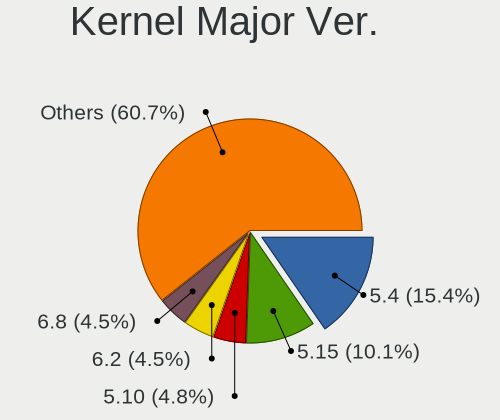
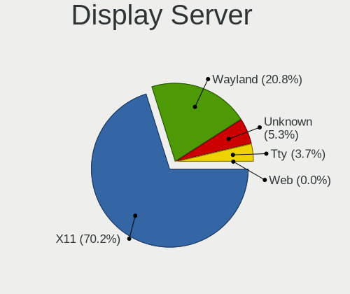
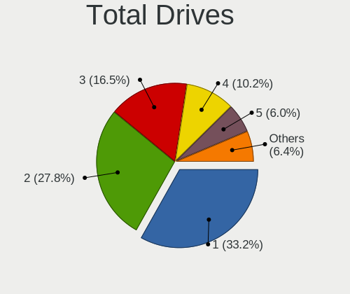
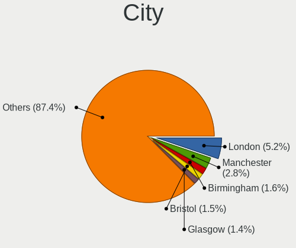
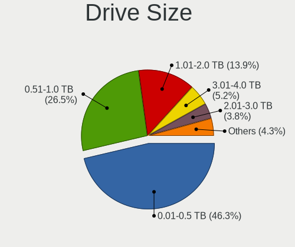
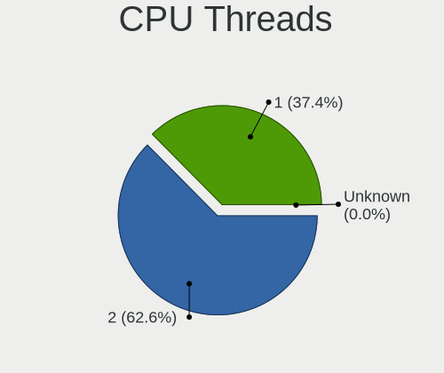
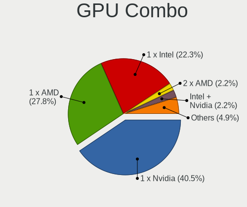

Linux in UK - Tested Hardware & Statistics (Desktops)
-----------------------------------------------------

A project to collect tested hardware configurations for Linux in UK.

Anyone can contribute to this report by the [hw-probe](https://github.com/linuxhw/hw-probe) tool:

    sudo -E hw-probe -all -upload

Please contribute! Especially if your hardware is rare.

Contents
--------

* [ Test Cases ](#test-cases)

* [ System ](#system)
  - [ OS                       ](#os)
  - [ OS Family                ](#os-family)
  - [ Kernel                   ](#kernel)
  - [ Kernel Family            ](#kernel-family)
  - [ Kernel Major Ver.        ](#kernel-major-ver)
  - [ Arch                     ](#arch)
  - [ DE                       ](#de)
  - [ Display Server           ](#display-server)
  - [ Display Manager          ](#display-manager)
  - [ OS Lang                  ](#os-lang)
  - [ Boot Mode                ](#boot-mode)
  - [ Filesystem               ](#filesystem)
  - [ Part. scheme             ](#part-scheme)
  - [ Dual Boot with Linux/BSD ](#dual-boot-with-linuxbsd)
  - [ Dual Boot (Win)          ](#dual-boot-win)

* [ Board ](#board)
  - [ Vendor                   ](#vendor)
  - [ Model                    ](#model)
  - [ Model Family             ](#model-family)
  - [ MFG Year                 ](#mfg-year)
  - [ Form Factor              ](#form-factor)
  - [ Secure Boot              ](#secure-boot)
  - [ Coreboot                 ](#coreboot)
  - [ RAM Size                 ](#ram-size)
  - [ RAM Used                 ](#ram-used)
  - [ Total Drives             ](#total-drives)
  - [ Has CD-ROM               ](#has-cd-rom)
  - [ Has Ethernet             ](#has-ethernet)
  - [ Has WiFi                 ](#has-wifi)
  - [ Has Bluetooth            ](#has-bluetooth)

* [ Location ](#location)
  - [ Country                  ](#country)
  - [ City                     ](#city)

* [ Drives ](#drives)
  - [ Drive Vendor             ](#drive-vendor)
  - [ Drive Model              ](#drive-model)
  - [ HDD Vendor               ](#hdd-vendor)
  - [ SSD Vendor               ](#ssd-vendor)
  - [ Drive Kind               ](#drive-kind)
  - [ Drive Connector          ](#drive-connector)
  - [ Drive Size               ](#drive-size)
  - [ Space Total              ](#space-total)
  - [ Space Used               ](#space-used)
  - [ Malfunc. Drives          ](#malfunc-drives)
  - [ Malfunc. Drive Vendor    ](#malfunc-drive-vendor)
  - [ Malfunc. HDD Vendor      ](#malfunc-hdd-vendor)
  - [ Malfunc. Drive Kind      ](#malfunc-drive-kind)
  - [ Failed Drives            ](#failed-drives)
  - [ Failed Drive Vendor      ](#failed-drive-vendor)
  - [ Drive Status             ](#drive-status)

* [ Storage controller ](#storage-controller)
  - [ Storage Vendor           ](#storage-vendor)
  - [ Storage Model            ](#storage-model)
  - [ Storage Kind             ](#storage-kind)

* [ Processor ](#processor)
  - [ CPU Vendor               ](#cpu-vendor)
  - [ CPU Model                ](#cpu-model)
  - [ CPU Model Family         ](#cpu-model-family)
  - [ CPU Cores                ](#cpu-cores)
  - [ CPU Sockets              ](#cpu-sockets)
  - [ CPU Threads              ](#cpu-threads)
  - [ CPU Op-Modes             ](#cpu-op-modes)
  - [ CPU Microcode            ](#cpu-microcode)
  - [ CPU Microarch            ](#cpu-microarch)

* [ Graphics ](#graphics)
  - [ GPU Vendor               ](#gpu-vendor)
  - [ GPU Model                ](#gpu-model)
  - [ GPU Combo                ](#gpu-combo)
  - [ GPU Driver               ](#gpu-driver)
  - [ GPU Memory               ](#gpu-memory)

* [ Monitor ](#monitor)
  - [ Monitor Vendor           ](#monitor-vendor)
  - [ Monitor Model            ](#monitor-model)
  - [ Monitor Resolution       ](#monitor-resolution)
  - [ Monitor Diagonal         ](#monitor-diagonal)
  - [ Monitor Width            ](#monitor-width)
  - [ Aspect Ratio             ](#aspect-ratio)
  - [ Monitor Area             ](#monitor-area)
  - [ Pixel Density            ](#pixel-density)
  - [ Multiple Monitors        ](#multiple-monitors)

* [ Network ](#network)
  - [ Net Controller Vendor    ](#net-controller-vendor)
  - [ Net Controller Model     ](#net-controller-model)
  - [ Wireless Vendor          ](#wireless-vendor)
  - [ Wireless Model           ](#wireless-model)
  - [ Ethernet Vendor          ](#ethernet-vendor)
  - [ Ethernet Model           ](#ethernet-model)
  - [ Net Controller Kind      ](#net-controller-kind)
  - [ Used Controller          ](#used-controller)
  - [ NICs                     ](#nics)
  - [ IPv6                     ](#ipv6)

* [ Bluetooth ](#bluetooth)
  - [ Bluetooth Vendor         ](#bluetooth-vendor)
  - [ Bluetooth Model          ](#bluetooth-model)

* [ Sound ](#sound)
  - [ Sound Vendor             ](#sound-vendor)
  - [ Sound Model              ](#sound-model)

* [ Memory ](#memory)
  - [ Memory Vendor            ](#memory-vendor)
  - [ Memory Model             ](#memory-model)
  - [ Memory Kind              ](#memory-kind)
  - [ Memory Form Factor       ](#memory-form-factor)
  - [ Memory Size              ](#memory-size)
  - [ Memory Speed             ](#memory-speed)

* [ Printers & scanners ](#printers--scanners)
  - [ Printer Vendor           ](#printer-vendor)
  - [ Printer Model            ](#printer-model)
  - [ Scanner Vendor           ](#scanner-vendor)
  - [ Scanner Model            ](#scanner-model)

* [ Camera ](#camera)
  - [ Camera Vendor            ](#camera-vendor)
  - [ Camera Model             ](#camera-model)

* [ Security ](#security)
  - [ Fingerprint Vendor       ](#fingerprint-vendor)
  - [ Fingerprint Model        ](#fingerprint-model)
  - [ Chipcard Vendor          ](#chipcard-vendor)
  - [ Chipcard Model           ](#chipcard-model)

* [ Unsupported ](#unsupported)
  - [ Unsupported Devices      ](#unsupported-devices)
  - [ Unsupported Device Types ](#unsupported-device-types)

Test Cases
----------

Total: 4796

| Vendor        | Model                       | Probe                                                      | Date         |
|---------------|-----------------------------|------------------------------------------------------------|--------------|
| ASRock        | B85M Pro4                   | [108dae1eae](https://linux-hardware.org/?probe=108dae1eae) | Aug 12, 2023 |
| ASUSTek       | Z170-P                      | [a32f4633c2](https://linux-hardware.org/?probe=a32f4633c2) | Aug 12, 2023 |
| MSI           | X470 GAMING PRO CARBON      | [b4b9fa2d17](https://linux-hardware.org/?probe=b4b9fa2d17) | Aug 12, 2023 |
| MSI           | X470 GAMING PRO CARBON      | [181db8cf87](https://linux-hardware.org/?probe=181db8cf87) | Aug 11, 2023 |
| ASUSTek       | PRIME B450-PLUS             | [44fe085499](https://linux-hardware.org/?probe=44fe085499) | Aug 10, 2023 |
| Gigabyte      | B450M DS3H-CF               | [ee14fdafcf](https://linux-hardware.org/?probe=ee14fdafcf) | Aug 10, 2023 |
| ASUSTek       | PRIME A320M-K               | [67414922e3](https://linux-hardware.org/?probe=67414922e3) | Aug 10, 2023 |
| Gigabyte      | Z690 AORUS MASTER           | [be6c815f39](https://linux-hardware.org/?probe=be6c815f39) | Aug 10, 2023 |
| ASUSTek       | Q87M-E                      | [0dee84c129](https://linux-hardware.org/?probe=0dee84c129) | Aug 10, 2023 |
| ASUSTek       | M5A97 LE R2.0               | [8d27e3953f](https://linux-hardware.org/?probe=8d27e3953f) | Aug 09, 2023 |
| Dell          | 02YYK5 A00                  | [14382141e9](https://linux-hardware.org/?probe=14382141e9) | Aug 09, 2023 |
| ASUSTek       | PRIME B450-PLUS             | [691838cd8c](https://linux-hardware.org/?probe=691838cd8c) | Aug 09, 2023 |
| Gigabyte      | B450 AORUS M                | [965220ce86](https://linux-hardware.org/?probe=965220ce86) | Aug 07, 2023 |
| MSI           | 970A-G43                    | [68384da884](https://linux-hardware.org/?probe=68384da884) | Aug 06, 2023 |
| Gigabyte      | AB350-Gaming-CF             | [c3df1aaae9](https://linux-hardware.org/?probe=c3df1aaae9) | Aug 06, 2023 |
| Gigabyte      | Z270P-D3-CF                 | [ec7fa20ab4](https://linux-hardware.org/?probe=ec7fa20ab4) | Aug 06, 2023 |
| Gigabyte      | H81M-S2H                    | [247f361473](https://linux-hardware.org/?probe=247f361473) | Aug 06, 2023 |
| MSI           | FM2-A55M-E33                | [28384fb38c](https://linux-hardware.org/?probe=28384fb38c) | Aug 06, 2023 |
| Gigabyte      | Z270P-D3-CF                 | [5ec7de1222](https://linux-hardware.org/?probe=5ec7de1222) | Aug 06, 2023 |
| MSI           | MPG X570S EDGE MAX WIFI     | [ffa55735b6](https://linux-hardware.org/?probe=ffa55735b6) | Aug 06, 2023 |
| ASRock        | X570 Taichi                 | [34e27f60e0](https://linux-hardware.org/?probe=34e27f60e0) | Aug 05, 2023 |
| Gigabyte      | H81M-S2H                    | [f74b524df1](https://linux-hardware.org/?probe=f74b524df1) | Aug 04, 2023 |
| MSI           | MPG X670E CARBON WIFI       | [cc7ae6c4e9](https://linux-hardware.org/?probe=cc7ae6c4e9) | Aug 04, 2023 |
| Gigabyte      | B450 GAMING X               | [bb292f568a](https://linux-hardware.org/?probe=bb292f568a) | Aug 03, 2023 |
| Gigabyte      | X570S AORUS ELITE AX        | [1a9566fa0a](https://linux-hardware.org/?probe=1a9566fa0a) | Aug 03, 2023 |
| ASUSTek       | ROG STRIX B760-A GAMING ... | [f629b6e16e](https://linux-hardware.org/?probe=f629b6e16e) | Aug 03, 2023 |
| Lenovo        | ThinkCentre M91p 4518A4M    | [04f8c42dba](https://linux-hardware.org/?probe=04f8c42dba) | Aug 02, 2023 |
| Supermicro    | X9DAi                       | [d7390704d8](https://linux-hardware.org/?probe=d7390704d8) | Aug 02, 2023 |
| Gigabyte      | B560 AORUS PRO AX           | [c7e057da76](https://linux-hardware.org/?probe=c7e057da76) | Aug 02, 2023 |
| Gigabyte      | H81M-S2H                    | [0e5d30b504](https://linux-hardware.org/?probe=0e5d30b504) | Aug 01, 2023 |
| MSI           | X470 GAMING PRO CARBON      | [48c7912f46](https://linux-hardware.org/?probe=48c7912f46) | Aug 01, 2023 |
| HP            | 3398                        | [c271d5d40e](https://linux-hardware.org/?probe=c271d5d40e) | Jul 31, 2023 |
| MSI           | H81M-P33                    | [d5cb55a484](https://linux-hardware.org/?probe=d5cb55a484) | Jul 31, 2023 |
| ASUSTek       | ROG STRIX B550-F GAMING     | [07a919f178](https://linux-hardware.org/?probe=07a919f178) | Jul 31, 2023 |
| Dell          | 0CU409                      | [7b665ec8f2](https://linux-hardware.org/?probe=7b665ec8f2) | Jul 30, 2023 |
| ASUSTek       | ROG STRIX B550-F GAMING     | [2b75ad8b2c](https://linux-hardware.org/?probe=2b75ad8b2c) | Jul 30, 2023 |
| Lenovo        | ThinkCentre M91p 4518A4M    | [2ba45b1cfa](https://linux-hardware.org/?probe=2ba45b1cfa) | Jul 30, 2023 |
| MSI           | MPG X570S EDGE MAX WIFI     | [9469c1037c](https://linux-hardware.org/?probe=9469c1037c) | Jul 29, 2023 |
| ASUSTek       | PRIME B450-PLUS             | [fecdf7e593](https://linux-hardware.org/?probe=fecdf7e593) | Jul 29, 2023 |
| Dell          | 0PU052                      | [f51bdc3bf5](https://linux-hardware.org/?probe=f51bdc3bf5) | Jul 28, 2023 |
| ASUSTek       | ROG STRIX B550-F GAMING     | [4a34b9da9b](https://linux-hardware.org/?probe=4a34b9da9b) | Jul 27, 2023 |
| ASUSTek       | ROG STRIX B550-F GAMING     | [a26bbadd26](https://linux-hardware.org/?probe=a26bbadd26) | Jul 27, 2023 |
| Gigabyte      | B650M AORUS ELITE AX        | [4895ec9de1](https://linux-hardware.org/?probe=4895ec9de1) | Jul 27, 2023 |
| ASUSTek       | PRIME A320M-K               | [3f7bed61a8](https://linux-hardware.org/?probe=3f7bed61a8) | Jul 26, 2023 |
| MSI           | X470 GAMING PRO CARBON      | [810ff8bbd6](https://linux-hardware.org/?probe=810ff8bbd6) | Jul 26, 2023 |
| ASUSTek       | ROG STRIX X570-F GAMING     | [aed4f431ec](https://linux-hardware.org/?probe=aed4f431ec) | Jul 26, 2023 |
| ASRock        | B450M Steel Legend          | [4b9680f094](https://linux-hardware.org/?probe=4b9680f094) | Jul 25, 2023 |
| MSI           | A68HM-E33 V2                | [858b41037e](https://linux-hardware.org/?probe=858b41037e) | Jul 25, 2023 |
| Gigabyte      | MJPLNBB-00                  | [8f4eb83f05](https://linux-hardware.org/?probe=8f4eb83f05) | Jul 25, 2023 |
| Gigabyte      | GA-880GM-UD2H               | [5be0e1a212](https://linux-hardware.org/?probe=5be0e1a212) | Jul 24, 2023 |
| ASUSTek       | ROG CROSSHAIR VIII HERO     | [2ff464874e](https://linux-hardware.org/?probe=2ff464874e) | Jul 24, 2023 |
| ASUSTek       | TUF Gaming Z790-PLUS D4     | [4c4109b8f3](https://linux-hardware.org/?probe=4c4109b8f3) | Jul 23, 2023 |
| HP            | 8350                        | [f17382c501](https://linux-hardware.org/?probe=f17382c501) | Jul 23, 2023 |
| ASUSTek       | TUF Gaming Z790-PLUS D4     | [d89bdeec87](https://linux-hardware.org/?probe=d89bdeec87) | Jul 23, 2023 |
| Dell          | 0757V0 A00                  | [e367a3740a](https://linux-hardware.org/?probe=e367a3740a) | Jul 23, 2023 |
| MSI           | MAG B650 TOMAHAWK WIFI      | [13bb65f561](https://linux-hardware.org/?probe=13bb65f561) | Jul 23, 2023 |
| ASUSTek       | M5A78L-M/USB3               | [5072be5d0f](https://linux-hardware.org/?probe=5072be5d0f) | Jul 22, 2023 |
| Gigabyte      | X470 AORUS GAMING 7 WIFI... | [b8cf03e7b7](https://linux-hardware.org/?probe=b8cf03e7b7) | Jul 22, 2023 |
| Gigabyte      | H81M-DS2V                   | [f27670217e](https://linux-hardware.org/?probe=f27670217e) | Jul 22, 2023 |
| Fujitsu       | D3403-A1 S26361-D3403-A1    | [9f52ae219f](https://linux-hardware.org/?probe=9f52ae219f) | Jul 22, 2023 |
| Shenzhen M... | HX90G                       | [355ac636c1](https://linux-hardware.org/?probe=355ac636c1) | Jul 21, 2023 |
| MSI           | Z97 PC Mate                 | [a131a7a5fb](https://linux-hardware.org/?probe=a131a7a5fb) | Jul 21, 2023 |
| Lenovo        | Win8 Pro DPK TPG            | [6b8d5cb0c1](https://linux-hardware.org/?probe=6b8d5cb0c1) | Jul 21, 2023 |
| ASUSTek       | PRIME B450-PLUS             | [1ee2e5b63d](https://linux-hardware.org/?probe=1ee2e5b63d) | Jul 20, 2023 |
| ASUSTek       | TUF Gaming Z590-PLUS WIF... | [a6c81d2b9e](https://linux-hardware.org/?probe=a6c81d2b9e) | Jul 18, 2023 |
| ASUSTek       | ROG STRIX B550-E GAMING     | [f0ecaa209e](https://linux-hardware.org/?probe=f0ecaa209e) | Jul 18, 2023 |
| Packard Be... | IMEDIA S2885                | [fa20588062](https://linux-hardware.org/?probe=fa20588062) | Jul 17, 2023 |
| ASUSTek       | TUF X299 MARK 2             | [db1e3d03e2](https://linux-hardware.org/?probe=db1e3d03e2) | Jul 17, 2023 |
| ASUSTek       | M5A97 LE R2.0               | [4dacb4cf51](https://linux-hardware.org/?probe=4dacb4cf51) | Jul 17, 2023 |
| ASUSTek       | ROG STRIX B550-A GAMING     | [15d7862757](https://linux-hardware.org/?probe=15d7862757) | Jul 16, 2023 |
| Dell          | 0WMJ54 A01                  | [07161141b4](https://linux-hardware.org/?probe=07161141b4) | Jul 16, 2023 |
| MSI           | X470 GAMING PRO CARBON      | [164e93a53b](https://linux-hardware.org/?probe=164e93a53b) | Jul 16, 2023 |
| ASUSTek       | M5A97 LE R2.0               | [87763ca861](https://linux-hardware.org/?probe=87763ca861) | Jul 16, 2023 |
| Dell          | Dimension 4500S             | [f10ee5f25d](https://linux-hardware.org/?probe=f10ee5f25d) | Jul 16, 2023 |
| Gigabyte      | Z390 AORUS PRO-CF           | [a4bd524029](https://linux-hardware.org/?probe=a4bd524029) | Jul 15, 2023 |
| Dell          | 073MMW A03                  | [f76738403e](https://linux-hardware.org/?probe=f76738403e) | Jul 15, 2023 |
| ASRock        | A320M-HDV R3.0              | [8e41b4b86d](https://linux-hardware.org/?probe=8e41b4b86d) | Jul 15, 2023 |
| Gigabyte      | B360M DS3H                  | [08dede9db3](https://linux-hardware.org/?probe=08dede9db3) | Jul 15, 2023 |
| Unknown       | Unknown                     | [3caf271d7c](https://linux-hardware.org/?probe=3caf271d7c) | Jul 15, 2023 |
| Unknown       | Unknown                     | [689d391a1d](https://linux-hardware.org/?probe=689d391a1d) | Jul 15, 2023 |
| Gigabyte      | 970A-DS3P                   | [32b56b85c4](https://linux-hardware.org/?probe=32b56b85c4) | Jul 15, 2023 |
| Gigabyte      | B450 AORUS M                | [2f5c2842c2](https://linux-hardware.org/?probe=2f5c2842c2) | Jul 14, 2023 |
| ASUSTek       | H81I-PLUS                   | [dc3bdab530](https://linux-hardware.org/?probe=dc3bdab530) | Jul 14, 2023 |
| MSI           | MAG B550 TOMAHAWK           | [0ac2423aa2](https://linux-hardware.org/?probe=0ac2423aa2) | Jul 14, 2023 |
| Lenovo        | SHARKBAY SDK0E50510 PRO     | [2b9ee1f8b7](https://linux-hardware.org/?probe=2b9ee1f8b7) | Jul 14, 2023 |
| ASUSTek       | H81I-PLUS                   | [fc3514e9a6](https://linux-hardware.org/?probe=fc3514e9a6) | Jul 14, 2023 |
| MSI           | PRO Z790-A WIFI             | [c1dba9e7b8](https://linux-hardware.org/?probe=c1dba9e7b8) | Jul 14, 2023 |
| ASUSTek       | P5E-V HDMI                  | [460e520a69](https://linux-hardware.org/?probe=460e520a69) | Jul 13, 2023 |
| MSI           | MAG B550 TOMAHAWK           | [2f943c811e](https://linux-hardware.org/?probe=2f943c811e) | Jul 13, 2023 |
| Gigabyte      | Z97MX-Gaming 5              | [f8ffcb4828](https://linux-hardware.org/?probe=f8ffcb4828) | Jul 12, 2023 |
| ASUSTek       | A88XM-E                     | [e951c1d4f4](https://linux-hardware.org/?probe=e951c1d4f4) | Jul 12, 2023 |
| Gigabyte      | X570 AORUS PRO              | [e49876314d](https://linux-hardware.org/?probe=e49876314d) | Jul 11, 2023 |
| MSI           | B350M MORTAR                | [069cf3a06d](https://linux-hardware.org/?probe=069cf3a06d) | Jul 11, 2023 |
| ASRock        | A320M-HDV R4.0              | [ab81f36697](https://linux-hardware.org/?probe=ab81f36697) | Jul 11, 2023 |
| ASRock        | X570 Pro4                   | [db34bf69af](https://linux-hardware.org/?probe=db34bf69af) | Jul 11, 2023 |
| ASRock        | X570 Pro4                   | [059cda8a87](https://linux-hardware.org/?probe=059cda8a87) | Jul 11, 2023 |
| MSI           | B450M MORTAR TITANIUM       | [59c50a4a34](https://linux-hardware.org/?probe=59c50a4a34) | Jul 11, 2023 |
| Gigabyte      | Z370 AORUS Gaming 3         | [08d9fe81da](https://linux-hardware.org/?probe=08d9fe81da) | Jul 10, 2023 |
| Acidanther... | Mac-27AD2F918AE68F61 Mac... | [429e4e7636](https://linux-hardware.org/?probe=429e4e7636) | Jul 10, 2023 |
| Gigabyte      | H61M-DS2 DVI                | [44f9b46596](https://linux-hardware.org/?probe=44f9b46596) | Jul 10, 2023 |
| ASRock        | B450M-HDV R4.0              | [f24ba1fb9c](https://linux-hardware.org/?probe=f24ba1fb9c) | Jul 09, 2023 |
| MSI           | X470 GAMING PRO CARBON      | [17c907528f](https://linux-hardware.org/?probe=17c907528f) | Jul 09, 2023 |
| ASUSTek       | ROG STRIX B450-I GAMING     | [aa2805e577](https://linux-hardware.org/?probe=aa2805e577) | Jul 09, 2023 |
| Unknown       | Unknown                     | [89a5a4461f](https://linux-hardware.org/?probe=89a5a4461f) | Jul 09, 2023 |
| ASUSTek       | ROG STRIX Z590-F GAMING ... | [0b6dcc1ea9](https://linux-hardware.org/?probe=0b6dcc1ea9) | Jul 09, 2023 |
| Unknown       | Unknown                     | [26896deb1e](https://linux-hardware.org/?probe=26896deb1e) | Jul 09, 2023 |
| MSI           | MPG Z490 GAMING CARBON W... | [84e16d3238](https://linux-hardware.org/?probe=84e16d3238) | Jul 09, 2023 |
| Dell          | 01TKCC A01                  | [b3ab41fd8f](https://linux-hardware.org/?probe=b3ab41fd8f) | Jul 08, 2023 |
| Acer          | Nitro N50-620               | [8286ddb9ae](https://linux-hardware.org/?probe=8286ddb9ae) | Jul 08, 2023 |
| Gigabyte      | A320M-S2H-CF                | [703f0e9012](https://linux-hardware.org/?probe=703f0e9012) | Jul 08, 2023 |
| Fujitsu Si... | D2840-A1 S26361-D2840-A1    | [53d1debf85](https://linux-hardware.org/?probe=53d1debf85) | Jul 07, 2023 |
| HP            | 2B4B                        | [9b9e0f8037](https://linux-hardware.org/?probe=9b9e0f8037) | Jul 07, 2023 |
| HP            | 2B4B                        | [9198ca9615](https://linux-hardware.org/?probe=9198ca9615) | Jul 07, 2023 |
| Lenovo        | IdeaCentre B320             | [58bb7cf40a](https://linux-hardware.org/?probe=58bb7cf40a) | Jul 07, 2023 |
| ASUSTek       | PRIME B450M-K II            | [43cb92095e](https://linux-hardware.org/?probe=43cb92095e) | Jul 07, 2023 |
| ASUSTek       | ROG STRIX X670E-F GAMING... | [9a6e78196d](https://linux-hardware.org/?probe=9a6e78196d) | Jul 06, 2023 |
| HP            | 3398                        | [3124ceac21](https://linux-hardware.org/?probe=3124ceac21) | Jul 06, 2023 |
| MSI           | X470 GAMING PRO CARBON      | [6b250aabab](https://linux-hardware.org/?probe=6b250aabab) | Jul 05, 2023 |
| Gigabyte      | H110-D3A-CF                 | [bd9c7a22d6](https://linux-hardware.org/?probe=bd9c7a22d6) | Jul 05, 2023 |
| ASUSTek       | Rampage V EDITION 10        | [c945bae843](https://linux-hardware.org/?probe=c945bae843) | Jul 05, 2023 |
| ASUSTek       | ROG STRIX B550-F GAMING     | [da18aba906](https://linux-hardware.org/?probe=da18aba906) | Jul 04, 2023 |
| Intel         | B85 V5.56                   | [f9688a073f](https://linux-hardware.org/?probe=f9688a073f) | Jul 04, 2023 |
| Apple         | Mac-F4208DA9 PVT            | [6c2cdc1c76](https://linux-hardware.org/?probe=6c2cdc1c76) | Jul 04, 2023 |
| Lenovo        | 30D2 SDK0J40705 WIN 3425... | [9bca67bb40](https://linux-hardware.org/?probe=9bca67bb40) | Jul 04, 2023 |
| Intel         | B85 V5.56                   | [ed7caf91c0](https://linux-hardware.org/?probe=ed7caf91c0) | Jul 03, 2023 |
| Acer          | Aspire M3910                | [837d0f7852](https://linux-hardware.org/?probe=837d0f7852) | Jul 03, 2023 |
| Gigabyte      | H81M-S2H                    | [cf3da29bba](https://linux-hardware.org/?probe=cf3da29bba) | Jul 03, 2023 |
| ASUSTek       | WS X299 PRO_SE              | [d31cedc2ad](https://linux-hardware.org/?probe=d31cedc2ad) | Jul 03, 2023 |
| MSI           | X470 GAMING PRO CARBON      | [b5a7ef8997](https://linux-hardware.org/?probe=b5a7ef8997) | Jul 02, 2023 |
| Gigabyte      | GA-78LMT-S2P                | [47654b63c6](https://linux-hardware.org/?probe=47654b63c6) | Jul 02, 2023 |
| MSI           | MAG B550 TOMAHAWK           | [1b82430294](https://linux-hardware.org/?probe=1b82430294) | Jul 02, 2023 |
| Gigabyte      | X670 GAMING X AX            | [e7e4a3562f](https://linux-hardware.org/?probe=e7e4a3562f) | Jul 02, 2023 |
| Gigabyte      | B85-HD3                     | [ed2ea8b876](https://linux-hardware.org/?probe=ed2ea8b876) | Jul 01, 2023 |
| Gigabyte      | B550M AORUS PRO-P           | [d9b6645cae](https://linux-hardware.org/?probe=d9b6645cae) | Jul 01, 2023 |
| ASUSTek       | ROG STRIX Z390-F GAMING     | [dea1298c2e](https://linux-hardware.org/?probe=dea1298c2e) | Jul 01, 2023 |
| Intel         | B85 V5.56                   | [a582972a5e](https://linux-hardware.org/?probe=a582972a5e) | Jun 30, 2023 |
| ASUSTek       | TUF Gaming B550-PLUS WIF... | [3c3556dd33](https://linux-hardware.org/?probe=3c3556dd33) | Jun 30, 2023 |
| Intel         | X99H                        | [8e8c7e8b20](https://linux-hardware.org/?probe=8e8c7e8b20) | Jun 30, 2023 |
| Gigabyte      | H81M-S2H                    | [fe8b1af179](https://linux-hardware.org/?probe=fe8b1af179) | Jun 30, 2023 |
| ASRock        | X670E Pro RS                | [e1ed0643fb](https://linux-hardware.org/?probe=e1ed0643fb) | Jun 30, 2023 |
| ASRock        | X670E Pro RS                | [0e98c1f04a](https://linux-hardware.org/?probe=0e98c1f04a) | Jun 30, 2023 |
| MSI           | MAG B550 TOMAHAWK           | [265cbaedcc](https://linux-hardware.org/?probe=265cbaedcc) | Jun 30, 2023 |
| Intel         | B85 V5.56                   | [e8b15eb823](https://linux-hardware.org/?probe=e8b15eb823) | Jun 29, 2023 |
| Gigabyte      | B450 AORUS ELITE            | [ddb283952b](https://linux-hardware.org/?probe=ddb283952b) | Jun 29, 2023 |
| Lenovo        | SHARKBAY SDK0E50510 PRO     | [56e2b61337](https://linux-hardware.org/?probe=56e2b61337) | Jun 29, 2023 |
| Gigabyte      | Z490 AORUS MASTER           | [031ec94437](https://linux-hardware.org/?probe=031ec94437) | Jun 28, 2023 |
| Gigabyte      | H81M-S2H                    | [9cb1b45a65](https://linux-hardware.org/?probe=9cb1b45a65) | Jun 28, 2023 |
| Gigabyte      | X470 AORUS ULTRA GAMING-... | [81bbfe3459](https://linux-hardware.org/?probe=81bbfe3459) | Jun 28, 2023 |
| Gigabyte      | X470 AORUS ULTRA GAMING-... | [ebb41279ae](https://linux-hardware.org/?probe=ebb41279ae) | Jun 28, 2023 |
| ASUSTek       | PRIME Z390-P                | [1ef6edecef](https://linux-hardware.org/?probe=1ef6edecef) | Jun 28, 2023 |
| ASUSTek       | X99-WS/IPMI                 | [fff4bc4f46](https://linux-hardware.org/?probe=fff4bc4f46) | Jun 28, 2023 |
| Dell          | 0P01GV A03                  | [a2ef6d8517](https://linux-hardware.org/?probe=a2ef6d8517) | Jun 27, 2023 |
| Dell          | 0427JK A00                  | [0dda4e26da](https://linux-hardware.org/?probe=0dda4e26da) | Jun 27, 2023 |
| ASUSTek       | ROG ZENITH II EXTREME       | [51f9f56f44](https://linux-hardware.org/?probe=51f9f56f44) | Jun 26, 2023 |
| HP            | 859B                        | [63fdd4ed7e](https://linux-hardware.org/?probe=63fdd4ed7e) | Jun 26, 2023 |
| Gigabyte      | MZBAYAB-00                  | [a44397603c](https://linux-hardware.org/?probe=a44397603c) | Jun 26, 2023 |
| MSI           | MAG B550M BAZOOKA           | [ad1a470baf](https://linux-hardware.org/?probe=ad1a470baf) | Jun 26, 2023 |
| ASUSTek       | M4A87TD/USB3                | [fa54c60ae0](https://linux-hardware.org/?probe=fa54c60ae0) | Jun 26, 2023 |
| Unknown       | Unknown                     | [7c0c11558d](https://linux-hardware.org/?probe=7c0c11558d) | Jun 26, 2023 |
| ASUSTek       | PRIME B650-PLUS             | [9f89885724](https://linux-hardware.org/?probe=9f89885724) | Jun 25, 2023 |
| ASUSTek       | Maximus IX HERO             | [bd98bbb8c0](https://linux-hardware.org/?probe=bd98bbb8c0) | Jun 25, 2023 |
| ASUSTek       | ROG STRIX B550-F GAMING     | [210d09c5dd](https://linux-hardware.org/?probe=210d09c5dd) | Jun 24, 2023 |
| ASUSTek       | F2A85-V PRO                 | [011552703c](https://linux-hardware.org/?probe=011552703c) | Jun 24, 2023 |
| ASRock        | A320M-HDV R3.0              | [a9cd7361e6](https://linux-hardware.org/?probe=a9cd7361e6) | Jun 23, 2023 |
| ASRock        | Z87M Pro4                   | [762b33c8e7](https://linux-hardware.org/?probe=762b33c8e7) | Jun 23, 2023 |
| ASUSTek       | TUF Gaming B560-PLUS WIF... | [184b19f00c](https://linux-hardware.org/?probe=184b19f00c) | Jun 23, 2023 |
| Gigabyte      | B550M DS3H                  | [2e32510f57](https://linux-hardware.org/?probe=2e32510f57) | Jun 21, 2023 |
| ASRock        | Z77 Extreme4                | [5c9111463c](https://linux-hardware.org/?probe=5c9111463c) | Jun 21, 2023 |
| Lenovo        | 30D2 SDK0J40705 WIN 3425... | [1e11366a3e](https://linux-hardware.org/?probe=1e11366a3e) | Jun 21, 2023 |
| MSI           | MAG B550M BAZOOKA           | [fd3c5ae570](https://linux-hardware.org/?probe=fd3c5ae570) | Jun 21, 2023 |
| MSI           | X470 GAMING PRO CARBON      | [3dffeb35fa](https://linux-hardware.org/?probe=3dffeb35fa) | Jun 20, 2023 |
| Fujitsu       | D3600-A1 S26361-D3600-A1    | [29e7fc8e13](https://linux-hardware.org/?probe=29e7fc8e13) | Jun 20, 2023 |
| Gigabyte      | B450 AORUS ELITE            | [092370b958](https://linux-hardware.org/?probe=092370b958) | Jun 20, 2023 |
| MSI           | X570-A PRO                  | [b968cb073e](https://linux-hardware.org/?probe=b968cb073e) | Jun 20, 2023 |
| MSI           | A68HM-E33 V2                | [8260bcf9b3](https://linux-hardware.org/?probe=8260bcf9b3) | Jun 20, 2023 |
| ASRock        | B450 Gaming K4              | [2344c78f90](https://linux-hardware.org/?probe=2344c78f90) | Jun 20, 2023 |
| Gigabyte      | MZBAYAB-00                  | [5864261490](https://linux-hardware.org/?probe=5864261490) | Jun 20, 2023 |
| MSI           | MAG B550M BAZOOKA           | [529320d8fe](https://linux-hardware.org/?probe=529320d8fe) | Jun 20, 2023 |
| Gigabyte      | H81M-S2H                    | [36f8057a1d](https://linux-hardware.org/?probe=36f8057a1d) | Jun 18, 2023 |
| Gigabyte      | B550M DS3H                  | [e7fdb650cd](https://linux-hardware.org/?probe=e7fdb650cd) | Jun 18, 2023 |
| MSI           | X470 GAMING PRO CARBON      | [587c48c954](https://linux-hardware.org/?probe=587c48c954) | Jun 17, 2023 |
| AZW           | GTi                         | [0aaf2297b4](https://linux-hardware.org/?probe=0aaf2297b4) | Jun 17, 2023 |
| Unknown       | NETGEAR ReadyNAS 104        | [99df077926](https://linux-hardware.org/?probe=99df077926) | Jun 16, 2023 |
| Dell          | 0YXT71 A01                  | [f242fcd667](https://linux-hardware.org/?probe=f242fcd667) | Jun 15, 2023 |
| MSI           | MAG Z690 TOMAHAWK WIFI D... | [160f6f4afb](https://linux-hardware.org/?probe=160f6f4afb) | Jun 15, 2023 |
| ASUSTek       | PRIME H310T R2.0            | [5fe5f59145](https://linux-hardware.org/?probe=5fe5f59145) | Jun 15, 2023 |
| ASUSTek       | PRIME H310T R2.0            | [7974c3961d](https://linux-hardware.org/?probe=7974c3961d) | Jun 15, 2023 |
| ASUSTek       | Benicia                     | [4b99537b32](https://linux-hardware.org/?probe=4b99537b32) | Jun 15, 2023 |
| Fujitsu       | D3222-B1 S26361-D3222-B1    | [01f33d2c9b](https://linux-hardware.org/?probe=01f33d2c9b) | Jun 14, 2023 |
| ASRock        | Z97 Extreme6                | [8f727c50fb](https://linux-hardware.org/?probe=8f727c50fb) | Jun 14, 2023 |
| Gigabyte      | 970A-DS3P                   | [3d5cabad57](https://linux-hardware.org/?probe=3d5cabad57) | Jun 14, 2023 |
| ASUSTek       | ROG CROSSHAIR VIII HERO     | [922c598503](https://linux-hardware.org/?probe=922c598503) | Jun 14, 2023 |
| ASUSTek       | A88XM-E                     | [1302a62eeb](https://linux-hardware.org/?probe=1302a62eeb) | Jun 13, 2023 |
| Lenovo        | 30D2 SDK0J40705 WIN 3425... | [c1992a1680](https://linux-hardware.org/?probe=c1992a1680) | Jun 13, 2023 |
| ASUSTek       | TUF Gaming B550M-PLUS WI... | [7221d4851c](https://linux-hardware.org/?probe=7221d4851c) | Jun 11, 2023 |
| Entroware     | Poseidon                    | [506bfb1a08](https://linux-hardware.org/?probe=506bfb1a08) | Jun 11, 2023 |
| ASUSTek       | H110M-A/M.2                 | [f30be06897](https://linux-hardware.org/?probe=f30be06897) | Jun 11, 2023 |
| Gigabyte      | X570 AORUS ULTRA            | [bc315fc56f](https://linux-hardware.org/?probe=bc315fc56f) | Jun 11, 2023 |
| HP            | 8350                        | [8a40ff28c8](https://linux-hardware.org/?probe=8a40ff28c8) | Jun 11, 2023 |
| Gigabyte      | GA-990XA-UD3                | [82e1661a51](https://linux-hardware.org/?probe=82e1661a51) | Jun 11, 2023 |
| ASUSTek       | ROG STRIX X670E-F GAMING... | [6f6440cf1e](https://linux-hardware.org/?probe=6f6440cf1e) | Jun 10, 2023 |
| Gigabyte      | GA-78LMT-USB3               | [dedc98e84e](https://linux-hardware.org/?probe=dedc98e84e) | Jun 10, 2023 |
| ASUSTek       | ROG STRIX X670E-F GAMING... | [4cb72d56f7](https://linux-hardware.org/?probe=4cb72d56f7) | Jun 10, 2023 |
| ASUSTek       | ROG STRIX B450-F GAMING     | [6c8e1de1cf](https://linux-hardware.org/?probe=6c8e1de1cf) | Jun 10, 2023 |
| ASRock        | B450M Pro4                  | [c23450b0df](https://linux-hardware.org/?probe=c23450b0df) | Jun 10, 2023 |
| ASUSTek       | PRIME B460M-K               | [873975925d](https://linux-hardware.org/?probe=873975925d) | Jun 10, 2023 |
| ASUSTek       | PRIME B650M-A WIFI II       | [e68e693394](https://linux-hardware.org/?probe=e68e693394) | Jun 08, 2023 |
| AZW           | Green G4 10                 | [326b499893](https://linux-hardware.org/?probe=326b499893) | Jun 08, 2023 |
| Gigabyte      | 970A-DS3P                   | [540fc1c58d](https://linux-hardware.org/?probe=540fc1c58d) | Jun 07, 2023 |
| HP            | 8350                        | [113be26d4c](https://linux-hardware.org/?probe=113be26d4c) | Jun 07, 2023 |
| ECS           | GF8100VM-M5                 | [6aa065057f](https://linux-hardware.org/?probe=6aa065057f) | Jun 07, 2023 |
| Foxconn       | H55M-S                      | [83b86844c0](https://linux-hardware.org/?probe=83b86844c0) | Jun 06, 2023 |
| ASUSTek       | ROG CROSSHAIR VIII DARK ... | [8c6a275a93](https://linux-hardware.org/?probe=8c6a275a93) | Jun 05, 2023 |
| Lenovo        | ThinkCentre Edge 91Z 707... | [a6804d8ca1](https://linux-hardware.org/?probe=a6804d8ca1) | Jun 04, 2023 |
| MSI           | H81M-E34                    | [4c5f5c7903](https://linux-hardware.org/?probe=4c5f5c7903) | Jun 04, 2023 |
| Unknown       | Unknown                     | [77d585fa03](https://linux-hardware.org/?probe=77d585fa03) | Jun 04, 2023 |
| MSI           | B450 TOMAHAWK MAX           | [06752ca793](https://linux-hardware.org/?probe=06752ca793) | Jun 04, 2023 |
| Foxconn       | A74ML-K                     | [7a4f7e239b](https://linux-hardware.org/?probe=7a4f7e239b) | Jun 03, 2023 |
| Gigabyte      | H81M-S2H                    | [2604bac5a5](https://linux-hardware.org/?probe=2604bac5a5) | Jun 02, 2023 |
| Dell          | 0NNNCT A01                  | [1a1e7426a3](https://linux-hardware.org/?probe=1a1e7426a3) | Jun 02, 2023 |
| MSI           | MPG X570 GAMING PLUS        | [9a91f8aedc](https://linux-hardware.org/?probe=9a91f8aedc) | Jun 02, 2023 |
| Intel         | DH61WW AAG23116-204         | [2bfe32ef05](https://linux-hardware.org/?probe=2bfe32ef05) | Jun 02, 2023 |
| Biostar       | A10N-8800E                  | [906dbab25c](https://linux-hardware.org/?probe=906dbab25c) | Jun 01, 2023 |
| Lenovo        | SHARKBAY SDK0E50512 STD     | [abc4bba144](https://linux-hardware.org/?probe=abc4bba144) | Jun 01, 2023 |
| MSI           | X470 GAMING PLUS MAX        | [a13bd80e8a](https://linux-hardware.org/?probe=a13bd80e8a) | Jun 01, 2023 |
| ASUSTek       | TUF Gaming B550M-PLUS WI... | [01692ad602](https://linux-hardware.org/?probe=01692ad602) | May 31, 2023 |
| ASUSTek       | PRIME TRX40-PRO             | [6b3efa1ef7](https://linux-hardware.org/?probe=6b3efa1ef7) | May 31, 2023 |
| Gigabyte      | B550M AORUS PRO-P           | [417320253a](https://linux-hardware.org/?probe=417320253a) | May 31, 2023 |
| MSI           | B450 TOMAHAWK               | [0ddd2982db](https://linux-hardware.org/?probe=0ddd2982db) | May 31, 2023 |
| MSI           | B450 TOMAHAWK               | [93d1ee7e2d](https://linux-hardware.org/?probe=93d1ee7e2d) | May 31, 2023 |
| Gigabyte      | F2A78M-HD2                  | [c76d767402](https://linux-hardware.org/?probe=c76d767402) | May 31, 2023 |
| Gigabyte      | Z270X-Gaming 7              | [4ed64d3d45](https://linux-hardware.org/?probe=4ed64d3d45) | May 30, 2023 |
| ASUSTek       | 970 PRO GAMING/AURA         | [1c87272ed8](https://linux-hardware.org/?probe=1c87272ed8) | May 29, 2023 |
| ASUSTek       | ROG STRIX Z590-F GAMING ... | [2bb14772ce](https://linux-hardware.org/?probe=2bb14772ce) | May 28, 2023 |
| ASRock        | H510M-HDV                   | [27ca3c6650](https://linux-hardware.org/?probe=27ca3c6650) | May 27, 2023 |
| ASUSTek       | Z170M-PLUS                  | [0577b02521](https://linux-hardware.org/?probe=0577b02521) | May 27, 2023 |
| ASRock        | H510M-HDV                   | [c6315a675c](https://linux-hardware.org/?probe=c6315a675c) | May 27, 2023 |
| MSI           | H97 GUARD-PRO               | [3737e6c832](https://linux-hardware.org/?probe=3737e6c832) | May 27, 2023 |
| MSI           | B450 TOMAHAWK MAX II        | [ecf6ecb00d](https://linux-hardware.org/?probe=ecf6ecb00d) | May 26, 2023 |
| ASUSTek       | TUF X299 MARK 1             | [9b2b467879](https://linux-hardware.org/?probe=9b2b467879) | May 26, 2023 |
| HP            | 8437                        | [c1c9154683](https://linux-hardware.org/?probe=c1c9154683) | May 26, 2023 |
| ASUSTek       | PRIME B460M-K               | [e55e554596](https://linux-hardware.org/?probe=e55e554596) | May 25, 2023 |
| ASUSTek       | Z87M-PLUS                   | [f20bf1430d](https://linux-hardware.org/?probe=f20bf1430d) | May 24, 2023 |
| Gigabyte      | 970A-DS3P                   | [af5b849c20](https://linux-hardware.org/?probe=af5b849c20) | May 23, 2023 |
| HP            | 21EF                        | [f1d5c9381c](https://linux-hardware.org/?probe=f1d5c9381c) | May 23, 2023 |
| MSI           | MAG B550M BAZOOKA           | [3d594ff1da](https://linux-hardware.org/?probe=3d594ff1da) | May 23, 2023 |
| HP            | 21EF                        | [3249975d27](https://linux-hardware.org/?probe=3249975d27) | May 22, 2023 |
| Fujitsu       | D3009-B1 S26361-D3009-B1    | [56fba05f01](https://linux-hardware.org/?probe=56fba05f01) | May 22, 2023 |
| AZW           | U59                         | [59edf1c8a6](https://linux-hardware.org/?probe=59edf1c8a6) | May 22, 2023 |
| AZW           | U59                         | [b365dbf63a](https://linux-hardware.org/?probe=b365dbf63a) | May 22, 2023 |
| SYWZ          | S200 Series                 | [6878838d6f](https://linux-hardware.org/?probe=6878838d6f) | May 22, 2023 |
| ASUSTek       | ROG STRIX B550-F GAMING     | [a6f95de398](https://linux-hardware.org/?probe=a6f95de398) | May 21, 2023 |
| Dell          | 0M5DCD A00                  | [4087cdd6cb](https://linux-hardware.org/?probe=4087cdd6cb) | May 20, 2023 |
| Dell          | 0M5DCD A00                  | [8db744994d](https://linux-hardware.org/?probe=8db744994d) | May 20, 2023 |
| MSI           | H110M PRO-VD PLUS           | [d549fb62db](https://linux-hardware.org/?probe=d549fb62db) | May 20, 2023 |
| Samsung       | DeskTop System              | [0f49fcc9e8](https://linux-hardware.org/?probe=0f49fcc9e8) | May 20, 2023 |
| Fujitsu       | D3009-B1 S26361-D3009-B1    | [d5213cca3c](https://linux-hardware.org/?probe=d5213cca3c) | May 20, 2023 |
| ASUSTek       | PRIME B460M-K               | [c6ce2f365a](https://linux-hardware.org/?probe=c6ce2f365a) | May 20, 2023 |
| ASUSTek       | ROG Maximus Z690 HERO       | [f051e7f6da](https://linux-hardware.org/?probe=f051e7f6da) | May 20, 2023 |
| HP            | 1905                        | [1ce2caa771](https://linux-hardware.org/?probe=1ce2caa771) | May 19, 2023 |
| HP            | 1905                        | [de8cea1b10](https://linux-hardware.org/?probe=de8cea1b10) | May 19, 2023 |
| ASRock        | X470 Taichi                 | [a6755db2c4](https://linux-hardware.org/?probe=a6755db2c4) | May 19, 2023 |
| ASUSTek       | ROG Maximus Z690 HERO       | [3f5ffac86c](https://linux-hardware.org/?probe=3f5ffac86c) | May 19, 2023 |
| HP            | 3398                        | [a49cbc797b](https://linux-hardware.org/?probe=a49cbc797b) | May 18, 2023 |
| Fujitsu       | D2924-A1 S26361-D2924-A1    | [af5b595698](https://linux-hardware.org/?probe=af5b595698) | May 16, 2023 |
| ASUSTek       | M5A78L-M/USB3               | [546f6e95e9](https://linux-hardware.org/?probe=546f6e95e9) | May 16, 2023 |
| ASUSTek       | M5A78L-M/USB3               | [54fc8d0489](https://linux-hardware.org/?probe=54fc8d0489) | May 16, 2023 |
| ASUSTek       | F1A75-V PRO                 | [9ee8a0ca50](https://linux-hardware.org/?probe=9ee8a0ca50) | May 14, 2023 |
| AMI           | Intel                       | [569d80a4a0](https://linux-hardware.org/?probe=569d80a4a0) | May 14, 2023 |
| ASUSTek       | Q87M-E                      | [88a88bec15](https://linux-hardware.org/?probe=88a88bec15) | May 14, 2023 |
| Gigabyte      | A320M-S2H-CF                | [f5fa402f37](https://linux-hardware.org/?probe=f5fa402f37) | May 14, 2023 |
| ASUSTek       | ROG STRIX B450-F GAMING ... | [49a47c559e](https://linux-hardware.org/?probe=49a47c559e) | May 14, 2023 |
| ASUSTek       | ROG STRIX B450-F GAMING ... | [91986cf051](https://linux-hardware.org/?probe=91986cf051) | May 14, 2023 |
| Gigabyte      | 970A-DS3                    | [97ef085eca](https://linux-hardware.org/?probe=97ef085eca) | May 14, 2023 |
| MSI           | A68HM-E33 V2                | [a60326fa0a](https://linux-hardware.org/?probe=a60326fa0a) | May 13, 2023 |
| ASUSTek       | Z170M-PLUS                  | [2d1acb409a](https://linux-hardware.org/?probe=2d1acb409a) | May 13, 2023 |
| ASUSTek       | M5A78L/USB3                 | [edc8069ae1](https://linux-hardware.org/?probe=edc8069ae1) | May 13, 2023 |
| ASUSTek       | ROG CROSSHAIR VIII DARK ... | [1146828988](https://linux-hardware.org/?probe=1146828988) | May 13, 2023 |
| Gigabyte      | A320M-S2H-CF                | [fd2bd3be00](https://linux-hardware.org/?probe=fd2bd3be00) | May 13, 2023 |
| MSI           | MAG B550 TOMAHAWK           | [82f01de919](https://linux-hardware.org/?probe=82f01de919) | May 12, 2023 |
| Gigabyte      | Z590 GAMING X               | [c9ad858393](https://linux-hardware.org/?probe=c9ad858393) | May 12, 2023 |
| MSI           | MAG Z590 TOMAHAWK WIFI      | [ec1f5e50b8](https://linux-hardware.org/?probe=ec1f5e50b8) | May 11, 2023 |
| Biostar       | H110MHV3                    | [e1ce381308](https://linux-hardware.org/?probe=e1ce381308) | May 11, 2023 |
| Biostar       | H110MHV3                    | [5b0f8f8419](https://linux-hardware.org/?probe=5b0f8f8419) | May 11, 2023 |
| Gigabyte      | B450 AORUS ELITE            | [3ea46668c4](https://linux-hardware.org/?probe=3ea46668c4) | May 10, 2023 |
| ASUSTek       | P8B75-M LE                  | [2b0bc04757](https://linux-hardware.org/?probe=2b0bc04757) | May 10, 2023 |
| ASUSTek       | Z170-K                      | [695a40ecc7](https://linux-hardware.org/?probe=695a40ecc7) | May 09, 2023 |
| Gigabyte      | Z97X-Gaming 5               | [588003adc9](https://linux-hardware.org/?probe=588003adc9) | May 09, 2023 |
| ASUSTek       | TUF Gaming X570-PLUS        | [c80f41d509](https://linux-hardware.org/?probe=c80f41d509) | May 09, 2023 |
| ASUSTek       | H81I-PLUS                   | [93d7a459be](https://linux-hardware.org/?probe=93d7a459be) | May 09, 2023 |
| MSI           | MS-7502 Fab D               | [ca5881d77e](https://linux-hardware.org/?probe=ca5881d77e) | May 09, 2023 |
| ASUSTek       | M4A87TD/USB3                | [5438ddaf64](https://linux-hardware.org/?probe=5438ddaf64) | May 08, 2023 |
| Gigabyte      | H310M H x.x                 | [e44f7dfac5](https://linux-hardware.org/?probe=e44f7dfac5) | May 08, 2023 |
| MSI           | B350 PC MATE                | [cabb24b0e7](https://linux-hardware.org/?probe=cabb24b0e7) | May 08, 2023 |
| ASUSTek       | ROG STRIX B650E-F GAMING... | [29b2378b4b](https://linux-hardware.org/?probe=29b2378b4b) | May 08, 2023 |
| ASUSTek       | ROG STRIX B650E-F GAMING... | [62b28b69dc](https://linux-hardware.org/?probe=62b28b69dc) | May 08, 2023 |
| ASUSTek       | M5A99X EVO                  | [f5499886e9](https://linux-hardware.org/?probe=f5499886e9) | May 08, 2023 |
| ASUSTek       | ROG STRIX B450-F GAMING ... | [a4f7fc7b31](https://linux-hardware.org/?probe=a4f7fc7b31) | May 08, 2023 |
| ASRock        | N68C-GS FX                  | [dcf5cd4ca2](https://linux-hardware.org/?probe=dcf5cd4ca2) | May 08, 2023 |
| ASUSTek       | PRIME A320M-K               | [369bf3dc68](https://linux-hardware.org/?probe=369bf3dc68) | May 07, 2023 |
| Acer          | Predator PO3-620            | [9ef46f7f3e](https://linux-hardware.org/?probe=9ef46f7f3e) | May 06, 2023 |
| MSI           | MS-7502 Fab D               | [9b80139aca](https://linux-hardware.org/?probe=9b80139aca) | May 06, 2023 |
| MSI           | MEG Z590 ACE GOLD EDITIO... | [e34348c1b5](https://linux-hardware.org/?probe=e34348c1b5) | May 06, 2023 |
| Dell          | 0M5DCD A00                  | [70862b2870](https://linux-hardware.org/?probe=70862b2870) | May 06, 2023 |
| Gigabyte      | A320M-H-CF                  | [ee58ce6d9c](https://linux-hardware.org/?probe=ee58ce6d9c) | May 06, 2023 |
| Gigabyte      | B550I AORUS PRO AX          | [808f3370fc](https://linux-hardware.org/?probe=808f3370fc) | May 05, 2023 |
| MSI           | H110M PRO-VD PLUS           | [af27e2497a](https://linux-hardware.org/?probe=af27e2497a) | May 05, 2023 |
| Gigabyte      | X670 AORUS ELITE AX         | [64aa7fb49b](https://linux-hardware.org/?probe=64aa7fb49b) | May 05, 2023 |
| HP            | 304Ah                       | [d9a160845c](https://linux-hardware.org/?probe=d9a160845c) | May 05, 2023 |
| HP            | 21EF                        | [6dd5a8409e](https://linux-hardware.org/?probe=6dd5a8409e) | May 05, 2023 |
| HP            | 1589                        | [af8e129ecd](https://linux-hardware.org/?probe=af8e129ecd) | May 04, 2023 |
| Gigabyte      | B550M DS3H                  | [e8c596445b](https://linux-hardware.org/?probe=e8c596445b) | May 04, 2023 |
| Gigabyte      | B550M DS3H                  | [372a18076a](https://linux-hardware.org/?probe=372a18076a) | May 04, 2023 |
| ASUSTek       | ROG Maximus Z690 HERO       | [61cde0d9b2](https://linux-hardware.org/?probe=61cde0d9b2) | May 04, 2023 |
| ASRock        | X570 Phantom Gaming 4       | [b3ed654fde](https://linux-hardware.org/?probe=b3ed654fde) | May 04, 2023 |
| ASUSTek       | PRIME X470-PRO              | [df62d15ecc](https://linux-hardware.org/?probe=df62d15ecc) | May 03, 2023 |
| Gigabyte      | H310M H x.x                 | [7996838ce9](https://linux-hardware.org/?probe=7996838ce9) | May 03, 2023 |
| ASUSTek       | ROG STRIX X570-F GAMING     | [aac11fced2](https://linux-hardware.org/?probe=aac11fced2) | May 03, 2023 |
| Apple         | Mac-F221BEC8                | [b68d1b92de](https://linux-hardware.org/?probe=b68d1b92de) | May 03, 2023 |
| ASRock        | B450M Pro4                  | [3c7546e88a](https://linux-hardware.org/?probe=3c7546e88a) | May 02, 2023 |
| MSI           | MAG B550 TOMAHAWK           | [7a5a0f75aa](https://linux-hardware.org/?probe=7a5a0f75aa) | May 01, 2023 |
| Acer          | Aspire M3970                | [87a55abfa7](https://linux-hardware.org/?probe=87a55abfa7) | May 01, 2023 |
| ASUSTek       | H81-PLUS                    | [3b45144d62](https://linux-hardware.org/?probe=3b45144d62) | Apr 30, 2023 |
| ASUSTek       | ROG STRIX B450-F GAMING ... | [f0a784354c](https://linux-hardware.org/?probe=f0a784354c) | Apr 30, 2023 |
| ASUSTek       | ROG STRIX B450-F GAMING ... | [332a777929](https://linux-hardware.org/?probe=332a777929) | Apr 30, 2023 |
| HP            | 1998                        | [4ba5ef1211](https://linux-hardware.org/?probe=4ba5ef1211) | Apr 30, 2023 |
| ASRock        | X670E Steel Legend          | [04a7cea7cb](https://linux-hardware.org/?probe=04a7cea7cb) | Apr 29, 2023 |
| ASRock        | B450M Pro4                  | [7c8260664a](https://linux-hardware.org/?probe=7c8260664a) | Apr 29, 2023 |
| ASUSTek       | ROG STRIX Z590-F GAMING ... | [a158a30802](https://linux-hardware.org/?probe=a158a30802) | Apr 29, 2023 |
| Gigabyte      | H310M H x.x                 | [6b44ad5061](https://linux-hardware.org/?probe=6b44ad5061) | Apr 29, 2023 |
| Gigabyte      | H310M H x.x                 | [ce73a703b6](https://linux-hardware.org/?probe=ce73a703b6) | Apr 29, 2023 |
| ASUSTek       | ROG Maximus Z690 HERO       | [855bed0070](https://linux-hardware.org/?probe=855bed0070) | Apr 28, 2023 |
| Gigabyte      | H410M H V2                  | [8a23a0fef0](https://linux-hardware.org/?probe=8a23a0fef0) | Apr 28, 2023 |
| ASRock        | B450M Pro4                  | [831cd8fa39](https://linux-hardware.org/?probe=831cd8fa39) | Apr 28, 2023 |
| Foxconn       | H67MP-S/-V/H67MP            | [c8fe6ab042](https://linux-hardware.org/?probe=c8fe6ab042) | Apr 28, 2023 |
| ASRock        | B450 Steel Legend           | [9130280424](https://linux-hardware.org/?probe=9130280424) | Apr 28, 2023 |
| MSI           | MAG B550M MORTAR WIFI       | [26c158df39](https://linux-hardware.org/?probe=26c158df39) | Apr 28, 2023 |
| HP            | 1589                        | [632f486421](https://linux-hardware.org/?probe=632f486421) | Apr 27, 2023 |
| MSI           | MAG B550 TOMAHAWK           | [19c2a17ec5](https://linux-hardware.org/?probe=19c2a17ec5) | Apr 27, 2023 |
| Lenovo        | SHARKBAY SDK0E50512 STD     | [6601cb2397](https://linux-hardware.org/?probe=6601cb2397) | Apr 26, 2023 |
| Lenovo        | SHARKBAY NOK                | [54dea0607f](https://linux-hardware.org/?probe=54dea0607f) | Apr 26, 2023 |
| Gigabyte      | GA-MA785GM-US2H             | [238598d9ab](https://linux-hardware.org/?probe=238598d9ab) | Apr 26, 2023 |
| Apple         | Mac-F221BEC8                | [ac51617470](https://linux-hardware.org/?probe=ac51617470) | Apr 26, 2023 |
| Intel         | DQ67OW AAG12528-307         | [28245ea080](https://linux-hardware.org/?probe=28245ea080) | Apr 25, 2023 |
| HP            | 18E9                        | [b9bb679cca](https://linux-hardware.org/?probe=b9bb679cca) | Apr 25, 2023 |
| Gigabyte      | Z270X-Gaming 7              | [8a600077f6](https://linux-hardware.org/?probe=8a600077f6) | Apr 25, 2023 |
| Lenovo        | SHARKBAY NOK                | [c5adfbd376](https://linux-hardware.org/?probe=c5adfbd376) | Apr 25, 2023 |
| Gigabyte      | H61M-S2-B3                  | [cd95f8ec71](https://linux-hardware.org/?probe=cd95f8ec71) | Apr 25, 2023 |
| MSI           | MAG B550 TOMAHAWK           | [620668d216](https://linux-hardware.org/?probe=620668d216) | Apr 25, 2023 |
| Intel         | HM570                       | [1220357b3d](https://linux-hardware.org/?probe=1220357b3d) | Apr 24, 2023 |
| MSI           | B450 GAMING PRO CARBON M... | [c78c7e9ec1](https://linux-hardware.org/?probe=c78c7e9ec1) | Apr 24, 2023 |
| ASUSTek       | CROSSHAIR V FORMULA-Z       | [267c5b8075](https://linux-hardware.org/?probe=267c5b8075) | Apr 24, 2023 |
| ASUSTek       | PRIME X399-A                | [70d478e2eb](https://linux-hardware.org/?probe=70d478e2eb) | Apr 24, 2023 |
| ASUSTek       | PRIME X399-A                | [2931b721a3](https://linux-hardware.org/?probe=2931b721a3) | Apr 24, 2023 |
| MSI           | MAG B550 TOMAHAWK           | [df85ceaa6b](https://linux-hardware.org/?probe=df85ceaa6b) | Apr 24, 2023 |
| MSI           | B550-A PRO                  | [d8b51c995c](https://linux-hardware.org/?probe=d8b51c995c) | Apr 23, 2023 |
| MSI           | A88XM-E35                   | [c26812e2e1](https://linux-hardware.org/?probe=c26812e2e1) | Apr 23, 2023 |
| Gigabyte      | B460 HD3                    | [c9e3b1d5ea](https://linux-hardware.org/?probe=c9e3b1d5ea) | Apr 22, 2023 |
| Gigabyte      | GA-MA74GM-S2H               | [0cd5599131](https://linux-hardware.org/?probe=0cd5599131) | Apr 22, 2023 |
| ASUSTek       | PRIME B660-PLUS D4          | [3c0a66f0fc](https://linux-hardware.org/?probe=3c0a66f0fc) | Apr 22, 2023 |
| Lenovo        | 30D2 SDK0J40705 WIN 3425... | [3c3719b07f](https://linux-hardware.org/?probe=3c3719b07f) | Apr 22, 2023 |
| ASUSTek       | H81M-K                      | [5aa26aea52](https://linux-hardware.org/?probe=5aa26aea52) | Apr 22, 2023 |
| HP            | 18E5                        | [0437b3deb1](https://linux-hardware.org/?probe=0437b3deb1) | Apr 21, 2023 |
| ASUSTek       | ROG STRIX B450-F GAMING ... | [03bcaf6334](https://linux-hardware.org/?probe=03bcaf6334) | Apr 21, 2023 |
| Dell          | 040DDP A01                  | [6720e15331](https://linux-hardware.org/?probe=6720e15331) | Apr 21, 2023 |
| ASUSTek       | PRIME B360M-A               | [61d7104ec4](https://linux-hardware.org/?probe=61d7104ec4) | Apr 21, 2023 |
| HP            | ProLiant MicroServer        | [ea76b8632f](https://linux-hardware.org/?probe=ea76b8632f) | Apr 20, 2023 |
| ASUSTek       | B85M-G                      | [4392c46287](https://linux-hardware.org/?probe=4392c46287) | Apr 20, 2023 |
| Acer          | Aspire M3970                | [d43372f3fd](https://linux-hardware.org/?probe=d43372f3fd) | Apr 20, 2023 |
| ASUSTek       | H110M-R                     | [d428839f7c](https://linux-hardware.org/?probe=d428839f7c) | Apr 20, 2023 |
| Gigabyte      | A320M-S2H-CF                | [063b4867ba](https://linux-hardware.org/?probe=063b4867ba) | Apr 20, 2023 |
| Intel         | DG43GT AAE62768-301         | [643ed4ce33](https://linux-hardware.org/?probe=643ed4ce33) | Apr 20, 2023 |
| MSI           | MPG Z590 GAMING EDGE WIF... | [97860c01ca](https://linux-hardware.org/?probe=97860c01ca) | Apr 19, 2023 |
| Lenovo        | SHARKBAY 31900058 STD or... | [1331c6ef06](https://linux-hardware.org/?probe=1331c6ef06) | Apr 19, 2023 |
| Unknown       | Unknown                     | [85700f4804](https://linux-hardware.org/?probe=85700f4804) | Apr 19, 2023 |
| Gigabyte      | H81M-S2H                    | [ff7225c921](https://linux-hardware.org/?probe=ff7225c921) | Apr 19, 2023 |
| Gigabyte      | H81M-S2H                    | [a70cdf4848](https://linux-hardware.org/?probe=a70cdf4848) | Apr 19, 2023 |
| ASUSTek       | ROG STRIX B450-F GAMING ... | [323dc7fa4b](https://linux-hardware.org/?probe=323dc7fa4b) | Apr 18, 2023 |
| ASUSTek       | M5A78L-M LX                 | [c34c1abf02](https://linux-hardware.org/?probe=c34c1abf02) | Apr 18, 2023 |
| ASUSTek       | PRIME B450-PLUS             | [c5ceac2597](https://linux-hardware.org/?probe=c5ceac2597) | Apr 17, 2023 |
| ASUSTek       | ROG Maximus Z690 HERO       | [a70c93f2e7](https://linux-hardware.org/?probe=a70c93f2e7) | Apr 17, 2023 |
| Dell          | 0P01GV A03                  | [ed2675881e](https://linux-hardware.org/?probe=ed2675881e) | Apr 17, 2023 |
| ASUSTek       | PRIME Z370-A                | [b9d869fe6b](https://linux-hardware.org/?probe=b9d869fe6b) | Apr 16, 2023 |
| AZW           | Speed S                     | [7cf5e54f5b](https://linux-hardware.org/?probe=7cf5e54f5b) | Apr 16, 2023 |
| MSI           | B560M PRO-VDH WIFI          | [fd0b3fe549](https://linux-hardware.org/?probe=fd0b3fe549) | Apr 16, 2023 |
| Gigabyte      | B85M-DS3H                   | [44222bc590](https://linux-hardware.org/?probe=44222bc590) | Apr 16, 2023 |
| Gigabyte      | B85M-DS3H                   | [592c412bd9](https://linux-hardware.org/?probe=592c412bd9) | Apr 16, 2023 |
| ASUSTek       | ROG Maximus Z690 HERO       | [962c5734bc](https://linux-hardware.org/?probe=962c5734bc) | Apr 15, 2023 |
| MSI           | MPG B550 GAMING EDGE WIF... | [00ee6cd73f](https://linux-hardware.org/?probe=00ee6cd73f) | Apr 15, 2023 |
| Acer          | Aspire M3970                | [0792e082e7](https://linux-hardware.org/?probe=0792e082e7) | Apr 14, 2023 |
| Dell          | 00V62H A00                  | [0632bfe4d0](https://linux-hardware.org/?probe=0632bfe4d0) | Apr 13, 2023 |
| Shuttle       | FH67                        | [daa2f39981](https://linux-hardware.org/?probe=daa2f39981) | Apr 13, 2023 |
| MSI           | MAG B550 TOMAHAWK           | [615a9d3871](https://linux-hardware.org/?probe=615a9d3871) | Apr 12, 2023 |
| Dell          | 02K9CR A01                  | [45c419b8d6](https://linux-hardware.org/?probe=45c419b8d6) | Apr 12, 2023 |
| HP            | 805F                        | [07bd1b4df7](https://linux-hardware.org/?probe=07bd1b4df7) | Apr 11, 2023 |
| HP            | 805F                        | [7863ff02eb](https://linux-hardware.org/?probe=7863ff02eb) | Apr 11, 2023 |
| ASRock        | Z77 Pro4                    | [7f718ab68f](https://linux-hardware.org/?probe=7f718ab68f) | Apr 10, 2023 |
| MSI           | MPG X570 GAMING PLUS        | [1dad85ccf1](https://linux-hardware.org/?probe=1dad85ccf1) | Apr 10, 2023 |
| MSI           | MPG X570 GAMING PLUS        | [01cae1e152](https://linux-hardware.org/?probe=01cae1e152) | Apr 10, 2023 |
| Dell          | 0PU052                      | [8f8c7f3a02](https://linux-hardware.org/?probe=8f8c7f3a02) | Apr 09, 2023 |
| ASUSTek       | A88XM-A                     | [52728f9e37](https://linux-hardware.org/?probe=52728f9e37) | Apr 08, 2023 |
| Acer          | Aspire XC-895 V:1.0         | [ef0fbbe0aa](https://linux-hardware.org/?probe=ef0fbbe0aa) | Apr 08, 2023 |
| Dell          | 0KRC95 A01                  | [9300a95302](https://linux-hardware.org/?probe=9300a95302) | Apr 07, 2023 |
| MSI           | B450 TOMAHAWK MAX           | [0f3e23c7ce](https://linux-hardware.org/?probe=0f3e23c7ce) | Apr 07, 2023 |
| Gigabyte      | H61M-S2PV                   | [8c4f851451](https://linux-hardware.org/?probe=8c4f851451) | Apr 07, 2023 |
| HP            | 82A2                        | [68d2b054d7](https://linux-hardware.org/?probe=68d2b054d7) | Apr 07, 2023 |
| Dell          | 0P01GV A03                  | [5dc44169d0](https://linux-hardware.org/?probe=5dc44169d0) | Apr 07, 2023 |
| Gigabyte      | X570 AORUS XTREME           | [a0584206ea](https://linux-hardware.org/?probe=a0584206ea) | Apr 06, 2023 |
| Dell          | 0HN7XN A01                  | [43469cea83](https://linux-hardware.org/?probe=43469cea83) | Apr 05, 2023 |
| HP            | 0A9Ch                       | [178046626f](https://linux-hardware.org/?probe=178046626f) | Apr 05, 2023 |
| MSI           | MPG X570 GAMING PLUS        | [eadee78860](https://linux-hardware.org/?probe=eadee78860) | Apr 05, 2023 |
| MSI           | B450 TOMAHAWK MAX           | [540d1f11a6](https://linux-hardware.org/?probe=540d1f11a6) | Apr 05, 2023 |
| Gigabyte      | X570 AORUS XTREME           | [b5740f3323](https://linux-hardware.org/?probe=b5740f3323) | Apr 04, 2023 |
| ASUSTek       | X99-A II                    | [882dc981fb](https://linux-hardware.org/?probe=882dc981fb) | Apr 04, 2023 |
| ASUSTek       | TUF Gaming Z490-PLUS        | [b7068fce05](https://linux-hardware.org/?probe=b7068fce05) | Apr 04, 2023 |
| Gigabyte      | B450 AORUS M                | [ed948ed552](https://linux-hardware.org/?probe=ed948ed552) | Apr 04, 2023 |
| MSI           | H310M PRO-VDH PLUS          | [1eae1b3796](https://linux-hardware.org/?probe=1eae1b3796) | Apr 04, 2023 |
| MSI           | MPG X570 GAMING PLUS        | [739f49ff7e](https://linux-hardware.org/?probe=739f49ff7e) | Apr 04, 2023 |
| ASUSTek       | A55BM-E                     | [3e174ff8a3](https://linux-hardware.org/?probe=3e174ff8a3) | Apr 04, 2023 |
| ASRock        | 990FX Extreme3              | [013cd9b246](https://linux-hardware.org/?probe=013cd9b246) | Apr 03, 2023 |
| MSI           | MAG Z690 TOMAHAWK WIFI D... | [b65273209b](https://linux-hardware.org/?probe=b65273209b) | Apr 03, 2023 |
| ASUSTek       | PRIME H310M-A R2.0          | [f8e61fd850](https://linux-hardware.org/?probe=f8e61fd850) | Apr 03, 2023 |
| Unknown       | Unknown                     | [9a44a4b80a](https://linux-hardware.org/?probe=9a44a4b80a) | Apr 03, 2023 |
| Pegatron      | JESSE                       | [60c37e2dda](https://linux-hardware.org/?probe=60c37e2dda) | Apr 03, 2023 |
| Gigabyte      | B450M DS3H-CF               | [fb4f4da720](https://linux-hardware.org/?probe=fb4f4da720) | Apr 03, 2023 |
| Gigabyte      | Z97X-Gaming 3               | [daa2099403](https://linux-hardware.org/?probe=daa2099403) | Apr 03, 2023 |
| Gigabyte      | X570 AORUS XTREME           | [35c3ae13c5](https://linux-hardware.org/?probe=35c3ae13c5) | Apr 02, 2023 |
| ASUSTek       | ROG STRIX B550-F GAMING     | [8f8d89fe9a](https://linux-hardware.org/?probe=8f8d89fe9a) | Apr 02, 2023 |
| ASUSTek       | ROG STRIX B550-F GAMING     | [a5d404ca3d](https://linux-hardware.org/?probe=a5d404ca3d) | Apr 02, 2023 |
| Gigabyte      | GA-78LMT-USB3               | [77b1f3bc3e](https://linux-hardware.org/?probe=77b1f3bc3e) | Apr 02, 2023 |
| ASRock        | X470 Gaming-ITX/ac          | [48f07855d1](https://linux-hardware.org/?probe=48f07855d1) | Apr 02, 2023 |
| AZW           | U59                         | [ad59e8fe21](https://linux-hardware.org/?probe=ad59e8fe21) | Apr 02, 2023 |
| ASUSTek       | TUF Gaming Z490-PLUS        | [16e982e5cb](https://linux-hardware.org/?probe=16e982e5cb) | Apr 02, 2023 |
| ASUSTek       | ROG STRIX Z590-F GAMING ... | [58e2308d1e](https://linux-hardware.org/?probe=58e2308d1e) | Apr 02, 2023 |
| Acer          | Predator PO3-610            | [c5fd8fda48](https://linux-hardware.org/?probe=c5fd8fda48) | Apr 02, 2023 |
| ASUSTek       | PRIME B250M-A               | [575a0650aa](https://linux-hardware.org/?probe=575a0650aa) | Apr 01, 2023 |
| Acer          | H57M01                      | [215701a84d](https://linux-hardware.org/?probe=215701a84d) | Apr 01, 2023 |
| ASUSTek       | P8Z77-V LX                  | [ecd633a350](https://linux-hardware.org/?probe=ecd633a350) | Apr 01, 2023 |
| ASUSTek       | PRIME B250M-A               | [dc5fce2825](https://linux-hardware.org/?probe=dc5fce2825) | Apr 01, 2023 |
| MSI           | MAG X570S TORPEDO MAX       | [664da8ff45](https://linux-hardware.org/?probe=664da8ff45) | Apr 01, 2023 |
| Gigabyte      | X570 AORUS XTREME           | [1146b0ebfc](https://linux-hardware.org/?probe=1146b0ebfc) | Apr 01, 2023 |
| MSI           | MAG Z690 TOMAHAWK WIFI      | [49917003da](https://linux-hardware.org/?probe=49917003da) | Mar 31, 2023 |
| ASRock        | B450M Pro4                  | [dbe7f7ac9b](https://linux-hardware.org/?probe=dbe7f7ac9b) | Mar 31, 2023 |
| Gigabyte      | Z270P-D3-CF                 | [8ce3dc1981](https://linux-hardware.org/?probe=8ce3dc1981) | Mar 31, 2023 |
| Gigabyte      | H310M H x.x                 | [68fce9ae2d](https://linux-hardware.org/?probe=68fce9ae2d) | Mar 31, 2023 |
| Lenovo        | MAHOBAY NO DPK              | [3bf5fd0cfd](https://linux-hardware.org/?probe=3bf5fd0cfd) | Mar 30, 2023 |
| IP3 Tech      | IB8                         | [c12033f9e7](https://linux-hardware.org/?probe=c12033f9e7) | Mar 29, 2023 |
| Gigabyte      | Z270P-D3-CF                 | [a091222ad4](https://linux-hardware.org/?probe=a091222ad4) | Mar 29, 2023 |
| ASRock        | X399 Taichi                 | [f16690a3df](https://linux-hardware.org/?probe=f16690a3df) | Mar 28, 2023 |
| ASUSTek       | PRIME H310M-A R2.0          | [8e7d5a0eb8](https://linux-hardware.org/?probe=8e7d5a0eb8) | Mar 28, 2023 |
| ASUSTek       | ROG STRIX B550-F GAMING     | [a37020a71d](https://linux-hardware.org/?probe=a37020a71d) | Mar 28, 2023 |
| MSI           | B450 TOMAHAWK MAX II        | [b8d58bafe3](https://linux-hardware.org/?probe=b8d58bafe3) | Mar 28, 2023 |
| MSI           | B450 TOMAHAWK MAX II        | [68117fedfe](https://linux-hardware.org/?probe=68117fedfe) | Mar 28, 2023 |
| ASUSTek       | Z170-P                      | [03e9908048](https://linux-hardware.org/?probe=03e9908048) | Mar 28, 2023 |
| Gigabyte      | B550 AORUS ELITE V2         | [face5f2ef3](https://linux-hardware.org/?probe=face5f2ef3) | Mar 27, 2023 |
| Dell          | 0WMJ54 A01                  | [0b26a988f6](https://linux-hardware.org/?probe=0b26a988f6) | Mar 27, 2023 |
| Gigabyte      | A320M-S2H-CF                | [1dd1eab13e](https://linux-hardware.org/?probe=1dd1eab13e) | Mar 27, 2023 |
| HP            | 1998                        | [82adc9926e](https://linux-hardware.org/?probe=82adc9926e) | Mar 27, 2023 |
| MSI           | X99A SLI PLUS               | [519fc70e27](https://linux-hardware.org/?probe=519fc70e27) | Mar 27, 2023 |
| Gigabyte      | GA-970A-UD3                 | [8a713b663d](https://linux-hardware.org/?probe=8a713b663d) | Mar 27, 2023 |
| ASUSTek       | M4A78-HTPC                  | [be398d5786](https://linux-hardware.org/?probe=be398d5786) | Mar 27, 2023 |
| HP            | 8704                        | [ab934a36cb](https://linux-hardware.org/?probe=ab934a36cb) | Mar 26, 2023 |
| Gigabyte      | B85M-HD3                    | [36c8e41310](https://linux-hardware.org/?probe=36c8e41310) | Mar 26, 2023 |
| ASUSTek       | PRIME H610M-K D4            | [f1ed5dd70d](https://linux-hardware.org/?probe=f1ed5dd70d) | Mar 26, 2023 |
| Dell          | 04YP6J A02                  | [797053b2f7](https://linux-hardware.org/?probe=797053b2f7) | Mar 26, 2023 |
| MSI           | MPG B550 GAMING PLUS        | [bf08e5eecd](https://linux-hardware.org/?probe=bf08e5eecd) | Mar 26, 2023 |
| Gigabyte      | H310M H x.x                 | [d79b6fc95c](https://linux-hardware.org/?probe=d79b6fc95c) | Mar 26, 2023 |
| Dell          | 08NPPY A00                  | [38079fceb0](https://linux-hardware.org/?probe=38079fceb0) | Mar 24, 2023 |
| Intel         | HURONRIVER                  | [5bac43b2f0](https://linux-hardware.org/?probe=5bac43b2f0) | Mar 24, 2023 |
| ASUSTek       | TUF Gaming X570-PLUS        | [4731315325](https://linux-hardware.org/?probe=4731315325) | Mar 23, 2023 |
| Dell          | 0P01GV A03                  | [e4d1155524](https://linux-hardware.org/?probe=e4d1155524) | Mar 23, 2023 |
| Gigabyte      | GA-970A-DS3                 | [82a69c4ec6](https://linux-hardware.org/?probe=82a69c4ec6) | Mar 23, 2023 |
| ASUSTek       | TUF Gaming B450-PLUS II     | [70314c0c37](https://linux-hardware.org/?probe=70314c0c37) | Mar 23, 2023 |
| Gigabyte      | X570 AORUS XTREME           | [d32441b2c3](https://linux-hardware.org/?probe=d32441b2c3) | Mar 21, 2023 |
| Acer          | Revo RL80                   | [23ee51b834](https://linux-hardware.org/?probe=23ee51b834) | Mar 20, 2023 |
| ASUSTek       | TUF Gaming Z790-PLUS WIF... | [93ae4afbbc](https://linux-hardware.org/?probe=93ae4afbbc) | Mar 20, 2023 |
| ASUSTek       | ROG STRIX X670E-E GAMING... | [436b9d15b0](https://linux-hardware.org/?probe=436b9d15b0) | Mar 20, 2023 |
| Gigabyte      | H310M H x.x                 | [0d7cc03c37](https://linux-hardware.org/?probe=0d7cc03c37) | Mar 20, 2023 |
| ASUSTek       | ROG STRIX B450-F GAMING ... | [adc87fc9fa](https://linux-hardware.org/?probe=adc87fc9fa) | Mar 19, 2023 |
| Gigabyte      | Z97X-Gaming 7               | [6681949ccc](https://linux-hardware.org/?probe=6681949ccc) | Mar 19, 2023 |
| HP            | 3397                        | [3f0b2c8e5b](https://linux-hardware.org/?probe=3f0b2c8e5b) | Mar 19, 2023 |
| Gigabyte      | X570 AORUS XTREME           | [06d89bd973](https://linux-hardware.org/?probe=06d89bd973) | Mar 18, 2023 |
| ASUSTek       | ROG STRIX Z690-A GAMING ... | [def0907a23](https://linux-hardware.org/?probe=def0907a23) | Mar 18, 2023 |
| MSI           | X470 GAMING PRO CARBON      | [7c909a0c5a](https://linux-hardware.org/?probe=7c909a0c5a) | Mar 18, 2023 |
| MSI           | PRO Z690-A DDR4             | [113406acd8](https://linux-hardware.org/?probe=113406acd8) | Mar 18, 2023 |
| MSI           | PRO Z690-A DDR4             | [e967c05c1e](https://linux-hardware.org/?probe=e967c05c1e) | Mar 18, 2023 |
| ASUSTek       | ROG STRIX Z690-A GAMING ... | [674c4a159e](https://linux-hardware.org/?probe=674c4a159e) | Mar 18, 2023 |
| ASUSTek       | P5G41T-M LX2/GB             | [d9ac37a2da](https://linux-hardware.org/?probe=d9ac37a2da) | Mar 17, 2023 |
| Unknown       | Unknown                     | [70a1f8041b](https://linux-hardware.org/?probe=70a1f8041b) | Mar 17, 2023 |
| ASUSTek       | P5W DH Deluxe               | [761d6accb1](https://linux-hardware.org/?probe=761d6accb1) | Mar 16, 2023 |
| Gigabyte      | X470 AORUS ULTRA GAMING-... | [abe67692b9](https://linux-hardware.org/?probe=abe67692b9) | Mar 16, 2023 |
| ASUSTek       | TUF Gaming X570-PLUS        | [dfe0b34f8b](https://linux-hardware.org/?probe=dfe0b34f8b) | Mar 15, 2023 |
| Gigabyte      | H310M H x.x                 | [9f440a48b9](https://linux-hardware.org/?probe=9f440a48b9) | Mar 15, 2023 |
| Google        | Teemo                       | [8082fe87d4](https://linux-hardware.org/?probe=8082fe87d4) | Mar 14, 2023 |
| Unknown       | Unknown                     | [3c314ab1c2](https://linux-hardware.org/?probe=3c314ab1c2) | Mar 14, 2023 |
| Unknown       | Unknown                     | [eff328db22](https://linux-hardware.org/?probe=eff328db22) | Mar 14, 2023 |
| MSI           | A320M-A PRO                 | [b3bea1d3a0](https://linux-hardware.org/?probe=b3bea1d3a0) | Mar 14, 2023 |
| Dell          | 02M8NY A02                  | [b3c31072bb](https://linux-hardware.org/?probe=b3c31072bb) | Mar 13, 2023 |
| Acer          | EM61SM/EM61PM               | [9c746ee546](https://linux-hardware.org/?probe=9c746ee546) | Mar 13, 2023 |
| ASUSTek       | PRIME A320M-K               | [f5215489c7](https://linux-hardware.org/?probe=f5215489c7) | Mar 13, 2023 |
| ASUSTek       | PRIME X470-PRO              | [686fb235ce](https://linux-hardware.org/?probe=686fb235ce) | Mar 13, 2023 |
| Gigabyte      | X570 UD                     | [12d8200114](https://linux-hardware.org/?probe=12d8200114) | Mar 13, 2023 |
| Dell          | 0DFRFW A01                  | [1b8b00dbc5](https://linux-hardware.org/?probe=1b8b00dbc5) | Mar 12, 2023 |
| ASUSTek       | ROG STRIX Z590-F GAMING ... | [3b52326a3e](https://linux-hardware.org/?probe=3b52326a3e) | Mar 12, 2023 |
| ASRock        | Z97M Pro4                   | [7ce318cc22](https://linux-hardware.org/?probe=7ce318cc22) | Mar 12, 2023 |
| ASRock        | X399 Taichi                 | [1ad7f4ea8e](https://linux-hardware.org/?probe=1ad7f4ea8e) | Mar 12, 2023 |
| Gigabyte      | H170M-D3H-CF                | [ec4064a64c](https://linux-hardware.org/?probe=ec4064a64c) | Mar 11, 2023 |
| Gigabyte      | H170M-D3H-CF                | [929aa1d9a8](https://linux-hardware.org/?probe=929aa1d9a8) | Mar 11, 2023 |
| Gigabyte      | A520M H                     | [d841d9761a](https://linux-hardware.org/?probe=d841d9761a) | Mar 11, 2023 |
| Dell          | 08NPPY A00                  | [b17210218f](https://linux-hardware.org/?probe=b17210218f) | Mar 11, 2023 |
| ASRock        | Z790 Taichi Carrara         | [629adaf380](https://linux-hardware.org/?probe=629adaf380) | Mar 11, 2023 |
| Gigabyte      | X570 AORUS XTREME           | [382901fcd7](https://linux-hardware.org/?probe=382901fcd7) | Mar 11, 2023 |
| Gigabyte      | X570 AORUS XTREME           | [2f86f93df5](https://linux-hardware.org/?probe=2f86f93df5) | Mar 11, 2023 |
| ASUSTek       | P5E-V HDMI                  | [0f85d5d628](https://linux-hardware.org/?probe=0f85d5d628) | Mar 11, 2023 |
| ASUSTek       | H110M-R                     | [434a8e0e37](https://linux-hardware.org/?probe=434a8e0e37) | Mar 10, 2023 |
| Gigabyte      | A520M H                     | [9bcfd20d80](https://linux-hardware.org/?probe=9bcfd20d80) | Mar 10, 2023 |
| Foxconn       | ETON                        | [3a087bc020](https://linux-hardware.org/?probe=3a087bc020) | Mar 10, 2023 |
| ASUSTek       | Z87-DELUXE                  | [cd975ff510](https://linux-hardware.org/?probe=cd975ff510) | Mar 10, 2023 |
| Gigabyte      | X570S AORUS ELITE AX        | [214efb1e94](https://linux-hardware.org/?probe=214efb1e94) | Mar 09, 2023 |
| ASUSTek       | Maximus VI IMPACT           | [bca54b81fc](https://linux-hardware.org/?probe=bca54b81fc) | Mar 09, 2023 |
| Gigabyte      | Z370M D3H-CF                | [69f4444885](https://linux-hardware.org/?probe=69f4444885) | Mar 09, 2023 |
| AZW           | MINI S                      | [e304668a70](https://linux-hardware.org/?probe=e304668a70) | Mar 09, 2023 |
| Dell          | 018D1Y A00                  | [fbb65f4a4e](https://linux-hardware.org/?probe=fbb65f4a4e) | Mar 09, 2023 |
| Supermicro    | X10DRi-LN4+                 | [4e805ce5a1](https://linux-hardware.org/?probe=4e805ce5a1) | Mar 08, 2023 |
| Dell          | 0JP3NX A01                  | [705893644e](https://linux-hardware.org/?probe=705893644e) | Mar 08, 2023 |
| Gigabyte      | AB350-Gaming 3-CF           | [69564be379](https://linux-hardware.org/?probe=69564be379) | Mar 08, 2023 |
| MSI           | MAG Z690 TOMAHAWK WIFI D... | [519310d05f](https://linux-hardware.org/?probe=519310d05f) | Mar 08, 2023 |
| ASUSTek       | P5W DH Deluxe               | [df3b5da4ce](https://linux-hardware.org/?probe=df3b5da4ce) | Mar 08, 2023 |
| Foxconn       | ETON                        | [2afed9b076](https://linux-hardware.org/?probe=2afed9b076) | Mar 08, 2023 |
| ASUSTek       | ROG STRIX X670E-E GAMING... | [87cbc99c85](https://linux-hardware.org/?probe=87cbc99c85) | Mar 08, 2023 |
| Pegatron      | 2AB5                        | [30b6242c17](https://linux-hardware.org/?probe=30b6242c17) | Mar 07, 2023 |
| Gigabyte      | A520M DS3H                  | [30221f1500](https://linux-hardware.org/?probe=30221f1500) | Mar 07, 2023 |
| ASUSTek       | H97M-PLUS                   | [10c9c37ebc](https://linux-hardware.org/?probe=10c9c37ebc) | Mar 07, 2023 |
| ASUSTek       | H97M-PLUS                   | [aa987a6626](https://linux-hardware.org/?probe=aa987a6626) | Mar 07, 2023 |
| Dell          | 03TJ75 A00                  | [305d373dcd](https://linux-hardware.org/?probe=305d373dcd) | Mar 07, 2023 |
| Dell          | 0773VG A01                  | [d954bdd915](https://linux-hardware.org/?probe=d954bdd915) | Mar 07, 2023 |
| Dell          | 03TJ75 A00                  | [31c6d1fb3e](https://linux-hardware.org/?probe=31c6d1fb3e) | Mar 07, 2023 |
| Gigabyte      | Z690 GAMING X               | [b8dc3dd82b](https://linux-hardware.org/?probe=b8dc3dd82b) | Mar 07, 2023 |
| MSI           | MAG B550 TOMAHAWK           | [c5809ffd96](https://linux-hardware.org/?probe=c5809ffd96) | Mar 07, 2023 |
| Supermicro    | X10DRi-LN4+                 | [d445859477](https://linux-hardware.org/?probe=d445859477) | Mar 07, 2023 |
| Gigabyte      | 970A-DS3P                   | [8812bcfc2b](https://linux-hardware.org/?probe=8812bcfc2b) | Mar 06, 2023 |
| ASUSTek       | Z97-DELUXE/USB              | [46d851b146](https://linux-hardware.org/?probe=46d851b146) | Mar 06, 2023 |
| MSI           | Z77A-G43                    | [6a0179b36e](https://linux-hardware.org/?probe=6a0179b36e) | Mar 05, 2023 |
| ASUSTek       | SABERTOOTH Z87              | [7c9b56f288](https://linux-hardware.org/?probe=7c9b56f288) | Mar 05, 2023 |
| ASUSTek       | Maximus VI IMPACT           | [53d547f79c](https://linux-hardware.org/?probe=53d547f79c) | Mar 05, 2023 |
| Dell          | 0P01GV A03                  | [b53bbf2061](https://linux-hardware.org/?probe=b53bbf2061) | Mar 04, 2023 |
| Gigabyte      | 970A-DS3P                   | [621391a7e0](https://linux-hardware.org/?probe=621391a7e0) | Mar 04, 2023 |
| Lenovo        | 3102 SDK0J40697 WIN 3305... | [48f407dbf7](https://linux-hardware.org/?probe=48f407dbf7) | Mar 04, 2023 |
| ASUSTek       | PRIME B450M-A II            | [c19189c929](https://linux-hardware.org/?probe=c19189c929) | Mar 04, 2023 |
| ASUSTek       | ROG STRIX B450-F GAMING     | [9a42993edb](https://linux-hardware.org/?probe=9a42993edb) | Mar 03, 2023 |
| MSI           | MAG X570S TORPEDO MAX       | [3edae4d4f7](https://linux-hardware.org/?probe=3edae4d4f7) | Mar 03, 2023 |
| Dell          | 018D1Y A00                  | [5af7b05e04](https://linux-hardware.org/?probe=5af7b05e04) | Mar 02, 2023 |
| HP            | 1998                        | [269c6134f1](https://linux-hardware.org/?probe=269c6134f1) | Mar 01, 2023 |
| MSI           | MPG Z390 GAMING PLUS        | [784ef5ef12](https://linux-hardware.org/?probe=784ef5ef12) | Mar 01, 2023 |
| ASRock        | X370 Pro4                   | [cd39348090](https://linux-hardware.org/?probe=cd39348090) | Mar 01, 2023 |
| Lenovo        | 36F7 SDK0J40700 WIN 3258... | [48e150f274](https://linux-hardware.org/?probe=48e150f274) | Feb 28, 2023 |
| AZW           | Speed S                     | [e44ff0faf0](https://linux-hardware.org/?probe=e44ff0faf0) | Feb 28, 2023 |
| HP            | 83E2                        | [fdbe4ec1cb](https://linux-hardware.org/?probe=fdbe4ec1cb) | Feb 28, 2023 |
| ASRock        | Z97 Pro3                    | [506d56faff](https://linux-hardware.org/?probe=506d56faff) | Feb 28, 2023 |
| Dell          | 08NPPY A00                  | [66b1256bd3](https://linux-hardware.org/?probe=66b1256bd3) | Feb 27, 2023 |
| ASRock        | Z97 Pro3                    | [626e67df35](https://linux-hardware.org/?probe=626e67df35) | Feb 27, 2023 |
| MSI           | MAG Z690 TOMAHAWK WIFI D... | [13edc00539](https://linux-hardware.org/?probe=13edc00539) | Feb 27, 2023 |
| Gigabyte      | B650 GAMING X AX            | [c2b3e01a45](https://linux-hardware.org/?probe=c2b3e01a45) | Feb 27, 2023 |
| Lenovo        | 3098 SDK0E50510 WIN         | [f15e5303f6](https://linux-hardware.org/?probe=f15e5303f6) | Feb 27, 2023 |
| MSI           | MAG Z690 TOMAHAWK WIFI D... | [fe1c90a3aa](https://linux-hardware.org/?probe=fe1c90a3aa) | Feb 26, 2023 |
| HP            | 1998                        | [90794415e9](https://linux-hardware.org/?probe=90794415e9) | Feb 26, 2023 |
| Gigabyte      | M68M-S2P                    | [15b2fe94ae](https://linux-hardware.org/?probe=15b2fe94ae) | Feb 26, 2023 |
| Gigabyte      | 970A-DS3P                   | [87647b8c76](https://linux-hardware.org/?probe=87647b8c76) | Feb 26, 2023 |
| ASRock        | Z390 Phantom Gaming-ITX/... | [d78e737aaf](https://linux-hardware.org/?probe=d78e737aaf) | Feb 25, 2023 |
| Dell          | 0VHWTR A01                  | [ab8247e106](https://linux-hardware.org/?probe=ab8247e106) | Feb 24, 2023 |
| Dell          | 0GXM1W A00                  | [e7edf0f7c3](https://linux-hardware.org/?probe=e7edf0f7c3) | Feb 23, 2023 |
| HP            | 1497                        | [478a5730f6](https://linux-hardware.org/?probe=478a5730f6) | Feb 23, 2023 |
| Dell          | 0NW6H5 A00                  | [8f307a87e5](https://linux-hardware.org/?probe=8f307a87e5) | Feb 23, 2023 |
| Dell          | 0NW6H5 A00                  | [781c058256](https://linux-hardware.org/?probe=781c058256) | Feb 23, 2023 |
| Gigabyte      | H81M-S2H                    | [c3d9b18f7c](https://linux-hardware.org/?probe=c3d9b18f7c) | Feb 23, 2023 |
| Biostar       | B450MH                      | [7bd9274f23](https://linux-hardware.org/?probe=7bd9274f23) | Feb 23, 2023 |
| ASUSTek       | PRIME X399-A                | [4009d82fc8](https://linux-hardware.org/?probe=4009d82fc8) | Feb 22, 2023 |
| Gigabyte      | A320M-S2H-CF                | [67ba988b20](https://linux-hardware.org/?probe=67ba988b20) | Feb 21, 2023 |
| ASUSTek       | PRIME B550M-A               | [edbf6ce468](https://linux-hardware.org/?probe=edbf6ce468) | Feb 20, 2023 |
| MSI           | B450 GAMING PRO CARBON M... | [fb4420dbc4](https://linux-hardware.org/?probe=fb4420dbc4) | Feb 20, 2023 |
| Gigabyte      | A320M-H-CF                  | [11739ccfa1](https://linux-hardware.org/?probe=11739ccfa1) | Feb 20, 2023 |
| Gigabyte      | A320M-H-CF                  | [b184665592](https://linux-hardware.org/?probe=b184665592) | Feb 20, 2023 |
| ASUSTek       | ROG STRIX B550-F GAMING     | [375a3684e2](https://linux-hardware.org/?probe=375a3684e2) | Feb 19, 2023 |
| MSI           | Z390-A PRO                  | [0bcbc517ca](https://linux-hardware.org/?probe=0bcbc517ca) | Feb 19, 2023 |
| Lenovo        | MAHOBAY NO DPK              | [e7e9625ffc](https://linux-hardware.org/?probe=e7e9625ffc) | Feb 19, 2023 |
| MSI           | Z97M GAMING                 | [e983a3704e](https://linux-hardware.org/?probe=e983a3704e) | Feb 19, 2023 |
| Gigabyte      | X670 AORUS ELITE AX         | [25c9923614](https://linux-hardware.org/?probe=25c9923614) | Feb 18, 2023 |
| Intel         | JSL MRD                     | [5e021f6a92](https://linux-hardware.org/?probe=5e021f6a92) | Feb 18, 2023 |
| Gigabyte      | X570 AORUS ELITE            | [d0bb58e003](https://linux-hardware.org/?probe=d0bb58e003) | Feb 18, 2023 |
| AAEON         | PICO-APL3 V1.0              | [4ef4f86a2e](https://linux-hardware.org/?probe=4ef4f86a2e) | Feb 17, 2023 |
| Acer          | Batman A01                  | [d7aaa8f1c8](https://linux-hardware.org/?probe=d7aaa8f1c8) | Feb 17, 2023 |
| ASUSTek       | ProArt Z690-CREATOR WIFI    | [8e3bad7795](https://linux-hardware.org/?probe=8e3bad7795) | Feb 17, 2023 |
| Gigabyte      | 990FXA-UD3                  | [97e017594b](https://linux-hardware.org/?probe=97e017594b) | Feb 16, 2023 |
| Gigabyte      | A320M-S2H-CF                | [add68ac711](https://linux-hardware.org/?probe=add68ac711) | Feb 16, 2023 |
| Gigabyte      | 990FXA-UD3                  | [51b7c93a69](https://linux-hardware.org/?probe=51b7c93a69) | Feb 16, 2023 |
| ASUSTek       | ROG STRIX X670E-E GAMING... | [4275665066](https://linux-hardware.org/?probe=4275665066) | Feb 16, 2023 |
| Dell          | 0XPDFK A01                  | [146c38cbdf](https://linux-hardware.org/?probe=146c38cbdf) | Feb 16, 2023 |
| ASRock        | P67 Pro3                    | [37eb433eb3](https://linux-hardware.org/?probe=37eb433eb3) | Feb 15, 2023 |
| HP            | 1497                        | [1d55830595](https://linux-hardware.org/?probe=1d55830595) | Feb 15, 2023 |
| ASUSTek       | SABERTOOTH 990FX R2.0       | [5b6ce8f332](https://linux-hardware.org/?probe=5b6ce8f332) | Feb 15, 2023 |
| ASUSTek       | M5A97 EVO R2.0              | [02bd82be1d](https://linux-hardware.org/?probe=02bd82be1d) | Feb 15, 2023 |
| ASUSTek       | TUF Gaming X570-PLUS        | [ac367ae940](https://linux-hardware.org/?probe=ac367ae940) | Feb 14, 2023 |
| Unknown       | Unknown                     | [0ac84e31dd](https://linux-hardware.org/?probe=0ac84e31dd) | Feb 14, 2023 |
| ASUSTek       | PRIME B350M-E               | [84a46ec9ce](https://linux-hardware.org/?probe=84a46ec9ce) | Feb 14, 2023 |
| Intel         | D525MW AAE93082-401         | [6ab285c781](https://linux-hardware.org/?probe=6ab285c781) | Feb 13, 2023 |
| ASUSTek       | M5A97 LE R2.0               | [bb037d75a7](https://linux-hardware.org/?probe=bb037d75a7) | Feb 13, 2023 |
| ASRock        | 970 Pro3 R2.0               | [762dd6fa2e](https://linux-hardware.org/?probe=762dd6fa2e) | Feb 13, 2023 |
| ASUSTek       | P8Z68-V LE                  | [dcf82ccac5](https://linux-hardware.org/?probe=dcf82ccac5) | Feb 13, 2023 |
| ASUSTek       | ROG STRIX B650E-I GAMING... | [cd29998b19](https://linux-hardware.org/?probe=cd29998b19) | Feb 13, 2023 |
| Acer          | H57M01                      | [4efe549cf2](https://linux-hardware.org/?probe=4efe549cf2) | Feb 12, 2023 |
| Gigabyte      | X570 AORUS XTREME           | [4f04a42167](https://linux-hardware.org/?probe=4f04a42167) | Feb 12, 2023 |
| Gigabyte      | X399 DESIGNARE EX-CF        | [4bcfe32668](https://linux-hardware.org/?probe=4bcfe32668) | Feb 12, 2023 |
| Dell          | 0J3C2F A00                  | [a3f08d08aa](https://linux-hardware.org/?probe=a3f08d08aa) | Feb 11, 2023 |
| HP            | 82A2                        | [fe327d8caa](https://linux-hardware.org/?probe=fe327d8caa) | Feb 11, 2023 |
| MSI           | PRO Z690-P DDR4             | [61d03fad19](https://linux-hardware.org/?probe=61d03fad19) | Feb 10, 2023 |
| Gigabyte      | Z790 AORUS ELITE AX         | [e6bcd546ae](https://linux-hardware.org/?probe=e6bcd546ae) | Feb 10, 2023 |
| Gigabyte      | H310M H x.x                 | [a166b37ae5](https://linux-hardware.org/?probe=a166b37ae5) | Feb 10, 2023 |
| ASUSTek       | TUF Gaming B560-PLUS WIF... | [9523b275e8](https://linux-hardware.org/?probe=9523b275e8) | Feb 09, 2023 |
| ASUSTek       | ROG STRIX B550-F GAMING     | [16af8175a4](https://linux-hardware.org/?probe=16af8175a4) | Feb 08, 2023 |
| Dell          | 0CRH6C A00                  | [fe0e64b291](https://linux-hardware.org/?probe=fe0e64b291) | Feb 08, 2023 |
| ASUSTek       | M5A78L-M PLUS/USB3          | [eece150870](https://linux-hardware.org/?probe=eece150870) | Feb 05, 2023 |
| MSI           | MPG B550 GAMING PLUS        | [ba0666ad0b](https://linux-hardware.org/?probe=ba0666ad0b) | Feb 05, 2023 |
| Gigabyte      | X570 AORUS XTREME           | [770e825eba](https://linux-hardware.org/?probe=770e825eba) | Feb 05, 2023 |
| Gigabyte      | Z270N-WIFI-CF               | [5755b9feb0](https://linux-hardware.org/?probe=5755b9feb0) | Feb 05, 2023 |
| Gigabyte      | Z270N-WIFI-CF               | [bb6bee6af9](https://linux-hardware.org/?probe=bb6bee6af9) | Feb 05, 2023 |
| MSI           | Z77A-G43                    | [b85e438d00](https://linux-hardware.org/?probe=b85e438d00) | Feb 04, 2023 |
| MSI           | MPG Z790 CARBON WIFI        | [a4b17f9deb](https://linux-hardware.org/?probe=a4b17f9deb) | Feb 04, 2023 |
| ASUSTek       | PRIME X470-PRO              | [f9df27503f](https://linux-hardware.org/?probe=f9df27503f) | Feb 03, 2023 |
| MSI           | MPG Z790 CARBON WIFI        | [395e2c6424](https://linux-hardware.org/?probe=395e2c6424) | Feb 03, 2023 |
| Lenovo        | 3100 SDK0J40700 WIN 3258... | [ea223a4d57](https://linux-hardware.org/?probe=ea223a4d57) | Feb 03, 2023 |
| MSI           | Z77A-G43                    | [eb768bf205](https://linux-hardware.org/?probe=eb768bf205) | Feb 03, 2023 |
| HP            | 2ADE                        | [b3735eb6c9](https://linux-hardware.org/?probe=b3735eb6c9) | Feb 02, 2023 |
| MSI           | X399 SLI PLUS               | [33f2d92922](https://linux-hardware.org/?probe=33f2d92922) | Feb 02, 2023 |
| AMI           | Cherry Trail CR             | [162e744903](https://linux-hardware.org/?probe=162e744903) | Feb 01, 2023 |
| MSI           | B450 TOMAHAWK MAX           | [3f9519f358](https://linux-hardware.org/?probe=3f9519f358) | Jan 31, 2023 |
| Dell          | 0P01GV A03                  | [b029e941fb](https://linux-hardware.org/?probe=b029e941fb) | Jan 30, 2023 |
| ASUSTek       | ROG STRIX B550-F GAMING     | [7743588036](https://linux-hardware.org/?probe=7743588036) | Jan 30, 2023 |
| ASUSTek       | PRIME X570-P                | [a05f6f2f6c](https://linux-hardware.org/?probe=a05f6f2f6c) | Jan 30, 2023 |
| ASUSTek       | ROG STRIX B550-F GAMING     | [0082cca600](https://linux-hardware.org/?probe=0082cca600) | Jan 30, 2023 |
| MSI           | H310M PRO-M2 PLUS           | [a96d93846a](https://linux-hardware.org/?probe=a96d93846a) | Jan 30, 2023 |
| ASUSTek       | Z170 PRO GAMING             | [9b6a9a4ab5](https://linux-hardware.org/?probe=9b6a9a4ab5) | Jan 30, 2023 |
| ASUSTek       | GA15DH                      | [767fe59cb7](https://linux-hardware.org/?probe=767fe59cb7) | Jan 29, 2023 |
| ASUSTek       | P6T SE                      | [04ed0bd8b1](https://linux-hardware.org/?probe=04ed0bd8b1) | Jan 29, 2023 |
| MSI           | Z77A-G43                    | [873725bb74](https://linux-hardware.org/?probe=873725bb74) | Jan 29, 2023 |
| MSI           | Z77A-G43                    | [f489fe4f5d](https://linux-hardware.org/?probe=f489fe4f5d) | Jan 29, 2023 |
| ASUSTek       | ROG STRIX B550-F GAMING     | [5a7b54907f](https://linux-hardware.org/?probe=5a7b54907f) | Jan 29, 2023 |
| ASUSTek       | M5A97 R2.0                  | [845b3c6990](https://linux-hardware.org/?probe=845b3c6990) | Jan 28, 2023 |
| Gigabyte      | X570 AORUS MASTER           | [6b71ec1a01](https://linux-hardware.org/?probe=6b71ec1a01) | Jan 28, 2023 |
| ASUSTek       | M5A97 R2.0                  | [d7469767f6](https://linux-hardware.org/?probe=d7469767f6) | Jan 28, 2023 |
| ASRock        | A320M-HDV R4.0              | [f447127e74](https://linux-hardware.org/?probe=f447127e74) | Jan 28, 2023 |
| HP            | 2B17                        | [8746c148c7](https://linux-hardware.org/?probe=8746c148c7) | Jan 28, 2023 |
| Dell          | 0CU409                      | [5da09834b4](https://linux-hardware.org/?probe=5da09834b4) | Jan 27, 2023 |
| Dell          | 0CU409                      | [06b8ea0f8e](https://linux-hardware.org/?probe=06b8ea0f8e) | Jan 27, 2023 |
| Dell          | 0XPDFK A01                  | [4611591cc9](https://linux-hardware.org/?probe=4611591cc9) | Jan 27, 2023 |
| HP            | 212A                        | [5b9c217d02](https://linux-hardware.org/?probe=5b9c217d02) | Jan 27, 2023 |
| HP            | 1497                        | [21a3e07346](https://linux-hardware.org/?probe=21a3e07346) | Jan 26, 2023 |
| Gigabyte      | Z87X-D3H-CF                 | [7fb86baa0e](https://linux-hardware.org/?probe=7fb86baa0e) | Jan 26, 2023 |
| AZW           | MINI S                      | [ce5e6b1504](https://linux-hardware.org/?probe=ce5e6b1504) | Jan 26, 2023 |
| ASUSTek       | TUF X299 MARK 2             | [fb83192f84](https://linux-hardware.org/?probe=fb83192f84) | Jan 26, 2023 |
| Gigabyte      | H310M H x.x                 | [64ccdd32f5](https://linux-hardware.org/?probe=64ccdd32f5) | Jan 25, 2023 |
| ASUSTek       | SABERTOOTH 990FX R2.0       | [68c58308b8](https://linux-hardware.org/?probe=68c58308b8) | Jan 24, 2023 |
| MSI           | MAG B550 TOMAHAWK           | [c69db4d96f](https://linux-hardware.org/?probe=c69db4d96f) | Jan 24, 2023 |
| ASUSTek       | PRIME X570-P                | [c8c9f53754](https://linux-hardware.org/?probe=c8c9f53754) | Jan 24, 2023 |
| ASUSTek       | Z87-WS                      | [da3028df45](https://linux-hardware.org/?probe=da3028df45) | Jan 23, 2023 |
| ASUSTek       | PRIME X370-PRO              | [1887a95d31](https://linux-hardware.org/?probe=1887a95d31) | Jan 23, 2023 |
| Dell          | 0TP406                      | [e169f52d32](https://linux-hardware.org/?probe=e169f52d32) | Jan 23, 2023 |
| ASUSTek       | PRIME H310T R2.0            | [4a6f5a78f9](https://linux-hardware.org/?probe=4a6f5a78f9) | Jan 23, 2023 |
| MSI           | B450M MORTAR MAX            | [4f5be0720a](https://linux-hardware.org/?probe=4f5be0720a) | Jan 23, 2023 |
| Gigabyte      | H310M H x.x                 | [ac375e0fa7](https://linux-hardware.org/?probe=ac375e0fa7) | Jan 23, 2023 |
| Gigabyte      | A320M-S2H-CF                | [7545ee3eb0](https://linux-hardware.org/?probe=7545ee3eb0) | Jan 22, 2023 |
| HP            | 1905                        | [aaa3a9557c](https://linux-hardware.org/?probe=aaa3a9557c) | Jan 22, 2023 |
| MSI           | MAG X570 TOMAHAWK WIFI      | [6856fa4741](https://linux-hardware.org/?probe=6856fa4741) | Jan 21, 2023 |
| ASUSTek       | PRIME A320M-K               | [6419184e6e](https://linux-hardware.org/?probe=6419184e6e) | Jan 21, 2023 |
| ASUSTek       | M4N78-AM                    | [cf65d9f981](https://linux-hardware.org/?probe=cf65d9f981) | Jan 21, 2023 |
| MSI           | MPG B550 GAMING EDGE WIF... | [db131543b4](https://linux-hardware.org/?probe=db131543b4) | Jan 21, 2023 |
| Intel         | DQ67SW AAG12527-310         | [b7b8f92df1](https://linux-hardware.org/?probe=b7b8f92df1) | Jan 21, 2023 |
| ASUSTek       | ProArt Z690-CREATOR WIFI    | [2f6bd134ae](https://linux-hardware.org/?probe=2f6bd134ae) | Jan 20, 2023 |
| Dell          | 03NVJ6 A03                  | [4269f0e624](https://linux-hardware.org/?probe=4269f0e624) | Jan 20, 2023 |
| ASUSTek       | PRIME A320M-K               | [9301fd6936](https://linux-hardware.org/?probe=9301fd6936) | Jan 19, 2023 |
| HP            | 2AF3                        | [ac7c491076](https://linux-hardware.org/?probe=ac7c491076) | Jan 19, 2023 |
| HP            | 3396                        | [456080afe8](https://linux-hardware.org/?probe=456080afe8) | Jan 18, 2023 |
| MSI           | MAG B550 TOMAHAWK           | [4545e31cd2](https://linux-hardware.org/?probe=4545e31cd2) | Jan 18, 2023 |
| ASUSTek       | PRIME H510M-A               | [0ccab4b1e3](https://linux-hardware.org/?probe=0ccab4b1e3) | Jan 18, 2023 |
| ASUSTek       | ProArt Z690-CREATOR WIFI    | [16c9b323c6](https://linux-hardware.org/?probe=16c9b323c6) | Jan 17, 2023 |
| ASUSTek       | PRIME B450M-A               | [1c05ac2e28](https://linux-hardware.org/?probe=1c05ac2e28) | Jan 17, 2023 |
| Gigabyte      | GA-MA785GMT-UD2H            | [83b98e5580](https://linux-hardware.org/?probe=83b98e5580) | Jan 17, 2023 |
| Dell          | 0KRC95 A01                  | [4d39406938](https://linux-hardware.org/?probe=4d39406938) | Jan 16, 2023 |
| Gigabyte      | H310M H x.x                 | [64b395004f](https://linux-hardware.org/?probe=64b395004f) | Jan 16, 2023 |
| Biostar       | H310MHP                     | [6495c0927b](https://linux-hardware.org/?probe=6495c0927b) | Jan 16, 2023 |
| Gigabyte      | EP45-DS4                    | [ef63262326](https://linux-hardware.org/?probe=ef63262326) | Jan 16, 2023 |
| MSI           | MPG X570 GAMING PLUS        | [02178066f5](https://linux-hardware.org/?probe=02178066f5) | Jan 16, 2023 |
| Gigabyte      | EP45-DS4                    | [9feae23438](https://linux-hardware.org/?probe=9feae23438) | Jan 15, 2023 |
| Dell          | 03NVJ6 A02                  | [a16b955eed](https://linux-hardware.org/?probe=a16b955eed) | Jan 15, 2023 |
| Gigabyte      | H310M H x.x                 | [0b80c9ddfb](https://linux-hardware.org/?probe=0b80c9ddfb) | Jan 15, 2023 |
| Gigabyte      | AB350-Gaming-CF             | [85048ce95d](https://linux-hardware.org/?probe=85048ce95d) | Jan 15, 2023 |
| Unknown       | Unknown                     | [0579b343cb](https://linux-hardware.org/?probe=0579b343cb) | Jan 15, 2023 |
| ASUSTek       | ROG STRIX X570-F GAMING     | [ebe7fa8c2a](https://linux-hardware.org/?probe=ebe7fa8c2a) | Jan 14, 2023 |
| ASUSTek       | P8H77-M PRO                 | [6b0992e510](https://linux-hardware.org/?probe=6b0992e510) | Jan 14, 2023 |
| Gigabyte      | Z77X-D3H                    | [4ef76b2644](https://linux-hardware.org/?probe=4ef76b2644) | Jan 14, 2023 |
| HP            | 805A                        | [5fdeec8d8a](https://linux-hardware.org/?probe=5fdeec8d8a) | Jan 14, 2023 |
| Dell          | 0P01GV A03                  | [0d1982257b](https://linux-hardware.org/?probe=0d1982257b) | Jan 13, 2023 |
| Gigabyte      | H310M H x.x                 | [4e45aef7b0](https://linux-hardware.org/?probe=4e45aef7b0) | Jan 13, 2023 |
| MSI           | PRO X670-P WIFI             | [8cffa1360f](https://linux-hardware.org/?probe=8cffa1360f) | Jan 13, 2023 |
| ASUSTek       | ROG STRIX B650E-I GAMING... | [5b50555e06](https://linux-hardware.org/?probe=5b50555e06) | Jan 13, 2023 |
| Gigabyte      | B650E AORUS MASTER          | [7a9514375b](https://linux-hardware.org/?probe=7a9514375b) | Jan 13, 2023 |
| Gigabyte      | H310M H x.x                 | [bb92fab8d3](https://linux-hardware.org/?probe=bb92fab8d3) | Jan 13, 2023 |
| Apple         | Mac-F221BEC8                | [64a9cc7b90](https://linux-hardware.org/?probe=64a9cc7b90) | Jan 13, 2023 |
| Apple         | Mac-F221BEC8                | [6b20e87c33](https://linux-hardware.org/?probe=6b20e87c33) | Jan 13, 2023 |
| AZW           | Green G3                    | [be99013601](https://linux-hardware.org/?probe=be99013601) | Jan 13, 2023 |
| ASRock        | B450M Steel Legend          | [8309c81fdf](https://linux-hardware.org/?probe=8309c81fdf) | Jan 12, 2023 |
| ASRock        | X670E Steel Legend          | [508efb9c99](https://linux-hardware.org/?probe=508efb9c99) | Jan 12, 2023 |
| Gigabyte      | A320M-S2H-CF                | [f38e5f2a4e](https://linux-hardware.org/?probe=f38e5f2a4e) | Jan 12, 2023 |
| Dell          | 0Y5DDC A00                  | [76d5a2b12b](https://linux-hardware.org/?probe=76d5a2b12b) | Jan 12, 2023 |
| MSI           | B350 PC MATE                | [f235ff785b](https://linux-hardware.org/?probe=f235ff785b) | Jan 12, 2023 |
| ASUSTek       | ROG STRIX Z690-F GAMING ... | [2dadad3f74](https://linux-hardware.org/?probe=2dadad3f74) | Jan 12, 2023 |
| Gigabyte      | B450 AORUS M                | [a1f2661396](https://linux-hardware.org/?probe=a1f2661396) | Jan 11, 2023 |
| Dell          | 0HN7XN A01                  | [f0ba373485](https://linux-hardware.org/?probe=f0ba373485) | Jan 11, 2023 |
| Gigabyte      | GA-78LMT-USB3 R2 sex        | [f91cb1b0e7](https://linux-hardware.org/?probe=f91cb1b0e7) | Jan 10, 2023 |
| Gigabyte      | H510M H                     | [74cafb7a17](https://linux-hardware.org/?probe=74cafb7a17) | Jan 10, 2023 |
| Lenovo        | ThinkStation C20 4263BA7    | [38ff99d952](https://linux-hardware.org/?probe=38ff99d952) | Jan 10, 2023 |
| Gigabyte      | B450M DS3H-CF               | [d1c53542d8](https://linux-hardware.org/?probe=d1c53542d8) | Jan 10, 2023 |
| Gigabyte      | H61N-USB3                   | [fd5a06c33f](https://linux-hardware.org/?probe=fd5a06c33f) | Jan 09, 2023 |
| Dell          | 0D883F A06                  | [cae316a9ad](https://linux-hardware.org/?probe=cae316a9ad) | Jan 09, 2023 |
| Lenovo        | ThinkStation C20 4263BA7    | [c434b0e62f](https://linux-hardware.org/?probe=c434b0e62f) | Jan 09, 2023 |
| ASUSTek       | PRIME B360M-A               | [d903601066](https://linux-hardware.org/?probe=d903601066) | Jan 09, 2023 |
| HP            | 0AA4h                       | [e0776de36f](https://linux-hardware.org/?probe=e0776de36f) | Jan 09, 2023 |
| Gigabyte      | F2A68HM-HD2                 | [22df883df4](https://linux-hardware.org/?probe=22df883df4) | Jan 09, 2023 |
| Gigabyte      | F2A68HM-HD2                 | [0e705ced6f](https://linux-hardware.org/?probe=0e705ced6f) | Jan 09, 2023 |
| ASUSTek       | ROG STRIX Z690-F GAMING ... | [46ae333889](https://linux-hardware.org/?probe=46ae333889) | Jan 09, 2023 |
| ASRock        | X370 Taichi                 | [9c3ea14006](https://linux-hardware.org/?probe=9c3ea14006) | Jan 09, 2023 |
| Dell          | 0P01GV A03                  | [c343ff064d](https://linux-hardware.org/?probe=c343ff064d) | Jan 08, 2023 |
| ASUSTek       | Z170 PRO GAMING/AURA        | [abc1a27105](https://linux-hardware.org/?probe=abc1a27105) | Jan 08, 2023 |
| ASUSTek       | M5A78L-M/USB3               | [24b5e0ba8e](https://linux-hardware.org/?probe=24b5e0ba8e) | Jan 07, 2023 |
| ASRock        | AB350 Pro4                  | [f70583b34b](https://linux-hardware.org/?probe=f70583b34b) | Jan 07, 2023 |
| ASUSTek       | ProArt Z490-CREATOR 10G     | [e7ee03968d](https://linux-hardware.org/?probe=e7ee03968d) | Jan 07, 2023 |
| Dell          | 09M8Y8 A01                  | [f6d81f424d](https://linux-hardware.org/?probe=f6d81f424d) | Jan 07, 2023 |
| ASUSTek       | M5A78L-M/USB3               | [f9fe18f923](https://linux-hardware.org/?probe=f9fe18f923) | Jan 07, 2023 |
| Gigabyte      | F2A68HM-HD2                 | [ae3de33f00](https://linux-hardware.org/?probe=ae3de33f00) | Jan 07, 2023 |
| Gigabyte      | B550M DS3H                  | [e2304eaaf2](https://linux-hardware.org/?probe=e2304eaaf2) | Jan 07, 2023 |
| Gigabyte      | GA-78LMT-USB3               | [4ceeb719c2](https://linux-hardware.org/?probe=4ceeb719c2) | Jan 06, 2023 |
| Gigabyte      | GA-78LMT-USB3               | [d930da3de0](https://linux-hardware.org/?probe=d930da3de0) | Jan 06, 2023 |
| ASRock        | B450M Pro4-F                | [f489c93a99](https://linux-hardware.org/?probe=f489c93a99) | Jan 06, 2023 |
| Gigabyte      | B550M DS3H                  | [3978c4253f](https://linux-hardware.org/?probe=3978c4253f) | Jan 06, 2023 |
| ASRock        | P67 Pro3                    | [ae45dfd30e](https://linux-hardware.org/?probe=ae45dfd30e) | Jan 06, 2023 |
| Dell          | Dimension 4500S             | [5b907b07e4](https://linux-hardware.org/?probe=5b907b07e4) | Jan 05, 2023 |
| ASUSTek       | P8H61-MX R2.0               | [3e4b14919e](https://linux-hardware.org/?probe=3e4b14919e) | Jan 05, 2023 |
| ASUSTek       | ROG STRIX B350-F GAMING     | [b063be9f2e](https://linux-hardware.org/?probe=b063be9f2e) | Jan 04, 2023 |
| ASUSTek       | ROG STRIX B550-F GAMING     | [abbff7d42a](https://linux-hardware.org/?probe=abbff7d42a) | Jan 04, 2023 |
| ASUSTek       | TUF Gaming X570-PLUS        | [0c84118baf](https://linux-hardware.org/?probe=0c84118baf) | Jan 03, 2023 |
| ASUSTek       | PRIME A320M-K               | [671b852e29](https://linux-hardware.org/?probe=671b852e29) | Jan 03, 2023 |
| MSI           | B550M PRO-VDH WIFI          | [73de62ce79](https://linux-hardware.org/?probe=73de62ce79) | Jan 03, 2023 |
| HP            | 83F3                        | [d53e207581](https://linux-hardware.org/?probe=d53e207581) | Jan 03, 2023 |
| MSI           | 2A9C                        | [48fc400420](https://linux-hardware.org/?probe=48fc400420) | Jan 03, 2023 |
| Acer          | Aspire TC-280               | [a3d030fdc2](https://linux-hardware.org/?probe=a3d030fdc2) | Jan 02, 2023 |
| Dell          | 0PU052                      | [82740aac1d](https://linux-hardware.org/?probe=82740aac1d) | Jan 02, 2023 |
| Dell          | 0PU052                      | [e40981850d](https://linux-hardware.org/?probe=e40981850d) | Jan 02, 2023 |
| HP            | 8350                        | [3ab0d55a41](https://linux-hardware.org/?probe=3ab0d55a41) | Jan 02, 2023 |
| ASRock        | FM2A88M-HD+ R2.0            | [8e9080dc74](https://linux-hardware.org/?probe=8e9080dc74) | Jan 01, 2023 |
| MSI           | B550M PRO-VDH WIFI          | [03ca911bb7](https://linux-hardware.org/?probe=03ca911bb7) | Jan 01, 2023 |
| Gigabyte      | H81M-DS2V                   | [8e5b57a9f8](https://linux-hardware.org/?probe=8e5b57a9f8) | Jan 01, 2023 |
| Dell          | 0JP3NX A01                  | [0749146323](https://linux-hardware.org/?probe=0749146323) | Dec 31, 2022 |
| ASUSTek       | ROG STRIX X570-F GAMING     | [7e22db9b23](https://linux-hardware.org/?probe=7e22db9b23) | Dec 31, 2022 |
| MSI           | Z170A GAMING PRO CARBON     | [7c96c6776e](https://linux-hardware.org/?probe=7c96c6776e) | Dec 31, 2022 |
| HP            | 840A                        | [ad51866fe9](https://linux-hardware.org/?probe=ad51866fe9) | Dec 31, 2022 |
| ASUSTek       | Z170M-PLUS                  | [858fd62d74](https://linux-hardware.org/?probe=858fd62d74) | Dec 30, 2022 |
| ASRock        | X670E Steel Legend          | [6aa950201f](https://linux-hardware.org/?probe=6aa950201f) | Dec 30, 2022 |
| Lenovo        | ThinkStation C20 4263BA7    | [7b55955e2a](https://linux-hardware.org/?probe=7b55955e2a) | Dec 30, 2022 |
| ASUSTek       | PRIME B450-PLUS             | [e9a313bb81](https://linux-hardware.org/?probe=e9a313bb81) | Dec 28, 2022 |
| HP            | 840A                        | [85b8b7f9b1](https://linux-hardware.org/?probe=85b8b7f9b1) | Dec 28, 2022 |
| ASUSTek       | ROG STRIX B450-F GAMING     | [24b822291e](https://linux-hardware.org/?probe=24b822291e) | Dec 28, 2022 |
| Dell          | 0D883F A06                  | [23c5689182](https://linux-hardware.org/?probe=23c5689182) | Dec 28, 2022 |
| Dell          | 0D883F A06                  | [8e9e780028](https://linux-hardware.org/?probe=8e9e780028) | Dec 28, 2022 |
| HP            | 0AE4h                       | [c44d06efa6](https://linux-hardware.org/?probe=c44d06efa6) | Dec 28, 2022 |
| Gigabyte      | MJPLNBB-00                  | [879a5b77ff](https://linux-hardware.org/?probe=879a5b77ff) | Dec 28, 2022 |
| ASUSTek       | ROG STRIX B550-F GAMING     | [c62ee60963](https://linux-hardware.org/?probe=c62ee60963) | Dec 27, 2022 |
| ASUSTek       | ROG STRIX B550-F GAMING     | [20ca7dd779](https://linux-hardware.org/?probe=20ca7dd779) | Dec 27, 2022 |
| ASUSTek       | TUF Gaming B550-PLUS        | [f2751df7ec](https://linux-hardware.org/?probe=f2751df7ec) | Dec 27, 2022 |
| Dell          | 040DDP A01                  | [92825b79ee](https://linux-hardware.org/?probe=92825b79ee) | Dec 27, 2022 |
| ASRock        | Z690 Taichi                 | [4a4e2975d2](https://linux-hardware.org/?probe=4a4e2975d2) | Dec 27, 2022 |
| Alienware     | 07JNH0 A00                  | [41c418873b](https://linux-hardware.org/?probe=41c418873b) | Dec 26, 2022 |
| ASUSTek       | ROG STRIX B550-F GAMING     | [c44d3c60da](https://linux-hardware.org/?probe=c44d3c60da) | Dec 25, 2022 |
| ASUSTek       | ROG STRIX B550-F GAMING     | [a46d6a7706](https://linux-hardware.org/?probe=a46d6a7706) | Dec 25, 2022 |
| ASUSTek       | X99-DELUXE                  | [3d538213fc](https://linux-hardware.org/?probe=3d538213fc) | Dec 25, 2022 |
| ASUSTek       | NARRA3                      | [cc0a64d0df](https://linux-hardware.org/?probe=cc0a64d0df) | Dec 25, 2022 |
| Dell          | 0D6H9T A00                  | [778c642778](https://linux-hardware.org/?probe=778c642778) | Dec 25, 2022 |
| Dell          | 0D6H9T A00                  | [ef62b12cdb](https://linux-hardware.org/?probe=ef62b12cdb) | Dec 24, 2022 |
| ASUSTek       | ROG STRIX B550-F GAMING     | [91fb8b9a21](https://linux-hardware.org/?probe=91fb8b9a21) | Dec 24, 2022 |
| Unknown       | Unknown                     | [85a74e99ff](https://linux-hardware.org/?probe=85a74e99ff) | Dec 23, 2022 |
| Gigabyte      | X570 AORUS XTREME           | [0ca6dca505](https://linux-hardware.org/?probe=0ca6dca505) | Dec 23, 2022 |
| Gigabyte      | X570 AORUS XTREME           | [7123056cea](https://linux-hardware.org/?probe=7123056cea) | Dec 23, 2022 |
| Gigabyte      | MJPLNBB-00                  | [a9e701a27a](https://linux-hardware.org/?probe=a9e701a27a) | Dec 23, 2022 |
| Gigabyte      | MJPLNBB-00                  | [17c300ac96](https://linux-hardware.org/?probe=17c300ac96) | Dec 22, 2022 |
| Lenovo        | SHARKBAY SDK0E50510 WIN     | [877545dd5c](https://linux-hardware.org/?probe=877545dd5c) | Dec 22, 2022 |
| Gigabyte      | B450 AORUS M                | [74f0c818d6](https://linux-hardware.org/?probe=74f0c818d6) | Dec 21, 2022 |
| Dell          | 018D1Y A00                  | [d63c07df34](https://linux-hardware.org/?probe=d63c07df34) | Dec 21, 2022 |
| Gigabyte      | B550I AORUS PRO AX          | [33fce09f33](https://linux-hardware.org/?probe=33fce09f33) | Dec 20, 2022 |
| Gigabyte      | B550I AORUS PRO AX          | [858931394a](https://linux-hardware.org/?probe=858931394a) | Dec 20, 2022 |
| MSI           | X399 SLI PLUS               | [fdf00892eb](https://linux-hardware.org/?probe=fdf00892eb) | Dec 19, 2022 |
| Gigabyte      | 970A-UD3P                   | [0690e94fd6](https://linux-hardware.org/?probe=0690e94fd6) | Dec 19, 2022 |
| ASRock        | B650E PG Riptide WiFi       | [86cedc585c](https://linux-hardware.org/?probe=86cedc585c) | Dec 19, 2022 |
| Gigabyte      | GA-78LMT-USB3               | [e8b08e9f68](https://linux-hardware.org/?probe=e8b08e9f68) | Dec 18, 2022 |
| Dell          | 018D1Y A00                  | [03db07e80d](https://linux-hardware.org/?probe=03db07e80d) | Dec 18, 2022 |
| Dell          | 018D1Y A00                  | [d2076f2a7a](https://linux-hardware.org/?probe=d2076f2a7a) | Dec 17, 2022 |
| Gigabyte      | X570 AORUS XTREME           | [ec4188fb59](https://linux-hardware.org/?probe=ec4188fb59) | Dec 17, 2022 |
| HP            | 8906 SMVB                   | [2f27a6ddd3](https://linux-hardware.org/?probe=2f27a6ddd3) | Dec 16, 2022 |
| Intel         | X79M-S                      | [f99b1f2b67](https://linux-hardware.org/?probe=f99b1f2b67) | Dec 16, 2022 |
| MSI           | B550-A PRO                  | [3a9c3088c9](https://linux-hardware.org/?probe=3a9c3088c9) | Dec 16, 2022 |
| MSI           | B550-A PRO                  | [7c5cc51ed4](https://linux-hardware.org/?probe=7c5cc51ed4) | Dec 16, 2022 |
| Gigabyte      | B550 AORUS ELITE AX V2      | [0fe564693b](https://linux-hardware.org/?probe=0fe564693b) | Dec 16, 2022 |
| Lenovo        | 0B98401 PRO                 | [aac750d7d1](https://linux-hardware.org/?probe=aac750d7d1) | Dec 14, 2022 |
| MSI           | B550-A PRO                  | [47d6df705b](https://linux-hardware.org/?probe=47d6df705b) | Dec 13, 2022 |
| ECS           | GeForce7050M-M              | [118a28442e](https://linux-hardware.org/?probe=118a28442e) | Dec 13, 2022 |
| ASRock        | H510M-HDV                   | [16d5f27d87](https://linux-hardware.org/?probe=16d5f27d87) | Dec 13, 2022 |
| Lenovo        | 30D2 SDK0J40705 WIN 3425... | [80281a1e7b](https://linux-hardware.org/?probe=80281a1e7b) | Dec 11, 2022 |
| MSI           | B550-A PRO                  | [d198c7fc5e](https://linux-hardware.org/?probe=d198c7fc5e) | Dec 11, 2022 |
| MSI           | MPG X570 GAMING EDGE WIF... | [9d7365bdd6](https://linux-hardware.org/?probe=9d7365bdd6) | Dec 10, 2022 |
| ASUSTek       | PRIME A320M-K               | [5073afb493](https://linux-hardware.org/?probe=5073afb493) | Dec 10, 2022 |
| Supermicro    | C7Q67 V1.01                 | [8f571548fd](https://linux-hardware.org/?probe=8f571548fd) | Dec 10, 2022 |
| Intel         | Los Lunas 2 FAB             | [a6b8e30388](https://linux-hardware.org/?probe=a6b8e30388) | Dec 10, 2022 |
| MSI           | MPG X670E CARBON WIFI       | [7968282240](https://linux-hardware.org/?probe=7968282240) | Dec 10, 2022 |
| Dell          | 0GU083 A00                  | [1f3f73a41c](https://linux-hardware.org/?probe=1f3f73a41c) | Dec 09, 2022 |
| Gigabyte      | Z590I VISION D              | [9cc2be8747](https://linux-hardware.org/?probe=9cc2be8747) | Dec 09, 2022 |
| ASUSTek       | TUF B450M-PLUS GAMING       | [3832c3e444](https://linux-hardware.org/?probe=3832c3e444) | Dec 09, 2022 |
| ASUSTek       | ROG STRIX B550-F GAMING     | [1280df2c5d](https://linux-hardware.org/?probe=1280df2c5d) | Dec 08, 2022 |
| Gigabyte      | A320M-S2H-CF                | [5544994d11](https://linux-hardware.org/?probe=5544994d11) | Dec 08, 2022 |
| Gigabyte      | B85M-DS3H-A                 | [e11fca23e8](https://linux-hardware.org/?probe=e11fca23e8) | Dec 08, 2022 |
| ASUSTek       | TUF Gaming X570-PLUS        | [172c6c1300](https://linux-hardware.org/?probe=172c6c1300) | Dec 08, 2022 |
| Shenzhen M... | HX90G                       | [83a892b661](https://linux-hardware.org/?probe=83a892b661) | Dec 08, 2022 |
| MSI           | B450M PRO-VDH MAX           | [4158e5b80f](https://linux-hardware.org/?probe=4158e5b80f) | Dec 07, 2022 |
| MSI           | B550-A PRO                  | [eb1b8bc98a](https://linux-hardware.org/?probe=eb1b8bc98a) | Dec 06, 2022 |
| ASUSTek       | Z170 PRO GAMING             | [54fffddad1](https://linux-hardware.org/?probe=54fffddad1) | Dec 06, 2022 |
| ASUSTek       | P5G41T-M LX V2              | [da0d74a201](https://linux-hardware.org/?probe=da0d74a201) | Dec 05, 2022 |
| HP            | 8350                        | [f7768016d5](https://linux-hardware.org/?probe=f7768016d5) | Dec 05, 2022 |
| Gigabyte      | Z97-HD3                     | [9b7999b50d](https://linux-hardware.org/?probe=9b7999b50d) | Dec 05, 2022 |
| ASRock        | B450M-HDV R4.0              | [53ae0e1b6c](https://linux-hardware.org/?probe=53ae0e1b6c) | Dec 05, 2022 |
| Gigabyte      | GA-990X-Gaming SLI-CF       | [a0ff47f000](https://linux-hardware.org/?probe=a0ff47f000) | Dec 04, 2022 |
| ASUSTek       | ROG STRIX B450-F GAMING     | [4d38cbb41a](https://linux-hardware.org/?probe=4d38cbb41a) | Dec 04, 2022 |
| ASUSTek       | ROG STRIX B450-F GAMING     | [7428311d73](https://linux-hardware.org/?probe=7428311d73) | Dec 04, 2022 |
| Gigabyte      | 970A-DS3P                   | [c09783ccde](https://linux-hardware.org/?probe=c09783ccde) | Dec 04, 2022 |
| MSI           | MAG B550 TOMAHAWK           | [9eb248d38e](https://linux-hardware.org/?probe=9eb248d38e) | Dec 04, 2022 |
| MSI           | MPG Z390 GAMING PLUS        | [6c694b8c98](https://linux-hardware.org/?probe=6c694b8c98) | Dec 03, 2022 |
| ASUSTek       | ROG STRIX X670E-E GAMING... | [61e955b5a6](https://linux-hardware.org/?probe=61e955b5a6) | Dec 03, 2022 |
| ASUSTek       | ROG STRIX X670E-E GAMING... | [dc9c0686e7](https://linux-hardware.org/?probe=dc9c0686e7) | Dec 03, 2022 |
| MSI           | MPG B550 GAMING EDGE WIF... | [f477b8f059](https://linux-hardware.org/?probe=f477b8f059) | Dec 03, 2022 |
| Dell          | 02YYK5 A01                  | [eb9887d9d4](https://linux-hardware.org/?probe=eb9887d9d4) | Dec 02, 2022 |
| ASUSTek       | A8N-E                       | [a1020380dd](https://linux-hardware.org/?probe=a1020380dd) | Dec 02, 2022 |
| MSI           | MAG B650M MORTAR WIFI       | [8e317647dc](https://linux-hardware.org/?probe=8e317647dc) | Dec 02, 2022 |
| ASUSTek       | PRIME B550-PLUS             | [a4ed7efef9](https://linux-hardware.org/?probe=a4ed7efef9) | Dec 01, 2022 |
| ASUSTek       | PRIME B550-PLUS             | [5eebfea632](https://linux-hardware.org/?probe=5eebfea632) | Dec 01, 2022 |
| MSI           | PRO Z690-A DDR4             | [db5a886817](https://linux-hardware.org/?probe=db5a886817) | Dec 01, 2022 |
| Acer          | Aspire XC-780               | [b385e11c00](https://linux-hardware.org/?probe=b385e11c00) | Dec 01, 2022 |
| Dell          | 0G254H A00                  | [473fb8a09a](https://linux-hardware.org/?probe=473fb8a09a) | Dec 01, 2022 |
| ASUSTek       | Maximus VIII RANGER         | [c8d4cd1faf](https://linux-hardware.org/?probe=c8d4cd1faf) | Dec 01, 2022 |
| ASUSTek       | Maximus VIII RANGER         | [866e8151d7](https://linux-hardware.org/?probe=866e8151d7) | Dec 01, 2022 |
| Lenovo        | SHARKBAY SDK0E50510 WIN     | [2f59960e11](https://linux-hardware.org/?probe=2f59960e11) | Dec 01, 2022 |
| Lenovo        | SHARKBAY SDK0E50510 WIN     | [c155b94a47](https://linux-hardware.org/?probe=c155b94a47) | Dec 01, 2022 |
| Gigabyte      | Z590I VISION D              | [655e907d62](https://linux-hardware.org/?probe=655e907d62) | Dec 01, 2022 |
| Dell          | 0D28YY A00                  | [4af0b7dc59](https://linux-hardware.org/?probe=4af0b7dc59) | Nov 30, 2022 |
| Dell          | 0D28YY A00                  | [bc8c993489](https://linux-hardware.org/?probe=bc8c993489) | Nov 30, 2022 |
| ASRock        | H470M-HDV/M.2               | [c01129a199](https://linux-hardware.org/?probe=c01129a199) | Nov 29, 2022 |
| MSI           | PRO Z690-A DDR4             | [bd30397e24](https://linux-hardware.org/?probe=bd30397e24) | Nov 29, 2022 |
| MSI           | PRO Z690-A DDR4             | [3b4f834c63](https://linux-hardware.org/?probe=3b4f834c63) | Nov 29, 2022 |
| Gigabyte      | B450M DS3H V2               | [f00a357dbe](https://linux-hardware.org/?probe=f00a357dbe) | Nov 29, 2022 |
| Lenovo        | 364F SDK0J40700 WIN 3258... | [481a664e0a](https://linux-hardware.org/?probe=481a664e0a) | Nov 29, 2022 |
| Gigabyte      | X570 AORUS MASTER           | [f2c8b52293](https://linux-hardware.org/?probe=f2c8b52293) | Nov 28, 2022 |
| Gigabyte      | A520M S2H                   | [151f18b424](https://linux-hardware.org/?probe=151f18b424) | Nov 28, 2022 |
| Gigabyte      | Z690 AORUS ELITE AX         | [3ba81fa674](https://linux-hardware.org/?probe=3ba81fa674) | Nov 28, 2022 |
| ASUSTek       | M4A87TD/USB3                | [e38a783ce1](https://linux-hardware.org/?probe=e38a783ce1) | Nov 28, 2022 |
| MSI           | MPG B550 GAMING PLUS        | [341bca1753](https://linux-hardware.org/?probe=341bca1753) | Nov 28, 2022 |
| Acer          | Nitro N50-610               | [1a50d26810](https://linux-hardware.org/?probe=1a50d26810) | Nov 27, 2022 |
| Acer          | Nitro N50-610               | [b924b1fdd6](https://linux-hardware.org/?probe=b924b1fdd6) | Nov 27, 2022 |
| ASUSTek       | M5A78L-M LX                 | [c924457e4b](https://linux-hardware.org/?probe=c924457e4b) | Nov 27, 2022 |
| Packard Be... | MCP73VT-PM                  | [e2e6da1ef3](https://linux-hardware.org/?probe=e2e6da1ef3) | Nov 27, 2022 |
| Gigabyte      | X399 DESIGNARE EX-CF        | [677279419f](https://linux-hardware.org/?probe=677279419f) | Nov 27, 2022 |
| ASRock        | 970 Pro3 R2.0               | [79cce0ef33](https://linux-hardware.org/?probe=79cce0ef33) | Nov 27, 2022 |
| HP            | 0AA8h                       | [dba59690d7](https://linux-hardware.org/?probe=dba59690d7) | Nov 26, 2022 |
| MSI           | B550M PRO-VDH               | [ba7b5c7748](https://linux-hardware.org/?probe=ba7b5c7748) | Nov 26, 2022 |
| MSI           | B450 TOMAHAWK MAX           | [6f867d822a](https://linux-hardware.org/?probe=6f867d822a) | Nov 25, 2022 |
| MSI           | A520M-A PRO                 | [8db2bc8883](https://linux-hardware.org/?probe=8db2bc8883) | Nov 25, 2022 |
| MSI           | MPG X570 GAMING EDGE WIF... | [b70689b098](https://linux-hardware.org/?probe=b70689b098) | Nov 24, 2022 |
| MSI           | MPG X570 GAMING EDGE WIF... | [62c027aa0e](https://linux-hardware.org/?probe=62c027aa0e) | Nov 24, 2022 |
| ASUSTek       | PRIME A320M-K               | [5ea9d52f04](https://linux-hardware.org/?probe=5ea9d52f04) | Nov 24, 2022 |
| MSI           | MAG X570 TOMAHAWK WIFI      | [c0ce9a3ff3](https://linux-hardware.org/?probe=c0ce9a3ff3) | Nov 23, 2022 |
| Dell          | 0P01GV A03                  | [470e942150](https://linux-hardware.org/?probe=470e942150) | Nov 23, 2022 |
| ASUSTek       | B85M-E                      | [ce01aee504](https://linux-hardware.org/?probe=ce01aee504) | Nov 22, 2022 |
| ASUSTek       | PRIME X570-PRO              | [7399298a0f](https://linux-hardware.org/?probe=7399298a0f) | Nov 22, 2022 |
| ASUSTek       | B85M-E                      | [12aac56052](https://linux-hardware.org/?probe=12aac56052) | Nov 22, 2022 |
| MSI           | B350 TOMAHAWK               | [d300e0c9cf](https://linux-hardware.org/?probe=d300e0c9cf) | Nov 21, 2022 |
| Dell          | 08NPPY A00                  | [24fb42db2b](https://linux-hardware.org/?probe=24fb42db2b) | Nov 21, 2022 |
| HP            | 822A                        | [b464dc4cf0](https://linux-hardware.org/?probe=b464dc4cf0) | Nov 21, 2022 |
| ASUSTek       | PRIME Z590-P                | [ac1533973e](https://linux-hardware.org/?probe=ac1533973e) | Nov 20, 2022 |
| ASUSTek       | SABERTOOTH 990FX R2.0       | [8e65fdc84b](https://linux-hardware.org/?probe=8e65fdc84b) | Nov 20, 2022 |
| ASUSTek       | SABERTOOTH 990FX R2.0       | [74187a44ae](https://linux-hardware.org/?probe=74187a44ae) | Nov 20, 2022 |
| Gigabyte      | GA-MA770T-UD3P              | [237b1cf2af](https://linux-hardware.org/?probe=237b1cf2af) | Nov 20, 2022 |
| Gigabyte      | B550 AORUS ELITE V2         | [61738f6d8a](https://linux-hardware.org/?probe=61738f6d8a) | Nov 19, 2022 |
| HP            | 8626                        | [f2098a2414](https://linux-hardware.org/?probe=f2098a2414) | Nov 19, 2022 |
| HP            | 8626                        | [05ebc14932](https://linux-hardware.org/?probe=05ebc14932) | Nov 19, 2022 |
| Gigabyte      | GA-78LMT-S2P                | [24518f7bf0](https://linux-hardware.org/?probe=24518f7bf0) | Nov 19, 2022 |
| Gigabyte      | A320M-S2H-CF                | [d304f26226](https://linux-hardware.org/?probe=d304f26226) | Nov 19, 2022 |
| MSI           | MEG Z490I UNIFY             | [89b7e22011](https://linux-hardware.org/?probe=89b7e22011) | Nov 19, 2022 |
| Unknown       | Unknown                     | [554da2ef73](https://linux-hardware.org/?probe=554da2ef73) | Nov 18, 2022 |
| Gigabyte      | H61M-USB3V                  | [e034e5bbb2](https://linux-hardware.org/?probe=e034e5bbb2) | Nov 18, 2022 |
| ASUSTek       | PRIME A320M-K               | [e6c324007b](https://linux-hardware.org/?probe=e6c324007b) | Nov 18, 2022 |
| ASUSTek       | Maximus VIII GENE           | [8b542ffc42](https://linux-hardware.org/?probe=8b542ffc42) | Nov 17, 2022 |
| ASUSTek       | PRIME X470-PRO              | [882e91c53a](https://linux-hardware.org/?probe=882e91c53a) | Nov 16, 2022 |
| ASUSTek       | PRIME X470-PRO              | [83c0e1f2a1](https://linux-hardware.org/?probe=83c0e1f2a1) | Nov 16, 2022 |
| HP            | 0AA4h                       | [328259669b](https://linux-hardware.org/?probe=328259669b) | Nov 16, 2022 |
| Dell          | 0WR7PY A02                  | [feeb9c7afd](https://linux-hardware.org/?probe=feeb9c7afd) | Nov 15, 2022 |
| ASUSTek       | ROG STRIX X570-F GAMING     | [f074ef2e7c](https://linux-hardware.org/?probe=f074ef2e7c) | Nov 15, 2022 |
| Lenovo        | 3106 SDK0J40697 WIN 3305... | [92a9bbc9a0](https://linux-hardware.org/?probe=92a9bbc9a0) | Nov 14, 2022 |
| Dell          | 03KWTV A02                  | [2853121816](https://linux-hardware.org/?probe=2853121816) | Nov 14, 2022 |
| ASUSTek       | P8Z77-V LX                  | [2d904e2be7](https://linux-hardware.org/?probe=2d904e2be7) | Nov 13, 2022 |
| Gigabyte      | GA-MA770-UD3                | [d31168230f](https://linux-hardware.org/?probe=d31168230f) | Nov 13, 2022 |
| Colorful T... | I-H110-SI1                  | [50c44868e2](https://linux-hardware.org/?probe=50c44868e2) | Nov 13, 2022 |
| ASUSTek       | TUF Gaming X570-PLUS        | [f84f4f8173](https://linux-hardware.org/?probe=f84f4f8173) | Nov 12, 2022 |
| ASUSTek       | PRIME B550-PLUS             | [b2dbd8f602](https://linux-hardware.org/?probe=b2dbd8f602) | Nov 12, 2022 |
| ASUSTek       | PRIME B550-PLUS             | [59a0a26e78](https://linux-hardware.org/?probe=59a0a26e78) | Nov 12, 2022 |
| ASUSTek       | PRIME B550-PLUS             | [59d3c93814](https://linux-hardware.org/?probe=59d3c93814) | Nov 12, 2022 |
| ASUSTek       | PRIME B550-PLUS             | [dc0e46c7b3](https://linux-hardware.org/?probe=dc0e46c7b3) | Nov 12, 2022 |
| ASUSTek       | PRIME B550-PLUS             | [75f7a51f9e](https://linux-hardware.org/?probe=75f7a51f9e) | Nov 12, 2022 |
| JGINYUE       | X79M-PLUS V2.3              | [8dac2a9292](https://linux-hardware.org/?probe=8dac2a9292) | Nov 12, 2022 |
| Silicom       | MinnowBoard Turbot          | [8fd6be3ee5](https://linux-hardware.org/?probe=8fd6be3ee5) | Nov 11, 2022 |
| ASRock        | B365M Pro4-F                | [aa006ea111](https://linux-hardware.org/?probe=aa006ea111) | Nov 10, 2022 |
| ASUSTek       | PRIME B350-PLUS             | [009f3d82e9](https://linux-hardware.org/?probe=009f3d82e9) | Nov 10, 2022 |
| HP            | 840A                        | [96a97a230e](https://linux-hardware.org/?probe=96a97a230e) | Nov 08, 2022 |
| ASUSTek       | PRIME X370-PRO              | [0b65e26932](https://linux-hardware.org/?probe=0b65e26932) | Nov 08, 2022 |
| Dell          | 0XCR8D A02                  | [53dff9d6c0](https://linux-hardware.org/?probe=53dff9d6c0) | Nov 08, 2022 |
| Dell          | 0XCR8D A02                  | [c1b96e2040](https://linux-hardware.org/?probe=c1b96e2040) | Nov 08, 2022 |
| ASUSTek       | TUF Gaming Z490-PLUS        | [4239b9f4a9](https://linux-hardware.org/?probe=4239b9f4a9) | Nov 06, 2022 |
| Dell          | 09D2HH A00                  | [7a4477cf7b](https://linux-hardware.org/?probe=7a4477cf7b) | Nov 05, 2022 |
| ASUSTek       | PRIME A320M-K               | [c7dc8f4eb6](https://linux-hardware.org/?probe=c7dc8f4eb6) | Nov 05, 2022 |
| ASUSTek       | PRIME B550-PLUS             | [c177c82021](https://linux-hardware.org/?probe=c177c82021) | Nov 05, 2022 |
| Gigabyte      | A320M-S2H-CF                | [3f2ef35b32](https://linux-hardware.org/?probe=3f2ef35b32) | Nov 04, 2022 |
| Gigabyte      | X570 I AORUS PRO WIFI       | [d2a6ea0b28](https://linux-hardware.org/?probe=d2a6ea0b28) | Nov 04, 2022 |
| MSI           | MPG Z590 GAMING PLUS        | [96e0465554](https://linux-hardware.org/?probe=96e0465554) | Nov 04, 2022 |
| Dell          | 0HN7XN A01                  | [baf6b79b85](https://linux-hardware.org/?probe=baf6b79b85) | Nov 03, 2022 |
| ASUSTek       | PRIME Z270-P                | [3b8c01f3d5](https://linux-hardware.org/?probe=3b8c01f3d5) | Nov 03, 2022 |
| Acer          | H57M01                      | [bfbf74ff75](https://linux-hardware.org/?probe=bfbf74ff75) | Nov 03, 2022 |
| MSI           | H81M-E35 V2                 | [db83c146a6](https://linux-hardware.org/?probe=db83c146a6) | Nov 02, 2022 |
| MSI           | X399 SLI PLUS               | [4191ce8788](https://linux-hardware.org/?probe=4191ce8788) | Nov 02, 2022 |
| ASUSTek       | ROG STRIX X570-F GAMING     | [711e95b72e](https://linux-hardware.org/?probe=711e95b72e) | Nov 02, 2022 |
| ASUSTek       | ROG STRIX X570-F GAMING     | [ff0c19c661](https://linux-hardware.org/?probe=ff0c19c661) | Nov 02, 2022 |
| Phoenix       | POULSBO                     | [177f05205b](https://linux-hardware.org/?probe=177f05205b) | Nov 01, 2022 |
| Gigabyte      | H81M-DS2V                   | [caffb9ebd7](https://linux-hardware.org/?probe=caffb9ebd7) | Nov 01, 2022 |
| ASUSTek       | TUF Gaming X570-PLUS        | [0131299a9e](https://linux-hardware.org/?probe=0131299a9e) | Nov 01, 2022 |
| ASUSTek       | PRIME A320M-K               | [87187c0e23](https://linux-hardware.org/?probe=87187c0e23) | Oct 31, 2022 |
| Acer          | Aspire TC-280               | [68679c6495](https://linux-hardware.org/?probe=68679c6495) | Oct 31, 2022 |
| MSI           | A320M-A PRO                 | [8769289ea5](https://linux-hardware.org/?probe=8769289ea5) | Oct 31, 2022 |
| Gigabyte      | Z170-Gaming K3              | [d84f634b59](https://linux-hardware.org/?probe=d84f634b59) | Oct 31, 2022 |
| ASUSTek       | PRIME B550-PLUS             | [4820bca604](https://linux-hardware.org/?probe=4820bca604) | Oct 30, 2022 |
| ASUSTek       | PRIME B550-PLUS             | [cdca8a4d95](https://linux-hardware.org/?probe=cdca8a4d95) | Oct 30, 2022 |
| Gigabyte      | X570S AORUS PRO AX          | [03d14141e4](https://linux-hardware.org/?probe=03d14141e4) | Oct 30, 2022 |
| Dell          | 02YYK5 A01                  | [b7760774ca](https://linux-hardware.org/?probe=b7760774ca) | Oct 30, 2022 |
| ASUSTek       | PRIME A320M-K               | [4bc0220a01](https://linux-hardware.org/?probe=4bc0220a01) | Oct 30, 2022 |
| MSI           | A320M-A PRO                 | [23ad30db1a](https://linux-hardware.org/?probe=23ad30db1a) | Oct 29, 2022 |
| ASUSTek       | PRIME A320M-K               | [bd18c2b33d](https://linux-hardware.org/?probe=bd18c2b33d) | Oct 29, 2022 |
| Gigabyte      | B550 AORUS ELITE            | [957fc9af86](https://linux-hardware.org/?probe=957fc9af86) | Oct 29, 2022 |
| Gigabyte      | B550 GAMING X V2            | [b4ba1b8d5a](https://linux-hardware.org/?probe=b4ba1b8d5a) | Oct 29, 2022 |
| MSI           | MPG B550 GAMING PLUS        | [7d5d2ec0ba](https://linux-hardware.org/?probe=7d5d2ec0ba) | Oct 28, 2022 |
| Alienware     | 046MHW A00                  | [5a5511a68b](https://linux-hardware.org/?probe=5a5511a68b) | Oct 27, 2022 |
| MSI           | B450M MORTAR                | [44e8a164d1](https://linux-hardware.org/?probe=44e8a164d1) | Oct 27, 2022 |
| ASUSTek       | P8H61/USB3                  | [c20c97e43e](https://linux-hardware.org/?probe=c20c97e43e) | Oct 27, 2022 |
| Gigabyte      | H61N-USB3                   | [ff94581714](https://linux-hardware.org/?probe=ff94581714) | Oct 27, 2022 |
| Gigabyte      | B450 I AORUS PRO WIFI-CF    | [d8343e2db5](https://linux-hardware.org/?probe=d8343e2db5) | Oct 26, 2022 |
| ASUSTek       | TUF Gaming Z690-PLUS WIF... | [58af9b9a77](https://linux-hardware.org/?probe=58af9b9a77) | Oct 26, 2022 |
| Alienware     | 046MHW A00                  | [592883e78e](https://linux-hardware.org/?probe=592883e78e) | Oct 25, 2022 |
| Alienware     | 046MHW A00                  | [734fb9ac8c](https://linux-hardware.org/?probe=734fb9ac8c) | Oct 25, 2022 |
| ASUSTek       | PRIME B450-PLUS             | [3a10949e83](https://linux-hardware.org/?probe=3a10949e83) | Oct 25, 2022 |
| ASRock        | FM2A88M-HD+ R2.0            | [10e0a497e9](https://linux-hardware.org/?probe=10e0a497e9) | Oct 25, 2022 |
| ASUSTek       | PRIME B550-PLUS             | [db4db1b508](https://linux-hardware.org/?probe=db4db1b508) | Oct 25, 2022 |
| ASUSTek       | PRIME X470-PRO              | [b4d5421b09](https://linux-hardware.org/?probe=b4d5421b09) | Oct 25, 2022 |
| Acer          | Aspire XC-830               | [2692d8c0cd](https://linux-hardware.org/?probe=2692d8c0cd) | Oct 24, 2022 |
| Gigabyte      | E350N WIN8                  | [bff16c4d6c](https://linux-hardware.org/?probe=bff16c4d6c) | Oct 24, 2022 |
| Acer          | Aspire XC-830               | [8b6263dc68](https://linux-hardware.org/?probe=8b6263dc68) | Oct 24, 2022 |
| Acer          | WMCP78M                     | [f4e3945dea](https://linux-hardware.org/?probe=f4e3945dea) | Oct 23, 2022 |
| Gigabyte      | X570S AORUS MASTER          | [b9e4b934ee](https://linux-hardware.org/?probe=b9e4b934ee) | Oct 23, 2022 |
| Dell          | 0HN7XN A01                  | [4e75c878a3](https://linux-hardware.org/?probe=4e75c878a3) | Oct 22, 2022 |
| ASUSTek       | PRIME B550-PLUS             | [7f855c9b05](https://linux-hardware.org/?probe=7f855c9b05) | Oct 22, 2022 |
| Dell          | 07PR60 A00                  | [a1cb6d4862](https://linux-hardware.org/?probe=a1cb6d4862) | Oct 22, 2022 |
| ASRock        | B450M-HDV R4.0              | [0ec4fb54a6](https://linux-hardware.org/?probe=0ec4fb54a6) | Oct 21, 2022 |
| ASRock        | B450M-HDV R4.0              | [1f659498a2](https://linux-hardware.org/?probe=1f659498a2) | Oct 21, 2022 |
| ASUSTek       | ROG Maximus XI HERO         | [2f6d59ec8b](https://linux-hardware.org/?probe=2f6d59ec8b) | Oct 21, 2022 |
| Gigabyte      | P67A-UD3                    | [96b72bfa8a](https://linux-hardware.org/?probe=96b72bfa8a) | Oct 19, 2022 |
| ASUSTek       | H81I-PLUS                   | [c30eaa0009](https://linux-hardware.org/?probe=c30eaa0009) | Oct 19, 2022 |
| Gigabyte      | X570S AORUS MASTER          | [495c7fdc3d](https://linux-hardware.org/?probe=495c7fdc3d) | Oct 18, 2022 |
| ASRock        | 960GC-GS FX                 | [1223730da0](https://linux-hardware.org/?probe=1223730da0) | Oct 18, 2022 |
| Dell          | 0T10XW A02                  | [04bef71f33](https://linux-hardware.org/?probe=04bef71f33) | Oct 18, 2022 |
| ASUSTek       | H81I-PLUS                   | [d5d3ad3491](https://linux-hardware.org/?probe=d5d3ad3491) | Oct 18, 2022 |
| MSI           | Z590-A PRO                  | [0a30a79788](https://linux-hardware.org/?probe=0a30a79788) | Oct 17, 2022 |
| MSI           | Z590-A PRO                  | [a4f5a5b0be](https://linux-hardware.org/?probe=a4f5a5b0be) | Oct 17, 2022 |
| MSI           | Z590-A PRO                  | [e2991c4619](https://linux-hardware.org/?probe=e2991c4619) | Oct 17, 2022 |
| Dell          | 0KJCC5 A00                  | [d6a23d7f6d](https://linux-hardware.org/?probe=d6a23d7f6d) | Oct 17, 2022 |
| Gigabyte      | X570S AORUS PRO AX          | [61aeb93e12](https://linux-hardware.org/?probe=61aeb93e12) | Oct 16, 2022 |
| ASRock        | N68-S                       | [356bdaf8d8](https://linux-hardware.org/?probe=356bdaf8d8) | Oct 16, 2022 |
| ASUSTek       | ROG CROSSHAIR VIII IMPAC... | [bf7cebc10e](https://linux-hardware.org/?probe=bf7cebc10e) | Oct 16, 2022 |
| ASUSTek       | ROG STRIX X570-F GAMING     | [bf0e112f9a](https://linux-hardware.org/?probe=bf0e112f9a) | Oct 16, 2022 |
| Gigabyte      | A320M-S2H-CF                | [77f04d4628](https://linux-hardware.org/?probe=77f04d4628) | Oct 16, 2022 |
| ASUSTek       | ROG CROSSHAIR VIII DARK ... | [d2b5d08432](https://linux-hardware.org/?probe=d2b5d08432) | Oct 15, 2022 |
| ASUSTek       | M5A78L-M/USB3               | [ef118e61f2](https://linux-hardware.org/?probe=ef118e61f2) | Oct 15, 2022 |
| Dell          | 0J3C2F A01                  | [b30840548a](https://linux-hardware.org/?probe=b30840548a) | Oct 15, 2022 |
| ASUSTek       | ROG STRIX X570-F GAMING     | [e037086b30](https://linux-hardware.org/?probe=e037086b30) | Oct 14, 2022 |

...

See full list of test cases in the file [Test_Cases.md](</Location/UK/Desktop/Test_Cases.md>).

System
------

OS
--

Installed operating systems

| Name                         | Desktops | Percent |
|------------------------------|----------|---------|
| Ubuntu 20.04                 | 480      | 14.55%  |
| Ubuntu 18.04                 | 277      | 8.4%    |
| Ubuntu 22.04                 | 176      | 5.34%   |
| Zorin 16                     | 84       | 2.55%   |
| Arch Rolling                 | 79       | 2.4%    |
| Debian 11                    | 71       | 2.15%   |
| OpenMandriva 4.2             | 68       | 2.06%   |
| ArcoLinux Rolling            | 60       | 1.82%   |
| KDE neon 20.04               | 56       | 1.7%    |
| OpenMandriva 4.3             | 54       | 1.64%   |
| Linux Mint 20.3              | 52       | 1.58%   |
| Pop!_OS 22.04                | 51       | 1.55%   |
| Pop!_OS 20.04                | 48       | 1.46%   |
| Manjaro                      | 48       | 1.46%   |
| Pop!_OS 21.04                | 45       | 1.36%   |
| Linux Mint 20.2              | 45       | 1.36%   |
| Linux Mint 21.1              | 42       | 1.27%   |
| Pop!_OS 20.10                | 41       | 1.24%   |
| Zorin 15                     | 37       | 1.12%   |
| Ubuntu 19.04                 | 37       | 1.12%   |
| Linux Mint 19.3              | 37       | 1.12%   |
| Arch                         | 36       | 1.09%   |
| Xubuntu 20.04                | 35       | 1.06%   |
| OpenMandriva 23.01           | 35       | 1.06%   |
| Linux Mint 20.1              | 35       | 1.06%   |
| Ubuntu 19.10                 | 33       | 1%      |
| OpenMandriva 23.03           | 33       | 1%      |
| Ubuntu 21.10                 | 31       | 0.94%   |
| Kubuntu 20.04                | 29       | 0.88%   |
| openSUSE Tumbleweed-XXXXXXXX | 28       | 0.85%   |
| Linux Mint 20                | 26       | 0.79%   |
| Fedora 36                    | 25       | 0.76%   |
| Debian 10                    | 25       | 0.76%   |
| Ubuntu 21.04                 | 24       | 0.73%   |
| Ubuntu 20.10                 | 24       | 0.73%   |
| Fedora 37                    | 23       | 0.7%    |
| Ubuntu 18.10                 | 22       | 0.67%   |
| Linux Mint 21                | 22       | 0.67%   |
| Fedora 34                    | 22       | 0.67%   |
| Kubuntu 22.04                | 20       | 0.61%   |

OS Family
---------

OS without a version

| Name          | Desktops | Percent |
|---------------|----------|---------|
| Ubuntu        | 1089     | 34.98%  |
| Linux Mint    | 284      | 9.12%   |
| OpenMandriva  | 209      | 6.71%   |
| Pop!_OS       | 197      | 6.33%   |
| Fedora        | 151      | 4.85%   |
| Debian        | 131      | 4.21%   |
| Zorin         | 123      | 3.95%   |
| Arch          | 115      | 3.69%   |
| Manjaro       | 83       | 2.67%   |
| Kubuntu       | 82       | 2.63%   |
| KDE neon      | 79       | 2.54%   |
| ArcoLinux     | 60       | 1.93%   |
| Xubuntu       | 59       | 1.9%    |
| ROSA          | 42       | 1.35%   |
| Gentoo        | 42       | 1.35%   |
| openSUSE      | 36       | 1.16%   |
| Clear Linux   | 23       | 0.74%   |
| Ubuntu MATE   | 21       | 0.67%   |
| Ubuntu Unity  | 20       | 0.64%   |
| Nobara        | 20       | 0.64%   |
| Elementary    | 20       | 0.64%   |
| Endless       | 19       | 0.61%   |
| Kali          | 16       | 0.51%   |
| CentOS        | 14       | 0.45%   |
| BlackPanther  | 14       | 0.45%   |
| Lubuntu       | 13       | 0.42%   |
| Slackware     | 10       | 0.32%   |
| SteamOS       | 8        | 0.26%   |
| LMDE          | 8        | 0.26%   |
| Garuda Linux  | 8        | 0.26%   |
| EndeavourOS   | 8        | 0.26%   |
| RHEL          | 7        | 0.22%   |
| MX            | 7        | 0.22%   |
| Reborn OS     | 5        | 0.16%   |
| Peppermint    | 5        | 0.16%   |
| NixOS         | 5        | 0.16%   |
| Xero          | 4        | 0.13%   |
| UbuntuDDE     | 4        | 0.13%   |
| Ubuntu Budgie | 4        | 0.13%   |
| Makulu        | 4        | 0.13%   |

Kernel
------

Version of the Linux kernel

| Version                  | Desktops | Percent |
|--------------------------|----------|---------|
| 5.10.14-desktop-1omv4002 | 68       | 1.8%    |
| 5.4.0-42-generic         | 65       | 1.72%   |
| 5.16.7-desktop-1omv4003  | 51       | 1.35%   |
| 5.4.0-48-generic         | 39       | 1.03%   |
| 6.1.1-desktop-1omv2290   | 33       | 0.87%   |
| 6.2.6-desktop-1omv2390   | 32       | 0.85%   |
| 5.4.0-52-generic         | 32       | 0.85%   |
| 5.4.0-29-generic         | 31       | 0.82%   |
| 5.4.0-26-generic         | 30       | 0.8%    |
| 5.15.0-56-generic        | 29       | 0.77%   |
| 5.3.0-28-generic         | 27       | 0.72%   |
| 5.4.0-37-generic         | 26       | 0.69%   |
| 5.15.0-52-generic        | 24       | 0.64%   |
| 5.15.0-46-generic        | 24       | 0.64%   |
| 5.3.0-40-generic         | 23       | 0.61%   |
| 5.4.0-66-generic         | 22       | 0.58%   |
| 5.4.0-65-generic         | 22       | 0.58%   |
| 5.4.0-47-generic         | 21       | 0.56%   |
| 5.4.0-40-generic         | 21       | 0.56%   |
| 5.15.0-58-generic        | 21       | 0.56%   |
| 5.4.0-74-generic         | 20       | 0.53%   |
| 5.4.0-33-generic         | 20       | 0.53%   |
| 5.13.0-39-generic        | 20       | 0.53%   |
| 5.8.0-7630-generic       | 19       | 0.5%    |
| 5.13.0-7614-generic      | 19       | 0.5%    |
| 5.11.0-7620-generic      | 19       | 0.5%    |
| 5.4.0-58-generic         | 18       | 0.48%   |
| 5.4.0-54-generic         | 18       | 0.48%   |
| 5.3.0-46-generic         | 18       | 0.48%   |
| 5.11.0-40-generic        | 18       | 0.48%   |
| 5.4.0-72-generic         | 17       | 0.45%   |
| 5.15.0-48-generic        | 17       | 0.45%   |
| 5.11.0-25-generic        | 17       | 0.45%   |
| 5.4.0-91-generic         | 16       | 0.42%   |
| 5.4.0-7634-generic       | 16       | 0.42%   |
| 5.15.0-69-generic        | 16       | 0.42%   |
| 5.15.0-53-generic        | 16       | 0.42%   |
| 6.2.6-76060206-generic   | 15       | 0.4%    |
| 5.19.0-35-generic        | 15       | 0.4%    |
| 5.11.0-43-generic        | 15       | 0.4%    |

Kernel Family
-------------

Linux kernel without a distro release

| Version | Desktops | Percent |
|---------|----------|---------|
| 5.4.0   | 664      | 19.14%  |
| 5.15.0  | 286      | 8.24%   |
| 4.15.0  | 191      | 5.5%    |
| 5.11.0  | 170      | 4.9%    |
| 5.8.0   | 161      | 4.64%   |
| 5.13.0  | 157      | 4.52%   |
| 5.3.0   | 145      | 4.18%   |
| 5.19.0  | 101      | 2.91%   |
| 5.0.0   | 90       | 2.59%   |
| 5.10.0  | 79       | 2.28%   |
| 4.18.0  | 74       | 2.13%   |
| 5.10.14 | 68       | 1.96%   |
| 5.16.7  | 51       | 1.47%   |
| 6.2.6   | 49       | 1.41%   |
| 6.1.1   | 37       | 1.07%   |
| 6.2.0   | 26       | 0.75%   |
| 4.19.0  | 26       | 0.75%   |
| 6.1.0   | 19       | 0.55%   |
| 5.17.5  | 15       | 0.43%   |
| 5.14.0  | 14       | 0.4%    |
| 4.9.60  | 14       | 0.4%    |
| 5.9.16  | 12       | 0.35%   |
| 5.18.0  | 12       | 0.35%   |
| 6.0.0   | 11       | 0.32%   |
| 4.4.0   | 11       | 0.32%   |
| 6.0.12  | 10       | 0.29%   |
| 5.18.12 | 10       | 0.29%   |
| 5.16.13 | 10       | 0.29%   |
| 4.18.16 | 10       | 0.29%   |
| 5.19.5  | 9        | 0.26%   |
| 4.9.20  | 9        | 0.26%   |
| 6.2.12  | 8        | 0.23%   |
| 6.0.8   | 8        | 0.23%   |
| 5.8.6   | 8        | 0.23%   |
| 5.6.14  | 8        | 0.23%   |
| 5.16.11 | 8        | 0.23%   |
| 5.13.19 | 8        | 0.23%   |
| 5.12.4  | 8        | 0.23%   |
| 4.9.0   | 8        | 0.23%   |
| 6.3.9   | 7        | 0.2%    |

Kernel Major Ver.
-----------------

Linux kernel major version

| Version | Desktops | Percent |
|---------|----------|---------|
| 5.4     | 706      | 20.74%  |
| 5.15    | 363      | 10.66%  |
| 5.10    | 211      | 6.2%    |
| 5.11    | 204      | 5.99%   |
| 5.8     | 200      | 5.88%   |
| 4.15    | 192      | 5.64%   |
| 5.13    | 191      | 5.61%   |
| 5.3     | 169      | 4.96%   |
| 5.19    | 142      | 4.17%   |
| 6.2     | 112      | 3.29%   |
| 6.1     | 104      | 3.06%   |
| 5.0     | 93       | 2.73%   |
| 5.16    | 86       | 2.53%   |
| 4.18    | 85       | 2.5%    |
| 6.0     | 56       | 1.65%   |
| 5.18    | 48       | 1.41%   |
| 5.9     | 42       | 1.23%   |
| 5.17    | 42       | 1.23%   |
| 6.3     | 41       | 1.2%    |
| 5.14    | 41       | 1.2%    |
| 4.9     | 38       | 1.12%   |
| 5.12    | 37       | 1.09%   |
| 4.19    | 37       | 1.09%   |
| 5.6     | 36       | 1.06%   |
| 5.7     | 32       | 0.94%   |
| 5.5     | 19       | 0.56%   |
| 6.4     | 16       | 0.47%   |
| 4.4     | 13       | 0.38%   |
| 5.2     | 12       | 0.35%   |
| 5.1     | 7        | 0.21%   |
| 4.1     | 7        | 0.21%   |
| 3.10    | 6        | 0.18%   |
| 4.14    | 4        | 0.12%   |
| 4.13    | 4        | 0.12%   |
| 4.20    | 2        | 0.06%   |
| 3.13    | 2        | 0.06%   |
| 6.5     | 1        | 0.03%   |
| 4.12    | 1        | 0.03%   |
| 4.10    | 1        | 0.03%   |
| 3.19    | 1        | 0.03%   |

Arch
----

OS architecture (x86_64, i586, etc.)

| Name    | Desktops | Percent |
|---------|----------|---------|
| x86_64  | 2906     | 97.81%  |
| i686    | 62       | 2.09%   |
| riscv64 | 1        | 0.03%   |
| armv7l  | 1        | 0.03%   |
| aarch64 | 1        | 0.03%   |

DE
--

Desktop Environment

| Name             | Desktops | Percent |
|------------------|----------|---------|
| GNOME            | 1382     | 44.04%  |
| KDE5             | 540      | 17.21%  |
| Unknown          | 429      | 13.67%  |
| X-Cinnamon       | 233      | 7.43%   |
| XFCE             | 197      | 6.28%   |
| KDE              | 84       | 2.68%   |
| MATE             | 72       | 2.29%   |
| Cinnamon         | 38       | 1.21%   |
| KDE4             | 22       | 0.7%    |
| Unity            | 21       | 0.67%   |
| Pantheon         | 19       | 0.61%   |
| LXDE             | 16       | 0.51%   |
| LXQt             | 13       | 0.41%   |
| i3               | 11       | 0.35%   |
| GNOME Flashback  | 10       | 0.32%   |
| Deepin           | 9        | 0.29%   |
| sway             | 6        | 0.19%   |
| Budgie           | 6        | 0.19%   |
| openbox          | 4        | 0.13%   |
| lightdm-xsession | 4        | 0.13%   |
| GNOME Classic    | 3        | 0.1%    |
| xmonad           | 2        | 0.06%   |
| qtile            | 2        | 0.06%   |
| Hyprland         | 2        | 0.06%   |
| chadwm           | 2        | 0.06%   |
| bspwm            | 2        | 0.06%   |
| awesome          | 2        | 0.06%   |
| xubuntu          | 1        | 0.03%   |
| WindowMaker      | 1        | 0.03%   |
| LeftWM           | 1        | 0.03%   |
| icewm            | 1        | 0.03%   |
| enlightenment    | 1        | 0.03%   |
| DWM              | 1        | 0.03%   |
| Cutefish         | 1        | 0.03%   |

Display Server
--------------

X11 or Wayland

| Name    | Desktops | Percent |
|---------|----------|---------|
| X11     | 2427     | 79.13%  |
| Wayland | 344      | 11.22%  |
| Unknown | 191      | 6.23%   |
| Tty     | 104      | 3.39%   |
| Web     | 1        | 0.03%   |

Display Manager
---------------

SDDM, LightDM, etc.

| Name    | Desktops | Percent |
|---------|----------|---------|
| Unknown | 1757     | 56.35%  |
| SDDM    | 464      | 14.88%  |
| GDM3    | 293      | 9.4%    |
| GDM     | 248      | 7.95%   |
| LightDM | 235      | 7.54%   |
| TDM     | 80       | 2.57%   |
| KDM     | 20       | 0.64%   |
| XDM     | 8        | 0.26%   |
| SLiM    | 4        | 0.13%   |
| LXDM    | 4        | 0.13%   |
| Ly      | 2        | 0.06%   |
| XINIT   | 1        | 0.03%   |
| MDM     | 1        | 0.03%   |
| GREETD  | 1        | 0.03%   |

OS Lang
-------

Language

| Lang           | Desktops | Percent |
|----------------|----------|---------|
| en_GB          | 2224     | 72.8%   |
| Unknown        | 364      | 11.91%  |
| en_US          | 351      | 11.49%  |
| C              | 46       | 1.51%   |
| pl_PL          | 19       | 0.62%   |
| ru_RU          | 6        | 0.2%    |
| POSIX          | 6        | 0.2%    |
| en_IE          | 4        | 0.13%   |
| C.UTF8         | 4        | 0.13%   |
| ro_RO          | 3        | 0.1%    |
| en_CA          | 3        | 0.1%    |
| nl_NL          | 2        | 0.07%   |
| hu_HU          | 2        | 0.07%   |
| en_ZA          | 2        | 0.07%   |
| de_DE          | 2        | 0.07%   |
| wbp_AU         | 1        | 0.03%   |
| us             | 1        | 0.03%   |
| uk_UA          | 1        | 0.03%   |
| sk_SK          | 1        | 0.03%   |
| pt_PT          | 1        | 0.03%   |
| pt_BR          | 1        | 0.03%   |
| lt_LT          | 1        | 0.03%   |
| it_IT          | 1        | 0.03%   |
| fr_FR          | 1        | 0.03%   |
| fi_FI          | 1        | 0.03%   |
| et_EE          | 1        | 0.03%   |
| en_US.utf-8    | 1        | 0.03%   |
| en_SG          | 1        | 0.03%   |
| en_IN          | 1        | 0.03%   |
| en_GB.iso88591 | 1        | 0.03%   |
| cs_CZ          | 1        | 0.03%   |
| bg_BG          | 1        | 0.03%   |

Boot Mode
---------

EFI or BIOS

| Mode | Desktops | Percent |
|------|----------|---------|
| BIOS | 1802     | 59.2%   |
| EFI  | 1242     | 40.8%   |

Filesystem
----------

Type of filesystem

| Type     | Desktops | Percent |
|----------|----------|---------|
| Ext4     | 2335     | 75.93%  |
| Btrfs    | 255      | 8.29%   |
| Overlay  | 224      | 7.28%   |
| Unknown  | 110      | 3.58%   |
| Xfs      | 49       | 1.59%   |
| Tmpfs    | 46       | 1.5%    |
| Zfs      | 29       | 0.94%   |
| Ext2     | 12       | 0.39%   |
| Ext3     | 7        | 0.23%   |
| F2fs     | 4        | 0.13%   |
| XXXX     | 1        | 0.03%   |
| Reiserfs | 1        | 0.03%   |
| ExX4     | 1        | 0.03%   |
| Aufs     | 1        | 0.03%   |

Part. scheme
------------

Scheme of partitioning

| Type    | Desktops | Percent |
|---------|----------|---------|
| Unknown | 1785     | 58.43%  |
| GPT     | 982      | 32.14%  |
| MBR     | 288      | 9.43%   |

Dual Boot with Linux/BSD
------------------------

Hosting more than one Linux/BSD

| Dual boot | Desktops | Percent |
|-----------|----------|---------|
| No        | 2416     | 78.95%  |
| Yes       | 644      | 21.05%  |

Dual Boot (Win)
---------------

Hosting Linux and Windows

| Dual boot | Desktops | Percent |
|-----------|----------|---------|
| No        | 2071     | 68.08%  |
| Yes       | 971      | 31.92%  |

Board
-----

Vendor
------

Motherboard manufacturer

| Name                | Desktops | Percent |
|---------------------|----------|---------|
| ASUSTek Computer    | 787      | 26.51%  |
| Gigabyte Technology | 539      | 18.15%  |
| MSI                 | 351      | 11.82%  |
| Dell                | 343      | 11.55%  |
| ASRock              | 222      | 7.48%   |
| Hewlett-Packard     | 205      | 6.9%    |
| Lenovo              | 98       | 3.3%    |
| Intel               | 69       | 2.32%   |
| Acer                | 63       | 2.12%   |
| Foxconn             | 33       | 1.11%   |
| Fujitsu             | 28       | 0.94%   |
| Unknown             | 25       | 0.84%   |
| Pegatron            | 22       | 0.74%   |
| Apple               | 21       | 0.71%   |
| Biostar             | 18       | 0.61%   |
| Packard Bell        | 15       | 0.51%   |
| AZW                 | 13       | 0.44%   |
| Medion              | 11       | 0.37%   |
| Alienware           | 9        | 0.3%    |
| Shuttle             | 8        | 0.27%   |
| Fujitsu Siemens     | 8        | 0.27%   |
| ECS                 | 7        | 0.24%   |
| Supermicro          | 6        | 0.2%    |
| AMI                 | 5        | 0.17%   |
| TYAN Computer       | 4        | 0.13%   |
| Inventec            | 4        | 0.13%   |
| OEM_MB              | 3        | 0.1%    |
| Huanan              | 3        | 0.1%    |
| Wistron             | 2        | 0.07%   |
| SYWZ                | 2        | 0.07%   |
| Seeed Studio        | 2        | 0.07%   |
| MiTAC               | 2        | 0.07%   |
| Google              | 2        | 0.07%   |
| EVGA                | 2        | 0.07%   |
| Entroware           | 2        | 0.07%   |
| ASRockRack          | 2        | 0.07%   |
| Advent              | 2        | 0.07%   |
| ABIT                | 2        | 0.07%   |
| YANYU               | 1        | 0.03%   |
| XFX                 | 1        | 0.03%   |

Model
-----

Motherboard model

| Name                             | Desktops | Percent |
|----------------------------------|----------|---------|
| ASUS All Series                  | 76       | 2.56%   |
| Dell OptiPlex 7010               | 31       | 1.04%   |
| MSI MS-7C02                      | 29       | 0.98%   |
| Unknown                          | 26       | 0.88%   |
| MSI MS-7C37                      | 22       | 0.74%   |
| Dell OptiPlex 755                | 21       | 0.71%   |
| ASUS M5A78L-M/USB3               | 21       | 0.71%   |
| ASUS TUF Gaming X570-PLUS        | 20       | 0.67%   |
| Dell OptiPlex 780                | 19       | 0.64%   |
| ASUS ROG STRIX B450-F GAMING     | 19       | 0.64%   |
| Dell OptiPlex 790                | 17       | 0.57%   |
| Gigabyte 970A-DS3P               | 15       | 0.51%   |
| ASUS PRIME A320M-K               | 15       | 0.51%   |
| MSI MS-7C91                      | 13       | 0.44%   |
| Gigabyte X570 AORUS ELITE        | 13       | 0.44%   |
| Dell OptiPlex 3020               | 13       | 0.44%   |
| ASUS ROG STRIX B550-F GAMING     | 13       | 0.44%   |
| Gigabyte GA-78LMT-USB3           | 12       | 0.4%    |
| ASUS PRIME B450-PLUS             | 12       | 0.4%    |
| HP ProLiant MicroServer          | 11       | 0.37%   |
| Gigabyte B450M DS3H              | 11       | 0.37%   |
| Gigabyte A320M-S2H               | 11       | 0.37%   |
| ASUS ROG CROSSHAIR VIII HERO     | 11       | 0.37%   |
| MSI MS-7B85                      | 10       | 0.34%   |
| MSI MS-7A34                      | 10       | 0.34%   |
| MSI MS-7721                      | 10       | 0.34%   |
| HP EliteDesk 800 G1 SFF          | 10       | 0.34%   |
| Gigabyte GA-78LMT-USB3 6.0       | 10       | 0.34%   |
| Dell Vostro 200                  | 10       | 0.34%   |
| MSI MS-7B79                      | 9        | 0.3%    |
| MSI MS-7758                      | 9        | 0.3%    |
| Gigabyte H61M-DS2 DVI            | 9        | 0.3%    |
| Dell Precision WorkStation T3500 | 9        | 0.3%    |
| ASUS PRIME B450M-A               | 9        | 0.3%    |
| MSI MS-7C56                      | 8        | 0.27%   |
| MSI MS-7B89                      | 8        | 0.27%   |
| MSI MS-7817                      | 8        | 0.27%   |
| Dell OptiPlex 9020               | 8        | 0.27%   |
| Dell OptiPlex 7020               | 8        | 0.27%   |
| Dell OptiPlex 380                | 8        | 0.27%   |

Model Family
------------

Motherboard model prefix

| Name                   | Desktops | Percent |
|------------------------|----------|---------|
| Dell OptiPlex          | 195      | 6.57%   |
| ASUS ROG               | 146      | 4.92%   |
| ASUS PRIME             | 132      | 4.45%   |
| ASUS All               | 76       | 2.56%   |
| HP Compaq              | 66       | 2.22%   |
| Lenovo ThinkCentre     | 65       | 2.19%   |
| Dell Precision         | 55       | 1.85%   |
| ASUS TUF               | 51       | 1.72%   |
| Acer Aspire            | 43       | 1.45%   |
| Gigabyte X570          | 37       | 1.25%   |
| Dell Inspiron          | 34       | 1.15%   |
| ASUS M5A78L-M          | 31       | 1.04%   |
| MSI MS-7C02            | 29       | 0.98%   |
| HP EliteDesk           | 27       | 0.91%   |
| Gigabyte GA-78LMT-USB3 | 27       | 0.91%   |
| Unknown                | 26       | 0.88%   |
| Dell Vostro            | 24       | 0.81%   |
| MSI MS-7C37            | 22       | 0.74%   |
| HP ProLiant            | 21       | 0.71%   |
| Gigabyte B450          | 21       | 0.71%   |
| Fujitsu ESPRIMO        | 21       | 0.71%   |
| HP ProDesk             | 19       | 0.64%   |
| Gigabyte Z390          | 17       | 0.57%   |
| ASUS SABERTOOTH        | 17       | 0.57%   |
| Gigabyte B450M         | 16       | 0.54%   |
| Gigabyte 970A-DS3P     | 16       | 0.54%   |
| ASUS Maximus           | 16       | 0.54%   |
| Gigabyte A320M-S2H     | 15       | 0.51%   |
| MSI MS-7C91            | 13       | 0.44%   |
| ASUS P8Z77-V           | 13       | 0.44%   |
| Gigabyte B550          | 12       | 0.4%    |
| ASUS M5A97             | 12       | 0.4%    |
| Packard Bell IMEDIA    | 11       | 0.37%   |
| Gigabyte B550M         | 11       | 0.37%   |
| ASRock X570            | 11       | 0.37%   |
| MSI MS-7B85            | 10       | 0.34%   |
| MSI MS-7A34            | 10       | 0.34%   |
| MSI MS-7721            | 10       | 0.34%   |
| Dell XPS               | 10       | 0.34%   |
| ASRock B450M           | 10       | 0.34%   |

MFG Year
--------

Motherboard manufacture year

| Year    | Desktops | Percent |
|---------|----------|---------|
| 2018    | 324      | 10.91%  |
| 2012    | 282      | 9.5%    |
| 2019    | 254      | 8.56%   |
| 2013    | 234      | 7.88%   |
| 2014    | 220      | 7.41%   |
| 2011    | 217      | 7.31%   |
| 2020    | 207      | 6.97%   |
| 2017    | 198      | 6.67%   |
| 2010    | 182      | 6.13%   |
| 2009    | 144      | 4.85%   |
| 2021    | 118      | 3.97%   |
| 2015    | 118      | 3.97%   |
| 2016    | 108      | 3.64%   |
| 2008    | 107      | 3.6%    |
| 2007    | 96       | 3.23%   |
| 2022    | 74       | 2.49%   |
| 2006    | 44       | 1.48%   |
| 2005    | 19       | 0.64%   |
| 2023    | 11       | 0.37%   |
| 2004    | 6        | 0.2%    |
| 2003    | 2        | 0.07%   |
| 2002    | 2        | 0.07%   |
| Unknown | 2        | 0.07%   |

Form Factor
-----------

Physical design of the computer

| Name    | Desktops | Percent |
|---------|----------|---------|
| Desktop | 2969     | 100%    |

Secure Boot
-----------

Enabled or disabled

| State    | Desktops | Percent |
|----------|----------|---------|
| Disabled | 2898     | 97.12%  |
| Enabled  | 86       | 2.88%   |

Coreboot
--------

Have coreboot on board

| Used | Desktops | Percent |
|------|----------|---------|
| No   | 2967     | 99.93%  |
| Yes  | 2        | 0.07%   |

RAM Size
--------

Total RAM memory

| Size in GB      | Desktops | Percent |
|-----------------|----------|---------|
| 16.01-24.0      | 806      | 26.43%  |
| 8.01-16.0       | 544      | 17.84%  |
| 32.01-64.0      | 536      | 17.58%  |
| 4.01-8.0        | 417      | 13.68%  |
| 3.01-4.0        | 376      | 12.33%  |
| 64.01-256.0     | 153      | 5.02%   |
| 1.01-2.0        | 80       | 2.62%   |
| 24.01-32.0      | 79       | 2.59%   |
| 2.01-3.0        | 36       | 1.18%   |
| 0.51-1.0        | 15       | 0.49%   |
| More than 256.0 | 6        | 0.2%    |
| 0.01-0.5        | 1        | 0.03%   |

RAM Used
--------

Used RAM memory

| Used GB     | Desktops | Percent |
|-------------|----------|---------|
| 1.01-2.0    | 1194     | 34.99%  |
| 2.01-3.0    | 806      | 23.62%  |
| 4.01-8.0    | 495      | 14.51%  |
| 3.01-4.0    | 424      | 12.43%  |
| 0.51-1.0    | 206      | 6.04%   |
| 8.01-16.0   | 181      | 5.3%    |
| 0.01-0.5    | 42       | 1.23%   |
| 16.01-24.0  | 32       | 0.94%   |
| 24.01-32.0  | 15       | 0.44%   |
| 32.01-64.0  | 12       | 0.35%   |
| 64.01-256.0 | 3        | 0.09%   |
| Unknown     | 2        | 0.06%   |

Total Drives
------------

Number of drives on board

| Drives  | Desktops | Percent |
|---------|----------|---------|
| 1       | 1062     | 33.88%  |
| 2       | 885      | 28.23%  |
| 3       | 496      | 15.82%  |
| 4       | 313      | 9.98%   |
| 5       | 181      | 5.77%   |
| 6       | 91       | 2.9%    |
| 7       | 36       | 1.15%   |
| 0       | 23       | 0.73%   |
| 8       | 16       | 0.51%   |
| 9       | 10       | 0.32%   |
| 11      | 6        | 0.19%   |
| 12      | 5        | 0.16%   |
| 10      | 5        | 0.16%   |
| 29      | 1        | 0.03%   |
| 25      | 1        | 0.03%   |
| 21      | 1        | 0.03%   |
| 20      | 1        | 0.03%   |
| 13      | 1        | 0.03%   |
| Unknown | 1        | 0.03%   |

Has CD-ROM
----------

Has CD-ROM on board

| Presented | Desktops | Percent |
|-----------|----------|---------|
| Yes       | 1525     | 50.4%   |
| No        | 1501     | 49.6%   |

Has Ethernet
------------

Has Ethernet on board

| Presented | Desktops | Percent |
|-----------|----------|---------|
| Yes       | 2926     | 98.52%  |
| No        | 44       | 1.48%   |

Has WiFi
--------

Has WiFi module

| Presented | Desktops | Percent |
|-----------|----------|---------|
| No        | 1582     | 52.18%  |
| Yes       | 1450     | 47.82%  |

Has Bluetooth
-------------

Has Bluetooth module

| Presented | Desktops | Percent |
|-----------|----------|---------|
| No        | 2028     | 67%     |
| Yes       | 999      | 33%     |

Location
--------

Country
-------

Geographic location (country)

| Country | Desktops | Percent |
|---------|----------|---------|
| UK      | 2969     | 100%    |

City
----

Geographic location (city)

| City                | Desktops | Percent |
|---------------------|----------|---------|
| London              | 185      | 5.58%   |
| Manchester          | 94       | 2.83%   |
| Bristol             | 57       | 1.72%   |
| Birmingham          | 51       | 1.54%   |
| Sheffield           | 47       | 1.42%   |
| Nottingham          | 45       | 1.36%   |
| Glasgow             | 39       | 1.18%   |
| Leeds               | 36       | 1.08%   |
| Edinburgh           | 35       | 1.05%   |
| Liverpool           | 31       | 0.93%   |
| Derby               | 28       | 0.84%   |
| Norwich             | 27       | 0.81%   |
| Islington           | 27       | 0.81%   |
| Croydon             | 25       | 0.75%   |
| Cambridge           | 25       | 0.75%   |
| Reading             | 24       | 0.72%   |
| Milton Keynes       | 24       | 0.72%   |
| Southampton         | 23       | 0.69%   |
| Newcastle upon Tyne | 21       | 0.63%   |
| Cardiff             | 19       | 0.57%   |
| Bradford            | 19       | 0.57%   |
| York                | 18       | 0.54%   |
| Swindon             | 17       | 0.51%   |
| Stoke-on-Trent      | 17       | 0.51%   |
| Stockport           | 17       | 0.51%   |
| Wolverhampton       | 16       | 0.48%   |
| Sunderland          | 16       | 0.48%   |
| Gloucester          | 16       | 0.48%   |
| Wigan               | 15       | 0.45%   |
| Rotherham           | 15       | 0.45%   |
| Plymouth            | 15       | 0.45%   |
| Leicester           | 15       | 0.45%   |
| Hackney             | 15       | 0.45%   |
| Gillingham          | 15       | 0.45%   |
| Telford             | 14       | 0.42%   |
| Warrington          | 13       | 0.39%   |
| Portsmouth          | 13       | 0.39%   |
| Chelmsford          | 13       | 0.39%   |
| Bolton              | 13       | 0.39%   |
| Aberdeen            | 13       | 0.39%   |

Drives
------

Drive Vendor
------------

Hard drive vendors

| Vendor                    | Desktops | Drives | Percent |
|---------------------------|----------|--------|---------|
| Seagate                   | 1139     | 2036   | 19.71%  |
| WDC                       | 1012     | 1869   | 17.51%  |
| Samsung Electronics       | 846      | 1547   | 14.64%  |
| Crucial                   | 372      | 553    | 6.44%   |
| SanDisk                   | 348      | 514    | 6.02%   |
| Toshiba                   | 302      | 480    | 5.23%   |
| Kingston                  | 282      | 403    | 4.88%   |
| Hitachi                   | 229      | 339    | 3.96%   |
| Phison                    | 106      | 150    | 1.83%   |
| Intel                     | 80       | 131    | 1.38%   |
| China                     | 68       | 95     | 1.18%   |
| A-DATA Technology         | 60       | 84     | 1.04%   |
| Unknown                   | 58       | 95     | 1%      |
| Maxtor                    | 54       | 85     | 0.93%   |
| OCZ                       | 53       | 63     | 0.92%   |
| HGST                      | 47       | 72     | 0.81%   |
| Corsair                   | 39       | 54     | 0.67%   |
| Silicon Motion            | 33       | 43     | 0.57%   |
| PNY                       | 32       | 39     | 0.55%   |
| Phison Electronics        | 32       | 61     | 0.55%   |
| Micron/Crucial Technology | 32       | 49     | 0.55%   |
| Transcend                 | 24       | 28     | 0.42%   |
| SK hynix                  | 24       | 30     | 0.42%   |
| Patriot                   | 21       | 31     | 0.36%   |
| Micron Technology         | 20       | 21     | 0.35%   |
| Gigabyte Technology       | 19       | 27     | 0.33%   |
| Integral                  | 18       | 22     | 0.31%   |
| JMicron Technology        | 17       | 26     | 0.29%   |
| SABRENT                   | 15       | 17     | 0.26%   |
| LITEON                    | 15       | 19     | 0.26%   |
| ASMT                      | 15       | 22     | 0.26%   |
| Apple                     | 14       | 17     | 0.24%   |
| ADATA Technology          | 14       | 17     | 0.24%   |
| KIOXIA-EXCERIA            | 13       | 17     | 0.22%   |
| SPCC                      | 12       | 20     | 0.21%   |
| Drevo                     | 12       | 21     | 0.21%   |
| Lexar                     | 11       | 12     | 0.19%   |
| Hewlett-Packard           | 11       | 17     | 0.19%   |
| Unknown                   | 11       | 13     | 0.19%   |
| Netac                     | 10       | 16     | 0.17%   |

Drive Model
-----------

Hard drive models

| Model                                               | Desktops | Percent |
|-----------------------------------------------------|----------|---------|
| Seagate ST3500312CS 500GB                           | 91       | 1.32%   |
| Seagate ST1000DM010-2EP102 1TB                      | 83       | 1.21%   |
| Seagate ST2000DM008-2FR102 2TB                      | 76       | 1.1%    |
| Samsung SSD 850 EVO 250GB                           | 70       | 1.02%   |
| Kingston SA400S37240G 240GB SSD                     | 68       | 0.99%   |
| Seagate ST500DM002-1BD142 500GB                     | 57       | 0.83%   |
| Crucial CT1000MX500SSD1 1TB                         | 52       | 0.76%   |
| Samsung SSD 850 EVO 500GB                           | 51       | 0.74%   |
| Crucial CT500MX500SSD1 500GB                        | 47       | 0.68%   |
| Samsung SSD 860 EVO 1TB                             | 46       | 0.67%   |
| Kingston SA400S37120G 120GB SSD                     | 44       | 0.64%   |
| Seagate ST4000DM004-2CV104 4TB                      | 43       | 0.63%   |
| Samsung SSD 860 EVO 500GB                           | 42       | 0.61%   |
| Samsung NVMe SSD Drive 500GB                        | 41       | 0.6%    |
| Samsung NVMe SSD Controller SM981/PM981/PM983 500GB | 41       | 0.6%    |
| Seagate ST2000DM001-1ER164 2TB                      | 36       | 0.52%   |
| Toshiba DT01ACA100 1TB                              | 35       | 0.51%   |
| Samsung SSD 970 EVO Plus 1TB                        | 35       | 0.51%   |
| Seagate ST2000DM006-2DM164 2TB                      | 34       | 0.49%   |
| Seagate ST1000DM003-1ER162 1TB                      | 33       | 0.48%   |
| Toshiba HDWD130 3TB                                 | 32       | 0.47%   |
| Samsung NVMe SSD Drive 1TB                          | 32       | 0.47%   |
| Seagate ST3500418AS 500GB                           | 31       | 0.45%   |
| Seagate ST2000DM001-1CH164 2TB                      | 30       | 0.44%   |
| Seagate ST1000DM003-1CH162 1TB                      | 30       | 0.44%   |
| Samsung HD103SJ 1TB                                 | 30       | 0.44%   |
| Kingston SV300S37A120G 120GB SSD                    | 30       | 0.44%   |
| Crucial CT240BX500SSD1 240GB                        | 30       | 0.44%   |
| Toshiba HDWD110 1TB                                 | 29       | 0.42%   |
| Samsung SSD 840 EVO 250GB                           | 29       | 0.42%   |
| WDC WD10EZEX-08WN4A0 1TB                            | 28       | 0.41%   |
| SanDisk SSD PLUS 480GB                              | 27       | 0.39%   |
| SanDisk NVMe SSD Drive 1TB                          | 27       | 0.39%   |
| WDC WD20EZRZ-00Z5HB0 2TB                            | 26       | 0.38%   |
| WDC WD20EZRX-00D8PB0 2TB                            | 26       | 0.38%   |
| Samsung NVMe SSD Controller PM9A1/PM9A3/980PRO 1TB  | 26       | 0.38%   |
| Toshiba DT01ACA200 2TB                              | 25       | 0.36%   |
| Phison Sabrent 1TB                                  | 25       | 0.36%   |
| Crucial CT480BX500SSD1 480GB                        | 24       | 0.35%   |
| SanDisk SSD PLUS 240GB                              | 23       | 0.33%   |

HDD Vendor
----------

Hard disk drive vendors

| Vendor              | Desktops | Drives | Percent |
|---------------------|----------|--------|---------|
| Seagate             | 1105     | 1953   | 38.6%   |
| WDC                 | 881      | 1623   | 30.77%  |
| Toshiba             | 272      | 425    | 9.5%    |
| Hitachi             | 229      | 339    | 8%      |
| Samsung Electronics | 173      | 256    | 6.04%   |
| Maxtor              | 47       | 77     | 1.64%   |
| HGST                | 46       | 71     | 1.61%   |
| Unknown             | 23       | 30     | 0.8%    |
| ASMT                | 11       | 15     | 0.38%   |
| JMicron Technology  | 10       | 15     | 0.35%   |
| Hewlett-Packard     | 10       | 16     | 0.35%   |
| Fujitsu             | 10       | 18     | 0.35%   |
| Apple               | 8        | 10     | 0.28%   |
| ASMedia             | 5        | 11     | 0.17%   |
| WD MediaMax         | 4        | 4      | 0.14%   |
| HPE                 | 4        | 7      | 0.14%   |
| External            | 3        | 3      | 0.1%    |
| ASMT109x            | 3        | 5      | 0.1%    |
| USB3.0              | 2        | 3      | 0.07%   |
| USB                 | 2        | 2      | 0.07%   |
| SSK                 | 2        | 2      | 0.07%   |
| RSH-339             | 2        | 2      | 0.07%   |
| ExcelStor           | 2        | 4      | 0.07%   |
| Quantum             | 1        | 1      | 0.03%   |
| MARVELL             | 1        | 1      | 0.03%   |
| Magnetic Data       | 1        | 1      | 0.03%   |
| LIO-ORG             | 1        | 8      | 0.03%   |
| LaCie               | 1        | 1      | 0.03%   |
| KESU                | 1        | 5      | 0.03%   |
| H/W                 | 1        | 1      | 0.03%   |
| Advantech           | 1        | 1      | 0.03%   |
| Unknown             | 1        | 1      | 0.03%   |

SSD Vendor
----------

Solid state drive vendors

| Vendor              | Desktops | Drives | Percent |
|---------------------|----------|--------|---------|
| Samsung Electronics | 485      | 785    | 23.31%  |
| Crucial             | 337      | 511    | 16.19%  |
| SanDisk             | 253      | 344    | 12.16%  |
| Kingston            | 252      | 358    | 12.11%  |
| WDC                 | 116      | 167    | 5.57%   |
| China               | 66       | 93     | 3.17%   |
| OCZ                 | 53       | 63     | 2.55%   |
| A-DATA Technology   | 48       | 65     | 2.31%   |
| Intel               | 37       | 45     | 1.78%   |
| PNY                 | 31       | 38     | 1.49%   |
| Toshiba             | 26       | 31     | 1.25%   |
| Corsair             | 24       | 33     | 1.15%   |
| Transcend           | 22       | 26     | 1.06%   |
| Patriot             | 20       | 30     | 0.96%   |
| Integral            | 18       | 22     | 0.86%   |
| LITEON              | 15       | 19     | 0.72%   |
| Gigabyte Technology | 15       | 21     | 0.72%   |
| Seagate             | 14       | 20     | 0.67%   |
| Micron Technology   | 14       | 14     | 0.67%   |
| SK hynix            | 13       | 15     | 0.62%   |
| Drevo               | 12       | 21     | 0.58%   |
| KIOXIA-EXCERIA      | 10       | 14     | 0.48%   |
| SPCC                | 9        | 17     | 0.43%   |
| Netac               | 9        | 13     | 0.43%   |
| LITEONIT            | 9        | 11     | 0.43%   |
| Lexar               | 9        | 10     | 0.43%   |
| Vaseky              | 8        | 12     | 0.38%   |
| Unknown             | 8        | 9      | 0.38%   |
| Team                | 7        | 7      | 0.34%   |
| ORTIAL              | 7        | 7      | 0.34%   |
| Maxtor              | 7        | 8      | 0.34%   |
| Unknown             | 6        | 11     | 0.29%   |
| TO Exter            | 6        | 7      | 0.29%   |
| TCSUNBOW            | 6        | 9      | 0.29%   |
| Apple               | 5        | 6      | 0.24%   |
| XUM                 | 4        | 4      | 0.19%   |
| Plextor             | 4        | 6      | 0.19%   |
| KingSpec            | 4        | 7      | 0.19%   |
| KingDian            | 4        | 4      | 0.19%   |
| Fanxiang            | 4        | 4      | 0.19%   |

Drive Kind
----------

HDD or SSD

| Kind    | Desktops | Drives | Percent |
|---------|----------|--------|---------|
| HDD     | 2093     | 4911   | 44.87%  |
| SSD     | 1649     | 2997   | 35.35%  |
| NVMe    | 826      | 1447   | 17.71%  |
| Unknown | 83       | 126    | 1.78%   |
| MMC     | 14       | 18     | 0.3%    |

Drive Connector
---------------

SATA, SAS, NVMe, etc.

| Type | Desktops | Drives | Percent |
|------|----------|--------|---------|
| SATA | 2730     | 7575   | 71.26%  |
| NVMe | 813      | 1426   | 21.22%  |
| SAS  | 274      | 480    | 7.15%   |
| MMC  | 14       | 18     | 0.37%   |

Drive Size
----------

Size of hard drive

| Size in TB      | Desktops | Drives | Percent |
|-----------------|----------|--------|---------|
| 0.01-0.5        | 2027     | 3906   | 47.64%  |
| 0.51-1.0        | 1127     | 1913   | 26.49%  |
| 1.01-2.0        | 554      | 960    | 13.02%  |
| 3.01-4.0        | 197      | 396    | 4.63%   |
| 2.01-3.0        | 169      | 305    | 3.97%   |
| 4.01-10.0       | 155      | 360    | 3.64%   |
| 10.01-20.0      | 24       | 66     | 0.56%   |
| More than 100.0 | 1        | 1      | 0.02%   |
| 0               | 1        | 1      | 0.02%   |

Space Total
-----------

Amount of disk space available on the file system

| Size in GB     | Desktops | Percent |
|----------------|----------|---------|
| 101-250        | 692      | 21.44%  |
| 251-500        | 517      | 16.02%  |
| 501-1000       | 504      | 15.61%  |
| More than 3000 | 419      | 12.98%  |
| 1001-2000      | 382      | 11.83%  |
| 1-20           | 200      | 6.2%    |
| 2001-3000      | 184      | 5.7%    |
| 51-100         | 148      | 4.58%   |
| Unknown        | 112      | 3.47%   |
| 21-50          | 70       | 2.17%   |

Space Used
----------

Amount of used disk space

| Used GB        | Desktops | Percent |
|----------------|----------|---------|
| 1-20           | 1107     | 32.98%  |
| 21-50          | 438      | 13.05%  |
| 101-250        | 373      | 11.11%  |
| 51-100         | 326      | 9.71%   |
| 251-500        | 289      | 8.61%   |
| 501-1000       | 264      | 7.86%   |
| 1001-2000      | 211      | 6.29%   |
| More than 3000 | 161      | 4.8%    |
| Unknown        | 112      | 3.34%   |
| 2001-3000      | 75       | 2.23%   |
| 0              | 1        | 0.03%   |

Malfunc. Drives
---------------

Drive models with a malfunction

| Model                                    | Desktops | Drives | Percent |
|------------------------------------------|----------|--------|---------|
| Seagate ST500DM002-1BD142 500GB          | 6        | 6      | 1.64%   |
| Seagate ST3500418AS 500GB                | 5        | 5      | 1.37%   |
| Seagate ST3500312CS 500GB                | 5        | 7      | 1.37%   |
| Samsung Electronics HD103UJ 1TB          | 5        | 7      | 1.37%   |
| Seagate ST2000DM001-1CH164 2TB           | 4        | 5      | 1.09%   |
| Seagate ST1000LM024 HN-M101MBB 1TB       | 4        | 7      | 1.09%   |
| Samsung Electronics SSD 960 EVO 250GB    | 4        | 5      | 1.09%   |
| Samsung Electronics HD103SJ 1TB          | 4        | 5      | 1.09%   |
| WDC WD6400AAKS-22A7B2 640GB              | 3        | 3      | 0.82%   |
| WDC WD40EFRX-68WT0N0 4TB                 | 3        | 10     | 0.82%   |
| WDC WD20EZRZ-00Z5HB0 2TB                 | 3        | 3      | 0.82%   |
| Toshiba DT01ACA050 500GB                 | 3        | 4      | 0.82%   |
| Seagate ST3500620AS 500GB                | 3        | 4      | 0.82%   |
| Seagate ST2000DM006-2DM164 2TB           | 3        | 3      | 0.82%   |
| Samsung Electronics SSD 840 Series 120GB | 3        | 3      | 0.82%   |
| Intel SSDPEKKW512G7 512GB                | 3        | 6      | 0.82%   |
| Hitachi HUA723030ALA640 3TB              | 3        | 4      | 0.82%   |
| Hitachi HDT721010SLA360 1TB              | 3        | 3      | 0.82%   |
| Hitachi HDS721010CLA332 1TB              | 3        | 3      | 0.82%   |
| Hitachi HDP725050GLA360 500GB            | 3        | 3      | 0.82%   |
| Crucial CT480M500SSD1 480GB              | 3        | 3      | 0.82%   |
| WDC WD800JD-00HKA0 80GB                  | 2        | 2      | 0.55%   |
| WDC WD6400AAKS-22A7B0 640GB              | 2        | 2      | 0.55%   |
| WDC WD5000BEVT-75A0RT0 500GB             | 2        | 4      | 0.55%   |
| WDC WD5000AAKX-75U6AA0 500GB             | 2        | 2      | 0.55%   |
| WDC WD40EZRZ-00WN9B0 4TB                 | 2        | 2      | 0.55%   |
| WDC WD3200AAKS-75B3A0 320GB              | 2        | 2      | 0.55%   |
| WDC WD30PURX-64P6ZY0 3TB                 | 2        | 3      | 0.55%   |
| WDC WD30EFRX-68AX9N0 3TB                 | 2        | 2      | 0.55%   |
| WDC WD10EZEX-60ZF5A0 1TB                 | 2        | 3      | 0.55%   |
| WDC WD10EZEX-00WN4A0 1TB                 | 2        | 2      | 0.55%   |
| WDC WD10EARS-00Y5B1 1TB                  | 2        | 3      | 0.55%   |
| WDC WD10EADS-00L5B1 1TB                  | 2        | 2      | 0.55%   |
| WD MediaMax WL5000GSA12872B 5TB          | 2        | 2      | 0.55%   |
| Unknown MM0500EBKAE 500GB                | 2        | 2      | 0.55%   |
| Toshiba DT01ACA100 1TB                   | 2        | 2      | 0.55%   |
| Seagate ST9500325AS 500GB                | 2        | 2      | 0.55%   |
| Seagate ST500LT012-1DG142 500GB          | 2        | 2      | 0.55%   |
| Seagate ST500LM021-1KJ152 500GB          | 2        | 2      | 0.55%   |
| Seagate ST500DM002-1BC142 500GB          | 2        | 8      | 0.55%   |

Malfunc. Drive Vendor
---------------------

Vendors of faulty drives

| Vendor              | Desktops | Drives | Percent |
|---------------------|----------|--------|---------|
| WDC                 | 97       | 147    | 28.03%  |
| Seagate             | 89       | 115    | 25.72%  |
| Samsung Electronics | 39       | 54     | 11.27%  |
| Hitachi             | 34       | 54     | 9.83%   |
| Crucial             | 16       | 22     | 4.62%   |
| Toshiba             | 13       | 18     | 3.76%   |
| Intel               | 10       | 19     | 2.89%   |
| SanDisk             | 8        | 12     | 2.31%   |
| Kingston            | 6        | 8      | 1.73%   |
| Maxtor              | 4        | 5      | 1.16%   |
| A-DATA Technology   | 3        | 3      | 0.87%   |
| WD MediaMax         | 2        | 2      | 0.58%   |
| Unknown             | 2        | 2      | 0.58%   |
| Micron Technology   | 2        | 2      | 0.58%   |
| HGST                | 2        | 2      | 0.58%   |
| Hewlett-Packard     | 2        | 2      | 0.58%   |
| Drevo               | 2        | 8      | 0.58%   |
| Corsair             | 2        | 6      | 0.58%   |
| VENO                | 1        | 1      | 0.29%   |
| SK hynix            | 1        | 1      | 0.29%   |
| OCZ                 | 1        | 1      | 0.29%   |
| Mushkin             | 1        | 1      | 0.29%   |
| LITEON              | 1        | 1      | 0.29%   |
| Lexar               | 1        | 1      | 0.29%   |
| KingSpec            | 1        | 1      | 0.29%   |
| faspeed             | 1        | 1      | 0.29%   |
| China               | 1        | 1      | 0.29%   |
| BIWIN               | 1        | 1      | 0.29%   |
| BAITITON            | 1        | 4      | 0.29%   |
| AGI                 | 1        | 1      | 0.29%   |
| Unknown             | 1        | 1      | 0.29%   |

Malfunc. HDD Vendor
-------------------

Vendors of faulty HDD drives

| Vendor              | Desktops | Drives | Percent |
|---------------------|----------|--------|---------|
| WDC                 | 94       | 144    | 36.43%  |
| Seagate             | 89       | 115    | 34.5%   |
| Hitachi             | 34       | 54     | 13.18%  |
| Samsung Electronics | 16       | 23     | 6.2%    |
| Toshiba             | 13       | 18     | 5.04%   |
| Maxtor              | 4        | 5      | 1.55%   |
| WD MediaMax         | 2        | 2      | 0.78%   |
| Unknown             | 2        | 2      | 0.78%   |
| HGST                | 2        | 2      | 0.78%   |
| Hewlett-Packard     | 2        | 2      | 0.78%   |

Malfunc. Drive Kind
-------------------

Kinds of faulty drives

| Kind | Desktops | Drives | Percent |
|------|----------|--------|---------|
| HDD  | 219      | 367    | 71.57%  |
| SSD  | 65       | 98     | 21.24%  |
| NVMe | 22       | 32     | 7.19%   |

Failed Drives
-------------

Failed drive models

| Model                                 | Desktops | Drives | Percent |
|---------------------------------------|----------|--------|---------|
| Toshiba THNSN5512GPUK NVMe 512GB      | 1        | 1      | 14.29%  |
| Toshiba DT01ACA100 1TB                | 1        | 1      | 14.29%  |
| Seagate ST3160815AS 160GB             | 1        | 1      | 14.29%  |
| Samsung Electronics SSD 980 1TB       | 1        | 1      | 14.29%  |
| Samsung Electronics SSD 960 EVO 250GB | 1        | 2      | 14.29%  |
| Samsung Electronics HD502IJ 500GB     | 1        | 1      | 14.29%  |
| Hitachi HTS547550A9E384 500GB         | 1        | 1      | 14.29%  |

Failed Drive Vendor
-------------------

Failed drive vendors

| Vendor              | Desktops | Drives | Percent |
|---------------------|----------|--------|---------|
| Samsung Electronics | 3        | 4      | 42.86%  |
| Toshiba             | 2        | 2      | 28.57%  |
| Seagate             | 1        | 1      | 14.29%  |
| Hitachi             | 1        | 1      | 14.29%  |

Drive Status
------------

Number of failed and malfunc. drives

| Status   | Desktops | Drives | Percent |
|----------|----------|--------|---------|
| Detected | 1979     | 5984   | 59.04%  |
| Works    | 1073     | 3010   | 32.01%  |
| Malfunc  | 294      | 497    | 8.77%   |
| Failed   | 6        | 8      | 0.18%   |

Storage controller
------------------

Storage Vendor
--------------

Storage controller vendors

| Vendor                           | Desktops | Percent |
|----------------------------------|----------|---------|
| Intel                            | 1751     | 40.49%  |
| AMD                              | 1099     | 25.41%  |
| Samsung Electronics              | 346      | 8%      |
| ASMedia Technology               | 179      | 4.14%   |
| Phison Electronics               | 155      | 3.58%   |
| SanDisk                          | 153      | 3.54%   |
| Marvell Technology Group         | 105      | 2.43%   |
| Nvidia                           | 102      | 2.36%   |
| JMicron Technology               | 86       | 1.99%   |
| Micron/Crucial Technology        | 67       | 1.55%   |
| Kingston Technology Company      | 40       | 0.92%   |
| Silicon Motion                   | 38       | 0.88%   |
| ADATA Technology                 | 32       | 0.74%   |
| Seagate Technology               | 21       | 0.49%   |
| LSI Logic / Symbios Logic        | 20       | 0.46%   |
| Broadcom / LSI                   | 19       | 0.44%   |
| Silicon Image                    | 18       | 0.42%   |
| VIA Technologies                 | 17       | 0.39%   |
| Toshiba America Info Systems     | 11       | 0.25%   |
| SK hynix                         | 11       | 0.25%   |
| Adaptec                          | 9        | 0.21%   |
| Realtek Semiconductor            | 7        | 0.16%   |
| Micron Technology                | 7        | 0.16%   |
| MAXIO Technology (Hangzhou)      | 7        | 0.16%   |
| KIOXIA                           | 6        | 0.14%   |
| Silicon Integrated Systems [SiS] | 3        | 0.07%   |
| Integrated Technology Express    | 3        | 0.07%   |
| Hewlett-Packard                  | 3        | 0.07%   |
| Solidigm                         | 2        | 0.05%   |
| Shenzhen Longsys Electronics     | 2        | 0.05%   |
| ULi Electronics                  | 1        | 0.02%   |
| INNOGRIT                         | 1        | 0.02%   |
| Initio                           | 1        | 0.02%   |
| Broadcom                         | 1        | 0.02%   |
| Apple                            | 1        | 0.02%   |
| Advanced System Products         | 1        | 0.02%   |

Storage Model
-------------

Storage controller models

| Model                                                                                   | Desktops | Percent |
|-----------------------------------------------------------------------------------------|----------|---------|
| AMD FCH SATA Controller [AHCI mode]                                                     | 656      | 11.84%  |
| AMD 400 Series Chipset SATA Controller                                                  | 228      | 4.11%   |
| Intel 8 Series/C220 Series Chipset Family 6-port SATA Controller 1 [AHCI mode]          | 208      | 3.75%   |
| Samsung NVMe SSD Controller SM981/PM981/PM983                                           | 205      | 3.7%    |
| AMD SB7x0/SB8x0/SB9x0 IDE Controller                                                    | 173      | 3.12%   |
| ASMedia ASM1062 Serial ATA Controller                                                   | 171      | 3.09%   |
| Intel 6 Series/C200 Series Chipset Family 6 port Desktop SATA AHCI Controller           | 153      | 2.76%   |
| AMD SB7x0/SB8x0/SB9x0 SATA Controller [AHCI mode]                                       | 139      | 2.51%   |
| Intel 200 Series PCH SATA controller [AHCI mode]                                        | 130      | 2.35%   |
| Intel Q170/Q150/B150/H170/H110/Z170/CM236 Chipset SATA Controller [AHCI Mode]           | 123      | 2.22%   |
| Intel 7 Series/C210 Series Chipset Family 6-port SATA Controller [AHCI mode]            | 122      | 2.2%    |
| Intel SATA Controller [RAID mode]                                                       | 119      | 2.15%   |
| AMD SB7x0/SB8x0/SB9x0 SATA Controller [IDE mode]                                        | 119      | 2.15%   |
| AMD 500 Series Chipset SATA Controller                                                  | 111      | 2%      |
| Phison E12 NVMe Controller                                                              | 91       | 1.64%   |
| Intel NM10/ICH7 Family SATA Controller [IDE mode]                                       | 87       | 1.57%   |
| Intel Cannon Lake PCH SATA AHCI Controller                                              | 86       | 1.55%   |
| Intel 82801G (ICH7 Family) IDE Controller                                               | 66       | 1.19%   |
| Intel 9 Series Chipset Family SATA Controller [AHCI Mode]                               | 62       | 1.12%   |
| Samsung NVMe SSD Controller PM9A1/PM9A3/980PRO                                          | 61       | 1.1%    |
| Intel 6 Series/C200 Series Chipset Family Desktop SATA Controller (IDE mode, ports 4-5) | 59       | 1.06%   |
| Intel 6 Series/C200 Series Chipset Family Desktop SATA Controller (IDE mode, ports 0-3) | 59       | 1.06%   |
| Nvidia MCP61 SATA Controller                                                            | 58       | 1.05%   |
| AMD 300 Series Chipset SATA Controller                                                  | 56       | 1.01%   |
| Intel 82801I (ICH9 Family) 2 port SATA Controller [IDE mode]                            | 55       | 0.99%   |
| Samsung NVMe SSD Controller SM961/PM961/SM963                                           | 51       | 0.92%   |
| Intel 82801IR/IO/IH (ICH9R/DO/DH) 4 port SATA Controller [IDE mode]                     | 50       | 0.9%    |
| AMD FCH SATA Controller D                                                               | 49       | 0.88%   |
| Phison E16 PCIe4 NVMe Controller                                                        | 48       | 0.87%   |
| Intel 82801JI (ICH10 Family) SATA AHCI Controller                                       | 48       | 0.87%   |
| SanDisk WD Blue SN550 NVMe SSD                                                          | 45       | 0.81%   |
| JMicron JMB363 SATA/IDE Controller                                                      | 44       | 0.79%   |
| Nvidia MCP61 IDE                                                                        | 42       | 0.76%   |
| Micron/Crucial P2 [Nick P2] / P3 / P3 Plus NVMe PCIe SSD (DRAM-less)                    | 39       | 0.7%    |
| Intel C600/X79 series chipset 6-Port SATA AHCI Controller                               | 38       | 0.69%   |
| Intel 82801JI (ICH10 Family) 2 port SATA IDE Controller #2                              | 36       | 0.65%   |
| Intel 82801JI (ICH10 Family) 4 port SATA IDE Controller #1                              | 34       | 0.61%   |
| AMD FCH IDE Controller                                                                  | 33       | 0.6%    |
| Samsung NVMe SSD Controller 980                                                         | 32       | 0.58%   |
| Intel C610/X99 series chipset sSATA Controller [AHCI mode]                              | 31       | 0.56%   |

Storage Kind
------------

Kind of storage controller (IDE, SATA, NVMe, SAS, ...)

| Kind | Desktops | Percent |
|------|----------|---------|
| SATA | 2389     | 56.16%  |
| NVMe | 819      | 19.25%  |
| IDE  | 785      | 18.45%  |
| RAID | 206      | 4.84%   |
| SAS  | 33       | 0.78%   |
| SCSI | 22       | 0.52%   |

Processor
---------

CPU Vendor
----------

Processor vendors

| Vendor                | Desktops | Percent |
|-----------------------|----------|---------|
| Intel                 | 1772     | 59.68%  |
| AMD                   | 1193     | 40.18%  |
| sifive,u74-mc         | 1        | 0.03%   |
| Marvell Semiconductor | 1        | 0.03%   |
| CentaurHauls          | 1        | 0.03%   |
| ARM                   | 1        | 0.03%   |

CPU Model
---------

Processor models

| Model                                       | Desktops | Percent |
|---------------------------------------------|----------|---------|
| AMD Ryzen 5 3600 6-Core Processor           | 77       | 2.58%   |
| AMD Ryzen 7 3700X 8-Core Processor          | 55       | 1.84%   |
| AMD FX-8350 Eight-Core Processor            | 44       | 1.47%   |
| AMD Ryzen 7 2700X Eight-Core Processor      | 41       | 1.37%   |
| Intel Core i7-6700K CPU @ 4.00GHz           | 35       | 1.17%   |
| Intel Core i7-4790K CPU @ 4.00GHz           | 35       | 1.17%   |
| Intel Core i7-2600 CPU @ 3.40GHz            | 35       | 1.17%   |
| Intel Core i7-3770 CPU @ 3.40GHz            | 34       | 1.14%   |
| AMD Ryzen 5 5600X 6-Core Processor          | 33       | 1.1%    |
| AMD Ryzen 9 3900X 12-Core Processor         | 32       | 1.07%   |
| Intel Core i5-2400 CPU @ 3.10GHz            | 30       | 1%      |
| AMD FX-6300 Six-Core Processor              | 30       | 1%      |
| Intel Core i7-4790 CPU @ 3.60GHz            | 29       | 0.97%   |
| AMD Ryzen 9 5900X 12-Core Processor         | 28       | 0.94%   |
| AMD Ryzen 5 3600X 6-Core Processor          | 27       | 0.9%    |
| Intel Core i3-2120 CPU @ 3.30GHz            | 26       | 0.87%   |
| Intel Core 2 Duo CPU E8400 @ 3.00GHz        | 26       | 0.87%   |
| AMD Ryzen 9 5950X 16-Core Processor         | 25       | 0.84%   |
| AMD Ryzen 5 2600 Six-Core Processor         | 25       | 0.84%   |
| Intel Core i5-3470 CPU @ 3.20GHz            | 24       | 0.8%    |
| AMD Ryzen 9 3950X 16-Core Processor         | 23       | 0.77%   |
| Intel Core i5-4590 CPU @ 3.30GHz            | 22       | 0.74%   |
| Intel Core i5-4570 CPU @ 3.20GHz            | 22       | 0.74%   |
| Intel Core i5-4460 CPU @ 3.20GHz            | 22       | 0.74%   |
| AMD Ryzen 7 1700 Eight-Core Processor       | 22       | 0.74%   |
| Intel Core 2 Quad CPU Q6600 @ 2.40GHz       | 21       | 0.7%    |
| Intel Core i5-3570K CPU @ 3.40GHz           | 20       | 0.67%   |
| AMD Ryzen 5 1600 Six-Core Processor         | 20       | 0.67%   |
| Intel Core i7-7700K CPU @ 4.20GHz           | 19       | 0.64%   |
| Intel Core i5-6500 CPU @ 3.20GHz            | 19       | 0.64%   |
| AMD Ryzen 5 5600G with Radeon Graphics      | 19       | 0.64%   |
| Intel Core i7-8700 CPU @ 3.20GHz            | 18       | 0.6%    |
| AMD Ryzen 3 2200G with Radeon Vega Graphics | 18       | 0.6%    |
| Intel Core i9-9900K CPU @ 3.60GHz           | 17       | 0.57%   |
| Intel Core i7-8700K CPU @ 3.70GHz           | 17       | 0.57%   |
| Intel Core i7-6700 CPU @ 3.40GHz            | 17       | 0.57%   |
| Intel Core i5 CPU 650 @ 3.20GHz             | 17       | 0.57%   |
| AMD Ryzen 7 5800X 8-Core Processor          | 17       | 0.57%   |
| Intel Core i7-2600K CPU @ 3.40GHz           | 16       | 0.54%   |
| Intel Core i5-2500K CPU @ 3.30GHz           | 16       | 0.54%   |

CPU Model Family
----------------

Processor model prefix

| Model                   | Desktops | Percent |
|-------------------------|----------|---------|
| Intel Core i7           | 450      | 15.1%   |
| Intel Core i5           | 447      | 14.99%  |
| AMD Ryzen 5             | 264      | 8.86%   |
| AMD Ryzen 7             | 201      | 6.74%   |
| Intel Core i3           | 172      | 5.77%   |
| Intel Xeon              | 159      | 5.33%   |
| AMD FX                  | 150      | 5.03%   |
| AMD Ryzen 9             | 134      | 4.5%    |
| Intel Core 2 Duo        | 107      | 3.59%   |
| Other                   | 77       | 2.58%   |
| Intel Pentium           | 68       | 2.28%   |
| Intel Core 2 Quad       | 64       | 2.15%   |
| Intel Celeron           | 64       | 2.15%   |
| AMD Ryzen 3             | 51       | 1.71%   |
| AMD Athlon II X2        | 41       | 1.38%   |
| AMD A8                  | 40       | 1.34%   |
| AMD A10                 | 40       | 1.34%   |
| Intel Pentium Dual-Core | 38       | 1.27%   |
| Intel Core i9           | 36       | 1.21%   |
| AMD Phenom II X4        | 34       | 1.14%   |
| AMD Ryzen Threadripper  | 28       | 0.94%   |
| AMD Athlon 64 X2        | 23       | 0.77%   |
| AMD A6                  | 23       | 0.77%   |
| Intel Core 2            | 22       | 0.74%   |
| Intel Pentium 4         | 21       | 0.7%    |
| Intel Atom              | 20       | 0.67%   |
| AMD A4                  | 18       | 0.6%    |
| Intel Pentium D         | 17       | 0.57%   |
| AMD Athlon II X4        | 17       | 0.57%   |
| Intel Pentium Dual      | 16       | 0.54%   |
| AMD Athlon              | 16       | 0.54%   |
| AMD Phenom II X6        | 14       | 0.47%   |
| AMD Phenom              | 14       | 0.47%   |
| AMD Turion II Neo       | 9        | 0.3%    |
| AMD Sempron             | 7        | 0.23%   |
| AMD Phenom II X2        | 7        | 0.23%   |
| AMD Athlon II X3        | 7        | 0.23%   |
| AMD Athlon X4           | 6        | 0.2%    |
| AMD Athlon 64           | 6        | 0.2%    |
| AMD Ryzen 7 PRO         | 5        | 0.17%   |

CPU Cores
---------

Number of processor cores

| Number  | Desktops | Percent |
|---------|----------|---------|
| 4       | 1081     | 36.25%  |
| 2       | 746      | 25.02%  |
| 6       | 440      | 14.76%  |
| 8       | 337      | 11.3%   |
| 12      | 102      | 3.42%   |
| 1       | 83       | 2.78%   |
| 16      | 79       | 2.65%   |
| 3       | 62       | 2.08%   |
| 10      | 22       | 0.74%   |
| 24      | 15       | 0.5%    |
| 32      | 4        | 0.13%   |
| 14      | 4        | 0.13%   |
| 64      | 1        | 0.03%   |
| 44      | 1        | 0.03%   |
| 36      | 1        | 0.03%   |
| 28      | 1        | 0.03%   |
| 22      | 1        | 0.03%   |
| 18      | 1        | 0.03%   |
| Unknown | 1        | 0.03%   |

CPU Sockets
-----------

Number of sockets

| Number  | Desktops | Percent |
|---------|----------|---------|
| 1       | 2916     | 98.21%  |
| 2       | 52       | 1.75%   |
| Unknown | 1        | 0.03%   |

CPU Threads
-----------

Threads per core (Hyper-Threading)

| Number  | Desktops | Percent |
|---------|----------|---------|
| 2       | 1776     | 59.72%  |
| 1       | 1197     | 40.25%  |
| Unknown | 1        | 0.03%   |

CPU Op-Modes
------------

CPU Operation Modes (32-bit, 64-bit)

| Op mode        | Desktops | Percent |
|----------------|----------|---------|
| 32-bit, 64-bit | 2913     | 97.75%  |
| Unknown        | 49       | 1.64%   |
| 32-bit         | 18       | 0.6%    |

CPU Microcode
-------------

Microcode number

| Number     | Desktops | Percent |
|------------|----------|---------|
| Unknown    | 763      | 24.49%  |
| 0x306c3    | 232      | 7.45%   |
| 0x206a7    | 154      | 4.94%   |
| 0x08701021 | 137      | 4.4%    |
| 0x306a9    | 130      | 4.17%   |
| 0x1067a    | 109      | 3.5%    |
| 0x506e3    | 96       | 3.08%   |
| 0x06000852 | 79       | 2.54%   |
| 0x0800820d | 72       | 2.31%   |
| 0x010000c8 | 72       | 2.31%   |
| 0x906ea    | 67       | 2.15%   |
| 0x06001119 | 57       | 1.83%   |
| 0x08701013 | 55       | 1.77%   |
| 0x906e9    | 49       | 1.57%   |
| 0x6fb      | 36       | 1.16%   |
| 0x0a201016 | 34       | 1.09%   |
| 0x08001138 | 34       | 1.09%   |
| 0x10676    | 31       | 1%      |
| 0x206c2    | 29       | 0.93%   |
| 0x906ed    | 28       | 0.9%    |
| 0x6fd      | 28       | 0.9%    |
| 0x06003106 | 27       | 0.87%   |
| 0x0a201009 | 26       | 0.83%   |
| 0xa0655    | 25       | 0.8%    |
| 0x206d7    | 25       | 0.8%    |
| 0x106a5    | 25       | 0.8%    |
| 0x08108109 | 23       | 0.74%   |
| 0x08001137 | 21       | 0.67%   |
| 0x306f2    | 20       | 0.64%   |
| 0x106e5    | 20       | 0.64%   |
| 0x0a20120a | 20       | 0.64%   |
| 0x010000db | 20       | 0.64%   |
| 0x20655    | 19       | 0.61%   |
| 0x0a601203 | 19       | 0.61%   |
| 0x0600063e | 18       | 0.58%   |
| 0x90672    | 16       | 0.51%   |
| 0x306e4    | 16       | 0.51%   |
| 0x20652    | 15       | 0.48%   |
| 0xa0671    | 14       | 0.45%   |
| 0x906ec    | 14       | 0.45%   |

CPU Microarch
-------------

Microarchitecture

| Name             | Desktops | Percent |
|------------------|----------|---------|
| Haswell          | 323      | 10.82%  |
| Zen 2            | 269      | 9.01%   |
| KabyLake         | 239      | 8%      |
| SandyBridge      | 227      | 7.6%    |
| Piledriver       | 185      | 6.2%    |
| IvyBridge        | 183      | 6.13%   |
| Penryn           | 173      | 5.79%   |
| K10              | 157      | 5.26%   |
| Zen 3            | 145      | 4.86%   |
| Zen+             | 143      | 4.79%   |
| Skylake          | 142      | 4.76%   |
| Zen              | 115      | 3.85%   |
| Core             | 107      | 3.58%   |
| Westmere         | 77       | 2.58%   |
| Unknown          | 60       | 2.01%   |
| Nehalem          | 59       | 1.98%   |
| CometLake        | 52       | 1.74%   |
| NetBurst         | 42       | 1.41%   |
| Steamroller      | 39       | 1.31%   |
| K8 Hammer        | 39       | 1.31%   |
| Bulldozer        | 29       | 0.97%   |
| Silvermont       | 26       | 0.87%   |
| Excavator        | 25       | 0.84%   |
| Alderlake Hybrid | 25       | 0.84%   |
| Bonnell          | 15       | 0.5%    |
| Icelake          | 14       | 0.47%   |
| Broadwell        | 14       | 0.47%   |
| Bobcat           | 10       | 0.33%   |
| Tremont          | 9        | 0.3%    |
| Goldmont plus    | 9        | 0.3%    |
| Jaguar           | 8        | 0.27%   |
| Goldmont         | 8        | 0.27%   |
| K10 Llano        | 6        | 0.2%    |
| K6               | 4        | 0.13%   |
| Puma             | 3        | 0.1%    |
| Gracemont        | 3        | 0.1%    |
| TigerLake        | 2        | 0.07%   |

Graphics
--------

GPU Vendor
----------

Vendors of graphics cards

| Vendor                                       | Desktops | Percent |
|----------------------------------------------|----------|---------|
| Nvidia                                       | 1375     | 42.72%  |
| AMD                                          | 973      | 30.23%  |
| Intel                                        | 848      | 26.34%  |
| Matrox Electronics Systems                   | 7        | 0.22%   |
| ASPEED Technology                            | 6        | 0.19%   |
| ATI Technologies                             | 4        | 0.12%   |
| Silicon Integrated Systems [SiS]             | 3        | 0.09%   |
| XGI Technology (eXtreme Graphics Innovation) | 1        | 0.03%   |
| VIA Technologies                             | 1        | 0.03%   |
| Alliance Semiconductor                       | 1        | 0.03%   |

GPU Model
---------

Graphics card models

| Model                                                                       | Desktops | Percent |
|-----------------------------------------------------------------------------|----------|---------|
| Intel Xeon E3-1200 v3/4th Gen Core Processor Integrated Graphics Controller | 157      | 4.69%   |
| AMD Ellesmere [Radeon RX 470/480/570/570X/580/580X/590]                     | 148      | 4.42%   |
| Intel 2nd Generation Core Processor Family Integrated Graphics Controller   | 112      | 3.34%   |
| Nvidia GK208B [GeForce GT 710]                                              | 109      | 3.25%   |
| Nvidia GP107 [GeForce GTX 1050 Ti]                                          | 72       | 2.15%   |
| Intel Xeon E3-1200 v2/3rd Gen Core processor Graphics Controller            | 60       | 1.79%   |
| Intel CoffeeLake-S GT2 [UHD Graphics 630]                                   | 58       | 1.73%   |
| Intel 4 Series Chipset Integrated Graphics Controller                       | 56       | 1.67%   |
| Intel HD Graphics 530                                                       | 55       | 1.64%   |
| AMD Navi 10 [Radeon RX 5600 OEM/5600 XT / 5700/5700 XT]                     | 52       | 1.55%   |
| AMD Cedar [Radeon HD 5000/6000/7350/8350 Series]                            | 49       | 1.46%   |
| Nvidia GP106 [GeForce GTX 1060 6GB]                                         | 48       | 1.43%   |
| Nvidia GT218 [GeForce 210]                                                  | 45       | 1.34%   |
| Nvidia GP108 [GeForce GT 1030]                                              | 44       | 1.31%   |
| Nvidia GM204 [GeForce GTX 970]                                              | 44       | 1.31%   |
| Nvidia GP104 [GeForce GTX 1070]                                             | 43       | 1.28%   |
| Nvidia GM107 [GeForce GTX 750 Ti]                                           | 41       | 1.22%   |
| Nvidia GM206 [GeForce GTX 960]                                              | 40       | 1.19%   |
| Nvidia GP104 [GeForce GTX 1080]                                             | 38       | 1.13%   |
| Intel HD Graphics 630                                                       | 34       | 1.01%   |
| Intel 4th Generation Core Processor Family Integrated Graphics Controller   | 32       | 0.96%   |
| Nvidia GF119 [GeForce GT 610]                                               | 30       | 0.9%    |
| AMD RS780L [Radeon 3000]                                                    | 30       | 0.9%    |
| Nvidia GP102 [GeForce GTX 1080 Ti]                                          | 29       | 0.87%   |
| AMD Navi 21 [Radeon RX 6800/6800 XT / 6900 XT]                              | 29       | 0.87%   |
| AMD Picasso/Raven 2 [Radeon Vega Series / Radeon Vega Mobile Series]        | 27       | 0.81%   |
| Nvidia GK208B [GeForce GT 730]                                              | 26       | 0.78%   |
| Intel IvyBridge GT2 [HD Graphics 4000]                                      | 26       | 0.78%   |
| Nvidia TU116 [GeForce GTX 1660 SUPER]                                       | 24       | 0.72%   |
| Intel 82Q35 Express Integrated Graphics Controller                          | 24       | 0.72%   |
| AMD Raven Ridge [Radeon Vega Series / Radeon Vega Mobile Series]            | 24       | 0.72%   |
| Intel Core Processor Integrated Graphics Controller                         | 23       | 0.69%   |
| AMD Lexa PRO [Radeon 540/540X/550/550X / RX 540X/550/550X]                  | 23       | 0.69%   |
| Nvidia TU117 [GeForce GTX 1650]                                             | 22       | 0.66%   |
| Nvidia GP106 [GeForce GTX 1060 3GB]                                         | 22       | 0.66%   |
| AMD Raphael                                                                 | 22       | 0.66%   |
| AMD Kaveri [Radeon R7 Graphics]                                             | 22       | 0.66%   |
| Nvidia TU104 [GeForce RTX 2070 SUPER]                                       | 20       | 0.6%    |
| Nvidia GP107 [GeForce GTX 1050]                                             | 19       | 0.57%   |
| AMD Navi 23 [Radeon RX 6600/6600 XT/6600M]                                  | 19       | 0.57%   |

GPU Combo
---------

Combinations of graphics cards

| Name                                 | Desktops | Percent |
|--------------------------------------|----------|---------|
| 1 x Nvidia                           | 1246     | 41.14%  |
| 1 x AMD                              | 855      | 28.23%  |
| 1 x Intel                            | 683      | 22.55%  |
| Intel + Nvidia                       | 62       | 2.05%   |
| 2 x AMD                              | 53       | 1.75%   |
| AMD + Nvidia                         | 37       | 1.22%   |
| 2 x Nvidia                           | 28       | 0.92%   |
| Intel + AMD                          | 23       | 0.76%   |
| Other                                | 7        | 0.23%   |
| 1 x Matrox                           | 7        | 0.23%   |
| 2 x Intel                            | 5        | 0.17%   |
| 1 x ASPEED                           | 4        | 0.13%   |
| 2 x AMD + 1 x Nvidia                 | 3        | 0.1%    |
| Intel + AMD + 1 x Nvidia             | 3        | 0.1%    |
| 1 x SiS                              | 2        | 0.07%   |
| 3 x AMD                              | 1        | 0.03%   |
| 2 x AMD + 1 x Alliance Semiconductor | 1        | 0.03%   |
| 1 x XGI                              | 1        | 0.03%   |
| 1 x VIA                              | 1        | 0.03%   |
| Nvidia + ASPEED                      | 1        | 0.03%   |
| 1 x Intel + 3 x Nvidia               | 1        | 0.03%   |
| Intel + 2 x Nvidia                   | 1        | 0.03%   |
| Intel + 2 x AMD                      | 1        | 0.03%   |
| Intel + AMD + 3 x Nvidia             | 1        | 0.03%   |
| AMD + SiS                            | 1        | 0.03%   |
| AMD + ASPEED                         | 1        | 0.03%   |

GPU Driver
----------

Free vs proprietary

| Driver      | Desktops | Percent |
|-------------|----------|---------|
| Free        | 2045     | 66.7%   |
| Proprietary | 850      | 27.72%  |
| Unknown     | 171      | 5.58%   |

GPU Memory
----------

Total video memory

| Size in GB | Desktops | Percent |
|------------|----------|---------|
| Unknown    | 1175     | 37.61%  |
| 1.01-2.0   | 447      | 14.31%  |
| 0.51-1.0   | 343      | 10.98%  |
| 0.01-0.5   | 332      | 10.63%  |
| 7.01-8.0   | 308      | 9.86%   |
| 3.01-4.0   | 246      | 7.87%   |
| 8.01-16.0  | 113      | 3.62%   |
| 5.01-6.0   | 109      | 3.49%   |
| 2.01-3.0   | 40       | 1.28%   |
| 16.01-24.0 | 8        | 0.26%   |
| 4.01-5.0   | 2        | 0.06%   |
| 24.01-32.0 | 1        | 0.03%   |

Monitor
-------

Monitor Vendor
--------------

Monitor vendors

| Vendor               | Desktops | Percent |
|----------------------|----------|---------|
| Dell                 | 410      | 13.15%  |
| Samsung Electronics  | 393      | 12.61%  |
| Acer                 | 284      | 9.11%   |
| AOC                  | 208      | 6.67%   |
| BenQ                 | 201      | 6.45%   |
| Goldstar             | 195      | 6.26%   |
| Hewlett-Packard      | 189      | 6.06%   |
| Iiyama               | 132      | 4.23%   |
| Ancor Communications | 113      | 3.63%   |
| Philips              | 84       | 2.69%   |
| ViewSonic            | 63       | 2.02%   |
| Sony                 | 62       | 1.99%   |
| ASUSTek Computer     | 61       | 1.96%   |
| Unknown              | 59       | 1.89%   |
| HannStar             | 49       | 1.57%   |
| LG Electronics       | 42       | 1.35%   |
| Lenovo               | 42       | 1.35%   |
| Toshiba              | 31       | 0.99%   |
| Panasonic            | 30       | 0.96%   |
| Vestel Elektronik    | 29       | 0.93%   |
| NEC Computers        | 25       | 0.8%    |
| MSI                  | 22       | 0.71%   |
| Gigabyte Technology  | 21       | 0.67%   |
| OEM                  | 16       | 0.51%   |
| Idek Iiyama          | 15       | 0.48%   |
| MiTAC                | 13       | 0.42%   |
| Hitachi              | 13       | 0.42%   |
| CVT                  | 12       | 0.38%   |
| Pixio                | 11       | 0.35%   |
| Fujitsu Siemens      | 11       | 0.35%   |
| Eizo                 | 11       | 0.35%   |
| Sharp                | 10       | 0.32%   |
| MStar                | 9        | 0.29%   |
| HKC                  | 9        | 0.29%   |
| HPN                  | 8        | 0.26%   |
| HannStar Display     | 8        | 0.26%   |
| GNR                  | 8        | 0.26%   |
| Vestel               | 7        | 0.22%   |
| Packard Bell         | 7        | 0.22%   |
| GKE                  | 7        | 0.22%   |

Monitor Model
-------------

Monitor models

| Model                                                                  | Desktops | Percent |
|------------------------------------------------------------------------|----------|---------|
| Vestel Elektronik 42 FHD_LCD-TV VES3700 1920x540                       | 28       | 0.84%   |
| Goldstar ULTRAWIDE GSM59F1 2560x1080 673x284mm 28.8-inch               | 18       | 0.54%   |
| AOC 2369M AOC2369 1920x1080 509x286mm 23.0-inch                        | 18       | 0.54%   |
| AOC 2270W AOC2270 1920x1080 477x268mm 21.5-inch                        | 18       | 0.54%   |
| Panasonic TV MEIA296 3840x2160 698x392mm 31.5-inch                     | 15       | 0.45%   |
| OEM 32W_LCD_TV OEM3700 1920x540                                        | 14       | 0.42%   |
| Dell U2412M DELA07A 1920x1200 518x324mm 24.1-inch                      | 14       | 0.42%   |
| BenQ GL2450H BNQ78A7 1920x1080 531x298mm 24.0-inch                     | 14       | 0.42%   |
| Acer K242HL ACR03E3 1920x1080 531x299mm 24.0-inch                      | 13       | 0.39%   |
| Samsung Electronics C24F390 SAM0D2C 1920x1080 521x293mm 23.5-inch      | 11       | 0.33%   |
| ASUSTek Computer VP28U AUS28B1 3840x2160 621x341mm 27.9-inch           | 11       | 0.33%   |
| Acer S240HL ACR0289 1920x1080 531x299mm 24.0-inch                      | 11       | 0.33%   |
| Toshiba 50UHD_LCD_TV TSB3700 3840x2160 1872x1053mm 84.6-inch           | 10       | 0.3%    |
| Goldstar FULL HD GSM5B55 1920x1080 480x270mm 21.7-inch                 | 10       | 0.3%    |
| AOC 2470W AOC2470 1920x1080 521x293mm 23.5-inch                        | 10       | 0.3%    |
| Iiyama PL2409HD IVM560C 1920x1080 521x293mm 23.5-inch                  | 9        | 0.27%   |
| Acer K222HQL ACR03E1 1920x1080 477x268mm 21.5-inch                     | 9        | 0.27%   |
| Sony TV SNYE903 1920x1080                                              | 8        | 0.24%   |
| BenQ GW2765 BNQ78D6 2560x1440 597x336mm 27.0-inch                      | 8        | 0.24%   |
| Ancor Communications VS248 ACI2498 1920x1080 531x299mm 24.0-inch       | 8        | 0.24%   |
| Acer S271HL ACR02CA 1920x1080 598x336mm 27.0-inch                      | 8        | 0.24%   |
| Toshiba TV TSB0108 1360x768 930x523mm 42.0-inch                        | 7        | 0.21%   |
| Philips PHL 273V7 PHLC156 1920x1080 598x336mm 27.0-inch                | 7        | 0.21%   |
| MiTAC MTC26T42 SZM0308 1280x720 708x398mm 32.0-inch                    | 7        | 0.21%   |
| Dell E176FP DELA014 1280x1024 338x270mm 17.0-inch                      | 7        | 0.21%   |
| BenQ GW2270 BNQ78DB 1920x1080 476x268mm 21.5-inch                      | 7        | 0.21%   |
| BenQ GL2460 BNQ78CE 1920x1080 531x299mm 24.0-inch                      | 7        | 0.21%   |
| BenQ EW3270U BNQ7950 3840x2160 698x393mm 31.5-inch                     | 7        | 0.21%   |
| AOC 24B2W1 AOC2402 1920x1080 527x296mm 23.8-inch                       | 7        | 0.21%   |
| AOC 2460 AOC2460 1920x1080 531x299mm 24.0-inch                         | 7        | 0.21%   |
| Ancor Communications VE247 ACI2493 1920x1080 531x299mm 24.0-inch       | 7        | 0.21%   |
| Ancor Communications ASUS PB287Q ACI28A3 3840x2160 621x341mm 27.9-inch | 7        | 0.21%   |
| Unknown                                                                | 7        | 0.21%   |
| Unknown LCD Monitor SAMSUNG 1920x1080                                  | 6        | 0.18%   |
| Samsung Electronics SyncMaster SAM0304 1680x1050 494x320mm 23.2-inch   | 6        | 0.18%   |
| Samsung Electronics SyncMaster SAM027F 1680x1050 474x296mm 22.0-inch   | 6        | 0.18%   |
| Samsung Electronics LCD Monitor SAM0C26 1920x1080 1209x680mm 54.6-inch | 6        | 0.18%   |
| Samsung Electronics C49RG9x SAM0F9C 3840x1080 1193x336mm 48.8-inch     | 6        | 0.18%   |
| MStar TV MST0030 1920x1080 708x398mm 32.0-inch                         | 6        | 0.18%   |
| MSI Optix G241VC MSI1462 1920x1080 521x294mm 23.6-inch                 | 6        | 0.18%   |

Monitor Resolution
------------------

Monitor screen resolution

| Resolution         | Desktops | Percent |
|--------------------|----------|---------|
| 1920x1080 (FHD)    | 1330     | 43.66%  |
| 3840x2160 (4K)     | 334      | 10.97%  |
| 2560x1440 (QHD)    | 256      | 8.4%    |
| 1280x1024 (SXGA)   | 213      | 6.99%   |
| 1680x1050 (WSXGA+) | 147      | 4.83%   |
| 1440x900 (WXGA+)   | 100      | 3.28%   |
| Unknown            | 95       | 3.12%   |
| 1920x1200 (WUXGA)  | 88       | 2.89%   |
| 3440x1440          | 71       | 2.33%   |
| 1360x768           | 48       | 1.58%   |
| 3840x1080          | 47       | 1.54%   |
| 1600x900 (HD+)     | 47       | 1.54%   |
| 1920x540           | 41       | 1.35%   |
| 2560x1080          | 35       | 1.15%   |
| 1366x768 (WXGA)    | 31       | 1.02%   |
| 1024x768 (XGA)     | 25       | 0.82%   |
| 1600x1200          | 22       | 0.72%   |
| 1280x720 (HD)      | 17       | 0.56%   |
| 5120x1440          | 8        | 0.26%   |
| 2288x1287          | 8        | 0.26%   |
| 5760x1080          | 7        | 0.23%   |
| 2560x1600          | 6        | 0.2%    |
| 7680x2160          | 5        | 0.16%   |
| 3840x1200          | 5        | 0.16%   |
| 5760x2160          | 4        | 0.13%   |
| 3200x1080          | 4        | 0.13%   |
| 4480x1440          | 3        | 0.1%    |
| 3840x1600          | 3        | 0.1%    |
| 2048x1152          | 3        | 0.1%    |
| 6400x2160          | 2        | 0.07%   |
| 4480x1080          | 2        | 0.07%   |
| 3360x1080          | 2        | 0.07%   |
| 3360x1050          | 2        | 0.07%   |
| 3120x1050          | 2        | 0.07%   |
| 2944x1080          | 2        | 0.07%   |
| 2048x1080          | 2        | 0.07%   |
| 1280x800 (WXGA)    | 2        | 0.07%   |
| 7680x1440          | 1        | 0.03%   |
| 7280x1440          | 1        | 0.03%   |
| 6720x1050          | 1        | 0.03%   |

Monitor Diagonal
----------------

Diagonal size in inches

| Inches  | Desktops | Percent |
|---------|----------|---------|
| 27      | 440      | 14.23%  |
| 24      | 420      | 13.58%  |
| Unknown | 420      | 13.58%  |
| 23      | 342      | 11.06%  |
| 21      | 321      | 10.38%  |
| 19      | 178      | 5.76%   |
| 31      | 123      | 3.98%   |
| 17      | 107      | 3.46%   |
| 22      | 95       | 3.07%   |
| 84      | 85       | 2.75%   |
| 34      | 78       | 2.52%   |
| 20      | 63       | 2.04%   |
| 18      | 55       | 1.78%   |
| 72      | 50       | 1.62%   |
| 32      | 34       | 1.1%    |
| 15      | 33       | 1.07%   |
| 26      | 25       | 0.81%   |
| 25      | 21       | 0.68%   |
| 54      | 15       | 0.49%   |
| 48      | 14       | 0.45%   |
| 39      | 14       | 0.45%   |
| 33      | 14       | 0.45%   |
| 28      | 13       | 0.42%   |
| 40      | 12       | 0.39%   |
| 60      | 10       | 0.32%   |
| 52      | 10       | 0.32%   |
| 46      | 9        | 0.29%   |
| 65      | 8        | 0.26%   |
| 55      | 8        | 0.26%   |
| 35      | 8        | 0.26%   |
| 43      | 6        | 0.19%   |
| 29      | 6        | 0.19%   |
| 14      | 6        | 0.19%   |
| 142     | 5        | 0.16%   |
| 57      | 5        | 0.16%   |
| 37      | 5        | 0.16%   |
| 12      | 5        | 0.16%   |
| 42      | 4        | 0.13%   |
| 36      | 4        | 0.13%   |
| 16      | 4        | 0.13%   |

Monitor Width
-------------

Physical width

| Width in mm    | Desktops | Percent |
|----------------|----------|---------|
| 501-600        | 1093     | 36.38%  |
| 401-500        | 612      | 20.37%  |
| Unknown        | 420      | 13.98%  |
| 601-700        | 204      | 6.79%   |
| 301-350        | 139      | 4.63%   |
| 1501-2000      | 134      | 4.46%   |
| 701-800        | 131      | 4.36%   |
| 351-400        | 116      | 3.86%   |
| 1001-1500      | 89       | 2.96%   |
| 801-900        | 38       | 1.26%   |
| 201-300        | 12       | 0.4%    |
| 901-1000       | 11       | 0.37%   |
| More than 2000 | 5        | 0.17%   |

Aspect Ratio
------------

Proportional relationship between the width and the height

| Ratio   | Desktops | Percent |
|---------|----------|---------|
| 16/9    | 1750     | 61.21%  |
| Unknown | 372      | 13.01%  |
| 16/10   | 337      | 11.79%  |
| 5/4     | 200      | 7%      |
| 21/9    | 96       | 3.36%   |
| 4/3     | 52       | 1.82%   |
| 32/9    | 19       | 0.66%   |
| 3/2     | 15       | 0.52%   |
| 1.00    | 9        | 0.31%   |
| 6/5     | 7        | 0.24%   |
| 3.20    | 2        | 0.07%   |

Monitor Area
------------

Area in inch

| Area in inch | Desktops | Percent |
|----------------|----------|---------|
| 201-250        | 928      | 30.63%  |
| 301-350        | 454      | 14.98%  |
| Unknown        | 420      | 13.86%  |
| 151-200        | 356      | 11.75%  |
| 351-500        | 266      | 8.78%   |
| More than 1000 | 198      | 6.53%   |
| 251-300        | 154      | 5.08%   |
| 141-150        | 128      | 4.22%   |
| 501-1000       | 72       | 2.38%   |
| 101-110        | 33       | 1.09%   |
| 71-80          | 5        | 0.17%   |
| 111-120        | 5        | 0.17%   |
| 131-140        | 3        | 0.1%    |
| 81-90          | 2        | 0.07%   |
| 41-50          | 2        | 0.07%   |
| 121-130        | 2        | 0.07%   |
| 91-100         | 2        | 0.07%   |

Pixel Density
-------------

Pixels per inch

| Density       | Desktops | Percent |
|---------------|----------|---------|
| 51-100        | 1594     | 55.19%  |
| 101-120       | 542      | 18.77%  |
| Unknown       | 420      | 14.54%  |
| 121-160       | 150      | 5.19%   |
| 1-50          | 129      | 4.47%   |
| 161-240       | 52       | 1.8%    |
| More than 240 | 1        | 0.03%   |

Multiple Monitors
-----------------

Total monitors connected

| Total | Desktops | Percent |
|-------|----------|---------|
| 1     | 2333     | 75.8%   |
| 2     | 471      | 15.3%   |
| 0     | 205      | 6.66%   |
| 3     | 63       | 2.05%   |
| 4     | 6        | 0.19%   |

Network
-------

Net Controller Vendor
---------------------

Controller vendors

| Vendor                           | Desktops | Percent |
|----------------------------------|----------|---------|
| Realtek Semiconductor            | 1708     | 39.42%  |
| Intel                            | 1329     | 30.67%  |
| Qualcomm Atheros                 | 255      | 5.89%   |
| Broadcom                         | 216      | 4.98%   |
| Ralink Technology                | 144      | 3.32%   |
| Nvidia                           | 86       | 1.98%   |
| TP-Link                          | 68       | 1.57%   |
| Ralink                           | 65       | 1.5%    |
| MediaTek                         | 42       | 0.97%   |
| Microsoft                        | 35       | 0.81%   |
| Marvell Technology Group         | 35       | 0.81%   |
| Broadcom Limited                 | 34       | 0.78%   |
| Belkin Components                | 24       | 0.55%   |
| NetGear                          | 23       | 0.53%   |
| Aquantia                         | 22       | 0.51%   |
| Qualcomm Atheros Communications  | 21       | 0.48%   |
| Samsung Electronics              | 16       | 0.37%   |
| Huawei Technologies              | 15       | 0.35%   |
| Edimax Technology                | 15       | 0.35%   |
| ASIX Electronics                 | 11       | 0.25%   |
| ASUSTek Computer                 | 10       | 0.23%   |
| Mellanox Technologies            | 8        | 0.18%   |
| D-Link System                    | 8        | 0.18%   |
| D-Link                           | 8        | 0.18%   |
| Xiaomi                           | 7        | 0.16%   |
| VIA Technologies                 | 6        | 0.14%   |
| IMC Networks                     | 6        | 0.14%   |
| DisplayLink                      | 6        | 0.14%   |
| OPPO Electronics                 | 5        | 0.12%   |
| Google                           | 5        | 0.12%   |
| ZTE WCDMA Technologies MSM       | 4        | 0.09%   |
| Texas Instruments                | 4        | 0.09%   |
| Silicon Integrated Systems [SiS] | 4        | 0.09%   |
| OnePlus Technology (Shenzhen)    | 4        | 0.09%   |
| Motorola PCS                     | 4        | 0.09%   |
| Gemtek                           | 4        | 0.09%   |
| Arduino SA                       | 4        | 0.09%   |
| Apple                            | 4        | 0.09%   |
| ZyDAS                            | 3        | 0.07%   |
| TRENDnet                         | 3        | 0.07%   |

Net Controller Model
--------------------

Controller models

| Model                                                             | Desktops | Percent |
|-------------------------------------------------------------------|----------|---------|
| Realtek RTL8111/8168/8411 PCI Express Gigabit Ethernet Controller | 1332     | 26.92%  |
| Intel I211 Gigabit Network Connection                             | 247      | 4.99%   |
| Intel Wi-Fi 6 AX200                                               | 157      | 3.17%   |
| Intel 82579LM Gigabit Network Connection (Lewisville)             | 134      | 2.71%   |
| Realtek RTL8125 2.5GbE Controller                                 | 129      | 2.61%   |
| Intel Ethernet Connection (2) I219-V                              | 122      | 2.47%   |
| Intel Ethernet Controller I225-V                                  | 73       | 1.48%   |
| Intel Ethernet Connection I217-LM                                 | 70       | 1.41%   |
| Intel Ethernet Connection (7) I219-V                              | 59       | 1.19%   |
| Realtek RTL88x2bu [AC1200 Techkey]                                | 57       | 1.15%   |
| Intel 82579V Gigabit Network Connection                           | 55       | 1.11%   |
| Ralink MT7601U Wireless Adapter                                   | 54       | 1.09%   |
| Realtek 802.11ac NIC                                              | 52       | 1.05%   |
| Nvidia MCP61 Ethernet                                             | 51       | 1.03%   |
| Realtek RTL8192EE PCIe Wireless Network Adapter                   | 46       | 0.93%   |
| Intel Wi-Fi 6 AX210/AX211/AX411 160MHz                            | 44       | 0.89%   |
| Intel Ethernet Connection (2) I218-V                              | 42       | 0.85%   |
| Intel Wireless-AC 9260                                            | 41       | 0.83%   |
| Intel 82566DM-2 Gigabit Network Connection                        | 41       | 0.83%   |
| Ralink RT5370 Wireless Adapter                                    | 39       | 0.79%   |
| Broadcom BCM4360 802.11ac Wireless Network Adapter                | 39       | 0.79%   |
| Intel 82574L Gigabit Network Connection                           | 37       | 0.75%   |
| Intel Ethernet Connection I217-V                                  | 36       | 0.73%   |
| Realtek RTL810xE PCI Express Fast Ethernet controller             | 34       | 0.69%   |
| Qualcomm Atheros Killer E220x Gigabit Ethernet Controller         | 33       | 0.67%   |
| Intel Dual Band Wireless-AC 3168NGW [Stone Peak]                  | 33       | 0.67%   |
| Intel 82567LM-3 Gigabit Network Connection                        | 33       | 0.67%   |
| Intel Wireless 7260                                               | 30       | 0.61%   |
| Realtek RTL8188EUS 802.11n Wireless Network Adapter               | 27       | 0.55%   |
| Realtek RTL8153 Gigabit Ethernet Adapter                          | 27       | 0.55%   |
| Qualcomm Atheros AR9485 Wireless Network Adapter                  | 27       | 0.55%   |
| Ralink RT2870/RT3070 Wireless Adapter                             | 25       | 0.51%   |
| Qualcomm Atheros AR93xx Wireless Network Adapter                  | 25       | 0.51%   |
| Qualcomm Atheros AR8151 v2.0 Gigabit Ethernet                     | 25       | 0.51%   |
| Microsoft Xbox Wireless Adapter for Windows                       | 25       | 0.51%   |
| Intel Cannon Lake PCH CNVi WiFi                                   | 23       | 0.46%   |
| Broadcom NetXtreme BCM5761 Gigabit Ethernet PCIe                  | 22       | 0.44%   |
| TP-Link TL-WN823N v2/v3 [Realtek RTL8192EU]                       | 21       | 0.42%   |
| Realtek RTL8188CUS 802.11n WLAN Adapter                           | 21       | 0.42%   |
| Qualcomm Atheros AR9287 Wireless Network Adapter (PCI-Express)    | 20       | 0.4%    |

Wireless Vendor
---------------

Wireless vendors

| Vendor                          | Desktops | Percent |
|---------------------------------|----------|---------|
| Intel                           | 454      | 28.64%  |
| Realtek Semiconductor           | 380      | 23.97%  |
| Qualcomm Atheros                | 152      | 9.59%   |
| Ralink Technology               | 144      | 9.09%   |
| Broadcom                        | 96       | 6.06%   |
| TP-Link                         | 68       | 4.29%   |
| Ralink                          | 64       | 4.04%   |
| MediaTek                        | 37       | 2.33%   |
| Microsoft                       | 35       | 2.21%   |
| NetGear                         | 23       | 1.45%   |
| Belkin Components               | 23       | 1.45%   |
| Qualcomm Atheros Communications | 21       | 1.32%   |
| Edimax Technology               | 15       | 0.95%   |
| Broadcom Limited                | 15       | 0.95%   |
| ASUSTek Computer                | 10       | 0.63%   |
| D-Link                          | 8        | 0.5%    |
| D-Link System                   | 7        | 0.44%   |
| IMC Networks                    | 6        | 0.38%   |
| Gemtek                          | 4        | 0.25%   |
| ZyDAS                           | 3        | 0.19%   |
| TRENDnet                        | 3        | 0.19%   |
| Sitecom Europe                  | 3        | 0.19%   |
| Linksys                         | 3        | 0.19%   |
| Wilocity                        | 2        | 0.13%   |
| Philips (or NXP)                | 2        | 0.13%   |
| Wacom                           | 1        | 0.06%   |
| Texas Instruments               | 1        | 0.06%   |
| Micro Star International        | 1        | 0.06%   |
| Marvell Technology Group        | 1        | 0.06%   |
| Dell                            | 1        | 0.06%   |
| CyberTAN Technology             | 1        | 0.06%   |
| AboCom Systems                  | 1        | 0.06%   |

Wireless Model
--------------

Wireless models

| Model                                                          | Desktops | Percent |
|----------------------------------------------------------------|----------|---------|
| Intel Wi-Fi 6 AX200                                            | 157      | 9.7%    |
| Realtek RTL88x2bu [AC1200 Techkey]                             | 57       | 3.52%   |
| Ralink MT7601U Wireless Adapter                                | 54       | 3.34%   |
| Realtek 802.11ac NIC                                           | 52       | 3.21%   |
| Realtek RTL8192EE PCIe Wireless Network Adapter                | 46       | 2.84%   |
| Intel Wi-Fi 6 AX210/AX211/AX411 160MHz                         | 44       | 2.72%   |
| Intel Wireless-AC 9260                                         | 41       | 2.53%   |
| Ralink RT5370 Wireless Adapter                                 | 39       | 2.41%   |
| Broadcom BCM4360 802.11ac Wireless Network Adapter             | 39       | 2.41%   |
| Intel Dual Band Wireless-AC 3168NGW [Stone Peak]               | 33       | 2.04%   |
| Intel Wireless 7260                                            | 30       | 1.85%   |
| Realtek RTL8188EUS 802.11n Wireless Network Adapter            | 27       | 1.67%   |
| Qualcomm Atheros AR9485 Wireless Network Adapter               | 27       | 1.67%   |
| Ralink RT2870/RT3070 Wireless Adapter                          | 25       | 1.55%   |
| Qualcomm Atheros AR93xx Wireless Network Adapter               | 25       | 1.55%   |
| Microsoft Xbox Wireless Adapter for Windows                    | 25       | 1.55%   |
| Intel Cannon Lake PCH CNVi WiFi                                | 23       | 1.42%   |
| TP-Link TL-WN823N v2/v3 [Realtek RTL8192EU]                    | 21       | 1.3%    |
| Realtek RTL8188CUS 802.11n WLAN Adapter                        | 21       | 1.3%    |
| Qualcomm Atheros AR9287 Wireless Network Adapter (PCI-Express) | 20       | 1.24%   |
| Intel Wireless 3165                                            | 20       | 1.24%   |
| Realtek RTL8192CU 802.11n WLAN Adapter                         | 18       | 1.11%   |
| Qualcomm Atheros AR9271 802.11n                                | 18       | 1.11%   |
| Intel Wireless 8260                                            | 18       | 1.11%   |
| Realtek RTL8821CE 802.11ac PCIe Wireless Network Adapter       | 17       | 1.05%   |
| Realtek RTL8821AE 802.11ac PCIe Wireless Network Adapter       | 16       | 0.99%   |
| Realtek RTL8192CE PCIe Wireless Network Adapter                | 16       | 0.99%   |
| Qualcomm Atheros AR9462 Wireless Network Adapter               | 16       | 0.99%   |
| Qualcomm Atheros AR9227 Wireless Network Adapter               | 16       | 0.99%   |
| Intel Comet Lake PCH CNVi WiFi                                 | 16       | 0.99%   |
| Realtek RTL8812AU 802.11a/b/g/n/ac 2T2R DB WLAN Adapter        | 15       | 0.93%   |
| MediaTek MT7922 802.11ax PCI Express Wireless Network Adapter  | 14       | 0.87%   |
| Realtek RTL8812AE 802.11ac PCIe Wireless Network Adapter       | 13       | 0.8%    |
| Realtek RTL8192EU 802.11b/g/n WLAN Adapter                     | 13       | 0.8%    |
| Qualcomm Atheros QCA6174 802.11ac Wireless Network Adapter     | 13       | 0.8%    |
| TP-Link 802.11ac WLAN Adapter                                  | 12       | 0.74%   |
| Intel Wireless 7265                                            | 12       | 0.74%   |
| Intel Alder Lake-S PCH CNVi WiFi                               | 12       | 0.74%   |
| Realtek RTL8822BE 802.11a/b/g/n/ac WiFi adapter                | 11       | 0.68%   |
| Microsoft Xbox 360 Wireless Adapter                            | 11       | 0.68%   |

Ethernet Vendor
---------------

Ethernet vendors

| Vendor                                 | Desktops | Percent |
|----------------------------------------|----------|---------|
| Realtek Semiconductor                  | 1536     | 48.42%  |
| Intel                                  | 1114     | 35.12%  |
| Broadcom                               | 127      | 4%      |
| Qualcomm Atheros                       | 113      | 3.56%   |
| Nvidia                                 | 86       | 2.71%   |
| Marvell Technology Group               | 34       | 1.07%   |
| Aquantia                               | 22       | 0.69%   |
| Broadcom Limited                       | 19       | 0.6%    |
| Samsung Electronics                    | 13       | 0.41%   |
| Huawei Technologies                    | 13       | 0.41%   |
| ASIX Electronics                       | 11       | 0.35%   |
| Xiaomi                                 | 7        | 0.22%   |
| Mellanox Technologies                  | 7        | 0.22%   |
| VIA Technologies                       | 6        | 0.19%   |
| DisplayLink                            | 6        | 0.19%   |
| OPPO Electronics                       | 5        | 0.16%   |
| MediaTek                               | 5        | 0.16%   |
| Google                                 | 5        | 0.16%   |
| ZTE WCDMA Technologies MSM             | 4        | 0.13%   |
| Silicon Integrated Systems [SiS]       | 4        | 0.13%   |
| T & A Mobile Phones                    | 3        | 0.09%   |
| OnePlus Technology (Shenzhen)          | 3        | 0.09%   |
| Motorola PCS                           | 3        | 0.09%   |
| Emulex                                 | 3        | 0.09%   |
| Apple                                  | 3        | 0.09%   |
| 3Com                                   | 3        | 0.09%   |
| Sony Ericsson Mobile Communications AB | 2        | 0.06%   |
| Lenovo                                 | 2        | 0.06%   |
| HMD Global                             | 2        | 0.06%   |
| SysKonnect                             | 1        | 0.03%   |
| Spreadtrum Communications              | 1        | 0.03%   |
| Solarflare Communications              | 1        | 0.03%   |
| Research In Motion                     | 1        | 0.03%   |
| Qualcomm                               | 1        | 0.03%   |
| QLogic                                 | 1        | 0.03%   |
| NetXen Incorporated                    | 1        | 0.03%   |
| Microchip Technology                   | 1        | 0.03%   |
| HTC (High Tech Computer)               | 1        | 0.03%   |
| D-Link System                          | 1        | 0.03%   |
| Belkin Components                      | 1        | 0.03%   |

Ethernet Model
--------------

Ethernet models

| Model                                                             | Desktops | Percent |
|-------------------------------------------------------------------|----------|---------|
| Realtek RTL8111/8168/8411 PCI Express Gigabit Ethernet Controller | 1332     | 40.56%  |
| Intel I211 Gigabit Network Connection                             | 247      | 7.52%   |
| Intel 82579LM Gigabit Network Connection (Lewisville)             | 134      | 4.08%   |
| Realtek RTL8125 2.5GbE Controller                                 | 129      | 3.93%   |
| Intel Ethernet Connection (2) I219-V                              | 122      | 3.71%   |
| Intel Ethernet Controller I225-V                                  | 73       | 2.22%   |
| Intel Ethernet Connection I217-LM                                 | 70       | 2.13%   |
| Intel Ethernet Connection (7) I219-V                              | 59       | 1.8%    |
| Intel 82579V Gigabit Network Connection                           | 55       | 1.67%   |
| Nvidia MCP61 Ethernet                                             | 51       | 1.55%   |
| Intel Ethernet Connection (2) I218-V                              | 42       | 1.28%   |
| Intel 82566DM-2 Gigabit Network Connection                        | 41       | 1.25%   |
| Intel 82574L Gigabit Network Connection                           | 37       | 1.13%   |
| Intel Ethernet Connection I217-V                                  | 36       | 1.1%    |
| Realtek RTL810xE PCI Express Fast Ethernet controller             | 34       | 1.04%   |
| Qualcomm Atheros Killer E220x Gigabit Ethernet Controller         | 33       | 1%      |
| Intel 82567LM-3 Gigabit Network Connection                        | 33       | 1%      |
| Realtek RTL8153 Gigabit Ethernet Adapter                          | 27       | 0.82%   |
| Qualcomm Atheros AR8151 v2.0 Gigabit Ethernet                     | 25       | 0.76%   |
| Broadcom NetXtreme BCM5761 Gigabit Ethernet PCIe                  | 22       | 0.67%   |
| Intel Ethernet Connection (2) I219-LM                             | 20       | 0.61%   |
| Intel 82562V-2 10/100 Network Connection                          | 20       | 0.61%   |
| Intel 82578DM Gigabit Network Connection                          | 19       | 0.58%   |
| Marvell Group 88E8056 PCI-E Gigabit Ethernet Controller           | 18       | 0.55%   |
| Realtek RTL-8100/8101L/8139 PCI Fast Ethernet Adapter             | 17       | 0.52%   |
| Qualcomm Atheros AR8161 Gigabit Ethernet                          | 16       | 0.49%   |
| Intel I210 Gigabit Network Connection                             | 16       | 0.49%   |
| Aquantia AQC107 NBase-T/IEEE 802.3bz Ethernet Controller [AQtion] | 15       | 0.46%   |
| Realtek RTL8169 PCI Gigabit Ethernet Controller                   | 14       | 0.43%   |
| Broadcom NetLink BCM57780 Gigabit Ethernet PCIe                   | 14       | 0.43%   |
| Samsung Galaxy series, misc. (tethering mode)                     | 13       | 0.4%    |
| Broadcom NetXtreme BCM5764M Gigabit Ethernet PCIe                 | 12       | 0.37%   |
| Broadcom NetXtreme BCM5723 Gigabit Ethernet PCIe                  | 12       | 0.37%   |
| Intel Ethernet Connection (11) I219-V                             | 11       | 0.33%   |
| Broadcom NetXtreme BCM5754 Gigabit Ethernet PCI Express           | 11       | 0.33%   |
| Qualcomm Atheros Killer E2400 Gigabit Ethernet Controller         | 10       | 0.3%    |
| Intel Ethernet Connection (7) I219-LM                             | 10       | 0.3%    |
| Intel 82578DC Gigabit Network Connection                          | 10       | 0.3%    |
| Qualcomm Atheros Killer E2500 Gigabit Ethernet Controller         | 9        | 0.27%   |
| Intel I350 Gigabit Network Connection                             | 9        | 0.27%   |

Net Controller Kind
-------------------

Ethernet, WiFi or modem

| Kind     | Desktops | Percent |
|----------|----------|---------|
| Ethernet | 2925     | 66.19%  |
| WiFi     | 1449     | 32.79%  |
| Modem    | 35       | 0.79%   |
| Unknown  | 10       | 0.23%   |

Used Controller
---------------

Currently used network controller

| Kind     | Desktops | Percent |
|----------|----------|---------|
| Ethernet | 2286     | 73.93%  |
| WiFi     | 806      | 26.07%  |

NICs
----

Total network controllers on board

| Total | Desktops | Percent |
|-------|----------|---------|
| 1     | 1833     | 60.86%  |
| 2     | 967      | 32.1%   |
| 3     | 139      | 4.61%   |
| 0     | 33       | 1.1%    |
| 4     | 20       | 0.66%   |
| 5     | 15       | 0.5%    |
| 6     | 4        | 0.13%   |
| 8     | 1        | 0.03%   |

IPv6
----

IPv6 vs IPv4

| Used | Desktops | Percent |
|------|----------|---------|
| No   | 2614     | 86.64%  |
| Yes  | 403      | 13.36%  |

Bluetooth
---------

Bluetooth Vendor
----------------

Controller vendors

| Vendor                          | Desktops | Percent |
|---------------------------------|----------|---------|
| Intel                           | 393      | 38.01%  |
| Cambridge Silicon Radio         | 255      | 24.66%  |
| Broadcom                        | 85       | 8.22%   |
| ASUSTek Computer                | 68       | 6.58%   |
| Realtek Semiconductor           | 66       | 6.38%   |
| Qualcomm Atheros Communications | 31       | 3%      |
| Apple                           | 26       | 2.51%   |
| MediaTek                        | 19       | 1.84%   |
| IMC Networks                    | 14       | 1.35%   |
| Belkin Components               | 14       | 1.35%   |
| TP-Link                         | 12       | 1.16%   |
| Integrated System Solution      | 9        | 0.87%   |
| Lite-On Technology              | 8        | 0.77%   |
| Foxconn / Hon Hai               | 7        | 0.68%   |
| Micro Star International        | 4        | 0.39%   |
| Logitech                        | 4        | 0.39%   |
| HTC (High Tech Computer)        | 4        | 0.39%   |
| Dell                            | 4        | 0.39%   |
| Hewlett-Packard                 | 2        | 0.19%   |
| Unknown                         | 2        | 0.19%   |
| Taiyo Yuden                     | 1        | 0.1%    |
| SINO WEALTH                     | 1        | 0.1%    |
| Realtek                         | 1        | 0.1%    |
| Edimax Technology               | 1        | 0.1%    |
| D-Link                          | 1        | 0.1%    |
| Cypress Semiconductor           | 1        | 0.1%    |
| Creative Technology             | 1        | 0.1%    |

Bluetooth Model
---------------

Controller models

| Model                                                                | Desktops | Percent |
|----------------------------------------------------------------------|----------|---------|
| Cambridge Silicon Radio Bluetooth Dongle (HCI mode)                  | 255      | 24.64%  |
| Intel AX200 Bluetooth                                                | 135      | 13.04%  |
| Intel Bluetooth wireless interface                                   | 80       | 7.73%   |
| Broadcom BCM20702A0 Bluetooth 4.0                                    | 69       | 6.67%   |
| Realtek Bluetooth Radio                                              | 50       | 4.83%   |
| Intel Wireless-AC 9260 Bluetooth Adapter                             | 41       | 3.96%   |
| Intel AX210 Bluetooth                                                | 39       | 3.77%   |
| Intel AX201 Bluetooth                                                | 32       | 3.09%   |
| Intel Wireless-AC 3168 Bluetooth                                     | 29       | 2.8%    |
| ASUS Broadcom BCM20702A0 Bluetooth                                   | 28       | 2.71%   |
| Intel Bluetooth 9460/9560 Jefferson Peak (JfP)                       | 26       | 2.51%   |
| MediaTek Wireless_Device                                             | 19       | 1.84%   |
| TP-Link UB500 Adapter                                                | 12       | 1.16%   |
| IMC Networks Bluetooth Radio                                         | 12       | 1.16%   |
| Intel Bluetooth Device                                               | 11       | 1.06%   |
| Qualcomm Atheros  Bluetooth Device                                   | 10       | 0.97%   |
| Apple Bluetooth USB Host Controller                                  | 10       | 0.97%   |
| Realtek RTL8821A Bluetooth                                           | 8        | 0.77%   |
| ASUS Broadcom BCM20702 Single-Chip Bluetooth 4.0 + LE                | 8        | 0.77%   |
| ASUS BCM20702A0                                                      | 8        | 0.77%   |
| Apple Built-in Bluetooth 2.0+EDR HCI                                 | 8        | 0.77%   |
| Qualcomm Atheros AR3011 Bluetooth                                    | 7        | 0.68%   |
| ASUS Bluetooth Radio                                                 | 7        | 0.68%   |
| Qualcomm Atheros Bluetooth USB Host Controller                       | 6        | 0.58%   |
| Integrated System Solution Bluetooth Device                          | 6        | 0.58%   |
| ASUS Qualcomm Bluetooth 4.1                                          | 6        | 0.58%   |
| Apple Bluetooth HCI                                                  | 6        | 0.58%   |
| Realtek  Bluetooth 4.2 Adapter                                       | 5        | 0.48%   |
| Lite-On Bluetooth Device                                             | 5        | 0.48%   |
| Belkin Components Bluetooth Mini Dongle                              | 5        | 0.48%   |
| ASUS Bluetooth Device                                                | 5        | 0.48%   |
| Logitech BT Mini-Receiver (HCI mode)                                 | 4        | 0.39%   |
| HTC (High Tech Computer) Vive Hub Bluetooth 4.1 (Broadcom BCM920703) | 4        | 0.39%   |
| Foxconn / Hon Hai Wireless_Device                                    | 4        | 0.39%   |
| Broadcom BCM2035 Bluetooth dongle                                    | 4        | 0.39%   |
| Belkin Components F8T065BF Mini Bluetooth 4.0 Adapter                | 4        | 0.39%   |
| Qualcomm Atheros AR9462 Bluetooth                                    | 3        | 0.29%   |
| Qualcomm Atheros AR3012 Bluetooth 4.0                                | 3        | 0.29%   |
| Integrated System Solution KY-BT100 Bluetooth Adapter                | 3        | 0.29%   |
| ASUS Bluetooth Adapter                                               | 3        | 0.29%   |

Sound
-----

Sound Vendor
------------

Sound card vendors

| Vendor                                       | Desktops | Percent |
|----------------------------------------------|----------|---------|
| Intel                                        | 1671     | 32.25%  |
| AMD                                          | 1367     | 26.38%  |
| Nvidia                                       | 1301     | 25.11%  |
| C-Media Electronics                          | 147      | 2.84%   |
| Creative Labs                                | 89       | 1.72%   |
| Logitech                                     | 53       | 1.02%   |
| Texas Instruments                            | 43       | 0.83%   |
| Razer USA                                    | 32       | 0.62%   |
| ASUSTek Computer                             | 28       | 0.54%   |
| Focusrite-Novation                           | 26       | 0.5%    |
| SteelSeries ApS                              | 24       | 0.46%   |
| Micro Star International                     | 24       | 0.46%   |
| Creative Technology                          | 23       | 0.44%   |
| JMTek                                        | 20       | 0.39%   |
| Blue Microphones                             | 16       | 0.31%   |
| Kingston Technology                          | 15       | 0.29%   |
| Corsair                                      | 15       | 0.29%   |
| VIA Technologies                             | 14       | 0.27%   |
| Generalplus Technology                       | 11       | 0.21%   |
| Thesycon Systemsoftware & Consulting         | 10       | 0.19%   |
| Realtek Semiconductor                        | 10       | 0.19%   |
| Tenx Technology                              | 9        | 0.17%   |
| Plantronics                                  | 9        | 0.17%   |
| BEHRINGER International                      | 9        | 0.17%   |
| GN Netcom                                    | 8        | 0.15%   |
| Sennheiser Communications                    | 7        | 0.14%   |
| Samson Technologies                          | 6        | 0.12%   |
| KTMicro                                      | 6        | 0.12%   |
| DSEA A/S                                     | 6        | 0.12%   |
| Dell                                         | 6        | 0.12%   |
| XMOS                                         | 5        | 0.1%    |
| GYROCOM C&C                                  | 5        | 0.1%    |
| FiiO Electronics Technology                  | 5        | 0.1%    |
| Cambridge Silicon Radio                      | 5        | 0.1%    |
| Asahi Kasei Microsystems                     | 5        | 0.1%    |
| Zoran Co. Personal Media Division (Nogatech) | 4        | 0.08%   |
| Valve Software                               | 4        | 0.08%   |
| Unknown                                      | 4        | 0.08%   |
| Turtle Beach                                 | 4        | 0.08%   |
| Sony                                         | 4        | 0.08%   |

Sound Model
-----------

Sound card models

| Model                                                                      | Desktops | Percent |
|----------------------------------------------------------------------------|----------|---------|
| AMD Starship/Matisse HD Audio Controller                                   | 351      | 5.78%   |
| AMD SBx00 Azalia (Intel HDA)                                               | 240      | 3.95%   |
| Intel 8 Series/C220 Series Chipset High Definition Audio Controller        | 219      | 3.61%   |
| Intel 6 Series/C200 Series Chipset Family High Definition Audio Controller | 209      | 3.44%   |
| AMD Family 17h (Models 00h-0fh) HD Audio Controller                        | 182      | 3%      |
| Intel Xeon E3-1200 v3/4th Gen Core Processor HD Audio Controller           | 179      | 2.95%   |
| AMD Ellesmere HDMI Audio [Radeon RX 470/480 / 570/580/590]                 | 150      | 2.47%   |
| Nvidia GK208 HDMI/DP Audio Controller                                      | 146      | 2.4%    |
| Intel 7 Series/C216 Chipset Family High Definition Audio Controller        | 139      | 2.29%   |
| Intel 200 Series PCH HD Audio                                              | 139      | 2.29%   |
| AMD Family 17h/19h HD Audio Controller                                     | 125      | 2.06%   |
| Intel 100 Series/C230 Series Chipset Family HD Audio Controller            | 124      | 2.04%   |
| AMD FCH Azalia Controller                                                  | 119      | 1.96%   |
| Nvidia GP107GL High Definition Audio Controller                            | 102      | 1.68%   |
| Intel Cannon Lake PCH cAVS                                                 | 93       | 1.53%   |
| Intel 82801JI (ICH10 Family) HD Audio Controller                           | 92       | 1.51%   |
| Nvidia GP104 High Definition Audio Controller                              | 91       | 1.5%    |
| Intel NM10/ICH7 Family High Definition Audio Controller                    | 88       | 1.45%   |
| Intel 82801I (ICH9 Family) HD Audio Controller                             | 85       | 1.4%    |
| Nvidia GP106 High Definition Audio Controller                              | 74       | 1.22%   |
| AMD Oland/Hainan/Cape Verde/Pitcairn HDMI Audio [Radeon HD 7000 Series]    | 73       | 1.2%    |
| AMD Navi 21/23 HDMI/DP Audio Controller                                    | 69       | 1.14%   |
| Intel 9 Series Chipset Family HD Audio Controller                          | 66       | 1.09%   |
| Intel 5 Series/3400 Series Chipset High Definition Audio                   | 64       | 1.05%   |
| Nvidia High Definition Audio Controller                                    | 63       | 1.04%   |
| AMD Navi 10 HDMI Audio                                                     | 60       | 0.99%   |
| Nvidia TU116 High Definition Audio Controller                              | 59       | 0.97%   |
| Nvidia GM107 High Definition Audio Controller [GeForce 940MX]              | 58       | 0.95%   |
| Nvidia MCP61 High Definition Audio                                         | 56       | 0.92%   |
| AMD Baffin HDMI/DP Audio [Radeon RX 550 640SP / RX 560/560X]               | 56       | 0.92%   |
| Nvidia GM206 High Definition Audio Controller                              | 53       | 0.87%   |
| Nvidia GM204 High Definition Audio Controller                              | 53       | 0.87%   |
| Nvidia TU106 High Definition Audio Controller                              | 51       | 0.84%   |
| AMD Raven/Raven2/Fenghuang HDMI/DP Audio Controller                        | 51       | 0.84%   |
| Nvidia GF119 HDMI Audio Controller                                         | 50       | 0.82%   |
| AMD Cedar HDMI Audio [Radeon HD 5400/6300/7300 Series]                     | 47       | 0.77%   |
| Nvidia TU104 HD Audio Controller                                           | 46       | 0.76%   |
| Nvidia GP108 High Definition Audio Controller                              | 44       | 0.72%   |
| Intel C600/X79 series chipset High Definition Audio Controller             | 44       | 0.72%   |
| Nvidia GA104 High Definition Audio Controller                              | 43       | 0.71%   |

Memory
------

Memory Vendor
-------------

Memory module vendors

| Vendor                       | Desktops | Percent |
|------------------------------|----------|---------|
| Corsair                      | 430      | 26.43%  |
| Unknown                      | 213      | 13.09%  |
| Kingston                     | 208      | 12.78%  |
| Crucial                      | 186      | 11.43%  |
| Samsung Electronics          | 134      | 8.24%   |
| SK hynix                     | 131      | 8.05%   |
| Micron Technology            | 87       | 5.35%   |
| G.Skill                      | 39       | 2.4%    |
| A-DATA Technology            | 31       | 1.91%   |
| Team                         | 26       | 1.6%    |
| Patriot                      | 16       | 0.98%   |
| Nanya Technology             | 15       | 0.92%   |
| Ramaxel Technology           | 12       | 0.74%   |
| Elpida                       | 12       | 0.74%   |
| Unknown (ABCD)               | 7        | 0.43%   |
| Unknown                      | 7        | 0.43%   |
| Transcend                    | 6        | 0.37%   |
| A Force                      | 5        | 0.31%   |
| Timetec                      | 4        | 0.25%   |
| Qimonda                      | 4        | 0.25%   |
| KLEVV                        | 4        | 0.25%   |
| ASint Technology             | 4        | 0.25%   |
| Apacer                       | 4        | 0.25%   |
| Lexar Co Limited             | 3        | 0.18%   |
| Hewlett-Packard              | 3        | 0.18%   |
| Thermaltake                  | 2        | 0.12%   |
| Infineon                     | 2        | 0.12%   |
| GOODRAM                      | 2        | 0.12%   |
| CSX                          | 2        | 0.12%   |
| Axiom                        | 2        | 0.12%   |
| Wilk Elektronik              | 1        | 0.06%   |
| V-Color                      | 1        | 0.06%   |
| Unknown (9B0D)               | 1        | 0.06%   |
| Unknown (83CB)               | 1        | 0.06%   |
| Unknown (0x5846)             | 1        | 0.06%   |
| Unknown (0x4000000000000000) | 1        | 0.06%   |
| Unknown (0x0702)             | 1        | 0.06%   |
| Unknown (0B38)               | 1        | 0.06%   |
| Undefined-000B               | 1        | 0.06%   |
| Silicon Power                | 1        | 0.06%   |

Memory Model
------------

Memory module models

| Model                                                             | Desktops | Percent |
|-------------------------------------------------------------------|----------|---------|
| Corsair RAM CMK16GX4M2B3200C16 8GB DIMM DDR4 3600MT/s             | 42       | 2.34%   |
| Corsair RAM CMK16GX4M2B3000C15 8GB DIMM DDR4 3533MT/s             | 20       | 1.11%   |
| Corsair RAM CMK32GX4M2B3200C16 16384MB DIMM DDR4 3400MT/s         | 18       | 1%      |
| Corsair RAM CMK16GX4M2A2666C16 8GB DIMM DDR4 3400MT/s             | 17       | 0.95%   |
| Unknown RAM Module 4096MB DIMM 1333MT/s                           | 15       | 0.84%   |
| Unknown RAM Module 4GB DIMM 1333MT/s                              | 14       | 0.78%   |
| Kingston RAM KHX1600C9D3/4GX 4GB DIMM DDR3 1600MT/s               | 10       | 0.56%   |
| Corsair RAM CMZ8GX3M2A1600C9 4GB DIMM DDR3 1800MT/s               | 10       | 0.56%   |
| Micron RAM 8JTF51264AZ-1G6E1 4GB DIMM DDR3 1600MT/s               | 9        | 0.5%    |
| Patriot RAM 3200 C16 Series 8192MB DIMM DDR4 3266MT/s             | 8        | 0.45%   |
| Kingston RAM KHX1600C10D3/8G 8GB DIMM DDR3 1600MT/s               | 8        | 0.45%   |
| Corsair RAM CMW16GX4M2C3200C16 8GB DIMM DDR4 3733MT/s             | 8        | 0.45%   |
| Corsair RAM CMK16GX4M2D3600C18 8GB DIMM DDR4 3600MT/s             | 8        | 0.45%   |
| Corsair RAM CMK16GX4M2D3000C16 8GB DIMM DDR4 3200MT/s             | 8        | 0.45%   |
| Corsair RAM CMK16GX4M2A2400C14 8GB DIMM DDR4 2800MT/s             | 8        | 0.45%   |
| Unknown RAM Module 4096MB DIMM DDR3 1333MT/s                      | 7        | 0.39%   |
| Unknown RAM Module 2048MB DIMM DDR2 800MT/s                       | 7        | 0.39%   |
| Unknown (ABCD) RAM 123456789012345678 1536MB DIMM LPDDR4 2400MT/s | 7        | 0.39%   |
| SK hynix RAM HMT451U6AFR8C-PB 4GB DIMM DDR3 1600MT/s              | 7        | 0.39%   |
| Kingston RAM KHX3200C16D4/8GX 8GB DIMM DDR4 3600MT/s              | 7        | 0.39%   |
| Corsair RAM CML16GX3M2A1600C10 8GB DIMM DDR3 1600MT/s             | 7        | 0.39%   |
| Unknown                                                           | 7        | 0.39%   |
| Unknown RAM Module 4GB DIMM DDR3 1333MT/s                         | 6        | 0.33%   |
| Unknown RAM Module 2048MB DIMM 1333MT/s                           | 6        | 0.33%   |
| SK hynix RAM HMT351U6CFR8C-PB 4GB DIMM DDR3 1800MT/s              | 6        | 0.33%   |
| Samsung RAM M378B5273DH0-CH9 4GB DIMM DDR3 2133MT/s               | 6        | 0.33%   |
| Samsung RAM M378B5173DB0-CK0 4GB DIMM DDR3 1600MT/s               | 6        | 0.33%   |
| Samsung RAM M3 78T2863QZS-CF7 1GB DIMM DDR2 800MT/s               | 6        | 0.33%   |
| Crucial RAM CT8G4DFD824A.C16FHP 8GB DIMM DDR4 2400MT/s            | 6        | 0.33%   |
| Crucial RAM CT51264BA160B.C16F 4GB DIMM DDR3 1600MT/s             | 6        | 0.33%   |
| Corsair RAM CMK8GX4M1A2400C16 8GB DIMM DDR4 2800MT/s              | 6        | 0.33%   |
| Corsair RAM CMK32GX4M2E3200C16 16GB DIMM DDR4 3534MT/s            | 6        | 0.33%   |
| Corsair RAM CMK32GX4M2B3000C15 16GB DIMM DDR4 3000MT/s            | 6        | 0.33%   |
| Corsair RAM CMK32GX4M2A2666C16 16GB DIMM DDR4 3100MT/s            | 6        | 0.33%   |
| Corsair RAM CMK16GX4M2Z3200C16 8GB DIMM DDR4 3200MT/s             | 6        | 0.33%   |
| Corsair RAM CM4X16GE2400Z16K4 16GB DIMM DDR4 2400MT/s             | 6        | 0.33%   |
| Unknown RAM Module 8GB DIMM 1600MT/s                              | 5        | 0.28%   |
| Unknown RAM Module 8GB DIMM 1333MT/s                              | 5        | 0.28%   |
| Unknown RAM Module 4096MB DIMM 667MT/s                            | 5        | 0.28%   |
| Unknown RAM Module 2GB DIMM 1333MT/s                              | 5        | 0.28%   |

Memory Kind
-----------

Memory module kinds

| Kind    | Desktops | Percent |
|---------|----------|---------|
| DDR4    | 677      | 47.44%  |
| DDR3    | 458      | 32.1%   |
| Unknown | 97       | 6.8%    |
| DDR2    | 87       | 6.1%    |
| SDRAM   | 53       | 3.71%   |
| DDR5    | 30       | 2.1%    |
| DDR     | 16       | 1.12%   |
| LPDDR4  | 8        | 0.56%   |
| LPDDR5  | 1        | 0.07%   |

Memory Form Factor
------------------

Physical design of the memory module

| Name         | Desktops | Percent |
|--------------|----------|---------|
| DIMM         | 1306     | 93.82%  |
| SODIMM       | 73       | 5.24%   |
| RIMM         | 6        | 0.43%   |
| FB-DIMM      | 5        | 0.36%   |
| Row Of Chips | 2        | 0.14%   |

Memory Size
-----------

Memory module size

| Size   | Desktops | Percent |
|--------|----------|---------|
| 8192   | 572      | 37.17%  |
| 4096   | 349      | 22.68%  |
| 16384  | 268      | 17.41%  |
| 2048   | 194      | 12.61%  |
| 32768  | 75       | 4.87%   |
| 1024   | 70       | 4.55%   |
| 512    | 7        | 0.45%   |
| 131072 | 1        | 0.06%   |
| 256    | 1        | 0.06%   |
| 16     | 1        | 0.06%   |
| 13     | 1        | 0.06%   |

Memory Speed
------------

Memory module speed

| Speed   | Desktops | Percent |
|---------|----------|---------|
| 1600    | 259      | 16.23%  |
| 1333    | 180      | 11.28%  |
| 3200    | 136      | 8.52%   |
| 3600    | 126      | 7.89%   |
| 2400    | 122      | 7.64%   |
| 2133    | 69       | 4.32%   |
| 2667    | 68       | 4.26%   |
| 800     | 64       | 4.01%   |
| 667     | 52       | 3.26%   |
| 3400    | 43       | 2.69%   |
| 3000    | 34       | 2.13%   |
| 1867    | 34       | 2.13%   |
| 1800    | 29       | 1.82%   |
| 3733    | 24       | 1.5%    |
| 2800    | 24       | 1.5%    |
| 2933    | 23       | 1.44%   |
| 3533    | 21       | 1.32%   |
| 2666    | 21       | 1.32%   |
| 1866    | 21       | 1.32%   |
| 1066    | 20       | 1.25%   |
| Unknown | 19       | 1.19%   |
| 3800    | 13       | 0.81%   |
| 3266    | 13       | 0.81%   |
| 400     | 13       | 0.81%   |
| 533     | 12       | 0.75%   |
| 4800    | 11       | 0.69%   |
| 2048    | 10       | 0.63%   |
| 3666    | 8        | 0.5%    |
| 6000    | 7        | 0.44%   |
| 1067    | 7        | 0.44%   |
| 49926   | 6        | 0.38%   |
| 3534    | 6        | 0.38%   |
| 3100    | 6        | 0.38%   |
| 2000    | 6        | 0.38%   |
| 3007    | 5        | 0.31%   |
| 2733    | 5        | 0.31%   |
| 1648    | 5        | 0.31%   |
| 5200    | 4        | 0.25%   |
| 3933    | 4        | 0.25%   |
| 3466    | 4        | 0.25%   |

Printers & scanners
-------------------

Printer Vendor
--------------

Printer device vendors

| Vendor                | Desktops | Percent |
|-----------------------|----------|---------|
| Hewlett-Packard       | 63       | 46.67%  |
| Canon                 | 23       | 17.04%  |
| Seiko Epson           | 13       | 9.63%   |
| Samsung Electronics   | 12       | 8.89%   |
| Brother Industries    | 10       | 7.41%   |
| Prolific Technology   | 3        | 2.22%   |
| QinHeng Electronics   | 2        | 1.48%   |
| Dymo-CoStar           | 2        | 1.48%   |
| Seiko Instruments     | 1        | 0.74%   |
| Ricoh                 | 1        | 0.74%   |
| Oki Data              | 1        | 0.74%   |
| Lexmark International | 1        | 0.74%   |
| Kyocera               | 1        | 0.74%   |
| Dell                  | 1        | 0.74%   |
| Apple                 | 1        | 0.74%   |

Printer Model
-------------

Printer device models

| Model                                                 | Desktops | Percent |
|-------------------------------------------------------|----------|---------|
| Seiko Epson Printer                                   | 6        | 4.41%   |
| HP ENVY 4520 series                                   | 5        | 3.68%   |
| HP ENVY 5000 series                                   | 4        | 2.94%   |
| HP DeskJet 2620 All-in-One Printer                    | 4        | 2.94%   |
| Canon PIXMA MG2500 Series                             | 4        | 2.94%   |
| Prolific PL2305 Parallel Port                         | 3        | 2.21%   |
| HP DeskJet 2130 series                                | 3        | 2.21%   |
| Seiko Epson XP-240 Series                             | 2        | 1.47%   |
| Seiko Epson XP-200 Series                             | 2        | 1.47%   |
| Samsung ML-2250 Series                                | 2        | 1.47%   |
| Samsung ML-216x Series Laser Printer                  | 2        | 1.47%   |
| Samsung M2020 Series                                  | 2        | 1.47%   |
| QinHeng CH340S                                        | 2        | 1.47%   |
| HP LaserJet 200 colorMFP M276nw                       | 2        | 1.47%   |
| HP Deskjet F2280 series                               | 2        | 1.47%   |
| HP DeskJet 3630 series                                | 2        | 1.47%   |
| HP Deskjet 1000 J110 series                           | 2        | 1.47%   |
| HP Color LaserJet CP1215                              | 2        | 1.47%   |
| Canon PIXMA MX920 Series                              | 2        | 1.47%   |
| Canon PIXMA MP495                                     | 2        | 1.47%   |
| Canon MG5700 series                                   | 2        | 1.47%   |
| Canon iP7200 series                                   | 2        | 1.47%   |
| Brother HL-3140CW series                              | 2        | 1.47%   |
| Seiko Instruments SLP-450 Driver                      | 1        | 0.74%   |
| Seiko Epson XP-211 214 216 Series                     | 1        | 0.74%   |
| Seiko Epson WF-3520 Series                            | 1        | 0.74%   |
| Seiko Epson WF-2010 Series                            | 1        | 0.74%   |
| Seiko Epson L355 Series                               | 1        | 0.74%   |
| Samsung SCX-4300 Series                               | 1        | 0.74%   |
| Samsung SCX-4200 series                               | 1        | 0.74%   |
| Samsung SCX-3400 Series                               | 1        | 0.74%   |
| Samsung ML-1865                                       | 1        | 0.74%   |
| Samsung C48x Series Color Laser Multifunction Printer | 1        | 0.74%   |
| Samsung C43x Series                                   | 1        | 0.74%   |
| Ricoh SP C260SFNw                                     | 1        | 0.74%   |
| Oki Data USB Device                                   | 1        | 0.74%   |
| Lexmark International CS417dn                         | 1        | 0.74%   |
| Kyocera FS-1320D Printer                              | 1        | 0.74%   |
| HP PhotoSmart 130                                     | 1        | 0.74%   |
| HP OfficeJet Pro 7720 series                          | 1        | 0.74%   |

Scanner Vendor
--------------

Scanner device vendors

| Vendor             | Desktops | Percent |
|--------------------|----------|---------|
| Canon              | 18       | 62.07%  |
| Seiko Epson        | 6        | 20.69%  |
| Ultima Electronics | 2        | 6.9%    |
| Mustek Systems     | 1        | 3.45%   |
| Hewlett-Packard    | 1        | 3.45%   |
| AGFA-Gevaert NV    | 1        | 3.45%   |

Scanner Model
-------------

Scanner device models

| Model                                                                                 | Desktops | Percent |
|---------------------------------------------------------------------------------------|----------|---------|
| Canon CanoScan N1240U/LiDE 30                                                         | 5        | 17.24%  |
| Canon CanoScan N670U/N676U/LiDE 20                                                    | 3        | 10.34%  |
| Canon CanoScan LiDE 220                                                               | 3        | 10.34%  |
| Ultima Artec Ultima 2000 (GT6801 based)/Lifetec LT9385/ScanMagic 1200 UB Plus Scanner | 2        | 6.9%    |
| Canon CanoScan LiDE 200                                                               | 2        | 6.9%    |
| Seiko Epson Scanner                                                                   | 1        | 3.45%   |
| Seiko Epson GT-X770 [Perfection V500]                                                 | 1        | 3.45%   |
| Seiko Epson GT-X750 [Perfection 4490 Photo]                                           | 1        | 3.45%   |
| Seiko Epson GT-F650 [GT-S600/Perfection V10/V100]                                     | 1        | 3.45%   |
| Seiko Epson GT-8400UF [Perfection 1670/1670 PHOTO]                                    | 1        | 3.45%   |
| Seiko Epson GT-8300UF [Perfection 1660 PHOTO]                                         | 1        | 3.45%   |
| Mustek Systems BearPaw 1200 CU Plus                                                   | 1        | 3.45%   |
| HP Scanjet G2710                                                                      | 1        | 3.45%   |
| Canon CanoScan LiDE 90                                                                | 1        | 3.45%   |
| Canon CanoScan LiDE 70                                                                | 1        | 3.45%   |
| Canon CanoScan LiDE 210                                                               | 1        | 3.45%   |
| Canon CanoScan LiDE 110                                                               | 1        | 3.45%   |
| Canon CanoScan LiDE 100                                                               | 1        | 3.45%   |
| AGFA-Gevaert NV SnapScan 1212U (?)                                                    | 1        | 3.45%   |

Camera
------

Camera Vendor
-------------

Camera device vendors

| Vendor                        | Desktops | Percent |
|-------------------------------|----------|---------|
| Logitech                      | 227      | 35.09%  |
| Microdia                      | 59       | 9.12%   |
| Microsoft                     | 53       | 8.19%   |
| Samsung Electronics           | 24       | 3.71%   |
| ARC International             | 22       | 3.4%    |
| Apple                         | 20       | 3.09%   |
| Realtek Semiconductor         | 19       | 2.94%   |
| Generalplus Technology        | 19       | 2.94%   |
| Sunplus Innovation Technology | 18       | 2.78%   |
| GEMBIRD                       | 16       | 2.47%   |
| Creative Technology           | 14       | 2.16%   |
| Chicony Electronics           | 14       | 2.16%   |
| MacroSilicon                  | 13       | 2.01%   |
| Z-Star Microelectronics       | 11       | 1.7%    |
| Razer USA                     | 9        | 1.39%   |
| Aveo Technology               | 9        | 1.39%   |
| Huawei Technologies           | 8        | 1.24%   |
| Hewlett-Packard               | 8        | 1.24%   |
| WCM_USB                       | 5        | 0.77%   |
| Tobii Technology AB           | 5        | 0.77%   |
| Sunplus IT                    | 4        | 0.62%   |
| Lenovo                        | 4        | 0.62%   |
| Genesys Logic                 | 4        | 0.62%   |
| KYE Systems (Mouse Systems)   | 3        | 0.46%   |
| Arkmicro Technologies         | 3        | 0.46%   |
| YGTek                         | 2        | 0.31%   |
| Valve Software                | 2        | 0.31%   |
| ValueHD                       | 2        | 0.31%   |
| Trust                         | 2        | 0.31%   |
| Sonix Technology              | 2        | 0.31%   |
| OmniVision Technologies       | 2        | 0.31%   |
| Oculus VR                     | 2        | 0.31%   |
| Nokia Mobile Phones           | 2        | 0.31%   |
| Linux Foundation              | 2        | 0.31%   |
| LG Electronics                | 2        | 0.31%   |
| Leap Motion                   | 2        | 0.31%   |
| HTC (High Tech Computer)      | 2        | 0.31%   |
| Google                        | 2        | 0.31%   |
| Cubeternet                    | 2        | 0.31%   |
| Bison Electronics             | 2        | 0.31%   |

Camera Model
------------

Camera device models

| Model                                             | Desktops | Percent |
|---------------------------------------------------|----------|---------|
| Logitech HD Pro Webcam C920                       | 65       | 9.97%   |
| Logitech Webcam C270                              | 48       | 7.36%   |
| Microsoft LifeCam HD-3000                         | 26       | 3.99%   |
| Samsung Galaxy series, misc. (MTP mode)           | 24       | 3.68%   |
| ARC International Camera                          | 22       | 3.37%   |
| Microdia Webcam Vitade AF                         | 21       | 3.22%   |
| Apple iPhone 5/5C/5S/6/SE/7/8/X                   | 20       | 3.07%   |
| Microdia USB 2.0 Camera                           | 17       | 2.61%   |
| Microsoft LifeCam Cinema                          | 16       | 2.45%   |
| Logitech C922 Pro Stream Webcam                   | 14       | 2.15%   |
| MacroSilicon USB Video                            | 13       | 1.99%   |
| Realtek FULL HD 1080P Webcam                      | 12       | 1.84%   |
| Logitech HD Webcam C615                           | 10       | 1.53%   |
| Generalplus GENERAL WEBCAM                        | 9        | 1.38%   |
| Logitech Webcam Pro 9000                          | 8        | 1.23%   |
| Logitech Webcam C930e                             | 8        | 1.23%   |
| Logitech C920 PRO HD Webcam                       | 8        | 1.23%   |
| Logitech BRIO 4K Stream Edition                   | 8        | 1.23%   |
| Huawei HiCamera                                   | 8        | 1.23%   |
| GEMBIRD USB2.0 PC CAMERA                          | 8        | 1.23%   |
| GEMBIRD Generic UVC 1.00 camera [AppoTech AX2311] | 8        | 1.23%   |
| Microdia Sonix USB 2.0 Camera                     | 7        | 1.07%   |
| Logitech B525 HD Webcam                           | 7        | 1.07%   |
| Generalplus 808 Camera #9 (web-cam mode)          | 7        | 1.07%   |
| Sunplus papalook AF 925                           | 6        | 0.92%   |
| Microdia Camera                                   | 6        | 0.92%   |
| Logitech Webcam C310                              | 6        | 0.92%   |
| HP Webcam HD 2300                                 | 6        | 0.92%   |
| WCM_USB WEB CAM                                   | 5        | 0.77%   |
| Tobii AB EyeChip                                  | 5        | 0.77%   |
| Razer USA Gaming Webcam [Kiyo]                    | 5        | 0.77%   |
| Logitech Webcam C925e                             | 5        | 0.77%   |
| Logitech QuickCam Pro 9000                        | 5        | 0.77%   |
| Logitech HD Webcam C525                           | 5        | 0.77%   |
| Aveo USB2.0 Camera                                | 5        | 0.77%   |
| Z-Star Venus USB2.0 Camera                        | 4        | 0.61%   |
| Microsoft LifeCam Studio                          | 4        | 0.61%   |
| Logitech Webcam C250                              | 4        | 0.61%   |
| Logitech StreamCam                                | 4        | 0.61%   |
| Logitech HD Webcam C910                           | 4        | 0.61%   |

Security
--------

Fingerprint Vendor
------------------

Fingerprint sensor vendors

| Vendor                     | Desktops | Percent |
|----------------------------|----------|---------|
| Elan Microelectronics      | 9        | 47.37%  |
| Synaptics                  | 5        | 26.32%  |
| STMicroelectronics         | 2        | 10.53%  |
| Shenzhen Goodix Technology | 1        | 5.26%   |
| LighTuning Technology      | 1        | 5.26%   |
| AuthenTec                  | 1        | 5.26%   |

Fingerprint Model
-----------------

Fingerprint sensor models

| Model                                        | Desktops | Percent |
|----------------------------------------------|----------|---------|
| Elan fingerprint sensor [FeinTech FPS00200]  | 9        | 47.37%  |
| Synaptics  WBDI Fingerprint Reader - USB 052 | 5        | 26.32%  |
| STMicroelectronics Fingerprint Reader        | 2        | 10.53%  |
| Shenzhen Goodix  Fingerprint Device          | 1        | 5.26%   |
| LighTuning ES603 Swipe Fingerprint Sensor    | 1        | 5.26%   |
| AuthenTec AES2501 Fingerprint Sensor         | 1        | 5.26%   |

Chipcard Vendor
---------------

Chipcard module vendors

| Vendor                    | Desktops | Percent |
|---------------------------|----------|---------|
| Alcor Micro               | 6        | 50%     |
| Yubico.com                | 1        | 8.33%   |
| OmniKey                   | 1        | 8.33%   |
| Lenovo                    | 1        | 8.33%   |
| Hewlett-Packard           | 1        | 8.33%   |
| BIT4ID                    | 1        | 8.33%   |
| Aladdin Knowledge Systems | 1        | 8.33%   |

Chipcard Model
--------------

Chipcard module models

| Model                                         | Desktops | Percent |
|-----------------------------------------------|----------|---------|
| Alcor Micro Watchdata W 1981                  | 4        | 33.33%  |
| Alcor Micro AU9540 Smartcard Reader           | 2        | 16.67%  |
| Yubico.com Yubikey 4/5 CCID                   | 1        | 8.33%   |
| OmniKey 3x21 Smart Card Reader                | 1        | 8.33%   |
| Lenovo Smartcard Keyboard                     | 1        | 8.33%   |
| Hewlett-Packard SC Keyboard - Apollo (Liteon) | 1        | 8.33%   |
| BIT4ID miniLector EVO                         | 1        | 8.33%   |
| Aladdin Knowledge Systems Token JC            | 1        | 8.33%   |

Unsupported
-----------

Unsupported Devices
-------------------

Total unsupported devices on board

| Total | Desktops | Percent |
|-------|----------|---------|
| 0     | 2474     | 80.4%   |
| 1     | 489      | 15.89%  |
| 2     | 84       | 2.73%   |
| 3     | 17       | 0.55%   |
| 4     | 7        | 0.23%   |
| 5     | 3        | 0.1%    |
| 7     | 2        | 0.06%   |
| 6     | 1        | 0.03%   |

Unsupported Device Types
------------------------

Types of unsupported devices

| Type                     | Desktops | Percent |
|--------------------------|----------|---------|
| Graphics card            | 247      | 35.8%   |
| Net/wireless             | 198      | 28.7%   |
| Communication controller | 49       | 7.1%    |
| Unassigned class         | 43       | 6.23%   |
| Sound                    | 33       | 4.78%   |
| Multimedia controller    | 29       | 4.2%    |
| Fingerprint reader       | 18       | 2.61%   |
| Camera                   | 17       | 2.46%   |
| Bluetooth                | 16       | 2.32%   |
| Chipcard                 | 9        | 1.3%    |
| Storage/raid             | 8        | 1.16%   |
| Net/ethernet             | 7        | 1.01%   |
| Network                  | 6        | 0.87%   |
| Modem                    | 3        | 0.43%   |
| Storage/ide              | 2        | 0.29%   |
| Card reader              | 2        | 0.29%   |
| Unclassified device      | 1        | 0.14%   |
| Storage                  | 1        | 0.14%   |
| Dvb card                 | 1        | 0.14%   |

