Linux in UK - Tested Hardware & Statistics (Notebooks)
------------------------------------------------------

A project to collect tested hardware configurations for Linux in UK.

Anyone can contribute to this report by the [hw-probe](https://github.com/linuxhw/hw-probe) tool:

    sudo -E hw-probe -all -upload

Please contribute! Especially if your hardware is rare.

Contents
--------

* [ Test Cases ](#test-cases)

* [ System ](#system)
  - [ OS                       ](#os)
  - [ OS Family                ](#os-family)
  - [ Kernel                   ](#kernel)
  - [ Kernel Family            ](#kernel-family)
  - [ Kernel Major Ver.        ](#kernel-major-ver)
  - [ Arch                     ](#arch)
  - [ DE                       ](#de)
  - [ Display Server           ](#display-server)
  - [ Display Manager          ](#display-manager)
  - [ OS Lang                  ](#os-lang)
  - [ Boot Mode                ](#boot-mode)
  - [ Filesystem               ](#filesystem)
  - [ Part. scheme             ](#part-scheme)
  - [ Dual Boot with Linux/BSD ](#dual-boot-with-linuxbsd)
  - [ Dual Boot (Win)          ](#dual-boot-win)

* [ Board ](#board)
  - [ Vendor                   ](#vendor)
  - [ Model                    ](#model)
  - [ Model Family             ](#model-family)
  - [ MFG Year                 ](#mfg-year)
  - [ Form Factor              ](#form-factor)
  - [ Secure Boot              ](#secure-boot)
  - [ Coreboot                 ](#coreboot)
  - [ RAM Size                 ](#ram-size)
  - [ RAM Used                 ](#ram-used)
  - [ Total Drives             ](#total-drives)
  - [ Has CD-ROM               ](#has-cd-rom)
  - [ Has Ethernet             ](#has-ethernet)
  - [ Has WiFi                 ](#has-wifi)
  - [ Has Bluetooth            ](#has-bluetooth)

* [ Location ](#location)
  - [ Country                  ](#country)
  - [ City                     ](#city)

* [ Drives ](#drives)
  - [ Drive Vendor             ](#drive-vendor)
  - [ Drive Model              ](#drive-model)
  - [ HDD Vendor               ](#hdd-vendor)
  - [ SSD Vendor               ](#ssd-vendor)
  - [ Drive Kind               ](#drive-kind)
  - [ Drive Connector          ](#drive-connector)
  - [ Drive Size               ](#drive-size)
  - [ Space Total              ](#space-total)
  - [ Space Used               ](#space-used)
  - [ Malfunc. Drives          ](#malfunc-drives)
  - [ Malfunc. Drive Vendor    ](#malfunc-drive-vendor)
  - [ Malfunc. HDD Vendor      ](#malfunc-hdd-vendor)
  - [ Malfunc. Drive Kind      ](#malfunc-drive-kind)
  - [ Failed Drives            ](#failed-drives)
  - [ Failed Drive Vendor      ](#failed-drive-vendor)
  - [ Drive Status             ](#drive-status)

* [ Storage controller ](#storage-controller)
  - [ Storage Vendor           ](#storage-vendor)
  - [ Storage Model            ](#storage-model)
  - [ Storage Kind             ](#storage-kind)

* [ Processor ](#processor)
  - [ CPU Vendor               ](#cpu-vendor)
  - [ CPU Model                ](#cpu-model)
  - [ CPU Model Family         ](#cpu-model-family)
  - [ CPU Cores                ](#cpu-cores)
  - [ CPU Sockets              ](#cpu-sockets)
  - [ CPU Threads              ](#cpu-threads)
  - [ CPU Op-Modes             ](#cpu-op-modes)
  - [ CPU Microcode            ](#cpu-microcode)
  - [ CPU Microarch            ](#cpu-microarch)

* [ Graphics ](#graphics)
  - [ GPU Vendor               ](#gpu-vendor)
  - [ GPU Model                ](#gpu-model)
  - [ GPU Combo                ](#gpu-combo)
  - [ GPU Driver               ](#gpu-driver)
  - [ GPU Memory               ](#gpu-memory)

* [ Monitor ](#monitor)
  - [ Monitor Vendor           ](#monitor-vendor)
  - [ Monitor Model            ](#monitor-model)
  - [ Monitor Resolution       ](#monitor-resolution)
  - [ Monitor Diagonal         ](#monitor-diagonal)
  - [ Monitor Width            ](#monitor-width)
  - [ Aspect Ratio             ](#aspect-ratio)
  - [ Monitor Area             ](#monitor-area)
  - [ Pixel Density            ](#pixel-density)
  - [ Multiple Monitors        ](#multiple-monitors)

* [ Network ](#network)
  - [ Net Controller Vendor    ](#net-controller-vendor)
  - [ Net Controller Model     ](#net-controller-model)
  - [ Wireless Vendor          ](#wireless-vendor)
  - [ Wireless Model           ](#wireless-model)
  - [ Ethernet Vendor          ](#ethernet-vendor)
  - [ Ethernet Model           ](#ethernet-model)
  - [ Net Controller Kind      ](#net-controller-kind)
  - [ Used Controller          ](#used-controller)
  - [ NICs                     ](#nics)
  - [ IPv6                     ](#ipv6)

* [ Bluetooth ](#bluetooth)
  - [ Bluetooth Vendor         ](#bluetooth-vendor)
  - [ Bluetooth Model          ](#bluetooth-model)

* [ Sound ](#sound)
  - [ Sound Vendor             ](#sound-vendor)
  - [ Sound Model              ](#sound-model)

* [ Memory ](#memory)
  - [ Memory Vendor            ](#memory-vendor)
  - [ Memory Model             ](#memory-model)
  - [ Memory Kind              ](#memory-kind)
  - [ Memory Form Factor       ](#memory-form-factor)
  - [ Memory Size              ](#memory-size)
  - [ Memory Speed             ](#memory-speed)

* [ Printers & scanners ](#printers--scanners)
  - [ Printer Vendor           ](#printer-vendor)
  - [ Printer Model            ](#printer-model)
  - [ Scanner Vendor           ](#scanner-vendor)
  - [ Scanner Model            ](#scanner-model)

* [ Camera ](#camera)
  - [ Camera Vendor            ](#camera-vendor)
  - [ Camera Model             ](#camera-model)

* [ Security ](#security)
  - [ Fingerprint Vendor       ](#fingerprint-vendor)
  - [ Fingerprint Model        ](#fingerprint-model)
  - [ Chipcard Vendor          ](#chipcard-vendor)
  - [ Chipcard Model           ](#chipcard-model)

* [ Unsupported ](#unsupported)
  - [ Unsupported Devices      ](#unsupported-devices)
  - [ Unsupported Device Types ](#unsupported-device-types)

Test Cases
----------

Total: 9567

| Vendor        | Model                       | Probe                                                      | Date         |
|---------------|-----------------------------|------------------------------------------------------------|--------------|
| ASUSTek       | ASUS TUF Gaming A15 FA50... | [b8725eed1e](https://linux-hardware.org/?probe=b8725eed1e) | Jan 03, 2026 |
| HP            | Notebook                    | [9813f421ac](https://linux-hardware.org/?probe=9813f421ac) | Jan 03, 2026 |
| Dell          | Precision 3570              | [1a9b95dcae](https://linux-hardware.org/?probe=1a9b95dcae) | Jan 03, 2026 |
| Lenovo        | ThinkPad T14s Gen 1 20UH... | [60e5a2f024](https://linux-hardware.org/?probe=60e5a2f024) | Jan 03, 2026 |
| Lenovo        | ThinkPad T440 20B7004EUK    | [2403f68590](https://linux-hardware.org/?probe=2403f68590) | Jan 03, 2026 |
| Apple         | MacBookPro11,5              | [113d43e705](https://linux-hardware.org/?probe=113d43e705) | Jan 02, 2026 |
| Acer          | Predator PH315-52           | [25d1cf1b8f](https://linux-hardware.org/?probe=25d1cf1b8f) | Jan 02, 2026 |
| Dell          | Latitude 5520               | [3da3572f73](https://linux-hardware.org/?probe=3da3572f73) | Jan 02, 2026 |
| Notebook      | V5xTNC_TND_TNE              | [8c6b68c16b](https://linux-hardware.org/?probe=8c6b68c16b) | Dec 31, 2025 |
| Dell          | Latitude D630               | [06d9cef6e8](https://linux-hardware.org/?probe=06d9cef6e8) | Dec 31, 2025 |
| Clevo         | Unknown                     | [f18aa33a1c](https://linux-hardware.org/?probe=f18aa33a1c) | Dec 31, 2025 |
| Lenovo        | IdeaPad 1 15AMN7 82VG       | [7dc9c6bcd3](https://linux-hardware.org/?probe=7dc9c6bcd3) | Dec 31, 2025 |
| Chuwi         | CoreBook Pro                | [5801398938](https://linux-hardware.org/?probe=5801398938) | Dec 30, 2025 |
| Lenovo        | B570e 52152HG               | [d0385e8681](https://linux-hardware.org/?probe=d0385e8681) | Dec 30, 2025 |
| Acer          | Swift SF314-51              | [5f872d9a34](https://linux-hardware.org/?probe=5f872d9a34) | Dec 29, 2025 |
| Lenovo        | Yoga Pro 9 16IAH10 83L0     | [f9d807523e](https://linux-hardware.org/?probe=f9d807523e) | Dec 29, 2025 |
| Apple         | MacBookPro9,2               | [67bb9cbc19](https://linux-hardware.org/?probe=67bb9cbc19) | Dec 29, 2025 |
| Dell          | XPS 15 7590                 | [d02df72762](https://linux-hardware.org/?probe=d02df72762) | Dec 29, 2025 |
| Lenovo        | ThinkPad P16s Gen 2 21K9... | [36a052c845](https://linux-hardware.org/?probe=36a052c845) | Dec 29, 2025 |
| Acer          | Aspire A517-52              | [441e05e813](https://linux-hardware.org/?probe=441e05e813) | Dec 28, 2025 |
| ASUSTek       | ROG CROSSHAIR X870E HERO... | [02a329f72d](https://linux-hardware.org/?probe=02a329f72d) | Dec 28, 2025 |
| Lenovo        | Yoga 3 14 80JH              | [2d09f57ab7](https://linux-hardware.org/?probe=2d09f57ab7) | Dec 28, 2025 |
| HP            | 15                          | [50952cae73](https://linux-hardware.org/?probe=50952cae73) | Dec 28, 2025 |
| MSI           | Prestige 16 AI Studio B1... | [907616a9af](https://linux-hardware.org/?probe=907616a9af) | Dec 28, 2025 |
| Apple         | MacBookAir9,1               | [2df61bea24](https://linux-hardware.org/?probe=2df61bea24) | Dec 28, 2025 |
| PC Special... | Lafite Pro 15 AMD           | [af86b6c02f](https://linux-hardware.org/?probe=af86b6c02f) | Dec 28, 2025 |
| Lenovo        | Yoga 3 14 80JH              | [1c16f9f2be](https://linux-hardware.org/?probe=1c16f9f2be) | Dec 27, 2025 |
| HP            | Pavilion g6                 | [d028b812cc](https://linux-hardware.org/?probe=d028b812cc) | Dec 27, 2025 |
| Lenovo        | IdeaPad Slim 3 16ABR8 82... | [db7c057beb](https://linux-hardware.org/?probe=db7c057beb) | Dec 27, 2025 |
| Google        | Cyan                        | [78a3477b4f](https://linux-hardware.org/?probe=78a3477b4f) | Dec 26, 2025 |
| Lenovo        | IdeaPad Y580                | [b4f4c0da30](https://linux-hardware.org/?probe=b4f4c0da30) | Dec 26, 2025 |
| Fujitsu       | LIFEBOOK S710               | [28695d4961](https://linux-hardware.org/?probe=28695d4961) | Dec 26, 2025 |
| Dell          | XPS 15 9530                 | [3d19ddb3ef](https://linux-hardware.org/?probe=3d19ddb3ef) | Dec 25, 2025 |
| HP            | ZBook 17 G2                 | [eb5b1afe9c](https://linux-hardware.org/?probe=eb5b1afe9c) | Dec 25, 2025 |
| Dell          | Latitude 3190               | [db23318e88](https://linux-hardware.org/?probe=db23318e88) | Dec 25, 2025 |
| HP            | Notebook                    | [fe09b0fa92](https://linux-hardware.org/?probe=fe09b0fa92) | Dec 25, 2025 |
| Dell          | XPS 15 9530                 | [75e5963f66](https://linux-hardware.org/?probe=75e5963f66) | Dec 25, 2025 |
| Lenovo        | Legion 5 15IRX10 83LY       | [d7186f34a5](https://linux-hardware.org/?probe=d7186f34a5) | Dec 24, 2025 |
| Standard      | Unknown                     | [d77eea4d71](https://linux-hardware.org/?probe=d77eea4d71) | Dec 24, 2025 |
| Dell          | Inspiron 3521               | [42988990f5](https://linux-hardware.org/?probe=42988990f5) | Dec 24, 2025 |
| Dell          | Inspiron 3521               | [6bd1c2c1be](https://linux-hardware.org/?probe=6bd1c2c1be) | Dec 24, 2025 |
| Panasonic     | FZG1-4                      | [b74d045736](https://linux-hardware.org/?probe=b74d045736) | Dec 24, 2025 |
| Sony          | VPCEH3N6E                   | [5fd14f8637](https://linux-hardware.org/?probe=5fd14f8637) | Dec 24, 2025 |
| HP            | Stream Laptop 11-ak0xxx     | [6808acec57](https://linux-hardware.org/?probe=6808acec57) | Dec 24, 2025 |
| Lenovo        | ThinkPad L13 20R30005IV     | [eba75be5dd](https://linux-hardware.org/?probe=eba75be5dd) | Dec 23, 2025 |
| Lenovo        | ThinkPad T14 Gen 2i 20W1... | [8ba69eb230](https://linux-hardware.org/?probe=8ba69eb230) | Dec 23, 2025 |
| Lenovo        | ThinkPad T480 20L6S9UJ0Y    | [57cfc501d6](https://linux-hardware.org/?probe=57cfc501d6) | Dec 23, 2025 |
| Valve         | Galileo                     | [bb95975eda](https://linux-hardware.org/?probe=bb95975eda) | Dec 22, 2025 |
| Lenovo        | ThinkPad T480 20L6S9UJ0Y    | [d2908fddcd](https://linux-hardware.org/?probe=d2908fddcd) | Dec 22, 2025 |
| Lenovo        | ThinkPad T400 6475CA6       | [c5880cd757](https://linux-hardware.org/?probe=c5880cd757) | Dec 22, 2025 |
| Lenovo        | IdeaPad Y580                | [66b63195e4](https://linux-hardware.org/?probe=66b63195e4) | Dec 21, 2025 |
| HUAWEI        | WRTB-WXX9                   | [34148ae1ec](https://linux-hardware.org/?probe=34148ae1ec) | Dec 21, 2025 |
| Lenovo        | Legion 5 15ARH05H 82B1      | [0596a2866e](https://linux-hardware.org/?probe=0596a2866e) | Dec 21, 2025 |
| Lenovo        | ThinkPad T14 Gen 2i 20W1... | [b797292408](https://linux-hardware.org/?probe=b797292408) | Dec 21, 2025 |
| Valve         | Galileo                     | [2a482e6dc8](https://linux-hardware.org/?probe=2a482e6dc8) | Dec 20, 2025 |
| Dell          | Latitude 5440               | [cdf6f5d75b](https://linux-hardware.org/?probe=cdf6f5d75b) | Dec 20, 2025 |
| Lenovo        | ThinkPad X270 W10DG 20K5... | [f9c12d391f](https://linux-hardware.org/?probe=f9c12d391f) | Dec 20, 2025 |
| HP            | ZBook 14 G2                 | [bb85753891](https://linux-hardware.org/?probe=bb85753891) | Dec 20, 2025 |
| PC Special... | Lafite Pro 15 AMD           | [8d495e25e2](https://linux-hardware.org/?probe=8d495e25e2) | Dec 20, 2025 |
| Lenovo        | ThinkPad T440 20B7004EUK    | [41b99981d5](https://linux-hardware.org/?probe=41b99981d5) | Dec 19, 2025 |
| Lenovo        | ThinkPad X270 20HMS1N700    | [e778ff0145](https://linux-hardware.org/?probe=e778ff0145) | Dec 19, 2025 |
| Lenovo        | ThinkPad T440 20B7004EUK    | [732c42fb5e](https://linux-hardware.org/?probe=732c42fb5e) | Dec 19, 2025 |
| Dell          | Inspiron 7370               | [5958035eb1](https://linux-hardware.org/?probe=5958035eb1) | Dec 18, 2025 |
| ASUSTek       | VivoBook_ASUSLaptop X509... | [20fcf9696c](https://linux-hardware.org/?probe=20fcf9696c) | Dec 18, 2025 |
| Razer         | Blade 15 Base Model (Ear... | [c0d64d9d8e](https://linux-hardware.org/?probe=c0d64d9d8e) | Dec 17, 2025 |
| ASUSTek       | X502CA                      | [398ade1c86](https://linux-hardware.org/?probe=398ade1c86) | Dec 16, 2025 |
| ASUSTek       | VivoBook_ASUSLaptop X421... | [74a97a5eff](https://linux-hardware.org/?probe=74a97a5eff) | Dec 16, 2025 |
| ASUSTek       | VivoBook_ASUSLaptop M160... | [dd902cfa89](https://linux-hardware.org/?probe=dd902cfa89) | Dec 16, 2025 |
| Dell          | Latitude 3420               | [ca5a7c0dcb](https://linux-hardware.org/?probe=ca5a7c0dcb) | Dec 16, 2025 |
| ASUSTek       | Zenbook UX3402VA_UX3402V... | [f680d8c01b](https://linux-hardware.org/?probe=f680d8c01b) | Dec 16, 2025 |
| Dell          | XPS 13 9333                 | [6bd30ef469](https://linux-hardware.org/?probe=6bd30ef469) | Dec 16, 2025 |
| Lenovo        | ThinkPad P1 Gen 3 20TJS2... | [0c9c335722](https://linux-hardware.org/?probe=0c9c335722) | Dec 16, 2025 |
| Lenovo        | ThinkPad P1 Gen 3 20TJS2... | [89c1b0ace9](https://linux-hardware.org/?probe=89c1b0ace9) | Dec 16, 2025 |
| ASUSTek       | VivoBook_ASUSLaptop X512... | [8ad2c3fd5c](https://linux-hardware.org/?probe=8ad2c3fd5c) | Dec 15, 2025 |
| ASUSTek       | Zenbook UX3402VA_UX3402V... | [1675599a28](https://linux-hardware.org/?probe=1675599a28) | Dec 15, 2025 |
| HP            | Split 13 x2 PC              | [78861d7d79](https://linux-hardware.org/?probe=78861d7d79) | Dec 15, 2025 |
| Dell          | Precision 5550              | [d9869d3db4](https://linux-hardware.org/?probe=d9869d3db4) | Dec 14, 2025 |
| HP            | EliteBook 830 G5            | [b3cd2fb315](https://linux-hardware.org/?probe=b3cd2fb315) | Dec 14, 2025 |
| Alienware     | 17 R3                       | [bc6c537139](https://linux-hardware.org/?probe=bc6c537139) | Dec 14, 2025 |
| Dell          | Latitude D630               | [416e86033f](https://linux-hardware.org/?probe=416e86033f) | Dec 14, 2025 |
| Dell          | Latitude D630               | [34c68bcf3c](https://linux-hardware.org/?probe=34c68bcf3c) | Dec 14, 2025 |
| Lenovo        | ThinkPad X1 Carbon Gen 1... | [f645e7853f](https://linux-hardware.org/?probe=f645e7853f) | Dec 14, 2025 |
| ASUSTek       | Zenbook UX3402VA_UX3402V... | [1cb48ebf1d](https://linux-hardware.org/?probe=1cb48ebf1d) | Dec 14, 2025 |
| Dell          | Vostro 15 5501              | [7493f10044](https://linux-hardware.org/?probe=7493f10044) | Dec 14, 2025 |
| Lenovo        | Yoga Slim 7 15ILL9 83HM     | [559a94e940](https://linux-hardware.org/?probe=559a94e940) | Dec 14, 2025 |
| ASUSTek       | VivoBook_ASUSLaptop X350... | [f08c88b5f7](https://linux-hardware.org/?probe=f08c88b5f7) | Dec 13, 2025 |
| Lenovo        | ThinkPad E15 20RD0015UK     | [6f33196df2](https://linux-hardware.org/?probe=6f33196df2) | Dec 13, 2025 |
| ASUSTek       | ASUS Vivobook S 15 M5506... | [4f518e3611](https://linux-hardware.org/?probe=4f518e3611) | Dec 13, 2025 |
| Samsung       | R530/R730                   | [53a2d116df](https://linux-hardware.org/?probe=53a2d116df) | Dec 13, 2025 |
| ASUSTek       | Zenbook UX3402VA_UX3402V... | [610886c77b](https://linux-hardware.org/?probe=610886c77b) | Dec 13, 2025 |
| Dell          | Latitude 5410               | [cf89ab1c7d](https://linux-hardware.org/?probe=cf89ab1c7d) | Dec 13, 2025 |
| Lenovo        | ThinkPad T480 20L6S66N0K    | [035359c6dc](https://linux-hardware.org/?probe=035359c6dc) | Dec 13, 2025 |
| Dell          | Latitude 5410               | [5dd93b27b0](https://linux-hardware.org/?probe=5dd93b27b0) | Dec 13, 2025 |
| Dell          | Precision 3530              | [4adec01ce3](https://linux-hardware.org/?probe=4adec01ce3) | Dec 13, 2025 |
| Dell          | Precision 3530              | [9b05052f21](https://linux-hardware.org/?probe=9b05052f21) | Dec 13, 2025 |
| HP            | Pavilion Gaming Laptop 1... | [6374abd589](https://linux-hardware.org/?probe=6374abd589) | Dec 12, 2025 |
| RM Educati... | RM                          | [adfa017c9d](https://linux-hardware.org/?probe=adfa017c9d) | Dec 12, 2025 |
| ASUSTek       | Zenbook UX3402VA_UX3402V... | [4f06c09daa](https://linux-hardware.org/?probe=4f06c09daa) | Dec 12, 2025 |
| HP            | ProBook 455 G2              | [b6742cb85a](https://linux-hardware.org/?probe=b6742cb85a) | Dec 12, 2025 |
| Lenovo        | ThinkPad X13 Gen 2a 20XH... | [d527d95d6f](https://linux-hardware.org/?probe=d527d95d6f) | Dec 12, 2025 |
| Lenovo        | ThinkPad X61s 7666WJ5       | [f2cf773ab8](https://linux-hardware.org/?probe=f2cf773ab8) | Dec 11, 2025 |
| Fujitsu       | LIFEBOOK A530               | [1cf5fc30f1](https://linux-hardware.org/?probe=1cf5fc30f1) | Dec 11, 2025 |
| Samsung       | R530/R730                   | [ebaff68f1b](https://linux-hardware.org/?probe=ebaff68f1b) | Dec 11, 2025 |
| ASUSTek       | ROG Zephyrus G14 GA401QC... | [ebe86b81c3](https://linux-hardware.org/?probe=ebe86b81c3) | Dec 11, 2025 |
| ASUSTek       | Zenbook UX3402VA_UX3402V... | [20f7fa4310](https://linux-hardware.org/?probe=20f7fa4310) | Dec 11, 2025 |
| HP            | ProBook 455 G2              | [9563214ac8](https://linux-hardware.org/?probe=9563214ac8) | Dec 11, 2025 |
| HP            | EliteBook 2560p             | [8d60f412b4](https://linux-hardware.org/?probe=8d60f412b4) | Dec 11, 2025 |
| Lenovo        | Yoga Pro 7 14ASP10 83LX     | [cb4f9b6123](https://linux-hardware.org/?probe=cb4f9b6123) | Dec 10, 2025 |
| Lenovo        | ThinkPad T495s 20QKS1LC1... | [9527646a16](https://linux-hardware.org/?probe=9527646a16) | Dec 10, 2025 |
| HP            | EliteBook 8470p             | [8dc2d2965b](https://linux-hardware.org/?probe=8dc2d2965b) | Dec 10, 2025 |
| Acer          | Aspire 4810T                | [fdfa37b68c](https://linux-hardware.org/?probe=fdfa37b68c) | Dec 10, 2025 |
| ASUSTek       | Zenbook UX3402VA_UX3402V... | [47853119ab](https://linux-hardware.org/?probe=47853119ab) | Dec 10, 2025 |
| Lenovo        | IdeaPad S340-14IIL 81VV     | [d28f9c0760](https://linux-hardware.org/?probe=d28f9c0760) | Dec 09, 2025 |
| Samsung       | 767XCL                      | [2152c6f6c5](https://linux-hardware.org/?probe=2152c6f6c5) | Dec 09, 2025 |
| HP            | EliteBook 820 G3            | [668faf72ff](https://linux-hardware.org/?probe=668faf72ff) | Dec 09, 2025 |
| Lenovo        | Yoga710-14ISK 80TY          | [7561e2cef7](https://linux-hardware.org/?probe=7561e2cef7) | Dec 09, 2025 |
| Lenovo        | SDK0E50512 STD 258619080... | [01712c1425](https://linux-hardware.org/?probe=01712c1425) | Dec 09, 2025 |
| ASUSTek       | Zenbook UX3402VA_UX3402V... | [f71fe16c89](https://linux-hardware.org/?probe=f71fe16c89) | Dec 09, 2025 |
| Acer          | Aspire A17-51M              | [2cab1e8890](https://linux-hardware.org/?probe=2cab1e8890) | Dec 08, 2025 |
| ASUSTek       | VivoBook_ASUSLaptop X140... | [9112fae79f](https://linux-hardware.org/?probe=9112fae79f) | Dec 08, 2025 |
| Framework     | Laptop 16 (AMD Ryzen 704... | [516d5e282f](https://linux-hardware.org/?probe=516d5e282f) | Dec 08, 2025 |
| ASUSTek       | Zenbook UX3402ZA_UX3402Z... | [126221901b](https://linux-hardware.org/?probe=126221901b) | Dec 08, 2025 |
| ASUSTek       | PRIME B850-PLUS WIFI        | [7ed9c00afe](https://linux-hardware.org/?probe=7ed9c00afe) | Dec 08, 2025 |
| ASUSTek       | Zenbook UX3402VA_UX3402V... | [05f65480c2](https://linux-hardware.org/?probe=05f65480c2) | Dec 08, 2025 |
| Lenovo        | Legion 5 15ARH05H 82B1      | [e5fc57e9ac](https://linux-hardware.org/?probe=e5fc57e9ac) | Dec 08, 2025 |
| Lenovo        | ThinkPad T14 Gen 6 21QCC... | [67496856c4](https://linux-hardware.org/?probe=67496856c4) | Dec 08, 2025 |
| Dell          | Vostro 3560                 | [5cb0a63a0d](https://linux-hardware.org/?probe=5cb0a63a0d) | Dec 07, 2025 |
| HP            | ZBook 15 G3                 | [aec2d4ebe0](https://linux-hardware.org/?probe=aec2d4ebe0) | Dec 07, 2025 |
| Dell          | Precision M4800             | [ecc443a8fa](https://linux-hardware.org/?probe=ecc443a8fa) | Dec 07, 2025 |
| Dell          | Precision M4800             | [8d9004880e](https://linux-hardware.org/?probe=8d9004880e) | Dec 07, 2025 |
| Entroware     | Orion                       | [1f329394d9](https://linux-hardware.org/?probe=1f329394d9) | Dec 07, 2025 |
| ASUSTek       | ROG Strix G513QY_G513QY     | [0b2577997a](https://linux-hardware.org/?probe=0b2577997a) | Dec 07, 2025 |
| Fujitsu       | LIFEBOOK A530               | [723aad667c](https://linux-hardware.org/?probe=723aad667c) | Dec 07, 2025 |
| HP            | Laptop 15s-eq1xxx           | [3384990b6e](https://linux-hardware.org/?probe=3384990b6e) | Dec 07, 2025 |
| HP            | ProBook 455 15.6 inch G1... | [2fdeea9201](https://linux-hardware.org/?probe=2fdeea9201) | Dec 07, 2025 |
| Lenovo        | ThinkPad T410 2522DV7       | [a10d0f26a0](https://linux-hardware.org/?probe=a10d0f26a0) | Dec 07, 2025 |
| HP            | ENVY Laptop 17-ce0xxx       | [8185eae581](https://linux-hardware.org/?probe=8185eae581) | Dec 07, 2025 |
| Lenovo        | IdeaPad Slim 3 15AMN8 82... | [1c48186e4b](https://linux-hardware.org/?probe=1c48186e4b) | Dec 07, 2025 |
| PC Special... | OctaneVI 17                 | [ae432cb5bd](https://linux-hardware.org/?probe=ae432cb5bd) | Dec 07, 2025 |
| ASUSTek       | Zenbook UX3402VA_UX3402V... | [1d481b28ef](https://linux-hardware.org/?probe=1d481b28ef) | Dec 07, 2025 |
| HP            | Laptop 15s-fq5xxx           | [ceb6e23a7a](https://linux-hardware.org/?probe=ceb6e23a7a) | Dec 07, 2025 |
| Valve         | Galileo                     | [d1a645235a](https://linux-hardware.org/?probe=d1a645235a) | Dec 07, 2025 |
| Lenovo        | ThinkPad X395 20NMS2YM00    | [e99e642ef5](https://linux-hardware.org/?probe=e99e642ef5) | Dec 07, 2025 |
| HP            | 630                         | [12d723831e](https://linux-hardware.org/?probe=12d723831e) | Dec 06, 2025 |
| Dell          | XPS 15 9500                 | [e5f120ef83](https://linux-hardware.org/?probe=e5f120ef83) | Dec 06, 2025 |
| Lenovo        | ThinkPad E14 Gen 5 21JK0... | [71e2c8d12c](https://linux-hardware.org/?probe=71e2c8d12c) | Dec 06, 2025 |
| ASUSTek       | Zenbook UX3402ZA            | [1a4cd9e3ed](https://linux-hardware.org/?probe=1a4cd9e3ed) | Dec 06, 2025 |
| Dell          | Latitude 3400               | [57b6b912fc](https://linux-hardware.org/?probe=57b6b912fc) | Dec 06, 2025 |
| ASUSTek       | GL752VW                     | [ff85424fb4](https://linux-hardware.org/?probe=ff85424fb4) | Dec 06, 2025 |
| HP            | Unknown                     | [ec9567aef1](https://linux-hardware.org/?probe=ec9567aef1) | Dec 06, 2025 |
| Google        | Lava                        | [ae33df5bc0](https://linux-hardware.org/?probe=ae33df5bc0) | Dec 06, 2025 |
| ASUSTek       | Zenbook UX3402VA_UX3402V... | [9ae2dfd45f](https://linux-hardware.org/?probe=9ae2dfd45f) | Dec 06, 2025 |
| HP            | ZBook 17 G2                 | [09d3d1baf8](https://linux-hardware.org/?probe=09d3d1baf8) | Dec 06, 2025 |
| Lenovo        | ThinkPad X13 Gen 3 21CNS... | [aa08b863d9](https://linux-hardware.org/?probe=aa08b863d9) | Dec 05, 2025 |
| Lenovo        | ThinkPad X13 Gen 3 21CNS... | [e97328340f](https://linux-hardware.org/?probe=e97328340f) | Dec 05, 2025 |
| Lenovo        | Legion Y920-17IKB Laptop... | [7ebadbe8f2](https://linux-hardware.org/?probe=7ebadbe8f2) | Dec 05, 2025 |
| Razer         | Blade 16 - RZ09-0483        | [fba620aa0a](https://linux-hardware.org/?probe=fba620aa0a) | Dec 05, 2025 |
| ASUSTek       | Zenbook UX3402VA_UX3402V... | [f3cbe24179](https://linux-hardware.org/?probe=f3cbe24179) | Dec 05, 2025 |
| Framework     | Laptop 13 (AMD Ryzen 704... | [8a2f97768b](https://linux-hardware.org/?probe=8a2f97768b) | Dec 05, 2025 |
| Lenovo        | ThinkPad P15 Gen 1 20SUS... | [363dea3e0e](https://linux-hardware.org/?probe=363dea3e0e) | Dec 04, 2025 |
| Acer          | TravelMate P259-G2-M        | [12d6a8e06c](https://linux-hardware.org/?probe=12d6a8e06c) | Dec 04, 2025 |
| MSI           | Modern 15 B12M              | [c20a12461d](https://linux-hardware.org/?probe=c20a12461d) | Dec 04, 2025 |
| Dell          | Latitude 3190               | [81e61fa5e6](https://linux-hardware.org/?probe=81e61fa5e6) | Dec 04, 2025 |
| Dell          | Latitude 7410               | [60ccba5f53](https://linux-hardware.org/?probe=60ccba5f53) | Dec 03, 2025 |
| Acer          | Ferrari One 200             | [ac25ae106c](https://linux-hardware.org/?probe=ac25ae106c) | Dec 03, 2025 |
| Dell          | Inspiron 5502               | [3b585f90c7](https://linux-hardware.org/?probe=3b585f90c7) | Dec 03, 2025 |
| Dell          | Latitude 5540               | [2c80d335a1](https://linux-hardware.org/?probe=2c80d335a1) | Dec 03, 2025 |
| Apple         | MacBookPro9,2               | [6072000510](https://linux-hardware.org/?probe=6072000510) | Dec 03, 2025 |
| Dell          | Latitude 5540               | [b5a1f6c1d6](https://linux-hardware.org/?probe=b5a1f6c1d6) | Dec 03, 2025 |
| ASUSTek       | Zenbook UX3402VA_UX3402V... | [e52b339314](https://linux-hardware.org/?probe=e52b339314) | Dec 03, 2025 |
| Acer          | Aspire 4810T                | [cce13c0a37](https://linux-hardware.org/?probe=cce13c0a37) | Dec 03, 2025 |
| HP            | ZBook 14u G6                | [3ced776d42](https://linux-hardware.org/?probe=3ced776d42) | Dec 02, 2025 |
| HP            | ZBook 14u G6                | [999ab0a421](https://linux-hardware.org/?probe=999ab0a421) | Dec 02, 2025 |
| ASUSTek       | X502CA                      | [b35b99e53b](https://linux-hardware.org/?probe=b35b99e53b) | Dec 02, 2025 |
| ASUSTek       | Zenbook UX3402VA_UX3402V... | [e412ceb307](https://linux-hardware.org/?probe=e412ceb307) | Dec 02, 2025 |
| Dell          | Latitude 3400               | [751869ab32](https://linux-hardware.org/?probe=751869ab32) | Dec 02, 2025 |
| Lenovo        | ThinkPad L14 Gen 2 20X2S... | [2df15556a7](https://linux-hardware.org/?probe=2df15556a7) | Dec 02, 2025 |
| Lenovo        | IdeaPad Slim 3 14AMN8 82... | [ebc3f73cfa](https://linux-hardware.org/?probe=ebc3f73cfa) | Dec 02, 2025 |
| Lenovo        | ThinkPad L14 Gen 2 20X2S... | [c0470c89e2](https://linux-hardware.org/?probe=c0470c89e2) | Dec 02, 2025 |
| Lenovo        | IdeaPad Slim 3 14AMN8 82... | [88565d3330](https://linux-hardware.org/?probe=88565d3330) | Dec 02, 2025 |
| Lenovo        | ThinkPad T400 6475CA6       | [e03df334d9](https://linux-hardware.org/?probe=e03df334d9) | Dec 02, 2025 |
| Lenovo        | G700 20251                  | [bc650eb441](https://linux-hardware.org/?probe=bc650eb441) | Dec 01, 2025 |
| Lenovo        | Legion Pro 7 16AFR10H 83... | [a34f2fc6e1](https://linux-hardware.org/?probe=a34f2fc6e1) | Dec 01, 2025 |
| MSI           | Crosshair 16 HX MONSTER ... | [d508a6f0e7](https://linux-hardware.org/?probe=d508a6f0e7) | Dec 01, 2025 |
| ASUSTek       | Zenbook UX3402VA_UX3402V... | [662e13460e](https://linux-hardware.org/?probe=662e13460e) | Dec 01, 2025 |
| HP            | Pavilion Gaming Laptop 1... | [bedd4b48de](https://linux-hardware.org/?probe=bedd4b48de) | Nov 30, 2025 |
| HP            | ProBook 445 G6              | [590b2b7838](https://linux-hardware.org/?probe=590b2b7838) | Nov 30, 2025 |
| ASUSTek       | Zenbook UX3402VA_UX3402V... | [60acbd72c8](https://linux-hardware.org/?probe=60acbd72c8) | Nov 30, 2025 |
| Lenovo        | ThinkPad A275 20KCS0CX2M    | [624030e89d](https://linux-hardware.org/?probe=624030e89d) | Nov 30, 2025 |
| Lenovo        | IdeaPad 530S-15IKB 81EV     | [679084cf58](https://linux-hardware.org/?probe=679084cf58) | Nov 29, 2025 |
| Acer          | Swift SFG14-72              | [9c76eb666a](https://linux-hardware.org/?probe=9c76eb666a) | Nov 29, 2025 |
| ASUSTek       | Zenbook UX3402VA_UX3402V... | [45a1b9d54c](https://linux-hardware.org/?probe=45a1b9d54c) | Nov 29, 2025 |
| HP            | EliteBook 820 G3            | [42eda88be9](https://linux-hardware.org/?probe=42eda88be9) | Nov 28, 2025 |
| HP            | Pavilion Gaming Laptop 1... | [72b7b6fb4a](https://linux-hardware.org/?probe=72b7b6fb4a) | Nov 28, 2025 |
| Lenovo        | ThinkPad L15 Gen 4 21H7C... | [de7f358235](https://linux-hardware.org/?probe=de7f358235) | Nov 28, 2025 |
| Lenovo        | V15-ADA 82C7                | [8a7799691f](https://linux-hardware.org/?probe=8a7799691f) | Nov 28, 2025 |
| ASUSTek       | Zenbook UX3402VA_UX3402V... | [9656c15786](https://linux-hardware.org/?probe=9656c15786) | Nov 28, 2025 |
| Lenovo        | ThinkPad P53 20QQS3831E     | [dafa994f55](https://linux-hardware.org/?probe=dafa994f55) | Nov 27, 2025 |
| ASUSTek       | Zenbook UX3402VA_UX3402V... | [1100faf505](https://linux-hardware.org/?probe=1100faf505) | Nov 27, 2025 |
| Dell          | Inspiron N5050              | [7ef908fd58](https://linux-hardware.org/?probe=7ef908fd58) | Nov 26, 2025 |
| HP            | Laptop 14-cm0xxx            | [8cec654ca3](https://linux-hardware.org/?probe=8cec654ca3) | Nov 26, 2025 |
| ASUSTek       | Zenbook UX3402VA_UX3402V... | [b3dfcf130a](https://linux-hardware.org/?probe=b3dfcf130a) | Nov 26, 2025 |
| Fujitsu       | LIFEBOOK A530               | [0befb6604a](https://linux-hardware.org/?probe=0befb6604a) | Nov 25, 2025 |
| Fujitsu       | LIFEBOOK U938               | [e3d66bdde2](https://linux-hardware.org/?probe=e3d66bdde2) | Nov 25, 2025 |
| Google        | Cyan                        | [ab6e8ba118](https://linux-hardware.org/?probe=ab6e8ba118) | Nov 25, 2025 |
| ASUSTek       | Zenbook UX3402VA_UX3402V... | [7c7c1f28ac](https://linux-hardware.org/?probe=7c7c1f28ac) | Nov 25, 2025 |
| Google        | Robo360                     | [92e4e22d0c](https://linux-hardware.org/?probe=92e4e22d0c) | Nov 25, 2025 |
| Google        | Robo360                     | [9ad9f3a590](https://linux-hardware.org/?probe=9ad9f3a590) | Nov 24, 2025 |
| ASUSTek       | X555LAB                     | [517e91085a](https://linux-hardware.org/?probe=517e91085a) | Nov 24, 2025 |
| ASUSTek       | Zenbook UX3402VA_UX3402V... | [cf73e0ea11](https://linux-hardware.org/?probe=cf73e0ea11) | Nov 24, 2025 |
| ASUSTek       | X555LAB                     | [7735308794](https://linux-hardware.org/?probe=7735308794) | Nov 24, 2025 |
| Dell          | G5 5587                     | [fcdb234ca7](https://linux-hardware.org/?probe=fcdb234ca7) | Nov 23, 2025 |
| Sony          | VGN-NR11M_S                 | [e0d88cd5d7](https://linux-hardware.org/?probe=e0d88cd5d7) | Nov 23, 2025 |
| ASUSTek       | Zenbook UX3402VA_UX3402V... | [a6077cf4ba](https://linux-hardware.org/?probe=a6077cf4ba) | Nov 23, 2025 |
| Lenovo        | ThinkPad T400 6475CA6       | [73349564bd](https://linux-hardware.org/?probe=73349564bd) | Nov 23, 2025 |
| Valve         | Jupiter                     | [75db3bfc74](https://linux-hardware.org/?probe=75db3bfc74) | Nov 23, 2025 |
| Lenovo        | G580 2689NKG                | [7ed25a2b4d](https://linux-hardware.org/?probe=7ed25a2b4d) | Nov 22, 2025 |
| Lenovo        | ThinkPad P15s Gen 1 20T4... | [d7b549283e](https://linux-hardware.org/?probe=d7b549283e) | Nov 22, 2025 |
| Dell          | Latitude E5430 non-vPro     | [ba4e36a991](https://linux-hardware.org/?probe=ba4e36a991) | Nov 22, 2025 |
| TULPAR        | T7 V20.5                    | [2fc99679a2](https://linux-hardware.org/?probe=2fc99679a2) | Nov 22, 2025 |
| ASUSTek       | ASUS V16 V3607VP_V3607VP    | [a2fe4bd44b](https://linux-hardware.org/?probe=a2fe4bd44b) | Nov 22, 2025 |
| Dell          | Latitude 7390               | [8e4d423514](https://linux-hardware.org/?probe=8e4d423514) | Nov 22, 2025 |
| ASUSTek       | Zenbook UX3402VA_UX3402V... | [cb02687309](https://linux-hardware.org/?probe=cb02687309) | Nov 22, 2025 |
| Acer          | Aspire A517-52G             | [18938dd8db](https://linux-hardware.org/?probe=18938dd8db) | Nov 21, 2025 |
| HP            | OmniBook Ultra Laptop 14... | [1e37105c39](https://linux-hardware.org/?probe=1e37105c39) | Nov 21, 2025 |
| ASUSTek       | Zenbook UX3402VA_UX3402V... | [a92e7a26f6](https://linux-hardware.org/?probe=a92e7a26f6) | Nov 21, 2025 |
| HP            | EliteBook 855 G7 Noteboo... | [372612d4cb](https://linux-hardware.org/?probe=372612d4cb) | Nov 21, 2025 |
| Valve         | Jupiter                     | [237cb8caab](https://linux-hardware.org/?probe=237cb8caab) | Nov 21, 2025 |
| HP            | Laptop 14-cm1xxx            | [dcefc714b4](https://linux-hardware.org/?probe=dcefc714b4) | Nov 20, 2025 |
| ASUSTek       | Zenbook UX3402VA_UX3402V... | [fa82e320a3](https://linux-hardware.org/?probe=fa82e320a3) | Nov 20, 2025 |
| HP            | Pavilion Notebook           | [35d0c7e2ec](https://linux-hardware.org/?probe=35d0c7e2ec) | Nov 19, 2025 |
| HP            | EliteBook 8460p             | [86100d41b1](https://linux-hardware.org/?probe=86100d41b1) | Nov 19, 2025 |
| Lenovo        | ThinkPad T440s 20ARA0YL0... | [e970302f38](https://linux-hardware.org/?probe=e970302f38) | Nov 19, 2025 |
| Lenovo        | IdeaPad Gaming 3 15ACH6 ... | [bc04e25e4b](https://linux-hardware.org/?probe=bc04e25e4b) | Nov 19, 2025 |
| ASUSTek       | Zenbook UX3402VA_UX3402V... | [56901e9af9](https://linux-hardware.org/?probe=56901e9af9) | Nov 19, 2025 |
| Novatech      | P65_67RSRP                  | [65b61d4558](https://linux-hardware.org/?probe=65b61d4558) | Nov 19, 2025 |
| Google        | Taniks                      | [62d6db4df9](https://linux-hardware.org/?probe=62d6db4df9) | Nov 19, 2025 |
| Lenovo        | G505 20240                  | [d8567d13c3](https://linux-hardware.org/?probe=d8567d13c3) | Nov 18, 2025 |
| ASUSTek       | Zenbook UX3402VA_UX3402V... | [8631853d0e](https://linux-hardware.org/?probe=8631853d0e) | Nov 18, 2025 |
| ASUSTek       | Zenbook UX3402VA_UX3402V... | [0260b7556d](https://linux-hardware.org/?probe=0260b7556d) | Nov 17, 2025 |
| Lenovo        | ThinkPad L14 Gen 1 20U2S... | [7a7802f08e](https://linux-hardware.org/?probe=7a7802f08e) | Nov 17, 2025 |
| ASUSTek       | ASUS Vivobook 16 M1607KA... | [beb6a99bba](https://linux-hardware.org/?probe=beb6a99bba) | Nov 17, 2025 |
| Notebook      | W35xSS_370SS                | [d436f46060](https://linux-hardware.org/?probe=d436f46060) | Nov 16, 2025 |
| Lenovo        | ThinkPad E570 20H50078UK    | [883f8b0715](https://linux-hardware.org/?probe=883f8b0715) | Nov 16, 2025 |
| Dell          | Latitude E6520              | [b84e07c7e4](https://linux-hardware.org/?probe=b84e07c7e4) | Nov 16, 2025 |
| HP            | ABA                         | [aea6d8b99d](https://linux-hardware.org/?probe=aea6d8b99d) | Nov 16, 2025 |
| Lenovo        | ThinkPad T14 Gen 1 20S1S... | [4367b45a97](https://linux-hardware.org/?probe=4367b45a97) | Nov 16, 2025 |
| Framework     | Laptop 16 (AMD Ryzen 704... | [5d965e296d](https://linux-hardware.org/?probe=5d965e296d) | Nov 16, 2025 |
| ASUSTek       | Zenbook UX3402VA_UX3402V... | [4fe5a305f2](https://linux-hardware.org/?probe=4fe5a305f2) | Nov 16, 2025 |
| Dell          | Inspiron 14 5435            | [ae42945149](https://linux-hardware.org/?probe=ae42945149) | Nov 15, 2025 |
| HP            | ProBook 6450b               | [157407bf0e](https://linux-hardware.org/?probe=157407bf0e) | Nov 15, 2025 |
| HP            | Stream Notebook             | [644ea381ea](https://linux-hardware.org/?probe=644ea381ea) | Nov 15, 2025 |
| Lenovo        | IdeaPad 5 Pro 14ARH7 82S... | [513f1c379f](https://linux-hardware.org/?probe=513f1c379f) | Nov 15, 2025 |
| Sony          | VPCEB2C5E                   | [282cca00c5](https://linux-hardware.org/?probe=282cca00c5) | Nov 15, 2025 |
| ASUSTek       | Zenbook UX3402VA_UX3402V... | [56b5319bcd](https://linux-hardware.org/?probe=56b5319bcd) | Nov 15, 2025 |
| PC Special... | Lafite Pro 15 AMD           | [58d593f399](https://linux-hardware.org/?probe=58d593f399) | Nov 15, 2025 |
| PC Special... | Standard                    | [dcffada0f7](https://linux-hardware.org/?probe=dcffada0f7) | Nov 14, 2025 |
| Dell          | Precision 7550              | [92fdce3c99](https://linux-hardware.org/?probe=92fdce3c99) | Nov 14, 2025 |
| Dell          | Precision 7550              | [c82fd028db](https://linux-hardware.org/?probe=c82fd028db) | Nov 14, 2025 |
| ASUSTek       | Zenbook UX3402VA_UX3402V... | [0feac85b0d](https://linux-hardware.org/?probe=0feac85b0d) | Nov 14, 2025 |
| Dell          | Latitude 5580               | [86289f3f3c](https://linux-hardware.org/?probe=86289f3f3c) | Nov 14, 2025 |
| HP            | Pavilion g6                 | [b1f30cbb23](https://linux-hardware.org/?probe=b1f30cbb23) | Nov 13, 2025 |
| HP            | Pavilion 17                 | [4201310865](https://linux-hardware.org/?probe=4201310865) | Nov 13, 2025 |
| ASUSTek       | Zenbook UX3402VA_UX3402V... | [8d48b4e072](https://linux-hardware.org/?probe=8d48b4e072) | Nov 13, 2025 |
| Valve         | Jupiter                     | [d0ffd7ed7a](https://linux-hardware.org/?probe=d0ffd7ed7a) | Nov 13, 2025 |
| ASUSTek       | Zenbook UX3402VA_UX3402V... | [c364233bba](https://linux-hardware.org/?probe=c364233bba) | Nov 12, 2025 |
| HP            | ProBook 6450b               | [9a5ca79a7e](https://linux-hardware.org/?probe=9a5ca79a7e) | Nov 11, 2025 |
| Lenovo        | G70-70 80HW005UUK           | [eb417dbb93](https://linux-hardware.org/?probe=eb417dbb93) | Nov 11, 2025 |
| Dell          | Precision 3590              | [9711a3118a](https://linux-hardware.org/?probe=9711a3118a) | Nov 11, 2025 |
| ASUSTek       | Vivobook Go E1504FA_E150... | [50d34c68b1](https://linux-hardware.org/?probe=50d34c68b1) | Nov 11, 2025 |
| ASUSTek       | Zenbook UX3402VA_UX3402V... | [1ba2198211](https://linux-hardware.org/?probe=1ba2198211) | Nov 11, 2025 |
| Dell          | Inspiron 5570               | [cac898e507](https://linux-hardware.org/?probe=cac898e507) | Nov 10, 2025 |
| Lenovo        | ThinkPad X390 20Q1S3JV00    | [fb389badcb](https://linux-hardware.org/?probe=fb389badcb) | Nov 10, 2025 |
| ASUSTek       | VivoBook_ASUSLaptop X160... | [4f217650f2](https://linux-hardware.org/?probe=4f217650f2) | Nov 10, 2025 |
| Lenovo        | ThinkPad X230 23331D9       | [e109aa78f1](https://linux-hardware.org/?probe=e109aa78f1) | Nov 10, 2025 |
| Lenovo        | ThinkPad T400 6475CA6       | [4d8172a9c6](https://linux-hardware.org/?probe=4d8172a9c6) | Nov 10, 2025 |
| Lenovo        | ThinkPad T510 43843AU       | [20502985f0](https://linux-hardware.org/?probe=20502985f0) | Nov 09, 2025 |
| Lenovo        | IdeaPad Slim 5 14AKP10 8... | [b4bbe11833](https://linux-hardware.org/?probe=b4bbe11833) | Nov 09, 2025 |
| ASUSTek       | X551CA                      | [2254db125b](https://linux-hardware.org/?probe=2254db125b) | Nov 09, 2025 |
| HP            | ENVY Notebook               | [87426f02a3](https://linux-hardware.org/?probe=87426f02a3) | Nov 09, 2025 |
| Samsung       | Q35/Q36                     | [a27441fd37](https://linux-hardware.org/?probe=a27441fd37) | Nov 09, 2025 |
| Lenovo        | V15 G2 ALC 82KD             | [1162b582a7](https://linux-hardware.org/?probe=1162b582a7) | Nov 09, 2025 |
| Lenovo        | V15 G2 ALC 82KD             | [0a8f6e050b](https://linux-hardware.org/?probe=0a8f6e050b) | Nov 09, 2025 |
| Lenovo        | ThinkPad X390 20Q1S3JV00    | [456ef6b93f](https://linux-hardware.org/?probe=456ef6b93f) | Nov 09, 2025 |
| HONOR         | HYM-WXX                     | [cc997ae406](https://linux-hardware.org/?probe=cc997ae406) | Nov 09, 2025 |
| HONOR         | HYM-WXX                     | [429e264672](https://linux-hardware.org/?probe=429e264672) | Nov 09, 2025 |
| Dell          | Latitude E5550              | [f2695ab221](https://linux-hardware.org/?probe=f2695ab221) | Nov 09, 2025 |
| Lenovo        | ThinkPad L15 Gen 1 20U70... | [003892966a](https://linux-hardware.org/?probe=003892966a) | Nov 08, 2025 |
| HONOR         | FMB-P                       | [3cd77d62d7](https://linux-hardware.org/?probe=3cd77d62d7) | Nov 08, 2025 |
| Acer          | Swift SFG16-71              | [8d2e50196f](https://linux-hardware.org/?probe=8d2e50196f) | Nov 08, 2025 |
| Razer         | Blade                       | [2c42c5961f](https://linux-hardware.org/?probe=2c42c5961f) | Nov 08, 2025 |
| Acer          | Nitro AN515-54              | [3c9f00844c](https://linux-hardware.org/?probe=3c9f00844c) | Nov 07, 2025 |
| Sony          | VPCEC2S0E                   | [7710f20bc1](https://linux-hardware.org/?probe=7710f20bc1) | Nov 07, 2025 |
| Gigabyte      | GAMING A16 CTH              | [adcffe0cdb](https://linux-hardware.org/?probe=adcffe0cdb) | Nov 06, 2025 |
| Lenovo        | V15-IIL 82C5                | [6b2037bd6c](https://linux-hardware.org/?probe=6b2037bd6c) | Nov 05, 2025 |
| Dell          | Inspiron 1525               | [3fe0363bf5](https://linux-hardware.org/?probe=3fe0363bf5) | Nov 05, 2025 |
| HP            | Laptop 15-dy2xxx            | [f07745a295](https://linux-hardware.org/?probe=f07745a295) | Nov 05, 2025 |
| Apple         | MacBookAir8,1               | [cd0239fdd4](https://linux-hardware.org/?probe=cd0239fdd4) | Nov 04, 2025 |
| Valve         | Jupiter                     | [715face598](https://linux-hardware.org/?probe=715face598) | Nov 04, 2025 |
| ASUSTek       | VivoBook_ASUSLaptop M160... | [7a4568d8c7](https://linux-hardware.org/?probe=7a4568d8c7) | Nov 04, 2025 |
| MSI           | Modern 15 H C13M            | [8295209893](https://linux-hardware.org/?probe=8295209893) | Nov 04, 2025 |
| Alienware     | 16 Area-51 AA16250          | [734ecc8a8c](https://linux-hardware.org/?probe=734ecc8a8c) | Nov 04, 2025 |
| Dell          | Latitude 5179               | [12c1bcf007](https://linux-hardware.org/?probe=12c1bcf007) | Nov 03, 2025 |
| Acer          | Aspire ES1-132              | [d4a1f70aef](https://linux-hardware.org/?probe=d4a1f70aef) | Nov 03, 2025 |
| Dell          | Latitude E7270              | [b14cca382b](https://linux-hardware.org/?probe=b14cca382b) | Nov 03, 2025 |
| Acer          | Aspire 5738                 | [eaf74129d0](https://linux-hardware.org/?probe=eaf74129d0) | Nov 03, 2025 |
| Acer          | Aspire 5740                 | [bac1467298](https://linux-hardware.org/?probe=bac1467298) | Nov 02, 2025 |
| HP            | EliteBook 850 G6            | [b52bec5d21](https://linux-hardware.org/?probe=b52bec5d21) | Nov 02, 2025 |
| HP            | 15 TS                       | [090b28a0eb](https://linux-hardware.org/?probe=090b28a0eb) | Nov 02, 2025 |
| Lenovo        | IdeaPad 520S-14IKB 80X2     | [7cae403956](https://linux-hardware.org/?probe=7cae403956) | Nov 02, 2025 |
| Valve         | Galileo                     | [6262c22f3f](https://linux-hardware.org/?probe=6262c22f3f) | Nov 02, 2025 |
| Valve         | Galileo                     | [50e0f313a5](https://linux-hardware.org/?probe=50e0f313a5) | Nov 02, 2025 |
| HP            | Pavilion Notebook           | [a1e7fdd1f1](https://linux-hardware.org/?probe=a1e7fdd1f1) | Nov 02, 2025 |
| Lenovo        | IdeaPad 330-17AST 81D7      | [2c549aa2ff](https://linux-hardware.org/?probe=2c549aa2ff) | Nov 02, 2025 |
| Acer          | Aspire 5738                 | [9fa4e1e7a6](https://linux-hardware.org/?probe=9fa4e1e7a6) | Nov 02, 2025 |
| Lenovo        | G70-70 80HW005UUK           | [278d7cd384](https://linux-hardware.org/?probe=278d7cd384) | Nov 01, 2025 |
| Lenovo        | IdeaPad 3 15ITL05 81X8      | [4b193ee979](https://linux-hardware.org/?probe=4b193ee979) | Nov 01, 2025 |
| Samsung       | 750XFG                      | [3bed16a9fe](https://linux-hardware.org/?probe=3bed16a9fe) | Nov 01, 2025 |
| Lenovo        | LOQ 15IRX9 83DV             | [db4836f85c](https://linux-hardware.org/?probe=db4836f85c) | Nov 01, 2025 |
| HP            | ProBook 6450b               | [d2509a7ffc](https://linux-hardware.org/?probe=d2509a7ffc) | Oct 31, 2025 |
| Apple         | MacBookPro10,1              | [ef2c94aca8](https://linux-hardware.org/?probe=ef2c94aca8) | Oct 31, 2025 |
| HP            | Laptop 14-ep2xxx            | [362586d4ff](https://linux-hardware.org/?probe=362586d4ff) | Oct 31, 2025 |
| ASUSTek       | K52F                        | [e7f5d13951](https://linux-hardware.org/?probe=e7f5d13951) | Oct 31, 2025 |
| ASUSTek       | K52F                        | [dcaeef71f4](https://linux-hardware.org/?probe=dcaeef71f4) | Oct 31, 2025 |
| Lenovo        | ThinkPad X280 20KES4TD0D    | [38578e57f9](https://linux-hardware.org/?probe=38578e57f9) | Oct 31, 2025 |
| PC Special... | Lafite Pro 15 AMD           | [b20fc73699](https://linux-hardware.org/?probe=b20fc73699) | Oct 31, 2025 |
| PC Special... | Lafite Pro 15 AMD           | [28b7c2fd47](https://linux-hardware.org/?probe=28b7c2fd47) | Oct 31, 2025 |
| HP            | Pavilion Notebook           | [eab1913ba8](https://linux-hardware.org/?probe=eab1913ba8) | Oct 30, 2025 |
| Unknown       | AX15                        | [117665891c](https://linux-hardware.org/?probe=117665891c) | Oct 30, 2025 |
| MSI           | Crosshair 16 HX MONSTER ... | [7fda05797a](https://linux-hardware.org/?probe=7fda05797a) | Oct 30, 2025 |
| Chuwi         | HeroBook Pro                | [3ddf5ffadc](https://linux-hardware.org/?probe=3ddf5ffadc) | Oct 29, 2025 |
| Lenovo        | ThinkPad T480 20L6S4JK00    | [936db8745f](https://linux-hardware.org/?probe=936db8745f) | Oct 29, 2025 |
| Lenovo        | ThinkPad P15 Gen 1 20STS... | [df1fbf7558](https://linux-hardware.org/?probe=df1fbf7558) | Oct 28, 2025 |
| Dell          | XPS 15 9560                 | [4bc9d1ffb1](https://linux-hardware.org/?probe=4bc9d1ffb1) | Oct 28, 2025 |
| Unknown       | Unknown                     | [6324a95442](https://linux-hardware.org/?probe=6324a95442) | Oct 28, 2025 |
| Unknown       | Unknown                     | [c7c7dc966f](https://linux-hardware.org/?probe=c7c7dc966f) | Oct 28, 2025 |
| Alienware     | M14xR1                      | [a2d9131127](https://linux-hardware.org/?probe=a2d9131127) | Oct 27, 2025 |
| Samsung       | 950XCJ/951XCJ/950XCR        | [5cdf74858e](https://linux-hardware.org/?probe=5cdf74858e) | Oct 27, 2025 |
| ASUSTek       | TUF Gaming FX505GT_FX505... | [728e187950](https://linux-hardware.org/?probe=728e187950) | Oct 27, 2025 |
| ASUSTek       | TUF Gaming FX505GT_FX505... | [1d9e06a3a8](https://linux-hardware.org/?probe=1d9e06a3a8) | Oct 27, 2025 |
| Lenovo        | IdeaPad 1 15AMN7 82VG       | [90c0da049a](https://linux-hardware.org/?probe=90c0da049a) | Oct 27, 2025 |
| Lenovo        | ThinkPad E16 Gen 1 21JN0... | [41dd8e98a9](https://linux-hardware.org/?probe=41dd8e98a9) | Oct 27, 2025 |
| HP            | EliteBook 845 G7 Noteboo... | [a2afbb1ae0](https://linux-hardware.org/?probe=a2afbb1ae0) | Oct 26, 2025 |
| Dell          | Inspiron 5770               | [e0c97e72f1](https://linux-hardware.org/?probe=e0c97e72f1) | Oct 26, 2025 |
| ASUSTek       | VivoBook_ASUSLaptop E510... | [3074000d41](https://linux-hardware.org/?probe=3074000d41) | Oct 26, 2025 |
| ASUSTek       | VivoBook_ASUSLaptop K550... | [ea6c64a5fd](https://linux-hardware.org/?probe=ea6c64a5fd) | Oct 26, 2025 |
| ASUSTek       | ASUS Vivobook S 15 M5506... | [5812507a11](https://linux-hardware.org/?probe=5812507a11) | Oct 25, 2025 |
| HP            | Pavilion 15                 | [fbe96dc67d](https://linux-hardware.org/?probe=fbe96dc67d) | Oct 25, 2025 |
| HP            | EliteBook 2570p             | [d4737e1c16](https://linux-hardware.org/?probe=d4737e1c16) | Oct 25, 2025 |
| Lenovo        | G70-70 80HW005UUK           | [f3573e3b8d](https://linux-hardware.org/?probe=f3573e3b8d) | Oct 25, 2025 |
| Acer          | Predator G3-571             | [9379406503](https://linux-hardware.org/?probe=9379406503) | Oct 25, 2025 |
| HP            | EliteBook 840 G5            | [a7121f0cc5](https://linux-hardware.org/?probe=a7121f0cc5) | Oct 24, 2025 |
| HP            | Pavilion Notebook           | [601bd7143a](https://linux-hardware.org/?probe=601bd7143a) | Oct 24, 2025 |
| MSI           | Modern 15 H C13M            | [4071aa9f1e](https://linux-hardware.org/?probe=4071aa9f1e) | Oct 24, 2025 |
| Google        | Vorticon                    | [cbd935d31b](https://linux-hardware.org/?probe=cbd935d31b) | Oct 24, 2025 |
| Lenovo        | G700 20251                  | [d9cc0c7380](https://linux-hardware.org/?probe=d9cc0c7380) | Oct 24, 2025 |
| HP            | Pavilion 15                 | [98216a6019](https://linux-hardware.org/?probe=98216a6019) | Oct 24, 2025 |
| Lenovo        | G700 20251                  | [43fb5d71dc](https://linux-hardware.org/?probe=43fb5d71dc) | Oct 24, 2025 |
| Chuwi         | HeroBook Pro                | [a671eeaf4c](https://linux-hardware.org/?probe=a671eeaf4c) | Oct 23, 2025 |
| ASUSTek       | T200TAC                     | [8c7211e62b](https://linux-hardware.org/?probe=8c7211e62b) | Oct 23, 2025 |
| ASUSTek       | T200TAC                     | [f09f40c53e](https://linux-hardware.org/?probe=f09f40c53e) | Oct 23, 2025 |
| ASUSTek       | VivoBook_ASUSLaptop K350... | [a50d3e561b](https://linux-hardware.org/?probe=a50d3e561b) | Oct 23, 2025 |
| Fujitsu       | LIFEBOOK AH531              | [62ca6ef2aa](https://linux-hardware.org/?probe=62ca6ef2aa) | Oct 23, 2025 |
| ASUSTek       | VivoBook_ASUSLaptop X512... | [1b588053ab](https://linux-hardware.org/?probe=1b588053ab) | Oct 22, 2025 |
| Acer          | Aspire A515-57G             | [7883058712](https://linux-hardware.org/?probe=7883058712) | Oct 22, 2025 |
| Valve         | Jupiter                     | [e7efbfc15e](https://linux-hardware.org/?probe=e7efbfc15e) | Oct 22, 2025 |
| Dell          | XPS 13 9370                 | [bd57134e40](https://linux-hardware.org/?probe=bd57134e40) | Oct 22, 2025 |
| HP            | Presario CQ61               | [c0887e4f3d](https://linux-hardware.org/?probe=c0887e4f3d) | Oct 22, 2025 |
| Packard Be... | EasyNote TM81               | [5558255ab5](https://linux-hardware.org/?probe=5558255ab5) | Oct 21, 2025 |
| Packard Be... | EasyNote TM81               | [8be012e286](https://linux-hardware.org/?probe=8be012e286) | Oct 21, 2025 |
| MSI           | GF75 Thin 9SD               | [417c7db627](https://linux-hardware.org/?probe=417c7db627) | Oct 21, 2025 |
| HP            | Presario CQ61               | [2c0b8082f2](https://linux-hardware.org/?probe=2c0b8082f2) | Oct 21, 2025 |
| HP            | Laptop 14s-dq0xxx           | [79e0d9fafb](https://linux-hardware.org/?probe=79e0d9fafb) | Oct 21, 2025 |
| Lenovo        | ThinkPad P52 20MAS43F00     | [8833927399](https://linux-hardware.org/?probe=8833927399) | Oct 21, 2025 |
| Lenovo        | IdeaPad 5 15IIL05 81YK      | [81714858a9](https://linux-hardware.org/?probe=81714858a9) | Oct 21, 2025 |
| Lenovo        | ThinkPad L14 Gen 5 21L2S... | [75f175f7ab](https://linux-hardware.org/?probe=75f175f7ab) | Oct 21, 2025 |
| ASUSTek       | Zenbook UX3402ZA            | [7ca8c5e425](https://linux-hardware.org/?probe=7ca8c5e425) | Oct 21, 2025 |
| Lenovo        | ThinkPad X390 20Q1S3JV00    | [40f55e7fe9](https://linux-hardware.org/?probe=40f55e7fe9) | Oct 21, 2025 |
| Lenovo        | IdeaPad 330-15ARR 81D2      | [40b19cbfca](https://linux-hardware.org/?probe=40b19cbfca) | Oct 21, 2025 |
| Dell          | Latitude 5530               | [457d75e167](https://linux-hardware.org/?probe=457d75e167) | Oct 20, 2025 |
| Valve         | Jupiter                     | [46b3fa00da](https://linux-hardware.org/?probe=46b3fa00da) | Oct 20, 2025 |
| Lenovo        | ThinkPad T420 4236KU9       | [7781229e37](https://linux-hardware.org/?probe=7781229e37) | Oct 19, 2025 |
| HP            | ZBook 14 G2                 | [245a29704d](https://linux-hardware.org/?probe=245a29704d) | Oct 19, 2025 |
| SZ Reachin... | DreamQuest Pro Plus         | [d45a2cbd76](https://linux-hardware.org/?probe=d45a2cbd76) | Oct 19, 2025 |
| Dell          | XPS 15 9560                 | [5bb89b562a](https://linux-hardware.org/?probe=5bb89b562a) | Oct 19, 2025 |
| HP            | EliteBook 840 G3            | [5ff052ac72](https://linux-hardware.org/?probe=5ff052ac72) | Oct 18, 2025 |
| Dell          | Latitude E5470              | [78d4134ba1](https://linux-hardware.org/?probe=78d4134ba1) | Oct 18, 2025 |
| Apple         | MacBookPro12,1              | [c81a30ad47](https://linux-hardware.org/?probe=c81a30ad47) | Oct 18, 2025 |
| HP            | Pavilion g7                 | [06d1e1aef5](https://linux-hardware.org/?probe=06d1e1aef5) | Oct 18, 2025 |
| ASUSTek       | VivoBook_ASUSLaptop X150... | [06643a795c](https://linux-hardware.org/?probe=06643a795c) | Oct 17, 2025 |
| Valve         | Jupiter                     | [1191cd5789](https://linux-hardware.org/?probe=1191cd5789) | Oct 17, 2025 |
| Samsung       | 300E4A/300E5A/300E7A/343... | [4fcd6a6a5e](https://linux-hardware.org/?probe=4fcd6a6a5e) | Oct 17, 2025 |
| Samsung       | 300E4A/300E5A/300E7A/343... | [2d10a98e91](https://linux-hardware.org/?probe=2d10a98e91) | Oct 17, 2025 |
| Dell          | Latitude 14 Rugged Extre... | [544f953cbf](https://linux-hardware.org/?probe=544f953cbf) | Oct 17, 2025 |
| Lenovo        | Yoga Slim 6 14IAP8 82WU     | [421b5ea9d1](https://linux-hardware.org/?probe=421b5ea9d1) | Oct 16, 2025 |
| Dell          | Latitude 5480               | [2cd49ec30a](https://linux-hardware.org/?probe=2cd49ec30a) | Oct 16, 2025 |
| Dell          | Latitude 14 Rugged Extre... | [6eec643c29](https://linux-hardware.org/?probe=6eec643c29) | Oct 16, 2025 |
| Dell          | Latitude 7420               | [6f0eded1aa](https://linux-hardware.org/?probe=6f0eded1aa) | Oct 16, 2025 |
| Lenovo        | ThinkPad P15 Gen 1 20ST0... | [cfb2d34ace](https://linux-hardware.org/?probe=cfb2d34ace) | Oct 16, 2025 |
| Lenovo        | G580 2689FDG                | [f07dac0c98](https://linux-hardware.org/?probe=f07dac0c98) | Oct 15, 2025 |
| Dell          | Latitude E7450              | [ce220342c0](https://linux-hardware.org/?probe=ce220342c0) | Oct 14, 2025 |
| ASUSTek       | VivoBook_ASUSLaptop E410... | [3895d24dce](https://linux-hardware.org/?probe=3895d24dce) | Oct 14, 2025 |
| Acer          | Swift SF515-51T             | [fd724afe49](https://linux-hardware.org/?probe=fd724afe49) | Oct 13, 2025 |
| HP            | ZBook 14 G2                 | [0ae98c032c](https://linux-hardware.org/?probe=0ae98c032c) | Oct 13, 2025 |
| Novatech      | N85_N87,HJ,HJ1,HK1          | [e1aaa7ee66](https://linux-hardware.org/?probe=e1aaa7ee66) | Oct 12, 2025 |
| HP            | EliteBook 840 G6            | [efd23a5a36](https://linux-hardware.org/?probe=efd23a5a36) | Oct 12, 2025 |
| ASUSTek       | Zenbook UX3402ZA_UX3402Z... | [31e5c4b715](https://linux-hardware.org/?probe=31e5c4b715) | Oct 12, 2025 |
| Lenovo        | ThinkPad L470 20J5S0X700    | [bf5ba2d736](https://linux-hardware.org/?probe=bf5ba2d736) | Oct 12, 2025 |
| Acer          | Aspire 5742Z                | [8836c886fd](https://linux-hardware.org/?probe=8836c886fd) | Oct 11, 2025 |
| HP            | ZBook 17 G2                 | [a75cc19af2](https://linux-hardware.org/?probe=a75cc19af2) | Oct 11, 2025 |
| HUAWEI        | BOD-WXX9                    | [7ea1ed7093](https://linux-hardware.org/?probe=7ea1ed7093) | Oct 11, 2025 |
| ASUSTek       | ROG Zephyrus G14 GA401IV... | [5326307f87](https://linux-hardware.org/?probe=5326307f87) | Oct 11, 2025 |
| Dell          | Inspiron 5559               | [99e2c46a2d](https://linux-hardware.org/?probe=99e2c46a2d) | Oct 11, 2025 |
| HP            | ZBook 17 G2                 | [c1d5855017](https://linux-hardware.org/?probe=c1d5855017) | Oct 11, 2025 |
| Dell          | Latitude 7420               | [ca9de3296d](https://linux-hardware.org/?probe=ca9de3296d) | Oct 11, 2025 |
| ASUSTek       | VivoBook_ASUSLaptop X513... | [4e333720a7](https://linux-hardware.org/?probe=4e333720a7) | Oct 10, 2025 |
| HP            | EliteBook 840 G7 Noteboo... | [06402cee7d](https://linux-hardware.org/?probe=06402cee7d) | Oct 10, 2025 |
| Lenovo        | IdeaPad 1 14IGL05 81VU      | [ba44981d5d](https://linux-hardware.org/?probe=ba44981d5d) | Oct 10, 2025 |
| Dell          | Latitude 14 Rugged (5404... | [d648bbcac4](https://linux-hardware.org/?probe=d648bbcac4) | Oct 10, 2025 |
| Lenovo        | Yoga Pro 7 14AKP10 83KG     | [3bc315e35c](https://linux-hardware.org/?probe=3bc315e35c) | Oct 10, 2025 |
| HP            | ZBook 14 G2                 | [29fc536f05](https://linux-hardware.org/?probe=29fc536f05) | Oct 09, 2025 |
| ASUSTek       | Vivobook Go E1504FA_E150... | [6efdeea9f8](https://linux-hardware.org/?probe=6efdeea9f8) | Oct 09, 2025 |
| ASUSTek       | TUF Gaming B650-PLUS        | [04ff74f969](https://linux-hardware.org/?probe=04ff74f969) | Oct 09, 2025 |
| eMachines     | eM350                       | [be0083cbac](https://linux-hardware.org/?probe=be0083cbac) | Oct 09, 2025 |
| ASUSTek       | Zenbook UX3402VA_UX3402V... | [14f787ba25](https://linux-hardware.org/?probe=14f787ba25) | Oct 09, 2025 |
| Lenovo        | V110-15ISK 80TL             | [623b97a4b6](https://linux-hardware.org/?probe=623b97a4b6) | Oct 09, 2025 |
| Lenovo        | ThinkPad W540 20BHA13FUK    | [a2a58064db](https://linux-hardware.org/?probe=a2a58064db) | Oct 08, 2025 |
| ASUSTek       | Zenbook UX3402VA_UX3402V... | [7376cded55](https://linux-hardware.org/?probe=7376cded55) | Oct 08, 2025 |
| Apple         | MacBookPro8,1               | [53adffcb7a](https://linux-hardware.org/?probe=53adffcb7a) | Oct 07, 2025 |
| Lenovo        | ThinkPad T420s 4174FA5      | [bff24abbfe](https://linux-hardware.org/?probe=bff24abbfe) | Oct 07, 2025 |
| Lenovo        | ThinkPad T420s 4174FA5      | [bd27d7c759](https://linux-hardware.org/?probe=bd27d7c759) | Oct 07, 2025 |
| Dell          | Precision 5570              | [7459390762](https://linux-hardware.org/?probe=7459390762) | Oct 07, 2025 |
| Dell          | Latitude 14 Rugged (5404... | [98eb31f9bb](https://linux-hardware.org/?probe=98eb31f9bb) | Oct 07, 2025 |
| Dell          | XPS 13 9370                 | [2470344c14](https://linux-hardware.org/?probe=2470344c14) | Oct 07, 2025 |
| Valve         | Jupiter                     | [2a9a80188f](https://linux-hardware.org/?probe=2a9a80188f) | Oct 07, 2025 |
| ASUSTek       | Zenbook UX3402VA_UX3402V... | [9e2c54a20b](https://linux-hardware.org/?probe=9e2c54a20b) | Oct 07, 2025 |
| PC Special... | Gemini IV                   | [4cfefe78c3](https://linux-hardware.org/?probe=4cfefe78c3) | Oct 07, 2025 |
| Valve         | Jupiter                     | [7e26d1a858](https://linux-hardware.org/?probe=7e26d1a858) | Oct 07, 2025 |
| Apple         | MacBookPro10,1              | [e011121814](https://linux-hardware.org/?probe=e011121814) | Oct 07, 2025 |
| Alienware     | x17 R2                      | [97e66ac9fb](https://linux-hardware.org/?probe=97e66ac9fb) | Oct 06, 2025 |
| HP            | OmniBook X Laptop           | [6b5b7dfa4c](https://linux-hardware.org/?probe=6b5b7dfa4c) | Oct 06, 2025 |
| Acer          | TravelMate 5742             | [67249e9fcc](https://linux-hardware.org/?probe=67249e9fcc) | Oct 06, 2025 |
| Acer          | Aspire A514-54              | [baf292ce74](https://linux-hardware.org/?probe=baf292ce74) | Oct 06, 2025 |
| Lenovo        | ThinkPad T14 Gen 6 21QGC... | [e7d373811f](https://linux-hardware.org/?probe=e7d373811f) | Oct 06, 2025 |
| Dell          | Inspiron 16 Plus 7630       | [645a8b1c60](https://linux-hardware.org/?probe=645a8b1c60) | Oct 06, 2025 |
| Lenovo        | ThinkPad P50 20EN0007UK     | [19db0f1bea](https://linux-hardware.org/?probe=19db0f1bea) | Oct 06, 2025 |
| ASUSTek       | Zenbook UX3402VA_UX3402V... | [95de847470](https://linux-hardware.org/?probe=95de847470) | Oct 06, 2025 |
| Alienware     | x17 R2                      | [b6643056e0](https://linux-hardware.org/?probe=b6643056e0) | Oct 06, 2025 |
| MSI           | GT72S 6QE                   | [a009508dfc](https://linux-hardware.org/?probe=a009508dfc) | Oct 06, 2025 |
| ASUSTek       | VivoBook_ASUSLaptop X415... | [578767b897](https://linux-hardware.org/?probe=578767b897) | Oct 05, 2025 |
| Dell          | XPS 15 9570                 | [edba55348c](https://linux-hardware.org/?probe=edba55348c) | Oct 05, 2025 |
| Unknown       | Unknown                     | [86eca702f3](https://linux-hardware.org/?probe=86eca702f3) | Oct 05, 2025 |
| MSI           | Prestige 16Studio A13VF     | [74743f3807](https://linux-hardware.org/?probe=74743f3807) | Oct 05, 2025 |
| ASUSTek       | Zenbook UX3402VA_UX3402V... | [747cca0892](https://linux-hardware.org/?probe=747cca0892) | Oct 05, 2025 |
| Valve         | Jupiter                     | [f224c94d93](https://linux-hardware.org/?probe=f224c94d93) | Oct 05, 2025 |
| Dell          | Latitude E7470              | [0ca37ab87d](https://linux-hardware.org/?probe=0ca37ab87d) | Oct 05, 2025 |
| Lenovo        | ThinkPad T410 2522KDG       | [39f71c893d](https://linux-hardware.org/?probe=39f71c893d) | Oct 04, 2025 |
| Dell          | Precision 3470              | [f306645393](https://linux-hardware.org/?probe=f306645393) | Oct 04, 2025 |
| ASUSTek       | Zenbook UX3402VA_UX3402V... | [c38172e6e7](https://linux-hardware.org/?probe=c38172e6e7) | Oct 04, 2025 |
| Dell          | Vostro 15 5510              | [47e348dccd](https://linux-hardware.org/?probe=47e348dccd) | Oct 04, 2025 |
| ASUSTek       | UX310UAK                    | [2342195331](https://linux-hardware.org/?probe=2342195331) | Oct 04, 2025 |
| Acer          | Aspire A515-45              | [aa700999ce](https://linux-hardware.org/?probe=aa700999ce) | Oct 03, 2025 |
| Framework     | Laptop 13 (AMD Ryzen 704... | [4a73776045](https://linux-hardware.org/?probe=4a73776045) | Oct 03, 2025 |
| ASUSTek       | Zenbook UX3402VA_UX3402V... | [0d868ce511](https://linux-hardware.org/?probe=0d868ce511) | Oct 03, 2025 |
| HP            | EliteBook 820 G4            | [52d8c5c27a](https://linux-hardware.org/?probe=52d8c5c27a) | Oct 02, 2025 |
| ASUSTek       | Zenbook UX3402VA_UX3402V... | [51f1a606c9](https://linux-hardware.org/?probe=51f1a606c9) | Oct 02, 2025 |
| ASUSTek       | Zenbook UX3402VA_UX3402V... | [a287364c1e](https://linux-hardware.org/?probe=a287364c1e) | Oct 01, 2025 |
| Acer          | Predator PH315-54           | [4e5c5e5695](https://linux-hardware.org/?probe=4e5c5e5695) | Oct 01, 2025 |
| ASUSTek       | VivoBook_ASUSLaptop X421... | [347f012805](https://linux-hardware.org/?probe=347f012805) | Sep 30, 2025 |
| ASUSTek       | Zenbook UX3402VA_UX3402V... | [8ec2287fe7](https://linux-hardware.org/?probe=8ec2287fe7) | Sep 30, 2025 |
| Lenovo        | ThinkPad X270 20HMS0EX00    | [6d739d9b18](https://linux-hardware.org/?probe=6d739d9b18) | Sep 29, 2025 |
| ASUSTek       | Zenbook UX3402VA_UX3402V... | [89b6e113c9](https://linux-hardware.org/?probe=89b6e113c9) | Sep 29, 2025 |
| Unknown       | Unknown                     | [6177830fc2](https://linux-hardware.org/?probe=6177830fc2) | Sep 28, 2025 |
| Lenovo        | V110-15ISK 80TL             | [26e51eebfd](https://linux-hardware.org/?probe=26e51eebfd) | Sep 28, 2025 |
| ASUSTek       | Zenbook UX3402VA_UX3402V... | [1e9157f5ba](https://linux-hardware.org/?probe=1e9157f5ba) | Sep 28, 2025 |
| Unknown       | Unknown                     | [5f042fc8a2](https://linux-hardware.org/?probe=5f042fc8a2) | Sep 28, 2025 |
| Acer          | Predator G3-571             | [9602a07932](https://linux-hardware.org/?probe=9602a07932) | Sep 27, 2025 |
| Dell          | XPS 13 7390                 | [487ac46d2f](https://linux-hardware.org/?probe=487ac46d2f) | Sep 27, 2025 |
| Valve         | Jupiter                     | [053084e9d2](https://linux-hardware.org/?probe=053084e9d2) | Sep 27, 2025 |
| Lenovo        | G580 2689FDG                | [b6633c69e6](https://linux-hardware.org/?probe=b6633c69e6) | Sep 27, 2025 |
| HP            | EliteBook 645 14 inch G1... | [da0ebf373b](https://linux-hardware.org/?probe=da0ebf373b) | Sep 27, 2025 |
| HP            | ProBook 640 G1              | [712d955720](https://linux-hardware.org/?probe=712d955720) | Sep 27, 2025 |
| PC Special... | Ionico 15 M                 | [bd2b9da4d3](https://linux-hardware.org/?probe=bd2b9da4d3) | Sep 27, 2025 |
| ASUSTek       | Zenbook UX3402VA_UX3402V... | [b93e379428](https://linux-hardware.org/?probe=b93e379428) | Sep 27, 2025 |
| HP            | EliteBook 840 G6            | [e42576463a](https://linux-hardware.org/?probe=e42576463a) | Sep 26, 2025 |
| Valve         | Galileo                     | [ec2c04e339](https://linux-hardware.org/?probe=ec2c04e339) | Sep 26, 2025 |
| ASUSTek       | VivoBook_ASUSLaptop M360... | [390b8d98f6](https://linux-hardware.org/?probe=390b8d98f6) | Sep 26, 2025 |
| ASUSTek       | Zenbook UX3402VA_UX3402V... | [2034e5f751](https://linux-hardware.org/?probe=2034e5f751) | Sep 26, 2025 |
| Lenovo        | IdeaPad Slim 5 14AKP10 8... | [2030c670ec](https://linux-hardware.org/?probe=2030c670ec) | Sep 26, 2025 |
| Lenovo        | Flex 2-14 20404             | [57e4bcbfcf](https://linux-hardware.org/?probe=57e4bcbfcf) | Sep 25, 2025 |
| Acer          | Aspire A114-33              | [d7e3d73091](https://linux-hardware.org/?probe=d7e3d73091) | Sep 25, 2025 |
| Valve         | Galileo                     | [21fb943a58](https://linux-hardware.org/?probe=21fb943a58) | Sep 25, 2025 |
| Dell          | Inspiron 5520               | [a5c3555785](https://linux-hardware.org/?probe=a5c3555785) | Sep 25, 2025 |
| Dell          | Latitude E5530 non-vPro     | [450de833e2](https://linux-hardware.org/?probe=450de833e2) | Sep 25, 2025 |
| ASUSTek       | Zenbook UX3402VA_UX3402V... | [864de59e7f](https://linux-hardware.org/?probe=864de59e7f) | Sep 25, 2025 |
| Lenovo        | ThinkPad X260 20F6006XUK    | [61f9c39c6b](https://linux-hardware.org/?probe=61f9c39c6b) | Sep 25, 2025 |
| HP            | EliteBook 840 G3            | [ca1ccdb44c](https://linux-hardware.org/?probe=ca1ccdb44c) | Sep 25, 2025 |
| Lenovo        | G580 2689FDG                | [7338787903](https://linux-hardware.org/?probe=7338787903) | Sep 25, 2025 |
| ASUSTek       | Vivobook Go E1504FA_E150... | [d32981752b](https://linux-hardware.org/?probe=d32981752b) | Sep 24, 2025 |
| Acer          | Nitro AN515-45              | [00f6d2e4e3](https://linux-hardware.org/?probe=00f6d2e4e3) | Sep 24, 2025 |
| Dell          | Latitude 7480               | [1dea821891](https://linux-hardware.org/?probe=1dea821891) | Sep 24, 2025 |
| Acer          | Aspire A114-33              | [11f1df5910](https://linux-hardware.org/?probe=11f1df5910) | Sep 24, 2025 |
| Acer          | Swift SF114-31              | [640495be31](https://linux-hardware.org/?probe=640495be31) | Sep 24, 2025 |
| Acer          | Aspire V3-771               | [dd6d922674](https://linux-hardware.org/?probe=dd6d922674) | Sep 24, 2025 |
| ASUSTek       | Zenbook UX3402VA_UX3402V... | [8333a9000c](https://linux-hardware.org/?probe=8333a9000c) | Sep 24, 2025 |
| AWOW          | AK41                        | [a784a03ad8](https://linux-hardware.org/?probe=a784a03ad8) | Sep 23, 2025 |
| Dell          | Precision M6800             | [2f7fb39ad4](https://linux-hardware.org/?probe=2f7fb39ad4) | Sep 23, 2025 |
| Dell          | Precision M6800             | [0166250c84](https://linux-hardware.org/?probe=0166250c84) | Sep 23, 2025 |
| Acer          | Extensa 5620                | [0906cc7985](https://linux-hardware.org/?probe=0906cc7985) | Sep 23, 2025 |
| ASUSTek       | Zenbook UX3402VA_UX3402V... | [f81760d2f2](https://linux-hardware.org/?probe=f81760d2f2) | Sep 23, 2025 |
| Lenovo        | ThinkPad T460 20FMS3320G    | [2665162c26](https://linux-hardware.org/?probe=2665162c26) | Sep 22, 2025 |
| HP            | Unknown                     | [f038c8022e](https://linux-hardware.org/?probe=f038c8022e) | Sep 22, 2025 |
| Lenovo        | ThinkPad T14s Gen 4 21F8... | [02c6db9427](https://linux-hardware.org/?probe=02c6db9427) | Sep 22, 2025 |
| Lenovo        | ThinkPad T14s Gen 1 20T1... | [cfd8adaf97](https://linux-hardware.org/?probe=cfd8adaf97) | Sep 22, 2025 |
| Samsung       | RF511/RF411/RF711           | [05e3c4e656](https://linux-hardware.org/?probe=05e3c4e656) | Sep 22, 2025 |
| Samsung       | RF511/RF411/RF711           | [a5ce6a484b](https://linux-hardware.org/?probe=a5ce6a484b) | Sep 22, 2025 |
| Dell          | Latitude 5540               | [c26abbde8b](https://linux-hardware.org/?probe=c26abbde8b) | Sep 22, 2025 |
| ASUSTek       | Zenbook UX3402VA_UX3402V... | [46f292121f](https://linux-hardware.org/?probe=46f292121f) | Sep 22, 2025 |
| Lenovo        | Yoga 2 13 20344             | [df3cd27702](https://linux-hardware.org/?probe=df3cd27702) | Sep 21, 2025 |
| Fujitsu       | LIFEBOOK E5510              | [3305b4d1dd](https://linux-hardware.org/?probe=3305b4d1dd) | Sep 21, 2025 |
| Fujitsu       | LIFEBOOK E5510              | [4aa91e53e9](https://linux-hardware.org/?probe=4aa91e53e9) | Sep 21, 2025 |
| Lenovo        | ThinkPad Yoga 260 20FES1... | [98ee7963ae](https://linux-hardware.org/?probe=98ee7963ae) | Sep 21, 2025 |
| Lenovo        | ThinkPad Yoga 260 20FES1... | [51ba1c1bf5](https://linux-hardware.org/?probe=51ba1c1bf5) | Sep 21, 2025 |
| ASUSTek       | Zenbook UX3402VA_UX3402V... | [462191b984](https://linux-hardware.org/?probe=462191b984) | Sep 21, 2025 |
| Dell          | Inspiron 1564               | [057770b77f](https://linux-hardware.org/?probe=057770b77f) | Sep 20, 2025 |
| Lenovo        | ThinkPad T530 24296JG       | [6c81bc2bfe](https://linux-hardware.org/?probe=6c81bc2bfe) | Sep 20, 2025 |
| ASUSTek       | Zenbook UX3402VA_UX3402V... | [c04350d7f3](https://linux-hardware.org/?probe=c04350d7f3) | Sep 20, 2025 |
| ONE-NETBOO... | ONEXPLAYER X1z              | [a80d152639](https://linux-hardware.org/?probe=a80d152639) | Sep 20, 2025 |
| PC Special... | Lafite Pro 15 AMD           | [debb2258b7](https://linux-hardware.org/?probe=debb2258b7) | Sep 19, 2025 |
| ASUSTek       | Zenbook UX3402VA_UX3402V... | [683beb0342](https://linux-hardware.org/?probe=683beb0342) | Sep 19, 2025 |
| Unknown       | Unknown                     | [06d6eb4342](https://linux-hardware.org/?probe=06d6eb4342) | Sep 18, 2025 |
| HP            | Pavilion Notebook           | [206229a325](https://linux-hardware.org/?probe=206229a325) | Sep 18, 2025 |
| ONE-NETBOO... | ONEXPLAYER X1z              | [04c7d1588b](https://linux-hardware.org/?probe=04c7d1588b) | Sep 18, 2025 |
| Toshiba       | Satellite C50-A-1DV         | [adfae54c42](https://linux-hardware.org/?probe=adfae54c42) | Sep 18, 2025 |
| Acer          | Aspire V3-572PG             | [39277162b9](https://linux-hardware.org/?probe=39277162b9) | Sep 18, 2025 |
| ASUSTek       | Zenbook UX3402VA_UX3402V... | [f0cdd3dee8](https://linux-hardware.org/?probe=f0cdd3dee8) | Sep 18, 2025 |
| Lenovo        | ThinkPad L480 20LTS45D00    | [46a9e25f22](https://linux-hardware.org/?probe=46a9e25f22) | Sep 18, 2025 |
| Lenovo        | ThinkPad E16 Gen 1 21JUS... | [385deba1f3](https://linux-hardware.org/?probe=385deba1f3) | Sep 18, 2025 |
| Dell          | Latitude E4200              | [55f2e5f4a6](https://linux-hardware.org/?probe=55f2e5f4a6) | Sep 17, 2025 |
| ASUSTek       | PRIME B550-PLUS             | [9f4c1435ec](https://linux-hardware.org/?probe=9f4c1435ec) | Sep 17, 2025 |
| ASUSTek       | Zenbook UX3402VA_UX3402V... | [6f79d7d98a](https://linux-hardware.org/?probe=6f79d7d98a) | Sep 17, 2025 |
| Dell          | Pro 14 Plus PB14250         | [a428508c95](https://linux-hardware.org/?probe=a428508c95) | Sep 17, 2025 |
| ASUSTek       | Zenbook UX3402VA_UX3402V... | [17431249e8](https://linux-hardware.org/?probe=17431249e8) | Sep 16, 2025 |
| ASUSTek       | UX30                        | [4dca49a778](https://linux-hardware.org/?probe=4dca49a778) | Sep 15, 2025 |
| Clevo         | W240EU/W250EUQ/W270EUQ      | [6b03c07fad](https://linux-hardware.org/?probe=6b03c07fad) | Sep 15, 2025 |
| Dell          | XPS 13 9333                 | [cece60d4fe](https://linux-hardware.org/?probe=cece60d4fe) | Sep 15, 2025 |
| ASUSTek       | Zenbook UX3402VA_UX3402V... | [184466a374](https://linux-hardware.org/?probe=184466a374) | Sep 15, 2025 |
| Linx          | LINX10E                     | [f8fd230ce5](https://linux-hardware.org/?probe=f8fd230ce5) | Sep 15, 2025 |
| Lenovo        | G70-70 80HW005UUK           | [da88a7865b](https://linux-hardware.org/?probe=da88a7865b) | Sep 14, 2025 |
| HP            | Pavilion Laptop 15t-xx00... | [0433baccb2](https://linux-hardware.org/?probe=0433baccb2) | Sep 14, 2025 |
| ASUSTek       | Zenbook UX3402VA_UX3402V... | [6f55339d6e](https://linux-hardware.org/?probe=6f55339d6e) | Sep 14, 2025 |
| Lenovo        | ThinkPad T480 20L50000UK    | [6659f71d2f](https://linux-hardware.org/?probe=6659f71d2f) | Sep 13, 2025 |
| HP            | ProBook 4540s               | [1faf7eea9e](https://linux-hardware.org/?probe=1faf7eea9e) | Sep 13, 2025 |
| Lenovo        | ThinkPad T490 20N3S5XF01    | [fa1da47364](https://linux-hardware.org/?probe=fa1da47364) | Sep 13, 2025 |
| ASUSTek       | Zenbook UX3402VA_UX3402V... | [5ff4d6a82e](https://linux-hardware.org/?probe=5ff4d6a82e) | Sep 13, 2025 |
| Lenovo        | ThinkPad E550 20DF004UUK    | [df4a0bd79a](https://linux-hardware.org/?probe=df4a0bd79a) | Sep 12, 2025 |
| Linx          | LINX10E                     | [e2038ca236](https://linux-hardware.org/?probe=e2038ca236) | Sep 12, 2025 |
| ASUSTek       | Zenbook UX3402VA_UX3402V... | [6a0b49bd43](https://linux-hardware.org/?probe=6a0b49bd43) | Sep 12, 2025 |
| Google        | Cyan                        | [91676d204f](https://linux-hardware.org/?probe=91676d204f) | Sep 12, 2025 |
| ASUSTek       | Zenbook UX3402VA_UX3402V... | [911b1f1496](https://linux-hardware.org/?probe=911b1f1496) | Sep 11, 2025 |
| Dell          | Latitude 7480               | [774f8bd8bb](https://linux-hardware.org/?probe=774f8bd8bb) | Sep 11, 2025 |
| Samsung       | Q35/Q36                     | [cfc5c4693c](https://linux-hardware.org/?probe=cfc5c4693c) | Sep 11, 2025 |
| Acer          | TravelMate P214-53          | [ed363c1947](https://linux-hardware.org/?probe=ed363c1947) | Sep 10, 2025 |
| HP            | TouchSmart tm2              | [6cc1076bf8](https://linux-hardware.org/?probe=6cc1076bf8) | Sep 10, 2025 |
| MSI           | Prestige 13 AI Evo A1MG     | [befbf8174c](https://linux-hardware.org/?probe=befbf8174c) | Sep 10, 2025 |
| HP            | ProBook 4540s               | [e6b3f2e512](https://linux-hardware.org/?probe=e6b3f2e512) | Sep 10, 2025 |
| ASUSTek       | Zenbook UX3402VA_UX3402V... | [655d5c3b14](https://linux-hardware.org/?probe=655d5c3b14) | Sep 10, 2025 |
| HP            | EliteBook 845 G7 Noteboo... | [b1af84a7d5](https://linux-hardware.org/?probe=b1af84a7d5) | Sep 10, 2025 |
| Lenovo        | IdeaPad 5 15ALC05 82LN      | [eea51194ae](https://linux-hardware.org/?probe=eea51194ae) | Sep 09, 2025 |
| ASUSTek       | VivoBook_ASUSLaptop K350... | [920575650b](https://linux-hardware.org/?probe=920575650b) | Sep 09, 2025 |
| ASUSTek       | Zenbook UX3402VA_UX3402V... | [ad0f2b463c](https://linux-hardware.org/?probe=ad0f2b463c) | Sep 09, 2025 |
| Dell          | Pro 14 Plus PB14250         | [a58e29d665](https://linux-hardware.org/?probe=a58e29d665) | Sep 08, 2025 |
| ASUSTek       | Zenbook UX3402VA_UX3402V... | [fb42450649](https://linux-hardware.org/?probe=fb42450649) | Sep 08, 2025 |
| HP            | Compaq Presario C700        | [6d5e244dc8](https://linux-hardware.org/?probe=6d5e244dc8) | Sep 08, 2025 |
| HP            | Compaq Presario C700        | [0c22519fa3](https://linux-hardware.org/?probe=0c22519fa3) | Sep 08, 2025 |
| ASUSTek       | Zenbook UX3402VA_UX3402V... | [d1a27392fc](https://linux-hardware.org/?probe=d1a27392fc) | Sep 07, 2025 |
| Dell          | XPS 13 9310                 | [b4836e5e2a](https://linux-hardware.org/?probe=b4836e5e2a) | Sep 07, 2025 |
| Lenovo        | Legion R7000 APH9 83EG      | [451919781b](https://linux-hardware.org/?probe=451919781b) | Sep 06, 2025 |
| Lenovo        | ThinkPad X280 20KES2WC0F    | [859b794a04](https://linux-hardware.org/?probe=859b794a04) | Sep 06, 2025 |
| ASUSTek       | Zenbook UX3402VA_UX3402V... | [079f4a8e59](https://linux-hardware.org/?probe=079f4a8e59) | Sep 06, 2025 |
| Dell          | Inspiron 15 7510            | [8f64f7cb62](https://linux-hardware.org/?probe=8f64f7cb62) | Sep 06, 2025 |
| Lenovo        | IdeaPad Slim 3 15IAH8 83... | [777f55333b](https://linux-hardware.org/?probe=777f55333b) | Sep 05, 2025 |
| PC Special... | Gemini IV                   | [ab2b3d405c](https://linux-hardware.org/?probe=ab2b3d405c) | Sep 05, 2025 |
| Unknown       | Unknown                     | [f58e35dd5e](https://linux-hardware.org/?probe=f58e35dd5e) | Sep 05, 2025 |
| Lenovo        | IdeaPad 3 14ITL05 81X7      | [aa27a1777c](https://linux-hardware.org/?probe=aa27a1777c) | Sep 05, 2025 |
| ASUSTek       | Zenbook UX3402VA_UX3402V... | [128133cfe2](https://linux-hardware.org/?probe=128133cfe2) | Sep 05, 2025 |
| Fujitsu       | LIFEBOOK A357               | [df56f5277e](https://linux-hardware.org/?probe=df56f5277e) | Sep 05, 2025 |
| Lenovo        | Flex 2-14 20404             | [e5f3c78566](https://linux-hardware.org/?probe=e5f3c78566) | Sep 04, 2025 |
| Samsung       | 950XCJ/951XCJ/950XCR        | [b59036a276](https://linux-hardware.org/?probe=b59036a276) | Sep 04, 2025 |
| Lenovo        | V110-15AST 80TD             | [1896bada76](https://linux-hardware.org/?probe=1896bada76) | Sep 04, 2025 |
| HP            | OMEN Transcend Gaming La... | [4c8d846859](https://linux-hardware.org/?probe=4c8d846859) | Sep 04, 2025 |
| ASUSTek       | Zenbook UX3402VA_UX3402V... | [3d8758e12a](https://linux-hardware.org/?probe=3d8758e12a) | Sep 04, 2025 |
| Panasonic     | CF-19AHN49DE                | [a34a308047](https://linux-hardware.org/?probe=a34a308047) | Sep 03, 2025 |
| HP            | ProBook 4540s               | [644a8e3e0f](https://linux-hardware.org/?probe=644a8e3e0f) | Sep 03, 2025 |
| PC Special... | Gemini IV                   | [b193307f2f](https://linux-hardware.org/?probe=b193307f2f) | Sep 03, 2025 |
| Unknown       | Unknown                     | [50e831cbac](https://linux-hardware.org/?probe=50e831cbac) | Sep 03, 2025 |
| Lenovo        | 100e 2nd Gen 82GJ           | [b8d1fdf807](https://linux-hardware.org/?probe=b8d1fdf807) | Sep 03, 2025 |
| ASUSTek       | Zenbook UX3402VA_UX3402V... | [cf5dca2f5c](https://linux-hardware.org/?probe=cf5dca2f5c) | Sep 03, 2025 |
| ASUSTek       | ASUS Zenbook S 13 UX5304... | [a4c0094c45](https://linux-hardware.org/?probe=a4c0094c45) | Sep 02, 2025 |
| ASUSTek       | ROG Strix G513QY_G513QY     | [152e0cc43a](https://linux-hardware.org/?probe=152e0cc43a) | Sep 02, 2025 |
| ASUSTek       | S500CA                      | [1ee47a0164](https://linux-hardware.org/?probe=1ee47a0164) | Sep 02, 2025 |
| ASUSTek       | Zenbook UX3402VA_UX3402V... | [7b4cfa7cb5](https://linux-hardware.org/?probe=7b4cfa7cb5) | Sep 02, 2025 |
| ASUSTek       | ASUS Zenbook S 14 UX5406... | [2713ffdca5](https://linux-hardware.org/?probe=2713ffdca5) | Sep 02, 2025 |
| Lenovo        | IdeaPad Z580                | [9e14db6437](https://linux-hardware.org/?probe=9e14db6437) | Sep 01, 2025 |
| ASUSTek       | Zenbook UX3402VA_UX3402V... | [03c1a47435](https://linux-hardware.org/?probe=03c1a47435) | Sep 01, 2025 |
| PC Special... | NH5x_NH7x_HHx_HJx_HKx       | [a429877b16](https://linux-hardware.org/?probe=a429877b16) | Sep 01, 2025 |
| HP            | Laptop 15-bw0xx             | [97b6eff50d](https://linux-hardware.org/?probe=97b6eff50d) | Sep 01, 2025 |
| ASUSTek       | Zenbook UX3402VA_UX3402V... | [327f135880](https://linux-hardware.org/?probe=327f135880) | Aug 31, 2025 |
| Dell          | MXC051                      | [1aa114333f](https://linux-hardware.org/?probe=1aa114333f) | Aug 31, 2025 |
| HP            | OMEN Transcend Gaming La... | [6121028da1](https://linux-hardware.org/?probe=6121028da1) | Aug 30, 2025 |
| HP            | Pavilion Laptop 14-dv0xx... | [582c2053b9](https://linux-hardware.org/?probe=582c2053b9) | Aug 30, 2025 |
| HP            | EliteBook 8440p             | [d63ab6762c](https://linux-hardware.org/?probe=d63ab6762c) | Aug 30, 2025 |
| ASUSTek       | UX303UA                     | [41159ce76c](https://linux-hardware.org/?probe=41159ce76c) | Aug 30, 2025 |
| Lenovo        | V145-15AST 81MT             | [cbcb40af9c](https://linux-hardware.org/?probe=cbcb40af9c) | Aug 30, 2025 |
| ASUSTek       | Zenbook UX3402VA_UX3402V... | [ba793d8337](https://linux-hardware.org/?probe=ba793d8337) | Aug 30, 2025 |
| Dell          | Inspiron N5050              | [f7daefcd39](https://linux-hardware.org/?probe=f7daefcd39) | Aug 29, 2025 |
| ASUSTek       | Zenbook UX3402VA_UX3402V... | [b3bb317a29](https://linux-hardware.org/?probe=b3bb317a29) | Aug 29, 2025 |
| Dell          | Inspiron 5590               | [d73a308209](https://linux-hardware.org/?probe=d73a308209) | Aug 28, 2025 |
| Acer          | Aspire 5745                 | [901fb580f4](https://linux-hardware.org/?probe=901fb580f4) | Aug 28, 2025 |
| Acer          | Nitro AN515-52              | [4e91f0ee8a](https://linux-hardware.org/?probe=4e91f0ee8a) | Aug 28, 2025 |
| HP            | Pavilion Laptop 15-eg2xx... | [a7f4e3c091](https://linux-hardware.org/?probe=a7f4e3c091) | Aug 28, 2025 |
| Dell          | Latitude E5520              | [43d6ef37d1](https://linux-hardware.org/?probe=43d6ef37d1) | Aug 28, 2025 |
| Google        | Apel                        | [7ac159f566](https://linux-hardware.org/?probe=7ac159f566) | Aug 28, 2025 |
| ASUSTek       | Zenbook UX3402VA_UX3402V... | [6b4697fdbe](https://linux-hardware.org/?probe=6b4697fdbe) | Aug 28, 2025 |
| HUAWEI        | BOM-WXX9                    | [92c138a750](https://linux-hardware.org/?probe=92c138a750) | Aug 27, 2025 |
| Apple         | MacBookPro6,1               | [2b56558cc2](https://linux-hardware.org/?probe=2b56558cc2) | Aug 27, 2025 |
| Google        | Apel                        | [60e096a329](https://linux-hardware.org/?probe=60e096a329) | Aug 27, 2025 |
| HP            | Laptop 14s-dq0xxx           | [22e99dbb24](https://linux-hardware.org/?probe=22e99dbb24) | Aug 27, 2025 |
| Lenovo        | ThinkPad X13 Gen 1 20T3S... | [377bf38963](https://linux-hardware.org/?probe=377bf38963) | Aug 27, 2025 |
| ASUSTek       | Zenbook UX3402VA_UX3402V... | [3ab51e67a2](https://linux-hardware.org/?probe=3ab51e67a2) | Aug 27, 2025 |
| MSI           | Prestige 13 AI Evo A1MG     | [54e275157f](https://linux-hardware.org/?probe=54e275157f) | Aug 27, 2025 |
| Lenovo        | ThinkPad A275 20KCS08C0L    | [3e84354d3c](https://linux-hardware.org/?probe=3e84354d3c) | Aug 26, 2025 |
| ASUSTek       | Zenbook UX3402VA_UX3402V... | [728ebda7b9](https://linux-hardware.org/?probe=728ebda7b9) | Aug 26, 2025 |
| Lenovo        | IdeaPad Z580                | [e039b79016](https://linux-hardware.org/?probe=e039b79016) | Aug 25, 2025 |
| Acer          | Nitro AN515-52              | [adf6ae5af4](https://linux-hardware.org/?probe=adf6ae5af4) | Aug 24, 2025 |
| HP            | Pavilion Laptop 14-dv0xx... | [c329fe67c6](https://linux-hardware.org/?probe=c329fe67c6) | Aug 24, 2025 |
| HP            | ProBook 450 15.6 inch G9... | [49e9c637d1](https://linux-hardware.org/?probe=49e9c637d1) | Aug 24, 2025 |
| Lenovo        | ThinkPad T14s Gen 1 20T0... | [4f6b0dec88](https://linux-hardware.org/?probe=4f6b0dec88) | Aug 24, 2025 |
| Acer          | Extensa 4630Z               | [c3daa74c3e](https://linux-hardware.org/?probe=c3daa74c3e) | Aug 24, 2025 |
| ASUSTek       | Zenbook UX3402VA_UX3402V... | [44f0f7103f](https://linux-hardware.org/?probe=44f0f7103f) | Aug 24, 2025 |
| Apple         | MacBookPro16,2              | [987763b8bd](https://linux-hardware.org/?probe=987763b8bd) | Aug 24, 2025 |
| Framework     | Laptop 13 (AMD Ryzen 704... | [038d221fd1](https://linux-hardware.org/?probe=038d221fd1) | Aug 23, 2025 |
| System76      | Pangolin                    | [8de53dbb47](https://linux-hardware.org/?probe=8de53dbb47) | Aug 23, 2025 |
| ASUSTek       | Zenbook UX3402VA_UX3402V... | [5b3f0395ab](https://linux-hardware.org/?probe=5b3f0395ab) | Aug 23, 2025 |
| Lenovo        | ThinkPad T410 25371J4       | [5a7b199b98](https://linux-hardware.org/?probe=5a7b199b98) | Aug 23, 2025 |
| Lenovo        | ThinkPad T470 20HES9CP00    | [ae00eb3ab9](https://linux-hardware.org/?probe=ae00eb3ab9) | Aug 22, 2025 |
| Dell          | Vostro 5490                 | [4a4a57d5f0](https://linux-hardware.org/?probe=4a4a57d5f0) | Aug 22, 2025 |
| HP            | ProBook 4540s               | [e71f077f32](https://linux-hardware.org/?probe=e71f077f32) | Aug 22, 2025 |
| Lenovo        | ThinkPad T420 4236BE3       | [8807dfb318](https://linux-hardware.org/?probe=8807dfb318) | Aug 21, 2025 |
| HP            | Pavilion g6                 | [0bfc6ebf3c](https://linux-hardware.org/?probe=0bfc6ebf3c) | Aug 21, 2025 |
| Lenovo        | Unknown                     | [9a60eb9334](https://linux-hardware.org/?probe=9a60eb9334) | Aug 21, 2025 |
| Lenovo        | ThinkPad E595 20NFS00800    | [e2f9870cfe](https://linux-hardware.org/?probe=e2f9870cfe) | Aug 21, 2025 |
| Dell          | Precision 5550              | [40ac979c37](https://linux-hardware.org/?probe=40ac979c37) | Aug 20, 2025 |
| MSI           | GL62 7QF                    | [4582736a5a](https://linux-hardware.org/?probe=4582736a5a) | Aug 20, 2025 |
| Lenovo        | ThinkPad X1 Carbon Gen 9... | [32d23b4045](https://linux-hardware.org/?probe=32d23b4045) | Aug 20, 2025 |
| Acer          | Aspire ES1-132              | [4c07b1d55b](https://linux-hardware.org/?probe=4c07b1d55b) | Aug 20, 2025 |
| Lenovo        | ThinkPad X1 Carbon Gen 9... | [453ef709c1](https://linux-hardware.org/?probe=453ef709c1) | Aug 20, 2025 |
| Lenovo        | Z51-70 80K6                 | [985cc1dbeb](https://linux-hardware.org/?probe=985cc1dbeb) | Aug 19, 2025 |
| Lenovo        | ThinkPad T15 Gen 2i 20W4... | [522ad14b69](https://linux-hardware.org/?probe=522ad14b69) | Aug 19, 2025 |
| Lenovo        | ThinkPad T16 Gen 1 21BV0... | [39a35adae2](https://linux-hardware.org/?probe=39a35adae2) | Aug 19, 2025 |
| Lenovo        | 100e 2nd Gen 81M8           | [febdfaa813](https://linux-hardware.org/?probe=febdfaa813) | Aug 19, 2025 |
| PC Special... | Lafite Pro 15 AMD           | [f527c504ac](https://linux-hardware.org/?probe=f527c504ac) | Aug 18, 2025 |
| Lenovo        | IdeaPad S130-14IGM 81J2     | [4e0ee38c64](https://linux-hardware.org/?probe=4e0ee38c64) | Aug 18, 2025 |
| HP            | Stream Notebook PC 14       | [5c04e95caa](https://linux-hardware.org/?probe=5c04e95caa) | Aug 17, 2025 |
| Lenovo        | IdeaPad Gaming 3 15ARH7 ... | [49a25e8f34](https://linux-hardware.org/?probe=49a25e8f34) | Aug 17, 2025 |
| Lenovo        | ThinkPad P15 Gen 2i 20YQ... | [1123e24099](https://linux-hardware.org/?probe=1123e24099) | Aug 17, 2025 |
| Acer          | Aspire 5732Z                | [3e5ea8b92f](https://linux-hardware.org/?probe=3e5ea8b92f) | Aug 15, 2025 |
| HP            | Pavilion Laptop 15-cd0xx    | [871dc72cd3](https://linux-hardware.org/?probe=871dc72cd3) | Aug 15, 2025 |
| Acer          | Aspire A515-57G             | [190712ec5a](https://linux-hardware.org/?probe=190712ec5a) | Aug 15, 2025 |
| Lenovo        | ThinkPad P15 Gen 2i 20YQ... | [0d791ae781](https://linux-hardware.org/?probe=0d791ae781) | Aug 15, 2025 |
| MSI           | GS65 Stealth Thin 8RE       | [68b7343609](https://linux-hardware.org/?probe=68b7343609) | Aug 15, 2025 |
| HP            | EliteBook 8460p             | [8e31c0dd7a](https://linux-hardware.org/?probe=8e31c0dd7a) | Aug 15, 2025 |
| Unknown       | Unknown                     | [f83a9a4402](https://linux-hardware.org/?probe=f83a9a4402) | Aug 15, 2025 |
| HP            | ZBook Power 15.6 inch G9... | [41b8c45d64](https://linux-hardware.org/?probe=41b8c45d64) | Aug 14, 2025 |
| Lenovo        | XiaoXinPro 14 APH8 83AM     | [f03949c2ee](https://linux-hardware.org/?probe=f03949c2ee) | Aug 14, 2025 |
| MSI           | GS65 Stealth Thin 8RE       | [660eb7b671](https://linux-hardware.org/?probe=660eb7b671) | Aug 14, 2025 |
| Dell          | Latitude E6420              | [59ebc9bcc2](https://linux-hardware.org/?probe=59ebc9bcc2) | Aug 13, 2025 |
| Acer          | Swift SFG14-41              | [ad36cd291a](https://linux-hardware.org/?probe=ad36cd291a) | Aug 13, 2025 |
| HP            | Pavilion Laptop 15-eg2xx... | [640b322ca5](https://linux-hardware.org/?probe=640b322ca5) | Aug 12, 2025 |
| Dell          | Precision 5550              | [e22c42219d](https://linux-hardware.org/?probe=e22c42219d) | Aug 12, 2025 |
| HP            | OMEN Laptop 15-en0xxx       | [f309b49bf8](https://linux-hardware.org/?probe=f309b49bf8) | Aug 12, 2025 |
| HP            | ZBook Firefly 16 inch G9... | [d5c3ba9199](https://linux-hardware.org/?probe=d5c3ba9199) | Aug 12, 2025 |
| Apple         | MacBookPro12,1              | [978962c582](https://linux-hardware.org/?probe=978962c582) | Aug 11, 2025 |
| Dell          | Latitude 5500               | [62624fe97e](https://linux-hardware.org/?probe=62624fe97e) | Aug 11, 2025 |
| Dell          | Latitude 5500               | [641f228934](https://linux-hardware.org/?probe=641f228934) | Aug 11, 2025 |
| HP            | Pavilion 15                 | [8dbd06fcf3](https://linux-hardware.org/?probe=8dbd06fcf3) | Aug 10, 2025 |
| HP            | Pavilion 15                 | [8bc227fe80](https://linux-hardware.org/?probe=8bc227fe80) | Aug 10, 2025 |
| Dell          | XPS 15 9560                 | [7d66c9d121](https://linux-hardware.org/?probe=7d66c9d121) | Aug 09, 2025 |
| Apple         | MacBookPro11,5              | [d5062c2761](https://linux-hardware.org/?probe=d5062c2761) | Aug 08, 2025 |
| Lenovo        | IdeaPad S340-14API 81NB     | [2909c9775d](https://linux-hardware.org/?probe=2909c9775d) | Aug 08, 2025 |
| Lenovo        | IdeaPad S340-14API 81NB     | [4560017b39](https://linux-hardware.org/?probe=4560017b39) | Aug 08, 2025 |
| ASUSTek       | VivoBook_ASUSLaptop X415... | [127f696229](https://linux-hardware.org/?probe=127f696229) | Aug 08, 2025 |
| Lenovo        | ThinkPad T14s Gen 4 21F8... | [e78f4a534b](https://linux-hardware.org/?probe=e78f4a534b) | Aug 08, 2025 |
| Dell          | XPS 15 9560                 | [a66e008b32](https://linux-hardware.org/?probe=a66e008b32) | Aug 08, 2025 |
| Lenovo        | ThinkPad W530 24473ZG       | [7faaf1d9c4](https://linux-hardware.org/?probe=7faaf1d9c4) | Aug 08, 2025 |
| ASUSTek       | Vivobook Go E1504FA_E150... | [f88b2a5c17](https://linux-hardware.org/?probe=f88b2a5c17) | Aug 06, 2025 |
| Acer          | Aspire V5-573G              | [7e5bdb016f](https://linux-hardware.org/?probe=7e5bdb016f) | Aug 06, 2025 |
| Lenovo        | IdeaPad Gaming 3 15ACH6 ... | [40a7e4a772](https://linux-hardware.org/?probe=40a7e4a772) | Aug 06, 2025 |
| MSI           | Cyborg 14 A13VF             | [a514bebb7e](https://linux-hardware.org/?probe=a514bebb7e) | Aug 06, 2025 |
| Lenovo        | ThinkPad T420 4236BE3       | [7b9fa93d6d](https://linux-hardware.org/?probe=7b9fa93d6d) | Aug 06, 2025 |
| MSI           | Cyborg 14 A13VF             | [ab8d7385b7](https://linux-hardware.org/?probe=ab8d7385b7) | Aug 06, 2025 |
| Notebook      | W350STQ/W370ST              | [943fca6bdb](https://linux-hardware.org/?probe=943fca6bdb) | Aug 06, 2025 |
| ASUSTek       | PRIME B450M-A II            | [4f2717fe41](https://linux-hardware.org/?probe=4f2717fe41) | Aug 05, 2025 |
| Samsung       | 750XGK                      | [441c8631fa](https://linux-hardware.org/?probe=441c8631fa) | Aug 05, 2025 |
| Lenovo        | IdeaPad 1 15IAU7 82QD       | [e69d1b9836](https://linux-hardware.org/?probe=e69d1b9836) | Aug 05, 2025 |
| ASUSTek       | VivoBook_ASUSLaptop M150... | [643268677f](https://linux-hardware.org/?probe=643268677f) | Aug 05, 2025 |
| ASUSTek       | ASUS Zenbook S 14 UX5406... | [9cf4681e4b](https://linux-hardware.org/?probe=9cf4681e4b) | Aug 05, 2025 |
| Toshiba       | Satellite L50-C             | [53d3228c60](https://linux-hardware.org/?probe=53d3228c60) | Aug 05, 2025 |
| Dell          | Latitude 9510               | [f898a3708e](https://linux-hardware.org/?probe=f898a3708e) | Aug 05, 2025 |
| Dell          | Inspiron 15 5518            | [e69223c46d](https://linux-hardware.org/?probe=e69223c46d) | Aug 04, 2025 |
| Lenovo        | ThinkPad T520 4243RM3       | [145bfdd09f](https://linux-hardware.org/?probe=145bfdd09f) | Aug 04, 2025 |
| ASUSTek       | ROG Zephyrus G14 GA401IV... | [1bdcac0594](https://linux-hardware.org/?probe=1bdcac0594) | Aug 04, 2025 |
| Lenovo        | ThinkPad T480 20L5CTO1WW    | [1ab609398b](https://linux-hardware.org/?probe=1ab609398b) | Aug 03, 2025 |
| Star Labs     | Lite                        | [f8cc5dc518](https://linux-hardware.org/?probe=f8cc5dc518) | Aug 02, 2025 |
| Unknown       | AX15                        | [e9c7c44b0a](https://linux-hardware.org/?probe=e9c7c44b0a) | Aug 01, 2025 |
| HP            | 250 G6 Notebook PC          | [bda8e0dc8a](https://linux-hardware.org/?probe=bda8e0dc8a) | Aug 01, 2025 |
| MSI           | MAG X670E TOMAHAWK WIFI     | [8a0ff00cf3](https://linux-hardware.org/?probe=8a0ff00cf3) | Aug 01, 2025 |
| Dell          | Inspiron N5110              | [1bf1ca19fb](https://linux-hardware.org/?probe=1bf1ca19fb) | Aug 01, 2025 |
| ASUSTek       | VivoBook 12_ASUS Laptop ... | [dfdf4b0aa5](https://linux-hardware.org/?probe=dfdf4b0aa5) | Jul 31, 2025 |
| Dell          | Latitude 5420 Rugged        | [4df2cd7ac6](https://linux-hardware.org/?probe=4df2cd7ac6) | Jul 31, 2025 |
| ASUSTek       | ROG Zephyrus G16 GU603VI    | [2546b01d5b](https://linux-hardware.org/?probe=2546b01d5b) | Jul 31, 2025 |
| HP            | ENVY Notebook 13-ab0XX      | [ad36a27298](https://linux-hardware.org/?probe=ad36a27298) | Jul 31, 2025 |
| HP            | ENVY Notebook 13-ab0XX      | [659be0a31a](https://linux-hardware.org/?probe=659be0a31a) | Jul 31, 2025 |
| Lenovo        | Z50-70 20354                | [8ae18efe39](https://linux-hardware.org/?probe=8ae18efe39) | Jul 31, 2025 |
| Lenovo        | G505 20240                  | [905ca73fbf](https://linux-hardware.org/?probe=905ca73fbf) | Jul 30, 2025 |
| HP            | Laptop 14-ep0xxx            | [534a14c149](https://linux-hardware.org/?probe=534a14c149) | Jul 30, 2025 |
| Lenovo        | ThinkPad T480 20L6S0HG00    | [4f78ff0b5d](https://linux-hardware.org/?probe=4f78ff0b5d) | Jul 30, 2025 |
| MSI           | GS65 Stealth Thin 8RF       | [5ed2c34753](https://linux-hardware.org/?probe=5ed2c34753) | Jul 29, 2025 |
| HP            | Stream Laptop 11-y0XX       | [760a165927](https://linux-hardware.org/?probe=760a165927) | Jul 29, 2025 |
| Lenovo        | ThinkPad T480 20L6S0HG00    | [6f70070726](https://linux-hardware.org/?probe=6f70070726) | Jul 29, 2025 |
| Lenovo        | IdeaPad 1 15AMN7 82VG       | [c9bdfaf769](https://linux-hardware.org/?probe=c9bdfaf769) | Jul 29, 2025 |
| Lenovo        | ThinkPad T14s Gen 4 21F8... | [bad844041b](https://linux-hardware.org/?probe=bad844041b) | Jul 28, 2025 |
| Lenovo        | ThinkPad T530 24293N0       | [9f1aa28371](https://linux-hardware.org/?probe=9f1aa28371) | Jul 28, 2025 |
| Lenovo        | ThinkPad T410 2522AC1       | [70a7cdafc7](https://linux-hardware.org/?probe=70a7cdafc7) | Jul 28, 2025 |
| Fujitsu       | LIFEBOOK A512               | [0e578e12db](https://linux-hardware.org/?probe=0e578e12db) | Jul 28, 2025 |
| Acer          | Aspire AG14-31P             | [5699ed67e6](https://linux-hardware.org/?probe=5699ed67e6) | Jul 27, 2025 |
| Samsung       | 750XGK                      | [54187a7e6b](https://linux-hardware.org/?probe=54187a7e6b) | Jul 27, 2025 |
| Unknown       | Unknown                     | [f445a7f6ff](https://linux-hardware.org/?probe=f445a7f6ff) | Jul 27, 2025 |
| Dell          | System XPS L502X            | [bbf2e8b998](https://linux-hardware.org/?probe=bbf2e8b998) | Jul 25, 2025 |
| Unknown       | Unknown                     | [e0d90d6bc5](https://linux-hardware.org/?probe=e0d90d6bc5) | Jul 24, 2025 |
| Lenovo        | Legion 5 15ACH6H 82JU       | [2740d7cd8e](https://linux-hardware.org/?probe=2740d7cd8e) | Jul 24, 2025 |
| Novatech      | NP50DE_DB                   | [9a90d40382](https://linux-hardware.org/?probe=9a90d40382) | Jul 24, 2025 |
| Lenovo        | ThinkPad T410 25371J4       | [80896f3b8e](https://linux-hardware.org/?probe=80896f3b8e) | Jul 24, 2025 |
| Casper        | NIRVANA NB X700             | [243c01e059](https://linux-hardware.org/?probe=243c01e059) | Jul 24, 2025 |
| Apple         | MacBookPro9,1               | [025e202572](https://linux-hardware.org/?probe=025e202572) | Jul 24, 2025 |
| Apple         | MacBookPro9,1               | [dcf4d37f15](https://linux-hardware.org/?probe=dcf4d37f15) | Jul 24, 2025 |
| HP            | 255 G5 Notebook PC          | [f752be406a](https://linux-hardware.org/?probe=f752be406a) | Jul 23, 2025 |
| Lenovo        | ThinkPad E14 Gen 7 21SXC... | [27e1b9c485](https://linux-hardware.org/?probe=27e1b9c485) | Jul 23, 2025 |
| Lenovo        | ThinkPad X270 W10DG 20K5... | [606da7c3b7](https://linux-hardware.org/?probe=606da7c3b7) | Jul 23, 2025 |
| HP            | Pavilion 17                 | [6d1efcc857](https://linux-hardware.org/?probe=6d1efcc857) | Jul 23, 2025 |
| Dell          | Precision 3570              | [248492a690](https://linux-hardware.org/?probe=248492a690) | Jul 23, 2025 |
| Lenovo        | ThinkPad T470s 20HGS0W10... | [b1bc64f97d](https://linux-hardware.org/?probe=b1bc64f97d) | Jul 23, 2025 |
| Dell          | Latitude 9510               | [c13e1df357](https://linux-hardware.org/?probe=c13e1df357) | Jul 22, 2025 |
| Acer          | Aspire 5935                 | [85f68eed9d](https://linux-hardware.org/?probe=85f68eed9d) | Jul 22, 2025 |
| Lenovo        | IdeaPad Slim 3 14AHP10 8... | [6a536530ea](https://linux-hardware.org/?probe=6a536530ea) | Jul 22, 2025 |
| Toshiba       | Satellite L300              | [b4a51acd7b](https://linux-hardware.org/?probe=b4a51acd7b) | Jul 21, 2025 |
| Dell          | System XPS L502X            | [c44b52e3a1](https://linux-hardware.org/?probe=c44b52e3a1) | Jul 21, 2025 |
| MSI           | A520M-A PRO                 | [9024a75778](https://linux-hardware.org/?probe=9024a75778) | Jul 21, 2025 |
| MSI           | A520M-A PRO                 | [06c6caf9d6](https://linux-hardware.org/?probe=06c6caf9d6) | Jul 21, 2025 |
| Dell          | Precision 5570              | [a4343b884f](https://linux-hardware.org/?probe=a4343b884f) | Jul 21, 2025 |
| ASUSTek       | Zenbook UM5302TA_UM5302T... | [3ba66218e9](https://linux-hardware.org/?probe=3ba66218e9) | Jul 21, 2025 |
| HP            | EliteBook 845 G7 Noteboo... | [344aaf61ed](https://linux-hardware.org/?probe=344aaf61ed) | Jul 20, 2025 |
| PC Special... | N15_17RD                    | [a8298959c6](https://linux-hardware.org/?probe=a8298959c6) | Jul 20, 2025 |
| PC Special... | N15_17RD                    | [a9a1134377](https://linux-hardware.org/?probe=a9a1134377) | Jul 20, 2025 |
| Dell          | Latitude 7280               | [c18c5dc872](https://linux-hardware.org/?probe=c18c5dc872) | Jul 20, 2025 |
| Framework     | Laptop 13 (AMD Ryzen 704... | [ca03247e17](https://linux-hardware.org/?probe=ca03247e17) | Jul 20, 2025 |
| Lenovo        | ThinkPad T460s 20FAS1DL0... | [90a4aacadf](https://linux-hardware.org/?probe=90a4aacadf) | Jul 20, 2025 |
| Lenovo        | ThinkPad T460s 20FAS1DL0... | [386e6b1f35](https://linux-hardware.org/?probe=386e6b1f35) | Jul 20, 2025 |
| HP            | Pavilion Notebook           | [c881b1562d](https://linux-hardware.org/?probe=c881b1562d) | Jul 20, 2025 |
| Acer          | Aspire VN7-592G             | [3c1b185e3b](https://linux-hardware.org/?probe=3c1b185e3b) | Jul 20, 2025 |
| Dell          | Precision 5540              | [0266996ea9](https://linux-hardware.org/?probe=0266996ea9) | Jul 19, 2025 |
| ASUSTek       | ASUS TUF Gaming A15 FA50... | [2aac80dea9](https://linux-hardware.org/?probe=2aac80dea9) | Jul 19, 2025 |
| Lenovo        | ThinkPad L13 20R30004UK     | [3116437644](https://linux-hardware.org/?probe=3116437644) | Jul 19, 2025 |
| HP            | EliteBook 840 G7 Noteboo... | [3ebc248064](https://linux-hardware.org/?probe=3ebc248064) | Jul 18, 2025 |
| HP            | Laptop 15-db0xxx            | [2da5fd2f25](https://linux-hardware.org/?probe=2da5fd2f25) | Jul 17, 2025 |
| Lenovo        | IdeaPad Gaming 3 15IAH7 ... | [af9206d621](https://linux-hardware.org/?probe=af9206d621) | Jul 17, 2025 |
| HP            | Laptop 14-ep0xxx            | [29a70fe691](https://linux-hardware.org/?probe=29a70fe691) | Jul 17, 2025 |
| Lenovo        | Legion 5 17ACH6H 82JY       | [80cdaeba6a](https://linux-hardware.org/?probe=80cdaeba6a) | Jul 17, 2025 |
| ASUSTek       | ROG Strix G513QM_G513QM     | [0145ce930d](https://linux-hardware.org/?probe=0145ce930d) | Jul 16, 2025 |
| HP            | ENVY Laptop 13-ad0xx        | [a108b38237](https://linux-hardware.org/?probe=a108b38237) | Jul 16, 2025 |
| Lenovo        | IdeaPad Creator 5 15IMH0... | [167813573b](https://linux-hardware.org/?probe=167813573b) | Jul 15, 2025 |
| Toshiba       | Satellite C70D-A            | [c8f73ffba6](https://linux-hardware.org/?probe=c8f73ffba6) | Jul 15, 2025 |
| Apple         | MacBookPro9,2               | [2dd8366e0b](https://linux-hardware.org/?probe=2dd8366e0b) | Jul 15, 2025 |
| Lenovo        | ThinkPad T495 20NKS01W0K    | [2245292e01](https://linux-hardware.org/?probe=2245292e01) | Jul 15, 2025 |
| HP            | Pavilion dv6                | [13a04e6371](https://linux-hardware.org/?probe=13a04e6371) | Jul 15, 2025 |
| MSI           | B760 GAMING PLUS WIFI DD... | [1ab122389a](https://linux-hardware.org/?probe=1ab122389a) | Jul 15, 2025 |
| Lenovo        | Z50-70 20354                | [9785a9d5a7](https://linux-hardware.org/?probe=9785a9d5a7) | Jul 15, 2025 |
| Lenovo        | IdeaPad Gaming 3 15IAH7 ... | [7b69b8bb4a](https://linux-hardware.org/?probe=7b69b8bb4a) | Jul 14, 2025 |
| Dell          | Latitude 5521               | [07ff855a27](https://linux-hardware.org/?probe=07ff855a27) | Jul 14, 2025 |
| Dell          | Precision 7720              | [44ac87ac2f](https://linux-hardware.org/?probe=44ac87ac2f) | Jul 14, 2025 |
| ASUSTek       | VivoBook_ASUSLaptop E210... | [707da72b8d](https://linux-hardware.org/?probe=707da72b8d) | Jul 14, 2025 |
| Lenovo        | ThinkPad T14 Gen 3 21AH0... | [ac89252fd1](https://linux-hardware.org/?probe=ac89252fd1) | Jul 14, 2025 |
| Lenovo        | ThinkPad T480 20L6S4T900    | [7fd7af9a6b](https://linux-hardware.org/?probe=7fd7af9a6b) | Jul 13, 2025 |
| Lenovo        | IdeaPad 330S-15IKB 81F5     | [3ea33fdc76](https://linux-hardware.org/?probe=3ea33fdc76) | Jul 13, 2025 |
| ASUSTek       | TUF Gaming B650-PLUS        | [8c9afc91c2](https://linux-hardware.org/?probe=8c9afc91c2) | Jul 13, 2025 |
| ASUSTek       | ROG Strix G513QM_G513QM     | [b53ccd6ffe](https://linux-hardware.org/?probe=b53ccd6ffe) | Jul 13, 2025 |
| Shenzhen W... | Alder Lake N                | [484204f14a](https://linux-hardware.org/?probe=484204f14a) | Jul 12, 2025 |
| Lenovo        | G70-70 80HW005UUK           | [20bbe8e1cb](https://linux-hardware.org/?probe=20bbe8e1cb) | Jul 12, 2025 |
| HP            | ZBook 15 G6                 | [b192e07ca0](https://linux-hardware.org/?probe=b192e07ca0) | Jul 11, 2025 |
| Lenovo        | ThinkPad T490 20N3S93T00    | [1bd54c5ba6](https://linux-hardware.org/?probe=1bd54c5ba6) | Jul 11, 2025 |
| ASUSTek       | ET2321I                     | [24fa005daa](https://linux-hardware.org/?probe=24fa005daa) | Jul 11, 2025 |
| ASUSTek       | ASUS Zenbook 14 UX3405MA... | [31f9eaf5d2](https://linux-hardware.org/?probe=31f9eaf5d2) | Jul 11, 2025 |
| ASUSTek       | VivoBook_ASUS Laptop X50... | [8497dddd36](https://linux-hardware.org/?probe=8497dddd36) | Jul 11, 2025 |
| HP            | Pavilion 15                 | [c29f2802d4](https://linux-hardware.org/?probe=c29f2802d4) | Jul 11, 2025 |
| HP            | EliteBook 840 14 inch G1... | [a5b594b23a](https://linux-hardware.org/?probe=a5b594b23a) | Jul 11, 2025 |
| Apple         | MacBookAir6,2               | [6292c95a9f](https://linux-hardware.org/?probe=6292c95a9f) | Jul 10, 2025 |
| Dell          | Precision 7720              | [ec96f07f20](https://linux-hardware.org/?probe=ec96f07f20) | Jul 09, 2025 |
| Acer          | Aspire ES1-571              | [efc7560b16](https://linux-hardware.org/?probe=efc7560b16) | Jul 09, 2025 |
| Alienware     | 16X Aurora AC16251          | [a5a599a8c0](https://linux-hardware.org/?probe=a5a599a8c0) | Jul 09, 2025 |
| AWOW          | AK41                        | [ab0e51b880](https://linux-hardware.org/?probe=ab0e51b880) | Jul 09, 2025 |
| Lenovo        | V155-15API 81V5             | [f2c3ebf10c](https://linux-hardware.org/?probe=f2c3ebf10c) | Jul 08, 2025 |
| Lenovo        | ThinkPad T410 2522AC1       | [dd8379fe08](https://linux-hardware.org/?probe=dd8379fe08) | Jul 08, 2025 |
| Dell          | Latitude 5440               | [c2077d3313](https://linux-hardware.org/?probe=c2077d3313) | Jul 08, 2025 |
| Lenovo        | ThinkPad T470 20HD000MUK    | [dd5fea411c](https://linux-hardware.org/?probe=dd5fea411c) | Jul 07, 2025 |
| HP            | ZBook Ultra G1a 14 inch ... | [71ac559fe3](https://linux-hardware.org/?probe=71ac559fe3) | Jul 07, 2025 |
| Apple         | MacBookAir6,2               | [670fca5b0c](https://linux-hardware.org/?probe=670fca5b0c) | Jul 07, 2025 |
| Lenovo        | XiaoXinPro 14 IAH10 83JK    | [104eb72159](https://linux-hardware.org/?probe=104eb72159) | Jul 07, 2025 |
| Dell          | System XPS L702X            | [1d7b1f9390](https://linux-hardware.org/?probe=1d7b1f9390) | Jul 07, 2025 |
| HP            | ZBook Ultra G1a 14 inch ... | [e70871c0bb](https://linux-hardware.org/?probe=e70871c0bb) | Jul 07, 2025 |
| Unknown       | Unknown                     | [dec530e5e0](https://linux-hardware.org/?probe=dec530e5e0) | Jul 07, 2025 |
| Dell          | Inspiron 3583               | [35f0419e61](https://linux-hardware.org/?probe=35f0419e61) | Jul 06, 2025 |
| ASUSTek       | N56VZ                       | [0301355a43](https://linux-hardware.org/?probe=0301355a43) | Jul 06, 2025 |
| Notebook      | NP5x_NP6x_NP7xPNP           | [8cdfbbf1ea](https://linux-hardware.org/?probe=8cdfbbf1ea) | Jul 06, 2025 |
| ASUSTek       | FX502VD                     | [d1b2d78a33](https://linux-hardware.org/?probe=d1b2d78a33) | Jul 06, 2025 |
| Lenovo        | IdeaPad 5 14ARE05 81YM      | [d39caa2e2c](https://linux-hardware.org/?probe=d39caa2e2c) | Jul 06, 2025 |
| ASUSTek       | N501VW                      | [3f5e338af8](https://linux-hardware.org/?probe=3f5e338af8) | Jul 05, 2025 |
| Dell          | Latitude D530               | [0053d61dc3](https://linux-hardware.org/?probe=0053d61dc3) | Jul 05, 2025 |
| ASUSTek       | K53E                        | [4c28056195](https://linux-hardware.org/?probe=4c28056195) | Jul 04, 2025 |
| Lenovo        | ThinkPad T430 2347GU8       | [776b51e053](https://linux-hardware.org/?probe=776b51e053) | Jul 03, 2025 |
| Apple         | MacBookPro9,2               | [3e61cd6d11](https://linux-hardware.org/?probe=3e61cd6d11) | Jul 03, 2025 |
| ASUSTek       | Strix GL703GS_GL703GS       | [8931c2313e](https://linux-hardware.org/?probe=8931c2313e) | Jul 03, 2025 |
| HP            | Presario CQ61               | [8e7aa7f9fc](https://linux-hardware.org/?probe=8e7aa7f9fc) | Jul 03, 2025 |
| Unknown       | AX15                        | [ad9e7d8d0a](https://linux-hardware.org/?probe=ad9e7d8d0a) | Jul 03, 2025 |
| Lenovo        | ThinkPad T480 20L5CTO1WW    | [ab3c77673d](https://linux-hardware.org/?probe=ab3c77673d) | Jul 02, 2025 |
| Lenovo        | ThinkPad X220 428737G       | [4f5997ccea](https://linux-hardware.org/?probe=4f5997ccea) | Jul 02, 2025 |
| MSI           | B760 GAMING PLUS WIFI DD... | [790f6a0836](https://linux-hardware.org/?probe=790f6a0836) | Jul 02, 2025 |
| Lenovo        | Yoga Pro 7 14IRH8 82Y7      | [68d487e5d2](https://linux-hardware.org/?probe=68d487e5d2) | Jul 01, 2025 |
| Panasonic     | CF-19AHN15PE                | [1896e9b41a](https://linux-hardware.org/?probe=1896e9b41a) | Jul 01, 2025 |
| Lenovo        | ThinkPad T490 20N3S6Q317    | [0803c17d3a](https://linux-hardware.org/?probe=0803c17d3a) | Jul 01, 2025 |
| Lenovo        | IdeaPad Slim 3 15IAH8 83... | [03e0b422e6](https://linux-hardware.org/?probe=03e0b422e6) | Jul 01, 2025 |
| ASUSTek       | Q304UA                      | [1b4c34cf6f](https://linux-hardware.org/?probe=1b4c34cf6f) | Jul 01, 2025 |
| HP            | ProBook 450 G2              | [83e91cb5cd](https://linux-hardware.org/?probe=83e91cb5cd) | Jun 30, 2025 |
| Dell          | Inspiron 5570               | [fb94154823](https://linux-hardware.org/?probe=fb94154823) | Jun 30, 2025 |
| Dell          | Precision 3581              | [4fcf359135](https://linux-hardware.org/?probe=4fcf359135) | Jun 30, 2025 |
| Dell          | XPS 13 9310                 | [905e43c968](https://linux-hardware.org/?probe=905e43c968) | Jun 30, 2025 |
| Lenovo        | Yoga Pro 7 14IRH8 82Y7      | [85c6411f99](https://linux-hardware.org/?probe=85c6411f99) | Jun 30, 2025 |
| Schenker      | XMG CORE (M19, GTX 1650)    | [534b1c404c](https://linux-hardware.org/?probe=534b1c404c) | Jun 29, 2025 |
| Dell          | Inspiron 5485               | [86cfecf836](https://linux-hardware.org/?probe=86cfecf836) | Jun 29, 2025 |
| ASUSTek       | X540SA                      | [f56e195ee7](https://linux-hardware.org/?probe=f56e195ee7) | Jun 29, 2025 |
| ASUSTek       | X540SA                      | [3e8a10f8d3](https://linux-hardware.org/?probe=3e8a10f8d3) | Jun 28, 2025 |
| Lenovo        | ThinkPad E595 20NFS00800    | [69362ee28e](https://linux-hardware.org/?probe=69362ee28e) | Jun 27, 2025 |
| Framework     | Laptop 13 (AMD Ryzen 704... | [7dea5ff8b0](https://linux-hardware.org/?probe=7dea5ff8b0) | Jun 27, 2025 |
| Dell          | Latitude 7490               | [9b2d848fd9](https://linux-hardware.org/?probe=9b2d848fd9) | Jun 27, 2025 |
| Sony          | SVE1513M1EW                 | [d21212823a](https://linux-hardware.org/?probe=d21212823a) | Jun 27, 2025 |
| Acer          | Predator PH317-54           | [c5d28e6a61](https://linux-hardware.org/?probe=c5d28e6a61) | Jun 27, 2025 |
| Google        | Reef                        | [24e750dd90](https://linux-hardware.org/?probe=24e750dd90) | Jun 26, 2025 |
| Lenovo        | ThinkPad X280 20KES0PL00    | [b57e80436f](https://linux-hardware.org/?probe=b57e80436f) | Jun 26, 2025 |
| Lenovo        | IdeaPad 310-15ABR 80ST      | [562cdf100a](https://linux-hardware.org/?probe=562cdf100a) | Jun 26, 2025 |
| Dell          | Precision 3590              | [08b1d7668b](https://linux-hardware.org/?probe=08b1d7668b) | Jun 26, 2025 |
| ASUSTek       | 1001P                       | [b3ee9c1e68](https://linux-hardware.org/?probe=b3ee9c1e68) | Jun 26, 2025 |
| MSI           | B650 GAMING PLUS WIFI       | [4b62d20da2](https://linux-hardware.org/?probe=4b62d20da2) | Jun 26, 2025 |
| Dell          | XPS 15 9560                 | [00fcccda61](https://linux-hardware.org/?probe=00fcccda61) | Jun 25, 2025 |
| Acer          | Aspire E5-551               | [63f9893d53](https://linux-hardware.org/?probe=63f9893d53) | Jun 25, 2025 |
| HP            | Pavilion 15                 | [1344d4308e](https://linux-hardware.org/?probe=1344d4308e) | Jun 25, 2025 |
| Lenovo        | ThinkPad T410 2522AC1       | [da12ab48e2](https://linux-hardware.org/?probe=da12ab48e2) | Jun 24, 2025 |
| Lenovo        | ThinkPad T480s 20L8S94F0... | [fbb47d0e58](https://linux-hardware.org/?probe=fbb47d0e58) | Jun 24, 2025 |
| ASUSTek       | N550JV                      | [6b6ffdac69](https://linux-hardware.org/?probe=6b6ffdac69) | Jun 24, 2025 |
| ASUSTek       | Zenbook UX3402ZA            | [26a136bbb6](https://linux-hardware.org/?probe=26a136bbb6) | Jun 24, 2025 |
| MSI           | Modern 14 F13MG             | [c8a283e373](https://linux-hardware.org/?probe=c8a283e373) | Jun 24, 2025 |
| Lenovo        | ThinkPad X220 42918F6       | [fe4b6df65c](https://linux-hardware.org/?probe=fe4b6df65c) | Jun 23, 2025 |
| HP            | ENVY Laptop 13-ba0xxx       | [78d81a5bb3](https://linux-hardware.org/?probe=78d81a5bb3) | Jun 23, 2025 |
| Sony          | VGN-NS10L_S                 | [a8f2b17e9b](https://linux-hardware.org/?probe=a8f2b17e9b) | Jun 22, 2025 |
| Sony          | VGN-NS10L_S                 | [7630b61163](https://linux-hardware.org/?probe=7630b61163) | Jun 22, 2025 |
| Lenovo        | ThinkPad P52 20M90017UK     | [ba0a448f57](https://linux-hardware.org/?probe=ba0a448f57) | Jun 22, 2025 |
| HP            | Laptop 15s-fq0xxx           | [c1009dc916](https://linux-hardware.org/?probe=c1009dc916) | Jun 22, 2025 |
| Lenovo        | ThinkPad P14s Gen 5 AMD ... | [1c8846ac79](https://linux-hardware.org/?probe=1c8846ac79) | Jun 22, 2025 |
| Lenovo        | IdeaPad 3 15ITL6 82H8       | [8457e2dbea](https://linux-hardware.org/?probe=8457e2dbea) | Jun 22, 2025 |
| Lenovo        | IdeaPad S340-14API 81NB     | [56bf68ba81](https://linux-hardware.org/?probe=56bf68ba81) | Jun 21, 2025 |
| PC Special... | Lafite Pro 15 AMD           | [4bd6aa3444](https://linux-hardware.org/?probe=4bd6aa3444) | Jun 21, 2025 |
| Lenovo        | IdeaPad S340-15API 81NC     | [fb5dae8293](https://linux-hardware.org/?probe=fb5dae8293) | Jun 21, 2025 |
| MSI           | GS66 Stealth 10SFS          | [7091d65c4a](https://linux-hardware.org/?probe=7091d65c4a) | Jun 21, 2025 |
| HUAWEI        | MCLG-XX                     | [ff4d5d6e6d](https://linux-hardware.org/?probe=ff4d5d6e6d) | Jun 21, 2025 |
| HP            | EliteBook 830 G5            | [058589d394](https://linux-hardware.org/?probe=058589d394) | Jun 21, 2025 |
| MSI           | Unknown                     | [f6efae8656](https://linux-hardware.org/?probe=f6efae8656) | Jun 21, 2025 |
| MSI           | GE62VR 7RF                  | [524449cafb](https://linux-hardware.org/?probe=524449cafb) | Jun 21, 2025 |
| HP            | OMEN by Laptop 17-cb1xxx    | [d9ba749ce3](https://linux-hardware.org/?probe=d9ba749ce3) | Jun 20, 2025 |
| ASUSTek       | ASUS Vivobook S 15 M5506... | [f4e5b1ecb1](https://linux-hardware.org/?probe=f4e5b1ecb1) | Jun 20, 2025 |
| HP            | Dragonfly Pro One           | [6496a89323](https://linux-hardware.org/?probe=6496a89323) | Jun 20, 2025 |
| Dell          | Latitude 3510               | [d09991a507](https://linux-hardware.org/?probe=d09991a507) | Jun 20, 2025 |
| Lenovo        | IdeaPad Pro 5 14APH8 83A... | [d78aa15f50](https://linux-hardware.org/?probe=d78aa15f50) | Jun 19, 2025 |
| Lenovo        | IdeaPad 5 Pro 14ACN6 82L... | [168ae80f89](https://linux-hardware.org/?probe=168ae80f89) | Jun 19, 2025 |
| HP            | Pavilion Gaming Laptop 1... | [1d81b3c4b7](https://linux-hardware.org/?probe=1d81b3c4b7) | Jun 18, 2025 |
| AWOW          | AK41                        | [9e3a8c97f2](https://linux-hardware.org/?probe=9e3a8c97f2) | Jun 18, 2025 |
| HP            | Laptop 15s-fq5xxx           | [833bb2ccf3](https://linux-hardware.org/?probe=833bb2ccf3) | Jun 17, 2025 |
| Lenovo        | IdeaPad 310-15ISK 80SM      | [85f049a918](https://linux-hardware.org/?probe=85f049a918) | Jun 17, 2025 |
| Lenovo        | Yoga Pro 7 14AHP9 83E3      | [d30902f7c8](https://linux-hardware.org/?probe=d30902f7c8) | Jun 17, 2025 |
| Schenker      | XMG CORE (M19, GTX 1650)    | [decc5056a2](https://linux-hardware.org/?probe=decc5056a2) | Jun 16, 2025 |
| Samsung       | 3570R/370R/470R/450R/510... | [4d15db6ee3](https://linux-hardware.org/?probe=4d15db6ee3) | Jun 16, 2025 |
| Lenovo        | ThinkPad X9-15 Gen 1 21Q... | [3fe53b166c](https://linux-hardware.org/?probe=3fe53b166c) | Jun 16, 2025 |
| HP            | 255 G3                      | [19a88801ac](https://linux-hardware.org/?probe=19a88801ac) | Jun 15, 2025 |
| LG Electro... | 16Z90Q-K.AA78A1             | [be80bdda08](https://linux-hardware.org/?probe=be80bdda08) | Jun 15, 2025 |
| LG Electro... | 16Z90Q-K.AA78A1             | [542eaee885](https://linux-hardware.org/?probe=542eaee885) | Jun 15, 2025 |
| Dell          | XPS 15 9560                 | [8d1289c328](https://linux-hardware.org/?probe=8d1289c328) | Jun 15, 2025 |
| HP            | Pavilion Laptop 14-dv2xx... | [51cda87926](https://linux-hardware.org/?probe=51cda87926) | Jun 15, 2025 |
| Apple         | MacBookPro9,1               | [77b85c37ed](https://linux-hardware.org/?probe=77b85c37ed) | Jun 15, 2025 |
| Toshiba       | Satellite C850-161          | [3c6c4d8994](https://linux-hardware.org/?probe=3c6c4d8994) | Jun 14, 2025 |
| Acer          | Aspire AG15-31P             | [c54dca4587](https://linux-hardware.org/?probe=c54dca4587) | Jun 14, 2025 |
| MSI           | Unknown                     | [800458476c](https://linux-hardware.org/?probe=800458476c) | Jun 13, 2025 |
| HP            | Pavilion Laptop 15-eh0xx... | [7e7a37de17](https://linux-hardware.org/?probe=7e7a37de17) | Jun 13, 2025 |
| HP            | Pavilion Laptop 15-eh0xx... | [3530361d92](https://linux-hardware.org/?probe=3530361d92) | Jun 13, 2025 |
| HP            | Pavilion Laptop 15-eh0xx... | [6e946082d3](https://linux-hardware.org/?probe=6e946082d3) | Jun 13, 2025 |
| Lenovo        | ThinkPad T480s 20L8S7890... | [e832c37f31](https://linux-hardware.org/?probe=e832c37f31) | Jun 13, 2025 |
| ASUSTek       | VivoBook_ASUSLaptop X515... | [4e48864c36](https://linux-hardware.org/?probe=4e48864c36) | Jun 13, 2025 |
| Lenovo        | ThinkPad L15 Gen 1 20U70... | [53dc3b0045](https://linux-hardware.org/?probe=53dc3b0045) | Jun 13, 2025 |
| ASUSTek       | ASUS TUF Gaming A16 FA60... | [755a8c3d56](https://linux-hardware.org/?probe=755a8c3d56) | Jun 13, 2025 |
| ASUSTek       | VivoBook_ASUSLaptop M650... | [f4742348b9](https://linux-hardware.org/?probe=f4742348b9) | Jun 13, 2025 |
| HP            | Pavilion Notebook           | [97c324d109](https://linux-hardware.org/?probe=97c324d109) | Jun 13, 2025 |
| Lenovo        | IdeaPad Slim 3 15IRH8 83... | [a37077f308](https://linux-hardware.org/?probe=a37077f308) | Jun 12, 2025 |
| Dell          | Latitude D530               | [3eaae2ab74](https://linux-hardware.org/?probe=3eaae2ab74) | Jun 12, 2025 |
| Lenovo        | ThinkPad X1 Carbon Gen 9... | [c8c0de98d1](https://linux-hardware.org/?probe=c8c0de98d1) | Jun 12, 2025 |
| Panasonic     | CF-19AHP4FDE                | [9d6bdb502e](https://linux-hardware.org/?probe=9d6bdb502e) | Jun 12, 2025 |
| HP            | Laptop 15s-fq0xxx           | [0264a6708c](https://linux-hardware.org/?probe=0264a6708c) | Jun 12, 2025 |
| Lenovo        | ThinkPad P14s Gen 5 AMD ... | [5763c554fe](https://linux-hardware.org/?probe=5763c554fe) | Jun 11, 2025 |
| Dell          | Inspiron 3780               | [7f991a655a](https://linux-hardware.org/?probe=7f991a655a) | Jun 11, 2025 |
| Lenovo        | Yoga Pro 9 16IMH9 83DN      | [897672a87a](https://linux-hardware.org/?probe=897672a87a) | Jun 11, 2025 |
| Dell          | Latitude 7280               | [7e5b4b3536](https://linux-hardware.org/?probe=7e5b4b3536) | Jun 10, 2025 |
| PC Special... | Lafite Pro 15 AMD           | [5a8d2c10f1](https://linux-hardware.org/?probe=5a8d2c10f1) | Jun 10, 2025 |
| PC Special... | Lafite Pro 15 AMD           | [a0da005fbf](https://linux-hardware.org/?probe=a0da005fbf) | Jun 10, 2025 |
| Acer          | Aspire E5-523               | [a0d06d49ca](https://linux-hardware.org/?probe=a0d06d49ca) | Jun 10, 2025 |
| Packard Be... | EasyNote NJ65               | [81361b0541](https://linux-hardware.org/?probe=81361b0541) | Jun 10, 2025 |
| Lenovo        | ThinkPad T420 42363U9       | [291a7524c5](https://linux-hardware.org/?probe=291a7524c5) | Jun 10, 2025 |
| Entroware     | Hybris                      | [b03a5be7d5](https://linux-hardware.org/?probe=b03a5be7d5) | Jun 08, 2025 |
| Lenovo        | G70-70 80HW005UUK           | [4a64c33097](https://linux-hardware.org/?probe=4a64c33097) | Jun 07, 2025 |
| ASUSTek       | VivoBook_ASUSLaptop X515... | [cf586121f7](https://linux-hardware.org/?probe=cf586121f7) | Jun 07, 2025 |
| Acer          | Nitro AN515-55              | [05212ae839](https://linux-hardware.org/?probe=05212ae839) | Jun 07, 2025 |
| Samsung       | N130                        | [72715f6fa2](https://linux-hardware.org/?probe=72715f6fa2) | Jun 07, 2025 |
| HP            | ENVY 17                     | [7e0b0c0ec8](https://linux-hardware.org/?probe=7e0b0c0ec8) | Jun 07, 2025 |
| Lenovo        | G70-80 80FF                 | [df969db7c4](https://linux-hardware.org/?probe=df969db7c4) | Jun 07, 2025 |
| ASUSTek       | VivoBook_ASUSLaptop X515... | [a32c62726b](https://linux-hardware.org/?probe=a32c62726b) | Jun 07, 2025 |
| HP            | Elite x2 1012 G1            | [0956e3e4d6](https://linux-hardware.org/?probe=0956e3e4d6) | Jun 06, 2025 |
| Apple         | MacBookPro11,1              | [959824af24](https://linux-hardware.org/?probe=959824af24) | Jun 06, 2025 |
| HP            | Pavilion g6                 | [b57c591cdb](https://linux-hardware.org/?probe=b57c591cdb) | Jun 06, 2025 |
| Lenovo        | ThinkPad T480 20L6S42000    | [f2f5d546fd](https://linux-hardware.org/?probe=f2f5d546fd) | Jun 06, 2025 |
| Clevo         | W240EU/W250EUQ/W270EUQ      | [2e197ce802](https://linux-hardware.org/?probe=2e197ce802) | Jun 06, 2025 |
| HP            | Laptop 14s-dq0xxx           | [b78a5a2ce9](https://linux-hardware.org/?probe=b78a5a2ce9) | Jun 06, 2025 |
| GPD           | G1618-04                    | [72633163dd](https://linux-hardware.org/?probe=72633163dd) | Jun 06, 2025 |
| MSI           | GE620/GE620DX/FX620DX/FX... | [7840aa18ec](https://linux-hardware.org/?probe=7840aa18ec) | Jun 05, 2025 |
| Dell          | Latitude E6440              | [24cd69cdf5](https://linux-hardware.org/?probe=24cd69cdf5) | Jun 05, 2025 |
| HP            | Pavilion g6                 | [3ff7619e88](https://linux-hardware.org/?probe=3ff7619e88) | Jun 05, 2025 |
| Dell          | XPS L501X                   | [901123b9dd](https://linux-hardware.org/?probe=901123b9dd) | Jun 05, 2025 |
| Dell          | XPS L501X                   | [31293719c3](https://linux-hardware.org/?probe=31293719c3) | Jun 04, 2025 |
| HP            | ProBook 430 G7              | [bb6f85c19c](https://linux-hardware.org/?probe=bb6f85c19c) | Jun 04, 2025 |
| Entroware     | Orion                       | [392fe396c2](https://linux-hardware.org/?probe=392fe396c2) | Jun 03, 2025 |
| HUAWEI        | BOD-WXX9                    | [72a811cd4d](https://linux-hardware.org/?probe=72a811cd4d) | Jun 02, 2025 |
| Toshiba       | PORTEGE Z30-A               | [1632bf45f8](https://linux-hardware.org/?probe=1632bf45f8) | Jun 02, 2025 |
| Lenovo        | ThinkPad T470 20HD000MUK    | [652325436b](https://linux-hardware.org/?probe=652325436b) | Jun 02, 2025 |
| Dell          | Latitude 3550               | [6be8f47a19](https://linux-hardware.org/?probe=6be8f47a19) | Jun 02, 2025 |
| Lenovo        | B50-30 80ES                 | [a43323df47](https://linux-hardware.org/?probe=a43323df47) | Jun 02, 2025 |
| Lenovo        | ThinkPad X131e 3372CTO      | [6801f9c638](https://linux-hardware.org/?probe=6801f9c638) | Jun 01, 2025 |
| HP            | Stream Notebook PC 13       | [6aa3f422fe](https://linux-hardware.org/?probe=6aa3f422fe) | Jun 01, 2025 |
| ASUSTek       | VivoBook_ASUSLaptop X515... | [6b49a0008e](https://linux-hardware.org/?probe=6b49a0008e) | Jun 01, 2025 |
| Toshiba       | Satellite C855-29M          | [d92c107241](https://linux-hardware.org/?probe=d92c107241) | Jun 01, 2025 |
| Lenovo        | ThinkPad T14 Gen 1 20UES... | [bd78ed247e](https://linux-hardware.org/?probe=bd78ed247e) | Jun 01, 2025 |
| Lenovo        | Legion-S7-16APH8 82Y4       | [e76bfeadd7](https://linux-hardware.org/?probe=e76bfeadd7) | Jun 01, 2025 |
| Dell          | Latitude E7240              | [edf3e8b729](https://linux-hardware.org/?probe=edf3e8b729) | Jun 01, 2025 |
| PC Special... | Lafite Pro 15 AMD           | [3e798c3a59](https://linux-hardware.org/?probe=3e798c3a59) | Jun 01, 2025 |
| Lenovo        | ThinkPad W510 4391W7E       | [ab0a1c814a](https://linux-hardware.org/?probe=ab0a1c814a) | Jun 01, 2025 |
| Valve         | Jupiter                     | [e37427404b](https://linux-hardware.org/?probe=e37427404b) | Jun 01, 2025 |
| Apple         | MacBookPro14,1              | [f93da121d7](https://linux-hardware.org/?probe=f93da121d7) | Jun 01, 2025 |
| Lenovo        | ThinkPad T470 20HD000MUK    | [467cf3d65c](https://linux-hardware.org/?probe=467cf3d65c) | Jun 01, 2025 |
| Lenovo        | ThinkBook 16 G7 ARP 21MW    | [2e4a9591b2](https://linux-hardware.org/?probe=2e4a9591b2) | May 31, 2025 |
| Dell          | Inspiron 7559               | [acb9825932](https://linux-hardware.org/?probe=acb9825932) | May 31, 2025 |
| Dell          | Precision 7720              | [f278085671](https://linux-hardware.org/?probe=f278085671) | May 31, 2025 |
| Dell          | Inspiron 15 3515            | [db2572e65e](https://linux-hardware.org/?probe=db2572e65e) | May 31, 2025 |
| Dell          | Pro Max 14 MC14250          | [0f77da1003](https://linux-hardware.org/?probe=0f77da1003) | May 30, 2025 |
| Lenovo        | ThinkPad T470 20HD000MUK    | [db9440080c](https://linux-hardware.org/?probe=db9440080c) | May 30, 2025 |
| Acer          | Aspire A315-51              | [22b4ca7dd1](https://linux-hardware.org/?probe=22b4ca7dd1) | May 30, 2025 |
| Lenovo        | ThinkPad L14 Gen 1 20U10... | [41a83461e3](https://linux-hardware.org/?probe=41a83461e3) | May 30, 2025 |
| Lenovo        | IdeaPad Slim 5 14AHP9 83... | [2292dfa9a8](https://linux-hardware.org/?probe=2292dfa9a8) | May 30, 2025 |
| HP            | 250 G6 Notebook PC          | [13a6bad5bf](https://linux-hardware.org/?probe=13a6bad5bf) | May 29, 2025 |
| HP            | Pavilion Notebook           | [aa32a69d0f](https://linux-hardware.org/?probe=aa32a69d0f) | May 29, 2025 |
| Dell          | Pro Max 14 MC14250          | [d3944dcbbe](https://linux-hardware.org/?probe=d3944dcbbe) | May 29, 2025 |
| Valve         | Galileo                     | [c5b26ed8b7](https://linux-hardware.org/?probe=c5b26ed8b7) | May 29, 2025 |
| Notebook      | W65_67SR                    | [0683251f74](https://linux-hardware.org/?probe=0683251f74) | May 28, 2025 |
| Dell          | Precision 3551              | [97e63f55f7](https://linux-hardware.org/?probe=97e63f55f7) | May 28, 2025 |
| HP            | EliteBook 840 G5            | [74be933be7](https://linux-hardware.org/?probe=74be933be7) | May 28, 2025 |
| Lenovo        | ThinkPad T480 20L6S0EY00    | [6d5594b274](https://linux-hardware.org/?probe=6d5594b274) | May 28, 2025 |
| HP            | Laptop 14s-dq0xxx           | [585fc97e17](https://linux-hardware.org/?probe=585fc97e17) | May 28, 2025 |
| HP            | Laptop 17-ak0xx             | [19ef044252](https://linux-hardware.org/?probe=19ef044252) | May 27, 2025 |
| PC Special... | Lafite Pro V 14M            | [da41d430c7](https://linux-hardware.org/?probe=da41d430c7) | May 27, 2025 |
| ASUSTek       | ZenBook UX391FA_UX391FA     | [f6c8946492](https://linux-hardware.org/?probe=f6c8946492) | May 26, 2025 |
| Acer          | Aspire E5-523               | [02f2206aa8](https://linux-hardware.org/?probe=02f2206aa8) | May 26, 2025 |
| Lenovo        | IdeaPad 3 15ITL6 82H8       | [ca04c881bb](https://linux-hardware.org/?probe=ca04c881bb) | May 26, 2025 |
| Valve         | Jupiter                     | [7ac5ad5b08](https://linux-hardware.org/?probe=7ac5ad5b08) | May 26, 2025 |
| Dell          | Precision M6600             | [c772e6782f](https://linux-hardware.org/?probe=c772e6782f) | May 25, 2025 |
| HP            | Pavilion Notebook           | [61e1c787a0](https://linux-hardware.org/?probe=61e1c787a0) | May 25, 2025 |
| Dell          | Precision M6600             | [4b4941a070](https://linux-hardware.org/?probe=4b4941a070) | May 25, 2025 |
| Lenovo        | IdeaPad Gaming 3 15ACH6 ... | [8057a11a98](https://linux-hardware.org/?probe=8057a11a98) | May 25, 2025 |
| Dell          | Precision 7540              | [916e9f0aa0](https://linux-hardware.org/?probe=916e9f0aa0) | May 25, 2025 |
| Dell          | G3 3590                     | [9bf77e28c0](https://linux-hardware.org/?probe=9bf77e28c0) | May 25, 2025 |
| Dell          | Latitude D430               | [e85ebc5171](https://linux-hardware.org/?probe=e85ebc5171) | May 25, 2025 |

...

See full list of test cases in the file [Test_Cases.md](</Location/UK/Notebook/Test_Cases.md>).

System
------

OS
--

Installed operating systems

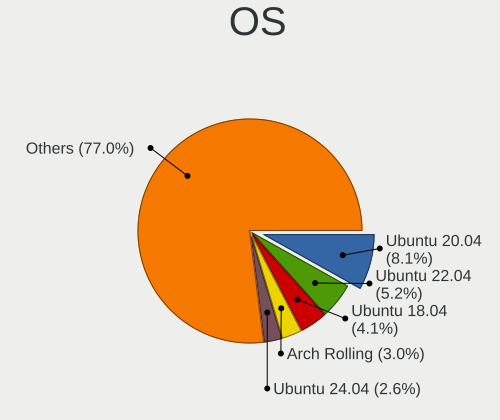

| Name                         | Notebooks | Percent |
|------------------------------|-----------|---------|
| Ubuntu 20.04                 | 565       | 8.12%   |
| Ubuntu 22.04                 | 364       | 5.23%   |
| Ubuntu 18.04                 | 283       | 4.06%   |
| Arch Rolling                 | 206       | 2.96%   |
| Ubuntu 24.04                 | 183       | 2.63%   |
| Pop!_OS 22.04                | 151       | 2.17%   |
| Zorin 16                     | 137       | 1.97%   |
| Zorin 17                     | 134       | 1.92%   |
| Debian 12                    | 105       | 1.51%   |
| Linux Mint 22.1              | 88        | 1.26%   |
| OpenMandriva 4.3             | 87        | 1.25%   |
| Fedora 40                    | 85        | 1.22%   |
| ArcoLinux Rolling            | 82        | 1.18%   |
| Debian 11                    | 80        | 1.15%   |
| Fedora 41                    | 79        | 1.13%   |
| Manjaro                      | 77        | 1.11%   |
| Fedora 39                    | 75        | 1.08%   |
| Fedora 42                    | 73        | 1.05%   |
| Fedora 38                    | 69        | 0.99%   |
| Linux Mint 19.3              | 68        | 0.98%   |
| OpenMandriva 24.12           | 66        | 0.95%   |
| Linux Mint 20.3              | 64        | 0.92%   |
| Ubuntu 19.04                 | 62        | 0.89%   |
| Linux Mint 21.1              | 62        | 0.89%   |
| OpenMandriva 4.2             | 60        | 0.86%   |
| OpenMandriva 25.90           | 58        | 0.83%   |
| Linux Mint 21.3              | 57        | 0.82%   |
| Linux Mint 20.2              | 56        | 0.8%    |
| Zorin 15                     | 55        | 0.79%   |
| Pop!_OS 20.04                | 55        | 0.79%   |
| Arch                         | 55        | 0.79%   |
| Ubuntu 20.10                 | 53        | 0.76%   |
| KDE neon 20.04               | 52        | 0.75%   |
| Ubuntu 21.10                 | 51        | 0.73%   |
| Linux Mint 21.2              | 51        | 0.73%   |
| Linux Mint 20.1              | 51        | 0.73%   |
| openSUSE Tumbleweed-XXXXXXXX | 50        | 0.72%   |
| Ubuntu 19.10                 | 49        | 0.7%    |
| Linux Mint 22.2              | 46        | 0.66%   |
| Pop!_OS 21.04                | 45        | 0.65%   |

OS Family
---------

OS without a version

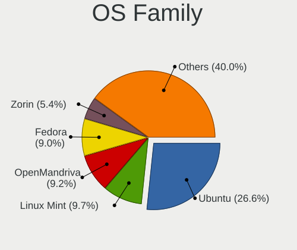

| Name          | Notebooks | Percent |
|---------------|-----------|---------|
| Ubuntu        | 1758      | 26.65%  |
| Linux Mint    | 638       | 9.67%   |
| OpenMandriva  | 609       | 9.23%   |
| Fedora        | 596       | 9.03%   |
| Zorin         | 355       | 5.38%   |
| Pop!_OS       | 306       | 4.64%   |
| Arch          | 259       | 3.93%   |
| Debian        | 244       | 3.7%    |
| SteamOS       | 173       | 2.62%   |
| Manjaro       | 173       | 2.62%   |
| Kubuntu       | 158       | 2.4%    |
| KDE neon      | 117       | 1.77%   |
| Xubuntu       | 110       | 1.67%   |
| ArcoLinux     | 86        | 1.3%    |
| openSUSE      | 75        | 1.14%   |
| Elementary    | 69        | 1.05%   |
| Kali          | 51        | 0.77%   |
| Lubuntu       | 50        | 0.76%   |
| Bazzite       | 46        | 0.7%    |
| EndeavourOS   | 43        | 0.65%   |
| Gentoo        | 42        | 0.64%   |
| Ubuntu MATE   | 41        | 0.62%   |
| BlackPanther  | 40        | 0.61%   |
| ROSA          | 38        | 0.58%   |
| MX            | 36        | 0.55%   |
| LMDE          | 34        | 0.52%   |
| Ubuntu Unity  | 32        | 0.49%   |
| Endless       | 31        | 0.47%   |
| Garuda Linux  | 29        | 0.44%   |
| Nobara        | 28        | 0.42%   |
| CachyOS       | 25        | 0.38%   |
| Ubuntu Budgie | 21        | 0.32%   |
| Parrot        | 20        | 0.3%    |
| NixOS         | 20        | 0.3%    |
| Clear Linux   | 19        | 0.29%   |
| Peppermint    | 14        | 0.21%   |
| TUXEDO OS     | 12        | 0.18%   |
| Alpine        | 12        | 0.18%   |
| CentOS        | 11        | 0.17%   |
| Void Linux    | 10        | 0.15%   |

Kernel
------

Version of the Linux kernel

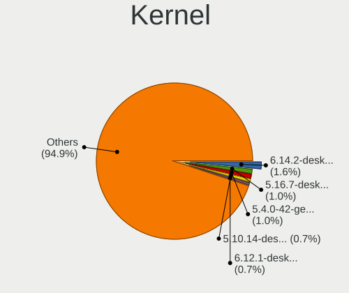

| Version                     | Notebooks | Percent |
|-----------------------------|-----------|---------|
| 6.14.2-desktop-3omv2590     | 121       | 1.58%   |
| 5.16.7-desktop-1omv4003     | 79        | 1.03%   |
| 5.4.0-42-generic            | 77        | 1.01%   |
| 5.10.14-desktop-1omv4002    | 57        | 0.75%   |
| 6.12.1-desktop-1omv2490     | 53        | 0.69%   |
| 5.15.0-56-generic           | 50        | 0.65%   |
| 6.2.6-desktop-1omv2390      | 42        | 0.55%   |
| 5.13.0-valve36-1-neptune    | 42        | 0.55%   |
| 5.4.0-48-generic            | 40        | 0.52%   |
| 5.4.0-52-generic            | 39        | 0.51%   |
| 5.15.0-58-generic           | 39        | 0.51%   |
| 6.1.1-desktop-1omv2290      | 38        | 0.5%    |
| 5.15.0-52-generic           | 38        | 0.5%    |
| 6.8.0-60-generic            | 37        | 0.48%   |
| 6.8.0-51-generic            | 37        | 0.48%   |
| 6.14.0-33-generic           | 36        | 0.47%   |
| 6.6.2-desktop-1omv2390      | 35        | 0.46%   |
| 5.4.0-29-generic            | 35        | 0.46%   |
| 5.3.0-40-generic            | 35        | 0.46%   |
| 6.12.9-desktop-1omv2490     | 34        | 0.44%   |
| 5.11.0-27-generic           | 34        | 0.44%   |
| 6.4.11-desktop-1omv2390     | 33        | 0.43%   |
| 5.4.0-26-generic            | 33        | 0.43%   |
| 5.3.0-28-generic            | 33        | 0.43%   |
| 5.15.0-46-generic           | 33        | 0.43%   |
| 6.8.0-52-generic            | 31        | 0.41%   |
| 5.4.0-58-generic            | 31        | 0.41%   |
| 5.15.0-91-generic           | 30        | 0.39%   |
| 6.2.0-26-generic            | 29        | 0.38%   |
| 5.4.0-40-generic            | 29        | 0.38%   |
| 5.0.0-32-generic            | 29        | 0.38%   |
| 5.11.0-38-generic           | 28        | 0.37%   |
| 6.9.3-76060903-generic      | 27        | 0.35%   |
| 6.8.0-40-generic            | 26        | 0.34%   |
| 5.4.0-91-generic            | 25        | 0.33%   |
| 5.3.0-42-generic            | 25        | 0.33%   |
| 5.19.0-35-generic           | 25        | 0.33%   |
| 6.8.0-49-generic            | 24        | 0.31%   |
| 6.14.0-37-generic           | 24        | 0.31%   |
| 6.1.52-valve16-1-neptune-61 | 24        | 0.31%   |

Kernel Family
-------------

Linux kernel without a distro release

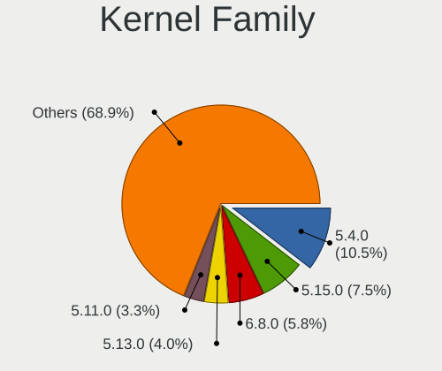

| Version | Notebooks | Percent |
|---------|-----------|---------|
| 5.4.0   | 754       | 10.47%  |
| 5.15.0  | 538       | 7.47%   |
| 6.8.0   | 421       | 5.84%   |
| 5.13.0  | 287       | 3.98%   |
| 5.11.0  | 241       | 3.35%   |
| 5.8.0   | 234       | 3.25%   |
| 6.5.0   | 219       | 3.04%   |
| 4.15.0  | 206       | 2.86%   |
| 5.3.0   | 204       | 2.83%   |
| 5.19.0  | 160       | 2.22%   |
| 6.2.0   | 155       | 2.15%   |
| 6.14.0  | 153       | 2.12%   |
| 6.1.0   | 143       | 1.99%   |
| 5.0.0   | 137       | 1.9%    |
| 6.14.2  | 132       | 1.83%   |
| 6.11.0  | 111       | 1.54%   |
| 5.10.0  | 108       | 1.5%    |
| 4.18.0  | 94        | 1.3%    |
| 5.16.7  | 79        | 1.1%    |
| 6.2.6   | 64        | 0.89%   |
| 6.12.1  | 58        | 0.81%   |
| 5.10.14 | 57        | 0.79%   |
| 6.1.52  | 43        | 0.6%    |
| 6.12.9  | 41        | 0.57%   |
| 6.1.1   | 39        | 0.54%   |
| 6.6.2   | 37        | 0.51%   |
| 6.4.11  | 36        | 0.5%    |
| 6.9.3   | 35        | 0.49%   |
| 4.19.0  | 30        | 0.42%   |
| 6.5.6   | 27        | 0.37%   |
| 6.12.6  | 25        | 0.35%   |
| 4.18.16 | 25        | 0.35%   |
| 5.14.0  | 24        | 0.33%   |
| 6.17.7  | 21        | 0.29%   |
| 6.10.0  | 20        | 0.28%   |
| 6.8.9   | 18        | 0.25%   |
| 6.17.0  | 18        | 0.25%   |
| 6.14.6  | 17        | 0.24%   |
| 6.8.7   | 16        | 0.22%   |
| 6.0.0   | 16        | 0.22%   |

Kernel Major Ver.
-----------------

Linux kernel major version

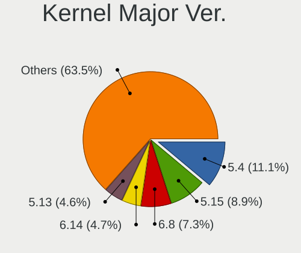

| Version | Notebooks | Percent |
|---------|-----------|---------|
| 5.4     | 791       | 11.09%  |
| 5.15    | 636       | 8.92%   |
| 6.8     | 520       | 7.29%   |
| 6.14    | 332       | 4.66%   |
| 5.13    | 327       | 4.59%   |
| 6.1     | 306       | 4.29%   |
| 6.5     | 289       | 4.05%   |
| 5.8     | 279       | 3.91%   |
| 6.2     | 268       | 3.76%   |
| 5.11    | 265       | 3.72%   |
| 6.12    | 244       | 3.42%   |
| 5.3     | 228       | 3.2%    |
| 5.10    | 216       | 3.03%   |
| 4.15    | 207       | 2.9%    |
| 5.19    | 201       | 2.82%   |
| 6.11    | 185       | 2.59%   |
| 6.6     | 155       | 2.17%   |
| 5.16    | 148       | 2.08%   |
| 5.0     | 144       | 2.02%   |
| 4.18    | 121       | 1.7%    |
| 6.4     | 117       | 1.64%   |
| 6.9     | 101       | 1.42%   |
| 6.17    | 95        | 1.33%   |
| 6.10    | 90        | 1.26%   |
| 6.0     | 80        | 1.12%   |
| 6.15    | 72        | 1.01%   |
| 6.13    | 68        | 0.95%   |
| 5.14    | 63        | 0.88%   |
| 6.3     | 59        | 0.83%   |
| 5.17    | 59        | 0.83%   |
| 6.7     | 55        | 0.77%   |
| 6.16    | 55        | 0.77%   |
| 5.9     | 46        | 0.65%   |
| 4.19    | 46        | 0.65%   |
| 5.12    | 41        | 0.58%   |
| 5.6     | 40        | 0.56%   |
| 4.9     | 33        | 0.46%   |
| 5.18    | 32        | 0.45%   |
| 5.7     | 30        | 0.42%   |
| 5.5     | 19        | 0.27%   |

Arch
----

OS architecture (x86_64, i586, etc.)

| Name    | Notebooks | Percent |
|---------|-----------|---------|
| x86_64  | 6201      | 97.95%  |
| i686    | 125       | 1.97%   |
| aarch64 | 5         | 0.08%   |

DE
--

Desktop Environment

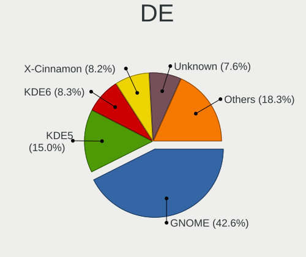

| Name             | Notebooks | Percent |
|------------------|-----------|---------|
| GNOME            | 2823      | 42.59%  |
| KDE5             | 992       | 14.96%  |
| KDE6             | 553       | 8.34%   |
| X-Cinnamon       | 544       | 8.21%   |
| Unknown          | 503       | 7.59%   |
| XFCE             | 452       | 6.82%   |
| MATE             | 150       | 2.26%   |
| KDE              | 104       | 1.57%   |
| LXQt             | 81        | 1.22%   |
| Pantheon         | 65        | 0.98%   |
| Cinnamon         | 52        | 0.78%   |
| Hyprland         | 41        | 0.62%   |
| Unity            | 34        | 0.51%   |
| i3               | 32        | 0.48%   |
| Budgie           | 32        | 0.48%   |
| LXDE             | 31        | 0.47%   |
| GNOME Flashback  | 20        | 0.3%    |
| KDE4             | 18        | 0.27%   |
| sway             | 17        | 0.26%   |
| GNOME Classic    | 10        | 0.15%   |
| Trinity          | 8         | 0.12%   |
| qtile            | 7         | 0.11%   |
| COSMIC           | 7         | 0.11%   |
| awesome          | 7         | 0.11%   |
| Deepin           | 5         | 0.08%   |
| openbox          | 4         | 0.06%   |
| BunsenLabs       | 4         | 0.06%   |
| bspwm            | 4         | 0.06%   |
| xmonad           | 3         | 0.05%   |
| Unicorn:XFCE     | 2         | 0.03%   |
| niri             | 2         | 0.03%   |
| mwm              | 2         | 0.03%   |
| i3-with-shmlog   | 2         | 0.03%   |
| DWM              | 2         | 0.03%   |
| chadwm           | 2         | 0.03%   |
| xinitrc          | 1         | 0.02%   |
| river            | 1         | 0.02%   |
| none+i3          | 1         | 0.02%   |
| lightdm-xsession | 1         | 0.02%   |
| icewm            | 1         | 0.02%   |

Display Server
--------------

X11 or Wayland

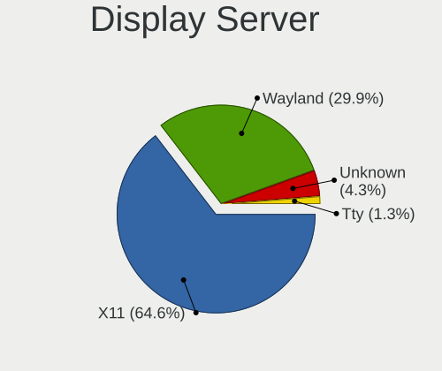

| Name    | Notebooks | Percent |
|---------|-----------|---------|
| X11     | 4222      | 64.57%  |
| Wayland | 1956      | 29.91%  |
| Unknown | 278       | 4.25%   |
| Tty     | 83        | 1.27%   |

Display Manager
---------------

SDDM, LightDM, etc.

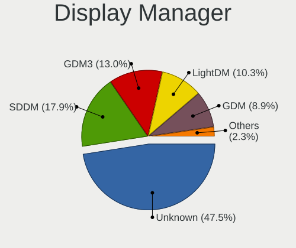

| Name            | Notebooks | Percent |
|-----------------|-----------|---------|
| Unknown         | 3134      | 47.53%  |
| SDDM            | 1181      | 17.91%  |
| GDM3            | 860       | 13.04%  |
| LightDM         | 677       | 10.27%  |
| GDM             | 589       | 8.93%   |
| TDM             | 103       | 1.56%   |
| KDM             | 16        | 0.24%   |
| LXDM            | 7         | 0.11%   |
| XDM             | 6         | 0.09%   |
| GREETD          | 6         | 0.09%   |
| Ly              | 4         | 0.06%   |
| SLiM            | 2         | 0.03%   |
| LY-DM           | 2         | 0.03%   |
| SLIMSKI         | 1         | 0.02%   |
| NODM            | 1         | 0.02%   |
| MDM             | 1         | 0.02%   |
| KODI-STANDALONE | 1         | 0.02%   |
| FLY-DM          | 1         | 0.02%   |
| COSMIC-GREETER  | 1         | 0.02%   |
| CDM             | 1         | 0.02%   |

OS Lang
-------

Language

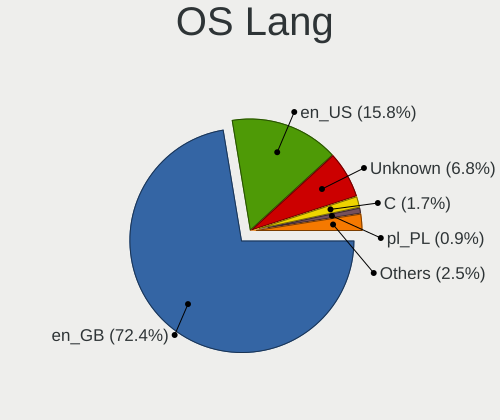

| Lang        | Notebooks | Percent |
|-------------|-----------|---------|
| en_GB       | 4699      | 72.39%  |
| en_US       | 1026      | 15.81%  |
| Unknown     | 441       | 6.79%   |
| C           | 108       | 1.66%   |
| pl_PL       | 56        | 0.86%   |
| fr_FR       | 17        | 0.26%   |
| ru_RU       | 14        | 0.22%   |
| de_DE       | 14        | 0.22%   |
| en_IE       | 11        | 0.17%   |
| it_IT       | 10        | 0.15%   |
| en_CA       | 10        | 0.15%   |
| en_AU       | 8         | 0.12%   |
| hu_HU       | 7         | 0.11%   |
| POSIX       | 6         | 0.09%   |
| es_ES       | 6         | 0.09%   |
| uk_UA       | 5         | 0.08%   |
| ro_RO       | 5         | 0.08%   |
| en_IN       | 5         | 0.08%   |
| cs_CZ       | 5         | 0.08%   |
| zh_CN       | 4         | 0.06%   |
| tr_TR       | 3         | 0.05%   |
| sk_SK       | 2         | 0.03%   |
| pt_PT       | 2         | 0.03%   |
| pt_BR       | 2         | 0.03%   |
| C.UTF8      | 2         | 0.03%   |
| zh_TW       | 1         | 0.02%   |
| sv_SE       | 1         | 0.02%   |
| nl_BE       | 1         | 0.02%   |
| nb_NO       | 1         | 0.02%   |
| ko_KR       | 1         | 0.02%   |
| hr_HR       | 1         | 0.02%   |
| fr_CA       | 1         | 0.02%   |
| es_MX       | 1         | 0.02%   |
| es_BO       | 1         | 0.02%   |
| en_US.utf-8 | 1         | 0.02%   |
| en_NZ       | 1         | 0.02%   |
| en_IL       | 1         | 0.02%   |
| en_HK       | 1         | 0.02%   |
| en_GG       | 1         | 0.02%   |
| en_GB.utf-8 | 1         | 0.02%   |

Boot Mode
---------

EFI or BIOS

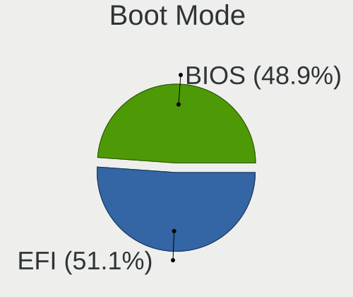

| Mode | Notebooks | Percent |
|------|-----------|---------|
| EFI  | 3311      | 51.12%  |
| BIOS | 3166      | 48.88%  |

Filesystem
----------

Type of filesystem

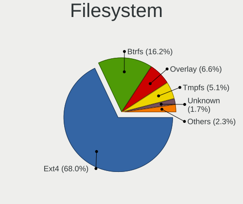

| Type    | Notebooks | Percent |
|---------|-----------|---------|
| Ext4    | 4446      | 67.98%  |
| Btrfs   | 1062      | 16.24%  |
| Overlay | 433       | 6.62%   |
| Tmpfs   | 336       | 5.14%   |
| Unknown | 112       | 1.71%   |
| Xfs     | 76        | 1.16%   |
| Zfs     | 44        | 0.67%   |
| Ext2    | 11        | 0.17%   |
| F2fs    | 10        | 0.15%   |
| Ext3    | 5         | 0.08%   |
| Rootfs  | 3         | 0.05%   |
| Aufs    | 2         | 0.03%   |

Part. scheme
------------

Scheme of partitioning

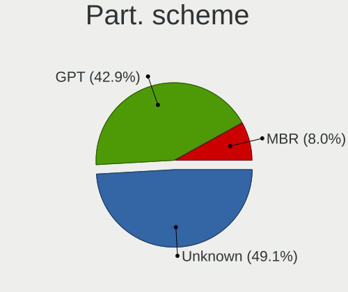

| Type    | Notebooks | Percent |
|---------|-----------|---------|
| Unknown | 3190      | 49.09%  |
| GPT     | 2785      | 42.86%  |
| MBR     | 523       | 8.05%   |

Dual Boot with Linux/BSD
------------------------

Hosting more than one Linux/BSD

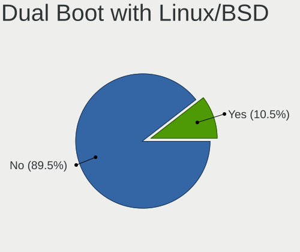

| Dual boot | Notebooks | Percent |
|-----------|-----------|---------|
| No        | 5756      | 89.52%  |
| Yes       | 674       | 10.48%  |

Dual Boot (Win)
---------------

Hosting Linux and Windows

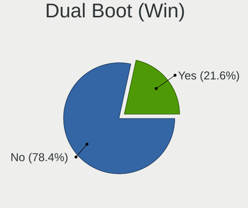

| Dual boot | Notebooks | Percent |
|-----------|-----------|---------|
| No        | 5045      | 78.42%  |
| Yes       | 1388      | 21.58%  |

Board
-----

Vendor
------

Motherboard manufacturer

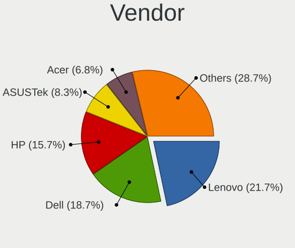

| Name                | Notebooks | Percent |
|---------------------|-----------|---------|
| Lenovo              | 1372      | 21.68%  |
| Dell                | 1181      | 18.67%  |
| Hewlett-Packard     | 994       | 15.71%  |
| ASUSTek Computer    | 528       | 8.35%   |
| Acer                | 433       | 6.84%   |
| Apple               | 233       | 3.68%   |
| Toshiba             | 220       | 3.48%   |
| Valve               | 173       | 2.73%   |
| Samsung Electronics | 107       | 1.69%   |
| MSI                 | 101       | 1.6%    |
| Sony                | 83        | 1.31%   |
| Google              | 78        | 1.23%   |
| PC Specialist       | 77        | 1.22%   |
| HUAWEI              | 61        | 0.96%   |
| Unknown             | 57        | 0.9%    |
| Notebook            | 46        | 0.73%   |
| Alienware           | 37        | 0.58%   |
| Fujitsu             | 35        | 0.55%   |
| Razer               | 32        | 0.51%   |
| Framework           | 29        | 0.46%   |
| Star Labs           | 26        | 0.41%   |
| Packard Bell        | 21        | 0.33%   |
| TUXEDO              | 19        | 0.3%    |
| Panasonic           | 19        | 0.3%    |
| LG Electronics      | 17        | 0.27%   |
| Entroware           | 17        | 0.27%   |
| Clevo               | 17        | 0.27%   |
| Fujitsu Siemens     | 16        | 0.25%   |
| Medion              | 15        | 0.24%   |
| Gigabyte Technology | 14        | 0.22%   |
| GEO                 | 14        | 0.22%   |
| Dixonsxp            | 14        | 0.22%   |
| Linx                | 13        | 0.21%   |
| Timi                | 10        | 0.16%   |
| Novatech            | 10        | 0.16%   |
| Jumper              | 10        | 0.16%   |
| eMachines           | 10        | 0.16%   |
| OEGStone            | 9         | 0.14%   |
| Advent              | 9         | 0.14%   |
| HONOR               | 8         | 0.13%   |

Model
-----

Motherboard model

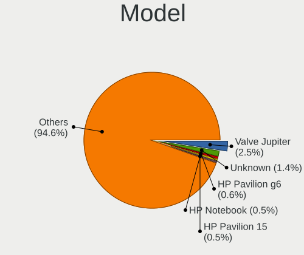

| Name                                    | Notebooks | Percent |
|-----------------------------------------|-----------|---------|
| Valve Jupiter                           | 156       | 2.47%   |
| Unknown                                 | 88        | 1.39%   |
| HP Pavilion g6                          | 37        | 0.58%   |
| HP Notebook                             | 31        | 0.49%   |
| HP Pavilion 15                          | 30        | 0.47%   |
| HP Pavilion Notebook                    | 28        | 0.44%   |
| Dell XPS 15 7590                        | 21        | 0.33%   |
| Dell XPS 15 9570                        | 20        | 0.32%   |
| Dell XPS 15 9500                        | 19        | 0.3%    |
| Dell Inspiron 1545                      | 19        | 0.3%    |
| Apple MacBookPro9,2                     | 19        | 0.3%    |
| Dell XPS 13 9380                        | 18        | 0.28%   |
| Dell XPS 13 9370                        | 18        | 0.28%   |
| Valve Galileo                           | 17        | 0.27%   |
| HP Laptop 15-bw0xx                      | 17        | 0.27%   |
| Dell XPS 15 9560                        | 17        | 0.27%   |
| Apple MacBookPro12,1                    | 17        | 0.27%   |
| Dell XPS 13 9360                        | 15        | 0.24%   |
| Dell XPS 13 7390                        | 14        | 0.22%   |
| Dell Latitude E7240                     | 14        | 0.22%   |
| Dell Latitude E6420                     | 14        | 0.22%   |
| Apple MacBookPro8,1                     | 14        | 0.22%   |
| HP Pavilion dv6                         | 13        | 0.21%   |
| HP Laptop 15-da0xxx                     | 13        | 0.21%   |
| HP ENVY Notebook                        | 13        | 0.21%   |
| HP 15                                   | 13        | 0.21%   |
| Dell XPS 13 9310                        | 13        | 0.21%   |
| Dell Latitude E6400                     | 13        | 0.21%   |
| ASUS Vivobook Go E1504FA_E1504FA        | 13        | 0.21%   |
| Apple MacBookPro7,1                     | 13        | 0.21%   |
| Lenovo Z50-75 80EC                      | 12        | 0.19%   |
| Lenovo V145-15AST 81MT                  | 12        | 0.19%   |
| Dell XPS 15 9530                        | 12        | 0.19%   |
| Dell XPS 15 9510                        | 12        | 0.19%   |
| Dell Latitude E7440                     | 12        | 0.19%   |
| Dell Latitude E6410                     | 12        | 0.19%   |
| ASUS VivoBook_ASUSLaptop E410MAB_L410MA | 12        | 0.19%   |
| Apple MacBookAir7,2                     | 12        | 0.19%   |
| Toshiba Satellite C660                  | 11        | 0.17%   |
| HP EliteBook 840 G5                     | 11        | 0.17%   |

Model Family
------------

Motherboard model prefix

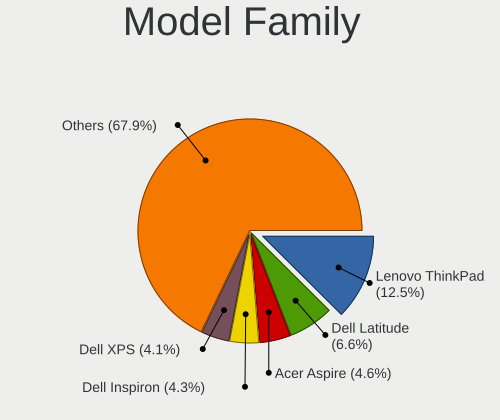

| Name                  | Notebooks | Percent |
|-----------------------|-----------|---------|
| Lenovo ThinkPad       | 788       | 12.45%  |
| Dell Latitude         | 420       | 6.64%   |
| Acer Aspire           | 290       | 4.58%   |
| Dell Inspiron         | 272       | 4.3%    |
| Dell XPS              | 262       | 4.14%   |
| Lenovo IdeaPad        | 253       | 4%      |
| HP Pavilion           | 208       | 3.29%   |
| Toshiba Satellite     | 192       | 3.03%   |
| HP EliteBook          | 174       | 2.75%   |
| ASUS VivoBook         | 166       | 2.62%   |
| Valve Jupiter         | 156       | 2.47%   |
| HP Laptop             | 130       | 2.05%   |
| HP ProBook            | 108       | 1.71%   |
| Dell Precision        | 105       | 1.66%   |
| Unknown               | 88        | 1.39%   |
| Lenovo Legion         | 65        | 1.03%   |
| ASUS ROG              | 57        | 0.9%    |
| Acer Swift            | 53        | 0.84%   |
| HP ENVY               | 50        | 0.79%   |
| ASUS Zenbook          | 49        | 0.77%   |
| Lenovo Yoga           | 48        | 0.76%   |
| ASUS ASUS             | 46        | 0.73%   |
| Dell Vostro           | 42        | 0.66%   |
| HP Stream             | 39        | 0.62%   |
| HP Compaq             | 38        | 0.6%    |
| HP ZBook              | 33        | 0.52%   |
| Razer Blade           | 31        | 0.49%   |
| HP Notebook           | 31        | 0.49%   |
| Fujitsu LIFEBOOK      | 31        | 0.49%   |
| Lenovo ThinkBook      | 29        | 0.46%   |
| Framework Laptop      | 29        | 0.46%   |
| Acer Nitro            | 28        | 0.44%   |
| Apple MacBookPro11    | 27        | 0.43%   |
| Apple MacBookPro8     | 25        | 0.4%    |
| HP OMEN               | 24        | 0.38%   |
| HP Presario           | 23        | 0.36%   |
| HP 255                | 23        | 0.36%   |
| Apple MacBookPro9     | 23        | 0.36%   |
| Packard Bell EasyNote | 20        | 0.32%   |
| Dell System           | 20        | 0.32%   |

MFG Year
--------

Motherboard manufacture year

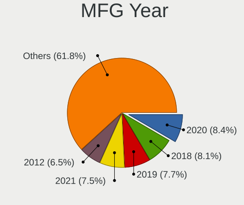

| Year    | Notebooks | Percent |
|---------|-----------|---------|
| 2020    | 532       | 8.41%   |
| 2018    | 513       | 8.11%   |
| 2019    | 488       | 7.71%   |
| 2021    | 472       | 7.46%   |
| 2012    | 414       | 6.54%   |
| 2013    | 412       | 6.51%   |
| 2017    | 396       | 6.26%   |
| 2022    | 387       | 6.12%   |
| 2011    | 376       | 5.94%   |
| 2016    | 328       | 5.18%   |
| 2015    | 326       | 5.15%   |
| 2014    | 323       | 5.11%   |
| 2023    | 275       | 4.35%   |
| 2010    | 243       | 3.84%   |
| 2008    | 238       | 3.76%   |
| 2009    | 200       | 3.16%   |
| 2024    | 158       | 2.5%    |
| 2007    | 122       | 1.93%   |
| 2006    | 57        | 0.9%    |
| 2025    | 47        | 0.74%   |
| 2005    | 9         | 0.14%   |
| Unknown | 9         | 0.14%   |
| 2003    | 1         | 0.02%   |
| 2002    | 1         | 0.02%   |

Form Factor
-----------

Physical design of the computer

| Name     | Notebooks | Percent |
|----------|-----------|---------|
| Notebook | 6327      | 100%    |

Secure Boot
-----------

Enabled or disabled

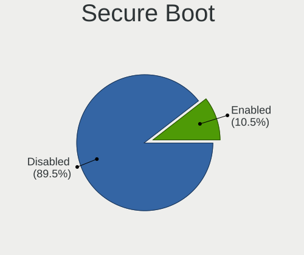

| State    | Notebooks | Percent |
|----------|-----------|---------|
| Disabled | 5725      | 89.51%  |
| Enabled  | 671       | 10.49%  |

Coreboot
--------

Have coreboot on board

| Used | Notebooks | Percent |
|------|-----------|---------|
| No   | 6217      | 98.25%  |
| Yes  | 111       | 1.75%   |

RAM Size
--------

Total RAM memory

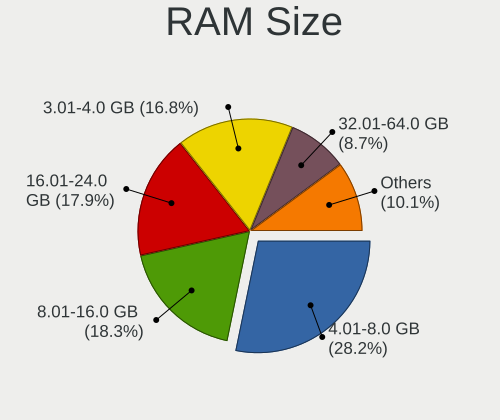

| Size in GB  | Notebooks | Percent |
|-------------|-----------|---------|
| 4.01-8.0    | 1815      | 28.22%  |
| 8.01-16.0   | 1175      | 18.27%  |
| 16.01-24.0  | 1149      | 17.87%  |
| 3.01-4.0    | 1082      | 16.82%  |
| 32.01-64.0  | 559       | 8.69%   |
| 1.01-2.0    | 273       | 4.25%   |
| 64.01-256.0 | 119       | 1.85%   |
| 2.01-3.0    | 115       | 1.79%   |
| 24.01-32.0  | 109       | 1.69%   |
| 0.51-1.0    | 34        | 0.53%   |
| 0.01-0.5    | 1         | 0.02%   |

RAM Used
--------

Used RAM memory

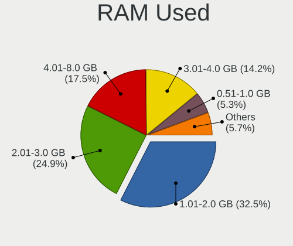

| Used GB    | Notebooks | Percent |
|------------|-----------|---------|
| 1.01-2.0   | 2282      | 32.52%  |
| 2.01-3.0   | 1746      | 24.88%  |
| 4.01-8.0   | 1225      | 17.46%  |
| 3.01-4.0   | 998       | 14.22%  |
| 0.51-1.0   | 369       | 5.26%   |
| 8.01-16.0  | 309       | 4.4%    |
| 0.01-0.5   | 43        | 0.61%   |
| 16.01-24.0 | 32        | 0.46%   |
| 24.01-32.0 | 9         | 0.13%   |
| 32.01-64.0 | 4         | 0.06%   |
| Unknown    | 1         | 0.01%   |

Total Drives
------------

Number of drives on board

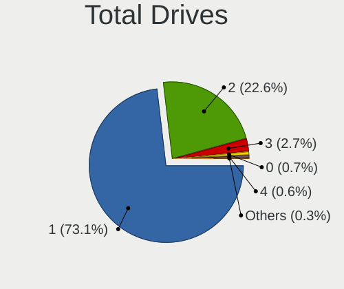

| Drives | Notebooks | Percent |
|--------|-----------|---------|
| 1      | 4734      | 73.13%  |
| 2      | 1462      | 22.59%  |
| 3      | 176       | 2.72%   |
| 0      | 48        | 0.74%   |
| 4      | 36        | 0.56%   |
| 5      | 8         | 0.12%   |
| 7      | 4         | 0.06%   |
| 6      | 3         | 0.05%   |
| 9      | 1         | 0.02%   |
| 8      | 1         | 0.02%   |

Has CD-ROM
----------

Has CD-ROM on board

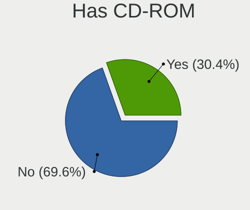

| Presented | Notebooks | Percent |
|-----------|-----------|---------|
| No        | 4421      | 69.56%  |
| Yes       | 1935      | 30.44%  |

Has Ethernet
------------

Has Ethernet on board

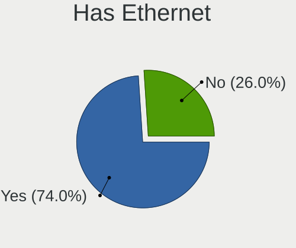

| Presented | Notebooks | Percent |
|-----------|-----------|---------|
| Yes       | 4698      | 73.96%  |
| No        | 1654      | 26.04%  |

Has WiFi
--------

Has WiFi module

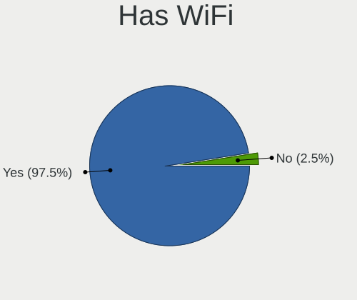

| Presented | Notebooks | Percent |
|-----------|-----------|---------|
| Yes       | 6177      | 97.52%  |
| No        | 157       | 2.48%   |

Has Bluetooth
-------------

Has Bluetooth module

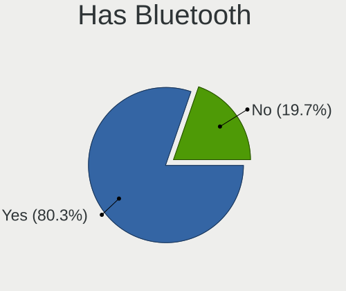

| Presented | Notebooks | Percent |
|-----------|-----------|---------|
| Yes       | 5130      | 80.29%  |
| No        | 1259      | 19.71%  |

Location
--------

Country
-------

Geographic location (country)

| Country | Notebooks | Percent |
|---------|-----------|---------|
| UK      | 6327      | 100%    |

City
----

Geographic location (city)

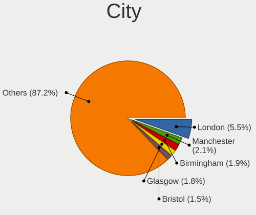

| City                | Notebooks | Percent |
|---------------------|-----------|---------|
| London              | 386       | 5.48%   |
| Manchester          | 149       | 2.12%   |
| Birmingham          | 136       | 1.93%   |
| Glasgow             | 124       | 1.76%   |
| Bristol             | 108       | 1.53%   |
| Leeds               | 101       | 1.44%   |
| Edinburgh           | 97        | 1.38%   |
| Liverpool           | 83        | 1.18%   |
| Nottingham          | 74        | 1.05%   |
| Islington           | 70        | 0.99%   |
| Southampton         | 68        | 0.97%   |
| Sheffield           | 68        | 0.97%   |
| Reading             | 61        | 0.87%   |
| Cambridge           | 55        | 0.78%   |
| Leicester           | 53        | 0.75%   |
| Coventry            | 52        | 0.74%   |
| Cardiff             | 49        | 0.7%    |
| Oxford              | 45        | 0.64%   |
| Croydon             | 44        | 0.63%   |
| Bradford            | 44        | 0.63%   |
| Norwich             | 43        | 0.61%   |
| Milton Keynes       | 41        | 0.58%   |
| Southwark           | 40        | 0.57%   |
| Lewisham            | 40        | 0.57%   |
| Hackney             | 40        | 0.57%   |
| Newcastle upon Tyne | 39        | 0.55%   |
| Plymouth            | 37        | 0.53%   |
| York                | 36        | 0.51%   |
| Brighton            | 35        | 0.5%    |
| Harrow              | 34        | 0.48%   |
| City of Westminster | 34        | 0.48%   |
| City of London      | 33        | 0.47%   |
| Aberdeen            | 32        | 0.45%   |
| Swindon             | 31        | 0.44%   |
| Slough              | 31        | 0.44%   |
| Derby               | 31        | 0.44%   |
| Barnet              | 31        | 0.44%   |
| Edgware             | 30        | 0.43%   |
| Bolton              | 30        | 0.43%   |
| Wolverhampton       | 29        | 0.41%   |

Drives
------

Drive Vendor
------------

Hard drive vendors

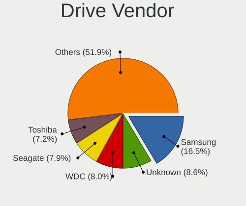

| Vendor                       | Notebooks | Drives | Percent |
|------------------------------|-----------|--------|---------|
| Samsung Electronics          | 1291      | 1745   | 16.45%  |
| Unknown                      | 674       | 870    | 8.59%   |
| WDC                          | 625       | 796    | 7.97%   |
| Seagate                      | 618       | 844    | 7.88%   |
| Toshiba                      | 566       | 714    | 7.21%   |
| SanDisk                      | 562       | 722    | 7.16%   |
| SK hynix                     | 374       | 462    | 4.77%   |
| Crucial                      | 328       | 436    | 4.18%   |
| Kingston                     | 296       | 370    | 3.77%   |
| Micron Technology            | 241       | 288    | 3.07%   |
| Intel                        | 224       | 283    | 2.85%   |
| Hitachi                      | 217       | 270    | 2.77%   |
| HGST                         | 159       | 228    | 2.03%   |
| Apple                        | 125       | 165    | 1.59%   |
| KIOXIA                       | 121       | 148    | 1.54%   |
| Phison Electronics           | 103       | 130    | 1.31%   |
| Micron/Crucial Technology    | 87        | 112    | 1.11%   |
| China                        | 79        | 109    | 1.01%   |
| Kingston Technology Company  | 63        | 81     | 0.8%    |
| Unknown                      | 60        | 72     | 0.76%   |
| Phison                       | 58        | 66     | 0.74%   |
| LITEON                       | 52        | 70     | 0.66%   |
| A-DATA Technology            | 51        | 62     | 0.65%   |
| Silicon Motion               | 45        | 57     | 0.57%   |
| PNY                          | 43        | 52     | 0.55%   |
| Transcend                    | 41        | 51     | 0.52%   |
| LITEONIT                     | 38        | 45     | 0.48%   |
| Fujitsu                      | 34        | 44     | 0.43%   |
| MAXIO Technology (Hangzhou)  | 26        | 32     | 0.33%   |
| O2 Micro                     | 25        | 29     | 0.32%   |
| Integral                     | 25        | 31     | 0.32%   |
| SPCC                         | 20        | 31     | 0.25%   |
| SABRENT                      | 19        | 22     | 0.24%   |
| JMicron Technology           | 19        | 24     | 0.24%   |
| Shenzhen Longsys Electronics | 18        | 20     | 0.23%   |
| Patriot                      | 16        | 25     | 0.2%    |
| OCZ                          | 16        | 17     | 0.2%    |
| Netac                        | 16        | 22     | 0.2%    |
| Fanxiang                     | 16        | 17     | 0.2%    |
| Lenovo                       | 14        | 16     | 0.18%   |

Drive Model
-----------

Hard drive models

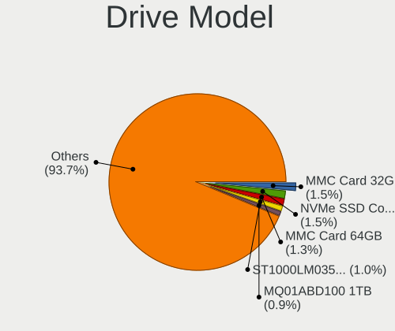

| Model                                                | Notebooks | Percent |
|------------------------------------------------------|-----------|---------|
| Unknown MMC Card  32GB                               | 126       | 1.53%   |
| Samsung NVMe SSD Controller SM981/PM981/PM983 1TB    | 123       | 1.5%    |
| Unknown MMC Card  64GB                               | 107       | 1.3%    |
| Seagate ST1000LM035-1RK172 1TB                       | 85        | 1.03%   |
| Toshiba MQ01ABD100 1TB                               | 74        | 0.9%    |
| Unknown MMC Card  128GB                              | 68        | 0.83%   |
| Seagate ST1000LM024 HN-M101MBB 1TB                   | 65        | 0.79%   |
| Samsung NVMe SSD Controller PM9A1/PM9A3/980PRO 1TB   | 63        | 0.77%   |
| Phison PS5013 E13 NVMe Controller 500GB              | 61        | 0.74%   |
| Unknown                                              | 60        | 0.73%   |
| Unknown MMC Card  512GB                              | 52        | 0.63%   |
| Micron/Crucial P2 NVMe PCIe SSD 2TB                  | 52        | 0.63%   |
| Kingston SA400S37240G 240GB SSD                      | 51        | 0.62%   |
| Unknown MMC Card  16GB                               | 46        | 0.56%   |
| HGST HTS541010A9E680 1TB                             | 45        | 0.55%   |
| Toshiba MQ01ABF050 500GB                             | 43        | 0.52%   |
| Crucial CT500MX500SSD1 500GB                         | 43        | 0.52%   |
| HGST HTS721010A9E630 1TB                             | 41        | 0.5%    |
| Crucial CT1000MX500SSD1 1TB                          | 38        | 0.46%   |
| Samsung NVMe SSD Drive 512GB                         | 37        | 0.45%   |
| Samsung SSD 860 EVO 500GB                            | 35        | 0.43%   |
| Unknown SD/MMC/MS PRO 2GB                            | 33        | 0.4%    |
| Samsung SSD 850 EVO 500GB                            | 33        | 0.4%    |
| Kingston Company OM3PDP3 NVMe SSD 256GB              | 33        | 0.4%    |
| Sandisk WD Black SN750 / PC SN730 NVMe SSD 500GB     | 32        | 0.39%   |
| SanDisk NVMe SSD Drive 1TB                           | 32        | 0.39%   |
| Samsung SSD 850 EVO 250GB                            | 31        | 0.38%   |
| Samsung NVMe SSD Controller SM961/PM961/SM963 1024GB | 31        | 0.38%   |
| Kingston SA400S37480G 480GB SSD                      | 31        | 0.38%   |
| Kingston SA400S37120G 120GB SSD                      | 31        | 0.38%   |
| Unknown MMC Card  256GB                              | 30        | 0.36%   |
| Seagate ST500LT012-1DG142 500GB                      | 29        | 0.35%   |
| Seagate ST2000LM003 HN-M201RAD 2TB                   | 29        | 0.35%   |
| Samsung NVMe SSD Drive 256GB                         | 29        | 0.35%   |
| Toshiba XG6 NVMe SSD Controller 1024GB               | 27        | 0.33%   |
| Sandisk WD Blue SN550 NVMe SSD 1024GB                | 27        | 0.33%   |
| Seagate ST9500325AS 500GB                            | 26        | 0.32%   |
| SanDisk NVMe SSD Drive 512GB                         | 26        | 0.32%   |
| Toshiba NVMe SSD Drive 256GB                         | 25        | 0.3%    |
| Toshiba MQ04ABF100 1TB                               | 25        | 0.3%    |

HDD Vendor
----------

Hard disk drive vendors

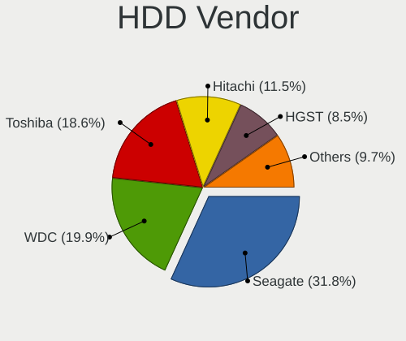

| Vendor              | Notebooks | Drives | Percent |
|---------------------|-----------|--------|---------|
| Seagate             | 598       | 816    | 31.81%  |
| WDC                 | 374       | 469    | 19.89%  |
| Toshiba             | 349       | 431    | 18.56%  |
| Hitachi             | 217       | 270    | 11.54%  |
| HGST                | 159       | 228    | 8.46%   |
| Samsung Electronics | 54        | 60     | 2.87%   |
| Unknown             | 37        | 41     | 1.97%   |
| Fujitsu             | 34        | 44     | 1.81%   |
| Apple               | 9         | 9      | 0.48%   |
| SSK                 | 8         | 12     | 0.43%   |
| JMicron Technology  | 8         | 12     | 0.43%   |
| TO Exter            | 5         | 5      | 0.27%   |
| External            | 5         | 5      | 0.27%   |
| ASMT                | 5         | 29     | 0.27%   |
| SABRENT             | 3         | 3      | 0.16%   |
| USB3.0              | 2         | 2      | 0.11%   |
| Initio              | 2         | 2      | 0.11%   |
| Inateck             | 2         | 2      | 0.11%   |
| IBM/Hitachi         | 2         | 2      | 0.11%   |
| Maxone              | 1         | 1      | 0.05%   |
| LaCie               | 1         | 1      | 0.05%   |
| Intenso             | 1         | 1      | 0.05%   |
| HGST HTS            | 1         | 1      | 0.05%   |
| Generic-            | 1         | 1      | 0.05%   |
| Extemal             | 1         | 1      | 0.05%   |
| ASMedia             | 1         | 1      | 0.05%   |

SSD Vendor
----------

Solid state drive vendors

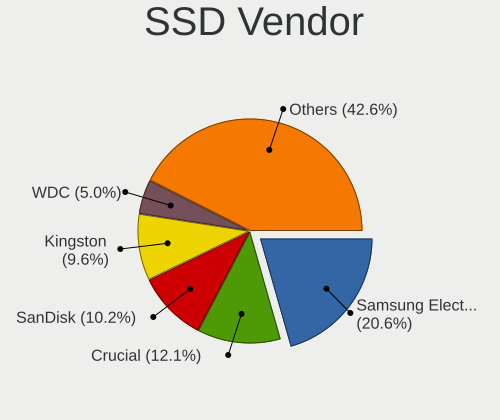

| Vendor              | Notebooks | Drives | Percent |
|---------------------|-----------|--------|---------|
| Samsung Electronics | 495       | 658    | 20.59%  |
| Crucial             | 290       | 394    | 12.06%  |
| SanDisk             | 245       | 302    | 10.19%  |
| Kingston            | 231       | 285    | 9.61%   |
| WDC                 | 120       | 162    | 4.99%   |
| Apple               | 81        | 97     | 3.37%   |
| China               | 76        | 106    | 3.16%   |
| Intel               | 73        | 77     | 3.04%   |
| SK hynix            | 71        | 94     | 2.95%   |
| Toshiba             | 65        | 85     | 2.7%    |
| Micron Technology   | 62        | 71     | 2.58%   |
| LITEON              | 50        | 68     | 2.08%   |
| PNY                 | 42        | 50     | 1.75%   |
| A-DATA Technology   | 41        | 50     | 1.71%   |
| Transcend           | 40        | 50     | 1.66%   |
| LITEONIT            | 38        | 45     | 1.58%   |
| Integral            | 25        | 31     | 1.04%   |
| SPCC                | 19        | 29     | 0.79%   |
| SABRENT             | 16        | 19     | 0.67%   |
| OCZ                 | 16        | 17     | 0.67%   |
| Patriot             | 15        | 24     | 0.62%   |
| Netac               | 14        | 19     | 0.58%   |
| XUM                 | 12        | 13     | 0.5%    |
| Team                | 12        | 16     | 0.5%    |
| Seagate             | 12        | 12     | 0.5%    |
| Lexar               | 12        | 14     | 0.5%    |
| Corsair             | 9         | 13     | 0.37%   |
| BHT                 | 9         | 12     | 0.37%   |
| Unknown             | 8         | 9      | 0.33%   |
| TCSUNBOW            | 8         | 15     | 0.33%   |
| Star                | 8         | 10     | 0.33%   |
| Drevo               | 8         | 11     | 0.33%   |
| KIOXIA-EXCERIA      | 7         | 10     | 0.29%   |
| KingSpec            | 7         | 7      | 0.29%   |
| Gigabyte Technology | 7         | 10     | 0.29%   |
| Unknown             | 7         | 7      | 0.29%   |
| Plextor             | 6         | 8      | 0.25%   |
| BIWIN               | 6         | 6      | 0.25%   |
| 2-Power             | 6         | 8      | 0.25%   |
| ORTIAL              | 5         | 5      | 0.21%   |

Drive Kind
----------

HDD or SSD

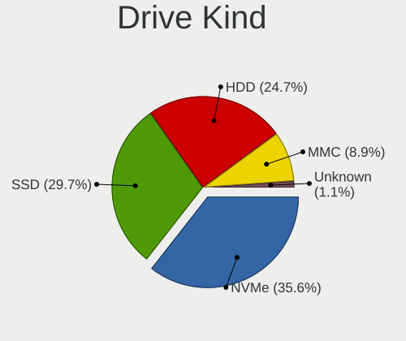

| Kind    | Notebooks | Drives | Percent |
|---------|-----------|--------|---------|
| NVMe    | 2614      | 3638   | 35.57%  |
| SSD     | 2182      | 3086   | 29.69%  |
| HDD     | 1813      | 2449   | 24.67%  |
| MMC     | 656       | 858    | 8.93%   |
| Unknown | 84        | 103    | 1.14%   |

Drive Connector
---------------

SATA, SAS, NVMe, etc.

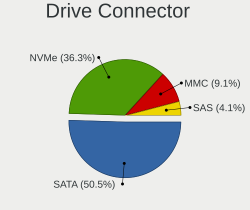

| Type | Notebooks | Drives | Percent |
|------|-----------|--------|---------|
| SATA | 3625      | 5251   | 50.5%   |
| NVMe | 2605      | 3604   | 36.29%  |
| MMC  | 656       | 858    | 9.14%   |
| SAS  | 292       | 421    | 4.07%   |

Drive Size
----------

Size of hard drive

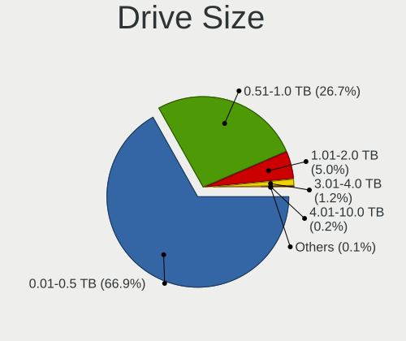

| Size in TB | Notebooks | Drives | Percent |
|------------|-----------|--------|---------|
| 0.01-0.5   | 2709      | 3721   | 66.86%  |
| 0.51-1.0   | 1080      | 1446   | 26.65%  |
| 1.01-2.0   | 201       | 279    | 4.96%   |
| 3.01-4.0   | 49        | 60     | 1.21%   |
| 4.01-10.0  | 9         | 19     | 0.22%   |
| 2.01-3.0   | 3         | 9      | 0.07%   |
| 20.01-50.0 | 1         | 1      | 0.02%   |

Space Total
-----------

Amount of disk space available on the file system

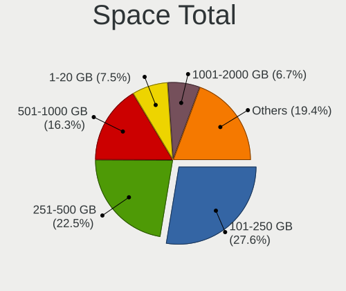

| Size in GB     | Notebooks | Percent |
|----------------|-----------|---------|
| 101-250        | 1858      | 27.61%  |
| 251-500        | 1511      | 22.46%  |
| 501-1000       | 1098      | 16.32%  |
| 1-20           | 506       | 7.52%   |
| 1001-2000      | 453       | 6.73%   |
| 51-100         | 430       | 6.39%   |
| 21-50          | 308       | 4.58%   |
| Unknown        | 229       | 3.4%    |
| More than 3000 | 215       | 3.2%    |
| 2001-3000      | 121       | 1.8%    |

Space Used
----------

Amount of used disk space

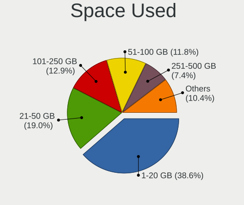

| Used GB        | Notebooks | Percent |
|----------------|-----------|---------|
| 1-20           | 2690      | 38.59%  |
| 21-50          | 1321      | 18.95%  |
| 101-250        | 898       | 12.88%  |
| 51-100         | 819       | 11.75%  |
| 251-500        | 519       | 7.45%   |
| 501-1000       | 267       | 3.83%   |
| Unknown        | 229       | 3.29%   |
| 1001-2000      | 129       | 1.85%   |
| More than 3000 | 47        | 0.67%   |
| 2001-3000      | 39        | 0.56%   |
| 0              | 12        | 0.17%   |

Malfunc. Drives
---------------

Drive models with a malfunction

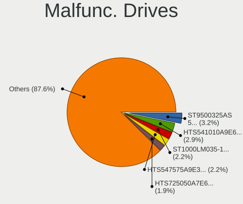

| Model                                          | Notebooks | Drives | Percent |
|------------------------------------------------|-----------|--------|---------|
| Seagate ST9500325AS 500GB                      | 10        | 14     | 3.17%   |
| HGST HTS541010A9E680 1TB                       | 9         | 9      | 2.86%   |
| Seagate ST1000LM035-1RK172 1TB                 | 7         | 7      | 2.22%   |
| Hitachi HTS547575A9E384 752GB                  | 7         | 9      | 2.22%   |
| HGST HTS725050A7E630 500GB                     | 6         | 9      | 1.9%    |
| Toshiba MQ01ABD100 1TB                         | 5         | 6      | 1.59%   |
| Seagate ST1000LM024 HN-M101MBB 1TB             | 5         | 7      | 1.59%   |
| HGST HTS721010A9E630 1TB                       | 5         | 5      | 1.59%   |
| Seagate ST500LM021-1KJ152 500GB                | 4         | 4      | 1.27%   |
| Toshiba MK1656GSY 160GB                        | 3         | 3      | 0.95%   |
| Seagate ST9320325AS 320GB                      | 3         | 5      | 0.95%   |
| Seagate ST9250410AS 250GB                      | 3         | 3      | 0.95%   |
| Seagate ST2000LX001-1RG174 2TB                 | 3         | 4      | 0.95%   |
| Intel SSDSC2BF180A5L 180GB                     | 3         | 3      | 0.95%   |
| Hitachi HTS545032B9A300 320GB                  | 3         | 3      | 0.95%   |
| Hitachi HTS543216L9A300 160GB                  | 3         | 3      | 0.95%   |
| Hitachi HTS542512K9SA00 120GB                  | 3         | 3      | 0.95%   |
| WDC WD2500BEVT-80A23T0 250GB                   | 2         | 5      | 0.63%   |
| Toshiba MQ02ABD100H 1TB                        | 2         | 2      | 0.63%   |
| Toshiba MK5065GSXN 500GB                       | 2         | 2      | 0.63%   |
| Toshiba MK3256GSY 320GB                        | 2         | 3      | 0.63%   |
| SK hynix PC401 NVMe 512GB                      | 2         | 2      | 0.63%   |
| SK hynix HFS256G39TND-N210A 256GB SSD          | 2         | 3      | 0.63%   |
| SK hynix BC711 HFM256GD3JX013N 256GB           | 2         | 2      | 0.63%   |
| Seagate ST9250315AS 250GB                      | 2         | 3      | 0.63%   |
| Seagate ST500LT012-9WS142 500GB                | 2         | 2      | 0.63%   |
| Seagate ST500LT012-1DG142 500GB                | 2         | 2      | 0.63%   |
| Seagate ST2000LM003 HN-M201RAD 2TB             | 2         | 2      | 0.63%   |
| Seagate ST1000LM014-SSHD-8GB                   | 2         | 3      | 0.63%   |
| Seagate ST1000LM014-1EJ164 1TB                 | 2         | 2      | 0.63%   |
| SanDisk SSD PLUS 240GB                         | 2         | 2      | 0.63%   |
| Micron Technology 1100_MTFDDAV256TBN 256GB SSD | 2         | 2      | 0.63%   |
| LITEON LCH-256V2S-11 2.5 7mm 256GB SSD         | 2         | 3      | 0.63%   |
| LITEON CS1-SP32-11 M.2 2242 32GB SSD           | 2         | 2      | 0.63%   |
| Intel SSDSCKKF256G8H 256GB                     | 2         | 2      | 0.63%   |
| Hitachi HTS723232A7A364 320GB                  | 2         | 2      | 0.63%   |
| Hitachi HTS547564A9E384 640GB                  | 2         | 2      | 0.63%   |
| Hitachi HTS545050A7E380 500GB                  | 2         | 2      | 0.63%   |
| Hitachi HTS545032B9A302 320GB                  | 2         | 3      | 0.63%   |
| Hitachi HTS545025B9A300 250GB                  | 2         | 2      | 0.63%   |

Malfunc. Drive Vendor
---------------------

Vendors of faulty drives

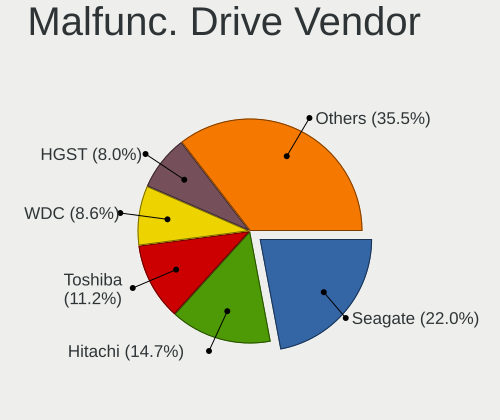

| Vendor                       | Notebooks | Drives | Percent |
|------------------------------|-----------|--------|---------|
| Seagate                      | 69        | 81     | 22.04%  |
| Hitachi                      | 46        | 53     | 14.7%   |
| Toshiba                      | 35        | 37     | 11.18%  |
| WDC                          | 27        | 32     | 8.63%   |
| HGST                         | 25        | 28     | 7.99%   |
| Intel                        | 16        | 17     | 5.11%   |
| Samsung Electronics          | 15        | 16     | 4.79%   |
| Crucial                      | 14        | 14     | 4.47%   |
| SK hynix                     | 12        | 14     | 3.83%   |
| SanDisk                      | 9         | 9      | 2.88%   |
| LITEON                       | 5         | 6      | 1.6%    |
| Kingston                     | 5         | 7      | 1.6%    |
| Fujitsu                      | 5         | 6      | 1.6%    |
| Micron Technology            | 4         | 4      | 1.28%   |
| LITEONIT                     | 2         | 3      | 0.64%   |
| Drevo                        | 2         | 2      | 0.64%   |
| China                        | 2         | 2      | 0.64%   |
| A-DATA Technology            | 2         | 2      | 0.64%   |
| Zheino                       | 1         | 2      | 0.32%   |
| XUM                          | 1         | 1      | 0.32%   |
| Transcend                    | 1         | 2      | 0.32%   |
| Team                         | 1         | 1      | 0.32%   |
| SSSTC                        | 1         | 1      | 0.32%   |
| Shenzhen Longsys Electronics | 1         | 1      | 0.32%   |
| SABRENT                      | 1         | 1      | 0.32%   |
| Realtek                      | 1         | 1      | 0.32%   |
| PNY                          | 1         | 1      | 0.32%   |
| OCZ                          | 1         | 1      | 0.32%   |
| Netac                        | 1         | 2      | 0.32%   |
| Integral                     | 1         | 1      | 0.32%   |
| HECTRON                      | 1         | 1      | 0.32%   |
| Corsair                      | 1         | 1      | 0.32%   |
| BAITITON                     | 1         | 1      | 0.32%   |
| Apple                        | 1         | 1      | 0.32%   |
| ADATA Technology             | 1         | 1      | 0.32%   |
| 2-Power                      | 1         | 2      | 0.32%   |

Malfunc. HDD Vendor
-------------------

Vendors of faulty HDD drives

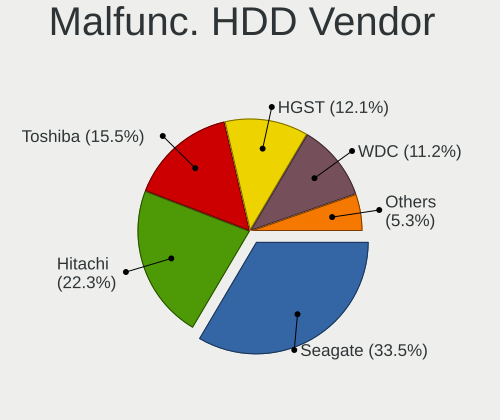

| Vendor              | Notebooks | Drives | Percent |
|---------------------|-----------|--------|---------|
| Seagate             | 69        | 81     | 33.5%   |
| Hitachi             | 46        | 53     | 22.33%  |
| Toshiba             | 32        | 34     | 15.53%  |
| HGST                | 25        | 28     | 12.14%  |
| WDC                 | 23        | 28     | 11.17%  |
| Samsung Electronics | 5         | 5      | 2.43%   |
| Fujitsu             | 5         | 6      | 2.43%   |
| SABRENT             | 1         | 1      | 0.49%   |

Malfunc. Drive Kind
-------------------

Kinds of faulty drives

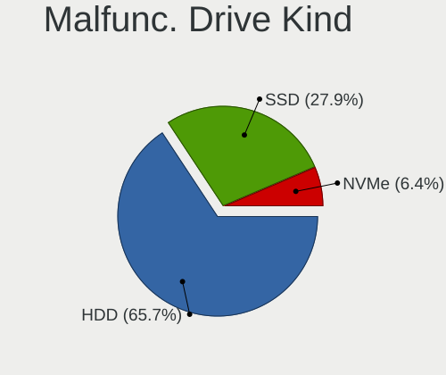

| Kind | Notebooks | Drives | Percent |
|------|-----------|--------|---------|
| HDD  | 205       | 236    | 65.71%  |
| SSD  | 87        | 97     | 27.88%  |
| NVMe | 20        | 22     | 6.41%   |

Failed Drives
-------------

Failed drive models

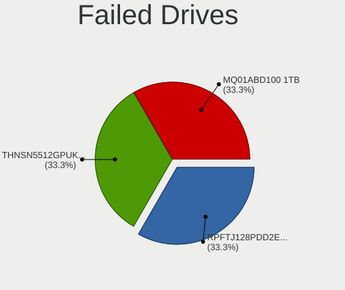

| Model                                         | Notebooks | Drives | Percent |
|-----------------------------------------------|-----------|--------|---------|
| Union Memory (Shenzhen) RPFTJ128PDD2EWX 128GB | 1         | 2      | 25%     |
| Toshiba THNSN5512GPUK NVMe 512GB              | 1         | 2      | 25%     |
| Toshiba MQ01ABD100 1TB                        | 1         | 1      | 25%     |
| HGST HTS541010A9E680 1TB                      | 1         | 1      | 25%     |

Failed Drive Vendor
-------------------

Failed drive vendors

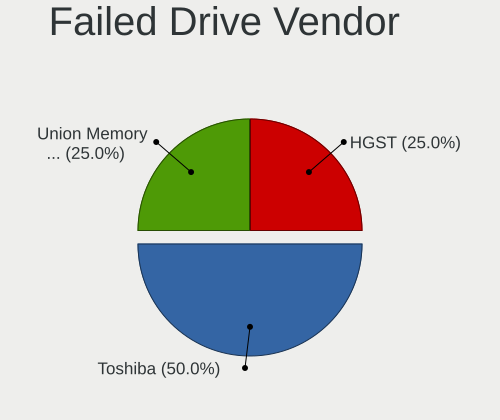

| Vendor                  | Notebooks | Drives | Percent |
|-------------------------|-----------|--------|---------|
| Toshiba                 | 2         | 3      | 50%     |
| Union Memory (Shenzhen) | 1         | 2      | 25%     |
| HGST                    | 1         | 1      | 25%     |

Drive Status
------------

Number of failed and malfunc. drives

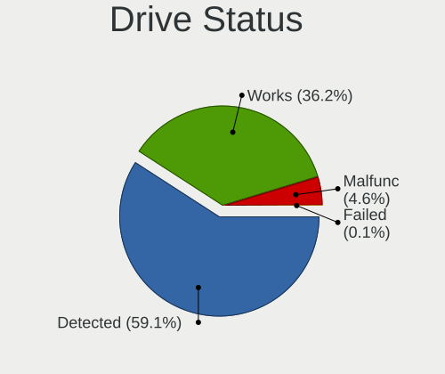

| Status   | Notebooks | Drives | Percent |
|----------|-----------|--------|---------|
| Detected | 3945      | 6401   | 59.13%  |
| Works    | 2414      | 3372   | 36.18%  |
| Malfunc  | 309       | 355    | 4.63%   |
| Failed   | 4         | 6      | 0.06%   |

Storage controller
------------------

Storage Vendor
--------------

Storage controller vendors

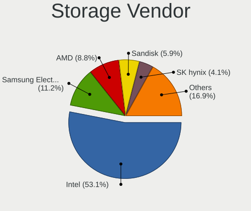

| Vendor                                  | Notebooks | Percent |
|-----------------------------------------|-----------|---------|
| Intel                                   | 3935      | 53.06%  |
| Samsung Electronics                     | 833       | 11.23%  |
| AMD                                     | 652       | 8.79%   |
| Sandisk                                 | 440       | 5.93%   |
| SK hynix                                | 301       | 4.06%   |
| Micron Technology                       | 184       | 2.48%   |
| Phison Electronics                      | 171       | 2.31%   |
| Toshiba America Info Systems            | 163       | 2.2%    |
| Kingston Technology Company             | 128       | 1.73%   |
| KIOXIA                                  | 119       | 1.6%    |
| Micron/Crucial Technology               | 118       | 1.59%   |
| Nvidia                                  | 54        | 0.73%   |
| Silicon Motion                          | 48        | 0.65%   |
| MAXIO Technology (Hangzhou)             | 30        | 0.4%    |
| Apple                                   | 28        | 0.38%   |
| O2 Micro                                | 25        | 0.34%   |
| Shenzhen Longsys Electronics            | 21        | 0.28%   |
| ADATA Technology                        | 20        | 0.27%   |
| Solid State Storage Technology          | 18        | 0.24%   |
| Union Memory (Shenzhen)                 | 15        | 0.2%    |
| Solidigm                                | 13        | 0.18%   |
| Lenovo                                  | 13        | 0.18%   |
| Silicon Integrated Systems [SiS]        | 12        | 0.16%   |
| Marvell Technology Group                | 10        | 0.13%   |
| Shenzhen Unionmemory Information System | 9         | 0.12%   |
| Yangtze Memory Technologies             | 7         | 0.09%   |
| Lite-On Technology                      | 7         | 0.09%   |
| INNOGRIT                                | 6         | 0.08%   |
| Seagate Technology                      | 5         | 0.07%   |
| Realtek Semiconductor                   | 5         | 0.07%   |
| Biwin Storage Technology                | 5         | 0.07%   |
| VIA Technologies                        | 4         | 0.05%   |
| JMicron Technology                      | 3         | 0.04%   |
| ASMedia Technology                      | 3         | 0.04%   |
| Shenzhen Techwinsemi Technology         | 2         | 0.03%   |
| Netac Technology                        | 2         | 0.03%   |
| Unknown                                 | 2         | 0.03%   |
| Silicon Image                           | 1         | 0.01%   |
| Ramaxel Technology(Shenzhen) Limited    | 1         | 0.01%   |
| Lite-On IT Corp. / Plextor              | 1         | 0.01%   |

Storage Model
-------------

Storage controller models

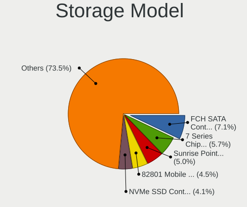

| Model                                                                            | Notebooks | Percent |
|----------------------------------------------------------------------------------|-----------|---------|
| AMD FCH SATA Controller [AHCI mode]                                              | 559       | 7.08%   |
| Intel 7 Series Chipset Family 6-port SATA Controller [AHCI mode]                 | 449       | 5.69%   |
| Intel Sunrise Point-LP SATA Controller [AHCI mode]                               | 398       | 5.04%   |
| Intel 82801 Mobile SATA Controller [RAID mode]                                   | 359       | 4.55%   |
| Samsung NVMe SSD Controller SM981/PM981/PM983                                    | 324       | 4.1%    |
| Intel 6 Series/C200 Series Chipset Family 6 port Mobile SATA AHCI Controller     | 278       | 3.52%   |
| Intel Volume Management Device NVMe RAID Controller                              | 236       | 2.99%   |
| Intel 82801IBM/IEM (ICH9M/ICH9M-E) 4 port SATA Controller [AHCI mode]            | 213       | 2.7%    |
| Intel 8 Series SATA Controller 1 [AHCI mode]                                     | 181       | 2.29%   |
| Intel Wildcat Point-LP SATA Controller [AHCI Mode]                               | 168       | 2.13%   |
| Samsung NVMe SSD Controller 980 (DRAM-less)                                      | 167       | 2.12%   |
| Intel Cannon Lake Mobile PCH SATA AHCI Controller                                | 159       | 2.01%   |
| Intel 8 Series/C220 Series Chipset Family 6-port SATA Controller 1 [AHCI mode]   | 131       | 1.66%   |
| Samsung NVMe SSD Controller PM9A1/PM9A3/980PRO                                   | 121       | 1.53%   |
| Intel HM170/QM170 Chipset SATA Controller [AHCI Mode]                            | 111       | 1.41%   |
| Intel Celeron/Pentium Silver Processor SATA Controller                           | 111       | 1.41%   |
| Intel 5 Series/3400 Series Chipset 4 port SATA AHCI Controller                   | 108       | 1.37%   |
| Intel 82801HM/HEM (ICH8M/ICH8M-E) IDE Controller                                 | 106       | 1.34%   |
| SK hynix Gold P31/BC711/PC711 NVMe Solid State Drive                             | 98        | 1.24%   |
| Intel 5 Series/3400 Series Chipset 6 port SATA AHCI Controller                   | 95        | 1.2%    |
| Intel 82801HM/HEM (ICH8M/ICH8M-E) SATA Controller [AHCI mode]                    | 89        | 1.13%   |
| Samsung NVMe SSD Controller SM961/PM961/SM963                                    | 85        | 1.08%   |
| Phison PS5013-E13 PCIe3 NVMe Controller (DRAM-less)                              | 84        | 1.06%   |
| Intel Comet Lake SATA AHCI Controller                                            | 79        | 1%      |
| SanDisk Extreme Pro / WD Black SN750 / PC SN730 / Red SN700 NVMe SSD             | 78        | 0.99%   |
| Micron/Crucial P2 [Nick P2] / P3 / P3 Plus NVMe PCIe SSD (DRAM-less)             | 74        | 0.94%   |
| KIOXIA NVMe SSD Controller BG4 (DRAM-less)                                       | 68        | 0.86%   |
| SanDisk Ultra 3D / WD PC SN530, IX SN530, Blue SN550 NVMe SSD (DRAM-less)        | 66        | 0.84%   |
| Toshiba America Info Systems XG6 NVMe SSD Controller                             | 64        | 0.81%   |
| Intel Tiger Lake-LP SATA Controller                                              | 60        | 0.76%   |
| Intel Celeron N3350/Pentium N4200/Atom E3900 Series SATA AHCI Controller         | 60        | 0.76%   |
| Intel Atom Processor E3800 Series SATA AHCI Controller                           | 59        | 0.75%   |
| Intel Cannon Point-LP SATA Controller [AHCI Mode]                                | 57        | 0.72%   |
| AMD SB7x0/SB8x0/SB9x0 SATA Controller [AHCI mode]                                | 55        | 0.7%    |
| SanDisk WD SN560/SN740/SN770/SN5000 NVMe SSD                                     | 52        | 0.66%   |
| Intel Atom/Celeron/Pentium Processor x5-E8000/J3xxx/N3xxx Series SATA Controller | 51        | 0.65%   |
| Intel RST Volume Management Device Controller                                    | 50        | 0.63%   |
| Intel SSD 670p Series [Keystone Harbor]                                          | 45        | 0.57%   |
| Intel 400 Series Chipset Family SATA AHCI Controller                             | 45        | 0.57%   |
| Kingston Company OM3PDP3 NVMe SSD                                                | 44        | 0.56%   |

Storage Kind
------------

Kind of storage controller (IDE, SATA, NVMe, SAS, ...)

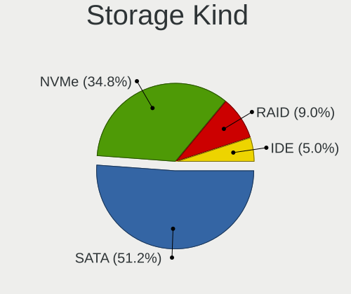

| Kind | Notebooks | Percent |
|------|-----------|---------|
| SATA | 3843      | 51.16%  |
| NVMe | 2616      | 34.83%  |
| RAID | 676       | 9%      |
| IDE  | 376       | 5.01%   |

Processor
---------

CPU Vendor
----------

Processor vendors

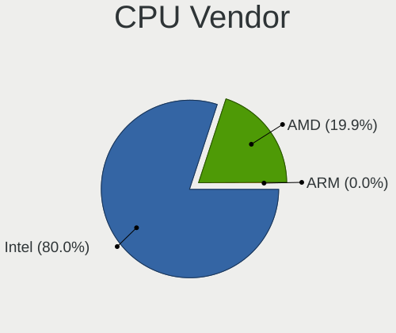

| Vendor   | Notebooks | Percent |
|----------|-----------|---------|
| Intel    | 5064      | 80.04%  |
| AMD      | 1258      | 19.88%  |
| Unknown  | 3         | 0.05%   |
| Qualcomm | 1         | 0.02%   |
| ARM      | 1         | 0.02%   |

CPU Model
---------

Processor models

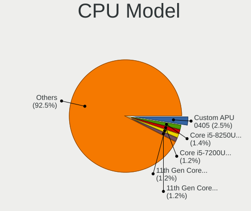

| Model                                         | Notebooks | Percent |
|-----------------------------------------------|-----------|---------|
| AMD Custom APU 0405                           | 159       | 2.51%   |
| Intel Core i5-8250U CPU @ 1.60GHz             | 86        | 1.36%   |
| Intel Core i5-7200U CPU @ 2.50GHz             | 79        | 1.25%   |
| Intel 11th Gen Core i5-1135G7 @ 2.40GHz       | 77        | 1.22%   |
| Intel 11th Gen Core i7-1165G7 @ 2.80GHz       | 76        | 1.2%    |
| Intel Core i5-3320M CPU @ 2.60GHz             | 74        | 1.17%   |
| Intel Core i7-8550U CPU @ 1.80GHz             | 66        | 1.04%   |
| Intel Core i7-10510U CPU @ 1.80GHz            | 64        | 1.01%   |
| Intel Core i5-6200U CPU @ 2.30GHz             | 63        | 0.99%   |
| Intel Core i5-6300U CPU @ 2.40GHz             | 62        | 0.98%   |
| Intel Core i7-8750H CPU @ 2.20GHz             | 61        | 0.96%   |
| Intel Core i7-7700HQ CPU @ 2.80GHz            | 60        | 0.95%   |
| Intel Core i5-3210M CPU @ 2.50GHz             | 60        | 0.95%   |
| Intel Core i5-2520M CPU @ 2.50GHz             | 60        | 0.95%   |
| Intel Core i7-8565U CPU @ 1.80GHz             | 59        | 0.93%   |
| Intel Core i5-8265U CPU @ 1.60GHz             | 57        | 0.9%    |
| Intel Core i5-10210U CPU @ 1.60GHz            | 57        | 0.9%    |
| Intel Core i7-9750H CPU @ 2.60GHz             | 55        | 0.87%   |
| Intel Celeron N4020 CPU @ 1.10GHz             | 54        | 0.85%   |
| Intel Core i7-7500U CPU @ 2.70GHz             | 51        | 0.81%   |
| AMD Ryzen 5 3500U with Radeon Vega Mobile Gfx | 51        | 0.81%   |
| Intel Core i7-10750H CPU @ 2.60GHz            | 49        | 0.77%   |
| Intel Core i5-5200U CPU @ 2.20GHz             | 47        | 0.74%   |
| Intel 11th Gen Core i7-11800H @ 2.30GHz       | 47        | 0.74%   |
| Intel Core i7-6700HQ CPU @ 2.60GHz            | 46        | 0.73%   |
| Intel Celeron CPU N2840 @ 2.16GHz             | 46        | 0.73%   |
| Intel Celeron CPU N3060 @ 1.60GHz             | 43        | 0.68%   |
| Intel Core i5-8350U CPU @ 1.70GHz             | 42        | 0.66%   |
| Intel Core i5-4300U CPU @ 1.90GHz             | 41        | 0.65%   |
| Intel Celeron CPU N3350 @ 1.10GHz             | 38        | 0.6%    |
| Intel Celeron N4000 CPU @ 1.10GHz             | 36        | 0.57%   |
| Intel Core i5-5300U CPU @ 2.30GHz             | 35        | 0.55%   |
| Intel Core i5 CPU M 520 @ 2.40GHz             | 34        | 0.54%   |
| AMD Ryzen 7 5800H with Radeon Graphics        | 33        | 0.52%   |
| Intel Core i3-3110M CPU @ 2.40GHz             | 32        | 0.51%   |
| Intel Core 2 Duo CPU P8600 @ 2.40GHz          | 32        | 0.51%   |
| Intel 12th Gen Core i7-12700H                 | 32        | 0.51%   |
| Intel Core i7-8650U CPU @ 1.90GHz             | 31        | 0.49%   |
| Intel Core i5-3230M CPU @ 2.60GHz             | 31        | 0.49%   |
| Intel Core i7-6500U CPU @ 2.50GHz             | 30        | 0.47%   |

CPU Model Family
----------------

Processor model prefix

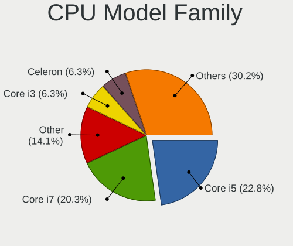

| Model                   | Notebooks | Percent |
|-------------------------|-----------|---------|
| Intel Core i5           | 1442      | 22.77%  |
| Intel Core i7           | 1283      | 20.26%  |
| Other                   | 891       | 14.07%  |
| Intel Core i3           | 402       | 6.35%   |
| Intel Celeron           | 401       | 6.33%   |
| Intel Core 2 Duo        | 271       | 4.28%   |
| AMD Ryzen 7             | 222       | 3.51%   |
| AMD Ryzen 5             | 220       | 3.47%   |
| Intel Pentium           | 141       | 2.23%   |
| Intel Atom              | 101       | 1.6%    |
| AMD A6                  | 79        | 1.25%   |
| AMD Ryzen 3             | 66        | 1.04%   |
| AMD Ryzen 9             | 60        | 0.95%   |
| Intel Core              | 56        | 0.88%   |
| Intel Pentium Dual-Core | 55        | 0.87%   |
| AMD A8                  | 55        | 0.87%   |
| AMD Ryzen 7 PRO         | 49        | 0.77%   |
| AMD A4                  | 40        | 0.63%   |
| Intel Core i9           | 39        | 0.62%   |
| Intel Core 2            | 36        | 0.57%   |
| Intel Pentium Dual      | 33        | 0.52%   |
| AMD A10                 | 32        | 0.51%   |
| Intel Genuine           | 31        | 0.49%   |
| Intel Celeron Dual-Core | 24        | 0.38%   |
| AMD Ryzen 5 PRO         | 24        | 0.38%   |
| AMD E1                  | 24        | 0.38%   |
| Intel Pentium Silver    | 22        | 0.35%   |
| AMD E2                  | 21        | 0.33%   |
| AMD E                   | 20        | 0.32%   |
| Intel Celeron M         | 16        | 0.25%   |
| AMD Athlon              | 14        | 0.22%   |
| Intel Xeon              | 13        | 0.21%   |
| Intel Pentium M         | 11        | 0.17%   |
| AMD Athlon II           | 11        | 0.17%   |
| Intel Pentium Gold      | 9         | 0.14%   |
| AMD Turion 64 X2 Mobile | 9         | 0.14%   |
| Intel Core m3           | 8         | 0.13%   |
| Intel Core M            | 8         | 0.13%   |
| AMD Athlon X2           | 8         | 0.13%   |
| AMD FX                  | 7         | 0.11%   |

CPU Cores
---------

Number of processor cores

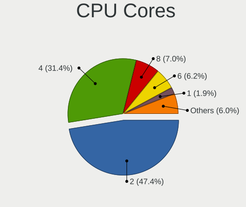

| Number | Notebooks | Percent |
|--------|-----------|---------|
| 2      | 3004      | 47.45%  |
| 4      | 1991      | 31.45%  |
| 8      | 444       | 7.01%   |
| 6      | 393       | 6.21%   |
| 1      | 122       | 1.93%   |
| 10     | 111       | 1.75%   |
| 14     | 98        | 1.55%   |
| 12     | 94        | 1.48%   |
| 16     | 49        | 0.77%   |
| 24     | 15        | 0.24%   |
| 20     | 5         | 0.08%   |
| 3      | 2         | 0.03%   |
| 18     | 1         | 0.02%   |
| 7      | 1         | 0.02%   |
| 5      | 1         | 0.02%   |

CPU Sockets
-----------

Number of sockets

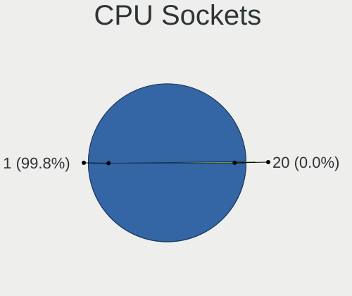

| Number | Notebooks | Percent |
|--------|-----------|---------|
| 1      | 6316      | 99.81%  |
| 2      | 11        | 0.17%   |
| 20     | 1         | 0.02%   |

CPU Threads
-----------

Threads per core (Hyper-Threading)

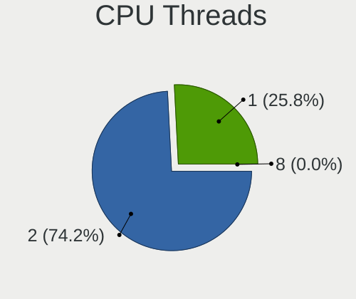

| Number | Notebooks | Percent |
|--------|-----------|---------|
| 2      | 4698      | 74.19%  |
| 1      | 1633      | 25.79%  |
| 8      | 1         | 0.02%   |

CPU Op-Modes
------------

CPU Operation Modes (32-bit, 64-bit)

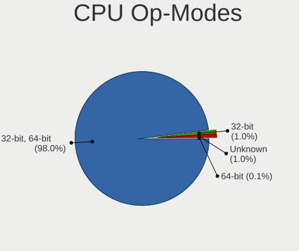

| Op mode        | Notebooks | Percent |
|----------------|-----------|---------|
| 32-bit, 64-bit | 6213      | 98%     |
| 32-bit         | 62        | 0.98%   |
| Unknown        | 61        | 0.96%   |
| 64-bit         | 4         | 0.06%   |

CPU Microcode
-------------

Microcode number

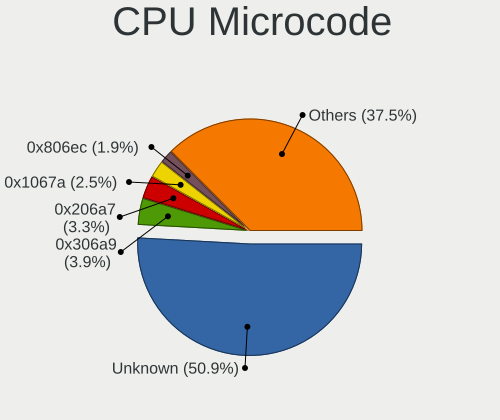

| Number     | Notebooks | Percent |
|------------|-----------|---------|
| Unknown    | 3340      | 50.87%  |
| 0x306a9    | 256       | 3.9%    |
| 0x206a7    | 218       | 3.32%   |
| 0x1067a    | 165       | 2.51%   |
| 0x806ec    | 127       | 1.93%   |
| 0x806ea    | 127       | 1.93%   |
| 0x40651    | 127       | 1.93%   |
| 0x406e3    | 119       | 1.81%   |
| 0x806e9    | 117       | 1.78%   |
| 0x306d4    | 110       | 1.68%   |
| 0x20655    | 104       | 1.58%   |
| 0x806c1    | 99        | 1.51%   |
| 0x906ea    | 93        | 1.42%   |
| 0x6fd      | 71        | 1.08%   |
| 0x406c4    | 70        | 1.07%   |
| 0x306c3    | 67        | 1.02%   |
| 0x30678    | 66        | 1.01%   |
| 0xa0652    | 54        | 0.82%   |
| 0x906e9    | 51        | 0.78%   |
| 0x06006705 | 51        | 0.78%   |
| 0x08108109 | 50        | 0.76%   |
| 0x506c9    | 48        | 0.73%   |
| 0x506e3    | 46        | 0.7%    |
| 0x0a50000c | 45        | 0.69%   |
| 0x706e5    | 37        | 0.56%   |
| 0x10676    | 37        | 0.56%   |
| 0x08108102 | 37        | 0.56%   |
| 0x906a3    | 36        | 0.55%   |
| 0x406c3    | 35        | 0.53%   |
| 0x20652    | 33        | 0.5%    |
| 0x806d1    | 32        | 0.49%   |
| 0x706a1    | 32        | 0.49%   |
| 0x07030105 | 31        | 0.47%   |
| 0x08600106 | 28        | 0.43%   |
| 0x6f6      | 26        | 0.4%    |
| 0x06006704 | 26        | 0.4%    |
| 0x706a8    | 23        | 0.35%   |
| 0x806eb    | 22        | 0.34%   |
| 0x08608103 | 22        | 0.34%   |
| 0x0a404102 | 21        | 0.32%   |

CPU Microarch
-------------

Microarchitecture

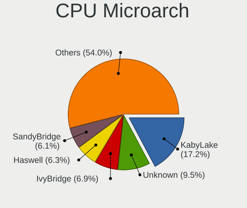

| Name               | Notebooks | Percent |
|--------------------|-----------|---------|
| KabyLake           | 1092      | 17.2%   |
| Unknown            | 603       | 9.5%    |
| IvyBridge          | 436       | 6.87%   |
| Haswell            | 401       | 6.31%   |
| SandyBridge        | 390       | 6.14%   |
| Skylake            | 332       | 5.23%   |
| Penryn             | 288       | 4.54%   |
| TigerLake          | 248       | 3.91%   |
| Silvermont         | 247       | 3.89%   |
| Alderlake Hybrid   | 224       | 3.53%   |
| Broadwell          | 218       | 3.43%   |
| Westmere           | 217       | 3.42%   |
| Core               | 185       | 2.91%   |
| Zen+               | 142       | 2.24%   |
| Zen 3              | 139       | 2.19%   |
| Goldmont plus      | 136       | 2.14%   |
| CometLake          | 135       | 2.13%   |
| Excavator          | 130       | 2.05%   |
| IceLake            | 128       | 2.02%   |
| Zen 2              | 112       | 1.76%   |
| Puma               | 71        | 1.12%   |
| Goldmont           | 69        | 1.09%   |
| Zen                | 56        | 0.88%   |
| Bobcat             | 44        | 0.69%   |
| P6                 | 43        | 0.68%   |
| Bonnell            | 38        | 0.6%    |
| K10                | 29        | 0.46%   |
| Meteorlake Hybrid  | 28        | 0.44%   |
| Jaguar             | 28        | 0.44%   |
| Piledriver         | 27        | 0.43%   |
| K8 Hammer          | 23        | 0.36%   |
| Steamroller        | 21        | 0.33%   |
| Nehalem            | 15        | 0.24%   |
| K8 & K10 hybrid    | 14        | 0.22%   |
| Gracemont          | 14        | 0.22%   |
| K10 Llano          | 9         | 0.14%   |
| Tremont            | 8         | 0.13%   |
| Lunarlake Hybrid   | 4         | 0.06%   |
| ArrowLake-H Hybrid | 4         | 0.06%   |
| NetBurst           | 2         | 0.03%   |

Graphics
--------

GPU Vendor
----------

Vendors of graphics cards

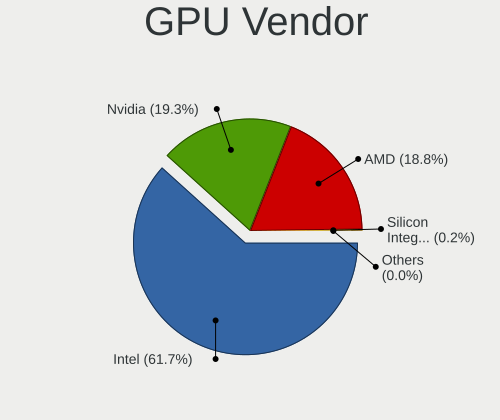

| Vendor                           | Notebooks | Percent |
|----------------------------------|-----------|---------|
| Intel                            | 4721      | 61.69%  |
| Nvidia                           | 1474      | 19.26%  |
| AMD                              | 1441      | 18.83%  |
| Silicon Integrated Systems [SiS] | 12        | 0.16%   |
| VIA Technologies                 | 4         | 0.05%   |
| ATI Technologies                 | 1         | 0.01%   |

GPU Model
---------

Graphics card models

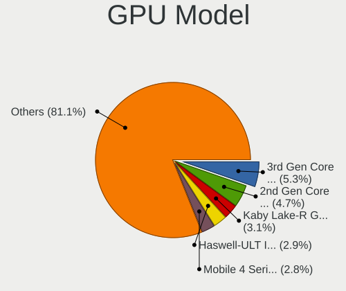

| Model                                                                                    | Notebooks | Percent |
|------------------------------------------------------------------------------------------|-----------|---------|
| Intel 3rd Gen Core processor Graphics Controller                                         | 418       | 5.32%   |
| Intel 2nd Generation Core Processor Family Integrated Graphics Controller                | 373       | 4.74%   |
| Intel Kaby Lake-R GT2 [UHD Graphics 620]                                                 | 241       | 3.06%   |
| Intel Haswell-ULT Integrated Graphics Controller                                         | 231       | 2.94%   |
| Intel Mobile 4 Series Chipset Integrated Graphics Controller                             | 222       | 2.82%   |
| Intel TigerLake-LP GT2 [Iris Xe Graphics]                                                | 219       | 2.78%   |
| Intel Skylake-U GT2 [HD Graphics 520]                                                    | 200       | 2.54%   |
| Intel CoffeeLake-H GT2 [UHD Graphics 630]                                                | 194       | 2.47%   |
| Intel Kaby Lake-U GT2 [HD Graphics 620]                                                  | 188       | 2.39%   |
| Intel Core Processor Integrated Graphics Controller                                      | 180       | 2.29%   |
| Intel Broadwell-U GT2 [HD Graphics 5500]                                                 | 158       | 2.01%   |
| AMD VanGogh [AMD Custom GPU 0405]                                                        | 156       | 1.98%   |
| Intel WhiskeyLake-U GT2 [UHD Graphics 620]                                               | 154       | 1.96%   |
| AMD Picasso/Raven 2 [Radeon Vega Series / Radeon Vega Mobile Series]                     | 153       | 1.95%   |
| Intel CometLake-U GT2 [UHD Graphics]                                                     | 150       | 1.91%   |
| Intel 4th Gen Core Processor Integrated Graphics Controller                              | 140       | 1.78%   |
| Intel Atom/Celeron/Pentium Processor x5-E8000/J3xxx/N3xxx Integrated Graphics Controller | 135       | 1.72%   |
| Intel GeminiLake [UHD Graphics 600]                                                      | 121       | 1.54%   |
| Intel Atom Processor Z36xxx/Z37xxx Series Graphics & Display                             | 112       | 1.42%   |
| Intel CometLake-H GT2 [UHD Graphics]                                                     | 110       | 1.4%    |
| AMD Renoir [Radeon Vega Series / Radeon Vega Mobile Series]                              | 107       | 1.36%   |
| AMD Stoney [Radeon R2/R3/R4/R5 Graphics]                                                 | 104       | 1.32%   |
| Intel Alder Lake-P GT2 [Iris Xe Graphics]                                                | 99        | 1.26%   |
| Intel Raptor Lake-P [Iris Xe Graphics]                                                   | 83        | 1.06%   |
| Intel Kaby Lake-H GT2 [HD Graphics 630]                                                  | 81        | 1.03%   |
| Nvidia TU117M [GeForce GTX 1650 Mobile / Max-Q]                                          | 80        | 1.02%   |
| AMD Cezanne [Radeon Vega Series / Radeon Vega Mobile Series]                             | 80        | 1.02%   |
| Intel Skylake-H GT2 [HD Graphics 530]                                                    | 78        | 0.99%   |
| Intel Mobile GM965/GL960 Integrated Graphics Controller (secondary)                      | 78        | 0.99%   |
| Intel Mobile GM965/GL960 Integrated Graphics Controller (primary)                        | 78        | 0.99%   |
| Intel TigerLake-H GT1 [UHD Graphics]                                                     | 68        | 0.86%   |
| Nvidia GA106M [GeForce RTX 3060 Mobile / Max-Q]                                          | 64        | 0.81%   |
| Intel Mobile 945GM/GMS/GME, 943/940GML Express Integrated Graphics Controller            | 61        | 0.78%   |
| Intel Apollo Lake GT1 [HD Graphics 500]                                                  | 58        | 0.74%   |
| Nvidia GP107M [GeForce GTX 1050 Ti Mobile]                                               | 57        | 0.72%   |
| AMD Lucienne                                                                             | 55        | 0.7%    |
| AMD Rembrandt [Radeon 680M]                                                              | 54        | 0.69%   |
| AMD Phoenix1                                                                             | 50        | 0.64%   |
| Nvidia GP107M [GeForce GTX 1050 Mobile]                                                  | 49        | 0.62%   |
| AMD Mullins [Radeon R4/R5 Graphics]                                                      | 48        | 0.61%   |

GPU Combo
---------

Combinations of graphics cards

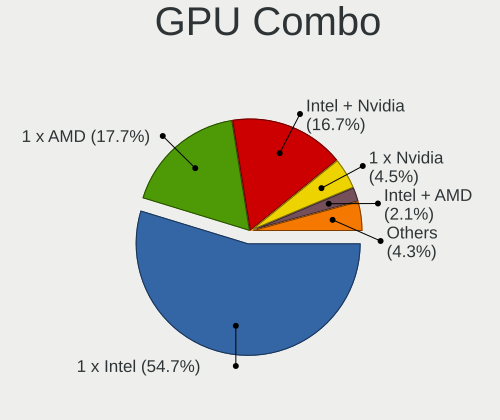

| Name                     | Notebooks | Percent |
|--------------------------|-----------|---------|
| 1 x Intel                | 3476      | 54.72%  |
| 1 x AMD                  | 1127      | 17.74%  |
| Intel + Nvidia           | 1059      | 16.67%  |
| 1 x Nvidia               | 288       | 4.53%   |
| Intel + AMD              | 131       | 2.06%   |
| AMD + Nvidia             | 127       | 2%      |
| 2 x AMD                  | 59        | 0.93%   |
| 2 x Intel                | 49        | 0.77%   |
| Other                    | 15        | 0.24%   |
| 1 x SiS                  | 12        | 0.19%   |
| 1 x VIA                  | 4         | 0.06%   |
| 2 x Nvidia               | 3         | 0.05%   |
| Intel + 2 x Nvidia       | 1         | 0.02%   |
| Intel + AMD + 1 x Nvidia | 1         | 0.02%   |

GPU Driver
----------

Free vs proprietary

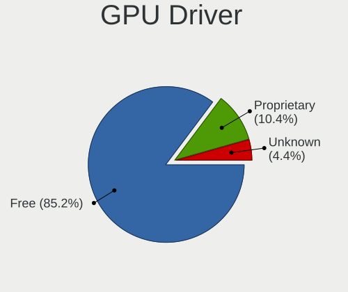

| Driver      | Notebooks | Percent |
|-------------|-----------|---------|
| Free        | 5468      | 85.24%  |
| Proprietary | 664       | 10.35%  |
| Unknown     | 283       | 4.41%   |

GPU Memory
----------

Total video memory

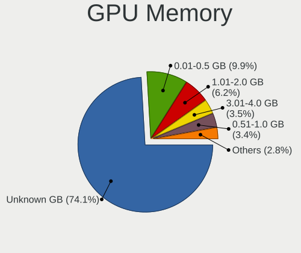

| Size in GB | Notebooks | Percent |
|------------|-----------|---------|
| Unknown    | 4799      | 74.07%  |
| 0.01-0.5   | 640       | 9.88%   |
| 1.01-2.0   | 404       | 6.24%   |
| 3.01-4.0   | 230       | 3.55%   |
| 0.51-1.0   | 222       | 3.43%   |
| 5.01-6.0   | 85        | 1.31%   |
| 7.01-8.0   | 71        | 1.1%    |
| 8.01-16.0  | 16        | 0.25%   |
| 2.01-3.0   | 11        | 0.17%   |
| 24.01-32.0 | 1         | 0.02%   |

Monitor
-------

Monitor Vendor
--------------

Monitor vendors

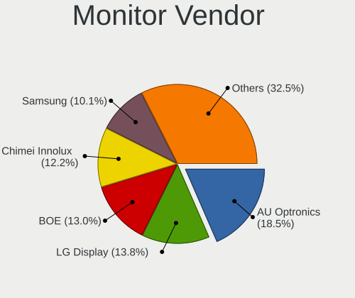

| Vendor                  | Notebooks | Percent |
|-------------------------|-----------|---------|
| AU Optronics            | 1301      | 18.47%  |
| LG Display              | 975       | 13.84%  |
| BOE                     | 913       | 12.96%  |
| Chimei Innolux          | 856       | 12.15%  |
| Samsung Electronics     | 711       | 10.1%   |
| Sharp                   | 291       | 4.13%   |
| Apple                   | 231       | 3.28%   |
| Dell                    | 176       | 2.5%    |
| Lenovo                  | 163       | 2.31%   |
| Valve                   | 130       | 1.85%   |
| Chi Mei Optoelectronics | 113       | 1.6%    |
| Goldstar                | 95        | 1.35%   |
| PANDA                   | 92        | 1.31%   |
| Acer                    | 73        | 1.04%   |
| Hewlett-Packard         | 69        | 0.98%   |
| AOC                     | 67        | 0.95%   |
| BenQ                    | 62        | 0.88%   |
| LG Philips              | 60        | 0.85%   |
| InfoVision              | 58        | 0.82%   |
| Iiyama                  | 57        | 0.81%   |
| CSO                     | 47        | 0.67%   |
| Philips                 | 44        | 0.62%   |
| Ancor Communications    | 29        | 0.41%   |
| Panasonic               | 26        | 0.37%   |
| Analogix                | 26        | 0.37%   |
| Sony                    | 25        | 0.35%   |
| ASUSTek Computer        | 21        | 0.3%    |
| HannStar                | 19        | 0.27%   |
| Toshiba                 | 17        | 0.24%   |
| ViewSonic               | 16        | 0.23%   |
| InnoLux Display         | 16        | 0.23%   |
| LGD                     | 14        | 0.2%    |
| HKC                     | 14        | 0.2%    |
| CSW                     | 14        | 0.2%    |
| Vestel Elektronik       | 13        | 0.18%   |
| CSOT                    | 13        | 0.18%   |
| CPT                     | 13        | 0.18%   |
| TMX                     | 11        | 0.16%   |
| MSI                     | 11        | 0.16%   |
| Quanta Display          | 7         | 0.1%    |

Monitor Model
-------------

Monitor models

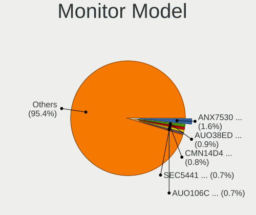

| Model                                                                 | Notebooks | Percent |
|-----------------------------------------------------------------------|-----------|---------|
| Valve ANX7530 U VLV3001 800x1280 100x150mm 7.1-inch                   | 113       | 1.59%   |
| AU Optronics LCD Monitor AUO38ED 1920x1080 344x193mm 15.5-inch        | 63        | 0.89%   |
| Chimei Innolux LCD Monitor CMN14D4 1920x1080 309x173mm 13.9-inch      | 55        | 0.77%   |
| Samsung Electronics LCD Monitor SEC5441 1280x800 331x207mm 15.4-inch  | 51        | 0.72%   |
| AU Optronics LCD Monitor AUO106C 1366x768 276x155mm 12.5-inch         | 48        | 0.67%   |
| Chimei Innolux LCD Monitor CMN15F5 1920x1080 344x193mm 15.5-inch      | 46        | 0.65%   |
| AU Optronics LCD Monitor AUO21ED 1920x1080 344x193mm 15.5-inch        | 40        | 0.56%   |
| LG Display LCD Monitor LGD02DC 1366x768 344x194mm 15.5-inch           | 38        | 0.53%   |
| AU Optronics LCD Monitor AUO22EC 1366x768 344x193mm 15.5-inch         | 38        | 0.53%   |
| Chimei Innolux LCD Monitor CMN15DB 1366x768 344x193mm 15.5-inch       | 31        | 0.44%   |
| Chimei Innolux LCD Monitor CMN15E7 1920x1080 344x193mm 15.5-inch      | 30        | 0.42%   |
| LG Display LCD Monitor LGD033A 1366x768 344x194mm 15.5-inch           | 28        | 0.39%   |
| Chimei Innolux LCD Monitor CMN14C9 1920x1080 309x173mm 13.9-inch      | 27        | 0.38%   |
| Analogix ANX7530 U ANX7539 720x1280                                   | 26        | 0.37%   |
| AU Optronics LCD Monitor AUO403D 1920x1080 309x174mm 14.0-inch        | 25        | 0.35%   |
| AU Optronics LCD Monitor AUO2E3C 1366x768 309x173mm 13.9-inch         | 24        | 0.34%   |
| Chimei Innolux LCD Monitor CMN1132 1366x768 256x144mm 11.6-inch       | 23        | 0.32%   |
| BOE LCD Monitor BOE0687 1920x1080 344x193mm 15.5-inch                 | 21        | 0.3%    |
| AU Optronics LCD Monitor AUO21EC 1366x768 344x193mm 15.5-inch         | 21        | 0.3%    |
| AU Optronics LCD Monitor AUO313C 1366x768 309x173mm 13.9-inch         | 20        | 0.28%   |
| AU Optronics LCD Monitor AUO5B2D 1920x1080 293x162mm 13.2-inch        | 19        | 0.27%   |
| LG Display LCD Monitor LGD0521 1920x1080 309x174mm 14.0-inch          | 18        | 0.25%   |
| LG Display LCD Monitor LGD02D8 1366x768 277x156mm 12.5-inch           | 18        | 0.25%   |
| Chimei Innolux LCD Monitor CMN14E5 1920x1080 309x173mm 13.9-inch      | 18        | 0.25%   |
| BOE LCD Monitor BOE06A5 1366x768 344x194mm 15.5-inch                  | 18        | 0.25%   |
| AU Optronics LCD Monitor AUO45EC 1366x768 344x193mm 15.5-inch         | 18        | 0.25%   |
| AU Optronics LCD Monitor AUO26EC 1366x768 344x193mm 15.5-inch         | 18        | 0.25%   |
| Valve ANX7530 U VLV3003 800x1280 100x160mm 7.4-inch                   | 17        | 0.24%   |
| Sharp LCD Monitor SHP148D 3840x2160 344x194mm 15.5-inch               | 17        | 0.24%   |
| Samsung Electronics LCD Monitor SDC4161 1920x1080 344x194mm 15.5-inch | 17        | 0.24%   |
| LG Display LCD Monitor LGD046F 1920x1080 344x194mm 15.5-inch          | 17        | 0.24%   |
| Chimei Innolux LCD Monitor CMN15CA 1366x768 344x193mm 15.5-inch       | 17        | 0.24%   |
| Chimei Innolux LCD Monitor CMN14D5 1920x1080 309x173mm 13.9-inch      | 17        | 0.24%   |
| Sharp LCD Monitor SHP1484 1920x1080 294x165mm 13.3-inch               | 16        | 0.22%   |
| Samsung Electronics LCD Monitor SDCA029 3840x2160 344x194mm 15.5-inch | 16        | 0.22%   |
| Chimei Innolux LCD Monitor CMN14F2 1920x1080 309x173mm 13.9-inch      | 16        | 0.22%   |
| BOE LCD Monitor BOE0675 1366x768 344x194mm 15.5-inch                  | 16        | 0.22%   |
| Sharp LCD Monitor SHP14D1 1920x1200 336x210mm 15.6-inch               | 15        | 0.21%   |
| Sharp LCD Monitor SHP14D0 3840x2400 336x210mm 15.6-inch               | 15        | 0.21%   |
| Samsung Electronics LCD Monitor SEC5541 1366x768 344x193mm 15.5-inch  | 15        | 0.21%   |

Monitor Resolution
------------------

Monitor screen resolution

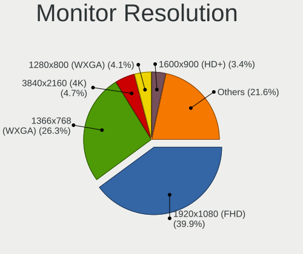

| Resolution         | Notebooks | Percent |
|--------------------|-----------|---------|
| 1920x1080 (FHD)    | 2674      | 39.89%  |
| 1366x768 (WXGA)    | 1764      | 26.32%  |
| 3840x2160 (4K)     | 315       | 4.7%    |
| 1280x800 (WXGA)    | 274       | 4.09%   |
| 1600x900 (HD+)     | 229       | 3.42%   |
| 1920x1200 (WUXGA)  | 225       | 3.36%   |
| 2560x1440 (QHD)    | 223       | 3.33%   |
| 2560x1600          | 159       | 2.37%   |
| 800x1280           | 152       | 2.27%   |
| 1440x900 (WXGA+)   | 118       | 1.76%   |
| 2880x1800          | 108       | 1.61%   |
| 3840x2400          | 58        | 0.87%   |
| 3440x1440          | 38        | 0.57%   |
| 1680x1050 (WSXGA+) | 38        | 0.57%   |
| 3200x1800 (QHD+)   | 28        | 0.42%   |
| 1024x600           | 28        | 0.42%   |
| 2160x1440          | 21        | 0.31%   |
| 1280x1024 (SXGA)   | 21        | 0.31%   |
| Unknown            | 20        | 0.3%    |
| 2256x1504          | 19        | 0.28%   |
| 2560x1080          | 17        | 0.25%   |
| 3200x2000          | 13        | 0.19%   |
| 3456x2160          | 11        | 0.16%   |
| 3072x1920          | 11        | 0.16%   |
| 1920x1280          | 10        | 0.15%   |
| 2880x1920          | 9         | 0.13%   |
| 3840x1080          | 8         | 0.12%   |
| 2880x1620          | 8         | 0.12%   |
| 2240x1400          | 8         | 0.12%   |
| 1920x540           | 8         | 0.12%   |
| 1360x768           | 8         | 0.12%   |
| 1024x768 (XGA)     | 8         | 0.12%   |
| 1680x945           | 7         | 0.1%    |
| 3000x2000          | 5         | 0.07%   |
| 2560x1700          | 5         | 0.07%   |
| 3840x1600          | 4         | 0.06%   |
| 3840x1100          | 4         | 0.06%   |
| 2160x1350          | 4         | 0.06%   |
| 1600x2560          | 4         | 0.06%   |
| 2520x1680          | 3         | 0.04%   |

Monitor Diagonal
----------------

Diagonal size in inches

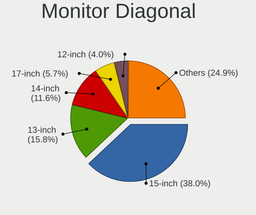

| Inches  | Notebooks | Percent |
|---------|-----------|---------|
| 15      | 2668      | 38%     |
| 13      | 1109      | 15.8%   |
| 14      | 816       | 11.62%  |
| 17      | 402       | 5.73%   |
| 12      | 278       | 3.96%   |
| 27      | 229       | 3.26%   |
| 24      | 186       | 2.65%   |
| 11      | 186       | 2.65%   |
| 16      | 179       | 2.55%   |
| 7       | 130       | 1.85%   |
| 21      | 121       | 1.72%   |
| 23      | 120       | 1.71%   |
| 31      | 88        | 1.25%   |
| Unknown | 80        | 1.14%   |
| 34      | 48        | 0.68%   |
| 18      | 45        | 0.64%   |
| 10      | 42        | 0.6%    |
| 84      | 37        | 0.53%   |
| 3       | 27        | 0.38%   |
| 19      | 23        | 0.33%   |
| 22      | 19        | 0.27%   |
| 25      | 17        | 0.24%   |
| 72      | 16        | 0.23%   |
| 26      | 14        | 0.2%    |
| 40      | 13        | 0.19%   |
| 20      | 12        | 0.17%   |
| 48      | 11        | 0.16%   |
| 54      | 10        | 0.14%   |
| 32      | 10        | 0.14%   |
| 8       | 10        | 0.14%   |
| 65      | 9         | 0.13%   |
| 33      | 9         | 0.13%   |
| 46      | 5         | 0.07%   |
| 42      | 5         | 0.07%   |
| 28      | 5         | 0.07%   |
| 86      | 4         | 0.06%   |
| 37      | 4         | 0.06%   |
| 35      | 4         | 0.06%   |
| 142     | 3         | 0.04%   |
| 52      | 3         | 0.04%   |

Monitor Width
-------------

Physical width

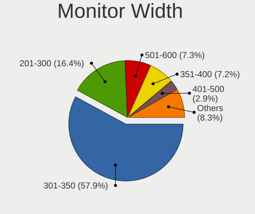

| Width in mm    | Notebooks | Percent |
|----------------|-----------|---------|
| 301-350        | 4034      | 57.92%  |
| 201-300        | 1143      | 16.41%  |
| 501-600        | 509       | 7.31%   |
| 351-400        | 504       | 7.24%   |
| 401-500        | 199       | 2.86%   |
| 1-100          | 153       | 2.2%    |
| 601-700        | 119       | 1.71%   |
| Unknown        | 80        | 1.15%   |
| 701-800        | 70        | 1.01%   |
| 1501-2000      | 56        | 0.8%    |
| 1001-1500      | 53        | 0.76%   |
| 801-900        | 21        | 0.3%    |
| 101-200        | 11        | 0.16%   |
| 901-1000       | 9         | 0.13%   |
| More than 2000 | 4         | 0.06%   |

Aspect Ratio
------------

Proportional relationship between the width and the height

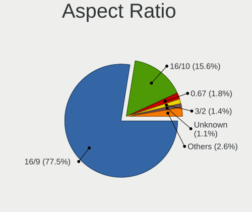

| Ratio   | Notebooks | Percent |
|---------|-----------|---------|
| 16/9    | 4951      | 77.54%  |
| 16/10   | 996       | 15.6%   |
| 0.67    | 113       | 1.77%   |
| 3/2     | 88        | 1.38%   |
| Unknown | 68        | 1.06%   |
| 21/9    | 60        | 0.94%   |
| 6/5     | 30        | 0.47%   |
| 0.62    | 21        | 0.33%   |
| 5/4     | 18        | 0.28%   |
| 4/3     | 17        | 0.27%   |
| 32/9    | 9         | 0.14%   |
| 3.40    | 4         | 0.06%   |
| 1.00    | 4         | 0.06%   |
| 0.56    | 4         | 0.06%   |
| 3.73    | 1         | 0.02%   |
| 3.20    | 1         | 0.02%   |

Monitor Area
------------

Area in inch²

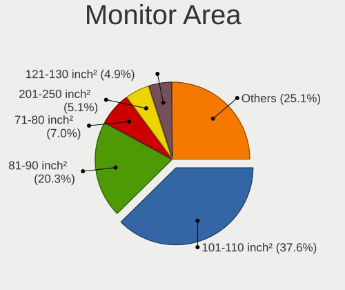

| Area in inch² | Notebooks | Percent |
|----------------|-----------|---------|
| 101-110        | 2633      | 37.62%  |
| 81-90          | 1421      | 20.3%   |
| 71-80          | 487       | 6.96%   |
| 201-250        | 358       | 5.12%   |
| 121-130        | 341       | 4.87%   |
| 61-70          | 267       | 3.81%   |
| 301-350        | 239       | 3.41%   |
| 111-120        | 199       | 2.84%   |
| 51-60          | 191       | 2.73%   |
| 351-500        | 164       | 2.34%   |
| 1-40           | 163       | 2.33%   |
| More than 1000 | 99        | 1.41%   |
| Unknown        | 80        | 1.14%   |
| 151-200        | 68        | 0.97%   |
| 251-300        | 66        | 0.94%   |
| 131-140        | 63        | 0.9%    |
| 141-150        | 43        | 0.61%   |
| 501-1000       | 43        | 0.61%   |
| 41-50          | 41        | 0.59%   |
| 91-100         | 33        | 0.47%   |

Pixel Density
-------------

Pixels per inch

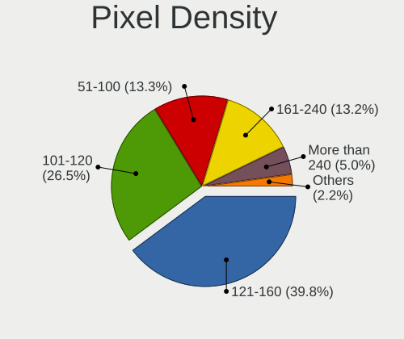

| Density       | Notebooks | Percent |
|---------------|-----------|---------|
| 121-160       | 2750      | 39.81%  |
| 101-120       | 1830      | 26.49%  |
| 51-100        | 920       | 13.32%  |
| 161-240       | 909       | 13.16%  |
| More than 240 | 348       | 5.04%   |
| Unknown       | 80        | 1.16%   |
| 1-50          | 70        | 1.01%   |

Multiple Monitors
-----------------

Total monitors connected

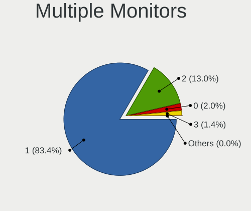

| Total | Notebooks | Percent |
|-------|-----------|---------|
| 1     | 5373      | 83.41%  |
| 2     | 836       | 12.98%  |
| 0     | 130       | 2.02%   |
| 3     | 91        | 1.41%   |
| 4     | 9         | 0.14%   |
| 5     | 2         | 0.03%   |
| 6     | 1         | 0.02%   |

Network
-------

Net Controller Vendor
---------------------

Controller vendors

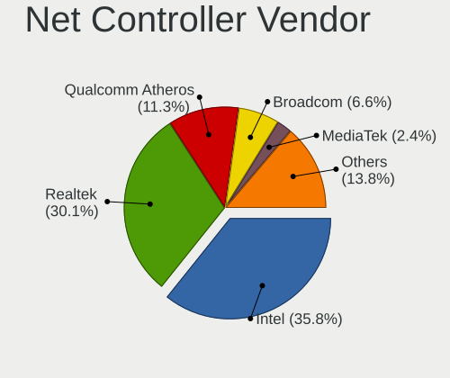

| Vendor                                 | Notebooks | Percent |
|----------------------------------------|-----------|---------|
| Intel                                  | 3496      | 35.75%  |
| Realtek Semiconductor                  | 2944      | 30.11%  |
| Qualcomm Atheros                       | 1109      | 11.34%  |
| Broadcom                               | 647       | 6.62%   |
| MediaTek                               | 237       | 2.42%   |
| Broadcom Limited                       | 171       | 1.75%   |
| Marvell Technology Group               | 119       | 1.22%   |
| Shenzhen Goodix Technology             | 101       | 1.03%   |
| ASIX Electronics                       | 86        | 0.88%   |
| TP-Link                                | 82        | 0.84%   |
| Ralink Technology                      | 73        | 0.75%   |
| Qualcomm                               | 70        | 0.72%   |
| Ralink                                 | 69        | 0.71%   |
| Ericsson Business Mobile Networks      | 58        | 0.59%   |
| Dell                                   | 53        | 0.54%   |
| DisplayLink                            | 46        | 0.47%   |
| Lenovo                                 | 40        | 0.41%   |
| Sierra Wireless                        | 38        | 0.39%   |
| Nvidia                                 | 34        | 0.35%   |
| Samsung Electronics                    | 33        | 0.34%   |
| Huawei Technologies                    | 26        | 0.27%   |
| Hewlett-Packard                        | 21        | 0.21%   |
| Google                                 | 17        | 0.17%   |
| JMicron Technology                     | 15        | 0.15%   |
| NetGear                                | 12        | 0.12%   |
| Edimax Technology                      | 12        | 0.12%   |
| Silicon Integrated Systems [SiS]       | 11        | 0.11%   |
| Fibocom                                | 11        | 0.11%   |
| Apple                                  | 10        | 0.1%    |
| Xiaomi                                 | 9         | 0.09%   |
| Qualcomm Atheros Communications        | 9         | 0.09%   |
| ICS Advent                             | 8         | 0.08%   |
| Qualcomm Technologies                  | 6         | 0.06%   |
| Motorola PCS                           | 6         | 0.06%   |
| Belkin Components                      | 6         | 0.06%   |
| ASUSTek Computer                       | 6         | 0.06%   |
| Suzhou Motorcomm Electronic Technology | 5         | 0.05%   |
| OPPO Electronics                       | 5         | 0.05%   |
| OnePlus Technology (Shenzhen)          | 5         | 0.05%   |
| Micro Star International               | 5         | 0.05%   |

Net Controller Model
--------------------

Controller models

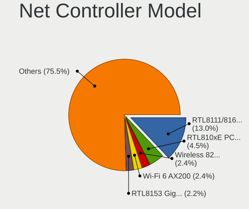

| Model                                                                  | Notebooks | Percent |
|------------------------------------------------------------------------|-----------|---------|
| Realtek RTL8111/8168/8211/8411 PCI Express Gigabit Ethernet Controller | 1534      | 12.97%  |
| Realtek RTL810xE PCI Express Fast Ethernet controller                  | 529       | 4.47%   |
| Intel Wireless 8265 / 8275                                             | 289       | 2.44%   |
| Intel Wi-Fi 6 AX200                                                    | 289       | 2.44%   |
| Realtek RTL8153 Gigabit Ethernet Adapter                               | 259       | 2.19%   |
| Realtek RTL8822CE 802.11ac PCIe Wireless Network Adapter               | 258       | 2.18%   |
| Intel 82579LM Gigabit Network Connection (Lewisville)                  | 253       | 2.14%   |
| Intel Wireless 7265                                                    | 222       | 1.88%   |
| Realtek RTL8821CE 802.11ac PCIe Wireless Network Adapter               | 220       | 1.86%   |
| Intel Wireless 7260                                                    | 211       | 1.78%   |
| Intel Centrino Advanced-N 6205 [Taylor Peak]                           | 197       | 1.67%   |
| Qualcomm Atheros QCA9377 802.11ac Wireless Network Adapter             | 195       | 1.65%   |
| Intel Wi-Fi 6 AX201                                                    | 173       | 1.46%   |
| Qualcomm Atheros QCA6174 802.11ac Wireless Network Adapter             | 172       | 1.45%   |
| Intel Wireless 8260                                                    | 170       | 1.44%   |
| Qualcomm Atheros QCA9565 / AR9565 Wireless Network Adapter             | 143       | 1.21%   |
| Qualcomm Atheros AR9485 Wireless Network Adapter                       | 138       | 1.17%   |
| Intel Alder Lake-P PCH CNVi WiFi                                       | 138       | 1.17%   |
| Intel Ethernet Connection (4) I219-LM                                  | 127       | 1.07%   |
| Intel Wireless 3165                                                    | 123       | 1.04%   |
| Intel Comet Lake PCH-LP CNVi WiFi                                      | 118       | 1%      |
| Qualcomm Atheros AR9285 Wireless Network Adapter (PCI-Express)         | 111       | 0.94%   |
| Intel Comet Lake PCH CNVi WiFi                                         | 103       | 0.87%   |
| Shenzhen Goodix Fingerprint Reader                                     | 101       | 0.85%   |
| Broadcom BCM43142 802.11b/g/n                                          | 97        | 0.82%   |
| Broadcom BCM4313 802.11bgn Wireless Network Adapter                    | 97        | 0.82%   |
| Intel Wi-Fi 6E(802.11ax) AX210/AX1675* 2x2 [Typhoon Peak]              | 92        | 0.78%   |
| Intel Raptor Lake PCH CNVi WiFi                                        | 89        | 0.75%   |
| Intel Ethernet Connection I218-LM                                      | 88        | 0.74%   |
| Intel Cannon Lake PCH CNVi WiFi                                        | 88        | 0.74%   |
| Intel 82577LM Gigabit Network Connection                               | 85        | 0.72%   |
| Realtek RTL8723BE PCIe Wireless Network Adapter                        | 83        | 0.7%    |
| Intel Cannon Point-LP CNVi [Wireless-AC]                               | 82        | 0.69%   |
| MediaTek MT7921 802.11ax PCIe Wireless Network Adapter [Filogic 330]   | 79        | 0.67%   |
| ASIX AX88179 Gigabit Ethernet                                          | 79        | 0.67%   |
| MediaTek MT7922 802.11ax PCI Express Wireless Network Adapter          | 77        | 0.65%   |
| Intel Wireless 3160                                                    | 76        | 0.64%   |
| Intel PRO/Wireless 3945ABG [Golan] Network Connection                  | 74        | 0.63%   |
| Intel Ethernet Connection I219-LM                                      | 74        | 0.63%   |
| Intel Wi-Fi 5(802.11ac) Wireless-AC 9x6x [Thunder Peak]                | 73        | 0.62%   |

Wireless Vendor
---------------

Wireless vendors

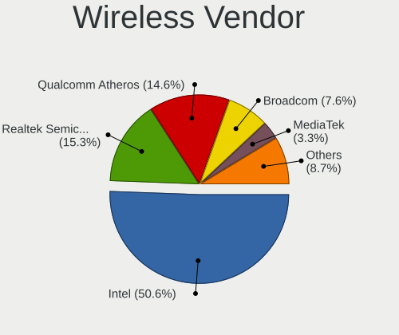

| Vendor                            | Notebooks | Percent |
|-----------------------------------|-----------|---------|
| Intel                             | 3324      | 50.57%  |
| Realtek Semiconductor             | 1005      | 15.29%  |
| Qualcomm Atheros                  | 957       | 14.56%  |
| Broadcom                          | 501       | 7.62%   |
| MediaTek                          | 216       | 3.29%   |
| Broadcom Limited                  | 136       | 2.07%   |
| Ralink Technology                 | 73        | 1.11%   |
| TP-Link                           | 71        | 1.08%   |
| Ralink                            | 69        | 1.05%   |
| Qualcomm                          | 57        | 0.87%   |
| Sierra Wireless                   | 38        | 0.58%   |
| Dell                              | 32        | 0.49%   |
| NetGear                           | 12        | 0.18%   |
| Edimax Technology                 | 12        | 0.18%   |
| Fibocom                           | 11        | 0.17%   |
| Qualcomm Atheros Communications   | 9         | 0.14%   |
| Belkin Components                 | 6         | 0.09%   |
| Qualcomm Technologies             | 5         | 0.08%   |
| Micro Star International          | 5         | 0.08%   |
| ASUSTek Computer                  | 5         | 0.08%   |
| Hewlett-Packard                   | 4         | 0.06%   |
| D-Link                            | 4         | 0.06%   |
| Wacom                             | 3         | 0.05%   |
| Microsoft                         | 3         | 0.05%   |
| Ericsson Business Mobile Networks | 3         | 0.05%   |
| Linksys                           | 2         | 0.03%   |
| ZyDAS                             | 1         | 0.02%   |
| Senao                             | 1         | 0.02%   |
| Realtek                           | 1         | 0.02%   |
| Quectel Wireless Solutions        | 1         | 0.02%   |
| Marvell Technology Group          | 1         | 0.02%   |
| InProComm                         | 1         | 0.02%   |
| Fujitsu Siemens Computers         | 1         | 0.02%   |
| Askey Computer                    | 1         | 0.02%   |
| Apple                             | 1         | 0.02%   |
| 3Com                              | 1         | 0.02%   |

Wireless Model
--------------

Wireless models

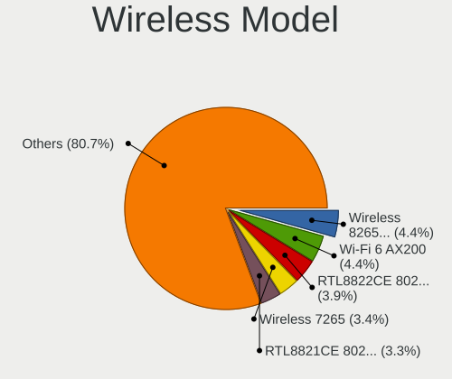

| Model                                                                   | Notebooks | Percent |
|-------------------------------------------------------------------------|-----------|---------|
| Intel Wireless 8265 / 8275                                              | 289       | 4.37%   |
| Intel Wi-Fi 6 AX200                                                     | 289       | 4.37%   |
| Realtek RTL8822CE 802.11ac PCIe Wireless Network Adapter                | 258       | 3.9%    |
| Intel Wireless 7265                                                     | 222       | 3.36%   |
| Realtek RTL8821CE 802.11ac PCIe Wireless Network Adapter                | 220       | 3.33%   |
| Intel Wireless 7260                                                     | 211       | 3.19%   |
| Intel Centrino Advanced-N 6205 [Taylor Peak]                            | 197       | 2.98%   |
| Qualcomm Atheros QCA9377 802.11ac Wireless Network Adapter              | 195       | 2.95%   |
| Intel Wi-Fi 6 AX201                                                     | 173       | 2.62%   |
| Qualcomm Atheros QCA6174 802.11ac Wireless Network Adapter              | 172       | 2.6%    |
| Intel Wireless 8260                                                     | 170       | 2.57%   |
| Qualcomm Atheros QCA9565 / AR9565 Wireless Network Adapter              | 143       | 2.16%   |
| Qualcomm Atheros AR9485 Wireless Network Adapter                        | 138       | 2.09%   |
| Intel Wireless 3165                                                     | 123       | 1.86%   |
| Intel Comet Lake PCH-LP CNVi WiFi                                       | 118       | 1.78%   |
| Qualcomm Atheros AR9285 Wireless Network Adapter (PCI-Express)          | 111       | 1.68%   |
| Intel Comet Lake PCH CNVi WiFi                                          | 103       | 1.56%   |
| Intel Alder Lake-P PCH CNVi WiFi                                        | 98        | 1.48%   |
| Broadcom BCM43142 802.11b/g/n                                           | 97        | 1.47%   |
| Broadcom BCM4313 802.11bgn Wireless Network Adapter                     | 97        | 1.47%   |
| Intel Wi-Fi 6E(802.11ax) AX210/AX1675* 2x2 [Typhoon Peak]               | 92        | 1.39%   |
| Intel Cannon Lake PCH CNVi WiFi                                         | 88        | 1.33%   |
| Intel Raptor Lake PCH CNVi WiFi                                         | 84        | 1.27%   |
| Realtek RTL8723BE PCIe Wireless Network Adapter                         | 83        | 1.26%   |
| Intel Cannon Point-LP CNVi [Wireless-AC]                                | 82        | 1.24%   |
| MediaTek MT7921 802.11ax PCIe Wireless Network Adapter [Filogic 330]    | 79        | 1.19%   |
| Intel Wireless 3160                                                     | 76        | 1.15%   |
| Intel PRO/Wireless 3945ABG [Golan] Network Connection                   | 74        | 1.12%   |
| Intel Wi-Fi 5(802.11ac) Wireless-AC 9x6x [Thunder Peak]                 | 73        | 1.1%    |
| Intel Centrino Ultimate-N 6300                                          | 66        | 1%      |
| MediaTek MT7922 802.11ax PCI Express Wireless Network Adapter           | 64        | 0.97%   |
| Qualcomm Atheros AR242x / AR542x Wireless Network Adapter (PCI-Express) | 61        | 0.92%   |
| Intel WiFi Link 5100                                                    | 60        | 0.91%   |
| Intel Centrino Advanced-N 6235                                          | 58        | 0.88%   |
| Qualcomm Atheros AR9462 Wireless Network Adapter                        | 57        | 0.86%   |
| Intel Centrino Advanced-N 6200                                          | 55        | 0.83%   |
| Intel Dual Band Wireless-AC 3168NGW [Stone Peak]                        | 54        | 0.82%   |
| Broadcom BCM4331 802.11a/b/g/n                                          | 52        | 0.79%   |
| Intel Dual Band Wireless-AC 3165 Plus Bluetooth                         | 51        | 0.77%   |
| Qualcomm QCNFA765 Wireless Network Adapter                              | 48        | 0.73%   |

Ethernet Vendor
---------------

Ethernet vendors

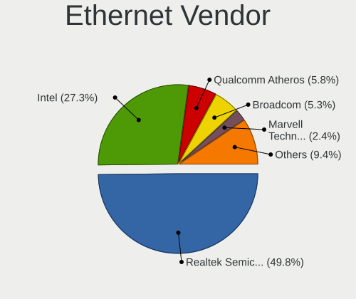

| Vendor                                 | Notebooks | Percent |
|----------------------------------------|-----------|---------|
| Realtek Semiconductor                  | 2447      | 49.83%  |
| Intel                                  | 1341      | 27.31%  |
| Qualcomm Atheros                       | 283       | 5.76%   |
| Broadcom                               | 258       | 5.25%   |
| Marvell Technology Group               | 118       | 2.4%    |
| ASIX Electronics                       | 86        | 1.75%   |
| DisplayLink                            | 46        | 0.94%   |
| Broadcom Limited                       | 38        | 0.77%   |
| Lenovo                                 | 36        | 0.73%   |
| Nvidia                                 | 34        | 0.69%   |
| Samsung Electronics                    | 33        | 0.67%   |
| Huawei Technologies                    | 22        | 0.45%   |
| MediaTek                               | 21        | 0.43%   |
| Google                                 | 17        | 0.35%   |
| JMicron Technology                     | 15        | 0.31%   |
| Qualcomm                               | 13        | 0.26%   |
| TP-Link                                | 11        | 0.22%   |
| Silicon Integrated Systems [SiS]       | 10        | 0.2%    |
| Xiaomi                                 | 9         | 0.18%   |
| Apple                                  | 9         | 0.18%   |
| ICS Advent                             | 8         | 0.16%   |
| Motorola PCS                           | 6         | 0.12%   |
| Suzhou Motorcomm Electronic Technology | 5         | 0.1%    |
| OPPO Electronics                       | 5         | 0.1%    |
| OnePlus Technology (Shenzhen)          | 5         | 0.1%    |
| Hewlett-Packard                        | 5         | 0.1%    |
| Attansic Technology                    | 5         | 0.1%    |
| VIA Technologies                       | 4         | 0.08%   |
| Motorcomm Microelectronics.            | 4         | 0.08%   |
| Microchip Technology                   | 3         | 0.06%   |
| Spreadtrum Communications              | 2         | 0.04%   |
| HTC (High Tech Computer)               | 2         | 0.04%   |
| ZTE WCDMA Technologies MSM             | 1         | 0.02%   |
| T & A Mobile Phones                    | 1         | 0.02%   |
| Sony Ericsson Mobile Communications AB | 1         | 0.02%   |
| Research In Motion                     | 1         | 0.02%   |
| Qualcomm Technologies                  | 1         | 0.02%   |
| Marvell Semiconductor                  | 1         | 0.02%   |
| Linksys                                | 1         | 0.02%   |
| LG Electronics                         | 1         | 0.02%   |

Ethernet Model
--------------

Ethernet models

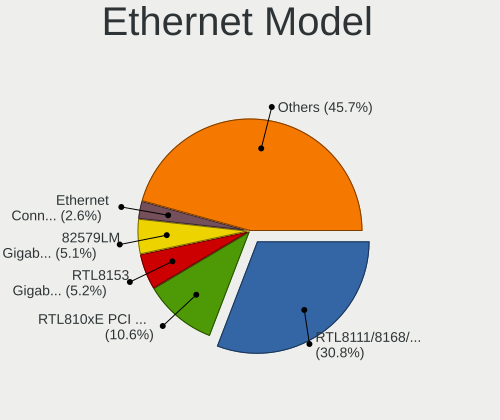

| Model                                                                  | Notebooks | Percent |
|------------------------------------------------------------------------|-----------|---------|
| Realtek RTL8111/8168/8211/8411 PCI Express Gigabit Ethernet Controller | 1534      | 30.83%  |
| Realtek RTL810xE PCI Express Fast Ethernet controller                  | 529       | 10.63%  |
| Realtek RTL8153 Gigabit Ethernet Adapter                               | 259       | 5.2%    |
| Intel 82579LM Gigabit Network Connection (Lewisville)                  | 253       | 5.08%   |
| Intel Ethernet Connection (4) I219-LM                                  | 127       | 2.55%   |
| Intel Ethernet Connection I218-LM                                      | 88        | 1.77%   |
| Intel 82577LM Gigabit Network Connection                               | 85        | 1.71%   |
| ASIX AX88179 Gigabit Ethernet                                          | 79        | 1.59%   |
| Intel Ethernet Connection I219-LM                                      | 74        | 1.49%   |
| Intel Ethernet Connection (4) I219-V                                   | 68        | 1.37%   |
| Intel Ethernet Connection (3) I218-LM                                  | 65        | 1.31%   |
| Intel Ethernet Connection I217-LM                                      | 59        | 1.19%   |
| Intel 82567LM Gigabit Network Connection                               | 52        | 1.05%   |
| Marvell Group 88E8040 PCI-E Fast Ethernet Controller                   | 48        | 0.96%   |
| Broadcom NetXtreme BCM57765 Gigabit Ethernet PCIe                      | 48        | 0.96%   |
| Realtek RTL8125 2.5GbE Controller                                      | 46        | 0.92%   |
| Qualcomm Atheros AR8151 v2.0 Gigabit Ethernet                          | 42        | 0.84%   |
| Intel Alder Lake-P PCH CNVi WiFi                                       | 40        | 0.8%    |
| Intel Ethernet Connection I219-V                                       | 36        | 0.72%   |
| Qualcomm Atheros QCA8171 Gigabit Ethernet                              | 30        | 0.6%    |
| Intel Ethernet Connection (6) I219-LM                                  | 30        | 0.6%    |
| Intel Ethernet Connection (2) I219-LM                                  | 30        | 0.6%    |
| Broadcom NetLink BCM57785 Gigabit Ethernet PCIe                        | 30        | 0.6%    |
| Qualcomm Atheros Killer E2500 Gigabit Ethernet Controller              | 29        | 0.58%   |
| Intel Ethernet Connection (7) I219-LM                                  | 29        | 0.58%   |
| Realtek RTL8152 Fast Ethernet Adapter                                  | 27        | 0.54%   |
| Realtek RTL-8100/8101L/8139 PCI Fast Ethernet Adapter                  | 27        | 0.54%   |
| Samsung Galaxy series, misc. (tethering mode)                          | 26        | 0.52%   |
| Intel Ethernet Connection (6) I219-V                                   | 25        | 0.5%    |
| Qualcomm Atheros Killer E2400 Gigabit Ethernet Controller              | 24        | 0.48%   |
| Realtek Killer E2600 GbE Controller                                    | 23        | 0.46%   |
| Nvidia MCP79 Ethernet                                                  | 23        | 0.46%   |
| Broadcom NetXtreme BCM5764M Gigabit Ethernet PCIe                      | 23        | 0.46%   |
| Qualcomm Atheros QCA8172 Fast Ethernet                                 | 22        | 0.44%   |
| Qualcomm Atheros AR8132 Fast Ethernet                                  | 22        | 0.44%   |
| Broadcom NetXtreme BCM5761 Gigabit Ethernet PCIe                       | 21        | 0.42%   |
| Intel Ethernet Connection (10) I219-V                                  | 20        | 0.4%    |
| Huawei FOA-LX9                                                         | 20        | 0.4%    |
| Qualcomm Atheros AR8162 Fast Ethernet                                  | 19        | 0.38%   |
| Intel 82566MM Gigabit Network Connection                               | 19        | 0.38%   |

Net Controller Kind
-------------------

Ethernet, WiFi or modem

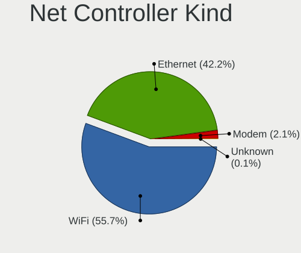

| Kind     | Notebooks | Percent |
|----------|-----------|---------|
| WiFi     | 6177      | 55.65%  |
| Ethernet | 4684      | 42.2%   |
| Modem    | 228       | 2.05%   |
| Unknown  | 10        | 0.09%   |

Used Controller
---------------

Currently used network controller

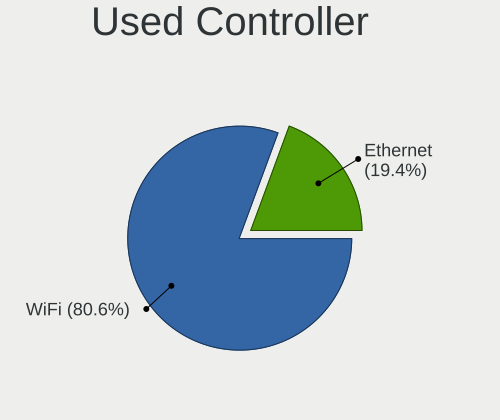

| Kind     | Notebooks | Percent |
|----------|-----------|---------|
| WiFi     | 5330      | 80.62%  |
| Ethernet | 1281      | 19.38%  |

NICs
----

Total network controllers on board

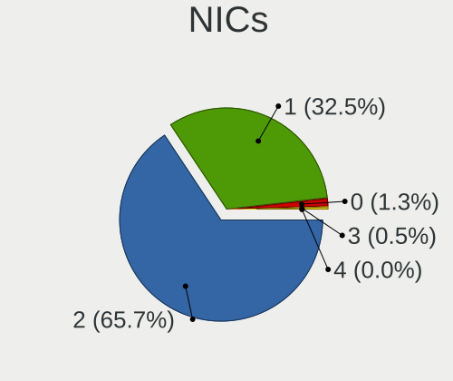

| Total | Notebooks | Percent |
|-------|-----------|---------|
| 2     | 4158      | 65.66%  |
| 1     | 2061      | 32.54%  |
| 0     | 83        | 1.31%   |
| 3     | 30        | 0.47%   |
| 4     | 1         | 0.02%   |

IPv6
----

IPv6 vs IPv4

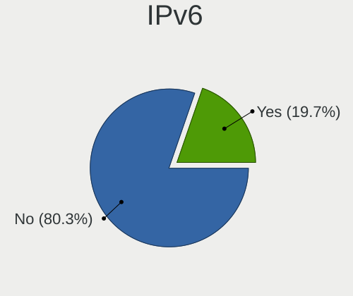

| Used | Notebooks | Percent |
|------|-----------|---------|
| No   | 5185      | 80.28%  |
| Yes  | 1274      | 19.72%  |

Bluetooth
---------

Bluetooth Vendor
----------------

Controller vendors

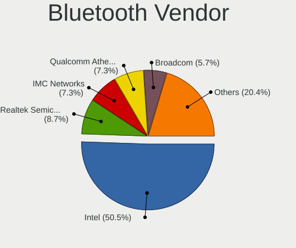

| Vendor                          | Notebooks | Percent |
|---------------------------------|-----------|---------|
| Intel                           | 2620      | 50.54%  |
| Realtek Semiconductor           | 453       | 8.74%   |
| IMC Networks                    | 380       | 7.33%   |
| Qualcomm Atheros Communications | 379       | 7.31%   |
| Broadcom                        | 294       | 5.67%   |
| Foxconn / Hon Hai               | 207       | 3.99%   |
| Apple                           | 203       | 3.92%   |
| Lite-On Technology              | 138       | 2.66%   |
| Dell                            | 95        | 1.83%   |
| Cambridge Silicon Radio         | 77        | 1.49%   |
| Toshiba                         | 76        | 1.47%   |
| Hewlett-Packard                 | 61        | 1.18%   |
| MediaTek                        | 33        | 0.64%   |
| Realtek                         | 27        | 0.52%   |
| USI                             | 26        | 0.5%    |
| Alps Electric                   | 23        | 0.44%   |
| Ralink                          | 19        | 0.37%   |
| Foxconn International           | 16        | 0.31%   |
| ASUSTek Computer                | 12        | 0.23%   |
| Askey Computer                  | 8         | 0.15%   |
| Ralink Technology               | 7         | 0.14%   |
| TP-Link                         | 6         | 0.12%   |
| Taiyo Yuden                     | 5         | 0.1%    |
| Belkin Components               | 5         | 0.1%    |
| Unknown                         | 4         | 0.08%   |
| Fujitsu                         | 3         | 0.06%   |
| Mercucys                        | 2         | 0.04%   |
| Edimax Technology               | 2         | 0.04%   |
| Sitecom Europe                  | 1         | 0.02%   |
| Opticis                         | 1         | 0.02%   |
| Integrated System Solution      | 1         | 0.02%   |

Bluetooth Model
---------------

Controller models

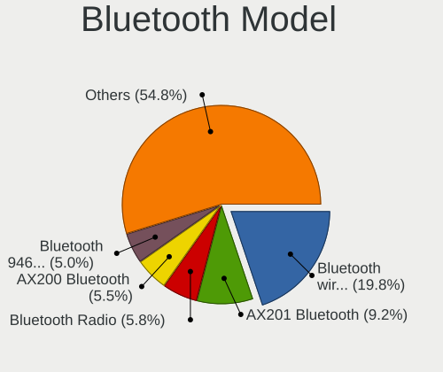

| Model                                               | Notebooks | Percent |
|-----------------------------------------------------|-----------|---------|
| Intel Bluetooth wireless interface                  | 1030      | 19.85%  |
| Intel AX201 Bluetooth                               | 477       | 9.19%   |
| Realtek Bluetooth Radio                             | 299       | 5.76%   |
| Intel AX200 Bluetooth                               | 283       | 5.45%   |
| Intel Bluetooth 9460/9560 Jefferson Peak (JfP)      | 259       | 4.99%   |
| Intel Bluetooth Device                              | 247       | 4.76%   |
| IMC Networks Bluetooth Radio                        | 225       | 4.34%   |
| Qualcomm Atheros  Bluetooth Device                  | 152       | 2.93%   |
| Apple Bluetooth Host Controller                     | 126       | 2.43%   |
| Realtek  Bluetooth 4.2 Adapter                      | 110       | 2.12%   |
| IMC Networks Wireless_Device                        | 101       | 1.95%   |
| Qualcomm Atheros QCA61x4 Bluetooth 4.0              | 93        | 1.79%   |
| Intel AX210 Bluetooth                               | 87        | 1.68%   |
| Intel Centrino Bluetooth Wireless Transceiver       | 84        | 1.62%   |
| Cambridge Silicon Radio Bluetooth Dongle (HCI mode) | 77        | 1.48%   |
| Foxconn / Hon Hai Bluetooth Device                  | 75        | 1.45%   |
| Qualcomm Atheros AR3012 Bluetooth 4.0               | 71        | 1.37%   |
| Broadcom BCM2045B (BDC-2.1)                         | 67        | 1.29%   |
| Intel Wireless-AC 9260 Bluetooth Adapter            | 63        | 1.21%   |
| Apple Bluetooth USB Host Controller                 | 57        | 1.1%    |
| Intel Wireless-AC 3168 Bluetooth                    | 53        | 1.02%   |
| Lite-On Qualcomm Atheros QCA9377 Bluetooth          | 50        | 0.96%   |
| Foxconn / Hon Hai Wireless_Device                   | 50        | 0.96%   |
| Broadcom BCM20702 Bluetooth 4.0 [ThinkPad]          | 45        | 0.87%   |
| Intel Centrino Advanced-N 6230 Bluetooth adapter    | 40        | 0.77%   |
| Qualcomm Atheros AR3011 Bluetooth                   | 36        | 0.69%   |
| MediaTek Wireless_Device                            | 33        | 0.64%   |
| Dell DW375 Bluetooth Module                         | 31        | 0.6%    |
| Lite-On Bluetooth Device                            | 30        | 0.58%   |
| IMC Networks Bluetooth Device                       | 30        | 0.58%   |
| HP Broadcom 2070 Bluetooth Combo                    | 28        | 0.54%   |
| Dell BCM20702A0 Bluetooth Module                    | 28        | 0.54%   |
| Toshiba Bluetooth Device                            | 27        | 0.52%   |
| Realtek Bluetooth Radio                             | 27        | 0.52%   |
| HP Bluetooth 2.0 Interface [Broadcom BCM2045]       | 27        | 0.52%   |
| USI Bluetooth Device                                | 25        | 0.48%   |
| Lite-On Atheros AR3012 Bluetooth                    | 24        | 0.46%   |
| Broadcom BCM43142A0 Bluetooth 4.0                   | 22        | 0.42%   |
| Ralink RT3290 Bluetooth                             | 19        | 0.37%   |
| Foxconn / Hon Hai MediaTek Bluetooth Adapter        | 19        | 0.37%   |

Sound
-----

Sound Vendor
------------

Sound card vendors

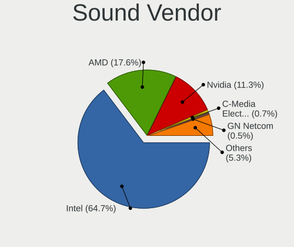

| Vendor                                       | Notebooks | Percent |
|----------------------------------------------|-----------|---------|
| Intel                                        | 4945      | 64.7%   |
| AMD                                          | 1342      | 17.56%  |
| Nvidia                                       | 861       | 11.27%  |
| C-Media Electronics                          | 53        | 0.69%   |
| GN Netcom                                    | 36        | 0.47%   |
| Realtek Semiconductor                        | 35        | 0.46%   |
| Lenovo                                       | 32        | 0.42%   |
| Plantronics                                  | 25        | 0.33%   |
| Texas Instruments                            | 19        | 0.25%   |
| Sony                                         | 19        | 0.25%   |
| Apple                                        | 18        | 0.24%   |
| Logitech                                     | 15        | 0.2%    |
| ASUSTek Computer                             | 15        | 0.2%    |
| JMTek                                        | 14        | 0.18%   |
| Silicon Integrated Systems [SiS]             | 12        | 0.16%   |
| Hewlett-Packard                              | 11        | 0.14%   |
| Focusrite-Novation                           | 10        | 0.13%   |
| Creative Technology                          | 10        | 0.13%   |
| Generalplus Technology                       | 9         | 0.12%   |
| Razer USA                                    | 8         | 0.1%    |
| SteelSeries ApS                              | 7         | 0.09%   |
| Dell                                         | 7         | 0.09%   |
| Corsair                                      | 7         | 0.09%   |
| Conexant Systems                             | 7         | 0.09%   |
| DSEA A/S                                     | 6         | 0.08%   |
| Blue Microphones                             | 6         | 0.08%   |
| Walmart                                      | 5         | 0.07%   |
| VIA Technologies                             | 5         | 0.07%   |
| RODE Microphones                             | 5         | 0.07%   |
| Kingston Technology                          | 5         | 0.07%   |
| Yamaha                                       | 4         | 0.05%   |
| PreSonus Audio Electronics                   | 4         | 0.05%   |
| Jieli Technology                             | 4         | 0.05%   |
| Google                                       | 4         | 0.05%   |
| BEHRINGER International                      | 4         | 0.05%   |
| AKAI Professional M.I.                       | 4         | 0.05%   |
| XMOS                                         | 3         | 0.04%   |
| Zoran Co. Personal Media Division (Nogatech) | 2         | 0.03%   |
| Samsung Electronics                          | 2         | 0.03%   |
| No brand                                     | 2         | 0.03%   |

Sound Model
-----------

Sound card models

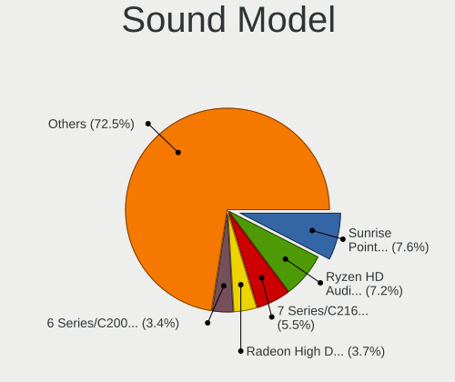

| Model                                                                                             | Notebooks | Percent |
|---------------------------------------------------------------------------------------------------|-----------|---------|
| Intel Sunrise Point-LP HD Audio                                                                   | 697       | 7.55%   |
| AMD Ryzen HD Audio Controller                                                                     | 668       | 7.24%   |
| Intel 7 Series/C216 Chipset Family High Definition Audio Controller                               | 510       | 5.53%   |
| AMD Radeon High Definition Audio Controller                                                       | 345       | 3.74%   |
| Intel 6 Series/C200 Series Chipset Family High Definition Audio Controller                        | 314       | 3.4%    |
| Intel 82801I (ICH9 Family) HD Audio Controller                                                    | 263       | 2.85%   |
| Intel Tiger Lake-LP Smart Sound Technology Audio Controller                                       | 250       | 2.71%   |
| AMD Renoir/Cezanne HDMI/DP Audio Controller                                                       | 249       | 2.7%    |
| Intel 8 Series HD Audio Controller                                                                | 236       | 2.56%   |
| Intel Haswell-ULT HD Audio Controller                                                             | 235       | 2.55%   |
| Intel 5 Series/3400 Series Chipset High Definition Audio                                          | 232       | 2.51%   |
| Intel Broadwell-U Audio Controller                                                                | 218       | 2.36%   |
| Intel Cannon Lake PCH cAVS                                                                        | 214       | 2.32%   |
| Intel Wildcat Point-LP High Definition Audio Controller                                           | 210       | 2.28%   |
| AMD Raven/Raven2/Fenghuang HDMI/DP Audio Controller                                               | 186       | 2.02%   |
| Intel Alder Lake PCH-P High Definition Audio Controller                                           | 183       | 1.98%   |
| AMD FCH Azalia Controller                                                                         | 178       | 1.93%   |
| Intel Cannon Point-LP High Definition Audio Controller                                            | 167       | 1.81%   |
| Intel 8 Series/C220 Series Chipset High Definition Audio Controller                               | 164       | 1.78%   |
| Intel Comet Lake PCH-LP cAVS                                                                      | 158       | 1.71%   |
| Intel Celeron/Pentium Silver Processor High Definition Audio                                      | 136       | 1.47%   |
| Intel Xeon E3-1200 v3/4th Gen Core Processor HD Audio Controller                                  | 132       | 1.43%   |
| Intel Comet Lake PCH cAVS                                                                         | 127       | 1.38%   |
| AMD Kabini HDMI/DP Audio                                                                          | 125       | 1.35%   |
| AMD Family 15h (Models 60h-6fh) Audio Controller                                                  | 124       | 1.34%   |
| Intel 82801H (ICH8 Family) HD Audio Controller                                                    | 115       | 1.25%   |
| Intel Raptor Lake-P/U/H cAVS                                                                      | 104       | 1.13%   |
| Intel Atom/Celeron/Pentium Processor x5-E8000/J3xxx/N3xxx Series High Definition Audio Controller | 104       | 1.13%   |
| AMD High Definition Audio Controller                                                              | 103       | 1.12%   |
| Intel NM10/ICH7 Family High Definition Audio Controller                                           | 95        | 1.03%   |
| Intel CM238 HD Audio Controller                                                                   | 93        | 1.01%   |
| Intel 100 Series/C230 Series Chipset Family HD Audio Controller                                   | 93        | 1.01%   |
| Intel Atom Processor Z36xxx/Z37xxx Series High Definition Audio Controller                        | 83        | 0.9%    |
| Intel Tiger Lake-H HD Audio Controller                                                            | 76        | 0.82%   |
| Intel Ice Lake-LP Smart Sound Technology Audio Controller                                         | 76        | 0.82%   |
| Nvidia GA104 High Definition Audio Controller                                                     | 75        | 0.81%   |
| AMD SBx00 Azalia (Intel HDA)                                                                      | 73        | 0.79%   |
| Intel Celeron N3350/Pentium N4200/Atom E3900 Series Audio Cluster                                 | 69        | 0.75%   |
| Nvidia TU106 High Definition Audio Controller                                                     | 66        | 0.72%   |
| Nvidia TU107 GeForce GTX 1650 High Definition Audio Controller                                    | 65        | 0.7%    |

Memory
------

Memory Vendor
-------------

Memory module vendors

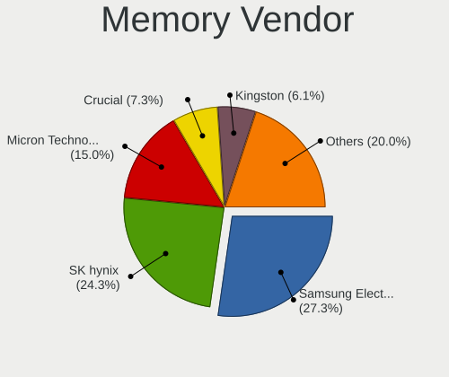

| Vendor              | Notebooks | Percent |
|---------------------|-----------|---------|
| Samsung Electronics | 1049      | 27.26%  |
| SK hynix            | 934       | 24.27%  |
| Micron Technology   | 579       | 15.05%  |
| Crucial             | 282       | 7.33%   |
| Kingston            | 236       | 6.13%   |
| Unknown             | 228       | 5.93%   |
| Corsair             | 96        | 2.49%   |
| Ramaxel Technology  | 70        | 1.82%   |
| Elpida              | 62        | 1.61%   |
| Unknown             | 51        | 1.33%   |
| A-DATA Technology   | 48        | 1.25%   |
| Nanya Technology    | 47        | 1.22%   |
| Unknown (ABCD)      | 37        | 0.96%   |
| 4ea5                | 8         | 0.21%   |
| Timetec             | 7         | 0.18%   |
| Toshiba             | 6         | 0.16%   |
| GSkill              | 6         | 0.16%   |
| GOODRAM             | 6         | 0.16%   |
| ff                  | 6         | 0.16%   |
| Qimonda             | 5         | 0.13%   |
| Patriot             | 5         | 0.13%   |
| fef5                | 5         | 0.13%   |
| Apacer              | 5         | 0.13%   |
| Unknown (0x0E9D)    | 4         | 0.1%    |
| Transcend           | 4         | 0.1%    |
| Team                | 4         | 0.1%    |
| Neo Forza           | 4         | 0.1%    |
| G.Skill             | 4         | 0.1%    |
| Essencore           | 4         | 0.1%    |
| ASint Technology    | 4         | 0.1%    |
| A Force             | 4         | 0.1%    |
| SHARETRONIC         | 3         | 0.08%   |
| Unknown (F301)      | 2         | 0.05%   |
| Lexar               | 2         | 0.05%   |
| KLEVV               | 2         | 0.05%   |
| Innodisk            | 2         | 0.05%   |
| V-Color             | 1         | 0.03%   |
| Unknown (CB83)      | 1         | 0.03%   |
| Unknown (268C)      | 1         | 0.03%   |
| Unknown (0x0E2A)    | 1         | 0.03%   |

Memory Model
------------

Memory module models

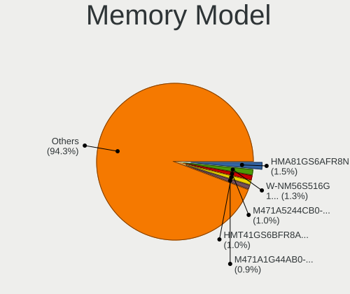

| Model                                                            | Notebooks | Percent |
|------------------------------------------------------------------|-----------|---------|
| SK hynix RAM HMA81GS6AFR8N-UH 8GB SODIMM DDR4 2667MT/s           | 62        | 1.53%   |
| Unknown                                                          | 51        | 1.26%   |
| Samsung RAM M471A5244CB0-CTD 4GB SODIMM DDR4 3266MT/s            | 42        | 1.03%   |
| SK hynix RAM HMT41GS6BFR8A-PB 8GB SODIMM DDR3 2667MT/s           | 40        | 0.99%   |
| Samsung RAM M471A1G44AB0-CWE 8GiB SODIMM DDR4 3200MT/s           | 38        | 0.94%   |
| Unknown (ABCD) RAM 123456789012345678 2GB SODIMM LPDDR4 2400MT/s | 36        | 0.89%   |
| Samsung RAM M471B5173QH0-YK0 4GB SODIMM DDR3 1600MT/s            | 35        | 0.86%   |
| SK hynix RAM HMT451S6BFR8A-PB 4GB SODIMM DDR3 1600MT/s           | 33        | 0.81%   |
| Samsung RAM M471B5273DH0-CH9 4GB SODIMM DDR3 1600MT/s            | 32        | 0.79%   |
| Samsung RAM M471A1K43DB1-CTD 8GB SODIMM DDR4 2667MT/s            | 31        | 0.76%   |
| Samsung RAM M471B5273CH0-CH9 4GB SODIMM DDR3 1334MT/s            | 29        | 0.71%   |
| Samsung RAM M471A1K43DB1-CWE 8GB SODIMM DDR4 3200MT/s            | 29        | 0.71%   |
| Samsung RAM M471A1K43CB1-CRC 8GB SODIMM DDR4 8400MT/s            | 29        | 0.71%   |
| SK hynix RAM HMAA1GS6CJR6N-XN 8GB SODIMM DDR4 3200MT/s           | 26        | 0.64%   |
| Samsung RAM M471B1G73QH0-YK0 8GB SODIMM DDR3 1600MT/s            | 26        | 0.64%   |
| Samsung RAM M471B5173DB0-YK0 4GB SODIMM DDR3 1600MT/s            | 25        | 0.62%   |
| Micron RAM 4ATF51264HZ-3G2J1 4GB SODIMM DDR4 3200MT/s            | 25        | 0.62%   |
| Unknown RAM Module 2GB SODIMM DDR2 667MT/s                       | 24        | 0.59%   |
| Samsung RAM M471B5173EB0-YK0 4GB SODIMM DDR3 1600MT/s            | 23        | 0.57%   |
| Samsung RAM M471B1G73EB0-YK0 8192MB SODIMM DDR3 1600MT/s         | 23        | 0.57%   |
| Samsung RAM M471B1G73DB0-YK0 8GB SODIMM DDR3 1600MT/s            | 23        | 0.57%   |
| Micron RAM 4ATF51264HZ-2G6E1 4GB SODIMM DDR4 2667MT/s            | 23        | 0.57%   |
| Micron RAM 4ATF1G64HZ-3G2F1 8GB SODIMM DDR4 3200MT/s             | 22        | 0.54%   |
| SK hynix RAM HMA851S6CJR6N-VK 4GB SODIMM DDR4 2667MT/s           | 21        | 0.52%   |
| SK hynix RAM H9CCNNNCLGALAR-NVD 8GB Row Of Chips LPDDR3 2133MT/s | 21        | 0.52%   |
| Samsung RAM M471A5244CB0-CWE 4GB SODIMM DDR4 3200MT/s            | 21        | 0.52%   |
| Samsung RAM M471A5244CB0-CRC 4GB SODIMM DDR4 2667MT/s            | 20        | 0.49%   |
| Samsung RAM M471A1K43EB1-CWE 8GB SODIMM DDR4 3200MT/s            | 20        | 0.49%   |
| Crucial RAM CT51264BF160B.C16F 4GB SODIMM DDR3 4199MT/s          | 20        | 0.49%   |
| Crucial RAM CT102464BF160B.C16 8GB SODIMM DDR3 1600MT/s          | 20        | 0.49%   |
| SK hynix RAM HMA81GS6DJR8N-XN 8GB SODIMM DDR4 3200MT/s           | 19        | 0.47%   |
| Samsung RAM M471B5773CHS-CH9 2GB SODIMM DDR3 4199MT/s            | 19        | 0.47%   |
| Samsung RAM M471A1K43CB1-CTD 8GB SODIMM DDR4 3200MT/s            | 19        | 0.47%   |
| Samsung RAM M471A1G44BB0-CWE 8GB SODIMM DDR4 3200MT/s            | 19        | 0.47%   |
| SK hynix RAM HMT41GS6BFR8A-PB 8GB SODIMM DDR3 1600MT/s           | 18        | 0.44%   |
| SK hynix RAM HMA81GS6CJR8N-VK 8GB SODIMM DDR4 2667MT/s           | 18        | 0.44%   |
| SK hynix RAM Module 4GB SODIMM DDR3 1600MT/s                     | 17        | 0.42%   |
| SK hynix RAM HMA41GS6AFR8N-TF 8GB SODIMM DDR4 2667MT/s           | 17        | 0.42%   |
| SK hynix RAM HMT351S6CFR8C-PB 4GB SODIMM DDR3 1600MT/s           | 16        | 0.39%   |
| SK hynix RAM HMA81GS6JJR8N-VK 8GB SODIMM DDR4 2667MT/s           | 16        | 0.39%   |

Memory Kind
-----------

Memory module kinds

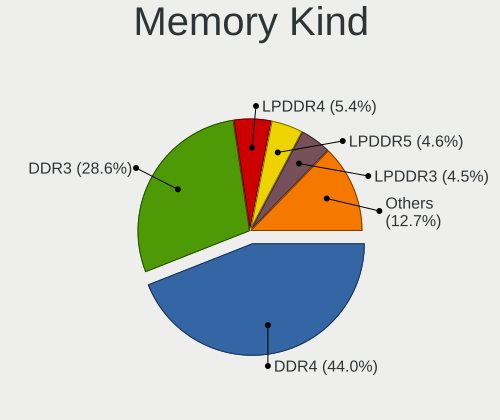

| Kind    | Notebooks | Percent |
|---------|-----------|---------|
| DDR4    | 1465      | 44.02%  |
| DDR3    | 953       | 28.64%  |
| LPDDR4  | 181       | 5.44%   |
| LPDDR5  | 154       | 4.63%   |
| LPDDR3  | 151       | 4.54%   |
| DDR2    | 149       | 4.48%   |
| DDR5    | 143       | 4.3%    |
| SDRAM   | 92        | 2.76%   |
| Unknown | 19        | 0.57%   |
| DDR     | 12        | 0.36%   |
| DRAM    | 9         | 0.27%   |

Memory Form Factor
------------------

Physical design of the memory module

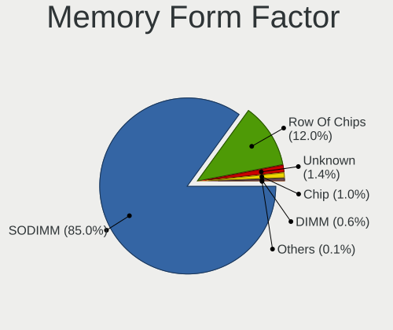

| Name            | Notebooks | Percent |
|-----------------|-----------|---------|
| SODIMM          | 2800      | 84.98%  |
| Row Of Chips    | 395       | 11.99%  |
| Unknown         | 45        | 1.37%   |
| Chip            | 34        | 1.03%   |
| DIMM            | 19        | 0.58%   |
| Proprietary Car | 2         | 0.06%   |

Memory Size
-----------

Memory module size

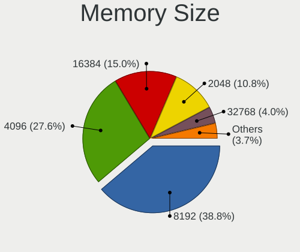

| Size  | Notebooks | Percent |
|-------|-----------|---------|
| 8192  | 1409      | 38.82%  |
| 4096  | 1001      | 27.58%  |
| 16384 | 546       | 15.04%  |
| 2048  | 393       | 10.83%  |
| 32768 | 146       | 4.02%   |
| 1024  | 115       | 3.17%   |
| 512   | 14        | 0.39%   |
| 3072  | 3         | 0.08%   |
| 49152 | 1         | 0.03%   |
| 12288 | 1         | 0.03%   |
| 256   | 1         | 0.03%   |

Memory Speed
------------

Memory module speed

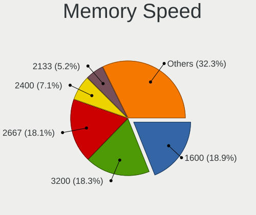

| Speed   | Notebooks | Percent |
|---------|-----------|---------|
| 1600    | 675       | 18.93%  |
| 3200    | 654       | 18.34%  |
| 2667    | 645       | 18.09%  |
| 2400    | 253       | 7.09%   |
| 2133    | 187       | 5.24%   |
| 1334    | 101       | 2.83%   |
| 1333    | 88        | 2.47%   |
| 6400    | 84        | 2.36%   |
| 4800    | 79        | 2.22%   |
| 667     | 78        | 2.19%   |
| 4267    | 72        | 2.02%   |
| 1867    | 70        | 1.96%   |
| 5600    | 68        | 1.91%   |
| 1067    | 54        | 1.51%   |
| Unknown | 54        | 1.51%   |
| 4199    | 52        | 1.46%   |
| 3266    | 43        | 1.21%   |
| 800     | 41        | 1.15%   |
| 7500    | 37        | 1.04%   |
| 8400    | 36        | 1.01%   |
| 2048    | 28        | 0.79%   |
| 4266    | 22        | 0.62%   |
| 1066    | 21        | 0.59%   |
| 8533    | 16        | 0.45%   |
| 975     | 16        | 0.45%   |
| 533     | 16        | 0.45%   |
| 7467    | 9         | 0.25%   |
| 1866    | 9         | 0.25%   |
| 3733    | 8         | 0.22%   |
| 1639    | 6         | 0.17%   |
| 3000    | 5         | 0.14%   |
| 2267    | 5         | 0.14%   |
| 333     | 4         | 0.11%   |
| 5500    | 3         | 0.08%   |
| 2933    | 3         | 0.08%   |
| 400     | 3         | 0.08%   |
| 8600    | 2         | 0.06%   |
| 3800    | 2         | 0.06%   |
| 1776    | 2         | 0.06%   |
| 1200    | 2         | 0.06%   |

Printers & scanners
-------------------

Printer Vendor
--------------

Printer device vendors

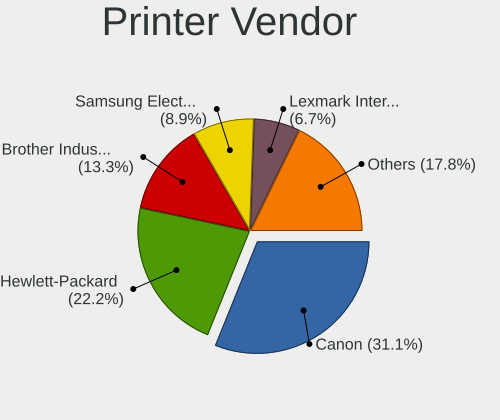

| Vendor                | Notebooks | Percent |
|-----------------------|-----------|---------|
| Canon                 | 14        | 31.11%  |
| Hewlett-Packard       | 10        | 22.22%  |
| Brother Industries    | 6         | 13.33%  |
| Samsung Electronics   | 4         | 8.89%   |
| Lexmark International | 3         | 6.67%   |
| Prolific Technology   | 2         | 4.44%   |
| Zebra Technologies    | 1         | 2.22%   |
| STMicroelectronics    | 1         | 2.22%   |
| Seiko Epson           | 1         | 2.22%   |
| Oki Data              | 1         | 2.22%   |
| Kyocera               | 1         | 2.22%   |
| KODAK                 | 1         | 2.22%   |

Printer Model
-------------

Printer device models

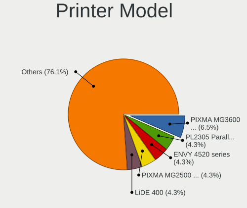

| Model                                                     | Notebooks | Percent |
|-----------------------------------------------------------|-----------|---------|
| Canon PIXMA MG3600 Series                                 | 3         | 6.52%   |
| Prolific PL2305 Parallel Port                             | 2         | 4.35%   |
| HP ENVY 4520 series                                       | 2         | 4.35%   |
| Canon PIXMA MG2500 Series                                 | 2         | 4.35%   |
| Canon LiDE 400                                            | 2         | 4.35%   |
| Zebra GK420d Label Printer                                | 1         | 2.17%   |
| STMicroelectronics LED badge -- mini LED display -- 11x44 | 1         | 2.17%   |
| Seiko Epson ME Office 600F/Stylus Office BX300F/TX300F    | 1         | 2.17%   |
| Samsung M2020 Series                                      | 1         | 2.17%   |
| Samsung CLX-6260 Series                                   | 1         | 2.17%   |
| Samsung CLP-300 Series                                    | 1         | 2.17%   |
| Samsung C43x Series                                       | 1         | 2.17%   |
| Oki Data B6250                                            | 1         | 2.17%   |
| Lexmark International MS617dn                             | 1         | 2.17%   |
| Lexmark International C544                                | 1         | 2.17%   |
| Lexmark International 640 Series                          | 1         | 2.17%   |
| Kyocera FS-1041                                           | 1         | 2.17%   |
| KODAK ESP 5 AiO                                           | 1         | 2.17%   |
| HP Officejet 4630 series                                  | 1         | 2.17%   |
| HP LaserJet P2015 series                                  | 1         | 2.17%   |
| HP LaserJet 1010                                          | 1         | 2.17%   |
| HP ENVY Photo 6200 series                                 | 1         | 2.17%   |
| HP ENVY 6000 series                                       | 1         | 2.17%   |
| HP DeskJet 2700 series                                    | 1         | 2.17%   |
| HP Deskjet 2540 series                                    | 1         | 2.17%   |
| HP Deskjet 1510                                           | 1         | 2.17%   |
| Canon TS3100 series                                       | 1         | 2.17%   |
| Canon SELPHY CP400                                        | 1         | 2.17%   |
| Canon PIXMA MX530 Series                                  | 1         | 2.17%   |
| Canon PIXMA MX490 Series                                  | 1         | 2.17%   |
| Canon MF4360-4390                                         | 1         | 2.17%   |
| Canon LiDE 300                                            | 1         | 2.17%   |
| Canon iX6500 series                                       | 1         | 2.17%   |
| Canon iP4800 series                                       | 1         | 2.17%   |
| Brother PT-9500PC                                         | 1         | 2.17%   |
| Brother MFC-J4540DW                                       | 1         | 2.17%   |
| Brother DCP-L8410CDW series                               | 1         | 2.17%   |
| Brother DCP-L3510CDW                                      | 1         | 2.17%   |
| Brother DCP-L2500D                                        | 1         | 2.17%   |
| Brother DCP-7025 Printer                                  | 1         | 2.17%   |

Scanner Vendor
--------------

Scanner device vendors

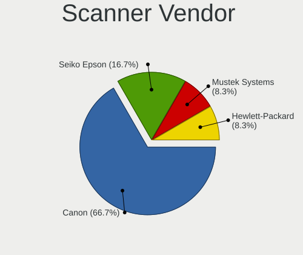

| Vendor          | Notebooks | Percent |
|-----------------|-----------|---------|
| Canon           | 8         | 66.67%  |
| Seiko Epson     | 2         | 16.67%  |
| Mustek Systems  | 1         | 8.33%   |
| Hewlett-Packard | 1         | 8.33%   |

Scanner Model
-------------

Scanner device models

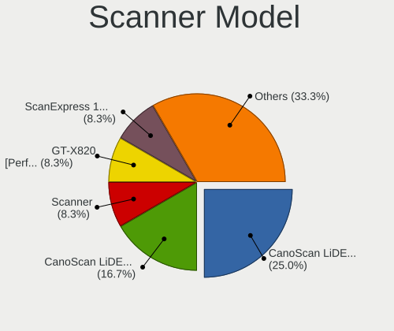

| Model                                       | Notebooks | Percent |
|---------------------------------------------|-----------|---------|
| Canon CanoScan LiDE 110                     | 3         | 25%     |
| Canon CanoScan LiDE 200                     | 2         | 16.67%  |
| Seiko Epson Scanner                         | 1         | 8.33%   |
| Seiko Epson GT-X820 [Perfection V600 Photo] | 1         | 8.33%   |
| Mustek Systems ScanExpress 1200 UB          | 1         | 8.33%   |
| HP ScanJet 5300c/5370c                      | 1         | 8.33%   |
| Canon CanoScan LiDE 700F                    | 1         | 8.33%   |
| Canon CanoScan LiDE 600F                    | 1         | 8.33%   |
| Canon CanoScan LiDE 220                     | 1         | 8.33%   |

Camera
------

Camera Vendor
-------------

Camera device vendors

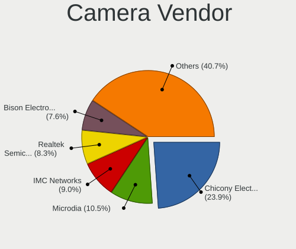

| Vendor                                 | Notebooks | Percent |
|----------------------------------------|-----------|---------|
| Chicony Electronics                    | 1302      | 23.89%  |
| Microdia                               | 570       | 10.46%  |
| IMC Networks                           | 490       | 8.99%   |
| Realtek Semiconductor                  | 454       | 8.33%   |
| Bison Electronics                      | 414       | 7.59%   |
| Sunplus Innovation Technology          | 290       | 5.32%   |
| Quanta                                 | 258       | 4.73%   |
| Cheng Uei Precision Industry (Foxlink) | 199       | 3.65%   |
| Apple                                  | 159       | 2.92%   |
| Suyin                                  | 158       | 2.9%    |
| Lite-On Technology                     | 149       | 2.73%   |
| Syntek                                 | 134       | 2.46%   |
| Luxvisions Innotech Limited            | 104       | 1.91%   |
| Logitech                               | 82        | 1.5%    |
| Silicon Motion                         | 75        | 1.38%   |
| Sonix Technology                       | 57        | 1.05%   |
| Alcor Micro                            | 57        | 1.05%   |
| Ricoh                                  | 56        | 1.03%   |
| Lenovo                                 | 53        | 0.97%   |
| Shinetech                              | 32        | 0.59%   |
| Samsung Electronics                    | 31        | 0.57%   |
| Acer                                   | 26        | 0.48%   |
| Z-Star Microelectronics                | 20        | 0.37%   |
| SunplusIT                              | 19        | 0.35%   |
| Primax Electronics                     | 18        | 0.33%   |
| ALi                                    | 18        | 0.33%   |
| Microsoft                              | 17        | 0.31%   |
| Importek                               | 14        | 0.26%   |
| kingcome                               | 11        | 0.2%    |
| Unknown                                | 10        | 0.18%   |
| OmniVision Technologies                | 9         | 0.17%   |
| Sunplus Technology                     | 8         | 0.15%   |
| Shenzhen Kingcome Optoelectronic       | 8         | 0.15%   |
| icSpring                               | 8         | 0.15%   |
| DigiTech                               | 8         | 0.15%   |
| Intel                                  | 7         | 0.13%   |
| Generalplus Technology                 | 7         | 0.13%   |
| Genesys Logic                          | 6         | 0.11%   |
| GEMBIRD                                | 6         | 0.11%   |
| ARC International                      | 6         | 0.11%   |

Camera Model
------------

Camera device models

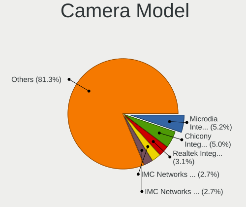

| Model                                                   | Notebooks | Percent |
|---------------------------------------------------------|-----------|---------|
| Microdia Integrated_Webcam_HD                           | 286       | 5.21%   |
| Chicony Integrated Camera                               | 275       | 5.01%   |
| Realtek Integrated_Webcam_HD                            | 170       | 3.1%    |
| IMC Networks Integrated Camera                          | 150       | 2.73%   |
| IMC Networks USB2.0 HD UVC WebCam                       | 147       | 2.68%   |
| Bison Integrated Camera                                 | 103       | 1.88%   |
| Sunplus Integrated_Webcam_HD                            | 102       | 1.86%   |
| Chicony HD WebCam                                       | 99        | 1.8%    |
| Chicony TOSHIBA Web Camera - HD                         | 75        | 1.37%   |
| Syntek Integrated Camera                                | 72        | 1.31%   |
| Lite-On Integrated Camera                               | 58        | 1.06%   |
| Chicony HP TrueVision HD Camera                         | 57        | 1.04%   |
| Microdia Integrated Webcam                              | 56        | 1.02%   |
| Quanta HD User Facing                                   | 48        | 0.87%   |
| IMC Networks USB2.0 VGA UVC WebCam                      | 47        | 0.86%   |
| Apple FaceTime HD Camera                                | 47        | 0.86%   |
| Chicony HP Truevision HD                                | 46        | 0.84%   |
| Bison BisonCam,NB Pro                                   | 46        | 0.84%   |
| Apple Built-in iSight                                   | 46        | 0.84%   |
| Chicony Integrated Camera (1280x720@30)                 | 43        | 0.78%   |
| Bison SunplusIT Integrated Camera                       | 43        | 0.78%   |
| Chicony HP HD Camera                                    | 38        | 0.69%   |
| Chicony EasyCamera                                      | 38        | 0.69%   |
| Bison Lenovo EasyCamera                                 | 36        | 0.66%   |
| Quanta HP TrueVision HD Camera                          | 35        | 0.64%   |
| Chicony USB 2.0 Camera                                  | 34        | 0.62%   |
| Chicony Chicony USB2.0 Camera                           | 34        | 0.62%   |
| Apple iPhone 5/5C/5S/6/SE/7/8/X                         | 33        | 0.6%    |
| Sonix USB2.0 HD UVC WebCam                              | 31        | 0.56%   |
| Samsung Galaxy series, misc. (MTP mode)                 | 31        | 0.56%   |
| Microdia Integrated_Webcam_FHD                          | 30        | 0.55%   |
| Lite-On HP HD Camera                                    | 30        | 0.55%   |
| Chicony HD User Facing                                  | 30        | 0.55%   |
| Syntek Lenovo EasyCamera                                | 29        | 0.53%   |
| Realtek Integrated Webcam HD                            | 29        | 0.53%   |
| Luxvisions Innotech Limited Integrated Camera           | 29        | 0.53%   |
| Lenovo Integrated Webcam [R5U877]                       | 28        | 0.51%   |
| Chicony VGA WebCam                                      | 28        | 0.51%   |
| Cheng Uei Precision Industry (Foxlink) HP Truevision HD | 28        | 0.51%   |
| Bison EasyCamera                                        | 28        | 0.51%   |

Security
--------

Fingerprint Vendor
------------------

Fingerprint sensor vendors

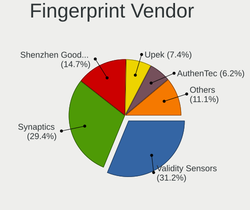

| Vendor                             | Notebooks | Percent |
|------------------------------------|-----------|---------|
| Validity Sensors                   | 335       | 31.22%  |
| Synaptics                          | 315       | 29.36%  |
| Shenzhen Goodix Technology         | 158       | 14.73%  |
| Upek                               | 79        | 7.36%   |
| AuthenTec                          | 67        | 6.24%   |
| LighTuning Technology              | 52        | 4.85%   |
| Elan Microelectronics              | 34        | 3.17%   |
| STMicroelectronics                 | 19        | 1.77%   |
| Samsung Electronics                | 6         | 0.56%   |
| Realtek USB2.0 Finger Print Bridge | 6         | 0.56%   |
| HOLTEK                             | 1         | 0.09%   |
| Focal-systems.Corp                 | 1         | 0.09%   |

Fingerprint Model
-----------------

Fingerprint sensor models

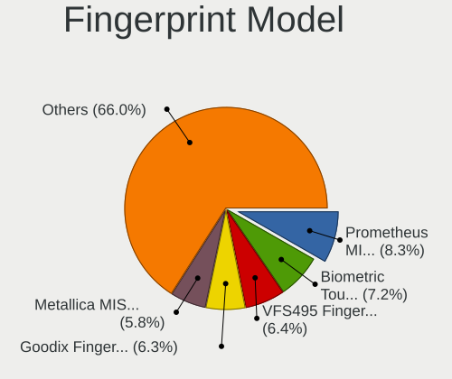

| Model                                                                      | Notebooks | Percent |
|----------------------------------------------------------------------------|-----------|---------|
| Synaptics Prometheus MIS Touch Fingerprint Reader                          | 89        | 8.29%   |
| Upek Biometric Touchchip/Touchstrip Fingerprint Sensor                     | 77        | 7.18%   |
| Validity Sensors VFS495 Fingerprint Reader                                 | 69        | 6.43%   |
| Shenzhen Goodix  FingerPrint Device                                        | 68        | 6.34%   |
| Synaptics Metallica MIS Touch Fingerprint Reader                           | 62        | 5.78%   |
| Validity Sensors VFS 5011 fingerprint sensor                               | 60        | 5.59%   |
| Shenzhen Goodix FingerPrint                                                | 51        | 4.75%   |
| Shenzhen Goodix Fingerprint Reader                                         | 39        | 3.63%   |
| Validity Sensors Synaptics WBDI                                            | 32        | 2.98%   |
| Validity Sensors VFS5011 Fingerprint Reader                                | 26        | 2.42%   |
| Validity Sensors VFS7500 Touch Fingerprint Sensor                          | 25        | 2.33%   |
| LighTuning ES603 Swipe Fingerprint Sensor                                  | 24        | 2.24%   |
| Validity Sensors VFS491                                                    | 22        | 2.05%   |
| AuthenTec AES2810                                                          | 22        | 2.05%   |
| LighTuning EgisTec Touch Fingerprint Sensor                                | 21        | 1.96%   |
| Validity Sensors Swipe Fingerprint Sensor                                  | 20        | 1.86%   |
| Synaptics  FS7604 Touch Fingerprint Sensor with PurePrint                  | 20        | 1.86%   |
| AuthenTec AES2501 Fingerprint Sensor                                       | 20        | 1.86%   |
| Synaptics UWP WBDI Device                                                  | 19        | 1.77%   |
| STMicroelectronics Fingerprint Reader                                      | 19        | 1.77%   |
| Validity Sensors VFS471 Fingerprint Reader                                 | 18        | 1.68%   |
| Synaptics Fingerprint reader [HP G6]                                       | 18        | 1.68%   |
| Elan ELAN:Fingerprint                                                      | 18        | 1.68%   |
| Validity Sensors Synaptics VFS7552 Touch Fingerprint Sensor with PurePrint | 17        | 1.58%   |
| Synaptics FS7604 Touch Fingerprint Sensor with PurePrint                   | 17        | 1.58%   |
| Elan ELAN:ARM-M4                                                           | 16        | 1.49%   |
| Validity Sensors VFS451 Fingerprint Reader                                 | 13        | 1.21%   |
| Synaptics Metallica MOH Touch Fingerprint Reader                           | 13        | 1.21%   |
| Synaptics UWP WBDI                                                         | 12        | 1.12%   |
| Synaptics Prometheus Fingerprint Reader                                    | 12        | 1.12%   |
| Synaptics WBDI Device                                                      | 11        | 1.03%   |
| Synaptics  WBDI                                                            | 11        | 1.03%   |
| Unknown                                                                    | 11        | 1.03%   |
| Validity Sensors VFS7552 Touch Fingerprint Sensor                          | 9         | 0.84%   |
| AuthenTec Fingerprint Sensor                                               | 9         | 0.84%   |
| Validity Sensors VFS301 Fingerprint Reader                                 | 8         | 0.75%   |
| Synaptics WBDI                                                             | 8         | 0.75%   |
| Validity Sensors VFS Fingerprint sensor                                    | 7         | 0.65%   |
| Validity Sensors Fingerprint scanner                                       | 7         | 0.65%   |
| LighTuning Fingerprint Reader                                              | 7         | 0.65%   |

Chipcard Vendor
---------------

Chipcard module vendors

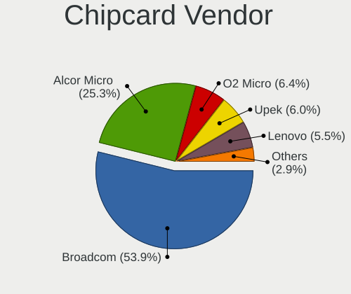

| Vendor                    | Notebooks | Percent |
|---------------------------|-----------|---------|
| Broadcom                  | 313       | 53.87%  |
| Alcor Micro               | 147       | 25.3%   |
| O2 Micro                  | 37        | 6.37%   |
| Upek                      | 35        | 6.02%   |
| Lenovo                    | 32        | 5.51%   |
| Gemalto (was Gemplus)     | 6         | 1.03%   |
| SCM Microsystems          | 3         | 0.52%   |
| Yubico.com                | 2         | 0.34%   |
| Purism, SPC               | 1         | 0.17%   |
| OmniKey                   | 1         | 0.17%   |
| Clay Logic                | 1         | 0.17%   |
| Chicony Electronics       | 1         | 0.17%   |
| Cherry                    | 1         | 0.17%   |
| Aladdin Knowledge Systems | 1         | 0.17%   |

Chipcard Model
--------------

Chipcard module models

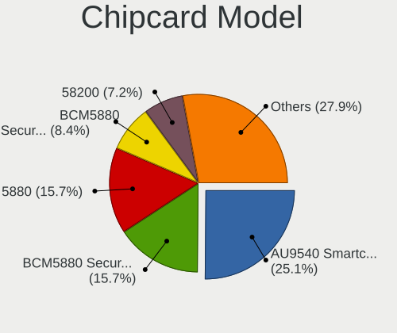

| Model                                                                        | Notebooks | Percent |
|------------------------------------------------------------------------------|-----------|---------|
| Alcor Micro AU9540 Smartcard Reader                                          | 146       | 25.13%  |
| Broadcom BCM5880 Secure Applications Processor                               | 91        | 15.66%  |
| Broadcom 5880                                                                | 91        | 15.66%  |
| Broadcom BCM5880 Secure Applications Processor with fingerprint swipe sensor | 49        | 8.43%   |
| Broadcom 58200                                                               | 42        | 7.23%   |
| Broadcom BCM58200 ControlVault 3 (FingerPrint sensor + Contacted SmartCard)  | 38        | 6.54%   |
| Upek TouchChip Fingerprint Coprocessor (WBF advanced mode)                   | 35        | 6.02%   |
| O2 Micro OZ776 CCID Smartcard Reader                                         | 32        | 5.51%   |
| Lenovo Integrated Smart Card Reader                                          | 29        | 4.99%   |
| O2 Micro Oz776 SmartCard Reader                                              | 5         | 0.86%   |
| Gemalto (was Gemplus) Compact Smart Card Reader Writer                       | 4         | 0.69%   |
| Lenovo Smartcard Keyboard                                                    | 3         | 0.52%   |
| Yubico.com Yubikey 4/5 U2F+CCID                                              | 2         | 0.34%   |
| SCM Microsystems SCR3340 - ExpressCard54 Smart Card Reader                   | 2         | 0.34%   |
| Gemalto (was Gemplus) GemPC Twin SmartCard Reader                            | 2         | 0.34%   |
| Broadcom BCM5880 Secure Applications Processor with fingerprint touch sensor | 2         | 0.34%   |
| SCM Microsystems SCR35xx Smart Card Reader                                   | 1         | 0.17%   |
| Purism, SPC Librem Key                                                       | 1         | 0.17%   |
| OmniKey CardMan 3021 / 3121                                                  | 1         | 0.17%   |
| Clay Logic Nitrokey Pro                                                      | 1         | 0.17%   |
| Chicony Electronics HP Skylab USB Smartcard Keyboard                         | 1         | 0.17%   |
| Cherry SmartCard Reader Keyboard KC 1000 SC                                  | 1         | 0.17%   |
| Alcor Micro Watchdata W 1981                                                 | 1         | 0.17%   |
| Aladdin Knowledge Systems Token JC                                           | 1         | 0.17%   |

Unsupported
-----------

Unsupported Devices
-------------------

Total unsupported devices on board

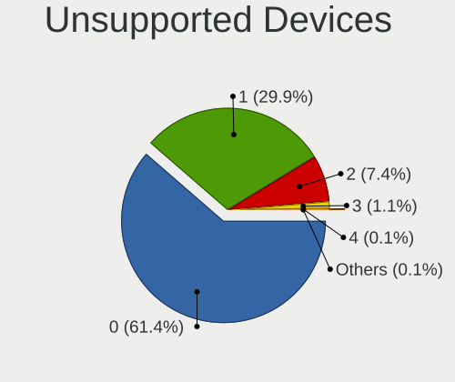

| Total | Notebooks | Percent |
|-------|-----------|---------|
| 0     | 3972      | 61.38%  |
| 1     | 1934      | 29.89%  |
| 2     | 476       | 7.36%   |
| 3     | 73        | 1.13%   |
| 4     | 8         | 0.12%   |
| 5     | 4         | 0.06%   |
| 7     | 2         | 0.03%   |
| 8     | 1         | 0.02%   |
| 6     | 1         | 0.02%   |

Unsupported Device Types
------------------------

Types of unsupported devices

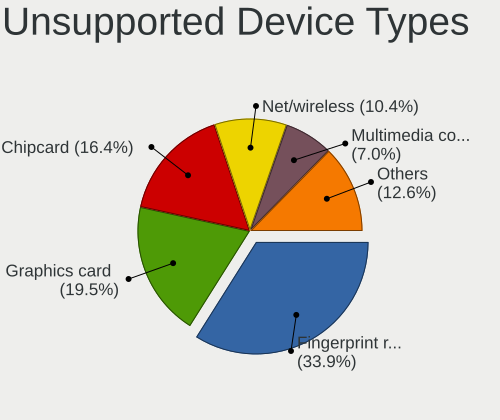

| Type                     | Notebooks | Percent |
|--------------------------|-----------|---------|
| Fingerprint reader       | 1047      | 33.95%  |
| Graphics card            | 601       | 19.49%  |
| Chipcard                 | 507       | 16.44%  |
| Net/wireless             | 322       | 10.44%  |
| Multimedia controller    | 217       | 7.04%   |
| Camera                   | 64        | 2.08%   |
| Communication controller | 60        | 1.95%   |
| Bluetooth                | 58        | 1.88%   |
| Storage                  | 56        | 1.82%   |
| Card reader              | 33        | 1.07%   |
| Sound                    | 31        | 1.01%   |
| Net/ethernet             | 31        | 1.01%   |
| Modem                    | 21        | 0.68%   |
| Network                  | 10        | 0.32%   |
| Flash memory             | 9         | 0.29%   |
| Firewire controller      | 6         | 0.19%   |
| Storage/nvme             | 4         | 0.13%   |
| Unassigned class         | 3         | 0.1%    |
| Storage/ide              | 2         | 0.06%   |
| Storage/raid             | 1         | 0.03%   |
| Dvb card                 | 1         | 0.03%   |

