Linux in UK - Tested Hardware & Statistics (Notebooks)
------------------------------------------------------

A project to collect tested hardware configurations for Linux in UK.

Anyone can contribute to this report by the [hw-probe](https://github.com/linuxhw/hw-probe) tool:

    sudo -E hw-probe -all -upload

Please contribute! Especially if your hardware is rare.

Contents
--------

* [ Test Cases ](#test-cases)

* [ System ](#system)
  - [ OS                       ](#os)
  - [ OS Family                ](#os-family)
  - [ Kernel                   ](#kernel)
  - [ Kernel Family            ](#kernel-family)
  - [ Kernel Major Ver.        ](#kernel-major-ver)
  - [ Arch                     ](#arch)
  - [ DE                       ](#de)
  - [ Display Server           ](#display-server)
  - [ Display Manager          ](#display-manager)
  - [ OS Lang                  ](#os-lang)
  - [ Boot Mode                ](#boot-mode)
  - [ Filesystem               ](#filesystem)
  - [ Part. scheme             ](#part-scheme)
  - [ Dual Boot with Linux/BSD ](#dual-boot-with-linuxbsd)
  - [ Dual Boot (Win)          ](#dual-boot-win)

* [ Board ](#board)
  - [ Vendor                   ](#vendor)
  - [ Model                    ](#model)
  - [ Model Family             ](#model-family)
  - [ MFG Year                 ](#mfg-year)
  - [ Form Factor              ](#form-factor)
  - [ Secure Boot              ](#secure-boot)
  - [ Coreboot                 ](#coreboot)
  - [ RAM Size                 ](#ram-size)
  - [ RAM Used                 ](#ram-used)
  - [ Total Drives             ](#total-drives)
  - [ Has CD-ROM               ](#has-cd-rom)
  - [ Has Ethernet             ](#has-ethernet)
  - [ Has WiFi                 ](#has-wifi)
  - [ Has Bluetooth            ](#has-bluetooth)

* [ Location ](#location)
  - [ Country                  ](#country)
  - [ City                     ](#city)

* [ Drives ](#drives)
  - [ Drive Vendor             ](#drive-vendor)
  - [ Drive Model              ](#drive-model)
  - [ HDD Vendor               ](#hdd-vendor)
  - [ SSD Vendor               ](#ssd-vendor)
  - [ Drive Kind               ](#drive-kind)
  - [ Drive Connector          ](#drive-connector)
  - [ Drive Size               ](#drive-size)
  - [ Space Total              ](#space-total)
  - [ Space Used               ](#space-used)
  - [ Malfunc. Drives          ](#malfunc-drives)
  - [ Malfunc. Drive Vendor    ](#malfunc-drive-vendor)
  - [ Malfunc. HDD Vendor      ](#malfunc-hdd-vendor)
  - [ Malfunc. Drive Kind      ](#malfunc-drive-kind)
  - [ Failed Drives            ](#failed-drives)
  - [ Failed Drive Vendor      ](#failed-drive-vendor)
  - [ Drive Status             ](#drive-status)

* [ Storage controller ](#storage-controller)
  - [ Storage Vendor           ](#storage-vendor)
  - [ Storage Model            ](#storage-model)
  - [ Storage Kind             ](#storage-kind)

* [ Processor ](#processor)
  - [ CPU Vendor               ](#cpu-vendor)
  - [ CPU Model                ](#cpu-model)
  - [ CPU Model Family         ](#cpu-model-family)
  - [ CPU Cores                ](#cpu-cores)
  - [ CPU Sockets              ](#cpu-sockets)
  - [ CPU Threads              ](#cpu-threads)
  - [ CPU Op-Modes             ](#cpu-op-modes)
  - [ CPU Microcode            ](#cpu-microcode)
  - [ CPU Microarch            ](#cpu-microarch)

* [ Graphics ](#graphics)
  - [ GPU Vendor               ](#gpu-vendor)
  - [ GPU Model                ](#gpu-model)
  - [ GPU Combo                ](#gpu-combo)
  - [ GPU Driver               ](#gpu-driver)
  - [ GPU Memory               ](#gpu-memory)

* [ Monitor ](#monitor)
  - [ Monitor Vendor           ](#monitor-vendor)
  - [ Monitor Model            ](#monitor-model)
  - [ Monitor Resolution       ](#monitor-resolution)
  - [ Monitor Diagonal         ](#monitor-diagonal)
  - [ Monitor Width            ](#monitor-width)
  - [ Aspect Ratio             ](#aspect-ratio)
  - [ Monitor Area             ](#monitor-area)
  - [ Pixel Density            ](#pixel-density)
  - [ Multiple Monitors        ](#multiple-monitors)

* [ Network ](#network)
  - [ Net Controller Vendor    ](#net-controller-vendor)
  - [ Net Controller Model     ](#net-controller-model)
  - [ Wireless Vendor          ](#wireless-vendor)
  - [ Wireless Model           ](#wireless-model)
  - [ Ethernet Vendor          ](#ethernet-vendor)
  - [ Ethernet Model           ](#ethernet-model)
  - [ Net Controller Kind      ](#net-controller-kind)
  - [ Used Controller          ](#used-controller)
  - [ NICs                     ](#nics)
  - [ IPv6                     ](#ipv6)

* [ Bluetooth ](#bluetooth)
  - [ Bluetooth Vendor         ](#bluetooth-vendor)
  - [ Bluetooth Model          ](#bluetooth-model)

* [ Sound ](#sound)
  - [ Sound Vendor             ](#sound-vendor)
  - [ Sound Model              ](#sound-model)

* [ Memory ](#memory)
  - [ Memory Vendor            ](#memory-vendor)
  - [ Memory Model             ](#memory-model)
  - [ Memory Kind              ](#memory-kind)
  - [ Memory Form Factor       ](#memory-form-factor)
  - [ Memory Size              ](#memory-size)
  - [ Memory Speed             ](#memory-speed)

* [ Printers & scanners ](#printers--scanners)
  - [ Printer Vendor           ](#printer-vendor)
  - [ Printer Model            ](#printer-model)
  - [ Scanner Vendor           ](#scanner-vendor)
  - [ Scanner Model            ](#scanner-model)

* [ Camera ](#camera)
  - [ Camera Vendor            ](#camera-vendor)
  - [ Camera Model             ](#camera-model)

* [ Security ](#security)
  - [ Fingerprint Vendor       ](#fingerprint-vendor)
  - [ Fingerprint Model        ](#fingerprint-model)
  - [ Chipcard Vendor          ](#chipcard-vendor)
  - [ Chipcard Model           ](#chipcard-model)

* [ Unsupported ](#unsupported)
  - [ Unsupported Devices      ](#unsupported-devices)
  - [ Unsupported Device Types ](#unsupported-device-types)

Test Cases
----------

Total: 6898

| Vendor        | Model                       | Probe                                                      | Date         |
|---------------|-----------------------------|------------------------------------------------------------|--------------|
| HP            | EliteBook 840 G1            | [369a002b88](https://linux-hardware.org/?probe=369a002b88) | May 09, 2024 |
| Valve         | Jupiter                     | [18c9c24ecb](https://linux-hardware.org/?probe=18c9c24ecb) | May 09, 2024 |
| Samsung       | 960XGK                      | [4c22b1ca3a](https://linux-hardware.org/?probe=4c22b1ca3a) | May 09, 2024 |
| Dell          | Latitude 5530               | [f91e424e6d](https://linux-hardware.org/?probe=f91e424e6d) | May 08, 2024 |
| Linx          | LINX1010B                   | [782fb4ec65](https://linux-hardware.org/?probe=782fb4ec65) | May 08, 2024 |
| AWOW          | AK41                        | [21d739c59c](https://linux-hardware.org/?probe=21d739c59c) | May 07, 2024 |
| Acer          | Aspire A515-45              | [c9dab30ab0](https://linux-hardware.org/?probe=c9dab30ab0) | May 07, 2024 |
| HP            | ProBook 430 G8 Notebook ... | [be061de1c7](https://linux-hardware.org/?probe=be061de1c7) | May 07, 2024 |
| ASUSTek       | VivoBook_ASUSLaptop M760... | [773ca4f9c9](https://linux-hardware.org/?probe=773ca4f9c9) | May 06, 2024 |
| ASUSTek       | VivoBook_ASUSLaptop M760... | [0104fa9a83](https://linux-hardware.org/?probe=0104fa9a83) | May 06, 2024 |
| Lenovo        | ThinkPad Helix 36986CG      | [9b2bd77573](https://linux-hardware.org/?probe=9b2bd77573) | May 06, 2024 |
| Linx          | LINX1010B                   | [5abe12bf84](https://linux-hardware.org/?probe=5abe12bf84) | May 06, 2024 |
| Star Labs     | StarBook                    | [7e37692a50](https://linux-hardware.org/?probe=7e37692a50) | May 06, 2024 |
| ASUSTek       | VivoBook_ASUSLaptop X513... | [d4cca237f2](https://linux-hardware.org/?probe=d4cca237f2) | May 06, 2024 |
| Lenovo        | IdeaPad Pro 5 14AHP9 83D... | [f8f3623eac](https://linux-hardware.org/?probe=f8f3623eac) | May 06, 2024 |
| ASUSTek       | VivoBook_ASUSLaptop X513... | [e5685451f5](https://linux-hardware.org/?probe=e5685451f5) | May 06, 2024 |
| Lenovo        | IdeaPad 330-15IKB 81DC      | [bc2508bd91](https://linux-hardware.org/?probe=bc2508bd91) | May 06, 2024 |
| Alienware     | x17 R2                      | [ed5c24948b](https://linux-hardware.org/?probe=ed5c24948b) | May 06, 2024 |
| Alienware     | x17 R2                      | [a920973ad3](https://linux-hardware.org/?probe=a920973ad3) | May 06, 2024 |
| Lenovo        | Yoga Slim 7-14ARE05 82A2    | [c931a1a446](https://linux-hardware.org/?probe=c931a1a446) | May 05, 2024 |
| Lenovo        | ThinkPad T470s 20HFS1SW0... | [e27c636616](https://linux-hardware.org/?probe=e27c636616) | May 05, 2024 |
| Acer          | Lars                        | [6ec82dab78](https://linux-hardware.org/?probe=6ec82dab78) | May 05, 2024 |
| Lenovo        | ThinkPad T470s 20HFS1SW0... | [bd41e79881](https://linux-hardware.org/?probe=bd41e79881) | May 05, 2024 |
| Lenovo        | ThinkPad T480 20L50011US    | [06d6c1d0e2](https://linux-hardware.org/?probe=06d6c1d0e2) | May 05, 2024 |
| Dell          | Latitude 3420               | [a28c6852fe](https://linux-hardware.org/?probe=a28c6852fe) | May 05, 2024 |
| Dell          | Latitude E6330              | [02c85088bc](https://linux-hardware.org/?probe=02c85088bc) | May 03, 2024 |
| Dell          | XPS 15 9530                 | [b46ba9168c](https://linux-hardware.org/?probe=b46ba9168c) | May 03, 2024 |
| Dell          | Latitude 3420               | [e0415e052f](https://linux-hardware.org/?probe=e0415e052f) | May 03, 2024 |
| Dell          | Latitude 7410               | [959e9d053d](https://linux-hardware.org/?probe=959e9d053d) | May 03, 2024 |
| Dell          | Latitude E6540              | [186de5be73](https://linux-hardware.org/?probe=186de5be73) | May 03, 2024 |
| Lenovo        | ThinkPad X1 Carbon 6th 2... | [e02873ea23](https://linux-hardware.org/?probe=e02873ea23) | May 02, 2024 |
| HP            | Dragonfly 13.5 inch G4 N... | [0a75b86ae0](https://linux-hardware.org/?probe=0a75b86ae0) | May 02, 2024 |
| Apple         | MacBookPro11,4              | [e4b5fb0f12](https://linux-hardware.org/?probe=e4b5fb0f12) | May 01, 2024 |
| Dell          | Inspiron 5559               | [8a00241444](https://linux-hardware.org/?probe=8a00241444) | May 01, 2024 |
| Samsung       | 550P5C/550P7C               | [c8bdddb366](https://linux-hardware.org/?probe=c8bdddb366) | May 01, 2024 |
| Lenovo        | ThinkPad X200s 7469W92      | [687cc00e33](https://linux-hardware.org/?probe=687cc00e33) | May 01, 2024 |
| Apple         | MacBookPro10,2              | [57baecb0a5](https://linux-hardware.org/?probe=57baecb0a5) | May 01, 2024 |
| XIAOMI        | Redmi Book Pro 14 2024      | [459594827a](https://linux-hardware.org/?probe=459594827a) | Apr 30, 2024 |
| HP            | Laptop 15-da0xxx            | [1d5c1bf00e](https://linux-hardware.org/?probe=1d5c1bf00e) | Apr 30, 2024 |
| Lenovo        | Z70-80 80FG                 | [4a07e72bf5](https://linux-hardware.org/?probe=4a07e72bf5) | Apr 30, 2024 |
| Apple         | MacBookPro10,2              | [f80fe988f5](https://linux-hardware.org/?probe=f80fe988f5) | Apr 30, 2024 |
| Dell          | Latitude D630               | [c9ae85eecc](https://linux-hardware.org/?probe=c9ae85eecc) | Apr 30, 2024 |
| Lenovo        | IdeaPad S145-15IWL 81MV     | [9b282865ea](https://linux-hardware.org/?probe=9b282865ea) | Apr 28, 2024 |
| MSI           | MS-7D46                     | [135fa9337a](https://linux-hardware.org/?probe=135fa9337a) | Apr 28, 2024 |
| Dell          | Latitude 5420               | [0a95f2013b](https://linux-hardware.org/?probe=0a95f2013b) | Apr 28, 2024 |
| Star Labs     | StarBook                    | [99017e5822](https://linux-hardware.org/?probe=99017e5822) | Apr 28, 2024 |
| Lenovo        | ThinkPad X395 20NMS1KY02    | [48385039f1](https://linux-hardware.org/?probe=48385039f1) | Apr 28, 2024 |
| Lenovo        | IdeaPad 3 15ITL6 82H8       | [ca7df399fe](https://linux-hardware.org/?probe=ca7df399fe) | Apr 27, 2024 |
| Acer          | Aspire 5735                 | [bb36d187d1](https://linux-hardware.org/?probe=bb36d187d1) | Apr 27, 2024 |
| ASUSTek       | Zenbook UX3402VA_UX3402V... | [567613b6b6](https://linux-hardware.org/?probe=567613b6b6) | Apr 27, 2024 |
| Lenovo        | ThinkPad T480 20L6SA5Q1L    | [1498235a91](https://linux-hardware.org/?probe=1498235a91) | Apr 27, 2024 |
| Lenovo        | V130-15IKB 81HN             | [7bcb7c8c7f](https://linux-hardware.org/?probe=7bcb7c8c7f) | Apr 27, 2024 |
| Dell          | XPS 15 9560                 | [85005d847f](https://linux-hardware.org/?probe=85005d847f) | Apr 27, 2024 |
| Samsung       | 750XED                      | [dc5ed7dd87](https://linux-hardware.org/?probe=dc5ed7dd87) | Apr 26, 2024 |
| Acer          | Aspire A315-31              | [252cddf085](https://linux-hardware.org/?probe=252cddf085) | Apr 26, 2024 |
| Apple         | MacBookAir7,2               | [cf8aa1d23a](https://linux-hardware.org/?probe=cf8aa1d23a) | Apr 26, 2024 |
| Notebook      | NV4xPZ                      | [f7e4f166f0](https://linux-hardware.org/?probe=f7e4f166f0) | Apr 25, 2024 |
| HP            | EliteBook 745 G2            | [3386466743](https://linux-hardware.org/?probe=3386466743) | Apr 25, 2024 |
| Acer          | Aspire A314-23P             | [cfe8e7fdae](https://linux-hardware.org/?probe=cfe8e7fdae) | Apr 24, 2024 |
| Acer          | Aspire 5739G                | [cd8bc25688](https://linux-hardware.org/?probe=cd8bc25688) | Apr 23, 2024 |
| Apple         | MacBookPro8,2               | [965595373d](https://linux-hardware.org/?probe=965595373d) | Apr 23, 2024 |
| Acer          | Aspire 5750G                | [a35bd4ad42](https://linux-hardware.org/?probe=a35bd4ad42) | Apr 23, 2024 |
| Acer          | Swift SF314-43              | [0add5a8f6d](https://linux-hardware.org/?probe=0add5a8f6d) | Apr 23, 2024 |
| Toshiba       | Satellite C55-B             | [031e71aea3](https://linux-hardware.org/?probe=031e71aea3) | Apr 23, 2024 |
| Apple         | MacBookAir6,2               | [a487d49316](https://linux-hardware.org/?probe=a487d49316) | Apr 22, 2024 |
| Dell          | Precision 5530              | [7e2d09b398](https://linux-hardware.org/?probe=7e2d09b398) | Apr 22, 2024 |
| Valve         | Jupiter                     | [53f25f4dba](https://linux-hardware.org/?probe=53f25f4dba) | Apr 22, 2024 |
| Valve         | Jupiter                     | [665861dbf9](https://linux-hardware.org/?probe=665861dbf9) | Apr 22, 2024 |
| Apple         | MacBookPro7,1               | [dda370ba40](https://linux-hardware.org/?probe=dda370ba40) | Apr 21, 2024 |
| Lenovo        | Legion 5 15IAH7H 82RB       | [fa1738d688](https://linux-hardware.org/?probe=fa1738d688) | Apr 21, 2024 |
| Dell          | Precision 5750              | [778f264bea](https://linux-hardware.org/?probe=778f264bea) | Apr 20, 2024 |
| Valve         | Jupiter                     | [bc9b5cbcc5](https://linux-hardware.org/?probe=bc9b5cbcc5) | Apr 20, 2024 |
| HP            | Laptop 15s-eq1xxx           | [9622d53999](https://linux-hardware.org/?probe=9622d53999) | Apr 20, 2024 |
| HP            | Pavilion Gaming Laptop 1... | [82a3685099](https://linux-hardware.org/?probe=82a3685099) | Apr 20, 2024 |
| Lenovo        | ThinkPad X260 20F5S4CC00    | [56a80212e2](https://linux-hardware.org/?probe=56a80212e2) | Apr 20, 2024 |
| Dell          | Inspiron 5577               | [e3f9a3a5ad](https://linux-hardware.org/?probe=e3f9a3a5ad) | Apr 20, 2024 |
| Acer          | Aspire A315-31              | [d9c7cb3ef3](https://linux-hardware.org/?probe=d9c7cb3ef3) | Apr 19, 2024 |
| Valve         | Jupiter                     | [8cbd37a2d2](https://linux-hardware.org/?probe=8cbd37a2d2) | Apr 19, 2024 |
| Dell          | Inspiron 5577               | [f328c7d8f4](https://linux-hardware.org/?probe=f328c7d8f4) | Apr 19, 2024 |
| Lenovo        | ThinkBook 16p Gen 4 21J8    | [f15e68d490](https://linux-hardware.org/?probe=f15e68d490) | Apr 19, 2024 |
| Lenovo        | ThinkPad T480s 20L8S7890... | [7af4a3ded9](https://linux-hardware.org/?probe=7af4a3ded9) | Apr 19, 2024 |
| HP            | 250 G7 Notebook PC          | [a52eb532e3](https://linux-hardware.org/?probe=a52eb532e3) | Apr 19, 2024 |
| Lenovo        | G50-80 80E5                 | [5de5267a1a](https://linux-hardware.org/?probe=5de5267a1a) | Apr 19, 2024 |
| Lenovo        | ThinkPad X1 Carbon 6th 2... | [aaef73d221](https://linux-hardware.org/?probe=aaef73d221) | Apr 18, 2024 |
| Lenovo        | Legion Y9000P IRX8 82WK     | [3d61f319c2](https://linux-hardware.org/?probe=3d61f319c2) | Apr 18, 2024 |
| Valve         | Jupiter                     | [04d302c0e5](https://linux-hardware.org/?probe=04d302c0e5) | Apr 16, 2024 |
| Lenovo        | V15 G3 ABA 82TV             | [6877dcd901](https://linux-hardware.org/?probe=6877dcd901) | Apr 16, 2024 |
| HP            | Dragonfly 13.5 inch G4 N... | [ef4af44bc8](https://linux-hardware.org/?probe=ef4af44bc8) | Apr 16, 2024 |
| Apple         | MacBookPro8,2               | [2e79d9d11e](https://linux-hardware.org/?probe=2e79d9d11e) | Apr 16, 2024 |
| Lenovo        | IdeaPad Gaming 3 15ARH7 ... | [54ea7f1e25](https://linux-hardware.org/?probe=54ea7f1e25) | Apr 16, 2024 |
| Lenovo        | Legion 5 15IAH7H 82RB       | [85f088ac78](https://linux-hardware.org/?probe=85f088ac78) | Apr 15, 2024 |
| ASUSTek       | Vivobook Go E1504GAB_E15... | [a1f52176e4](https://linux-hardware.org/?probe=a1f52176e4) | Apr 15, 2024 |
| HP            | OMEN by Laptop 16-c0xxx     | [c249f10628](https://linux-hardware.org/?probe=c249f10628) | Apr 15, 2024 |
| HP            | Laptop 17-ca0xxx            | [8a4f14c3c5](https://linux-hardware.org/?probe=8a4f14c3c5) | Apr 14, 2024 |
| Valve         | Jupiter                     | [211106f4c1](https://linux-hardware.org/?probe=211106f4c1) | Apr 14, 2024 |
| HP            | G56                         | [260bef5db7](https://linux-hardware.org/?probe=260bef5db7) | Apr 14, 2024 |
| HP            | EliteBook 8570w             | [56b69c4112](https://linux-hardware.org/?probe=56b69c4112) | Apr 14, 2024 |
| PC Special... | Standard                    | [568cb066aa](https://linux-hardware.org/?probe=568cb066aa) | Apr 14, 2024 |
| ASUSTek       | X551CA                      | [5bf06a6ae1](https://linux-hardware.org/?probe=5bf06a6ae1) | Apr 14, 2024 |
| Acer          | Aspire 5720                 | [015bf8aebc](https://linux-hardware.org/?probe=015bf8aebc) | Apr 13, 2024 |
| Valve         | Jupiter                     | [8b4172f55b](https://linux-hardware.org/?probe=8b4172f55b) | Apr 13, 2024 |
| HP            | Pavilion Notebook           | [fd68b6da34](https://linux-hardware.org/?probe=fd68b6da34) | Apr 13, 2024 |
| Lenovo        | IdeaPad 5 Pro 16ARH7 82S... | [858512aecf](https://linux-hardware.org/?probe=858512aecf) | Apr 12, 2024 |
| Lenovo        | Yoga 510-14AST 80S9         | [19e925f1df](https://linux-hardware.org/?probe=19e925f1df) | Apr 12, 2024 |
| Lenovo        | ThinkPad W540 20BG0044UK    | [45c92186a6](https://linux-hardware.org/?probe=45c92186a6) | Apr 12, 2024 |
| Packard Be... | EasyNote TJ66               | [8fd06fed5d](https://linux-hardware.org/?probe=8fd06fed5d) | Apr 12, 2024 |
| Acer          | Aspire A515-44              | [bcff49116b](https://linux-hardware.org/?probe=bcff49116b) | Apr 11, 2024 |
| Acer          | Aspire 5742Z                | [f9ceb71c71](https://linux-hardware.org/?probe=f9ceb71c71) | Apr 11, 2024 |
| Apple         | MacBookPro11,1              | [4e18f485f3](https://linux-hardware.org/?probe=4e18f485f3) | Apr 11, 2024 |
| HP            | 15                          | [1d363becea](https://linux-hardware.org/?probe=1d363becea) | Apr 11, 2024 |
| Acer          | Swift SF314-43              | [a02fa9c7cf](https://linux-hardware.org/?probe=a02fa9c7cf) | Apr 11, 2024 |
| HP            | G56                         | [bd50fcdb8b](https://linux-hardware.org/?probe=bd50fcdb8b) | Apr 11, 2024 |
| Lenovo        | ThinkPad T430 2349SA2       | [f892422654](https://linux-hardware.org/?probe=f892422654) | Apr 10, 2024 |
| Apple         | MacBookAir5,2               | [0ac2328adf](https://linux-hardware.org/?probe=0ac2328adf) | Apr 10, 2024 |
| Dell          | G3 3590                     | [6b282a982e](https://linux-hardware.org/?probe=6b282a982e) | Apr 09, 2024 |
| Framework     | Laptop 13 (AMD Ryzen 704... | [31a1ed634f](https://linux-hardware.org/?probe=31a1ed634f) | Apr 09, 2024 |
| HP            | ProBook 455 G2              | [431349da41](https://linux-hardware.org/?probe=431349da41) | Apr 08, 2024 |
| Lenovo        | ThinkPad T470 W10DG 20JN... | [1da57352b2](https://linux-hardware.org/?probe=1da57352b2) | Apr 08, 2024 |
| Dell          | Latitude 3510               | [ce45e0d9c4](https://linux-hardware.org/?probe=ce45e0d9c4) | Apr 08, 2024 |
| HP            | EliteBook 840 G1            | [d4188e8112](https://linux-hardware.org/?probe=d4188e8112) | Apr 08, 2024 |
| Dell          | Precision 7680              | [598c6ee3bf](https://linux-hardware.org/?probe=598c6ee3bf) | Apr 08, 2024 |
| Lenovo        | Legion Slim 5 16APH8 82Y... | [1822926856](https://linux-hardware.org/?probe=1822926856) | Apr 07, 2024 |
| Lenovo        | ThinkPad T400 6474W7T       | [5b8f0f590e](https://linux-hardware.org/?probe=5b8f0f590e) | Apr 07, 2024 |
| Notebook      | NS5x_NS7xAU                 | [782d5db9e2](https://linux-hardware.org/?probe=782d5db9e2) | Apr 06, 2024 |
| Dell          | Latitude 7290               | [e8f80ff545](https://linux-hardware.org/?probe=e8f80ff545) | Apr 06, 2024 |
| HP            | Notebook                    | [414230182b](https://linux-hardware.org/?probe=414230182b) | Apr 06, 2024 |
| ASUSTek       | Zenbook UX3402VA_UX3402V... | [7acb8cd69d](https://linux-hardware.org/?probe=7acb8cd69d) | Apr 06, 2024 |
| Lenovo        | ThinkPad T420 4180WA8       | [b8975f4296](https://linux-hardware.org/?probe=b8975f4296) | Apr 06, 2024 |
| Dell          | Latitude E7450              | [1a06ba1a2e](https://linux-hardware.org/?probe=1a06ba1a2e) | Apr 06, 2024 |
| Dell          | Latitude E6420              | [eca4b4100e](https://linux-hardware.org/?probe=eca4b4100e) | Apr 05, 2024 |
| Apple         | MacBookPro12,1              | [0e37beebd4](https://linux-hardware.org/?probe=0e37beebd4) | Apr 05, 2024 |
| Apple         | MacBookPro12,1              | [2c20f368e3](https://linux-hardware.org/?probe=2c20f368e3) | Apr 05, 2024 |
| ASUSTek       | ROG Strix G513QY_G513QY     | [6c1225353c](https://linux-hardware.org/?probe=6c1225353c) | Apr 04, 2024 |
| ASUSTek       | VivoBook_ASUSLaptop K340... | [9f95bff2eb](https://linux-hardware.org/?probe=9f95bff2eb) | Apr 04, 2024 |
| Valve         | Jupiter                     | [e7ac70b5b9](https://linux-hardware.org/?probe=e7ac70b5b9) | Apr 04, 2024 |
| Lenovo        | ThinkPad P50 20EQS0VV2S     | [a17e93d593](https://linux-hardware.org/?probe=a17e93d593) | Apr 04, 2024 |
| Lenovo        | ThinkPad P50 20EQS0VV2S     | [9111938298](https://linux-hardware.org/?probe=9111938298) | Apr 04, 2024 |
| HP            | Notebook                    | [3807895bea](https://linux-hardware.org/?probe=3807895bea) | Apr 03, 2024 |
| HP            | Notebook                    | [54680ba99a](https://linux-hardware.org/?probe=54680ba99a) | Apr 03, 2024 |
| Dell          | Latitude D630               | [f59eb192f4](https://linux-hardware.org/?probe=f59eb192f4) | Apr 03, 2024 |
| HP            | EliteBook 840 G4            | [f7c3e17f2e](https://linux-hardware.org/?probe=f7c3e17f2e) | Apr 03, 2024 |
| ASUSTek       | ROG Zephyrus M16 GU604VY... | [7d3a698648](https://linux-hardware.org/?probe=7d3a698648) | Apr 02, 2024 |
| Lenovo        | ThinkPad L15 Gen 3 21C3C... | [c93fd72584](https://linux-hardware.org/?probe=c93fd72584) | Apr 01, 2024 |
| HP            | Pavilion Laptop 15-eh0xx... | [d028b72b84](https://linux-hardware.org/?probe=d028b72b84) | Apr 01, 2024 |
| HP            | Pavilion Laptop 15-eh0xx... | [2c3e57a75a](https://linux-hardware.org/?probe=2c3e57a75a) | Apr 01, 2024 |
| Lenovo        | ThinkPad L13 Gen 2 20VH0... | [e867d4d614](https://linux-hardware.org/?probe=e867d4d614) | Apr 01, 2024 |
| Dell          | Precision M6700             | [9895312396](https://linux-hardware.org/?probe=9895312396) | Mar 31, 2024 |
| Dell          | XPS 15 9560                 | [5ea1dc6342](https://linux-hardware.org/?probe=5ea1dc6342) | Mar 31, 2024 |
| Lenovo        | IdeaPad S340-14API 81NB     | [b6bb7745a9](https://linux-hardware.org/?probe=b6bb7745a9) | Mar 30, 2024 |
| Dell          | Inspiron N5040              | [79c89f3881](https://linux-hardware.org/?probe=79c89f3881) | Mar 30, 2024 |
| Lenovo        | VIWZ1                       | [c62b77ffa8](https://linux-hardware.org/?probe=c62b77ffa8) | Mar 30, 2024 |
| Lenovo        | VIWZ1                       | [8ab6be2fcb](https://linux-hardware.org/?probe=8ab6be2fcb) | Mar 30, 2024 |
| Acer          | Swift SF514-54T             | [5bced3bdd2](https://linux-hardware.org/?probe=5bced3bdd2) | Mar 30, 2024 |
| Lenovo        | IdeaPad Slim 5 16IAH8 83... | [58067ce226](https://linux-hardware.org/?probe=58067ce226) | Mar 29, 2024 |
| Acer          | Swift SFX14-51G             | [a0aaa7eb1d](https://linux-hardware.org/?probe=a0aaa7eb1d) | Mar 29, 2024 |
| HP            | EliteBook 745 G2            | [8d1226791a](https://linux-hardware.org/?probe=8d1226791a) | Mar 29, 2024 |
| Lenovo        | ThinkPad T490s 20NYS41L0... | [2fcbfc4400](https://linux-hardware.org/?probe=2fcbfc4400) | Mar 29, 2024 |
| Google        | Omnigul                     | [d65c76c19f](https://linux-hardware.org/?probe=d65c76c19f) | Mar 28, 2024 |
| Lenovo        | ThinkPad W541 20EGS24300    | [b9b3f86a33](https://linux-hardware.org/?probe=b9b3f86a33) | Mar 27, 2024 |
| Fujitsu       | LIFEBOOK T902               | [bf4d3d25ce](https://linux-hardware.org/?probe=bf4d3d25ce) | Mar 27, 2024 |
| Lenovo        | ThinkPad X240 20AMS3YC00    | [570dc2f6e9](https://linux-hardware.org/?probe=570dc2f6e9) | Mar 27, 2024 |
| Lenovo        | ThinkPad W500 40623CG       | [71c868292f](https://linux-hardware.org/?probe=71c868292f) | Mar 27, 2024 |
| ASUSTek       | VivoBook_ASUSLaptop M160... | [96680ae64f](https://linux-hardware.org/?probe=96680ae64f) | Mar 26, 2024 |
| Lenovo        | Yoga Pro 9 16IRP8 83BY      | [eadf31071a](https://linux-hardware.org/?probe=eadf31071a) | Mar 26, 2024 |
| Lenovo        | ThinkPad W500 40623CG       | [01d1ef9c31](https://linux-hardware.org/?probe=01d1ef9c31) | Mar 26, 2024 |
| HP            | Pavilion g6                 | [79088d1376](https://linux-hardware.org/?probe=79088d1376) | Mar 26, 2024 |
| HP            | EliteBook 8440p             | [745804f2b5](https://linux-hardware.org/?probe=745804f2b5) | Mar 26, 2024 |
| Toshiba       | Satellite Pro L500          | [61988ef678](https://linux-hardware.org/?probe=61988ef678) | Mar 25, 2024 |
| HP            | Compaq nc2400(#ABU)         | [85a21cc1c5](https://linux-hardware.org/?probe=85a21cc1c5) | Mar 25, 2024 |
| HP            | Compaq nc2400(#ABU)         | [90fd001469](https://linux-hardware.org/?probe=90fd001469) | Mar 25, 2024 |
| Lenovo        | G50-80 80E5                 | [0545e1229e](https://linux-hardware.org/?probe=0545e1229e) | Mar 25, 2024 |
| Dell          | Latitude E7440              | [cc5ef95d09](https://linux-hardware.org/?probe=cc5ef95d09) | Mar 24, 2024 |
| Lenovo        | 330S-15ARR 81FB             | [664ff42149](https://linux-hardware.org/?probe=664ff42149) | Mar 24, 2024 |
| HP            | Pavilion g6                 | [49d0c7348f](https://linux-hardware.org/?probe=49d0c7348f) | Mar 24, 2024 |
| HP            | Pavilion Notebook           | [e62db03c76](https://linux-hardware.org/?probe=e62db03c76) | Mar 24, 2024 |
| HP            | EliteBook 840 G4            | [c29d13bf92](https://linux-hardware.org/?probe=c29d13bf92) | Mar 24, 2024 |
| Alienware     | 17                          | [86e6b77d19](https://linux-hardware.org/?probe=86e6b77d19) | Mar 24, 2024 |
| Dell          | Precision 7760              | [e432f01569](https://linux-hardware.org/?probe=e432f01569) | Mar 24, 2024 |
| Lenovo        | ThinkPad X230 2325PB3       | [399c0cd75c](https://linux-hardware.org/?probe=399c0cd75c) | Mar 23, 2024 |
| Alienware     | 17                          | [25ffdc63d3](https://linux-hardware.org/?probe=25ffdc63d3) | Mar 23, 2024 |
| Apple         | MacBookPro8,1               | [44bf0e419e](https://linux-hardware.org/?probe=44bf0e419e) | Mar 23, 2024 |
| Dell          | Latitude 7200 2-in-1        | [da999a3975](https://linux-hardware.org/?probe=da999a3975) | Mar 23, 2024 |
| Lenovo        | 330S-15ARR 81FB             | [b825f202f8](https://linux-hardware.org/?probe=b825f202f8) | Mar 22, 2024 |
| Samsung       | 350V5C/351V5C/3540VC/344... | [e582f6599b](https://linux-hardware.org/?probe=e582f6599b) | Mar 22, 2024 |
| Lenovo        | Legion 5 15IMH05 82AU       | [8f337fc42f](https://linux-hardware.org/?probe=8f337fc42f) | Mar 22, 2024 |
| HP            | EliteBook 2560p             | [3508c82d1d](https://linux-hardware.org/?probe=3508c82d1d) | Mar 22, 2024 |
| Dell          | Latitude 5400               | [041cf3061b](https://linux-hardware.org/?probe=041cf3061b) | Mar 22, 2024 |
| Dell          | Latitude 7390               | [ded1cffb21](https://linux-hardware.org/?probe=ded1cffb21) | Mar 22, 2024 |
| Acer          | Lars                        | [6e1b695926](https://linux-hardware.org/?probe=6e1b695926) | Mar 21, 2024 |
| Dell          | Latitude 5400               | [b387cc5494](https://linux-hardware.org/?probe=b387cc5494) | Mar 21, 2024 |
| Lenovo        | ThinkPad T540p 20BE003YU... | [2bcb8453c8](https://linux-hardware.org/?probe=2bcb8453c8) | Mar 21, 2024 |
| HP            | 255 G8 Notebook PC          | [0293382f9b](https://linux-hardware.org/?probe=0293382f9b) | Mar 21, 2024 |
| Samsung       | 350V5C/351V5C/3540VC/344... | [0c5fd0d8b3](https://linux-hardware.org/?probe=0c5fd0d8b3) | Mar 21, 2024 |
| Lenovo        | ThinkPad T440p              | [39d16a18ec](https://linux-hardware.org/?probe=39d16a18ec) | Mar 21, 2024 |
| Dell          | Latitude E6540              | [9b1a9a909f](https://linux-hardware.org/?probe=9b1a9a909f) | Mar 21, 2024 |
| Acer          | Aspire 3830T                | [5b2e783c06](https://linux-hardware.org/?probe=5b2e783c06) | Mar 21, 2024 |
| Dell          | Vostro 3550                 | [2b22941abc](https://linux-hardware.org/?probe=2b22941abc) | Mar 21, 2024 |
| HP            | Pavilion 15                 | [652cdc4ff9](https://linux-hardware.org/?probe=652cdc4ff9) | Mar 20, 2024 |
| HP            | Pavilion Notebook           | [3870ad9d3b](https://linux-hardware.org/?probe=3870ad9d3b) | Mar 20, 2024 |
| Framework     | Laptop (12th Gen Intel C... | [65d705c744](https://linux-hardware.org/?probe=65d705c744) | Mar 20, 2024 |
| ASUSTek       | ASUS Zenbook 14 UX3405MA... | [09805af67f](https://linux-hardware.org/?probe=09805af67f) | Mar 20, 2024 |
| Lenovo        | ThinkPad P53s 20N6001GGE    | [c4bc693f1f](https://linux-hardware.org/?probe=c4bc693f1f) | Mar 19, 2024 |
| Acer          | Aspire A314-23P             | [f7b12c681f](https://linux-hardware.org/?probe=f7b12c681f) | Mar 19, 2024 |
| Dell          | XPS 13 9360                 | [75bac9573b](https://linux-hardware.org/?probe=75bac9573b) | Mar 19, 2024 |
| Notebook      | P750ZM                      | [30c729f817](https://linux-hardware.org/?probe=30c729f817) | Mar 19, 2024 |
| Apple         | MacBookPro8,2               | [2a946685c1](https://linux-hardware.org/?probe=2a946685c1) | Mar 18, 2024 |
| Dell          | XPS 13 9340                 | [7ce248eeb6](https://linux-hardware.org/?probe=7ce248eeb6) | Mar 18, 2024 |
| Lenovo        | ThinkPad T480s 20L8S15P0... | [f15cb961e4](https://linux-hardware.org/?probe=f15cb961e4) | Mar 18, 2024 |
| Dell          | XPS 9320                    | [8e33c8b2a6](https://linux-hardware.org/?probe=8e33c8b2a6) | Mar 18, 2024 |
| HP            | Laptop 15-fc0xxx            | [342e899479](https://linux-hardware.org/?probe=342e899479) | Mar 17, 2024 |
| Framework     | Laptop 13 (AMD Ryzen 704... | [664d7ed4b2](https://linux-hardware.org/?probe=664d7ed4b2) | Mar 17, 2024 |
| Dell          | Latitude E5440              | [4dfea625ba](https://linux-hardware.org/?probe=4dfea625ba) | Mar 17, 2024 |
| Lenovo        | ThinkPad E580 20KS001JUK    | [63eb058c79](https://linux-hardware.org/?probe=63eb058c79) | Mar 17, 2024 |
| Dell          | XPS 15 9510                 | [3eb0629810](https://linux-hardware.org/?probe=3eb0629810) | Mar 16, 2024 |
| Google        | Lick                        | [38f3dae4fc](https://linux-hardware.org/?probe=38f3dae4fc) | Mar 16, 2024 |
| AZW           | SEi                         | [943616dbd5](https://linux-hardware.org/?probe=943616dbd5) | Mar 16, 2024 |
| Dell          | XPS 17 9730                 | [eee424c6c6](https://linux-hardware.org/?probe=eee424c6c6) | Mar 16, 2024 |
| Lenovo        | ThinkPad X260 20F6006XUK    | [72eb92fb02](https://linux-hardware.org/?probe=72eb92fb02) | Mar 16, 2024 |
| Apple         | MacBookPro7,1               | [5f37f98222](https://linux-hardware.org/?probe=5f37f98222) | Mar 16, 2024 |
| Lenovo        | Legion 5 15ACH6H 82JU       | [494ed5303a](https://linux-hardware.org/?probe=494ed5303a) | Mar 16, 2024 |
| Lenovo        | ThinkBook 16 G6 ABP 21KK    | [80abcbac38](https://linux-hardware.org/?probe=80abcbac38) | Mar 15, 2024 |
| Lenovo        | G580 2689NKG                | [72113e8871](https://linux-hardware.org/?probe=72113e8871) | Mar 15, 2024 |
| GPD           | P3 MAX                      | [2e933fa77d](https://linux-hardware.org/?probe=2e933fa77d) | Mar 15, 2024 |
| Samsung       | RF511/RF411/RF711           | [5fd4cb28b2](https://linux-hardware.org/?probe=5fd4cb28b2) | Mar 15, 2024 |
| Lenovo        | ThinkPad X260 20F6006XUK    | [d1bf96e346](https://linux-hardware.org/?probe=d1bf96e346) | Mar 14, 2024 |
| Dell          | Inspiron 1545               | [300de7108e](https://linux-hardware.org/?probe=300de7108e) | Mar 14, 2024 |
| Lenovo        | ThinkPad T420 4236PFG       | [66167283a7](https://linux-hardware.org/?probe=66167283a7) | Mar 14, 2024 |
| OEGStone      | W55xEU                      | [b53accb464](https://linux-hardware.org/?probe=b53accb464) | Mar 14, 2024 |
| Jumper        | EZbook                      | [65469deb97](https://linux-hardware.org/?probe=65469deb97) | Mar 14, 2024 |
| Dell          | Latitude E7450              | [6535bea198](https://linux-hardware.org/?probe=6535bea198) | Mar 14, 2024 |
| LG Electro... | 17Z90P-K.AA75A1             | [654e886aea](https://linux-hardware.org/?probe=654e886aea) | Mar 14, 2024 |
| Lenovo        | IdeaPad 5 Pro 16ARH7 82S... | [d2921f8721](https://linux-hardware.org/?probe=d2921f8721) | Mar 13, 2024 |
| Acer          | Aspire A515-44              | [5ada3f6f2b](https://linux-hardware.org/?probe=5ada3f6f2b) | Mar 13, 2024 |
| Apple         | MacBookPro14,1              | [ad99c77be4](https://linux-hardware.org/?probe=ad99c77be4) | Mar 13, 2024 |
| Valve         | Jupiter                     | [850f86c442](https://linux-hardware.org/?probe=850f86c442) | Mar 13, 2024 |
| Lenovo        | G580 2689NKG                | [afa8d543ba](https://linux-hardware.org/?probe=afa8d543ba) | Mar 13, 2024 |
| Apple         | MacBookPro14,1              | [7e02170101](https://linux-hardware.org/?probe=7e02170101) | Mar 13, 2024 |
| Acer          | Aspire 3830T                | [d0b611f3f8](https://linux-hardware.org/?probe=d0b611f3f8) | Mar 12, 2024 |
| Sony          | SVF1521Q1EW                 | [a8c6dba463](https://linux-hardware.org/?probe=a8c6dba463) | Mar 12, 2024 |
| Valve         | Galileo                     | [fd1ccf71a2](https://linux-hardware.org/?probe=fd1ccf71a2) | Mar 12, 2024 |
| HP            | Pavilion Notebook           | [dd00acf6d0](https://linux-hardware.org/?probe=dd00acf6d0) | Mar 11, 2024 |
| Lenovo        | Legion R7000P APH8 82Y9     | [42b7066b10](https://linux-hardware.org/?probe=42b7066b10) | Mar 10, 2024 |
| Lenovo        | ThinkPad T560 20FJS1FB03    | [15c3a25881](https://linux-hardware.org/?probe=15c3a25881) | Mar 10, 2024 |
| Valve         | Jupiter                     | [af7786fb34](https://linux-hardware.org/?probe=af7786fb34) | Mar 10, 2024 |
| Lenovo        | IdeaPad 305-15IHW 80NH      | [7d60e452cf](https://linux-hardware.org/?probe=7d60e452cf) | Mar 09, 2024 |
| Lenovo        | ThinkPad T430 2349SA2       | [ff165c1172](https://linux-hardware.org/?probe=ff165c1172) | Mar 09, 2024 |
| Dell          | Latitude E5500              | [623812ebc4](https://linux-hardware.org/?probe=623812ebc4) | Mar 08, 2024 |
| Dell          | XPS 15 9520                 | [2b4c310e2d](https://linux-hardware.org/?probe=2b4c310e2d) | Mar 08, 2024 |
| Dell          | Inspiron 15 7000 Gaming     | [35cdd04e44](https://linux-hardware.org/?probe=35cdd04e44) | Mar 08, 2024 |
| HP            | ProBook 430 G3              | [f9899a1455](https://linux-hardware.org/?probe=f9899a1455) | Mar 08, 2024 |
| Dell          | XPS 15 9550                 | [6e8fa415b9](https://linux-hardware.org/?probe=6e8fa415b9) | Mar 08, 2024 |
| Valve         | Galileo                     | [b2d15e9047](https://linux-hardware.org/?probe=b2d15e9047) | Mar 08, 2024 |
| Sony          | SVF14A1C5E                  | [4f4ef6647e](https://linux-hardware.org/?probe=4f4ef6647e) | Mar 08, 2024 |
| Sony          | SVF14A1C5E                  | [8043406012](https://linux-hardware.org/?probe=8043406012) | Mar 08, 2024 |
| Apple         | MacBookPro11,3              | [7d27fa77c9](https://linux-hardware.org/?probe=7d27fa77c9) | Mar 08, 2024 |
| HP            | Pavilion Laptop 15-eh0xx... | [5722090995](https://linux-hardware.org/?probe=5722090995) | Mar 07, 2024 |
| Dell          | Latitude 7280               | [1415cfc829](https://linux-hardware.org/?probe=1415cfc829) | Mar 07, 2024 |
| PC Special... | Standard                    | [09db510396](https://linux-hardware.org/?probe=09db510396) | Mar 06, 2024 |
| Lenovo        | V15-ADA 82C7                | [06c5a79ab1](https://linux-hardware.org/?probe=06c5a79ab1) | Mar 06, 2024 |
| Dell          | Latitude E6430s             | [ca674dc3d8](https://linux-hardware.org/?probe=ca674dc3d8) | Mar 06, 2024 |
| Lenovo        | ThinkPad T430 2349SA2       | [36f2425c6d](https://linux-hardware.org/?probe=36f2425c6d) | Mar 05, 2024 |
| Lenovo        | IdeaPad 5 Pro 16ACH6 82L... | [ab13c489ef](https://linux-hardware.org/?probe=ab13c489ef) | Mar 05, 2024 |
| Dell          | XPS 13 7390                 | [b2e463254b](https://linux-hardware.org/?probe=b2e463254b) | Mar 04, 2024 |
| Acer          | Aspire 5310                 | [5a8aa1f2f8](https://linux-hardware.org/?probe=5a8aa1f2f8) | Mar 03, 2024 |
| Lenovo        | Legion Slim 5 16APH8 82Y... | [d0b9de986a](https://linux-hardware.org/?probe=d0b9de986a) | Mar 03, 2024 |
| Lenovo        | ThinkPad E590 20NB001AUK    | [45eadbd174](https://linux-hardware.org/?probe=45eadbd174) | Mar 03, 2024 |
| Lenovo        | ThinkPad T430 2349SA2       | [2a2fc2e55c](https://linux-hardware.org/?probe=2a2fc2e55c) | Mar 03, 2024 |
| Dell          | XPS 9320                    | [037c343f1f](https://linux-hardware.org/?probe=037c343f1f) | Mar 02, 2024 |
| Dell          | Latitude E6510              | [8c303bb4a5](https://linux-hardware.org/?probe=8c303bb4a5) | Mar 02, 2024 |
| Dell          | Inspiron 1545               | [42f3062713](https://linux-hardware.org/?probe=42f3062713) | Mar 02, 2024 |
| Lenovo        | ThinkPad T430 2347B85       | [819e65aa56](https://linux-hardware.org/?probe=819e65aa56) | Mar 02, 2024 |
| Fusion5       | T90B_Pro                    | [056ad31553](https://linux-hardware.org/?probe=056ad31553) | Mar 02, 2024 |
| Dell          | Inspiron 15 3525            | [1795cacd31](https://linux-hardware.org/?probe=1795cacd31) | Mar 02, 2024 |
| Lenovo        | ThinkPad X230 2324AS7       | [2d26273459](https://linux-hardware.org/?probe=2d26273459) | Mar 02, 2024 |
| Dell          | System XPS L502X            | [d5d18e112c](https://linux-hardware.org/?probe=d5d18e112c) | Mar 01, 2024 |
| Lenovo        | G50-80 80E5                 | [eadb1ffe64](https://linux-hardware.org/?probe=eadb1ffe64) | Mar 01, 2024 |
| HP            | ProBook 430 G3              | [b8b4c20eca](https://linux-hardware.org/?probe=b8b4c20eca) | Mar 01, 2024 |
| ASUSTek       | E201NA                      | [39326f3b72](https://linux-hardware.org/?probe=39326f3b72) | Mar 01, 2024 |
| PC Special... | Lafite Pro III 17           | [41f1e90fb9](https://linux-hardware.org/?probe=41f1e90fb9) | Feb 29, 2024 |
| Dell          | XPS 17 9700                 | [b4e8c94b56](https://linux-hardware.org/?probe=b4e8c94b56) | Feb 29, 2024 |
| Dell          | Latitude E6510              | [31a6dc2a84](https://linux-hardware.org/?probe=31a6dc2a84) | Feb 29, 2024 |
| Lenovo        | IdeaPad 3 15ITL6 82H8       | [270dd04b52](https://linux-hardware.org/?probe=270dd04b52) | Feb 28, 2024 |
| Dell          | Vostro 1500                 | [a1e50e7852](https://linux-hardware.org/?probe=a1e50e7852) | Feb 28, 2024 |
| ASUSTek       | ZenBook UX434IQ_UM433IQ     | [7d4166daa9](https://linux-hardware.org/?probe=7d4166daa9) | Feb 28, 2024 |
| ASUSTek       | ZenBook UX434IQ_UM433IQ     | [d6c6400c14](https://linux-hardware.org/?probe=d6c6400c14) | Feb 28, 2024 |
| MSI           | Pulse GL66 12UEK            | [49640f04ca](https://linux-hardware.org/?probe=49640f04ca) | Feb 28, 2024 |
| MSI           | Unknown                     | [935d5db57b](https://linux-hardware.org/?probe=935d5db57b) | Feb 27, 2024 |
| Lenovo        | ThinkBook 16 G6 IRL 21KH    | [8422e5a0e5](https://linux-hardware.org/?probe=8422e5a0e5) | Feb 27, 2024 |
| Dell          | XPS 15 9560                 | [e02e7cc773](https://linux-hardware.org/?probe=e02e7cc773) | Feb 27, 2024 |
| ASUSTek       | ASUS TUF Gaming F15 FX50... | [a71e9dba32](https://linux-hardware.org/?probe=a71e9dba32) | Feb 26, 2024 |
| Acer          | Aspire 6930G                | [8dad9d4185](https://linux-hardware.org/?probe=8dad9d4185) | Feb 26, 2024 |
| Dell          | Latitude 7390               | [0fe5214832](https://linux-hardware.org/?probe=0fe5214832) | Feb 26, 2024 |
| Eluktronic... | MAX-15                      | [9b027e0962](https://linux-hardware.org/?probe=9b027e0962) | Feb 26, 2024 |
| Dell          | Precision 5550              | [132b803862](https://linux-hardware.org/?probe=132b803862) | Feb 26, 2024 |
| Sony          | VPCCA2S0E                   | [ded9134c14](https://linux-hardware.org/?probe=ded9134c14) | Feb 25, 2024 |
| Sony          | VPCCA2S0E                   | [360e87199c](https://linux-hardware.org/?probe=360e87199c) | Feb 25, 2024 |
| HP            | Notebook                    | [3fb64abfef](https://linux-hardware.org/?probe=3fb64abfef) | Feb 25, 2024 |
| HP            | ProBook 640 G8 Notebook ... | [848c852446](https://linux-hardware.org/?probe=848c852446) | Feb 25, 2024 |
| HP            | EliteBook 840 14 inch G9... | [aac441cc5b](https://linux-hardware.org/?probe=aac441cc5b) | Feb 25, 2024 |
| Lenovo        | ThinkPad T15g Gen 1 20UR... | [f7d1356a1c](https://linux-hardware.org/?probe=f7d1356a1c) | Feb 25, 2024 |
| Apple         | MacBook5,1                  | [675eeec8d4](https://linux-hardware.org/?probe=675eeec8d4) | Feb 24, 2024 |
| HP            | ProBook 450 G0              | [64e82319ce](https://linux-hardware.org/?probe=64e82319ce) | Feb 24, 2024 |
| Lenovo        | IdeaPad Y700-15ISK 80NV     | [76aab23263](https://linux-hardware.org/?probe=76aab23263) | Feb 23, 2024 |
| Dell          | Precision 5550              | [3871e16928](https://linux-hardware.org/?probe=3871e16928) | Feb 23, 2024 |
| Dell          | Inspiron 7375               | [0a54e4db51](https://linux-hardware.org/?probe=0a54e4db51) | Feb 22, 2024 |
| Lenovo        | ThinkPad T480 20L6S9UL00    | [c72bd35164](https://linux-hardware.org/?probe=c72bd35164) | Feb 22, 2024 |
| Framework     | Laptop 13 (AMD Ryzen 704... | [da58b372fb](https://linux-hardware.org/?probe=da58b372fb) | Feb 22, 2024 |
| Acer          | Aspire 5733                 | [35fc80403f](https://linux-hardware.org/?probe=35fc80403f) | Feb 21, 2024 |
| HP            | ProBook 450 G8 Notebook ... | [f4e1c02b92](https://linux-hardware.org/?probe=f4e1c02b92) | Feb 21, 2024 |
| HP            | ProBook 450 G8 Notebook ... | [bccce50111](https://linux-hardware.org/?probe=bccce50111) | Feb 21, 2024 |
| HP            | ProBook 450 G8 Notebook ... | [d8f261643b](https://linux-hardware.org/?probe=d8f261643b) | Feb 21, 2024 |
| MSI           | GS43VR 7RE                  | [0200152c1c](https://linux-hardware.org/?probe=0200152c1c) | Feb 20, 2024 |
| Lenovo        | ThinkPad T420 4236Y54       | [801c073182](https://linux-hardware.org/?probe=801c073182) | Feb 20, 2024 |
| Lenovo        | ThinkPad L430 2466CG5       | [b71d011ec8](https://linux-hardware.org/?probe=b71d011ec8) | Feb 20, 2024 |
| MSI           | GS43VR 7RE                  | [4675680f89](https://linux-hardware.org/?probe=4675680f89) | Feb 20, 2024 |
| HP            | ZBook Fury 17.3 inch G8 ... | [383bb58584](https://linux-hardware.org/?probe=383bb58584) | Feb 20, 2024 |
| Dell          | XPS 15 9520                 | [2f6c12306f](https://linux-hardware.org/?probe=2f6c12306f) | Feb 20, 2024 |
| Acer          | Aspire 5733                 | [e41914a9e9](https://linux-hardware.org/?probe=e41914a9e9) | Feb 20, 2024 |
| Sony          | SVF1521Q1EW                 | [03b89f6293](https://linux-hardware.org/?probe=03b89f6293) | Feb 20, 2024 |
| Razer         | Blade Stealth               | [3ecba176f6](https://linux-hardware.org/?probe=3ecba176f6) | Feb 19, 2024 |
| Dell          | XPS 13 9370                 | [3bc5799b5f](https://linux-hardware.org/?probe=3bc5799b5f) | Feb 19, 2024 |
| I-life        | ZEDNOTE                     | [172d63ec33](https://linux-hardware.org/?probe=172d63ec33) | Feb 19, 2024 |
| Dell          | Latitude 5320               | [2c5adf4e42](https://linux-hardware.org/?probe=2c5adf4e42) | Feb 19, 2024 |
| Valve         | Jupiter                     | [1e4fe945b9](https://linux-hardware.org/?probe=1e4fe945b9) | Feb 19, 2024 |
| HP            | ProBook 455 G2              | [b2e3117bf6](https://linux-hardware.org/?probe=b2e3117bf6) | Feb 18, 2024 |
| Valve         | Jupiter                     | [259bfa3fd6](https://linux-hardware.org/?probe=259bfa3fd6) | Feb 18, 2024 |
| Lenovo        | ThinkPad L15 Gen 3 21C3C... | [ee273e9e4a](https://linux-hardware.org/?probe=ee273e9e4a) | Feb 18, 2024 |
| Dell          | Venue 11 Pro 7140           | [69c579367a](https://linux-hardware.org/?probe=69c579367a) | Feb 17, 2024 |
| Dell          | XPS 15 9520                 | [d29869043d](https://linux-hardware.org/?probe=d29869043d) | Feb 17, 2024 |
| Lenovo        | Legion Y540-17IRH 81Q4      | [7a154fcde2](https://linux-hardware.org/?probe=7a154fcde2) | Feb 17, 2024 |
| Lenovo        | ThinkPad X260 20F5S2WY00    | [80ba65bf79](https://linux-hardware.org/?probe=80ba65bf79) | Feb 17, 2024 |
| PC Special... | Lafite Pro III 17           | [668fa7887b](https://linux-hardware.org/?probe=668fa7887b) | Feb 17, 2024 |
| Dell          | Vostro 1500                 | [c6a22855f4](https://linux-hardware.org/?probe=c6a22855f4) | Feb 16, 2024 |
| HP            | Laptop 15-bw0xx             | [54fb5e01f9](https://linux-hardware.org/?probe=54fb5e01f9) | Feb 16, 2024 |
| Dell          | Latitude E5550              | [7a4a154f99](https://linux-hardware.org/?probe=7a4a154f99) | Feb 15, 2024 |
| HP            | Laptop 15s-fq2xxx           | [296e2aefe4](https://linux-hardware.org/?probe=296e2aefe4) | Feb 15, 2024 |
| Dell          | Precision M4800             | [c5630bb66f](https://linux-hardware.org/?probe=c5630bb66f) | Feb 15, 2024 |
| Dell          | Precision 7720              | [3cc7590b23](https://linux-hardware.org/?probe=3cc7590b23) | Feb 14, 2024 |
| Acer          | Swift SF314-511             | [a1282f62d4](https://linux-hardware.org/?probe=a1282f62d4) | Feb 14, 2024 |
| Dell          | XPS 15 9500                 | [8861638d25](https://linux-hardware.org/?probe=8861638d25) | Feb 13, 2024 |
| Dell          | Latitude 7420               | [30e1dc7b9f](https://linux-hardware.org/?probe=30e1dc7b9f) | Feb 13, 2024 |
| Apple         | MacBookPro5,1               | [d75cce37b1](https://linux-hardware.org/?probe=d75cce37b1) | Feb 13, 2024 |
| Dell          | Precision 5550              | [6a4fe28c9c](https://linux-hardware.org/?probe=6a4fe28c9c) | Feb 13, 2024 |
| AZW           | GT-R                        | [d40b69a73e](https://linux-hardware.org/?probe=d40b69a73e) | Feb 13, 2024 |
| Dell          | XPS 13 9380                 | [60877f4bf7](https://linux-hardware.org/?probe=60877f4bf7) | Feb 12, 2024 |
| HP            | Notebook                    | [bdd85f3367](https://linux-hardware.org/?probe=bdd85f3367) | Feb 12, 2024 |
| Dell          | XPS 13 9380                 | [534eec7fca](https://linux-hardware.org/?probe=534eec7fca) | Feb 12, 2024 |
| Dell          | XPS 15 9560                 | [da13abd112](https://linux-hardware.org/?probe=da13abd112) | Feb 11, 2024 |
| Dell          | Latitude E6430s             | [938edb8314](https://linux-hardware.org/?probe=938edb8314) | Feb 11, 2024 |
| Dell          | Latitude E5520              | [3c94789c2b](https://linux-hardware.org/?probe=3c94789c2b) | Feb 11, 2024 |
| Dell          | Latitude E7270              | [cd13d3c338](https://linux-hardware.org/?probe=cd13d3c338) | Feb 11, 2024 |
| Razer         | Blade 16 - RZ09-0483        | [c97060f433](https://linux-hardware.org/?probe=c97060f433) | Feb 10, 2024 |
| Dell          | XPS 9320                    | [abcc44aafb](https://linux-hardware.org/?probe=abcc44aafb) | Feb 10, 2024 |
| ASUSTek       | ZenBook Pro Duo UX581GV_... | [918a5487fe](https://linux-hardware.org/?probe=918a5487fe) | Feb 10, 2024 |
| Dell          | Inspiron N5110              | [4b01e8f0c4](https://linux-hardware.org/?probe=4b01e8f0c4) | Feb 10, 2024 |
| Notebook      | W35xSS_370SS                | [273fd66eb0](https://linux-hardware.org/?probe=273fd66eb0) | Feb 10, 2024 |
| Notebook      | W35xSS_370SS                | [c61c2eb31b](https://linux-hardware.org/?probe=c61c2eb31b) | Feb 10, 2024 |
| Toshiba       | Satellite L750              | [60a1a8ecb7](https://linux-hardware.org/?probe=60a1a8ecb7) | Feb 10, 2024 |
| Dell          | XPS 15 9500                 | [d392ae6935](https://linux-hardware.org/?probe=d392ae6935) | Feb 10, 2024 |
| HP            | ProBook 440 14 inch G9 N... | [14b7716990](https://linux-hardware.org/?probe=14b7716990) | Feb 09, 2024 |
| ASUSTek       | ROG Strix G513QY_G513QY     | [15f83096dd](https://linux-hardware.org/?probe=15f83096dd) | Feb 09, 2024 |
| ASUSTek       | ROG Strix G513QY_G513QY     | [0c8908eb3d](https://linux-hardware.org/?probe=0c8908eb3d) | Feb 09, 2024 |
| Dell          | Latitude 5440               | [936bcceed1](https://linux-hardware.org/?probe=936bcceed1) | Feb 09, 2024 |
| Dell          | Latitude 5440               | [ac701c1488](https://linux-hardware.org/?probe=ac701c1488) | Feb 09, 2024 |
| Dell          | Latitude 5440               | [f8561f6a86](https://linux-hardware.org/?probe=f8561f6a86) | Feb 09, 2024 |
| Valve         | Jupiter                     | [e2f2d83b90](https://linux-hardware.org/?probe=e2f2d83b90) | Feb 08, 2024 |
| Lenovo        | ThinkPad T540p 20BE003YU... | [64d88e023c](https://linux-hardware.org/?probe=64d88e023c) | Feb 08, 2024 |
| Dell          | Vostro 1500                 | [4941fdca15](https://linux-hardware.org/?probe=4941fdca15) | Feb 07, 2024 |
| Dell          | XPS 15 9510                 | [4d5bd29091](https://linux-hardware.org/?probe=4d5bd29091) | Feb 07, 2024 |
| Star Labs     | StarBook                    | [4a0f2cf505](https://linux-hardware.org/?probe=4a0f2cf505) | Feb 07, 2024 |
| Dell          | Precision M4800             | [8b1cccf4c2](https://linux-hardware.org/?probe=8b1cccf4c2) | Feb 07, 2024 |
| Dell          | XPS 9320                    | [d3c02bfe1c](https://linux-hardware.org/?probe=d3c02bfe1c) | Feb 07, 2024 |
| Acer          | Aspire A315-21              | [b1b33b18bf](https://linux-hardware.org/?probe=b1b33b18bf) | Feb 06, 2024 |
| Lenovo        | ThinkPad P50 20EQS2GL00     | [ebd3065955](https://linux-hardware.org/?probe=ebd3065955) | Feb 06, 2024 |
| Valve         | Jupiter                     | [aed70e45ab](https://linux-hardware.org/?probe=aed70e45ab) | Feb 06, 2024 |
| Dell          | Inspiron 5423               | [df89e2d21e](https://linux-hardware.org/?probe=df89e2d21e) | Feb 06, 2024 |
| AWOW          | AK41                        | [622838c8ff](https://linux-hardware.org/?probe=622838c8ff) | Feb 06, 2024 |
| HP            | Laptop 15-bw0xx             | [7373f73199](https://linux-hardware.org/?probe=7373f73199) | Feb 05, 2024 |
| Apple         | MacBook9,1                  | [65689a5515](https://linux-hardware.org/?probe=65689a5515) | Feb 04, 2024 |
| Apple         | MacBookPro14,1              | [de8403bbdb](https://linux-hardware.org/?probe=de8403bbdb) | Feb 04, 2024 |
| Lenovo        | ThinkPad T16 Gen 1 21CHC... | [3cec123511](https://linux-hardware.org/?probe=3cec123511) | Feb 04, 2024 |
| Acer          | Aspire A315-21              | [de372b6a1b](https://linux-hardware.org/?probe=de372b6a1b) | Feb 03, 2024 |
| Lenovo        | ThinkPad T480 20L6S52C0T    | [fa979fbaba](https://linux-hardware.org/?probe=fa979fbaba) | Feb 03, 2024 |
| Lenovo        | ThinkPad T480 20L6S52C0T    | [3629a50831](https://linux-hardware.org/?probe=3629a50831) | Feb 03, 2024 |
| HP            | Laptop 15-bw0xx             | [c86bd376f3](https://linux-hardware.org/?probe=c86bd376f3) | Feb 03, 2024 |
| Lenovo        | IdeaPad Y700-15ISK 80NV     | [92429be3e2](https://linux-hardware.org/?probe=92429be3e2) | Feb 03, 2024 |
| Dell          | Inspiron 3542               | [c7753ffa8e](https://linux-hardware.org/?probe=c7753ffa8e) | Feb 02, 2024 |
| Dell          | Inspiron 13-7359            | [82a1195ef5](https://linux-hardware.org/?probe=82a1195ef5) | Feb 02, 2024 |
| PC Special... | GK5CQ7Z                     | [d7632585fc](https://linux-hardware.org/?probe=d7632585fc) | Feb 02, 2024 |
| Apple         | MacBook5,1                  | [48a998308b](https://linux-hardware.org/?probe=48a998308b) | Feb 02, 2024 |
| Apple         | MacBookAir7,2               | [632421d681](https://linux-hardware.org/?probe=632421d681) | Feb 01, 2024 |
| Dell          | XPS 15 9560                 | [63fe6fecb5](https://linux-hardware.org/?probe=63fe6fecb5) | Feb 01, 2024 |
| HP            | Pavilion Notebook           | [397f03250d](https://linux-hardware.org/?probe=397f03250d) | Feb 01, 2024 |
| Acer          | Swift SF314-512             | [28bd75703e](https://linux-hardware.org/?probe=28bd75703e) | Feb 01, 2024 |
| Dell          | XPS 15 9560                 | [0b1c1e6784](https://linux-hardware.org/?probe=0b1c1e6784) | Feb 01, 2024 |
| TrekStor      | Primebook P14               | [ffd6c873de](https://linux-hardware.org/?probe=ffd6c873de) | Feb 01, 2024 |
| ASUSTek       | ROG Zephyrus G14 GA402RK... | [172f182e36](https://linux-hardware.org/?probe=172f182e36) | Feb 01, 2024 |
| HP            | Pavilion dv6                | [9d58677c2a](https://linux-hardware.org/?probe=9d58677c2a) | Feb 01, 2024 |
| Lenovo        | Flex 2-14 20404             | [b2d8a38af3](https://linux-hardware.org/?probe=b2d8a38af3) | Feb 01, 2024 |
| HP            | 15                          | [5abc868cce](https://linux-hardware.org/?probe=5abc868cce) | Jan 31, 2024 |
| Apple         | MacBookPro5,1               | [85b45c9a2f](https://linux-hardware.org/?probe=85b45c9a2f) | Jan 31, 2024 |
| Apple         | MacBook5,1                  | [e12d7e5691](https://linux-hardware.org/?probe=e12d7e5691) | Jan 31, 2024 |
| Apple         | MacBook5,1                  | [68076b1cbd](https://linux-hardware.org/?probe=68076b1cbd) | Jan 31, 2024 |
| Lenovo        | V330-14ARR 81B1             | [5dcee96cdb](https://linux-hardware.org/?probe=5dcee96cdb) | Jan 31, 2024 |
| Dell          | Latitude E6430s             | [6eacf03c08](https://linux-hardware.org/?probe=6eacf03c08) | Jan 31, 2024 |
| Acer          | Swift SF314-42              | [32d0112bcd](https://linux-hardware.org/?probe=32d0112bcd) | Jan 30, 2024 |
| HP            | Pavilion dv6                | [e1e2c04f8c](https://linux-hardware.org/?probe=e1e2c04f8c) | Jan 30, 2024 |
| Lenovo        | ThinkPad T540p 20BE003YU... | [809fd2e9fa](https://linux-hardware.org/?probe=809fd2e9fa) | Jan 30, 2024 |
| Valve         | Jupiter                     | [0db5dcce8b](https://linux-hardware.org/?probe=0db5dcce8b) | Jan 30, 2024 |
| ASUSTek       | ROG Strix G814JI_G814JI     | [b51ecf60ef](https://linux-hardware.org/?probe=b51ecf60ef) | Jan 30, 2024 |
| Lenovo        | Yoga S730-13IWL 81J0        | [87e2c70726](https://linux-hardware.org/?probe=87e2c70726) | Jan 30, 2024 |
| Acer          | Aspire E1-571               | [daf8c42eca](https://linux-hardware.org/?probe=daf8c42eca) | Jan 30, 2024 |
| Lenovo        | ThinkPad T510 43149TG       | [463b653f7a](https://linux-hardware.org/?probe=463b653f7a) | Jan 30, 2024 |
| Lenovo        | ThinkPad L14 Gen 4 21H5C... | [7f42dbc84d](https://linux-hardware.org/?probe=7f42dbc84d) | Jan 30, 2024 |
| AWOW          | AK41                        | [4e8816ed0c](https://linux-hardware.org/?probe=4e8816ed0c) | Jan 30, 2024 |
| Lenovo        | ThinkPad L14 Gen 4 21H5C... | [62bda5bd27](https://linux-hardware.org/?probe=62bda5bd27) | Jan 30, 2024 |
| HP            | Pavilion dv6                | [654b331eac](https://linux-hardware.org/?probe=654b331eac) | Jan 30, 2024 |
| HP            | Pavilion dv6                | [69c00fe459](https://linux-hardware.org/?probe=69c00fe459) | Jan 30, 2024 |
| Dell          | Latitude 7390               | [defc75091c](https://linux-hardware.org/?probe=defc75091c) | Jan 30, 2024 |
| Dell          | Inspiron 1525               | [ad26dae776](https://linux-hardware.org/?probe=ad26dae776) | Jan 30, 2024 |
| Dell          | Inspiron 1525               | [bc4394a85f](https://linux-hardware.org/?probe=bc4394a85f) | Jan 30, 2024 |
| Sony          | SVF1521Q1EW                 | [94c0695977](https://linux-hardware.org/?probe=94c0695977) | Jan 30, 2024 |
| CyberPower... | Tracer II                   | [ca21b317a2](https://linux-hardware.org/?probe=ca21b317a2) | Jan 29, 2024 |
| Apple         | MacBookPro9,2               | [6309dc5c20](https://linux-hardware.org/?probe=6309dc5c20) | Jan 29, 2024 |
| ASUSTek       | VivoBook_ASUSLaptop X150... | [510f28a7d3](https://linux-hardware.org/?probe=510f28a7d3) | Jan 29, 2024 |
| HP            | Laptop 15s-fq5xxx           | [4ab253480b](https://linux-hardware.org/?probe=4ab253480b) | Jan 29, 2024 |
| Lenovo        | IdeaPad S510p 20298         | [7c9fb93a37](https://linux-hardware.org/?probe=7c9fb93a37) | Jan 28, 2024 |
| ASUSTek       | VivoBook_ASUSLaptop X509... | [aa19c735f2](https://linux-hardware.org/?probe=aa19c735f2) | Jan 28, 2024 |
| Dell          | XPS L421X                   | [7eab16ad73](https://linux-hardware.org/?probe=7eab16ad73) | Jan 27, 2024 |
| Apple         | MacBookPro14,1              | [75f6092ef1](https://linux-hardware.org/?probe=75f6092ef1) | Jan 27, 2024 |
| LG Electro... | 17Z90P-K.AA78A1             | [7280098d0c](https://linux-hardware.org/?probe=7280098d0c) | Jan 27, 2024 |
| ASUSTek       | X551CA                      | [2147b3f8f3](https://linux-hardware.org/?probe=2147b3f8f3) | Jan 27, 2024 |
| ASUSTek       | VivoBook_ASUSLaptop X515... | [2d82723a5a](https://linux-hardware.org/?probe=2d82723a5a) | Jan 27, 2024 |
| Lenovo        | ThinkPad T430 2349SA2       | [8c4e929f6f](https://linux-hardware.org/?probe=8c4e929f6f) | Jan 27, 2024 |
| Dell          | Latitude E6430              | [237d6e4d3e](https://linux-hardware.org/?probe=237d6e4d3e) | Jan 27, 2024 |
| Dell          | XPS 13 9350                 | [fb1c7c4cab](https://linux-hardware.org/?probe=fb1c7c4cab) | Jan 26, 2024 |
| Lenovo        | ThinkPad T420 4236Y54       | [43bf0c55e8](https://linux-hardware.org/?probe=43bf0c55e8) | Jan 26, 2024 |
| Valve         | Jupiter                     | [b69df41d1b](https://linux-hardware.org/?probe=b69df41d1b) | Jan 26, 2024 |
| HP            | ProBook 455 G2              | [f8d011e007](https://linux-hardware.org/?probe=f8d011e007) | Jan 25, 2024 |
| Acer          | Swift SFG14-72              | [a9239eecc8](https://linux-hardware.org/?probe=a9239eecc8) | Jan 25, 2024 |
| Acer          | Swift SF314-57              | [352b6edd13](https://linux-hardware.org/?probe=352b6edd13) | Jan 25, 2024 |
| Acer          | Aspire A315-24P             | [24a5e0a03c](https://linux-hardware.org/?probe=24a5e0a03c) | Jan 25, 2024 |
| Lenovo        | ThinkPad X250 20CM004XUK    | [a1e8059fd3](https://linux-hardware.org/?probe=a1e8059fd3) | Jan 25, 2024 |
| Lenovo        | ThinkPad T60p 20078JU       | [6c83cf1141](https://linux-hardware.org/?probe=6c83cf1141) | Jan 25, 2024 |
| Apple         | MacBook10,1                 | [da3e59958f](https://linux-hardware.org/?probe=da3e59958f) | Jan 24, 2024 |
| Dell          | Latitude 7390               | [ba979ded0e](https://linux-hardware.org/?probe=ba979ded0e) | Jan 24, 2024 |
| AZW           | GT-R                        | [b9cc91d07d](https://linux-hardware.org/?probe=b9cc91d07d) | Jan 24, 2024 |
| Apple         | MacBookAir6,2               | [6eb8876e79](https://linux-hardware.org/?probe=6eb8876e79) | Jan 24, 2024 |
| Lenovo        | IdeaPad 320-17ABR 80YN      | [9e41ae4dc7](https://linux-hardware.org/?probe=9e41ae4dc7) | Jan 23, 2024 |
| HP            | ProBook 455 G1              | [224d863e1d](https://linux-hardware.org/?probe=224d863e1d) | Jan 23, 2024 |
| Lenovo        | IdeaPad 5 15ITL05 82FG      | [a756dd32a8](https://linux-hardware.org/?probe=a756dd32a8) | Jan 23, 2024 |
| Valve         | Jupiter                     | [d2a4f1790a](https://linux-hardware.org/?probe=d2a4f1790a) | Jan 22, 2024 |
| Lenovo        | Legion 7 16ACHg6 82N6       | [2f77e5be01](https://linux-hardware.org/?probe=2f77e5be01) | Jan 22, 2024 |
| Apple         | MacBookPro9,2               | [a4c212bc8e](https://linux-hardware.org/?probe=a4c212bc8e) | Jan 22, 2024 |
| HP            | EliteBook 840 G8 Noteboo... | [19eaa1abc0](https://linux-hardware.org/?probe=19eaa1abc0) | Jan 22, 2024 |
| Lenovo        | IdeaPad 500-15ISK 80NT      | [a19e1e70ac](https://linux-hardware.org/?probe=a19e1e70ac) | Jan 22, 2024 |
| Lenovo        | ThinkPad X250 20CLS3320C    | [5525303ee4](https://linux-hardware.org/?probe=5525303ee4) | Jan 22, 2024 |
| Acer          | Swift SF314-511             | [c4578284c8](https://linux-hardware.org/?probe=c4578284c8) | Jan 22, 2024 |
| Lenovo        | V15-ADA 82C7                | [a8893e7742](https://linux-hardware.org/?probe=a8893e7742) | Jan 22, 2024 |
| Lenovo        | ThinkPad X220 Tablet 429... | [8621eed350](https://linux-hardware.org/?probe=8621eed350) | Jan 21, 2024 |
| Apple         | MacBookPro14,1              | [af0244605f](https://linux-hardware.org/?probe=af0244605f) | Jan 21, 2024 |
| Apple         | MacBookPro14,1              | [024b0a26f9](https://linux-hardware.org/?probe=024b0a26f9) | Jan 21, 2024 |
| Lenovo        | ThinkPad X201 3323DAG       | [27542f7432](https://linux-hardware.org/?probe=27542f7432) | Jan 21, 2024 |
| HP            | EliteBook 845 G7 Noteboo... | [bec3659c29](https://linux-hardware.org/?probe=bec3659c29) | Jan 21, 2024 |
| HP            | Notebook                    | [2dcfaac5fd](https://linux-hardware.org/?probe=2dcfaac5fd) | Jan 21, 2024 |
| Lenovo        | ThinkPad T400 6474W7T       | [fa80320d7c](https://linux-hardware.org/?probe=fa80320d7c) | Jan 21, 2024 |
| Lenovo        | ThinkPad L14 Gen 2 20X10... | [aaf1d1d0de](https://linux-hardware.org/?probe=aaf1d1d0de) | Jan 21, 2024 |
| Lenovo        | IdeaPad 320-15IAP 80XR      | [af044c261f](https://linux-hardware.org/?probe=af044c261f) | Jan 20, 2024 |
| HP            | Laptop 14s-fq1xxx           | [5df2f7a287](https://linux-hardware.org/?probe=5df2f7a287) | Jan 20, 2024 |
| Panasonic     | CF-52PFN32PE                | [8399ba74d7](https://linux-hardware.org/?probe=8399ba74d7) | Jan 20, 2024 |
| Acer          | Swift SFG14-72              | [e37657c021](https://linux-hardware.org/?probe=e37657c021) | Jan 19, 2024 |
| HP            | ProBook 450 G1              | [09fe6e6426](https://linux-hardware.org/?probe=09fe6e6426) | Jan 19, 2024 |
| HP            | OMEN by Laptop 17-an0xx     | [4ac008d4c9](https://linux-hardware.org/?probe=4ac008d4c9) | Jan 19, 2024 |
| ASUSTek       | N55SL                       | [a6c913a5e2](https://linux-hardware.org/?probe=a6c913a5e2) | Jan 19, 2024 |
| Toshiba       | Satellite Pro R50-B         | [9b78c4adba](https://linux-hardware.org/?probe=9b78c4adba) | Jan 19, 2024 |
| Toshiba       | Satellite Pro R50-B         | [408beb089a](https://linux-hardware.org/?probe=408beb089a) | Jan 19, 2024 |
| HP            | Pavilion Gaming Laptop 1... | [e4d77bb448](https://linux-hardware.org/?probe=e4d77bb448) | Jan 19, 2024 |
| GPD           | P2 MAX                      | [ec59cadd15](https://linux-hardware.org/?probe=ec59cadd15) | Jan 19, 2024 |
| Dynabook      | Satellite Pro L50-G-193     | [516bbcf7a3](https://linux-hardware.org/?probe=516bbcf7a3) | Jan 18, 2024 |
| Dell          | XPS 9320                    | [eb5df7ed6d](https://linux-hardware.org/?probe=eb5df7ed6d) | Jan 18, 2024 |
| Framework     | Laptop 13 (AMD Ryzen 704... | [1a9602bf0b](https://linux-hardware.org/?probe=1a9602bf0b) | Jan 17, 2024 |
| HP            | ZBook 14u G6                | [668a33bda1](https://linux-hardware.org/?probe=668a33bda1) | Jan 17, 2024 |
| ASUSTek       | X541UAK                     | [bd74ab2cc7](https://linux-hardware.org/?probe=bd74ab2cc7) | Jan 17, 2024 |
| Lenovo        | ThinkPad T420 4236Y54       | [1364b82d7c](https://linux-hardware.org/?probe=1364b82d7c) | Jan 17, 2024 |
| Lenovo        | Yoga S740-14IIL 81RS        | [a3813e2aa2](https://linux-hardware.org/?probe=a3813e2aa2) | Jan 16, 2024 |
| Apple         | MacBookPro15,2              | [547ddaf81d](https://linux-hardware.org/?probe=547ddaf81d) | Jan 16, 2024 |
| Dell          | XPS 15 9530                 | [61ade3f6d3](https://linux-hardware.org/?probe=61ade3f6d3) | Jan 15, 2024 |
| Valve         | Galileo                     | [c9db96cd08](https://linux-hardware.org/?probe=c9db96cd08) | Jan 15, 2024 |
| Valve         | Jupiter                     | [ff4dff4d2f](https://linux-hardware.org/?probe=ff4dff4d2f) | Jan 15, 2024 |
| HP            | Pavilion Notebook           | [94858d9522](https://linux-hardware.org/?probe=94858d9522) | Jan 15, 2024 |
| Dell          | Latitude E5470              | [d9fcb7e121](https://linux-hardware.org/?probe=d9fcb7e121) | Jan 15, 2024 |
| ASUSTek       | N56VB                       | [3542693793](https://linux-hardware.org/?probe=3542693793) | Jan 15, 2024 |
| Valve         | Galileo                     | [5d92a542e4](https://linux-hardware.org/?probe=5d92a542e4) | Jan 14, 2024 |
| PC Special... | P65_67RSRP                  | [f2af84bdfc](https://linux-hardware.org/?probe=f2af84bdfc) | Jan 13, 2024 |
| Lenovo        | ThinkPad X260 20F5S4A901    | [75e671c163](https://linux-hardware.org/?probe=75e671c163) | Jan 12, 2024 |
| MSI           | MPG X570 GAMING PLUS        | [3be44d9c7c](https://linux-hardware.org/?probe=3be44d9c7c) | Jan 12, 2024 |
| Lenovo        | ThinkPad L570 20J9S0KG00    | [6d03ee96b8](https://linux-hardware.org/?probe=6d03ee96b8) | Jan 12, 2024 |
| Dell          | Latitude E6400              | [2059e9e8d0](https://linux-hardware.org/?probe=2059e9e8d0) | Jan 12, 2024 |
| Lenovo        | IdeaPad 5 14IIL05 81YH      | [4d02212cbc](https://linux-hardware.org/?probe=4d02212cbc) | Jan 11, 2024 |
| Razer         | Blade Stealth               | [a8c542db2c](https://linux-hardware.org/?probe=a8c542db2c) | Jan 11, 2024 |
| Lenovo        | Yoga Pro 9 14IRP8 83BU      | [5e75e6b11a](https://linux-hardware.org/?probe=5e75e6b11a) | Jan 10, 2024 |
| ASUSTek       | N55SL                       | [b2c935edc3](https://linux-hardware.org/?probe=b2c935edc3) | Jan 10, 2024 |
| Dell          | Latitude E5470              | [a2211d635f](https://linux-hardware.org/?probe=a2211d635f) | Jan 10, 2024 |
| Dell          | XPS 9320                    | [86cf8ad410](https://linux-hardware.org/?probe=86cf8ad410) | Jan 10, 2024 |
| ASUSTek       | X200CA                      | [c27c1b9fc2](https://linux-hardware.org/?probe=c27c1b9fc2) | Jan 10, 2024 |
| MSI           | GS66 Stealth 10SE           | [4af36bad9f](https://linux-hardware.org/?probe=4af36bad9f) | Jan 09, 2024 |
| HP            | EliteBook 8470p             | [8a0e17b484](https://linux-hardware.org/?probe=8a0e17b484) | Jan 09, 2024 |
| ASUSTek       | ZenBook UX425UAZ_UM425UA... | [0bc6f72a01](https://linux-hardware.org/?probe=0bc6f72a01) | Jan 09, 2024 |
| Acer          | Aspire A515-44              | [2cb18af412](https://linux-hardware.org/?probe=2cb18af412) | Jan 09, 2024 |
| Razer         | Blade 15 Base Model (Ear... | [a7c594cca5](https://linux-hardware.org/?probe=a7c594cca5) | Jan 08, 2024 |
| HONOR         | BBR-WAX9                    | [b9d1ee2b4c](https://linux-hardware.org/?probe=b9d1ee2b4c) | Jan 08, 2024 |
| LG Electro... | 15Z90RT-K.AD7AA1            | [be4ff0f44a](https://linux-hardware.org/?probe=be4ff0f44a) | Jan 08, 2024 |
| Lenovo        | Yoga 3 14 80JH              | [960bf85acd](https://linux-hardware.org/?probe=960bf85acd) | Jan 08, 2024 |
| HUAWEI        | WRT-WX9                     | [5b9a494436](https://linux-hardware.org/?probe=5b9a494436) | Jan 08, 2024 |
| Acer          | Nitro AN517-52              | [1f601b8cb0](https://linux-hardware.org/?probe=1f601b8cb0) | Jan 08, 2024 |
| Lenovo        | ThinkPad T480 20L50011US    | [8ba032e1a2](https://linux-hardware.org/?probe=8ba032e1a2) | Jan 08, 2024 |
| Lenovo        | ThinkPad X220 4291RD2       | [dc1b40ea6f](https://linux-hardware.org/?probe=dc1b40ea6f) | Jan 08, 2024 |
| AWOW          | AK41                        | [62d6e6b631](https://linux-hardware.org/?probe=62d6e6b631) | Jan 08, 2024 |
| Dell          | Latitude 7280               | [de1f6a94e6](https://linux-hardware.org/?probe=de1f6a94e6) | Jan 08, 2024 |
| ASUSTek       | ZenBook UX425UAZ_UM425UA... | [fd3f275cfb](https://linux-hardware.org/?probe=fd3f275cfb) | Jan 07, 2024 |
| ENTITY        | ENTYG11Q1                   | [b2ca051044](https://linux-hardware.org/?probe=b2ca051044) | Jan 07, 2024 |
| ENTITY        | ENTYG11Q1                   | [f9b0c03994](https://linux-hardware.org/?probe=f9b0c03994) | Jan 07, 2024 |
| Star Labs     | StarLite                    | [751432d737](https://linux-hardware.org/?probe=751432d737) | Jan 07, 2024 |
| HP            | 255 G1                      | [c7391eb57a](https://linux-hardware.org/?probe=c7391eb57a) | Jan 07, 2024 |
| HP            | 255 G1                      | [0b734c978f](https://linux-hardware.org/?probe=0b734c978f) | Jan 06, 2024 |
| Acer          | Aspire A315-21              | [14528ba1f9](https://linux-hardware.org/?probe=14528ba1f9) | Jan 06, 2024 |
| Acer          | Aspire A315-21              | [60f51d8b49](https://linux-hardware.org/?probe=60f51d8b49) | Jan 06, 2024 |
| ASUSTek       | X551CA                      | [78faa77bac](https://linux-hardware.org/?probe=78faa77bac) | Jan 06, 2024 |
| AZW           | Speed S                     | [a16b812e0d](https://linux-hardware.org/?probe=a16b812e0d) | Jan 06, 2024 |
| Lenovo        | ThinkPad T480 20L50000UK    | [8a19e590f8](https://linux-hardware.org/?probe=8a19e590f8) | Jan 05, 2024 |
| Toshiba       | Satellite L50D-B            | [7a713e9106](https://linux-hardware.org/?probe=7a713e9106) | Jan 05, 2024 |
| HP            | ENVY Notebook               | [8a2c65e297](https://linux-hardware.org/?probe=8a2c65e297) | Jan 05, 2024 |
| Lenovo        | V15 G2 ALC 82KD             | [e5a4807041](https://linux-hardware.org/?probe=e5a4807041) | Jan 05, 2024 |
| Lenovo        | ThinkPad L15 Gen 1 20U70... | [f7ad5f683a](https://linux-hardware.org/?probe=f7ad5f683a) | Jan 04, 2024 |
| HP            | Mini 210-1000               | [ddd4183f45](https://linux-hardware.org/?probe=ddd4183f45) | Jan 04, 2024 |
| HP            | Mini 210-1000               | [65f80ec87f](https://linux-hardware.org/?probe=65f80ec87f) | Jan 04, 2024 |
| ASUSTek       | ZenBook UX425EA_UX425EA     | [a7dd37b5a2](https://linux-hardware.org/?probe=a7dd37b5a2) | Jan 04, 2024 |
| ASUSTek       | TUF Gaming FX705DT_FX705... | [c23d61cde7](https://linux-hardware.org/?probe=c23d61cde7) | Jan 04, 2024 |
| Valve         | Jupiter                     | [348b004789](https://linux-hardware.org/?probe=348b004789) | Jan 04, 2024 |
| ASUSTek       | E201NA                      | [91cac0307a](https://linux-hardware.org/?probe=91cac0307a) | Jan 04, 2024 |
| Lenovo        | ThinkPad T540p 20BE003YU... | [934cb11b0b](https://linux-hardware.org/?probe=934cb11b0b) | Jan 03, 2024 |
| Lenovo        | Z50-75 80EC                 | [0e5397d3f1](https://linux-hardware.org/?probe=0e5397d3f1) | Jan 03, 2024 |
| Dell          | Precision 5510              | [762ef434f5](https://linux-hardware.org/?probe=762ef434f5) | Jan 03, 2024 |
| Star Labs     | StarLite                    | [9f0fae17e5](https://linux-hardware.org/?probe=9f0fae17e5) | Jan 02, 2024 |
| Dell          | Precision M3800             | [5867b0c6eb](https://linux-hardware.org/?probe=5867b0c6eb) | Jan 02, 2024 |
| Lenovo        | ThinkPad T460s 20FAS1V60... | [ca5f55438f](https://linux-hardware.org/?probe=ca5f55438f) | Jan 02, 2024 |
| Dell          | Inspiron 15 3530            | [ee21ee0e37](https://linux-hardware.org/?probe=ee21ee0e37) | Jan 01, 2024 |
| ASUSTek       | VivoBook_ASUSLaptop X509... | [d4335b1132](https://linux-hardware.org/?probe=d4335b1132) | Jan 01, 2024 |
| HP            | Laptop 15s-eq2xxx           | [2f1b4ada4b](https://linux-hardware.org/?probe=2f1b4ada4b) | Jan 01, 2024 |
| Lenovo        | Y50-70 20378                | [ff5e2959f8](https://linux-hardware.org/?probe=ff5e2959f8) | Dec 31, 2023 |
| Notebook      | NL5xNU                      | [915031852a](https://linux-hardware.org/?probe=915031852a) | Dec 31, 2023 |
| Acer          | Aspire 8943G                | [a75a2524f2](https://linux-hardware.org/?probe=a75a2524f2) | Dec 31, 2023 |
| Valve         | Jupiter                     | [2f8ea60a38](https://linux-hardware.org/?probe=2f8ea60a38) | Dec 30, 2023 |
| ASUSTek       | VivoBook_ASUSLaptop M760... | [60da2c756f](https://linux-hardware.org/?probe=60da2c756f) | Dec 30, 2023 |
| ASUSTek       | VivoBook_ASUSLaptop M760... | [f805c2c9fc](https://linux-hardware.org/?probe=f805c2c9fc) | Dec 30, 2023 |
| ASUSTek       | VivoBook_ASUSLaptop X515... | [e0fa90555a](https://linux-hardware.org/?probe=e0fa90555a) | Dec 29, 2023 |
| ASUSTek       | VivoBook_ASUSLaptop E410... | [9e856c326a](https://linux-hardware.org/?probe=9e856c326a) | Dec 29, 2023 |
| Acer          | Aspire F5-571               | [d28fac242c](https://linux-hardware.org/?probe=d28fac242c) | Dec 29, 2023 |
| HP            | EliteBook 2570p             | [935d08358c](https://linux-hardware.org/?probe=935d08358c) | Dec 29, 2023 |
| HP            | ZBook 14u G6                | [409e402108](https://linux-hardware.org/?probe=409e402108) | Dec 28, 2023 |
| Google        | Nami                        | [3d7f7ba09c](https://linux-hardware.org/?probe=3d7f7ba09c) | Dec 28, 2023 |
| HP            | ProBook 455 G1              | [d132700b11](https://linux-hardware.org/?probe=d132700b11) | Dec 28, 2023 |
| AWOW          | AK41                        | [d081509ed9](https://linux-hardware.org/?probe=d081509ed9) | Dec 28, 2023 |
| MSI           | Pulse GL66 12UEK            | [4600a758fa](https://linux-hardware.org/?probe=4600a758fa) | Dec 27, 2023 |
| Acer          | Aspire E1-570               | [403dd9f171](https://linux-hardware.org/?probe=403dd9f171) | Dec 27, 2023 |
| ASUSTek       | ROG Strix G614JZ_G614JZ     | [3ec4d2a40d](https://linux-hardware.org/?probe=3ec4d2a40d) | Dec 27, 2023 |
| ASUSTek       | ROG Strix G614JZ_G614JZ     | [eb40e7ad5c](https://linux-hardware.org/?probe=eb40e7ad5c) | Dec 27, 2023 |
| Lenovo        | ThinkPad T410 2522AC1       | [f745deb3d7](https://linux-hardware.org/?probe=f745deb3d7) | Dec 27, 2023 |
| Dell          | Latitude 7390               | [32c3fcc941](https://linux-hardware.org/?probe=32c3fcc941) | Dec 27, 2023 |
| Dell          | XPS 15 9570                 | [25466d5d3b](https://linux-hardware.org/?probe=25466d5d3b) | Dec 27, 2023 |
| Acer          | TravelMate P256-M           | [c4f9e9de5e](https://linux-hardware.org/?probe=c4f9e9de5e) | Dec 27, 2023 |
| Acer          | TravelMate P256-M           | [c129debcae](https://linux-hardware.org/?probe=c129debcae) | Dec 27, 2023 |
| Dynabook      | Satellite Pro L50-G-193     | [b602153aeb](https://linux-hardware.org/?probe=b602153aeb) | Dec 26, 2023 |
| Notebook      | NL5xNU                      | [ad5a093909](https://linux-hardware.org/?probe=ad5a093909) | Dec 26, 2023 |
| Lenovo        | ThinkPad T16 Gen 2 21K7C... | [5a76629311](https://linux-hardware.org/?probe=5a76629311) | Dec 26, 2023 |
| Acer          | Aspire A314-22              | [83c0e37ece](https://linux-hardware.org/?probe=83c0e37ece) | Dec 25, 2023 |
| Valve         | Jupiter                     | [4ab75ea56b](https://linux-hardware.org/?probe=4ab75ea56b) | Dec 25, 2023 |
| PC Special... | 14 Fusion Pro               | [76bf311c34](https://linux-hardware.org/?probe=76bf311c34) | Dec 25, 2023 |
| HP            | 255 G8 Notebook PC          | [1f14807c5e](https://linux-hardware.org/?probe=1f14807c5e) | Dec 25, 2023 |
| Valve         | Jupiter                     | [6ec124a0c4](https://linux-hardware.org/?probe=6ec124a0c4) | Dec 24, 2023 |
| Lenovo        | ThinkPad P14s Gen 3 21J6... | [eb3b2bf56b](https://linux-hardware.org/?probe=eb3b2bf56b) | Dec 24, 2023 |
| Valve         | Jupiter                     | [f57d2e51fe](https://linux-hardware.org/?probe=f57d2e51fe) | Dec 24, 2023 |
| Dell          | Latitude 5300               | [68336d8bc1](https://linux-hardware.org/?probe=68336d8bc1) | Dec 24, 2023 |
| Dell          | Latitude 12 Rugged Table... | [7690d56522](https://linux-hardware.org/?probe=7690d56522) | Dec 24, 2023 |
| Dell          | Inspiron 15 3530            | [0688896e27](https://linux-hardware.org/?probe=0688896e27) | Dec 23, 2023 |
| Dell          | Latitude E6420              | [82c13c188b](https://linux-hardware.org/?probe=82c13c188b) | Dec 23, 2023 |
| Dell          | Inspiron 5577               | [e6827a291e](https://linux-hardware.org/?probe=e6827a291e) | Dec 22, 2023 |
| Dell          | Latitude 7300               | [8792895835](https://linux-hardware.org/?probe=8792895835) | Dec 22, 2023 |
| HP            | ENVY Laptop 17-ch0xxx       | [38a9810e94](https://linux-hardware.org/?probe=38a9810e94) | Dec 22, 2023 |
| Dell          | Latitude E5510              | [92074a5231](https://linux-hardware.org/?probe=92074a5231) | Dec 22, 2023 |
| Valve         | Jupiter                     | [03491495da](https://linux-hardware.org/?probe=03491495da) | Dec 22, 2023 |
| HP            | EliteBook 830 G5            | [aa3d919a29](https://linux-hardware.org/?probe=aa3d919a29) | Dec 22, 2023 |
| ASUSTek       | E201NA                      | [ee5e05ce6d](https://linux-hardware.org/?probe=ee5e05ce6d) | Dec 21, 2023 |
| Lenovo        | ThinkPad X280 20KEA00SUK    | [bc380b4334](https://linux-hardware.org/?probe=bc380b4334) | Dec 21, 2023 |
| Lenovo        | Yoga 500-15IBD 80N6         | [088b5d3bba](https://linux-hardware.org/?probe=088b5d3bba) | Dec 20, 2023 |
| Lenovo        | ThinkPad X1 Carbon Gen 1... | [eef5dcab57](https://linux-hardware.org/?probe=eef5dcab57) | Dec 20, 2023 |
| Lenovo        | ThinkPad T16 Gen 1 21CHC... | [4f6ecdc95a](https://linux-hardware.org/?probe=4f6ecdc95a) | Dec 19, 2023 |
| Dell          | Latitude 5340               | [c9d3b3d7a7](https://linux-hardware.org/?probe=c9d3b3d7a7) | Dec 19, 2023 |
| HP            | Notebook                    | [31d6fc4280](https://linux-hardware.org/?probe=31d6fc4280) | Dec 19, 2023 |
| Lenovo        | ThinkPad T440p 20AWA16R0... | [4f1e1945a7](https://linux-hardware.org/?probe=4f1e1945a7) | Dec 19, 2023 |
| Toshiba       | Satellite Pro C50-A-1E2     | [91b5e05490](https://linux-hardware.org/?probe=91b5e05490) | Dec 19, 2023 |
| Toshiba       | Satellite Pro C50-A-1E2     | [fde7aeea9c](https://linux-hardware.org/?probe=fde7aeea9c) | Dec 19, 2023 |
| Dell          | Inspiron 15 3535            | [f86bf3e2f1](https://linux-hardware.org/?probe=f86bf3e2f1) | Dec 18, 2023 |
| ASUSTek       | ROG Strix G713PV_G713PV     | [8596edc762](https://linux-hardware.org/?probe=8596edc762) | Dec 18, 2023 |
| Valve         | Jupiter                     | [f8d7e441a5](https://linux-hardware.org/?probe=f8d7e441a5) | Dec 18, 2023 |
| HP            | Pavilion Notebook           | [0376612ef7](https://linux-hardware.org/?probe=0376612ef7) | Dec 18, 2023 |
| Lenovo        | ThinkPad T420 4180PR1       | [2c0267b77e](https://linux-hardware.org/?probe=2c0267b77e) | Dec 17, 2023 |
| Dell          | Latitude E6400              | [855a8f55c4](https://linux-hardware.org/?probe=855a8f55c4) | Dec 17, 2023 |
| Toshiba       | Satellite L300              | [6528f813b7](https://linux-hardware.org/?probe=6528f813b7) | Dec 17, 2023 |
| HP            | ZBook 14u G6                | [125dbde28d](https://linux-hardware.org/?probe=125dbde28d) | Dec 17, 2023 |
| Unknown       | Apple MacBook Pro (14-in... | [209df55714](https://linux-hardware.org/?probe=209df55714) | Dec 17, 2023 |
| Valve         | Jupiter                     | [d6c8debc47](https://linux-hardware.org/?probe=d6c8debc47) | Dec 16, 2023 |
| HP            | EliteBook 8460p             | [9105f33be2](https://linux-hardware.org/?probe=9105f33be2) | Dec 16, 2023 |
| Acer          | Aspire 6930G                | [3e93a62792](https://linux-hardware.org/?probe=3e93a62792) | Dec 16, 2023 |
| AZW           | GT-R                        | [205436106b](https://linux-hardware.org/?probe=205436106b) | Dec 16, 2023 |
| Dell          | Inspiron 13-5378            | [d63cdec5eb](https://linux-hardware.org/?probe=d63cdec5eb) | Dec 15, 2023 |
| Razer         | Blade 15 (2022) - RZ09-0... | [921d38d2df](https://linux-hardware.org/?probe=921d38d2df) | Dec 15, 2023 |
| Dell          | XPS 15 9570                 | [67a32f0dd0](https://linux-hardware.org/?probe=67a32f0dd0) | Dec 14, 2023 |
| Dell          | XPS 15 9570                 | [283dc2dab5](https://linux-hardware.org/?probe=283dc2dab5) | Dec 14, 2023 |
| Schenker      | XMG NEO (E23)               | [ce84d5a464](https://linux-hardware.org/?probe=ce84d5a464) | Dec 13, 2023 |
| Dell          | XPS 15 9530                 | [33d1f683ba](https://linux-hardware.org/?probe=33d1f683ba) | Dec 13, 2023 |
| Acer          | TMP645-M                    | [55c3db256a](https://linux-hardware.org/?probe=55c3db256a) | Dec 13, 2023 |
| Valve         | Galileo                     | [835c844aed](https://linux-hardware.org/?probe=835c844aed) | Dec 13, 2023 |
| Dell          | Inspiron 16 Plus 7630       | [25017a9de6](https://linux-hardware.org/?probe=25017a9de6) | Dec 13, 2023 |
| HP            | Pavilion g6                 | [920939b6c0](https://linux-hardware.org/?probe=920939b6c0) | Dec 13, 2023 |
| MSI           | MS-16Y1                     | [41ce29bec7](https://linux-hardware.org/?probe=41ce29bec7) | Dec 12, 2023 |
| GEO           | GEOBOOK 2E                  | [86b33e33ca](https://linux-hardware.org/?probe=86b33e33ca) | Dec 12, 2023 |
| GEO           | GEOBOOK 2E                  | [cac69d7624](https://linux-hardware.org/?probe=cac69d7624) | Dec 12, 2023 |
| HP            | ProBook 430 G8 Notebook ... | [46b5f7ee7b](https://linux-hardware.org/?probe=46b5f7ee7b) | Dec 12, 2023 |
| Samsung       | R720                        | [a434163017](https://linux-hardware.org/?probe=a434163017) | Dec 12, 2023 |
| Apple         | MacBookPro14,1              | [16e9faf4e6](https://linux-hardware.org/?probe=16e9faf4e6) | Dec 12, 2023 |
| Apple         | MacBookPro14,1              | [05ceb8703b](https://linux-hardware.org/?probe=05ceb8703b) | Dec 12, 2023 |
| Samsung       | R720                        | [b7a2f3044e](https://linux-hardware.org/?probe=b7a2f3044e) | Dec 12, 2023 |
| Lenovo        | ThinkPad L14 Gen 1 20U50... | [f49dd0f010](https://linux-hardware.org/?probe=f49dd0f010) | Dec 12, 2023 |
| Lenovo        | ThinkPad L15 Gen 1 20U70... | [31b92c3112](https://linux-hardware.org/?probe=31b92c3112) | Dec 11, 2023 |
| Dell          | Inspiron 13-5378            | [3d89daa3fa](https://linux-hardware.org/?probe=3d89daa3fa) | Dec 11, 2023 |
| Lenovo        | ThinkPad T540p 20BE003YU... | [f604df3e48](https://linux-hardware.org/?probe=f604df3e48) | Dec 10, 2023 |
| Acer          | Aspire 6930G                | [eea9d9e525](https://linux-hardware.org/?probe=eea9d9e525) | Dec 10, 2023 |
| Dell          | XPS 15 9570                 | [35a10a1ae2](https://linux-hardware.org/?probe=35a10a1ae2) | Dec 10, 2023 |
| Sony          | SVE1511K1EW                 | [34875b90c4](https://linux-hardware.org/?probe=34875b90c4) | Dec 10, 2023 |
| MSI           | GS43VR 7RE                  | [23feee91ff](https://linux-hardware.org/?probe=23feee91ff) | Dec 10, 2023 |
| Dell          | G5 5590                     | [6970987854](https://linux-hardware.org/?probe=6970987854) | Dec 08, 2023 |
| Dell          | Inspiron 7400               | [0fb56c3b77](https://linux-hardware.org/?probe=0fb56c3b77) | Dec 08, 2023 |
| HP            | ZBook Firefly 15 inch G8... | [3ca33a4b88](https://linux-hardware.org/?probe=3ca33a4b88) | Dec 08, 2023 |
| Lenovo        | ThinkPad P52 20MAS25B1X     | [767b4efa54](https://linux-hardware.org/?probe=767b4efa54) | Dec 06, 2023 |
| Tactus        | IOTA Flo                    | [a79fecbfad](https://linux-hardware.org/?probe=a79fecbfad) | Dec 06, 2023 |
| Acer          | Aspire A314-22              | [ce624b95df](https://linux-hardware.org/?probe=ce624b95df) | Dec 05, 2023 |
| Lenovo        | ThinkPad T14 Gen 1 20UDS... | [ad7bb46855](https://linux-hardware.org/?probe=ad7bb46855) | Dec 05, 2023 |
| HP            | ProBook 4540s               | [53eab461fb](https://linux-hardware.org/?probe=53eab461fb) | Dec 05, 2023 |
| HP            | ZBook Firefly 15 inch G8... | [dfc33bff7a](https://linux-hardware.org/?probe=dfc33bff7a) | Dec 04, 2023 |
| ASUSTek       | VivoBook_ASUSLaptop X403... | [fd95385327](https://linux-hardware.org/?probe=fd95385327) | Dec 04, 2023 |
| Dell          | Latitude 5290 2-in-1        | [525166f0d5](https://linux-hardware.org/?probe=525166f0d5) | Dec 04, 2023 |
| ASUSTek       | VivoBook_ASUSLaptop X705... | [54ecb0a8b8](https://linux-hardware.org/?probe=54ecb0a8b8) | Dec 04, 2023 |
| Dell          | XPS 13 9360                 | [73fa5936a1](https://linux-hardware.org/?probe=73fa5936a1) | Dec 04, 2023 |
| HP            | EliteBook 840 G6            | [dc816e1423](https://linux-hardware.org/?probe=dc816e1423) | Dec 04, 2023 |
| Valve         | Jupiter                     | [0caac1007d](https://linux-hardware.org/?probe=0caac1007d) | Dec 04, 2023 |
| ASUSTek       | N552VW                      | [c2e09d65d5](https://linux-hardware.org/?probe=c2e09d65d5) | Dec 03, 2023 |
| ASUSTek       | VivoBook_ASUSLaptop X421... | [7b5f2ca2f9](https://linux-hardware.org/?probe=7b5f2ca2f9) | Dec 03, 2023 |
| Dell          | Precision 7530              | [e75b16ca5e](https://linux-hardware.org/?probe=e75b16ca5e) | Dec 03, 2023 |
| ASUSTek       | X551CA                      | [08ce611291](https://linux-hardware.org/?probe=08ce611291) | Dec 02, 2023 |
| HP            | ProBook 4540s               | [d83489845d](https://linux-hardware.org/?probe=d83489845d) | Dec 02, 2023 |
| Acer          | Aspire E5-575               | [e6fd8cf7f1](https://linux-hardware.org/?probe=e6fd8cf7f1) | Dec 02, 2023 |
| Lenovo        | ThinkPad P16s Gen 2 21K9... | [744c430aa7](https://linux-hardware.org/?probe=744c430aa7) | Dec 02, 2023 |
| Lenovo        | Legion Slim 7 16APH8 82Y... | [5cf002f5af](https://linux-hardware.org/?probe=5cf002f5af) | Dec 02, 2023 |
| Lenovo        | Flex 2-14 20404             | [f366381075](https://linux-hardware.org/?probe=f366381075) | Dec 02, 2023 |
| Lenovo        | ThinkPad P50 20EQS0VV0R     | [933f88f7e6](https://linux-hardware.org/?probe=933f88f7e6) | Dec 01, 2023 |
| Valve         | Jupiter                     | [545d093510](https://linux-hardware.org/?probe=545d093510) | Nov 30, 2023 |
| Valve         | Jupiter                     | [2251ba47fb](https://linux-hardware.org/?probe=2251ba47fb) | Nov 30, 2023 |
| Lenovo        | Legion 5 15ARH05 82B5       | [37545bd915](https://linux-hardware.org/?probe=37545bd915) | Nov 30, 2023 |
| Apple         | MacBookPro11,1              | [21a183f050](https://linux-hardware.org/?probe=21a183f050) | Nov 30, 2023 |
| Lenovo        | ThinkPad P52s 20LCA0ANUK    | [2cf85106d8](https://linux-hardware.org/?probe=2cf85106d8) | Nov 29, 2023 |
| HP            | Laptop 15-bw0xx             | [d9e4a9a2cd](https://linux-hardware.org/?probe=d9e4a9a2cd) | Nov 29, 2023 |
| HP            | Laptop 15-bw0xx             | [e3e8042ebf](https://linux-hardware.org/?probe=e3e8042ebf) | Nov 29, 2023 |
| Lenovo        | IdeaPad 330-14IGM 81D0      | [4948ddc4be](https://linux-hardware.org/?probe=4948ddc4be) | Nov 29, 2023 |
| Dell          | Inspiron 15 3530            | [410e2cc867](https://linux-hardware.org/?probe=410e2cc867) | Nov 29, 2023 |
| Acer          | Aspire E5-575               | [b4fbd61258](https://linux-hardware.org/?probe=b4fbd61258) | Nov 28, 2023 |
| Lenovo        | IdeaPad Y700-15ISK 80NV     | [f2b1e6e4a9](https://linux-hardware.org/?probe=f2b1e6e4a9) | Nov 28, 2023 |
| Dell          | Latitude 7390               | [4cacd41fee](https://linux-hardware.org/?probe=4cacd41fee) | Nov 28, 2023 |
| AWOW          | AK41                        | [34d9bc9a34](https://linux-hardware.org/?probe=34d9bc9a34) | Nov 28, 2023 |
| AWOW          | AK41                        | [17f3a70619](https://linux-hardware.org/?probe=17f3a70619) | Nov 28, 2023 |
| ASUSTek       | ROG Strix G512LV_G512LV     | [7be81f9e9c](https://linux-hardware.org/?probe=7be81f9e9c) | Nov 28, 2023 |
| Acer          | Aspire 5740                 | [bad53e91fc](https://linux-hardware.org/?probe=bad53e91fc) | Nov 27, 2023 |
| HP            | EliteBook 640 14 inch G9... | [51b0a49d02](https://linux-hardware.org/?probe=51b0a49d02) | Nov 27, 2023 |
| Dell          | Inspiron 1012               | [ffe483f5fd](https://linux-hardware.org/?probe=ffe483f5fd) | Nov 27, 2023 |
| Dell          | Latitude D830               | [2e017edf81](https://linux-hardware.org/?probe=2e017edf81) | Nov 27, 2023 |
| Lenovo        | ThinkPad X250 20CLS0RK00    | [96642d7e8e](https://linux-hardware.org/?probe=96642d7e8e) | Nov 27, 2023 |
| HP            | Pavilion Notebook           | [2ccf3a5db5](https://linux-hardware.org/?probe=2ccf3a5db5) | Nov 26, 2023 |
| Lenovo        | IdeaPad 330S-15IKB 81F5     | [e552669069](https://linux-hardware.org/?probe=e552669069) | Nov 26, 2023 |
| Toshiba       | TECRA R940                  | [14de9f481a](https://linux-hardware.org/?probe=14de9f481a) | Nov 26, 2023 |
| Lenovo        | ThinkPad Edge E325 12973... | [0f165c67ac](https://linux-hardware.org/?probe=0f165c67ac) | Nov 26, 2023 |
| Dell          | XPS 15 9570                 | [99daa92571](https://linux-hardware.org/?probe=99daa92571) | Nov 25, 2023 |
| Lenovo        | ThinkPad P43s 20RHCTO1WW    | [8973295484](https://linux-hardware.org/?probe=8973295484) | Nov 25, 2023 |
| ASUSTek       | VivoBook_ASUSLaptop X515... | [082c36ab01](https://linux-hardware.org/?probe=082c36ab01) | Nov 25, 2023 |
| Acer          | Aspire A315-58              | [1bf1e47f81](https://linux-hardware.org/?probe=1bf1e47f81) | Nov 24, 2023 |
| HP            | Dragonfly 13.5 inch G4 N... | [4f78b76325](https://linux-hardware.org/?probe=4f78b76325) | Nov 24, 2023 |
| Toshiba       | Satellite L300              | [370ddc00c4](https://linux-hardware.org/?probe=370ddc00c4) | Nov 24, 2023 |
| Lenovo        | ThinkPad P16 Gen 1 21D60... | [d8bb656eaf](https://linux-hardware.org/?probe=d8bb656eaf) | Nov 24, 2023 |
| Dell          | XPS 15 9560                 | [a2313adb82](https://linux-hardware.org/?probe=a2313adb82) | Nov 24, 2023 |
| Dell          | Inspiron 5577               | [1302407078](https://linux-hardware.org/?probe=1302407078) | Nov 24, 2023 |
| Dell          | Inspiron 5577               | [7871e7654b](https://linux-hardware.org/?probe=7871e7654b) | Nov 24, 2023 |
| Apple         | MacBookPro14,2              | [e210f3a972](https://linux-hardware.org/?probe=e210f3a972) | Nov 24, 2023 |
| HUAWEI        | NBD-WXX9                    | [59a3d34f64](https://linux-hardware.org/?probe=59a3d34f64) | Nov 24, 2023 |
| Valve         | Jupiter                     | [0c58fa47b9](https://linux-hardware.org/?probe=0c58fa47b9) | Nov 24, 2023 |
| Linx          | LINX1010L                   | [07d470eaac](https://linux-hardware.org/?probe=07d470eaac) | Nov 23, 2023 |
| Acer          | Aspire E5-511               | [87ccf00042](https://linux-hardware.org/?probe=87ccf00042) | Nov 23, 2023 |
| Lenovo        | ThinkPad T450 20BUS00700    | [e0be96f7e5](https://linux-hardware.org/?probe=e0be96f7e5) | Nov 23, 2023 |
| HP            | Pavilion Notebook           | [7d55f31a65](https://linux-hardware.org/?probe=7d55f31a65) | Nov 23, 2023 |
| Lenovo        | LOQ 15IRH8 82XV             | [48677cfae1](https://linux-hardware.org/?probe=48677cfae1) | Nov 23, 2023 |
| HUAWEI        | BoDE-WXX9                   | [343ba69496](https://linux-hardware.org/?probe=343ba69496) | Nov 22, 2023 |
| HUAWEI        | BoDE-WXX9                   | [b365872b3f](https://linux-hardware.org/?probe=b365872b3f) | Nov 22, 2023 |
| Acer          | TravelMate 5760             | [bcec28eaaa](https://linux-hardware.org/?probe=bcec28eaaa) | Nov 22, 2023 |
| Dell          | XPS 15 9570                 | [7728d0ab4b](https://linux-hardware.org/?probe=7728d0ab4b) | Nov 22, 2023 |
| Valve         | Jupiter                     | [157c8167b7](https://linux-hardware.org/?probe=157c8167b7) | Nov 22, 2023 |
| Valve         | Jupiter                     | [525a89cf72](https://linux-hardware.org/?probe=525a89cf72) | Nov 22, 2023 |
| ASUSTek       | E201NA                      | [11f7e8f675](https://linux-hardware.org/?probe=11f7e8f675) | Nov 22, 2023 |
| Apple         | MacBookPro11,4              | [007d6a928b](https://linux-hardware.org/?probe=007d6a928b) | Nov 21, 2023 |
| ASUSTek       | Zenbook Pro Duo UX582ZW_... | [c3fc46a4a5](https://linux-hardware.org/?probe=c3fc46a4a5) | Nov 21, 2023 |
| HP            | OMEN by Laptop              | [8fbd1e56eb](https://linux-hardware.org/?probe=8fbd1e56eb) | Nov 20, 2023 |
| Lenovo        | IdeaPad 3 14ADA05 81W0      | [26ebeb2504](https://linux-hardware.org/?probe=26ebeb2504) | Nov 20, 2023 |
| Jumper        | EZbook                      | [f41c8192dc](https://linux-hardware.org/?probe=f41c8192dc) | Nov 20, 2023 |
| Notebook      | NS5x_NS7xPU                 | [7e047fc166](https://linux-hardware.org/?probe=7e047fc166) | Nov 19, 2023 |
| iOTA          | IOTA2320                    | [5c4d630f23](https://linux-hardware.org/?probe=5c4d630f23) | Nov 19, 2023 |
| Apple         | MacBookPro11,4              | [07fadadf4b](https://linux-hardware.org/?probe=07fadadf4b) | Nov 19, 2023 |
| Lenovo        | ThinkPad T14 Gen 2i 20W0... | [a566513a93](https://linux-hardware.org/?probe=a566513a93) | Nov 19, 2023 |
| Toshiba       | Satellite C660D             | [fed171dba3](https://linux-hardware.org/?probe=fed171dba3) | Nov 18, 2023 |
| Dell          | Precision M6800             | [14dc3b5711](https://linux-hardware.org/?probe=14dc3b5711) | Nov 18, 2023 |
| Dell          | Inspiron 7591               | [edb7712542](https://linux-hardware.org/?probe=edb7712542) | Nov 18, 2023 |
| Lenovo        | ThinkPad X1 Carbon 6th 2... | [8f0b8a5f62](https://linux-hardware.org/?probe=8f0b8a5f62) | Nov 17, 2023 |
| Google        | Liara                       | [0180a501ac](https://linux-hardware.org/?probe=0180a501ac) | Nov 17, 2023 |
| Apple         | MacBookAir3,2               | [17cf4dd653](https://linux-hardware.org/?probe=17cf4dd653) | Nov 17, 2023 |
| Google        | Liara                       | [081111241a](https://linux-hardware.org/?probe=081111241a) | Nov 16, 2023 |
| Google        | Liara                       | [c63d296cc8](https://linux-hardware.org/?probe=c63d296cc8) | Nov 16, 2023 |
| Samsung       | 550P5C/550P7C               | [343e6ecd28](https://linux-hardware.org/?probe=343e6ecd28) | Nov 16, 2023 |
| MSI           | Katana GF66 11UE            | [07a03ff43b](https://linux-hardware.org/?probe=07a03ff43b) | Nov 16, 2023 |
| Dell          | Latitude E6330              | [c7ef1a8bbd](https://linux-hardware.org/?probe=c7ef1a8bbd) | Nov 16, 2023 |
| Razer         | Blade 15 Base Model (Ear... | [7e0ac6c6d6](https://linux-hardware.org/?probe=7e0ac6c6d6) | Nov 16, 2023 |
| Jumper        | EZbook                      | [844843779e](https://linux-hardware.org/?probe=844843779e) | Nov 16, 2023 |
| ONE-NETBOO... | ONEXPLAYER 2 PRO ARP23P     | [669eb1edcb](https://linux-hardware.org/?probe=669eb1edcb) | Nov 16, 2023 |
| Valve         | Jupiter                     | [821a98f0f9](https://linux-hardware.org/?probe=821a98f0f9) | Nov 15, 2023 |
| Acer          | Aspire E5-576G              | [694833562c](https://linux-hardware.org/?probe=694833562c) | Nov 15, 2023 |
| Apple         | MacBookPro7,1               | [90bcff6517](https://linux-hardware.org/?probe=90bcff6517) | Nov 15, 2023 |
| Dell          | XPS 17 9730                 | [27fb977584](https://linux-hardware.org/?probe=27fb977584) | Nov 15, 2023 |
| Alienware     | 14                          | [3f12c6cbcd](https://linux-hardware.org/?probe=3f12c6cbcd) | Nov 15, 2023 |
| Dell          | Latitude 5520               | [a50a13d22b](https://linux-hardware.org/?probe=a50a13d22b) | Nov 14, 2023 |
| Acer          | Aspire V5-571               | [6a560e9f7c](https://linux-hardware.org/?probe=6a560e9f7c) | Nov 14, 2023 |
| HP            | ZBook 14u G6                | [c6471dbbfd](https://linux-hardware.org/?probe=c6471dbbfd) | Nov 14, 2023 |
| Lenovo        | ThinkBook 13s-IML 20RR      | [551661ff00](https://linux-hardware.org/?probe=551661ff00) | Nov 14, 2023 |
| Acer          | Aspire E1-572P              | [8644bc6bf3](https://linux-hardware.org/?probe=8644bc6bf3) | Nov 14, 2023 |
| Tactus        | GeoBook 110                 | [077bbdc325](https://linux-hardware.org/?probe=077bbdc325) | Nov 14, 2023 |
| Tactus        | GeoBook 110                 | [5e50f31cbb](https://linux-hardware.org/?probe=5e50f31cbb) | Nov 14, 2023 |
| Dell          | Latitude E5430 non-vPro     | [8c49972e61](https://linux-hardware.org/?probe=8c49972e61) | Nov 14, 2023 |
| AWOW          | AK41                        | [5d9f671218](https://linux-hardware.org/?probe=5d9f671218) | Nov 14, 2023 |
| AWOW          | AK41                        | [89e2926ff6](https://linux-hardware.org/?probe=89e2926ff6) | Nov 14, 2023 |
| Lenovo        | V15 G2 ALC 82KD             | [e3926c718f](https://linux-hardware.org/?probe=e3926c718f) | Nov 14, 2023 |
| Lenovo        | V15 G2 ALC 82KD             | [917ab5dcf0](https://linux-hardware.org/?probe=917ab5dcf0) | Nov 14, 2023 |
| Apple         | MacBookPro14,2              | [6ce3699c41](https://linux-hardware.org/?probe=6ce3699c41) | Nov 14, 2023 |
| Apple         | MacBookPro14,2              | [3e5fd22123](https://linux-hardware.org/?probe=3e5fd22123) | Nov 14, 2023 |
| Clevo         | W55xEU                      | [52795e38fa](https://linux-hardware.org/?probe=52795e38fa) | Nov 14, 2023 |
| HP            | Pavilion g6                 | [8e95b24f18](https://linux-hardware.org/?probe=8e95b24f18) | Nov 13, 2023 |
| Acer          | Aspire A114-33              | [e592b6bf5d](https://linux-hardware.org/?probe=e592b6bf5d) | Nov 13, 2023 |
| Lenovo        | IdeaPad 320-15AST 80XV      | [c143de0389](https://linux-hardware.org/?probe=c143de0389) | Nov 13, 2023 |
| Dell          | XPS 15 9570                 | [ed85cdf855](https://linux-hardware.org/?probe=ed85cdf855) | Nov 13, 2023 |
| Acer          | Aspire A114-33              | [6c532c337f](https://linux-hardware.org/?probe=6c532c337f) | Nov 12, 2023 |
| HP            | EliteBook 840 G4            | [2651393e60](https://linux-hardware.org/?probe=2651393e60) | Nov 12, 2023 |
| Lenovo        | ThinkPad X1 Carbon 3rd 2... | [81dca17f20](https://linux-hardware.org/?probe=81dca17f20) | Nov 12, 2023 |
| ASUSTek       | VivoBook_ASUSLaptop X515... | [8b2e3f1f31](https://linux-hardware.org/?probe=8b2e3f1f31) | Nov 12, 2023 |
| Linx          | LINX1010B                   | [aa641d2775](https://linux-hardware.org/?probe=aa641d2775) | Nov 12, 2023 |
| ASUSTek       | ROG Flow X13 GV301QE_GV3... | [f0db6bb1ae](https://linux-hardware.org/?probe=f0db6bb1ae) | Nov 11, 2023 |
| ASUSTek       | VivoBook_ASUSLaptop E410... | [4c24ca4aa2](https://linux-hardware.org/?probe=4c24ca4aa2) | Nov 11, 2023 |
| Lenovo        | Legion Pro 5 16IRX8 82WK    | [20394838bd](https://linux-hardware.org/?probe=20394838bd) | Nov 11, 2023 |
| Acer          | Aspire V5-571               | [062edee7f6](https://linux-hardware.org/?probe=062edee7f6) | Nov 10, 2023 |
| Apple         | MacBookPro11,4              | [029e4d74e4](https://linux-hardware.org/?probe=029e4d74e4) | Nov 10, 2023 |
| Apple         | MacBookAir6,2               | [f5147fc0f5](https://linux-hardware.org/?probe=f5147fc0f5) | Nov 10, 2023 |
| HP            | Laptop 14-bs0xx             | [a6085bc08f](https://linux-hardware.org/?probe=a6085bc08f) | Nov 10, 2023 |
| HP            | Laptop 14-bs0xx             | [e8cbd8b1b9](https://linux-hardware.org/?probe=e8cbd8b1b9) | Nov 10, 2023 |
| Valve         | Jupiter                     | [ff8cbcd6be](https://linux-hardware.org/?probe=ff8cbcd6be) | Nov 09, 2023 |
| Lenovo        | ThinkPad T420 4180AZ8       | [089405c957](https://linux-hardware.org/?probe=089405c957) | Nov 09, 2023 |
| Toshiba       | Satellite C50-A-1CK         | [630df1e190](https://linux-hardware.org/?probe=630df1e190) | Nov 09, 2023 |
| Toshiba       | Satellite C50-A-1CK         | [9eb1ed3f2b](https://linux-hardware.org/?probe=9eb1ed3f2b) | Nov 09, 2023 |
| Dell          | XPS 15 9560                 | [f107797037](https://linux-hardware.org/?probe=f107797037) | Nov 09, 2023 |
| Valve         | Jupiter                     | [2e7ed7b6c8](https://linux-hardware.org/?probe=2e7ed7b6c8) | Nov 09, 2023 |
| HP            | Laptop 14s-dq2xxx           | [6bc6e8bb07](https://linux-hardware.org/?probe=6bc6e8bb07) | Nov 08, 2023 |
| Acer          | Aspire A515-43              | [6e215a4ade](https://linux-hardware.org/?probe=6e215a4ade) | Nov 08, 2023 |
| Acer          | Aspire A515-44              | [dbfe362cd8](https://linux-hardware.org/?probe=dbfe362cd8) | Nov 08, 2023 |
| Dell          | XPS 15 9560                 | [7e3747e291](https://linux-hardware.org/?probe=7e3747e291) | Nov 07, 2023 |
| Dell          | Latitude 5175               | [7b4721323a](https://linux-hardware.org/?probe=7b4721323a) | Nov 07, 2023 |
| HP            | ZBook Firefly 14 inch G8... | [d698d770e1](https://linux-hardware.org/?probe=d698d770e1) | Nov 07, 2023 |
| Lenovo        | V130-15IKB 81HN             | [3ccd2441ac](https://linux-hardware.org/?probe=3ccd2441ac) | Nov 07, 2023 |
| Lenovo        | V130-15IKB 81HN             | [e2d2219122](https://linux-hardware.org/?probe=e2d2219122) | Nov 07, 2023 |
| HP            | EliteBook 840 14 inch G9... | [09b818e1d3](https://linux-hardware.org/?probe=09b818e1d3) | Nov 07, 2023 |
| Acer          | Aspire A315-21              | [f51da852ca](https://linux-hardware.org/?probe=f51da852ca) | Nov 07, 2023 |
| Acer          | Aspire A315-21              | [35b7b043ff](https://linux-hardware.org/?probe=35b7b043ff) | Nov 07, 2023 |
| Lenovo        | Z50-75 80EC                 | [c98cdea69b](https://linux-hardware.org/?probe=c98cdea69b) | Nov 07, 2023 |
| Valve         | Jupiter                     | [c00bcace68](https://linux-hardware.org/?probe=c00bcace68) | Nov 06, 2023 |
| Lenovo        | ThinkPad T14s Gen 3 21CQ... | [6f9ee3fea0](https://linux-hardware.org/?probe=6f9ee3fea0) | Nov 06, 2023 |
| Dell          | Latitude E6440              | [ad28c1e239](https://linux-hardware.org/?probe=ad28c1e239) | Nov 06, 2023 |
| HP            | ProBook 6470b               | [50c1d43281](https://linux-hardware.org/?probe=50c1d43281) | Nov 05, 2023 |
| HP            | 250 G5 Notebook PC          | [7b281cb925](https://linux-hardware.org/?probe=7b281cb925) | Nov 05, 2023 |
| Valve         | Jupiter                     | [28e2c2aa38](https://linux-hardware.org/?probe=28e2c2aa38) | Nov 05, 2023 |
| HP            | Pavilion Laptop 15-eh0xx... | [7a8597dd50](https://linux-hardware.org/?probe=7a8597dd50) | Nov 05, 2023 |
| Lenovo        | V15 G2 ALC 82KD             | [fc01ceb47b](https://linux-hardware.org/?probe=fc01ceb47b) | Nov 05, 2023 |
| Dell          | Inspiron 7501               | [0926c7cdad](https://linux-hardware.org/?probe=0926c7cdad) | Nov 05, 2023 |
| HP            | Laptop 15-bw0xx             | [7d9395e4a7](https://linux-hardware.org/?probe=7d9395e4a7) | Nov 05, 2023 |
| Lenovo        | ThinkPad E15 20RD0011UK     | [dc13d6012b](https://linux-hardware.org/?probe=dc13d6012b) | Nov 04, 2023 |
| HP            | ProBook 430 G8 Notebook ... | [5d8cae0407](https://linux-hardware.org/?probe=5d8cae0407) | Nov 04, 2023 |
| HP            | Presario C500 (GF849EA#A... | [a4965dff09](https://linux-hardware.org/?probe=a4965dff09) | Nov 04, 2023 |
| Lenovo        | IdeaPad 320-15IKB 80XL      | [812ceefef6](https://linux-hardware.org/?probe=812ceefef6) | Nov 04, 2023 |
| Valve         | Jupiter                     | [af20418f73](https://linux-hardware.org/?probe=af20418f73) | Nov 04, 2023 |
| Valve         | Jupiter                     | [28f8f3e3cd](https://linux-hardware.org/?probe=28f8f3e3cd) | Nov 04, 2023 |
| HUAWEI        | MRGFG-XX                    | [5117a849b3](https://linux-hardware.org/?probe=5117a849b3) | Nov 03, 2023 |
| Dell          | Precision 5550              | [033e294199](https://linux-hardware.org/?probe=033e294199) | Nov 03, 2023 |
| Toshiba       | Satellite C660D             | [de50c92d6c](https://linux-hardware.org/?probe=de50c92d6c) | Nov 03, 2023 |
| Valve         | Jupiter                     | [b526accbcd](https://linux-hardware.org/?probe=b526accbcd) | Nov 03, 2023 |
| Dell          | Vostro 5590                 | [aa355fcc89](https://linux-hardware.org/?probe=aa355fcc89) | Nov 02, 2023 |
| Lenovo        | ThinkPad P16s Gen 1 21BT... | [5d58dd522f](https://linux-hardware.org/?probe=5d58dd522f) | Nov 01, 2023 |
| Apple         | MacBook9,1                  | [44cec57d44](https://linux-hardware.org/?probe=44cec57d44) | Nov 01, 2023 |
| Apple         | MacBookAir5,1               | [d7b563a839](https://linux-hardware.org/?probe=d7b563a839) | Oct 31, 2023 |
| HP            | G56                         | [db44e7df47](https://linux-hardware.org/?probe=db44e7df47) | Oct 31, 2023 |
| Lenovo        | ThinkPad T530 24296JG       | [b443eebcad](https://linux-hardware.org/?probe=b443eebcad) | Oct 31, 2023 |
| Alienware     | 14                          | [e88b7c0ac6](https://linux-hardware.org/?probe=e88b7c0ac6) | Oct 31, 2023 |
| Lenovo        | ThinkPad 13 2nd Gen 20J2... | [72131fb5de](https://linux-hardware.org/?probe=72131fb5de) | Oct 31, 2023 |
| HP            | Presario C500 (GF849EA#A... | [580f4bdb18](https://linux-hardware.org/?probe=580f4bdb18) | Oct 31, 2023 |
| Dell          | Latitude E5520              | [445903fc05](https://linux-hardware.org/?probe=445903fc05) | Oct 31, 2023 |
| Toshiba       | Satellite C660D             | [26479d99b9](https://linux-hardware.org/?probe=26479d99b9) | Oct 31, 2023 |
| HP            | Pavilion Gaming Laptop 1... | [43772c58a4](https://linux-hardware.org/?probe=43772c58a4) | Oct 30, 2023 |
| Lenovo        | ThinkPad P14s Gen 3 21J5... | [8b1fe7cf44](https://linux-hardware.org/?probe=8b1fe7cf44) | Oct 30, 2023 |
| AWOW          | AK41                        | [bed4203da6](https://linux-hardware.org/?probe=bed4203da6) | Oct 30, 2023 |
| ASUSTek       | X551CA                      | [1a14a8f0c4](https://linux-hardware.org/?probe=1a14a8f0c4) | Oct 29, 2023 |
| ASUSTek       | X551CA                      | [a43802c314](https://linux-hardware.org/?probe=a43802c314) | Oct 29, 2023 |
| ASUSTek       | VivoBook 12_ASUS Laptop ... | [7bdcd09429](https://linux-hardware.org/?probe=7bdcd09429) | Oct 29, 2023 |
| HP            | Pavilion g6                 | [57441db309](https://linux-hardware.org/?probe=57441db309) | Oct 29, 2023 |
| Panasonic     | CF-191HA23DE                | [3ccc424983](https://linux-hardware.org/?probe=3ccc424983) | Oct 29, 2023 |
| Dell          | Precision M6800             | [3645954ce0](https://linux-hardware.org/?probe=3645954ce0) | Oct 28, 2023 |
| Lenovo        | ThinkPad E14 20RA0020AU     | [1d1a7bd472](https://linux-hardware.org/?probe=1d1a7bd472) | Oct 28, 2023 |
| Dell          | Latitude E6500              | [41e90a6524](https://linux-hardware.org/?probe=41e90a6524) | Oct 28, 2023 |
| Dell          | Inspiron MM061              | [7545369484](https://linux-hardware.org/?probe=7545369484) | Oct 28, 2023 |
| Dell          | XPS 15 9560                 | [69a0449eee](https://linux-hardware.org/?probe=69a0449eee) | Oct 28, 2023 |
| ASUSTek       | Zenbook UX7602VI_UX7602V... | [5c169fe4ed](https://linux-hardware.org/?probe=5c169fe4ed) | Oct 27, 2023 |
| ASUSTek       | VivoBook_ASUSLaptop M150... | [6a8554304e](https://linux-hardware.org/?probe=6a8554304e) | Oct 27, 2023 |
| Lenovo        | ThinkPad T450 20BUS00700    | [f74328fd58](https://linux-hardware.org/?probe=f74328fd58) | Oct 27, 2023 |
| Apple         | MacBookPro7,1               | [fe15ca03f2](https://linux-hardware.org/?probe=fe15ca03f2) | Oct 27, 2023 |
| Dell          | Inspiron 1501               | [2c88e089bb](https://linux-hardware.org/?probe=2c88e089bb) | Oct 27, 2023 |
| Lenovo        | ThinkPad E14 Gen 5 21JKC... | [c9ba633d37](https://linux-hardware.org/?probe=c9ba633d37) | Oct 27, 2023 |
| ASUSTek       | Zenbook UX7602VI_UX7602V... | [1c1d7bd2b1](https://linux-hardware.org/?probe=1c1d7bd2b1) | Oct 27, 2023 |
| HP            | OMEN by Laptop 16-c0xxx     | [311f057665](https://linux-hardware.org/?probe=311f057665) | Oct 26, 2023 |
| HP            | EliteBook 630 13.3 inch ... | [8f57ab5108](https://linux-hardware.org/?probe=8f57ab5108) | Oct 26, 2023 |
| HP            | ProBook 650 G1              | [5b2aac75a9](https://linux-hardware.org/?probe=5b2aac75a9) | Oct 26, 2023 |
| AWOW          | AK41                        | [e40c573853](https://linux-hardware.org/?probe=e40c573853) | Oct 26, 2023 |
| Acer          | Aspire A514-55              | [4d1e460056](https://linux-hardware.org/?probe=4d1e460056) | Oct 25, 2023 |
| Acer          | Aspire A514-55              | [3a1de9e1d1](https://linux-hardware.org/?probe=3a1de9e1d1) | Oct 25, 2023 |
| Dell          | Precision 7550              | [b6f0ce0285](https://linux-hardware.org/?probe=b6f0ce0285) | Oct 25, 2023 |
| HP            | Pavilion Laptop 14-ec0xx... | [2b1387ee7c](https://linux-hardware.org/?probe=2b1387ee7c) | Oct 24, 2023 |
| Toshiba       | Satellite NB10t-A-102       | [85f85dffbd](https://linux-hardware.org/?probe=85f85dffbd) | Oct 24, 2023 |
| Eii           | WSA116                      | [85da70314e](https://linux-hardware.org/?probe=85da70314e) | Oct 23, 2023 |
| Dell          | XPS 13 9300                 | [9d7ecc567c](https://linux-hardware.org/?probe=9d7ecc567c) | Oct 23, 2023 |
| HP            | ENVY Laptop 13-ba0xxx       | [38823c0a55](https://linux-hardware.org/?probe=38823c0a55) | Oct 22, 2023 |
| Dell          | Inspiron 3501               | [084dd63188](https://linux-hardware.org/?probe=084dd63188) | Oct 21, 2023 |
| ASUSTek       | X453MA                      | [ef8715c7a7](https://linux-hardware.org/?probe=ef8715c7a7) | Oct 21, 2023 |
| ASUSTek       | Vivobook Go E1504FA_E150... | [e503ffe188](https://linux-hardware.org/?probe=e503ffe188) | Oct 21, 2023 |
| Lenovo        | V330-14ARR 81B1             | [b80592c227](https://linux-hardware.org/?probe=b80592c227) | Oct 21, 2023 |
| Dell          | Latitude E6400              | [5e09b89469](https://linux-hardware.org/?probe=5e09b89469) | Oct 20, 2023 |
| ASUSTek       | X453MA                      | [11d8517f7e](https://linux-hardware.org/?probe=11d8517f7e) | Oct 20, 2023 |
| Acer          | Swift SFX14-51G             | [2adde1171a](https://linux-hardware.org/?probe=2adde1171a) | Oct 20, 2023 |
| HP            | EliteBook 630 13.3 inch ... | [e1ed7c2ee4](https://linux-hardware.org/?probe=e1ed7c2ee4) | Oct 20, 2023 |
| Valve         | Jupiter                     | [fdbd97d08c](https://linux-hardware.org/?probe=fdbd97d08c) | Oct 20, 2023 |
| Novatech      | W9x0LU                      | [b6e3d3dfc9](https://linux-hardware.org/?probe=b6e3d3dfc9) | Oct 19, 2023 |
| HUAWEI        | HN-WX9X                     | [6fc8b26d2c](https://linux-hardware.org/?probe=6fc8b26d2c) | Oct 19, 2023 |
| HUAWEI        | HN-WX9X                     | [827a7bf56c](https://linux-hardware.org/?probe=827a7bf56c) | Oct 19, 2023 |
| HP            | OMEN by Laptop 16-b0xxx     | [dae01ed766](https://linux-hardware.org/?probe=dae01ed766) | Oct 18, 2023 |
| Lenovo        | V15 G2 ALC 82KD             | [bc4cc061a2](https://linux-hardware.org/?probe=bc4cc061a2) | Oct 18, 2023 |
| Lenovo        | ThinkPad T420 4236KU9       | [f1e77b51bc](https://linux-hardware.org/?probe=f1e77b51bc) | Oct 17, 2023 |
| HP            | OMEN by Laptop 16-c0xxx     | [660d60e1a8](https://linux-hardware.org/?probe=660d60e1a8) | Oct 17, 2023 |
| HP            | ProBook 645 G1              | [d1eeca057f](https://linux-hardware.org/?probe=d1eeca057f) | Oct 17, 2023 |
| Alienware     | m15                         | [34919bdeca](https://linux-hardware.org/?probe=34919bdeca) | Oct 17, 2023 |
| Dell          | Latitude 5490               | [d85f87c8b0](https://linux-hardware.org/?probe=d85f87c8b0) | Oct 17, 2023 |
| Dell          | G15 5515                    | [080e34562c](https://linux-hardware.org/?probe=080e34562c) | Oct 17, 2023 |
| Lenovo        | ThinkPad X1 Carbon 5th 2... | [6fe57753a4](https://linux-hardware.org/?probe=6fe57753a4) | Oct 17, 2023 |
| Samsung       | 355V4C/356V4C/3445VC/354... | [da0024090d](https://linux-hardware.org/?probe=da0024090d) | Oct 16, 2023 |
| Dell          | Latitude E6540              | [27875d6fe5](https://linux-hardware.org/?probe=27875d6fe5) | Oct 16, 2023 |
| Dell          | XPS 15 9500                 | [0dcdd0a6a6](https://linux-hardware.org/?probe=0dcdd0a6a6) | Oct 16, 2023 |
| Lenovo        | ThinkPad E565 20EY000XUK    | [b7cf6113c4](https://linux-hardware.org/?probe=b7cf6113c4) | Oct 16, 2023 |
| Dell          | Precision M6700             | [2fb2e2e9a5](https://linux-hardware.org/?probe=2fb2e2e9a5) | Oct 16, 2023 |
| Valve         | Jupiter                     | [d8ba22dd7f](https://linux-hardware.org/?probe=d8ba22dd7f) | Oct 16, 2023 |
| Lenovo        | ThinkPad P14s Gen 3 21J6... | [386d015b42](https://linux-hardware.org/?probe=386d015b42) | Oct 16, 2023 |
| HP            | ZBook 15 G3                 | [02bc0ccf6d](https://linux-hardware.org/?probe=02bc0ccf6d) | Oct 16, 2023 |
| HUAWEI        | CREF-XX                     | [3d9bd14288](https://linux-hardware.org/?probe=3d9bd14288) | Oct 15, 2023 |
| ASUSTek       | VivoBook_ASUSLaptop X513... | [22b5b65e16](https://linux-hardware.org/?probe=22b5b65e16) | Oct 15, 2023 |
| Apple         | MacBookPro11,1              | [d22b6fa2e4](https://linux-hardware.org/?probe=d22b6fa2e4) | Oct 15, 2023 |
| Google        | Careena                     | [8359c8c3e8](https://linux-hardware.org/?probe=8359c8c3e8) | Oct 15, 2023 |
| Google        | Careena                     | [4292c49150](https://linux-hardware.org/?probe=4292c49150) | Oct 15, 2023 |
| ASUSTek       | K70IO                       | [e9d2ce541a](https://linux-hardware.org/?probe=e9d2ce541a) | Oct 13, 2023 |
| Lenovo        | ThinkPad T61 7661WQQ        | [d14e3ec320](https://linux-hardware.org/?probe=d14e3ec320) | Oct 13, 2023 |
| Dell          | Precision 3580              | [f2a080ed43](https://linux-hardware.org/?probe=f2a080ed43) | Oct 13, 2023 |
| Lenovo        | Yoga Slim 7 ProX 14ARH7 ... | [1b88716ae2](https://linux-hardware.org/?probe=1b88716ae2) | Oct 13, 2023 |
| Dell          | XPS 15 9530                 | [f5f02b30f0](https://linux-hardware.org/?probe=f5f02b30f0) | Oct 13, 2023 |
| Dell          | Precision 7520              | [de5b9c8fa1](https://linux-hardware.org/?probe=de5b9c8fa1) | Oct 13, 2023 |
| HUAWEI        | BOHL-WXX9                   | [85cc4b4c4a](https://linux-hardware.org/?probe=85cc4b4c4a) | Oct 12, 2023 |
| Dell          | Inspiron 3505               | [dad114bac6](https://linux-hardware.org/?probe=dad114bac6) | Oct 12, 2023 |
| Lenovo        | ThinkPad X1 Carbon 6th 2... | [f767f8dd4d](https://linux-hardware.org/?probe=f767f8dd4d) | Oct 12, 2023 |
| Lenovo        | ThinkPad T14 Gen 1 20UDS... | [6396467c6d](https://linux-hardware.org/?probe=6396467c6d) | Oct 12, 2023 |
| Lenovo        | ThinkPad T470s 20HGS29Y0... | [18b3c9fef8](https://linux-hardware.org/?probe=18b3c9fef8) | Oct 12, 2023 |
| Lenovo        | ThinkPad T470s 20HGS29Y0... | [7c843b4c27](https://linux-hardware.org/?probe=7c843b4c27) | Oct 12, 2023 |
| Lenovo        | IdeaPad Slim 3 15AMN8 82... | [02c2fabd1e](https://linux-hardware.org/?probe=02c2fabd1e) | Oct 11, 2023 |
| Dell          | Precision 3571              | [ac3735cea4](https://linux-hardware.org/?probe=ac3735cea4) | Oct 11, 2023 |
| Dell          | Inspiron 15 3525            | [66bd7ea744](https://linux-hardware.org/?probe=66bd7ea744) | Oct 10, 2023 |
| Framework     | Laptop 13 (AMD Ryzen 704... | [b4db6e379a](https://linux-hardware.org/?probe=b4db6e379a) | Oct 10, 2023 |
| Lenovo        | Yoga Slim 7 13ACN5 82CY     | [162889c4a3](https://linux-hardware.org/?probe=162889c4a3) | Oct 10, 2023 |
| Dell          | Inspiron 13-7359            | [64ad406dc0](https://linux-hardware.org/?probe=64ad406dc0) | Oct 10, 2023 |
| HP            | ProBook 450 G7              | [5805e4a7cb](https://linux-hardware.org/?probe=5805e4a7cb) | Oct 10, 2023 |
| Valve         | Jupiter                     | [daeb359dfb](https://linux-hardware.org/?probe=daeb359dfb) | Oct 10, 2023 |
| AZW           | SEi                         | [ed42118987](https://linux-hardware.org/?probe=ed42118987) | Oct 10, 2023 |
| ASUSTek       | N75SL                       | [8d6fe1b102](https://linux-hardware.org/?probe=8d6fe1b102) | Oct 09, 2023 |
| Dell          | Inspiron 13-5378            | [ee7086c9da](https://linux-hardware.org/?probe=ee7086c9da) | Oct 09, 2023 |
| Toshiba       | Satellite Pro R50-B         | [9b41869902](https://linux-hardware.org/?probe=9b41869902) | Oct 09, 2023 |
| HP            | Pavilion Laptop 14-ec1xx... | [44aa7c21f9](https://linux-hardware.org/?probe=44aa7c21f9) | Oct 09, 2023 |
| Lenovo        | IdeaPad Slim 3 15AMN8 82... | [02a4135aff](https://linux-hardware.org/?probe=02a4135aff) | Oct 09, 2023 |
| HP            | EliteBook 850 G8 Noteboo... | [d6b0808093](https://linux-hardware.org/?probe=d6b0808093) | Oct 09, 2023 |
| Lenovo        | ThinkPad L470 W10DG 20JV... | [6ffcd3c463](https://linux-hardware.org/?probe=6ffcd3c463) | Oct 09, 2023 |
| MSI           | Unknown                     | [0816e0912b](https://linux-hardware.org/?probe=0816e0912b) | Oct 09, 2023 |
| Acer          | Aspire A517-52              | [fbe223cc6d](https://linux-hardware.org/?probe=fbe223cc6d) | Oct 08, 2023 |
| Acer          | Aspire A517-52              | [2a51c0c510](https://linux-hardware.org/?probe=2a51c0c510) | Oct 08, 2023 |
| Lenovo        | ThinkPad T490 20N3SDGJ02    | [43f05c011e](https://linux-hardware.org/?probe=43f05c011e) | Oct 08, 2023 |
| Valve         | Jupiter                     | [83976ddca6](https://linux-hardware.org/?probe=83976ddca6) | Oct 08, 2023 |
| Lenovo        | ThinkPad T14s Gen 4 21F8... | [63cbb26f44](https://linux-hardware.org/?probe=63cbb26f44) | Oct 08, 2023 |
| PC Special... | P65_P67RGRERA               | [c2779bc01c](https://linux-hardware.org/?probe=c2779bc01c) | Oct 08, 2023 |
| Valve         | Jupiter                     | [aa51056093](https://linux-hardware.org/?probe=aa51056093) | Oct 08, 2023 |
| Lenovo        | ThinkPad L470 W10DG 20JV... | [7f27dfbc34](https://linux-hardware.org/?probe=7f27dfbc34) | Oct 07, 2023 |
| Lenovo        | IdeaPad 320-14IKB 80XK      | [2adab9deb5](https://linux-hardware.org/?probe=2adab9deb5) | Oct 07, 2023 |
| Lenovo        | Legion 5 15ACH6H 82JU       | [e087628f2a](https://linux-hardware.org/?probe=e087628f2a) | Oct 07, 2023 |
| Apple         | MacBookAir6,1               | [9bd895191b](https://linux-hardware.org/?probe=9bd895191b) | Oct 06, 2023 |
| ASUSTek       | ZenBook UX425EA_UX425EA     | [da6b1b88e6](https://linux-hardware.org/?probe=da6b1b88e6) | Oct 06, 2023 |
| Star Labs     | StarBook                    | [57a76a9d14](https://linux-hardware.org/?probe=57a76a9d14) | Oct 06, 2023 |
| Lenovo        | ThinkPad T430 2349STC       | [53e8d1302b](https://linux-hardware.org/?probe=53e8d1302b) | Oct 05, 2023 |
| Dell          | Latitude 7390               | [6204f328e3](https://linux-hardware.org/?probe=6204f328e3) | Oct 05, 2023 |
| Dell          | XPS 15 9560                 | [381be666c0](https://linux-hardware.org/?probe=381be666c0) | Oct 04, 2023 |
| Fujitsu Si... | LIFEBOOK T4215              | [392481b855](https://linux-hardware.org/?probe=392481b855) | Oct 04, 2023 |
| Sony          | SVE1511K1ESI                | [935bdcf05c](https://linux-hardware.org/?probe=935bdcf05c) | Oct 04, 2023 |
| Toshiba       | Satellite C50-A-1DV         | [190ce47896](https://linux-hardware.org/?probe=190ce47896) | Oct 03, 2023 |
| Toshiba       | Satellite C50-A-1DV         | [791e483369](https://linux-hardware.org/?probe=791e483369) | Oct 03, 2023 |
| Acer          | Aspire 5720                 | [6009fced37](https://linux-hardware.org/?probe=6009fced37) | Oct 03, 2023 |
| Lenovo        | ThinkPad E16 Gen 1 21JNC... | [fc95f3feef](https://linux-hardware.org/?probe=fc95f3feef) | Oct 03, 2023 |
| ASUSTek       | VivoBook_ASUSLaptop X712... | [3657d65cec](https://linux-hardware.org/?probe=3657d65cec) | Oct 03, 2023 |
| Apple         | MacBookAir6,2               | [23c850d9d3](https://linux-hardware.org/?probe=23c850d9d3) | Oct 03, 2023 |
| Lenovo        | ThinkPad T490 20N3SDGJ02    | [57b94fa258](https://linux-hardware.org/?probe=57b94fa258) | Oct 02, 2023 |
| Dell          | Inspiron 3542               | [4e74bbc8e2](https://linux-hardware.org/?probe=4e74bbc8e2) | Oct 02, 2023 |
| Samsung       | 750XED                      | [33e2bf8845](https://linux-hardware.org/?probe=33e2bf8845) | Oct 02, 2023 |
| Lenovo        | IdeaPad Y700-15ISK 80NV     | [8cc4ccdbec](https://linux-hardware.org/?probe=8cc4ccdbec) | Oct 01, 2023 |
| Dell          | Inspiron 13-5378            | [c25e886d9d](https://linux-hardware.org/?probe=c25e886d9d) | Oct 01, 2023 |
| Dell          | XPS 15 9500                 | [a8f95ea32d](https://linux-hardware.org/?probe=a8f95ea32d) | Oct 01, 2023 |
| Acer          | Predator G9-793             | [fd305490af](https://linux-hardware.org/?probe=fd305490af) | Oct 01, 2023 |
| Valve         | Jupiter                     | [d64d0a1997](https://linux-hardware.org/?probe=d64d0a1997) | Sep 30, 2023 |
| Entroware     | Hybris                      | [5b124e9b7f](https://linux-hardware.org/?probe=5b124e9b7f) | Sep 30, 2023 |
| HP            | Pavilion dv5                | [0b1da8643f](https://linux-hardware.org/?probe=0b1da8643f) | Sep 30, 2023 |
| Acer          | Aspire 7741                 | [80d27e2808](https://linux-hardware.org/?probe=80d27e2808) | Sep 30, 2023 |
| HP            | Dragonfly 13.5 inch G4 N... | [2afa933d2a](https://linux-hardware.org/?probe=2afa933d2a) | Sep 30, 2023 |
| HP            | Dragonfly 13.5 inch G4 N... | [a7a8e627cb](https://linux-hardware.org/?probe=a7a8e627cb) | Sep 30, 2023 |
| OEGStone      | C4100/C5100                 | [0c27e50b14](https://linux-hardware.org/?probe=0c27e50b14) | Sep 29, 2023 |
| Lenovo        | ThinkPad X260 20F5S2WY00    | [6a18fb9b21](https://linux-hardware.org/?probe=6a18fb9b21) | Sep 29, 2023 |
| Alienware     | m16 R1 AMD                  | [710a10efce](https://linux-hardware.org/?probe=710a10efce) | Sep 29, 2023 |
| Alienware     | x15 R1                      | [a34b343fce](https://linux-hardware.org/?probe=a34b343fce) | Sep 29, 2023 |
| Dell          | XPS 13 9360                 | [2a3e49f18f](https://linux-hardware.org/?probe=2a3e49f18f) | Sep 29, 2023 |
| Google        | Swanky                      | [599959ccbe](https://linux-hardware.org/?probe=599959ccbe) | Sep 28, 2023 |
| Dell          | XPS 15 9560                 | [cb2cbda84d](https://linux-hardware.org/?probe=cb2cbda84d) | Sep 28, 2023 |
| Dell          | Precision 3560              | [14af02a240](https://linux-hardware.org/?probe=14af02a240) | Sep 28, 2023 |
| Lenovo        | IdeaPad 3 14ALC6 82KT       | [dcf11408af](https://linux-hardware.org/?probe=dcf11408af) | Sep 28, 2023 |
| Valve         | Jupiter                     | [39bc0d89fe](https://linux-hardware.org/?probe=39bc0d89fe) | Sep 28, 2023 |
| Dell          | XPS 15 9560                 | [009a6a1a98](https://linux-hardware.org/?probe=009a6a1a98) | Sep 27, 2023 |
| Lenovo        | ThinkPad X240 20AMS1JQ11    | [2b7f074e47](https://linux-hardware.org/?probe=2b7f074e47) | Sep 27, 2023 |
| Lenovo        | ThinkPad T480 20L6S5M000    | [58ddf5337a](https://linux-hardware.org/?probe=58ddf5337a) | Sep 27, 2023 |
| Dell          | Latitude E7440              | [9e117fe599](https://linux-hardware.org/?probe=9e117fe599) | Sep 27, 2023 |
| Dell          | Precision 5570              | [f00d32a04a](https://linux-hardware.org/?probe=f00d32a04a) | Sep 27, 2023 |
| Toshiba       | Satellite A200              | [6bdac98313](https://linux-hardware.org/?probe=6bdac98313) | Sep 27, 2023 |
| Lenovo        | ThinkPad X200 74591P0       | [9a3f695f09](https://linux-hardware.org/?probe=9a3f695f09) | Sep 27, 2023 |
| Lenovo        | ThinkPad X1 Carbon 6th 2... | [fb82c6e942](https://linux-hardware.org/?probe=fb82c6e942) | Sep 27, 2023 |
| Lenovo        | ThinkPad T14s Gen 4 21F8... | [c7ec123b46](https://linux-hardware.org/?probe=c7ec123b46) | Sep 27, 2023 |
| Apple         | MacBookAir7,2               | [d8c3afba9b](https://linux-hardware.org/?probe=d8c3afba9b) | Sep 26, 2023 |
| Valve         | Jupiter                     | [277f5aca9b](https://linux-hardware.org/?probe=277f5aca9b) | Sep 26, 2023 |
| Apple         | MacBookPro11,1              | [7463d4f447](https://linux-hardware.org/?probe=7463d4f447) | Sep 26, 2023 |
| ASUSTek       | X551CA                      | [1fdceb9309](https://linux-hardware.org/?probe=1fdceb9309) | Sep 26, 2023 |
| Lenovo        | ThinkPad P16s Gen 1 21BT... | [47d912c5a9](https://linux-hardware.org/?probe=47d912c5a9) | Sep 26, 2023 |
| Lenovo        | ThinkPad P16s Gen 1 21BT... | [d2a926c703](https://linux-hardware.org/?probe=d2a926c703) | Sep 26, 2023 |
| Lenovo        | V15 G3 ABA 82TV             | [2568280c44](https://linux-hardware.org/?probe=2568280c44) | Sep 25, 2023 |
| Valve         | Jupiter                     | [7a64b4c44f](https://linux-hardware.org/?probe=7a64b4c44f) | Sep 25, 2023 |
| Lenovo        | ThinkPad X270 20HMS0EXOO    | [0818b5e737](https://linux-hardware.org/?probe=0818b5e737) | Sep 24, 2023 |
| HP            | ProBook 6545b               | [b0abb62083](https://linux-hardware.org/?probe=b0abb62083) | Sep 24, 2023 |
| Toshiba       | TECRA X40-E                 | [280f949acc](https://linux-hardware.org/?probe=280f949acc) | Sep 24, 2023 |
| Toshiba       | Satellite L50D-B            | [8b5b196475](https://linux-hardware.org/?probe=8b5b196475) | Sep 24, 2023 |
| Toshiba       | Satellite L50D-B            | [65d749c96e](https://linux-hardware.org/?probe=65d749c96e) | Sep 23, 2023 |
| Dell          | Inspiron 1564               | [f4232cfca8](https://linux-hardware.org/?probe=f4232cfca8) | Sep 23, 2023 |
| Lenovo        | ThinkPad T540p 20BE003YU... | [083c0510ac](https://linux-hardware.org/?probe=083c0510ac) | Sep 23, 2023 |
| Lenovo        | ThinkPad X1 Carbon 7th 2... | [d3322d740d](https://linux-hardware.org/?probe=d3322d740d) | Sep 23, 2023 |
| Lenovo        | ThinkPad L15 Gen 1 20U8S... | [13a9f1d65a](https://linux-hardware.org/?probe=13a9f1d65a) | Sep 23, 2023 |
| Dell          | Inspiron 1564               | [c84457748d](https://linux-hardware.org/?probe=c84457748d) | Sep 23, 2023 |
| Lenovo        | ThinkPad E15 20RD0011UK     | [d464d79df3](https://linux-hardware.org/?probe=d464d79df3) | Sep 23, 2023 |
| HP            | Pavilion g6                 | [c49107d782](https://linux-hardware.org/?probe=c49107d782) | Sep 22, 2023 |
| HP            | EliteBook 840 G7 Noteboo... | [e63d1ae740](https://linux-hardware.org/?probe=e63d1ae740) | Sep 22, 2023 |
| Dell          | XPS 15 9560                 | [a437fe8bcf](https://linux-hardware.org/?probe=a437fe8bcf) | Sep 21, 2023 |
| Toshiba       | Satellite L855              | [ee1cb0c5cc](https://linux-hardware.org/?probe=ee1cb0c5cc) | Sep 21, 2023 |
| ASUSTek       | X550CL                      | [6c2de2dfb8](https://linux-hardware.org/?probe=6c2de2dfb8) | Sep 21, 2023 |
| PC Special... | Ionico 16                   | [dd18901106](https://linux-hardware.org/?probe=dd18901106) | Sep 21, 2023 |
| Dell          | XPS 15 9520                 | [2bb7ed1454](https://linux-hardware.org/?probe=2bb7ed1454) | Sep 21, 2023 |

...

See full list of test cases in the file [Test_Cases.md](</Location/UK/Notebook/Test_Cases.md>).

System
------

OS
--

Installed operating systems

| Name               | Notebooks | Percent |
|--------------------|-----------|---------|
| Ubuntu 20.04       | 554       | 11.11%  |
| Ubuntu 22.04       | 326       | 6.54%   |
| Ubuntu 18.04       | 280       | 5.61%   |
| Zorin 16           | 131       | 2.63%   |
| Pop!_OS 22.04      | 112       | 2.25%   |
| Arch Rolling       | 112       | 2.25%   |
| OpenMandriva 4.3   | 85        | 1.7%    |
| Debian 11          | 78        | 1.56%   |
| Fedora 39          | 71        | 1.42%   |
| Fedora 38          | 69        | 1.38%   |
| Linux Mint 19.3    | 68        | 1.36%   |
| Manjaro            | 67        | 1.34%   |
| ArcoLinux Rolling  | 67        | 1.34%   |
| Linux Mint 20.3    | 63        | 1.26%   |
| Ubuntu 19.04       | 62        | 1.24%   |
| OpenMandriva 4.2   | 60        | 1.2%    |
| Linux Mint 21.1    | 59        | 1.18%   |
| Pop!_OS 20.04      | 55        | 1.1%    |
| Linux Mint 20.2    | 55        | 1.1%    |
| Arch               | 54        | 1.08%   |
| Zorin 15           | 53        | 1.06%   |
| Ubuntu 20.10       | 53        | 1.06%   |
| KDE neon 20.04     | 52        | 1.04%   |
| Debian 12          | 52        | 1.04%   |
| Ubuntu 21.10       | 51        | 1.02%   |
| Linux Mint 20.1    | 51        | 1.02%   |
| Ubuntu 19.10       | 49        | 0.98%   |
| Linux Mint 21.2    | 48        | 0.96%   |
| Pop!_OS 21.04      | 45        | 0.9%    |
| OpenMandriva 23.01 | 44        | 0.88%   |
| Ubuntu 21.04       | 42        | 0.84%   |
| OpenMandriva 23.03 | 41        | 0.82%   |
| Xubuntu 20.04      | 39        | 0.78%   |
| Ubuntu 23.10       | 36        | 0.72%   |
| OpenMandriva 23.08 | 36        | 0.72%   |
| Linux Mint 20      | 36        | 0.72%   |
| KDE neon 22.04     | 35        | 0.7%    |
| Pop!_OS 20.10      | 34        | 0.68%   |
| Fedora 37          | 34        | 0.68%   |
| Fedora 35          | 34        | 0.68%   |

OS Family
---------

OS without a version

| Name          | Notebooks | Percent |
|---------------|-----------|---------|
| Ubuntu        | 1495      | 31.55%  |
| Linux Mint    | 441       | 9.31%   |
| Fedora        | 355       | 7.49%   |
| OpenMandriva  | 286       | 6.04%   |
| Pop!_OS       | 263       | 5.55%   |
| Zorin         | 209       | 4.41%   |
| Debian        | 165       | 3.48%   |
| Arch          | 164       | 3.46%   |
| Manjaro       | 146       | 3.08%   |
| SteamOS       | 130       | 2.74%   |
| Kubuntu       | 115       | 2.43%   |
| Xubuntu       | 98        | 2.07%   |
| KDE neon      | 87        | 1.84%   |
| ArcoLinux     | 71        | 1.5%    |
| Elementary    | 48        | 1.01%   |
| openSUSE      | 47        | 0.99%   |
| Lubuntu       | 44        | 0.93%   |
| Ubuntu MATE   | 37        | 0.78%   |
| ROSA          | 37        | 0.78%   |
| Kali          | 36        | 0.76%   |
| Gentoo        | 34        | 0.72%   |
| BlackPanther  | 33        | 0.7%    |
| Ubuntu Unity  | 29        | 0.61%   |
| Endless       | 29        | 0.61%   |
| EndeavourOS   | 28        | 0.59%   |
| MX            | 26        | 0.55%   |
| Garuda Linux  | 22        | 0.46%   |
| LMDE          | 21        | 0.44%   |
| Clear Linux   | 19        | 0.4%    |
| Ubuntu Budgie | 17        | 0.36%   |
| Parrot        | 17        | 0.36%   |
| Nobara        | 16        | 0.34%   |
| Peppermint    | 14        | 0.3%    |
| NixOS         | 12        | 0.25%   |
| CentOS        | 11        | 0.23%   |
| RHEL          | 9         | 0.19%   |
| Oracle Linux  | 6         | 0.13%   |
| Linux Lite    | 6         | 0.13%   |
| Void Linux    | 5         | 0.11%   |
| TUXEDO OS     | 5         | 0.11%   |

Kernel
------

Version of the Linux kernel

| Version                  | Notebooks | Percent |
|--------------------------|-----------|---------|
| 5.16.7-desktop-1omv4003  | 79        | 1.44%   |
| 5.4.0-42-generic         | 77        | 1.4%    |
| 5.10.14-desktop-1omv4002 | 57        | 1.04%   |
| 5.15.0-56-generic        | 50        | 0.91%   |
| 5.13.0-valve36-1-neptune | 42        | 0.76%   |
| 6.2.6-desktop-1omv2390   | 41        | 0.75%   |
| 5.4.0-48-generic         | 40        | 0.73%   |
| 5.4.0-52-generic         | 39        | 0.71%   |
| 5.15.0-58-generic        | 39        | 0.71%   |
| 6.1.1-desktop-1omv2290   | 38        | 0.69%   |
| 5.15.0-52-generic        | 38        | 0.69%   |
| 5.4.0-29-generic         | 35        | 0.64%   |
| 5.3.0-40-generic         | 35        | 0.64%   |
| 5.11.0-27-generic        | 34        | 0.62%   |
| 5.4.0-26-generic         | 33        | 0.6%    |
| 5.3.0-28-generic         | 33        | 0.6%    |
| 5.15.0-46-generic        | 33        | 0.6%    |
| 5.4.0-58-generic         | 31        | 0.56%   |
| 6.4.11-desktop-1omv2390  | 30        | 0.55%   |
| 6.2.0-26-generic         | 29        | 0.53%   |
| 5.4.0-40-generic         | 29        | 0.53%   |
| 5.0.0-32-generic         | 29        | 0.53%   |
| 5.11.0-38-generic        | 28        | 0.51%   |
| 5.15.0-91-generic        | 26        | 0.47%   |
| 5.4.0-91-generic         | 25        | 0.45%   |
| 5.3.0-42-generic         | 25        | 0.45%   |
| 5.19.0-35-generic        | 25        | 0.45%   |
| 5.8.0-43-generic         | 24        | 0.44%   |
| 5.11.0-37-generic        | 24        | 0.44%   |
| 5.4.0-65-generic         | 23        | 0.42%   |
| 5.11.0-25-generic        | 23        | 0.42%   |
| 6.5.0-14-generic         | 22        | 0.4%    |
| 5.4.0-7634-generic       | 22        | 0.4%    |
| 5.4.0-33-generic         | 22        | 0.4%    |
| 5.13.0-7614-generic      | 22        | 0.4%    |
| 5.13.0-28-generic        | 22        | 0.4%    |
| 5.0.0-37-generic         | 22        | 0.4%    |
| 4.18.16-desktop-1bP      | 22        | 0.4%    |
| 5.8.0-50-generic         | 21        | 0.38%   |
| 5.8.0-44-generic         | 21        | 0.38%   |

Kernel Family
-------------

Linux kernel without a distro release

| Version | Notebooks | Percent |
|---------|-----------|---------|
| 5.4.0   | 744       | 14.43%  |
| 5.15.0  | 496       | 9.62%   |
| 5.13.0  | 287       | 5.57%   |
| 5.11.0  | 241       | 4.67%   |
| 5.8.0   | 233       | 4.52%   |
| 5.3.0   | 204       | 3.96%   |
| 4.15.0  | 204       | 3.96%   |
| 5.19.0  | 158       | 3.06%   |
| 6.2.0   | 150       | 2.91%   |
| 5.0.0   | 137       | 2.66%   |
| 6.5.0   | 135       | 2.62%   |
| 5.10.0  | 105       | 2.04%   |
| 4.18.0  | 94        | 1.82%   |
| 5.16.7  | 79        | 1.53%   |
| 6.1.0   | 75        | 1.45%   |
| 6.2.6   | 63        | 1.22%   |
| 5.10.14 | 57        | 1.11%   |
| 6.1.1   | 39        | 0.76%   |
| 6.4.11  | 33        | 0.64%   |
| 4.19.0  | 30        | 0.58%   |
| 6.1.52  | 28        | 0.54%   |
| 6.5.6   | 26        | 0.5%    |
| 4.18.16 | 23        | 0.45%   |
| 5.14.0  | 18        | 0.35%   |
| 6.0.0   | 16        | 0.31%   |
| 5.17.5  | 16        | 0.31%   |
| 6.0.6   | 15        | 0.29%   |
| 6.8.7   | 14        | 0.27%   |
| 6.2.9   | 14        | 0.27%   |
| 6.7.4   | 13        | 0.25%   |
| 6.8.0   | 12        | 0.23%   |
| 6.6.8   | 12        | 0.23%   |
| 6.5.5   | 12        | 0.23%   |
| 6.3.5   | 12        | 0.23%   |
| 6.0.12  | 12        | 0.23%   |
| 4.9.60  | 12        | 0.23%   |
| 6.6.6   | 11        | 0.21%   |
| 6.6.2   | 11        | 0.21%   |
| 6.6.10  | 11        | 0.21%   |
| 6.4.6   | 11        | 0.21%   |

Kernel Major Ver.
-----------------

Linux kernel major version

| Version | Notebooks | Percent |
|---------|-----------|---------|
| 5.4     | 780       | 15.29%  |
| 5.15    | 591       | 11.58%  |
| 5.13    | 327       | 6.41%   |
| 5.8     | 278       | 5.45%   |
| 5.11    | 265       | 5.19%   |
| 6.2     | 262       | 5.13%   |
| 5.3     | 228       | 4.47%   |
| 6.1     | 219       | 4.29%   |
| 5.10    | 213       | 4.17%   |
| 4.15    | 205       | 4.02%   |
| 6.5     | 204       | 4%      |
| 5.19    | 199       | 3.9%    |
| 5.16    | 146       | 2.86%   |
| 5.0     | 144       | 2.82%   |
| 4.18    | 119       | 2.33%   |
| 6.4     | 106       | 2.08%   |
| 6.6     | 104       | 2.04%   |
| 6.0     | 80        | 1.57%   |
| 6.8     | 61        | 1.2%    |
| 6.3     | 58        | 1.14%   |
| 5.17    | 58        | 1.14%   |
| 5.14    | 57        | 1.12%   |
| 6.7     | 54        | 1.06%   |
| 5.9     | 46        | 0.9%    |
| 4.19    | 46        | 0.9%    |
| 5.12    | 41        | 0.8%    |
| 5.6     | 40        | 0.78%   |
| 4.9     | 33        | 0.65%   |
| 5.18    | 32        | 0.63%   |
| 5.7     | 30        | 0.59%   |
| 5.5     | 19        | 0.37%   |
| 5.2     | 11        | 0.22%   |
| 4.4     | 11        | 0.22%   |
| 5.1     | 8         | 0.16%   |
| 3.10    | 4         | 0.08%   |
| 4.20    | 3         | 0.06%   |
| 4.16    | 3         | 0.06%   |
| 4.14    | 3         | 0.06%   |
| 4.1     | 3         | 0.06%   |
| 6.9     | 2         | 0.04%   |

Arch
----

OS architecture (x86_64, i586, etc.)

| Name    | Notebooks | Percent |
|---------|-----------|---------|
| x86_64  | 4441      | 97.35%  |
| i686    | 119       | 2.61%   |
| aarch64 | 2         | 0.04%   |

DE
--

Desktop Environment

| Name             | Notebooks | Percent |
|------------------|-----------|---------|
| GNOME            | 2133      | 44.82%  |
| KDE5             | 866       | 18.2%   |
| Unknown          | 445       | 9.35%   |
| X-Cinnamon       | 366       | 7.69%   |
| XFCE             | 345       | 7.25%   |
| MATE             | 122       | 2.56%   |
| KDE              | 87        | 1.83%   |
| LXQt             | 52        | 1.09%   |
| Cinnamon         | 46        | 0.97%   |
| Pantheon         | 44        | 0.92%   |
| Unity            | 31        | 0.65%   |
| LXDE             | 29        | 0.61%   |
| KDE6             | 26        | 0.55%   |
| Budgie           | 26        | 0.55%   |
| i3               | 22        | 0.46%   |
| GNOME Flashback  | 19        | 0.4%    |
| Hyprland         | 17        | 0.36%   |
| KDE4             | 15        | 0.32%   |
| sway             | 13        | 0.27%   |
| qtile            | 7         | 0.15%   |
| awesome          | 7         | 0.15%   |
| GNOME Classic    | 6         | 0.13%   |
| openbox          | 4         | 0.08%   |
| Deepin           | 4         | 0.08%   |
| bspwm            | 4         | 0.08%   |
| xmonad           | 3         | 0.06%   |
| trinity          | 3         | 0.06%   |
| Unicorn:XFCE     | 2         | 0.04%   |
| i3-with-shmlog   | 2         | 0.04%   |
| DWM              | 2         | 0.04%   |
| chadwm           | 2         | 0.04%   |
| BunsenLabs       | 2         | 0.04%   |
| mwm              | 1         | 0.02%   |
| lightdm-xsession | 1         | 0.02%   |
| Hypr             | 1         | 0.02%   |
| GNUstep          | 1         | 0.02%   |
| Enlightenment    | 1         | 0.02%   |
| Cutefish         | 1         | 0.02%   |
| AsterDE          | 1         | 0.02%   |

Display Server
--------------

X11 or Wayland

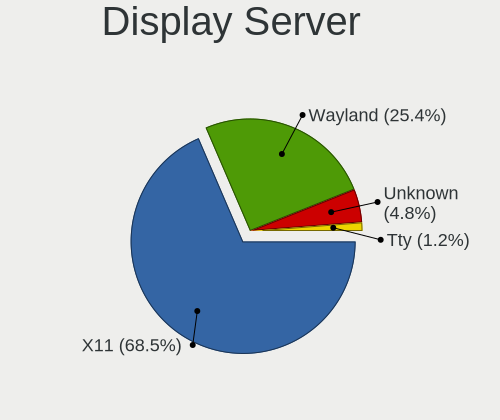

| Name    | Notebooks | Percent |
|---------|-----------|---------|
| X11     | 3390      | 72.22%  |
| Wayland | 999       | 21.28%  |
| Unknown | 248       | 5.28%   |
| Tty     | 57        | 1.21%   |

Display Manager
---------------

SDDM, LightDM, etc.

| Name            | Notebooks | Percent |
|-----------------|-----------|---------|
| Unknown         | 2391      | 50.34%  |
| SDDM            | 694       | 14.61%  |
| GDM3            | 577       | 12.15%  |
| GDM             | 493       | 10.38%  |
| LightDM         | 456       | 9.6%    |
| TDM             | 100       | 2.11%   |
| KDM             | 16        | 0.34%   |
| XDM             | 6         | 0.13%   |
| LXDM            | 6         | 0.13%   |
| Ly              | 4         | 0.08%   |
| GREETD          | 2         | 0.04%   |
| SLiM            | 1         | 0.02%   |
| NODM            | 1         | 0.02%   |
| LY-DM           | 1         | 0.02%   |
| KODI-STANDALONE | 1         | 0.02%   |
| CDM             | 1         | 0.02%   |

OS Lang
-------

Language

| Lang           | Notebooks | Percent |
|----------------|-----------|---------|
| en_GB          | 3367      | 72.04%  |
| en_US          | 644       | 13.78%  |
| Unknown        | 427       | 9.14%   |
| C              | 75        | 1.6%    |
| pl_PL          | 48        | 1.03%   |
| de_DE          | 11        | 0.24%   |
| fr_FR          | 10        | 0.21%   |
| ru_RU          | 9         | 0.19%   |
| en_AU          | 8         | 0.17%   |
| it_IT          | 7         | 0.15%   |
| en_CA          | 7         | 0.15%   |
| POSIX          | 6         | 0.13%   |
| es_ES          | 6         | 0.13%   |
| en_IN          | 5         | 0.11%   |
| en_IE          | 5         | 0.11%   |
| cs_CZ          | 5         | 0.11%   |
| hu_HU          | 4         | 0.09%   |
| zh_CN          | 3         | 0.06%   |
| uk_UA          | 3         | 0.06%   |
| ro_RO          | 3         | 0.06%   |
| sk_SK          | 2         | 0.04%   |
| pt_PT          | 2         | 0.04%   |
| pt_BR          | 2         | 0.04%   |
| tr_TR          | 1         | 0.02%   |
| nl_BE          | 1         | 0.02%   |
| en_US.utf-8    | 1         | 0.02%   |
| en_NZ          | 1         | 0.02%   |
| en_IL          | 1         | 0.02%   |
| en_HK          | 1         | 0.02%   |
| en_GG          | 1         | 0.02%   |
| en_GB.utf-8    | 1         | 0.02%   |
| en_GB.iso88591 | 1         | 0.02%   |
| en_DE          | 1         | 0.02%   |
| en_AG          | 1         | 0.02%   |
| enGB           | 1         | 0.02%   |
| da_DK          | 1         | 0.02%   |
| C.UTF8         | 1         | 0.02%   |
| bg_BG          | 1         | 0.02%   |

Boot Mode
---------

EFI or BIOS

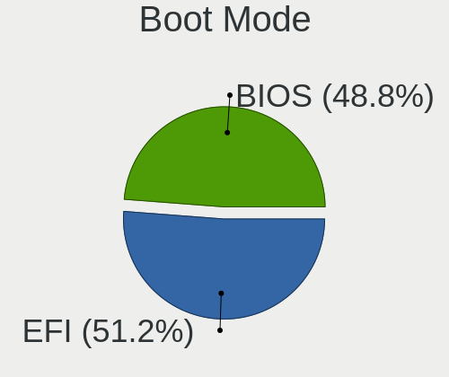

| Mode | Notebooks | Percent |
|------|-----------|---------|
| EFI  | 2407      | 51.7%   |
| BIOS | 2249      | 48.3%   |

Filesystem
----------

Type of filesystem

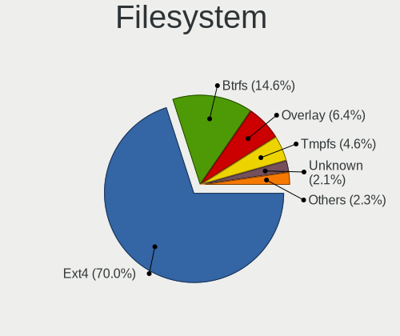

| Type    | Notebooks | Percent |
|---------|-----------|---------|
| Ext4    | 3408      | 72.56%  |
| Btrfs   | 600       | 12.77%  |
| Overlay | 303       | 6.45%   |
| Tmpfs   | 165       | 3.51%   |
| Unknown | 112       | 2.38%   |
| Xfs     | 55        | 1.17%   |
| Zfs     | 34        | 0.72%   |
| Ext2    | 9         | 0.19%   |
| F2fs    | 6         | 0.13%   |
| Ext3    | 4         | 0.09%   |
| Aufs    | 1         | 0.02%   |

Part. scheme
------------

Scheme of partitioning

| Type    | Notebooks | Percent |
|---------|-----------|---------|
| Unknown | 2475      | 52.87%  |
| GPT     | 1792      | 38.28%  |
| MBR     | 414       | 8.84%   |

Dual Boot with Linux/BSD
------------------------

Hosting more than one Linux/BSD

| Dual boot | Notebooks | Percent |
|-----------|-----------|---------|
| No        | 4149      | 89.5%   |
| Yes       | 487       | 10.5%   |

Dual Boot (Win)
---------------

Hosting Linux and Windows

| Dual boot | Notebooks | Percent |
|-----------|-----------|---------|
| No        | 3542      | 76.52%  |
| Yes       | 1087      | 23.48%  |

Board
-----

Vendor
------

Motherboard manufacturer

| Name                | Notebooks | Percent |
|---------------------|-----------|---------|
| Lenovo              | 924       | 20.27%  |
| Dell                | 897       | 19.68%  |
| Hewlett-Packard     | 726       | 15.93%  |
| ASUSTek Computer    | 330       | 7.24%   |
| Acer                | 330       | 7.24%   |
| Toshiba             | 185       | 4.06%   |
| Apple               | 155       | 3.4%    |
| Valve               | 131       | 2.87%   |
| Samsung Electronics | 83        | 1.82%   |
| MSI                 | 69        | 1.51%   |
| Sony                | 68        | 1.49%   |
| Google              | 52        | 1.14%   |
| PC Specialist       | 51        | 1.12%   |
| HUAWEI              | 51        | 1.12%   |
| Notebook            | 38        | 0.83%   |
| Unknown             | 33        | 0.72%   |
| Razer               | 26        | 0.57%   |
| Alienware           | 25        | 0.55%   |
| Star Labs           | 22        | 0.48%   |
| Fujitsu             | 20        | 0.44%   |
| Packard Bell        | 18        | 0.39%   |
| Fujitsu Siemens     | 15        | 0.33%   |
| Entroware           | 15        | 0.33%   |
| Dixonsxp            | 14        | 0.31%   |
| TUXEDO              | 13        | 0.29%   |
| LG Electronics      | 13        | 0.29%   |
| GEO                 | 13        | 0.29%   |
| Clevo               | 13        | 0.29%   |
| Linx                | 12        | 0.26%   |
| Framework           | 12        | 0.26%   |
| Panasonic           | 9         | 0.2%    |
| Jumper              | 9         | 0.2%    |
| Gigabyte Technology | 9         | 0.2%    |
| Advent              | 9         | 0.2%    |
| Timi                | 8         | 0.18%   |
| OEGStone            | 8         | 0.18%   |
| eMachines           | 8         | 0.18%   |
| Novatech            | 7         | 0.15%   |
| Medion              | 7         | 0.15%   |
| Intel               | 7         | 0.15%   |

Model
-----

Motherboard model

| Name                   | Notebooks | Percent |
|------------------------|-----------|---------|
| Valve Jupiter          | 126       | 2.76%   |
| Unknown                | 56        | 1.23%   |
| HP Pavilion g6         | 28        | 0.61%   |
| HP Notebook            | 25        | 0.55%   |
| HP Pavilion 15         | 21        | 0.46%   |
| HP Pavilion Notebook   | 20        | 0.44%   |
| Dell XPS 15 9570       | 17        | 0.37%   |
| Dell Inspiron 1545     | 17        | 0.37%   |
| Dell XPS 15 9560       | 16        | 0.35%   |
| Dell XPS 15 7590       | 16        | 0.35%   |
| Dell XPS 13 9380       | 15        | 0.33%   |
| Dell XPS 13 9370       | 15        | 0.33%   |
| Dell XPS 13 9360       | 15        | 0.33%   |
| Dell Latitude E6400    | 13        | 0.29%   |
| HP Pavilion dv6        | 12        | 0.26%   |
| HP Laptop 15-bw0xx     | 12        | 0.26%   |
| Dell XPS 15 9510       | 12        | 0.26%   |
| Dell XPS 15 9500       | 12        | 0.26%   |
| Dell XPS 13 7390       | 12        | 0.26%   |
| Dell Latitude E6410    | 12        | 0.26%   |
| Apple MacBookPro12,1   | 12        | 0.26%   |
| Toshiba Satellite C660 | 11        | 0.24%   |
| Lenovo V145-15AST 81MT | 11        | 0.24%   |
| HP Laptop 15-da0xxx    | 11        | 0.24%   |
| HP 15                  | 11        | 0.24%   |
| Dell XPS 15 9550       | 11        | 0.24%   |
| Dell Latitude E7450    | 11        | 0.24%   |
| Dell Latitude E7440    | 11        | 0.24%   |
| Dell Latitude E7240    | 11        | 0.24%   |
| Dell Latitude E6420    | 11        | 0.24%   |
| Apple MacBookPro9,2    | 11        | 0.24%   |
| Lenovo Z50-75 80EC     | 10        | 0.22%   |
| Apple MacBookPro7,1    | 10        | 0.22%   |
| Acer Aspire ES1-531    | 10        | 0.22%   |
| Linx LINX1010B         | 9         | 0.2%    |
| Dell XPS 13 9310       | 9         | 0.2%    |
| Dell XPS 13 9305       | 9         | 0.2%    |
| Apple MacBookPro5,5    | 9         | 0.2%    |
| Star Labs StarBook     | 8         | 0.18%   |
| HP EliteBook 840 G1    | 8         | 0.18%   |

Model Family
------------

Motherboard model prefix

| Name                  | Notebooks | Percent |
|-----------------------|-----------|---------|
| Lenovo ThinkPad       | 529       | 11.61%  |
| Dell Latitude         | 310       | 6.8%    |
| Acer Aspire           | 236       | 5.18%   |
| Dell Inspiron         | 222       | 4.87%   |
| Dell XPS              | 212       | 4.65%   |
| Lenovo IdeaPad        | 166       | 3.64%   |
| Toshiba Satellite     | 161       | 3.53%   |
| HP Pavilion           | 156       | 3.42%   |
| Valve Jupiter         | 126       | 2.76%   |
| HP EliteBook          | 122       | 2.68%   |
| HP Laptop             | 85        | 1.86%   |
| ASUS VivoBook         | 85        | 1.86%   |
| HP ProBook            | 82        | 1.8%    |
| Dell Precision        | 68        | 1.49%   |
| Unknown               | 56        | 1.23%   |
| Lenovo Legion         | 42        | 0.92%   |
| HP ENVY               | 36        | 0.79%   |
| Acer Swift            | 35        | 0.77%   |
| HP Compaq             | 33        | 0.72%   |
| ASUS ZenBook          | 33        | 0.72%   |
| ASUS ROG              | 33        | 0.72%   |
| Lenovo Yoga           | 29        | 0.64%   |
| HP Stream             | 29        | 0.64%   |
| Dell Vostro           | 27        | 0.59%   |
| Razer Blade           | 26        | 0.57%   |
| HP Notebook           | 25        | 0.55%   |
| Lenovo ThinkBook      | 23        | 0.5%    |
| HP ZBook              | 22        | 0.48%   |
| HP 255                | 21        | 0.46%   |
| HP Presario           | 18        | 0.39%   |
| ASUS ASUS             | 18        | 0.39%   |
| Packard Bell EasyNote | 17        | 0.37%   |
| HP OMEN               | 17        | 0.37%   |
| Fujitsu LIFEBOOK      | 17        | 0.37%   |
| Acer Nitro            | 17        | 0.37%   |
| Apple MacBookPro11    | 16        | 0.35%   |
| Apple MacBookPro8     | 15        | 0.33%   |
| Dell System           | 14        | 0.31%   |
| Apple MacBookPro9     | 14        | 0.31%   |
| Apple MacBookPro5     | 13        | 0.29%   |

MFG Year
--------

Motherboard manufacture year

| Year    | Notebooks | Percent |
|---------|-----------|---------|
| 2018    | 385       | 8.45%   |
| 2020    | 374       | 8.21%   |
| 2019    | 367       | 8.05%   |
| 2021    | 332       | 7.28%   |
| 2012    | 324       | 7.11%   |
| 2013    | 313       | 6.87%   |
| 2017    | 293       | 6.43%   |
| 2011    | 281       | 6.16%   |
| 2022    | 259       | 5.68%   |
| 2014    | 258       | 5.66%   |
| 2015    | 254       | 5.57%   |
| 2016    | 249       | 5.46%   |
| 2010    | 204       | 4.48%   |
| 2008    | 203       | 4.45%   |
| 2009    | 156       | 3.42%   |
| 2023    | 130       | 2.85%   |
| 2007    | 110       | 2.41%   |
| 2006    | 42        | 0.92%   |
| 2005    | 8         | 0.18%   |
| Unknown | 8         | 0.18%   |
| 2024    | 6         | 0.13%   |
| 2003    | 1         | 0.02%   |
| 2002    | 1         | 0.02%   |

Form Factor
-----------

Physical design of the computer

| Name     | Notebooks | Percent |
|----------|-----------|---------|
| Notebook | 4558      | 100%    |

Secure Boot
-----------

Enabled or disabled

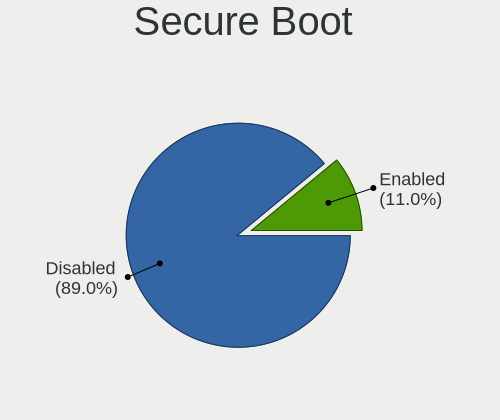

| State    | Notebooks | Percent |
|----------|-----------|---------|
| Disabled | 4090      | 88.84%  |
| Enabled  | 514       | 11.16%  |

Coreboot
--------

Have coreboot on board

| Used | Notebooks | Percent |
|------|-----------|---------|
| No   | 4480      | 98.27%  |
| Yes  | 79        | 1.73%   |

RAM Size
--------

Total RAM memory

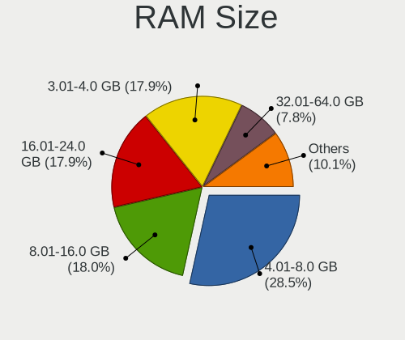

| Size in GB  | Notebooks | Percent |
|-------------|-----------|---------|
| 4.01-8.0    | 1332      | 28.74%  |
| 3.01-4.0    | 858       | 18.52%  |
| 16.01-24.0  | 840       | 18.13%  |
| 8.01-16.0   | 799       | 17.24%  |
| 32.01-64.0  | 327       | 7.06%   |
| 1.01-2.0    | 237       | 5.11%   |
| 2.01-3.0    | 96        | 2.07%   |
| 64.01-256.0 | 62        | 1.34%   |
| 24.01-32.0  | 49        | 1.06%   |
| 0.51-1.0    | 33        | 0.71%   |
| 0.01-0.5    | 1         | 0.02%   |

RAM Used
--------

Used RAM memory

| Used GB    | Notebooks | Percent |
|------------|-----------|---------|
| 1.01-2.0   | 1788      | 35.32%  |
| 2.01-3.0   | 1243      | 24.55%  |
| 4.01-8.0   | 770       | 15.21%  |
| 3.01-4.0   | 700       | 13.83%  |
| 0.51-1.0   | 304       | 6%      |
| 8.01-16.0  | 187       | 3.69%   |
| 0.01-0.5   | 40        | 0.79%   |
| 16.01-24.0 | 21        | 0.41%   |
| 24.01-32.0 | 7         | 0.14%   |
| 32.01-64.0 | 2         | 0.04%   |
| Unknown    | 1         | 0.02%   |

Total Drives
------------

Number of drives on board

| Drives | Notebooks | Percent |
|--------|-----------|---------|
| 1      | 3359      | 72.07%  |
| 2      | 1097      | 23.54%  |
| 3      | 126       | 2.7%    |
| 0      | 38        | 0.82%   |
| 4      | 29        | 0.62%   |
| 5      | 6         | 0.13%   |
| 7      | 3         | 0.06%   |
| 9      | 1         | 0.02%   |
| 8      | 1         | 0.02%   |
| 6      | 1         | 0.02%   |

Has CD-ROM
----------

Has CD-ROM on board

| Presented | Notebooks | Percent |
|-----------|-----------|---------|
| No        | 3044      | 66.45%  |
| Yes       | 1537      | 33.55%  |

Has Ethernet
------------

Has Ethernet on board

| Presented | Notebooks | Percent |
|-----------|-----------|---------|
| Yes       | 3447      | 75.34%  |
| No        | 1128      | 24.66%  |

Has WiFi
--------

Has WiFi module

| Presented | Notebooks | Percent |
|-----------|-----------|---------|
| Yes       | 4494      | 98.53%  |
| No        | 67        | 1.47%   |

Has Bluetooth
-------------

Has Bluetooth module

| Presented | Notebooks | Percent |
|-----------|-----------|---------|
| Yes       | 3610      | 78.39%  |
| No        | 995       | 21.61%  |

Location
--------

Country
-------

Geographic location (country)

| Country | Notebooks | Percent |
|---------|-----------|---------|
| UK      | 4558      | 100%    |

City
----

Geographic location (city)

| City                | Notebooks | Percent |
|---------------------|-----------|---------|
| London              | 300       | 5.93%   |
| Manchester          | 105       | 2.08%   |
| Birmingham          | 92        | 1.82%   |
| Glasgow             | 89        | 1.76%   |
| Edinburgh           | 80        | 1.58%   |
| Bristol             | 70        | 1.38%   |
| Leeds               | 63        | 1.25%   |
| Liverpool           | 57        | 1.13%   |
| Nottingham          | 54        | 1.07%   |
| Islington           | 52        | 1.03%   |
| Sheffield           | 51        | 1.01%   |
| Reading             | 45        | 0.89%   |
| Cambridge           | 44        | 0.87%   |
| Coventry            | 43        | 0.85%   |
| Southampton         | 40        | 0.79%   |
| Leicester           | 37        | 0.73%   |
| Norwich             | 35        | 0.69%   |
| Oxford              | 33        | 0.65%   |
| Croydon             | 33        | 0.65%   |
| Cardiff             | 31        | 0.61%   |
| Milton Keynes       | 29        | 0.57%   |
| Aberdeen            | 29        | 0.57%   |
| York                | 28        | 0.55%   |
| Bradford            | 26        | 0.51%   |
| Hackney             | 25        | 0.49%   |
| Swindon             | 24        | 0.47%   |
| Southwark           | 24        | 0.47%   |
| Plymouth            | 24        | 0.47%   |
| Brighton            | 24        | 0.47%   |
| Wolverhampton       | 23        | 0.45%   |
| Newcastle upon Tyne | 23        | 0.45%   |
| Gloucester          | 22        | 0.44%   |
| Colchester          | 22        | 0.44%   |
| Bolton              | 22        | 0.44%   |
| Chesterfield        | 21        | 0.42%   |
| Belfast             | 21        | 0.42%   |
| Walsall             | 20        | 0.4%    |
| Kensington          | 20        | 0.4%    |
| Harrow              | 20        | 0.4%    |
| Derby               | 20        | 0.4%    |

Drives
------

Drive Vendor
------------

Hard drive vendors

| Vendor                      | Notebooks | Drives | Percent |
|-----------------------------|-----------|--------|---------|
| Samsung Electronics         | 895       | 1190   | 15.81%  |
| WDC                         | 511       | 654    | 9.03%   |
| Seagate                     | 509       | 696    | 8.99%   |
| Unknown                     | 506       | 660    | 8.94%   |
| Toshiba                     | 463       | 581    | 8.18%   |
| Sandisk                     | 364       | 462    | 6.43%   |
| SK hynix                    | 250       | 294    | 4.42%   |
| Crucial                     | 242       | 330    | 4.27%   |
| Kingston                    | 218       | 277    | 3.85%   |
| Hitachi                     | 184       | 223    | 3.25%   |
| Intel                       | 168       | 205    | 2.97%   |
| Micron Technology           | 132       | 157    | 2.33%   |
| HGST                        | 130       | 190    | 2.3%    |
| Apple                       | 80        | 111    | 1.41%   |
| KIOXIA                      | 67        | 83     | 1.18%   |
| Phison Electronics          | 60        | 70     | 1.06%   |
| China                       | 51        | 73     | 0.9%    |
| Phison                      | 49        | 57     | 0.87%   |
| A-DATA Technology           | 44        | 54     | 0.78%   |
| LITEON                      | 43        | 59     | 0.76%   |
| Micron/Crucial Technology   | 39        | 47     | 0.69%   |
| Unknown                     | 38        | 46     | 0.67%   |
| PNY                         | 36        | 45     | 0.64%   |
| Kingston Technology Company | 35        | 39     | 0.62%   |
| Transcend                   | 33        | 41     | 0.58%   |
| Silicon Motion              | 32        | 39     | 0.57%   |
| Fujitsu                     | 32        | 42     | 0.57%   |
| LITEONIT                    | 31        | 38     | 0.55%   |
| O2 Micro                    | 23        | 25     | 0.41%   |
| Integral                    | 18        | 20     | 0.32%   |
| SABRENT                     | 15        | 18     | 0.26%   |
| SPCC                        | 14        | 20     | 0.25%   |
| JMicron Technology          | 13        | 18     | 0.23%   |
| OCZ                         | 12        | 13     | 0.21%   |
| Lenovo                      | 12        | 13     | 0.21%   |
| Team                        | 11        | 14     | 0.19%   |
| Realtek                     | 10        | 10     | 0.18%   |
| Corsair                     | 10        | 14     | 0.18%   |
| Netac                       | 9         | 12     | 0.16%   |
| Gigabyte Technology         | 8         | 9      | 0.14%   |

Drive Model
-----------

Hard drive models

| Model                                              | Notebooks | Percent |
|----------------------------------------------------|-----------|---------|
| Unknown MMC Card  32GB                             | 103       | 1.74%   |
| Seagate ST1000LM035-1RK172 1TB                     | 68        | 1.15%   |
| Unknown MMC Card  64GB                             | 62        | 1.05%   |
| Toshiba MQ01ABD100 1TB                             | 58        | 0.98%   |
| Samsung NVMe SSD Controller SM981/PM981/PM983 1TB  | 57        | 0.96%   |
| Seagate ST1000LM024 HN-M101MBB 1TB                 | 56        | 0.95%   |
| Unknown MMC Card  128GB                            | 47        | 0.79%   |
| Unknown MMC Card  512GB                            | 45        | 0.76%   |
| Phison PS5013 E13 NVMe Controller 512GB            | 42        | 0.71%   |
| Unknown                                            | 38        | 0.64%   |
| Samsung NVMe SSD Drive 512GB                       | 37        | 0.62%   |
| Kingston SA400S37240G 240GB SSD                    | 37        | 0.62%   |
| Unknown MMC Card  16GB                             | 36        | 0.61%   |
| Toshiba MQ01ABF050 500GB                           | 36        | 0.61%   |
| HGST HTS541010A9E680 1TB                           | 35        | 0.59%   |
| HGST HTS721010A9E630 1TB                           | 32        | 0.54%   |
| Samsung SSD 850 EVO 500GB                          | 31        | 0.52%   |
| Crucial CT500MX500SSD1 500GB                       | 30        | 0.51%   |
| Samsung PM963 2.5" NVMe PCIe SSD 256GB             | 29        | 0.49%   |
| Crucial CT1000MX500SSD1 1TB                        | 29        | 0.49%   |
| Samsung SSD 860 EVO 500GB                          | 27        | 0.46%   |
| Samsung NVMe SSD Controller PM9A1/PM9A3/980PRO 1TB | 27        | 0.46%   |
| Seagate ST2000LM003 HN-M201RAD 2TB                 | 26        | 0.44%   |
| Micron/Crucial P2 NVMe PCIe SSD 4TB                | 26        | 0.44%   |
| Kingston SA400S37120G 120GB SSD                    | 26        | 0.44%   |
| Toshiba NVMe SSD Drive 256GB                       | 25        | 0.42%   |
| SanDisk NVMe SSD Drive 512GB                       | 25        | 0.42%   |
| Samsung SSD 850 EVO 250GB                          | 25        | 0.42%   |
| Kingston Company OM3PDP3 NVMe SSD 512GB            | 24        | 0.41%   |
| Unknown SD/MMC/MS PRO 128GB                        | 23        | 0.39%   |
| Unknown MMC Card  256GB                            | 23        | 0.39%   |
| Seagate ST500LT012-1DG142 500GB                    | 23        | 0.39%   |
| Samsung SSD 970 EVO Plus 1TB                       | 23        | 0.39%   |
| Kingston SA400S37480G 480GB SSD                    | 22        | 0.37%   |
| Toshiba MQ04ABF100 1TB                             | 21        | 0.35%   |
| Seagate ST9500325AS 500GB                          | 21        | 0.35%   |
| O2 Micro E2M2 64GB                                 | 21        | 0.35%   |
| Samsung NVMe SSD Drive 1024GB                      | 20        | 0.34%   |
| Crucial CT250MX500SSD1 250GB                       | 20        | 0.34%   |
| Crucial CT240BX500SSD1 240GB                       | 20        | 0.34%   |

HDD Vendor
----------

Hard disk drive vendors

| Vendor              | Notebooks | Drives | Percent |
|---------------------|-----------|--------|---------|
| Seagate             | 493       | 673    | 31.68%  |
| WDC                 | 302       | 385    | 19.41%  |
| Toshiba             | 297       | 359    | 19.09%  |
| Hitachi             | 184       | 223    | 11.83%  |
| HGST                | 130       | 190    | 8.35%   |
| Samsung Electronics | 49        | 54     | 3.15%   |
| Fujitsu             | 32        | 42     | 2.06%   |
| Unknown             | 24        | 29     | 1.54%   |
| SABRENT             | 11        | 14     | 0.71%   |
| Apple               | 8         | 8      | 0.51%   |
| JMicron Technology  | 5         | 9      | 0.32%   |
| ASMT                | 5         | 29     | 0.32%   |
| TO Exter            | 4         | 4      | 0.26%   |
| Initio              | 2         | 2      | 0.13%   |
| IBM/Hitachi         | 2         | 2      | 0.13%   |
| External            | 2         | 2      | 0.13%   |
| Maxone              | 1         | 1      | 0.06%   |
| LaCie               | 1         | 1      | 0.06%   |
| Intenso             | 1         | 1      | 0.06%   |
| HGST HTS            | 1         | 1      | 0.06%   |
| Generic-            | 1         | 1      | 0.06%   |
| ASMedia             | 1         | 1      | 0.06%   |

SSD Vendor
----------

Solid state drive vendors

| Vendor              | Notebooks | Drives | Percent |
|---------------------|-----------|--------|---------|
| Samsung Electronics | 369       | 501    | 20.93%  |
| Crucial             | 219       | 303    | 12.42%  |
| SanDisk             | 189       | 234    | 10.72%  |
| Kingston            | 174       | 218    | 9.87%   |
| WDC                 | 93        | 130    | 5.28%   |
| Intel               | 56        | 60     | 3.18%   |
| Micron Technology   | 51        | 59     | 2.89%   |
| Apple               | 49        | 63     | 2.78%   |
| China               | 48        | 67     | 2.72%   |
| SK hynix            | 47        | 62     | 2.67%   |
| Toshiba             | 44        | 63     | 2.5%    |
| LITEON              | 41        | 57     | 2.33%   |
| PNY                 | 35        | 43     | 1.99%   |
| A-DATA Technology   | 34        | 42     | 1.93%   |
| Transcend           | 32        | 40     | 1.82%   |
| LITEONIT            | 31        | 38     | 1.76%   |
| Integral            | 18        | 20     | 1.02%   |
| SPCC                | 13        | 18     | 0.74%   |
| OCZ                 | 12        | 13     | 0.68%   |
| Team                | 10        | 13     | 0.57%   |
| Seagate             | 9         | 9      | 0.51%   |
| Netac               | 9         | 12     | 0.51%   |
| Unknown             | 7         | 7      | 0.4%    |
| Patriot             | 7         | 16     | 0.4%    |
| Drevo               | 7         | 10     | 0.4%    |
| XUM                 | 6         | 6      | 0.34%   |
| TCSUNBOW            | 6         | 13     | 0.34%   |
| Star                | 6         | 8      | 0.34%   |
| Lexar               | 6         | 7      | 0.34%   |
| Gigabyte Technology | 6         | 7      | 0.34%   |
| Corsair             | 6         | 10     | 0.34%   |
| BHT                 | 6         | 9      | 0.34%   |
| SSK                 | 5         | 9      | 0.28%   |
| KIOXIA-EXCERIA      | 5         | 5      | 0.28%   |
| SABRENT             | 4         | 4      | 0.23%   |
| ORTIAL              | 4         | 4      | 0.23%   |
| GOODRAM             | 4         | 6      | 0.23%   |
| BIWIN               | 4         | 4      | 0.23%   |
| ZTC                 | 3         | 6      | 0.17%   |
| Zheino              | 3         | 5      | 0.17%   |

Drive Kind
----------

HDD or SSD

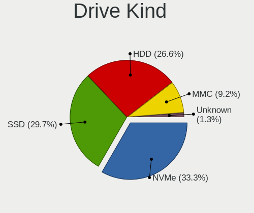

| Kind    | Notebooks | Drives | Percent |
|---------|-----------|--------|---------|
| NVMe    | 1674      | 2236   | 31.39%  |
| SSD     | 1592      | 2311   | 29.85%  |
| HDD     | 1503      | 2031   | 28.18%  |
| MMC     | 499       | 652    | 9.36%   |
| Unknown | 65        | 77     | 1.22%   |

Drive Connector
---------------

SATA, SAS, NVMe, etc.

| Type | Notebooks | Drives | Percent |
|------|-----------|--------|---------|
| SATA | 2826      | 4141   | 54.46%  |
| NVMe | 1670      | 2221   | 32.18%  |
| MMC  | 499       | 652    | 9.62%   |
| SAS  | 194       | 293    | 3.74%   |

Drive Size
----------

Size of hard drive

| Size in TB | Notebooks | Drives | Percent |
|------------|-----------|--------|---------|
| 0.01-0.5   | 2131      | 3005   | 68.37%  |
| 0.51-1.0   | 825       | 1115   | 26.47%  |
| 1.01-2.0   | 131       | 180    | 4.2%    |
| 3.01-4.0   | 22        | 25     | 0.71%   |
| 4.01-10.0  | 5         | 14     | 0.16%   |
| 10.01-20.0 | 2         | 2      | 0.06%   |
| 2.01-3.0   | 1         | 1      | 0.03%   |

Space Total
-----------

Amount of disk space available on the file system

| Size in GB     | Notebooks | Percent |
|----------------|-----------|---------|
| 101-250        | 1411      | 29.23%  |
| 251-500        | 1135      | 23.51%  |
| 501-1000       | 734       | 15.2%   |
| 1-20           | 365       | 7.56%   |
| 51-100         | 331       | 6.86%   |
| 1001-2000      | 288       | 5.97%   |
| 21-50          | 256       | 5.3%    |
| Unknown        | 134       | 2.78%   |
| More than 3000 | 103       | 2.13%   |
| 2001-3000      | 71        | 1.47%   |

Space Used
----------

Amount of used disk space

| Used GB        | Notebooks | Percent |
|----------------|-----------|---------|
| 1-20           | 2044      | 40.77%  |
| 21-50          | 949       | 18.93%  |
| 101-250        | 654       | 13.05%  |
| 51-100         | 579       | 11.55%  |
| 251-500        | 352       | 7.02%   |
| 501-1000       | 173       | 3.45%   |
| Unknown        | 134       | 2.67%   |
| 1001-2000      | 83        | 1.66%   |
| More than 3000 | 24        | 0.48%   |
| 2001-3000      | 20        | 0.4%    |
| 0              | 1         | 0.02%   |

Malfunc. Drives
---------------

Drive models with a malfunction

| Model                                          | Notebooks | Drives | Percent |
|------------------------------------------------|-----------|--------|---------|
| Seagate ST9500325AS 500GB                      | 6         | 10     | 2.61%   |
| Seagate ST1000LM035-1RK172 1TB                 | 6         | 6      | 2.61%   |
| HGST HTS725050A7E630 500GB                     | 6         | 9      | 2.61%   |
| HGST HTS541010A9E680 1TB                       | 6         | 6      | 2.61%   |
| Seagate ST1000LM024 HN-M101MBB 1TB             | 5         | 7      | 2.17%   |
| Hitachi HTS547575A9E384 752GB                  | 5         | 7      | 2.17%   |
| Toshiba MQ01ABD100 1TB                         | 3         | 3      | 1.3%    |
| Toshiba MK1656GSY 160GB                        | 3         | 3      | 1.3%    |
| Seagate ST500LM021-1KJ152 500GB                | 3         | 3      | 1.3%    |
| Intel SSDSC2BF180A5L 180GB                     | 3         | 3      | 1.3%    |
| Hitachi HTS543216L9A300 160GB                  | 3         | 3      | 1.3%    |
| Hitachi HTS542512K9SA00 120GB                  | 3         | 3      | 1.3%    |
| HGST HTS721010A9E630 1TB                       | 3         | 3      | 1.3%    |
| WDC WD2500BEVT-80A23T0 250GB                   | 2         | 5      | 0.87%   |
| Toshiba MK5065GSXN 500GB                       | 2         | 2      | 0.87%   |
| Toshiba MK3256GSY 320GB                        | 2         | 3      | 0.87%   |
| SK hynix HFS256G39TND-N210A 256GB SSD          | 2         | 2      | 0.87%   |
| Seagate ST9320325AS 320GB                      | 2         | 4      | 0.87%   |
| Seagate ST9250410AS 250GB                      | 2         | 2      | 0.87%   |
| Seagate ST9250315AS 250GB                      | 2         | 2      | 0.87%   |
| Seagate ST500LT012-9WS142 500GB                | 2         | 2      | 0.87%   |
| Seagate ST2000LX001-1RG174 2TB                 | 2         | 2      | 0.87%   |
| Seagate ST2000LM003 HN-M201RAD 2TB             | 2         | 2      | 0.87%   |
| Seagate ST1000LM014-SSHD-8GB                   | 2         | 3      | 0.87%   |
| Seagate ST1000LM014-1EJ164 1TB                 | 2         | 2      | 0.87%   |
| SanDisk SSD PLUS 240GB                         | 2         | 2      | 0.87%   |
| Micron Technology 1100_MTFDDAV256TBN 256GB SSD | 2         | 2      | 0.87%   |
| LITEON LCH-256V2S-11 2.5 7mm 256GB SSD         | 2         | 3      | 0.87%   |
| LITEON CS1-SP32-11 M.2 2242 32GB SSD           | 2         | 2      | 0.87%   |
| Hitachi HTS547564A9E384 640GB                  | 2         | 2      | 0.87%   |
| Hitachi HTS545050A7E380 500GB                  | 2         | 2      | 0.87%   |
| Hitachi HTS545032B9A302 320GB                  | 2         | 3      | 0.87%   |
| Hitachi HTS545032B9A300 320GB                  | 2         | 2      | 0.87%   |
| Hitachi HTS545025B9A300 250GB                  | 2         | 2      | 0.87%   |
| Hitachi HTS541680J9SA00 80GB                   | 2         | 4      | 0.87%   |
| Drevo X1 SSD 64GB                              | 2         | 2      | 0.87%   |
| Crucial CT525MX300SSD4 528GB                   | 2         | 2      | 0.87%   |
| Zheino CHN mSATA02M 256 256GB SSD              | 1         | 2      | 0.43%   |
| WDC WDS240G2G0A-00JH30 240GB SSD               | 1         | 1      | 0.43%   |
| WDC WD7500BPVT-60HXZT3 752GB                   | 1         | 1      | 0.43%   |

Malfunc. Drive Vendor
---------------------

Vendors of faulty drives

| Vendor              | Notebooks | Drives | Percent |
|---------------------|-----------|--------|---------|
| Seagate             | 55        | 65     | 24.02%  |
| Hitachi             | 35        | 40     | 15.28%  |
| Toshiba             | 26        | 27     | 11.35%  |
| WDC                 | 19        | 24     | 8.3%    |
| HGST                | 19        | 22     | 8.3%    |
| Samsung Electronics | 12        | 13     | 5.24%   |
| Intel               | 11        | 11     | 4.8%    |
| Crucial             | 11        | 11     | 4.8%    |
| SanDisk             | 5         | 5      | 2.18%   |
| Kingston            | 5         | 7      | 2.18%   |
| SK hynix            | 4         | 4      | 1.75%   |
| Micron Technology   | 4         | 4      | 1.75%   |
| LITEON              | 4         | 5      | 1.75%   |
| Fujitsu             | 4         | 5      | 1.75%   |
| Drevo               | 2         | 2      | 0.87%   |
| China               | 2         | 2      | 0.87%   |
| A-DATA Technology   | 2         | 2      | 0.87%   |
| Zheino              | 1         | 2      | 0.44%   |
| Team                | 1         | 1      | 0.44%   |
| SABRENT             | 1         | 1      | 0.44%   |
| OCZ                 | 1         | 1      | 0.44%   |
| LITEONIT            | 1         | 2      | 0.44%   |
| HECTRON             | 1         | 1      | 0.44%   |
| Corsair             | 1         | 1      | 0.44%   |
| BAITITON            | 1         | 1      | 0.44%   |
| 2-Power             | 1         | 1      | 0.44%   |

Malfunc. HDD Vendor
-------------------

Vendors of faulty HDD drives

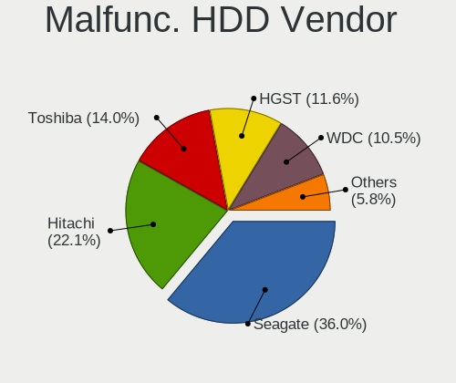

| Vendor              | Notebooks | Drives | Percent |
|---------------------|-----------|--------|---------|
| Seagate             | 55        | 65     | 34.38%  |
| Hitachi             | 35        | 40     | 21.88%  |
| Toshiba             | 24        | 25     | 15%     |
| HGST                | 19        | 22     | 11.88%  |
| WDC                 | 17        | 22     | 10.63%  |
| Samsung Electronics | 5         | 5      | 3.13%   |
| Fujitsu             | 4         | 5      | 2.5%    |
| SABRENT             | 1         | 1      | 0.63%   |

Malfunc. Drive Kind
-------------------

Kinds of faulty drives

| Kind | Notebooks | Drives | Percent |
|------|-----------|--------|---------|
| HDD  | 159       | 185    | 69.74%  |
| SSD  | 62        | 68     | 27.19%  |
| NVMe | 7         | 7      | 3.07%   |

Failed Drives
-------------

Failed drive models

| Model                                         | Notebooks | Drives | Percent |
|-----------------------------------------------|-----------|--------|---------|
| Union Memory (Shenzhen) RPFTJ128PDD2EWX 128GB | 1         | 1      | 33.33%  |
| Toshiba THNSN5512GPUK NVMe 512GB              | 1         | 2      | 33.33%  |
| Toshiba MQ01ABD100 1TB                        | 1         | 1      | 33.33%  |

Failed Drive Vendor
-------------------

Failed drive vendors

| Vendor                  | Notebooks | Drives | Percent |
|-------------------------|-----------|--------|---------|
| Toshiba                 | 2         | 3      | 66.67%  |
| Union Memory (Shenzhen) | 1         | 1      | 33.33%  |

Drive Status
------------

Number of failed and malfunc. drives

| Status   | Notebooks | Drives | Percent |
|----------|-----------|--------|---------|
| Detected | 2936      | 4762   | 61.17%  |
| Works    | 1636      | 2281   | 34.08%  |
| Malfunc  | 225       | 260    | 4.69%   |
| Failed   | 3         | 4      | 0.06%   |

Storage controller
------------------

Storage Vendor
--------------

Storage controller vendors

| Vendor                                  | Notebooks | Percent |
|-----------------------------------------|-----------|---------|
| Intel                                   | 2975      | 56.42%  |
| Samsung Electronics                     | 544       | 10.32%  |
| AMD                                     | 501       | 9.5%    |
| SanDisk                                 | 280       | 5.31%   |
| SK hynix                                | 199       | 3.77%   |
| Toshiba America Info Systems            | 129       | 2.45%   |
| Phison Electronics                      | 117       | 2.22%   |
| Micron Technology                       | 83        | 1.57%   |
| Kingston Technology Company             | 79        | 1.5%    |
| KIOXIA                                  | 66        | 1.25%   |
| Micron/Crucial Technology               | 59        | 1.12%   |
| Nvidia                                  | 46        | 0.87%   |
| Silicon Motion                          | 35        | 0.66%   |
| O2 Micro                                | 23        | 0.44%   |
| Apple                                   | 20        | 0.38%   |
| ADATA Technology                        | 15        | 0.28%   |
| Solid State Storage Technology          | 12        | 0.23%   |
| Silicon Integrated Systems [SiS]        | 12        | 0.23%   |
| Lenovo                                  | 11        | 0.21%   |
| Union Memory (Shenzhen)                 | 8         | 0.15%   |
| MAXIO Technology (Hangzhou)             | 8         | 0.15%   |
| Marvell Technology Group                | 8         | 0.15%   |
| Shenzhen Longsys Electronics            | 6         | 0.11%   |
| Lite-On Technology                      | 6         | 0.11%   |
| VIA Technologies                        | 4         | 0.08%   |
| Solidigm                                | 4         | 0.08%   |
| Yangtze Memory Technologies             | 3         | 0.06%   |
| Realtek Semiconductor                   | 3         | 0.06%   |
| JMicron Technology                      | 3         | 0.06%   |
| Biwin Storage Technology                | 3         | 0.06%   |
| ASMedia Technology                      | 3         | 0.06%   |
| INNOGRIT                                | 2         | 0.04%   |
| Silicon Image                           | 1         | 0.02%   |
| Shenzhen Unionmemory Information System | 1         | 0.02%   |
| Seagate Technology                      | 1         | 0.02%   |
| Lite-On IT Corp. / Plextor              | 1         | 0.02%   |
| Enmotus                                 | 1         | 0.02%   |
| Unknown                                 | 1         | 0.02%   |

Storage Model
-------------

Storage controller models

| Model                                                                            | Notebooks | Percent |
|----------------------------------------------------------------------------------|-----------|---------|
| AMD FCH SATA Controller [AHCI mode]                                              | 429       | 7.61%   |
| Intel 7 Series Chipset Family 6-port SATA Controller [AHCI mode]                 | 343       | 6.08%   |
| Intel Sunrise Point-LP SATA Controller [AHCI mode]                               | 293       | 5.19%   |
| Intel 82801 Mobile SATA Controller [RAID mode]                                   | 288       | 5.11%   |
| Samsung NVMe SSD Controller SM981/PM981/PM983                                    | 243       | 4.31%   |
| Intel 6 Series/C200 Series Chipset Family 6 port Mobile SATA AHCI Controller     | 210       | 3.72%   |
| Intel 82801IBM/IEM (ICH9M/ICH9M-E) 4 port SATA Controller [AHCI mode]            | 179       | 3.17%   |
| Intel Volume Management Device NVMe RAID Controller                              | 159       | 2.82%   |
| Intel 8 Series SATA Controller 1 [AHCI mode]                                     | 139       | 2.46%   |
| Intel Cannon Lake Mobile PCH SATA AHCI Controller                                | 131       | 2.32%   |
| Intel Wildcat Point-LP SATA Controller [AHCI Mode]                               | 127       | 2.25%   |
| Samsung NVMe SSD Controller 980 (DRAM-less)                                      | 110       | 1.95%   |
| Intel 8 Series/C220 Series Chipset Family 6-port SATA Controller 1 [AHCI mode]   | 102       | 1.81%   |
| Intel HM170/QM170 Chipset SATA Controller [AHCI Mode]                            | 88        | 1.56%   |
| Intel 5 Series/3400 Series Chipset 4 port SATA AHCI Controller                   | 84        | 1.49%   |
| Intel 82801HM/HEM (ICH8M/ICH8M-E) IDE Controller                                 | 83        | 1.47%   |
| Intel 5 Series/3400 Series Chipset 6 port SATA AHCI Controller                   | 75        | 1.33%   |
| SK hynix Gold P31/BC711/PC711 NVMe Solid State Drive                             | 71        | 1.26%   |
| Samsung NVMe SSD Controller PM9A1/PM9A3/980PRO                                   | 71        | 1.26%   |
| Intel 82801HM/HEM (ICH8M/ICH8M-E) SATA Controller [AHCI mode]                    | 69        | 1.22%   |
| Phison PS5013-E13 PCIe3 NVMe Controller (DRAM-less)                              | 63        | 1.12%   |
| Intel Celeron/Pentium Silver Processor SATA Controller                           | 62        | 1.1%    |
| Samsung NVMe SSD Controller SM961/PM961/SM963                                    | 58        | 1.03%   |
| Intel Comet Lake SATA AHCI Controller                                            | 57        | 1.01%   |
| SanDisk Ultra 3D / WD Blue SN550 NVMe SSD                                        | 53        | 0.94%   |
| Intel Celeron N3350/Pentium N4200/Atom E3900 Series SATA AHCI Controller         | 53        | 0.94%   |
| SanDisk Extreme Pro / WD Black SN750 / PC SN730 / Red SN700 NVMe SSD             | 52        | 0.92%   |
| Intel Atom Processor E3800 Series SATA AHCI Controller                           | 52        | 0.92%   |
| Toshiba America Info Systems XG6 NVMe SSD Controller                             | 47        | 0.83%   |
| Intel Atom/Celeron/Pentium Processor x5-E8000/J3xxx/N3xxx Series SATA Controller | 47        | 0.83%   |
| AMD SB7x0/SB8x0/SB9x0 SATA Controller [AHCI mode]                                | 46        | 0.82%   |
| KIOXIA NVMe SSD Controller BG4 (DRAM-less)                                       | 45        | 0.8%    |
| Micron/Crucial P2 [Nick P2] / P3 / P3 Plus NVMe PCIe SSD (DRAM-less)             | 44        | 0.78%   |
| Intel 82801G (ICH7 Family) IDE Controller                                        | 43        | 0.76%   |
| Intel Cannon Point-LP SATA Controller [AHCI Mode]                                | 42        | 0.74%   |
| Intel Tiger Lake-LP SATA Controller                                              | 41        | 0.73%   |
| Intel 82801GBM/GHM (ICH7-M Family) SATA Controller [IDE mode]                    | 36        | 0.64%   |
| Kingston Company OM3PDP3 NVMe SSD                                                | 34        | 0.6%    |
| Phison E12 NVMe Controller                                                       | 33        | 0.59%   |
| Intel 400 Series Chipset Family SATA AHCI Controller                             | 32        | 0.57%   |

Storage Kind
------------

Kind of storage controller (IDE, SATA, NVMe, SAS, ...)

| Kind | Notebooks | Percent |
|------|-----------|---------|
| SATA | 2920      | 54.09%  |
| NVMe | 1682      | 31.16%  |
| RAID | 470       | 8.71%   |
| IDE  | 326       | 6.04%   |

Processor
---------

CPU Vendor
----------

Processor vendors

| Vendor  | Notebooks | Percent |
|---------|-----------|---------|
| Intel   | 3703      | 81.24%  |
| AMD     | 853       | 18.71%  |
| ARM     | 1         | 0.02%   |
| Unknown | 1         | 0.02%   |

CPU Model
---------

Processor models

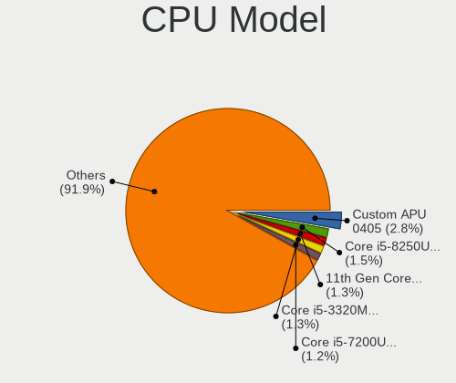

| Model                                         | Notebooks | Percent |
|-----------------------------------------------|-----------|---------|
| AMD Custom APU 0405                           | 129       | 2.83%   |
| Intel Core i5-8250U CPU @ 1.60GHz             | 66        | 1.45%   |
| Intel 11th Gen Core i7-1165G7 @ 2.80GHz       | 64        | 1.4%    |
| Intel Core i5-3320M CPU @ 2.60GHz             | 59        | 1.29%   |
| Intel Core i5-7200U CPU @ 2.50GHz             | 56        | 1.23%   |
| Intel 11th Gen Core i5-1135G7 @ 2.40GHz       | 56        | 1.23%   |
| Intel Core i7-8550U CPU @ 1.80GHz             | 53        | 1.16%   |
| Intel Core i7-7700HQ CPU @ 2.80GHz            | 53        | 1.16%   |
| Intel Core i7-8750H CPU @ 2.20GHz             | 50        | 1.1%    |
| Intel Core i7-8565U CPU @ 1.80GHz             | 49        | 1.07%   |
| Intel Core i5-6200U CPU @ 2.30GHz             | 47        | 1.03%   |
| Intel Core i7-10510U CPU @ 1.80GHz            | 45        | 0.99%   |
| Intel Core i5-8265U CPU @ 1.60GHz             | 45        | 0.99%   |
| Intel Core i5-3210M CPU @ 2.50GHz             | 44        | 0.96%   |
| Intel Core i5-2520M CPU @ 2.50GHz             | 44        | 0.96%   |
| Intel Core i7-7500U CPU @ 2.70GHz             | 42        | 0.92%   |
| Intel Core i5-6300U CPU @ 2.40GHz             | 42        | 0.92%   |
| Intel Core i7-9750H CPU @ 2.60GHz             | 41        | 0.9%    |
| Intel Celeron CPU N2840 @ 2.16GHz             | 39        | 0.85%   |
| Intel 11th Gen Core i7-11800H @ 2.30GHz       | 39        | 0.85%   |
| Intel Celeron CPU N3060 @ 1.60GHz             | 37        | 0.81%   |
| Intel Core i7-10750H CPU @ 2.60GHz            | 36        | 0.79%   |
| Intel Core i7-6700HQ CPU @ 2.60GHz            | 35        | 0.77%   |
| Intel Core i5-10210U CPU @ 1.60GHz            | 35        | 0.77%   |
| AMD Ryzen 5 3500U with Radeon Vega Mobile Gfx | 35        | 0.77%   |
| Intel Core i5-4300U CPU @ 1.90GHz             | 34        | 0.74%   |
| Intel Core i5-5200U CPU @ 2.20GHz             | 30        | 0.66%   |
| Intel Celeron CPU N3350 @ 1.10GHz             | 30        | 0.66%   |
| Intel Celeron N4000 CPU @ 1.10GHz             | 28        | 0.61%   |
| Intel Core i5-3230M CPU @ 2.60GHz             | 27        | 0.59%   |
| Intel Core i5-5300U CPU @ 2.30GHz             | 26        | 0.57%   |
| Intel Core i5 CPU M 520 @ 2.40GHz             | 25        | 0.55%   |
| Intel Core 2 Duo CPU P8600 @ 2.40GHz          | 25        | 0.55%   |
| Intel Celeron N4020 CPU @ 1.10GHz             | 25        | 0.55%   |
| AMD Ryzen 7 4800H with Radeon Graphics        | 25        | 0.55%   |
| Intel Core i5-2450M CPU @ 2.50GHz             | 24        | 0.53%   |
| Intel Core i3-3110M CPU @ 2.40GHz             | 24        | 0.53%   |
| Intel Core i5-1035G1 CPU @ 1.00GHz            | 23        | 0.5%    |
| Intel Core i7-6500U CPU @ 2.50GHz             | 22        | 0.48%   |
| Intel Core i5-8300H CPU @ 2.30GHz             | 22        | 0.48%   |

CPU Model Family
----------------

Processor model prefix

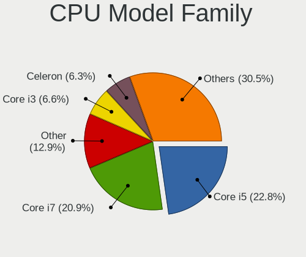

| Model                   | Notebooks | Percent |
|-------------------------|-----------|---------|
| Intel Core i5           | 1056      | 23.15%  |
| Intel Core i7           | 966       | 21.17%  |
| Other                   | 540       | 11.84%  |
| Intel Core i3           | 310       | 6.8%    |
| Intel Celeron           | 297       | 6.51%   |
| Intel Core 2 Duo        | 231       | 5.06%   |
| AMD Ryzen 7             | 142       | 3.11%   |
| AMD Ryzen 5             | 137       | 3%      |
| Intel Pentium           | 116       | 2.54%   |
| Intel Atom              | 88        | 1.93%   |
| AMD A6                  | 65        | 1.42%   |
| AMD A8                  | 48        | 1.05%   |
| AMD Ryzen 3             | 45        | 0.99%   |
| Intel Pentium Dual-Core | 38        | 0.83%   |
| Intel Core 2            | 34        | 0.75%   |
| AMD Ryzen 9             | 32        | 0.7%    |
| AMD A4                  | 29        | 0.64%   |
| AMD Ryzen 7 PRO         | 28        | 0.61%   |
| Intel Pentium Dual      | 27        | 0.59%   |
| Intel Core i9           | 26        | 0.57%   |
| Intel Genuine           | 25        | 0.55%   |
| Intel Celeron Dual-Core | 21        | 0.46%   |
| AMD E1                  | 21        | 0.46%   |
| AMD A10                 | 21        | 0.46%   |
| AMD E                   | 18        | 0.39%   |
| Intel Pentium Silver    | 16        | 0.35%   |
| Intel Celeron M         | 16        | 0.35%   |
| AMD E2                  | 15        | 0.33%   |
| AMD Athlon              | 11        | 0.24%   |
| Intel Pentium M         | 10        | 0.22%   |
| AMD Turion 64 X2 Mobile | 8         | 0.18%   |
| AMD Athlon II           | 8         | 0.18%   |
| Intel Core m3           | 7         | 0.15%   |
| Intel Core M            | 7         | 0.15%   |
| AMD Ryzen 5 PRO         | 7         | 0.15%   |
| AMD FX                  | 7         | 0.15%   |
| AMD Athlon X2           | 7         | 0.15%   |
| AMD Turion 64 Mobile    | 6         | 0.13%   |
| Intel Pentium Gold      | 5         | 0.11%   |
| Intel Core              | 5         | 0.11%   |

CPU Cores
---------

Number of processor cores

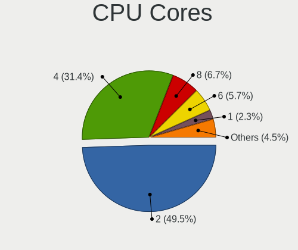

| Number | Notebooks | Percent |
|--------|-----------|---------|
| 2      | 2334      | 51.17%  |
| 4      | 1440      | 31.57%  |
| 8      | 262       | 5.74%   |
| 6      | 257       | 5.63%   |
| 1      | 115       | 2.52%   |
| 14     | 54        | 1.18%   |
| 12     | 44        | 0.96%   |
| 10     | 40        | 0.88%   |
| 16     | 8         | 0.18%   |
| 24     | 5         | 0.11%   |
| 3      | 2         | 0.04%   |

CPU Sockets
-----------

Number of sockets

| Number | Notebooks | Percent |
|--------|-----------|---------|
| 1      | 4557      | 99.98%  |
| 2      | 1         | 0.02%   |

CPU Threads
-----------

Threads per core (Hyper-Threading)

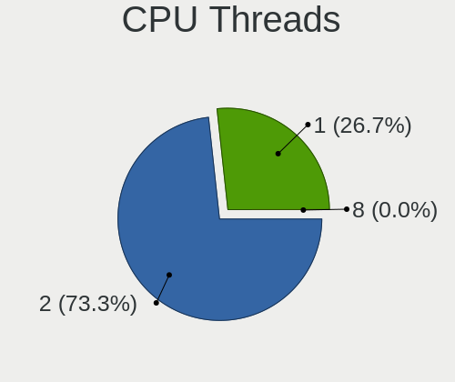

| Number | Notebooks | Percent |
|--------|-----------|---------|
| 2      | 3300      | 72.35%  |
| 1      | 1260      | 27.63%  |
| 8      | 1         | 0.02%   |

CPU Op-Modes
------------

CPU Operation Modes (32-bit, 64-bit)

| Op mode        | Notebooks | Percent |
|----------------|-----------|---------|
| 32-bit, 64-bit | 4452      | 97.42%  |
| 32-bit         | 59        | 1.29%   |
| Unknown        | 58        | 1.27%   |
| 64-bit         | 1         | 0.02%   |

CPU Microcode
-------------

Microcode number

| Number     | Notebooks | Percent |
|------------|-----------|---------|
| Unknown    | 1642      | 34.62%  |
| 0x306a9    | 249       | 5.25%   |
| 0x206a7    | 210       | 4.43%   |
| 0x1067a    | 159       | 3.35%   |
| 0x806ea    | 125       | 2.64%   |
| 0x40651    | 124       | 2.61%   |
| 0x806ec    | 123       | 2.59%   |
| 0x406e3    | 114       | 2.4%    |
| 0x806e9    | 113       | 2.38%   |
| 0x306d4    | 108       | 2.28%   |
| 0x20655    | 99        | 2.09%   |
| 0x806c1    | 97        | 2.05%   |
| 0x906ea    | 92        | 1.94%   |
| 0x6fd      | 69        | 1.45%   |
| 0x406c4    | 66        | 1.39%   |
| 0x306c3    | 66        | 1.39%   |
| 0x30678    | 64        | 1.35%   |
| 0x906e9    | 51        | 1.08%   |
| 0xa0652    | 50        | 1.05%   |
| 0x506c9    | 46        | 0.97%   |
| 0x08108109 | 46        | 0.97%   |
| 0x506e3    | 45        | 0.95%   |
| 0x0a50000c | 43        | 0.91%   |
| 0x06006705 | 43        | 0.91%   |
| 0x706e5    | 37        | 0.78%   |
| 0x08108102 | 37        | 0.78%   |
| 0x406c3    | 35        | 0.74%   |
| 0x10676    | 35        | 0.74%   |
| 0x20652    | 33        | 0.7%    |
| 0x906a3    | 32        | 0.67%   |
| 0x806d1    | 32        | 0.67%   |
| 0x07030105 | 31        | 0.65%   |
| 0x706a1    | 30        | 0.63%   |
| 0x08600106 | 28        | 0.59%   |
| 0x6f6      | 25        | 0.53%   |
| 0x06006704 | 25        | 0.53%   |
| 0x806eb    | 22        | 0.46%   |
| 0x08608103 | 21        | 0.44%   |
| 0x08600104 | 20        | 0.42%   |
| 0x05000119 | 20        | 0.42%   |

CPU Microarch
-------------

Microarchitecture

| Name              | Notebooks | Percent |
|-------------------|-----------|---------|
| KabyLake          | 803       | 17.59%  |
| IvyBridge         | 341       | 7.47%   |
| Haswell           | 305       | 6.68%   |
| SandyBridge       | 291       | 6.37%   |
| Unknown           | 288       | 6.31%   |
| Skylake           | 240       | 5.26%   |
| Penryn            | 238       | 5.21%   |
| Silvermont        | 211       | 4.62%   |
| TigerLake         | 181       | 3.96%   |
| Westmere          | 173       | 3.79%   |
| Broadwell         | 163       | 3.57%   |
| Core              | 161       | 3.53%   |
| Alderlake Hybrid  | 117       | 2.56%   |
| Zen+              | 105       | 2.3%    |
| Icelake           | 98        | 2.15%   |
| Excavator         | 94        | 2.06%   |
| CometLake         | 93        | 2.04%   |
| Zen 2             | 86        | 1.88%   |
| Zen 3             | 78        | 1.71%   |
| Goldmont plus     | 76        | 1.66%   |
| Puma              | 60        | 1.31%   |
| Goldmont          | 57        | 1.25%   |
| Zen               | 42        | 0.92%   |
| P6                | 42        | 0.92%   |
| Bobcat            | 38        | 0.83%   |
| Bonnell           | 34        | 0.74%   |
| Piledriver        | 23        | 0.5%    |
| K10               | 23        | 0.5%    |
| Jaguar            | 22        | 0.48%   |
| K8 Hammer         | 20        | 0.44%   |
| Steamroller       | 17        | 0.37%   |
| Nehalem           | 13        | 0.28%   |
| K8 & K10 hybrid   | 13        | 0.28%   |
| K10 Llano         | 7         | 0.15%   |
| Tremont           | 6         | 0.13%   |
| Meteorlake Hybrid | 5         | 0.11%   |
| NetBurst          | 2         | 0.04%   |

Graphics
--------

GPU Vendor
----------

Vendors of graphics cards

| Vendor                           | Notebooks | Percent |
|----------------------------------|-----------|---------|
| Intel                            | 3421      | 62.31%  |
| Nvidia                           | 1051      | 19.14%  |
| AMD                              | 1001      | 18.23%  |
| Silicon Integrated Systems [SiS] | 12        | 0.22%   |
| VIA Technologies                 | 4         | 0.07%   |
| ATI Technologies                 | 1         | 0.02%   |

GPU Model
---------

Graphics card models

| Model                                                                                    | Notebooks | Percent |
|------------------------------------------------------------------------------------------|-----------|---------|
| Intel 3rd Gen Core processor Graphics Controller                                         | 324       | 5.73%   |
| Intel 2nd Generation Core Processor Family Integrated Graphics Controller                | 277       | 4.9%    |
| Intel Mobile 4 Series Chipset Integrated Graphics Controller                             | 183       | 3.23%   |
| Intel Haswell-ULT Integrated Graphics Controller                                         | 176       | 3.11%   |
| Intel UHD Graphics 620                                                                   | 169       | 2.99%   |
| Intel TigerLake-LP GT2 [Iris Xe Graphics]                                                | 164       | 2.9%    |
| Intel CoffeeLake-H GT2 [UHD Graphics 630]                                                | 148       | 2.62%   |
| Intel Skylake GT2 [HD Graphics 520]                                                      | 146       | 2.58%   |
| Intel HD Graphics 620                                                                    | 142       | 2.51%   |
| Intel Core Processor Integrated Graphics Controller                                      | 142       | 2.51%   |
| AMD VanGogh [AMD Custom GPU 0405]                                                        | 126       | 2.23%   |
| Intel HD Graphics 5500                                                                   | 119       | 2.1%    |
| Intel Atom/Celeron/Pentium Processor x5-E8000/J3xxx/N3xxx Integrated Graphics Controller | 118       | 2.09%   |
| Intel WhiskeyLake-U GT2 [UHD Graphics 620]                                               | 115       | 2.03%   |
| Intel 4th Gen Core Processor Integrated Graphics Controller                              | 112       | 1.98%   |
| AMD Picasso/Raven 2 [Radeon Vega Series / Radeon Vega Mobile Series]                     | 111       | 1.96%   |
| Intel CometLake-U GT2 [UHD Graphics]                                                     | 98        | 1.73%   |
| Intel Atom Processor Z36xxx/Z37xxx Series Graphics & Display                             | 93        | 1.64%   |
| AMD Renoir [Radeon RX Vega 6 (Ryzen 4000/5000 Mobile Series)]                            | 81        | 1.43%   |
| Intel CometLake-H GT2 [UHD Graphics]                                                     | 77        | 1.36%   |
| AMD Stoney [Radeon R2/R3/R4/R5 Graphics]                                                 | 77        | 1.36%   |
| Intel HD Graphics 630                                                                    | 68        | 1.2%    |
| Intel GeminiLake [UHD Graphics 600]                                                      | 65        | 1.15%   |
| Intel Mobile GM965/GL960 Integrated Graphics Controller (secondary)                      | 63        | 1.11%   |
| Intel Mobile GM965/GL960 Integrated Graphics Controller (primary)                        | 63        | 1.11%   |
| Nvidia TU117M [GeForce GTX 1650 Mobile / Max-Q]                                          | 60        | 1.06%   |
| Intel Alder Lake-P GT2 [Iris Xe Graphics]                                                | 60        | 1.06%   |
| Intel Mobile 945GM/GMS/GME, 943/940GML Express Integrated Graphics Controller            | 58        | 1.03%   |
| Intel TigerLake-H GT1 [UHD Graphics]                                                     | 53        | 0.94%   |
| AMD Cezanne [Radeon Vega Series / Radeon Vega Mobile Series]                             | 52        | 0.92%   |
| Nvidia GP107M [GeForce GTX 1050 Ti Mobile]                                               | 51        | 0.9%    |
| Intel HD Graphics 530                                                                    | 51        | 0.9%    |
| Intel HD Graphics 500                                                                    | 47        | 0.83%   |
| Intel Mobile 945GM/GMS, 943/940GML Express Integrated Graphics Controller                | 44        | 0.78%   |
| AMD Lucienne                                                                             | 43        | 0.76%   |
| Nvidia GP107M [GeForce GTX 1050 Mobile]                                                  | 41        | 0.72%   |
| AMD Mullins [Radeon R4/R5 Graphics]                                                      | 40        | 0.71%   |
| Nvidia GA106M [GeForce RTX 3060 Mobile / Max-Q]                                          | 38        | 0.67%   |
| Nvidia GA107M [GeForce RTX 3050 Ti Mobile]                                               | 37        | 0.65%   |
| Intel Raptor Lake-P [Iris Xe Graphics]                                                   | 37        | 0.65%   |

GPU Combo
---------

Combinations of graphics cards

| Name                     | Notebooks | Percent |
|--------------------------|-----------|---------|
| 1 x Intel                | 2549      | 55.72%  |
| 1 x AMD                  | 788       | 17.22%  |
| Intel + Nvidia           | 747       | 16.33%  |
| 1 x Nvidia               | 224       | 4.9%    |
| Intel + AMD              | 98        | 2.14%   |
| AMD + Nvidia             | 76        | 1.66%   |
| 2 x AMD                  | 39        | 0.85%   |
| 2 x Intel                | 24        | 0.52%   |
| 1 x SiS                  | 12        | 0.26%   |
| Other                    | 9         | 0.2%    |
| 1 x VIA                  | 4         | 0.09%   |
| 2 x Nvidia               | 3         | 0.07%   |
| Intel + 2 x Nvidia       | 1         | 0.02%   |
| Intel + AMD + 1 x Nvidia | 1         | 0.02%   |

GPU Driver
----------

Free vs proprietary

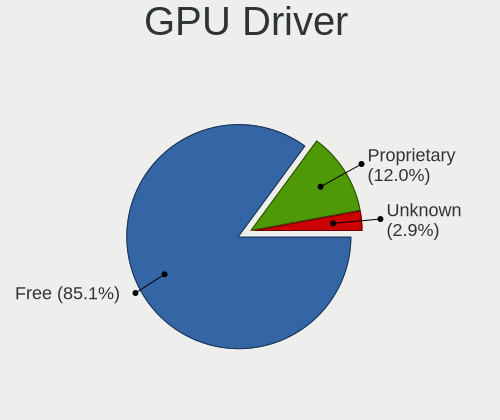

| Driver      | Notebooks | Percent |
|-------------|-----------|---------|
| Free        | 3967      | 85.9%   |
| Proprietary | 545       | 11.8%   |
| Unknown     | 106       | 2.3%    |

GPU Memory
----------

Total video memory

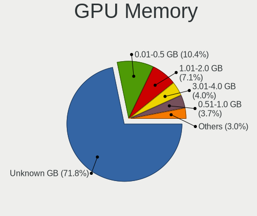

| Size in GB | Notebooks | Percent |
|------------|-----------|---------|
| Unknown    | 3294      | 70.46%  |
| 0.01-0.5   | 508       | 10.87%  |
| 1.01-2.0   | 362       | 7.74%   |
| 3.01-4.0   | 196       | 4.19%   |
| 0.51-1.0   | 177       | 3.79%   |
| 5.01-6.0   | 70        | 1.5%    |
| 7.01-8.0   | 46        | 0.98%   |
| 8.01-16.0  | 12        | 0.26%   |
| 2.01-3.0   | 10        | 0.21%   |

Monitor
-------

Monitor Vendor
--------------

Monitor vendors

| Vendor                  | Notebooks | Percent |
|-------------------------|-----------|---------|
| AU Optronics            | 938       | 18.63%  |
| LG Display              | 743       | 14.76%  |
| Chimei Innolux          | 602       | 11.96%  |
| BOE                     | 592       | 11.76%  |
| Samsung Electronics     | 505       | 10.03%  |
| Sharp                   | 241       | 4.79%   |
| Apple                   | 158       | 3.14%   |
| Dell                    | 132       | 2.62%   |
| Lenovo                  | 106       | 2.11%   |
| Chi Mei Optoelectronics | 90        | 1.79%   |
| Valve                   | 87        | 1.73%   |
| PANDA                   | 75        | 1.49%   |
| Goldstar                | 70        | 1.39%   |
| Acer                    | 54        | 1.07%   |
| LG Philips              | 52        | 1.03%   |
| Hewlett-Packard         | 50        | 0.99%   |
| AOC                     | 43        | 0.85%   |
| InfoVision              | 42        | 0.83%   |
| Iiyama                  | 42        | 0.83%   |
| BenQ                    | 41        | 0.81%   |
| CSO                     | 32        | 0.64%   |
| Philips                 | 30        | 0.6%    |
| Analogix                | 26        | 0.52%   |
| Ancor Communications    | 22        | 0.44%   |
| Panasonic               | 19        | 0.38%   |
| Sony                    | 17        | 0.34%   |
| ViewSonic               | 15        | 0.3%    |
| Toshiba                 | 14        | 0.28%   |
| LGD                     | 14        | 0.28%   |
| InnoLux Display         | 13        | 0.26%   |
| ASUSTek Computer        | 13        | 0.26%   |
| HannStar                | 11        | 0.22%   |
| Vestel Elektronik       | 9         | 0.18%   |
| CPT                     | 9         | 0.18%   |
| Quanta Display          | 7         | 0.14%   |
| Seiko/Epson             | 6         | 0.12%   |
| NEC Computers           | 6         | 0.12%   |
| Unknown                 | 5         | 0.1%    |
| TMX                     | 5         | 0.1%    |
| JDI                     | 5         | 0.1%    |

Monitor Model
-------------

Monitor models

| Model                                                                 | Notebooks | Percent |
|-----------------------------------------------------------------------|-----------|---------|
| Valve ANX7530 U VLV3001 800x1280 100x150mm 7.1-inch                   | 82        | 1.61%   |
| AU Optronics LCD Monitor AUO38ED 1920x1080 344x193mm 15.5-inch        | 50        | 0.98%   |
| Samsung Electronics LCD Monitor SEC5441 1366x768 344x194mm 15.5-inch  | 39        | 0.77%   |
| AU Optronics LCD Monitor AUO22EC 1366x768 344x193mm 15.5-inch         | 34        | 0.67%   |
| AU Optronics LCD Monitor AUO21ED 1920x1080 344x193mm 15.5-inch        | 34        | 0.67%   |
| AU Optronics LCD Monitor AUO106C 1366x768 277x156mm 12.5-inch         | 34        | 0.67%   |
| LG Display LCD Monitor LGD02DC 1366x768 344x194mm 15.5-inch           | 31        | 0.61%   |
| Chimei Innolux LCD Monitor CMN14D4 1920x1080 309x173mm 13.9-inch      | 28        | 0.55%   |
| Analogix ANX7530 U ANX7539 800x1280                                   | 26        | 0.51%   |
| Chimei Innolux LCD Monitor CMN15F5 1920x1080 344x193mm 15.5-inch      | 25        | 0.49%   |
| Chimei Innolux LCD Monitor CMN15DB 1366x768 344x193mm 15.5-inch       | 24        | 0.47%   |
| Chimei Innolux LCD Monitor CMN15E7 1920x1080 344x193mm 15.5-inch      | 23        | 0.45%   |
| LG Display LCD Monitor LGD033A 1366x768 344x194mm 15.5-inch           | 22        | 0.43%   |
| Chimei Innolux LCD Monitor CMN14C9 1920x1080 309x173mm 13.9-inch      | 20        | 0.39%   |
| Chimei Innolux LCD Monitor CMN1132 1366x768 256x144mm 11.6-inch       | 19        | 0.37%   |
| AU Optronics LCD Monitor AUO2E3C 1366x768 309x173mm 13.9-inch         | 19        | 0.37%   |
| AU Optronics LCD Monitor AUO403D 1920x1080 309x174mm 14.0-inch        | 18        | 0.35%   |
| AU Optronics LCD Monitor AUO21EC 1366x768 344x193mm 15.5-inch         | 17        | 0.33%   |
| Sharp LCD Monitor SHP148D 3840x2160 344x194mm 15.5-inch               | 16        | 0.31%   |
| Chimei Innolux LCD Monitor CMN14D5 1920x1080 309x173mm 13.9-inch      | 16        | 0.31%   |
| AU Optronics LCD Monitor AUO313C 1366x768 309x173mm 13.9-inch         | 16        | 0.31%   |
| Samsung Electronics LCD Monitor SEC5541 1366x768 344x193mm 15.5-inch  | 15        | 0.29%   |
| BOE LCD Monitor BOE06A5 1366x768 344x194mm 15.5-inch                  | 15        | 0.29%   |
| AU Optronics LCD Monitor AUO5B2D 1920x1080 293x162mm 13.2-inch        | 15        | 0.29%   |
| AU Optronics LCD Monitor AUO26EC 1366x768 344x193mm 15.5-inch         | 15        | 0.29%   |
| LG Display LCD Monitor LGD0521 1920x1080 309x174mm 14.0-inch          | 14        | 0.28%   |
| LG Display LCD Monitor LGD02D8 1366x768 277x156mm 12.5-inch           | 14        | 0.28%   |
| BOE LCD Monitor BOE0687 1920x1080 344x193mm 15.5-inch                 | 14        | 0.28%   |
| Sharp LCD Monitor SHP14AD 3840x2160 294x165mm 13.3-inch               | 13        | 0.26%   |
| Sharp LCD Monitor SHP1484 1920x1080 294x165mm 13.3-inch               | 13        | 0.26%   |
| Sharp LCD Monitor SHP1453 1920x1080 346x194mm 15.6-inch               | 13        | 0.26%   |
| Samsung Electronics LCD Monitor SEC544B 1600x900 310x174mm 14.0-inch  | 13        | 0.26%   |
| LG Display LCD Monitor LGD046D 1920x1080 309x174mm 14.0-inch          | 13        | 0.26%   |
| Chimei Innolux LCD Monitor CMN15E8 1920x1080 344x193mm 15.5-inch      | 13        | 0.26%   |
| Chimei Innolux LCD Monitor CMN15CA 1366x768 344x193mm 15.5-inch       | 13        | 0.26%   |
| Sharp LCD Monitor SHP1449 1920x1080 294x165mm 13.3-inch               | 12        | 0.24%   |
| Samsung Electronics LCD Monitor SDCA029 3840x2160 344x194mm 15.5-inch | 12        | 0.24%   |
| LG Display LCD Monitor LGD0250 1366x768 345x194mm 15.6-inch           | 12        | 0.24%   |
| AU Optronics LCD Monitor AUO45EC 1366x768 344x193mm 15.5-inch         | 12        | 0.24%   |
| AU Optronics LCD Monitor AUO40EC 1366x768 344x193mm 15.5-inch         | 12        | 0.24%   |

Monitor Resolution
------------------

Monitor screen resolution

| Resolution         | Notebooks | Percent |
|--------------------|-----------|---------|
| 1920x1080 (FHD)    | 1830      | 38.18%  |
| 1366x768 (WXGA)    | 1393      | 29.06%  |
| 1280x800 (WXGA)    | 231       | 4.82%   |
| 3840x2160 (4K)     | 228       | 4.76%   |
| 1600x900 (HD+)     | 174       | 3.63%   |
| 2560x1440 (QHD)    | 156       | 3.25%   |
| 1920x1200 (WUXGA)  | 111       | 2.32%   |
| 800x1280           | 110       | 2.3%    |
| 1440x900 (WXGA+)   | 91        | 1.9%    |
| 2560x1600          | 85        | 1.77%   |
| 2880x1800          | 47        | 0.98%   |
| 3840x2400          | 45        | 0.94%   |
| 1680x1050 (WSXGA+) | 33        | 0.69%   |
| 3440x1440          | 29        | 0.61%   |
| 3200x1800 (QHD+)   | 25        | 0.52%   |
| 1024x600           | 23        | 0.48%   |
| 1280x1024 (SXGA)   | 19        | 0.4%    |
| 2160x1440          | 15        | 0.31%   |
| 2560x1080          | 14        | 0.29%   |
| 2256x1504          | 14        | 0.29%   |
| Unknown            | 10        | 0.21%   |
| 3456x2160          | 9         | 0.19%   |
| 1360x768           | 9         | 0.19%   |
| 3072x1920          | 8         | 0.17%   |
| 1920x540           | 7         | 0.15%   |
| 1920x1280          | 6         | 0.13%   |
| 1680x945           | 6         | 0.13%   |
| 1024x768 (XGA)     | 6         | 0.13%   |
| 3000x2000          | 5         | 0.1%    |
| 2560x1700          | 5         | 0.1%    |
| 3200x2000          | 4         | 0.08%   |
| 3840x1080          | 3         | 0.06%   |
| 2880x1920          | 3         | 0.06%   |
| 2520x1680          | 3         | 0.06%   |
| 2304x1440          | 3         | 0.06%   |
| 1280x768           | 3         | 0.06%   |
| 3840x1600          | 2         | 0.04%   |
| 3840x1100          | 2         | 0.04%   |
| 3120x2080          | 2         | 0.04%   |
| 2288x1287          | 2         | 0.04%   |

Monitor Diagonal
----------------

Diagonal size in inches

| Inches  | Notebooks | Percent |
|---------|-----------|---------|
| 15      | 1985      | 39.54%  |
| 13      | 799       | 15.92%  |
| 14      | 523       | 10.42%  |
| 17      | 308       | 6.14%   |
| 12      | 212       | 4.22%   |
| 27      | 161       | 3.21%   |
| 11      | 133       | 2.65%   |
| 24      | 127       | 2.53%   |
| 23      | 88        | 1.75%   |
| 7       | 87        | 1.73%   |
| 21      | 83        | 1.65%   |
| 16      | 82        | 1.63%   |
| Unknown | 64        | 1.27%   |
| 31      | 49        | 0.98%   |
| 34      | 39        | 0.78%   |
| 18      | 34        | 0.68%   |
| 10      | 34        | 0.68%   |
| 3       | 26        | 0.52%   |
| 84      | 25        | 0.5%    |
| 19      | 18        | 0.36%   |
| 25      | 15        | 0.3%    |
| 22      | 14        | 0.28%   |
| 72      | 12        | 0.24%   |
| 26      | 12        | 0.24%   |
| 20      | 9         | 0.18%   |
| 8       | 9         | 0.18%   |
| 40      | 8         | 0.16%   |
| 54      | 7         | 0.14%   |
| 65      | 6         | 0.12%   |
| 48      | 6         | 0.12%   |
| 32      | 6         | 0.12%   |
| 33      | 4         | 0.08%   |
| 86      | 3         | 0.06%   |
| 50      | 3         | 0.06%   |
| 42      | 3         | 0.06%   |
| 35      | 3         | 0.06%   |
| 28      | 3         | 0.06%   |
| 142     | 2         | 0.04%   |
| 49      | 2         | 0.04%   |
| 46      | 2         | 0.04%   |

Monitor Width
-------------

Physical width

| Width in mm    | Notebooks | Percent |
|----------------|-----------|---------|
| 301-350        | 2840      | 57.01%  |
| 201-300        | 852       | 17.1%   |
| 351-400        | 389       | 7.81%   |
| 501-600        | 364       | 7.31%   |
| 401-500        | 140       | 2.81%   |
| 1-100          | 110       | 2.21%   |
| 601-700        | 71        | 1.43%   |
| Unknown        | 64        | 1.28%   |
| 701-800        | 49        | 0.98%   |
| 1501-2000      | 39        | 0.78%   |
| 1001-1500      | 33        | 0.66%   |
| 801-900        | 14        | 0.28%   |
| 101-200        | 9         | 0.18%   |
| 901-1000       | 5         | 0.1%    |
| More than 2000 | 3         | 0.06%   |

Aspect Ratio
------------

Proportional relationship between the width and the height

| Ratio   | Notebooks | Percent |
|---------|-----------|---------|
| 16/9    | 3580      | 78.79%  |
| 16/10   | 639       | 14.06%  |
| 0.67    | 82        | 1.8%    |
| 3/2     | 64        | 1.41%   |
| Unknown | 57        | 1.25%   |
| 21/9    | 46        | 1.01%   |
| 6/5     | 29        | 0.64%   |
| 5/4     | 16        | 0.35%   |
| 4/3     | 13        | 0.29%   |
| 0.62    | 8         | 0.18%   |
| 32/9    | 3         | 0.07%   |
| 1.00    | 3         | 0.07%   |
| 3.40    | 2         | 0.04%   |
| 0.56    | 2         | 0.04%   |

Monitor Area
------------

Area in inch

| Area in inch | Notebooks | Percent |
|----------------|-----------|---------|
| 101-110        | 1970      | 39.31%  |
| 81-90          | 936       | 18.68%  |
| 71-80          | 377       | 7.52%   |
| 121-130        | 261       | 5.21%   |
| 201-250        | 259       | 5.17%   |
| 61-70          | 204       | 4.07%   |
| 301-350        | 171       | 3.41%   |
| 51-60          | 136       | 2.71%   |
| 1-40           | 119       | 2.37%   |
| 351-500        | 104       | 2.08%   |
| 111-120        | 86        | 1.72%   |
| More than 1000 | 70        | 1.4%    |
| Unknown        | 64        | 1.28%   |
| 151-200        | 48        | 0.96%   |
| 131-140        | 48        | 0.96%   |
| 251-300        | 47        | 0.94%   |
| 141-150        | 35        | 0.7%    |
| 41-50          | 33        | 0.66%   |
| 91-100         | 22        | 0.44%   |
| 501-1000       | 21        | 0.42%   |

Pixel Density
-------------

Pixels per inch

| Density       | Notebooks | Percent |
|---------------|-----------|---------|
| 121-160       | 1899      | 38.41%  |
| 101-120       | 1420      | 28.72%  |
| 51-100        | 680       | 13.75%  |
| 161-240       | 569       | 11.51%  |
| More than 240 | 260       | 5.26%   |
| Unknown       | 64        | 1.29%   |
| 1-50          | 52        | 1.05%   |

Multiple Monitors
-----------------

Total monitors connected

| Total | Notebooks | Percent |
|-------|-----------|---------|
| 1     | 3862      | 83.13%  |
| 2     | 620       | 13.34%  |
| 0     | 99        | 2.13%   |
| 3     | 58        | 1.25%   |
| 4     | 5         | 0.11%   |
| 5     | 2         | 0.04%   |

Network
-------

Net Controller Vendor
---------------------

Controller vendors

| Vendor                            | Notebooks | Percent |
|-----------------------------------|-----------|---------|
| Intel                             | 2497      | 35.54%  |
| Realtek Semiconductor             | 2155      | 30.68%  |
| Qualcomm Atheros                  | 900       | 12.81%  |
| Broadcom                          | 502       | 7.15%   |
| Broadcom Limited                  | 125       | 1.78%   |
| Marvell Technology Group          | 98        | 1.4%    |
| MediaTek                          | 86        | 1.22%   |
| Ralink Technology                 | 59        | 0.84%   |
| Ralink                            | 52        | 0.74%   |
| TP-Link                           | 51        | 0.73%   |
| ASIX Electronics                  | 48        | 0.68%   |
| Ericsson Business Mobile Networks | 47        | 0.67%   |
| Qualcomm                          | 39        | 0.56%   |
| Dell                              | 37        | 0.53%   |
| DisplayLink                       | 32        | 0.46%   |
| Nvidia                            | 30        | 0.43%   |
| Lenovo                            | 28        | 0.4%    |
| Samsung Electronics               | 24        | 0.34%   |
| Sierra Wireless                   | 22        | 0.31%   |
| Hewlett-Packard                   | 20        | 0.28%   |
| JMicron Technology                | 12        | 0.17%   |
| Huawei Technologies               | 12        | 0.17%   |
| Silicon Integrated Systems [SiS]  | 11        | 0.16%   |
| Edimax Technology                 | 10        | 0.14%   |
| NetGear                           | 9         | 0.13%   |
| Qualcomm Atheros Communications   | 8         | 0.11%   |
| Google                            | 8         | 0.11%   |
| ICS Advent                        | 7         | 0.1%    |
| Xiaomi                            | 6         | 0.09%   |
| OPPO Electronics                  | 5         | 0.07%   |
| OnePlus Technology (Shenzhen)     | 5         | 0.07%   |
| Micro Star International          | 5         | 0.07%   |
| Fibocom                           | 5         | 0.07%   |
| Belkin Components                 | 5         | 0.07%   |
| Attansic Technology               | 5         | 0.07%   |
| ASUSTek Computer                  | 5         | 0.07%   |
| Apple                             | 5         | 0.07%   |
| VIA Technologies                  | 4         | 0.06%   |
| D-Link                            | 4         | 0.06%   |
| Motorola PCS                      | 3         | 0.04%   |

Net Controller Model
--------------------

Controller models

| Model                                                                   | Notebooks | Percent |
|-------------------------------------------------------------------------|-----------|---------|
| Realtek RTL8111/8168/8211/8411 PCI Express Gigabit Ethernet Controller  | 1138      | 13.38%  |
| Realtek RTL810xE PCI Express Fast Ethernet controller                   | 425       | 5%      |
| Intel Wi-Fi 6 AX200                                                     | 206       | 2.42%   |
| Realtek RTL8822CE 802.11ac PCIe Wireless Network Adapter                | 196       | 2.3%    |
| Intel Wireless 8265 / 8275                                              | 196       | 2.3%    |
| Intel 82579LM Gigabit Network Connection (Lewisville)                   | 193       | 2.27%   |
| Realtek RTL8153 Gigabit Ethernet Adapter                                | 188       | 2.21%   |
| Intel Wireless 7265                                                     | 167       | 1.96%   |
| Intel Wireless 7260                                                     | 163       | 1.92%   |
| Intel Centrino Advanced-N 6205 [Taylor Peak]                            | 154       | 1.81%   |
| Qualcomm Atheros QCA9377 802.11ac Wireless Network Adapter              | 151       | 1.78%   |
| Realtek RTL8821CE 802.11ac PCIe Wireless Network Adapter                | 146       | 1.72%   |
| Qualcomm Atheros QCA6174 802.11ac Wireless Network Adapter              | 141       | 1.66%   |
| Intel Wi-Fi 6 AX201                                                     | 126       | 1.48%   |
| Qualcomm Atheros QCA9565 / AR9565 Wireless Network Adapter              | 122       | 1.43%   |
| Intel Wireless 8260                                                     | 117       | 1.38%   |
| Qualcomm Atheros AR9485 Wireless Network Adapter                        | 106       | 1.25%   |
| Intel Wireless 3165                                                     | 102       | 1.2%    |
| Qualcomm Atheros AR9285 Wireless Network Adapter (PCI-Express)          | 91        | 1.07%   |
| Intel Alder Lake-P PCH CNVi WiFi                                        | 78        | 0.92%   |
| Broadcom BCM4313 802.11bgn Wireless Network Adapter                     | 78        | 0.92%   |
| Intel Ethernet Connection (4) I219-LM                                   | 75        | 0.88%   |
| Intel Comet Lake PCH-LP CNVi WiFi                                       | 75        | 0.88%   |
| Intel 82577LM Gigabit Network Connection                                | 72        | 0.85%   |
| Realtek RTL8723BE PCIe Wireless Network Adapter                         | 71        | 0.83%   |
| Broadcom BCM43142 802.11b/g/n                                           | 71        | 0.83%   |
| Intel Ethernet Connection I218-LM                                       | 70        | 0.82%   |
| Intel Cannon Lake PCH CNVi WiFi                                         | 68        | 0.8%    |
| Intel Comet Lake PCH CNVi WiFi                                          | 66        | 0.78%   |
| Intel PRO/Wireless 3945ABG [Golan] Network Connection                   | 65        | 0.76%   |
| Intel Wireless 3160                                                     | 58        | 0.68%   |
| Intel Cannon Point-LP CNVi [Wireless-AC]                                | 58        | 0.68%   |
| Intel Wi-Fi 5(802.11ac) Wireless-AC 9x6x [Thunder Peak]                 | 56        | 0.66%   |
| Intel Wi-Fi 6E(802.11ax) AX210/AX1675* 2x2 [Typhoon Peak]               | 55        | 0.65%   |
| Qualcomm Atheros AR242x / AR542x Wireless Network Adapter (PCI-Express) | 53        | 0.62%   |
| Intel WiFi Link 5100                                                    | 53        | 0.62%   |
| Intel Centrino Ultimate-N 6300                                          | 52        | 0.61%   |
| Intel Ethernet Connection I219-LM                                       | 51        | 0.6%    |
| Intel Ethernet Connection (3) I218-LM                                   | 50        | 0.59%   |
| Qualcomm Atheros AR9462 Wireless Network Adapter                        | 48        | 0.56%   |

Wireless Vendor
---------------

Wireless vendors

| Vendor                          | Notebooks | Percent |
|---------------------------------|-----------|---------|
| Intel                           | 2401      | 50.37%  |
| Qualcomm Atheros                | 781       | 16.38%  |
| Realtek Semiconductor           | 729       | 15.29%  |
| Broadcom                        | 386       | 8.1%    |
| Broadcom Limited                | 98        | 2.06%   |
| MediaTek                        | 81        | 1.7%    |
| Ralink Technology               | 59        | 1.24%   |
| Ralink                          | 52        | 1.09%   |
| TP-Link                         | 44        | 0.92%   |
| Qualcomm                        | 28        | 0.59%   |
| Sierra Wireless                 | 22        | 0.46%   |
| Dell                            | 19        | 0.4%    |
| Edimax Technology               | 10        | 0.21%   |
| NetGear                         | 9         | 0.19%   |
| Qualcomm Atheros Communications | 8         | 0.17%   |
| Micro Star International        | 5         | 0.1%    |
| FIBOCOM                         | 5         | 0.1%    |
| Belkin Components               | 5         | 0.1%    |
| D-Link                          | 4         | 0.08%   |
| ASUSTek Computer                | 4         | 0.08%   |
| Wacom                           | 2         | 0.04%   |
| Qualcomm Technologies           | 2         | 0.04%   |
| Microsoft                       | 2         | 0.04%   |
| Hewlett-Packard                 | 2         | 0.04%   |
| ZyDAS                           | 1         | 0.02%   |
| Senao                           | 1         | 0.02%   |
| Marvell Technology Group        | 1         | 0.02%   |
| Linksys                         | 1         | 0.02%   |
| InProComm                       | 1         | 0.02%   |
| Fujitsu Siemens Computers       | 1         | 0.02%   |
| Askey Computer                  | 1         | 0.02%   |
| Apple                           | 1         | 0.02%   |
| 3Com                            | 1         | 0.02%   |

Wireless Model
--------------

Wireless models

| Model                                                                   | Notebooks | Percent |
|-------------------------------------------------------------------------|-----------|---------|
| Intel Wi-Fi 6 AX200                                                     | 206       | 4.3%    |
| Realtek RTL8822CE 802.11ac PCIe Wireless Network Adapter                | 196       | 4.09%   |
| Intel Wireless 8265 / 8275                                              | 196       | 4.09%   |
| Intel Wireless 7265                                                     | 167       | 3.49%   |
| Intel Wireless 7260                                                     | 163       | 3.4%    |
| Intel Centrino Advanced-N 6205 [Taylor Peak]                            | 154       | 3.21%   |
| Qualcomm Atheros QCA9377 802.11ac Wireless Network Adapter              | 151       | 3.15%   |
| Realtek RTL8821CE 802.11ac PCIe Wireless Network Adapter                | 146       | 3.05%   |
| Qualcomm Atheros QCA6174 802.11ac Wireless Network Adapter              | 141       | 2.94%   |
| Intel Wi-Fi 6 AX201                                                     | 126       | 2.63%   |
| Qualcomm Atheros QCA9565 / AR9565 Wireless Network Adapter              | 122       | 2.55%   |
| Intel Wireless 8260                                                     | 117       | 2.44%   |
| Qualcomm Atheros AR9485 Wireless Network Adapter                        | 106       | 2.21%   |
| Intel Wireless 3165                                                     | 102       | 2.13%   |
| Qualcomm Atheros AR9285 Wireless Network Adapter (PCI-Express)          | 91        | 1.9%    |
| Intel Alder Lake-P PCH CNVi WiFi                                        | 78        | 1.63%   |
| Broadcom BCM4313 802.11bgn Wireless Network Adapter                     | 78        | 1.63%   |
| Intel Comet Lake PCH-LP CNVi WiFi                                       | 75        | 1.57%   |
| Realtek RTL8723BE PCIe Wireless Network Adapter                         | 71        | 1.48%   |
| Broadcom BCM43142 802.11b/g/n                                           | 71        | 1.48%   |
| Intel Cannon Lake PCH CNVi WiFi                                         | 68        | 1.42%   |
| Intel Comet Lake PCH CNVi WiFi                                          | 66        | 1.38%   |
| Intel PRO/Wireless 3945ABG [Golan] Network Connection                   | 65        | 1.36%   |
| Intel Wireless 3160                                                     | 58        | 1.21%   |
| Intel Cannon Point-LP CNVi [Wireless-AC]                                | 58        | 1.21%   |
| Intel Wi-Fi 5(802.11ac) Wireless-AC 9x6x [Thunder Peak]                 | 56        | 1.17%   |
| Intel Wi-Fi 6E(802.11ax) AX210/AX1675* 2x2 [Typhoon Peak]               | 55        | 1.15%   |
| Qualcomm Atheros AR242x / AR542x Wireless Network Adapter (PCI-Express) | 53        | 1.11%   |
| Intel WiFi Link 5100                                                    | 53        | 1.11%   |
| Intel Centrino Ultimate-N 6300                                          | 52        | 1.09%   |
| Qualcomm Atheros AR9462 Wireless Network Adapter                        | 48        | 1%      |
| Intel Centrino Advanced-N 6235                                          | 48        | 1%      |
| MediaTek MT7921 802.11ax PCI Express Wireless Network Adapter           | 44        | 0.92%   |
| Intel Centrino Advanced-N 6200                                          | 44        | 0.92%   |
| Intel Dual Band Wireless-AC 3165 Plus Bluetooth                         | 43        | 0.9%    |
| Intel Dual Band Wireless-AC 3168NGW [Stone Peak]                        | 41        | 0.86%   |
| Realtek RTL8188CE 802.11b/g/n WiFi Adapter                              | 36        | 0.75%   |
| Intel Raptor Lake PCH CNVi WiFi                                         | 36        | 0.75%   |
| Broadcom Limited BCM4312 802.11b/g LP-PHY                               | 36        | 0.75%   |
| Intel Tiger Lake PCH CNVi WiFi                                          | 34        | 0.71%   |

Ethernet Vendor
---------------

Ethernet vendors

| Vendor                           | Notebooks | Percent |
|----------------------------------|-----------|---------|
| Realtek Semiconductor            | 1825      | 51.21%  |
| Intel                            | 914       | 25.65%  |
| Qualcomm Atheros                 | 224       | 6.29%   |
| Broadcom                         | 196       | 5.5%    |
| Marvell Technology Group         | 97        | 2.72%   |
| ASIX Electronics                 | 48        | 1.35%   |
| DisplayLink                      | 32        | 0.9%    |
| Nvidia                           | 30        | 0.84%   |
| Broadcom Limited                 | 30        | 0.84%   |
| Lenovo                           | 25        | 0.7%    |
| Samsung Electronics              | 24        | 0.67%   |
| JMicron Technology               | 12        | 0.34%   |
| Qualcomm                         | 11        | 0.31%   |
| Silicon Integrated Systems [SiS] | 10        | 0.28%   |
| Huawei Technologies              | 10        | 0.28%   |
| Google                           | 8         | 0.22%   |
| TP-Link                          | 7         | 0.2%    |
| ICS Advent                       | 7         | 0.2%    |
| Xiaomi                           | 6         | 0.17%   |
| OPPO Electronics                 | 5         | 0.14%   |
| OnePlus Technology (Shenzhen)    | 5         | 0.14%   |
| Hewlett-Packard                  | 5         | 0.14%   |
| Attansic Technology              | 5         | 0.14%   |
| VIA Technologies                 | 4         | 0.11%   |
| MediaTek                         | 4         | 0.11%   |
| Apple                            | 4         | 0.11%   |
| Motorola PCS                     | 3         | 0.08%   |
| ZTE WCDMA Technologies MSM       | 2         | 0.06%   |
| Spreadtrum Communications        | 2         | 0.06%   |
| Microchip Technology             | 2         | 0.06%   |
| HTC (High Tech Computer)         | 2         | 0.06%   |
| T & A Mobile Phones              | 1         | 0.03%   |
| Research In Motion               | 1         | 0.03%   |
| Linksys                          | 1         | 0.03%   |
| ASUSTek Computer                 | 1         | 0.03%   |
| Aquantia                         | 1         | 0.03%   |

Ethernet Model
--------------

Ethernet models

| Model                                                                  | Notebooks | Percent |
|------------------------------------------------------------------------|-----------|---------|
| Realtek RTL8111/8168/8211/8411 PCI Express Gigabit Ethernet Controller | 1138      | 31.63%  |
| Realtek RTL810xE PCI Express Fast Ethernet controller                  | 425       | 11.81%  |
| Intel 82579LM Gigabit Network Connection (Lewisville)                  | 193       | 5.36%   |
| Realtek RTL8153 Gigabit Ethernet Adapter                               | 188       | 5.23%   |
| Intel Ethernet Connection (4) I219-LM                                  | 75        | 2.08%   |
| Intel 82577LM Gigabit Network Connection                               | 72        | 2%      |
| Intel Ethernet Connection I218-LM                                      | 70        | 1.95%   |
| Intel Ethernet Connection I219-LM                                      | 51        | 1.42%   |
| Intel Ethernet Connection (3) I218-LM                                  | 50        | 1.39%   |
| Intel Ethernet Connection (4) I219-V                                   | 47        | 1.31%   |
| Intel Ethernet Connection I217-LM                                      | 45        | 1.25%   |
| Intel 82567LM Gigabit Network Connection                               | 45        | 1.25%   |
| ASIX AX88179 Gigabit Ethernet                                          | 43        | 1.2%    |
| Marvell Group 88E8040 PCI-E Fast Ethernet Controller                   | 39        | 1.08%   |
| Qualcomm Atheros AR8151 v2.0 Gigabit Ethernet                          | 36        | 1%      |
| Intel Ethernet Connection I219-V                                       | 29        | 0.81%   |
| Broadcom NetXtreme BCM57765 Gigabit Ethernet PCIe                      | 29        | 0.81%   |
| Realtek RTL-8100/8101L/8139 PCI Fast Ethernet Adapter                  | 26        | 0.72%   |
| Broadcom NetLink BCM57785 Gigabit Ethernet PCIe                        | 26        | 0.72%   |
| Qualcomm Atheros QCA8171 Gigabit Ethernet                              | 25        | 0.69%   |
| Realtek RTL8125 2.5GbE Controller                                      | 24        | 0.67%   |
| Realtek RTL8152 Fast Ethernet Adapter                                  | 20        | 0.56%   |
| Qualcomm Atheros Killer E2500 Gigabit Ethernet Controller              | 20        | 0.56%   |
| Nvidia MCP79 Ethernet                                                  | 20        | 0.56%   |
| Intel Ethernet Connection (2) I219-LM                                  | 20        | 0.56%   |
| Samsung Galaxy series, misc. (tethering mode)                          | 19        | 0.53%   |
| Intel Ethernet Connection (7) I219-LM                                  | 19        | 0.53%   |
| Qualcomm Atheros QCA8172 Fast Ethernet                                 | 18        | 0.5%    |
| Qualcomm Atheros Killer E2400 Gigabit Ethernet Controller              | 17        | 0.47%   |
| Qualcomm Atheros AR8132 Fast Ethernet                                  | 17        | 0.47%   |
| Intel Ethernet Connection (6) I219-V                                   | 17        | 0.47%   |
| Intel Ethernet Connection (6) I219-LM                                  | 16        | 0.44%   |
| Broadcom NetXtreme BCM5764M Gigabit Ethernet PCIe                      | 16        | 0.44%   |
| Broadcom NetXtreme BCM5761 Gigabit Ethernet PCIe                       | 16        | 0.44%   |
| Intel 82566MM Gigabit Network Connection                               | 15        | 0.42%   |
| Broadcom NetLink BCM5784M Gigabit Ethernet PCIe                        | 15        | 0.42%   |
| Broadcom NetLink BCM57780 Gigabit Ethernet PCIe                        | 15        | 0.42%   |
| Broadcom NetLink BCM5787M Gigabit Ethernet PCI Express                 | 14        | 0.39%   |
| Realtek Killer E3000 2.5GbE Controller                                 | 13        | 0.36%   |
| Qualcomm Atheros Killer E220x Gigabit Ethernet Controller              | 13        | 0.36%   |

Net Controller Kind
-------------------

Ethernet, WiFi or modem

| Kind     | Notebooks | Percent |
|----------|-----------|---------|
| WiFi     | 4495      | 55.81%  |
| Ethernet | 3444      | 42.76%  |
| Modem    | 108       | 1.34%   |
| Unknown  | 7         | 0.09%   |

Used Controller
---------------

Currently used network controller

| Kind     | Notebooks | Percent |
|----------|-----------|---------|
| WiFi     | 3884      | 81.36%  |
| Ethernet | 890       | 18.64%  |

NICs
----

Total network controllers on board

| Total | Notebooks | Percent |
|-------|-----------|---------|
| 2     | 3088      | 67.67%  |
| 1     | 1387      | 30.4%   |
| 0     | 68        | 1.49%   |
| 3     | 19        | 0.42%   |
| 4     | 1         | 0.02%   |

IPv6
----

IPv6 vs IPv4

| Used | Notebooks | Percent |
|------|-----------|---------|
| No   | 3927      | 84.63%  |
| Yes  | 713       | 15.37%  |

Bluetooth
---------

Bluetooth Vendor
----------------

Controller vendors

| Vendor                          | Notebooks | Percent |
|---------------------------------|-----------|---------|
| Intel                           | 1809      | 49.62%  |
| Realtek Semiconductor           | 309       | 8.48%   |
| Qualcomm Atheros Communications | 306       | 8.39%   |
| IMC Networks                    | 244       | 6.69%   |
| Broadcom                        | 222       | 6.09%   |
| Apple                           | 134       | 3.68%   |
| Foxconn / Hon Hai               | 128       | 3.51%   |
| Lite-On Technology              | 108       | 2.96%   |
| Dell                            | 81        | 2.22%   |
| Cambridge Silicon Radio         | 70        | 1.92%   |
| Toshiba                         | 63        | 1.73%   |
| Hewlett-Packard                 | 47        | 1.29%   |
| Realtek                         | 24        | 0.66%   |
| Alps Electric                   | 19        | 0.52%   |
| Foxconn International           | 14        | 0.38%   |
| Ralink                          | 12        | 0.33%   |
| USI                             | 11        | 0.3%    |
| ASUSTek Computer                | 8         | 0.22%   |
| Ralink Technology               | 7         | 0.19%   |
| Askey Computer                  | 6         | 0.16%   |
| Taiyo Yuden                     | 5         | 0.14%   |
| Belkin Components               | 5         | 0.14%   |
| MediaTek                        | 4         | 0.11%   |
| TP-Link                         | 3         | 0.08%   |
| Fujitsu                         | 2         | 0.05%   |
| Sitecom Europe                  | 1         | 0.03%   |
| Opticis                         | 1         | 0.03%   |
| Integrated System Solution      | 1         | 0.03%   |
| Edimax Technology               | 1         | 0.03%   |
| Unknown                         | 1         | 0.03%   |

Bluetooth Model
---------------

Controller models

| Model                                               | Notebooks | Percent |
|-----------------------------------------------------|-----------|---------|
| Intel Bluetooth wireless interface                  | 499       | 13.67%  |
| Intel AX201 Bluetooth                               | 320       | 8.77%   |
| Intel Bluetooth Device                              | 271       | 7.42%   |
| Intel AX200 Bluetooth                               | 202       | 5.53%   |
| Realtek Bluetooth Radio                             | 182       | 4.99%   |
| Intel Bluetooth 9460/9560 Jefferson Peak (JfP)      | 179       | 4.9%    |
| IMC Networks Bluetooth Radio                        | 165       | 4.52%   |
| Qualcomm Atheros  Bluetooth Device                  | 114       | 3.12%   |
| Intel AX211 Bluetooth                               | 102       | 2.79%   |
| Apple Bluetooth Host Controller                     | 85        | 2.33%   |
| Qualcomm Atheros QCA61x4 Bluetooth 4.0              | 80        | 2.19%   |
| Realtek  Bluetooth 4.2 Adapter                      | 73        | 2%      |
| Cambridge Silicon Radio Bluetooth Dongle (HCI mode) | 70        | 1.92%   |
| Intel Centrino Bluetooth Wireless Transceiver       | 69        | 1.89%   |
| Foxconn / Hon Hai Bluetooth Device                  | 61        | 1.67%   |
| Qualcomm Atheros AR3012 Bluetooth 4.0               | 56        | 1.53%   |
| Intel AX210 Bluetooth                               | 51        | 1.4%    |
| Broadcom BCM2045B (BDC-2.1)                         | 48        | 1.32%   |
| Intel Wireless-AC 9260 Bluetooth Adapter            | 47        | 1.29%   |
| Lite-On Qualcomm Atheros QCA9377 Bluetooth          | 41        | 1.12%   |
| Intel Wireless-AC 3168 Bluetooth                    | 41        | 1.12%   |
| IMC Networks Wireless_Device                        | 37        | 1.01%   |
| Apple Bluetooth USB Host Controller                 | 36        | 0.99%   |
| Broadcom BCM20702 Bluetooth 4.0 [ThinkPad]          | 33        | 0.9%    |
| Intel Centrino Advanced-N 6230 Bluetooth adapter    | 31        | 0.85%   |
| Qualcomm Atheros AR3011 Bluetooth                   | 30        | 0.82%   |
| Dell DW375 Bluetooth Module                         | 27        | 0.74%   |
| Realtek Bluetooth Radio                             | 24        | 0.66%   |
| IMC Networks Bluetooth Device                       | 23        | 0.63%   |
| Dell BCM20702A0 Bluetooth Module                    | 23        | 0.63%   |
| Toshiba Bluetooth Device                            | 22        | 0.6%    |
| Lite-On Bluetooth Device                            | 22        | 0.6%    |
| Lite-On Atheros AR3012 Bluetooth                    | 22        | 0.6%    |
| HP Bluetooth 2.0 Interface [Broadcom BCM2045]       | 22        | 0.6%    |
| Realtek 802.11ac WLAN Adapter                       | 20        | 0.55%   |
| HP Broadcom 2070 Bluetooth Combo                    | 19        | 0.52%   |
| Foxconn / Hon Hai Wireless_Device                   | 17        | 0.47%   |
| Broadcom HP Portable SoftSailing                    | 17        | 0.47%   |
| Realtek RTL8723B Bluetooth                          | 14        | 0.38%   |
| Foxconn International BCM43142A0 Bluetooth module   | 14        | 0.38%   |

Sound
-----

Sound Vendor
------------

Sound card vendors

| Vendor                           | Notebooks | Percent |
|----------------------------------|-----------|---------|
| Intel                            | 3603      | 66.2%   |
| AMD                              | 917       | 16.85%  |
| Nvidia                           | 575       | 10.56%  |
| C-Media Electronics              | 42        | 0.77%   |
| Realtek Semiconductor            | 33        | 0.61%   |
| GN Netcom                        | 25        | 0.46%   |
| Plantronics                      | 22        | 0.4%    |
| Lenovo                           | 21        | 0.39%   |
| Texas Instruments                | 14        | 0.26%   |
| Silicon Integrated Systems [SiS] | 12        | 0.22%   |
| Logitech                         | 11        | 0.2%    |
| JMTek                            | 11        | 0.2%    |
| Apple                            | 11        | 0.2%    |
| ASUSTek Computer                 | 9         | 0.17%   |
| Creative Technology              | 8         | 0.15%   |
| Generalplus Technology           | 7         | 0.13%   |
| Dell                             | 7         | 0.13%   |
| Hewlett-Packard                  | 6         | 0.11%   |
| Focusrite-Novation               | 6         | 0.11%   |
| VIA Technologies                 | 5         | 0.09%   |
| Corsair                          | 5         | 0.09%   |
| Conexant Systems                 | 5         | 0.09%   |
| SteelSeries ApS                  | 4         | 0.07%   |
| RODE Microphones                 | 4         | 0.07%   |
| Razer USA                        | 4         | 0.07%   |
| PreSonus Audio Electronics       | 4         | 0.07%   |
| Kingston Technology              | 4         | 0.07%   |
| DSEA A/S                         | 4         | 0.07%   |
| Blue Microphones                 | 4         | 0.07%   |
| AKAI Professional M.I.           | 4         | 0.07%   |
| Yamaha                           | 3         | 0.06%   |
| XMOS                             | 3         | 0.06%   |
| Sony                             | 3         | 0.06%   |
| Google                           | 3         | 0.06%   |
| Samsung Electronics              | 2         | 0.04%   |
| Native Instruments               | 2         | 0.04%   |
| M-Audio                          | 2         | 0.04%   |
| GYROCOM C&C                      | 2         | 0.04%   |
| FiiO Electronics Technology      | 2         | 0.04%   |
| BR25                             | 2         | 0.04%   |

Sound Model
-----------

Sound card models

| Model                                                                                             | Notebooks | Percent |
|---------------------------------------------------------------------------------------------------|-----------|---------|
| Intel Sunrise Point-LP HD Audio                                                                   | 509       | 7.79%   |
| AMD Family 17h/19h HD Audio Controller                                                            | 397       | 6.07%   |
| Intel 7 Series/C216 Chipset Family High Definition Audio Controller                               | 394       | 6.03%   |
| Intel 6 Series/C200 Series Chipset Family High Definition Audio Controller                        | 236       | 3.61%   |
| Intel 82801I (ICH9 Family) HD Audio Controller                                                    | 222       | 3.4%    |
| Intel 5 Series/3400 Series Chipset High Definition Audio                                          | 186       | 2.85%   |
| Intel Tiger Lake-LP Smart Sound Technology Audio Controller                                       | 183       | 2.8%    |
| Intel 8 Series HD Audio Controller                                                                | 178       | 2.72%   |
| Intel Haswell-ULT HD Audio Controller                                                             | 177       | 2.71%   |
| AMD Rembrandt Radeon High Definition Audio Controller                                             | 177       | 2.71%   |
| AMD Renoir Radeon High Definition Audio Controller                                                | 172       | 2.63%   |
| Intel Broadwell-U Audio Controller                                                                | 163       | 2.49%   |
| Intel Cannon Lake PCH cAVS                                                                        | 162       | 2.48%   |
| Intel Wildcat Point-LP High Definition Audio Controller                                           | 156       | 2.39%   |
| AMD FCH Azalia Controller                                                                         | 147       | 2.25%   |
| AMD Raven/Raven2/Fenghuang HDMI/DP Audio Controller                                               | 136       | 2.08%   |
| Intel 8 Series/C220 Series Chipset High Definition Audio Controller                               | 127       | 1.94%   |
| Intel Cannon Point-LP High Definition Audio Controller                                            | 126       | 1.93%   |
| Intel Xeon E3-1200 v3/4th Gen Core Processor HD Audio Controller                                  | 106       | 1.62%   |
| Intel Comet Lake PCH-LP cAVS                                                                      | 105       | 1.61%   |
| AMD Kabini HDMI/DP Audio                                                                          | 99        | 1.51%   |
| Intel Alder Lake PCH-P High Definition Audio Controller                                           | 96        | 1.47%   |
| Intel 82801H (ICH8 Family) HD Audio Controller                                                    | 91        | 1.39%   |
| Intel NM10/ICH7 Family High Definition Audio Controller                                           | 89        | 1.36%   |
| AMD Family 15h (Models 60h-6fh) Audio Controller                                                  | 89        | 1.36%   |
| Intel Atom/Celeron/Pentium Processor x5-E8000/J3xxx/N3xxx Series High Definition Audio Controller | 88        | 1.35%   |
| Intel Comet Lake PCH cAVS                                                                         | 87        | 1.33%   |
| Intel CM238 HD Audio Controller                                                                   | 77        | 1.18%   |
| Intel Celeron/Pentium Silver Processor High Definition Audio                                      | 76        | 1.16%   |
| AMD High Definition Audio Controller                                                              | 76        | 1.16%   |
| Intel Atom Processor Z36xxx/Z37xxx Series High Definition Audio Controller                        | 71        | 1.09%   |
| Intel 100 Series/C230 Series Chipset Family HD Audio Controller                                   | 66        | 1.01%   |
| AMD SBx00 Azalia (Intel HDA)                                                                      | 62        | 0.95%   |
| Intel Tiger Lake-H HD Audio Controller                                                            | 58        | 0.89%   |
| Intel Celeron N3350/Pentium N4200/Atom E3900 Series Audio Cluster                                 | 57        | 0.87%   |
| Intel Ice Lake-LP Smart Sound Technology Audio Controller                                         | 54        | 0.83%   |
| Nvidia GP107GL High Definition Audio Controller                                                   | 52        | 0.8%    |
| Nvidia TU106 High Definition Audio Controller                                                     | 51        | 0.78%   |
| Nvidia Audio device                                                                               | 47        | 0.72%   |
| Nvidia GA104 High Definition Audio Controller                                                     | 46        | 0.7%    |

Memory
------

Memory Vendor
-------------

Memory module vendors

| Vendor              | Notebooks | Percent |
|---------------------|-----------|---------|
| Samsung Electronics | 728       | 27.13%  |
| SK hynix            | 660       | 24.6%   |
| Micron Technology   | 368       | 13.72%  |
| Crucial             | 207       | 7.72%   |
| Kingston            | 181       | 6.75%   |
| Unknown             | 170       | 6.34%   |
| Corsair             | 70        | 2.61%   |
| Ramaxel Technology  | 56        | 2.09%   |
| Elpida              | 45        | 1.68%   |
| Nanya Technology    | 37        | 1.38%   |
| A-DATA Technology   | 32        | 1.19%   |
| Unknown (ABCD)      | 24        | 0.89%   |
| Unknown             | 22        | 0.82%   |
| Toshiba             | 6         | 0.22%   |
| Qimonda             | 5         | 0.19%   |
| GSkill              | 5         | 0.19%   |
| 4ea5                | 5         | 0.19%   |
| Transcend           | 4         | 0.15%   |
| GOODRAM             | 4         | 0.15%   |
| Essencore           | 4         | 0.15%   |
| Timetec             | 3         | 0.11%   |
| Patriot             | 3         | 0.11%   |
| Neo Forza           | 3         | 0.11%   |
| ff                  | 3         | 0.11%   |
| ASint Technology    | 3         | 0.11%   |
| Apacer              | 3         | 0.11%   |
| A Force             | 3         | 0.11%   |
| Team                | 2         | 0.07%   |
| SHARETRONIC         | 2         | 0.07%   |
| Innodisk            | 2         | 0.07%   |
| G.Skill             | 2         | 0.07%   |
| fef5                | 2         | 0.07%   |
| V-Color             | 1         | 0.04%   |
| Unknown (F301)      | 1         | 0.04%   |
| Unknown (CB83)      | 1         | 0.04%   |
| Unknown (0B38)      | 1         | 0.04%   |
| Smart               | 1         | 0.04%   |
| OnBoard             | 1         | 0.04%   |
| Miron               | 1         | 0.04%   |
| Memox               | 1         | 0.04%   |

Memory Model
------------

Memory module models

| Model                                                            | Notebooks | Percent |
|------------------------------------------------------------------|-----------|---------|
| SK hynix RAM HMA81GS6AFR8N-UH 8GB SODIMM DDR4 2667MT/s           | 50        | 1.76%   |
| SK hynix RAM HMT41GS6BFR8A-PB 8GB SODIMM DDR3 1600MT/s           | 39        | 1.38%   |
| SK hynix RAM HMT451S6BFR8A-PB 4GB SODIMM DDR3 1600MT/s           | 29        | 1.02%   |
| Samsung RAM M471A5244CB0-CTD 4GB SODIMM DDR4 3266MT/s            | 28        | 0.99%   |
| Samsung RAM M471A1K43DB1-CTD 8GB SODIMM DDR4 2667MT/s            | 28        | 0.99%   |
| SK hynix RAM HMT351S6CFR8C-PB 4GB SODIMM DDR3 1600MT/s           | 27        | 0.95%   |
| Samsung RAM M471A1G44AB0-CWE 8192MB SODIMM DDR4 3200MT/s         | 26        | 0.92%   |
| Samsung RAM M471B5273DH0-CH9 4GB SODIMM DDR3 1334MT/s            | 25        | 0.88%   |
| Samsung RAM M471A1K43CB1-CRC 8GB SODIMM DDR4 2667MT/s            | 25        | 0.88%   |
| Unknown (ABCD) RAM 123456789012345678 2GB SODIMM LPDDR4 2400MT/s | 24        | 0.85%   |
| Samsung RAM M471B5173QH0-YK0 4GB SODIMM DDR3 1600MT/s            | 22        | 0.78%   |
| Samsung RAM M471B1G73DB0-YK0 8GB SODIMM DDR3 1600MT/s            | 22        | 0.78%   |
| Samsung RAM M471A1K43DB1-CWE 8GB SODIMM DDR4 3200MT/s            | 22        | 0.78%   |
| Unknown                                                          | 22        | 0.78%   |
| Unknown RAM Module 2GB SODIMM DDR2 667MT/s                       | 21        | 0.74%   |
| Samsung RAM M471B5273CH0-CH9 4GB SODIMM DDR3 1334MT/s            | 21        | 0.74%   |
| SK hynix RAM HMAA1GS6CJR6N-XN 8GB SODIMM DDR4 3200MT/s           | 19        | 0.67%   |
| Samsung RAM M471B1G73QH0-YK0 8GB SODIMM DDR3 1600MT/s            | 18        | 0.63%   |
| Samsung RAM M471B5773CHS-CH9 2048MB SODIMM DDR3 4199MT/s         | 17        | 0.6%    |
| Samsung RAM M471B1G73EB0-YK0 8GB SODIMM DDR3 1600MT/s            | 17        | 0.6%    |
| Samsung RAM M471B5173EB0-YK0 4GB SODIMM DDR3 1600MT/s            | 16        | 0.56%   |
| Samsung RAM M471A5244CB0-CRC 4GB SODIMM DDR4 2667MT/s            | 16        | 0.56%   |
| Crucial RAM CT102464BF160B.C16 8GB SODIMM DDR3 1600MT/s          | 16        | 0.56%   |
| SK hynix RAM HMA82GS6AFR8N-UH 16GB SODIMM DDR4 2667MT/s          | 15        | 0.53%   |
| SK hynix RAM HMA81GS6CJR8N-VK 8GB SODIMM DDR4 2667MT/s           | 15        | 0.53%   |
| SK hynix RAM H9CCNNNCLGALAR-NVD 8GB Row Of Chips LPDDR3 2133MT/s | 15        | 0.53%   |
| Samsung RAM M471B5173DB0-YK0 4GB SODIMM DDR3 1600MT/s            | 15        | 0.53%   |
| Micron RAM 4ATF51264HZ-2G6E1 4GB SODIMM DDR4 2667MT/s            | 15        | 0.53%   |
| SK hynix RAM HMA81GS6DJR8N-XN 8192MB SODIMM DDR4 3200MT/s        | 14        | 0.49%   |
| SK hynix RAM HMA41GS6AFR8N-TF 8GB SODIMM DDR4 2667MT/s           | 13        | 0.46%   |
| Samsung RAM M471A5244CB0-CWE 4GB SODIMM DDR4 3200MT/s            | 13        | 0.46%   |
| Samsung RAM M471A1K43CB1-CTD 8GB SODIMM DDR4 2667MT/s            | 13        | 0.46%   |
| Crucial RAM CT51264BF160B.C16F 4GB SODIMM DDR3 1600MT/s          | 13        | 0.46%   |
| SK hynix RAM HMT41GS6AFR8A-PB 8GB SODIMM DDR3 1600MT/s           | 12        | 0.42%   |
| Samsung RAM M471A1K43BB1-CRC 8192MB SODIMM DDR4 2667MT/s         | 11        | 0.39%   |
| Samsung RAM M471A1G44BB0-CWE 8GB SODIMM DDR4 3200MT/s            | 11        | 0.39%   |
| Micron RAM 4ATF1G64HZ-3G2E2 8GB SODIMM DDR4 3200MT/s             | 11        | 0.39%   |
| Unknown RAM Module 2GB Row Of Chips LPDDR4 4267MT/s              | 10        | 0.35%   |
| SK hynix RAM Module 4GB SODIMM DDR3 1600MT/s                     | 10        | 0.35%   |
| SK hynix RAM HMA851S6CJR6N-VK 8GB SODIMM DDR4 2667MT/s           | 10        | 0.35%   |

Memory Kind
-----------

Memory module kinds

| Kind    | Notebooks | Percent |
|---------|-----------|---------|
| DDR4    | 1011      | 43.71%  |
| DDR3    | 730       | 31.56%  |
| LPDDR4  | 131       | 5.66%   |
| DDR2    | 120       | 5.19%   |
| LPDDR3  | 116       | 5.02%   |
| SDRAM   | 61        | 2.64%   |
| DDR5    | 61        | 2.64%   |
| LPDDR5  | 49        | 2.12%   |
| Unknown | 15        | 0.65%   |
| DDR     | 11        | 0.48%   |
| DRAM    | 8         | 0.35%   |

Memory Form Factor
------------------

Physical design of the memory module

| Name         | Notebooks | Percent |
|--------------|-----------|---------|
| SODIMM       | 1975      | 86.06%  |
| Row Of Chips | 260       | 11.33%  |
| Unknown      | 27        | 1.18%   |
| Chip         | 22        | 0.96%   |
| DIMM         | 11        | 0.48%   |

Memory Size
-----------

Memory module size

| Size  | Notebooks | Percent |
|-------|-----------|---------|
| 8192  | 979       | 38.73%  |
| 4096  | 713       | 28.2%   |
| 16384 | 349       | 13.81%  |
| 2048  | 311       | 12.3%   |
| 1024  | 89        | 3.52%   |
| 32768 | 73        | 2.89%   |
| 512   | 13        | 0.51%   |
| 256   | 1         | 0.04%   |

Memory Speed
------------

Memory module speed

| Speed   | Notebooks | Percent |
|---------|-----------|---------|
| 1600    | 528       | 21.33%  |
| 2667    | 483       | 19.52%  |
| 3200    | 394       | 15.92%  |
| 2400    | 166       | 6.71%   |
| 2133    | 142       | 5.74%   |
| 1334    | 100       | 4.04%   |
| 1333    | 71        | 2.87%   |
| 667     | 62        | 2.51%   |
| 4267    | 54        | 2.18%   |
| 1867    | 54        | 2.18%   |
| 4800    | 51        | 2.06%   |
| 1067    | 45        | 1.82%   |
| Unknown | 43        | 1.74%   |
| 6400    | 41        | 1.66%   |
| 800     | 32        | 1.29%   |
| 4199    | 29        | 1.17%   |
| 3266    | 28        | 1.13%   |
| 2048    | 25        | 1.01%   |
| 1066    | 19        | 0.77%   |
| 4266    | 17        | 0.69%   |
| 975     | 14        | 0.57%   |
| 5600    | 12        | 0.48%   |
| 533     | 10        | 0.4%    |
| 1866    | 8         | 0.32%   |
| 3733    | 7         | 0.28%   |
| 8400    | 5         | 0.2%    |
| 7500    | 4         | 0.16%   |
| 333     | 4         | 0.16%   |
| 7467    | 3         | 0.12%   |
| 3000    | 3         | 0.12%   |
| 2933    | 3         | 0.12%   |
| 1639    | 3         | 0.12%   |
| 400     | 3         | 0.12%   |
| 1776    | 2         | 0.08%   |
| 933     | 2         | 0.08%   |
| 8533    | 1         | 0.04%   |
| 5500    | 1         | 0.04%   |
| 3800    | 1         | 0.04%   |
| 1777    | 1         | 0.04%   |
| 1596    | 1         | 0.04%   |

Printers & scanners
-------------------

Printer Vendor
--------------

Printer device vendors

| Vendor                | Notebooks | Percent |
|-----------------------|-----------|---------|
| Canon                 | 11        | 30.56%  |
| Hewlett-Packard       | 7         | 19.44%  |
| Brother Industries    | 5         | 13.89%  |
| Samsung Electronics   | 4         | 11.11%  |
| Lexmark International | 3         | 8.33%   |
| Prolific Technology   | 2         | 5.56%   |
| STMicroelectronics    | 1         | 2.78%   |
| Seiko Epson           | 1         | 2.78%   |
| Kyocera               | 1         | 2.78%   |
| KODAK                 | 1         | 2.78%   |

Printer Model
-------------

Printer device models

| Model                                                     | Notebooks | Percent |
|-----------------------------------------------------------|-----------|---------|
| Canon PIXMA MG3600 Series                                 | 3         | 8.11%   |
| Prolific PL2305 Parallel Port                             | 2         | 5.41%   |
| Canon LiDE 400                                            | 2         | 5.41%   |
| STMicroelectronics LED badge -- mini LED display -- 11x44 | 1         | 2.7%    |
| Seiko Epson ME Office 600F/Stylus Office BX300F/TX300F    | 1         | 2.7%    |
| Samsung M2020 Series                                      | 1         | 2.7%    |
| Samsung CLX-6260 Series                                   | 1         | 2.7%    |
| Samsung CLP-300 Series                                    | 1         | 2.7%    |
| Samsung C43x Series                                       | 1         | 2.7%    |
| Lexmark International MS617dn                             | 1         | 2.7%    |
| Lexmark International C544                                | 1         | 2.7%    |
| Lexmark International 640 Series                          | 1         | 2.7%    |
| Kyocera FS-1041                                           | 1         | 2.7%    |
| KODAK ESP 5 AiO                                           | 1         | 2.7%    |
| HP Officejet 4630 series                                  | 1         | 2.7%    |
| HP LaserJet P2015 series                                  | 1         | 2.7%    |
| HP LaserJet 1010                                          | 1         | 2.7%    |
| HP ENVY Photo 6200 series                                 | 1         | 2.7%    |
| HP ENVY 4520 series                                       | 1         | 2.7%    |
| HP Deskjet 2540 series                                    | 1         | 2.7%    |
| HP Deskjet 1510                                           | 1         | 2.7%    |
| Canon SELPHY CP400                                        | 1         | 2.7%    |
| Canon PIXMA MX490 Series                                  | 1         | 2.7%    |
| Canon PIXMA MG2500 Series                                 | 1         | 2.7%    |
| Canon MF4360-4390                                         | 1         | 2.7%    |
| Canon LiDE 300                                            | 1         | 2.7%    |
| Canon iX6500 series                                       | 1         | 2.7%    |
| Canon iP4800 series                                       | 1         | 2.7%    |
| Brother PT-9500PC                                         | 1         | 2.7%    |
| Brother MFC-J4540DW                                       | 1         | 2.7%    |
| Brother DCP-L3510CDW                                      | 1         | 2.7%    |
| Brother DCP-L2500D                                        | 1         | 2.7%    |
| Brother DCP-7025 Printer                                  | 1         | 2.7%    |

Scanner Vendor
--------------

Scanner device vendors

| Vendor          | Notebooks | Percent |
|-----------------|-----------|---------|
| Canon           | 6         | 66.67%  |
| Seiko Epson     | 2         | 22.22%  |
| Hewlett-Packard | 1         | 11.11%  |

Scanner Model
-------------

Scanner device models

| Model                                       | Notebooks | Percent |
|---------------------------------------------|-----------|---------|
| Canon CanoScan LiDE 110                     | 2         | 22.22%  |
| Seiko Epson Scanner                         | 1         | 11.11%  |
| Seiko Epson GT-X820 [Perfection V600 Photo] | 1         | 11.11%  |
| HP ScanJet 5300c/5370c                      | 1         | 11.11%  |
| Canon CanoScan LiDE 700F                    | 1         | 11.11%  |
| Canon CanoScan LiDE 600F                    | 1         | 11.11%  |
| Canon CanoScan LiDE 220                     | 1         | 11.11%  |
| Canon CanoScan LiDE 200                     | 1         | 11.11%  |

Camera
------

Camera Vendor
-------------

Camera device vendors

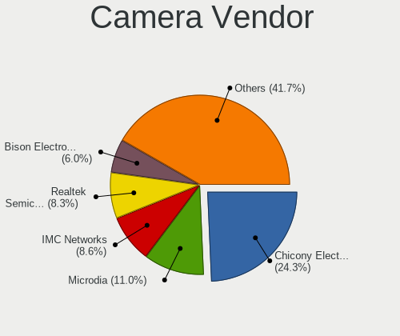

| Vendor                                 | Notebooks | Percent |
|----------------------------------------|-----------|---------|
| Chicony Electronics                    | 961       | 24.72%  |
| Microdia                               | 436       | 11.21%  |
| IMC Networks                           | 339       | 8.72%   |
| Realtek Semiconductor                  | 326       | 8.38%   |
| Sunplus Innovation Technology          | 219       | 5.63%   |
| Bison Electronics                      | 193       | 4.96%   |
| Quanta                                 | 168       | 4.32%   |
| Cheng Uei Precision Industry (Foxlink) | 153       | 3.94%   |
| Suyin                                  | 121       | 3.11%   |
| Lite-On Technology                     | 109       | 2.8%    |
| Apple                                  | 105       | 2.7%    |
| Acer                                   | 104       | 2.67%   |
| Syntek                                 | 86        | 2.21%   |
| Silicon Motion                         | 66        | 1.7%    |
| Logitech                               | 59        | 1.52%   |
| Luxvisions Innotech Limited            | 58        | 1.49%   |
| Alcor Micro                            | 52        | 1.34%   |
| Ricoh                                  | 50        | 1.29%   |
| Lenovo                                 | 42        | 1.08%   |
| Sonix Technology                       | 22        | 0.57%   |
| Samsung Electronics                    | 20        | 0.51%   |
| ALi                                    | 17        | 0.44%   |
| Z-Star Microelectronics                | 16        | 0.41%   |
| SunplusIT                              | 14        | 0.36%   |
| Primax Electronics                     | 14        | 0.36%   |
| Microsoft                              | 13        | 0.33%   |
| Sunplus Technology                     | 8         | 0.21%   |
| Importek                               | 8         | 0.21%   |
| OmniVision Technologies                | 7         | 0.18%   |
| Intel                                  | 6         | 0.15%   |
| Generalplus Technology                 | 6         | 0.15%   |
| GEMBIRD                                | 6         | 0.15%   |
| DigiTech                               | 6         | 0.15%   |
| Shenzhen Kingcome Optoelectronic       | 4         | 0.1%    |
| Razer USA                              | 4         | 0.1%    |
| ARC International                      | 4         | 0.1%    |
| Shinetech                              | 3         | 0.08%   |
| MacroSilicon                           | 3         | 0.08%   |
| icSpring                               | 3         | 0.08%   |
| Google                                 | 3         | 0.08%   |

Camera Model
------------

Camera device models

| Model                                                   | Notebooks | Percent |
|---------------------------------------------------------|-----------|---------|
| Microdia Integrated_Webcam_HD                           | 218       | 5.57%   |
| Chicony Integrated Camera                               | 183       | 4.68%   |
| Realtek Integrated_Webcam_HD                            | 123       | 3.14%   |
| IMC Networks USB2.0 HD UVC WebCam                       | 97        | 2.48%   |
| IMC Networks Integrated Camera                          | 96        | 2.45%   |
| Sunplus Integrated_Webcam_HD                            | 80        | 2.04%   |
| Chicony HD WebCam                                       | 75        | 1.92%   |
| Chicony TOSHIBA Web Camera - HD                         | 59        | 1.51%   |
| Microdia Integrated Webcam                              | 45        | 1.15%   |
| Bison Integrated Camera                                 | 44        | 1.12%   |
| Lite-On Integrated Camera                               | 42        | 1.07%   |
| Chicony HP Truevision HD camera                         | 41        | 1.05%   |
| Acer Integrated Camera                                  | 41        | 1.05%   |
| Chicony USB2.0 Camera                                   | 40        | 1.02%   |
| Syntek Integrated Camera                                | 38        | 0.97%   |
| Apple Built-in iSight                                   | 37        | 0.95%   |
| Realtek USB Camera                                      | 33        | 0.84%   |
| Quanta HD User Facing                                   | 33        | 0.84%   |
| Chicony HP Truevision HD                                | 32        | 0.82%   |
| Bison BisonCam,NB Pro                                   | 32        | 0.82%   |
| Chicony HP HD Camera                                    | 31        | 0.79%   |
| Chicony Integrated Camera (1280x720@30)                 | 29        | 0.74%   |
| Chicony EasyCamera                                      | 29        | 0.74%   |
| Bison SunplusIT Integrated Camera                       | 29        | 0.74%   |
| Apple FaceTime HD Camera                                | 29        | 0.74%   |
| IMC Networks USB2.0 VGA UVC WebCam                      | 27        | 0.69%   |
| Chicony VGA WebCam                                      | 26        | 0.66%   |
| Syntek Lenovo EasyCamera                                | 25        | 0.64%   |
| Cheng Uei Precision Industry (Foxlink) HP Truevision HD | 23        | 0.59%   |
| Chicony HD User Facing                                  | 22        | 0.56%   |
| Apple iPhone 5/5C/5S/6/SE/7/8/X                         | 22        | 0.56%   |
| Quanta HP TrueVision HD Camera                          | 21        | 0.54%   |
| Chicony HP Wide Vision HD Camera                        | 21        | 0.54%   |
| Chicony CNF9055 Toshiba Webcam                          | 21        | 0.54%   |
| Alcor Micro USB 2.0 PC cam                              | 21        | 0.54%   |
| Samsung Galaxy series, misc. (MTP mode)                 | 20        | 0.51%   |
| Lite-On HP HD Camera                                    | 20        | 0.51%   |
| Lenovo Integrated Webcam [R5U877]                       | 20        | 0.51%   |
| Suyin HP Truevision HD                                  | 19        | 0.49%   |
| Realtek Integrated Webcam HD                            | 19        | 0.49%   |

Security
--------

Fingerprint Vendor
------------------

Fingerprint sensor vendors

| Vendor                             | Notebooks | Percent |
|------------------------------------|-----------|---------|
| Validity Sensors                   | 246       | 32.54%  |
| Synaptics                          | 184       | 24.34%  |
| Shenzhen Goodix Technology         | 123       | 16.27%  |
| Upek                               | 59        | 7.8%    |
| AuthenTec                          | 58        | 7.67%   |
| LighTuning Technology              | 37        | 4.89%   |
| Elan Microelectronics              | 28        | 3.7%    |
| STMicroelectronics                 | 15        | 1.98%   |
| Realtek USB2.0 Finger Print Bridge | 3         | 0.4%    |
| Samsung Electronics                | 2         | 0.26%   |
| Focal-systems.Corp                 | 1         | 0.13%   |

Fingerprint Model
-----------------

Fingerprint sensor models

| Model                                                                      | Notebooks | Percent |
|----------------------------------------------------------------------------|-----------|---------|
| Shenzhen Goodix  Fingerprint Device                                        | 60        | 7.94%   |
| Upek Biometric Touchchip/Touchstrip Fingerprint Sensor                     | 57        | 7.54%   |
| Validity Sensors VFS495 Fingerprint Reader                                 | 51        | 6.75%   |
| Synaptics Prometheus MIS Touch Fingerprint Reader                          | 46        | 6.08%   |
| Validity Sensors VFS 5011 fingerprint sensor                               | 43        | 5.69%   |
| Shenzhen Goodix FingerPrint                                                | 37        | 4.89%   |
| Synaptics Metallica MIS Touch Fingerprint Reader                           | 36        | 4.76%   |
| Shenzhen Goodix Fingerprint Reader                                         | 26        | 3.44%   |
| Validity Sensors Synaptics WBDI                                            | 23        | 3.04%   |
| Validity Sensors VFS5011 Fingerprint Reader                                | 20        | 2.65%   |
| Validity Sensors VFS491                                                    | 19        | 2.51%   |
| AuthenTec AES2810                                                          | 18        | 2.38%   |
| LighTuning ES603 Swipe Fingerprint Sensor                                  | 17        | 2.25%   |
| AuthenTec AES2501 Fingerprint Sensor                                       | 17        | 2.25%   |
| Validity Sensors VFS7500 Touch Fingerprint Sensor                          | 16        | 2.12%   |
| STMicroelectronics Fingerprint Reader                                      | 15        | 1.98%   |
| LighTuning EgisTec Touch Fingerprint Sensor                                | 15        | 1.98%   |
| Validity Sensors Swipe Fingerprint Sensor                                  | 14        | 1.85%   |
| Elan ELAN:Fingerprint                                                      | 14        | 1.85%   |
| Elan ELAN:ARM-M4                                                           | 14        | 1.85%   |
| Validity Sensors VFS471 Fingerprint Reader                                 | 12        | 1.59%   |
| Validity Sensors Synaptics VFS7552 Touch Fingerprint Sensor with PurePrint | 12        | 1.59%   |
| Synaptics  FS7604 Touch Fingerprint Sensor with PurePrint                  | 12        | 1.59%   |
| Synaptics Metallica MOH Touch Fingerprint Reader                           | 12        | 1.59%   |
| Validity Sensors VFS451 Fingerprint Reader                                 | 11        | 1.46%   |
| Synaptics UWP WBDI                                                         | 10        | 1.32%   |
| Synaptics FS7604 Touch Fingerprint Sensor with PurePrint                   | 10        | 1.32%   |
| Unknown                                                                    | 10        | 1.32%   |
| Synaptics UWP WBDI Device                                                  | 9         | 1.19%   |
| Synaptics Fingerprint reader [HP G6]                                       | 9         | 1.19%   |
| Validity Sensors VFS7552 Touch Fingerprint Sensor                          | 8         | 1.06%   |
| Synaptics WBDI Device                                                      | 8         | 1.06%   |
| Synaptics  WBDI                                                            | 8         | 1.06%   |
| AuthenTec Fingerprint Sensor                                               | 8         | 1.06%   |
| Validity Sensors VFS301 Fingerprint Reader                                 | 6         | 0.79%   |
| Validity Sensors Fingerprint scanner                                       | 6         | 0.79%   |
| AuthenTec AES1600                                                          | 6         | 0.79%   |
| Synaptics WBDI                                                             | 5         | 0.66%   |
| LighTuning Fingerprint Reader                                              | 5         | 0.66%   |
| AuthenTec AES2550 Fingerprint Sensor                                       | 5         | 0.66%   |

Chipcard Vendor
---------------

Chipcard module vendors

| Vendor                | Notebooks | Percent |
|-----------------------|-----------|---------|
| Broadcom              | 215       | 52.7%   |
| Alcor Micro           | 93        | 22.79%  |
| Upek                  | 32        | 7.84%   |
| O2 Micro              | 28        | 6.86%   |
| Lenovo                | 26        | 6.37%   |
| Gemalto (was Gemplus) | 5         | 1.23%   |
| SCM Microsystems      | 3         | 0.74%   |
| Yubico.com            | 1         | 0.25%   |
| Purism, SPC           | 1         | 0.25%   |
| OmniKey               | 1         | 0.25%   |
| Clay Logic            | 1         | 0.25%   |
| Chicony Electronics   | 1         | 0.25%   |
| CHERRY                | 1         | 0.25%   |

Chipcard Model
--------------

Chipcard module models

| Model                                                                        | Notebooks | Percent |
|------------------------------------------------------------------------------|-----------|---------|
| Alcor Micro AU9540 Smartcard Reader                                          | 92        | 22.55%  |
| Broadcom BCM5880 Secure Applications Processor                               | 77        | 18.87%  |
| Broadcom 5880                                                                | 55        | 13.48%  |
| Broadcom 58200                                                               | 42        | 10.29%  |
| Broadcom BCM5880 Secure Applications Processor with fingerprint swipe sensor | 39        | 9.56%   |
| Upek TouchChip Fingerprint Coprocessor (WBF advanced mode)                   | 32        | 7.84%   |
| Lenovo Integrated Smart Card Reader                                          | 24        | 5.88%   |
| O2 Micro OZ776 CCID Smartcard Reader                                         | 23        | 5.64%   |
| O2 Micro Oz776 SmartCard Reader                                              | 5         | 1.23%   |
| Gemalto (was Gemplus) Compact Smart Card Reader Writer                       | 3         | 0.74%   |
| SCM Microsystems SCR3340 - ExpressCard54 Smart Card Reader                   | 2         | 0.49%   |
| Lenovo Smartcard Keyboard                                                    | 2         | 0.49%   |
| Gemalto (was Gemplus) GemPC Twin SmartCard Reader                            | 2         | 0.49%   |
| Broadcom BCM5880 Secure Applications Processor with fingerprint touch sensor | 2         | 0.49%   |
| Yubico.com Yubikey 4/5 U2F+CCID                                              | 1         | 0.25%   |
| SCM Microsystems SCR35xx Smart Card Reader                                   | 1         | 0.25%   |
| Purism, SPC Librem Key                                                       | 1         | 0.25%   |
| OmniKey CardMan 3021 / 3121                                                  | 1         | 0.25%   |
| Clay Logic Nitrokey Pro                                                      | 1         | 0.25%   |
| Chicony Electronics HP Skylab USB Smartcard Keyboard                         | 1         | 0.25%   |
| CHERRY SmartCard Reader Keyboard KC 1000 SC                                  | 1         | 0.25%   |
| Alcor Micro Watchdata W 1981                                                 | 1         | 0.25%   |

Unsupported
-----------

Unsupported Devices
-------------------

Total unsupported devices on board

| Total | Notebooks | Percent |
|-------|-----------|---------|
| 0     | 2927      | 62.68%  |
| 1     | 1341      | 28.72%  |
| 2     | 345       | 7.39%   |
| 3     | 44        | 0.94%   |
| 4     | 5         | 0.11%   |
| 5     | 4         | 0.09%   |
| 7     | 2         | 0.04%   |
| 8     | 1         | 0.02%   |
| 6     | 1         | 0.02%   |

Unsupported Device Types
------------------------

Types of unsupported devices

| Type                     | Notebooks | Percent |
|--------------------------|-----------|---------|
| Fingerprint reader       | 737       | 34.18%  |
| Graphics card            | 375       | 17.39%  |
| Chipcard                 | 369       | 17.12%  |
| Net/wireless             | 231       | 10.71%  |
| Multimedia controller    | 140       | 6.49%   |
| Camera                   | 55        | 2.55%   |
| Communication controller | 47        | 2.18%   |
| Bluetooth                | 46        | 2.13%   |
| Storage                  | 44        | 2.04%   |
| Sound                    | 25        | 1.16%   |
| Card reader              | 23        | 1.07%   |
| Net/ethernet             | 19        | 0.88%   |
| Modem                    | 16        | 0.74%   |
| Flash memory             | 9         | 0.42%   |
| Network                  | 8         | 0.37%   |
| Firewire controller      | 5         | 0.23%   |
| Storage/nvme             | 3         | 0.14%   |
| Unassigned class         | 2         | 0.09%   |
| Storage/ide              | 2         | 0.09%   |

