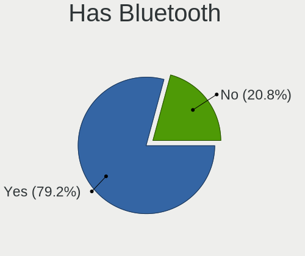
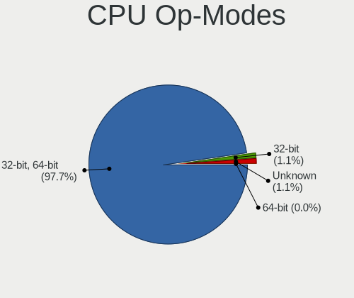
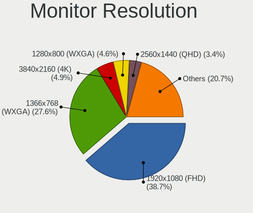
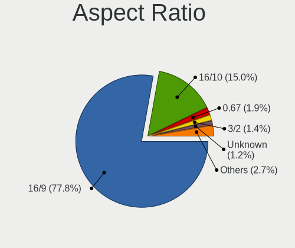
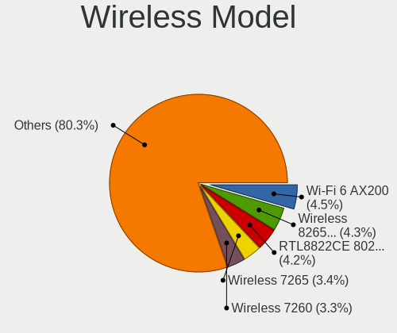

Linux in UK - Tested Hardware & Statistics (Notebooks)
------------------------------------------------------

A project to collect tested hardware configurations for Linux in UK.

Anyone can contribute to this report by the [hw-probe](https://github.com/linuxhw/hw-probe) tool:

    sudo -E hw-probe -all -upload

Please contribute! Especially if your hardware is rare.

Contents
--------

* [ Test Cases ](#test-cases)

* [ System ](#system)
  - [ OS                       ](#os)
  - [ OS Family                ](#os-family)
  - [ Kernel                   ](#kernel)
  - [ Kernel Family            ](#kernel-family)
  - [ Kernel Major Ver.        ](#kernel-major-ver)
  - [ Arch                     ](#arch)
  - [ DE                       ](#de)
  - [ Display Server           ](#display-server)
  - [ Display Manager          ](#display-manager)
  - [ OS Lang                  ](#os-lang)
  - [ Boot Mode                ](#boot-mode)
  - [ Filesystem               ](#filesystem)
  - [ Part. scheme             ](#part-scheme)
  - [ Dual Boot with Linux/BSD ](#dual-boot-with-linuxbsd)
  - [ Dual Boot (Win)          ](#dual-boot-win)

* [ Board ](#board)
  - [ Vendor                   ](#vendor)
  - [ Model                    ](#model)
  - [ Model Family             ](#model-family)
  - [ MFG Year                 ](#mfg-year)
  - [ Form Factor              ](#form-factor)
  - [ Secure Boot              ](#secure-boot)
  - [ Coreboot                 ](#coreboot)
  - [ RAM Size                 ](#ram-size)
  - [ RAM Used                 ](#ram-used)
  - [ Total Drives             ](#total-drives)
  - [ Has CD-ROM               ](#has-cd-rom)
  - [ Has Ethernet             ](#has-ethernet)
  - [ Has WiFi                 ](#has-wifi)
  - [ Has Bluetooth            ](#has-bluetooth)

* [ Location ](#location)
  - [ Country                  ](#country)
  - [ City                     ](#city)

* [ Drives ](#drives)
  - [ Drive Vendor             ](#drive-vendor)
  - [ Drive Model              ](#drive-model)
  - [ HDD Vendor               ](#hdd-vendor)
  - [ SSD Vendor               ](#ssd-vendor)
  - [ Drive Kind               ](#drive-kind)
  - [ Drive Connector          ](#drive-connector)
  - [ Drive Size               ](#drive-size)
  - [ Space Total              ](#space-total)
  - [ Space Used               ](#space-used)
  - [ Malfunc. Drives          ](#malfunc-drives)
  - [ Malfunc. Drive Vendor    ](#malfunc-drive-vendor)
  - [ Malfunc. HDD Vendor      ](#malfunc-hdd-vendor)
  - [ Malfunc. Drive Kind      ](#malfunc-drive-kind)
  - [ Failed Drives            ](#failed-drives)
  - [ Failed Drive Vendor      ](#failed-drive-vendor)
  - [ Drive Status             ](#drive-status)

* [ Storage controller ](#storage-controller)
  - [ Storage Vendor           ](#storage-vendor)
  - [ Storage Model            ](#storage-model)
  - [ Storage Kind             ](#storage-kind)

* [ Processor ](#processor)
  - [ CPU Vendor               ](#cpu-vendor)
  - [ CPU Model                ](#cpu-model)
  - [ CPU Model Family         ](#cpu-model-family)
  - [ CPU Cores                ](#cpu-cores)
  - [ CPU Sockets              ](#cpu-sockets)
  - [ CPU Threads              ](#cpu-threads)
  - [ CPU Op-Modes             ](#cpu-op-modes)
  - [ CPU Microcode            ](#cpu-microcode)
  - [ CPU Microarch            ](#cpu-microarch)

* [ Graphics ](#graphics)
  - [ GPU Vendor               ](#gpu-vendor)
  - [ GPU Model                ](#gpu-model)
  - [ GPU Combo                ](#gpu-combo)
  - [ GPU Driver               ](#gpu-driver)
  - [ GPU Memory               ](#gpu-memory)

* [ Monitor ](#monitor)
  - [ Monitor Vendor           ](#monitor-vendor)
  - [ Monitor Model            ](#monitor-model)
  - [ Monitor Resolution       ](#monitor-resolution)
  - [ Monitor Diagonal         ](#monitor-diagonal)
  - [ Monitor Width            ](#monitor-width)
  - [ Aspect Ratio             ](#aspect-ratio)
  - [ Monitor Area             ](#monitor-area)
  - [ Pixel Density            ](#pixel-density)
  - [ Multiple Monitors        ](#multiple-monitors)

* [ Network ](#network)
  - [ Net Controller Vendor    ](#net-controller-vendor)
  - [ Net Controller Model     ](#net-controller-model)
  - [ Wireless Vendor          ](#wireless-vendor)
  - [ Wireless Model           ](#wireless-model)
  - [ Ethernet Vendor          ](#ethernet-vendor)
  - [ Ethernet Model           ](#ethernet-model)
  - [ Net Controller Kind      ](#net-controller-kind)
  - [ Used Controller          ](#used-controller)
  - [ NICs                     ](#nics)
  - [ IPv6                     ](#ipv6)

* [ Bluetooth ](#bluetooth)
  - [ Bluetooth Vendor         ](#bluetooth-vendor)
  - [ Bluetooth Model          ](#bluetooth-model)

* [ Sound ](#sound)
  - [ Sound Vendor             ](#sound-vendor)
  - [ Sound Model              ](#sound-model)

* [ Memory ](#memory)
  - [ Memory Vendor            ](#memory-vendor)
  - [ Memory Model             ](#memory-model)
  - [ Memory Kind              ](#memory-kind)
  - [ Memory Form Factor       ](#memory-form-factor)
  - [ Memory Size              ](#memory-size)
  - [ Memory Speed             ](#memory-speed)

* [ Printers & scanners ](#printers--scanners)
  - [ Printer Vendor           ](#printer-vendor)
  - [ Printer Model            ](#printer-model)
  - [ Scanner Vendor           ](#scanner-vendor)
  - [ Scanner Model            ](#scanner-model)

* [ Camera ](#camera)
  - [ Camera Vendor            ](#camera-vendor)
  - [ Camera Model             ](#camera-model)

* [ Security ](#security)
  - [ Fingerprint Vendor       ](#fingerprint-vendor)
  - [ Fingerprint Model        ](#fingerprint-model)
  - [ Chipcard Vendor          ](#chipcard-vendor)
  - [ Chipcard Model           ](#chipcard-model)

* [ Unsupported ](#unsupported)
  - [ Unsupported Devices      ](#unsupported-devices)
  - [ Unsupported Device Types ](#unsupported-device-types)

Test Cases
----------

Total: 6352

| Vendor        | Model                       | Probe                                                      | Date         |
|---------------|-----------------------------|------------------------------------------------------------|--------------|
| Lenovo        | ThinkPad T460s 20FAS1V60... | [ca5f55438f](https://linux-hardware.org/?probe=ca5f55438f) | Jan 02, 2024 |
| Dell          | Inspiron 15 3530            | [ee21ee0e37](https://linux-hardware.org/?probe=ee21ee0e37) | Jan 01, 2024 |
| ASUSTek       | VivoBook_ASUSLaptop X509... | [d4335b1132](https://linux-hardware.org/?probe=d4335b1132) | Jan 01, 2024 |
| HP            | Laptop 15s-eq2xxx           | [2f1b4ada4b](https://linux-hardware.org/?probe=2f1b4ada4b) | Jan 01, 2024 |
| Lenovo        | Y50-70 20378                | [ff5e2959f8](https://linux-hardware.org/?probe=ff5e2959f8) | Dec 31, 2023 |
| Notebook      | NL5xNU                      | [915031852a](https://linux-hardware.org/?probe=915031852a) | Dec 31, 2023 |
| Acer          | Aspire 8943G                | [a75a2524f2](https://linux-hardware.org/?probe=a75a2524f2) | Dec 31, 2023 |
| Valve         | Jupiter                     | [2f8ea60a38](https://linux-hardware.org/?probe=2f8ea60a38) | Dec 30, 2023 |
| ASUSTek       | VivoBook_ASUSLaptop M760... | [60da2c756f](https://linux-hardware.org/?probe=60da2c756f) | Dec 30, 2023 |
| ASUSTek       | VivoBook_ASUSLaptop M760... | [f805c2c9fc](https://linux-hardware.org/?probe=f805c2c9fc) | Dec 30, 2023 |
| ASUSTek       | VivoBook_ASUSLaptop X515... | [e0fa90555a](https://linux-hardware.org/?probe=e0fa90555a) | Dec 29, 2023 |
| ASUSTek       | VivoBook_ASUSLaptop E410... | [9e856c326a](https://linux-hardware.org/?probe=9e856c326a) | Dec 29, 2023 |
| Acer          | Aspire F5-571               | [d28fac242c](https://linux-hardware.org/?probe=d28fac242c) | Dec 29, 2023 |
| HP            | EliteBook 2570p             | [935d08358c](https://linux-hardware.org/?probe=935d08358c) | Dec 29, 2023 |
| HP            | ZBook 14u G6                | [409e402108](https://linux-hardware.org/?probe=409e402108) | Dec 28, 2023 |
| Google        | Nami                        | [3d7f7ba09c](https://linux-hardware.org/?probe=3d7f7ba09c) | Dec 28, 2023 |
| HP            | ProBook 455 G1              | [d132700b11](https://linux-hardware.org/?probe=d132700b11) | Dec 28, 2023 |
| AWOW          | AK41                        | [d081509ed9](https://linux-hardware.org/?probe=d081509ed9) | Dec 28, 2023 |
| MSI           | Pulse GL66 12UEK            | [4600a758fa](https://linux-hardware.org/?probe=4600a758fa) | Dec 27, 2023 |
| Acer          | Aspire E1-570               | [403dd9f171](https://linux-hardware.org/?probe=403dd9f171) | Dec 27, 2023 |
| ASUSTek       | ROG Strix G614JZ_G614JZ     | [3ec4d2a40d](https://linux-hardware.org/?probe=3ec4d2a40d) | Dec 27, 2023 |
| ASUSTek       | ROG Strix G614JZ_G614JZ     | [eb40e7ad5c](https://linux-hardware.org/?probe=eb40e7ad5c) | Dec 27, 2023 |
| Lenovo        | ThinkPad T410 2522AC1       | [f745deb3d7](https://linux-hardware.org/?probe=f745deb3d7) | Dec 27, 2023 |
| Dell          | Latitude 7390               | [32c3fcc941](https://linux-hardware.org/?probe=32c3fcc941) | Dec 27, 2023 |
| Dell          | XPS 15 9570                 | [25466d5d3b](https://linux-hardware.org/?probe=25466d5d3b) | Dec 27, 2023 |
| Acer          | TravelMate P256-M           | [c4f9e9de5e](https://linux-hardware.org/?probe=c4f9e9de5e) | Dec 27, 2023 |
| Acer          | TravelMate P256-M           | [c129debcae](https://linux-hardware.org/?probe=c129debcae) | Dec 27, 2023 |
| Dynabook      | Satellite Pro L50-G-193     | [b602153aeb](https://linux-hardware.org/?probe=b602153aeb) | Dec 26, 2023 |
| Notebook      | NL5xNU                      | [ad5a093909](https://linux-hardware.org/?probe=ad5a093909) | Dec 26, 2023 |
| Lenovo        | ThinkPad T16 Gen 2 21K7C... | [5a76629311](https://linux-hardware.org/?probe=5a76629311) | Dec 26, 2023 |
| Acer          | Aspire A314-22              | [83c0e37ece](https://linux-hardware.org/?probe=83c0e37ece) | Dec 25, 2023 |
| Valve         | Jupiter                     | [4ab75ea56b](https://linux-hardware.org/?probe=4ab75ea56b) | Dec 25, 2023 |
| PC Special... | 14 Fusion Pro               | [76bf311c34](https://linux-hardware.org/?probe=76bf311c34) | Dec 25, 2023 |
| HP            | 255 G8 Notebook PC          | [1f14807c5e](https://linux-hardware.org/?probe=1f14807c5e) | Dec 25, 2023 |
| Valve         | Jupiter                     | [6ec124a0c4](https://linux-hardware.org/?probe=6ec124a0c4) | Dec 24, 2023 |
| Lenovo        | ThinkPad P14s Gen 3 21J6... | [eb3b2bf56b](https://linux-hardware.org/?probe=eb3b2bf56b) | Dec 24, 2023 |
| Valve         | Jupiter                     | [f57d2e51fe](https://linux-hardware.org/?probe=f57d2e51fe) | Dec 24, 2023 |
| Dell          | Latitude 5300               | [68336d8bc1](https://linux-hardware.org/?probe=68336d8bc1) | Dec 24, 2023 |
| Dell          | Latitude 12 Rugged Table... | [7690d56522](https://linux-hardware.org/?probe=7690d56522) | Dec 24, 2023 |
| Dell          | Inspiron 15 3530            | [0688896e27](https://linux-hardware.org/?probe=0688896e27) | Dec 23, 2023 |
| Dell          | Latitude E6420              | [82c13c188b](https://linux-hardware.org/?probe=82c13c188b) | Dec 23, 2023 |
| Dell          | Inspiron 5577               | [e6827a291e](https://linux-hardware.org/?probe=e6827a291e) | Dec 22, 2023 |
| Dell          | Latitude 7300               | [8792895835](https://linux-hardware.org/?probe=8792895835) | Dec 22, 2023 |
| HP            | ENVY Laptop 17-ch0xxx       | [38a9810e94](https://linux-hardware.org/?probe=38a9810e94) | Dec 22, 2023 |
| Dell          | Latitude E5510              | [92074a5231](https://linux-hardware.org/?probe=92074a5231) | Dec 22, 2023 |
| Valve         | Jupiter                     | [03491495da](https://linux-hardware.org/?probe=03491495da) | Dec 22, 2023 |
| HP            | EliteBook 830 G5            | [aa3d919a29](https://linux-hardware.org/?probe=aa3d919a29) | Dec 22, 2023 |
| ASUSTek       | E201NA                      | [ee5e05ce6d](https://linux-hardware.org/?probe=ee5e05ce6d) | Dec 21, 2023 |
| Lenovo        | ThinkPad X280 20KEA00SUK    | [bc380b4334](https://linux-hardware.org/?probe=bc380b4334) | Dec 21, 2023 |
| Lenovo        | Yoga 500-15IBD 80N6         | [088b5d3bba](https://linux-hardware.org/?probe=088b5d3bba) | Dec 20, 2023 |
| Lenovo        | ThinkPad X1 Carbon Gen 1... | [eef5dcab57](https://linux-hardware.org/?probe=eef5dcab57) | Dec 20, 2023 |
| Lenovo        | ThinkPad T16 Gen 1 21CHC... | [4f6ecdc95a](https://linux-hardware.org/?probe=4f6ecdc95a) | Dec 19, 2023 |
| Dell          | Latitude 5340               | [c9d3b3d7a7](https://linux-hardware.org/?probe=c9d3b3d7a7) | Dec 19, 2023 |
| HP            | Notebook                    | [31d6fc4280](https://linux-hardware.org/?probe=31d6fc4280) | Dec 19, 2023 |
| Lenovo        | ThinkPad T440p 20AWA16R0... | [4f1e1945a7](https://linux-hardware.org/?probe=4f1e1945a7) | Dec 19, 2023 |
| Toshiba       | Satellite Pro C50-A-1E2     | [91b5e05490](https://linux-hardware.org/?probe=91b5e05490) | Dec 19, 2023 |
| Toshiba       | Satellite Pro C50-A-1E2     | [fde7aeea9c](https://linux-hardware.org/?probe=fde7aeea9c) | Dec 19, 2023 |
| Dell          | Inspiron 15 3535            | [f86bf3e2f1](https://linux-hardware.org/?probe=f86bf3e2f1) | Dec 18, 2023 |
| ASUSTek       | ROG Strix G713PV_G713PV     | [8596edc762](https://linux-hardware.org/?probe=8596edc762) | Dec 18, 2023 |
| Valve         | Jupiter                     | [f8d7e441a5](https://linux-hardware.org/?probe=f8d7e441a5) | Dec 18, 2023 |
| HP            | Pavilion Notebook           | [0376612ef7](https://linux-hardware.org/?probe=0376612ef7) | Dec 18, 2023 |
| Lenovo        | ThinkPad T420 4180PR1       | [2c0267b77e](https://linux-hardware.org/?probe=2c0267b77e) | Dec 17, 2023 |
| Dell          | Latitude E6400              | [855a8f55c4](https://linux-hardware.org/?probe=855a8f55c4) | Dec 17, 2023 |
| Toshiba       | Satellite L300              | [6528f813b7](https://linux-hardware.org/?probe=6528f813b7) | Dec 17, 2023 |
| HP            | ZBook 14u G6                | [125dbde28d](https://linux-hardware.org/?probe=125dbde28d) | Dec 17, 2023 |
| Unknown       | Apple MacBook Pro (14-in... | [209df55714](https://linux-hardware.org/?probe=209df55714) | Dec 17, 2023 |
| Valve         | Jupiter                     | [d6c8debc47](https://linux-hardware.org/?probe=d6c8debc47) | Dec 16, 2023 |
| HP            | EliteBook 8460p             | [9105f33be2](https://linux-hardware.org/?probe=9105f33be2) | Dec 16, 2023 |
| Acer          | Aspire 6930G                | [3e93a62792](https://linux-hardware.org/?probe=3e93a62792) | Dec 16, 2023 |
| AZW           | GT-R                        | [205436106b](https://linux-hardware.org/?probe=205436106b) | Dec 16, 2023 |
| Dell          | Inspiron 13-5378            | [d63cdec5eb](https://linux-hardware.org/?probe=d63cdec5eb) | Dec 15, 2023 |
| Razer         | Blade 15 (2022) - RZ09-0... | [921d38d2df](https://linux-hardware.org/?probe=921d38d2df) | Dec 15, 2023 |
| Dell          | XPS 15 9570                 | [67a32f0dd0](https://linux-hardware.org/?probe=67a32f0dd0) | Dec 14, 2023 |
| Dell          | XPS 15 9570                 | [283dc2dab5](https://linux-hardware.org/?probe=283dc2dab5) | Dec 14, 2023 |
| Schenker      | XMG NEO (E23)               | [ce84d5a464](https://linux-hardware.org/?probe=ce84d5a464) | Dec 13, 2023 |
| Dell          | XPS 15 9530                 | [33d1f683ba](https://linux-hardware.org/?probe=33d1f683ba) | Dec 13, 2023 |
| Acer          | TMP645-M                    | [55c3db256a](https://linux-hardware.org/?probe=55c3db256a) | Dec 13, 2023 |
| Valve         | Galileo                     | [835c844aed](https://linux-hardware.org/?probe=835c844aed) | Dec 13, 2023 |
| Dell          | Inspiron 16 Plus 7630       | [25017a9de6](https://linux-hardware.org/?probe=25017a9de6) | Dec 13, 2023 |
| HP            | Pavilion g6                 | [920939b6c0](https://linux-hardware.org/?probe=920939b6c0) | Dec 13, 2023 |
| MSI           | MS-16Y1                     | [41ce29bec7](https://linux-hardware.org/?probe=41ce29bec7) | Dec 12, 2023 |
| GEO           | GEOBOOK 2E                  | [86b33e33ca](https://linux-hardware.org/?probe=86b33e33ca) | Dec 12, 2023 |
| GEO           | GEOBOOK 2E                  | [cac69d7624](https://linux-hardware.org/?probe=cac69d7624) | Dec 12, 2023 |
| HP            | ProBook 430 G8 Notebook ... | [46b5f7ee7b](https://linux-hardware.org/?probe=46b5f7ee7b) | Dec 12, 2023 |
| Samsung       | R720                        | [a434163017](https://linux-hardware.org/?probe=a434163017) | Dec 12, 2023 |
| Apple         | MacBookPro14,1              | [16e9faf4e6](https://linux-hardware.org/?probe=16e9faf4e6) | Dec 12, 2023 |
| Apple         | MacBookPro14,1              | [05ceb8703b](https://linux-hardware.org/?probe=05ceb8703b) | Dec 12, 2023 |
| Samsung       | R720                        | [b7a2f3044e](https://linux-hardware.org/?probe=b7a2f3044e) | Dec 12, 2023 |
| Lenovo        | ThinkPad L14 Gen 1 20U50... | [f49dd0f010](https://linux-hardware.org/?probe=f49dd0f010) | Dec 12, 2023 |
| Lenovo        | ThinkPad L15 Gen 1 20U70... | [31b92c3112](https://linux-hardware.org/?probe=31b92c3112) | Dec 11, 2023 |
| Dell          | Inspiron 13-5378            | [3d89daa3fa](https://linux-hardware.org/?probe=3d89daa3fa) | Dec 11, 2023 |
| Lenovo        | ThinkPad T540p 20BE003YU... | [f604df3e48](https://linux-hardware.org/?probe=f604df3e48) | Dec 10, 2023 |
| Acer          | Aspire 6930G                | [eea9d9e525](https://linux-hardware.org/?probe=eea9d9e525) | Dec 10, 2023 |
| Dell          | XPS 15 9570                 | [35a10a1ae2](https://linux-hardware.org/?probe=35a10a1ae2) | Dec 10, 2023 |
| Sony          | SVE1511K1EW                 | [34875b90c4](https://linux-hardware.org/?probe=34875b90c4) | Dec 10, 2023 |
| MSI           | GS43VR 7RE                  | [23feee91ff](https://linux-hardware.org/?probe=23feee91ff) | Dec 10, 2023 |
| Dell          | G5 5590                     | [6970987854](https://linux-hardware.org/?probe=6970987854) | Dec 08, 2023 |
| Dell          | Inspiron 7400               | [0fb56c3b77](https://linux-hardware.org/?probe=0fb56c3b77) | Dec 08, 2023 |
| HP            | ZBook Firefly 15 inch G8... | [3ca33a4b88](https://linux-hardware.org/?probe=3ca33a4b88) | Dec 08, 2023 |
| Lenovo        | ThinkPad P52 20MAS25B1X     | [767b4efa54](https://linux-hardware.org/?probe=767b4efa54) | Dec 06, 2023 |
| Tactus        | IOTA Flo                    | [a79fecbfad](https://linux-hardware.org/?probe=a79fecbfad) | Dec 06, 2023 |
| Acer          | Aspire A314-22              | [ce624b95df](https://linux-hardware.org/?probe=ce624b95df) | Dec 05, 2023 |
| Lenovo        | ThinkPad T14 Gen 1 20UDS... | [ad7bb46855](https://linux-hardware.org/?probe=ad7bb46855) | Dec 05, 2023 |
| HP            | ProBook 4540s               | [53eab461fb](https://linux-hardware.org/?probe=53eab461fb) | Dec 05, 2023 |
| HP            | ZBook Firefly 15 inch G8... | [dfc33bff7a](https://linux-hardware.org/?probe=dfc33bff7a) | Dec 04, 2023 |
| ASUSTek       | VivoBook_ASUSLaptop X403... | [fd95385327](https://linux-hardware.org/?probe=fd95385327) | Dec 04, 2023 |
| Dell          | Latitude 5290 2-in-1        | [525166f0d5](https://linux-hardware.org/?probe=525166f0d5) | Dec 04, 2023 |
| ASUSTek       | VivoBook_ASUSLaptop X705... | [54ecb0a8b8](https://linux-hardware.org/?probe=54ecb0a8b8) | Dec 04, 2023 |
| Dell          | XPS 13 9360                 | [73fa5936a1](https://linux-hardware.org/?probe=73fa5936a1) | Dec 04, 2023 |
| HP            | EliteBook 840 G6            | [dc816e1423](https://linux-hardware.org/?probe=dc816e1423) | Dec 04, 2023 |
| Valve         | Jupiter                     | [0caac1007d](https://linux-hardware.org/?probe=0caac1007d) | Dec 04, 2023 |
| ASUSTek       | N552VW                      | [c2e09d65d5](https://linux-hardware.org/?probe=c2e09d65d5) | Dec 03, 2023 |
| ASUSTek       | VivoBook_ASUSLaptop X421... | [7b5f2ca2f9](https://linux-hardware.org/?probe=7b5f2ca2f9) | Dec 03, 2023 |
| Dell          | Precision 7530              | [e75b16ca5e](https://linux-hardware.org/?probe=e75b16ca5e) | Dec 03, 2023 |
| ASUSTek       | X551CA                      | [08ce611291](https://linux-hardware.org/?probe=08ce611291) | Dec 02, 2023 |
| HP            | ProBook 4540s               | [d83489845d](https://linux-hardware.org/?probe=d83489845d) | Dec 02, 2023 |
| Acer          | Aspire E5-575               | [e6fd8cf7f1](https://linux-hardware.org/?probe=e6fd8cf7f1) | Dec 02, 2023 |
| Lenovo        | ThinkPad P16s Gen 2 21K9... | [744c430aa7](https://linux-hardware.org/?probe=744c430aa7) | Dec 02, 2023 |
| Lenovo        | Legion Slim 7 16APH8 82Y... | [5cf002f5af](https://linux-hardware.org/?probe=5cf002f5af) | Dec 02, 2023 |
| Lenovo        | Flex 2-14 20404             | [f366381075](https://linux-hardware.org/?probe=f366381075) | Dec 02, 2023 |
| Lenovo        | ThinkPad P50 20EQS0VV0R     | [933f88f7e6](https://linux-hardware.org/?probe=933f88f7e6) | Dec 01, 2023 |
| Valve         | Jupiter                     | [545d093510](https://linux-hardware.org/?probe=545d093510) | Nov 30, 2023 |
| Valve         | Jupiter                     | [2251ba47fb](https://linux-hardware.org/?probe=2251ba47fb) | Nov 30, 2023 |
| Lenovo        | Legion 5 15ARH05 82B5       | [37545bd915](https://linux-hardware.org/?probe=37545bd915) | Nov 30, 2023 |
| Apple         | MacBookPro11,1              | [21a183f050](https://linux-hardware.org/?probe=21a183f050) | Nov 30, 2023 |
| Lenovo        | ThinkPad P52s 20LCA0ANUK    | [2cf85106d8](https://linux-hardware.org/?probe=2cf85106d8) | Nov 29, 2023 |
| HP            | Laptop 15-bw0xx             | [d9e4a9a2cd](https://linux-hardware.org/?probe=d9e4a9a2cd) | Nov 29, 2023 |
| HP            | Laptop 15-bw0xx             | [e3e8042ebf](https://linux-hardware.org/?probe=e3e8042ebf) | Nov 29, 2023 |
| Lenovo        | IdeaPad 330-14IGM 81D0      | [4948ddc4be](https://linux-hardware.org/?probe=4948ddc4be) | Nov 29, 2023 |
| Dell          | Inspiron 15 3530            | [410e2cc867](https://linux-hardware.org/?probe=410e2cc867) | Nov 29, 2023 |
| Acer          | Aspire E5-575               | [b4fbd61258](https://linux-hardware.org/?probe=b4fbd61258) | Nov 28, 2023 |
| Lenovo        | IdeaPad Y700-15ISK 80NV     | [f2b1e6e4a9](https://linux-hardware.org/?probe=f2b1e6e4a9) | Nov 28, 2023 |
| Dell          | Latitude 7390               | [4cacd41fee](https://linux-hardware.org/?probe=4cacd41fee) | Nov 28, 2023 |
| AWOW          | AK41                        | [34d9bc9a34](https://linux-hardware.org/?probe=34d9bc9a34) | Nov 28, 2023 |
| AWOW          | AK41                        | [17f3a70619](https://linux-hardware.org/?probe=17f3a70619) | Nov 28, 2023 |
| ASUSTek       | ROG Strix G512LV_G512LV     | [7be81f9e9c](https://linux-hardware.org/?probe=7be81f9e9c) | Nov 28, 2023 |
| Acer          | Aspire 5740                 | [bad53e91fc](https://linux-hardware.org/?probe=bad53e91fc) | Nov 27, 2023 |
| HP            | EliteBook 640 14 inch G9... | [51b0a49d02](https://linux-hardware.org/?probe=51b0a49d02) | Nov 27, 2023 |
| Dell          | Inspiron 1012               | [ffe483f5fd](https://linux-hardware.org/?probe=ffe483f5fd) | Nov 27, 2023 |
| Dell          | Latitude D830               | [2e017edf81](https://linux-hardware.org/?probe=2e017edf81) | Nov 27, 2023 |
| Lenovo        | ThinkPad X250 20CLS0RK00    | [96642d7e8e](https://linux-hardware.org/?probe=96642d7e8e) | Nov 27, 2023 |
| HP            | Pavilion Notebook           | [2ccf3a5db5](https://linux-hardware.org/?probe=2ccf3a5db5) | Nov 26, 2023 |
| Lenovo        | IdeaPad 330S-15IKB 81F5     | [e552669069](https://linux-hardware.org/?probe=e552669069) | Nov 26, 2023 |
| Toshiba       | TECRA R940                  | [14de9f481a](https://linux-hardware.org/?probe=14de9f481a) | Nov 26, 2023 |
| Lenovo        | ThinkPad Edge E325 12973... | [0f165c67ac](https://linux-hardware.org/?probe=0f165c67ac) | Nov 26, 2023 |
| Dell          | XPS 15 9570                 | [99daa92571](https://linux-hardware.org/?probe=99daa92571) | Nov 25, 2023 |
| Lenovo        | ThinkPad P43s 20RHCTO1WW    | [8973295484](https://linux-hardware.org/?probe=8973295484) | Nov 25, 2023 |
| ASUSTek       | VivoBook_ASUSLaptop X515... | [082c36ab01](https://linux-hardware.org/?probe=082c36ab01) | Nov 25, 2023 |
| Acer          | Aspire A315-58              | [1bf1e47f81](https://linux-hardware.org/?probe=1bf1e47f81) | Nov 24, 2023 |
| HP            | Dragonfly 13.5 inch G4 N... | [4f78b76325](https://linux-hardware.org/?probe=4f78b76325) | Nov 24, 2023 |
| Toshiba       | Satellite L300              | [370ddc00c4](https://linux-hardware.org/?probe=370ddc00c4) | Nov 24, 2023 |
| Lenovo        | ThinkPad P16 Gen 1 21D60... | [d8bb656eaf](https://linux-hardware.org/?probe=d8bb656eaf) | Nov 24, 2023 |
| Dell          | XPS 15 9560                 | [a2313adb82](https://linux-hardware.org/?probe=a2313adb82) | Nov 24, 2023 |
| Dell          | Inspiron 5577               | [1302407078](https://linux-hardware.org/?probe=1302407078) | Nov 24, 2023 |
| Dell          | Inspiron 5577               | [7871e7654b](https://linux-hardware.org/?probe=7871e7654b) | Nov 24, 2023 |
| Apple         | MacBookPro14,2              | [e210f3a972](https://linux-hardware.org/?probe=e210f3a972) | Nov 24, 2023 |
| HUAWEI        | NBD-WXX9                    | [59a3d34f64](https://linux-hardware.org/?probe=59a3d34f64) | Nov 24, 2023 |
| Valve         | Jupiter                     | [0c58fa47b9](https://linux-hardware.org/?probe=0c58fa47b9) | Nov 24, 2023 |
| Linx          | LINX1010L                   | [07d470eaac](https://linux-hardware.org/?probe=07d470eaac) | Nov 23, 2023 |
| Acer          | Aspire E5-511               | [87ccf00042](https://linux-hardware.org/?probe=87ccf00042) | Nov 23, 2023 |
| Lenovo        | ThinkPad T450 20BUS00700    | [e0be96f7e5](https://linux-hardware.org/?probe=e0be96f7e5) | Nov 23, 2023 |
| HP            | Pavilion Notebook           | [7d55f31a65](https://linux-hardware.org/?probe=7d55f31a65) | Nov 23, 2023 |
| Lenovo        | LOQ 15IRH8 82XV             | [48677cfae1](https://linux-hardware.org/?probe=48677cfae1) | Nov 23, 2023 |
| HUAWEI        | BoDE-WXX9                   | [343ba69496](https://linux-hardware.org/?probe=343ba69496) | Nov 22, 2023 |
| HUAWEI        | BoDE-WXX9                   | [b365872b3f](https://linux-hardware.org/?probe=b365872b3f) | Nov 22, 2023 |
| Acer          | TravelMate 5760             | [bcec28eaaa](https://linux-hardware.org/?probe=bcec28eaaa) | Nov 22, 2023 |
| Dell          | XPS 15 9570                 | [7728d0ab4b](https://linux-hardware.org/?probe=7728d0ab4b) | Nov 22, 2023 |
| Valve         | Jupiter                     | [157c8167b7](https://linux-hardware.org/?probe=157c8167b7) | Nov 22, 2023 |
| Valve         | Jupiter                     | [525a89cf72](https://linux-hardware.org/?probe=525a89cf72) | Nov 22, 2023 |
| ASUSTek       | E201NA                      | [11f7e8f675](https://linux-hardware.org/?probe=11f7e8f675) | Nov 22, 2023 |
| Apple         | MacBookPro11,4              | [007d6a928b](https://linux-hardware.org/?probe=007d6a928b) | Nov 21, 2023 |
| ASUSTek       | Zenbook Pro Duo UX582ZW_... | [c3fc46a4a5](https://linux-hardware.org/?probe=c3fc46a4a5) | Nov 21, 2023 |
| HP            | OMEN by Laptop              | [8fbd1e56eb](https://linux-hardware.org/?probe=8fbd1e56eb) | Nov 20, 2023 |
| Lenovo        | IdeaPad 3 14ADA05 81W0      | [26ebeb2504](https://linux-hardware.org/?probe=26ebeb2504) | Nov 20, 2023 |
| Jumper        | EZbook                      | [f41c8192dc](https://linux-hardware.org/?probe=f41c8192dc) | Nov 20, 2023 |
| Notebook      | NS5x_NS7xPU                 | [7e047fc166](https://linux-hardware.org/?probe=7e047fc166) | Nov 19, 2023 |
| iOTA          | IOTA2320                    | [5c4d630f23](https://linux-hardware.org/?probe=5c4d630f23) | Nov 19, 2023 |
| Apple         | MacBookPro11,4              | [07fadadf4b](https://linux-hardware.org/?probe=07fadadf4b) | Nov 19, 2023 |
| Lenovo        | ThinkPad T14 Gen 2i 20W0... | [a566513a93](https://linux-hardware.org/?probe=a566513a93) | Nov 19, 2023 |
| Toshiba       | Satellite C660D             | [fed171dba3](https://linux-hardware.org/?probe=fed171dba3) | Nov 18, 2023 |
| Dell          | Precision M6800             | [14dc3b5711](https://linux-hardware.org/?probe=14dc3b5711) | Nov 18, 2023 |
| Dell          | Inspiron 7591               | [edb7712542](https://linux-hardware.org/?probe=edb7712542) | Nov 18, 2023 |
| Lenovo        | ThinkPad X1 Carbon 6th 2... | [8f0b8a5f62](https://linux-hardware.org/?probe=8f0b8a5f62) | Nov 17, 2023 |
| Google        | Liara                       | [0180a501ac](https://linux-hardware.org/?probe=0180a501ac) | Nov 17, 2023 |
| Apple         | MacBookAir3,2               | [17cf4dd653](https://linux-hardware.org/?probe=17cf4dd653) | Nov 17, 2023 |
| Google        | Liara                       | [081111241a](https://linux-hardware.org/?probe=081111241a) | Nov 16, 2023 |
| Google        | Liara                       | [c63d296cc8](https://linux-hardware.org/?probe=c63d296cc8) | Nov 16, 2023 |
| Samsung       | 550P5C/550P7C               | [343e6ecd28](https://linux-hardware.org/?probe=343e6ecd28) | Nov 16, 2023 |
| MSI           | Katana GF66 11UE            | [07a03ff43b](https://linux-hardware.org/?probe=07a03ff43b) | Nov 16, 2023 |
| Dell          | Latitude E6330              | [c7ef1a8bbd](https://linux-hardware.org/?probe=c7ef1a8bbd) | Nov 16, 2023 |
| Razer         | Blade 15 Base Model (Ear... | [7e0ac6c6d6](https://linux-hardware.org/?probe=7e0ac6c6d6) | Nov 16, 2023 |
| Jumper        | EZbook                      | [844843779e](https://linux-hardware.org/?probe=844843779e) | Nov 16, 2023 |
| ONE-NETBOO... | ONEXPLAYER 2 PRO ARP23P     | [669eb1edcb](https://linux-hardware.org/?probe=669eb1edcb) | Nov 16, 2023 |
| Valve         | Jupiter                     | [821a98f0f9](https://linux-hardware.org/?probe=821a98f0f9) | Nov 15, 2023 |
| Acer          | Aspire E5-576G              | [694833562c](https://linux-hardware.org/?probe=694833562c) | Nov 15, 2023 |
| Apple         | MacBookPro7,1               | [90bcff6517](https://linux-hardware.org/?probe=90bcff6517) | Nov 15, 2023 |
| Dell          | XPS 17 9730                 | [27fb977584](https://linux-hardware.org/?probe=27fb977584) | Nov 15, 2023 |
| Alienware     | 14                          | [3f12c6cbcd](https://linux-hardware.org/?probe=3f12c6cbcd) | Nov 15, 2023 |
| Dell          | Latitude 5520               | [a50a13d22b](https://linux-hardware.org/?probe=a50a13d22b) | Nov 14, 2023 |
| Acer          | Aspire V5-571               | [6a560e9f7c](https://linux-hardware.org/?probe=6a560e9f7c) | Nov 14, 2023 |
| HP            | ZBook 14u G6                | [c6471dbbfd](https://linux-hardware.org/?probe=c6471dbbfd) | Nov 14, 2023 |
| Lenovo        | ThinkBook 13s-IML 20RR      | [551661ff00](https://linux-hardware.org/?probe=551661ff00) | Nov 14, 2023 |
| Acer          | Aspire E1-572P              | [8644bc6bf3](https://linux-hardware.org/?probe=8644bc6bf3) | Nov 14, 2023 |
| Tactus        | GeoBook 110                 | [077bbdc325](https://linux-hardware.org/?probe=077bbdc325) | Nov 14, 2023 |
| Tactus        | GeoBook 110                 | [5e50f31cbb](https://linux-hardware.org/?probe=5e50f31cbb) | Nov 14, 2023 |
| Dell          | Latitude E5430 non-vPro     | [8c49972e61](https://linux-hardware.org/?probe=8c49972e61) | Nov 14, 2023 |
| AWOW          | AK41                        | [5d9f671218](https://linux-hardware.org/?probe=5d9f671218) | Nov 14, 2023 |
| AWOW          | AK41                        | [89e2926ff6](https://linux-hardware.org/?probe=89e2926ff6) | Nov 14, 2023 |
| Lenovo        | V15 G2 ALC 82KD             | [e3926c718f](https://linux-hardware.org/?probe=e3926c718f) | Nov 14, 2023 |
| Lenovo        | V15 G2 ALC 82KD             | [917ab5dcf0](https://linux-hardware.org/?probe=917ab5dcf0) | Nov 14, 2023 |
| Apple         | MacBookPro14,2              | [6ce3699c41](https://linux-hardware.org/?probe=6ce3699c41) | Nov 14, 2023 |
| Apple         | MacBookPro14,2              | [3e5fd22123](https://linux-hardware.org/?probe=3e5fd22123) | Nov 14, 2023 |
| Clevo         | W55xEU                      | [52795e38fa](https://linux-hardware.org/?probe=52795e38fa) | Nov 14, 2023 |
| HP            | Pavilion g6                 | [8e95b24f18](https://linux-hardware.org/?probe=8e95b24f18) | Nov 13, 2023 |
| Acer          | Aspire A114-33              | [e592b6bf5d](https://linux-hardware.org/?probe=e592b6bf5d) | Nov 13, 2023 |
| Lenovo        | IdeaPad 320-15AST 80XV      | [c143de0389](https://linux-hardware.org/?probe=c143de0389) | Nov 13, 2023 |
| Dell          | XPS 15 9570                 | [ed85cdf855](https://linux-hardware.org/?probe=ed85cdf855) | Nov 13, 2023 |
| Acer          | Aspire A114-33              | [6c532c337f](https://linux-hardware.org/?probe=6c532c337f) | Nov 12, 2023 |
| HP            | EliteBook 840 G4            | [2651393e60](https://linux-hardware.org/?probe=2651393e60) | Nov 12, 2023 |
| Lenovo        | ThinkPad X1 Carbon 3rd 2... | [81dca17f20](https://linux-hardware.org/?probe=81dca17f20) | Nov 12, 2023 |
| ASUSTek       | VivoBook_ASUSLaptop X515... | [8b2e3f1f31](https://linux-hardware.org/?probe=8b2e3f1f31) | Nov 12, 2023 |
| Linx          | LINX1010B                   | [aa641d2775](https://linux-hardware.org/?probe=aa641d2775) | Nov 12, 2023 |
| ASUSTek       | ROG Flow X13 GV301QE_GV3... | [f0db6bb1ae](https://linux-hardware.org/?probe=f0db6bb1ae) | Nov 11, 2023 |
| ASUSTek       | VivoBook_ASUSLaptop E410... | [4c24ca4aa2](https://linux-hardware.org/?probe=4c24ca4aa2) | Nov 11, 2023 |
| Lenovo        | Legion Pro 5 16IRX8 82WK    | [20394838bd](https://linux-hardware.org/?probe=20394838bd) | Nov 11, 2023 |
| Acer          | Aspire V5-571               | [062edee7f6](https://linux-hardware.org/?probe=062edee7f6) | Nov 10, 2023 |
| Apple         | MacBookPro11,4              | [029e4d74e4](https://linux-hardware.org/?probe=029e4d74e4) | Nov 10, 2023 |
| Apple         | MacBookAir6,2               | [f5147fc0f5](https://linux-hardware.org/?probe=f5147fc0f5) | Nov 10, 2023 |
| HP            | Laptop 14-bs0xx             | [a6085bc08f](https://linux-hardware.org/?probe=a6085bc08f) | Nov 10, 2023 |
| HP            | Laptop 14-bs0xx             | [e8cbd8b1b9](https://linux-hardware.org/?probe=e8cbd8b1b9) | Nov 10, 2023 |
| Valve         | Jupiter                     | [ff8cbcd6be](https://linux-hardware.org/?probe=ff8cbcd6be) | Nov 09, 2023 |
| Lenovo        | ThinkPad T420 4180AZ8       | [089405c957](https://linux-hardware.org/?probe=089405c957) | Nov 09, 2023 |
| Toshiba       | Satellite C50-A-1CK         | [630df1e190](https://linux-hardware.org/?probe=630df1e190) | Nov 09, 2023 |
| Toshiba       | Satellite C50-A-1CK         | [9eb1ed3f2b](https://linux-hardware.org/?probe=9eb1ed3f2b) | Nov 09, 2023 |
| Dell          | XPS 15 9560                 | [f107797037](https://linux-hardware.org/?probe=f107797037) | Nov 09, 2023 |
| Valve         | Jupiter                     | [2e7ed7b6c8](https://linux-hardware.org/?probe=2e7ed7b6c8) | Nov 09, 2023 |
| HP            | Laptop 14s-dq2xxx           | [6bc6e8bb07](https://linux-hardware.org/?probe=6bc6e8bb07) | Nov 08, 2023 |
| Acer          | Aspire A515-43              | [6e215a4ade](https://linux-hardware.org/?probe=6e215a4ade) | Nov 08, 2023 |
| Acer          | Aspire A515-44              | [dbfe362cd8](https://linux-hardware.org/?probe=dbfe362cd8) | Nov 08, 2023 |
| Dell          | XPS 15 9560                 | [7e3747e291](https://linux-hardware.org/?probe=7e3747e291) | Nov 07, 2023 |
| Dell          | Latitude 5175               | [7b4721323a](https://linux-hardware.org/?probe=7b4721323a) | Nov 07, 2023 |
| HP            | ZBook Firefly 14 inch G8... | [d698d770e1](https://linux-hardware.org/?probe=d698d770e1) | Nov 07, 2023 |
| Lenovo        | V130-15IKB 81HN             | [3ccd2441ac](https://linux-hardware.org/?probe=3ccd2441ac) | Nov 07, 2023 |
| Lenovo        | V130-15IKB 81HN             | [e2d2219122](https://linux-hardware.org/?probe=e2d2219122) | Nov 07, 2023 |
| HP            | EliteBook 840 14 inch G9... | [09b818e1d3](https://linux-hardware.org/?probe=09b818e1d3) | Nov 07, 2023 |
| Acer          | Aspire A315-21              | [f51da852ca](https://linux-hardware.org/?probe=f51da852ca) | Nov 07, 2023 |
| Acer          | Aspire A315-21              | [35b7b043ff](https://linux-hardware.org/?probe=35b7b043ff) | Nov 07, 2023 |
| Lenovo        | Z50-75 80EC                 | [c98cdea69b](https://linux-hardware.org/?probe=c98cdea69b) | Nov 07, 2023 |
| Valve         | Jupiter                     | [c00bcace68](https://linux-hardware.org/?probe=c00bcace68) | Nov 06, 2023 |
| Lenovo        | ThinkPad T14s Gen 3 21CQ... | [6f9ee3fea0](https://linux-hardware.org/?probe=6f9ee3fea0) | Nov 06, 2023 |
| Dell          | Latitude E6440              | [ad28c1e239](https://linux-hardware.org/?probe=ad28c1e239) | Nov 06, 2023 |
| HP            | ProBook 6470b               | [50c1d43281](https://linux-hardware.org/?probe=50c1d43281) | Nov 05, 2023 |
| HP            | 250 G5 Notebook PC          | [7b281cb925](https://linux-hardware.org/?probe=7b281cb925) | Nov 05, 2023 |
| Valve         | Jupiter                     | [28e2c2aa38](https://linux-hardware.org/?probe=28e2c2aa38) | Nov 05, 2023 |
| HP            | Pavilion Laptop 15-eh0xx... | [7a8597dd50](https://linux-hardware.org/?probe=7a8597dd50) | Nov 05, 2023 |
| Lenovo        | V15 G2 ALC 82KD             | [fc01ceb47b](https://linux-hardware.org/?probe=fc01ceb47b) | Nov 05, 2023 |
| Dell          | Inspiron 7501               | [0926c7cdad](https://linux-hardware.org/?probe=0926c7cdad) | Nov 05, 2023 |
| HP            | Laptop 15-bw0xx             | [7d9395e4a7](https://linux-hardware.org/?probe=7d9395e4a7) | Nov 05, 2023 |
| Lenovo        | ThinkPad E15 20RD0011UK     | [dc13d6012b](https://linux-hardware.org/?probe=dc13d6012b) | Nov 04, 2023 |
| HP            | ProBook 430 G8 Notebook ... | [5d8cae0407](https://linux-hardware.org/?probe=5d8cae0407) | Nov 04, 2023 |
| HP            | Presario C500 (GF849EA#A... | [a4965dff09](https://linux-hardware.org/?probe=a4965dff09) | Nov 04, 2023 |
| Lenovo        | IdeaPad 320-15IKB 80XL      | [812ceefef6](https://linux-hardware.org/?probe=812ceefef6) | Nov 04, 2023 |
| Valve         | Jupiter                     | [af20418f73](https://linux-hardware.org/?probe=af20418f73) | Nov 04, 2023 |
| Valve         | Jupiter                     | [28f8f3e3cd](https://linux-hardware.org/?probe=28f8f3e3cd) | Nov 04, 2023 |
| HUAWEI        | MRGFG-XX                    | [5117a849b3](https://linux-hardware.org/?probe=5117a849b3) | Nov 03, 2023 |
| Dell          | Precision 5550              | [033e294199](https://linux-hardware.org/?probe=033e294199) | Nov 03, 2023 |
| Toshiba       | Satellite C660D             | [de50c92d6c](https://linux-hardware.org/?probe=de50c92d6c) | Nov 03, 2023 |
| Valve         | Jupiter                     | [b526accbcd](https://linux-hardware.org/?probe=b526accbcd) | Nov 03, 2023 |
| Dell          | Vostro 5590                 | [aa355fcc89](https://linux-hardware.org/?probe=aa355fcc89) | Nov 02, 2023 |
| Lenovo        | ThinkPad P16s Gen 1 21BT... | [5d58dd522f](https://linux-hardware.org/?probe=5d58dd522f) | Nov 01, 2023 |
| Apple         | MacBook9,1                  | [44cec57d44](https://linux-hardware.org/?probe=44cec57d44) | Nov 01, 2023 |
| Apple         | MacBookAir5,1               | [d7b563a839](https://linux-hardware.org/?probe=d7b563a839) | Oct 31, 2023 |
| HP            | G56                         | [db44e7df47](https://linux-hardware.org/?probe=db44e7df47) | Oct 31, 2023 |
| Lenovo        | ThinkPad T530 24296JG       | [b443eebcad](https://linux-hardware.org/?probe=b443eebcad) | Oct 31, 2023 |
| Alienware     | 14                          | [e88b7c0ac6](https://linux-hardware.org/?probe=e88b7c0ac6) | Oct 31, 2023 |
| Lenovo        | ThinkPad 13 2nd Gen 20J2... | [72131fb5de](https://linux-hardware.org/?probe=72131fb5de) | Oct 31, 2023 |
| HP            | Presario C500 (GF849EA#A... | [580f4bdb18](https://linux-hardware.org/?probe=580f4bdb18) | Oct 31, 2023 |
| Dell          | Latitude E5520              | [445903fc05](https://linux-hardware.org/?probe=445903fc05) | Oct 31, 2023 |
| Toshiba       | Satellite C660D             | [26479d99b9](https://linux-hardware.org/?probe=26479d99b9) | Oct 31, 2023 |
| HP            | Pavilion Gaming Laptop 1... | [43772c58a4](https://linux-hardware.org/?probe=43772c58a4) | Oct 30, 2023 |
| Lenovo        | ThinkPad P14s Gen 3 21J5... | [8b1fe7cf44](https://linux-hardware.org/?probe=8b1fe7cf44) | Oct 30, 2023 |
| AWOW          | AK41                        | [bed4203da6](https://linux-hardware.org/?probe=bed4203da6) | Oct 30, 2023 |
| ASUSTek       | X551CA                      | [1a14a8f0c4](https://linux-hardware.org/?probe=1a14a8f0c4) | Oct 29, 2023 |
| ASUSTek       | X551CA                      | [a43802c314](https://linux-hardware.org/?probe=a43802c314) | Oct 29, 2023 |
| ASUSTek       | VivoBook 12_ASUS Laptop ... | [7bdcd09429](https://linux-hardware.org/?probe=7bdcd09429) | Oct 29, 2023 |
| HP            | Pavilion g6                 | [57441db309](https://linux-hardware.org/?probe=57441db309) | Oct 29, 2023 |
| Panasonic     | CF-191HA23DE                | [3ccc424983](https://linux-hardware.org/?probe=3ccc424983) | Oct 29, 2023 |
| Dell          | Precision M6800             | [3645954ce0](https://linux-hardware.org/?probe=3645954ce0) | Oct 28, 2023 |
| Lenovo        | ThinkPad E14 20RA0020AU     | [1d1a7bd472](https://linux-hardware.org/?probe=1d1a7bd472) | Oct 28, 2023 |
| Dell          | Latitude E6500              | [41e90a6524](https://linux-hardware.org/?probe=41e90a6524) | Oct 28, 2023 |
| Dell          | Inspiron MM061              | [7545369484](https://linux-hardware.org/?probe=7545369484) | Oct 28, 2023 |
| Dell          | XPS 15 9560                 | [69a0449eee](https://linux-hardware.org/?probe=69a0449eee) | Oct 28, 2023 |
| ASUSTek       | Zenbook UX7602VI_UX7602V... | [5c169fe4ed](https://linux-hardware.org/?probe=5c169fe4ed) | Oct 27, 2023 |
| ASUSTek       | VivoBook_ASUSLaptop M150... | [6a8554304e](https://linux-hardware.org/?probe=6a8554304e) | Oct 27, 2023 |
| Lenovo        | ThinkPad T450 20BUS00700    | [f74328fd58](https://linux-hardware.org/?probe=f74328fd58) | Oct 27, 2023 |
| Apple         | MacBookPro7,1               | [fe15ca03f2](https://linux-hardware.org/?probe=fe15ca03f2) | Oct 27, 2023 |
| Dell          | Inspiron 1501               | [2c88e089bb](https://linux-hardware.org/?probe=2c88e089bb) | Oct 27, 2023 |
| Lenovo        | ThinkPad E14 Gen 5 21JKC... | [c9ba633d37](https://linux-hardware.org/?probe=c9ba633d37) | Oct 27, 2023 |
| ASUSTek       | Zenbook UX7602VI_UX7602V... | [1c1d7bd2b1](https://linux-hardware.org/?probe=1c1d7bd2b1) | Oct 27, 2023 |
| HP            | OMEN by Laptop 16-c0xxx     | [311f057665](https://linux-hardware.org/?probe=311f057665) | Oct 26, 2023 |
| HP            | EliteBook 630 13.3 inch ... | [8f57ab5108](https://linux-hardware.org/?probe=8f57ab5108) | Oct 26, 2023 |
| HP            | ProBook 650 G1              | [5b2aac75a9](https://linux-hardware.org/?probe=5b2aac75a9) | Oct 26, 2023 |
| AWOW          | AK41                        | [e40c573853](https://linux-hardware.org/?probe=e40c573853) | Oct 26, 2023 |
| Acer          | Aspire A514-55              | [4d1e460056](https://linux-hardware.org/?probe=4d1e460056) | Oct 25, 2023 |
| Acer          | Aspire A514-55              | [3a1de9e1d1](https://linux-hardware.org/?probe=3a1de9e1d1) | Oct 25, 2023 |
| Dell          | Precision 7550              | [b6f0ce0285](https://linux-hardware.org/?probe=b6f0ce0285) | Oct 25, 2023 |
| HP            | Pavilion Laptop 14-ec0xx... | [2b1387ee7c](https://linux-hardware.org/?probe=2b1387ee7c) | Oct 24, 2023 |
| Toshiba       | Satellite NB10t-A-102       | [85f85dffbd](https://linux-hardware.org/?probe=85f85dffbd) | Oct 24, 2023 |
| Eii           | WSA116                      | [85da70314e](https://linux-hardware.org/?probe=85da70314e) | Oct 23, 2023 |
| Dell          | XPS 13 9300                 | [9d7ecc567c](https://linux-hardware.org/?probe=9d7ecc567c) | Oct 23, 2023 |
| HP            | ENVY Laptop 13-ba0xxx       | [38823c0a55](https://linux-hardware.org/?probe=38823c0a55) | Oct 22, 2023 |
| Dell          | Inspiron 3501               | [084dd63188](https://linux-hardware.org/?probe=084dd63188) | Oct 21, 2023 |
| ASUSTek       | X453MA                      | [ef8715c7a7](https://linux-hardware.org/?probe=ef8715c7a7) | Oct 21, 2023 |
| ASUSTek       | Vivobook Go E1504FA_E150... | [e503ffe188](https://linux-hardware.org/?probe=e503ffe188) | Oct 21, 2023 |
| Lenovo        | V330-14ARR 81B1             | [b80592c227](https://linux-hardware.org/?probe=b80592c227) | Oct 21, 2023 |
| Dell          | Latitude E6400              | [5e09b89469](https://linux-hardware.org/?probe=5e09b89469) | Oct 20, 2023 |
| ASUSTek       | X453MA                      | [11d8517f7e](https://linux-hardware.org/?probe=11d8517f7e) | Oct 20, 2023 |
| Acer          | Swift SFX14-51G             | [2adde1171a](https://linux-hardware.org/?probe=2adde1171a) | Oct 20, 2023 |
| HP            | EliteBook 630 13.3 inch ... | [e1ed7c2ee4](https://linux-hardware.org/?probe=e1ed7c2ee4) | Oct 20, 2023 |
| Valve         | Jupiter                     | [fdbd97d08c](https://linux-hardware.org/?probe=fdbd97d08c) | Oct 20, 2023 |
| Novatech      | W9x0LU                      | [b6e3d3dfc9](https://linux-hardware.org/?probe=b6e3d3dfc9) | Oct 19, 2023 |
| HUAWEI        | HN-WX9X                     | [6fc8b26d2c](https://linux-hardware.org/?probe=6fc8b26d2c) | Oct 19, 2023 |
| HUAWEI        | HN-WX9X                     | [827a7bf56c](https://linux-hardware.org/?probe=827a7bf56c) | Oct 19, 2023 |
| HP            | OMEN by Laptop 16-b0xxx     | [dae01ed766](https://linux-hardware.org/?probe=dae01ed766) | Oct 18, 2023 |
| Lenovo        | V15 G2 ALC 82KD             | [bc4cc061a2](https://linux-hardware.org/?probe=bc4cc061a2) | Oct 18, 2023 |
| Lenovo        | ThinkPad T420 4236KU9       | [f1e77b51bc](https://linux-hardware.org/?probe=f1e77b51bc) | Oct 17, 2023 |
| HP            | OMEN by Laptop 16-c0xxx     | [660d60e1a8](https://linux-hardware.org/?probe=660d60e1a8) | Oct 17, 2023 |
| HP            | ProBook 645 G1              | [d1eeca057f](https://linux-hardware.org/?probe=d1eeca057f) | Oct 17, 2023 |
| Alienware     | m15                         | [34919bdeca](https://linux-hardware.org/?probe=34919bdeca) | Oct 17, 2023 |
| Dell          | Latitude 5490               | [d85f87c8b0](https://linux-hardware.org/?probe=d85f87c8b0) | Oct 17, 2023 |
| Dell          | G15 5515                    | [080e34562c](https://linux-hardware.org/?probe=080e34562c) | Oct 17, 2023 |
| Lenovo        | ThinkPad X1 Carbon 5th 2... | [6fe57753a4](https://linux-hardware.org/?probe=6fe57753a4) | Oct 17, 2023 |
| Samsung       | 355V4C/356V4C/3445VC/354... | [da0024090d](https://linux-hardware.org/?probe=da0024090d) | Oct 16, 2023 |
| Dell          | Latitude E6540              | [27875d6fe5](https://linux-hardware.org/?probe=27875d6fe5) | Oct 16, 2023 |
| Dell          | XPS 15 9500                 | [0dcdd0a6a6](https://linux-hardware.org/?probe=0dcdd0a6a6) | Oct 16, 2023 |
| Lenovo        | ThinkPad E565 20EY000XUK    | [b7cf6113c4](https://linux-hardware.org/?probe=b7cf6113c4) | Oct 16, 2023 |
| Dell          | Precision M6700             | [2fb2e2e9a5](https://linux-hardware.org/?probe=2fb2e2e9a5) | Oct 16, 2023 |
| Valve         | Jupiter                     | [d8ba22dd7f](https://linux-hardware.org/?probe=d8ba22dd7f) | Oct 16, 2023 |
| Lenovo        | ThinkPad P14s Gen 3 21J6... | [386d015b42](https://linux-hardware.org/?probe=386d015b42) | Oct 16, 2023 |
| HP            | ZBook 15 G3                 | [02bc0ccf6d](https://linux-hardware.org/?probe=02bc0ccf6d) | Oct 16, 2023 |
| HUAWEI        | CREF-XX                     | [3d9bd14288](https://linux-hardware.org/?probe=3d9bd14288) | Oct 15, 2023 |
| ASUSTek       | VivoBook_ASUSLaptop X513... | [22b5b65e16](https://linux-hardware.org/?probe=22b5b65e16) | Oct 15, 2023 |
| Apple         | MacBookPro11,1              | [d22b6fa2e4](https://linux-hardware.org/?probe=d22b6fa2e4) | Oct 15, 2023 |
| Google        | Careena                     | [8359c8c3e8](https://linux-hardware.org/?probe=8359c8c3e8) | Oct 15, 2023 |
| Google        | Careena                     | [4292c49150](https://linux-hardware.org/?probe=4292c49150) | Oct 15, 2023 |
| ASUSTek       | K70IO                       | [e9d2ce541a](https://linux-hardware.org/?probe=e9d2ce541a) | Oct 13, 2023 |
| Lenovo        | ThinkPad T61 7661WQQ        | [d14e3ec320](https://linux-hardware.org/?probe=d14e3ec320) | Oct 13, 2023 |
| Dell          | Precision 3580              | [f2a080ed43](https://linux-hardware.org/?probe=f2a080ed43) | Oct 13, 2023 |
| Lenovo        | Yoga Slim 7 ProX 14ARH7 ... | [1b88716ae2](https://linux-hardware.org/?probe=1b88716ae2) | Oct 13, 2023 |
| Dell          | XPS 15 9530                 | [f5f02b30f0](https://linux-hardware.org/?probe=f5f02b30f0) | Oct 13, 2023 |
| Dell          | Precision 7520              | [de5b9c8fa1](https://linux-hardware.org/?probe=de5b9c8fa1) | Oct 13, 2023 |
| HUAWEI        | BOHL-WXX9                   | [85cc4b4c4a](https://linux-hardware.org/?probe=85cc4b4c4a) | Oct 12, 2023 |
| Dell          | Inspiron 3505               | [dad114bac6](https://linux-hardware.org/?probe=dad114bac6) | Oct 12, 2023 |
| Lenovo        | ThinkPad X1 Carbon 6th 2... | [f767f8dd4d](https://linux-hardware.org/?probe=f767f8dd4d) | Oct 12, 2023 |
| Lenovo        | ThinkPad T14 Gen 1 20UDS... | [6396467c6d](https://linux-hardware.org/?probe=6396467c6d) | Oct 12, 2023 |
| Lenovo        | ThinkPad T470s 20HGS29Y0... | [18b3c9fef8](https://linux-hardware.org/?probe=18b3c9fef8) | Oct 12, 2023 |
| Lenovo        | ThinkPad T470s 20HGS29Y0... | [7c843b4c27](https://linux-hardware.org/?probe=7c843b4c27) | Oct 12, 2023 |
| Lenovo        | IdeaPad Slim 3 15AMN8 82... | [02c2fabd1e](https://linux-hardware.org/?probe=02c2fabd1e) | Oct 11, 2023 |
| Dell          | Precision 3571              | [ac3735cea4](https://linux-hardware.org/?probe=ac3735cea4) | Oct 11, 2023 |
| Dell          | Inspiron 15 3525            | [66bd7ea744](https://linux-hardware.org/?probe=66bd7ea744) | Oct 10, 2023 |
| Framework     | Laptop 13 (AMD Ryzen 704... | [b4db6e379a](https://linux-hardware.org/?probe=b4db6e379a) | Oct 10, 2023 |
| Lenovo        | Yoga Slim 7 13ACN5 82CY     | [162889c4a3](https://linux-hardware.org/?probe=162889c4a3) | Oct 10, 2023 |
| Dell          | Inspiron 13-7359            | [64ad406dc0](https://linux-hardware.org/?probe=64ad406dc0) | Oct 10, 2023 |
| HP            | ProBook 450 G7              | [5805e4a7cb](https://linux-hardware.org/?probe=5805e4a7cb) | Oct 10, 2023 |
| Valve         | Jupiter                     | [daeb359dfb](https://linux-hardware.org/?probe=daeb359dfb) | Oct 10, 2023 |
| AZW           | SEi                         | [ed42118987](https://linux-hardware.org/?probe=ed42118987) | Oct 10, 2023 |
| ASUSTek       | N75SL                       | [8d6fe1b102](https://linux-hardware.org/?probe=8d6fe1b102) | Oct 09, 2023 |
| Dell          | Inspiron 13-5378            | [ee7086c9da](https://linux-hardware.org/?probe=ee7086c9da) | Oct 09, 2023 |
| Toshiba       | Satellite Pro R50-B         | [9b41869902](https://linux-hardware.org/?probe=9b41869902) | Oct 09, 2023 |
| HP            | Pavilion Laptop 14-ec1xx... | [44aa7c21f9](https://linux-hardware.org/?probe=44aa7c21f9) | Oct 09, 2023 |
| Lenovo        | IdeaPad Slim 3 15AMN8 82... | [02a4135aff](https://linux-hardware.org/?probe=02a4135aff) | Oct 09, 2023 |
| HP            | EliteBook 850 G8 Noteboo... | [d6b0808093](https://linux-hardware.org/?probe=d6b0808093) | Oct 09, 2023 |
| Lenovo        | ThinkPad L470 W10DG 20JV... | [6ffcd3c463](https://linux-hardware.org/?probe=6ffcd3c463) | Oct 09, 2023 |
| MSI           | Katana GF66 11UG            | [0816e0912b](https://linux-hardware.org/?probe=0816e0912b) | Oct 09, 2023 |
| Acer          | Aspire A517-52              | [fbe223cc6d](https://linux-hardware.org/?probe=fbe223cc6d) | Oct 08, 2023 |
| Acer          | Aspire A517-52              | [2a51c0c510](https://linux-hardware.org/?probe=2a51c0c510) | Oct 08, 2023 |
| Lenovo        | ThinkPad T490 20N3SDGJ02    | [43f05c011e](https://linux-hardware.org/?probe=43f05c011e) | Oct 08, 2023 |
| Valve         | Jupiter                     | [83976ddca6](https://linux-hardware.org/?probe=83976ddca6) | Oct 08, 2023 |
| Lenovo        | ThinkPad T14s Gen 4 21F8... | [63cbb26f44](https://linux-hardware.org/?probe=63cbb26f44) | Oct 08, 2023 |
| PC Special... | P65_P67RGRERA               | [c2779bc01c](https://linux-hardware.org/?probe=c2779bc01c) | Oct 08, 2023 |
| Valve         | Jupiter                     | [aa51056093](https://linux-hardware.org/?probe=aa51056093) | Oct 08, 2023 |
| Lenovo        | ThinkPad L470 W10DG 20JV... | [7f27dfbc34](https://linux-hardware.org/?probe=7f27dfbc34) | Oct 07, 2023 |
| Lenovo        | IdeaPad 320-14IKB 80XK      | [2adab9deb5](https://linux-hardware.org/?probe=2adab9deb5) | Oct 07, 2023 |
| Lenovo        | Legion 5 15ACH6H 82JU       | [e087628f2a](https://linux-hardware.org/?probe=e087628f2a) | Oct 07, 2023 |
| Apple         | MacBookAir6,1               | [9bd895191b](https://linux-hardware.org/?probe=9bd895191b) | Oct 06, 2023 |
| ASUSTek       | ZenBook UX425EA_UX425EA     | [da6b1b88e6](https://linux-hardware.org/?probe=da6b1b88e6) | Oct 06, 2023 |
| Star Labs     | StarBook                    | [57a76a9d14](https://linux-hardware.org/?probe=57a76a9d14) | Oct 06, 2023 |
| Lenovo        | ThinkPad T430 2349STC       | [53e8d1302b](https://linux-hardware.org/?probe=53e8d1302b) | Oct 05, 2023 |
| Dell          | Latitude 7390               | [6204f328e3](https://linux-hardware.org/?probe=6204f328e3) | Oct 05, 2023 |
| Dell          | XPS 15 9560                 | [381be666c0](https://linux-hardware.org/?probe=381be666c0) | Oct 04, 2023 |
| Fujitsu Si... | LIFEBOOK T4215              | [392481b855](https://linux-hardware.org/?probe=392481b855) | Oct 04, 2023 |
| Sony          | SVE1511K1ESI                | [935bdcf05c](https://linux-hardware.org/?probe=935bdcf05c) | Oct 04, 2023 |
| Toshiba       | Satellite C50-A-1DV         | [190ce47896](https://linux-hardware.org/?probe=190ce47896) | Oct 03, 2023 |
| Toshiba       | Satellite C50-A-1DV         | [791e483369](https://linux-hardware.org/?probe=791e483369) | Oct 03, 2023 |
| Acer          | Aspire 5720                 | [6009fced37](https://linux-hardware.org/?probe=6009fced37) | Oct 03, 2023 |
| Lenovo        | ThinkPad E16 Gen 1 21JNC... | [fc95f3feef](https://linux-hardware.org/?probe=fc95f3feef) | Oct 03, 2023 |
| ASUSTek       | VivoBook_ASUSLaptop X712... | [3657d65cec](https://linux-hardware.org/?probe=3657d65cec) | Oct 03, 2023 |
| Apple         | MacBookAir6,2               | [23c850d9d3](https://linux-hardware.org/?probe=23c850d9d3) | Oct 03, 2023 |
| Lenovo        | ThinkPad T490 20N3SDGJ02    | [57b94fa258](https://linux-hardware.org/?probe=57b94fa258) | Oct 02, 2023 |
| Dell          | Inspiron 3542               | [4e74bbc8e2](https://linux-hardware.org/?probe=4e74bbc8e2) | Oct 02, 2023 |
| Samsung       | 750XED                      | [33e2bf8845](https://linux-hardware.org/?probe=33e2bf8845) | Oct 02, 2023 |
| Lenovo        | IdeaPad Y700-15ISK 80NV     | [8cc4ccdbec](https://linux-hardware.org/?probe=8cc4ccdbec) | Oct 01, 2023 |
| Dell          | Inspiron 13-5378            | [c25e886d9d](https://linux-hardware.org/?probe=c25e886d9d) | Oct 01, 2023 |
| Dell          | XPS 15 9500                 | [a8f95ea32d](https://linux-hardware.org/?probe=a8f95ea32d) | Oct 01, 2023 |
| Acer          | Predator G9-793             | [fd305490af](https://linux-hardware.org/?probe=fd305490af) | Oct 01, 2023 |
| Valve         | Jupiter                     | [d64d0a1997](https://linux-hardware.org/?probe=d64d0a1997) | Sep 30, 2023 |
| Entroware     | Hybris                      | [5b124e9b7f](https://linux-hardware.org/?probe=5b124e9b7f) | Sep 30, 2023 |
| HP            | Pavilion dv5                | [0b1da8643f](https://linux-hardware.org/?probe=0b1da8643f) | Sep 30, 2023 |
| Acer          | Aspire 7741                 | [80d27e2808](https://linux-hardware.org/?probe=80d27e2808) | Sep 30, 2023 |
| HP            | Dragonfly 13.5 inch G4 N... | [2afa933d2a](https://linux-hardware.org/?probe=2afa933d2a) | Sep 30, 2023 |
| HP            | Dragonfly 13.5 inch G4 N... | [a7a8e627cb](https://linux-hardware.org/?probe=a7a8e627cb) | Sep 30, 2023 |
| OEGStone      | C4100/C5100                 | [0c27e50b14](https://linux-hardware.org/?probe=0c27e50b14) | Sep 29, 2023 |
| Lenovo        | ThinkPad X260 20F5S2WY00    | [6a18fb9b21](https://linux-hardware.org/?probe=6a18fb9b21) | Sep 29, 2023 |
| Alienware     | m16 R1 AMD                  | [710a10efce](https://linux-hardware.org/?probe=710a10efce) | Sep 29, 2023 |
| Alienware     | x15 R1                      | [a34b343fce](https://linux-hardware.org/?probe=a34b343fce) | Sep 29, 2023 |
| Dell          | XPS 13 9360                 | [2a3e49f18f](https://linux-hardware.org/?probe=2a3e49f18f) | Sep 29, 2023 |
| Google        | Swanky                      | [599959ccbe](https://linux-hardware.org/?probe=599959ccbe) | Sep 28, 2023 |
| Dell          | XPS 15 9560                 | [cb2cbda84d](https://linux-hardware.org/?probe=cb2cbda84d) | Sep 28, 2023 |
| Dell          | Precision 3560              | [14af02a240](https://linux-hardware.org/?probe=14af02a240) | Sep 28, 2023 |
| Lenovo        | IdeaPad 3 14ALC6 82KT       | [dcf11408af](https://linux-hardware.org/?probe=dcf11408af) | Sep 28, 2023 |
| Valve         | Jupiter                     | [39bc0d89fe](https://linux-hardware.org/?probe=39bc0d89fe) | Sep 28, 2023 |
| Dell          | XPS 15 9560                 | [009a6a1a98](https://linux-hardware.org/?probe=009a6a1a98) | Sep 27, 2023 |
| Lenovo        | ThinkPad X240 20AMS1JQ11    | [2b7f074e47](https://linux-hardware.org/?probe=2b7f074e47) | Sep 27, 2023 |
| Lenovo        | ThinkPad T480 20L6S5M000    | [58ddf5337a](https://linux-hardware.org/?probe=58ddf5337a) | Sep 27, 2023 |
| Dell          | Latitude E7440              | [9e117fe599](https://linux-hardware.org/?probe=9e117fe599) | Sep 27, 2023 |
| Dell          | Precision 5570              | [f00d32a04a](https://linux-hardware.org/?probe=f00d32a04a) | Sep 27, 2023 |
| Toshiba       | Satellite A200              | [6bdac98313](https://linux-hardware.org/?probe=6bdac98313) | Sep 27, 2023 |
| Lenovo        | ThinkPad X200 74591P0       | [9a3f695f09](https://linux-hardware.org/?probe=9a3f695f09) | Sep 27, 2023 |
| Lenovo        | ThinkPad X1 Carbon 6th 2... | [fb82c6e942](https://linux-hardware.org/?probe=fb82c6e942) | Sep 27, 2023 |
| Lenovo        | ThinkPad T14s Gen 4 21F8... | [c7ec123b46](https://linux-hardware.org/?probe=c7ec123b46) | Sep 27, 2023 |
| Apple         | MacBookAir7,2               | [d8c3afba9b](https://linux-hardware.org/?probe=d8c3afba9b) | Sep 26, 2023 |
| Valve         | Jupiter                     | [277f5aca9b](https://linux-hardware.org/?probe=277f5aca9b) | Sep 26, 2023 |
| Apple         | MacBookPro11,1              | [7463d4f447](https://linux-hardware.org/?probe=7463d4f447) | Sep 26, 2023 |
| ASUSTek       | X551CA                      | [1fdceb9309](https://linux-hardware.org/?probe=1fdceb9309) | Sep 26, 2023 |
| Lenovo        | ThinkPad P16s Gen 1 21BT... | [47d912c5a9](https://linux-hardware.org/?probe=47d912c5a9) | Sep 26, 2023 |
| Lenovo        | ThinkPad P16s Gen 1 21BT... | [d2a926c703](https://linux-hardware.org/?probe=d2a926c703) | Sep 26, 2023 |
| Lenovo        | V15 G3 ABA 82TV             | [2568280c44](https://linux-hardware.org/?probe=2568280c44) | Sep 25, 2023 |
| Valve         | Jupiter                     | [7a64b4c44f](https://linux-hardware.org/?probe=7a64b4c44f) | Sep 25, 2023 |
| Lenovo        | ThinkPad X270 20HMS0EXOO    | [0818b5e737](https://linux-hardware.org/?probe=0818b5e737) | Sep 24, 2023 |
| HP            | ProBook 6545b               | [b0abb62083](https://linux-hardware.org/?probe=b0abb62083) | Sep 24, 2023 |
| Toshiba       | TECRA X40-E                 | [280f949acc](https://linux-hardware.org/?probe=280f949acc) | Sep 24, 2023 |
| Toshiba       | Satellite L50D-B            | [8b5b196475](https://linux-hardware.org/?probe=8b5b196475) | Sep 24, 2023 |
| Toshiba       | Satellite L50D-B            | [65d749c96e](https://linux-hardware.org/?probe=65d749c96e) | Sep 23, 2023 |
| Dell          | Inspiron 1564               | [f4232cfca8](https://linux-hardware.org/?probe=f4232cfca8) | Sep 23, 2023 |
| Lenovo        | ThinkPad T540p 20BE003YU... | [083c0510ac](https://linux-hardware.org/?probe=083c0510ac) | Sep 23, 2023 |
| Lenovo        | ThinkPad X1 Carbon 7th 2... | [d3322d740d](https://linux-hardware.org/?probe=d3322d740d) | Sep 23, 2023 |
| Lenovo        | ThinkPad L15 Gen 1 20U8S... | [13a9f1d65a](https://linux-hardware.org/?probe=13a9f1d65a) | Sep 23, 2023 |
| Dell          | Inspiron 1564               | [c84457748d](https://linux-hardware.org/?probe=c84457748d) | Sep 23, 2023 |
| Lenovo        | ThinkPad E15 20RD0011UK     | [d464d79df3](https://linux-hardware.org/?probe=d464d79df3) | Sep 23, 2023 |
| HP            | Pavilion g6                 | [c49107d782](https://linux-hardware.org/?probe=c49107d782) | Sep 22, 2023 |
| HP            | EliteBook 840 G7 Noteboo... | [e63d1ae740](https://linux-hardware.org/?probe=e63d1ae740) | Sep 22, 2023 |
| Dell          | XPS 15 9560                 | [a437fe8bcf](https://linux-hardware.org/?probe=a437fe8bcf) | Sep 21, 2023 |
| Toshiba       | Satellite L855              | [ee1cb0c5cc](https://linux-hardware.org/?probe=ee1cb0c5cc) | Sep 21, 2023 |
| ASUSTek       | X550CL                      | [6c2de2dfb8](https://linux-hardware.org/?probe=6c2de2dfb8) | Sep 21, 2023 |
| PC Special... | Ionico 16                   | [dd18901106](https://linux-hardware.org/?probe=dd18901106) | Sep 21, 2023 |
| Dell          | XPS 15 9520                 | [2bb7ed1454](https://linux-hardware.org/?probe=2bb7ed1454) | Sep 21, 2023 |
| ASUSTek       | X501A                       | [5045eb238f](https://linux-hardware.org/?probe=5045eb238f) | Sep 20, 2023 |
| Acer          | Swift SF314-512             | [5c5a2a36e2](https://linux-hardware.org/?probe=5c5a2a36e2) | Sep 20, 2023 |
| HP            | EliteBook 845 14 inch G9... | [35d24c31cf](https://linux-hardware.org/?probe=35d24c31cf) | Sep 20, 2023 |
| Apple         | MacBook4,1                  | [3434dd8b54](https://linux-hardware.org/?probe=3434dd8b54) | Sep 20, 2023 |
| ASUSTek       | K52F                        | [8d4b7a978b](https://linux-hardware.org/?probe=8d4b7a978b) | Sep 19, 2023 |
| Dell          | Precision 5550              | [a1c163a7e2](https://linux-hardware.org/?probe=a1c163a7e2) | Sep 19, 2023 |
| Mini PC       | Cherry Trail CR             | [f16d8d4254](https://linux-hardware.org/?probe=f16d8d4254) | Sep 19, 2023 |
| ASUSTek       | X550CL                      | [2d5c5ab820](https://linux-hardware.org/?probe=2d5c5ab820) | Sep 19, 2023 |
| Valve         | Jupiter                     | [7baec97424](https://linux-hardware.org/?probe=7baec97424) | Sep 19, 2023 |
| HP            | Pavilion dv7                | [2bbc187582](https://linux-hardware.org/?probe=2bbc187582) | Sep 19, 2023 |
| Lenovo        | ThinkPad T430 2349BG6       | [dbd8f7715f](https://linux-hardware.org/?probe=dbd8f7715f) | Sep 19, 2023 |
| Dell          | Precision 3581              | [e1c8eb2810](https://linux-hardware.org/?probe=e1c8eb2810) | Sep 18, 2023 |
| Apple         | MacBookPro5,4               | [f2d4f47a8e](https://linux-hardware.org/?probe=f2d4f47a8e) | Sep 18, 2023 |
| Unknown       | M17PRO                      | [ccf362f14d](https://linux-hardware.org/?probe=ccf362f14d) | Sep 17, 2023 |
| Schenker      | XMG CORE (M19, GTX 1650)    | [612bda7c21](https://linux-hardware.org/?probe=612bda7c21) | Sep 17, 2023 |
| Dell          | XPS 13 9370                 | [7715522f7f](https://linux-hardware.org/?probe=7715522f7f) | Sep 17, 2023 |
| HP            | EliteBook 820 G4            | [a16a2ef714](https://linux-hardware.org/?probe=a16a2ef714) | Sep 16, 2023 |
| MSI           | GS43VR 7RE                  | [d9893a35c8](https://linux-hardware.org/?probe=d9893a35c8) | Sep 16, 2023 |
| Acer          | Aspire 5720                 | [9bfcaaa71a](https://linux-hardware.org/?probe=9bfcaaa71a) | Sep 16, 2023 |
| Acer          | Aspire 5720                 | [bad46323d7](https://linux-hardware.org/?probe=bad46323d7) | Sep 16, 2023 |
| Dell          | XPS 9320                    | [99fce2103f](https://linux-hardware.org/?probe=99fce2103f) | Sep 16, 2023 |
| HP            | Compaq 6820s                | [99a625283d](https://linux-hardware.org/?probe=99a625283d) | Sep 16, 2023 |
| HP            | Compaq 6820s                | [2ae8b9ac9d](https://linux-hardware.org/?probe=2ae8b9ac9d) | Sep 16, 2023 |
| Dell          | Latitude E5570              | [fd5ba4aa5a](https://linux-hardware.org/?probe=fd5ba4aa5a) | Sep 15, 2023 |
| HP            | Laptop 15-dw1xxx            | [2073aca95d](https://linux-hardware.org/?probe=2073aca95d) | Sep 15, 2023 |
| HP            | Laptop 15-dw1xxx            | [fa484cf261](https://linux-hardware.org/?probe=fa484cf261) | Sep 15, 2023 |
| Dell          | XPS 15 9560                 | [c1f02dd477](https://linux-hardware.org/?probe=c1f02dd477) | Sep 15, 2023 |
| Dell          | XPS 9320                    | [054584d248](https://linux-hardware.org/?probe=054584d248) | Sep 15, 2023 |
| Lenovo        | ThinkPad X1 Carbon 6th 2... | [982f29b6cc](https://linux-hardware.org/?probe=982f29b6cc) | Sep 14, 2023 |
| Clevo         | P170EM                      | [ee87854652](https://linux-hardware.org/?probe=ee87854652) | Sep 14, 2023 |
| Dell          | Precision 7530              | [035a4eb568](https://linux-hardware.org/?probe=035a4eb568) | Sep 14, 2023 |
| Dell          | Latitude 7390               | [4d8e0cb72b](https://linux-hardware.org/?probe=4d8e0cb72b) | Sep 14, 2023 |
| HP            | Laptop 15s-fq2xxx           | [aea796bbd9](https://linux-hardware.org/?probe=aea796bbd9) | Sep 14, 2023 |
| Acer          | AOA150                      | [bc32c4814d](https://linux-hardware.org/?probe=bc32c4814d) | Sep 13, 2023 |
| Dell          | Latitude 7390               | [2afdbd653c](https://linux-hardware.org/?probe=2afdbd653c) | Sep 13, 2023 |
| HP            | Compaq 6730b (NN204ET#AB... | [255f6ba979](https://linux-hardware.org/?probe=255f6ba979) | Sep 11, 2023 |
| Lenovo        | ThinkPad X1 Carbon Gen 1... | [3831230caa](https://linux-hardware.org/?probe=3831230caa) | Sep 11, 2023 |
| HP            | Laptop 14s-dq2xxx           | [f24f476710](https://linux-hardware.org/?probe=f24f476710) | Sep 11, 2023 |
| HP            | Pavilion Notebook           | [e4a14b2349](https://linux-hardware.org/?probe=e4a14b2349) | Sep 11, 2023 |
| ASUSTek       | N551JX                      | [8c034b254e](https://linux-hardware.org/?probe=8c034b254e) | Sep 11, 2023 |
| Lenovo        | ThinkPad X1 Carbon 6th 2... | [36c9a9e4d4](https://linux-hardware.org/?probe=36c9a9e4d4) | Sep 10, 2023 |
| HP            | 255 G7 Notebook PC          | [c5be1f9523](https://linux-hardware.org/?probe=c5be1f9523) | Sep 10, 2023 |
| Google        | Lillipup                    | [c3a892cdca](https://linux-hardware.org/?probe=c3a892cdca) | Sep 10, 2023 |
| Lenovo        | IdeaPad 5 14IIL05 81YH      | [3021f551f4](https://linux-hardware.org/?probe=3021f551f4) | Sep 09, 2023 |
| Valve         | Jupiter                     | [249a085da0](https://linux-hardware.org/?probe=249a085da0) | Sep 09, 2023 |
| Lenovo        | IdeaPad Y700-15ISK 80NV     | [a03aa3f52d](https://linux-hardware.org/?probe=a03aa3f52d) | Sep 09, 2023 |
| ASUSTek       | VivoBook_ASUSLaptop X509... | [fd38d07a69](https://linux-hardware.org/?probe=fd38d07a69) | Sep 08, 2023 |
| Apple         | MacBookPro10,1              | [81aab795b5](https://linux-hardware.org/?probe=81aab795b5) | Sep 08, 2023 |
| HP            | Elite Dragonfly 13.5 inc... | [6870581b7c](https://linux-hardware.org/?probe=6870581b7c) | Sep 08, 2023 |
| Lenovo        | ThinkPad T540p 20BE003YU... | [2614f063f8](https://linux-hardware.org/?probe=2614f063f8) | Sep 07, 2023 |
| ASUSTek       | VivoBook_ASUSLaptop X515... | [4fd02051b6](https://linux-hardware.org/?probe=4fd02051b6) | Sep 07, 2023 |
| Unknown       | Unknown                     | [16cb5e0d5b](https://linux-hardware.org/?probe=16cb5e0d5b) | Sep 06, 2023 |
| eMachines     | eM350                       | [fae8f9e3f1](https://linux-hardware.org/?probe=fae8f9e3f1) | Sep 06, 2023 |
| Lenovo        | ThinkPad P1 20MD0014UK      | [428c816118](https://linux-hardware.org/?probe=428c816118) | Sep 06, 2023 |
| Lenovo        | ThinkPad T480 20L6S1FU00    | [f24dc99222](https://linux-hardware.org/?probe=f24dc99222) | Sep 06, 2023 |
| Sony          | SVF1521A7EB                 | [8b130feb09](https://linux-hardware.org/?probe=8b130feb09) | Sep 06, 2023 |
| Lenovo        | Legion 7 16ARHA7 82UH       | [57764e02db](https://linux-hardware.org/?probe=57764e02db) | Sep 06, 2023 |
| Lenovo        | ThinkPad E580 20KS001JUK    | [8b44f9cbdc](https://linux-hardware.org/?probe=8b44f9cbdc) | Sep 06, 2023 |
| ASUSTek       | VivoBook_ASUSLaptop K650... | [f50ce96f55](https://linux-hardware.org/?probe=f50ce96f55) | Sep 06, 2023 |
| ASUSTek       | VivoBook_ASUSLaptop X409... | [cd1be324d4](https://linux-hardware.org/?probe=cd1be324d4) | Sep 05, 2023 |
| Dynabook      | Satellite Pro L50-G-193     | [6ab6bec7be](https://linux-hardware.org/?probe=6ab6bec7be) | Sep 05, 2023 |
| Notebook      | NL5xNU                      | [306dab3d42](https://linux-hardware.org/?probe=306dab3d42) | Sep 05, 2023 |
| HUAWEI        | NBD-WXX9                    | [005ebd39ce](https://linux-hardware.org/?probe=005ebd39ce) | Sep 05, 2023 |
| Lenovo        | ThinkPad T495s 20QKS0SD0... | [2dff249b45](https://linux-hardware.org/?probe=2dff249b45) | Sep 04, 2023 |
| HP            | Compaq 6730b (NN204ET#AB... | [7165368bfe](https://linux-hardware.org/?probe=7165368bfe) | Sep 04, 2023 |
| Dell          | Inspiron 5770               | [1f2c94fe31](https://linux-hardware.org/?probe=1f2c94fe31) | Sep 03, 2023 |
| Dell          | XPS 17 9700                 | [e758c8955e](https://linux-hardware.org/?probe=e758c8955e) | Sep 03, 2023 |
| Lenovo        | ThinkPad T495s 20QKS0SD0... | [515a81a0d1](https://linux-hardware.org/?probe=515a81a0d1) | Sep 03, 2023 |
| Dell          | G15 5511                    | [e6afc56020](https://linux-hardware.org/?probe=e6afc56020) | Sep 03, 2023 |
| Lenovo        | ThinkPad W541 20EGS24300    | [a28d4357d8](https://linux-hardware.org/?probe=a28d4357d8) | Sep 03, 2023 |
| Dell          | Latitude E6410              | [23f9814b2b](https://linux-hardware.org/?probe=23f9814b2b) | Sep 03, 2023 |
| Dell          | Studio 1735                 | [88cf1723e0](https://linux-hardware.org/?probe=88cf1723e0) | Sep 03, 2023 |
| Framework     | Laptop                      | [d153316fdd](https://linux-hardware.org/?probe=d153316fdd) | Sep 03, 2023 |
| Lenovo        | ThinkPad T14 Gen 2a 20XK... | [024e3beca4](https://linux-hardware.org/?probe=024e3beca4) | Sep 03, 2023 |
| Timi          | TM1613                      | [6acee9a858](https://linux-hardware.org/?probe=6acee9a858) | Sep 03, 2023 |
| ASUSTek       | VivoBook_ASUSLaptop X515... | [e0f8242693](https://linux-hardware.org/?probe=e0f8242693) | Sep 02, 2023 |
| Dell          | Vostro 3590                 | [9a914c816e](https://linux-hardware.org/?probe=9a914c816e) | Sep 01, 2023 |
| Lenovo        | Legion 5 Pro 16IAH7H 82R... | [2433535726](https://linux-hardware.org/?probe=2433535726) | Sep 01, 2023 |
| ASUSTek       | UX305CA                     | [2220cac066](https://linux-hardware.org/?probe=2220cac066) | Sep 01, 2023 |
| HUAWEI        | MACH-WX9                    | [6f761aa23b](https://linux-hardware.org/?probe=6f761aa23b) | Aug 31, 2023 |
| Dell          | XPS 15 9560                 | [cef6754cd9](https://linux-hardware.org/?probe=cef6754cd9) | Aug 31, 2023 |
| HP            | Pavilion Notebook           | [aad9baafe2](https://linux-hardware.org/?probe=aad9baafe2) | Aug 31, 2023 |
| HP            | Pavilion Notebook           | [86b1c6ecfa](https://linux-hardware.org/?probe=86b1c6ecfa) | Aug 30, 2023 |
| ASUSTek       | S500CA                      | [60d87bd79b](https://linux-hardware.org/?probe=60d87bd79b) | Aug 30, 2023 |
| Lenovo        | Yoga 300-11IBY 80M0         | [18f51f883e](https://linux-hardware.org/?probe=18f51f883e) | Aug 30, 2023 |
| Lenovo        | ThinkPad X200 7459BN8       | [38c0341384](https://linux-hardware.org/?probe=38c0341384) | Aug 30, 2023 |
| Dell          | XPS 15 9560                 | [a31df2b8fe](https://linux-hardware.org/?probe=a31df2b8fe) | Aug 30, 2023 |
| Dell          | Latitude 5290               | [0b4debc293](https://linux-hardware.org/?probe=0b4debc293) | Aug 30, 2023 |
| Lenovo        | G500 20236                  | [93f309e8ad](https://linux-hardware.org/?probe=93f309e8ad) | Aug 29, 2023 |
| Acer          | Aspire 5720                 | [36403a156e](https://linux-hardware.org/?probe=36403a156e) | Aug 29, 2023 |
| Dell          | Latitude 3190               | [7d8714663f](https://linux-hardware.org/?probe=7d8714663f) | Aug 29, 2023 |
| Framework     | Laptop (13th Gen Intel C... | [704a62ef33](https://linux-hardware.org/?probe=704a62ef33) | Aug 29, 2023 |
| Framework     | Laptop (13th Gen Intel C... | [beb1174dde](https://linux-hardware.org/?probe=beb1174dde) | Aug 29, 2023 |
| Dell          | XPS 15 9500                 | [74ad31c9de](https://linux-hardware.org/?probe=74ad31c9de) | Aug 29, 2023 |
| Acer          | Aspire V5-471               | [c5d2dabe27](https://linux-hardware.org/?probe=c5d2dabe27) | Aug 28, 2023 |
| Toshiba       | Satellite C55D-A-14W        | [9f725ce1a7](https://linux-hardware.org/?probe=9f725ce1a7) | Aug 28, 2023 |
| Apple         | MacBookPro5,1               | [62464b6b0d](https://linux-hardware.org/?probe=62464b6b0d) | Aug 28, 2023 |
| Toshiba       | Satellite C55D-A-14W        | [c091e0bc8b](https://linux-hardware.org/?probe=c091e0bc8b) | Aug 28, 2023 |
| Dell          | Latitude E7240              | [1eab9b5f8d](https://linux-hardware.org/?probe=1eab9b5f8d) | Aug 28, 2023 |
| Valve         | Jupiter                     | [8a68ffe7b0](https://linux-hardware.org/?probe=8a68ffe7b0) | Aug 28, 2023 |
| Lenovo        | ThinkPad P51s W10DG 20JY... | [4c01a3be17](https://linux-hardware.org/?probe=4c01a3be17) | Aug 28, 2023 |
| Dell          | Latitude 7480               | [95f7cd5046](https://linux-hardware.org/?probe=95f7cd5046) | Aug 27, 2023 |
| Lenovo        | ThinkPad P51s W10DG 20JY... | [783bbb68e6](https://linux-hardware.org/?probe=783bbb68e6) | Aug 27, 2023 |
| Dell          | Latitude E6420              | [1e2c15f171](https://linux-hardware.org/?probe=1e2c15f171) | Aug 27, 2023 |
| Lenovo        | ThinkPad T460 20FMS05K05    | [747e8d4f6a](https://linux-hardware.org/?probe=747e8d4f6a) | Aug 27, 2023 |
| Dell          | Studio 1737                 | [8e668fe167](https://linux-hardware.org/?probe=8e668fe167) | Aug 27, 2023 |
| ZOOSTORM      | 7200-9062A                  | [5ee843d3d1](https://linux-hardware.org/?probe=5ee843d3d1) | Aug 26, 2023 |
| Lenovo        | IdeaPad 3 15ADA05 81W1      | [7e9c9debdf](https://linux-hardware.org/?probe=7e9c9debdf) | Aug 26, 2023 |
| Dell          | Precision M6800             | [6aa5f8e441](https://linux-hardware.org/?probe=6aa5f8e441) | Aug 26, 2023 |
| Acer          | Aspire V5-571               | [033994cebf](https://linux-hardware.org/?probe=033994cebf) | Aug 26, 2023 |
| Acer          | Aspire A515-56              | [53b787dc90](https://linux-hardware.org/?probe=53b787dc90) | Aug 26, 2023 |
| Lenovo        | Legion 7 16ARHA7 82UH       | [83695164cc](https://linux-hardware.org/?probe=83695164cc) | Aug 26, 2023 |
| Unknown       | Unknown                     | [dc1c907cda](https://linux-hardware.org/?probe=dc1c907cda) | Aug 26, 2023 |
| Lenovo        | Legion 7 16ARHA7 82UH       | [ee4e04964c](https://linux-hardware.org/?probe=ee4e04964c) | Aug 26, 2023 |
| Acer          | Aspire V3-571               | [376d5e8a22](https://linux-hardware.org/?probe=376d5e8a22) | Aug 25, 2023 |
| HUAWEI        | MACHR-WX9                   | [a8c4ca7aee](https://linux-hardware.org/?probe=a8c4ca7aee) | Aug 25, 2023 |
| Packard Be... | EasyNote TJ66               | [010fe56f65](https://linux-hardware.org/?probe=010fe56f65) | Aug 25, 2023 |
| ASUSTek       | VivoBook_ASUSLaptop X712... | [7355715562](https://linux-hardware.org/?probe=7355715562) | Aug 25, 2023 |
| Notebook      | NL5xNU                      | [116561b889](https://linux-hardware.org/?probe=116561b889) | Aug 25, 2023 |
| Lenovo        | ThinkPad T430 2349KAG       | [f2348b8eee](https://linux-hardware.org/?probe=f2348b8eee) | Aug 25, 2023 |
| PC Special... | Ionico 16                   | [78125c34b4](https://linux-hardware.org/?probe=78125c34b4) | Aug 25, 2023 |
| Sony          | SVF15A1M2ES                 | [b352453232](https://linux-hardware.org/?probe=b352453232) | Aug 24, 2023 |
| Google        | Eldrid                      | [e451d840cf](https://linux-hardware.org/?probe=e451d840cf) | Aug 24, 2023 |
| Valve         | Jupiter                     | [98dce455d0](https://linux-hardware.org/?probe=98dce455d0) | Aug 24, 2023 |
| HP            | Laptop 17-cn0xxx            | [5b5a4fa5d9](https://linux-hardware.org/?probe=5b5a4fa5d9) | Aug 23, 2023 |
| Lenovo        | ThinkPad X200 74591P0       | [adda6295fb](https://linux-hardware.org/?probe=adda6295fb) | Aug 23, 2023 |
| Acer          | AOD255                      | [06c6346db1](https://linux-hardware.org/?probe=06c6346db1) | Aug 23, 2023 |
| ONE-NETBOO... | ONEXPLAYER 2 PRO ARP23P     | [0005c7836c](https://linux-hardware.org/?probe=0005c7836c) | Aug 22, 2023 |
| Lenovo        | ThinkPad T460s 20FAS2RV0... | [e8d2c8e1d5](https://linux-hardware.org/?probe=e8d2c8e1d5) | Aug 22, 2023 |
| Acer          | Swift SF314-512             | [fce52ede18](https://linux-hardware.org/?probe=fce52ede18) | Aug 22, 2023 |
| HP            | EliteBook 8440p             | [f35c644052](https://linux-hardware.org/?probe=f35c644052) | Aug 22, 2023 |
| HP            | EliteBook 8440p             | [4f4bed768e](https://linux-hardware.org/?probe=4f4bed768e) | Aug 22, 2023 |
| Acer          | Swift SF314-512             | [9cd3fa37a0](https://linux-hardware.org/?probe=9cd3fa37a0) | Aug 21, 2023 |
| Lenovo        | Z70-80 80FG                 | [bb5a7dc0d8](https://linux-hardware.org/?probe=bb5a7dc0d8) | Aug 21, 2023 |
| HP            | Pavilion Laptop 15-cw1xx... | [62cddb0954](https://linux-hardware.org/?probe=62cddb0954) | Aug 21, 2023 |
| Medion        | Akoya THE TOUCH 10          | [c121ae9a76](https://linux-hardware.org/?probe=c121ae9a76) | Aug 21, 2023 |
| Apple         | MacBookPro14,1              | [dc96aa9cee](https://linux-hardware.org/?probe=dc96aa9cee) | Aug 19, 2023 |
| Dell          | XPS 15 9550                 | [3b3ae781c6](https://linux-hardware.org/?probe=3b3ae781c6) | Aug 19, 2023 |
| Acer          | Aspire A515-56              | [97a87f1178](https://linux-hardware.org/?probe=97a87f1178) | Aug 19, 2023 |
| Lenovo        | ThinkPad T450 20BUS5W000    | [cb1eebf517](https://linux-hardware.org/?probe=cb1eebf517) | Aug 19, 2023 |
| Lenovo        | ThinkPad T450 20BUS5W000    | [87d16e9431](https://linux-hardware.org/?probe=87d16e9431) | Aug 19, 2023 |
| Timi          | RedmiBook Pro 14S           | [323664ecb8](https://linux-hardware.org/?probe=323664ecb8) | Aug 18, 2023 |
| Acer          | Swift SF514-52T             | [9cd2857c01](https://linux-hardware.org/?probe=9cd2857c01) | Aug 18, 2023 |
| Lenovo        | IdeaPad 320-17ISK 80XJ      | [c9e9e56ddd](https://linux-hardware.org/?probe=c9e9e56ddd) | Aug 18, 2023 |
| Lenovo        | Flex 2-15 20405             | [77942ee5db](https://linux-hardware.org/?probe=77942ee5db) | Aug 18, 2023 |
| Dell          | XPS 15 9530                 | [ace741b68a](https://linux-hardware.org/?probe=ace741b68a) | Aug 17, 2023 |
| HP            | Laptop 15s-eq2xxx           | [c647987aaf](https://linux-hardware.org/?probe=c647987aaf) | Aug 16, 2023 |
| Dell          | Inspiron 7370               | [2676762739](https://linux-hardware.org/?probe=2676762739) | Aug 16, 2023 |
| Acer          | Aspire V5-571               | [bb39a5a125](https://linux-hardware.org/?probe=bb39a5a125) | Aug 15, 2023 |
| MSI           | GP62 6QF                    | [d9455cbed8](https://linux-hardware.org/?probe=d9455cbed8) | Aug 15, 2023 |
| Sony          | VPCEH3N6E                   | [884688ddbf](https://linux-hardware.org/?probe=884688ddbf) | Aug 15, 2023 |
| Samsung       | 755XDA                      | [3be32e2365](https://linux-hardware.org/?probe=3be32e2365) | Aug 15, 2023 |
| Lenovo        | ThinkPad T510 43842RG       | [9b2f268192](https://linux-hardware.org/?probe=9b2f268192) | Aug 15, 2023 |
| Google        | Bobba360                    | [e2ae1afdcc](https://linux-hardware.org/?probe=e2ae1afdcc) | Aug 14, 2023 |
| Toshiba       | Satellite Pro C50-A-1E6     | [fe4612b027](https://linux-hardware.org/?probe=fe4612b027) | Aug 14, 2023 |
| Google        | Bobba360                    | [f211501fde](https://linux-hardware.org/?probe=f211501fde) | Aug 14, 2023 |
| Lenovo        | Legion Y530-15ICH 81FV      | [c822a4c96f](https://linux-hardware.org/?probe=c822a4c96f) | Aug 13, 2023 |
| ASUSTek       | GL552VW                     | [9db2ba151b](https://linux-hardware.org/?probe=9db2ba151b) | Aug 13, 2023 |
| Dell          | XPS 15 9560                 | [2461c78ff0](https://linux-hardware.org/?probe=2461c78ff0) | Aug 13, 2023 |
| Novatech      | 15.6 nSpire Laptop          | [cd8b4a2836](https://linux-hardware.org/?probe=cd8b4a2836) | Aug 13, 2023 |
| HP            | Pavilion dv5                | [78530d4418](https://linux-hardware.org/?probe=78530d4418) | Aug 13, 2023 |
| Lenovo        | ThinkPad X250 20CLS3320C    | [51f9e0c482](https://linux-hardware.org/?probe=51f9e0c482) | Aug 13, 2023 |
| Toshiba       | Satellite C50D-A-13G        | [e1a3542078](https://linux-hardware.org/?probe=e1a3542078) | Aug 12, 2023 |
| Lenovo        | ThinkPad E15 20RD0011UK     | [411b9f412c](https://linux-hardware.org/?probe=411b9f412c) | Aug 12, 2023 |
| Timi          | RedmiBook Pro 15S           | [20559d710a](https://linux-hardware.org/?probe=20559d710a) | Aug 12, 2023 |
| Acer          | Aspire A317-53              | [17dacd99a6](https://linux-hardware.org/?probe=17dacd99a6) | Aug 12, 2023 |
| HP            | Pavilion dv5                | [41c7682f98](https://linux-hardware.org/?probe=41c7682f98) | Aug 11, 2023 |
| Lenovo        | IdeaPad Slim 1-11AST-05 ... | [abaa0512b0](https://linux-hardware.org/?probe=abaa0512b0) | Aug 11, 2023 |
| HP            | Pavilion dv5                | [a8f62e42dc](https://linux-hardware.org/?probe=a8f62e42dc) | Aug 11, 2023 |
| ASUSTek       | Zenbook UM3402YAR_UM3402... | [83a0a8a2aa](https://linux-hardware.org/?probe=83a0a8a2aa) | Aug 11, 2023 |
| Lenovo        | IdeaPad 3 14ITL05 81X7      | [f062831bd7](https://linux-hardware.org/?probe=f062831bd7) | Aug 11, 2023 |
| HP            | Laptop 15s-eq2xxx           | [e45562b838](https://linux-hardware.org/?probe=e45562b838) | Aug 10, 2023 |
| ASUSTek       | VivoBook_ASUSLaptop X515... | [24629e2553](https://linux-hardware.org/?probe=24629e2553) | Aug 10, 2023 |
| Lenovo        | ThinkPad T410 2522AC1       | [6f422f386f](https://linux-hardware.org/?probe=6f422f386f) | Aug 10, 2023 |
| Gigabyte      | AERO 15-WA                  | [bd9f5d0f39](https://linux-hardware.org/?probe=bd9f5d0f39) | Aug 10, 2023 |
| HP            | Laptop 15s-eq2xxx           | [c87b299407](https://linux-hardware.org/?probe=c87b299407) | Aug 10, 2023 |
| Acer          | Aspire A317-53              | [5a2d81b438](https://linux-hardware.org/?probe=5a2d81b438) | Aug 09, 2023 |
| Samsung       | N150P/N210P/N220P           | [459b9f31b9](https://linux-hardware.org/?probe=459b9f31b9) | Aug 09, 2023 |
| Dell          | Inspiron 7537               | [61093a9af1](https://linux-hardware.org/?probe=61093a9af1) | Aug 08, 2023 |
| Dell          | Latitude D630               | [a57bb7cde1](https://linux-hardware.org/?probe=a57bb7cde1) | Aug 08, 2023 |
| Apple         | MacBookPro8,1               | [6165a2d50e](https://linux-hardware.org/?probe=6165a2d50e) | Aug 08, 2023 |
| HP            | EliteBook 845 G7 Noteboo... | [6738a625d8](https://linux-hardware.org/?probe=6738a625d8) | Aug 08, 2023 |
| HP            | EliteBook 845 G7 Noteboo... | [66488bdd81](https://linux-hardware.org/?probe=66488bdd81) | Aug 08, 2023 |
| ASUSTek       | VivoBook_ASUSLaptop X515... | [5babb790d3](https://linux-hardware.org/?probe=5babb790d3) | Aug 08, 2023 |
| Acer          | Aspire 1825PTZ              | [553d2539fa](https://linux-hardware.org/?probe=553d2539fa) | Aug 07, 2023 |
| Acer          | Aspire A515-56              | [84b0c88b0a](https://linux-hardware.org/?probe=84b0c88b0a) | Aug 07, 2023 |
| Lenovo        | Legion S7 15ACH6 82K8       | [de8e0fbde8](https://linux-hardware.org/?probe=de8e0fbde8) | Aug 07, 2023 |
| HP            | Laptop 15-da0xxx            | [0cb4da66e3](https://linux-hardware.org/?probe=0cb4da66e3) | Aug 07, 2023 |
| Lenovo        | ThinkPad X1 Extreme Gen ... | [b4b049b997](https://linux-hardware.org/?probe=b4b049b997) | Aug 07, 2023 |
| Lenovo        | ThinkPad X1 Extreme Gen ... | [8633bc5aa5](https://linux-hardware.org/?probe=8633bc5aa5) | Aug 07, 2023 |
| Dell          | Latitude 5411               | [2d69739196](https://linux-hardware.org/?probe=2d69739196) | Aug 07, 2023 |
| Lenovo        | ThinkPad T480 20L6S42000    | [3e9ce860b6](https://linux-hardware.org/?probe=3e9ce860b6) | Aug 07, 2023 |
| Lenovo        | IdeaPad 120S-14IAP 81A5     | [053d461635](https://linux-hardware.org/?probe=053d461635) | Aug 06, 2023 |
| Unknown       | Unknown                     | [691c44286e](https://linux-hardware.org/?probe=691c44286e) | Aug 06, 2023 |
| Acer          | Aspire A515-56              | [dfe905b869](https://linux-hardware.org/?probe=dfe905b869) | Aug 06, 2023 |
| Acer          | Aspire A317-53              | [5bb0feab0c](https://linux-hardware.org/?probe=5bb0feab0c) | Aug 06, 2023 |
| Dell          | Latitude 5590               | [83d389e795](https://linux-hardware.org/?probe=83d389e795) | Aug 06, 2023 |
| Dell          | Venue 8 Pro 5855            | [146fa40942](https://linux-hardware.org/?probe=146fa40942) | Aug 05, 2023 |
| Lenovo        | 100w Gen 3 82HY             | [3feb7899d2](https://linux-hardware.org/?probe=3feb7899d2) | Aug 05, 2023 |
| GPD           | G1621-02                    | [7e37b7bbee](https://linux-hardware.org/?probe=7e37b7bbee) | Aug 04, 2023 |
| HP            | 470 G7 Notebook PC          | [7e4a9b4618](https://linux-hardware.org/?probe=7e4a9b4618) | Aug 04, 2023 |
| GPD           | G1621-02                    | [d7361e9896](https://linux-hardware.org/?probe=d7361e9896) | Aug 04, 2023 |
| Lenovo        | ThinkPad P15s Gen 1 20T4... | [a9072f3117](https://linux-hardware.org/?probe=a9072f3117) | Aug 04, 2023 |
| HP            | 255 G3                      | [c8b3db6b0b](https://linux-hardware.org/?probe=c8b3db6b0b) | Aug 03, 2023 |
| Acer          | Aspire 7750G                | [71f5ef03f9](https://linux-hardware.org/?probe=71f5ef03f9) | Aug 03, 2023 |
| Lenovo        | ThinkPad P16 Gen 1 21D6C... | [a97312771e](https://linux-hardware.org/?probe=a97312771e) | Aug 03, 2023 |
| Valve         | Jupiter                     | [f928feaff9](https://linux-hardware.org/?probe=f928feaff9) | Aug 02, 2023 |
| Toshiba       | Satellite C660              | [5e74aca4e7](https://linux-hardware.org/?probe=5e74aca4e7) | Aug 02, 2023 |
| HP            | Pavilion 15                 | [c66316cd62](https://linux-hardware.org/?probe=c66316cd62) | Aug 01, 2023 |
| Dell          | Inspiron 5577               | [1204832e26](https://linux-hardware.org/?probe=1204832e26) | Aug 01, 2023 |
| Dell          | Inspiron 5577               | [219723a17d](https://linux-hardware.org/?probe=219723a17d) | Aug 01, 2023 |
| Acer          | Aspire A317-53              | [3f1af34e1b](https://linux-hardware.org/?probe=3f1af34e1b) | Aug 01, 2023 |
| HP            | Pavilion 15                 | [1ad3dc2f1b](https://linux-hardware.org/?probe=1ad3dc2f1b) | Aug 01, 2023 |
| Lenovo        | Flex 2-14 20404             | [dd24507513](https://linux-hardware.org/?probe=dd24507513) | Jul 31, 2023 |
| HP            | ProBook 4740s               | [d0aae87145](https://linux-hardware.org/?probe=d0aae87145) | Jul 31, 2023 |
| HP            | ProBook 4740s               | [985ee4b495](https://linux-hardware.org/?probe=985ee4b495) | Jul 30, 2023 |
| HP            | ProBook 430 G3              | [a42e1c787e](https://linux-hardware.org/?probe=a42e1c787e) | Jul 30, 2023 |
| Valve         | Jupiter                     | [82e4fa2fbc](https://linux-hardware.org/?probe=82e4fa2fbc) | Jul 30, 2023 |
| HP            | ENVY Notebook               | [3e13681e00](https://linux-hardware.org/?probe=3e13681e00) | Jul 29, 2023 |
| HP            | 470 17 inch G9 Notebook ... | [dbcda8f4d0](https://linux-hardware.org/?probe=dbcda8f4d0) | Jul 29, 2023 |
| Razer         | Blade                       | [6c3ef3aa59](https://linux-hardware.org/?probe=6c3ef3aa59) | Jul 29, 2023 |
| Dell          | Latitude E6420              | [a70852def5](https://linux-hardware.org/?probe=a70852def5) | Jul 29, 2023 |
| Lenovo        | ThinkPad X270 20HMS1N700    | [3486243fd6](https://linux-hardware.org/?probe=3486243fd6) | Jul 29, 2023 |
| Unknown       | Unknown                     | [73836c0a75](https://linux-hardware.org/?probe=73836c0a75) | Jul 29, 2023 |
| Dell          | XPS 9320                    | [4000df5584](https://linux-hardware.org/?probe=4000df5584) | Jul 29, 2023 |
| Valve         | Jupiter                     | [ff714f1791](https://linux-hardware.org/?probe=ff714f1791) | Jul 28, 2023 |
| HP            | ProBook 445 G8 Notebook ... | [ba7c69f7e0](https://linux-hardware.org/?probe=ba7c69f7e0) | Jul 28, 2023 |
| Apple         | MacBookPro12,1              | [bc3cb3cbfd](https://linux-hardware.org/?probe=bc3cb3cbfd) | Jul 28, 2023 |
| Dell          | Latitude 3410               | [449e4c62f3](https://linux-hardware.org/?probe=449e4c62f3) | Jul 28, 2023 |
| Dell          | XPS 13 9380                 | [b784cbe3ab](https://linux-hardware.org/?probe=b784cbe3ab) | Jul 28, 2023 |
| Dell          | Inspiron 13-5378            | [cd318f6b75](https://linux-hardware.org/?probe=cd318f6b75) | Jul 27, 2023 |
| ASUSTek       | ROG Zephyrus G14 GA401QM... | [e08f65110d](https://linux-hardware.org/?probe=e08f65110d) | Jul 27, 2023 |
| Acer          | Aspire A515-56              | [7c716b6ab0](https://linux-hardware.org/?probe=7c716b6ab0) | Jul 27, 2023 |
| HP            | Laptop 14s-fq1xxx           | [84ab2faa6f](https://linux-hardware.org/?probe=84ab2faa6f) | Jul 27, 2023 |
| PC Special... | Ionico 16                   | [5c91300246](https://linux-hardware.org/?probe=5c91300246) | Jul 26, 2023 |
| Dell          | Inspiron 13-5378            | [fd43074149](https://linux-hardware.org/?probe=fd43074149) | Jul 26, 2023 |
| Valve         | Jupiter                     | [1adda13639](https://linux-hardware.org/?probe=1adda13639) | Jul 26, 2023 |
| HP            | Laptop 14s-fq1xxx           | [ee10ac6c06](https://linux-hardware.org/?probe=ee10ac6c06) | Jul 26, 2023 |
| HP            | Notebook                    | [beef8e7fce](https://linux-hardware.org/?probe=beef8e7fce) | Jul 25, 2023 |
| Lenovo        | IdeaPad C340-14API 81N6     | [3b05aaff82](https://linux-hardware.org/?probe=3b05aaff82) | Jul 25, 2023 |
| Dell          | Latitude 5530               | [cccd0bf0b8](https://linux-hardware.org/?probe=cccd0bf0b8) | Jul 25, 2023 |
| LG Electro... | 17Z90P-K.AA78A1             | [6fc7661aae](https://linux-hardware.org/?probe=6fc7661aae) | Jul 25, 2023 |
| MSI           | Katana GF66 11UG            | [bd45023e8e](https://linux-hardware.org/?probe=bd45023e8e) | Jul 25, 2023 |
| Acer          | Swift SFE16-43              | [ada40722ae](https://linux-hardware.org/?probe=ada40722ae) | Jul 25, 2023 |
| Dell          | Vostro 1500                 | [c57ac4da0a](https://linux-hardware.org/?probe=c57ac4da0a) | Jul 25, 2023 |
| HP            | EliteBook 8470p             | [834378c125](https://linux-hardware.org/?probe=834378c125) | Jul 25, 2023 |
| Lenovo        | Yoga S740-14IIL 81RS        | [e46d04faa8](https://linux-hardware.org/?probe=e46d04faa8) | Jul 25, 2023 |
| Lenovo        | Yoga S740-14IIL 81RS        | [0b7f69aaf6](https://linux-hardware.org/?probe=0b7f69aaf6) | Jul 25, 2023 |
| Chuwi         | CoreBook Pro                | [21ab3832ea](https://linux-hardware.org/?probe=21ab3832ea) | Jul 24, 2023 |
| Dell          | Inspiron 5570               | [3d08e59ce3](https://linux-hardware.org/?probe=3d08e59ce3) | Jul 24, 2023 |
| Dell          | Latitude 2110               | [05a7868709](https://linux-hardware.org/?probe=05a7868709) | Jul 24, 2023 |
| ASUSTek       | ROG Zephyrus G14 GA401QM... | [8b89c63576](https://linux-hardware.org/?probe=8b89c63576) | Jul 24, 2023 |
| Gigabyte      | P17FR5                      | [817b78d77b](https://linux-hardware.org/?probe=817b78d77b) | Jul 23, 2023 |
| PC Special... | Standard                    | [992aec5bb8](https://linux-hardware.org/?probe=992aec5bb8) | Jul 23, 2023 |
| HP            | Notebook                    | [4746f66332](https://linux-hardware.org/?probe=4746f66332) | Jul 23, 2023 |
| Lenovo        | ThinkPad E15 20RD0011UK     | [ff5e295a5d](https://linux-hardware.org/?probe=ff5e295a5d) | Jul 23, 2023 |
| HP            | 255 G6 Notebook PC          | [5c5147b82d](https://linux-hardware.org/?probe=5c5147b82d) | Jul 23, 2023 |
| Lenovo        | ThinkPad X270 20HMS1N700    | [e42f9111c6](https://linux-hardware.org/?probe=e42f9111c6) | Jul 23, 2023 |
| Dell          | XPS 15 9570                 | [9a62fe1979](https://linux-hardware.org/?probe=9a62fe1979) | Jul 22, 2023 |
| Valve         | Jupiter                     | [0e8e6ce1ae](https://linux-hardware.org/?probe=0e8e6ce1ae) | Jul 22, 2023 |
| Valve         | Jupiter                     | [fa8db9f24a](https://linux-hardware.org/?probe=fa8db9f24a) | Jul 22, 2023 |
| ASUSTek       | Zenbook UM5302TA_UM5302T... | [c06811057a](https://linux-hardware.org/?probe=c06811057a) | Jul 22, 2023 |
| ASUSTek       | VivoBook_ASUSLaptop M160... | [e948334857](https://linux-hardware.org/?probe=e948334857) | Jul 22, 2023 |
| Dell          | System XPS L702X            | [21f1d68bc1](https://linux-hardware.org/?probe=21f1d68bc1) | Jul 21, 2023 |
| Apple         | MacBookAir7,1               | [e82f5072df](https://linux-hardware.org/?probe=e82f5072df) | Jul 20, 2023 |
| Dell          | Vostro 1500                 | [0c4f8fe4d2](https://linux-hardware.org/?probe=0c4f8fe4d2) | Jul 20, 2023 |
| Acer          | Aspire A317-53              | [d8e84157ab](https://linux-hardware.org/?probe=d8e84157ab) | Jul 20, 2023 |
| Lenovo        | V15 G2 ITL 82KB             | [e0b92a00b5](https://linux-hardware.org/?probe=e0b92a00b5) | Jul 19, 2023 |
| Dell          | Inspiron N5110              | [140474e198](https://linux-hardware.org/?probe=140474e198) | Jul 19, 2023 |
| Lenovo        | ThinkPad E560 20EV000YUK    | [0e89144534](https://linux-hardware.org/?probe=0e89144534) | Jul 19, 2023 |
| Dell          | XPS 15 9570                 | [e6cf0622b0](https://linux-hardware.org/?probe=e6cf0622b0) | Jul 19, 2023 |
| ASUSTek       | VivoBook_ASUSLaptop X421... | [a4584a139f](https://linux-hardware.org/?probe=a4584a139f) | Jul 19, 2023 |
| HP            | Laptop 15-dw0xxx            | [ba24f3bb61](https://linux-hardware.org/?probe=ba24f3bb61) | Jul 18, 2023 |
| Valve         | Jupiter                     | [3abdfed88b](https://linux-hardware.org/?probe=3abdfed88b) | Jul 18, 2023 |
| HP            | ENVY Laptop 17-cr0xxx       | [f5dc246f7c](https://linux-hardware.org/?probe=f5dc246f7c) | Jul 18, 2023 |
| HP            | ENVY Laptop 17-cr0xxx       | [abec03689c](https://linux-hardware.org/?probe=abec03689c) | Jul 18, 2023 |
| Valve         | Jupiter                     | [4beb3117df](https://linux-hardware.org/?probe=4beb3117df) | Jul 18, 2023 |
| Lenovo        | V15 G2 ALC 82KD             | [a448a20876](https://linux-hardware.org/?probe=a448a20876) | Jul 17, 2023 |
| Lenovo        | IdeaPad 510-15ISK 80SR      | [958f57fd27](https://linux-hardware.org/?probe=958f57fd27) | Jul 17, 2023 |
| Sony          | VGN-S3HP                    | [6e2c92c447](https://linux-hardware.org/?probe=6e2c92c447) | Jul 17, 2023 |
| Dell          | Precision M6800             | [8ddd80db6c](https://linux-hardware.org/?probe=8ddd80db6c) | Jul 17, 2023 |
| Samsung       | 950XCJ/951XCJ/950XCR        | [3a7fbf07fa](https://linux-hardware.org/?probe=3a7fbf07fa) | Jul 17, 2023 |
| Dell          | Inspiron 1501               | [a79d62db7c](https://linux-hardware.org/?probe=a79d62db7c) | Jul 16, 2023 |
| Lenovo        | ThinkPad X201 3249CTO       | [ec4db25eb9](https://linux-hardware.org/?probe=ec4db25eb9) | Jul 16, 2023 |
| Acer          | Aspire A317-53              | [9dd235116d](https://linux-hardware.org/?probe=9dd235116d) | Jul 16, 2023 |
| Dell          | G5 5587                     | [fc861c593a](https://linux-hardware.org/?probe=fc861c593a) | Jul 16, 2023 |
| Acer          | Predator PH315-52           | [8231c1b7c0](https://linux-hardware.org/?probe=8231c1b7c0) | Jul 16, 2023 |
| Toshiba       | Satellite Pro C50-A-1E6     | [8977d2e0a3](https://linux-hardware.org/?probe=8977d2e0a3) | Jul 16, 2023 |
| ASUSTek       | ZenBook UX425QA_UM425QA     | [35f3837811](https://linux-hardware.org/?probe=35f3837811) | Jul 16, 2023 |
| Dell          | Latitude E4300              | [a9e8fb7884](https://linux-hardware.org/?probe=a9e8fb7884) | Jul 15, 2023 |
| Acer          | Aspire A315-32              | [7044de848c](https://linux-hardware.org/?probe=7044de848c) | Jul 15, 2023 |
| Lenovo        | G580 20150                  | [bcd1c01ad6](https://linux-hardware.org/?probe=bcd1c01ad6) | Jul 15, 2023 |
| Lenovo        | G580 20150                  | [390008fe3c](https://linux-hardware.org/?probe=390008fe3c) | Jul 15, 2023 |
| Unknown       | SLR-0308                    | [8626e36716](https://linux-hardware.org/?probe=8626e36716) | Jul 15, 2023 |
| HP            | Pavilion 15                 | [95f81cdf21](https://linux-hardware.org/?probe=95f81cdf21) | Jul 15, 2023 |
| Dell          | G15 5510                    | [28b7a732f2](https://linux-hardware.org/?probe=28b7a732f2) | Jul 15, 2023 |
| Lenovo        | ThinkPad T530 2429HD6       | [1c48702f3c](https://linux-hardware.org/?probe=1c48702f3c) | Jul 14, 2023 |
| Dell          | XPS 13 9300                 | [ca425f6c38](https://linux-hardware.org/?probe=ca425f6c38) | Jul 14, 2023 |
| Lenovo        | ThinkPad X220 4290FC1       | [d6c0ccb8f1](https://linux-hardware.org/?probe=d6c0ccb8f1) | Jul 14, 2023 |
| Notebook      | N150ZU                      | [61be22ac36](https://linux-hardware.org/?probe=61be22ac36) | Jul 14, 2023 |
| Dell          | Inspiron 15 3520            | [163766c886](https://linux-hardware.org/?probe=163766c886) | Jul 14, 2023 |
| Acer          | Swift SF313-52              | [3b393fc916](https://linux-hardware.org/?probe=3b393fc916) | Jul 14, 2023 |
| Google        | Droid                       | [9b77a9ba04](https://linux-hardware.org/?probe=9b77a9ba04) | Jul 14, 2023 |
| Lenovo        | ThinkPad X230 2325FG0       | [4df76c784c](https://linux-hardware.org/?probe=4df76c784c) | Jul 13, 2023 |
| HP            | EliteBook 840 14 inch G9... | [4b9cba03ac](https://linux-hardware.org/?probe=4b9cba03ac) | Jul 13, 2023 |
| Dell          | XPS 17 9730                 | [b074a1deb3](https://linux-hardware.org/?probe=b074a1deb3) | Jul 13, 2023 |
| Lenovo        | ThinkPad T460 20FMS50T0Q    | [0d5f86f700](https://linux-hardware.org/?probe=0d5f86f700) | Jul 13, 2023 |
| MSI           | GT70 2PE                    | [9e49d96293](https://linux-hardware.org/?probe=9e49d96293) | Jul 13, 2023 |
| Lenovo        | Legion 5 15ACH6H 82JU       | [dd2c7b0c60](https://linux-hardware.org/?probe=dd2c7b0c60) | Jul 12, 2023 |
| Google        | Lillipup                    | [b7b430e7b4](https://linux-hardware.org/?probe=b7b430e7b4) | Jul 12, 2023 |
| Lenovo        | ThinkPad X240 20AMS1FW00    | [15067533b3](https://linux-hardware.org/?probe=15067533b3) | Jul 12, 2023 |
| HP            | EliteBook Folio 1040 G3     | [95c073864d](https://linux-hardware.org/?probe=95c073864d) | Jul 12, 2023 |
| ASUSTek       | ROG Strix G713PI_G713PI     | [ad18a95d12](https://linux-hardware.org/?probe=ad18a95d12) | Jul 12, 2023 |
| Lenovo        | Legion 5 15ACH6H 82JU       | [9479004a7e](https://linux-hardware.org/?probe=9479004a7e) | Jul 12, 2023 |
| Dell          | XPS 13 9380                 | [ad75f0a6e0](https://linux-hardware.org/?probe=ad75f0a6e0) | Jul 12, 2023 |
| Dell          | XPS 15 9530                 | [d78fb6bdd4](https://linux-hardware.org/?probe=d78fb6bdd4) | Jul 12, 2023 |
| HP            | 630                         | [671710637c](https://linux-hardware.org/?probe=671710637c) | Jul 11, 2023 |
| Lenovo        | ThinkPad P14s Gen 1 20Y1... | [90466d16ca](https://linux-hardware.org/?probe=90466d16ca) | Jul 11, 2023 |
| Lenovo        | ThinkPad A285 20MXS0JR14    | [08bbd89b8c](https://linux-hardware.org/?probe=08bbd89b8c) | Jul 11, 2023 |
| Lenovo        | ThinkPad A285 20MXS0JR14    | [23b123605f](https://linux-hardware.org/?probe=23b123605f) | Jul 11, 2023 |
| Sony          | SVP1321M2EB                 | [e767bbc26b](https://linux-hardware.org/?probe=e767bbc26b) | Jul 11, 2023 |
| Sony          | VPCZ214GX                   | [d63fc5c563](https://linux-hardware.org/?probe=d63fc5c563) | Jul 11, 2023 |
| Lenovo        | ThinkPad T470 W10DG 20JN... | [56de408d31](https://linux-hardware.org/?probe=56de408d31) | Jul 10, 2023 |
| Valve         | Jupiter                     | [5d55bf223d](https://linux-hardware.org/?probe=5d55bf223d) | Jul 10, 2023 |
| ASUSTek       | ASUS TUF Gaming F15 FX50... | [96ca518dc6](https://linux-hardware.org/?probe=96ca518dc6) | Jul 09, 2023 |
| ASUSTek       | K54C                        | [3f0ca5ad18](https://linux-hardware.org/?probe=3f0ca5ad18) | Jul 09, 2023 |
| Apple         | MacBookPro10,1              | [43ec3cf70b](https://linux-hardware.org/?probe=43ec3cf70b) | Jul 09, 2023 |
| Dell          | XPS 15 9530                 | [513a03f793](https://linux-hardware.org/?probe=513a03f793) | Jul 08, 2023 |
| Apple         | MacBookPro10,1              | [ef7acb569d](https://linux-hardware.org/?probe=ef7acb569d) | Jul 08, 2023 |
| Apple         | MacBookPro14,3              | [ffde5244e6](https://linux-hardware.org/?probe=ffde5244e6) | Jul 08, 2023 |
| Apple         | MacBookPro14,3              | [2e2541c7a6](https://linux-hardware.org/?probe=2e2541c7a6) | Jul 08, 2023 |
| Apple         | MacBookPro13,1              | [3a64eabd9b](https://linux-hardware.org/?probe=3a64eabd9b) | Jul 08, 2023 |
| Acer          | Aspire A315-54              | [4aba66ddfb](https://linux-hardware.org/?probe=4aba66ddfb) | Jul 07, 2023 |
| Lenovo        | Flex 2-14 20404             | [93f50211c2](https://linux-hardware.org/?probe=93f50211c2) | Jul 07, 2023 |
| ASUSTek       | VivoBook_ASUSLaptop M760... | [03f454349c](https://linux-hardware.org/?probe=03f454349c) | Jul 06, 2023 |
| Lenovo        | ThinkPad E15 Gen 2 20TDS... | [e17ab8bbe7](https://linux-hardware.org/?probe=e17ab8bbe7) | Jul 06, 2023 |
| HP            | ZBook Fury 17.3 inch G8 ... | [bdc65d0c9f](https://linux-hardware.org/?probe=bdc65d0c9f) | Jul 05, 2023 |
| Lenovo        | ThinkPad T400 6474W7T       | [56144d66ac](https://linux-hardware.org/?probe=56144d66ac) | Jul 05, 2023 |
| Lenovo        | ThinkPad E15 20RD0011UK     | [bb0e10ceef](https://linux-hardware.org/?probe=bb0e10ceef) | Jul 05, 2023 |
| MSI           | GF75 Thin 9SC               | [b180548e9c](https://linux-hardware.org/?probe=b180548e9c) | Jul 05, 2023 |
| Lenovo        | ThinkPad E15 20RD0011UK     | [d5b720740f](https://linux-hardware.org/?probe=d5b720740f) | Jul 04, 2023 |
| Valve         | Jupiter                     | [8b40767026](https://linux-hardware.org/?probe=8b40767026) | Jul 04, 2023 |
| HP            | Compaq 6910p (GR670ET#UU... | [1ca7da939f](https://linux-hardware.org/?probe=1ca7da939f) | Jul 02, 2023 |
| HP            | EliteBook 2540p             | [d69b1af76b](https://linux-hardware.org/?probe=d69b1af76b) | Jul 02, 2023 |
| Apple         | MacBookPro12,1              | [f89bdd4374](https://linux-hardware.org/?probe=f89bdd4374) | Jul 02, 2023 |
| HP            | EliteBook 8440p             | [9c8f32ac20](https://linux-hardware.org/?probe=9c8f32ac20) | Jul 02, 2023 |
| HP            | EliteBook 8440p             | [6c32038385](https://linux-hardware.org/?probe=6c32038385) | Jul 02, 2023 |
| Dell          | G3 3779                     | [bcae1c7195](https://linux-hardware.org/?probe=bcae1c7195) | Jul 02, 2023 |
| Teclast       | F15Plus 2                   | [29b2c807e6](https://linux-hardware.org/?probe=29b2c807e6) | Jul 01, 2023 |
| Alienware     | m16 R1 AMD                  | [291c477bd0](https://linux-hardware.org/?probe=291c477bd0) | Jul 01, 2023 |
| HP            | Stream Notebook PC 11       | [c1e18957a4](https://linux-hardware.org/?probe=c1e18957a4) | Jul 01, 2023 |
| Lenovo        | ThinkPad T14 Gen 3 21AJS... | [e9f511bc00](https://linux-hardware.org/?probe=e9f511bc00) | Jul 01, 2023 |
| Samsung       | RV411/RV511/E3511/S3511/... | [8f38634e0e](https://linux-hardware.org/?probe=8f38634e0e) | Jul 01, 2023 |
| lapbook       | S15 PRO                     | [06ae615fd1](https://linux-hardware.org/?probe=06ae615fd1) | Jul 01, 2023 |
| Toshiba       | Satellite Pro L650          | [d8da913f23](https://linux-hardware.org/?probe=d8da913f23) | Jul 01, 2023 |
| Teclast       | F15Plus 2                   | [4593b411f0](https://linux-hardware.org/?probe=4593b411f0) | Jun 30, 2023 |
| HP            | Pavilion Laptop 15-cs1xx... | [6c8a67be9e](https://linux-hardware.org/?probe=6c8a67be9e) | Jun 30, 2023 |
| Valve         | Jupiter                     | [89d751f07f](https://linux-hardware.org/?probe=89d751f07f) | Jun 30, 2023 |
| HP            | Unknown                     | [0f4ae63ce0](https://linux-hardware.org/?probe=0f4ae63ce0) | Jun 30, 2023 |
| HP            | Laptop 15-da0xxx            | [703ae4bd0b](https://linux-hardware.org/?probe=703ae4bd0b) | Jun 30, 2023 |
| HP            | Laptop 15-da0xxx            | [bf3c982248](https://linux-hardware.org/?probe=bf3c982248) | Jun 30, 2023 |
| Lenovo        | Y520-15IKBN 80WK            | [d058f48980](https://linux-hardware.org/?probe=d058f48980) | Jun 29, 2023 |
| Lenovo        | ThinkPad X1 Carbon 6th 2... | [93e0628fbe](https://linux-hardware.org/?probe=93e0628fbe) | Jun 29, 2023 |
| ASUSTek       | Zenbook Pro Duo UX582ZW_... | [791bfd25bf](https://linux-hardware.org/?probe=791bfd25bf) | Jun 29, 2023 |
| Google        | Reef                        | [221e64e148](https://linux-hardware.org/?probe=221e64e148) | Jun 29, 2023 |
| HP            | ProBook 450 G2              | [2b47aff042](https://linux-hardware.org/?probe=2b47aff042) | Jun 28, 2023 |
| Lenovo        | ThinkPad X240 20AL007LUK    | [ee0761a131](https://linux-hardware.org/?probe=ee0761a131) | Jun 28, 2023 |
| Lenovo        | Z70-80 80FG                 | [d4b8002633](https://linux-hardware.org/?probe=d4b8002633) | Jun 28, 2023 |
| HP            | ProBook 450 G2              | [dc758ef355](https://linux-hardware.org/?probe=dc758ef355) | Jun 28, 2023 |
| MSI           | GE70 2PL                    | [e5354b6cb4](https://linux-hardware.org/?probe=e5354b6cb4) | Jun 28, 2023 |
| HP            | Pavilion Laptop 15-eh0xx... | [9128946047](https://linux-hardware.org/?probe=9128946047) | Jun 27, 2023 |
| HP            | EliteBook 8440p             | [3d2a2196ae](https://linux-hardware.org/?probe=3d2a2196ae) | Jun 27, 2023 |
| Valve         | Jupiter                     | [f6d3a1e787](https://linux-hardware.org/?probe=f6d3a1e787) | Jun 27, 2023 |
| Dell          | Precision M6800             | [b0fe737883](https://linux-hardware.org/?probe=b0fe737883) | Jun 27, 2023 |
| Acer          | Aspire A317-53              | [5e6365efcf](https://linux-hardware.org/?probe=5e6365efcf) | Jun 27, 2023 |
| Acer          | Aspire A317-53              | [88baca047c](https://linux-hardware.org/?probe=88baca047c) | Jun 27, 2023 |
| Lenovo        | ThinkPad X1 Carbon Gen 1... | [699aa2d6e1](https://linux-hardware.org/?probe=699aa2d6e1) | Jun 26, 2023 |
| Apple         | MacBook4,1                  | [fe27e643ac](https://linux-hardware.org/?probe=fe27e643ac) | Jun 26, 2023 |
| HP            | Unknown                     | [d681765bb7](https://linux-hardware.org/?probe=d681765bb7) | Jun 26, 2023 |
| Dell          | Precision M6800             | [4e6c5423b1](https://linux-hardware.org/?probe=4e6c5423b1) | Jun 25, 2023 |
| Dell          | Precision M6800             | [feb0adfd99](https://linux-hardware.org/?probe=feb0adfd99) | Jun 25, 2023 |
| Acer          | Aspire A317-53              | [1fe3acdf83](https://linux-hardware.org/?probe=1fe3acdf83) | Jun 25, 2023 |
| Lenovo        | ThinkPad T470s W10DG 20J... | [75f62d2200](https://linux-hardware.org/?probe=75f62d2200) | Jun 24, 2023 |
| Toshiba       | Satellite C650              | [54ef5b6567](https://linux-hardware.org/?probe=54ef5b6567) | Jun 23, 2023 |
| Lenovo        | ThinkPad X270 W10DG 20K5... | [3cc7c77a76](https://linux-hardware.org/?probe=3cc7c77a76) | Jun 23, 2023 |
| HP            | 8470p EliteBook             | [da3719515b](https://linux-hardware.org/?probe=da3719515b) | Jun 23, 2023 |
| Lenovo        | Flex 2-14 20404             | [b5576af3f8](https://linux-hardware.org/?probe=b5576af3f8) | Jun 23, 2023 |
| Lenovo        | Flex 2-14 20404             | [911336b572](https://linux-hardware.org/?probe=911336b572) | Jun 23, 2023 |
| ASUSTek       | TP550LA                     | [7728203a8a](https://linux-hardware.org/?probe=7728203a8a) | Jun 22, 2023 |
| ASUSTek       | TP550LA                     | [fed72172d2](https://linux-hardware.org/?probe=fed72172d2) | Jun 22, 2023 |
| Medion        | Erazer P6661 MD60303        | [22fb03fe41](https://linux-hardware.org/?probe=22fb03fe41) | Jun 22, 2023 |
| Lenovo        | ThinkPad T440p 20AWS38H0... | [f1e506486c](https://linux-hardware.org/?probe=f1e506486c) | Jun 21, 2023 |
| Acer          | Aspire 5742Z                | [d1513c944e](https://linux-hardware.org/?probe=d1513c944e) | Jun 21, 2023 |
| HP            | Unknown                     | [4f27a83f9e](https://linux-hardware.org/?probe=4f27a83f9e) | Jun 21, 2023 |
| Dell          | Latitude E7450              | [4760bb7306](https://linux-hardware.org/?probe=4760bb7306) | Jun 20, 2023 |
| Dell          | XPS 13 9380                 | [fa33088329](https://linux-hardware.org/?probe=fa33088329) | Jun 20, 2023 |
| Alienware     | 17 R3                       | [45613f348f](https://linux-hardware.org/?probe=45613f348f) | Jun 20, 2023 |
| Lenovo        | IdeaPad Y700-15ISK 80NV     | [53b1d3f262](https://linux-hardware.org/?probe=53b1d3f262) | Jun 20, 2023 |
| Dell          | Latitude 7390               | [98d09ed56c](https://linux-hardware.org/?probe=98d09ed56c) | Jun 20, 2023 |
| Lenovo        | ThinkPad X1 Carbon Gen 1... | [9726121d1b](https://linux-hardware.org/?probe=9726121d1b) | Jun 18, 2023 |
| Lenovo        | ThinkPad X1 Carbon Gen 1... | [c5c0838f41](https://linux-hardware.org/?probe=c5c0838f41) | Jun 18, 2023 |
| HP            | ZBook Fury 17.3 inch G8 ... | [e6e1708182](https://linux-hardware.org/?probe=e6e1708182) | Jun 18, 2023 |
| HP            | EliteBook 840 14 inch G9... | [0875b8b413](https://linux-hardware.org/?probe=0875b8b413) | Jun 18, 2023 |
| Dell          | Latitude 5430               | [1797038bf6](https://linux-hardware.org/?probe=1797038bf6) | Jun 17, 2023 |
| HP            | ENVY m6                     | [2776e20c0a](https://linux-hardware.org/?probe=2776e20c0a) | Jun 17, 2023 |
| HP            | Laptop 14s-fq1xxx           | [1b0dd608b2](https://linux-hardware.org/?probe=1b0dd608b2) | Jun 16, 2023 |
| GEO           | GEOBOOK 2E                  | [9ab9fe3052](https://linux-hardware.org/?probe=9ab9fe3052) | Jun 16, 2023 |
| HUAWEI        | NBD-WXX9                    | [b9bf7ea3c2](https://linux-hardware.org/?probe=b9bf7ea3c2) | Jun 16, 2023 |
| Acer          | Aspire ES1-522              | [25f52202b2](https://linux-hardware.org/?probe=25f52202b2) | Jun 16, 2023 |
| HP            | Laptop 14-bp0xx             | [fd6b492010](https://linux-hardware.org/?probe=fd6b492010) | Jun 16, 2023 |
| HP            | OMEN by Laptop 15-ce0xx     | [89ac5ef04b](https://linux-hardware.org/?probe=89ac5ef04b) | Jun 15, 2023 |
| HUAWEI        | NBD-WXX9                    | [b55662cc58](https://linux-hardware.org/?probe=b55662cc58) | Jun 15, 2023 |
| Apple         | MacBookPro12,1              | [b8d24f1cc8](https://linux-hardware.org/?probe=b8d24f1cc8) | Jun 15, 2023 |
| Lenovo        | V15 G3 ABA 82TV             | [3dd5692b24](https://linux-hardware.org/?probe=3dd5692b24) | Jun 15, 2023 |
| HP            | Unknown                     | [00c49ad567](https://linux-hardware.org/?probe=00c49ad567) | Jun 14, 2023 |
| Lenovo        | ThinkPad T14s Gen 3 21CQ... | [9b67ef406b](https://linux-hardware.org/?probe=9b67ef406b) | Jun 14, 2023 |
| Google        | Ampton                      | [294fa26d20](https://linux-hardware.org/?probe=294fa26d20) | Jun 14, 2023 |
| ASUSTek       | VivoBook_ASUSLaptop M760... | [b1eabf98f6](https://linux-hardware.org/?probe=b1eabf98f6) | Jun 14, 2023 |
| PC Special... | P65_P67RGRERA               | [49773a4767](https://linux-hardware.org/?probe=49773a4767) | Jun 14, 2023 |
| Lenovo        | Legion 5 15ITH6H 82JH       | [448deb90fa](https://linux-hardware.org/?probe=448deb90fa) | Jun 14, 2023 |
| Dell          | Inspiron 5548               | [e7f84bdb10](https://linux-hardware.org/?probe=e7f84bdb10) | Jun 14, 2023 |
| Dell          | Inspiron 5548               | [7b3593a797](https://linux-hardware.org/?probe=7b3593a797) | Jun 13, 2023 |
| Lenovo        | IdeaPad Y580                | [699cb9ac1e](https://linux-hardware.org/?probe=699cb9ac1e) | Jun 13, 2023 |
| Framework     | Laptop (12th Gen Intel C... | [6dadff138b](https://linux-hardware.org/?probe=6dadff138b) | Jun 13, 2023 |
| Acer          | Swift SFX14-51G             | [c17f7d87b3](https://linux-hardware.org/?probe=c17f7d87b3) | Jun 13, 2023 |
| Dell          | Vostro 3550                 | [3d8862fe69](https://linux-hardware.org/?probe=3d8862fe69) | Jun 13, 2023 |
| Dell          | Latitude 5411               | [c0292655dd](https://linux-hardware.org/?probe=c0292655dd) | Jun 13, 2023 |
| ASUSTek       | VivoBook_ASUSLaptop X150... | [f47c4b27fe](https://linux-hardware.org/?probe=f47c4b27fe) | Jun 13, 2023 |
| Lenovo        | Yoga 300-11IBY 80M0         | [40d06bae85](https://linux-hardware.org/?probe=40d06bae85) | Jun 12, 2023 |
| HP            | EliteBook 840 G5            | [331ac1da01](https://linux-hardware.org/?probe=331ac1da01) | Jun 12, 2023 |
| HP            | Pavilion Notebook           | [4c5907abd5](https://linux-hardware.org/?probe=4c5907abd5) | Jun 12, 2023 |
| Timi          | RedmiBook Pro 14            | [7b2e093b24](https://linux-hardware.org/?probe=7b2e093b24) | Jun 12, 2023 |
| Lenovo        | Yoga 300-11IBY 80M0         | [0b42de0b42](https://linux-hardware.org/?probe=0b42de0b42) | Jun 12, 2023 |
| Dell          | Inspiron 3501               | [8e9562dd9a](https://linux-hardware.org/?probe=8e9562dd9a) | Jun 11, 2023 |
| Lenovo        | ThinkPad T540p 20BE003YU... | [5286f937d8](https://linux-hardware.org/?probe=5286f937d8) | Jun 11, 2023 |
| Valve         | Jupiter                     | [b7ffc34483](https://linux-hardware.org/?probe=b7ffc34483) | Jun 11, 2023 |
| Acer          | Aspire F5-571               | [e54e3157fc](https://linux-hardware.org/?probe=e54e3157fc) | Jun 11, 2023 |
| Lenovo        | ThinkPad E560 20EVCTO1WW    | [777f28f9e8](https://linux-hardware.org/?probe=777f28f9e8) | Jun 11, 2023 |
| Acer          | Aspire A317-53              | [36f0bbcb6d](https://linux-hardware.org/?probe=36f0bbcb6d) | Jun 11, 2023 |
| HP            | Pavilion g6                 | [7eda1ce433](https://linux-hardware.org/?probe=7eda1ce433) | Jun 11, 2023 |
| HP            | Pavilion g6                 | [4fcc967374](https://linux-hardware.org/?probe=4fcc967374) | Jun 11, 2023 |
| Lenovo        | ThinkPad W500 4058CTO       | [4b6aa9a912](https://linux-hardware.org/?probe=4b6aa9a912) | Jun 10, 2023 |
| HP            | ProBook 4510s               | [43a29ea83e](https://linux-hardware.org/?probe=43a29ea83e) | Jun 09, 2023 |
| Dell          | XPS 13 9333                 | [88020aee75](https://linux-hardware.org/?probe=88020aee75) | Jun 09, 2023 |
| Dell          | Inspiron 3583               | [adcb3b193a](https://linux-hardware.org/?probe=adcb3b193a) | Jun 09, 2023 |
| HP            | 255 15.6 inch G9 Noteboo... | [50c36acc0d](https://linux-hardware.org/?probe=50c36acc0d) | Jun 09, 2023 |
| Lenovo        | Z50-70 20354                | [28a5b69096](https://linux-hardware.org/?probe=28a5b69096) | Jun 08, 2023 |
| PC Special... | Initia Ii 15                | [36a16c2890](https://linux-hardware.org/?probe=36a16c2890) | Jun 08, 2023 |
| HONOR         | NBR-WAX9                    | [697f2b18e8](https://linux-hardware.org/?probe=697f2b18e8) | Jun 08, 2023 |
| Toshiba       | Satellite Pro C50-A-1E6     | [4614addc21](https://linux-hardware.org/?probe=4614addc21) | Jun 08, 2023 |
| Acer          | Aspire A317-53              | [62418abec4](https://linux-hardware.org/?probe=62418abec4) | Jun 08, 2023 |
| Lenovo        | IdeaPad 110S-11IBR 80WG     | [340054cdd5](https://linux-hardware.org/?probe=340054cdd5) | Jun 08, 2023 |
| HP            | 255 15.6 inch G9 Noteboo... | [73fa9d854f](https://linux-hardware.org/?probe=73fa9d854f) | Jun 07, 2023 |
| Dell          | XPS 9320                    | [ff5fc17acc](https://linux-hardware.org/?probe=ff5fc17acc) | Jun 07, 2023 |
| Valve         | Jupiter                     | [27771c5ea8](https://linux-hardware.org/?probe=27771c5ea8) | Jun 07, 2023 |
| Lenovo        | ThinkPad X61 7674GS3        | [629a290a98](https://linux-hardware.org/?probe=629a290a98) | Jun 07, 2023 |
| Sony          | VPCEH3N6E                   | [788ddd35a8](https://linux-hardware.org/?probe=788ddd35a8) | Jun 06, 2023 |
| ASUSTek       | VivoBook_ASUSLaptop M160... | [e4335c33f6](https://linux-hardware.org/?probe=e4335c33f6) | Jun 06, 2023 |
| Valve         | Jupiter                     | [99a7a5bd6e](https://linux-hardware.org/?probe=99a7a5bd6e) | Jun 06, 2023 |
| Lenovo        | ThinkPad T540p 20BE003YU... | [413ef09459](https://linux-hardware.org/?probe=413ef09459) | Jun 05, 2023 |
| Dell          | XPS 13 9305                 | [78459738e9](https://linux-hardware.org/?probe=78459738e9) | Jun 05, 2023 |
| HP            | Pavilion Laptop 15-eh0xx... | [b969b91080](https://linux-hardware.org/?probe=b969b91080) | Jun 05, 2023 |
| Acer          | Aspire A317-53              | [693fdb51d3](https://linux-hardware.org/?probe=693fdb51d3) | Jun 05, 2023 |
| Dell          | Latitude E5250              | [e85c6a09d1](https://linux-hardware.org/?probe=e85c6a09d1) | Jun 04, 2023 |
| Apple         | MacBookPro8,1               | [e3f89d1faa](https://linux-hardware.org/?probe=e3f89d1faa) | Jun 04, 2023 |
| MSI           | Katana GF66 11UG            | [d50f02e996](https://linux-hardware.org/?probe=d50f02e996) | Jun 04, 2023 |
| HP            | Compaq Presario CQ60        | [5716ed966d](https://linux-hardware.org/?probe=5716ed966d) | Jun 04, 2023 |
| HP            | Compaq Presario CQ60        | [a3d127e3ba](https://linux-hardware.org/?probe=a3d127e3ba) | Jun 04, 2023 |
| Dell          | Latitude E5520              | [7e2d1fdd22](https://linux-hardware.org/?probe=7e2d1fdd22) | Jun 04, 2023 |
| Apple         | MacBookPro12,1              | [fc6e3f084f](https://linux-hardware.org/?probe=fc6e3f084f) | Jun 04, 2023 |
| Acer          | Swift SF314-512             | [f39742476c](https://linux-hardware.org/?probe=f39742476c) | Jun 04, 2023 |
| Acer          | Swift SF314-512             | [efa49bf468](https://linux-hardware.org/?probe=efa49bf468) | Jun 04, 2023 |
| Dell          | Latitude 5420               | [9085f3c8f7](https://linux-hardware.org/?probe=9085f3c8f7) | Jun 04, 2023 |
| Apple         | MacBookPro12,1              | [a9c6f5e0e6](https://linux-hardware.org/?probe=a9c6f5e0e6) | Jun 04, 2023 |
| HP            | Notebook                    | [45553d6493](https://linux-hardware.org/?probe=45553d6493) | Jun 04, 2023 |
| Acer          | Aspire A317-53              | [406fc17c32](https://linux-hardware.org/?probe=406fc17c32) | Jun 04, 2023 |
| HP            | Stream Laptop 14-cb0XX      | [83967c7908](https://linux-hardware.org/?probe=83967c7908) | Jun 04, 2023 |
| Fujitsu Si... | LIFEBOOK S7110              | [9161ac00ce](https://linux-hardware.org/?probe=9161ac00ce) | Jun 04, 2023 |
| HP            | Pavilion 15                 | [dc8f67bb03](https://linux-hardware.org/?probe=dc8f67bb03) | Jun 03, 2023 |
| Apple         | MacBookPro8,1               | [7bdff81d7d](https://linux-hardware.org/?probe=7bdff81d7d) | Jun 03, 2023 |
| Valve         | Jupiter                     | [e7409e91d9](https://linux-hardware.org/?probe=e7409e91d9) | Jun 03, 2023 |
| Sony          | SVF1521A1EW                 | [4e3fe0308e](https://linux-hardware.org/?probe=4e3fe0308e) | Jun 02, 2023 |
| Lenovo        | ThinkPad X1 Carbon 4th 2... | [1b82c0c3c8](https://linux-hardware.org/?probe=1b82c0c3c8) | Jun 02, 2023 |
| Lenovo        | ThinkPad X61 7674GS3        | [194299200c](https://linux-hardware.org/?probe=194299200c) | Jun 01, 2023 |
| Toshiba       | Satellite C50-B             | [1a6c37d8f7](https://linux-hardware.org/?probe=1a6c37d8f7) | Jun 01, 2023 |
| Toshiba       | TECRA Z40t-C                | [f3dc10c852](https://linux-hardware.org/?probe=f3dc10c852) | Jun 01, 2023 |
| Toshiba       | TECRA Z40t-C                | [1d128e6153](https://linux-hardware.org/?probe=1d128e6153) | Jun 01, 2023 |
| HP            | EliteBook 2560p             | [e822eb4072](https://linux-hardware.org/?probe=e822eb4072) | Jun 01, 2023 |
| Dell          | Inspiron 5558               | [5f63504f03](https://linux-hardware.org/?probe=5f63504f03) | May 31, 2023 |
| Dell          | Inspiron 5593               | [ac6f421fef](https://linux-hardware.org/?probe=ac6f421fef) | May 31, 2023 |
| Lenovo        | IdeaPad L340-17IRH Gamin... | [8092b65afc](https://linux-hardware.org/?probe=8092b65afc) | May 31, 2023 |
| Acer          | Aspire ES1-512              | [3c6e8b6acd](https://linux-hardware.org/?probe=3c6e8b6acd) | May 29, 2023 |
| Acer          | Aspire A317-53              | [bca463af6d](https://linux-hardware.org/?probe=bca463af6d) | May 28, 2023 |
| Valve         | Jupiter                     | [66bff91fdb](https://linux-hardware.org/?probe=66bff91fdb) | May 28, 2023 |
| ASUSTek       | VivoBook_ASUSLaptop X513... | [1fde8a9c8c](https://linux-hardware.org/?probe=1fde8a9c8c) | May 28, 2023 |
| Acer          | Aspire E5-575               | [cdc924595c](https://linux-hardware.org/?probe=cdc924595c) | May 28, 2023 |
| Dell          | Latitude D630               | [ead768adbd](https://linux-hardware.org/?probe=ead768adbd) | May 27, 2023 |
| ASUSTek       | X550CA                      | [3ad8935a92](https://linux-hardware.org/?probe=3ad8935a92) | May 27, 2023 |
| Apple         | MacBookPro15,4              | [9ee2d1266b](https://linux-hardware.org/?probe=9ee2d1266b) | May 27, 2023 |
| Dell          | Inspiron 3505               | [ce0ecf0cce](https://linux-hardware.org/?probe=ce0ecf0cce) | May 27, 2023 |
| Lenovo        | ThinkPad L470 W10DG 20JU... | [0696598319](https://linux-hardware.org/?probe=0696598319) | May 26, 2023 |
| HP            | ENVY Laptop 13-ah0503na     | [cdf2d7b4b4](https://linux-hardware.org/?probe=cdf2d7b4b4) | May 25, 2023 |
| Lenovo        | IdeaPad 500-15ISK 80NT      | [a88cd7c5a6](https://linux-hardware.org/?probe=a88cd7c5a6) | May 25, 2023 |
| Dell          | XPS 15 9560                 | [7389c979b6](https://linux-hardware.org/?probe=7389c979b6) | May 25, 2023 |
| Dell          | Latitude 5521               | [b33afe1463](https://linux-hardware.org/?probe=b33afe1463) | May 25, 2023 |
| Dell          | Latitude 5290 2-in-1        | [6607361205](https://linux-hardware.org/?probe=6607361205) | May 25, 2023 |
| Dell          | Latitude 5290 2-in-1        | [4bbba2e730](https://linux-hardware.org/?probe=4bbba2e730) | May 25, 2023 |
| Dell          | Latitude 7390               | [999bb94a31](https://linux-hardware.org/?probe=999bb94a31) | May 24, 2023 |
| Lenovo        | ThinkPad T431s 20ACA01V0... | [253f7d5359](https://linux-hardware.org/?probe=253f7d5359) | May 24, 2023 |
| Lenovo        | ThinkPad W530 24472BG       | [6431c2bb45](https://linux-hardware.org/?probe=6431c2bb45) | May 24, 2023 |
| Lenovo        | ThinkPad T470s 20HGS4RU0... | [ac8df81694](https://linux-hardware.org/?probe=ac8df81694) | May 23, 2023 |
| Lenovo        | ThinkPad Z13 Gen 1 21D2C... | [2cf9c98869](https://linux-hardware.org/?probe=2cf9c98869) | May 23, 2023 |
| Lenovo        | ThinkPad Z13 Gen 1 21D2C... | [4da667cc7e](https://linux-hardware.org/?probe=4da667cc7e) | May 23, 2023 |
| HP            | Notebook                    | [6e7c128799](https://linux-hardware.org/?probe=6e7c128799) | May 23, 2023 |
| Lenovo        | ThinkPad L440 20AS001CUK    | [8d253e2d7e](https://linux-hardware.org/?probe=8d253e2d7e) | May 22, 2023 |
| Acer          | Aspire A317-53              | [185b65bf34](https://linux-hardware.org/?probe=185b65bf34) | May 22, 2023 |
| ASUSTek       | ASUS TUF Dash F15 FX517Z... | [5e89fe1dc9](https://linux-hardware.org/?probe=5e89fe1dc9) | May 22, 2023 |
| Unknown       | Unknown                     | [2b3ef0afc4](https://linux-hardware.org/?probe=2b3ef0afc4) | May 22, 2023 |
| Valve         | Jupiter                     | [c7f1f9d62a](https://linux-hardware.org/?probe=c7f1f9d62a) | May 22, 2023 |
| HP            | Pavilion 15                 | [548626d011](https://linux-hardware.org/?probe=548626d011) | May 21, 2023 |
| HP            | Pavilion 15                 | [05f3c4f274](https://linux-hardware.org/?probe=05f3c4f274) | May 21, 2023 |
| Apple         | MacBook4,1                  | [d404dc5e03](https://linux-hardware.org/?probe=d404dc5e03) | May 21, 2023 |
| Lenovo        | ThinkBook 14 G5+ ARP 21H... | [5a30bf445a](https://linux-hardware.org/?probe=5a30bf445a) | May 21, 2023 |
| ASUSTek       | X705UDR                     | [e1f2bf110a](https://linux-hardware.org/?probe=e1f2bf110a) | May 20, 2023 |
| Dell          | Latitude 7280               | [9b98a88e3d](https://linux-hardware.org/?probe=9b98a88e3d) | May 19, 2023 |
| Apple         | MacBookPro15,2              | [d52cf51575](https://linux-hardware.org/?probe=d52cf51575) | May 19, 2023 |
| Eii           | WSA116                      | [cff66832fd](https://linux-hardware.org/?probe=cff66832fd) | May 19, 2023 |
| Lenovo        | ThinkPad X240 20AMA21D00    | [a692a56bc0](https://linux-hardware.org/?probe=a692a56bc0) | May 19, 2023 |
| Advent        | Roma                        | [f6ca4c331a](https://linux-hardware.org/?probe=f6ca4c331a) | May 19, 2023 |
| Dell          | XPS 15 9550                 | [c2f9737977](https://linux-hardware.org/?probe=c2f9737977) | May 19, 2023 |
| Entroware     | Kratos                      | [ecf875b8e5](https://linux-hardware.org/?probe=ecf875b8e5) | May 18, 2023 |
| ASUSTek       | ROG Strix G513QY_G513QY     | [7c4f12c4ed](https://linux-hardware.org/?probe=7c4f12c4ed) | May 18, 2023 |
| Acer          | Swift SFX14-51G             | [644878287e](https://linux-hardware.org/?probe=644878287e) | May 18, 2023 |
| Toshiba       | Satellite Pro C50-A-1E6     | [3c8dcfcf15](https://linux-hardware.org/?probe=3c8dcfcf15) | May 18, 2023 |
| HP            | EliteBook 840 G8 Noteboo... | [ba813a3367](https://linux-hardware.org/?probe=ba813a3367) | May 18, 2023 |
| Acer          | Aspire A514-55              | [e096b3a75c](https://linux-hardware.org/?probe=e096b3a75c) | May 18, 2023 |
| Apple         | MacBookPro11,1              | [d23967583a](https://linux-hardware.org/?probe=d23967583a) | May 18, 2023 |
| HP            | EliteBook 8770w             | [d4884bd764](https://linux-hardware.org/?probe=d4884bd764) | May 17, 2023 |
| HP            | Laptop 15s-fq4xxx           | [c6d11a2f8e](https://linux-hardware.org/?probe=c6d11a2f8e) | May 17, 2023 |
| Google        | Samus                       | [d627862e56](https://linux-hardware.org/?probe=d627862e56) | May 16, 2023 |
| eMachines     | E625                        | [8638b2b8c8](https://linux-hardware.org/?probe=8638b2b8c8) | May 15, 2023 |
| Lenovo        | ThinkPad L512 44444WG       | [1bf9f3a0df](https://linux-hardware.org/?probe=1bf9f3a0df) | May 15, 2023 |
| Acer          | Extensa 215-52              | [83f139d228](https://linux-hardware.org/?probe=83f139d228) | May 15, 2023 |
| HUAWEI        | BOHB-WAX9                   | [98ebdcd589](https://linux-hardware.org/?probe=98ebdcd589) | May 15, 2023 |
| ASUSTek       | ROG Strix G513QY_G513QY     | [4b1b35b4ec](https://linux-hardware.org/?probe=4b1b35b4ec) | May 15, 2023 |

...

See full list of test cases in the file [Test_Cases.md](</Location/UK/Notebook/Test_Cases.md>).

System
------

OS
--

Installed operating systems

| Name               | Notebooks | Percent |
|--------------------|-----------|---------|
| Ubuntu 20.04       | 551       | 11.99%  |
| Ubuntu 22.04       | 284       | 6.18%   |
| Ubuntu 18.04       | 279       | 6.07%   |
| Zorin 16           | 124       | 2.7%    |
| Pop!_OS 22.04      | 93        | 2.02%   |
| Arch Rolling       | 90        | 1.96%   |
| OpenMandriva 4.3   | 85        | 1.85%   |
| Debian 11          | 77        | 1.68%   |
| Fedora 38          | 69        | 1.5%    |
| Linux Mint 19.3    | 68        | 1.48%   |
| Manjaro            | 63        | 1.37%   |
| Ubuntu 19.04       | 62        | 1.35%   |
| Linux Mint 20.3    | 61        | 1.33%   |
| OpenMandriva 4.2   | 60        | 1.31%   |
| Linux Mint 21.1    | 59        | 1.28%   |
| ArcoLinux Rolling  | 59        | 1.28%   |
| Pop!_OS 20.04      | 55        | 1.2%    |
| Linux Mint 20.2    | 55        | 1.2%    |
| Arch               | 54        | 1.18%   |
| Ubuntu 20.10       | 53        | 1.15%   |
| Zorin 15           | 52        | 1.13%   |
| KDE neon 20.04     | 52        | 1.13%   |
| Ubuntu 21.10       | 51        | 1.11%   |
| Linux Mint 20.1    | 50        | 1.09%   |
| Ubuntu 19.10       | 49        | 1.07%   |
| Pop!_OS 21.04      | 45        | 0.98%   |
| Ubuntu 21.04       | 44        | 0.96%   |
| OpenMandriva 23.01 | 44        | 0.96%   |
| OpenMandriva 23.03 | 41        | 0.89%   |
| Linux Mint 21.2    | 40        | 0.87%   |
| Xubuntu 20.04      | 39        | 0.85%   |
| Linux Mint 20      | 36        | 0.78%   |
| Debian 12          | 36        | 0.78%   |
| Pop!_OS 20.10      | 34        | 0.74%   |
| Fedora 37          | 34        | 0.74%   |
| Pop!_OS 21.10      | 33        | 0.72%   |
| Fedora 36          | 33        | 0.72%   |
| Fedora 35          | 33        | 0.72%   |
| Fedora 34          | 33        | 0.72%   |
| Linux Mint 21      | 32        | 0.7%    |

OS Family
---------

OS without a version

| Name          | Notebooks | Percent |
|---------------|-----------|---------|
| Ubuntu        | 1430      | 32.7%   |
| Linux Mint    | 404       | 9.24%   |
| Fedora        | 304       | 6.95%   |
| OpenMandriva  | 274       | 6.27%   |
| Pop!_OS       | 244       | 5.58%   |
| Zorin         | 186       | 4.25%   |
| Debian        | 145       | 3.32%   |
| Arch          | 142       | 3.25%   |
| Manjaro       | 138       | 3.16%   |
| SteamOS       | 112       | 2.56%   |
| Kubuntu       | 104       | 2.38%   |
| Xubuntu       | 95        | 2.17%   |
| KDE neon      | 79        | 1.81%   |
| ArcoLinux     | 63        | 1.44%   |
| Elementary    | 47        | 1.07%   |
| Lubuntu       | 43        | 0.98%   |
| ROSA          | 37        | 0.85%   |
| Ubuntu MATE   | 36        | 0.82%   |
| openSUSE      | 36        | 0.82%   |
| Kali          | 33        | 0.75%   |
| Gentoo        | 31        | 0.71%   |
| BlackPanther  | 31        | 0.71%   |
| Ubuntu Unity  | 29        | 0.66%   |
| Endless       | 29        | 0.66%   |
| EndeavourOS   | 23        | 0.53%   |
| MX            | 21        | 0.48%   |
| LMDE          | 21        | 0.48%   |
| Garuda Linux  | 19        | 0.43%   |
| Clear Linux   | 19        | 0.43%   |
| Ubuntu Budgie | 16        | 0.37%   |
| Parrot        | 16        | 0.37%   |
| Peppermint    | 13        | 0.3%    |
| Nobara        | 13        | 0.3%    |
| CentOS        | 11        | 0.25%   |
| RHEL          | 9         | 0.21%   |
| NixOS         | 9         | 0.21%   |
| Q4OS          | 5         | 0.11%   |
| PureOS        | 5         | 0.11%   |
| Oracle Linux  | 5         | 0.11%   |
| Linux Lite    | 5         | 0.11%   |

Kernel
------

Version of the Linux kernel

| Version                  | Notebooks | Percent |
|--------------------------|-----------|---------|
| 5.16.7-desktop-1omv4003  | 79        | 1.56%   |
| 5.4.0-42-generic         | 77        | 1.52%   |
| 5.10.14-desktop-1omv4002 | 57        | 1.13%   |
| 5.15.0-56-generic        | 50        | 0.99%   |
| 5.13.0-valve36-1-neptune | 42        | 0.83%   |
| 6.2.6-desktop-1omv2390   | 41        | 0.81%   |
| 5.4.0-48-generic         | 40        | 0.79%   |
| 5.4.0-52-generic         | 39        | 0.77%   |
| 6.1.1-desktop-1omv2290   | 38        | 0.75%   |
| 5.15.0-58-generic        | 38        | 0.75%   |
| 5.15.0-52-generic        | 38        | 0.75%   |
| 5.4.0-29-generic         | 35        | 0.69%   |
| 5.3.0-40-generic         | 35        | 0.69%   |
| 5.11.0-27-generic        | 34        | 0.67%   |
| 5.4.0-26-generic         | 33        | 0.65%   |
| 5.3.0-28-generic         | 33        | 0.65%   |
| 5.15.0-46-generic        | 33        | 0.65%   |
| 5.4.0-58-generic         | 31        | 0.61%   |
| 5.4.0-40-generic         | 29        | 0.57%   |
| 5.0.0-32-generic         | 29        | 0.57%   |
| 5.11.0-38-generic        | 28        | 0.55%   |
| 6.2.0-26-generic         | 25        | 0.49%   |
| 5.8.0-43-generic         | 25        | 0.49%   |
| 5.3.0-42-generic         | 25        | 0.49%   |
| 5.19.0-35-generic        | 25        | 0.49%   |
| 5.4.0-91-generic         | 24        | 0.47%   |
| 5.11.0-37-generic        | 24        | 0.47%   |
| 5.11.0-25-generic        | 24        | 0.47%   |
| 5.4.0-65-generic         | 23        | 0.45%   |
| 6.4.11-desktop-1omv2390  | 22        | 0.43%   |
| 5.4.0-7634-generic       | 22        | 0.43%   |
| 5.4.0-33-generic         | 22        | 0.43%   |
| 5.13.0-7614-generic      | 22        | 0.43%   |
| 5.13.0-28-generic        | 22        | 0.43%   |
| 5.0.0-37-generic         | 22        | 0.43%   |
| 4.18.16-desktop-1bP      | 22        | 0.43%   |
| 5.8.0-50-generic         | 21        | 0.41%   |
| 5.8.0-44-generic         | 21        | 0.41%   |
| 5.4.0-56-generic         | 21        | 0.41%   |
| 5.4.0-54-generic         | 21        | 0.41%   |

Kernel Family
-------------

Linux kernel without a distro release

| Version | Notebooks | Percent |
|---------|-----------|---------|
| 5.4.0   | 740       | 15.6%   |
| 5.15.0  | 458       | 9.66%   |
| 5.13.0  | 285       | 6.01%   |
| 5.11.0  | 243       | 5.12%   |
| 5.8.0   | 234       | 4.93%   |
| 5.3.0   | 204       | 4.3%    |
| 4.15.0  | 203       | 4.28%   |
| 5.19.0  | 158       | 3.33%   |
| 6.2.0   | 138       | 2.91%   |
| 5.0.0   | 137       | 2.89%   |
| 5.10.0  | 103       | 2.17%   |
| 4.18.0  | 93        | 1.96%   |
| 5.16.7  | 79        | 1.67%   |
| 6.2.6   | 64        | 1.35%   |
| 5.10.14 | 57        | 1.2%    |
| 6.1.0   | 56        | 1.18%   |
| 6.1.1   | 39        | 0.82%   |
| 6.5.0   | 33        | 0.7%    |
| 4.19.0  | 30        | 0.63%   |
| 6.4.11  | 25        | 0.53%   |
| 4.18.16 | 23        | 0.48%   |
| 6.5.6   | 20        | 0.42%   |
| 5.14.0  | 18        | 0.38%   |
| 5.17.5  | 16        | 0.34%   |
| 6.0.6   | 15        | 0.32%   |
| 6.0.0   | 15        | 0.32%   |
| 6.2.9   | 14        | 0.3%    |
| 6.5.5   | 12        | 0.25%   |
| 6.4.6   | 12        | 0.25%   |
| 6.4.12  | 12        | 0.25%   |
| 6.3.5   | 12        | 0.25%   |
| 4.9.60  | 12        | 0.25%   |
| 6.0.12  | 11        | 0.23%   |
| 5.17.1  | 11        | 0.23%   |
| 5.16.0  | 11        | 0.23%   |
| 6.6.7   | 10        | 0.21%   |
| 6.1.52  | 10        | 0.21%   |
| 5.9.16  | 10        | 0.21%   |
| 5.15.12 | 10        | 0.21%   |
| 4.4.0   | 10        | 0.21%   |

Kernel Major Ver.
-----------------

Linux kernel major version

| Version | Notebooks | Percent |
|---------|-----------|---------|
| 5.4     | 776       | 16.53%  |
| 5.15    | 551       | 11.74%  |
| 5.13    | 325       | 6.92%   |
| 5.8     | 279       | 5.94%   |
| 5.11    | 267       | 5.69%   |
| 6.2     | 251       | 5.35%   |
| 5.3     | 228       | 4.86%   |
| 5.10    | 209       | 4.45%   |
| 4.15    | 204       | 4.35%   |
| 5.19    | 199       | 4.24%   |
| 6.1     | 177       | 3.77%   |
| 5.16    | 146       | 3.11%   |
| 5.0     | 144       | 3.07%   |
| 4.18    | 118       | 2.51%   |
| 6.4     | 97        | 2.07%   |
| 6.5     | 96        | 2.04%   |
| 6.0     | 78        | 1.66%   |
| 5.17    | 58        | 1.24%   |
| 6.3     | 55        | 1.17%   |
| 5.14    | 55        | 1.17%   |
| 5.9     | 46        | 0.98%   |
| 4.19    | 46        | 0.98%   |
| 6.6     | 42        | 0.89%   |
| 5.12    | 42        | 0.89%   |
| 5.6     | 38        | 0.81%   |
| 4.9     | 33        | 0.7%    |
| 5.18    | 32        | 0.68%   |
| 5.7     | 30        | 0.64%   |
| 5.5     | 19        | 0.4%    |
| 5.2     | 11        | 0.23%   |
| 4.4     | 11        | 0.23%   |
| 5.1     | 8         | 0.17%   |
| 3.10    | 4         | 0.09%   |
| 4.20    | 3         | 0.06%   |
| 4.16    | 3         | 0.06%   |
| 4.14    | 3         | 0.06%   |
| 4.8     | 2         | 0.04%   |
| 4.12    | 2         | 0.04%   |
| 4.1     | 2         | 0.04%   |
| 6.6.0   | 1         | 0.02%   |

Arch
----

OS architecture (x86_64, i586, etc.)

| Name    | Notebooks | Percent |
|---------|-----------|---------|
| x86_64  | 4100      | 97.16%  |
| i686    | 118       | 2.8%    |
| aarch64 | 2         | 0.05%   |

DE
--

Desktop Environment

| Name             | Notebooks | Percent |
|------------------|-----------|---------|
| GNOME            | 1976      | 44.97%  |
| KDE5             | 794       | 18.07%  |
| Unknown          | 433       | 9.85%   |
| X-Cinnamon       | 329       | 7.49%   |
| XFCE             | 317       | 7.21%   |
| MATE             | 116       | 2.64%   |
| KDE              | 85        | 1.93%   |
| LXQt             | 48        | 1.09%   |
| Cinnamon         | 46        | 1.05%   |
| Pantheon         | 44        | 1%      |
| Unity            | 31        | 0.71%   |
| LXDE             | 28        | 0.64%   |
| Budgie           | 24        | 0.55%   |
| i3               | 22        | 0.5%    |
| GNOME Flashback  | 18        | 0.41%   |
| KDE4             | 14        | 0.32%   |
| sway             | 10        | 0.23%   |
| Hyprland         | 9         | 0.2%    |
| awesome          | 7         | 0.16%   |
| qtile            | 6         | 0.14%   |
| GNOME Classic    | 6         | 0.14%   |
| bspwm            | 4         | 0.09%   |
| xmonad           | 3         | 0.07%   |
| trinity          | 3         | 0.07%   |
| openbox          | 3         | 0.07%   |
| Deepin           | 3         | 0.07%   |
| Unicorn:XFCE     | 2         | 0.05%   |
| i3-with-shmlog   | 2         | 0.05%   |
| DWM              | 2         | 0.05%   |
| chadwm           | 2         | 0.05%   |
| mwm              | 1         | 0.02%   |
| lightdm-xsession | 1         | 0.02%   |
| Hypr             | 1         | 0.02%   |
| GNUstep          | 1         | 0.02%   |
| Enlightenment    | 1         | 0.02%   |
| Cutefish         | 1         | 0.02%   |
| BunsenLabs       | 1         | 0.02%   |

Display Server
--------------

X11 or Wayland

| Name    | Notebooks | Percent |
|---------|-----------|---------|
| X11     | 3213      | 74.2%   |
| Wayland | 828       | 19.12%  |
| Unknown | 238       | 5.5%    |
| Tty     | 51        | 1.18%   |

Display Manager
---------------

SDDM, LightDM, etc.

| Name    | Notebooks | Percent |
|---------|-----------|---------|
| Unknown | 2241      | 51.13%  |
| SDDM    | 631       | 14.4%   |
| GDM3    | 506       | 11.54%  |
| GDM     | 470       | 10.72%  |
| LightDM | 398       | 9.08%   |
| TDM     | 101       | 2.3%    |
| KDM     | 15        | 0.34%   |
| XDM     | 6         | 0.14%   |
| LXDM    | 5         | 0.11%   |
| Ly      | 4         | 0.09%   |
| GREETD  | 2         | 0.05%   |
| SLiM    | 1         | 0.02%   |
| NODM    | 1         | 0.02%   |
| LY-DM   | 1         | 0.02%   |
| CDM     | 1         | 0.02%   |

OS Lang
-------

Language

| Lang           | Notebooks | Percent |
|----------------|-----------|---------|
| en_GB          | 3115      | 72.04%  |
| en_US          | 579       | 13.39%  |
| Unknown        | 419       | 9.69%   |
| C              | 63        | 1.46%   |
| pl_PL          | 42        | 0.97%   |
| de_DE          | 10        | 0.23%   |
| fr_FR          | 9         | 0.21%   |
| en_AU          | 8         | 0.19%   |
| it_IT          | 7         | 0.16%   |
| en_CA          | 7         | 0.16%   |
| ru_RU          | 6         | 0.14%   |
| POSIX          | 6         | 0.14%   |
| es_ES          | 6         | 0.14%   |
| en_IN          | 5         | 0.12%   |
| en_IE          | 5         | 0.12%   |
| cs_CZ          | 5         | 0.12%   |
| hu_HU          | 4         | 0.09%   |
| zh_CN          | 3         | 0.07%   |
| ro_RO          | 3         | 0.07%   |
| uk_UA          | 2         | 0.05%   |
| sk_SK          | 2         | 0.05%   |
| pt_PT          | 2         | 0.05%   |
| pt_BR          | 2         | 0.05%   |
| tr_TR          | 1         | 0.02%   |
| nl_BE          | 1         | 0.02%   |
| en_US.utf-8    | 1         | 0.02%   |
| en_NZ          | 1         | 0.02%   |
| en_IL          | 1         | 0.02%   |
| en_HK          | 1         | 0.02%   |
| en_GG          | 1         | 0.02%   |
| en_GB.utf-8    | 1         | 0.02%   |
| en_GB.iso88591 | 1         | 0.02%   |
| en_AG          | 1         | 0.02%   |
| enGB           | 1         | 0.02%   |
| da_DK          | 1         | 0.02%   |
| C.UTF8         | 1         | 0.02%   |
| bg_BG          | 1         | 0.02%   |

Boot Mode
---------

EFI or BIOS

| Mode | Notebooks | Percent |
|------|-----------|---------|
| EFI  | 2229      | 51.83%  |
| BIOS | 2072      | 48.17%  |

Filesystem
----------

Type of filesystem

| Type    | Notebooks | Percent |
|---------|-----------|---------|
| Ext4    | 3209      | 73.89%  |
| Btrfs   | 500       | 11.51%  |
| Overlay | 292       | 6.72%   |
| Tmpfs   | 124       | 2.86%   |
| Unknown | 112       | 2.58%   |
| Xfs     | 52        | 1.2%    |
| Zfs     | 34        | 0.78%   |
| Ext2    | 9         | 0.21%   |
| F2fs    | 6         | 0.14%   |
| Ext3    | 4         | 0.09%   |
| Aufs    | 1         | 0.02%   |

Part. scheme
------------

Scheme of partitioning

| Type    | Notebooks | Percent |
|---------|-----------|---------|
| Unknown | 2339      | 54.12%  |
| GPT     | 1601      | 37.04%  |
| MBR     | 382       | 8.84%   |

Dual Boot with Linux/BSD
------------------------

Hosting more than one Linux/BSD

| Dual boot | Notebooks | Percent |
|-----------|-----------|---------|
| No        | 3837      | 89.5%   |
| Yes       | 450       | 10.5%   |

Dual Boot (Win)
---------------

Hosting Linux and Windows

| Dual boot | Notebooks | Percent |
|-----------|-----------|---------|
| No        | 3251      | 75.98%  |
| Yes       | 1028      | 24.02%  |

Board
-----

Vendor
------

Motherboard manufacturer

| Name                | Notebooks | Percent |
|---------------------|-----------|---------|
| Lenovo              | 836       | 19.83%  |
| Dell                | 824       | 19.54%  |
| Hewlett-Packard     | 684       | 16.22%  |
| ASUSTek Computer    | 306       | 7.26%   |
| Acer                | 306       | 7.26%   |
| Toshiba             | 181       | 4.29%   |
| Apple               | 135       | 3.2%    |
| Valve               | 114       | 2.7%    |
| Samsung Electronics | 79        | 1.87%   |
| Sony                | 66        | 1.57%   |
| MSI                 | 66        | 1.57%   |
| HUAWEI              | 50        | 1.19%   |
| Google              | 50        | 1.19%   |
| PC Specialist       | 47        | 1.11%   |
| Notebook            | 34        | 0.81%   |
| Unknown             | 33        | 0.78%   |
| Alienware           | 23        | 0.55%   |
| Razer               | 22        | 0.52%   |
| Star Labs           | 20        | 0.47%   |
| Fujitsu             | 19        | 0.45%   |
| Packard Bell        | 18        | 0.43%   |
| Fujitsu Siemens     | 15        | 0.36%   |
| Entroware           | 15        | 0.36%   |
| Dixonsxp            | 14        | 0.33%   |
| TUXEDO              | 13        | 0.31%   |
| GEO                 | 13        | 0.31%   |
| Clevo               | 13        | 0.31%   |
| Linx                | 11        | 0.26%   |
| LG Electronics      | 11        | 0.26%   |
| Gigabyte Technology | 9         | 0.21%   |
| Advent              | 9         | 0.21%   |
| Timi                | 8         | 0.19%   |
| Panasonic           | 8         | 0.19%   |
| Jumper              | 8         | 0.19%   |
| Framework           | 8         | 0.19%   |
| eMachines           | 8         | 0.19%   |
| OEGStone            | 7         | 0.17%   |
| Novatech            | 7         | 0.17%   |
| Medion              | 7         | 0.17%   |
| Intel               | 7         | 0.17%   |

Model
-----

Motherboard model

| Name                         | Notebooks | Percent |
|------------------------------|-----------|---------|
| Valve Jupiter                | 113       | 2.68%   |
| Unknown                      | 55        | 1.3%    |
| HP Pavilion g6               | 27        | 0.64%   |
| HP Notebook                  | 21        | 0.5%    |
| HP Pavilion 15               | 20        | 0.47%   |
| HP Pavilion Notebook         | 18        | 0.43%   |
| Dell XPS 15 9570             | 17        | 0.4%    |
| Dell XPS 15 9560             | 16        | 0.38%   |
| Dell XPS 15 7590             | 16        | 0.38%   |
| Dell Inspiron 1545           | 15        | 0.36%   |
| Dell XPS 13 9380             | 14        | 0.33%   |
| Dell XPS 13 9370             | 14        | 0.33%   |
| Dell XPS 13 9360             | 14        | 0.33%   |
| Dell Latitude E6400          | 14        | 0.33%   |
| Dell Latitude E6410          | 12        | 0.28%   |
| Apple MacBookPro12,1         | 12        | 0.28%   |
| Toshiba Satellite C660       | 11        | 0.26%   |
| Lenovo V145-15AST 81MT       | 11        | 0.26%   |
| HP Laptop 15-bw0xx           | 11        | 0.26%   |
| Dell XPS 13 7390             | 11        | 0.26%   |
| Dell Latitude E7240          | 11        | 0.26%   |
| HP Pavilion dv6              | 10        | 0.24%   |
| HP Laptop 15-da0xxx          | 10        | 0.24%   |
| Dell XPS 15 9550             | 10        | 0.24%   |
| Dell XPS 15 9510             | 10        | 0.24%   |
| Dell XPS 15 9500             | 10        | 0.24%   |
| Dell Latitude E7450          | 10        | 0.24%   |
| Dell Latitude E7440          | 10        | 0.24%   |
| Dell Latitude E6420          | 10        | 0.24%   |
| Apple MacBookPro9,2          | 10        | 0.24%   |
| Acer Aspire ES1-531          | 10        | 0.24%   |
| Lenovo Z50-75 80EC           | 9         | 0.21%   |
| HP 15                        | 9         | 0.21%   |
| Dell XPS 13 9310             | 9         | 0.21%   |
| Dell XPS 13 9305             | 9         | 0.21%   |
| Apple MacBookPro5,5          | 9         | 0.21%   |
| Linx LINX1010B               | 8         | 0.19%   |
| Dell Latitude E5430 non-vPro | 8         | 0.19%   |
| Dell Inspiron 5570           | 8         | 0.19%   |
| Dell Inspiron 13-5378        | 8         | 0.19%   |

Model Family
------------

Motherboard model prefix

| Name                  | Notebooks | Percent |
|-----------------------|-----------|---------|
| Lenovo ThinkPad       | 483       | 11.46%  |
| Dell Latitude         | 283       | 6.71%   |
| Acer Aspire           | 220       | 5.22%   |
| Dell Inspiron         | 211       | 5%      |
| Dell XPS              | 192       | 4.55%   |
| Toshiba Satellite     | 157       | 3.72%   |
| Lenovo IdeaPad        | 152       | 3.61%   |
| HP Pavilion           | 147       | 3.49%   |
| HP EliteBook          | 115       | 2.73%   |
| Valve Jupiter         | 113       | 2.68%   |
| ASUS VivoBook         | 78        | 1.85%   |
| HP Laptop             | 77        | 1.83%   |
| HP ProBook            | 74        | 1.76%   |
| Dell Precision        | 57        | 1.35%   |
| Unknown               | 55        | 1.3%    |
| HP ENVY               | 36        | 0.85%   |
| Lenovo Legion         | 33        | 0.78%   |
| HP Compaq             | 32        | 0.76%   |
| HP Stream             | 29        | 0.69%   |
| Acer Swift            | 29        | 0.69%   |
| ASUS Zenbook          | 28        | 0.66%   |
| ASUS ROG              | 28        | 0.66%   |
| Dell Vostro           | 26        | 0.62%   |
| Lenovo Yoga           | 24        | 0.57%   |
| HP ZBook              | 23        | 0.55%   |
| Razer Blade           | 22        | 0.52%   |
| HP Notebook           | 21        | 0.5%    |
| Lenovo ThinkBook      | 20        | 0.47%   |
| HP 255                | 20        | 0.47%   |
| HP Presario           | 18        | 0.43%   |
| Packard Bell EasyNote | 17        | 0.4%    |
| HP OMEN               | 16        | 0.38%   |
| Fujitsu LIFEBOOK      | 16        | 0.38%   |
| ASUS ASUS             | 16        | 0.38%   |
| Acer Nitro            | 16        | 0.38%   |
| Apple MacBookPro11    | 14        | 0.33%   |
| Dell System           | 13        | 0.31%   |
| Apple MacBookPro9     | 13        | 0.31%   |
| Apple MacBookPro5     | 13        | 0.31%   |
| Apple MacBookPro12    | 12        | 0.28%   |

MFG Year
--------

Motherboard manufacture year

| Year    | Notebooks | Percent |
|---------|-----------|---------|
| 2018    | 366       | 8.68%   |
| 2019    | 343       | 8.14%   |
| 2020    | 342       | 8.11%   |
| 2012    | 318       | 7.54%   |
| 2021    | 300       | 7.12%   |
| 2013    | 293       | 6.95%   |
| 2017    | 272       | 6.45%   |
| 2011    | 263       | 6.24%   |
| 2015    | 245       | 5.81%   |
| 2014    | 240       | 5.69%   |
| 2022    | 237       | 5.62%   |
| 2016    | 237       | 5.62%   |
| 2010    | 197       | 4.67%   |
| 2008    | 172       | 4.08%   |
| 2009    | 149       | 3.53%   |
| 2007    | 104       | 2.47%   |
| 2023    | 80        | 1.9%    |
| 2006    | 41        | 0.97%   |
| 2005    | 8         | 0.19%   |
| Unknown | 7         | 0.17%   |
| 2003    | 1         | 0.02%   |
| 2002    | 1         | 0.02%   |

Form Factor
-----------

Physical design of the computer

| Name     | Notebooks | Percent |
|----------|-----------|---------|
| Notebook | 4216      | 100%    |

Secure Boot
-----------

Enabled or disabled

| State    | Notebooks | Percent |
|----------|-----------|---------|
| Disabled | 3783      | 88.84%  |
| Enabled  | 475       | 11.16%  |

Coreboot
--------

Have coreboot on board

| Used | Notebooks | Percent |
|------|-----------|---------|
| No   | 4144      | 98.27%  |
| Yes  | 73        | 1.73%   |

RAM Size
--------

Total RAM memory

| Size in GB  | Notebooks | Percent |
|-------------|-----------|---------|
| 4.01-8.0    | 1220      | 28.51%  |
| 3.01-4.0    | 825       | 19.28%  |
| 16.01-24.0  | 773       | 18.06%  |
| 8.01-16.0   | 727       | 16.99%  |
| 32.01-64.0  | 290       | 6.78%   |
| 1.01-2.0    | 231       | 5.4%    |
| 2.01-3.0    | 92        | 2.15%   |
| 64.01-256.0 | 46        | 1.08%   |
| 24.01-32.0  | 41        | 0.96%   |
| 0.51-1.0    | 33        | 0.77%   |
| 0.01-0.5    | 1         | 0.02%   |

RAM Used
--------

Used RAM memory

| Used GB    | Notebooks | Percent |
|------------|-----------|---------|
| 1.01-2.0   | 1707      | 36.6%   |
| 2.01-3.0   | 1152      | 24.7%   |
| 4.01-8.0   | 681       | 14.6%   |
| 3.01-4.0   | 609       | 13.06%  |
| 0.51-1.0   | 291       | 6.24%   |
| 8.01-16.0  | 157       | 3.37%   |
| 0.01-0.5   | 38        | 0.81%   |
| 16.01-24.0 | 19        | 0.41%   |
| 24.01-32.0 | 7         | 0.15%   |
| 32.01-64.0 | 2         | 0.04%   |
| Unknown    | 1         | 0.02%   |

Total Drives
------------

Number of drives on board

| Drives | Notebooks | Percent |
|--------|-----------|---------|
| 1      | 3114      | 72.23%  |
| 2      | 1013      | 23.5%   |
| 3      | 113       | 2.62%   |
| 0      | 36        | 0.84%   |
| 4      | 24        | 0.56%   |
| 5      | 5         | 0.12%   |
| 7      | 3         | 0.07%   |
| 9      | 1         | 0.02%   |
| 8      | 1         | 0.02%   |
| 6      | 1         | 0.02%   |

Has CD-ROM
----------

Has CD-ROM on board

| Presented | Notebooks | Percent |
|-----------|-----------|---------|
| No        | 2784      | 65.68%  |
| Yes       | 1455      | 34.32%  |

Has Ethernet
------------

Has Ethernet on board

| Presented | Notebooks | Percent |
|-----------|-----------|---------|
| Yes       | 3202      | 75.68%  |
| No        | 1029      | 24.32%  |

Has WiFi
--------

Has WiFi module

| Presented | Notebooks | Percent |
|-----------|-----------|---------|
| Yes       | 4158      | 98.58%  |
| No        | 60        | 1.42%   |

Has Bluetooth
-------------

Has Bluetooth module

| Presented | Notebooks | Percent |
|-----------|-----------|---------|
| Yes       | 3316      | 77.88%  |
| No        | 942       | 22.12%  |

Location
--------

Country
-------

Geographic location (country)

| Country | Notebooks | Percent |
|---------|-----------|---------|
| UK      | 4216      | 100%    |

City
----

Geographic location (city)

| City                | Notebooks | Percent |
|---------------------|-----------|---------|
| London              | 281       | 6.03%   |
| Manchester          | 95        | 2.04%   |
| Birmingham          | 85        | 1.82%   |
| Glasgow             | 80        | 1.72%   |
| Edinburgh           | 71        | 1.52%   |
| Bristol             | 64        | 1.37%   |
| Leeds               | 59        | 1.27%   |
| Liverpool           | 52        | 1.12%   |
| Sheffield           | 50        | 1.07%   |
| Nottingham          | 48        | 1.03%   |
| Islington           | 45        | 0.97%   |
| Reading             | 44        | 0.94%   |
| Cambridge           | 40        | 0.86%   |
| Coventry            | 36        | 0.77%   |
| Leicester           | 34        | 0.73%   |
| Norwich             | 33        | 0.71%   |
| Southampton         | 32        | 0.69%   |
| Oxford              | 32        | 0.69%   |
| Croydon             | 30        | 0.64%   |
| Cardiff             | 29        | 0.62%   |
| York                | 28        | 0.6%    |
| Aberdeen            | 28        | 0.6%    |
| Milton Keynes       | 27        | 0.58%   |
| Bradford            | 24        | 0.51%   |
| Plymouth            | 23        | 0.49%   |
| Newcastle upon Tyne | 23        | 0.49%   |
| Brighton            | 23        | 0.49%   |
| Hackney             | 22        | 0.47%   |
| Gloucester          | 22        | 0.47%   |
| Bolton              | 22        | 0.47%   |
| Swindon             | 21        | 0.45%   |
| Colchester          | 21        | 0.45%   |
| Chesterfield        | 21        | 0.45%   |
| Wolverhampton       | 20        | 0.43%   |
| Southwark           | 20        | 0.43%   |
| Kensington          | 20        | 0.43%   |
| Belfast             | 20        | 0.43%   |
| Wigan               | 19        | 0.41%   |
| Harrow              | 19        | 0.41%   |
| Bromley             | 19        | 0.41%   |

Drives
------

Drive Vendor
------------

Hard drive vendors

| Vendor                      | Notebooks | Drives | Percent |
|-----------------------------|-----------|--------|---------|
| Samsung Electronics         | 816       | 1091   | 15.68%  |
| WDC                         | 489       | 624    | 9.4%    |
| Seagate                     | 486       | 659    | 9.34%   |
| Unknown                     | 469       | 613    | 9.01%   |
| Toshiba                     | 443       | 551    | 8.51%   |
| SanDisk                     | 329       | 408    | 6.32%   |
| Crucial                     | 223       | 304    | 4.29%   |
| SK hynix                    | 219       | 257    | 4.21%   |
| Kingston                    | 202       | 254    | 3.88%   |
| Hitachi                     | 179       | 214    | 3.44%   |
| Intel                       | 155       | 188    | 2.98%   |
| HGST                        | 124       | 182    | 2.38%   |
| Micron Technology           | 114       | 136    | 2.19%   |
| Apple                       | 69        | 93     | 1.33%   |
| KIOXIA                      | 60        | 71     | 1.15%   |
| Phison Electronics          | 50        | 59     | 0.96%   |
| Phison                      | 47        | 55     | 0.9%    |
| China                       | 44        | 64     | 0.85%   |
| LITEON                      | 41        | 53     | 0.79%   |
| A-DATA Technology           | 39        | 48     | 0.75%   |
| Unknown                     | 34        | 40     | 0.65%   |
| PNY                         | 32        | 39     | 0.61%   |
| Fujitsu                     | 32        | 42     | 0.61%   |
| Micron/Crucial Technology   | 31        | 35     | 0.6%    |
| Transcend                   | 29        | 36     | 0.56%   |
| Silicon Motion              | 27        | 33     | 0.52%   |
| LITEONIT                    | 26        | 33     | 0.5%    |
| Kingston Technology Company | 25        | 28     | 0.48%   |
| O2 Micro                    | 19        | 20     | 0.37%   |
| Integral                    | 15        | 17     | 0.29%   |
| SPCC                        | 13        | 19     | 0.25%   |
| OCZ                         | 12        | 13     | 0.23%   |
| Lenovo                      | 12        | 13     | 0.23%   |
| JMicron Technology          | 11        | 16     | 0.21%   |
| SABRENT                     | 10        | 11     | 0.19%   |
| Realtek                     | 10        | 10     | 0.19%   |
| Corsair                     | 10        | 14     | 0.19%   |
| Team                        | 9         | 11     | 0.17%   |
| Netac                       | 8         | 11     | 0.15%   |
| TCSUNBOW                    | 7         | 12     | 0.13%   |

Drive Model
-----------

Hard drive models

| Model                                               | Notebooks | Percent |
|-----------------------------------------------------|-----------|---------|
| Unknown MMC Card  32GB                              | 101       | 1.85%   |
| Seagate ST1000LM035-1RK172 1TB                      | 66        | 1.21%   |
| Unknown MMC Card  64GB                              | 58        | 1.06%   |
| Toshiba MQ01ABD100 1TB                              | 56        | 1.03%   |
| Seagate ST1000LM024 HN-M101MBB 1TB                  | 54        | 0.99%   |
| Unknown MMC Card  128GB                             | 44        | 0.81%   |
| Unknown MMC Card  512GB                             | 41        | 0.75%   |
| Samsung NVMe SSD Controller SM981/PM981/PM983 512GB | 41        | 0.75%   |
| Phison PS5013 E13 NVMe Controller 512GB             | 39        | 0.71%   |
| Samsung NVMe SSD Drive 512GB                        | 37        | 0.68%   |
| Toshiba MQ01ABF050 500GB                            | 35        | 0.64%   |
| Unknown                                             | 34        | 0.62%   |
| Unknown MMC Card  16GB                              | 32        | 0.59%   |
| HGST HTS721010A9E630 1TB                            | 32        | 0.59%   |
| Kingston SA400S37240G 240GB SSD                     | 31        | 0.57%   |
| Samsung SSD 850 EVO 500GB                           | 30        | 0.55%   |
| HGST HTS541010A9E680 1TB                            | 30        | 0.55%   |
| Samsung PM963 2.5" NVMe PCIe SSD 256GB              | 29        | 0.53%   |
| Crucial CT500MX500SSD1 500GB                        | 29        | 0.53%   |
| Samsung SSD 860 EVO 500GB                           | 26        | 0.48%   |
| Kingston SA400S37120G 120GB SSD                     | 26        | 0.48%   |
| Crucial CT1000MX500SSD1 1TB                         | 26        | 0.48%   |
| Toshiba NVMe SSD Drive 256GB                        | 25        | 0.46%   |
| SanDisk NVMe SSD Drive 512GB                        | 25        | 0.46%   |
| Samsung SSD 850 EVO 250GB                           | 24        | 0.44%   |
| Unknown SD/MMC/MS PRO 512GB                         | 23        | 0.42%   |
| Seagate ST2000LM003 HN-M201RAD 2TB                  | 23        | 0.42%   |
| Unknown MMC Card  256GB                             | 22        | 0.4%    |
| Seagate ST500LT012-1DG142 500GB                     | 22        | 0.4%    |
| Samsung SSD 970 EVO Plus 1TB                        | 22        | 0.4%    |
| Samsung NVMe SSD Controller PM9A1/PM9A3/980PRO 2TB  | 22        | 0.4%    |
| Seagate ST9500325AS 500GB                           | 21        | 0.38%   |
| Kingston SA400S37480G 480GB SSD                     | 21        | 0.38%   |
| Toshiba MQ04ABF100 1TB                              | 20        | 0.37%   |
| Samsung NVMe SSD Drive 1024GB                       | 20        | 0.37%   |
| Micron/Crucial P2 NVMe PCIe SSD 4TB                 | 20        | 0.37%   |
| Crucial CT240BX500SSD1 240GB                        | 20        | 0.37%   |
| Kingston Company OM3PDP3 NVMe SSD 512GB             | 19        | 0.35%   |
| SK hynix NVMe SSD Drive 512GB                       | 18        | 0.33%   |
| Crucial CT250MX500SSD1 250GB                        | 18        | 0.33%   |

HDD Vendor
----------

Hard disk drive vendors

| Vendor              | Notebooks | Drives | Percent |
|---------------------|-----------|--------|---------|
| Seagate             | 470       | 636    | 31.48%  |
| WDC                 | 293       | 373    | 19.62%  |
| Toshiba             | 286       | 345    | 19.16%  |
| Hitachi             | 179       | 214    | 11.99%  |
| HGST                | 124       | 182    | 8.31%   |
| Samsung Electronics | 47        | 52     | 3.15%   |
| Fujitsu             | 32        | 42     | 2.14%   |
| Unknown             | 23        | 27     | 1.54%   |
| SABRENT             | 8         | 9      | 0.54%   |
| Apple               | 7         | 7      | 0.47%   |
| ASMT                | 5         | 28     | 0.33%   |
| SSK                 | 4         | 5      | 0.27%   |
| TO Exter            | 3         | 3      | 0.2%    |
| Initio              | 2         | 2      | 0.13%   |
| IBM/Hitachi         | 2         | 2      | 0.13%   |
| USB3.0              | 1         | 1      | 0.07%   |
| Maxone              | 1         | 1      | 0.07%   |
| LaCie               | 1         | 1      | 0.07%   |
| JMicron Technology  | 1         | 4      | 0.07%   |
| Intenso             | 1         | 1      | 0.07%   |
| HGST HTS            | 1         | 1      | 0.07%   |
| Generic-            | 1         | 1      | 0.07%   |
| External            | 1         | 1      | 0.07%   |

SSD Vendor
----------

Solid state drive vendors

| Vendor              | Notebooks | Drives | Percent |
|---------------------|-----------|--------|---------|
| Samsung Electronics | 346       | 471    | 21.28%  |
| Crucial             | 203       | 280    | 12.48%  |
| SanDisk             | 179       | 217    | 11.01%  |
| Kingston            | 160       | 198    | 9.84%   |
| WDC                 | 88        | 123    | 5.41%   |
| Intel               | 54        | 58     | 3.32%   |
| Micron Technology   | 47        | 55     | 2.89%   |
| SK hynix            | 43        | 55     | 2.64%   |
| Toshiba             | 42        | 58     | 2.58%   |
| Apple               | 42        | 53     | 2.58%   |
| China               | 41        | 58     | 2.52%   |
| LITEON              | 39        | 51     | 2.4%    |
| PNY                 | 31        | 37     | 1.91%   |
| A-DATA Technology   | 30        | 37     | 1.85%   |
| Transcend           | 28        | 35     | 1.72%   |
| LITEONIT            | 26        | 33     | 1.6%    |
| Integral            | 15        | 17     | 0.92%   |
| SPCC                | 12        | 17     | 0.74%   |
| OCZ                 | 12        | 13     | 0.74%   |
| Seagate             | 9         | 9      | 0.55%   |
| Team                | 8         | 10     | 0.49%   |
| Netac               | 8         | 11     | 0.49%   |
| Unknown             | 7         | 7      | 0.43%   |
| Patriot             | 7         | 14     | 0.43%   |
| Drevo               | 7         | 10     | 0.43%   |
| TCSUNBOW            | 6         | 11     | 0.37%   |
| Star                | 6         | 7      | 0.37%   |
| Lexar               | 6         | 7      | 0.37%   |
| Corsair             | 6         | 10     | 0.37%   |
| BHT                 | 6         | 9      | 0.37%   |
| Gigabyte Technology | 5         | 6      | 0.31%   |
| ORTIAL              | 4         | 4      | 0.25%   |
| KIOXIA-EXCERIA      | 4         | 4      | 0.25%   |
| BIWIN               | 4         | 4      | 0.25%   |
| ZTC                 | 3         | 6      | 0.18%   |
| Zheino              | 3         | 5      | 0.18%   |
| XUM                 | 3         | 3      | 0.18%   |
| Vaseky              | 3         | 4      | 0.18%   |
| ShiJi               | 3         | 3      | 0.18%   |
| Plextor             | 3         | 4      | 0.18%   |

Drive Kind
----------

HDD or SSD

| Kind    | Notebooks | Drives | Percent |
|---------|-----------|--------|---------|
| NVMe    | 1483      | 1957   | 30.1%   |
| SSD     | 1476      | 2113   | 29.96%  |
| HDD     | 1444      | 1938   | 29.31%  |
| MMC     | 468       | 609    | 9.5%    |
| Unknown | 56        | 68     | 1.14%   |

Drive Connector
---------------

SATA, SAS, NVMe, etc.

| Type | Notebooks | Drives | Percent |
|------|-----------|--------|---------|
| SATA | 2671      | 3881   | 55.79%  |
| NVMe | 1480      | 1946   | 30.91%  |
| MMC  | 468       | 609    | 9.77%   |
| SAS  | 169       | 249    | 3.53%   |

Drive Size
----------

Size of hard drive

| Size in TB | Notebooks | Drives | Percent |
|------------|-----------|--------|---------|
| 0.01-0.5   | 2002      | 2742   | 67.73%  |
| 0.51-1.0   | 792       | 1060   | 26.79%  |
| 1.01-2.0   | 136       | 191    | 4.6%    |
| 4.01-10.0  | 13        | 22     | 0.44%   |
| 3.01-4.0   | 12        | 35     | 0.41%   |
| 2.01-3.0   | 1         | 1      | 0.03%   |

Space Total
-----------

Amount of disk space available on the file system

| Size in GB     | Notebooks | Percent |
|----------------|-----------|---------|
| 101-250        | 1302      | 29.22%  |
| 251-500        | 1042      | 23.38%  |
| 501-1000       | 675       | 15.15%  |
| 1-20           | 350       | 7.85%   |
| 51-100         | 312       | 7%      |
| 1001-2000      | 254       | 5.7%    |
| 21-50          | 252       | 5.66%   |
| Unknown        | 124       | 2.78%   |
| More than 3000 | 85        | 1.91%   |
| 2001-3000      | 60        | 1.35%   |

Space Used
----------

Amount of used disk space

| Used GB        | Notebooks | Percent |
|----------------|-----------|---------|
| 1-20           | 1941      | 41.99%  |
| 21-50          | 868       | 18.78%  |
| 101-250        | 588       | 12.72%  |
| 51-100         | 523       | 11.32%  |
| 251-500        | 315       | 6.82%   |
| 501-1000       | 158       | 3.42%   |
| Unknown        | 124       | 2.68%   |
| 1001-2000      | 68        | 1.47%   |
| More than 3000 | 19        | 0.41%   |
| 2001-3000      | 17        | 0.37%   |
| 0              | 1         | 0.02%   |

Malfunc. Drives
---------------

Drive models with a malfunction

| Model                                          | Notebooks | Drives | Percent |
|------------------------------------------------|-----------|--------|---------|
| Seagate ST9500325AS 500GB                      | 6         | 10     | 2.84%   |
| Seagate ST1000LM035-1RK172 1TB                 | 6         | 6      | 2.84%   |
| HGST HTS725050A7E630 500GB                     | 6         | 9      | 2.84%   |
| Hitachi HTS547575A9E384 752GB                  | 5         | 7      | 2.37%   |
| Seagate ST1000LM024 HN-M101MBB 1TB             | 4         | 5      | 1.9%    |
| Toshiba MQ01ABD100 1TB                         | 3         | 3      | 1.42%   |
| Toshiba MK1656GSY 160GB                        | 3         | 3      | 1.42%   |
| Seagate ST500LM021-1KJ152 500GB                | 3         | 3      | 1.42%   |
| Intel SSDSC2BF180A5L 180GB                     | 3         | 3      | 1.42%   |
| Hitachi HTS543216L9A300 160GB                  | 3         | 3      | 1.42%   |
| Hitachi HTS542512K9SA00 120GB                  | 3         | 3      | 1.42%   |
| HGST HTS721010A9E630 1TB                       | 3         | 3      | 1.42%   |
| HGST HTS541010A9E680 1TB                       | 3         | 3      | 1.42%   |
| WDC WD2500BEVT-80A23T0 250GB                   | 2         | 5      | 0.95%   |
| Toshiba MK5065GSXN 500GB                       | 2         | 2      | 0.95%   |
| Toshiba MK3256GSY 320GB                        | 2         | 3      | 0.95%   |
| SK hynix HFS256G39TND-N210A 256GB SSD          | 2         | 2      | 0.95%   |
| Seagate ST500LT012-9WS142 500GB                | 2         | 2      | 0.95%   |
| Seagate ST2000LX001-1RG174 2TB                 | 2         | 2      | 0.95%   |
| Seagate ST1000LM014-SSHD-8GB                   | 2         | 3      | 0.95%   |
| Seagate ST1000LM014-1EJ164 1TB                 | 2         | 2      | 0.95%   |
| SanDisk SSD PLUS 240GB                         | 2         | 2      | 0.95%   |
| Micron Technology 1100_MTFDDAV256TBN 256GB SSD | 2         | 2      | 0.95%   |
| LITEON LCH-256V2S-11 2.5 7mm 256GB SSD         | 2         | 2      | 0.95%   |
| LITEON CS1-SP32-11 M.2 2242 32GB SSD           | 2         | 2      | 0.95%   |
| Hitachi HTS547564A9E384 640GB                  | 2         | 2      | 0.95%   |
| Hitachi HTS545050A7E380 500GB                  | 2         | 2      | 0.95%   |
| Hitachi HTS545032B9A302 320GB                  | 2         | 3      | 0.95%   |
| Hitachi HTS545032B9A300 320GB                  | 2         | 2      | 0.95%   |
| Hitachi HTS545025B9A300 250GB                  | 2         | 2      | 0.95%   |
| Hitachi HTS541680J9SA00 80GB                   | 2         | 2      | 0.95%   |
| Drevo X1 SSD 480GB                             | 2         | 2      | 0.95%   |
| Crucial CT525MX300SSD4 528GB                   | 2         | 2      | 0.95%   |
| Zheino CHN mSATA02M 256 256GB SSD              | 1         | 2      | 0.47%   |
| WDC WD7500BPVT-60HXZT3 752GB                   | 1         | 1      | 0.47%   |
| WDC WD5000BPVT-55HXZT3 500GB                   | 1         | 1      | 0.47%   |
| WDC WD5000BEVT-75A0RT0 500GB                   | 1         | 1      | 0.47%   |
| WDC WD5000BEVT-60A0RT0 500GB                   | 1         | 2      | 0.47%   |
| WDC WD5000BEVT-35A0RT0 500GB                   | 1         | 1      | 0.47%   |
| WDC WD5000BEKT-75KA9T0 500GB                   | 1         | 1      | 0.47%   |

Malfunc. Drive Vendor
---------------------

Vendors of faulty drives

| Vendor              | Notebooks | Drives | Percent |
|---------------------|-----------|--------|---------|
| Seagate             | 49        | 56     | 23.33%  |
| Hitachi             | 35        | 38     | 16.67%  |
| Toshiba             | 25        | 26     | 11.9%   |
| WDC                 | 16        | 21     | 7.62%   |
| HGST                | 16        | 19     | 7.62%   |
| Samsung Electronics | 12        | 13     | 5.71%   |
| Intel               | 10        | 10     | 4.76%   |
| Crucial             | 10        | 10     | 4.76%   |
| SanDisk             | 5         | 5      | 2.38%   |
| Kingston            | 5         | 7      | 2.38%   |
| LITEON              | 4         | 4      | 1.9%    |
| Fujitsu             | 4         | 5      | 1.9%    |
| SK hynix            | 3         | 3      | 1.43%   |
| Micron Technology   | 3         | 3      | 1.43%   |
| Drevo               | 2         | 2      | 0.95%   |
| A-DATA Technology   | 2         | 2      | 0.95%   |
| Zheino              | 1         | 2      | 0.48%   |
| Team                | 1         | 1      | 0.48%   |
| OCZ                 | 1         | 1      | 0.48%   |
| LITEONIT            | 1         | 2      | 0.48%   |
| HECTRON             | 1         | 1      | 0.48%   |
| Corsair             | 1         | 1      | 0.48%   |
| China               | 1         | 1      | 0.48%   |
| BAITITON            | 1         | 1      | 0.48%   |
| 2-Power             | 1         | 1      | 0.48%   |

Malfunc. HDD Vendor
-------------------

Vendors of faulty HDD drives

| Vendor              | Notebooks | Drives | Percent |
|---------------------|-----------|--------|---------|
| Seagate             | 49        | 56     | 33.33%  |
| Hitachi             | 35        | 38     | 23.81%  |
| Toshiba             | 23        | 24     | 15.65%  |
| HGST                | 16        | 19     | 10.88%  |
| WDC                 | 15        | 20     | 10.2%   |
| Samsung Electronics | 5         | 5      | 3.4%    |
| Fujitsu             | 4         | 5      | 2.72%   |

Malfunc. Drive Kind
-------------------

Kinds of faulty drives

| Kind | Notebooks | Drives | Percent |
|------|-----------|--------|---------|
| HDD  | 146       | 167    | 69.86%  |
| SSD  | 57        | 62     | 27.27%  |
| NVMe | 6         | 6      | 2.87%   |

Failed Drives
-------------

Failed drive models

| Model                                         | Notebooks | Drives | Percent |
|-----------------------------------------------|-----------|--------|---------|
| Union Memory (Shenzhen) RPFTJ128PDD2EWX 128GB | 1         | 1      | 33.33%  |
| Toshiba THNSN5512GPUK NVMe 512GB              | 1         | 2      | 33.33%  |
| Toshiba MQ01ABD100 1TB                        | 1         | 1      | 33.33%  |

Failed Drive Vendor
-------------------

Failed drive vendors

| Vendor                  | Notebooks | Drives | Percent |
|-------------------------|-----------|--------|---------|
| Toshiba                 | 2         | 3      | 66.67%  |
| Union Memory (Shenzhen) | 1         | 1      | 33.33%  |

Drive Status
------------

Number of failed and malfunc. drives

| Status   | Notebooks | Drives | Percent |
|----------|-----------|--------|---------|
| Detected | 2733      | 4400   | 61.64%  |
| Works    | 1492      | 2046   | 33.65%  |
| Malfunc  | 206       | 235    | 4.65%   |
| Failed   | 3         | 4      | 0.07%   |

Storage controller
------------------

Storage Vendor
--------------

Storage controller vendors

| Vendor                           | Notebooks | Percent |
|----------------------------------|-----------|---------|
| Intel                            | 2802      | 57.69%  |
| Samsung Electronics              | 487       | 10.03%  |
| AMD                              | 467       | 9.61%   |
| SanDisk                          | 248       | 5.11%   |
| SK hynix                         | 172       | 3.54%   |
| Toshiba America Info Systems     | 122       | 2.51%   |
| Phison Electronics               | 105       | 2.16%   |
| Micron Technology                | 69        | 1.42%   |
| Kingston Technology Company      | 67        | 1.38%   |
| KIOXIA                           | 59        | 1.21%   |
| Micron/Crucial Technology        | 49        | 1.01%   |
| Nvidia                           | 42        | 0.86%   |
| Silicon Motion                   | 30        | 0.62%   |
| O2 Micro                         | 19        | 0.39%   |
| Apple                            | 17        | 0.35%   |
| ADATA Technology                 | 14        | 0.29%   |
| Silicon Integrated Systems [SiS] | 12        | 0.25%   |
| Solid State Storage Technology   | 11        | 0.23%   |
| Lenovo                           | 11        | 0.23%   |
| Union Memory (Shenzhen)          | 7         | 0.14%   |
| Marvell Technology Group         | 7         | 0.14%   |
| Shenzhen Longsys Electronics     | 5         | 0.1%    |
| Lite-On Technology               | 5         | 0.1%    |
| VIA Technologies                 | 4         | 0.08%   |
| MAXIO Technology (Hangzhou)      | 4         | 0.08%   |
| Yangtze Memory Technologies      | 3         | 0.06%   |
| Realtek Semiconductor            | 3         | 0.06%   |
| JMicron Technology               | 3         | 0.06%   |
| Solidigm                         | 2         | 0.04%   |
| INNOGRIT                         | 2         | 0.04%   |
| Biwin Storage Technology         | 2         | 0.04%   |
| ASMedia Technology               | 2         | 0.04%   |
| Silicon Image                    | 1         | 0.02%   |
| Seagate Technology               | 1         | 0.02%   |
| Lite-On IT Corp. / Plextor       | 1         | 0.02%   |
| Enmotus                          | 1         | 0.02%   |
| Unknown                          | 1         | 0.02%   |

Storage Model
-------------

Storage controller models

| Model                                                                            | Notebooks | Percent |
|----------------------------------------------------------------------------------|-----------|---------|
| AMD FCH SATA Controller [AHCI mode]                                              | 395       | 7.59%   |
| Intel 7 Series Chipset Family 6-port SATA Controller [AHCI mode]                 | 319       | 6.13%   |
| Intel Sunrise Point-LP SATA Controller [AHCI mode]                               | 277       | 5.32%   |
| Intel 82801 Mobile SATA Controller [RAID mode]                                   | 274       | 5.26%   |
| Samsung NVMe SSD Controller SM981/PM981/PM983                                    | 223       | 4.28%   |
| Intel 6 Series/C200 Series Chipset Family 6 port Mobile SATA AHCI Controller     | 194       | 3.73%   |
| Intel 82801IBM/IEM (ICH9M/ICH9M-E) 4 port SATA Controller [AHCI mode]            | 171       | 3.28%   |
| Intel Volume Management Device NVMe RAID Controller                              | 143       | 2.75%   |
| Intel 8 Series SATA Controller 1 [AHCI mode]                                     | 132       | 2.54%   |
| Intel Cannon Lake Mobile PCH SATA AHCI Controller                                | 127       | 2.44%   |
| Intel Wildcat Point-LP SATA Controller [AHCI Mode]                               | 120       | 2.3%    |
| Samsung NVMe SSD Controller 980 (DRAM-less)                                      | 97        | 1.86%   |
| Intel 8 Series/C220 Series Chipset Family 6-port SATA Controller 1 [AHCI mode]   | 95        | 1.82%   |
| Intel HM170/QM170 Chipset SATA Controller [AHCI Mode]                            | 85        | 1.63%   |
| Intel 82801HM/HEM (ICH8M/ICH8M-E) IDE Controller                                 | 81        | 1.56%   |
| Intel 5 Series/3400 Series Chipset 4 port SATA AHCI Controller                   | 81        | 1.56%   |
| Intel 5 Series/3400 Series Chipset 6 port SATA AHCI Controller                   | 71        | 1.36%   |
| Intel 82801HM/HEM (ICH8M/ICH8M-E) SATA Controller [AHCI mode]                    | 68        | 1.31%   |
| SK hynix Gold P31/BC711/PC711 NVMe Solid State Drive                             | 64        | 1.23%   |
| Samsung NVMe SSD Controller PM9A1/PM9A3/980PRO                                   | 61        | 1.17%   |
| Phison PS5013-E13 PCIe3 NVMe Controller (DRAM-less)                              | 59        | 1.13%   |
| Intel Celeron/Pentium Silver Processor SATA Controller                           | 59        | 1.13%   |
| Intel Comet Lake SATA AHCI Controller                                            | 57        | 1.09%   |
| Samsung NVMe SSD Controller SM961/PM961/SM963                                    | 55        | 1.06%   |
| Intel Atom Processor E3800 Series SATA AHCI Controller                           | 52        | 1%      |
| SanDisk Ultra 3D / WD Blue SN550 NVMe SSD                                        | 50        | 0.96%   |
| Intel Celeron N3350/Pentium N4200/Atom E3900 Series SATA AHCI Controller         | 50        | 0.96%   |
| Intel Atom/Celeron/Pentium Processor x5-E8000/J3xxx/N3xxx Series SATA Controller | 47        | 0.9%    |
| SanDisk Extreme Pro / WD Black SN750 / PC SN730 / Red SN700 NVMe SSD             | 46        | 0.88%   |
| AMD SB7x0/SB8x0/SB9x0 SATA Controller [AHCI mode]                                | 46        | 0.88%   |
| Toshiba America Info Systems XG6 NVMe SSD Controller                             | 42        | 0.81%   |
| KIOXIA NVMe SSD Controller BG4 (DRAM-less)                                       | 41        | 0.79%   |
| Intel 82801G (ICH7 Family) IDE Controller                                        | 40        | 0.77%   |
| Intel Cannon Point-LP SATA Controller [AHCI Mode]                                | 39        | 0.75%   |
| Intel Tiger Lake-LP SATA Controller                                              | 38        | 0.73%   |
| Micron/Crucial P2 [Nick P2] / P3 / P3 Plus NVMe PCIe SSD (DRAM-less)             | 36        | 0.69%   |
| Intel 82801GBM/GHM (ICH7-M Family) SATA Controller [IDE mode]                    | 36        | 0.69%   |
| Intel 400 Series Chipset Family SATA AHCI Controller                             | 30        | 0.58%   |
| Kingston Company OM3PDP3 NVMe SSD                                                | 29        | 0.56%   |
| Intel SSD 660P Series                                                            | 29        | 0.56%   |

Storage Kind
------------

Kind of storage controller (IDE, SATA, NVMe, SAS, ...)

| Kind | Notebooks | Percent |
|------|-----------|---------|
| SATA | 2752      | 55.13%  |
| NVMe | 1492      | 29.89%  |
| RAID | 432       | 8.65%   |
| IDE  | 316       | 6.33%   |

Processor
---------

CPU Vendor
----------

Processor vendors

| Vendor  | Notebooks | Percent |
|---------|-----------|---------|
| Intel   | 3445      | 81.71%  |
| AMD     | 769       | 18.24%  |
| ARM     | 1         | 0.02%   |
| Unknown | 1         | 0.02%   |

CPU Model
---------

Processor models

| Model                                         | Notebooks | Percent |
|-----------------------------------------------|-----------|---------|
| AMD Custom APU 0405                           | 114       | 2.7%    |
| Intel Core i5-8250U CPU @ 1.60GHz             | 63        | 1.49%   |
| Intel 11th Gen Core i7-1165G7 @ 2.80GHz       | 60        | 1.42%   |
| Intel Core i5-7200U CPU @ 2.50GHz             | 53        | 1.26%   |
| Intel Core i5-3320M CPU @ 2.60GHz             | 53        | 1.26%   |
| Intel Core i7-7700HQ CPU @ 2.80GHz            | 52        | 1.23%   |
| Intel Core i7-8550U CPU @ 1.80GHz             | 51        | 1.21%   |
| Intel Core i7-8750H CPU @ 2.20GHz             | 50        | 1.18%   |
| Intel Core i7-8565U CPU @ 1.80GHz             | 46        | 1.09%   |
| Intel Core i5-6200U CPU @ 2.30GHz             | 45        | 1.07%   |
| Intel 11th Gen Core i5-1135G7 @ 2.40GHz       | 45        | 1.07%   |
| Intel Core i7-10510U CPU @ 1.80GHz            | 44        | 1.04%   |
| Intel Core i5-8265U CPU @ 1.60GHz             | 42        | 1%      |
| Intel Core i7-9750H CPU @ 2.60GHz             | 40        | 0.95%   |
| Intel Core i5-3210M CPU @ 2.50GHz             | 40        | 0.95%   |
| Intel Core i5-2520M CPU @ 2.50GHz             | 40        | 0.95%   |
| Intel Core i7-7500U CPU @ 2.70GHz             | 39        | 0.92%   |
| Intel Core i5-6300U CPU @ 2.40GHz             | 39        | 0.92%   |
| Intel Celeron CPU N2840 @ 2.16GHz             | 39        | 0.92%   |
| Intel 11th Gen Core i7-11800H @ 2.30GHz       | 38        | 0.9%    |
| Intel Celeron CPU N3060 @ 1.60GHz             | 37        | 0.88%   |
| Intel Core i5-10210U CPU @ 1.60GHz            | 35        | 0.83%   |
| Intel Core i7-6700HQ CPU @ 2.60GHz            | 34        | 0.81%   |
| AMD Ryzen 5 3500U with Radeon Vega Mobile Gfx | 32        | 0.76%   |
| Intel Core i7-10750H CPU @ 2.60GHz            | 30        | 0.71%   |
| Intel Core i5-5200U CPU @ 2.20GHz             | 30        | 0.71%   |
| Intel Core i5-4300U CPU @ 1.90GHz             | 30        | 0.71%   |
| Intel Celeron N4000 CPU @ 1.10GHz             | 28        | 0.66%   |
| Intel Celeron CPU N3350 @ 1.10GHz             | 28        | 0.66%   |
| Intel Core i5-5300U CPU @ 2.30GHz             | 24        | 0.57%   |
| Intel Core i5-3230M CPU @ 2.60GHz             | 24        | 0.57%   |
| Intel Core i5-2450M CPU @ 2.50GHz             | 24        | 0.57%   |
| AMD Ryzen 7 4800H with Radeon Graphics        | 24        | 0.57%   |
| Intel Core i5 CPU M 520 @ 2.40GHz             | 23        | 0.54%   |
| Intel Core i3-3110M CPU @ 2.40GHz             | 23        | 0.54%   |
| Intel Core i5-8300H CPU @ 2.30GHz             | 22        | 0.52%   |
| Intel Celeron N4020 CPU @ 1.10GHz             | 22        | 0.52%   |
| Intel Core i7-6500U CPU @ 2.50GHz             | 21        | 0.5%    |
| Intel Core i5-4200U CPU @ 1.60GHz             | 21        | 0.5%    |
| Intel Core i5-1035G1 CPU @ 1.00GHz            | 21        | 0.5%    |

CPU Model Family
----------------

Processor model prefix

| Model                   | Notebooks | Percent |
|-------------------------|-----------|---------|
| Intel Core i5           | 988       | 23.41%  |
| Intel Core i7           | 908       | 21.52%  |
| Other                   | 464       | 11%     |
| Intel Celeron           | 288       | 6.82%   |
| Intel Core i3           | 284       | 6.73%   |
| Intel Core 2 Duo        | 217       | 5.14%   |
| AMD Ryzen 7             | 123       | 2.91%   |
| AMD Ryzen 5             | 120       | 2.84%   |
| Intel Pentium           | 112       | 2.65%   |
| Intel Atom              | 84        | 1.99%   |
| AMD A6                  | 63        | 1.49%   |
| AMD A8                  | 44        | 1.04%   |
| AMD Ryzen 3             | 38        | 0.9%    |
| Intel Pentium Dual-Core | 37        | 0.88%   |
| Intel Core 2            | 33        | 0.78%   |
| AMD Ryzen 9             | 28        | 0.66%   |
| AMD A4                  | 28        | 0.66%   |
| Intel Pentium Dual      | 27        | 0.64%   |
| AMD Ryzen 7 PRO         | 26        | 0.62%   |
| Intel Genuine           | 25        | 0.59%   |
| Intel Core i9           | 24        | 0.57%   |
| Intel Celeron Dual-Core | 21        | 0.5%    |
| AMD E1                  | 20        | 0.47%   |
| AMD E                   | 18        | 0.43%   |
| AMD A10                 | 17        | 0.4%    |
| Intel Pentium Silver    | 15        | 0.36%   |
| Intel Celeron M         | 15        | 0.36%   |
| AMD E2                  | 15        | 0.36%   |
| Intel Pentium M         | 10        | 0.24%   |
| AMD Athlon              | 9         | 0.21%   |
| AMD Turion 64 X2 Mobile | 8         | 0.19%   |
| AMD Athlon II           | 8         | 0.19%   |
| AMD FX                  | 7         | 0.17%   |
| AMD Athlon X2           | 7         | 0.17%   |
| Intel Core M            | 6         | 0.14%   |
| AMD Turion 64 Mobile    | 6         | 0.14%   |
| AMD Ryzen 5 PRO         | 6         | 0.14%   |
| Intel Pentium Gold      | 5         | 0.12%   |
| Intel Core m3           | 5         | 0.12%   |
| AMD Phenom II           | 5         | 0.12%   |

CPU Cores
---------

Number of processor cores

| Number | Notebooks | Percent |
|--------|-----------|---------|
| 2      | 2204      | 52.25%  |
| 4      | 1326      | 31.44%  |
| 6      | 234       | 5.55%   |
| 8      | 230       | 5.45%   |
| 1      | 111       | 2.63%   |
| 14     | 41        | 0.97%   |
| 12     | 34        | 0.81%   |
| 10     | 32        | 0.76%   |
| 16     | 3         | 0.07%   |
| 3      | 2         | 0.05%   |
| 24     | 1         | 0.02%   |

CPU Sockets
-----------

Number of sockets

| Number | Notebooks | Percent |
|--------|-----------|---------|
| 1      | 4215      | 99.98%  |
| 2      | 1         | 0.02%   |

CPU Threads
-----------

Threads per core (Hyper-Threading)

| Number | Notebooks | Percent |
|--------|-----------|---------|
| 2      | 3020      | 71.58%  |
| 1      | 1199      | 28.42%  |

CPU Op-Modes
------------

CPU Operation Modes (32-bit, 64-bit)

| Op mode        | Notebooks | Percent |
|----------------|-----------|---------|
| 32-bit, 64-bit | 4111      | 97.23%  |
| 32-bit         | 58        | 1.37%   |
| Unknown        | 58        | 1.37%   |
| 64-bit         | 1         | 0.02%   |

CPU Microcode
-------------

Microcode number

| Number     | Notebooks | Percent |
|------------|-----------|---------|
| Unknown    | 1361      | 31.07%  |
| 0x306a9    | 238       | 5.43%   |
| 0x206a7    | 208       | 4.75%   |
| 0x1067a    | 157       | 3.58%   |
| 0x806ec    | 122       | 2.79%   |
| 0x806ea    | 122       | 2.79%   |
| 0x40651    | 121       | 2.76%   |
| 0x406e3    | 114       | 2.6%    |
| 0x806e9    | 111       | 2.53%   |
| 0x306d4    | 104       | 2.37%   |
| 0x20655    | 97        | 2.21%   |
| 0x806c1    | 94        | 2.15%   |
| 0x906ea    | 92        | 2.1%    |
| 0x6fd      | 69        | 1.58%   |
| 0x406c4    | 65        | 1.48%   |
| 0x306c3    | 64        | 1.46%   |
| 0x30678    | 63        | 1.44%   |
| 0x906e9    | 51        | 1.16%   |
| 0xa0652    | 50        | 1.14%   |
| 0x506e3    | 45        | 1.03%   |
| 0x506c9    | 45        | 1.03%   |
| 0x0a50000c | 43        | 0.98%   |
| 0x06006705 | 43        | 0.98%   |
| 0x08108109 | 42        | 0.96%   |
| 0x706e5    | 37        | 0.84%   |
| 0x08108102 | 37        | 0.84%   |
| 0x406c3    | 35        | 0.8%    |
| 0x20652    | 33        | 0.75%   |
| 0x10676    | 33        | 0.75%   |
| 0x806d1    | 31        | 0.71%   |
| 0x906a3    | 30        | 0.68%   |
| 0x706a1    | 30        | 0.68%   |
| 0x07030105 | 30        | 0.68%   |
| 0x08600106 | 27        | 0.62%   |
| 0x6f6      | 25        | 0.57%   |
| 0x06006704 | 24        | 0.55%   |
| 0x806eb    | 21        | 0.48%   |
| 0x05000119 | 20        | 0.46%   |
| 0x08608103 | 19        | 0.43%   |
| 0x08600104 | 19        | 0.43%   |

CPU Microarch
-------------

Microarchitecture

| Name             | Notebooks | Percent |
|------------------|-----------|---------|
| KabyLake         | 757       | 17.93%  |
| IvyBridge        | 312       | 7.39%   |
| Haswell          | 283       | 6.7%    |
| SandyBridge      | 273       | 6.46%   |
| Unknown          | 239       | 5.66%   |
| Skylake          | 225       | 5.33%   |
| Penryn           | 225       | 5.33%   |
| Silvermont       | 208       | 4.93%   |
| Westmere         | 165       | 3.91%   |
| TigerLake        | 164       | 3.88%   |
| Core             | 157       | 3.72%   |
| Broadwell        | 152       | 3.6%    |
| Zen+             | 98        | 2.32%   |
| Icelake          | 93        | 2.2%    |
| Excavator        | 88        | 2.08%   |
| Alderlake Hybrid | 85        | 2.01%   |
| CometLake        | 82        | 1.94%   |
| Zen 2            | 79        | 1.87%   |
| Goldmont plus    | 72        | 1.7%    |
| Zen 3            | 66        | 1.56%   |
| Puma             | 55        | 1.3%    |
| Goldmont         | 54        | 1.28%   |
| P6               | 41        | 0.97%   |
| Zen              | 39        | 0.92%   |
| Bobcat           | 37        | 0.88%   |
| Bonnell          | 33        | 0.78%   |
| Piledriver       | 23        | 0.54%   |
| K10              | 23        | 0.54%   |
| Jaguar           | 22        | 0.52%   |
| K8 Hammer        | 20        | 0.47%   |
| Steamroller      | 14        | 0.33%   |
| K8 & K10 hybrid  | 13        | 0.31%   |
| Nehalem          | 12        | 0.28%   |
| K10 Llano        | 7         | 0.17%   |
| Tremont          | 5         | 0.12%   |
| NetBurst         | 2         | 0.05%   |

Graphics
--------

GPU Vendor
----------

Vendors of graphics cards

| Vendor                           | Notebooks | Percent |
|----------------------------------|-----------|---------|
| Intel                            | 3179      | 62.71%  |
| Nvidia                           | 965       | 19.04%  |
| AMD                              | 908       | 17.91%  |
| Silicon Integrated Systems [SiS] | 12        | 0.24%   |
| VIA Technologies                 | 4         | 0.08%   |
| ATI Technologies                 | 1         | 0.02%   |

GPU Model
---------

Graphics card models

| Model                                                                                    | Notebooks | Percent |
|------------------------------------------------------------------------------------------|-----------|---------|
| Intel 3rd Gen Core processor Graphics Controller                                         | 296       | 5.66%   |
| Intel 2nd Generation Core Processor Family Integrated Graphics Controller                | 259       | 4.96%   |
| Intel Mobile 4 Series Chipset Integrated Graphics Controller                             | 176       | 3.37%   |
| Intel Haswell-ULT Integrated Graphics Controller                                         | 164       | 3.14%   |
| Intel UHD Graphics 620                                                                   | 157       | 3%      |
| Intel TigerLake-LP GT2 [Iris Xe Graphics]                                                | 145       | 2.77%   |
| Intel CoffeeLake-H GT2 [UHD Graphics 630]                                                | 144       | 2.75%   |
| Intel Skylake GT2 [HD Graphics 520]                                                      | 136       | 2.6%    |
| Intel HD Graphics 620                                                                    | 134       | 2.56%   |
| Intel Core Processor Integrated Graphics Controller                                      | 134       | 2.56%   |
| Intel Atom/Celeron/Pentium Processor x5-E8000/J3xxx/N3xxx Integrated Graphics Controller | 117       | 2.24%   |
| Intel HD Graphics 5500                                                                   | 114       | 2.18%   |
| AMD VanGogh [AMD Custom GPU 0405]                                                        | 113       | 2.16%   |
| Intel WhiskeyLake-U GT2 [UHD Graphics 620]                                               | 106       | 2.03%   |
| Intel 4th Gen Core Processor Integrated Graphics Controller                              | 106       | 2.03%   |
| AMD Picasso/Raven 2 [Radeon Vega Series / Radeon Vega Mobile Series]                     | 104       | 1.99%   |
| Intel CometLake-U GT2 [UHD Graphics]                                                     | 95        | 1.82%   |
| Intel Atom Processor Z36xxx/Z37xxx Series Graphics & Display                             | 91        | 1.74%   |
| AMD Stoney [Radeon R2/R3/R4/R5 Graphics]                                                 | 74        | 1.42%   |
| AMD Renoir [Radeon RX Vega 6 (Ryzen 4000/5000 Mobile Series)]                            | 74        | 1.42%   |
| Intel CometLake-H GT2 [UHD Graphics]                                                     | 68        | 1.3%    |
| Intel HD Graphics 630                                                                    | 65        | 1.24%   |
| Intel Mobile GM965/GL960 Integrated Graphics Controller (secondary)                      | 61        | 1.17%   |
| Intel Mobile GM965/GL960 Integrated Graphics Controller (primary)                        | 61        | 1.17%   |
| Intel GeminiLake [UHD Graphics 600]                                                      | 61        | 1.17%   |
| Nvidia TU117M [GeForce GTX 1650 Mobile / Max-Q]                                          | 56        | 1.07%   |
| Intel Mobile 945GM/GMS/GME, 943/940GML Express Integrated Graphics Controller            | 56        | 1.07%   |
| Intel Alder Lake-P GT2 [Iris Xe Graphics]                                                | 53        | 1.01%   |
| Nvidia GP107M [GeForce GTX 1050 Ti Mobile]                                               | 51        | 0.98%   |
| Intel TigerLake-H GT1 [UHD Graphics]                                                     | 50        | 0.96%   |
| Intel HD Graphics 530                                                                    | 49        | 0.94%   |
| AMD Cezanne [Radeon Vega Series / Radeon Vega Mobile Series]                             | 47        | 0.9%    |
| Intel HD Graphics 500                                                                    | 44        | 0.84%   |
| Intel Mobile 945GM/GMS, 943/940GML Express Integrated Graphics Controller                | 42        | 0.8%    |
| Nvidia GP107M [GeForce GTX 1050 Mobile]                                                  | 39        | 0.75%   |
| Nvidia GA106M [GeForce RTX 3060 Mobile / Max-Q]                                          | 36        | 0.69%   |
| AMD Mullins [Radeon R4/R5 Graphics]                                                      | 35        | 0.67%   |
| AMD Lucienne                                                                             | 35        | 0.67%   |
| Nvidia GP106M [GeForce GTX 1060 Mobile]                                                  | 33        | 0.63%   |
| Nvidia GA107M [GeForce RTX 3050 Ti Mobile]                                               | 33        | 0.63%   |

GPU Combo
---------

Combinations of graphics cards

| Name                     | Notebooks | Percent |
|--------------------------|-----------|---------|
| 1 x Intel                | 2373      | 56.09%  |
| 1 x AMD                  | 721       | 17.04%  |
| Intel + Nvidia           | 694       | 16.4%   |
| 1 x Nvidia               | 204       | 4.82%   |
| Intel + AMD              | 90        | 2.13%   |
| AMD + Nvidia             | 63        | 1.49%   |
| 2 x AMD                  | 34        | 0.8%    |
| 2 x Intel                | 22        | 0.52%   |
| 1 x SiS                  | 12        | 0.28%   |
| Other                    | 9         | 0.21%   |
| 1 x VIA                  | 4         | 0.09%   |
| 2 x Nvidia               | 3         | 0.07%   |
| Intel + 2 x Nvidia       | 1         | 0.02%   |
| Intel + AMD + 1 x Nvidia | 1         | 0.02%   |

GPU Driver
----------

Free vs proprietary

| Driver      | Notebooks | Percent |
|-------------|-----------|---------|
| Free        | 3670      | 85.97%  |
| Proprietary | 504       | 11.81%  |
| Unknown     | 95        | 2.23%   |

GPU Memory
----------

Total video memory

| Size in GB | Notebooks | Percent |
|------------|-----------|---------|
| Unknown    | 3016      | 69.81%  |
| 0.01-0.5   | 481       | 11.13%  |
| 1.01-2.0   | 341       | 7.89%   |
| 3.01-4.0   | 191       | 4.42%   |
| 0.51-1.0   | 166       | 3.84%   |
| 5.01-6.0   | 65        | 1.5%    |
| 7.01-8.0   | 42        | 0.97%   |
| 2.01-3.0   | 9         | 0.21%   |
| 8.01-16.0  | 9         | 0.21%   |

Monitor
-------

Monitor Vendor
--------------

Monitor vendors

| Vendor                  | Notebooks | Percent |
|-------------------------|-----------|---------|
| AU Optronics            | 870       | 18.76%  |
| LG Display              | 698       | 15.05%  |
| Chimei Innolux          | 559       | 12.06%  |
| BOE                     | 532       | 11.47%  |
| Samsung Electronics     | 474       | 10.22%  |
| Sharp                   | 217       | 4.68%   |
| Apple                   | 139       | 3%      |
| Dell                    | 119       | 2.57%   |
| Lenovo                  | 96        | 2.07%   |
| Chi Mei Optoelectronics | 86        | 1.85%   |
| Valve                   | 71        | 1.53%   |
| PANDA                   | 69        | 1.49%   |
| Goldstar                | 66        | 1.42%   |
| LG Philips              | 52        | 1.12%   |
| Acer                    | 49        | 1.06%   |
| Hewlett-Packard         | 48        | 1.04%   |
| InfoVision              | 41        | 0.88%   |
| Iiyama                  | 40        | 0.86%   |
| BenQ                    | 38        | 0.82%   |
| AOC                     | 35        | 0.75%   |
| Analogix                | 26        | 0.56%   |
| Philips                 | 25        | 0.54%   |
| CSO                     | 25        | 0.54%   |
| Ancor Communications    | 21        | 0.45%   |
| Panasonic               | 18        | 0.39%   |
| Sony                    | 15        | 0.32%   |
| ViewSonic               | 14        | 0.3%    |
| Toshiba                 | 13        | 0.28%   |
| LGD                     | 13        | 0.28%   |
| InnoLux Display         | 13        | 0.28%   |
| HannStar                | 11        | 0.24%   |
| ASUSTek Computer        | 11        | 0.24%   |
| Vestel Elektronik       | 9         | 0.19%   |
| Quanta Display          | 7         | 0.15%   |
| CPT                     | 7         | 0.15%   |
| Seiko/Epson             | 6         | 0.13%   |
| Unknown                 | 5         | 0.11%   |
| NEC Computers           | 5         | 0.11%   |
| JDI                     | 5         | 0.11%   |
| TMX                     | 4         | 0.09%   |

Monitor Model
-------------

Monitor models

| Model                                                                 | Notebooks | Percent |
|-----------------------------------------------------------------------|-----------|---------|
| Valve ANX7530 U VLV3001 800x1280 100x150mm 7.1-inch                   | 70        | 1.49%   |
| AU Optronics LCD Monitor AUO38ED 1920x1080 344x193mm 15.5-inch        | 47        | 1%      |
| Samsung Electronics LCD Monitor SEC5441 1366x768 344x194mm 15.5-inch  | 37        | 0.79%   |
| AU Optronics LCD Monitor AUO21ED 1920x1080 344x193mm 15.5-inch        | 33        | 0.7%    |
| AU Optronics LCD Monitor AUO106C 1366x768 277x156mm 12.5-inch         | 32        | 0.68%   |
| AU Optronics LCD Monitor AUO22EC 1366x768 344x193mm 15.5-inch         | 31        | 0.66%   |
| LG Display LCD Monitor LGD02DC 1366x768 344x194mm 15.5-inch           | 30        | 0.64%   |
| Chimei Innolux LCD Monitor CMN14D4 1920x1080 309x173mm 13.9-inch      | 27        | 0.58%   |
| Analogix ANX7530 U ANX7539 800x1280                                   | 26        | 0.56%   |
| Chimei Innolux LCD Monitor CMN15F5 1920x1080 344x193mm 15.5-inch      | 23        | 0.49%   |
| Chimei Innolux LCD Monitor CMN15DB 1366x768 344x193mm 15.5-inch       | 22        | 0.47%   |
| LG Display LCD Monitor LGD033A 1366x768 344x194mm 15.5-inch           | 21        | 0.45%   |
| Chimei Innolux LCD Monitor CMN15E7 1920x1080 344x193mm 15.5-inch      | 21        | 0.45%   |
| Chimei Innolux LCD Monitor CMN14C9 1920x1080 309x173mm 13.9-inch      | 18        | 0.38%   |
| Chimei Innolux LCD Monitor CMN1132 1366x768 256x144mm 11.6-inch       | 18        | 0.38%   |
| AU Optronics LCD Monitor AUO2E3C 1366x768 309x173mm 13.9-inch         | 18        | 0.38%   |
| AU Optronics LCD Monitor AUO403D 1920x1080 309x173mm 13.9-inch        | 16        | 0.34%   |
| AU Optronics LCD Monitor AUO21EC 1366x768 344x193mm 15.5-inch         | 16        | 0.34%   |
| Sharp LCD Monitor SHP148D 3840x2160 344x194mm 15.5-inch               | 15        | 0.32%   |
| Samsung Electronics LCD Monitor SEC5541 1366x768 344x193mm 15.5-inch  | 15        | 0.32%   |
| LG Display LCD Monitor LGD02D8 1366x768 277x156mm 12.5-inch           | 14        | 0.3%    |
| Chimei Innolux LCD Monitor CMN14D5 1920x1080 309x173mm 13.9-inch      | 14        | 0.3%    |
| BOE LCD Monitor BOE06A5 1366x768 344x194mm 15.5-inch                  | 14        | 0.3%    |
| BOE LCD Monitor BOE0687 1920x1080 344x193mm 15.5-inch                 | 14        | 0.3%    |
| AU Optronics LCD Monitor AUO5B2D 1920x1080 293x162mm 13.2-inch        | 14        | 0.3%    |
| AU Optronics LCD Monitor AUO26EC 1366x768 344x193mm 15.5-inch         | 14        | 0.3%    |
| Sharp LCD Monitor SHP14AD 3840x2160 294x165mm 13.3-inch               | 13        | 0.28%   |
| Sharp LCD Monitor SHP1453 1920x1080 346x194mm 15.6-inch               | 13        | 0.28%   |
| LG Display LCD Monitor LGD046D 1920x1080 309x174mm 14.0-inch          | 13        | 0.28%   |
| Chimei Innolux LCD Monitor CMN15E8 1920x1080 344x193mm 15.5-inch      | 13        | 0.28%   |
| AU Optronics LCD Monitor AUO313C 1366x768 309x173mm 13.9-inch         | 13        | 0.28%   |
| Sharp LCD Monitor SHP1484 1920x1080 294x165mm 13.3-inch               | 12        | 0.26%   |
| Samsung Electronics LCD Monitor SEC544B 1600x900 382x215mm 17.3-inch  | 12        | 0.26%   |
| LG Display LCD Monitor LGD0521 1920x1080 309x174mm 14.0-inch          | 12        | 0.26%   |
| Chimei Innolux LCD Monitor CMN15CA 1366x768 344x193mm 15.5-inch       | 12        | 0.26%   |
| AU Optronics LCD Monitor AUO45EC 1366x768 344x193mm 15.5-inch         | 12        | 0.26%   |
| AU Optronics LCD Monitor AUO40EC 1366x768 344x193mm 15.5-inch         | 12        | 0.26%   |
| AU Optronics LCD Monitor AUO10EC 1366x768 344x193mm 15.5-inch         | 12        | 0.26%   |
| Samsung Electronics LCD Monitor SDCA029 3840x2160 344x194mm 15.5-inch | 11        | 0.23%   |
| LG Display LCD Monitor LGD033B 1366x768 344x194mm 15.5-inch           | 11        | 0.23%   |

Monitor Resolution
------------------

Monitor screen resolution

| Resolution         | Notebooks | Percent |
|--------------------|-----------|---------|
| 1920x1080 (FHD)    | 1684      | 38.13%  |
| 1366x768 (WXGA)    | 1315      | 29.77%  |
| 1280x800 (WXGA)    | 219       | 4.96%   |
| 3840x2160 (4K)     | 208       | 4.71%   |
| 1600x900 (HD+)     | 163       | 3.69%   |
| 2560x1440 (QHD)    | 141       | 3.19%   |
| 800x1280           | 94        | 2.13%   |
| 1920x1200 (WUXGA)  | 94        | 2.13%   |
| 1440x900 (WXGA+)   | 84        | 1.9%    |
| 2560x1600          | 67        | 1.52%   |
| 3840x2400          | 40        | 0.91%   |
| 2880x1800          | 39        | 0.88%   |
| 1680x1050 (WSXGA+) | 32        | 0.72%   |
| 3440x1440          | 26        | 0.59%   |
| 3200x1800 (QHD+)   | 24        | 0.54%   |
| 1024x600           | 22        | 0.5%    |
| 1280x1024 (SXGA)   | 19        | 0.43%   |
| 2160x1440          | 14        | 0.32%   |
| 2560x1080          | 13        | 0.29%   |
| 2256x1504          | 10        | 0.23%   |
| Unknown            | 10        | 0.23%   |
| 1360x768           | 9         | 0.2%    |
| 3072x1920          | 7         | 0.16%   |
| 1920x540           | 7         | 0.16%   |
| 3456x2160          | 6         | 0.14%   |
| 1024x768 (XGA)     | 6         | 0.14%   |
| 3000x2000          | 5         | 0.11%   |
| 2560x1700          | 5         | 0.11%   |
| 1920x1280          | 5         | 0.11%   |
| 1680x945           | 5         | 0.11%   |
| 3840x1080          | 3         | 0.07%   |
| 3200x2000          | 3         | 0.07%   |
| 2880x1920          | 3         | 0.07%   |
| 2520x1680          | 3         | 0.07%   |
| 1280x768           | 3         | 0.07%   |
| 3120x2080          | 2         | 0.05%   |
| 2304x1440          | 2         | 0.05%   |
| 2288x1287          | 2         | 0.05%   |
| 2240x1400          | 2         | 0.05%   |
| 2160x1350          | 2         | 0.05%   |

Monitor Diagonal
----------------

Diagonal size in inches

| Inches  | Notebooks | Percent |
|---------|-----------|---------|
| 15      | 1849      | 39.99%  |
| 13      | 728       | 15.74%  |
| 14      | 472       | 10.21%  |
| 17      | 289       | 6.25%   |
| 12      | 198       | 4.28%   |
| 27      | 145       | 3.14%   |
| 11      | 128       | 2.77%   |
| 24      | 111       | 2.4%    |
| 23      | 81        | 1.75%   |
| 21      | 79        | 1.71%   |
| 7       | 71        | 1.54%   |
| 16      | 63        | 1.36%   |
| Unknown | 61        | 1.32%   |
| 31      | 47        | 1.02%   |
| 34      | 35        | 0.76%   |
| 10      | 33        | 0.71%   |
| 18      | 30        | 0.65%   |
| 3       | 26        | 0.56%   |
| 84      | 23        | 0.5%    |
| 19      | 18        | 0.39%   |
| 25      | 15        | 0.32%   |
| 22      | 13        | 0.28%   |
| 26      | 12        | 0.26%   |
| 72      | 11        | 0.24%   |
| 20      | 9         | 0.19%   |
| 8       | 9         | 0.19%   |
| 40      | 8         | 0.17%   |
| 54      | 7         | 0.15%   |
| 65      | 6         | 0.13%   |
| 48      | 6         | 0.13%   |
| 32      | 5         | 0.11%   |
| 86      | 3         | 0.06%   |
| 50      | 3         | 0.06%   |
| 35      | 3         | 0.06%   |
| 33      | 3         | 0.06%   |
| 28      | 3         | 0.06%   |
| 142     | 2         | 0.04%   |
| 49      | 2         | 0.04%   |
| 46      | 2         | 0.04%   |
| 42      | 2         | 0.04%   |

Monitor Width
-------------

Physical width

| Width in mm    | Notebooks | Percent |
|----------------|-----------|---------|
| 301-350        | 2616      | 56.92%  |
| 201-300        | 789       | 17.17%  |
| 351-400        | 366       | 7.96%   |
| 501-600        | 329       | 7.16%   |
| 401-500        | 133       | 2.89%   |
| 1-100          | 94        | 2.05%   |
| 601-700        | 67        | 1.46%   |
| Unknown        | 61        | 1.33%   |
| 701-800        | 43        | 0.94%   |
| 1501-2000      | 36        | 0.78%   |
| 1001-1500      | 33        | 0.72%   |
| 801-900        | 13        | 0.28%   |
| 101-200        | 9         | 0.2%    |
| 901-1000       | 4         | 0.09%   |
| More than 2000 | 3         | 0.07%   |

Aspect Ratio
------------

Proportional relationship between the width and the height

| Ratio   | Notebooks | Percent |
|---------|-----------|---------|
| 16/9    | 3325      | 79.47%  |
| 16/10   | 567       | 13.55%  |
| 0.67    | 70        | 1.67%   |
| 3/2     | 57        | 1.36%   |
| Unknown | 55        | 1.31%   |
| 21/9    | 41        | 0.98%   |
| 6/5     | 29        | 0.69%   |
| 5/4     | 16        | 0.38%   |
| 4/3     | 11        | 0.26%   |
| 0.62    | 4         | 0.1%    |
| 32/9    | 3         | 0.07%   |
| 1.00    | 3         | 0.07%   |
| 0.56    | 2         | 0.05%   |
| 3.40    | 1         | 0.02%   |

Monitor Area
------------

Area in inch

| Area in inch | Notebooks | Percent |
|----------------|-----------|---------|
| 101-110        | 1842      | 39.9%   |
| 81-90          | 851       | 18.43%  |
| 71-80          | 346       | 7.49%   |
| 121-130        | 242       | 5.24%   |
| 201-250        | 235       | 5.09%   |
| 61-70          | 190       | 4.12%   |
| 301-350        | 155       | 3.36%   |
| 51-60          | 130       | 2.82%   |
| 1-40           | 103       | 2.23%   |
| 351-500        | 96        | 2.08%   |
| More than 1000 | 67        | 1.45%   |
| 111-120        | 63        | 1.36%   |
| Unknown        | 61        | 1.32%   |
| 151-200        | 47        | 1.02%   |
| 131-140        | 47        | 1.02%   |
| 251-300        | 43        | 0.93%   |
| 41-50          | 32        | 0.69%   |
| 141-150        | 31        | 0.67%   |
| 501-1000       | 19        | 0.41%   |
| 91-100         | 17        | 0.37%   |

Pixel Density
-------------

Pixels per inch

| Density       | Notebooks | Percent |
|---------------|-----------|---------|
| 121-160       | 1745      | 38.28%  |
| 101-120       | 1335      | 29.29%  |
| 51-100        | 631       | 13.84%  |
| 161-240       | 501       | 10.99%  |
| More than 240 | 234       | 5.13%   |
| Unknown       | 61        | 1.34%   |
| 1-50          | 51        | 1.12%   |

Multiple Monitors
-----------------

Total monitors connected

| Total | Notebooks | Percent |
|-------|-----------|---------|
| 1     | 3572      | 83.07%  |
| 2     | 575       | 13.37%  |
| 0     | 93        | 2.16%   |
| 3     | 55        | 1.28%   |
| 4     | 4         | 0.09%   |
| 5     | 1         | 0.02%   |

Network
-------

Net Controller Vendor
---------------------

Controller vendors

| Vendor                            | Notebooks | Percent |
|-----------------------------------|-----------|---------|
| Intel                             | 2298      | 35.27%  |
| Realtek Semiconductor             | 1996      | 30.64%  |
| Qualcomm Atheros                  | 863       | 13.25%  |
| Broadcom                          | 472       | 7.24%   |
| Broadcom Limited                  | 114       | 1.75%   |
| Marvell Technology Group          | 94        | 1.44%   |
| MediaTek                          | 65        | 1%      |
| Ralink Technology                 | 56        | 0.86%   |
| TP-Link                           | 49        | 0.75%   |
| Ralink                            | 48        | 0.74%   |
| Ericsson Business Mobile Networks | 43        | 0.66%   |
| ASIX Electronics                  | 42        | 0.64%   |
| Qualcomm                          | 35        | 0.54%   |
| Dell                              | 35        | 0.54%   |
| DisplayLink                       | 31        | 0.48%   |
| Nvidia                            | 28        | 0.43%   |
| Lenovo                            | 26        | 0.4%    |
| Samsung Electronics               | 22        | 0.34%   |
| Hewlett-Packard                   | 20        | 0.31%   |
| Sierra Wireless                   | 19        | 0.29%   |
| JMicron Technology                | 12        | 0.18%   |
| Huawei Technologies               | 12        | 0.18%   |
| Silicon Integrated Systems [SiS]  | 11        | 0.17%   |
| Edimax Technology                 | 9         | 0.14%   |
| NetGear                           | 8         | 0.12%   |
| Qualcomm Atheros Communications   | 6         | 0.09%   |
| ICS Advent                        | 6         | 0.09%   |
| Google                            | 6         | 0.09%   |
| Xiaomi                            | 5         | 0.08%   |
| OnePlus Technology (Shenzhen)     | 5         | 0.08%   |
| Micro Star International          | 5         | 0.08%   |
| Belkin Components                 | 5         | 0.08%   |
| Attansic Technology               | 5         | 0.08%   |
| ASUSTek Computer                  | 5         | 0.08%   |
| Apple                             | 5         | 0.08%   |
| VIA Technologies                  | 4         | 0.06%   |
| OPPO Electronics                  | 4         | 0.06%   |
| Fibocom                           | 4         | 0.06%   |
| Motorola PCS                      | 3         | 0.05%   |
| D-Link                            | 3         | 0.05%   |

Net Controller Model
--------------------

Controller models

| Model                                                                   | Notebooks | Percent |
|-------------------------------------------------------------------------|-----------|---------|
| Realtek RTL8111/8168/8411 PCI Express Gigabit Ethernet Controller       | 1061      | 13.45%  |
| Realtek RTL810xE PCI Express Fast Ethernet controller                   | 405       | 5.13%   |
| Intel Wi-Fi 6 AX200                                                     | 192       | 2.43%   |
| Intel Wireless 8265 / 8275                                              | 183       | 2.32%   |
| Intel 82579LM Gigabit Network Connection (Lewisville)                   | 178       | 2.26%   |
| Realtek RTL8822CE 802.11ac PCIe Wireless Network Adapter                | 176       | 2.23%   |
| Realtek RTL8153 Gigabit Ethernet Adapter                                | 163       | 2.07%   |
| Intel Wireless 7265                                                     | 157       | 1.99%   |
| Intel Wireless 7260                                                     | 150       | 1.9%    |
| Qualcomm Atheros QCA9377 802.11ac Wireless Network Adapter              | 143       | 1.81%   |
| Intel Centrino Advanced-N 6205 [Taylor Peak]                            | 141       | 1.79%   |
| Realtek RTL8821CE 802.11ac PCIe Wireless Network Adapter                | 135       | 1.71%   |
| Qualcomm Atheros QCA6174 802.11ac Wireless Network Adapter              | 135       | 1.71%   |
| Qualcomm Atheros QCA9565 / AR9565 Wireless Network Adapter              | 119       | 1.51%   |
| Intel Wi-Fi 6 AX201                                                     | 110       | 1.39%   |
| Intel Wireless 8260                                                     | 108       | 1.37%   |
| Qualcomm Atheros AR9485 Wireless Network Adapter                        | 99        | 1.26%   |
| Intel Wireless 3165                                                     | 95        | 1.2%    |
| Qualcomm Atheros AR9285 Wireless Network Adapter (PCI-Express)          | 87        | 1.1%    |
| Broadcom BCM4313 802.11bgn Wireless Network Adapter                     | 77        | 0.98%   |
| Intel Comet Lake PCH-LP CNVi WiFi                                       | 73        | 0.93%   |
| Broadcom BCM43142 802.11b/g/n                                           | 69        | 0.87%   |
| Intel Ethernet Connection (4) I219-LM                                   | 68        | 0.86%   |
| Intel Cannon Lake PCH CNVi WiFi                                         | 67        | 0.85%   |
| Intel 82577LM Gigabit Network Connection                                | 67        | 0.85%   |
| Intel Alder Lake-P PCH CNVi WiFi                                        | 66        | 0.84%   |
| Realtek RTL8723BE PCIe Wireless Network Adapter                         | 65        | 0.82%   |
| Intel Ethernet Connection I218-LM                                       | 65        | 0.82%   |
| Intel PRO/Wireless 3945ABG [Golan] Network Connection                   | 63        | 0.8%    |
| Intel Comet Lake PCH CNVi WiFi                                          | 55        | 0.7%    |
| Intel Wireless 3160                                                     | 54        | 0.68%   |
| Intel Cannon Point-LP CNVi [Wireless-AC]                                | 53        | 0.67%   |
| Intel Wireless-AC 9260                                                  | 52        | 0.66%   |
| Qualcomm Atheros AR242x / AR542x Wireless Network Adapter (PCI-Express) | 51        | 0.65%   |
| Intel WiFi Link 5100                                                    | 50        | 0.63%   |
| Qualcomm Atheros AR9462 Wireless Network Adapter                        | 47        | 0.6%    |
| Intel Wi-Fi 6 AX210/AX211/AX411 160MHz                                  | 47        | 0.6%    |
| Intel Ethernet Connection (3) I218-LM                                   | 47        | 0.6%    |
| Intel Centrino Ultimate-N 6300                                          | 47        | 0.6%    |
| Intel Ethernet Connection I219-LM                                       | 46        | 0.58%   |

Wireless Vendor
---------------

Wireless vendors

| Vendor                            | Notebooks | Percent |
|-----------------------------------|-----------|---------|
| Intel                             | 2207      | 49.88%  |
| Qualcomm Atheros                  | 748       | 16.9%   |
| Realtek Semiconductor             | 675       | 15.25%  |
| Broadcom                          | 362       | 8.18%   |
| Broadcom Limited                  | 89        | 2.01%   |
| MediaTek                          | 60        | 1.36%   |
| Ralink Technology                 | 56        | 1.27%   |
| Ralink                            | 48        | 1.08%   |
| TP-Link                           | 42        | 0.95%   |
| Dell                              | 25        | 0.56%   |
| Qualcomm                          | 24        | 0.54%   |
| Sierra Wireless                   | 19        | 0.43%   |
| Ericsson Business Mobile Networks | 9         | 0.2%    |
| Edimax Technology                 | 9         | 0.2%    |
| NetGear                           | 8         | 0.18%   |
| Qualcomm Atheros Communications   | 6         | 0.14%   |
| Micro Star International          | 5         | 0.11%   |
| Belkin Components                 | 5         | 0.11%   |
| Fibocom                           | 4         | 0.09%   |
| ASUSTek Computer                  | 4         | 0.09%   |
| D-Link                            | 3         | 0.07%   |
| Wacom                             | 2         | 0.05%   |
| Qualcomm Technologies             | 2         | 0.05%   |
| Microsoft                         | 2         | 0.05%   |
| Hewlett-Packard                   | 2         | 0.05%   |
| ZyDAS                             | 1         | 0.02%   |
| Senao                             | 1         | 0.02%   |
| Marvell Technology Group          | 1         | 0.02%   |
| Linksys                           | 1         | 0.02%   |
| InProComm                         | 1         | 0.02%   |
| Fujitsu Siemens Computers         | 1         | 0.02%   |
| Askey Computer                    | 1         | 0.02%   |
| Apple                             | 1         | 0.02%   |
| 3Com                              | 1         | 0.02%   |

Wireless Model
--------------

Wireless models

| Model                                                                   | Notebooks | Percent |
|-------------------------------------------------------------------------|-----------|---------|
| Intel Wi-Fi 6 AX200                                                     | 192       | 4.32%   |
| Intel Wireless 8265 / 8275                                              | 183       | 4.11%   |
| Realtek RTL8822CE 802.11ac PCIe Wireless Network Adapter                | 176       | 3.96%   |
| Intel Wireless 7265                                                     | 157       | 3.53%   |
| Intel Wireless 7260                                                     | 150       | 3.37%   |
| Qualcomm Atheros QCA9377 802.11ac Wireless Network Adapter              | 143       | 3.21%   |
| Intel Centrino Advanced-N 6205 [Taylor Peak]                            | 141       | 3.17%   |
| Realtek RTL8821CE 802.11ac PCIe Wireless Network Adapter                | 135       | 3.03%   |
| Qualcomm Atheros QCA6174 802.11ac Wireless Network Adapter              | 135       | 3.03%   |
| Qualcomm Atheros QCA9565 / AR9565 Wireless Network Adapter              | 119       | 2.67%   |
| Intel Wi-Fi 6 AX201                                                     | 110       | 2.47%   |
| Intel Wireless 8260                                                     | 108       | 2.43%   |
| Qualcomm Atheros AR9485 Wireless Network Adapter                        | 99        | 2.23%   |
| Intel Wireless 3165                                                     | 95        | 2.14%   |
| Qualcomm Atheros AR9285 Wireless Network Adapter (PCI-Express)          | 87        | 1.96%   |
| Broadcom BCM4313 802.11bgn Wireless Network Adapter                     | 77        | 1.73%   |
| Intel Comet Lake PCH-LP CNVi WiFi                                       | 73        | 1.64%   |
| Broadcom BCM43142 802.11b/g/n                                           | 69        | 1.55%   |
| Intel Cannon Lake PCH CNVi WiFi                                         | 67        | 1.51%   |
| Intel Alder Lake-P PCH CNVi WiFi                                        | 66        | 1.48%   |
| Realtek RTL8723BE PCIe Wireless Network Adapter                         | 65        | 1.46%   |
| Intel PRO/Wireless 3945ABG [Golan] Network Connection                   | 63        | 1.42%   |
| Intel Comet Lake PCH CNVi WiFi                                          | 55        | 1.24%   |
| Intel Wireless 3160                                                     | 54        | 1.21%   |
| Intel Cannon Point-LP CNVi [Wireless-AC]                                | 53        | 1.19%   |
| Intel Wireless-AC 9260                                                  | 52        | 1.17%   |
| Qualcomm Atheros AR242x / AR542x Wireless Network Adapter (PCI-Express) | 51        | 1.15%   |
| Intel WiFi Link 5100                                                    | 50        | 1.12%   |
| Qualcomm Atheros AR9462 Wireless Network Adapter                        | 47        | 1.06%   |
| Intel Wi-Fi 6 AX210/AX211/AX411 160MHz                                  | 47        | 1.06%   |
| Intel Centrino Ultimate-N 6300                                          | 47        | 1.06%   |
| Intel Centrino Advanced-N 6235                                          | 45        | 1.01%   |
| Intel Dual Band Wireless-AC 3165 Plus Bluetooth                         | 42        | 0.94%   |
| Intel Centrino Advanced-N 6200                                          | 42        | 0.94%   |
| Intel Dual Band Wireless-AC 3168NGW [Stone Peak]                        | 40        | 0.9%    |
| MediaTek MT7921 802.11ax PCI Express Wireless Network Adapter           | 37        | 0.83%   |
| Realtek RTL8188CE 802.11b/g/n WiFi Adapter                              | 36        | 0.81%   |
| Broadcom Limited BCM4312 802.11b/g LP-PHY                               | 33        | 0.74%   |
| Realtek RTL8723DE Wireless Network Adapter                              | 32        | 0.72%   |
| Intel Tiger Lake PCH CNVi WiFi                                          | 32        | 0.72%   |

Ethernet Vendor
---------------

Ethernet vendors

| Vendor                           | Notebooks | Percent |
|----------------------------------|-----------|---------|
| Realtek Semiconductor            | 1696      | 51.27%  |
| Intel                            | 841       | 25.42%  |
| Qualcomm Atheros                 | 216       | 6.53%   |
| Broadcom                         | 181       | 5.47%   |
| Marvell Technology Group         | 93        | 2.81%   |
| ASIX Electronics                 | 42        | 1.27%   |
| DisplayLink                      | 31        | 0.94%   |
| Nvidia                           | 28        | 0.85%   |
| Broadcom Limited                 | 28        | 0.85%   |
| Lenovo                           | 23        | 0.7%    |
| Samsung Electronics              | 17        | 0.51%   |
| JMicron Technology               | 12        | 0.36%   |
| Qualcomm                         | 11        | 0.33%   |
| Silicon Integrated Systems [SiS] | 10        | 0.3%    |
| Huawei Technologies              | 10        | 0.3%    |
| TP-Link                          | 7         | 0.21%   |
| ICS Advent                       | 6         | 0.18%   |
| Google                           | 6         | 0.18%   |
| Xiaomi                           | 5         | 0.15%   |
| OnePlus Technology (Shenzhen)    | 5         | 0.15%   |
| Hewlett-Packard                  | 5         | 0.15%   |
| Attansic Technology              | 5         | 0.15%   |
| VIA Technologies                 | 4         | 0.12%   |
| OPPO Electronics                 | 4         | 0.12%   |
| MediaTek                         | 4         | 0.12%   |
| Apple                            | 4         | 0.12%   |
| Motorola PCS                     | 3         | 0.09%   |
| ZTE WCDMA Technologies MSM       | 2         | 0.06%   |
| Microchip Technology             | 2         | 0.06%   |
| HTC (High Tech Computer)         | 2         | 0.06%   |
| T & A Mobile Phones              | 1         | 0.03%   |
| Research In Motion               | 1         | 0.03%   |
| Linksys                          | 1         | 0.03%   |
| ASUSTek Computer                 | 1         | 0.03%   |
| Aquantia                         | 1         | 0.03%   |

Ethernet Model
--------------

Ethernet models

| Model                                                             | Notebooks | Percent |
|-------------------------------------------------------------------|-----------|---------|
| Realtek RTL8111/8168/8411 PCI Express Gigabit Ethernet Controller | 1061      | 31.76%  |
| Realtek RTL810xE PCI Express Fast Ethernet controller             | 405       | 12.12%  |
| Intel 82579LM Gigabit Network Connection (Lewisville)             | 178       | 5.33%   |
| Realtek RTL8153 Gigabit Ethernet Adapter                          | 163       | 4.88%   |
| Intel Ethernet Connection (4) I219-LM                             | 68        | 2.04%   |
| Intel 82577LM Gigabit Network Connection                          | 67        | 2.01%   |
| Intel Ethernet Connection I218-LM                                 | 65        | 1.95%   |
| Intel Ethernet Connection (3) I218-LM                             | 47        | 1.41%   |
| Intel Ethernet Connection I219-LM                                 | 46        | 1.38%   |
| Intel 82567LM Gigabit Network Connection                          | 43        | 1.29%   |
| Intel Ethernet Connection I217-LM                                 | 42        | 1.26%   |
| Intel Ethernet Connection (4) I219-V                              | 41        | 1.23%   |
| ASIX AX88179 Gigabit Ethernet                                     | 37        | 1.11%   |
| Marvell Group 88E8040 PCI-E Fast Ethernet Controller              | 36        | 1.08%   |
| Qualcomm Atheros AR8151 v2.0 Gigabit Ethernet                     | 33        | 0.99%   |
| Intel Ethernet Connection I219-V                                  | 27        | 0.81%   |
| Realtek RTL-8100/8101L/8139 PCI Fast Ethernet Adapter             | 26        | 0.78%   |
| Qualcomm Atheros QCA8171 Gigabit Ethernet                         | 25        | 0.75%   |
| Broadcom NetXtreme BCM57765 Gigabit Ethernet PCIe                 | 24        | 0.72%   |
| Broadcom NetLink BCM57785 Gigabit Ethernet PCIe                   | 24        | 0.72%   |
| Realtek RTL8125 2.5GbE Controller                                 | 21        | 0.63%   |
| Qualcomm Atheros Killer E2500 Gigabit Ethernet Controller         | 20        | 0.6%    |
| Realtek RTL8152 Fast Ethernet Adapter                             | 19        | 0.57%   |
| Intel Ethernet Connection (7) I219-LM                             | 19        | 0.57%   |
| Nvidia MCP79 Ethernet                                             | 18        | 0.54%   |
| Intel Ethernet Connection (2) I219-LM                             | 18        | 0.54%   |
| Samsung Galaxy series, misc. (tethering mode)                     | 17        | 0.51%   |
| Qualcomm Atheros QCA8172 Fast Ethernet                            | 17        | 0.51%   |
| Qualcomm Atheros Killer E2400 Gigabit Ethernet Controller         | 17        | 0.51%   |
| Qualcomm Atheros AR8132 Fast Ethernet                             | 17        | 0.51%   |
| Intel Ethernet Connection (6) I219-V                              | 17        | 0.51%   |
| Intel 82566MM Gigabit Network Connection                          | 15        | 0.45%   |
| Broadcom NetXtreme BCM5761 Gigabit Ethernet PCIe                  | 15        | 0.45%   |
| Broadcom NetLink BCM5784M Gigabit Ethernet PCIe                   | 15        | 0.45%   |
| Intel Ethernet Connection (6) I219-LM                             | 14        | 0.42%   |
| Broadcom NetXtreme BCM5764M Gigabit Ethernet PCIe                 | 14        | 0.42%   |
| Broadcom NetLink BCM5787M Gigabit Ethernet PCI Express            | 14        | 0.42%   |
| Qualcomm Atheros AR8152 v2.0 Fast Ethernet                        | 13        | 0.39%   |
| Broadcom NetLink BCM57780 Gigabit Ethernet PCIe                   | 13        | 0.39%   |
| Realtek Killer E3000 2.5GbE Controller                            | 12        | 0.36%   |

Net Controller Kind
-------------------

Ethernet, WiFi or modem

| Kind     | Notebooks | Percent |
|----------|-----------|---------|
| WiFi     | 4157      | 55.78%  |
| Ethernet | 3198      | 42.91%  |
| Modem    | 91        | 1.22%   |
| Unknown  | 7         | 0.09%   |

Used Controller
---------------

Currently used network controller

| Kind     | Notebooks | Percent |
|----------|-----------|---------|
| WiFi     | 3587      | 81.08%  |
| Ethernet | 836       | 18.9%   |
| Modem    | 1         | 0.02%   |

NICs
----

Total network controllers on board

| Total | Notebooks | Percent |
|-------|-----------|---------|
| 2     | 2889      | 68.46%  |
| 1     | 1250      | 29.62%  |
| 0     | 62        | 1.47%   |
| 3     | 18        | 0.43%   |
| 4     | 1         | 0.02%   |

IPv6
----

IPv6 vs IPv4

| Used | Notebooks | Percent |
|------|-----------|---------|
| No   | 3673      | 85.62%  |
| Yes  | 617       | 14.38%  |

Bluetooth
---------

Bluetooth Vendor
----------------

Controller vendors

| Vendor                          | Notebooks | Percent |
|---------------------------------|-----------|---------|
| Intel                           | 1646      | 49.16%  |
| Qualcomm Atheros Communications | 289       | 8.63%   |
| Realtek Semiconductor           | 279       | 8.33%   |
| IMC Networks                    | 220       | 6.57%   |
| Broadcom                        | 210       | 6.27%   |
| Foxconn / Hon Hai               | 117       | 3.49%   |
| Apple                           | 117       | 3.49%   |
| Lite-On Technology              | 103       | 3.08%   |
| Dell                            | 77        | 2.3%    |
| Cambridge Silicon Radio         | 67        | 2%      |
| Toshiba                         | 62        | 1.85%   |
| Hewlett-Packard                 | 45        | 1.34%   |
| Realtek                         | 24        | 0.72%   |
| Alps Electric                   | 19        | 0.57%   |
| Foxconn International           | 14        | 0.42%   |
| USI                             | 11        | 0.33%   |
| Ralink                          | 10        | 0.3%    |
| ASUSTek Computer                | 8         | 0.24%   |
| Ralink Technology               | 6         | 0.18%   |
| Askey Computer                  | 6         | 0.18%   |
| Taiyo Yuden                     | 5         | 0.15%   |
| Belkin Components               | 5         | 0.15%   |
| TP-Link                         | 1         | 0.03%   |
| Sitecom Europe                  | 1         | 0.03%   |
| Opticis                         | 1         | 0.03%   |
| MediaTek                        | 1         | 0.03%   |
| Integrated System Solution      | 1         | 0.03%   |
| Fujitsu                         | 1         | 0.03%   |
| Edimax Technology               | 1         | 0.03%   |
| Unknown                         | 1         | 0.03%   |

Bluetooth Model
---------------

Controller models

| Model                                               | Notebooks | Percent |
|-----------------------------------------------------|-----------|---------|
| Intel Bluetooth wireless interface                  | 712       | 21.25%  |
| Intel Bluetooth Device                              | 354       | 10.56%  |
| Intel AX200 Bluetooth                               | 188       | 5.61%   |
| Intel Bluetooth 9460/9560 Jefferson Peak (JfP)      | 172       | 5.13%   |
| Realtek Bluetooth Radio                             | 168       | 5.01%   |
| IMC Networks 802.11ac WLAN Adapter                  | 110       | 3.28%   |
| Qualcomm Atheros  Bluetooth Device                  | 108       | 3.22%   |
| Realtek  Bluetooth 4.2 Adapter                      | 78        | 2.33%   |
| Qualcomm Atheros QCA61x4 Bluetooth 4.0              | 78        | 2.33%   |
| Apple Bluetooth Host Controller                     | 74        | 2.21%   |
| Cambridge Silicon Radio Bluetooth Dongle (HCI mode) | 67        | 2%      |
| Intel Centrino Bluetooth Wireless Transceiver       | 66        | 1.97%   |
| Foxconn / Hon Hai Bluetooth Device                  | 59        | 1.76%   |
| Qualcomm Atheros AR3012 Bluetooth 4.0               | 54        | 1.61%   |
| Broadcom BCM2045B (BDC-2.1)                         | 44        | 1.31%   |
| Intel Wireless-AC 9260 Bluetooth Adapter            | 43        | 1.28%   |
| Intel AX210 Bluetooth                               | 43        | 1.28%   |
| Intel Wireless-AC 3168 Bluetooth                    | 40        | 1.19%   |
| IMC Networks Bluetooth Radio                        | 40        | 1.19%   |
| Lite-On Qualcomm Atheros QCA9377 Bluetooth          | 39        | 1.16%   |
| Broadcom BCM20702 Bluetooth 4.0 [ThinkPad]          | 31        | 0.93%   |
| Apple Bluetooth USB Host Controller                 | 31        | 0.93%   |
| Intel Centrino Advanced-N 6230 Bluetooth adapter    | 30        | 0.9%    |
| IMC Networks Wireless_Device                        | 28        | 0.84%   |
| Qualcomm Atheros AR3011 Bluetooth                   | 26        | 0.78%   |
| Dell DW375 Bluetooth Module                         | 26        | 0.78%   |
| Realtek Bluetooth Radio                             | 24        | 0.72%   |
| IMC Networks Bluetooth Device                       | 23        | 0.69%   |
| Toshiba Bluetooth Device                            | 22        | 0.66%   |
| Lite-On Atheros AR3012 Bluetooth                    | 22        | 0.66%   |
| HP Bluetooth 2.0 Interface [Broadcom BCM2045]       | 22        | 0.66%   |
| Lite-On Bluetooth Device                            | 21        | 0.63%   |
| Dell BCM20702A0 Bluetooth Module                    | 21        | 0.63%   |
| HP Broadcom 2070 Bluetooth Combo                    | 18        | 0.54%   |
| Broadcom HP Portable SoftSailing                    | 16        | 0.48%   |
| Realtek RTL8723B Bluetooth                          | 14        | 0.42%   |
| Foxconn International BCM43142A0 Bluetooth module   | 14        | 0.42%   |
| Broadcom BCM43142A0 Bluetooth 4.0                   | 14        | 0.42%   |
| Toshiba Atheros AR3012 Bluetooth                    | 13        | 0.39%   |
| Broadcom BCM2045 Bluetooth                          | 12        | 0.36%   |

Sound
-----

Sound Vendor
------------

Sound card vendors

| Vendor                           | Notebooks | Percent |
|----------------------------------|-----------|---------|
| Intel                            | 3349      | 66.85%  |
| AMD                              | 827       | 16.51%  |
| Nvidia                           | 517       | 10.32%  |
| C-Media Electronics              | 38        | 0.76%   |
| Realtek Semiconductor            | 30        | 0.6%    |
| GN Netcom                        | 22        | 0.44%   |
| Plantronics                      | 20        | 0.4%    |
| Lenovo                           | 19        | 0.38%   |
| Texas Instruments                | 14        | 0.28%   |
| Silicon Integrated Systems [SiS] | 12        | 0.24%   |
| Logitech                         | 11        | 0.22%   |
| Apple                            | 11        | 0.22%   |
| JMTek                            | 10        | 0.2%    |
| ASUSTek Computer                 | 9         | 0.18%   |
| Creative Technology              | 8         | 0.16%   |
| VIA Technologies                 | 5         | 0.1%    |
| Hewlett-Packard                  | 5         | 0.1%    |
| Generalplus Technology           | 5         | 0.1%    |
| Focusrite-Novation               | 5         | 0.1%    |
| Corsair                          | 5         | 0.1%    |
| Conexant Systems                 | 5         | 0.1%    |
| SteelSeries ApS                  | 4         | 0.08%   |
| RODE Microphones                 | 4         | 0.08%   |
| Razer USA                        | 4         | 0.08%   |
| Kingston Technology              | 4         | 0.08%   |
| DSEA A/S                         | 4         | 0.08%   |
| Blue Microphones                 | 4         | 0.08%   |
| Yamaha                           | 3         | 0.06%   |
| XMOS                             | 3         | 0.06%   |
| Sony                             | 3         | 0.06%   |
| PreSonus Audio Electronics       | 3         | 0.06%   |
| Google                           | 3         | 0.06%   |
| Dell                             | 3         | 0.06%   |
| AKAI Professional M.I.           | 3         | 0.06%   |
| Samsung Electronics              | 2         | 0.04%   |
| Native Instruments               | 2         | 0.04%   |
| M-Audio                          | 2         | 0.04%   |
| GYROCOM C&C                      | 2         | 0.04%   |
| FiiO Electronics Technology      | 2         | 0.04%   |
| AudioQuest                       | 2         | 0.04%   |

Sound Model
-----------

Sound card models

| Model                                                                                             | Notebooks | Percent |
|---------------------------------------------------------------------------------------------------|-----------|---------|
| Intel Sunrise Point-LP HD Audio                                                                   | 474       | 7.88%   |
| Intel 7 Series/C216 Chipset Family High Definition Audio Controller                               | 365       | 6.07%   |
| AMD Family 17h/19h HD Audio Controller                                                            | 346       | 5.76%   |
| Intel 6 Series/C200 Series Chipset Family High Definition Audio Controller                        | 218       | 3.63%   |
| Intel 82801I (ICH9 Family) HD Audio Controller                                                    | 214       | 3.56%   |
| Intel 5 Series/3400 Series Chipset High Definition Audio                                          | 177       | 2.94%   |
| Intel 8 Series HD Audio Controller                                                                | 166       | 2.76%   |
| Intel Haswell-ULT HD Audio Controller                                                             | 165       | 2.74%   |
| Intel Tiger Lake-LP Smart Sound Technology Audio Controller                                       | 164       | 2.73%   |
| Intel Cannon Lake PCH cAVS                                                                        | 157       | 2.61%   |
| Intel Broadwell-U Audio Controller                                                                | 152       | 2.53%   |
| AMD Renoir Radeon High Definition Audio Controller                                                | 151       | 2.51%   |
| Intel Wildcat Point-LP High Definition Audio Controller                                           | 146       | 2.43%   |
| AMD Rembrandt Radeon High Definition Audio Controller                                             | 145       | 2.41%   |
| AMD FCH Azalia Controller                                                                         | 138       | 2.3%    |
| AMD Raven/Raven2/Fenghuang HDMI/DP Audio Controller                                               | 128       | 2.13%   |
| Intel 8 Series/C220 Series Chipset High Definition Audio Controller                               | 118       | 1.96%   |
| Intel Cannon Point-LP High Definition Audio Controller                                            | 115       | 1.91%   |
| Intel Comet Lake PCH-LP cAVS                                                                      | 102       | 1.7%    |
| Intel Xeon E3-1200 v3/4th Gen Core Processor HD Audio Controller                                  | 100       | 1.66%   |
| AMD Kabini HDMI/DP Audio                                                                          | 91        | 1.51%   |
| Intel 82801H (ICH8 Family) HD Audio Controller                                                    | 89        | 1.48%   |
| Intel Atom/Celeron/Pentium Processor x5-E8000/J3xxx/N3xxx Series High Definition Audio Controller | 88        | 1.46%   |
| Intel NM10/ICH7 Family High Definition Audio Controller                                           | 85        | 1.41%   |
| AMD Family 15h (Models 60h-6fh) Audio Controller                                                  | 83        | 1.38%   |
| Intel Alder Lake PCH-P High Definition Audio Controller                                           | 79        | 1.31%   |
| Intel Comet Lake PCH cAVS                                                                         | 76        | 1.26%   |
| AMD High Definition Audio Controller                                                              | 74        | 1.23%   |
| Intel CM238 HD Audio Controller                                                                   | 73        | 1.21%   |
| Intel Celeron/Pentium Silver Processor High Definition Audio                                      | 72        | 1.2%    |
| Intel Atom Processor Z36xxx/Z37xxx Series High Definition Audio Controller                        | 71        | 1.18%   |
| Intel 100 Series/C230 Series Chipset Family HD Audio Controller                                   | 62        | 1.03%   |
| AMD SBx00 Azalia (Intel HDA)                                                                      | 62        | 1.03%   |
| Intel Tiger Lake-H HD Audio Controller                                                            | 55        | 0.91%   |
| Intel Celeron N3350/Pentium N4200/Atom E3900 Series Audio Cluster                                 | 54        | 0.9%    |
| Intel Ice Lake-LP Smart Sound Technology Audio Controller                                         | 51        | 0.85%   |
| Nvidia GP107GL High Definition Audio Controller                                                   | 50        | 0.83%   |
| Nvidia TU106 High Definition Audio Controller                                                     | 45        | 0.75%   |
| Nvidia GA104 High Definition Audio Controller                                                     | 40        | 0.67%   |
| Nvidia TU107 GeForce GTX 1650 High Definition Audio Controller                                    | 39        | 0.65%   |

Memory
------

Memory Vendor
-------------

Memory module vendors

| Vendor              | Notebooks | Percent |
|---------------------|-----------|---------|
| Samsung Electronics | 669       | 27.17%  |
| SK hynix            | 602       | 24.45%  |
| Micron Technology   | 330       | 13.4%   |
| Crucial             | 195       | 7.92%   |
| Kingston            | 166       | 6.74%   |
| Unknown             | 165       | 6.7%    |
| Corsair             | 60        | 2.44%   |
| Ramaxel Technology  | 52        | 2.11%   |
| Elpida              | 42        | 1.71%   |
| Nanya Technology    | 36        | 1.46%   |
| A-DATA Technology   | 27        | 1.1%    |
| Unknown (ABCD)      | 23        | 0.93%   |
| Unknown             | 17        | 0.69%   |
| Toshiba             | 6         | 0.24%   |
| Qimonda             | 5         | 0.2%    |
| GSkill              | 4         | 0.16%   |
| GOODRAM             | 4         | 0.16%   |
| Essencore           | 4         | 0.16%   |
| 4ea5                | 4         | 0.16%   |
| Transcend           | 3         | 0.12%   |
| Timetec             | 3         | 0.12%   |
| Patriot             | 3         | 0.12%   |
| ff                  | 3         | 0.12%   |
| ASint Technology    | 3         | 0.12%   |
| Apacer              | 3         | 0.12%   |
| A Force             | 3         | 0.12%   |
| Team                | 2         | 0.08%   |
| SHARETRONIC         | 2         | 0.08%   |
| Neo Forza           | 2         | 0.08%   |
| Innodisk            | 2         | 0.08%   |
| G.Skill             | 2         | 0.08%   |
| fef5                | 2         | 0.08%   |
| V-Color             | 1         | 0.04%   |
| Unknown (F301)      | 1         | 0.04%   |
| Unknown (CB83)      | 1         | 0.04%   |
| Unknown (0B38)      | 1         | 0.04%   |
| Smart               | 1         | 0.04%   |
| OnBoard             | 1         | 0.04%   |
| Miron               | 1         | 0.04%   |
| Memox               | 1         | 0.04%   |

Memory Model
------------

Memory module models

| Model                                                            | Notebooks | Percent |
|------------------------------------------------------------------|-----------|---------|
| SK hynix RAM HMA81GS6AFR8N-UH 8GB SODIMM DDR4 2667MT/s           | 50        | 1.92%   |
| SK hynix RAM HMT41GS6BFR8A-PB 8GB SODIMM DDR3 1600MT/s           | 35        | 1.34%   |
| SK hynix RAM HMT451S6BFR8A-PB 4GB SODIMM DDR3 1600MT/s           | 27        | 1.03%   |
| Samsung RAM M471A1K43DB1-CTD 8GB SODIMM DDR4 2667MT/s            | 27        | 1.03%   |
| SK hynix RAM HMT351S6CFR8C-PB 4GB SODIMM DDR3 1600MT/s           | 26        | 1%      |
| Samsung RAM M471A5244CB0-CTD 4GB SODIMM DDR4 3266MT/s            | 26        | 1%      |
| Samsung RAM M471A1G44AB0-CWE 8GB SODIMM DDR4 3200MT/s            | 26        | 1%      |
| Samsung RAM M471B5273DH0-CH9 4096MB SODIMM DDR3 1334MT/s         | 24        | 0.92%   |
| Unknown (ABCD) RAM 123456789012345678 2GB SODIMM LPDDR4 2400MT/s | 23        | 0.88%   |
| Samsung RAM M471B5173QH0-YK0 4GB SODIMM DDR3 1600MT/s            | 22        | 0.84%   |
| Samsung RAM M471A1K43CB1-CRC 8GB SODIMM DDR4 2667MT/s            | 22        | 0.84%   |
| Samsung RAM M471B1G73DB0-YK0 8GB SODIMM DDR3 1600MT/s            | 21        | 0.8%    |
| Unknown RAM Module 2GB SODIMM DDR2 667MT/s                       | 20        | 0.77%   |
| Samsung RAM M471A1K43DB1-CWE 8GB SODIMM DDR4 3200MT/s            | 20        | 0.77%   |
| SK hynix RAM HMAA1GS6CJR6N-XN 8GB SODIMM DDR4 3200MT/s           | 19        | 0.73%   |
| Samsung RAM M471B5273CH0-CH9 4096MB SODIMM DDR3 1334MT/s         | 19        | 0.73%   |
| SK hynix RAM HMA851S6CJR6N-VK 4GB SODIMM DDR4 2667MT/s           | 17        | 0.65%   |
| Unknown                                                          | 17        | 0.65%   |
| Samsung RAM M471B5773CHS-CH9 2GB SODIMM DDR3 4199MT/s            | 16        | 0.61%   |
| Crucial RAM CT102464BF160B.C16 8GB SODIMM DDR3 1600MT/s          | 16        | 0.61%   |
| SK hynix RAM HMA81GS6DJR8N-XN 8GB SODIMM DDR4 3200MT/s           | 15        | 0.57%   |
| SK hynix RAM HMA81GS6CJR8N-VK 8GB SODIMM DDR4 2667MT/s           | 14        | 0.54%   |
| SK hynix RAM H9CCNNNCLGALAR-NVD 8GB Row Of Chips LPDDR3 2133MT/s | 14        | 0.54%   |
| Samsung RAM M471B5173DB0-YK0 4GB SODIMM DDR3 1600MT/s            | 14        | 0.54%   |
| Samsung RAM M471B1G73QH0-YK0 8GB SODIMM DDR3 1867MT/s            | 14        | 0.54%   |
| Samsung RAM M471B1G73EB0-YK0 8192MB SODIMM DDR3 1600MT/s         | 14        | 0.54%   |
| Samsung RAM M471A5244CB0-CRC 4096MB SODIMM DDR4 2667MT/s         | 14        | 0.54%   |
| Micron RAM 4ATF51264HZ-2G6E1 4GB SODIMM DDR4 2667MT/s            | 14        | 0.54%   |
| SK hynix RAM HMA82GS6AFR8N-UH 16GB SODIMM DDR4 2667MT/s          | 13        | 0.5%    |
| SK hynix RAM HMA41GS6AFR8N-TF 8GB SODIMM DDR4 2667MT/s           | 13        | 0.5%    |
| Samsung RAM M471B5173EB0-YK0 4GB SODIMM DDR3 1600MT/s            | 13        | 0.5%    |
| Samsung RAM M471A1K43CB1-CTD 8192MB SODIMM DDR4 2667MT/s         | 13        | 0.5%    |
| Crucial RAM CT51264BF160B.C16F 4GB SODIMM DDR3 1600MT/s          | 13        | 0.5%    |
| SK hynix RAM HMT41GS6AFR8A-PB 8GB SODIMM DDR3 1600MT/s           | 12        | 0.46%   |
| Samsung RAM M471A5244CB0-CWE 4GB SODIMM DDR4 3200MT/s            | 12        | 0.46%   |
| Unknown RAM Module 2GB Row Of Chips LPDDR4 4267MT/s              | 10        | 0.38%   |
| SK hynix RAM HMA81GS6JJR8N-VK 8GB SODIMM DDR4 2667MT/s           | 10        | 0.38%   |
| Samsung RAM M471B5273DH0-CK0 4GB SODIMM DDR3 1600MT/s            | 10        | 0.38%   |
| Samsung RAM M471A1K43BB1-CRC 8GB SODIMM DDR4 2667MT/s            | 10        | 0.38%   |
| Samsung RAM M471A1G44BB0-CWE 8GB SODIMM DDR4 3200MT/s            | 10        | 0.38%   |

Memory Kind
-----------

Memory module kinds

| Kind    | Notebooks | Percent |
|---------|-----------|---------|
| DDR4    | 933       | 44.03%  |
| DDR3    | 675       | 31.85%  |
| LPDDR4  | 119       | 5.62%   |
| DDR2    | 116       | 5.47%   |
| LPDDR3  | 107       | 5.05%   |
| SDRAM   | 58        | 2.74%   |
| DDR5    | 45        | 2.12%   |
| LPDDR5  | 34        | 1.6%    |
| Unknown | 14        | 0.66%   |
| DDR     | 10        | 0.47%   |
| DRAM    | 8         | 0.38%   |

Memory Form Factor
------------------

Physical design of the memory module

| Name         | Notebooks | Percent |
|--------------|-----------|---------|
| SODIMM       | 1820      | 86.54%  |
| Row Of Chips | 227       | 10.79%  |
| Unknown      | 25        | 1.19%   |
| Chip         | 21        | 1%      |
| DIMM         | 10        | 0.48%   |

Memory Size
-----------

Memory module size

| Size  | Notebooks | Percent |
|-------|-----------|---------|
| 8192  | 889       | 38.42%  |
| 4096  | 658       | 28.44%  |
| 16384 | 312       | 13.48%  |
| 2048  | 294       | 12.71%  |
| 1024  | 85        | 3.67%   |
| 32768 | 62        | 2.68%   |
| 512   | 13        | 0.56%   |
| 256   | 1         | 0.04%   |

Memory Speed
------------

Memory module speed

| Speed   | Notebooks | Percent |
|---------|-----------|---------|
| 1600    | 491       | 21.64%  |
| 2667    | 447       | 19.7%   |
| 3200    | 355       | 15.65%  |
| 2400    | 158       | 6.96%   |
| 2133    | 130       | 5.73%   |
| 1334    | 93        | 4.1%    |
| 1333    | 66        | 2.91%   |
| 667     | 60        | 2.64%   |
| 1867    | 51        | 2.25%   |
| 4267    | 49        | 2.16%   |
| Unknown | 42        | 1.85%   |
| 4800    | 41        | 1.81%   |
| 1067    | 41        | 1.81%   |
| 6400    | 33        | 1.45%   |
| 800     | 31        | 1.37%   |
| 4199    | 28        | 1.23%   |
| 3266    | 26        | 1.15%   |
| 2048    | 23        | 1.01%   |
| 1066    | 18        | 0.79%   |
| 4266    | 14        | 0.62%   |
| 975     | 11        | 0.48%   |
| 533     | 10        | 0.44%   |
| 1866    | 8         | 0.35%   |
| 3733    | 6         | 0.26%   |
| 8400    | 5         | 0.22%   |
| 5600    | 5         | 0.22%   |
| 333     | 4         | 0.18%   |
| 3000    | 3         | 0.13%   |
| 2933    | 3         | 0.13%   |
| 1639    | 3         | 0.13%   |
| 400     | 3         | 0.13%   |
| 1776    | 2         | 0.09%   |
| 933     | 2         | 0.09%   |
| 7467    | 1         | 0.04%   |
| 5500    | 1         | 0.04%   |
| 1777    | 1         | 0.04%   |
| 1596    | 1         | 0.04%   |
| 1200    | 1         | 0.04%   |
| 666     | 1         | 0.04%   |
| 100     | 1         | 0.04%   |

Printers & scanners
-------------------

Printer Vendor
--------------

Printer device vendors

| Vendor                | Notebooks | Percent |
|-----------------------|-----------|---------|
| Canon                 | 10        | 29.41%  |
| Hewlett-Packard       | 7         | 20.59%  |
| Samsung Electronics   | 4         | 11.76%  |
| Brother Industries    | 4         | 11.76%  |
| Lexmark International | 3         | 8.82%   |
| Prolific Technology   | 2         | 5.88%   |
| STMicroelectronics    | 1         | 2.94%   |
| Seiko Epson           | 1         | 2.94%   |
| Kyocera               | 1         | 2.94%   |
| KODAK                 | 1         | 2.94%   |

Printer Model
-------------

Printer device models

| Model                                                     | Notebooks | Percent |
|-----------------------------------------------------------|-----------|---------|
| Canon PIXMA MG3600 Series                                 | 3         | 8.57%   |
| Prolific PL2305 Parallel Port                             | 2         | 5.71%   |
| STMicroelectronics LED badge -- mini LED display -- 11x44 | 1         | 2.86%   |
| Seiko Epson ME Office 600F/Stylus Office BX300F/TX300F    | 1         | 2.86%   |
| Samsung M2020 Series                                      | 1         | 2.86%   |
| Samsung CLX-6260 Series                                   | 1         | 2.86%   |
| Samsung CLP-300 Series                                    | 1         | 2.86%   |
| Samsung C43x Series                                       | 1         | 2.86%   |
| Lexmark International MS610de                             | 1         | 2.86%   |
| Lexmark International C544                                | 1         | 2.86%   |
| Lexmark International 640 Series                          | 1         | 2.86%   |
| Kyocera FS-1041                                           | 1         | 2.86%   |
| KODAK ESP 5 AiO                                           | 1         | 2.86%   |
| HP Officejet 4630 series                                  | 1         | 2.86%   |
| HP LaserJet P2015 series                                  | 1         | 2.86%   |
| HP LaserJet 1010                                          | 1         | 2.86%   |
| HP ENVY Photo 6200 series                                 | 1         | 2.86%   |
| HP ENVY 4520 series                                       | 1         | 2.86%   |
| HP Deskjet 2540 series                                    | 1         | 2.86%   |
| HP Deskjet 1510                                           | 1         | 2.86%   |
| Canon SELPHY CP400                                        | 1         | 2.86%   |
| Canon PIXMA MX490 Series                                  | 1         | 2.86%   |
| Canon PIXMA MG2500 Series                                 | 1         | 2.86%   |
| Canon MF4360-4390                                         | 1         | 2.86%   |
| Canon LiDE 400                                            | 1         | 2.86%   |
| Canon iX6500 series                                       | 1         | 2.86%   |
| Canon iP4800 series                                       | 1         | 2.86%   |
| Canon CanoScan LiDE 300                                   | 1         | 2.86%   |
| Brother PT-9500PC                                         | 1         | 2.86%   |
| Brother MFC-J4540DW                                       | 1         | 2.86%   |
| Brother DCP-L3510CDW                                      | 1         | 2.86%   |
| Brother DCP-7025 Printer                                  | 1         | 2.86%   |

Scanner Vendor
--------------

Scanner device vendors

| Vendor          | Notebooks | Percent |
|-----------------|-----------|---------|
| Canon           | 5         | 62.5%   |
| Seiko Epson     | 2         | 25%     |
| Hewlett-Packard | 1         | 12.5%   |

Scanner Model
-------------

Scanner device models

| Model                                       | Notebooks | Percent |
|---------------------------------------------|-----------|---------|
| Canon CanoScan LiDE 110                     | 2         | 25%     |
| Seiko Epson Scanner                         | 1         | 12.5%   |
| Seiko Epson GT-X820 [Perfection V600 Photo] | 1         | 12.5%   |
| HP ScanJet 5300c/5370c                      | 1         | 12.5%   |
| Canon CanoScan LiDE 600F                    | 1         | 12.5%   |
| Canon CanoScan LiDE 220                     | 1         | 12.5%   |
| Canon CanoScan LiDE 200                     | 1         | 12.5%   |

Camera
------

Camera Vendor
-------------

Camera device vendors

| Vendor                                 | Notebooks | Percent |
|----------------------------------------|-----------|---------|
| Chicony Electronics                    | 915       | 25.33%  |
| Microdia                               | 407       | 11.27%  |
| IMC Networks                           | 318       | 8.8%    |
| Realtek Semiconductor                  | 305       | 8.44%   |
| Sunplus Innovation Technology          | 200       | 5.54%   |
| Bison Electronics                      | 188       | 5.2%    |
| Quanta                                 | 146       | 4.04%   |
| Cheng Uei Precision Industry (Foxlink) | 143       | 3.96%   |
| Suyin                                  | 115       | 3.18%   |
| Lite-On Technology                     | 102       | 2.82%   |
| Apple                                  | 92        | 2.55%   |
| Syntek                                 | 81        | 2.24%   |
| Acer                                   | 79        | 2.19%   |
| Silicon Motion                         | 63        | 1.74%   |
| Logitech                               | 52        | 1.44%   |
| Alcor Micro                            | 49        | 1.36%   |
| Ricoh                                  | 47        | 1.3%    |
| Luxvisions Innotech Limited            | 45        | 1.25%   |
| Lenovo                                 | 40        | 1.11%   |
| Samsung Electronics                    | 20        | 0.55%   |
| Sonix Technology                       | 18        | 0.5%    |
| Z-Star Microelectronics                | 16        | 0.44%   |
| ALi                                    | 16        | 0.44%   |
| Primax Electronics                     | 14        | 0.39%   |
| Microsoft                              | 13        | 0.36%   |
| SunplusIT                              | 11        | 0.3%    |
| Importek                               | 8         | 0.22%   |
| Sunplus Technology                     | 7         | 0.19%   |
| OmniVision Technologies                | 6         | 0.17%   |
| Intel                                  | 6         | 0.17%   |
| Generalplus Technology                 | 6         | 0.17%   |
| DigiTech                               | 6         | 0.17%   |
| GEMBIRD                                | 5         | 0.14%   |
| Shenzhen Kingcome Optoelectronic       | 4         | 0.11%   |
| Razer USA                              | 4         | 0.11%   |
| ARC International                      | 4         | 0.11%   |
| MacroSilicon                           | 3         | 0.08%   |
| Google                                 | 3         | 0.08%   |
| Genesys Logic                          | 3         | 0.08%   |
| Foxconn / Hon Hai                      | 3         | 0.08%   |

Camera Model
------------

Camera device models

| Model                                                   | Notebooks | Percent |
|---------------------------------------------------------|-----------|---------|
| Microdia Integrated_Webcam_HD                           | 202       | 5.56%   |
| Chicony Integrated Camera                               | 169       | 4.65%   |
| Realtek Integrated_Webcam_HD                            | 114       | 3.14%   |
| IMC Networks USB2.0 HD UVC WebCam                       | 94        | 2.59%   |
| IMC Networks Integrated Camera                          | 87        | 2.39%   |
| Sunplus Integrated_Webcam_HD                            | 78        | 2.15%   |
| Chicony HD WebCam                                       | 73        | 2.01%   |
| Chicony TOSHIBA Web Camera - HD                         | 56        | 1.54%   |
| Bison Integrated Camera                                 | 45        | 1.24%   |
| Microdia Integrated Webcam                              | 42        | 1.16%   |
| Lite-On Integrated Camera                               | 38        | 1.05%   |
| Chicony HP TrueVision HD Camera                         | 38        | 1.05%   |
| Chicony USB2.0 Camera                                   | 37        | 1.02%   |
| Syntek Integrated Camera                                | 35        | 0.96%   |
| Realtek USB Camera                                      | 33        | 0.91%   |
| Apple Built-in iSight                                   | 33        | 0.91%   |
| Acer BisonCam,NB Pro                                    | 32        | 0.88%   |
| Chicony USB 2.0 Camera                                  | 31        | 0.85%   |
| Chicony HP HD Camera                                    | 31        | 0.85%   |
| Quanta HD User Facing                                   | 28        | 0.77%   |
| Chicony HP TrueVision HD                                | 28        | 0.77%   |
| Chicony EasyCamera                                      | 28        | 0.77%   |
| Chicony Integrated Camera (1280x720@30)                 | 26        | 0.72%   |
| Bison SunplusIT Integrated Camera                       | 26        | 0.72%   |
| IMC Networks USB2.0 VGA UVC WebCam                      | 25        | 0.69%   |
| Chicony VGA Webcam                                      | 25        | 0.69%   |
| Syntek Lenovo EasyCamera                                | 24        | 0.66%   |
| Apple FaceTime HD Camera                                | 24        | 0.66%   |
| Alcor Micro USB 2.0 Camera                              | 24        | 0.66%   |
| Bison Lenovo EasyCamera                                 | 23        | 0.63%   |
| Chicony HP Wide Vision HD Camera                        | 21        | 0.58%   |
| Chicony CNF9055 Toshiba Webcam                          | 21        | 0.58%   |
| Samsung Galaxy series, misc. (MTP mode)                 | 20        | 0.55%   |
| Lite-On HP HD Camera                                    | 20        | 0.55%   |
| Chicony HD User Facing                                  | 20        | 0.55%   |
| Cheng Uei Precision Industry (Foxlink) HP Truevision HD | 20        | 0.55%   |
| Apple iPhone 5/5C/5S/6/SE                               | 20        | 0.55%   |
| Realtek Integrated Webcam HD                            | 19        | 0.52%   |
| Quanta HP TrueVision HD Camera                          | 19        | 0.52%   |
| Lenovo Integrated Webcam [R5U877]                       | 19        | 0.52%   |

Security
--------

Fingerprint Vendor
------------------

Fingerprint sensor vendors

| Vendor                             | Notebooks | Percent |
|------------------------------------|-----------|---------|
| Validity Sensors                   | 232       | 32.86%  |
| Synaptics                          | 172       | 24.36%  |
| Shenzhen Goodix Technology         | 115       | 16.29%  |
| AuthenTec                          | 55        | 7.79%   |
| Upek                               | 54        | 7.65%   |
| LighTuning Technology              | 33        | 4.67%   |
| Elan Microelectronics              | 26        | 3.68%   |
| STMicroelectronics                 | 14        | 1.98%   |
| Samsung Electronics                | 2         | 0.28%   |
| Realtek USB2.0 Finger Print Bridge | 2         | 0.28%   |
| Focal-systems.Corp                 | 1         | 0.14%   |

Fingerprint Model
-----------------

Fingerprint sensor models

| Model                                                                      | Notebooks | Percent |
|----------------------------------------------------------------------------|-----------|---------|
| Shenzhen Goodix  Fingerprint Device                                        | 60        | 8.5%    |
| Upek Biometric Touchchip/Touchstrip Fingerprint Sensor                     | 52        | 7.37%   |
| Validity Sensors VFS495 Fingerprint Reader                                 | 46        | 6.52%   |
| Synaptics Prometheus MIS Touch Fingerprint Reader                          | 42        | 5.95%   |
| Validity Sensors VFS 5011 fingerprint sensor                               | 40        | 5.67%   |
| Shenzhen Goodix FingerPrint                                                | 31        | 4.39%   |
| Synaptics Metallica MIS Touch Fingerprint Reader                           | 30        | 4.25%   |
| Shenzhen Goodix Fingerprint Reader                                         | 24        | 3.4%    |
| Validity Sensors Synaptics WBDI                                            | 22        | 3.12%   |
| Validity Sensors VFS5011 Fingerprint Reader                                | 19        | 2.69%   |
| Validity Sensors VFS491                                                    | 19        | 2.69%   |
| AuthenTec AES2810                                                          | 16        | 2.27%   |
| AuthenTec AES2501 Fingerprint Sensor                                       | 16        | 2.27%   |
| Validity Sensors VFS7500 Touch Fingerprint Sensor                          | 15        | 2.12%   |
| LighTuning ES603 Swipe Fingerprint Sensor                                  | 15        | 2.12%   |
| Validity Sensors Swipe Fingerprint Sensor                                  | 14        | 1.98%   |
| STMicroelectronics Fingerprint Reader                                      | 14        | 1.98%   |
| Elan ELAN:Fingerprint                                                      | 14        | 1.98%   |
| LighTuning EgisTec Touch Fingerprint Sensor                                | 13        | 1.84%   |
| Validity Sensors VFS471 Fingerprint Reader                                 | 12        | 1.7%    |
| Validity Sensors Synaptics VFS7552 Touch Fingerprint Sensor with PurePrint | 12        | 1.7%    |
| Synaptics  FS7604 Touch Fingerprint Sensor with PurePrint                  | 12        | 1.7%    |
| Elan ELAN:ARM-M4                                                           | 12        | 1.7%    |
| Synaptics Metallica MOH Touch Fingerprint Reader                           | 11        | 1.56%   |
| Validity Sensors VFS451 Fingerprint Reader                                 | 10        | 1.42%   |
| Synaptics UWP WBDI                                                         | 10        | 1.42%   |
| Unknown                                                                    | 10        | 1.42%   |
| Synaptics UWP WBDI Device                                                  | 9         | 1.27%   |
| Synaptics FS7604 Touch Fingerprint Sensor with PurePrint                   | 9         | 1.27%   |
| Synaptics Fingerprint reader [HP G6]                                       | 9         | 1.27%   |
| Validity Sensors VFS7552 Touch Fingerprint Sensor                          | 8         | 1.13%   |
| Synaptics WBDI Device                                                      | 8         | 1.13%   |
| Synaptics  WBDI                                                            | 8         | 1.13%   |
| AuthenTec Fingerprint Sensor                                               | 8         | 1.13%   |
| AuthenTec AES1600                                                          | 6         | 0.85%   |
| Validity Sensors VFS301 Fingerprint Reader                                 | 5         | 0.71%   |
| Validity Sensors Fingerprint scanner                                       | 5         | 0.71%   |
| Synaptics WBDI                                                             | 5         | 0.71%   |
| LighTuning Fingerprint Reader                                              | 5         | 0.71%   |
| AuthenTec AES2550 Fingerprint Sensor                                       | 5         | 0.71%   |

Chipcard Vendor
---------------

Chipcard module vendors

| Vendor                | Notebooks | Percent |
|-----------------------|-----------|---------|
| Broadcom              | 197       | 52.96%  |
| Alcor Micro           | 83        | 22.31%  |
| Upek                  | 29        | 7.8%    |
| O2 Micro              | 27        | 7.26%   |
| Lenovo                | 24        | 6.45%   |
| Gemalto (was Gemplus) | 4         | 1.08%   |
| SCM Microsystems      | 3         | 0.81%   |
| Purism, SPC           | 1         | 0.27%   |
| OmniKey               | 1         | 0.27%   |
| Clay Logic            | 1         | 0.27%   |
| Chicony Electronics   | 1         | 0.27%   |
| Cherry                | 1         | 0.27%   |

Chipcard Model
--------------

Chipcard module models

| Model                                                                        | Notebooks | Percent |
|------------------------------------------------------------------------------|-----------|---------|
| Alcor Micro AU9540 Smartcard Reader                                          | 82        | 22.04%  |
| Broadcom BCM5880 Secure Applications Processor                               | 75        | 20.16%  |
| Broadcom 5880                                                                | 51        | 13.71%  |
| Broadcom BCM5880 Secure Applications Processor with fingerprint swipe sensor | 36        | 9.68%   |
| Broadcom 58200                                                               | 33        | 8.87%   |
| Upek TouchChip Fingerprint Coprocessor (WBF advanced mode)                   | 29        | 7.8%    |
| Lenovo Integrated Smart Card Reader                                          | 23        | 6.18%   |
| O2 Micro OZ776 CCID Smartcard Reader                                         | 22        | 5.91%   |
| O2 Micro Oz776 SmartCard Reader                                              | 5         | 1.34%   |
| Gemalto (was Gemplus) Compact Smart Card Reader Writer                       | 3         | 0.81%   |
| SCM Microsystems SCR3340 - ExpressCard54 Smart Card Reader                   | 2         | 0.54%   |
| Broadcom BCM5880 Secure Applications Processor with fingerprint touch sensor | 2         | 0.54%   |
| SCM Microsystems SCR35xx Smart Card Reader                                   | 1         | 0.27%   |
| Purism, SPC Librem Key                                                       | 1         | 0.27%   |
| OmniKey CardMan 3021 / 3121                                                  | 1         | 0.27%   |
| Lenovo Smartcard Keyboard                                                    | 1         | 0.27%   |
| Gemalto (was Gemplus) GemPC Twin SmartCard Reader                            | 1         | 0.27%   |
| Clay Logic Nitrokey Pro                                                      | 1         | 0.27%   |
| Chicony Electronics HP Skylab USB Smartcard Keyboard                         | 1         | 0.27%   |
| Cherry SmartCard Reader Keyboard KC 1000 SC                                  | 1         | 0.27%   |
| Alcor Micro Watchdata W 1981                                                 | 1         | 0.27%   |

Unsupported
-----------

Unsupported Devices
-------------------

Total unsupported devices on board

| Total | Notebooks | Percent |
|-------|-----------|---------|
| 0     | 2682      | 62.13%  |
| 1     | 1267      | 29.35%  |
| 2     | 312       | 7.23%   |
| 3     | 43        | 1%      |
| 4     | 5         | 0.12%   |
| 5     | 4         | 0.09%   |
| 7     | 2         | 0.05%   |
| 8     | 1         | 0.02%   |
| 6     | 1         | 0.02%   |

Unsupported Device Types
------------------------

Types of unsupported devices

| Type                     | Notebooks | Percent |
|--------------------------|-----------|---------|
| Fingerprint reader       | 688       | 34.13%  |
| Graphics card            | 370       | 18.35%  |
| Chipcard                 | 338       | 16.77%  |
| Net/wireless             | 218       | 10.81%  |
| Multimedia controller    | 122       | 6.05%   |
| Camera                   | 45        | 2.23%   |
| Communication controller | 44        | 2.18%   |
| Storage                  | 42        | 2.08%   |
| Bluetooth                | 41        | 2.03%   |
| Sound                    | 23        | 1.14%   |
| Card reader              | 23        | 1.14%   |
| Net/ethernet             | 18        | 0.89%   |
| Modem                    | 16        | 0.79%   |
| Network                  | 8         | 0.4%    |
| Flash memory             | 8         | 0.4%    |
| Firewire controller      | 5         | 0.25%   |
| Storage/nvme             | 3         | 0.15%   |
| Unassigned class         | 2         | 0.1%    |
| Storage/ide              | 2         | 0.1%    |

