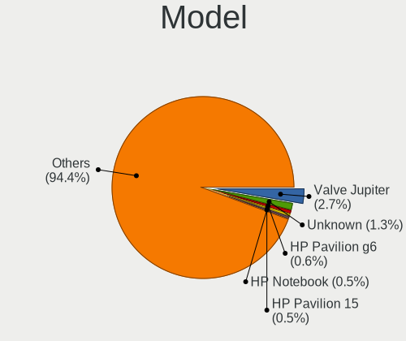
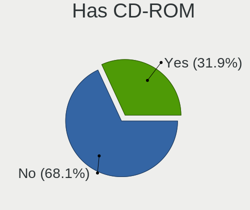
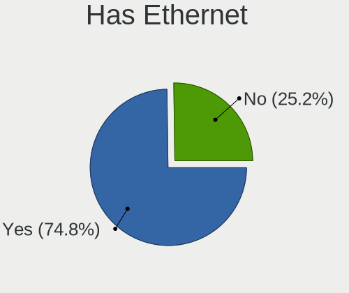
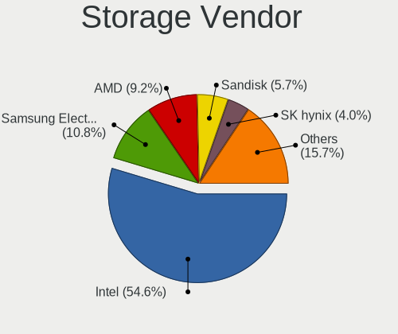
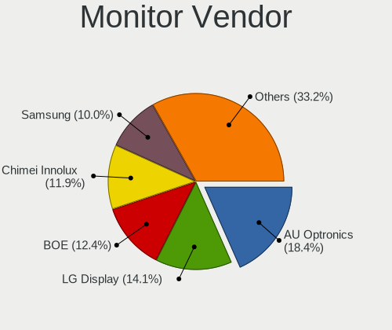

Linux in UK - Tested Hardware & Statistics (Notebooks)
------------------------------------------------------

A project to collect tested hardware configurations for Linux in UK.

Anyone can contribute to this report by the [hw-probe](https://github.com/linuxhw/hw-probe) tool:

    sudo -E hw-probe -all -upload

Please contribute! Especially if your hardware is rare.

Contents
--------

* [ Test Cases ](#test-cases)

* [ System ](#system)
  - [ OS                       ](#os)
  - [ OS Family                ](#os-family)
  - [ Kernel                   ](#kernel)
  - [ Kernel Family            ](#kernel-family)
  - [ Kernel Major Ver.        ](#kernel-major-ver)
  - [ Arch                     ](#arch)
  - [ DE                       ](#de)
  - [ Display Server           ](#display-server)
  - [ Display Manager          ](#display-manager)
  - [ OS Lang                  ](#os-lang)
  - [ Boot Mode                ](#boot-mode)
  - [ Filesystem               ](#filesystem)
  - [ Part. scheme             ](#part-scheme)
  - [ Dual Boot with Linux/BSD ](#dual-boot-with-linuxbsd)
  - [ Dual Boot (Win)          ](#dual-boot-win)

* [ Board ](#board)
  - [ Vendor                   ](#vendor)
  - [ Model                    ](#model)
  - [ Model Family             ](#model-family)
  - [ MFG Year                 ](#mfg-year)
  - [ Form Factor              ](#form-factor)
  - [ Secure Boot              ](#secure-boot)
  - [ Coreboot                 ](#coreboot)
  - [ RAM Size                 ](#ram-size)
  - [ RAM Used                 ](#ram-used)
  - [ Total Drives             ](#total-drives)
  - [ Has CD-ROM               ](#has-cd-rom)
  - [ Has Ethernet             ](#has-ethernet)
  - [ Has WiFi                 ](#has-wifi)
  - [ Has Bluetooth            ](#has-bluetooth)

* [ Location ](#location)
  - [ Country                  ](#country)
  - [ City                     ](#city)

* [ Drives ](#drives)
  - [ Drive Vendor             ](#drive-vendor)
  - [ Drive Model              ](#drive-model)
  - [ HDD Vendor               ](#hdd-vendor)
  - [ SSD Vendor               ](#ssd-vendor)
  - [ Drive Kind               ](#drive-kind)
  - [ Drive Connector          ](#drive-connector)
  - [ Drive Size               ](#drive-size)
  - [ Space Total              ](#space-total)
  - [ Space Used               ](#space-used)
  - [ Malfunc. Drives          ](#malfunc-drives)
  - [ Malfunc. Drive Vendor    ](#malfunc-drive-vendor)
  - [ Malfunc. HDD Vendor      ](#malfunc-hdd-vendor)
  - [ Malfunc. Drive Kind      ](#malfunc-drive-kind)
  - [ Failed Drives            ](#failed-drives)
  - [ Failed Drive Vendor      ](#failed-drive-vendor)
  - [ Drive Status             ](#drive-status)

* [ Storage controller ](#storage-controller)
  - [ Storage Vendor           ](#storage-vendor)
  - [ Storage Model            ](#storage-model)
  - [ Storage Kind             ](#storage-kind)

* [ Processor ](#processor)
  - [ CPU Vendor               ](#cpu-vendor)
  - [ CPU Model                ](#cpu-model)
  - [ CPU Model Family         ](#cpu-model-family)
  - [ CPU Cores                ](#cpu-cores)
  - [ CPU Sockets              ](#cpu-sockets)
  - [ CPU Threads              ](#cpu-threads)
  - [ CPU Op-Modes             ](#cpu-op-modes)
  - [ CPU Microcode            ](#cpu-microcode)
  - [ CPU Microarch            ](#cpu-microarch)

* [ Graphics ](#graphics)
  - [ GPU Vendor               ](#gpu-vendor)
  - [ GPU Model                ](#gpu-model)
  - [ GPU Combo                ](#gpu-combo)
  - [ GPU Driver               ](#gpu-driver)
  - [ GPU Memory               ](#gpu-memory)

* [ Monitor ](#monitor)
  - [ Monitor Vendor           ](#monitor-vendor)
  - [ Monitor Model            ](#monitor-model)
  - [ Monitor Resolution       ](#monitor-resolution)
  - [ Monitor Diagonal         ](#monitor-diagonal)
  - [ Monitor Width            ](#monitor-width)
  - [ Aspect Ratio             ](#aspect-ratio)
  - [ Monitor Area             ](#monitor-area)
  - [ Pixel Density            ](#pixel-density)
  - [ Multiple Monitors        ](#multiple-monitors)

* [ Network ](#network)
  - [ Net Controller Vendor    ](#net-controller-vendor)
  - [ Net Controller Model     ](#net-controller-model)
  - [ Wireless Vendor          ](#wireless-vendor)
  - [ Wireless Model           ](#wireless-model)
  - [ Ethernet Vendor          ](#ethernet-vendor)
  - [ Ethernet Model           ](#ethernet-model)
  - [ Net Controller Kind      ](#net-controller-kind)
  - [ Used Controller          ](#used-controller)
  - [ NICs                     ](#nics)
  - [ IPv6                     ](#ipv6)

* [ Bluetooth ](#bluetooth)
  - [ Bluetooth Vendor         ](#bluetooth-vendor)
  - [ Bluetooth Model          ](#bluetooth-model)

* [ Sound ](#sound)
  - [ Sound Vendor             ](#sound-vendor)
  - [ Sound Model              ](#sound-model)

* [ Memory ](#memory)
  - [ Memory Vendor            ](#memory-vendor)
  - [ Memory Model             ](#memory-model)
  - [ Memory Kind              ](#memory-kind)
  - [ Memory Form Factor       ](#memory-form-factor)
  - [ Memory Size              ](#memory-size)
  - [ Memory Speed             ](#memory-speed)

* [ Printers & scanners ](#printers--scanners)
  - [ Printer Vendor           ](#printer-vendor)
  - [ Printer Model            ](#printer-model)
  - [ Scanner Vendor           ](#scanner-vendor)
  - [ Scanner Model            ](#scanner-model)

* [ Camera ](#camera)
  - [ Camera Vendor            ](#camera-vendor)
  - [ Camera Model             ](#camera-model)

* [ Security ](#security)
  - [ Fingerprint Vendor       ](#fingerprint-vendor)
  - [ Fingerprint Model        ](#fingerprint-model)
  - [ Chipcard Vendor          ](#chipcard-vendor)
  - [ Chipcard Model           ](#chipcard-model)

* [ Unsupported ](#unsupported)
  - [ Unsupported Devices      ](#unsupported-devices)
  - [ Unsupported Device Types ](#unsupported-device-types)

Test Cases
----------

Total: 4195

| Vendor        | Model                       | Probe                                                      | Date         |
|---------------|-----------------------------|------------------------------------------------------------|--------------|
| Dell          | Latitude E7450              | [38051fe609](https://linux-hardware.org/?probe=38051fe609) | Aug 01, 2022 |
| Dell          | XPS 15 7590                 | [8a4cc1f177](https://linux-hardware.org/?probe=8a4cc1f177) | Aug 01, 2022 |
| ASUSTek       | VivoBook_ASUSLaptop M350... | [b2b969b0e3](https://linux-hardware.org/?probe=b2b969b0e3) | Aug 01, 2022 |
| Packard Be... | EasyNote TK13BZ             | [530d3ad8db](https://linux-hardware.org/?probe=530d3ad8db) | Aug 01, 2022 |
| HP            | ProBook 6570b               | [b99b5ef83f](https://linux-hardware.org/?probe=b99b5ef83f) | Aug 01, 2022 |
| Dell          | XPS 13 9380                 | [75f131a86a](https://linux-hardware.org/?probe=75f131a86a) | Aug 01, 2022 |
| ASUSTek       | X555LAB                     | [33a1712f4d](https://linux-hardware.org/?probe=33a1712f4d) | Aug 01, 2022 |
| Toshiba       | TECRA Z40-C                 | [9612659f60](https://linux-hardware.org/?probe=9612659f60) | Aug 01, 2022 |
| Dell          | Inspiron 5748               | [9113ee6d54](https://linux-hardware.org/?probe=9113ee6d54) | Aug 01, 2022 |
| HP            | ProBook 6570b               | [105d26b09c](https://linux-hardware.org/?probe=105d26b09c) | Aug 01, 2022 |
| HP            | ProBook 6570b               | [3898ce2b5f](https://linux-hardware.org/?probe=3898ce2b5f) | Aug 01, 2022 |
| Lenovo        | ThinkPad T460 20FMS02R0G    | [0aa31e3c39](https://linux-hardware.org/?probe=0aa31e3c39) | Jul 31, 2022 |
| Dell          | Latitude E6400              | [6962d36f57](https://linux-hardware.org/?probe=6962d36f57) | Jul 31, 2022 |
| HP            | Pavilion Laptop 15-cd0xx    | [b3dc6e72d5](https://linux-hardware.org/?probe=b3dc6e72d5) | Jul 31, 2022 |
| Dell          | Precision M6800             | [3584b1693d](https://linux-hardware.org/?probe=3584b1693d) | Jul 31, 2022 |
| HP            | Pavilion Laptop 15-cd0xx    | [521b86d8af](https://linux-hardware.org/?probe=521b86d8af) | Jul 31, 2022 |
| PC Special... | NS50MU                      | [b5dd220296](https://linux-hardware.org/?probe=b5dd220296) | Jul 29, 2022 |
| Linx          | LINX1010B                   | [60a5211d09](https://linux-hardware.org/?probe=60a5211d09) | Jul 28, 2022 |
| HP            | ProBook 4515s               | [b9759d3b5d](https://linux-hardware.org/?probe=b9759d3b5d) | Jul 28, 2022 |
| HP            | Pavilion Laptop 15-eh0xx... | [c2bcea4cf1](https://linux-hardware.org/?probe=c2bcea4cf1) | Jul 28, 2022 |
| HP            | Presario CQ56               | [aead18fee1](https://linux-hardware.org/?probe=aead18fee1) | Jul 28, 2022 |
| Fujitsu       | LIFEBOOK AH531              | [894bf232f8](https://linux-hardware.org/?probe=894bf232f8) | Jul 28, 2022 |
| Fujitsu       | LIFEBOOK AH531              | [eb752c319e](https://linux-hardware.org/?probe=eb752c319e) | Jul 28, 2022 |
| Apple         | MacBookAir7,2               | [a33f728c24](https://linux-hardware.org/?probe=a33f728c24) | Jul 27, 2022 |
| ASUSTek       | VivoBook_ASUSLaptop E203... | [f005e0566d](https://linux-hardware.org/?probe=f005e0566d) | Jul 27, 2022 |
| Lenovo        | IdeaPad 510-15ISK 80SR      | [44954e91a2](https://linux-hardware.org/?probe=44954e91a2) | Jul 27, 2022 |
| ASUSTek       | VivoBook_ASUSLaptop X760... | [6ae47baf6d](https://linux-hardware.org/?probe=6ae47baf6d) | Jul 26, 2022 |
| Dell          | XPS 15 9520                 | [007bab123f](https://linux-hardware.org/?probe=007bab123f) | Jul 26, 2022 |
| Dell          | XPS 15 9520                 | [b45acaf9b7](https://linux-hardware.org/?probe=b45acaf9b7) | Jul 26, 2022 |
| ASUSTek       | VivoBook 15_ASUS Laptop ... | [414aede111](https://linux-hardware.org/?probe=414aede111) | Jul 25, 2022 |
| Gigabyte      | AORUS 17 XE4                | [0bddb42774](https://linux-hardware.org/?probe=0bddb42774) | Jul 25, 2022 |
| HP            | G61                         | [1586fc0cba](https://linux-hardware.org/?probe=1586fc0cba) | Jul 25, 2022 |
| ASUSTek       | VivoBook_ASUSLaptop X515... | [bf2cecb453](https://linux-hardware.org/?probe=bf2cecb453) | Jul 25, 2022 |
| ASUSTek       | ASUS TUF Gaming F15 FX50... | [375ba933ba](https://linux-hardware.org/?probe=375ba933ba) | Jul 25, 2022 |
| ASUSTek       | VivoBook_ASUSLaptop X515... | [e2a1804b90](https://linux-hardware.org/?probe=e2a1804b90) | Jul 24, 2022 |
| ASUSTek       | VivoBook_ASUSLaptop X512... | [6740b94551](https://linux-hardware.org/?probe=6740b94551) | Jul 24, 2022 |
| Dell          | Latitude E5570              | [fa3d675cde](https://linux-hardware.org/?probe=fa3d675cde) | Jul 24, 2022 |
| Lenovo        | ThinkPad X280 20KES2SN00    | [202423ba73](https://linux-hardware.org/?probe=202423ba73) | Jul 24, 2022 |
| Valve         | Jupiter                     | [3e7b7cb8cd](https://linux-hardware.org/?probe=3e7b7cb8cd) | Jul 23, 2022 |
| HP            | Pavilion g6                 | [73061b2ed5](https://linux-hardware.org/?probe=73061b2ed5) | Jul 23, 2022 |
| Dell          | Inspiron 1545               | [893377b9f7](https://linux-hardware.org/?probe=893377b9f7) | Jul 23, 2022 |
| Dell          | XPS 13 9370                 | [21e10aa056](https://linux-hardware.org/?probe=21e10aa056) | Jul 23, 2022 |
| Sony          | VPCSB1C5E                   | [184e5b179e](https://linux-hardware.org/?probe=184e5b179e) | Jul 23, 2022 |
| AZW           | GT-R                        | [eb7604ea1c](https://linux-hardware.org/?probe=eb7604ea1c) | Jul 22, 2022 |
| Lenovo        | ThinkPad T480 20L6A0XKUK    | [fe5dae3d4a](https://linux-hardware.org/?probe=fe5dae3d4a) | Jul 22, 2022 |
| Toshiba       | EQUIUM A110                 | [4b6ace9122](https://linux-hardware.org/?probe=4b6ace9122) | Jul 22, 2022 |
| Dell          | Inspiron 1525               | [f1af5f5e45](https://linux-hardware.org/?probe=f1af5f5e45) | Jul 22, 2022 |
| Dell          | Inspiron 1525               | [6c43e1dfd6](https://linux-hardware.org/?probe=6c43e1dfd6) | Jul 22, 2022 |
| Acer          | Aspire A315-21              | [1754eeae39](https://linux-hardware.org/?probe=1754eeae39) | Jul 21, 2022 |
| HP            | G62                         | [418c1c572e](https://linux-hardware.org/?probe=418c1c572e) | Jul 21, 2022 |
| Dell          | XPS 15 9520                 | [51ddccaf88](https://linux-hardware.org/?probe=51ddccaf88) | Jul 21, 2022 |
| Acer          | Acadia V1.45                | [f3e470d7cf](https://linux-hardware.org/?probe=f3e470d7cf) | Jul 21, 2022 |
| Panasonic     | CF-53JAWZYDE                | [c1c835cb11](https://linux-hardware.org/?probe=c1c835cb11) | Jul 21, 2022 |
| Apple         | MacBookAir7,2               | [b0cdba7434](https://linux-hardware.org/?probe=b0cdba7434) | Jul 20, 2022 |
| HP            | G62                         | [3c4aab40ae](https://linux-hardware.org/?probe=3c4aab40ae) | Jul 20, 2022 |
| Dell          | Latitude 5285               | [2b46125d79](https://linux-hardware.org/?probe=2b46125d79) | Jul 20, 2022 |
| Acer          | Aspire ES1-531              | [45be1164f5](https://linux-hardware.org/?probe=45be1164f5) | Jul 19, 2022 |
| Acer          | Aspire A315-32              | [ec022ec507](https://linux-hardware.org/?probe=ec022ec507) | Jul 18, 2022 |
| Razer         | Blade 15 Advanced Model ... | [8f3842495f](https://linux-hardware.org/?probe=8f3842495f) | Jul 18, 2022 |
| Dell          | Vostro 3559                 | [3770ab3d4c](https://linux-hardware.org/?probe=3770ab3d4c) | Jul 18, 2022 |
| Dell          | Latitude D430               | [22c020a070](https://linux-hardware.org/?probe=22c020a070) | Jul 18, 2022 |
| Lenovo        | ThinkPad W550s 20E2000PU... | [ee30c1c248](https://linux-hardware.org/?probe=ee30c1c248) | Jul 16, 2022 |
| Acer          | Nitro AN517-54              | [68f6109054](https://linux-hardware.org/?probe=68f6109054) | Jul 16, 2022 |
| Dell          | Latitude E6440              | [eabdcd7622](https://linux-hardware.org/?probe=eabdcd7622) | Jul 15, 2022 |
| HP            | ProBook 4545s               | [12575a32d1](https://linux-hardware.org/?probe=12575a32d1) | Jul 15, 2022 |
| HP            | EliteBook 840 G7 Noteboo... | [7177bb644a](https://linux-hardware.org/?probe=7177bb644a) | Jul 15, 2022 |
| Fusion5       | S14+                        | [64668fa44f](https://linux-hardware.org/?probe=64668fa44f) | Jul 15, 2022 |
| HP            | Pavilion Laptop 15-eg0xx... | [ea2c3cd9e9](https://linux-hardware.org/?probe=ea2c3cd9e9) | Jul 14, 2022 |
| HUAWEI        | BOM-WXX9                    | [63c4a7a0bd](https://linux-hardware.org/?probe=63c4a7a0bd) | Jul 14, 2022 |
| Dell          | Inspiron 7570               | [872ca81b40](https://linux-hardware.org/?probe=872ca81b40) | Jul 13, 2022 |
| Acer          | Predator PH315-51           | [37b04a8093](https://linux-hardware.org/?probe=37b04a8093) | Jul 12, 2022 |
| HP            | Pavilion Gaming Laptop 1... | [80bb428b2a](https://linux-hardware.org/?probe=80bb428b2a) | Jul 12, 2022 |
| Lenovo        | ThinkPad X1 Nano Gen 1 2... | [21ef2a8d9a](https://linux-hardware.org/?probe=21ef2a8d9a) | Jul 12, 2022 |
| Google        | Lindar                      | [2e12af7cf7](https://linux-hardware.org/?probe=2e12af7cf7) | Jul 11, 2022 |
| Medion        | Erazer P6661 MD60303        | [35fbb2c055](https://linux-hardware.org/?probe=35fbb2c055) | Jul 10, 2022 |
| MSI           | GF63 Thin 9RCX              | [f2f3db370a](https://linux-hardware.org/?probe=f2f3db370a) | Jul 10, 2022 |
| Dell          | Inspiron 16 7610            | [25dce193df](https://linux-hardware.org/?probe=25dce193df) | Jul 10, 2022 |
| Packard Be... | EasyNote TE69KB             | [89403f1acb](https://linux-hardware.org/?probe=89403f1acb) | Jul 09, 2022 |
| Valve         | Jupiter                     | [0c2ea27c49](https://linux-hardware.org/?probe=0c2ea27c49) | Jul 09, 2022 |
| Acer          | Aspire R3-131T              | [36851c847b](https://linux-hardware.org/?probe=36851c847b) | Jul 08, 2022 |
| HP            | G56                         | [5c38722298](https://linux-hardware.org/?probe=5c38722298) | Jul 07, 2022 |
| AZW           | SEi                         | [7556cabcae](https://linux-hardware.org/?probe=7556cabcae) | Jul 07, 2022 |
| Sony          | VGN-FS415B                  | [0387163846](https://linux-hardware.org/?probe=0387163846) | Jul 06, 2022 |
| MSI           | Raider GE66 12UH            | [59726526b6](https://linux-hardware.org/?probe=59726526b6) | Jul 06, 2022 |
| Lenovo        | S21e-20 80M4                | [968f07d190](https://linux-hardware.org/?probe=968f07d190) | Jul 05, 2022 |
| ASUSTek       | VivoBook_ASUSLaptop M760... | [850003c6da](https://linux-hardware.org/?probe=850003c6da) | Jul 05, 2022 |
| Medion        | Erazer P6661 MD60303        | [59417db2d7](https://linux-hardware.org/?probe=59417db2d7) | Jul 05, 2022 |
| Dell          | XPS 13 7390                 | [c5155b28a7](https://linux-hardware.org/?probe=c5155b28a7) | Jul 04, 2022 |
| Apple         | MacBookAir6,2               | [072608d8d8](https://linux-hardware.org/?probe=072608d8d8) | Jul 04, 2022 |
| LG Electro... | 17Z90N-V.AA55A1             | [272164819f](https://linux-hardware.org/?probe=272164819f) | Jul 04, 2022 |
| Linx          | LINX1010B                   | [ae94ac08d9](https://linux-hardware.org/?probe=ae94ac08d9) | Jul 03, 2022 |
| Dell          | Vostro 5568                 | [c3e4fb87d2](https://linux-hardware.org/?probe=c3e4fb87d2) | Jul 03, 2022 |
| Dell          | Inspiron 7520               | [18acc5233d](https://linux-hardware.org/?probe=18acc5233d) | Jul 03, 2022 |
| Dell          | XPS 13 7390                 | [00370cb2ff](https://linux-hardware.org/?probe=00370cb2ff) | Jul 03, 2022 |
| Lenovo        | ThinkPad X240 20AMS1JQ11    | [d90a910042](https://linux-hardware.org/?probe=d90a910042) | Jul 02, 2022 |
| AWOW          | AL34                        | [be240349b7](https://linux-hardware.org/?probe=be240349b7) | Jul 02, 2022 |
| Dell          | Latitude E6400              | [d7b28806a9](https://linux-hardware.org/?probe=d7b28806a9) | Jul 02, 2022 |
| Samsung       | Q210/P210                   | [dfc97062be](https://linux-hardware.org/?probe=dfc97062be) | Jul 01, 2022 |
| Acer          | Extensa 5220                | [1ee1e31b52](https://linux-hardware.org/?probe=1ee1e31b52) | Jul 01, 2022 |
| HP            | Presario CQ56               | [af108b4933](https://linux-hardware.org/?probe=af108b4933) | Jun 30, 2022 |
| ASUSTek       | ROG Strix G513IC_G513IC     | [77f0b32727](https://linux-hardware.org/?probe=77f0b32727) | Jun 30, 2022 |
| Dell          | Inspiron N5110              | [142c1c4ef2](https://linux-hardware.org/?probe=142c1c4ef2) | Jun 30, 2022 |
| Acer          | Aspire 5735                 | [b930fd3fcd](https://linux-hardware.org/?probe=b930fd3fcd) | Jun 29, 2022 |
| Toshiba       | Satellite C850-1NU          | [2b83cb161e](https://linux-hardware.org/?probe=2b83cb161e) | Jun 29, 2022 |
| Lenovo        | IdeaPad Flex-14API 81SS     | [828f0b9ef1](https://linux-hardware.org/?probe=828f0b9ef1) | Jun 29, 2022 |
| Lenovo        | ThinkPad E590 20NB001AUK    | [f52aacfbfe](https://linux-hardware.org/?probe=f52aacfbfe) | Jun 29, 2022 |
| Toshiba       | Satellite L750              | [e01155e6ba](https://linux-hardware.org/?probe=e01155e6ba) | Jun 28, 2022 |
| HP            | Pavilion TS 14              | [f851b6a57b](https://linux-hardware.org/?probe=f851b6a57b) | Jun 28, 2022 |
| HP            | Pavilion Notebook           | [6e098b9c49](https://linux-hardware.org/?probe=6e098b9c49) | Jun 27, 2022 |
| HP            | Pavilion 15                 | [9e7a0c1889](https://linux-hardware.org/?probe=9e7a0c1889) | Jun 27, 2022 |
| Toshiba       | Satellite C870-1H2          | [edc5098a6f](https://linux-hardware.org/?probe=edc5098a6f) | Jun 27, 2022 |
| Lenovo        | ThinkPad P17 Gen 1 20SQS... | [ac9a35e85e](https://linux-hardware.org/?probe=ac9a35e85e) | Jun 27, 2022 |
| Dell          | XPS 17 9710                 | [6e16eed17c](https://linux-hardware.org/?probe=6e16eed17c) | Jun 26, 2022 |
| HP            | EliteBook 2560p             | [47b4db95ed](https://linux-hardware.org/?probe=47b4db95ed) | Jun 26, 2022 |
| ASUSTek       | FX503VD                     | [f0e913f715](https://linux-hardware.org/?probe=f0e913f715) | Jun 26, 2022 |
| Dell          | XPS 17 9710                 | [f37581d70e](https://linux-hardware.org/?probe=f37581d70e) | Jun 26, 2022 |
| Acer          | Aspire A515-55G             | [d05c52e40b](https://linux-hardware.org/?probe=d05c52e40b) | Jun 26, 2022 |
| Lenovo        | S20-30 Touch 20434          | [b4ebe70967](https://linux-hardware.org/?probe=b4ebe70967) | Jun 26, 2022 |
| Dell          | XPS 13 9310                 | [fa3d29c80b](https://linux-hardware.org/?probe=fa3d29c80b) | Jun 25, 2022 |
| HP            | EliteBook 820 G2            | [e568c96372](https://linux-hardware.org/?probe=e568c96372) | Jun 25, 2022 |
| Sony          | VGN-FS415B                  | [00d146d9f4](https://linux-hardware.org/?probe=00d146d9f4) | Jun 24, 2022 |
| Medion        | Erazer P6661 MD60303        | [a678044765](https://linux-hardware.org/?probe=a678044765) | Jun 23, 2022 |
| Medion        | Erazer P6661 MD60303        | [babd561a16](https://linux-hardware.org/?probe=babd561a16) | Jun 23, 2022 |
| ASUSTek       | VivoBook_ASUSLaptop M350... | [f2b61e1e02](https://linux-hardware.org/?probe=f2b61e1e02) | Jun 23, 2022 |
| Lenovo        | ThinkPad L480 20LTS1NK27    | [13a427bd3b](https://linux-hardware.org/?probe=13a427bd3b) | Jun 23, 2022 |
| Razer         | Blade                       | [6c8b201cd9](https://linux-hardware.org/?probe=6c8b201cd9) | Jun 23, 2022 |
| Valve         | Jupiter                     | [213fbe4dd2](https://linux-hardware.org/?probe=213fbe4dd2) | Jun 22, 2022 |
| Lenovo        | V15-ADA 82C7                | [98350f1274](https://linux-hardware.org/?probe=98350f1274) | Jun 22, 2022 |
| HUAWEI        | BOD-WXX9                    | [b0d232a3c9](https://linux-hardware.org/?probe=b0d232a3c9) | Jun 20, 2022 |
| Sony          | VGN-UX27GN                  | [ed20bd45a4](https://linux-hardware.org/?probe=ed20bd45a4) | Jun 20, 2022 |
| IBM           | ThinkPad X40 2371LBG        | [e7610b86d4](https://linux-hardware.org/?probe=e7610b86d4) | Jun 20, 2022 |
| Lenovo        | ThinkPad T430 2349I46       | [3a7df4ea17](https://linux-hardware.org/?probe=3a7df4ea17) | Jun 20, 2022 |
| Lenovo        | Flex 2-15 20405             | [0cae0765c9](https://linux-hardware.org/?probe=0cae0765c9) | Jun 20, 2022 |
| HP            | 15                          | [61e6eddc93](https://linux-hardware.org/?probe=61e6eddc93) | Jun 20, 2022 |
| AVITA         | NS14A6                      | [e3169acbbb](https://linux-hardware.org/?probe=e3169acbbb) | Jun 20, 2022 |
| Dell          | Inspiron 1720               | [8cc15a5651](https://linux-hardware.org/?probe=8cc15a5651) | Jun 19, 2022 |
| Lenovo        | ThinkPad T470 20HD000EUK    | [6cc2ca4099](https://linux-hardware.org/?probe=6cc2ca4099) | Jun 19, 2022 |
| Dell          | Inspiron 7370               | [e8a53b7f1b](https://linux-hardware.org/?probe=e8a53b7f1b) | Jun 18, 2022 |
| Lenovo        | ThinkPad T470 W10DG 20JN... | [f399990b6e](https://linux-hardware.org/?probe=f399990b6e) | Jun 18, 2022 |
| Razer         | Blade 17 (2022) - RZ09-0... | [41945e4369](https://linux-hardware.org/?probe=41945e4369) | Jun 18, 2022 |
| Sony          | VGN-P11Z_Q                  | [e51be2b6a4](https://linux-hardware.org/?probe=e51be2b6a4) | Jun 16, 2022 |
| Acer          | Acadia V1.45                | [198f6e8fca](https://linux-hardware.org/?probe=198f6e8fca) | Jun 16, 2022 |
| HP            | ProBook 455 G3              | [507dcf06fc](https://linux-hardware.org/?probe=507dcf06fc) | Jun 16, 2022 |
| HP            | ProBook 455 G3              | [64794fafd4](https://linux-hardware.org/?probe=64794fafd4) | Jun 16, 2022 |
| Lenovo        | ThinkPad X230 23252EG       | [8e0da08d4d](https://linux-hardware.org/?probe=8e0da08d4d) | Jun 15, 2022 |
| Lenovo        | ThinkPad X230 23252EG       | [cf4df37657](https://linux-hardware.org/?probe=cf4df37657) | Jun 15, 2022 |
| Lenovo        | ThinkPad T430 2349AZ6       | [7369a5bd6b](https://linux-hardware.org/?probe=7369a5bd6b) | Jun 15, 2022 |
| MSI           | GP60 2OD                    | [6edff2c2ad](https://linux-hardware.org/?probe=6edff2c2ad) | Jun 14, 2022 |
| ASUSTek       | ASUS TUF Dash F15 FX516P... | [5b6f3d52c5](https://linux-hardware.org/?probe=5b6f3d52c5) | Jun 14, 2022 |
| Lenovo        | ThinkPad T470 W10DG 20JN... | [c1be5f13af](https://linux-hardware.org/?probe=c1be5f13af) | Jun 13, 2022 |
| Apple         | MacBookPro11,1              | [d40967b111](https://linux-hardware.org/?probe=d40967b111) | Jun 13, 2022 |
| Dell          | Studio XPS 1640             | [aac66b6b7b](https://linux-hardware.org/?probe=aac66b6b7b) | Jun 13, 2022 |
| HP            | EliteBook 820 G2            | [45ca271974](https://linux-hardware.org/?probe=45ca271974) | Jun 13, 2022 |
| Toshiba       | Satellite C55-C             | [6eef40304f](https://linux-hardware.org/?probe=6eef40304f) | Jun 13, 2022 |
| Acer          | Nitro AN515-52              | [72ea50523c](https://linux-hardware.org/?probe=72ea50523c) | Jun 13, 2022 |
| Acer          | Nitro AN515-52              | [05b64cc5de](https://linux-hardware.org/?probe=05b64cc5de) | Jun 12, 2022 |
| MSI           | P65 Creator 9SE             | [da30629803](https://linux-hardware.org/?probe=da30629803) | Jun 11, 2022 |
| Dell          | Inspiron 16 7610            | [9967260c3c](https://linux-hardware.org/?probe=9967260c3c) | Jun 11, 2022 |
| HP            | EliteBook 820 G2            | [0a0828f262](https://linux-hardware.org/?probe=0a0828f262) | Jun 11, 2022 |
| Lenovo        | ThinkPad T470 W10DG 20JN... | [83f46a355b](https://linux-hardware.org/?probe=83f46a355b) | Jun 11, 2022 |
| ASUSTek       | X555LAB                     | [8e47a3c188](https://linux-hardware.org/?probe=8e47a3c188) | Jun 10, 2022 |
| Lenovo        | IdeaPad 510-15ISK 80SR      | [53c2e38d14](https://linux-hardware.org/?probe=53c2e38d14) | Jun 10, 2022 |
| Toshiba       | Satellite L50-B             | [ce4d95c7bf](https://linux-hardware.org/?probe=ce4d95c7bf) | Jun 10, 2022 |
| Dell          | Latitude E7270              | [8d8f0db52c](https://linux-hardware.org/?probe=8d8f0db52c) | Jun 10, 2022 |
| HUAWEI        | NBD-WXX9                    | [b8e097f983](https://linux-hardware.org/?probe=b8e097f983) | Jun 10, 2022 |
| HP            | OMEN by Laptop 16-c0xxx     | [d29d3120fb](https://linux-hardware.org/?probe=d29d3120fb) | Jun 09, 2022 |
| Lenovo        | ThinkPad X230 23243E9       | [85ffd2561e](https://linux-hardware.org/?probe=85ffd2561e) | Jun 08, 2022 |
| Lenovo        | S130-11IGM 81J1             | [851d5469e5](https://linux-hardware.org/?probe=851d5469e5) | Jun 08, 2022 |
| Dell          | Latitude E6510              | [083f1d576d](https://linux-hardware.org/?probe=083f1d576d) | Jun 07, 2022 |
| Chuwi         | GemiBook Pro                | [737a4183c8](https://linux-hardware.org/?probe=737a4183c8) | Jun 07, 2022 |
| Apple         | MacBookPro11,4              | [d6662c5acf](https://linux-hardware.org/?probe=d6662c5acf) | Jun 07, 2022 |
| Lenovo        | ThinkPad T480 20L5000AUK    | [0bf67e4018](https://linux-hardware.org/?probe=0bf67e4018) | Jun 06, 2022 |
| Dell          | Latitude E6400              | [e4f54892c2](https://linux-hardware.org/?probe=e4f54892c2) | Jun 05, 2022 |
| HYPA          | FLUX                        | [76b0337ef8](https://linux-hardware.org/?probe=76b0337ef8) | Jun 05, 2022 |
| HP            | Laptop 15-bs1xx             | [e579d912d0](https://linux-hardware.org/?probe=e579d912d0) | Jun 04, 2022 |
| HP            | G62                         | [2411be6ba6](https://linux-hardware.org/?probe=2411be6ba6) | Jun 04, 2022 |
| Lenovo        | ThinkPad T14 Gen 3 21AH0... | [d147abfc52](https://linux-hardware.org/?probe=d147abfc52) | Jun 04, 2022 |
| Lenovo        | ThinkPad T14 Gen 3 21AH0... | [eaad038fde](https://linux-hardware.org/?probe=eaad038fde) | Jun 03, 2022 |
| Notebook      | NL40_50CU                   | [df0357703d](https://linux-hardware.org/?probe=df0357703d) | Jun 03, 2022 |
| Lenovo        | G780 2182                   | [878e602f7d](https://linux-hardware.org/?probe=878e602f7d) | Jun 02, 2022 |
| ASUSTek       | S550CA                      | [e683ab1965](https://linux-hardware.org/?probe=e683ab1965) | Jun 02, 2022 |
| Alienware     | M11x R2                     | [0b6837debb](https://linux-hardware.org/?probe=0b6837debb) | Jun 01, 2022 |
| Acer          | Aspire S3                   | [a78c44019e](https://linux-hardware.org/?probe=a78c44019e) | Jun 01, 2022 |
| ASUSTek       | ROG Zephyrus G14 GA401QM    | [8db5953984](https://linux-hardware.org/?probe=8db5953984) | Jun 01, 2022 |
| Dell          | G7 7700                     | [25e22bc243](https://linux-hardware.org/?probe=25e22bc243) | May 31, 2022 |
| HP            | Presario C500 (RT155EA#A... | [5eb3ee9cc2](https://linux-hardware.org/?probe=5eb3ee9cc2) | May 31, 2022 |
| Dell          | Latitude E6400              | [85d314bfd8](https://linux-hardware.org/?probe=85d314bfd8) | May 31, 2022 |
| Lenovo        | ThinkPad X1 Carbon 2nd 2... | [dc3ee2e520](https://linux-hardware.org/?probe=dc3ee2e520) | May 31, 2022 |
| Lenovo        | ThinkPad T410 25223FG       | [aae8744a5c](https://linux-hardware.org/?probe=aae8744a5c) | May 31, 2022 |
| Dell          | Latitude E6400              | [f5ae9fef9c](https://linux-hardware.org/?probe=f5ae9fef9c) | May 31, 2022 |
| HYPA          | FLUX                        | [8a69e3a34e](https://linux-hardware.org/?probe=8a69e3a34e) | May 31, 2022 |
| Alienware     | M11x R2                     | [4a364390a6](https://linux-hardware.org/?probe=4a364390a6) | May 31, 2022 |
| Alienware     | M11x R2                     | [87e8835eba](https://linux-hardware.org/?probe=87e8835eba) | May 30, 2022 |
| Lenovo        | ThinkPad X1 Carbon 2nd 2... | [5a813419eb](https://linux-hardware.org/?probe=5a813419eb) | May 30, 2022 |
| Lenovo        | ThinkPad T15 Gen 2i 20W5... | [8ee33363ef](https://linux-hardware.org/?probe=8ee33363ef) | May 30, 2022 |
| Razer         | Blade                       | [d7271bb7c4](https://linux-hardware.org/?probe=d7271bb7c4) | May 30, 2022 |
| Dell          | Latitude E6540              | [ece4d207f3](https://linux-hardware.org/?probe=ece4d207f3) | May 30, 2022 |
| Lenovo        | Legion 5 15ACH6H 82JU       | [0e59a69b8d](https://linux-hardware.org/?probe=0e59a69b8d) | May 30, 2022 |
| Toshiba       | Satellite C850-1KN          | [60b2c12831](https://linux-hardware.org/?probe=60b2c12831) | May 29, 2022 |
| AZW           | GT-R                        | [7823df6a86](https://linux-hardware.org/?probe=7823df6a86) | May 29, 2022 |
| Lenovo        | Yoga 300-11IBY 80M0         | [8d120a2350](https://linux-hardware.org/?probe=8d120a2350) | May 28, 2022 |
| PC Special... | NH5x_7xDCx_DDx              | [bd70d45ed2](https://linux-hardware.org/?probe=bd70d45ed2) | May 28, 2022 |
| Dell          | XPS 13 9305                 | [5dc9e065e3](https://linux-hardware.org/?probe=5dc9e065e3) | May 27, 2022 |
| Dell          | Precision 5530              | [2ecf3390bf](https://linux-hardware.org/?probe=2ecf3390bf) | May 27, 2022 |
| HP            | ZBook 15 G5                 | [4f083f0d35](https://linux-hardware.org/?probe=4f083f0d35) | May 25, 2022 |
| Dell          | Inspiron 3721               | [d4af21adb8](https://linux-hardware.org/?probe=d4af21adb8) | May 25, 2022 |
| Alienware     | x17 R1                      | [a4cfdafe9d](https://linux-hardware.org/?probe=a4cfdafe9d) | May 25, 2022 |
| Toshiba       | TECRA A50-C                 | [60a580cb3b](https://linux-hardware.org/?probe=60a580cb3b) | May 25, 2022 |
| Acer          | Aspire S3                   | [d91145e274](https://linux-hardware.org/?probe=d91145e274) | May 25, 2022 |
| HP            | ZBook 15 G5                 | [fea70c6484](https://linux-hardware.org/?probe=fea70c6484) | May 24, 2022 |
| Toshiba       | PORTEGE R30-A               | [94cf17bcb6](https://linux-hardware.org/?probe=94cf17bcb6) | May 24, 2022 |
| Dell          | Inspiron 15 7000 Gaming     | [887985e68a](https://linux-hardware.org/?probe=887985e68a) | May 24, 2022 |
| Dell          | XPS 15 9560                 | [7152b312be](https://linux-hardware.org/?probe=7152b312be) | May 23, 2022 |
| BOX           | W54_W94_W955TU,-T,-C        | [a36f54939d](https://linux-hardware.org/?probe=a36f54939d) | May 23, 2022 |
| Entroware     | Apollo                      | [30881be24b](https://linux-hardware.org/?probe=30881be24b) | May 23, 2022 |
| Valve         | Jupiter                     | [7d3f9c0a5f](https://linux-hardware.org/?probe=7d3f9c0a5f) | May 23, 2022 |
| ASUSTek       | ASUS TUF Gaming F17 FX70... | [fe1d187774](https://linux-hardware.org/?probe=fe1d187774) | May 22, 2022 |
| Dell          | XPS 13 9360                 | [47c446b3d8](https://linux-hardware.org/?probe=47c446b3d8) | May 22, 2022 |
| Lenovo        | S21e-20 80M4                | [90d0bb5bc0](https://linux-hardware.org/?probe=90d0bb5bc0) | May 22, 2022 |
| Lenovo        | S21e-20 80M4                | [48047cdaf6](https://linux-hardware.org/?probe=48047cdaf6) | May 22, 2022 |
| Valve         | Jupiter                     | [595b06f6c9](https://linux-hardware.org/?probe=595b06f6c9) | May 22, 2022 |
| Apple         | MacBookPro10,1              | [5bf86728dc](https://linux-hardware.org/?probe=5bf86728dc) | May 22, 2022 |
| Acer          | Aspire ES1-523              | [e856d4589a](https://linux-hardware.org/?probe=e856d4589a) | May 21, 2022 |
| Lenovo        | Z50-75 80EC                 | [adddbe7947](https://linux-hardware.org/?probe=adddbe7947) | May 21, 2022 |
| Entroware     | Triton                      | [2bfa3e5cc8](https://linux-hardware.org/?probe=2bfa3e5cc8) | May 20, 2022 |
| HP            | Laptop 15-bs0xx             | [5c989cad8d](https://linux-hardware.org/?probe=5c989cad8d) | May 20, 2022 |
| Lenovo        | V145-15AST 81MT             | [ab767eaa59](https://linux-hardware.org/?probe=ab767eaa59) | May 19, 2022 |
| Notebook      | NH5x_NH7x_HHx_HJx_HKx       | [e30e3da709](https://linux-hardware.org/?probe=e30e3da709) | May 18, 2022 |
| Acer          | Aspire A315-21              | [8f9f8c2634](https://linux-hardware.org/?probe=8f9f8c2634) | May 18, 2022 |
| HP            | Pavilion Notebook           | [2e663e698c](https://linux-hardware.org/?probe=2e663e698c) | May 18, 2022 |
| Notebook      | NS50_70MU                   | [382192bd2c](https://linux-hardware.org/?probe=382192bd2c) | May 18, 2022 |
| HP            | ZBook Fury 17.3 inch G8 ... | [8757941b52](https://linux-hardware.org/?probe=8757941b52) | May 17, 2022 |
| MSI           | Stealth GS66 12UGS          | [f92e29b330](https://linux-hardware.org/?probe=f92e29b330) | May 17, 2022 |
| ASUSTek       | VivoBook_ASUS Laptop E21... | [b1afeba24a](https://linux-hardware.org/?probe=b1afeba24a) | May 16, 2022 |
| Lenovo        | ThinkPad T14s Gen 2i 20W... | [06afc33451](https://linux-hardware.org/?probe=06afc33451) | May 16, 2022 |
| HP            | ZBook 15 G6                 | [6c433b3b60](https://linux-hardware.org/?probe=6c433b3b60) | May 16, 2022 |
| Lenovo        | ThinkPad T440 20B7A1P700    | [ee54db9f9e](https://linux-hardware.org/?probe=ee54db9f9e) | May 16, 2022 |
| HP            | Unknown                     | [796c00a0cd](https://linux-hardware.org/?probe=796c00a0cd) | May 15, 2022 |
| Lenovo        | ThinkPad T410 25223FG       | [0f70996b58](https://linux-hardware.org/?probe=0f70996b58) | May 15, 2022 |
| HP            | ProBook 6570b               | [e8c38d4e97](https://linux-hardware.org/?probe=e8c38d4e97) | May 15, 2022 |
| Dell          | XPS 13 9305                 | [e9310a7ede](https://linux-hardware.org/?probe=e9310a7ede) | May 15, 2022 |
| Dell          | Inspiron 1750               | [b37b4cdbbb](https://linux-hardware.org/?probe=b37b4cdbbb) | May 15, 2022 |
| Dell          | XPS 13 9305                 | [3f8becd67d](https://linux-hardware.org/?probe=3f8becd67d) | May 15, 2022 |
| Dell          | Inspiron N5110              | [2555fd899e](https://linux-hardware.org/?probe=2555fd899e) | May 15, 2022 |
| Fujitsu Si... | LIFEBOOK S7110              | [8586a581d0](https://linux-hardware.org/?probe=8586a581d0) | May 15, 2022 |
| Notebook      | NLx0MU                      | [b46632bd9a](https://linux-hardware.org/?probe=b46632bd9a) | May 14, 2022 |
| Lenovo        | ThinkPad T470 20HES1RB06    | [0d115ce977](https://linux-hardware.org/?probe=0d115ce977) | May 14, 2022 |
| HP            | Pavilion Notebook           | [44952d0fff](https://linux-hardware.org/?probe=44952d0fff) | May 13, 2022 |
| Star Labs     | Lite                        | [dbe031aada](https://linux-hardware.org/?probe=dbe031aada) | May 13, 2022 |
| AMI           | Cherry Trail CR             | [62744ba7e3](https://linux-hardware.org/?probe=62744ba7e3) | May 12, 2022 |
| Lenovo        | ThinkPad P73 20QSS09S00     | [8438c92818](https://linux-hardware.org/?probe=8438c92818) | May 12, 2022 |
| Dell          | Precision M6600             | [730205ec1e](https://linux-hardware.org/?probe=730205ec1e) | May 11, 2022 |
| Lenovo        | ThinkPad T480 20L6S5M40M    | [f2213829f0](https://linux-hardware.org/?probe=f2213829f0) | May 11, 2022 |
| Acer          | Aspire E1-571               | [72b102de04](https://linux-hardware.org/?probe=72b102de04) | May 10, 2022 |
| HP            | EliteBook 2560p             | [debc8c7d47](https://linux-hardware.org/?probe=debc8c7d47) | May 10, 2022 |
| Acer          | Aspire E5-551               | [bef0e3659e](https://linux-hardware.org/?probe=bef0e3659e) | May 10, 2022 |
| ASUSTek       | N751JK                      | [bfdc40105f](https://linux-hardware.org/?probe=bfdc40105f) | May 10, 2022 |
| HP            | EliteBook 2730p             | [d4c5b7824d](https://linux-hardware.org/?probe=d4c5b7824d) | May 10, 2022 |
| Lenovo        | IdeaPad 5 15ARE05 81YQ      | [20eb5bfb9f](https://linux-hardware.org/?probe=20eb5bfb9f) | May 10, 2022 |
| ASUSTek       | VivoBook 14_ASUS Laptop ... | [f151955e44](https://linux-hardware.org/?probe=f151955e44) | May 10, 2022 |
| Clevo         | W55xEU                      | [7bdef594e1](https://linux-hardware.org/?probe=7bdef594e1) | May 09, 2022 |
| HP            | ENVY 17                     | [a503de2c1f](https://linux-hardware.org/?probe=a503de2c1f) | May 08, 2022 |
| Acer          | Aspire 6930G                | [49228d9f61](https://linux-hardware.org/?probe=49228d9f61) | May 08, 2022 |
| Acer          | Aspire 6930G                | [912dbb8280](https://linux-hardware.org/?probe=912dbb8280) | May 08, 2022 |
| HUAWEI        | BOD-WXX9                    | [b0b389263a](https://linux-hardware.org/?probe=b0b389263a) | May 08, 2022 |
| Lenovo        | IdeaPad Z580                | [a0751c16d5](https://linux-hardware.org/?probe=a0751c16d5) | May 08, 2022 |
| Dell          | Inspiron 7501               | [a8a1e1e3a2](https://linux-hardware.org/?probe=a8a1e1e3a2) | May 07, 2022 |
| MSI           | GE63 Raider RGB 8RE         | [34bd31c9f9](https://linux-hardware.org/?probe=34bd31c9f9) | May 07, 2022 |
| HP            | ZBook 15 G5                 | [4a3960f047](https://linux-hardware.org/?probe=4a3960f047) | May 07, 2022 |
| HP            | ProBook 430 G4              | [cae67b53da](https://linux-hardware.org/?probe=cae67b53da) | May 06, 2022 |
| Acer          | Swift SF314-41              | [3dbf93ec7f](https://linux-hardware.org/?probe=3dbf93ec7f) | May 06, 2022 |
| Dell          | Inspiron 1525               | [67dbf0ac88](https://linux-hardware.org/?probe=67dbf0ac88) | May 05, 2022 |
| ASUSTek       | VivoBook_ASUSLaptop X512... | [8aadfc9dc1](https://linux-hardware.org/?probe=8aadfc9dc1) | May 04, 2022 |
| Acer          | Aspire A515-45              | [e5f3e5b086](https://linux-hardware.org/?probe=e5f3e5b086) | May 04, 2022 |
| Lenovo        | ThinkPad P50 20EQS0VV0C     | [4ce87e4da1](https://linux-hardware.org/?probe=4ce87e4da1) | May 04, 2022 |
| HP            | EliteBook 820 G2            | [0e78293e95](https://linux-hardware.org/?probe=0e78293e95) | May 03, 2022 |
| Lenovo        | ThinkPad T410 25223FG       | [584ec1055a](https://linux-hardware.org/?probe=584ec1055a) | May 03, 2022 |
| Lenovo        | ThinkPad T410 25223FG       | [2e4fdc00b2](https://linux-hardware.org/?probe=2e4fdc00b2) | May 03, 2022 |
| ASUSTek       | E200HA                      | [399a40cb14](https://linux-hardware.org/?probe=399a40cb14) | May 03, 2022 |
| Lenovo        | Z50-75 80EC                 | [d16211782e](https://linux-hardware.org/?probe=d16211782e) | May 03, 2022 |
| Dell          | Latitude E7470              | [7991dfd7a5](https://linux-hardware.org/?probe=7991dfd7a5) | May 03, 2022 |
| Lenovo        | ThinkPad X1 Carbon Gen 9... | [981f468940](https://linux-hardware.org/?probe=981f468940) | May 02, 2022 |
| Lenovo        | ThinkPad X250 20CMCTO1WW    | [6a9dfa32d3](https://linux-hardware.org/?probe=6a9dfa32d3) | May 02, 2022 |
| Acer          | Aspire A515-45              | [8cf5364699](https://linux-hardware.org/?probe=8cf5364699) | May 02, 2022 |
| Toshiba       | Satellite P850              | [8e97662196](https://linux-hardware.org/?probe=8e97662196) | May 02, 2022 |
| Acer          | Aspire V5-573P              | [b64d1453d5](https://linux-hardware.org/?probe=b64d1453d5) | May 02, 2022 |
| ASUSTek       | UX310UA                     | [80fce5caed](https://linux-hardware.org/?probe=80fce5caed) | May 01, 2022 |
| Dell          | XPS 13 9310                 | [03b461596c](https://linux-hardware.org/?probe=03b461596c) | May 01, 2022 |
| Dell          | XPS 15 9570                 | [133b6670de](https://linux-hardware.org/?probe=133b6670de) | May 01, 2022 |
| Lenovo        | IdeaPad Gaming 3 15IHU6 ... | [ab553d3a2f](https://linux-hardware.org/?probe=ab553d3a2f) | May 01, 2022 |
| Acer          | Aspire A515-45              | [a5fd51cc39](https://linux-hardware.org/?probe=a5fd51cc39) | May 01, 2022 |
| ASUSTek       | TUF Gaming FX705GM_FX705... | [3589ada8b3](https://linux-hardware.org/?probe=3589ada8b3) | Apr 30, 2022 |
| Lenovo        | ThinkBook 15 G2 ITL 20VE    | [31b081b116](https://linux-hardware.org/?probe=31b081b116) | Apr 30, 2022 |
| Valve         | Jupiter                     | [1c826aed5e](https://linux-hardware.org/?probe=1c826aed5e) | Apr 30, 2022 |
| Lenovo        | Z50-75 80EC                 | [f301c52b41](https://linux-hardware.org/?probe=f301c52b41) | Apr 29, 2022 |
| Lenovo        | ThinkPad T450 20BV001YMS    | [f38b762c83](https://linux-hardware.org/?probe=f38b762c83) | Apr 29, 2022 |
| Toshiba       | Satellite Pro R50-B         | [6a8bdd387c](https://linux-hardware.org/?probe=6a8bdd387c) | Apr 29, 2022 |
| ASUSTek       | ASUS TUF Gaming F15 FX50... | [df82c076b8](https://linux-hardware.org/?probe=df82c076b8) | Apr 29, 2022 |
| Lenovo        | ThinkPad T480 20L50004UK    | [34015c4874](https://linux-hardware.org/?probe=34015c4874) | Apr 29, 2022 |
| Lenovo        | IdeaPad 320S-14IKB 80X4     | [06ef070e40](https://linux-hardware.org/?probe=06ef070e40) | Apr 28, 2022 |
| Lenovo        | IdeaPad 320S-14IKB 80X4     | [8ef803f8c9](https://linux-hardware.org/?probe=8ef803f8c9) | Apr 28, 2022 |
| ASUSTek       | FX503VM                     | [c227966510](https://linux-hardware.org/?probe=c227966510) | Apr 27, 2022 |
| ASUSTek       | FX503VM                     | [1275aa643d](https://linux-hardware.org/?probe=1275aa643d) | Apr 27, 2022 |
| Lenovo        | ThinkPad T470 W10DG 20JN... | [37501fa5f3](https://linux-hardware.org/?probe=37501fa5f3) | Apr 27, 2022 |
| Dell          | Inspiron 5415               | [5edac5d5a6](https://linux-hardware.org/?probe=5edac5d5a6) | Apr 27, 2022 |
| Notebook      | W130SV                      | [a88535a3a5](https://linux-hardware.org/?probe=a88535a3a5) | Apr 27, 2022 |
| Lenovo        | IdeaPadFlex 15 20309        | [d23e7110f6](https://linux-hardware.org/?probe=d23e7110f6) | Apr 27, 2022 |
| Lenovo        | IdeaPadFlex 15 20309        | [3390e01a9c](https://linux-hardware.org/?probe=3390e01a9c) | Apr 27, 2022 |
| PC Special... | NJ50_70CU                   | [a9b4399cad](https://linux-hardware.org/?probe=a9b4399cad) | Apr 26, 2022 |
| MSI           | GF63 Thin 10SC              | [bc3cbdbc1f](https://linux-hardware.org/?probe=bc3cbdbc1f) | Apr 26, 2022 |
| Acer          | NC-E5-573-36PM              | [a98a807776](https://linux-hardware.org/?probe=a98a807776) | Apr 26, 2022 |
| MSI           | GP66 Leopard 11UH           | [549c216d66](https://linux-hardware.org/?probe=549c216d66) | Apr 26, 2022 |
| Dell          | XPS 13 9310                 | [1f95a73d57](https://linux-hardware.org/?probe=1f95a73d57) | Apr 26, 2022 |
| Apple         | MacBookPro11,1              | [a8626eb701](https://linux-hardware.org/?probe=a8626eb701) | Apr 26, 2022 |
| Acer          | Aspire E1-571               | [35824f9b37](https://linux-hardware.org/?probe=35824f9b37) | Apr 25, 2022 |
| HP            | Pavilion dv6                | [83093f24ef](https://linux-hardware.org/?probe=83093f24ef) | Apr 24, 2022 |
| Dell          | XPS 15 9510                 | [a934bef382](https://linux-hardware.org/?probe=a934bef382) | Apr 24, 2022 |
| Lenovo        | ThinkBook 15 G2 ITL 20VE    | [fbb2b97e0f](https://linux-hardware.org/?probe=fbb2b97e0f) | Apr 24, 2022 |
| Dell          | XPS 15 9510                 | [b61b2af9eb](https://linux-hardware.org/?probe=b61b2af9eb) | Apr 23, 2022 |
| Purism        | Librem 14                   | [9d078217f1](https://linux-hardware.org/?probe=9d078217f1) | Apr 23, 2022 |
| Acer          | Swift SF315-52              | [089d81a936](https://linux-hardware.org/?probe=089d81a936) | Apr 23, 2022 |
| ASUSTek       | ZenBook UX433FA_UX433FA     | [0ca0b999d6](https://linux-hardware.org/?probe=0ca0b999d6) | Apr 23, 2022 |
| HP            | Pavilion g6                 | [796bf7f467](https://linux-hardware.org/?probe=796bf7f467) | Apr 23, 2022 |
| Dell          | Latitude E7450              | [5ce1623306](https://linux-hardware.org/?probe=5ce1623306) | Apr 22, 2022 |
| HP            | Pavilion dv6                | [16e2c4e6d3](https://linux-hardware.org/?probe=16e2c4e6d3) | Apr 22, 2022 |
| CyberPower... | Tracer II                   | [4582a60770](https://linux-hardware.org/?probe=4582a60770) | Apr 21, 2022 |
| Dynabook      | PORTEGE X30L-J              | [5894fd3a34](https://linux-hardware.org/?probe=5894fd3a34) | Apr 21, 2022 |
| Dell          | Latitude D430               | [00ddfbe46f](https://linux-hardware.org/?probe=00ddfbe46f) | Apr 20, 2022 |
| Dixonsxp      | Unknown                     | [65e40dacf4](https://linux-hardware.org/?probe=65e40dacf4) | Apr 20, 2022 |
| Samsung       | 950XDB/951XDB/950XDY        | [336a67fbee](https://linux-hardware.org/?probe=336a67fbee) | Apr 19, 2022 |
| HP            | Notebook                    | [f6d84934cd](https://linux-hardware.org/?probe=f6d84934cd) | Apr 19, 2022 |
| Lenovo        | IdeaPad S540-15IML D 81N... | [58dc7c7bf2](https://linux-hardware.org/?probe=58dc7c7bf2) | Apr 19, 2022 |
| Lenovo        | ThinkPad X220 4291QT1       | [9ffcb6bf7a](https://linux-hardware.org/?probe=9ffcb6bf7a) | Apr 18, 2022 |
| ASUSTek       | ROG Flow X13 GV301QH_GV3... | [6db9a3dea0](https://linux-hardware.org/?probe=6db9a3dea0) | Apr 18, 2022 |
| Lenovo        | ThinkPad X230 23202DG       | [c7f2c2e71c](https://linux-hardware.org/?probe=c7f2c2e71c) | Apr 18, 2022 |
| HP            | Pavilion Gaming Laptop 1... | [42db396ee8](https://linux-hardware.org/?probe=42db396ee8) | Apr 18, 2022 |
| HP            | Pavilion Gaming Laptop 1... | [4dc4e0af40](https://linux-hardware.org/?probe=4dc4e0af40) | Apr 18, 2022 |
| HUAWEI        | KLVL-WXX9                   | [9868b4e681](https://linux-hardware.org/?probe=9868b4e681) | Apr 17, 2022 |
| Valve         | Jupiter                     | [4f23fab4fd](https://linux-hardware.org/?probe=4f23fab4fd) | Apr 17, 2022 |
| Lenovo        | ThinkPad X220 4291QT1       | [00a23bc10c](https://linux-hardware.org/?probe=00a23bc10c) | Apr 17, 2022 |
| Lenovo        | ThinkPad L440 20ASA02800    | [697a90ffa2](https://linux-hardware.org/?probe=697a90ffa2) | Apr 16, 2022 |
| Dell          | Inspiron N5110              | [5ae4706be7](https://linux-hardware.org/?probe=5ae4706be7) | Apr 15, 2022 |
| Toshiba       | Satellite P50t-A            | [f2eef93c50](https://linux-hardware.org/?probe=f2eef93c50) | Apr 15, 2022 |
| HP            | ENVY 13                     | [4b0b543bdf](https://linux-hardware.org/?probe=4b0b543bdf) | Apr 14, 2022 |
| Lenovo        | Legion 5 15IMH05 82AU       | [4b3cedca6f](https://linux-hardware.org/?probe=4b3cedca6f) | Apr 14, 2022 |
| Framework     | Laptop                      | [8734154fb6](https://linux-hardware.org/?probe=8734154fb6) | Apr 14, 2022 |
| Lenovo        | ThinkPad X220 4291QT1       | [9e6fc630f4](https://linux-hardware.org/?probe=9e6fc630f4) | Apr 14, 2022 |
| Lenovo        | Legion 5 15IMH05H 81Y6      | [c9e8c79a2e](https://linux-hardware.org/?probe=c9e8c79a2e) | Apr 14, 2022 |
| Framework     | Laptop                      | [2550bb5cd7](https://linux-hardware.org/?probe=2550bb5cd7) | Apr 14, 2022 |
| Lenovo        | ThinkPad X1 Extreme Gen ... | [960f707d0f](https://linux-hardware.org/?probe=960f707d0f) | Apr 14, 2022 |
| Lenovo        | ThinkPad P14s Gen 1 20Y1... | [9dd2675f34](https://linux-hardware.org/?probe=9dd2675f34) | Apr 14, 2022 |
| Lenovo        | Legion R7000 2020 82B6      | [260c012f44](https://linux-hardware.org/?probe=260c012f44) | Apr 14, 2022 |
| Dell          | Inspiron 5415               | [89de41a490](https://linux-hardware.org/?probe=89de41a490) | Apr 14, 2022 |
| ASUSTek       | ASUS TUF Gaming F15 FX50... | [0517baf6ee](https://linux-hardware.org/?probe=0517baf6ee) | Apr 14, 2022 |
| Lenovo        | ThinkPad X220 429136G       | [92555ffe91](https://linux-hardware.org/?probe=92555ffe91) | Apr 14, 2022 |
| Lenovo        | ThinkPad T490 20N2000LUK    | [a394ce9693](https://linux-hardware.org/?probe=a394ce9693) | Apr 13, 2022 |
| Lenovo        | ThinkPad X220 4291QT1       | [58ef1f3594](https://linux-hardware.org/?probe=58ef1f3594) | Apr 13, 2022 |
| HP            | EliteBook 840 G2            | [ec9869d115](https://linux-hardware.org/?probe=ec9869d115) | Apr 13, 2022 |
| Dell          | XPS 15 9500                 | [986cb2363c](https://linux-hardware.org/?probe=986cb2363c) | Apr 13, 2022 |
| Lenovo        | Legion 5P 15ARH05H 82GU     | [a31cc5eb3b](https://linux-hardware.org/?probe=a31cc5eb3b) | Apr 13, 2022 |
| Toshiba       | TECRA X40-D                 | [d18cfd17bb](https://linux-hardware.org/?probe=d18cfd17bb) | Apr 13, 2022 |
| LG Electro... | 16Z90P-K.AA78A1             | [f7d44e9cd6](https://linux-hardware.org/?probe=f7d44e9cd6) | Apr 13, 2022 |
| Lenovo        | ThinkPad P14s Gen 1 20Y1... | [cfa1e38deb](https://linux-hardware.org/?probe=cfa1e38deb) | Apr 13, 2022 |
| Dell          | Precision 5530              | [3c4cc67cc4](https://linux-hardware.org/?probe=3c4cc67cc4) | Apr 13, 2022 |
| HP            | Pavilion g6                 | [44035cfa83](https://linux-hardware.org/?probe=44035cfa83) | Apr 13, 2022 |
| Dell          | Vostro 5515                 | [710d07a9bd](https://linux-hardware.org/?probe=710d07a9bd) | Apr 12, 2022 |
| Dell          | Vostro 5515                 | [677234b8b8](https://linux-hardware.org/?probe=677234b8b8) | Apr 12, 2022 |
| HP            | ProBook 6570b               | [63d922ecdd](https://linux-hardware.org/?probe=63d922ecdd) | Apr 12, 2022 |
| HP            | ProBook 6570b               | [87414e70aa](https://linux-hardware.org/?probe=87414e70aa) | Apr 11, 2022 |
| Dell          | Inspiron 5415               | [6c85a524a1](https://linux-hardware.org/?probe=6c85a524a1) | Apr 11, 2022 |
| ASUSTek       | ROG Flow X13 GV301QH_GV3... | [fcfc2b41a7](https://linux-hardware.org/?probe=fcfc2b41a7) | Apr 10, 2022 |
| ASUSTek       | VivoBook_ASUSLaptop X515... | [34b32b5b14](https://linux-hardware.org/?probe=34b32b5b14) | Apr 10, 2022 |
| ASUSTek       | VivoBook_ASUSLaptop X509... | [f4d9933ef2](https://linux-hardware.org/?probe=f4d9933ef2) | Apr 10, 2022 |
| Acer          | Aspire E1-571               | [d7170319fc](https://linux-hardware.org/?probe=d7170319fc) | Apr 10, 2022 |
| TUXEDO        | Pulse 15 Gen1               | [8a0974e971](https://linux-hardware.org/?probe=8a0974e971) | Apr 10, 2022 |
| HP            | Laptop 15-da0xxx            | [7187b2e6ee](https://linux-hardware.org/?probe=7187b2e6ee) | Apr 10, 2022 |
| ASUSTek       | UX310UA                     | [732364c253](https://linux-hardware.org/?probe=732364c253) | Apr 09, 2022 |
| Advent        | Tacto Purple                | [5ad7851c7a](https://linux-hardware.org/?probe=5ad7851c7a) | Apr 09, 2022 |
| Lenovo        | ThinkPad T440 20B7A1P700    | [919af587bb](https://linux-hardware.org/?probe=919af587bb) | Apr 09, 2022 |
| Lenovo        | ThinkPad T440 20B7A1P700    | [3b16991947](https://linux-hardware.org/?probe=3b16991947) | Apr 08, 2022 |
| CyberPower... | Tracer II                   | [735f98bbb9](https://linux-hardware.org/?probe=735f98bbb9) | Apr 08, 2022 |
| Dell          | G7 7700                     | [86fff99f90](https://linux-hardware.org/?probe=86fff99f90) | Apr 08, 2022 |
| Acer          | Aspire A315-31              | [afd87f36b2](https://linux-hardware.org/?probe=afd87f36b2) | Apr 08, 2022 |
| Lenovo        | Flex 2-15 20405             | [b7d6ae3171](https://linux-hardware.org/?probe=b7d6ae3171) | Apr 08, 2022 |
| Getac         | S400                        | [7f8a76a614](https://linux-hardware.org/?probe=7f8a76a614) | Apr 08, 2022 |
| Acer          | Aspire A315-54              | [596a2a878c](https://linux-hardware.org/?probe=596a2a878c) | Apr 08, 2022 |
| ARKA          | BOOK                        | [44809cec7b](https://linux-hardware.org/?probe=44809cec7b) | Apr 06, 2022 |
| Lenovo        | ThinkPad T15 Gen 2i 20W4... | [bb750c0f56](https://linux-hardware.org/?probe=bb750c0f56) | Apr 06, 2022 |
| Dell          | Inspiron 16 7610            | [8b2c078f25](https://linux-hardware.org/?probe=8b2c078f25) | Apr 06, 2022 |
| MSI           | GL63 9SD                    | [6b4f4b5c10](https://linux-hardware.org/?probe=6b4f4b5c10) | Apr 06, 2022 |
| Lenovo        | ThinkPad T15 Gen 2i 20W4... | [943191da55](https://linux-hardware.org/?probe=943191da55) | Apr 05, 2022 |
| ASUSTek       | VivoBook_ASUSLaptop X515... | [952a71b37e](https://linux-hardware.org/?probe=952a71b37e) | Apr 04, 2022 |
| Dell          | Latitude E6530              | [a63f363043](https://linux-hardware.org/?probe=a63f363043) | Apr 04, 2022 |
| Dell          | Inspiron 7559               | [4efbcf88a2](https://linux-hardware.org/?probe=4efbcf88a2) | Apr 04, 2022 |
| Lenovo        | ThinkPad T410 2522AC1       | [b22a799f67](https://linux-hardware.org/?probe=b22a799f67) | Apr 04, 2022 |
| Dell          | Inspiron 3576               | [b768d18e12](https://linux-hardware.org/?probe=b768d18e12) | Apr 04, 2022 |
| Sony          | VPCEB4L1E                   | [358783a077](https://linux-hardware.org/?probe=358783a077) | Apr 03, 2022 |
| Valve         | Jupiter                     | [ec05067a1d](https://linux-hardware.org/?probe=ec05067a1d) | Apr 03, 2022 |
| HP            | Notebook                    | [e1af57dc16](https://linux-hardware.org/?probe=e1af57dc16) | Apr 02, 2022 |
| PC Special... | PC5x_7xHP_HR_HS             | [82ec2ff5f6](https://linux-hardware.org/?probe=82ec2ff5f6) | Apr 01, 2022 |
| PC Special... | PC5x_7xHP_HR_HS             | [7aefa77b4b](https://linux-hardware.org/?probe=7aefa77b4b) | Apr 01, 2022 |
| HP            | Pavilion Notebook           | [e81da10444](https://linux-hardware.org/?probe=e81da10444) | Apr 01, 2022 |
| Toshiba       | dynabook R73/A              | [42b60c90c7](https://linux-hardware.org/?probe=42b60c90c7) | Apr 01, 2022 |
| HP            | ProBook 6570b               | [0609df27fa](https://linux-hardware.org/?probe=0609df27fa) | Mar 31, 2022 |
| HP            | Laptop 14-cm0xxx            | [01f7a198c5](https://linux-hardware.org/?probe=01f7a198c5) | Mar 31, 2022 |
| Apple         | MacBookPro6,1               | [c55872162d](https://linux-hardware.org/?probe=c55872162d) | Mar 31, 2022 |
| Lenovo        | ThinkBook 15 G2 ITL 20VE    | [cc95f0e3ab](https://linux-hardware.org/?probe=cc95f0e3ab) | Mar 31, 2022 |
| Acer          | Aspire A315-21              | [b0bacf15b5](https://linux-hardware.org/?probe=b0bacf15b5) | Mar 31, 2022 |
| System76      | Lemur Pro                   | [34b16b2584](https://linux-hardware.org/?probe=34b16b2584) | Mar 31, 2022 |
| Razer         | Blade 15 (2022) - RZ09-0... | [b47301d663](https://linux-hardware.org/?probe=b47301d663) | Mar 31, 2022 |
| Lenovo        | IdeaPad 5 14IIL05 81YH      | [9db5eb67b3](https://linux-hardware.org/?probe=9db5eb67b3) | Mar 31, 2022 |
| Lenovo        | IdeaPad 5 14IIL05 81YH      | [90ec98a922](https://linux-hardware.org/?probe=90ec98a922) | Mar 31, 2022 |
| Lenovo        | ThinkPad P15 Gen 1 20STS... | [05c02cbe41](https://linux-hardware.org/?probe=05c02cbe41) | Mar 31, 2022 |
| Lenovo        | ThinkPad X230 23202DG       | [10fe068865](https://linux-hardware.org/?probe=10fe068865) | Mar 30, 2022 |
| ASUSTek       | FX503VM                     | [1f2167e189](https://linux-hardware.org/?probe=1f2167e189) | Mar 30, 2022 |
| Lenovo        | ThinkPad T470 W10DG 20JN... | [48e596f082](https://linux-hardware.org/?probe=48e596f082) | Mar 30, 2022 |
| Lenovo        | ThinkPad T470 W10DG 20JN... | [fab15ee731](https://linux-hardware.org/?probe=fab15ee731) | Mar 30, 2022 |
| Apple         | MacBookPro14,3              | [33107e3ea3](https://linux-hardware.org/?probe=33107e3ea3) | Mar 29, 2022 |
| Dell          | XPS 15 9500                 | [8cf6c58236](https://linux-hardware.org/?probe=8cf6c58236) | Mar 29, 2022 |
| Dell          | XPS 17 9710                 | [461d175c44](https://linux-hardware.org/?probe=461d175c44) | Mar 28, 2022 |
| HP            | Stream Laptop 14-ax0XX      | [2b7fe29925](https://linux-hardware.org/?probe=2b7fe29925) | Mar 28, 2022 |
| Lenovo        | ThinkPad X230 23202DG       | [323ca65327](https://linux-hardware.org/?probe=323ca65327) | Mar 28, 2022 |
| Dell          | XPS 17 9710                 | [ecf7b98552](https://linux-hardware.org/?probe=ecf7b98552) | Mar 28, 2022 |
| Dell          | Latitude E6400              | [01815a09bb](https://linux-hardware.org/?probe=01815a09bb) | Mar 27, 2022 |
| MSI           | GE63 Raider RGB 8RE         | [df2ffaa70a](https://linux-hardware.org/?probe=df2ffaa70a) | Mar 25, 2022 |
| MSI           | GL63 9SD                    | [d82d8f7857](https://linux-hardware.org/?probe=d82d8f7857) | Mar 25, 2022 |
| Google        | Banon                       | [422e2dc398](https://linux-hardware.org/?probe=422e2dc398) | Mar 24, 2022 |
| Dell          | Vostro 5515                 | [b3f93f17bb](https://linux-hardware.org/?probe=b3f93f17bb) | Mar 24, 2022 |
| ASUSTek       | ROG Zephyrus M15 GU502LW... | [c9775b9b30](https://linux-hardware.org/?probe=c9775b9b30) | Mar 23, 2022 |
| Valve         | Jupiter                     | [d181a912af](https://linux-hardware.org/?probe=d181a912af) | Mar 23, 2022 |
| Apple         | MacBookAir6,2               | [7c31f8a6ac](https://linux-hardware.org/?probe=7c31f8a6ac) | Mar 23, 2022 |
| ASUSTek       | VivoBook_ASUSLaptop X760... | [713ff9dcb8](https://linux-hardware.org/?probe=713ff9dcb8) | Mar 23, 2022 |
| Lenovo        | ThinkPad X230 23202DG       | [5b74db2557](https://linux-hardware.org/?probe=5b74db2557) | Mar 22, 2022 |
| Lenovo        | Z50-70 20354                | [b03762a80b](https://linux-hardware.org/?probe=b03762a80b) | Mar 22, 2022 |
| HP            | Pavilion g7                 | [9d4d9b0c34](https://linux-hardware.org/?probe=9d4d9b0c34) | Mar 22, 2022 |
| HP            | Pavilion g6                 | [3568c4160a](https://linux-hardware.org/?probe=3568c4160a) | Mar 22, 2022 |
| Sony          | SVP1321B4E                  | [b539c23011](https://linux-hardware.org/?probe=b539c23011) | Mar 21, 2022 |
| HP            | 255 G7 Notebook PC          | [ce0d6584b2](https://linux-hardware.org/?probe=ce0d6584b2) | Mar 21, 2022 |
| Lenovo        | ThinkPad X1 Extreme 2nd ... | [b708e920f3](https://linux-hardware.org/?probe=b708e920f3) | Mar 21, 2022 |
| HP            | Laptop 15-db0xxx            | [e0f906e560](https://linux-hardware.org/?probe=e0f906e560) | Mar 21, 2022 |
| Lenovo        | IdeaPad S540-13API 81XC     | [543e44c95a](https://linux-hardware.org/?probe=543e44c95a) | Mar 20, 2022 |
| Dell          | Latitude 7490               | [0799e0955b](https://linux-hardware.org/?probe=0799e0955b) | Mar 20, 2022 |
| HUAWEI        | KLVL-WXX9                   | [7ad353e47f](https://linux-hardware.org/?probe=7ad353e47f) | Mar 20, 2022 |
| Lenovo        | G510 20238                  | [2de5cec732](https://linux-hardware.org/?probe=2de5cec732) | Mar 20, 2022 |
| HP            | G61                         | [833491ff37](https://linux-hardware.org/?probe=833491ff37) | Mar 19, 2022 |
| Dell          | Latitude 3540               | [6d95fdc85c](https://linux-hardware.org/?probe=6d95fdc85c) | Mar 19, 2022 |
| Dell          | Inspiron 5415               | [eab20e919d](https://linux-hardware.org/?probe=eab20e919d) | Mar 19, 2022 |
| HP            | Pavilion Notebook           | [02e461a122](https://linux-hardware.org/?probe=02e461a122) | Mar 19, 2022 |
| Dell          | XPS 15 7590                 | [df2a40363b](https://linux-hardware.org/?probe=df2a40363b) | Mar 18, 2022 |
| Valve         | Jupiter                     | [0b6a21cf35](https://linux-hardware.org/?probe=0b6a21cf35) | Mar 18, 2022 |
| Dell          | Inspiron 7577               | [1b90446e3a](https://linux-hardware.org/?probe=1b90446e3a) | Mar 17, 2022 |
| HP            | Presario CQ57               | [052d5a695c](https://linux-hardware.org/?probe=052d5a695c) | Mar 17, 2022 |
| Lenovo        | ThinkPad T460s 20F9S02U0... | [f255ab814c](https://linux-hardware.org/?probe=f255ab814c) | Mar 17, 2022 |
| Apple         | MacBookPro1,1               | [4add06ac06](https://linux-hardware.org/?probe=4add06ac06) | Mar 17, 2022 |
| HP            | EliteBook 2740p             | [8cfadb8983](https://linux-hardware.org/?probe=8cfadb8983) | Mar 16, 2022 |
| Toshiba       | Satellite Pro C50-A-1E6     | [ad8e612da5](https://linux-hardware.org/?probe=ad8e612da5) | Mar 15, 2022 |
| Apple         | MacBookPro10,1              | [6b3e010244](https://linux-hardware.org/?probe=6b3e010244) | Mar 15, 2022 |
| Google        | Samus                       | [9e3da82a58](https://linux-hardware.org/?probe=9e3da82a58) | Mar 14, 2022 |
| Lenovo        | ThinkPad T450s 20BXCTO1W... | [4d32980028](https://linux-hardware.org/?probe=4d32980028) | Mar 14, 2022 |
| Apple         | MacBookPro1,1               | [1f948586ca](https://linux-hardware.org/?probe=1f948586ca) | Mar 14, 2022 |
| ASUSTek       | VivoBook_ASUS Laptop E21... | [ef6a4d20a7](https://linux-hardware.org/?probe=ef6a4d20a7) | Mar 14, 2022 |
| Lenovo        | IdeaPad Z580                | [b5a56fb84b](https://linux-hardware.org/?probe=b5a56fb84b) | Mar 14, 2022 |
| Lenovo        | ThinkPad T14s Gen 1 20UH... | [5570a879d3](https://linux-hardware.org/?probe=5570a879d3) | Mar 13, 2022 |
| Lenovo        | ThinkPad T14s Gen 1 20UH... | [d6cae900dc](https://linux-hardware.org/?probe=d6cae900dc) | Mar 13, 2022 |
| Alienware     | M14xR1                      | [b98eb5e7cc](https://linux-hardware.org/?probe=b98eb5e7cc) | Mar 13, 2022 |
| MSI           | GP66 Leopard 11UH           | [1e2a1731f7](https://linux-hardware.org/?probe=1e2a1731f7) | Mar 13, 2022 |
| Lenovo        | ThinkPad T490 20N2S1CV00    | [b013642d11](https://linux-hardware.org/?probe=b013642d11) | Mar 12, 2022 |
| Packard Be... | EasyNote TN36               | [0af6d015a3](https://linux-hardware.org/?probe=0af6d015a3) | Mar 12, 2022 |
| HP            | EliteBook 2560p             | [b12027d55b](https://linux-hardware.org/?probe=b12027d55b) | Mar 12, 2022 |
| Jumper        | EZbook                      | [c374bd5058](https://linux-hardware.org/?probe=c374bd5058) | Mar 11, 2022 |
| Apple         | MacBookAir3,1               | [320f9e6841](https://linux-hardware.org/?probe=320f9e6841) | Mar 11, 2022 |
| Toshiba       | Satellite L350D             | [9e9c1b741b](https://linux-hardware.org/?probe=9e9c1b741b) | Mar 11, 2022 |
| Dell          | Inspiron 5415               | [7adb5a975b](https://linux-hardware.org/?probe=7adb5a975b) | Mar 11, 2022 |
| Apple         | MacBookPro11,4              | [b27d8c8724](https://linux-hardware.org/?probe=b27d8c8724) | Mar 10, 2022 |
| Clevo         | P15xEMx                     | [08e970fd6c](https://linux-hardware.org/?probe=08e970fd6c) | Mar 10, 2022 |
| Dell          | Latitude 7420               | [af5f1055fe](https://linux-hardware.org/?probe=af5f1055fe) | Mar 10, 2022 |
| Dell          | Vostro 3560                 | [42f4724835](https://linux-hardware.org/?probe=42f4724835) | Mar 09, 2022 |
| Apple         | MacBookPro1,1               | [6563e94c95](https://linux-hardware.org/?probe=6563e94c95) | Mar 09, 2022 |
| Apple         | MacBookPro11,4              | [f3eb9f941a](https://linux-hardware.org/?probe=f3eb9f941a) | Mar 08, 2022 |
| HP            | Stream Notebook             | [ef7dc93a65](https://linux-hardware.org/?probe=ef7dc93a65) | Mar 08, 2022 |
| Notebook      | PCx0Dx                      | [2819c9e72e](https://linux-hardware.org/?probe=2819c9e72e) | Mar 07, 2022 |
| Notebook      | PCx0Dx                      | [38c484b64e](https://linux-hardware.org/?probe=38c484b64e) | Mar 07, 2022 |
| Acer          | TP-W700-53334G12            | [61d5d1483d](https://linux-hardware.org/?probe=61d5d1483d) | Mar 07, 2022 |
| HP            | 255 G3                      | [cd0bde08da](https://linux-hardware.org/?probe=cd0bde08da) | Mar 07, 2022 |
| Toshiba       | Satellite Pro C50-A-1E5     | [ac3b4acda7](https://linux-hardware.org/?probe=ac3b4acda7) | Mar 06, 2022 |
| Lenovo        | IdeaPad 1 11IGL05 81VT      | [35f0ef9cb6](https://linux-hardware.org/?probe=35f0ef9cb6) | Mar 06, 2022 |
| iOTA          | IOTA2320                    | [6cf7733a53](https://linux-hardware.org/?probe=6cf7733a53) | Mar 06, 2022 |
| Lenovo        | ThinkBook 16p Gen 2 20YM    | [ca93876528](https://linux-hardware.org/?probe=ca93876528) | Mar 06, 2022 |
| Acer          | Swift SF314-42              | [2afe92c38f](https://linux-hardware.org/?probe=2afe92c38f) | Mar 06, 2022 |
| Dell          | XPS 13 9380                 | [efc6123d49](https://linux-hardware.org/?probe=efc6123d49) | Mar 06, 2022 |
| Acer          | TP-W700-53334G12            | [cf6bad7b5c](https://linux-hardware.org/?probe=cf6bad7b5c) | Mar 05, 2022 |
| HP            | EliteBook 2560p             | [0d4a567ac4](https://linux-hardware.org/?probe=0d4a567ac4) | Mar 05, 2022 |
| Acer          | Aspire E1-522               | [1d4f09c200](https://linux-hardware.org/?probe=1d4f09c200) | Mar 05, 2022 |
| Unknown       | Unknown                     | [c447074d2b](https://linux-hardware.org/?probe=c447074d2b) | Mar 05, 2022 |
| Lenovo        | IdeaPad 500-15ISK 80NT      | [2a1c30169a](https://linux-hardware.org/?probe=2a1c30169a) | Mar 05, 2022 |
| Jumper        | EZbook                      | [09544efb61](https://linux-hardware.org/?probe=09544efb61) | Mar 05, 2022 |
| Samsung       | 530U3BI/530U4BI/530U4BH     | [61191e0c42](https://linux-hardware.org/?probe=61191e0c42) | Mar 04, 2022 |
| MSI           | GS60 6QE                    | [caec25c98b](https://linux-hardware.org/?probe=caec25c98b) | Mar 04, 2022 |
| MSI           | GS60 6QE                    | [3e98f59715](https://linux-hardware.org/?probe=3e98f59715) | Mar 04, 2022 |
| Apple         | MacBookPro11,4              | [fb03915a3e](https://linux-hardware.org/?probe=fb03915a3e) | Mar 03, 2022 |
| HP            | Pavilion Laptop 14-ce0xx... | [134d1cf65b](https://linux-hardware.org/?probe=134d1cf65b) | Mar 03, 2022 |
| HP            | 15                          | [1d090e42e2](https://linux-hardware.org/?probe=1d090e42e2) | Mar 03, 2022 |
| HP            | 15                          | [c9a13c5150](https://linux-hardware.org/?probe=c9a13c5150) | Mar 03, 2022 |
| HP            | EliteBook 840 G7 Noteboo... | [30565cb2f9](https://linux-hardware.org/?probe=30565cb2f9) | Mar 03, 2022 |
| Lenovo        | IdeaPad 1 11IGL05 81VT      | [806101c474](https://linux-hardware.org/?probe=806101c474) | Mar 03, 2022 |
| Dell          | Latitude E6530              | [f13c84346e](https://linux-hardware.org/?probe=f13c84346e) | Mar 02, 2022 |
| Dell          | Inspiron 16 7610            | [da9f6479f1](https://linux-hardware.org/?probe=da9f6479f1) | Mar 02, 2022 |
| Jumper        | EZbook                      | [de9a14c4ec](https://linux-hardware.org/?probe=de9a14c4ec) | Mar 02, 2022 |
| Apple         | MacBookPro9,2               | [7fc2d5d090](https://linux-hardware.org/?probe=7fc2d5d090) | Mar 02, 2022 |
| HP            | Unknown                     | [4c84c909eb](https://linux-hardware.org/?probe=4c84c909eb) | Mar 02, 2022 |
| MSI           | GF63 Thin 9SC               | [3327e56999](https://linux-hardware.org/?probe=3327e56999) | Mar 01, 2022 |
| MSI           | GF63 Thin 9SC               | [5e3f7f344c](https://linux-hardware.org/?probe=5e3f7f344c) | Mar 01, 2022 |
| HP            | ProBook 4340s               | [2b4257b1c2](https://linux-hardware.org/?probe=2b4257b1c2) | Mar 01, 2022 |
| Apple         | MacBookAir6,2               | [2660f37932](https://linux-hardware.org/?probe=2660f37932) | Mar 01, 2022 |
| Acer          | Aspire E1-522               | [4245cd910a](https://linux-hardware.org/?probe=4245cd910a) | Feb 28, 2022 |
| Acer          | Aspire A515-45              | [f2e18241da](https://linux-hardware.org/?probe=f2e18241da) | Feb 28, 2022 |
| HP            | ProBook 450 G8 Notebook ... | [c4b3104959](https://linux-hardware.org/?probe=c4b3104959) | Feb 28, 2022 |
| Notebook      | P15SM-A                     | [dfe7b95d25](https://linux-hardware.org/?probe=dfe7b95d25) | Feb 27, 2022 |
| Acer          | TP-W700-53334G12            | [4f274ebb66](https://linux-hardware.org/?probe=4f274ebb66) | Feb 27, 2022 |
| Samsung       | 550P5C/550P7C               | [f14f73025f](https://linux-hardware.org/?probe=f14f73025f) | Feb 27, 2022 |
| Samsung       | 550P5C/550P7C               | [24861666e2](https://linux-hardware.org/?probe=24861666e2) | Feb 27, 2022 |
| Entroware     | Hybris                      | [e7628c79c3](https://linux-hardware.org/?probe=e7628c79c3) | Feb 27, 2022 |
| Acer          | Swift SF114-34              | [49fb58c88b](https://linux-hardware.org/?probe=49fb58c88b) | Feb 27, 2022 |
| Lenovo        | ThinkPad P15 Gen 1 20SUS... | [4365bdf905](https://linux-hardware.org/?probe=4365bdf905) | Feb 26, 2022 |
| Lenovo        | IdeaPad S540-13API 81XC     | [f719a93837](https://linux-hardware.org/?probe=f719a93837) | Feb 25, 2022 |
| Lenovo        | ThinkPad T410 2537A12       | [ec01c23749](https://linux-hardware.org/?probe=ec01c23749) | Feb 24, 2022 |
| SLIMBOOK      | TITAN                       | [182750aa6b](https://linux-hardware.org/?probe=182750aa6b) | Feb 23, 2022 |
| Google        | Edgar                       | [46f5948f03](https://linux-hardware.org/?probe=46f5948f03) | Feb 23, 2022 |
| Acer          | AO725                       | [65d4162ffe](https://linux-hardware.org/?probe=65d4162ffe) | Feb 23, 2022 |
| Lenovo        | ThinkPad P51 20HHCTO1WW     | [742af9249b](https://linux-hardware.org/?probe=742af9249b) | Feb 23, 2022 |
| HP            | Pavilion dv7                | [e5544b291b](https://linux-hardware.org/?probe=e5544b291b) | Feb 22, 2022 |
| Google        | Lindar                      | [1a350b747f](https://linux-hardware.org/?probe=1a350b747f) | Feb 22, 2022 |
| Apple         | MacBookPro1,1               | [555ecdf4e9](https://linux-hardware.org/?probe=555ecdf4e9) | Feb 22, 2022 |
| Apple         | MacBookPro1,1               | [8ebe1ad906](https://linux-hardware.org/?probe=8ebe1ad906) | Feb 22, 2022 |
| Dell          | Inspiron 5759               | [89c67bc757](https://linux-hardware.org/?probe=89c67bc757) | Feb 21, 2022 |
| Lenovo        | IdeaPad Y700-15ISK 80NV     | [d1f67de0fb](https://linux-hardware.org/?probe=d1f67de0fb) | Feb 21, 2022 |
| HP            | EliteBook 2560p             | [aea94057eb](https://linux-hardware.org/?probe=aea94057eb) | Feb 20, 2022 |
| Dell          | Latitude E7240              | [56e2e00db1](https://linux-hardware.org/?probe=56e2e00db1) | Feb 20, 2022 |
| Dell          | Latitude E7240              | [2d5df75b0d](https://linux-hardware.org/?probe=2d5df75b0d) | Feb 20, 2022 |
| Lenovo        | IdeaPad 500-15ISK 80NT      | [6205aed9e8](https://linux-hardware.org/?probe=6205aed9e8) | Feb 20, 2022 |
| Radxa         | ROCK Pi X v1.4              | [dd6d9dc630](https://linux-hardware.org/?probe=dd6d9dc630) | Feb 19, 2022 |
| Lenovo        | ThinkPad T410 2537A12       | [7326d20b88](https://linux-hardware.org/?probe=7326d20b88) | Feb 19, 2022 |
| Apple         | MacBook5,1                  | [3503d61993](https://linux-hardware.org/?probe=3503d61993) | Feb 19, 2022 |
| ASUSTek       | ZenBook UX425JA_UX425JA     | [7ad48c7fcf](https://linux-hardware.org/?probe=7ad48c7fcf) | Feb 19, 2022 |
| HP            | Pavilion Laptop 14-ce0xx... | [44210b95fe](https://linux-hardware.org/?probe=44210b95fe) | Feb 19, 2022 |
| HP            | Stream Laptop 11-ak0xxx     | [5a0d00befe](https://linux-hardware.org/?probe=5a0d00befe) | Feb 19, 2022 |
| Lenovo        | ThinkPad X230 2325FG0       | [d8480748c7](https://linux-hardware.org/?probe=d8480748c7) | Feb 18, 2022 |
| Toshiba       | Satellite L350D             | [00eac655e9](https://linux-hardware.org/?probe=00eac655e9) | Feb 18, 2022 |
| HP            | Notebook                    | [aee3f5ce0b](https://linux-hardware.org/?probe=aee3f5ce0b) | Feb 18, 2022 |
| Lenovo        | IdeaPad S540-13API 81XC     | [b9dec24676](https://linux-hardware.org/?probe=b9dec24676) | Feb 17, 2022 |
| ASUSTek       | X556UB                      | [33eaab7189](https://linux-hardware.org/?probe=33eaab7189) | Feb 16, 2022 |
| Fujitsu       | LIFEBOOK E736               | [b5da44235a](https://linux-hardware.org/?probe=b5da44235a) | Feb 16, 2022 |
| Dell          | Latitude 5320               | [13c53062b6](https://linux-hardware.org/?probe=13c53062b6) | Feb 16, 2022 |
| Jumper        | EZbook                      | [4e3450d009](https://linux-hardware.org/?probe=4e3450d009) | Feb 16, 2022 |
| ASUSTek       | X550CA                      | [b889f04704](https://linux-hardware.org/?probe=b889f04704) | Feb 16, 2022 |
| Jumper        | EZbook                      | [f27f93bafe](https://linux-hardware.org/?probe=f27f93bafe) | Feb 16, 2022 |
| HP            | ProBook 430 G4              | [20bf4c2464](https://linux-hardware.org/?probe=20bf4c2464) | Feb 15, 2022 |
| HP            | Notebook                    | [7e7b9be307](https://linux-hardware.org/?probe=7e7b9be307) | Feb 15, 2022 |
| HP            | EliteBook 2570p             | [cd8a9df065](https://linux-hardware.org/?probe=cd8a9df065) | Feb 15, 2022 |
| Acer          | Aspire A517-52              | [1ae327b586](https://linux-hardware.org/?probe=1ae327b586) | Feb 15, 2022 |
| Toshiba       | Satellite L750              | [4a84859a37](https://linux-hardware.org/?probe=4a84859a37) | Feb 15, 2022 |
| Acer          | Nitro AN515-54              | [f83ccc9cce](https://linux-hardware.org/?probe=f83ccc9cce) | Feb 15, 2022 |
| Dell          | XPS 13 9310                 | [c1227bf037](https://linux-hardware.org/?probe=c1227bf037) | Feb 14, 2022 |
| Jumper        | EZbook                      | [2a16a25836](https://linux-hardware.org/?probe=2a16a25836) | Feb 14, 2022 |
| Acer          | Aspire A514-53              | [5765e1b103](https://linux-hardware.org/?probe=5765e1b103) | Feb 14, 2022 |
| HP            | 255 G6 Notebook PC          | [3dc88df597](https://linux-hardware.org/?probe=3dc88df597) | Feb 13, 2022 |
| HP            | Compaq 6910p (GR670ET#UU... | [f21dcf572e](https://linux-hardware.org/?probe=f21dcf572e) | Feb 13, 2022 |
| HP            | Compaq 6910p (GR670ET#UU... | [7f07e2a9da](https://linux-hardware.org/?probe=7f07e2a9da) | Feb 13, 2022 |
| Acer          | Aspire A315-21              | [a8496ddfda](https://linux-hardware.org/?probe=a8496ddfda) | Feb 13, 2022 |
| Dell          | Latitude E6420              | [019b0aeeea](https://linux-hardware.org/?probe=019b0aeeea) | Feb 13, 2022 |
| Dell          | Inspiron 5579               | [8ae7432b94](https://linux-hardware.org/?probe=8ae7432b94) | Feb 13, 2022 |
| Dell          | Inspiron 5515               | [27dad40db4](https://linux-hardware.org/?probe=27dad40db4) | Feb 13, 2022 |
| Lenovo        | ThinkPad T420 4236KU9       | [0412384bc2](https://linux-hardware.org/?probe=0412384bc2) | Feb 13, 2022 |
| Dell          | Inspiron 5567               | [b2d1482541](https://linux-hardware.org/?probe=b2d1482541) | Feb 13, 2022 |
| PC Special... | NH5xAx                      | [5e0b855dbf](https://linux-hardware.org/?probe=5e0b855dbf) | Feb 13, 2022 |
| Lenovo        | ThinkPad L380 20M5S08R00    | [a505a2ae47](https://linux-hardware.org/?probe=a505a2ae47) | Feb 12, 2022 |
| Lenovo        | ThinkPad L380 20M5S08R00    | [315d27f7d7](https://linux-hardware.org/?probe=315d27f7d7) | Feb 12, 2022 |
| Dell          | Latitude 3390 2-in-1        | [c6fa52f6e0](https://linux-hardware.org/?probe=c6fa52f6e0) | Feb 12, 2022 |
| HONOR         | HLYL-WXX9                   | [1bce93c4ad](https://linux-hardware.org/?probe=1bce93c4ad) | Feb 12, 2022 |
| Lenovo        | Flex 2-15 20405             | [7ae6513197](https://linux-hardware.org/?probe=7ae6513197) | Feb 12, 2022 |
| Apple         | MacBookAir6,1               | [0d07efd7dd](https://linux-hardware.org/?probe=0d07efd7dd) | Feb 12, 2022 |
| HP            | 255 G3                      | [73426584f7](https://linux-hardware.org/?probe=73426584f7) | Feb 11, 2022 |
| TUXEDO        | Pulse 15 Gen1               | [7ffdca7ea4](https://linux-hardware.org/?probe=7ffdca7ea4) | Feb 11, 2022 |
| HP            | Pavilion Laptop 15-eh0xx... | [c8c2ede566](https://linux-hardware.org/?probe=c8c2ede566) | Feb 11, 2022 |
| Samsung       | 355V4C/356V4C/3445VC/354... | [c1ba1e4fe7](https://linux-hardware.org/?probe=c1ba1e4fe7) | Feb 11, 2022 |
| Dell          | XPS 15 7590                 | [4756364ef6](https://linux-hardware.org/?probe=4756364ef6) | Feb 10, 2022 |
| Sony          | VPCEL2S1E                   | [5bc3063386](https://linux-hardware.org/?probe=5bc3063386) | Feb 10, 2022 |
| Dell          | XPS 13 9370                 | [7360a72c44](https://linux-hardware.org/?probe=7360a72c44) | Feb 09, 2022 |
| HP            | Pavilion g6                 | [fc1a305abe](https://linux-hardware.org/?probe=fc1a305abe) | Feb 09, 2022 |
| Lenovo        | ThinkPad T430 2349GAG       | [b2cd2857d3](https://linux-hardware.org/?probe=b2cd2857d3) | Feb 09, 2022 |
| Dell          | XPS 13 9370                 | [d0bfe3fa56](https://linux-hardware.org/?probe=d0bfe3fa56) | Feb 09, 2022 |
| Timi          | TM1613                      | [737c2fcb2f](https://linux-hardware.org/?probe=737c2fcb2f) | Feb 09, 2022 |
| Acer          | Aspire A515-43              | [2b3ad05e55](https://linux-hardware.org/?probe=2b3ad05e55) | Feb 08, 2022 |
| Lenovo        | V15-ADA 82C7                | [85f930f1fc](https://linux-hardware.org/?probe=85f930f1fc) | Feb 08, 2022 |
| Radxa         | ROCK Pi X v1.4              | [6a3bd80ed5](https://linux-hardware.org/?probe=6a3bd80ed5) | Feb 08, 2022 |
| ASUSTek       | 1000HE                      | [5dd6246e59](https://linux-hardware.org/?probe=5dd6246e59) | Feb 08, 2022 |
| ASUSTek       | VivoBook_ASUSLaptop X513... | [0cc7c7e225](https://linux-hardware.org/?probe=0cc7c7e225) | Feb 08, 2022 |
| Viglen        | VUB1                        | [13f512e2d1](https://linux-hardware.org/?probe=13f512e2d1) | Feb 08, 2022 |
| HUAWEI        | NBLK-WAX9X                  | [09af3e68dd](https://linux-hardware.org/?probe=09af3e68dd) | Feb 07, 2022 |
| Lenovo        | ThinkPad X201 3626AT7       | [92b79d9ade](https://linux-hardware.org/?probe=92b79d9ade) | Feb 07, 2022 |
| Toshiba       | Satellite L750              | [3e64e98234](https://linux-hardware.org/?probe=3e64e98234) | Feb 07, 2022 |
| Google        | Pantheon                    | [eebf10f1bb](https://linux-hardware.org/?probe=eebf10f1bb) | Feb 07, 2022 |
| Google        | Pantheon                    | [54f96033d0](https://linux-hardware.org/?probe=54f96033d0) | Feb 07, 2022 |
| Dell          | G5 5587                     | [33819e0316](https://linux-hardware.org/?probe=33819e0316) | Feb 06, 2022 |
| Dell          | G5 5587                     | [6fcaa54ab0](https://linux-hardware.org/?probe=6fcaa54ab0) | Feb 06, 2022 |
| Timi          | TM1613                      | [8d16a0555c](https://linux-hardware.org/?probe=8d16a0555c) | Feb 06, 2022 |
| Lenovo        | IdeaPad 330-15IKB 81DC      | [da3b8d9778](https://linux-hardware.org/?probe=da3b8d9778) | Feb 06, 2022 |
| Lenovo        | IdeaPad 330-15ARR 81D2      | [dc86c1f5d5](https://linux-hardware.org/?probe=dc86c1f5d5) | Feb 05, 2022 |
| Apple         | MacBookPro7,1               | [ace4bb0837](https://linux-hardware.org/?probe=ace4bb0837) | Feb 05, 2022 |
| Apple         | MacBookPro7,1               | [beeb5ea0d7](https://linux-hardware.org/?probe=beeb5ea0d7) | Feb 05, 2022 |
| HP            | EliteBook 820 G2            | [7ca305cd80](https://linux-hardware.org/?probe=7ca305cd80) | Feb 05, 2022 |
| Apple         | MacBookPro9,2               | [63f2430481](https://linux-hardware.org/?probe=63f2430481) | Feb 05, 2022 |
| Acer          | Aspire 5551                 | [9287291d62](https://linux-hardware.org/?probe=9287291d62) | Feb 04, 2022 |
| Lenovo        | ThinkPad X131e 33711Q7      | [2423cfbdf7](https://linux-hardware.org/?probe=2423cfbdf7) | Feb 04, 2022 |
| Dell          | Latitude E5430 non-vPro     | [5ed9b5b2b8](https://linux-hardware.org/?probe=5ed9b5b2b8) | Feb 04, 2022 |
| Lenovo        | Yoga Slim 7 Carbon 14ACN... | [5828b467b9](https://linux-hardware.org/?probe=5828b467b9) | Feb 04, 2022 |
| Dell          | XPS 15 9500                 | [748e3fae6c](https://linux-hardware.org/?probe=748e3fae6c) | Feb 04, 2022 |
| Lenovo        | ThinkPad S1 Yoga 12 20DK... | [dc54fcc2ff](https://linux-hardware.org/?probe=dc54fcc2ff) | Feb 04, 2022 |
| Google        | Banon                       | [66f185fafb](https://linux-hardware.org/?probe=66f185fafb) | Feb 04, 2022 |
| Dell          | XPS 13 9310                 | [28544c13f5](https://linux-hardware.org/?probe=28544c13f5) | Feb 04, 2022 |
| Google        | Banon                       | [be4603cd8a](https://linux-hardware.org/?probe=be4603cd8a) | Feb 03, 2022 |
| Dell          | XPS 15 9550                 | [61f97dad6e](https://linux-hardware.org/?probe=61f97dad6e) | Feb 03, 2022 |
| Teclast       | F7S                         | [352c4a7941](https://linux-hardware.org/?probe=352c4a7941) | Feb 03, 2022 |
| Novatech      | 15.6 nSpire Laptop          | [6fe78d2f4b](https://linux-hardware.org/?probe=6fe78d2f4b) | Feb 02, 2022 |
| Dell          | XPS 15 9570                 | [d1f8ff2cb8](https://linux-hardware.org/?probe=d1f8ff2cb8) | Feb 02, 2022 |
| Dell          | Inspiron 7501               | [5f664815d0](https://linux-hardware.org/?probe=5f664815d0) | Feb 02, 2022 |
| Lenovo        | ThinkPad R61e 7649AL6       | [e7595e9b45](https://linux-hardware.org/?probe=e7595e9b45) | Feb 02, 2022 |
| Sony          | SVD1121Q2EB                 | [8e484b15d2](https://linux-hardware.org/?probe=8e484b15d2) | Feb 02, 2022 |
| Lenovo        | ThinkPad T420 4236KU9       | [ae25a7a57d](https://linux-hardware.org/?probe=ae25a7a57d) | Feb 02, 2022 |
| Jumper        | EZbook                      | [93bb9c8e78](https://linux-hardware.org/?probe=93bb9c8e78) | Feb 01, 2022 |
| Lenovo        | IdeaPad S130-11IGM 81J1     | [7db720ba39](https://linux-hardware.org/?probe=7db720ba39) | Feb 01, 2022 |
| PC Special... | NH5xAx                      | [6c8a746762](https://linux-hardware.org/?probe=6c8a746762) | Feb 01, 2022 |
| Toshiba       | Satellite Pro R850          | [8d5f88157a](https://linux-hardware.org/?probe=8d5f88157a) | Feb 01, 2022 |
| Toshiba       | Satellite C50-A-19T         | [7ea7ab684e](https://linux-hardware.org/?probe=7ea7ab684e) | Feb 01, 2022 |
| HP            | ProBook 650 G2              | [1835f9c2d4](https://linux-hardware.org/?probe=1835f9c2d4) | Jan 31, 2022 |
| Acer          | Aspire ES1-411              | [8d478b1936](https://linux-hardware.org/?probe=8d478b1936) | Jan 31, 2022 |
| Lenovo        | V145-15AST 81MT             | [83f9f7b941](https://linux-hardware.org/?probe=83f9f7b941) | Jan 31, 2022 |
| ASUSTek       | X555UJ                      | [a44843be2c](https://linux-hardware.org/?probe=a44843be2c) | Jan 31, 2022 |
| Lenovo        | Yoga S940-14IWL 81Q7        | [316ea97198](https://linux-hardware.org/?probe=316ea97198) | Jan 31, 2022 |
| AVITA         | NS14A6                      | [bbf5494b7f](https://linux-hardware.org/?probe=bbf5494b7f) | Jan 30, 2022 |
| AVITA         | NS14A6                      | [5cb93a7ead](https://linux-hardware.org/?probe=5cb93a7ead) | Jan 30, 2022 |
| HP            | Compaq nw9440 (EY615ET#A... | [6a5c3254ab](https://linux-hardware.org/?probe=6a5c3254ab) | Jan 30, 2022 |
| Dell          | Vostro 3560                 | [27250b902e](https://linux-hardware.org/?probe=27250b902e) | Jan 29, 2022 |
| GPD           | G1621-02                    | [7bc0adb6d3](https://linux-hardware.org/?probe=7bc0adb6d3) | Jan 28, 2022 |
| Dell          | XPS 15 9550                 | [bd70dabde4](https://linux-hardware.org/?probe=bd70dabde4) | Jan 28, 2022 |
| Dell          | Latitude E6510              | [a571bdc501](https://linux-hardware.org/?probe=a571bdc501) | Jan 28, 2022 |
| Toshiba       | Satellite L750              | [6a8c5526f8](https://linux-hardware.org/?probe=6a8c5526f8) | Jan 27, 2022 |
| Apple         | MacBookAir6,1               | [c7bf1e2cab](https://linux-hardware.org/?probe=c7bf1e2cab) | Jan 26, 2022 |
| HP            | ProBook 440 G8 Notebook ... | [11d9c59e44](https://linux-hardware.org/?probe=11d9c59e44) | Jan 26, 2022 |
| Dell          | XPS 15 7590                 | [f31c2dda65](https://linux-hardware.org/?probe=f31c2dda65) | Jan 26, 2022 |
| Samsung       | 935XDB                      | [ef096190b6](https://linux-hardware.org/?probe=ef096190b6) | Jan 26, 2022 |
| Samsung       | RV420/RV520/RV720/E3530/... | [e3308423e5](https://linux-hardware.org/?probe=e3308423e5) | Jan 26, 2022 |
| HP            | ProBook 650 G5              | [fe61272ae2](https://linux-hardware.org/?probe=fe61272ae2) | Jan 25, 2022 |
| Lenovo        | ThinkPad T15 Gen 2i 20W4... | [f4ad8a6220](https://linux-hardware.org/?probe=f4ad8a6220) | Jan 25, 2022 |
| Dell          | Latitude D531               | [e9e8fa864a](https://linux-hardware.org/?probe=e9e8fa864a) | Jan 24, 2022 |
| Lenovo        | IdeaPad Y500 9541           | [f9fd02faac](https://linux-hardware.org/?probe=f9fd02faac) | Jan 23, 2022 |
| Lenovo        | IdeaPad Y500 9541           | [47e812ac04](https://linux-hardware.org/?probe=47e812ac04) | Jan 23, 2022 |
| Acer          | Aspire A615-51              | [a7cd7b1960](https://linux-hardware.org/?probe=a7cd7b1960) | Jan 23, 2022 |
| ASUSTek       | X450LD                      | [07edc503a1](https://linux-hardware.org/?probe=07edc503a1) | Jan 23, 2022 |
| Acer          | Aspire 8935G                | [a1b815e026](https://linux-hardware.org/?probe=a1b815e026) | Jan 23, 2022 |
| Acer          | Aspire 5738                 | [619ebd38aa](https://linux-hardware.org/?probe=619ebd38aa) | Jan 23, 2022 |
| Acer          | Aspire 5738                 | [cfb12999e8](https://linux-hardware.org/?probe=cfb12999e8) | Jan 23, 2022 |
| HP            | Laptop 14s-fq0xxx           | [05d9d96be4](https://linux-hardware.org/?probe=05d9d96be4) | Jan 23, 2022 |
| Alienware     | 17 R4                       | [d82171f734](https://linux-hardware.org/?probe=d82171f734) | Jan 22, 2022 |
| Lenovo        | ThinkPad T430 2349U4B       | [8cf6949b05](https://linux-hardware.org/?probe=8cf6949b05) | Jan 22, 2022 |
| Dell          | Latitude E6400              | [c18fa2fa99](https://linux-hardware.org/?probe=c18fa2fa99) | Jan 22, 2022 |
| HP            | ZBook Power G7 Mobile Wo... | [b8b6a312b1](https://linux-hardware.org/?probe=b8b6a312b1) | Jan 21, 2022 |
| Acer          | Aspire A515-44              | [f348809f89](https://linux-hardware.org/?probe=f348809f89) | Jan 21, 2022 |
| Fujitsu       | LIFEBOOK E753               | [d44da01e91](https://linux-hardware.org/?probe=d44da01e91) | Jan 20, 2022 |
| ASUSTek       | VivoBook_ASUSLaptop X513... | [3dd4035494](https://linux-hardware.org/?probe=3dd4035494) | Jan 19, 2022 |
| Lenovo        | IdeaPad S540-13API 81XC     | [29fd90e072](https://linux-hardware.org/?probe=29fd90e072) | Jan 19, 2022 |
| ASUSTek       | VivoBook_ASUSLaptop X513... | [377afa98c8](https://linux-hardware.org/?probe=377afa98c8) | Jan 19, 2022 |
| Jumper        | EZbook                      | [c6f783a8ad](https://linux-hardware.org/?probe=c6f783a8ad) | Jan 17, 2022 |
| Jumper        | EZbook                      | [f476b26c5b](https://linux-hardware.org/?probe=f476b26c5b) | Jan 17, 2022 |
| Acer          | Aspire 5740                 | [005887e692](https://linux-hardware.org/?probe=005887e692) | Jan 17, 2022 |
| Jumper        | EZbook                      | [6c949f1929](https://linux-hardware.org/?probe=6c949f1929) | Jan 17, 2022 |
| Viglen        | VUB1                        | [d16d7f30b3](https://linux-hardware.org/?probe=d16d7f30b3) | Jan 16, 2022 |
| ASUSTek       | VivoBook_ASUSLaptop X513... | [5248d37c26](https://linux-hardware.org/?probe=5248d37c26) | Jan 15, 2022 |
| Toshiba       | EQUIUM P200D                | [b28ab84bf8](https://linux-hardware.org/?probe=b28ab84bf8) | Jan 15, 2022 |
| Lenovo        | IdeaPad S540-13API 81XC     | [142bc361ba](https://linux-hardware.org/?probe=142bc361ba) | Jan 15, 2022 |
| Lenovo        | ThinkPad X1 Carbon 2nd 2... | [dae8d10589](https://linux-hardware.org/?probe=dae8d10589) | Jan 15, 2022 |
| Lenovo        | ThinkPad X1 Carbon 2nd 2... | [fb799bb9f5](https://linux-hardware.org/?probe=fb799bb9f5) | Jan 15, 2022 |
| Toshiba       | Satellite C55-C             | [80fb337bde](https://linux-hardware.org/?probe=80fb337bde) | Jan 15, 2022 |
| Lenovo        | ThinkPad E490 20N8CTO1WW    | [779202413e](https://linux-hardware.org/?probe=779202413e) | Jan 15, 2022 |
| LG Electro... | 16Z90P-K.AA72A1             | [5c76ea5424](https://linux-hardware.org/?probe=5c76ea5424) | Jan 15, 2022 |
| Dell          | Inspiron 3583               | [fdac2f87fe](https://linux-hardware.org/?probe=fdac2f87fe) | Jan 14, 2022 |
| Dell          | Latitude D620               | [a43c35d2fa](https://linux-hardware.org/?probe=a43c35d2fa) | Jan 14, 2022 |
| Apple         | MacBook6,1                  | [e9f23e9f5f](https://linux-hardware.org/?probe=e9f23e9f5f) | Jan 13, 2022 |
| ASUSTek       | K54C                        | [048477ec85](https://linux-hardware.org/?probe=048477ec85) | Jan 13, 2022 |
| Apple         | MacBook6,1                  | [85d81f357a](https://linux-hardware.org/?probe=85d81f357a) | Jan 13, 2022 |
| Packard Be... | EasyNote TE11HC             | [6e5a2e29f4](https://linux-hardware.org/?probe=6e5a2e29f4) | Jan 12, 2022 |
| Toshiba       | Satellite C650              | [07ead176f9](https://linux-hardware.org/?probe=07ead176f9) | Jan 12, 2022 |
| Toshiba       | Satellite C660D             | [99d2f2253d](https://linux-hardware.org/?probe=99d2f2253d) | Jan 11, 2022 |
| Dell          | Latitude 3410               | [f9933fb000](https://linux-hardware.org/?probe=f9933fb000) | Jan 11, 2022 |
| Dell          | Inspiron N5110              | [79eb4b2eee](https://linux-hardware.org/?probe=79eb4b2eee) | Jan 11, 2022 |
| Dell          | Latitude 7280               | [80f69f0294](https://linux-hardware.org/?probe=80f69f0294) | Jan 11, 2022 |
| HP            | G70                         | [5db05fe4eb](https://linux-hardware.org/?probe=5db05fe4eb) | Jan 10, 2022 |
| Lenovo        | IdeaPad S340-15API 81NC     | [1e31796586](https://linux-hardware.org/?probe=1e31796586) | Jan 10, 2022 |
| Lenovo        | ThinkPad T15 Gen 2i 20W4... | [bb8e7fc409](https://linux-hardware.org/?probe=bb8e7fc409) | Jan 10, 2022 |
| Dell          | Inspiron 1720               | [e3e7fc8951](https://linux-hardware.org/?probe=e3e7fc8951) | Jan 10, 2022 |
| HP            | ENVY Laptop 14-eb0xxx       | [bbcda99dab](https://linux-hardware.org/?probe=bbcda99dab) | Jan 10, 2022 |
| Dell          | Latitude E6320              | [0e34f6fd45](https://linux-hardware.org/?probe=0e34f6fd45) | Jan 10, 2022 |
| Samsung       | 350V5C/351V5C/3540VC/344... | [148b934acf](https://linux-hardware.org/?probe=148b934acf) | Jan 09, 2022 |
| Fujitsu Si... | AMILO PRO V3515             | [d537e0bc35](https://linux-hardware.org/?probe=d537e0bc35) | Jan 09, 2022 |
| Fujitsu Si... | AMILO PRO V3515             | [4bfe339a98](https://linux-hardware.org/?probe=4bfe339a98) | Jan 09, 2022 |
| Lenovo        | ThinkPad T570 20HAS11J00    | [8bcfe1042a](https://linux-hardware.org/?probe=8bcfe1042a) | Jan 09, 2022 |
| Dell          | Inspiron M5040              | [2fa8f23cb9](https://linux-hardware.org/?probe=2fa8f23cb9) | Jan 09, 2022 |
| Dell          | Inspiron M5040              | [a0b1a9f1d3](https://linux-hardware.org/?probe=a0b1a9f1d3) | Jan 09, 2022 |
| Acer          | Aspire 5551                 | [ce439720ef](https://linux-hardware.org/?probe=ce439720ef) | Jan 09, 2022 |
| Dell          | XPS 13 9310                 | [e0dfa537f4](https://linux-hardware.org/?probe=e0dfa537f4) | Jan 08, 2022 |
| HP            | Laptop 15-da0xxx            | [4e21fb8625](https://linux-hardware.org/?probe=4e21fb8625) | Jan 08, 2022 |
| HP            | Laptop 15-da0xxx            | [a6b32b67b4](https://linux-hardware.org/?probe=a6b32b67b4) | Jan 08, 2022 |
| Lenovo        | Legion 5 15IMH05H 81Y6      | [34d2cd6d9c](https://linux-hardware.org/?probe=34d2cd6d9c) | Jan 08, 2022 |
| HP            | Pavilion Gaming Laptop 1... | [a23bb3d2c0](https://linux-hardware.org/?probe=a23bb3d2c0) | Jan 08, 2022 |
| Dell          | XPS 15 9510                 | [d3bd574234](https://linux-hardware.org/?probe=d3bd574234) | Jan 07, 2022 |
| Dell          | XPS 13 9310                 | [aa1ce4d9ca](https://linux-hardware.org/?probe=aa1ce4d9ca) | Jan 07, 2022 |
| Toshiba       | Satellite L755              | [df6cc34c45](https://linux-hardware.org/?probe=df6cc34c45) | Jan 07, 2022 |
| Samsung       | R530/R730                   | [d07e567173](https://linux-hardware.org/?probe=d07e567173) | Jan 07, 2022 |
| Razer         | Blade 17 (Mid 2021) - RZ... | [4a33da1bc1](https://linux-hardware.org/?probe=4a33da1bc1) | Jan 06, 2022 |
| Star Labs     | StarBook                    | [bd2b8ba939](https://linux-hardware.org/?probe=bd2b8ba939) | Jan 06, 2022 |
| Lenovo        | ThinkPad L380 20M6S1VV00    | [bc4fe37053](https://linux-hardware.org/?probe=bc4fe37053) | Jan 06, 2022 |
| HUAWEI        | MACHD-WXX9                  | [6c5e2e7851](https://linux-hardware.org/?probe=6c5e2e7851) | Jan 06, 2022 |
| Lenovo        | Legion 5 15IMH05H 81Y6      | [c4db605668](https://linux-hardware.org/?probe=c4db605668) | Jan 06, 2022 |
| HP            | EliteBook 820 G2            | [b5ab89a508](https://linux-hardware.org/?probe=b5ab89a508) | Jan 05, 2022 |
| Lenovo        | Legion 5 15ARH05H 82B1      | [a568bef730](https://linux-hardware.org/?probe=a568bef730) | Jan 05, 2022 |
| HP            | Pavilion x2 Detachable      | [7b43e5d7fd](https://linux-hardware.org/?probe=7b43e5d7fd) | Jan 05, 2022 |
| Dell          | Latitude E6520              | [39a940ae21](https://linux-hardware.org/?probe=39a940ae21) | Jan 05, 2022 |
| Lenovo        | IdeaPad 120S-11IAP 81A4     | [c7f2471bdf](https://linux-hardware.org/?probe=c7f2471bdf) | Jan 04, 2022 |
| Apple         | MacBookPro9,2               | [a1c3f24aab](https://linux-hardware.org/?probe=a1c3f24aab) | Jan 04, 2022 |
| Star Labs     | LabTop                      | [043cd26c60](https://linux-hardware.org/?probe=043cd26c60) | Jan 04, 2022 |
| ASUSTek       | X555QG                      | [a10e6b5ec0](https://linux-hardware.org/?probe=a10e6b5ec0) | Jan 04, 2022 |
| Dell          | Inspiron 7591               | [4044cf11d2](https://linux-hardware.org/?probe=4044cf11d2) | Jan 04, 2022 |
| Lenovo        | IdeaPad 330-15IKB 81DC      | [e88914bd49](https://linux-hardware.org/?probe=e88914bd49) | Jan 04, 2022 |
| ASUSTek       | X555QG                      | [9062bc4b1d](https://linux-hardware.org/?probe=9062bc4b1d) | Jan 03, 2022 |
| HP            | Pavilion x2 Detachable      | [db6b6f9863](https://linux-hardware.org/?probe=db6b6f9863) | Jan 03, 2022 |
| Dell          | Latitude E5440              | [16fbe4c9c0](https://linux-hardware.org/?probe=16fbe4c9c0) | Jan 03, 2022 |
| Lenovo        | ThinkPad S1 Yoga 20CDA03... | [59a73a8864](https://linux-hardware.org/?probe=59a73a8864) | Jan 02, 2022 |
| Unknown       | Unknown                     | [033354ee53](https://linux-hardware.org/?probe=033354ee53) | Jan 02, 2022 |
| Lenovo        | IdeaPad 500S-13ISK 80Q2     | [bcc27ef54b](https://linux-hardware.org/?probe=bcc27ef54b) | Jan 02, 2022 |
| Google        | Rammus                      | [aa3b26a209](https://linux-hardware.org/?probe=aa3b26a209) | Jan 02, 2022 |
| Lenovo        | IdeaPad S540-13API 81XC     | [4c8824cb05](https://linux-hardware.org/?probe=4c8824cb05) | Jan 01, 2022 |
| ASUSTek       | G771JMC                     | [8a937cb99d](https://linux-hardware.org/?probe=8a937cb99d) | Jan 01, 2022 |
| HP            | Pavilion x2 Detachable      | [9ab20c3fde](https://linux-hardware.org/?probe=9ab20c3fde) | Dec 31, 2021 |
| Acer          | Aspire 5920                 | [b492dec09b](https://linux-hardware.org/?probe=b492dec09b) | Dec 31, 2021 |
| Lenovo        | IdeaPad S540-13API 81XC     | [c599a26a65](https://linux-hardware.org/?probe=c599a26a65) | Dec 31, 2021 |
| Apple         | MacBookPro11,5              | [7e02c5721d](https://linux-hardware.org/?probe=7e02c5721d) | Dec 30, 2021 |
| HP            | Pavilion g6                 | [4c4cc2921d](https://linux-hardware.org/?probe=4c4cc2921d) | Dec 30, 2021 |
| Google        | Chell                       | [9a2a4a03ed](https://linux-hardware.org/?probe=9a2a4a03ed) | Dec 30, 2021 |
| Lenovo        | B50-30 80ES                 | [a1a074beba](https://linux-hardware.org/?probe=a1a074beba) | Dec 30, 2021 |
| Lenovo        | ThinkPad T430 2349U4B       | [3088a2d8ad](https://linux-hardware.org/?probe=3088a2d8ad) | Dec 29, 2021 |
| Dell          | Inspiron 1720               | [b40685ea7b](https://linux-hardware.org/?probe=b40685ea7b) | Dec 29, 2021 |
| Dell          | XPS 13 9370                 | [f20a77fa7e](https://linux-hardware.org/?probe=f20a77fa7e) | Dec 29, 2021 |
| Lenovo        | ThinkBook 14p Gen 2 20YN    | [80d5326578](https://linux-hardware.org/?probe=80d5326578) | Dec 29, 2021 |
| Dell          | Latitude E7470              | [55e3078baf](https://linux-hardware.org/?probe=55e3078baf) | Dec 28, 2021 |
| Lenovo        | ThinkPad X201 3680MG1       | [54c076eb59](https://linux-hardware.org/?probe=54c076eb59) | Dec 28, 2021 |
| HP            | 255 G5                      | [0bf7bc5435](https://linux-hardware.org/?probe=0bf7bc5435) | Dec 28, 2021 |
| Fujitsu Si... | AMILO Li 1818               | [9189d1790a](https://linux-hardware.org/?probe=9189d1790a) | Dec 28, 2021 |
| Acer          | Aspire 5680                 | [3d8d482ea9](https://linux-hardware.org/?probe=3d8d482ea9) | Dec 27, 2021 |
| Acer          | Aspire 5680                 | [792445969b](https://linux-hardware.org/?probe=792445969b) | Dec 27, 2021 |
| HUAWEI        | KPL-W0X                     | [0551e72ef6](https://linux-hardware.org/?probe=0551e72ef6) | Dec 27, 2021 |
| HUAWEI        | KPL-W0X                     | [64d4de98ff](https://linux-hardware.org/?probe=64d4de98ff) | Dec 27, 2021 |
| Unknown       | Unknown                     | [ea795a97e1](https://linux-hardware.org/?probe=ea795a97e1) | Dec 26, 2021 |
| Lenovo        | IdeaPad S540-13API 81XC     | [c7612aac66](https://linux-hardware.org/?probe=c7612aac66) | Dec 26, 2021 |
| Acer          | Aspire 5750G                | [052954142f](https://linux-hardware.org/?probe=052954142f) | Dec 26, 2021 |
| Fusion5       | FWIN232_PLUS                | [ce10f25e8c](https://linux-hardware.org/?probe=ce10f25e8c) | Dec 25, 2021 |
| Dell          | Latitude E6400              | [ff2ee90fee](https://linux-hardware.org/?probe=ff2ee90fee) | Dec 25, 2021 |
| HP            | EliteBook 840 G3            | [d149e3e8cd](https://linux-hardware.org/?probe=d149e3e8cd) | Dec 24, 2021 |
| ASUSTek       | VivoBook_ASUSLaptop X513... | [93e3145404](https://linux-hardware.org/?probe=93e3145404) | Dec 24, 2021 |
| HP            | EliteBook 840 G6            | [459f0e8c25](https://linux-hardware.org/?probe=459f0e8c25) | Dec 24, 2021 |
| HP            | ZBook 14 G2                 | [65796f1946](https://linux-hardware.org/?probe=65796f1946) | Dec 24, 2021 |
| HP            | EliteBook 840 G5            | [f84bf4846c](https://linux-hardware.org/?probe=f84bf4846c) | Dec 24, 2021 |
| HP            | EliteBook 840 G5            | [a4f7e27b61](https://linux-hardware.org/?probe=a4f7e27b61) | Dec 24, 2021 |
| Dell          | Inspiron 1720               | [6d1e22e244](https://linux-hardware.org/?probe=6d1e22e244) | Dec 23, 2021 |
| HP            | EliteBook 840 G6            | [c658d7097b](https://linux-hardware.org/?probe=c658d7097b) | Dec 23, 2021 |
| Dell          | Latitude E5540              | [e289fc7147](https://linux-hardware.org/?probe=e289fc7147) | Dec 23, 2021 |
| Advent        | Monza T100                  | [7355d1ae53](https://linux-hardware.org/?probe=7355d1ae53) | Dec 23, 2021 |
| HP            | EliteBook 2540p             | [5ce9a3ea6c](https://linux-hardware.org/?probe=5ce9a3ea6c) | Dec 22, 2021 |
| Dell          | Latitude E6230              | [f0372edeb0](https://linux-hardware.org/?probe=f0372edeb0) | Dec 22, 2021 |
| Dell          | Inspiron 5570               | [a955b3649c](https://linux-hardware.org/?probe=a955b3649c) | Dec 22, 2021 |
| Advent        | Tacto Purple                | [ac9fd78933](https://linux-hardware.org/?probe=ac9fd78933) | Dec 22, 2021 |
| Dell          | Latitude E6230              | [686fb1e16d](https://linux-hardware.org/?probe=686fb1e16d) | Dec 22, 2021 |
| ASUSTek       | E402SA                      | [e76b0dc53f](https://linux-hardware.org/?probe=e76b0dc53f) | Dec 21, 2021 |
| Lenovo        | IdeaPad S130-11IGM 81J1     | [8f7a53f316](https://linux-hardware.org/?probe=8f7a53f316) | Dec 20, 2021 |
| Dell          | G7 7700                     | [4d9c5113e2](https://linux-hardware.org/?probe=4d9c5113e2) | Dec 20, 2021 |
| Dell          | G7 7700                     | [58e0b0cb22](https://linux-hardware.org/?probe=58e0b0cb22) | Dec 20, 2021 |
| MSI           | GE63 Raider RGB 8RE         | [95a47ab984](https://linux-hardware.org/?probe=95a47ab984) | Dec 19, 2021 |
| HP            | Pavilion dv3                | [8a8a99eb2e](https://linux-hardware.org/?probe=8a8a99eb2e) | Dec 19, 2021 |
| HP            | Pavilion dv7                | [bfc5e45295](https://linux-hardware.org/?probe=bfc5e45295) | Dec 19, 2021 |
| HP            | Pavilion dv7                | [184202cc4e](https://linux-hardware.org/?probe=184202cc4e) | Dec 19, 2021 |
| HP            | Pavilion 15                 | [809e8e53b8](https://linux-hardware.org/?probe=809e8e53b8) | Dec 19, 2021 |
| Lenovo        | ThinkPad E495 20NECTO1WW    | [515a90b57b](https://linux-hardware.org/?probe=515a90b57b) | Dec 18, 2021 |
| Lenovo        | ThinkPad X230 2325SYU       | [3b01a9e8eb](https://linux-hardware.org/?probe=3b01a9e8eb) | Dec 18, 2021 |
| Gigabyte      | P17FR5                      | [5259f024b4](https://linux-hardware.org/?probe=5259f024b4) | Dec 17, 2021 |
| Dell          | Inspiron N5010              | [5ae44ae2be](https://linux-hardware.org/?probe=5ae44ae2be) | Dec 17, 2021 |
| HP            | Pavilion 15                 | [92071ce7a4](https://linux-hardware.org/?probe=92071ce7a4) | Dec 17, 2021 |
| Dell          | G5 5590                     | [b628b14dea](https://linux-hardware.org/?probe=b628b14dea) | Dec 16, 2021 |
| Lenovo        | ThinkPad T14s Gen 2i 20W... | [a77249c08b](https://linux-hardware.org/?probe=a77249c08b) | Dec 16, 2021 |
| Lenovo        | ThinkPad E15 20RD0015UK     | [0fca0b679f](https://linux-hardware.org/?probe=0fca0b679f) | Dec 16, 2021 |
| ASUSTek       | K54L                        | [335a4179a6](https://linux-hardware.org/?probe=335a4179a6) | Dec 16, 2021 |
| Dell          | XPS 15 9570                 | [3a5c1ae641](https://linux-hardware.org/?probe=3a5c1ae641) | Dec 16, 2021 |
| Packard Be... | EasyNote TK13BZ             | [e08d4e940c](https://linux-hardware.org/?probe=e08d4e940c) | Dec 15, 2021 |
| PC Special... | TN1-156M                    | [979cb58b29](https://linux-hardware.org/?probe=979cb58b29) | Dec 15, 2021 |
| Acer          | Swift SF314-51              | [3a62e5502b](https://linux-hardware.org/?probe=3a62e5502b) | Dec 15, 2021 |
| Toshiba       | Satellite L50-B             | [7d61b680b2](https://linux-hardware.org/?probe=7d61b680b2) | Dec 15, 2021 |
| ASUSTek       | K53E                        | [d6bec520cd](https://linux-hardware.org/?probe=d6bec520cd) | Dec 15, 2021 |
| Lenovo        | ThinkPad L440 20ASA15T00    | [65db46eac3](https://linux-hardware.org/?probe=65db46eac3) | Dec 14, 2021 |
| Toshiba       | Satellite L350D             | [e32681daca](https://linux-hardware.org/?probe=e32681daca) | Dec 13, 2021 |
| ASUSTek       | UL30A                       | [3f3677f6ee](https://linux-hardware.org/?probe=3f3677f6ee) | Dec 13, 2021 |
| Dell          | G7 7700                     | [5814c7f594](https://linux-hardware.org/?probe=5814c7f594) | Dec 12, 2021 |
| HP            | EliteBook 850 G3            | [7cf21876b0](https://linux-hardware.org/?probe=7cf21876b0) | Dec 12, 2021 |
| Acer          | Aspire A315-31              | [24c8e29d95](https://linux-hardware.org/?probe=24c8e29d95) | Dec 12, 2021 |
| OBSIDIAN-P... | P65xHP                      | [73bbe1f2d5](https://linux-hardware.org/?probe=73bbe1f2d5) | Dec 12, 2021 |
| Lenovo        | IdeaPad 510S-14ISK 80TK     | [6343dc8a43](https://linux-hardware.org/?probe=6343dc8a43) | Dec 12, 2021 |
| Apple         | MacBookPro11,5              | [e59e1a3c29](https://linux-hardware.org/?probe=e59e1a3c29) | Dec 12, 2021 |
| Dell          | Inspiron 7501               | [25566e4f44](https://linux-hardware.org/?probe=25566e4f44) | Dec 11, 2021 |
| Dell          | Latitude E5400              | [2444de97e0](https://linux-hardware.org/?probe=2444de97e0) | Dec 11, 2021 |
| Dell          | XPS 15 9570                 | [40b1d83a44](https://linux-hardware.org/?probe=40b1d83a44) | Dec 11, 2021 |
| Dell          | Inspiron 7501               | [9d9b833c3a](https://linux-hardware.org/?probe=9d9b833c3a) | Dec 11, 2021 |
| ASUSTek       | T12Eg                       | [115e8b584f](https://linux-hardware.org/?probe=115e8b584f) | Dec 11, 2021 |
| HP            | 620                         | [2bb3a99685](https://linux-hardware.org/?probe=2bb3a99685) | Dec 11, 2021 |
| Dell          | Latitude 7300               | [2bb3c232b6](https://linux-hardware.org/?probe=2bb3c232b6) | Dec 11, 2021 |
| Lenovo        | ThinkPad T410 2537Z7A       | [d6ddba3925](https://linux-hardware.org/?probe=d6ddba3925) | Dec 10, 2021 |
| HP            | Pavilion 15                 | [a041b0e713](https://linux-hardware.org/?probe=a041b0e713) | Dec 10, 2021 |
| HP            | Compaq Presario CQ70        | [4bb08207dd](https://linux-hardware.org/?probe=4bb08207dd) | Dec 10, 2021 |
| HP            | EliteBook 2740p             | [36b9025cb3](https://linux-hardware.org/?probe=36b9025cb3) | Dec 10, 2021 |
| Dell          | Latitude E7440              | [ff067012c5](https://linux-hardware.org/?probe=ff067012c5) | Dec 09, 2021 |
| Star Labs     | StarBook                    | [e9414e6bc4](https://linux-hardware.org/?probe=e9414e6bc4) | Dec 09, 2021 |
| Dell          | XPS 13 9305                 | [60e57ae6dd](https://linux-hardware.org/?probe=60e57ae6dd) | Dec 09, 2021 |
| YJKC          | vBOOK Plus RVP7             | [5a0e887e34](https://linux-hardware.org/?probe=5a0e887e34) | Dec 09, 2021 |
| HUAWEI        | HKD-WXX                     | [2e235ec353](https://linux-hardware.org/?probe=2e235ec353) | Dec 09, 2021 |
| MSI           | GE63 Raider RGB 8RE         | [8fe2d382de](https://linux-hardware.org/?probe=8fe2d382de) | Dec 08, 2021 |
| HP            | ProBook 450 G2              | [8d99e35e5f](https://linux-hardware.org/?probe=8d99e35e5f) | Dec 08, 2021 |
| HUAWEI        | BOHB-WAX9                   | [025cafb2b9](https://linux-hardware.org/?probe=025cafb2b9) | Dec 08, 2021 |
| Lenovo        | ThinkPad T410 2537BU1       | [f39903a445](https://linux-hardware.org/?probe=f39903a445) | Dec 08, 2021 |
| Acer          | Aspire E1-530               | [e3ece66b6e](https://linux-hardware.org/?probe=e3ece66b6e) | Dec 08, 2021 |
| Dell          | G15 5515                    | [beea6ef657](https://linux-hardware.org/?probe=beea6ef657) | Dec 07, 2021 |
| Toshiba       | Satellite Pro A200          | [29468572fb](https://linux-hardware.org/?probe=29468572fb) | Dec 07, 2021 |
| Lenovo        | ThinkPad T440p 20AWS1200... | [6c0b436855](https://linux-hardware.org/?probe=6c0b436855) | Dec 07, 2021 |
| Unknown       | Unknown                     | [2b26e185d0](https://linux-hardware.org/?probe=2b26e185d0) | Dec 06, 2021 |
| Acer          | Swift SF314-51              | [8d158d2fb2](https://linux-hardware.org/?probe=8d158d2fb2) | Dec 06, 2021 |
| Samsung       | NC10                        | [323152de74](https://linux-hardware.org/?probe=323152de74) | Dec 06, 2021 |
| iOTA          | FLO                         | [0331ac814d](https://linux-hardware.org/?probe=0331ac814d) | Dec 06, 2021 |
| HP            | EliteBook 2540p             | [e9992afde5](https://linux-hardware.org/?probe=e9992afde5) | Dec 06, 2021 |
| Dell          | Precision M90               | [2e56447259](https://linux-hardware.org/?probe=2e56447259) | Dec 05, 2021 |
| Apple         | MacBookAir6,2               | [b8b39011ae](https://linux-hardware.org/?probe=b8b39011ae) | Dec 05, 2021 |
| Lenovo        | IdeaPad S540-15IWL GTX 8... | [d566229da2](https://linux-hardware.org/?probe=d566229da2) | Dec 05, 2021 |
| Dell          | Inspiron 5405               | [91806303e6](https://linux-hardware.org/?probe=91806303e6) | Dec 05, 2021 |
| ASUSTek       | FX503VD                     | [6b5bd7a6d3](https://linux-hardware.org/?probe=6b5bd7a6d3) | Dec 05, 2021 |
| Lenovo        | B50-45 80F0                 | [ad8816adfe](https://linux-hardware.org/?probe=ad8816adfe) | Dec 05, 2021 |
| HP            | Pavilion 15                 | [62a93f4abd](https://linux-hardware.org/?probe=62a93f4abd) | Dec 04, 2021 |
| HONOR         | HLYL-WXX9                   | [dc6750fc43](https://linux-hardware.org/?probe=dc6750fc43) | Dec 03, 2021 |
| Lenovo        | IdeaPad 305-15IBD 80NJ      | [1e7448340f](https://linux-hardware.org/?probe=1e7448340f) | Dec 03, 2021 |
| PC Special... | NH5x_7xDCx_DDx              | [c7f6dbb8de](https://linux-hardware.org/?probe=c7f6dbb8de) | Dec 03, 2021 |
| Acer          | Aspire A515-56              | [77cded600e](https://linux-hardware.org/?probe=77cded600e) | Dec 02, 2021 |
| Acer          | Aspire A515-56              | [7691b4a03e](https://linux-hardware.org/?probe=7691b4a03e) | Dec 02, 2021 |
| ASUSTek       | ROG Zephyrus S17 GX703HS... | [32a7506932](https://linux-hardware.org/?probe=32a7506932) | Dec 01, 2021 |
| HP            | ProBook 440 G8 Notebook ... | [a70cef2501](https://linux-hardware.org/?probe=a70cef2501) | Dec 01, 2021 |
| HP            | ProBook 450 G2              | [9abee94f22](https://linux-hardware.org/?probe=9abee94f22) | Dec 01, 2021 |
| Dell          | Latitude 7280               | [512a0bb958](https://linux-hardware.org/?probe=512a0bb958) | Dec 01, 2021 |
| Toshiba       | PORTEGE M780                | [c68379ab38](https://linux-hardware.org/?probe=c68379ab38) | Nov 30, 2021 |
| Tablet        | 8                           | [36164d26c8](https://linux-hardware.org/?probe=36164d26c8) | Nov 30, 2021 |
| Lenovo        | V110-15IKB 80TH             | [8e8f9d7961](https://linux-hardware.org/?probe=8e8f9d7961) | Nov 29, 2021 |
| Dell          | Latitude 7275               | [bf808d506c](https://linux-hardware.org/?probe=bf808d506c) | Nov 29, 2021 |
| HP            | ElitePad 1000 G2            | [1f9ff5886c](https://linux-hardware.org/?probe=1f9ff5886c) | Nov 29, 2021 |
| HP            | Pavilion 15                 | [c08d8f6418](https://linux-hardware.org/?probe=c08d8f6418) | Nov 28, 2021 |
| Dell          | Inspiron 5558               | [b003366a2c](https://linux-hardware.org/?probe=b003366a2c) | Nov 28, 2021 |
| Dell          | XPS 15 9570                 | [ee3aa93d09](https://linux-hardware.org/?probe=ee3aa93d09) | Nov 28, 2021 |
| HUAWEI        | KPL-W0X                     | [11e8a78550](https://linux-hardware.org/?probe=11e8a78550) | Nov 28, 2021 |
| Acer          | TravelMate P214-52          | [bea2d6c254](https://linux-hardware.org/?probe=bea2d6c254) | Nov 27, 2021 |
| Dell          | Inspiron 14-3452            | [b0fb64bf16](https://linux-hardware.org/?probe=b0fb64bf16) | Nov 27, 2021 |
| Acer          | Swift SF314-42              | [c5b8c42409](https://linux-hardware.org/?probe=c5b8c42409) | Nov 27, 2021 |
| PC Special... | X170KM-G                    | [6321e2900b](https://linux-hardware.org/?probe=6321e2900b) | Nov 27, 2021 |
| Medion        | BEAST X10                   | [98d8ad97d8](https://linux-hardware.org/?probe=98d8ad97d8) | Nov 27, 2021 |
| Acer          | Nitro AN515-52              | [49a5e6faa8](https://linux-hardware.org/?probe=49a5e6faa8) | Nov 26, 2021 |
| TUXEDO        | Pulse 15 Gen1               | [c8a72fc7e2](https://linux-hardware.org/?probe=c8a72fc7e2) | Nov 26, 2021 |
| Apple         | MacBook4,1                  | [e69007b550](https://linux-hardware.org/?probe=e69007b550) | Nov 26, 2021 |
| HP            | Pavilion g7                 | [e8dcea99ad](https://linux-hardware.org/?probe=e8dcea99ad) | Nov 26, 2021 |
| ENTITY        | ENTYA11Q120                 | [38796d7825](https://linux-hardware.org/?probe=38796d7825) | Nov 25, 2021 |
| Dell          | Latitude D430               | [ade3c9d36c](https://linux-hardware.org/?probe=ade3c9d36c) | Nov 25, 2021 |
| HP            | Elite x2 1012 G1            | [5e2d2a574d](https://linux-hardware.org/?probe=5e2d2a574d) | Nov 24, 2021 |
| Dell          | XPS 13 9300                 | [a91462bd5a](https://linux-hardware.org/?probe=a91462bd5a) | Nov 24, 2021 |
| Lenovo        | Legion R9000P2021H 82JQ     | [4a634caeca](https://linux-hardware.org/?probe=4a634caeca) | Nov 24, 2021 |
| HP            | Pavilion Laptop 15-eh0xx... | [fac556ebbe](https://linux-hardware.org/?probe=fac556ebbe) | Nov 24, 2021 |
| Dell          | Inspiron 5570               | [774f732180](https://linux-hardware.org/?probe=774f732180) | Nov 24, 2021 |
| Lenovo        | ThinkPad X1 Extreme 2nd ... | [44bf6f6d6f](https://linux-hardware.org/?probe=44bf6f6d6f) | Nov 23, 2021 |
| Apple         | MacBookPro7,1               | [7a3c9113a5](https://linux-hardware.org/?probe=7a3c9113a5) | Nov 23, 2021 |
| Lenovo        | ThinkPad T470s W10DG 20J... | [3964ebaadd](https://linux-hardware.org/?probe=3964ebaadd) | Nov 22, 2021 |
| Dell          | XPS 13 9360                 | [d62dae58f1](https://linux-hardware.org/?probe=d62dae58f1) | Nov 21, 2021 |
| HP            | Pavilion Laptop 15-eh0xx... | [bbb0689dea](https://linux-hardware.org/?probe=bbb0689dea) | Nov 21, 2021 |
| Dell          | Inspiron 5570               | [d73b7c147b](https://linux-hardware.org/?probe=d73b7c147b) | Nov 21, 2021 |
| Dell          | Precision 7560              | [03782fee6b](https://linux-hardware.org/?probe=03782fee6b) | Nov 20, 2021 |
| HP            | Pavilion 15                 | [45a3de863b](https://linux-hardware.org/?probe=45a3de863b) | Nov 20, 2021 |
| Panasonic     | CF-192VYFX1M                | [efac7f4d90](https://linux-hardware.org/?probe=efac7f4d90) | Nov 20, 2021 |
| Panasonic     | CF-192VYFX1M                | [3bf756ab75](https://linux-hardware.org/?probe=3bf756ab75) | Nov 20, 2021 |
| Lenovo        | V155-15API 81V5             | [2fa6ddfb10](https://linux-hardware.org/?probe=2fa6ddfb10) | Nov 20, 2021 |
| HP            | EliteBook 2560p             | [9cb0209a6c](https://linux-hardware.org/?probe=9cb0209a6c) | Nov 20, 2021 |
| MSI           | GE66 Raider 11UG            | [fe677aa4e9](https://linux-hardware.org/?probe=fe677aa4e9) | Nov 20, 2021 |
| Dell          | Precision M4800             | [01073ad18c](https://linux-hardware.org/?probe=01073ad18c) | Nov 19, 2021 |
| Toshiba       | Satellite C50D-B            | [6c92d7fef6](https://linux-hardware.org/?probe=6c92d7fef6) | Nov 19, 2021 |
| HP            | Stream Notebook             | [0745217a3b](https://linux-hardware.org/?probe=0745217a3b) | Nov 19, 2021 |
| ASUSTek       | X401A1                      | [fa9b9fa473](https://linux-hardware.org/?probe=fa9b9fa473) | Nov 19, 2021 |
| Lenovo        | IdeaPad 305-15IBD 80NJ      | [aa6ce224ea](https://linux-hardware.org/?probe=aa6ce224ea) | Nov 19, 2021 |
| Lenovo        | ThinkPad X1 Carbon 6th 2... | [f5a721bf24](https://linux-hardware.org/?probe=f5a721bf24) | Nov 19, 2021 |
| Schenker      | X170KM-G                    | [79bb8af2a1](https://linux-hardware.org/?probe=79bb8af2a1) | Nov 19, 2021 |
| Dell          | XPS 13 9305                 | [294350e1a2](https://linux-hardware.org/?probe=294350e1a2) | Nov 19, 2021 |
| Dell          | Venue 11 Pro 7130 vPro      | [1219c8fdca](https://linux-hardware.org/?probe=1219c8fdca) | Nov 18, 2021 |
| Dell          | Inspiron 5402               | [6d0f30370a](https://linux-hardware.org/?probe=6d0f30370a) | Nov 17, 2021 |
| ASUSTek       | TUF Gaming FX705GM_FX705... | [dfdeaca88b](https://linux-hardware.org/?probe=dfdeaca88b) | Nov 16, 2021 |
| Lenovo        | IdeaPad S130-11IGM 81J1     | [641218d2e6](https://linux-hardware.org/?probe=641218d2e6) | Nov 16, 2021 |
| Lenovo        | ThinkPad T440p 20AWS0Q30... | [3ddad52d21](https://linux-hardware.org/?probe=3ddad52d21) | Nov 16, 2021 |
| ENTITY        | ENTYA11Q120                 | [d67e7a19dd](https://linux-hardware.org/?probe=d67e7a19dd) | Nov 16, 2021 |
| Dell          | System Inspiron N7110       | [5f4573ad05](https://linux-hardware.org/?probe=5f4573ad05) | Nov 16, 2021 |
| Apple         | MacBookPro6,2               | [75e80e1ea8](https://linux-hardware.org/?probe=75e80e1ea8) | Nov 15, 2021 |
| MOTILE        | M142                        | [d56931cbc6](https://linux-hardware.org/?probe=d56931cbc6) | Nov 15, 2021 |
| Dell          | XPS 15 9570                 | [74e99a032e](https://linux-hardware.org/?probe=74e99a032e) | Nov 15, 2021 |
| PC Special... | X170SM                      | [a177a36d19](https://linux-hardware.org/?probe=a177a36d19) | Nov 15, 2021 |
| Dell          | XPS 15 9500                 | [a589e9ccfc](https://linux-hardware.org/?probe=a589e9ccfc) | Nov 14, 2021 |
| Apple         | MacBookPro6,2               | [a778aba19c](https://linux-hardware.org/?probe=a778aba19c) | Nov 14, 2021 |
| HP            | 620                         | [86bcf95d93](https://linux-hardware.org/?probe=86bcf95d93) | Nov 14, 2021 |
| ASUSTek       | 900                         | [1919d281ef](https://linux-hardware.org/?probe=1919d281ef) | Nov 13, 2021 |
| ENTITY        | ENTYA11Q120                 | [0ee98ad50e](https://linux-hardware.org/?probe=0ee98ad50e) | Nov 13, 2021 |
| HP            | Notebook                    | [226dc7dc39](https://linux-hardware.org/?probe=226dc7dc39) | Nov 12, 2021 |
| HP            | Notebook                    | [c03f407f50](https://linux-hardware.org/?probe=c03f407f50) | Nov 12, 2021 |
| Dell          | XPS 15 9570                 | [7d4e321511](https://linux-hardware.org/?probe=7d4e321511) | Nov 12, 2021 |
| ASUSTek       | ROG Strix G731GW_G731GW     | [c64aae1257](https://linux-hardware.org/?probe=c64aae1257) | Nov 12, 2021 |
| Dell          | Inspiron 1545               | [93456dc08a](https://linux-hardware.org/?probe=93456dc08a) | Nov 11, 2021 |
| HP            | 350 G2                      | [4622bfdef5](https://linux-hardware.org/?probe=4622bfdef5) | Nov 11, 2021 |
| Dell          | Inspiron 1750               | [6ffff20ec8](https://linux-hardware.org/?probe=6ffff20ec8) | Nov 11, 2021 |
| HP            | ENVY m6                     | [83c010511b](https://linux-hardware.org/?probe=83c010511b) | Nov 10, 2021 |
| Toshiba       | Satellite C850-1KN          | [1640cd94d0](https://linux-hardware.org/?probe=1640cd94d0) | Nov 10, 2021 |
| SIEMENS       | SIMATIC Field PG M3         | [4482b478f6](https://linux-hardware.org/?probe=4482b478f6) | Nov 10, 2021 |
| Toshiba       | Satellite L50-C             | [5a9ebbcad0](https://linux-hardware.org/?probe=5a9ebbcad0) | Nov 09, 2021 |
| Dell          | Precision M3800             | [94e7e6104d](https://linux-hardware.org/?probe=94e7e6104d) | Nov 09, 2021 |
| Dell          | Inspiron 1764               | [319a6efc5a](https://linux-hardware.org/?probe=319a6efc5a) | Nov 09, 2021 |
| Lenovo        | ThinkPad E15 20RD006BUS     | [7bfaa1b6a9](https://linux-hardware.org/?probe=7bfaa1b6a9) | Nov 09, 2021 |
| Lenovo        | ThinkPad E15 20RD006BUS     | [d0bedfe49d](https://linux-hardware.org/?probe=d0bedfe49d) | Nov 09, 2021 |
| HP            | EliteBook 840 G8 Noteboo... | [6ef3dbe032](https://linux-hardware.org/?probe=6ef3dbe032) | Nov 09, 2021 |
| Fujitsu       | LIFEBOOK E780               | [eee48a9b12](https://linux-hardware.org/?probe=eee48a9b12) | Nov 09, 2021 |
| HP            | Pavilion Laptop 14-ce3xx... | [d410e36b94](https://linux-hardware.org/?probe=d410e36b94) | Nov 08, 2021 |
| HP            | EliteBook 840 G8 Noteboo... | [ed9cd44b17](https://linux-hardware.org/?probe=ed9cd44b17) | Nov 08, 2021 |
| Dell          | Latitude E6400              | [57751131b5](https://linux-hardware.org/?probe=57751131b5) | Nov 08, 2021 |
| MSI           | GF63 Thin 9SC               | [d85e7a0ad3](https://linux-hardware.org/?probe=d85e7a0ad3) | Nov 07, 2021 |
| Acer          | Nitro AN515-52              | [4b834a3bff](https://linux-hardware.org/?probe=4b834a3bff) | Nov 07, 2021 |
| Acer          | Nitro AN515-52              | [8c6816916c](https://linux-hardware.org/?probe=8c6816916c) | Nov 07, 2021 |
| Toshiba       | Satellite Pro S300          | [a9dd74e832](https://linux-hardware.org/?probe=a9dd74e832) | Nov 07, 2021 |
| Acer          | Nitro AN515-43              | [2e89cb2e33](https://linux-hardware.org/?probe=2e89cb2e33) | Nov 07, 2021 |
| Lenovo        | ThinkPad X1 Carbon 6th 2... | [ced169a0b1](https://linux-hardware.org/?probe=ced169a0b1) | Nov 06, 2021 |
| ASUSTek       | VivoBook_ASUSLaptop X421... | [73b5ea9e0b](https://linux-hardware.org/?probe=73b5ea9e0b) | Nov 06, 2021 |
| HP            | ProBook 430 G4              | [d5ff59ee05](https://linux-hardware.org/?probe=d5ff59ee05) | Nov 05, 2021 |
| Dell          | Inspiron 7501               | [3690315342](https://linux-hardware.org/?probe=3690315342) | Nov 05, 2021 |
| HUAWEI        | KLVD-WXX9                   | [b69ad25203](https://linux-hardware.org/?probe=b69ad25203) | Nov 04, 2021 |
| Lenovo        | G505s 20255                 | [e7bb09ee7d](https://linux-hardware.org/?probe=e7bb09ee7d) | Nov 04, 2021 |
| ASUSTek       | VivoBook_ASUSLaptop X513... | [dc8f8db0fd](https://linux-hardware.org/?probe=dc8f8db0fd) | Nov 04, 2021 |
| ASUSTek       | VivoBook_ASUSLaptop X513... | [dc325a808a](https://linux-hardware.org/?probe=dc325a808a) | Nov 04, 2021 |
| ASUSTek       | VivoBook_ASUSLaptop X513... | [9fe96f497b](https://linux-hardware.org/?probe=9fe96f497b) | Nov 04, 2021 |
| MSI           | GF75 Thin 10SDR             | [ebc4629f36](https://linux-hardware.org/?probe=ebc4629f36) | Nov 04, 2021 |
| MSI           | GF75 Thin 10SDR             | [619a95f37b](https://linux-hardware.org/?probe=619a95f37b) | Nov 04, 2021 |
| HP            | 350 G2                      | [34baec037c](https://linux-hardware.org/?probe=34baec037c) | Nov 04, 2021 |
| Lenovo        | ThinkPad X270 20HN0013UK    | [8454cff91f](https://linux-hardware.org/?probe=8454cff91f) | Nov 04, 2021 |
| Lenovo        | ThinkPad E14 20RA0020AU     | [8c19662b7e](https://linux-hardware.org/?probe=8c19662b7e) | Nov 03, 2021 |
| Dell          | Vostro 3560                 | [cc1347a298](https://linux-hardware.org/?probe=cc1347a298) | Nov 03, 2021 |
| Lenovo        | IdeaPad 330-14AST 81D5      | [1cef1efaf7](https://linux-hardware.org/?probe=1cef1efaf7) | Nov 02, 2021 |
| HP            | Notebook                    | [ee3bc3deef](https://linux-hardware.org/?probe=ee3bc3deef) | Nov 02, 2021 |
| Lenovo        | ThinkPad X230 2325DV5       | [96534678e0](https://linux-hardware.org/?probe=96534678e0) | Nov 02, 2021 |
| Samsung       | 550P5C/550P7C               | [279da063de](https://linux-hardware.org/?probe=279da063de) | Nov 02, 2021 |
| Acer          | Aspire 5630                 | [83204d14a3](https://linux-hardware.org/?probe=83204d14a3) | Nov 02, 2021 |
| Acer          | Aspire ES1-531              | [4958eac65a](https://linux-hardware.org/?probe=4958eac65a) | Nov 02, 2021 |
| Lenovo        | ThinkPad E14 Gen 2 20TA0... | [c911492ba6](https://linux-hardware.org/?probe=c911492ba6) | Nov 01, 2021 |
| HP            | ZBook Firefly 14 G7 Mobi... | [d414f9ec2d](https://linux-hardware.org/?probe=d414f9ec2d) | Nov 01, 2021 |
| ASUSTek       | VivoBook_ASUSLaptop X509... | [67f0b45a7a](https://linux-hardware.org/?probe=67f0b45a7a) | Nov 01, 2021 |
| Acer          | Aspire A517-52              | [efdb9e6636](https://linux-hardware.org/?probe=efdb9e6636) | Nov 01, 2021 |
| Samsung       | 550P5C/550P7C               | [95c381ccd9](https://linux-hardware.org/?probe=95c381ccd9) | Oct 31, 2021 |
| HP            | Pavilion g6                 | [d954a6ba33](https://linux-hardware.org/?probe=d954a6ba33) | Oct 31, 2021 |
| Lenovo        | ThinkPad X230 2325L19       | [a120083d3c](https://linux-hardware.org/?probe=a120083d3c) | Oct 30, 2021 |
| ASUSTek       | VivoBook_ASUSLaptop X509... | [8bf4a2f1a1](https://linux-hardware.org/?probe=8bf4a2f1a1) | Oct 30, 2021 |
| Lenovo        | IdeaPad Z580                | [6260be6de5](https://linux-hardware.org/?probe=6260be6de5) | Oct 30, 2021 |
| HP            | Pavilion Laptop 14-dv0xx... | [af0a995721](https://linux-hardware.org/?probe=af0a995721) | Oct 30, 2021 |
| Apple         | MacBookPro8,2               | [27f53da246](https://linux-hardware.org/?probe=27f53da246) | Oct 30, 2021 |
| Lenovo        | Legion 5 15ARH05 82B5       | [3cdc08297e](https://linux-hardware.org/?probe=3cdc08297e) | Oct 29, 2021 |
| HP            | OMEN by Laptop 15-dc0xxx    | [5fbdc9f939](https://linux-hardware.org/?probe=5fbdc9f939) | Oct 29, 2021 |
| Lenovo        | ThinkPad X240 20AMA1Y3UK    | [f802abef07](https://linux-hardware.org/?probe=f802abef07) | Oct 29, 2021 |
| Acer          | Aspire A315-21              | [f5f4e2457b](https://linux-hardware.org/?probe=f5f4e2457b) | Oct 29, 2021 |
| PC Special... | NP5x_NP6x_NP7xHP            | [621aa75bf6](https://linux-hardware.org/?probe=621aa75bf6) | Oct 29, 2021 |
| Acer          | Aspire A315-21              | [35b5fcb787](https://linux-hardware.org/?probe=35b5fcb787) | Oct 28, 2021 |
| Dell          | Inspiron 16 7610            | [ec6b71abb7](https://linux-hardware.org/?probe=ec6b71abb7) | Oct 28, 2021 |
| Lenovo        | ThinkPad T15g Gen 1 20UR... | [6ae3033841](https://linux-hardware.org/?probe=6ae3033841) | Oct 28, 2021 |
| Razer         | Blade                       | [744799a3c4](https://linux-hardware.org/?probe=744799a3c4) | Oct 28, 2021 |
| Lenovo        | ThinkPad L15 Gen 1 20U70... | [e9a8fb1275](https://linux-hardware.org/?probe=e9a8fb1275) | Oct 27, 2021 |
| ASUSTek       | VivoBook 12_ASUS Laptop ... | [10e9f4b604](https://linux-hardware.org/?probe=10e9f4b604) | Oct 27, 2021 |
| Lenovo        | ThinkPad E14 Gen 3 20Y7C... | [cec5669039](https://linux-hardware.org/?probe=cec5669039) | Oct 27, 2021 |
| Dell          | Latitude 5420               | [6eef53ac22](https://linux-hardware.org/?probe=6eef53ac22) | Oct 27, 2021 |
| Dell          | Latitude 5420               | [6d4e346031](https://linux-hardware.org/?probe=6d4e346031) | Oct 27, 2021 |
| Toshiba       | PORTEGE R830                | [6378d53c40](https://linux-hardware.org/?probe=6378d53c40) | Oct 27, 2021 |
| ASUSTek       | VivoBook_ASUSLaptop X512... | [823c6074d8](https://linux-hardware.org/?probe=823c6074d8) | Oct 27, 2021 |
| HP            | Pavilion Laptop 15-cw1xx... | [406fcb6975](https://linux-hardware.org/?probe=406fcb6975) | Oct 27, 2021 |
| Lenovo        | Legion Y920-17IKB Laptop... | [830d4c9d9d](https://linux-hardware.org/?probe=830d4c9d9d) | Oct 26, 2021 |
| Toshiba       | Satellite Pro S300          | [6a42c7bf7a](https://linux-hardware.org/?probe=6a42c7bf7a) | Oct 26, 2021 |
| HP            | EliteBook 820 G3            | [fe1d484f1b](https://linux-hardware.org/?probe=fe1d484f1b) | Oct 26, 2021 |
| Toshiba       | PORTEGE R830                | [0ad7e689f1](https://linux-hardware.org/?probe=0ad7e689f1) | Oct 26, 2021 |
| Dell          | XPS 15 9510                 | [58adbd547f](https://linux-hardware.org/?probe=58adbd547f) | Oct 26, 2021 |
| Samsung       | 900X3C/900X3D/900X3E/900... | [0396eac317](https://linux-hardware.org/?probe=0396eac317) | Oct 26, 2021 |
| Dell          | XPS 15 9510                 | [a1bb38b636](https://linux-hardware.org/?probe=a1bb38b636) | Oct 25, 2021 |
| ASUSTek       | VivoBook_ASUSLaptop X509... | [111b26a250](https://linux-hardware.org/?probe=111b26a250) | Oct 25, 2021 |
| Acer          | AOA150                      | [1380638bb1](https://linux-hardware.org/?probe=1380638bb1) | Oct 25, 2021 |
| HP            | Laptop 15-da0xxx            | [f0a8fa5e7a](https://linux-hardware.org/?probe=f0a8fa5e7a) | Oct 25, 2021 |
| Apple         | MacBookPro12,1              | [ad90be24b1](https://linux-hardware.org/?probe=ad90be24b1) | Oct 24, 2021 |
| ASUSTek       | N55SL                       | [11ed4def95](https://linux-hardware.org/?probe=11ed4def95) | Oct 24, 2021 |
| HP            | G70                         | [68fb8430c2](https://linux-hardware.org/?probe=68fb8430c2) | Oct 24, 2021 |
| HP            | G70                         | [3e2c50a321](https://linux-hardware.org/?probe=3e2c50a321) | Oct 24, 2021 |
| MSI           | MS-16Y1                     | [59b7bef8c0](https://linux-hardware.org/?probe=59b7bef8c0) | Oct 24, 2021 |
| MSI           | MS-16Y1                     | [ce1a32bc3f](https://linux-hardware.org/?probe=ce1a32bc3f) | Oct 24, 2021 |
| HP            | Pavilion g6                 | [7be969965e](https://linux-hardware.org/?probe=7be969965e) | Oct 24, 2021 |
| HUAWEI        | WRT-WX9                     | [3236bd0634](https://linux-hardware.org/?probe=3236bd0634) | Oct 23, 2021 |
| Samsung       | 530U3C/530U4C/532U3C        | [56448c0f76](https://linux-hardware.org/?probe=56448c0f76) | Oct 23, 2021 |
| Lenovo        | IdeaPad S340-14API 81NB     | [09addf2612](https://linux-hardware.org/?probe=09addf2612) | Oct 23, 2021 |
| MSI           | GL73 8RD                    | [cf259f0674](https://linux-hardware.org/?probe=cf259f0674) | Oct 23, 2021 |
| ZOOSTORM      | 7200-9041A                  | [6fe3800dd3](https://linux-hardware.org/?probe=6fe3800dd3) | Oct 22, 2021 |
| HP            | 255 G5                      | [02e4b753ca](https://linux-hardware.org/?probe=02e4b753ca) | Oct 22, 2021 |
| Unknown       | Unknown                     | [f0368052cb](https://linux-hardware.org/?probe=f0368052cb) | Oct 22, 2021 |
| Dell          | XPS 15 7590                 | [51162ce3fb](https://linux-hardware.org/?probe=51162ce3fb) | Oct 22, 2021 |
| Apple         | MacBookPro12,1              | [8a199e27bf](https://linux-hardware.org/?probe=8a199e27bf) | Oct 22, 2021 |
| Apple         | MacBookPro12,1              | [271e56e195](https://linux-hardware.org/?probe=271e56e195) | Oct 21, 2021 |
| Apple         | MacBookPro12,1              | [3735576026](https://linux-hardware.org/?probe=3735576026) | Oct 21, 2021 |
| HP            | ENVY m6                     | [a3dfb4ccf4](https://linux-hardware.org/?probe=a3dfb4ccf4) | Oct 21, 2021 |
| SLIMBOOK      | PROX15-AMD                  | [2d60265f85](https://linux-hardware.org/?probe=2d60265f85) | Oct 21, 2021 |
| HUAWEI        | WRT-WX9                     | [f106a5f8f7](https://linux-hardware.org/?probe=f106a5f8f7) | Oct 21, 2021 |
| Dell          | Latitude E6500              | [84217e1781](https://linux-hardware.org/?probe=84217e1781) | Oct 21, 2021 |
| MSI           | GP72 2QD                    | [75801b27ae](https://linux-hardware.org/?probe=75801b27ae) | Oct 20, 2021 |
| MSI           | GP72 2QD                    | [bd12b3e948](https://linux-hardware.org/?probe=bd12b3e948) | Oct 20, 2021 |
| Acer          | Aspire ES1-531              | [dc6378e76b](https://linux-hardware.org/?probe=dc6378e76b) | Oct 20, 2021 |
| Lenovo        | ThinkPad X220 4291B48       | [402ddbaa44](https://linux-hardware.org/?probe=402ddbaa44) | Oct 20, 2021 |
| HUAWEI        | KLVL-WXX9                   | [4517a98ebf](https://linux-hardware.org/?probe=4517a98ebf) | Oct 20, 2021 |
| Dell          | Latitude E5430 non-vPro     | [a6dc95fa65](https://linux-hardware.org/?probe=a6dc95fa65) | Oct 19, 2021 |
| Dell          | Latitude E5430 non-vPro     | [bcbf3d5ce9](https://linux-hardware.org/?probe=bcbf3d5ce9) | Oct 19, 2021 |
| Apple         | MacBookPro9,2               | [0ec3c548af](https://linux-hardware.org/?probe=0ec3c548af) | Oct 19, 2021 |
| Acer          | Extensa 215-51              | [a49d58aa94](https://linux-hardware.org/?probe=a49d58aa94) | Oct 19, 2021 |
| HP            | 255 G3                      | [e2b0881704](https://linux-hardware.org/?probe=e2b0881704) | Oct 19, 2021 |
| HP            | 255 G3                      | [46474a3fec](https://linux-hardware.org/?probe=46474a3fec) | Oct 19, 2021 |
| Dell          | Latitude D630               | [a21cbd39f7](https://linux-hardware.org/?probe=a21cbd39f7) | Oct 19, 2021 |
| Lenovo        | ThinkPad T450 20BUS1S81U    | [92fb8505aa](https://linux-hardware.org/?probe=92fb8505aa) | Oct 18, 2021 |
| Dell          | Latitude E7440              | [98c988645f](https://linux-hardware.org/?probe=98c988645f) | Oct 18, 2021 |
| MSI           | GF62 8RC                    | [89d77a3654](https://linux-hardware.org/?probe=89d77a3654) | Oct 18, 2021 |
| AZW           | SEi                         | [0e29003348](https://linux-hardware.org/?probe=0e29003348) | Oct 18, 2021 |
| GEO           | GeoBook3X                   | [30b2e46c1b](https://linux-hardware.org/?probe=30b2e46c1b) | Oct 17, 2021 |
| Lenovo        | ThinkPad X1 Carbon 6th 2... | [d8df5c8003](https://linux-hardware.org/?probe=d8df5c8003) | Oct 17, 2021 |
| Fujitsu Si... | LIFEBOOK S7110              | [8b97914970](https://linux-hardware.org/?probe=8b97914970) | Oct 17, 2021 |
| Acer          | Aspire R3-131T              | [014464c088](https://linux-hardware.org/?probe=014464c088) | Oct 17, 2021 |
| Unknown       | CherryTrail                 | [01d095b201](https://linux-hardware.org/?probe=01d095b201) | Oct 17, 2021 |
| Lenovo        | ThinkPad T420 4236MD3       | [a23b230ad9](https://linux-hardware.org/?probe=a23b230ad9) | Oct 17, 2021 |
| Lenovo        | ThinkPad T430 2349GCG       | [a55a4e03d5](https://linux-hardware.org/?probe=a55a4e03d5) | Oct 17, 2021 |
| Dell          | Latitude E6440              | [640d2341de](https://linux-hardware.org/?probe=640d2341de) | Oct 17, 2021 |
| GEO           | GeoBook3X                   | [42793f73be](https://linux-hardware.org/?probe=42793f73be) | Oct 16, 2021 |
| Notebook      | P17SM-A                     | [34a5253469](https://linux-hardware.org/?probe=34a5253469) | Oct 16, 2021 |
| Sony          | VGN-NR38S_S                 | [f7636d73e3](https://linux-hardware.org/?probe=f7636d73e3) | Oct 16, 2021 |
| Sony          | VGN-NR38S_S                 | [dfc2df1a7c](https://linux-hardware.org/?probe=dfc2df1a7c) | Oct 16, 2021 |
| HP            | Stream Notebook PC 11       | [49e4112b11](https://linux-hardware.org/?probe=49e4112b11) | Oct 15, 2021 |
| Notebook      | P17SM-A                     | [b4660289b3](https://linux-hardware.org/?probe=b4660289b3) | Oct 15, 2021 |
| HP            | Stream Notebook PC 11       | [99d5f1aa6a](https://linux-hardware.org/?probe=99d5f1aa6a) | Oct 15, 2021 |
| Lenovo        | ThinkPad T440p 20AWS0Q30... | [36f407c3aa](https://linux-hardware.org/?probe=36f407c3aa) | Oct 15, 2021 |
| Lenovo        | ThinkPad T440p 20AWS0Q30... | [1b3b80e104](https://linux-hardware.org/?probe=1b3b80e104) | Oct 15, 2021 |
| Lenovo        | ThinkBook 14-IIL 20SL       | [e16a7eaba9](https://linux-hardware.org/?probe=e16a7eaba9) | Oct 15, 2021 |
| Toshiba       | PORTEGE R830                | [06223f6db9](https://linux-hardware.org/?probe=06223f6db9) | Oct 15, 2021 |
| Clevo         | P65_P67SE                   | [9fbcbe3f46](https://linux-hardware.org/?probe=9fbcbe3f46) | Oct 15, 2021 |
| Lenovo        | ThinkPad X270 W10DG 20K5... | [cc3eb1805e](https://linux-hardware.org/?probe=cc3eb1805e) | Oct 14, 2021 |
| Lenovo        | ThinkPad T470 20HEA0TLUK    | [ca50fa4ac4](https://linux-hardware.org/?probe=ca50fa4ac4) | Oct 14, 2021 |
| Dell          | Inspiron 7520               | [9a64d0961f](https://linux-hardware.org/?probe=9a64d0961f) | Oct 14, 2021 |
| Acer          | Aspire ES1-531              | [e24a348b5f](https://linux-hardware.org/?probe=e24a348b5f) | Oct 13, 2021 |
| HP            | Laptop 15-da0xxx            | [120780e701](https://linux-hardware.org/?probe=120780e701) | Oct 13, 2021 |
| Toshiba       | Satellite L750              | [d01836d406](https://linux-hardware.org/?probe=d01836d406) | Oct 13, 2021 |
| Acer          | Aspire ES1-531              | [023faa0df4](https://linux-hardware.org/?probe=023faa0df4) | Oct 13, 2021 |
| Lenovo        | ThinkPad E15 20RD0015UK     | [d1cdbd537e](https://linux-hardware.org/?probe=d1cdbd537e) | Oct 13, 2021 |
| Lenovo        | ThinkPad T440p 20AWS1200... | [8fe4b6921b](https://linux-hardware.org/?probe=8fe4b6921b) | Oct 13, 2021 |
| Toshiba       | Satellite Pro S300          | [8465636993](https://linux-hardware.org/?probe=8465636993) | Oct 13, 2021 |
| Lenovo        | G505s 20255                 | [8f9da6144d](https://linux-hardware.org/?probe=8f9da6144d) | Oct 12, 2021 |
| Dell          | Latitude E7270              | [425e5e3667](https://linux-hardware.org/?probe=425e5e3667) | Oct 12, 2021 |
| Lenovo        | ThinkPad T440p 20AWS1200... | [92401f2840](https://linux-hardware.org/?probe=92401f2840) | Oct 12, 2021 |
| Lenovo        | ThinkPad X260 20F5S08N00    | [c8e9d8e7a9](https://linux-hardware.org/?probe=c8e9d8e7a9) | Oct 12, 2021 |
| Apple         | MacBook7,1                  | [450992ab23](https://linux-hardware.org/?probe=450992ab23) | Oct 12, 2021 |
| Acer          | Aspire ES1-531              | [2a96c0566a](https://linux-hardware.org/?probe=2a96c0566a) | Oct 12, 2021 |
| HUAWEI        | HBL-WX9                     | [4598e8498d](https://linux-hardware.org/?probe=4598e8498d) | Oct 12, 2021 |
| Giani Limi... | ENY1158M                    | [1f9a85e980](https://linux-hardware.org/?probe=1f9a85e980) | Oct 11, 2021 |
| Giani Limi... | ENY1158M                    | [4516242881](https://linux-hardware.org/?probe=4516242881) | Oct 11, 2021 |
| Alienware     | M11x R2                     | [e45fcc146d](https://linux-hardware.org/?probe=e45fcc146d) | Oct 10, 2021 |
| Lenovo        | ThinkPad X260 20F5S08N00    | [f8f9a09e2a](https://linux-hardware.org/?probe=f8f9a09e2a) | Oct 10, 2021 |
| Lenovo        | ThinkPad X260 20F5S08N00    | [d6c8e16cdb](https://linux-hardware.org/?probe=d6c8e16cdb) | Oct 10, 2021 |
| Toshiba       | PORTEGE R830                | [43d48e705c](https://linux-hardware.org/?probe=43d48e705c) | Oct 09, 2021 |
| Lenovo        | IdeaPad Z580                | [4eb9dff99e](https://linux-hardware.org/?probe=4eb9dff99e) | Oct 09, 2021 |
| Toshiba       | Satellite Pro S300          | [35569955fe](https://linux-hardware.org/?probe=35569955fe) | Oct 09, 2021 |
| Alienware     | M11x R2                     | [a2bb09f85a](https://linux-hardware.org/?probe=a2bb09f85a) | Oct 09, 2021 |
| MSI           | GE63 Raider RGB 8RE         | [168f21cc93](https://linux-hardware.org/?probe=168f21cc93) | Oct 08, 2021 |
| ASUSTek       | VivoBook_ASUSLaptop X421... | [b77373d120](https://linux-hardware.org/?probe=b77373d120) | Oct 08, 2021 |
| Dell          | Latitude E6410              | [ae1e256153](https://linux-hardware.org/?probe=ae1e256153) | Oct 07, 2021 |
| Dell          | Latitude E5520              | [5cabb513b7](https://linux-hardware.org/?probe=5cabb513b7) | Oct 07, 2021 |
| Matsushita... | CF-19CHB23BE                | [7024487bcd](https://linux-hardware.org/?probe=7024487bcd) | Oct 07, 2021 |
| HUAWEI        | BOHK-WAX9X                  | [b5e4091864](https://linux-hardware.org/?probe=b5e4091864) | Oct 07, 2021 |
| Apple         | MacBookPro5,1               | [8f41815859](https://linux-hardware.org/?probe=8f41815859) | Oct 06, 2021 |
| Lenovo        | V330-14ARR 81B1             | [d28b90efdc](https://linux-hardware.org/?probe=d28b90efdc) | Oct 06, 2021 |
| Lenovo        | IdeaPad 3 15ALC6 82KU       | [a68932119c](https://linux-hardware.org/?probe=a68932119c) | Oct 05, 2021 |
| Lenovo        | ThinkPad X1 Carbon 7th 2... | [2a1930c4e4](https://linux-hardware.org/?probe=2a1930c4e4) | Oct 05, 2021 |
| HP            | ProBook 430 G6              | [c020fa352e](https://linux-hardware.org/?probe=c020fa352e) | Oct 05, 2021 |
| Lenovo        | IdeaPad Z580                | [aefc3c3de8](https://linux-hardware.org/?probe=aefc3c3de8) | Oct 05, 2021 |
| HUAWEI        | KLVL-WXX9                   | [c3cccd51c4](https://linux-hardware.org/?probe=c3cccd51c4) | Oct 05, 2021 |
| Lenovo        | Legion 7 15IMH05 81YT       | [16641afc6c](https://linux-hardware.org/?probe=16641afc6c) | Oct 04, 2021 |
| MSI           | Traveller 1591              | [46430a6e00](https://linux-hardware.org/?probe=46430a6e00) | Oct 04, 2021 |
| Acer          | Aspire E5-511               | [7191b6c18e](https://linux-hardware.org/?probe=7191b6c18e) | Oct 03, 2021 |
| Acer          | Aspire E5-511               | [96a7960f7d](https://linux-hardware.org/?probe=96a7960f7d) | Oct 03, 2021 |
| Dell          | Latitude E7450              | [f7faec22bf](https://linux-hardware.org/?probe=f7faec22bf) | Oct 03, 2021 |
| Dell          | Latitude E7450              | [f5dea355f4](https://linux-hardware.org/?probe=f5dea355f4) | Oct 03, 2021 |
| Dell          | Inspiron N7010              | [8fb386fbe6](https://linux-hardware.org/?probe=8fb386fbe6) | Oct 03, 2021 |
| Toshiba       | Satellite C55D-A-15H        | [b182b45fa5](https://linux-hardware.org/?probe=b182b45fa5) | Oct 03, 2021 |
| HP            | EliteBook 8440p             | [fc981d78af](https://linux-hardware.org/?probe=fc981d78af) | Oct 02, 2021 |
| Dell          | Inspiron 7501               | [1d532e72c0](https://linux-hardware.org/?probe=1d532e72c0) | Oct 02, 2021 |
| Lenovo        | ThinkPad X220 Tablet 429... | [627f5a64cf](https://linux-hardware.org/?probe=627f5a64cf) | Oct 02, 2021 |
| Dell          | XPS 15 9570                 | [51def17c28](https://linux-hardware.org/?probe=51def17c28) | Oct 01, 2021 |
| Lenovo        | IdeaPad 3 15ADA05 81W1      | [ac9ea9b008](https://linux-hardware.org/?probe=ac9ea9b008) | Sep 30, 2021 |
| Acer          | Aspire R3-131T              | [7716dd2a46](https://linux-hardware.org/?probe=7716dd2a46) | Sep 30, 2021 |
| Lenovo        | Flex 2-15D 20377            | [962373c0ab](https://linux-hardware.org/?probe=962373c0ab) | Sep 30, 2021 |
| Lenovo        | Flex 2-15D 20377            | [04aa52d7ef](https://linux-hardware.org/?probe=04aa52d7ef) | Sep 29, 2021 |
| HUAWEI        | MACHC-WAX9                  | [ae8aed0f28](https://linux-hardware.org/?probe=ae8aed0f28) | Sep 29, 2021 |
| HP            | ProBook 440 G8 Notebook ... | [e11ce63403](https://linux-hardware.org/?probe=e11ce63403) | Sep 29, 2021 |
| Clevo         | P65_P67SE                   | [c7d36fe67f](https://linux-hardware.org/?probe=c7d36fe67f) | Sep 29, 2021 |
| HP            | EliteBook 840 G7 Noteboo... | [b535b99341](https://linux-hardware.org/?probe=b535b99341) | Sep 29, 2021 |
| Toshiba       | Satellite L755D             | [aca989dcc4](https://linux-hardware.org/?probe=aca989dcc4) | Sep 29, 2021 |
| HP            | EliteBook 840 G7 Noteboo... | [f04c751d60](https://linux-hardware.org/?probe=f04c751d60) | Sep 29, 2021 |
| Sony          | VPCCB3P1E                   | [963f47731d](https://linux-hardware.org/?probe=963f47731d) | Sep 28, 2021 |
| Dell          | Latitude E5520              | [9b959d4529](https://linux-hardware.org/?probe=9b959d4529) | Sep 28, 2021 |
| Dell          | Latitude E6400              | [eb47d36417](https://linux-hardware.org/?probe=eb47d36417) | Sep 28, 2021 |
| Linx          | LINX1010B                   | [5fd6a97443](https://linux-hardware.org/?probe=5fd6a97443) | Sep 28, 2021 |
| Unknown       | Unknown                     | [af4bbffabf](https://linux-hardware.org/?probe=af4bbffabf) | Sep 27, 2021 |
| Purism        | Librem 14                   | [68e8f5b427](https://linux-hardware.org/?probe=68e8f5b427) | Sep 27, 2021 |
| ASUSTek       | VivoBook_ASUSLaptop X421... | [ec7578e1e4](https://linux-hardware.org/?probe=ec7578e1e4) | Sep 27, 2021 |
| Packard Be... | EasyNote TM98               | [0308468347](https://linux-hardware.org/?probe=0308468347) | Sep 26, 2021 |
| Unknown       | Unknown                     | [81fd834473](https://linux-hardware.org/?probe=81fd834473) | Sep 26, 2021 |
| Dell          | Latitude E5470              | [24f254f7e8](https://linux-hardware.org/?probe=24f254f7e8) | Sep 25, 2021 |
| Lenovo        | G50-45 80E3                 | [8472ba62c8](https://linux-hardware.org/?probe=8472ba62c8) | Sep 25, 2021 |
| Acer          | Aspire V3-571G              | [8bc152aa27](https://linux-hardware.org/?probe=8bc152aa27) | Sep 25, 2021 |
| Google        | Banon                       | [764debedcd](https://linux-hardware.org/?probe=764debedcd) | Sep 25, 2021 |
| MSI           | GF63 Thin 10SC              | [9901d02ea5](https://linux-hardware.org/?probe=9901d02ea5) | Sep 25, 2021 |
| HP            | ENVY TS 15                  | [2822e5f0b3](https://linux-hardware.org/?probe=2822e5f0b3) | Sep 25, 2021 |
| Acer          | Nitro AN515-54              | [45bf15cb7f](https://linux-hardware.org/?probe=45bf15cb7f) | Sep 25, 2021 |
| Acer          | Aspire V3-571G              | [9d3daebd14](https://linux-hardware.org/?probe=9d3daebd14) | Sep 25, 2021 |
| ASUSTek       | VivoBook_ASUSLaptop X415... | [e3a2a08368](https://linux-hardware.org/?probe=e3a2a08368) | Sep 24, 2021 |
| HP            | 255 G6 Notebook PC          | [f13da59e69](https://linux-hardware.org/?probe=f13da59e69) | Sep 24, 2021 |
| Lenovo        | ThinkPad T480s 20L8S0230... | [04b5e431fe](https://linux-hardware.org/?probe=04b5e431fe) | Sep 24, 2021 |
| HP            | OMEN by Laptop 17-an0xx     | [fa3f31f773](https://linux-hardware.org/?probe=fa3f31f773) | Sep 24, 2021 |
| Dell          | XPS 15 9500                 | [04d40a1180](https://linux-hardware.org/?probe=04d40a1180) | Sep 24, 2021 |
| Toshiba       | Satellite C870-1H2          | [73615204f8](https://linux-hardware.org/?probe=73615204f8) | Sep 23, 2021 |
| Apple         | MacBookPro6,2               | [01f37a66c7](https://linux-hardware.org/?probe=01f37a66c7) | Sep 23, 2021 |
| Entroware     | Aether                      | [c65a69857f](https://linux-hardware.org/?probe=c65a69857f) | Sep 22, 2021 |
| HP            | EliteBook 2740p             | [0f2ea86a13](https://linux-hardware.org/?probe=0f2ea86a13) | Sep 22, 2021 |
| Dell          | Latitude E7240              | [7048aa6e8b](https://linux-hardware.org/?probe=7048aa6e8b) | Sep 22, 2021 |
| Dynabook      | PORTEGE A30-E               | [93fd738472](https://linux-hardware.org/?probe=93fd738472) | Sep 21, 2021 |
| Dynabook      | PORTEGE A30-E               | [0ec5acd020](https://linux-hardware.org/?probe=0ec5acd020) | Sep 21, 2021 |
| Lenovo        | ThinkPad T14 Gen 2i 20W0... | [5e6cd3a827](https://linux-hardware.org/?probe=5e6cd3a827) | Sep 21, 2021 |
| Lenovo        | IdeaPad S340-15API 81NC     | [2e3e323c0d](https://linux-hardware.org/?probe=2e3e323c0d) | Sep 21, 2021 |
| HP            | 250 G6 Notebook PC          | [51719d36a4](https://linux-hardware.org/?probe=51719d36a4) | Sep 20, 2021 |
| Dell          | Latitude 5401               | [334511b0c1](https://linux-hardware.org/?probe=334511b0c1) | Sep 20, 2021 |
| ASUSTek       | VivoBook_ASUSLaptop X509... | [fb5bd05aed](https://linux-hardware.org/?probe=fb5bd05aed) | Sep 20, 2021 |
| HP            | Compaq 2510p                | [1f3c069a21](https://linux-hardware.org/?probe=1f3c069a21) | Sep 20, 2021 |
| Lenovo        | ThinkPad P50 20EQS25D0G     | [21cc4f0d72](https://linux-hardware.org/?probe=21cc4f0d72) | Sep 19, 2021 |
| Toshiba       | Satellite C850-1KN          | [add02dc457](https://linux-hardware.org/?probe=add02dc457) | Sep 18, 2021 |
| PC Special... | NH5x_7xDCx_DDx              | [6e347c5a75](https://linux-hardware.org/?probe=6e347c5a75) | Sep 18, 2021 |
| Lenovo        | ThinkPad Edge E540 20C60... | [5f6c98d219](https://linux-hardware.org/?probe=5f6c98d219) | Sep 18, 2021 |
| MSI           | GF63 Thin 10SC              | [c91f893a5d](https://linux-hardware.org/?probe=c91f893a5d) | Sep 18, 2021 |
| Acer          | Aspire 5542                 | [dfa471a829](https://linux-hardware.org/?probe=dfa471a829) | Sep 17, 2021 |
| Acer          | Aspire 5542                 | [d862c4ce39](https://linux-hardware.org/?probe=d862c4ce39) | Sep 17, 2021 |
| ASUSTek       | TUF Gaming FX505DT_FX505... | [ba0e1028c3](https://linux-hardware.org/?probe=ba0e1028c3) | Sep 17, 2021 |
| ASUSTek       | ZenBook UX325JA_UX325JA     | [6ffc1e94a8](https://linux-hardware.org/?probe=6ffc1e94a8) | Sep 17, 2021 |
| Dell          | XPS 13 9370                 | [0198772029](https://linux-hardware.org/?probe=0198772029) | Sep 17, 2021 |
| Dell          | Latitude E5500              | [286c99863b](https://linux-hardware.org/?probe=286c99863b) | Sep 16, 2021 |
| HP            | EliteBook 840 G6            | [0e1e6ded7b](https://linux-hardware.org/?probe=0e1e6ded7b) | Sep 16, 2021 |
| Jumper        | EZpad .A002                 | [c62d842a68](https://linux-hardware.org/?probe=c62d842a68) | Sep 16, 2021 |
| Acer          | Acadia V1.45                | [aa3f685f0a](https://linux-hardware.org/?probe=aa3f685f0a) | Sep 15, 2021 |
| Acer          | Acadia V1.45                | [cd630332c7](https://linux-hardware.org/?probe=cd630332c7) | Sep 15, 2021 |
| Toshiba       | Satellite Pro C850-1H8      | [ea23c035b2](https://linux-hardware.org/?probe=ea23c035b2) | Sep 15, 2021 |
| HP            | ENVY Laptop 13-ba0xxx       | [3e845646c9](https://linux-hardware.org/?probe=3e845646c9) | Sep 15, 2021 |
| Dell          | XPS 15 9510                 | [bd0090fcf5](https://linux-hardware.org/?probe=bd0090fcf5) | Sep 15, 2021 |
| HP            | Laptop 15s-fq2xxx           | [cfa6202518](https://linux-hardware.org/?probe=cfa6202518) | Sep 14, 2021 |
| HP            | Laptop 15s-fq2xxx           | [726c3230ef](https://linux-hardware.org/?probe=726c3230ef) | Sep 14, 2021 |
| HP            | Notebook                    | [d6825ad86c](https://linux-hardware.org/?probe=d6825ad86c) | Sep 14, 2021 |
| Apple         | MacBookPro11,4              | [0c17be4850](https://linux-hardware.org/?probe=0c17be4850) | Sep 14, 2021 |
| ASUSTek       | E402MA                      | [3a3d47ae61](https://linux-hardware.org/?probe=3a3d47ae61) | Sep 14, 2021 |
| Sony          | VGN-SR5                     | [199ae9a9dd](https://linux-hardware.org/?probe=199ae9a9dd) | Sep 14, 2021 |
| Lenovo        | V330-14ARR 81B1             | [afe7ce5dd8](https://linux-hardware.org/?probe=afe7ce5dd8) | Sep 14, 2021 |
| HP            | EliteBook Folio 9470m       | [b054524aac](https://linux-hardware.org/?probe=b054524aac) | Sep 14, 2021 |
| HP            | EliteBook Folio 9470m       | [1e5aa389bc](https://linux-hardware.org/?probe=1e5aa389bc) | Sep 13, 2021 |
| Lenovo        | G50-80 80L0                 | [eee9e1661b](https://linux-hardware.org/?probe=eee9e1661b) | Sep 13, 2021 |
| GPD           | MicroPC                     | [e389ea1b46](https://linux-hardware.org/?probe=e389ea1b46) | Sep 13, 2021 |
| HP            | OMEN by Laptop 17-an0xx     | [bc67d877ef](https://linux-hardware.org/?probe=bc67d877ef) | Sep 13, 2021 |
| Acer          | Aspire ES1-512              | [90d1ec7a8e](https://linux-hardware.org/?probe=90d1ec7a8e) | Sep 12, 2021 |
| HP            | Pavilion Notebook           | [591ba7a77c](https://linux-hardware.org/?probe=591ba7a77c) | Sep 12, 2021 |
| Dell          | Latitude E5500              | [1e20247950](https://linux-hardware.org/?probe=1e20247950) | Sep 12, 2021 |
| Lenovo        | IdeaPad S130-14IGM 81J2     | [f1c929c7fe](https://linux-hardware.org/?probe=f1c929c7fe) | Sep 12, 2021 |
| Lenovo        | ThinkPad X1 Carbon 5th 2... | [ddde472ce9](https://linux-hardware.org/?probe=ddde472ce9) | Sep 11, 2021 |
| Toshiba       | Satellite Pro L450D         | [a15c916899](https://linux-hardware.org/?probe=a15c916899) | Sep 10, 2021 |
| Apple         | MacBook7,1                  | [0e84cda6a6](https://linux-hardware.org/?probe=0e84cda6a6) | Sep 10, 2021 |
| Razer         | Blade 15 Advanced Model ... | [0c83ae1e11](https://linux-hardware.org/?probe=0c83ae1e11) | Sep 10, 2021 |
| HP            | Notebook                    | [24690d1b8b](https://linux-hardware.org/?probe=24690d1b8b) | Sep 09, 2021 |
| Dell          | XPS 13 7390                 | [b8fecfa6b6](https://linux-hardware.org/?probe=b8fecfa6b6) | Sep 09, 2021 |
| Toshiba       | Satellite C50-B             | [e5ff747ab0](https://linux-hardware.org/?probe=e5ff747ab0) | Sep 09, 2021 |
| HP            | 255 G7 Notebook PC          | [6ab68f26ba](https://linux-hardware.org/?probe=6ab68f26ba) | Sep 09, 2021 |
| HP            | EliteBook 840 G7 Noteboo... | [570aa41791](https://linux-hardware.org/?probe=570aa41791) | Sep 09, 2021 |
| HP            | ZBook 17 G5                 | [92b0b6c126](https://linux-hardware.org/?probe=92b0b6c126) | Sep 09, 2021 |
| Toshiba       | Satellite C50-B             | [619576a8a6](https://linux-hardware.org/?probe=619576a8a6) | Sep 09, 2021 |
| Toshiba       | Satellite C50-B             | [1bc618039b](https://linux-hardware.org/?probe=1bc618039b) | Sep 09, 2021 |
| Toshiba       | Satellite C50-B             | [514665210d](https://linux-hardware.org/?probe=514665210d) | Sep 09, 2021 |
| Acer          | Aspire A315-21              | [b89568cf4b](https://linux-hardware.org/?probe=b89568cf4b) | Sep 09, 2021 |
| Linx          | LINX1010B                   | [9dd21e89cd](https://linux-hardware.org/?probe=9dd21e89cd) | Sep 09, 2021 |
| Dell          | XPS 13 7390                 | [5f255ee421](https://linux-hardware.org/?probe=5f255ee421) | Sep 08, 2021 |
| Sony          | VGN-SR5                     | [7f93c9c366](https://linux-hardware.org/?probe=7f93c9c366) | Sep 08, 2021 |
| HP            | ENVY Notebook               | [5dbf3a9523](https://linux-hardware.org/?probe=5dbf3a9523) | Sep 08, 2021 |
| HP            | ENVY Notebook               | [3f338ee0d6](https://linux-hardware.org/?probe=3f338ee0d6) | Sep 08, 2021 |
| Lenovo        | ThinkPad T460p 20FWS0C50... | [5ac7df1c1c](https://linux-hardware.org/?probe=5ac7df1c1c) | Sep 07, 2021 |
| Dell          | XPS 15 9510                 | [7ca1df084e](https://linux-hardware.org/?probe=7ca1df084e) | Sep 07, 2021 |
| Toshiba       | TECRA M9                    | [75287979cc](https://linux-hardware.org/?probe=75287979cc) | Sep 07, 2021 |
| Acer          | Aspire 7738                 | [ab6b1bb415](https://linux-hardware.org/?probe=ab6b1bb415) | Sep 07, 2021 |
| Acer          | Swift SF114-34              | [8a66ec8e37](https://linux-hardware.org/?probe=8a66ec8e37) | Sep 07, 2021 |
| Dell          | XPS 13 9305                 | [6139009738](https://linux-hardware.org/?probe=6139009738) | Sep 05, 2021 |
| Dell          | Latitude E7450              | [090d2bd5c7](https://linux-hardware.org/?probe=090d2bd5c7) | Sep 05, 2021 |
| HP            | Laptop 15-bs0xx             | [7aeb789bf5](https://linux-hardware.org/?probe=7aeb789bf5) | Sep 05, 2021 |
| Gateway       | NV57H                       | [efa8fe88d3](https://linux-hardware.org/?probe=efa8fe88d3) | Sep 05, 2021 |
| Dell          | Latitude E6410              | [62c06fee3f](https://linux-hardware.org/?probe=62c06fee3f) | Sep 04, 2021 |
| Eii           | WSA116                      | [c3a328b794](https://linux-hardware.org/?probe=c3a328b794) | Sep 04, 2021 |
| Acer          | Aspire 5733                 | [938038dc19](https://linux-hardware.org/?probe=938038dc19) | Sep 04, 2021 |
| Dell          | Latitude E6410              | [68bfcce1f7](https://linux-hardware.org/?probe=68bfcce1f7) | Sep 04, 2021 |
| Chuwi         | CoreBook Pro                | [0fcccea10f](https://linux-hardware.org/?probe=0fcccea10f) | Sep 04, 2021 |
| Eii           | WSA116                      | [bad23ad0a0](https://linux-hardware.org/?probe=bad23ad0a0) | Sep 04, 2021 |
| Dell          | Latitude E7450              | [c2d943414c](https://linux-hardware.org/?probe=c2d943414c) | Sep 04, 2021 |
| HP            | EliteBook 2560p             | [d2bba3f247](https://linux-hardware.org/?probe=d2bba3f247) | Sep 03, 2021 |
| Toshiba       | Satellite L750              | [0701437d79](https://linux-hardware.org/?probe=0701437d79) | Sep 03, 2021 |
| ASUSTek       | GR8                         | [eb4fb4e1f2](https://linux-hardware.org/?probe=eb4fb4e1f2) | Sep 03, 2021 |
| Acer          | Aspire R3-131T              | [62485c81e9](https://linux-hardware.org/?probe=62485c81e9) | Sep 02, 2021 |
| Acer          | Aspire R3-131T              | [43c77616d3](https://linux-hardware.org/?probe=43c77616d3) | Sep 02, 2021 |
| Jumper        | EZbook                      | [d353bb80f2](https://linux-hardware.org/?probe=d353bb80f2) | Sep 02, 2021 |
| Acer          | Aspire E1-571               | [67978afd9a](https://linux-hardware.org/?probe=67978afd9a) | Sep 01, 2021 |
| Dell          | XPS 13 9350                 | [6ce2d4fb15](https://linux-hardware.org/?probe=6ce2d4fb15) | Sep 01, 2021 |
| Acer          | Aspire A315-54              | [402fd1200d](https://linux-hardware.org/?probe=402fd1200d) | Aug 31, 2021 |
| HP            | EliteBook 820 G1            | [32eee16f4c](https://linux-hardware.org/?probe=32eee16f4c) | Aug 31, 2021 |
| ASUSTek       | ASUS TUF Gaming F15 FX50... | [9a332493d0](https://linux-hardware.org/?probe=9a332493d0) | Aug 31, 2021 |
| ASUSTek       | ASUS TUF Gaming F15 FX50... | [a3fee1671b](https://linux-hardware.org/?probe=a3fee1671b) | Aug 31, 2021 |
| Dell          | XPS 15 9560                 | [8f1f4a2c99](https://linux-hardware.org/?probe=8f1f4a2c99) | Aug 31, 2021 |
| Dell          | XPS 15 9560                 | [d33400a4fe](https://linux-hardware.org/?probe=d33400a4fe) | Aug 31, 2021 |
| Lenovo        | IdeaPad Y510P 20217         | [858de30180](https://linux-hardware.org/?probe=858de30180) | Aug 31, 2021 |
| Gigabyte      | X7V2                        | [320c23f0d7](https://linux-hardware.org/?probe=320c23f0d7) | Aug 31, 2021 |
| Lenovo        | B50-30 80ES                 | [3b8f234fa8](https://linux-hardware.org/?probe=3b8f234fa8) | Aug 31, 2021 |
| HUAWEI        | KLVL-WXX9                   | [b86e557def](https://linux-hardware.org/?probe=b86e557def) | Aug 31, 2021 |
| HP            | Pavilion 15                 | [13ae124697](https://linux-hardware.org/?probe=13ae124697) | Aug 31, 2021 |
| Sony          | SVE1712C5E                  | [4b7551ddca](https://linux-hardware.org/?probe=4b7551ddca) | Aug 30, 2021 |
| Lenovo        | ThinkPad Helix 36986CG      | [06ee7d4c06](https://linux-hardware.org/?probe=06ee7d4c06) | Aug 30, 2021 |
| Notebook      | N150CU                      | [089eb8d3f8](https://linux-hardware.org/?probe=089eb8d3f8) | Aug 30, 2021 |
| Toshiba       | Satellite A200              | [e120bda033](https://linux-hardware.org/?probe=e120bda033) | Aug 30, 2021 |
| Dell          | Latitude E5530 non-vPro     | [875e21217a](https://linux-hardware.org/?probe=875e21217a) | Aug 30, 2021 |
| Sony          | SVE1511P1EW                 | [1d6a07ca23](https://linux-hardware.org/?probe=1d6a07ca23) | Aug 29, 2021 |
| Lenovo        | ThinkPad X260 20F600A2UK    | [a0b76184c5](https://linux-hardware.org/?probe=a0b76184c5) | Aug 29, 2021 |
| Dell          | Inspiron 3480               | [7d6dae82da](https://linux-hardware.org/?probe=7d6dae82da) | Aug 29, 2021 |
| Teclast       | F15 Plus                    | [68843ef68c](https://linux-hardware.org/?probe=68843ef68c) | Aug 28, 2021 |
| Lenovo        | ThinkPad X230 2325SYU       | [167a9692d8](https://linux-hardware.org/?probe=167a9692d8) | Aug 28, 2021 |
| Acer          | Aspire 5745DG               | [17516ffffa](https://linux-hardware.org/?probe=17516ffffa) | Aug 28, 2021 |
| Sony          | SVE1511P1EW                 | [d94d23606c](https://linux-hardware.org/?probe=d94d23606c) | Aug 28, 2021 |
| HP            | 255 G6 Notebook PC          | [b90ff9465e](https://linux-hardware.org/?probe=b90ff9465e) | Aug 28, 2021 |
| Acer          | Aspire 5745DG               | [2d07a72cbe](https://linux-hardware.org/?probe=2d07a72cbe) | Aug 28, 2021 |
| HP            | Pavilion Gaming Laptop 1... | [f6fa665265](https://linux-hardware.org/?probe=f6fa665265) | Aug 27, 2021 |
| Apple         | MacBookPro16,2              | [7e1625f75d](https://linux-hardware.org/?probe=7e1625f75d) | Aug 27, 2021 |
| Apple         | MacBookPro16,2              | [c488aefbc6](https://linux-hardware.org/?probe=c488aefbc6) | Aug 26, 2021 |
| Dell          | XPS 13 9310                 | [08009ad892](https://linux-hardware.org/?probe=08009ad892) | Aug 26, 2021 |
| HP            | EliteBook 2560p             | [dcbc419b6b](https://linux-hardware.org/?probe=dcbc419b6b) | Aug 26, 2021 |
| Lenovo        | ThinkPad SL510 28752NG      | [285a023dd8](https://linux-hardware.org/?probe=285a023dd8) | Aug 26, 2021 |
| Teclast       | F15 Plus                    | [1da9444bdf](https://linux-hardware.org/?probe=1da9444bdf) | Aug 26, 2021 |
| Acer          | Aspire one 1-431            | [44472e729c](https://linux-hardware.org/?probe=44472e729c) | Aug 26, 2021 |
| HP            | EliteBook Folio 9470m       | [b5f3118201](https://linux-hardware.org/?probe=b5f3118201) | Aug 26, 2021 |
| Acer          | Aspire 3810T                | [d88bb2ec02](https://linux-hardware.org/?probe=d88bb2ec02) | Aug 26, 2021 |
| Lenovo        | ThinkPad Helix 36986CG      | [dd4f9a4e00](https://linux-hardware.org/?probe=dd4f9a4e00) | Aug 25, 2021 |
| Dell          | Inspiron 3537               | [7bab6dd9db](https://linux-hardware.org/?probe=7bab6dd9db) | Aug 25, 2021 |
| MSI           | GP62 7RD                    | [79183c00ea](https://linux-hardware.org/?probe=79183c00ea) | Aug 25, 2021 |
| HP            | Pavilion 15                 | [3535aaba36](https://linux-hardware.org/?probe=3535aaba36) | Aug 25, 2021 |
| Clevo         | P7xxDM2-G                   | [3ec36f9808](https://linux-hardware.org/?probe=3ec36f9808) | Aug 25, 2021 |
| HP            | EliteBook 820 G4            | [5d6a3388dc](https://linux-hardware.org/?probe=5d6a3388dc) | Aug 24, 2021 |
| Acer          | Swift SF314-42              | [98c2c3d5ac](https://linux-hardware.org/?probe=98c2c3d5ac) | Aug 24, 2021 |
| GEO           | GeoBook3                    | [fd999a9ccb](https://linux-hardware.org/?probe=fd999a9ccb) | Aug 23, 2021 |
| eMachines     | E525                        | [b50ab92d73](https://linux-hardware.org/?probe=b50ab92d73) | Aug 23, 2021 |
| Lenovo        | ThinkPad X220 4290PC9       | [1da25f0c39](https://linux-hardware.org/?probe=1da25f0c39) | Aug 23, 2021 |
| Lenovo        | ThinkPad X220 4290PC9       | [3003d19058](https://linux-hardware.org/?probe=3003d19058) | Aug 23, 2021 |
| Dell          | Inspiron 3505               | [5947294929](https://linux-hardware.org/?probe=5947294929) | Aug 23, 2021 |
| Dell          | Studio 1569                 | [600cbb330c](https://linux-hardware.org/?probe=600cbb330c) | Aug 23, 2021 |
| Dell          | Latitude E6410              | [764744f17c](https://linux-hardware.org/?probe=764744f17c) | Aug 23, 2021 |
| Toshiba       | Satellite C55D-A-15H        | [68c3524d9f](https://linux-hardware.org/?probe=68c3524d9f) | Aug 22, 2021 |
| Teclast       | F15S                        | [29cf2b77a8](https://linux-hardware.org/?probe=29cf2b77a8) | Aug 21, 2021 |
| ASUSTek       | ZenBook UX434FQ             | [e5778c606b](https://linux-hardware.org/?probe=e5778c606b) | Aug 21, 2021 |
| ASUSTek       | GR8                         | [88416da5e8](https://linux-hardware.org/?probe=88416da5e8) | Aug 21, 2021 |
| Lenovo        | IdeaPad 330-17IKB 81DM      | [e17fcec0b4](https://linux-hardware.org/?probe=e17fcec0b4) | Aug 21, 2021 |
| HP            | EliteBook 820 G4            | [d31c0fcaac](https://linux-hardware.org/?probe=d31c0fcaac) | Aug 21, 2021 |
| Lenovo        | IdeaPad 3 15ADA05 81W1      | [18d79e5a84](https://linux-hardware.org/?probe=18d79e5a84) | Aug 21, 2021 |
| Sony          | VGN-SR5                     | [3bbd8b33f0](https://linux-hardware.org/?probe=3bbd8b33f0) | Aug 20, 2021 |
| Teclast       | F15S                        | [256a38cfc0](https://linux-hardware.org/?probe=256a38cfc0) | Aug 20, 2021 |
| Dell          | Latitude E4200              | [db5bad5ade](https://linux-hardware.org/?probe=db5bad5ade) | Aug 20, 2021 |
| HP            | ElitePad 1000 G2            | [d8d2d8a3d6](https://linux-hardware.org/?probe=d8d2d8a3d6) | Aug 20, 2021 |
| Lenovo        | ThinkPad T580 20LAS5XS00    | [472494a25c](https://linux-hardware.org/?probe=472494a25c) | Aug 20, 2021 |
| Lenovo        | ThinkPad T420 4180PA9       | [17b9828f96](https://linux-hardware.org/?probe=17b9828f96) | Aug 19, 2021 |
| HP            | Presario C700               | [fa731abf46](https://linux-hardware.org/?probe=fa731abf46) | Aug 19, 2021 |
| Dell          | Latitude 7390               | [d45edee596](https://linux-hardware.org/?probe=d45edee596) | Aug 19, 2021 |
| Dell          | Latitude 7390               | [a24f4f931b](https://linux-hardware.org/?probe=a24f4f931b) | Aug 19, 2021 |
| Lenovo        | ThinkPad T61 7661ZLF        | [d28b77f82f](https://linux-hardware.org/?probe=d28b77f82f) | Aug 19, 2021 |
| Dell          | Latitude E6330              | [6116924818](https://linux-hardware.org/?probe=6116924818) | Aug 19, 2021 |
| Lenovo        | ThinkPad X250 20CLS1LC1K    | [d693db633c](https://linux-hardware.org/?probe=d693db633c) | Aug 18, 2021 |
| Dell          | XPS 15 7590                 | [3d348a9d2a](https://linux-hardware.org/?probe=3d348a9d2a) | Aug 18, 2021 |
| Dell          | Latitude 5401               | [9fd21a3e30](https://linux-hardware.org/?probe=9fd21a3e30) | Aug 18, 2021 |
| Toshiba       | PORTEGE Z930                | [a49ad7f306](https://linux-hardware.org/?probe=a49ad7f306) | Aug 18, 2021 |
| PC Special... | N130BU                      | [5fee63c283](https://linux-hardware.org/?probe=5fee63c283) | Aug 17, 2021 |
| Lenovo        | ThinkPad E14 20RA001BUK     | [584785653a](https://linux-hardware.org/?probe=584785653a) | Aug 17, 2021 |
| Lenovo        | ThinkPad X230 2325V1K       | [7d414b5aee](https://linux-hardware.org/?probe=7d414b5aee) | Aug 17, 2021 |
| Lenovo        | IdeaPad 710S-13ISK 80SW     | [10cec0686e](https://linux-hardware.org/?probe=10cec0686e) | Aug 17, 2021 |
| Dell          | G3 3590                     | [05e11ad38d](https://linux-hardware.org/?probe=05e11ad38d) | Aug 16, 2021 |
| Acer          | Swift SF114-34              | [0a37eed9e8](https://linux-hardware.org/?probe=0a37eed9e8) | Aug 15, 2021 |
| Lenovo        | ThinkPad X1 Carbon 7th 2... | [8e47965ba8](https://linux-hardware.org/?probe=8e47965ba8) | Aug 15, 2021 |
| Lenovo        | V145-15AST 81MT             | [4050883692](https://linux-hardware.org/?probe=4050883692) | Aug 15, 2021 |
| HUAWEI        | BOHK-WAX9X                  | [f406892aa9](https://linux-hardware.org/?probe=f406892aa9) | Aug 15, 2021 |
| HUAWEI        | BOHK-WAX9X                  | [b333da4703](https://linux-hardware.org/?probe=b333da4703) | Aug 14, 2021 |
| Dell          | Vostro 14 5401              | [af21a56956](https://linux-hardware.org/?probe=af21a56956) | Aug 14, 2021 |
| HP            | 630                         | [d55ac2f925](https://linux-hardware.org/?probe=d55ac2f925) | Aug 14, 2021 |
| Acer          | Aspire A514-54              | [dcfc87a32f](https://linux-hardware.org/?probe=dcfc87a32f) | Aug 14, 2021 |
| Acer          | Aspire A514-54              | [e354646c04](https://linux-hardware.org/?probe=e354646c04) | Aug 13, 2021 |
| Apple         | MacBookPro15,2              | [63f618a951](https://linux-hardware.org/?probe=63f618a951) | Aug 13, 2021 |
| Dell          | Precision 7550              | [71ea7d7b3b](https://linux-hardware.org/?probe=71ea7d7b3b) | Aug 13, 2021 |
| HP            | Pavilion dv9700             | [790aecb1f9](https://linux-hardware.org/?probe=790aecb1f9) | Aug 12, 2021 |
| HP            | Pavilion dv9700             | [9f0ff56bae](https://linux-hardware.org/?probe=9f0ff56bae) | Aug 12, 2021 |
| Unknown       | Unknown                     | [490660f375](https://linux-hardware.org/?probe=490660f375) | Aug 12, 2021 |
| Dell          | Latitude 5300               | [17a1dbdc0d](https://linux-hardware.org/?probe=17a1dbdc0d) | Aug 12, 2021 |
| HUAWEI        | NBLB-WAX9N                  | [34848a17dc](https://linux-hardware.org/?probe=34848a17dc) | Aug 12, 2021 |
| Jumper        | EZbook                      | [2b7966034e](https://linux-hardware.org/?probe=2b7966034e) | Aug 11, 2021 |
| eMachines     | E520 V1.06                  | [4f4024098f](https://linux-hardware.org/?probe=4f4024098f) | Aug 10, 2021 |
| Lenovo        | ThinkBook 15 G2 ITL 20VE    | [02a92f8ff3](https://linux-hardware.org/?probe=02a92f8ff3) | Aug 10, 2021 |
| Acer          | Aspire E1-571               | [2e1d243729](https://linux-hardware.org/?probe=2e1d243729) | Aug 10, 2021 |
| MSI           | GT60 2OC/2OD                | [cc3235c479](https://linux-hardware.org/?probe=cc3235c479) | Aug 09, 2021 |
| Apple         | MacBookPro10,1              | [e658937af2](https://linux-hardware.org/?probe=e658937af2) | Aug 09, 2021 |
| Lenovo        | ThinkPad T480 20L5CTO1WW    | [3f30f452cf](https://linux-hardware.org/?probe=3f30f452cf) | Aug 09, 2021 |
| HP            | EliteBook 840 G1            | [88cd03034a](https://linux-hardware.org/?probe=88cd03034a) | Aug 08, 2021 |
| PC Special... | GK7NR0R                     | [97aec9c50f](https://linux-hardware.org/?probe=97aec9c50f) | Aug 08, 2021 |
| Dell          | Inspiron 1501               | [58a2ef72c9](https://linux-hardware.org/?probe=58a2ef72c9) | Aug 08, 2021 |
| HP            | EliteBook 820 G1            | [830eaafeac](https://linux-hardware.org/?probe=830eaafeac) | Aug 08, 2021 |
| Dell          | XPS 13 7390                 | [9ca022bb25](https://linux-hardware.org/?probe=9ca022bb25) | Aug 08, 2021 |
| Acer          | Aspire 4820T                | [3711d645ea](https://linux-hardware.org/?probe=3711d645ea) | Aug 08, 2021 |
| Acer          | Swift SF314-51              | [88fa728376](https://linux-hardware.org/?probe=88fa728376) | Aug 07, 2021 |
| Panasonic     | CF-19KDR78CE                | [29eee33555](https://linux-hardware.org/?probe=29eee33555) | Aug 07, 2021 |
| Dell          | XPS 13 9305                 | [33674e8363](https://linux-hardware.org/?probe=33674e8363) | Aug 07, 2021 |
| Apple         | MacBookPro16,2              | [4c2763b512](https://linux-hardware.org/?probe=4c2763b512) | Aug 06, 2021 |
| HUAWEI        | BOHK-WAX9X                  | [e715646b33](https://linux-hardware.org/?probe=e715646b33) | Aug 05, 2021 |
| Acer          | Aspire ES1-512              | [f3f2c36b90](https://linux-hardware.org/?probe=f3f2c36b90) | Aug 05, 2021 |
| Lenovo        | ThinkPad T480s 20L70025U... | [6ac6264a7e](https://linux-hardware.org/?probe=6ac6264a7e) | Aug 05, 2021 |
| Lenovo        | ThinkPad T480s 20L70025U... | [88329f7bbc](https://linux-hardware.org/?probe=88329f7bbc) | Aug 05, 2021 |
| Samsung       | 700Z3C/700Z5C               | [943cd26aaa](https://linux-hardware.org/?probe=943cd26aaa) | Aug 05, 2021 |
| Samsung       | R519/R719                   | [63b8e64258](https://linux-hardware.org/?probe=63b8e64258) | Aug 04, 2021 |
| Dell          | Latitude E5500              | [0688139a45](https://linux-hardware.org/?probe=0688139a45) | Aug 04, 2021 |
| Lenovo        | ThinkPad X230 Tablet 343... | [76ae0e2554](https://linux-hardware.org/?probe=76ae0e2554) | Aug 04, 2021 |
| Toshiba       | QOSMIO X70-A                | [4c65635b12](https://linux-hardware.org/?probe=4c65635b12) | Aug 04, 2021 |
| HP            | ENVY Laptop 13-ad0xx        | [fc2c2761bc](https://linux-hardware.org/?probe=fc2c2761bc) | Aug 03, 2021 |
| Notebook      | W65_67SZ                    | [ddd6f26db4](https://linux-hardware.org/?probe=ddd6f26db4) | Aug 03, 2021 |
| Dell          | Inspiron 14 5410            | [a51160dff7](https://linux-hardware.org/?probe=a51160dff7) | Aug 02, 2021 |
| HP            | EliteBook 820 G1            | [7b564a6ba6](https://linux-hardware.org/?probe=7b564a6ba6) | Aug 02, 2021 |
| HP            | Presario CQ61               | [b405d74912](https://linux-hardware.org/?probe=b405d74912) | Aug 02, 2021 |
| HP            | EliteBook 820 G1            | [e9e0269b1a](https://linux-hardware.org/?probe=e9e0269b1a) | Aug 01, 2021 |
| Acer          | Swift SF313-53              | [5144862148](https://linux-hardware.org/?probe=5144862148) | Aug 01, 2021 |
| Lenovo        | ThinkPad X201 3626GWG       | [3709f5744a](https://linux-hardware.org/?probe=3709f5744a) | Aug 01, 2021 |
| Lenovo        | IdeaPad 510-15ISK 80SR      | [d9c0588d44](https://linux-hardware.org/?probe=d9c0588d44) | Aug 01, 2021 |
| Dell          | Latitude E5520              | [495c7ad655](https://linux-hardware.org/?probe=495c7ad655) | Jul 31, 2021 |
| Acer          | Aspire 5920                 | [f41defe215](https://linux-hardware.org/?probe=f41defe215) | Jul 31, 2021 |
| Acer          | Aspire 7720                 | [6472272bf7](https://linux-hardware.org/?probe=6472272bf7) | Jul 30, 2021 |
| HP            | Pavilion dv9700             | [28fd6ffaf6](https://linux-hardware.org/?probe=28fd6ffaf6) | Jul 30, 2021 |
| Lenovo        | G50-30 80G0                 | [6a85bc6617](https://linux-hardware.org/?probe=6a85bc6617) | Jul 29, 2021 |
| Samsung       | 935XDB                      | [ebc69d8a77](https://linux-hardware.org/?probe=ebc69d8a77) | Jul 29, 2021 |
| Dell          | XPS 13 7390                 | [370cea169d](https://linux-hardware.org/?probe=370cea169d) | Jul 29, 2021 |
| Dell          | XPS 13 7390                 | [a5a9ca4678](https://linux-hardware.org/?probe=a5a9ca4678) | Jul 29, 2021 |
| Acer          | Aspire V5-123               | [95f4089ece](https://linux-hardware.org/?probe=95f4089ece) | Jul 28, 2021 |
| Acer          | Aspire V5-123               | [06eeeeb88e](https://linux-hardware.org/?probe=06eeeeb88e) | Jul 28, 2021 |
| Packard Be... | EasyNote TK37               | [0bb3a8a239](https://linux-hardware.org/?probe=0bb3a8a239) | Jul 28, 2021 |
| Dell          | Inspiron 3502               | [9216707eed](https://linux-hardware.org/?probe=9216707eed) | Jul 28, 2021 |
| HP            | 255 G7 Notebook PC          | [4b4496337a](https://linux-hardware.org/?probe=4b4496337a) | Jul 27, 2021 |
| Lenovo        | ThinkPad X240 20AL008EUK    | [367150f04f](https://linux-hardware.org/?probe=367150f04f) | Jul 27, 2021 |
| Apple         | MacBook4,1                  | [e9628ef49a](https://linux-hardware.org/?probe=e9628ef49a) | Jul 27, 2021 |
| Dell          | XPS 13 9310                 | [0a30fad96c](https://linux-hardware.org/?probe=0a30fad96c) | Jul 27, 2021 |
| HP            | Compaq Presario CQ61        | [8120e40bf1](https://linux-hardware.org/?probe=8120e40bf1) | Jul 27, 2021 |
| Dell          | Latitude E5520              | [cae8dd2173](https://linux-hardware.org/?probe=cae8dd2173) | Jul 27, 2021 |
| Lenovo        | IdeaPad 1 11ADA05 82GV      | [113c8ab052](https://linux-hardware.org/?probe=113c8ab052) | Jul 27, 2021 |
| Teclast       | F6 Pro                      | [e28004c24b](https://linux-hardware.org/?probe=e28004c24b) | Jul 27, 2021 |
| HP            | Laptop 14-cm0xxx            | [4f0cb504ec](https://linux-hardware.org/?probe=4f0cb504ec) | Jul 26, 2021 |
| Acer          | Aspire E1-571               | [c0b436063c](https://linux-hardware.org/?probe=c0b436063c) | Jul 26, 2021 |
| Lenovo        | IdeaPad 5 15ARE05 81YQ      | [51fe0127e7](https://linux-hardware.org/?probe=51fe0127e7) | Jul 26, 2021 |
| PC Special... | OctaneVI 15                 | [05e8f69907](https://linux-hardware.org/?probe=05e8f69907) | Jul 26, 2021 |
| Lenovo        | ThinkPad W541 20EGS3630L    | [f5300e1df8](https://linux-hardware.org/?probe=f5300e1df8) | Jul 26, 2021 |
| Dell          | Inspiron 14 5410            | [d0f249489f](https://linux-hardware.org/?probe=d0f249489f) | Jul 26, 2021 |
| Apple         | MacBookPro9,2               | [c676ac21ee](https://linux-hardware.org/?probe=c676ac21ee) | Jul 26, 2021 |
| HP            | 255 G3                      | [cd8de84d34](https://linux-hardware.org/?probe=cd8de84d34) | Jul 26, 2021 |
| HP            | G70                         | [70a70f922e](https://linux-hardware.org/?probe=70a70f922e) | Jul 26, 2021 |
| PC Special... | NV4XMB,ME,MZ                | [eb789efe18](https://linux-hardware.org/?probe=eb789efe18) | Jul 25, 2021 |
| Dell          | XPS 15 9510                 | [074932b079](https://linux-hardware.org/?probe=074932b079) | Jul 25, 2021 |
| Lenovo        | ThinkPad T430 2349BW1       | [75c4d5c7a9](https://linux-hardware.org/?probe=75c4d5c7a9) | Jul 25, 2021 |
| Lenovo        | ThinkPad T470 W10DG 20JN... | [a30a8b568e](https://linux-hardware.org/?probe=a30a8b568e) | Jul 25, 2021 |
| Dell          | Inspiron 5423               | [f15c87c33c](https://linux-hardware.org/?probe=f15c87c33c) | Jul 25, 2021 |
| ASUSTek       | ZenBook UX325JA_UX325JA     | [70ddebc8cc](https://linux-hardware.org/?probe=70ddebc8cc) | Jul 25, 2021 |
| ASUSTek       | ZenBook UX325JA_UX325JA     | [455c830431](https://linux-hardware.org/?probe=455c830431) | Jul 25, 2021 |
| HP            | Compaq CQ58                 | [96df68c59e](https://linux-hardware.org/?probe=96df68c59e) | Jul 25, 2021 |
| HP            | G70                         | [ca61f66774](https://linux-hardware.org/?probe=ca61f66774) | Jul 24, 2021 |
| ASUSTek       | TP550LA                     | [2a5843180d](https://linux-hardware.org/?probe=2a5843180d) | Jul 23, 2021 |
| Dell          | Precision 7530              | [ae6bf75479](https://linux-hardware.org/?probe=ae6bf75479) | Jul 23, 2021 |
| Dell          | XPS 15 9510                 | [e05ed6b947](https://linux-hardware.org/?probe=e05ed6b947) | Jul 23, 2021 |
| Lenovo        | ThinkPad E590 20NB001AUK    | [8c32e162f5](https://linux-hardware.org/?probe=8c32e162f5) | Jul 22, 2021 |
| Dell          | Latitude E5520              | [0112c3a302](https://linux-hardware.org/?probe=0112c3a302) | Jul 22, 2021 |
| Dell          | Inspiron 5515               | [262db9da1d](https://linux-hardware.org/?probe=262db9da1d) | Jul 22, 2021 |
| Dell          | Latitude 5590               | [eed7897b2e](https://linux-hardware.org/?probe=eed7897b2e) | Jul 21, 2021 |
| Dell          | Latitude E6330              | [772c8f269b](https://linux-hardware.org/?probe=772c8f269b) | Jul 21, 2021 |
| Dell          | Inspiron 1545               | [53c277ece0](https://linux-hardware.org/?probe=53c277ece0) | Jul 21, 2021 |
| HP            | EliteBook 8570p             | [fcc24e96e1](https://linux-hardware.org/?probe=fcc24e96e1) | Jul 21, 2021 |
| Dell          | Inspiron 1545               | [d61be7331f](https://linux-hardware.org/?probe=d61be7331f) | Jul 21, 2021 |
| HP            | G62                         | [eb9037941e](https://linux-hardware.org/?probe=eb9037941e) | Jul 19, 2021 |
| Dell          | XPS 13 9310                 | [29e1b14111](https://linux-hardware.org/?probe=29e1b14111) | Jul 18, 2021 |
| Lenovo        | ThinkPad X1 Carbon 4th 2... | [e1d4b0e45d](https://linux-hardware.org/?probe=e1d4b0e45d) | Jul 18, 2021 |
| Dell          | Inspiron 3780               | [b3bd1dbe25](https://linux-hardware.org/?probe=b3bd1dbe25) | Jul 18, 2021 |
| Dell          | Inspiron 3780               | [fba70c883f](https://linux-hardware.org/?probe=fba70c883f) | Jul 18, 2021 |
| Lenovo        | ThinkPad T510 4313CTO       | [d26488aaaa](https://linux-hardware.org/?probe=d26488aaaa) | Jul 17, 2021 |
| Lenovo        | ThinkPad T510 4313CTO       | [ac8b344912](https://linux-hardware.org/?probe=ac8b344912) | Jul 17, 2021 |
| HP            | EliteBook 6930p             | [92e5b634e3](https://linux-hardware.org/?probe=92e5b634e3) | Jul 17, 2021 |
| HP            | EliteBook 6930p             | [281e76021a](https://linux-hardware.org/?probe=281e76021a) | Jul 17, 2021 |
| Lenovo        | Z50-70 20354                | [85aadf8abd](https://linux-hardware.org/?probe=85aadf8abd) | Jul 16, 2021 |
| Apple         | MacBookPro5,5               | [63feee4495](https://linux-hardware.org/?probe=63feee4495) | Jul 15, 2021 |
| Lenovo        | IdeaPad 5 14ARE05 81YM      | [66444576e6](https://linux-hardware.org/?probe=66444576e6) | Jul 14, 2021 |
| Acer          | Aspire V3-371               | [3c456ff1ff](https://linux-hardware.org/?probe=3c456ff1ff) | Jul 14, 2021 |
| Lenovo        | Z50-70 20354                | [b2c80f450e](https://linux-hardware.org/?probe=b2c80f450e) | Jul 14, 2021 |
| Acer          | Aspire E1-571               | [2fe5ad7a78](https://linux-hardware.org/?probe=2fe5ad7a78) | Jul 14, 2021 |
| Lenovo        | IdeaPad 330S-14IKB 81F4     | [a087510823](https://linux-hardware.org/?probe=a087510823) | Jul 14, 2021 |
| ASUSTek       | UX32A                       | [0c2a7bcf53](https://linux-hardware.org/?probe=0c2a7bcf53) | Jul 14, 2021 |
| Dell          | Precision M4600             | [0242a479d2](https://linux-hardware.org/?probe=0242a479d2) | Jul 13, 2021 |
| Lenovo        | V330-15IKB 81AX             | [e915c49d68](https://linux-hardware.org/?probe=e915c49d68) | Jul 13, 2021 |
| HP            | Pavilion Gaming Laptop 1... | [50f500af5b](https://linux-hardware.org/?probe=50f500af5b) | Jul 12, 2021 |
| HP            | Laptop 15-da0xxx            | [ac11a7435b](https://linux-hardware.org/?probe=ac11a7435b) | Jul 12, 2021 |
| TUXEDO        | Pulse 14 Gen1               | [422410f18b](https://linux-hardware.org/?probe=422410f18b) | Jul 12, 2021 |
| TUXEDO        | Pulse 14 Gen1               | [5301fe2213](https://linux-hardware.org/?probe=5301fe2213) | Jul 12, 2021 |
| Star Labs     | LabTop                      | [66b11f0101](https://linux-hardware.org/?probe=66b11f0101) | Jul 12, 2021 |
| Linx          | VISION004                   | [52bb79b8a7](https://linux-hardware.org/?probe=52bb79b8a7) | Jul 12, 2021 |
| HP            | EliteBook 850 G7 Noteboo... | [7e7fbaff11](https://linux-hardware.org/?probe=7e7fbaff11) | Jul 11, 2021 |
| Dell          | XPS 15 9560                 | [62a4b43bb7](https://linux-hardware.org/?probe=62a4b43bb7) | Jul 11, 2021 |
| Sony          | VPCSB1C5E                   | [2878014d7a](https://linux-hardware.org/?probe=2878014d7a) | Jul 11, 2021 |
| Sony          | VPCSB1C5E                   | [4cfb82cbfe](https://linux-hardware.org/?probe=4cfb82cbfe) | Jul 11, 2021 |
| HP            | Pavilion Gaming Laptop 1... | [7a7638e735](https://linux-hardware.org/?probe=7a7638e735) | Jul 11, 2021 |
| HP            | EliteBook 820 G1            | [58f56b325b](https://linux-hardware.org/?probe=58f56b325b) | Jul 10, 2021 |
| Star Labs     | LabTop                      | [638d7361f8](https://linux-hardware.org/?probe=638d7361f8) | Jul 10, 2021 |
| Lenovo        | IdeaPad 320-17IKB 81BJ      | [e7b4fc0440](https://linux-hardware.org/?probe=e7b4fc0440) | Jul 10, 2021 |
| Dell          | Precision M6800             | [0783858f11](https://linux-hardware.org/?probe=0783858f11) | Jul 09, 2021 |
| HP            | Pavilion Laptop 14-ce0xx... | [3dab621700](https://linux-hardware.org/?probe=3dab621700) | Jul 09, 2021 |
| Dell          | XPS 13 9360                 | [252e038506](https://linux-hardware.org/?probe=252e038506) | Jul 08, 2021 |
| Dell          | XPS 13 9360                 | [bb7d68bae6](https://linux-hardware.org/?probe=bb7d68bae6) | Jul 08, 2021 |
| eMachines     | eME732                      | [50e1042533](https://linux-hardware.org/?probe=50e1042533) | Jul 08, 2021 |
| Lenovo        | ThinkPad X240 20AMA52RUK    | [34acf2547e](https://linux-hardware.org/?probe=34acf2547e) | Jul 07, 2021 |
| Apple         | MacBookPro7,1               | [36f2033f76](https://linux-hardware.org/?probe=36f2033f76) | Jul 07, 2021 |
| Acer          | Aspire 5749                 | [7aa3ecf46d](https://linux-hardware.org/?probe=7aa3ecf46d) | Jul 07, 2021 |
| ASUSTek       | X555LA                      | [8c44ea27c9](https://linux-hardware.org/?probe=8c44ea27c9) | Jul 06, 2021 |
| ASUSTek       | X555LA                      | [9974f7325e](https://linux-hardware.org/?probe=9974f7325e) | Jul 06, 2021 |
| Toshiba       | Satellite C650              | [e2f7021326](https://linux-hardware.org/?probe=e2f7021326) | Jul 06, 2021 |
| Dell          | Precision M4400             | [684c6ee1c0](https://linux-hardware.org/?probe=684c6ee1c0) | Jul 06, 2021 |
| Lenovo        | ThinkPad X230 23252R0       | [cd6b8da5f5](https://linux-hardware.org/?probe=cd6b8da5f5) | Jul 06, 2021 |
| Lenovo        | ThinkPad X230 23252R0       | [8b7e31aeb4](https://linux-hardware.org/?probe=8b7e31aeb4) | Jul 06, 2021 |
| Entroware     | Apollo                      | [e707e4f502](https://linux-hardware.org/?probe=e707e4f502) | Jul 06, 2021 |
| HP            | ENVY Laptop 13-ad0xx        | [92cfe5edd3](https://linux-hardware.org/?probe=92cfe5edd3) | Jul 05, 2021 |
| Toshiba       | Satellite C650              | [c9a7314217](https://linux-hardware.org/?probe=c9a7314217) | Jul 05, 2021 |
| Lenovo        | IdeaPad 710S-13ISK 80SW     | [3803784209](https://linux-hardware.org/?probe=3803784209) | Jul 05, 2021 |
| PC Special... | N550RN                      | [dc21c20be8](https://linux-hardware.org/?probe=dc21c20be8) | Jul 04, 2021 |
| Dell          | G3 3579                     | [92a8136dc4](https://linux-hardware.org/?probe=92a8136dc4) | Jul 03, 2021 |
| Sony          | VGN-FZ11M                   | [24e370afbc](https://linux-hardware.org/?probe=24e370afbc) | Jul 02, 2021 |
| Sony          | VGN-FZ11M                   | [2654ceb68b](https://linux-hardware.org/?probe=2654ceb68b) | Jul 02, 2021 |
| MSI           | GE76 Raider 11UH            | [3f205f2881](https://linux-hardware.org/?probe=3f205f2881) | Jul 02, 2021 |
| Apple         | MacBookPro11,5              | [ea85c0f143](https://linux-hardware.org/?probe=ea85c0f143) | Jul 02, 2021 |
| HP            | ProBook 430 G3              | [36176e3082](https://linux-hardware.org/?probe=36176e3082) | Jul 02, 2021 |
| HP            | ENVY Laptop 13-ba0xxx       | [181cfa9437](https://linux-hardware.org/?probe=181cfa9437) | Jul 01, 2021 |
| HP            | EliteBook 840 G3            | [7dcd0d9b6f](https://linux-hardware.org/?probe=7dcd0d9b6f) | Jul 01, 2021 |
| HP            | EliteBook 840 G3            | [50ff643c64](https://linux-hardware.org/?probe=50ff643c64) | Jul 01, 2021 |
| Dell          | Studio 1735                 | [2ed92032e0](https://linux-hardware.org/?probe=2ed92032e0) | Jul 01, 2021 |
| Gigabyte      | MMLP3AP-00                  | [44e9e4c71a](https://linux-hardware.org/?probe=44e9e4c71a) | Jul 01, 2021 |
| Toshiba       | QOSMIO X70-A                | [e214ce4b74](https://linux-hardware.org/?probe=e214ce4b74) | Jun 30, 2021 |
| Dell          | Inspiron 3505               | [820725cbbd](https://linux-hardware.org/?probe=820725cbbd) | Jun 30, 2021 |
| ASUSTek       | 900HD                       | [7ac91a39d7](https://linux-hardware.org/?probe=7ac91a39d7) | Jun 30, 2021 |
| ASUSTek       | 900HD                       | [61e06e9ebd](https://linux-hardware.org/?probe=61e06e9ebd) | Jun 30, 2021 |
| Dell          | Latitude E6320              | [dd93a97faf](https://linux-hardware.org/?probe=dd93a97faf) | Jun 29, 2021 |
| Notebook      | P17SM-A                     | [dcf91492a2](https://linux-hardware.org/?probe=dcf91492a2) | Jun 29, 2021 |
| Acer          | Aspire ES1-531              | [ee9a33e3d6](https://linux-hardware.org/?probe=ee9a33e3d6) | Jun 29, 2021 |
| eMachines     | eME732                      | [81bbc7fe0f](https://linux-hardware.org/?probe=81bbc7fe0f) | Jun 29, 2021 |
| eMachines     | eME732                      | [1f334d1a64](https://linux-hardware.org/?probe=1f334d1a64) | Jun 29, 2021 |
| Dell          | G3 3579                     | [5c3d32395b](https://linux-hardware.org/?probe=5c3d32395b) | Jun 29, 2021 |
| Dell          | G3 3579                     | [5a87054082](https://linux-hardware.org/?probe=5a87054082) | Jun 29, 2021 |
| HP            | Stream Notebook PC 13       | [59f4d0c56b](https://linux-hardware.org/?probe=59f4d0c56b) | Jun 29, 2021 |
| HP            | Pavilion Laptop 15-cw0xx... | [c92e11a5de](https://linux-hardware.org/?probe=c92e11a5de) | Jun 29, 2021 |
| Apple         | MacBookPro8,1               | [aac1bf4737](https://linux-hardware.org/?probe=aac1bf4737) | Jun 28, 2021 |
| Lenovo        | IdeaPad 510S-14ISK 80TK     | [ceab39c39a](https://linux-hardware.org/?probe=ceab39c39a) | Jun 28, 2021 |
| Apple         | MacBookPro11,5              | [29dedcc0c7](https://linux-hardware.org/?probe=29dedcc0c7) | Jun 28, 2021 |
| Dixonsxp      | F71IX1                      | [104090904d](https://linux-hardware.org/?probe=104090904d) | Jun 28, 2021 |
| PC Special... | N85_N87,HJ,HJ1,HK1          | [498bab90e2](https://linux-hardware.org/?probe=498bab90e2) | Jun 28, 2021 |
| Alienware     | m15 Ryzen Ed. R5            | [d48faf5072](https://linux-hardware.org/?probe=d48faf5072) | Jun 27, 2021 |
| ASUSTek       | VivoBook_ASUSLaptop E203... | [2279bef5dc](https://linux-hardware.org/?probe=2279bef5dc) | Jun 27, 2021 |
| ASUSTek       | VivoBook_ASUSLaptop E203... | [6bf8a2ed63](https://linux-hardware.org/?probe=6bf8a2ed63) | Jun 27, 2021 |
| Razer         | Blade 15 Mid 2019-Base      | [69f9da2ac3](https://linux-hardware.org/?probe=69f9da2ac3) | Jun 26, 2021 |
| ASUSTek       | N55SF                       | [8bf331c7f3](https://linux-hardware.org/?probe=8bf331c7f3) | Jun 25, 2021 |
| Dell          | Inspiron 3505               | [1ef90ce444](https://linux-hardware.org/?probe=1ef90ce444) | Jun 24, 2021 |
| Lenovo        | ThinkPad T580 20LAS3NJ0B    | [3e8ac913f5](https://linux-hardware.org/?probe=3e8ac913f5) | Jun 23, 2021 |
| Dell          | Latitude E7440              | [176b7cddb3](https://linux-hardware.org/?probe=176b7cddb3) | Jun 21, 2021 |
| Panasonic     | CF-30KAPAQ2B                | [2d99638aed](https://linux-hardware.org/?probe=2d99638aed) | Jun 21, 2021 |
| Acer          | Swift SF114-32              | [14a96970a1](https://linux-hardware.org/?probe=14a96970a1) | Jun 21, 2021 |
| Dell          | Latitude E6400              | [341a89c91d](https://linux-hardware.org/?probe=341a89c91d) | Jun 20, 2021 |
| Acer          | Aspire 5733                 | [8af31493ae](https://linux-hardware.org/?probe=8af31493ae) | Jun 20, 2021 |
| Dell          | Latitude E6400              | [547126dd82](https://linux-hardware.org/?probe=547126dd82) | Jun 20, 2021 |
| Dell          | Latitude E5430 non-vPro     | [ed52fe230a](https://linux-hardware.org/?probe=ed52fe230a) | Jun 19, 2021 |
| ASUSTek       | ROG Strix G533QR_G533QR     | [d14e0ef395](https://linux-hardware.org/?probe=d14e0ef395) | Jun 18, 2021 |
| Dell          | Latitude E5510              | [e163ed19d5](https://linux-hardware.org/?probe=e163ed19d5) | Jun 17, 2021 |
| Schenker      | XMG CORE (M19, GTX 1650)    | [22aabc71ef](https://linux-hardware.org/?probe=22aabc71ef) | Jun 17, 2021 |
| Schenker      | XMG CORE (M19, GTX 1650)    | [99a0a332ec](https://linux-hardware.org/?probe=99a0a332ec) | Jun 17, 2021 |
| HP            | Pavilion Laptop 15-cw1xx... | [a5b1129bb5](https://linux-hardware.org/?probe=a5b1129bb5) | Jun 16, 2021 |
| HP            | Pavilion Laptop 15-cw0xx... | [490fa8038c](https://linux-hardware.org/?probe=490fa8038c) | Jun 16, 2021 |
| Toshiba       | QOSMIO X70-A                | [c4bb68787a](https://linux-hardware.org/?probe=c4bb68787a) | Jun 16, 2021 |
| Dell          | Latitude E6400              | [9f99c4d6e5](https://linux-hardware.org/?probe=9f99c4d6e5) | Jun 16, 2021 |
| Sony          | VGN-FW21L                   | [fe6647a4b1](https://linux-hardware.org/?probe=fe6647a4b1) | Jun 15, 2021 |
| Acer          | AOD257                      | [50b9a36d40](https://linux-hardware.org/?probe=50b9a36d40) | Jun 15, 2021 |
| Lenovo        | ThinkPad T420 4236RQ5       | [45dcaa268c](https://linux-hardware.org/?probe=45dcaa268c) | Jun 15, 2021 |
| Toshiba       | Satellite L350D             | [df12800afd](https://linux-hardware.org/?probe=df12800afd) | Jun 15, 2021 |
| Lenovo        | ThinkPad T420 4236RQ5       | [3dd4e39c6a](https://linux-hardware.org/?probe=3dd4e39c6a) | Jun 15, 2021 |
| Apple         | MacBookAir1,1               | [a6cf581d50](https://linux-hardware.org/?probe=a6cf581d50) | Jun 14, 2021 |
| Apple         | MacBookAir1,1               | [48c28ecda7](https://linux-hardware.org/?probe=48c28ecda7) | Jun 14, 2021 |
| Lenovo        | ThinkPad E590 20NB0029UK    | [073912d946](https://linux-hardware.org/?probe=073912d946) | Jun 14, 2021 |
| Toshiba       | Satellite C55D-A-15H        | [95d4db4781](https://linux-hardware.org/?probe=95d4db4781) | Jun 14, 2021 |
| Lenovo        | ThinkPad P1 20MD0002UK      | [76bb868606](https://linux-hardware.org/?probe=76bb868606) | Jun 14, 2021 |
| Dell          | Latitude 3470               | [fc5081466f](https://linux-hardware.org/?probe=fc5081466f) | Jun 14, 2021 |
| Sony          | SVF1521A7EB                 | [0b7fc5715a](https://linux-hardware.org/?probe=0b7fc5715a) | Jun 13, 2021 |
| Acer          | Aspire ES1-512              | [f684e4786d](https://linux-hardware.org/?probe=f684e4786d) | Jun 13, 2021 |
| Dell          | Studio 1735                 | [6cd1b25005](https://linux-hardware.org/?probe=6cd1b25005) | Jun 13, 2021 |
| HP            | ENVY Notebook               | [a69f50c924](https://linux-hardware.org/?probe=a69f50c924) | Jun 13, 2021 |
| Lenovo        | ThinkPad T480s 20L7CTO1W... | [5b1b3e5eb5](https://linux-hardware.org/?probe=5b1b3e5eb5) | Jun 12, 2021 |
| Dell          | XPS 13 9370                 | [9e3a58b257](https://linux-hardware.org/?probe=9e3a58b257) | Jun 12, 2021 |
| Dell          | XPS 13 9370                 | [2aa1efb008](https://linux-hardware.org/?probe=2aa1efb008) | Jun 12, 2021 |
| Lenovo        | Yoga 3 14 80JH              | [32e7e7d668](https://linux-hardware.org/?probe=32e7e7d668) | Jun 11, 2021 |
| PC Special... | GK5NPFO                     | [38b9682492](https://linux-hardware.org/?probe=38b9682492) | Jun 11, 2021 |
| PC Special... | GK5NPFO                     | [47a7837795](https://linux-hardware.org/?probe=47a7837795) | Jun 11, 2021 |
| Toshiba       | Satellite L50-B             | [d188ddaff3](https://linux-hardware.org/?probe=d188ddaff3) | Jun 11, 2021 |
| Dell          | Latitude 3470               | [030ebe1467](https://linux-hardware.org/?probe=030ebe1467) | Jun 11, 2021 |
| Lenovo        | ThinkPad 13 2nd Gen 20J1... | [ae5cc4dd77](https://linux-hardware.org/?probe=ae5cc4dd77) | Jun 10, 2021 |
| Dell          | XPS 15 9500                 | [fa7bfd58f6](https://linux-hardware.org/?probe=fa7bfd58f6) | Jun 10, 2021 |
| Dell          | Venue 11 Pro 7140           | [d84f718db5](https://linux-hardware.org/?probe=d84f718db5) | Jun 10, 2021 |
| Dell          | G5 5505                     | [4a64eaeed5](https://linux-hardware.org/?probe=4a64eaeed5) | Jun 10, 2021 |
| ASUSTek       | VivoBook_ASUSLaptop X403... | [1f8af79fb0](https://linux-hardware.org/?probe=1f8af79fb0) | Jun 09, 2021 |
| Dell          | Venue 11 Pro 7140           | [e9ff1ba01f](https://linux-hardware.org/?probe=e9ff1ba01f) | Jun 09, 2021 |
| Fujitsu       | STYLISTIC Q702              | [7607b3bb86](https://linux-hardware.org/?probe=7607b3bb86) | Jun 09, 2021 |
| HP            | Laptop 14-cm0xxx            | [28fb1b0135](https://linux-hardware.org/?probe=28fb1b0135) | Jun 08, 2021 |
| Acer          | Aspire A515-44              | [60b4c707ad](https://linux-hardware.org/?probe=60b4c707ad) | Jun 07, 2021 |
| HP            | G62                         | [f779c341e4](https://linux-hardware.org/?probe=f779c341e4) | Jun 07, 2021 |
| Medion        | WIM2200                     | [85a41a6749](https://linux-hardware.org/?probe=85a41a6749) | Jun 07, 2021 |
| HP            | Compaq 6910p                | [dcf8ea2636](https://linux-hardware.org/?probe=dcf8ea2636) | Jun 07, 2021 |
| Jumper        | Ezbook X3                   | [156e7d1f45](https://linux-hardware.org/?probe=156e7d1f45) | Jun 06, 2021 |
| Dell          | XPS 13 9310                 | [64d9cfa382](https://linux-hardware.org/?probe=64d9cfa382) | Jun 06, 2021 |
| Samsung       | 900X3G                      | [2ce9dac4c3](https://linux-hardware.org/?probe=2ce9dac4c3) | Jun 06, 2021 |
| Samsung       | 900X3G                      | [1f7e3d2301](https://linux-hardware.org/?probe=1f7e3d2301) | Jun 06, 2021 |
| Dell          | XPS 13 9310                 | [b3d1e1b346](https://linux-hardware.org/?probe=b3d1e1b346) | Jun 06, 2021 |
| Sony          | VPCSA25GX                   | [48258c4c38](https://linux-hardware.org/?probe=48258c4c38) | Jun 06, 2021 |
| Samsung       | Q330                        | [4bdfd22fe6](https://linux-hardware.org/?probe=4bdfd22fe6) | Jun 05, 2021 |
| ASUSTek       | T100TA                      | [6bd42268f6](https://linux-hardware.org/?probe=6bd42268f6) | Jun 05, 2021 |
| Samsung       | 350V5C/350V5X/350V4C/350... | [eb4f7a5cf5](https://linux-hardware.org/?probe=eb4f7a5cf5) | Jun 05, 2021 |
| Acer          | Aspire 5742Z                | [89ae1206bb](https://linux-hardware.org/?probe=89ae1206bb) | Jun 05, 2021 |
| Medion        | WIM2200                     | [e2492d5642](https://linux-hardware.org/?probe=e2492d5642) | Jun 05, 2021 |
| Dell          | Latitude E6510              | [7f86c73ee7](https://linux-hardware.org/?probe=7f86c73ee7) | Jun 04, 2021 |
| Dixonsxp      | Unknown                     | [53428cc56a](https://linux-hardware.org/?probe=53428cc56a) | Jun 04, 2021 |
| Motion Com... | C5te                        | [9eb48c4b07](https://linux-hardware.org/?probe=9eb48c4b07) | Jun 04, 2021 |
| Dell          | Inspiron 3480               | [cf9db1ce7a](https://linux-hardware.org/?probe=cf9db1ce7a) | Jun 04, 2021 |
| Lenovo        | ThinkPad T440p 20AWA0850... | [8390e1030c](https://linux-hardware.org/?probe=8390e1030c) | Jun 04, 2021 |
| Dell          | Inspiron 7537               | [385c30d3a6](https://linux-hardware.org/?probe=385c30d3a6) | Jun 04, 2021 |
| HP            | EliteBook 840 G1            | [7a364bc855](https://linux-hardware.org/?probe=7a364bc855) | Jun 03, 2021 |
| Dell          | Inspiron 1545               | [56dc35f6b4](https://linux-hardware.org/?probe=56dc35f6b4) | Jun 03, 2021 |
| Toshiba       | Satellite C850-1KN          | [021f126726](https://linux-hardware.org/?probe=021f126726) | Jun 03, 2021 |
| HP            | Pavilion Notebook           | [add42dfbf9](https://linux-hardware.org/?probe=add42dfbf9) | Jun 03, 2021 |
| ASUSTek       | VivoBook_ASUS Laptop E40... | [66dc392cc0](https://linux-hardware.org/?probe=66dc392cc0) | Jun 02, 2021 |
| Dell          | Studio 1735                 | [b0485d3960](https://linux-hardware.org/?probe=b0485d3960) | Jun 02, 2021 |
| Acer          | Aspire A515-44              | [0f80210c56](https://linux-hardware.org/?probe=0f80210c56) | Jun 02, 2021 |
| Acer          | Aspire A515-44              | [8f5cb26311](https://linux-hardware.org/?probe=8f5cb26311) | Jun 02, 2021 |
| HP            | Pavilion dv2500             | [cd43feabac](https://linux-hardware.org/?probe=cd43feabac) | Jun 02, 2021 |
| Clevo         | P65_P67SE                   | [336cc6f919](https://linux-hardware.org/?probe=336cc6f919) | Jun 01, 2021 |
| Lenovo        | Z50-70 20354                | [02dc78feda](https://linux-hardware.org/?probe=02dc78feda) | Jun 01, 2021 |
| HP            | Laptop 15-da0xxx            | [7fea036197](https://linux-hardware.org/?probe=7fea036197) | Jun 01, 2021 |
| Dell          | Latitude E6520              | [e58b9d7ea5](https://linux-hardware.org/?probe=e58b9d7ea5) | May 31, 2021 |
| Dell          | Inspiron 1545               | [f0d0f92fd9](https://linux-hardware.org/?probe=f0d0f92fd9) | May 31, 2021 |
| Panasonic     | CF-30KAPAQ2B                | [c82b9835eb](https://linux-hardware.org/?probe=c82b9835eb) | May 29, 2021 |
| Dell          | Inspiron 11-3162            | [9426352cd8](https://linux-hardware.org/?probe=9426352cd8) | May 29, 2021 |
| Dell          | Inspiron 11-3162            | [78f3a5c104](https://linux-hardware.org/?probe=78f3a5c104) | May 29, 2021 |
| Lenovo        | Z50-70 20354                | [092d53f34c](https://linux-hardware.org/?probe=092d53f34c) | May 28, 2021 |
| Acer          | Aspire E5-475               | [5b883a30b7](https://linux-hardware.org/?probe=5b883a30b7) | May 28, 2021 |
| Dell          | Inspiron 7537               | [42b94aaec9](https://linux-hardware.org/?probe=42b94aaec9) | May 28, 2021 |
| Sony          | VGN-NS20E_P                 | [3867b88c77](https://linux-hardware.org/?probe=3867b88c77) | May 28, 2021 |
| Dell          | Inspiron 7537               | [82e6ff7fe9](https://linux-hardware.org/?probe=82e6ff7fe9) | May 28, 2021 |
| Fujitsu       | LIFEBOOK AH512              | [49988b9914](https://linux-hardware.org/?probe=49988b9914) | May 26, 2021 |
| MSI           | GE72VR 6RF                  | [faea47290a](https://linux-hardware.org/?probe=faea47290a) | May 26, 2021 |
| Lenovo        | ThinkPad E14 20RA001BUK     | [fb9abea0c5](https://linux-hardware.org/?probe=fb9abea0c5) | May 26, 2021 |
| Lenovo        | ThinkPad Edge 0301CTO       | [799a0611f5](https://linux-hardware.org/?probe=799a0611f5) | May 26, 2021 |
| Acer          | Aspire 4820T                | [e52917fa7b](https://linux-hardware.org/?probe=e52917fa7b) | May 26, 2021 |
| Dell          | Latitude 3190               | [b4b340d25f](https://linux-hardware.org/?probe=b4b340d25f) | May 25, 2021 |
| PC Special... | NL40_50CU                   | [4c801a7970](https://linux-hardware.org/?probe=4c801a7970) | May 25, 2021 |
| Lenovo        | V110-15AST 80TD             | [59984ff619](https://linux-hardware.org/?probe=59984ff619) | May 25, 2021 |
| Dell          | Inspiron 7501               | [836ea11085](https://linux-hardware.org/?probe=836ea11085) | May 25, 2021 |
| Dell          | Inspiron 7501               | [e789ad8de7](https://linux-hardware.org/?probe=e789ad8de7) | May 25, 2021 |
| HP            | ElitePad 1000 G2            | [96dd791427](https://linux-hardware.org/?probe=96dd791427) | May 23, 2021 |
| HP            | ElitePad 1000 G2            | [b61dc9551a](https://linux-hardware.org/?probe=b61dc9551a) | May 23, 2021 |
| Dell          | XPS 13 9360                 | [97dbd7a2d0](https://linux-hardware.org/?probe=97dbd7a2d0) | May 23, 2021 |
| Lenovo        | ThinkPad T480 20L5CTO1WW    | [fc12f446bb](https://linux-hardware.org/?probe=fc12f446bb) | May 23, 2021 |
| Sony          | VGN-FS415B                  | [8e75f0e93f](https://linux-hardware.org/?probe=8e75f0e93f) | May 23, 2021 |
| HP            | Stream Laptop 14-ax0XX      | [ab155989aa](https://linux-hardware.org/?probe=ab155989aa) | May 23, 2021 |
| HP            | Stream Laptop 14-ax0XX      | [7d7fba74e7](https://linux-hardware.org/?probe=7d7fba74e7) | May 23, 2021 |
| HUAWEI        | KLVL-WXX9                   | [8a8a2bded7](https://linux-hardware.org/?probe=8a8a2bded7) | May 23, 2021 |
| HP            | Pavilion g6                 | [c4f732fef3](https://linux-hardware.org/?probe=c4f732fef3) | May 22, 2021 |
| OEGStone      | C4100/C5100                 | [e313346413](https://linux-hardware.org/?probe=e313346413) | May 22, 2021 |
| HP            | Stream Notebook PC 11       | [d06a7ca46b](https://linux-hardware.org/?probe=d06a7ca46b) | May 22, 2021 |
| MSI           | GP72 2QD                    | [d9546e4563](https://linux-hardware.org/?probe=d9546e4563) | May 22, 2021 |
| Lenovo        | ThinkPad P17 Gen 1 20SQS... | [b71f289496](https://linux-hardware.org/?probe=b71f289496) | May 22, 2021 |
| Lenovo        | ThinkPad T430 2347AY1       | [f4fd2617fd](https://linux-hardware.org/?probe=f4fd2617fd) | May 21, 2021 |
| Lenovo        | ThinkPad T430 2347AY1       | [4ec054948d](https://linux-hardware.org/?probe=4ec054948d) | May 21, 2021 |
| Dell          | Latitude 7410               | [9b51be96ad](https://linux-hardware.org/?probe=9b51be96ad) | May 21, 2021 |
| Dell          | Latitude 7410               | [bea5d7d5d7](https://linux-hardware.org/?probe=bea5d7d5d7) | May 21, 2021 |
| Lenovo        | ThinkPad X230 2325V1K       | [3d514df658](https://linux-hardware.org/?probe=3d514df658) | May 21, 2021 |
| Toshiba       | Satellite L50-B             | [1c388b7952](https://linux-hardware.org/?probe=1c388b7952) | May 21, 2021 |
| HP            | 15                          | [814d85cf91](https://linux-hardware.org/?probe=814d85cf91) | May 20, 2021 |
| Dixonsxp      | F71IX1                      | [c4eb5546ba](https://linux-hardware.org/?probe=c4eb5546ba) | May 19, 2021 |
| Samsung       | 700Z3C/700Z5C               | [3b6226081b](https://linux-hardware.org/?probe=3b6226081b) | May 19, 2021 |
| Lenovo        | ThinkPad P17 Gen 1 20SQS... | [a177654d13](https://linux-hardware.org/?probe=a177654d13) | May 19, 2021 |
| eMachines     | Padus                       | [4a6a75378d](https://linux-hardware.org/?probe=4a6a75378d) | May 19, 2021 |
| Dell          | Precision M6500             | [e56c7ef208](https://linux-hardware.org/?probe=e56c7ef208) | May 18, 2021 |
| Apple         | MacBookPro9,2               | [19c76a69a3](https://linux-hardware.org/?probe=19c76a69a3) | May 18, 2021 |
| Dell          | XPS 13 9343                 | [4ee08e92ae](https://linux-hardware.org/?probe=4ee08e92ae) | May 18, 2021 |
| Dell          | Inspiron 1545               | [5e0338e726](https://linux-hardware.org/?probe=5e0338e726) | May 18, 2021 |
| HUAWEI        | BOHK-WAX9X                  | [d9592ead1e](https://linux-hardware.org/?probe=d9592ead1e) | May 18, 2021 |
| Fujitsu       | LIFEBOOK AH512              | [e5231cdf9b](https://linux-hardware.org/?probe=e5231cdf9b) | May 17, 2021 |
| HP            | EliteBook 840 G5            | [ef516b4f37](https://linux-hardware.org/?probe=ef516b4f37) | May 17, 2021 |
| Lenovo        | ThinkPad P15v Gen 1 20TQ... | [12cc462c7e](https://linux-hardware.org/?probe=12cc462c7e) | May 17, 2021 |
| Lenovo        | Legion Y540-15IRH 81SX      | [1cbc821b64](https://linux-hardware.org/?probe=1cbc821b64) | May 17, 2021 |
| Toshiba       | Satellite L500D             | [959bafa5bd](https://linux-hardware.org/?probe=959bafa5bd) | May 17, 2021 |
| HP            | ProBook 450 G0              | [5e25937ac8](https://linux-hardware.org/?probe=5e25937ac8) | May 16, 2021 |
| Dell          | XPS 13 9380                 | [80857f497b](https://linux-hardware.org/?probe=80857f497b) | May 16, 2021 |
| Dell          | XPS 13 9380                 | [e42f61e843](https://linux-hardware.org/?probe=e42f61e843) | May 16, 2021 |
| Acer          | Swift SF314-57G             | [e3e6bb1752](https://linux-hardware.org/?probe=e3e6bb1752) | May 15, 2021 |
| Toshiba       | Satellite C660              | [a7cab76c96](https://linux-hardware.org/?probe=a7cab76c96) | May 15, 2021 |
| Toshiba       | Satellite Pro C660          | [d4ed145cfd](https://linux-hardware.org/?probe=d4ed145cfd) | May 14, 2021 |
| Toshiba       | Satellite Pro C660          | [138bad156f](https://linux-hardware.org/?probe=138bad156f) | May 14, 2021 |
| Dell          | G3 3779                     | [b6bc261100](https://linux-hardware.org/?probe=b6bc261100) | May 14, 2021 |
| ASUSTek       | VivoBook_ASUSLaptop X403... | [6b44551c8c](https://linux-hardware.org/?probe=6b44551c8c) | May 14, 2021 |
| Sony          | VGN-FS415B                  | [1e4343d929](https://linux-hardware.org/?probe=1e4343d929) | May 13, 2021 |
| Monster       | ABRA A5 V11.1               | [5a98c9064f](https://linux-hardware.org/?probe=5a98c9064f) | May 13, 2021 |
| HP            | ProBook 650 G1              | [605367d5d4](https://linux-hardware.org/?probe=605367d5d4) | May 13, 2021 |
| Dell          | XPS 13 9310                 | [0797812132](https://linux-hardware.org/?probe=0797812132) | May 13, 2021 |
| HP            | Laptop 14s-dq1xxx           | [be83dbd275](https://linux-hardware.org/?probe=be83dbd275) | May 12, 2021 |
| Notebook      | P17SM-A                     | [e39d859a43](https://linux-hardware.org/?probe=e39d859a43) | May 12, 2021 |
| Dell          | Latitude E4300              | [98d088d90d](https://linux-hardware.org/?probe=98d088d90d) | May 11, 2021 |
| Notebook      | P17SM-A                     | [2a8297469f](https://linux-hardware.org/?probe=2a8297469f) | May 11, 2021 |
| Lenovo        | ThinkPad E465 20EXS00E00    | [972d338b64](https://linux-hardware.org/?probe=972d338b64) | May 10, 2021 |
| Lenovo        | ThinkBook 13s G2 ITL 20V... | [1c995678fe](https://linux-hardware.org/?probe=1c995678fe) | May 10, 2021 |
| Lenovo        | ThinkPad X1 Carbon 6th 2... | [34a2d7725b](https://linux-hardware.org/?probe=34a2d7725b) | May 10, 2021 |
| Dell          | Vostro 7500                 | [6041d49bff](https://linux-hardware.org/?probe=6041d49bff) | May 09, 2021 |
| Apple         | MacBookPro10,1              | [5372b6674e](https://linux-hardware.org/?probe=5372b6674e) | May 08, 2021 |
| Notebook      | P15SM                       | [31df555d4b](https://linux-hardware.org/?probe=31df555d4b) | May 08, 2021 |
| Lenovo        | 3000 N500 423374G           | [a2ec86f284](https://linux-hardware.org/?probe=a2ec86f284) | May 08, 2021 |
| GEO           | GeoBook1                    | [9758f262b4](https://linux-hardware.org/?probe=9758f262b4) | May 07, 2021 |
| Apple         | MacBookPro8,1               | [46673a820d](https://linux-hardware.org/?probe=46673a820d) | May 07, 2021 |
| Apple         | MacBookPro8,1               | [643a5c80c7](https://linux-hardware.org/?probe=643a5c80c7) | May 07, 2021 |
| PC Special... | P7xxTM1                     | [004d2c410c](https://linux-hardware.org/?probe=004d2c410c) | May 06, 2021 |
| Lenovo        | ThinkPad T480 20L6S29E01    | [6f1bd12772](https://linux-hardware.org/?probe=6f1bd12772) | May 06, 2021 |
| Dell          | XPS 15 9550                 | [5f5bb678ea](https://linux-hardware.org/?probe=5f5bb678ea) | May 06, 2021 |
| HP            | EliteBook 840 G2            | [7d99bbdf3d](https://linux-hardware.org/?probe=7d99bbdf3d) | May 05, 2021 |
| Toshiba       | Satellite L10W-B-102        | [35ed1c0ca2](https://linux-hardware.org/?probe=35ed1c0ca2) | May 05, 2021 |
| Apple         | MacBookPro9,1               | [2a7a2f896e](https://linux-hardware.org/?probe=2a7a2f896e) | May 04, 2021 |
| Apple         | MacBookPro5,5               | [9fd378ab5c](https://linux-hardware.org/?probe=9fd378ab5c) | May 04, 2021 |
| Dell          | Inspiron 1545               | [bc38ff43af](https://linux-hardware.org/?probe=bc38ff43af) | May 04, 2021 |
| Dell          | Inspiron 1545               | [1daafb38f1](https://linux-hardware.org/?probe=1daafb38f1) | May 04, 2021 |
| Apple         | MacBookAir3,1               | [2c20bea856](https://linux-hardware.org/?probe=2c20bea856) | May 03, 2021 |
| ASUSTek       | N56VB                       | [aac6964149](https://linux-hardware.org/?probe=aac6964149) | May 02, 2021 |
| Apple         | MacBookPro8,1               | [60ed580134](https://linux-hardware.org/?probe=60ed580134) | May 01, 2021 |
| Apple         | MacBookAir3,1               | [301969086f](https://linux-hardware.org/?probe=301969086f) | May 01, 2021 |
| MSI           | X300/X340/X350/X400 seri... | [6e88739adb](https://linux-hardware.org/?probe=6e88739adb) | May 01, 2021 |
| HP            | Pavilion g6                 | [6ddc04bb4a](https://linux-hardware.org/?probe=6ddc04bb4a) | May 01, 2021 |
| HP            | Pavilion g6                 | [f1ea6df273](https://linux-hardware.org/?probe=f1ea6df273) | May 01, 2021 |
| Toshiba       | Satellite L10W-B-102        | [a3ca71800b](https://linux-hardware.org/?probe=a3ca71800b) | May 01, 2021 |
| Apple         | MacBookPro11,4              | [6d514e1b5f](https://linux-hardware.org/?probe=6d514e1b5f) | May 01, 2021 |
| Notebook      | W54_55SU1,SUW               | [18aac22ace](https://linux-hardware.org/?probe=18aac22ace) | May 01, 2021 |
| Lenovo        | IdeaPad 100-15IBD 80QQ      | [76766044b4](https://linux-hardware.org/?probe=76766044b4) | Apr 30, 2021 |
| Lenovo        | ThinkPad P50 20EN0006UK     | [6f9d0f45bb](https://linux-hardware.org/?probe=6f9d0f45bb) | Apr 30, 2021 |
| Acer          | Aspire E5-475               | [3b880fe748](https://linux-hardware.org/?probe=3b880fe748) | Apr 30, 2021 |
| ASUSTek       | ROG Strix G513QM_G513QM     | [7d6a70d93f](https://linux-hardware.org/?probe=7d6a70d93f) | Apr 30, 2021 |
| Dell          | Latitude 7480               | [6b9e1797c6](https://linux-hardware.org/?probe=6b9e1797c6) | Apr 29, 2021 |
| Acer          | Aspire A517-52              | [97d0a9d6cd](https://linux-hardware.org/?probe=97d0a9d6cd) | Apr 28, 2021 |
| Lenovo        | ThinkPad W510 4389AC1       | [92f7392681](https://linux-hardware.org/?probe=92f7392681) | Apr 28, 2021 |
| Lenovo        | ThinkPad T430s 23551M9      | [a8dc3f9294](https://linux-hardware.org/?probe=a8dc3f9294) | Apr 27, 2021 |
| Dell          | Inspiron 7537               | [e471fd0bf4](https://linux-hardware.org/?probe=e471fd0bf4) | Apr 26, 2021 |
| Dell          | XPS 17 9700                 | [0e9828798d](https://linux-hardware.org/?probe=0e9828798d) | Apr 26, 2021 |
| Acer          | Aspire 5749                 | [1ba75fac57](https://linux-hardware.org/?probe=1ba75fac57) | Apr 26, 2021 |
| HUAWEI        | WRTB-WXX9                   | [2e6e808b70](https://linux-hardware.org/?probe=2e6e808b70) | Apr 26, 2021 |
| Lenovo        | Z50-75 80EC                 | [dd22b3628e](https://linux-hardware.org/?probe=dd22b3628e) | Apr 26, 2021 |
| Dell          | XPS 15 7590                 | [cd0a2dcc0f](https://linux-hardware.org/?probe=cd0a2dcc0f) | Apr 26, 2021 |
| Chuwi         | CoreBook Pro                | [ca84914f1d](https://linux-hardware.org/?probe=ca84914f1d) | Apr 25, 2021 |
| Dell          | Latitude 5480               | [903edd40c3](https://linux-hardware.org/?probe=903edd40c3) | Apr 25, 2021 |
| Dell          | Latitude 5480               | [b7ee5ca80c](https://linux-hardware.org/?probe=b7ee5ca80c) | Apr 25, 2021 |
| Dell          | Latitude D630               | [c27c64139d](https://linux-hardware.org/?probe=c27c64139d) | Apr 25, 2021 |
| Dell          | XPS 15 7590                 | [40aa6f3f65](https://linux-hardware.org/?probe=40aa6f3f65) | Apr 24, 2021 |
| Acer          | Swift SF114-34              | [d982409f49](https://linux-hardware.org/?probe=d982409f49) | Apr 23, 2021 |
| Dell          | 0UW744??????                | [32c3521a2e](https://linux-hardware.org/?probe=32c3521a2e) | Apr 22, 2021 |
| Lenovo        | Legion 5P 15ARH05H 82GU     | [f707b24713](https://linux-hardware.org/?probe=f707b24713) | Apr 22, 2021 |
| Lenovo        | IdeaPad 720S-13ARR 81BR     | [16ab380d72](https://linux-hardware.org/?probe=16ab380d72) | Apr 21, 2021 |
| HP            | Notebook                    | [85106b4bba](https://linux-hardware.org/?probe=85106b4bba) | Apr 21, 2021 |
| HUAWEI        | HLYL-WXX9                   | [985aae83e6](https://linux-hardware.org/?probe=985aae83e6) | Apr 20, 2021 |
| Toshiba       | Satellite Pro C70-B         | [0d871250cf](https://linux-hardware.org/?probe=0d871250cf) | Apr 20, 2021 |
| Lenovo        | ThinkPad T470p 20J7S0FA0... | [bf95cd0ce7](https://linux-hardware.org/?probe=bf95cd0ce7) | Apr 20, 2021 |
| Entroware     | Proteus                     | [2704b270f4](https://linux-hardware.org/?probe=2704b270f4) | Apr 20, 2021 |
| Toshiba       | Satellite L450D             | [5c010bb452](https://linux-hardware.org/?probe=5c010bb452) | Apr 19, 2021 |
| Acer          | Swift SF114-34              | [2216998afb](https://linux-hardware.org/?probe=2216998afb) | Apr 19, 2021 |
| Packard Be... | EasyNote TX86               | [1d212ff9a7](https://linux-hardware.org/?probe=1d212ff9a7) | Apr 19, 2021 |
| Dell          | XPS 13 9360                 | [658d99196d](https://linux-hardware.org/?probe=658d99196d) | Apr 19, 2021 |
| Toshiba       | Satellite C660              | [1e7a32c31e](https://linux-hardware.org/?probe=1e7a32c31e) | Apr 18, 2021 |
| Dell          | Latitude E6410              | [4c36275b5f](https://linux-hardware.org/?probe=4c36275b5f) | Apr 18, 2021 |
| ASUSTek       | ASUS TUF Gaming A15 FA50... | [b10d744c6c](https://linux-hardware.org/?probe=b10d744c6c) | Apr 18, 2021 |
| HP            | Pavilion Notebook           | [2143fe869a](https://linux-hardware.org/?probe=2143fe869a) | Apr 17, 2021 |
| Lenovo        | ThinkPad X1 Extreme Gen ... | [9ac23ea315](https://linux-hardware.org/?probe=9ac23ea315) | Apr 17, 2021 |
| HP            | Pavilion Gaming Laptop 1... | [5ea126f6da](https://linux-hardware.org/?probe=5ea126f6da) | Apr 16, 2021 |
| Acer          | Aspire A515-43              | [057d4d5bbc](https://linux-hardware.org/?probe=057d4d5bbc) | Apr 15, 2021 |
| Dell          | XPS 17 9700                 | [1819de4a98](https://linux-hardware.org/?probe=1819de4a98) | Apr 15, 2021 |
| Lenovo        | ThinkPad T540p 20BFS02H0... | [54a41f01fa](https://linux-hardware.org/?probe=54a41f01fa) | Apr 15, 2021 |
| ASUSTek       | VivoBook_ASUSLaptop E203... | [58bf661e8d](https://linux-hardware.org/?probe=58bf661e8d) | Apr 15, 2021 |
| PC Special... | P7xxTM1                     | [34021e3292](https://linux-hardware.org/?probe=34021e3292) | Apr 14, 2021 |
| Acer          | Aspire A315-42              | [8b39ed9cf4](https://linux-hardware.org/?probe=8b39ed9cf4) | Apr 14, 2021 |
| Lenovo        | ThinkPad T470p 20J6S08M0... | [c07c58ac04](https://linux-hardware.org/?probe=c07c58ac04) | Apr 14, 2021 |
| HP            | Pavilion Gaming Laptop 1... | [7d989ef8e0](https://linux-hardware.org/?probe=7d989ef8e0) | Apr 14, 2021 |
| HP            | Pavilion Gaming Laptop 1... | [29b3051b39](https://linux-hardware.org/?probe=29b3051b39) | Apr 14, 2021 |
| Apple         | MacBookPro14,2              | [8e8800b75d](https://linux-hardware.org/?probe=8e8800b75d) | Apr 14, 2021 |
| Dell          | Studio 1537                 | [819f81dcae](https://linux-hardware.org/?probe=819f81dcae) | Apr 13, 2021 |
| Dell          | Inspiron 3543               | [525007032b](https://linux-hardware.org/?probe=525007032b) | Apr 13, 2021 |
| Dell          | Inspiron 7537               | [d4872b050f](https://linux-hardware.org/?probe=d4872b050f) | Apr 13, 2021 |
| Dell          | Inspiron 7537               | [dd6f0b870d](https://linux-hardware.org/?probe=dd6f0b870d) | Apr 13, 2021 |
| Sony          | SVF1521A7EB                 | [77df70a98a](https://linux-hardware.org/?probe=77df70a98a) | Apr 13, 2021 |
| HP            | Pavilion Laptop 15-cw0xx... | [d2aec2f67a](https://linux-hardware.org/?probe=d2aec2f67a) | Apr 12, 2021 |
| Dell          | Precision M4800             | [dbcbfe6204](https://linux-hardware.org/?probe=dbcbfe6204) | Apr 12, 2021 |
| Apple         | MacBookPro5,5               | [cb050daed7](https://linux-hardware.org/?probe=cb050daed7) | Apr 12, 2021 |
| HP            | EliteBook 8440p (VV954AV... | [3e0b56daf3](https://linux-hardware.org/?probe=3e0b56daf3) | Apr 12, 2021 |
| Dell          | Inspiron 3480               | [0d9a08d14f](https://linux-hardware.org/?probe=0d9a08d14f) | Apr 12, 2021 |
| Notebook      | W65_67SJ                    | [49b3b19642](https://linux-hardware.org/?probe=49b3b19642) | Apr 12, 2021 |
| HP            | ProBook 6560b               | [8c2a2cfdef](https://linux-hardware.org/?probe=8c2a2cfdef) | Apr 12, 2021 |
| Dell          | G3 3579                     | [fe89e490d3](https://linux-hardware.org/?probe=fe89e490d3) | Apr 11, 2021 |
| Apple         | MacBookPro10,1              | [d9208393d8](https://linux-hardware.org/?probe=d9208393d8) | Apr 11, 2021 |
| ASUSTek       | 904HD                       | [ebf2f41343](https://linux-hardware.org/?probe=ebf2f41343) | Apr 11, 2021 |
| HP            | ENVY 17                     | [7b78ea71d3](https://linux-hardware.org/?probe=7b78ea71d3) | Apr 10, 2021 |
| HP            | OMEN by Laptop              | [d7a3e1c5be](https://linux-hardware.org/?probe=d7a3e1c5be) | Apr 10, 2021 |
| Dell          | Inspiron 15-3552            | [fb6a940568](https://linux-hardware.org/?probe=fb6a940568) | Apr 09, 2021 |
| Dell          | Inspiron 15-3552            | [8f537df4e3](https://linux-hardware.org/?probe=8f537df4e3) | Apr 09, 2021 |
| Dell          | Latitude E6330              | [68ad783956](https://linux-hardware.org/?probe=68ad783956) | Apr 09, 2021 |
| Entroware     | Orion                       | [dd0ab8c75e](https://linux-hardware.org/?probe=dd0ab8c75e) | Apr 09, 2021 |
| Toshiba       | Satellite R630              | [fccffcbf53](https://linux-hardware.org/?probe=fccffcbf53) | Apr 09, 2021 |
| Samsung       | RV411/RV511/E3511/S3511/... | [d1b52df1bc](https://linux-hardware.org/?probe=d1b52df1bc) | Apr 09, 2021 |
| Apple         | MacBookPro8,1               | [9b4086c726](https://linux-hardware.org/?probe=9b4086c726) | Apr 08, 2021 |
| Acer          | AOA150                      | [ac642c691e](https://linux-hardware.org/?probe=ac642c691e) | Apr 08, 2021 |
| Samsung       | NC10                        | [91af446f80](https://linux-hardware.org/?probe=91af446f80) | Apr 08, 2021 |
| Fujitsu       | LIFEBOOK T730               | [8e6ce923e0](https://linux-hardware.org/?probe=8e6ce923e0) | Apr 08, 2021 |
| Fujitsu       | LIFEBOOK T730               | [532d4b0dc9](https://linux-hardware.org/?probe=532d4b0dc9) | Apr 08, 2021 |
| Dell          | Latitude E6410              | [eeecd5d68a](https://linux-hardware.org/?probe=eeecd5d68a) | Apr 08, 2021 |
| HP            | Laptop 15-da0xxx            | [ad13404671](https://linux-hardware.org/?probe=ad13404671) | Apr 07, 2021 |
| Apple         | MacBookPro11,4              | [c6133eba1c](https://linux-hardware.org/?probe=c6133eba1c) | Apr 07, 2021 |
| Lenovo        | ThinkPad X61 7674Y2E        | [11028f0ee3](https://linux-hardware.org/?probe=11028f0ee3) | Apr 07, 2021 |
| Lenovo        | ThinkPad X61 7674Y2E        | [b51b829f85](https://linux-hardware.org/?probe=b51b829f85) | Apr 07, 2021 |
| Apple         | MacBookPro11,4              | [b9808b5e1c](https://linux-hardware.org/?probe=b9808b5e1c) | Apr 07, 2021 |
| Apple         | MacBookAir3,1               | [09071d3c5a](https://linux-hardware.org/?probe=09071d3c5a) | Apr 07, 2021 |
| Apple         | MacBookAir3,1               | [5f999f9291](https://linux-hardware.org/?probe=5f999f9291) | Apr 07, 2021 |
| Lenovo        | IdeaPad 5 15ARE05 81YQ      | [153c0b966c](https://linux-hardware.org/?probe=153c0b966c) | Apr 07, 2021 |
| HP            | EliteBook 8470p             | [3fcc1eecb4](https://linux-hardware.org/?probe=3fcc1eecb4) | Apr 06, 2021 |
| ASUSTek       | ASUS TUF Gaming A15 FA50... | [7e5120fd67](https://linux-hardware.org/?probe=7e5120fd67) | Apr 06, 2021 |
| HP            | ZBook 17 G2                 | [c974cb6fc7](https://linux-hardware.org/?probe=c974cb6fc7) | Apr 06, 2021 |
| Toshiba       | Satellite L50-C             | [1baa6a6817](https://linux-hardware.org/?probe=1baa6a6817) | Apr 06, 2021 |
| Dell          | Precision M4800             | [951e5805bd](https://linux-hardware.org/?probe=951e5805bd) | Apr 06, 2021 |
| Dell          | Latitude 3410               | [77f5e9aebe](https://linux-hardware.org/?probe=77f5e9aebe) | Apr 05, 2021 |
| Fujitsu       | LIFEBOOK AH512              | [d37667d80e](https://linux-hardware.org/?probe=d37667d80e) | Apr 05, 2021 |
| Toshiba       | Satellite L850D-12Q         | [b7429ed896](https://linux-hardware.org/?probe=b7429ed896) | Apr 05, 2021 |
| Dell          | Inspiron 3585               | [db16e945bb](https://linux-hardware.org/?probe=db16e945bb) | Apr 05, 2021 |
| Dell          | Studio 1735                 | [76815350fc](https://linux-hardware.org/?probe=76815350fc) | Apr 04, 2021 |
| Dell          | Latitude E6410              | [f538c4106c](https://linux-hardware.org/?probe=f538c4106c) | Apr 04, 2021 |
| Dell          | Latitude E6410              | [a8a00914e7](https://linux-hardware.org/?probe=a8a00914e7) | Apr 04, 2021 |
| Apple         | MacBookPro15,1              | [9d73fab087](https://linux-hardware.org/?probe=9d73fab087) | Apr 04, 2021 |
| Toshiba       | Satellite L850D-12Q         | [731792e79a](https://linux-hardware.org/?probe=731792e79a) | Apr 04, 2021 |
| GEO           | GeoBook3                    | [4d6333682f](https://linux-hardware.org/?probe=4d6333682f) | Apr 04, 2021 |
| Lenovo        | ThinkPad X201 3323A2G       | [44273b91e3](https://linux-hardware.org/?probe=44273b91e3) | Apr 03, 2021 |
| Lenovo        | ThinkPad T480s 20L7CTO1W... | [119990ec22](https://linux-hardware.org/?probe=119990ec22) | Apr 02, 2021 |
| HP            | Notebook                    | [4756612673](https://linux-hardware.org/?probe=4756612673) | Apr 01, 2021 |
| Samsung       | 355V4C/356V4C/3445VC/354... | [cc9e654fb5](https://linux-hardware.org/?probe=cc9e654fb5) | Apr 01, 2021 |
| Dell          | System XPS L502X            | [a3402d909f](https://linux-hardware.org/?probe=a3402d909f) | Apr 01, 2021 |
| Dell          | XPS 15 9550                 | [fb1c7ca5f2](https://linux-hardware.org/?probe=fb1c7ca5f2) | Apr 01, 2021 |
| Dell          | Latitude E5570              | [4d3e47b647](https://linux-hardware.org/?probe=4d3e47b647) | Mar 31, 2021 |
| Dell          | XPS 17 9700                 | [201b6b4513](https://linux-hardware.org/?probe=201b6b4513) | Mar 31, 2021 |
| Lenovo        | ThinkPad X230 2325V1K       | [37e76ebdc7](https://linux-hardware.org/?probe=37e76ebdc7) | Mar 31, 2021 |
| Samsung       | 355V4C/356V4C/3445VC/354... | [6e9d6aeb31](https://linux-hardware.org/?probe=6e9d6aeb31) | Mar 31, 2021 |
| ASUSTek       | ZenBook UX391FA_UX391FA     | [74d654a45f](https://linux-hardware.org/?probe=74d654a45f) | Mar 30, 2021 |
| Lenovo        | ThinkPad T460s 20FAS2G30... | [fdc926f819](https://linux-hardware.org/?probe=fdc926f819) | Mar 30, 2021 |
| Lenovo        | IdeaPad Z585                | [8cd842fa80](https://linux-hardware.org/?probe=8cd842fa80) | Mar 29, 2021 |
| Sony          | SVS13A1C5E                  | [e440e16109](https://linux-hardware.org/?probe=e440e16109) | Mar 28, 2021 |
| ASUSTek       | ROG Zephyrus G15 GA503QR... | [278f5f03fc](https://linux-hardware.org/?probe=278f5f03fc) | Mar 28, 2021 |
| HP            | 630                         | [9606cce68e](https://linux-hardware.org/?probe=9606cce68e) | Mar 28, 2021 |
| Lenovo        | ThinkPad X240 20AMA1XQ00    | [8f1239c78f](https://linux-hardware.org/?probe=8f1239c78f) | Mar 27, 2021 |
| Acer          | Aspire A317-51              | [634d4aeb24](https://linux-hardware.org/?probe=634d4aeb24) | Mar 27, 2021 |
| Acer          | Aspire 5735                 | [2220af7baa](https://linux-hardware.org/?probe=2220af7baa) | Mar 27, 2021 |
| Dell          | Latitude 3350               | [0e311822af](https://linux-hardware.org/?probe=0e311822af) | Mar 26, 2021 |
| Lenovo        | IdeaPad Z585                | [8b013bb5f7](https://linux-hardware.org/?probe=8b013bb5f7) | Mar 25, 2021 |
| ASUSTek       | X751SA                      | [08ec3e2e3d](https://linux-hardware.org/?probe=08ec3e2e3d) | Mar 25, 2021 |
| Dell          | Latitude D810               | [ca3886900f](https://linux-hardware.org/?probe=ca3886900f) | Mar 25, 2021 |
| Apple         | MacBook6,1                  | [4474ef8fd2](https://linux-hardware.org/?probe=4474ef8fd2) | Mar 24, 2021 |
| Dell          | Inspiron 7537               | [8e7b12d367](https://linux-hardware.org/?probe=8e7b12d367) | Mar 23, 2021 |
| Dell          | Inspiron 7537               | [67329d1278](https://linux-hardware.org/?probe=67329d1278) | Mar 23, 2021 |
| HUAWEI        | NBLK-WAX9X                  | [2cd2a194e4](https://linux-hardware.org/?probe=2cd2a194e4) | Mar 23, 2021 |
| Lenovo        | ThinkPad X1 Nano Gen 1 2... | [acb448e965](https://linux-hardware.org/?probe=acb448e965) | Mar 23, 2021 |
| Sony          | VGN-CR19VN_B                | [af3059a686](https://linux-hardware.org/?probe=af3059a686) | Mar 23, 2021 |
| Lenovo        | G50-70 20351                | [44d994d345](https://linux-hardware.org/?probe=44d994d345) | Mar 22, 2021 |
| Apple         | MacBookPro12,1              | [ac590318bb](https://linux-hardware.org/?probe=ac590318bb) | Mar 22, 2021 |
| LG Electro... | 17Z990-V.AA75A1             | [f0b5695db6](https://linux-hardware.org/?probe=f0b5695db6) | Mar 21, 2021 |
| Sony          | VGN-NR360E                  | [e24b1fd229](https://linux-hardware.org/?probe=e24b1fd229) | Mar 21, 2021 |
| Google        | Edgar                       | [0415db04a1](https://linux-hardware.org/?probe=0415db04a1) | Mar 21, 2021 |
| Dell          | Latitude E4300              | [777db769c1](https://linux-hardware.org/?probe=777db769c1) | Mar 21, 2021 |
| Sony          | VPCEH2F1E                   | [bebb08c44b](https://linux-hardware.org/?probe=bebb08c44b) | Mar 21, 2021 |
| Acer          | Swift SF314-57G             | [19b5be706b](https://linux-hardware.org/?probe=19b5be706b) | Mar 20, 2021 |
| Toshiba       | Satellite C660              | [4a81b15429](https://linux-hardware.org/?probe=4a81b15429) | Mar 20, 2021 |
| Dell          | Inspiron 7560               | [009bd3c25f](https://linux-hardware.org/?probe=009bd3c25f) | Mar 19, 2021 |
| Lenovo        | IdeaPad 330-15ARR 81D2      | [c455d22554](https://linux-hardware.org/?probe=c455d22554) | Mar 19, 2021 |
| Lenovo        | ThinkPad X220 Tablet 429... | [90c60a203c](https://linux-hardware.org/?probe=90c60a203c) | Mar 19, 2021 |
| Acer          | Aspire ES1-523              | [6bc1ae031d](https://linux-hardware.org/?probe=6bc1ae031d) | Mar 19, 2021 |
| Lenovo        | Z50-75 80EC                 | [9c2537edc4](https://linux-hardware.org/?probe=9c2537edc4) | Mar 18, 2021 |
| Lenovo        | Z50-75 80EC                 | [0fa936cf65](https://linux-hardware.org/?probe=0fa936cf65) | Mar 18, 2021 |
| Fujitsu Si... | AMILO Li 1718 Rev.A         | [fb859f86eb](https://linux-hardware.org/?probe=fb859f86eb) | Mar 17, 2021 |
| Dell          | XPS 13 9350                 | [acca6463dc](https://linux-hardware.org/?probe=acca6463dc) | Mar 17, 2021 |
| Dell          | XPS 13 9380                 | [a8f5a8232e](https://linux-hardware.org/?probe=a8f5a8232e) | Mar 17, 2021 |
| Dell          | Inspiron 5567               | [46f35ffc1b](https://linux-hardware.org/?probe=46f35ffc1b) | Mar 17, 2021 |
| HP            | Compaq Presario CQ70        | [6c0ee647c2](https://linux-hardware.org/?probe=6c0ee647c2) | Mar 16, 2021 |
| Dell          | Vostro 3560                 | [ec5b3905fb](https://linux-hardware.org/?probe=ec5b3905fb) | Mar 16, 2021 |
| HP            | Laptop 14s-fq0xxx           | [10c1219043](https://linux-hardware.org/?probe=10c1219043) | Mar 15, 2021 |
| MSI           | GV72 8RD                    | [105c3abaeb](https://linux-hardware.org/?probe=105c3abaeb) | Mar 15, 2021 |
| Toshiba       | Satellite Pro C850-1K4      | [3222dd082a](https://linux-hardware.org/?probe=3222dd082a) | Mar 15, 2021 |
| ASUSTek       | UX305FA                     | [5cfa71c7c9](https://linux-hardware.org/?probe=5cfa71c7c9) | Mar 14, 2021 |
| ASUSTek       | UX305FA                     | [4a8a3fbe80](https://linux-hardware.org/?probe=4a8a3fbe80) | Mar 14, 2021 |
| HP            | ProBook 430 G2              | [7410025f6a](https://linux-hardware.org/?probe=7410025f6a) | Mar 13, 2021 |
| Dell          | Latitude E6330              | [d6f5a42a0b](https://linux-hardware.org/?probe=d6f5a42a0b) | Mar 13, 2021 |
| HP            | Pavilion 15                 | [2642ff8177](https://linux-hardware.org/?probe=2642ff8177) | Mar 13, 2021 |
| Lenovo        | ThinkPad T480s 20L7001LU... | [490e743086](https://linux-hardware.org/?probe=490e743086) | Mar 13, 2021 |
| Fujitsu Si... | STYLISTIC ST6012            | [76334830d6](https://linux-hardware.org/?probe=76334830d6) | Mar 13, 2021 |
| Fujitsu Si... | STYLISTIC ST6012            | [598be04161](https://linux-hardware.org/?probe=598be04161) | Mar 12, 2021 |
| Lenovo        | IdeaPad U330 Touch 20268    | [8862597fe5](https://linux-hardware.org/?probe=8862597fe5) | Mar 12, 2021 |
| HP            | Pavilion 15                 | [5125b7a3af](https://linux-hardware.org/?probe=5125b7a3af) | Mar 12, 2021 |
| Apple         | MacBookPro9,2               | [5802d6022b](https://linux-hardware.org/?probe=5802d6022b) | Mar 12, 2021 |
| Dell          | Inspiron 7537               | [d15ee7e96c](https://linux-hardware.org/?probe=d15ee7e96c) | Mar 12, 2021 |
| Razer         | Blade                       | [a0b979e4fc](https://linux-hardware.org/?probe=a0b979e4fc) | Mar 11, 2021 |
| Acer          | Aspire 5735                 | [c07d1c3c14](https://linux-hardware.org/?probe=c07d1c3c14) | Mar 11, 2021 |
| Toshiba       | Satellite M300              | [57854a39e9](https://linux-hardware.org/?probe=57854a39e9) | Mar 11, 2021 |
| ASUSTek       | ZenBook UX425JA_UX425JA     | [6c21a0cf49](https://linux-hardware.org/?probe=6c21a0cf49) | Mar 11, 2021 |
| Samsung       | 300E4A/300E5A/300E7A        | [baae2008de](https://linux-hardware.org/?probe=baae2008de) | Mar 11, 2021 |
| Samsung       | NC10                        | [b5909af616](https://linux-hardware.org/?probe=b5909af616) | Mar 11, 2021 |
| Lenovo        | ThinkPad T430 2347GU8       | [1c74d63cc4](https://linux-hardware.org/?probe=1c74d63cc4) | Mar 10, 2021 |
| Lenovo        | ThinkPad X230 2325L19       | [f5c89c2b75](https://linux-hardware.org/?probe=f5c89c2b75) | Mar 10, 2021 |
| Lenovo        | ThinkPad X250 20CLS0LJ04    | [cf78399a74](https://linux-hardware.org/?probe=cf78399a74) | Mar 10, 2021 |
| Lenovo        | ThinkPad X250 20CLS0LJ04    | [3ea7e7e0eb](https://linux-hardware.org/?probe=3ea7e7e0eb) | Mar 10, 2021 |
| Lenovo        | ThinkPad X250 20CLS0LJ04    | [fbc708f40b](https://linux-hardware.org/?probe=fbc708f40b) | Mar 10, 2021 |
| Lenovo        | IdeaPad S540-15IWL GTX 8... | [4abe657fe6](https://linux-hardware.org/?probe=4abe657fe6) | Mar 10, 2021 |
| Apple         | MacBookPro12,1              | [e3774fdabc](https://linux-hardware.org/?probe=e3774fdabc) | Mar 09, 2021 |
| Apple         | MacBookPro12,1              | [06bec9c32d](https://linux-hardware.org/?probe=06bec9c32d) | Mar 09, 2021 |
| Dell          | System XPS L702X            | [e3af15a170](https://linux-hardware.org/?probe=e3af15a170) | Mar 09, 2021 |
| Dell          | System XPS L702X            | [7fb3f476cf](https://linux-hardware.org/?probe=7fb3f476cf) | Mar 09, 2021 |
| HP            | Pavilion g6                 | [5cd405b88c](https://linux-hardware.org/?probe=5cd405b88c) | Mar 09, 2021 |
| HP            | 250 G6 Notebook PC          | [0fadf2dbc1](https://linux-hardware.org/?probe=0fadf2dbc1) | Mar 08, 2021 |
| ASUSTek       | TUF Gaming FA706IU_FA706... | [0ad603d9f2](https://linux-hardware.org/?probe=0ad603d9f2) | Mar 08, 2021 |
| ASUSTek       | S550CA                      | [311e6d4074](https://linux-hardware.org/?probe=311e6d4074) | Mar 08, 2021 |
| ASUSTek       | TUF Gaming FA706IU_FA706... | [bcad9623a6](https://linux-hardware.org/?probe=bcad9623a6) | Mar 08, 2021 |
| Dell          | Inspiron N7010              | [b02c8e3ef8](https://linux-hardware.org/?probe=b02c8e3ef8) | Mar 08, 2021 |
| HP            | Pavilion dv7                | [812f7528fd](https://linux-hardware.org/?probe=812f7528fd) | Mar 07, 2021 |
| Lenovo        | G500 20236                  | [e613808590](https://linux-hardware.org/?probe=e613808590) | Mar 07, 2021 |
| Dell          | Inspiron 7537               | [36507cd814](https://linux-hardware.org/?probe=36507cd814) | Mar 07, 2021 |
| HP            | Stream Notebook PC 14       | [fa5fee1521](https://linux-hardware.org/?probe=fa5fee1521) | Mar 07, 2021 |
| HP            | ProBook 6460b               | [409c6bf61c](https://linux-hardware.org/?probe=409c6bf61c) | Mar 07, 2021 |
| HP            | 350 G2                      | [326e571559](https://linux-hardware.org/?probe=326e571559) | Mar 06, 2021 |
| Dell          | Latitude 7410               | [5de663fa08](https://linux-hardware.org/?probe=5de663fa08) | Mar 06, 2021 |
| Lenovo        | V110-15ISK 80TL             | [96ddef7478](https://linux-hardware.org/?probe=96ddef7478) | Mar 06, 2021 |
| HP            | Pavilion 15                 | [9cfd1d3ff6](https://linux-hardware.org/?probe=9cfd1d3ff6) | Mar 05, 2021 |
| HP            | Pavilion 15                 | [7e1e525192](https://linux-hardware.org/?probe=7e1e525192) | Mar 05, 2021 |
| Lenovo        | IdeaPad S130-11IGM 81J1     | [9557dbe397](https://linux-hardware.org/?probe=9557dbe397) | Mar 05, 2021 |
| Dell          | XPS 13 9310                 | [ebc962c6c8](https://linux-hardware.org/?probe=ebc962c6c8) | Mar 05, 2021 |
| Dell          | XPS 13 9310                 | [d7384efac7](https://linux-hardware.org/?probe=d7384efac7) | Mar 05, 2021 |
| Lenovo        | V110-15ISK 80TL             | [017a4ae5a5](https://linux-hardware.org/?probe=017a4ae5a5) | Mar 04, 2021 |
| Unknown       | Unknown                     | [fb33e02fdd](https://linux-hardware.org/?probe=fb33e02fdd) | Mar 04, 2021 |
| Unknown       | Unknown                     | [4caa5f0bfe](https://linux-hardware.org/?probe=4caa5f0bfe) | Mar 04, 2021 |
| Lenovo        | ThinkPad X230 2325SYU       | [b41fcaa7d4](https://linux-hardware.org/?probe=b41fcaa7d4) | Mar 03, 2021 |
| Dell          | Latitude E6430              | [fcece1b74e](https://linux-hardware.org/?probe=fcece1b74e) | Mar 03, 2021 |
| HP            | 255 G7 Notebook PC          | [ef1ea8e4f7](https://linux-hardware.org/?probe=ef1ea8e4f7) | Mar 03, 2021 |
| Dell          | Inspiron 7577               | [76f03e2638](https://linux-hardware.org/?probe=76f03e2638) | Mar 03, 2021 |
| HP            | ENVY Laptop 13-aq0xxx       | [4f8155d538](https://linux-hardware.org/?probe=4f8155d538) | Mar 03, 2021 |
| HP            | ProBook 6470b               | [81a0b5f406](https://linux-hardware.org/?probe=81a0b5f406) | Mar 03, 2021 |
| HP            | ProBook 6470b               | [169cf86ae0](https://linux-hardware.org/?probe=169cf86ae0) | Mar 03, 2021 |
| HP            | ENVY Notebook               | [b689330c8c](https://linux-hardware.org/?probe=b689330c8c) | Mar 03, 2021 |
| Dell          | Latitude E7240              | [0c5657e4c4](https://linux-hardware.org/?probe=0c5657e4c4) | Mar 03, 2021 |
| Razer         | Blade                       | [638dd21f45](https://linux-hardware.org/?probe=638dd21f45) | Mar 03, 2021 |
| Dell          | G3 3579                     | [2be748434c](https://linux-hardware.org/?probe=2be748434c) | Mar 03, 2021 |
| Dell          | G3 3579                     | [e313126b7f](https://linux-hardware.org/?probe=e313126b7f) | Mar 03, 2021 |
| Lenovo        | ThinkPad T460 20FMS1VA09    | [5bc6b53ecf](https://linux-hardware.org/?probe=5bc6b53ecf) | Mar 03, 2021 |
| Lenovo        | ThinkPad T460 20FMS1VA09    | [55314e09ff](https://linux-hardware.org/?probe=55314e09ff) | Mar 03, 2021 |
| Apple         | MacBookPro5,5               | [9e67aa8a54](https://linux-hardware.org/?probe=9e67aa8a54) | Mar 02, 2021 |
| HP            | Pavilion 15                 | [e975ff48c7](https://linux-hardware.org/?probe=e975ff48c7) | Mar 01, 2021 |
| ASUSTek       | Zephyrus G GU502DU_GA502... | [c6fd48fe3f](https://linux-hardware.org/?probe=c6fd48fe3f) | Feb 28, 2021 |
| Sony          | SVE1512J6ESI                | [dd5a3b93c7](https://linux-hardware.org/?probe=dd5a3b93c7) | Feb 28, 2021 |
| HP            | Pavilion 15                 | [a20085afb7](https://linux-hardware.org/?probe=a20085afb7) | Feb 28, 2021 |
| Samsung       | NC10                        | [3b8de5559e](https://linux-hardware.org/?probe=3b8de5559e) | Feb 27, 2021 |
| Dell          | Vostro 3550                 | [1f518a49e5](https://linux-hardware.org/?probe=1f518a49e5) | Feb 27, 2021 |
| ASUSTek       | 1025C                       | [747b90d33c](https://linux-hardware.org/?probe=747b90d33c) | Feb 26, 2021 |
| HP            | Pavilion 15                 | [29a759dbae](https://linux-hardware.org/?probe=29a759dbae) | Feb 26, 2021 |
| Novatech      | N15_N17RF1                  | [b551f83c2c](https://linux-hardware.org/?probe=b551f83c2c) | Feb 26, 2021 |
| Dell          | MXG071                      | [f9275f7b3e](https://linux-hardware.org/?probe=f9275f7b3e) | Feb 26, 2021 |
| Dell          | MXG071                      | [f750d7d5e7](https://linux-hardware.org/?probe=f750d7d5e7) | Feb 26, 2021 |
| Lenovo        | IdeaPad 110-15ACL 80TJ      | [3582e0704d](https://linux-hardware.org/?probe=3582e0704d) | Feb 26, 2021 |
| Samsung       | R530/R730                   | [dec22db44c](https://linux-hardware.org/?probe=dec22db44c) | Feb 25, 2021 |
| HP            | Pavilion g6                 | [de95706b91](https://linux-hardware.org/?probe=de95706b91) | Feb 25, 2021 |
| Advent        | Modena                      | [9017e16265](https://linux-hardware.org/?probe=9017e16265) | Feb 25, 2021 |
| Lenovo        | IdeaPad 110-15ACL 80TJ      | [1f56b9d5b1](https://linux-hardware.org/?probe=1f56b9d5b1) | Feb 25, 2021 |
| Lenovo        | ThinkPad T420 4180PR1       | [1f45e06e37](https://linux-hardware.org/?probe=1f45e06e37) | Feb 24, 2021 |
| Entroware     | Aether                      | [9e308b1fda](https://linux-hardware.org/?probe=9e308b1fda) | Feb 24, 2021 |
| Lenovo        | ThinkPad X230 2325V1K       | [377e1fcbf3](https://linux-hardware.org/?probe=377e1fcbf3) | Feb 24, 2021 |
| Lenovo        | V110-15AST 80TD             | [0ba559cae5](https://linux-hardware.org/?probe=0ba559cae5) | Feb 24, 2021 |
| Lenovo        | ThinkPad X270 W10DG 20K5... | [aa53d680aa](https://linux-hardware.org/?probe=aa53d680aa) | Feb 24, 2021 |
| Dell          | XPS 13 9370                 | [56b6ef4366](https://linux-hardware.org/?probe=56b6ef4366) | Feb 24, 2021 |
| Lenovo        | ThinkPad X230 2325SYU       | [9f8ba2e666](https://linux-hardware.org/?probe=9f8ba2e666) | Feb 23, 2021 |
| HP            | Laptop 14-bp0xx             | [86ca8e5a97](https://linux-hardware.org/?probe=86ca8e5a97) | Feb 23, 2021 |
| HP            | Laptop 15-da0xxx            | [3bb9f3d0f3](https://linux-hardware.org/?probe=3bb9f3d0f3) | Feb 23, 2021 |
| Lenovo        | V155-15API 81V5             | [92ca3ba51f](https://linux-hardware.org/?probe=92ca3ba51f) | Feb 23, 2021 |
| Dell          | G3 3500                     | [50eb7c2612](https://linux-hardware.org/?probe=50eb7c2612) | Feb 22, 2021 |
| Dell          | Latitude E4300              | [ba125a9cb8](https://linux-hardware.org/?probe=ba125a9cb8) | Feb 22, 2021 |
| HP            | EliteBook 2540p             | [a3baaf31a3](https://linux-hardware.org/?probe=a3baaf31a3) | Feb 22, 2021 |
| Dell          | Latitude E6420              | [d2fae626d6](https://linux-hardware.org/?probe=d2fae626d6) | Feb 20, 2021 |
| Lenovo        | V15-ADA 82C7                | [55a797cebd](https://linux-hardware.org/?probe=55a797cebd) | Feb 20, 2021 |
| Lenovo        | V15-ADA 82C7                | [51f4cde8ff](https://linux-hardware.org/?probe=51f4cde8ff) | Feb 20, 2021 |
| Dell          | Studio 1735                 | [fad6374627](https://linux-hardware.org/?probe=fad6374627) | Feb 20, 2021 |
| Lenovo        | ThinkPad X230 2325SYU       | [fe77ecbfdd](https://linux-hardware.org/?probe=fe77ecbfdd) | Feb 20, 2021 |
| Dell          | Precision 7540              | [235ab39fbd](https://linux-hardware.org/?probe=235ab39fbd) | Feb 19, 2021 |
| Gigabyte      | AERO 15XV8                  | [c4ecc96eae](https://linux-hardware.org/?probe=c4ecc96eae) | Feb 19, 2021 |
| Clevo         | P65_P67SE                   | [bf21138f98](https://linux-hardware.org/?probe=bf21138f98) | Feb 19, 2021 |
| HP            | 255 G5                      | [2ffdcec174](https://linux-hardware.org/?probe=2ffdcec174) | Feb 19, 2021 |
| HP            | Stream Notebook PC 11       | [04ca4fa478](https://linux-hardware.org/?probe=04ca4fa478) | Feb 18, 2021 |
| BOX           | W54_W94_W955TU,-T,-C        | [c1ad0c1d75](https://linux-hardware.org/?probe=c1ad0c1d75) | Feb 17, 2021 |
| Lenovo        | IdeaPad 5 15ARE05 81YQ      | [c56aef8cf9](https://linux-hardware.org/?probe=c56aef8cf9) | Feb 17, 2021 |
| HP            | ENVY Laptop 13-aq0xxx       | [742519612d](https://linux-hardware.org/?probe=742519612d) | Feb 16, 2021 |
| Lenovo        | IdeaPad 110S-11IBR 80WG     | [d81832f346](https://linux-hardware.org/?probe=d81832f346) | Feb 16, 2021 |
| ASUSTek       | T100TA                      | [c4bd00255d](https://linux-hardware.org/?probe=c4bd00255d) | Feb 16, 2021 |
| ASUSTek       | T100TA                      | [b54ae5014a](https://linux-hardware.org/?probe=b54ae5014a) | Feb 16, 2021 |
| HP            | Pavilion Laptop 15-cs0xx... | [fb1dd09104](https://linux-hardware.org/?probe=fb1dd09104) | Feb 16, 2021 |
| Lenovo        | ThinkPad T15 Gen 1 20S6C... | [87997166c3](https://linux-hardware.org/?probe=87997166c3) | Feb 16, 2021 |
| Fujitsu       | LIFEBOOK S710               | [67b5132bb5](https://linux-hardware.org/?probe=67b5132bb5) | Feb 16, 2021 |
| Lenovo        | V155-15API 81V5             | [502265a432](https://linux-hardware.org/?probe=502265a432) | Feb 16, 2021 |
| Acer          | Aspire 5735                 | [d8b7b99dd0](https://linux-hardware.org/?probe=d8b7b99dd0) | Feb 16, 2021 |
| Lenovo        | IdeaPad 320-15AST 80XV      | [5bd6c548d2](https://linux-hardware.org/?probe=5bd6c548d2) | Feb 15, 2021 |
| PC Special... | P65_67RSRP                  | [9c7f682fc3](https://linux-hardware.org/?probe=9c7f682fc3) | Feb 15, 2021 |
| Dell          | Inspiron 1525               | [eeabc1752d](https://linux-hardware.org/?probe=eeabc1752d) | Feb 15, 2021 |
| Google        | Coral                       | [37dc306d3f](https://linux-hardware.org/?probe=37dc306d3f) | Feb 15, 2021 |
| Google        | Coral                       | [5de43c542c](https://linux-hardware.org/?probe=5de43c542c) | Feb 15, 2021 |
| HP            | Stream Laptop 14-ax0XX      | [44440d1836](https://linux-hardware.org/?probe=44440d1836) | Feb 15, 2021 |
| HP            | Compaq 6730b                | [201f3dd002](https://linux-hardware.org/?probe=201f3dd002) | Feb 15, 2021 |
| Toshiba       | Satellite C50D-A-133        | [5625119c37](https://linux-hardware.org/?probe=5625119c37) | Feb 14, 2021 |
| Lenovo        | IdeaPad 330-15IKB 81DE      | [1a455f2f0a](https://linux-hardware.org/?probe=1a455f2f0a) | Feb 14, 2021 |
| Lenovo        | G570 4334                   | [98db450b65](https://linux-hardware.org/?probe=98db450b65) | Feb 14, 2021 |
| HP            | 350 G2                      | [3a7b2a1f61](https://linux-hardware.org/?probe=3a7b2a1f61) | Feb 14, 2021 |
| Acer          | Aspire 5920G                | [84d07fe122](https://linux-hardware.org/?probe=84d07fe122) | Feb 14, 2021 |
| Sony          | SVS13A2C5E                  | [04e027e95e](https://linux-hardware.org/?probe=04e027e95e) | Feb 14, 2021 |
| Dell          | Inspiron 7591               | [c3585d014b](https://linux-hardware.org/?probe=c3585d014b) | Feb 14, 2021 |
| Dell          | Latitude 7480               | [92f5ef8b15](https://linux-hardware.org/?probe=92f5ef8b15) | Feb 14, 2021 |
| Dell          | Latitude 7480               | [7fc96867c5](https://linux-hardware.org/?probe=7fc96867c5) | Feb 14, 2021 |
| Acer          | Swift SF514-55T             | [09be0d1ce0](https://linux-hardware.org/?probe=09be0d1ce0) | Feb 14, 2021 |
| ASUSTek       | ZenBook UX425EA_UX425EA     | [671b1916a4](https://linux-hardware.org/?probe=671b1916a4) | Feb 14, 2021 |
| ASUSTek       | ZenBook UX425EA_UX425EA     | [ad0e822359](https://linux-hardware.org/?probe=ad0e822359) | Feb 14, 2021 |
| Lenovo        | ThinkPad T440p 20AWS1XV0... | [154ba4022c](https://linux-hardware.org/?probe=154ba4022c) | Feb 13, 2021 |
| Apple         | MacBookAir4,2               | [aed51e218f](https://linux-hardware.org/?probe=aed51e218f) | Feb 13, 2021 |
| Sony          | VPCEC2S0E                   | [f8ce9ded56](https://linux-hardware.org/?probe=f8ce9ded56) | Feb 13, 2021 |
| Acer          | Aspire A515-44              | [c7f9230c06](https://linux-hardware.org/?probe=c7f9230c06) | Feb 13, 2021 |
| HP            | Pavilion Laptop 15-cs0xx... | [34e284622c](https://linux-hardware.org/?probe=34e284622c) | Feb 13, 2021 |
| HP            | Laptop 15q-ds0xxx           | [64c04449f5](https://linux-hardware.org/?probe=64c04449f5) | Feb 13, 2021 |
| HP            | Stream Notebook PC 11       | [b12a6d79ae](https://linux-hardware.org/?probe=b12a6d79ae) | Feb 13, 2021 |
| Dell          | Inspiron 15-3552            | [3dc10d645e](https://linux-hardware.org/?probe=3dc10d645e) | Feb 13, 2021 |
| HUAWEI        | NBLK-WAX9X                  | [40a0deaf2d](https://linux-hardware.org/?probe=40a0deaf2d) | Feb 13, 2021 |
| HP            | Laptop 15-da0xxx            | [f5dbe7e635](https://linux-hardware.org/?probe=f5dbe7e635) | Feb 13, 2021 |
| Toshiba       | Satellite C55D-B            | [5e83b103ef](https://linux-hardware.org/?probe=5e83b103ef) | Feb 13, 2021 |
| HP            | Unknown                     | [46be5bd9f4](https://linux-hardware.org/?probe=46be5bd9f4) | Feb 12, 2021 |
| Lenovo        | ThinkPad T450s 20BXCTO1W... | [e17b360ab1](https://linux-hardware.org/?probe=e17b360ab1) | Feb 12, 2021 |
| Gigabyte      | AORUS 5 KB                  | [8d112728be](https://linux-hardware.org/?probe=8d112728be) | Feb 12, 2021 |
| Acer          | Aspire R3-131T              | [d886c480d9](https://linux-hardware.org/?probe=d886c480d9) | Feb 12, 2021 |
| Toshiba       | Satellite C55D-B            | [9ad388cc11](https://linux-hardware.org/?probe=9ad388cc11) | Feb 12, 2021 |
| ASUSTek       | X510UAR                     | [e194fe9742](https://linux-hardware.org/?probe=e194fe9742) | Feb 12, 2021 |
| ASUSTek       | X751SA                      | [219da7feed](https://linux-hardware.org/?probe=219da7feed) | Feb 11, 2021 |
| ASUSTek       | VivoBook_ASUS Laptop E21... | [5c7f0fe0c0](https://linux-hardware.org/?probe=5c7f0fe0c0) | Feb 11, 2021 |
| HP            | Laptop 15-da0xxx            | [81eeb4d558](https://linux-hardware.org/?probe=81eeb4d558) | Feb 11, 2021 |
| Acer          | Predator PH517-61           | [2fe680cb31](https://linux-hardware.org/?probe=2fe680cb31) | Feb 10, 2021 |
| Dell          | Latitude E5440              | [cb87173d15](https://linux-hardware.org/?probe=cb87173d15) | Feb 10, 2021 |
| MSI           | GL62 7QF                    | [0e9af473ce](https://linux-hardware.org/?probe=0e9af473ce) | Feb 10, 2021 |
| Dell          | Latitude E5450              | [edd92de919](https://linux-hardware.org/?probe=edd92de919) | Feb 09, 2021 |
| HP            | Pavilion Notebook           | [d9849b5bad](https://linux-hardware.org/?probe=d9849b5bad) | Feb 09, 2021 |
| HP            | Unknown                     | [34a482168b](https://linux-hardware.org/?probe=34a482168b) | Feb 08, 2021 |
| MSI           | GS66 Stealth 10SE           | [595e943549](https://linux-hardware.org/?probe=595e943549) | Feb 07, 2021 |
| HP            | OMEN by Laptop 15-ce0xx     | [abfd9a1e11](https://linux-hardware.org/?probe=abfd9a1e11) | Feb 07, 2021 |
| Fujitsu       | LIFEBOOK A555               | [2028548034](https://linux-hardware.org/?probe=2028548034) | Feb 07, 2021 |
| HP            | Pavilion dv6                | [7c999349d4](https://linux-hardware.org/?probe=7c999349d4) | Feb 07, 2021 |
| Lenovo        | ThinkPad X230 2325V1K       | [fa09ce826e](https://linux-hardware.org/?probe=fa09ce826e) | Feb 07, 2021 |
| Dell          | Latitude E7440              | [06a7185e1f](https://linux-hardware.org/?probe=06a7185e1f) | Feb 06, 2021 |
| Toshiba       | Satellite C55D-C            | [646318af9f](https://linux-hardware.org/?probe=646318af9f) | Feb 04, 2021 |
| Star Labs     | LabTop                      | [475eccb3c5](https://linux-hardware.org/?probe=475eccb3c5) | Feb 04, 2021 |
| HP            | EliteBook 2570p             | [ec59ccd4ff](https://linux-hardware.org/?probe=ec59ccd4ff) | Feb 04, 2021 |
| HP            | Laptop 15-da0xxx            | [e942d30b4c](https://linux-hardware.org/?probe=e942d30b4c) | Feb 04, 2021 |
| Dell          | XPS 13 7390                 | [69d8376e50](https://linux-hardware.org/?probe=69d8376e50) | Feb 03, 2021 |
| Dell          | Inspiron 7720               | [d69e468ddf](https://linux-hardware.org/?probe=d69e468ddf) | Feb 03, 2021 |
| Alienware     | M18xR1                      | [b7f8c51f82](https://linux-hardware.org/?probe=b7f8c51f82) | Feb 03, 2021 |
| Dell          | Inspiron 5558               | [7630595ba7](https://linux-hardware.org/?probe=7630595ba7) | Feb 03, 2021 |
| Unknown       | Unknown                     | [6acba7c545](https://linux-hardware.org/?probe=6acba7c545) | Feb 03, 2021 |
| Dell          | Inspiron 3721               | [e8da81baf0](https://linux-hardware.org/?probe=e8da81baf0) | Feb 03, 2021 |
| Toshiba       | Satellite C40-C             | [528d0ac057](https://linux-hardware.org/?probe=528d0ac057) | Feb 02, 2021 |
| Acer          | Aspire 5630                 | [26e90cd431](https://linux-hardware.org/?probe=26e90cd431) | Feb 02, 2021 |
| Acer          | Aspire 5630                 | [61a1c29323](https://linux-hardware.org/?probe=61a1c29323) | Feb 02, 2021 |
| Razer         | Blade 15 Advanced Model ... | [761241a5d5](https://linux-hardware.org/?probe=761241a5d5) | Feb 02, 2021 |
| HP            | ENVY Notebook               | [4f20314e69](https://linux-hardware.org/?probe=4f20314e69) | Feb 02, 2021 |
| Acer          | Swift SF314-42              | [c2e93dbc1d](https://linux-hardware.org/?probe=c2e93dbc1d) | Feb 01, 2021 |
| Acer          | Swift SF314-42              | [145ccce902](https://linux-hardware.org/?probe=145ccce902) | Feb 01, 2021 |
| Notebook      | P65_P67SE                   | [ddc6eac035](https://linux-hardware.org/?probe=ddc6eac035) | Feb 01, 2021 |
| HP            | Presario CQ61               | [43fb1e260c](https://linux-hardware.org/?probe=43fb1e260c) | Feb 01, 2021 |
| Lenovo        | ThinkPad T440p 20AWA1NAU... | [b6ebe98655](https://linux-hardware.org/?probe=b6ebe98655) | Feb 01, 2021 |
| HP            | 255 G7 Notebook PC          | [0b6c7c293e](https://linux-hardware.org/?probe=0b6c7c293e) | Jan 31, 2021 |
| HP            | Laptop 17-ca0xxx            | [d0cfe35dee](https://linux-hardware.org/?probe=d0cfe35dee) | Jan 31, 2021 |
| HP            | Presario C500 (GF849EA#A... | [4fff965684](https://linux-hardware.org/?probe=4fff965684) | Jan 31, 2021 |
| Fujitsu Si... | LIFEBOOK S7110              | [ff0e8b30ec](https://linux-hardware.org/?probe=ff0e8b30ec) | Jan 31, 2021 |
| Unknown       | Unknown                     | [ea0d120a2b](https://linux-hardware.org/?probe=ea0d120a2b) | Jan 31, 2021 |
| Samsung       | RF511/RF411/RF711           | [b379b29aed](https://linux-hardware.org/?probe=b379b29aed) | Jan 30, 2021 |
| HP            | Pavilion Laptop 15-cs1xx... | [f13d698217](https://linux-hardware.org/?probe=f13d698217) | Jan 30, 2021 |
| Dell          | Latitude E6520              | [24cbaa1c59](https://linux-hardware.org/?probe=24cbaa1c59) | Jan 30, 2021 |
| Lenovo        | 3000 N500 423374G           | [e58a22a75a](https://linux-hardware.org/?probe=e58a22a75a) | Jan 30, 2021 |
| Dell          | Latitude 5590               | [535c045417](https://linux-hardware.org/?probe=535c045417) | Jan 30, 2021 |
| HP            | Pavilion Notebook           | [9d540546be](https://linux-hardware.org/?probe=9d540546be) | Jan 29, 2021 |
| Acer          | Aspire ES1-521              | [73b3295031](https://linux-hardware.org/?probe=73b3295031) | Jan 29, 2021 |
| Dell          | Precision 5530              | [5b019ccaff](https://linux-hardware.org/?probe=5b019ccaff) | Jan 29, 2021 |
| Lenovo        | IdeaPad S340-14IWL 81N7     | [0c6e600646](https://linux-hardware.org/?probe=0c6e600646) | Jan 28, 2021 |
| Acer          | Aspire A315-21              | [1bcbf67bad](https://linux-hardware.org/?probe=1bcbf67bad) | Jan 27, 2021 |
| Toshiba       | Satellite P100              | [3f1996f819](https://linux-hardware.org/?probe=3f1996f819) | Jan 27, 2021 |
| HP            | ZBook 15 G2                 | [732fbbcfaa](https://linux-hardware.org/?probe=732fbbcfaa) | Jan 26, 2021 |
| HP            | ZBook 15 G2                 | [d1ef703687](https://linux-hardware.org/?probe=d1ef703687) | Jan 26, 2021 |
| Acer          | Aspire A315-21              | [91ecf6416c](https://linux-hardware.org/?probe=91ecf6416c) | Jan 26, 2021 |
| HP            | EliteBook 8570p             | [4e624eeb46](https://linux-hardware.org/?probe=4e624eeb46) | Jan 25, 2021 |
| Clevo         | P65_P67SE                   | [ad6172a7f6](https://linux-hardware.org/?probe=ad6172a7f6) | Jan 25, 2021 |
| Lenovo        | Z50-75 80EC                 | [73a59d8216](https://linux-hardware.org/?probe=73a59d8216) | Jan 25, 2021 |
| Lenovo        | ThinkPad Yoga 11e 20DAS0... | [e7627e52e5](https://linux-hardware.org/?probe=e7627e52e5) | Jan 25, 2021 |
| Lenovo        | ThinkPad T410s 2924W8Z      | [2a22e70d67](https://linux-hardware.org/?probe=2a22e70d67) | Jan 24, 2021 |
| Dell          | Inspiron 15 7000 Gaming     | [49efc225d1](https://linux-hardware.org/?probe=49efc225d1) | Jan 24, 2021 |
| Lenovo        | ThinkPad L590 20Q700ALUK    | [dd90911f14](https://linux-hardware.org/?probe=dd90911f14) | Jan 24, 2021 |
| ASUSTek       | E200HA                      | [22cd82bc3f](https://linux-hardware.org/?probe=22cd82bc3f) | Jan 24, 2021 |
| Lenovo        | IdeaPad 320-14AST 80XU      | [838a31784e](https://linux-hardware.org/?probe=838a31784e) | Jan 24, 2021 |
| Lenovo        | IdeaPad 320-14AST 80XU      | [4cb34d9d65](https://linux-hardware.org/?probe=4cb34d9d65) | Jan 24, 2021 |
| Dell          | Latitude E6410              | [8c0ea1828f](https://linux-hardware.org/?probe=8c0ea1828f) | Jan 24, 2021 |
| Samsung       | R519/R719                   | [e56c55ea7d](https://linux-hardware.org/?probe=e56c55ea7d) | Jan 24, 2021 |
| Samsung       | RV410/RV510/S3510/E3510     | [450dc458af](https://linux-hardware.org/?probe=450dc458af) | Jan 23, 2021 |
| Acer          | Aspire A315-21              | [e18024f7ec](https://linux-hardware.org/?probe=e18024f7ec) | Jan 23, 2021 |
| Star Labs     | LabTop                      | [739557faf8](https://linux-hardware.org/?probe=739557faf8) | Jan 23, 2021 |
| Apple         | MacBookPro5,5               | [59bbe75918](https://linux-hardware.org/?probe=59bbe75918) | Jan 23, 2021 |
| Apple         | MacBookPro5,5               | [ec1d4cbd31](https://linux-hardware.org/?probe=ec1d4cbd31) | Jan 23, 2021 |
| Dell          | Inspiron 1545               | [92e428fd38](https://linux-hardware.org/?probe=92e428fd38) | Jan 23, 2021 |
| Razer         | Blade Stealth               | [f502686b5a](https://linux-hardware.org/?probe=f502686b5a) | Jan 23, 2021 |
| Dell          | Latitude 5500               | [4334424504](https://linux-hardware.org/?probe=4334424504) | Jan 22, 2021 |
| Dell          | Latitude E7450              | [ef7fb6fecd](https://linux-hardware.org/?probe=ef7fb6fecd) | Jan 22, 2021 |
| Dell          | Inspiron 13-5378            | [27220496de](https://linux-hardware.org/?probe=27220496de) | Jan 22, 2021 |
| Dell          | Inspiron 1520               | [1d9972280a](https://linux-hardware.org/?probe=1d9972280a) | Jan 22, 2021 |
| Dell          | Studio 1537                 | [0b388f2e10](https://linux-hardware.org/?probe=0b388f2e10) | Jan 22, 2021 |
| Apple         | MacBook2,1                  | [2053043a2a](https://linux-hardware.org/?probe=2053043a2a) | Jan 21, 2021 |
| Lenovo        | Z50-75 80EC                 | [8a3367a83a](https://linux-hardware.org/?probe=8a3367a83a) | Jan 21, 2021 |
| Dell          | Precision M6600             | [9f2d974fd7](https://linux-hardware.org/?probe=9f2d974fd7) | Jan 20, 2021 |
| Fujitsu Si... | ESPRIMO Mobile V5535        | [fa1520d939](https://linux-hardware.org/?probe=fa1520d939) | Jan 20, 2021 |
| Dell          | Latitude 7480               | [703afacf25](https://linux-hardware.org/?probe=703afacf25) | Jan 20, 2021 |
| Acer          | Aspire V5-121               | [12356df2d2](https://linux-hardware.org/?probe=12356df2d2) | Jan 19, 2021 |
| HP            | EliteBook 2760p             | [2a62910fae](https://linux-hardware.org/?probe=2a62910fae) | Jan 19, 2021 |
| Entroware     | Orion                       | [f8418feb6c](https://linux-hardware.org/?probe=f8418feb6c) | Jan 18, 2021 |
| Lenovo        | ThinkPad X220 4290NC9       | [f90fbc6c88](https://linux-hardware.org/?probe=f90fbc6c88) | Jan 18, 2021 |
| Lenovo        | ThinkPad T490 20N20009UK    | [1d4f90bc11](https://linux-hardware.org/?probe=1d4f90bc11) | Jan 17, 2021 |
| Samsung       | 355V4C/355V4X/355V5C/355... | [13305ecc20](https://linux-hardware.org/?probe=13305ecc20) | Jan 17, 2021 |
| Acer          | Aspire 5750Z                | [14ca9bb504](https://linux-hardware.org/?probe=14ca9bb504) | Jan 16, 2021 |
| PC Special... | NH5x_7xDCx_DDx              | [85b3c09163](https://linux-hardware.org/?probe=85b3c09163) | Jan 16, 2021 |
| Samsung       | 355V4C/355V4X/355V5C/355... | [6e1ecdcf70](https://linux-hardware.org/?probe=6e1ecdcf70) | Jan 16, 2021 |
| MSI           | GL63 9SD                    | [6d5a98bf3a](https://linux-hardware.org/?probe=6d5a98bf3a) | Jan 16, 2021 |
| Toshiba       | Satellite L650              | [8f039267fe](https://linux-hardware.org/?probe=8f039267fe) | Jan 15, 2021 |
| Toshiba       | Satellite L650              | [590f2c949b](https://linux-hardware.org/?probe=590f2c949b) | Jan 15, 2021 |
| Sony          | VPCEB2C5E                   | [dcfaa42cf0](https://linux-hardware.org/?probe=dcfaa42cf0) | Jan 15, 2021 |
| HP            | EliteBook 8570p             | [223063a72d](https://linux-hardware.org/?probe=223063a72d) | Jan 15, 2021 |
| Dell          | Inspiron 7537               | [261aa3a99b](https://linux-hardware.org/?probe=261aa3a99b) | Jan 15, 2021 |
| Dell          | Latitude E7450              | [58ee638338](https://linux-hardware.org/?probe=58ee638338) | Jan 15, 2021 |
| ASUSTek       | VivoBook_ASUSLaptop X509... | [8767efea39](https://linux-hardware.org/?probe=8767efea39) | Jan 14, 2021 |
| ASUSTek       | VivoBook_ASUSLaptop X509... | [8275484c27](https://linux-hardware.org/?probe=8275484c27) | Jan 14, 2021 |
| HP            | Compaq Presario CQ60        | [f5a1b43d30](https://linux-hardware.org/?probe=f5a1b43d30) | Jan 14, 2021 |
| Sony          | VPCEB2C5E                   | [f2021cc21b](https://linux-hardware.org/?probe=f2021cc21b) | Jan 14, 2021 |
| Lenovo        | V155-15API 81V5             | [9bce8db002](https://linux-hardware.org/?probe=9bce8db002) | Jan 14, 2021 |
| Toshiba       | TECRA M11                   | [1c8d8216c0](https://linux-hardware.org/?probe=1c8d8216c0) | Jan 14, 2021 |
| PC Special... | P7xxTM1                     | [fe6b0411cc](https://linux-hardware.org/?probe=fe6b0411cc) | Jan 14, 2021 |
| Apple         | MacBook2,1                  | [0869b90df9](https://linux-hardware.org/?probe=0869b90df9) | Jan 13, 2021 |
| Dell          | Inspiron 5590               | [32ffbd1213](https://linux-hardware.org/?probe=32ffbd1213) | Jan 13, 2021 |
| Lenovo        | V110-15AST 80TD             | [10a31182e5](https://linux-hardware.org/?probe=10a31182e5) | Jan 13, 2021 |
| Dell          | Inspiron 5590               | [eb0b3c582a](https://linux-hardware.org/?probe=eb0b3c582a) | Jan 13, 2021 |
| HP            | Notebook                    | [a51e5848f6](https://linux-hardware.org/?probe=a51e5848f6) | Jan 13, 2021 |
| Lenovo        | ThinkPad T450s 20BXCTO1W... | [ba2d47e658](https://linux-hardware.org/?probe=ba2d47e658) | Jan 13, 2021 |
| Lenovo        | ThinkPad T450s 20BXCTO1W... | [1ec8c1ccd1](https://linux-hardware.org/?probe=1ec8c1ccd1) | Jan 13, 2021 |
| ASUSTek       | TUF Gaming FA706IU_FA706... | [3c4dec3b5d](https://linux-hardware.org/?probe=3c4dec3b5d) | Jan 13, 2021 |
| Star Labs     | Lite                        | [fd01556753](https://linux-hardware.org/?probe=fd01556753) | Jan 13, 2021 |
| Lenovo        | V155-15API 81V5             | [a3143c0638](https://linux-hardware.org/?probe=a3143c0638) | Jan 13, 2021 |
| HP            | Presario V6000 (GF814EA#... | [1cb2345540](https://linux-hardware.org/?probe=1cb2345540) | Jan 12, 2021 |
| Lenovo        | ThinkPad T430 23472M0       | [e964f1933f](https://linux-hardware.org/?probe=e964f1933f) | Jan 12, 2021 |
| HP            | EliteBook 820 G1            | [1e1d53b064](https://linux-hardware.org/?probe=1e1d53b064) | Jan 12, 2021 |
| HP            | ProBook 650 G1              | [29a42763ac](https://linux-hardware.org/?probe=29a42763ac) | Jan 12, 2021 |
| Dell          | Studio 1555                 | [05354c5e39](https://linux-hardware.org/?probe=05354c5e39) | Jan 12, 2021 |
| Dell          | Studio 1555                 | [17f4f4ea2a](https://linux-hardware.org/?probe=17f4f4ea2a) | Jan 12, 2021 |
| Dell          | Latitude E5430 non-vPro     | [94a78c36af](https://linux-hardware.org/?probe=94a78c36af) | Jan 12, 2021 |
| Star Labs     | Lite                        | [765c907c1b](https://linux-hardware.org/?probe=765c907c1b) | Jan 12, 2021 |
| Acer          | Aspire A315-21              | [6185bb3fa7](https://linux-hardware.org/?probe=6185bb3fa7) | Jan 11, 2021 |
| HP            | ENVY Laptop 13-ad0xx        | [b784688d7c](https://linux-hardware.org/?probe=b784688d7c) | Jan 11, 2021 |
| Dell          | Latitude E4300              | [24b489a13f](https://linux-hardware.org/?probe=24b489a13f) | Jan 11, 2021 |
| Unknown       | Unknown                     | [09f3ac6567](https://linux-hardware.org/?probe=09f3ac6567) | Jan 11, 2021 |
| Unknown       | Unknown                     | [cb85e871ca](https://linux-hardware.org/?probe=cb85e871ca) | Jan 11, 2021 |
| Lenovo        | ThinkPad T510 4384FF3       | [9fd64a3945](https://linux-hardware.org/?probe=9fd64a3945) | Jan 11, 2021 |
| Acer          | Aspire 5334                 | [7c3b1394ae](https://linux-hardware.org/?probe=7c3b1394ae) | Jan 10, 2021 |
| Dell          | Latitude E6400              | [83d8d95301](https://linux-hardware.org/?probe=83d8d95301) | Jan 10, 2021 |
| HP            | 255 G5 Notebook PC          | [1bf0424c5f](https://linux-hardware.org/?probe=1bf0424c5f) | Jan 10, 2021 |
| Lenovo        | IdeaPad S130-11IGM 81J1     | [0a0efae900](https://linux-hardware.org/?probe=0a0efae900) | Jan 10, 2021 |
| HP            | 255 G5 Notebook PC          | [21355f5ef6](https://linux-hardware.org/?probe=21355f5ef6) | Jan 10, 2021 |
| Dell          | G3 3579                     | [2d10b6cc39](https://linux-hardware.org/?probe=2d10b6cc39) | Jan 10, 2021 |
| Dell          | Inspiron N7010              | [71a4ef6849](https://linux-hardware.org/?probe=71a4ef6849) | Jan 10, 2021 |
| Dell          | System XPS L702X            | [1db4d77ce2](https://linux-hardware.org/?probe=1db4d77ce2) | Jan 09, 2021 |
| HP            | EliteBook 8570p             | [d4a1bbeb6f](https://linux-hardware.org/?probe=d4a1bbeb6f) | Jan 09, 2021 |
| HP            | Pavilion (EH735UA#ABA)      | [f01f51c47c](https://linux-hardware.org/?probe=f01f51c47c) | Jan 09, 2021 |
| Dell          | System XPS L702X            | [e158604634](https://linux-hardware.org/?probe=e158604634) | Jan 08, 2021 |
| HP            | G7000                       | [fe00d6ee90](https://linux-hardware.org/?probe=fe00d6ee90) | Jan 08, 2021 |
| Dell          | Latitude E6400              | [a12b8f8f80](https://linux-hardware.org/?probe=a12b8f8f80) | Jan 08, 2021 |
| HP            | Pavilion (EH735UA#ABA)      | [d3c610e2b0](https://linux-hardware.org/?probe=d3c610e2b0) | Jan 08, 2021 |
| HP            | 250 G7 Notebook PC          | [e8cf8edb7d](https://linux-hardware.org/?probe=e8cf8edb7d) | Jan 08, 2021 |
| Lenovo        | IdeaPad 110-15ACL 80TJ      | [9764fca96a](https://linux-hardware.org/?probe=9764fca96a) | Jan 08, 2021 |
| Dell          | Latitude E6420              | [dbc27d6e03](https://linux-hardware.org/?probe=dbc27d6e03) | Jan 08, 2021 |
| Dell          | Inspiron N5110              | [1625e61058](https://linux-hardware.org/?probe=1625e61058) | Jan 08, 2021 |
| Lenovo        | ThinkPad T420 4236CU8       | [85f11b8050](https://linux-hardware.org/?probe=85f11b8050) | Jan 08, 2021 |
| Dell          | XPS 13 9370                 | [34b270e1b9](https://linux-hardware.org/?probe=34b270e1b9) | Jan 07, 2021 |
| HP            | EliteBook 840 G2            | [fe49fcc9a6](https://linux-hardware.org/?probe=fe49fcc9a6) | Jan 07, 2021 |
| HP            | Pavilion g6                 | [e0ffe4fd41](https://linux-hardware.org/?probe=e0ffe4fd41) | Jan 07, 2021 |
| Apple         | MacBook2,1                  | [df2813959c](https://linux-hardware.org/?probe=df2813959c) | Jan 07, 2021 |
| Dell          | Inspiron N5110              | [fb7b57a013](https://linux-hardware.org/?probe=fb7b57a013) | Jan 07, 2021 |
| Dell          | Inspiron N5110              | [1556f2b40a](https://linux-hardware.org/?probe=1556f2b40a) | Jan 06, 2021 |
| Dell          | Latitude E6410              | [e807aff47e](https://linux-hardware.org/?probe=e807aff47e) | Jan 06, 2021 |
| Samsung       | RF511/RF411/RF711           | [8d0e08cc1a](https://linux-hardware.org/?probe=8d0e08cc1a) | Jan 06, 2021 |
| Dell          | Inspiron M5040              | [1cac82f558](https://linux-hardware.org/?probe=1cac82f558) | Jan 06, 2021 |
| Dell          | Vostro V131                 | [baebabbda4](https://linux-hardware.org/?probe=baebabbda4) | Jan 05, 2021 |
| HP            | ENVY Laptop 13-ba0xxx       | [f7a0658c75](https://linux-hardware.org/?probe=f7a0658c75) | Jan 05, 2021 |
| PC Special... | NL4x_NL5xLU                 | [bf258b59c7](https://linux-hardware.org/?probe=bf258b59c7) | Jan 04, 2021 |
| Star Labs     | LabTop                      | [75a10cdfd7](https://linux-hardware.org/?probe=75a10cdfd7) | Jan 04, 2021 |
| Lenovo        | IdeaPad 110-15ACL 80TJ      | [266231dab8](https://linux-hardware.org/?probe=266231dab8) | Jan 04, 2021 |
| Lenovo        | Z50-75 80EC                 | [ea4de5755b](https://linux-hardware.org/?probe=ea4de5755b) | Jan 03, 2021 |
| Samsung       | NC10                        | [8c878860a7](https://linux-hardware.org/?probe=8c878860a7) | Jan 03, 2021 |
| MSI           | GE70 2PC                    | [86561070c1](https://linux-hardware.org/?probe=86561070c1) | Jan 02, 2021 |
| HP            | OMEN by Laptop 17-an0xx     | [ff90a41cd8](https://linux-hardware.org/?probe=ff90a41cd8) | Jan 02, 2021 |
| Fujitsu       | LIFEBOOK N532               | [500590cde7](https://linux-hardware.org/?probe=500590cde7) | Jan 02, 2021 |
| Acer          | Aspire 5740                 | [45aa832dea](https://linux-hardware.org/?probe=45aa832dea) | Jan 01, 2021 |
| Samsung       | 300E4A/300E5A/300E7A/343... | [6577caf158](https://linux-hardware.org/?probe=6577caf158) | Jan 01, 2021 |
| Samsung       | 300E4A/300E5A/300E7A/343... | [590d7e91fc](https://linux-hardware.org/?probe=590d7e91fc) | Jan 01, 2021 |
| PC Special... | NL4x_NL5xLU                 | [0c3a03d2a4](https://linux-hardware.org/?probe=0c3a03d2a4) | Jan 01, 2021 |
| HP            | Stream Laptop 14-ax0XX      | [d08e093336](https://linux-hardware.org/?probe=d08e093336) | Jan 01, 2021 |
| Dell          | Inspiron 1545               | [3253d39de7](https://linux-hardware.org/?probe=3253d39de7) | Dec 31, 2020 |
| Dell          | Inspiron 1545               | [bd5d26b9c5](https://linux-hardware.org/?probe=bd5d26b9c5) | Dec 31, 2020 |
| Toshiba       | Satellite Pro R50-B         | [813d1f7f6a](https://linux-hardware.org/?probe=813d1f7f6a) | Dec 31, 2020 |
| HP            | 15                          | [76ed0a1963](https://linux-hardware.org/?probe=76ed0a1963) | Dec 30, 2020 |
| Samsung       | 300E4A/300E5A/300E7A/343... | [a2dc2d74b2](https://linux-hardware.org/?probe=a2dc2d74b2) | Dec 30, 2020 |
| Acer          | Aspire 5050                 | [e0e79f9a65](https://linux-hardware.org/?probe=e0e79f9a65) | Dec 30, 2020 |
| Samsung       | NC10                        | [68f3a69b9c](https://linux-hardware.org/?probe=68f3a69b9c) | Dec 30, 2020 |
| Dell          | Latitude 7280               | [ceb0a2f7b3](https://linux-hardware.org/?probe=ceb0a2f7b3) | Dec 30, 2020 |
| Dell          | Latitude E5530 non-vPro     | [ded5232894](https://linux-hardware.org/?probe=ded5232894) | Dec 30, 2020 |
| Dell          | Latitude E5530 non-vPro     | [4212d82aac](https://linux-hardware.org/?probe=4212d82aac) | Dec 30, 2020 |
| Acer          | Aspire V5-122P              | [ea8b2bd7a1](https://linux-hardware.org/?probe=ea8b2bd7a1) | Dec 29, 2020 |
| Advent        | Verona                      | [3cb47bf21d](https://linux-hardware.org/?probe=3cb47bf21d) | Dec 29, 2020 |
| Dell          | Inspiron 1525               | [f479bc037f](https://linux-hardware.org/?probe=f479bc037f) | Dec 29, 2020 |
| HP            | Pavilion g7                 | [df2771c104](https://linux-hardware.org/?probe=df2771c104) | Dec 28, 2020 |
| Dell          | Latitude 7480               | [e9088ad16f](https://linux-hardware.org/?probe=e9088ad16f) | Dec 28, 2020 |
| HP            | ProBook 6460b               | [c2b2cbf60e](https://linux-hardware.org/?probe=c2b2cbf60e) | Dec 27, 2020 |
| Dell          | Inspiron 15 7000 Gaming     | [0dfc572efd](https://linux-hardware.org/?probe=0dfc572efd) | Dec 27, 2020 |
| Toshiba       | Satellite A500              | [9a3eb76d96](https://linux-hardware.org/?probe=9a3eb76d96) | Dec 27, 2020 |
| ASUSTek       | UX305FA                     | [7f08d5232f](https://linux-hardware.org/?probe=7f08d5232f) | Dec 27, 2020 |
| HP            | Laptop 15-dw0xxx            | [3cccdd4f54](https://linux-hardware.org/?probe=3cccdd4f54) | Dec 27, 2020 |
| Lenovo        | ThinkPad L13 20R3000FUK     | [7c4b844573](https://linux-hardware.org/?probe=7c4b844573) | Dec 27, 2020 |
| PC Special... | N8xEJEK                     | [2c55889d11](https://linux-hardware.org/?probe=2c55889d11) | Dec 27, 2020 |
| Samsung       | 900X3C/900X3D/900X3E/900... | [ef995fd5bc](https://linux-hardware.org/?probe=ef995fd5bc) | Dec 27, 2020 |
| HP            | Pavilion Notebook           | [78a6a79348](https://linux-hardware.org/?probe=78a6a79348) | Dec 26, 2020 |
| HP            | Pavilion Notebook           | [20ffec1653](https://linux-hardware.org/?probe=20ffec1653) | Dec 26, 2020 |
| Sony          | SVD1121Q2EB                 | [4b3f7ffec8](https://linux-hardware.org/?probe=4b3f7ffec8) | Dec 26, 2020 |
| Apple         | MacBook7,1                  | [8f63e2a0d9](https://linux-hardware.org/?probe=8f63e2a0d9) | Dec 25, 2020 |
| Lenovo        | ThinkPad X1 Carbon 7th 2... | [3933892324](https://linux-hardware.org/?probe=3933892324) | Dec 25, 2020 |
| Lenovo        | V155-15API 81V5             | [afd1dcfbae](https://linux-hardware.org/?probe=afd1dcfbae) | Dec 24, 2020 |
| MSI           | GL63 9SD                    | [2c709bfd46](https://linux-hardware.org/?probe=2c709bfd46) | Dec 24, 2020 |
| ASUSTek       | X751LAB                     | [d7b2ff4ed6](https://linux-hardware.org/?probe=d7b2ff4ed6) | Dec 24, 2020 |
| Apple         | MacBook7,1                  | [5e92b317ef](https://linux-hardware.org/?probe=5e92b317ef) | Dec 24, 2020 |
| ASUSTek       | X540SAA                     | [fafdaae4cb](https://linux-hardware.org/?probe=fafdaae4cb) | Dec 23, 2020 |
| Lenovo        | Z50-75 80EC                 | [555b8d1850](https://linux-hardware.org/?probe=555b8d1850) | Dec 23, 2020 |
| ASUSTek       | VivoBook_ASUSLaptop X409... | [0c7cdd9f71](https://linux-hardware.org/?probe=0c7cdd9f71) | Dec 23, 2020 |
| Lenovo        | IdeaPad 305-15IBD 80NJ      | [ba67f77c49](https://linux-hardware.org/?probe=ba67f77c49) | Dec 23, 2020 |
| Apple         | MacBookAir2,1               | [3732996672](https://linux-hardware.org/?probe=3732996672) | Dec 23, 2020 |
| Apple         | MacBookAir2,1               | [5bace7952b](https://linux-hardware.org/?probe=5bace7952b) | Dec 23, 2020 |
| Unknown       | Unknown                     | [6f4de557cd](https://linux-hardware.org/?probe=6f4de557cd) | Dec 23, 2020 |
| Unknown       | Unknown                     | [ce7f267835](https://linux-hardware.org/?probe=ce7f267835) | Dec 23, 2020 |
| Acer          | Aspire V3-574               | [3769b54cb0](https://linux-hardware.org/?probe=3769b54cb0) | Dec 22, 2020 |
| HP            | Pavilion TS 15              | [aea4de88ed](https://linux-hardware.org/?probe=aea4de88ed) | Dec 22, 2020 |
| Dell          | Inspiron M5040              | [aa3db87a20](https://linux-hardware.org/?probe=aa3db87a20) | Dec 22, 2020 |
| Lenovo        | V155-15API 81V5             | [45526695b8](https://linux-hardware.org/?probe=45526695b8) | Dec 21, 2020 |
| Sony          | VGN-FS415B                  | [d4429d4538](https://linux-hardware.org/?probe=d4429d4538) | Dec 21, 2020 |
| Apple         | MacBookPro8,2               | [5e9a9ab004](https://linux-hardware.org/?probe=5e9a9ab004) | Dec 21, 2020 |
| Lenovo        | ThinkPad T15 Gen 1 20S60... | [4e68ae7e55](https://linux-hardware.org/?probe=4e68ae7e55) | Dec 21, 2020 |
| HP            | mt41                        | [2a0d16b869](https://linux-hardware.org/?probe=2a0d16b869) | Dec 20, 2020 |
| Dell          | Studio 1735                 | [951a4892a1](https://linux-hardware.org/?probe=951a4892a1) | Dec 20, 2020 |
| HP            | Stream Laptop 14-ax0XX      | [b5b9f535c6](https://linux-hardware.org/?probe=b5b9f535c6) | Dec 20, 2020 |
| Lenovo        | ThinkPad T440p 20AWA1NAU... | [7f143b3e74](https://linux-hardware.org/?probe=7f143b3e74) | Dec 20, 2020 |
| Star Labs     | LabTop                      | [b8c8467e92](https://linux-hardware.org/?probe=b8c8467e92) | Dec 20, 2020 |
| Lenovo        | IdeaPad 305-15IBD 80NJ      | [d1ae7a057a](https://linux-hardware.org/?probe=d1ae7a057a) | Dec 19, 2020 |
| Acer          | TravelMate 5720             | [c8a7f2a3b8](https://linux-hardware.org/?probe=c8a7f2a3b8) | Dec 19, 2020 |
| ASUSTek       | N55SF                       | [d271b1b4a9](https://linux-hardware.org/?probe=d271b1b4a9) | Dec 19, 2020 |
| HP            | Pavilion Laptop 15-cw1xx... | [f16d7154b8](https://linux-hardware.org/?probe=f16d7154b8) | Dec 18, 2020 |
| HP            | OMEN by Laptop              | [0e47865b88](https://linux-hardware.org/?probe=0e47865b88) | Dec 18, 2020 |
| HP            | ENVY TouchSmart Sleekboo... | [05aea251ce](https://linux-hardware.org/?probe=05aea251ce) | Dec 18, 2020 |
| Apple         | MacBook2,1                  | [1bae958a19](https://linux-hardware.org/?probe=1bae958a19) | Dec 17, 2020 |
| MSI           | GT72S 6QE                   | [c4f2ca031a](https://linux-hardware.org/?probe=c4f2ca031a) | Dec 17, 2020 |
| HP            | ENVY TouchSmart Sleekboo... | [36db742187](https://linux-hardware.org/?probe=36db742187) | Dec 17, 2020 |
| PC Special... | NP50DE_DB                   | [55b8c4330a](https://linux-hardware.org/?probe=55b8c4330a) | Dec 17, 2020 |
| Unknown       | Unknown                     | [0ae4e6645b](https://linux-hardware.org/?probe=0ae4e6645b) | Dec 17, 2020 |
| Unknown       | Unknown                     | [75cfada8e1](https://linux-hardware.org/?probe=75cfada8e1) | Dec 17, 2020 |
| Samsung       | 355V4C/356V4C/3445VC/354... | [17269f8cb1](https://linux-hardware.org/?probe=17269f8cb1) | Dec 17, 2020 |
| PC Special... | NP50DE_DB                   | [43f12018e4](https://linux-hardware.org/?probe=43f12018e4) | Dec 16, 2020 |
| PC Special... | P7xxTM1                     | [3492004f3d](https://linux-hardware.org/?probe=3492004f3d) | Dec 16, 2020 |
| Lenovo        | IdeaPad Slim 1-14AST-05 ... | [00bb1735c4](https://linux-hardware.org/?probe=00bb1735c4) | Dec 16, 2020 |
| Entroware     | Orion                       | [a77893d036](https://linux-hardware.org/?probe=a77893d036) | Dec 16, 2020 |
| Lenovo        | IdeaPad Slim 1-14AST-05 ... | [0ad2122e1a](https://linux-hardware.org/?probe=0ad2122e1a) | Dec 16, 2020 |
| Dell          | XPS 15 9550                 | [5eebc68fb3](https://linux-hardware.org/?probe=5eebc68fb3) | Dec 15, 2020 |
| Lenovo        | ThinkPad X270 W10DG 20K5... | [5de3914984](https://linux-hardware.org/?probe=5de3914984) | Dec 15, 2020 |
| Lenovo        | V145-15AST 81MT             | [c58034a060](https://linux-hardware.org/?probe=c58034a060) | Dec 15, 2020 |
| Lenovo        | ThinkPad T440p 20AWA1NAU... | [1b627fe180](https://linux-hardware.org/?probe=1b627fe180) | Dec 15, 2020 |
| Dell          | Inspiron 7537               | [6b9d30138d](https://linux-hardware.org/?probe=6b9d30138d) | Dec 15, 2020 |
| Lenovo        | V145-15AST 81MT             | [ebb2dc7bff](https://linux-hardware.org/?probe=ebb2dc7bff) | Dec 15, 2020 |
| Chuwi         | AeroBook                    | [fe76525ea6](https://linux-hardware.org/?probe=fe76525ea6) | Dec 15, 2020 |
| Dell          | Latitude 5411               | [9d9f829d28](https://linux-hardware.org/?probe=9d9f829d28) | Dec 15, 2020 |
| Lenovo        | IdeaPad Slim 1-11AST-05 ... | [d590f0d502](https://linux-hardware.org/?probe=d590f0d502) | Dec 14, 2020 |
| HP            | EliteBook 830 G6            | [5f908984c9](https://linux-hardware.org/?probe=5f908984c9) | Dec 14, 2020 |
| ASUSTek       | TUF Gaming FA506IH_FA506... | [2be5e8bfb2](https://linux-hardware.org/?probe=2be5e8bfb2) | Dec 14, 2020 |
| ASUSTek       | TUF Gaming FA506IH_FA506... | [2aad520134](https://linux-hardware.org/?probe=2aad520134) | Dec 14, 2020 |
| Lenovo        | IdeaPad 5 15ARE05 81YQ      | [331e8cac69](https://linux-hardware.org/?probe=331e8cac69) | Dec 14, 2020 |
| Lenovo        | IdeaPad 5 15ARE05 81YQ      | [5d561304f4](https://linux-hardware.org/?probe=5d561304f4) | Dec 14, 2020 |
| Lenovo        | ThinkPad L450 20DT001HUK    | [ff0cd7f2bc](https://linux-hardware.org/?probe=ff0cd7f2bc) | Dec 13, 2020 |
| Dell          | Studio 1735                 | [9c77e7f35e](https://linux-hardware.org/?probe=9c77e7f35e) | Dec 13, 2020 |
| HP            | ProBook 650 G1              | [e22f9f4559](https://linux-hardware.org/?probe=e22f9f4559) | Dec 13, 2020 |
| Acer          | Aspire A315-21              | [3d0794fbfa](https://linux-hardware.org/?probe=3d0794fbfa) | Dec 13, 2020 |
| Toshiba       | TECRA A11                   | [753dc1afc1](https://linux-hardware.org/?probe=753dc1afc1) | Dec 13, 2020 |
| Fujitsu       | LIFEBOOK U772               | [4c1ac7d858](https://linux-hardware.org/?probe=4c1ac7d858) | Dec 13, 2020 |
| Toshiba       | Satellite C660              | [e3da6e560a](https://linux-hardware.org/?probe=e3da6e560a) | Dec 12, 2020 |
| Lenovo        | ThinkPad T510 4349AF5       | [4425f5029a](https://linux-hardware.org/?probe=4425f5029a) | Dec 12, 2020 |
| Lenovo        | ThinkPad L380 20M50013UK    | [2006cd0ed1](https://linux-hardware.org/?probe=2006cd0ed1) | Dec 11, 2020 |
| Dell          | Latitude E7440              | [300b8fb369](https://linux-hardware.org/?probe=300b8fb369) | Dec 11, 2020 |
| ASUSTek       | K55A                        | [a49f444dcd](https://linux-hardware.org/?probe=a49f444dcd) | Dec 10, 2020 |
| PC Special... | P65_67RSRP                  | [4389d06deb](https://linux-hardware.org/?probe=4389d06deb) | Dec 10, 2020 |
| Notebook      | N150ZU                      | [e285f2f669](https://linux-hardware.org/?probe=e285f2f669) | Dec 10, 2020 |
| Lenovo        | ThinkPad P50 20EQS2M700     | [4aa112997b](https://linux-hardware.org/?probe=4aa112997b) | Dec 10, 2020 |
| PC Special... | P7xxTM1                     | [1763e23bb3](https://linux-hardware.org/?probe=1763e23bb3) | Dec 10, 2020 |
| Dell          | Latitude E6520              | [93dd3d3494](https://linux-hardware.org/?probe=93dd3d3494) | Dec 09, 2020 |
| Sony          | VGN-FS415B                  | [527b147f1b](https://linux-hardware.org/?probe=527b147f1b) | Dec 09, 2020 |
| Lenovo        | IdeaPad Slim 1-11AST-05 ... | [3d980ecbc4](https://linux-hardware.org/?probe=3d980ecbc4) | Dec 09, 2020 |
| Dell          | Inspiron 5423               | [4453f3d98f](https://linux-hardware.org/?probe=4453f3d98f) | Dec 09, 2020 |
| Toshiba       | Satellite Pro L500          | [d01d9e0d34](https://linux-hardware.org/?probe=d01d9e0d34) | Dec 08, 2020 |
| Lenovo        | ThinkPad L380 20M5CTO1WW    | [4fcc54ddaa](https://linux-hardware.org/?probe=4fcc54ddaa) | Dec 08, 2020 |
| Dell          | Latitude E7440              | [3edc668511](https://linux-hardware.org/?probe=3edc668511) | Dec 08, 2020 |
| PC Special... | P7xxTM1                     | [df0938da3b](https://linux-hardware.org/?probe=df0938da3b) | Dec 07, 2020 |
| Lenovo        | G70-70 80HW005XUK           | [a57125fe89](https://linux-hardware.org/?probe=a57125fe89) | Dec 07, 2020 |
| Lenovo        | Flex 2-15 20405             | [ec723662fe](https://linux-hardware.org/?probe=ec723662fe) | Dec 07, 2020 |
| Dell          | Vostro 3500                 | [9eaf4c86e1](https://linux-hardware.org/?probe=9eaf4c86e1) | Dec 07, 2020 |
| Unknown       | 1.0                         | [05b0ad54c9](https://linux-hardware.org/?probe=05b0ad54c9) | Dec 07, 2020 |
| Dell          | XPS 13 9380                 | [c4f48844bd](https://linux-hardware.org/?probe=c4f48844bd) | Dec 07, 2020 |
| Lenovo        | Flex 2-15 20405             | [8dc0dc3965](https://linux-hardware.org/?probe=8dc0dc3965) | Dec 07, 2020 |
| HP            | ENVY 13                     | [41f4de4a91](https://linux-hardware.org/?probe=41f4de4a91) | Dec 07, 2020 |
| Unknown       | 1.0                         | [4af096a208](https://linux-hardware.org/?probe=4af096a208) | Dec 06, 2020 |
| Samsung       | RV410/RV510/S3510/E3510     | [80ecb8f763](https://linux-hardware.org/?probe=80ecb8f763) | Dec 06, 2020 |
| Razer         | Blade 15 Advanced Model ... | [23b74765a0](https://linux-hardware.org/?probe=23b74765a0) | Dec 05, 2020 |
| Lenovo        | ThinkPad T430 2349UKA       | [e8c87ed70c](https://linux-hardware.org/?probe=e8c87ed70c) | Dec 05, 2020 |
| Sony          | VGN-SZ61WN_C                | [f218ccfba1](https://linux-hardware.org/?probe=f218ccfba1) | Dec 04, 2020 |
| Lenovo        | Yoga 500-14IBD 80N4         | [f27007ea75](https://linux-hardware.org/?probe=f27007ea75) | Dec 04, 2020 |
| Dell          | Latitude E5430 non-vPro     | [c21a9c58c7](https://linux-hardware.org/?probe=c21a9c58c7) | Dec 03, 2020 |
| Dell          | Inspiron 7537               | [96c73e98de](https://linux-hardware.org/?probe=96c73e98de) | Dec 03, 2020 |
| Toshiba       | Satellite R830              | [ad56bb0a56](https://linux-hardware.org/?probe=ad56bb0a56) | Dec 03, 2020 |
| Lenovo        | ThinkPad T60 1951WJ1        | [2ce1d153d1](https://linux-hardware.org/?probe=2ce1d153d1) | Dec 03, 2020 |
| Acer          | Aspire A315-21              | [6c9e7e4bad](https://linux-hardware.org/?probe=6c9e7e4bad) | Dec 03, 2020 |
| Lenovo        | ThinkPad X220 4291H77       | [488a1f2842](https://linux-hardware.org/?probe=488a1f2842) | Dec 02, 2020 |
| Acer          | Aspire A315-21              | [8c28f50e64](https://linux-hardware.org/?probe=8c28f50e64) | Dec 02, 2020 |
| Acer          | Aspire A315-21              | [ac50d99982](https://linux-hardware.org/?probe=ac50d99982) | Dec 02, 2020 |
| Samsung       | 400B4B/400B5B/200B4B/200... | [f962d0716c](https://linux-hardware.org/?probe=f962d0716c) | Dec 01, 2020 |
| HP            | Compaq CQ58                 | [4bc88fc176](https://linux-hardware.org/?probe=4bc88fc176) | Dec 01, 2020 |
| Lenovo        | ThinkPad X395 20NMS01G00    | [048f83f5d0](https://linux-hardware.org/?probe=048f83f5d0) | Dec 01, 2020 |
| Dell          | Latitude 7480               | [a04feb1736](https://linux-hardware.org/?probe=a04feb1736) | Dec 01, 2020 |
| Toshiba       | Satellite Pro P300          | [7f026013d2](https://linux-hardware.org/?probe=7f026013d2) | Nov 30, 2020 |
| Toshiba       | Satellite Pro P300          | [84220d27e5](https://linux-hardware.org/?probe=84220d27e5) | Nov 30, 2020 |
| HP            | EliteBook 745 G3            | [2c18a46294](https://linux-hardware.org/?probe=2c18a46294) | Nov 30, 2020 |
| HP            | Spectre 13 Ultrabook        | [9b88fe4fa5](https://linux-hardware.org/?probe=9b88fe4fa5) | Nov 30, 2020 |
| HP            | Spectre 13 Ultrabook        | [647130f719](https://linux-hardware.org/?probe=647130f719) | Nov 30, 2020 |
| Acer          | Aspire ES1-512              | [c00bce4fd6](https://linux-hardware.org/?probe=c00bce4fd6) | Nov 30, 2020 |
| Acer          | Aspire ES1-512              | [3def2744b9](https://linux-hardware.org/?probe=3def2744b9) | Nov 30, 2020 |
| PC Special... | N8xEJEK                     | [86650da4bb](https://linux-hardware.org/?probe=86650da4bb) | Nov 30, 2020 |
| HP            | 350 G2                      | [00cc9f996d](https://linux-hardware.org/?probe=00cc9f996d) | Nov 29, 2020 |
| Gateway       | NV57H                       | [4559b18c20](https://linux-hardware.org/?probe=4559b18c20) | Nov 29, 2020 |
| Lenovo        | ThinkPad X220 Tablet 429... | [8c2efe7c8e](https://linux-hardware.org/?probe=8c2efe7c8e) | Nov 29, 2020 |
| Dell          | Precision M6600             | [75c0173b0c](https://linux-hardware.org/?probe=75c0173b0c) | Nov 28, 2020 |
| Lenovo        | ThinkPad X220 4291H77       | [d06c7034a5](https://linux-hardware.org/?probe=d06c7034a5) | Nov 28, 2020 |
| Lenovo        | ThinkPad P51 20HHCTO1WW     | [608c875e5f](https://linux-hardware.org/?probe=608c875e5f) | Nov 28, 2020 |
| HP            | EliteBook 2760p             | [feeb3e440b](https://linux-hardware.org/?probe=feeb3e440b) | Nov 28, 2020 |
| Lenovo        | ThinkPad T430 2349B74       | [a5dcb4b1de](https://linux-hardware.org/?probe=a5dcb4b1de) | Nov 28, 2020 |
| Alienware     | 13                          | [9dae2d12ad](https://linux-hardware.org/?probe=9dae2d12ad) | Nov 27, 2020 |
| Dell          | Latitude E6400              | [a39e2e7fa3](https://linux-hardware.org/?probe=a39e2e7fa3) | Nov 27, 2020 |
| HP            | ZBook Create G7 Notebook... | [af1869009d](https://linux-hardware.org/?probe=af1869009d) | Nov 27, 2020 |
| PC Special... | GK7NR0R                     | [c04e6f75e2](https://linux-hardware.org/?probe=c04e6f75e2) | Nov 26, 2020 |
| Toshiba       | Satellite S70-B             | [d9925a0d93](https://linux-hardware.org/?probe=d9925a0d93) | Nov 26, 2020 |
| HP            | Spectre 13 Ultrabook        | [5e9de600f3](https://linux-hardware.org/?probe=5e9de600f3) | Nov 26, 2020 |
| Acer          | Aspire VN7-591G             | [a30c2da246](https://linux-hardware.org/?probe=a30c2da246) | Nov 26, 2020 |
| Dell          | XPS 15 9530                 | [7802e21da8](https://linux-hardware.org/?probe=7802e21da8) | Nov 26, 2020 |
| HP            | ZBook Create G7 Notebook... | [08bd6997cf](https://linux-hardware.org/?probe=08bd6997cf) | Nov 25, 2020 |
| Apple         | MacBookAir7,2               | [04def4b8c8](https://linux-hardware.org/?probe=04def4b8c8) | Nov 25, 2020 |
| Linx          | LINX1010B                   | [a26cae538f](https://linux-hardware.org/?probe=a26cae538f) | Nov 25, 2020 |
| Linx          | LINX1010B                   | [24976b1c52](https://linux-hardware.org/?probe=24976b1c52) | Nov 25, 2020 |
| Dell          | XPS 15 9575                 | [41fc496b9f](https://linux-hardware.org/?probe=41fc496b9f) | Nov 25, 2020 |
| Acer          | Predator PT515-51           | [2af4e13278](https://linux-hardware.org/?probe=2af4e13278) | Nov 25, 2020 |
| HP            | Pavilion 15                 | [6c9637fd97](https://linux-hardware.org/?probe=6c9637fd97) | Nov 24, 2020 |
| Acer          | Aspire V5-121               | [294398da70](https://linux-hardware.org/?probe=294398da70) | Nov 24, 2020 |
| HP            | Presario CQ56               | [3f0a913abd](https://linux-hardware.org/?probe=3f0a913abd) | Nov 24, 2020 |
| Lenovo        | G580 2689NHG                | [98ea230530](https://linux-hardware.org/?probe=98ea230530) | Nov 24, 2020 |
| Toshiba       | Satellite C55-C             | [ead411dd1e](https://linux-hardware.org/?probe=ead411dd1e) | Nov 22, 2020 |
| Acer          | Aspire V3-571G              | [68143df47f](https://linux-hardware.org/?probe=68143df47f) | Nov 22, 2020 |
| ASUSTek       | Zephyrus G GU502DU_GA502... | [beb14f88d8](https://linux-hardware.org/?probe=beb14f88d8) | Nov 22, 2020 |
| Lenovo        | ThinkPad X240 20AM0012UK    | [36ef2f5173](https://linux-hardware.org/?probe=36ef2f5173) | Nov 22, 2020 |
| Advent        | Roma                        | [745f63ebaf](https://linux-hardware.org/?probe=745f63ebaf) | Nov 22, 2020 |
| Dell          | Latitude E7240              | [baf80c0aed](https://linux-hardware.org/?probe=baf80c0aed) | Nov 22, 2020 |
| HP            | Laptop 15-bw0xx             | [f50968599f](https://linux-hardware.org/?probe=f50968599f) | Nov 22, 2020 |
| Dell          | Latitude E6530              | [e5d2a1d209](https://linux-hardware.org/?probe=e5d2a1d209) | Nov 21, 2020 |
| Acer          | Nitro AN515-54              | [9f89f80a04](https://linux-hardware.org/?probe=9f89f80a04) | Nov 20, 2020 |
| Lenovo        | IdeaPad 305-15IBD 80NJ      | [bce1e70334](https://linux-hardware.org/?probe=bce1e70334) | Nov 20, 2020 |
| Lenovo        | IdeaPad 305-15IBD 80NJ      | [3a61438008](https://linux-hardware.org/?probe=3a61438008) | Nov 20, 2020 |
| HP            | Compaq Presario C700        | [82be91a50a](https://linux-hardware.org/?probe=82be91a50a) | Nov 20, 2020 |
| HP            | Compaq Presario C700        | [f86087eece](https://linux-hardware.org/?probe=f86087eece) | Nov 20, 2020 |
| Fujitsu       | LIFEBOOK E5510              | [06f6b3a0cc](https://linux-hardware.org/?probe=06f6b3a0cc) | Nov 20, 2020 |
| Gateway       | NV57H                       | [772f75eab6](https://linux-hardware.org/?probe=772f75eab6) | Nov 20, 2020 |
| Lenovo        | ThinkPad X270 W10DG 20K5... | [572a4b9345](https://linux-hardware.org/?probe=572a4b9345) | Nov 20, 2020 |
| Acer          | Chapala                     | [c29210304b](https://linux-hardware.org/?probe=c29210304b) | Nov 19, 2020 |
| Lenovo        | ThinkPad X240 20AM0012UK    | [cdde05e888](https://linux-hardware.org/?probe=cdde05e888) | Nov 19, 2020 |
| Toshiba       | Satellite C660              | [3509c07c9d](https://linux-hardware.org/?probe=3509c07c9d) | Nov 19, 2020 |
| Dell          | Inspiron 5749               | [c4d23b7208](https://linux-hardware.org/?probe=c4d23b7208) | Nov 19, 2020 |
| Intel         | H81U                        | [7bd701955d](https://linux-hardware.org/?probe=7bd701955d) | Nov 19, 2020 |
| Gateway       | NV57H                       | [3abad082df](https://linux-hardware.org/?probe=3abad082df) | Nov 19, 2020 |
| Entroware     | Apollo                      | [6d7a020174](https://linux-hardware.org/?probe=6d7a020174) | Nov 19, 2020 |
| Lenovo        | ThinkPad X270 W10DG 20K5... | [ab407d55ef](https://linux-hardware.org/?probe=ab407d55ef) | Nov 18, 2020 |
| Lenovo        | ThinkPad X395 20NMS01G00    | [573c6efa60](https://linux-hardware.org/?probe=573c6efa60) | Nov 18, 2020 |
| Dell          | Precision 5540              | [2172d7fc69](https://linux-hardware.org/?probe=2172d7fc69) | Nov 18, 2020 |
| HP            | Pavilion 15                 | [853af87cc9](https://linux-hardware.org/?probe=853af87cc9) | Nov 18, 2020 |
| HP            | Pavilion 15                 | [ff48c24c41](https://linux-hardware.org/?probe=ff48c24c41) | Nov 18, 2020 |
| ASUSTek       | ZenBook UX425IA_UM425IA     | [95cc5316a8](https://linux-hardware.org/?probe=95cc5316a8) | Nov 18, 2020 |
| ASUSTek       | ZenBook UX425IA_UM425IA     | [06f86f79fd](https://linux-hardware.org/?probe=06f86f79fd) | Nov 18, 2020 |
| HP            | Spectre 13 Ultrabook        | [b005c51821](https://linux-hardware.org/?probe=b005c51821) | Nov 18, 2020 |
| HP            | Spectre 13 Ultrabook        | [a86f00c084](https://linux-hardware.org/?probe=a86f00c084) | Nov 18, 2020 |
| Pine Micro... | Pine64 Pinebook Pro         | [08c8440950](https://linux-hardware.org/?probe=08c8440950) | Nov 17, 2020 |
| HP            | 255 G7 Notebook PC          | [2879b0e870](https://linux-hardware.org/?probe=2879b0e870) | Nov 17, 2020 |
| Lenovo        | ThinkPad X201 Tablet 311... | [2dc6c06b4c](https://linux-hardware.org/?probe=2dc6c06b4c) | Nov 17, 2020 |
| Lenovo        | ThinkPad X201 Tablet 311... | [15e219f831](https://linux-hardware.org/?probe=15e219f831) | Nov 17, 2020 |
| Lenovo        | ThinkPad X201 Tablet 311... | [9a3c3067c3](https://linux-hardware.org/?probe=9a3c3067c3) | Nov 17, 2020 |
| HP            | G56                         | [4c8461518a](https://linux-hardware.org/?probe=4c8461518a) | Nov 16, 2020 |
| Gateway       | NV57H                       | [d2f3b34af9](https://linux-hardware.org/?probe=d2f3b34af9) | Nov 16, 2020 |
| Dell          | Latitude 7490               | [77203caadd](https://linux-hardware.org/?probe=77203caadd) | Nov 16, 2020 |
| Gateway       | NV57H                       | [58931a635c](https://linux-hardware.org/?probe=58931a635c) | Nov 15, 2020 |
| Toshiba       | Satellite C55-C             | [64a3b45444](https://linux-hardware.org/?probe=64a3b45444) | Nov 14, 2020 |
| Toshiba       | Satellite C55-C             | [b282af39ca](https://linux-hardware.org/?probe=b282af39ca) | Nov 14, 2020 |
| Dell          | XPS 15 9570                 | [80aaa643fd](https://linux-hardware.org/?probe=80aaa643fd) | Nov 14, 2020 |
| HP            | ProBook 450 G0              | [2f384a8629](https://linux-hardware.org/?probe=2f384a8629) | Nov 14, 2020 |
| Dell          | MXG071                      | [7a1f811469](https://linux-hardware.org/?probe=7a1f811469) | Nov 14, 2020 |
| Timi          | TM1607                      | [db600ca49e](https://linux-hardware.org/?probe=db600ca49e) | Nov 14, 2020 |
| Advent        | Modena M201 Blue            | [25e9662b67](https://linux-hardware.org/?probe=25e9662b67) | Nov 13, 2020 |
| Dell          | Inspiron 7537               | [8b97a1b406](https://linux-hardware.org/?probe=8b97a1b406) | Nov 13, 2020 |
| Dell          | Inspiron 7537               | [f8a7095c6b](https://linux-hardware.org/?probe=f8a7095c6b) | Nov 13, 2020 |
| Toshiba       | Satellite Radius 12 P20W... | [6a89509a20](https://linux-hardware.org/?probe=6a89509a20) | Nov 13, 2020 |
| Lenovo        | ThinkPad X240 20AMS2PN0N    | [2fba132a30](https://linux-hardware.org/?probe=2fba132a30) | Nov 12, 2020 |
| Dell          | Inspiron 5570               | [29aa907fba](https://linux-hardware.org/?probe=29aa907fba) | Nov 12, 2020 |
| Dell          | Inspiron 5570               | [45622db532](https://linux-hardware.org/?probe=45622db532) | Nov 12, 2020 |
| Lenovo        | G580 20150                  | [bcd3eb8f43](https://linux-hardware.org/?probe=bcd3eb8f43) | Nov 12, 2020 |
| HP            | Laptop 14-bs0xx             | [52c4b2604c](https://linux-hardware.org/?probe=52c4b2604c) | Nov 11, 2020 |
| HP            | Presario CQ57               | [742f87985c](https://linux-hardware.org/?probe=742f87985c) | Nov 10, 2020 |
| HP            | Pavilion g6                 | [91cd0b11e3](https://linux-hardware.org/?probe=91cd0b11e3) | Nov 09, 2020 |
| HP            | Pavilion g6                 | [1861a6a4b4](https://linux-hardware.org/?probe=1861a6a4b4) | Nov 09, 2020 |
| Dell          | Latitude E7270              | [310501b399](https://linux-hardware.org/?probe=310501b399) | Nov 09, 2020 |
| Dell          | Vostro 5481                 | [5905fbe2cb](https://linux-hardware.org/?probe=5905fbe2cb) | Nov 09, 2020 |
| Dell          | XPS 13 7390                 | [78c640d460](https://linux-hardware.org/?probe=78c640d460) | Nov 09, 2020 |
| Lenovo        | ThinkPad T60 1951WJ1        | [2f1560f22d](https://linux-hardware.org/?probe=2f1560f22d) | Nov 09, 2020 |
| Dell          | Latitude XT2                | [8fba8f46db](https://linux-hardware.org/?probe=8fba8f46db) | Nov 08, 2020 |
| Lenovo        | ThinkPad X270 W10DG 20K5... | [fe6cbf555a](https://linux-hardware.org/?probe=fe6cbf555a) | Nov 08, 2020 |
| Acer          | Aspire 5735                 | [3863a67ce4](https://linux-hardware.org/?probe=3863a67ce4) | Nov 07, 2020 |
| Acer          | Aspire 5735                 | [80c240fcef](https://linux-hardware.org/?probe=80c240fcef) | Nov 07, 2020 |
| Toshiba       | Satellite Radius 12 P20W... | [0696a7fc63](https://linux-hardware.org/?probe=0696a7fc63) | Nov 07, 2020 |
| ASUSTek       | TP300LA                     | [e111d34571](https://linux-hardware.org/?probe=e111d34571) | Nov 07, 2020 |
| Fusion5       | T90B_Pro                    | [f4066f6527](https://linux-hardware.org/?probe=f4066f6527) | Nov 07, 2020 |
| Toshiba       | Satellite C55-C             | [0781ebb052](https://linux-hardware.org/?probe=0781ebb052) | Nov 07, 2020 |
| Sony          | VPCEH3N6E                   | [ed19ff56ae](https://linux-hardware.org/?probe=ed19ff56ae) | Nov 07, 2020 |
| Sony          | VPCEH3N6E                   | [e9265b7c02](https://linux-hardware.org/?probe=e9265b7c02) | Nov 07, 2020 |
| HP            | Unknown                     | [1cee50e485](https://linux-hardware.org/?probe=1cee50e485) | Nov 07, 2020 |
| Dell          | Inspiron 1501               | [5548a6b87e](https://linux-hardware.org/?probe=5548a6b87e) | Nov 06, 2020 |
| HP            | Pavilion x2 Detachable      | [c0450d5bd6](https://linux-hardware.org/?probe=c0450d5bd6) | Nov 05, 2020 |
| Dell          | XPS 13 9310                 | [307e64c6c3](https://linux-hardware.org/?probe=307e64c6c3) | Nov 05, 2020 |
| Lenovo        | ThinkPad L380 20M5CTO1WW    | [ddb7ee8ea5](https://linux-hardware.org/?probe=ddb7ee8ea5) | Nov 04, 2020 |
| Dell          | Inspiron 15 7000 Gaming     | [cd0a2f828c](https://linux-hardware.org/?probe=cd0a2f828c) | Nov 04, 2020 |
| Sony          | VPCEE2E1E                   | [d4446ca309](https://linux-hardware.org/?probe=d4446ca309) | Nov 04, 2020 |
| Lenovo        | IdeaPad 510-15IKB 80SV      | [ca193bf78a](https://linux-hardware.org/?probe=ca193bf78a) | Nov 04, 2020 |
| Toshiba       | Satellite L850              | [bfa49cecb0](https://linux-hardware.org/?probe=bfa49cecb0) | Nov 04, 2020 |
| Dell          | Latitude E4300              | [eff10a423b](https://linux-hardware.org/?probe=eff10a423b) | Nov 04, 2020 |
| ASUSTek       | X205TAW                     | [56c7b66e60](https://linux-hardware.org/?probe=56c7b66e60) | Nov 04, 2020 |
| Google        | Edgar                       | [110d98a160](https://linux-hardware.org/?probe=110d98a160) | Nov 03, 2020 |
| Lenovo        | ThinkPad L380 20M5CTO1WW    | [27cff0ca67](https://linux-hardware.org/?probe=27cff0ca67) | Nov 03, 2020 |
| Google        | Edgar                       | [19ab9eb751](https://linux-hardware.org/?probe=19ab9eb751) | Nov 03, 2020 |
| Dell          | Inspiron 7537               | [f4e3d6f09f](https://linux-hardware.org/?probe=f4e3d6f09f) | Nov 03, 2020 |
| Dell          | Latitude E6430              | [39ba29b6a3](https://linux-hardware.org/?probe=39ba29b6a3) | Nov 02, 2020 |
| ASUSTek       | UX360UA                     | [132fb4351e](https://linux-hardware.org/?probe=132fb4351e) | Nov 02, 2020 |
| HP            | EliteBook 8460p             | [0d11f3f19b](https://linux-hardware.org/?probe=0d11f3f19b) | Nov 02, 2020 |
| HP            | EliteBook 8460p             | [82732df0db](https://linux-hardware.org/?probe=82732df0db) | Nov 02, 2020 |
| Toshiba       | Satellite L500              | [58911831e9](https://linux-hardware.org/?probe=58911831e9) | Nov 01, 2020 |
| Dell          | Inspiron 5567               | [16e2be9f0f](https://linux-hardware.org/?probe=16e2be9f0f) | Nov 01, 2020 |
| Lenovo        | ThinkPad L450 20DT001HUK    | [f403df4c45](https://linux-hardware.org/?probe=f403df4c45) | Nov 01, 2020 |
| Toshiba       | Satellite C660D             | [b604a6150e](https://linux-hardware.org/?probe=b604a6150e) | Nov 01, 2020 |
| Toshiba       | Satellite C660D             | [6465e6379f](https://linux-hardware.org/?probe=6465e6379f) | Nov 01, 2020 |
| Lenovo        | ThinkPad L450 20DT001HUK    | [2e03e273f1](https://linux-hardware.org/?probe=2e03e273f1) | Oct 31, 2020 |
| Lenovo        | ThinkPad L450 20DT001HUK    | [4a619e003e](https://linux-hardware.org/?probe=4a619e003e) | Oct 31, 2020 |
| Dell          | Precision 3541              | [95c9a42f8e](https://linux-hardware.org/?probe=95c9a42f8e) | Oct 31, 2020 |
| HP            | ENVY 13                     | [a6f822f126](https://linux-hardware.org/?probe=a6f822f126) | Oct 31, 2020 |
| Notebook      | NL40_50CU                   | [4497b97240](https://linux-hardware.org/?probe=4497b97240) | Oct 31, 2020 |
| Samsung       | 905S3G/906S3G/915S3G/930... | [ff79109f93](https://linux-hardware.org/?probe=ff79109f93) | Oct 31, 2020 |
| Dell          | XPS 13 9380                 | [686dc811e5](https://linux-hardware.org/?probe=686dc811e5) | Oct 29, 2020 |
| Dell          | XPS 15 9530                 | [6bab1ca1de](https://linux-hardware.org/?probe=6bab1ca1de) | Oct 29, 2020 |
| Lenovo        | ThinkPad X240 20AMS1D10C    | [ca9137f2cc](https://linux-hardware.org/?probe=ca9137f2cc) | Oct 29, 2020 |
| Google        | Link                        | [d62d93631a](https://linux-hardware.org/?probe=d62d93631a) | Oct 29, 2020 |
| Dell          | Inspiron 7537               | [393b88373a](https://linux-hardware.org/?probe=393b88373a) | Oct 29, 2020 |
| HP            | EliteBook 840 G2            | [2ec9f6fdb2](https://linux-hardware.org/?probe=2ec9f6fdb2) | Oct 29, 2020 |
| MSI           | PE60 2QE                    | [e431bb324b](https://linux-hardware.org/?probe=e431bb324b) | Oct 29, 2020 |
| ASUSTek       | TUF Gaming FA506IU_FA506... | [48cf99bfbc](https://linux-hardware.org/?probe=48cf99bfbc) | Oct 29, 2020 |
| MSI           | GE72 7RE                    | [f75b251f96](https://linux-hardware.org/?probe=f75b251f96) | Oct 29, 2020 |
| Teclast       | F6 Pro                      | [968c4a4b44](https://linux-hardware.org/?probe=968c4a4b44) | Oct 28, 2020 |
| Lenovo        | IdeaPad S145-15API 81UT     | [8d3a9361fd](https://linux-hardware.org/?probe=8d3a9361fd) | Oct 28, 2020 |
| Unknown       | Unknown                     | [bc4aa886d3](https://linux-hardware.org/?probe=bc4aa886d3) | Oct 28, 2020 |
| Teclast       | F6 Pro                      | [a3ea43bd45](https://linux-hardware.org/?probe=a3ea43bd45) | Oct 28, 2020 |
| Lenovo        | Yoga S730-13IWL 81J0        | [2c380693bb](https://linux-hardware.org/?probe=2c380693bb) | Oct 28, 2020 |
| Dell          | Latitude 5480               | [77f13c02bf](https://linux-hardware.org/?probe=77f13c02bf) | Oct 28, 2020 |
| MSI           | GE72 7RE                    | [1a787f6e31](https://linux-hardware.org/?probe=1a787f6e31) | Oct 28, 2020 |
| HUAWEI        | NBLK-WAX9X                  | [5e797005c4](https://linux-hardware.org/?probe=5e797005c4) | Oct 27, 2020 |
| Lenovo        | ThinkPad P50 20EQS0VV0C     | [91fe1e2b3f](https://linux-hardware.org/?probe=91fe1e2b3f) | Oct 27, 2020 |
| MSI           | U180                        | [7b3f357ff5](https://linux-hardware.org/?probe=7b3f357ff5) | Oct 26, 2020 |
| Acer          | Aspire A315-42              | [4f0a4924ec](https://linux-hardware.org/?probe=4f0a4924ec) | Oct 26, 2020 |
| Lenovo        | G575 4383                   | [43b5c51358](https://linux-hardware.org/?probe=43b5c51358) | Oct 25, 2020 |
| HUAWEI        | BOHK-WAX9X                  | [3e19ade739](https://linux-hardware.org/?probe=3e19ade739) | Oct 25, 2020 |
| Lenovo        | IdeaPad Slim 1-11AST-05 ... | [7f6f92aa50](https://linux-hardware.org/?probe=7f6f92aa50) | Oct 25, 2020 |
| Dell          | Precision 5530              | [3838edee08](https://linux-hardware.org/?probe=3838edee08) | Oct 25, 2020 |
| Acer          | Extensa 5230                | [b9b92019bc](https://linux-hardware.org/?probe=b9b92019bc) | Oct 25, 2020 |
| HUAWEI        | NBLK-WAX9X                  | [62f8a5b28a](https://linux-hardware.org/?probe=62f8a5b28a) | Oct 25, 2020 |
| Lenovo        | ThinkPad W530 24478Z5       | [de74c0e891](https://linux-hardware.org/?probe=de74c0e891) | Oct 25, 2020 |
| ASUSTek       | TUF Gaming FX505DV_FX505... | [b0b1455499](https://linux-hardware.org/?probe=b0b1455499) | Oct 24, 2020 |
| Acer          | Aspire 6930G                | [5b6c8b8155](https://linux-hardware.org/?probe=5b6c8b8155) | Oct 24, 2020 |
| Acer          | Aspire 6930G                | [63b1ce55e9](https://linux-hardware.org/?probe=63b1ce55e9) | Oct 24, 2020 |
| HP            | ENVY 17                     | [58b1cd0ccb](https://linux-hardware.org/?probe=58b1cd0ccb) | Oct 24, 2020 |
| Apple         | MacBook2,1                  | [11608f4183](https://linux-hardware.org/?probe=11608f4183) | Oct 24, 2020 |
| Toshiba       | Satellite L500              | [925f65acda](https://linux-hardware.org/?probe=925f65acda) | Oct 23, 2020 |
| Dell          | XPS 15 7590                 | [f12b532173](https://linux-hardware.org/?probe=f12b532173) | Oct 23, 2020 |
| Toshiba       | Satellite P850              | [e427987697](https://linux-hardware.org/?probe=e427987697) | Oct 23, 2020 |
| Apple         | MacBookPro8,3               | [4ff177b147](https://linux-hardware.org/?probe=4ff177b147) | Oct 23, 2020 |
| Intel         | MPAD-MSAE Customer Refer... | [79765fdb67](https://linux-hardware.org/?probe=79765fdb67) | Oct 23, 2020 |
| Dell          | Inspiron N5040              | [4d20e82e2c](https://linux-hardware.org/?probe=4d20e82e2c) | Oct 22, 2020 |
| HP            | ProBook 450 G5              | [e726afbb3a](https://linux-hardware.org/?probe=e726afbb3a) | Oct 22, 2020 |
| Lenovo        | Yoga 300-11IBR 80M1         | [386c54627b](https://linux-hardware.org/?probe=386c54627b) | Oct 22, 2020 |
| Dell          | Inspiron 3721               | [f93fc69fd2](https://linux-hardware.org/?probe=f93fc69fd2) | Oct 22, 2020 |
| Acer          | AO725                       | [27225518c3](https://linux-hardware.org/?probe=27225518c3) | Oct 21, 2020 |
| Lenovo        | IdeaPad 305-15IBD 80NJ      | [50ecd105fc](https://linux-hardware.org/?probe=50ecd105fc) | Oct 21, 2020 |
| Notebook      | N141CU                      | [c9c0294b47](https://linux-hardware.org/?probe=c9c0294b47) | Oct 21, 2020 |
| Dell          | XPS 13 9370                 | [565653d844](https://linux-hardware.org/?probe=565653d844) | Oct 21, 2020 |
| Lenovo        | ThinkPad E580 20KS003HUK    | [8c6cde1dea](https://linux-hardware.org/?probe=8c6cde1dea) | Oct 20, 2020 |
| HUAWEI        | KLVL-WXX9                   | [fa787f181e](https://linux-hardware.org/?probe=fa787f181e) | Oct 20, 2020 |
| HUAWEI        | KLVL-WXX9                   | [c310db91c5](https://linux-hardware.org/?probe=c310db91c5) | Oct 20, 2020 |
| HP            | G56                         | [ee28be8bc2](https://linux-hardware.org/?probe=ee28be8bc2) | Oct 19, 2020 |
| Lenovo        | IdeaPad S340-15API 81NC     | [b26f19cc58](https://linux-hardware.org/?probe=b26f19cc58) | Oct 18, 2020 |
| Gigabyte      | AORUS 17X XB                | [0ac07ec98f](https://linux-hardware.org/?probe=0ac07ec98f) | Oct 18, 2020 |
| Dell          | Latitude E6400              | [527c14de0f](https://linux-hardware.org/?probe=527c14de0f) | Oct 18, 2020 |
| Dell          | Latitude E6410              | [926bbbdaf2](https://linux-hardware.org/?probe=926bbbdaf2) | Oct 18, 2020 |
| Dell          | XPS 15 7590                 | [2aeb8e6bc3](https://linux-hardware.org/?probe=2aeb8e6bc3) | Oct 17, 2020 |
| HP            | Laptop 15-da0xxx            | [cec1626cc3](https://linux-hardware.org/?probe=cec1626cc3) | Oct 17, 2020 |
| Unknown       | Unknown                     | [4b9298725d](https://linux-hardware.org/?probe=4b9298725d) | Oct 17, 2020 |
| Acer          | Aspire E1-571               | [182447a239](https://linux-hardware.org/?probe=182447a239) | Oct 17, 2020 |
| HP            | ProBook 450 G7              | [ab19906f78](https://linux-hardware.org/?probe=ab19906f78) | Oct 17, 2020 |
| Acer          | Aspire 5553                 | [3617162c99](https://linux-hardware.org/?probe=3617162c99) | Oct 17, 2020 |
| Acer          | Aspire E1-571               | [2a5c4280ce](https://linux-hardware.org/?probe=2a5c4280ce) | Oct 17, 2020 |
| Dell          | Latitude E7440              | [ce626be790](https://linux-hardware.org/?probe=ce626be790) | Oct 16, 2020 |
| Dell          | XPS 13 9360                 | [94f16e9c34](https://linux-hardware.org/?probe=94f16e9c34) | Oct 16, 2020 |
| Dell          | XPS 13 9360                 | [c495aa4352](https://linux-hardware.org/?probe=c495aa4352) | Oct 16, 2020 |
| Samsung       | RF511/RF411/RF711           | [da11a6b396](https://linux-hardware.org/?probe=da11a6b396) | Oct 16, 2020 |
| HP            | EliteBook Folio 9480m       | [b66f4a4912](https://linux-hardware.org/?probe=b66f4a4912) | Oct 16, 2020 |
| Toshiba       | Satellite Pro C660          | [604ded58ca](https://linux-hardware.org/?probe=604ded58ca) | Oct 16, 2020 |
| Toshiba       | Satellite L500              | [1d33e3024d](https://linux-hardware.org/?probe=1d33e3024d) | Oct 15, 2020 |
| HP            | Presario C500 (RT155EA#A... | [aca9d378a3](https://linux-hardware.org/?probe=aca9d378a3) | Oct 15, 2020 |
| HP            | Pavilion dv6                | [1cabb064d1](https://linux-hardware.org/?probe=1cabb064d1) | Oct 15, 2020 |
| Intel         | Unknown                     | [8eaebb7d40](https://linux-hardware.org/?probe=8eaebb7d40) | Oct 15, 2020 |
| Intel         | Unknown                     | [754c8d3756](https://linux-hardware.org/?probe=754c8d3756) | Oct 15, 2020 |
| Novatech      | A15A/HE/HC                  | [44dff7f4a3](https://linux-hardware.org/?probe=44dff7f4a3) | Oct 15, 2020 |
| Toshiba       | Satellite S70-B             | [7732c2c6d9](https://linux-hardware.org/?probe=7732c2c6d9) | Oct 14, 2020 |
| Lenovo        | ThinkPad T470s 20HGS0W10... | [64c3cf228e](https://linux-hardware.org/?probe=64c3cf228e) | Oct 14, 2020 |
| Toshiba       | Satellite L50-C             | [fd534d4cae](https://linux-hardware.org/?probe=fd534d4cae) | Oct 14, 2020 |
| HP            | G56                         | [eb624ff774](https://linux-hardware.org/?probe=eb624ff774) | Oct 13, 2020 |
| PC Special... | NP50DE_DB                   | [ec15f2e63f](https://linux-hardware.org/?probe=ec15f2e63f) | Oct 13, 2020 |
| Dell          | Studio 1537                 | [77c1ad03a3](https://linux-hardware.org/?probe=77c1ad03a3) | Oct 12, 2020 |
| Lenovo        | IdeaPad 330-15AST 81D6      | [90bf8df135](https://linux-hardware.org/?probe=90bf8df135) | Oct 12, 2020 |
| Dell          | Latitude E7440              | [53f0a4f957](https://linux-hardware.org/?probe=53f0a4f957) | Oct 12, 2020 |
| Sony          | VGN-CS21S_V                 | [177423967d](https://linux-hardware.org/?probe=177423967d) | Oct 12, 2020 |
| HUAWEI        | BOHK-WAX9X                  | [074fbc063f](https://linux-hardware.org/?probe=074fbc063f) | Oct 12, 2020 |
| Dell          | Latitude E5530 non-vPro     | [54db35b8dc](https://linux-hardware.org/?probe=54db35b8dc) | Oct 11, 2020 |
| Dell          | Latitude E5530 non-vPro     | [60d3eabe73](https://linux-hardware.org/?probe=60d3eabe73) | Oct 11, 2020 |
| ASUSTek       | X540SA                      | [6694a38429](https://linux-hardware.org/?probe=6694a38429) | Oct 11, 2020 |
| ASUSTek       | TUF Gaming FA706IU_FA706... | [fa480fa1ca](https://linux-hardware.org/?probe=fa480fa1ca) | Oct 11, 2020 |
| Toshiba       | Satellite Pro L850-1DT      | [1c98719f27](https://linux-hardware.org/?probe=1c98719f27) | Oct 11, 2020 |
| HP            | 255 G7 Notebook PC          | [679cd69c6b](https://linux-hardware.org/?probe=679cd69c6b) | Oct 11, 2020 |
| HP            | EliteBook 840 G3            | [7ff718450d](https://linux-hardware.org/?probe=7ff718450d) | Oct 11, 2020 |
| OEGStone      | C4100/C5100                 | [b3a5e6dbc7](https://linux-hardware.org/?probe=b3a5e6dbc7) | Oct 11, 2020 |
| ASUSTek       | ZenBook UX333FA_UX333FA     | [c9455084e2](https://linux-hardware.org/?probe=c9455084e2) | Oct 10, 2020 |
| HUAWEI        | BOHK-WAX9X                  | [082e1f5705](https://linux-hardware.org/?probe=082e1f5705) | Oct 10, 2020 |
| HP            | Laptop 15-da0xxx            | [658359a06b](https://linux-hardware.org/?probe=658359a06b) | Oct 10, 2020 |
| Toshiba       | Satellite L50-C             | [7c1c53300f](https://linux-hardware.org/?probe=7c1c53300f) | Oct 10, 2020 |
| HP            | Compaq Presario CQ60        | [57c0796f7d](https://linux-hardware.org/?probe=57c0796f7d) | Oct 10, 2020 |
| HP            | Compaq Presario CQ60        | [ac0d496c41](https://linux-hardware.org/?probe=ac0d496c41) | Oct 10, 2020 |
| Acer          | Aspire A315-54              | [df6e0a3ff3](https://linux-hardware.org/?probe=df6e0a3ff3) | Oct 10, 2020 |
| ASUSTek       | X540NA                      | [26e37fca6e](https://linux-hardware.org/?probe=26e37fca6e) | Oct 09, 2020 |
| HP            | 255 G7 Notebook PC          | [026a4d80f6](https://linux-hardware.org/?probe=026a4d80f6) | Oct 08, 2020 |
| Dell          | Latitude 5501               | [8a1a6660a9](https://linux-hardware.org/?probe=8a1a6660a9) | Oct 07, 2020 |
| Lenovo        | IdeaPad S145-15API 81UT     | [82cff855e0](https://linux-hardware.org/?probe=82cff855e0) | Oct 07, 2020 |
| Clevo         | P7xxDM2-G                   | [ec7aadf78e](https://linux-hardware.org/?probe=ec7aadf78e) | Oct 07, 2020 |
| PC Special... | P7xxTM1                     | [6ab2f4357f](https://linux-hardware.org/?probe=6ab2f4357f) | Oct 07, 2020 |
| ASUSTek       | X540SA                      | [b65be0bf44](https://linux-hardware.org/?probe=b65be0bf44) | Oct 07, 2020 |
| Apple         | MacBookPro7,1               | [3eab9b31e2](https://linux-hardware.org/?probe=3eab9b31e2) | Oct 07, 2020 |
| Apple         | MacBookPro7,1               | [f65057589c](https://linux-hardware.org/?probe=f65057589c) | Oct 07, 2020 |
| Lenovo        | IdeaPad 110-15IBR 80T7      | [65ead373b6](https://linux-hardware.org/?probe=65ead373b6) | Oct 07, 2020 |
| HP            | Pavilion 15                 | [8e6632f1a3](https://linux-hardware.org/?probe=8e6632f1a3) | Oct 06, 2020 |
| Apple         | MacBookPro8,1               | [3f17f3c6e8](https://linux-hardware.org/?probe=3f17f3c6e8) | Oct 06, 2020 |
| Lenovo        | ThinkPad E480 20KNCTO1WW    | [68001e5aec](https://linux-hardware.org/?probe=68001e5aec) | Oct 06, 2020 |
| Dell          | Latitude E6410              | [a36dab9e9b](https://linux-hardware.org/?probe=a36dab9e9b) | Oct 06, 2020 |
| HP            | EliteBook 840 G5            | [4c0130ea2d](https://linux-hardware.org/?probe=4c0130ea2d) | Oct 06, 2020 |
| Toshiba       | NB100                       | [0136048af7](https://linux-hardware.org/?probe=0136048af7) | Oct 06, 2020 |
| Lenovo        | ThinkPad E580 20KS001JUK    | [eebe08869e](https://linux-hardware.org/?probe=eebe08869e) | Oct 05, 2020 |
| Lenovo        | ThinkPad E580 20KS001JUK    | [d217f71ea6](https://linux-hardware.org/?probe=d217f71ea6) | Oct 05, 2020 |
| Dell          | Studio 1537                 | [fb2730ecf5](https://linux-hardware.org/?probe=fb2730ecf5) | Oct 05, 2020 |
| Toshiba       | Satellite L50-C             | [dcc5416c00](https://linux-hardware.org/?probe=dcc5416c00) | Oct 04, 2020 |
| HP            | Compaq nc6400 (RH576ET#A... | [7272f4ccb5](https://linux-hardware.org/?probe=7272f4ccb5) | Oct 04, 2020 |
| Toshiba       | Satellite L50-C             | [d71778128e](https://linux-hardware.org/?probe=d71778128e) | Oct 04, 2020 |
| Lenovo        | ThinkPad Edge E330 3354B... | [0716abd1bf](https://linux-hardware.org/?probe=0716abd1bf) | Oct 04, 2020 |
| MSI           | GE63 Raider RGB 8RE         | [c45a21a12b](https://linux-hardware.org/?probe=c45a21a12b) | Oct 04, 2020 |
| Intel         | MPAD-MSAE Customer Refer... | [5836b2a9ba](https://linux-hardware.org/?probe=5836b2a9ba) | Oct 04, 2020 |
| Dell          | Inspiron N5040              | [3585dd52ca](https://linux-hardware.org/?probe=3585dd52ca) | Oct 04, 2020 |
| Lenovo        | V145-15AST 81MT             | [7155397289](https://linux-hardware.org/?probe=7155397289) | Oct 03, 2020 |
| Lenovo        | ThinkPad X201 3680U18       | [eb05d0f2b2](https://linux-hardware.org/?probe=eb05d0f2b2) | Oct 03, 2020 |
| Dell          | XPS 15 9560                 | [7294913d01](https://linux-hardware.org/?probe=7294913d01) | Oct 03, 2020 |
| Clevo         | P65_P67SE                   | [46cfc63579](https://linux-hardware.org/?probe=46cfc63579) | Oct 03, 2020 |
| ASUSTek       | X550CC                      | [334861f89a](https://linux-hardware.org/?probe=334861f89a) | Oct 02, 2020 |
| ASUSTek       | N55SF                       | [00a03955a5](https://linux-hardware.org/?probe=00a03955a5) | Oct 02, 2020 |
| HP            | Pavilion 15                 | [2eeed5398f](https://linux-hardware.org/?probe=2eeed5398f) | Oct 01, 2020 |
| HP            | Pavilion 15                 | [c37ca02a78](https://linux-hardware.org/?probe=c37ca02a78) | Oct 01, 2020 |
| Dell          | Latitude E6320              | [3684c92de8](https://linux-hardware.org/?probe=3684c92de8) | Oct 01, 2020 |
| HP            | ProBook 450 G7              | [825d7845ac](https://linux-hardware.org/?probe=825d7845ac) | Oct 01, 2020 |
| HP            | Laptop 15-da0xxx            | [f1b108428f](https://linux-hardware.org/?probe=f1b108428f) | Oct 01, 2020 |
| Apple         | MacBookPro8,1               | [7b095a0a58](https://linux-hardware.org/?probe=7b095a0a58) | Sep 30, 2020 |
| ASUSTek       | N55SF                       | [9709b0131b](https://linux-hardware.org/?probe=9709b0131b) | Sep 30, 2020 |
| Clevo         | P65_P67SE                   | [93ed5c1409](https://linux-hardware.org/?probe=93ed5c1409) | Sep 30, 2020 |
| Lenovo        | V145-15AST 81MT             | [e9b3747698](https://linux-hardware.org/?probe=e9b3747698) | Sep 30, 2020 |
| Lenovo        | ThinkPad T420 4180WA8       | [82f5f7d1d6](https://linux-hardware.org/?probe=82f5f7d1d6) | Sep 29, 2020 |
| Lenovo        | ThinkPad T14s Gen 1 20UH... | [90d57d39e2](https://linux-hardware.org/?probe=90d57d39e2) | Sep 29, 2020 |
| Lenovo        | V330-15IKB 81AX             | [e38ac00155](https://linux-hardware.org/?probe=e38ac00155) | Sep 29, 2020 |
| Dell          | Inspiron 5567               | [a1c4ce2f63](https://linux-hardware.org/?probe=a1c4ce2f63) | Sep 29, 2020 |
| Dell          | XPS 15 7590                 | [21e9d3a50f](https://linux-hardware.org/?probe=21e9d3a50f) | Sep 29, 2020 |
| Dell          | Latitude E7440              | [2cf4dd0018](https://linux-hardware.org/?probe=2cf4dd0018) | Sep 29, 2020 |
| Lenovo        | IdeaPad S540-15IWL GTX 8... | [b2a341d40f](https://linux-hardware.org/?probe=b2a341d40f) | Sep 29, 2020 |
| Lenovo        | ThinkPad T460p 20FW003KM... | [1f6299df0a](https://linux-hardware.org/?probe=1f6299df0a) | Sep 29, 2020 |
| Notebook      | N150ZU                      | [32b2d9f9bd](https://linux-hardware.org/?probe=32b2d9f9bd) | Sep 28, 2020 |
| ASUSTek       | X510UQR                     | [de4940d184](https://linux-hardware.org/?probe=de4940d184) | Sep 28, 2020 |
| Dell          | XPS 15 9560                 | [f1a474f3ad](https://linux-hardware.org/?probe=f1a474f3ad) | Sep 28, 2020 |
| Dell          | XPS 15 9550                 | [9be64edb24](https://linux-hardware.org/?probe=9be64edb24) | Sep 28, 2020 |
| ASUSTek       | X550JX                      | [e7faeece71](https://linux-hardware.org/?probe=e7faeece71) | Sep 28, 2020 |
| HP            | EliteBook 840 G3            | [5059aca98c](https://linux-hardware.org/?probe=5059aca98c) | Sep 28, 2020 |
| Dell          | Precision 3530              | [2e65c3e59b](https://linux-hardware.org/?probe=2e65c3e59b) | Sep 28, 2020 |
| Lenovo        | IdeaPad 330-15AST 81D6      | [1deb8c6e50](https://linux-hardware.org/?probe=1deb8c6e50) | Sep 27, 2020 |
| Lenovo        | IdeaPad 520-15IKB 81BF      | [7dfee4d705](https://linux-hardware.org/?probe=7dfee4d705) | Sep 27, 2020 |
| Apple         | MacBookPro5,3               | [abe081d7db](https://linux-hardware.org/?probe=abe081d7db) | Sep 27, 2020 |
| Apple         | MacBookPro5,3               | [ef054dd726](https://linux-hardware.org/?probe=ef054dd726) | Sep 27, 2020 |
| HP            | Laptop 15-bw0xx             | [73a29f0394](https://linux-hardware.org/?probe=73a29f0394) | Sep 26, 2020 |
| Dell          | G3 3590                     | [5012682de9](https://linux-hardware.org/?probe=5012682de9) | Sep 26, 2020 |
| ASUSTek       | ZenBook S UX391UA           | [3668079f41](https://linux-hardware.org/?probe=3668079f41) | Sep 26, 2020 |
| RM            | NOTEBOOK 310                | [eaeb27c7f2](https://linux-hardware.org/?probe=eaeb27c7f2) | Sep 26, 2020 |
| Clevo         | P65_P67SE                   | [2a2e4f070d](https://linux-hardware.org/?probe=2a2e4f070d) | Sep 26, 2020 |
| Clevo         | P65_P67SE                   | [69ed8079c4](https://linux-hardware.org/?probe=69ed8079c4) | Sep 24, 2020 |
| Lenovo        | IdeaPadFlex 14 20308        | [f89ea52852](https://linux-hardware.org/?probe=f89ea52852) | Sep 24, 2020 |
| HP            | Presario CQ56               | [dce0a1d96c](https://linux-hardware.org/?probe=dce0a1d96c) | Sep 24, 2020 |
| HP            | Presario CQ56               | [9c761d4a68](https://linux-hardware.org/?probe=9c761d4a68) | Sep 24, 2020 |
| Dell          | XPS 13 9370                 | [f7d3aaa42e](https://linux-hardware.org/?probe=f7d3aaa42e) | Sep 24, 2020 |
| Clevo         | P65_P67SE                   | [ab31f883e5](https://linux-hardware.org/?probe=ab31f883e5) | Sep 23, 2020 |
| Dell          | Latitude E5520              | [7ef600a07c](https://linux-hardware.org/?probe=7ef600a07c) | Sep 23, 2020 |
| Sony          | VGN-SZ4VWN_X                | [b5f136ce13](https://linux-hardware.org/?probe=b5f136ce13) | Sep 23, 2020 |
| Fujitsu Si... | AMILO Li3710                | [4e11c10492](https://linux-hardware.org/?probe=4e11c10492) | Sep 23, 2020 |
| Fujitsu Si... | AMILO Li3710                | [a5d32c72d2](https://linux-hardware.org/?probe=a5d32c72d2) | Sep 23, 2020 |
| Lenovo        | ThinkPad L390 20NSS1XF00    | [8bb96d9902](https://linux-hardware.org/?probe=8bb96d9902) | Sep 22, 2020 |
| Lenovo        | ThinkPad L390 20NSS1XF00    | [ce306a7fa2](https://linux-hardware.org/?probe=ce306a7fa2) | Sep 22, 2020 |
| Lenovo        | ThinkPad L15 Gen 1 20U70... | [d20ab89dc2](https://linux-hardware.org/?probe=d20ab89dc2) | Sep 22, 2020 |
| Packard Be... | EasyNote                    | [f4665168db](https://linux-hardware.org/?probe=f4665168db) | Sep 22, 2020 |
| Dell          | Inspiron 7560               | [bd75024215](https://linux-hardware.org/?probe=bd75024215) | Sep 22, 2020 |
| Dell          | Inspiron 7560               | [32aed04ac2](https://linux-hardware.org/?probe=32aed04ac2) | Sep 22, 2020 |
| Samsung       | 530U3C/530U4C/532U3C        | [6403f038a8](https://linux-hardware.org/?probe=6403f038a8) | Sep 22, 2020 |
| Lenovo        | ThinkPad T580 20L9001AUS    | [c9021fd1e0](https://linux-hardware.org/?probe=c9021fd1e0) | Sep 21, 2020 |
| Lenovo        | ThinkPad P50 20EN0005UK     | [94c1b32081](https://linux-hardware.org/?probe=94c1b32081) | Sep 21, 2020 |
| Apple         | MacBookPro8,2               | [d0640c9d8d](https://linux-hardware.org/?probe=d0640c9d8d) | Sep 21, 2020 |
| Dell          | Inspiron 3793               | [17d09024b3](https://linux-hardware.org/?probe=17d09024b3) | Sep 20, 2020 |
| Dell          | Inspiron 3793               | [89c82aacc0](https://linux-hardware.org/?probe=89c82aacc0) | Sep 20, 2020 |
| Lenovo        | Yoga 300-11IBY 80M0         | [00c43e6a62](https://linux-hardware.org/?probe=00c43e6a62) | Sep 20, 2020 |
| Lenovo        | 3000 N500 423374G           | [174e89b6b2](https://linux-hardware.org/?probe=174e89b6b2) | Sep 19, 2020 |
| Lenovo        | 3000 N500 423374G           | [f4f27624ad](https://linux-hardware.org/?probe=f4f27624ad) | Sep 19, 2020 |
| Apple         | MacBookPro8,2               | [4d3d31313c](https://linux-hardware.org/?probe=4d3d31313c) | Sep 19, 2020 |
| Sony          | SVF1521A7EB                 | [29e58be3b6](https://linux-hardware.org/?probe=29e58be3b6) | Sep 18, 2020 |
| Lenovo        | IdeaPad 330-15AST 81D6      | [eed71513a5](https://linux-hardware.org/?probe=eed71513a5) | Sep 17, 2020 |
| Packard Be... | EasyNote_MX37-U-004         | [bdd39e3cb5](https://linux-hardware.org/?probe=bdd39e3cb5) | Sep 17, 2020 |
| Lenovo        | ThinkPad E15 20RD0015UK     | [15597f8e5d](https://linux-hardware.org/?probe=15597f8e5d) | Sep 17, 2020 |
| Toshiba       | Satellite P850              | [749fd76492](https://linux-hardware.org/?probe=749fd76492) | Sep 17, 2020 |
| ASUSTek       | 1015PE                      | [9328bb0c6a](https://linux-hardware.org/?probe=9328bb0c6a) | Sep 16, 2020 |
| HP            | Pavilion Gaming Laptop 1... | [58e1b49c00](https://linux-hardware.org/?probe=58e1b49c00) | Sep 16, 2020 |
| Lenovo        | IdeaPad 330-15AST 81D6      | [71d421fb37](https://linux-hardware.org/?probe=71d421fb37) | Sep 15, 2020 |
| ASUSTek       | ZenBook S UX391UA           | [8749437593](https://linux-hardware.org/?probe=8749437593) | Sep 14, 2020 |
| HP            | 255 G7 Notebook PC          | [6776aacc0d](https://linux-hardware.org/?probe=6776aacc0d) | Sep 13, 2020 |
| PC Special... | PB50_70RF,RD,RC             | [09ec5e57d4](https://linux-hardware.org/?probe=09ec5e57d4) | Sep 12, 2020 |
| Acer          | Aspire 7551                 | [751019cb5f](https://linux-hardware.org/?probe=751019cb5f) | Sep 12, 2020 |
| Gigabyte      | AORUS 17X XB                | [9783e738cb](https://linux-hardware.org/?probe=9783e738cb) | Sep 11, 2020 |
| ASUSTek       | N55SF                       | [42d231eb2f](https://linux-hardware.org/?probe=42d231eb2f) | Sep 11, 2020 |
| Dell          | Precision 7530              | [81560d08be](https://linux-hardware.org/?probe=81560d08be) | Sep 11, 2020 |
| HP            | Laptop 15-da0xxx            | [d7f8b0cbd5](https://linux-hardware.org/?probe=d7f8b0cbd5) | Sep 11, 2020 |
| Toshiba       | Satellite C660              | [d9bf8da2e0](https://linux-hardware.org/?probe=d9bf8da2e0) | Sep 10, 2020 |
| Acer          | Aspire 5050                 | [ee3b11b7f5](https://linux-hardware.org/?probe=ee3b11b7f5) | Sep 10, 2020 |
| HP            | Pavilion 15                 | [c74e7e3bfb](https://linux-hardware.org/?probe=c74e7e3bfb) | Sep 09, 2020 |
| Acer          | Aspire 5050                 | [1f46972f21](https://linux-hardware.org/?probe=1f46972f21) | Sep 09, 2020 |
| Lenovo        | IdeaPad S340-15IWL 81N8     | [ef37bd7d95](https://linux-hardware.org/?probe=ef37bd7d95) | Sep 09, 2020 |
| Acer          | Aspire A315-21              | [07fb4fed45](https://linux-hardware.org/?probe=07fb4fed45) | Sep 08, 2020 |
| HP            | ElitePad 1000 G2            | [836ce575ff](https://linux-hardware.org/?probe=836ce575ff) | Sep 08, 2020 |
| Lenovo        | ThinkPad R400 2787W11       | [2f2eb25da3](https://linux-hardware.org/?probe=2f2eb25da3) | Sep 07, 2020 |
| HP            | ProBook 450 G2              | [d418bd6bb6](https://linux-hardware.org/?probe=d418bd6bb6) | Sep 06, 2020 |
| Samsung       | 700Z3C/700Z5C               | [0cf053e851](https://linux-hardware.org/?probe=0cf053e851) | Sep 06, 2020 |
| Lenovo        | ThinkPad T460 20FMS62E00    | [06dece3b2a](https://linux-hardware.org/?probe=06dece3b2a) | Sep 06, 2020 |
| HP            | ProBook 450 G2              | [cc3b9d5d39](https://linux-hardware.org/?probe=cc3b9d5d39) | Sep 06, 2020 |
| Packard Be... | EasyNote TK85               | [b9df76a302](https://linux-hardware.org/?probe=b9df76a302) | Sep 05, 2020 |
| Dell          | XPS 13 9370                 | [06d5ef56d1](https://linux-hardware.org/?probe=06d5ef56d1) | Sep 05, 2020 |
| Lenovo        | Yoga 300-11IBY 80M0         | [bd721e65ce](https://linux-hardware.org/?probe=bd721e65ce) | Sep 05, 2020 |
| Lenovo        | ThinkPad T460p 20FW003KM... | [37b278b9f9](https://linux-hardware.org/?probe=37b278b9f9) | Sep 04, 2020 |
| Sony          | VPCEE3E0E                   | [adb88f682c](https://linux-hardware.org/?probe=adb88f682c) | Sep 04, 2020 |
| Lenovo        | ThinkPad E570 20H500BCUK    | [66a86bc589](https://linux-hardware.org/?probe=66a86bc589) | Sep 04, 2020 |
| Dell          | Inspiron 15 7000 Gaming     | [c541ff9f39](https://linux-hardware.org/?probe=c541ff9f39) | Sep 04, 2020 |
| HP            | Laptop 15-bw0xx             | [836eea4f42](https://linux-hardware.org/?probe=836eea4f42) | Sep 03, 2020 |
| Lenovo        | ThinkPad T460 20FMS20H09    | [afb569a096](https://linux-hardware.org/?probe=afb569a096) | Sep 03, 2020 |
| Lenovo        | ThinkPad T460 20FMS20H09    | [ae17f2b604](https://linux-hardware.org/?probe=ae17f2b604) | Sep 03, 2020 |
| Dell          | Precision 7530              | [f29b68b736](https://linux-hardware.org/?probe=f29b68b736) | Sep 03, 2020 |
| Dell          | Inspiron 3585               | [b06afbfef5](https://linux-hardware.org/?probe=b06afbfef5) | Sep 02, 2020 |
| Dell          | XPS 15 9550                 | [1722cb0c7c](https://linux-hardware.org/?probe=1722cb0c7c) | Sep 02, 2020 |
| Lenovo        | ThinkPad X240 20AMS4MH00    | [3e6177e73c](https://linux-hardware.org/?probe=3e6177e73c) | Sep 01, 2020 |
| Lenovo        | ThinkPad T470p 20J7S0FA0... | [e3dab03999](https://linux-hardware.org/?probe=e3dab03999) | Sep 01, 2020 |
| Lenovo        | IdeaPad 330-15AST 81D6      | [1cb821434f](https://linux-hardware.org/?probe=1cb821434f) | Aug 31, 2020 |
| HP            | Pavilion 15                 | [af568ff41a](https://linux-hardware.org/?probe=af568ff41a) | Aug 31, 2020 |
| HP            | Stream Laptop 11-y0XX       | [45839024e4](https://linux-hardware.org/?probe=45839024e4) | Aug 31, 2020 |
| Toshiba       | Satellite C660              | [c0f509adb9](https://linux-hardware.org/?probe=c0f509adb9) | Aug 31, 2020 |
| ASUSTek       | VivoBook 15_ASUS Laptop ... | [988ca31973](https://linux-hardware.org/?probe=988ca31973) | Aug 31, 2020 |
| ASUSTek       | VivoBook 15_ASUS Laptop ... | [4cd583b4b7](https://linux-hardware.org/?probe=4cd583b4b7) | Aug 30, 2020 |
| Dell          | Inspiron 1520               | [6d520f3f75](https://linux-hardware.org/?probe=6d520f3f75) | Aug 29, 2020 |
| Lenovo        | IdeaPad 100S-14IBR 80R9     | [4fe24baf39](https://linux-hardware.org/?probe=4fe24baf39) | Aug 28, 2020 |
| Lenovo        | 3000 N500 423374G           | [2fcea8b22c](https://linux-hardware.org/?probe=2fcea8b22c) | Aug 28, 2020 |
| Lenovo        | 3000 N500 423374G           | [e7ae81e74c](https://linux-hardware.org/?probe=e7ae81e74c) | Aug 28, 2020 |
| HP            | Pavilion dv6                | [43abfbad46](https://linux-hardware.org/?probe=43abfbad46) | Aug 27, 2020 |
| Dell          | XPS 13 9360                 | [75f20d6a02](https://linux-hardware.org/?probe=75f20d6a02) | Aug 27, 2020 |
| Lenovo        | ThinkPad T500 2241WHQ       | [3fb8ebc616](https://linux-hardware.org/?probe=3fb8ebc616) | Aug 27, 2020 |
| Lenovo        | ThinkPad T500 2241WHQ       | [0cf53d7563](https://linux-hardware.org/?probe=0cf53d7563) | Aug 26, 2020 |
| HP            | 630                         | [96c2eb25ab](https://linux-hardware.org/?probe=96c2eb25ab) | Aug 26, 2020 |
| Lenovo        | IdeaPad 330-15AST 81D6      | [bb0ce6b9ce](https://linux-hardware.org/?probe=bb0ce6b9ce) | Aug 26, 2020 |
| HP            | Laptop 14-cm0xxx            | [9422c9ac09](https://linux-hardware.org/?probe=9422c9ac09) | Aug 26, 2020 |
| HP            | Presario C500 (RT155EA#A... | [c4697ee3aa](https://linux-hardware.org/?probe=c4697ee3aa) | Aug 25, 2020 |
| Toshiba       | Satellite C50D-A-11Q        | [4b48f63343](https://linux-hardware.org/?probe=4b48f63343) | Aug 25, 2020 |
| ASUSTek       | UX490UA                     | [df3e42a764](https://linux-hardware.org/?probe=df3e42a764) | Aug 25, 2020 |
| RM            | Mobile ONE WIDESCREEN +     | [1b731bd194](https://linux-hardware.org/?probe=1b731bd194) | Aug 25, 2020 |
| Acer          | Aspire A315-21              | [f29e1433d5](https://linux-hardware.org/?probe=f29e1433d5) | Aug 25, 2020 |
| Lenovo        | Flex 2-14 20404             | [a6cb00f055](https://linux-hardware.org/?probe=a6cb00f055) | Aug 24, 2020 |
| ASUSTek       | E200HA                      | [51e013af82](https://linux-hardware.org/?probe=51e013af82) | Aug 24, 2020 |
| ASUSTek       | 1000HE                      | [4f56021595](https://linux-hardware.org/?probe=4f56021595) | Aug 24, 2020 |
| Unknown       | Unknown                     | [4117aedbf0](https://linux-hardware.org/?probe=4117aedbf0) | Aug 24, 2020 |
| ASUSTek       | 1000HE                      | [7e76ceab3a](https://linux-hardware.org/?probe=7e76ceab3a) | Aug 24, 2020 |
| HP            | EliteBook 840 G2            | [5db1934fba](https://linux-hardware.org/?probe=5db1934fba) | Aug 24, 2020 |
| Dell          | Inspiron 7720               | [1f6f59ed2a](https://linux-hardware.org/?probe=1f6f59ed2a) | Aug 23, 2020 |
| HP            | Stream Laptop 14-ax0XX      | [899ef0029f](https://linux-hardware.org/?probe=899ef0029f) | Aug 23, 2020 |
| HP            | G62                         | [ac47d1a2c5](https://linux-hardware.org/?probe=ac47d1a2c5) | Aug 23, 2020 |
| Lenovo        | ThinkPad W520 4282PV3       | [5c99a8a3fd](https://linux-hardware.org/?probe=5c99a8a3fd) | Aug 22, 2020 |
| ASUSTek       | X553MA                      | [3af7ae32d4](https://linux-hardware.org/?probe=3af7ae32d4) | Aug 22, 2020 |
| Lenovo        | G50-70 20351                | [c19f8c78ec](https://linux-hardware.org/?probe=c19f8c78ec) | Aug 21, 2020 |
| Acer          | Aspire 5742                 | [4b32445398](https://linux-hardware.org/?probe=4b32445398) | Aug 21, 2020 |
| Acer          | Nitro AN515-42              | [57439eaf20](https://linux-hardware.org/?probe=57439eaf20) | Aug 21, 2020 |
| Dell          | Inspiron 5423               | [9c5e31457f](https://linux-hardware.org/?probe=9c5e31457f) | Aug 21, 2020 |
| Lenovo        | ThinkPad T495 20NJCTO1WW    | [9fffe6d56e](https://linux-hardware.org/?probe=9fffe6d56e) | Aug 21, 2020 |
| Dell          | Vostro 3581                 | [4a2670ae77](https://linux-hardware.org/?probe=4a2670ae77) | Aug 20, 2020 |
| HP            | Pavilion g6                 | [425c80b1f2](https://linux-hardware.org/?probe=425c80b1f2) | Aug 20, 2020 |
| Lenovo        | 4068RZ7                     | [a019743ebe](https://linux-hardware.org/?probe=a019743ebe) | Aug 20, 2020 |
| Lenovo        | 4068RZ7                     | [8b55712014](https://linux-hardware.org/?probe=8b55712014) | Aug 20, 2020 |
| Lenovo        | Yoga 2 Pro 20266            | [c2c7c4d6d6](https://linux-hardware.org/?probe=c2c7c4d6d6) | Aug 20, 2020 |
| ASUSTek       | K50C                        | [dd9986741e](https://linux-hardware.org/?probe=dd9986741e) | Aug 19, 2020 |
| Acer          | AOD270                      | [a5a76b2e02](https://linux-hardware.org/?probe=a5a76b2e02) | Aug 19, 2020 |
| Toshiba       | Satellite L670D             | [746e1de754](https://linux-hardware.org/?probe=746e1de754) | Aug 19, 2020 |
| PC Special... | P7xxTM1                     | [42a4acfda7](https://linux-hardware.org/?probe=42a4acfda7) | Aug 19, 2020 |
| HP            | Pavilion 11 x360 PC         | [7b3df65a7f](https://linux-hardware.org/?probe=7b3df65a7f) | Aug 18, 2020 |
| Dell          | Inspiron 3585               | [01fedd48bd](https://linux-hardware.org/?probe=01fedd48bd) | Aug 18, 2020 |
| Toshiba       | Satellite Pro C660          | [b92456dd6c](https://linux-hardware.org/?probe=b92456dd6c) | Aug 18, 2020 |
| Lenovo        | IdeaPad S130-11IGM 81J1     | [188c3f31c6](https://linux-hardware.org/?probe=188c3f31c6) | Aug 18, 2020 |
| Toshiba       | Satellite Pro C660          | [b39fe8c8fa](https://linux-hardware.org/?probe=b39fe8c8fa) | Aug 18, 2020 |
| HP            | ProBook 4540s               | [0230d71194](https://linux-hardware.org/?probe=0230d71194) | Aug 18, 2020 |
| Toshiba       | Satellite Pro R50-B         | [f255009123](https://linux-hardware.org/?probe=f255009123) | Aug 18, 2020 |
| HP            | G62                         | [1073dd78a3](https://linux-hardware.org/?probe=1073dd78a3) | Aug 17, 2020 |
| HP            | G62                         | [6c49d3024e](https://linux-hardware.org/?probe=6c49d3024e) | Aug 17, 2020 |
| Apple         | MacBookPro5,5               | [b57a276c5b](https://linux-hardware.org/?probe=b57a276c5b) | Aug 17, 2020 |
| HP            | Pavilion Notebook           | [ac7b0eeb97](https://linux-hardware.org/?probe=ac7b0eeb97) | Aug 16, 2020 |
| MSI           | GP72MVR 7RFX                | [39da2f58b5](https://linux-hardware.org/?probe=39da2f58b5) | Aug 16, 2020 |
| HP            | Pavilion 11 x360 PC         | [75c3461fa2](https://linux-hardware.org/?probe=75c3461fa2) | Aug 16, 2020 |
| Samsung       | 900X3B/900X4B               | [071c4d8666](https://linux-hardware.org/?probe=071c4d8666) | Aug 16, 2020 |
| HP            | G56                         | [bd06442d1e](https://linux-hardware.org/?probe=bd06442d1e) | Aug 16, 2020 |
| Dell          | Inspiron MM061              | [6e78826c4e](https://linux-hardware.org/?probe=6e78826c4e) | Aug 15, 2020 |
| Dell          | Latitude 3550               | [9caa1b1f2b](https://linux-hardware.org/?probe=9caa1b1f2b) | Aug 15, 2020 |
| HP            | 630                         | [baf66f73a2](https://linux-hardware.org/?probe=baf66f73a2) | Aug 14, 2020 |
| HP            | Presario C500 (RT155EA#A... | [d5e4e05986](https://linux-hardware.org/?probe=d5e4e05986) | Aug 14, 2020 |
| Dell          | Latitude E5430 non-vPro     | [71eb33cb66](https://linux-hardware.org/?probe=71eb33cb66) | Aug 13, 2020 |
| Entroware     | Aether                      | [2b7c41c8da](https://linux-hardware.org/?probe=2b7c41c8da) | Aug 13, 2020 |
| Dell          | Latitude E5430 non-vPro     | [168891b065](https://linux-hardware.org/?probe=168891b065) | Aug 12, 2020 |
| HP            | 630                         | [1f0b52b96d](https://linux-hardware.org/?probe=1f0b52b96d) | Aug 12, 2020 |
| Dell          | Inspiron 15 7000 Gaming     | [a37a8a1d52](https://linux-hardware.org/?probe=a37a8a1d52) | Aug 12, 2020 |
| Dell          | Precision M6500             | [11b2e99894](https://linux-hardware.org/?probe=11b2e99894) | Aug 12, 2020 |
| Dell          | Inspiron 15 7000 Gaming     | [a37fde4dd3](https://linux-hardware.org/?probe=a37fde4dd3) | Aug 12, 2020 |
| Dell          | Precision 3520              | [25a8f4ae81](https://linux-hardware.org/?probe=25a8f4ae81) | Aug 11, 2020 |
| Unknown       | Unknown                     | [59824dcdd9](https://linux-hardware.org/?probe=59824dcdd9) | Aug 11, 2020 |
| Unknown       | Unknown                     | [1ac05278ad](https://linux-hardware.org/?probe=1ac05278ad) | Aug 11, 2020 |
| Star Labs     | Lite                        | [79497df560](https://linux-hardware.org/?probe=79497df560) | Aug 10, 2020 |
| Acer          | Nitro AN515-52              | [3e30232c3e](https://linux-hardware.org/?probe=3e30232c3e) | Aug 10, 2020 |
| HP            | Pavilion g6                 | [0246e113b0](https://linux-hardware.org/?probe=0246e113b0) | Aug 10, 2020 |
| Acer          | Aspire 5532                 | [6d1ed17c3a](https://linux-hardware.org/?probe=6d1ed17c3a) | Aug 10, 2020 |
| HP            | Laptop 15-bs0xx             | [58baf2bc12](https://linux-hardware.org/?probe=58baf2bc12) | Aug 10, 2020 |
| Lenovo        | ThinkPad L440 20ASA02800    | [19ab3c3a0b](https://linux-hardware.org/?probe=19ab3c3a0b) | Aug 10, 2020 |
| Dell          | Precision M6500             | [3a185f9a2f](https://linux-hardware.org/?probe=3a185f9a2f) | Aug 09, 2020 |
| HP            | G60                         | [11bb476b49](https://linux-hardware.org/?probe=11bb476b49) | Aug 09, 2020 |
| HP            | ProBook 4535s               | [e6ac959c5e](https://linux-hardware.org/?probe=e6ac959c5e) | Aug 09, 2020 |
| Toshiba       | Satellite C850D-11F         | [1a4440eb8a](https://linux-hardware.org/?probe=1a4440eb8a) | Aug 08, 2020 |
| Toshiba       | Satellite C850D-11F         | [0c919133d7](https://linux-hardware.org/?probe=0c919133d7) | Aug 08, 2020 |
| Dell          | Inspiron 3737               | [a4933dbf64](https://linux-hardware.org/?probe=a4933dbf64) | Aug 07, 2020 |
| Acer          | Aspire 4820T                | [fe9e1c569d](https://linux-hardware.org/?probe=fe9e1c569d) | Aug 07, 2020 |
| Toshiba       | Satellite C855-1GN          | [835695a2e1](https://linux-hardware.org/?probe=835695a2e1) | Aug 07, 2020 |
| Acer          | Aspire 4820T                | [d4fb1041f2](https://linux-hardware.org/?probe=d4fb1041f2) | Aug 07, 2020 |
| Lenovo        | ThinkPad X230 2325L19       | [8555d35a6d](https://linux-hardware.org/?probe=8555d35a6d) | Aug 07, 2020 |
| Lenovo        | ThinkPad X220 4291RM3       | [21c16cb015](https://linux-hardware.org/?probe=21c16cb015) | Aug 07, 2020 |
| Lenovo        | ThinkPad X220 4291RM3       | [1c49c9a2d0](https://linux-hardware.org/?probe=1c49c9a2d0) | Aug 07, 2020 |
| HP            | EliteBook 8460p             | [d244a3ae0f](https://linux-hardware.org/?probe=d244a3ae0f) | Aug 07, 2020 |
| Toshiba       | Satellite C670D-11K         | [3c59ce7fed](https://linux-hardware.org/?probe=3c59ce7fed) | Aug 07, 2020 |
| Dell          | Inspiron 5480               | [38e61b049f](https://linux-hardware.org/?probe=38e61b049f) | Aug 07, 2020 |
| Acer          | Extensa 7620                | [611b909c9f](https://linux-hardware.org/?probe=611b909c9f) | Aug 06, 2020 |
| Acer          | Extensa 7620                | [63b75881cd](https://linux-hardware.org/?probe=63b75881cd) | Aug 05, 2020 |
| Samsung       | 355V4C/355V4X/355V5C/355... | [f8e01e00f5](https://linux-hardware.org/?probe=f8e01e00f5) | Aug 05, 2020 |
| Toshiba       | Satellite L670D             | [d28122373c](https://linux-hardware.org/?probe=d28122373c) | Aug 05, 2020 |
| Fujitsu       | LIFEBOOK N532               | [672b47f6ec](https://linux-hardware.org/?probe=672b47f6ec) | Aug 04, 2020 |
| HP            | EliteBook 840 G1            | [d2ed26bca1](https://linux-hardware.org/?probe=d2ed26bca1) | Aug 03, 2020 |
| Fujitsu       | LIFEBOOK N532               | [9d39f956c5](https://linux-hardware.org/?probe=9d39f956c5) | Aug 03, 2020 |
| Acer          | Aspire one                  | [6d4f62c0bf](https://linux-hardware.org/?probe=6d4f62c0bf) | Aug 03, 2020 |
| HP            | Pavilion 15                 | [b21b6ac1d8](https://linux-hardware.org/?probe=b21b6ac1d8) | Aug 03, 2020 |
| Dell          | Latitude 7480               | [336503fdbc](https://linux-hardware.org/?probe=336503fdbc) | Aug 03, 2020 |
| Acer          | Swift SF314-56              | [14aa1bd685](https://linux-hardware.org/?probe=14aa1bd685) | Aug 03, 2020 |
| HP            | Laptop 15-bw0xx             | [9ca24c2da1](https://linux-hardware.org/?probe=9ca24c2da1) | Aug 03, 2020 |
| ASUSTek       | TUF Gaming FX505GM_FX505... | [e8bf8db700](https://linux-hardware.org/?probe=e8bf8db700) | Aug 02, 2020 |
| HP            | G56                         | [092568d9a3](https://linux-hardware.org/?probe=092568d9a3) | Aug 02, 2020 |
| HP            | Pavilion dv6                | [397bf112f2](https://linux-hardware.org/?probe=397bf112f2) | Aug 01, 2020 |
| Dell          | Inspiron 5758               | [f7376cf2dd](https://linux-hardware.org/?probe=f7376cf2dd) | Aug 01, 2020 |
| Lenovo        | ThinkPad T470p 20J7S0FA0... | [93b236ab24](https://linux-hardware.org/?probe=93b236ab24) | Aug 01, 2020 |
| Acer          | Aspire 5750                 | [3fe18c60bd](https://linux-hardware.org/?probe=3fe18c60bd) | Aug 01, 2020 |
| Dell          | Latitude 5580               | [afffbc75a6](https://linux-hardware.org/?probe=afffbc75a6) | Aug 01, 2020 |
| Dell          | XPS 15 9570                 | [d71dc4464a](https://linux-hardware.org/?probe=d71dc4464a) | Aug 01, 2020 |
| Dell          | XPS 13 9370                 | [633077b37e](https://linux-hardware.org/?probe=633077b37e) | Jul 31, 2020 |
| Samsung       | 900X3B/900X4B               | [4727289856](https://linux-hardware.org/?probe=4727289856) | Jul 30, 2020 |
| Dell          | Venue 11 Pro 7130 MS        | [97b8a55807](https://linux-hardware.org/?probe=97b8a55807) | Jul 30, 2020 |
| Dell          | Latitude 5490               | [3e498b1c43](https://linux-hardware.org/?probe=3e498b1c43) | Jul 30, 2020 |
| Lenovo        | ThinkPad T430s 2356JG6      | [9a9ab3444e](https://linux-hardware.org/?probe=9a9ab3444e) | Jul 29, 2020 |
| Dell          | XPS 13 9370                 | [8ba87d3cb3](https://linux-hardware.org/?probe=8ba87d3cb3) | Jul 29, 2020 |
| HP            | Unknown                     | [31d37c28c1](https://linux-hardware.org/?probe=31d37c28c1) | Jul 29, 2020 |
| Unknown       | T3 MRD                      | [2e4f2f1a6e](https://linux-hardware.org/?probe=2e4f2f1a6e) | Jul 29, 2020 |
| Toshiba       | Satellite C50-A-19T         | [dea2c0d4d3](https://linux-hardware.org/?probe=dea2c0d4d3) | Jul 28, 2020 |
| Toshiba       | Satellite L670D             | [91a4aad7d7](https://linux-hardware.org/?probe=91a4aad7d7) | Jul 28, 2020 |
| Toshiba       | Satellite L670D             | [10658a729f](https://linux-hardware.org/?probe=10658a729f) | Jul 28, 2020 |
| HP            | EliteBook 2740p             | [b87f4916b6](https://linux-hardware.org/?probe=b87f4916b6) | Jul 27, 2020 |
| ASUSTek       | K501UQ                      | [196300b271](https://linux-hardware.org/?probe=196300b271) | Jul 27, 2020 |
| ASUSTek       | X101CH                      | [92c248f423](https://linux-hardware.org/?probe=92c248f423) | Jul 27, 2020 |
| HP            | 15                          | [01b5fb6927](https://linux-hardware.org/?probe=01b5fb6927) | Jul 27, 2020 |
| ASUSTek       | X101CH                      | [a729294016](https://linux-hardware.org/?probe=a729294016) | Jul 27, 2020 |
| Google        | Edgar                       | [29b10d1738](https://linux-hardware.org/?probe=29b10d1738) | Jul 27, 2020 |
| Google        | Edgar                       | [73f86f75db](https://linux-hardware.org/?probe=73f86f75db) | Jul 26, 2020 |
| Lenovo        | ThinkPad T430 2349G5G       | [527f864610](https://linux-hardware.org/?probe=527f864610) | Jul 26, 2020 |
| Toshiba       | Satellite L300              | [d9675c7e50](https://linux-hardware.org/?probe=d9675c7e50) | Jul 26, 2020 |
| Google        | Liara                       | [93778f0294](https://linux-hardware.org/?probe=93778f0294) | Jul 26, 2020 |
| Lenovo        | IdeaPad S340-15API 81NC     | [2588866859](https://linux-hardware.org/?probe=2588866859) | Jul 26, 2020 |
| Lenovo        | IdeaPad S340-15API 81NC     | [b8d13ad5d8](https://linux-hardware.org/?probe=b8d13ad5d8) | Jul 26, 2020 |
| Lenovo        | ThinkPad T460 20FMS27L0Q    | [f71c6823fd](https://linux-hardware.org/?probe=f71c6823fd) | Jul 26, 2020 |
| Lenovo        | ThinkPad T460 20FMS27L0Q    | [ad8aaf024c](https://linux-hardware.org/?probe=ad8aaf024c) | Jul 26, 2020 |
| Lenovo        | IdeaPad 720S-13IKB 81A8     | [bf2280786b](https://linux-hardware.org/?probe=bf2280786b) | Jul 25, 2020 |
| Lenovo        | ThinkPad T420s 4174JC8      | [20fef80027](https://linux-hardware.org/?probe=20fef80027) | Jul 25, 2020 |
| Dell          | Inspiron 13-5378            | [f350abf242](https://linux-hardware.org/?probe=f350abf242) | Jul 25, 2020 |
| Acer          | AO725                       | [7549b404a3](https://linux-hardware.org/?probe=7549b404a3) | Jul 24, 2020 |
| HP            | Unknown                     | [55a5ade8a7](https://linux-hardware.org/?probe=55a5ade8a7) | Jul 24, 2020 |
| PC Special... | UltraNoteIV 14              | [52e8c39bcd](https://linux-hardware.org/?probe=52e8c39bcd) | Jul 23, 2020 |
| PC Special... | UltraNoteIV 14              | [405d3a990b](https://linux-hardware.org/?probe=405d3a990b) | Jul 23, 2020 |
| Lenovo        | ThinkPad X1 Carbon 6th 2... | [7e938fb7aa](https://linux-hardware.org/?probe=7e938fb7aa) | Jul 23, 2020 |
| Lenovo        | ThinkPad W520 4284W2C       | [3144e3f286](https://linux-hardware.org/?probe=3144e3f286) | Jul 23, 2020 |
| HP            | ZBook 15 G2                 | [96cfd97187](https://linux-hardware.org/?probe=96cfd97187) | Jul 23, 2020 |
| Dell          | Inspiron 1545               | [e08b142e42](https://linux-hardware.org/?probe=e08b142e42) | Jul 23, 2020 |
| Unknown       | Unknown                     | [382a71257b](https://linux-hardware.org/?probe=382a71257b) | Jul 23, 2020 |
| ASUSTek       | GL502VS                     | [d1fef3959b](https://linux-hardware.org/?probe=d1fef3959b) | Jul 23, 2020 |
| HP            | Presario CQ56               | [93cc43e52e](https://linux-hardware.org/?probe=93cc43e52e) | Jul 23, 2020 |
| HP            | Beats 15                    | [ea0df1c676](https://linux-hardware.org/?probe=ea0df1c676) | Jul 23, 2020 |
| Dell          | Latitude E6440              | [a95012cf77](https://linux-hardware.org/?probe=a95012cf77) | Jul 23, 2020 |
| HP            | Presario CQ56               | [5eb29c4d14](https://linux-hardware.org/?probe=5eb29c4d14) | Jul 23, 2020 |
| Dell          | Inspiron 5565               | [c9118344e3](https://linux-hardware.org/?probe=c9118344e3) | Jul 23, 2020 |
| Lenovo        | IdeaPad 330S-14IKB 81F4     | [d56b63c95e](https://linux-hardware.org/?probe=d56b63c95e) | Jul 22, 2020 |
| Dell          | Latitude E7240              | [37992e21eb](https://linux-hardware.org/?probe=37992e21eb) | Jul 22, 2020 |
| Dixonsxp      | Unknown                     | [76651c3738](https://linux-hardware.org/?probe=76651c3738) | Jul 21, 2020 |
| Dell          | Latitude 7280               | [07887a2483](https://linux-hardware.org/?probe=07887a2483) | Jul 21, 2020 |
| Intel         | MPAD-MSAE Customer Refer... | [80950a8640](https://linux-hardware.org/?probe=80950a8640) | Jul 21, 2020 |
| Intel         | MPAD-MSAE Customer Refer... | [bbde3c9055](https://linux-hardware.org/?probe=bbde3c9055) | Jul 20, 2020 |
| Dell          | Inspiron MM061              | [f58bab01e8](https://linux-hardware.org/?probe=f58bab01e8) | Jul 20, 2020 |
| Lenovo        | IdeaPad 305-15IBD 80NJ      | [10ecc95be1](https://linux-hardware.org/?probe=10ecc95be1) | Jul 19, 2020 |
| Lenovo        | IdeaPad 305-15IBD 80NJ      | [6d704e644c](https://linux-hardware.org/?probe=6d704e644c) | Jul 19, 2020 |
| Google        | Liara                       | [c131819f50](https://linux-hardware.org/?probe=c131819f50) | Jul 18, 2020 |
| HP            | Folio 13 - 2000             | [338c2829f8](https://linux-hardware.org/?probe=338c2829f8) | Jul 18, 2020 |
| HP            | G56                         | [9f80873975](https://linux-hardware.org/?probe=9f80873975) | Jul 18, 2020 |
| HP            | G56                         | [f27e1c8874](https://linux-hardware.org/?probe=f27e1c8874) | Jul 18, 2020 |
| HP            | EliteBook 2560p             | [ff7fc85417](https://linux-hardware.org/?probe=ff7fc85417) | Jul 18, 2020 |
| Acer          | Aspire ES1-522              | [ea5f995454](https://linux-hardware.org/?probe=ea5f995454) | Jul 17, 2020 |
| HP            | EliteBook Folio 9470m       | [551b645980](https://linux-hardware.org/?probe=551b645980) | Jul 17, 2020 |
| HP            | 255 G4 Notebook PC          | [95e8bdfb62](https://linux-hardware.org/?probe=95e8bdfb62) | Jul 17, 2020 |
| HP            | 255 G4 Notebook PC          | [237bfc732c](https://linux-hardware.org/?probe=237bfc732c) | Jul 17, 2020 |
| Lenovo        | ThinkPad T440p 20AWA0850... | [d1f9bdb471](https://linux-hardware.org/?probe=d1f9bdb471) | Jul 17, 2020 |
| Medion        | Akoya E6239                 | [f2a38b8c81](https://linux-hardware.org/?probe=f2a38b8c81) | Jul 17, 2020 |
| Dell          | XPS 15 7590                 | [63aeda6bc0](https://linux-hardware.org/?probe=63aeda6bc0) | Jul 16, 2020 |
| Dell          | Latitude E6500              | [dfeae63218](https://linux-hardware.org/?probe=dfeae63218) | Jul 16, 2020 |
| PC Special... | P7xxTM1                     | [e8576f179b](https://linux-hardware.org/?probe=e8576f179b) | Jul 16, 2020 |
| Lenovo        | IdeaPad 100-15IBD 80QQ      | [11fcf09961](https://linux-hardware.org/?probe=11fcf09961) | Jul 15, 2020 |
| Lenovo        | ThinkPad T440p 20AWA0850... | [b4672f67db](https://linux-hardware.org/?probe=b4672f67db) | Jul 15, 2020 |
| Dell          | Inspiron 5490               | [edce4af3aa](https://linux-hardware.org/?probe=edce4af3aa) | Jul 14, 2020 |
| Notebook      | W65_67SZ                    | [d630c25b93](https://linux-hardware.org/?probe=d630c25b93) | Jul 14, 2020 |
| Notebook      | W65_67SZ                    | [38be44c5bc](https://linux-hardware.org/?probe=38be44c5bc) | Jul 14, 2020 |
| Star Labs     | Lite                        | [4a0fc7faa2](https://linux-hardware.org/?probe=4a0fc7faa2) | Jul 14, 2020 |
| Toshiba       | Satellite L850D-12P         | [e5e664f5af](https://linux-hardware.org/?probe=e5e664f5af) | Jul 14, 2020 |
| HP            | Pavilion 15                 | [5e907495b2](https://linux-hardware.org/?probe=5e907495b2) | Jul 14, 2020 |
| HP            | Pavilion 15                 | [08f819a204](https://linux-hardware.org/?probe=08f819a204) | Jul 14, 2020 |
| Dell          | XPS 15 9560                 | [f31f70e31f](https://linux-hardware.org/?probe=f31f70e31f) | Jul 14, 2020 |
| Acer          | Aspire 5738                 | [8585dc49b8](https://linux-hardware.org/?probe=8585dc49b8) | Jul 13, 2020 |
| HP            | Stream Laptop 14-ax0XX      | [933ba73ef9](https://linux-hardware.org/?probe=933ba73ef9) | Jul 13, 2020 |
| Toshiba       | PORTEGE R500                | [e7c5c010bd](https://linux-hardware.org/?probe=e7c5c010bd) | Jul 12, 2020 |
| Lenovo        | IdeaPad 100-15IBD 80QQ      | [5567326619](https://linux-hardware.org/?probe=5567326619) | Jul 12, 2020 |
| MSI           | GP72 7RE                    | [66efd09dbc](https://linux-hardware.org/?probe=66efd09dbc) | Jul 12, 2020 |
| Toshiba       | PORTEGE R500                | [fd50b5e2a7](https://linux-hardware.org/?probe=fd50b5e2a7) | Jul 12, 2020 |
| Lenovo        | B590 62743AG                | [2f36e6cd30](https://linux-hardware.org/?probe=2f36e6cd30) | Jul 11, 2020 |
| Toshiba       | Satellite C660              | [b15da8cdfc](https://linux-hardware.org/?probe=b15da8cdfc) | Jul 11, 2020 |
| Toshiba       | Satellite P850              | [e533b6786d](https://linux-hardware.org/?probe=e533b6786d) | Jul 10, 2020 |
| Acer          | AOD270                      | [6812577017](https://linux-hardware.org/?probe=6812577017) | Jul 10, 2020 |
| Lenovo        | B590 62743AG                | [faa83a712c](https://linux-hardware.org/?probe=faa83a712c) | Jul 10, 2020 |
| Lenovo        | ThinkPad X230 2325AS6       | [decbff6291](https://linux-hardware.org/?probe=decbff6291) | Jul 10, 2020 |
| Dell          | XPS 13 9380                 | [7c9c4baea5](https://linux-hardware.org/?probe=7c9c4baea5) | Jul 10, 2020 |
| HP            | Presario CQ57               | [16a3205db1](https://linux-hardware.org/?probe=16a3205db1) | Jul 09, 2020 |
| Acer          | NC-A315-41-R3FT             | [3a9ee9c277](https://linux-hardware.org/?probe=3a9ee9c277) | Jul 09, 2020 |
| Dell          | XPS 17 9700                 | [b0f35499b9](https://linux-hardware.org/?probe=b0f35499b9) | Jul 09, 2020 |
| Dell          | XPS 17 9700                 | [f54ef383cd](https://linux-hardware.org/?probe=f54ef383cd) | Jul 09, 2020 |
| Acer          | Aspire ES1-522              | [c0009fd721](https://linux-hardware.org/?probe=c0009fd721) | Jul 09, 2020 |
| Toshiba       | Satellite C50-B             | [9f25bb372b](https://linux-hardware.org/?probe=9f25bb372b) | Jul 08, 2020 |
| Acer          | Aspire R3-131T              | [dbecc119b2](https://linux-hardware.org/?probe=dbecc119b2) | Jul 08, 2020 |
| ASUSTek       | VivoBook_ASUSLaptop X409... | [ebd7d22162](https://linux-hardware.org/?probe=ebd7d22162) | Jul 08, 2020 |
| Sony          | VPCF1290X                   | [f7c7a3ca92](https://linux-hardware.org/?probe=f7c7a3ca92) | Jul 08, 2020 |
| HP            | ProBook 4535s               | [e6aaaac78f](https://linux-hardware.org/?probe=e6aaaac78f) | Jul 08, 2020 |
| Toshiba       | Satellite Pro C850-1FN      | [dcb30f0cce](https://linux-hardware.org/?probe=dcb30f0cce) | Jul 08, 2020 |
| Acer          | Aspire ES1-522              | [01adf694f2](https://linux-hardware.org/?probe=01adf694f2) | Jul 07, 2020 |
| HP            | Pavilion Laptop 15-cc1xx    | [6d7c42353c](https://linux-hardware.org/?probe=6d7c42353c) | Jul 07, 2020 |
| Notebook      | P7xxTM1                     | [9f0e0ed5ad](https://linux-hardware.org/?probe=9f0e0ed5ad) | Jul 07, 2020 |
| LG Electro... | X110 Ver.001                | [3374667b7d](https://linux-hardware.org/?probe=3374667b7d) | Jul 07, 2020 |
| Acer          | TravelMate 5760             | [2bbfccb24d](https://linux-hardware.org/?probe=2bbfccb24d) | Jul 07, 2020 |
| HP            | Stream Laptop 14-cb0XX      | [d4caa20d24](https://linux-hardware.org/?probe=d4caa20d24) | Jul 06, 2020 |
| HP            | EliteBook Folio 1040 G3     | [2355b7a01d](https://linux-hardware.org/?probe=2355b7a01d) | Jul 06, 2020 |
| ASUSTek       | X401A1                      | [0e60ec821a](https://linux-hardware.org/?probe=0e60ec821a) | Jul 05, 2020 |
| Lenovo        | ThinkPad X1 Extreme 2nd ... | [2454673d05](https://linux-hardware.org/?probe=2454673d05) | Jul 05, 2020 |
| HP            | Laptop 15-bs0xx             | [3a718b00de](https://linux-hardware.org/?probe=3a718b00de) | Jul 05, 2020 |
| Notebook      | N130BU                      | [e1b81e4880](https://linux-hardware.org/?probe=e1b81e4880) | Jul 05, 2020 |
| Lenovo        | ThinkPad X61 Tablet 7763... | [acd121e21a](https://linux-hardware.org/?probe=acd121e21a) | Jul 05, 2020 |
| Dell          | XPS 13 9370                 | [1b7839b771](https://linux-hardware.org/?probe=1b7839b771) | Jul 04, 2020 |
| Lenovo        | ThinkPad E465 20EXS00E00    | [d0e2242caf](https://linux-hardware.org/?probe=d0e2242caf) | Jul 04, 2020 |
| HP            | Notebook                    | [e737545a85](https://linux-hardware.org/?probe=e737545a85) | Jul 04, 2020 |
| HP            | Notebook                    | [ac87d00479](https://linux-hardware.org/?probe=ac87d00479) | Jul 04, 2020 |
| Toshiba       | Satellite C660              | [e64b303a6a](https://linux-hardware.org/?probe=e64b303a6a) | Jul 04, 2020 |
| Dell          | Inspiron 5580               | [3cc210c48c](https://linux-hardware.org/?probe=3cc210c48c) | Jul 04, 2020 |
| HP            | Laptop 15-db0xxx            | [6fd41e2f1a](https://linux-hardware.org/?probe=6fd41e2f1a) | Jul 04, 2020 |
| ASUSTek       | X553SA                      | [8924368225](https://linux-hardware.org/?probe=8924368225) | Jul 04, 2020 |
| Lenovo        | ThinkPad X61 Tablet 7763... | [cafed3e3e9](https://linux-hardware.org/?probe=cafed3e3e9) | Jul 04, 2020 |
| Toshiba       | Satellite C660              | [44a5a2a19a](https://linux-hardware.org/?probe=44a5a2a19a) | Jul 03, 2020 |
| HP            | Pavilion g6                 | [74c338b9fd](https://linux-hardware.org/?probe=74c338b9fd) | Jul 03, 2020 |
| Clevo         | W240HU/W250HUQ              | [fd77db955a](https://linux-hardware.org/?probe=fd77db955a) | Jul 03, 2020 |
| Razer         | Blade Stealth               | [f00fb4467d](https://linux-hardware.org/?probe=f00fb4467d) | Jul 03, 2020 |
| Razer         | Blade Stealth               | [80fa95477d](https://linux-hardware.org/?probe=80fa95477d) | Jul 03, 2020 |
| Dell          | Latitude E6420              | [9fa0e2eb57](https://linux-hardware.org/?probe=9fa0e2eb57) | Jul 02, 2020 |
| HP            | Stream Laptop 11-y0XX       | [daee66f181](https://linux-hardware.org/?probe=daee66f181) | Jul 02, 2020 |
| Lenovo        | IdeaPad S10-2 2957          | [ec89af1da0](https://linux-hardware.org/?probe=ec89af1da0) | Jul 02, 2020 |
| Lenovo        | ThinkPad X230 2325SYU       | [aab3163e8c](https://linux-hardware.org/?probe=aab3163e8c) | Jul 02, 2020 |
| Lenovo        | ThinkPad X230 2325SYU       | [86cc928a23](https://linux-hardware.org/?probe=86cc928a23) | Jul 02, 2020 |
| Toshiba       | Satellite Pro C850-15N      | [d3da3849dd](https://linux-hardware.org/?probe=d3da3849dd) | Jul 01, 2020 |
| Toshiba       | Satellite Pro C850-15N      | [c78d4eaed3](https://linux-hardware.org/?probe=c78d4eaed3) | Jul 01, 2020 |
| HP            | ProBook 4525s               | [b13651a167](https://linux-hardware.org/?probe=b13651a167) | Jul 01, 2020 |
| Dell          | Latitude E7450              | [aa0264fae3](https://linux-hardware.org/?probe=aa0264fae3) | Jul 01, 2020 |
| HP            | ZBook 15 G5                 | [e957f17330](https://linux-hardware.org/?probe=e957f17330) | Jun 30, 2020 |
| Toshiba       | Satellite C50-B             | [67edc53f1b](https://linux-hardware.org/?probe=67edc53f1b) | Jun 30, 2020 |
| Acer          | Aspire ES1-522              | [70ca2f51cd](https://linux-hardware.org/?probe=70ca2f51cd) | Jun 30, 2020 |
| HP            | G60                         | [2c11d20a74](https://linux-hardware.org/?probe=2c11d20a74) | Jun 29, 2020 |
| HP            | 15                          | [e0b6b70f00](https://linux-hardware.org/?probe=e0b6b70f00) | Jun 29, 2020 |
| Dell          | Inspiron N5040              | [403b57c48c](https://linux-hardware.org/?probe=403b57c48c) | Jun 29, 2020 |
| Dell          | Inspiron N5040              | [b1bd606f10](https://linux-hardware.org/?probe=b1bd606f10) | Jun 29, 2020 |
| HP            | Compaq 615                  | [38dc3f0f55](https://linux-hardware.org/?probe=38dc3f0f55) | Jun 29, 2020 |
| Sony          | SVE14A3V1EB                 | [9106956197](https://linux-hardware.org/?probe=9106956197) | Jun 29, 2020 |
| Lenovo        | IdeaPad 310-15ABR 80ST      | [2845166134](https://linux-hardware.org/?probe=2845166134) | Jun 29, 2020 |
| Fujitsu Si... | LIFEBOOK T1010              | [aa22fca8fd](https://linux-hardware.org/?probe=aa22fca8fd) | Jun 28, 2020 |
| System76      | Gazelle Professional        | [6ae0491b28](https://linux-hardware.org/?probe=6ae0491b28) | Jun 28, 2020 |
| Acer          | Chapala                     | [68154b0b97](https://linux-hardware.org/?probe=68154b0b97) | Jun 28, 2020 |
| Acer          | Chapala                     | [efd0e172fe](https://linux-hardware.org/?probe=efd0e172fe) | Jun 28, 2020 |
| Toshiba       | Satellite S50-B             | [2e8165ca6a](https://linux-hardware.org/?probe=2e8165ca6a) | Jun 28, 2020 |
| HP            | Pavilion Notebook           | [6cbbda84bb](https://linux-hardware.org/?probe=6cbbda84bb) | Jun 28, 2020 |
| HP            | Pavilion Laptop 15-cw0xx... | [56cc69c796](https://linux-hardware.org/?probe=56cc69c796) | Jun 27, 2020 |
| Dell          | Latitude E6420              | [eb1c57bdfb](https://linux-hardware.org/?probe=eb1c57bdfb) | Jun 27, 2020 |
| Dell          | Latitude E6420              | [c73668576b](https://linux-hardware.org/?probe=c73668576b) | Jun 27, 2020 |
| Dell          | Inspiron 3793               | [f72a714ebc](https://linux-hardware.org/?probe=f72a714ebc) | Jun 27, 2020 |
| Acer          | Aspire 5755G                | [0fb98929d1](https://linux-hardware.org/?probe=0fb98929d1) | Jun 26, 2020 |
| Acer          | Extensa 5235                | [9fc8a1446d](https://linux-hardware.org/?probe=9fc8a1446d) | Jun 26, 2020 |
| MSI           | GV72 8RD                    | [af5172db3f](https://linux-hardware.org/?probe=af5172db3f) | Jun 26, 2020 |
| MSI           | GV72 8RD                    | [216c4572f4](https://linux-hardware.org/?probe=216c4572f4) | Jun 26, 2020 |
| HP            | EliteBook 2540p             | [5dd7a5fce1](https://linux-hardware.org/?probe=5dd7a5fce1) | Jun 26, 2020 |
| Acer          | Aspire 7736                 | [9582aaf957](https://linux-hardware.org/?probe=9582aaf957) | Jun 25, 2020 |
| Dell          | Latitude E6410              | [3878ee649e](https://linux-hardware.org/?probe=3878ee649e) | Jun 25, 2020 |
| Dell          | Latitude E7240              | [076e85c811](https://linux-hardware.org/?probe=076e85c811) | Jun 25, 2020 |
| Dell          | Latitude E7240              | [7d466731ba](https://linux-hardware.org/?probe=7d466731ba) | Jun 25, 2020 |
| Lenovo        | ThinkPad R400 2787W11       | [f584bf0743](https://linux-hardware.org/?probe=f584bf0743) | Jun 24, 2020 |
| HP            | EliteBook 840 G1            | [15fece6c41](https://linux-hardware.org/?probe=15fece6c41) | Jun 24, 2020 |
| ASUSTek       | VivoBook_ASUS Laptop X51... | [97f55dc573](https://linux-hardware.org/?probe=97f55dc573) | Jun 24, 2020 |
| Lenovo        | V330-14ARR 81B1             | [5089cbcf84](https://linux-hardware.org/?probe=5089cbcf84) | Jun 24, 2020 |
| HP            | Compaq 615                  | [d24b727a5b](https://linux-hardware.org/?probe=d24b727a5b) | Jun 24, 2020 |
| Dell          | XPS 13 9370                 | [5778fff30d](https://linux-hardware.org/?probe=5778fff30d) | Jun 23, 2020 |
| HP            | 255 G7 Notebook PC          | [23d10923e3](https://linux-hardware.org/?probe=23d10923e3) | Jun 23, 2020 |
| HP            | Pavilion dv6                | [3fcf217c91](https://linux-hardware.org/?probe=3fcf217c91) | Jun 23, 2020 |
| Dell          | Inspiron 5580               | [86f3539e94](https://linux-hardware.org/?probe=86f3539e94) | Jun 23, 2020 |
| Dell          | Inspiron 5580               | [cecc7ca9ce](https://linux-hardware.org/?probe=cecc7ca9ce) | Jun 23, 2020 |
| Dell          | Inspiron MP061              | [d04b1d869e](https://linux-hardware.org/?probe=d04b1d869e) | Jun 22, 2020 |
| Google        | Coral                       | [3eee0147eb](https://linux-hardware.org/?probe=3eee0147eb) | Jun 22, 2020 |
| Lenovo        | V330-14ARR 81B1             | [cb63994f94](https://linux-hardware.org/?probe=cb63994f94) | Jun 22, 2020 |
| Dell          | Inspiron MP061              | [63460607c2](https://linux-hardware.org/?probe=63460607c2) | Jun 22, 2020 |
| Acer          | Aspire 5738                 | [733756af2b](https://linux-hardware.org/?probe=733756af2b) | Jun 22, 2020 |
| ASUSTek       | 1011PX                      | [61620adb28](https://linux-hardware.org/?probe=61620adb28) | Jun 22, 2020 |
| Acer          | Aspire 5738                 | [db172c4143](https://linux-hardware.org/?probe=db172c4143) | Jun 22, 2020 |
| Dell          | Inspiron 15-3552            | [df81dc07dd](https://linux-hardware.org/?probe=df81dc07dd) | Jun 21, 2020 |
| Dell          | Inspiron 15-3552            | [2d2bf8d3de](https://linux-hardware.org/?probe=2d2bf8d3de) | Jun 21, 2020 |
| Acer          | Chapala                     | [539305f567](https://linux-hardware.org/?probe=539305f567) | Jun 21, 2020 |
| Dell          | Latitude 7490               | [315d9f503e](https://linux-hardware.org/?probe=315d9f503e) | Jun 21, 2020 |
| Lenovo        | ThinkPad T480 20L50000UK    | [a4cd2e5b68](https://linux-hardware.org/?probe=a4cd2e5b68) | Jun 21, 2020 |
| Dell          | Latitude E6430              | [742518866d](https://linux-hardware.org/?probe=742518866d) | Jun 21, 2020 |
| Lenovo        | Yoga 2 11 20332             | [1d206db73e](https://linux-hardware.org/?probe=1d206db73e) | Jun 21, 2020 |
| Dell          | Latitude E6430              | [a3708e4a03](https://linux-hardware.org/?probe=a3708e4a03) | Jun 21, 2020 |
| HP            | G70                         | [3200e8b492](https://linux-hardware.org/?probe=3200e8b492) | Jun 20, 2020 |
| Samsung       | 350V5C/350V5X/350V4C/350... | [4eb829b5be](https://linux-hardware.org/?probe=4eb829b5be) | Jun 20, 2020 |
| Acer          | Chapala                     | [d07647508b](https://linux-hardware.org/?probe=d07647508b) | Jun 20, 2020 |
| HP            | EliteBook 840 G2            | [a3a1897a9b](https://linux-hardware.org/?probe=a3a1897a9b) | Jun 20, 2020 |
| HP            | EliteBook 840 G2            | [2f3846b94e](https://linux-hardware.org/?probe=2f3846b94e) | Jun 20, 2020 |
| Alienware     | M11x                        | [ce8a052713](https://linux-hardware.org/?probe=ce8a052713) | Jun 19, 2020 |
| PC Special... | N85_N87,HJ,HJ1,HK1          | [f3ccf372bb](https://linux-hardware.org/?probe=f3ccf372bb) | Jun 19, 2020 |
| Lenovo        | ThinkPad X1 Extreme 20MF... | [3b7211b3bc](https://linux-hardware.org/?probe=3b7211b3bc) | Jun 19, 2020 |
| HP            | EliteBook 840 G5            | [8c28479e2e](https://linux-hardware.org/?probe=8c28479e2e) | Jun 19, 2020 |
| Dell          | Vostro 1720                 | [9a7f9aaed3](https://linux-hardware.org/?probe=9a7f9aaed3) | Jun 18, 2020 |
| Lenovo        | ThinkPad E485 20KUCTO1WW    | [aa287cffbe](https://linux-hardware.org/?probe=aa287cffbe) | Jun 18, 2020 |
| Acer          | Aspire V3-571G              | [094451da9a](https://linux-hardware.org/?probe=094451da9a) | Jun 18, 2020 |
| Notebook      | PCX0DX                      | [3fbd330995](https://linux-hardware.org/?probe=3fbd330995) | Jun 18, 2020 |
| Lenovo        | ThinkPad T420 4236MD3       | [207e313605](https://linux-hardware.org/?probe=207e313605) | Jun 18, 2020 |
| HP            | 255 G7 Notebook PC          | [82b33eb923](https://linux-hardware.org/?probe=82b33eb923) | Jun 18, 2020 |
| Dell          | Latitude E6410              | [c7dbb9d3b1](https://linux-hardware.org/?probe=c7dbb9d3b1) | Jun 18, 2020 |
| HP            | 530 Notebook PC(KD085AA#... | [df48dfa480](https://linux-hardware.org/?probe=df48dfa480) | Jun 17, 2020 |
| Dell          | Latitude E7250              | [ff347fa43d](https://linux-hardware.org/?probe=ff347fa43d) | Jun 17, 2020 |
| Dell          | Latitude E7250              | [623d4af835](https://linux-hardware.org/?probe=623d4af835) | Jun 17, 2020 |
| Lenovo        | Z50-70 20354                | [765261db4d](https://linux-hardware.org/?probe=765261db4d) | Jun 17, 2020 |
| Lenovo        | Z50-70 20354                | [08a9f86f96](https://linux-hardware.org/?probe=08a9f86f96) | Jun 17, 2020 |
| Samsung       | 400B4B/400B5B/200B4B/200... | [dc79efb422](https://linux-hardware.org/?probe=dc79efb422) | Jun 16, 2020 |
| Lenovo        | Z50-75 80EC                 | [b1e50816f4](https://linux-hardware.org/?probe=b1e50816f4) | Jun 16, 2020 |
| HP            | EliteBook 840 G6            | [e2e9eb9b03](https://linux-hardware.org/?probe=e2e9eb9b03) | Jun 16, 2020 |
| Toshiba       | Satellite C850-1LQ          | [c8096cd7fb](https://linux-hardware.org/?probe=c8096cd7fb) | Jun 15, 2020 |
| Acer          | Aspire E5-521               | [6097fc3cdc](https://linux-hardware.org/?probe=6097fc3cdc) | Jun 15, 2020 |
| Sony          | VPCM11M1E                   | [03b42f2482](https://linux-hardware.org/?probe=03b42f2482) | Jun 15, 2020 |
| Sony          | VPCF1290X                   | [55652dadf6](https://linux-hardware.org/?probe=55652dadf6) | Jun 15, 2020 |
| PC Special... | P7xxTM1                     | [5d3acc6984](https://linux-hardware.org/?probe=5d3acc6984) | Jun 15, 2020 |
| Sony          | PCG-GRZ10(I)                | [185fd8341c](https://linux-hardware.org/?probe=185fd8341c) | Jun 14, 2020 |
| HP            | 250 G4 Notebook PC          | [3021cc4851](https://linux-hardware.org/?probe=3021cc4851) | Jun 14, 2020 |
| Acer          | Aspire E5-511               | [1631a6dcd8](https://linux-hardware.org/?probe=1631a6dcd8) | Jun 14, 2020 |
| HP            | 250 G4 Notebook PC          | [0fa595c489](https://linux-hardware.org/?probe=0fa595c489) | Jun 14, 2020 |
| Dell          | Inspiron 3543               | [e277b71c01](https://linux-hardware.org/?probe=e277b71c01) | Jun 14, 2020 |
| ASUSTek       | N53Jg                       | [29b08c0b25](https://linux-hardware.org/?probe=29b08c0b25) | Jun 14, 2020 |
| Samsung       | RF511/RF411/RF711           | [074bed9d44](https://linux-hardware.org/?probe=074bed9d44) | Jun 14, 2020 |
| HP            | Pavilion x2 Detachable P... | [7f03fae946](https://linux-hardware.org/?probe=7f03fae946) | Jun 13, 2020 |
| HP            | Pavilion x2 Detachable P... | [8a7f1fd48d](https://linux-hardware.org/?probe=8a7f1fd48d) | Jun 13, 2020 |
| MSI           | Calpella platform           | [810b8d52ad](https://linux-hardware.org/?probe=810b8d52ad) | Jun 13, 2020 |

...

See full list of test cases in the file [Test_Cases.md](</Location/UK/Notebook/Test_Cases.md>).

System
------

OS
--

Installed operating systems

| Name                         | Notebooks | Percent |
|------------------------------|-----------|---------|
| Ubuntu 20.04                 | 528       | 17.7%   |
| Ubuntu 18.04                 | 273       | 9.15%   |
| Linux Mint 19.3              | 68        | 2.28%   |
| Ubuntu 19.04                 | 62        | 2.08%   |
| OpenMandriva 4.2             | 58        | 1.94%   |
| Zorin 16                     | 55        | 1.84%   |
| Pop!_OS 20.04                | 55        | 1.84%   |
| Ubuntu 20.10                 | 53        | 1.78%   |
| Linux Mint 20.2              | 53        | 1.78%   |
| Ubuntu 21.10                 | 52        | 1.74%   |
| Ubuntu 19.10                 | 50        | 1.68%   |
| Linux Mint 20.1              | 50        | 1.68%   |
| Zorin 15                     | 49        | 1.64%   |
| OpenMandriva 4.3             | 48        | 1.61%   |
| KDE neon 20.04               | 48        | 1.61%   |
| Manjaro                      | 47        | 1.58%   |
| Debian 11                    | 47        | 1.58%   |
| Arch                         | 47        | 1.58%   |
| Pop!_OS 21.04                | 45        | 1.51%   |
| Linux Mint 20.3              | 44        | 1.48%   |
| Ubuntu 22.04                 | 43        | 1.44%   |
| Ubuntu 21.04                 | 43        | 1.44%   |
| Xubuntu 20.04                | 36        | 1.21%   |
| Linux Mint 20                | 35        | 1.17%   |
| Pop!_OS 20.10                | 34        | 1.14%   |
| Arch Rolling                 | 34        | 1.14%   |
| Pop!_OS 21.10                | 33        | 1.11%   |
| Fedora 35                    | 33        | 1.11%   |
| Fedora 34                    | 33        | 1.11%   |
| Ubuntu 18.10                 | 31        | 1.04%   |
| ArcoLinux Rolling            | 30        | 1.01%   |
| Fedora 32                    | 28        | 0.94%   |
| Fedora 31                    | 28        | 0.94%   |
| Kubuntu 20.04                | 25        | 0.84%   |
| Fedora 33                    | 25        | 0.84%   |
| BlackPanther 18.1            | 25        | 0.84%   |
| Ubuntu 16.04                 | 24        | 0.8%    |
| Xubuntu 18.04                | 21        | 0.7%    |
| ROSA R10                     | 18        | 0.6%    |
| Fedora 36                    | 16        | 0.54%   |
| Debian 10                    | 16        | 0.54%   |
| Ubuntu MATE 20.04            | 15        | 0.5%    |
| Pop!_OS 22.04                | 14        | 0.47%   |
| Linux Mint 19.1              | 14        | 0.47%   |
| Elementary 6.1               | 12        | 0.4%    |
| openSUSE Tumbleweed-XXXXXXXX | 11        | 0.37%   |
| Lubuntu 20.04                | 11        | 0.37%   |
| Garuda Linux Soaring         | 11        | 0.37%   |
| Peppermint 10                | 10        | 0.34%   |
| Endless 3.7.8                | 10        | 0.34%   |
| Linux Mint 19.2              | 9         | 0.3%    |
| Gentoo 2.7                   | 9         | 0.3%    |
| Elementary 5.1.7             | 9         | 0.3%    |
| Debian Testing               | 9         | 0.3%    |
| Zorin 12                     | 8         | 0.27%   |
| OpenMandriva 4.50            | 8         | 0.27%   |
| Manjaro 21.2.5               | 8         | 0.27%   |
| Lubuntu 18.04                | 8         | 0.27%   |
| LMDE 5                       | 8         | 0.27%   |
| LMDE 4                       | 8         | 0.27%   |

OS Family
---------

OS without a version

| Name          | Notebooks | Percent |
|---------------|-----------|---------|
| Ubuntu        | 1117      | 39.04%  |
| Linux Mint    | 264       | 9.23%   |
| Pop!_OS       | 169       | 5.91%   |
| Fedora        | 164       | 5.73%   |
| OpenMandriva  | 116       | 4.05%   |
| Zorin         | 112       | 3.91%   |
| Manjaro       | 106       | 3.7%    |
| Debian        | 80        | 2.8%    |
| Arch          | 79        | 2.76%   |
| Xubuntu       | 71        | 2.48%   |
| Kubuntu       | 61        | 2.13%   |
| KDE neon      | 53        | 1.85%   |
| ROSA          | 34        | 1.19%   |
| Elementary    | 34        | 1.19%   |
| ArcoLinux     | 34        | 1.19%   |
| Lubuntu       | 29        | 1.01%   |
| Ubuntu MATE   | 28        | 0.98%   |
| Endless       | 27        | 0.94%   |
| BlackPanther  | 26        | 0.91%   |
| Gentoo        | 22        | 0.77%   |
| openSUSE      | 21        | 0.73%   |
| Clear Linux   | 18        | 0.63%   |
| LMDE          | 17        | 0.59%   |
| Kali          | 17        | 0.59%   |
| Garuda Linux  | 13        | 0.45%   |
| Peppermint    | 12        | 0.42%   |
| Ubuntu Budgie | 11        | 0.38%   |
| MX            | 11        | 0.38%   |
| EndeavourOS   | 11        | 0.38%   |
| Parrot        | 10        | 0.35%   |
| SteamOS       | 9         | 0.31%   |
| CentOS        | 9         | 0.31%   |
| RHEL          | 6         | 0.21%   |
| NixOS         | 5         | 0.17%   |
| PureOS        | 4         | 0.14%   |
| Artix         | 4         | 0.14%   |
| Alpine        | 4         | 0.14%   |
| Sparky        | 3         | 0.1%    |
| Solus         | 3         | 0.1%    |
| Slackware     | 3         | 0.1%    |
| Q4OS          | 3         | 0.1%    |
| Oracle Linux  | 3         | 0.1%    |
| Nitrux        | 3         | 0.1%    |
| Mageia        | 3         | 0.1%    |
| Linux Lite    | 3         | 0.1%    |
| Feren OS      | 3         | 0.1%    |
| Void Linux    | 2         | 0.07%   |
| Ubuntu Studio | 2         | 0.07%   |
| Siduction     | 2         | 0.07%   |
| Makulu        | 2         | 0.07%   |
| GalliumOS     | 2         | 0.07%   |
| Chrome OS     | 2         | 0.07%   |
| antergos      | 2         | 0.07%   |
| Reborn OS     | 1         | 0.03%   |
| Pardus        | 1         | 0.03%   |
| Novos         | 1         | 0.03%   |
| LinuxFX       | 1         | 0.03%   |
| LibreELEC     | 1         | 0.03%   |
| Hash Linux    | 1         | 0.03%   |
| Funtoo        | 1         | 0.03%   |

Kernel
------

Version of the Linux kernel

| Version                  | Notebooks | Percent |
|--------------------------|-----------|---------|
| 5.4.0-42-generic         | 77        | 2.34%   |
| 5.10.14-desktop-1omv4002 | 55        | 1.67%   |
| 5.16.7-desktop-1omv4003  | 45        | 1.37%   |
| 5.4.0-48-generic         | 40        | 1.21%   |
| 5.4.0-52-generic         | 39        | 1.18%   |
| 5.4.0-29-generic         | 35        | 1.06%   |
| 5.3.0-40-generic         | 35        | 1.06%   |
| 5.4.0-26-generic         | 33        | 1%      |
| 5.3.0-28-generic         | 33        | 1%      |
| 5.11.0-27-generic        | 33        | 1%      |
| 5.4.0-58-generic         | 30        | 0.91%   |
| 5.4.0-40-generic         | 29        | 0.88%   |
| 5.0.0-32-generic         | 29        | 0.88%   |
| 5.11.0-38-generic        | 28        | 0.85%   |
| 5.8.0-43-generic         | 25        | 0.76%   |
| 5.3.0-42-generic         | 25        | 0.76%   |
| 5.11.0-37-generic        | 25        | 0.76%   |
| 5.11.0-25-generic        | 24        | 0.73%   |
| 5.4.0-65-generic         | 23        | 0.7%    |
| 5.4.0-91-generic         | 22        | 0.67%   |
| 5.4.0-7634-generic       | 22        | 0.67%   |
| 5.4.0-33-generic         | 22        | 0.67%   |
| 5.13.0-7614-generic      | 22        | 0.67%   |
| 5.0.0-37-generic         | 22        | 0.67%   |
| 5.8.0-44-generic         | 21        | 0.64%   |
| 5.4.0-56-generic         | 21        | 0.64%   |
| 5.4.0-54-generic         | 21        | 0.64%   |
| 5.3.0-46-generic         | 21        | 0.64%   |
| 5.13.0-28-generic        | 21        | 0.64%   |
| 5.8.0-50-generic         | 20        | 0.61%   |
| 4.18.16-desktop-1bP      | 20        | 0.61%   |
| 5.4.0-31-generic         | 19        | 0.58%   |
| 5.11.0-40-generic        | 19        | 0.58%   |
| 5.8.0-7630-generic       | 18        | 0.55%   |
| 5.4.0-37-generic         | 18        | 0.55%   |
| 5.15.0-41-generic        | 18        | 0.55%   |
| 5.4.0-66-generic         | 17        | 0.52%   |
| 5.11.0-43-generic        | 17        | 0.52%   |
| 5.11.0-41-generic        | 17        | 0.52%   |
| 5.4.0-73-generic         | 16        | 0.49%   |
| 5.11.0-34-generic        | 16        | 0.49%   |
| 5.0.0-13-generic         | 16        | 0.49%   |
| 4.18.0-15-generic        | 16        | 0.49%   |
| 5.8.0-53-generic         | 15        | 0.46%   |
| 5.8.0-48-generic         | 15        | 0.46%   |
| 5.4.0-77-generic         | 15        | 0.46%   |
| 5.4.0-7642-generic       | 15        | 0.46%   |
| 5.4.0-74-generic         | 15        | 0.46%   |
| 5.4.0-70-generic         | 15        | 0.46%   |
| 5.13.0-39-generic        | 15        | 0.46%   |
| 5.13.0-30-generic        | 15        | 0.46%   |
| 5.13.0-27-generic        | 15        | 0.46%   |
| 5.11.0-7620-generic      | 15        | 0.46%   |
| 5.13.0-22-generic        | 14        | 0.42%   |
| 5.10.0-8-amd64           | 14        | 0.42%   |
| 5.8.0-55-generic         | 13        | 0.39%   |
| 5.8.0-36-generic         | 13        | 0.39%   |
| 5.4.0-47-generic         | 13        | 0.39%   |
| 5.0.0-23-generic         | 13        | 0.39%   |
| 5.8.0-41-generic         | 12        | 0.36%   |

Kernel Family
-------------

Linux kernel without a distro release

| Version | Notebooks | Percent |
|---------|-----------|---------|
| 5.4.0   | 700       | 22.91%  |
| 5.11.0  | 237       | 7.76%   |
| 5.8.0   | 231       | 7.56%   |
| 5.3.0   | 204       | 6.68%   |
| 4.15.0  | 197       | 6.45%   |
| 5.13.0  | 185       | 6.05%   |
| 5.0.0   | 137       | 4.48%   |
| 4.18.0  | 91        | 2.98%   |
| 5.15.0  | 76        | 2.49%   |
| 5.10.0  | 69        | 2.26%   |
| 5.10.14 | 55        | 1.8%    |
| 5.16.7  | 45        | 1.47%   |
| 4.19.0  | 29        | 0.95%   |
| 4.18.16 | 21        | 0.69%   |
| 5.17.5  | 14        | 0.46%   |
| 5.14.0  | 14        | 0.46%   |
| 4.9.60  | 12        | 0.39%   |
| 5.9.16  | 10        | 0.33%   |
| 5.17.1  | 10        | 0.33%   |
| 5.16.0  | 10        | 0.33%   |
| 5.15.12 | 10        | 0.33%   |
| 4.4.0   | 10        | 0.33%   |
| 5.9.0   | 8         | 0.26%   |
| 5.16.15 | 8         | 0.26%   |
| 5.16.11 | 8         | 0.26%   |
| 5.13.8  | 8         | 0.26%   |
| 5.12.13 | 8         | 0.26%   |
| 5.7.0   | 7         | 0.23%   |
| 5.3.18  | 7         | 0.23%   |
| 5.17.0  | 7         | 0.23%   |
| 5.16.18 | 7         | 0.23%   |
| 5.15.15 | 7         | 0.23%   |
| 5.14.14 | 7         | 0.23%   |
| 5.12.4  | 7         | 0.23%   |
| 4.9.20  | 7         | 0.23%   |
| 5.9.11  | 6         | 0.2%    |
| 5.8.7   | 6         | 0.2%    |
| 5.8.11  | 6         | 0.2%    |
| 5.6.14  | 6         | 0.2%    |
| 5.17.3  | 6         | 0.2%    |
| 5.16.2  | 6         | 0.2%    |
| 5.15.8  | 6         | 0.2%    |
| 5.15.5  | 6         | 0.2%    |
| 5.15.41 | 6         | 0.2%    |
| 5.13.12 | 6         | 0.2%    |
| 5.12.9  | 6         | 0.2%    |
| 4.9.0   | 6         | 0.2%    |
| 5.9.8   | 5         | 0.16%   |
| 5.9.14  | 5         | 0.16%   |
| 5.9.1   | 5         | 0.16%   |
| 5.8.6   | 5         | 0.16%   |
| 5.8.16  | 5         | 0.16%   |
| 5.6.0   | 5         | 0.16%   |
| 5.4.32  | 5         | 0.16%   |
| 5.4.13  | 5         | 0.16%   |
| 5.3.7   | 5         | 0.16%   |
| 5.16.19 | 5         | 0.16%   |
| 5.15.32 | 5         | 0.16%   |
| 5.15.28 | 5         | 0.16%   |
| 5.13.4  | 5         | 0.16%   |

Kernel Major Ver.
-----------------

Linux kernel major version

| Version | Notebooks | Percent |
|---------|-----------|---------|
| 5.4     | 736       | 24.3%   |
| 5.8     | 276       | 9.11%   |
| 5.11    | 260       | 8.58%   |
| 5.3     | 227       | 7.49%   |
| 5.13    | 225       | 7.43%   |
| 4.15    | 198       | 6.54%   |
| 5.10    | 172       | 5.68%   |
| 5.15    | 152       | 5.02%   |
| 5.0     | 144       | 4.75%   |
| 4.18    | 114       | 3.76%   |
| 5.16    | 108       | 3.57%   |
| 5.17    | 52        | 1.72%   |
| 5.14    | 47        | 1.55%   |
| 5.9     | 46        | 1.52%   |
| 4.19    | 44        | 1.45%   |
| 5.12    | 42        | 1.39%   |
| 5.6     | 36        | 1.19%   |
| 4.9     | 33        | 1.09%   |
| 5.7     | 30        | 0.99%   |
| 5.5     | 19        | 0.63%   |
| 5.18    | 14        | 0.46%   |
| 5.2     | 11        | 0.36%   |
| 4.4     | 11        | 0.36%   |
| 5.1     | 8         | 0.26%   |
| 4.20    | 3         | 0.1%    |
| 4.16    | 3         | 0.1%    |
| 4.14    | 3         | 0.1%    |
| 3.10    | 3         | 0.1%    |
| 5.19    | 2         | 0.07%   |
| 4.8     | 2         | 0.07%   |
| 4.12    | 2         | 0.07%   |
| 4.1     | 2         | 0.07%   |
| 4.6     | 1         | 0.03%   |
| 4.17    | 1         | 0.03%   |
| 4.13    | 1         | 0.03%   |
| 3.13    | 1         | 0.03%   |

Arch
----

OS architecture (x86_64, i586, etc.)

| Name    | Notebooks | Percent |
|---------|-----------|---------|
| x86_64  | 2656      | 96.09%  |
| i686    | 107       | 3.87%   |
| aarch64 | 1         | 0.04%   |

DE
--

Desktop Environment

| Name            | Notebooks | Percent |
|-----------------|-----------|---------|
| GNOME           | 1326      | 45.8%   |
| Unknown         | 404       | 13.96%  |
| KDE5            | 354       | 12.23%  |
| X-Cinnamon      | 213       | 7.36%   |
| XFCE            | 205       | 7.08%   |
| KDE             | 83        | 2.87%   |
| MATE            | 79        | 2.73%   |
| Cinnamon        | 34        | 1.17%   |
| Pantheon        | 31        | 1.07%   |
| LXQt            | 27        | 0.93%   |
| Unity           | 25        | 0.86%   |
| LXDE            | 22        | 0.76%   |
| i3              | 17        | 0.59%   |
| Budgie          | 17        | 0.59%   |
| KDE4            | 14        | 0.48%   |
| GNOME Flashback | 14        | 0.48%   |
| qtile           | 5         | 0.17%   |
| GNOME Classic   | 4         | 0.14%   |
| Deepin          | 3         | 0.1%    |
| awesome         | 3         | 0.1%    |
| xmonad          | 2         | 0.07%   |
| trinity         | 2         | 0.07%   |
| sway            | 2         | 0.07%   |
| i3-with-shmlog  | 2         | 0.07%   |
| DWM             | 2         | 0.07%   |
| bspwm           | 2         | 0.07%   |
| Openbox         | 1         | 0.03%   |
| GNUstep         | 1         | 0.03%   |
| Cutefish        | 1         | 0.03%   |

Display Server
--------------

X11 or Wayland

| Name    | Notebooks | Percent |
|---------|-----------|---------|
| X11     | 2274      | 80.24%  |
| Wayland | 308       | 10.87%  |
| Unknown | 220       | 7.76%   |
| Tty     | 32        | 1.13%   |

Display Manager
---------------

SDDM, LightDM, etc.

| Name    | Notebooks | Percent |
|---------|-----------|---------|
| Unknown | 1726      | 60.08%  |
| GDM     | 356       | 12.39%  |
| SDDM    | 320       | 11.14%  |
| LightDM | 192       | 6.68%   |
| GDM3    | 152       | 5.29%   |
| TDM     | 102       | 3.55%   |
| KDM     | 14        | 0.49%   |
| XDM     | 5         | 0.17%   |
| Ly      | 3         | 0.1%    |
| LXDM    | 2         | 0.07%   |
| NODM    | 1         | 0.03%   |

OS Lang
-------

Language

| Lang        | Notebooks | Percent |
|-------------|-----------|---------|
| en_GB       | 2012      | 71.07%  |
| Unknown     | 402       | 14.2%   |
| en_US       | 276       | 9.75%   |
| C           | 33        | 1.17%   |
| pl_PL       | 32        | 1.13%   |
| en_CA       | 6         | 0.21%   |
| de_DE       | 6         | 0.21%   |
| ru_RU       | 5         | 0.18%   |
| POSIX       | 5         | 0.18%   |
| it_IT       | 5         | 0.18%   |
| en_IN       | 5         | 0.18%   |
| cs_CZ       | 5         | 0.18%   |
| fr_FR       | 4         | 0.14%   |
| en_AU       | 4         | 0.14%   |
| zh_CN       | 3         | 0.11%   |
| ro_RO       | 3         | 0.11%   |
| hu_HU       | 3         | 0.11%   |
| es_ES       | 3         | 0.11%   |
| en_IE       | 3         | 0.11%   |
| sk_SK       | 2         | 0.07%   |
| pt_PT       | 2         | 0.07%   |
| pt_BR       | 2         | 0.07%   |
| uk_UA       | 1         | 0.04%   |
| tr_TR       | 1         | 0.04%   |
| nl_BE       | 1         | 0.04%   |
| en_IL       | 1         | 0.04%   |
| en_HK       | 1         | 0.04%   |
| en_GG       | 1         | 0.04%   |
| en_GB.utf-8 | 1         | 0.04%   |
| da_DK       | 1         | 0.04%   |
| C.UTF8      | 1         | 0.04%   |
| bg_BG       | 1         | 0.04%   |

Boot Mode
---------

EFI or BIOS

| Mode | Notebooks | Percent |
|------|-----------|---------|
| EFI  | 1440      | 51.05%  |
| BIOS | 1381      | 48.95%  |

Filesystem
----------

Type of filesystem

| Type    | Notebooks | Percent |
|---------|-----------|---------|
| Ext4    | 2282      | 80.89%  |
| Btrfs   | 182       | 6.45%   |
| Overlay | 166       | 5.88%   |
| Unknown | 112       | 3.97%   |
| Xfs     | 37        | 1.31%   |
| Zfs     | 20        | 0.71%   |
| Ext2    | 9         | 0.32%   |
| Tmpfs   | 5         | 0.18%   |
| F2fs    | 4         | 0.14%   |
| Ext3    | 3         | 0.11%   |
| Aufs    | 1         | 0.04%   |

Part. scheme
------------

Scheme of partitioning

| Type    | Notebooks | Percent |
|---------|-----------|---------|
| Unknown | 1826      | 64.91%  |
| GPT     | 752       | 26.73%  |
| MBR     | 235       | 8.35%   |

Dual Boot with Linux/BSD
------------------------

Hosting more than one Linux/BSD

| Dual boot | Notebooks | Percent |
|-----------|-----------|---------|
| No        | 2522      | 89.94%  |
| Yes       | 282       | 10.06%  |

Dual Boot (Win)
---------------

Hosting Linux and Windows

| Dual boot | Notebooks | Percent |
|-----------|-----------|---------|
| No        | 2099      | 74.96%  |
| Yes       | 701       | 25.04%  |

Board
-----

Vendor
------

Motherboard manufacturer

| Name                | Notebooks | Percent |
|---------------------|-----------|---------|
| Dell                | 565       | 20.46%  |
| Lenovo              | 531       | 19.23%  |
| Hewlett-Packard     | 479       | 17.34%  |
| Acer                | 208       | 7.53%   |
| ASUSTek Computer    | 190       | 6.88%   |
| Toshiba             | 133       | 4.82%   |
| Apple               | 85        | 3.08%   |
| Samsung Electronics | 60        | 2.17%   |
| Sony                | 51        | 1.85%   |
| MSI                 | 42        | 1.52%   |
| PC Specialist       | 37        | 1.34%   |
| HUAWEI              | 31        | 1.12%   |
| Notebook            | 25        | 0.91%   |
| Google              | 23        | 0.83%   |
| Unknown             | 19        | 0.69%   |
| Fujitsu             | 17        | 0.62%   |
| Razer               | 15        | 0.54%   |
| Packard Bell        | 14        | 0.51%   |
| Star Labs           | 13        | 0.47%   |
| Dixonsxp            | 13        | 0.47%   |
| Alienware           | 12        | 0.43%   |
| Fujitsu Siemens     | 11        | 0.4%    |
| Entroware           | 10        | 0.36%   |
| Valve               | 9         | 0.33%   |
| Clevo               | 9         | 0.33%   |
| Gigabyte Technology | 8         | 0.29%   |
| Advent              | 8         | 0.29%   |
| Panasonic           | 7         | 0.25%   |
| Linx                | 7         | 0.25%   |
| Jumper              | 7         | 0.25%   |
| Intel               | 7         | 0.25%   |
| TUXEDO              | 5         | 0.18%   |
| Medion              | 5         | 0.18%   |
| LG Electronics      | 5         | 0.18%   |
| GEO                 | 5         | 0.18%   |
| eMachines           | 5         | 0.18%   |
| Teclast             | 4         | 0.14%   |
| Chuwi               | 4         | 0.14%   |
| Timi                | 3         | 0.11%   |
| Purism              | 3         | 0.11%   |
| OEGStone            | 3         | 0.11%   |
| Novatech            | 3         | 0.11%   |
| IBM                 | 3         | 0.11%   |
| Gateway             | 3         | 0.11%   |
| Fusion5             | 3         | 0.11%   |
| AZW                 | 3         | 0.11%   |
| Akstron             | 3         | 0.11%   |
| YJKC                | 2         | 0.07%   |
| System76            | 2         | 0.07%   |
| SLIMBOOK            | 2         | 0.07%   |
| Schenker            | 2         | 0.07%   |
| RM                  | 2         | 0.07%   |
| iOTA                | 2         | 0.07%   |
| HYPA                | 2         | 0.07%   |
| HONOR               | 2         | 0.07%   |
| GPD                 | 2         | 0.07%   |
| Framework           | 2         | 0.07%   |
| Dynabook            | 2         | 0.07%   |
| BOX                 | 2         | 0.07%   |
| AVITA               | 2         | 0.07%   |

Model
-----

Motherboard model

| Name                           | Notebooks | Percent |
|--------------------------------|-----------|---------|
| Unknown                        | 38        | 1.38%   |
| HP Pavilion g6                 | 20        | 0.72%   |
| HP Pavilion 15                 | 16        | 0.58%   |
| HP Pavilion Notebook           | 15        | 0.54%   |
| HP Notebook                    | 13        | 0.47%   |
| Dell XPS 13 9370               | 13        | 0.47%   |
| Dell Inspiron 1545             | 13        | 0.47%   |
| Dell XPS 15 7590               | 12        | 0.43%   |
| Dell XPS 15 9570               | 11        | 0.4%    |
| Dell XPS 15 9560               | 11        | 0.4%    |
| Dell XPS 13 9360               | 11        | 0.4%    |
| Dell Latitude E6410            | 11        | 0.4%    |
| Dell Latitude E6400            | 11        | 0.4%    |
| Lenovo V145-15AST 81MT         | 10        | 0.36%   |
| Dell XPS 13 9380               | 10        | 0.36%   |
| Dell Latitude E7240            | 10        | 0.36%   |
| Valve Jupiter                  | 9         | 0.33%   |
| Lenovo Z50-75 80EC             | 9         | 0.33%   |
| HP 15                          | 9         | 0.33%   |
| Dell Latitude E7450            | 9         | 0.33%   |
| Toshiba Satellite C660         | 8         | 0.29%   |
| HP Laptop 15-da0xxx            | 8         | 0.29%   |
| HP Laptop 15-bw0xx             | 8         | 0.29%   |
| Dell XPS 15 9550               | 8         | 0.29%   |
| Dell XPS 13 9310               | 8         | 0.29%   |
| Dell Latitude E7440            | 8         | 0.29%   |
| Apple MacBookPro9,2            | 8         | 0.29%   |
| Acer Aspire ES1-531            | 8         | 0.29%   |
| HP Stream Laptop 14-ax0XX      | 7         | 0.25%   |
| HP Pavilion dv6                | 7         | 0.25%   |
| Dell XPS 15 9510               | 7         | 0.25%   |
| Dell XPS 13 7390               | 7         | 0.25%   |
| Dell Inspiron 15 7000 Gaming   | 7         | 0.25%   |
| Apple MacBookPro5,5            | 7         | 0.25%   |
| Apple MacBookPro12,1           | 7         | 0.25%   |
| Acer Aspire A315-21            | 7         | 0.25%   |
| Star Labs LabTop               | 6         | 0.22%   |
| Samsung RF511/RF411/RF711      | 6         | 0.22%   |
| Razer Blade                    | 6         | 0.22%   |
| HP G62                         | 6         | 0.22%   |
| HP ENVY Notebook               | 6         | 0.22%   |
| HP EliteBook 840 G1            | 6         | 0.22%   |
| HP EliteBook 820 G1            | 6         | 0.22%   |
| Dell XPS 15 9500               | 6         | 0.22%   |
| Dell Latitude E7270            | 6         | 0.22%   |
| Dell Latitude E6420            | 6         | 0.22%   |
| Dell Latitude E6230            | 6         | 0.22%   |
| Dell Latitude E5430 non-vPro   | 6         | 0.22%   |
| Acer Nitro AN515-52            | 6         | 0.22%   |
| Acer Aspire 5735               | 6         | 0.22%   |
| Toshiba Satellite L750         | 5         | 0.18%   |
| Toshiba Satellite C55-C        | 5         | 0.18%   |
| Star Labs Lite                 | 5         | 0.18%   |
| Samsung 700Z3C/700Z5C          | 5         | 0.18%   |
| Linx LINX1010B                 | 5         | 0.18%   |
| Lenovo Z50-70 20354            | 5         | 0.18%   |
| Lenovo V155-15API 81V5         | 5         | 0.18%   |
| Lenovo IdeaPad S540-13API 81XC | 5         | 0.18%   |
| Lenovo IdeaPad 510-15ISK 80SR  | 5         | 0.18%   |
| Lenovo IdeaPad 5 15ARE05 81YQ  | 5         | 0.18%   |

Model Family
------------

Motherboard model prefix

| Name                  | Notebooks | Percent |
|-----------------------|-----------|---------|
| Lenovo ThinkPad       | 308       | 11.15%  |
| Dell Latitude         | 192       | 6.95%   |
| Acer Aspire           | 153       | 5.54%   |
| Dell Inspiron         | 148       | 5.36%   |
| Dell XPS              | 129       | 4.67%   |
| Toshiba Satellite     | 116       | 4.2%    |
| HP Pavilion           | 112       | 4.06%   |
| Lenovo IdeaPad        | 102       | 3.69%   |
| HP EliteBook          | 81        | 2.93%   |
| HP ProBook            | 47        | 1.7%    |
| HP Laptop             | 44        | 1.59%   |
| ASUS VivoBook         | 41        | 1.48%   |
| Unknown               | 38        | 1.38%   |
| Dell Precision        | 37        | 1.34%   |
| HP Compaq             | 28        | 1.01%   |
| HP ENVY               | 25        | 0.91%   |
| HP Stream             | 23        | 0.83%   |
| Dell Vostro           | 17        | 0.62%   |
| Acer Swift            | 17        | 0.62%   |
| Razer Blade           | 15        | 0.54%   |
| Fujitsu LIFEBOOK      | 15        | 0.54%   |
| HP Presario           | 14        | 0.51%   |
| HP 255                | 14        | 0.51%   |
| ASUS ZenBook          | 14        | 0.51%   |
| Packard Bell EasyNote | 13        | 0.47%   |
| Lenovo Yoga           | 13        | 0.47%   |
| Lenovo Legion         | 13        | 0.47%   |
| HP ZBook              | 13        | 0.47%   |
| HP Notebook           | 13        | 0.47%   |
| Dell System           | 12        | 0.43%   |
| Acer Nitro            | 12        | 0.43%   |
| Lenovo V145-15AST     | 10        | 0.36%   |
| ASUS ROG              | 10        | 0.36%   |
| Apple MacBookPro9     | 10        | 0.36%   |
| Valve Jupiter         | 9         | 0.33%   |
| Lenovo Z50-75         | 9         | 0.33%   |
| Lenovo ThinkBook      | 9         | 0.33%   |
| HP OMEN               | 9         | 0.33%   |
| HP 15                 | 9         | 0.33%   |
| Dell G3               | 9         | 0.33%   |
| ASUS TUF              | 9         | 0.33%   |
| Apple MacBookPro8     | 9         | 0.33%   |
| Apple MacBookPro5     | 9         | 0.33%   |
| Apple MacBookPro11    | 8         | 0.29%   |
| Toshiba TECRA         | 7         | 0.25%   |
| Dell Studio           | 7         | 0.25%   |
| Apple MacBookPro12    | 7         | 0.25%   |
| Star Labs LabTop      | 6         | 0.22%   |
| Samsung RF511         | 6         | 0.22%   |
| Samsung 350V5C        | 6         | 0.22%   |
| Jumper EZbook         | 6         | 0.22%   |
| HP G62                | 6         | 0.22%   |
| ASUS ASUS             | 6         | 0.22%   |
| Acer TravelMate       | 6         | 0.22%   |
| Star Labs Lite        | 5         | 0.18%   |
| Samsung 700Z3C        | 5         | 0.18%   |
| Samsung 355V4C        | 5         | 0.18%   |
| PC Specialist Recoil  | 5         | 0.18%   |
| Notebook W65          | 5         | 0.18%   |
| Linx LINX1010B        | 5         | 0.18%   |

MFG Year
--------

Motherboard manufacture year

| Year    | Notebooks | Percent |
|---------|-----------|---------|
| 2018    | 274       | 9.92%   |
| 2019    | 242       | 8.76%   |
| 2012    | 222       | 8.04%   |
| 2020    | 220       | 7.97%   |
| 2013    | 209       | 7.57%   |
| 2011    | 209       | 7.57%   |
| 2017    | 186       | 6.73%   |
| 2016    | 177       | 6.41%   |
| 2015    | 173       | 6.26%   |
| 2014    | 160       | 5.79%   |
| 2010    | 153       | 5.54%   |
| 2021    | 139       | 5.03%   |
| 2008    | 134       | 4.85%   |
| 2009    | 119       | 4.31%   |
| 2007    | 78        | 2.82%   |
| 2006    | 36        | 1.3%    |
| 2022    | 16        | 0.58%   |
| 2005    | 7         | 0.25%   |
| Unknown | 6         | 0.22%   |
| 2003    | 1         | 0.04%   |
| 2002    | 1         | 0.04%   |

Form Factor
-----------

Physical design of the computer

| Name     | Notebooks | Percent |
|----------|-----------|---------|
| Notebook | 2762      | 100%    |

Secure Boot
-----------

Enabled or disabled

| State    | Notebooks | Percent |
|----------|-----------|---------|
| Disabled | 2458      | 88.07%  |
| Enabled  | 333       | 11.93%  |

Coreboot
--------

Have coreboot on board

| Used | Notebooks | Percent |
|------|-----------|---------|
| No   | 2727      | 98.73%  |
| Yes  | 35        | 1.27%   |

RAM Size
--------

Total RAM memory

| Size in GB  | Notebooks | Percent |
|-------------|-----------|---------|
| 4.01-8.0    | 787       | 28.12%  |
| 3.01-4.0    | 616       | 22.01%  |
| 16.01-24.0  | 501       | 17.9%   |
| 8.01-16.0   | 414       | 14.79%  |
| 1.01-2.0    | 185       | 6.61%   |
| 32.01-64.0  | 158       | 5.64%   |
| 2.01-3.0    | 72        | 2.57%   |
| 0.51-1.0    | 30        | 1.07%   |
| 24.01-32.0  | 18        | 0.64%   |
| 64.01-256.0 | 17        | 0.61%   |
| 0.01-0.5    | 1         | 0.04%   |

RAM Used
--------

Used RAM memory

| Used GB    | Notebooks | Percent |
|------------|-----------|---------|
| 1.01-2.0   | 1235      | 40.6%   |
| 2.01-3.0   | 735       | 24.16%  |
| 4.01-8.0   | 366       | 12.03%  |
| 3.01-4.0   | 348       | 11.44%  |
| 0.51-1.0   | 237       | 7.79%   |
| 8.01-16.0  | 73        | 2.4%    |
| 0.01-0.5   | 33        | 1.08%   |
| 16.01-24.0 | 9         | 0.3%    |
| 24.01-32.0 | 4         | 0.13%   |
| 32.01-64.0 | 1         | 0.03%   |
| Unknown    | 1         | 0.03%   |

Total Drives
------------

Number of drives on board

| Drives | Notebooks | Percent |
|--------|-----------|---------|
| 1      | 2069      | 73.32%  |
| 2      | 627       | 22.22%  |
| 3      | 71        | 2.52%   |
| 0      | 31        | 1.1%    |
| 4      | 15        | 0.53%   |
| 7      | 3         | 0.11%   |
| 5      | 3         | 0.11%   |
| 9      | 1         | 0.04%   |
| 8      | 1         | 0.04%   |
| 6      | 1         | 0.04%   |

Has CD-ROM
----------

Has CD-ROM on board

| Presented | Notebooks | Percent |
|-----------|-----------|---------|
| No        | 1678      | 60.38%  |
| Yes       | 1101      | 39.62%  |

Has Ethernet
------------

Has Ethernet on board

| Presented | Notebooks | Percent |
|-----------|-----------|---------|
| Yes       | 2200      | 79.48%  |
| No        | 568       | 20.52%  |

Has WiFi
--------

Has WiFi module

| Presented | Notebooks | Percent |
|-----------|-----------|---------|
| Yes       | 2719      | 98.37%  |
| No        | 45        | 1.63%   |

Has Bluetooth
-------------

Has Bluetooth module

| Presented | Notebooks | Percent |
|-----------|-----------|---------|
| Yes       | 2098      | 75.2%   |
| No        | 692       | 24.8%   |

Location
--------

Country
-------

Geographic location (country)

| Country | Notebooks | Percent |
|---------|-----------|---------|
| UK      | 2762      | 100%    |

City
----

Geographic location (city)

| City                 | Notebooks | Percent |
|----------------------|-----------|---------|
| London               | 166       | 5.51%   |
| Glasgow              | 54        | 1.79%   |
| Birmingham           | 52        | 1.72%   |
| Manchester           | 51        | 1.69%   |
| Edinburgh            | 48        | 1.59%   |
| Sheffield            | 37        | 1.23%   |
| Bristol              | 37        | 1.23%   |
| Nottingham           | 31        | 1.03%   |
| Leeds                | 31        | 1.03%   |
| Islington            | 31        | 1.03%   |
| Norwich              | 30        | 1%      |
| Liverpool            | 30        | 1%      |
| Cambridge            | 30        | 1%      |
| Reading              | 27        | 0.9%    |
| Coventry             | 25        | 0.83%   |
| Aberdeen             | 25        | 0.83%   |
| Oxford               | 22        | 0.73%   |
| Milton Keynes        | 21        | 0.7%    |
| Leicester            | 21        | 0.7%    |
| Kensington           | 20        | 0.66%   |
| Croydon              | 19        | 0.63%   |
| Cardiff              | 19        | 0.63%   |
| Brighton             | 19        | 0.63%   |
| Southampton          | 18        | 0.6%    |
| Chesterfield         | 18        | 0.6%    |
| Harrow               | 17        | 0.56%   |
| Bolton               | 17        | 0.56%   |
| Wigan                | 16        | 0.53%   |
| Swindon              | 16        | 0.53%   |
| Hackney              | 15        | 0.5%    |
| Gloucester           | 15        | 0.5%    |
| Wolverhampton        | 14        | 0.46%   |
| Walsall              | 14        | 0.46%   |
| Plymouth             | 14        | 0.46%   |
| Clapham              | 14        | 0.46%   |
| Camden               | 14        | 0.46%   |
| Sunderland           | 13        | 0.43%   |
| Royal Leamington Spa | 13        | 0.43%   |
| Bromley              | 13        | 0.43%   |
| Bradford             | 13        | 0.43%   |
| Belfast              | 13        | 0.43%   |
| Balham               | 13        | 0.43%   |
| Ipswich              | 12        | 0.4%    |
| Fulham               | 12        | 0.4%    |
| York                 | 11        | 0.36%   |
| Swansea              | 11        | 0.36%   |
| Poplar               | 11        | 0.36%   |
| Peterborough         | 11        | 0.36%   |
| Maidstone            | 11        | 0.36%   |
| Lancaster            | 11        | 0.36%   |
| Durham               | 11        | 0.36%   |
| Colchester           | 11        | 0.36%   |
| Bermondsey           | 11        | 0.36%   |
| Woking               | 10        | 0.33%   |
| Surbiton             | 10        | 0.33%   |
| Slough               | 10        | 0.33%   |
| Derby                | 10        | 0.33%   |
| Welwyn Garden City   | 9         | 0.3%    |
| Tottenham            | 9         | 0.3%    |
| Stoke-on-Trent       | 9         | 0.3%    |

Drives
------

Drive Vendor
------------

Hard drive vendors

| Vendor                         | Notebooks | Drives | Percent |
|--------------------------------|-----------|--------|---------|
| Samsung Electronics            | 510       | 677    | 15.26%  |
| Seagate                        | 379       | 512    | 11.34%  |
| WDC                            | 356       | 450    | 10.65%  |
| Toshiba                        | 328       | 393    | 9.81%   |
| Unknown                        | 274       | 372    | 8.2%    |
| SanDisk                        | 202       | 250    | 6.04%   |
| Hitachi                        | 146       | 168    | 4.37%   |
| Crucial                        | 144       | 187    | 4.31%   |
| Kingston                       | 132       | 165    | 3.95%   |
| SK hynix                       | 129       | 149    | 3.86%   |
| HGST                           | 105       | 149    | 3.14%   |
| Intel                          | 93        | 111    | 2.78%   |
| Micron Technology              | 58        | 71     | 1.73%   |
| Apple                          | 34        | 44     | 1.02%   |
| China                          | 29        | 38     | 0.87%   |
| A-DATA Technology              | 29        | 32     | 0.87%   |
| LITEON                         | 28        | 33     | 0.84%   |
| Phison                         | 27        | 34     | 0.81%   |
| KIOXIA                         | 26        | 31     | 0.78%   |
| Fujitsu                        | 25        | 32     | 0.75%   |
| Transcend                      | 24        | 29     | 0.72%   |
| LITEONIT                       | 21        | 26     | 0.63%   |
| PNY                            | 19        | 22     | 0.57%   |
| Silicon Motion                 | 11        | 13     | 0.33%   |
| OCZ                            | 10        | 11     | 0.3%    |
| Unknown                        | 10        | 10     | 0.3%    |
| Integral                       | 9         | 10     | 0.27%   |
| Corsair                        | 8         | 11     | 0.24%   |
| Team                           | 7         | 8      | 0.21%   |
| SPCC                           | 7         | 10     | 0.21%   |
| Lenovo                         | 7         | 7      | 0.21%   |
| TCSUNBOW                       | 6         | 9      | 0.18%   |
| Micron/Crucial Technology      | 5         | 5      | 0.15%   |
| Drevo                          | 5         | 7      | 0.15%   |
| XPG                            | 4         | 5      | 0.12%   |
| Star                           | 4         | 5      | 0.12%   |
| SABRENT                        | 4         | 4      | 0.12%   |
| Patriot                        | 4         | 9      | 0.12%   |
| Lexar                          | 4         | 5      | 0.12%   |
| KingDian                       | 4         | 7      | 0.12%   |
| BIWIN                          | 4         | 4      | 0.12%   |
| BHT                            | 4         | 7      | 0.12%   |
| ZTC                            | 3         | 5      | 0.09%   |
| Vaseky                         | 3         | 4      | 0.09%   |
| Star Drive                     | 3         | 3      | 0.09%   |
| Maxtor                         | 3         | 3      | 0.09%   |
| KingFast                       | 3         | 3      | 0.09%   |
| JMicron Technology             | 3         | 7      | 0.09%   |
| Intenso                        | 3         | 4      | 0.09%   |
| ASMT                           | 3         | 26     | 0.09%   |
| Zheino                         | 2         | 3      | 0.06%   |
| TO Exter                       | 2         | 2      | 0.06%   |
| Solid State Storage Technology | 2         | 2      | 0.06%   |
| ShanDianZhe                    | 2         | 4      | 0.06%   |
| Plextor                        | 2         | 3      | 0.06%   |
| ORTIAL                         | 2         | 2      | 0.06%   |
| NGFF                           | 2         | 2      | 0.06%   |
| Netac                          | 2         | 3      | 0.06%   |
| Mushkin                        | 2         | 2      | 0.06%   |
| Lite-On                        | 2         | 2      | 0.06%   |

Drive Model
-----------

Hard drive models

| Model                                | Notebooks | Percent |
|--------------------------------------|-----------|---------|
| Unknown MMC Card  32GB               | 79        | 2.26%   |
| Seagate ST1000LM035-1RK172 1TB       | 50        | 1.43%   |
| Seagate ST1000LM024 HN-M101MBB 1TB   | 42        | 1.2%    |
| Toshiba MQ01ABD100 1TB               | 36        | 1.03%   |
| Samsung NVMe SSD Drive 512GB         | 35        | 1%      |
| Unknown MMC Card  64GB               | 29        | 0.83%   |
| Unknown MMC Card  128GB              | 28        | 0.8%    |
| HGST HTS721010A9E630 1TB             | 28        | 0.8%    |
| HGST HTS541010A9E680 1TB             | 28        | 0.8%    |
| Samsung NVMe SSD Drive 256GB         | 26        | 0.74%   |
| Toshiba NVMe SSD Drive 256GB         | 24        | 0.69%   |
| Toshiba MQ01ABF050 500GB             | 24        | 0.69%   |
| Samsung SSD 860 EVO 500GB            | 22        | 0.63%   |
| Samsung SSD 850 EVO 500GB            | 21        | 0.6%    |
| Crucial CT500MX500SSD1 500GB         | 21        | 0.6%    |
| Unknown MMC Card  16GB               | 19        | 0.54%   |
| SanDisk NVMe SSD Drive 512GB         | 19        | 0.54%   |
| Kingston SA400S37240G 240GB SSD      | 19        | 0.54%   |
| SK hynix NVMe SSD Drive 512GB        | 18        | 0.51%   |
| Samsung NVMe SSD Drive 1024GB        | 18        | 0.51%   |
| Kingston SA400S37120G 120GB SSD      | 18        | 0.51%   |
| Toshiba NVMe SSD Drive 512GB         | 17        | 0.49%   |
| Samsung SSD 850 EVO 250GB            | 17        | 0.49%   |
| Seagate ST500LT012-1DG142 500GB      | 16        | 0.46%   |
| Seagate ST2000LM003 HN-M201RAD 2TB   | 16        | 0.46%   |
| Samsung SSD 970 EVO Plus 1TB         | 16        | 0.46%   |
| Samsung NVMe SSD Drive 1TB           | 16        | 0.46%   |
| SanDisk NVMe SSD Drive 256GB         | 15        | 0.43%   |
| Crucial CT240BX500SSD1 240GB         | 15        | 0.43%   |
| Unknown SD/MMC/MS PRO 64GB           | 14        | 0.4%    |
| Toshiba MQ04ABF100 1TB               | 14        | 0.4%    |
| Seagate ST9500325AS 500GB            | 14        | 0.4%    |
| Seagate Expansion 1TB                | 14        | 0.4%    |
| Intel NVMe SSD Drive 512GB           | 14        | 0.4%    |
| HGST HTS725050A7E630 500GB           | 14        | 0.4%    |
| Crucial CT250MX500SSD1 250GB         | 14        | 0.4%    |
| Samsung NVMe SSD Drive 500GB         | 13        | 0.37%   |
| SanDisk SSD PLUS 240GB               | 12        | 0.34%   |
| Crucial CT1000MX500SSD1 1TB          | 12        | 0.34%   |
| WDC WDS500G2B0A-00SM50 500GB SSD     | 11        | 0.31%   |
| WDC WD10JPCX-24UE4T0 1TB             | 11        | 0.31%   |
| Samsung SSD 840 EVO 250GB            | 11        | 0.31%   |
| Kingston SV300S37A120G 120GB SSD     | 11        | 0.31%   |
| Hitachi HTS547575A9E384 752GB        | 11        | 0.31%   |
| SK hynix HFM001TD3JX013N 1TB         | 10        | 0.29%   |
| SanDisk SSD PLUS 480GB               | 10        | 0.29%   |
| Kingston SA400S37480G 480GB SSD      | 10        | 0.29%   |
| Unknown                              | 10        | 0.29%   |
| Seagate ST9250315AS 250GB            | 9         | 0.26%   |
| Seagate ST2000LM015-2E8174 2TB       | 9         | 0.26%   |
| Seagate ST1000LM049-2GH172 1TB       | 9         | 0.26%   |
| Seagate ST1000LM048-2E7172 1TB       | 9         | 0.26%   |
| Samsung MZ7LN256HAJQ-000L2 256GB SSD | 9         | 0.26%   |
| HGST HTS545050A7E680 500GB           | 9         | 0.26%   |
| WDC WDS120G2G0B-00EPW0 120GB SSD     | 8         | 0.23%   |
| WDC WD10JPVX-22JC3T0 1TB             | 8         | 0.23%   |
| Toshiba MQ01ABD075 752GB             | 8         | 0.23%   |
| Toshiba MQ01ABD050 500GB             | 8         | 0.23%   |
| SK hynix NVMe SSD Drive 256GB        | 8         | 0.23%   |
| Seagate ST500LM012 HN-M500MBB 500GB  | 8         | 0.23%   |

HDD Vendor
----------

Hard disk drive vendors

| Vendor              | Notebooks | Drives | Percent |
|---------------------|-----------|--------|---------|
| Seagate             | 366       | 492    | 32.16%  |
| WDC                 | 222       | 275    | 19.51%  |
| Toshiba             | 208       | 246    | 18.28%  |
| Hitachi             | 146       | 168    | 12.83%  |
| HGST                | 105       | 149    | 9.23%   |
| Samsung Electronics | 33        | 36     | 2.9%    |
| Fujitsu             | 25        | 32     | 2.2%    |
| Unknown             | 14        | 16     | 1.23%   |
| SABRENT             | 4         | 4      | 0.35%   |
| Apple               | 4         | 4      | 0.35%   |
| IBM/Hitachi         | 2         | 2      | 0.18%   |
| ASMT                | 2         | 25     | 0.18%   |
| PHD 3.0             | 1         | 1      | 0.09%   |
| Maxone              | 1         | 1      | 0.09%   |
| LaCie               | 1         | 1      | 0.09%   |
| JMicron Technology  | 1         | 3      | 0.09%   |
| Intenso             | 1         | 1      | 0.09%   |
| HGST HTS            | 1         | 1      | 0.09%   |
| ASMedia             | 1         | 1      | 0.09%   |

SSD Vendor
----------

Solid state drive vendors

| Vendor              | Notebooks | Drives | Percent |
|---------------------|-----------|--------|---------|
| Samsung Electronics | 251       | 338    | 22.31%  |
| SanDisk             | 135       | 162    | 12%     |
| Crucial             | 134       | 176    | 11.91%  |
| Kingston            | 107       | 128    | 9.51%   |
| WDC                 | 60        | 88     | 5.33%   |
| Intel               | 40        | 44     | 3.56%   |
| Micron Technology   | 34        | 42     | 3.02%   |
| Toshiba             | 31        | 38     | 2.76%   |
| SK hynix            | 29        | 37     | 2.58%   |
| LITEON              | 27        | 32     | 2.4%    |
| China               | 27        | 36     | 2.4%    |
| Transcend           | 24        | 29     | 2.13%   |
| Apple               | 24        | 33     | 2.13%   |
| A-DATA Technology   | 23        | 26     | 2.04%   |
| LITEONIT            | 21        | 26     | 1.87%   |
| PNY                 | 18        | 20     | 1.6%    |
| OCZ                 | 10        | 11     | 0.89%   |
| Integral            | 9         | 10     | 0.8%    |
| Seagate             | 8         | 8      | 0.71%   |
| Team                | 7         | 8      | 0.62%   |
| Unknown             | 6         | 6      | 0.53%   |
| SPCC                | 6         | 9      | 0.53%   |
| Corsair             | 6         | 9      | 0.53%   |
| TCSUNBOW            | 5         | 8      | 0.44%   |
| Drevo               | 5         | 7      | 0.44%   |
| Star                | 4         | 5      | 0.36%   |
| Patriot             | 4         | 9      | 0.36%   |
| Lexar               | 4         | 5      | 0.36%   |
| BHT                 | 4         | 7      | 0.36%   |
| ZTC                 | 3         | 5      | 0.27%   |
| Vaseky              | 3         | 4      | 0.27%   |
| Maxtor              | 3         | 3      | 0.27%   |
| KingDian            | 3         | 6      | 0.27%   |
| BIWIN               | 3         | 3      | 0.27%   |
| Zheino              | 2         | 3      | 0.18%   |
| TO Exter            | 2         | 2      | 0.18%   |
| Plextor             | 2         | 3      | 0.18%   |
| ORTIAL              | 2         | 2      | 0.18%   |
| NGFF                | 2         | 2      | 0.18%   |
| Netac               | 2         | 3      | 0.18%   |
| Mushkin             | 2         | 2      | 0.18%   |
| KingSpec            | 2         | 2      | 0.18%   |
| Intenso             | 2         | 3      | 0.18%   |
| Hoodisk             | 2         | 2      | 0.18%   |
| Dogfish             | 2         | 2      | 0.18%   |
| W800S               | 1         | 1      | 0.09%   |
| V Series            | 1         | 1      | 0.09%   |
| TEAM T25            | 1         | 1      | 0.09%   |
| SUNEAST             | 1         | 1      | 0.09%   |
| Solid               | 1         | 1      | 0.09%   |
| Phison              | 1         | 2      | 0.09%   |
| OCZ-AGIL            | 1         | 1      | 0.09%   |
| MicroDream          | 1         | 1      | 0.09%   |
| Leven               | 1         | 1      | 0.09%   |
| KIOXIA-EXCERIA      | 1         | 1      | 0.09%   |
| KINGSTONG           | 1         | 3      | 0.09%   |
| INDMEM              | 1         | 1      | 0.09%   |
| Indilinx            | 1         | 1      | 0.09%   |
| Hypertec            | 1         | 1      | 0.09%   |
| Hikvision           | 1         | 1      | 0.09%   |

Drive Kind
----------

HDD or SSD

| Kind    | Notebooks | Drives | Percent |
|---------|-----------|--------|---------|
| HDD     | 1102      | 1458   | 34.63%  |
| SSD     | 1032      | 1434   | 32.43%  |
| NVMe    | 742       | 969    | 23.32%  |
| MMC     | 268       | 366    | 8.42%   |
| Unknown | 38        | 46     | 1.19%   |

Drive Connector
---------------

SATA, SAS, NVMe, etc.

| Type | Notebooks | Drives | Percent |
|------|-----------|--------|---------|
| SATA | 1969      | 2790   | 64.07%  |
| NVMe | 741       | 965    | 24.11%  |
| MMC  | 268       | 366    | 8.72%   |
| SAS  | 95        | 152    | 3.09%   |

Drive Size
----------

Size of hard drive

| Size in TB | Notebooks | Drives | Percent |
|------------|-----------|--------|---------|
| 0.01-0.5   | 1475      | 2006   | 68.99%  |
| 0.51-1.0   | 575       | 773    | 26.89%  |
| 1.01-2.0   | 68        | 86     | 3.18%   |
| 3.01-4.0   | 14        | 21     | 0.65%   |
| 4.01-10.0  | 4         | 4      | 0.19%   |
| 2.01-3.0   | 1         | 1      | 0.05%   |
| 10.01-20.0 | 1         | 1      | 0.05%   |

Space Total
-----------

Amount of disk space available on the file system

| Size in GB     | Notebooks | Percent |
|----------------|-----------|---------|
| 101-250        | 936       | 32.37%  |
| 251-500        | 638       | 22.06%  |
| 501-1000       | 388       | 13.42%  |
| 51-100         | 223       | 7.71%   |
| 1-20           | 213       | 7.37%   |
| 21-50          | 193       | 6.67%   |
| 1001-2000      | 138       | 4.77%   |
| Unknown        | 78        | 2.7%    |
| More than 3000 | 45        | 1.56%   |
| 2001-3000      | 40        | 1.38%   |

Space Used
----------

Amount of used disk space

| Used GB        | Notebooks | Percent |
|----------------|-----------|---------|
| 1-20           | 1352      | 44.98%  |
| 21-50          | 548       | 18.23%  |
| 101-250        | 358       | 11.91%  |
| 51-100         | 351       | 11.68%  |
| 251-500        | 174       | 5.79%   |
| 501-1000       | 82        | 2.73%   |
| Unknown        | 78        | 2.59%   |
| 1001-2000      | 42        | 1.4%    |
| 2001-3000      | 11        | 0.37%   |
| More than 3000 | 10        | 0.33%   |

Malfunc. Drives
---------------

Drive models with a malfunction

| Model                                | Notebooks | Drives | Percent |
|--------------------------------------|-----------|--------|---------|
| HGST HTS725050A7E630 500GB           | 6         | 7      | 4.55%   |
| Seagate ST1000LM035-1RK172 1TB       | 5         | 5      | 3.79%   |
| Hitachi HTS547575A9E384 752GB        | 3         | 5      | 2.27%   |
| HGST HTS541010A9E680 1TB             | 3         | 3      | 2.27%   |
| WDC WD2500BEVT-80A23T0 250GB         | 2         | 4      | 1.52%   |
| Toshiba MK1656GSY 160GB              | 2         | 2      | 1.52%   |
| Seagate ST500LT012-9WS142 500GB      | 2         | 2      | 1.52%   |
| Seagate ST500LM021-1KJ152 500GB      | 2         | 2      | 1.52%   |
| Seagate ST1000LM024 HN-M101MBB 1TB   | 2         | 2      | 1.52%   |
| Seagate ST1000LM014-SSHD-8GB         | 2         | 3      | 1.52%   |
| LITEON CS1-SP32-11 M.2 2242 32GB SSD | 2         | 2      | 1.52%   |
| Hitachi HTS547564A9E384 640GB        | 2         | 2      | 1.52%   |
| Hitachi HTS545032B9A302 320GB        | 2         | 3      | 1.52%   |
| Hitachi HTS545032B9A300 320GB        | 2         | 2      | 1.52%   |
| Hitachi HTS545025B9A300 250GB        | 2         | 2      | 1.52%   |
| Hitachi HTS543216L9A300 160GB        | 2         | 2      | 1.52%   |
| Hitachi HTS542512K9SA00 120GB        | 2         | 2      | 1.52%   |
| HGST HTS721010A9E630 1TB             | 2         | 2      | 1.52%   |
| Crucial CT525MX300SSD4 528GB         | 2         | 2      | 1.52%   |
| Zheino CHN mSATA02M 256 256GB SSD    | 1         | 2      | 0.76%   |
| WDC WD5000BPVT-55HXZT3 500GB         | 1         | 1      | 0.76%   |
| WDC WD5000BEVT-75A0RT0 500GB         | 1         | 1      | 0.76%   |
| WDC WD5000BEVT-60A0RT0 500GB         | 1         | 2      | 0.76%   |
| WDC WD5000BEVT-35A0RT0 500GB         | 1         | 1      | 0.76%   |
| WDC WD3200LPCX-24C6HT0 320GB         | 1         | 1      | 0.76%   |
| WDC WD3200BEKT-75PVMT0 320GB         | 1         | 1      | 0.76%   |
| WDC WD2500BEVT-75A23T0 250GB         | 1         | 1      | 0.76%   |
| WDC WD2500BEVT-60A23T0 250GB         | 1         | 1      | 0.76%   |
| WDC PC SN520 SDAPMUW-512G-1001 512GB | 1         | 1      | 0.76%   |
| Toshiba THNSNK256GCS8 SATA 256GB SSD | 1         | 1      | 0.76%   |
| Toshiba MK6475GSX 640GB              | 1         | 1      | 0.76%   |
| Toshiba MK4009GAL 40GB               | 1         | 1      | 0.76%   |
| Toshiba MK3276GSX -63 320GB          | 1         | 1      | 0.76%   |
| Toshiba MK3256GSY 320GB              | 1         | 1      | 0.76%   |
| Toshiba MK1655GSXF 160GB             | 1         | 1      | 0.76%   |
| Toshiba MK1629GSG 160GB              | 1         | 1      | 0.76%   |
| Toshiba MK1214GAH 120GB              | 1         | 1      | 0.76%   |
| Toshiba MK1059GSMP 1TB               | 1         | 1      | 0.76%   |
| Toshiba MK1059GSM 1TB                | 1         | 1      | 0.76%   |
| Team TM4PS5128G 128GB SSD            | 1         | 1      | 0.76%   |
| Seagate ST960813AS 64GB              | 1         | 1      | 0.76%   |
| Seagate ST9500420AS 500GB            | 1         | 1      | 0.76%   |
| Seagate ST9500325AS 500GB            | 1         | 2      | 0.76%   |
| Seagate ST9320423AS 320GB            | 1         | 1      | 0.76%   |
| Seagate ST9320421ASG 320GB           | 1         | 1      | 0.76%   |
| Seagate ST9250410AS 250GB            | 1         | 1      | 0.76%   |
| Seagate ST9250315AS 250GB            | 1         | 1      | 0.76%   |
| Seagate ST9160823ASG 160GB           | 1         | 1      | 0.76%   |
| Seagate ST9160821A 137GB             | 1         | 1      | 0.76%   |
| Seagate ST9160310AS 160GB            | 1         | 1      | 0.76%   |
| Seagate ST9100822A 100GB             | 1         | 1      | 0.76%   |
| Seagate ST750LX003-1AC15 752GB       | 1         | 1      | 0.76%   |
| Seagate ST500LT012-1DG142 500GB      | 1         | 1      | 0.76%   |
| Seagate ST500LM000-SSHD-8GB          | 1         | 1      | 0.76%   |
| Seagate ST320LT020-9YG142 320GB      | 1         | 1      | 0.76%   |
| Seagate ST320LM001 HN-M320MBB 320GB  | 1         | 1      | 0.76%   |
| Seagate ST2000LX001-1RG174 2TB       | 1         | 1      | 0.76%   |
| Seagate ST1000LX015-1U7172 1TB       | 1         | 1      | 0.76%   |
| Seagate ST1000LM014-1EJ164 1TB       | 1         | 1      | 0.76%   |
| SanDisk SSD PLUS 480GB               | 1         | 1      | 0.76%   |

Malfunc. Drive Vendor
---------------------

Vendors of faulty drives

| Vendor              | Notebooks | Drives | Percent |
|---------------------|-----------|--------|---------|
| Seagate             | 32        | 34     | 24.24%  |
| Hitachi             | 25        | 28     | 18.94%  |
| HGST                | 15        | 16     | 11.36%  |
| Toshiba             | 12        | 12     | 9.09%   |
| WDC                 | 11        | 14     | 8.33%   |
| Crucial             | 9         | 9      | 6.82%   |
| Samsung Electronics | 5         | 5      | 3.79%   |
| SanDisk             | 4         | 4      | 3.03%   |
| Kingston            | 3         | 3      | 2.27%   |
| Intel               | 3         | 3      | 2.27%   |
| Fujitsu             | 3         | 3      | 2.27%   |
| Micron Technology   | 2         | 2      | 1.52%   |
| LITEON              | 2         | 2      | 1.52%   |
| A-DATA Technology   | 2         | 2      | 1.52%   |
| Zheino              | 1         | 2      | 0.76%   |
| Team                | 1         | 1      | 0.76%   |
| Drevo               | 1         | 1      | 0.76%   |
| Corsair             | 1         | 1      | 0.76%   |

Malfunc. HDD Vendor
-------------------

Vendors of faulty HDD drives

| Vendor              | Notebooks | Drives | Percent |
|---------------------|-----------|--------|---------|
| Seagate             | 32        | 34     | 32.65%  |
| Hitachi             | 25        | 28     | 25.51%  |
| HGST                | 15        | 16     | 15.31%  |
| Toshiba             | 11        | 11     | 11.22%  |
| WDC                 | 10        | 13     | 10.2%   |
| Fujitsu             | 3         | 3      | 3.06%   |
| Samsung Electronics | 2         | 2      | 2.04%   |

Malfunc. Drive Kind
-------------------

Kinds of faulty drives

| Kind | Notebooks | Drives | Percent |
|------|-----------|--------|---------|
| HDD  | 98        | 107    | 74.24%  |
| SSD  | 32        | 33     | 24.24%  |
| NVMe | 2         | 2      | 1.52%   |

Failed Drives
-------------

Failed drive models

| Model                            | Notebooks | Drives | Percent |
|----------------------------------|-----------|--------|---------|
| Toshiba THNSN5512GPUK NVMe 512GB | 1         | 2      | 50%     |
| Toshiba MQ01ABD100 1TB           | 1         | 1      | 50%     |

Failed Drive Vendor
-------------------

Failed drive vendors

| Vendor  | Notebooks | Drives | Percent |
|---------|-----------|--------|---------|
| Toshiba | 2         | 3      | 100%    |

Drive Status
------------

Number of failed and malfunc. drives

| Status   | Notebooks | Drives | Percent |
|----------|-----------|--------|---------|
| Detected | 1905      | 2999   | 66.05%  |
| Works    | 847       | 1129   | 29.37%  |
| Malfunc  | 130       | 142    | 4.51%   |
| Failed   | 2         | 3      | 0.07%   |

Storage controller
------------------

Storage Vendor
--------------

Storage controller vendors

| Vendor                           | Notebooks | Percent |
|----------------------------------|-----------|---------|
| Intel                            | 1954      | 62.73%  |
| AMD                              | 331       | 10.63%  |
| Samsung Electronics              | 272       | 8.73%   |
| SanDisk                          | 129       | 4.14%   |
| SK hynix                         | 95        | 3.05%   |
| Toshiba America Info Systems     | 94        | 3.02%   |
| Phison Electronics               | 35        | 1.12%   |
| Nvidia                           | 32        | 1.03%   |
| KIOXIA                           | 27        | 0.87%   |
| Micron Technology                | 26        | 0.83%   |
| Kingston Technology Company      | 26        | 0.83%   |
| Micron/Crucial Technology        | 14        | 0.45%   |
| Silicon Motion                   | 12        | 0.39%   |
| Silicon Integrated Systems [SiS] | 12        | 0.39%   |
| ADATA Technology                 | 11        | 0.35%   |
| Lenovo                           | 7         | 0.22%   |
| Marvell Technology Group         | 5         | 0.16%   |
| Apple                            | 5         | 0.16%   |
| VIA Technologies                 | 4         | 0.13%   |
| Solid State Storage Technology   | 3         | 0.1%    |
| Shenzhen Longsys Electronics     | 3         | 0.1%    |
| Lite-On Technology               | 3         | 0.1%    |
| JMicron Technology               | 3         | 0.1%    |
| Union Memory (Shenzhen)          | 2         | 0.06%   |
| ASMedia Technology               | 2         | 0.06%   |
| Yangtze Memory Technologies      | 1         | 0.03%   |
| Silicon Image                    | 1         | 0.03%   |
| Seagate Technology               | 1         | 0.03%   |
| Realtek Semiconductor            | 1         | 0.03%   |
| O2 Micro                         | 1         | 0.03%   |
| Lite-On IT Corp. / Plextor       | 1         | 0.03%   |
| Enmotus                          | 1         | 0.03%   |
| Biwin Storage Technology         | 1         | 0.03%   |

Storage Model
-------------

Storage controller models

| Model                                                                            | Notebooks | Percent |
|----------------------------------------------------------------------------------|-----------|---------|
| AMD FCH SATA Controller [AHCI mode]                                              | 271       | 8.08%   |
| Intel 7 Series Chipset Family 6-port SATA Controller [AHCI mode]                 | 220       | 6.56%   |
| Intel Sunrise Point-LP SATA Controller [AHCI mode]                               | 190       | 5.67%   |
| Intel 82801 Mobile SATA Controller [RAID mode]                                   | 187       | 5.58%   |
| Intel 6 Series/C200 Series Chipset Family 6 port Mobile SATA AHCI Controller     | 157       | 4.68%   |
| Samsung NVMe SSD Controller SM981/PM981/PM983                                    | 147       | 4.39%   |
| Intel 82801IBM/IEM (ICH9M/ICH9M-E) 4 port SATA Controller [AHCI mode]            | 133       | 3.97%   |
| Intel 8 Series SATA Controller 1 [AHCI mode]                                     | 97        | 2.89%   |
| Intel Cannon Lake Mobile PCH SATA AHCI Controller                                | 94        | 2.8%    |
| Intel Wildcat Point-LP SATA Controller [AHCI Mode]                               | 82        | 2.45%   |
| Intel 8 Series/C220 Series Chipset Family 6-port SATA Controller 1 [AHCI mode]   | 72        | 2.15%   |
| Intel 82801HM/HEM (ICH8M/ICH8M-E) IDE Controller                                 | 62        | 1.85%   |
| Intel 5 Series/3400 Series Chipset 6 port SATA AHCI Controller                   | 62        | 1.85%   |
| Intel HM170/QM170 Chipset SATA Controller [AHCI Mode]                            | 59        | 1.76%   |
| Intel Volume Management Device NVMe RAID Controller                              | 57        | 1.7%    |
| Intel 5 Series/3400 Series Chipset 4 port SATA AHCI Controller                   | 57        | 1.7%    |
| Intel 82801HM/HEM (ICH8M/ICH8M-E) SATA Controller [AHCI mode]                    | 51        | 1.52%   |
| Samsung NVMe SSD Controller SM961/PM961/SM963                                    | 41        | 1.22%   |
| Intel Celeron N3350/Pentium N4200/Atom E3900 Series SATA AHCI Controller         | 39        | 1.16%   |
| Samsung NVMe SSD Controller 980                                                  | 37        | 1.1%    |
| Intel Atom/Celeron/Pentium Processor x5-E8000/J3xxx/N3xxx Series SATA Controller | 37        | 1.1%    |
| Intel Atom Processor E3800 Series SATA AHCI Controller                           | 37        | 1.1%    |
| AMD SB7x0/SB8x0/SB9x0 SATA Controller [AHCI mode]                                | 37        | 1.1%    |
| Intel 82801G (ICH7 Family) IDE Controller                                        | 36        | 1.07%   |
| Intel Comet Lake SATA AHCI Controller                                            | 34        | 1.01%   |
| SanDisk WD Black SN750 / PC SN730 NVMe SSD                                       | 33        | 0.98%   |
| Intel 82801GBM/GHM (ICH7-M Family) SATA Controller [IDE mode]                    | 32        | 0.95%   |
| Toshiba America Info Systems XG6 NVMe SSD Controller                             | 31        | 0.92%   |
| SK hynix Gold P31 SSD                                                            | 30        | 0.89%   |
| SanDisk WD Blue SN550 NVMe SSD                                                   | 30        | 0.89%   |
| Intel Cannon Point-LP SATA Controller [AHCI Mode]                                | 30        | 0.89%   |
| Intel Celeron/Pentium Silver Processor SATA Controller                           | 29        | 0.87%   |
| SK hynix Non-Volatile memory controller                                          | 27        | 0.81%   |
| Micron Non-Volatile memory controller                                            | 26        | 0.78%   |
| Toshiba America Info Systems Toshiba America Info Non-Volatile memory controller | 24        | 0.72%   |
| KIOXIA NVMe SSD Controller BG4                                                   | 24        | 0.72%   |
| Intel SSD 660P Series                                                            | 22        | 0.66%   |
| Intel 400 Series Chipset Family SATA AHCI Controller                             | 22        | 0.66%   |
| Intel 82801GBM/GHM (ICH7-M Family) SATA Controller [AHCI mode]                   | 21        | 0.63%   |
| SanDisk WD Blue SN500 / PC SN520 NVMe SSD                                        | 19        | 0.57%   |
| Phison E12 NVMe Controller                                                       | 19        | 0.57%   |
| Toshiba America Info Systems XG4 NVMe SSD Controller                             | 18        | 0.54%   |
| Samsung NVMe SSD Controller PM9A1/PM9A3/980PRO                                   | 18        | 0.54%   |
| Intel 82801HM/HEM (ICH8M/ICH8M-E) SATA Controller [IDE mode]                     | 18        | 0.54%   |
| SanDisk PC SN520 NVMe SSD                                                        | 17        | 0.51%   |
| SK hynix BC501 NVMe Solid State Drive                                            | 15        | 0.45%   |
| Samsung Electronics SATA controller                                              | 15        | 0.45%   |
| Nvidia MCP79 AHCI Controller                                                     | 15        | 0.45%   |
| Toshiba America Info Systems BG3 NVMe SSD Controller                             | 14        | 0.42%   |
| Intel Tiger Lake-LP SATA Controller                                              | 14        | 0.42%   |
| SK hynix BC511                                                                   | 13        | 0.39%   |
| SanDisk Non-Volatile memory controller                                           | 13        | 0.39%   |
| Intel Q170/Q150/B150/H170/H110/Z170/CM236 Chipset SATA Controller [AHCI Mode]    | 13        | 0.39%   |
| Intel Non-Volatile memory controller                                             | 13        | 0.39%   |
| Intel 82801IBM/IEM (ICH9M/ICH9M-E) 2 port SATA Controller [IDE mode]             | 13        | 0.39%   |
| Intel 5 Series/3400 Series Chipset 4 port SATA IDE Controller                    | 13        | 0.39%   |
| Intel 5 Series/3400 Series Chipset 2 port SATA IDE Controller                    | 13        | 0.39%   |
| Kingston Company U-SNS8154P3 NVMe SSD                                            | 12        | 0.36%   |
| Intel SSD Pro 7600p/760p/E 6100p Series                                          | 12        | 0.36%   |
| Silicon Motion SM2263EN/SM2263XT SSD Controller                                  | 11        | 0.33%   |

Storage Kind
------------

Kind of storage controller (IDE, SATA, NVMe, SAS, ...)

| Kind | Notebooks | Percent |
|------|-----------|---------|
| SATA | 1950      | 60.75%  |
| NVMe | 754       | 23.49%  |
| IDE  | 258       | 8.04%   |
| RAID | 248       | 7.73%   |

Processor
---------

CPU Vendor
----------

Processor vendors

| Vendor | Notebooks | Percent |
|--------|-----------|---------|
| Intel  | 2338      | 84.65%  |
| AMD    | 423       | 15.31%  |
| ARM    | 1         | 0.04%   |

CPU Model
---------

Processor models

| Model                                         | Notebooks | Percent |
|-----------------------------------------------|-----------|---------|
| Intel Core i5-8250U CPU @ 1.60GHz             | 44        | 1.59%   |
| Intel Core i7-7700HQ CPU @ 2.80GHz            | 41        | 1.48%   |
| Intel Core i5-3320M CPU @ 2.60GHz             | 39        | 1.41%   |
| Intel Core i7-8750H CPU @ 2.20GHz             | 37        | 1.34%   |
| Intel Core i7-8550U CPU @ 1.80GHz             | 36        | 1.3%    |
| Intel Core i7-8565U CPU @ 1.80GHz             | 35        | 1.27%   |
| Intel Core i5-2520M CPU @ 2.50GHz             | 34        | 1.23%   |
| Intel Core i7-7500U CPU @ 2.70GHz             | 33        | 1.19%   |
| Intel Core i7-9750H CPU @ 2.60GHz             | 31        | 1.12%   |
| Intel Core i5-3210M CPU @ 2.50GHz             | 31        | 1.12%   |
| Intel Celeron CPU N3060 @ 1.60GHz             | 31        | 1.12%   |
| Intel Core i5-7200U CPU @ 2.50GHz             | 30        | 1.09%   |
| Intel 11th Gen Core i7-1165G7 @ 2.80GHz       | 30        | 1.09%   |
| Intel Core i5-8265U CPU @ 1.60GHz             | 28        | 1.01%   |
| Intel Celeron CPU N2840 @ 2.16GHz             | 28        | 1.01%   |
| Intel Core i5-6200U CPU @ 2.30GHz             | 27        | 0.98%   |
| Intel Core i5-6300U CPU @ 2.40GHz             | 26        | 0.94%   |
| Intel Core i7-10510U CPU @ 1.80GHz            | 25        | 0.9%    |
| Intel Core i5-5200U CPU @ 2.20GHz             | 24        | 0.87%   |
| Intel Core i7-10750H CPU @ 2.60GHz            | 23        | 0.83%   |
| Intel Celeron CPU N3350 @ 1.10GHz             | 23        | 0.83%   |
| Intel Core i5-4300U CPU @ 1.90GHz             | 22        | 0.8%    |
| Intel Core i5 CPU M 520 @ 2.40GHz             | 22        | 0.8%    |
| Intel Celeron N4000 CPU @ 1.10GHz             | 22        | 0.8%    |
| Intel Core i7-6700HQ CPU @ 2.60GHz            | 21        | 0.76%   |
| Intel 11th Gen Core i7-11800H @ 2.30GHz       | 21        | 0.76%   |
| AMD Ryzen 5 3500U with Radeon Vega Mobile Gfx | 21        | 0.76%   |
| Intel Core i5-10210U CPU @ 1.60GHz            | 19        | 0.69%   |
| Intel 11th Gen Core i5-1135G7 @ 2.40GHz       | 19        | 0.69%   |
| Intel Core i7-6500U CPU @ 2.50GHz             | 18        | 0.65%   |
| Intel Core i5-8300H CPU @ 2.30GHz             | 18        | 0.65%   |
| Intel Core i5-2410M CPU @ 2.30GHz             | 18        | 0.65%   |
| AMD Ryzen 5 2500U with Radeon Vega Mobile Gfx | 18        | 0.65%   |
| Intel Core i5-3230M CPU @ 2.60GHz             | 17        | 0.62%   |
| Intel Core i7-5600U CPU @ 2.60GHz             | 16        | 0.58%   |
| Intel Core i5-4200U CPU @ 1.60GHz             | 16        | 0.58%   |
| Intel Core i5-2450M CPU @ 2.50GHz             | 16        | 0.58%   |
| Intel Core i5-2430M CPU @ 2.40GHz             | 16        | 0.58%   |
| Intel Core i3-3110M CPU @ 2.40GHz             | 16        | 0.58%   |
| AMD Ryzen 7 4800H with Radeon Graphics        | 16        | 0.58%   |
| AMD A6-9225 RADEON R4, 5 COMPUTE CORES 2C+3G  | 16        | 0.58%   |
| Intel Core i5-4210U CPU @ 1.70GHz             | 15        | 0.54%   |
| Intel Core i7-4600U CPU @ 2.10GHz             | 14        | 0.51%   |
| Intel Core i7-3520M CPU @ 2.90GHz             | 14        | 0.51%   |
| Intel Core i3 CPU M 370 @ 2.40GHz             | 14        | 0.51%   |
| Intel Core 2 Duo CPU P8600 @ 2.40GHz          | 14        | 0.51%   |
| Intel Celeron CPU N3050 @ 1.60GHz             | 14        | 0.51%   |
| AMD Ryzen 3 3200U with Radeon Vega Mobile Gfx | 14        | 0.51%   |
| AMD A6-9220 RADEON R4, 5 COMPUTE CORES 2C+3G  | 14        | 0.51%   |
| Intel Core i5-5300U CPU @ 2.30GHz             | 13        | 0.47%   |
| Intel Core i5 CPU M 560 @ 2.67GHz             | 13        | 0.47%   |
| Intel Core i3-2310M CPU @ 2.10GHz             | 13        | 0.47%   |
| Intel Core 2 Duo CPU T5800 @ 2.00GHz          | 13        | 0.47%   |
| Intel Pentium CPU N3710 @ 1.60GHz             | 12        | 0.43%   |
| Intel Core i7-5500U CPU @ 2.40GHz             | 12        | 0.43%   |
| Intel Core 2 Duo CPU P8400 @ 2.26GHz          | 12        | 0.43%   |
| Intel Celeron CPU 900 @ 2.20GHz               | 12        | 0.43%   |
| Intel Atom x5-Z8350 CPU @ 1.44GHz             | 12        | 0.43%   |
| Intel Core i7-4700MQ CPU @ 2.40GHz            | 11        | 0.4%    |
| Intel Core i5-7300U CPU @ 2.60GHz             | 11        | 0.4%    |

CPU Model Family
----------------

Processor model prefix

| Model                                | Notebooks | Percent |
|--------------------------------------|-----------|---------|
| Intel Core i5                        | 691       | 25.01%  |
| Intel Core i7                        | 648       | 23.45%  |
| Intel Celeron                        | 197       | 7.13%   |
| Intel Core i3                        | 191       | 6.91%   |
| Intel Core 2 Duo                     | 161       | 5.83%   |
| Other                                | 136       | 4.92%   |
| Intel Pentium                        | 87        | 3.15%   |
| AMD Ryzen 5                          | 71        | 2.57%   |
| Intel Atom                           | 64        | 2.32%   |
| AMD Ryzen 7                          | 64        | 2.32%   |
| AMD A6                               | 50        | 1.81%   |
| AMD A8                               | 32        | 1.16%   |
| Intel Pentium Dual-Core              | 29        | 1.05%   |
| Intel Core 2                         | 28        | 1.01%   |
| AMD Ryzen 3                          | 25        | 0.9%    |
| Intel Genuine                        | 23        | 0.83%   |
| Intel Pentium Dual                   | 22        | 0.8%    |
| Intel Celeron Dual-Core              | 19        | 0.69%   |
| AMD A4                               | 16        | 0.58%   |
| Intel Core i9                        | 15        | 0.54%   |
| AMD E1                               | 15        | 0.54%   |
| AMD E                                | 13        | 0.47%   |
| AMD A10                              | 13        | 0.47%   |
| Intel Celeron M                      | 12        | 0.43%   |
| AMD E2                               | 11        | 0.4%    |
| Intel Pentium M                      | 9         | 0.33%   |
| AMD Ryzen 9                          | 9         | 0.33%   |
| Intel Pentium Silver                 | 8         | 0.29%   |
| AMD Turion 64 X2 Mobile              | 7         | 0.25%   |
| AMD FX                               | 7         | 0.25%   |
| AMD Athlon II                        | 7         | 0.25%   |
| AMD Athlon                           | 7         | 0.25%   |
| AMD Athlon X2                        | 6         | 0.22%   |
| AMD Turion 64 Mobile                 | 5         | 0.18%   |
| AMD Ryzen 7 PRO                      | 5         | 0.18%   |
| AMD Phenom II                        | 5         | 0.18%   |
| Intel Core m3                        | 4         | 0.14%   |
| Intel Core M                         | 4         | 0.14%   |
| AMD C-70                             | 4         | 0.14%   |
| Intel Core Duo                       | 3         | 0.11%   |
| Intel Core 2 Extreme                 | 3         | 0.11%   |
| AMD Sempron                          | 3         | 0.11%   |
| AMD C-60                             | 3         | 0.11%   |
| AMD Athlon II Dual-Core              | 3         | 0.11%   |
| Intel Xeon                           | 2         | 0.07%   |
| Intel Pentium 4                      | 2         | 0.07%   |
| Intel Core m5                        | 2         | 0.07%   |
| Intel Core 2 Solo                    | 2         | 0.07%   |
| AMD Turion II Ultra Dual-Core Mobile | 2         | 0.07%   |
| AMD Ryzen 5 PRO                      | 2         | 0.07%   |
| AMD Quad-Core                        | 2         | 0.07%   |
| AMD Athlon 64 X2                     | 2         | 0.07%   |
| Intel Pentium Gold                   | 1         | 0.04%   |
| Intel Core Solo                      | 1         | 0.04%   |
| Intel Core m7                        | 1         | 0.04%   |
| AMD V160                             | 1         | 0.04%   |
| AMD Turion X2 Ultra Dual-Core Mobile | 1         | 0.04%   |
| AMD Turion II Dual-Core              | 1         | 0.04%   |
| AMD Turion II                        | 1         | 0.04%   |
| AMD Turion Dual-Core                 | 1         | 0.04%   |

CPU Cores
---------

Number of processor cores

| Number | Notebooks | Percent |
|--------|-----------|---------|
| 2      | 1599      | 57.87%  |
| 4      | 801       | 28.99%  |
| 6      | 159       | 5.75%   |
| 8      | 100       | 3.62%   |
| 1      | 92        | 3.33%   |
| 14     | 7         | 0.25%   |
| 12     | 2         | 0.07%   |
| 3      | 2         | 0.07%   |
| 10     | 1         | 0.04%   |

CPU Sockets
-----------

Number of sockets

| Number | Notebooks | Percent |
|--------|-----------|---------|
| 1      | 2761      | 99.96%  |
| 2      | 1         | 0.04%   |

CPU Threads
-----------

Threads per core (Hyper-Threading)

| Number | Notebooks | Percent |
|--------|-----------|---------|
| 2      | 1882      | 68.14%  |
| 1      | 880       | 31.86%  |

CPU Op-Modes
------------

CPU Operation Modes (32-bit, 64-bit)

| Op mode        | Notebooks | Percent |
|----------------|-----------|---------|
| 32-bit, 64-bit | 2663      | 96%     |
| Unknown        | 57        | 2.05%   |
| 32-bit         | 54        | 1.95%   |

CPU Microcode
-------------

Microcode number

| Number     | Notebooks | Percent |
|------------|-----------|---------|
| Unknown    | 563       | 19.75%  |
| 0x306a9    | 192       | 6.74%   |
| 0x206a7    | 179       | 6.28%   |
| 0x1067a    | 129       | 4.53%   |
| 0x40651    | 99        | 3.47%   |
| 0x806ea    | 95        | 3.33%   |
| 0x406e3    | 91        | 3.19%   |
| 0x806ec    | 89        | 3.12%   |
| 0x20655    | 85        | 2.98%   |
| 0x806e9    | 84        | 2.95%   |
| 0x306d4    | 78        | 2.74%   |
| 0x906ea    | 77        | 2.7%    |
| 0x6fd      | 59        | 2.07%   |
| 0x806c1    | 58        | 2.04%   |
| 0x406c4    | 55        | 1.93%   |
| 0x306c3    | 55        | 1.93%   |
| 0x30678    | 50        | 1.75%   |
| 0x906e9    | 42        | 1.47%   |
| 0xa0652    | 36        | 1.26%   |
| 0x506e3    | 36        | 1.26%   |
| 0x506c9    | 35        | 1.23%   |
| 0x06006705 | 32        | 1.12%   |
| 0x08108102 | 30        | 1.05%   |
| 0x08108109 | 28        | 0.98%   |
| 0x406c3    | 27        | 0.95%   |
| 0x10676    | 27        | 0.95%   |
| 0x07030105 | 26        | 0.91%   |
| 0x20652    | 25        | 0.88%   |
| 0x706a1    | 24        | 0.84%   |
| 0x6f6      | 23        | 0.81%   |
| 0x706e5    | 22        | 0.77%   |
| 0x06006704 | 20        | 0.7%    |
| 0x806d1    | 19        | 0.67%   |
| 0x05000119 | 19        | 0.67%   |
| 0x806eb    | 18        | 0.63%   |
| 0x08600106 | 16        | 0.56%   |
| 0x08600104 | 16        | 0.56%   |
| 0x906ed    | 14        | 0.49%   |
| 0x6d8      | 13        | 0.46%   |
| 0x106c2    | 13        | 0.46%   |
| 0x0810100b | 13        | 0.46%   |
| 0x0700010f | 12        | 0.42%   |
| 0x6e8      | 11        | 0.39%   |
| 0x0a50000c | 11        | 0.39%   |
| 0x010000c8 | 10        | 0.35%   |
| 0x6fb      | 9         | 0.32%   |
| 0x6ec      | 9         | 0.32%   |
| 0x08608103 | 9         | 0.32%   |
| 0x06001119 | 9         | 0.32%   |
| 0x06003106 | 8         | 0.28%   |
| 0x906a3    | 7         | 0.25%   |
| 0x106e5    | 7         | 0.25%   |
| 0x10661    | 7         | 0.25%   |
| 0x08101007 | 7         | 0.25%   |
| 0x02000057 | 7         | 0.25%   |
| 0x6fa      | 6         | 0.21%   |
| 0x30673    | 6         | 0.21%   |
| 0x30661    | 6         | 0.21%   |
| 0x08600103 | 6         | 0.21%   |
| 0x07030104 | 6         | 0.21%   |

CPU Microarch
-------------

Microarchitecture

| Name             | Notebooks | Percent |
|------------------|-----------|---------|
| KabyLake         | 520       | 18.82%  |
| IvyBridge        | 220       | 7.96%   |
| SandyBridge      | 212       | 7.67%   |
| Haswell          | 204       | 7.38%   |
| Penryn           | 174       | 6.3%    |
| Silvermont       | 159       | 5.75%   |
| Skylake          | 146       | 5.28%   |
| Westmere         | 131       | 4.74%   |
| Core             | 125       | 4.52%   |
| Broadwell        | 101       | 3.66%   |
| TigerLake        | 74        | 2.68%   |
| Zen+             | 73        | 2.64%   |
| Excavator        | 67        | 2.42%   |
| CometLake        | 54        | 1.95%   |
| Zen 2            | 51        | 1.85%   |
| Icelake          | 48        | 1.74%   |
| Goldmont         | 41        | 1.48%   |
| Puma             | 40        | 1.45%   |
| P6               | 38        | 1.38%   |
| Unknown          | 38        | 1.38%   |
| Goldmont plus    | 34        | 1.23%   |
| Bobcat           | 29        | 1.05%   |
| Zen              | 26        | 0.94%   |
| Bonnell          | 26        | 0.94%   |
| K10              | 20        | 0.72%   |
| Zen 3            | 18        | 0.65%   |
| Piledriver       | 17        | 0.62%   |
| K8 Hammer        | 17        | 0.62%   |
| Jaguar           | 15        | 0.54%   |
| Steamroller      | 11        | 0.4%    |
| K8 & K10 hybrid  | 10        | 0.36%   |
| Nehalem          | 8         | 0.29%   |
| Alderlake Hybrid | 7         | 0.25%   |
| K10 Llano        | 5         | 0.18%   |
| Tremont          | 2         | 0.07%   |
| NetBurst         | 2         | 0.07%   |

Graphics
--------

GPU Vendor
----------

Vendors of graphics cards

| Vendor                           | Notebooks | Percent |
|----------------------------------|-----------|---------|
| Intel                            | 2131      | 64.24%  |
| Nvidia                           | 650       | 19.6%   |
| AMD                              | 519       | 15.65%  |
| Silicon Integrated Systems [SiS] | 12        | 0.36%   |
| VIA Technologies                 | 4         | 0.12%   |
| ATI Technologies                 | 1         | 0.03%   |

GPU Model
---------

Graphics card models

| Model                                                                                    | Notebooks | Percent |
|------------------------------------------------------------------------------------------|-----------|---------|
| Intel 3rd Gen Core processor Graphics Controller                                         | 209       | 6.08%   |
| Intel 2nd Generation Core Processor Family Integrated Graphics Controller                | 201       | 5.85%   |
| Intel Mobile 4 Series Chipset Integrated Graphics Controller                             | 135       | 3.93%   |
| Intel Haswell-ULT Integrated Graphics Controller                                         | 118       | 3.44%   |
| Intel Core Processor Integrated Graphics Controller                                      | 109       | 3.17%   |
| Intel CoffeeLake-H GT2 [UHD Graphics 630]                                                | 107       | 3.11%   |
| Intel UHD Graphics 620                                                                   | 106       | 3.09%   |
| Intel Atom/Celeron/Pentium Processor x5-E8000/J3xxx/N3xxx Integrated Graphics Controller | 92        | 2.68%   |
| Intel Skylake GT2 [HD Graphics 520]                                                      | 90        | 2.62%   |
| Intel HD Graphics 620                                                                    | 89        | 2.59%   |
| Intel HD Graphics 5500                                                                   | 77        | 2.24%   |
| Intel WhiskeyLake-U GT2 [UHD Graphics 620]                                               | 75        | 2.18%   |
| Intel 4th Gen Core Processor Integrated Graphics Controller                              | 74        | 2.15%   |
| AMD Picasso/Raven 2 [Radeon Vega Series / Radeon Vega Mobile Series]                     | 74        | 2.15%   |
| Intel TigerLake-LP GT2 [Iris Xe Graphics]                                                | 67        | 1.95%   |
| Intel Atom Processor Z36xxx/Z37xxx Series Graphics & Display                             | 67        | 1.95%   |
| AMD Stoney [Radeon R2/R3/R4/R5 Graphics]                                                 | 57        | 1.66%   |
| Intel CometLake-U GT2 [UHD Graphics]                                                     | 52        | 1.51%   |
| Intel HD Graphics 630                                                                    | 51        | 1.48%   |
| Intel Mobile 945GM/GMS/GME, 943/940GML Express Integrated Graphics Controller            | 49        | 1.43%   |
| Intel Mobile GM965/GL960 Integrated Graphics Controller (secondary)                      | 47        | 1.37%   |
| Intel Mobile GM965/GL960 Integrated Graphics Controller (primary)                        | 47        | 1.37%   |
| AMD Renoir                                                                               | 47        | 1.37%   |
| Intel CometLake-H GT2 [UHD Graphics]                                                     | 44        | 1.28%   |
| Nvidia GP107M [GeForce GTX 1050 Ti Mobile]                                               | 39        | 1.14%   |
| Intel Mobile 945GM/GMS, 943/940GML Express Integrated Graphics Controller                | 36        | 1.05%   |
| Intel HD Graphics 500                                                                    | 35        | 1.02%   |
| Intel HD Graphics 530                                                                    | 30        | 0.87%   |
| Intel GeminiLake [UHD Graphics 600]                                                      | 29        | 0.84%   |
| Nvidia GP107M [GeForce GTX 1050 Mobile]                                                  | 28        | 0.82%   |
| Nvidia GP106M [GeForce GTX 1060 Mobile]                                                  | 28        | 0.82%   |
| Nvidia TU117M [GeForce GTX 1650 Mobile / Max-Q]                                          | 26        | 0.76%   |
| AMD Mullins [Radeon R4/R5 Graphics]                                                      | 26        | 0.76%   |
| Intel TigerLake-H GT1 [UHD Graphics]                                                     | 25        | 0.73%   |
| AMD Raven Ridge [Radeon Vega Series / Radeon Vega Mobile Series]                         | 24        | 0.7%    |
| Nvidia TU106M [GeForce RTX 2060 Mobile]                                                  | 17        | 0.49%   |
| AMD Cezanne                                                                              | 17        | 0.49%   |
| Intel Iris Plus Graphics G1 (Ice Lake)                                                   | 16        | 0.47%   |
| AMD RS880M [Mobility Radeon HD 4225/4250]                                                | 16        | 0.47%   |
| Nvidia GM107M [GeForce GTX 960M]                                                         | 15        | 0.44%   |
| Nvidia GF117M [GeForce 610M/710M/810M/820M / GT 620M/625M/630M/720M]                     | 15        | 0.44%   |
| Nvidia C79 [GeForce 9400M]                                                               | 15        | 0.44%   |
| AMD Lucienne                                                                             | 15        | 0.44%   |
| Nvidia TU116M [GeForce GTX 1660 Ti Mobile]                                               | 14        | 0.41%   |
| Nvidia GT218M [NVS 3100M]                                                                | 14        | 0.41%   |
| Nvidia GM108M [GeForce 940MX]                                                            | 14        | 0.41%   |
| Nvidia GA107M [GeForce RTX 3050 Ti Mobile]                                               | 14        | 0.41%   |
| Intel Mobile 945GSE Express Integrated Graphics Controller                               | 13        | 0.38%   |
| AMD Topaz XT [Radeon R7 M260/M265 / M340/M360 / M440/M445 / 530/535 / 620/625 Mobile]    | 13        | 0.38%   |
| Silicon Integrated Systems [SiS] 771/671 PCIE VGA Display Adapter                        | 11        | 0.32%   |
| Nvidia TU117M [GeForce GTX 1650 Ti Mobile]                                               | 11        | 0.32%   |
| Nvidia GP108M [GeForce MX250]                                                            | 11        | 0.32%   |
| Nvidia GM107M [GeForce GTX 950M]                                                         | 11        | 0.32%   |
| Nvidia GA106M [GeForce RTX 3060 Mobile / Max-Q]                                          | 11        | 0.32%   |
| Nvidia GA104M [GeForce RTX 3070 Mobile / Max-Q]                                          | 11        | 0.32%   |
| Intel Iris Plus Graphics G7                                                              | 10        | 0.29%   |
| Intel Iris Graphics 6100                                                                 | 10        | 0.29%   |
| AMD Wani [Radeon R5/R6/R7 Graphics]                                                      | 10        | 0.29%   |
| AMD Mullins [Radeon R2 Graphics]                                                         | 10        | 0.29%   |
| Nvidia TU117M                                                                            | 9         | 0.26%   |

GPU Combo
---------

Combinations of graphics cards

| Name                     | Notebooks | Percent |
|--------------------------|-----------|---------|
| 1 x Intel                | 1613      | 58.23%  |
| Intel + Nvidia           | 459       | 16.57%  |
| 1 x AMD                  | 411       | 14.84%  |
| 1 x Nvidia               | 155       | 5.6%    |
| Intel + AMD              | 58        | 2.09%   |
| AMD + Nvidia             | 32        | 1.16%   |
| 2 x AMD                  | 17        | 0.61%   |
| 1 x SiS                  | 12        | 0.43%   |
| Other                    | 4         | 0.14%   |
| 1 x VIA                  | 4         | 0.14%   |
| 2 x Nvidia               | 2         | 0.07%   |
| 2 x Intel                | 1         | 0.04%   |
| Intel + 2 x Nvidia       | 1         | 0.04%   |
| Intel + AMD + 1 x Nvidia | 1         | 0.04%   |

GPU Driver
----------

Free vs proprietary

| Driver      | Notebooks | Percent |
|-------------|-----------|---------|
| Free        | 2385      | 85.39%  |
| Proprietary | 339       | 12.14%  |
| Unknown     | 69        | 2.47%   |

GPU Memory
----------

Total video memory

| Size in GB | Notebooks | Percent |
|------------|-----------|---------|
| Unknown    | 1861      | 65.81%  |
| 0.01-0.5   | 356       | 12.59%  |
| 1.01-2.0   | 263       | 9.3%    |
| 3.01-4.0   | 142       | 5.02%   |
| 0.51-1.0   | 123       | 4.35%   |
| 5.01-6.0   | 50        | 1.77%   |
| 7.01-8.0   | 26        | 0.92%   |
| 2.01-3.0   | 6         | 0.21%   |
| 8.01-16.0  | 1         | 0.04%   |

Monitor
-------

Monitor Vendor
--------------

Monitor vendors

| Vendor                  | Notebooks | Percent |
|-------------------------|-----------|---------|
| AU Optronics            | 609       | 20.43%  |
| LG Display              | 473       | 15.87%  |
| Chimei Innolux          | 360       | 12.08%  |
| Samsung Electronics     | 331       | 11.1%   |
| BOE                     | 305       | 10.23%  |
| Sharp                   | 147       | 4.93%   |
| Apple                   | 87        | 2.92%   |
| Dell                    | 73        | 2.45%   |
| Chi Mei Optoelectronics | 63        | 2.11%   |
| Lenovo                  | 61        | 2.05%   |
| PANDA                   | 45        | 1.51%   |
| LG Philips              | 42        | 1.41%   |
| Goldstar                | 40        | 1.34%   |
| Hewlett-Packard         | 29        | 0.97%   |
| InfoVision              | 27        | 0.91%   |
| Acer                    | 24        | 0.81%   |
| AOC                     | 21        | 0.7%    |
| BenQ                    | 19        | 0.64%   |
| Philips                 | 16        | 0.54%   |
| Iiyama                  | 16        | 0.54%   |
| Ancor Communications    | 14        | 0.47%   |
| Sony                    | 13        | 0.44%   |
| Panasonic               | 13        | 0.44%   |
| LGD                     | 12        | 0.4%    |
| Toshiba                 | 11        | 0.37%   |
| HannStar                | 10        | 0.34%   |
| ViewSonic               | 9         | 0.3%    |
| InnoLux Display         | 9         | 0.3%    |
| ANX                     | 9         | 0.3%    |
| CPT                     | 7         | 0.23%   |
| Quanta Display          | 6         | 0.2%    |
| CSO                     | 6         | 0.2%    |
| ASUSTek Computer        | 6         | 0.2%    |
| Seiko/Epson             | 5         | 0.17%   |
| Unknown                 | 3         | 0.1%    |
| MSI                     | 3         | 0.1%    |
| Lenovo Group Limited    | 3         | 0.1%    |
| JDI                     | 3         | 0.1%    |
| ___                     | 2         | 0.07%   |
| Vestel Elektronik       | 2         | 0.07%   |
| OEM                     | 2         | 0.07%   |
| Nvidia                  | 2         | 0.07%   |
| NEC Computers           | 2         | 0.07%   |
| LPL                     | 2         | 0.07%   |
| KDC                     | 2         | 0.07%   |
| IBM                     | 2         | 0.07%   |
| Hitachi                 | 2         | 0.07%   |
| Fujitsu Siemens         | 2         | 0.07%   |
| Eizo                    | 2         | 0.07%   |
| DENON                   | 2         | 0.07%   |
| ZLX                     | 1         | 0.03%   |
| TMX                     | 1         | 0.03%   |
| Tianma XM               | 1         | 0.03%   |
| SKY                     | 1         | 0.03%   |
| SGT                     | 1         | 0.03%   |
| Ruijiang                | 1         | 0.03%   |
| Qushimei                | 1         | 0.03%   |
| Plain Tree Systems      | 1         | 0.03%   |
| Pioneer                 | 1         | 0.03%   |
| Olevia                  | 1         | 0.03%   |

Monitor Model
-------------

Monitor models

| Model                                                                 | Notebooks | Percent |
|-----------------------------------------------------------------------|-----------|---------|
| AU Optronics LCD Monitor AUO38ED 1920x1080 344x193mm 15.5-inch        | 35        | 1.16%   |
| Samsung Electronics LCD Monitor SEC5441 1366x768 344x194mm 15.5-inch  | 25        | 0.83%   |
| AU Optronics LCD Monitor AUO22EC 1366x768 344x193mm 15.5-inch         | 25        | 0.83%   |
| AU Optronics LCD Monitor AUO21ED 1920x1080 344x194mm 15.5-inch        | 25        | 0.83%   |
| LG Display LCD Monitor LGD02DC 1366x768 344x194mm 15.5-inch           | 24        | 0.8%    |
| AU Optronics LCD Monitor AUO106C 1366x768 277x156mm 12.5-inch         | 23        | 0.76%   |
| Chimei Innolux LCD Monitor CMN14D4 1920x1080 309x173mm 13.9-inch      | 18        | 0.6%    |
| Chimei Innolux LCD Monitor CMN15DB 1366x768 344x193mm 15.5-inch       | 16        | 0.53%   |
| Chimei Innolux LCD Monitor CMN15F5 1920x1080 344x193mm 15.5-inch      | 15        | 0.5%    |
| LG Display LCD Monitor LGD033A 1366x768 344x194mm 15.5-inch           | 13        | 0.43%   |
| LG Display LCD Monitor LGD02D8 1366x768 277x156mm 12.5-inch           | 13        | 0.43%   |
| Chimei Innolux LCD Monitor CMN1132 1366x768 256x144mm 11.6-inch       | 13        | 0.43%   |
| Sharp LCD Monitor SHP1484 1920x1080 294x165mm 13.3-inch               | 12        | 0.4%    |
| Samsung Electronics LCD Monitor SEC5541 1366x768 344x193mm 15.5-inch  | 12        | 0.4%    |
| AU Optronics LCD Monitor AUO61ED 1920x1080 344x193mm 15.5-inch        | 12        | 0.4%    |
| Sharp LCD Monitor SHP148D 3840x2160 344x194mm 15.5-inch               | 11        | 0.37%   |
| Chimei Innolux LCD Monitor CMN14C9 1920x1080 309x173mm 13.9-inch      | 11        | 0.37%   |
| BOE LCD Monitor BOE0687 1920x1080 344x193mm 15.5-inch                 | 11        | 0.37%   |
| AU Optronics LCD Monitor AUO2E3C 1366x768 309x173mm 13.9-inch         | 11        | 0.37%   |
| Sharp LCD Monitor SHP14AD 3840x2160 294x165mm 13.3-inch               | 10        | 0.33%   |
| Sharp LCD Monitor SHP1453 1920x1080 346x194mm 15.6-inch               | 10        | 0.33%   |
| Samsung Electronics LCD Monitor SEC544B 1600x900 310x174mm 14.0-inch  | 10        | 0.33%   |
| Chimei Innolux LCD Monitor CMN15E7 1920x1080 344x193mm 15.5-inch      | 10        | 0.33%   |
| Chimei Innolux LCD Monitor CMN14D5 1920x1080 309x173mm 13.9-inch      | 10        | 0.33%   |
| AU Optronics LCD Monitor AUO71EC 1366x768 344x193mm 15.5-inch         | 10        | 0.33%   |
| AU Optronics LCD Monitor AUO26EC 1366x768 344x193mm 15.5-inch         | 10        | 0.33%   |
| LG Display LCD Monitor LGD0521 1920x1080 309x174mm 14.0-inch          | 9         | 0.3%    |
| LG Display LCD Monitor LGD0250 1366x768 345x194mm 15.6-inch           | 9         | 0.3%    |
| Lenovo LCD Monitor LEN4011 1280x800 261x163mm 12.1-inch               | 9         | 0.3%    |
| BOE LCD Monitor BOE06A5 1366x768 344x194mm 15.5-inch                  | 9         | 0.3%    |
| AU Optronics LCD Monitor AUO5B2D 1920x1080 293x162mm 13.2-inch        | 9         | 0.3%    |
| AU Optronics LCD Monitor AUO21EC 1366x768 344x193mm 15.5-inch         | 9         | 0.3%    |
| AU Optronics LCD Monitor AUO206C 1366x768 277x156mm 12.5-inch         | 9         | 0.3%    |
| AU Optronics LCD Monitor AUO133D 1920x1080 309x173mm 13.9-inch        | 9         | 0.3%    |
| AU Optronics LCD Monitor AUO10EC 1366x768 344x193mm 15.5-inch         | 9         | 0.3%    |
| ANX ANX7530 U ANX7539 800x1280                                        | 9         | 0.3%    |
| Sharp LCD Monitor SHP144A 3200x1800 294x165mm 13.3-inch               | 8         | 0.27%   |
| Sharp LCD Monitor SHP1449 1920x1080 294x165mm 13.3-inch               | 8         | 0.27%   |
| PANDA LCD Monitor NCP0036 1920x1080 344x194mm 15.5-inch               | 8         | 0.27%   |
| Panasonic TDM13O56 MEI96A2 3000x2000 285x190mm 13.5-inch              | 8         | 0.27%   |
| LG Display LP156WH2-TLAA LGD0230 1366x768 344x194mm 15.5-inch         | 8         | 0.27%   |
| LG Display LCD Monitor LGD053F 1920x1080 344x194mm 15.5-inch          | 8         | 0.27%   |
| LG Display LCD Monitor LGD046D 1920x1080 309x174mm 14.0-inch          | 8         | 0.27%   |
| LG Display LCD Monitor LGD02F2 1366x768 344x194mm 15.5-inch           | 8         | 0.27%   |
| Chimei Innolux LCD Monitor CMN15CA 1366x768 344x193mm 15.5-inch       | 8         | 0.27%   |
| AU Optronics LCD Monitor AUO70EC 1366x768 344x193mm 15.5-inch         | 8         | 0.27%   |
| AU Optronics LCD Monitor AUO313C 1366x768 309x173mm 13.9-inch         | 8         | 0.27%   |
| AU Optronics LCD Monitor AUO213E 1600x900 309x174mm 14.0-inch         | 8         | 0.27%   |
| Sharp LCD Monitor SHP1476 3840x2160 346x194mm 15.6-inch               | 7         | 0.23%   |
| Samsung Electronics LCD Monitor SDCA029 3840x2160 344x194mm 15.5-inch | 7         | 0.23%   |
| LG Display LCD Monitor LGD039F 1366x768 345x194mm 15.6-inch           | 7         | 0.23%   |
| LG Display LCD Monitor LGD02AC 1366x768 344x194mm 15.5-inch           | 7         | 0.23%   |
| Lenovo LCD Monitor LEN4036 1440x900 303x189mm 14.1-inch               | 7         | 0.23%   |
| InfoVision LCD Monitor IVO03F4 1024x600 223x125mm 10.1-inch           | 7         | 0.23%   |
| Goldstar ULTRAWIDE GSM59F1 2560x1080 673x284mm 28.8-inch              | 7         | 0.23%   |
| Goldstar FULL HD GSM5B55 1920x1080 480x270mm 21.7-inch                | 7         | 0.23%   |
| Chimei Innolux LCD Monitor CMN1735 1920x1080 381x214mm 17.2-inch      | 7         | 0.23%   |
| Chimei Innolux LCD Monitor CMN15E8 1920x1080 344x193mm 15.5-inch      | 7         | 0.23%   |
| Chimei Innolux LCD Monitor CMN15D5 1920x1080 344x193mm 15.5-inch      | 7         | 0.23%   |
| Chimei Innolux LCD Monitor CMN15C6 1366x768 344x193mm 15.5-inch       | 7         | 0.23%   |

Monitor Resolution
------------------

Monitor screen resolution

| Resolution         | Notebooks | Percent |
|--------------------|-----------|---------|
| 1920x1080 (FHD)    | 1089      | 38.01%  |
| 1366x768 (WXGA)    | 934       | 32.6%   |
| 1280x800 (WXGA)    | 173       | 6.04%   |
| 3840x2160 (4K)     | 126       | 4.4%    |
| 1600x900 (HD+)     | 123       | 4.29%   |
| 2560x1440 (QHD)    | 69        | 2.41%   |
| 1440x900 (WXGA+)   | 67        | 2.34%   |
| 1920x1200 (WUXGA)  | 43        | 1.5%    |
| 2560x1600          | 26        | 0.91%   |
| 1680x1050 (WSXGA+) | 22        | 0.77%   |
| 3840x2400          | 21        | 0.73%   |
| 3200x1800 (QHD+)   | 20        | 0.7%    |
| 1024x600           | 17        | 0.59%   |
| 3440x1440          | 13        | 0.45%   |
| 1280x1024 (SXGA)   | 13        | 0.45%   |
| 2880x1800          | 11        | 0.38%   |
| 2560x1080          | 10        | 0.35%   |
| 2160x1440          | 10        | 0.35%   |
| Unknown            | 10        | 0.35%   |
| 800x1280           | 9         | 0.31%   |
| 1360x768           | 8         | 0.28%   |
| 1024x768 (XGA)     | 6         | 0.21%   |
| 1680x945           | 4         | 0.14%   |
| 3456x2160          | 3         | 0.1%    |
| 3072x1920          | 3         | 0.1%    |
| 2256x1504          | 3         | 0.1%    |
| 1920x540           | 3         | 0.1%    |
| 1280x768           | 3         | 0.1%    |
| 3000x2000          | 2         | 0.07%   |
| 2880x1920          | 2         | 0.07%   |
| 2560x1700          | 2         | 0.07%   |
| 2160x1350          | 2         | 0.07%   |
| 1920x1280          | 2         | 0.07%   |
| 1360x765           | 2         | 0.07%   |
| 8960x2160          | 1         | 0.03%   |
| 800x480            | 1         | 0.03%   |
| 7680x1080          | 1         | 0.03%   |
| 4800x1800          | 1         | 0.03%   |
| 3840x1600          | 1         | 0.03%   |
| 3840x1200          | 1         | 0.03%   |
| 3840x1080          | 1         | 0.03%   |
| 3200x1080          | 1         | 0.03%   |
| 2880x1024          | 1         | 0.03%   |
| 2560x1024          | 1         | 0.03%   |
| 2520x1680          | 1         | 0.03%   |
| 2240x1400          | 1         | 0.03%   |
| 1600x1200          | 1         | 0.03%   |
| 1400x1050          | 1         | 0.03%   |

Monitor Diagonal
----------------

Diagonal size in inches

| Inches  | Notebooks | Percent |
|---------|-----------|---------|
| 15      | 1264      | 42.54%  |
| 13      | 480       | 16.16%  |
| 14      | 291       | 9.79%   |
| 17      | 192       | 6.46%   |
| 12      | 143       | 4.81%   |
| 11      | 90        | 3.03%   |
| 27      | 77        | 2.59%   |
| 24      | 63        | 2.12%   |
| Unknown | 60        | 2.02%   |
| 21      | 50        | 1.68%   |
| 23      | 48        | 1.62%   |
| 18      | 24        | 0.81%   |
| 10      | 23        | 0.77%   |
| 34      | 19        | 0.64%   |
| 31      | 19        | 0.64%   |
| 16      | 15        | 0.5%    |
| 19      | 13        | 0.44%   |
| 84      | 12        | 0.4%    |
| 25      | 11        | 0.37%   |
| 22      | 10        | 0.34%   |
| 72      | 8         | 0.27%   |
| 54      | 7         | 0.24%   |
| 26      | 6         | 0.2%    |
| 8       | 6         | 0.2%    |
| 65      | 4         | 0.13%   |
| 48      | 4         | 0.13%   |
| 20      | 4         | 0.13%   |
| 40      | 3         | 0.1%    |
| 35      | 3         | 0.1%    |
| 33      | 3         | 0.1%    |
| 32      | 3         | 0.1%    |
| 50      | 2         | 0.07%   |
| 46      | 2         | 0.07%   |
| 28      | 2         | 0.07%   |
| 99      | 1         | 0.03%   |
| 86      | 1         | 0.03%   |
| 75      | 1         | 0.03%   |
| 63      | 1         | 0.03%   |
| 55      | 1         | 0.03%   |
| 49      | 1         | 0.03%   |
| 43      | 1         | 0.03%   |
| 42      | 1         | 0.03%   |
| 37      | 1         | 0.03%   |
| 29      | 1         | 0.03%   |

Monitor Width
-------------

Physical width

| Width in mm    | Notebooks | Percent |
|----------------|-----------|---------|
| 301-350        | 1720      | 58.07%  |
| 201-300        | 543       | 18.33%  |
| 351-400        | 245       | 8.27%   |
| 501-600        | 191       | 6.45%   |
| 401-500        | 89        | 3%      |
| Unknown        | 60        | 2.03%   |
| 601-700        | 29        | 0.98%   |
| 701-800        | 25        | 0.84%   |
| 1501-2000      | 22        | 0.74%   |
| 1001-1500      | 22        | 0.74%   |
| 801-900        | 7         | 0.24%   |
| 101-200        | 6         | 0.2%    |
| 901-1000       | 2         | 0.07%   |
| More than 2000 | 1         | 0.03%   |

Aspect Ratio
------------

Proportional relationship between the width and the height

| Ratio   | Notebooks | Percent |
|---------|-----------|---------|
| 16/9    | 2230      | 82.23%  |
| 16/10   | 345       | 12.72%  |
| Unknown | 47        | 1.73%   |
| 3/2     | 30        | 1.11%   |
| 21/9    | 24        | 0.88%   |
| 4/3     | 13        | 0.48%   |
| 0.62    | 10        | 0.37%   |
| 5/4     | 8         | 0.29%   |
| 6/5     | 3         | 0.11%   |
| 32/9    | 1         | 0.04%   |
| 1.00    | 1         | 0.04%   |

Monitor Area
------------

Area in inch

| Area in inch | Notebooks | Percent |
|----------------|-----------|---------|
| 101-110        | 1263      | 42.53%  |
| 81-90          | 533       | 17.95%  |
| 71-80          | 241       | 8.11%   |
| 121-130        | 157       | 5.29%   |
| 201-250        | 144       | 4.85%   |
| 61-70          | 138       | 4.65%   |
| 51-60          | 91        | 3.06%   |
| 301-350        | 82        | 2.76%   |
| Unknown        | 60        | 2.02%   |
| 351-500        | 48        | 1.62%   |
| More than 1000 | 42        | 1.41%   |
| 131-140        | 36        | 1.21%   |
| 251-300        | 30        | 1.01%   |
| 151-200        | 27        | 0.91%   |
| 141-150        | 23        | 0.77%   |
| 41-50          | 22        | 0.74%   |
| 111-120        | 12        | 0.4%    |
| 501-1000       | 9         | 0.3%    |
| 1-40           | 6         | 0.2%    |
| 91-100         | 6         | 0.2%    |

Pixel Density
-------------

Pixels per inch

| Density       | Notebooks | Percent |
|---------------|-----------|---------|
| 121-160       | 1134      | 38.66%  |
| 101-120       | 934       | 31.84%  |
| 51-100        | 414       | 14.12%  |
| 161-240       | 230       | 7.84%   |
| More than 240 | 123       | 4.19%   |
| Unknown       | 60        | 2.05%   |
| 1-50          | 38        | 1.3%    |

Multiple Monitors
-----------------

Total monitors connected

| Total | Notebooks | Percent |
|-------|-----------|---------|
| 1     | 2374      | 84.51%  |
| 2     | 336       | 11.96%  |
| 0     | 67        | 2.39%   |
| 3     | 28        | 1%      |
| 4     | 3         | 0.11%   |
| 5     | 1         | 0.04%   |

Network
-------

Net Controller Vendor
---------------------

Controller vendors

| Vendor                            | Notebooks | Percent |
|-----------------------------------|-----------|---------|
| Intel                             | 1513      | 34.97%  |
| Realtek Semiconductor             | 1273      | 29.42%  |
| Qualcomm Atheros                  | 637       | 14.72%  |
| Broadcom                          | 343       | 7.93%   |
| Marvell Technology Group          | 78        | 1.8%    |
| Broadcom Limited                  | 73        | 1.69%   |
| Ralink                            | 40        | 0.92%   |
| Ralink Technology                 | 37        | 0.86%   |
| Ericsson Business Mobile Networks | 34        | 0.79%   |
| TP-Link                           | 31        | 0.72%   |
| Dell                              | 29        | 0.67%   |
| Nvidia                            | 23        | 0.53%   |
| MediaTek                          | 20        | 0.46%   |
| DisplayLink                       | 18        | 0.42%   |
| Hewlett-Packard                   | 16        | 0.37%   |
| Lenovo                            | 14        | 0.32%   |
| ASIX Electronics                  | 13        | 0.3%    |
| Silicon Integrated Systems [SiS]  | 11        | 0.25%   |
| Samsung Electronics               | 11        | 0.25%   |
| Qualcomm                          | 11        | 0.25%   |
| Huawei Technologies               | 10        | 0.23%   |
| JMicron Technology                | 9         | 0.21%   |
| Sierra Wireless                   | 7         | 0.16%   |
| Qualcomm Atheros Communications   | 6         | 0.14%   |
| NetGear                           | 5         | 0.12%   |
| Edimax Technology                 | 5         | 0.12%   |
| Belkin Components                 | 5         | 0.12%   |
| Attansic Technology               | 5         | 0.12%   |
| VIA Technologies                  | 4         | 0.09%   |
| Micro Star International          | 4         | 0.09%   |
| ICS Advent                        | 4         | 0.09%   |
| Apple                             | 4         | 0.09%   |
| Motorola PCS                      | 3         | 0.07%   |
| ASUSTek Computer                  | 3         | 0.07%   |
| Linksys                           | 2         | 0.05%   |
| Google                            | 2         | 0.05%   |
| Arduino SA                        | 2         | 0.05%   |
| AMD                               | 2         | 0.05%   |
| ZyDAS                             | 1         | 0.02%   |
| ZTE WCDMA Technologies MSM        | 1         | 0.02%   |
| Xiaomi                            | 1         | 0.02%   |
| Western Digital Technologies      | 1         | 0.02%   |
| Wacom                             | 1         | 0.02%   |
| Texas Instruments                 | 1         | 0.02%   |
| T & A Mobile Phones               | 1         | 0.02%   |
| SIEMENS                           | 1         | 0.02%   |
| Senao                             | 1         | 0.02%   |
| SEGGER                            | 1         | 0.02%   |
| OPPO Electronics                  | 1         | 0.02%   |
| Microsoft                         | 1         | 0.02%   |
| Microchip Technology              | 1         | 0.02%   |
| InProComm                         | 1         | 0.02%   |
| HTC (High Tech Computer)          | 1         | 0.02%   |
| Fujitsu Siemens Computers         | 1         | 0.02%   |
| Fibocom                           | 1         | 0.02%   |
| D-Link                            | 1         | 0.02%   |
| Aquantia                          | 1         | 0.02%   |
| 3Com                              | 1         | 0.02%   |

Net Controller Model
--------------------

Controller models

| Model                                                                   | Notebooks | Percent |
|-------------------------------------------------------------------------|-----------|---------|
| Realtek RTL8111/8168/8411 PCI Express Gigabit Ethernet Controller       | 704       | 13.35%  |
| Realtek RTL810xE PCI Express Fast Ethernet controller                   | 304       | 5.76%   |
| Intel 82579LM Gigabit Network Connection (Lewisville)                   | 133       | 2.52%   |
| Intel Wi-Fi 6 AX200                                                     | 126       | 2.39%   |
| Intel Wireless 8265 / 8275                                              | 119       | 2.26%   |
| Intel Wireless 7260                                                     | 113       | 2.14%   |
| Intel Centrino Advanced-N 6205 [Taylor Peak]                            | 111       | 2.1%    |
| Intel Wireless 7265                                                     | 110       | 2.09%   |
| Qualcomm Atheros QCA9377 802.11ac Wireless Network Adapter              | 109       | 2.07%   |
| Qualcomm Atheros QCA6174 802.11ac Wireless Network Adapter              | 103       | 1.95%   |
| Realtek RTL8153 Gigabit Ethernet Adapter                                | 85        | 1.61%   |
| Qualcomm Atheros QCA9565 / AR9565 Wireless Network Adapter              | 83        | 1.57%   |
| Realtek RTL8821CE 802.11ac PCIe Wireless Network Adapter                | 81        | 1.54%   |
| Qualcomm Atheros AR9285 Wireless Network Adapter (PCI-Express)          | 71        | 1.35%   |
| Intel Wireless 8260                                                     | 71        | 1.35%   |
| Qualcomm Atheros AR9485 Wireless Network Adapter                        | 65        | 1.23%   |
| Intel Wireless 3165                                                     | 62        | 1.18%   |
| Intel 82577LM Gigabit Network Connection                                | 60        | 1.14%   |
| Broadcom BCM4313 802.11bgn Wireless Network Adapter                     | 57        | 1.08%   |
| Intel Cannon Lake PCH CNVi WiFi                                         | 54        | 1.02%   |
| Broadcom BCM43142 802.11b/g/n                                           | 53        | 1%      |
| Intel PRO/Wireless 3945ABG [Golan] Network Connection                   | 52        | 0.99%   |
| Realtek RTL8723BE PCIe Wireless Network Adapter                         | 51        | 0.97%   |
| Intel Ethernet Connection I218-LM                                       | 50        | 0.95%   |
| Intel Wi-Fi 6 AX201                                                     | 47        | 0.89%   |
| Realtek RTL8822CE 802.11ac PCIe Wireless Network Adapter                | 45        | 0.85%   |
| Qualcomm Atheros AR242x / AR542x Wireless Network Adapter (PCI-Express) | 42        | 0.8%    |
| Intel WiFi Link 5100                                                    | 41        | 0.78%   |
| Intel Ethernet Connection (4) I219-LM                                   | 41        | 0.78%   |
| Intel Wireless-AC 9260                                                  | 40        | 0.76%   |
| Intel Comet Lake PCH-LP CNVi WiFi                                       | 40        | 0.76%   |
| Intel Centrino Advanced-N 6200                                          | 39        | 0.74%   |
| Intel Wireless 3160                                                     | 38        | 0.72%   |
| Intel Cannon Point-LP CNVi [Wireless-AC]                                | 38        | 0.72%   |
| Intel Centrino Advanced-N 6235                                          | 37        | 0.7%    |
| Intel Comet Lake PCH CNVi WiFi                                          | 36        | 0.68%   |
| Intel Centrino Ultimate-N 6300                                          | 36        | 0.68%   |
| Intel Ethernet Connection (3) I218-LM                                   | 33        | 0.63%   |
| Intel Dual Band Wireless-AC 3168NGW [Stone Peak]                        | 32        | 0.61%   |
| Marvell Group 88E8040 PCI-E Fast Ethernet Controller                    | 30        | 0.57%   |
| Intel Ethernet Connection I219-LM                                       | 30        | 0.57%   |
| Intel Ethernet Connection I217-LM                                       | 29        | 0.55%   |
| Intel 82567LM Gigabit Network Connection                                | 29        | 0.55%   |
| Realtek RTL8188CE 802.11b/g/n WiFi Adapter                              | 28        | 0.53%   |
| Qualcomm Atheros AR9462 Wireless Network Adapter                        | 27        | 0.51%   |
| Intel Centrino Wireless-N 2230                                          | 26        | 0.49%   |
| Intel Ethernet Connection (4) I219-V                                    | 25        | 0.47%   |
| Broadcom Limited BCM4312 802.11b/g LP-PHY                               | 25        | 0.47%   |
| Intel Dual Band Wireless-AC 3165 Plus Bluetooth                         | 24        | 0.46%   |
| Realtek RTL-8100/8101L/8139 PCI Fast Ethernet Adapter                   | 23        | 0.44%   |
| Qualcomm Atheros AR928X Wireless Network Adapter (PCI-Express)          | 23        | 0.44%   |
| Realtek RTL8723DE Wireless Network Adapter                              | 22        | 0.42%   |
| Qualcomm Atheros AR8151 v2.0 Gigabit Ethernet                           | 22        | 0.42%   |
| Qualcomm Atheros AR9287 Wireless Network Adapter (PCI-Express)          | 21        | 0.4%    |
| Broadcom BCM4322 802.11a/b/g/n Wireless LAN Controller                  | 21        | 0.4%    |
| Intel Wi-Fi 6 AX210/AX211/AX411 160MHz                                  | 20        | 0.38%   |
| Broadcom NetLink BCM57785 Gigabit Ethernet PCIe                         | 20        | 0.38%   |
| Broadcom BCM4331 802.11a/b/g/n                                          | 20        | 0.38%   |
| Broadcom NetXtreme BCM57765 Gigabit Ethernet PCIe                       | 19        | 0.36%   |
| Realtek RTL88x2bu [AC1200 Techkey]                                      | 17        | 0.32%   |

Wireless Vendor
---------------

Wireless vendors

| Vendor                          | Notebooks | Percent |
|---------------------------------|-----------|---------|
| Intel                           | 1450      | 50.24%  |
| Qualcomm Atheros                | 555       | 19.23%  |
| Realtek Semiconductor           | 383       | 13.27%  |
| Broadcom                        | 255       | 8.84%   |
| Broadcom Limited                | 58        | 2.01%   |
| Ralink                          | 40        | 1.39%   |
| Ralink Technology               | 37        | 1.28%   |
| TP-Link                         | 26        | 0.9%    |
| MediaTek                        | 16        | 0.55%   |
| Dell                            | 15        | 0.52%   |
| Sierra Wireless                 | 7         | 0.24%   |
| Qualcomm Atheros Communications | 6         | 0.21%   |
| NetGear                         | 5         | 0.17%   |
| Edimax Technology               | 5         | 0.17%   |
| Belkin Components               | 5         | 0.17%   |
| Qualcomm                        | 4         | 0.14%   |
| Micro Star International        | 4         | 0.14%   |
| ASUSTek Computer                | 2         | 0.07%   |
| ZyDAS                           | 1         | 0.03%   |
| Wacom                           | 1         | 0.03%   |
| Senao                           | 1         | 0.03%   |
| Microsoft                       | 1         | 0.03%   |
| Marvell Technology Group        | 1         | 0.03%   |
| Linksys                         | 1         | 0.03%   |
| InProComm                       | 1         | 0.03%   |
| Hewlett-Packard                 | 1         | 0.03%   |
| Fujitsu Siemens Computers       | 1         | 0.03%   |
| Fibocom                         | 1         | 0.03%   |
| D-Link                          | 1         | 0.03%   |
| Apple                           | 1         | 0.03%   |
| 3Com                            | 1         | 0.03%   |

Wireless Model
--------------

Wireless models

| Model                                                                   | Notebooks | Percent |
|-------------------------------------------------------------------------|-----------|---------|
| Intel Wi-Fi 6 AX200                                                     | 126       | 4.34%   |
| Intel Wireless 8265 / 8275                                              | 119       | 4.1%    |
| Intel Wireless 7260                                                     | 113       | 3.89%   |
| Intel Centrino Advanced-N 6205 [Taylor Peak]                            | 111       | 3.82%   |
| Intel Wireless 7265                                                     | 110       | 3.79%   |
| Qualcomm Atheros QCA9377 802.11ac Wireless Network Adapter              | 109       | 3.75%   |
| Qualcomm Atheros QCA6174 802.11ac Wireless Network Adapter              | 103       | 3.55%   |
| Qualcomm Atheros QCA9565 / AR9565 Wireless Network Adapter              | 83        | 2.86%   |
| Realtek RTL8821CE 802.11ac PCIe Wireless Network Adapter                | 81        | 2.79%   |
| Qualcomm Atheros AR9285 Wireless Network Adapter (PCI-Express)          | 71        | 2.45%   |
| Intel Wireless 8260                                                     | 71        | 2.45%   |
| Qualcomm Atheros AR9485 Wireless Network Adapter                        | 65        | 2.24%   |
| Intel Wireless 3165                                                     | 62        | 2.14%   |
| Broadcom BCM4313 802.11bgn Wireless Network Adapter                     | 57        | 1.96%   |
| Intel Cannon Lake PCH CNVi WiFi                                         | 54        | 1.86%   |
| Broadcom BCM43142 802.11b/g/n                                           | 53        | 1.83%   |
| Intel PRO/Wireless 3945ABG [Golan] Network Connection                   | 52        | 1.79%   |
| Realtek RTL8723BE PCIe Wireless Network Adapter                         | 51        | 1.76%   |
| Intel Wi-Fi 6 AX201                                                     | 47        | 1.62%   |
| Realtek RTL8822CE 802.11ac PCIe Wireless Network Adapter                | 45        | 1.55%   |
| Qualcomm Atheros AR242x / AR542x Wireless Network Adapter (PCI-Express) | 42        | 1.45%   |
| Intel WiFi Link 5100                                                    | 41        | 1.41%   |
| Intel Wireless-AC 9260                                                  | 40        | 1.38%   |
| Intel Comet Lake PCH-LP CNVi WiFi                                       | 40        | 1.38%   |
| Intel Centrino Advanced-N 6200                                          | 39        | 1.34%   |
| Intel Wireless 3160                                                     | 38        | 1.31%   |
| Intel Cannon Point-LP CNVi [Wireless-AC]                                | 38        | 1.31%   |
| Intel Centrino Advanced-N 6235                                          | 37        | 1.27%   |
| Intel Comet Lake PCH CNVi WiFi                                          | 36        | 1.24%   |
| Intel Centrino Ultimate-N 6300                                          | 36        | 1.24%   |
| Intel Dual Band Wireless-AC 3168NGW [Stone Peak]                        | 32        | 1.1%    |
| Realtek RTL8188CE 802.11b/g/n WiFi Adapter                              | 28        | 0.96%   |
| Qualcomm Atheros AR9462 Wireless Network Adapter                        | 27        | 0.93%   |
| Intel Centrino Wireless-N 2230                                          | 26        | 0.9%    |
| Broadcom Limited BCM4312 802.11b/g LP-PHY                               | 25        | 0.86%   |
| Intel Dual Band Wireless-AC 3165 Plus Bluetooth                         | 24        | 0.83%   |
| Qualcomm Atheros AR928X Wireless Network Adapter (PCI-Express)          | 23        | 0.79%   |
| Realtek RTL8723DE Wireless Network Adapter                              | 22        | 0.76%   |
| Qualcomm Atheros AR9287 Wireless Network Adapter (PCI-Express)          | 21        | 0.72%   |
| Broadcom BCM4322 802.11a/b/g/n Wireless LAN Controller                  | 21        | 0.72%   |
| Intel Wi-Fi 6 AX210/AX211/AX411 160MHz                                  | 20        | 0.69%   |
| Broadcom BCM4331 802.11a/b/g/n                                          | 20        | 0.69%   |
| Realtek RTL88x2bu [AC1200 Techkey]                                      | 17        | 0.59%   |
| Intel PRO/Wireless 4965 AG or AGN [Kedron] Network Connection           | 17        | 0.59%   |
| Broadcom BCM43602 802.11ac Wireless LAN SoC                             | 17        | 0.59%   |
| Intel Ice Lake-LP PCH CNVi WiFi                                         | 16        | 0.55%   |
| Intel Centrino Wireless-N 1000 [Condor Peak]                            | 16        | 0.55%   |
| Intel Tiger Lake PCH CNVi WiFi                                          | 15        | 0.52%   |
| Intel Centrino Wireless-N 1030 [Rainbow Peak]                           | 15        | 0.52%   |
| Broadcom BCM4312 802.11b/g LP-PHY                                       | 15        | 0.52%   |
| Broadcom BCM4311 802.11b/g WLAN                                         | 15        | 0.52%   |
| Realtek RTL8191SEvB Wireless LAN Controller                             | 14        | 0.48%   |
| Realtek 802.11ac NIC                                                    | 14        | 0.48%   |
| MediaTek MT7921 802.11ax PCI Express Wireless Network Adapter           | 14        | 0.48%   |
| Intel Ultimate N WiFi Link 5300                                         | 14        | 0.48%   |
| Broadcom BCM43224 802.11a/b/g/n                                         | 14        | 0.48%   |
| Realtek RTL8821AE 802.11ac PCIe Wireless Network Adapter                | 13        | 0.45%   |
| Realtek RTL8188EE Wireless Network Adapter                              | 12        | 0.41%   |
| TP-Link TL-WN823N v2/v3 [Realtek RTL8192EU]                             | 11        | 0.38%   |
| Realtek RTL8723BU 802.11b/g/n WLAN Adapter                              | 11        | 0.38%   |

Ethernet Vendor
---------------

Ethernet vendors

| Vendor                           | Notebooks | Percent |
|----------------------------------|-----------|---------|
| Realtek Semiconductor            | 1138      | 50.18%  |
| Intel                            | 587       | 25.88%  |
| Qualcomm Atheros                 | 151       | 6.66%   |
| Broadcom                         | 144       | 6.35%   |
| Marvell Technology Group         | 77        | 3.4%    |
| Nvidia                           | 23        | 1.01%   |
| DisplayLink                      | 18        | 0.79%   |
| Broadcom Limited                 | 18        | 0.79%   |
| Lenovo                           | 13        | 0.57%   |
| ASIX Electronics                 | 13        | 0.57%   |
| Samsung Electronics              | 11        | 0.49%   |
| Silicon Integrated Systems [SiS] | 10        | 0.44%   |
| JMicron Technology               | 9         | 0.4%    |
| Huawei Technologies              | 8         | 0.35%   |
| Qualcomm                         | 7         | 0.31%   |
| TP-Link                          | 5         | 0.22%   |
| Attansic Technology              | 5         | 0.22%   |
| VIA Technologies                 | 4         | 0.18%   |
| MediaTek                         | 4         | 0.18%   |
| ICS Advent                       | 4         | 0.18%   |
| Motorola PCS                     | 3         | 0.13%   |
| Hewlett-Packard                  | 3         | 0.13%   |
| Apple                            | 3         | 0.13%   |
| Google                           | 2         | 0.09%   |
| ZTE WCDMA Technologies MSM       | 1         | 0.04%   |
| Xiaomi                           | 1         | 0.04%   |
| T & A Mobile Phones              | 1         | 0.04%   |
| OPPO Electronics                 | 1         | 0.04%   |
| Microchip Technology             | 1         | 0.04%   |
| Linksys                          | 1         | 0.04%   |
| ASUSTek Computer                 | 1         | 0.04%   |
| Aquantia                         | 1         | 0.04%   |

Ethernet Model
--------------

Ethernet models

| Model                                                             | Notebooks | Percent |
|-------------------------------------------------------------------|-----------|---------|
| Realtek RTL8111/8168/8411 PCI Express Gigabit Ethernet Controller | 704       | 30.81%  |
| Realtek RTL810xE PCI Express Fast Ethernet controller             | 304       | 13.3%   |
| Intel 82579LM Gigabit Network Connection (Lewisville)             | 133       | 5.82%   |
| Realtek RTL8153 Gigabit Ethernet Adapter                          | 85        | 3.72%   |
| Intel 82577LM Gigabit Network Connection                          | 60        | 2.63%   |
| Intel Ethernet Connection I218-LM                                 | 50        | 2.19%   |
| Intel Ethernet Connection (4) I219-LM                             | 41        | 1.79%   |
| Intel Ethernet Connection (3) I218-LM                             | 33        | 1.44%   |
| Marvell Group 88E8040 PCI-E Fast Ethernet Controller              | 30        | 1.31%   |
| Intel Ethernet Connection I219-LM                                 | 30        | 1.31%   |
| Intel Ethernet Connection I217-LM                                 | 29        | 1.27%   |
| Intel 82567LM Gigabit Network Connection                          | 29        | 1.27%   |
| Intel Ethernet Connection (4) I219-V                              | 25        | 1.09%   |
| Realtek RTL-8100/8101L/8139 PCI Fast Ethernet Adapter             | 23        | 1.01%   |
| Qualcomm Atheros AR8151 v2.0 Gigabit Ethernet                     | 22        | 0.96%   |
| Broadcom NetLink BCM57785 Gigabit Ethernet PCIe                   | 20        | 0.88%   |
| Broadcom NetXtreme BCM57765 Gigabit Ethernet PCIe                 | 19        | 0.83%   |
| Qualcomm Atheros Killer E2500 Gigabit Ethernet Controller         | 16        | 0.7%    |
| Intel Ethernet Connection I219-V                                  | 15        | 0.66%   |
| Intel Ethernet Connection (7) I219-LM                             | 15        | 0.66%   |
| Qualcomm Atheros QCA8171 Gigabit Ethernet                         | 14        | 0.61%   |
| Nvidia MCP79 Ethernet                                             | 14        | 0.61%   |
| Intel Ethernet Connection (6) I219-V                              | 14        | 0.61%   |
| Intel 82566MM Gigabit Network Connection                          | 13        | 0.57%   |
| Qualcomm Atheros Killer E2400 Gigabit Ethernet Controller         | 12        | 0.53%   |
| Qualcomm Atheros AR8152 v2.0 Fast Ethernet                        | 12        | 0.53%   |
| Qualcomm Atheros AR8132 Fast Ethernet                             | 12        | 0.53%   |
| Broadcom NetLink BCM5784M Gigabit Ethernet PCIe                   | 12        | 0.53%   |
| Qualcomm Atheros QCA8172 Fast Ethernet                            | 11        | 0.48%   |
| Intel Ethernet Connection (2) I219-LM                             | 11        | 0.48%   |
| Intel 82579V Gigabit Network Connection                           | 11        | 0.48%   |
| Broadcom NetXtreme BCM5761 Gigabit Ethernet PCIe                  | 11        | 0.48%   |
| Broadcom NetLink BCM5787M Gigabit Ethernet PCI Express            | 11        | 0.48%   |
| Broadcom BCM4401-B0 100Base-TX                                    | 11        | 0.48%   |
| Silicon Integrated Systems [SiS] 191 Gigabit Ethernet Adapter     | 10        | 0.44%   |
| Realtek Killer E3000 2.5GbE Controller                            | 10        | 0.44%   |
| Marvell Group 88E8055 PCI-E Gigabit Ethernet Controller           | 10        | 0.44%   |
| Broadcom NetXtreme BCM5764M Gigabit Ethernet PCIe                 | 10        | 0.44%   |
| ASIX AX88179 Gigabit Ethernet                                     | 10        | 0.44%   |
| Realtek RTL8152 Fast Ethernet Adapter                             | 9         | 0.39%   |
| Intel Ethernet Connection (6) I219-LM                             | 9         | 0.39%   |
| Realtek RTL8125 2.5GbE Controller                                 | 8         | 0.35%   |
| Qualcomm Atheros Killer E220x Gigabit Ethernet Controller         | 8         | 0.35%   |
| Qualcomm Atheros AR8161 Gigabit Ethernet                          | 8         | 0.35%   |
| Qualcomm Atheros AR8131 Gigabit Ethernet                          | 8         | 0.35%   |
| Samsung Galaxy series, misc. (tethering mode)                     | 7         | 0.31%   |
| Qualcomm Atheros AR8162 Fast Ethernet                             | 7         | 0.31%   |
| Qualcomm Atheros AR8152 v1.1 Fast Ethernet                        | 7         | 0.31%   |
| Marvell Group 88E8072 PCI-E Gigabit Ethernet Controller           | 7         | 0.31%   |
| Intel Ethernet Connection (7) I219-V                              | 7         | 0.31%   |
| Huawei LYA-L09                                                    | 7         | 0.31%   |
| Broadcom NetLink BCM57780 Gigabit Ethernet PCIe                   | 7         | 0.31%   |
| Qualcomm BENGAL-QRD _SN:C5464635                                  | 6         | 0.26%   |
| Qualcomm Atheros AR8151 v1.0 Gigabit Ethernet                     | 6         | 0.26%   |
| Marvell Group 88E8071 PCI-E Gigabit Ethernet Controller           | 6         | 0.26%   |
| JMicron JMC260 PCI Express Fast Ethernet Controller               | 6         | 0.26%   |
| Intel Ethernet Connection (13) I219-V                             | 6         | 0.26%   |
| Intel Ethernet Connection (11) I219-LM                            | 6         | 0.26%   |
| Broadcom NetXtreme BCM57762 Gigabit Ethernet PCIe                 | 6         | 0.26%   |
| Broadcom NetLink BCM5906M Fast Ethernet PCI Express               | 6         | 0.26%   |

Net Controller Kind
-------------------

Ethernet, WiFi or modem

| Kind     | Notebooks | Percent |
|----------|-----------|---------|
| WiFi     | 2718      | 54.35%  |
| Ethernet | 2197      | 43.93%  |
| Modem    | 82        | 1.64%   |
| Unknown  | 4         | 0.08%   |

Used Controller
---------------

Currently used network controller

| Kind     | Notebooks | Percent |
|----------|-----------|---------|
| WiFi     | 2339      | 80.49%  |
| Ethernet | 566       | 19.48%  |
| Modem    | 1         | 0.03%   |

NICs
----

Total network controllers on board

| Total | Notebooks | Percent |
|-------|-----------|---------|
| 2     | 2030      | 73.39%  |
| 1     | 679       | 24.55%  |
| 0     | 44        | 1.59%   |
| 3     | 12        | 0.43%   |
| 4     | 1         | 0.04%   |

IPv6
----

IPv6 vs IPv4

| Used | Notebooks | Percent |
|------|-----------|---------|
| No   | 2534      | 90.44%  |
| Yes  | 268       | 9.56%   |

Bluetooth
---------

Bluetooth Vendor
----------------

Controller vendors

| Vendor                          | Notebooks | Percent |
|---------------------------------|-----------|---------|
| Intel                           | 1013      | 47.81%  |
| Qualcomm Atheros Communications | 210       | 9.91%   |
| Realtek Semiconductor           | 169       | 7.98%   |
| Broadcom                        | 159       | 7.5%    |
| IMC Networks                    | 81        | 3.82%   |
| Apple                           | 78        | 3.68%   |
| Lite-On Technology              | 73        | 3.45%   |
| Foxconn / Hon Hai               | 64        | 3.02%   |
| Dell                            | 64        | 3.02%   |
| Cambridge Silicon Radio         | 52        | 2.45%   |
| Toshiba                         | 38        | 1.79%   |
| Hewlett-Packard                 | 36        | 1.7%    |
| Realtek                         | 18        | 0.85%   |
| Alps Electric                   | 17        | 0.8%    |
| Foxconn International           | 13        | 0.61%   |
| Ralink                          | 9         | 0.42%   |
| Askey Computer                  | 6         | 0.28%   |
| Ralink Technology               | 5         | 0.24%   |
| ASUSTek Computer                | 5         | 0.24%   |
| Taiyo Yuden                     | 4         | 0.19%   |
| Belkin Components               | 2         | 0.09%   |
| Sitecom Europe                  | 1         | 0.05%   |
| Fujitsu                         | 1         | 0.05%   |
| Edimax Technology               | 1         | 0.05%   |

Bluetooth Model
---------------

Controller models

| Model                                               | Notebooks | Percent |
|-----------------------------------------------------|-----------|---------|
| Intel Bluetooth wireless interface                  | 478       | 22.55%  |
| Intel AX201 Bluetooth                               | 138       | 6.51%   |
| Qualcomm Atheros  Bluetooth Device                  | 133       | 6.27%   |
| Intel AX200 Bluetooth                               | 122       | 5.75%   |
| Intel Bluetooth 9460/9560 Jefferson Peak (JfP)      | 109       | 5.14%   |
| Realtek Bluetooth Radio                             | 93        | 4.39%   |
| Intel Bluetooth Device                              | 62        | 2.92%   |
| Intel Centrino Bluetooth Wireless Transceiver       | 56        | 2.64%   |
| Realtek  Bluetooth 4.2 Adapter                      | 55        | 2.59%   |
| Cambridge Silicon Radio Bluetooth Dongle (HCI mode) | 52        | 2.45%   |
| Apple Bluetooth Host Controller                     | 49        | 2.31%   |
| Foxconn / Hon Hai Bluetooth Device                  | 41        | 1.93%   |
| Qualcomm Atheros AR3012 Bluetooth 4.0               | 39        | 1.84%   |
| Broadcom BCM2045B (BDC-2.1)                         | 35        | 1.65%   |
| Lite-On Qualcomm Atheros QCA9377 Bluetooth          | 32        | 1.51%   |
| Intel Wireless-AC 3168 Bluetooth                    | 32        | 1.51%   |
| IMC Networks Bluetooth Radio                        | 32        | 1.51%   |
| Dell DW375 Bluetooth Module                         | 24        | 1.13%   |
| Broadcom BCM20702 Bluetooth 4.0 [ThinkPad]          | 24        | 1.13%   |
| Qualcomm Atheros AR3011 Bluetooth                   | 22        | 1.04%   |
| IMC Networks Bluetooth Device                       | 22        | 1.04%   |
| Apple Bluetooth USB Host Controller                 | 20        | 0.94%   |
| Realtek Bluetooth Radio                             | 18        | 0.85%   |
| HP Bluetooth 2.0 Interface [Broadcom BCM2045]       | 18        | 0.85%   |
| Intel AX210 Bluetooth                               | 17        | 0.8%    |
| Dell BCM20702A0 Bluetooth Module                    | 16        | 0.75%   |
| Lite-On Bluetooth Device                            | 15        | 0.71%   |
| Lite-On Atheros AR3012 Bluetooth                    | 15        | 0.71%   |
| HP Broadcom 2070 Bluetooth Combo                    | 14        | 0.66%   |
| Foxconn International BCM43142A0 Bluetooth module   | 13        | 0.61%   |
| Broadcom HP Portable SoftSailing                    | 12        | 0.57%   |
| Toshiba Bluetooth Device                            | 11        | 0.52%   |
| Realtek RTL8723B Bluetooth                          | 11        | 0.52%   |
| IMC Networks Wireless_Device                        | 11        | 0.52%   |
| Broadcom BCM2045 Bluetooth                          | 11        | 0.52%   |
| Broadcom BCM43142A0 Bluetooth 4.0                   | 10        | 0.47%   |
| Ralink RT3290 Bluetooth                             | 9         | 0.42%   |
| Dell Wireless 365 Bluetooth                         | 9         | 0.42%   |
| Broadcom BCM43142A0 Bluetooth Device                | 8         | 0.38%   |
| Broadcom BCM2070 Bluetooth 2.1 + EDR                | 8         | 0.38%   |
| Toshiba Integrated Bluetooth HCI                    | 7         | 0.33%   |
| Toshiba Atheros AR3012 Bluetooth                    | 7         | 0.33%   |
| Qualcomm Atheros AR9462 Bluetooth                   | 7         | 0.33%   |
| Foxconn / Hon Hai Bluetooth USB Host Controller     | 7         | 0.33%   |
| Dell Wireless 370 Bluetooth Mini-card               | 7         | 0.33%   |
| Broadcom BCM2070 Bluetooth Device                   | 7         | 0.33%   |
| Alps Electric BCM2046 Bluetooth Device              | 7         | 0.33%   |
| Realtek RTL8821A Bluetooth                          | 6         | 0.28%   |
| Broadcom BCM43142 Bluetooth 4.0                     | 6         | 0.28%   |
| Broadcom BCM20702A0 Bluetooth 4.0                   | 6         | 0.28%   |
| Askey Bluetooth Device                              | 6         | 0.28%   |
| Apple Bluetooth HCI                                 | 6         | 0.28%   |
| Ralink Motorola BC4 Bluetooth 3.0+HS Adapter        | 5         | 0.24%   |
| Broadcom BCM2045B (BDC-2) [Bluetooth Controller]    | 5         | 0.24%   |
| Alps Electric Bluetooth Controller (ALPS/UGPZ6)     | 5         | 0.24%   |
| Toshiba RT Bluetooth Radio                          | 4         | 0.19%   |
| Toshiba BCM43142A0                                  | 4         | 0.19%   |
| Qualcomm Atheros Bluetooth                          | 4         | 0.19%   |
| Broadcom BCM20703A1 Bluetooth 4.1 + LE              | 4         | 0.19%   |
| Broadcom BCM20702A0 Bluetooth                       | 4         | 0.19%   |

Sound
-----

Sound Vendor
------------

Sound card vendors

| Vendor                                | Notebooks | Percent |
|---------------------------------------|-----------|---------|
| Intel                                 | 2264      | 69.49%  |
| AMD                                   | 466       | 14.3%   |
| Nvidia                                | 344       | 10.56%  |
| C-Media Electronics                   | 21        | 0.64%   |
| Realtek Semiconductor                 | 17        | 0.52%   |
| Plantronics                           | 13        | 0.4%    |
| Silicon Integrated Systems [SiS]      | 12        | 0.37%   |
| GN Netcom                             | 11        | 0.34%   |
| Texas Instruments                     | 8         | 0.25%   |
| Lenovo                                | 8         | 0.25%   |
| JMTek                                 | 6         | 0.18%   |
| Creative Technology                   | 6         | 0.18%   |
| Apple                                 | 6         | 0.18%   |
| Logitech                              | 5         | 0.15%   |
| Conexant Systems                      | 5         | 0.15%   |
| VIA Technologies                      | 4         | 0.12%   |
| Corsair                               | 4         | 0.12%   |
| Blue Microphones                      | 4         | 0.12%   |
| XMOS                                  | 3         | 0.09%   |
| Sony                                  | 3         | 0.09%   |
| Hewlett-Packard                       | 3         | 0.09%   |
| Dell                                  | 3         | 0.09%   |
| Yamaha                                | 2         | 0.06%   |
| SteelSeries ApS                       | 2         | 0.06%   |
| Sennheiser Communications             | 2         | 0.06%   |
| Samsung Electronics                   | 2         | 0.06%   |
| RODE Microphones                      | 2         | 0.06%   |
| GYROCOM C&C                           | 2         | 0.06%   |
| Google                                | 2         | 0.06%   |
| Generalplus Technology                | 2         | 0.06%   |
| Focusrite-Novation                    | 2         | 0.06%   |
| AudioQuest                            | 2         | 0.06%   |
| AKAI Professional M.I.                | 2         | 0.06%   |
| Toshiba                               | 1         | 0.03%   |
| Tenx Technology                       | 1         | 0.03%   |
| PreSonus Audio Electronics            | 1         | 0.03%   |
| Native Instruments                    | 1         | 0.03%   |
| NanosIC                               | 1         | 0.03%   |
| Microsoft                             | 1         | 0.03%   |
| Microchip Technology                  | 1         | 0.03%   |
| M2Tech                                | 1         | 0.03%   |
| M-Audio                               | 1         | 0.03%   |
| Kingston Technology                   | 1         | 0.03%   |
| KEF                                   | 1         | 0.03%   |
| Jieli Technology                      | 1         | 0.03%   |
| Harman                                | 1         | 0.03%   |
| GuangZhou FiiO Electronics Technology | 1         | 0.03%   |
| Fujitsu                               | 1         | 0.03%   |
| EGO SYStems                           | 1         | 0.03%   |
| Digidesign                            | 1         | 0.03%   |
| Cambridge Audio                       | 1         | 0.03%   |
| BEHRINGER International               | 1         | 0.03%   |
| Alesis                                | 1         | 0.03%   |

Sound Model
-----------

Sound card models

| Model                                                                                             | Notebooks | Percent |
|---------------------------------------------------------------------------------------------------|-----------|---------|
| Intel Sunrise Point-LP HD Audio                                                                   | 315       | 8.05%   |
| Intel 7 Series/C216 Chipset Family High Definition Audio Controller                               | 254       | 6.49%   |
| AMD Family 17h/19h HD Audio Controller                                                            | 180       | 4.6%    |
| Intel 6 Series/C200 Series Chipset Family High Definition Audio Controller                        | 176       | 4.5%    |
| Intel 82801I (ICH9 Family) HD Audio Controller                                                    | 164       | 4.19%   |
| Intel 5 Series/3400 Series Chipset High Definition Audio                                          | 139       | 3.55%   |
| Intel 8 Series HD Audio Controller                                                                | 120       | 3.07%   |
| Intel Haswell-ULT HD Audio Controller                                                             | 119       | 3.04%   |
| Intel Cannon Lake PCH cAVS                                                                        | 118       | 3.02%   |
| Intel Broadwell-U Audio Controller                                                                | 101       | 2.58%   |
| AMD FCH Azalia Controller                                                                         | 101       | 2.58%   |
| Intel Wildcat Point-LP High Definition Audio Controller                                           | 98        | 2.5%    |
| AMD Raven/Raven2/Fenghuang HDMI/DP Audio Controller                                               | 92        | 2.35%   |
| Intel 8 Series/C220 Series Chipset High Definition Audio Controller                               | 85        | 2.17%   |
| Intel Cannon Point-LP High Definition Audio Controller                                            | 79        | 2.02%   |
| Intel Tiger Lake-LP Smart Sound Technology Audio Controller                                       | 74        | 1.89%   |
| Intel NM10/ICH7 Family High Definition Audio Controller                                           | 71        | 1.81%   |
| Intel Atom/Celeron/Pentium Processor x5-E8000/J3xxx/N3xxx Series High Definition Audio Controller | 71        | 1.81%   |
| Intel Xeon E3-1200 v3/4th Gen Core Processor HD Audio Controller                                  | 70        | 1.79%   |
| Intel 82801H (ICH8 Family) HD Audio Controller                                                    | 70        | 1.79%   |
| AMD Renoir Radeon High Definition Audio Controller                                                | 69        | 1.76%   |
| AMD Kabini HDMI/DP Audio                                                                          | 65        | 1.66%   |
| AMD Family 15h (Models 60h-6fh) Audio Controller                                                  | 65        | 1.66%   |
| Intel Comet Lake PCH-LP cAVS                                                                      | 59        | 1.51%   |
| AMD High Definition Audio Controller                                                              | 57        | 1.46%   |
| Intel CM238 HD Audio Controller                                                                   | 56        | 1.43%   |
| Intel Atom Processor Z36xxx/Z37xxx Series High Definition Audio Controller                        | 52        | 1.33%   |
| AMD SBx00 Azalia (Intel HDA)                                                                      | 51        | 1.3%    |
| Intel Comet Lake PCH cAVS                                                                         | 48        | 1.23%   |
| Intel Celeron N3350/Pentium N4200/Atom E3900 Series Audio Cluster                                 | 41        | 1.05%   |
| Intel 100 Series/C230 Series Chipset Family HD Audio Controller                                   | 40        | 1.02%   |
| Nvidia GP107GL High Definition Audio Controller                                                   | 39        | 1%      |
| Intel Celeron/Pentium Silver Processor High Definition Audio                                      | 34        | 0.87%   |
| Nvidia TU106 High Definition Audio Controller                                                     | 29        | 0.74%   |
| Intel Tiger Lake-H HD Audio Controller                                                            | 29        | 0.74%   |
| Nvidia TU107 GeForce GTX 1650 High Definition Audio Controller                                    | 27        | 0.69%   |
| Nvidia GF108 High Definition Audio Controller                                                     | 26        | 0.66%   |
| Intel Ice Lake-LP Smart Sound Technology Audio Controller                                         | 26        | 0.66%   |
| Nvidia GP106 High Definition Audio Controller                                                     | 25        | 0.64%   |
| AMD Wrestler HDMI Audio                                                                           | 22        | 0.56%   |
| Nvidia GA104 High Definition Audio Controller                                                     | 20        | 0.51%   |
| Nvidia High Definition Audio Controller                                                           | 17        | 0.43%   |
| AMD Trinity HDMI Audio Controller                                                                 | 17        | 0.43%   |
| Realtek Semiconductor USB Audio                                                                   | 16        | 0.41%   |
| Nvidia TU116 High Definition Audio Controller                                                     | 15        | 0.38%   |
| Nvidia MCP79 High Definition Audio                                                                | 15        | 0.38%   |
| Nvidia GK107 HDMI Audio Controller                                                                | 14        | 0.36%   |
| AMD RS880 HDMI Audio [Radeon HD 4200 Series]                                                      | 14        | 0.36%   |
| Silicon Integrated Systems [SiS] Azalia Audio Controller                                          | 11        | 0.28%   |
| Nvidia GT216 HDMI Audio Controller                                                                | 11        | 0.28%   |
| Nvidia GP104 High Definition Audio Controller                                                     | 11        | 0.28%   |
| Nvidia GA106 High Definition Audio Controller                                                     | 11        | 0.28%   |
| AMD Turks HDMI Audio [Radeon HD 6500/6600 / 6700M Series]                                         | 11        | 0.28%   |
| AMD RV710/730 HDMI Audio [Radeon HD 4000 series]                                                  | 11        | 0.28%   |
| AMD Kaveri HDMI/DP Audio Controller                                                               | 11        | 0.28%   |
| Nvidia GM107 High Definition Audio Controller [GeForce 940MX]                                     | 9         | 0.23%   |
| C-Media Electronics Audio Adapter (Unitek Y-247A)                                                 | 9         | 0.23%   |
| AMD Rembrandt Radeon High Definition Audio Controller                                             | 9         | 0.23%   |
| Nvidia TU104 HD Audio Controller                                                                  | 8         | 0.2%    |
| Nvidia MCP89 High Definition Audio                                                                | 8         | 0.2%    |

Memory
------

Memory Vendor
-------------

Memory module vendors

| Vendor              | Notebooks | Percent |
|---------------------|-----------|---------|
| Samsung Electronics | 407       | 27.41%  |
| SK hynix            | 361       | 24.31%  |
| Micron Technology   | 190       | 12.79%  |
| Crucial             | 115       | 7.74%   |
| Unknown             | 114       | 7.68%   |
| Kingston            | 110       | 7.41%   |
| Corsair             | 35        | 2.36%   |
| Ramaxel Technology  | 30        | 2.02%   |
| Elpida              | 27        | 1.82%   |
| Nanya Technology    | 25        | 1.68%   |
| A-DATA Technology   | 17        | 1.14%   |
| Unknown (ABCD)      | 10        | 0.67%   |
| Qimonda             | 5         | 0.34%   |
| GOODRAM             | 4         | 0.27%   |
| Unknown             | 4         | 0.27%   |
| Toshiba             | 3         | 0.2%    |
| Patriot             | 3         | 0.2%    |
| ASint Technology    | 3         | 0.2%    |
| Transcend           | 2         | 0.13%   |
| GSkill              | 2         | 0.13%   |
| G.Skill             | 2         | 0.13%   |
| Apacer              | 2         | 0.13%   |
| A Force             | 2         | 0.13%   |
| Unknown (F301)      | 1         | 0.07%   |
| Smart               | 1         | 0.07%   |
| SHARETRONIC         | 1         | 0.07%   |
| OnBoard             | 1         | 0.07%   |
| Neo Forza           | 1         | 0.07%   |
| Miron               | 1         | 0.07%   |
| Memox               | 1         | 0.07%   |
| Foxline             | 1         | 0.07%   |
| Essencore           | 1         | 0.07%   |
| ChangXin Memory     | 1         | 0.07%   |
| AMD                 | 1         | 0.07%   |
| Aeneon              | 1         | 0.07%   |

Memory Model
------------

Memory module models

| Model                                                               | Notebooks | Percent |
|---------------------------------------------------------------------|-----------|---------|
| SK hynix RAM HMA81GS6AFR8N-UH 8GB SODIMM DDR4 2667MT/s              | 34        | 2.14%   |
| SK hynix RAM HMT41GS6BFR8A-PB 8GB SODIMM DDR3 1600MT/s              | 22        | 1.39%   |
| Samsung RAM M471A1K43DB1-CTD 8192MB SODIMM DDR4 2667MT/s            | 21        | 1.32%   |
| Samsung RAM M471A5244CB0-CTD 4096MB SODIMM DDR4 3266MT/s            | 20        | 1.26%   |
| SK hynix RAM HMT451S6BFR8A-PB 4GB SODIMM DDR3 1600MT/s              | 19        | 1.2%    |
| SK hynix RAM HMT351S6CFR8C-PB 4GB SODIMM DDR3 1600MT/s              | 17        | 1.07%   |
| Samsung RAM M471B1G73DB0-YK0 8GB SODIMM DDR3 1600MT/s               | 17        | 1.07%   |
| Samsung RAM M471A1G44AB0-CWE 8192MB SODIMM DDR4 3200MT/s            | 17        | 1.07%   |
| Samsung RAM M471B5273DH0-CH9 4GB SODIMM DDR3 1334MT/s               | 16        | 1.01%   |
| Samsung RAM M471B5173QH0-YK0 4GB SODIMM DDR3 1600MT/s               | 16        | 1.01%   |
| Samsung RAM M471A1K43CB1-CRC 8GB SODIMM DDR4 2667MT/s               | 16        | 1.01%   |
| SK hynix RAM HMA851S6CJR6N-VK 4GB SODIMM DDR4 2667MT/s              | 15        | 0.95%   |
| Samsung RAM M471B5773CHS-CH9 2GB SODIMM DDR3 4199MT/s               | 13        | 0.82%   |
| Samsung RAM M471B5273CH0-CH9 4GB SODIMM DDR3 1334MT/s               | 13        | 0.82%   |
| Samsung RAM M471A1K43DB1-CWE 8GB SODIMM DDR4 3200MT/s               | 13        | 0.82%   |
| Samsung RAM M471B1G73QH0-YK0 8GB SODIMM DDR3 1600MT/s               | 11        | 0.69%   |
| Micron RAM 4ATF51264HZ-2G6E1 4GB SODIMM DDR4 2667MT/s               | 11        | 0.69%   |
| Unknown (ABCD) RAM 123456789012345678 4GB SODIMM LPDDR4 2400MT/s    | 10        | 0.63%   |
| SK hynix RAM HMA82GS6AFR8N-UH 16GB SODIMM DDR4 2667MT/s             | 10        | 0.63%   |
| SK hynix RAM HMA81GS6DJR8N-XN 8GB SODIMM DDR4 3200MT/s              | 10        | 0.63%   |
| Samsung RAM M471A1K43CB1-CTD 8GB SODIMM DDR4 2667MT/s               | 10        | 0.63%   |
| Crucial RAM CT51264BF160B.C16F 4GB SODIMM DDR3 1600MT/s             | 10        | 0.63%   |
| SK hynix RAM HMA81GS6CJR8N-VK 8GB SODIMM DDR4 2667MT/s              | 9         | 0.57%   |
| Crucial RAM CT102464BF160B.C16 8GB SODIMM DDR3 1600MT/s             | 9         | 0.57%   |
| SK hynix RAM HMT41GS6AFR8A-PB 8GB SODIMM DDR3 1600MT/s              | 8         | 0.5%    |
| SK hynix RAM HMA41GS6AFR8N-TF 8192MB SODIMM DDR4 2667MT/s           | 8         | 0.5%    |
| Samsung RAM M471B5173DB0-YK0 4GB SODIMM DDR3 1600MT/s               | 8         | 0.5%    |
| Samsung RAM M471B1G73EB0-YK0 8GB SODIMM DDR3 1600MT/s               | 8         | 0.5%    |
| Samsung RAM M471A5244CB0-CRC 4GB SODIMM DDR4 2667MT/s               | 8         | 0.5%    |
| Crucial RAM CT102464BF160B.M16 8GB SODIMM DDR3 1600MT/s             | 8         | 0.5%    |
| Unknown RAM Module 2GB Row Of Chips LPDDR4 4267MT/s                 | 7         | 0.44%   |
| SK hynix RAM HMT351S6EFR8C-PB 4096MB SODIMM DDR3 1600MT/s           | 7         | 0.44%   |
| SK hynix RAM HMAA1GS6CJR6N-XN 8GB SODIMM DDR4 3200MT/s              | 7         | 0.44%   |
| SK hynix RAM HMA81GS6JJR8N-VK 8GB SODIMM DDR4 2667MT/s              | 7         | 0.44%   |
| Samsung RAM M471B5173EB0-YK0 4GB SODIMM DDR3 1600MT/s               | 7         | 0.44%   |
| Samsung RAM K4EBE304EC-EGCG 8GB Row Of Chips LPDDR3 2133MT/s        | 7         | 0.44%   |
| Micron RAM 8KTF51264HZ-1G6E1 4GB SODIMM DDR3 1600MT/s               | 7         | 0.44%   |
| Micron RAM 4ATF1G64HZ-3G2E1 8GB SODIMM DDR4 3200MT/s                | 7         | 0.44%   |
| Unknown RAM Module 2GB SODIMM DDR2 667MT/s                          | 6         | 0.38%   |
| SK hynix RAM HMT425S6AFR6A-PB 2GB SODIMM DDR3 1600MT/s              | 6         | 0.38%   |
| SK hynix RAM HMA851S6JJR6N-VK 4GB SODIMM DDR4 2667MT/s              | 6         | 0.38%   |
| SK hynix RAM H9CCNNNCLGALAR-NVD 8192MB Row Of Chips LPDDR3 2133MT/s | 6         | 0.38%   |
| Samsung RAM M471B5773DH0-CH9 2GB SODIMM DDR3 1600MT/s               | 6         | 0.38%   |
| Samsung RAM M471B5273DH0-CK0 4GB SODIMM DDR3 1600MT/s               | 6         | 0.38%   |
| Samsung RAM M471A2K43CB1-CRC 16384MB SODIMM DDR4 2667MT/s           | 6         | 0.38%   |
| Samsung RAM M471A1K43BB1-CRC 8GB SODIMM DDR4 2667MT/s               | 6         | 0.38%   |
| Samsung RAM M471A1G44AB0-CWE 8GB Row Of Chips DDR4 3200MT/s         | 6         | 0.38%   |
| Elpida RAM EBJ41UF8BCS0-DJ-F 4GB SODIMM DDR3 1334MT/s               | 6         | 0.38%   |
| Corsair RAM CM4X16GE2666C18S4 16384MB SODIMM DDR4 2667MT/s          | 6         | 0.38%   |
| Unknown RAM Module 4096MB SODIMM DDR3 1333MT/s                      | 5         | 0.32%   |
| Unknown RAM Module 2048MB SODIMM DDR2 667MT/s                       | 5         | 0.32%   |
| Unknown RAM Module 1024MB SODIMM DDR2                               | 5         | 0.32%   |
| SK hynix RAM HYMP125S64CP8-S6 2GB SODIMM DDR 800MT/s                | 5         | 0.32%   |
| SK hynix RAM HMT351S6EFR8A-PB 4GB SODIMM DDR3 1600MT/s              | 5         | 0.32%   |
| SK hynix RAM HMT351S6BFR8C-H9 4GB SODIMM DDR3 1334MT/s              | 5         | 0.32%   |
| SK hynix RAM HMA851S6CJR6N-VK 4GB Row Of Chips DDR4 2667MT/s        | 5         | 0.32%   |
| SK hynix RAM HMA851S6AFR6N-UH 4GB SODIMM DDR4 2667MT/s              | 5         | 0.32%   |
| SK hynix RAM HMA851S6AFR6N-UH 4096MB SODIMM DDR4 2400MT/s           | 5         | 0.32%   |
| SK hynix RAM HMA82GS6MFR8N-TF 16GB SODIMM DDR4 2133MT/s             | 5         | 0.32%   |
| Samsung RAM M471A4G43MB1-CTD 32GB SODIMM DDR4 2667MT/s              | 5         | 0.32%   |

Memory Kind
-----------

Memory module kinds

| Kind    | Notebooks | Percent |
|---------|-----------|---------|
| DDR4    | 556       | 43.57%  |
| DDR3    | 444       | 34.8%   |
| DDR2    | 75        | 5.88%   |
| LPDDR3  | 72        | 5.64%   |
| LPDDR4  | 56        | 4.39%   |
| SDRAM   | 41        | 3.21%   |
| Unknown | 16        | 1.25%   |
| DRAM    | 8         | 0.63%   |
| DDR     | 8         | 0.63%   |

Memory Form Factor
------------------

Physical design of the memory module

| Name         | Notebooks | Percent |
|--------------|-----------|---------|
| SODIMM       | 1108      | 87.66%  |
| Row Of Chips | 129       | 10.21%  |
| Chip         | 13        | 1.03%   |
| Unknown      | 9         | 0.71%   |
| DIMM         | 5         | 0.4%    |

Memory Size
-----------

Memory module size

| Size  | Notebooks | Percent |
|-------|-----------|---------|
| 8192  | 499       | 35.8%   |
| 4096  | 449       | 32.21%  |
| 2048  | 200       | 14.35%  |
| 16384 | 156       | 11.19%  |
| 1024  | 61        | 4.38%   |
| 32768 | 18        | 1.29%   |
| 512   | 10        | 0.72%   |
| 256   | 1         | 0.07%   |

Memory Speed
------------

Memory module speed

| Speed   | Notebooks | Percent |
|---------|-----------|---------|
| 1600    | 325       | 23.57%  |
| 2667    | 296       | 21.46%  |
| 3200    | 155       | 11.24%  |
| 2400    | 105       | 7.61%   |
| 2133    | 84        | 6.09%   |
| 1334    | 62        | 4.5%    |
| 1333    | 49        | 3.55%   |
| 667     | 37        | 2.68%   |
| Unknown | 37        | 2.68%   |
| 1867    | 36        | 2.61%   |
| 4267    | 27        | 1.96%   |
| 1067    | 27        | 1.96%   |
| 3266    | 20        | 1.45%   |
| 800     | 20        | 1.45%   |
| 2048    | 18        | 1.31%   |
| 4199    | 17        | 1.23%   |
| 1066    | 11        | 0.8%    |
| 975     | 10        | 0.73%   |
| 533     | 7         | 0.51%   |
| 4800    | 6         | 0.44%   |
| 1866    | 6         | 0.44%   |
| 8400    | 5         | 0.36%   |
| 4266    | 4         | 0.29%   |
| 3733    | 3         | 0.22%   |
| 3000    | 3         | 0.22%   |
| 400     | 3         | 0.22%   |
| 1639    | 2         | 0.15%   |
| 333     | 2         | 0.15%   |
| 1776    | 1         | 0.07%   |
| 933     | 1         | 0.07%   |

Printers & scanners
-------------------

Printer Vendor
--------------

Printer device vendors

| Vendor                | Notebooks | Percent |
|-----------------------|-----------|---------|
| Hewlett-Packard       | 6         | 25%     |
| Canon                 | 6         | 25%     |
| Samsung Electronics   | 3         | 12.5%   |
| Prolific Technology   | 2         | 8.33%   |
| Lexmark International | 2         | 8.33%   |
| Brother Industries    | 2         | 8.33%   |
| STMicroelectronics    | 1         | 4.17%   |
| Seiko Epson           | 1         | 4.17%   |
| Kyocera               | 1         | 4.17%   |

Printer Model
-------------

Printer device models

| Model                                                     | Notebooks | Percent |
|-----------------------------------------------------------|-----------|---------|
| Prolific PL2305 Parallel Port                             | 2         | 8%      |
| STMicroelectronics LED badge -- mini LED display -- 11x44 | 1         | 4%      |
| Seiko Epson ME Office 600F/Stylus Office BX300F/TX300F    | 1         | 4%      |
| Samsung CLX-6260 Series                                   | 1         | 4%      |
| Samsung CLP-300 Series                                    | 1         | 4%      |
| Samsung C43x Series                                       | 1         | 4%      |
| Lexmark International MS610de                             | 1         | 4%      |
| Lexmark International C544                                | 1         | 4%      |
| Kyocera FS-1041                                           | 1         | 4%      |
| HP Officejet 4630 series                                  | 1         | 4%      |
| HP LaserJet P2015 series                                  | 1         | 4%      |
| HP LaserJet 1010                                          | 1         | 4%      |
| HP ENVY Photo 6200 series                                 | 1         | 4%      |
| HP ENVY 4520 series                                       | 1         | 4%      |
| HP Deskjet 2540 series                                    | 1         | 4%      |
| Canon PIXMA MX490 Series                                  | 1         | 4%      |
| Canon PIXMA MG2500 Series                                 | 1         | 4%      |
| Canon MF4360-4390                                         | 1         | 4%      |
| Canon LiDE 400                                            | 1         | 4%      |
| Canon LiDE 300                                            | 1         | 4%      |
| Canon iX6500 series                                       | 1         | 4%      |
| Canon iP4800 series                                       | 1         | 4%      |
| Brother PT-9500PC                                         | 1         | 4%      |
| Brother DCP-L3510CDW                                      | 1         | 4%      |

Scanner Vendor
--------------

Scanner device vendors

| Vendor          | Notebooks | Percent |
|-----------------|-----------|---------|
| Canon           | 4         | 57.14%  |
| Seiko Epson     | 2         | 28.57%  |
| Hewlett-Packard | 1         | 14.29%  |

Scanner Model
-------------

Scanner device models

| Model                                       | Notebooks | Percent |
|---------------------------------------------|-----------|---------|
| Canon CanoScan LiDE 110                     | 2         | 28.57%  |
| Seiko Epson Scanner                         | 1         | 14.29%  |
| Seiko Epson GT-X820 [Perfection V600 Photo] | 1         | 14.29%  |
| HP ScanJet 5300c/5370c                      | 1         | 14.29%  |
| Canon CanoScan LiDE 600F                    | 1         | 14.29%  |
| Canon CanoScan LiDE 220                     | 1         | 14.29%  |

Camera
------

Camera Vendor
-------------

Camera device vendors

| Vendor                                 | Notebooks | Percent |
|----------------------------------------|-----------|---------|
| Chicony Electronics                    | 624       | 26.01%  |
| Microdia                               | 274       | 11.42%  |
| Realtek Semiconductor                  | 221       | 9.21%   |
| IMC Networks                           | 198       | 8.25%   |
| Acer                                   | 168       | 7%      |
| Sunplus Innovation Technology          | 128       | 5.34%   |
| Cheng Uei Precision Industry (Foxlink) | 107       | 4.46%   |
| Suyin                                  | 91        | 3.79%   |
| Quanta                                 | 81        | 3.38%   |
| Apple                                  | 62        | 2.58%   |
| Lite-On Technology                     | 59        | 2.46%   |
| Syntek                                 | 50        | 2.08%   |
| Silicon Motion                         | 50        | 2.08%   |
| Alcor Micro                            | 42        | 1.75%   |
| Ricoh                                  | 41        | 1.71%   |
| Logitech                               | 34        | 1.42%   |
| Lenovo                                 | 26        | 1.08%   |
| Samsung Electronics                    | 15        | 0.63%   |
| Primax Electronics                     | 11        | 0.46%   |
| ALi                                    | 11        | 0.46%   |
| Z-Star Microelectronics                | 10        | 0.42%   |
| Luxvisions Innotech Limited            | 10        | 0.42%   |
| Microsoft                              | 7         | 0.29%   |
| Importek                               | 6         | 0.25%   |
| Generalplus Technology                 | 6         | 0.25%   |
| Sunplus Technology                     | 5         | 0.21%   |
| Sonix Technology                       | 5         | 0.21%   |
| OmniVision Technologies                | 5         | 0.21%   |
| DigiTech                               | 5         | 0.21%   |
| ARC International                      | 4         | 0.17%   |
| Intel                                  | 3         | 0.13%   |
| Genesys Logic                          | 3         | 0.13%   |
| GEMBIRD                                | 3         | 0.13%   |
| Foxconn / Hon Hai                      | 3         | 0.13%   |
| Unknown                                | 2         | 0.08%   |
| Razer USA                              | 2         | 0.08%   |
| Pixart Imaging                         | 2         | 0.08%   |
| GenesysLogic Technology                | 2         | 0.08%   |
| Cubeternet                             | 2         | 0.08%   |
| Alpha Imaging Technology               | 2         | 0.08%   |
| 2M UVC CAMERA                          | 2         | 0.08%   |
| Y Media                                | 1         | 0.04%   |
| WaveRider Communications               | 1         | 0.04%   |
| Tobii Technology AB                    | 1         | 0.04%   |
| Sony                                   | 1         | 0.04%   |
| SHENZHEN EMEET TECHNOLOGY              | 1         | 0.04%   |
| MacroSilicon                           | 1         | 0.04%   |
| Leap Motion                            | 1         | 0.04%   |
| Jieli Technology                       | 1         | 0.04%   |
| icSpring                               | 1         | 0.04%   |
| Huawei Technologies                    | 1         | 0.04%   |
| Google                                 | 1         | 0.04%   |
| Goodong                                | 1         | 0.04%   |
| DJJHNA29IE70D3                         | 1         | 0.04%   |
| AVerMedia Technologies                 | 1         | 0.04%   |
| Aveo Technology                        | 1         | 0.04%   |
| Arkmicro Technologies                  | 1         | 0.04%   |
| Unknown                                | 1         | 0.04%   |

Camera Model
------------

Camera device models

| Model                                                   | Notebooks | Percent |
|---------------------------------------------------------|-----------|---------|
| Microdia Integrated_Webcam_HD                           | 139       | 5.76%   |
| Chicony Integrated Camera                               | 104       | 4.31%   |
| Realtek Integrated_Webcam_HD                            | 72        | 2.98%   |
| IMC Networks Integrated Camera                          | 58        | 2.4%    |
| Chicony HD WebCam                                       | 55        | 2.28%   |
| Sunplus Integrated_Webcam_HD                            | 46        | 1.91%   |
| IMC Networks USB2.0 HD UVC WebCam                       | 46        | 1.91%   |
| Chicony TOSHIBA Web Camera - HD                         | 42        | 1.74%   |
| Microdia Integrated Webcam                              | 31        | 1.28%   |
| Chicony USB2.0 Camera                                   | 31        | 1.28%   |
| Acer Integrated Camera                                  | 31        | 1.28%   |
| Lite-On Integrated Camera                               | 27        | 1.12%   |
| Chicony HP Truevision HD camera                         | 26        | 1.08%   |
| Apple Built-in iSight                                   | 25        | 1.04%   |
| Chicony USB 2.0 Camera                                  | 22        | 0.91%   |
| Realtek USB Camera                                      | 21        | 0.87%   |
| Acer Lenovo EasyCamera                                  | 21        | 0.87%   |
| Chicony VGA Webcam                                      | 20        | 0.83%   |
| Chicony EasyCamera                                      | 19        | 0.79%   |
| Apple FaceTime HD Camera                                | 19        | 0.79%   |
| Acer SunplusIT Integrated Camera                        | 19        | 0.79%   |
| Chicony HP HD Camera                                    | 18        | 0.75%   |
| Acer BisonCam,NB Pro                                    | 18        | 0.75%   |
| Syntek Lenovo EasyCamera                                | 17        | 0.7%    |
| Chicony Lenovo Integrated Camera (0.3MP)                | 17        | 0.7%    |
| Chicony HP Truevision HD                                | 17        | 0.7%    |
| Lenovo Integrated Webcam [R5U877]                       | 16        | 0.66%   |
| Chicony Integrated Camera (1280x720@30)                 | 16        | 0.66%   |
| Chicony CNF9055 Toshiba Webcam                          | 16        | 0.66%   |
| Cheng Uei Precision Industry (Foxlink) HP TrueVision HD | 16        | 0.66%   |
| Samsung Galaxy A5 (MTP)                                 | 15        | 0.62%   |
| Quanta HD User Facing                                   | 15        | 0.62%   |
| IMC Networks USB2.0 VGA UVC WebCam                      | 15        | 0.62%   |
| Cheng Uei Precision Industry (Foxlink) Webcam           | 15        | 0.62%   |
| Alcor Micro USB 2.0 PC cam                              | 15        | 0.62%   |
| Syntek Integrated Camera                                | 14        | 0.58%   |
| Syntek EasyCamera                                       | 14        | 0.58%   |
| Suyin HP Truevision HD                                  | 14        | 0.58%   |
| Realtek Integrated Webcam HD                            | 13        | 0.54%   |
| Realtek Integrated Webcam                               | 13        | 0.54%   |
| Chicony HP HD Webcam                                    | 13        | 0.54%   |
| Microdia Integrated Webcam HD                           | 12        | 0.5%    |
| Chicony USB2.0 VGA UVC WebCam                           | 12        | 0.5%    |
| Chicony Lenovo EasyCamera                               | 12        | 0.5%    |
| Acer EasyCamera                                         | 12        | 0.5%    |
| Acer BisonCam, NB Pro                                   | 12        | 0.5%    |
| Realtek HP Webcam-101                                   | 11        | 0.46%   |
| Microdia Laptop_Integrated_Webcam_HD                    | 11        | 0.46%   |
| IMC Networks ov9734_azurewave_camera                    | 11        | 0.46%   |
| Chicony HP Wide Vision HD Camera                        | 11        | 0.46%   |
| Chicony HD User Facing                                  | 11        | 0.46%   |
| Apple iPhone 5/5C/5S/6/SE                               | 11        | 0.46%   |
| ALi Gateway Webcam                                      | 11        | 0.46%   |
| Suyin Acer/HP Integrated Webcam [CN0314]                | 10        | 0.41%   |
| Sunplus Laptop Integrated WebCam HD                     | 10        | 0.41%   |
| Realtek USB2.0 VGA UVC WebCam                           | 10        | 0.41%   |
| Quanta HP Webcam                                        | 10        | 0.41%   |
| Logitech HD Pro Webcam C920                             | 10        | 0.41%   |
| Lite-On HP HD Camera                                    | 10        | 0.41%   |
| IMC Networks EasyCamera                                 | 10        | 0.41%   |

Security
--------

Fingerprint Vendor
------------------

Fingerprint sensor vendors

| Vendor                     | Notebooks | Percent |
|----------------------------|-----------|---------|
| Validity Sensors           | 167       | 35.01%  |
| Synaptics                  | 108       | 22.64%  |
| Shenzhen Goodix Technology | 72        | 15.09%  |
| AuthenTec                  | 40        | 8.39%   |
| Upek                       | 37        | 7.76%   |
| LighTuning Technology      | 25        | 5.24%   |
| Elan Microelectronics      | 15        | 3.14%   |
| STMicroelectronics         | 12        | 2.52%   |
| Focal-systems.Corp         | 1         | 0.21%   |

Fingerprint Model
-----------------

Fingerprint sensor models

| Model                                                                      | Notebooks | Percent |
|----------------------------------------------------------------------------|-----------|---------|
| Upek Biometric Touchchip/Touchstrip Fingerprint Sensor                     | 36        | 7.55%   |
| Shenzhen Goodix  Fingerprint Device                                        | 36        | 7.55%   |
| Validity Sensors VFS495 Fingerprint Reader                                 | 34        | 7.13%   |
| Synaptics Prometheus MIS Touch Fingerprint Reader                          | 32        | 6.71%   |
| Validity Sensors VFS 5011 fingerprint sensor                               | 30        | 6.29%   |
| Unknown                                                                    | 25        | 5.24%   |
| Synaptics Metallica MIS Touch Fingerprint Reader                           | 20        | 4.19%   |
| Shenzhen Goodix FingerPrint                                                | 19        | 3.98%   |
| Shenzhen Goodix Fingerprint Reader                                         | 17        | 3.56%   |
| Validity Sensors Synaptics WBDI                                            | 15        | 3.14%   |
| AuthenTec AES2501 Fingerprint Sensor                                       | 14        | 2.94%   |
| Validity Sensors Swipe Fingerprint Sensor                                  | 13        | 2.73%   |
| Validity Sensors VFS491                                                    | 12        | 2.52%   |
| STMicroelectronics Fingerprint Reader                                      | 12        | 2.52%   |
| LighTuning ES603 Swipe Fingerprint Sensor                                  | 11        | 2.31%   |
| Validity Sensors VFS7500 Touch Fingerprint Sensor                          | 10        | 2.1%    |
| Validity Sensors VFS5011 Fingerprint Reader                                | 10        | 2.1%    |
| Validity Sensors VFS471 Fingerprint Reader                                 | 10        | 2.1%    |
| LighTuning EgisTec Touch Fingerprint Sensor                                | 10        | 2.1%    |
| Elan ELAN:Fingerprint                                                      | 10        | 2.1%    |
| Validity Sensors VFS451 Fingerprint Reader                                 | 9         | 1.89%   |
| Validity Sensors Synaptics VFS7552 Touch Fingerprint Sensor with PurePrint | 9         | 1.89%   |
| AuthenTec AES2810                                                          | 8         | 1.68%   |
| Synaptics WBDI Device                                                      | 7         | 1.47%   |
| Synaptics  WBDI                                                            | 7         | 1.47%   |
| Synaptics Metallica MOH Touch Fingerprint Reader                           | 7         | 1.47%   |
| Validity Sensors VFS301 Fingerprint Reader                                 | 5         | 1.05%   |
| Synaptics  FS7604 Touch Fingerprint Sensor with PurePrint                  | 5         | 1.05%   |
| Elan ELAN:ARM-M4                                                           | 5         | 1.05%   |
| AuthenTec Fingerprint Sensor                                               | 5         | 1.05%   |
| AuthenTec AES2550 Fingerprint Sensor                                       | 5         | 1.05%   |
| AuthenTec AES1600                                                          | 5         | 1.05%   |
| Validity Sensors Fingerprint scanner                                       | 4         | 0.84%   |
| Synaptics  VFS7552 Touch Fingerprint Sensor with PurePrint                 | 4         | 0.84%   |
| LighTuning Fingerprint Reader                                              | 4         | 0.84%   |
| Validity Sensors VFS7552 Touch Fingerprint Sensor                          | 3         | 0.63%   |
| AuthenTec AES1660 Fingerprint Sensor                                       | 3         | 0.63%   |
| Validity Sensors VFS Fingerprint sensor                                    | 2         | 0.42%   |
| Validity Sensors Synaptics VFS7552 Touch Fingerprint Sensor                | 1         | 0.21%   |
| Upek TCS5B Fingerprint sensor                                              | 1         | 0.21%   |
| Synaptics  WBDI Fingerprint Reader - USB 052                               | 1         | 0.21%   |
| Focal-systems.Corp FT9201Fingerprint.                                      | 1         | 0.21%   |

Chipcard Vendor
---------------

Chipcard module vendors

| Vendor                | Notebooks | Percent |
|-----------------------|-----------|---------|
| Broadcom              | 133       | 52.99%  |
| Alcor Micro           | 56        | 22.31%  |
| Upek                  | 21        | 8.37%   |
| O2 Micro              | 17        | 6.77%   |
| Lenovo                | 15        | 5.98%   |
| SCM Microsystems      | 3         | 1.2%    |
| Gemalto (was Gemplus) | 3         | 1.2%    |
| Purism, SPC           | 1         | 0.4%    |
| Clay Logic            | 1         | 0.4%    |
| Chicony Electronics   | 1         | 0.4%    |

Chipcard Model
--------------

Chipcard module models

| Model                                                                        | Notebooks | Percent |
|------------------------------------------------------------------------------|-----------|---------|
| Broadcom BCM5880 Secure Applications Processor                               | 61        | 24.3%   |
| Alcor Micro AU9540 Smartcard Reader                                          | 55        | 21.91%  |
| Broadcom 5880                                                                | 30        | 11.95%  |
| Broadcom BCM5880 Secure Applications Processor with fingerprint swipe sensor | 25        | 9.96%   |
| Upek TouchChip Fingerprint Coprocessor (WBF advanced mode)                   | 21        | 8.37%   |
| Lenovo Integrated Smart Card Reader                                          | 15        | 5.98%   |
| Broadcom 58200                                                               | 15        | 5.98%   |
| O2 Micro OZ776 CCID Smartcard Reader                                         | 12        | 4.78%   |
| O2 Micro Oz776 SmartCard Reader                                              | 5         | 1.99%   |
| Gemalto (was Gemplus) Compact Smart Card Reader Writer                       | 3         | 1.2%    |
| SCM Microsystems SCR3340 - ExpressCard54 Smart Card Reader                   | 2         | 0.8%    |
| Broadcom BCM5880 Secure Applications Processor with fingerprint touch sensor | 2         | 0.8%    |
| SCM Microsystems SCR35xx Smart Card Reader                                   | 1         | 0.4%    |
| Purism, SPC Librem Key                                                       | 1         | 0.4%    |
| Clay Logic Nitrokey Pro                                                      | 1         | 0.4%    |
| Chicony Electronics HP Skylab USB Smartcard Keyboard                         | 1         | 0.4%    |
| Alcor Micro Watchdata W 1981                                                 | 1         | 0.4%    |

Unsupported
-----------

Unsupported Devices
-------------------

Total unsupported devices on board

| Total | Notebooks | Percent |
|-------|-----------|---------|
| 0     | 1774      | 62.73%  |
| 1     | 810       | 28.64%  |
| 2     | 212       | 7.5%    |
| 3     | 23        | 0.81%   |
| 5     | 3         | 0.11%   |
| 4     | 3         | 0.11%   |
| 8     | 1         | 0.04%   |
| 7     | 1         | 0.04%   |
| 6     | 1         | 0.04%   |

Unsupported Device Types
------------------------

Types of unsupported devices

| Type                     | Notebooks | Percent |
|--------------------------|-----------|---------|
| Fingerprint reader       | 463       | 35.34%  |
| Chipcard                 | 234       | 17.86%  |
| Graphics card            | 183       | 13.97%  |
| Net/wireless             | 162       | 12.37%  |
| Multimedia controller    | 68        | 5.19%   |
| Communication controller | 36        | 2.75%   |
| Storage                  | 33        | 2.52%   |
| Bluetooth                | 28        | 2.14%   |
| Camera                   | 24        | 1.83%   |
| Sound                    | 17        | 1.3%    |
| Modem                    | 14        | 1.07%   |
| Card reader              | 13        | 0.99%   |
| Net/ethernet             | 12        | 0.92%   |
| Flash memory             | 8         | 0.61%   |
| Network                  | 6         | 0.46%   |
| Firewire controller      | 4         | 0.31%   |
| Unassigned class         | 2         | 0.15%   |
| Storage/ide              | 2         | 0.15%   |
| Storage/nvme             | 1         | 0.08%   |

