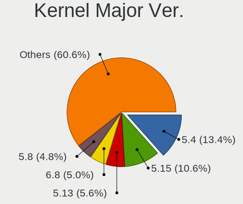
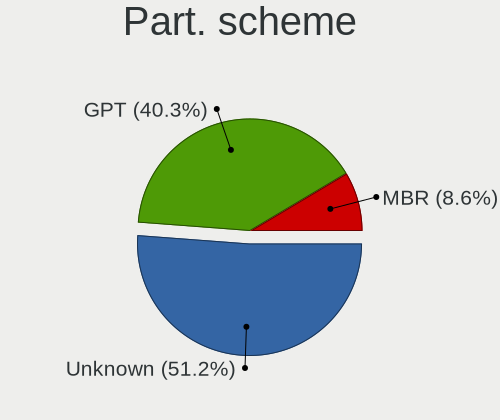
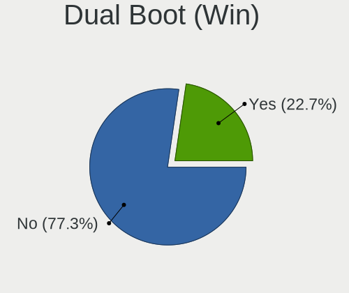
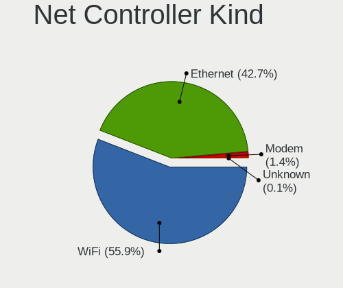

Linux in UK - Tested Hardware & Statistics (Notebooks)
------------------------------------------------------

A project to collect tested hardware configurations for Linux in UK.

Anyone can contribute to this report by the [hw-probe](https://github.com/linuxhw/hw-probe) tool:

    sudo -E hw-probe -all -upload

Please contribute! Especially if your hardware is rare.

Contents
--------

* [ Test Cases ](#test-cases)

* [ System ](#system)
  - [ OS                       ](#os)
  - [ OS Family                ](#os-family)
  - [ Kernel                   ](#kernel)
  - [ Kernel Family            ](#kernel-family)
  - [ Kernel Major Ver.        ](#kernel-major-ver)
  - [ Arch                     ](#arch)
  - [ DE                       ](#de)
  - [ Display Server           ](#display-server)
  - [ Display Manager          ](#display-manager)
  - [ OS Lang                  ](#os-lang)
  - [ Boot Mode                ](#boot-mode)
  - [ Filesystem               ](#filesystem)
  - [ Part. scheme             ](#part-scheme)
  - [ Dual Boot with Linux/BSD ](#dual-boot-with-linuxbsd)
  - [ Dual Boot (Win)          ](#dual-boot-win)

* [ Board ](#board)
  - [ Vendor                   ](#vendor)
  - [ Model                    ](#model)
  - [ Model Family             ](#model-family)
  - [ MFG Year                 ](#mfg-year)
  - [ Form Factor              ](#form-factor)
  - [ Secure Boot              ](#secure-boot)
  - [ Coreboot                 ](#coreboot)
  - [ RAM Size                 ](#ram-size)
  - [ RAM Used                 ](#ram-used)
  - [ Total Drives             ](#total-drives)
  - [ Has CD-ROM               ](#has-cd-rom)
  - [ Has Ethernet             ](#has-ethernet)
  - [ Has WiFi                 ](#has-wifi)
  - [ Has Bluetooth            ](#has-bluetooth)

* [ Location ](#location)
  - [ Country                  ](#country)
  - [ City                     ](#city)

* [ Drives ](#drives)
  - [ Drive Vendor             ](#drive-vendor)
  - [ Drive Model              ](#drive-model)
  - [ HDD Vendor               ](#hdd-vendor)
  - [ SSD Vendor               ](#ssd-vendor)
  - [ Drive Kind               ](#drive-kind)
  - [ Drive Connector          ](#drive-connector)
  - [ Drive Size               ](#drive-size)
  - [ Space Total              ](#space-total)
  - [ Space Used               ](#space-used)
  - [ Malfunc. Drives          ](#malfunc-drives)
  - [ Malfunc. Drive Vendor    ](#malfunc-drive-vendor)
  - [ Malfunc. HDD Vendor      ](#malfunc-hdd-vendor)
  - [ Malfunc. Drive Kind      ](#malfunc-drive-kind)
  - [ Failed Drives            ](#failed-drives)
  - [ Failed Drive Vendor      ](#failed-drive-vendor)
  - [ Drive Status             ](#drive-status)

* [ Storage controller ](#storage-controller)
  - [ Storage Vendor           ](#storage-vendor)
  - [ Storage Model            ](#storage-model)
  - [ Storage Kind             ](#storage-kind)

* [ Processor ](#processor)
  - [ CPU Vendor               ](#cpu-vendor)
  - [ CPU Model                ](#cpu-model)
  - [ CPU Model Family         ](#cpu-model-family)
  - [ CPU Cores                ](#cpu-cores)
  - [ CPU Sockets              ](#cpu-sockets)
  - [ CPU Threads              ](#cpu-threads)
  - [ CPU Op-Modes             ](#cpu-op-modes)
  - [ CPU Microcode            ](#cpu-microcode)
  - [ CPU Microarch            ](#cpu-microarch)

* [ Graphics ](#graphics)
  - [ GPU Vendor               ](#gpu-vendor)
  - [ GPU Model                ](#gpu-model)
  - [ GPU Combo                ](#gpu-combo)
  - [ GPU Driver               ](#gpu-driver)
  - [ GPU Memory               ](#gpu-memory)

* [ Monitor ](#monitor)
  - [ Monitor Vendor           ](#monitor-vendor)
  - [ Monitor Model            ](#monitor-model)
  - [ Monitor Resolution       ](#monitor-resolution)
  - [ Monitor Diagonal         ](#monitor-diagonal)
  - [ Monitor Width            ](#monitor-width)
  - [ Aspect Ratio             ](#aspect-ratio)
  - [ Monitor Area             ](#monitor-area)
  - [ Pixel Density            ](#pixel-density)
  - [ Multiple Monitors        ](#multiple-monitors)

* [ Network ](#network)
  - [ Net Controller Vendor    ](#net-controller-vendor)
  - [ Net Controller Model     ](#net-controller-model)
  - [ Wireless Vendor          ](#wireless-vendor)
  - [ Wireless Model           ](#wireless-model)
  - [ Ethernet Vendor          ](#ethernet-vendor)
  - [ Ethernet Model           ](#ethernet-model)
  - [ Net Controller Kind      ](#net-controller-kind)
  - [ Used Controller          ](#used-controller)
  - [ NICs                     ](#nics)
  - [ IPv6                     ](#ipv6)

* [ Bluetooth ](#bluetooth)
  - [ Bluetooth Vendor         ](#bluetooth-vendor)
  - [ Bluetooth Model          ](#bluetooth-model)

* [ Sound ](#sound)
  - [ Sound Vendor             ](#sound-vendor)
  - [ Sound Model              ](#sound-model)

* [ Memory ](#memory)
  - [ Memory Vendor            ](#memory-vendor)
  - [ Memory Model             ](#memory-model)
  - [ Memory Kind              ](#memory-kind)
  - [ Memory Form Factor       ](#memory-form-factor)
  - [ Memory Size              ](#memory-size)
  - [ Memory Speed             ](#memory-speed)

* [ Printers & scanners ](#printers--scanners)
  - [ Printer Vendor           ](#printer-vendor)
  - [ Printer Model            ](#printer-model)
  - [ Scanner Vendor           ](#scanner-vendor)
  - [ Scanner Model            ](#scanner-model)

* [ Camera ](#camera)
  - [ Camera Vendor            ](#camera-vendor)
  - [ Camera Model             ](#camera-model)

* [ Security ](#security)
  - [ Fingerprint Vendor       ](#fingerprint-vendor)
  - [ Fingerprint Model        ](#fingerprint-model)
  - [ Chipcard Vendor          ](#chipcard-vendor)
  - [ Chipcard Model           ](#chipcard-model)

* [ Unsupported ](#unsupported)
  - [ Unsupported Devices      ](#unsupported-devices)
  - [ Unsupported Device Types ](#unsupported-device-types)

Test Cases
----------

Total: 4604

| Vendor        | Model                       | Probe                                                      | Date         |
|---------------|-----------------------------|------------------------------------------------------------|--------------|
| Dell          | Latitude E5570              | [4db5cd2ef4](https://linux-hardware.org/?probe=4db5cd2ef4) | Dec 01, 2022 |
| Dell          | XPS 13 9310                 | [aadf1c39a0](https://linux-hardware.org/?probe=aadf1c39a0) | Dec 01, 2022 |
| Dell          | Latitude E5520              | [92a4c9b5ef](https://linux-hardware.org/?probe=92a4c9b5ef) | Nov 30, 2022 |
| HP            | ElitePad 1000 G2            | [0b05465735](https://linux-hardware.org/?probe=0b05465735) | Nov 30, 2022 |
| Dell          | Inspiron N5010              | [687aa83749](https://linux-hardware.org/?probe=687aa83749) | Nov 30, 2022 |
| Dell          | XPS 15 9500                 | [f9215967d3](https://linux-hardware.org/?probe=f9215967d3) | Nov 30, 2022 |
| Dell          | Inspiron 5570               | [9e4bdbc81d](https://linux-hardware.org/?probe=9e4bdbc81d) | Nov 29, 2022 |
| Dell          | Inspiron 5570               | [399346217e](https://linux-hardware.org/?probe=399346217e) | Nov 29, 2022 |
| HP            | Laptop 14s-fq0xxx           | [e71c023456](https://linux-hardware.org/?probe=e71c023456) | Nov 29, 2022 |
| Valve         | Jupiter                     | [0f40429822](https://linux-hardware.org/?probe=0f40429822) | Nov 29, 2022 |
| Samsung       | 350V5C/351V5C/3540VC/344... | [e0bdd2fbd2](https://linux-hardware.org/?probe=e0bdd2fbd2) | Nov 29, 2022 |
| ASUSTek       | ZenBook UX425IA_UM425IA     | [d258962c35](https://linux-hardware.org/?probe=d258962c35) | Nov 28, 2022 |
| Timi          | TM1613                      | [37036a425d](https://linux-hardware.org/?probe=37036a425d) | Nov 28, 2022 |
| Dell          | XPS 15 7590                 | [8072eb50aa](https://linux-hardware.org/?probe=8072eb50aa) | Nov 28, 2022 |
| ASUSTek       | TUF Gaming FX505DV_FX505... | [68e68e1e01](https://linux-hardware.org/?probe=68e68e1e01) | Nov 28, 2022 |
| Lenovo        | ThinkPad E490 20N8000RUK    | [6816e8f5ca](https://linux-hardware.org/?probe=6816e8f5ca) | Nov 27, 2022 |
| Lenovo        | ThinkPad E490 20N8000RUK    | [06c690a0e1](https://linux-hardware.org/?probe=06c690a0e1) | Nov 27, 2022 |
| Apple         | MacBookPro6,2               | [409c3edc19](https://linux-hardware.org/?probe=409c3edc19) | Nov 27, 2022 |
| Dell          | XPS 15 7590                 | [18b1ecf4fd](https://linux-hardware.org/?probe=18b1ecf4fd) | Nov 27, 2022 |
| MSI           | GL62 7QF                    | [abd74be332](https://linux-hardware.org/?probe=abd74be332) | Nov 27, 2022 |
| Valve         | Jupiter                     | [1d12c5839a](https://linux-hardware.org/?probe=1d12c5839a) | Nov 27, 2022 |
| Dell          | Inspiron 1545               | [07df50a08c](https://linux-hardware.org/?probe=07df50a08c) | Nov 27, 2022 |
| Toshiba       | Satellite C50D-B            | [c9feb7eed2](https://linux-hardware.org/?probe=c9feb7eed2) | Nov 26, 2022 |
| Lenovo        | V145-15AST 81MT             | [759ad3eb43](https://linux-hardware.org/?probe=759ad3eb43) | Nov 26, 2022 |
| Valve         | Jupiter                     | [0a172d85fd](https://linux-hardware.org/?probe=0a172d85fd) | Nov 26, 2022 |
| Lenovo        | ThinkPad L13 20R3000FUK     | [c3ff5b014d](https://linux-hardware.org/?probe=c3ff5b014d) | Nov 26, 2022 |
| Toshiba       | Satellite C50D-B            | [92d54fef2b](https://linux-hardware.org/?probe=92d54fef2b) | Nov 25, 2022 |
| Acer          | Aspire ES1-512              | [85c0936ee0](https://linux-hardware.org/?probe=85c0936ee0) | Nov 25, 2022 |
| Samsung       | 350V5C/351V5C/3540VC/344... | [0a9d327f59](https://linux-hardware.org/?probe=0a9d327f59) | Nov 25, 2022 |
| Samsung       | 350V5C/351V5C/3540VC/344... | [869a5a808f](https://linux-hardware.org/?probe=869a5a808f) | Nov 25, 2022 |
| Acer          | Aspire A315-41              | [4408f2ceff](https://linux-hardware.org/?probe=4408f2ceff) | Nov 24, 2022 |
| ASUSTek       | ASUS TUF Gaming A15 FA50... | [770e9d413e](https://linux-hardware.org/?probe=770e9d413e) | Nov 24, 2022 |
| Lenovo        | IdeaPad 5 Pro 14ACN6 82L... | [dce6415c9e](https://linux-hardware.org/?probe=dce6415c9e) | Nov 23, 2022 |
| HP            | EliteBook 2560p             | [4c27c5511f](https://linux-hardware.org/?probe=4c27c5511f) | Nov 23, 2022 |
| Lenovo        | IdeaPad 320-15AST 80XV      | [0168e30f4f](https://linux-hardware.org/?probe=0168e30f4f) | Nov 23, 2022 |
| Apple         | MacBookPro12,1              | [063ffbb0e8](https://linux-hardware.org/?probe=063ffbb0e8) | Nov 23, 2022 |
| HP            | EliteBook 8530w             | [0c1d6d2201](https://linux-hardware.org/?probe=0c1d6d2201) | Nov 22, 2022 |
| Toshiba       | Satellite L750              | [b2e96ee4b2](https://linux-hardware.org/?probe=b2e96ee4b2) | Nov 21, 2022 |
| Lenovo        | ThinkPad P1 Gen 4i 20Y30... | [16859cf0ca](https://linux-hardware.org/?probe=16859cf0ca) | Nov 21, 2022 |
| Alienware     | M17xR3                      | [d472e55685](https://linux-hardware.org/?probe=d472e55685) | Nov 20, 2022 |
| HP            | ENVY Laptop 13-ba1xxx       | [4a270e871f](https://linux-hardware.org/?probe=4a270e871f) | Nov 20, 2022 |
| Medion        | BEAST X25                   | [fddb326ca2](https://linux-hardware.org/?probe=fddb326ca2) | Nov 19, 2022 |
| Toshiba       | Satellite L50D-B            | [68d1c8a80a](https://linux-hardware.org/?probe=68d1c8a80a) | Nov 19, 2022 |
| ASUSTek       | K55A                        | [d09b309d4d](https://linux-hardware.org/?probe=d09b309d4d) | Nov 19, 2022 |
| Valve         | Jupiter                     | [afdcde154a](https://linux-hardware.org/?probe=afdcde154a) | Nov 18, 2022 |
| HP            | ProBook 450 G6              | [ceac47decc](https://linux-hardware.org/?probe=ceac47decc) | Nov 18, 2022 |
| HP            | EliteBook 840 G6            | [1faf8e38b4](https://linux-hardware.org/?probe=1faf8e38b4) | Nov 18, 2022 |
| HP            | ProBook 450 G6              | [5abeec1752](https://linux-hardware.org/?probe=5abeec1752) | Nov 18, 2022 |
| Lenovo        | ThinkPad T480 20L50004UK    | [8f4df3bbda](https://linux-hardware.org/?probe=8f4df3bbda) | Nov 18, 2022 |
| HP            | EliteBook 8470p             | [f324f5bc16](https://linux-hardware.org/?probe=f324f5bc16) | Nov 18, 2022 |
| Acer          | Aspire 6930G                | [05ad62f97d](https://linux-hardware.org/?probe=05ad62f97d) | Nov 17, 2022 |
| ASUSTek       | Zenbook Pro Duo UX582ZW_... | [cc20cc9828](https://linux-hardware.org/?probe=cc20cc9828) | Nov 16, 2022 |
| ASUSTek       | ROG Zephyrus G14 GA401IV... | [545eb5e46c](https://linux-hardware.org/?probe=545eb5e46c) | Nov 16, 2022 |
| Dell          | Latitude 5410               | [dd9eb324db](https://linux-hardware.org/?probe=dd9eb324db) | Nov 16, 2022 |
| Dell          | Vostro 3590                 | [67ffc3ab77](https://linux-hardware.org/?probe=67ffc3ab77) | Nov 16, 2022 |
| Razer x La... | TensorBook (late 2021)      | [b7fff356a7](https://linux-hardware.org/?probe=b7fff356a7) | Nov 16, 2022 |
| Toshiba       | Satellite Pro U500          | [064a36a5bb](https://linux-hardware.org/?probe=064a36a5bb) | Nov 16, 2022 |
| Dixonsxp      | F71IX1                      | [816c618ae7](https://linux-hardware.org/?probe=816c618ae7) | Nov 15, 2022 |
| OEGStone      | NOTCHA-322                  | [a5f28e095e](https://linux-hardware.org/?probe=a5f28e095e) | Nov 15, 2022 |
| Dell          | Inspiron 7501               | [15cd1d588f](https://linux-hardware.org/?probe=15cd1d588f) | Nov 15, 2022 |
| Dell          | Latitude E6320              | [a4767dfe35](https://linux-hardware.org/?probe=a4767dfe35) | Nov 14, 2022 |
| Toshiba       | Satellite L50D-B            | [6c53b0c32d](https://linux-hardware.org/?probe=6c53b0c32d) | Nov 14, 2022 |
| HP            | Pavilion dv6                | [fe166a1906](https://linux-hardware.org/?probe=fe166a1906) | Nov 14, 2022 |
| Acer          | Extensa 2530                | [ac83b4e3e9](https://linux-hardware.org/?probe=ac83b4e3e9) | Nov 14, 2022 |
| Dell          | Latitude D630               | [3a15603bd6](https://linux-hardware.org/?probe=3a15603bd6) | Nov 13, 2022 |
| HP            | EliteBook 6930p             | [4b6c28bf91](https://linux-hardware.org/?probe=4b6c28bf91) | Nov 13, 2022 |
| Lenovo        | IdeaPad S130-14IGM 81J2     | [62cbc0b03d](https://linux-hardware.org/?probe=62cbc0b03d) | Nov 13, 2022 |
| Lenovo        | IdeaPad S130-14IGM 81J2     | [305242c389](https://linux-hardware.org/?probe=305242c389) | Nov 13, 2022 |
| HP            | Presario CQ58               | [7a2e365b72](https://linux-hardware.org/?probe=7a2e365b72) | Nov 13, 2022 |
| Valve         | Jupiter                     | [5c1a39b012](https://linux-hardware.org/?probe=5c1a39b012) | Nov 13, 2022 |
| Lenovo        | IdeaPadFlex 14 20308        | [04a42845bf](https://linux-hardware.org/?probe=04a42845bf) | Nov 12, 2022 |
| Lenovo        | ThinkPad X260 20F5S28R00    | [ac107ff6e8](https://linux-hardware.org/?probe=ac107ff6e8) | Nov 12, 2022 |
| HP            | ProBook 455 G2              | [1a5d0a1618](https://linux-hardware.org/?probe=1a5d0a1618) | Nov 12, 2022 |
| System76      | Oryx Pro                    | [5439d56b25](https://linux-hardware.org/?probe=5439d56b25) | Nov 12, 2022 |
| Fujitsu       | STYLISTIC Q572              | [afd0e0efc4](https://linux-hardware.org/?probe=afd0e0efc4) | Nov 12, 2022 |
| Dell          | Latitude D630               | [3e964fdd59](https://linux-hardware.org/?probe=3e964fdd59) | Nov 12, 2022 |
| HP            | Laptop 15s-fq1xxx           | [eb5ece0bb3](https://linux-hardware.org/?probe=eb5ece0bb3) | Nov 12, 2022 |
| Valve         | Jupiter                     | [54bca16c61](https://linux-hardware.org/?probe=54bca16c61) | Nov 11, 2022 |
| HP            | EliteBook 840 G3            | [161b81845e](https://linux-hardware.org/?probe=161b81845e) | Nov 11, 2022 |
| Dell          | XPS 15 7590                 | [d05d4d5371](https://linux-hardware.org/?probe=d05d4d5371) | Nov 10, 2022 |
| Valve         | Jupiter                     | [6227fbbebb](https://linux-hardware.org/?probe=6227fbbebb) | Nov 10, 2022 |
| Valve         | Jupiter                     | [340ef95fd9](https://linux-hardware.org/?probe=340ef95fd9) | Nov 08, 2022 |
| Valve         | Jupiter                     | [5673f6f505](https://linux-hardware.org/?probe=5673f6f505) | Nov 08, 2022 |
| Valve         | Jupiter                     | [1991a35643](https://linux-hardware.org/?probe=1991a35643) | Nov 08, 2022 |
| Linx          | LINX1010B                   | [fa6d1ebd57](https://linux-hardware.org/?probe=fa6d1ebd57) | Nov 07, 2022 |
| HP            | Pavilion dv5000 (EU087EA... | [185c483599](https://linux-hardware.org/?probe=185c483599) | Nov 07, 2022 |
| Entroware     | Hybris                      | [bf5c8bcbaf](https://linux-hardware.org/?probe=bf5c8bcbaf) | Nov 07, 2022 |
| Notebook      | PA70ES                      | [7254b24693](https://linux-hardware.org/?probe=7254b24693) | Nov 07, 2022 |
| ASUSTek       | VivoBook_ASUSLaptop X350... | [0c0bde7c74](https://linux-hardware.org/?probe=0c0bde7c74) | Nov 06, 2022 |
| HP            | Pavilion dv5000 (EU087EA... | [d763771ba6](https://linux-hardware.org/?probe=d763771ba6) | Nov 06, 2022 |
| Dell          | Inspiron 1525               | [f28061e4da](https://linux-hardware.org/?probe=f28061e4da) | Nov 06, 2022 |
| HP            | 250 G7 Notebook PC          | [d29197ed66](https://linux-hardware.org/?probe=d29197ed66) | Nov 06, 2022 |
| Dell          | G7 7700                     | [ba3a89822a](https://linux-hardware.org/?probe=ba3a89822a) | Nov 06, 2022 |
| HP            | ENVY Laptop 13-aq0xxx       | [340f509c6b](https://linux-hardware.org/?probe=340f509c6b) | Nov 06, 2022 |
| Lenovo        | ThinkPad X1 Carbon 6th 2... | [256002ea80](https://linux-hardware.org/?probe=256002ea80) | Nov 06, 2022 |
| Valve         | Jupiter                     | [df94c19aa6](https://linux-hardware.org/?probe=df94c19aa6) | Nov 06, 2022 |
| Valve         | Jupiter                     | [55420be889](https://linux-hardware.org/?probe=55420be889) | Nov 05, 2022 |
| HP            | Pavilion g7                 | [4ad4ed4c47](https://linux-hardware.org/?probe=4ad4ed4c47) | Nov 05, 2022 |
| Acer          | Acadia V1.45                | [654585bbaf](https://linux-hardware.org/?probe=654585bbaf) | Nov 05, 2022 |
| HP            | 250 G7 Notebook PC          | [e5684c9b19](https://linux-hardware.org/?probe=e5684c9b19) | Nov 05, 2022 |
| Acer          | TravelMate B118-M           | [8b7e60aef0](https://linux-hardware.org/?probe=8b7e60aef0) | Nov 05, 2022 |
| Samsung       | 700T1C                      | [c561c328b3](https://linux-hardware.org/?probe=c561c328b3) | Nov 05, 2022 |
| Lenovo        | ThinkPad L520 78596CG       | [094f09bcf8](https://linux-hardware.org/?probe=094f09bcf8) | Nov 04, 2022 |
| Lenovo        | ThinkPad X1 Carbon Gen 8... | [f0be03da28](https://linux-hardware.org/?probe=f0be03da28) | Nov 04, 2022 |
| GEO           | GEOBOOK 2E                  | [2a802edc5a](https://linux-hardware.org/?probe=2a802edc5a) | Nov 04, 2022 |
| GEO           | GEOBOOK 2E                  | [80e1206b6d](https://linux-hardware.org/?probe=80e1206b6d) | Nov 04, 2022 |
| Samsung       | 355V4C/355V4X/355V5C/355... | [a43927efff](https://linux-hardware.org/?probe=a43927efff) | Nov 03, 2022 |
| Dell          | Inspiron 7501               | [3eae1f74ca](https://linux-hardware.org/?probe=3eae1f74ca) | Nov 03, 2022 |
| Samsung       | 400B2B/400B2B               | [a909b4b203](https://linux-hardware.org/?probe=a909b4b203) | Nov 03, 2022 |
| Star Labs     | StarBook                    | [1cfe5c0920](https://linux-hardware.org/?probe=1cfe5c0920) | Nov 02, 2022 |
| HP            | EliteBook 845 G7 Noteboo... | [c693004e08](https://linux-hardware.org/?probe=c693004e08) | Nov 02, 2022 |
| Samsung       | RV411/RV511/E3511/S3511/... | [ebe8179d26](https://linux-hardware.org/?probe=ebe8179d26) | Nov 02, 2022 |
| Dell          | Inspiron 15-3567            | [a9b57edf35](https://linux-hardware.org/?probe=a9b57edf35) | Nov 02, 2022 |
| Dell          | Inspiron 15 3511            | [5786a01590](https://linux-hardware.org/?probe=5786a01590) | Nov 02, 2022 |
| Acer          | Aspire A315-54              | [1421a5a4e9](https://linux-hardware.org/?probe=1421a5a4e9) | Nov 02, 2022 |
| PC Special... | Elimina Iv 15               | [f462ba9c43](https://linux-hardware.org/?probe=f462ba9c43) | Nov 02, 2022 |
| ASUSTek       | P52F                        | [a83cb4c35d](https://linux-hardware.org/?probe=a83cb4c35d) | Nov 01, 2022 |
| Packard Be... | EasyNote TK85               | [a233571587](https://linux-hardware.org/?probe=a233571587) | Oct 31, 2022 |
| ASUSTek       | G75VW                       | [6f1d41a85c](https://linux-hardware.org/?probe=6f1d41a85c) | Oct 31, 2022 |
| TUXEDO        | InfinityBook S 15 Gen6      | [92e9764aa0](https://linux-hardware.org/?probe=92e9764aa0) | Oct 31, 2022 |
| Acer          | Swift SF314-512             | [d6bf187cc9](https://linux-hardware.org/?probe=d6bf187cc9) | Oct 31, 2022 |
| MSI           | Modern 14 B10MW             | [cf2b620a60](https://linux-hardware.org/?probe=cf2b620a60) | Oct 31, 2022 |
| Valve         | Jupiter                     | [38d0d0e32a](https://linux-hardware.org/?probe=38d0d0e32a) | Oct 31, 2022 |
| Apple         | MacBookPro5,5               | [00e1f1f754](https://linux-hardware.org/?probe=00e1f1f754) | Oct 31, 2022 |
| Acer          | Swift SFX14-51G             | [6812d7cf22](https://linux-hardware.org/?probe=6812d7cf22) | Oct 30, 2022 |
| HP            | Pavilion 15                 | [f1eac2c0c3](https://linux-hardware.org/?probe=f1eac2c0c3) | Oct 30, 2022 |
| Lenovo        | ThinkPad T480 20L6S82F0C    | [c06d6a27f5](https://linux-hardware.org/?probe=c06d6a27f5) | Oct 30, 2022 |
| Lenovo        | ThinkPad L560 20F2S0DA00    | [bf8945db85](https://linux-hardware.org/?probe=bf8945db85) | Oct 30, 2022 |
| GEO           | GeoBook3                    | [133a4460f6](https://linux-hardware.org/?probe=133a4460f6) | Oct 29, 2022 |
| Toshiba       | Satellite C660              | [242fa16882](https://linux-hardware.org/?probe=242fa16882) | Oct 29, 2022 |
| Dell          | Latitude E6530              | [cdd3b5ce40](https://linux-hardware.org/?probe=cdd3b5ce40) | Oct 28, 2022 |
| Valve         | Jupiter                     | [127bd00558](https://linux-hardware.org/?probe=127bd00558) | Oct 28, 2022 |
| Tactus        | GeoBook 110                 | [aad56b27f0](https://linux-hardware.org/?probe=aad56b27f0) | Oct 28, 2022 |
| Dell          | XPS 13 9305                 | [20bf043d6f](https://linux-hardware.org/?probe=20bf043d6f) | Oct 28, 2022 |
| Valve         | Jupiter                     | [7cc988201b](https://linux-hardware.org/?probe=7cc988201b) | Oct 28, 2022 |
| HP            | ENVY Laptop 13-ba0xxx       | [920b0eaa44](https://linux-hardware.org/?probe=920b0eaa44) | Oct 27, 2022 |
| Novatech      | NLx0MU                      | [41c5d984a0](https://linux-hardware.org/?probe=41c5d984a0) | Oct 27, 2022 |
| HP            | G62                         | [c9ba156401](https://linux-hardware.org/?probe=c9ba156401) | Oct 27, 2022 |
| Toshiba       | Satellite C660              | [80c2aeb241](https://linux-hardware.org/?probe=80c2aeb241) | Oct 26, 2022 |
| HP            | Setzer                      | [a1039409cd](https://linux-hardware.org/?probe=a1039409cd) | Oct 26, 2022 |
| HP            | Setzer                      | [3945fea013](https://linux-hardware.org/?probe=3945fea013) | Oct 25, 2022 |
| Valve         | Jupiter                     | [dc86de125e](https://linux-hardware.org/?probe=dc86de125e) | Oct 25, 2022 |
| Toshiba       | Satellite C50D-A-133        | [c1ba737ccc](https://linux-hardware.org/?probe=c1ba737ccc) | Oct 25, 2022 |
| Valve         | Jupiter                     | [c12839567e](https://linux-hardware.org/?probe=c12839567e) | Oct 25, 2022 |
| Dell          | Inspiron 1525               | [742bf13a9f](https://linux-hardware.org/?probe=742bf13a9f) | Oct 25, 2022 |
| Lenovo        | V15-IIL 82C5                | [a56ad41b2f](https://linux-hardware.org/?probe=a56ad41b2f) | Oct 25, 2022 |
| Dell          | Inspiron 16 7610            | [47a3e2b5f6](https://linux-hardware.org/?probe=47a3e2b5f6) | Oct 24, 2022 |
| Lenovo        | ThinkPad T520 4243PN7       | [fdca71510b](https://linux-hardware.org/?probe=fdca71510b) | Oct 24, 2022 |
| AMI           | Unknown                     | [337d94fb96](https://linux-hardware.org/?probe=337d94fb96) | Oct 23, 2022 |
| HP            | OMEN by Laptop 17-ck0xxx    | [34f4204ae8](https://linux-hardware.org/?probe=34f4204ae8) | Oct 23, 2022 |
| GEO           | GeoBook 140                 | [e97f8024f4](https://linux-hardware.org/?probe=e97f8024f4) | Oct 22, 2022 |
| GEO           | GeoBook 140                 | [bbbe5e0fca](https://linux-hardware.org/?probe=bbbe5e0fca) | Oct 22, 2022 |
| Samsung       | R519/R719                   | [da6668197e](https://linux-hardware.org/?probe=da6668197e) | Oct 22, 2022 |
| HP            | OMEN by Laptop 17-ck0xxx    | [0ed2f15c34](https://linux-hardware.org/?probe=0ed2f15c34) | Oct 21, 2022 |
| Razer x La... | TensorBook (late 2021)      | [27cae45787](https://linux-hardware.org/?probe=27cae45787) | Oct 20, 2022 |
| Acer          | Aspire S3                   | [a24603a142](https://linux-hardware.org/?probe=a24603a142) | Oct 20, 2022 |
| Dell          | XPS 13 9300                 | [ec9a97a15d](https://linux-hardware.org/?probe=ec9a97a15d) | Oct 20, 2022 |
| Toshiba       | Satellite C660              | [3632c8a48d](https://linux-hardware.org/?probe=3632c8a48d) | Oct 20, 2022 |
| Valve         | Jupiter                     | [a314a908eb](https://linux-hardware.org/?probe=a314a908eb) | Oct 20, 2022 |
| Razer x La... | TensorBook (late 2021)      | [fef9e26716](https://linux-hardware.org/?probe=fef9e26716) | Oct 20, 2022 |
| Valve         | Jupiter                     | [3fada6964f](https://linux-hardware.org/?probe=3fada6964f) | Oct 19, 2022 |
| ASUSTek       | ZenBook UX325EA_UX325EA     | [56089b3625](https://linux-hardware.org/?probe=56089b3625) | Oct 19, 2022 |
| Acer          | Aspire V5-132P              | [420ad7ac8c](https://linux-hardware.org/?probe=420ad7ac8c) | Oct 19, 2022 |
| Lenovo        | G580 2689H2G                | [1d81a2fb3b](https://linux-hardware.org/?probe=1d81a2fb3b) | Oct 18, 2022 |
| Acer          | Aspire 6930G                | [d65e0cfe7a](https://linux-hardware.org/?probe=d65e0cfe7a) | Oct 18, 2022 |
| GEO           | GeoBook 120                 | [fe063a61a7](https://linux-hardware.org/?probe=fe063a61a7) | Oct 17, 2022 |
| HP            | ZBook 15                    | [6926e1a3c0](https://linux-hardware.org/?probe=6926e1a3c0) | Oct 17, 2022 |
| Valve         | Jupiter                     | [992d2b539a](https://linux-hardware.org/?probe=992d2b539a) | Oct 17, 2022 |
| Samsung       | 700T1C                      | [b0b2e6712c](https://linux-hardware.org/?probe=b0b2e6712c) | Oct 15, 2022 |
| Lenovo        | IdeaPad 110-15IBR 80T7      | [ee67e90b5f](https://linux-hardware.org/?probe=ee67e90b5f) | Oct 15, 2022 |
| Valve         | Jupiter                     | [022a7cab63](https://linux-hardware.org/?probe=022a7cab63) | Oct 15, 2022 |
| Valve         | Jupiter                     | [bd47ebea62](https://linux-hardware.org/?probe=bd47ebea62) | Oct 15, 2022 |
| Valve         | Jupiter                     | [627b9225cb](https://linux-hardware.org/?probe=627b9225cb) | Oct 15, 2022 |
| HP            | Presario C300 (RM500EA#A... | [c35d7b0ee3](https://linux-hardware.org/?probe=c35d7b0ee3) | Oct 14, 2022 |
| Dell          | Precision M4800             | [aa9a1680fd](https://linux-hardware.org/?probe=aa9a1680fd) | Oct 14, 2022 |
| Lenovo        | V110-15AST 80TD             | [9d4b6fafb6](https://linux-hardware.org/?probe=9d4b6fafb6) | Oct 12, 2022 |
| Lenovo        | Yoga Slim 7 ProX 14ARH7 ... | [cbc3888844](https://linux-hardware.org/?probe=cbc3888844) | Oct 12, 2022 |
| Lenovo        | Z50-75 80EC                 | [7dbdbc1de9](https://linux-hardware.org/?probe=7dbdbc1de9) | Oct 12, 2022 |
| Dell          | Latitude E5470              | [eee260b733](https://linux-hardware.org/?probe=eee260b733) | Oct 12, 2022 |
| Dell          | Latitude E5470              | [3bbb87ee1b](https://linux-hardware.org/?probe=3bbb87ee1b) | Oct 12, 2022 |
| Lenovo        | ThinkPad T420 4236TL7       | [8a639f4457](https://linux-hardware.org/?probe=8a639f4457) | Oct 10, 2022 |
| Valve         | Jupiter                     | [c06c56de15](https://linux-hardware.org/?probe=c06c56de15) | Oct 10, 2022 |
| Lenovo        | Yoga 3 14 80JH              | [5e65bc0e8a](https://linux-hardware.org/?probe=5e65bc0e8a) | Oct 10, 2022 |
| Dell          | XPS 13 9380                 | [5d882bd47f](https://linux-hardware.org/?probe=5d882bd47f) | Oct 09, 2022 |
| Acer          | Acadia V1.45                | [c33c96e412](https://linux-hardware.org/?probe=c33c96e412) | Oct 09, 2022 |
| Packard Be... | EasyNote TM82               | [8e3ecfd03d](https://linux-hardware.org/?probe=8e3ecfd03d) | Oct 08, 2022 |
| Fujitsu       | LIFEBOOK U904               | [b4a8655f31](https://linux-hardware.org/?probe=b4a8655f31) | Oct 08, 2022 |
| Dell          | Latitude 5411               | [4bb05d639f](https://linux-hardware.org/?probe=4bb05d639f) | Oct 08, 2022 |
| HP            | ProBook 640 G3              | [03112f2830](https://linux-hardware.org/?probe=03112f2830) | Oct 08, 2022 |
| Lenovo        | V155-15API 81V5             | [c08e4bed15](https://linux-hardware.org/?probe=c08e4bed15) | Oct 07, 2022 |
| Dell          | Latitude 7480               | [ad29ce89eb](https://linux-hardware.org/?probe=ad29ce89eb) | Oct 06, 2022 |
| Lenovo        | IdeaPad S510p 20298         | [20fb15fcbf](https://linux-hardware.org/?probe=20fb15fcbf) | Oct 06, 2022 |
| Valve         | Jupiter                     | [28900801aa](https://linux-hardware.org/?probe=28900801aa) | Oct 06, 2022 |
| Valve         | Jupiter                     | [64f5b28613](https://linux-hardware.org/?probe=64f5b28613) | Oct 06, 2022 |
| Lenovo        | G510 20238                  | [700e1adbbb](https://linux-hardware.org/?probe=700e1adbbb) | Oct 05, 2022 |
| Lenovo        | ThinkPad Twist 20C41A3      | [3da96ac399](https://linux-hardware.org/?probe=3da96ac399) | Oct 04, 2022 |
| ASUSTek       | ZenBook UX325EA_UX325EA     | [790114327c](https://linux-hardware.org/?probe=790114327c) | Oct 04, 2022 |
| Acer          | Aspire ES1-523              | [a80da55e0c](https://linux-hardware.org/?probe=a80da55e0c) | Oct 04, 2022 |
| Acer          | Extensa 2530                | [684b31b41d](https://linux-hardware.org/?probe=684b31b41d) | Oct 03, 2022 |
| Dell          | Inspiron N5040              | [8ccfb39433](https://linux-hardware.org/?probe=8ccfb39433) | Oct 03, 2022 |
| Lenovo        | Flex 2-14 20404             | [b3a9474c83](https://linux-hardware.org/?probe=b3a9474c83) | Oct 03, 2022 |
| Apple         | MacBookPro11,3              | [cdcd2cf0e6](https://linux-hardware.org/?probe=cdcd2cf0e6) | Oct 02, 2022 |
| eMachines     | E525                        | [1467bc71f7](https://linux-hardware.org/?probe=1467bc71f7) | Oct 02, 2022 |
| Dell          | Inspiron 1545               | [ba72c7ee42](https://linux-hardware.org/?probe=ba72c7ee42) | Oct 01, 2022 |
| Lenovo        | 3000 N200 0769B4G           | [947f124efc](https://linux-hardware.org/?probe=947f124efc) | Oct 01, 2022 |
| HP            | Notebook                    | [fec2594d37](https://linux-hardware.org/?probe=fec2594d37) | Oct 01, 2022 |
| Valve         | Jupiter                     | [12f0d9358a](https://linux-hardware.org/?probe=12f0d9358a) | Oct 01, 2022 |
| Apple         | MacBookPro16,2              | [8eaded9cb5](https://linux-hardware.org/?probe=8eaded9cb5) | Oct 01, 2022 |
| Sony          | VPCYB3V1E                   | [de50c8a304](https://linux-hardware.org/?probe=de50c8a304) | Oct 01, 2022 |
| Acer          | Swift SF314-43              | [cfd0c22e29](https://linux-hardware.org/?probe=cfd0c22e29) | Sep 30, 2022 |
| Valve         | Jupiter                     | [dab0a00c02](https://linux-hardware.org/?probe=dab0a00c02) | Sep 30, 2022 |
| Valve         | Jupiter                     | [e9737fcadf](https://linux-hardware.org/?probe=e9737fcadf) | Sep 30, 2022 |
| HP            | EliteBook 8570p             | [cc4740fa37](https://linux-hardware.org/?probe=cc4740fa37) | Sep 30, 2022 |
| Dell          | XPS 13 7390                 | [c4ccdf9992](https://linux-hardware.org/?probe=c4ccdf9992) | Sep 30, 2022 |
| Dell          | Latitude 7430               | [2151370437](https://linux-hardware.org/?probe=2151370437) | Sep 29, 2022 |
| HP            | Compaq 6720s                | [ddb5163310](https://linux-hardware.org/?probe=ddb5163310) | Sep 29, 2022 |
| Dell          | Inspiron 1564               | [d9dd05aa12](https://linux-hardware.org/?probe=d9dd05aa12) | Sep 29, 2022 |
| Dell          | XPS 13 9360                 | [6f1ecca2f0](https://linux-hardware.org/?probe=6f1ecca2f0) | Sep 28, 2022 |
| Lenovo        | G570 4334                   | [7b96f1db41](https://linux-hardware.org/?probe=7b96f1db41) | Sep 28, 2022 |
| MSI           | GT72S 6QE                   | [7ec3a25453](https://linux-hardware.org/?probe=7ec3a25453) | Sep 26, 2022 |
| Packard Be... | EasyNote TS44HR             | [4005a32539](https://linux-hardware.org/?probe=4005a32539) | Sep 26, 2022 |
| Timi          | RedmiBook Pro 15S           | [533cc3b3ae](https://linux-hardware.org/?probe=533cc3b3ae) | Sep 26, 2022 |
| Valve         | Jupiter                     | [c3305d9bff](https://linux-hardware.org/?probe=c3305d9bff) | Sep 26, 2022 |
| Jumper        | EZbook                      | [1af58cd7e7](https://linux-hardware.org/?probe=1af58cd7e7) | Sep 25, 2022 |
| Dell          | XPS 15 9510                 | [1ccf6c5c41](https://linux-hardware.org/?probe=1ccf6c5c41) | Sep 25, 2022 |
| Acer          | Aspire A315-51              | [21121aa007](https://linux-hardware.org/?probe=21121aa007) | Sep 25, 2022 |
| Lenovo        | ThinkPad SL500 27464DG      | [6c2b4ce4b1](https://linux-hardware.org/?probe=6c2b4ce4b1) | Sep 25, 2022 |
| Dell          | Inspiron 15 5510            | [cfda1aa63a](https://linux-hardware.org/?probe=cfda1aa63a) | Sep 25, 2022 |
| Lenovo        | ThinkPad T430 23476Y7       | [8488ad9e53](https://linux-hardware.org/?probe=8488ad9e53) | Sep 24, 2022 |
| Lenovo        | ThinkPad P14s Gen 2a 21A... | [bdc8453efc](https://linux-hardware.org/?probe=bdc8453efc) | Sep 24, 2022 |
| Acer          | Swift SF315-52              | [b9e88a43d8](https://linux-hardware.org/?probe=b9e88a43d8) | Sep 24, 2022 |
| Lenovo        | ThinkPad T440s 20ARA0YL0... | [93eedc638b](https://linux-hardware.org/?probe=93eedc638b) | Sep 24, 2022 |
| Framework     | Laptop (12th Gen Intel C... | [2082a8668b](https://linux-hardware.org/?probe=2082a8668b) | Sep 24, 2022 |
| Lenovo        | IdeaPad 110-15ACL 80TJ      | [dc3a97d467](https://linux-hardware.org/?probe=dc3a97d467) | Sep 23, 2022 |
| Dell          | Inspiron 15 5510            | [02787c733c](https://linux-hardware.org/?probe=02787c733c) | Sep 23, 2022 |
| ASUSTek       | N750JV                      | [f69fe7dacf](https://linux-hardware.org/?probe=f69fe7dacf) | Sep 23, 2022 |
| Dell          | Inspiron 15 5510            | [fe7ae61ecd](https://linux-hardware.org/?probe=fe7ae61ecd) | Sep 23, 2022 |
| Dell          | Latitude E6330              | [5f1a272734](https://linux-hardware.org/?probe=5f1a272734) | Sep 23, 2022 |
| Dell          | Latitude 5411               | [018a9c569a](https://linux-hardware.org/?probe=018a9c569a) | Sep 23, 2022 |
| Lenovo        | IdeaPad 5 15ARE05 81YQ      | [605e97df5c](https://linux-hardware.org/?probe=605e97df5c) | Sep 22, 2022 |
| Lenovo        | IdeaPad 5 15ARE05 81YQ      | [94e6332c62](https://linux-hardware.org/?probe=94e6332c62) | Sep 22, 2022 |
| HP            | Laptop 15-bw0xx             | [c4915d8dd2](https://linux-hardware.org/?probe=c4915d8dd2) | Sep 22, 2022 |
| MSI           | GL73 8RD                    | [f197efe030](https://linux-hardware.org/?probe=f197efe030) | Sep 22, 2022 |
| MSI           | GL73 8RD                    | [0534ef55fc](https://linux-hardware.org/?probe=0534ef55fc) | Sep 22, 2022 |
| Lenovo        | ThinkBook 13s-IML 20RR      | [03428c1a17](https://linux-hardware.org/?probe=03428c1a17) | Sep 21, 2022 |
| Lenovo        | IdeaPad 300-15ISK 80Q7      | [c859bf5e24](https://linux-hardware.org/?probe=c859bf5e24) | Sep 21, 2022 |
| Valve         | Jupiter                     | [721ede2e11](https://linux-hardware.org/?probe=721ede2e11) | Sep 20, 2022 |
| Dell          | Inspiron 5570               | [16d661b4e5](https://linux-hardware.org/?probe=16d661b4e5) | Sep 20, 2022 |
| TUXEDO        | InfinityBook Pro 14 v4      | [20c7b9dcf9](https://linux-hardware.org/?probe=20c7b9dcf9) | Sep 20, 2022 |
| Lenovo        | E50-80 80J2                 | [a399d96de2](https://linux-hardware.org/?probe=a399d96de2) | Sep 20, 2022 |
| Valve         | Jupiter                     | [e60653a4c7](https://linux-hardware.org/?probe=e60653a4c7) | Sep 20, 2022 |
| Lenovo        | Legion 5-15ACH6H 82JU       | [1f48647e32](https://linux-hardware.org/?probe=1f48647e32) | Sep 20, 2022 |
| HP            | ProBook 450 G2              | [73c35ad64a](https://linux-hardware.org/?probe=73c35ad64a) | Sep 20, 2022 |
| HONOR         | NMH-WCX9                    | [dd2687098a](https://linux-hardware.org/?probe=dd2687098a) | Sep 19, 2022 |
| Razer         | Blade 15 Base Model (Ear... | [6b6ad790c5](https://linux-hardware.org/?probe=6b6ad790c5) | Sep 19, 2022 |
| Lenovo        | Yoga 3 14 80JH              | [7b17bd93c0](https://linux-hardware.org/?probe=7b17bd93c0) | Sep 19, 2022 |
| Samsung       | 950XCJ/951XCJ/950XCR        | [9417681a63](https://linux-hardware.org/?probe=9417681a63) | Sep 19, 2022 |
| HONOR         | NMH-WCX9                    | [060f3bd895](https://linux-hardware.org/?probe=060f3bd895) | Sep 19, 2022 |
| Panasonic     | CF-53JAWZYDE                | [f8b1ca10d1](https://linux-hardware.org/?probe=f8b1ca10d1) | Sep 19, 2022 |
| Lenovo        | E50-80 80J2                 | [1a538a3132](https://linux-hardware.org/?probe=1a538a3132) | Sep 18, 2022 |
| Dell          | Studio 1737                 | [7218731367](https://linux-hardware.org/?probe=7218731367) | Sep 18, 2022 |
| ASUSTek       | X510UQ                      | [eb619ed1c5](https://linux-hardware.org/?probe=eb619ed1c5) | Sep 18, 2022 |
| Dell          | Precision 5530              | [8fc00af945](https://linux-hardware.org/?probe=8fc00af945) | Sep 18, 2022 |
| Unknown       | Unknown                     | [1e27521b13](https://linux-hardware.org/?probe=1e27521b13) | Sep 17, 2022 |
| Acer          | Aspire V3-571               | [3f20a5e69d](https://linux-hardware.org/?probe=3f20a5e69d) | Sep 17, 2022 |
| Dell          | Latitude 7390               | [64c9b13553](https://linux-hardware.org/?probe=64c9b13553) | Sep 17, 2022 |
| HUAWEI        | BOM-WXX9                    | [0c3d62f1c9](https://linux-hardware.org/?probe=0c3d62f1c9) | Sep 17, 2022 |
| Valve         | Jupiter                     | [c4dd2bf91f](https://linux-hardware.org/?probe=c4dd2bf91f) | Sep 17, 2022 |
| HP            | 255 G5 Notebook PC          | [6d8f7ffe97](https://linux-hardware.org/?probe=6d8f7ffe97) | Sep 17, 2022 |
| HP            | Laptop 15-da0xxx            | [6341f27d68](https://linux-hardware.org/?probe=6341f27d68) | Sep 16, 2022 |
| Apple         | MacBook6,1                  | [93b43e5bb5](https://linux-hardware.org/?probe=93b43e5bb5) | Sep 16, 2022 |
| Acidanther... | iMac19,2                    | [94b79ac6e5](https://linux-hardware.org/?probe=94b79ac6e5) | Sep 16, 2022 |
| HP            | ProBook 4340s               | [acca12f9d4](https://linux-hardware.org/?probe=acca12f9d4) | Sep 16, 2022 |
| Valve         | Jupiter                     | [9adc000021](https://linux-hardware.org/?probe=9adc000021) | Sep 15, 2022 |
| Dell          | Latitude 7490               | [ce54bcd741](https://linux-hardware.org/?probe=ce54bcd741) | Sep 15, 2022 |
| Lenovo        | ThinkPad T530 2429F33       | [790a0f2a25](https://linux-hardware.org/?probe=790a0f2a25) | Sep 14, 2022 |
| Lenovo        | Z70-80 80FG                 | [93cb353340](https://linux-hardware.org/?probe=93cb353340) | Sep 14, 2022 |
| HP            | Laptop 15-da0xxx            | [82140783de](https://linux-hardware.org/?probe=82140783de) | Sep 14, 2022 |
| Dell          | Latitude E7250              | [80a2e50cfc](https://linux-hardware.org/?probe=80a2e50cfc) | Sep 14, 2022 |
| Dell          | XPS 15 9510                 | [44be9b9134](https://linux-hardware.org/?probe=44be9b9134) | Sep 13, 2022 |
| HP            | EliteBook 850 G6            | [b284db5ac4](https://linux-hardware.org/?probe=b284db5ac4) | Sep 13, 2022 |
| Lenovo        | Flex 2-14 20404             | [a27c60fbde](https://linux-hardware.org/?probe=a27c60fbde) | Sep 13, 2022 |
| Dell          | Inspiron 3542               | [2c5a122ce9](https://linux-hardware.org/?probe=2c5a122ce9) | Sep 12, 2022 |
| Dell          | Inspiron 3542               | [ef3098c81a](https://linux-hardware.org/?probe=ef3098c81a) | Sep 12, 2022 |
| Lenovo        | ThinkBook 15 G2 ITL 20VE    | [4a54854cd7](https://linux-hardware.org/?probe=4a54854cd7) | Sep 12, 2022 |
| Entroware     | Orion                       | [d96888edf9](https://linux-hardware.org/?probe=d96888edf9) | Sep 12, 2022 |
| Entroware     | Orion                       | [c06e53ad80](https://linux-hardware.org/?probe=c06e53ad80) | Sep 12, 2022 |
| Dell          | Inspiron 3537               | [afd2b6555e](https://linux-hardware.org/?probe=afd2b6555e) | Sep 12, 2022 |
| Dell          | XPS 13 9350                 | [e137564f6b](https://linux-hardware.org/?probe=e137564f6b) | Sep 12, 2022 |
| Acer          | Aspire E5-576G              | [ee2635dbc8](https://linux-hardware.org/?probe=ee2635dbc8) | Sep 11, 2022 |
| HP            | Pavilion 15                 | [1e6331a36b](https://linux-hardware.org/?probe=1e6331a36b) | Sep 11, 2022 |
| Lenovo        | ThinkPad S1 Yoga 12 20DK... | [576eec419f](https://linux-hardware.org/?probe=576eec419f) | Sep 10, 2022 |
| Tactus        | GeoBook 110                 | [d13211f478](https://linux-hardware.org/?probe=d13211f478) | Sep 09, 2022 |
| Dell          | Inspiron 1720               | [27de3ede0c](https://linux-hardware.org/?probe=27de3ede0c) | Sep 09, 2022 |
| Star Labs     | Lite                        | [c08b209f09](https://linux-hardware.org/?probe=c08b209f09) | Sep 09, 2022 |
| ASUSTek       | ASUS TUF Dash F15 FX517Z... | [f5c538e2c7](https://linux-hardware.org/?probe=f5c538e2c7) | Sep 09, 2022 |
| Lenovo        | IdeaPad S130-11IGM 81J1     | [7c3cdfba24](https://linux-hardware.org/?probe=7c3cdfba24) | Sep 08, 2022 |
| ASUSTek       | UX430UAR                    | [478d0564a6](https://linux-hardware.org/?probe=478d0564a6) | Sep 08, 2022 |
| Dell          | Precision 5770              | [41e44b27f4](https://linux-hardware.org/?probe=41e44b27f4) | Sep 08, 2022 |
| Lenovo        | IdeaPad L340-15IRH Gamin... | [14f91e3a08](https://linux-hardware.org/?probe=14f91e3a08) | Sep 07, 2022 |
| Lenovo        | ThinkPad T470s 20HGA039U... | [43c002ad40](https://linux-hardware.org/?probe=43c002ad40) | Sep 07, 2022 |
| Toshiba       | Satellite NB10t-A-101       | [b824e1e3d5](https://linux-hardware.org/?probe=b824e1e3d5) | Sep 06, 2022 |
| Toshiba       | Satellite A660              | [8a76871325](https://linux-hardware.org/?probe=8a76871325) | Sep 06, 2022 |
| Acer          | Aspire A515-44G             | [a4f8e52425](https://linux-hardware.org/?probe=a4f8e52425) | Sep 06, 2022 |
| Acer          | Aspire A515-44G             | [0daca2662d](https://linux-hardware.org/?probe=0daca2662d) | Sep 06, 2022 |
| HP            | ZBook Firefly 15.6 inch ... | [40d6a47565](https://linux-hardware.org/?probe=40d6a47565) | Sep 05, 2022 |
| Dell          | Vostro 7620                 | [a75fed8b3f](https://linux-hardware.org/?probe=a75fed8b3f) | Sep 05, 2022 |
| Dell          | Vostro 7620                 | [cd613ebcd2](https://linux-hardware.org/?probe=cd613ebcd2) | Sep 05, 2022 |
| Clevo         | P65_P67SE                   | [9a38027b73](https://linux-hardware.org/?probe=9a38027b73) | Sep 05, 2022 |
| HP            | OMEN by Laptop 17-cb1xxx    | [f0a6826f9d](https://linux-hardware.org/?probe=f0a6826f9d) | Sep 05, 2022 |
| Valve         | Jupiter                     | [04c7e44198](https://linux-hardware.org/?probe=04c7e44198) | Sep 05, 2022 |
| Lenovo        | ThinkBook 15-IIL 20SM       | [4641fe397a](https://linux-hardware.org/?probe=4641fe397a) | Sep 05, 2022 |
| Acer          | Aspire V5-552               | [031439a681](https://linux-hardware.org/?probe=031439a681) | Sep 04, 2022 |
| Dell          | Inspiron 5558               | [2d4eeaf028](https://linux-hardware.org/?probe=2d4eeaf028) | Sep 03, 2022 |
| Lenovo        | Legion 5 15IAH7H 82RB       | [1822ab5853](https://linux-hardware.org/?probe=1822ab5853) | Sep 02, 2022 |
| Lenovo        | Legion 5 15IAH7H 82RB       | [2c5c9d2233](https://linux-hardware.org/?probe=2c5c9d2233) | Sep 02, 2022 |
| Dell          | Precision 5530              | [0151d15e28](https://linux-hardware.org/?probe=0151d15e28) | Sep 02, 2022 |
| Lenovo        | ThinkBook 14 G2 ITL 20VD    | [a15c233224](https://linux-hardware.org/?probe=a15c233224) | Sep 02, 2022 |
| ASUSTek       | TUF Gaming FX505DY_FX505... | [9cabeefea8](https://linux-hardware.org/?probe=9cabeefea8) | Sep 01, 2022 |
| ASUSTek       | N552VW                      | [99d4a9be86](https://linux-hardware.org/?probe=99d4a9be86) | Sep 01, 2022 |
| Lenovo        | ThinkPad T400 6474W7T       | [f9a9b12b37](https://linux-hardware.org/?probe=f9a9b12b37) | Sep 01, 2022 |
| Lenovo        | ThinkPad T440p 20AWS1200... | [55073b08dc](https://linux-hardware.org/?probe=55073b08dc) | Sep 01, 2022 |
| Lenovo        | ThinkPad T400 6474W7T       | [b52974ac00](https://linux-hardware.org/?probe=b52974ac00) | Sep 01, 2022 |
| HUAWEI        | HKD-WXX                     | [7ff88a93c2](https://linux-hardware.org/?probe=7ff88a93c2) | Sep 01, 2022 |
| HP            | Pavilion g6                 | [cc725d880c](https://linux-hardware.org/?probe=cc725d880c) | Aug 31, 2022 |
| HP            | ProBook 450 G6              | [7763040d56](https://linux-hardware.org/?probe=7763040d56) | Aug 30, 2022 |
| Valve         | Jupiter                     | [1b38f48059](https://linux-hardware.org/?probe=1b38f48059) | Aug 30, 2022 |
| Acer          | Aspire 5680                 | [e58163df64](https://linux-hardware.org/?probe=e58163df64) | Aug 30, 2022 |
| Dell          | Precision M6400             | [3cf32e24fa](https://linux-hardware.org/?probe=3cf32e24fa) | Aug 30, 2022 |
| Standard      | Unknown                     | [62e0164e5b](https://linux-hardware.org/?probe=62e0164e5b) | Aug 29, 2022 |
| Dell          | XPS 13 9305                 | [d8bd3d6fc6](https://linux-hardware.org/?probe=d8bd3d6fc6) | Aug 28, 2022 |
| HP            | Laptop 15-db0xxx            | [d67f262815](https://linux-hardware.org/?probe=d67f262815) | Aug 28, 2022 |
| Dell          | Studio 1735                 | [912f409b37](https://linux-hardware.org/?probe=912f409b37) | Aug 28, 2022 |
| Fujitsu Si... | ESPRIMO Mobile U9210        | [1d29556c76](https://linux-hardware.org/?probe=1d29556c76) | Aug 28, 2022 |
| Lenovo        | Legion 5 15ACH6H 82JU       | [8841ba5f53](https://linux-hardware.org/?probe=8841ba5f53) | Aug 27, 2022 |
| Dell          | Latitude E6510              | [846791d8b9](https://linux-hardware.org/?probe=846791d8b9) | Aug 26, 2022 |
| HUAWEI        | KLVD-WXX9                   | [c8eb396b68](https://linux-hardware.org/?probe=c8eb396b68) | Aug 26, 2022 |
| HP            | Pavilion Laptop 15-cd0xx    | [62ce95ce9c](https://linux-hardware.org/?probe=62ce95ce9c) | Aug 26, 2022 |
| Dell          | Vostro 5625                 | [741abbfe3d](https://linux-hardware.org/?probe=741abbfe3d) | Aug 26, 2022 |
| Acer          | Aspire 5680                 | [8ee728569a](https://linux-hardware.org/?probe=8ee728569a) | Aug 25, 2022 |
| HP            | OMEN by Laptop 16-c0xxx     | [2a441a673b](https://linux-hardware.org/?probe=2a441a673b) | Aug 25, 2022 |
| Acer          | Aspire 5742G                | [dfe17e89f1](https://linux-hardware.org/?probe=dfe17e89f1) | Aug 25, 2022 |
| Valve         | Jupiter                     | [b74760105e](https://linux-hardware.org/?probe=b74760105e) | Aug 25, 2022 |
| Linx          | LINX1010B                   | [07194b77d4](https://linux-hardware.org/?probe=07194b77d4) | Aug 24, 2022 |
| Dell          | XPS 15 9520                 | [e4f7ce1ec7](https://linux-hardware.org/?probe=e4f7ce1ec7) | Aug 23, 2022 |
| Acer          | Nitro AN517-51              | [e53f196e21](https://linux-hardware.org/?probe=e53f196e21) | Aug 23, 2022 |
| Lenovo        | IdeaPad S540-13API 81XC     | [2ac415ca87](https://linux-hardware.org/?probe=2ac415ca87) | Aug 23, 2022 |
| Lenovo        | IdeaPad 510S-14ISK 80TK     | [a48fff902b](https://linux-hardware.org/?probe=a48fff902b) | Aug 23, 2022 |
| Dell          | Inspiron 5567               | [7b0f03259b](https://linux-hardware.org/?probe=7b0f03259b) | Aug 23, 2022 |
| HUAWEI        | NBD-WXX9                    | [4391428197](https://linux-hardware.org/?probe=4391428197) | Aug 22, 2022 |
| Acer          | TravelMate 5760             | [3d9c208d81](https://linux-hardware.org/?probe=3d9c208d81) | Aug 22, 2022 |
| Lenovo        | IdeaPad 5 Pro 14ACN6 82L... | [d08e00053f](https://linux-hardware.org/?probe=d08e00053f) | Aug 22, 2022 |
| HP            | Pavilion Gaming Laptop 1... | [f94ce7d00a](https://linux-hardware.org/?probe=f94ce7d00a) | Aug 22, 2022 |
| HP            | Pavilion Gaming Laptop 1... | [5b8c529dab](https://linux-hardware.org/?probe=5b8c529dab) | Aug 22, 2022 |
| Apple         | MacBookPro12,1              | [e4dec4681f](https://linux-hardware.org/?probe=e4dec4681f) | Aug 22, 2022 |
| Acer          | Aspire 5740                 | [19158f2e35](https://linux-hardware.org/?probe=19158f2e35) | Aug 21, 2022 |
| Lenovo        | IdeaPad S130-11IGM 81J1     | [01416789ab](https://linux-hardware.org/?probe=01416789ab) | Aug 21, 2022 |
| Samsung       | R519/R719                   | [c0720d7924](https://linux-hardware.org/?probe=c0720d7924) | Aug 21, 2022 |
| HP            | ProBook 6570b               | [eba0cd02ec](https://linux-hardware.org/?probe=eba0cd02ec) | Aug 21, 2022 |
| HP            | Laptop 17-cp0xxx            | [6ba8616656](https://linux-hardware.org/?probe=6ba8616656) | Aug 20, 2022 |
| Acer          | Aspire one 1-431            | [cd1755e81d](https://linux-hardware.org/?probe=cd1755e81d) | Aug 20, 2022 |
| HUAWEI        | NBD-WXX9                    | [b7c760ecee](https://linux-hardware.org/?probe=b7c760ecee) | Aug 19, 2022 |
| Valve         | Jupiter                     | [d6b92d1aa0](https://linux-hardware.org/?probe=d6b92d1aa0) | Aug 19, 2022 |
| Apple         | MacBookPro9,2               | [23fb1e2721](https://linux-hardware.org/?probe=23fb1e2721) | Aug 19, 2022 |
| Apple         | MacBookPro9,2               | [eb35a0b474](https://linux-hardware.org/?probe=eb35a0b474) | Aug 18, 2022 |
| Dell          | Inspiron 7570               | [7d353117aa](https://linux-hardware.org/?probe=7d353117aa) | Aug 18, 2022 |
| Dell          | Inspiron 7570               | [10609a18a8](https://linux-hardware.org/?probe=10609a18a8) | Aug 18, 2022 |
| Apple         | MacBookAir6,2               | [f27c089486](https://linux-hardware.org/?probe=f27c089486) | Aug 18, 2022 |
| Lenovo        | Z51-70 80K6                 | [f10fe1f561](https://linux-hardware.org/?probe=f10fe1f561) | Aug 18, 2022 |
| MSI           | Creator Z16 Hiroshi F A1... | [e056c24d1d](https://linux-hardware.org/?probe=e056c24d1d) | Aug 18, 2022 |
| HP            | Laptop 14-cm0xxx            | [e6b2ec9760](https://linux-hardware.org/?probe=e6b2ec9760) | Aug 17, 2022 |
| Dell          | XPS 15 9560                 | [d971bbde47](https://linux-hardware.org/?probe=d971bbde47) | Aug 17, 2022 |
| Valve         | Jupiter                     | [c395a0f9db](https://linux-hardware.org/?probe=c395a0f9db) | Aug 16, 2022 |
| Lenovo        | G505s 20255                 | [58a439770d](https://linux-hardware.org/?probe=58a439770d) | Aug 15, 2022 |
| Apple         | MacBookPro10,1              | [c4738a316c](https://linux-hardware.org/?probe=c4738a316c) | Aug 15, 2022 |
| HP            | ProBook 6570b               | [b490a791c0](https://linux-hardware.org/?probe=b490a791c0) | Aug 15, 2022 |
| Lenovo        | IdeaPad Z580                | [f9d6b2f915](https://linux-hardware.org/?probe=f9d6b2f915) | Aug 14, 2022 |
| HP            | ENVY Laptop 13-aq0xxx       | [1db8ed0da4](https://linux-hardware.org/?probe=1db8ed0da4) | Aug 14, 2022 |
| HP            | ENVY Laptop 13-aq0xxx       | [105367d5d6](https://linux-hardware.org/?probe=105367d5d6) | Aug 14, 2022 |
| Notebook      | NL40_50CU                   | [dc6838dde5](https://linux-hardware.org/?probe=dc6838dde5) | Aug 14, 2022 |
| Notebook      | NL40_50CU                   | [84a0545593](https://linux-hardware.org/?probe=84a0545593) | Aug 14, 2022 |
| ASUSTek       | ZenBook UX431DA_UM431DA     | [b3df3a51e0](https://linux-hardware.org/?probe=b3df3a51e0) | Aug 14, 2022 |
| ASUSTek       | ZenBook UX431DA_UM431DA     | [2043908eed](https://linux-hardware.org/?probe=2043908eed) | Aug 14, 2022 |
| HP            | Laptop 17-cn0xxx            | [0006dc34cf](https://linux-hardware.org/?probe=0006dc34cf) | Aug 14, 2022 |
| Notebook      | PCx0Dx                      | [b3df6d2bd8](https://linux-hardware.org/?probe=b3df6d2bd8) | Aug 13, 2022 |
| Notebook      | PCx0Dx                      | [a92687ac04](https://linux-hardware.org/?probe=a92687ac04) | Aug 13, 2022 |
| Toshiba       | Satellite C660              | [50d9a2d6fe](https://linux-hardware.org/?probe=50d9a2d6fe) | Aug 13, 2022 |
| Lenovo        | ThinkPad T480 20L6SBD000    | [b0bbce7c9d](https://linux-hardware.org/?probe=b0bbce7c9d) | Aug 12, 2022 |
| ASUSTek       | ROG Zephyrus G14 GA401IV... | [dbbd0524d8](https://linux-hardware.org/?probe=dbbd0524d8) | Aug 12, 2022 |
| Valve         | Jupiter                     | [c6e02c54e7](https://linux-hardware.org/?probe=c6e02c54e7) | Aug 11, 2022 |
| HP            | Pavilion g6                 | [a03cc7e650](https://linux-hardware.org/?probe=a03cc7e650) | Aug 11, 2022 |
| Dell          | Inspiron 5570               | [b94818059a](https://linux-hardware.org/?probe=b94818059a) | Aug 10, 2022 |
| Acer          | Aspire 5740                 | [8090e74c22](https://linux-hardware.org/?probe=8090e74c22) | Aug 10, 2022 |
| HP            | ProBook 6570b               | [0acbdaf806](https://linux-hardware.org/?probe=0acbdaf806) | Aug 10, 2022 |
| MSI           | Creator Z16 Hiroshi F A1... | [6ca46e8126](https://linux-hardware.org/?probe=6ca46e8126) | Aug 09, 2022 |
| MSI           | Creator Z16 Hiroshi F A1... | [ad3cfbb4c9](https://linux-hardware.org/?probe=ad3cfbb4c9) | Aug 09, 2022 |
| Acer          | Aspire 5740                 | [1934c32bc7](https://linux-hardware.org/?probe=1934c32bc7) | Aug 09, 2022 |
| HP            | G62                         | [430fe133db](https://linux-hardware.org/?probe=430fe133db) | Aug 09, 2022 |
| Dell          | Inspiron 5593               | [1b59fcaefb](https://linux-hardware.org/?probe=1b59fcaefb) | Aug 09, 2022 |
| ASUSTek       | ROG Zephyrus G14 GA401IV... | [404319dfd4](https://linux-hardware.org/?probe=404319dfd4) | Aug 07, 2022 |
| Dell          | Latitude E5470              | [c39ddac6c9](https://linux-hardware.org/?probe=c39ddac6c9) | Aug 07, 2022 |
| Apple         | MacBookPro9,2               | [85dc12b4d1](https://linux-hardware.org/?probe=85dc12b4d1) | Aug 07, 2022 |
| Valve         | Jupiter                     | [d8ef9609a7](https://linux-hardware.org/?probe=d8ef9609a7) | Aug 07, 2022 |
| AMI           | Unknown                     | [d40dbd9414](https://linux-hardware.org/?probe=d40dbd9414) | Aug 07, 2022 |
| Acer          | Swift SF114-31              | [b1cba472dc](https://linux-hardware.org/?probe=b1cba472dc) | Aug 06, 2022 |
| ASUSTek       | G750JM                      | [0fc5828ad1](https://linux-hardware.org/?probe=0fc5828ad1) | Aug 06, 2022 |
| Lenovo        | V15-IIL 82C5                | [cc2c2e7ceb](https://linux-hardware.org/?probe=cc2c2e7ceb) | Aug 04, 2022 |
| Lenovo        | V15-IIL 82C5                | [e0153e91b7](https://linux-hardware.org/?probe=e0153e91b7) | Aug 04, 2022 |
| Dell          | Latitude E6430              | [388b301ced](https://linux-hardware.org/?probe=388b301ced) | Aug 04, 2022 |
| Star Labs     | LabTop                      | [a32c7d706c](https://linux-hardware.org/?probe=a32c7d706c) | Aug 03, 2022 |
| Lenovo        | ThinkBook 15-IIL 20SM       | [c29778d816](https://linux-hardware.org/?probe=c29778d816) | Aug 03, 2022 |
| HP            | Notebook                    | [661237e74a](https://linux-hardware.org/?probe=661237e74a) | Aug 03, 2022 |
| MSI           | GE62VR 7RF                  | [e5f6f7e14c](https://linux-hardware.org/?probe=e5f6f7e14c) | Aug 03, 2022 |
| Valve         | Jupiter                     | [8689254ee7](https://linux-hardware.org/?probe=8689254ee7) | Aug 03, 2022 |
| Lenovo        | ThinkPad T450s 20BXCTO1W... | [eb77f8f852](https://linux-hardware.org/?probe=eb77f8f852) | Aug 03, 2022 |
| HP            | ProBook 455 G7              | [86bdcba616](https://linux-hardware.org/?probe=86bdcba616) | Aug 02, 2022 |
| Dell          | Inspiron 5580               | [49d857e7bf](https://linux-hardware.org/?probe=49d857e7bf) | Aug 02, 2022 |
| Dell          | Latitude E7450              | [38051fe609](https://linux-hardware.org/?probe=38051fe609) | Aug 01, 2022 |
| Dell          | XPS 15 7590                 | [8a4cc1f177](https://linux-hardware.org/?probe=8a4cc1f177) | Aug 01, 2022 |
| ASUSTek       | VivoBook_ASUSLaptop M350... | [b2b969b0e3](https://linux-hardware.org/?probe=b2b969b0e3) | Aug 01, 2022 |
| Packard Be... | EasyNote TK13BZ             | [530d3ad8db](https://linux-hardware.org/?probe=530d3ad8db) | Aug 01, 2022 |
| HP            | ProBook 6570b               | [b99b5ef83f](https://linux-hardware.org/?probe=b99b5ef83f) | Aug 01, 2022 |
| Dell          | XPS 13 9380                 | [75f131a86a](https://linux-hardware.org/?probe=75f131a86a) | Aug 01, 2022 |
| ASUSTek       | X555LAB                     | [33a1712f4d](https://linux-hardware.org/?probe=33a1712f4d) | Aug 01, 2022 |
| Toshiba       | TECRA Z40-C                 | [9612659f60](https://linux-hardware.org/?probe=9612659f60) | Aug 01, 2022 |
| Dell          | Inspiron 5748               | [9113ee6d54](https://linux-hardware.org/?probe=9113ee6d54) | Aug 01, 2022 |
| HP            | ProBook 6570b               | [3898ce2b5f](https://linux-hardware.org/?probe=3898ce2b5f) | Aug 01, 2022 |
| Lenovo        | ThinkPad T460 20FMS02R0G    | [0aa31e3c39](https://linux-hardware.org/?probe=0aa31e3c39) | Jul 31, 2022 |
| Dell          | Latitude E6400              | [6962d36f57](https://linux-hardware.org/?probe=6962d36f57) | Jul 31, 2022 |
| HP            | Pavilion Laptop 15-cd0xx    | [b3dc6e72d5](https://linux-hardware.org/?probe=b3dc6e72d5) | Jul 31, 2022 |
| Dell          | Precision M6800             | [3584b1693d](https://linux-hardware.org/?probe=3584b1693d) | Jul 31, 2022 |
| HP            | Pavilion Laptop 15-cd0xx    | [521b86d8af](https://linux-hardware.org/?probe=521b86d8af) | Jul 31, 2022 |
| PC Special... | NS50MU                      | [b5dd220296](https://linux-hardware.org/?probe=b5dd220296) | Jul 29, 2022 |
| HP            | ProBook 4515s               | [b9759d3b5d](https://linux-hardware.org/?probe=b9759d3b5d) | Jul 28, 2022 |
| HP            | Pavilion Laptop 15-eh0xx... | [c2bcea4cf1](https://linux-hardware.org/?probe=c2bcea4cf1) | Jul 28, 2022 |
| HP            | Presario CQ56               | [aead18fee1](https://linux-hardware.org/?probe=aead18fee1) | Jul 28, 2022 |
| Fujitsu       | LIFEBOOK AH531              | [894bf232f8](https://linux-hardware.org/?probe=894bf232f8) | Jul 28, 2022 |
| Fujitsu       | LIFEBOOK AH531              | [eb752c319e](https://linux-hardware.org/?probe=eb752c319e) | Jul 28, 2022 |
| Apple         | MacBookAir7,2               | [a33f728c24](https://linux-hardware.org/?probe=a33f728c24) | Jul 27, 2022 |
| ASUSTek       | VivoBook_ASUSLaptop E203... | [f005e0566d](https://linux-hardware.org/?probe=f005e0566d) | Jul 27, 2022 |
| Lenovo        | IdeaPad 510-15ISK 80SR      | [44954e91a2](https://linux-hardware.org/?probe=44954e91a2) | Jul 27, 2022 |
| ASUSTek       | VivoBook_ASUSLaptop X760... | [6ae47baf6d](https://linux-hardware.org/?probe=6ae47baf6d) | Jul 26, 2022 |
| Dell          | XPS 15 9520                 | [007bab123f](https://linux-hardware.org/?probe=007bab123f) | Jul 26, 2022 |
| Dell          | XPS 15 9520                 | [b45acaf9b7](https://linux-hardware.org/?probe=b45acaf9b7) | Jul 26, 2022 |
| ASUSTek       | VivoBook 15_ASUS Laptop ... | [414aede111](https://linux-hardware.org/?probe=414aede111) | Jul 25, 2022 |
| Gigabyte      | AORUS 17 XE4                | [0bddb42774](https://linux-hardware.org/?probe=0bddb42774) | Jul 25, 2022 |
| HP            | G61                         | [1586fc0cba](https://linux-hardware.org/?probe=1586fc0cba) | Jul 25, 2022 |
| ASUSTek       | VivoBook_ASUSLaptop X515... | [bf2cecb453](https://linux-hardware.org/?probe=bf2cecb453) | Jul 25, 2022 |
| ASUSTek       | ASUS TUF Gaming F15 FX50... | [375ba933ba](https://linux-hardware.org/?probe=375ba933ba) | Jul 25, 2022 |
| ASUSTek       | VivoBook_ASUSLaptop X515... | [e2a1804b90](https://linux-hardware.org/?probe=e2a1804b90) | Jul 24, 2022 |
| ASUSTek       | VivoBook_ASUSLaptop X512... | [6740b94551](https://linux-hardware.org/?probe=6740b94551) | Jul 24, 2022 |
| Dell          | Latitude E5570              | [fa3d675cde](https://linux-hardware.org/?probe=fa3d675cde) | Jul 24, 2022 |
| Lenovo        | ThinkPad X280 20KES2SN00    | [202423ba73](https://linux-hardware.org/?probe=202423ba73) | Jul 24, 2022 |
| Valve         | Jupiter                     | [3e7b7cb8cd](https://linux-hardware.org/?probe=3e7b7cb8cd) | Jul 23, 2022 |
| HP            | Pavilion g6                 | [73061b2ed5](https://linux-hardware.org/?probe=73061b2ed5) | Jul 23, 2022 |
| Dell          | Inspiron 1545               | [893377b9f7](https://linux-hardware.org/?probe=893377b9f7) | Jul 23, 2022 |
| Dell          | XPS 13 9370                 | [21e10aa056](https://linux-hardware.org/?probe=21e10aa056) | Jul 23, 2022 |
| Sony          | VPCSB1C5E                   | [184e5b179e](https://linux-hardware.org/?probe=184e5b179e) | Jul 23, 2022 |
| AZW           | GT-R                        | [eb7604ea1c](https://linux-hardware.org/?probe=eb7604ea1c) | Jul 22, 2022 |
| Lenovo        | ThinkPad T480 20L6A0XKUK    | [fe5dae3d4a](https://linux-hardware.org/?probe=fe5dae3d4a) | Jul 22, 2022 |
| Toshiba       | EQUIUM A110                 | [4b6ace9122](https://linux-hardware.org/?probe=4b6ace9122) | Jul 22, 2022 |
| Dell          | Inspiron 1525               | [6c43e1dfd6](https://linux-hardware.org/?probe=6c43e1dfd6) | Jul 22, 2022 |
| Acer          | Aspire A315-21              | [1754eeae39](https://linux-hardware.org/?probe=1754eeae39) | Jul 21, 2022 |
| HP            | G62                         | [418c1c572e](https://linux-hardware.org/?probe=418c1c572e) | Jul 21, 2022 |
| Dell          | XPS 15 9520                 | [51ddccaf88](https://linux-hardware.org/?probe=51ddccaf88) | Jul 21, 2022 |
| Panasonic     | CF-53JAWZYDE                | [c1c835cb11](https://linux-hardware.org/?probe=c1c835cb11) | Jul 21, 2022 |
| Apple         | MacBookAir7,2               | [b0cdba7434](https://linux-hardware.org/?probe=b0cdba7434) | Jul 20, 2022 |
| HP            | G62                         | [3c4aab40ae](https://linux-hardware.org/?probe=3c4aab40ae) | Jul 20, 2022 |
| Dell          | Latitude 5285               | [2b46125d79](https://linux-hardware.org/?probe=2b46125d79) | Jul 20, 2022 |
| Acer          | Aspire ES1-531              | [45be1164f5](https://linux-hardware.org/?probe=45be1164f5) | Jul 19, 2022 |
| Acer          | Aspire A315-32              | [ec022ec507](https://linux-hardware.org/?probe=ec022ec507) | Jul 18, 2022 |
| Razer         | Blade 15 Advanced Model ... | [8f3842495f](https://linux-hardware.org/?probe=8f3842495f) | Jul 18, 2022 |
| Dell          | Vostro 3559                 | [3770ab3d4c](https://linux-hardware.org/?probe=3770ab3d4c) | Jul 18, 2022 |
| Dell          | Latitude D430               | [22c020a070](https://linux-hardware.org/?probe=22c020a070) | Jul 18, 2022 |
| Lenovo        | ThinkPad W550s 20E2000PU... | [ee30c1c248](https://linux-hardware.org/?probe=ee30c1c248) | Jul 16, 2022 |
| Acer          | Nitro AN517-54              | [68f6109054](https://linux-hardware.org/?probe=68f6109054) | Jul 16, 2022 |
| Dell          | Latitude E6440              | [eabdcd7622](https://linux-hardware.org/?probe=eabdcd7622) | Jul 15, 2022 |
| HP            | ProBook 4545s               | [12575a32d1](https://linux-hardware.org/?probe=12575a32d1) | Jul 15, 2022 |
| HP            | EliteBook 840 G7 Noteboo... | [7177bb644a](https://linux-hardware.org/?probe=7177bb644a) | Jul 15, 2022 |
| Fusion5       | S14+                        | [64668fa44f](https://linux-hardware.org/?probe=64668fa44f) | Jul 15, 2022 |
| HP            | Pavilion Laptop 15-eg0xx... | [ea2c3cd9e9](https://linux-hardware.org/?probe=ea2c3cd9e9) | Jul 14, 2022 |
| HUAWEI        | BOM-WXX9                    | [63c4a7a0bd](https://linux-hardware.org/?probe=63c4a7a0bd) | Jul 14, 2022 |
| Dell          | Inspiron 7570               | [872ca81b40](https://linux-hardware.org/?probe=872ca81b40) | Jul 13, 2022 |
| Acer          | Predator PH315-51           | [37b04a8093](https://linux-hardware.org/?probe=37b04a8093) | Jul 12, 2022 |
| HP            | Pavilion Gaming Laptop 1... | [80bb428b2a](https://linux-hardware.org/?probe=80bb428b2a) | Jul 12, 2022 |
| Lenovo        | ThinkPad X1 Nano Gen 1 2... | [21ef2a8d9a](https://linux-hardware.org/?probe=21ef2a8d9a) | Jul 12, 2022 |
| Google        | Lindar                      | [2e12af7cf7](https://linux-hardware.org/?probe=2e12af7cf7) | Jul 11, 2022 |
| Medion        | Erazer P6661 MD60303        | [35fbb2c055](https://linux-hardware.org/?probe=35fbb2c055) | Jul 10, 2022 |
| MSI           | GF63 Thin 9RCX              | [f2f3db370a](https://linux-hardware.org/?probe=f2f3db370a) | Jul 10, 2022 |
| Dell          | Inspiron 16 7610            | [25dce193df](https://linux-hardware.org/?probe=25dce193df) | Jul 10, 2022 |
| Packard Be... | EasyNote TE69KB             | [89403f1acb](https://linux-hardware.org/?probe=89403f1acb) | Jul 09, 2022 |
| Valve         | Jupiter                     | [0c2ea27c49](https://linux-hardware.org/?probe=0c2ea27c49) | Jul 09, 2022 |
| Acer          | Aspire R3-131T              | [36851c847b](https://linux-hardware.org/?probe=36851c847b) | Jul 08, 2022 |
| HP            | G56                         | [5c38722298](https://linux-hardware.org/?probe=5c38722298) | Jul 07, 2022 |
| AZW           | SEi                         | [7556cabcae](https://linux-hardware.org/?probe=7556cabcae) | Jul 07, 2022 |
| Sony          | VGN-FS415B                  | [0387163846](https://linux-hardware.org/?probe=0387163846) | Jul 06, 2022 |
| MSI           | Raider GE66 12UH            | [59726526b6](https://linux-hardware.org/?probe=59726526b6) | Jul 06, 2022 |
| Lenovo        | S21e-20 80M4                | [968f07d190](https://linux-hardware.org/?probe=968f07d190) | Jul 05, 2022 |
| ASUSTek       | VivoBook_ASUSLaptop M760... | [850003c6da](https://linux-hardware.org/?probe=850003c6da) | Jul 05, 2022 |
| Medion        | Erazer P6661 MD60303        | [59417db2d7](https://linux-hardware.org/?probe=59417db2d7) | Jul 05, 2022 |
| Dell          | XPS 13 7390                 | [c5155b28a7](https://linux-hardware.org/?probe=c5155b28a7) | Jul 04, 2022 |
| Apple         | MacBookAir6,2               | [072608d8d8](https://linux-hardware.org/?probe=072608d8d8) | Jul 04, 2022 |
| LG Electro... | 17Z90N-V.AA55A1             | [272164819f](https://linux-hardware.org/?probe=272164819f) | Jul 04, 2022 |
| Linx          | LINX1010B                   | [ae94ac08d9](https://linux-hardware.org/?probe=ae94ac08d9) | Jul 03, 2022 |
| Dell          | Vostro 5568                 | [c3e4fb87d2](https://linux-hardware.org/?probe=c3e4fb87d2) | Jul 03, 2022 |
| Dell          | Inspiron 7520               | [18acc5233d](https://linux-hardware.org/?probe=18acc5233d) | Jul 03, 2022 |
| Dell          | XPS 13 7390                 | [00370cb2ff](https://linux-hardware.org/?probe=00370cb2ff) | Jul 03, 2022 |
| Lenovo        | ThinkPad X240 20AMS1JQ11    | [d90a910042](https://linux-hardware.org/?probe=d90a910042) | Jul 02, 2022 |
| AWOW          | AL34                        | [be240349b7](https://linux-hardware.org/?probe=be240349b7) | Jul 02, 2022 |
| Samsung       | Q210/P210                   | [dfc97062be](https://linux-hardware.org/?probe=dfc97062be) | Jul 01, 2022 |
| Acer          | Extensa 5220                | [1ee1e31b52](https://linux-hardware.org/?probe=1ee1e31b52) | Jul 01, 2022 |
| HP            | Presario CQ56               | [af108b4933](https://linux-hardware.org/?probe=af108b4933) | Jun 30, 2022 |
| ASUSTek       | ROG Strix G513IC_G513IC     | [77f0b32727](https://linux-hardware.org/?probe=77f0b32727) | Jun 30, 2022 |
| Dell          | Inspiron N5110              | [142c1c4ef2](https://linux-hardware.org/?probe=142c1c4ef2) | Jun 30, 2022 |
| Acer          | Aspire 5735                 | [b930fd3fcd](https://linux-hardware.org/?probe=b930fd3fcd) | Jun 29, 2022 |
| Toshiba       | Satellite C850-1NU          | [2b83cb161e](https://linux-hardware.org/?probe=2b83cb161e) | Jun 29, 2022 |
| Lenovo        | IdeaPad Flex-14API 81SS     | [828f0b9ef1](https://linux-hardware.org/?probe=828f0b9ef1) | Jun 29, 2022 |
| Lenovo        | ThinkPad E590 20NB001AUK    | [f52aacfbfe](https://linux-hardware.org/?probe=f52aacfbfe) | Jun 29, 2022 |
| Toshiba       | Satellite L750              | [e01155e6ba](https://linux-hardware.org/?probe=e01155e6ba) | Jun 28, 2022 |
| HP            | Pavilion TS 14              | [f851b6a57b](https://linux-hardware.org/?probe=f851b6a57b) | Jun 28, 2022 |
| HP            | Pavilion Notebook           | [6e098b9c49](https://linux-hardware.org/?probe=6e098b9c49) | Jun 27, 2022 |
| HP            | Pavilion 15                 | [9e7a0c1889](https://linux-hardware.org/?probe=9e7a0c1889) | Jun 27, 2022 |
| Toshiba       | Satellite C870-1H2          | [edc5098a6f](https://linux-hardware.org/?probe=edc5098a6f) | Jun 27, 2022 |
| Lenovo        | ThinkPad P17 Gen 1 20SQS... | [ac9a35e85e](https://linux-hardware.org/?probe=ac9a35e85e) | Jun 27, 2022 |
| Dell          | XPS 17 9710                 | [6e16eed17c](https://linux-hardware.org/?probe=6e16eed17c) | Jun 26, 2022 |
| HP            | EliteBook 2560p             | [47b4db95ed](https://linux-hardware.org/?probe=47b4db95ed) | Jun 26, 2022 |
| ASUSTek       | FX503VD                     | [f0e913f715](https://linux-hardware.org/?probe=f0e913f715) | Jun 26, 2022 |
| Dell          | XPS 17 9710                 | [f37581d70e](https://linux-hardware.org/?probe=f37581d70e) | Jun 26, 2022 |
| Acer          | Aspire A515-55G             | [d05c52e40b](https://linux-hardware.org/?probe=d05c52e40b) | Jun 26, 2022 |
| Lenovo        | S20-30 Touch 20434          | [b4ebe70967](https://linux-hardware.org/?probe=b4ebe70967) | Jun 26, 2022 |
| Dell          | XPS 13 9310                 | [fa3d29c80b](https://linux-hardware.org/?probe=fa3d29c80b) | Jun 25, 2022 |
| HP            | EliteBook 820 G2            | [e568c96372](https://linux-hardware.org/?probe=e568c96372) | Jun 25, 2022 |
| Sony          | VGN-FS415B                  | [00d146d9f4](https://linux-hardware.org/?probe=00d146d9f4) | Jun 24, 2022 |
| Medion        | Erazer P6661 MD60303        | [a678044765](https://linux-hardware.org/?probe=a678044765) | Jun 23, 2022 |
| Medion        | Erazer P6661 MD60303        | [babd561a16](https://linux-hardware.org/?probe=babd561a16) | Jun 23, 2022 |
| ASUSTek       | VivoBook_ASUSLaptop M350... | [f2b61e1e02](https://linux-hardware.org/?probe=f2b61e1e02) | Jun 23, 2022 |
| Lenovo        | ThinkPad L480 20LTS1NK27    | [13a427bd3b](https://linux-hardware.org/?probe=13a427bd3b) | Jun 23, 2022 |
| Razer         | Blade                       | [6c8b201cd9](https://linux-hardware.org/?probe=6c8b201cd9) | Jun 23, 2022 |
| Valve         | Jupiter                     | [213fbe4dd2](https://linux-hardware.org/?probe=213fbe4dd2) | Jun 22, 2022 |
| Lenovo        | V15-ADA 82C7                | [98350f1274](https://linux-hardware.org/?probe=98350f1274) | Jun 22, 2022 |
| HUAWEI        | BOD-WXX9                    | [b0d232a3c9](https://linux-hardware.org/?probe=b0d232a3c9) | Jun 20, 2022 |
| Sony          | VGN-UX27GN                  | [ed20bd45a4](https://linux-hardware.org/?probe=ed20bd45a4) | Jun 20, 2022 |
| IBM           | ThinkPad X40 2371LBG        | [e7610b86d4](https://linux-hardware.org/?probe=e7610b86d4) | Jun 20, 2022 |
| Lenovo        | ThinkPad T430 2349I46       | [3a7df4ea17](https://linux-hardware.org/?probe=3a7df4ea17) | Jun 20, 2022 |
| Lenovo        | Flex 2-15 20405             | [0cae0765c9](https://linux-hardware.org/?probe=0cae0765c9) | Jun 20, 2022 |
| HP            | 15                          | [61e6eddc93](https://linux-hardware.org/?probe=61e6eddc93) | Jun 20, 2022 |
| AVITA         | NS14A6                      | [e3169acbbb](https://linux-hardware.org/?probe=e3169acbbb) | Jun 20, 2022 |
| Dell          | Inspiron 1720               | [8cc15a5651](https://linux-hardware.org/?probe=8cc15a5651) | Jun 19, 2022 |
| Lenovo        | ThinkPad T470 20HD000EUK    | [6cc2ca4099](https://linux-hardware.org/?probe=6cc2ca4099) | Jun 19, 2022 |
| Dell          | Inspiron 7370               | [e8a53b7f1b](https://linux-hardware.org/?probe=e8a53b7f1b) | Jun 18, 2022 |
| Lenovo        | ThinkPad T470 W10DG 20JN... | [f399990b6e](https://linux-hardware.org/?probe=f399990b6e) | Jun 18, 2022 |
| Razer         | Blade 17 (2022) - RZ09-0... | [41945e4369](https://linux-hardware.org/?probe=41945e4369) | Jun 18, 2022 |
| Sony          | VGN-P11Z_Q                  | [e51be2b6a4](https://linux-hardware.org/?probe=e51be2b6a4) | Jun 16, 2022 |
| Acer          | Acadia V1.45                | [198f6e8fca](https://linux-hardware.org/?probe=198f6e8fca) | Jun 16, 2022 |
| HP            | ProBook 455 G3              | [507dcf06fc](https://linux-hardware.org/?probe=507dcf06fc) | Jun 16, 2022 |
| HP            | ProBook 455 G3              | [64794fafd4](https://linux-hardware.org/?probe=64794fafd4) | Jun 16, 2022 |
| Lenovo        | ThinkPad X230 23252EG       | [8e0da08d4d](https://linux-hardware.org/?probe=8e0da08d4d) | Jun 15, 2022 |
| Lenovo        | ThinkPad X230 23252EG       | [cf4df37657](https://linux-hardware.org/?probe=cf4df37657) | Jun 15, 2022 |
| Lenovo        | ThinkPad T430 2349AZ6       | [7369a5bd6b](https://linux-hardware.org/?probe=7369a5bd6b) | Jun 15, 2022 |
| MSI           | GP60 2OD                    | [6edff2c2ad](https://linux-hardware.org/?probe=6edff2c2ad) | Jun 14, 2022 |
| ASUSTek       | ASUS TUF Dash F15 FX516P... | [5b6f3d52c5](https://linux-hardware.org/?probe=5b6f3d52c5) | Jun 14, 2022 |
| Lenovo        | ThinkPad T470 W10DG 20JN... | [c1be5f13af](https://linux-hardware.org/?probe=c1be5f13af) | Jun 13, 2022 |
| Apple         | MacBookPro11,1              | [d40967b111](https://linux-hardware.org/?probe=d40967b111) | Jun 13, 2022 |
| Dell          | Studio XPS 1640             | [aac66b6b7b](https://linux-hardware.org/?probe=aac66b6b7b) | Jun 13, 2022 |
| HP            | EliteBook 820 G2            | [45ca271974](https://linux-hardware.org/?probe=45ca271974) | Jun 13, 2022 |
| Toshiba       | Satellite C55-C             | [6eef40304f](https://linux-hardware.org/?probe=6eef40304f) | Jun 13, 2022 |
| Acer          | Nitro AN515-52              | [72ea50523c](https://linux-hardware.org/?probe=72ea50523c) | Jun 13, 2022 |
| Acer          | Nitro AN515-52              | [05b64cc5de](https://linux-hardware.org/?probe=05b64cc5de) | Jun 12, 2022 |
| MSI           | P65 Creator 9SE             | [da30629803](https://linux-hardware.org/?probe=da30629803) | Jun 11, 2022 |
| Dell          | Inspiron 16 7610            | [9967260c3c](https://linux-hardware.org/?probe=9967260c3c) | Jun 11, 2022 |
| HP            | EliteBook 820 G2            | [0a0828f262](https://linux-hardware.org/?probe=0a0828f262) | Jun 11, 2022 |
| Lenovo        | ThinkPad T470 W10DG 20JN... | [83f46a355b](https://linux-hardware.org/?probe=83f46a355b) | Jun 11, 2022 |
| ASUSTek       | X555LAB                     | [8e47a3c188](https://linux-hardware.org/?probe=8e47a3c188) | Jun 10, 2022 |
| Lenovo        | IdeaPad 510-15ISK 80SR      | [53c2e38d14](https://linux-hardware.org/?probe=53c2e38d14) | Jun 10, 2022 |
| Toshiba       | Satellite L50-B             | [ce4d95c7bf](https://linux-hardware.org/?probe=ce4d95c7bf) | Jun 10, 2022 |
| Dell          | Latitude E7270              | [8d8f0db52c](https://linux-hardware.org/?probe=8d8f0db52c) | Jun 10, 2022 |
| HUAWEI        | NBD-WXX9                    | [b8e097f983](https://linux-hardware.org/?probe=b8e097f983) | Jun 10, 2022 |
| HP            | OMEN by Laptop 16-c0xxx     | [d29d3120fb](https://linux-hardware.org/?probe=d29d3120fb) | Jun 09, 2022 |
| Lenovo        | ThinkPad X230 23243E9       | [85ffd2561e](https://linux-hardware.org/?probe=85ffd2561e) | Jun 08, 2022 |
| Lenovo        | S130-11IGM 81J1             | [851d5469e5](https://linux-hardware.org/?probe=851d5469e5) | Jun 08, 2022 |
| Dell          | Latitude E6510              | [083f1d576d](https://linux-hardware.org/?probe=083f1d576d) | Jun 07, 2022 |
| Chuwi         | GemiBook Pro                | [737a4183c8](https://linux-hardware.org/?probe=737a4183c8) | Jun 07, 2022 |
| Apple         | MacBookPro11,4              | [d6662c5acf](https://linux-hardware.org/?probe=d6662c5acf) | Jun 07, 2022 |
| Lenovo        | ThinkPad T480 20L5000AUK    | [0bf67e4018](https://linux-hardware.org/?probe=0bf67e4018) | Jun 06, 2022 |
| Dell          | Latitude E6400              | [e4f54892c2](https://linux-hardware.org/?probe=e4f54892c2) | Jun 05, 2022 |
| HYPA          | FLUX                        | [76b0337ef8](https://linux-hardware.org/?probe=76b0337ef8) | Jun 05, 2022 |
| HP            | Laptop 15-bs1xx             | [e579d912d0](https://linux-hardware.org/?probe=e579d912d0) | Jun 04, 2022 |
| HP            | G62                         | [2411be6ba6](https://linux-hardware.org/?probe=2411be6ba6) | Jun 04, 2022 |
| Lenovo        | ThinkPad T14 Gen 3 21AH0... | [d147abfc52](https://linux-hardware.org/?probe=d147abfc52) | Jun 04, 2022 |
| Lenovo        | ThinkPad T14 Gen 3 21AH0... | [eaad038fde](https://linux-hardware.org/?probe=eaad038fde) | Jun 03, 2022 |
| Notebook      | NL40_50CU                   | [df0357703d](https://linux-hardware.org/?probe=df0357703d) | Jun 03, 2022 |
| Lenovo        | G780 2182                   | [878e602f7d](https://linux-hardware.org/?probe=878e602f7d) | Jun 02, 2022 |
| ASUSTek       | S550CA                      | [e683ab1965](https://linux-hardware.org/?probe=e683ab1965) | Jun 02, 2022 |
| Alienware     | M11x R2                     | [0b6837debb](https://linux-hardware.org/?probe=0b6837debb) | Jun 01, 2022 |
| Acer          | Aspire S3                   | [a78c44019e](https://linux-hardware.org/?probe=a78c44019e) | Jun 01, 2022 |
| ASUSTek       | ROG Zephyrus G14 GA401QM    | [8db5953984](https://linux-hardware.org/?probe=8db5953984) | Jun 01, 2022 |
| Dell          | G7 7700                     | [25e22bc243](https://linux-hardware.org/?probe=25e22bc243) | May 31, 2022 |
| HP            | Presario C500 (RT155EA#A... | [5eb3ee9cc2](https://linux-hardware.org/?probe=5eb3ee9cc2) | May 31, 2022 |
| Dell          | Latitude E6400              | [85d314bfd8](https://linux-hardware.org/?probe=85d314bfd8) | May 31, 2022 |
| Lenovo        | ThinkPad X1 Carbon 2nd 2... | [dc3ee2e520](https://linux-hardware.org/?probe=dc3ee2e520) | May 31, 2022 |
| Lenovo        | ThinkPad T410 25223FG       | [aae8744a5c](https://linux-hardware.org/?probe=aae8744a5c) | May 31, 2022 |
| Dell          | Latitude E6400              | [f5ae9fef9c](https://linux-hardware.org/?probe=f5ae9fef9c) | May 31, 2022 |
| HYPA          | FLUX                        | [8a69e3a34e](https://linux-hardware.org/?probe=8a69e3a34e) | May 31, 2022 |
| Alienware     | M11x R2                     | [4a364390a6](https://linux-hardware.org/?probe=4a364390a6) | May 31, 2022 |
| Lenovo        | ThinkPad X1 Carbon 2nd 2... | [5a813419eb](https://linux-hardware.org/?probe=5a813419eb) | May 30, 2022 |
| Lenovo        | ThinkPad T15 Gen 2i 20W5... | [8ee33363ef](https://linux-hardware.org/?probe=8ee33363ef) | May 30, 2022 |
| Razer         | Blade                       | [d7271bb7c4](https://linux-hardware.org/?probe=d7271bb7c4) | May 30, 2022 |
| Dell          | Latitude E6540              | [ece4d207f3](https://linux-hardware.org/?probe=ece4d207f3) | May 30, 2022 |
| Lenovo        | Legion 5 15ACH6H 82JU       | [0e59a69b8d](https://linux-hardware.org/?probe=0e59a69b8d) | May 30, 2022 |
| Toshiba       | Satellite C850-1KN          | [60b2c12831](https://linux-hardware.org/?probe=60b2c12831) | May 29, 2022 |
| AZW           | GT-R                        | [7823df6a86](https://linux-hardware.org/?probe=7823df6a86) | May 29, 2022 |
| Lenovo        | Yoga 300-11IBY 80M0         | [8d120a2350](https://linux-hardware.org/?probe=8d120a2350) | May 28, 2022 |
| PC Special... | NH5x_7xDCx_DDx              | [bd70d45ed2](https://linux-hardware.org/?probe=bd70d45ed2) | May 28, 2022 |
| Dell          | XPS 13 9305                 | [5dc9e065e3](https://linux-hardware.org/?probe=5dc9e065e3) | May 27, 2022 |
| Dell          | Precision 5530              | [2ecf3390bf](https://linux-hardware.org/?probe=2ecf3390bf) | May 27, 2022 |
| HP            | ZBook 15 G5                 | [4f083f0d35](https://linux-hardware.org/?probe=4f083f0d35) | May 25, 2022 |
| Dell          | Inspiron 3721               | [d4af21adb8](https://linux-hardware.org/?probe=d4af21adb8) | May 25, 2022 |
| Alienware     | x17 R1                      | [a4cfdafe9d](https://linux-hardware.org/?probe=a4cfdafe9d) | May 25, 2022 |
| Toshiba       | TECRA A50-C                 | [60a580cb3b](https://linux-hardware.org/?probe=60a580cb3b) | May 25, 2022 |
| Acer          | Aspire S3                   | [d91145e274](https://linux-hardware.org/?probe=d91145e274) | May 25, 2022 |
| HP            | ZBook 15 G5                 | [fea70c6484](https://linux-hardware.org/?probe=fea70c6484) | May 24, 2022 |
| Toshiba       | PORTEGE R30-A               | [94cf17bcb6](https://linux-hardware.org/?probe=94cf17bcb6) | May 24, 2022 |
| Dell          | Inspiron 15 7000 Gaming     | [887985e68a](https://linux-hardware.org/?probe=887985e68a) | May 24, 2022 |
| Dell          | XPS 15 9560                 | [7152b312be](https://linux-hardware.org/?probe=7152b312be) | May 23, 2022 |
| BOX           | W54_W94_W955TU,-T,-C        | [a36f54939d](https://linux-hardware.org/?probe=a36f54939d) | May 23, 2022 |
| Entroware     | Apollo                      | [30881be24b](https://linux-hardware.org/?probe=30881be24b) | May 23, 2022 |
| Valve         | Jupiter                     | [7d3f9c0a5f](https://linux-hardware.org/?probe=7d3f9c0a5f) | May 23, 2022 |
| ASUSTek       | ASUS TUF Gaming F17 FX70... | [fe1d187774](https://linux-hardware.org/?probe=fe1d187774) | May 22, 2022 |
| Dell          | XPS 13 9360                 | [47c446b3d8](https://linux-hardware.org/?probe=47c446b3d8) | May 22, 2022 |
| Lenovo        | S21e-20 80M4                | [90d0bb5bc0](https://linux-hardware.org/?probe=90d0bb5bc0) | May 22, 2022 |
| Lenovo        | S21e-20 80M4                | [48047cdaf6](https://linux-hardware.org/?probe=48047cdaf6) | May 22, 2022 |
| Valve         | Jupiter                     | [595b06f6c9](https://linux-hardware.org/?probe=595b06f6c9) | May 22, 2022 |
| Apple         | MacBookPro10,1              | [5bf86728dc](https://linux-hardware.org/?probe=5bf86728dc) | May 22, 2022 |
| Acer          | Aspire ES1-523              | [e856d4589a](https://linux-hardware.org/?probe=e856d4589a) | May 21, 2022 |
| Lenovo        | Z50-75 80EC                 | [adddbe7947](https://linux-hardware.org/?probe=adddbe7947) | May 21, 2022 |
| Entroware     | Triton                      | [2bfa3e5cc8](https://linux-hardware.org/?probe=2bfa3e5cc8) | May 20, 2022 |
| HP            | Laptop 15-bs0xx             | [5c989cad8d](https://linux-hardware.org/?probe=5c989cad8d) | May 20, 2022 |
| Lenovo        | V145-15AST 81MT             | [ab767eaa59](https://linux-hardware.org/?probe=ab767eaa59) | May 19, 2022 |
| Notebook      | NH5x_NH7x_HHx_HJx_HKx       | [e30e3da709](https://linux-hardware.org/?probe=e30e3da709) | May 18, 2022 |
| Acer          | Aspire A315-21              | [8f9f8c2634](https://linux-hardware.org/?probe=8f9f8c2634) | May 18, 2022 |
| HP            | Pavilion Notebook           | [2e663e698c](https://linux-hardware.org/?probe=2e663e698c) | May 18, 2022 |
| Notebook      | NS50_70MU                   | [382192bd2c](https://linux-hardware.org/?probe=382192bd2c) | May 18, 2022 |
| HP            | ZBook Fury 17.3 inch G8 ... | [8757941b52](https://linux-hardware.org/?probe=8757941b52) | May 17, 2022 |
| MSI           | Stealth GS66 12UGS          | [f92e29b330](https://linux-hardware.org/?probe=f92e29b330) | May 17, 2022 |
| ASUSTek       | VivoBook_ASUS Laptop E21... | [b1afeba24a](https://linux-hardware.org/?probe=b1afeba24a) | May 16, 2022 |
| Lenovo        | ThinkPad T14s Gen 2i 20W... | [06afc33451](https://linux-hardware.org/?probe=06afc33451) | May 16, 2022 |
| HP            | ZBook 15 G6                 | [6c433b3b60](https://linux-hardware.org/?probe=6c433b3b60) | May 16, 2022 |
| Lenovo        | ThinkPad T440 20B7A1P700    | [ee54db9f9e](https://linux-hardware.org/?probe=ee54db9f9e) | May 16, 2022 |
| HP            | Unknown                     | [796c00a0cd](https://linux-hardware.org/?probe=796c00a0cd) | May 15, 2022 |
| Lenovo        | ThinkPad T410 25223FG       | [0f70996b58](https://linux-hardware.org/?probe=0f70996b58) | May 15, 2022 |
| HP            | ProBook 6570b               | [e8c38d4e97](https://linux-hardware.org/?probe=e8c38d4e97) | May 15, 2022 |
| Dell          | XPS 13 9305                 | [e9310a7ede](https://linux-hardware.org/?probe=e9310a7ede) | May 15, 2022 |
| Dell          | Inspiron 1750               | [b37b4cdbbb](https://linux-hardware.org/?probe=b37b4cdbbb) | May 15, 2022 |
| Dell          | XPS 13 9305                 | [3f8becd67d](https://linux-hardware.org/?probe=3f8becd67d) | May 15, 2022 |
| Dell          | Inspiron N5110              | [2555fd899e](https://linux-hardware.org/?probe=2555fd899e) | May 15, 2022 |
| Fujitsu Si... | LIFEBOOK S7110              | [8586a581d0](https://linux-hardware.org/?probe=8586a581d0) | May 15, 2022 |
| Notebook      | NLx0MU                      | [b46632bd9a](https://linux-hardware.org/?probe=b46632bd9a) | May 14, 2022 |
| Lenovo        | ThinkPad T470 20HES1RB06    | [0d115ce977](https://linux-hardware.org/?probe=0d115ce977) | May 14, 2022 |
| HP            | Pavilion Notebook           | [44952d0fff](https://linux-hardware.org/?probe=44952d0fff) | May 13, 2022 |
| Star Labs     | Lite                        | [dbe031aada](https://linux-hardware.org/?probe=dbe031aada) | May 13, 2022 |
| AMI           | Cherry Trail CR             | [62744ba7e3](https://linux-hardware.org/?probe=62744ba7e3) | May 12, 2022 |
| Lenovo        | ThinkPad P73 20QSS09S00     | [8438c92818](https://linux-hardware.org/?probe=8438c92818) | May 12, 2022 |
| Dell          | Precision M6600             | [730205ec1e](https://linux-hardware.org/?probe=730205ec1e) | May 11, 2022 |
| Lenovo        | ThinkPad T480 20L6S5M40M    | [f2213829f0](https://linux-hardware.org/?probe=f2213829f0) | May 11, 2022 |
| Acer          | Aspire E1-571               | [72b102de04](https://linux-hardware.org/?probe=72b102de04) | May 10, 2022 |
| HP            | EliteBook 2560p             | [debc8c7d47](https://linux-hardware.org/?probe=debc8c7d47) | May 10, 2022 |
| Acer          | Aspire E5-551               | [bef0e3659e](https://linux-hardware.org/?probe=bef0e3659e) | May 10, 2022 |
| ASUSTek       | N751JK                      | [bfdc40105f](https://linux-hardware.org/?probe=bfdc40105f) | May 10, 2022 |
| HP            | EliteBook 2730p             | [d4c5b7824d](https://linux-hardware.org/?probe=d4c5b7824d) | May 10, 2022 |
| Lenovo        | IdeaPad 5 15ARE05 81YQ      | [20eb5bfb9f](https://linux-hardware.org/?probe=20eb5bfb9f) | May 10, 2022 |
| ASUSTek       | VivoBook 14_ASUS Laptop ... | [f151955e44](https://linux-hardware.org/?probe=f151955e44) | May 10, 2022 |
| Clevo         | W55xEU                      | [7bdef594e1](https://linux-hardware.org/?probe=7bdef594e1) | May 09, 2022 |
| HP            | ENVY 17                     | [a503de2c1f](https://linux-hardware.org/?probe=a503de2c1f) | May 08, 2022 |
| Acer          | Aspire 6930G                | [49228d9f61](https://linux-hardware.org/?probe=49228d9f61) | May 08, 2022 |
| Acer          | Aspire 6930G                | [912dbb8280](https://linux-hardware.org/?probe=912dbb8280) | May 08, 2022 |
| HUAWEI        | BOD-WXX9                    | [b0b389263a](https://linux-hardware.org/?probe=b0b389263a) | May 08, 2022 |
| Lenovo        | IdeaPad Z580                | [a0751c16d5](https://linux-hardware.org/?probe=a0751c16d5) | May 08, 2022 |
| Dell          | Inspiron 7501               | [a8a1e1e3a2](https://linux-hardware.org/?probe=a8a1e1e3a2) | May 07, 2022 |
| MSI           | GE63 Raider RGB 8RE         | [34bd31c9f9](https://linux-hardware.org/?probe=34bd31c9f9) | May 07, 2022 |
| HP            | ZBook 15 G5                 | [4a3960f047](https://linux-hardware.org/?probe=4a3960f047) | May 07, 2022 |
| HP            | ProBook 430 G4              | [cae67b53da](https://linux-hardware.org/?probe=cae67b53da) | May 06, 2022 |
| Acer          | Swift SF314-41              | [3dbf93ec7f](https://linux-hardware.org/?probe=3dbf93ec7f) | May 06, 2022 |
| Dell          | Inspiron 1525               | [67dbf0ac88](https://linux-hardware.org/?probe=67dbf0ac88) | May 05, 2022 |
| ASUSTek       | VivoBook_ASUSLaptop X512... | [8aadfc9dc1](https://linux-hardware.org/?probe=8aadfc9dc1) | May 04, 2022 |
| Acer          | Aspire A515-45              | [e5f3e5b086](https://linux-hardware.org/?probe=e5f3e5b086) | May 04, 2022 |
| Lenovo        | ThinkPad P50 20EQS0VV0C     | [4ce87e4da1](https://linux-hardware.org/?probe=4ce87e4da1) | May 04, 2022 |
| HP            | EliteBook 820 G2            | [0e78293e95](https://linux-hardware.org/?probe=0e78293e95) | May 03, 2022 |
| Lenovo        | ThinkPad T410 25223FG       | [584ec1055a](https://linux-hardware.org/?probe=584ec1055a) | May 03, 2022 |
| Lenovo        | ThinkPad T410 25223FG       | [2e4fdc00b2](https://linux-hardware.org/?probe=2e4fdc00b2) | May 03, 2022 |
| ASUSTek       | E200HA                      | [399a40cb14](https://linux-hardware.org/?probe=399a40cb14) | May 03, 2022 |
| Lenovo        | Z50-75 80EC                 | [d16211782e](https://linux-hardware.org/?probe=d16211782e) | May 03, 2022 |
| Dell          | Latitude E7470              | [7991dfd7a5](https://linux-hardware.org/?probe=7991dfd7a5) | May 03, 2022 |
| Lenovo        | ThinkPad X1 Carbon Gen 9... | [981f468940](https://linux-hardware.org/?probe=981f468940) | May 02, 2022 |
| Lenovo        | ThinkPad X250 20CMCTO1WW    | [6a9dfa32d3](https://linux-hardware.org/?probe=6a9dfa32d3) | May 02, 2022 |
| Acer          | Aspire A515-45              | [8cf5364699](https://linux-hardware.org/?probe=8cf5364699) | May 02, 2022 |
| Toshiba       | Satellite P850              | [8e97662196](https://linux-hardware.org/?probe=8e97662196) | May 02, 2022 |
| Acer          | Aspire V5-573P              | [b64d1453d5](https://linux-hardware.org/?probe=b64d1453d5) | May 02, 2022 |
| ASUSTek       | UX310UA                     | [80fce5caed](https://linux-hardware.org/?probe=80fce5caed) | May 01, 2022 |
| Dell          | XPS 13 9310                 | [03b461596c](https://linux-hardware.org/?probe=03b461596c) | May 01, 2022 |
| Dell          | XPS 15 9570                 | [133b6670de](https://linux-hardware.org/?probe=133b6670de) | May 01, 2022 |
| Lenovo        | IdeaPad Gaming 3 15IHU6 ... | [ab553d3a2f](https://linux-hardware.org/?probe=ab553d3a2f) | May 01, 2022 |
| Acer          | Aspire A515-45              | [a5fd51cc39](https://linux-hardware.org/?probe=a5fd51cc39) | May 01, 2022 |
| ASUSTek       | TUF Gaming FX705GM_FX705... | [3589ada8b3](https://linux-hardware.org/?probe=3589ada8b3) | Apr 30, 2022 |
| Lenovo        | ThinkBook 15 G2 ITL 20VE    | [31b081b116](https://linux-hardware.org/?probe=31b081b116) | Apr 30, 2022 |
| Valve         | Jupiter                     | [1c826aed5e](https://linux-hardware.org/?probe=1c826aed5e) | Apr 30, 2022 |
| Lenovo        | Z50-75 80EC                 | [f301c52b41](https://linux-hardware.org/?probe=f301c52b41) | Apr 29, 2022 |
| Lenovo        | ThinkPad T450 20BV001YMS    | [f38b762c83](https://linux-hardware.org/?probe=f38b762c83) | Apr 29, 2022 |
| Toshiba       | Satellite Pro R50-B         | [6a8bdd387c](https://linux-hardware.org/?probe=6a8bdd387c) | Apr 29, 2022 |
| ASUSTek       | ASUS TUF Gaming F15 FX50... | [df82c076b8](https://linux-hardware.org/?probe=df82c076b8) | Apr 29, 2022 |
| Lenovo        | ThinkPad T480 20L50004UK    | [34015c4874](https://linux-hardware.org/?probe=34015c4874) | Apr 29, 2022 |
| Lenovo        | IdeaPad 320S-14IKB 80X4     | [06ef070e40](https://linux-hardware.org/?probe=06ef070e40) | Apr 28, 2022 |
| Lenovo        | IdeaPad 320S-14IKB 80X4     | [8ef803f8c9](https://linux-hardware.org/?probe=8ef803f8c9) | Apr 28, 2022 |
| ASUSTek       | FX503VM                     | [c227966510](https://linux-hardware.org/?probe=c227966510) | Apr 27, 2022 |
| ASUSTek       | FX503VM                     | [1275aa643d](https://linux-hardware.org/?probe=1275aa643d) | Apr 27, 2022 |
| Lenovo        | ThinkPad T470 W10DG 20JN... | [37501fa5f3](https://linux-hardware.org/?probe=37501fa5f3) | Apr 27, 2022 |
| Dell          | Inspiron 5415               | [5edac5d5a6](https://linux-hardware.org/?probe=5edac5d5a6) | Apr 27, 2022 |
| Notebook      | W130SV                      | [a88535a3a5](https://linux-hardware.org/?probe=a88535a3a5) | Apr 27, 2022 |
| Lenovo        | IdeaPadFlex 15 20309        | [d23e7110f6](https://linux-hardware.org/?probe=d23e7110f6) | Apr 27, 2022 |
| Lenovo        | IdeaPadFlex 15 20309        | [3390e01a9c](https://linux-hardware.org/?probe=3390e01a9c) | Apr 27, 2022 |
| PC Special... | NJ50_70CU                   | [a9b4399cad](https://linux-hardware.org/?probe=a9b4399cad) | Apr 26, 2022 |
| MSI           | GF63 Thin 10SC              | [bc3cbdbc1f](https://linux-hardware.org/?probe=bc3cbdbc1f) | Apr 26, 2022 |
| Acer          | NC-E5-573-36PM              | [a98a807776](https://linux-hardware.org/?probe=a98a807776) | Apr 26, 2022 |
| MSI           | GP66 Leopard 11UH           | [549c216d66](https://linux-hardware.org/?probe=549c216d66) | Apr 26, 2022 |
| Dell          | XPS 13 9310                 | [1f95a73d57](https://linux-hardware.org/?probe=1f95a73d57) | Apr 26, 2022 |
| Apple         | MacBookPro11,1              | [a8626eb701](https://linux-hardware.org/?probe=a8626eb701) | Apr 26, 2022 |
| Acer          | Aspire E1-571               | [35824f9b37](https://linux-hardware.org/?probe=35824f9b37) | Apr 25, 2022 |
| HP            | Pavilion dv6                | [83093f24ef](https://linux-hardware.org/?probe=83093f24ef) | Apr 24, 2022 |
| Dell          | XPS 15 9510                 | [a934bef382](https://linux-hardware.org/?probe=a934bef382) | Apr 24, 2022 |
| Lenovo        | ThinkBook 15 G2 ITL 20VE    | [fbb2b97e0f](https://linux-hardware.org/?probe=fbb2b97e0f) | Apr 24, 2022 |
| Dell          | XPS 15 9510                 | [b61b2af9eb](https://linux-hardware.org/?probe=b61b2af9eb) | Apr 23, 2022 |
| Purism        | Librem 14                   | [9d078217f1](https://linux-hardware.org/?probe=9d078217f1) | Apr 23, 2022 |
| Acer          | Swift SF315-52              | [089d81a936](https://linux-hardware.org/?probe=089d81a936) | Apr 23, 2022 |
| ASUSTek       | ZenBook UX433FA_UX433FA     | [0ca0b999d6](https://linux-hardware.org/?probe=0ca0b999d6) | Apr 23, 2022 |
| HP            | Pavilion g6                 | [796bf7f467](https://linux-hardware.org/?probe=796bf7f467) | Apr 23, 2022 |
| Dell          | Latitude E7450              | [5ce1623306](https://linux-hardware.org/?probe=5ce1623306) | Apr 22, 2022 |
| HP            | Pavilion dv6                | [16e2c4e6d3](https://linux-hardware.org/?probe=16e2c4e6d3) | Apr 22, 2022 |
| CyberPower... | Tracer II                   | [4582a60770](https://linux-hardware.org/?probe=4582a60770) | Apr 21, 2022 |
| Dynabook      | PORTEGE X30L-J              | [5894fd3a34](https://linux-hardware.org/?probe=5894fd3a34) | Apr 21, 2022 |
| Dell          | Latitude D430               | [00ddfbe46f](https://linux-hardware.org/?probe=00ddfbe46f) | Apr 20, 2022 |
| Dixonsxp      | Unknown                     | [65e40dacf4](https://linux-hardware.org/?probe=65e40dacf4) | Apr 20, 2022 |
| Samsung       | 950XDB/951XDB/950XDY        | [336a67fbee](https://linux-hardware.org/?probe=336a67fbee) | Apr 19, 2022 |
| HP            | Notebook                    | [f6d84934cd](https://linux-hardware.org/?probe=f6d84934cd) | Apr 19, 2022 |
| Lenovo        | IdeaPad S540-15IML D 81N... | [58dc7c7bf2](https://linux-hardware.org/?probe=58dc7c7bf2) | Apr 19, 2022 |
| Lenovo        | ThinkPad X220 4291QT1       | [9ffcb6bf7a](https://linux-hardware.org/?probe=9ffcb6bf7a) | Apr 18, 2022 |
| ASUSTek       | ROG Flow X13 GV301QH_GV3... | [6db9a3dea0](https://linux-hardware.org/?probe=6db9a3dea0) | Apr 18, 2022 |
| Lenovo        | ThinkPad X230 23202DG       | [c7f2c2e71c](https://linux-hardware.org/?probe=c7f2c2e71c) | Apr 18, 2022 |
| HP            | Pavilion Gaming Laptop 1... | [42db396ee8](https://linux-hardware.org/?probe=42db396ee8) | Apr 18, 2022 |
| HP            | Pavilion Gaming Laptop 1... | [4dc4e0af40](https://linux-hardware.org/?probe=4dc4e0af40) | Apr 18, 2022 |
| HUAWEI        | KLVL-WXX9                   | [9868b4e681](https://linux-hardware.org/?probe=9868b4e681) | Apr 17, 2022 |
| Valve         | Jupiter                     | [4f23fab4fd](https://linux-hardware.org/?probe=4f23fab4fd) | Apr 17, 2022 |
| Lenovo        | ThinkPad X220 4291QT1       | [00a23bc10c](https://linux-hardware.org/?probe=00a23bc10c) | Apr 17, 2022 |
| Lenovo        | ThinkPad L440 20ASA02800    | [697a90ffa2](https://linux-hardware.org/?probe=697a90ffa2) | Apr 16, 2022 |
| Dell          | Inspiron N5110              | [5ae4706be7](https://linux-hardware.org/?probe=5ae4706be7) | Apr 15, 2022 |
| Toshiba       | Satellite P50t-A            | [f2eef93c50](https://linux-hardware.org/?probe=f2eef93c50) | Apr 15, 2022 |
| HP            | ENVY 13                     | [4b0b543bdf](https://linux-hardware.org/?probe=4b0b543bdf) | Apr 14, 2022 |
| Lenovo        | Legion 5 15IMH05 82AU       | [4b3cedca6f](https://linux-hardware.org/?probe=4b3cedca6f) | Apr 14, 2022 |
| Framework     | Laptop                      | [8734154fb6](https://linux-hardware.org/?probe=8734154fb6) | Apr 14, 2022 |
| Lenovo        | ThinkPad X220 4291QT1       | [9e6fc630f4](https://linux-hardware.org/?probe=9e6fc630f4) | Apr 14, 2022 |
| Lenovo        | Legion 5 15IMH05H 81Y6      | [c9e8c79a2e](https://linux-hardware.org/?probe=c9e8c79a2e) | Apr 14, 2022 |
| Framework     | Laptop                      | [2550bb5cd7](https://linux-hardware.org/?probe=2550bb5cd7) | Apr 14, 2022 |
| Lenovo        | ThinkPad X1 Extreme Gen ... | [960f707d0f](https://linux-hardware.org/?probe=960f707d0f) | Apr 14, 2022 |
| Lenovo        | ThinkPad P14s Gen 1 20Y1... | [9dd2675f34](https://linux-hardware.org/?probe=9dd2675f34) | Apr 14, 2022 |
| Lenovo        | Legion R7000 2020 82B6      | [260c012f44](https://linux-hardware.org/?probe=260c012f44) | Apr 14, 2022 |
| Dell          | Inspiron 5415               | [89de41a490](https://linux-hardware.org/?probe=89de41a490) | Apr 14, 2022 |
| ASUSTek       | ASUS TUF Gaming F15 FX50... | [0517baf6ee](https://linux-hardware.org/?probe=0517baf6ee) | Apr 14, 2022 |
| Lenovo        | ThinkPad X220 429136G       | [92555ffe91](https://linux-hardware.org/?probe=92555ffe91) | Apr 14, 2022 |
| Lenovo        | ThinkPad T490 20N2000LUK    | [a394ce9693](https://linux-hardware.org/?probe=a394ce9693) | Apr 13, 2022 |
| Lenovo        | ThinkPad X220 4291QT1       | [58ef1f3594](https://linux-hardware.org/?probe=58ef1f3594) | Apr 13, 2022 |
| HP            | EliteBook 840 G2            | [ec9869d115](https://linux-hardware.org/?probe=ec9869d115) | Apr 13, 2022 |
| Dell          | XPS 15 9500                 | [986cb2363c](https://linux-hardware.org/?probe=986cb2363c) | Apr 13, 2022 |
| Lenovo        | Legion 5P 15ARH05H 82GU     | [a31cc5eb3b](https://linux-hardware.org/?probe=a31cc5eb3b) | Apr 13, 2022 |
| Toshiba       | TECRA X40-D                 | [d18cfd17bb](https://linux-hardware.org/?probe=d18cfd17bb) | Apr 13, 2022 |
| LG Electro... | 16Z90P-K.AA78A1             | [f7d44e9cd6](https://linux-hardware.org/?probe=f7d44e9cd6) | Apr 13, 2022 |
| Lenovo        | ThinkPad P14s Gen 1 20Y1... | [cfa1e38deb](https://linux-hardware.org/?probe=cfa1e38deb) | Apr 13, 2022 |
| Dell          | Precision 5530              | [3c4cc67cc4](https://linux-hardware.org/?probe=3c4cc67cc4) | Apr 13, 2022 |
| HP            | Pavilion g6                 | [44035cfa83](https://linux-hardware.org/?probe=44035cfa83) | Apr 13, 2022 |
| Dell          | Vostro 5515                 | [710d07a9bd](https://linux-hardware.org/?probe=710d07a9bd) | Apr 12, 2022 |
| Dell          | Vostro 5515                 | [677234b8b8](https://linux-hardware.org/?probe=677234b8b8) | Apr 12, 2022 |
| HP            | ProBook 6570b               | [63d922ecdd](https://linux-hardware.org/?probe=63d922ecdd) | Apr 12, 2022 |
| HP            | ProBook 6570b               | [87414e70aa](https://linux-hardware.org/?probe=87414e70aa) | Apr 11, 2022 |
| Dell          | Inspiron 5415               | [6c85a524a1](https://linux-hardware.org/?probe=6c85a524a1) | Apr 11, 2022 |
| ASUSTek       | ROG Flow X13 GV301QH_GV3... | [fcfc2b41a7](https://linux-hardware.org/?probe=fcfc2b41a7) | Apr 10, 2022 |
| ASUSTek       | VivoBook_ASUSLaptop X515... | [34b32b5b14](https://linux-hardware.org/?probe=34b32b5b14) | Apr 10, 2022 |
| ASUSTek       | VivoBook_ASUSLaptop X509... | [f4d9933ef2](https://linux-hardware.org/?probe=f4d9933ef2) | Apr 10, 2022 |
| Acer          | Aspire E1-571               | [d7170319fc](https://linux-hardware.org/?probe=d7170319fc) | Apr 10, 2022 |
| TUXEDO        | Pulse 15 Gen1               | [8a0974e971](https://linux-hardware.org/?probe=8a0974e971) | Apr 10, 2022 |
| HP            | Laptop 15-da0xxx            | [7187b2e6ee](https://linux-hardware.org/?probe=7187b2e6ee) | Apr 10, 2022 |
| ASUSTek       | UX310UA                     | [732364c253](https://linux-hardware.org/?probe=732364c253) | Apr 09, 2022 |
| Advent        | Tacto Purple                | [5ad7851c7a](https://linux-hardware.org/?probe=5ad7851c7a) | Apr 09, 2022 |
| Lenovo        | ThinkPad T440 20B7A1P700    | [919af587bb](https://linux-hardware.org/?probe=919af587bb) | Apr 09, 2022 |
| Lenovo        | ThinkPad T440 20B7A1P700    | [3b16991947](https://linux-hardware.org/?probe=3b16991947) | Apr 08, 2022 |
| CyberPower... | Tracer II                   | [735f98bbb9](https://linux-hardware.org/?probe=735f98bbb9) | Apr 08, 2022 |
| Dell          | G7 7700                     | [86fff99f90](https://linux-hardware.org/?probe=86fff99f90) | Apr 08, 2022 |
| Acer          | Aspire A315-31              | [afd87f36b2](https://linux-hardware.org/?probe=afd87f36b2) | Apr 08, 2022 |
| Lenovo        | Flex 2-15 20405             | [b7d6ae3171](https://linux-hardware.org/?probe=b7d6ae3171) | Apr 08, 2022 |
| Getac         | S400                        | [7f8a76a614](https://linux-hardware.org/?probe=7f8a76a614) | Apr 08, 2022 |
| Acer          | Aspire A315-54              | [596a2a878c](https://linux-hardware.org/?probe=596a2a878c) | Apr 08, 2022 |
| ARKA          | BOOK                        | [44809cec7b](https://linux-hardware.org/?probe=44809cec7b) | Apr 06, 2022 |
| Lenovo        | ThinkPad T15 Gen 2i 20W4... | [bb750c0f56](https://linux-hardware.org/?probe=bb750c0f56) | Apr 06, 2022 |
| Dell          | Inspiron 16 7610            | [8b2c078f25](https://linux-hardware.org/?probe=8b2c078f25) | Apr 06, 2022 |
| MSI           | GL63 9SD                    | [6b4f4b5c10](https://linux-hardware.org/?probe=6b4f4b5c10) | Apr 06, 2022 |
| Lenovo        | ThinkPad T15 Gen 2i 20W4... | [943191da55](https://linux-hardware.org/?probe=943191da55) | Apr 05, 2022 |
| ASUSTek       | VivoBook_ASUSLaptop X515... | [952a71b37e](https://linux-hardware.org/?probe=952a71b37e) | Apr 04, 2022 |
| Dell          | Latitude E6530              | [a63f363043](https://linux-hardware.org/?probe=a63f363043) | Apr 04, 2022 |
| Dell          | Inspiron 7559               | [4efbcf88a2](https://linux-hardware.org/?probe=4efbcf88a2) | Apr 04, 2022 |
| Lenovo        | ThinkPad T410 2522AC1       | [b22a799f67](https://linux-hardware.org/?probe=b22a799f67) | Apr 04, 2022 |
| Dell          | Inspiron 3576               | [b768d18e12](https://linux-hardware.org/?probe=b768d18e12) | Apr 04, 2022 |
| Sony          | VPCEB4L1E                   | [358783a077](https://linux-hardware.org/?probe=358783a077) | Apr 03, 2022 |
| Valve         | Jupiter                     | [ec05067a1d](https://linux-hardware.org/?probe=ec05067a1d) | Apr 03, 2022 |
| HP            | Notebook                    | [e1af57dc16](https://linux-hardware.org/?probe=e1af57dc16) | Apr 02, 2022 |
| PC Special... | PC5x_7xHP_HR_HS             | [82ec2ff5f6](https://linux-hardware.org/?probe=82ec2ff5f6) | Apr 01, 2022 |
| PC Special... | PC5x_7xHP_HR_HS             | [7aefa77b4b](https://linux-hardware.org/?probe=7aefa77b4b) | Apr 01, 2022 |
| HP            | Pavilion Notebook           | [e81da10444](https://linux-hardware.org/?probe=e81da10444) | Apr 01, 2022 |
| Toshiba       | dynabook R73/A              | [42b60c90c7](https://linux-hardware.org/?probe=42b60c90c7) | Apr 01, 2022 |
| HP            | ProBook 6570b               | [0609df27fa](https://linux-hardware.org/?probe=0609df27fa) | Mar 31, 2022 |
| HP            | Laptop 14-cm0xxx            | [01f7a198c5](https://linux-hardware.org/?probe=01f7a198c5) | Mar 31, 2022 |
| Apple         | MacBookPro6,1               | [c55872162d](https://linux-hardware.org/?probe=c55872162d) | Mar 31, 2022 |
| Lenovo        | ThinkBook 15 G2 ITL 20VE    | [cc95f0e3ab](https://linux-hardware.org/?probe=cc95f0e3ab) | Mar 31, 2022 |
| Acer          | Aspire A315-21              | [b0bacf15b5](https://linux-hardware.org/?probe=b0bacf15b5) | Mar 31, 2022 |
| System76      | Lemur Pro                   | [34b16b2584](https://linux-hardware.org/?probe=34b16b2584) | Mar 31, 2022 |
| Razer         | Blade 15 (2022) - RZ09-0... | [b47301d663](https://linux-hardware.org/?probe=b47301d663) | Mar 31, 2022 |
| Lenovo        | IdeaPad 5 14IIL05 81YH      | [9db5eb67b3](https://linux-hardware.org/?probe=9db5eb67b3) | Mar 31, 2022 |
| Lenovo        | IdeaPad 5 14IIL05 81YH      | [90ec98a922](https://linux-hardware.org/?probe=90ec98a922) | Mar 31, 2022 |
| Lenovo        | ThinkPad P15 Gen 1 20STS... | [05c02cbe41](https://linux-hardware.org/?probe=05c02cbe41) | Mar 31, 2022 |
| Lenovo        | ThinkPad X230 23202DG       | [10fe068865](https://linux-hardware.org/?probe=10fe068865) | Mar 30, 2022 |
| ASUSTek       | FX503VM                     | [1f2167e189](https://linux-hardware.org/?probe=1f2167e189) | Mar 30, 2022 |
| Lenovo        | ThinkPad T470 W10DG 20JN... | [48e596f082](https://linux-hardware.org/?probe=48e596f082) | Mar 30, 2022 |
| Lenovo        | ThinkPad T470 W10DG 20JN... | [fab15ee731](https://linux-hardware.org/?probe=fab15ee731) | Mar 30, 2022 |
| Apple         | MacBookPro14,3              | [33107e3ea3](https://linux-hardware.org/?probe=33107e3ea3) | Mar 29, 2022 |
| Dell          | XPS 15 9500                 | [8cf6c58236](https://linux-hardware.org/?probe=8cf6c58236) | Mar 29, 2022 |
| Dell          | XPS 17 9710                 | [461d175c44](https://linux-hardware.org/?probe=461d175c44) | Mar 28, 2022 |
| HP            | Stream Laptop 14-ax0XX      | [2b7fe29925](https://linux-hardware.org/?probe=2b7fe29925) | Mar 28, 2022 |
| Lenovo        | ThinkPad X230 23202DG       | [323ca65327](https://linux-hardware.org/?probe=323ca65327) | Mar 28, 2022 |
| Dell          | XPS 17 9710                 | [ecf7b98552](https://linux-hardware.org/?probe=ecf7b98552) | Mar 28, 2022 |
| Dell          | Latitude E6400              | [01815a09bb](https://linux-hardware.org/?probe=01815a09bb) | Mar 27, 2022 |
| MSI           | GE63 Raider RGB 8RE         | [df2ffaa70a](https://linux-hardware.org/?probe=df2ffaa70a) | Mar 25, 2022 |
| MSI           | GL63 9SD                    | [d82d8f7857](https://linux-hardware.org/?probe=d82d8f7857) | Mar 25, 2022 |
| Google        | Banon                       | [422e2dc398](https://linux-hardware.org/?probe=422e2dc398) | Mar 24, 2022 |
| Dell          | Vostro 5515                 | [b3f93f17bb](https://linux-hardware.org/?probe=b3f93f17bb) | Mar 24, 2022 |
| ASUSTek       | ROG Zephyrus M15 GU502LW... | [c9775b9b30](https://linux-hardware.org/?probe=c9775b9b30) | Mar 23, 2022 |
| Valve         | Jupiter                     | [d181a912af](https://linux-hardware.org/?probe=d181a912af) | Mar 23, 2022 |
| Apple         | MacBookAir6,2               | [7c31f8a6ac](https://linux-hardware.org/?probe=7c31f8a6ac) | Mar 23, 2022 |
| ASUSTek       | VivoBook_ASUSLaptop X760... | [713ff9dcb8](https://linux-hardware.org/?probe=713ff9dcb8) | Mar 23, 2022 |
| Lenovo        | ThinkPad X230 23202DG       | [5b74db2557](https://linux-hardware.org/?probe=5b74db2557) | Mar 22, 2022 |
| Lenovo        | Z50-70 20354                | [b03762a80b](https://linux-hardware.org/?probe=b03762a80b) | Mar 22, 2022 |
| HP            | Pavilion g7                 | [9d4d9b0c34](https://linux-hardware.org/?probe=9d4d9b0c34) | Mar 22, 2022 |
| HP            | Pavilion g6                 | [3568c4160a](https://linux-hardware.org/?probe=3568c4160a) | Mar 22, 2022 |
| Sony          | SVP1321B4E                  | [b539c23011](https://linux-hardware.org/?probe=b539c23011) | Mar 21, 2022 |
| HP            | 255 G7 Notebook PC          | [ce0d6584b2](https://linux-hardware.org/?probe=ce0d6584b2) | Mar 21, 2022 |
| Lenovo        | ThinkPad X1 Extreme 2nd ... | [b708e920f3](https://linux-hardware.org/?probe=b708e920f3) | Mar 21, 2022 |
| HP            | Laptop 15-db0xxx            | [e0f906e560](https://linux-hardware.org/?probe=e0f906e560) | Mar 21, 2022 |
| Lenovo        | IdeaPad S540-13API 81XC     | [543e44c95a](https://linux-hardware.org/?probe=543e44c95a) | Mar 20, 2022 |
| Dell          | Latitude 7490               | [0799e0955b](https://linux-hardware.org/?probe=0799e0955b) | Mar 20, 2022 |
| HUAWEI        | KLVL-WXX9                   | [7ad353e47f](https://linux-hardware.org/?probe=7ad353e47f) | Mar 20, 2022 |
| Lenovo        | G510 20238                  | [2de5cec732](https://linux-hardware.org/?probe=2de5cec732) | Mar 20, 2022 |
| HP            | G61                         | [833491ff37](https://linux-hardware.org/?probe=833491ff37) | Mar 19, 2022 |
| Dell          | Latitude 3540               | [6d95fdc85c](https://linux-hardware.org/?probe=6d95fdc85c) | Mar 19, 2022 |
| Dell          | Inspiron 5415               | [eab20e919d](https://linux-hardware.org/?probe=eab20e919d) | Mar 19, 2022 |
| HP            | Pavilion Notebook           | [02e461a122](https://linux-hardware.org/?probe=02e461a122) | Mar 19, 2022 |
| Dell          | XPS 15 7590                 | [df2a40363b](https://linux-hardware.org/?probe=df2a40363b) | Mar 18, 2022 |
| Valve         | Jupiter                     | [0b6a21cf35](https://linux-hardware.org/?probe=0b6a21cf35) | Mar 18, 2022 |
| Dell          | Inspiron 7577               | [1b90446e3a](https://linux-hardware.org/?probe=1b90446e3a) | Mar 17, 2022 |
| HP            | Presario CQ57               | [052d5a695c](https://linux-hardware.org/?probe=052d5a695c) | Mar 17, 2022 |
| Lenovo        | ThinkPad T460s 20F9S02U0... | [f255ab814c](https://linux-hardware.org/?probe=f255ab814c) | Mar 17, 2022 |
| Apple         | MacBookPro1,1               | [4add06ac06](https://linux-hardware.org/?probe=4add06ac06) | Mar 17, 2022 |
| HP            | EliteBook 2740p             | [8cfadb8983](https://linux-hardware.org/?probe=8cfadb8983) | Mar 16, 2022 |
| Toshiba       | Satellite Pro C50-A-1E6     | [ad8e612da5](https://linux-hardware.org/?probe=ad8e612da5) | Mar 15, 2022 |
| Apple         | MacBookPro10,1              | [6b3e010244](https://linux-hardware.org/?probe=6b3e010244) | Mar 15, 2022 |
| Google        | Samus                       | [9e3da82a58](https://linux-hardware.org/?probe=9e3da82a58) | Mar 14, 2022 |
| Lenovo        | ThinkPad T450s 20BXCTO1W... | [4d32980028](https://linux-hardware.org/?probe=4d32980028) | Mar 14, 2022 |
| Apple         | MacBookPro1,1               | [1f948586ca](https://linux-hardware.org/?probe=1f948586ca) | Mar 14, 2022 |
| ASUSTek       | VivoBook_ASUS Laptop E21... | [ef6a4d20a7](https://linux-hardware.org/?probe=ef6a4d20a7) | Mar 14, 2022 |
| Lenovo        | IdeaPad Z580                | [b5a56fb84b](https://linux-hardware.org/?probe=b5a56fb84b) | Mar 14, 2022 |
| Lenovo        | ThinkPad T14s Gen 1 20UH... | [5570a879d3](https://linux-hardware.org/?probe=5570a879d3) | Mar 13, 2022 |
| Lenovo        | ThinkPad T14s Gen 1 20UH... | [d6cae900dc](https://linux-hardware.org/?probe=d6cae900dc) | Mar 13, 2022 |
| Alienware     | M14xR1                      | [b98eb5e7cc](https://linux-hardware.org/?probe=b98eb5e7cc) | Mar 13, 2022 |
| MSI           | GP66 Leopard 11UH           | [1e2a1731f7](https://linux-hardware.org/?probe=1e2a1731f7) | Mar 13, 2022 |
| Lenovo        | ThinkPad T490 20N2S1CV00    | [b013642d11](https://linux-hardware.org/?probe=b013642d11) | Mar 12, 2022 |
| Packard Be... | EasyNote TN36               | [0af6d015a3](https://linux-hardware.org/?probe=0af6d015a3) | Mar 12, 2022 |
| HP            | EliteBook 2560p             | [b12027d55b](https://linux-hardware.org/?probe=b12027d55b) | Mar 12, 2022 |
| Jumper        | EZbook                      | [c374bd5058](https://linux-hardware.org/?probe=c374bd5058) | Mar 11, 2022 |
| Apple         | MacBookAir3,1               | [320f9e6841](https://linux-hardware.org/?probe=320f9e6841) | Mar 11, 2022 |
| Toshiba       | Satellite L350D             | [9e9c1b741b](https://linux-hardware.org/?probe=9e9c1b741b) | Mar 11, 2022 |
| Dell          | Inspiron 5415               | [7adb5a975b](https://linux-hardware.org/?probe=7adb5a975b) | Mar 11, 2022 |
| Apple         | MacBookPro11,4              | [b27d8c8724](https://linux-hardware.org/?probe=b27d8c8724) | Mar 10, 2022 |
| Clevo         | P15xEMx                     | [08e970fd6c](https://linux-hardware.org/?probe=08e970fd6c) | Mar 10, 2022 |
| Dell          | Latitude 7420               | [af5f1055fe](https://linux-hardware.org/?probe=af5f1055fe) | Mar 10, 2022 |
| Dell          | Vostro 3560                 | [42f4724835](https://linux-hardware.org/?probe=42f4724835) | Mar 09, 2022 |
| Apple         | MacBookPro1,1               | [6563e94c95](https://linux-hardware.org/?probe=6563e94c95) | Mar 09, 2022 |
| Apple         | MacBookPro11,4              | [f3eb9f941a](https://linux-hardware.org/?probe=f3eb9f941a) | Mar 08, 2022 |
| HP            | Stream Notebook             | [ef7dc93a65](https://linux-hardware.org/?probe=ef7dc93a65) | Mar 08, 2022 |
| Notebook      | PCx0Dx                      | [2819c9e72e](https://linux-hardware.org/?probe=2819c9e72e) | Mar 07, 2022 |
| Notebook      | PCx0Dx                      | [38c484b64e](https://linux-hardware.org/?probe=38c484b64e) | Mar 07, 2022 |
| Acer          | TP-W700-53334G12            | [61d5d1483d](https://linux-hardware.org/?probe=61d5d1483d) | Mar 07, 2022 |
| HP            | 255 G3                      | [cd0bde08da](https://linux-hardware.org/?probe=cd0bde08da) | Mar 07, 2022 |
| Toshiba       | Satellite Pro C50-A-1E5     | [ac3b4acda7](https://linux-hardware.org/?probe=ac3b4acda7) | Mar 06, 2022 |
| Lenovo        | IdeaPad 1 11IGL05 81VT      | [35f0ef9cb6](https://linux-hardware.org/?probe=35f0ef9cb6) | Mar 06, 2022 |
| iOTA          | IOTA2320                    | [6cf7733a53](https://linux-hardware.org/?probe=6cf7733a53) | Mar 06, 2022 |
| Lenovo        | ThinkBook 16p Gen 2 20YM    | [ca93876528](https://linux-hardware.org/?probe=ca93876528) | Mar 06, 2022 |
| Acer          | Swift SF314-42              | [2afe92c38f](https://linux-hardware.org/?probe=2afe92c38f) | Mar 06, 2022 |
| Dell          | XPS 13 9380                 | [efc6123d49](https://linux-hardware.org/?probe=efc6123d49) | Mar 06, 2022 |
| Acer          | TP-W700-53334G12            | [cf6bad7b5c](https://linux-hardware.org/?probe=cf6bad7b5c) | Mar 05, 2022 |
| HP            | EliteBook 2560p             | [0d4a567ac4](https://linux-hardware.org/?probe=0d4a567ac4) | Mar 05, 2022 |
| Acer          | Aspire E1-522               | [1d4f09c200](https://linux-hardware.org/?probe=1d4f09c200) | Mar 05, 2022 |
| Unknown       | Unknown                     | [c447074d2b](https://linux-hardware.org/?probe=c447074d2b) | Mar 05, 2022 |
| Lenovo        | IdeaPad 500-15ISK 80NT      | [2a1c30169a](https://linux-hardware.org/?probe=2a1c30169a) | Mar 05, 2022 |
| Jumper        | EZbook                      | [09544efb61](https://linux-hardware.org/?probe=09544efb61) | Mar 05, 2022 |
| Samsung       | 530U3BI/530U4BI/530U4BH     | [61191e0c42](https://linux-hardware.org/?probe=61191e0c42) | Mar 04, 2022 |
| MSI           | GS60 6QE                    | [caec25c98b](https://linux-hardware.org/?probe=caec25c98b) | Mar 04, 2022 |
| MSI           | GS60 6QE                    | [3e98f59715](https://linux-hardware.org/?probe=3e98f59715) | Mar 04, 2022 |
| Apple         | MacBookPro11,4              | [fb03915a3e](https://linux-hardware.org/?probe=fb03915a3e) | Mar 03, 2022 |
| HP            | Pavilion Laptop 14-ce0xx... | [134d1cf65b](https://linux-hardware.org/?probe=134d1cf65b) | Mar 03, 2022 |
| HP            | 15                          | [1d090e42e2](https://linux-hardware.org/?probe=1d090e42e2) | Mar 03, 2022 |
| HP            | 15                          | [c9a13c5150](https://linux-hardware.org/?probe=c9a13c5150) | Mar 03, 2022 |
| HP            | EliteBook 840 G7 Noteboo... | [30565cb2f9](https://linux-hardware.org/?probe=30565cb2f9) | Mar 03, 2022 |
| Lenovo        | IdeaPad 1 11IGL05 81VT      | [806101c474](https://linux-hardware.org/?probe=806101c474) | Mar 03, 2022 |
| Dell          | Latitude E6530              | [f13c84346e](https://linux-hardware.org/?probe=f13c84346e) | Mar 02, 2022 |
| Dell          | Inspiron 16 7610            | [da9f6479f1](https://linux-hardware.org/?probe=da9f6479f1) | Mar 02, 2022 |
| Jumper        | EZbook                      | [de9a14c4ec](https://linux-hardware.org/?probe=de9a14c4ec) | Mar 02, 2022 |
| Apple         | MacBookPro9,2               | [7fc2d5d090](https://linux-hardware.org/?probe=7fc2d5d090) | Mar 02, 2022 |
| HP            | Unknown                     | [4c84c909eb](https://linux-hardware.org/?probe=4c84c909eb) | Mar 02, 2022 |
| MSI           | GF63 Thin 9SC               | [3327e56999](https://linux-hardware.org/?probe=3327e56999) | Mar 01, 2022 |
| MSI           | GF63 Thin 9SC               | [5e3f7f344c](https://linux-hardware.org/?probe=5e3f7f344c) | Mar 01, 2022 |
| HP            | ProBook 4340s               | [2b4257b1c2](https://linux-hardware.org/?probe=2b4257b1c2) | Mar 01, 2022 |
| Apple         | MacBookAir6,2               | [2660f37932](https://linux-hardware.org/?probe=2660f37932) | Mar 01, 2022 |
| Acer          | Aspire E1-522               | [4245cd910a](https://linux-hardware.org/?probe=4245cd910a) | Feb 28, 2022 |
| Acer          | Aspire A515-45              | [f2e18241da](https://linux-hardware.org/?probe=f2e18241da) | Feb 28, 2022 |
| HP            | ProBook 450 G8 Notebook ... | [c4b3104959](https://linux-hardware.org/?probe=c4b3104959) | Feb 28, 2022 |
| Notebook      | P15SM-A                     | [dfe7b95d25](https://linux-hardware.org/?probe=dfe7b95d25) | Feb 27, 2022 |
| Acer          | TP-W700-53334G12            | [4f274ebb66](https://linux-hardware.org/?probe=4f274ebb66) | Feb 27, 2022 |
| Samsung       | 550P5C/550P7C               | [f14f73025f](https://linux-hardware.org/?probe=f14f73025f) | Feb 27, 2022 |
| Samsung       | 550P5C/550P7C               | [24861666e2](https://linux-hardware.org/?probe=24861666e2) | Feb 27, 2022 |
| Entroware     | Hybris                      | [e7628c79c3](https://linux-hardware.org/?probe=e7628c79c3) | Feb 27, 2022 |
| Acer          | Swift SF114-34              | [49fb58c88b](https://linux-hardware.org/?probe=49fb58c88b) | Feb 27, 2022 |
| Lenovo        | ThinkPad P15 Gen 1 20SUS... | [4365bdf905](https://linux-hardware.org/?probe=4365bdf905) | Feb 26, 2022 |
| Lenovo        | IdeaPad S540-13API 81XC     | [f719a93837](https://linux-hardware.org/?probe=f719a93837) | Feb 25, 2022 |
| Lenovo        | ThinkPad T410 2537A12       | [ec01c23749](https://linux-hardware.org/?probe=ec01c23749) | Feb 24, 2022 |
| SLIMBOOK      | TITAN                       | [182750aa6b](https://linux-hardware.org/?probe=182750aa6b) | Feb 23, 2022 |
| Google        | Edgar                       | [46f5948f03](https://linux-hardware.org/?probe=46f5948f03) | Feb 23, 2022 |
| Acer          | AO725                       | [65d4162ffe](https://linux-hardware.org/?probe=65d4162ffe) | Feb 23, 2022 |
| Lenovo        | ThinkPad P51 20HHCTO1WW     | [742af9249b](https://linux-hardware.org/?probe=742af9249b) | Feb 23, 2022 |
| HP            | Pavilion dv7                | [e5544b291b](https://linux-hardware.org/?probe=e5544b291b) | Feb 22, 2022 |
| Google        | Lindar                      | [1a350b747f](https://linux-hardware.org/?probe=1a350b747f) | Feb 22, 2022 |
| Apple         | MacBookPro1,1               | [555ecdf4e9](https://linux-hardware.org/?probe=555ecdf4e9) | Feb 22, 2022 |
| Apple         | MacBookPro1,1               | [8ebe1ad906](https://linux-hardware.org/?probe=8ebe1ad906) | Feb 22, 2022 |
| Dell          | Inspiron 5759               | [89c67bc757](https://linux-hardware.org/?probe=89c67bc757) | Feb 21, 2022 |
| Lenovo        | IdeaPad Y700-15ISK 80NV     | [d1f67de0fb](https://linux-hardware.org/?probe=d1f67de0fb) | Feb 21, 2022 |
| HP            | EliteBook 2560p             | [aea94057eb](https://linux-hardware.org/?probe=aea94057eb) | Feb 20, 2022 |
| Dell          | Latitude E7240              | [56e2e00db1](https://linux-hardware.org/?probe=56e2e00db1) | Feb 20, 2022 |
| Dell          | Latitude E7240              | [2d5df75b0d](https://linux-hardware.org/?probe=2d5df75b0d) | Feb 20, 2022 |
| Lenovo        | IdeaPad 500-15ISK 80NT      | [6205aed9e8](https://linux-hardware.org/?probe=6205aed9e8) | Feb 20, 2022 |
| Radxa         | ROCK Pi X v1.4              | [dd6d9dc630](https://linux-hardware.org/?probe=dd6d9dc630) | Feb 19, 2022 |
| Lenovo        | ThinkPad T410 2537A12       | [7326d20b88](https://linux-hardware.org/?probe=7326d20b88) | Feb 19, 2022 |
| Apple         | MacBook5,1                  | [3503d61993](https://linux-hardware.org/?probe=3503d61993) | Feb 19, 2022 |
| ASUSTek       | ZenBook UX425JA_UX425JA     | [7ad48c7fcf](https://linux-hardware.org/?probe=7ad48c7fcf) | Feb 19, 2022 |
| HP            | Pavilion Laptop 14-ce0xx... | [44210b95fe](https://linux-hardware.org/?probe=44210b95fe) | Feb 19, 2022 |
| HP            | Stream Laptop 11-ak0xxx     | [5a0d00befe](https://linux-hardware.org/?probe=5a0d00befe) | Feb 19, 2022 |
| Lenovo        | ThinkPad X230 2325FG0       | [d8480748c7](https://linux-hardware.org/?probe=d8480748c7) | Feb 18, 2022 |
| Toshiba       | Satellite L350D             | [00eac655e9](https://linux-hardware.org/?probe=00eac655e9) | Feb 18, 2022 |
| HP            | Notebook                    | [aee3f5ce0b](https://linux-hardware.org/?probe=aee3f5ce0b) | Feb 18, 2022 |
| Lenovo        | IdeaPad S540-13API 81XC     | [b9dec24676](https://linux-hardware.org/?probe=b9dec24676) | Feb 17, 2022 |
| ASUSTek       | X556UB                      | [33eaab7189](https://linux-hardware.org/?probe=33eaab7189) | Feb 16, 2022 |
| Fujitsu       | LIFEBOOK E736               | [b5da44235a](https://linux-hardware.org/?probe=b5da44235a) | Feb 16, 2022 |
| Dell          | Latitude 5320               | [13c53062b6](https://linux-hardware.org/?probe=13c53062b6) | Feb 16, 2022 |
| Jumper        | EZbook                      | [4e3450d009](https://linux-hardware.org/?probe=4e3450d009) | Feb 16, 2022 |
| ASUSTek       | X550CA                      | [b889f04704](https://linux-hardware.org/?probe=b889f04704) | Feb 16, 2022 |
| Jumper        | EZbook                      | [f27f93bafe](https://linux-hardware.org/?probe=f27f93bafe) | Feb 16, 2022 |
| HP            | ProBook 430 G4              | [20bf4c2464](https://linux-hardware.org/?probe=20bf4c2464) | Feb 15, 2022 |
| HP            | Notebook                    | [7e7b9be307](https://linux-hardware.org/?probe=7e7b9be307) | Feb 15, 2022 |
| HP            | EliteBook 2570p             | [cd8a9df065](https://linux-hardware.org/?probe=cd8a9df065) | Feb 15, 2022 |
| Acer          | Aspire A517-52              | [1ae327b586](https://linux-hardware.org/?probe=1ae327b586) | Feb 15, 2022 |
| Toshiba       | Satellite L750              | [4a84859a37](https://linux-hardware.org/?probe=4a84859a37) | Feb 15, 2022 |
| Acer          | Nitro AN515-54              | [f83ccc9cce](https://linux-hardware.org/?probe=f83ccc9cce) | Feb 15, 2022 |
| Dell          | XPS 13 9310                 | [c1227bf037](https://linux-hardware.org/?probe=c1227bf037) | Feb 14, 2022 |
| Jumper        | EZbook                      | [2a16a25836](https://linux-hardware.org/?probe=2a16a25836) | Feb 14, 2022 |
| Acer          | Aspire A514-53              | [5765e1b103](https://linux-hardware.org/?probe=5765e1b103) | Feb 14, 2022 |
| HP            | 255 G6 Notebook PC          | [3dc88df597](https://linux-hardware.org/?probe=3dc88df597) | Feb 13, 2022 |
| HP            | Compaq 6910p (GR670ET#UU... | [f21dcf572e](https://linux-hardware.org/?probe=f21dcf572e) | Feb 13, 2022 |
| HP            | Compaq 6910p (GR670ET#UU... | [7f07e2a9da](https://linux-hardware.org/?probe=7f07e2a9da) | Feb 13, 2022 |
| Acer          | Aspire A315-21              | [a8496ddfda](https://linux-hardware.org/?probe=a8496ddfda) | Feb 13, 2022 |
| Dell          | Latitude E6420              | [019b0aeeea](https://linux-hardware.org/?probe=019b0aeeea) | Feb 13, 2022 |
| Dell          | Inspiron 5579               | [8ae7432b94](https://linux-hardware.org/?probe=8ae7432b94) | Feb 13, 2022 |
| Dell          | Inspiron 5515               | [27dad40db4](https://linux-hardware.org/?probe=27dad40db4) | Feb 13, 2022 |
| Lenovo        | ThinkPad T420 4236KU9       | [0412384bc2](https://linux-hardware.org/?probe=0412384bc2) | Feb 13, 2022 |
| Dell          | Inspiron 5567               | [b2d1482541](https://linux-hardware.org/?probe=b2d1482541) | Feb 13, 2022 |
| PC Special... | NH5xAx                      | [5e0b855dbf](https://linux-hardware.org/?probe=5e0b855dbf) | Feb 13, 2022 |
| Lenovo        | ThinkPad L380 20M5S08R00    | [a505a2ae47](https://linux-hardware.org/?probe=a505a2ae47) | Feb 12, 2022 |
| Lenovo        | ThinkPad L380 20M5S08R00    | [315d27f7d7](https://linux-hardware.org/?probe=315d27f7d7) | Feb 12, 2022 |
| Dell          | Latitude 3390 2-in-1        | [c6fa52f6e0](https://linux-hardware.org/?probe=c6fa52f6e0) | Feb 12, 2022 |
| HONOR         | HLYL-WXX9                   | [1bce93c4ad](https://linux-hardware.org/?probe=1bce93c4ad) | Feb 12, 2022 |
| Lenovo        | Flex 2-15 20405             | [7ae6513197](https://linux-hardware.org/?probe=7ae6513197) | Feb 12, 2022 |
| Apple         | MacBookAir6,1               | [0d07efd7dd](https://linux-hardware.org/?probe=0d07efd7dd) | Feb 12, 2022 |
| HP            | 255 G3                      | [73426584f7](https://linux-hardware.org/?probe=73426584f7) | Feb 11, 2022 |
| TUXEDO        | Pulse 15 Gen1               | [7ffdca7ea4](https://linux-hardware.org/?probe=7ffdca7ea4) | Feb 11, 2022 |
| HP            | Pavilion Laptop 15-eh0xx... | [c8c2ede566](https://linux-hardware.org/?probe=c8c2ede566) | Feb 11, 2022 |
| Samsung       | 355V4C/356V4C/3445VC/354... | [c1ba1e4fe7](https://linux-hardware.org/?probe=c1ba1e4fe7) | Feb 11, 2022 |
| Dell          | XPS 15 7590                 | [4756364ef6](https://linux-hardware.org/?probe=4756364ef6) | Feb 10, 2022 |
| Sony          | VPCEL2S1E                   | [5bc3063386](https://linux-hardware.org/?probe=5bc3063386) | Feb 10, 2022 |
| Dell          | XPS 13 9370                 | [7360a72c44](https://linux-hardware.org/?probe=7360a72c44) | Feb 09, 2022 |
| HP            | Pavilion g6                 | [fc1a305abe](https://linux-hardware.org/?probe=fc1a305abe) | Feb 09, 2022 |
| Lenovo        | ThinkPad T430 2349GAG       | [b2cd2857d3](https://linux-hardware.org/?probe=b2cd2857d3) | Feb 09, 2022 |

...

See full list of test cases in the file [Test_Cases.md](</Location/UK/Notebook/Test_Cases.md>).

System
------

OS
--

Installed operating systems

| Name              | Notebooks | Percent |
|-------------------|-----------|---------|
| Ubuntu 20.04      | 534       | 16.14%  |
| Ubuntu 18.04      | 275       | 8.31%   |
| Ubuntu 22.04      | 107       | 3.23%   |
| Zorin 16          | 76        | 2.3%    |
| OpenMandriva 4.3  | 70        | 2.12%   |
| Linux Mint 19.3   | 68        | 2.06%   |
| Ubuntu 19.04      | 62        | 1.87%   |
| OpenMandriva 4.2  | 59        | 1.78%   |
| Pop!_OS 20.04     | 55        | 1.66%   |
| Linux Mint 20.2   | 54        | 1.63%   |
| Arch              | 54        | 1.63%   |
| Ubuntu 20.10      | 53        | 1.6%    |
| Debian 11         | 53        | 1.6%    |
| Zorin 15          | 51        | 1.54%   |
| Ubuntu 21.10      | 51        | 1.54%   |
| KDE neon 20.04    | 51        | 1.54%   |
| Linux Mint 20.3   | 50        | 1.51%   |
| Linux Mint 20.1   | 50        | 1.51%   |
| Ubuntu 19.10      | 49        | 1.48%   |
| Manjaro           | 49        | 1.48%   |
| Pop!_OS 21.04     | 45        | 1.36%   |
| Ubuntu 21.04      | 44        | 1.33%   |
| Arch Rolling      | 43        | 1.3%    |
| Pop!_OS 22.04     | 40        | 1.21%   |
| Xubuntu 20.04     | 39        | 1.18%   |
| Linux Mint 20     | 36        | 1.09%   |
| Pop!_OS 20.10     | 34        | 1.03%   |
| Pop!_OS 21.10     | 33        | 1%      |
| Fedora 35         | 33        | 1%      |
| Fedora 34         | 33        | 1%      |
| Ubuntu 18.10      | 31        | 0.94%   |
| ArcoLinux Rolling | 31        | 0.94%   |
| Fedora 36         | 30        | 0.91%   |
| Fedora 32         | 28        | 0.85%   |
| Fedora 31         | 28        | 0.85%   |
| Kubuntu 20.04     | 25        | 0.76%   |
| Fedora 33         | 25        | 0.76%   |
| BlackPanther 18.1 | 25        | 0.76%   |
| Xubuntu 18.04     | 21        | 0.63%   |
| ROSA R10          | 18        | 0.54%   |

OS Family
---------

OS without a version

| Name          | Notebooks | Percent |
|---------------|-----------|---------|
| Ubuntu        | 1183      | 37.2%   |
| Linux Mint    | 285       | 8.96%   |
| Pop!_OS       | 193       | 6.07%   |
| Fedora        | 178       | 5.6%    |
| OpenMandriva  | 149       | 4.69%   |
| Zorin         | 135       | 4.25%   |
| Manjaro       | 114       | 3.58%   |
| Arch          | 95        | 2.99%   |
| Debian        | 88        | 2.77%   |
| Xubuntu       | 78        | 2.45%   |
| Kubuntu       | 65        | 2.04%   |
| KDE neon      | 58        | 1.82%   |
| SteamOS       | 44        | 1.38%   |
| Elementary    | 39        | 1.23%   |
| Lubuntu       | 35        | 1.1%    |
| ArcoLinux     | 35        | 1.1%    |
| ROSA          | 34        | 1.07%   |
| Ubuntu MATE   | 30        | 0.94%   |
| Endless       | 27        | 0.85%   |
| Ubuntu Unity  | 26        | 0.82%   |
| BlackPanther  | 26        | 0.82%   |
| openSUSE      | 23        | 0.72%   |
| Gentoo        | 22        | 0.69%   |
| Kali          | 21        | 0.66%   |
| Clear Linux   | 18        | 0.57%   |
| LMDE          | 17        | 0.53%   |
| Garuda Linux  | 14        | 0.44%   |
| EndeavourOS   | 13        | 0.41%   |
| Peppermint    | 12        | 0.38%   |
| MX            | 12        | 0.38%   |
| Ubuntu Budgie | 11        | 0.35%   |
| Parrot        | 10        | 0.31%   |
| CentOS        | 9         | 0.28%   |
| RHEL          | 6         | 0.19%   |
| NixOS         | 5         | 0.16%   |
| PureOS        | 4         | 0.13%   |
| Artix         | 4         | 0.13%   |
| Alpine        | 4         | 0.13%   |
| Sparky        | 3         | 0.09%   |
| Solus         | 3         | 0.09%   |

Kernel
------

Version of the Linux kernel

| Version                  | Notebooks | Percent |
|--------------------------|-----------|---------|
| 5.4.0-42-generic         | 77        | 2.11%   |
| 5.16.7-desktop-1omv4003  | 66        | 1.81%   |
| 5.10.14-desktop-1omv4002 | 56        | 1.53%   |
| 5.4.0-48-generic         | 40        | 1.09%   |
| 5.4.0-52-generic         | 39        | 1.07%   |
| 5.15.0-52-generic        | 38        | 1.04%   |
| 5.4.0-29-generic         | 35        | 0.96%   |
| 5.3.0-40-generic         | 35        | 0.96%   |
| 5.11.0-27-generic        | 34        | 0.93%   |
| 5.4.0-26-generic         | 33        | 0.9%    |
| 5.3.0-28-generic         | 33        | 0.9%    |
| 5.15.0-46-generic        | 33        | 0.9%    |
| 5.4.0-58-generic         | 30        | 0.82%   |
| 5.4.0-40-generic         | 29        | 0.79%   |
| 5.0.0-32-generic         | 29        | 0.79%   |
| 5.11.0-38-generic        | 28        | 0.77%   |
| 5.8.0-43-generic         | 25        | 0.68%   |
| 5.3.0-42-generic         | 25        | 0.68%   |
| 5.11.0-37-generic        | 24        | 0.66%   |
| 5.11.0-25-generic        | 24        | 0.66%   |
| 5.4.0-65-generic         | 23        | 0.63%   |
| 5.4.0-91-generic         | 22        | 0.6%    |
| 5.4.0-7634-generic       | 22        | 0.6%    |
| 5.4.0-33-generic         | 22        | 0.6%    |
| 5.13.0-7614-generic      | 22        | 0.6%    |
| 5.0.0-37-generic         | 22        | 0.6%    |
| 5.8.0-50-generic         | 21        | 0.57%   |
| 5.8.0-44-generic         | 21        | 0.57%   |
| 5.4.0-56-generic         | 21        | 0.57%   |
| 5.4.0-54-generic         | 21        | 0.57%   |
| 5.3.0-46-generic         | 21        | 0.57%   |
| 5.13.0-28-generic        | 21        | 0.57%   |
| 4.18.16-desktop-1bP      | 20        | 0.55%   |
| 5.4.0-31-generic         | 19        | 0.52%   |
| 5.15.0-41-generic        | 19        | 0.52%   |
| 5.11.0-40-generic        | 19        | 0.52%   |
| 5.8.0-7630-generic       | 18        | 0.49%   |
| 5.4.0-37-generic         | 18        | 0.49%   |
| 5.13.0-30-generic        | 18        | 0.49%   |
| 5.11.0-43-generic        | 18        | 0.49%   |

Kernel Family
-------------

Linux kernel without a distro release

| Version | Notebooks | Percent |
|---------|-----------|---------|
| 5.4.0   | 714       | 21.05%  |
| 5.11.0  | 240       | 7.08%   |
| 5.8.0   | 232       | 6.84%   |
| 5.13.0  | 226       | 6.66%   |
| 5.15.0  | 205       | 6.04%   |
| 5.3.0   | 204       | 6.01%   |
| 4.15.0  | 200       | 5.9%    |
| 5.0.0   | 137       | 4.04%   |
| 4.18.0  | 91        | 2.68%   |
| 5.10.0  | 74        | 2.18%   |
| 5.16.7  | 66        | 1.95%   |
| 5.10.14 | 56        | 1.65%   |
| 4.19.0  | 30        | 0.88%   |
| 5.19.0  | 23        | 0.68%   |
| 4.18.16 | 21        | 0.62%   |
| 5.17.5  | 15        | 0.44%   |
| 5.14.0  | 15        | 0.44%   |
| 4.9.60  | 12        | 0.35%   |
| 5.17.1  | 11        | 0.32%   |
| 5.16.0  | 11        | 0.32%   |
| 5.9.16  | 10        | 0.29%   |
| 5.15.12 | 10        | 0.29%   |
| 4.4.0   | 10        | 0.29%   |
| 5.18.10 | 9         | 0.27%   |
| 5.9.0   | 8         | 0.24%   |
| 5.16.15 | 8         | 0.24%   |
| 5.16.11 | 8         | 0.24%   |
| 5.13.8  | 8         | 0.24%   |
| 5.12.13 | 8         | 0.24%   |
| 6.0.6   | 7         | 0.21%   |
| 5.7.0   | 7         | 0.21%   |
| 5.3.18  | 7         | 0.21%   |
| 5.19.9  | 7         | 0.21%   |
| 5.17.0  | 7         | 0.21%   |
| 5.16.18 | 7         | 0.21%   |
| 5.15.15 | 7         | 0.21%   |
| 5.14.14 | 7         | 0.21%   |
| 5.12.4  | 7         | 0.21%   |
| 4.9.20  | 7         | 0.21%   |
| 5.9.11  | 6         | 0.18%   |

Kernel Major Ver.
-----------------

Linux kernel major version

| Version | Notebooks | Percent |
|---------|-----------|---------|
| 5.4     | 750       | 22.29%  |
| 5.15    | 287       | 8.53%   |
| 5.8     | 277       | 8.23%   |
| 5.13    | 266       | 7.91%   |
| 5.11    | 263       | 7.82%   |
| 5.3     | 227       | 6.75%   |
| 4.15    | 201       | 5.98%   |
| 5.10    | 178       | 5.29%   |
| 5.0     | 144       | 4.28%   |
| 5.16    | 131       | 3.89%   |
| 4.18    | 114       | 3.39%   |
| 5.19    | 63        | 1.87%   |
| 5.17    | 55        | 1.63%   |
| 5.14    | 48        | 1.43%   |
| 5.9     | 46        | 1.37%   |
| 4.19    | 46        | 1.37%   |
| 5.12    | 42        | 1.25%   |
| 5.6     | 36        | 1.07%   |
| 4.9     | 33        | 0.98%   |
| 5.18    | 32        | 0.95%   |
| 5.7     | 30        | 0.89%   |
| 6.0     | 24        | 0.71%   |
| 5.5     | 19        | 0.56%   |
| 5.2     | 11        | 0.33%   |
| 4.4     | 11        | 0.33%   |
| 5.1     | 8         | 0.24%   |
| 4.20    | 3         | 0.09%   |
| 4.16    | 3         | 0.09%   |
| 4.14    | 3         | 0.09%   |
| 3.10    | 3         | 0.09%   |
| 4.8     | 2         | 0.06%   |
| 4.12    | 2         | 0.06%   |
| 4.1     | 2         | 0.06%   |
| 4.6     | 1         | 0.03%   |
| 4.17    | 1         | 0.03%   |
| 4.13    | 1         | 0.03%   |
| 3.13    | 1         | 0.03%   |

Arch
----

OS architecture (x86_64, i586, etc.)

| Name    | Notebooks | Percent |
|---------|-----------|---------|
| x86_64  | 2956      | 96.38%  |
| i686    | 110       | 3.59%   |
| aarch64 | 1         | 0.03%   |

DE
--

Desktop Environment

| Name             | Notebooks | Percent |
|------------------|-----------|---------|
| GNOME            | 1474      | 45.99%  |
| KDE5             | 442       | 13.79%  |
| Unknown          | 405       | 12.64%  |
| X-Cinnamon       | 234       | 7.3%    |
| XFCE             | 229       | 7.15%   |
| MATE             | 84        | 2.62%   |
| KDE              | 84        | 2.62%   |
| Pantheon         | 36        | 1.12%   |
| Cinnamon         | 36        | 1.12%   |
| LXQt             | 33        | 1.03%   |
| Unity            | 27        | 0.84%   |
| LXDE             | 23        | 0.72%   |
| i3               | 17        | 0.53%   |
| Budgie           | 17        | 0.53%   |
| KDE4             | 14        | 0.44%   |
| GNOME Flashback  | 14        | 0.44%   |
| qtile            | 5         | 0.16%   |
| sway             | 4         | 0.12%   |
| GNOME Classic    | 4         | 0.12%   |
| awesome          | 4         | 0.12%   |
| openbox          | 3         | 0.09%   |
| Deepin           | 3         | 0.09%   |
| xmonad           | 2         | 0.06%   |
| trinity          | 2         | 0.06%   |
| i3-with-shmlog   | 2         | 0.06%   |
| DWM              | 2         | 0.06%   |
| bspwm            | 2         | 0.06%   |
| lightdm-xsession | 1         | 0.03%   |
| GNUstep          | 1         | 0.03%   |
| Cutefish         | 1         | 0.03%   |

Display Server
--------------

X11 or Wayland

| Name    | Notebooks | Percent |
|---------|-----------|---------|
| X11     | 2502      | 79.55%  |
| Wayland | 389       | 12.37%  |
| Unknown | 222       | 7.06%   |
| Tty     | 32        | 1.02%   |

Display Manager
---------------

SDDM, LightDM, etc.

| Name    | Notebooks | Percent |
|---------|-----------|---------|
| Unknown | 1832      | 57.41%  |
| GDM     | 378       | 11.85%  |
| SDDM    | 376       | 11.78%  |
| GDM3    | 245       | 7.68%   |
| LightDM | 231       | 7.24%   |
| TDM     | 100       | 3.13%   |
| KDM     | 15        | 0.47%   |
| XDM     | 5         | 0.16%   |
| Ly      | 4         | 0.13%   |
| LXDM    | 2         | 0.06%   |
| NODM    | 1         | 0.03%   |
| GREETD  | 1         | 0.03%   |
| CDM     | 1         | 0.03%   |

OS Lang
-------

Language

| Lang        | Notebooks | Percent |
|-------------|-----------|---------|
| en_GB       | 2238      | 71.23%  |
| Unknown     | 404       | 12.86%  |
| en_US       | 347       | 11.04%  |
| pl_PL       | 35        | 1.11%   |
| C           | 35        | 1.11%   |
| de_DE       | 7         | 0.22%   |
| POSIX       | 6         | 0.19%   |
| it_IT       | 6         | 0.19%   |
| en_CA       | 6         | 0.19%   |
| ru_RU       | 5         | 0.16%   |
| en_IN       | 5         | 0.16%   |
| en_IE       | 5         | 0.16%   |
| en_AU       | 5         | 0.16%   |
| cs_CZ       | 5         | 0.16%   |
| fr_FR       | 4         | 0.13%   |
| zh_CN       | 3         | 0.1%    |
| ro_RO       | 3         | 0.1%    |
| hu_HU       | 3         | 0.1%    |
| es_ES       | 3         | 0.1%    |
| sk_SK       | 2         | 0.06%   |
| pt_PT       | 2         | 0.06%   |
| pt_BR       | 2         | 0.06%   |
| uk_UA       | 1         | 0.03%   |
| tr_TR       | 1         | 0.03%   |
| nl_BE       | 1         | 0.03%   |
| en_IL       | 1         | 0.03%   |
| en_HK       | 1         | 0.03%   |
| en_GG       | 1         | 0.03%   |
| en_GB.utf-8 | 1         | 0.03%   |
| en_AG       | 1         | 0.03%   |
| da_DK       | 1         | 0.03%   |
| C.UTF8      | 1         | 0.03%   |
| bg_BG       | 1         | 0.03%   |

Boot Mode
---------

EFI or BIOS

| Mode | Notebooks | Percent |
|------|-----------|---------|
| EFI  | 1588      | 50.75%  |
| BIOS | 1541      | 49.25%  |

Filesystem
----------

Type of filesystem

| Type    | Notebooks | Percent |
|---------|-----------|---------|
| Ext4    | 2494      | 79.71%  |
| Btrfs   | 242       | 7.73%   |
| Overlay | 197       | 6.3%    |
| Unknown | 112       | 3.58%   |
| Xfs     | 39        | 1.25%   |
| Zfs     | 22        | 0.7%    |
| Ext2    | 9         | 0.29%   |
| Tmpfs   | 5         | 0.16%   |
| F2fs    | 5         | 0.16%   |
| Ext3    | 3         | 0.1%    |
| Aufs    | 1         | 0.03%   |

Part. scheme
------------

Scheme of partitioning

| Type    | Notebooks | Percent |
|---------|-----------|---------|
| Unknown | 1956      | 62.51%  |
| GPT     | 910       | 29.08%  |
| MBR     | 263       | 8.41%   |

Dual Boot with Linux/BSD
------------------------

Hosting more than one Linux/BSD

| Dual boot | Notebooks | Percent |
|-----------|-----------|---------|
| No        | 2795      | 89.81%  |
| Yes       | 317       | 10.19%  |

Dual Boot (Win)
---------------

Hosting Linux and Windows

| Dual boot | Notebooks | Percent |
|-----------|-----------|---------|
| No        | 2338      | 75.23%  |
| Yes       | 770       | 24.77%  |

Board
-----

Vendor
------

Motherboard manufacturer

| Name                | Notebooks | Percent |
|---------------------|-----------|---------|
| Dell                | 624       | 20.36%  |
| Lenovo              | 583       | 19.02%  |
| Hewlett-Packard     | 519       | 16.93%  |
| Acer                | 232       | 7.57%   |
| ASUSTek Computer    | 209       | 6.82%   |
| Toshiba             | 139       | 4.54%   |
| Apple               | 94        | 3.07%   |
| Samsung Electronics | 68        | 2.22%   |
| Sony                | 52        | 1.7%    |
| Valve               | 46        | 1.5%    |
| MSI                 | 46        | 1.5%    |
| PC Specialist       | 38        | 1.24%   |
| HUAWEI              | 35        | 1.14%   |
| Notebook            | 28        | 0.91%   |
| Google              | 23        | 0.75%   |
| Fujitsu             | 19        | 0.62%   |
| Unknown             | 19        | 0.62%   |
| Star Labs           | 16        | 0.52%   |
| Razer               | 16        | 0.52%   |
| Packard Bell        | 16        | 0.52%   |
| Dixonsxp            | 14        | 0.46%   |
| Alienware           | 13        | 0.42%   |
| Fujitsu Siemens     | 12        | 0.39%   |
| Entroware           | 12        | 0.39%   |
| GEO                 | 9         | 0.29%   |
| Clevo               | 9         | 0.29%   |
| Linx                | 8         | 0.26%   |
| Jumper              | 8         | 0.26%   |
| Gigabyte Technology | 8         | 0.26%   |
| Advent              | 8         | 0.26%   |
| TUXEDO              | 7         | 0.23%   |
| Panasonic           | 7         | 0.23%   |
| Intel               | 7         | 0.23%   |
| Medion              | 6         | 0.2%    |
| eMachines           | 6         | 0.2%    |
| Timi                | 5         | 0.16%   |
| LG Electronics      | 5         | 0.16%   |
| Teclast             | 4         | 0.13%   |
| OEGStone            | 4         | 0.13%   |
| Novatech            | 4         | 0.13%   |

Model
-----

Motherboard model

| Name                         | Notebooks | Percent |
|------------------------------|-----------|---------|
| Valve Jupiter                | 46        | 1.5%    |
| Unknown                      | 40        | 1.31%   |
| HP Pavilion g6               | 21        | 0.69%   |
| HP Pavilion 15               | 17        | 0.55%   |
| HP Pavilion Notebook         | 15        | 0.49%   |
| Dell XPS 15 7590             | 15        | 0.49%   |
| Dell Inspiron 1545           | 15        | 0.49%   |
| HP Notebook                  | 14        | 0.46%   |
| Dell XPS 13 9370             | 13        | 0.42%   |
| Dell XPS 15 9560             | 12        | 0.39%   |
| Dell XPS 13 9360             | 12        | 0.39%   |
| Lenovo V145-15AST 81MT       | 11        | 0.36%   |
| Dell XPS 15 9570             | 11        | 0.36%   |
| Dell XPS 13 9380             | 11        | 0.36%   |
| Dell Latitude E6410          | 11        | 0.36%   |
| Dell Latitude E6400          | 11        | 0.36%   |
| Dell Latitude E7240          | 10        | 0.33%   |
| Apple MacBookPro9,2          | 10        | 0.33%   |
| Toshiba Satellite C660       | 9         | 0.29%   |
| Lenovo Z50-75 80EC           | 9         | 0.29%   |
| HP Laptop 15-bw0xx           | 9         | 0.29%   |
| HP 15                        | 9         | 0.29%   |
| Dell XPS 15 9510             | 9         | 0.29%   |
| Dell XPS 13 9310             | 9         | 0.29%   |
| Dell Latitude E7450          | 9         | 0.29%   |
| Apple MacBookPro12,1         | 9         | 0.29%   |
| HP Pavilion dv6              | 8         | 0.26%   |
| HP Laptop 15-da0xxx          | 8         | 0.26%   |
| Dell XPS 15 9550             | 8         | 0.26%   |
| Dell XPS 13 7390             | 8         | 0.26%   |
| Dell Latitude E7440          | 8         | 0.26%   |
| Apple MacBookPro5,5          | 8         | 0.26%   |
| Acer Aspire ES1-531          | 8         | 0.26%   |
| Star Labs LabTop             | 7         | 0.23%   |
| HP Stream Laptop 14-ax0XX    | 7         | 0.23%   |
| Dell XPS 15 9500             | 7         | 0.23%   |
| Dell XPS 13 9305             | 7         | 0.23%   |
| Dell Inspiron 5570           | 7         | 0.23%   |
| Dell Inspiron 15 7000 Gaming | 7         | 0.23%   |
| Acer Aspire A315-21          | 7         | 0.23%   |

Model Family
------------

Motherboard model prefix

| Name                  | Notebooks | Percent |
|-----------------------|-----------|---------|
| Lenovo ThinkPad       | 327       | 10.67%  |
| Dell Latitude         | 209       | 6.82%   |
| Acer Aspire           | 168       | 5.48%   |
| Dell Inspiron         | 167       | 5.45%   |
| Dell XPS              | 145       | 4.73%   |
| Toshiba Satellite     | 122       | 3.98%   |
| HP Pavilion           | 117       | 3.82%   |
| Lenovo IdeaPad        | 112       | 3.65%   |
| HP EliteBook          | 88        | 2.87%   |
| HP ProBook            | 53        | 1.73%   |
| HP Laptop             | 50        | 1.63%   |
| Valve Jupiter         | 46        | 1.5%    |
| ASUS VivoBook         | 42        | 1.37%   |
| Dell Precision        | 40        | 1.31%   |
| Unknown               | 40        | 1.31%   |
| HP ENVY               | 29        | 0.95%   |
| HP Compaq             | 29        | 0.95%   |
| HP Stream             | 23        | 0.75%   |
| Acer Swift            | 22        | 0.72%   |
| Dell Vostro           | 20        | 0.65%   |
| ASUS Zenbook          | 19        | 0.62%   |
| Razer Blade           | 16        | 0.52%   |
| Lenovo Legion         | 16        | 0.52%   |
| HP Presario           | 16        | 0.52%   |
| Fujitsu LIFEBOOK      | 16        | 0.52%   |
| Packard Bell EasyNote | 15        | 0.49%   |
| Lenovo Yoga           | 15        | 0.49%   |
| HP ZBook              | 15        | 0.49%   |
| HP 255                | 15        | 0.49%   |
| HP Notebook           | 14        | 0.46%   |
| Lenovo ThinkBook      | 13        | 0.42%   |
| Acer Nitro            | 13        | 0.42%   |
| HP OMEN               | 12        | 0.39%   |
| Dell System           | 12        | 0.39%   |
| Apple MacBookPro9     | 12        | 0.39%   |
| Lenovo V145-15AST     | 11        | 0.36%   |
| ASUS TUF              | 11        | 0.36%   |
| ASUS ROG              | 11        | 0.36%   |
| Apple MacBookPro5     | 10        | 0.33%   |
| Lenovo Z50-75         | 9         | 0.29%   |

MFG Year
--------

Motherboard manufacture year

| Year    | Notebooks | Percent |
|---------|-----------|---------|
| 2018    | 292       | 9.53%   |
| 2019    | 266       | 8.68%   |
| 2020    | 248       | 8.09%   |
| 2012    | 239       | 7.8%    |
| 2013    | 225       | 7.34%   |
| 2011    | 222       | 7.24%   |
| 2017    | 204       | 6.66%   |
| 2015    | 190       | 6.2%    |
| 2016    | 189       | 6.17%   |
| 2021    | 176       | 5.74%   |
| 2014    | 173       | 5.64%   |
| 2010    | 164       | 5.35%   |
| 2008    | 146       | 4.76%   |
| 2009    | 127       | 4.14%   |
| 2007    | 80        | 2.61%   |
| 2022    | 71        | 2.32%   |
| 2006    | 38        | 1.24%   |
| 2005    | 7         | 0.23%   |
| Unknown | 6         | 0.2%    |
| 2003    | 1         | 0.03%   |
| 2002    | 1         | 0.03%   |

Form Factor
-----------

Physical design of the computer

| Name     | Notebooks | Percent |
|----------|-----------|---------|
| Notebook | 3065      | 100%    |

Secure Boot
-----------

Enabled or disabled

| State    | Notebooks | Percent |
|----------|-----------|---------|
| Disabled | 2738      | 88.38%  |
| Enabled  | 360       | 11.62%  |

Coreboot
--------

Have coreboot on board

| Used | Notebooks | Percent |
|------|-----------|---------|
| No   | 3027      | 98.76%  |
| Yes  | 38        | 1.24%   |

RAM Size
--------

Total RAM memory

| Size in GB  | Notebooks | Percent |
|-------------|-----------|---------|
| 4.01-8.0    | 883       | 28.43%  |
| 3.01-4.0    | 653       | 21.02%  |
| 16.01-24.0  | 555       | 17.87%  |
| 8.01-16.0   | 494       | 15.9%   |
| 1.01-2.0    | 192       | 6.18%   |
| 32.01-64.0  | 174       | 5.6%    |
| 2.01-3.0    | 77        | 2.48%   |
| 0.51-1.0    | 30        | 0.97%   |
| 64.01-256.0 | 25        | 0.8%    |
| 24.01-32.0  | 22        | 0.71%   |
| 0.01-0.5    | 1         | 0.03%   |

RAM Used
--------

Used RAM memory

| Used GB    | Notebooks | Percent |
|------------|-----------|---------|
| 1.01-2.0   | 1338      | 39.74%  |
| 2.01-3.0   | 837       | 24.86%  |
| 4.01-8.0   | 417       | 12.38%  |
| 3.01-4.0   | 392       | 11.64%  |
| 0.51-1.0   | 245       | 7.28%   |
| 8.01-16.0  | 89        | 2.64%   |
| 0.01-0.5   | 34        | 1.01%   |
| 16.01-24.0 | 9         | 0.27%   |
| 24.01-32.0 | 4         | 0.12%   |
| 32.01-64.0 | 1         | 0.03%   |
| Unknown    | 1         | 0.03%   |

Total Drives
------------

Number of drives on board

| Drives | Notebooks | Percent |
|--------|-----------|---------|
| 1      | 2289      | 73.22%  |
| 2      | 706       | 22.58%  |
| 3      | 76        | 2.43%   |
| 0      | 31        | 0.99%   |
| 4      | 15        | 0.48%   |
| 7      | 3         | 0.1%    |
| 5      | 3         | 0.1%    |
| 9      | 1         | 0.03%   |
| 8      | 1         | 0.03%   |
| 6      | 1         | 0.03%   |

Has CD-ROM
----------

Has CD-ROM on board

| Presented | Notebooks | Percent |
|-----------|-----------|---------|
| No        | 1889      | 61.25%  |
| Yes       | 1195      | 38.75%  |

Has Ethernet
------------

Has Ethernet on board

| Presented | Notebooks | Percent |
|-----------|-----------|---------|
| Yes       | 2403      | 78.25%  |
| No        | 668       | 21.75%  |

Has WiFi
--------

Has WiFi module

| Presented | Notebooks | Percent |
|-----------|-----------|---------|
| Yes       | 3019      | 98.43%  |
| No        | 48        | 1.57%   |

Has Bluetooth
-------------

Has Bluetooth module

| Presented | Notebooks | Percent |
|-----------|-----------|---------|
| Yes       | 2355      | 76.12%  |
| No        | 739       | 23.88%  |

Location
--------

Country
-------

Geographic location (country)

| Country | Notebooks | Percent |
|---------|-----------|---------|
| UK      | 3065      | 100%    |

City
----

Geographic location (city)

| City                 | Notebooks | Percent |
|----------------------|-----------|---------|
| London               | 188       | 5.63%   |
| Glasgow              | 57        | 1.71%   |
| Birmingham           | 57        | 1.71%   |
| Manchester           | 55        | 1.65%   |
| Edinburgh            | 49        | 1.47%   |
| Bristol              | 45        | 1.35%   |
| Sheffield            | 39        | 1.17%   |
| Leeds                | 38        | 1.14%   |
| Liverpool            | 37        | 1.11%   |
| Nottingham           | 36        | 1.08%   |
| Islington            | 36        | 1.08%   |
| Norwich              | 32        | 0.96%   |
| Cambridge            | 31        | 0.93%   |
| Reading              | 29        | 0.87%   |
| Coventry             | 27        | 0.81%   |
| Aberdeen             | 25        | 0.75%   |
| Oxford               | 24        | 0.72%   |
| Milton Keynes        | 23        | 0.69%   |
| Leicester            | 23        | 0.69%   |
| Croydon              | 21        | 0.63%   |
| Kensington           | 20        | 0.6%    |
| Brighton             | 20        | 0.6%    |
| Cardiff              | 19        | 0.57%   |
| Southampton          | 18        | 0.54%   |
| Chesterfield         | 18        | 0.54%   |
| Bolton               | 18        | 0.54%   |
| Wigan                | 17        | 0.51%   |
| Harrow               | 17        | 0.51%   |
| Gloucester           | 17        | 0.51%   |
| York                 | 16        | 0.48%   |
| Wolverhampton        | 16        | 0.48%   |
| Swindon              | 16        | 0.48%   |
| Belfast              | 16        | 0.48%   |
| Plymouth             | 15        | 0.45%   |
| Hackney              | 15        | 0.45%   |
| Camden               | 15        | 0.45%   |
| Bromley              | 15        | 0.45%   |
| Bradford             | 15        | 0.45%   |
| Walsall              | 14        | 0.42%   |
| Royal Leamington Spa | 14        | 0.42%   |

Drives
------

Drive Vendor
------------

Hard drive vendors

| Vendor                      | Notebooks | Drives | Percent |
|-----------------------------|-----------|--------|---------|
| Samsung Electronics         | 571       | 754    | 15.36%  |
| Seagate                     | 406       | 547    | 10.92%  |
| WDC                         | 388       | 488    | 10.44%  |
| Toshiba                     | 340       | 413    | 9.14%   |
| Unknown                     | 314       | 419    | 8.45%   |
| SanDisk                     | 232       | 284    | 6.24%   |
| Crucial                     | 162       | 216    | 4.36%   |
| Hitachi                     | 152       | 176    | 4.09%   |
| SK hynix                    | 144       | 166    | 3.87%   |
| Kingston                    | 137       | 173    | 3.68%   |
| HGST                        | 109       | 156    | 2.93%   |
| Intel                       | 106       | 128    | 2.85%   |
| Micron Technology           | 69        | 82     | 1.86%   |
| Apple                       | 41        | 51     | 1.1%    |
| Phison                      | 36        | 43     | 0.97%   |
| A-DATA Technology           | 34        | 38     | 0.91%   |
| KIOXIA                      | 33        | 39     | 0.89%   |
| China                       | 33        | 44     | 0.89%   |
| LITEON                      | 31        | 36     | 0.83%   |
| PNY                         | 26        | 30     | 0.7%    |
| Fujitsu                     | 26        | 33     | 0.7%    |
| Transcend                   | 24        | 30     | 0.65%   |
| LITEONIT                    | 21        | 26     | 0.56%   |
| Silicon Motion              | 15        | 18     | 0.4%    |
| Unknown                     | 15        | 15     | 0.4%    |
| Phison Electronics          | 12        | 12     | 0.32%   |
| OCZ                         | 10        | 11     | 0.27%   |
| Micron/Crucial Technology   | 10        | 11     | 0.27%   |
| Integral                    | 10        | 11     | 0.27%   |
| Team                        | 8         | 9      | 0.22%   |
| Lenovo                      | 8         | 8      | 0.22%   |
| Corsair                     | 8         | 12     | 0.22%   |
| SPCC                        | 7         | 11     | 0.19%   |
| TCSUNBOW                    | 6         | 9      | 0.16%   |
| O2 Micro                    | 6         | 6      | 0.16%   |
| Kingston Technology Company | 6         | 6      | 0.16%   |
| Star                        | 5         | 6      | 0.13%   |
| Drevo                       | 5         | 7      | 0.13%   |
| BHT                         | 5         | 8      | 0.13%   |
| XPG                         | 4         | 5      | 0.11%   |

Drive Model
-----------

Hard drive models

| Model                                  | Notebooks | Percent |
|----------------------------------------|-----------|---------|
| Unknown MMC Card  32GB                 | 83        | 2.13%   |
| Seagate ST1000LM035-1RK172 1TB         | 54        | 1.39%   |
| Seagate ST1000LM024 HN-M101MBB 1TB     | 46        | 1.18%   |
| Toshiba MQ01ABD100 1TB                 | 38        | 0.98%   |
| Samsung NVMe SSD Drive 512GB           | 37        | 0.95%   |
| Unknown MMC Card  64GB                 | 34        | 0.87%   |
| Unknown MMC Card  128GB                | 31        | 0.8%    |
| Samsung SM963 2.5" NVMe PCIe SSD 256GB | 29        | 0.75%   |
| HGST HTS721010A9E630 1TB               | 28        | 0.72%   |
| HGST HTS541010A9E680 1TB               | 28        | 0.72%   |
| Toshiba NVMe SSD Drive 256GB           | 25        | 0.64%   |
| Toshiba MQ01ABF050 500GB               | 25        | 0.64%   |
| Samsung SSD 850 EVO 500GB              | 23        | 0.59%   |
| Crucial CT500MX500SSD1 500GB           | 23        | 0.59%   |
| Unknown MMC Card  16GB                 | 22        | 0.57%   |
| Samsung SSD 860 EVO 500GB              | 22        | 0.57%   |
| Kingston SA400S37240G 240GB SSD        | 21        | 0.54%   |
| SanDisk NVMe SSD Drive 512GB           | 20        | 0.51%   |
| Samsung NVMe SSD Drive 1024GB          | 20        | 0.51%   |
| Kingston SA400S37120G 120GB SSD        | 19        | 0.49%   |
| SK hynix NVMe SSD Drive 512GB          | 18        | 0.46%   |
| Seagate ST2000LM003 HN-M201RAD 2TB     | 18        | 0.46%   |
| Toshiba NVMe SSD Drive 512GB           | 17        | 0.44%   |
| Samsung SSD 970 EVO Plus 1TB           | 17        | 0.44%   |
| Samsung SSD 850 EVO 250GB              | 17        | 0.44%   |
| Samsung NVMe SSD Drive 1TB             | 17        | 0.44%   |
| Unknown MMC Card  512GB                | 16        | 0.41%   |
| Seagate ST500LT012-1DG142 500GB        | 16        | 0.41%   |
| SanDisk NVMe SSD Drive 256GB           | 16        | 0.41%   |
| Crucial CT240BX500SSD1 240GB           | 16        | 0.41%   |
| Toshiba MQ04ABF100 1TB                 | 15        | 0.39%   |
| Seagate ST9500325AS 500GB              | 15        | 0.39%   |
| Unknown                                | 15        | 0.39%   |
| Unknown SD/MMC/MS PRO 8GB              | 14        | 0.36%   |
| Seagate Expansion 1TB                  | 14        | 0.36%   |
| Samsung NVMe SSD Drive 500GB           | 14        | 0.36%   |
| Intel NVMe SSD Drive 512GB             | 14        | 0.36%   |
| HGST HTS725050A7E630 500GB             | 14        | 0.36%   |
| Crucial CT250MX500SSD1 250GB           | 14        | 0.36%   |
| Crucial CT1000MX500SSD1 1TB            | 14        | 0.36%   |

HDD Vendor
----------

Hard disk drive vendors

| Vendor              | Notebooks | Drives | Percent |
|---------------------|-----------|--------|---------|
| Seagate             | 393       | 527    | 32.43%  |
| WDC                 | 241       | 299    | 19.88%  |
| Toshiba             | 217       | 259    | 17.9%   |
| Hitachi             | 152       | 176    | 12.54%  |
| HGST                | 109       | 156    | 8.99%   |
| Samsung Electronics | 39        | 44     | 3.22%   |
| Fujitsu             | 26        | 33     | 2.15%   |
| Unknown             | 14        | 16     | 1.16%   |
| Apple               | 6         | 6      | 0.5%    |
| ASMT                | 4         | 27     | 0.33%   |
| Initio              | 2         | 2      | 0.17%   |
| IBM/Hitachi         | 2         | 2      | 0.17%   |
| PHD 3.0             | 1         | 1      | 0.08%   |
| Maxone              | 1         | 1      | 0.08%   |
| LaCie               | 1         | 1      | 0.08%   |
| JMicron Technology  | 1         | 3      | 0.08%   |
| Intenso             | 1         | 1      | 0.08%   |
| HGST HTS            | 1         | 1      | 0.08%   |
| ASMedia             | 1         | 1      | 0.08%   |

SSD Vendor
----------

Solid state drive vendors

| Vendor              | Notebooks | Drives | Percent |
|---------------------|-----------|--------|---------|
| Samsung Electronics | 266       | 358    | 21.84%  |
| Crucial             | 150       | 203    | 12.32%  |
| SanDisk             | 146       | 172    | 11.99%  |
| Kingston            | 111       | 135    | 9.11%   |
| WDC                 | 67        | 95     | 5.5%    |
| Intel               | 42        | 46     | 3.45%   |
| Micron Technology   | 36        | 44     | 2.96%   |
| SK hynix            | 33        | 41     | 2.71%   |
| Toshiba             | 31        | 39     | 2.55%   |
| China               | 31        | 42     | 2.55%   |
| LITEON              | 30        | 35     | 2.46%   |
| Apple               | 28        | 37     | 2.3%    |
| PNY                 | 25        | 28     | 2.05%   |
| A-DATA Technology   | 25        | 28     | 2.05%   |
| Transcend           | 24        | 30     | 1.97%   |
| LITEONIT            | 21        | 26     | 1.72%   |
| OCZ                 | 10        | 11     | 0.82%   |
| Integral            | 10        | 11     | 0.82%   |
| Seagate             | 8         | 8      | 0.66%   |
| Unknown             | 7         | 7      | 0.57%   |
| Team                | 7         | 8      | 0.57%   |
| SPCC                | 6         | 10     | 0.49%   |
| Corsair             | 6         | 10     | 0.49%   |
| TCSUNBOW            | 5         | 8      | 0.41%   |
| Star                | 5         | 6      | 0.41%   |
| Drevo               | 5         | 7      | 0.41%   |
| BHT                 | 5         | 8      | 0.41%   |
| Patriot             | 4         | 9      | 0.33%   |
| Netac               | 4         | 5      | 0.33%   |
| Lexar               | 4         | 5      | 0.33%   |
| ZTC                 | 3         | 6      | 0.25%   |
| Vaseky              | 3         | 4      | 0.25%   |
| NGFF                | 3         | 3      | 0.25%   |
| Maxtor              | 3         | 3      | 0.25%   |
| KingDian            | 3         | 6      | 0.25%   |
| BIWIN               | 3         | 3      | 0.25%   |
| Zheino              | 2         | 3      | 0.16%   |
| TO Exter            | 2         | 2      | 0.16%   |
| Plextor             | 2         | 3      | 0.16%   |
| ORTIAL              | 2         | 2      | 0.16%   |

Drive Kind
----------

HDD or SSD

| Kind    | Notebooks | Drives | Percent |
|---------|-----------|--------|---------|
| HDD     | 1177      | 1556   | 33.25%  |
| SSD     | 1118      | 1556   | 31.58%  |
| NVMe    | 898       | 1163   | 25.37%  |
| MMC     | 310       | 415    | 8.76%   |
| Unknown | 37        | 45     | 1.05%   |

Drive Connector
---------------

SATA, SAS, NVMe, etc.

| Type | Notebooks | Drives | Percent |
|------|-----------|--------|---------|
| SATA | 2118      | 3007   | 61.86%  |
| NVMe | 893       | 1153   | 26.08%  |
| MMC  | 310       | 415    | 9.05%   |
| SAS  | 103       | 160    | 3.01%   |

Drive Size
----------

Size of hard drive

| Size in TB | Notebooks | Drives | Percent |
|------------|-----------|--------|---------|
| 0.01-0.5   | 1591      | 2162   | 69.14%  |
| 0.51-1.0   | 609       | 819    | 26.47%  |
| 1.01-2.0   | 79        | 101    | 3.43%   |
| 4.01-10.0  | 14        | 22     | 0.61%   |
| 3.01-4.0   | 6         | 6      | 0.26%   |
| 2.01-3.0   | 1         | 1      | 0.04%   |
| 10.01-20.0 | 1         | 1      | 0.04%   |

Space Total
-----------

Amount of disk space available on the file system

| Size in GB     | Notebooks | Percent |
|----------------|-----------|---------|
| 101-250        | 1012      | 31.54%  |
| 251-500        | 728       | 22.69%  |
| 501-1000       | 444       | 13.84%  |
| 51-100         | 244       | 7.6%    |
| 1-20           | 236       | 7.35%   |
| 21-50          | 207       | 6.45%   |
| 1001-2000      | 159       | 4.95%   |
| Unknown        | 85        | 2.65%   |
| More than 3000 | 49        | 1.53%   |
| 2001-3000      | 45        | 1.4%    |

Space Used
----------

Amount of used disk space

| Used GB        | Notebooks | Percent |
|----------------|-----------|---------|
| 1-20           | 1469      | 44.15%  |
| 21-50          | 603       | 18.12%  |
| 101-250        | 426       | 12.8%   |
| 51-100         | 376       | 11.3%   |
| 251-500        | 202       | 6.07%   |
| 501-1000       | 97        | 2.92%   |
| Unknown        | 85        | 2.55%   |
| 1001-2000      | 47        | 1.41%   |
| 2001-3000      | 12        | 0.36%   |
| More than 3000 | 10        | 0.3%    |

Malfunc. Drives
---------------

Drive models with a malfunction

| Model                                          | Notebooks | Drives | Percent |
|------------------------------------------------|-----------|--------|---------|
| Seagate ST1000LM035-1RK172 1TB                 | 6         | 6      | 4.05%   |
| HGST HTS725050A7E630 500GB                     | 6         | 9      | 4.05%   |
| Hitachi HTS547575A9E384 752GB                  | 4         | 6      | 2.7%    |
| Seagate ST1000LM024 HN-M101MBB 1TB             | 3         | 3      | 2.03%   |
| HGST HTS541010A9E680 1TB                       | 3         | 3      | 2.03%   |
| WDC WD2500BEVT-80A23T0 250GB                   | 2         | 4      | 1.35%   |
| Toshiba MK3256GSY 320GB                        | 2         | 2      | 1.35%   |
| Toshiba MK1656GSY 160GB                        | 2         | 2      | 1.35%   |
| Seagate ST9500325AS 500GB                      | 2         | 3      | 1.35%   |
| Seagate ST500LT012-9WS142 500GB                | 2         | 2      | 1.35%   |
| Seagate ST500LM021-1KJ152 500GB                | 2         | 2      | 1.35%   |
| Seagate ST1000LM014-SSHD-8GB                   | 2         | 3      | 1.35%   |
| Seagate ST1000LM014-1EJ164 1TB                 | 2         | 2      | 1.35%   |
| Micron Technology 1100_MTFDDAV256TBN 256GB SSD | 2         | 2      | 1.35%   |
| LITEON CS1-SP32-11 M.2 2242 32GB SSD           | 2         | 2      | 1.35%   |
| Hitachi HTS547564A9E384 640GB                  | 2         | 2      | 1.35%   |
| Hitachi HTS545032B9A302 320GB                  | 2         | 3      | 1.35%   |
| Hitachi HTS545032B9A300 320GB                  | 2         | 2      | 1.35%   |
| Hitachi HTS545025B9A300 250GB                  | 2         | 2      | 1.35%   |
| Hitachi HTS543216L9A300 160GB                  | 2         | 2      | 1.35%   |
| Hitachi HTS542512K9SA00 120GB                  | 2         | 2      | 1.35%   |
| HGST HTS721010A9E630 1TB                       | 2         | 2      | 1.35%   |
| Crucial CT525MX300SSD4 528GB                   | 2         | 2      | 1.35%   |
| Zheino CHN mSATA02M 256 256GB SSD              | 1         | 2      | 0.68%   |
| WDC WD5000BPVT-55HXZT3 500GB                   | 1         | 1      | 0.68%   |
| WDC WD5000BEVT-75A0RT0 500GB                   | 1         | 1      | 0.68%   |
| WDC WD5000BEVT-60A0RT0 500GB                   | 1         | 2      | 0.68%   |
| WDC WD5000BEVT-35A0RT0 500GB                   | 1         | 1      | 0.68%   |
| WDC WD3200LPCX-24C6HT0 320GB                   | 1         | 1      | 0.68%   |
| WDC WD3200BEKT-75PVMT0 320GB                   | 1         | 1      | 0.68%   |
| WDC WD2500BEVT-75A23T0 250GB                   | 1         | 1      | 0.68%   |
| WDC WD2500BEVT-60A23T0 250GB                   | 1         | 1      | 0.68%   |
| WDC PC SN520 SDAPMUW-512G-1001 512GB           | 1         | 1      | 0.68%   |
| Toshiba THNSNK256GCS8 SATA 256GB SSD           | 1         | 1      | 0.68%   |
| Toshiba MK6475GSX 640GB                        | 1         | 1      | 0.68%   |
| Toshiba MK4009GAL 40GB                         | 1         | 1      | 0.68%   |
| Toshiba MK3276GSX -63 320GB                    | 1         | 1      | 0.68%   |
| Toshiba MK1655GSXF 160GB                       | 1         | 1      | 0.68%   |
| Toshiba MK1629GSG 160GB                        | 1         | 1      | 0.68%   |
| Toshiba MK1214GAH 120GB                        | 1         | 1      | 0.68%   |

Malfunc. Drive Vendor
---------------------

Vendors of faulty drives

| Vendor              | Notebooks | Drives | Percent |
|---------------------|-----------|--------|---------|
| Seagate             | 39        | 41     | 26.35%  |
| Hitachi             | 27        | 30     | 18.24%  |
| HGST                | 15        | 18     | 10.14%  |
| Toshiba             | 13        | 13     | 8.78%   |
| WDC                 | 11        | 14     | 7.43%   |
| Crucial             | 9         | 9      | 6.08%   |
| Samsung Electronics | 7         | 7      | 4.73%   |
| SanDisk             | 4         | 4      | 2.7%    |
| Intel               | 4         | 4      | 2.7%    |
| Micron Technology   | 3         | 3      | 2.03%   |
| LITEON              | 3         | 3      | 2.03%   |
| Kingston            | 3         | 3      | 2.03%   |
| Fujitsu             | 3         | 3      | 2.03%   |
| A-DATA Technology   | 2         | 2      | 1.35%   |
| Zheino              | 1         | 2      | 0.68%   |
| Team                | 1         | 1      | 0.68%   |
| SK hynix            | 1         | 1      | 0.68%   |
| Drevo               | 1         | 1      | 0.68%   |
| Corsair             | 1         | 1      | 0.68%   |

Malfunc. HDD Vendor
-------------------

Vendors of faulty HDD drives

| Vendor              | Notebooks | Drives | Percent |
|---------------------|-----------|--------|---------|
| Seagate             | 39        | 41     | 36.11%  |
| Hitachi             | 27        | 30     | 25%     |
| HGST                | 15        | 18     | 13.89%  |
| Toshiba             | 12        | 12     | 11.11%  |
| WDC                 | 10        | 13     | 9.26%   |
| Fujitsu             | 3         | 3      | 2.78%   |
| Samsung Electronics | 2         | 2      | 1.85%   |

Malfunc. Drive Kind
-------------------

Kinds of faulty drives

| Kind | Notebooks | Drives | Percent |
|------|-----------|--------|---------|
| HDD  | 108       | 119    | 72.97%  |
| SSD  | 37        | 38     | 25%     |
| NVMe | 3         | 3      | 2.03%   |

Failed Drives
-------------

Failed drive models

| Model                            | Notebooks | Drives | Percent |
|----------------------------------|-----------|--------|---------|
| Toshiba THNSN5512GPUK NVMe 512GB | 1         | 2      | 50%     |
| Toshiba MQ01ABD100 1TB           | 1         | 1      | 50%     |

Failed Drive Vendor
-------------------

Failed drive vendors

| Vendor  | Notebooks | Drives | Percent |
|---------|-----------|--------|---------|
| Toshiba | 2         | 3      | 100%    |

Drive Status
------------

Number of failed and malfunc. drives

| Status   | Notebooks | Drives | Percent |
|----------|-----------|--------|---------|
| Detected | 2086      | 3272   | 65.09%  |
| Works    | 971       | 1300   | 30.3%   |
| Malfunc  | 146       | 160    | 4.56%   |
| Failed   | 2         | 3      | 0.06%   |

Storage controller
------------------

Storage Vendor
--------------

Storage controller vendors

| Vendor                           | Notebooks | Percent |
|----------------------------------|-----------|---------|
| Intel                            | 2134      | 61.32%  |
| AMD                              | 366       | 10.52%  |
| Samsung Electronics              | 313       | 8.99%   |
| SanDisk                          | 153       | 4.4%    |
| SK hynix                         | 106       | 3.05%   |
| Toshiba America Info Systems     | 98        | 2.82%   |
| Phison Electronics               | 56        | 1.61%   |
| Micron Technology                | 35        | 1.01%   |
| Nvidia                           | 33        | 0.95%   |
| KIOXIA                           | 33        | 0.95%   |
| Kingston Technology Company      | 33        | 0.95%   |
| Micron/Crucial Technology        | 21        | 0.6%    |
| Silicon Motion                   | 17        | 0.49%   |
| Silicon Integrated Systems [SiS] | 12        | 0.34%   |
| ADATA Technology                 | 12        | 0.34%   |
| Lenovo                           | 8         | 0.23%   |
| Solid State Storage Technology   | 6         | 0.17%   |
| O2 Micro                         | 6         | 0.17%   |
| Apple                            | 6         | 0.17%   |
| Marvell Technology Group         | 5         | 0.14%   |
| VIA Technologies                 | 4         | 0.11%   |
| Shenzhen Longsys Electronics     | 3         | 0.09%   |
| Lite-On Technology               | 3         | 0.09%   |
| JMicron Technology               | 3         | 0.09%   |
| Yangtze Memory Technologies      | 2         | 0.06%   |
| Union Memory (Shenzhen)          | 2         | 0.06%   |
| ASMedia Technology               | 2         | 0.06%   |
| Silicon Image                    | 1         | 0.03%   |
| Seagate Technology               | 1         | 0.03%   |
| Realtek Semiconductor            | 1         | 0.03%   |
| MAXIO Technology (Hangzhou)      | 1         | 0.03%   |
| Lite-On IT Corp. / Plextor       | 1         | 0.03%   |
| INNOGRIT                         | 1         | 0.03%   |
| Enmotus                          | 1         | 0.03%   |
| Biwin Storage Technology         | 1         | 0.03%   |

Storage Model
-------------

Storage controller models

| Model                                                                            | Notebooks | Percent |
|----------------------------------------------------------------------------------|-----------|---------|
| AMD FCH SATA Controller [AHCI mode]                                              | 303       | 8.1%    |
| Intel 7 Series Chipset Family 6-port SATA Controller [AHCI mode]                 | 238       | 6.36%   |
| Intel Sunrise Point-LP SATA Controller [AHCI mode]                               | 206       | 5.51%   |
| Intel 82801 Mobile SATA Controller [RAID mode]                                   | 204       | 5.45%   |
| Intel 6 Series/C200 Series Chipset Family 6 port Mobile SATA AHCI Controller     | 167       | 4.46%   |
| Samsung NVMe SSD Controller SM981/PM981/PM983                                    | 159       | 4.25%   |
| Intel 82801IBM/IEM (ICH9M/ICH9M-E) 4 port SATA Controller [AHCI mode]            | 144       | 3.85%   |
| Intel 8 Series SATA Controller 1 [AHCI mode]                                     | 105       | 2.81%   |
| Intel Cannon Lake Mobile PCH SATA AHCI Controller                                | 101       | 2.7%    |
| Intel Wildcat Point-LP SATA Controller [AHCI Mode]                               | 88        | 2.35%   |
| Intel 8 Series/C220 Series Chipset Family 6-port SATA Controller 1 [AHCI mode]   | 77        | 2.06%   |
| Intel Volume Management Device NVMe RAID Controller                              | 76        | 2.03%   |
| Intel 82801HM/HEM (ICH8M/ICH8M-E) IDE Controller                                 | 66        | 1.76%   |
| Intel 5 Series/3400 Series Chipset 4 port SATA AHCI Controller                   | 66        | 1.76%   |
| Intel 5 Series/3400 Series Chipset 6 port SATA AHCI Controller                   | 65        | 1.74%   |
| Intel HM170/QM170 Chipset SATA Controller [AHCI Mode]                            | 63        | 1.68%   |
| Intel 82801HM/HEM (ICH8M/ICH8M-E) SATA Controller [AHCI mode]                    | 55        | 1.47%   |
| Samsung NVMe SSD Controller 980                                                  | 49        | 1.31%   |
| Samsung NVMe SSD Controller SM961/PM961/SM963                                    | 45        | 1.2%    |
| Intel Celeron N3350/Pentium N4200/Atom E3900 Series SATA AHCI Controller         | 41        | 1.1%    |
| SanDisk WD Black SN750 / PC SN730 NVMe SSD                                       | 39        | 1.04%   |
| Intel Comet Lake SATA AHCI Controller                                            | 39        | 1.04%   |
| Intel Atom Processor E3800 Series SATA AHCI Controller                           | 39        | 1.04%   |
| Intel Atom/Celeron/Pentium Processor x5-E8000/J3xxx/N3xxx Series SATA Controller | 38        | 1.02%   |
| AMD SB7x0/SB8x0/SB9x0 SATA Controller [AHCI mode]                                | 38        | 1.02%   |
| Intel Celeron/Pentium Silver Processor SATA Controller                           | 37        | 0.99%   |
| Intel 82801G (ICH7 Family) IDE Controller                                        | 37        | 0.99%   |
| Toshiba America Info Systems XG6 NVMe SSD Controller                             | 35        | 0.94%   |
| SK hynix Gold P31/PC711 NVMe Solid State Drive                                   | 35        | 0.94%   |
| Micron Non-Volatile memory controller                                            | 35        | 0.94%   |
| SanDisk WD Blue SN550 NVMe SSD                                                   | 33        | 0.88%   |
| Intel Cannon Point-LP SATA Controller [AHCI Mode]                                | 33        | 0.88%   |
| Intel 82801GBM/GHM (ICH7-M Family) SATA Controller [IDE mode]                    | 32        | 0.86%   |
| SK hynix Non-Volatile memory controller                                          | 31        | 0.83%   |
| Phison PS5013 E13 NVMe Controller                                                | 29        | 0.78%   |
| KIOXIA NVMe SSD Controller BG4                                                   | 28        | 0.75%   |
| Samsung NVMe SSD Controller PM9A1/PM9A3/980PRO                                   | 26        | 0.7%    |
| Intel 400 Series Chipset Family SATA AHCI Controller                             | 26        | 0.7%    |
| Intel SSD 660P Series                                                            | 25        | 0.67%   |
| Toshiba America Info Systems XG5 NVMe SSD Controller                             | 24        | 0.64%   |

Storage Kind
------------

Kind of storage controller (IDE, SATA, NVMe, SAS, ...)

| Kind | Notebooks | Percent |
|------|-----------|---------|
| SATA | 2127      | 59.26%  |
| NVMe | 906       | 25.24%  |
| RAID | 286       | 7.97%   |
| IDE  | 270       | 7.52%   |

Processor
---------

CPU Vendor
----------

Processor vendors

| Vendor | Notebooks | Percent |
|--------|-----------|---------|
| Intel  | 2558      | 83.46%  |
| AMD    | 506       | 16.51%  |
| ARM    | 1         | 0.03%   |

CPU Model
---------

Processor models

| Model                                         | Notebooks | Percent |
|-----------------------------------------------|-----------|---------|
| Intel Core i5-8250U CPU @ 1.60GHz             | 49        | 1.6%    |
| AMD Custom APU 0405                           | 46        | 1.5%    |
| Intel Core i7-7700HQ CPU @ 2.80GHz            | 43        | 1.4%    |
| Intel Core i5-3320M CPU @ 2.60GHz             | 41        | 1.34%   |
| Intel 11th Gen Core i7-1165G7 @ 2.80GHz       | 40        | 1.3%    |
| Intel Core i7-8750H CPU @ 2.20GHz             | 38        | 1.24%   |
| Intel Core i7-8565U CPU @ 1.80GHz             | 38        | 1.24%   |
| Intel Core i7-8550U CPU @ 1.80GHz             | 38        | 1.24%   |
| Intel Core i5-2520M CPU @ 2.50GHz             | 38        | 1.24%   |
| Intel Core i5-8265U CPU @ 1.60GHz             | 35        | 1.14%   |
| Intel Core i5-7200U CPU @ 2.50GHz             | 35        | 1.14%   |
| Intel Core i7-7500U CPU @ 2.70GHz             | 34        | 1.11%   |
| Intel Core i5-3210M CPU @ 2.50GHz             | 34        | 1.11%   |
| Intel Celeron CPU N3060 @ 1.60GHz             | 33        | 1.08%   |
| Intel Core i7-9750H CPU @ 2.60GHz             | 32        | 1.04%   |
| Intel Core i5-6200U CPU @ 2.30GHz             | 32        | 1.04%   |
| Intel Celeron CPU N2840 @ 2.16GHz             | 29        | 0.95%   |
| Intel Core i7-10510U CPU @ 1.80GHz            | 28        | 0.91%   |
| Intel Core i5-6300U CPU @ 2.40GHz             | 28        | 0.91%   |
| Intel 11th Gen Core i7-11800H @ 2.30GHz       | 27        | 0.88%   |
| Intel Core i7-10750H CPU @ 2.60GHz            | 25        | 0.82%   |
| Intel Core i5-5200U CPU @ 2.20GHz             | 25        | 0.82%   |
| Intel Core i5-10210U CPU @ 1.60GHz            | 24        | 0.78%   |
| Intel Celeron N4000 CPU @ 1.10GHz             | 24        | 0.78%   |
| Intel Celeron CPU N3350 @ 1.10GHz             | 24        | 0.78%   |
| Intel Core i5-4300U CPU @ 1.90GHz             | 23        | 0.75%   |
| Intel Core i7-6700HQ CPU @ 2.60GHz            | 22        | 0.72%   |
| Intel Core i5 CPU M 520 @ 2.40GHz             | 22        | 0.72%   |
| Intel 11th Gen Core i5-1135G7 @ 2.40GHz       | 22        | 0.72%   |
| AMD Ryzen 5 3500U with Radeon Vega Mobile Gfx | 22        | 0.72%   |
| Intel Core i5-2410M CPU @ 2.30GHz             | 19        | 0.62%   |
| AMD Ryzen 5 2500U with Radeon Vega Mobile Gfx | 19        | 0.62%   |
| Intel Core i7-6500U CPU @ 2.50GHz             | 18        | 0.59%   |
| Intel Core i5-8300H CPU @ 2.30GHz             | 18        | 0.59%   |
| Intel Core i5-4200U CPU @ 1.60GHz             | 18        | 0.59%   |
| Intel Core i5-3230M CPU @ 2.60GHz             | 17        | 0.55%   |
| Intel Core i5-2450M CPU @ 2.50GHz             | 17        | 0.55%   |
| Intel Core i3-3110M CPU @ 2.40GHz             | 17        | 0.55%   |
| AMD A6-9225 RADEON R4, 5 COMPUTE CORES 2C+3G  | 17        | 0.55%   |
| Intel Core i7-5600U CPU @ 2.60GHz             | 16        | 0.52%   |

CPU Model Family
----------------

Processor model prefix

| Model                   | Notebooks | Percent |
|-------------------------|-----------|---------|
| Intel Core i5           | 759       | 24.75%  |
| Intel Core i7           | 697       | 22.73%  |
| Intel Celeron           | 215       | 7.01%   |
| Other                   | 213       | 6.94%   |
| Intel Core i3           | 212       | 6.91%   |
| Intel Core 2 Duo        | 172       | 5.61%   |
| Intel Pentium           | 91        | 2.97%   |
| AMD Ryzen 5             | 80        | 2.61%   |
| AMD Ryzen 7             | 75        | 2.45%   |
| Intel Atom              | 66        | 2.15%   |
| AMD A6                  | 52        | 1.7%    |
| AMD A8                  | 35        | 1.14%   |
| Intel Pentium Dual-Core | 31        | 1.01%   |
| Intel Core 2            | 28        | 0.91%   |
| AMD Ryzen 3             | 26        | 0.85%   |
| Intel Pentium Dual      | 25        | 0.82%   |
| Intel Genuine           | 23        | 0.75%   |
| Intel Celeron Dual-Core | 19        | 0.62%   |
| AMD E1                  | 18        | 0.59%   |
| AMD A4                  | 18        | 0.59%   |
| Intel Core i9           | 17        | 0.55%   |
| AMD E                   | 15        | 0.49%   |
| AMD A10                 | 15        | 0.49%   |
| Intel Celeron M         | 14        | 0.46%   |
| AMD E2                  | 12        | 0.39%   |
| AMD Ryzen 9             | 10        | 0.33%   |
| Intel Pentium Silver    | 9         | 0.29%   |
| Intel Pentium M         | 9         | 0.29%   |
| AMD Turion 64 X2 Mobile | 7         | 0.23%   |
| AMD FX                  | 7         | 0.23%   |
| AMD Athlon II           | 7         | 0.23%   |
| AMD Athlon              | 7         | 0.23%   |
| AMD Turion 64 Mobile    | 6         | 0.2%    |
| AMD Ryzen 7 PRO         | 6         | 0.2%    |
| AMD Athlon X2           | 6         | 0.2%    |
| AMD Phenom II           | 5         | 0.16%   |
| Intel Core m3           | 4         | 0.13%   |
| Intel Core M            | 4         | 0.13%   |
| Intel Core 2 Extreme    | 4         | 0.13%   |
| AMD C-70                | 4         | 0.13%   |

CPU Cores
---------

Number of processor cores

| Number | Notebooks | Percent |
|--------|-----------|---------|
| 2      | 1726      | 56.29%  |
| 4      | 925       | 30.17%  |
| 6      | 171       | 5.58%   |
| 8      | 125       | 4.08%   |
| 1      | 97        | 3.16%   |
| 14     | 13        | 0.42%   |
| 12     | 5         | 0.16%   |
| 10     | 2         | 0.07%   |
| 3      | 2         | 0.07%   |

CPU Sockets
-----------

Number of sockets

| Number | Notebooks | Percent |
|--------|-----------|---------|
| 1      | 3064      | 99.97%  |
| 2      | 1         | 0.03%   |

CPU Threads
-----------

Threads per core (Hyper-Threading)

| Number | Notebooks | Percent |
|--------|-----------|---------|
| 2      | 2114      | 68.97%  |
| 1      | 951       | 31.03%  |

CPU Op-Modes
------------

CPU Operation Modes (32-bit, 64-bit)

| Op mode        | Notebooks | Percent |
|----------------|-----------|---------|
| 32-bit, 64-bit | 2965      | 96.36%  |
| Unknown        | 57        | 1.85%   |
| 32-bit         | 55        | 1.79%   |

CPU Microcode
-------------

Microcode number

| Number     | Notebooks | Percent |
|------------|-----------|---------|
| Unknown    | 679       | 21.48%  |
| 0x306a9    | 205       | 6.49%   |
| 0x206a7    | 191       | 6.04%   |
| 0x1067a    | 133       | 4.21%   |
| 0x40651    | 105       | 3.32%   |
| 0x806ec    | 103       | 3.26%   |
| 0x806ea    | 103       | 3.26%   |
| 0x406e3    | 96        | 3.04%   |
| 0x20655    | 91        | 2.88%   |
| 0x806e9    | 89        | 2.82%   |
| 0x306d4    | 83        | 2.63%   |
| 0x906ea    | 79        | 2.5%    |
| 0x806c1    | 70        | 2.21%   |
| 0x6fd      | 63        | 1.99%   |
| 0x306c3    | 59        | 1.87%   |
| 0x406c4    | 58        | 1.83%   |
| 0x30678    | 52        | 1.65%   |
| 0x906e9    | 44        | 1.39%   |
| 0xa0652    | 43        | 1.36%   |
| 0x506e3    | 38        | 1.2%    |
| 0x506c9    | 37        | 1.17%   |
| 0x06006705 | 36        | 1.14%   |
| 0x08108102 | 32        | 1.01%   |
| 0x07030105 | 30        | 0.95%   |
| 0x706e5    | 29        | 0.92%   |
| 0x08108109 | 29        | 0.92%   |
| 0x406c3    | 28        | 0.89%   |
| 0x20652    | 28        | 0.89%   |
| 0x10676    | 28        | 0.89%   |
| 0x706a1    | 26        | 0.82%   |
| 0x806d1    | 25        | 0.79%   |
| 0x6f6      | 23        | 0.73%   |
| 0x06006704 | 22        | 0.7%    |
| 0x05000119 | 20        | 0.63%   |
| 0x806eb    | 19        | 0.6%    |
| 0x0a50000c | 17        | 0.54%   |
| 0x08600106 | 17        | 0.54%   |
| 0x08600104 | 17        | 0.54%   |
| 0x906ed    | 16        | 0.51%   |
| 0x906a3    | 15        | 0.47%   |

CPU Microarch
-------------

Microarchitecture

| Name             | Notebooks | Percent |
|------------------|-----------|---------|
| KabyLake         | 570       | 18.59%  |
| IvyBridge        | 238       | 7.76%   |
| SandyBridge      | 226       | 7.37%   |
| Haswell          | 219       | 7.14%   |
| Penryn           | 182       | 5.94%   |
| Silvermont       | 167       | 5.45%   |
| Skylake          | 157       | 5.12%   |
| Westmere         | 143       | 4.66%   |
| Core             | 135       | 4.4%    |
| Broadwell        | 110       | 3.59%   |
| TigerLake        | 93        | 3.03%   |
| Unknown          | 83        | 2.71%   |
| Zen+             | 76        | 2.48%   |
| Excavator        | 73        | 2.38%   |
| IceLake          | 63        | 2.05%   |
| CometLake        | 61        | 1.99%   |
| Zen 2            | 56        | 1.83%   |
| Puma             | 45        | 1.47%   |
| Goldmont         | 43        | 1.4%    |
| Goldmont plus    | 42        | 1.37%   |
| P6               | 39        | 1.27%   |
| Bobcat           | 32        | 1.04%   |
| Zen              | 29        | 0.95%   |
| Zen 3            | 27        | 0.88%   |
| Bonnell          | 26        | 0.85%   |
| K10              | 21        | 0.68%   |
| Piledriver       | 20        | 0.65%   |
| K8 Hammer        | 18        | 0.59%   |
| Alderlake Hybrid | 16        | 0.52%   |
| Jaguar           | 15        | 0.49%   |
| Steamroller      | 12        | 0.39%   |
| K8 & K10 hybrid  | 10        | 0.33%   |
| Nehalem          | 9         | 0.29%   |
| K10 Llano        | 6         | 0.2%    |
| Tremont          | 2         | 0.07%   |
| NetBurst         | 2         | 0.07%   |

Graphics
--------

GPU Vendor
----------

Vendors of graphics cards

| Vendor                           | Notebooks | Percent |
|----------------------------------|-----------|---------|
| Intel                            | 2333      | 63.45%  |
| Nvidia                           | 716       | 19.47%  |
| AMD                              | 611       | 16.62%  |
| Silicon Integrated Systems [SiS] | 12        | 0.33%   |
| VIA Technologies                 | 4         | 0.11%   |
| ATI Technologies                 | 1         | 0.03%   |

GPU Model
---------

Graphics card models

| Model                                                                                    | Notebooks | Percent |
|------------------------------------------------------------------------------------------|-----------|---------|
| Intel 3rd Gen Core processor Graphics Controller                                         | 225       | 5.91%   |
| Intel 2nd Generation Core Processor Family Integrated Graphics Controller                | 215       | 5.65%   |
| Intel Mobile 4 Series Chipset Integrated Graphics Controller                             | 143       | 3.76%   |
| Intel Haswell-ULT Integrated Graphics Controller                                         | 126       | 3.31%   |
| Intel Core Processor Integrated Graphics Controller                                      | 119       | 3.13%   |
| Intel UHD Graphics 620                                                                   | 115       | 3.02%   |
| Intel CoffeeLake-H GT2 [UHD Graphics 630]                                                | 111       | 2.92%   |
| Intel HD Graphics 620                                                                    | 99        | 2.6%    |
| Intel Skylake GT2 [HD Graphics 520]                                                      | 97        | 2.55%   |
| Intel Atom/Celeron/Pentium Processor x5-E8000/J3xxx/N3xxx Integrated Graphics Controller | 97        | 2.55%   |
| Intel WhiskeyLake-U GT2 [UHD Graphics 620]                                               | 86        | 2.26%   |
| Intel TigerLake-LP GT2 [Iris Xe Graphics]                                                | 84        | 2.21%   |
| Intel HD Graphics 5500                                                                   | 84        | 2.21%   |
| Intel 4th Gen Core Processor Integrated Graphics Controller                              | 80        | 2.1%    |
| AMD Picasso/Raven 2 [Radeon Vega Series / Radeon Vega Mobile Series]                     | 78        | 2.05%   |
| Intel Atom Processor Z36xxx/Z37xxx Series Graphics & Display                             | 70        | 1.84%   |
| Intel CometLake-U GT2 [UHD Graphics]                                                     | 64        | 1.68%   |
| AMD Stoney [Radeon R2/R3/R4/R5 Graphics]                                                 | 63        | 1.66%   |
| Intel HD Graphics 630                                                                    | 54        | 1.42%   |
| AMD Renoir                                                                               | 52        | 1.37%   |
| Intel Mobile 945GM/GMS/GME, 943/940GML Express Integrated Graphics Controller            | 50        | 1.31%   |
| Intel Mobile GM965/GL960 Integrated Graphics Controller (secondary)                      | 49        | 1.29%   |
| Intel Mobile GM965/GL960 Integrated Graphics Controller (primary)                        | 49        | 1.29%   |
| Intel CometLake-H GT2 [UHD Graphics]                                                     | 49        | 1.29%   |
| AMD VanGogh [AMD Custom GPU 0405]                                                        | 46        | 1.21%   |
| Nvidia GP107M [GeForce GTX 1050 Ti Mobile]                                               | 39        | 1.03%   |
| Intel Mobile 945GM/GMS, 943/940GML Express Integrated Graphics Controller                | 37        | 0.97%   |
| Intel HD Graphics 500                                                                    | 37        | 0.97%   |
| Intel GeminiLake [UHD Graphics 600]                                                      | 36        | 0.95%   |
| Intel HD Graphics 530                                                                    | 33        | 0.87%   |
| Intel TigerLake-H GT1 [UHD Graphics]                                                     | 32        | 0.84%   |
| Nvidia TU117M [GeForce GTX 1650 Mobile / Max-Q]                                          | 31        | 0.81%   |
| Nvidia GP107M [GeForce GTX 1050 Mobile]                                                  | 29        | 0.76%   |
| Nvidia GP106M [GeForce GTX 1060 Mobile]                                                  | 29        | 0.76%   |
| AMD Mullins [Radeon R4/R5 Graphics]                                                      | 28        | 0.74%   |
| AMD Raven Ridge [Radeon Vega Series / Radeon Vega Mobile Series]                         | 26        | 0.68%   |
| AMD Cezanne [Radeon Vega Series / Radeon Vega Mobile Series]                             | 23        | 0.6%    |
| Intel Iris Plus Graphics G1 (Ice Lake)                                                   | 21        | 0.55%   |
| Nvidia TU106M [GeForce RTX 2060 Mobile]                                                  | 19        | 0.5%    |
| Nvidia GA107M [GeForce RTX 3050 Ti Mobile]                                               | 19        | 0.5%    |

GPU Combo
---------

Combinations of graphics cards

| Name                     | Notebooks | Percent |
|--------------------------|-----------|---------|
| 1 x Intel                | 1764      | 57.38%  |
| Intel + Nvidia           | 503       | 16.36%  |
| 1 x AMD                  | 484       | 15.74%  |
| 1 x Nvidia               | 172       | 5.6%    |
| Intel + AMD              | 66        | 2.15%   |
| AMD + Nvidia             | 37        | 1.2%    |
| 2 x AMD                  | 23        | 0.75%   |
| 1 x SiS                  | 12        | 0.39%   |
| Other                    | 4         | 0.13%   |
| 1 x VIA                  | 4         | 0.13%   |
| 2 x Nvidia               | 2         | 0.07%   |
| 2 x Intel                | 1         | 0.03%   |
| Intel + 2 x Nvidia       | 1         | 0.03%   |
| Intel + AMD + 1 x Nvidia | 1         | 0.03%   |

GPU Driver
----------

Free vs proprietary

| Driver      | Notebooks | Percent |
|-------------|-----------|---------|
| Free        | 2658      | 85.8%   |
| Proprietary | 370       | 11.94%  |
| Unknown     | 70        | 2.26%   |

GPU Memory
----------

Total video memory

| Size in GB | Notebooks | Percent |
|------------|-----------|---------|
| Unknown    | 2091      | 66.63%  |
| 0.01-0.5   | 387       | 12.33%  |
| 1.01-2.0   | 281       | 8.95%   |
| 3.01-4.0   | 152       | 4.84%   |
| 0.51-1.0   | 133       | 4.24%   |
| 5.01-6.0   | 53        | 1.69%   |
| 7.01-8.0   | 31        | 0.99%   |
| 2.01-3.0   | 8         | 0.25%   |
| 8.01-16.0  | 2         | 0.06%   |

Monitor
-------

Monitor Vendor
--------------

Monitor vendors

| Vendor                  | Notebooks | Percent |
|-------------------------|-----------|---------|
| AU Optronics            | 670       | 20.08%  |
| LG Display              | 516       | 15.47%  |
| Chimei Innolux          | 393       | 11.78%  |
| Samsung Electronics     | 362       | 10.85%  |
| BOE                     | 354       | 10.61%  |
| Sharp                   | 161       | 4.83%   |
| Apple                   | 95        | 2.85%   |
| Dell                    | 76        | 2.28%   |
| Chi Mei Optoelectronics | 69        | 2.07%   |
| Lenovo                  | 64        | 1.92%   |
| PANDA                   | 52        | 1.56%   |
| Goldstar                | 48        | 1.44%   |
| LG Philips              | 42        | 1.26%   |
| Hewlett-Packard         | 34        | 1.02%   |
| InfoVision              | 29        | 0.87%   |
| Acer                    | 29        | 0.87%   |
| BenQ                    | 25        | 0.75%   |
| Iiyama                  | 22        | 0.66%   |
| AOC                     | 22        | 0.66%   |
| ANX                     | 21        | 0.63%   |
| Analogix                | 21        | 0.63%   |
| Philips                 | 18        | 0.54%   |
| Ancor Communications    | 15        | 0.45%   |
| Sony                    | 14        | 0.42%   |
| Toshiba                 | 13        | 0.39%   |
| Panasonic               | 13        | 0.39%   |
| LGD                     | 12        | 0.36%   |
| InnoLux Display         | 11        | 0.33%   |
| HannStar                | 10        | 0.3%    |
| CSO                     | 10        | 0.3%    |
| ViewSonic               | 9         | 0.27%   |
| CPT                     | 7         | 0.21%   |
| Quanta Display          | 6         | 0.18%   |
| ASUSTek Computer        | 6         | 0.18%   |
| Vestel Elektronik       | 5         | 0.15%   |
| Seiko/Epson             | 5         | 0.15%   |
| Valve                   | 4         | 0.12%   |
| Unknown                 | 3         | 0.09%   |
| TMX                     | 3         | 0.09%   |
| NEC Computers           | 3         | 0.09%   |

Monitor Model
-------------

Monitor models

| Model                                                                 | Notebooks | Percent |
|-----------------------------------------------------------------------|-----------|---------|
| AU Optronics LCD Monitor AUO38ED 1920x1080 344x193mm 15.5-inch        | 39        | 1.16%   |
| AU Optronics LCD Monitor AUO21ED 1920x1080 344x193mm 15.5-inch        | 30        | 0.89%   |
| AU Optronics LCD Monitor AUO22EC 1366x768 344x193mm 15.5-inch         | 29        | 0.86%   |
| Samsung Electronics LCD Monitor SEC5441 1366x768 344x194mm 15.5-inch  | 28        | 0.83%   |
| LG Display LCD Monitor LGD02DC 1366x768 344x194mm 15.5-inch           | 24        | 0.71%   |
| AU Optronics LCD Monitor AUO106C 1366x768 276x155mm 12.5-inch         | 24        | 0.71%   |
| Chimei Innolux LCD Monitor CMN14D4 1920x1080 309x173mm 13.9-inch      | 21        | 0.62%   |
| ANX ANX7530 U ANX7539 800x1280                                        | 21        | 0.62%   |
| Analogix ANX7530 U ANX7539 800x1280                                   | 21        | 0.62%   |
| Chimei Innolux LCD Monitor CMN15DB 1366x768 344x193mm 15.5-inch       | 19        | 0.56%   |
| Chimei Innolux LCD Monitor CMN15F5 1920x1080 344x193mm 15.5-inch      | 16        | 0.48%   |
| LG Display LCD Monitor LGD033A 1366x768 344x194mm 15.5-inch           | 15        | 0.45%   |
| AU Optronics LCD Monitor AUO21EC 1366x768 344x193mm 15.5-inch         | 14        | 0.42%   |
| LG Display LCD Monitor LGD02D8 1366x768 277x156mm 12.5-inch           | 13        | 0.39%   |
| Chimei Innolux LCD Monitor CMN1132 1366x768 256x144mm 11.6-inch       | 13        | 0.39%   |
| AU Optronics LCD Monitor AUO61ED 1920x1080 344x193mm 15.5-inch        | 13        | 0.39%   |
| Sharp LCD Monitor SHP1484 1920x1080 294x165mm 13.3-inch               | 12        | 0.36%   |
| Samsung Electronics LCD Monitor SEC5541 1366x768 344x193mm 15.5-inch  | 12        | 0.36%   |
| BOE LCD Monitor BOE06A5 1366x768 344x194mm 15.5-inch                  | 12        | 0.36%   |
| AU Optronics LCD Monitor AUO5B2D 1920x1080 293x162mm 13.2-inch        | 12        | 0.36%   |
| AU Optronics LCD Monitor AUO2E3C 1366x768 309x173mm 13.9-inch         | 12        | 0.36%   |
| Sharp LCD Monitor SHP14AD 3840x2160 294x165mm 13.3-inch               | 11        | 0.33%   |
| Sharp LCD Monitor SHP148D 3840x2160 344x194mm 15.5-inch               | 11        | 0.33%   |
| Samsung Electronics LCD Monitor SEC544B 1600x900 310x174mm 14.0-inch  | 11        | 0.33%   |
| Chimei Innolux LCD Monitor CMN14C9 1920x1080 309x173mm 13.9-inch      | 11        | 0.33%   |
| BOE LCD Monitor BOE0687 1920x1080 344x193mm 15.5-inch                 | 11        | 0.33%   |
| AU Optronics LCD Monitor AUO26EC 1366x768 344x193mm 15.5-inch         | 11        | 0.33%   |
| Sharp LCD Monitor SHP1453 1920x1080 346x194mm 15.6-inch               | 10        | 0.3%    |
| Sharp LCD Monitor SHP1449 1920x1080 294x165mm 13.3-inch               | 10        | 0.3%    |
| LG Display LCD Monitor LGD02F2 1366x768 344x194mm 15.5-inch           | 10        | 0.3%    |
| LG Display LCD Monitor LGD0250 1366x768 345x194mm 15.6-inch           | 10        | 0.3%    |
| Chimei Innolux LCD Monitor CMN15E7 1920x1080 344x193mm 15.5-inch      | 10        | 0.3%    |
| Chimei Innolux LCD Monitor CMN14D5 1920x1080 309x173mm 13.9-inch      | 10        | 0.3%    |
| AU Optronics LCD Monitor AUO71EC 1366x768 344x193mm 15.5-inch         | 10        | 0.3%    |
| AU Optronics LCD Monitor AUO10EC 1366x768 344x193mm 15.5-inch         | 10        | 0.3%    |
| Samsung Electronics LCD Monitor SDCA029 3840x2160 344x194mm 15.5-inch | 9         | 0.27%   |
| PANDA LCD Monitor NCP0036 1920x1080 344x194mm 15.5-inch               | 9         | 0.27%   |
| LG Display LCD Monitor LGD0521 1920x1080 309x174mm 14.0-inch          | 9         | 0.27%   |
| Lenovo LCD Monitor LEN4011 1280x800 261x163mm 12.1-inch               | 9         | 0.27%   |
| AU Optronics LCD Monitor AUO213E 1600x900 309x174mm 14.0-inch         | 9         | 0.27%   |

Monitor Resolution
------------------

Monitor screen resolution

| Resolution         | Notebooks | Percent |
|--------------------|-----------|---------|
| 1920x1080 (FHD)    | 1212      | 37.88%  |
| 1366x768 (WXGA)    | 1019      | 31.84%  |
| 1280x800 (WXGA)    | 181       | 5.66%   |
| 3840x2160 (4K)     | 139       | 4.34%   |
| 1600x900 (HD+)     | 129       | 4.03%   |
| 2560x1440 (QHD)    | 81        | 2.53%   |
| 1440x900 (WXGA+)   | 72        | 2.25%   |
| 1920x1200 (WUXGA)  | 49        | 1.53%   |
| 800x1280           | 46        | 1.44%   |
| 2560x1600          | 31        | 0.97%   |
| 1680x1050 (WSXGA+) | 28        | 0.88%   |
| 3840x2400          | 26        | 0.81%   |
| 3200x1800 (QHD+)   | 21        | 0.66%   |
| 3440x1440          | 19        | 0.59%   |
| 1280x1024 (SXGA)   | 17        | 0.53%   |
| 1024x600           | 17        | 0.53%   |
| 2880x1800          | 15        | 0.47%   |
| 2160x1440          | 11        | 0.34%   |
| 2560x1080          | 10        | 0.31%   |
| Unknown            | 10        | 0.31%   |
| 1360x768           | 8         | 0.25%   |
| 1024x768 (XGA)     | 6         | 0.19%   |
| 3072x1920          | 5         | 0.16%   |
| 2256x1504          | 4         | 0.13%   |
| 1920x540           | 4         | 0.13%   |
| 1680x945           | 4         | 0.13%   |
| 3456x2160          | 3         | 0.09%   |
| 1280x768           | 3         | 0.09%   |
| 3000x2000          | 2         | 0.06%   |
| 2880x1920          | 2         | 0.06%   |
| 2560x1700          | 2         | 0.06%   |
| 2520x1680          | 2         | 0.06%   |
| 2240x1400          | 2         | 0.06%   |
| 2160x1350          | 2         | 0.06%   |
| 1920x1280          | 2         | 0.06%   |
| 1360x765           | 2         | 0.06%   |
| 8960x2160          | 1         | 0.03%   |
| 800x480            | 1         | 0.03%   |
| 7680x1080          | 1         | 0.03%   |
| 4800x1800          | 1         | 0.03%   |

Monitor Diagonal
----------------

Diagonal size in inches

| Inches  | Notebooks | Percent |
|---------|-----------|---------|
| 15      | 1398      | 41.99%  |
| 13      | 535       | 16.07%  |
| 14      | 317       | 9.52%   |
| 17      | 215       | 6.46%   |
| 12      | 151       | 4.54%   |
| 11      | 96        | 2.88%   |
| Unknown | 96        | 2.88%   |
| 27      | 86        | 2.58%   |
| 24      | 69        | 2.07%   |
| 21      | 59        | 1.77%   |
| 23      | 57        | 1.71%   |
| 34      | 25        | 0.75%   |
| 18      | 25        | 0.75%   |
| 10      | 24        | 0.72%   |
| 31      | 23        | 0.69%   |
| 16      | 21        | 0.63%   |
| 84      | 15        | 0.45%   |
| 19      | 15        | 0.45%   |
| 25      | 11        | 0.33%   |
| 22      | 11        | 0.33%   |
| 72      | 9         | 0.27%   |
| 26      | 8         | 0.24%   |
| 54      | 7         | 0.21%   |
| 20      | 6         | 0.18%   |
| 8       | 6         | 0.18%   |
| 65      | 4         | 0.12%   |
| 48      | 4         | 0.12%   |
| 28      | 4         | 0.12%   |
| 7       | 4         | 0.12%   |
| 50      | 3         | 0.09%   |
| 40      | 3         | 0.09%   |
| 35      | 3         | 0.09%   |
| 33      | 3         | 0.09%   |
| 32      | 3         | 0.09%   |
| 49      | 2         | 0.06%   |
| 46      | 2         | 0.06%   |
| 99      | 1         | 0.03%   |
| 86      | 1         | 0.03%   |
| 75      | 1         | 0.03%   |
| 63      | 1         | 0.03%   |

Monitor Width
-------------

Physical width

| Width in mm    | Notebooks | Percent |
|----------------|-----------|---------|
| 301-350        | 1903      | 57.39%  |
| 201-300        | 588       | 17.73%  |
| 351-400        | 275       | 8.29%   |
| 501-600        | 216       | 6.51%   |
| 401-500        | 102       | 3.08%   |
| Unknown        | 96        | 2.9%    |
| 601-700        | 35        | 1.06%   |
| 701-800        | 31        | 0.93%   |
| 1501-2000      | 26        | 0.78%   |
| 1001-1500      | 24        | 0.72%   |
| 801-900        | 7         | 0.21%   |
| 101-200        | 6         | 0.18%   |
| 1-100          | 4         | 0.12%   |
| 901-1000       | 2         | 0.06%   |
| More than 2000 | 1         | 0.03%   |

Aspect Ratio
------------

Proportional relationship between the width and the height

| Ratio   | Notebooks | Percent |
|---------|-----------|---------|
| 16/9    | 2457      | 81.01%  |
| 16/10   | 386       | 12.73%  |
| Unknown | 49        | 1.62%   |
| 0.62    | 43        | 1.42%   |
| 3/2     | 33        | 1.09%   |
| 21/9    | 30        | 0.99%   |
| 4/3     | 13        | 0.43%   |
| 5/4     | 12        | 0.4%    |
| 0.67    | 4         | 0.13%   |
| 6/5     | 3         | 0.1%    |
| 32/9    | 1         | 0.03%   |
| 3.40    | 1         | 0.03%   |
| 1.00    | 1         | 0.03%   |

Monitor Area
------------

Area in inch

| Area in inch | Notebooks | Percent |
|----------------|-----------|---------|
| 101-110        | 1394      | 41.92%  |
| 81-90          | 587       | 17.65%  |
| 71-80          | 263       | 7.91%   |
| 121-130        | 176       | 5.29%   |
| 201-250        | 163       | 4.9%    |
| 61-70          | 146       | 4.39%   |
| 51-60          | 98        | 2.95%   |
| Unknown        | 96        | 2.89%   |
| 301-350        | 92        | 2.77%   |
| 351-500        | 60        | 1.8%    |
| More than 1000 | 48        | 1.44%   |
| 131-140        | 38        | 1.14%   |
| 251-300        | 34        | 1.02%   |
| 151-200        | 34        | 1.02%   |
| 141-150        | 25        | 0.75%   |
| 41-50          | 23        | 0.69%   |
| 111-120        | 20        | 0.6%    |
| 1-40           | 10        | 0.3%    |
| 501-1000       | 9         | 0.27%   |
| 91-100         | 9         | 0.27%   |

Pixel Density
-------------

Pixels per inch

| Density       | Notebooks | Percent |
|---------------|-----------|---------|
| 121-160       | 1249      | 38.01%  |
| 101-120       | 1025      | 31.19%  |
| 51-100        | 462       | 14.06%  |
| 161-240       | 275       | 8.37%   |
| More than 240 | 138       | 4.2%    |
| Unknown       | 96        | 2.92%   |
| 1-50          | 41        | 1.25%   |

Multiple Monitors
-----------------

Total monitors connected

| Total | Notebooks | Percent |
|-------|-----------|---------|
| 1     | 2621      | 84.14%  |
| 2     | 387       | 12.42%  |
| 0     | 69        | 2.22%   |
| 3     | 34        | 1.09%   |
| 4     | 3         | 0.1%    |
| 5     | 1         | 0.03%   |

Network
-------

Net Controller Vendor
---------------------

Controller vendors

| Vendor                            | Notebooks | Percent |
|-----------------------------------|-----------|---------|
| Intel                             | 1664      | 34.75%  |
| Realtek Semiconductor             | 1438      | 30.03%  |
| Qualcomm Atheros                  | 692       | 14.45%  |
| Broadcom                          | 374       | 7.81%   |
| Broadcom Limited                  | 86        | 1.8%    |
| Marvell Technology Group          | 81        | 1.69%   |
| Ralink                            | 42        | 0.88%   |
| Ralink Technology                 | 37        | 0.77%   |
| TP-Link                           | 35        | 0.73%   |
| Ericsson Business Mobile Networks | 35        | 0.73%   |
| Dell                              | 29        | 0.61%   |
| MediaTek                          | 28        | 0.58%   |
| Nvidia                            | 24        | 0.5%    |
| DisplayLink                       | 22        | 0.46%   |
| ASIX Electronics                  | 19        | 0.4%    |
| Hewlett-Packard                   | 18        | 0.38%   |
| Qualcomm                          | 14        | 0.29%   |
| Lenovo                            | 14        | 0.29%   |
| Samsung Electronics               | 12        | 0.25%   |
| Silicon Integrated Systems [SiS]  | 11        | 0.23%   |
| Huawei Technologies               | 11        | 0.23%   |
| JMicron Technology                | 10        | 0.21%   |
| Sierra Wireless                   | 9         | 0.19%   |
| Qualcomm Atheros Communications   | 6         | 0.13%   |
| NetGear                           | 6         | 0.13%   |
| Micro Star International          | 5         | 0.1%    |
| Edimax Technology                 | 5         | 0.1%    |
| Belkin Components                 | 5         | 0.1%    |
| Attansic Technology               | 5         | 0.1%    |
| VIA Technologies                  | 4         | 0.08%   |
| ICS Advent                        | 4         | 0.08%   |
| Apple                             | 4         | 0.08%   |
| Motorola PCS                      | 3         | 0.06%   |
| Google                            | 3         | 0.06%   |
| ASUSTek Computer                  | 3         | 0.06%   |
| AMD                               | 3         | 0.06%   |
| ZTE WCDMA Technologies MSM        | 2         | 0.04%   |
| Linksys                           | 2         | 0.04%   |
| Fibocom                           | 2         | 0.04%   |
| Arduino SA                        | 2         | 0.04%   |

Net Controller Model
--------------------

Controller models

| Model                                                                   | Notebooks | Percent |
|-------------------------------------------------------------------------|-----------|---------|
| Realtek RTL8111/8168/8411 PCI Express Gigabit Ethernet Controller       | 774       | 13.34%  |
| Realtek RTL810xE PCI Express Fast Ethernet controller                   | 332       | 5.72%   |
| Intel Wi-Fi 6 AX200                                                     | 147       | 2.53%   |
| Intel 82579LM Gigabit Network Connection (Lewisville)                   | 143       | 2.46%   |
| Intel Wireless 8265 / 8275                                              | 128       | 2.21%   |
| Qualcomm Atheros QCA9377 802.11ac Wireless Network Adapter              | 122       | 2.1%    |
| Intel Wireless 7260                                                     | 117       | 2.02%   |
| Intel Centrino Advanced-N 6205 [Taylor Peak]                            | 116       | 2%      |
| Intel Wireless 7265                                                     | 114       | 1.96%   |
| Qualcomm Atheros QCA6174 802.11ac Wireless Network Adapter              | 106       | 1.83%   |
| Realtek RTL8153 Gigabit Ethernet Adapter                                | 102       | 1.76%   |
| Qualcomm Atheros QCA9565 / AR9565 Wireless Network Adapter              | 92        | 1.59%   |
| Realtek RTL8821CE 802.11ac PCIe Wireless Network Adapter                | 91        | 1.57%   |
| Realtek RTL8822CE 802.11ac PCIe Wireless Network Adapter                | 85        | 1.46%   |
| Intel Wireless 8260                                                     | 79        | 1.36%   |
| Qualcomm Atheros AR9285 Wireless Network Adapter (PCI-Express)          | 75        | 1.29%   |
| Qualcomm Atheros AR9485 Wireless Network Adapter                        | 74        | 1.27%   |
| Intel Wireless 3165                                                     | 66        | 1.14%   |
| Broadcom BCM4313 802.11bgn Wireless Network Adapter                     | 65        | 1.12%   |
| Intel 82577LM Gigabit Network Connection                                | 61        | 1.05%   |
| Intel Wi-Fi 6 AX201                                                     | 60        | 1.03%   |
| Intel Cannon Lake PCH CNVi WiFi                                         | 55        | 0.95%   |
| Broadcom BCM43142 802.11b/g/n                                           | 55        | 0.95%   |
| Realtek RTL8723BE PCIe Wireless Network Adapter                         | 54        | 0.93%   |
| Intel PRO/Wireless 3945ABG [Golan] Network Connection                   | 52        | 0.9%    |
| Intel Ethernet Connection I218-LM                                       | 52        | 0.9%    |
| Intel Comet Lake PCH-LP CNVi WiFi                                       | 48        | 0.83%   |
| Intel Wireless-AC 9260                                                  | 45        | 0.78%   |
| Intel Ethernet Connection (4) I219-LM                                   | 45        | 0.78%   |
| Qualcomm Atheros AR242x / AR542x Wireless Network Adapter (PCI-Express) | 44        | 0.76%   |
| Intel WiFi Link 5100                                                    | 44        | 0.76%   |
| Intel Wireless 3160                                                     | 43        | 0.74%   |
| Intel Cannon Point-LP CNVi [Wireless-AC]                                | 43        | 0.74%   |
| Intel Comet Lake PCH CNVi WiFi                                          | 41        | 0.71%   |
| Intel Centrino Ultimate-N 6300                                          | 40        | 0.69%   |
| Intel Centrino Advanced-N 6235                                          | 39        | 0.67%   |
| Intel Centrino Advanced-N 6200                                          | 39        | 0.67%   |
| Intel Dual Band Wireless-AC 3168NGW [Stone Peak]                        | 35        | 0.6%    |
| Intel Ethernet Connection (3) I218-LM                                   | 34        | 0.59%   |
| Marvell Group 88E8040 PCI-E Fast Ethernet Controller                    | 33        | 0.57%   |

Wireless Vendor
---------------

Wireless vendors

| Vendor                          | Notebooks | Percent |
|---------------------------------|-----------|---------|
| Intel                           | 1593      | 49.78%  |
| Qualcomm Atheros                | 602       | 18.81%  |
| Realtek Semiconductor           | 449       | 14.03%  |
| Broadcom                        | 280       | 8.75%   |
| Broadcom Limited                | 67        | 2.09%   |
| Ralink                          | 42        | 1.31%   |
| Ralink Technology               | 37        | 1.16%   |
| TP-Link                         | 29        | 0.91%   |
| MediaTek                        | 23        | 0.72%   |
| Dell                            | 15        | 0.47%   |
| Sierra Wireless                 | 9         | 0.28%   |
| Qualcomm Atheros Communications | 6         | 0.19%   |
| Qualcomm                        | 6         | 0.19%   |
| NetGear                         | 6         | 0.19%   |
| Micro Star International        | 5         | 0.16%   |
| Hewlett-Packard                 | 5         | 0.16%   |
| Edimax Technology               | 5         | 0.16%   |
| Belkin Components               | 5         | 0.16%   |
| Fibocom                         | 2         | 0.06%   |
| ASUSTek Computer                | 2         | 0.06%   |
| ZyDAS                           | 1         | 0.03%   |
| Wacom                           | 1         | 0.03%   |
| Senao                           | 1         | 0.03%   |
| Microsoft                       | 1         | 0.03%   |
| Marvell Technology Group        | 1         | 0.03%   |
| Linksys                         | 1         | 0.03%   |
| InProComm                       | 1         | 0.03%   |
| Fujitsu Siemens Computers       | 1         | 0.03%   |
| D-Link                          | 1         | 0.03%   |
| Askey Computer                  | 1         | 0.03%   |
| Apple                           | 1         | 0.03%   |
| 3Com                            | 1         | 0.03%   |

Wireless Model
--------------

Wireless models

| Model                                                                   | Notebooks | Percent |
|-------------------------------------------------------------------------|-----------|---------|
| Intel Wi-Fi 6 AX200                                                     | 147       | 4.57%   |
| Intel Wireless 8265 / 8275                                              | 128       | 3.98%   |
| Qualcomm Atheros QCA9377 802.11ac Wireless Network Adapter              | 122       | 3.79%   |
| Intel Wireless 7260                                                     | 117       | 3.63%   |
| Intel Centrino Advanced-N 6205 [Taylor Peak]                            | 116       | 3.6%    |
| Intel Wireless 7265                                                     | 114       | 3.54%   |
| Qualcomm Atheros QCA6174 802.11ac Wireless Network Adapter              | 106       | 3.29%   |
| Qualcomm Atheros QCA9565 / AR9565 Wireless Network Adapter              | 92        | 2.86%   |
| Realtek RTL8821CE 802.11ac PCIe Wireless Network Adapter                | 91        | 2.83%   |
| Realtek RTL8822CE 802.11ac PCIe Wireless Network Adapter                | 85        | 2.64%   |
| Intel Wireless 8260                                                     | 79        | 2.45%   |
| Qualcomm Atheros AR9285 Wireless Network Adapter (PCI-Express)          | 75        | 2.33%   |
| Qualcomm Atheros AR9485 Wireless Network Adapter                        | 74        | 2.3%    |
| Intel Wireless 3165                                                     | 66        | 2.05%   |
| Broadcom BCM4313 802.11bgn Wireless Network Adapter                     | 65        | 2.02%   |
| Intel Wi-Fi 6 AX201                                                     | 60        | 1.86%   |
| Intel Cannon Lake PCH CNVi WiFi                                         | 55        | 1.71%   |
| Broadcom BCM43142 802.11b/g/n                                           | 55        | 1.71%   |
| Realtek RTL8723BE PCIe Wireless Network Adapter                         | 54        | 1.68%   |
| Intel PRO/Wireless 3945ABG [Golan] Network Connection                   | 52        | 1.62%   |
| Intel Comet Lake PCH-LP CNVi WiFi                                       | 48        | 1.49%   |
| Intel Wireless-AC 9260                                                  | 45        | 1.4%    |
| Qualcomm Atheros AR242x / AR542x Wireless Network Adapter (PCI-Express) | 44        | 1.37%   |
| Intel WiFi Link 5100                                                    | 44        | 1.37%   |
| Intel Wireless 3160                                                     | 43        | 1.34%   |
| Intel Cannon Point-LP CNVi [Wireless-AC]                                | 43        | 1.34%   |
| Intel Comet Lake PCH CNVi WiFi                                          | 41        | 1.27%   |
| Intel Centrino Ultimate-N 6300                                          | 40        | 1.24%   |
| Intel Centrino Advanced-N 6235                                          | 39        | 1.21%   |
| Intel Centrino Advanced-N 6200                                          | 39        | 1.21%   |
| Intel Dual Band Wireless-AC 3168NGW [Stone Peak]                        | 35        | 1.09%   |
| Qualcomm Atheros AR9462 Wireless Network Adapter                        | 31        | 0.96%   |
| Realtek RTL8188CE 802.11b/g/n WiFi Adapter                              | 29        | 0.9%    |
| Broadcom Limited BCM4312 802.11b/g LP-PHY                               | 28        | 0.87%   |
| Intel Wi-Fi 6 AX210/AX211/AX411 160MHz                                  | 27        | 0.84%   |
| Intel Dual Band Wireless-AC 3165 Plus Bluetooth                         | 26        | 0.81%   |
| Intel Centrino Wireless-N 2230                                          | 26        | 0.81%   |
| Qualcomm Atheros AR928X Wireless Network Adapter (PCI-Express)          | 25        | 0.78%   |
| Realtek RTL8723DE Wireless Network Adapter                              | 23        | 0.71%   |
| Qualcomm Atheros AR9287 Wireless Network Adapter (PCI-Express)          | 22        | 0.68%   |

Ethernet Vendor
---------------

Ethernet vendors

| Vendor                           | Notebooks | Percent |
|----------------------------------|-----------|---------|
| Realtek Semiconductor            | 1258      | 50.77%  |
| Intel                            | 629       | 25.38%  |
| Qualcomm Atheros                 | 166       | 6.7%    |
| Broadcom                         | 154       | 6.21%   |
| Marvell Technology Group         | 80        | 3.23%   |
| Nvidia                           | 24        | 0.97%   |
| DisplayLink                      | 22        | 0.89%   |
| Broadcom Limited                 | 22        | 0.89%   |
| ASIX Electronics                 | 19        | 0.77%   |
| Lenovo                           | 13        | 0.52%   |
| Samsung Electronics              | 12        | 0.48%   |
| Silicon Integrated Systems [SiS] | 10        | 0.4%    |
| JMicron Technology               | 10        | 0.4%    |
| Huawei Technologies              | 9         | 0.36%   |
| Qualcomm                         | 8         | 0.32%   |
| TP-Link                          | 6         | 0.24%   |
| Attansic Technology              | 5         | 0.2%    |
| VIA Technologies                 | 4         | 0.16%   |
| MediaTek                         | 4         | 0.16%   |
| ICS Advent                       | 4         | 0.16%   |
| Motorola PCS                     | 3         | 0.12%   |
| Google                           | 3         | 0.12%   |
| Apple                            | 3         | 0.12%   |
| ZTE WCDMA Technologies MSM       | 2         | 0.08%   |
| Xiaomi                           | 1         | 0.04%   |
| T & A Mobile Phones              | 1         | 0.04%   |
| OPPO Electronics                 | 1         | 0.04%   |
| Microchip Technology             | 1         | 0.04%   |
| Linksys                          | 1         | 0.04%   |
| Hewlett-Packard                  | 1         | 0.04%   |
| ASUSTek Computer                 | 1         | 0.04%   |
| Aquantia                         | 1         | 0.04%   |

Ethernet Model
--------------

Ethernet models

| Model                                                             | Notebooks | Percent |
|-------------------------------------------------------------------|-----------|---------|
| Realtek RTL8111/8168/8411 PCI Express Gigabit Ethernet Controller | 774       | 31.01%  |
| Realtek RTL810xE PCI Express Fast Ethernet controller             | 332       | 13.3%   |
| Intel 82579LM Gigabit Network Connection (Lewisville)             | 143       | 5.73%   |
| Realtek RTL8153 Gigabit Ethernet Adapter                          | 102       | 4.09%   |
| Intel 82577LM Gigabit Network Connection                          | 61        | 2.44%   |
| Intel Ethernet Connection I218-LM                                 | 52        | 2.08%   |
| Intel Ethernet Connection (4) I219-LM                             | 45        | 1.8%    |
| Intel Ethernet Connection (3) I218-LM                             | 34        | 1.36%   |
| Marvell Group 88E8040 PCI-E Fast Ethernet Controller              | 33        | 1.32%   |
| Intel Ethernet Connection I219-LM                                 | 32        | 1.28%   |
| Intel Ethernet Connection I217-LM                                 | 31        | 1.24%   |
| Intel 82567LM Gigabit Network Connection                          | 31        | 1.24%   |
| Intel Ethernet Connection (4) I219-V                              | 27        | 1.08%   |
| Realtek RTL-8100/8101L/8139 PCI Fast Ethernet Adapter             | 25        | 1%      |
| Qualcomm Atheros AR8151 v2.0 Gigabit Ethernet                     | 25        | 1%      |
| Broadcom NetLink BCM57785 Gigabit Ethernet PCIe                   | 22        | 0.88%   |
| Broadcom NetXtreme BCM57765 Gigabit Ethernet PCIe                 | 21        | 0.84%   |
| Qualcomm Atheros QCA8171 Gigabit Ethernet                         | 17        | 0.68%   |
| Qualcomm Atheros Killer E2500 Gigabit Ethernet Controller         | 17        | 0.68%   |
| Intel Ethernet Connection I219-V                                  | 17        | 0.68%   |
| ASIX AX88179 Gigabit Ethernet                                     | 16        | 0.64%   |
| Nvidia MCP79 Ethernet                                             | 15        | 0.6%    |
| Intel Ethernet Connection (7) I219-LM                             | 15        | 0.6%    |
| Intel Ethernet Connection (6) I219-V                              | 15        | 0.6%    |
| Qualcomm Atheros QCA8172 Fast Ethernet                            | 13        | 0.52%   |
| Qualcomm Atheros AR8132 Fast Ethernet                             | 13        | 0.52%   |
| Intel Ethernet Connection (2) I219-LM                             | 13        | 0.52%   |
| Intel 82566MM Gigabit Network Connection                          | 13        | 0.52%   |
| Broadcom NetLink BCM5784M Gigabit Ethernet PCIe                   | 13        | 0.52%   |
| Realtek RTL8152 Fast Ethernet Adapter                             | 12        | 0.48%   |
| Qualcomm Atheros Killer E2400 Gigabit Ethernet Controller         | 12        | 0.48%   |
| Qualcomm Atheros AR8152 v2.0 Fast Ethernet                        | 12        | 0.48%   |
| Broadcom NetXtreme BCM5761 Gigabit Ethernet PCIe                  | 12        | 0.48%   |
| Intel 82579V Gigabit Network Connection                           | 11        | 0.44%   |
| Broadcom NetXtreme BCM5764M Gigabit Ethernet PCIe                 | 11        | 0.44%   |
| Broadcom NetLink BCM5787M Gigabit Ethernet PCI Express            | 11        | 0.44%   |
| Broadcom BCM4401-B0 100Base-TX                                    | 11        | 0.44%   |
| Silicon Integrated Systems [SiS] 191 Gigabit Ethernet Adapter     | 10        | 0.4%    |
| Realtek Killer E3000 2.5GbE Controller                            | 10        | 0.4%    |
| Marvell Group 88E8055 PCI-E Gigabit Ethernet Controller           | 10        | 0.4%    |

Net Controller Kind
-------------------

Ethernet, WiFi or modem

| Kind     | Notebooks | Percent |
|----------|-----------|---------|
| WiFi     | 3018      | 54.81%  |
| Ethernet | 2399      | 43.57%  |
| Modem    | 85        | 1.54%   |
| Unknown  | 4         | 0.07%   |

Used Controller
---------------

Currently used network controller

| Kind     | Notebooks | Percent |
|----------|-----------|---------|
| WiFi     | 2598      | 80.68%  |
| Ethernet | 621       | 19.29%  |
| Modem    | 1         | 0.03%   |

NICs
----

Total network controllers on board

| Total | Notebooks | Percent |
|-------|-----------|---------|
| 2     | 2203      | 71.78%  |
| 1     | 804       | 26.2%   |
| 0     | 48        | 1.56%   |
| 3     | 13        | 0.42%   |
| 4     | 1         | 0.03%   |

IPv6
----

IPv6 vs IPv4

| Used | Notebooks | Percent |
|------|-----------|---------|
| No   | 2771      | 89.04%  |
| Yes  | 341       | 10.96%  |

Bluetooth
---------

Bluetooth Vendor
----------------

Controller vendors

| Vendor                          | Notebooks | Percent |
|---------------------------------|-----------|---------|
| Intel                           | 1135      | 47.73%  |
| Qualcomm Atheros Communications | 228       | 9.59%   |
| Realtek Semiconductor           | 184       | 7.74%   |
| Broadcom                        | 170       | 7.15%   |
| IMC Networks                    | 123       | 5.17%   |
| Apple                           | 87        | 3.66%   |
| Lite-On Technology              | 83        | 3.49%   |
| Foxconn / Hon Hai               | 75        | 3.15%   |
| Dell                            | 69        | 2.9%    |
| Cambridge Silicon Radio         | 57        | 2.4%    |
| Toshiba                         | 44        | 1.85%   |
| Hewlett-Packard                 | 37        | 1.56%   |
| Realtek                         | 19        | 0.8%    |
| Alps Electric                   | 17        | 0.71%   |
| Foxconn International           | 13        | 0.55%   |
| Ralink                          | 9         | 0.38%   |
| Ralink Technology               | 6         | 0.25%   |
| ASUSTek Computer                | 6         | 0.25%   |
| Askey Computer                  | 6         | 0.25%   |
| Taiyo Yuden                     | 4         | 0.17%   |
| Belkin Components               | 3         | 0.13%   |
| Sitecom Europe                  | 1         | 0.04%   |
| Fujitsu                         | 1         | 0.04%   |
| Edimax Technology               | 1         | 0.04%   |

Bluetooth Model
---------------

Controller models

| Model                                               | Notebooks | Percent |
|-----------------------------------------------------|-----------|---------|
| Intel Bluetooth wireless interface                  | 511       | 21.48%  |
| Intel AX201 Bluetooth                               | 169       | 7.1%    |
| Intel AX200 Bluetooth                               | 143       | 6.01%   |
| Intel Bluetooth 9460/9560 Jefferson Peak (JfP)      | 121       | 5.09%   |
| Realtek Bluetooth Radio                             | 105       | 4.41%   |
| Qualcomm Atheros  Bluetooth Device                  | 86        | 3.61%   |
| IMC Networks Bluetooth Radio                        | 71        | 2.98%   |
| Intel Centrino Bluetooth Wireless Transceiver       | 58        | 2.44%   |
| Realtek  Bluetooth 4.2 Adapter                      | 57        | 2.4%    |
| Qualcomm Atheros QCA61x4 Bluetooth 4.0              | 57        | 2.4%    |
| Cambridge Silicon Radio Bluetooth Dongle (HCI mode) | 57        | 2.4%    |
| Apple Bluetooth Host Controller                     | 55        | 2.31%   |
| Qualcomm Atheros AR3012 Bluetooth 4.0               | 45        | 1.89%   |
| Foxconn / Hon Hai Bluetooth Device                  | 44        | 1.85%   |
| Intel Wireless-AC 9260 Bluetooth Adapter            | 37        | 1.56%   |
| Broadcom BCM2045B (BDC-2.1)                         | 37        | 1.56%   |
| Lite-On Qualcomm Atheros QCA9377 Bluetooth          | 35        | 1.47%   |
| Intel Wireless-AC 3168 Bluetooth                    | 35        | 1.47%   |
| Dell DW375 Bluetooth Module                         | 26        | 1.09%   |
| Broadcom BCM20702 Bluetooth 4.0 [ThinkPad]          | 25        | 1.05%   |
| Intel AX210 Bluetooth                               | 24        | 1.01%   |
| Intel Centrino Advanced-N 6230 Bluetooth adapter    | 23        | 0.97%   |
| Apple Bluetooth USB Host Controller                 | 23        | 0.97%   |
| Qualcomm Atheros AR3011 Bluetooth                   | 22        | 0.92%   |
| IMC Networks Bluetooth Device                       | 22        | 0.92%   |
| Realtek Bluetooth Radio                             | 19        | 0.8%    |
| HP Bluetooth 2.0 Interface [Broadcom BCM2045]       | 19        | 0.8%    |
| Lite-On Bluetooth Device                            | 18        | 0.76%   |
| Dell BCM20702A0 Bluetooth Module                    | 18        | 0.76%   |
| Lite-On Atheros AR3012 Bluetooth                    | 16        | 0.67%   |
| Intel Bluetooth Device                              | 15        | 0.63%   |
| HP Broadcom 2070 Bluetooth Combo                    | 14        | 0.59%   |
| Toshiba Bluetooth Device                            | 13        | 0.55%   |
| IMC Networks Wireless_Device                        | 13        | 0.55%   |
| Foxconn International BCM43142A0 Bluetooth module   | 13        | 0.55%   |
| Broadcom HP Portable SoftSailing                    | 13        | 0.55%   |
| Broadcom BCM2045 Bluetooth                          | 12        | 0.5%    |
| Realtek RTL8723B Bluetooth                          | 11        | 0.46%   |
| Broadcom BCM43142A0 Bluetooth 4.0                   | 10        | 0.42%   |
| Ralink RT3290 Bluetooth                             | 9         | 0.38%   |

Sound
-----

Sound Vendor
------------

Sound card vendors

| Vendor                           | Notebooks | Percent |
|----------------------------------|-----------|---------|
| Intel                            | 2481      | 68.59%  |
| AMD                              | 551       | 15.23%  |
| Nvidia                           | 378       | 10.45%  |
| C-Media Electronics              | 24        | 0.66%   |
| Realtek Semiconductor            | 19        | 0.53%   |
| Plantronics                      | 15        | 0.41%   |
| GN Netcom                        | 13        | 0.36%   |
| Silicon Integrated Systems [SiS] | 12        | 0.33%   |
| Texas Instruments                | 10        | 0.28%   |
| Lenovo                           | 9         | 0.25%   |
| JMTek                            | 8         | 0.22%   |
| Creative Technology              | 7         | 0.19%   |
| Apple                            | 7         | 0.19%   |
| Logitech                         | 6         | 0.17%   |
| Conexant Systems                 | 5         | 0.14%   |
| VIA Technologies                 | 4         | 0.11%   |
| Corsair                          | 4         | 0.11%   |
| Blue Microphones                 | 4         | 0.11%   |
| Yamaha                           | 3         | 0.08%   |
| XMOS                             | 3         | 0.08%   |
| Sony                             | 3         | 0.08%   |
| RODE Microphones                 | 3         | 0.08%   |
| Hewlett-Packard                  | 3         | 0.08%   |
| Generalplus Technology           | 3         | 0.08%   |
| Focusrite-Novation               | 3         | 0.08%   |
| Dell                             | 3         | 0.08%   |
| SteelSeries ApS                  | 2         | 0.06%   |
| Sennheiser Communications        | 2         | 0.06%   |
| Samsung Electronics              | 2         | 0.06%   |
| GYROCOM C&C                      | 2         | 0.06%   |
| Google                           | 2         | 0.06%   |
| AudioQuest                       | 2         | 0.06%   |
| ASUSTek Computer                 | 2         | 0.06%   |
| AKAI Professional M.I.           | 2         | 0.06%   |
| WL80                             | 1         | 0.03%   |
| Toshiba                          | 1         | 0.03%   |
| Tenx Technology                  | 1         | 0.03%   |
| PreSonus Audio Electronics       | 1         | 0.03%   |
| Native Instruments               | 1         | 0.03%   |
| NanosIC                          | 1         | 0.03%   |

Sound Model
-----------

Sound card models

| Model                                                                                             | Notebooks | Percent |
|---------------------------------------------------------------------------------------------------|-----------|---------|
| Intel Sunrise Point-LP HD Audio                                                                   | 341       | 7.87%   |
| Intel 7 Series/C216 Chipset Family High Definition Audio Controller                               | 275       | 6.35%   |
| AMD Family 17h/19h HD Audio Controller                                                            | 203       | 4.68%   |
| Intel 6 Series/C200 Series Chipset Family High Definition Audio Controller                        | 187       | 4.31%   |
| Intel 82801I (ICH9 Family) HD Audio Controller                                                    | 177       | 4.08%   |
| Intel 5 Series/3400 Series Chipset High Definition Audio                                          | 152       | 3.51%   |
| Intel 8 Series HD Audio Controller                                                                | 128       | 2.95%   |
| Intel Haswell-ULT HD Audio Controller                                                             | 127       | 2.93%   |
| Intel Cannon Lake PCH cAVS                                                                        | 124       | 2.86%   |
| AMD FCH Azalia Controller                                                                         | 113       | 2.61%   |
| Intel Broadwell-U Audio Controller                                                                | 110       | 2.54%   |
| Intel Wildcat Point-LP High Definition Audio Controller                                           | 106       | 2.45%   |
| AMD Raven/Raven2/Fenghuang HDMI/DP Audio Controller                                               | 97        | 2.24%   |
| Intel Tiger Lake-LP Smart Sound Technology Audio Controller                                       | 93        | 2.15%   |
| Intel 8 Series/C220 Series Chipset High Definition Audio Controller                               | 92        | 2.12%   |
| Intel Cannon Point-LP High Definition Audio Controller                                            | 90        | 2.08%   |
| AMD Renoir Radeon High Definition Audio Controller                                                | 83        | 1.92%   |
| Intel Xeon E3-1200 v3/4th Gen Core Processor HD Audio Controller                                  | 75        | 1.73%   |
| Intel Atom/Celeron/Pentium Processor x5-E8000/J3xxx/N3xxx Series High Definition Audio Controller | 75        | 1.73%   |
| Intel 82801H (ICH8 Family) HD Audio Controller                                                    | 74        | 1.71%   |
| Intel NM10/ICH7 Family High Definition Audio Controller                                           | 72        | 1.66%   |
| Intel Comet Lake PCH-LP cAVS                                                                      | 71        | 1.64%   |
| AMD Family 15h (Models 60h-6fh) Audio Controller                                                  | 71        | 1.64%   |
| AMD Kabini HDMI/DP Audio                                                                          | 70        | 1.62%   |
| AMD High Definition Audio Controller                                                              | 63        | 1.45%   |
| Intel CM238 HD Audio Controller                                                                   | 59        | 1.36%   |
| Intel Comet Lake PCH cAVS                                                                         | 55        | 1.27%   |
| Intel Atom Processor Z36xxx/Z37xxx Series High Definition Audio Controller                        | 54        | 1.25%   |
| AMD SBx00 Azalia (Intel HDA)                                                                      | 53        | 1.22%   |
| AMD Rembrandt Radeon High Definition Audio Controller                                             | 47        | 1.08%   |
| Intel Celeron N3350/Pentium N4200/Atom E3900 Series Audio Cluster                                 | 43        | 0.99%   |
| Intel 100 Series/C230 Series Chipset Family HD Audio Controller                                   | 43        | 0.99%   |
| Intel Celeron/Pentium Silver Processor High Definition Audio                                      | 42        | 0.97%   |
| Nvidia GP107GL High Definition Audio Controller                                                   | 39        | 0.9%    |
| Intel Tiger Lake-H HD Audio Controller                                                            | 36        | 0.83%   |
| Intel Ice Lake-LP Smart Sound Technology Audio Controller                                         | 34        | 0.78%   |
| Nvidia TU106 High Definition Audio Controller                                                     | 33        | 0.76%   |
| Nvidia TU107 GeForce GTX 1650 High Definition Audio Controller                                    | 30        | 0.69%   |
| Nvidia GP106 High Definition Audio Controller                                                     | 27        | 0.62%   |
| Nvidia GF108 High Definition Audio Controller                                                     | 27        | 0.62%   |

Memory
------

Memory Vendor
-------------

Memory module vendors

| Vendor              | Notebooks | Percent |
|---------------------|-----------|---------|
| Samsung Electronics | 460       | 27.5%   |
| SK hynix            | 409       | 24.45%  |
| Micron Technology   | 211       | 12.61%  |
| Crucial             | 130       | 7.77%   |
| Unknown             | 127       | 7.59%   |
| Kingston            | 118       | 7.05%   |
| Corsair             | 38        | 2.27%   |
| Ramaxel Technology  | 37        | 2.21%   |
| Elpida              | 30        | 1.79%   |
| Nanya Technology    | 28        | 1.67%   |
| A-DATA Technology   | 18        | 1.08%   |
| Unknown (ABCD)      | 14        | 0.84%   |
| Unknown             | 6         | 0.36%   |
| Qimonda             | 5         | 0.3%    |
| GOODRAM             | 4         | 0.24%   |
| Transcend           | 3         | 0.18%   |
| Toshiba             | 3         | 0.18%   |
| Patriot             | 3         | 0.18%   |
| ASint Technology    | 3         | 0.18%   |
| Neo Forza           | 2         | 0.12%   |
| GSkill              | 2         | 0.12%   |
| G.Skill             | 2         | 0.12%   |
| Essencore           | 2         | 0.12%   |
| Apacer              | 2         | 0.12%   |
| A Force             | 2         | 0.12%   |
| V-Color             | 1         | 0.06%   |
| Unknown (F301)      | 1         | 0.06%   |
| Unknown (CB83)      | 1         | 0.06%   |
| Timetec             | 1         | 0.06%   |
| Smart               | 1         | 0.06%   |
| SHARETRONIC         | 1         | 0.06%   |
| OnBoard             | 1         | 0.06%   |
| Miron               | 1         | 0.06%   |
| Memox               | 1         | 0.06%   |
| Gold Key            | 1         | 0.06%   |
| Foxline             | 1         | 0.06%   |
| ChangXin Memory     | 1         | 0.06%   |
| AMD                 | 1         | 0.06%   |
| Aeneon              | 1         | 0.06%   |

Memory Model
------------

Memory module models

| Model                                                            | Notebooks | Percent |
|------------------------------------------------------------------|-----------|---------|
| SK hynix RAM HMA81GS6AFR8N-UH 8GB SODIMM DDR4 2667MT/s           | 36        | 2.02%   |
| SK hynix RAM HMT41GS6BFR8A-PB 8GB SODIMM DDR3 1600MT/s           | 24        | 1.35%   |
| Samsung RAM M471A1K43DB1-CTD 8GB SODIMM DDR4 2667MT/s            | 24        | 1.35%   |
| Samsung RAM M471A5244CB0-CTD 4GB SODIMM DDR4 3266MT/s            | 21        | 1.18%   |
| SK hynix RAM HMT451S6BFR8A-PB 4GB SODIMM DDR3 1600MT/s           | 20        | 1.12%   |
| SK hynix RAM HMT351S6CFR8C-PB 4GB SODIMM DDR3 1600MT/s           | 20        | 1.12%   |
| Samsung RAM M471B5273DH0-CH9 4GB SODIMM DDR3 1334MT/s            | 20        | 1.12%   |
| Samsung RAM M471A1G44AB0-CWE 8GB SODIMM DDR4 3200MT/s            | 19        | 1.07%   |
| Samsung RAM M471B1G73DB0-YK0 8GB SODIMM DDR3 1600MT/s            | 18        | 1.01%   |
| Samsung RAM M471A1K43CB1-CRC 8GB SODIMM DDR4 2667MT/s            | 18        | 1.01%   |
| Samsung RAM M471B5173QH0-YK0 4GB SODIMM DDR3 1600MT/s            | 17        | 0.95%   |
| SK hynix RAM HMA851S6CJR6N-VK 4GB SODIMM DDR4 2667MT/s           | 15        | 0.84%   |
| Unknown (ABCD) RAM 123456789012345678 2GB SODIMM LPDDR4 2400MT/s | 14        | 0.79%   |
| Samsung RAM M471B5273CH0-CH9 4GB SODIMM DDR3 1334MT/s            | 14        | 0.79%   |
| Samsung RAM M471A1K43DB1-CWE 8192MB SODIMM DDR4 3200MT/s         | 14        | 0.79%   |
| Samsung RAM M471B5773CHS-CH9 2048MB SODIMM DDR3 4199MT/s         | 13        | 0.73%   |
| Samsung RAM M471B1G73QH0-YK0 8GB SODIMM DDR3 1600MT/s            | 12        | 0.67%   |
| Micron RAM 4ATF51264HZ-2G6E1 4GB SODIMM DDR4 2667MT/s            | 12        | 0.67%   |
| SK hynix RAM HMT41GS6AFR8A-PB 8GB SODIMM DDR3 1600MT/s           | 11        | 0.62%   |
| SK hynix RAM HMA82GS6AFR8N-UH 16384MB SODIMM DDR4 2667MT/s       | 11        | 0.62%   |
| SK hynix RAM HMA81GS6DJR8N-XN 8GB SODIMM DDR4 3200MT/s           | 11        | 0.62%   |
| SK hynix RAM HMA81GS6CJR8N-VK 8GB SODIMM DDR4 2667MT/s           | 11        | 0.62%   |
| Samsung RAM M471A1K43CB1-CTD 8GB SODIMM DDR4 2667MT/s            | 11        | 0.62%   |
| Crucial RAM CT51264BF160B.C16F 4GB SODIMM DDR3 1600MT/s          | 11        | 0.62%   |
| Crucial RAM CT102464BF160B.C16 8GB SODIMM DDR3 1600MT/s          | 11        | 0.62%   |
| Unknown RAM Module 2GB SODIMM DDR2 667MT/s                       | 10        | 0.56%   |
| SK hynix RAM HMA41GS6AFR8N-TF 8GB SODIMM DDR4 2667MT/s           | 10        | 0.56%   |
| Unknown RAM Module 2GB Row Of Chips LPDDR4 4267MT/s              | 9         | 0.51%   |
| SK hynix RAM HMAA1GS6CJR6N-XN 8GB SODIMM DDR4 3200MT/s           | 9         | 0.51%   |
| Samsung RAM M471B5173DB0-YK0 4096MB SODIMM DDR3 1600MT/s         | 9         | 0.51%   |
| Samsung RAM M471A5244CB0-CRC 4GB SODIMM DDR4 2667MT/s            | 9         | 0.51%   |
| SK hynix RAM HMT351S6EFR8C-PB 4GB SODIMM DDR3 1600MT/s           | 8         | 0.45%   |
| SK hynix RAM HMA81GS6JJR8N-VK 8GB SODIMM DDR4 2667MT/s           | 8         | 0.45%   |
| SK hynix RAM H9CCNNNCLGALAR-NVD 8GB Row Of Chips LPDDR3 2133MT/s | 8         | 0.45%   |
| Samsung RAM M471B5173EB0-YK0 4GB SODIMM DDR3 1600MT/s            | 8         | 0.45%   |
| Samsung RAM M471B1G73EB0-YK0 8GB SODIMM DDR3 1600MT/s            | 8         | 0.45%   |
| Samsung RAM M471A1G44AB0-CWE 8GB Row Of Chips DDR4 3200MT/s      | 8         | 0.45%   |
| Micron RAM 4ATF1G64HZ-3G2E1 8GB SODIMM DDR4 3200MT/s             | 8         | 0.45%   |
| Crucial RAM CT102464BF160B.M16 8GB SODIMM DDR3 1600MT/s          | 8         | 0.45%   |
| Samsung RAM M471A2K43CB1-CRC 16GB SODIMM DDR4 2667MT/s           | 7         | 0.39%   |

Memory Kind
-----------

Memory module kinds

| Kind    | Notebooks | Percent |
|---------|-----------|---------|
| DDR4    | 632       | 43.95%  |
| DDR3    | 490       | 34.08%  |
| DDR2    | 81        | 5.63%   |
| LPDDR3  | 79        | 5.49%   |
| LPDDR4  | 71        | 4.94%   |
| SDRAM   | 46        | 3.2%    |
| DDR5    | 11        | 0.76%   |
| Unknown | 10        | 0.7%    |
| DRAM    | 8         | 0.56%   |
| DDR     | 8         | 0.56%   |
| LPDDR5  | 2         | 0.14%   |

Memory Form Factor
------------------

Physical design of the memory module

| Name         | Notebooks | Percent |
|--------------|-----------|---------|
| SODIMM       | 1246      | 87.44%  |
| Row Of Chips | 149       | 10.46%  |
| Chip         | 14        | 0.98%   |
| Unknown      | 11        | 0.77%   |
| DIMM         | 5         | 0.35%   |

Memory Size
-----------

Memory module size

| Size  | Notebooks | Percent |
|-------|-----------|---------|
| 8192  | 582       | 37.26%  |
| 4096  | 483       | 30.92%  |
| 2048  | 209       | 13.38%  |
| 16384 | 186       | 11.91%  |
| 1024  | 67        | 4.29%   |
| 32768 | 24        | 1.54%   |
| 512   | 10        | 0.64%   |
| 256   | 1         | 0.06%   |

Memory Speed
------------

Memory module speed

| Speed   | Notebooks | Percent |
|---------|-----------|---------|
| 1600    | 356       | 22.97%  |
| 2667    | 331       | 21.35%  |
| 3200    | 187       | 12.06%  |
| 2400    | 120       | 7.74%   |
| 2133    | 91        | 5.87%   |
| 1334    | 68        | 4.39%   |
| 1333    | 54        | 3.48%   |
| 667     | 42        | 2.71%   |
| 1867    | 41        | 2.65%   |
| Unknown | 37        | 2.39%   |
| 4267    | 35        | 2.26%   |
| 1067    | 30        | 1.94%   |
| 3266    | 21        | 1.35%   |
| 2048    | 20        | 1.29%   |
| 800     | 20        | 1.29%   |
| 4199    | 19        | 1.23%   |
| 4800    | 11        | 0.71%   |
| 1066    | 11        | 0.71%   |
| 975     | 10        | 0.65%   |
| 1866    | 7         | 0.45%   |
| 533     | 7         | 0.45%   |
| 4266    | 6         | 0.39%   |
| 8400    | 5         | 0.32%   |
| 3733    | 3         | 0.19%   |
| 3000    | 3         | 0.19%   |
| 1639    | 3         | 0.19%   |
| 400     | 3         | 0.19%   |
| 6400    | 2         | 0.13%   |
| 1776    | 2         | 0.13%   |
| 333     | 2         | 0.13%   |
| 1200    | 1         | 0.06%   |
| 933     | 1         | 0.06%   |
| 666     | 1         | 0.06%   |

Printers & scanners
-------------------

Printer Vendor
--------------

Printer device vendors

| Vendor                | Notebooks | Percent |
|-----------------------|-----------|---------|
| Hewlett-Packard       | 6         | 24%     |
| Canon                 | 6         | 24%     |
| Samsung Electronics   | 3         | 12%     |
| Lexmark International | 3         | 12%     |
| Prolific Technology   | 2         | 8%      |
| Brother Industries    | 2         | 8%      |
| STMicroelectronics    | 1         | 4%      |
| Seiko Epson           | 1         | 4%      |
| Kyocera               | 1         | 4%      |

Printer Model
-------------

Printer device models

| Model                                                     | Notebooks | Percent |
|-----------------------------------------------------------|-----------|---------|
| Prolific PL2305 Parallel Port                             | 2         | 7.69%   |
| STMicroelectronics LED badge -- mini LED display -- 11x44 | 1         | 3.85%   |
| Seiko Epson ME Office 600F/Stylus Office BX300F/TX300F    | 1         | 3.85%   |
| Samsung CLX-6260 Series                                   | 1         | 3.85%   |
| Samsung CLP-300 Series                                    | 1         | 3.85%   |
| Samsung C43x Series                                       | 1         | 3.85%   |
| Lexmark International MS610de                             | 1         | 3.85%   |
| Lexmark International C544                                | 1         | 3.85%   |
| Lexmark International 640 Series                          | 1         | 3.85%   |
| Kyocera FS-1041                                           | 1         | 3.85%   |
| HP Officejet 4630 series                                  | 1         | 3.85%   |
| HP LaserJet P2015 series                                  | 1         | 3.85%   |
| HP LaserJet 1010                                          | 1         | 3.85%   |
| HP ENVY Photo 6200 series                                 | 1         | 3.85%   |
| HP ENVY 4520 series                                       | 1         | 3.85%   |
| HP Deskjet 2540 series                                    | 1         | 3.85%   |
| Canon PIXMA MX490 Series                                  | 1         | 3.85%   |
| Canon PIXMA MG2500 Series                                 | 1         | 3.85%   |
| Canon MF4360-4390                                         | 1         | 3.85%   |
| Canon LiDE 400                                            | 1         | 3.85%   |
| Canon iX6500 series                                       | 1         | 3.85%   |
| Canon iP4800 series                                       | 1         | 3.85%   |
| Canon CanoScan LiDE 300                                   | 1         | 3.85%   |
| Brother PT-9500PC                                         | 1         | 3.85%   |
| Brother DCP-L3510CDW                                      | 1         | 3.85%   |

Scanner Vendor
--------------

Scanner device vendors

| Vendor          | Notebooks | Percent |
|-----------------|-----------|---------|
| Canon           | 5         | 62.5%   |
| Seiko Epson     | 2         | 25%     |
| Hewlett-Packard | 1         | 12.5%   |

Scanner Model
-------------

Scanner device models

| Model                                       | Notebooks | Percent |
|---------------------------------------------|-----------|---------|
| Canon CanoScan LiDE 110                     | 2         | 25%     |
| Seiko Epson Scanner                         | 1         | 12.5%   |
| Seiko Epson GT-X820 [Perfection V600 Photo] | 1         | 12.5%   |
| HP ScanJet 5300c/5370c                      | 1         | 12.5%   |
| Canon CanoScan LiDE 600F                    | 1         | 12.5%   |
| Canon CanoScan LiDE 220                     | 1         | 12.5%   |
| Canon CanoScan LiDE 200                     | 1         | 12.5%   |

Camera
------

Camera Vendor
-------------

Camera device vendors

| Vendor                                 | Notebooks | Percent |
|----------------------------------------|-----------|---------|
| Chicony Electronics                    | 674       | 25.59%  |
| Microdia                               | 309       | 11.73%  |
| Realtek Semiconductor                  | 232       | 8.81%   |
| IMC Networks                           | 219       | 8.31%   |
| Acer                                   | 188       | 7.14%   |
| Sunplus Innovation Technology          | 141       | 5.35%   |
| Cheng Uei Precision Industry (Foxlink) | 114       | 4.33%   |
| Suyin                                  | 97        | 3.68%   |
| Quanta                                 | 97        | 3.68%   |
| Lite-On Technology                     | 70        | 2.66%   |
| Apple                                  | 68        | 2.58%   |
| Silicon Motion                         | 55        | 2.09%   |
| Syntek                                 | 54        | 2.05%   |
| Alcor Micro                            | 45        | 1.71%   |
| Ricoh                                  | 43        | 1.63%   |
| Logitech                               | 38        | 1.44%   |
| Lenovo                                 | 27        | 1.03%   |
| Samsung Electronics                    | 16        | 0.61%   |
| Luxvisions Innotech Limited            | 13        | 0.49%   |
| Z-Star Microelectronics                | 12        | 0.46%   |
| ALi                                    | 12        | 0.46%   |
| Primax Electronics                     | 11        | 0.42%   |
| Sonix Technology                       | 7         | 0.27%   |
| Microsoft                              | 7         | 0.27%   |
| Importek                               | 6         | 0.23%   |
| Generalplus Technology                 | 6         | 0.23%   |
| Sunplus Technology                     | 5         | 0.19%   |
| OmniVision Technologies                | 5         | 0.19%   |
| DigiTech                               | 5         | 0.19%   |
| SunplusIT                              | 4         | 0.15%   |
| Intel                                  | 4         | 0.15%   |
| ARC International                      | 4         | 0.15%   |
| Unknown                                | 3         | 0.11%   |
| Genesys Logic                          | 3         | 0.11%   |
| GEMBIRD                                | 3         | 0.11%   |
| Foxconn / Hon Hai                      | 3         | 0.11%   |
| Y Media                                | 2         | 0.08%   |
| SHENZHEN EMEET TECHNOLOGY              | 2         | 0.08%   |
| Razer USA                              | 2         | 0.08%   |
| Pixart Imaging                         | 2         | 0.08%   |

Camera Model
------------

Camera device models

| Model                                                   | Notebooks | Percent |
|---------------------------------------------------------|-----------|---------|
| Microdia Integrated_Webcam_HD                           | 155       | 5.85%   |
| Chicony Integrated Camera                               | 112       | 4.23%   |
| Realtek Integrated_Webcam_HD                            | 80        | 3.02%   |
| IMC Networks Integrated Camera                          | 61        | 2.3%    |
| Chicony HD Webcam                                       | 59        | 2.23%   |
| IMC Networks USB2.0 HD UVC WebCam                       | 54        | 2.04%   |
| Sunplus Integrated_Webcam_HD                            | 48        | 1.81%   |
| Chicony TOSHIBA Web Camera - HD                         | 42        | 1.59%   |
| Chicony USB2.0 Camera                                   | 34        | 1.28%   |
| Acer Integrated Camera                                  | 34        | 1.28%   |
| Microdia Integrated Webcam                              | 32        | 1.21%   |
| Realtek USB Camera                                      | 31        | 1.17%   |
| Lite-On Integrated Camera                               | 30        | 1.13%   |
| Apple Built-in iSight                                   | 27        | 1.02%   |
| Chicony HP Truevision HD camera                         | 26        | 0.98%   |
| Acer BisonCam,NB Pro                                    | 25        | 0.94%   |
| Chicony VGA Webcam                                      | 23        | 0.87%   |
| Chicony USB 2.0 Camera                                  | 23        | 0.87%   |
| Acer Lenovo EasyCamera                                  | 22        | 0.83%   |
| Apple FaceTime HD Camera                                | 21        | 0.79%   |
| Syntek Lenovo EasyCamera                                | 20        | 0.76%   |
| Chicony HP Truevision HD                                | 20        | 0.76%   |
| Chicony EasyCamera                                      | 20        | 0.76%   |
| Alcor Micro USB 2.0 Camera                              | 20        | 0.76%   |
| Chicony HP HD Camera                                    | 19        | 0.72%   |
| Acer SunplusIT Integrated Camera                        | 19        | 0.72%   |
| Chicony Integrated Camera (1280x720@30)                 | 18        | 0.68%   |
| Quanta HD User Facing                                   | 17        | 0.64%   |
| Chicony Lenovo Integrated Camera (0.3MP)                | 17        | 0.64%   |
| Chicony CNF9055 Toshiba Webcam                          | 17        | 0.64%   |
| Samsung Galaxy series, misc. (MTP mode)                 | 16        | 0.6%    |
| Lenovo Integrated Webcam [R5U877]                       | 16        | 0.6%    |
| Cheng Uei Precision Industry (Foxlink) HP TrueVision HD | 16        | 0.6%    |
| Syntek EasyCamera                                       | 15        | 0.57%   |
| Microdia Laptop_Integrated_Webcam_HD                    | 15        | 0.57%   |
| IMC Networks USB2.0 VGA UVC WebCam                      | 15        | 0.57%   |
| Syntek Integrated Camera                                | 14        | 0.53%   |
| Suyin HP Truevision HD                                  | 14        | 0.53%   |
| Realtek Integrated Webcam HD                            | 14        | 0.53%   |
| Realtek Integrated Webcam                               | 14        | 0.53%   |

Security
--------

Fingerprint Vendor
------------------

Fingerprint sensor vendors

| Vendor                     | Notebooks | Percent |
|----------------------------|-----------|---------|
| Validity Sensors           | 175       | 33.21%  |
| Synaptics                  | 124       | 23.53%  |
| Shenzhen Goodix Technology | 86        | 16.32%  |
| AuthenTec                  | 44        | 8.35%   |
| Upek                       | 41        | 7.78%   |
| LighTuning Technology      | 26        | 4.93%   |
| Elan Microelectronics      | 16        | 3.04%   |
| STMicroelectronics         | 13        | 2.47%   |
| Samsung Electronics        | 1         | 0.19%   |
| Focal-systems.Corp         | 1         | 0.19%   |

Fingerprint Model
-----------------

Fingerprint sensor models

| Model                                                                      | Notebooks | Percent |
|----------------------------------------------------------------------------|-----------|---------|
| Shenzhen Goodix  Fingerprint Device                                        | 45        | 8.54%   |
| Upek Biometric Touchchip/Touchstrip Fingerprint Sensor                     | 40        | 7.59%   |
| Validity Sensors VFS495 Fingerprint Reader                                 | 35        | 6.64%   |
| Synaptics Prometheus MIS Touch Fingerprint Reader                          | 33        | 6.26%   |
| Unknown                                                                    | 31        | 5.88%   |
| Validity Sensors VFS 5011 fingerprint sensor                               | 30        | 5.69%   |
| Shenzhen Goodix FingerPrint                                                | 22        | 4.17%   |
| Synaptics Metallica MIS Touch Fingerprint Reader                           | 21        | 3.98%   |
| Shenzhen Goodix Fingerprint Reader                                         | 19        | 3.61%   |
| Validity Sensors Synaptics WBDI                                            | 16        | 3.04%   |
| AuthenTec AES2501 Fingerprint Sensor                                       | 15        | 2.85%   |
| Validity Sensors VFS491                                                    | 14        | 2.66%   |
| Validity Sensors Swipe Fingerprint Sensor                                  | 14        | 2.66%   |
| STMicroelectronics Fingerprint Reader                                      | 13        | 2.47%   |
| Validity Sensors VFS5011 Fingerprint Reader                                | 12        | 2.28%   |
| LighTuning ES603 Swipe Fingerprint Sensor                                  | 11        | 2.09%   |
| LighTuning EgisTec Touch Fingerprint Sensor                                | 11        | 2.09%   |
| Elan ELAN:Fingerprint                                                      | 11        | 2.09%   |
| Validity Sensors VFS7500 Touch Fingerprint Sensor                          | 10        | 1.9%    |
| Validity Sensors VFS471 Fingerprint Reader                                 | 10        | 1.9%    |
| Validity Sensors VFS451 Fingerprint Reader                                 | 9         | 1.71%   |
| Validity Sensors Synaptics VFS7552 Touch Fingerprint Sensor with PurePrint | 9         | 1.71%   |
| AuthenTec AES2810                                                          | 9         | 1.71%   |
| Synaptics WBDI Device                                                      | 8         | 1.52%   |
| Synaptics  VFS7552 Touch Fingerprint Sensor with PurePrint                 | 8         | 1.52%   |
| Synaptics Metallica MOH Touch Fingerprint Reader                           | 8         | 1.52%   |
| Synaptics  WBDI                                                            | 7         | 1.33%   |
| Synaptics  FS7604 Touch Fingerprint Sensor with PurePrint                  | 7         | 1.33%   |
| AuthenTec Fingerprint Sensor                                               | 7         | 1.33%   |
| Validity Sensors VFS301 Fingerprint Reader                                 | 5         | 0.95%   |
| Elan ELAN:ARM-M4                                                           | 5         | 0.95%   |
| AuthenTec AES2550 Fingerprint Sensor                                       | 5         | 0.95%   |
| AuthenTec AES1600                                                          | 5         | 0.95%   |
| Validity Sensors VFS7552 Touch Fingerprint Sensor                          | 4         | 0.76%   |
| Validity Sensors Fingerprint scanner                                       | 4         | 0.76%   |
| LighTuning Fingerprint Reader                                              | 4         | 0.76%   |
| AuthenTec AES1660 Fingerprint Sensor                                       | 3         | 0.57%   |
| Validity Sensors VFS Fingerprint sensor                                    | 2         | 0.38%   |
| Validity Sensors Synaptics VFS7552 Touch Fingerprint Sensor                | 1         | 0.19%   |
| Upek TCS5B Fingerprint sensor                                              | 1         | 0.19%   |

Chipcard Vendor
---------------

Chipcard module vendors

| Vendor                | Notebooks | Percent |
|-----------------------|-----------|---------|
| Broadcom              | 146       | 53.68%  |
| Alcor Micro           | 57        | 20.96%  |
| Upek                  | 22        | 8.09%   |
| O2 Micro              | 20        | 7.35%   |
| Lenovo                | 17        | 6.25%   |
| Gemalto (was Gemplus) | 4         | 1.47%   |
| SCM Microsystems      | 3         | 1.1%    |
| Purism, SPC           | 1         | 0.37%   |
| Clay Logic            | 1         | 0.37%   |
| Chicony Electronics   | 1         | 0.37%   |

Chipcard Model
--------------

Chipcard module models

| Model                                                                        | Notebooks | Percent |
|------------------------------------------------------------------------------|-----------|---------|
| Broadcom BCM5880 Secure Applications Processor                               | 64        | 23.53%  |
| Alcor Micro AU9540 Smartcard Reader                                          | 56        | 20.59%  |
| Broadcom 5880                                                                | 35        | 12.87%  |
| Broadcom BCM5880 Secure Applications Processor with fingerprint swipe sensor | 27        | 9.93%   |
| Upek TouchChip Fingerprint Coprocessor (WBF advanced mode)                   | 22        | 8.09%   |
| Broadcom 58200                                                               | 18        | 6.62%   |
| Lenovo Integrated Smart Card Reader                                          | 17        | 6.25%   |
| O2 Micro OZ776 CCID Smartcard Reader                                         | 15        | 5.51%   |
| O2 Micro Oz776 SmartCard Reader                                              | 5         | 1.84%   |
| Gemalto (was Gemplus) Compact Smart Card Reader Writer                       | 3         | 1.1%    |
| SCM Microsystems SCR3340 - ExpressCard54 Smart Card Reader                   | 2         | 0.74%   |
| Broadcom BCM5880 Secure Applications Processor with fingerprint touch sensor | 2         | 0.74%   |
| SCM Microsystems SCR35xx Smart Card Reader                                   | 1         | 0.37%   |
| Purism, SPC Librem Key                                                       | 1         | 0.37%   |
| Gemalto (was Gemplus) GemPC Twin SmartCard Reader                            | 1         | 0.37%   |
| Clay Logic Nitrokey Pro                                                      | 1         | 0.37%   |
| Chicony Electronics HP Skylab USB Smartcard Keyboard                         | 1         | 0.37%   |
| Alcor Micro Watchdata W 1981                                                 | 1         | 0.37%   |

Unsupported
-----------

Unsupported Devices
-------------------

Total unsupported devices on board

| Total | Notebooks | Percent |
|-------|-----------|---------|
| 0     | 1968      | 62.82%  |
| 1     | 902       | 28.79%  |
| 2     | 229       | 7.31%   |
| 3     | 25        | 0.8%    |
| 5     | 3         | 0.1%    |
| 4     | 3         | 0.1%    |
| 8     | 1         | 0.03%   |
| 7     | 1         | 0.03%   |
| 6     | 1         | 0.03%   |

Unsupported Device Types
------------------------

Types of unsupported devices

| Type                     | Notebooks | Percent |
|--------------------------|-----------|---------|
| Fingerprint reader       | 511       | 35.54%  |
| Chipcard                 | 254       | 17.66%  |
| Graphics card            | 219       | 15.23%  |
| Net/wireless             | 168       | 11.68%  |
| Multimedia controller    | 74        | 5.15%   |
| Communication controller | 38        | 2.64%   |
| Storage                  | 34        | 2.36%   |
| Bluetooth                | 31        | 2.16%   |
| Camera                   | 26        | 1.81%   |
| Sound                    | 17        | 1.18%   |
| Net/ethernet             | 14        | 0.97%   |
| Modem                    | 14        | 0.97%   |
| Card reader              | 14        | 0.97%   |
| Flash memory             | 8         | 0.56%   |
| Network                  | 6         | 0.42%   |
| Firewire controller      | 4         | 0.28%   |
| Unassigned class         | 2         | 0.14%   |
| Storage/nvme             | 2         | 0.14%   |
| Storage/ide              | 2         | 0.14%   |

