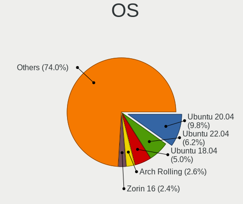
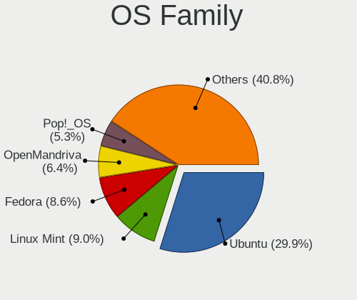
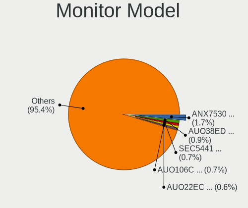
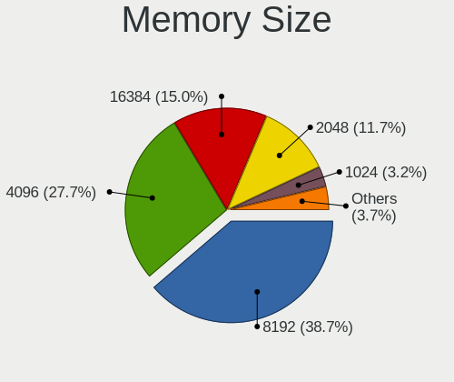
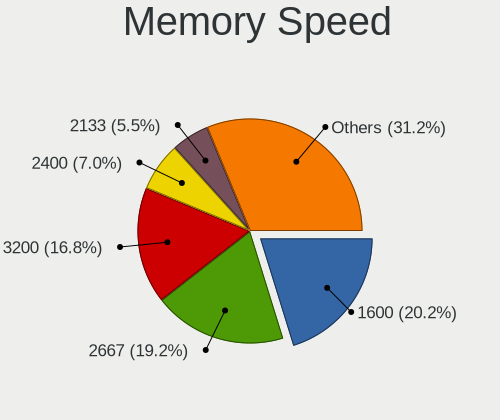
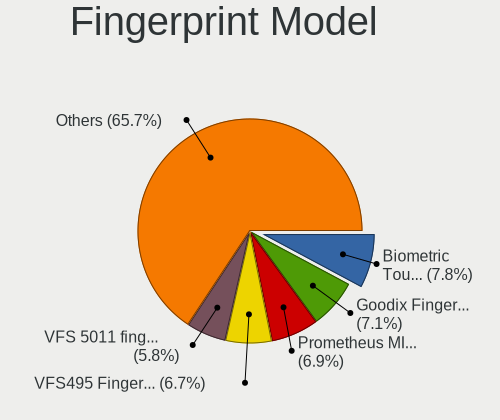

Linux in UK - Tested Hardware & Statistics (Notebooks)
------------------------------------------------------

A project to collect tested hardware configurations for Linux in UK.

Anyone can contribute to this report by the [hw-probe](https://github.com/linuxhw/hw-probe) tool:

    sudo -E hw-probe -all -upload

Please contribute! Especially if your hardware is rare.

Contents
--------

* [ Test Cases ](#test-cases)

* [ System ](#system)
  - [ OS                       ](#os)
  - [ OS Family                ](#os-family)
  - [ Kernel                   ](#kernel)
  - [ Kernel Family            ](#kernel-family)
  - [ Kernel Major Ver.        ](#kernel-major-ver)
  - [ Arch                     ](#arch)
  - [ DE                       ](#de)
  - [ Display Server           ](#display-server)
  - [ Display Manager          ](#display-manager)
  - [ OS Lang                  ](#os-lang)
  - [ Boot Mode                ](#boot-mode)
  - [ Filesystem               ](#filesystem)
  - [ Part. scheme             ](#part-scheme)
  - [ Dual Boot with Linux/BSD ](#dual-boot-with-linuxbsd)
  - [ Dual Boot (Win)          ](#dual-boot-win)

* [ Board ](#board)
  - [ Vendor                   ](#vendor)
  - [ Model                    ](#model)
  - [ Model Family             ](#model-family)
  - [ MFG Year                 ](#mfg-year)
  - [ Form Factor              ](#form-factor)
  - [ Secure Boot              ](#secure-boot)
  - [ Coreboot                 ](#coreboot)
  - [ RAM Size                 ](#ram-size)
  - [ RAM Used                 ](#ram-used)
  - [ Total Drives             ](#total-drives)
  - [ Has CD-ROM               ](#has-cd-rom)
  - [ Has Ethernet             ](#has-ethernet)
  - [ Has WiFi                 ](#has-wifi)
  - [ Has Bluetooth            ](#has-bluetooth)

* [ Location ](#location)
  - [ Country                  ](#country)
  - [ City                     ](#city)

* [ Drives ](#drives)
  - [ Drive Vendor             ](#drive-vendor)
  - [ Drive Model              ](#drive-model)
  - [ HDD Vendor               ](#hdd-vendor)
  - [ SSD Vendor               ](#ssd-vendor)
  - [ Drive Kind               ](#drive-kind)
  - [ Drive Connector          ](#drive-connector)
  - [ Drive Size               ](#drive-size)
  - [ Space Total              ](#space-total)
  - [ Space Used               ](#space-used)
  - [ Malfunc. Drives          ](#malfunc-drives)
  - [ Malfunc. Drive Vendor    ](#malfunc-drive-vendor)
  - [ Malfunc. HDD Vendor      ](#malfunc-hdd-vendor)
  - [ Malfunc. Drive Kind      ](#malfunc-drive-kind)
  - [ Failed Drives            ](#failed-drives)
  - [ Failed Drive Vendor      ](#failed-drive-vendor)
  - [ Drive Status             ](#drive-status)

* [ Storage controller ](#storage-controller)
  - [ Storage Vendor           ](#storage-vendor)
  - [ Storage Model            ](#storage-model)
  - [ Storage Kind             ](#storage-kind)

* [ Processor ](#processor)
  - [ CPU Vendor               ](#cpu-vendor)
  - [ CPU Model                ](#cpu-model)
  - [ CPU Model Family         ](#cpu-model-family)
  - [ CPU Cores                ](#cpu-cores)
  - [ CPU Sockets              ](#cpu-sockets)
  - [ CPU Threads              ](#cpu-threads)
  - [ CPU Op-Modes             ](#cpu-op-modes)
  - [ CPU Microcode            ](#cpu-microcode)
  - [ CPU Microarch            ](#cpu-microarch)

* [ Graphics ](#graphics)
  - [ GPU Vendor               ](#gpu-vendor)
  - [ GPU Model                ](#gpu-model)
  - [ GPU Combo                ](#gpu-combo)
  - [ GPU Driver               ](#gpu-driver)
  - [ GPU Memory               ](#gpu-memory)

* [ Monitor ](#monitor)
  - [ Monitor Vendor           ](#monitor-vendor)
  - [ Monitor Model            ](#monitor-model)
  - [ Monitor Resolution       ](#monitor-resolution)
  - [ Monitor Diagonal         ](#monitor-diagonal)
  - [ Monitor Width            ](#monitor-width)
  - [ Aspect Ratio             ](#aspect-ratio)
  - [ Monitor Area             ](#monitor-area)
  - [ Pixel Density            ](#pixel-density)
  - [ Multiple Monitors        ](#multiple-monitors)

* [ Network ](#network)
  - [ Net Controller Vendor    ](#net-controller-vendor)
  - [ Net Controller Model     ](#net-controller-model)
  - [ Wireless Vendor          ](#wireless-vendor)
  - [ Wireless Model           ](#wireless-model)
  - [ Ethernet Vendor          ](#ethernet-vendor)
  - [ Ethernet Model           ](#ethernet-model)
  - [ Net Controller Kind      ](#net-controller-kind)
  - [ Used Controller          ](#used-controller)
  - [ NICs                     ](#nics)
  - [ IPv6                     ](#ipv6)

* [ Bluetooth ](#bluetooth)
  - [ Bluetooth Vendor         ](#bluetooth-vendor)
  - [ Bluetooth Model          ](#bluetooth-model)

* [ Sound ](#sound)
  - [ Sound Vendor             ](#sound-vendor)
  - [ Sound Model              ](#sound-model)

* [ Memory ](#memory)
  - [ Memory Vendor            ](#memory-vendor)
  - [ Memory Model             ](#memory-model)
  - [ Memory Kind              ](#memory-kind)
  - [ Memory Form Factor       ](#memory-form-factor)
  - [ Memory Size              ](#memory-size)
  - [ Memory Speed             ](#memory-speed)

* [ Printers & scanners ](#printers--scanners)
  - [ Printer Vendor           ](#printer-vendor)
  - [ Printer Model            ](#printer-model)
  - [ Scanner Vendor           ](#scanner-vendor)
  - [ Scanner Model            ](#scanner-model)

* [ Camera ](#camera)
  - [ Camera Vendor            ](#camera-vendor)
  - [ Camera Model             ](#camera-model)

* [ Security ](#security)
  - [ Fingerprint Vendor       ](#fingerprint-vendor)
  - [ Fingerprint Model        ](#fingerprint-model)
  - [ Chipcard Vendor          ](#chipcard-vendor)
  - [ Chipcard Model           ](#chipcard-model)

* [ Unsupported ](#unsupported)
  - [ Unsupported Devices      ](#unsupported-devices)
  - [ Unsupported Device Types ](#unsupported-device-types)

Test Cases
----------

Total: 7839

| Vendor        | Model                       | Probe                                                      | Date         |
|---------------|-----------------------------|------------------------------------------------------------|--------------|
| Lenovo        | IdeaPad Pro 5 14APH8 83A... | [046bbb97db](https://linux-hardware.org/?probe=046bbb97db) | Jan 05, 2025 |
| Dell          | XPS 9320                    | [35af44b04a](https://linux-hardware.org/?probe=35af44b04a) | Jan 05, 2025 |
| ASUSTek       | ASUS Zenbook S 16 UM5606... | [9ddd47e13b](https://linux-hardware.org/?probe=9ddd47e13b) | Jan 05, 2025 |
| Acer          | Aspire A515-43              | [9afd1ddd9e](https://linux-hardware.org/?probe=9afd1ddd9e) | Jan 05, 2025 |
| Dell          | Inspiron 1545               | [6d5ccbb5f9](https://linux-hardware.org/?probe=6d5ccbb5f9) | Jan 05, 2025 |
| Lenovo        | ThinkPad T420 4236PFG       | [df34cf20b9](https://linux-hardware.org/?probe=df34cf20b9) | Jan 05, 2025 |
| Lenovo        | ThinkPad L15 Gen 1 20U30... | [b0b56ec993](https://linux-hardware.org/?probe=b0b56ec993) | Jan 05, 2025 |
| Lenovo        | ThinkPad T14s Gen 1 20UH... | [c68a17f027](https://linux-hardware.org/?probe=c68a17f027) | Jan 04, 2025 |
| HP            | EliteBook 845 G7 Noteboo... | [33a984a2df](https://linux-hardware.org/?probe=33a984a2df) | Jan 04, 2025 |
| Lenovo        | ThinkPad T480s 20L8S0230... | [e6a02c7ad9](https://linux-hardware.org/?probe=e6a02c7ad9) | Jan 04, 2025 |
| Dell          | Latitude E5430 non-vPro     | [bbf6d05761](https://linux-hardware.org/?probe=bbf6d05761) | Jan 03, 2025 |
| Dell          | Latitude 5440               | [60ed15e860](https://linux-hardware.org/?probe=60ed15e860) | Jan 03, 2025 |
| Dell          | Latitude E5430 non-vPro     | [7b1adcdde1](https://linux-hardware.org/?probe=7b1adcdde1) | Jan 03, 2025 |
| SmbiosType... | SmbiosType1_SystemProduc... | [c1e2e11b0e](https://linux-hardware.org/?probe=c1e2e11b0e) | Jan 02, 2025 |
| Dell          | Latitude E6430              | [860e215daf](https://linux-hardware.org/?probe=860e215daf) | Jan 02, 2025 |
| System76      | Lemur Pro                   | [6eae77b375](https://linux-hardware.org/?probe=6eae77b375) | Jan 02, 2025 |
| Dell          | Inspiron 1545               | [445120281e](https://linux-hardware.org/?probe=445120281e) | Jan 02, 2025 |
| Apple         | MacBookPro8,3               | [9fe191d9b2](https://linux-hardware.org/?probe=9fe191d9b2) | Jan 01, 2025 |
| Lenovo        | ThinkPad T15g Gen 1 20US... | [c5dc058f75](https://linux-hardware.org/?probe=c5dc058f75) | Jan 01, 2025 |
| Alienware     | m15 Ryzen Ed. R5            | [8aefe7b2c7](https://linux-hardware.org/?probe=8aefe7b2c7) | Jan 01, 2025 |
| HP            | Pavilion g6                 | [d717116365](https://linux-hardware.org/?probe=d717116365) | Jan 01, 2025 |
| Lenovo        | ThinkPad X220 4291QZ1       | [ffd4949fc5](https://linux-hardware.org/?probe=ffd4949fc5) | Jan 01, 2025 |
| Lenovo        | ThinkPad X220 4291QZ1       | [68cf73b7b3](https://linux-hardware.org/?probe=68cf73b7b3) | Jan 01, 2025 |
| Lenovo        | IdeaPad Slim 1-14AST-05 ... | [0850762b48](https://linux-hardware.org/?probe=0850762b48) | Dec 31, 2024 |
| ASUSTek       | ROG Strix G713PI_G713PI     | [eeef064f3d](https://linux-hardware.org/?probe=eeef064f3d) | Dec 31, 2024 |
| Dell          | Latitude E7440              | [2d9f729ec1](https://linux-hardware.org/?probe=2d9f729ec1) | Dec 31, 2024 |
| Toshiba       | Satellite L300              | [3104c13f02](https://linux-hardware.org/?probe=3104c13f02) | Dec 31, 2024 |
| HP            | Laptop 15-bw0xx             | [e7e2b59786](https://linux-hardware.org/?probe=e7e2b59786) | Dec 31, 2024 |
| Dell          | XPS 17 9730                 | [216ff4e7eb](https://linux-hardware.org/?probe=216ff4e7eb) | Dec 30, 2024 |
| HP            | EliteBook Folio 1040 G1     | [55d6518fd1](https://linux-hardware.org/?probe=55d6518fd1) | Dec 30, 2024 |
| Lenovo        | IdeaPad S340-15API 81NC     | [33dad31e6e](https://linux-hardware.org/?probe=33dad31e6e) | Dec 30, 2024 |
| Fujitsu       | LIFEBOOK AH531              | [37872e53dc](https://linux-hardware.org/?probe=37872e53dc) | Dec 30, 2024 |
| Fujitsu       | LIFEBOOK AH531              | [0dc9a2432a](https://linux-hardware.org/?probe=0dc9a2432a) | Dec 30, 2024 |
| HP            | 470 G8 Notebook PC          | [a14600050a](https://linux-hardware.org/?probe=a14600050a) | Dec 30, 2024 |
| Dell          | Latitude E7270              | [45d3b8797a](https://linux-hardware.org/?probe=45d3b8797a) | Dec 30, 2024 |
| HP            | EliteBook 840 Aero G8 No... | [af5219d90f](https://linux-hardware.org/?probe=af5219d90f) | Dec 30, 2024 |
| LG Electro... | 17Z90S-G.AD7BA1             | [aaa38e95c5](https://linux-hardware.org/?probe=aaa38e95c5) | Dec 29, 2024 |
| Apple         | MacBookPro11,2              | [238bce296a](https://linux-hardware.org/?probe=238bce296a) | Dec 29, 2024 |
| ASUSTek       | VivoBook_ASUSLaptop X515... | [e9aa37cfcd](https://linux-hardware.org/?probe=e9aa37cfcd) | Dec 29, 2024 |
| Lenovo        | ThinkPad T460 20FMS3320G    | [631f081493](https://linux-hardware.org/?probe=631f081493) | Dec 29, 2024 |
| MSI           | GE60 2PL                    | [db806920f1](https://linux-hardware.org/?probe=db806920f1) | Dec 29, 2024 |
| MSI           | GE60 2PL                    | [0cd07458bc](https://linux-hardware.org/?probe=0cd07458bc) | Dec 29, 2024 |
| HP            | EliteBook 830 G5            | [3dd541f1a9](https://linux-hardware.org/?probe=3dd541f1a9) | Dec 28, 2024 |
| Lenovo        | IdeaPad 320-15AST 80XV      | [ee6916b202](https://linux-hardware.org/?probe=ee6916b202) | Dec 28, 2024 |
| MSI           | MS-7A34                     | [047f86697a](https://linux-hardware.org/?probe=047f86697a) | Dec 28, 2024 |
| Lenovo        | ThinkPad T520 42424UU       | [b4a2895025](https://linux-hardware.org/?probe=b4a2895025) | Dec 28, 2024 |
| HP            | EliteBook 8460p             | [4891753c29](https://linux-hardware.org/?probe=4891753c29) | Dec 28, 2024 |
| Dell          | Inspiron 5570               | [ce371a4f66](https://linux-hardware.org/?probe=ce371a4f66) | Dec 27, 2024 |
| Dell          | Latitude 7490               | [73b59f6e09](https://linux-hardware.org/?probe=73b59f6e09) | Dec 27, 2024 |
| Dell          | XPS 15 9500                 | [2a60673d8c](https://linux-hardware.org/?probe=2a60673d8c) | Dec 27, 2024 |
| Lenovo        | ThinkPad T520 42424UU       | [5de1acb22e](https://linux-hardware.org/?probe=5de1acb22e) | Dec 27, 2024 |
| HP            | Laptop 14-bs0xx             | [90ddb2c764](https://linux-hardware.org/?probe=90ddb2c764) | Dec 26, 2024 |
| Apple         | MacBookPro9,2               | [c289d2b95b](https://linux-hardware.org/?probe=c289d2b95b) | Dec 25, 2024 |
| Lenovo        | ThinkPad T14 Gen 4 21K4S... | [658f4969be](https://linux-hardware.org/?probe=658f4969be) | Dec 24, 2024 |
| eMachines     | E725                        | [c4c6cfaa36](https://linux-hardware.org/?probe=c4c6cfaa36) | Dec 23, 2024 |
| Dell          | Latitude 5510               | [fefb1eb9c3](https://linux-hardware.org/?probe=fefb1eb9c3) | Dec 23, 2024 |
| Apple         | MacBookPro9,2               | [584f7243e9](https://linux-hardware.org/?probe=584f7243e9) | Dec 23, 2024 |
| Samsung       | 700Z3C/700Z5C               | [4c634dc49d](https://linux-hardware.org/?probe=4c634dc49d) | Dec 23, 2024 |
| Lenovo        | ThinkPad T450 20BUS3GN02    | [ebd69fe1aa](https://linux-hardware.org/?probe=ebd69fe1aa) | Dec 22, 2024 |
| Lenovo        | ThinkPad T470 20HD000MUK    | [119c51368a](https://linux-hardware.org/?probe=119c51368a) | Dec 22, 2024 |
| Toshiba       | Satellite L855              | [7e9c1e43c5](https://linux-hardware.org/?probe=7e9c1e43c5) | Dec 22, 2024 |
| ASUSTek       | ASUS TUF Gaming A15 FA50... | [7172f26f77](https://linux-hardware.org/?probe=7172f26f77) | Dec 22, 2024 |
| Lenovo        | ThinkPad P70 20ESS03100     | [14939efad3](https://linux-hardware.org/?probe=14939efad3) | Dec 21, 2024 |
| PC Special... | PA70Hx                      | [d44a3116ed](https://linux-hardware.org/?probe=d44a3116ed) | Dec 21, 2024 |
| Lenovo        | ThinkPad X250 20CLS11W0W    | [ca04e40dd4](https://linux-hardware.org/?probe=ca04e40dd4) | Dec 21, 2024 |
| HP            | EliteBook 840 G3            | [9922fa7e34](https://linux-hardware.org/?probe=9922fa7e34) | Dec 20, 2024 |
| Dell          | Inspiron 15 3520            | [8361014504](https://linux-hardware.org/?probe=8361014504) | Dec 20, 2024 |
| Valve         | Jupiter                     | [fbe2a34804](https://linux-hardware.org/?probe=fbe2a34804) | Dec 20, 2024 |
| Lenovo        | Legion 9 16IRX9 83G0        | [96010200a2](https://linux-hardware.org/?probe=96010200a2) | Dec 20, 2024 |
| Lenovo        | Legion 9 16IRX9 83G0        | [334c2447f9](https://linux-hardware.org/?probe=334c2447f9) | Dec 20, 2024 |
| Valve         | Jupiter                     | [96ec07b5d4](https://linux-hardware.org/?probe=96ec07b5d4) | Dec 20, 2024 |
| Lenovo        | ThinkPad T450 20BUS3GN02    | [54fd784e9c](https://linux-hardware.org/?probe=54fd784e9c) | Dec 20, 2024 |
| ASUSTek       | ASUS TUF Gaming A15 FA50... | [ea550dbbcd](https://linux-hardware.org/?probe=ea550dbbcd) | Dec 19, 2024 |
| HP            | EliteBook 840 G2            | [407784b097](https://linux-hardware.org/?probe=407784b097) | Dec 19, 2024 |
| Dell          | Latitude 3380               | [ae503db75c](https://linux-hardware.org/?probe=ae503db75c) | Dec 19, 2024 |
| COMEXR        | GM5IX7A                     | [263df0c661](https://linux-hardware.org/?probe=263df0c661) | Dec 19, 2024 |
| Lenovo        | ThinkPad X1 Carbon 6th 2... | [2e97ec9da3](https://linux-hardware.org/?probe=2e97ec9da3) | Dec 19, 2024 |
| HP            | ProBook 450 G2              | [5a4149356a](https://linux-hardware.org/?probe=5a4149356a) | Dec 19, 2024 |
| Dell          | Precision 7520              | [36ee219c52](https://linux-hardware.org/?probe=36ee219c52) | Dec 19, 2024 |
| ASUSTek       | ASUS TUF Gaming F15 FX50... | [3fcda10f19](https://linux-hardware.org/?probe=3fcda10f19) | Dec 19, 2024 |
| ASUSTek       | Zenbook 15 UM3504DA_UM35... | [bc6f16d08f](https://linux-hardware.org/?probe=bc6f16d08f) | Dec 18, 2024 |
| ASUSTek       | Zenbook 15 UM3504DA_UM35... | [b4b2988f08](https://linux-hardware.org/?probe=b4b2988f08) | Dec 18, 2024 |
| Dell          | Latitude E6320              | [86e4bd031d](https://linux-hardware.org/?probe=86e4bd031d) | Dec 18, 2024 |
| Unknown       | Unknown                     | [dc53769580](https://linux-hardware.org/?probe=dc53769580) | Dec 18, 2024 |
| HP            | ProBook 635 Aero G8 Note... | [7201dc1c2a](https://linux-hardware.org/?probe=7201dc1c2a) | Dec 17, 2024 |
| Lenovo        | IdeaPad Slim 1-14AST-05 ... | [837d0f44f3](https://linux-hardware.org/?probe=837d0f44f3) | Dec 17, 2024 |
| Lenovo        | ThinkPad L490 20Q6S23200    | [a13840a70a](https://linux-hardware.org/?probe=a13840a70a) | Dec 17, 2024 |
| Valve         | Jupiter                     | [23d9275334](https://linux-hardware.org/?probe=23d9275334) | Dec 17, 2024 |
| ASUSTek       | TUF Gaming B560-PLUS WIF... | [7e4e6bb310](https://linux-hardware.org/?probe=7e4e6bb310) | Dec 17, 2024 |
| Dell          | System XPS L502X            | [74f4e14d27](https://linux-hardware.org/?probe=74f4e14d27) | Dec 17, 2024 |
| Dell          | System XPS L502X            | [8aa720a976](https://linux-hardware.org/?probe=8aa720a976) | Dec 17, 2024 |
| Toshiba       | Satellite C50D-A-133        | [c5dba8548d](https://linux-hardware.org/?probe=c5dba8548d) | Dec 14, 2024 |
| HP            | EliteBook 840 G5            | [c8ea55ff8e](https://linux-hardware.org/?probe=c8ea55ff8e) | Dec 14, 2024 |
| Acer          | Aspire A517-52              | [8f9faa4e94](https://linux-hardware.org/?probe=8f9faa4e94) | Dec 13, 2024 |
| Google        | Gnawty                      | [dd1d3f4cc7](https://linux-hardware.org/?probe=dd1d3f4cc7) | Dec 13, 2024 |
| Lenovo        | ThinkPad T480s 20L8S7890... | [6cb6a6ef3b](https://linux-hardware.org/?probe=6cb6a6ef3b) | Dec 13, 2024 |
| Google        | Cyan                        | [07d137b1c9](https://linux-hardware.org/?probe=07d137b1c9) | Dec 13, 2024 |
| Valve         | Jupiter                     | [24bbbbae23](https://linux-hardware.org/?probe=24bbbbae23) | Dec 13, 2024 |
| Lenovo        | ThinkPad X1 Carbon Gen 1... | [b6f97da286](https://linux-hardware.org/?probe=b6f97da286) | Dec 12, 2024 |
| Google        | Swanky                      | [368716121b](https://linux-hardware.org/?probe=368716121b) | Dec 12, 2024 |
| Valve         | Jupiter                     | [63ff703069](https://linux-hardware.org/?probe=63ff703069) | Dec 12, 2024 |
| Lenovo        | Unknown                     | [a52e424be1](https://linux-hardware.org/?probe=a52e424be1) | Dec 11, 2024 |
| HP            | Syndra                      | [5afea7c0af](https://linux-hardware.org/?probe=5afea7c0af) | Dec 11, 2024 |
| Dell          | Inspiron 3542               | [3b062636e0](https://linux-hardware.org/?probe=3b062636e0) | Dec 11, 2024 |
| Valve         | Galileo                     | [b2cbfb3cf8](https://linux-hardware.org/?probe=b2cbfb3cf8) | Dec 11, 2024 |
| Acer          | Aspire A315-51              | [7c6b88af46](https://linux-hardware.org/?probe=7c6b88af46) | Dec 10, 2024 |
| Dell          | G3 3779                     | [931e58ebb5](https://linux-hardware.org/?probe=931e58ebb5) | Dec 10, 2024 |
| Dynabook      | PORTEGE X40-K               | [5f7a69df31](https://linux-hardware.org/?probe=5f7a69df31) | Dec 09, 2024 |
| Dell          | Latitude E6330              | [dfc2aca866](https://linux-hardware.org/?probe=dfc2aca866) | Dec 09, 2024 |
| Dell          | G3 3779                     | [6efadf2972](https://linux-hardware.org/?probe=6efadf2972) | Dec 09, 2024 |
| HP            | Victus by Gaming Laptop ... | [bfb9f81e1e](https://linux-hardware.org/?probe=bfb9f81e1e) | Dec 09, 2024 |
| ASUSTek       | ROG Zephyrus G14 GA403UV... | [e8f69e44e3](https://linux-hardware.org/?probe=e8f69e44e3) | Dec 09, 2024 |
| HP            | Laptop 14-bp0xx             | [012068b3e1](https://linux-hardware.org/?probe=012068b3e1) | Dec 09, 2024 |
| Samsung       | 700T1C                      | [65e3d49cf3](https://linux-hardware.org/?probe=65e3d49cf3) | Dec 08, 2024 |
| Apple         | MacBookAir6,2               | [372b55e089](https://linux-hardware.org/?probe=372b55e089) | Dec 08, 2024 |
| Apple         | MacBookAir6,2               | [665e0a1167](https://linux-hardware.org/?probe=665e0a1167) | Dec 08, 2024 |
| Acer          | Aspire 5720                 | [143fb9ef5e](https://linux-hardware.org/?probe=143fb9ef5e) | Dec 08, 2024 |
| HP            | Victus by Gaming Laptop ... | [0b67578406](https://linux-hardware.org/?probe=0b67578406) | Dec 08, 2024 |
| Apple         | MacBookPro7,1               | [f5bed7f7d1](https://linux-hardware.org/?probe=f5bed7f7d1) | Dec 08, 2024 |
| Lenovo        | ThinkPad T410 25373J7       | [ef76a79e43](https://linux-hardware.org/?probe=ef76a79e43) | Dec 07, 2024 |
| Lenovo        | ThinkPad T410 25373J7       | [de636f6c6d](https://linux-hardware.org/?probe=de636f6c6d) | Dec 07, 2024 |
| HP            | Laptop 15s-fq5xxx           | [6ddbeb42be](https://linux-hardware.org/?probe=6ddbeb42be) | Dec 07, 2024 |
| Lenovo        | ThinkPad T14 Gen 3 21AJS... | [372950613f](https://linux-hardware.org/?probe=372950613f) | Dec 07, 2024 |
| ASUSTek       | Zenbook UX3402VA_UX3402V... | [8d51a6d1e3](https://linux-hardware.org/?probe=8d51a6d1e3) | Dec 07, 2024 |
| PC Special... | PA70Hx                      | [4923c61977](https://linux-hardware.org/?probe=4923c61977) | Dec 07, 2024 |
| Lenovo        | ThinkPad X220 4291QZ1       | [3b883f2bc2](https://linux-hardware.org/?probe=3b883f2bc2) | Dec 07, 2024 |
| Lenovo        | IdeaPad 3 14ALC6 82KT       | [4b0d54bc10](https://linux-hardware.org/?probe=4b0d54bc10) | Dec 06, 2024 |
| PC Special... | Recoil VIII 17              | [bf09f105dc](https://linux-hardware.org/?probe=bf09f105dc) | Dec 06, 2024 |
| OEGStone      | T5110                       | [c72ef8fd6c](https://linux-hardware.org/?probe=c72ef8fd6c) | Dec 06, 2024 |
| ASUSTek       | Zenbook UX3402VA_UX3402V... | [bc6e165df6](https://linux-hardware.org/?probe=bc6e165df6) | Dec 06, 2024 |
| Lenovo        | Legion-S7-16APH8 82Y4       | [7ce6044500](https://linux-hardware.org/?probe=7ce6044500) | Dec 06, 2024 |
| Dell          | Venue 8 Pro 5830            | [1f4656669a](https://linux-hardware.org/?probe=1f4656669a) | Dec 05, 2024 |
| Dell          | Venue 8 Pro 5830            | [5c6aa00d01](https://linux-hardware.org/?probe=5c6aa00d01) | Dec 05, 2024 |
| Acer          | Aspire E5-576G              | [aeb8a7cb0e](https://linux-hardware.org/?probe=aeb8a7cb0e) | Dec 05, 2024 |
| HP            | Laptop 15-fc0xxx            | [02e6943db4](https://linux-hardware.org/?probe=02e6943db4) | Dec 03, 2024 |
| ASUSTek       | ZenBook UX333FA_UX333FA     | [bda3d5d09a](https://linux-hardware.org/?probe=bda3d5d09a) | Dec 03, 2024 |
| Dell          | Latitude 5420               | [1d2ce28415](https://linux-hardware.org/?probe=1d2ce28415) | Dec 02, 2024 |
| Dell          | Latitude 3420               | [bfa6a73c30](https://linux-hardware.org/?probe=bfa6a73c30) | Dec 02, 2024 |
| HP            | EliteBook 735 G6            | [5074de8248](https://linux-hardware.org/?probe=5074de8248) | Dec 02, 2024 |
| Timi          | TM1701                      | [6806471079](https://linux-hardware.org/?probe=6806471079) | Dec 01, 2024 |
| Lenovo        | ThinkBook 16 G6 ABP 21KK    | [a33adb8a44](https://linux-hardware.org/?probe=a33adb8a44) | Dec 01, 2024 |
| Dell          | Latitude E6430              | [d1aabb8f2e](https://linux-hardware.org/?probe=d1aabb8f2e) | Nov 30, 2024 |
| Apple         | MacBookPro7,1               | [c174289e6e](https://linux-hardware.org/?probe=c174289e6e) | Nov 30, 2024 |
| Lenovo        | IdeaPad 1 14ADA05 82GW      | [c7fb17104d](https://linux-hardware.org/?probe=c7fb17104d) | Nov 29, 2024 |
| ASUSTek       | VivoBook_ASUS Laptop E21... | [bbc531ab55](https://linux-hardware.org/?probe=bbc531ab55) | Nov 29, 2024 |
| Dell          | Latitude 3420               | [d7a23c335f](https://linux-hardware.org/?probe=d7a23c335f) | Nov 29, 2024 |
| Dell          | XPS 15 7590                 | [5e7894e7b3](https://linux-hardware.org/?probe=5e7894e7b3) | Nov 29, 2024 |
| Apple         | MacBookPro8,1               | [a817c04b09](https://linux-hardware.org/?probe=a817c04b09) | Nov 29, 2024 |
| Google        | Volmar                      | [e5e4fff585](https://linux-hardware.org/?probe=e5e4fff585) | Nov 29, 2024 |
| Acer          | Swift SF314-43              | [12009a8a6e](https://linux-hardware.org/?probe=12009a8a6e) | Nov 29, 2024 |
| Apple         | MacBookPro10,2              | [d7a890c3bc](https://linux-hardware.org/?probe=d7a890c3bc) | Nov 28, 2024 |
| Dell          | XPS 13 9380                 | [3f354f5ca6](https://linux-hardware.org/?probe=3f354f5ca6) | Nov 28, 2024 |
| ASUSTek       | Zenbook UX3402ZA            | [75d97803ac](https://linux-hardware.org/?probe=75d97803ac) | Nov 28, 2024 |
| Lenovo        | ThinkPad X1 Carbon Gen 8... | [7273568e68](https://linux-hardware.org/?probe=7273568e68) | Nov 27, 2024 |
| Lenovo        | ThinkPad T470 20HD000MUK    | [70c8b6c941](https://linux-hardware.org/?probe=70c8b6c941) | Nov 27, 2024 |
| Lenovo        | IdeaPad 330-15AST 81D6      | [2c2ce4feac](https://linux-hardware.org/?probe=2c2ce4feac) | Nov 27, 2024 |
| MSI           | GS43VR 7RE                  | [420a91c666](https://linux-hardware.org/?probe=420a91c666) | Nov 27, 2024 |
| Acer          | Aspire E3-111               | [f90ddc6433](https://linux-hardware.org/?probe=f90ddc6433) | Nov 26, 2024 |
| Lenovo        | ThinkPad T430 2349LPG       | [c9caafc936](https://linux-hardware.org/?probe=c9caafc936) | Nov 26, 2024 |
| ASUSTek       | K52F                        | [f32ec5742c](https://linux-hardware.org/?probe=f32ec5742c) | Nov 26, 2024 |
| Lenovo        | ThinkPad P15s Gen 2i 20W... | [eeafb00551](https://linux-hardware.org/?probe=eeafb00551) | Nov 26, 2024 |
| Alienware     | M15x                        | [6a413494a5](https://linux-hardware.org/?probe=6a413494a5) | Nov 26, 2024 |
| ASUSTek       | K52F                        | [b9f07ee539](https://linux-hardware.org/?probe=b9f07ee539) | Nov 26, 2024 |
| HP            | Laptop 14-dk0xxx            | [413b02dc7a](https://linux-hardware.org/?probe=413b02dc7a) | Nov 25, 2024 |
| Apple         | MacBookPro15,3              | [b2950a6acc](https://linux-hardware.org/?probe=b2950a6acc) | Nov 25, 2024 |
| Apple         | MacBookPro15,3              | [35e53fb246](https://linux-hardware.org/?probe=35e53fb246) | Nov 25, 2024 |
| HP            | EliteBook 845 G7 Noteboo... | [22c1f82554](https://linux-hardware.org/?probe=22c1f82554) | Nov 25, 2024 |
| HP            | EliteBook 845 G7 Noteboo... | [288c8caa64](https://linux-hardware.org/?probe=288c8caa64) | Nov 25, 2024 |
| ASUSTek       | X550CL                      | [4da2083b30](https://linux-hardware.org/?probe=4da2083b30) | Nov 25, 2024 |
| Dell          | Inspiron N5050              | [4adbbb662c](https://linux-hardware.org/?probe=4adbbb662c) | Nov 25, 2024 |
| Apple         | MacBookAir6,1               | [a42587525c](https://linux-hardware.org/?probe=a42587525c) | Nov 25, 2024 |
| Apple         | MacBookAir6,1               | [1d464cc8ce](https://linux-hardware.org/?probe=1d464cc8ce) | Nov 25, 2024 |
| TUXEDO        | InfinityBook Pro Intel G... | [dd0ea1fc00](https://linux-hardware.org/?probe=dd0ea1fc00) | Nov 24, 2024 |
| Lenovo        | B590 20206                  | [9424bab447](https://linux-hardware.org/?probe=9424bab447) | Nov 24, 2024 |
| Lenovo        | ThinkPad X1 Carbon Gen 8... | [e08841e045](https://linux-hardware.org/?probe=e08841e045) | Nov 24, 2024 |
| Lenovo        | ThinkPad T480s 20L8S27M0... | [8cf2b4511a](https://linux-hardware.org/?probe=8cf2b4511a) | Nov 24, 2024 |
| Sony          | VPCEH3N6E                   | [4c6362e74d](https://linux-hardware.org/?probe=4c6362e74d) | Nov 24, 2024 |
| Entroware     | Hybris                      | [7efe43ff53](https://linux-hardware.org/?probe=7efe43ff53) | Nov 23, 2024 |
| Unknown       | Unknown                     | [33623faaa4](https://linux-hardware.org/?probe=33623faaa4) | Nov 23, 2024 |
| ASUSTek       | ROG Zephyrus G15 GA503QS... | [603ece14b5](https://linux-hardware.org/?probe=603ece14b5) | Nov 23, 2024 |
| Dell          | Inspiron 16 Plus 7630       | [77ad7bcfd0](https://linux-hardware.org/?probe=77ad7bcfd0) | Nov 23, 2024 |
| Alienware     | m15 R6                      | [fe900ab805](https://linux-hardware.org/?probe=fe900ab805) | Nov 22, 2024 |
| Dell          | G3 3500                     | [d340f80f52](https://linux-hardware.org/?probe=d340f80f52) | Nov 22, 2024 |
| Lenovo        | ThinkPad E14 Gen 6 21M3C... | [bd4fb3ed40](https://linux-hardware.org/?probe=bd4fb3ed40) | Nov 22, 2024 |
| HP            | OmniBook Ultra Laptop 14... | [465576d817](https://linux-hardware.org/?probe=465576d817) | Nov 22, 2024 |
| HP            | OmniBook Ultra Laptop 14... | [c222e23ead](https://linux-hardware.org/?probe=c222e23ead) | Nov 22, 2024 |
| Dell          | XPS 15 9500                 | [d49fa36928](https://linux-hardware.org/?probe=d49fa36928) | Nov 22, 2024 |
| Lenovo        | Yoga Pro 7 14ASP9 83HN      | [40259a40c1](https://linux-hardware.org/?probe=40259a40c1) | Nov 21, 2024 |
| Apple         | MacBookAir7,1               | [fe6c43958b](https://linux-hardware.org/?probe=fe6c43958b) | Nov 21, 2024 |
| Apple         | MacBookPro12,1              | [eb7131a7ff](https://linux-hardware.org/?probe=eb7131a7ff) | Nov 20, 2024 |
| Apple         | MacBookPro12,1              | [0d9292a695](https://linux-hardware.org/?probe=0d9292a695) | Nov 20, 2024 |
| Samsung       | 960XGK                      | [87a58e49fd](https://linux-hardware.org/?probe=87a58e49fd) | Nov 20, 2024 |
| Dell          | Inspiron 5577               | [3cfba2e637](https://linux-hardware.org/?probe=3cfba2e637) | Nov 20, 2024 |
| ASUSTek       | VivoBook_ASUSLaptop X150... | [a5db5423e3](https://linux-hardware.org/?probe=a5db5423e3) | Nov 20, 2024 |
| Lenovo        | IdeaPad 330-15AST 81D6      | [dd120b3848](https://linux-hardware.org/?probe=dd120b3848) | Nov 20, 2024 |
| Samsung       | 960XGK                      | [c87a917455](https://linux-hardware.org/?probe=c87a917455) | Nov 19, 2024 |
| HP            | 250 G1                      | [f3e587f360](https://linux-hardware.org/?probe=f3e587f360) | Nov 19, 2024 |
| HP            | EliteBook 845 G7 Noteboo... | [518ed99475](https://linux-hardware.org/?probe=518ed99475) | Nov 19, 2024 |
| HP            | Pavilion Laptop 15-eg2xx... | [8606db43eb](https://linux-hardware.org/?probe=8606db43eb) | Nov 19, 2024 |
| Lenovo        | ThinkPad T430 2349LPG       | [dea56417dc](https://linux-hardware.org/?probe=dea56417dc) | Nov 19, 2024 |
| Lenovo        | V15-IIL 82C5                | [21251f534d](https://linux-hardware.org/?probe=21251f534d) | Nov 18, 2024 |
| HP            | EliteBook 845 G7 Noteboo... | [ca021a9b1d](https://linux-hardware.org/?probe=ca021a9b1d) | Nov 18, 2024 |
| HP            | Pavilion Laptop 14-ce3xx... | [43af28812b](https://linux-hardware.org/?probe=43af28812b) | Nov 16, 2024 |
| Lenovo        | IdeaPad 720S-13IKB 81BV     | [46977439b7](https://linux-hardware.org/?probe=46977439b7) | Nov 16, 2024 |
| Lenovo        | IdeaPad 720S-13IKB 81BV     | [cf2efa9b56](https://linux-hardware.org/?probe=cf2efa9b56) | Nov 16, 2024 |
| HP            | HDX18                       | [5c06e25998](https://linux-hardware.org/?probe=5c06e25998) | Nov 16, 2024 |
| HP            | HDX18                       | [84c4ca9b15](https://linux-hardware.org/?probe=84c4ca9b15) | Nov 16, 2024 |
| Lenovo        | IdeaPad S510p 20298         | [5a6798c9fa](https://linux-hardware.org/?probe=5a6798c9fa) | Nov 16, 2024 |
| ASUSTek       | ASUS Zenbook S 16 UM5606... | [0571f479ff](https://linux-hardware.org/?probe=0571f479ff) | Nov 16, 2024 |
| Lenovo        | ThinkPad T14s Gen 4 21F8... | [ee3c65e37e](https://linux-hardware.org/?probe=ee3c65e37e) | Nov 16, 2024 |
| Lenovo        | ThinkPad X230 2325FG0       | [37b1a11400](https://linux-hardware.org/?probe=37b1a11400) | Nov 16, 2024 |
| Lenovo        | ThinkPad X230 2325FG0       | [fa4cd28ac7](https://linux-hardware.org/?probe=fa4cd28ac7) | Nov 15, 2024 |
| Dell          | Latitude E7250              | [ea43fea4c4](https://linux-hardware.org/?probe=ea43fea4c4) | Nov 15, 2024 |
| Lenovo        | ThinkPad X201 36803D7       | [2488665eda](https://linux-hardware.org/?probe=2488665eda) | Nov 15, 2024 |
| HP            | Pavilion g6                 | [5b93f09faa](https://linux-hardware.org/?probe=5b93f09faa) | Nov 15, 2024 |
| Apple         | MacBook5,2                  | [3473ef622c](https://linux-hardware.org/?probe=3473ef622c) | Nov 15, 2024 |
| HP            | EliteBook 2560p             | [8284360284](https://linux-hardware.org/?probe=8284360284) | Nov 15, 2024 |
| ASUSTek       | VivoBook_ASUSLaptop X512... | [9497b471dc](https://linux-hardware.org/?probe=9497b471dc) | Nov 14, 2024 |
| Dell          | Latitude 3440               | [2b717dcf23](https://linux-hardware.org/?probe=2b717dcf23) | Nov 14, 2024 |
| Dell          | Latitude D630               | [0b5738d0df](https://linux-hardware.org/?probe=0b5738d0df) | Nov 13, 2024 |
| Lenovo        | Legion-S7-16APH8 82Y4       | [97433bc5ca](https://linux-hardware.org/?probe=97433bc5ca) | Nov 13, 2024 |
| Sony          | VPCEH3N6E                   | [cfe154ac45](https://linux-hardware.org/?probe=cfe154ac45) | Nov 13, 2024 |
| Dell          | Latitude 5540               | [6b66bd70e6](https://linux-hardware.org/?probe=6b66bd70e6) | Nov 12, 2024 |
| Apple         | MacBookPro8,1               | [e7223e5a2f](https://linux-hardware.org/?probe=e7223e5a2f) | Nov 12, 2024 |
| Apple         | MacBookPro8,1               | [c5bdc08dbe](https://linux-hardware.org/?probe=c5bdc08dbe) | Nov 12, 2024 |
| Dell          | G16 7630                    | [c4eb9b5c17](https://linux-hardware.org/?probe=c4eb9b5c17) | Nov 12, 2024 |
| ASUSTek       | TUF Z390-PLUS GAMING        | [c73e02d988](https://linux-hardware.org/?probe=c73e02d988) | Nov 11, 2024 |
| Lenovo        | ThinkPad T14s Gen 4 21F8... | [8caefeebb5](https://linux-hardware.org/?probe=8caefeebb5) | Nov 11, 2024 |
| Dell          | Latitude 3420               | [f2a0eac267](https://linux-hardware.org/?probe=f2a0eac267) | Nov 11, 2024 |
| Toshiba       | Satellite L655D             | [9a6af30aa7](https://linux-hardware.org/?probe=9a6af30aa7) | Nov 10, 2024 |
| Lenovo        | ThinkPad X1 Carbon 6th 2... | [42460bd9bc](https://linux-hardware.org/?probe=42460bd9bc) | Nov 10, 2024 |
| Apple         | MacBookPro11,1              | [49ea5db275](https://linux-hardware.org/?probe=49ea5db275) | Nov 10, 2024 |
| ASUSTek       | VivoBook_ASUSLaptop X512... | [9fa3a0fd91](https://linux-hardware.org/?probe=9fa3a0fd91) | Nov 10, 2024 |
| ASUSTek       | VivoBook_ASUSLaptop X512... | [466a15b8c7](https://linux-hardware.org/?probe=466a15b8c7) | Nov 10, 2024 |
| HP            | Presario CQ56               | [7a1356748b](https://linux-hardware.org/?probe=7a1356748b) | Nov 10, 2024 |
| Valve         | Jupiter                     | [58bc3fd29d](https://linux-hardware.org/?probe=58bc3fd29d) | Nov 10, 2024 |
| Chuwi         | HeroBook Air                | [be06deeaa4](https://linux-hardware.org/?probe=be06deeaa4) | Nov 09, 2024 |
| ASUSTek       | ROG Zephyrus G15 GA503QS... | [5b5ebdb143](https://linux-hardware.org/?probe=5b5ebdb143) | Nov 08, 2024 |
| HP            | Pavilion Gaming Laptop 1... | [db35fd585c](https://linux-hardware.org/?probe=db35fd585c) | Nov 07, 2024 |
| Lenovo        | ThinkPad L420 7829GH2       | [33efc8a835](https://linux-hardware.org/?probe=33efc8a835) | Nov 07, 2024 |
| Lenovo        | IdeaPad Slim 3 15IAN8 82... | [08157e80b5](https://linux-hardware.org/?probe=08157e80b5) | Nov 07, 2024 |
| ASUSTek       | Zenbook UX3402ZA            | [362f80e77f](https://linux-hardware.org/?probe=362f80e77f) | Nov 06, 2024 |
| Apple         | MacBookPro8,1               | [0b5989c295](https://linux-hardware.org/?probe=0b5989c295) | Nov 06, 2024 |
| Acer          | Aspire A515-47              | [8fda5ad748](https://linux-hardware.org/?probe=8fda5ad748) | Nov 05, 2024 |
| Dell          | Latitude E5550              | [3084a85733](https://linux-hardware.org/?probe=3084a85733) | Nov 05, 2024 |
| MSI           | Alpha 15 B5EEK              | [245e122c71](https://linux-hardware.org/?probe=245e122c71) | Nov 05, 2024 |
| MSI           | Alpha 15 B5EEK              | [8d6317b0ad](https://linux-hardware.org/?probe=8d6317b0ad) | Nov 05, 2024 |
| Medion        | Erazer P6679 MD60382        | [356678288a](https://linux-hardware.org/?probe=356678288a) | Nov 05, 2024 |
| Medion        | Erazer P6679 MD60382        | [a1fafb8c25](https://linux-hardware.org/?probe=a1fafb8c25) | Nov 05, 2024 |
| Lenovo        | ThinkPad X1 Carbon 5th 2... | [a23337f529](https://linux-hardware.org/?probe=a23337f529) | Nov 04, 2024 |
| ASUSTek       | ROG Zephyrus M16 GU604VY... | [2edc1cb664](https://linux-hardware.org/?probe=2edc1cb664) | Nov 04, 2024 |
| HP            | Pavilion dv5                | [0045bac0e5](https://linux-hardware.org/?probe=0045bac0e5) | Nov 04, 2024 |
| Lenovo        | Z50-75 80EC                 | [2cc6bcb510](https://linux-hardware.org/?probe=2cc6bcb510) | Nov 03, 2024 |
| Lenovo        | B550 0880                   | [9c3e840bc9](https://linux-hardware.org/?probe=9c3e840bc9) | Nov 03, 2024 |
| Dell          | XPS 13 9343                 | [fd2b22b4e7](https://linux-hardware.org/?probe=fd2b22b4e7) | Nov 03, 2024 |
| Lenovo        | Legion 5 17ACH6H 82JY       | [08b46356b3](https://linux-hardware.org/?probe=08b46356b3) | Nov 03, 2024 |
| Lenovo        | ThinkPad X1 Carbon 5th 2... | [ba9eee3dbb](https://linux-hardware.org/?probe=ba9eee3dbb) | Nov 01, 2024 |
| Lenovo        | ThinkPad T15 Gen 1 20S7S... | [c5ed2a9fe5](https://linux-hardware.org/?probe=c5ed2a9fe5) | Nov 01, 2024 |
| ASUSTek       | Vivobook Go E1504GA_E150... | [f96d5e7cbc](https://linux-hardware.org/?probe=f96d5e7cbc) | Oct 31, 2024 |
| ASUSTek       | VivoBook 14_ASUS Laptop ... | [5736e11451](https://linux-hardware.org/?probe=5736e11451) | Oct 31, 2024 |
| Lenovo        | ThinkPad X1 Carbon 6th 2... | [e08d2b4a20](https://linux-hardware.org/?probe=e08d2b4a20) | Oct 31, 2024 |
| HP            | EliteBook 840 G1            | [50a513535d](https://linux-hardware.org/?probe=50a513535d) | Oct 31, 2024 |
| HP            | EliteBook 835 13 inch G9... | [431d4d03c6](https://linux-hardware.org/?probe=431d4d03c6) | Oct 31, 2024 |
| Valve         | Jupiter                     | [a3d6710722](https://linux-hardware.org/?probe=a3d6710722) | Oct 30, 2024 |
| Lenovo        | ThinkPad T490s 20NYS3L72... | [f8310dbb63](https://linux-hardware.org/?probe=f8310dbb63) | Oct 30, 2024 |
| Apple         | MacBookAir7,2               | [728cc4de51](https://linux-hardware.org/?probe=728cc4de51) | Oct 29, 2024 |
| Lenovo        | ThinkPad T14 Gen 4 21K4S... | [8c5b5946e9](https://linux-hardware.org/?probe=8c5b5946e9) | Oct 29, 2024 |
| HP            | Laptop 14-ep0xxx            | [3154b599fb](https://linux-hardware.org/?probe=3154b599fb) | Oct 28, 2024 |
| Dell          | Latitude D830               | [9dcccfc8bd](https://linux-hardware.org/?probe=9dcccfc8bd) | Oct 28, 2024 |
| ASUSTek       | ROG Zephyrus GX550LWS_GX... | [a73a429ab8](https://linux-hardware.org/?probe=a73a429ab8) | Oct 27, 2024 |
| ASUSTek       | ZenBook UX482EAR_UX482EA... | [d3f14a9747](https://linux-hardware.org/?probe=d3f14a9747) | Oct 27, 2024 |
| Valve         | Jupiter                     | [d174ca7015](https://linux-hardware.org/?probe=d174ca7015) | Oct 26, 2024 |
| Lenovo        | IdeaPad Flex-14API 81SS     | [16b42659ef](https://linux-hardware.org/?probe=16b42659ef) | Oct 26, 2024 |
| Dell          | Latitude D530               | [c1459031b7](https://linux-hardware.org/?probe=c1459031b7) | Oct 25, 2024 |
| Lenovo        | ThinkPad T510 4313CTO       | [adae0d140b](https://linux-hardware.org/?probe=adae0d140b) | Oct 25, 2024 |
| ASUSTek       | TUF Gaming FX505DY_FX505... | [f574355070](https://linux-hardware.org/?probe=f574355070) | Oct 25, 2024 |
| Lenovo        | ThinkPad T490 20N3SDGJ02    | [5692ef7249](https://linux-hardware.org/?probe=5692ef7249) | Oct 25, 2024 |
| Sony          | VGN-NW26M                   | [b7d8f997e5](https://linux-hardware.org/?probe=b7d8f997e5) | Oct 25, 2024 |
| Dell          | Latitude E5530 non-vPro     | [81b90346d4](https://linux-hardware.org/?probe=81b90346d4) | Oct 25, 2024 |
| Dell          | Latitude E5530 non-vPro     | [3f56d7a7f5](https://linux-hardware.org/?probe=3f56d7a7f5) | Oct 25, 2024 |
| Dell          | Latitude 5480               | [1959cea403](https://linux-hardware.org/?probe=1959cea403) | Oct 24, 2024 |
| ASUSTek       | ROG Zephyrus G16 GA605WI... | [2bfca1dd72](https://linux-hardware.org/?probe=2bfca1dd72) | Oct 24, 2024 |
| ASUSTek       | Vivobook Go E1504FA_E150... | [1be74f7c3c](https://linux-hardware.org/?probe=1be74f7c3c) | Oct 24, 2024 |
| ASUSTek       | Vivobook Go E1504FA_E150... | [56fc85aac6](https://linux-hardware.org/?probe=56fc85aac6) | Oct 24, 2024 |
| Unknown       | 10-WLAN-1                   | [3a578a0d19](https://linux-hardware.org/?probe=3a578a0d19) | Oct 24, 2024 |
| Dell          | Latitude E5570              | [6d86bd0c29](https://linux-hardware.org/?probe=6d86bd0c29) | Oct 24, 2024 |
| ASUSTek       | ROG Strix G533QS_G533QS     | [eb57d61b77](https://linux-hardware.org/?probe=eb57d61b77) | Oct 24, 2024 |
| Apple         | MacBookPro12,1              | [0d3280fcc2](https://linux-hardware.org/?probe=0d3280fcc2) | Oct 24, 2024 |
| Lenovo        | 100w Gen 3 82HY             | [b62f9c00ac](https://linux-hardware.org/?probe=b62f9c00ac) | Oct 23, 2024 |
| IGEL Techn... | M350C                       | [64f3cd1169](https://linux-hardware.org/?probe=64f3cd1169) | Oct 23, 2024 |
| ASUSTek       | Vivobook Go E1504GA_E150... | [6032c9661d](https://linux-hardware.org/?probe=6032c9661d) | Oct 23, 2024 |
| ASUSTek       | ASUS Zenbook S 16 UM5606... | [b92e7a03a8](https://linux-hardware.org/?probe=b92e7a03a8) | Oct 23, 2024 |
| PC Special... | GM6PC0X                     | [1c0fa981a9](https://linux-hardware.org/?probe=1c0fa981a9) | Oct 23, 2024 |
| ASUSTek       | Vivobook Go E1504GA_E150... | [a90ce8d899](https://linux-hardware.org/?probe=a90ce8d899) | Oct 23, 2024 |
| ASUSTek       | VivoBook_ASUSLaptop M650... | [52778f6fb9](https://linux-hardware.org/?probe=52778f6fb9) | Oct 22, 2024 |
| Lenovo        | Legion Slim 7 16APH8 82Y... | [8389699526](https://linux-hardware.org/?probe=8389699526) | Oct 22, 2024 |
| Lenovo        | Z70-80 80FG                 | [df61da6a87](https://linux-hardware.org/?probe=df61da6a87) | Oct 22, 2024 |
| HP            | EliteBook 830 G6            | [f7d13716ee](https://linux-hardware.org/?probe=f7d13716ee) | Oct 22, 2024 |
| Lenovo        | ThinkPad T470 20HD000MUK    | [97d5a16066](https://linux-hardware.org/?probe=97d5a16066) | Oct 22, 2024 |
| HP            | Laptop 14s-fq0xxx           | [c2fb2a40e1](https://linux-hardware.org/?probe=c2fb2a40e1) | Oct 21, 2024 |
| HP            | EliteBook 2560p             | [00cf35b270](https://linux-hardware.org/?probe=00cf35b270) | Oct 21, 2024 |
| Acer          | Aspire A315-21              | [7e07d00b6a](https://linux-hardware.org/?probe=7e07d00b6a) | Oct 21, 2024 |
| Lenovo        | B50-30 80ES                 | [bd82265a47](https://linux-hardware.org/?probe=bd82265a47) | Oct 20, 2024 |
| Lenovo        | ThinkPad T14s Gen 3 21BR... | [bfdf835138](https://linux-hardware.org/?probe=bfdf835138) | Oct 20, 2024 |
| Toshiba       | Satellite Pro C50-A-1K9     | [ee0af1751a](https://linux-hardware.org/?probe=ee0af1751a) | Oct 20, 2024 |
| TUXEDO        | Polaris AMD Gen3 (CZN)      | [c1a5d4ec9f](https://linux-hardware.org/?probe=c1a5d4ec9f) | Oct 20, 2024 |
| Lenovo        | ThinkPad T470 20HD000MUK    | [5cc130f16e](https://linux-hardware.org/?probe=5cc130f16e) | Oct 20, 2024 |
| TUXEDO        | Polaris AMD Gen3 (CZN)      | [7721fb9198](https://linux-hardware.org/?probe=7721fb9198) | Oct 20, 2024 |
| Valve         | Jupiter                     | [2ec35611ed](https://linux-hardware.org/?probe=2ec35611ed) | Oct 19, 2024 |
| Lenovo        | B50-30 80ES                 | [1a673d9d5e](https://linux-hardware.org/?probe=1a673d9d5e) | Oct 19, 2024 |
| Valve         | Jupiter                     | [8eacd0551d](https://linux-hardware.org/?probe=8eacd0551d) | Oct 19, 2024 |
| Dell          | Latitude E7240              | [b4af152f2f](https://linux-hardware.org/?probe=b4af152f2f) | Oct 19, 2024 |
| Sony          | VPCEH3N6E                   | [ac7ff64e8e](https://linux-hardware.org/?probe=ac7ff64e8e) | Oct 19, 2024 |
| ASUSTek       | VivoBook_ASUSLaptop M650... | [d01b3d0dd1](https://linux-hardware.org/?probe=d01b3d0dd1) | Oct 18, 2024 |
| ASUSTek       | K53SV                       | [4cc4056c72](https://linux-hardware.org/?probe=4cc4056c72) | Oct 18, 2024 |
| ASUSTek       | K53SV                       | [2b0f461f62](https://linux-hardware.org/?probe=2b0f461f62) | Oct 18, 2024 |
| Dell          | Latitude E6540              | [6211512b05](https://linux-hardware.org/?probe=6211512b05) | Oct 18, 2024 |
| HP            | 250 G1                      | [cae202659b](https://linux-hardware.org/?probe=cae202659b) | Oct 18, 2024 |
| Dell          | XPS 13 9380                 | [ab61c7e029](https://linux-hardware.org/?probe=ab61c7e029) | Oct 16, 2024 |
| Lenovo        | IdeaPad Pro 5 16AHP9 83D... | [818bcae40b](https://linux-hardware.org/?probe=818bcae40b) | Oct 16, 2024 |
| TUXEDO        | InfinityBook Pro Intel G... | [deb463e41a](https://linux-hardware.org/?probe=deb463e41a) | Oct 16, 2024 |
| TUXEDO        | InfinityBook Pro Intel G... | [0a95725e51](https://linux-hardware.org/?probe=0a95725e51) | Oct 16, 2024 |
| ASUSTek       | TUF Gaming B560-PLUS WIF... | [8951921831](https://linux-hardware.org/?probe=8951921831) | Oct 16, 2024 |
| Dell          | XPS 13 9305                 | [59e1852dee](https://linux-hardware.org/?probe=59e1852dee) | Oct 15, 2024 |
| ASUSTek       | TUF Gaming B560-PLUS WIF... | [68d1cb0540](https://linux-hardware.org/?probe=68d1cb0540) | Oct 14, 2024 |
| Acer          | Aspire ES1-512              | [72f340ea9e](https://linux-hardware.org/?probe=72f340ea9e) | Oct 13, 2024 |
| Apple         | MacBookAir5,1               | [7295180dda](https://linux-hardware.org/?probe=7295180dda) | Oct 13, 2024 |
| ASUSTek       | VivoBook_ASUSLaptop X150... | [dddb1827ce](https://linux-hardware.org/?probe=dddb1827ce) | Oct 13, 2024 |
| Dell          | XPS 15 9500                 | [442b833cea](https://linux-hardware.org/?probe=442b833cea) | Oct 12, 2024 |
| Lenovo        | ThinkPad L380 20M6S3UN00    | [8b17bec7be](https://linux-hardware.org/?probe=8b17bec7be) | Oct 12, 2024 |
| Notebook      | NV4xPZ                      | [92bd73467b](https://linux-hardware.org/?probe=92bd73467b) | Oct 12, 2024 |
| Notebook      | NV4xPZ                      | [ee9b5646d0](https://linux-hardware.org/?probe=ee9b5646d0) | Oct 12, 2024 |
| Fujitsu       | LIFEBOOK S935               | [6af4bf3596](https://linux-hardware.org/?probe=6af4bf3596) | Oct 12, 2024 |
| Dell          | Latitude 7280               | [2a735e592d](https://linux-hardware.org/?probe=2a735e592d) | Oct 12, 2024 |
| ASUSTek       | ROG Zephyrus M16 GU603ZW... | [db0d966da4](https://linux-hardware.org/?probe=db0d966da4) | Oct 11, 2024 |
| Sony          | VPCYB3V1E                   | [9f6c0c9049](https://linux-hardware.org/?probe=9f6c0c9049) | Oct 11, 2024 |
| ASUSTek       | ASUS Zenbook S 16 UM5606... | [3336dc9858](https://linux-hardware.org/?probe=3336dc9858) | Oct 11, 2024 |
| ASUSTek       | ASUS Zenbook S 16 UM5606... | [b17814b297](https://linux-hardware.org/?probe=b17814b297) | Oct 10, 2024 |
| Lenovo        | B50-80 80LT                 | [4c8fa928be](https://linux-hardware.org/?probe=4c8fa928be) | Oct 10, 2024 |
| Lenovo        | IdeaPad L340-17IRH Gamin... | [e30041ff72](https://linux-hardware.org/?probe=e30041ff72) | Oct 09, 2024 |
| Dell          | Latitude E7470              | [59c966d0a8](https://linux-hardware.org/?probe=59c966d0a8) | Oct 09, 2024 |
| Toshiba       | Satellite C855-29M          | [759aa92d05](https://linux-hardware.org/?probe=759aa92d05) | Oct 09, 2024 |
| Dell          | XPS 14 9440                 | [8edf16df17](https://linux-hardware.org/?probe=8edf16df17) | Oct 08, 2024 |
| HP            | Unknown                     | [3f098896a0](https://linux-hardware.org/?probe=3f098896a0) | Oct 08, 2024 |
| HP            | Unknown                     | [8d8a005650](https://linux-hardware.org/?probe=8d8a005650) | Oct 08, 2024 |
| Lenovo        | ThinkPad T480s 20L8S2QB0... | [bc448c283f](https://linux-hardware.org/?probe=bc448c283f) | Oct 08, 2024 |
| Dell          | Latitude 7430               | [0cc092545d](https://linux-hardware.org/?probe=0cc092545d) | Oct 08, 2024 |
| Valve         | Jupiter                     | [3ea99e78e1](https://linux-hardware.org/?probe=3ea99e78e1) | Oct 08, 2024 |
| Apple         | MacBookPro14,2              | [eb3a502532](https://linux-hardware.org/?probe=eb3a502532) | Oct 07, 2024 |
| Lenovo        | ThinkPad X230 23252S4       | [6dcc46f828](https://linux-hardware.org/?probe=6dcc46f828) | Oct 07, 2024 |
| Valve         | Galileo                     | [db5a96a4c7](https://linux-hardware.org/?probe=db5a96a4c7) | Oct 07, 2024 |
| Lenovo        | ThinkPad X230 23252S4       | [c7d18158d4](https://linux-hardware.org/?probe=c7d18158d4) | Oct 06, 2024 |
| Dell          | Inspiron 3505               | [cd854620f0](https://linux-hardware.org/?probe=cd854620f0) | Oct 06, 2024 |
| Dell          | Inspiron 3505               | [72990baeb9](https://linux-hardware.org/?probe=72990baeb9) | Oct 06, 2024 |
| Lenovo        | B50-30 80ES                 | [ccdea723b5](https://linux-hardware.org/?probe=ccdea723b5) | Oct 05, 2024 |
| HP            | OMEN Laptop 15-en1xxx       | [abd25508da](https://linux-hardware.org/?probe=abd25508da) | Oct 05, 2024 |
| Lenovo        | IdeaPad Slim 3 15IAN8 82... | [fc9f9260f9](https://linux-hardware.org/?probe=fc9f9260f9) | Oct 04, 2024 |
| ASUSTek       | VivoBook_ASUSLaptop X150... | [c1d8d998c2](https://linux-hardware.org/?probe=c1d8d998c2) | Oct 04, 2024 |
| ASUSTek       | ZenBook UX535LI_UX535LI     | [d44dc9b966](https://linux-hardware.org/?probe=d44dc9b966) | Oct 04, 2024 |
| HP            | EliteBook 850 G8 Noteboo... | [fbed489d65](https://linux-hardware.org/?probe=fbed489d65) | Oct 03, 2024 |
| Lenovo        | ThinkPad P16s Gen 1 21CK... | [aef086fad5](https://linux-hardware.org/?probe=aef086fad5) | Oct 03, 2024 |
| ASUSTek       | ASUS EXPERTBOOK P2451FA_... | [5baaadc069](https://linux-hardware.org/?probe=5baaadc069) | Oct 02, 2024 |
| HP            | Stream Laptop 11-ak0xxx     | [86046789e4](https://linux-hardware.org/?probe=86046789e4) | Oct 02, 2024 |
| Dell          | Latitude 3420               | [621cf7dbc5](https://linux-hardware.org/?probe=621cf7dbc5) | Oct 02, 2024 |
| Lenovo        | ThinkPad X1 Nano Gen 1 2... | [060b69d0b3](https://linux-hardware.org/?probe=060b69d0b3) | Oct 01, 2024 |
| ASUSTek       | U36JC                       | [77a7625264](https://linux-hardware.org/?probe=77a7625264) | Oct 01, 2024 |
| Lenovo        | Legion Pro 5 16IRX9 83DF    | [041554f4bd](https://linux-hardware.org/?probe=041554f4bd) | Oct 01, 2024 |
| HP            | EliteBook 850 G8 Noteboo... | [63301b1c31](https://linux-hardware.org/?probe=63301b1c31) | Sep 30, 2024 |
| HP            | ZBook Fury 17.3 inch G8 ... | [1eafc27f9d](https://linux-hardware.org/?probe=1eafc27f9d) | Sep 30, 2024 |
| Dell          | Latitude 7290               | [8378168212](https://linux-hardware.org/?probe=8378168212) | Sep 30, 2024 |
| ASUSTek       | G750JHA                     | [c78859f5ae](https://linux-hardware.org/?probe=c78859f5ae) | Sep 29, 2024 |
| Lenovo        | IdeaPad 320-15AST 80XV      | [ce8d519cf9](https://linux-hardware.org/?probe=ce8d519cf9) | Sep 29, 2024 |
| Timi          | TM1701                      | [cfe083e967](https://linux-hardware.org/?probe=cfe083e967) | Sep 29, 2024 |
| ASUSTek       | VivoBook 14_ASUS Laptop ... | [ecd54eabf9](https://linux-hardware.org/?probe=ecd54eabf9) | Sep 29, 2024 |
| Apple         | MacBookPro11,5              | [4e7e3890bb](https://linux-hardware.org/?probe=4e7e3890bb) | Sep 29, 2024 |
| Lenovo        | Yoga Pro 9 16IRP8 83BY      | [eb1917ce7b](https://linux-hardware.org/?probe=eb1917ce7b) | Sep 28, 2024 |
| Lenovo        | ThinkPad X1 Carbon 2nd 2... | [86c246778c](https://linux-hardware.org/?probe=86c246778c) | Sep 28, 2024 |
| Apple         | MacBookPro8,3               | [4843c502a4](https://linux-hardware.org/?probe=4843c502a4) | Sep 28, 2024 |
| Samsung       | 950XCJ/951XCJ/950XCR        | [31a4f705cf](https://linux-hardware.org/?probe=31a4f705cf) | Sep 28, 2024 |
| Dell          | System Inspiron N7110       | [d183b0f670](https://linux-hardware.org/?probe=d183b0f670) | Sep 27, 2024 |
| Lenovo        | ThinkPad T470 20HDCTO1WW    | [c891f656c5](https://linux-hardware.org/?probe=c891f656c5) | Sep 27, 2024 |
| Dell          | Latitude 7490               | [4a51cf259c](https://linux-hardware.org/?probe=4a51cf259c) | Sep 27, 2024 |
| Dell          | Vostro 5391                 | [bf2cd1b3a1](https://linux-hardware.org/?probe=bf2cd1b3a1) | Sep 27, 2024 |
| Entroware     | Hybris                      | [88fefc8c4a](https://linux-hardware.org/?probe=88fefc8c4a) | Sep 26, 2024 |
| HP            | 250 G6 Notebook PC          | [a618b60ac6](https://linux-hardware.org/?probe=a618b60ac6) | Sep 26, 2024 |
| ASUSTek       | VivoBook_ASUSLaptop K660... | [617d6c24ec](https://linux-hardware.org/?probe=617d6c24ec) | Sep 26, 2024 |
| Apple         | MacBookAir7,2               | [4db698aed3](https://linux-hardware.org/?probe=4db698aed3) | Sep 26, 2024 |
| ASUSTek       | VivoBook_ASUSLaptop K660... | [914d0011a1](https://linux-hardware.org/?probe=914d0011a1) | Sep 26, 2024 |
| Acer          | Aspire A515-43              | [b75a789098](https://linux-hardware.org/?probe=b75a789098) | Sep 26, 2024 |
| Acer          | Aspire A515-43              | [265d53abb1](https://linux-hardware.org/?probe=265d53abb1) | Sep 26, 2024 |
| Lenovo        | ThinkPad T470 20HDCTO1WW    | [116c290a50](https://linux-hardware.org/?probe=116c290a50) | Sep 26, 2024 |
| Dell          | Latitude 7430               | [7c5b40a58e](https://linux-hardware.org/?probe=7c5b40a58e) | Sep 26, 2024 |
| Dell          | System XPS L702X            | [517e09b935](https://linux-hardware.org/?probe=517e09b935) | Sep 26, 2024 |
| Notebook      | NS5x_NS7xAU                 | [824533bbf1](https://linux-hardware.org/?probe=824533bbf1) | Sep 26, 2024 |
| Lenovo        | ThinkPad P15v Gen 3 21EM... | [8e78623c20](https://linux-hardware.org/?probe=8e78623c20) | Sep 25, 2024 |
| Lenovo        | Legion Slim 7 16IRH8 82Y... | [67d57f09da](https://linux-hardware.org/?probe=67d57f09da) | Sep 25, 2024 |
| Lenovo        | ThinkPad X260 20F5S0WT00    | [9db454dd4c](https://linux-hardware.org/?probe=9db454dd4c) | Sep 24, 2024 |
| Lenovo        | ThinkPad X1 Carbon 6th 2... | [659b9cd1b3](https://linux-hardware.org/?probe=659b9cd1b3) | Sep 24, 2024 |
| Star Labs     | StarBook                    | [4209aaabab](https://linux-hardware.org/?probe=4209aaabab) | Sep 24, 2024 |
| Samsung       | 955XED                      | [6bbfb226cf](https://linux-hardware.org/?probe=6bbfb226cf) | Sep 24, 2024 |
| ASUSTek       | VivoBook_ASUSLaptop E410... | [ecb482f9a9](https://linux-hardware.org/?probe=ecb482f9a9) | Sep 24, 2024 |
| Samsung       | 955XED                      | [0e433d5e9c](https://linux-hardware.org/?probe=0e433d5e9c) | Sep 24, 2024 |
| Acer          | Aspire A315-21              | [6d1d288b78](https://linux-hardware.org/?probe=6d1d288b78) | Sep 23, 2024 |
| HP            | Laptop 15-bw0xx             | [c2b79a6905](https://linux-hardware.org/?probe=c2b79a6905) | Sep 23, 2024 |
| Lenovo        | ThinkPad T16 Gen 1 21BVC... | [753000c68b](https://linux-hardware.org/?probe=753000c68b) | Sep 22, 2024 |
| ASUSTek       | ASUS Zenbook 14 UX3405MA... | [12453cb09e](https://linux-hardware.org/?probe=12453cb09e) | Sep 22, 2024 |
| Dell          | Latitude 5410               | [ee46b07124](https://linux-hardware.org/?probe=ee46b07124) | Sep 22, 2024 |
| Dell          | Inspiron 3551               | [65fccd545c](https://linux-hardware.org/?probe=65fccd545c) | Sep 22, 2024 |
| Lenovo        | ThinkPad X1 Nano Gen 1 2... | [1daf0e051a](https://linux-hardware.org/?probe=1daf0e051a) | Sep 22, 2024 |
| Lenovo        | ThinkPad T420 4180CV1       | [6cbe581f38](https://linux-hardware.org/?probe=6cbe581f38) | Sep 21, 2024 |
| HP            | Compaq 6510b (KE131ET#AB... | [fe08e4fc9e](https://linux-hardware.org/?probe=fe08e4fc9e) | Sep 21, 2024 |
| Lenovo        | 330S-15ARR 81FB             | [628384fefd](https://linux-hardware.org/?probe=628384fefd) | Sep 21, 2024 |
| Apple         | MacBookPro8,1               | [3bab136168](https://linux-hardware.org/?probe=3bab136168) | Sep 20, 2024 |
| HP            | Pavilion Laptop 14-ce3xx... | [4f00b3769d](https://linux-hardware.org/?probe=4f00b3769d) | Sep 19, 2024 |
| Lenovo        | ThinkBook 14 G6 IRL 21KG    | [5dc51d1bdf](https://linux-hardware.org/?probe=5dc51d1bdf) | Sep 19, 2024 |
| Lenovo        | ThinkPad T490 20N3SDGJ02    | [2138db3b36](https://linux-hardware.org/?probe=2138db3b36) | Sep 19, 2024 |
| HP            | ENVY Laptop 17-cr0xxx       | [06497c9c50](https://linux-hardware.org/?probe=06497c9c50) | Sep 17, 2024 |
| Lenovo        | ThinkPad L480 20LS0015UK    | [e03e84af7f](https://linux-hardware.org/?probe=e03e84af7f) | Sep 17, 2024 |
| Acer          | Aspire F5-573G              | [c140c4229e](https://linux-hardware.org/?probe=c140c4229e) | Sep 16, 2024 |
| HP            | EliteBook 830 G6            | [d37ef9ed03](https://linux-hardware.org/?probe=d37ef9ed03) | Sep 16, 2024 |
| Lenovo        | V15 G2 ALC 82KD             | [b7d362f58d](https://linux-hardware.org/?probe=b7d362f58d) | Sep 16, 2024 |
| Apple         | MacBookPro16,1              | [23777c27ab](https://linux-hardware.org/?probe=23777c27ab) | Sep 15, 2024 |
| Apple         | MacBookPro16,1              | [f5112ad5e2](https://linux-hardware.org/?probe=f5112ad5e2) | Sep 15, 2024 |
| Apple         | MacBookPro10,1              | [1fec1d3db3](https://linux-hardware.org/?probe=1fec1d3db3) | Sep 15, 2024 |
| ASUSTek       | ASUS Zenbook 14 UX3405MA... | [3f6b5da510](https://linux-hardware.org/?probe=3f6b5da510) | Sep 15, 2024 |
| HP            | ProBook 640 G5              | [fe278f807f](https://linux-hardware.org/?probe=fe278f807f) | Sep 14, 2024 |
| Toshiba       | PORTEGE Z30-C               | [05c2b4cc8c](https://linux-hardware.org/?probe=05c2b4cc8c) | Sep 14, 2024 |
| MSI           | Pulse GL66 12UEK            | [92157f1b1b](https://linux-hardware.org/?probe=92157f1b1b) | Sep 14, 2024 |
| Entroware     | Hybris                      | [50dd2e4e97](https://linux-hardware.org/?probe=50dd2e4e97) | Sep 14, 2024 |
| Lenovo        | V510-15IKB 80WQ             | [132aaf1926](https://linux-hardware.org/?probe=132aaf1926) | Sep 14, 2024 |
| LG Electro... | 16Z90R-K.AA78A1             | [20fac5cdd4](https://linux-hardware.org/?probe=20fac5cdd4) | Sep 14, 2024 |
| LG Electro... | 16Z90R-K.AA78A1             | [be5dd35fc2](https://linux-hardware.org/?probe=be5dd35fc2) | Sep 14, 2024 |
| Valve         | Galileo                     | [5416889c08](https://linux-hardware.org/?probe=5416889c08) | Sep 14, 2024 |
| HP            | Presario CQ56               | [ed024f67d9](https://linux-hardware.org/?probe=ed024f67d9) | Sep 13, 2024 |
| Valve         | Galileo                     | [eeb76e5318](https://linux-hardware.org/?probe=eeb76e5318) | Sep 13, 2024 |
| Valve         | Galileo                     | [2bde8a5931](https://linux-hardware.org/?probe=2bde8a5931) | Sep 13, 2024 |
| Lenovo        | IdeaPad L340-17IRH Gamin... | [4db992b55f](https://linux-hardware.org/?probe=4db992b55f) | Sep 13, 2024 |
| Lenovo        | Legion 7 16ACHg6 82N6       | [af59a77229](https://linux-hardware.org/?probe=af59a77229) | Sep 13, 2024 |
| HP            | Laptop 15s-fq2xxx           | [67be603ab9](https://linux-hardware.org/?probe=67be603ab9) | Sep 13, 2024 |
| Dell          | Inspiron 1564               | [8286467b9a](https://linux-hardware.org/?probe=8286467b9a) | Sep 13, 2024 |
| HP            | 250 G6 Notebook PC          | [2d20a2c812](https://linux-hardware.org/?probe=2d20a2c812) | Sep 13, 2024 |
| Acer          | Predator PHN16-71           | [0129ae7436](https://linux-hardware.org/?probe=0129ae7436) | Sep 13, 2024 |
| ASUSTek       | VivoBook_ASUSLaptop X150... | [0e27119681](https://linux-hardware.org/?probe=0e27119681) | Sep 12, 2024 |
| Lenovo        | ThinkPad 13 2nd Gen 20J2... | [1a851f00af](https://linux-hardware.org/?probe=1a851f00af) | Sep 12, 2024 |
| ASUSTek       | ROG Strix G513RW_G513RW     | [e0be90c4c6](https://linux-hardware.org/?probe=e0be90c4c6) | Sep 12, 2024 |
| ASUSTek       | VivoBook_ASUSLaptop X150... | [069763301b](https://linux-hardware.org/?probe=069763301b) | Sep 12, 2024 |
| HP            | ENVY Laptop 17-cr0xxx       | [6cd5814619](https://linux-hardware.org/?probe=6cd5814619) | Sep 12, 2024 |
| HP            | Presario CQ56               | [e9ffe0cf3a](https://linux-hardware.org/?probe=e9ffe0cf3a) | Sep 11, 2024 |
| Dell          | Latitude 5285               | [c6cfa428e6](https://linux-hardware.org/?probe=c6cfa428e6) | Sep 11, 2024 |
| Dell          | Latitude 5285               | [c01121651d](https://linux-hardware.org/?probe=c01121651d) | Sep 11, 2024 |
| Lenovo        | IdeaPad Gaming 3 15ACH6 ... | [0a84c9af97](https://linux-hardware.org/?probe=0a84c9af97) | Sep 11, 2024 |
| ASUSTek       | U36JC                       | [17939b0154](https://linux-hardware.org/?probe=17939b0154) | Sep 11, 2024 |
| ASUSTek       | ROG Strix G513RW_G513RW     | [4b7f4e03b2](https://linux-hardware.org/?probe=4b7f4e03b2) | Sep 11, 2024 |
| HP            | EliteBook 2530p             | [0581fffbf2](https://linux-hardware.org/?probe=0581fffbf2) | Sep 10, 2024 |
| Acer          | Nitro AN515-56              | [77aeb8d14e](https://linux-hardware.org/?probe=77aeb8d14e) | Sep 10, 2024 |
| HP            | ProBook 430 G8 Notebook ... | [831fe2a7fd](https://linux-hardware.org/?probe=831fe2a7fd) | Sep 10, 2024 |
| Acer          | Aspire ES1-571              | [a5aeb5f264](https://linux-hardware.org/?probe=a5aeb5f264) | Sep 10, 2024 |
| Acer          | Nitro AN515-56              | [722f73a308](https://linux-hardware.org/?probe=722f73a308) | Sep 10, 2024 |
| Lenovo        | ThinkPad T420 4236PFG       | [7d198fc2a8](https://linux-hardware.org/?probe=7d198fc2a8) | Sep 09, 2024 |
| Dell          | XPS 15 9570                 | [777100cae1](https://linux-hardware.org/?probe=777100cae1) | Sep 09, 2024 |
| Dell          | Latitude 5540               | [d5b6727481](https://linux-hardware.org/?probe=d5b6727481) | Sep 09, 2024 |
| HP            | 250 G6 Notebook PC          | [8d1892c0e6](https://linux-hardware.org/?probe=8d1892c0e6) | Sep 08, 2024 |
| HP            | Pavilion 15                 | [eac3707cd6](https://linux-hardware.org/?probe=eac3707cd6) | Sep 08, 2024 |
| Framework     | Laptop 16 (AMD Ryzen 704... | [b44174619d](https://linux-hardware.org/?probe=b44174619d) | Sep 08, 2024 |
| Dell          | System Inspiron N7110       | [928b66365e](https://linux-hardware.org/?probe=928b66365e) | Sep 07, 2024 |
| Panasonic     | CFSV7-3                     | [7fa115f9fd](https://linux-hardware.org/?probe=7fa115f9fd) | Sep 07, 2024 |
| Dell          | Latitude 5540               | [c0efdf9b57](https://linux-hardware.org/?probe=c0efdf9b57) | Sep 07, 2024 |
| ASUSTek       | VivoBook_ASUSLaptop K350... | [2492ec75c5](https://linux-hardware.org/?probe=2492ec75c5) | Sep 07, 2024 |
| Dell          | Vostro 1500                 | [caed03f423](https://linux-hardware.org/?probe=caed03f423) | Sep 07, 2024 |
| Dell          | Precision 5480              | [212a1cb749](https://linux-hardware.org/?probe=212a1cb749) | Sep 06, 2024 |
| ASUSTek       | VivoBook_ASUSLaptop X150... | [1b5357f8b3](https://linux-hardware.org/?probe=1b5357f8b3) | Sep 06, 2024 |
| Dell          | Precision M4600             | [1301902f3b](https://linux-hardware.org/?probe=1301902f3b) | Sep 06, 2024 |
| ASUSTek       | U36JC                       | [64f2aff020](https://linux-hardware.org/?probe=64f2aff020) | Sep 06, 2024 |
| Lenovo        | ThinkPad X201 36803D7       | [0951b0296f](https://linux-hardware.org/?probe=0951b0296f) | Sep 06, 2024 |
| ASUSTek       | X540UA                      | [50b4a8903a](https://linux-hardware.org/?probe=50b4a8903a) | Sep 06, 2024 |
| ONE-NETBOO... | ONEXPLAYER 2 ARP23 Ver.1... | [9d4c7f50f3](https://linux-hardware.org/?probe=9d4c7f50f3) | Sep 05, 2024 |
| ONE-NETBOO... | ONEXPLAYER 2 ARP23 Ver.1... | [a57db85eec](https://linux-hardware.org/?probe=a57db85eec) | Sep 05, 2024 |
| Dell          | Precision 5480              | [cdcb49904f](https://linux-hardware.org/?probe=cdcb49904f) | Sep 05, 2024 |
| HP            | Pavilion 15                 | [e288e6f984](https://linux-hardware.org/?probe=e288e6f984) | Sep 05, 2024 |
| ASUSTek       | E402NA                      | [85cb162b6c](https://linux-hardware.org/?probe=85cb162b6c) | Sep 05, 2024 |
| Clevo         | W760T/M740T/M760T           | [b7eb6ccaf2](https://linux-hardware.org/?probe=b7eb6ccaf2) | Sep 05, 2024 |
| Lenovo        | IdeaPad 3 14ITL05 81X7      | [48629abb91](https://linux-hardware.org/?probe=48629abb91) | Sep 04, 2024 |
| HP            | Pavilion 15                 | [d53a4964c6](https://linux-hardware.org/?probe=d53a4964c6) | Sep 04, 2024 |
| Lenovo        | IdeaPad 5 15ARE05 81YQ      | [6a3666d125](https://linux-hardware.org/?probe=6a3666d125) | Sep 04, 2024 |
| ASUSTek       | X540UA                      | [086da4c8d6](https://linux-hardware.org/?probe=086da4c8d6) | Sep 04, 2024 |
| Dell          | Precision 7550              | [dbe52df41e](https://linux-hardware.org/?probe=dbe52df41e) | Sep 04, 2024 |
| Lenovo        | IdeaPad 3 14ITL05 81X7      | [74b8bd7590](https://linux-hardware.org/?probe=74b8bd7590) | Sep 04, 2024 |
| ASUSTek       | U36JC                       | [86c5823edb](https://linux-hardware.org/?probe=86c5823edb) | Sep 03, 2024 |
| Dell          | Latitude E5540              | [833d7c2f48](https://linux-hardware.org/?probe=833d7c2f48) | Sep 03, 2024 |
| HP            | Laptop 14s-dq2xxx           | [b2b49f48e9](https://linux-hardware.org/?probe=b2b49f48e9) | Sep 02, 2024 |
| Sony          | SVP1321C5E                  | [501836ddb6](https://linux-hardware.org/?probe=501836ddb6) | Sep 02, 2024 |
| Dell          | Latitude 5480               | [30fb323c58](https://linux-hardware.org/?probe=30fb323c58) | Sep 01, 2024 |
| Dell          | Vostro 5490                 | [93c5d6537d](https://linux-hardware.org/?probe=93c5d6537d) | Sep 01, 2024 |
| Acer          | Swift SF114-34              | [f1c148d0f6](https://linux-hardware.org/?probe=f1c148d0f6) | Aug 31, 2024 |
| Lenovo        | ThinkPad T460 20FMS1201F    | [0d47268287](https://linux-hardware.org/?probe=0d47268287) | Aug 31, 2024 |
| MSI           | GF75 Thin 8RD               | [6e65fa1e65](https://linux-hardware.org/?probe=6e65fa1e65) | Aug 31, 2024 |
| Acer          | Swift SF114-34              | [c4ec927e26](https://linux-hardware.org/?probe=c4ec927e26) | Aug 31, 2024 |
| Lenovo        | Yoga Pro 9 16IMH9 83DN      | [98dd6b1386](https://linux-hardware.org/?probe=98dd6b1386) | Aug 31, 2024 |
| Fujitsu Si... | AMILO Li3710                | [189e41c872](https://linux-hardware.org/?probe=189e41c872) | Aug 31, 2024 |
| Razer         | Blade 16 - RZ09-0483        | [ceec81d2b3](https://linux-hardware.org/?probe=ceec81d2b3) | Aug 30, 2024 |
| ASUSTek       | TP300LA                     | [55fb687fea](https://linux-hardware.org/?probe=55fb687fea) | Aug 30, 2024 |
| Unknown       | M17S                        | [dc5180fb51](https://linux-hardware.org/?probe=dc5180fb51) | Aug 29, 2024 |
| Dell          | XPS 15 7590                 | [fc9e70c2da](https://linux-hardware.org/?probe=fc9e70c2da) | Aug 29, 2024 |
| Lenovo        | MIIX 700-121SK 80QL         | [b9f6c771a3](https://linux-hardware.org/?probe=b9f6c771a3) | Aug 29, 2024 |
| Lenovo        | MIIX 700-121SK 80QL         | [321ae8cf1a](https://linux-hardware.org/?probe=321ae8cf1a) | Aug 29, 2024 |
| HP            | 250 G6 Notebook PC          | [44fa3e3b9e](https://linux-hardware.org/?probe=44fa3e3b9e) | Aug 29, 2024 |
| Acer          | Aspire 5738                 | [f11fc75696](https://linux-hardware.org/?probe=f11fc75696) | Aug 29, 2024 |
| Acer          | Aspire 5738                 | [1eeedafcbd](https://linux-hardware.org/?probe=1eeedafcbd) | Aug 29, 2024 |
| Dell          | Latitude E6510              | [58f0284471](https://linux-hardware.org/?probe=58f0284471) | Aug 28, 2024 |
| Dell          | Inspiron 5567               | [bff56c0bb1](https://linux-hardware.org/?probe=bff56c0bb1) | Aug 28, 2024 |
| Lenovo        | IdeaPad 3 15ADA05 81W1      | [11c6a61ad9](https://linux-hardware.org/?probe=11c6a61ad9) | Aug 28, 2024 |
| Dell          | XPS 15 9560                 | [4030698d5c](https://linux-hardware.org/?probe=4030698d5c) | Aug 27, 2024 |
| Dell          | Precision 7680              | [040a5d8f85](https://linux-hardware.org/?probe=040a5d8f85) | Aug 27, 2024 |
| LG Electro... | 17Z90S-G.AD7BA1             | [a544576ac4](https://linux-hardware.org/?probe=a544576ac4) | Aug 27, 2024 |
| Acer          | Nitro AN515-57              | [4ed5ed3973](https://linux-hardware.org/?probe=4ed5ed3973) | Aug 27, 2024 |
| Lenovo        | IdeaPad Slim 5 16IRL8 82... | [8cb51b1f2b](https://linux-hardware.org/?probe=8cb51b1f2b) | Aug 27, 2024 |
| Lenovo        | Legion 5 15ACH6H 82JU       | [edb90ebb12](https://linux-hardware.org/?probe=edb90ebb12) | Aug 26, 2024 |
| Apple         | MacBookPro8,1               | [96ad6aa4a0](https://linux-hardware.org/?probe=96ad6aa4a0) | Aug 26, 2024 |
| Dell          | Inspiron 3543               | [0e3c53dad6](https://linux-hardware.org/?probe=0e3c53dad6) | Aug 26, 2024 |
| Dell          | Inspiron 3543               | [df4df3b6ff](https://linux-hardware.org/?probe=df4df3b6ff) | Aug 26, 2024 |
| Lenovo        | Yoga Pro 9 16IMH9 83DN      | [6cb29fe22e](https://linux-hardware.org/?probe=6cb29fe22e) | Aug 25, 2024 |
| HP            | Laptop 15-dw1xxx            | [3f40abc951](https://linux-hardware.org/?probe=3f40abc951) | Aug 25, 2024 |
| ASUSTek       | ROG Flow X13 GV301QH_GV3... | [d09073408f](https://linux-hardware.org/?probe=d09073408f) | Aug 25, 2024 |
| Fujitsu       | LIFEBOOK E736               | [baa7e10d5f](https://linux-hardware.org/?probe=baa7e10d5f) | Aug 25, 2024 |
| HP            | ENVY Laptop 17-cr0xxx       | [fd581158c2](https://linux-hardware.org/?probe=fd581158c2) | Aug 24, 2024 |
| Toshiba       | Satellite Pro A300          | [23856f2434](https://linux-hardware.org/?probe=23856f2434) | Aug 24, 2024 |
| Lenovo        | B50-10 80QR                 | [8e09ef2190](https://linux-hardware.org/?probe=8e09ef2190) | Aug 24, 2024 |
| Lenovo        | ThinkPad T440p 20AWS1BL0... | [94ea44fb2a](https://linux-hardware.org/?probe=94ea44fb2a) | Aug 23, 2024 |
| Dell          | Precision M4600             | [3d6e13b7f2](https://linux-hardware.org/?probe=3d6e13b7f2) | Aug 22, 2024 |
| ASUSTek       | ROG Zephyrus G15 GA503QS... | [2f3eaf5e52](https://linux-hardware.org/?probe=2f3eaf5e52) | Aug 22, 2024 |
| Sony          | VPCF11S1E                   | [1e3a2103e1](https://linux-hardware.org/?probe=1e3a2103e1) | Aug 22, 2024 |
| Sony          | VPCF11S1E                   | [c9d89ad8cd](https://linux-hardware.org/?probe=c9d89ad8cd) | Aug 22, 2024 |
| Lenovo        | ThinkPad L14 Gen 4 21H6S... | [1412f15f76](https://linux-hardware.org/?probe=1412f15f76) | Aug 22, 2024 |
| Lenovo        | ThinkBook 16 G6 ABP 21KK    | [6df1966224](https://linux-hardware.org/?probe=6df1966224) | Aug 21, 2024 |
| Dell          | XPS 13 9343                 | [2fc993c744](https://linux-hardware.org/?probe=2fc993c744) | Aug 21, 2024 |
| HP            | ZBook 14u G6                | [7a917ff115](https://linux-hardware.org/?probe=7a917ff115) | Aug 21, 2024 |
| Panasonic     | CF-31SEU34FL                | [0c24752143](https://linux-hardware.org/?probe=0c24752143) | Aug 21, 2024 |
| Lenovo        | ThinkPad T440p 20AWS1MK0... | [2fca02ea81](https://linux-hardware.org/?probe=2fca02ea81) | Aug 20, 2024 |
| ASUSTek       | Vivobook Go E1504FA_E150... | [391b6825c5](https://linux-hardware.org/?probe=391b6825c5) | Aug 20, 2024 |
| Lenovo        | ThinkPad T420 4180CV1       | [104ed80155](https://linux-hardware.org/?probe=104ed80155) | Aug 19, 2024 |
| ASUSTek       | ROG Strix G513QY_G513QY     | [8fff051c21](https://linux-hardware.org/?probe=8fff051c21) | Aug 18, 2024 |
| ASUSTek       | X550JK                      | [202f89c024](https://linux-hardware.org/?probe=202f89c024) | Aug 18, 2024 |
| PC Special... | P65_67RSRP                  | [45ef7521c8](https://linux-hardware.org/?probe=45ef7521c8) | Aug 18, 2024 |
| HP            | Laptop 15-dw1xxx            | [cb2f55c33d](https://linux-hardware.org/?probe=cb2f55c33d) | Aug 18, 2024 |
| Lenovo        | ThinkPad X1 Carbon Gen 1... | [446e7d0d3b](https://linux-hardware.org/?probe=446e7d0d3b) | Aug 18, 2024 |
| Lenovo        | ThinkPad T14s Gen 1 20T0... | [66f6a9ea22](https://linux-hardware.org/?probe=66f6a9ea22) | Aug 18, 2024 |
| Sony          | SVE1511Q1ESI                | [6f96e76030](https://linux-hardware.org/?probe=6f96e76030) | Aug 17, 2024 |
| HP            | Pavilion Sleekbook 15       | [a59111dcc7](https://linux-hardware.org/?probe=a59111dcc7) | Aug 17, 2024 |
| ASUSTek       | VivoBook_ASUSLaptop X150... | [418c928f69](https://linux-hardware.org/?probe=418c928f69) | Aug 17, 2024 |
| Lenovo        | ThinkPad T490 20N3SDGJ02    | [230480ef42](https://linux-hardware.org/?probe=230480ef42) | Aug 17, 2024 |
| Lenovo        | ThinkPad X1 Carbon 6th 2... | [4e9cb146ce](https://linux-hardware.org/?probe=4e9cb146ce) | Aug 17, 2024 |
| Lenovo        | ThinkPad X250 20CLS3320C    | [9860e65415](https://linux-hardware.org/?probe=9860e65415) | Aug 17, 2024 |
| Lenovo        | V130-15IKB 81HN             | [8ec02ba84a](https://linux-hardware.org/?probe=8ec02ba84a) | Aug 16, 2024 |
| Lenovo        | V130-15IKB 81HN             | [72e2ad48fe](https://linux-hardware.org/?probe=72e2ad48fe) | Aug 16, 2024 |
| Samsung       | 960XGK                      | [cdf44a1d17](https://linux-hardware.org/?probe=cdf44a1d17) | Aug 15, 2024 |
| Samsung       | 960XGK                      | [4e7d14b023](https://linux-hardware.org/?probe=4e7d14b023) | Aug 15, 2024 |
| Apple         | MacBookAir6,1               | [87cc898879](https://linux-hardware.org/?probe=87cc898879) | Aug 14, 2024 |
| Valve         | Jupiter                     | [256d85532a](https://linux-hardware.org/?probe=256d85532a) | Aug 13, 2024 |
| Dell          | Latitude E5400              | [64671fa8ab](https://linux-hardware.org/?probe=64671fa8ab) | Aug 13, 2024 |
| Dell          | Latitude 7490               | [fa28b513fb](https://linux-hardware.org/?probe=fa28b513fb) | Aug 13, 2024 |
| HP            | ENVY Notebook               | [c9177b9aca](https://linux-hardware.org/?probe=c9177b9aca) | Aug 13, 2024 |
| Apple         | MacBookPro7,1               | [949e7f3ff5](https://linux-hardware.org/?probe=949e7f3ff5) | Aug 13, 2024 |
| HP            | Laptop 15s-fq0xxx           | [0217026e62](https://linux-hardware.org/?probe=0217026e62) | Aug 12, 2024 |
| Shenzhen W... | Alder Lake N                | [c93e5c215e](https://linux-hardware.org/?probe=c93e5c215e) | Aug 12, 2024 |
| Lenovo        | Legion 5 15ACH6H 82JU       | [0a414ee6ea](https://linux-hardware.org/?probe=0a414ee6ea) | Aug 12, 2024 |
| Valve         | Jupiter                     | [6149439ea6](https://linux-hardware.org/?probe=6149439ea6) | Aug 12, 2024 |
| Sony          | VGN-SR5                     | [31e74dae77](https://linux-hardware.org/?probe=31e74dae77) | Aug 11, 2024 |
| Lenovo        | IdeaPad Pro 5 14AHP9 83D... | [fed13c46e8](https://linux-hardware.org/?probe=fed13c46e8) | Aug 11, 2024 |
| Dell          | Latitude E7270              | [420bcd60cb](https://linux-hardware.org/?probe=420bcd60cb) | Aug 11, 2024 |
| BOSGAME       | DNB20 series                | [6a0ed8e745](https://linux-hardware.org/?probe=6a0ed8e745) | Aug 10, 2024 |
| Lenovo        | IdeaPad Pro 5 14AHP9 83D... | [7546630640](https://linux-hardware.org/?probe=7546630640) | Aug 10, 2024 |
| Dell          | Inspiron 15-3567            | [ad240516a8](https://linux-hardware.org/?probe=ad240516a8) | Aug 10, 2024 |
| ASUSTek       | ASUS TUF Gaming F15 FX50... | [6bbd81c97b](https://linux-hardware.org/?probe=6bbd81c97b) | Aug 10, 2024 |
| Dell          | Latitude 5290 2-in-1        | [a22f43f0b6](https://linux-hardware.org/?probe=a22f43f0b6) | Aug 10, 2024 |
| Acer          | TP-SW5-012P-18FQ            | [95f5359eb5](https://linux-hardware.org/?probe=95f5359eb5) | Aug 10, 2024 |
| Lenovo        | Z50-75 80EC                 | [abc1bda55e](https://linux-hardware.org/?probe=abc1bda55e) | Aug 10, 2024 |
| ASUSTek       | K53TK                       | [f053a0feed](https://linux-hardware.org/?probe=f053a0feed) | Aug 09, 2024 |
| Dell          | Inspiron 15 5518            | [627d7ca0a1](https://linux-hardware.org/?probe=627d7ca0a1) | Aug 09, 2024 |
| Lenovo        | ThinkPad X1 Carbon 2nd 2... | [bae0e4f85c](https://linux-hardware.org/?probe=bae0e4f85c) | Aug 09, 2024 |
| Dell          | Latitude 5290 2-in-1        | [917ad0d1c2](https://linux-hardware.org/?probe=917ad0d1c2) | Aug 09, 2024 |
| Chuwi         | MiniBook X                  | [6440423423](https://linux-hardware.org/?probe=6440423423) | Aug 08, 2024 |
| HP            | ENVY Laptop 15-ep1xxx       | [df47faba40](https://linux-hardware.org/?probe=df47faba40) | Aug 08, 2024 |
| Lenovo        | G570 20079                  | [e9ceb63ac4](https://linux-hardware.org/?probe=e9ceb63ac4) | Aug 08, 2024 |
| Toshiba       | Satellite Radius 12 P20W... | [6529de869f](https://linux-hardware.org/?probe=6529de869f) | Aug 08, 2024 |
| Toshiba       | Satellite Radius 12 P20W... | [ab5c90c69f](https://linux-hardware.org/?probe=ab5c90c69f) | Aug 08, 2024 |
| HP            | Syndra                      | [7b74b56181](https://linux-hardware.org/?probe=7b74b56181) | Aug 08, 2024 |
| Lenovo        | IdeaPad 120S-11IAP 81A4     | [ffd8750c5a](https://linux-hardware.org/?probe=ffd8750c5a) | Aug 08, 2024 |
| Valve         | Jupiter                     | [644bccbed5](https://linux-hardware.org/?probe=644bccbed5) | Aug 07, 2024 |
| Valve         | Galileo                     | [120ecc4cd1](https://linux-hardware.org/?probe=120ecc4cd1) | Aug 07, 2024 |
| Lenovo        | ThinkPad T420 4180CV1       | [465adc8932](https://linux-hardware.org/?probe=465adc8932) | Aug 07, 2024 |
| Valve         | Jupiter                     | [10557734f4](https://linux-hardware.org/?probe=10557734f4) | Aug 07, 2024 |
| Lenovo        | Legion Y530-15ICH 81FV      | [66c5f262a5](https://linux-hardware.org/?probe=66c5f262a5) | Aug 07, 2024 |
| Lenovo        | IdeaPad Slim 3 15IAN8 82... | [8471baba6e](https://linux-hardware.org/?probe=8471baba6e) | Aug 06, 2024 |
| ASUSTek       | Zenbook UM5302TA_UM5302T... | [3b6898289d](https://linux-hardware.org/?probe=3b6898289d) | Aug 06, 2024 |
| Framework     | Laptop 13 (AMD Ryzen 704... | [87185048c5](https://linux-hardware.org/?probe=87185048c5) | Aug 06, 2024 |
| Dell          | Venue 11 Pro 7139           | [40872d64a6](https://linux-hardware.org/?probe=40872d64a6) | Aug 05, 2024 |
| Dell          | XPS 15 7590                 | [3aa81e7a84](https://linux-hardware.org/?probe=3aa81e7a84) | Aug 05, 2024 |
| Lenovo        | ThinkPad P14s Gen 3 21AK... | [f5c668d1eb](https://linux-hardware.org/?probe=f5c668d1eb) | Aug 04, 2024 |
| ASUSTek       | VivoBook_ASUSLaptop M650... | [325e981d67](https://linux-hardware.org/?probe=325e981d67) | Aug 04, 2024 |
| Lenovo        | Legion Slim 7 16IRH8 82Y... | [fd9cdaa3ca](https://linux-hardware.org/?probe=fd9cdaa3ca) | Aug 04, 2024 |
| Lenovo        | ThinkPad P50 20EQS2GL00     | [8d14754bde](https://linux-hardware.org/?probe=8d14754bde) | Aug 04, 2024 |
| Lenovo        | Legion Slim 7 16APH8 82Y... | [3fc212581a](https://linux-hardware.org/?probe=3fc212581a) | Aug 03, 2024 |
| Samsung       | R530/R730                   | [c3b4d76a35](https://linux-hardware.org/?probe=c3b4d76a35) | Aug 03, 2024 |
| Samsung       | R530/R730                   | [91671c5d85](https://linux-hardware.org/?probe=91671c5d85) | Aug 03, 2024 |
| Lenovo        | Legion Slim 7 16APH8 82Y... | [ca6659245e](https://linux-hardware.org/?probe=ca6659245e) | Aug 02, 2024 |
| Dell          | Inspiron 3543               | [dffd5cdba3](https://linux-hardware.org/?probe=dffd5cdba3) | Aug 02, 2024 |
| Dell          | Latitude E6320              | [7b527411f1](https://linux-hardware.org/?probe=7b527411f1) | Aug 02, 2024 |
| ASUSTek       | ROG Strix G513QY_G513QY     | [1fc4fb9541](https://linux-hardware.org/?probe=1fc4fb9541) | Aug 02, 2024 |
| HP            | Laptop 15-da0xxx            | [3ee11f2047](https://linux-hardware.org/?probe=3ee11f2047) | Aug 02, 2024 |
| HP            | Pavilion Sleekbook 15       | [ce5ef845a3](https://linux-hardware.org/?probe=ce5ef845a3) | Aug 01, 2024 |
| ASUSTek       | VivoBook_ASUSLaptop X150... | [fa0a849fe1](https://linux-hardware.org/?probe=fa0a849fe1) | Aug 01, 2024 |
| HP            | ProBook 455 G7              | [2a4ae50b00](https://linux-hardware.org/?probe=2a4ae50b00) | Jul 31, 2024 |
| HP            | ProBook 455 G7              | [d0dec9c74e](https://linux-hardware.org/?probe=d0dec9c74e) | Jul 31, 2024 |
| ASUSTek       | ASUS TUF Gaming F15 FX50... | [a7190fb979](https://linux-hardware.org/?probe=a7190fb979) | Jul 31, 2024 |
| Lenovo        | Yoga Slim 7 14ARE05 82A2    | [0ada37cfe0](https://linux-hardware.org/?probe=0ada37cfe0) | Jul 31, 2024 |
| PC Special... | Recoil 16                   | [57ce3b65db](https://linux-hardware.org/?probe=57ce3b65db) | Jul 31, 2024 |
| Acer          | Aspire 5720                 | [8992cd5c88](https://linux-hardware.org/?probe=8992cd5c88) | Jul 30, 2024 |
| HP            | 15                          | [dabb43e3d4](https://linux-hardware.org/?probe=dabb43e3d4) | Jul 29, 2024 |
| Gigabyte      | AERO 17-SA                  | [927f432f84](https://linux-hardware.org/?probe=927f432f84) | Jul 29, 2024 |
| Apple         | MacBookPro14,1              | [b7f8089519](https://linux-hardware.org/?probe=b7f8089519) | Jul 28, 2024 |
| Lenovo        | ThinkPad X260 20F5S1G12P    | [c01b63cea5](https://linux-hardware.org/?probe=c01b63cea5) | Jul 28, 2024 |
| Acer          | Aspire V3-111P              | [ebb70938f3](https://linux-hardware.org/?probe=ebb70938f3) | Jul 28, 2024 |
| Acer          | Aspire V3-111P              | [fcea8ffb60](https://linux-hardware.org/?probe=fcea8ffb60) | Jul 28, 2024 |
| Dell          | Precision 5550              | [512535cab5](https://linux-hardware.org/?probe=512535cab5) | Jul 28, 2024 |
| ASUSTek       | VivoBook_ASUSLaptop X415... | [77381a6073](https://linux-hardware.org/?probe=77381a6073) | Jul 27, 2024 |
| Lenovo        | ThinkPad X1 Extreme 2nd ... | [b001b0ce07](https://linux-hardware.org/?probe=b001b0ce07) | Jul 27, 2024 |
| HP            | Compaq CQ58                 | [5a0573bdb0](https://linux-hardware.org/?probe=5a0573bdb0) | Jul 27, 2024 |
| Apple         | MacBook6,1                  | [d172ade2ae](https://linux-hardware.org/?probe=d172ade2ae) | Jul 27, 2024 |
| Medion        | Crawler E30                 | [5b75756a90](https://linux-hardware.org/?probe=5b75756a90) | Jul 26, 2024 |
| HP            | ZBook Firefly 14 inch G8... | [4fadaa8ae9](https://linux-hardware.org/?probe=4fadaa8ae9) | Jul 26, 2024 |
| Acer          | TP-SW5-012P-18FQ            | [0cd53c394b](https://linux-hardware.org/?probe=0cd53c394b) | Jul 26, 2024 |
| ASUSTek       | VivoBook_ASUSLaptop K660... | [bf2d828ace](https://linux-hardware.org/?probe=bf2d828ace) | Jul 26, 2024 |
| ASUSTek       | ASUS TUF Gaming F15 FX50... | [c56ab22f06](https://linux-hardware.org/?probe=c56ab22f06) | Jul 26, 2024 |
| MSI           | GS40 6QE Phantom            | [edb02e793f](https://linux-hardware.org/?probe=edb02e793f) | Jul 26, 2024 |
| Dell          | Latitude E7470              | [a8524c7c01](https://linux-hardware.org/?probe=a8524c7c01) | Jul 26, 2024 |
| HP            | OMEN Transcend Gaming La... | [f9b83b0d11](https://linux-hardware.org/?probe=f9b83b0d11) | Jul 26, 2024 |
| Dell          | Latitude 3189               | [4dc02a07f0](https://linux-hardware.org/?probe=4dc02a07f0) | Jul 25, 2024 |
| Apple         | MacBookPro5,5               | [0cbc11f934](https://linux-hardware.org/?probe=0cbc11f934) | Jul 25, 2024 |
| Acer          | Aspire 5750                 | [2c7aa20c2a](https://linux-hardware.org/?probe=2c7aa20c2a) | Jul 25, 2024 |
| Samsung       | RV420/RV520/RV720/E3530/... | [ecdd3b7cd2](https://linux-hardware.org/?probe=ecdd3b7cd2) | Jul 25, 2024 |
| Lenovo        | B50-30 80ES                 | [9cad4f71e2](https://linux-hardware.org/?probe=9cad4f71e2) | Jul 24, 2024 |
| ASUSTek       | VivoBook_ASUSLaptop E410... | [37186edbaa](https://linux-hardware.org/?probe=37186edbaa) | Jul 24, 2024 |
| ASUSTek       | ASUS TUF Gaming A15 FA50... | [25baca373b](https://linux-hardware.org/?probe=25baca373b) | Jul 24, 2024 |
| Dell          | Latitude E7470              | [a56c1ed438](https://linux-hardware.org/?probe=a56c1ed438) | Jul 23, 2024 |
| HP            | Presario CQ62               | [51d98b56a6](https://linux-hardware.org/?probe=51d98b56a6) | Jul 23, 2024 |
| Lenovo        | ThinkPad P16s Gen 1 21CK... | [bac233244f](https://linux-hardware.org/?probe=bac233244f) | Jul 22, 2024 |
| Lenovo        | IdeaPad 5 Pro 14ARH7 82S... | [d1ad339231](https://linux-hardware.org/?probe=d1ad339231) | Jul 22, 2024 |
| AWOW          | AK41                        | [f74132aa25](https://linux-hardware.org/?probe=f74132aa25) | Jul 22, 2024 |
| AWOW          | AK41                        | [4de34b7a2d](https://linux-hardware.org/?probe=4de34b7a2d) | Jul 22, 2024 |
| Lenovo        | ThinkPad T14s Gen 1 20T0... | [bece50d186](https://linux-hardware.org/?probe=bece50d186) | Jul 22, 2024 |
| HP            | Laptop 17-ak0xx             | [447057c17c](https://linux-hardware.org/?probe=447057c17c) | Jul 21, 2024 |
| HP            | ProBook 455 G1              | [666ec826ac](https://linux-hardware.org/?probe=666ec826ac) | Jul 21, 2024 |
| ASUSTek       | VivoBook_ASUSLaptop X712... | [de8bb50c0d](https://linux-hardware.org/?probe=de8bb50c0d) | Jul 21, 2024 |
| HP            | Notebook                    | [7939d2f374](https://linux-hardware.org/?probe=7939d2f374) | Jul 20, 2024 |
| Dell          | Latitude 7390               | [7fbd8bda9a](https://linux-hardware.org/?probe=7fbd8bda9a) | Jul 20, 2024 |
| Framework     | Laptop 16 (AMD Ryzen 704... | [16b5d3d099](https://linux-hardware.org/?probe=16b5d3d099) | Jul 20, 2024 |
| Apple         | MacBookPro8,2               | [83cb1f0199](https://linux-hardware.org/?probe=83cb1f0199) | Jul 19, 2024 |
| Samsung       | RV410/RV510/S3510/E3510     | [c7935356db](https://linux-hardware.org/?probe=c7935356db) | Jul 19, 2024 |
| Samsung       | RV410/RV510/S3510/E3510     | [c972da89d0](https://linux-hardware.org/?probe=c972da89d0) | Jul 19, 2024 |
| Acer          | Aspire 7739G                | [465c544413](https://linux-hardware.org/?probe=465c544413) | Jul 19, 2024 |
| HP            | Pavilion 15                 | [b8ce888d87](https://linux-hardware.org/?probe=b8ce888d87) | Jul 18, 2024 |
| HP            | 250 G6 Notebook PC          | [3945d1cf18](https://linux-hardware.org/?probe=3945d1cf18) | Jul 18, 2024 |
| HP            | 250 G6 Notebook PC          | [7fc991536e](https://linux-hardware.org/?probe=7fc991536e) | Jul 18, 2024 |
| Lenovo        | ThinkPad E16 Gen 2 21M5C... | [8b8ec83665](https://linux-hardware.org/?probe=8b8ec83665) | Jul 17, 2024 |
| Dell          | G15 5511                    | [b3cd6f82db](https://linux-hardware.org/?probe=b3cd6f82db) | Jul 17, 2024 |
| PC Special... | Lafite Pro IV 14M           | [3f469ef2ea](https://linux-hardware.org/?probe=3f469ef2ea) | Jul 17, 2024 |
| Apple         | MacBookAir7,2               | [aaf1a78af5](https://linux-hardware.org/?probe=aaf1a78af5) | Jul 16, 2024 |
| Lenovo        | ThinkPad X1 Carbon 6th 2... | [bbf6a07635](https://linux-hardware.org/?probe=bbf6a07635) | Jul 16, 2024 |
| HP            | Pavilion Gaming Laptop 1... | [eba2e9f585](https://linux-hardware.org/?probe=eba2e9f585) | Jul 15, 2024 |
| Valve         | Jupiter                     | [1af6c9569b](https://linux-hardware.org/?probe=1af6c9569b) | Jul 13, 2024 |
| Lenovo        | Legion 5 15IAH7H 82RB       | [d216dfdccb](https://linux-hardware.org/?probe=d216dfdccb) | Jul 13, 2024 |
| LG Electro... | 15Z90RT-K.AD7AA1            | [794af27264](https://linux-hardware.org/?probe=794af27264) | Jul 12, 2024 |
| Lenovo        | IdeaPad 5 Pro 16ACH6 82L... | [6a13b89592](https://linux-hardware.org/?probe=6a13b89592) | Jul 11, 2024 |
| Unknown       | Unknown                     | [d1b04fbe08](https://linux-hardware.org/?probe=d1b04fbe08) | Jul 11, 2024 |
| Dell          | Latitude 3510               | [b4a2c1ff96](https://linux-hardware.org/?probe=b4a2c1ff96) | Jul 11, 2024 |
| Acer          | Swift SF314-42              | [1a77edb333](https://linux-hardware.org/?probe=1a77edb333) | Jul 11, 2024 |
| Google        | Rabbid                      | [888a9dda71](https://linux-hardware.org/?probe=888a9dda71) | Jul 11, 2024 |
| Google        | Rabbid                      | [1bd218ce4f](https://linux-hardware.org/?probe=1bd218ce4f) | Jul 11, 2024 |
| HP            | EliteBook 845 G7 Noteboo... | [987518b5c2](https://linux-hardware.org/?probe=987518b5c2) | Jul 11, 2024 |
| MSI           | GF63 Thin 9RCX              | [c9e9bfbbef](https://linux-hardware.org/?probe=c9e9bfbbef) | Jul 11, 2024 |
| Lenovo        | G580 20150                  | [9ae8715c00](https://linux-hardware.org/?probe=9ae8715c00) | Jul 11, 2024 |
| Lenovo        | ThinkPad T410 25373J7       | [14287c04b8](https://linux-hardware.org/?probe=14287c04b8) | Jul 10, 2024 |
| Toshiba       | Satellite C75-A             | [87d3b596a1](https://linux-hardware.org/?probe=87d3b596a1) | Jul 10, 2024 |
| Acer          | Swift SFX16-61G             | [bd890bbcfa](https://linux-hardware.org/?probe=bd890bbcfa) | Jul 09, 2024 |
| HP            | ProBook 455 G1              | [85816e914e](https://linux-hardware.org/?probe=85816e914e) | Jul 09, 2024 |
| HP            | Pavilion Laptop 14-dv2xx... | [1d94258440](https://linux-hardware.org/?probe=1d94258440) | Jul 09, 2024 |
| Lenovo        | ThinkPad L14 Gen 1 20U10... | [8916667e20](https://linux-hardware.org/?probe=8916667e20) | Jul 08, 2024 |
| Acer          | Aspire 3830T                | [4839158ba1](https://linux-hardware.org/?probe=4839158ba1) | Jul 08, 2024 |
| Apple         | MacBookPro11,4              | [ae918fe628](https://linux-hardware.org/?probe=ae918fe628) | Jul 08, 2024 |
| HP            | EliteBook 840 14 inch G9... | [42b084da67](https://linux-hardware.org/?probe=42b084da67) | Jul 08, 2024 |
| Lenovo        | ThinkPad X230 2325L19       | [67c5da9b0c](https://linux-hardware.org/?probe=67c5da9b0c) | Jul 07, 2024 |
| Dell          | Inspiron 15 5518            | [b2a5e8f87e](https://linux-hardware.org/?probe=b2a5e8f87e) | Jul 07, 2024 |
| Valve         | Galileo                     | [243f001450](https://linux-hardware.org/?probe=243f001450) | Jul 07, 2024 |
| Apple         | MacBookPro11,4              | [552c996920](https://linux-hardware.org/?probe=552c996920) | Jul 06, 2024 |
| Lenovo        | B50-50 80S2                 | [b72ee7190b](https://linux-hardware.org/?probe=b72ee7190b) | Jul 06, 2024 |
| HP            | ProBook 640 G4              | [f5706e68ef](https://linux-hardware.org/?probe=f5706e68ef) | Jul 06, 2024 |
| Lenovo        | ThinkPad T580 20L9001YUK    | [8eae3b6f00](https://linux-hardware.org/?probe=8eae3b6f00) | Jul 06, 2024 |
| Dell          | Inspiron 3480               | [77b49da9ea](https://linux-hardware.org/?probe=77b49da9ea) | Jul 06, 2024 |
| Medion        | P6689 MD60968               | [dbbcaac405](https://linux-hardware.org/?probe=dbbcaac405) | Jul 05, 2024 |
| Lenovo        | Yoga Pro 9 16IMH9 83DN      | [0c88dc9cee](https://linux-hardware.org/?probe=0c88dc9cee) | Jul 04, 2024 |
| Gigabyte      | P17FR5                      | [3e99f8eb2c](https://linux-hardware.org/?probe=3e99f8eb2c) | Jul 04, 2024 |
| Acer          | Aspire V3-571               | [08af2aa20a](https://linux-hardware.org/?probe=08af2aa20a) | Jul 04, 2024 |
| AWOW          | AK41                        | [fae9aeeb30](https://linux-hardware.org/?probe=fae9aeeb30) | Jul 04, 2024 |
| MSI           | MS-16Y1                     | [718d1ff4dc](https://linux-hardware.org/?probe=718d1ff4dc) | Jul 03, 2024 |
| Dell          | Latitude 5411               | [de4b92c6d7](https://linux-hardware.org/?probe=de4b92c6d7) | Jul 02, 2024 |
| Lenovo        | ThinkPad L480 20LTS2A30U    | [c89bdf0032](https://linux-hardware.org/?probe=c89bdf0032) | Jul 02, 2024 |
| Framework     | Laptop 13 (AMD Ryzen 704... | [64ffb533b1](https://linux-hardware.org/?probe=64ffb533b1) | Jul 02, 2024 |
| HP            | EliteBook 855 G7 Noteboo... | [70d021b045](https://linux-hardware.org/?probe=70d021b045) | Jul 02, 2024 |
| Sony          | VPCEH3N6E                   | [5d5efe3494](https://linux-hardware.org/?probe=5d5efe3494) | Jul 01, 2024 |
| Dell          | XPS 17 9700                 | [14f3fabbe5](https://linux-hardware.org/?probe=14f3fabbe5) | Jul 01, 2024 |
| Dell          | Inspiron 7501               | [e3de7681b2](https://linux-hardware.org/?probe=e3de7681b2) | Jun 30, 2024 |
| Star Labs     | LabTop                      | [22c2de4b5e](https://linux-hardware.org/?probe=22c2de4b5e) | Jun 30, 2024 |
| Lenovo        | ThinkPad Edge E540 20C60... | [36f08852a3](https://linux-hardware.org/?probe=36f08852a3) | Jun 30, 2024 |
| HP            | Laptop 14s-fq1xxx           | [f706b8cf5a](https://linux-hardware.org/?probe=f706b8cf5a) | Jun 30, 2024 |
| PC Special... | Elimina Iv 15               | [a48b631721](https://linux-hardware.org/?probe=a48b631721) | Jun 30, 2024 |
| HP            | Laptop 14-bp0xx             | [2c410dd7fe](https://linux-hardware.org/?probe=2c410dd7fe) | Jun 29, 2024 |
| Lenovo        | V15 G4 AMN 82YU             | [885852eda4](https://linux-hardware.org/?probe=885852eda4) | Jun 29, 2024 |
| Dell          | XPS 15 9520                 | [3ca9865feb](https://linux-hardware.org/?probe=3ca9865feb) | Jun 29, 2024 |
| HP            | Laptop 14-bw0xx             | [9ac841dacf](https://linux-hardware.org/?probe=9ac841dacf) | Jun 29, 2024 |
| Valve         | Jupiter                     | [2997938de8](https://linux-hardware.org/?probe=2997938de8) | Jun 28, 2024 |
| HP            | Notebook                    | [a093e1b594](https://linux-hardware.org/?probe=a093e1b594) | Jun 28, 2024 |
| HP            | Notebook                    | [6e535b1fd1](https://linux-hardware.org/?probe=6e535b1fd1) | Jun 28, 2024 |
| Medion        | Erazer X7849 MD60316        | [39be16ea00](https://linux-hardware.org/?probe=39be16ea00) | Jun 28, 2024 |
| Tablet        | 8                           | [05e319ff90](https://linux-hardware.org/?probe=05e319ff90) | Jun 28, 2024 |
| Lenovo        | IdeaPad 3 14ADA05 81W0      | [ebf7772800](https://linux-hardware.org/?probe=ebf7772800) | Jun 28, 2024 |
| Dell          | Inspiron 13-5378            | [6173890962](https://linux-hardware.org/?probe=6173890962) | Jun 27, 2024 |
| Lenovo        | IdeaPad Pro 5 14APH8 83A... | [e65951b978](https://linux-hardware.org/?probe=e65951b978) | Jun 26, 2024 |
| Toshiba       | Satellite M50Dt-A           | [3d9b5b8da3](https://linux-hardware.org/?probe=3d9b5b8da3) | Jun 26, 2024 |
| Dell          | XPS 15 9500                 | [aca5d4aeaf](https://linux-hardware.org/?probe=aca5d4aeaf) | Jun 26, 2024 |
| ASUSTek       | VivoBook_ASUSLaptop X512... | [62d9c72794](https://linux-hardware.org/?probe=62d9c72794) | Jun 26, 2024 |
| Schenker      | XMG FUSION 15 (XFU15L19)    | [99f15b93c0](https://linux-hardware.org/?probe=99f15b93c0) | Jun 25, 2024 |
| Lenovo        | ThinkPad X1 Carbon 6th 2... | [13a101288f](https://linux-hardware.org/?probe=13a101288f) | Jun 25, 2024 |
| Samsung       | 870Z5E/880Z5E/680Z5E        | [e67e673dc2](https://linux-hardware.org/?probe=e67e673dc2) | Jun 25, 2024 |
| Samsung       | 870Z5E/880Z5E/680Z5E        | [dd89bbfbcf](https://linux-hardware.org/?probe=dd89bbfbcf) | Jun 24, 2024 |
| Lenovo        | ThinkPad T480 20L5S2PFUK    | [fda9828cf3](https://linux-hardware.org/?probe=fda9828cf3) | Jun 24, 2024 |
| Dell          | XPS 15 9500                 | [2f480650e6](https://linux-hardware.org/?probe=2f480650e6) | Jun 24, 2024 |
| Lenovo        | ThinkPad X1 Carbon 5th 2... | [1e684fe0b9](https://linux-hardware.org/?probe=1e684fe0b9) | Jun 23, 2024 |
| Lenovo        | ThinkPad X1 Carbon 5th 2... | [4ac5244e84](https://linux-hardware.org/?probe=4ac5244e84) | Jun 23, 2024 |
| Acer          | Aspire A517-52              | [5bc41bd68c](https://linux-hardware.org/?probe=5bc41bd68c) | Jun 23, 2024 |
| Acer          | Aspire 5742Z                | [47307ae042](https://linux-hardware.org/?probe=47307ae042) | Jun 23, 2024 |
| Schenker      | XMG PRO (Early 2021)        | [4249308175](https://linux-hardware.org/?probe=4249308175) | Jun 22, 2024 |
| Lenovo        | Legion 7 16ACHg6 82N6       | [48516eaf03](https://linux-hardware.org/?probe=48516eaf03) | Jun 22, 2024 |
| Lenovo        | Legion 7 16ACHg6 82N6       | [9cb47fbdeb](https://linux-hardware.org/?probe=9cb47fbdeb) | Jun 22, 2024 |
| Lenovo        | IdeaPad Slim 3 14AMN8 82... | [0117800afc](https://linux-hardware.org/?probe=0117800afc) | Jun 20, 2024 |
| ASUSTek       | X555LAB                     | [d81c85d9d6](https://linux-hardware.org/?probe=d81c85d9d6) | Jun 20, 2024 |
| Acer          | Swift SF314-54              | [573756a1bd](https://linux-hardware.org/?probe=573756a1bd) | Jun 20, 2024 |
| PC Special... | P65_67RSRP                  | [7ac90d298c](https://linux-hardware.org/?probe=7ac90d298c) | Jun 20, 2024 |
| Dell          | Vostro 3580                 | [7cc21ea807](https://linux-hardware.org/?probe=7cc21ea807) | Jun 20, 2024 |
| Dell          | XPS 13 9380                 | [4179aa84e9](https://linux-hardware.org/?probe=4179aa84e9) | Jun 20, 2024 |
| Acer          | Lars                        | [dce4990fc5](https://linux-hardware.org/?probe=dce4990fc5) | Jun 19, 2024 |
| Apple         | MacBookPro9,2               | [59ab2f562b](https://linux-hardware.org/?probe=59ab2f562b) | Jun 19, 2024 |
| Shenzhen W... | Alder Lake N                | [808407ba2f](https://linux-hardware.org/?probe=808407ba2f) | Jun 19, 2024 |
| Apple         | MacBookPro9,2               | [c2e291249c](https://linux-hardware.org/?probe=c2e291249c) | Jun 19, 2024 |
| Sony          | VPCF11S1E                   | [b1a753f9b7](https://linux-hardware.org/?probe=b1a753f9b7) | Jun 19, 2024 |
| Sony          | VPCF11S1E                   | [87d826a5ae](https://linux-hardware.org/?probe=87d826a5ae) | Jun 19, 2024 |
| Framework     | Laptop 16 (AMD Ryzen 704... | [b0c89c790e](https://linux-hardware.org/?probe=b0c89c790e) | Jun 19, 2024 |
| Toshiba       | Satellite C70-B             | [2557d99aae](https://linux-hardware.org/?probe=2557d99aae) | Jun 18, 2024 |
| Fujitsu       | STYLISTIC Q555              | [3ca6476b54](https://linux-hardware.org/?probe=3ca6476b54) | Jun 18, 2024 |
| Razer         | Blade 15 (2022) - RZ09-0... | [496223d46d](https://linux-hardware.org/?probe=496223d46d) | Jun 18, 2024 |
| Lenovo        | IdeaPad Gaming 3 15ARH7 ... | [88f7f938a5](https://linux-hardware.org/?probe=88f7f938a5) | Jun 18, 2024 |
| Shenzhen W... | Alder Lake N                | [0d3ed6cc45](https://linux-hardware.org/?probe=0d3ed6cc45) | Jun 18, 2024 |
| Valve         | Jupiter                     | [3efb253506](https://linux-hardware.org/?probe=3efb253506) | Jun 18, 2024 |
| Unknown       | Unknown                     | [46da415131](https://linux-hardware.org/?probe=46da415131) | Jun 17, 2024 |
| Acer          | Swift SFX14-51G             | [812391b40a](https://linux-hardware.org/?probe=812391b40a) | Jun 16, 2024 |
| Dell          | Latitude E6540              | [429c38db5b](https://linux-hardware.org/?probe=429c38db5b) | Jun 16, 2024 |
| HP            | OMEN by Laptop 15-dc1xxx    | [b49e55c2c6](https://linux-hardware.org/?probe=b49e55c2c6) | Jun 16, 2024 |
| Samsung       | R530/R730                   | [0ef02caed6](https://linux-hardware.org/?probe=0ef02caed6) | Jun 15, 2024 |
| Apple         | MacBookPro11,1              | [0a103770eb](https://linux-hardware.org/?probe=0a103770eb) | Jun 15, 2024 |
| Dell          | Latitude 5340               | [f8bada88dd](https://linux-hardware.org/?probe=f8bada88dd) | Jun 15, 2024 |
| Razer         | Blade 15 (2022) - RZ09-0... | [c22d1433bf](https://linux-hardware.org/?probe=c22d1433bf) | Jun 15, 2024 |
| Acer          | Predator PH315-55           | [06cc12dda2](https://linux-hardware.org/?probe=06cc12dda2) | Jun 15, 2024 |
| Dell          | XPS 15 9520                 | [bd3cfc43c4](https://linux-hardware.org/?probe=bd3cfc43c4) | Jun 15, 2024 |
| Dell          | XPS 15 9570                 | [7adb212ed4](https://linux-hardware.org/?probe=7adb212ed4) | Jun 15, 2024 |
| Acer          | Swift SF314-42              | [330ad6edd0](https://linux-hardware.org/?probe=330ad6edd0) | Jun 15, 2024 |
| Framework     | Laptop 16 (AMD Ryzen 704... | [a5a71686b3](https://linux-hardware.org/?probe=a5a71686b3) | Jun 15, 2024 |
| Gigabyte      | G5 KC                       | [eef1a2e349](https://linux-hardware.org/?probe=eef1a2e349) | Jun 14, 2024 |
| Lenovo        | IdeaPad Slim 3 14AMN8 82... | [42a1f36019](https://linux-hardware.org/?probe=42a1f36019) | Jun 13, 2024 |
| HP            | EliteBook 820 G3            | [63bb1832b9](https://linux-hardware.org/?probe=63bb1832b9) | Jun 13, 2024 |
| Lenovo        | Yoga Pro 9 16IMH9 83DN      | [ae087c3229](https://linux-hardware.org/?probe=ae087c3229) | Jun 12, 2024 |
| Lenovo        | ThinkPad L380 20M5S08R00    | [98d2afb579](https://linux-hardware.org/?probe=98d2afb579) | Jun 12, 2024 |
| Dell          | Latitude 3420               | [63529665bb](https://linux-hardware.org/?probe=63529665bb) | Jun 12, 2024 |
| Star Labs     | StarBook                    | [c9b0f0164e](https://linux-hardware.org/?probe=c9b0f0164e) | Jun 12, 2024 |
| Unknown       | Unknown                     | [99b2ac77e9](https://linux-hardware.org/?probe=99b2ac77e9) | Jun 12, 2024 |
| PC Special... | Standard                    | [4af601ff05](https://linux-hardware.org/?probe=4af601ff05) | Jun 12, 2024 |
| Lenovo        | ThinkPad T520 42404DG       | [0ebf60097e](https://linux-hardware.org/?probe=0ebf60097e) | Jun 11, 2024 |
| Dell          | Inspiron 1525               | [4750960106](https://linux-hardware.org/?probe=4750960106) | Jun 11, 2024 |
| ASUSTek       | VivoBook_ASUSLaptop X512... | [e57acd1ee1](https://linux-hardware.org/?probe=e57acd1ee1) | Jun 11, 2024 |
| Apple         | MacBookAir7,2               | [640bb4660c](https://linux-hardware.org/?probe=640bb4660c) | Jun 11, 2024 |
| Apple         | MacBook4,1                  | [a1ab8a4394](https://linux-hardware.org/?probe=a1ab8a4394) | Jun 10, 2024 |
| Dell          | Latitude E6230              | [c43704654a](https://linux-hardware.org/?probe=c43704654a) | Jun 10, 2024 |
| Dell          | Latitude 5430               | [41e7c2ec9f](https://linux-hardware.org/?probe=41e7c2ec9f) | Jun 10, 2024 |
| Lenovo        | ThinkPad P14s Gen 3 21J5... | [4fc663cdab](https://linux-hardware.org/?probe=4fc663cdab) | Jun 10, 2024 |
| Apple         | MacBookPro7,1               | [cbccdbbf42](https://linux-hardware.org/?probe=cbccdbbf42) | Jun 10, 2024 |
| Google        | Setzer                      | [fed4211ff1](https://linux-hardware.org/?probe=fed4211ff1) | Jun 10, 2024 |
| Dell          | G5 5587                     | [db89cf8853](https://linux-hardware.org/?probe=db89cf8853) | Jun 10, 2024 |
| Dell          | Inspiron 1750               | [d7a250f8c1](https://linux-hardware.org/?probe=d7a250f8c1) | Jun 09, 2024 |
| Dell          | Inspiron 1750               | [73345f5193](https://linux-hardware.org/?probe=73345f5193) | Jun 09, 2024 |
| Dell          | G3 3779                     | [95cd32a588](https://linux-hardware.org/?probe=95cd32a588) | Jun 09, 2024 |
| Lenovo        | ThinkPad X230 2325PB3       | [391a3f4d0f](https://linux-hardware.org/?probe=391a3f4d0f) | Jun 09, 2024 |
| Lenovo        | ThinkPad X230 2325PB3       | [51ddff7468](https://linux-hardware.org/?probe=51ddff7468) | Jun 08, 2024 |
| Unknown       | Unknown                     | [33d54d62e3](https://linux-hardware.org/?probe=33d54d62e3) | Jun 08, 2024 |
| Dell          | Latitude E6540              | [36e561a31a](https://linux-hardware.org/?probe=36e561a31a) | Jun 08, 2024 |
| HP            | EliteBook 820 G3            | [9af1dd026b](https://linux-hardware.org/?probe=9af1dd026b) | Jun 06, 2024 |
| Lenovo        | ThinkPad E15 20RD0011UK     | [ed554c7b58](https://linux-hardware.org/?probe=ed554c7b58) | Jun 06, 2024 |
| Lenovo        | ThinkPad X230 23259J6       | [c54b812448](https://linux-hardware.org/?probe=c54b812448) | Jun 05, 2024 |
| Acer          | TravelMate B118-M           | [8aceab2507](https://linux-hardware.org/?probe=8aceab2507) | Jun 05, 2024 |
| Dell          | Latitude E5450              | [4d48fe5156](https://linux-hardware.org/?probe=4d48fe5156) | Jun 05, 2024 |
| Dell          | Latitude 7390               | [66814a0f0d](https://linux-hardware.org/?probe=66814a0f0d) | Jun 04, 2024 |
| ASUSTek       | ROG Zephyrus G14 GA402RK... | [b6e29920fd](https://linux-hardware.org/?probe=b6e29920fd) | Jun 04, 2024 |
| ASUSTek       | PRIME B460-PLUS             | [38e8a9ab01](https://linux-hardware.org/?probe=38e8a9ab01) | Jun 04, 2024 |
| Toshiba       | Satellite Pro L450D         | [5289e6cb8f](https://linux-hardware.org/?probe=5289e6cb8f) | Jun 04, 2024 |
| HP            | Laptop 15-bw0xx             | [9b7110f34e](https://linux-hardware.org/?probe=9b7110f34e) | Jun 04, 2024 |
| ASUSTek       | VivoBook_ASUSLaptop K340... | [32977858d9](https://linux-hardware.org/?probe=32977858d9) | Jun 04, 2024 |
| Lenovo        | ThinkPad T14s Gen 4 21F8... | [7457010c8e](https://linux-hardware.org/?probe=7457010c8e) | Jun 03, 2024 |
| Acer          | TravelMate B118-M           | [085026de02](https://linux-hardware.org/?probe=085026de02) | Jun 03, 2024 |
| HUAWEI        | HN-WX9X                     | [7d82d481f1](https://linux-hardware.org/?probe=7d82d481f1) | Jun 03, 2024 |
| Lenovo        | V15 G3 ABA 82TV             | [9a81dbfcdc](https://linux-hardware.org/?probe=9a81dbfcdc) | Jun 02, 2024 |
| Valve         | Jupiter                     | [34cb62e145](https://linux-hardware.org/?probe=34cb62e145) | Jun 02, 2024 |
| Lenovo        | V155-15API R3 4G 81V5       | [79b0879cf1](https://linux-hardware.org/?probe=79b0879cf1) | May 31, 2024 |
| HP            | EliteBook 850 G8 Noteboo... | [7f40adeab6](https://linux-hardware.org/?probe=7f40adeab6) | May 31, 2024 |
| MSI           | GL62 7QF                    | [6f855b016c](https://linux-hardware.org/?probe=6f855b016c) | May 31, 2024 |
| Acer          | Aspire A515-47              | [edd7004409](https://linux-hardware.org/?probe=edd7004409) | May 31, 2024 |
| Toshiba       | Satellite M50Dt-A           | [40c29073b1](https://linux-hardware.org/?probe=40c29073b1) | May 31, 2024 |
| Lenovo        | Legion 5 15IAH7H 82RB       | [f91b0ac4fc](https://linux-hardware.org/?probe=f91b0ac4fc) | May 31, 2024 |
| Lenovo        | Legion Pro 5 16IRX8 82WK    | [e90f2e8bdf](https://linux-hardware.org/?probe=e90f2e8bdf) | May 31, 2024 |
| Lenovo        | Legion Pro 5 16IRX8 82WK    | [f174e9b0aa](https://linux-hardware.org/?probe=f174e9b0aa) | May 31, 2024 |
| Lenovo        | Yoga 300-11IBR 80M1         | [e3ff4e6fac](https://linux-hardware.org/?probe=e3ff4e6fac) | May 31, 2024 |
| Lenovo        | Legion 5 15ACH6H 82JU       | [534bcec5bf](https://linux-hardware.org/?probe=534bcec5bf) | May 31, 2024 |
| Apple         | MacBookPro4,1               | [149347ab3b](https://linux-hardware.org/?probe=149347ab3b) | May 30, 2024 |
| Apple         | MacBookPro4,1               | [b1e6c037bd](https://linux-hardware.org/?probe=b1e6c037bd) | May 30, 2024 |
| Dell          | XPS 15 9500                 | [61bb667887](https://linux-hardware.org/?probe=61bb667887) | May 30, 2024 |
| Lenovo        | ThinkPad X1 Extreme 2nd ... | [37cfe7a8b1](https://linux-hardware.org/?probe=37cfe7a8b1) | May 30, 2024 |
| ASUSTek       | ASUS TUF Dash F15 FX516P... | [b7a6d5af96](https://linux-hardware.org/?probe=b7a6d5af96) | May 29, 2024 |
| Dell          | XPS 15 7590                 | [f3bb5e8745](https://linux-hardware.org/?probe=f3bb5e8745) | May 29, 2024 |
| Lenovo        | ThinkPad X201 Tablet 311... | [e602e893b0](https://linux-hardware.org/?probe=e602e893b0) | May 29, 2024 |
| Lenovo        | ThinkPad A485 20MVS14301    | [b39fb857c2](https://linux-hardware.org/?probe=b39fb857c2) | May 29, 2024 |
| HUAWEI        | BOHB-WAX9                   | [c5da9eb63f](https://linux-hardware.org/?probe=c5da9eb63f) | May 29, 2024 |
| HP            | ProBook 645 G2              | [1c6bc44029](https://linux-hardware.org/?probe=1c6bc44029) | May 29, 2024 |
| Lenovo        | ThinkPad X201 Tablet 311... | [7f60661376](https://linux-hardware.org/?probe=7f60661376) | May 29, 2024 |
| Lenovo        | ThinkPad T560 20FHCTO1WW    | [2a7c439fb6](https://linux-hardware.org/?probe=2a7c439fb6) | May 28, 2024 |
| Google        | Bugzzy                      | [bc7a9768a4](https://linux-hardware.org/?probe=bc7a9768a4) | May 28, 2024 |
| Lenovo        | Legion Pro 7 16ARX8H 82W... | [5028f23eed](https://linux-hardware.org/?probe=5028f23eed) | May 28, 2024 |
| ASUSTek       | E200HA                      | [528fdeaaba](https://linux-hardware.org/?probe=528fdeaaba) | May 28, 2024 |
| Dell          | Latitude E5470              | [1d0d0a4872](https://linux-hardware.org/?probe=1d0d0a4872) | May 27, 2024 |
| Dell          | XPS 13 9300                 | [8eb4271be9](https://linux-hardware.org/?probe=8eb4271be9) | May 27, 2024 |
| Lenovo        | IdeaPad 320S-14IKB 80X4     | [e1526a7641](https://linux-hardware.org/?probe=e1526a7641) | May 27, 2024 |
| ASUSTek       | VivoBook_ASUSLaptop K660... | [04a1ff8693](https://linux-hardware.org/?probe=04a1ff8693) | May 26, 2024 |
| Acer          | TM8473T                     | [7a6fee7d89](https://linux-hardware.org/?probe=7a6fee7d89) | May 26, 2024 |
| Toshiba       | PORTEGE X30-E               | [221b046551](https://linux-hardware.org/?probe=221b046551) | May 26, 2024 |
| Dell          | XPS 17 9700                 | [5d71f0d8c7](https://linux-hardware.org/?probe=5d71f0d8c7) | May 26, 2024 |
| Lenovo        | V15-ADA 82C7                | [a12122eb2a](https://linux-hardware.org/?probe=a12122eb2a) | May 25, 2024 |
| HP            | Pavilion Laptop 15-eh0xx... | [34380f7af8](https://linux-hardware.org/?probe=34380f7af8) | May 25, 2024 |
| Dell          | Latitude 7220 Rugged Ext... | [0afcf99f67](https://linux-hardware.org/?probe=0afcf99f67) | May 25, 2024 |
| Dell          | Latitude 5520               | [1f410fbd26](https://linux-hardware.org/?probe=1f410fbd26) | May 25, 2024 |
| Lenovo        | ThinkPad X230 2325CJ0       | [17d9c1ea3e](https://linux-hardware.org/?probe=17d9c1ea3e) | May 24, 2024 |
| Lenovo        | ThinkPad Helix 36986CG      | [bebc590532](https://linux-hardware.org/?probe=bebc590532) | May 24, 2024 |
| Dell          | Latitude 7220 Rugged Ext... | [3a193e73fe](https://linux-hardware.org/?probe=3a193e73fe) | May 24, 2024 |
| HP            | EliteBook 840 G1            | [56711d7b15](https://linux-hardware.org/?probe=56711d7b15) | May 24, 2024 |
| ASUSTek       | VivoBook_ASUSLaptop X150... | [37c85e54dc](https://linux-hardware.org/?probe=37c85e54dc) | May 24, 2024 |
| ASUSTek       | VivoBook_ASUSLaptop X150... | [91946a3495](https://linux-hardware.org/?probe=91946a3495) | May 24, 2024 |
| Toshiba       | Satellite C50-A-1DV         | [e6245ff6cd](https://linux-hardware.org/?probe=e6245ff6cd) | May 24, 2024 |
| Dell          | Latitude 5400               | [58c55528cf](https://linux-hardware.org/?probe=58c55528cf) | May 23, 2024 |
| ASUSTek       | X550CA                      | [75d7cc3351](https://linux-hardware.org/?probe=75d7cc3351) | May 23, 2024 |
| HP            | Pavilion Laptop 14-bk1xx    | [ebaedcc4ab](https://linux-hardware.org/?probe=ebaedcc4ab) | May 23, 2024 |
| Acer          | Swift SFG14-42              | [088be3ec48](https://linux-hardware.org/?probe=088be3ec48) | May 23, 2024 |
| ASUSTek       | Vivobook Go E1504FA_E150... | [7c07d6eceb](https://linux-hardware.org/?probe=7c07d6eceb) | May 23, 2024 |
| ASUSTek       | ASUS TUF Gaming A15 FA50... | [f673ffdb75](https://linux-hardware.org/?probe=f673ffdb75) | May 23, 2024 |
| HP            | EliteBook 840 G7 Noteboo... | [1d58a4fec9](https://linux-hardware.org/?probe=1d58a4fec9) | May 22, 2024 |
| Lenovo        | ThinkPad T410 2522AC1       | [14af57730c](https://linux-hardware.org/?probe=14af57730c) | May 22, 2024 |
| Framework     | Laptop 16 (AMD Ryzen 704... | [67a7e4e4e3](https://linux-hardware.org/?probe=67a7e4e4e3) | May 22, 2024 |
| ASUSTek       | S451LN                      | [931eab97f8](https://linux-hardware.org/?probe=931eab97f8) | May 22, 2024 |
| Lenovo        | 330S-15ARR 81FB             | [7d5b244b02](https://linux-hardware.org/?probe=7d5b244b02) | May 22, 2024 |
| Apple         | MacBookPro9,2               | [1d4fdb843f](https://linux-hardware.org/?probe=1d4fdb843f) | May 22, 2024 |
| Lenovo        | IdeaPad 1 11IGL05 81VT      | [191b1e5d6c](https://linux-hardware.org/?probe=191b1e5d6c) | May 21, 2024 |
| Lenovo        | ThinkPad X230 2333B45       | [e573360021](https://linux-hardware.org/?probe=e573360021) | May 20, 2024 |
| Dell          | Precision 7720              | [33d11f209f](https://linux-hardware.org/?probe=33d11f209f) | May 20, 2024 |
| Panasonic     | CF-53JAWZYDE                | [c28d7079ec](https://linux-hardware.org/?probe=c28d7079ec) | May 20, 2024 |
| System76      | Lemur Pro                   | [f76407c1ac](https://linux-hardware.org/?probe=f76407c1ac) | May 20, 2024 |
| Lenovo        | ThinkPad T431s 20ACA0480... | [257c8d1168](https://linux-hardware.org/?probe=257c8d1168) | May 20, 2024 |
| Lenovo        | ThinkPad T431s 20ACA0480... | [7fc9700277](https://linux-hardware.org/?probe=7fc9700277) | May 20, 2024 |
| Lenovo        | ThinkPad T14 Gen 3 21CGS... | [0d53b0e564](https://linux-hardware.org/?probe=0d53b0e564) | May 20, 2024 |
| Lenovo        | ThinkPad T14 Gen 3 21CGS... | [4a56543c28](https://linux-hardware.org/?probe=4a56543c28) | May 20, 2024 |
| Lenovo        | ThinkPad P1 Gen 3 20TJS0... | [ea8e40d9aa](https://linux-hardware.org/?probe=ea8e40d9aa) | May 20, 2024 |
| Lenovo        | ThinkPad X61s 7666WJ5       | [afefba8125](https://linux-hardware.org/?probe=afefba8125) | May 19, 2024 |
| ASUSTek       | ASUS TUF Gaming A16 FA61... | [3f4de89e2b](https://linux-hardware.org/?probe=3f4de89e2b) | May 19, 2024 |
| ASUSTek       | X551CA                      | [c93aa8e9a7](https://linux-hardware.org/?probe=c93aa8e9a7) | May 19, 2024 |
| Lenovo        | ThinkPad E595 20NFS00800    | [86f2815484](https://linux-hardware.org/?probe=86f2815484) | May 19, 2024 |
| Lenovo        | ThinkPad E595 20NFS00800    | [d30eb67695](https://linux-hardware.org/?probe=d30eb67695) | May 19, 2024 |
| Valve         | Galileo                     | [ed4a40c18a](https://linux-hardware.org/?probe=ed4a40c18a) | May 18, 2024 |
| Sony          | SVT1111C5E                  | [52377b9826](https://linux-hardware.org/?probe=52377b9826) | May 18, 2024 |
| Lenovo        | ThinkPad T440p 20AWS2YA0... | [e0400dd876](https://linux-hardware.org/?probe=e0400dd876) | May 17, 2024 |
| Google        | Vilboz                      | [eccc5bebbb](https://linux-hardware.org/?probe=eccc5bebbb) | May 17, 2024 |
| Lenovo        | ThinkPad T430 2349SA2       | [5312f02fde](https://linux-hardware.org/?probe=5312f02fde) | May 17, 2024 |
| Samsung       | 950XCJ/951XCJ/950XCR        | [c2217b3076](https://linux-hardware.org/?probe=c2217b3076) | May 16, 2024 |
| HP            | Dragonfly 13.5 inch G4 N... | [39e774051a](https://linux-hardware.org/?probe=39e774051a) | May 16, 2024 |
| HP            | EliteBook 840 G6            | [53dceee38a](https://linux-hardware.org/?probe=53dceee38a) | May 16, 2024 |
| Lenovo        | ThinkPad P52 20MAS04N2U     | [a7a57ff1dd](https://linux-hardware.org/?probe=a7a57ff1dd) | May 16, 2024 |
| Lenovo        | ThinkPad P52 20MAS04N2U     | [166cd70e8c](https://linux-hardware.org/?probe=166cd70e8c) | May 16, 2024 |
| Lenovo        | ThinkPad L13 Gen 2 20VH0... | [b4455a1820](https://linux-hardware.org/?probe=b4455a1820) | May 15, 2024 |
| Acer          | NC-ES1-512-C50S             | [129fd81cae](https://linux-hardware.org/?probe=129fd81cae) | May 15, 2024 |
| Acer          | NC-ES1-512-C50S             | [b8a55771d6](https://linux-hardware.org/?probe=b8a55771d6) | May 15, 2024 |
| Packard Be... | EasyNote TE11HC             | [d353837417](https://linux-hardware.org/?probe=d353837417) | May 15, 2024 |
| HP            | Pavilion g6                 | [a49ac6e213](https://linux-hardware.org/?probe=a49ac6e213) | May 15, 2024 |
| HP            | Pavilion g6                 | [3b14138566](https://linux-hardware.org/?probe=3b14138566) | May 15, 2024 |
| Lenovo        | ThinkPad X1 Carbon 4th 2... | [892baa3bab](https://linux-hardware.org/?probe=892baa3bab) | May 14, 2024 |
| Dell          | Latitude E5450              | [5280333d53](https://linux-hardware.org/?probe=5280333d53) | May 14, 2024 |
| Samsung       | RV410/RV510/S3510/E3510     | [5d00aa63da](https://linux-hardware.org/?probe=5d00aa63da) | May 14, 2024 |
| Samsung       | RV410/RV510/S3510/E3510     | [f3f96332ec](https://linux-hardware.org/?probe=f3f96332ec) | May 14, 2024 |
| ASUSTek       | S451LN                      | [82b29aa333](https://linux-hardware.org/?probe=82b29aa333) | May 14, 2024 |
| Dell          | Inspiron M5040              | [9553d9312b](https://linux-hardware.org/?probe=9553d9312b) | May 14, 2024 |
| Lenovo        | Legion 5 15ACH6H 82JU       | [a2b461b01c](https://linux-hardware.org/?probe=a2b461b01c) | May 14, 2024 |
| Gigabyte      | AERO 17-SA                  | [e8bd811e26](https://linux-hardware.org/?probe=e8bd811e26) | May 14, 2024 |
| Lenovo        | IdeaPad 5 14IIL05 81YH      | [20db097df2](https://linux-hardware.org/?probe=20db097df2) | May 13, 2024 |
| Lenovo        | ThinkPad T540p 20BE003YU... | [63cdd989ae](https://linux-hardware.org/?probe=63cdd989ae) | May 13, 2024 |
| Lenovo        | ThinkPad T480s 20L8S3DK0... | [922c06f5e1](https://linux-hardware.org/?probe=922c06f5e1) | May 13, 2024 |
| SGIN          | N156                        | [5ccf86b267](https://linux-hardware.org/?probe=5ccf86b267) | May 13, 2024 |
| Linx          | LINX1010B                   | [7aa6b600b6](https://linux-hardware.org/?probe=7aa6b600b6) | May 13, 2024 |
| HP            | EliteBook 850 G8 Noteboo... | [8c80e6e88e](https://linux-hardware.org/?probe=8c80e6e88e) | May 13, 2024 |
| PC Special... | Standard                    | [858e8eb153](https://linux-hardware.org/?probe=858e8eb153) | May 12, 2024 |
| Linx          | LINX1010B                   | [09411f0fd3](https://linux-hardware.org/?probe=09411f0fd3) | May 12, 2024 |
| ASUSTek       | ASUS TUF Gaming A15 FA50... | [caf371c6ac](https://linux-hardware.org/?probe=caf371c6ac) | May 11, 2024 |
| Lenovo        | IdeaPad Y700-15ISK 80NV     | [d5e8d7f1ef](https://linux-hardware.org/?probe=d5e8d7f1ef) | May 11, 2024 |
| Dell          | Inspiron 15 3520            | [8b28ea60c4](https://linux-hardware.org/?probe=8b28ea60c4) | May 11, 2024 |
| Dell          | XPS 13 9380                 | [47aec6e343](https://linux-hardware.org/?probe=47aec6e343) | May 11, 2024 |
| Unknown       | Unknown                     | [050c1f7977](https://linux-hardware.org/?probe=050c1f7977) | May 11, 2024 |
| Valve         | Jupiter                     | [f10720d561](https://linux-hardware.org/?probe=f10720d561) | May 11, 2024 |
| Acer          | Aspire A314-23P             | [e797d4dc27](https://linux-hardware.org/?probe=e797d4dc27) | May 11, 2024 |
| Samsung       | 960XGK                      | [7217ee677b](https://linux-hardware.org/?probe=7217ee677b) | May 10, 2024 |
| Lenovo        | ThinkPad T410 2537VXX       | [a5aa605397](https://linux-hardware.org/?probe=a5aa605397) | May 10, 2024 |
| ASUSTek       | Zenbook UX3402VA_UX3402V... | [61962d309e](https://linux-hardware.org/?probe=61962d309e) | May 10, 2024 |
| ASUSTek       | Zenbook UX3402VA_UX3402V... | [34e765cb75](https://linux-hardware.org/?probe=34e765cb75) | May 10, 2024 |
| Lenovo        | IdeaPad S510p 20298         | [24cbaba411](https://linux-hardware.org/?probe=24cbaba411) | May 09, 2024 |
| HP            | Laptop 14-bs0xx             | [67c81e68d4](https://linux-hardware.org/?probe=67c81e68d4) | May 09, 2024 |
| AWOW          | AK41                        | [3b50d599c3](https://linux-hardware.org/?probe=3b50d599c3) | May 09, 2024 |
| HP            | EliteBook 840 G1            | [369a002b88](https://linux-hardware.org/?probe=369a002b88) | May 09, 2024 |
| Valve         | Jupiter                     | [18c9c24ecb](https://linux-hardware.org/?probe=18c9c24ecb) | May 09, 2024 |
| Samsung       | 960XGK                      | [4c22b1ca3a](https://linux-hardware.org/?probe=4c22b1ca3a) | May 09, 2024 |
| Dell          | Latitude 5530               | [f91e424e6d](https://linux-hardware.org/?probe=f91e424e6d) | May 08, 2024 |
| Linx          | LINX1010B                   | [782fb4ec65](https://linux-hardware.org/?probe=782fb4ec65) | May 08, 2024 |
| AWOW          | AK41                        | [21d739c59c](https://linux-hardware.org/?probe=21d739c59c) | May 07, 2024 |
| Acer          | Aspire A515-45              | [c9dab30ab0](https://linux-hardware.org/?probe=c9dab30ab0) | May 07, 2024 |
| HP            | ProBook 430 G8 Notebook ... | [be061de1c7](https://linux-hardware.org/?probe=be061de1c7) | May 07, 2024 |
| ASUSTek       | VivoBook_ASUSLaptop M760... | [773ca4f9c9](https://linux-hardware.org/?probe=773ca4f9c9) | May 06, 2024 |
| ASUSTek       | VivoBook_ASUSLaptop M760... | [0104fa9a83](https://linux-hardware.org/?probe=0104fa9a83) | May 06, 2024 |
| Lenovo        | ThinkPad Helix 36986CG      | [9b2bd77573](https://linux-hardware.org/?probe=9b2bd77573) | May 06, 2024 |
| Linx          | LINX1010B                   | [5abe12bf84](https://linux-hardware.org/?probe=5abe12bf84) | May 06, 2024 |
| Star Labs     | StarBook                    | [7e37692a50](https://linux-hardware.org/?probe=7e37692a50) | May 06, 2024 |
| ASUSTek       | VivoBook_ASUSLaptop X513... | [d4cca237f2](https://linux-hardware.org/?probe=d4cca237f2) | May 06, 2024 |
| Lenovo        | IdeaPad Pro 5 14AHP9 83D... | [f8f3623eac](https://linux-hardware.org/?probe=f8f3623eac) | May 06, 2024 |
| ASUSTek       | VivoBook_ASUSLaptop X513... | [e5685451f5](https://linux-hardware.org/?probe=e5685451f5) | May 06, 2024 |
| Lenovo        | IdeaPad 330-15IKB 81DC      | [bc2508bd91](https://linux-hardware.org/?probe=bc2508bd91) | May 06, 2024 |
| Alienware     | x17 R2                      | [ed5c24948b](https://linux-hardware.org/?probe=ed5c24948b) | May 06, 2024 |
| Alienware     | x17 R2                      | [a920973ad3](https://linux-hardware.org/?probe=a920973ad3) | May 06, 2024 |
| Lenovo        | Yoga Slim 7-14ARE05 82A2    | [c931a1a446](https://linux-hardware.org/?probe=c931a1a446) | May 05, 2024 |
| Lenovo        | ThinkPad T470s 20HFS1SW0... | [e27c636616](https://linux-hardware.org/?probe=e27c636616) | May 05, 2024 |
| Acer          | Lars                        | [6ec82dab78](https://linux-hardware.org/?probe=6ec82dab78) | May 05, 2024 |
| Lenovo        | ThinkPad T470s 20HFS1SW0... | [bd41e79881](https://linux-hardware.org/?probe=bd41e79881) | May 05, 2024 |
| Lenovo        | ThinkPad T480 20L50011US    | [06d6c1d0e2](https://linux-hardware.org/?probe=06d6c1d0e2) | May 05, 2024 |
| Dell          | Latitude 3420               | [a28c6852fe](https://linux-hardware.org/?probe=a28c6852fe) | May 05, 2024 |
| Dell          | Latitude E6330              | [02c85088bc](https://linux-hardware.org/?probe=02c85088bc) | May 03, 2024 |
| Dell          | XPS 15 9530                 | [b46ba9168c](https://linux-hardware.org/?probe=b46ba9168c) | May 03, 2024 |
| Dell          | Latitude 3420               | [e0415e052f](https://linux-hardware.org/?probe=e0415e052f) | May 03, 2024 |
| Dell          | Latitude 7410               | [959e9d053d](https://linux-hardware.org/?probe=959e9d053d) | May 03, 2024 |
| Dell          | Latitude E6540              | [186de5be73](https://linux-hardware.org/?probe=186de5be73) | May 03, 2024 |
| Lenovo        | ThinkPad X1 Carbon 6th 2... | [e02873ea23](https://linux-hardware.org/?probe=e02873ea23) | May 02, 2024 |
| HP            | Dragonfly 13.5 inch G4 N... | [0a75b86ae0](https://linux-hardware.org/?probe=0a75b86ae0) | May 02, 2024 |
| Apple         | MacBookPro11,4              | [e4b5fb0f12](https://linux-hardware.org/?probe=e4b5fb0f12) | May 01, 2024 |
| Dell          | Inspiron 5559               | [8a00241444](https://linux-hardware.org/?probe=8a00241444) | May 01, 2024 |
| Samsung       | 550P5C/550P7C               | [c8bdddb366](https://linux-hardware.org/?probe=c8bdddb366) | May 01, 2024 |
| Lenovo        | ThinkPad X200s 7469W92      | [687cc00e33](https://linux-hardware.org/?probe=687cc00e33) | May 01, 2024 |
| Apple         | MacBookPro10,2              | [57baecb0a5](https://linux-hardware.org/?probe=57baecb0a5) | May 01, 2024 |
| XIAOMI        | Redmi Book Pro 14 2024      | [459594827a](https://linux-hardware.org/?probe=459594827a) | Apr 30, 2024 |
| HP            | Laptop 15-da0xxx            | [1d5c1bf00e](https://linux-hardware.org/?probe=1d5c1bf00e) | Apr 30, 2024 |
| Lenovo        | Z70-80 80FG                 | [4a07e72bf5](https://linux-hardware.org/?probe=4a07e72bf5) | Apr 30, 2024 |
| Apple         | MacBookPro10,2              | [f80fe988f5](https://linux-hardware.org/?probe=f80fe988f5) | Apr 30, 2024 |
| Dell          | Latitude D630               | [c9ae85eecc](https://linux-hardware.org/?probe=c9ae85eecc) | Apr 30, 2024 |
| Lenovo        | IdeaPad S145-15IWL 81MV     | [9b282865ea](https://linux-hardware.org/?probe=9b282865ea) | Apr 28, 2024 |
| MSI           | MS-7D46                     | [135fa9337a](https://linux-hardware.org/?probe=135fa9337a) | Apr 28, 2024 |
| Dell          | Latitude 5420               | [0a95f2013b](https://linux-hardware.org/?probe=0a95f2013b) | Apr 28, 2024 |
| Star Labs     | StarBook                    | [99017e5822](https://linux-hardware.org/?probe=99017e5822) | Apr 28, 2024 |
| Lenovo        | ThinkPad X395 20NMS1KY02    | [48385039f1](https://linux-hardware.org/?probe=48385039f1) | Apr 28, 2024 |
| Lenovo        | IdeaPad 3 15ITL6 82H8       | [ca7df399fe](https://linux-hardware.org/?probe=ca7df399fe) | Apr 27, 2024 |
| Acer          | Aspire 5735                 | [bb36d187d1](https://linux-hardware.org/?probe=bb36d187d1) | Apr 27, 2024 |
| ASUSTek       | Zenbook UX3402VA_UX3402V... | [567613b6b6](https://linux-hardware.org/?probe=567613b6b6) | Apr 27, 2024 |
| Lenovo        | ThinkPad T480 20L6SA5Q1L    | [1498235a91](https://linux-hardware.org/?probe=1498235a91) | Apr 27, 2024 |
| Lenovo        | V130-15IKB 81HN             | [7bcb7c8c7f](https://linux-hardware.org/?probe=7bcb7c8c7f) | Apr 27, 2024 |
| Dell          | XPS 15 9560                 | [85005d847f](https://linux-hardware.org/?probe=85005d847f) | Apr 27, 2024 |
| Samsung       | 750XED                      | [dc5ed7dd87](https://linux-hardware.org/?probe=dc5ed7dd87) | Apr 26, 2024 |
| Acer          | Aspire A315-31              | [252cddf085](https://linux-hardware.org/?probe=252cddf085) | Apr 26, 2024 |
| Apple         | MacBookAir7,2               | [cf8aa1d23a](https://linux-hardware.org/?probe=cf8aa1d23a) | Apr 26, 2024 |
| Notebook      | NV4xPZ                      | [f7e4f166f0](https://linux-hardware.org/?probe=f7e4f166f0) | Apr 25, 2024 |
| HP            | EliteBook 745 G2            | [3386466743](https://linux-hardware.org/?probe=3386466743) | Apr 25, 2024 |
| Acer          | Aspire A314-23P             | [cfe8e7fdae](https://linux-hardware.org/?probe=cfe8e7fdae) | Apr 24, 2024 |
| Acer          | Aspire 5739G                | [cd8bc25688](https://linux-hardware.org/?probe=cd8bc25688) | Apr 23, 2024 |
| Apple         | MacBookPro8,2               | [965595373d](https://linux-hardware.org/?probe=965595373d) | Apr 23, 2024 |
| Acer          | Aspire 5750G                | [a35bd4ad42](https://linux-hardware.org/?probe=a35bd4ad42) | Apr 23, 2024 |
| Acer          | Swift SF314-43              | [0add5a8f6d](https://linux-hardware.org/?probe=0add5a8f6d) | Apr 23, 2024 |
| Toshiba       | Satellite C55-B             | [031e71aea3](https://linux-hardware.org/?probe=031e71aea3) | Apr 23, 2024 |
| Apple         | MacBookAir6,2               | [a487d49316](https://linux-hardware.org/?probe=a487d49316) | Apr 22, 2024 |
| Dell          | Precision 5530              | [7e2d09b398](https://linux-hardware.org/?probe=7e2d09b398) | Apr 22, 2024 |
| Valve         | Jupiter                     | [53f25f4dba](https://linux-hardware.org/?probe=53f25f4dba) | Apr 22, 2024 |

...

See full list of test cases in the file [Test_Cases.md](</Location/UK/Notebook/Test_Cases.md>).

System
------

OS
--

Installed operating systems

| Name                         | Notebooks | Percent |
|------------------------------|-----------|---------|
| Ubuntu 20.04                 | 560       | 9.85%   |
| Ubuntu 22.04                 | 352       | 6.19%   |
| Ubuntu 18.04                 | 283       | 4.98%   |
| Arch Rolling                 | 147       | 2.58%   |
| Zorin 16                     | 135       | 2.37%   |
| Pop!_OS 22.04                | 134       | 2.36%   |
| Ubuntu 24.04                 | 85        | 1.49%   |
| OpenMandriva 4.3             | 85        | 1.49%   |
| Fedora 40                    | 84        | 1.48%   |
| Debian 12                    | 84        | 1.48%   |
| Debian 11                    | 79        | 1.39%   |
| ArcoLinux Rolling            | 79        | 1.39%   |
| Fedora 39                    | 74        | 1.3%    |
| Manjaro                      | 71        | 1.25%   |
| Fedora 38                    | 69        | 1.21%   |
| Linux Mint 19.3              | 68        | 1.2%    |
| Linux Mint 20.3              | 64        | 1.13%   |
| Zorin 17                     | 63        | 1.11%   |
| Ubuntu 19.04                 | 62        | 1.09%   |
| Linux Mint 21.1              | 62        | 1.09%   |
| OpenMandriva 4.2             | 60        | 1.05%   |
| Zorin 15                     | 55        | 0.97%   |
| Pop!_OS 20.04                | 55        | 0.97%   |
| Linux Mint 20.2              | 55        | 0.97%   |
| Arch                         | 54        | 0.95%   |
| Ubuntu 20.10                 | 53        | 0.93%   |
| KDE neon 20.04               | 52        | 0.91%   |
| Ubuntu 21.10                 | 51        | 0.9%    |
| Linux Mint 21.2              | 51        | 0.9%    |
| Linux Mint 20.1              | 51        | 0.9%    |
| Ubuntu 19.10                 | 49        | 0.86%   |
| Linux Mint 21.3              | 48        | 0.84%   |
| Pop!_OS 21.04                | 45        | 0.79%   |
| OpenMandriva 23.01           | 44        | 0.77%   |
| KDE neon 22.04               | 43        | 0.76%   |
| Ubuntu 21.04                 | 42        | 0.74%   |
| openSUSE Tumbleweed-XXXXXXXX | 41        | 0.72%   |
| OpenMandriva 23.08           | 41        | 0.72%   |
| OpenMandriva 23.03           | 41        | 0.72%   |
| Xubuntu 20.04                | 39        | 0.69%   |

OS Family
---------

OS without a version

| Name          | Notebooks | Percent |
|---------------|-----------|---------|
| Ubuntu        | 1611      | 29.87%  |
| Linux Mint    | 486       | 9.01%   |
| Fedora        | 464       | 8.6%    |
| OpenMandriva  | 344       | 6.38%   |
| Pop!_OS       | 287       | 5.32%   |
| Zorin         | 258       | 4.78%   |
| Debian        | 205       | 3.8%    |
| Arch          | 199       | 3.69%   |
| Manjaro       | 157       | 2.91%   |
| SteamOS       | 152       | 2.82%   |
| Kubuntu       | 132       | 2.45%   |
| Xubuntu       | 103       | 1.91%   |
| KDE neon      | 97        | 1.8%    |
| ArcoLinux     | 83        | 1.54%   |
| openSUSE      | 62        | 1.15%   |
| Elementary    | 57        | 1.06%   |
| Lubuntu       | 46        | 0.85%   |
| Kali          | 42        | 0.78%   |
| EndeavourOS   | 41        | 0.76%   |
| Ubuntu MATE   | 39        | 0.72%   |
| ROSA          | 38        | 0.7%    |
| Gentoo        | 37        | 0.69%   |
| BlackPanther  | 37        | 0.69%   |
| Ubuntu Unity  | 30        | 0.56%   |
| Endless       | 30        | 0.56%   |
| MX            | 28        | 0.52%   |
| LMDE          | 23        | 0.43%   |
| Garuda Linux  | 23        | 0.43%   |
| Nobara        | 21        | 0.39%   |
| Ubuntu Budgie | 19        | 0.35%   |
| Clear Linux   | 19        | 0.35%   |
| Parrot        | 18        | 0.33%   |
| NixOS         | 16        | 0.3%    |
| Peppermint    | 14        | 0.26%   |
| CentOS        | 11        | 0.2%    |
| RHEL          | 9         | 0.17%   |
| TUXEDO OS     | 8         | 0.15%   |
| CachyOS       | 8         | 0.15%   |
| Alpine        | 7         | 0.13%   |
| Q4OS          | 6         | 0.11%   |

Kernel
------

Version of the Linux kernel

| Version                     | Notebooks | Percent |
|-----------------------------|-----------|---------|
| 5.16.7-desktop-1omv4003     | 79        | 1.26%   |
| 5.4.0-42-generic            | 77        | 1.23%   |
| 5.10.14-desktop-1omv4002    | 57        | 0.91%   |
| 5.15.0-56-generic           | 50        | 0.8%    |
| 6.2.6-desktop-1omv2390      | 42        | 0.67%   |
| 5.13.0-valve36-1-neptune    | 42        | 0.67%   |
| 5.4.0-48-generic            | 40        | 0.64%   |
| 5.4.0-52-generic            | 39        | 0.62%   |
| 5.15.0-58-generic           | 39        | 0.62%   |
| 6.1.1-desktop-1omv2290      | 38        | 0.61%   |
| 5.15.0-52-generic           | 38        | 0.61%   |
| 5.4.0-29-generic            | 35        | 0.56%   |
| 5.3.0-40-generic            | 35        | 0.56%   |
| 5.11.0-27-generic           | 34        | 0.54%   |
| 6.4.11-desktop-1omv2390     | 33        | 0.53%   |
| 5.4.0-26-generic            | 33        | 0.53%   |
| 5.3.0-28-generic            | 33        | 0.53%   |
| 5.15.0-46-generic           | 33        | 0.53%   |
| 5.4.0-58-generic            | 31        | 0.49%   |
| 6.2.0-26-generic            | 29        | 0.46%   |
| 5.4.0-40-generic            | 29        | 0.46%   |
| 5.0.0-32-generic            | 29        | 0.46%   |
| 5.15.0-91-generic           | 28        | 0.45%   |
| 5.11.0-38-generic           | 28        | 0.45%   |
| 6.8.0-40-generic            | 25        | 0.4%    |
| 5.4.0-91-generic            | 25        | 0.4%    |
| 5.3.0-42-generic            | 25        | 0.4%    |
| 5.19.0-35-generic           | 25        | 0.4%    |
| 6.1.52-valve16-1-neptune-61 | 24        | 0.38%   |
| 5.8.0-43-generic            | 24        | 0.38%   |
| 5.11.0-37-generic           | 24        | 0.38%   |
| 6.8.0-49-generic            | 23        | 0.37%   |
| 6.8.0-45-generic            | 23        | 0.37%   |
| 5.4.0-65-generic            | 23        | 0.37%   |
| 5.11.0-25-generic           | 23        | 0.37%   |
| 4.18.16-desktop-1bP         | 23        | 0.37%   |
| 6.9.3-76060903-generic      | 22        | 0.35%   |
| 6.8.0-48-generic            | 22        | 0.35%   |
| 6.5.0-14-generic            | 22        | 0.35%   |
| 5.4.0-7634-generic          | 22        | 0.35%   |

Kernel Family
-------------

Linux kernel without a distro release

| Version | Notebooks | Percent |
|---------|-----------|---------|
| 5.4.0   | 748       | 12.67%  |
| 5.15.0  | 522       | 8.84%   |
| 5.13.0  | 287       | 4.86%   |
| 5.11.0  | 241       | 4.08%   |
| 5.8.0   | 233       | 3.95%   |
| 4.15.0  | 206       | 3.49%   |
| 6.5.0   | 204       | 3.46%   |
| 5.3.0   | 204       | 3.46%   |
| 6.8.0   | 195       | 3.3%    |
| 5.19.0  | 160       | 2.71%   |
| 6.2.0   | 155       | 2.63%   |
| 5.0.0   | 137       | 2.32%   |
| 5.10.0  | 107       | 1.81%   |
| 6.1.0   | 106       | 1.8%    |
| 4.18.0  | 94        | 1.59%   |
| 5.16.7  | 79        | 1.34%   |
| 6.2.6   | 64        | 1.08%   |
| 5.10.14 | 57        | 0.97%   |
| 6.1.52  | 43        | 0.73%   |
| 6.1.1   | 39        | 0.66%   |
| 6.4.11  | 36        | 0.61%   |
| 6.9.3   | 30        | 0.51%   |
| 4.19.0  | 30        | 0.51%   |
| 6.5.6   | 27        | 0.46%   |
| 4.18.16 | 24        | 0.41%   |
| 6.6.2   | 22        | 0.37%   |
| 6.11.0  | 22        | 0.37%   |
| 5.14.0  | 21        | 0.36%   |
| 6.8.9   | 18        | 0.3%    |
| 6.12.1  | 18        | 0.3%    |
| 6.10.0  | 18        | 0.3%    |
| 6.8.7   | 16        | 0.27%   |
| 6.0.0   | 16        | 0.27%   |
| 5.17.5  | 16        | 0.27%   |
| 6.0.6   | 15        | 0.25%   |
| 6.9.7   | 14        | 0.24%   |
| 6.2.9   | 14        | 0.24%   |
| 6.9.12  | 13        | 0.22%   |
| 6.7.4   | 13        | 0.22%   |
| 6.6.8   | 13        | 0.22%   |

Kernel Major Ver.
-----------------

Linux kernel major version

| Version | Notebooks | Percent |
|---------|-----------|---------|
| 5.4     | 785       | 13.43%  |
| 5.15    | 620       | 10.61%  |
| 5.13    | 327       | 5.6%    |
| 6.8     | 291       | 4.98%   |
| 5.8     | 278       | 4.76%   |
| 6.5     | 274       | 4.69%   |
| 6.2     | 268       | 4.59%   |
| 6.1     | 267       | 4.57%   |
| 5.11    | 265       | 4.54%   |
| 5.3     | 228       | 3.9%    |
| 5.10    | 215       | 3.68%   |
| 4.15    | 207       | 3.54%   |
| 5.19    | 201       | 3.44%   |
| 5.16    | 146       | 2.5%    |
| 5.0     | 144       | 2.46%   |
| 6.6     | 133       | 2.28%   |
| 4.18    | 120       | 2.05%   |
| 6.4     | 114       | 1.95%   |
| 6.9     | 94        | 1.61%   |
| 6.10    | 88        | 1.51%   |
| 6.0     | 80        | 1.37%   |
| 6.11    | 78        | 1.33%   |
| 5.14    | 60        | 1.03%   |
| 6.3     | 59        | 1.01%   |
| 5.17    | 59        | 1.01%   |
| 6.7     | 55        | 0.94%   |
| 5.9     | 46        | 0.79%   |
| 4.19    | 46        | 0.79%   |
| 6.12    | 43        | 0.74%   |
| 5.12    | 41        | 0.7%    |
| 5.6     | 40        | 0.68%   |
| 4.9     | 33        | 0.56%   |
| 5.18    | 32        | 0.55%   |
| 5.7     | 30        | 0.51%   |
| 5.5     | 19        | 0.33%   |
| 5.2     | 11        | 0.19%   |
| 4.4     | 11        | 0.19%   |
| 5.1     | 8         | 0.14%   |
| 3.10    | 4         | 0.07%   |
| 4.20    | 3         | 0.05%   |

Arch
----

OS architecture (x86_64, i586, etc.)

| Name    | Notebooks | Percent |
|---------|-----------|---------|
| x86_64  | 5061      | 97.61%  |
| i686    | 122       | 2.35%   |
| aarch64 | 2         | 0.04%   |

DE
--

Desktop Environment

| Name             | Notebooks | Percent |
|------------------|-----------|---------|
| GNOME            | 2430      | 44.83%  |
| KDE5             | 935       | 17.25%  |
| Unknown          | 499       | 9.21%   |
| X-Cinnamon       | 409       | 7.55%   |
| XFCE             | 388       | 7.16%   |
| MATE             | 129       | 2.38%   |
| KDE6             | 113       | 2.08%   |
| KDE              | 91        | 1.68%   |
| LXQt             | 62        | 1.14%   |
| Pantheon         | 53        | 0.98%   |
| Cinnamon         | 50        | 0.92%   |
| Unity            | 32        | 0.59%   |
| LXDE             | 30        | 0.55%   |
| Budgie           | 29        | 0.54%   |
| Hyprland         | 26        | 0.48%   |
| i3               | 25        | 0.46%   |
| GNOME Flashback  | 19        | 0.35%   |
| KDE4             | 17        | 0.31%   |
| sway             | 14        | 0.26%   |
| GNOME Classic    | 9         | 0.17%   |
| qtile            | 7         | 0.13%   |
| awesome          | 7         | 0.13%   |
| trinity          | 6         | 0.11%   |
| openbox          | 4         | 0.07%   |
| Deepin           | 4         | 0.07%   |
| bspwm            | 4         | 0.07%   |
| xmonad           | 3         | 0.06%   |
| COSMIC           | 3         | 0.06%   |
| Unicorn:XFCE     | 2         | 0.04%   |
| mwm              | 2         | 0.04%   |
| i3-with-shmlog   | 2         | 0.04%   |
| DWM              | 2         | 0.04%   |
| chadwm           | 2         | 0.04%   |
| BunsenLabs       | 2         | 0.04%   |
| xinitrc          | 1         | 0.02%   |
| river            | 1         | 0.02%   |
| none+i3          | 1         | 0.02%   |
| lightdm-xsession | 1         | 0.02%   |
| Hypr             | 1         | 0.02%   |
| GNUstep          | 1         | 0.02%   |

Display Server
--------------

X11 or Wayland

| Name    | Notebooks | Percent |
|---------|-----------|---------|
| X11     | 3668      | 68.54%  |
| Wayland | 1361      | 25.43%  |
| Unknown | 257       | 4.8%    |
| Tty     | 66        | 1.23%   |

Display Manager
---------------

SDDM, LightDM, etc.

| Name            | Notebooks | Percent |
|-----------------|-----------|---------|
| Unknown         | 2650      | 49.13%  |
| SDDM            | 816       | 15.13%  |
| GDM3            | 702       | 13.01%  |
| LightDM         | 550       | 10.2%   |
| GDM             | 533       | 9.88%   |
| TDM             | 102       | 1.89%   |
| KDM             | 16        | 0.3%    |
| XDM             | 6         | 0.11%   |
| LXDM            | 6         | 0.11%   |
| Ly              | 4         | 0.07%   |
| GREETD          | 3         | 0.06%   |
| SLiM            | 1         | 0.02%   |
| NODM            | 1         | 0.02%   |
| LY-DM           | 1         | 0.02%   |
| KODI-STANDALONE | 1         | 0.02%   |
| COSMIC-GREETER  | 1         | 0.02%   |
| CDM             | 1         | 0.02%   |

OS Lang
-------

Language

| Lang           | Notebooks | Percent |
|----------------|-----------|---------|
| en_GB          | 3824      | 72%     |
| en_US          | 786       | 14.8%   |
| Unknown        | 435       | 8.19%   |
| C              | 87        | 1.64%   |
| pl_PL          | 54        | 1.02%   |
| fr_FR          | 14        | 0.26%   |
| de_DE          | 11        | 0.21%   |
| ru_RU          | 10        | 0.19%   |
| en_CA          | 8         | 0.15%   |
| en_AU          | 8         | 0.15%   |
| it_IT          | 7         | 0.13%   |
| en_IE          | 7         | 0.13%   |
| POSIX          | 6         | 0.11%   |
| hu_HU          | 6         | 0.11%   |
| es_ES          | 6         | 0.11%   |
| en_IN          | 5         | 0.09%   |
| cs_CZ          | 5         | 0.09%   |
| ro_RO          | 4         | 0.08%   |
| zh_CN          | 3         | 0.06%   |
| uk_UA          | 3         | 0.06%   |
| sk_SK          | 2         | 0.04%   |
| pt_PT          | 2         | 0.04%   |
| pt_BR          | 2         | 0.04%   |
| tr_TR          | 1         | 0.02%   |
| nl_BE          | 1         | 0.02%   |
| en_US.utf-8    | 1         | 0.02%   |
| en_NZ          | 1         | 0.02%   |
| en_IL          | 1         | 0.02%   |
| en_HK          | 1         | 0.02%   |
| en_GG          | 1         | 0.02%   |
| en_GB.utf-8    | 1         | 0.02%   |
| en_GB.iso88591 | 1         | 0.02%   |
| en_DK          | 1         | 0.02%   |
| en_DE          | 1         | 0.02%   |
| en_AG          | 1         | 0.02%   |
| enGB           | 1         | 0.02%   |
| da_DK          | 1         | 0.02%   |
| C.UTF8         | 1         | 0.02%   |
| bg_BG          | 1         | 0.02%   |

Boot Mode
---------

EFI or BIOS

| Mode | Notebooks | Percent |
|------|-----------|---------|
| EFI  | 2713      | 51.21%  |
| BIOS | 2585      | 48.79%  |

Filesystem
----------

Type of filesystem

| Type    | Notebooks | Percent |
|---------|-----------|---------|
| Ext4    | 3745      | 70.04%  |
| Btrfs   | 778       | 14.55%  |
| Overlay | 344       | 6.43%   |
| Tmpfs   | 246       | 4.6%    |
| Unknown | 112       | 2.09%   |
| Xfs     | 60        | 1.12%   |
| Zfs     | 37        | 0.69%   |
| Ext2    | 10        | 0.19%   |
| F2fs    | 8         | 0.15%   |
| Ext3    | 4         | 0.07%   |
| Aufs    | 2         | 0.04%   |
| Rootfs  | 1         | 0.02%   |

Part. scheme
------------

Scheme of partitioning

| Type    | Notebooks | Percent |
|---------|-----------|---------|
| Unknown | 2724      | 51.19%  |
| GPT     | 2142      | 40.26%  |
| MBR     | 455       | 8.55%   |

Dual Boot with Linux/BSD
------------------------

Hosting more than one Linux/BSD

| Dual boot | Notebooks | Percent |
|-----------|-----------|---------|
| No        | 4713      | 89.45%  |
| Yes       | 556       | 10.55%  |

Dual Boot (Win)
---------------

Hosting Linux and Windows

| Dual boot | Notebooks | Percent |
|-----------|-----------|---------|
| No        | 4068      | 77.31%  |
| Yes       | 1194      | 22.69%  |

Board
-----

Vendor
------

Motherboard manufacturer

| Name                | Notebooks | Percent |
|---------------------|-----------|---------|
| Lenovo              | 1083      | 20.9%   |
| Dell                | 1005      | 19.4%   |
| Hewlett-Packard     | 809       | 15.61%  |
| ASUSTek Computer    | 407       | 7.86%   |
| Acer                | 359       | 6.93%   |
| Toshiba             | 198       | 3.82%   |
| Apple               | 192       | 3.71%   |
| Valve               | 152       | 2.93%   |
| Samsung Electronics | 91        | 1.76%   |
| MSI                 | 76        | 1.47%   |
| Sony                | 73        | 1.41%   |
| Google              | 59        | 1.14%   |
| PC Specialist       | 58        | 1.12%   |
| HUAWEI              | 53        | 1.02%   |
| Unknown             | 41        | 0.79%   |
| Notebook            | 39        | 0.75%   |
| Razer               | 28        | 0.54%   |
| Alienware           | 27        | 0.52%   |
| Star Labs           | 25        | 0.48%   |
| Fujitsu             | 23        | 0.44%   |
| Packard Bell        | 19        | 0.37%   |
| Framework           | 18        | 0.35%   |
| TUXEDO              | 16        | 0.31%   |
| LG Electronics      | 16        | 0.31%   |
| Fujitsu Siemens     | 16        | 0.31%   |
| Entroware           | 16        | 0.31%   |
| Dixonsxp            | 14        | 0.27%   |
| Clevo               | 14        | 0.27%   |
| GEO                 | 13        | 0.25%   |
| Linx                | 12        | 0.23%   |
| Panasonic           | 11        | 0.21%   |
| Medion              | 11        | 0.21%   |
| Gigabyte Technology | 11        | 0.21%   |
| Timi                | 10        | 0.19%   |
| OEGStone            | 9         | 0.17%   |
| Jumper              | 9         | 0.17%   |
| eMachines           | 9         | 0.17%   |
| Advent              | 9         | 0.17%   |
| Novatech            | 7         | 0.14%   |
| Intel               | 7         | 0.14%   |

Model
-----

Motherboard model

| Name                   | Notebooks | Percent |
|------------------------|-----------|---------|
| Valve Jupiter          | 141       | 2.72%   |
| Unknown                | 67        | 1.29%   |
| HP Pavilion g6         | 32        | 0.62%   |
| HP Notebook            | 26        | 0.5%    |
| HP Pavilion 15         | 24        | 0.46%   |
| HP Pavilion Notebook   | 20        | 0.39%   |
| Dell XPS 15 7590       | 20        | 0.39%   |
| Dell XPS 15 9570       | 19        | 0.37%   |
| Dell Inspiron 1545     | 19        | 0.37%   |
| Dell XPS 15 9500       | 17        | 0.33%   |
| Dell XPS 13 9380       | 17        | 0.33%   |
| Dell XPS 15 9560       | 16        | 0.31%   |
| HP Laptop 15-bw0xx     | 15        | 0.29%   |
| Dell XPS 13 9370       | 15        | 0.29%   |
| Dell XPS 13 9360       | 15        | 0.29%   |
| Apple MacBookPro9,2    | 15        | 0.29%   |
| Apple MacBookPro12,1   | 14        | 0.27%   |
| Dell Latitude E6400    | 13        | 0.25%   |
| Lenovo Z50-75 80EC     | 12        | 0.23%   |
| HP Pavilion dv6        | 12        | 0.23%   |
| HP Laptop 15-da0xxx    | 12        | 0.23%   |
| HP 15                  | 12        | 0.23%   |
| Dell XPS 15 9510       | 12        | 0.23%   |
| Dell XPS 13 7390       | 12        | 0.23%   |
| Dell Latitude E7440    | 12        | 0.23%   |
| Dell Latitude E7240    | 12        | 0.23%   |
| Dell Latitude E6410    | 12        | 0.23%   |
| Apple MacBookPro8,1    | 12        | 0.23%   |
| Apple MacBookPro7,1    | 12        | 0.23%   |
| Valve Galileo          | 11        | 0.21%   |
| Toshiba Satellite C660 | 11        | 0.21%   |
| Lenovo V145-15AST 81MT | 11        | 0.21%   |
| Dell XPS 15 9550       | 11        | 0.21%   |
| Dell Latitude E7450    | 11        | 0.21%   |
| Dell Latitude E6420    | 11        | 0.21%   |
| Apple MacBookAir7,2    | 11        | 0.21%   |
| Star Labs StarBook     | 10        | 0.19%   |
| HP EliteBook 840 G1    | 10        | 0.19%   |
| Dell XPS 13 9305       | 10        | 0.19%   |
| Apple MacBookPro5,5    | 10        | 0.19%   |

Model Family
------------

Motherboard model prefix

| Name                  | Notebooks | Percent |
|-----------------------|-----------|---------|
| Lenovo ThinkPad       | 617       | 11.91%  |
| Dell Latitude         | 356       | 6.87%   |
| Acer Aspire           | 251       | 4.84%   |
| Dell Inspiron         | 240       | 4.63%   |
| Dell XPS              | 234       | 4.52%   |
| Lenovo IdeaPad        | 196       | 3.78%   |
| Toshiba Satellite     | 172       | 3.32%   |
| HP Pavilion           | 169       | 3.26%   |
| HP EliteBook          | 142       | 2.74%   |
| Valve Jupiter         | 141       | 2.72%   |
| ASUS VivoBook         | 115       | 2.22%   |
| HP Laptop             | 105       | 2.03%   |
| HP ProBook            | 89        | 1.72%   |
| Dell Precision        | 76        | 1.47%   |
| Unknown               | 67        | 1.29%   |
| Lenovo Legion         | 53        | 1.02%   |
| ASUS ROG              | 45        | 0.87%   |
| ASUS Zenbook          | 41        | 0.79%   |
| Acer Swift            | 41        | 0.79%   |
| HP ENVY               | 39        | 0.75%   |
| Lenovo Yoga           | 35        | 0.68%   |
| HP Compaq             | 35        | 0.68%   |
| Dell Vostro           | 31        | 0.6%    |
| HP Stream             | 30        | 0.58%   |
| ASUS ASUS             | 30        | 0.58%   |
| Razer Blade           | 28        | 0.54%   |
| Lenovo ThinkBook      | 26        | 0.5%    |
| HP Notebook           | 26        | 0.5%    |
| HP ZBook              | 23        | 0.44%   |
| Apple MacBookPro8     | 22        | 0.42%   |
| HP 255                | 21        | 0.41%   |
| Apple MacBookPro11    | 21        | 0.41%   |
| HP Presario           | 20        | 0.39%   |
| HP OMEN               | 20        | 0.39%   |
| Fujitsu LIFEBOOK      | 19        | 0.37%   |
| Acer Nitro            | 19        | 0.37%   |
| Packard Bell EasyNote | 18        | 0.35%   |
| Framework Laptop      | 18        | 0.35%   |
| Apple MacBookPro9     | 18        | 0.35%   |
| Dell System           | 17        | 0.33%   |

MFG Year
--------

Motherboard manufacture year

| Year    | Notebooks | Percent |
|---------|-----------|---------|
| 2020    | 432       | 8.34%   |
| 2018    | 427       | 8.24%   |
| 2019    | 402       | 7.76%   |
| 2021    | 382       | 7.37%   |
| 2012    | 354       | 6.83%   |
| 2013    | 345       | 6.66%   |
| 2017    | 334       | 6.45%   |
| 2011    | 314       | 6.06%   |
| 2022    | 311       | 6%      |
| 2014    | 287       | 5.54%   |
| 2016    | 275       | 5.31%   |
| 2015    | 272       | 5.25%   |
| 2008    | 221       | 4.27%   |
| 2010    | 215       | 4.15%   |
| 2023    | 208       | 4.01%   |
| 2009    | 169       | 3.26%   |
| 2007    | 117       | 2.26%   |
| 2024    | 57        | 1.1%    |
| 2006    | 42        | 0.81%   |
| 2005    | 8         | 0.15%   |
| Unknown | 7         | 0.14%   |
| 2003    | 1         | 0.02%   |
| 2002    | 1         | 0.02%   |

Form Factor
-----------

Physical design of the computer

| Name     | Notebooks | Percent |
|----------|-----------|---------|
| Notebook | 5181      | 100%    |

Secure Boot
-----------

Enabled or disabled

| State    | Notebooks | Percent |
|----------|-----------|---------|
| Disabled | 4659      | 89.01%  |
| Enabled  | 575       | 10.99%  |

Coreboot
--------

Have coreboot on board

| Used | Notebooks | Percent |
|------|-----------|---------|
| No   | 5093      | 98.28%  |
| Yes  | 89        | 1.72%   |

RAM Size
--------

Total RAM memory

| Size in GB  | Notebooks | Percent |
|-------------|-----------|---------|
| 4.01-8.0    | 1499      | 28.45%  |
| 8.01-16.0   | 946       | 17.96%  |
| 3.01-4.0    | 941       | 17.86%  |
| 16.01-24.0  | 941       | 17.86%  |
| 32.01-64.0  | 409       | 7.76%   |
| 1.01-2.0    | 246       | 4.67%   |
| 2.01-3.0    | 103       | 1.96%   |
| 64.01-256.0 | 79        | 1.5%    |
| 24.01-32.0  | 70        | 1.33%   |
| 0.51-1.0    | 33        | 0.63%   |
| 0.01-0.5    | 1         | 0.02%   |

RAM Used
--------

Used RAM memory

| Used GB    | Notebooks | Percent |
|------------|-----------|---------|
| 1.01-2.0   | 1941      | 33.67%  |
| 2.01-3.0   | 1429      | 24.79%  |
| 4.01-8.0   | 936       | 16.24%  |
| 3.01-4.0   | 825       | 14.31%  |
| 0.51-1.0   | 321       | 5.57%   |
| 8.01-16.0  | 232       | 4.02%   |
| 0.01-0.5   | 41        | 0.71%   |
| 16.01-24.0 | 28        | 0.49%   |
| 24.01-32.0 | 9         | 0.16%   |
| 32.01-64.0 | 2         | 0.03%   |
| Unknown    | 1         | 0.02%   |

Total Drives
------------

Number of drives on board

| Drives | Notebooks | Percent |
|--------|-----------|---------|
| 1      | 3831      | 72.27%  |
| 2      | 1239      | 23.37%  |
| 3      | 145       | 2.74%   |
| 0      | 42        | 0.79%   |
| 4      | 31        | 0.58%   |
| 5      | 7         | 0.13%   |
| 7      | 3         | 0.06%   |
| 9      | 1         | 0.02%   |
| 8      | 1         | 0.02%   |
| 6      | 1         | 0.02%   |

Has CD-ROM
----------

Has CD-ROM on board

| Presented | Notebooks | Percent |
|-----------|-----------|---------|
| No        | 3546      | 68.11%  |
| Yes       | 1660      | 31.89%  |

Has Ethernet
------------

Has Ethernet on board

| Presented | Notebooks | Percent |
|-----------|-----------|---------|
| Yes       | 3889      | 74.77%  |
| No        | 1312      | 25.23%  |

Has WiFi
--------

Has WiFi module

| Presented | Notebooks | Percent |
|-----------|-----------|---------|
| Yes       | 5081      | 98.01%  |
| No        | 103       | 1.99%   |

Has Bluetooth
-------------

Has Bluetooth module

| Presented | Notebooks | Percent |
|-----------|-----------|---------|
| Yes       | 4147      | 79.2%   |
| No        | 1089      | 20.8%   |

Location
--------

Country
-------

Geographic location (country)

| Country | Notebooks | Percent |
|---------|-----------|---------|
| UK      | 5181      | 100%    |

City
----

Geographic location (city)

| City                | Notebooks | Percent |
|---------------------|-----------|---------|
| London              | 336       | 5.83%   |
| Manchester          | 117       | 2.03%   |
| Birmingham          | 108       | 1.87%   |
| Glasgow             | 104       | 1.8%    |
| Edinburgh           | 87        | 1.51%   |
| Bristol             | 81        | 1.4%    |
| Leeds               | 72        | 1.25%   |
| Liverpool           | 71        | 1.23%   |
| Islington           | 62        | 1.08%   |
| Nottingham          | 61        | 1.06%   |
| Sheffield           | 58        | 1.01%   |
| Reading             | 51        | 0.88%   |
| Cambridge           | 49        | 0.85%   |
| Southampton         | 48        | 0.83%   |
| Coventry            | 47        | 0.81%   |
| Leicester           | 41        | 0.71%   |
| Croydon             | 40        | 0.69%   |
| Oxford              | 37        | 0.64%   |
| Norwich             | 37        | 0.64%   |
| Cardiff             | 35        | 0.61%   |
| Bradford            | 32        | 0.55%   |
| York                | 31        | 0.54%   |
| Milton Keynes       | 31        | 0.54%   |
| Hackney             | 30        | 0.52%   |
| Aberdeen            | 30        | 0.52%   |
| Southwark           | 29        | 0.5%    |
| Plymouth            | 29        | 0.5%    |
| Swindon             | 28        | 0.49%   |
| Lewisham            | 28        | 0.49%   |
| Brighton            | 27        | 0.47%   |
| Wolverhampton       | 26        | 0.45%   |
| Harrow              | 26        | 0.45%   |
| Newcastle upon Tyne | 25        | 0.43%   |
| Bolton              | 25        | 0.43%   |
| Belfast             | 25        | 0.43%   |
| Walsall             | 24        | 0.42%   |
| Colchester          | 24        | 0.42%   |
| Peterborough        | 23        | 0.4%    |
| Gloucester          | 23        | 0.4%    |
| Barnet              | 23        | 0.4%    |

Drives
------

Drive Vendor
------------

Hard drive vendors

| Vendor                      | Notebooks | Drives | Percent |
|-----------------------------|-----------|--------|---------|
| Samsung Electronics         | 1041      | 1398   | 16.15%  |
| Unknown                     | 571       | 737    | 8.86%   |
| Seagate                     | 552       | 750    | 8.57%   |
| WDC                         | 549       | 708    | 8.52%   |
| Toshiba                     | 495       | 625    | 7.68%   |
| SanDisk                     | 439       | 560    | 6.81%   |
| SK hynix                    | 300       | 365    | 4.66%   |
| Crucial                     | 277       | 370    | 4.3%    |
| Kingston                    | 241       | 305    | 3.74%   |
| Hitachi                     | 195       | 241    | 3.03%   |
| Intel                       | 189       | 234    | 2.93%   |
| Micron Technology           | 169       | 203    | 2.62%   |
| HGST                        | 140       | 203    | 2.17%   |
| Apple                       | 100       | 134    | 1.55%   |
| KIOXIA                      | 84        | 107    | 1.3%    |
| Phison Electronics          | 77        | 96     | 1.19%   |
| China                       | 57        | 84     | 0.88%   |
| Micron/Crucial Technology   | 54        | 66     | 0.84%   |
| Phison                      | 53        | 61     | 0.82%   |
| A-DATA Technology           | 49        | 60     | 0.76%   |
| LITEON                      | 48        | 66     | 0.74%   |
| Unknown                     | 45        | 56     | 0.7%    |
| Kingston Technology Company | 43        | 50     | 0.67%   |
| PNY                         | 39        | 48     | 0.61%   |
| Silicon Motion              | 36        | 47     | 0.56%   |
| Transcend                   | 35        | 43     | 0.54%   |
| Fujitsu                     | 33        | 43     | 0.51%   |
| LITEONIT                    | 32        | 39     | 0.5%    |
| O2 Micro                    | 24        | 26     | 0.37%   |
| Integral                    | 20        | 24     | 0.31%   |
| SABRENT                     | 17        | 20     | 0.26%   |
| SPCC                        | 16        | 23     | 0.25%   |
| JMicron Technology          | 14        | 19     | 0.22%   |
| Lenovo                      | 13        | 15     | 0.2%    |
| OCZ                         | 12        | 13     | 0.19%   |
| Corsair                     | 12        | 16     | 0.19%   |
| Team                        | 11        | 14     | 0.17%   |
| Netac                       | 11        | 14     | 0.17%   |
| MAXIO Technology (Hangzhou) | 11        | 17     | 0.17%   |
| Fanxiang                    | 11        | 12     | 0.17%   |

Drive Model
-----------

Hard drive models

| Model                                                | Notebooks | Percent |
|------------------------------------------------------|-----------|---------|
| Unknown MMC Card  32GB                               | 106       | 1.57%   |
| Unknown MMC Card  64GB                               | 76        | 1.13%   |
| Samsung NVMe SSD Controller SM981/PM981/PM983 512GB  | 76        | 1.13%   |
| Seagate ST1000LM035-1RK172 1TB                       | 74        | 1.1%    |
| Toshiba MQ01ABD100 1TB                               | 64        | 0.95%   |
| Seagate ST1000LM024 HN-M101MBB 1TB                   | 56        | 0.83%   |
| Unknown MMC Card  128GB                              | 55        | 0.82%   |
| Phison PS5013 E13 NVMe Controller 512GB              | 51        | 0.76%   |
| Unknown MMC Card  512GB                              | 47        | 0.7%    |
| Unknown                                              | 45        | 0.67%   |
| Kingston SA400S37240G 240GB SSD                      | 43        | 0.64%   |
| Unknown MMC Card  16GB                               | 39        | 0.58%   |
| Samsung NVMe SSD Controller PM9A1/PM9A3/980PRO 512GB | 39        | 0.58%   |
| HGST HTS541010A9E680 1TB                             | 38        | 0.56%   |
| Toshiba MQ01ABF050 500GB                             | 37        | 0.55%   |
| Samsung NVMe SSD Drive 512GB                         | 37        | 0.55%   |
| Micron/Crucial P2 NVMe PCIe SSD 500GB                | 36        | 0.53%   |
| Crucial CT500MX500SSD1 500GB                         | 36        | 0.53%   |
| HGST HTS721010A9E630 1TB                             | 35        | 0.52%   |
| Crucial CT1000MX500SSD1 1TB                          | 32        | 0.47%   |
| Samsung SSD 850 EVO 500GB                            | 31        | 0.46%   |
| Samsung SSD 860 EVO 500GB                            | 29        | 0.43%   |
| Samsung NVMe SSD Drive 256GB                         | 29        | 0.43%   |
| Unknown MMC Card  256GB                              | 28        | 0.42%   |
| Samsung SSD 850 EVO 250GB                            | 28        | 0.42%   |
| Kingston Company OM3PDP3 NVMe SSD 512GB              | 28        | 0.42%   |
| Kingston SA400S37120G 120GB SSD                      | 28        | 0.42%   |
| Seagate ST2000LM003 HN-M201RAD 2TB                   | 26        | 0.39%   |
| Unknown SD/MMC/MS PRO 128GB                          | 25        | 0.37%   |
| Toshiba NVMe SSD Drive 256GB                         | 25        | 0.37%   |
| Seagate ST500LT012-1DG142 500GB                      | 25        | 0.37%   |
| SanDisk NVMe SSD Drive 512GB                         | 25        | 0.37%   |
| Seagate ST9500325AS 500GB                            | 24        | 0.36%   |
| SanDisk NVMe SSD Drive 1TB                           | 24        | 0.36%   |
| Kingston SA400S37480G 480GB SSD                      | 24        | 0.36%   |
| Samsung SSD 970 EVO Plus 1TB                         | 23        | 0.34%   |
| Crucial CT240BX500SSD1 240GB                         | 23        | 0.34%   |
| Toshiba MQ04ABF100 1TB                               | 22        | 0.33%   |
| O2 Micro E2M2 64GB                                   | 22        | 0.33%   |
| Seagate Expansion 1TB                                | 21        | 0.31%   |

HDD Vendor
----------

Hard disk drive vendors

| Vendor              | Notebooks | Drives | Percent |
|---------------------|-----------|--------|---------|
| Seagate             | 534       | 724    | 32.05%  |
| WDC                 | 322       | 414    | 19.33%  |
| Toshiba             | 311       | 382    | 18.67%  |
| Hitachi             | 195       | 241    | 11.7%   |
| HGST                | 140       | 203    | 8.4%    |
| Samsung Electronics | 52        | 57     | 3.12%   |
| Fujitsu             | 33        | 43     | 1.98%   |
| Unknown             | 25        | 30     | 1.5%    |
| SABRENT             | 14        | 17     | 0.84%   |
| Apple               | 8         | 8      | 0.48%   |
| JMicron Technology  | 6         | 10     | 0.36%   |
| ASMT                | 6         | 29     | 0.36%   |
| TO Exter            | 4         | 4      | 0.24%   |
| External            | 3         | 3      | 0.18%   |
| Initio              | 2         | 2      | 0.12%   |
| Inateck             | 2         | 2      | 0.12%   |
| IBM/Hitachi         | 2         | 2      | 0.12%   |
| Maxone              | 1         | 1      | 0.06%   |
| LaCie               | 1         | 1      | 0.06%   |
| Intenso             | 1         | 1      | 0.06%   |
| HGST HTS            | 1         | 1      | 0.06%   |
| Generic-            | 1         | 1      | 0.06%   |
| Extemal             | 1         | 1      | 0.06%   |
| ASMedia             | 1         | 1      | 0.06%   |

SSD Vendor
----------

Solid state drive vendors

| Vendor              | Notebooks | Drives | Percent |
|---------------------|-----------|--------|---------|
| Samsung Electronics | 413       | 559    | 20.9%   |
| Crucial             | 246       | 335    | 12.45%  |
| SanDisk             | 210       | 257    | 10.63%  |
| Kingston            | 192       | 240    | 9.72%   |
| WDC                 | 102       | 140    | 5.16%   |
| Intel               | 65        | 69     | 3.29%   |
| Apple               | 64        | 79     | 3.24%   |
| SK hynix            | 55        | 73     | 2.78%   |
| Micron Technology   | 54        | 63     | 2.73%   |
| China               | 53        | 76     | 2.68%   |
| Toshiba             | 51        | 71     | 2.58%   |
| LITEON              | 46        | 64     | 2.33%   |
| A-DATA Technology   | 39        | 48     | 1.97%   |
| PNY                 | 38        | 46     | 1.92%   |
| Transcend           | 34        | 42     | 1.72%   |
| LITEONIT            | 32        | 39     | 1.62%   |
| Integral            | 20        | 24     | 1.01%   |
| SPCC                | 15        | 21     | 0.76%   |
| OCZ                 | 12        | 13     | 0.61%   |
| Netac               | 11        | 14     | 0.56%   |
| Unknown             | 10        | 9      | 0.51%   |
| Team                | 10        | 13     | 0.51%   |
| Seagate             | 10        | 10     | 0.51%   |
| Patriot             | 9         | 18     | 0.46%   |
| TCSUNBOW            | 8         | 15     | 0.4%    |
| Corsair             | 8         | 12     | 0.4%    |
| Star                | 7         | 9      | 0.35%   |
| Lexar               | 7         | 8      | 0.35%   |
| Gigabyte Technology | 7         | 9      | 0.35%   |
| Drevo               | 7         | 10     | 0.35%   |
| XUM                 | 6         | 6      | 0.3%    |
| BHT                 | 6         | 9      | 0.3%    |
| 2-Power             | 6         | 7      | 0.3%    |
| KIOXIA-EXCERIA      | 5         | 7      | 0.25%   |
| BIWIN               | 5         | 5      | 0.25%   |
| Plextor             | 4         | 6      | 0.2%    |
| ORTIAL              | 4         | 4      | 0.2%    |
| NGFF                | 4         | 5      | 0.2%    |
| GOODRAM             | 4         | 8      | 0.2%    |
| ZTC                 | 3         | 6      | 0.15%   |

Drive Kind
----------

HDD or SSD

| Kind    | Notebooks | Drives | Percent |
|---------|-----------|--------|---------|
| NVMe    | 2017      | 2775   | 33.31%  |
| SSD     | 1796      | 2569   | 29.66%  |
| HDD     | 1609      | 2178   | 26.57%  |
| MMC     | 555       | 724    | 9.17%   |
| Unknown | 78        | 99     | 1.29%   |

Drive Connector
---------------

SATA, SAS, NVMe, etc.

| Type | Notebooks | Drives | Percent |
|------|-----------|--------|---------|
| SATA | 3100      | 4536   | 52.56%  |
| NVMe | 2010      | 2737   | 34.08%  |
| MMC  | 555       | 724    | 9.41%   |
| SAS  | 233       | 348    | 3.95%   |

Drive Size
----------

Size of hard drive

| Size in TB | Notebooks | Drives | Percent |
|------------|-----------|--------|---------|
| 0.01-0.5   | 2325      | 3248   | 67.55%  |
| 0.51-1.0   | 914       | 1228   | 26.55%  |
| 1.01-2.0   | 159       | 216    | 4.62%   |
| 3.01-4.0   | 22        | 30     | 0.64%   |
| 4.01-10.0  | 13        | 16     | 0.38%   |
| 10.01-20.0 | 8         | 8      | 0.23%   |
| 2.01-3.0   | 1         | 1      | 0.03%   |

Space Total
-----------

Amount of disk space available on the file system

| Size in GB     | Notebooks | Percent |
|----------------|-----------|---------|
| 101-250        | 1568      | 28.46%  |
| 251-500        | 1270      | 23.05%  |
| 501-1000       | 868       | 15.76%  |
| 1-20           | 417       | 7.57%   |
| 51-100         | 371       | 6.73%   |
| 1001-2000      | 342       | 6.21%   |
| 21-50          | 267       | 4.85%   |
| Unknown        | 171       | 3.1%    |
| More than 3000 | 148       | 2.69%   |
| 2001-3000      | 87        | 1.58%   |

Space Used
----------

Amount of used disk space

| Used GB        | Notebooks | Percent |
|----------------|-----------|---------|
| 1-20           | 2261      | 39.62%  |
| 21-50          | 1071      | 18.77%  |
| 101-250        | 755       | 13.23%  |
| 51-100         | 667       | 11.69%  |
| 251-500        | 414       | 7.25%   |
| 501-1000       | 208       | 3.64%   |
| Unknown        | 171       | 3%      |
| 1001-2000      | 103       | 1.8%    |
| More than 3000 | 31        | 0.54%   |
| 2001-3000      | 24        | 0.42%   |
| 0              | 2         | 0.04%   |

Malfunc. Drives
---------------

Drive models with a malfunction

| Model                                          | Notebooks | Drives | Percent |
|------------------------------------------------|-----------|--------|---------|
| Seagate ST9500325AS 500GB                      | 8         | 12     | 3.13%   |
| Seagate ST1000LM035-1RK172 1TB                 | 7         | 7      | 2.73%   |
| Hitachi HTS547575A9E384 752GB                  | 7         | 9      | 2.73%   |
| HGST HTS541010A9E680 1TB                       | 7         | 7      | 2.73%   |
| HGST HTS725050A7E630 500GB                     | 6         | 9      | 2.34%   |
| Seagate ST1000LM024 HN-M101MBB 1TB             | 5         | 7      | 1.95%   |
| Toshiba MQ01ABD100 1TB                         | 3         | 4      | 1.17%   |
| Toshiba MK1656GSY 160GB                        | 3         | 3      | 1.17%   |
| Seagate ST9320325AS 320GB                      | 3         | 5      | 1.17%   |
| Seagate ST500LM021-1KJ152 500GB                | 3         | 3      | 1.17%   |
| Intel SSDSC2BF180A5L 180GB                     | 3         | 3      | 1.17%   |
| Hitachi HTS543216L9A300 160GB                  | 3         | 3      | 1.17%   |
| Hitachi HTS542512K9SA00 120GB                  | 3         | 3      | 1.17%   |
| HGST HTS721010A9E630 1TB                       | 3         | 3      | 1.17%   |
| WDC WD2500BEVT-80A23T0 250GB                   | 2         | 5      | 0.78%   |
| Toshiba MK5065GSXN 500GB                       | 2         | 2      | 0.78%   |
| Toshiba MK3256GSY 320GB                        | 2         | 3      | 0.78%   |
| SK hynix HFS256G39TND-N210A 256GB SSD          | 2         | 3      | 0.78%   |
| Seagate ST9250410AS 250GB                      | 2         | 2      | 0.78%   |
| Seagate ST9250315AS 250GB                      | 2         | 2      | 0.78%   |
| Seagate ST500LT012-9WS142 500GB                | 2         | 2      | 0.78%   |
| Seagate ST500LT012-1DG142 500GB                | 2         | 2      | 0.78%   |
| Seagate ST2000LX001-1RG174 2TB                 | 2         | 3      | 0.78%   |
| Seagate ST2000LM003 HN-M201RAD 2TB             | 2         | 2      | 0.78%   |
| Seagate ST1000LM014-SSHD-8GB                   | 2         | 3      | 0.78%   |
| Seagate ST1000LM014-1EJ164 1TB                 | 2         | 2      | 0.78%   |
| SanDisk SSD PLUS 240GB                         | 2         | 2      | 0.78%   |
| Micron Technology 1100_MTFDDAV256TBN 256GB SSD | 2         | 2      | 0.78%   |
| LITEON LCH-256V2S-11 2.5 7mm 256GB SSD         | 2         | 3      | 0.78%   |
| LITEON CS1-SP32-11 M.2 2242 32GB SSD           | 2         | 2      | 0.78%   |
| Hitachi HTS547564A9E384 640GB                  | 2         | 2      | 0.78%   |
| Hitachi HTS545050A7E380 500GB                  | 2         | 2      | 0.78%   |
| Hitachi HTS545032B9A302 320GB                  | 2         | 3      | 0.78%   |
| Hitachi HTS545032B9A300 320GB                  | 2         | 2      | 0.78%   |
| Hitachi HTS545025B9A300 250GB                  | 2         | 2      | 0.78%   |
| Hitachi HTS541680J9SA00 80GB                   | 2         | 4      | 0.78%   |
| Drevo X1 SSD 256GB                             | 2         | 2      | 0.78%   |
| Crucial CT525MX300SSD4 528GB                   | 2         | 2      | 0.78%   |
| Crucial CT525MX300SSD1 528GB                   | 2         | 2      | 0.78%   |
| Zheino CHN mSATA02M 256 256GB SSD              | 1         | 2      | 0.39%   |

Malfunc. Drive Vendor
---------------------

Vendors of faulty drives

| Vendor                       | Notebooks | Drives | Percent |
|------------------------------|-----------|--------|---------|
| Seagate                      | 62        | 73     | 24.31%  |
| Hitachi                      | 38        | 44     | 14.9%   |
| Toshiba                      | 27        | 29     | 10.59%  |
| WDC                          | 21        | 26     | 8.24%   |
| HGST                         | 20        | 23     | 7.84%   |
| Samsung Electronics          | 13        | 14     | 5.1%    |
| Crucial                      | 13        | 13     | 5.1%    |
| Intel                        | 12        | 12     | 4.71%   |
| SanDisk                      | 6         | 6      | 2.35%   |
| SK hynix                     | 5         | 6      | 1.96%   |
| Kingston                     | 5         | 7      | 1.96%   |
| Micron Technology            | 4         | 4      | 1.57%   |
| LITEON                       | 4         | 5      | 1.57%   |
| Fujitsu                      | 4         | 5      | 1.57%   |
| LITEONIT                     | 2         | 3      | 0.78%   |
| Drevo                        | 2         | 2      | 0.78%   |
| China                        | 2         | 2      | 0.78%   |
| A-DATA Technology            | 2         | 2      | 0.78%   |
| Zheino                       | 1         | 2      | 0.39%   |
| Transcend                    | 1         | 1      | 0.39%   |
| Team                         | 1         | 1      | 0.39%   |
| Shenzhen Longsys Electronics | 1         | 1      | 0.39%   |
| SABRENT                      | 1         | 1      | 0.39%   |
| OCZ                          | 1         | 1      | 0.39%   |
| Netac                        | 1         | 1      | 0.39%   |
| HECTRON                      | 1         | 1      | 0.39%   |
| Corsair                      | 1         | 1      | 0.39%   |
| BAITITON                     | 1         | 1      | 0.39%   |
| Apple                        | 1         | 1      | 0.39%   |
| ADATA Technology             | 1         | 1      | 0.39%   |
| 2-Power                      | 1         | 2      | 0.39%   |

Malfunc. HDD Vendor
-------------------

Vendors of faulty HDD drives

| Vendor              | Notebooks | Drives | Percent |
|---------------------|-----------|--------|---------|
| Seagate             | 62        | 73     | 36.05%  |
| Hitachi             | 38        | 44     | 22.09%  |
| Toshiba             | 24        | 26     | 13.95%  |
| HGST                | 20        | 23     | 11.63%  |
| WDC                 | 18        | 23     | 10.47%  |
| Samsung Electronics | 5         | 5      | 2.91%   |
| Fujitsu             | 4         | 5      | 2.33%   |
| SABRENT             | 1         | 1      | 0.58%   |

Malfunc. Drive Kind
-------------------

Kinds of faulty drives

| Kind | Notebooks | Drives | Percent |
|------|-----------|--------|---------|
| HDD  | 171       | 200    | 67.32%  |
| SSD  | 72        | 80     | 28.35%  |
| NVMe | 11        | 11     | 4.33%   |

Failed Drives
-------------

Failed drive models

| Model                                         | Notebooks | Drives | Percent |
|-----------------------------------------------|-----------|--------|---------|
| Union Memory (Shenzhen) RPFTJ128PDD2EWX 128GB | 1         | 2      | 25%     |
| Toshiba THNSN5512GPUK NVMe 512GB              | 1         | 2      | 25%     |
| Toshiba MQ01ABD100 1TB                        | 1         | 1      | 25%     |
| HGST HTS541010A9E680 1TB                      | 1         | 1      | 25%     |

Failed Drive Vendor
-------------------

Failed drive vendors

| Vendor                  | Notebooks | Drives | Percent |
|-------------------------|-----------|--------|---------|
| Toshiba                 | 2         | 3      | 50%     |
| Union Memory (Shenzhen) | 1         | 2      | 25%     |
| HGST                    | 1         | 1      | 25%     |

Drive Status
------------

Number of failed and malfunc. drives

| Status   | Notebooks | Drives | Percent |
|----------|-----------|--------|---------|
| Detected | 3320      | 5384   | 60.75%  |
| Works    | 1890      | 2664   | 34.58%  |
| Malfunc  | 251       | 291    | 4.59%   |
| Failed   | 4         | 6      | 0.07%   |

Storage controller
------------------

Storage Vendor
--------------

Storage controller vendors

| Vendor                                  | Notebooks | Percent |
|-----------------------------------------|-----------|---------|
| Intel                                   | 3298      | 54.64%  |
| Samsung Electronics                     | 654       | 10.83%  |
| AMD                                     | 554       | 9.18%   |
| Sandisk                                 | 342       | 5.67%   |
| SK hynix                                | 242       | 4.01%   |
| Toshiba America Info Systems            | 143       | 2.37%   |
| Phison Electronics                      | 138       | 2.29%   |
| Micron Technology                       | 118       | 1.95%   |
| Kingston Technology Company             | 92        | 1.52%   |
| KIOXIA                                  | 82        | 1.36%   |
| Micron/Crucial Technology               | 80        | 1.33%   |
| Nvidia                                  | 50        | 0.83%   |
| Silicon Motion                          | 39        | 0.65%   |
| O2 Micro                                | 24        | 0.4%    |
| Apple                                   | 23        | 0.38%   |
| ADATA Technology                        | 18        | 0.3%    |
| Solid State Storage Technology          | 14        | 0.23%   |
| MAXIO Technology (Hangzhou)             | 14        | 0.23%   |
| Silicon Integrated Systems [SiS]        | 12        | 0.2%    |
| Shenzhen Longsys Electronics            | 12        | 0.2%    |
| Lenovo                                  | 12        | 0.2%    |
| Solidigm                                | 10        | 0.17%   |
| Union Memory (Shenzhen)                 | 9         | 0.15%   |
| Marvell Technology Group                | 9         | 0.15%   |
| Lite-On Technology                      | 6         | 0.1%    |
| Yangtze Memory Technologies             | 5         | 0.08%   |
| Shenzhen Unionmemory Information System | 5         | 0.08%   |
| VIA Technologies                        | 4         | 0.07%   |
| Seagate Technology                      | 4         | 0.07%   |
| INNOGRIT                                | 4         | 0.07%   |
| Biwin Storage Technology                | 4         | 0.07%   |
| Realtek Semiconductor                   | 3         | 0.05%   |
| JMicron Technology                      | 3         | 0.05%   |
| ASMedia Technology                      | 3         | 0.05%   |
| Unknown                                 | 2         | 0.03%   |
| Silicon Image                           | 1         | 0.02%   |
| Ramaxel Technology(Shenzhen) Limited    | 1         | 0.02%   |
| Lite-On IT Corp. / Plextor              | 1         | 0.02%   |
| Enmotus                                 | 1         | 0.02%   |

Storage Model
-------------

Storage controller models

| Model                                                                            | Notebooks | Percent |
|----------------------------------------------------------------------------------|-----------|---------|
| AMD FCH SATA Controller [AHCI mode]                                              | 479       | 7.43%   |
| Intel 7 Series Chipset Family 6-port SATA Controller [AHCI mode]                 | 376       | 5.84%   |
| Intel Sunrise Point-LP SATA Controller [AHCI mode]                               | 334       | 5.18%   |
| Intel 82801 Mobile SATA Controller [RAID mode]                                   | 315       | 4.89%   |
| Samsung NVMe SSD Controller SM981/PM981/PM983                                    | 272       | 4.22%   |
| Intel 6 Series/C200 Series Chipset Family 6 port Mobile SATA AHCI Controller     | 234       | 3.63%   |
| Intel 82801IBM/IEM (ICH9M/ICH9M-E) 4 port SATA Controller [AHCI mode]            | 194       | 3.01%   |
| Intel Volume Management Device NVMe RAID Controller                              | 193       | 3%      |
| Intel 8 Series SATA Controller 1 [AHCI mode]                                     | 151       | 2.34%   |
| Intel Cannon Lake Mobile PCH SATA AHCI Controller                                | 142       | 2.2%    |
| Intel Wildcat Point-LP SATA Controller [AHCI Mode]                               | 140       | 2.17%   |
| Samsung NVMe SSD Controller 980 (DRAM-less)                                      | 130       | 2.02%   |
| Intel 8 Series/C220 Series Chipset Family 6-port SATA Controller 1 [AHCI mode]   | 110       | 1.71%   |
| Intel HM170/QM170 Chipset SATA Controller [AHCI Mode]                            | 92        | 1.43%   |
| Intel 82801HM/HEM (ICH8M/ICH8M-E) IDE Controller                                 | 91        | 1.41%   |
| Samsung NVMe SSD Controller PM9A1/PM9A3/980PRO                                   | 90        | 1.4%    |
| Intel 5 Series/3400 Series Chipset 4 port SATA AHCI Controller                   | 89        | 1.38%   |
| SK hynix Gold P31/BC711/PC711 NVMe Solid State Drive                             | 87        | 1.35%   |
| Intel 5 Series/3400 Series Chipset 6 port SATA AHCI Controller                   | 81        | 1.26%   |
| Intel 82801HM/HEM (ICH8M/ICH8M-E) SATA Controller [AHCI mode]                    | 76        | 1.18%   |
| Phison PS5013-E13 PCIe3 NVMe Controller (DRAM-less)                              | 74        | 1.15%   |
| Intel Celeron/Pentium Silver Processor SATA Controller                           | 73        | 1.13%   |
| Samsung NVMe SSD Controller SM961/PM961/SM963                                    | 71        | 1.1%    |
| Intel Comet Lake SATA AHCI Controller                                            | 63        | 0.98%   |
| SanDisk Extreme Pro / WD Black SN750 / PC SN730 / Red SN700 NVMe SSD             | 60        | 0.93%   |
| SanDisk Ultra 3D / WD PC SN530, IX SN530, Blue SN550 NVMe SSD (DRAM-less)        | 59        | 0.92%   |
| Intel Atom Processor E3800 Series SATA AHCI Controller                           | 57        | 0.88%   |
| Micron/Crucial P2 [Nick P2] / P3 / P3 Plus NVMe PCIe SSD (DRAM-less)             | 56        | 0.87%   |
| Intel Celeron N3350/Pentium N4200/Atom E3900 Series SATA AHCI Controller         | 56        | 0.87%   |
| Toshiba America Info Systems XG6 NVMe SSD Controller                             | 55        | 0.85%   |
| KIOXIA NVMe SSD Controller BG4 (DRAM-less)                                       | 53        | 0.82%   |
| Intel Atom/Celeron/Pentium Processor x5-E8000/J3xxx/N3xxx Series SATA Controller | 49        | 0.76%   |
| AMD SB7x0/SB8x0/SB9x0 SATA Controller [AHCI mode]                                | 48        | 0.74%   |
| Intel Tiger Lake-LP SATA Controller                                              | 47        | 0.73%   |
| Intel Cannon Point-LP SATA Controller [AHCI Mode]                                | 46        | 0.71%   |
| Intel 82801G (ICH7 Family) IDE Controller                                        | 43        | 0.67%   |
| Kingston Company OM3PDP3 NVMe SSD                                                | 38        | 0.59%   |
| Intel 400 Series Chipset Family SATA AHCI Controller                             | 37        | 0.57%   |
| Intel 82801GBM/GHM (ICH7-M Family) SATA Controller [IDE mode]                    | 36        | 0.56%   |
| Phison E12 NVMe Controller                                                       | 35        | 0.54%   |

Storage Kind
------------

Kind of storage controller (IDE, SATA, NVMe, SAS, ...)

| Kind | Notebooks | Percent |
|------|-----------|---------|
| SATA | 3228      | 52.53%  |
| NVMe | 2021      | 32.89%  |
| RAID | 552       | 8.98%   |
| IDE  | 344       | 5.6%    |

Processor
---------

CPU Vendor
----------

Processor vendors

| Vendor  | Notebooks | Percent |
|---------|-----------|---------|
| Intel   | 4174      | 80.56%  |
| AMD     | 1005      | 19.4%   |
| ARM     | 1         | 0.02%   |
| Unknown | 1         | 0.02%   |

CPU Model
---------

Processor models

| Model                                         | Notebooks | Percent |
|-----------------------------------------------|-----------|---------|
| AMD Custom APU 0405                           | 144       | 2.78%   |
| Intel Core i5-8250U CPU @ 1.60GHz             | 77        | 1.48%   |
| Intel 11th Gen Core i7-1165G7 @ 2.80GHz       | 70        | 1.35%   |
| Intel Core i5-3320M CPU @ 2.60GHz             | 65        | 1.25%   |
| Intel Core i5-7200U CPU @ 2.50GHz             | 63        | 1.21%   |
| Intel 11th Gen Core i5-1135G7 @ 2.40GHz       | 61        | 1.18%   |
| Intel Core i7-8550U CPU @ 1.80GHz             | 60        | 1.16%   |
| Intel Core i7-8750H CPU @ 2.20GHz             | 55        | 1.06%   |
| Intel Core i7-7700HQ CPU @ 2.80GHz            | 54        | 1.04%   |
| Intel Core i7-10510U CPU @ 1.80GHz            | 53        | 1.02%   |
| Intel Core i7-8565U CPU @ 1.80GHz             | 52        | 1%      |
| Intel Core i5-3210M CPU @ 2.50GHz             | 52        | 1%      |
| Intel Core i5-6200U CPU @ 2.30GHz             | 51        | 0.98%   |
| Intel Core i5-6300U CPU @ 2.40GHz             | 50        | 0.96%   |
| Intel Core i7-9750H CPU @ 2.60GHz             | 48        | 0.93%   |
| Intel Core i5-8265U CPU @ 1.60GHz             | 48        | 0.93%   |
| Intel Core i5-2520M CPU @ 2.50GHz             | 48        | 0.93%   |
| Intel Core i7-7500U CPU @ 2.70GHz             | 46        | 0.89%   |
| AMD Ryzen 5 3500U with Radeon Vega Mobile Gfx | 42        | 0.81%   |
| Intel Core i7-10750H CPU @ 2.60GHz            | 41        | 0.79%   |
| Intel Celeron CPU N2840 @ 2.16GHz             | 41        | 0.79%   |
| Intel 11th Gen Core i7-11800H @ 2.30GHz       | 41        | 0.79%   |
| Intel Core i5-10210U CPU @ 1.60GHz            | 40        | 0.77%   |
| Intel Celeron CPU N3060 @ 1.60GHz             | 40        | 0.77%   |
| Intel Core i7-6700HQ CPU @ 2.60GHz            | 38        | 0.73%   |
| Intel Core i5-4300U CPU @ 1.90GHz             | 37        | 0.71%   |
| Intel Core i5-5200U CPU @ 2.20GHz             | 36        | 0.69%   |
| Intel Celeron CPU N3350 @ 1.10GHz             | 33        | 0.64%   |
| Intel Celeron N4020 CPU @ 1.10GHz             | 32        | 0.62%   |
| Intel Core i5-5300U CPU @ 2.30GHz             | 31        | 0.6%    |
| AMD Ryzen 7 5800H with Radeon Graphics        | 31        | 0.6%    |
| Intel Celeron N4000 CPU @ 1.10GHz             | 29        | 0.56%   |
| Intel Core i5-3230M CPU @ 2.60GHz             | 28        | 0.54%   |
| Intel Core 2 Duo CPU P8600 @ 2.40GHz          | 28        | 0.54%   |
| Intel Core i5 CPU M 520 @ 2.40GHz             | 27        | 0.52%   |
| Intel Core i5-2450M CPU @ 2.50GHz             | 26        | 0.5%    |
| Intel Core i3-3110M CPU @ 2.40GHz             | 26        | 0.5%    |
| AMD Ryzen 7 4800H with Radeon Graphics        | 26        | 0.5%    |
| Intel Core i5-8350U CPU @ 1.70GHz             | 25        | 0.48%   |
| Intel Core i5-1035G1 CPU @ 1.00GHz            | 25        | 0.48%   |

CPU Model Family
----------------

Processor model prefix

| Model                   | Notebooks | Percent |
|-------------------------|-----------|---------|
| Intel Core i5           | 1180      | 22.75%  |
| Intel Core i7           | 1083      | 20.88%  |
| Other                   | 669       | 12.9%   |
| Intel Core i3           | 343       | 6.61%   |
| Intel Celeron           | 327       | 6.31%   |
| Intel Core 2 Duo        | 248       | 4.78%   |
| AMD Ryzen 7             | 182       | 3.51%   |
| AMD Ryzen 5             | 163       | 3.14%   |
| Intel Pentium           | 125       | 2.41%   |
| Intel Atom              | 93        | 1.79%   |
| AMD A6                  | 70        | 1.35%   |
| AMD Ryzen 3             | 51        | 0.98%   |
| AMD A8                  | 50        | 0.96%   |
| Intel Pentium Dual-Core | 47        | 0.91%   |
| AMD Ryzen 9             | 43        | 0.83%   |
| AMD Ryzen 7 PRO         | 37        | 0.71%   |
| Intel Core i9           | 34        | 0.66%   |
| Intel Core 2            | 34        | 0.66%   |
| AMD A4                  | 33        | 0.64%   |
| Intel Pentium Dual      | 28        | 0.54%   |
| Intel Genuine           | 26        | 0.5%    |
| AMD A10                 | 24        | 0.46%   |
| Intel Celeron Dual-Core | 23        | 0.44%   |
| AMD E1                  | 22        | 0.42%   |
| AMD E                   | 19        | 0.37%   |
| Intel Pentium Silver    | 18        | 0.35%   |
| AMD E2                  | 17        | 0.33%   |
| Intel Celeron M         | 16        | 0.31%   |
| Intel Core              | 15        | 0.29%   |
| AMD Ryzen 5 PRO         | 13        | 0.25%   |
| AMD Athlon              | 12        | 0.23%   |
| Intel Pentium M         | 10        | 0.19%   |
| AMD Athlon II           | 9         | 0.17%   |
| Intel Pentium Gold      | 8         | 0.15%   |
| AMD Turion 64 X2 Mobile | 8         | 0.15%   |
| Intel Xeon              | 7         | 0.13%   |
| Intel Core m3           | 7         | 0.13%   |
| Intel Core M            | 7         | 0.13%   |
| AMD FX                  | 7         | 0.13%   |
| AMD Athlon X2           | 7         | 0.13%   |

CPU Cores
---------

Number of processor cores

| Number | Notebooks | Percent |
|--------|-----------|---------|
| 2      | 2565      | 49.47%  |
| 4      | 1629      | 31.42%  |
| 8      | 346       | 6.67%   |
| 6      | 296       | 5.71%   |
| 1      | 117       | 2.26%   |
| 14     | 70        | 1.35%   |
| 10     | 66        | 1.27%   |
| 12     | 60        | 1.16%   |
| 16     | 20        | 0.39%   |
| 24     | 13        | 0.25%   |
| 3      | 2         | 0.04%   |
| 7      | 1         | 0.02%   |

CPU Sockets
-----------

Number of sockets

| Number | Notebooks | Percent |
|--------|-----------|---------|
| 1      | 5178      | 99.94%  |
| 2      | 3         | 0.06%   |

CPU Threads
-----------

Threads per core (Hyper-Threading)

| Number | Notebooks | Percent |
|--------|-----------|---------|
| 2      | 3800      | 73.29%  |
| 1      | 1384      | 26.69%  |
| 8      | 1         | 0.02%   |

CPU Op-Modes
------------

CPU Operation Modes (32-bit, 64-bit)

| Op mode        | Notebooks | Percent |
|----------------|-----------|---------|
| 32-bit, 64-bit | 5074      | 97.71%  |
| 32-bit         | 59        | 1.14%   |
| Unknown        | 59        | 1.14%   |
| 64-bit         | 1         | 0.02%   |

CPU Microcode
-------------

Microcode number

| Number     | Notebooks | Percent |
|------------|-----------|---------|
| Unknown    | 2228      | 41.27%  |
| 0x306a9    | 251       | 4.65%   |
| 0x206a7    | 216       | 4%      |
| 0x1067a    | 162       | 3%      |
| 0x806ea    | 127       | 2.35%   |
| 0x40651    | 126       | 2.33%   |
| 0x806ec    | 124       | 2.3%    |
| 0x806e9    | 116       | 2.15%   |
| 0x406e3    | 116       | 2.15%   |
| 0x306d4    | 110       | 2.04%   |
| 0x20655    | 102       | 1.89%   |
| 0x806c1    | 98        | 1.82%   |
| 0x906ea    | 93        | 1.72%   |
| 0x6fd      | 70        | 1.3%    |
| 0x406c4    | 69        | 1.28%   |
| 0x306c3    | 66        | 1.22%   |
| 0x30678    | 66        | 1.22%   |
| 0xa0652    | 51        | 0.94%   |
| 0x906e9    | 51        | 0.94%   |
| 0x08108109 | 50        | 0.93%   |
| 0x06006705 | 48        | 0.89%   |
| 0x506c9    | 47        | 0.87%   |
| 0x506e3    | 45        | 0.83%   |
| 0x0a50000c | 45        | 0.83%   |
| 0x706e5    | 37        | 0.69%   |
| 0x10676    | 37        | 0.69%   |
| 0x08108102 | 37        | 0.69%   |
| 0x906a3    | 35        | 0.65%   |
| 0x406c3    | 35        | 0.65%   |
| 0x20652    | 33        | 0.61%   |
| 0x806d1    | 32        | 0.59%   |
| 0x07030105 | 31        | 0.57%   |
| 0x706a1    | 30        | 0.56%   |
| 0x08600106 | 28        | 0.52%   |
| 0x6f6      | 25        | 0.46%   |
| 0x06006704 | 25        | 0.46%   |
| 0x806eb    | 22        | 0.41%   |
| 0x706a8    | 21        | 0.39%   |
| 0x0a404102 | 21        | 0.39%   |
| 0x08608103 | 21        | 0.39%   |

CPU Microarch
-------------

Microarchitecture

| Name              | Notebooks | Percent |
|-------------------|-----------|---------|
| KabyLake          | 907       | 17.47%  |
| Unknown           | 409       | 7.88%   |
| IvyBridge         | 371       | 7.14%   |
| Haswell           | 336       | 6.47%   |
| SandyBridge       | 328       | 6.32%   |
| Skylake           | 270       | 5.2%    |
| Penryn            | 260       | 5.01%   |
| Silvermont        | 227       | 4.37%   |
| TigerLake         | 205       | 3.95%   |
| Broadwell         | 185       | 3.56%   |
| Westmere          | 184       | 3.54%   |
| Core              | 169       | 3.25%   |
| Alderlake Hybrid  | 158       | 3.04%   |
| Zen+              | 120       | 2.31%   |
| CometLake         | 110       | 2.12%   |
| Excavator         | 107       | 2.06%   |
| IceLake           | 104       | 2%      |
| Zen 3             | 102       | 1.96%   |
| Zen 2             | 95        | 1.83%   |
| Goldmont plus     | 89        | 1.71%   |
| Puma              | 62        | 1.19%   |
| Goldmont          | 61        | 1.17%   |
| Zen               | 47        | 0.91%   |
| P6                | 42        | 0.81%   |
| Bobcat            | 40        | 0.77%   |
| Bonnell           | 34        | 0.65%   |
| Piledriver        | 24        | 0.46%   |
| K10               | 24        | 0.46%   |
| Jaguar            | 24        | 0.46%   |
| K8 Hammer         | 20        | 0.39%   |
| Steamroller       | 19        | 0.37%   |
| Nehalem           | 14        | 0.27%   |
| K8 & K10 hybrid   | 14        | 0.27%   |
| Meteorlake Hybrid | 10        | 0.19%   |
| Tremont           | 7         | 0.13%   |
| K10 Llano         | 7         | 0.13%   |
| Gracemont         | 6         | 0.12%   |
| NetBurst          | 2         | 0.04%   |

Graphics
--------

GPU Vendor
----------

Vendors of graphics cards

| Vendor                           | Notebooks | Percent |
|----------------------------------|-----------|---------|
| Intel                            | 3871      | 61.91%  |
| Nvidia                           | 1201      | 19.21%  |
| AMD                              | 1164      | 18.62%  |
| Silicon Integrated Systems [SiS] | 12        | 0.19%   |
| VIA Technologies                 | 4         | 0.06%   |
| ATI Technologies                 | 1         | 0.02%   |

GPU Model
---------

Graphics card models

| Model                                                                                    | Notebooks | Percent |
|------------------------------------------------------------------------------------------|-----------|---------|
| Intel 3rd Gen Core processor Graphics Controller                                         | 354       | 5.5%    |
| Intel 2nd Generation Core Processor Family Integrated Graphics Controller                | 313       | 4.86%   |
| Intel Mobile 4 Series Chipset Integrated Graphics Controller                             | 200       | 3.11%   |
| Intel UHD Graphics 620                                                                   | 198       | 3.08%   |
| Intel Haswell-ULT Integrated Graphics Controller                                         | 195       | 3.03%   |
| Intel TigerLake-LP GT2 [Iris Xe Graphics]                                                | 183       | 2.84%   |
| Intel Skylake GT2 [HD Graphics 520]                                                      | 167       | 2.59%   |
| Intel CoffeeLake-H GT2 [UHD Graphics 630]                                                | 165       | 2.56%   |
| Intel HD Graphics 620                                                                    | 161       | 2.5%    |
| Intel Core Processor Integrated Graphics Controller                                      | 152       | 2.36%   |
| AMD VanGogh [AMD Custom GPU 0405]                                                        | 141       | 2.19%   |
| Intel HD Graphics 5500                                                                   | 134       | 2.08%   |
| AMD Picasso/Raven 2 [Radeon Vega Series / Radeon Vega Mobile Series]                     | 129       | 2%      |
| Intel WhiskeyLake-U GT2 [UHD Graphics 620]                                               | 127       | 1.97%   |
| Intel Atom/Celeron/Pentium Processor x5-E8000/J3xxx/N3xxx Integrated Graphics Controller | 124       | 1.93%   |
| Intel 4th Gen Core Processor Integrated Graphics Controller                              | 119       | 1.85%   |
| Intel CometLake-U GT2 [UHD Graphics]                                                     | 114       | 1.77%   |
| Intel Atom Processor Z36xxx/Z37xxx Series Graphics & Display                             | 103       | 1.6%    |
| Intel CometLake-H GT2 [UHD Graphics]                                                     | 91        | 1.41%   |
| AMD Renoir [Radeon Vega Series / Radeon Vega Mobile Series]                              | 90        | 1.4%    |
| AMD Stoney [Radeon R2/R3/R4/R5 Graphics]                                                 | 89        | 1.38%   |
| Intel GeminiLake [UHD Graphics 600]                                                      | 77        | 1.2%    |
| Intel Alder Lake-P GT2 [Iris Xe Graphics]                                                | 77        | 1.2%    |
| Nvidia TU117M [GeForce GTX 1650 Mobile / Max-Q]                                          | 71        | 1.1%    |
| Intel HD Graphics 630                                                                    | 71        | 1.1%    |
| Intel Mobile GM965/GL960 Integrated Graphics Controller (secondary)                      | 69        | 1.07%   |
| Intel Mobile GM965/GL960 Integrated Graphics Controller (primary)                        | 69        | 1.07%   |
| AMD Cezanne [Radeon Vega Series / Radeon Vega Mobile Series]                             | 65        | 1.01%   |
| Intel HD Graphics 530                                                                    | 59        | 0.92%   |
| Intel Mobile 945GM/GMS/GME, 943/940GML Express Integrated Graphics Controller            | 58        | 0.9%    |
| Intel TigerLake-H GT1 [UHD Graphics]                                                     | 57        | 0.89%   |
| Intel Raptor Lake-P [Iris Xe Graphics]                                                   | 55        | 0.85%   |
| Nvidia GP107M [GeForce GTX 1050 Ti Mobile]                                               | 54        | 0.84%   |
| Intel HD Graphics 500                                                                    | 50        | 0.78%   |
| Nvidia GA106M [GeForce RTX 3060 Mobile / Max-Q]                                          | 49        | 0.76%   |
| AMD Lucienne                                                                             | 47        | 0.73%   |
| Intel Mobile 945GM/GMS, 943/940GML Express Integrated Graphics Controller                | 44        | 0.68%   |
| Nvidia GP107M [GeForce GTX 1050 Mobile]                                                  | 43        | 0.67%   |
| AMD Rembrandt [Radeon 680M]                                                              | 43        | 0.67%   |
| AMD Mullins [Radeon R4/R5 Graphics]                                                      | 42        | 0.65%   |

GPU Combo
---------

Combinations of graphics cards

| Name                     | Notebooks | Percent |
|--------------------------|-----------|---------|
| 1 x Intel                | 2878      | 55.32%  |
| 1 x AMD                  | 910       | 17.49%  |
| Intel + Nvidia           | 851       | 16.36%  |
| 1 x Nvidia               | 248       | 4.77%   |
| Intel + AMD              | 110       | 2.11%   |
| AMD + Nvidia             | 99        | 1.9%    |
| 2 x AMD                  | 47        | 0.9%    |
| 2 x Intel                | 29        | 0.56%   |
| 1 x SiS                  | 12        | 0.23%   |
| Other                    | 9         | 0.17%   |
| 1 x VIA                  | 4         | 0.08%   |
| 2 x Nvidia               | 3         | 0.06%   |
| Intel + 2 x Nvidia       | 1         | 0.02%   |
| Intel + AMD + 1 x Nvidia | 1         | 0.02%   |

GPU Driver
----------

Free vs proprietary

| Driver      | Notebooks | Percent |
|-------------|-----------|---------|
| Free        | 4470      | 85.08%  |
| Proprietary | 631       | 12.01%  |
| Unknown     | 153       | 2.91%   |

GPU Memory
----------

Total video memory

| Size in GB | Notebooks | Percent |
|------------|-----------|---------|
| Unknown    | 3813      | 71.77%  |
| 0.01-0.5   | 550       | 10.35%  |
| 1.01-2.0   | 378       | 7.11%   |
| 3.01-4.0   | 215       | 4.05%   |
| 0.51-1.0   | 196       | 3.69%   |
| 5.01-6.0   | 80        | 1.51%   |
| 7.01-8.0   | 59        | 1.11%   |
| 8.01-16.0  | 12        | 0.23%   |
| 2.01-3.0   | 10        | 0.19%   |

Monitor
-------

Monitor Vendor
--------------

Monitor vendors

| Vendor                  | Notebooks | Percent |
|-------------------------|-----------|---------|
| AU Optronics            | 1058      | 18.36%  |
| LG Display              | 814       | 14.13%  |
| BOE                     | 715       | 12.41%  |
| Chimei Innolux          | 684       | 11.87%  |
| Samsung Electronics     | 578       | 10.03%  |
| Sharp                   | 265       | 4.6%    |
| Apple                   | 194       | 3.37%   |
| Dell                    | 151       | 2.62%   |
| Lenovo                  | 117       | 2.03%   |
| Valve                   | 109       | 1.89%   |
| Chi Mei Optoelectronics | 100       | 1.74%   |
| PANDA                   | 86        | 1.49%   |
| Goldstar                | 80        | 1.39%   |
| Acer                    | 61        | 1.06%   |
| Hewlett-Packard         | 57        | 0.99%   |
| LG Philips              | 54        | 0.94%   |
| AOC                     | 51        | 0.89%   |
| BenQ                    | 50        | 0.87%   |
| Iiyama                  | 49        | 0.85%   |
| InfoVision              | 48        | 0.83%   |
| CSO                     | 47        | 0.82%   |
| Philips                 | 32        | 0.56%   |
| Analogix                | 26        | 0.45%   |
| Ancor Communications    | 25        | 0.43%   |
| Panasonic               | 23        | 0.4%    |
| Sony                    | 19        | 0.33%   |
| ASUSTek Computer        | 17        | 0.3%    |
| ViewSonic               | 16        | 0.28%   |
| Toshiba                 | 15        | 0.26%   |
| LGD                     | 14        | 0.24%   |
| InnoLux Display         | 13        | 0.23%   |
| HannStar                | 13        | 0.23%   |
| Vestel Elektronik       | 11        | 0.19%   |
| CPT                     | 11        | 0.19%   |
| TMX                     | 9         | 0.16%   |
| HKC                     | 8         | 0.14%   |
| CSW                     | 8         | 0.14%   |
| Quanta Display          | 7         | 0.12%   |
| MSI                     | 7         | 0.12%   |
| Seiko/Epson             | 6         | 0.1%    |

Monitor Model
-------------

Monitor models

| Model                                                                | Notebooks | Percent |
|----------------------------------------------------------------------|-----------|---------|
| Valve ANX7530 U VLV3001 800x1280 100x150mm 7.1-inch                  | 98        | 1.68%   |
| AU Optronics LCD Monitor AUO38ED 1920x1080 344x193mm 15.5-inch       | 53        | 0.91%   |
| Samsung Electronics LCD Monitor SEC5441 1280x800 286x179mm 13.3-inch | 41        | 0.7%    |
| AU Optronics LCD Monitor AUO106C 1366x768 277x156mm 12.5-inch        | 39        | 0.67%   |
| AU Optronics LCD Monitor AUO22EC 1366x768 344x193mm 15.5-inch        | 37        | 0.64%   |
| Chimei Innolux LCD Monitor CMN14D4 1920x1080 309x173mm 13.9-inch     | 36        | 0.62%   |
| AU Optronics LCD Monitor AUO21ED 1920x1080 344x193mm 15.5-inch       | 36        | 0.62%   |
| LG Display LCD Monitor LGD02DC 1366x768 344x194mm 15.5-inch          | 33        | 0.57%   |
| Chimei Innolux LCD Monitor CMN15F5 1920x1080 344x193mm 15.5-inch     | 33        | 0.57%   |
| Chimei Innolux LCD Monitor CMN15E7 1920x1080 344x193mm 15.5-inch     | 26        | 0.45%   |
| Chimei Innolux LCD Monitor CMN15DB 1366x768 344x193mm 15.5-inch      | 26        | 0.45%   |
| Analogix ANX7530 U ANX7539 800x1280                                  | 26        | 0.45%   |
| LG Display LCD Monitor LGD033A 1366x768 340x190mm 15.3-inch          | 22        | 0.38%   |
| AU Optronics LCD Monitor AUO2E3C 1366x768 309x173mm 13.9-inch        | 22        | 0.38%   |
| Chimei Innolux LCD Monitor CMN14C9 1920x1080 309x173mm 13.9-inch     | 21        | 0.36%   |
| AU Optronics LCD Monitor AUO403D 1920x1080 309x174mm 14.0-inch       | 21        | 0.36%   |
| Chimei Innolux LCD Monitor CMN1132 1366x768 256x144mm 11.6-inch      | 20        | 0.34%   |
| AU Optronics LCD Monitor AUO313C 1366x768 309x173mm 13.9-inch        | 18        | 0.31%   |
| AU Optronics LCD Monitor AUO21EC 1366x768 344x193mm 15.5-inch        | 18        | 0.31%   |
| Sharp LCD Monitor SHP148D 3840x2160 344x194mm 15.5-inch              | 17        | 0.29%   |
| LG Display LCD Monitor LGD0521 1920x1080 309x174mm 14.0-inch         | 17        | 0.29%   |
| Chimei Innolux LCD Monitor CMN14D5 1920x1080 309x173mm 13.9-inch     | 17        | 0.29%   |
| AU Optronics LCD Monitor AUO5B2D 1920x1080 293x162mm 13.2-inch       | 17        | 0.29%   |
| BOE LCD Monitor BOE06A5 1366x768 344x194mm 15.5-inch                 | 16        | 0.27%   |
| AU Optronics LCD Monitor AUO26EC 1366x768 344x193mm 15.5-inch        | 16        | 0.27%   |
| Samsung Electronics LCD Monitor SEC5541 1366x768 344x193mm 15.5-inch | 15        | 0.26%   |
| LG Display LCD Monitor LGD02D8 1366x768 277x156mm 12.5-inch          | 15        | 0.26%   |
| BOE LCD Monitor BOE0687 1920x1080 344x193mm 15.5-inch                | 15        | 0.26%   |
| BOE LCD Monitor BOE0675 1366x768 344x194mm 15.5-inch                 | 15        | 0.26%   |
| Samsung Electronics LCD Monitor SEC544B 1600x900 382x215mm 17.3-inch | 14        | 0.24%   |
| Samsung Electronics Color LCD SDCA029 2160x1440 252x168mm 11.9-inch  | 14        | 0.24%   |
| LG Display LCD Monitor LGD046D 1920x1080 309x174mm 14.0-inch         | 14        | 0.24%   |
| Chimei Innolux LCD Monitor CMN14F2 1920x1080 309x173mm 13.9-inch     | 14        | 0.24%   |
| Chimei Innolux LCD Monitor CMN14E5 1920x1080 309x173mm 13.9-inch     | 14        | 0.24%   |
| Sharp LCD Monitor SHP14D1 1920x1200 336x210mm 15.6-inch              | 13        | 0.22%   |
| Sharp LCD Monitor SHP14D0 3840x2400 336x210mm 15.6-inch              | 13        | 0.22%   |
| Sharp LCD Monitor SHP14AD 3840x2160 294x165mm 13.3-inch              | 13        | 0.22%   |
| Sharp LCD Monitor SHP1484 1920x1080 294x165mm 13.3-inch              | 13        | 0.22%   |
| Sharp LCD Monitor SHP1453 1920x1080 346x194mm 15.6-inch              | 13        | 0.22%   |
| LG Display LCD Monitor LGD0250 1366x768 345x194mm 15.6-inch          | 13        | 0.22%   |

Monitor Resolution
------------------

Monitor screen resolution

| Resolution         | Notebooks | Percent |
|--------------------|-----------|---------|
| 1920x1080 (FHD)    | 2122      | 38.68%  |
| 1366x768 (WXGA)    | 1516      | 27.63%  |
| 3840x2160 (4K)     | 269       | 4.9%    |
| 1280x800 (WXGA)    | 252       | 4.59%   |
| 2560x1440 (QHD)    | 189       | 3.45%   |
| 1600x900 (HD+)     | 187       | 3.41%   |
| 1920x1200 (WUXGA)  | 150       | 2.73%   |
| 800x1280           | 131       | 2.39%   |
| 2560x1600          | 122       | 2.22%   |
| 1440x900 (WXGA+)   | 97        | 1.77%   |
| 2880x1800          | 71        | 1.29%   |
| 3840x2400          | 51        | 0.93%   |
| 1680x1050 (WSXGA+) | 33        | 0.6%    |
| 3440x1440          | 31        | 0.57%   |
| 3200x1800 (QHD+)   | 25        | 0.46%   |
| 1024x600           | 24        | 0.44%   |
| 1280x1024 (SXGA)   | 20        | 0.36%   |
| 2160x1440          | 17        | 0.31%   |
| 2560x1080          | 15        | 0.27%   |
| 2256x1504          | 15        | 0.27%   |
| Unknown            | 11        | 0.2%    |
| 3456x2160          | 10        | 0.18%   |
| 3200x2000          | 10        | 0.18%   |
| 3072x1920          | 9         | 0.16%   |
| 1920x1280          | 8         | 0.15%   |
| 1360x768           | 8         | 0.15%   |
| 1024x768 (XGA)     | 8         | 0.15%   |
| 1920x540           | 7         | 0.13%   |
| 1680x945           | 7         | 0.13%   |
| 3840x1080          | 5         | 0.09%   |
| 3000x2000          | 5         | 0.09%   |
| 2560x1700          | 5         | 0.09%   |
| 2240x1400          | 5         | 0.09%   |
| 2160x1350          | 4         | 0.07%   |
| 3840x1600          | 3         | 0.05%   |
| 3840x1100          | 3         | 0.05%   |
| 2880x1920          | 3         | 0.05%   |
| 2880x1620          | 3         | 0.05%   |
| 2520x1680          | 3         | 0.05%   |
| 2304x1440          | 3         | 0.05%   |

Monitor Diagonal
----------------

Diagonal size in inches

| Inches  | Notebooks | Percent |
|---------|-----------|---------|
| 15      | 2228      | 38.75%  |
| 13      | 916       | 15.93%  |
| 14      | 620       | 10.78%  |
| 17      | 328       | 5.7%    |
| 12      | 236       | 4.1%    |
| 27      | 182       | 3.17%   |
| 11      | 152       | 2.64%   |
| 24      | 150       | 2.61%   |
| 16      | 125       | 2.17%   |
| 7       | 109       | 1.9%    |
| 23      | 104       | 1.81%   |
| 21      | 87        | 1.51%   |
| 31      | 79        | 1.37%   |
| Unknown | 68        | 1.18%   |
| 34      | 42        | 0.73%   |
| 18      | 39        | 0.68%   |
| 10      | 35        | 0.61%   |
| 84      | 30        | 0.52%   |
| 3       | 27        | 0.47%   |
| 19      | 20        | 0.35%   |
| 25      | 17        | 0.3%    |
| 72      | 14        | 0.24%   |
| 22      | 14        | 0.24%   |
| 26      | 13        | 0.23%   |
| 40      | 11        | 0.19%   |
| 8       | 10        | 0.17%   |
| 54      | 9         | 0.16%   |
| 48      | 9         | 0.16%   |
| 20      | 9         | 0.16%   |
| 32      | 8         | 0.14%   |
| 65      | 7         | 0.12%   |
| 33      | 7         | 0.12%   |
| 28      | 5         | 0.09%   |
| 86      | 4         | 0.07%   |
| 42      | 4         | 0.07%   |
| 50      | 3         | 0.05%   |
| 46      | 3         | 0.05%   |
| 43      | 3         | 0.05%   |
| 37      | 3         | 0.05%   |
| 35      | 3         | 0.05%   |

Monitor Width
-------------

Physical width

| Width in mm    | Notebooks | Percent |
|----------------|-----------|---------|
| 301-350        | 3270      | 57.37%  |
| 201-300        | 958       | 16.81%  |
| 501-600        | 417       | 7.32%   |
| 351-400        | 414       | 7.26%   |
| 401-500        | 150       | 2.63%   |
| 1-100          | 132       | 2.32%   |
| 601-700        | 106       | 1.86%   |
| Unknown        | 68        | 1.19%   |
| 701-800        | 58        | 1.02%   |
| 1501-2000      | 46        | 0.81%   |
| 1001-1500      | 43        | 0.75%   |
| 801-900        | 17        | 0.3%    |
| 101-200        | 10        | 0.18%   |
| 901-1000       | 8         | 0.14%   |
| More than 2000 | 3         | 0.05%   |

Aspect Ratio
------------

Proportional relationship between the width and the height

| Ratio   | Notebooks | Percent |
|---------|-----------|---------|
| 16/9    | 4051      | 77.81%  |
| 16/10   | 781       | 15%     |
| 0.67    | 98        | 1.88%   |
| 3/2     | 73        | 1.4%    |
| Unknown | 60        | 1.15%   |
| 21/9    | 51        | 0.98%   |
| 6/5     | 29        | 0.56%   |
| 5/4     | 17        | 0.33%   |
| 4/3     | 15        | 0.29%   |
| 0.62    | 15        | 0.29%   |
| 32/9    | 5         | 0.1%    |
| 3.40    | 3         | 0.06%   |
| 1.00    | 3         | 0.06%   |
| 0.56    | 3         | 0.06%   |
| 3.73    | 1         | 0.02%   |
| 3.20    | 1         | 0.02%   |

Monitor Area
------------

Area in inch

| Area in inch | Notebooks | Percent |
|----------------|-----------|---------|
| 101-110        | 2207      | 38.5%   |
| 81-90          | 1112      | 19.4%   |
| 71-80          | 414       | 7.22%   |
| 201-250        | 287       | 5.01%   |
| 121-130        | 276       | 4.81%   |
| 61-70          | 227       | 3.96%   |
| 301-350        | 193       | 3.37%   |
| 51-60          | 156       | 2.72%   |
| 351-500        | 144       | 2.51%   |
| 1-40           | 142       | 2.48%   |
| 111-120        | 134       | 2.34%   |
| More than 1000 | 83        | 1.45%   |
| Unknown        | 68        | 1.19%   |
| 251-300        | 54        | 0.94%   |
| 151-200        | 54        | 0.94%   |
| 131-140        | 53        | 0.92%   |
| 141-150        | 40        | 0.7%    |
| 41-50          | 34        | 0.59%   |
| 501-1000       | 32        | 0.56%   |
| 91-100         | 23        | 0.4%    |

Pixel Density
-------------

Pixels per inch

| Density       | Notebooks | Percent |
|---------------|-----------|---------|
| 121-160       | 2184      | 38.6%   |
| 101-120       | 1562      | 27.61%  |
| 51-100        | 779       | 13.77%  |
| 161-240       | 713       | 12.6%   |
| More than 240 | 291       | 5.14%   |
| Unknown       | 68        | 1.2%    |
| 1-50          | 61        | 1.08%   |

Multiple Monitors
-----------------

Total monitors connected

| Total | Notebooks | Percent |
|-------|-----------|---------|
| 1     | 4376      | 82.89%  |
| 2     | 713       | 13.51%  |
| 0     | 111       | 2.1%    |
| 3     | 71        | 1.34%   |
| 4     | 6         | 0.11%   |
| 5     | 2         | 0.04%   |

Network
-------

Net Controller Vendor
---------------------

Controller vendors

| Vendor                                 | Notebooks | Percent |
|----------------------------------------|-----------|---------|
| Intel                                  | 2840      | 35.66%  |
| Realtek Semiconductor                  | 2434      | 30.57%  |
| Qualcomm Atheros                       | 963       | 12.09%  |
| Broadcom                               | 550       | 6.91%   |
| Broadcom Limited                       | 146       | 1.83%   |
| MediaTek                               | 145       | 1.82%   |
| Marvell Technology Group               | 108       | 1.36%   |
| Ralink Technology                      | 65        | 0.82%   |
| ASIX Electronics                       | 64        | 0.8%    |
| TP-Link                                | 61        | 0.77%   |
| Ralink                                 | 58        | 0.73%   |
| Qualcomm                               | 54        | 0.68%   |
| Ericsson Business Mobile Networks      | 50        | 0.63%   |
| Dell                                   | 44        | 0.55%   |
| DisplayLink                            | 39        | 0.49%   |
| Lenovo                                 | 33        | 0.41%   |
| Nvidia                                 | 32        | 0.4%    |
| Samsung Electronics                    | 27        | 0.34%   |
| Sierra Wireless                        | 24        | 0.3%    |
| Hewlett-Packard                        | 21        | 0.26%   |
| JMicron Technology                     | 14        | 0.18%   |
| Huawei Technologies                    | 14        | 0.18%   |
| Google                                 | 12        | 0.15%   |
| Silicon Integrated Systems [SiS]       | 11        | 0.14%   |
| NetGear                                | 10        | 0.13%   |
| Edimax Technology                      | 10        | 0.13%   |
| Apple                                  | 9         | 0.11%   |
| Qualcomm Atheros Communications        | 8         | 0.1%    |
| Xiaomi                                 | 7         | 0.09%   |
| ICS Advent                             | 7         | 0.09%   |
| Fibocom                                | 7         | 0.09%   |
| Belkin Components                      | 6         | 0.08%   |
| ASUSTek Computer                       | 6         | 0.08%   |
| Suzhou Motorcomm Electronic Technology | 5         | 0.06%   |
| OPPO Electronics                       | 5         | 0.06%   |
| OnePlus Technology (Shenzhen)          | 5         | 0.06%   |
| Motorola PCS                           | 5         | 0.06%   |
| Micro Star International               | 5         | 0.06%   |
| Attansic Technology                    | 5         | 0.06%   |
| VIA Technologies                       | 4         | 0.05%   |

Net Controller Model
--------------------

Controller models

| Model                                                                   | Notebooks | Percent |
|-------------------------------------------------------------------------|-----------|---------|
| Realtek RTL8111/8168/8211/8411 PCI Express Gigabit Ethernet Controller  | 1273      | 13.2%   |
| Realtek RTL810xE PCI Express Fast Ethernet controller                   | 459       | 4.76%   |
| Intel Wi-Fi 6 AX200                                                     | 245       | 2.54%   |
| Intel Wireless 8265 / 8275                                              | 234       | 2.43%   |
| Realtek RTL8822CE 802.11ac PCIe Wireless Network Adapter                | 226       | 2.34%   |
| Realtek RTL8153 Gigabit Ethernet Adapter                                | 219       | 2.27%   |
| Intel 82579LM Gigabit Network Connection (Lewisville)                   | 214       | 2.22%   |
| Intel Wireless 7265                                                     | 184       | 1.91%   |
| Intel Wireless 7260                                                     | 181       | 1.88%   |
| Qualcomm Atheros QCA9377 802.11ac Wireless Network Adapter              | 167       | 1.73%   |
| Intel Centrino Advanced-N 6205 [Taylor Peak]                            | 167       | 1.73%   |
| Realtek RTL8821CE 802.11ac PCIe Wireless Network Adapter                | 166       | 1.72%   |
| Qualcomm Atheros QCA6174 802.11ac Wireless Network Adapter              | 150       | 1.56%   |
| Intel Wi-Fi 6 AX201                                                     | 144       | 1.49%   |
| Intel Wireless 8260                                                     | 139       | 1.44%   |
| Qualcomm Atheros QCA9565 / AR9565 Wireless Network Adapter              | 130       | 1.35%   |
| Qualcomm Atheros AR9485 Wireless Network Adapter                        | 116       | 1.2%    |
| Intel Wireless 3165                                                     | 103       | 1.07%   |
| Intel Alder Lake-P PCH CNVi WiFi                                        | 103       | 1.07%   |
| Qualcomm Atheros AR9285 Wireless Network Adapter (PCI-Express)          | 98        | 1.02%   |
| Intel Ethernet Connection (4) I219-LM                                   | 90        | 0.93%   |
| Intel Comet Lake PCH-LP CNVi WiFi                                       | 88        | 0.91%   |
| Broadcom BCM4313 802.11bgn Wireless Network Adapter                     | 83        | 0.86%   |
| Intel Comet Lake PCH CNVi WiFi                                          | 81        | 0.84%   |
| Intel Ethernet Connection I218-LM                                       | 78        | 0.81%   |
| Broadcom BCM43142 802.11b/g/n                                           | 77        | 0.8%    |
| Intel 82577LM Gigabit Network Connection                                | 76        | 0.79%   |
| Realtek RTL8723BE PCIe Wireless Network Adapter                         | 74        | 0.77%   |
| Intel Cannon Lake PCH CNVi WiFi                                         | 74        | 0.77%   |
| Intel PRO/Wireless 3945ABG [Golan] Network Connection                   | 67        | 0.69%   |
| Intel Wi-Fi 6E(802.11ax) AX210/AX1675* 2x2 [Typhoon Peak]               | 65        | 0.67%   |
| Intel Ethernet Connection I219-LM                                       | 63        | 0.65%   |
| Intel Wireless 3160                                                     | 62        | 0.64%   |
| Intel Cannon Point-LP CNVi [Wireless-AC]                                | 62        | 0.64%   |
| Intel Wi-Fi 5(802.11ac) Wireless-AC 9x6x [Thunder Peak]                 | 61        | 0.63%   |
| MediaTek MT7921 802.11ax PCI Express Wireless Network Adapter           | 58        | 0.6%    |
| Intel Ethernet Connection (4) I219-V                                    | 58        | 0.6%    |
| ASIX AX88179 Gigabit Ethernet                                           | 58        | 0.6%    |
| Qualcomm Atheros AR242x / AR542x Wireless Network Adapter (PCI-Express) | 57        | 0.59%   |
| Intel Ethernet Connection (3) I218-LM                                   | 57        | 0.59%   |

Wireless Vendor
---------------

Wireless vendors

| Vendor                          | Notebooks | Percent |
|---------------------------------|-----------|---------|
| Intel                           | 2734      | 50.58%  |
| Qualcomm Atheros                | 838       | 15.5%   |
| Realtek Semiconductor           | 829       | 15.34%  |
| Broadcom                        | 427       | 7.9%    |
| MediaTek                        | 118       | 2.18%   |
| Broadcom Limited                | 115       | 2.13%   |
| Ralink Technology               | 65        | 1.2%    |
| Ralink                          | 58        | 1.07%   |
| TP-Link                         | 53        | 0.98%   |
| Qualcomm                        | 42        | 0.78%   |
| Dell                            | 26        | 0.48%   |
| Sierra Wireless                 | 24        | 0.44%   |
| NetGear                         | 10        | 0.19%   |
| Edimax Technology               | 10        | 0.19%   |
| Qualcomm Atheros Communications | 8         | 0.15%   |
| Fibocom                         | 7         | 0.13%   |
| Belkin Components               | 6         | 0.11%   |
| Micro Star International        | 5         | 0.09%   |
| ASUSTek Computer                | 5         | 0.09%   |
| Hewlett-Packard                 | 4         | 0.07%   |
| D-Link                          | 4         | 0.07%   |
| Microsoft                       | 3         | 0.06%   |
| Wacom                           | 2         | 0.04%   |
| Qualcomm Technologies           | 2         | 0.04%   |
| Linksys                         | 2         | 0.04%   |
| ZyDAS                           | 1         | 0.02%   |
| Senao                           | 1         | 0.02%   |
| Marvell Technology Group        | 1         | 0.02%   |
| InProComm                       | 1         | 0.02%   |
| Fujitsu Siemens Computers       | 1         | 0.02%   |
| Askey Computer                  | 1         | 0.02%   |
| Apple                           | 1         | 0.02%   |
| 3Com                            | 1         | 0.02%   |

Wireless Model
--------------

Wireless models

| Model                                                                   | Notebooks | Percent |
|-------------------------------------------------------------------------|-----------|---------|
| Intel Wi-Fi 6 AX200                                                     | 245       | 4.51%   |
| Intel Wireless 8265 / 8275                                              | 234       | 4.31%   |
| Realtek RTL8822CE 802.11ac PCIe Wireless Network Adapter                | 226       | 4.16%   |
| Intel Wireless 7265                                                     | 184       | 3.39%   |
| Intel Wireless 7260                                                     | 181       | 3.33%   |
| Qualcomm Atheros QCA9377 802.11ac Wireless Network Adapter              | 167       | 3.07%   |
| Intel Centrino Advanced-N 6205 [Taylor Peak]                            | 167       | 3.07%   |
| Realtek RTL8821CE 802.11ac PCIe Wireless Network Adapter                | 166       | 3.05%   |
| Qualcomm Atheros QCA6174 802.11ac Wireless Network Adapter              | 150       | 2.76%   |
| Intel Wi-Fi 6 AX201                                                     | 144       | 2.65%   |
| Intel Wireless 8260                                                     | 139       | 2.56%   |
| Qualcomm Atheros QCA9565 / AR9565 Wireless Network Adapter              | 130       | 2.39%   |
| Qualcomm Atheros AR9485 Wireless Network Adapter                        | 116       | 2.13%   |
| Intel Wireless 3165                                                     | 103       | 1.9%    |
| Intel Alder Lake-P PCH CNVi WiFi                                        | 101       | 1.86%   |
| Qualcomm Atheros AR9285 Wireless Network Adapter (PCI-Express)          | 98        | 1.8%    |
| Intel Comet Lake PCH-LP CNVi WiFi                                       | 88        | 1.62%   |
| Broadcom BCM4313 802.11bgn Wireless Network Adapter                     | 83        | 1.53%   |
| Intel Comet Lake PCH CNVi WiFi                                          | 81        | 1.49%   |
| Broadcom BCM43142 802.11b/g/n                                           | 77        | 1.42%   |
| Realtek RTL8723BE PCIe Wireless Network Adapter                         | 74        | 1.36%   |
| Intel Cannon Lake PCH CNVi WiFi                                         | 74        | 1.36%   |
| Intel PRO/Wireless 3945ABG [Golan] Network Connection                   | 67        | 1.23%   |
| Intel Wi-Fi 6E(802.11ax) AX210/AX1675* 2x2 [Typhoon Peak]               | 65        | 1.2%    |
| Intel Wireless 3160                                                     | 62        | 1.14%   |
| Intel Cannon Point-LP CNVi [Wireless-AC]                                | 62        | 1.14%   |
| Intel Wi-Fi 5(802.11ac) Wireless-AC 9x6x [Thunder Peak]                 | 61        | 1.12%   |
| MediaTek MT7921 802.11ax PCI Express Wireless Network Adapter           | 58        | 1.07%   |
| Qualcomm Atheros AR242x / AR542x Wireless Network Adapter (PCI-Express) | 57        | 1.05%   |
| Intel Centrino Ultimate-N 6300                                          | 57        | 1.05%   |
| Intel WiFi Link 5100                                                    | 54        | 0.99%   |
| Intel Centrino Advanced-N 6235                                          | 54        | 0.99%   |
| Intel Raptor Lake PCH CNVi WiFi                                         | 53        | 0.98%   |
| Qualcomm Atheros AR9462 Wireless Network Adapter                        | 50        | 0.92%   |
| Intel Centrino Advanced-N 6200                                          | 48        | 0.88%   |
| Intel Dual Band Wireless-AC 3168NGW [Stone Peak]                        | 47        | 0.86%   |
| Intel Dual Band Wireless-AC 3165 Plus Bluetooth                         | 47        | 0.86%   |
| Broadcom BCM4331 802.11a/b/g/n                                          | 44        | 0.81%   |
| Realtek RTL8723DE Wireless Network Adapter                              | 40        | 0.74%   |
| Intel Tiger Lake PCH CNVi WiFi                                          | 40        | 0.74%   |

Ethernet Vendor
---------------

Ethernet vendors

| Vendor                                 | Notebooks | Percent |
|----------------------------------------|-----------|---------|
| Realtek Semiconductor                  | 2043      | 50.57%  |
| Intel                                  | 1050      | 25.99%  |
| Qualcomm Atheros                       | 236       | 5.84%   |
| Broadcom                               | 221       | 5.47%   |
| Marvell Technology Group               | 107       | 2.65%   |
| ASIX Electronics                       | 64        | 1.58%   |
| DisplayLink                            | 39        | 0.97%   |
| Broadcom Limited                       | 34        | 0.84%   |
| Nvidia                                 | 32        | 0.79%   |
| Lenovo                                 | 30        | 0.74%   |
| MediaTek                               | 27        | 0.67%   |
| Samsung Electronics                    | 22        | 0.54%   |
| JMicron Technology                     | 14        | 0.35%   |
| Qualcomm                               | 12        | 0.3%    |
| Huawei Technologies                    | 11        | 0.27%   |
| Google                                 | 11        | 0.27%   |
| Silicon Integrated Systems [SiS]       | 10        | 0.25%   |
| TP-Link                                | 8         | 0.2%    |
| Apple                                  | 8         | 0.2%    |
| Xiaomi                                 | 7         | 0.17%   |
| ICS Advent                             | 7         | 0.17%   |
| Suzhou Motorcomm Electronic Technology | 5         | 0.12%   |
| OPPO Electronics                       | 5         | 0.12%   |
| OnePlus Technology (Shenzhen)          | 5         | 0.12%   |
| Motorola PCS                           | 5         | 0.12%   |
| Hewlett-Packard                        | 5         | 0.12%   |
| Attansic Technology                    | 5         | 0.12%   |
| VIA Technologies                       | 4         | 0.1%    |
| Spreadtrum Communications              | 2         | 0.05%   |
| Microchip Technology                   | 2         | 0.05%   |
| HTC (High Tech Computer)               | 2         | 0.05%   |
| ZTE WCDMA Technologies MSM             | 1         | 0.02%   |
| T & A Mobile Phones                    | 1         | 0.02%   |
| Research In Motion                     | 1         | 0.02%   |
| Linksys                                | 1         | 0.02%   |
| LG Electronics                         | 1         | 0.02%   |
| ASUSTek Computer                       | 1         | 0.02%   |
| Aquantia                               | 1         | 0.02%   |

Ethernet Model
--------------

Ethernet models

| Model                                                                  | Notebooks | Percent |
|------------------------------------------------------------------------|-----------|---------|
| Realtek RTL8111/8168/8211/8411 PCI Express Gigabit Ethernet Controller | 1273      | 31.19%  |
| Realtek RTL810xE PCI Express Fast Ethernet controller                  | 459       | 11.24%  |
| Realtek RTL8153 Gigabit Ethernet Adapter                               | 219       | 5.37%   |
| Intel 82579LM Gigabit Network Connection (Lewisville)                  | 214       | 5.24%   |
| Intel Ethernet Connection (4) I219-LM                                  | 90        | 2.2%    |
| Intel Ethernet Connection I218-LM                                      | 78        | 1.91%   |
| Intel 82577LM Gigabit Network Connection                               | 76        | 1.86%   |
| Intel Ethernet Connection I219-LM                                      | 63        | 1.54%   |
| Intel Ethernet Connection (4) I219-V                                   | 58        | 1.42%   |
| ASIX AX88179 Gigabit Ethernet                                          | 58        | 1.42%   |
| Intel Ethernet Connection (3) I218-LM                                  | 57        | 1.4%    |
| Intel Ethernet Connection I217-LM                                      | 49        | 1.2%    |
| Intel 82567LM Gigabit Network Connection                               | 47        | 1.15%   |
| Marvell Group 88E8040 PCI-E Fast Ethernet Controller                   | 45        | 1.1%    |
| Broadcom NetXtreme BCM57765 Gigabit Ethernet PCIe                      | 40        | 0.98%   |
| Qualcomm Atheros AR8151 v2.0 Gigabit Ethernet                          | 36        | 0.88%   |
| Realtek RTL8125 2.5GbE Controller                                      | 31        | 0.76%   |
| Intel Ethernet Connection I219-V                                       | 31        | 0.76%   |
| Broadcom NetLink BCM57785 Gigabit Ethernet PCIe                        | 29        | 0.71%   |
| Qualcomm Atheros QCA8171 Gigabit Ethernet                              | 28        | 0.69%   |
| Realtek RTL-8100/8101L/8139 PCI Fast Ethernet Adapter                  | 26        | 0.64%   |
| Intel Ethernet Connection (2) I219-LM                                  | 23        | 0.56%   |
| Samsung Galaxy series, misc. (tethering mode)                          | 22        | 0.54%   |
| Nvidia MCP79 Ethernet                                                  | 22        | 0.54%   |
| MediaTek MT7922 802.11ax PCI Express Wireless Network Adapter          | 22        | 0.54%   |
| Realtek RTL8152 Fast Ethernet Adapter                                  | 21        | 0.51%   |
| Intel Ethernet Connection (7) I219-LM                                  | 21        | 0.51%   |
| Qualcomm Atheros Killer E2500 Gigabit Ethernet Controller              | 20        | 0.49%   |
| Intel Ethernet Connection (6) I219-V                                   | 20        | 0.49%   |
| Intel Ethernet Connection (6) I219-LM                                  | 20        | 0.49%   |
| Qualcomm Atheros Killer E2400 Gigabit Ethernet Controller              | 19        | 0.47%   |
| Qualcomm Atheros QCA8172 Fast Ethernet                                 | 18        | 0.44%   |
| Qualcomm Atheros AR8132 Fast Ethernet                                  | 18        | 0.44%   |
| Broadcom NetXtreme BCM5764M Gigabit Ethernet PCIe                      | 18        | 0.44%   |
| Broadcom NetXtreme BCM5761 Gigabit Ethernet PCIe                       | 18        | 0.44%   |
| Realtek Killer E2600 GbE Controller                                    | 16        | 0.39%   |
| Intel 82566MM Gigabit Network Connection                               | 16        | 0.39%   |
| Broadcom NetLink BCM5784M Gigabit Ethernet PCIe                        | 16        | 0.39%   |
| Realtek Killer E3000 2.5GbE Controller                                 | 15        | 0.37%   |
| Qualcomm Atheros AR8152 v2.0 Fast Ethernet                             | 15        | 0.37%   |

Net Controller Kind
-------------------

Ethernet, WiFi or modem

| Kind     | Notebooks | Percent |
|----------|-----------|---------|
| WiFi     | 5081      | 55.9%   |
| Ethernet | 3879      | 42.68%  |
| Modem    | 123       | 1.35%   |
| Unknown  | 6         | 0.07%   |

Used Controller
---------------

Currently used network controller

| Kind     | Notebooks | Percent |
|----------|-----------|---------|
| WiFi     | 4400      | 81.05%  |
| Ethernet | 1028      | 18.94%  |
| Modem    | 1         | 0.02%   |

NICs
----

Total network controllers on board

| Total | Notebooks | Percent |
|-------|-----------|---------|
| 2     | 3458      | 66.68%  |
| 1     | 1632      | 31.47%  |
| 0     | 75        | 1.45%   |
| 3     | 20        | 0.39%   |
| 4     | 1         | 0.02%   |

IPv6
----

IPv6 vs IPv4

| Used | Notebooks | Percent |
|------|-----------|---------|
| No   | 4364      | 82.64%  |
| Yes  | 917       | 17.36%  |

Bluetooth
---------

Bluetooth Vendor
----------------

Controller vendors

| Vendor                          | Notebooks | Percent |
|---------------------------------|-----------|---------|
| Intel                           | 2094      | 49.98%  |
| Realtek Semiconductor           | 356       | 8.5%    |
| Qualcomm Atheros Communications | 329       | 7.85%   |
| IMC Networks                    | 300       | 7.16%   |
| Broadcom                        | 242       | 5.78%   |
| Apple                           | 168       | 4.01%   |
| Foxconn / Hon Hai               | 153       | 3.65%   |
| Lite-On Technology              | 115       | 2.74%   |
| Dell                            | 85        | 2.03%   |
| Cambridge Silicon Radio         | 75        | 1.79%   |
| Toshiba                         | 68        | 1.62%   |
| Hewlett-Packard                 | 51        | 1.22%   |
| Realtek                         | 25        | 0.6%    |
| Alps Electric                   | 20        | 0.48%   |
| USI                             | 19        | 0.45%   |
| Ralink                          | 16        | 0.38%   |
| Foxconn International           | 15        | 0.36%   |
| MediaTek                        | 12        | 0.29%   |
| ASUSTek Computer                | 11        | 0.26%   |
| Ralink Technology               | 7         | 0.17%   |
| Askey Computer                  | 6         | 0.14%   |
| Taiyo Yuden                     | 5         | 0.12%   |
| Belkin Components               | 5         | 0.12%   |
| TP-Link                         | 4         | 0.1%    |
| Fujitsu                         | 2         | 0.05%   |
| Edimax Technology               | 2         | 0.05%   |
| Unknown                         | 2         | 0.05%   |
| Sitecom Europe                  | 1         | 0.02%   |
| Opticis                         | 1         | 0.02%   |
| Integrated System Solution      | 1         | 0.02%   |

Bluetooth Model
---------------

Controller models

| Model                                               | Notebooks | Percent |
|-----------------------------------------------------|-----------|---------|
| Intel Bluetooth wireless interface                  | 856       | 20.41%  |
| Intel AX201 Bluetooth                               | 381       | 9.08%   |
| Intel AX200 Bluetooth                               | 241       | 5.74%   |
| Realtek Bluetooth Radio                             | 200       | 4.77%   |
| Intel Bluetooth 9460/9560 Jefferson Peak (JfP)      | 197       | 4.7%    |
| IMC Networks Bluetooth Radio                        | 188       | 4.48%   |
| Intel AX211 Bluetooth                               | 150       | 3.58%   |
| Qualcomm Atheros  Bluetooth Device                  | 127       | 3.03%   |
| Apple Bluetooth Host Controller                     | 104       | 2.48%   |
| Realtek  Bluetooth 4.2 Adapter                      | 91        | 2.17%   |
| Qualcomm Atheros QCA61x4 Bluetooth 4.0              | 84        | 2%      |
| Intel Centrino Bluetooth Wireless Transceiver       | 75        | 1.79%   |
| Cambridge Silicon Radio Bluetooth Dongle (HCI mode) | 75        | 1.79%   |
| IMC Networks Wireless_Device                        | 65        | 1.55%   |
| Foxconn / Hon Hai Bluetooth Device                  | 64        | 1.53%   |
| Qualcomm Atheros AR3012 Bluetooth 4.0               | 61        | 1.45%   |
| Intel AX210 Bluetooth                               | 61        | 1.45%   |
| Broadcom BCM2045B (BDC-2.1)                         | 56        | 1.33%   |
| Intel Wireless-AC 9260 Bluetooth Adapter            | 52        | 1.24%   |
| Apple Bluetooth USB Host Controller                 | 48        | 1.14%   |
| Intel Wireless-AC 3168 Bluetooth                    | 47        | 1.12%   |
| Lite-On Qualcomm Atheros QCA9377 Bluetooth          | 44        | 1.05%   |
| Broadcom BCM20702 Bluetooth 4.0 [ThinkPad]          | 38        | 0.91%   |
| Intel Centrino Advanced-N 6230 Bluetooth adapter    | 35        | 0.83%   |
| Qualcomm Atheros AR3011 Bluetooth                   | 31        | 0.74%   |
| Foxconn / Hon Hai Wireless_Device                   | 31        | 0.74%   |
| Dell DW375 Bluetooth Module                         | 28        | 0.67%   |
| Realtek 802.11ac WLAN Adapter                       | 27        | 0.64%   |
| IMC Networks Bluetooth Device                       | 27        | 0.64%   |
| Realtek Bluetooth Radio                             | 25        | 0.6%    |
| Dell BCM20702A0 Bluetooth Module                    | 25        | 0.6%    |
| Toshiba Bluetooth Device                            | 24        | 0.57%   |
| HP Bluetooth 2.0 Interface [Broadcom BCM2045]       | 24        | 0.57%   |
| Lite-On Bluetooth Device                            | 23        | 0.55%   |
| Lite-On Atheros AR3012 Bluetooth                    | 22        | 0.52%   |
| HP Broadcom 2070 Bluetooth Combo                    | 21        | 0.5%    |
| USI Bluetooth Device                                | 19        | 0.45%   |
| Broadcom HP Portable SoftSailing                    | 17        | 0.41%   |
| Realtek RTL8723B Bluetooth                          | 16        | 0.38%   |
| Ralink RT3290 Bluetooth                             | 16        | 0.38%   |

Sound
-----

Sound Vendor
------------

Sound card vendors

| Vendor                           | Notebooks | Percent |
|----------------------------------|-----------|---------|
| Intel                            | 4061      | 65.44%  |
| AMD                              | 1076      | 17.34%  |
| Nvidia                           | 676       | 10.89%  |
| C-Media Electronics              | 44        | 0.71%   |
| Realtek Semiconductor            | 33        | 0.53%   |
| GN Netcom                        | 27        | 0.44%   |
| Lenovo                           | 26        | 0.42%   |
| Plantronics                      | 23        | 0.37%   |
| Texas Instruments                | 15        | 0.24%   |
| Logitech                         | 13        | 0.21%   |
| Apple                            | 13        | 0.21%   |
| Silicon Integrated Systems [SiS] | 12        | 0.19%   |
| ASUSTek Computer                 | 12        | 0.19%   |
| JMTek                            | 11        | 0.18%   |
| Creative Technology              | 10        | 0.16%   |
| Generalplus Technology           | 8         | 0.13%   |
| Focusrite-Novation               | 8         | 0.13%   |
| Sony                             | 7         | 0.11%   |
| Hewlett-Packard                  | 7         | 0.11%   |
| Dell                             | 7         | 0.11%   |
| Conexant Systems                 | 6         | 0.1%    |
| VIA Technologies                 | 5         | 0.08%   |
| SteelSeries ApS                  | 5         | 0.08%   |
| Razer USA                        | 5         | 0.08%   |
| Kingston Technology              | 5         | 0.08%   |
| DSEA A/S                         | 5         | 0.08%   |
| Corsair                          | 5         | 0.08%   |
| RODE Microphones                 | 4         | 0.06%   |
| PreSonus Audio Electronics       | 4         | 0.06%   |
| Blue Microphones                 | 4         | 0.06%   |
| AKAI Professional M.I.           | 4         | 0.06%   |
| Yamaha                           | 3         | 0.05%   |
| XMOS                             | 3         | 0.05%   |
| Walmart                          | 3         | 0.05%   |
| Google                           | 3         | 0.05%   |
| Samsung Electronics              | 2         | 0.03%   |
| Native Instruments               | 2         | 0.03%   |
| Microchip Technology             | 2         | 0.03%   |
| M-Audio                          | 2         | 0.03%   |
| Jieli Technology                 | 2         | 0.03%   |

Sound Model
-----------

Sound card models

| Model                                                                                             | Notebooks | Percent |
|---------------------------------------------------------------------------------------------------|-----------|---------|
| Intel Sunrise Point-LP HD Audio                                                                   | 581       | 7.77%   |
| AMD Family 17h/19h/1ah HD Audio Controller                                                        | 500       | 6.69%   |
| Intel 7 Series/C216 Chipset Family High Definition Audio Controller                               | 433       | 5.79%   |
| Intel 6 Series/C200 Series Chipset Family High Definition Audio Controller                        | 264       | 3.53%   |
| AMD Rembrandt Radeon High Definition Audio Controller                                             | 244       | 3.26%   |
| Intel 82801I (ICH9 Family) HD Audio Controller                                                    | 240       | 3.21%   |
| Intel Tiger Lake-LP Smart Sound Technology Audio Controller                                       | 207       | 2.77%   |
| AMD Renoir Radeon High Definition Audio Controller                                                | 201       | 2.69%   |
| Intel 8 Series HD Audio Controller                                                                | 198       | 2.65%   |
| Intel 5 Series/3400 Series Chipset High Definition Audio                                          | 198       | 2.65%   |
| Intel Haswell-ULT HD Audio Controller                                                             | 197       | 2.64%   |
| Intel Broadwell-U Audio Controller                                                                | 185       | 2.47%   |
| Intel Cannon Lake PCH cAVS                                                                        | 181       | 2.42%   |
| Intel Wildcat Point-LP High Definition Audio Controller                                           | 177       | 2.37%   |
| AMD Raven/Raven2/Fenghuang HDMI/DP Audio Controller                                               | 155       | 2.07%   |
| AMD FCH Azalia Controller                                                                         | 155       | 2.07%   |
| Intel Cannon Point-LP High Definition Audio Controller                                            | 139       | 1.86%   |
| Intel 8 Series/C220 Series Chipset High Definition Audio Controller                               | 138       | 1.85%   |
| Intel Alder Lake PCH-P High Definition Audio Controller                                           | 131       | 1.75%   |
| Intel Comet Lake PCH-LP cAVS                                                                      | 121       | 1.62%   |
| Intel Xeon E3-1200 v3/4th Gen Core Processor HD Audio Controller                                  | 113       | 1.51%   |
| AMD Kabini HDMI/DP Audio                                                                          | 104       | 1.39%   |
| Intel Comet Lake PCH cAVS                                                                         | 103       | 1.38%   |
| AMD Family 15h (Models 60h-6fh) Audio Controller                                                  | 102       | 1.36%   |
| Intel 82801H (ICH8 Family) HD Audio Controller                                                    | 99        | 1.32%   |
| Intel Atom/Celeron/Pentium Processor x5-E8000/J3xxx/N3xxx Series High Definition Audio Controller | 93        | 1.24%   |
| Intel NM10/ICH7 Family High Definition Audio Controller                                           | 89        | 1.19%   |
| Intel Celeron/Pentium Silver Processor High Definition Audio                                      | 89        | 1.19%   |
| AMD High Definition Audio Controller                                                              | 88        | 1.18%   |
| Intel CM238 HD Audio Controller                                                                   | 82        | 1.1%    |
| Intel Atom Processor Z36xxx/Z37xxx Series High Definition Audio Controller                        | 77        | 1.03%   |
| Intel 100 Series/C230 Series Chipset Family HD Audio Controller                                   | 72        | 0.96%   |
| AMD SBx00 Azalia (Intel HDA)                                                                      | 65        | 0.87%   |
| Intel Tiger Lake-H HD Audio Controller                                                            | 63        | 0.84%   |
| Nvidia GA104 High Definition Audio Controller                                                     | 62        | 0.83%   |
| Intel Ice Lake-LP Smart Sound Technology Audio Controller                                         | 61        | 0.82%   |
| Intel Celeron N3350/Pentium N4200/Atom E3900 Series Audio Cluster                                 | 61        | 0.82%   |
| Intel Raptor Lake-P/U/H cAVS                                                                      | 60        | 0.8%    |
| Nvidia GP107GL High Definition Audio Controller                                                   | 55        | 0.74%   |
| Nvidia TU106 High Definition Audio Controller                                                     | 52        | 0.7%    |

Memory
------

Memory Vendor
-------------

Memory module vendors

| Vendor              | Notebooks | Percent |
|---------------------|-----------|---------|
| Samsung Electronics | 831       | 26.91%  |
| SK hynix            | 763       | 24.71%  |
| Micron Technology   | 447       | 14.48%  |
| Crucial             | 237       | 7.67%   |
| Kingston            | 200       | 6.48%   |
| Unknown             | 194       | 6.28%   |
| Corsair             | 76        | 2.46%   |
| Ramaxel Technology  | 61        | 1.98%   |
| Elpida              | 50        | 1.62%   |
| Nanya Technology    | 40        | 1.3%    |
| A-DATA Technology   | 38        | 1.23%   |
| Unknown             | 32        | 1.04%   |
| Unknown (ABCD)      | 25        | 0.81%   |
| Toshiba             | 6         | 0.19%   |
| GSkill              | 6         | 0.19%   |
| Timetec             | 5         | 0.16%   |
| Qimonda             | 5         | 0.16%   |
| 4ea5                | 5         | 0.16%   |
| Transcend           | 4         | 0.13%   |
| Neo Forza           | 4         | 0.13%   |
| GOODRAM             | 4         | 0.13%   |
| Essencore           | 4         | 0.13%   |
| ASint Technology    | 4         | 0.13%   |
| Patriot             | 3         | 0.1%    |
| G.Skill             | 3         | 0.1%    |
| ff                  | 3         | 0.1%    |
| fef5                | 3         | 0.1%    |
| Apacer              | 3         | 0.1%    |
| A Force             | 3         | 0.1%    |
| Team                | 2         | 0.06%   |
| SHARETRONIC         | 2         | 0.06%   |
| Lexar               | 2         | 0.06%   |
| Innodisk            | 2         | 0.06%   |
| V-Color             | 1         | 0.03%   |
| Unknown (F301)      | 1         | 0.03%   |
| Unknown (CB83)      | 1         | 0.03%   |
| Unknown (268C)      | 1         | 0.03%   |
| Unknown (0x0C6E)    | 1         | 0.03%   |
| Unknown (0B38)      | 1         | 0.03%   |
| Smart               | 1         | 0.03%   |

Memory Model
------------

Memory module models

| Model                                                               | Notebooks | Percent |
|---------------------------------------------------------------------|-----------|---------|
| SK hynix RAM HMA81GS6AFR8N-UH 8GB SODIMM DDR4 2667MT/s              | 54        | 1.66%   |
| SK hynix RAM HMT41GS6BFR8A-PB 8GB SODIMM DDR3 1600MT/s              | 45        | 1.38%   |
| Unknown                                                             | 32        | 0.98%   |
| Samsung RAM M471A5244CB0-CTD 4GB SODIMM DDR4 3266MT/s               | 31        | 0.95%   |
| SK hynix RAM HMT351S6CFR8C-PB 4GB SODIMM DDR3 1600MT/s              | 29        | 0.89%   |
| Samsung RAM M471A1K43DB1-CTD 8GB SODIMM DDR4 2667MT/s               | 29        | 0.89%   |
| Samsung RAM M471A1G44AB0-CWE 8GB SODIMM DDR4 3200MT/s               | 29        | 0.89%   |
| Samsung RAM M471A1K43CB1-CRC 8GB SODIMM DDR4 2667MT/s               | 27        | 0.83%   |
| Unknown (ABCD) RAM 123456789012345678 2GB SODIMM LPDDR3 2400MT/s    | 25        | 0.77%   |
| Samsung RAM M471B5273DH0-CH9 4GB SODIMM DDR3 1334MT/s               | 25        | 0.77%   |
| Samsung RAM M471A1K43DB1-CWE 8GB SODIMM DDR4 3200MT/s               | 25        | 0.77%   |
| Samsung RAM M471B5173QH0-YK0 4GB SODIMM DDR3 1600MT/s               | 24        | 0.74%   |
| SK hynix RAM HMAA1GS6CJR6N-XN 8GB SODIMM DDR4 3200MT/s              | 23        | 0.71%   |
| Samsung RAM M471B5273CH0-CH9 4GB SODIMM DDR3 1334MT/s               | 22        | 0.68%   |
| Samsung RAM M471B1G73DB0-YK0 8GB SODIMM DDR3 1600MT/s               | 22        | 0.68%   |
| Unknown RAM Module 2GB SODIMM DDR2 667MT/s                          | 21        | 0.64%   |
| SK hynix RAM HMT451S6BFR8A-PB 4096MB SODIMM DDR3 1600MT/s           | 20        | 0.61%   |
| SK hynix RAM HMA851S6CJR6N-VK 4GB SODIMM DDR4 2667MT/s              | 19        | 0.58%   |
| Samsung RAM M471B5173EB0-YK0 4GB SODIMM DDR3 1600MT/s               | 19        | 0.58%   |
| Samsung RAM M471B1G73QH0-YK0 8GB SODIMM DDR3 1600MT/s               | 19        | 0.58%   |
| Samsung RAM M471A5244CB0-CRC 4GB SODIMM DDR4 2667MT/s               | 19        | 0.58%   |
| Samsung RAM M471B5773CHS-CH9 2GB SODIMM DDR3 4199MT/s               | 18        | 0.55%   |
| Samsung RAM M471B5173DB0-YK0 4GB SODIMM DDR3 1600MT/s               | 18        | 0.55%   |
| Micron RAM 4ATF51264HZ-2G6E1 4GB SODIMM DDR4 2667MT/s               | 18        | 0.55%   |
| SK hynix RAM HMA81GS6CJR8N-VK 8GB SODIMM DDR4 2667MT/s              | 17        | 0.52%   |
| SK hynix RAM H9CCNNNCLGALAR-NVD 8192MB Row Of Chips LPDDR3 2133MT/s | 17        | 0.52%   |
| Samsung RAM M471B1G73EB0-YK0 8GB SODIMM DDR3 1600MT/s               | 17        | 0.52%   |
| Micron RAM 4ATF1G64HZ-3G2F1 8GB SODIMM DDR4 3200MT/s                | 17        | 0.52%   |
| SK hynix RAM HMA81GS6DJR8N-XN 8GB SODIMM DDR4 3200MT/s              | 16        | 0.49%   |
| SK hynix RAM HMA41GS6AFR8N-TF 8GB SODIMM DDR4 2667MT/s              | 16        | 0.49%   |
| Crucial RAM CT51264BF160B.C16F 4GB SODIMM DDR3 1600MT/s             | 16        | 0.49%   |
| Crucial RAM CT102464BF160B.C16 8GB SODIMM DDR3 1600MT/s             | 16        | 0.49%   |
| SK hynix RAM HMA82GS6AFR8N-UH 16GB SODIMM DDR4 2667MT/s             | 15        | 0.46%   |
| Samsung RAM M471A5244CB0-CWE 4096MB SODIMM DDR4 3200MT/s            | 15        | 0.46%   |
| Samsung RAM M471A1K43BB1-CRC 8GB SODIMM DDR4 2667MT/s               | 15        | 0.46%   |
| Samsung RAM M471A1K43EB1-CWE 8GB SODIMM DDR4 3200MT/s               | 14        | 0.43%   |
| Samsung RAM M471A1G44BB0-CWE 8GB SODIMM DDR4 3200MT/s               | 14        | 0.43%   |
| Samsung RAM M471A1K43CB1-CTD 8GB SODIMM DDR4 2667MT/s               | 13        | 0.4%    |
| SK hynix RAM Module 4GB SODIMM DDR3 1600MT/s                        | 12        | 0.37%   |
| SK hynix RAM HMA81GS6JJR8N-VK 8GB SODIMM DDR4 2667MT/s              | 12        | 0.37%   |

Memory Kind
-----------

Memory module kinds

| Kind    | Notebooks | Percent |
|---------|-----------|---------|
| DDR4    | 1179      | 44.42%  |
| DDR3    | 802       | 30.22%  |
| LPDDR4  | 138       | 5.2%    |
| LPDDR3  | 130       | 4.9%    |
| DDR2    | 130       | 4.9%    |
| DDR5    | 94        | 3.54%   |
| LPDDR5  | 83        | 3.13%   |
| SDRAM   | 63        | 2.37%   |
| Unknown | 16        | 0.6%    |
| DDR     | 11        | 0.41%   |
| DRAM    | 8         | 0.3%    |

Memory Form Factor
------------------

Physical design of the memory module

| Name         | Notebooks | Percent |
|--------------|-----------|---------|
| SODIMM       | 2253      | 85.67%  |
| Row Of Chips | 306       | 11.63%  |
| Unknown      | 34        | 1.29%   |
| Chip         | 26        | 0.99%   |
| DIMM         | 11        | 0.42%   |

Memory Size
-----------

Memory module size

| Size  | Notebooks | Percent |
|-------|-----------|---------|
| 8192  | 1123      | 38.72%  |
| 4096  | 802       | 27.66%  |
| 16384 | 434       | 14.97%  |
| 2048  | 339       | 11.69%  |
| 1024  | 94        | 3.24%   |
| 32768 | 92        | 3.17%   |
| 512   | 13        | 0.45%   |
| 49152 | 1         | 0.03%   |
| 3072  | 1         | 0.03%   |
| 256   | 1         | 0.03%   |

Memory Speed
------------

Memory module speed

| Speed   | Notebooks | Percent |
|---------|-----------|---------|
| 1600    | 574       | 20.22%  |
| 2667    | 546       | 19.23%  |
| 3200    | 477       | 16.8%   |
| 2400    | 200       | 7.04%   |
| 2133    | 155       | 5.46%   |
| 1334    | 108       | 3.8%    |
| 1333    | 78        | 2.75%   |
| 4800    | 66        | 2.32%   |
| 667     | 64        | 2.25%   |
| 4267    | 58        | 2.04%   |
| 1867    | 58        | 2.04%   |
| 6400    | 54        | 1.9%    |
| 1067    | 48        | 1.69%   |
| Unknown | 47        | 1.66%   |
| 800     | 38        | 1.34%   |
| 5600    | 32        | 1.13%   |
| 3266    | 31        | 1.09%   |
| 4199    | 30        | 1.06%   |
| 2048    | 26        | 0.92%   |
| 1066    | 21        | 0.74%   |
| 7500    | 17        | 0.6%    |
| 4266    | 17        | 0.6%    |
| 975     | 16        | 0.56%   |
| 533     | 11        | 0.39%   |
| 1866    | 9         | 0.32%   |
| 3733    | 7         | 0.25%   |
| 8400    | 5         | 0.18%   |
| 7467    | 5         | 0.18%   |
| 2267    | 5         | 0.18%   |
| 8533    | 4         | 0.14%   |
| 333     | 4         | 0.14%   |
| 3000    | 3         | 0.11%   |
| 2933    | 3         | 0.11%   |
| 1639    | 3         | 0.11%   |
| 400     | 3         | 0.11%   |
| 8600    | 2         | 0.07%   |
| 5500    | 2         | 0.07%   |
| 1776    | 2         | 0.07%   |
| 1200    | 2         | 0.07%   |
| 933     | 2         | 0.07%   |

Printers & scanners
-------------------

Printer Vendor
--------------

Printer device vendors

| Vendor                | Notebooks | Percent |
|-----------------------|-----------|---------|
| Canon                 | 12        | 30.77%  |
| Hewlett-Packard       | 7         | 17.95%  |
| Brother Industries    | 6         | 15.38%  |
| Samsung Electronics   | 4         | 10.26%  |
| Lexmark International | 3         | 7.69%   |
| Prolific Technology   | 2         | 5.13%   |
| Zebra                 | 1         | 2.56%   |
| STMicroelectronics    | 1         | 2.56%   |
| Seiko Epson           | 1         | 2.56%   |
| Kyocera               | 1         | 2.56%   |
| KODAK                 | 1         | 2.56%   |

Printer Model
-------------

Printer device models

| Model                                                     | Notebooks | Percent |
|-----------------------------------------------------------|-----------|---------|
| Canon PIXMA MG3600 Series                                 | 3         | 7.5%    |
| Prolific PL2305 Parallel Port                             | 2         | 5%      |
| Canon LiDE 400                                            | 2         | 5%      |
| Zebra GK420d Label Printer                                | 1         | 2.5%    |
| STMicroelectronics LED badge -- mini LED display -- 11x44 | 1         | 2.5%    |
| Seiko Epson ME Office 600F/Stylus Office BX300F/TX300F    | 1         | 2.5%    |
| Samsung M2020 Series                                      | 1         | 2.5%    |
| Samsung CLX-6260 Series                                   | 1         | 2.5%    |
| Samsung CLP-300 Series                                    | 1         | 2.5%    |
| Samsung C43x Series                                       | 1         | 2.5%    |
| Lexmark International MS617dn                             | 1         | 2.5%    |
| Lexmark International C544                                | 1         | 2.5%    |
| Lexmark International 640 Series                          | 1         | 2.5%    |
| Kyocera FS-1041                                           | 1         | 2.5%    |
| KODAK ESP 5 AiO                                           | 1         | 2.5%    |
| HP Officejet 4630 series                                  | 1         | 2.5%    |
| HP LaserJet P2015 series                                  | 1         | 2.5%    |
| HP LaserJet 1010                                          | 1         | 2.5%    |
| HP ENVY Photo 6200 series                                 | 1         | 2.5%    |
| HP ENVY 4520 series                                       | 1         | 2.5%    |
| HP Deskjet 2540 series                                    | 1         | 2.5%    |
| HP Deskjet 1510                                           | 1         | 2.5%    |
| Canon TS3100 series                                       | 1         | 2.5%    |
| Canon SELPHY CP400                                        | 1         | 2.5%    |
| Canon PIXMA MX490 Series                                  | 1         | 2.5%    |
| Canon PIXMA MG2500 Series                                 | 1         | 2.5%    |
| Canon MF4360-4390                                         | 1         | 2.5%    |
| Canon iX6500 series                                       | 1         | 2.5%    |
| Canon iP4800 series                                       | 1         | 2.5%    |
| Canon CanoScan LiDE 300                                   | 1         | 2.5%    |
| Brother PT-9500PC                                         | 1         | 2.5%    |
| Brother MFC-J4540DW                                       | 1         | 2.5%    |
| Brother DCP-L8410CDW series                               | 1         | 2.5%    |
| Brother DCP-L3510CDW                                      | 1         | 2.5%    |
| Brother DCP-L2500D                                        | 1         | 2.5%    |
| Brother DCP-7025 Printer                                  | 1         | 2.5%    |

Scanner Vendor
--------------

Scanner device vendors

| Vendor          | Notebooks | Percent |
|-----------------|-----------|---------|
| Canon           | 7         | 70%     |
| Seiko Epson     | 2         | 20%     |
| Hewlett-Packard | 1         | 10%     |

Scanner Model
-------------

Scanner device models

| Model                                       | Notebooks | Percent |
|---------------------------------------------|-----------|---------|
| Canon CanoScan LiDE 110                     | 3         | 30%     |
| Seiko Epson Scanner                         | 1         | 10%     |
| Seiko Epson GT-X820 [Perfection V600 Photo] | 1         | 10%     |
| HP ScanJet 5300c/5370c                      | 1         | 10%     |
| Canon CanoScan LiDE 700F                    | 1         | 10%     |
| Canon CanoScan LiDE 600F                    | 1         | 10%     |
| Canon CanoScan LiDE 220                     | 1         | 10%     |
| Canon CanoScan LiDE 200                     | 1         | 10%     |

Camera
------

Camera Vendor
-------------

Camera device vendors

| Vendor                                 | Notebooks | Percent |
|----------------------------------------|-----------|---------|
| Chicony Electronics                    | 1078      | 24.31%  |
| Microdia                               | 487       | 10.98%  |
| IMC Networks                           | 383       | 8.64%   |
| Realtek Semiconductor                  | 368       | 8.3%    |
| Bison Electronics                      | 268       | 6.04%   |
| Sunplus Innovation Technology          | 245       | 5.52%   |
| Quanta                                 | 205       | 4.62%   |
| Cheng Uei Precision Industry (Foxlink) | 165       | 3.72%   |
| Suyin                                  | 130       | 2.93%   |
| Apple                                  | 130       | 2.93%   |
| Lite-On Technology                     | 117       | 2.64%   |
| Syntek                                 | 102       | 2.3%    |
| Acer                                   | 81        | 1.83%   |
| Luxvisions Innotech Limited            | 77        | 1.74%   |
| Silicon Motion                         | 71        | 1.6%    |
| Logitech                               | 66        | 1.49%   |
| Alcor Micro                            | 53        | 1.2%    |
| Ricoh                                  | 52        | 1.17%   |
| Lenovo                                 | 46        | 1.04%   |
| Sonix Technology                       | 41        | 0.92%   |
| Samsung Electronics                    | 22        | 0.5%    |
| ALi                                    | 17        | 0.38%   |
| Z-Star Microelectronics                | 16        | 0.36%   |
| SunplusIT                              | 16        | 0.36%   |
| Microsoft                              | 16        | 0.36%   |
| Shinetech                              | 15        | 0.34%   |
| Primax Electronics                     | 15        | 0.34%   |
| Importek                               | 11        | 0.25%   |
| Sunplus Technology                     | 8         | 0.18%   |
| OmniVision Technologies                | 8         | 0.18%   |
| DigiTech                               | 8         | 0.18%   |
| Intel                                  | 7         | 0.16%   |
| icSpring                               | 7         | 0.16%   |
| Generalplus Technology                 | 6         | 0.14%   |
| GEMBIRD                                | 6         | 0.14%   |
| Shenzhen Kingcome Optoelectronic       | 5         | 0.11%   |
| kingcome                               | 5         | 0.11%   |
| ARC International                      | 5         | 0.11%   |
| Shine-optics                           | 4         | 0.09%   |
| Razer USA                              | 4         | 0.09%   |

Camera Model
------------

Camera device models

| Model                                                   | Notebooks | Percent |
|---------------------------------------------------------|-----------|---------|
| Microdia Integrated_Webcam_HD                           | 246       | 5.51%   |
| Chicony integrated camera                               | 219       | 4.91%   |
| Realtek Integrated_Webcam_HD                            | 143       | 3.21%   |
| IMC Networks USB2.0 HD UVC WebCam                       | 115       | 2.58%   |
| IMC Networks Integrated Camera                          | 110       | 2.47%   |
| Sunplus Integrated_Webcam_HD                            | 89        | 2%      |
| Bison Integrated Camera                                 | 79        | 1.77%   |
| Chicony HD WebCam                                       | 77        | 1.73%   |
| Chicony TOSHIBA Web Camera - HD                         | 64        | 1.43%   |
| Microdia Integrated Webcam                              | 51        | 1.14%   |
| Syntek Integrated Camera                                | 50        | 1.12%   |
| Chicony HP TrueVision HD Camera                         | 47        | 1.05%   |
| Lite-On Integrated Camera                               | 45        | 1.01%   |
| Chicony USB2.0 Camera                                   | 44        | 0.99%   |
| Apple Built-in iSight                                   | 41        | 0.92%   |
| Quanta HD User Facing                                   | 39        | 0.87%   |
| Apple FaceTime HD Camera                                | 39        | 0.87%   |
| Chicony Integrated Camera (1280x720@30)                 | 36        | 0.81%   |
| Chicony HP Truevision HD                                | 35        | 0.78%   |
| Chicony HP HD Camera                                    | 35        | 0.78%   |
| Acer BisonCam,NB Pro                                    | 35        | 0.78%   |
| Bison SunplusIT Integrated Camera                       | 33        | 0.74%   |
| Chicony EasyCamera                                      | 32        | 0.72%   |
| Chicony USB 2.0 Camera                                  | 31        | 0.69%   |
| IMC Networks USB2.0 VGA UVC WebCam                      | 30        | 0.67%   |
| Quanta HP TrueVision HD Camera                          | 29        | 0.65%   |
| Apple iPhone 5/5C/5S/6/SE/7/8/X/XR                      | 28        | 0.63%   |
| Syntek Lenovo EasyCamera                                | 26        | 0.58%   |
| Chicony VGA Webcam                                      | 26        | 0.58%   |
| Sonix USB2.0 HD UVC WebCam                              | 25        | 0.56%   |
| Realtek USB Camera                                      | 25        | 0.56%   |
| Chicony HP Wide Vision HD Camera                        | 24        | 0.54%   |
| Cheng Uei Precision Industry (Foxlink) HP Truevision HD | 24        | 0.54%   |
| Realtek Integrated Webcam HD                            | 23        | 0.52%   |
| Lenovo Integrated Webcam [R5U877]                       | 23        | 0.52%   |
| Chicony HD User Facing                                  | 23        | 0.52%   |
| Samsung Galaxy series, misc. (MTP mode)                 | 22        | 0.49%   |
| Realtek Integrated Webcam                               | 22        | 0.49%   |
| Lite-On HP HD Camera                                    | 22        | 0.49%   |
| Microdia Integrated_Webcam_FHD                          | 21        | 0.47%   |

Security
--------

Fingerprint Vendor
------------------

Fingerprint sensor vendors

| Vendor                             | Notebooks | Percent |
|------------------------------------|-----------|---------|
| Validity Sensors                   | 273       | 31.42%  |
| Synaptics                          | 233       | 26.81%  |
| Shenzhen Goodix Technology         | 138       | 15.88%  |
| Upek                               | 70        | 8.06%   |
| AuthenTec                          | 61        | 7.02%   |
| LighTuning Technology              | 39        | 4.49%   |
| Elan Microelectronics              | 31        | 3.57%   |
| STMicroelectronics                 | 16        | 1.84%   |
| Realtek USB2.0 Finger Print Bridge | 4         | 0.46%   |
| Samsung Electronics                | 3         | 0.35%   |
| Focal-systems.Corp                 | 1         | 0.12%   |

Fingerprint Model
-----------------

Fingerprint sensor models

| Model                                                                      | Notebooks | Percent |
|----------------------------------------------------------------------------|-----------|---------|
| Upek Biometric Touchchip/Touchstrip Fingerprint Sensor                     | 68        | 7.83%   |
| Shenzhen Goodix  Fingerprint Device                                        | 62        | 7.13%   |
| Synaptics Prometheus MIS Touch Fingerprint Reader                          | 60        | 6.9%    |
| Validity Sensors VFS495 Fingerprint Reader                                 | 58        | 6.67%   |
| Validity Sensors VFS 5011 fingerprint sensor                               | 50        | 5.75%   |
| Synaptics Metallica MIS Touch Fingerprint Reader                           | 45        | 5.18%   |
| Shenzhen Goodix FingerPrint                                                | 45        | 5.18%   |
| Shenzhen Goodix Fingerprint Reader                                         | 31        | 3.57%   |
| Validity Sensors Synaptics WBDI                                            | 27        | 3.11%   |
| Validity Sensors VFS5011 Fingerprint Reader                                | 22        | 2.53%   |
| Validity Sensors VFS491                                                    | 19        | 2.19%   |
| AuthenTec AES2810                                                          | 19        | 2.19%   |
| LighTuning ES603 Swipe Fingerprint Sensor                                  | 18        | 2.07%   |
| AuthenTec AES2501 Fingerprint Sensor                                       | 18        | 2.07%   |
| Validity Sensors VFS7500 Touch Fingerprint Sensor                          | 17        | 1.96%   |
| Synaptics  FS7604 Touch Fingerprint Sensor with PurePrint                  | 16        | 1.84%   |
| STMicroelectronics Fingerprint Reader                                      | 16        | 1.84%   |
| LighTuning EgisTec Touch Fingerprint Sensor                                | 16        | 1.84%   |
| Validity Sensors Swipe Fingerprint Sensor                                  | 15        | 1.73%   |
| Elan ELAN:ARM-M4                                                           | 15        | 1.73%   |
| Validity Sensors Synaptics VFS7552 Touch Fingerprint Sensor with PurePrint | 14        | 1.61%   |
| Validity Sensors VFS471 Fingerprint Reader                                 | 13        | 1.5%    |
| Synaptics UWP WBDI Device                                                  | 13        | 1.5%    |
| Synaptics Metallica MOH Touch Fingerprint Reader                           | 13        | 1.5%    |
| Synaptics FS7604 Touch Fingerprint Sensor with PurePrint                   | 13        | 1.5%    |
| Synaptics Fingerprint reader [HP G6]                                       | 13        | 1.5%    |
| Elan ELAN:Fingerprint                                                      | 12        | 1.38%   |
| Validity Sensors VFS451 Fingerprint Reader                                 | 11        | 1.27%   |
| Synaptics UWP WBDI                                                         | 10        | 1.15%   |
| Unknown                                                                    | 10        | 1.15%   |
| Synaptics WBDI Device                                                      | 9         | 1.04%   |
| Synaptics  WBDI                                                            | 9         | 1.04%   |
| Validity Sensors VFS7552 Touch Fingerprint Sensor                          | 8         | 0.92%   |
| AuthenTec Fingerprint Sensor                                               | 8         | 0.92%   |
| Synaptics Prometheus Fingerprint Reader                                    | 7         | 0.81%   |
| Validity Sensors VFS301 Fingerprint Reader                                 | 6         | 0.69%   |
| Validity Sensors Fingerprint scanner                                       | 6         | 0.69%   |
| AuthenTec AES1600                                                          | 6         | 0.69%   |
| Validity Sensors VFS Fingerprint sensor                                    | 5         | 0.58%   |
| Synaptics WBDI                                                             | 5         | 0.58%   |

Chipcard Vendor
---------------

Chipcard module vendors

| Vendor                | Notebooks | Percent |
|-----------------------|-----------|---------|
| Broadcom              | 249       | 53.43%  |
| Alcor Micro           | 109       | 23.39%  |
| Upek                  | 33        | 7.08%   |
| O2 Micro              | 33        | 7.08%   |
| Lenovo                | 28        | 6.01%   |
| Gemalto (was Gemplus) | 5         | 1.07%   |
| SCM Microsystems      | 3         | 0.64%   |
| Yubico.com            | 1         | 0.21%   |
| Purism, SPC           | 1         | 0.21%   |
| OmniKey               | 1         | 0.21%   |
| Clay Logic            | 1         | 0.21%   |
| Chicony Electronics   | 1         | 0.21%   |
| CHERRY                | 1         | 0.21%   |

Chipcard Model
--------------

Chipcard module models

| Model                                                                        | Notebooks | Percent |
|------------------------------------------------------------------------------|-----------|---------|
| Alcor Micro AU9540 Smartcard Reader                                          | 108       | 23.18%  |
| Broadcom BCM5880 Secure Applications Processor                               | 81        | 17.38%  |
| Broadcom 5880                                                                | 68        | 14.59%  |
| Broadcom 58200                                                               | 53        | 11.37%  |
| Broadcom BCM5880 Secure Applications Processor with fingerprint swipe sensor | 45        | 9.66%   |
| Upek TouchChip Fingerprint Coprocessor (WBF advanced mode)                   | 33        | 7.08%   |
| O2 Micro OZ776 CCID Smartcard Reader                                         | 28        | 6.01%   |
| Lenovo Integrated Smart Card Reader                                          | 25        | 5.36%   |
| O2 Micro Oz776 SmartCard Reader                                              | 5         | 1.07%   |
| Lenovo Smartcard Keyboard                                                    | 3         | 0.64%   |
| Gemalto (was Gemplus) Compact Smart Card Reader Writer                       | 3         | 0.64%   |
| SCM Microsystems SCR3340 - ExpressCard54 Smart Card Reader                   | 2         | 0.43%   |
| Gemalto (was Gemplus) GemPC Twin SmartCard Reader                            | 2         | 0.43%   |
| Broadcom BCM5880 Secure Applications Processor with fingerprint touch sensor | 2         | 0.43%   |
| Yubico.com Yubikey 4/5 U2F+CCID                                              | 1         | 0.21%   |
| SCM Microsystems SCR35xx Smart Card Reader                                   | 1         | 0.21%   |
| Purism, SPC Librem Key                                                       | 1         | 0.21%   |
| OmniKey CardMan 3021 / 3121                                                  | 1         | 0.21%   |
| Clay Logic Nitrokey Pro                                                      | 1         | 0.21%   |
| Chicony Electronics HP Skylab USB Smartcard Keyboard                         | 1         | 0.21%   |
| CHERRY SmartCard Reader Keyboard KC 1000 SC                                  | 1         | 0.21%   |
| Alcor Micro Watchdata W 1981                                                 | 1         | 0.21%   |

Unsupported
-----------

Unsupported Devices
-------------------

Total unsupported devices on board

| Total | Notebooks | Percent |
|-------|-----------|---------|
| 0     | 3272      | 61.65%  |
| 1     | 1556      | 29.32%  |
| 2     | 406       | 7.65%   |
| 3     | 58        | 1.09%   |
| 4     | 7         | 0.13%   |
| 5     | 4         | 0.08%   |
| 7     | 2         | 0.04%   |
| 8     | 1         | 0.02%   |
| 6     | 1         | 0.02%   |

Unsupported Device Types
------------------------

Types of unsupported devices

| Type                     | Notebooks | Percent |
|--------------------------|-----------|---------|
| Fingerprint reader       | 848       | 33.46%  |
| Graphics card            | 493       | 19.46%  |
| Chipcard                 | 415       | 16.38%  |
| Net/wireless             | 266       | 10.5%   |
| Multimedia controller    | 176       | 6.95%   |
| Camera                   | 62        | 2.45%   |
| Bluetooth                | 51        | 2.01%   |
| Communication controller | 50        | 1.97%   |
| Storage                  | 47        | 1.85%   |
| Card reader              | 27        | 1.07%   |
| Sound                    | 26        | 1.03%   |
| Net/ethernet             | 23        | 0.91%   |
| Modem                    | 19        | 0.75%   |
| Flash memory             | 9         | 0.36%   |
| Network                  | 8         | 0.32%   |
| Firewire controller      | 6         | 0.24%   |
| Storage/nvme             | 3         | 0.12%   |
| Unassigned class         | 2         | 0.08%   |
| Storage/ide              | 2         | 0.08%   |
| Storage/raid             | 1         | 0.04%   |

