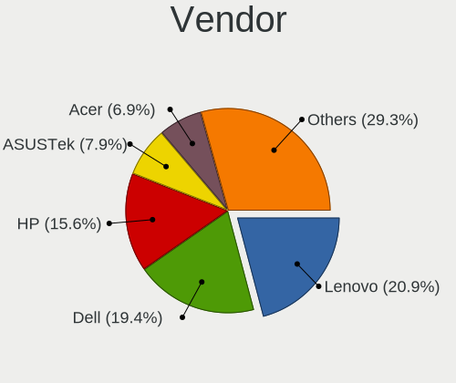
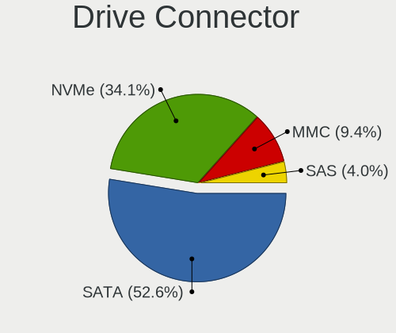
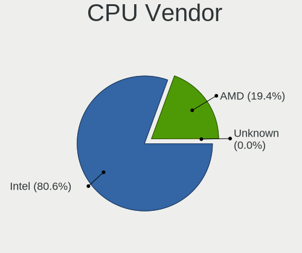
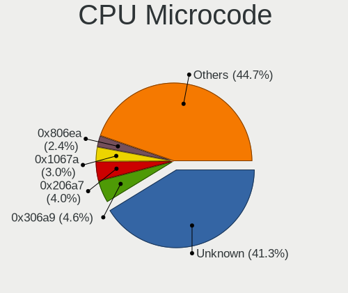
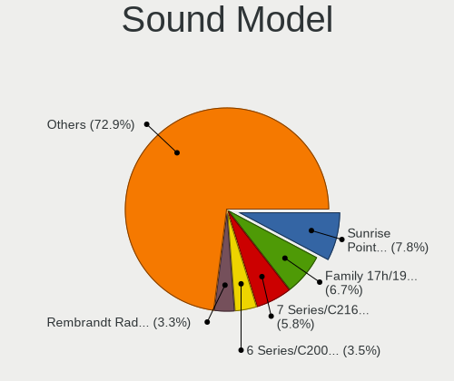

Linux in UK - Tested Hardware & Statistics (Notebooks)
------------------------------------------------------

A project to collect tested hardware configurations for Linux in UK.

Anyone can contribute to this report by the [hw-probe](https://github.com/linuxhw/hw-probe) tool:

    sudo -E hw-probe -all -upload

Please contribute! Especially if your hardware is rare.

Contents
--------

* [ Test Cases ](#test-cases)

* [ System ](#system)
  - [ OS                       ](#os)
  - [ OS Family                ](#os-family)
  - [ Kernel                   ](#kernel)
  - [ Kernel Family            ](#kernel-family)
  - [ Kernel Major Ver.        ](#kernel-major-ver)
  - [ Arch                     ](#arch)
  - [ DE                       ](#de)
  - [ Display Server           ](#display-server)
  - [ Display Manager          ](#display-manager)
  - [ OS Lang                  ](#os-lang)
  - [ Boot Mode                ](#boot-mode)
  - [ Filesystem               ](#filesystem)
  - [ Part. scheme             ](#part-scheme)
  - [ Dual Boot with Linux/BSD ](#dual-boot-with-linuxbsd)
  - [ Dual Boot (Win)          ](#dual-boot-win)

* [ Board ](#board)
  - [ Vendor                   ](#vendor)
  - [ Model                    ](#model)
  - [ Model Family             ](#model-family)
  - [ MFG Year                 ](#mfg-year)
  - [ Form Factor              ](#form-factor)
  - [ Secure Boot              ](#secure-boot)
  - [ Coreboot                 ](#coreboot)
  - [ RAM Size                 ](#ram-size)
  - [ RAM Used                 ](#ram-used)
  - [ Total Drives             ](#total-drives)
  - [ Has CD-ROM               ](#has-cd-rom)
  - [ Has Ethernet             ](#has-ethernet)
  - [ Has WiFi                 ](#has-wifi)
  - [ Has Bluetooth            ](#has-bluetooth)

* [ Location ](#location)
  - [ Country                  ](#country)
  - [ City                     ](#city)

* [ Drives ](#drives)
  - [ Drive Vendor             ](#drive-vendor)
  - [ Drive Model              ](#drive-model)
  - [ HDD Vendor               ](#hdd-vendor)
  - [ SSD Vendor               ](#ssd-vendor)
  - [ Drive Kind               ](#drive-kind)
  - [ Drive Connector          ](#drive-connector)
  - [ Drive Size               ](#drive-size)
  - [ Space Total              ](#space-total)
  - [ Space Used               ](#space-used)
  - [ Malfunc. Drives          ](#malfunc-drives)
  - [ Malfunc. Drive Vendor    ](#malfunc-drive-vendor)
  - [ Malfunc. HDD Vendor      ](#malfunc-hdd-vendor)
  - [ Malfunc. Drive Kind      ](#malfunc-drive-kind)
  - [ Failed Drives            ](#failed-drives)
  - [ Failed Drive Vendor      ](#failed-drive-vendor)
  - [ Drive Status             ](#drive-status)

* [ Storage controller ](#storage-controller)
  - [ Storage Vendor           ](#storage-vendor)
  - [ Storage Model            ](#storage-model)
  - [ Storage Kind             ](#storage-kind)

* [ Processor ](#processor)
  - [ CPU Vendor               ](#cpu-vendor)
  - [ CPU Model                ](#cpu-model)
  - [ CPU Model Family         ](#cpu-model-family)
  - [ CPU Cores                ](#cpu-cores)
  - [ CPU Sockets              ](#cpu-sockets)
  - [ CPU Threads              ](#cpu-threads)
  - [ CPU Op-Modes             ](#cpu-op-modes)
  - [ CPU Microcode            ](#cpu-microcode)
  - [ CPU Microarch            ](#cpu-microarch)

* [ Graphics ](#graphics)
  - [ GPU Vendor               ](#gpu-vendor)
  - [ GPU Model                ](#gpu-model)
  - [ GPU Combo                ](#gpu-combo)
  - [ GPU Driver               ](#gpu-driver)
  - [ GPU Memory               ](#gpu-memory)

* [ Monitor ](#monitor)
  - [ Monitor Vendor           ](#monitor-vendor)
  - [ Monitor Model            ](#monitor-model)
  - [ Monitor Resolution       ](#monitor-resolution)
  - [ Monitor Diagonal         ](#monitor-diagonal)
  - [ Monitor Width            ](#monitor-width)
  - [ Aspect Ratio             ](#aspect-ratio)
  - [ Monitor Area             ](#monitor-area)
  - [ Pixel Density            ](#pixel-density)
  - [ Multiple Monitors        ](#multiple-monitors)

* [ Network ](#network)
  - [ Net Controller Vendor    ](#net-controller-vendor)
  - [ Net Controller Model     ](#net-controller-model)
  - [ Wireless Vendor          ](#wireless-vendor)
  - [ Wireless Model           ](#wireless-model)
  - [ Ethernet Vendor          ](#ethernet-vendor)
  - [ Ethernet Model           ](#ethernet-model)
  - [ Net Controller Kind      ](#net-controller-kind)
  - [ Used Controller          ](#used-controller)
  - [ NICs                     ](#nics)
  - [ IPv6                     ](#ipv6)

* [ Bluetooth ](#bluetooth)
  - [ Bluetooth Vendor         ](#bluetooth-vendor)
  - [ Bluetooth Model          ](#bluetooth-model)

* [ Sound ](#sound)
  - [ Sound Vendor             ](#sound-vendor)
  - [ Sound Model              ](#sound-model)

* [ Memory ](#memory)
  - [ Memory Vendor            ](#memory-vendor)
  - [ Memory Model             ](#memory-model)
  - [ Memory Kind              ](#memory-kind)
  - [ Memory Form Factor       ](#memory-form-factor)
  - [ Memory Size              ](#memory-size)
  - [ Memory Speed             ](#memory-speed)

* [ Printers & scanners ](#printers--scanners)
  - [ Printer Vendor           ](#printer-vendor)
  - [ Printer Model            ](#printer-model)
  - [ Scanner Vendor           ](#scanner-vendor)
  - [ Scanner Model            ](#scanner-model)

* [ Camera ](#camera)
  - [ Camera Vendor            ](#camera-vendor)
  - [ Camera Model             ](#camera-model)

* [ Security ](#security)
  - [ Fingerprint Vendor       ](#fingerprint-vendor)
  - [ Fingerprint Model        ](#fingerprint-model)
  - [ Chipcard Vendor          ](#chipcard-vendor)
  - [ Chipcard Model           ](#chipcard-model)

* [ Unsupported ](#unsupported)
  - [ Unsupported Devices      ](#unsupported-devices)
  - [ Unsupported Device Types ](#unsupported-device-types)

Test Cases
----------

Total: 5455

| Vendor        | Model                       | Probe                                                      | Date         |
|---------------|-----------------------------|------------------------------------------------------------|--------------|
| Lenovo        | ThinkPad W500 4058CTO       | [4b6aa9a912](https://linux-hardware.org/?probe=4b6aa9a912) | Jun 10, 2023 |
| HP            | ProBook 4510s               | [43a29ea83e](https://linux-hardware.org/?probe=43a29ea83e) | Jun 09, 2023 |
| Dell          | XPS 13 9333                 | [88020aee75](https://linux-hardware.org/?probe=88020aee75) | Jun 09, 2023 |
| Dell          | Inspiron 3583               | [adcb3b193a](https://linux-hardware.org/?probe=adcb3b193a) | Jun 09, 2023 |
| HP            | 255 15.6 inch G9 Noteboo... | [50c36acc0d](https://linux-hardware.org/?probe=50c36acc0d) | Jun 09, 2023 |
| Lenovo        | Z50-70 20354                | [28a5b69096](https://linux-hardware.org/?probe=28a5b69096) | Jun 08, 2023 |
| PC Special... | Initia Ii 15                | [36a16c2890](https://linux-hardware.org/?probe=36a16c2890) | Jun 08, 2023 |
| HONOR         | NBR-WAX9                    | [697f2b18e8](https://linux-hardware.org/?probe=697f2b18e8) | Jun 08, 2023 |
| Toshiba       | Satellite Pro C50-A-1E6     | [4614addc21](https://linux-hardware.org/?probe=4614addc21) | Jun 08, 2023 |
| Acer          | Aspire A317-53              | [62418abec4](https://linux-hardware.org/?probe=62418abec4) | Jun 08, 2023 |
| Lenovo        | IdeaPad 110S-11IBR 80WG     | [340054cdd5](https://linux-hardware.org/?probe=340054cdd5) | Jun 08, 2023 |
| HP            | 255 15.6 inch G9 Noteboo... | [73fa9d854f](https://linux-hardware.org/?probe=73fa9d854f) | Jun 07, 2023 |
| Dell          | XPS 9320                    | [ff5fc17acc](https://linux-hardware.org/?probe=ff5fc17acc) | Jun 07, 2023 |
| Valve         | Jupiter                     | [27771c5ea8](https://linux-hardware.org/?probe=27771c5ea8) | Jun 07, 2023 |
| Lenovo        | ThinkPad X61 7674GS3        | [629a290a98](https://linux-hardware.org/?probe=629a290a98) | Jun 07, 2023 |
| Sony          | VPCEH3N6E                   | [788ddd35a8](https://linux-hardware.org/?probe=788ddd35a8) | Jun 06, 2023 |
| ASUSTek       | VivoBook_ASUSLaptop M160... | [e4335c33f6](https://linux-hardware.org/?probe=e4335c33f6) | Jun 06, 2023 |
| Valve         | Jupiter                     | [99a7a5bd6e](https://linux-hardware.org/?probe=99a7a5bd6e) | Jun 06, 2023 |
| Lenovo        | ThinkPad T540p 20BE003YU... | [413ef09459](https://linux-hardware.org/?probe=413ef09459) | Jun 05, 2023 |
| Dell          | XPS 13 9305                 | [78459738e9](https://linux-hardware.org/?probe=78459738e9) | Jun 05, 2023 |
| HP            | Pavilion Laptop 15-eh0xx... | [b969b91080](https://linux-hardware.org/?probe=b969b91080) | Jun 05, 2023 |
| Acer          | Aspire A317-53              | [693fdb51d3](https://linux-hardware.org/?probe=693fdb51d3) | Jun 05, 2023 |
| Dell          | Latitude E5250              | [e85c6a09d1](https://linux-hardware.org/?probe=e85c6a09d1) | Jun 04, 2023 |
| Apple         | MacBookPro8,1               | [e3f89d1faa](https://linux-hardware.org/?probe=e3f89d1faa) | Jun 04, 2023 |
| MSI           | Katana GF66 11UG            | [d50f02e996](https://linux-hardware.org/?probe=d50f02e996) | Jun 04, 2023 |
| HP            | Compaq Presario CQ60        | [5716ed966d](https://linux-hardware.org/?probe=5716ed966d) | Jun 04, 2023 |
| HP            | Compaq Presario CQ60        | [a3d127e3ba](https://linux-hardware.org/?probe=a3d127e3ba) | Jun 04, 2023 |
| Dell          | Latitude E5520              | [7e2d1fdd22](https://linux-hardware.org/?probe=7e2d1fdd22) | Jun 04, 2023 |
| Apple         | MacBookPro12,1              | [fc6e3f084f](https://linux-hardware.org/?probe=fc6e3f084f) | Jun 04, 2023 |
| Acer          | Swift SF314-512             | [f39742476c](https://linux-hardware.org/?probe=f39742476c) | Jun 04, 2023 |
| Acer          | Swift SF314-512             | [efa49bf468](https://linux-hardware.org/?probe=efa49bf468) | Jun 04, 2023 |
| Dell          | Latitude 5420               | [9085f3c8f7](https://linux-hardware.org/?probe=9085f3c8f7) | Jun 04, 2023 |
| Apple         | MacBookPro12,1              | [a9c6f5e0e6](https://linux-hardware.org/?probe=a9c6f5e0e6) | Jun 04, 2023 |
| HP            | Notebook                    | [45553d6493](https://linux-hardware.org/?probe=45553d6493) | Jun 04, 2023 |
| Acer          | Aspire A317-53              | [406fc17c32](https://linux-hardware.org/?probe=406fc17c32) | Jun 04, 2023 |
| HP            | Stream Laptop 14-cb0XX      | [83967c7908](https://linux-hardware.org/?probe=83967c7908) | Jun 04, 2023 |
| Fujitsu Si... | LIFEBOOK S7110              | [9161ac00ce](https://linux-hardware.org/?probe=9161ac00ce) | Jun 04, 2023 |
| HP            | Pavilion 15                 | [dc8f67bb03](https://linux-hardware.org/?probe=dc8f67bb03) | Jun 03, 2023 |
| Apple         | MacBookPro8,1               | [7bdff81d7d](https://linux-hardware.org/?probe=7bdff81d7d) | Jun 03, 2023 |
| Valve         | Jupiter                     | [e7409e91d9](https://linux-hardware.org/?probe=e7409e91d9) | Jun 03, 2023 |
| Sony          | SVF1521A1EW                 | [4e3fe0308e](https://linux-hardware.org/?probe=4e3fe0308e) | Jun 02, 2023 |
| Lenovo        | ThinkPad X1 Carbon 4th 2... | [1b82c0c3c8](https://linux-hardware.org/?probe=1b82c0c3c8) | Jun 02, 2023 |
| Lenovo        | ThinkPad X61 7674GS3        | [194299200c](https://linux-hardware.org/?probe=194299200c) | Jun 01, 2023 |
| Toshiba       | Satellite C50-B             | [1a6c37d8f7](https://linux-hardware.org/?probe=1a6c37d8f7) | Jun 01, 2023 |
| Toshiba       | TECRA Z40t-C                | [f3dc10c852](https://linux-hardware.org/?probe=f3dc10c852) | Jun 01, 2023 |
| Toshiba       | TECRA Z40t-C                | [1d128e6153](https://linux-hardware.org/?probe=1d128e6153) | Jun 01, 2023 |
| HP            | EliteBook 2560p             | [e822eb4072](https://linux-hardware.org/?probe=e822eb4072) | Jun 01, 2023 |
| Dell          | Inspiron 5558               | [5f63504f03](https://linux-hardware.org/?probe=5f63504f03) | May 31, 2023 |
| Dell          | Inspiron 5593               | [ac6f421fef](https://linux-hardware.org/?probe=ac6f421fef) | May 31, 2023 |
| Lenovo        | IdeaPad L340-17IRH Gamin... | [8092b65afc](https://linux-hardware.org/?probe=8092b65afc) | May 31, 2023 |
| Acer          | Aspire ES1-512              | [3c6e8b6acd](https://linux-hardware.org/?probe=3c6e8b6acd) | May 29, 2023 |
| Acer          | Aspire A317-53              | [bca463af6d](https://linux-hardware.org/?probe=bca463af6d) | May 28, 2023 |
| Valve         | Jupiter                     | [66bff91fdb](https://linux-hardware.org/?probe=66bff91fdb) | May 28, 2023 |
| ASUSTek       | VivoBook_ASUSLaptop X513... | [1fde8a9c8c](https://linux-hardware.org/?probe=1fde8a9c8c) | May 28, 2023 |
| Acer          | Aspire E5-575               | [cdc924595c](https://linux-hardware.org/?probe=cdc924595c) | May 28, 2023 |
| Dell          | Latitude D630               | [ead768adbd](https://linux-hardware.org/?probe=ead768adbd) | May 27, 2023 |
| ASUSTek       | X550CA                      | [3ad8935a92](https://linux-hardware.org/?probe=3ad8935a92) | May 27, 2023 |
| Apple         | MacBookPro15,4              | [9ee2d1266b](https://linux-hardware.org/?probe=9ee2d1266b) | May 27, 2023 |
| Dell          | Inspiron 3505               | [ce0ecf0cce](https://linux-hardware.org/?probe=ce0ecf0cce) | May 27, 2023 |
| Lenovo        | ThinkPad L470 W10DG 20JU... | [0696598319](https://linux-hardware.org/?probe=0696598319) | May 26, 2023 |
| HP            | ENVY Laptop 13-ah0503na     | [cdf2d7b4b4](https://linux-hardware.org/?probe=cdf2d7b4b4) | May 25, 2023 |
| Lenovo        | IdeaPad 500-15ISK 80NT      | [a88cd7c5a6](https://linux-hardware.org/?probe=a88cd7c5a6) | May 25, 2023 |
| Dell          | XPS 15 9560                 | [7389c979b6](https://linux-hardware.org/?probe=7389c979b6) | May 25, 2023 |
| Dell          | Latitude 5521               | [b33afe1463](https://linux-hardware.org/?probe=b33afe1463) | May 25, 2023 |
| Dell          | Latitude 5290 2-in-1        | [6607361205](https://linux-hardware.org/?probe=6607361205) | May 25, 2023 |
| Dell          | Latitude 5290 2-in-1        | [4bbba2e730](https://linux-hardware.org/?probe=4bbba2e730) | May 25, 2023 |
| Dell          | Latitude 7390               | [999bb94a31](https://linux-hardware.org/?probe=999bb94a31) | May 24, 2023 |
| Lenovo        | ThinkPad T431s 20ACA01V0... | [253f7d5359](https://linux-hardware.org/?probe=253f7d5359) | May 24, 2023 |
| Lenovo        | ThinkPad W530 24472BG       | [6431c2bb45](https://linux-hardware.org/?probe=6431c2bb45) | May 24, 2023 |
| Lenovo        | ThinkPad T470s 20HGS4RU0... | [ac8df81694](https://linux-hardware.org/?probe=ac8df81694) | May 23, 2023 |
| Lenovo        | ThinkPad Z13 Gen 1 21D2C... | [2cf9c98869](https://linux-hardware.org/?probe=2cf9c98869) | May 23, 2023 |
| Lenovo        | ThinkPad Z13 Gen 1 21D2C... | [4da667cc7e](https://linux-hardware.org/?probe=4da667cc7e) | May 23, 2023 |
| HP            | Notebook                    | [6e7c128799](https://linux-hardware.org/?probe=6e7c128799) | May 23, 2023 |
| Lenovo        | ThinkPad L440 20AS001CUK    | [8d253e2d7e](https://linux-hardware.org/?probe=8d253e2d7e) | May 22, 2023 |
| Acer          | Aspire A317-53              | [185b65bf34](https://linux-hardware.org/?probe=185b65bf34) | May 22, 2023 |
| ASUSTek       | ASUS TUF Dash F15 FX517Z... | [5e89fe1dc9](https://linux-hardware.org/?probe=5e89fe1dc9) | May 22, 2023 |
| Unknown       | Unknown                     | [2b3ef0afc4](https://linux-hardware.org/?probe=2b3ef0afc4) | May 22, 2023 |
| Valve         | Jupiter                     | [c7f1f9d62a](https://linux-hardware.org/?probe=c7f1f9d62a) | May 22, 2023 |
| HP            | Pavilion 15                 | [548626d011](https://linux-hardware.org/?probe=548626d011) | May 21, 2023 |
| HP            | Pavilion 15                 | [05f3c4f274](https://linux-hardware.org/?probe=05f3c4f274) | May 21, 2023 |
| Apple         | MacBook4,1                  | [d404dc5e03](https://linux-hardware.org/?probe=d404dc5e03) | May 21, 2023 |
| Lenovo        | ThinkBook 14 G5+ ARP 21H... | [5a30bf445a](https://linux-hardware.org/?probe=5a30bf445a) | May 21, 2023 |
| ASUSTek       | X705UDR                     | [e1f2bf110a](https://linux-hardware.org/?probe=e1f2bf110a) | May 20, 2023 |
| Dell          | Latitude 7280               | [9b98a88e3d](https://linux-hardware.org/?probe=9b98a88e3d) | May 19, 2023 |
| Apple         | MacBookPro15,2              | [d52cf51575](https://linux-hardware.org/?probe=d52cf51575) | May 19, 2023 |
| Eii           | WSA116                      | [cff66832fd](https://linux-hardware.org/?probe=cff66832fd) | May 19, 2023 |
| Lenovo        | ThinkPad X240 20AMA21D00    | [a692a56bc0](https://linux-hardware.org/?probe=a692a56bc0) | May 19, 2023 |
| Advent        | Roma                        | [f6ca4c331a](https://linux-hardware.org/?probe=f6ca4c331a) | May 19, 2023 |
| Dell          | XPS 15 9550                 | [c2f9737977](https://linux-hardware.org/?probe=c2f9737977) | May 19, 2023 |
| Entroware     | Kratos                      | [ecf875b8e5](https://linux-hardware.org/?probe=ecf875b8e5) | May 18, 2023 |
| ASUSTek       | ROG Strix G513QY_G513QY     | [7c4f12c4ed](https://linux-hardware.org/?probe=7c4f12c4ed) | May 18, 2023 |
| Acer          | Swift SFX14-51G             | [644878287e](https://linux-hardware.org/?probe=644878287e) | May 18, 2023 |
| Toshiba       | Satellite Pro C50-A-1E6     | [3c8dcfcf15](https://linux-hardware.org/?probe=3c8dcfcf15) | May 18, 2023 |
| HP            | EliteBook 840 G8 Noteboo... | [ba813a3367](https://linux-hardware.org/?probe=ba813a3367) | May 18, 2023 |
| Acer          | Aspire A514-55              | [e096b3a75c](https://linux-hardware.org/?probe=e096b3a75c) | May 18, 2023 |
| Apple         | MacBookPro11,1              | [d23967583a](https://linux-hardware.org/?probe=d23967583a) | May 18, 2023 |
| HP            | EliteBook 8770w             | [d4884bd764](https://linux-hardware.org/?probe=d4884bd764) | May 17, 2023 |
| HP            | Laptop 15s-fq4xxx           | [c6d11a2f8e](https://linux-hardware.org/?probe=c6d11a2f8e) | May 17, 2023 |
| Google        | Samus                       | [d627862e56](https://linux-hardware.org/?probe=d627862e56) | May 16, 2023 |
| eMachines     | E625                        | [8638b2b8c8](https://linux-hardware.org/?probe=8638b2b8c8) | May 15, 2023 |
| Lenovo        | ThinkPad L512 44444WG       | [1bf9f3a0df](https://linux-hardware.org/?probe=1bf9f3a0df) | May 15, 2023 |
| Acer          | Extensa 215-52              | [83f139d228](https://linux-hardware.org/?probe=83f139d228) | May 15, 2023 |
| HUAWEI        | BOHB-WAX9                   | [98ebdcd589](https://linux-hardware.org/?probe=98ebdcd589) | May 15, 2023 |
| ASUSTek       | ROG Strix G513QY_G513QY     | [4b1b35b4ec](https://linux-hardware.org/?probe=4b1b35b4ec) | May 15, 2023 |
| Dell          | Inspiron 5405               | [9d3ae56a5e](https://linux-hardware.org/?probe=9d3ae56a5e) | May 15, 2023 |
| Lenovo        | ThinkPad Edge E530 3259C... | [cd0a78ce39](https://linux-hardware.org/?probe=cd0a78ce39) | May 14, 2023 |
| Lenovo        | ThinkPad T480 20L6A0XKUK    | [8921a6d64e](https://linux-hardware.org/?probe=8921a6d64e) | May 14, 2023 |
| Valve         | Jupiter                     | [6df9aa02d5](https://linux-hardware.org/?probe=6df9aa02d5) | May 14, 2023 |
| Lenovo        | ThinkPad P16s Gen 1 21CK... | [162219b0fe](https://linux-hardware.org/?probe=162219b0fe) | May 14, 2023 |
| ASUSTek       | X510UQR                     | [2062004d5f](https://linux-hardware.org/?probe=2062004d5f) | May 14, 2023 |
| HP            | Pavilion dv6                | [46e74189f2](https://linux-hardware.org/?probe=46e74189f2) | May 13, 2023 |
| PC Special... | P65_67RSRP                  | [892b6d56c8](https://linux-hardware.org/?probe=892b6d56c8) | May 13, 2023 |
| Dell          | G7 7700                     | [6568ba5b4d](https://linux-hardware.org/?probe=6568ba5b4d) | May 13, 2023 |
| ASUSTek       | X580VD                      | [971b7bfcd1](https://linux-hardware.org/?probe=971b7bfcd1) | May 12, 2023 |
| Lenovo        | IdeaPad Y700-15ISK 80NV     | [8bad0045f6](https://linux-hardware.org/?probe=8bad0045f6) | May 12, 2023 |
| Lenovo        | IdeaPad Y700-15ISK 80NV     | [78e2c8b948](https://linux-hardware.org/?probe=78e2c8b948) | May 12, 2023 |
| Valve         | Jupiter                     | [01ee28074b](https://linux-hardware.org/?probe=01ee28074b) | May 12, 2023 |
| HP            | EliteBook 840 G8 Noteboo... | [f9c1eb381f](https://linux-hardware.org/?probe=f9c1eb381f) | May 11, 2023 |
| Toshiba       | Satellite C75-A             | [5be756cc91](https://linux-hardware.org/?probe=5be756cc91) | May 11, 2023 |
| Acer          | Swift SFX14-51G             | [e18646482f](https://linux-hardware.org/?probe=e18646482f) | May 11, 2023 |
| Dell          | Latitude 7390               | [ab2ea4f7a0](https://linux-hardware.org/?probe=ab2ea4f7a0) | May 11, 2023 |
| ASUSTek       | VivoBook_ASUSLaptop X513... | [a7155be531](https://linux-hardware.org/?probe=a7155be531) | May 11, 2023 |
| HP            | Pavilion dv7                | [794d198929](https://linux-hardware.org/?probe=794d198929) | May 10, 2023 |
| Acer          | Aspire E3-111               | [1060697095](https://linux-hardware.org/?probe=1060697095) | May 10, 2023 |
| Lenovo        | ThinkPad T450s 20BWS34A0... | [775c2839fa](https://linux-hardware.org/?probe=775c2839fa) | May 10, 2023 |
| Dell          | Latitude 5420               | [2f3519c123](https://linux-hardware.org/?probe=2f3519c123) | May 09, 2023 |
| Sony          | SVT1312B4E                  | [dc0f581bc3](https://linux-hardware.org/?probe=dc0f581bc3) | May 09, 2023 |
| Lenovo        | ThinkPad X1 Carbon Gen 1... | [0628913a60](https://linux-hardware.org/?probe=0628913a60) | May 08, 2023 |
| HP            | EliteBook 855 G7 Noteboo... | [6e086ec096](https://linux-hardware.org/?probe=6e086ec096) | May 07, 2023 |
| Google        | Auron_Yuna                  | [cbd0938f3c](https://linux-hardware.org/?probe=cbd0938f3c) | May 07, 2023 |
| Dell          | Inspiron 13-7359            | [30bd232e19](https://linux-hardware.org/?probe=30bd232e19) | May 07, 2023 |
| Dell          | Inspiron 13-7359            | [923397bc88](https://linux-hardware.org/?probe=923397bc88) | May 07, 2023 |
| Lenovo        | V110-15IKB 80TH             | [a908ca11db](https://linux-hardware.org/?probe=a908ca11db) | May 07, 2023 |
| HP            | x2 210                      | [f60c4cb29b](https://linux-hardware.org/?probe=f60c4cb29b) | May 07, 2023 |
| HP            | x2 210                      | [f7a174063f](https://linux-hardware.org/?probe=f7a174063f) | May 07, 2023 |
| HP            | x2 210                      | [b3c5b71d27](https://linux-hardware.org/?probe=b3c5b71d27) | May 07, 2023 |
| Dell          | Latitude E7440              | [e49cf2551c](https://linux-hardware.org/?probe=e49cf2551c) | May 07, 2023 |
| Lenovo        | G50-80 80L0                 | [af42781d8a](https://linux-hardware.org/?probe=af42781d8a) | May 06, 2023 |
| Dell          | Studio 1749                 | [43eb37cfd7](https://linux-hardware.org/?probe=43eb37cfd7) | May 06, 2023 |
| Dell          | Latitude E4200              | [af2baa1787](https://linux-hardware.org/?probe=af2baa1787) | May 06, 2023 |
| Google        | Samus                       | [aed9bd140f](https://linux-hardware.org/?probe=aed9bd140f) | May 06, 2023 |
| Lenovo        | ThinkPad T540p 20BE003YU... | [a7ef6c976c](https://linux-hardware.org/?probe=a7ef6c976c) | May 06, 2023 |
| Dell          | XPS 15 9560                 | [644110c9b9](https://linux-hardware.org/?probe=644110c9b9) | May 06, 2023 |
| MSI           | GS43VR 7RE                  | [4eb5973faa](https://linux-hardware.org/?probe=4eb5973faa) | May 06, 2023 |
| HP            | Laptop 17-ca1xxx            | [5c506f94e0](https://linux-hardware.org/?probe=5c506f94e0) | May 05, 2023 |
| Lenovo        | ThinkPad L512 44444WG       | [db330cab38](https://linux-hardware.org/?probe=db330cab38) | May 05, 2023 |
| Dell          | Inspiron 3505               | [8e19b0629d](https://linux-hardware.org/?probe=8e19b0629d) | May 05, 2023 |
| Dell          | Latitude 5400               | [f7f8025263](https://linux-hardware.org/?probe=f7f8025263) | May 05, 2023 |
| Medion        | Akoya E1317T                | [e8eb05a52a](https://linux-hardware.org/?probe=e8eb05a52a) | May 05, 2023 |
| Lenovo        | ThinkBook 13s-IML 20RR      | [624e1c3f06](https://linux-hardware.org/?probe=624e1c3f06) | May 05, 2023 |
| Acer          | Extensa 215-52              | [d4d069aa0c](https://linux-hardware.org/?probe=d4d069aa0c) | May 04, 2023 |
| Google        | Samus                       | [a7dfa29233](https://linux-hardware.org/?probe=a7dfa29233) | May 04, 2023 |
| HP            | ZBook Firefly 16 inch G9... | [c20844716d](https://linux-hardware.org/?probe=c20844716d) | May 03, 2023 |
| HP            | EliteBook 840 G3            | [f87b1ac774](https://linux-hardware.org/?probe=f87b1ac774) | May 03, 2023 |
| HP            | EliteBook 840 G3            | [d8b268f8f7](https://linux-hardware.org/?probe=d8b268f8f7) | May 03, 2023 |
| MSI           | CX62 6QD                    | [9c6b781beb](https://linux-hardware.org/?probe=9c6b781beb) | May 02, 2023 |
| Valve         | Jupiter                     | [388caab99a](https://linux-hardware.org/?probe=388caab99a) | May 02, 2023 |
| Acer          | Aspire A317-53              | [612ab58d3f](https://linux-hardware.org/?probe=612ab58d3f) | May 02, 2023 |
| Lenovo        | IdeaPad L340-17IRH Gamin... | [26bb61d72f](https://linux-hardware.org/?probe=26bb61d72f) | May 02, 2023 |
| Toshiba       | PORTEGE Z30-A               | [ccc620956f](https://linux-hardware.org/?probe=ccc620956f) | May 02, 2023 |
| Advent        | Roma                        | [ec7568545d](https://linux-hardware.org/?probe=ec7568545d) | May 02, 2023 |
| ASUSTek       | X401A1                      | [2a7d35cc4e](https://linux-hardware.org/?probe=2a7d35cc4e) | May 01, 2023 |
| HP            | ProBook 430 G4              | [3c422c5e96](https://linux-hardware.org/?probe=3c422c5e96) | May 01, 2023 |
| lapbook       | S15 PRO                     | [d4b7c4a4db](https://linux-hardware.org/?probe=d4b7c4a4db) | May 01, 2023 |
| Dell          | Precision 5530              | [c8878b0f0f](https://linux-hardware.org/?probe=c8878b0f0f) | May 01, 2023 |
| HP            | EliteBook 8470p             | [f75b4a9457](https://linux-hardware.org/?probe=f75b4a9457) | May 01, 2023 |
| Toshiba       | EQUIUM P200                 | [812a164a8a](https://linux-hardware.org/?probe=812a164a8a) | Apr 30, 2023 |
| Lenovo        | ThinkPad X230 2325V1K       | [d630569df9](https://linux-hardware.org/?probe=d630569df9) | Apr 30, 2023 |
| Lenovo        | ThinkPad L480 20LTS1NK27    | [dff6f75899](https://linux-hardware.org/?probe=dff6f75899) | Apr 30, 2023 |
| Lenovo        | ThinkPad E580 20KS001JUK    | [da5f050510](https://linux-hardware.org/?probe=da5f050510) | Apr 29, 2023 |
| Lenovo        | ThinkPad E580 20KS001JUK    | [1e65b46a12](https://linux-hardware.org/?probe=1e65b46a12) | Apr 29, 2023 |
| ASUSTek       | ASUS TUF Dash F15 FX517Z... | [f2ad30321e](https://linux-hardware.org/?probe=f2ad30321e) | Apr 29, 2023 |
| TUXEDO        | InfinityBook Pro 14 Gen6    | [58bb30861d](https://linux-hardware.org/?probe=58bb30861d) | Apr 29, 2023 |
| Lenovo        | IdeaPad 530S-14ARR 81H1     | [e70d66b3ba](https://linux-hardware.org/?probe=e70d66b3ba) | Apr 29, 2023 |
| HP            | Pavilion Laptop 14-dv0xx... | [d364cb5ac7](https://linux-hardware.org/?probe=d364cb5ac7) | Apr 28, 2023 |
| HP            | ENVY Notebook               | [89e8149d6e](https://linux-hardware.org/?probe=89e8149d6e) | Apr 28, 2023 |
| Samsung       | 950XCJ/951XCJ/950XCR        | [2dc65d8f07](https://linux-hardware.org/?probe=2dc65d8f07) | Apr 28, 2023 |
| Dell          | XPS 13 9350                 | [9d6905e35d](https://linux-hardware.org/?probe=9d6905e35d) | Apr 28, 2023 |
| Lenovo        | ThinkPad L480 20LTS1NK27    | [6569669912](https://linux-hardware.org/?probe=6569669912) | Apr 28, 2023 |
| Dell          | Latitude E7450              | [6afa2ff009](https://linux-hardware.org/?probe=6afa2ff009) | Apr 28, 2023 |
| Valve         | Jupiter                     | [0958caf898](https://linux-hardware.org/?probe=0958caf898) | Apr 27, 2023 |
| Lenovo        | Legion 7-16-ITHg6 82K6      | [2baf2cbc85](https://linux-hardware.org/?probe=2baf2cbc85) | Apr 27, 2023 |
| Lenovo        | ThinkPad X230 2325O32       | [b38ef1a717](https://linux-hardware.org/?probe=b38ef1a717) | Apr 27, 2023 |
| Acer          | Nitro AN515-57              | [d2ed10f8b1](https://linux-hardware.org/?probe=d2ed10f8b1) | Apr 27, 2023 |
| ASUSTek       | ASUS TUF Gaming A15 FA50... | [6704ecd3d3](https://linux-hardware.org/?probe=6704ecd3d3) | Apr 27, 2023 |
| ASUSTek       | ASUS TUF Gaming A15 FA50... | [4e8b00c534](https://linux-hardware.org/?probe=4e8b00c534) | Apr 27, 2023 |
| Lenovo        | IdeaPad Y510P 20217         | [e35780d356](https://linux-hardware.org/?probe=e35780d356) | Apr 26, 2023 |
| Acer          | Aspire A514-54              | [19ca73662f](https://linux-hardware.org/?probe=19ca73662f) | Apr 25, 2023 |
| Google        | Sasuke                      | [7615a1b1e5](https://linux-hardware.org/?probe=7615a1b1e5) | Apr 25, 2023 |
| Dell          | XPS 13 9380                 | [290a99fee9](https://linux-hardware.org/?probe=290a99fee9) | Apr 25, 2023 |
| HP            | ProBook 640 G1              | [9306db1f90](https://linux-hardware.org/?probe=9306db1f90) | Apr 25, 2023 |
| Dell          | Latitude XT2                | [62df7dc069](https://linux-hardware.org/?probe=62df7dc069) | Apr 24, 2023 |
| Dell          | Inspiron 5565               | [6622474d4b](https://linux-hardware.org/?probe=6622474d4b) | Apr 24, 2023 |
| Apple         | MacBookPro5,5               | [de825a326c](https://linux-hardware.org/?probe=de825a326c) | Apr 24, 2023 |
| Acer          | Aspire A317-53              | [c47ec3530e](https://linux-hardware.org/?probe=c47ec3530e) | Apr 24, 2023 |
| HP            | Stream Notebook PC 13       | [455c6b5e28](https://linux-hardware.org/?probe=455c6b5e28) | Apr 23, 2023 |
| HP            | Pavilion Laptop 15-eh0xx... | [982ca9079d](https://linux-hardware.org/?probe=982ca9079d) | Apr 23, 2023 |
| HUAWEI        | NBLK-WAX9X                  | [25e942e55c](https://linux-hardware.org/?probe=25e942e55c) | Apr 22, 2023 |
| Lenovo        | ThinkPad L15 Gen 3 21C3C... | [b37a4411c5](https://linux-hardware.org/?probe=b37a4411c5) | Apr 22, 2023 |
| TUXEDO        | Pulse 15 Gen2               | [fd2ad16b59](https://linux-hardware.org/?probe=fd2ad16b59) | Apr 22, 2023 |
| Lenovo        | ThinkPad 13 2nd Gen 20J1... | [936e6fc768](https://linux-hardware.org/?probe=936e6fc768) | Apr 22, 2023 |
| Lenovo        | ThinkPad 13 2nd Gen 20J1... | [e0763f0f69](https://linux-hardware.org/?probe=e0763f0f69) | Apr 22, 2023 |
| Lenovo        | Legion 7 15IMH05 81YT       | [2727f5c463](https://linux-hardware.org/?probe=2727f5c463) | Apr 21, 2023 |
| ASUSTek       | VivoBook_ASUSLaptop M760... | [a02462f614](https://linux-hardware.org/?probe=a02462f614) | Apr 21, 2023 |
| Lenovo        | IdeaPad Y700-15ISK 80NV     | [dfbfce9d2e](https://linux-hardware.org/?probe=dfbfce9d2e) | Apr 21, 2023 |
| Lenovo        | IdeaPad Y700-15ISK 80NV     | [66f95f2851](https://linux-hardware.org/?probe=66f95f2851) | Apr 21, 2023 |
| Google        | Swanky                      | [92156daf53](https://linux-hardware.org/?probe=92156daf53) | Apr 21, 2023 |
| Lenovo        | IdeaPad 3 15ADA05 81W1      | [2afe988f2e](https://linux-hardware.org/?probe=2afe988f2e) | Apr 20, 2023 |
| LG Electro... | 17Z90P-K.AA78A1             | [f8f6ec2123](https://linux-hardware.org/?probe=f8f6ec2123) | Apr 20, 2023 |
| ASUSTek       | X550CA                      | [cb5f73ff63](https://linux-hardware.org/?probe=cb5f73ff63) | Apr 20, 2023 |
| Lenovo        | ThinkPad T530 24292DG       | [1ba852f185](https://linux-hardware.org/?probe=1ba852f185) | Apr 20, 2023 |
| Dell          | Inspiron 1545               | [68a7470480](https://linux-hardware.org/?probe=68a7470480) | Apr 19, 2023 |
| HP            | ProBook 4540s               | [1bf512ee24](https://linux-hardware.org/?probe=1bf512ee24) | Apr 19, 2023 |
| Toshiba       | Satellite Pro C850-1HE      | [48d3d92f3d](https://linux-hardware.org/?probe=48d3d92f3d) | Apr 19, 2023 |
| Dell          | Vostro 5471                 | [5cbbc95995](https://linux-hardware.org/?probe=5cbbc95995) | Apr 19, 2023 |
| Dell          | G5 5590                     | [c7334114be](https://linux-hardware.org/?probe=c7334114be) | Apr 18, 2023 |
| Dell          | Inspiron 7559               | [9c66c608f3](https://linux-hardware.org/?probe=9c66c608f3) | Apr 18, 2023 |
| HP            | Laptop 15-da1xxx            | [c7a5aadd85](https://linux-hardware.org/?probe=c7a5aadd85) | Apr 18, 2023 |
| LG Electro... | 17Z90Q-K.AA78A1             | [594a7fa16b](https://linux-hardware.org/?probe=594a7fa16b) | Apr 18, 2023 |
| Sony          | SVF1521Q1EW                 | [4be523b9a9](https://linux-hardware.org/?probe=4be523b9a9) | Apr 18, 2023 |
| ASUSTek       | X550LD                      | [5c07d2203c](https://linux-hardware.org/?probe=5c07d2203c) | Apr 17, 2023 |
| Sony          | SVE1711C5E                  | [e4fbd8fca9](https://linux-hardware.org/?probe=e4fbd8fca9) | Apr 17, 2023 |
| Dell          | XPS 17 9700                 | [3ad1ee8197](https://linux-hardware.org/?probe=3ad1ee8197) | Apr 16, 2023 |
| ASUSTek       | ROG Flow X13 GV301QH_GV3... | [2092251807](https://linux-hardware.org/?probe=2092251807) | Apr 16, 2023 |
| ASUSTek       | ASUS TUF Gaming F15 FX50... | [9b05d61f11](https://linux-hardware.org/?probe=9b05d61f11) | Apr 16, 2023 |
| HP            | ProBook 450 G1              | [000e6c6702](https://linux-hardware.org/?probe=000e6c6702) | Apr 16, 2023 |
| HONOR         | BBR-WAX9                    | [a56688fd70](https://linux-hardware.org/?probe=a56688fd70) | Apr 16, 2023 |
| HONOR         | BBR-WAX9                    | [798405022f](https://linux-hardware.org/?probe=798405022f) | Apr 16, 2023 |
| HP            | 250 G4 Notebook PC          | [08036de728](https://linux-hardware.org/?probe=08036de728) | Apr 15, 2023 |
| Lenovo        | IdeaPad 1 14ADA05 82GW      | [2e860ef402](https://linux-hardware.org/?probe=2e860ef402) | Apr 15, 2023 |
| Acer          | Aspire A317-53              | [11b817e884](https://linux-hardware.org/?probe=11b817e884) | Apr 15, 2023 |
| Lenovo        | IdeaPad 5 Pro 16ARH7 82S... | [aedbc43074](https://linux-hardware.org/?probe=aedbc43074) | Apr 15, 2023 |
| HP            | Pavilion g6                 | [a918284993](https://linux-hardware.org/?probe=a918284993) | Apr 15, 2023 |
| Lenovo        | ThinkPad X1 Carbon 2nd 2... | [19fc60d2a5](https://linux-hardware.org/?probe=19fc60d2a5) | Apr 14, 2023 |
| Lenovo        | IdeaPad 3 17IML05 81WC      | [f5940f5ed5](https://linux-hardware.org/?probe=f5940f5ed5) | Apr 14, 2023 |
| Dell          | XPS 15 7590                 | [f3248c9bca](https://linux-hardware.org/?probe=f3248c9bca) | Apr 14, 2023 |
| Clevo         | W760T/M740T/M760T           | [0dfaa8f0e8](https://linux-hardware.org/?probe=0dfaa8f0e8) | Apr 14, 2023 |
| Unknown       | Unknown                     | [7bd7802e04](https://linux-hardware.org/?probe=7bd7802e04) | Apr 14, 2023 |
| HUAWEI        | MRG-WXX                     | [56c255e5f0](https://linux-hardware.org/?probe=56c255e5f0) | Apr 14, 2023 |
| Lenovo        | Flex 2-14 20404             | [c76a516113](https://linux-hardware.org/?probe=c76a516113) | Apr 14, 2023 |
| ASUSTek       | Zenbook UX3402ZA_UX3402Z... | [bd9c1c1e6d](https://linux-hardware.org/?probe=bd9c1c1e6d) | Apr 14, 2023 |
| HP            | Notebook                    | [79541411b2](https://linux-hardware.org/?probe=79541411b2) | Apr 14, 2023 |
| Unknown       | Unknown                     | [cfe1766d1a](https://linux-hardware.org/?probe=cfe1766d1a) | Apr 13, 2023 |
| Unknown       | Unknown                     | [7ff7c0642f](https://linux-hardware.org/?probe=7ff7c0642f) | Apr 13, 2023 |
| Acer          | Aspire A315-51              | [c3962286cb](https://linux-hardware.org/?probe=c3962286cb) | Apr 13, 2023 |
| HP            | EliteBook 840 G7 Noteboo... | [abf6dd7200](https://linux-hardware.org/?probe=abf6dd7200) | Apr 13, 2023 |
| ASUSTek       | TUF Gaming FX505DY_FX505... | [aa571700ad](https://linux-hardware.org/?probe=aa571700ad) | Apr 13, 2023 |
| Lenovo        | ThinkPad T530 24292DG       | [9ac01d9237](https://linux-hardware.org/?probe=9ac01d9237) | Apr 13, 2023 |
| Apple         | MacBookPro5,5               | [401c4d8143](https://linux-hardware.org/?probe=401c4d8143) | Apr 12, 2023 |
| Sony          | SVE1711C5E                  | [07c6f843fb](https://linux-hardware.org/?probe=07c6f843fb) | Apr 12, 2023 |
| Toshiba       | Satellite C660              | [551fabbc17](https://linux-hardware.org/?probe=551fabbc17) | Apr 12, 2023 |
| Dell          | XPS 13 9305                 | [48b143cc2f](https://linux-hardware.org/?probe=48b143cc2f) | Apr 12, 2023 |
| Google        | Gnawty                      | [ddb0fea339](https://linux-hardware.org/?probe=ddb0fea339) | Apr 12, 2023 |
| Dell          | Latitude E5450              | [f98cdf4da0](https://linux-hardware.org/?probe=f98cdf4da0) | Apr 11, 2023 |
| Dell          | Latitude E5450              | [7bf04cdb7d](https://linux-hardware.org/?probe=7bf04cdb7d) | Apr 11, 2023 |
| MSI           | Stealth 14Studio A13VF      | [8297ce2712](https://linux-hardware.org/?probe=8297ce2712) | Apr 11, 2023 |
| MSI           | Stealth 14Studio A13VF      | [e3fc8c8f43](https://linux-hardware.org/?probe=e3fc8c8f43) | Apr 11, 2023 |
| Gigabyte      | MMLP3AP-00                  | [6fd82ceaec](https://linux-hardware.org/?probe=6fd82ceaec) | Apr 09, 2023 |
| lapbook       | S15 PRO                     | [5a039fc6fb](https://linux-hardware.org/?probe=5a039fc6fb) | Apr 09, 2023 |
| Lenovo        | ThinkPad T61 7661WQQ        | [8def87668b](https://linux-hardware.org/?probe=8def87668b) | Apr 09, 2023 |
| HP            | EliteBook 2560p             | [bc5cbcd2cb](https://linux-hardware.org/?probe=bc5cbcd2cb) | Apr 09, 2023 |
| Lenovo        | ThinkPad T480 20L50000UK    | [9f2644807d](https://linux-hardware.org/?probe=9f2644807d) | Apr 09, 2023 |
| Dell          | Inspiron 7570               | [2bac711aba](https://linux-hardware.org/?probe=2bac711aba) | Apr 09, 2023 |
| Acer          | Aspire A317-53              | [7dc7e5e5c3](https://linux-hardware.org/?probe=7dc7e5e5c3) | Apr 09, 2023 |
| Acer          | Aspire A317-53              | [b1c4404d58](https://linux-hardware.org/?probe=b1c4404d58) | Apr 09, 2023 |
| Google        | Ampton                      | [e3945d7727](https://linux-hardware.org/?probe=e3945d7727) | Apr 08, 2023 |
| Lenovo        | Legion 7 16ACHg6 82N6       | [14a3d5f4be](https://linux-hardware.org/?probe=14a3d5f4be) | Apr 08, 2023 |
| Lenovo        | ThinkPad P51 W10DG 20MNS... | [5cf4615347](https://linux-hardware.org/?probe=5cf4615347) | Apr 08, 2023 |
| Lenovo        | ThinkPad X270 W10DG 20K5... | [aab830c5dd](https://linux-hardware.org/?probe=aab830c5dd) | Apr 07, 2023 |
| Google        | Bluebird                    | [6ab22238ac](https://linux-hardware.org/?probe=6ab22238ac) | Apr 07, 2023 |
| Apple         | MacBookPro13,3              | [77c6d48d6b](https://linux-hardware.org/?probe=77c6d48d6b) | Apr 06, 2023 |
| HP            | Laptop 15-db0xxx            | [e05bffcc8a](https://linux-hardware.org/?probe=e05bffcc8a) | Apr 06, 2023 |
| Apple         | MacBookPro14,1              | [e2b1578d42](https://linux-hardware.org/?probe=e2b1578d42) | Apr 06, 2023 |
| Apple         | MacBookPro14,1              | [2cd7831b58](https://linux-hardware.org/?probe=2cd7831b58) | Apr 06, 2023 |
| Google        | Bard                        | [cc1d159d0c](https://linux-hardware.org/?probe=cc1d159d0c) | Apr 05, 2023 |
| HP            | Pavilion Gaming Laptop 1... | [8bf7c8a569](https://linux-hardware.org/?probe=8bf7c8a569) | Apr 05, 2023 |
| Dell          | Latitude E5550              | [5527315153](https://linux-hardware.org/?probe=5527315153) | Apr 05, 2023 |
| Dell          | Latitude 5320               | [5549de9c5c](https://linux-hardware.org/?probe=5549de9c5c) | Apr 05, 2023 |
| Dell          | Latitude 5320               | [69e3bad969](https://linux-hardware.org/?probe=69e3bad969) | Apr 05, 2023 |
| Dell          | Latitude 5480               | [40ec4e3ec9](https://linux-hardware.org/?probe=40ec4e3ec9) | Apr 04, 2023 |
| Lenovo        | IdeaPad 320-15IAP 80XR      | [4e7cae1fde](https://linux-hardware.org/?probe=4e7cae1fde) | Apr 04, 2023 |
| Lenovo        | IdeaPad 330S-15AST 81F9     | [d79463ea93](https://linux-hardware.org/?probe=d79463ea93) | Apr 04, 2023 |
| Lenovo        | IdeaPad L340-15IRH Gamin... | [1af0b7675b](https://linux-hardware.org/?probe=1af0b7675b) | Apr 04, 2023 |
| Dell          | Studio 1558                 | [e9b75d657d](https://linux-hardware.org/?probe=e9b75d657d) | Apr 04, 2023 |
| Lenovo        | Brazos                      | [6415cb26c2](https://linux-hardware.org/?probe=6415cb26c2) | Apr 03, 2023 |
| Toshiba       | Satellite C650              | [190547d5cd](https://linux-hardware.org/?probe=190547d5cd) | Apr 03, 2023 |
| ASUSTek       | VivoBook_ASUSLaptop X513... | [d7f3280e60](https://linux-hardware.org/?probe=d7f3280e60) | Apr 03, 2023 |
| Advent        | Roma                        | [e1bd64e5b5](https://linux-hardware.org/?probe=e1bd64e5b5) | Apr 03, 2023 |
| Lenovo        | ThinkPad X270 W10DG 20K5... | [65cee818b6](https://linux-hardware.org/?probe=65cee818b6) | Apr 02, 2023 |
| Lenovo        | Legion Y530-15ICH-1060 8... | [36c7cf7a43](https://linux-hardware.org/?probe=36c7cf7a43) | Apr 02, 2023 |
| Lenovo        | ThinkPad P51 W10DG 20MNS... | [c7791aac7c](https://linux-hardware.org/?probe=c7791aac7c) | Apr 02, 2023 |
| Lenovo        | ThinkPad T460p 20FXS08N0... | [ffcf174547](https://linux-hardware.org/?probe=ffcf174547) | Apr 02, 2023 |
| Lenovo        | Legion 5P 15ARH05H 82GU     | [3ec9fed32b](https://linux-hardware.org/?probe=3ec9fed32b) | Apr 02, 2023 |
| Apple         | MacBook4,1                  | [dda3791c20](https://linux-hardware.org/?probe=dda3791c20) | Apr 01, 2023 |
| Eii           | WSA116                      | [00bf1c190b](https://linux-hardware.org/?probe=00bf1c190b) | Apr 01, 2023 |
| ASUSTek       | U6Sg                        | [4fc2057b02](https://linux-hardware.org/?probe=4fc2057b02) | Apr 01, 2023 |
| ASUSTek       | U6Sg                        | [c97f807bb0](https://linux-hardware.org/?probe=c97f807bb0) | Apr 01, 2023 |
| HP            | Notebook                    | [348d80772f](https://linux-hardware.org/?probe=348d80772f) | Apr 01, 2023 |
| Acer          | Aspire A715-41G             | [cea0d2797d](https://linux-hardware.org/?probe=cea0d2797d) | Apr 01, 2023 |
| Samsung       | R530/R730/R540              | [714ed0f007](https://linux-hardware.org/?probe=714ed0f007) | Apr 01, 2023 |
| Acer          | Nitro AN517-54              | [82d28ac7c0](https://linux-hardware.org/?probe=82d28ac7c0) | Apr 01, 2023 |
| Valve         | Jupiter                     | [2628ea9d8e](https://linux-hardware.org/?probe=2628ea9d8e) | Apr 01, 2023 |
| Novatech      | NL40_50CU                   | [caaa544589](https://linux-hardware.org/?probe=caaa544589) | Apr 01, 2023 |
| Valve         | Jupiter                     | [d5e7a881e6](https://linux-hardware.org/?probe=d5e7a881e6) | Mar 31, 2023 |
| Valve         | Jupiter                     | [5b3718d617](https://linux-hardware.org/?probe=5b3718d617) | Mar 31, 2023 |
| Lenovo        | IdeaPad 530S-14IKB 81EU     | [fe51f2c62f](https://linux-hardware.org/?probe=fe51f2c62f) | Mar 31, 2023 |
| Lenovo        | ThinkBook 15-IIL 20SM       | [31d333ecc9](https://linux-hardware.org/?probe=31d333ecc9) | Mar 30, 2023 |
| PC Special... | P65_67RSRP                  | [889f3e8521](https://linux-hardware.org/?probe=889f3e8521) | Mar 30, 2023 |
| ASUSTek       | ASUS TUF Gaming F17 FX70... | [492d575f31](https://linux-hardware.org/?probe=492d575f31) | Mar 30, 2023 |
| Lenovo        | ThinkPad T400 6475J92       | [1d3c812668](https://linux-hardware.org/?probe=1d3c812668) | Mar 30, 2023 |
| OEGStone      | W54_55SU1,SUW               | [a771622660](https://linux-hardware.org/?probe=a771622660) | Mar 29, 2023 |
| OEGStone      | W54_55SU1,SUW               | [1e0c5a90c9](https://linux-hardware.org/?probe=1e0c5a90c9) | Mar 29, 2023 |
| HP            | Laptop 14-bs0xx             | [53504486d2](https://linux-hardware.org/?probe=53504486d2) | Mar 29, 2023 |
| HP            | Laptop 15s-fq4xxx           | [029fa06a9a](https://linux-hardware.org/?probe=029fa06a9a) | Mar 29, 2023 |
| Dell          | Inspiron 5767               | [1c80487906](https://linux-hardware.org/?probe=1c80487906) | Mar 29, 2023 |
| Dell          | Latitude 7430               | [3f3b04c185](https://linux-hardware.org/?probe=3f3b04c185) | Mar 29, 2023 |
| Lenovo        | ThinkPad T460p 20HYSJKDO... | [1d24c2743f](https://linux-hardware.org/?probe=1d24c2743f) | Mar 29, 2023 |
| Valve         | Jupiter                     | [a63f5d9198](https://linux-hardware.org/?probe=a63f5d9198) | Mar 28, 2023 |
| Dell          | Inspiron 15-3567            | [d2b4780094](https://linux-hardware.org/?probe=d2b4780094) | Mar 28, 2023 |
| Dell          | Inspiron N5110              | [2b09d1f769](https://linux-hardware.org/?probe=2b09d1f769) | Mar 28, 2023 |
| HP            | Pavilion Laptop 14-dv0xx... | [f511f8bcb1](https://linux-hardware.org/?probe=f511f8bcb1) | Mar 28, 2023 |
| Samsung       | 530U3BI/530U4BI/530U4BH     | [384f58a6b1](https://linux-hardware.org/?probe=384f58a6b1) | Mar 27, 2023 |
| Dell          | Latitude 7280               | [409cf549eb](https://linux-hardware.org/?probe=409cf549eb) | Mar 27, 2023 |
| Dell          | XPS 15 7590                 | [aeec5e2588](https://linux-hardware.org/?probe=aeec5e2588) | Mar 26, 2023 |
| LG Electro... | 17Z90P-K.AA78A1             | [22e7978cc8](https://linux-hardware.org/?probe=22e7978cc8) | Mar 26, 2023 |
| LG Electro... | 17Z90P-K.AA78A1             | [f889f2ddf5](https://linux-hardware.org/?probe=f889f2ddf5) | Mar 26, 2023 |
| Dell          | Inspiron N5110              | [8fde777c54](https://linux-hardware.org/?probe=8fde777c54) | Mar 26, 2023 |
| Acer          | Nitro AN515-55              | [36d5ba7071](https://linux-hardware.org/?probe=36d5ba7071) | Mar 26, 2023 |
| LG Electro... | 16Z90Q-K.AA78A1             | [009542d035](https://linux-hardware.org/?probe=009542d035) | Mar 26, 2023 |
| HP            | Spectre Laptop 13-af0xx     | [6fdc683220](https://linux-hardware.org/?probe=6fdc683220) | Mar 25, 2023 |
| Samsung       | R530/R730/R540              | [7e37be5b8c](https://linux-hardware.org/?probe=7e37be5b8c) | Mar 25, 2023 |
| HP            | Pavilion Laptop 14-ce3xx... | [1ea635d2a0](https://linux-hardware.org/?probe=1ea635d2a0) | Mar 25, 2023 |
| HP            | Stream Notebook             | [b1ae4b8667](https://linux-hardware.org/?probe=b1ae4b8667) | Mar 25, 2023 |
| Dell          | Latitude E6420              | [2613e5a6ef](https://linux-hardware.org/?probe=2613e5a6ef) | Mar 25, 2023 |
| HUAWEI        | NBD-WXX9                    | [7eb3d40bd8](https://linux-hardware.org/?probe=7eb3d40bd8) | Mar 25, 2023 |
| Apple         | MacBook4,1                  | [7ade2b1d1a](https://linux-hardware.org/?probe=7ade2b1d1a) | Mar 24, 2023 |
| Dell          | Precision 3510              | [2ea0671f5d](https://linux-hardware.org/?probe=2ea0671f5d) | Mar 24, 2023 |
| ASUSTek       | ROG Strix G513IE_G513IE     | [bc6baa37ef](https://linux-hardware.org/?probe=bc6baa37ef) | Mar 24, 2023 |
| HP            | Pavilion 15                 | [32a0c3ec32](https://linux-hardware.org/?probe=32a0c3ec32) | Mar 23, 2023 |
| Notebook      | W510LU                      | [076125acc3](https://linux-hardware.org/?probe=076125acc3) | Mar 23, 2023 |
| Sony          | SVF1521Q1EW                 | [10d078d9e2](https://linux-hardware.org/?probe=10d078d9e2) | Mar 22, 2023 |
| Valve         | Jupiter                     | [8fc3d21cf8](https://linux-hardware.org/?probe=8fc3d21cf8) | Mar 22, 2023 |
| Dell          | XPS 13 9380                 | [9bfb72d26a](https://linux-hardware.org/?probe=9bfb72d26a) | Mar 21, 2023 |
| Samsung       | 530U3BI/530U4BI/530U4BH     | [1400f9afc9](https://linux-hardware.org/?probe=1400f9afc9) | Mar 20, 2023 |
| HP            | ProBook 645 G4              | [9c3ac61461](https://linux-hardware.org/?probe=9c3ac61461) | Mar 20, 2023 |
| HP            | ProBook 645 G4              | [10431e8027](https://linux-hardware.org/?probe=10431e8027) | Mar 20, 2023 |
| HP            | ZBook Power 15.6 inch G9... | [2ef051fd19](https://linux-hardware.org/?probe=2ef051fd19) | Mar 20, 2023 |
| Fujitsu Si... | AMILO Xi 3670               | [bb018988d6](https://linux-hardware.org/?probe=bb018988d6) | Mar 20, 2023 |
| Lenovo        | ThinkPad P15s Gen 2i 20W... | [c9c86f1e79](https://linux-hardware.org/?probe=c9c86f1e79) | Mar 20, 2023 |
| Lenovo        | ThinkPad P15s Gen 2i 20W... | [29a6e93a49](https://linux-hardware.org/?probe=29a6e93a49) | Mar 20, 2023 |
| Dell          | Latitude 5290 2-in-1        | [1840c57073](https://linux-hardware.org/?probe=1840c57073) | Mar 20, 2023 |
| Valve         | Jupiter                     | [8b7918d34b](https://linux-hardware.org/?probe=8b7918d34b) | Mar 20, 2023 |
| Sony          | VPCEH3N6E                   | [9de8a9a50a](https://linux-hardware.org/?probe=9de8a9a50a) | Mar 20, 2023 |
| Notebook      | PCx0Dx                      | [cd5adbbfc0](https://linux-hardware.org/?probe=cd5adbbfc0) | Mar 19, 2023 |
| Notebook      | N150ZU                      | [4b7d1e249f](https://linux-hardware.org/?probe=4b7d1e249f) | Mar 19, 2023 |
| Notebook      | PCx0Dx                      | [63a8165aff](https://linux-hardware.org/?probe=63a8165aff) | Mar 19, 2023 |
| Lenovo        | ThinkPad E560 20EV0010UK    | [f60325ef42](https://linux-hardware.org/?probe=f60325ef42) | Mar 19, 2023 |
| Dell          | Inspiron 15 7510            | [f7aebbae36](https://linux-hardware.org/?probe=f7aebbae36) | Mar 18, 2023 |
| Unknown       | Unknown                     | [e10e576833](https://linux-hardware.org/?probe=e10e576833) | Mar 18, 2023 |
| Unknown       | Unknown                     | [a791424f94](https://linux-hardware.org/?probe=a791424f94) | Mar 18, 2023 |
| Lenovo        | ThinkPad T410 2522AC1       | [49df72f291](https://linux-hardware.org/?probe=49df72f291) | Mar 18, 2023 |
| Lenovo        | ThinkPad T410 2522AC1       | [1f939ee045](https://linux-hardware.org/?probe=1f939ee045) | Mar 18, 2023 |
| Lenovo        | ThinkPad T410 2522AC1       | [5e6e5276e3](https://linux-hardware.org/?probe=5e6e5276e3) | Mar 18, 2023 |
| Sony          | VPCEH3N6E                   | [9c677b7a7b](https://linux-hardware.org/?probe=9c677b7a7b) | Mar 18, 2023 |
| Sony          | VPCEH3N6E                   | [703cc66d3e](https://linux-hardware.org/?probe=703cc66d3e) | Mar 18, 2023 |
| Lenovo        | IdeaPad 5 14ALC05 82LM      | [d58b6cfe61](https://linux-hardware.org/?probe=d58b6cfe61) | Mar 18, 2023 |
| Dell          | Latitude 3410               | [8c71ef60d0](https://linux-hardware.org/?probe=8c71ef60d0) | Mar 18, 2023 |
| Lenovo        | V580c 20160                 | [b7f2837ccd](https://linux-hardware.org/?probe=b7f2837ccd) | Mar 17, 2023 |
| Lenovo        | IdeaPad L340-17IRH Gamin... | [274f959cfc](https://linux-hardware.org/?probe=274f959cfc) | Mar 17, 2023 |
| Dell          | Inspiron 3542               | [63dba9dd56](https://linux-hardware.org/?probe=63dba9dd56) | Mar 17, 2023 |
| ASUSTek       | X555LAB                     | [18bf88d413](https://linux-hardware.org/?probe=18bf88d413) | Mar 17, 2023 |
| Lenovo        | Yoga S740-14IIL 81RS        | [e4eb6f31af](https://linux-hardware.org/?probe=e4eb6f31af) | Mar 17, 2023 |
| Toshiba       | Satellite Pro C50-A-1E2     | [a1adc8641d](https://linux-hardware.org/?probe=a1adc8641d) | Mar 17, 2023 |
| Toshiba       | Satellite Pro C50-A-1E2     | [a0eea87e02](https://linux-hardware.org/?probe=a0eea87e02) | Mar 17, 2023 |
| Toshiba       | Satellite L50-C             | [2193d33376](https://linux-hardware.org/?probe=2193d33376) | Mar 16, 2023 |
| Sony          | SVF1521Q1EW                 | [8ab2befd31](https://linux-hardware.org/?probe=8ab2befd31) | Mar 16, 2023 |
| Google        | Babymega                    | [beead110bb](https://linux-hardware.org/?probe=beead110bb) | Mar 16, 2023 |
| Google        | Babymega                    | [0a45acf149](https://linux-hardware.org/?probe=0a45acf149) | Mar 16, 2023 |
| PC Special... | P65_67RSRP                  | [71a45943c1](https://linux-hardware.org/?probe=71a45943c1) | Mar 16, 2023 |
| ASUSTek       | ASUS TUF Dash F15 FX516P... | [907581c9cc](https://linux-hardware.org/?probe=907581c9cc) | Mar 16, 2023 |
| HP            | Laptop 15-da0xxx            | [ccd15bcfae](https://linux-hardware.org/?probe=ccd15bcfae) | Mar 15, 2023 |
| Lenovo        | ThinkPad E560 20EV0010UK    | [c6c5f88e4b](https://linux-hardware.org/?probe=c6c5f88e4b) | Mar 15, 2023 |
| Lenovo        | ThinkPad E560 20EV0010UK    | [3c632e35c3](https://linux-hardware.org/?probe=3c632e35c3) | Mar 15, 2023 |
| ASUSTek       | VivoBook_ASUSLaptop M760... | [fbbcc2d2c5](https://linux-hardware.org/?probe=fbbcc2d2c5) | Mar 15, 2023 |
| Toshiba       | QOSMIO X70-A                | [f85336fbca](https://linux-hardware.org/?probe=f85336fbca) | Mar 15, 2023 |
| HP            | 250 15.6 inch G9 Noteboo... | [0ee987e184](https://linux-hardware.org/?probe=0ee987e184) | Mar 15, 2023 |
| Timi          | RedmiBook 14                | [ff5feda02c](https://linux-hardware.org/?probe=ff5feda02c) | Mar 14, 2023 |
| Lenovo        | ThinkPad X240 20AMS1FW00    | [0b9501dcc9](https://linux-hardware.org/?probe=0b9501dcc9) | Mar 14, 2023 |
| HP            | ProBook 645 G4              | [e2f98f4fd2](https://linux-hardware.org/?probe=e2f98f4fd2) | Mar 14, 2023 |
| TUXEDO        | Aura 15 Gen1                | [9331f6026e](https://linux-hardware.org/?probe=9331f6026e) | Mar 14, 2023 |
| TUXEDO        | InfinityBook S 15 Gen6      | [7e90a81e0b](https://linux-hardware.org/?probe=7e90a81e0b) | Mar 14, 2023 |
| Lenovo        | Legion 7 16ARHA7 82UH       | [d23ddde885](https://linux-hardware.org/?probe=d23ddde885) | Mar 14, 2023 |
| Valve         | Jupiter                     | [1ad8d706ff](https://linux-hardware.org/?probe=1ad8d706ff) | Mar 14, 2023 |
| ASUSTek       | X551CA                      | [08924a17f9](https://linux-hardware.org/?probe=08924a17f9) | Mar 14, 2023 |
| ASUSTek       | X551CA                      | [ba5c82bc14](https://linux-hardware.org/?probe=ba5c82bc14) | Mar 14, 2023 |
| Lenovo        | ThinkPad SL 2746N8G         | [2124288941](https://linux-hardware.org/?probe=2124288941) | Mar 13, 2023 |
| Lenovo        | ThinkBook 14 G2 ITL 20VD    | [007f595264](https://linux-hardware.org/?probe=007f595264) | Mar 13, 2023 |
| Lenovo        | ThinkPad E15 Gen 4 21E60... | [fdb6080ba5](https://linux-hardware.org/?probe=fdb6080ba5) | Mar 13, 2023 |
| Dell          | Latitude 5290 2-in-1        | [ca456dde7d](https://linux-hardware.org/?probe=ca456dde7d) | Mar 13, 2023 |
| Lenovo        | Legion 5 15IAH7H 82RB       | [9841e70d67](https://linux-hardware.org/?probe=9841e70d67) | Mar 13, 2023 |
| Lenovo        | ThinkPad T15 Gen 2i 20W4... | [4c890ba150](https://linux-hardware.org/?probe=4c890ba150) | Mar 13, 2023 |
| HP            | Pavilion 15                 | [d5eb709e13](https://linux-hardware.org/?probe=d5eb709e13) | Mar 12, 2023 |
| OEGStone      | W240EU/W250EUQ/W270EUQ      | [45ea3c4094](https://linux-hardware.org/?probe=45ea3c4094) | Mar 12, 2023 |
| Lenovo        | IdeaPad 1 14IGL05 81VU      | [d777dadd73](https://linux-hardware.org/?probe=d777dadd73) | Mar 12, 2023 |
| HP            | Laptop 14-ck0xxx            | [2be528d875](https://linux-hardware.org/?probe=2be528d875) | Mar 12, 2023 |
| Novatech      | 15.6 nSpire Laptop          | [f5814aa2e6](https://linux-hardware.org/?probe=f5814aa2e6) | Mar 12, 2023 |
| Acer          | Aspire 5920                 | [f6c972404c](https://linux-hardware.org/?probe=f6c972404c) | Mar 12, 2023 |
| Dell          | Latitude E6530              | [50a26c019d](https://linux-hardware.org/?probe=50a26c019d) | Mar 11, 2023 |
| Google        | Ampton                      | [641b7d64fc](https://linux-hardware.org/?probe=641b7d64fc) | Mar 10, 2023 |
| Dell          | Inspiron 1750               | [354cdf8592](https://linux-hardware.org/?probe=354cdf8592) | Mar 10, 2023 |
| Valve         | Jupiter                     | [d4cc4ff572](https://linux-hardware.org/?probe=d4cc4ff572) | Mar 10, 2023 |
| Acer          | Aspire V3-772               | [661125aac2](https://linux-hardware.org/?probe=661125aac2) | Mar 10, 2023 |
| Unknown       | Unknown                     | [cd382356be](https://linux-hardware.org/?probe=cd382356be) | Mar 10, 2023 |
| HP            | ProBook 430 G4              | [9c3d2e652a](https://linux-hardware.org/?probe=9c3d2e652a) | Mar 09, 2023 |
| HP            | Laptop 14-cm0xxx            | [d35d11c64e](https://linux-hardware.org/?probe=d35d11c64e) | Mar 09, 2023 |
| Dell          | Latitude 7285               | [dfc4961010](https://linux-hardware.org/?probe=dfc4961010) | Mar 09, 2023 |
| Lenovo        | ThinkPad E15 20RD0011UK     | [026c39773a](https://linux-hardware.org/?probe=026c39773a) | Mar 09, 2023 |
| HP            | Pavilion TS 15              | [5c0b7a773e](https://linux-hardware.org/?probe=5c0b7a773e) | Mar 09, 2023 |
| Dell          | XPS 15 9530                 | [d7129009b0](https://linux-hardware.org/?probe=d7129009b0) | Mar 09, 2023 |
| Google        | Cave                        | [37d6d413b7](https://linux-hardware.org/?probe=37d6d413b7) | Mar 09, 2023 |
| Razer         | Blade 15 Advanced Model ... | [46fa9eab7d](https://linux-hardware.org/?probe=46fa9eab7d) | Mar 08, 2023 |
| Entroware     | Apollo                      | [d1576010b3](https://linux-hardware.org/?probe=d1576010b3) | Mar 08, 2023 |
| Valve         | Jupiter                     | [1851a5388e](https://linux-hardware.org/?probe=1851a5388e) | Mar 08, 2023 |
| Acer          | Swift SFX14-51G             | [54d0c16597](https://linux-hardware.org/?probe=54d0c16597) | Mar 07, 2023 |
| Packard Be... | EasyNote TM82               | [33de288525](https://linux-hardware.org/?probe=33de288525) | Mar 07, 2023 |
| HUAWEI        | KLVD-WXX9                   | [1209c224e1](https://linux-hardware.org/?probe=1209c224e1) | Mar 06, 2023 |
| HONOR         | HYM-WXX                     | [f9f277d226](https://linux-hardware.org/?probe=f9f277d226) | Mar 06, 2023 |
| Acer          | Predator PH315-55           | [8465c0241c](https://linux-hardware.org/?probe=8465c0241c) | Mar 06, 2023 |
| Valve         | Jupiter                     | [f6c973a00f](https://linux-hardware.org/?probe=f6c973a00f) | Mar 06, 2023 |
| Dell          | Inspiron 15 3525            | [cc3e080ded](https://linux-hardware.org/?probe=cc3e080ded) | Mar 06, 2023 |
| Valve         | Jupiter                     | [73eb839f5b](https://linux-hardware.org/?probe=73eb839f5b) | Mar 06, 2023 |
| Alienware     | Area-51m R2                 | [5726561947](https://linux-hardware.org/?probe=5726561947) | Mar 06, 2023 |
| Lenovo        | ThinkPad T470s 20HF0000U... | [f6863db7ca](https://linux-hardware.org/?probe=f6863db7ca) | Mar 05, 2023 |
| ASUSTek       | ROG Strix G731GU_G731GU     | [c777bd0be1](https://linux-hardware.org/?probe=c777bd0be1) | Mar 05, 2023 |
| Toshiba       | Satellite C660              | [d1ada89fd6](https://linux-hardware.org/?probe=d1ada89fd6) | Mar 04, 2023 |
| MSI           | GS70 2QE                    | [3c8e62e276](https://linux-hardware.org/?probe=3c8e62e276) | Mar 04, 2023 |
| Acer          | Aspire A515-47              | [3b1c7f5e26](https://linux-hardware.org/?probe=3b1c7f5e26) | Mar 04, 2023 |
| MSI           | GS70 2QE                    | [5c059744df](https://linux-hardware.org/?probe=5c059744df) | Mar 04, 2023 |
| Lenovo        | ThinkPad T470s 20HF0000U... | [89de1a18fe](https://linux-hardware.org/?probe=89de1a18fe) | Mar 04, 2023 |
| Lenovo        | ThinkPad T420 4236Q23       | [2aa5383e7e](https://linux-hardware.org/?probe=2aa5383e7e) | Mar 04, 2023 |
| HP            | Pavilion Laptop 15-eh0xx... | [3e484b7bac](https://linux-hardware.org/?probe=3e484b7bac) | Mar 04, 2023 |
| Dell          | XPS 17 9700                 | [8a4cc5192e](https://linux-hardware.org/?probe=8a4cc5192e) | Mar 04, 2023 |
| Apple         | MacBookPro9,1               | [6553b59bfe](https://linux-hardware.org/?probe=6553b59bfe) | Mar 03, 2023 |
| Dell          | XPS 15 9560                 | [11572533c2](https://linux-hardware.org/?probe=11572533c2) | Mar 03, 2023 |
| Sony          | SVF1521Q1EW                 | [3c74542aad](https://linux-hardware.org/?probe=3c74542aad) | Mar 02, 2023 |
| Sony          | SVF1521Q1EW                 | [7b7db7c319](https://linux-hardware.org/?probe=7b7db7c319) | Mar 02, 2023 |
| Samsung       | 3570R/370R/470R/450R/510... | [2629f1915d](https://linux-hardware.org/?probe=2629f1915d) | Mar 02, 2023 |
| Dell          | Latitude E6410              | [3b99fd709e](https://linux-hardware.org/?probe=3b99fd709e) | Mar 02, 2023 |
| Valve         | Jupiter                     | [83cbea47d9](https://linux-hardware.org/?probe=83cbea47d9) | Mar 02, 2023 |
| Acer          | Aspire A315-32              | [5203ce8a41](https://linux-hardware.org/?probe=5203ce8a41) | Mar 02, 2023 |
| HUAWEI        | NBD-WXX9                    | [9036fa2ef1](https://linux-hardware.org/?probe=9036fa2ef1) | Mar 02, 2023 |
| Dell          | Latitude E7250              | [970d46cc83](https://linux-hardware.org/?probe=970d46cc83) | Mar 01, 2023 |
| HUAWEI        | KLVD-WXX9                   | [8c878d99a1](https://linux-hardware.org/?probe=8c878d99a1) | Mar 01, 2023 |
| Acer          | Predator PH517-61           | [2d1ec6c994](https://linux-hardware.org/?probe=2d1ec6c994) | Mar 01, 2023 |
| TUXEDO        | InfinityBook Pro 14 Gen6    | [eca37862f3](https://linux-hardware.org/?probe=eca37862f3) | Mar 01, 2023 |
| HP            | ProBook 450 15.6 inch G9... | [1025a9748f](https://linux-hardware.org/?probe=1025a9748f) | Mar 01, 2023 |
| Acer          | Aspire 5733                 | [b1744130eb](https://linux-hardware.org/?probe=b1744130eb) | Mar 01, 2023 |
| MSI           | Summit E14Evo A12M          | [ad389112d3](https://linux-hardware.org/?probe=ad389112d3) | Mar 01, 2023 |
| Alienware     | 15 R2                       | [f242145858](https://linux-hardware.org/?probe=f242145858) | Feb 28, 2023 |
| ASUSTek       | ROG Zephyrus G14 GA402RK... | [c698fc199a](https://linux-hardware.org/?probe=c698fc199a) | Feb 28, 2023 |
| Acer          | Aspire V3-371               | [bbc0d58ef1](https://linux-hardware.org/?probe=bbc0d58ef1) | Feb 28, 2023 |
| Dell          | Latitude D630               | [5175558c99](https://linux-hardware.org/?probe=5175558c99) | Feb 28, 2023 |
| Dell          | Latitude E6440              | [80131cd2a4](https://linux-hardware.org/?probe=80131cd2a4) | Feb 28, 2023 |
| AZW           | SEi                         | [6d0814dc9f](https://linux-hardware.org/?probe=6d0814dc9f) | Feb 28, 2023 |
| ASUSTek       | VivoBook_ASUSLaptop M760... | [003aa3d3e9](https://linux-hardware.org/?probe=003aa3d3e9) | Feb 27, 2023 |
| Panasonic     | CF-31WEUEEBE                | [40782ba0a7](https://linux-hardware.org/?probe=40782ba0a7) | Feb 26, 2023 |
| HP            | Pavilion g6                 | [556c1057a8](https://linux-hardware.org/?probe=556c1057a8) | Feb 26, 2023 |
| Dell          | Inspiron 3542               | [64f304d41e](https://linux-hardware.org/?probe=64f304d41e) | Feb 25, 2023 |
| HP            | G62                         | [871207750c](https://linux-hardware.org/?probe=871207750c) | Feb 25, 2023 |
| Lenovo        | IdeaPad 305-15IBD 80NJ      | [42b9d60137](https://linux-hardware.org/?probe=42b9d60137) | Feb 25, 2023 |
| Dell          | Latitude E6440              | [a4139e4774](https://linux-hardware.org/?probe=a4139e4774) | Feb 25, 2023 |
| MSI           | Modern 14 B10MW             | [4f9e90413b](https://linux-hardware.org/?probe=4f9e90413b) | Feb 25, 2023 |
| Lenovo        | IdeaPad Z580                | [cf2ff6c04b](https://linux-hardware.org/?probe=cf2ff6c04b) | Feb 24, 2023 |
| HP            | Pavilion g6                 | [5cde621e0a](https://linux-hardware.org/?probe=5cde621e0a) | Feb 24, 2023 |
| Valve         | Jupiter                     | [df96e94417](https://linux-hardware.org/?probe=df96e94417) | Feb 24, 2023 |
| Toshiba       | Satellite C850-1GF          | [f568855409](https://linux-hardware.org/?probe=f568855409) | Feb 24, 2023 |
| Valve         | Jupiter                     | [8679998ec0](https://linux-hardware.org/?probe=8679998ec0) | Feb 23, 2023 |
| PC Special... | PD5x_7xPNP_PNN_PNT          | [cd71ec0b21](https://linux-hardware.org/?probe=cd71ec0b21) | Feb 23, 2023 |
| Lenovo        | Yoga Slim 7 ProX 14ARH7 ... | [f92ac89547](https://linux-hardware.org/?probe=f92ac89547) | Feb 23, 2023 |
| Lenovo        | V15-ADA 82C7                | [d19ee09dd3](https://linux-hardware.org/?probe=d19ee09dd3) | Feb 23, 2023 |
| Samsung       | 530U3BI/530U4BI/530U4BH     | [2c74210fed](https://linux-hardware.org/?probe=2c74210fed) | Feb 23, 2023 |
| Dell          | Inspiron 5565               | [d88dce11ff](https://linux-hardware.org/?probe=d88dce11ff) | Feb 22, 2023 |
| Lenovo        | ThinkPad X230 2325EJ0       | [3a2c22e22b](https://linux-hardware.org/?probe=3a2c22e22b) | Feb 22, 2023 |
| Lenovo        | ThinkPad T430s 23551M9      | [91b6a109b4](https://linux-hardware.org/?probe=91b6a109b4) | Feb 22, 2023 |
| Lenovo        | ThinkPad X230 2325EJ0       | [06c8604990](https://linux-hardware.org/?probe=06c8604990) | Feb 22, 2023 |
| Apple         | MacBookPro14,1              | [f7f94aa827](https://linux-hardware.org/?probe=f7f94aa827) | Feb 22, 2023 |
| Google        | Droid                       | [e576f650b7](https://linux-hardware.org/?probe=e576f650b7) | Feb 22, 2023 |
| ASUSTek       | ROG Zephyrus M16 GU603HE... | [c51d4ef82a](https://linux-hardware.org/?probe=c51d4ef82a) | Feb 20, 2023 |
| HP            | Laptop 14s-fq0xxx           | [0bc03f3b39](https://linux-hardware.org/?probe=0bc03f3b39) | Feb 20, 2023 |
| Dell          | XPS 13 7390                 | [542077cc42](https://linux-hardware.org/?probe=542077cc42) | Feb 20, 2023 |
| Lenovo        | ThinkPad T440p 20AWS38H0... | [c79a8f48f9](https://linux-hardware.org/?probe=c79a8f48f9) | Feb 20, 2023 |
| Framework     | Laptop (12th Gen Intel C... | [63de5bef96](https://linux-hardware.org/?probe=63de5bef96) | Feb 20, 2023 |
| ASUSTek       | ROG Zephyrus M16 GU603HE... | [2ccbfb422e](https://linux-hardware.org/?probe=2ccbfb422e) | Feb 20, 2023 |
| HUAWEI        | MateBook X                  | [cae415dee6](https://linux-hardware.org/?probe=cae415dee6) | Feb 20, 2023 |
| HUAWEI        | MateBook X                  | [6fed527c1b](https://linux-hardware.org/?probe=6fed527c1b) | Feb 20, 2023 |
| HP            | Pavilion g6                 | [f3552f5183](https://linux-hardware.org/?probe=f3552f5183) | Feb 19, 2023 |
| Lenovo        | ThinkPad E555 20DH000TUK    | [b2d5c9de8b](https://linux-hardware.org/?probe=b2d5c9de8b) | Feb 19, 2023 |
| HP            | 250 G6 Notebook PC          | [c32182253e](https://linux-hardware.org/?probe=c32182253e) | Feb 19, 2023 |
| ASUSTek       | ROG Strix G731GU_G731GU     | [03952a6c01](https://linux-hardware.org/?probe=03952a6c01) | Feb 18, 2023 |
| Apple         | MacBookPro5,5               | [595103a203](https://linux-hardware.org/?probe=595103a203) | Feb 18, 2023 |
| PC Special... | NJ50_70CU                   | [68dd853397](https://linux-hardware.org/?probe=68dd853397) | Feb 17, 2023 |
| Lenovo        | IdeaPad 5 14IAL7 82SD       | [cd5e470881](https://linux-hardware.org/?probe=cd5e470881) | Feb 17, 2023 |
| HP            | Pavilion Gaming Laptop 1... | [0cd82bf0c0](https://linux-hardware.org/?probe=0cd82bf0c0) | Feb 17, 2023 |
| Dell          | Latitude E5450              | [cd7e5d61f2](https://linux-hardware.org/?probe=cd7e5d61f2) | Feb 17, 2023 |
| Dell          | Latitude E6410              | [58d4c40618](https://linux-hardware.org/?probe=58d4c40618) | Feb 17, 2023 |
| Lenovo        | ThinkBook 14-IIL 20SL       | [3042108dae](https://linux-hardware.org/?probe=3042108dae) | Feb 16, 2023 |
| Sony          | SVF1521Q1EW                 | [62503d2494](https://linux-hardware.org/?probe=62503d2494) | Feb 16, 2023 |
| Lenovo        | ThinkBook 14-IIL 20SL       | [cec962a8f4](https://linux-hardware.org/?probe=cec962a8f4) | Feb 16, 2023 |
| HP            | Stream Notebook PC 14       | [ba59b583d2](https://linux-hardware.org/?probe=ba59b583d2) | Feb 16, 2023 |
| ASUSTek       | VivoBook_ASUSLaptop M760... | [043e92c2ee](https://linux-hardware.org/?probe=043e92c2ee) | Feb 15, 2023 |
| Apple         | MacBookPro10,2              | [178ef8e028](https://linux-hardware.org/?probe=178ef8e028) | Feb 15, 2023 |
| HP            | Notebook                    | [88703a5913](https://linux-hardware.org/?probe=88703a5913) | Feb 15, 2023 |
| Apple         | MacBookPro10,2              | [6650047151](https://linux-hardware.org/?probe=6650047151) | Feb 15, 2023 |
| Linx          | LINX1010B                   | [5ca377461f](https://linux-hardware.org/?probe=5ca377461f) | Feb 14, 2023 |
| Unknown       | T3 MRD                      | [df134a8199](https://linux-hardware.org/?probe=df134a8199) | Feb 14, 2023 |
| Lenovo        | ThinkPad S1 Yoga 12 20DL... | [e9faf4ce80](https://linux-hardware.org/?probe=e9faf4ce80) | Feb 14, 2023 |
| Valve         | Jupiter                     | [e362a7551c](https://linux-hardware.org/?probe=e362a7551c) | Feb 14, 2023 |
| Acer          | TravelMate P215-52          | [b4ac56b67d](https://linux-hardware.org/?probe=b4ac56b67d) | Feb 13, 2023 |
| Dell          | XPS 15 9520                 | [1263022267](https://linux-hardware.org/?probe=1263022267) | Feb 13, 2023 |
| Apple         | MacBook4,1                  | [dfb5b14f25](https://linux-hardware.org/?probe=dfb5b14f25) | Feb 13, 2023 |
| Dell          | Latitude E6530              | [c79c336ef7](https://linux-hardware.org/?probe=c79c336ef7) | Feb 13, 2023 |
| Acer          | Aspire 5349                 | [8407710a28](https://linux-hardware.org/?probe=8407710a28) | Feb 12, 2023 |
| HUAWEI        | NBD-WXX9                    | [c8caa92db3](https://linux-hardware.org/?probe=c8caa92db3) | Feb 11, 2023 |
| Toshiba       | Satellite Pro C850-10N      | [d45ac3e79c](https://linux-hardware.org/?probe=d45ac3e79c) | Feb 11, 2023 |
| ASUSTek       | ROG Strix G512LI_G512LI     | [6c8760114a](https://linux-hardware.org/?probe=6c8760114a) | Feb 11, 2023 |
| Acer          | Swift SF314-43              | [60fed002e2](https://linux-hardware.org/?probe=60fed002e2) | Feb 11, 2023 |
| Acer          | TravelMate P253             | [8947050124](https://linux-hardware.org/?probe=8947050124) | Feb 11, 2023 |
| Acer          | Aspire 5742G                | [ddde9bf34e](https://linux-hardware.org/?probe=ddde9bf34e) | Feb 10, 2023 |
| Dell          | Precision M4700             | [74f62c6131](https://linux-hardware.org/?probe=74f62c6131) | Feb 10, 2023 |
| Dell          | Precision M4700             | [797b766595](https://linux-hardware.org/?probe=797b766595) | Feb 10, 2023 |
| ASUSTek       | GL552VW                     | [c9ed530a00](https://linux-hardware.org/?probe=c9ed530a00) | Feb 10, 2023 |
| Novatech      | NL40_50CU                   | [cca307c7db](https://linux-hardware.org/?probe=cca307c7db) | Feb 10, 2023 |
| Lenovo        | ThinkPad T450 20BUA0PNUK    | [8837c33007](https://linux-hardware.org/?probe=8837c33007) | Feb 09, 2023 |
| HP            | EliteBook Folio 1040 G3     | [3209372a9d](https://linux-hardware.org/?probe=3209372a9d) | Feb 09, 2023 |
| Dell          | Latitude 5511               | [05e11b64d6](https://linux-hardware.org/?probe=05e11b64d6) | Feb 09, 2023 |
| Lenovo        | ThinkPad L560 20F2S0DA00    | [c9dd7aae2e](https://linux-hardware.org/?probe=c9dd7aae2e) | Feb 08, 2023 |
| Dell          | Latitude E6330              | [291e0fd64f](https://linux-hardware.org/?probe=291e0fd64f) | Feb 08, 2023 |
| Lenovo        | V14 G2 ALC 82KC             | [a1c831925b](https://linux-hardware.org/?probe=a1c831925b) | Feb 08, 2023 |
| Lenovo        | V14 G2 ALC 82KC             | [86c4416049](https://linux-hardware.org/?probe=86c4416049) | Feb 08, 2023 |
| HP            | EliteBook Folio 1040 G3     | [fa77bac136](https://linux-hardware.org/?probe=fa77bac136) | Feb 08, 2023 |
| HP            | EliteBook 745 G2            | [35cb1bce53](https://linux-hardware.org/?probe=35cb1bce53) | Feb 08, 2023 |
| HP            | Laptop 14-cm0xxx            | [5dfc3e2280](https://linux-hardware.org/?probe=5dfc3e2280) | Feb 08, 2023 |
| Lenovo        | ThinkPad X280 20KEA0VCUK    | [e39c3cefa0](https://linux-hardware.org/?probe=e39c3cefa0) | Feb 08, 2023 |
| HP            | EliteBook 745 G2            | [ce120b023c](https://linux-hardware.org/?probe=ce120b023c) | Feb 08, 2023 |
| ASUSTek       | ZenBook UX325EA_UX325EA     | [e32b918f95](https://linux-hardware.org/?probe=e32b918f95) | Feb 07, 2023 |
| HUAWEI        | NBD-WXX9                    | [2bb967f6b3](https://linux-hardware.org/?probe=2bb967f6b3) | Feb 07, 2023 |
| Dell          | Latitude 5330               | [30cd96be4d](https://linux-hardware.org/?probe=30cd96be4d) | Feb 07, 2023 |
| Lenovo        | ThinkPad T430 2349UXH       | [aea2246107](https://linux-hardware.org/?probe=aea2246107) | Feb 06, 2023 |
| Lenovo        | ThinkPad T430 2349UXH       | [24d1d2fa52](https://linux-hardware.org/?probe=24d1d2fa52) | Feb 06, 2023 |
| Google        | Samus                       | [0817ec0be1](https://linux-hardware.org/?probe=0817ec0be1) | Feb 06, 2023 |
| Acer          | Aspire E5-571               | [a50f302f00](https://linux-hardware.org/?probe=a50f302f00) | Feb 06, 2023 |
| Acer          | TravelMate P253             | [050d7b5d68](https://linux-hardware.org/?probe=050d7b5d68) | Feb 06, 2023 |
| Lenovo        | ThinkPad T420 4236KU9       | [f536be92d0](https://linux-hardware.org/?probe=f536be92d0) | Feb 06, 2023 |
| Dell          | Inspiron 5593               | [6c09a62b19](https://linux-hardware.org/?probe=6c09a62b19) | Feb 06, 2023 |
| HP            | EliteBook Folio 1040 G3     | [67d2b1fd55](https://linux-hardware.org/?probe=67d2b1fd55) | Feb 05, 2023 |
| HP            | Notebook                    | [0ad701667d](https://linux-hardware.org/?probe=0ad701667d) | Feb 05, 2023 |
| HP            | Notebook                    | [37f601798c](https://linux-hardware.org/?probe=37f601798c) | Feb 05, 2023 |
| Apple         | MacBookPro13,1              | [76cf23841d](https://linux-hardware.org/?probe=76cf23841d) | Feb 05, 2023 |
| Acer          | Aspire ES1-531              | [4d2872e685](https://linux-hardware.org/?probe=4d2872e685) | Feb 04, 2023 |
| GEO           | GeoBook 240                 | [861adcda52](https://linux-hardware.org/?probe=861adcda52) | Feb 04, 2023 |
| Lenovo        | ThinkPad X240 20AMS1FW00    | [cee7b3fa93](https://linux-hardware.org/?probe=cee7b3fa93) | Feb 04, 2023 |
| GEO           | GeoBook 140                 | [a91fdaa5da](https://linux-hardware.org/?probe=a91fdaa5da) | Feb 04, 2023 |
| Lenovo        | ThinkPad X280 20KEA0VCUK    | [48d07b6859](https://linux-hardware.org/?probe=48d07b6859) | Feb 04, 2023 |
| Dell          | XPS 13 9380                 | [495ff876cf](https://linux-hardware.org/?probe=495ff876cf) | Feb 03, 2023 |
| Lenovo        | ThinkPad L15 Gen 3 21C7C... | [e23aca8e4b](https://linux-hardware.org/?probe=e23aca8e4b) | Feb 03, 2023 |
| Star Labs     | StarBook                    | [98ad1bcab4](https://linux-hardware.org/?probe=98ad1bcab4) | Feb 03, 2023 |
| Star Labs     | StarBook                    | [5fe174bdd1](https://linux-hardware.org/?probe=5fe174bdd1) | Feb 03, 2023 |
| MSI           | GS66 Stealth 10SF           | [1d3a68b4a0](https://linux-hardware.org/?probe=1d3a68b4a0) | Feb 03, 2023 |
| Lenovo        | B50-30 80ES                 | [3fb480c029](https://linux-hardware.org/?probe=3fb480c029) | Feb 03, 2023 |
| Dell          | Latitude 5420               | [019540839e](https://linux-hardware.org/?probe=019540839e) | Feb 03, 2023 |
| HUAWEI        | NBLK-WAX9X                  | [f544702336](https://linux-hardware.org/?probe=f544702336) | Feb 03, 2023 |
| HP            | Laptop 15-da0xxx            | [21227757d0](https://linux-hardware.org/?probe=21227757d0) | Feb 02, 2023 |
| Toshiba       | Satellite L50D-B            | [457faa2485](https://linux-hardware.org/?probe=457faa2485) | Feb 02, 2023 |
| Notebook      | NL5xNU                      | [8bec95eb42](https://linux-hardware.org/?probe=8bec95eb42) | Feb 02, 2023 |
| Alienware     | M14xR2                      | [d7e3d61744](https://linux-hardware.org/?probe=d7e3d61744) | Feb 02, 2023 |
| Acer          | Aspire 5349                 | [edf1e65f78](https://linux-hardware.org/?probe=edf1e65f78) | Feb 02, 2023 |
| Acer          | Aspire one 1-132            | [d66a972aa9](https://linux-hardware.org/?probe=d66a972aa9) | Feb 02, 2023 |
| Lenovo        | ThinkPad T470s 20HF0000U... | [d7a5b537d9](https://linux-hardware.org/?probe=d7a5b537d9) | Feb 01, 2023 |
| HP            | Sona                        | [36a3d72172](https://linux-hardware.org/?probe=36a3d72172) | Jan 31, 2023 |
| Lenovo        | Yoga 3 14 80JH              | [6c66b66a78](https://linux-hardware.org/?probe=6c66b66a78) | Jan 30, 2023 |
| Valve         | Jupiter                     | [9568a6f43d](https://linux-hardware.org/?probe=9568a6f43d) | Jan 30, 2023 |
| Acer          | Aspire A515-52              | [51fa3ff577](https://linux-hardware.org/?probe=51fa3ff577) | Jan 30, 2023 |
| HP            | Laptop 14-cm0xxx            | [9b93652159](https://linux-hardware.org/?probe=9b93652159) | Jan 29, 2023 |
| Valve         | Jupiter                     | [91ef57c9e5](https://linux-hardware.org/?probe=91ef57c9e5) | Jan 29, 2023 |
| Clevo         | W240EU/W250EUQ/W270EUQ      | [3912652a13](https://linux-hardware.org/?probe=3912652a13) | Jan 29, 2023 |
| Razer         | Blade 15 (2022) - RZ09-0... | [41d33a9029](https://linux-hardware.org/?probe=41d33a9029) | Jan 29, 2023 |
| Dell          | Latitude E6530              | [87bca9f2a4](https://linux-hardware.org/?probe=87bca9f2a4) | Jan 29, 2023 |
| HP            | ENVY Laptop 17-cg0xxx       | [ed1ce46901](https://linux-hardware.org/?probe=ed1ce46901) | Jan 28, 2023 |
| Dell          | Inspiron 14-3452            | [baf61affa2](https://linux-hardware.org/?probe=baf61affa2) | Jan 28, 2023 |
| HP            | EliteBook 845 G7 Noteboo... | [c4877a8bc3](https://linux-hardware.org/?probe=c4877a8bc3) | Jan 28, 2023 |
| Apple         | MacBookAir7,2               | [b5f0169944](https://linux-hardware.org/?probe=b5f0169944) | Jan 28, 2023 |
| HP            | ENVY Laptop 17-cg0xxx       | [ab3f84f96b](https://linux-hardware.org/?probe=ab3f84f96b) | Jan 28, 2023 |
| ASUSTek       | VivoBook_ASUSLaptop X513... | [0245809d6a](https://linux-hardware.org/?probe=0245809d6a) | Jan 28, 2023 |
| Notebook      | P17SM-A                     | [609a89ca14](https://linux-hardware.org/?probe=609a89ca14) | Jan 27, 2023 |
| HP            | EliteBook 8530w             | [f395c475c9](https://linux-hardware.org/?probe=f395c475c9) | Jan 27, 2023 |
| Lenovo        | ThinkPad T530 24292DG       | [e171a529b9](https://linux-hardware.org/?probe=e171a529b9) | Jan 27, 2023 |
| ASUSTek       | ASUS TUF Gaming A17 FA70... | [5f1e1e4d00](https://linux-hardware.org/?probe=5f1e1e4d00) | Jan 27, 2023 |
| Dell          | Inspiron 15 3521            | [41f89081ff](https://linux-hardware.org/?probe=41f89081ff) | Jan 26, 2023 |
| Acer          | Aspire ES1-411              | [110767fd86](https://linux-hardware.org/?probe=110767fd86) | Jan 26, 2023 |
| MSI           | Katana GF66 11UE            | [aead8d4d18](https://linux-hardware.org/?probe=aead8d4d18) | Jan 26, 2023 |
| ASUSTek       | Zenbook UX5401ZAS_UX5401... | [de8222900d](https://linux-hardware.org/?probe=de8222900d) | Jan 26, 2023 |
| Lenovo        | ThinkPad S1 Yoga 20C0S0Q... | [cdd3eb5723](https://linux-hardware.org/?probe=cdd3eb5723) | Jan 26, 2023 |
| Notebook      | P17SM-A                     | [6ed204eca5](https://linux-hardware.org/?probe=6ed204eca5) | Jan 26, 2023 |
| Google        | Careena                     | [75ca1a25dd](https://linux-hardware.org/?probe=75ca1a25dd) | Jan 26, 2023 |
| Lenovo        | Yoga 2 11 20332             | [6faa58b4a1](https://linux-hardware.org/?probe=6faa58b4a1) | Jan 26, 2023 |
| Lenovo        | Yoga 2 11 20332             | [f437e45107](https://linux-hardware.org/?probe=f437e45107) | Jan 26, 2023 |
| Lenovo        | Yoga 2 11 20332             | [9dfb8ac7b0](https://linux-hardware.org/?probe=9dfb8ac7b0) | Jan 25, 2023 |
| OEGStone      | C4100/C5100                 | [4365b7b231](https://linux-hardware.org/?probe=4365b7b231) | Jan 25, 2023 |
| Dell          | Latitude 5520               | [662284824b](https://linux-hardware.org/?probe=662284824b) | Jan 24, 2023 |
| HP            | EliteBook 745 G2            | [0d073c35f4](https://linux-hardware.org/?probe=0d073c35f4) | Jan 24, 2023 |
| Toshiba       | Satellite Pro C660          | [3ffb5ed458](https://linux-hardware.org/?probe=3ffb5ed458) | Jan 24, 2023 |
| Lenovo        | IdeaPad Y510P 20217         | [97ca64cad1](https://linux-hardware.org/?probe=97ca64cad1) | Jan 23, 2023 |
| Lenovo        | ThinkPad X260 20F5S28R00    | [4f83721cab](https://linux-hardware.org/?probe=4f83721cab) | Jan 23, 2023 |
| Lenovo        | ThinkPad X260 20F5S28R00    | [9e12a145fd](https://linux-hardware.org/?probe=9e12a145fd) | Jan 23, 2023 |
| Lenovo        | IdeaPad 100-15IBD 80QQ      | [e9124adb70](https://linux-hardware.org/?probe=e9124adb70) | Jan 23, 2023 |
| HP            | OMEN by Laptop 16-b0xxx     | [e1eeca8eab](https://linux-hardware.org/?probe=e1eeca8eab) | Jan 23, 2023 |
| Lenovo        | Z51-70 80K6                 | [f0cce92dd4](https://linux-hardware.org/?probe=f0cce92dd4) | Jan 23, 2023 |
| Lenovo        | Flex 2-15D 20377            | [e4a2f02d89](https://linux-hardware.org/?probe=e4a2f02d89) | Jan 23, 2023 |
| Lenovo        | ThinkPad P16s Gen 1 21CK... | [37f26b2f10](https://linux-hardware.org/?probe=37f26b2f10) | Jan 23, 2023 |
| Sony          | SVF1521Q1EW                 | [1e8cceb35b](https://linux-hardware.org/?probe=1e8cceb35b) | Jan 23, 2023 |
| Dell          | Precision M6800             | [a6beff01de](https://linux-hardware.org/?probe=a6beff01de) | Jan 22, 2023 |
| Lenovo        | ThinkPad L380 20M50013UK    | [0729d0a10f](https://linux-hardware.org/?probe=0729d0a10f) | Jan 22, 2023 |
| Lenovo        | IdeaPad 1 14ADA05 82GW      | [d971cd0912](https://linux-hardware.org/?probe=d971cd0912) | Jan 21, 2023 |
| Razer x La... | TensorBook (late 2021)      | [9062d4274f](https://linux-hardware.org/?probe=9062d4274f) | Jan 21, 2023 |
| Lenovo        | IdeaPad 5 15ARE05 81YQ      | [fe4b24bf26](https://linux-hardware.org/?probe=fe4b24bf26) | Jan 21, 2023 |
| Dell          | XPS 13 7390                 | [97b14c6835](https://linux-hardware.org/?probe=97b14c6835) | Jan 20, 2023 |
| Sony          | SVE1513B4E                  | [cbd9f98f30](https://linux-hardware.org/?probe=cbd9f98f30) | Jan 20, 2023 |
| HP            | Unknown                     | [b82faadc9d](https://linux-hardware.org/?probe=b82faadc9d) | Jan 19, 2023 |
| Dell          | XPS 13 7390                 | [01f3a78934](https://linux-hardware.org/?probe=01f3a78934) | Jan 19, 2023 |
| Dell          | XPS 15 9570                 | [ebd319efff](https://linux-hardware.org/?probe=ebd319efff) | Jan 19, 2023 |
| Apple         | MacBook8,1                  | [17e254a9ec](https://linux-hardware.org/?probe=17e254a9ec) | Jan 19, 2023 |
| PC Special... | Elimina Iv 17               | [72e46e7bad](https://linux-hardware.org/?probe=72e46e7bad) | Jan 18, 2023 |
| Toshiba       | Satellite L70-C-12H         | [aa6340dd48](https://linux-hardware.org/?probe=aa6340dd48) | Jan 18, 2023 |
| Novatech      | NL40_50CU                   | [395dab7c43](https://linux-hardware.org/?probe=395dab7c43) | Jan 18, 2023 |
| Dell          | Inspiron N5110              | [bf606ed50a](https://linux-hardware.org/?probe=bf606ed50a) | Jan 18, 2023 |
| Dell          | Latitude 5290 2-in-1        | [ff6ad7bf11](https://linux-hardware.org/?probe=ff6ad7bf11) | Jan 18, 2023 |
| Lenovo        | ThinkPad P16s Gen 1 21CK... | [4b8096c4d2](https://linux-hardware.org/?probe=4b8096c4d2) | Jan 18, 2023 |
| Lenovo        | IdeaPad 110S-11IBR 80WG     | [6d93895cac](https://linux-hardware.org/?probe=6d93895cac) | Jan 18, 2023 |
| Toshiba       | Satellite Pro C50-A-1E6     | [0306622813](https://linux-hardware.org/?probe=0306622813) | Jan 18, 2023 |
| Packard Be... | EasyNote TM82               | [49ae8de234](https://linux-hardware.org/?probe=49ae8de234) | Jan 18, 2023 |
| ASUSTek       | ROG Flow X13 GV301QH_GV3... | [03c7a9b8a1](https://linux-hardware.org/?probe=03c7a9b8a1) | Jan 18, 2023 |
| ASUSTek       | VivoBook_ASUSLaptop M350... | [84edd23a21](https://linux-hardware.org/?probe=84edd23a21) | Jan 18, 2023 |
| Dell          | Latitude E5440              | [eb945eac4e](https://linux-hardware.org/?probe=eb945eac4e) | Jan 18, 2023 |
| Notebook      | PCx0Dx                      | [658ed38b10](https://linux-hardware.org/?probe=658ed38b10) | Jan 17, 2023 |
| Notebook      | PCx0Dx                      | [44f839ccbd](https://linux-hardware.org/?probe=44f839ccbd) | Jan 17, 2023 |
| Toshiba       | Satellite C660              | [5012a7ccfc](https://linux-hardware.org/?probe=5012a7ccfc) | Jan 17, 2023 |
| Dell          | Latitude 5290 2-in-1        | [3dbc34a913](https://linux-hardware.org/?probe=3dbc34a913) | Jan 17, 2023 |
| ASUSTek       | VivoBook 12_ASUS Laptop ... | [d05225350d](https://linux-hardware.org/?probe=d05225350d) | Jan 17, 2023 |
| Unknown       | Unknown                     | [aea2d1af0a](https://linux-hardware.org/?probe=aea2d1af0a) | Jan 17, 2023 |
| Apple         | MacBookPro7,1               | [6445b08ce9](https://linux-hardware.org/?probe=6445b08ce9) | Jan 17, 2023 |
| Apple         | MacBookPro7,1               | [5ff11074e0](https://linux-hardware.org/?probe=5ff11074e0) | Jan 17, 2023 |
| HP            | Laptop 15-dw3xxx            | [ccce363b13](https://linux-hardware.org/?probe=ccce363b13) | Jan 17, 2023 |
| Valve         | Jupiter                     | [a75cdaa463](https://linux-hardware.org/?probe=a75cdaa463) | Jan 16, 2023 |
| Lenovo        | IdeaPad 110S-11IBR 80WG     | [b1581dd523](https://linux-hardware.org/?probe=b1581dd523) | Jan 16, 2023 |
| PC Special... | P65_P67RGRERA               | [39b18604bf](https://linux-hardware.org/?probe=39b18604bf) | Jan 16, 2023 |
| ASUSTek       | Zenbook UX5401ZAS_UX5401... | [31cf03aadd](https://linux-hardware.org/?probe=31cf03aadd) | Jan 15, 2023 |
| Lenovo        | ThinkPad X1 Extreme 2nd ... | [cb84c73399](https://linux-hardware.org/?probe=cb84c73399) | Jan 15, 2023 |
| Sony          | VGN-NW26M                   | [3660b874bc](https://linux-hardware.org/?probe=3660b874bc) | Jan 15, 2023 |
| Sony          | VGN-NW26M                   | [5b62bf0146](https://linux-hardware.org/?probe=5b62bf0146) | Jan 15, 2023 |
| Lenovo        | ThinkPad X1 Carbon 5th 2... | [dca583bf2e](https://linux-hardware.org/?probe=dca583bf2e) | Jan 15, 2023 |
| Toshiba       | Satellite Pro C50-A-1E6     | [9ec7c970da](https://linux-hardware.org/?probe=9ec7c970da) | Jan 15, 2023 |
| TUXEDO        | Pulse 15 Gen1               | [38d732c237](https://linux-hardware.org/?probe=38d732c237) | Jan 15, 2023 |
| HP            | ZBook Firefly 14 inch G9... | [ca73cb526c](https://linux-hardware.org/?probe=ca73cb526c) | Jan 15, 2023 |
| Dell          | Inspiron N5110              | [20625ce99d](https://linux-hardware.org/?probe=20625ce99d) | Jan 14, 2023 |
| HP            | Pavilion g6                 | [7d44980bca](https://linux-hardware.org/?probe=7d44980bca) | Jan 14, 2023 |
| ASUSTek       | ROG Flow X13 GV301QH_GV3... | [d113da489f](https://linux-hardware.org/?probe=d113da489f) | Jan 14, 2023 |
| Dell          | Inspiron 15 7510            | [67f4d14824](https://linux-hardware.org/?probe=67f4d14824) | Jan 14, 2023 |
| Valve         | Jupiter                     | [4d74819919](https://linux-hardware.org/?probe=4d74819919) | Jan 14, 2023 |
| HP            | Presario F500 (GF795EA#A... | [588148e349](https://linux-hardware.org/?probe=588148e349) | Jan 14, 2023 |
| ASUSTek       | ROG Flow X13 GV301QH_GV3... | [da829cbbc7](https://linux-hardware.org/?probe=da829cbbc7) | Jan 14, 2023 |
| Lenovo        | ThinkBook 13s-IML 20RR      | [e4e7a1d245](https://linux-hardware.org/?probe=e4e7a1d245) | Jan 14, 2023 |
| HP            | Pavilion g6                 | [7672e1178a](https://linux-hardware.org/?probe=7672e1178a) | Jan 14, 2023 |
| PC Special... | P65_67RSRP                  | [c7baf1a126](https://linux-hardware.org/?probe=c7baf1a126) | Jan 14, 2023 |
| Alienware     | 17 R3                       | [d4cf3c4f4d](https://linux-hardware.org/?probe=d4cf3c4f4d) | Jan 14, 2023 |
| Dell          | Vostro 3549                 | [b6970533c4](https://linux-hardware.org/?probe=b6970533c4) | Jan 13, 2023 |
| Valve         | Jupiter                     | [41e26fa7a1](https://linux-hardware.org/?probe=41e26fa7a1) | Jan 13, 2023 |
| Sony          | VPCEH3N6E                   | [15129f4c39](https://linux-hardware.org/?probe=15129f4c39) | Jan 12, 2023 |
| Lenovo        | ThinkPad T460 20FMS2BM00    | [afefa18c04](https://linux-hardware.org/?probe=afefa18c04) | Jan 12, 2023 |
| Lenovo        | ThinkPad T430 2347B85       | [01fce134df](https://linux-hardware.org/?probe=01fce134df) | Jan 12, 2023 |
| ASUSTek       | ROG Flow X13 GV301QH_GV3... | [ee7b0c337b](https://linux-hardware.org/?probe=ee7b0c337b) | Jan 12, 2023 |
| Google        | Link                        | [f73704d47a](https://linux-hardware.org/?probe=f73704d47a) | Jan 12, 2023 |
| ASUSTek       | ROG Flow X13 GV301QH_GV3... | [c3b6b8b400](https://linux-hardware.org/?probe=c3b6b8b400) | Jan 12, 2023 |
| Dell          | Latitude 3420               | [53b3f46e20](https://linux-hardware.org/?probe=53b3f46e20) | Jan 12, 2023 |
| Lenovo        | ThinkBook 14 G2 ITL 20VD    | [606cb1231b](https://linux-hardware.org/?probe=606cb1231b) | Jan 12, 2023 |
| Sony          | VPCEH3N6E                   | [c10a0ccff5](https://linux-hardware.org/?probe=c10a0ccff5) | Jan 12, 2023 |
| Lenovo        | ThinkPad T470s W10DG 20J... | [566725e667](https://linux-hardware.org/?probe=566725e667) | Jan 12, 2023 |
| Lenovo        | ThinkPad W510 439123G       | [4fd1a4a217](https://linux-hardware.org/?probe=4fd1a4a217) | Jan 11, 2023 |
| Toshiba       | Satellite P50-C             | [1da161195b](https://linux-hardware.org/?probe=1da161195b) | Jan 11, 2023 |
| HP            | EliteBook 840 G4            | [680b0adb7b](https://linux-hardware.org/?probe=680b0adb7b) | Jan 11, 2023 |
| Razer         | Blade 17 (2022) - RZ09-0... | [a25c10f2dd](https://linux-hardware.org/?probe=a25c10f2dd) | Jan 11, 2023 |
| Acer          | Swift SF314-52              | [2dc4c5a4d8](https://linux-hardware.org/?probe=2dc4c5a4d8) | Jan 10, 2023 |
| HP            | ProBook 645 G2              | [1298e3efb0](https://linux-hardware.org/?probe=1298e3efb0) | Jan 10, 2023 |
| Google        | Sparky360                   | [68e8848fba](https://linux-hardware.org/?probe=68e8848fba) | Jan 10, 2023 |
| Razer x La... | TensorBook (late 2021)      | [d798473e75](https://linux-hardware.org/?probe=d798473e75) | Jan 09, 2023 |
| Acer          | Aspire 5732Z                | [f1edf0ce01](https://linux-hardware.org/?probe=f1edf0ce01) | Jan 09, 2023 |
| Lenovo        | IdeaPad 500-15ISK 80NT      | [e86a06caea](https://linux-hardware.org/?probe=e86a06caea) | Jan 09, 2023 |
| Lenovo        | IdeaPad Gaming 3 15IMH05... | [ab227bc376](https://linux-hardware.org/?probe=ab227bc376) | Jan 09, 2023 |
| Dell          | XPS 15 9510                 | [ff6d324723](https://linux-hardware.org/?probe=ff6d324723) | Jan 08, 2023 |
| TUXEDO        | Pulse 15 Gen1               | [652db107e8](https://linux-hardware.org/?probe=652db107e8) | Jan 08, 2023 |
| Toshiba       | Satellite Pro L450D         | [a2a9c2e730](https://linux-hardware.org/?probe=a2a9c2e730) | Jan 08, 2023 |
| Gateway       | MX8716B                     | [b8b9890719](https://linux-hardware.org/?probe=b8b9890719) | Jan 08, 2023 |
| Toshiba       | Satellite C660              | [c7fc660dd7](https://linux-hardware.org/?probe=c7fc660dd7) | Jan 08, 2023 |
| Dell          | Latitude E6400              | [9f15bde3f6](https://linux-hardware.org/?probe=9f15bde3f6) | Jan 08, 2023 |
| Dell          | Latitude 5290               | [1cd20e22fc](https://linux-hardware.org/?probe=1cd20e22fc) | Jan 07, 2023 |
| HP            | EliteBook 6930p             | [9a59c21db0](https://linux-hardware.org/?probe=9a59c21db0) | Jan 07, 2023 |
| Lenovo        | ThinkPad T470 W10DG 20JN... | [1239be31f9](https://linux-hardware.org/?probe=1239be31f9) | Jan 07, 2023 |
| Valve         | Jupiter                     | [17c9c6288e](https://linux-hardware.org/?probe=17c9c6288e) | Jan 07, 2023 |
| Lenovo        | ThinkPad X131e 33711Q7      | [3336313cae](https://linux-hardware.org/?probe=3336313cae) | Jan 06, 2023 |
| ASUSTek       | VivoBook_ASUSLaptop X415... | [cf94b53a8b](https://linux-hardware.org/?probe=cf94b53a8b) | Jan 05, 2023 |
| Lenovo        | ThinkPad X131e 33711Q7      | [7e0f8a38bf](https://linux-hardware.org/?probe=7e0f8a38bf) | Jan 04, 2023 |
| Dell          | Latitude 5290 2-in-1        | [4c54844f40](https://linux-hardware.org/?probe=4c54844f40) | Jan 04, 2023 |
| Lenovo        | Z51-70 80K6                 | [19a3a4f1c3](https://linux-hardware.org/?probe=19a3a4f1c3) | Jan 04, 2023 |
| Lenovo        | Z51-70 80K6                 | [c1a3bf015a](https://linux-hardware.org/?probe=c1a3bf015a) | Jan 04, 2023 |
| Sony          | VPCEH3N6E                   | [5253826cac](https://linux-hardware.org/?probe=5253826cac) | Jan 04, 2023 |
| ASUSTek       | VivoBook_ASUSLaptop X705... | [d83005eb10](https://linux-hardware.org/?probe=d83005eb10) | Jan 03, 2023 |
| ASUSTek       | X102BA                      | [5ccb37c1d7](https://linux-hardware.org/?probe=5ccb37c1d7) | Jan 03, 2023 |
| ASUSTek       | X102BA                      | [bd49b43116](https://linux-hardware.org/?probe=bd49b43116) | Jan 03, 2023 |
| ASUSTek       | VivoBook 15_ASUS Laptop ... | [aa875f1083](https://linux-hardware.org/?probe=aa875f1083) | Jan 02, 2023 |
| ASUSTek       | VivoBook 15_ASUS Laptop ... | [9ed57548b6](https://linux-hardware.org/?probe=9ed57548b6) | Jan 02, 2023 |
| HP            | EliteBook 840 G8 Noteboo... | [90603e4ab3](https://linux-hardware.org/?probe=90603e4ab3) | Jan 02, 2023 |
| Valve         | Jupiter                     | [ae42b505d4](https://linux-hardware.org/?probe=ae42b505d4) | Jan 02, 2023 |
| Samsung       | 350V5C/351V5C/3540VC/344... | [7ff55c14b4](https://linux-hardware.org/?probe=7ff55c14b4) | Jan 02, 2023 |
| Acer          | Aspire A315-31              | [4a79c65764](https://linux-hardware.org/?probe=4a79c65764) | Jan 02, 2023 |
| Toshiba       | Satellite C850-1GL          | [6326869c9e](https://linux-hardware.org/?probe=6326869c9e) | Jan 02, 2023 |
| Valve         | Jupiter                     | [72a2446cd3](https://linux-hardware.org/?probe=72a2446cd3) | Jan 02, 2023 |
| Advent        | Modena M201 Blue            | [abaae97a6f](https://linux-hardware.org/?probe=abaae97a6f) | Jan 01, 2023 |
| Dell          | Inspiron 5580               | [c6a044c898](https://linux-hardware.org/?probe=c6a044c898) | Jan 01, 2023 |
| Toshiba       | EQUIUM A100                 | [424904034a](https://linux-hardware.org/?probe=424904034a) | Jan 01, 2023 |
| Dell          | Latitude E7270              | [09f72d101d](https://linux-hardware.org/?probe=09f72d101d) | Jan 01, 2023 |
| Toshiba       | Satellite C50-B             | [b1007671e3](https://linux-hardware.org/?probe=b1007671e3) | Jan 01, 2023 |
| Packard Be... | EasyNote TM97               | [fad44d67ab](https://linux-hardware.org/?probe=fad44d67ab) | Jan 01, 2023 |
| Valve         | Jupiter                     | [10366e2627](https://linux-hardware.org/?probe=10366e2627) | Jan 01, 2023 |
| Valve         | Jupiter                     | [c0fb48bccb](https://linux-hardware.org/?probe=c0fb48bccb) | Dec 31, 2022 |
| Lenovo        | ThinkPad P16s Gen 1 21BT... | [b68fa80860](https://linux-hardware.org/?probe=b68fa80860) | Dec 31, 2022 |
| Lenovo        | Yoga 2 13 20344             | [39c9c8aaea](https://linux-hardware.org/?probe=39c9c8aaea) | Dec 31, 2022 |
| Dell          | Latitude E5440              | [9578ad1ea3](https://linux-hardware.org/?probe=9578ad1ea3) | Dec 31, 2022 |
| Valve         | Jupiter                     | [294144217a](https://linux-hardware.org/?probe=294144217a) | Dec 30, 2022 |
| Lenovo        | ThinkPad T480 20L50000UK    | [5043868e71](https://linux-hardware.org/?probe=5043868e71) | Dec 30, 2022 |
| Samsung       | 3570R/370R/470R/450R/510... | [465d2da36b](https://linux-hardware.org/?probe=465d2da36b) | Dec 30, 2022 |
| HP            | ZBook Studio G5             | [6d0b6881ac](https://linux-hardware.org/?probe=6d0b6881ac) | Dec 30, 2022 |
| HP            | Pavilion Laptop 15-cw1xx... | [7a685e175c](https://linux-hardware.org/?probe=7a685e175c) | Dec 30, 2022 |
| Toshiba       | Satellite C850-1GL          | [f6f61f1841](https://linux-hardware.org/?probe=f6f61f1841) | Dec 30, 2022 |
| Toshiba       | Satellite C850-1GL          | [796edd73f6](https://linux-hardware.org/?probe=796edd73f6) | Dec 30, 2022 |
| HP            | EliteBook 840 G7 Noteboo... | [e7a5c8704b](https://linux-hardware.org/?probe=e7a5c8704b) | Dec 30, 2022 |
| HP            | EliteBook 840 G7 Noteboo... | [fa210be351](https://linux-hardware.org/?probe=fa210be351) | Dec 30, 2022 |
| MSI           | Stealth GS66 12UGS          | [da812c8fa2](https://linux-hardware.org/?probe=da812c8fa2) | Dec 30, 2022 |
| Apple         | MacBookAir9,1               | [d560c94d76](https://linux-hardware.org/?probe=d560c94d76) | Dec 30, 2022 |
| Dell          | Inspiron N5110              | [08682d735c](https://linux-hardware.org/?probe=08682d735c) | Dec 30, 2022 |
| Acer          | Swift SF314-57G             | [9d71d087d8](https://linux-hardware.org/?probe=9d71d087d8) | Dec 29, 2022 |
| HP            | Pavilion Gaming Laptop 1... | [23d1e04f4c](https://linux-hardware.org/?probe=23d1e04f4c) | Dec 29, 2022 |
| Lenovo        | Z50-70 20354                | [7b8f5e4379](https://linux-hardware.org/?probe=7b8f5e4379) | Dec 29, 2022 |
| Samsung       | NB30/N146                   | [7f9b976789](https://linux-hardware.org/?probe=7f9b976789) | Dec 29, 2022 |
| Lenovo        | ThinkPad T480 20L50000UK    | [f5cbe897b8](https://linux-hardware.org/?probe=f5cbe897b8) | Dec 29, 2022 |
| Unknown       | Unknown                     | [0c7bea2d0f](https://linux-hardware.org/?probe=0c7bea2d0f) | Dec 29, 2022 |
| PC Special... | PCX0DX                      | [0a33ad889c](https://linux-hardware.org/?probe=0a33ad889c) | Dec 28, 2022 |
| Lenovo        | ThinkPad T480 20L50000UK    | [41f77d037b](https://linux-hardware.org/?probe=41f77d037b) | Dec 28, 2022 |
| Alienware     | M11x R2                     | [a0da72bec0](https://linux-hardware.org/?probe=a0da72bec0) | Dec 28, 2022 |
| Lenovo        | ThinkPad X230 23252S4       | [667dcc287e](https://linux-hardware.org/?probe=667dcc287e) | Dec 28, 2022 |
| Toshiba       | Satellite C50-B             | [31241c1f30](https://linux-hardware.org/?probe=31241c1f30) | Dec 28, 2022 |
| Acer          | Swift SFX14-51G             | [16c5f2a610](https://linux-hardware.org/?probe=16c5f2a610) | Dec 27, 2022 |
| Valve         | Jupiter                     | [db0586ef7b](https://linux-hardware.org/?probe=db0586ef7b) | Dec 27, 2022 |
| Acer          | Predator PH317-56           | [b74460d91c](https://linux-hardware.org/?probe=b74460d91c) | Dec 27, 2022 |
| Valve         | Jupiter                     | [a1ab930dc6](https://linux-hardware.org/?probe=a1ab930dc6) | Dec 27, 2022 |
| Samsung       | 300E4C/300E5C/300E7C        | [7a3513a2e1](https://linux-hardware.org/?probe=7a3513a2e1) | Dec 27, 2022 |
| HP            | Pavilion dv6                | [d759125511](https://linux-hardware.org/?probe=d759125511) | Dec 26, 2022 |
| Valve         | Jupiter                     | [1c516dc209](https://linux-hardware.org/?probe=1c516dc209) | Dec 26, 2022 |
| HP            | ENVY Notebook               | [8c7d592182](https://linux-hardware.org/?probe=8c7d592182) | Dec 26, 2022 |
| Acer          | Aspire ES1-533              | [3b5fa6d85a](https://linux-hardware.org/?probe=3b5fa6d85a) | Dec 26, 2022 |
| Star Labs     | StarLite                    | [0d27e6f7ee](https://linux-hardware.org/?probe=0d27e6f7ee) | Dec 25, 2022 |
| Lenovo        | ThinkPad T450 20BUS3GN01    | [e88a11d2bb](https://linux-hardware.org/?probe=e88a11d2bb) | Dec 25, 2022 |
| ASUSTek       | VivoBook_ASUSLaptop X513... | [0413176ecc](https://linux-hardware.org/?probe=0413176ecc) | Dec 25, 2022 |
| Lenovo        | ThinkPad T510 4313CTO       | [a3db191efa](https://linux-hardware.org/?probe=a3db191efa) | Dec 24, 2022 |
| Lenovo        | ThinkPad SL 2746N8G         | [f540a3a892](https://linux-hardware.org/?probe=f540a3a892) | Dec 23, 2022 |
| Toshiba       | Satellite Pro C50-A-1MX     | [78487975ce](https://linux-hardware.org/?probe=78487975ce) | Dec 23, 2022 |
| Acer          | Swift SF314-57G             | [53678dec76](https://linux-hardware.org/?probe=53678dec76) | Dec 22, 2022 |
| Lenovo        | ThinkPad P52 20MAS25B1X     | [f82f15da88](https://linux-hardware.org/?probe=f82f15da88) | Dec 22, 2022 |
| Dell          | Latitude E5430 non-vPro     | [cc88046606](https://linux-hardware.org/?probe=cc88046606) | Dec 22, 2022 |
| Acer          | Aspire V5-571               | [b4de144f3e](https://linux-hardware.org/?probe=b4de144f3e) | Dec 22, 2022 |
| System76      | Lemur Pro                   | [ed549bfe74](https://linux-hardware.org/?probe=ed549bfe74) | Dec 21, 2022 |
| System76      | Lemur Pro                   | [30be17e71c](https://linux-hardware.org/?probe=30be17e71c) | Dec 21, 2022 |
| Apple         | MacBook5,1                  | [d565332e52](https://linux-hardware.org/?probe=d565332e52) | Dec 21, 2022 |
| Acer          | Aspire 5735                 | [d2850b2e08](https://linux-hardware.org/?probe=d2850b2e08) | Dec 21, 2022 |
| Apple         | MacBookPro7,1               | [dbb80c6a3c](https://linux-hardware.org/?probe=dbb80c6a3c) | Dec 21, 2022 |
| Lenovo        | ThinkBook 15 G3 ACL 21A4    | [422faa5041](https://linux-hardware.org/?probe=422faa5041) | Dec 20, 2022 |
| RM Educati... | RM                          | [758b521362](https://linux-hardware.org/?probe=758b521362) | Dec 20, 2022 |
| Dell          | XPS 15 9510                 | [870c784f85](https://linux-hardware.org/?probe=870c784f85) | Dec 20, 2022 |
| Samsung       | 300E4A/300E5A/300E7A        | [1b0b5a798f](https://linux-hardware.org/?probe=1b0b5a798f) | Dec 20, 2022 |
| Dell          | XPS 15 9560                 | [1f1c0123c7](https://linux-hardware.org/?probe=1f1c0123c7) | Dec 19, 2022 |
| Toshiba       | EQUIUM A300D                | [ffde5ccef4](https://linux-hardware.org/?probe=ffde5ccef4) | Dec 19, 2022 |
| HP            | Pavilion Laptop 14-ce0xx... | [0644973fc3](https://linux-hardware.org/?probe=0644973fc3) | Dec 19, 2022 |
| HP            | 620                         | [c5ed6ae3bf](https://linux-hardware.org/?probe=c5ed6ae3bf) | Dec 19, 2022 |
| HP            | ENVY Laptop 15-ep0xxx       | [6c6dcce3d8](https://linux-hardware.org/?probe=6c6dcce3d8) | Dec 18, 2022 |
| Dell          | Studio XPS 1645             | [e1c0f5a53b](https://linux-hardware.org/?probe=e1c0f5a53b) | Dec 18, 2022 |
| Dell          | Studio XPS 1645             | [2c26ce45b7](https://linux-hardware.org/?probe=2c26ce45b7) | Dec 18, 2022 |
| MSI           | Delta 15 A5EFK              | [c793cb6f38](https://linux-hardware.org/?probe=c793cb6f38) | Dec 18, 2022 |
| Acer          | Aspire ES1-531              | [28dc03a1bc](https://linux-hardware.org/?probe=28dc03a1bc) | Dec 18, 2022 |
| Fusion5       | C60Bv2-128GB                | [7cc701c4de](https://linux-hardware.org/?probe=7cc701c4de) | Dec 17, 2022 |
| Valve         | Jupiter                     | [5fee494e26](https://linux-hardware.org/?probe=5fee494e26) | Dec 17, 2022 |
| Valve         | Jupiter                     | [d47eae36fe](https://linux-hardware.org/?probe=d47eae36fe) | Dec 17, 2022 |
| Lenovo        | ThinkPad X230 23255NG       | [5cc0ff812b](https://linux-hardware.org/?probe=5cc0ff812b) | Dec 16, 2022 |
| Lenovo        | ThinkPad X230 23255NG       | [062a6ed428](https://linux-hardware.org/?probe=062a6ed428) | Dec 16, 2022 |
| HP            | Pavilion g6                 | [d1bfb26644](https://linux-hardware.org/?probe=d1bfb26644) | Dec 16, 2022 |
| Lenovo        | ThinkPad T430 2344BZU       | [a69be3386b](https://linux-hardware.org/?probe=a69be3386b) | Dec 16, 2022 |
| Valve         | Jupiter                     | [bb07a9abda](https://linux-hardware.org/?probe=bb07a9abda) | Dec 16, 2022 |
| ASUSTek       | VivoBook_ASUSLaptop X515... | [06bbbb04a9](https://linux-hardware.org/?probe=06bbbb04a9) | Dec 15, 2022 |
| Acer          | Aspire ES1-512              | [302ea6f1dd](https://linux-hardware.org/?probe=302ea6f1dd) | Dec 14, 2022 |
| HP            | 355 G2                      | [c826d17369](https://linux-hardware.org/?probe=c826d17369) | Dec 14, 2022 |
| HP            | 355 G2                      | [f785946641](https://linux-hardware.org/?probe=f785946641) | Dec 14, 2022 |
| Valve         | Jupiter                     | [9330717977](https://linux-hardware.org/?probe=9330717977) | Dec 14, 2022 |
| Star Labs     | StarBook                    | [719a73ae26](https://linux-hardware.org/?probe=719a73ae26) | Dec 13, 2022 |
| HP            | ProBook 440 G7              | [ca2ba2d622](https://linux-hardware.org/?probe=ca2ba2d622) | Dec 13, 2022 |
| Lenovo        | ThinkPad T400 647419G       | [a73b681605](https://linux-hardware.org/?probe=a73b681605) | Dec 13, 2022 |
| Apple         | MacBookPro13,3              | [10b29f88c5](https://linux-hardware.org/?probe=10b29f88c5) | Dec 12, 2022 |
| MSI           | Prestige 14 A11SC           | [7fa118f812](https://linux-hardware.org/?probe=7fa118f812) | Dec 11, 2022 |
| Star Labs     | StarLite                    | [0d83c191fa](https://linux-hardware.org/?probe=0d83c191fa) | Dec 10, 2022 |
| Acer          | Aspire V5-573               | [1d88db5ee2](https://linux-hardware.org/?probe=1d88db5ee2) | Dec 10, 2022 |
| HP            | ProBook 6570b               | [073546a981](https://linux-hardware.org/?probe=073546a981) | Dec 10, 2022 |
| Star Labs     | StarLite                    | [4446ba1d6a](https://linux-hardware.org/?probe=4446ba1d6a) | Dec 10, 2022 |
| Toshiba       | Satellite C855-1W4          | [19149f22c5](https://linux-hardware.org/?probe=19149f22c5) | Dec 09, 2022 |
| Dell          | Latitude 7390               | [79812ceedd](https://linux-hardware.org/?probe=79812ceedd) | Dec 09, 2022 |
| Lenovo        | ThinkPad L560 20F2S0DA00    | [e8fe4392be](https://linux-hardware.org/?probe=e8fe4392be) | Dec 09, 2022 |
| Lenovo        | ThinkPad L560 20F2S0DA00    | [cf32d7158c](https://linux-hardware.org/?probe=cf32d7158c) | Dec 09, 2022 |
| Lenovo        | Z70-80 80FG                 | [492071e526](https://linux-hardware.org/?probe=492071e526) | Dec 09, 2022 |
| Lenovo        | ThinkPad T440p 20AWS1200... | [8ce314db56](https://linux-hardware.org/?probe=8ce314db56) | Dec 08, 2022 |
| Lenovo        | ThinkPad T440p 20AWS1200... | [858f06f0e5](https://linux-hardware.org/?probe=858f06f0e5) | Dec 08, 2022 |
| Google        | Nami                        | [9861d341a7](https://linux-hardware.org/?probe=9861d341a7) | Dec 08, 2022 |
| MSI           | Alpha 15 A4DEK              | [d2a30990d9](https://linux-hardware.org/?probe=d2a30990d9) | Dec 08, 2022 |
| LG Electro... | 16Z90P-K.AA78A1             | [1646f1763d](https://linux-hardware.org/?probe=1646f1763d) | Dec 08, 2022 |
| ASUSTek       | N55SF                       | [cfb7b0f7ad](https://linux-hardware.org/?probe=cfb7b0f7ad) | Dec 07, 2022 |
| Acer          | Aspire A515-45              | [7eebb7f601](https://linux-hardware.org/?probe=7eebb7f601) | Dec 07, 2022 |
| Valve         | Jupiter                     | [9fc6ea26bb](https://linux-hardware.org/?probe=9fc6ea26bb) | Dec 07, 2022 |
| Valve         | Jupiter                     | [70cd36710e](https://linux-hardware.org/?probe=70cd36710e) | Dec 06, 2022 |
| Lenovo        | ThinkPad T440p 20AWS1200... | [05f4b7d7cf](https://linux-hardware.org/?probe=05f4b7d7cf) | Dec 06, 2022 |
| HP            | EliteBook 840 G8 Noteboo... | [02130c9bbb](https://linux-hardware.org/?probe=02130c9bbb) | Dec 06, 2022 |
| HP            | EliteBook 2560p             | [bbe22c0ea7](https://linux-hardware.org/?probe=bbe22c0ea7) | Dec 06, 2022 |
| Valve         | Jupiter                     | [69e8f9815d](https://linux-hardware.org/?probe=69e8f9815d) | Dec 05, 2022 |
| Lenovo        | ThinkPad T440p 20AWS1200... | [6f0ceb7a46](https://linux-hardware.org/?probe=6f0ceb7a46) | Dec 05, 2022 |
| Dell          | Latitude E5400              | [ab5b64fe8a](https://linux-hardware.org/?probe=ab5b64fe8a) | Dec 05, 2022 |
| Google        | Chell                       | [3ffe532315](https://linux-hardware.org/?probe=3ffe532315) | Dec 05, 2022 |
| HP            | EliteBook 2560p             | [21462d212f](https://linux-hardware.org/?probe=21462d212f) | Dec 05, 2022 |
| Dell          | XPS 13 9343                 | [476763a913](https://linux-hardware.org/?probe=476763a913) | Dec 05, 2022 |
| Dell          | Inspiron 5570               | [d9009fc1f5](https://linux-hardware.org/?probe=d9009fc1f5) | Dec 05, 2022 |
| Dell          | Latitude 7490               | [e75a902d11](https://linux-hardware.org/?probe=e75a902d11) | Dec 05, 2022 |
| Valve         | Jupiter                     | [13c990586f](https://linux-hardware.org/?probe=13c990586f) | Dec 05, 2022 |
| Lenovo        | ThinkPad T450 20BUS00700    | [141e7e9992](https://linux-hardware.org/?probe=141e7e9992) | Dec 04, 2022 |
| Lenovo        | ThinkPad T470 W10DG 20JN... | [f5be4eb37d](https://linux-hardware.org/?probe=f5be4eb37d) | Dec 04, 2022 |
| ASUSTek       | ASUS TUF Gaming A17 FA70... | [6c74973e99](https://linux-hardware.org/?probe=6c74973e99) | Dec 04, 2022 |
| HP            | Notebook                    | [610cea9ebc](https://linux-hardware.org/?probe=610cea9ebc) | Dec 04, 2022 |
| Star Labs     | StarLite                    | [d4cf1b0cd0](https://linux-hardware.org/?probe=d4cf1b0cd0) | Dec 03, 2022 |
| Lenovo        | ThinkPad E14 Gen 4 21E3C... | [c99bd4ef76](https://linux-hardware.org/?probe=c99bd4ef76) | Dec 03, 2022 |
| Dell          | Latitude 5591               | [f5735acca7](https://linux-hardware.org/?probe=f5735acca7) | Dec 02, 2022 |
| Dell          | Latitude E5570              | [4db5cd2ef4](https://linux-hardware.org/?probe=4db5cd2ef4) | Dec 01, 2022 |
| Dell          | XPS 13 9310                 | [aadf1c39a0](https://linux-hardware.org/?probe=aadf1c39a0) | Dec 01, 2022 |
| Dell          | Latitude E5520              | [92a4c9b5ef](https://linux-hardware.org/?probe=92a4c9b5ef) | Nov 30, 2022 |
| HP            | ElitePad 1000 G2            | [0b05465735](https://linux-hardware.org/?probe=0b05465735) | Nov 30, 2022 |
| Dell          | Inspiron N5010              | [687aa83749](https://linux-hardware.org/?probe=687aa83749) | Nov 30, 2022 |
| Dell          | XPS 15 9500                 | [f9215967d3](https://linux-hardware.org/?probe=f9215967d3) | Nov 30, 2022 |
| Dell          | Inspiron 5570               | [9e4bdbc81d](https://linux-hardware.org/?probe=9e4bdbc81d) | Nov 29, 2022 |
| Dell          | Inspiron 5570               | [399346217e](https://linux-hardware.org/?probe=399346217e) | Nov 29, 2022 |
| HP            | Laptop 14s-fq0xxx           | [e71c023456](https://linux-hardware.org/?probe=e71c023456) | Nov 29, 2022 |
| Valve         | Jupiter                     | [0f40429822](https://linux-hardware.org/?probe=0f40429822) | Nov 29, 2022 |
| Samsung       | 350V5C/351V5C/3540VC/344... | [e0bdd2fbd2](https://linux-hardware.org/?probe=e0bdd2fbd2) | Nov 29, 2022 |
| ASUSTek       | ZenBook UX425IA_UM425IA     | [d258962c35](https://linux-hardware.org/?probe=d258962c35) | Nov 28, 2022 |
| Timi          | TM1613                      | [37036a425d](https://linux-hardware.org/?probe=37036a425d) | Nov 28, 2022 |
| Dell          | XPS 15 7590                 | [8072eb50aa](https://linux-hardware.org/?probe=8072eb50aa) | Nov 28, 2022 |
| ASUSTek       | TUF Gaming FX505DV_FX505... | [68e68e1e01](https://linux-hardware.org/?probe=68e68e1e01) | Nov 28, 2022 |
| Lenovo        | ThinkPad E490 20N8000RUK    | [6816e8f5ca](https://linux-hardware.org/?probe=6816e8f5ca) | Nov 27, 2022 |
| Lenovo        | ThinkPad E490 20N8000RUK    | [06c690a0e1](https://linux-hardware.org/?probe=06c690a0e1) | Nov 27, 2022 |
| Apple         | MacBookPro6,2               | [409c3edc19](https://linux-hardware.org/?probe=409c3edc19) | Nov 27, 2022 |
| Dell          | XPS 15 7590                 | [18b1ecf4fd](https://linux-hardware.org/?probe=18b1ecf4fd) | Nov 27, 2022 |
| MSI           | GL62 7QF                    | [abd74be332](https://linux-hardware.org/?probe=abd74be332) | Nov 27, 2022 |
| Valve         | Jupiter                     | [1d12c5839a](https://linux-hardware.org/?probe=1d12c5839a) | Nov 27, 2022 |
| Dell          | Inspiron 1545               | [07df50a08c](https://linux-hardware.org/?probe=07df50a08c) | Nov 27, 2022 |
| Toshiba       | Satellite C50D-B            | [c9feb7eed2](https://linux-hardware.org/?probe=c9feb7eed2) | Nov 26, 2022 |
| Lenovo        | V145-15AST 81MT             | [759ad3eb43](https://linux-hardware.org/?probe=759ad3eb43) | Nov 26, 2022 |
| Valve         | Jupiter                     | [0a172d85fd](https://linux-hardware.org/?probe=0a172d85fd) | Nov 26, 2022 |
| Lenovo        | ThinkPad L13 20R3000FUK     | [c3ff5b014d](https://linux-hardware.org/?probe=c3ff5b014d) | Nov 26, 2022 |
| Toshiba       | Satellite C50D-B            | [92d54fef2b](https://linux-hardware.org/?probe=92d54fef2b) | Nov 25, 2022 |
| Acer          | Aspire ES1-512              | [85c0936ee0](https://linux-hardware.org/?probe=85c0936ee0) | Nov 25, 2022 |
| Samsung       | 350V5C/351V5C/3540VC/344... | [0a9d327f59](https://linux-hardware.org/?probe=0a9d327f59) | Nov 25, 2022 |
| Samsung       | 350V5C/351V5C/3540VC/344... | [869a5a808f](https://linux-hardware.org/?probe=869a5a808f) | Nov 25, 2022 |
| Acer          | Aspire A315-41              | [4408f2ceff](https://linux-hardware.org/?probe=4408f2ceff) | Nov 24, 2022 |
| ASUSTek       | ASUS TUF Gaming A15 FA50... | [770e9d413e](https://linux-hardware.org/?probe=770e9d413e) | Nov 24, 2022 |
| Lenovo        | IdeaPad 5 Pro 14ACN6 82L... | [dce6415c9e](https://linux-hardware.org/?probe=dce6415c9e) | Nov 23, 2022 |
| HP            | EliteBook 2560p             | [4c27c5511f](https://linux-hardware.org/?probe=4c27c5511f) | Nov 23, 2022 |
| Lenovo        | IdeaPad 320-15AST 80XV      | [0168e30f4f](https://linux-hardware.org/?probe=0168e30f4f) | Nov 23, 2022 |
| Apple         | MacBookPro12,1              | [063ffbb0e8](https://linux-hardware.org/?probe=063ffbb0e8) | Nov 23, 2022 |
| HP            | EliteBook 8530w             | [0c1d6d2201](https://linux-hardware.org/?probe=0c1d6d2201) | Nov 22, 2022 |
| Toshiba       | Satellite L750              | [b2e96ee4b2](https://linux-hardware.org/?probe=b2e96ee4b2) | Nov 21, 2022 |
| Lenovo        | ThinkPad P1 Gen 4i 20Y30... | [16859cf0ca](https://linux-hardware.org/?probe=16859cf0ca) | Nov 21, 2022 |
| Alienware     | M17xR3                      | [d472e55685](https://linux-hardware.org/?probe=d472e55685) | Nov 20, 2022 |
| HP            | ENVY Laptop 13-ba1xxx       | [4a270e871f](https://linux-hardware.org/?probe=4a270e871f) | Nov 20, 2022 |
| Medion        | BEAST X25                   | [fddb326ca2](https://linux-hardware.org/?probe=fddb326ca2) | Nov 19, 2022 |
| Toshiba       | Satellite L50D-B            | [68d1c8a80a](https://linux-hardware.org/?probe=68d1c8a80a) | Nov 19, 2022 |
| ASUSTek       | K55A                        | [d09b309d4d](https://linux-hardware.org/?probe=d09b309d4d) | Nov 19, 2022 |
| Valve         | Jupiter                     | [afdcde154a](https://linux-hardware.org/?probe=afdcde154a) | Nov 18, 2022 |
| HP            | ProBook 450 G6              | [ceac47decc](https://linux-hardware.org/?probe=ceac47decc) | Nov 18, 2022 |
| HP            | EliteBook 840 G6            | [1faf8e38b4](https://linux-hardware.org/?probe=1faf8e38b4) | Nov 18, 2022 |
| HP            | ProBook 450 G6              | [5abeec1752](https://linux-hardware.org/?probe=5abeec1752) | Nov 18, 2022 |
| Lenovo        | ThinkPad T480 20L50004UK    | [8f4df3bbda](https://linux-hardware.org/?probe=8f4df3bbda) | Nov 18, 2022 |
| HP            | EliteBook 8470p             | [f324f5bc16](https://linux-hardware.org/?probe=f324f5bc16) | Nov 18, 2022 |
| Acer          | Aspire 6930G                | [05ad62f97d](https://linux-hardware.org/?probe=05ad62f97d) | Nov 17, 2022 |
| ASUSTek       | Zenbook Pro Duo UX582ZW_... | [cc20cc9828](https://linux-hardware.org/?probe=cc20cc9828) | Nov 16, 2022 |
| ASUSTek       | ROG Zephyrus G14 GA401IV... | [545eb5e46c](https://linux-hardware.org/?probe=545eb5e46c) | Nov 16, 2022 |
| Dell          | Latitude 5410               | [dd9eb324db](https://linux-hardware.org/?probe=dd9eb324db) | Nov 16, 2022 |
| Dell          | Vostro 3590                 | [67ffc3ab77](https://linux-hardware.org/?probe=67ffc3ab77) | Nov 16, 2022 |
| Razer x La... | TensorBook (late 2021)      | [b7fff356a7](https://linux-hardware.org/?probe=b7fff356a7) | Nov 16, 2022 |
| Toshiba       | Satellite Pro U500          | [064a36a5bb](https://linux-hardware.org/?probe=064a36a5bb) | Nov 16, 2022 |
| Dixonsxp      | F71IX1                      | [816c618ae7](https://linux-hardware.org/?probe=816c618ae7) | Nov 15, 2022 |
| OEGStone      | NOTCHA-322                  | [a5f28e095e](https://linux-hardware.org/?probe=a5f28e095e) | Nov 15, 2022 |
| Dell          | Inspiron 7501               | [15cd1d588f](https://linux-hardware.org/?probe=15cd1d588f) | Nov 15, 2022 |
| Dell          | Latitude E6320              | [a4767dfe35](https://linux-hardware.org/?probe=a4767dfe35) | Nov 14, 2022 |
| Toshiba       | Satellite L50D-B            | [6c53b0c32d](https://linux-hardware.org/?probe=6c53b0c32d) | Nov 14, 2022 |
| HP            | Pavilion dv6                | [fe166a1906](https://linux-hardware.org/?probe=fe166a1906) | Nov 14, 2022 |
| Acer          | Extensa 2530                | [ac83b4e3e9](https://linux-hardware.org/?probe=ac83b4e3e9) | Nov 14, 2022 |
| Dell          | Latitude D630               | [3a15603bd6](https://linux-hardware.org/?probe=3a15603bd6) | Nov 13, 2022 |
| HP            | EliteBook 6930p             | [4b6c28bf91](https://linux-hardware.org/?probe=4b6c28bf91) | Nov 13, 2022 |
| Lenovo        | IdeaPad S130-14IGM 81J2     | [62cbc0b03d](https://linux-hardware.org/?probe=62cbc0b03d) | Nov 13, 2022 |
| Lenovo        | IdeaPad S130-14IGM 81J2     | [305242c389](https://linux-hardware.org/?probe=305242c389) | Nov 13, 2022 |
| HP            | Presario CQ58               | [7a2e365b72](https://linux-hardware.org/?probe=7a2e365b72) | Nov 13, 2022 |
| Valve         | Jupiter                     | [5c1a39b012](https://linux-hardware.org/?probe=5c1a39b012) | Nov 13, 2022 |
| Lenovo        | IdeaPadFlex 14 20308        | [04a42845bf](https://linux-hardware.org/?probe=04a42845bf) | Nov 12, 2022 |
| Lenovo        | ThinkPad X260 20F5S28R00    | [ac107ff6e8](https://linux-hardware.org/?probe=ac107ff6e8) | Nov 12, 2022 |
| HP            | ProBook 455 G2              | [1a5d0a1618](https://linux-hardware.org/?probe=1a5d0a1618) | Nov 12, 2022 |
| System76      | Oryx Pro                    | [5439d56b25](https://linux-hardware.org/?probe=5439d56b25) | Nov 12, 2022 |
| Fujitsu       | STYLISTIC Q572              | [afd0e0efc4](https://linux-hardware.org/?probe=afd0e0efc4) | Nov 12, 2022 |
| Dell          | Latitude D630               | [3e964fdd59](https://linux-hardware.org/?probe=3e964fdd59) | Nov 12, 2022 |
| HP            | Laptop 15s-fq1xxx           | [eb5ece0bb3](https://linux-hardware.org/?probe=eb5ece0bb3) | Nov 12, 2022 |
| Valve         | Jupiter                     | [54bca16c61](https://linux-hardware.org/?probe=54bca16c61) | Nov 11, 2022 |
| HP            | EliteBook 840 G3            | [161b81845e](https://linux-hardware.org/?probe=161b81845e) | Nov 11, 2022 |
| Dell          | XPS 15 7590                 | [d05d4d5371](https://linux-hardware.org/?probe=d05d4d5371) | Nov 10, 2022 |
| Valve         | Jupiter                     | [6227fbbebb](https://linux-hardware.org/?probe=6227fbbebb) | Nov 10, 2022 |
| Valve         | Jupiter                     | [340ef95fd9](https://linux-hardware.org/?probe=340ef95fd9) | Nov 08, 2022 |
| Valve         | Jupiter                     | [5673f6f505](https://linux-hardware.org/?probe=5673f6f505) | Nov 08, 2022 |
| Valve         | Jupiter                     | [1991a35643](https://linux-hardware.org/?probe=1991a35643) | Nov 08, 2022 |
| Linx          | LINX1010B                   | [fa6d1ebd57](https://linux-hardware.org/?probe=fa6d1ebd57) | Nov 07, 2022 |
| HP            | Pavilion dv5000 (EU087EA... | [185c483599](https://linux-hardware.org/?probe=185c483599) | Nov 07, 2022 |
| Entroware     | Hybris                      | [bf5c8bcbaf](https://linux-hardware.org/?probe=bf5c8bcbaf) | Nov 07, 2022 |
| Notebook      | PA70ES                      | [7254b24693](https://linux-hardware.org/?probe=7254b24693) | Nov 07, 2022 |
| ASUSTek       | VivoBook_ASUSLaptop X350... | [0c0bde7c74](https://linux-hardware.org/?probe=0c0bde7c74) | Nov 06, 2022 |
| HP            | Pavilion dv5000 (EU087EA... | [d763771ba6](https://linux-hardware.org/?probe=d763771ba6) | Nov 06, 2022 |
| Dell          | Inspiron 1525               | [f28061e4da](https://linux-hardware.org/?probe=f28061e4da) | Nov 06, 2022 |
| HP            | 250 G7 Notebook PC          | [d29197ed66](https://linux-hardware.org/?probe=d29197ed66) | Nov 06, 2022 |
| Dell          | G7 7700                     | [ba3a89822a](https://linux-hardware.org/?probe=ba3a89822a) | Nov 06, 2022 |
| HP            | ENVY Laptop 13-aq0xxx       | [340f509c6b](https://linux-hardware.org/?probe=340f509c6b) | Nov 06, 2022 |
| Lenovo        | ThinkPad X1 Carbon 6th 2... | [256002ea80](https://linux-hardware.org/?probe=256002ea80) | Nov 06, 2022 |
| Valve         | Jupiter                     | [df94c19aa6](https://linux-hardware.org/?probe=df94c19aa6) | Nov 06, 2022 |
| Valve         | Jupiter                     | [55420be889](https://linux-hardware.org/?probe=55420be889) | Nov 05, 2022 |
| HP            | Pavilion g7                 | [4ad4ed4c47](https://linux-hardware.org/?probe=4ad4ed4c47) | Nov 05, 2022 |
| Acer          | Acadia V1.45                | [654585bbaf](https://linux-hardware.org/?probe=654585bbaf) | Nov 05, 2022 |
| HP            | 250 G7 Notebook PC          | [e5684c9b19](https://linux-hardware.org/?probe=e5684c9b19) | Nov 05, 2022 |
| Acer          | TravelMate B118-M           | [8b7e60aef0](https://linux-hardware.org/?probe=8b7e60aef0) | Nov 05, 2022 |
| Samsung       | 700T1C                      | [c561c328b3](https://linux-hardware.org/?probe=c561c328b3) | Nov 05, 2022 |
| Lenovo        | ThinkPad L520 78596CG       | [094f09bcf8](https://linux-hardware.org/?probe=094f09bcf8) | Nov 04, 2022 |
| Lenovo        | ThinkPad X1 Carbon Gen 8... | [f0be03da28](https://linux-hardware.org/?probe=f0be03da28) | Nov 04, 2022 |
| GEO           | GEOBOOK 2E                  | [2a802edc5a](https://linux-hardware.org/?probe=2a802edc5a) | Nov 04, 2022 |
| GEO           | GEOBOOK 2E                  | [80e1206b6d](https://linux-hardware.org/?probe=80e1206b6d) | Nov 04, 2022 |
| Samsung       | 355V4C/355V4X/355V5C/355... | [a43927efff](https://linux-hardware.org/?probe=a43927efff) | Nov 03, 2022 |
| Dell          | Inspiron 7501               | [3eae1f74ca](https://linux-hardware.org/?probe=3eae1f74ca) | Nov 03, 2022 |
| Samsung       | 400B2B/400B2B               | [a909b4b203](https://linux-hardware.org/?probe=a909b4b203) | Nov 03, 2022 |
| Star Labs     | StarBook                    | [1cfe5c0920](https://linux-hardware.org/?probe=1cfe5c0920) | Nov 02, 2022 |
| HP            | EliteBook 845 G7 Noteboo... | [c693004e08](https://linux-hardware.org/?probe=c693004e08) | Nov 02, 2022 |
| Samsung       | RV411/RV511/E3511/S3511/... | [ebe8179d26](https://linux-hardware.org/?probe=ebe8179d26) | Nov 02, 2022 |
| Dell          | Inspiron 15-3567            | [a9b57edf35](https://linux-hardware.org/?probe=a9b57edf35) | Nov 02, 2022 |
| Dell          | Inspiron 15 3511            | [5786a01590](https://linux-hardware.org/?probe=5786a01590) | Nov 02, 2022 |
| Acer          | Aspire A315-54              | [1421a5a4e9](https://linux-hardware.org/?probe=1421a5a4e9) | Nov 02, 2022 |
| PC Special... | Elimina Iv 15               | [f462ba9c43](https://linux-hardware.org/?probe=f462ba9c43) | Nov 02, 2022 |
| ASUSTek       | P52F                        | [a83cb4c35d](https://linux-hardware.org/?probe=a83cb4c35d) | Nov 01, 2022 |
| Packard Be... | EasyNote TK85               | [a233571587](https://linux-hardware.org/?probe=a233571587) | Oct 31, 2022 |
| ASUSTek       | G75VW                       | [6f1d41a85c](https://linux-hardware.org/?probe=6f1d41a85c) | Oct 31, 2022 |
| TUXEDO        | InfinityBook S 15 Gen6      | [92e9764aa0](https://linux-hardware.org/?probe=92e9764aa0) | Oct 31, 2022 |
| Acer          | Swift SF314-512             | [d6bf187cc9](https://linux-hardware.org/?probe=d6bf187cc9) | Oct 31, 2022 |
| MSI           | Modern 14 B10MW             | [cf2b620a60](https://linux-hardware.org/?probe=cf2b620a60) | Oct 31, 2022 |
| Valve         | Jupiter                     | [38d0d0e32a](https://linux-hardware.org/?probe=38d0d0e32a) | Oct 31, 2022 |
| Apple         | MacBookPro5,5               | [00e1f1f754](https://linux-hardware.org/?probe=00e1f1f754) | Oct 31, 2022 |
| Acer          | Swift SFX14-51G             | [6812d7cf22](https://linux-hardware.org/?probe=6812d7cf22) | Oct 30, 2022 |
| HP            | Pavilion 15                 | [f1eac2c0c3](https://linux-hardware.org/?probe=f1eac2c0c3) | Oct 30, 2022 |
| Lenovo        | ThinkPad T480 20L6S82F0C    | [c06d6a27f5](https://linux-hardware.org/?probe=c06d6a27f5) | Oct 30, 2022 |
| Lenovo        | ThinkPad L560 20F2S0DA00    | [bf8945db85](https://linux-hardware.org/?probe=bf8945db85) | Oct 30, 2022 |
| GEO           | GeoBook3                    | [133a4460f6](https://linux-hardware.org/?probe=133a4460f6) | Oct 29, 2022 |
| Toshiba       | Satellite C660              | [242fa16882](https://linux-hardware.org/?probe=242fa16882) | Oct 29, 2022 |
| Dell          | Latitude E6530              | [cdd3b5ce40](https://linux-hardware.org/?probe=cdd3b5ce40) | Oct 28, 2022 |
| Valve         | Jupiter                     | [127bd00558](https://linux-hardware.org/?probe=127bd00558) | Oct 28, 2022 |
| Tactus        | GeoBook 110                 | [aad56b27f0](https://linux-hardware.org/?probe=aad56b27f0) | Oct 28, 2022 |
| Dell          | XPS 13 9305                 | [20bf043d6f](https://linux-hardware.org/?probe=20bf043d6f) | Oct 28, 2022 |
| Valve         | Jupiter                     | [7cc988201b](https://linux-hardware.org/?probe=7cc988201b) | Oct 28, 2022 |
| HP            | ENVY Laptop 13-ba0xxx       | [920b0eaa44](https://linux-hardware.org/?probe=920b0eaa44) | Oct 27, 2022 |
| Novatech      | NLx0MU                      | [41c5d984a0](https://linux-hardware.org/?probe=41c5d984a0) | Oct 27, 2022 |
| HP            | G62                         | [c9ba156401](https://linux-hardware.org/?probe=c9ba156401) | Oct 27, 2022 |
| Toshiba       | Satellite C660              | [80c2aeb241](https://linux-hardware.org/?probe=80c2aeb241) | Oct 26, 2022 |
| HP            | Setzer                      | [a1039409cd](https://linux-hardware.org/?probe=a1039409cd) | Oct 26, 2022 |
| HP            | Setzer                      | [3945fea013](https://linux-hardware.org/?probe=3945fea013) | Oct 25, 2022 |
| Valve         | Jupiter                     | [dc86de125e](https://linux-hardware.org/?probe=dc86de125e) | Oct 25, 2022 |
| Toshiba       | Satellite C50D-A-133        | [c1ba737ccc](https://linux-hardware.org/?probe=c1ba737ccc) | Oct 25, 2022 |
| Valve         | Jupiter                     | [c12839567e](https://linux-hardware.org/?probe=c12839567e) | Oct 25, 2022 |
| Dell          | Inspiron 1525               | [742bf13a9f](https://linux-hardware.org/?probe=742bf13a9f) | Oct 25, 2022 |
| Lenovo        | V15-IIL 82C5                | [a56ad41b2f](https://linux-hardware.org/?probe=a56ad41b2f) | Oct 25, 2022 |
| Dell          | Inspiron 16 7610            | [47a3e2b5f6](https://linux-hardware.org/?probe=47a3e2b5f6) | Oct 24, 2022 |
| Lenovo        | ThinkPad T520 4243PN7       | [fdca71510b](https://linux-hardware.org/?probe=fdca71510b) | Oct 24, 2022 |
| AMI           | Unknown                     | [337d94fb96](https://linux-hardware.org/?probe=337d94fb96) | Oct 23, 2022 |
| HP            | OMEN by Laptop 17-ck0xxx    | [34f4204ae8](https://linux-hardware.org/?probe=34f4204ae8) | Oct 23, 2022 |

...

See full list of test cases in the file [Test_Cases.md](</Location/UK/Notebook/Test_Cases.md>).

System
------

OS
--

Installed operating systems

| Name               | Notebooks | Percent |
|--------------------|-----------|---------|
| Ubuntu 20.04       | 548       | 13.88%  |
| Ubuntu 18.04       | 277       | 7.02%   |
| Ubuntu 22.04       | 203       | 5.14%   |
| Zorin 16           | 102       | 2.58%   |
| OpenMandriva 4.3   | 84        | 2.13%   |
| Debian 11          | 74        | 1.87%   |
| Pop!_OS 22.04      | 69        | 1.75%   |
| Linux Mint 19.3    | 68        | 1.72%   |
| Arch Rolling       | 64        | 1.62%   |
| Ubuntu 19.04       | 62        | 1.57%   |
| OpenMandriva 4.2   | 60        | 1.52%   |
| Linux Mint 20.3    | 58        | 1.47%   |
| Pop!_OS 20.04      | 55        | 1.39%   |
| Manjaro            | 55        | 1.39%   |
| Linux Mint 20.2    | 54        | 1.37%   |
| Arch               | 54        | 1.37%   |
| Ubuntu 20.10       | 53        | 1.34%   |
| KDE neon 20.04     | 52        | 1.32%   |
| Zorin 15           | 51        | 1.29%   |
| Ubuntu 21.10       | 51        | 1.29%   |
| Linux Mint 20.1    | 50        | 1.27%   |
| Ubuntu 19.10       | 49        | 1.24%   |
| Pop!_OS 21.04      | 45        | 1.14%   |
| Ubuntu 21.04       | 44        | 1.11%   |
| OpenMandriva 23.01 | 43        | 1.09%   |
| Linux Mint 21.1    | 43        | 1.09%   |
| ArcoLinux Rolling  | 41        | 1.04%   |
| Xubuntu 20.04      | 39        | 0.99%   |
| Linux Mint 20      | 36        | 0.91%   |
| Pop!_OS 20.10      | 34        | 0.86%   |
| Fedora 37          | 34        | 0.86%   |
| Pop!_OS 21.10      | 33        | 0.84%   |
| OpenMandriva 23.03 | 33        | 0.84%   |
| Fedora 35          | 33        | 0.84%   |
| Fedora 34          | 33        | 0.84%   |
| Ubuntu 18.10       | 31        | 0.79%   |
| Fedora 36          | 31        | 0.79%   |
| Linux Mint 21      | 28        | 0.71%   |
| Fedora 32          | 28        | 0.71%   |
| Fedora 31          | 28        | 0.71%   |

OS Family
---------

OS without a version

| Name          | Notebooks | Percent |
|---------------|-----------|---------|
| Ubuntu        | 1315      | 34.92%  |
| Linux Mint    | 344       | 9.13%   |
| OpenMandriva  | 233       | 6.19%   |
| Fedora        | 222       | 5.89%   |
| Pop!_OS       | 221       | 5.87%   |
| Zorin         | 161       | 4.28%   |
| Manjaro       | 125       | 3.32%   |
| Arch          | 116       | 3.08%   |
| Debian        | 112       | 2.97%   |
| Xubuntu       | 83        | 2.2%    |
| Kubuntu       | 81        | 2.15%   |
| SteamOS       | 77        | 2.04%   |
| KDE neon      | 71        | 1.89%   |
| Elementary    | 45        | 1.19%   |
| ArcoLinux     | 45        | 1.19%   |
| ROSA          | 37        | 0.98%   |
| Lubuntu       | 36        | 0.96%   |
| Ubuntu MATE   | 32        | 0.85%   |
| openSUSE      | 28        | 0.74%   |
| Endless       | 28        | 0.74%   |
| BlackPanther  | 28        | 0.74%   |
| Ubuntu Unity  | 27        | 0.72%   |
| Kali          | 26        | 0.69%   |
| Gentoo        | 26        | 0.69%   |
| Clear Linux   | 19        | 0.5%    |
| LMDE          | 18        | 0.48%   |
| EndeavourOS   | 17        | 0.45%   |
| Ubuntu Budgie | 16        | 0.42%   |
| Garuda Linux  | 16        | 0.42%   |
| MX            | 15        | 0.4%    |
| Parrot        | 14        | 0.37%   |
| Peppermint    | 12        | 0.32%   |
| CentOS        | 10        | 0.27%   |
| RHEL          | 7         | 0.19%   |
| Nobara        | 6         | 0.16%   |
| NixOS         | 6         | 0.16%   |
| Q4OS          | 5         | 0.13%   |
| PureOS        | 5         | 0.13%   |
| Artix         | 5         | 0.13%   |
| Alpine        | 5         | 0.13%   |

Kernel
------

Version of the Linux kernel

| Version                  | Notebooks | Percent |
|--------------------------|-----------|---------|
| 5.16.7-desktop-1omv4003  | 79        | 1.82%   |
| 5.4.0-42-generic         | 77        | 1.77%   |
| 5.10.14-desktop-1omv4002 | 57        | 1.31%   |
| 5.15.0-56-generic        | 46        | 1.06%   |
| 5.4.0-48-generic         | 40        | 0.92%   |
| 5.4.0-52-generic         | 39        | 0.9%    |
| 5.15.0-52-generic        | 38        | 0.87%   |
| 6.1.1-desktop-1omv2290   | 37        | 0.85%   |
| 5.15.0-58-generic        | 37        | 0.85%   |
| 5.4.0-29-generic         | 35        | 0.81%   |
| 5.3.0-40-generic         | 35        | 0.81%   |
| 5.11.0-27-generic        | 34        | 0.78%   |
| 6.2.6-desktop-1omv2390   | 33        | 0.76%   |
| 5.4.0-26-generic         | 33        | 0.76%   |
| 5.3.0-28-generic         | 33        | 0.76%   |
| 5.15.0-46-generic        | 33        | 0.76%   |
| 5.4.0-58-generic         | 30        | 0.69%   |
| 5.4.0-40-generic         | 29        | 0.67%   |
| 5.13.0-valve36-1-neptune | 29        | 0.67%   |
| 5.0.0-32-generic         | 29        | 0.67%   |
| 5.11.0-38-generic        | 28        | 0.64%   |
| 5.8.0-43-generic         | 25        | 0.58%   |
| 5.3.0-42-generic         | 25        | 0.58%   |
| 5.19.0-35-generic        | 25        | 0.58%   |
| 5.4.0-91-generic         | 24        | 0.55%   |
| 5.11.0-37-generic        | 24        | 0.55%   |
| 5.11.0-25-generic        | 24        | 0.55%   |
| 5.4.0-65-generic         | 23        | 0.53%   |
| 5.4.0-7634-generic       | 22        | 0.51%   |
| 5.4.0-33-generic         | 22        | 0.51%   |
| 5.13.0-7614-generic      | 22        | 0.51%   |
| 5.13.0-28-generic        | 22        | 0.51%   |
| 5.0.0-37-generic         | 22        | 0.51%   |
| 5.8.0-50-generic         | 21        | 0.48%   |
| 5.8.0-44-generic         | 21        | 0.48%   |
| 5.4.0-56-generic         | 21        | 0.48%   |
| 5.4.0-54-generic         | 21        | 0.48%   |
| 5.3.0-46-generic         | 21        | 0.48%   |
| 5.15.0-41-generic        | 20        | 0.46%   |
| 4.18.16-desktop-1bP      | 20        | 0.46%   |

Kernel Family
-------------

Linux kernel without a distro release

| Version | Notebooks | Percent |
|---------|-----------|---------|
| 5.4.0   | 731       | 18.03%  |
| 5.15.0  | 364       | 8.98%   |
| 5.13.0  | 259       | 6.39%   |
| 5.11.0  | 242       | 5.97%   |
| 5.8.0   | 233       | 5.75%   |
| 5.3.0   | 204       | 5.03%   |
| 4.15.0  | 200       | 4.93%   |
| 5.0.0   | 137       | 3.38%   |
| 5.19.0  | 125       | 3.08%   |
| 5.10.0  | 97        | 2.39%   |
| 4.18.0  | 92        | 2.27%   |
| 5.16.7  | 79        | 1.95%   |
| 5.10.14 | 57        | 1.41%   |
| 6.2.6   | 48        | 1.18%   |
| 6.1.1   | 38        | 0.94%   |
| 4.19.0  | 30        | 0.74%   |
| 6.2.0   | 23        | 0.57%   |
| 4.18.16 | 21        | 0.52%   |
| 5.17.5  | 16        | 0.39%   |
| 5.14.0  | 16        | 0.39%   |
| 6.0.6   | 15        | 0.37%   |
| 6.0.0   | 14        | 0.35%   |
| 6.1.0   | 13        | 0.32%   |
| 4.9.60  | 12        | 0.3%    |
| 6.0.12  | 11        | 0.27%   |
| 5.17.1  | 11        | 0.27%   |
| 5.16.0  | 11        | 0.27%   |
| 5.9.16  | 10        | 0.25%   |
| 5.15.12 | 10        | 0.25%   |
| 4.4.0   | 10        | 0.25%   |
| 5.18.10 | 9         | 0.22%   |
| 5.9.0   | 8         | 0.2%    |
| 5.6.14  | 8         | 0.2%    |
| 5.16.15 | 8         | 0.2%    |
| 5.16.11 | 8         | 0.2%    |
| 5.13.8  | 8         | 0.2%    |
| 5.12.13 | 8         | 0.2%    |
| 6.1.9   | 7         | 0.17%   |
| 6.1.4   | 7         | 0.17%   |
| 6.1.12  | 7         | 0.17%   |

Kernel Major Ver.
-----------------

Linux kernel major version

| Version | Notebooks | Percent |
|---------|-----------|---------|
| 5.4     | 767       | 19.09%  |
| 5.15    | 452       | 11.25%  |
| 5.13    | 299       | 7.44%   |
| 5.8     | 278       | 6.92%   |
| 5.11    | 265       | 6.6%    |
| 5.3     | 227       | 5.65%   |
| 5.10    | 203       | 5.05%   |
| 4.15    | 201       | 5%      |
| 5.19    | 166       | 4.13%   |
| 5.16    | 145       | 3.61%   |
| 5.0     | 144       | 3.58%   |
| 4.18    | 115       | 2.86%   |
| 6.2     | 110       | 2.74%   |
| 6.1     | 106       | 2.64%   |
| 6.0     | 76        | 1.89%   |
| 5.17    | 57        | 1.42%   |
| 5.14    | 50        | 1.24%   |
| 5.9     | 46        | 1.14%   |
| 4.19    | 46        | 1.14%   |
| 5.12    | 42        | 1.05%   |
| 5.6     | 38        | 0.95%   |
| 4.9     | 33        | 0.82%   |
| 5.18    | 32        | 0.8%    |
| 5.7     | 30        | 0.75%   |
| 6.3     | 19        | 0.47%   |
| 5.5     | 19        | 0.47%   |
| 5.2     | 11        | 0.27%   |
| 4.4     | 11        | 0.27%   |
| 5.1     | 8         | 0.2%    |
| 4.20    | 3         | 0.07%   |
| 4.16    | 3         | 0.07%   |
| 4.14    | 3         | 0.07%   |
| 3.10    | 3         | 0.07%   |
| 4.8     | 2         | 0.05%   |
| 4.12    | 2         | 0.05%   |
| 4.1     | 2         | 0.05%   |
| 4.6     | 1         | 0.02%   |
| 4.17    | 1         | 0.02%   |
| 4.13    | 1         | 0.02%   |
| 3.13    | 1         | 0.02%   |

Arch
----

OS architecture (x86_64, i586, etc.)

| Name    | Notebooks | Percent |
|---------|-----------|---------|
| x86_64  | 3522      | 96.92%  |
| i686    | 111       | 3.05%   |
| aarch64 | 1         | 0.03%   |

DE
--

Desktop Environment

| Name             | Notebooks | Percent |
|------------------|-----------|---------|
| GNOME            | 1717      | 45.28%  |
| KDE5             | 635       | 16.75%  |
| Unknown          | 414       | 10.92%  |
| X-Cinnamon       | 280       | 7.38%   |
| XFCE             | 273       | 7.2%    |
| MATE             | 99        | 2.61%   |
| KDE              | 85        | 2.24%   |
| Pantheon         | 42        | 1.11%   |
| Cinnamon         | 38        | 1%      |
| LXQt             | 34        | 0.9%    |
| Unity            | 28        | 0.74%   |
| LXDE             | 26        | 0.69%   |
| Budgie           | 22        | 0.58%   |
| i3               | 20        | 0.53%   |
| GNOME Flashback  | 15        | 0.4%    |
| KDE4             | 14        | 0.37%   |
| sway             | 7         | 0.18%   |
| qtile            | 6         | 0.16%   |
| GNOME Classic    | 6         | 0.16%   |
| awesome          | 5         | 0.13%   |
| Deepin           | 4         | 0.11%   |
| trinity          | 3         | 0.08%   |
| openbox          | 3         | 0.08%   |
| bspwm            | 3         | 0.08%   |
| xmonad           | 2         | 0.05%   |
| i3-with-shmlog   | 2         | 0.05%   |
| DWM              | 2         | 0.05%   |
| mwm              | 1         | 0.03%   |
| lightdm-xsession | 1         | 0.03%   |
| Hyprland         | 1         | 0.03%   |
| GNUstep          | 1         | 0.03%   |
| Enlightenment    | 1         | 0.03%   |
| Cutefish         | 1         | 0.03%   |
| BunsenLabs       | 1         | 0.03%   |

Display Server
--------------

X11 or Wayland

| Name    | Notebooks | Percent |
|---------|-----------|---------|
| X11     | 2895      | 77.72%  |
| Wayland | 565       | 15.17%  |
| Unknown | 225       | 6.04%   |
| Tty     | 40        | 1.07%   |

Display Manager
---------------

SDDM, LightDM, etc.

| Name    | Notebooks | Percent |
|---------|-----------|---------|
| Unknown | 2023      | 53.49%  |
| SDDM    | 512       | 13.54%  |
| GDM     | 421       | 11.13%  |
| GDM3    | 376       | 9.94%   |
| LightDM | 316       | 8.36%   |
| TDM     | 101       | 2.67%   |
| KDM     | 15        | 0.4%    |
| XDM     | 5         | 0.13%   |
| LXDM    | 5         | 0.13%   |
| Ly      | 4         | 0.11%   |
| SLiM    | 1         | 0.03%   |
| NODM    | 1         | 0.03%   |
| GREETD  | 1         | 0.03%   |
| CDM     | 1         | 0.03%   |

OS Lang
-------

Language

| Lang           | Notebooks | Percent |
|----------------|-----------|---------|
| en_GB          | 2663      | 71.49%  |
| en_US          | 472       | 12.67%  |
| Unknown        | 409       | 10.98%  |
| C              | 47        | 1.26%   |
| pl_PL          | 37        | 0.99%   |
| fr_FR          | 9         | 0.24%   |
| de_DE          | 9         | 0.24%   |
| it_IT          | 7         | 0.19%   |
| en_AU          | 7         | 0.19%   |
| ru_RU          | 6         | 0.16%   |
| POSIX          | 6         | 0.16%   |
| en_CA          | 6         | 0.16%   |
| es_ES          | 5         | 0.13%   |
| en_IN          | 5         | 0.13%   |
| en_IE          | 5         | 0.13%   |
| cs_CZ          | 5         | 0.13%   |
| zh_CN          | 3         | 0.08%   |
| ro_RO          | 3         | 0.08%   |
| hu_HU          | 3         | 0.08%   |
| sk_SK          | 2         | 0.05%   |
| pt_PT          | 2         | 0.05%   |
| pt_BR          | 2         | 0.05%   |
| uk_UA          | 1         | 0.03%   |
| tr_TR          | 1         | 0.03%   |
| nl_BE          | 1         | 0.03%   |
| en_IL          | 1         | 0.03%   |
| en_HK          | 1         | 0.03%   |
| en_GG          | 1         | 0.03%   |
| en_GB.utf-8    | 1         | 0.03%   |
| en_GB.iso88591 | 1         | 0.03%   |
| en_AG          | 1         | 0.03%   |
| da_DK          | 1         | 0.03%   |
| C.UTF8         | 1         | 0.03%   |
| bg_BG          | 1         | 0.03%   |

Boot Mode
---------

EFI or BIOS

| Mode | Notebooks | Percent |
|------|-----------|---------|
| EFI  | 1895      | 51.13%  |
| BIOS | 1811      | 48.87%  |

Filesystem
----------

Type of filesystem

| Type    | Notebooks | Percent |
|---------|-----------|---------|
| Ext4    | 2881      | 77.32%  |
| Btrfs   | 352       | 9.45%   |
| Overlay | 256       | 6.87%   |
| Unknown | 112       | 3.01%   |
| Xfs     | 44        | 1.18%   |
| Tmpfs   | 33        | 0.89%   |
| Zfs     | 29        | 0.78%   |
| Ext2    | 9         | 0.24%   |
| F2fs    | 6         | 0.16%   |
| Ext3    | 3         | 0.08%   |
| Aufs    | 1         | 0.03%   |

Part. scheme
------------

Scheme of partitioning

| Type    | Notebooks | Percent |
|---------|-----------|---------|
| Unknown | 2136      | 57.33%  |
| GPT     | 1257      | 33.74%  |
| MBR     | 333       | 8.94%   |

Dual Boot with Linux/BSD
------------------------

Hosting more than one Linux/BSD

| Dual boot | Notebooks | Percent |
|-----------|-----------|---------|
| No        | 3301      | 89.39%  |
| Yes       | 392       | 10.61%  |

Dual Boot (Win)
---------------

Hosting Linux and Windows

| Dual boot | Notebooks | Percent |
|-----------|-----------|---------|
| No        | 2779      | 75.41%  |
| Yes       | 906       | 24.59%  |

Board
-----

Vendor
------

Motherboard manufacturer

| Name                | Notebooks | Percent |
|---------------------|-----------|---------|
| Dell                | 713       | 19.64%  |
| Lenovo              | 701       | 19.31%  |
| Hewlett-Packard     | 599       | 16.5%   |
| Acer                | 268       | 7.38%   |
| ASUSTek Computer    | 256       | 7.05%   |
| Toshiba             | 167       | 4.6%    |
| Apple               | 111       | 3.06%   |
| Valve               | 80        | 2.2%    |
| Samsung Electronics | 73        | 2.01%   |
| Sony                | 59        | 1.62%   |
| MSI                 | 58        | 1.6%    |
| PC Specialist       | 44        | 1.21%   |
| HUAWEI              | 43        | 1.18%   |
| Google              | 41        | 1.13%   |
| Notebook            | 30        | 0.83%   |
| Unknown             | 27        | 0.74%   |
| Star Labs           | 19        | 0.52%   |
| Razer               | 19        | 0.52%   |
| Fujitsu             | 19        | 0.52%   |
| Packard Bell        | 17        | 0.47%   |
| Alienware           | 17        | 0.47%   |
| Fujitsu Siemens     | 14        | 0.39%   |
| Entroware           | 14        | 0.39%   |
| Dixonsxp            | 14        | 0.39%   |
| TUXEDO              | 13        | 0.36%   |
| GEO                 | 11        | 0.3%    |
| Clevo               | 11        | 0.3%    |
| LG Electronics      | 10        | 0.28%   |
| Linx                | 9         | 0.25%   |
| Advent              | 9         | 0.25%   |
| Jumper              | 8         | 0.22%   |
| Gigabyte Technology | 8         | 0.22%   |
| Panasonic           | 7         | 0.19%   |
| OEGStone            | 7         | 0.19%   |
| Medion              | 7         | 0.19%   |
| Intel               | 7         | 0.19%   |
| eMachines           | 7         | 0.19%   |
| Timi                | 6         | 0.17%   |
| HONOR               | 6         | 0.17%   |
| Novatech            | 5         | 0.14%   |

Model
-----

Motherboard model

| Name                      | Notebooks | Percent |
|---------------------------|-----------|---------|
| Valve Jupiter             | 80        | 2.2%    |
| Unknown                   | 48        | 1.32%   |
| HP Pavilion g6            | 24        | 0.66%   |
| HP Notebook               | 20        | 0.55%   |
| HP Pavilion 15            | 19        | 0.52%   |
| Dell XPS 15 7590          | 16        | 0.44%   |
| HP Pavilion Notebook      | 15        | 0.41%   |
| Dell Inspiron 1545        | 15        | 0.41%   |
| Dell XPS 15 9560          | 14        | 0.39%   |
| Dell XPS 13 9380          | 13        | 0.36%   |
| Dell XPS 13 9370          | 13        | 0.36%   |
| Dell XPS 15 9570          | 12        | 0.33%   |
| Dell XPS 13 9360          | 12        | 0.33%   |
| Dell Latitude E6400       | 12        | 0.33%   |
| Toshiba Satellite C660    | 11        | 0.3%    |
| Lenovo V145-15AST 81MT    | 11        | 0.3%    |
| Dell XPS 13 7390          | 11        | 0.3%    |
| Dell Latitude E6410       | 11        | 0.3%    |
| HP Pavilion dv6           | 10        | 0.28%   |
| Dell XPS 15 9510          | 10        | 0.28%   |
| Dell Latitude E7450       | 10        | 0.28%   |
| Dell Latitude E7240       | 10        | 0.28%   |
| Apple MacBookPro9,2       | 10        | 0.28%   |
| Apple MacBookPro12,1      | 10        | 0.28%   |
| Acer Aspire ES1-531       | 10        | 0.28%   |
| Lenovo Z50-75 80EC        | 9         | 0.25%   |
| HP Laptop 15-da0xxx       | 9         | 0.25%   |
| HP Laptop 15-bw0xx        | 9         | 0.25%   |
| HP 15                     | 9         | 0.25%   |
| Dell XPS 15 9550          | 9         | 0.25%   |
| Dell XPS 13 9310          | 9         | 0.25%   |
| Dell XPS 13 9305          | 9         | 0.25%   |
| Dell Latitude E7440       | 9         | 0.25%   |
| Apple MacBookPro5,5       | 9         | 0.25%   |
| Toshiba Satellite C50-B   | 7         | 0.19%   |
| Star Labs LabTop          | 7         | 0.19%   |
| Linx LINX1010B            | 7         | 0.19%   |
| Lenovo Z50-70 20354       | 7         | 0.19%   |
| HUAWEI NBLK-WAX9X         | 7         | 0.19%   |
| HP Stream Laptop 14-ax0XX | 7         | 0.19%   |

Model Family
------------

Motherboard model prefix

| Name                  | Notebooks | Percent |
|-----------------------|-----------|---------|
| Lenovo ThinkPad       | 395       | 10.88%  |
| Dell Latitude         | 251       | 6.91%   |
| Acer Aspire           | 193       | 5.32%   |
| Dell Inspiron         | 186       | 5.12%   |
| Dell XPS              | 164       | 4.52%   |
| Toshiba Satellite     | 145       | 3.99%   |
| Lenovo IdeaPad        | 135       | 3.72%   |
| HP Pavilion           | 134       | 3.69%   |
| HP EliteBook          | 101       | 2.78%   |
| Valve Jupiter         | 80        | 2.2%    |
| HP Laptop             | 62        | 1.71%   |
| HP ProBook            | 61        | 1.68%   |
| ASUS VivoBook         | 54        | 1.49%   |
| Unknown               | 48        | 1.32%   |
| Dell Precision        | 43        | 1.18%   |
| HP ENVY               | 33        | 0.91%   |
| HP Compaq             | 30        | 0.83%   |
| HP Stream             | 27        | 0.74%   |
| Acer Swift            | 25        | 0.69%   |
| ASUS Zenbook          | 23        | 0.63%   |
| Lenovo Legion         | 22        | 0.61%   |
| Dell Vostro           | 22        | 0.61%   |
| ASUS ROG              | 22        | 0.61%   |
| Lenovo ThinkBook      | 20        | 0.55%   |
| HP Notebook           | 20        | 0.55%   |
| Razer Blade           | 19        | 0.52%   |
| Lenovo Yoga           | 19        | 0.52%   |
| HP ZBook              | 19        | 0.52%   |
| HP Presario           | 17        | 0.47%   |
| Packard Bell EasyNote | 16        | 0.44%   |
| HP 255                | 16        | 0.44%   |
| Fujitsu LIFEBOOK      | 16        | 0.44%   |
| ASUS ASUS             | 16        | 0.44%   |
| Acer Nitro            | 16        | 0.44%   |
| HP OMEN               | 13        | 0.36%   |
| Apple MacBookPro9     | 13        | 0.36%   |
| Dell System           | 12        | 0.33%   |
| Lenovo V145-15AST     | 11        | 0.3%    |
| Dell Studio           | 11        | 0.3%    |
| ASUS TUF              | 11        | 0.3%    |

MFG Year
--------

Motherboard manufacture year

| Year    | Notebooks | Percent |
|---------|-----------|---------|
| 2018    | 322       | 8.87%   |
| 2019    | 309       | 8.51%   |
| 2020    | 298       | 8.21%   |
| 2012    | 275       | 7.57%   |
| 2013    | 262       | 7.22%   |
| 2011    | 243       | 6.69%   |
| 2021    | 242       | 6.66%   |
| 2017    | 232       | 6.39%   |
| 2015    | 229       | 6.31%   |
| 2016    | 213       | 5.87%   |
| 2014    | 202       | 5.56%   |
| 2010    | 178       | 4.9%    |
| 2022    | 169       | 4.65%   |
| 2008    | 160       | 4.41%   |
| 2009    | 138       | 3.8%    |
| 2007    | 90        | 2.48%   |
| 2006    | 39        | 1.07%   |
| 2023    | 15        | 0.41%   |
| 2005    | 7         | 0.19%   |
| Unknown | 6         | 0.17%   |
| 2003    | 1         | 0.03%   |
| 2002    | 1         | 0.03%   |

Form Factor
-----------

Physical design of the computer

| Name     | Notebooks | Percent |
|----------|-----------|---------|
| Notebook | 3631      | 100%    |

Secure Boot
-----------

Enabled or disabled

| State    | Notebooks | Percent |
|----------|-----------|---------|
| Disabled | 3258      | 88.89%  |
| Enabled  | 407       | 11.11%  |

Coreboot
--------

Have coreboot on board

| Used | Notebooks | Percent |
|------|-----------|---------|
| No   | 3569      | 98.29%  |
| Yes  | 62        | 1.71%   |

RAM Size
--------

Total RAM memory

| Size in GB  | Notebooks | Percent |
|-------------|-----------|---------|
| 4.01-8.0    | 1055      | 28.62%  |
| 3.01-4.0    | 742       | 20.13%  |
| 16.01-24.0  | 674       | 18.29%  |
| 8.01-16.0   | 603       | 16.36%  |
| 32.01-64.0  | 220       | 5.97%   |
| 1.01-2.0    | 210       | 5.7%    |
| 2.01-3.0    | 88        | 2.39%   |
| 64.01-256.0 | 33        | 0.9%    |
| 24.01-32.0  | 30        | 0.81%   |
| 0.51-1.0    | 30        | 0.81%   |
| 0.01-0.5    | 1         | 0.03%   |

RAM Used
--------

Used RAM memory

| Used GB    | Notebooks | Percent |
|------------|-----------|---------|
| 1.01-2.0   | 1540      | 38.38%  |
| 2.01-3.0   | 1007      | 25.1%   |
| 4.01-8.0   | 535       | 13.33%  |
| 3.01-4.0   | 492       | 12.26%  |
| 0.51-1.0   | 261       | 6.51%   |
| 8.01-16.0  | 118       | 2.94%   |
| 0.01-0.5   | 36        | 0.9%    |
| 16.01-24.0 | 14        | 0.35%   |
| 24.01-32.0 | 6         | 0.15%   |
| 32.01-64.0 | 2         | 0.05%   |
| Unknown    | 1         | 0.02%   |

Total Drives
------------

Number of drives on board

| Drives | Notebooks | Percent |
|--------|-----------|---------|
| 1      | 2690      | 72.51%  |
| 2      | 855       | 23.05%  |
| 3      | 100       | 2.7%    |
| 0      | 36        | 0.97%   |
| 4      | 20        | 0.54%   |
| 7      | 3         | 0.08%   |
| 5      | 3         | 0.08%   |
| 9      | 1         | 0.03%   |
| 8      | 1         | 0.03%   |
| 6      | 1         | 0.03%   |

Has CD-ROM
----------

Has CD-ROM on board

| Presented | Notebooks | Percent |
|-----------|-----------|---------|
| No        | 2323      | 63.61%  |
| Yes       | 1329      | 36.39%  |

Has Ethernet
------------

Has Ethernet on board

| Presented | Notebooks | Percent |
|-----------|-----------|---------|
| Yes       | 2803      | 76.98%  |
| No        | 838       | 23.02%  |

Has WiFi
--------

Has WiFi module

| Presented | Notebooks | Percent |
|-----------|-----------|---------|
| Yes       | 3577      | 98.46%  |
| No        | 56        | 1.54%   |

Has Bluetooth
-------------

Has Bluetooth module

| Presented | Notebooks | Percent |
|-----------|-----------|---------|
| Yes       | 2823      | 76.98%  |
| No        | 844       | 23.02%  |

Location
--------

Country
-------

Geographic location (country)

| Country | Notebooks | Percent |
|---------|-----------|---------|
| UK      | 3631      | 100%    |

City
----

Geographic location (city)

| City                | Notebooks | Percent |
|---------------------|-----------|---------|
| London              | 249       | 6.23%   |
| Birmingham          | 75        | 1.88%   |
| Manchester          | 72        | 1.8%    |
| Glasgow             | 66        | 1.65%   |
| Edinburgh           | 61        | 1.53%   |
| Bristol             | 52        | 1.3%    |
| Nottingham          | 46        | 1.15%   |
| Leeds               | 46        | 1.15%   |
| Liverpool           | 45        | 1.13%   |
| Sheffield           | 43        | 1.08%   |
| Islington           | 38        | 0.95%   |
| Reading             | 35        | 0.88%   |
| Norwich             | 33        | 0.83%   |
| Cambridge           | 33        | 0.83%   |
| Coventry            | 29        | 0.73%   |
| Oxford              | 27        | 0.68%   |
| Leicester           | 27        | 0.68%   |
| Southampton         | 26        | 0.65%   |
| Croydon             | 26        | 0.65%   |
| Aberdeen            | 26        | 0.65%   |
| Milton Keynes       | 25        | 0.63%   |
| Cardiff             | 24        | 0.6%    |
| York                | 23        | 0.58%   |
| Brighton            | 22        | 0.55%   |
| Plymouth            | 21        | 0.53%   |
| Gloucester          | 21        | 0.53%   |
| Bolton              | 21        | 0.53%   |
| Kensington          | 20        | 0.5%    |
| Chesterfield        | 20        | 0.5%    |
| Bradford            | 20        | 0.5%    |
| Harrow              | 19        | 0.48%   |
| Hackney             | 19        | 0.48%   |
| Wolverhampton       | 18        | 0.45%   |
| Walsall             | 18        | 0.45%   |
| Newcastle upon Tyne | 18        | 0.45%   |
| Derby               | 18        | 0.45%   |
| Colchester          | 18        | 0.45%   |
| Wigan               | 17        | 0.43%   |
| Swindon             | 17        | 0.43%   |
| Bromley             | 17        | 0.43%   |

Drives
------

Drive Vendor
------------

Hard drive vendors

| Vendor                      | Notebooks | Drives | Percent |
|-----------------------------|-----------|--------|---------|
| Samsung Electronics         | 700       | 932    | 15.73%  |
| WDC                         | 445       | 565    | 10%     |
| Seagate                     | 444       | 607    | 9.98%   |
| Unknown                     | 396       | 517    | 8.9%    |
| Toshiba                     | 396       | 485    | 8.9%    |
| SanDisk                     | 270       | 331    | 6.07%   |
| Crucial                     | 192       | 259    | 4.31%   |
| SK hynix                    | 175       | 204    | 3.93%   |
| Kingston                    | 167       | 208    | 3.75%   |
| Hitachi                     | 166       | 197    | 3.73%   |
| Intel                       | 128       | 151    | 2.88%   |
| HGST                        | 117       | 169    | 2.63%   |
| Micron Technology           | 88        | 105    | 1.98%   |
| Apple                       | 52        | 67     | 1.17%   |
| Phison                      | 44        | 51     | 0.99%   |
| KIOXIA                      | 44        | 50     | 0.99%   |
| China                       | 40        | 54     | 0.9%    |
| A-DATA Technology           | 36        | 43     | 0.81%   |
| LITEON                      | 34        | 41     | 0.76%   |
| Phison Electronics          | 33        | 36     | 0.74%   |
| PNY                         | 30        | 35     | 0.67%   |
| Fujitsu                     | 29        | 36     | 0.65%   |
| Transcend                   | 26        | 33     | 0.58%   |
| Unknown                     | 25        | 29     | 0.56%   |
| LITEONIT                    | 23        | 29     | 0.52%   |
| Silicon Motion              | 20        | 24     | 0.45%   |
| Micron/Crucial Technology   | 16        | 17     | 0.36%   |
| Kingston Technology Company | 16        | 17     | 0.36%   |
| Integral                    | 14        | 15     | 0.31%   |
| OCZ                         | 12        | 13     | 0.27%   |
| O2 Micro                    | 12        | 12     | 0.27%   |
| Lenovo                      | 10        | 11     | 0.22%   |
| Corsair                     | 9         | 13     | 0.2%    |
| Team                        | 8         | 9      | 0.18%   |
| SPCC                        | 8         | 13     | 0.18%   |
| TCSUNBOW                    | 7         | 11     | 0.16%   |
| Realtek                     | 7         | 7      | 0.16%   |
| JMicron Technology          | 7         | 11     | 0.16%   |
| Star                        | 6         | 7      | 0.13%   |
| SABRENT                     | 6         | 6      | 0.13%   |

Drive Model
-----------

Hard drive models

| Model                                               | Notebooks | Percent |
|-----------------------------------------------------|-----------|---------|
| Unknown MMC Card  32GB                              | 92        | 1.97%   |
| Seagate ST1000LM035-1RK172 1TB                      | 56        | 1.2%    |
| Seagate ST1000LM024 HN-M101MBB 1TB                  | 51        | 1.09%   |
| Toshiba MQ01ABD100 1TB                              | 48        | 1.03%   |
| Unknown MMC Card  64GB                              | 43        | 0.92%   |
| Unknown MMC Card  128GB                             | 37        | 0.79%   |
| Samsung NVMe SSD Drive 512GB                        | 37        | 0.79%   |
| Toshiba MQ01ABF050 500GB                            | 31        | 0.66%   |
| Unknown MMC Card  16GB                              | 29        | 0.62%   |
| Samsung NVMe SSD Drive 256GB                        | 29        | 0.62%   |
| HGST HTS721010A9E630 1TB                            | 29        | 0.62%   |
| HGST HTS541010A9E680 1TB                            | 29        | 0.62%   |
| Unknown MMC Card  512GB                             | 27        | 0.58%   |
| Samsung SSD 850 EVO 500GB                           | 27        | 0.58%   |
| Toshiba NVMe SSD Drive 256GB                        | 25        | 0.54%   |
| Phison PS5013 E13 NVMe Controller 512GB             | 25        | 0.54%   |
| Crucial CT500MX500SSD1 500GB                        | 25        | 0.54%   |
| Unknown                                             | 25        | 0.54%   |
| Samsung SSD 860 EVO 500GB                           | 24        | 0.51%   |
| Kingston SA400S37240G 240GB SSD                     | 23        | 0.49%   |
| Kingston SA400S37120G 120GB SSD                     | 22        | 0.47%   |
| Seagate ST2000LM003 HN-M201RAD 2TB                  | 21        | 0.45%   |
| SanDisk NVMe SSD Drive 512GB                        | 21        | 0.45%   |
| Samsung SSD 850 EVO 250GB                           | 21        | 0.45%   |
| Crucial CT1000MX500SSD1 1TB                         | 21        | 0.45%   |
| Samsung SSD 970 EVO Plus 1TB                        | 20        | 0.43%   |
| Samsung NVMe SSD Drive 1024GB                       | 20        | 0.43%   |
| Unknown SD/MMC/MS PRO 64GB                          | 19        | 0.41%   |
| Toshiba MQ04ABF100 1TB                              | 19        | 0.41%   |
| Seagate ST9500325AS 500GB                           | 19        | 0.41%   |
| SK hynix NVMe SSD Drive 512GB                       | 18        | 0.39%   |
| Seagate ST500LT012-1DG142 500GB                     | 18        | 0.39%   |
| Crucial CT250MX500SSD1 250GB                        | 18        | 0.39%   |
| Crucial CT240BX500SSD1 240GB                        | 18        | 0.39%   |
| Toshiba NVMe SSD Drive 512GB                        | 17        | 0.36%   |
| Samsung NVMe SSD Drive 1TB                          | 17        | 0.36%   |
| Samsung NVMe SSD Controller SM981/PM981/PM983 256GB | 17        | 0.36%   |
| SanDisk NVMe SSD Drive 256GB                        | 16        | 0.34%   |
| WDC WDS500G2B0A-00SM50 500GB SSD                    | 15        | 0.32%   |
| Seagate Expansion 1TB                               | 14        | 0.3%    |

HDD Vendor
----------

Hard disk drive vendors

| Vendor              | Notebooks | Drives | Percent |
|---------------------|-----------|--------|---------|
| Seagate             | 430       | 586    | 31.9%   |
| WDC                 | 264       | 335    | 19.58%  |
| Toshiba             | 258       | 308    | 19.14%  |
| Hitachi             | 166       | 197    | 12.31%  |
| HGST                | 117       | 169    | 8.68%   |
| Samsung Electronics | 43        | 48     | 3.19%   |
| Fujitsu             | 29        | 36     | 2.15%   |
| Unknown             | 19        | 22     | 1.41%   |
| Apple               | 7         | 7      | 0.52%   |
| SSK                 | 2         | 3      | 0.15%   |
| IBM/Hitachi         | 2         | 2      | 0.15%   |
| ASMT                | 2         | 25     | 0.15%   |
| USB3.0              | 1         | 1      | 0.07%   |
| PHD 3.0             | 1         | 1      | 0.07%   |
| Maxone              | 1         | 1      | 0.07%   |
| LaCie               | 1         | 1      | 0.07%   |
| JMicron Technology  | 1         | 4      | 0.07%   |
| Intenso             | 1         | 1      | 0.07%   |
| HGST HTS            | 1         | 1      | 0.07%   |
| External            | 1         | 1      | 0.07%   |
| ASMedia             | 1         | 1      | 0.07%   |

SSD Vendor
----------

Solid state drive vendors

| Vendor              | Notebooks | Drives | Percent |
|---------------------|-----------|--------|---------|
| Samsung Electronics | 312       | 426    | 21.82%  |
| Crucial             | 176       | 240    | 12.31%  |
| SanDisk             | 164       | 196    | 11.47%  |
| Kingston            | 128       | 156    | 8.95%   |
| WDC                 | 82        | 114    | 5.73%   |
| Intel               | 51        | 55     | 3.57%   |
| Micron Technology   | 42        | 50     | 2.94%   |
| China               | 38        | 50     | 2.66%   |
| SK hynix            | 36        | 46     | 2.52%   |
| Toshiba             | 33        | 44     | 2.31%   |
| LITEON              | 32        | 39     | 2.24%   |
| Apple               | 30        | 39     | 2.1%    |
| PNY                 | 29        | 33     | 2.03%   |
| A-DATA Technology   | 27        | 32     | 1.89%   |
| Transcend           | 26        | 33     | 1.82%   |
| LITEONIT            | 23        | 29     | 1.61%   |
| Integral            | 14        | 15     | 0.98%   |
| OCZ                 | 12        | 13     | 0.84%   |
| Seagate             | 9         | 9      | 0.63%   |
| Unknown             | 7         | 7      | 0.49%   |
| Team                | 7         | 8      | 0.49%   |
| SPCC                | 7         | 12     | 0.49%   |
| TCSUNBOW            | 6         | 10     | 0.42%   |
| Star                | 6         | 7      | 0.42%   |
| SABRENT             | 6         | 6      | 0.42%   |
| Patriot             | 6         | 11     | 0.42%   |
| Drevo               | 6         | 9      | 0.42%   |
| Corsair             | 6         | 10     | 0.42%   |
| BHT                 | 6         | 9      | 0.42%   |
| Netac               | 5         | 8      | 0.35%   |
| ORTIAL              | 4         | 4      | 0.28%   |
| Lexar               | 4         | 5      | 0.28%   |
| Gigabyte Technology | 4         | 4      | 0.28%   |
| ZTC                 | 3         | 6      | 0.21%   |
| Zheino              | 3         | 5      | 0.21%   |
| Vaseky              | 3         | 4      | 0.21%   |
| TO Exter            | 3         | 3      | 0.21%   |
| NGFF                | 3         | 3      | 0.21%   |
| Maxtor              | 3         | 3      | 0.21%   |
| KIOXIA-EXCERIA      | 3         | 3      | 0.21%   |

Drive Kind
----------

HDD or SSD

| Kind    | Notebooks | Drives | Percent |
|---------|-----------|--------|---------|
| HDD     | 1304      | 1750   | 30.94%  |
| SSD     | 1303      | 1839   | 30.91%  |
| NVMe    | 1167      | 1521   | 27.69%  |
| MMC     | 396       | 516    | 9.4%    |
| Unknown | 45        | 54     | 1.07%   |

Drive Connector
---------------

SATA, SAS, NVMe, etc.

| Type | Notebooks | Drives | Percent |
|------|-----------|--------|---------|
| SATA | 2399      | 3448   | 58.58%  |
| NVMe | 1165      | 1513   | 28.45%  |
| MMC  | 396       | 516    | 9.67%   |
| SAS  | 135       | 203    | 3.3%    |

Drive Size
----------

Size of hard drive

| Size in TB | Notebooks | Drives | Percent |
|------------|-----------|--------|---------|
| 0.01-0.5   | 1806      | 2456   | 68.8%   |
| 0.51-1.0   | 698       | 947    | 26.59%  |
| 1.01-2.0   | 92        | 124    | 3.5%    |
| 4.01-10.0  | 12        | 18     | 0.46%   |
| 3.01-4.0   | 10        | 37     | 0.38%   |
| 10.01-20.0 | 6         | 6      | 0.23%   |
| 2.01-3.0   | 1         | 1      | 0.04%   |

Space Total
-----------

Amount of disk space available on the file system

| Size in GB     | Notebooks | Percent |
|----------------|-----------|---------|
| 101-250        | 1160      | 30.32%  |
| 251-500        | 880       | 23%     |
| 501-1000       | 558       | 14.58%  |
| 1-20           | 296       | 7.74%   |
| 51-100         | 281       | 7.34%   |
| 21-50          | 237       | 6.19%   |
| 1001-2000      | 197       | 5.15%   |
| Unknown        | 101       | 2.64%   |
| More than 3000 | 65        | 1.7%    |
| 2001-3000      | 51        | 1.33%   |

Space Used
----------

Amount of used disk space

| Used GB        | Notebooks | Percent |
|----------------|-----------|---------|
| 1-20           | 1712      | 43.23%  |
| 21-50          | 735       | 18.56%  |
| 101-250        | 499       | 12.6%   |
| 51-100         | 445       | 11.24%  |
| 251-500        | 262       | 6.62%   |
| 501-1000       | 123       | 3.11%   |
| Unknown        | 101       | 2.55%   |
| 1001-2000      | 53        | 1.34%   |
| 2001-3000      | 15        | 0.38%   |
| More than 3000 | 14        | 0.35%   |
| 0              | 1         | 0.03%   |

Malfunc. Drives
---------------

Drive models with a malfunction

| Model                                          | Notebooks | Drives | Percent |
|------------------------------------------------|-----------|--------|---------|
| Seagate ST1000LM035-1RK172 1TB                 | 6         | 6      | 3.33%   |
| HGST HTS725050A7E630 500GB                     | 6         | 9      | 3.33%   |
| Seagate ST9500325AS 500GB                      | 5         | 9      | 2.78%   |
| Seagate ST1000LM024 HN-M101MBB 1TB             | 4         | 5      | 2.22%   |
| Hitachi HTS547575A9E384 752GB                  | 4         | 6      | 2.22%   |
| Toshiba MK1656GSY 160GB                        | 3         | 3      | 1.67%   |
| Seagate ST500LM021-1KJ152 500GB                | 3         | 3      | 1.67%   |
| HGST HTS541010A9E680 1TB                       | 3         | 3      | 1.67%   |
| WDC WD2500BEVT-80A23T0 250GB                   | 2         | 4      | 1.11%   |
| Toshiba MK3256GSY 320GB                        | 2         | 3      | 1.11%   |
| Seagate ST500LT012-9WS142 500GB                | 2         | 2      | 1.11%   |
| Seagate ST1000LM014-SSHD-8GB                   | 2         | 3      | 1.11%   |
| Seagate ST1000LM014-1EJ164 1TB                 | 2         | 2      | 1.11%   |
| Micron Technology 1100_MTFDDAV256TBN 256GB SSD | 2         | 2      | 1.11%   |
| LITEON CS1-SP32-11 M.2 2242 32GB SSD           | 2         | 2      | 1.11%   |
| Intel SSDSC2BF180A5L 180GB                     | 2         | 2      | 1.11%   |
| Hitachi HTS547564A9E384 640GB                  | 2         | 2      | 1.11%   |
| Hitachi HTS545050A7E380 500GB                  | 2         | 2      | 1.11%   |
| Hitachi HTS545032B9A302 320GB                  | 2         | 3      | 1.11%   |
| Hitachi HTS545032B9A300 320GB                  | 2         | 2      | 1.11%   |
| Hitachi HTS545025B9A300 250GB                  | 2         | 2      | 1.11%   |
| Hitachi HTS543216L9A300 160GB                  | 2         | 2      | 1.11%   |
| Hitachi HTS542512K9SA00 120GB                  | 2         | 2      | 1.11%   |
| HGST HTS721010A9E630 1TB                       | 2         | 2      | 1.11%   |
| Drevo X1 SSD 120GB                             | 2         | 2      | 1.11%   |
| Crucial CT525MX300SSD4 528GB                   | 2         | 2      | 1.11%   |
| Zheino CHN mSATA02M 256 256GB SSD              | 1         | 2      | 0.56%   |
| WDC WD7500BPVT-60HXZT3 752GB                   | 1         | 1      | 0.56%   |
| WDC WD5000BPVT-55HXZT3 500GB                   | 1         | 1      | 0.56%   |
| WDC WD5000BEVT-75A0RT0 500GB                   | 1         | 1      | 0.56%   |
| WDC WD5000BEVT-60A0RT0 500GB                   | 1         | 2      | 0.56%   |
| WDC WD5000BEVT-35A0RT0 500GB                   | 1         | 1      | 0.56%   |
| WDC WD5000BEKT-75KA9T0 500GB                   | 1         | 1      | 0.56%   |
| WDC WD3200LPCX-24C6HT0 320GB                   | 1         | 1      | 0.56%   |
| WDC WD3200BEKT-75PVMT0 320GB                   | 1         | 1      | 0.56%   |
| WDC WD2500BEVT-75A23T0 250GB                   | 1         | 1      | 0.56%   |
| WDC WD2500BEVT-60A23T0 250GB                   | 1         | 1      | 0.56%   |
| WDC WD2500BEKT-60PVMT0 250GB                   | 1         | 1      | 0.56%   |
| WDC PC SN520 SDAPMUW-512G-1001 512GB           | 1         | 1      | 0.56%   |
| Toshiba THNSNK256GCS8 SATA 256GB SSD           | 1         | 1      | 0.56%   |

Malfunc. Drive Vendor
---------------------

Vendors of faulty drives

| Vendor              | Notebooks | Drives | Percent |
|---------------------|-----------|--------|---------|
| Seagate             | 46        | 53     | 25.7%   |
| Hitachi             | 29        | 32     | 16.2%   |
| Toshiba             | 21        | 22     | 11.73%  |
| HGST                | 15        | 18     | 8.38%   |
| WDC                 | 13        | 17     | 7.26%   |
| Crucial             | 10        | 10     | 5.59%   |
| Samsung Electronics | 9         | 9      | 5.03%   |
| Intel               | 6         | 6      | 3.35%   |
| SanDisk             | 4         | 4      | 2.23%   |
| Kingston            | 4         | 4      | 2.23%   |
| Fujitsu             | 4         | 4      | 2.23%   |
| Micron Technology   | 3         | 3      | 1.68%   |
| LITEON              | 3         | 3      | 1.68%   |
| Drevo               | 2         | 2      | 1.12%   |
| A-DATA Technology   | 2         | 2      | 1.12%   |
| Zheino              | 1         | 2      | 0.56%   |
| Team                | 1         | 1      | 0.56%   |
| SK hynix            | 1         | 1      | 0.56%   |
| OCZ                 | 1         | 1      | 0.56%   |
| Corsair             | 1         | 1      | 0.56%   |
| China               | 1         | 1      | 0.56%   |
| BAITITON            | 1         | 1      | 0.56%   |
| 2-Power             | 1         | 1      | 0.56%   |

Malfunc. HDD Vendor
-------------------

Vendors of faulty HDD drives

| Vendor              | Notebooks | Drives | Percent |
|---------------------|-----------|--------|---------|
| Seagate             | 46        | 53     | 35.38%  |
| Hitachi             | 29        | 32     | 22.31%  |
| Toshiba             | 20        | 21     | 15.38%  |
| HGST                | 15        | 18     | 11.54%  |
| WDC                 | 12        | 16     | 9.23%   |
| Samsung Electronics | 4         | 4      | 3.08%   |
| Fujitsu             | 4         | 4      | 3.08%   |

Malfunc. Drive Kind
-------------------

Kinds of faulty drives

| Kind | Notebooks | Drives | Percent |
|------|-----------|--------|---------|
| HDD  | 129       | 148    | 72.47%  |
| SSD  | 46        | 47     | 25.84%  |
| NVMe | 3         | 3      | 1.69%   |

Failed Drives
-------------

Failed drive models

| Model                            | Notebooks | Drives | Percent |
|----------------------------------|-----------|--------|---------|
| Toshiba THNSN5512GPUK NVMe 512GB | 1         | 2      | 50%     |
| Toshiba MQ01ABD100 1TB           | 1         | 1      | 50%     |

Failed Drive Vendor
-------------------

Failed drive vendors

| Vendor  | Notebooks | Drives | Percent |
|---------|-----------|--------|---------|
| Toshiba | 2         | 3      | 100%    |

Drive Status
------------

Number of failed and malfunc. drives

| Status   | Notebooks | Drives | Percent |
|----------|-----------|--------|---------|
| Detected | 2407      | 3824   | 63.18%  |
| Works    | 1226      | 1655   | 32.18%  |
| Malfunc  | 175       | 198    | 4.59%   |
| Failed   | 2         | 3      | 0.05%   |

Storage controller
------------------

Storage Vendor
--------------

Storage controller vendors

| Vendor                           | Notebooks | Percent |
|----------------------------------|-----------|---------|
| Intel                            | 2474      | 59.47%  |
| AMD                              | 419       | 10.07%  |
| Samsung Electronics              | 399       | 9.59%   |
| SanDisk                          | 193       | 4.64%   |
| SK hynix                         | 135       | 3.25%   |
| Toshiba America Info Systems     | 112       | 2.69%   |
| Phison Electronics               | 85        | 2.04%   |
| Kingston Technology Company      | 55        | 1.32%   |
| Micron Technology                | 48        | 1.15%   |
| KIOXIA                           | 43        | 1.03%   |
| Nvidia                           | 36        | 0.87%   |
| Micron/Crucial Technology        | 30        | 0.72%   |
| Silicon Motion                   | 22        | 0.53%   |
| Apple                            | 13        | 0.31%   |
| ADATA Technology                 | 13        | 0.31%   |
| Silicon Integrated Systems [SiS] | 12        | 0.29%   |
| O2 Micro                         | 12        | 0.29%   |
| Solid State Storage Technology   | 10        | 0.24%   |
| Lenovo                           | 9         | 0.22%   |
| Union Memory (Shenzhen)          | 5         | 0.12%   |
| Marvell Technology Group         | 5         | 0.12%   |
| Lite-On Technology               | 5         | 0.12%   |
| VIA Technologies                 | 4         | 0.1%    |
| Yangtze Memory Technologies      | 3         | 0.07%   |
| Shenzhen Longsys Electronics     | 3         | 0.07%   |
| JMicron Technology               | 3         | 0.07%   |
| Realtek Semiconductor            | 2         | 0.05%   |
| ASMedia Technology               | 2         | 0.05%   |
| Silicon Image                    | 1         | 0.02%   |
| Seagate Technology               | 1         | 0.02%   |
| MAXIO Technology (Hangzhou)      | 1         | 0.02%   |
| Lite-On IT Corp. / Plextor       | 1         | 0.02%   |
| INNOGRIT                         | 1         | 0.02%   |
| Enmotus                          | 1         | 0.02%   |
| Biwin Storage Technology         | 1         | 0.02%   |
| Unknown                          | 1         | 0.02%   |

Storage Model
-------------

Storage controller models

| Model                                                                            | Notebooks | Percent |
|----------------------------------------------------------------------------------|-----------|---------|
| AMD FCH SATA Controller [AHCI mode]                                              | 351       | 7.86%   |
| Intel 7 Series Chipset Family 6-port SATA Controller [AHCI mode]                 | 280       | 6.27%   |
| Intel Sunrise Point-LP SATA Controller [AHCI mode]                               | 237       | 5.3%    |
| Intel 82801 Mobile SATA Controller [RAID mode]                                   | 237       | 5.3%    |
| Samsung NVMe SSD Controller SM981/PM981/PM983                                    | 187       | 4.19%   |
| Intel 6 Series/C200 Series Chipset Family 6 port Mobile SATA AHCI Controller     | 179       | 4.01%   |
| Intel 82801IBM/IEM (ICH9M/ICH9M-E) 4 port SATA Controller [AHCI mode]            | 161       | 3.6%    |
| Intel 8 Series SATA Controller 1 [AHCI mode]                                     | 122       | 2.73%   |
| Intel Volume Management Device NVMe RAID Controller                              | 117       | 2.62%   |
| Intel Cannon Lake Mobile PCH SATA AHCI Controller                                | 110       | 2.46%   |
| Intel Wildcat Point-LP SATA Controller [AHCI Mode]                               | 106       | 2.37%   |
| Intel 8 Series/C220 Series Chipset Family 6-port SATA Controller 1 [AHCI mode]   | 87        | 1.95%   |
| Samsung NVMe SSD Controller 980                                                  | 76        | 1.7%    |
| Intel HM170/QM170 Chipset SATA Controller [AHCI Mode]                            | 74        | 1.66%   |
| Intel 82801HM/HEM (ICH8M/ICH8M-E) IDE Controller                                 | 73        | 1.63%   |
| Intel 5 Series/3400 Series Chipset 4 port SATA AHCI Controller                   | 72        | 1.61%   |
| Intel 5 Series/3400 Series Chipset 6 port SATA AHCI Controller                   | 69        | 1.54%   |
| Intel 82801HM/HEM (ICH8M/ICH8M-E) SATA Controller [AHCI mode]                    | 62        | 1.39%   |
| Samsung NVMe SSD Controller SM961/PM961/SM963                                    | 51        | 1.14%   |
| Intel Comet Lake SATA AHCI Controller                                            | 50        | 1.12%   |
| SK hynix Gold P31/PC711 NVMe Solid State Drive                                   | 49        | 1.1%    |
| Micron NVMe Storage Controller                                                   | 48        | 1.07%   |
| Intel Atom Processor E3800 Series SATA AHCI Controller                           | 47        | 1.05%   |
| Samsung NVMe SSD Controller PM9A1/PM9A3/980PRO                                   | 46        | 1.03%   |
| Intel Celeron N3350/Pentium N4200/Atom E3900 Series SATA AHCI Controller         | 46        | 1.03%   |
| Intel Atom/Celeron/Pentium Processor x5-E8000/J3xxx/N3xxx Series SATA Controller | 46        | 1.03%   |
| Phison PS5013 E13 NVMe Controller                                                | 45        | 1.01%   |
| Intel Celeron/Pentium Silver Processor SATA Controller                           | 45        | 1.01%   |
| SanDisk WD Black SN750 / PC SN730 NVMe SSD                                       | 42        | 0.94%   |
| AMD SB7x0/SB8x0/SB9x0 SATA Controller [AHCI mode]                                | 42        | 0.94%   |
| Toshiba America Info Systems XG6 NVMe SSD Controller                             | 40        | 0.9%    |
| SanDisk WD Blue SN550 NVMe SSD                                                   | 40        | 0.9%    |
| Intel 82801G (ICH7 Family) IDE Controller                                        | 38        | 0.85%   |
| Intel Cannon Point-LP SATA Controller [AHCI Mode]                                | 37        | 0.83%   |
| SK hynix Non-Volatile memory controller                                          | 34        | 0.76%   |
| KIOXIA NVMe SSD Controller BG4                                                   | 34        | 0.76%   |
| Intel 82801GBM/GHM (ICH7-M Family) SATA Controller [IDE mode]                    | 34        | 0.76%   |
| Intel 400 Series Chipset Family SATA AHCI Controller                             | 30        | 0.67%   |
| Intel Tiger Lake-LP SATA Controller                                              | 28        | 0.63%   |
| Intel SSD 660P Series                                                            | 27        | 0.6%    |

Storage Kind
------------

Kind of storage controller (IDE, SATA, NVMe, SAS, ...)

| Kind | Notebooks | Percent |
|------|-----------|---------|
| SATA | 2443      | 57.11%  |
| NVMe | 1178      | 27.54%  |
| RAID | 362       | 8.46%   |
| IDE  | 295       | 6.9%    |

Processor
---------

CPU Vendor
----------

Processor vendors

| Vendor | Notebooks | Percent |
|--------|-----------|---------|
| Intel  | 3002      | 82.68%  |
| AMD    | 628       | 17.3%   |
| ARM    | 1         | 0.03%   |

CPU Model
---------

Processor models

| Model                                         | Notebooks | Percent |
|-----------------------------------------------|-----------|---------|
| AMD Custom APU 0405                           | 80        | 2.2%    |
| Intel Core i5-8250U CPU @ 1.60GHz             | 55        | 1.51%   |
| Intel 11th Gen Core i7-1165G7 @ 2.80GHz       | 50        | 1.38%   |
| Intel Core i5-3320M CPU @ 2.60GHz             | 49        | 1.35%   |
| Intel Core i7-7700HQ CPU @ 2.80GHz            | 48        | 1.32%   |
| Intel Core i7-8550U CPU @ 1.80GHz             | 45        | 1.24%   |
| Intel Core i5-7200U CPU @ 2.50GHz             | 42        | 1.16%   |
| Intel Core i7-8750H CPU @ 2.20GHz             | 41        | 1.13%   |
| Intel Core i7-8565U CPU @ 1.80GHz             | 41        | 1.13%   |
| Intel Core i5-6200U CPU @ 2.30GHz             | 40        | 1.1%    |
| Intel Core i7-10510U CPU @ 1.80GHz            | 38        | 1.05%   |
| Intel Core i5-2520M CPU @ 2.50GHz             | 38        | 1.05%   |
| Intel Core i5-8265U CPU @ 1.60GHz             | 37        | 1.02%   |
| Intel Celeron CPU N3060 @ 1.60GHz             | 37        | 1.02%   |
| Intel Core i7-9750H CPU @ 2.60GHz             | 36        | 0.99%   |
| Intel Core i5-3210M CPU @ 2.50GHz             | 36        | 0.99%   |
| Intel Core i7-7500U CPU @ 2.70GHz             | 35        | 0.96%   |
| Intel Celeron CPU N2840 @ 2.16GHz             | 35        | 0.96%   |
| Intel 11th Gen Core i7-11800H @ 2.30GHz       | 35        | 0.96%   |
| Intel Core i5-6300U CPU @ 2.40GHz             | 34        | 0.94%   |
| Intel 11th Gen Core i5-1135G7 @ 2.40GHz       | 30        | 0.83%   |
| Intel Core i5-10210U CPU @ 1.60GHz            | 29        | 0.8%    |
| Intel Core i7-6700HQ CPU @ 2.60GHz            | 28        | 0.77%   |
| Intel Core i7-10750H CPU @ 2.60GHz            | 28        | 0.77%   |
| Intel Core i5-5200U CPU @ 2.20GHz             | 28        | 0.77%   |
| Intel Core i5-4300U CPU @ 1.90GHz             | 27        | 0.74%   |
| Intel Celeron N4000 CPU @ 1.10GHz             | 26        | 0.72%   |
| Intel Celeron CPU N3350 @ 1.10GHz             | 26        | 0.72%   |
| AMD Ryzen 5 3500U with Radeon Vega Mobile Gfx | 25        | 0.69%   |
| Intel Core i5 CPU M 520 @ 2.40GHz             | 23        | 0.63%   |
| Intel Core i5-2450M CPU @ 2.50GHz             | 22        | 0.61%   |
| Intel Core i5-5300U CPU @ 2.30GHz             | 21        | 0.58%   |
| AMD Ryzen 7 4800H with Radeon Graphics        | 21        | 0.58%   |
| Intel Core i5-3230M CPU @ 2.60GHz             | 20        | 0.55%   |
| Intel Core i3-3110M CPU @ 2.40GHz             | 20        | 0.55%   |
| AMD Ryzen 5 2500U with Radeon Vega Mobile Gfx | 20        | 0.55%   |
| Intel Core i7-5600U CPU @ 2.60GHz             | 19        | 0.52%   |
| Intel Core i5-4210U CPU @ 1.70GHz             | 19        | 0.52%   |
| Intel Core i5-4200U CPU @ 1.60GHz             | 19        | 0.52%   |
| Intel Core i5-2410M CPU @ 2.30GHz             | 19        | 0.52%   |

CPU Model Family
----------------

Processor model prefix

| Model                   | Notebooks | Percent |
|-------------------------|-----------|---------|
| Intel Core i5           | 874       | 24.06%  |
| Intel Core i7           | 798       | 21.97%  |
| Other                   | 335       | 9.22%   |
| Intel Celeron           | 257       | 7.07%   |
| Intel Core i3           | 246       | 6.77%   |
| Intel Core 2 Duo        | 194       | 5.34%   |
| Intel Pentium           | 105       | 2.89%   |
| AMD Ryzen 7             | 97        | 2.67%   |
| AMD Ryzen 5             | 97        | 2.67%   |
| Intel Atom              | 73        | 2.01%   |
| AMD A6                  | 58        | 1.6%    |
| AMD A8                  | 39        | 1.07%   |
| Intel Pentium Dual-Core | 36        | 0.99%   |
| Intel Core 2            | 31        | 0.85%   |
| AMD Ryzen 3             | 30        | 0.83%   |
| Intel Pentium Dual      | 27        | 0.74%   |
| Intel Genuine           | 24        | 0.66%   |
| AMD A4                  | 24        | 0.66%   |
| Intel Celeron Dual-Core | 20        | 0.55%   |
| AMD Ryzen 9             | 20        | 0.55%   |
| AMD E1                  | 19        | 0.52%   |
| Intel Core i9           | 18        | 0.5%    |
| AMD A10                 | 17        | 0.47%   |
| AMD E                   | 16        | 0.44%   |
| Intel Celeron M         | 14        | 0.39%   |
| Intel Pentium Silver    | 13        | 0.36%   |
| AMD E2                  | 13        | 0.36%   |
| AMD Ryzen 7 PRO         | 10        | 0.28%   |
| Intel Pentium M         | 9         | 0.25%   |
| AMD Athlon              | 9         | 0.25%   |
| AMD Turion 64 X2 Mobile | 8         | 0.22%   |
| AMD FX                  | 7         | 0.19%   |
| AMD Athlon X2           | 7         | 0.19%   |
| AMD Athlon II           | 7         | 0.19%   |
| AMD Turion 64 Mobile    | 6         | 0.17%   |
| Intel Core M            | 5         | 0.14%   |
| AMD Phenom II           | 5         | 0.14%   |
| Intel Pentium Gold      | 4         | 0.11%   |
| Intel Core m3           | 4         | 0.11%   |
| Intel Core 2 Extreme    | 4         | 0.11%   |

CPU Cores
---------

Number of processor cores

| Number | Notebooks | Percent |
|--------|-----------|---------|
| 2      | 1981      | 54.54%  |
| 4      | 1125      | 30.97%  |
| 6      | 198       | 5.45%   |
| 8      | 171       | 4.71%   |
| 1      | 100       | 2.75%   |
| 14     | 24        | 0.66%   |
| 12     | 18        | 0.5%    |
| 10     | 13        | 0.36%   |
| 3      | 2         | 0.06%   |

CPU Sockets
-----------

Number of sockets

| Number | Notebooks | Percent |
|--------|-----------|---------|
| 1      | 3630      | 99.97%  |
| 2      | 1         | 0.03%   |

CPU Threads
-----------

Threads per core (Hyper-Threading)

| Number | Notebooks | Percent |
|--------|-----------|---------|
| 2      | 2543      | 70%     |
| 1      | 1090      | 30%     |

CPU Op-Modes
------------

CPU Operation Modes (32-bit, 64-bit)

| Op mode        | Notebooks | Percent |
|----------------|-----------|---------|
| 32-bit, 64-bit | 3530      | 96.9%   |
| Unknown        | 58        | 1.59%   |
| 32-bit         | 55        | 1.51%   |

CPU Microcode
-------------

Microcode number

| Number     | Notebooks | Percent |
|------------|-----------|---------|
| Unknown    | 956       | 25.4%   |
| 0x306a9    | 228       | 6.06%   |
| 0x206a7    | 201       | 5.34%   |
| 0x1067a    | 150       | 3.99%   |
| 0x806ea    | 116       | 3.08%   |
| 0x806ec    | 115       | 3.06%   |
| 0x40651    | 112       | 2.98%   |
| 0x406e3    | 106       | 2.82%   |
| 0x806e9    | 101       | 2.68%   |
| 0x306d4    | 101       | 2.68%   |
| 0x20655    | 94        | 2.5%    |
| 0x806c1    | 90        | 2.39%   |
| 0x906ea    | 85        | 2.26%   |
| 0x6fd      | 67        | 1.78%   |
| 0x406c4    | 64        | 1.7%    |
| 0x306c3    | 64        | 1.7%    |
| 0x30678    | 60        | 1.59%   |
| 0xa0652    | 48        | 1.28%   |
| 0x906e9    | 47        | 1.25%   |
| 0x506e3    | 43        | 1.14%   |
| 0x506c9    | 42        | 1.12%   |
| 0x06006705 | 40        | 1.06%   |
| 0x706e5    | 36        | 0.96%   |
| 0x08108109 | 36        | 0.96%   |
| 0x08108102 | 34        | 0.9%    |
| 0x406c3    | 33        | 0.88%   |
| 0x20652    | 31        | 0.82%   |
| 0x0a50000c | 31        | 0.82%   |
| 0x10676    | 30        | 0.8%    |
| 0x07030105 | 30        | 0.8%    |
| 0x906a3    | 29        | 0.77%   |
| 0x806d1    | 29        | 0.77%   |
| 0x706a1    | 28        | 0.74%   |
| 0x6f6      | 25        | 0.66%   |
| 0x06006704 | 22        | 0.58%   |
| 0x806eb    | 21        | 0.56%   |
| 0x08600106 | 21        | 0.56%   |
| 0x05000119 | 20        | 0.53%   |
| 0x08600104 | 19        | 0.5%    |
| 0x906ed    | 16        | 0.43%   |

CPU Microarch
-------------

Microarchitecture

| Name             | Notebooks | Percent |
|------------------|-----------|---------|
| KabyLake         | 654       | 18%     |
| IvyBridge        | 276       | 7.59%   |
| SandyBridge      | 251       | 6.91%   |
| Haswell          | 251       | 6.91%   |
| Penryn           | 205       | 5.64%   |
| Silvermont       | 195       | 5.37%   |
| Skylake          | 190       | 5.23%   |
| Westmere         | 153       | 4.21%   |
| Core             | 147       | 4.05%   |
| Unknown          | 147       | 4.05%   |
| Broadwell        | 135       | 3.71%   |
| TigerLake        | 132       | 3.63%   |
| Zen+             | 87        | 2.39%   |
| Icelake          | 80        | 2.2%    |
| Excavator        | 80        | 2.2%    |
| CometLake        | 72        | 1.98%   |
| Zen 2            | 68        | 1.87%   |
| Goldmont plus    | 56        | 1.54%   |
| Puma             | 52        | 1.43%   |
| Goldmont         | 49        | 1.35%   |
| Alderlake Hybrid | 45        | 1.24%   |
| Zen 3            | 44        | 1.21%   |
| P6               | 39        | 1.07%   |
| Zen              | 35        | 0.96%   |
| Bobcat           | 34        | 0.94%   |
| Bonnell          | 27        | 0.74%   |
| K10              | 21        | 0.58%   |
| Piledriver       | 20        | 0.55%   |
| K8 Hammer        | 20        | 0.55%   |
| Jaguar           | 19        | 0.52%   |
| Steamroller      | 14        | 0.39%   |
| K8 & K10 hybrid  | 13        | 0.36%   |
| Nehalem          | 11        | 0.3%    |
| K10 Llano        | 6         | 0.17%   |
| Tremont          | 4         | 0.11%   |
| NetBurst         | 2         | 0.06%   |

Graphics
--------

GPU Vendor
----------

Vendors of graphics cards

| Vendor                           | Notebooks | Percent |
|----------------------------------|-----------|---------|
| Intel                            | 2762      | 63.48%  |
| Nvidia                           | 825       | 18.96%  |
| AMD                              | 747       | 17.17%  |
| Silicon Integrated Systems [SiS] | 12        | 0.28%   |
| VIA Technologies                 | 4         | 0.09%   |
| ATI Technologies                 | 1         | 0.02%   |

GPU Model
---------

Graphics card models

| Model                                                                                    | Notebooks | Percent |
|------------------------------------------------------------------------------------------|-----------|---------|
| Intel 3rd Gen Core processor Graphics Controller                                         | 261       | 5.81%   |
| Intel 2nd Generation Core Processor Family Integrated Graphics Controller                | 239       | 5.32%   |
| Intel Mobile 4 Series Chipset Integrated Graphics Controller                             | 166       | 3.69%   |
| Intel Haswell-ULT Integrated Graphics Controller                                         | 146       | 3.25%   |
| Intel UHD Graphics 620                                                                   | 135       | 3%      |
| Intel Core Processor Integrated Graphics Controller                                      | 126       | 2.8%    |
| Intel CoffeeLake-H GT2 [UHD Graphics 630]                                                | 123       | 2.74%   |
| Intel TigerLake-LP GT2 [Iris Xe Graphics]                                                | 116       | 2.58%   |
| Intel Skylake GT2 [HD Graphics 520]                                                      | 115       | 2.56%   |
| Intel HD Graphics 620                                                                    | 113       | 2.51%   |
| Intel Atom/Celeron/Pentium Processor x5-E8000/J3xxx/N3xxx Integrated Graphics Controller | 113       | 2.51%   |
| Intel HD Graphics 5500                                                                   | 103       | 2.29%   |
| Intel WhiskeyLake-U GT2 [UHD Graphics 620]                                               | 92        | 2.05%   |
| Intel 4th Gen Core Processor Integrated Graphics Controller                              | 92        | 2.05%   |
| AMD Picasso/Raven 2 [Radeon Vega Series / Radeon Vega Mobile Series]                     | 92        | 2.05%   |
| Intel CometLake-U GT2 [UHD Graphics]                                                     | 82        | 1.82%   |
| Intel Atom Processor Z36xxx/Z37xxx Series Graphics & Display                             | 82        | 1.82%   |
| AMD VanGogh [AMD Custom GPU 0405]                                                        | 80        | 1.78%   |
| AMD Stoney [Radeon R2/R3/R4/R5 Graphics]                                                 | 67        | 1.49%   |
| AMD Renoir                                                                               | 63        | 1.4%    |
| Intel HD Graphics 630                                                                    | 59        | 1.31%   |
| Intel CometLake-H GT2 [UHD Graphics]                                                     | 58        | 1.29%   |
| Intel Mobile GM965/GL960 Integrated Graphics Controller (secondary)                      | 55        | 1.22%   |
| Intel Mobile GM965/GL960 Integrated Graphics Controller (primary)                        | 55        | 1.22%   |
| Intel Mobile 945GM/GMS/GME, 943/940GML Express Integrated Graphics Controller            | 53        | 1.18%   |
| Intel GeminiLake [UHD Graphics 600]                                                      | 46        | 1.02%   |
| Intel TigerLake-H GT1 [UHD Graphics]                                                     | 44        | 0.98%   |
| Intel HD Graphics 530                                                                    | 43        | 0.96%   |
| Nvidia TU117M [GeForce GTX 1650 Mobile / Max-Q]                                          | 41        | 0.91%   |
| Nvidia GP107M [GeForce GTX 1050 Ti Mobile]                                               | 41        | 0.91%   |
| Intel Mobile 945GM/GMS, 943/940GML Express Integrated Graphics Controller                | 40        | 0.89%   |
| Intel HD Graphics 500                                                                    | 40        | 0.89%   |
| Intel Alder Lake-P Integrated Graphics Controller                                        | 38        | 0.85%   |
| AMD Cezanne [Radeon Vega Series / Radeon Vega Mobile Series]                             | 35        | 0.78%   |
| Nvidia GP107M [GeForce GTX 1050 Mobile]                                                  | 34        | 0.76%   |
| AMD Mullins [Radeon R4/R5 Graphics]                                                      | 33        | 0.73%   |
| Nvidia GP106M [GeForce GTX 1060 Mobile]                                                  | 31        | 0.69%   |
| AMD Raven Ridge [Radeon Vega Series / Radeon Vega Mobile Series]                         | 29        | 0.65%   |
| Nvidia GA106M [GeForce RTX 3060 Mobile / Max-Q]                                          | 28        | 0.62%   |
| Nvidia GA107M [GeForce RTX 3050 Ti Mobile]                                               | 27        | 0.6%    |

GPU Combo
---------

Combinations of graphics cards

| Name                     | Notebooks | Percent |
|--------------------------|-----------|---------|
| 1 x Intel                | 2086      | 57.24%  |
| 1 x AMD                  | 591       | 16.22%  |
| Intel + Nvidia           | 589       | 16.16%  |
| 1 x Nvidia               | 182       | 4.99%   |
| Intel + AMD              | 74        | 2.03%   |
| AMD + Nvidia             | 50        | 1.37%   |
| 2 x AMD                  | 31        | 0.85%   |
| 2 x Intel                | 14        | 0.38%   |
| 1 x SiS                  | 12        | 0.33%   |
| Other                    | 7         | 0.19%   |
| 1 x VIA                  | 4         | 0.11%   |
| 2 x Nvidia               | 2         | 0.05%   |
| Intel + 2 x Nvidia       | 1         | 0.03%   |
| Intel + AMD + 1 x Nvidia | 1         | 0.03%   |

GPU Driver
----------

Free vs proprietary

| Driver      | Notebooks | Percent |
|-------------|-----------|---------|
| Free        | 3162      | 86.04%  |
| Proprietary | 432       | 11.76%  |
| Unknown     | 81        | 2.2%    |

GPU Memory
----------

Total video memory

| Size in GB | Notebooks | Percent |
|------------|-----------|---------|
| Unknown    | 2569      | 69.02%  |
| 0.01-0.5   | 426       | 11.45%  |
| 1.01-2.0   | 301       | 8.09%   |
| 3.01-4.0   | 170       | 4.57%   |
| 0.51-1.0   | 147       | 3.95%   |
| 5.01-6.0   | 59        | 1.59%   |
| 7.01-8.0   | 33        | 0.89%   |
| 2.01-3.0   | 9         | 0.24%   |
| 8.01-16.0  | 8         | 0.21%   |

Monitor
-------

Monitor Vendor
--------------

Monitor vendors

| Vendor                  | Notebooks | Percent |
|-------------------------|-----------|---------|
| AU Optronics            | 759       | 19.26%  |
| LG Display              | 611       | 15.51%  |
| Chimei Innolux          | 483       | 12.26%  |
| BOE                     | 435       | 11.04%  |
| Samsung Electronics     | 414       | 10.51%  |
| Sharp                   | 187       | 4.75%   |
| Apple                   | 114       | 2.89%   |
| Dell                    | 94        | 2.39%   |
| Lenovo                  | 83        | 2.11%   |
| Chi Mei Optoelectronics | 77        | 1.95%   |
| PANDA                   | 59        | 1.5%    |
| Goldstar                | 56        | 1.42%   |
| LG Philips              | 47        | 1.19%   |
| Hewlett-Packard         | 40        | 1.02%   |
| Acer                    | 39        | 0.99%   |
| Valve                   | 35        | 0.89%   |
| InfoVision              | 30        | 0.76%   |
| BenQ                    | 29        | 0.74%   |
| Iiyama                  | 28        | 0.71%   |
| AOC                     | 26        | 0.66%   |
| Analogix                | 26        | 0.66%   |
| Philips                 | 21        | 0.53%   |
| CSO                     | 18        | 0.46%   |
| Ancor Communications    | 18        | 0.46%   |
| Panasonic               | 16        | 0.41%   |
| Sony                    | 14        | 0.36%   |
| ViewSonic               | 13        | 0.33%   |
| Toshiba                 | 13        | 0.33%   |
| LGD                     | 13        | 0.33%   |
| InnoLux Display         | 12        | 0.3%    |
| HannStar                | 10        | 0.25%   |
| Vestel Elektronik       | 7         | 0.18%   |
| CPT                     | 7         | 0.18%   |
| ASUSTek Computer        | 7         | 0.18%   |
| Quanta Display          | 6         | 0.15%   |
| Seiko/Epson             | 5         | 0.13%   |
| Unknown                 | 4         | 0.1%    |
| TMX                     | 4         | 0.1%    |
| NEC Computers           | 4         | 0.1%    |
| OEM                     | 3         | 0.08%   |

Monitor Model
-------------

Monitor models

| Model                                                                 | Notebooks | Percent |
|-----------------------------------------------------------------------|-----------|---------|
| AU Optronics LCD Monitor AUO38ED 1920x1080 344x193mm 15.5-inch        | 42        | 1.06%   |
| Valve ANX7530 U VLV3001 800x1280 100x150mm 7.1-inch                   | 35        | 0.88%   |
| Samsung Electronics LCD Monitor SEC5441 1280x800 331x207mm 15.4-inch  | 32        | 0.81%   |
| AU Optronics LCD Monitor AUO21ED 1920x1080 344x194mm 15.5-inch        | 32        | 0.81%   |
| AU Optronics LCD Monitor AUO22EC 1366x768 344x193mm 15.5-inch         | 30        | 0.75%   |
| LG Display LCD Monitor LGD02DC 1366x768 344x194mm 15.5-inch           | 28        | 0.7%    |
| AU Optronics LCD Monitor AUO106C 1366x768 276x155mm 12.5-inch         | 28        | 0.7%    |
| Analogix ANX7530 U ANX7539 800x1280 60x50mm 3.1-inch                  | 26        | 0.65%   |
| Chimei Innolux LCD Monitor CMN14D4 1920x1080 309x173mm 13.9-inch      | 25        | 0.63%   |
| Chimei Innolux LCD Monitor CMN15DB 1366x768 344x193mm 15.5-inch       | 22        | 0.55%   |
| LG Display LCD Monitor LGD033A 1366x768 344x194mm 15.5-inch           | 19        | 0.48%   |
| Chimei Innolux LCD Monitor CMN15F5 1920x1080 344x193mm 15.5-inch      | 17        | 0.43%   |
| Chimei Innolux LCD Monitor CMN1132 1366x768 256x144mm 11.6-inch       | 17        | 0.43%   |
| Samsung Electronics LCD Monitor SEC5541 1366x768 344x193mm 15.5-inch  | 15        | 0.38%   |
| AU Optronics LCD Monitor AUO21EC 1366x768 344x193mm 15.5-inch         | 15        | 0.38%   |
| LG Display LCD Monitor LGD02D8 1366x768 277x156mm 12.5-inch           | 14        | 0.35%   |
| Chimei Innolux LCD Monitor CMN14C9 1920x1080 309x173mm 13.9-inch      | 14        | 0.35%   |
| AU Optronics LCD Monitor AUO2E3C 1366x768 309x173mm 13.9-inch         | 14        | 0.35%   |
| Sharp LCD Monitor SHP14AD 3840x2160 294x165mm 13.3-inch               | 13        | 0.33%   |
| BOE LCD Monitor BOE06A5 1366x768 344x194mm 15.5-inch                  | 13        | 0.33%   |
| AU Optronics LCD Monitor AUO5B2D 1920x1080 293x162mm 13.2-inch        | 13        | 0.33%   |
| AU Optronics LCD Monitor AUO26EC 1366x768 344x193mm 15.5-inch         | 13        | 0.33%   |
| Sharp LCD Monitor SHP1484 1920x1080 294x165mm 13.3-inch               | 12        | 0.3%    |
| LG Display LCD Monitor LGD046D 1920x1080 309x174mm 14.0-inch          | 12        | 0.3%    |
| Chimei Innolux LCD Monitor CMN15E7 1920x1080 344x193mm 15.5-inch      | 12        | 0.3%    |
| BOE LCD Monitor BOE0687 1920x1080 344x193mm 15.5-inch                 | 12        | 0.3%    |
| AU Optronics LCD Monitor AUO10EC 1366x768 344x193mm 15.5-inch         | 12        | 0.3%    |
| Sharp LCD Monitor SHP148D 3840x2160 344x194mm 15.5-inch               | 11        | 0.28%   |
| Sharp LCD Monitor SHP1453 1920x1080 346x194mm 15.6-inch               | 11        | 0.28%   |
| Samsung Electronics LCD Monitor SEC544B 1600x900 310x174mm 14.0-inch  | 11        | 0.28%   |
| LG Display LCD Monitor LGD02F2 1366x768 344x194mm 15.5-inch           | 11        | 0.28%   |
| Chimei Innolux LCD Monitor CMN14D5 1920x1080 309x173mm 13.9-inch      | 11        | 0.28%   |
| AU Optronics LCD Monitor AUO40EC 1366x768 344x193mm 15.5-inch         | 11        | 0.28%   |
| AU Optronics LCD Monitor AUO403D 1920x1080 309x173mm 13.9-inch        | 11        | 0.28%   |
| Sharp LCD Monitor SHP1449 1920x1080 294x165mm 13.3-inch               | 10        | 0.25%   |
| Samsung Electronics LCD Monitor SDCA029 3840x2160 344x194mm 15.5-inch | 10        | 0.25%   |
| LG Display LCD Monitor LGD0521 1920x1080 309x174mm 14.0-inch          | 10        | 0.25%   |
| LG Display LCD Monitor LGD033B 1366x768 344x194mm 15.5-inch           | 10        | 0.25%   |
| LG Display LCD Monitor LGD0250 1366x768 345x194mm 15.6-inch           | 10        | 0.25%   |
| Chimei Innolux LCD Monitor CMN15E8 1920x1080 344x193mm 15.5-inch      | 10        | 0.25%   |

Monitor Resolution
------------------

Monitor screen resolution

| Resolution         | Notebooks | Percent |
|--------------------|-----------|---------|
| 1920x1080 (FHD)    | 1427      | 37.92%  |
| 1366x768 (WXGA)    | 1185      | 31.49%  |
| 1280x800 (WXGA)    | 201       | 5.34%   |
| 3840x2160 (4K)     | 161       | 4.28%   |
| 1600x900 (HD+)     | 146       | 3.88%   |
| 2560x1440 (QHD)    | 106       | 2.82%   |
| 1440x900 (WXGA+)   | 76        | 2.02%   |
| 1920x1200 (WUXGA)  | 68        | 1.81%   |
| 800x1280           | 59        | 1.57%   |
| 2560x1600          | 47        | 1.25%   |
| 1680x1050 (WSXGA+) | 31        | 0.82%   |
| 3840x2400          | 28        | 0.74%   |
| 2880x1800          | 26        | 0.69%   |
| 3440x1440          | 24        | 0.64%   |
| 3200x1800 (QHD+)   | 21        | 0.56%   |
| 1280x1024 (SXGA)   | 20        | 0.53%   |
| 1024x600           | 17        | 0.45%   |
| 2160x1440          | 13        | 0.35%   |
| 2560x1080          | 11        | 0.29%   |
| Unknown            | 10        | 0.27%   |
| 1360x768           | 8         | 0.21%   |
| 1920x540           | 7         | 0.19%   |
| 3072x1920          | 6         | 0.16%   |
| 1024x768 (XGA)     | 6         | 0.16%   |
| 2560x1700          | 5         | 0.13%   |
| 2256x1504          | 5         | 0.13%   |
| 1680x945           | 5         | 0.13%   |
| 3456x2160          | 4         | 0.11%   |
| 3840x1080          | 3         | 0.08%   |
| 2880x1920          | 3         | 0.08%   |
| 1920x1280          | 3         | 0.08%   |
| 1280x768           | 3         | 0.08%   |
| 3000x2000          | 2         | 0.05%   |
| 2520x1680          | 2         | 0.05%   |
| 2240x1400          | 2         | 0.05%   |
| 2160x1350          | 2         | 0.05%   |
| 1360x765           | 2         | 0.05%   |
| 8960x2160          | 1         | 0.03%   |
| 800x480            | 1         | 0.03%   |
| 7680x1080          | 1         | 0.03%   |

Monitor Diagonal
----------------

Diagonal size in inches

| Inches  | Notebooks | Percent |
|---------|-----------|---------|
| 15      | 1609      | 40.96%  |
| 13      | 638       | 16.24%  |
| 14      | 391       | 9.95%   |
| 17      | 249       | 6.34%   |
| 12      | 177       | 4.51%   |
| 11      | 110       | 2.8%    |
| 27      | 103       | 2.62%   |
| 24      | 87        | 2.21%   |
| 21      | 70        | 1.78%   |
| 23      | 66        | 1.68%   |
| Unknown | 57        | 1.45%   |
| 31      | 39        | 0.99%   |
| 16      | 36        | 0.92%   |
| 7       | 35        | 0.89%   |
| 34      | 30        | 0.76%   |
| 10      | 29        | 0.74%   |
| 18      | 28        | 0.71%   |
| 3       | 26        | 0.66%   |
| 84      | 19        | 0.48%   |
| 19      | 17        | 0.43%   |
| 25      | 14        | 0.36%   |
| 22      | 13        | 0.33%   |
| 72      | 9         | 0.23%   |
| 26      | 8         | 0.2%    |
| 54      | 7         | 0.18%   |
| 40      | 7         | 0.18%   |
| 48      | 6         | 0.15%   |
| 20      | 6         | 0.15%   |
| 8       | 6         | 0.15%   |
| 65      | 4         | 0.1%    |
| 32      | 4         | 0.1%    |
| 50      | 3         | 0.08%   |
| 35      | 3         | 0.08%   |
| 33      | 3         | 0.08%   |
| 28      | 3         | 0.08%   |
| 49      | 2         | 0.05%   |
| 46      | 2         | 0.05%   |
| 39      | 2         | 0.05%   |
| 142     | 1         | 0.03%   |
| 99      | 1         | 0.03%   |

Monitor Width
-------------

Physical width

| Width in mm    | Notebooks | Percent |
|----------------|-----------|---------|
| 301-350        | 2244      | 57.36%  |
| 201-300        | 688       | 17.59%  |
| 351-400        | 318       | 8.13%   |
| 501-600        | 259       | 6.62%   |
| 401-500        | 119       | 3.04%   |
| 1-100          | 59        | 1.51%   |
| Unknown        | 57        | 1.46%   |
| 601-700        | 52        | 1.33%   |
| 701-800        | 37        | 0.95%   |
| 1501-2000      | 30        | 0.77%   |
| 1001-1500      | 26        | 0.66%   |
| 801-900        | 12        | 0.31%   |
| 101-200        | 6         | 0.15%   |
| 901-1000       | 3         | 0.08%   |
| More than 2000 | 2         | 0.05%   |

Aspect Ratio
------------

Proportional relationship between the width and the height

| Ratio   | Notebooks | Percent |
|---------|-----------|---------|
| 16/9    | 2880      | 80.54%  |
| 16/10   | 466       | 13.03%  |
| Unknown | 52        | 1.45%   |
| 3/2     | 43        | 1.2%    |
| 21/9    | 36        | 1.01%   |
| 0.67    | 35        | 0.98%   |
| 6/5     | 29        | 0.81%   |
| 5/4     | 15        | 0.42%   |
| 4/3     | 13        | 0.36%   |
| 32/9    | 3         | 0.08%   |
| 1.00    | 2         | 0.06%   |
| 3.40    | 1         | 0.03%   |
| 0.62    | 1         | 0.03%   |

Monitor Area
------------

Area in inch

| Area in inch | Notebooks | Percent |
|----------------|-----------|---------|
| 101-110        | 1605      | 40.92%  |
| 81-90          | 719       | 18.33%  |
| 71-80          | 309       | 7.88%   |
| 121-130        | 202       | 5.15%   |
| 201-250        | 196       | 5%      |
| 61-70          | 169       | 4.31%   |
| 51-60          | 112       | 2.86%   |
| 301-350        | 109       | 2.78%   |
| 351-500        | 81        | 2.07%   |
| 1-40           | 65        | 1.66%   |
| Unknown        | 57        | 1.45%   |
| More than 1000 | 53        | 1.35%   |
| 131-140        | 45        | 1.15%   |
| 251-300        | 39        | 0.99%   |
| 151-200        | 39        | 0.99%   |
| 111-120        | 36        | 0.92%   |
| 141-150        | 29        | 0.74%   |
| 41-50          | 28        | 0.71%   |
| 501-1000       | 17        | 0.43%   |
| 91-100         | 12        | 0.31%   |

Pixel Density
-------------

Pixels per inch

| Density       | Notebooks | Percent |
|---------------|-----------|---------|
| 121-160       | 1468      | 37.86%  |
| 101-120       | 1189      | 30.67%  |
| 51-100        | 547       | 14.11%  |
| 161-240       | 382       | 9.85%   |
| More than 240 | 190       | 4.9%    |
| Unknown       | 57        | 1.47%   |
| 1-50          | 44        | 1.13%   |

Multiple Monitors
-----------------

Total monitors connected

| Total | Notebooks | Percent |
|-------|-----------|---------|
| 1     | 3101      | 84.02%  |
| 2     | 465       | 12.6%   |
| 0     | 79        | 2.14%   |
| 3     | 41        | 1.11%   |
| 4     | 4         | 0.11%   |
| 5     | 1         | 0.03%   |

Network
-------

Net Controller Vendor
---------------------

Controller vendors

| Vendor                            | Notebooks | Percent |
|-----------------------------------|-----------|---------|
| Intel                             | 1975      | 34.99%  |
| Realtek Semiconductor             | 1729      | 30.63%  |
| Qualcomm Atheros                  | 774       | 13.71%  |
| Broadcom                          | 421       | 7.46%   |
| Broadcom Limited                  | 97        | 1.72%   |
| Marvell Technology Group          | 89        | 1.58%   |
| MediaTek                          | 46        | 0.82%   |
| Ralink Technology                 | 44        | 0.78%   |
| Ralink                            | 44        | 0.78%   |
| TP-Link                           | 42        | 0.74%   |
| Ericsson Business Mobile Networks | 40        | 0.71%   |
| Dell                              | 31        | 0.55%   |
| ASIX Electronics                  | 28        | 0.5%    |
| Nvidia                            | 26        | 0.46%   |
| Lenovo                            | 23        | 0.41%   |
| DisplayLink                       | 23        | 0.41%   |
| Qualcomm                          | 19        | 0.34%   |
| Samsung Electronics               | 18        | 0.32%   |
| Hewlett-Packard                   | 18        | 0.32%   |
| Sierra Wireless                   | 14        | 0.25%   |
| Huawei Technologies               | 12        | 0.21%   |
| Silicon Integrated Systems [SiS]  | 11        | 0.19%   |
| JMicron Technology                | 11        | 0.19%   |
| NetGear                           | 8         | 0.14%   |
| Edimax Technology                 | 7         | 0.12%   |
| Qualcomm Atheros Communications   | 6         | 0.11%   |
| Google                            | 6         | 0.11%   |
| OnePlus Technology (Shenzhen)     | 5         | 0.09%   |
| Micro Star International          | 5         | 0.09%   |
| ICS Advent                        | 5         | 0.09%   |
| Belkin Components                 | 5         | 0.09%   |
| Attansic Technology               | 5         | 0.09%   |
| ASUSTek Computer                  | 5         | 0.09%   |
| Apple                             | 5         | 0.09%   |
| VIA Technologies                  | 4         | 0.07%   |
| Xiaomi                            | 3         | 0.05%   |
| Motorola PCS                      | 3         | 0.05%   |
| Fibocom                           | 3         | 0.05%   |
| AMD                               | 3         | 0.05%   |
| ZTE WCDMA Technologies MSM        | 2         | 0.04%   |

Net Controller Model
--------------------

Controller models

| Model                                                                   | Notebooks | Percent |
|-------------------------------------------------------------------------|-----------|---------|
| Realtek RTL8111/8168/8411 PCI Express Gigabit Ethernet Controller       | 921       | 13.46%  |
| Realtek RTL810xE PCI Express Fast Ethernet controller                   | 379       | 5.54%   |
| Intel Wi-Fi 6 AX200                                                     | 172       | 2.51%   |
| Intel 82579LM Gigabit Network Connection (Lewisville)                   | 159       | 2.32%   |
| Intel Wireless 8265 / 8275                                              | 152       | 2.22%   |
| Intel Wireless 7265                                                     | 141       | 2.06%   |
| Intel Wireless 7260                                                     | 136       | 1.99%   |
| Realtek RTL8822CE 802.11ac PCIe Wireless Network Adapter                | 131       | 1.91%   |
| Realtek RTL8153 Gigabit Ethernet Adapter                                | 131       | 1.91%   |
| Qualcomm Atheros QCA9377 802.11ac Wireless Network Adapter              | 130       | 1.9%    |
| Intel Centrino Advanced-N 6205 [Taylor Peak]                            | 127       | 1.86%   |
| Qualcomm Atheros QCA6174 802.11ac Wireless Network Adapter              | 118       | 1.72%   |
| Realtek RTL8821CE 802.11ac PCIe Wireless Network Adapter                | 108       | 1.58%   |
| Qualcomm Atheros QCA9565 / AR9565 Wireless Network Adapter              | 108       | 1.58%   |
| Intel Wireless 8260                                                     | 94        | 1.37%   |
| Intel Wi-Fi 6 AX201                                                     | 88        | 1.29%   |
| Qualcomm Atheros AR9485 Wireless Network Adapter                        | 86        | 1.26%   |
| Qualcomm Atheros AR9285 Wireless Network Adapter (PCI-Express)          | 81        | 1.18%   |
| Intel Wireless 3165                                                     | 78        | 1.14%   |
| Broadcom BCM4313 802.11bgn Wireless Network Adapter                     | 69        | 1.01%   |
| Broadcom BCM43142 802.11b/g/n                                           | 64        | 0.93%   |
| Realtek RTL8723BE PCIe Wireless Network Adapter                         | 63        | 0.92%   |
| Intel Comet Lake PCH-LP CNVi WiFi                                       | 63        | 0.92%   |
| Intel 82577LM Gigabit Network Connection                                | 63        | 0.92%   |
| Intel Cannon Lake PCH CNVi WiFi                                         | 61        | 0.89%   |
| Intel Ethernet Connection I218-LM                                       | 59        | 0.86%   |
| Intel PRO/Wireless 3945ABG [Golan] Network Connection                   | 57        | 0.83%   |
| Intel Ethernet Connection (4) I219-LM                                   | 57        | 0.83%   |
| Intel Wireless 3160                                                     | 49        | 0.72%   |
| Intel Comet Lake PCH CNVi WiFi                                          | 48        | 0.7%    |
| Qualcomm Atheros AR242x / AR542x Wireless Network Adapter (PCI-Express) | 47        | 0.69%   |
| Intel WiFi Link 5100                                                    | 46        | 0.67%   |
| Intel Wireless-AC 9260                                                  | 45        | 0.66%   |
| Intel Cannon Point-LP CNVi [Wireless-AC]                                | 45        | 0.66%   |
| Intel Alder Lake-P PCH CNVi WiFi                                        | 45        | 0.66%   |
| Intel Centrino Ultimate-N 6300                                          | 44        | 0.64%   |
| Intel Ethernet Connection (3) I218-LM                                   | 43        | 0.63%   |
| Qualcomm Atheros AR9462 Wireless Network Adapter                        | 41        | 0.6%    |
| Intel Centrino Advanced-N 6235                                          | 40        | 0.58%   |
| Intel Centrino Advanced-N 6200                                          | 40        | 0.58%   |

Wireless Vendor
---------------

Wireless vendors

| Vendor                          | Notebooks | Percent |
|---------------------------------|-----------|---------|
| Intel                           | 1891      | 49.8%   |
| Qualcomm Atheros                | 676       | 17.8%   |
| Realtek Semiconductor           | 576       | 15.17%  |
| Broadcom                        | 320       | 8.43%   |
| Broadcom Limited                | 76        | 2%      |
| Ralink Technology               | 44        | 1.16%   |
| Ralink                          | 44        | 1.16%   |
| MediaTek                        | 41        | 1.08%   |
| TP-Link                         | 35        | 0.92%   |
| Dell                            | 17        | 0.45%   |
| Sierra Wireless                 | 14        | 0.37%   |
| Qualcomm                        | 10        | 0.26%   |
| NetGear                         | 8         | 0.21%   |
| Edimax Technology               | 7         | 0.18%   |
| Qualcomm Atheros Communications | 6         | 0.16%   |
| Micro Star International        | 5         | 0.13%   |
| Belkin Components               | 5         | 0.13%   |
| ASUSTek Computer                | 4         | 0.11%   |
| Fibocom                         | 3         | 0.08%   |
| Wacom                           | 2         | 0.05%   |
| Hewlett-Packard                 | 2         | 0.05%   |
| ZyDAS                           | 1         | 0.03%   |
| Senao                           | 1         | 0.03%   |
| Microsoft                       | 1         | 0.03%   |
| Marvell Technology Group        | 1         | 0.03%   |
| Linksys                         | 1         | 0.03%   |
| InProComm                       | 1         | 0.03%   |
| Fujitsu Siemens Computers       | 1         | 0.03%   |
| D-Link                          | 1         | 0.03%   |
| Askey Computer                  | 1         | 0.03%   |
| Apple                           | 1         | 0.03%   |
| 3Com                            | 1         | 0.03%   |

Wireless Model
--------------

Wireless models

| Model                                                                   | Notebooks | Percent |
|-------------------------------------------------------------------------|-----------|---------|
| Intel Wi-Fi 6 AX200                                                     | 172       | 4.5%    |
| Intel Wireless 8265 / 8275                                              | 152       | 3.98%   |
| Intel Wireless 7265                                                     | 141       | 3.69%   |
| Intel Wireless 7260                                                     | 136       | 3.56%   |
| Realtek RTL8822CE 802.11ac PCIe Wireless Network Adapter                | 131       | 3.43%   |
| Qualcomm Atheros QCA9377 802.11ac Wireless Network Adapter              | 130       | 3.4%    |
| Intel Centrino Advanced-N 6205 [Taylor Peak]                            | 127       | 3.33%   |
| Qualcomm Atheros QCA6174 802.11ac Wireless Network Adapter              | 118       | 3.09%   |
| Realtek RTL8821CE 802.11ac PCIe Wireless Network Adapter                | 108       | 2.83%   |
| Qualcomm Atheros QCA9565 / AR9565 Wireless Network Adapter              | 108       | 2.83%   |
| Intel Wireless 8260                                                     | 94        | 2.46%   |
| Intel Wi-Fi 6 AX201                                                     | 88        | 2.3%    |
| Qualcomm Atheros AR9485 Wireless Network Adapter                        | 86        | 2.25%   |
| Qualcomm Atheros AR9285 Wireless Network Adapter (PCI-Express)          | 81        | 2.12%   |
| Intel Wireless 3165                                                     | 78        | 2.04%   |
| Broadcom BCM4313 802.11bgn Wireless Network Adapter                     | 69        | 1.81%   |
| Broadcom BCM43142 802.11b/g/n                                           | 64        | 1.68%   |
| Realtek RTL8723BE PCIe Wireless Network Adapter                         | 63        | 1.65%   |
| Intel Comet Lake PCH-LP CNVi WiFi                                       | 63        | 1.65%   |
| Intel Cannon Lake PCH CNVi WiFi                                         | 61        | 1.6%    |
| Intel PRO/Wireless 3945ABG [Golan] Network Connection                   | 57        | 1.49%   |
| Intel Wireless 3160                                                     | 49        | 1.28%   |
| Intel Comet Lake PCH CNVi WiFi                                          | 48        | 1.26%   |
| Qualcomm Atheros AR242x / AR542x Wireless Network Adapter (PCI-Express) | 47        | 1.23%   |
| Intel WiFi Link 5100                                                    | 46        | 1.2%    |
| Intel Wireless-AC 9260                                                  | 45        | 1.18%   |
| Intel Cannon Point-LP CNVi [Wireless-AC]                                | 45        | 1.18%   |
| Intel Alder Lake-P PCH CNVi WiFi                                        | 45        | 1.18%   |
| Intel Centrino Ultimate-N 6300                                          | 44        | 1.15%   |
| Qualcomm Atheros AR9462 Wireless Network Adapter                        | 41        | 1.07%   |
| Intel Centrino Advanced-N 6235                                          | 40        | 1.05%   |
| Intel Centrino Advanced-N 6200                                          | 40        | 1.05%   |
| Intel Dual Band Wireless-AC 3168NGW [Stone Peak]                        | 37        | 0.97%   |
| Intel Wi-Fi 6 AX210/AX211/AX411 160MHz                                  | 34        | 0.89%   |
| Intel Dual Band Wireless-AC 3165 Plus Bluetooth                         | 33        | 0.86%   |
| Realtek RTL8188CE 802.11b/g/n WiFi Adapter                              | 32        | 0.84%   |
| Broadcom Limited BCM4312 802.11b/g LP-PHY                               | 31        | 0.81%   |
| MediaTek MT7921 802.11ax PCI Express Wireless Network Adapter           | 30        | 0.79%   |
| Realtek RTL8723DE Wireless Network Adapter                              | 28        | 0.73%   |
| Qualcomm Atheros AR928X Wireless Network Adapter (PCI-Express)          | 28        | 0.73%   |

Ethernet Vendor
---------------

Ethernet vendors

| Vendor                           | Notebooks | Percent |
|----------------------------------|-----------|---------|
| Realtek Semiconductor            | 1489      | 51.38%  |
| Intel                            | 730       | 25.19%  |
| Qualcomm Atheros                 | 185       | 6.38%   |
| Broadcom                         | 166       | 5.73%   |
| Marvell Technology Group         | 88        | 3.04%   |
| ASIX Electronics                 | 28        | 0.97%   |
| Nvidia                           | 26        | 0.9%    |
| Broadcom Limited                 | 24        | 0.83%   |
| DisplayLink                      | 23        | 0.79%   |
| Lenovo                           | 22        | 0.76%   |
| Samsung Electronics              | 13        | 0.45%   |
| JMicron Technology               | 11        | 0.38%   |
| Silicon Integrated Systems [SiS] | 10        | 0.35%   |
| Huawei Technologies              | 10        | 0.35%   |
| Qualcomm                         | 9         | 0.31%   |
| TP-Link                          | 8         | 0.28%   |
| Google                           | 6         | 0.21%   |
| OnePlus Technology (Shenzhen)    | 5         | 0.17%   |
| ICS Advent                       | 5         | 0.17%   |
| Attansic Technology              | 5         | 0.17%   |
| VIA Technologies                 | 4         | 0.14%   |
| MediaTek                         | 4         | 0.14%   |
| Hewlett-Packard                  | 4         | 0.14%   |
| Apple                            | 4         | 0.14%   |
| Xiaomi                           | 3         | 0.1%    |
| Motorola PCS                     | 3         | 0.1%    |
| ZTE WCDMA Technologies MSM       | 2         | 0.07%   |
| OPPO Electronics                 | 2         | 0.07%   |
| Microchip Technology             | 2         | 0.07%   |
| HTC (High Tech Computer)         | 2         | 0.07%   |
| T & A Mobile Phones              | 1         | 0.03%   |
| Research In Motion               | 1         | 0.03%   |
| Linksys                          | 1         | 0.03%   |
| ASUSTek Computer                 | 1         | 0.03%   |
| Aquantia                         | 1         | 0.03%   |

Ethernet Model
--------------

Ethernet models

| Model                                                             | Notebooks | Percent |
|-------------------------------------------------------------------|-----------|---------|
| Realtek RTL8111/8168/8411 PCI Express Gigabit Ethernet Controller | 921       | 31.49%  |
| Realtek RTL810xE PCI Express Fast Ethernet controller             | 379       | 12.96%  |
| Intel 82579LM Gigabit Network Connection (Lewisville)             | 159       | 5.44%   |
| Realtek RTL8153 Gigabit Ethernet Adapter                          | 131       | 4.48%   |
| Intel 82577LM Gigabit Network Connection                          | 63        | 2.15%   |
| Intel Ethernet Connection I218-LM                                 | 59        | 2.02%   |
| Intel Ethernet Connection (4) I219-LM                             | 57        | 1.95%   |
| Intel Ethernet Connection (3) I218-LM                             | 43        | 1.47%   |
| Intel Ethernet Connection I219-LM                                 | 38        | 1.3%    |
| Intel 82567LM Gigabit Network Connection                          | 37        | 1.26%   |
| Intel Ethernet Connection I217-LM                                 | 36        | 1.23%   |
| Marvell Group 88E8040 PCI-E Fast Ethernet Controller              | 35        | 1.2%    |
| Intel Ethernet Connection (4) I219-V                              | 30        | 1.03%   |
| Qualcomm Atheros AR8151 v2.0 Gigabit Ethernet                     | 27        | 0.92%   |
| Realtek RTL-8100/8101L/8139 PCI Fast Ethernet Adapter             | 25        | 0.85%   |
| ASIX AX88179 Gigabit Ethernet                                     | 25        | 0.85%   |
| Qualcomm Atheros QCA8171 Gigabit Ethernet                         | 24        | 0.82%   |
| Broadcom NetXtreme BCM57765 Gigabit Ethernet PCIe                 | 23        | 0.79%   |
| Broadcom NetLink BCM57785 Gigabit Ethernet PCIe                   | 23        | 0.79%   |
| Intel Ethernet Connection I219-V                                  | 22        | 0.75%   |
| Qualcomm Atheros Killer E2500 Gigabit Ethernet Controller         | 18        | 0.62%   |
| Realtek RTL8152 Fast Ethernet Adapter                             | 17        | 0.58%   |
| Intel Ethernet Connection (7) I219-LM                             | 17        | 0.58%   |
| Qualcomm Atheros AR8132 Fast Ethernet                             | 16        | 0.55%   |
| Nvidia MCP79 Ethernet                                             | 16        | 0.55%   |
| Intel Ethernet Connection (2) I219-LM                             | 16        | 0.55%   |
| Intel Ethernet Connection (6) I219-V                              | 15        | 0.51%   |
| Intel 82566MM Gigabit Network Connection                          | 15        | 0.51%   |
| Broadcom NetXtreme BCM5761 Gigabit Ethernet PCIe                  | 14        | 0.48%   |
| Broadcom NetLink BCM5784M Gigabit Ethernet PCIe                   | 14        | 0.48%   |
| Samsung Galaxy series, misc. (tethering mode)                     | 13        | 0.44%   |
| Qualcomm Atheros QCA8172 Fast Ethernet                            | 13        | 0.44%   |
| Qualcomm Atheros Killer E2400 Gigabit Ethernet Controller         | 13        | 0.44%   |
| Qualcomm Atheros AR8152 v2.0 Fast Ethernet                        | 13        | 0.44%   |
| Realtek Killer E3000 2.5GbE Controller                            | 12        | 0.41%   |
| Broadcom NetXtreme BCM5764M Gigabit Ethernet PCIe                 | 12        | 0.41%   |
| Broadcom NetLink BCM5787M Gigabit Ethernet PCI Express            | 12        | 0.41%   |
| Realtek RTL8125 2.5GbE Controller                                 | 11        | 0.38%   |
| Marvell Group 88E8055 PCI-E Gigabit Ethernet Controller           | 11        | 0.38%   |
| Intel Ethernet Connection (6) I219-LM                             | 11        | 0.38%   |

Net Controller Kind
-------------------

Ethernet, WiFi or modem

| Kind     | Notebooks | Percent |
|----------|-----------|---------|
| WiFi     | 3576      | 55.21%  |
| Ethernet | 2799      | 43.21%  |
| Modem    | 96        | 1.48%   |
| Unknown  | 6         | 0.09%   |

Used Controller
---------------

Currently used network controller

| Kind     | Notebooks | Percent |
|----------|-----------|---------|
| WiFi     | 3077      | 80.78%  |
| Ethernet | 731       | 19.19%  |
| Modem    | 1         | 0.03%   |

NICs
----

Total network controllers on board

| Total | Notebooks | Percent |
|-------|-----------|---------|
| 2     | 2547      | 70.07%  |
| 1     | 1017      | 27.98%  |
| 0     | 56        | 1.54%   |
| 3     | 14        | 0.39%   |
| 4     | 1         | 0.03%   |

IPv6
----

IPv6 vs IPv4

| Used | Notebooks | Percent |
|------|-----------|---------|
| No   | 3230      | 87.46%  |
| Yes  | 463       | 12.54%  |

Bluetooth
---------

Bluetooth Vendor
----------------

Controller vendors

| Vendor                          | Notebooks | Percent |
|---------------------------------|-----------|---------|
| Intel                           | 1383      | 48.49%  |
| Qualcomm Atheros Communications | 256       | 8.98%   |
| Realtek Semiconductor           | 231       | 8.1%    |
| Broadcom                        | 195       | 6.84%   |
| IMC Networks                    | 172       | 6.03%   |
| Foxconn / Hon Hai               | 98        | 3.44%   |
| Apple                           | 97        | 3.4%    |
| Lite-On Technology              | 91        | 3.19%   |
| Dell                            | 71        | 2.49%   |
| Cambridge Silicon Radio         | 64        | 2.24%   |
| Toshiba                         | 55        | 1.93%   |
| Hewlett-Packard                 | 40        | 1.4%    |
| Realtek                         | 21        | 0.74%   |
| Alps Electric                   | 18        | 0.63%   |
| Foxconn International           | 14        | 0.49%   |
| Ralink                          | 9         | 0.32%   |
| ASUSTek Computer                | 8         | 0.28%   |
| Ralink Technology               | 6         | 0.21%   |
| Askey Computer                  | 6         | 0.21%   |
| Taiyo Yuden                     | 5         | 0.18%   |
| Belkin Components               | 4         | 0.14%   |
| USI                             | 3         | 0.11%   |
| Sitecom Europe                  | 1         | 0.04%   |
| Integrated System Solution      | 1         | 0.04%   |
| Fujitsu                         | 1         | 0.04%   |
| Edimax Technology               | 1         | 0.04%   |
| Unknown                         | 1         | 0.04%   |

Bluetooth Model
---------------

Controller models

| Model                                               | Notebooks | Percent |
|-----------------------------------------------------|-----------|---------|
| Intel Bluetooth wireless interface                  | 613       | 21.48%  |
| Intel AX201 Bluetooth                               | 231       | 8.09%   |
| Intel AX200 Bluetooth                               | 168       | 5.89%   |
| Intel Bluetooth 9460/9560 Jefferson Peak (JfP)      | 146       | 5.12%   |
| Realtek Bluetooth Radio                             | 133       | 4.66%   |
| IMC Networks Bluetooth Radio                        | 112       | 3.92%   |
| Qualcomm Atheros  Bluetooth Device                  | 97        | 3.4%    |
| Realtek  Bluetooth 4.2 Adapter                      | 68        | 2.38%   |
| Qualcomm Atheros QCA61x4 Bluetooth 4.0              | 64        | 2.24%   |
| Cambridge Silicon Radio Bluetooth Dongle (HCI mode) | 64        | 2.24%   |
| Apple Bluetooth Host Controller                     | 62        | 2.17%   |
| Intel Bluetooth Device                              | 61        | 2.14%   |
| Intel Centrino Bluetooth Wireless Transceiver       | 60        | 2.1%    |
| Foxconn / Hon Hai Bluetooth Device                  | 52        | 1.82%   |
| Qualcomm Atheros AR3012 Bluetooth 4.0               | 50        | 1.75%   |
| Broadcom BCM2045B (BDC-2.1)                         | 40        | 1.4%    |
| Lite-On Qualcomm Atheros QCA9377 Bluetooth          | 37        | 1.3%    |
| Intel Wireless-AC 9260 Bluetooth Adapter            | 37        | 1.3%    |
| Intel Wireless-AC 3168 Bluetooth                    | 37        | 1.3%    |
| Intel AX210 Bluetooth                               | 31        | 1.09%   |
| Broadcom BCM20702 Bluetooth 4.0 [ThinkPad]          | 29        | 1.02%   |
| Dell DW375 Bluetooth Module                         | 26        | 0.91%   |
| Qualcomm Atheros AR3011 Bluetooth                   | 25        | 0.88%   |
| Apple Bluetooth USB Host Controller                 | 25        | 0.88%   |
| IMC Networks Bluetooth Device                       | 22        | 0.77%   |
| Realtek Bluetooth Radio                             | 21        | 0.74%   |
| IMC Networks Wireless_Device                        | 21        | 0.74%   |
| HP Bluetooth 2.0 Interface [Broadcom BCM2045]       | 21        | 0.74%   |
| Lite-On Bluetooth Device                            | 19        | 0.67%   |
| Dell BCM20702A0 Bluetooth Module                    | 19        | 0.67%   |
| Lite-On Atheros AR3012 Bluetooth                    | 18        | 0.63%   |
| Toshiba Bluetooth Device                            | 17        | 0.6%    |
| HP Broadcom 2070 Bluetooth Combo                    | 15        | 0.53%   |
| Realtek RTL8723B Bluetooth                          | 14        | 0.49%   |
| Foxconn International BCM43142A0 Bluetooth module   | 14        | 0.49%   |
| Broadcom HP Portable SoftSailing                    | 14        | 0.49%   |
| Broadcom BCM43142A0 Bluetooth 4.0                   | 13        | 0.46%   |
| Toshiba Atheros AR3012 Bluetooth                    | 12        | 0.42%   |
| Broadcom BCM2045 Bluetooth                          | 12        | 0.42%   |
| Realtek RTL8821A Bluetooth                          | 10        | 0.35%   |

Sound
-----

Sound Vendor
------------

Sound card vendors

| Vendor                           | Notebooks | Percent |
|----------------------------------|-----------|---------|
| Intel                            | 2917      | 67.81%  |
| AMD                              | 678       | 15.76%  |
| Nvidia                           | 439       | 10.2%   |
| C-Media Electronics              | 36        | 0.84%   |
| Realtek Semiconductor            | 24        | 0.56%   |
| GN Netcom                        | 18        | 0.42%   |
| Lenovo                           | 17        | 0.4%    |
| Plantronics                      | 16        | 0.37%   |
| Texas Instruments                | 13        | 0.3%    |
| Silicon Integrated Systems [SiS] | 12        | 0.28%   |
| Apple                            | 11        | 0.26%   |
| JMTek                            | 9         | 0.21%   |
| Creative Technology              | 8         | 0.19%   |
| Logitech                         | 6         | 0.14%   |
| ASUSTek Computer                 | 6         | 0.14%   |
| Hewlett-Packard                  | 5         | 0.12%   |
| Corsair                          | 5         | 0.12%   |
| Conexant Systems                 | 5         | 0.12%   |
| VIA Technologies                 | 4         | 0.09%   |
| SteelSeries ApS                  | 4         | 0.09%   |
| Generalplus Technology           | 4         | 0.09%   |
| Focusrite-Novation               | 4         | 0.09%   |
| Blue Microphones                 | 4         | 0.09%   |
| Yamaha                           | 3         | 0.07%   |
| XMOS                             | 3         | 0.07%   |
| Sony                             | 3         | 0.07%   |
| RODE Microphones                 | 3         | 0.07%   |
| PreSonus Audio Electronics       | 3         | 0.07%   |
| DSEA A/S                         | 3         | 0.07%   |
| Dell                             | 3         | 0.07%   |
| Samsung Electronics              | 2         | 0.05%   |
| M-Audio                          | 2         | 0.05%   |
| Kingston Technology              | 2         | 0.05%   |
| GYROCOM C&C                      | 2         | 0.05%   |
| Google                           | 2         | 0.05%   |
| AudioQuest                       | 2         | 0.05%   |
| AKAI Professional M.I.           | 2         | 0.05%   |
| Trust                            | 1         | 0.02%   |
| Toshiba                          | 1         | 0.02%   |
| Tenx Technology                  | 1         | 0.02%   |

Sound Model
-----------

Sound card models

| Model                                                                                             | Notebooks | Percent |
|---------------------------------------------------------------------------------------------------|-----------|---------|
| Intel Sunrise Point-LP HD Audio                                                                   | 402       | 7.79%   |
| Intel 7 Series/C216 Chipset Family High Definition Audio Controller                               | 323       | 6.26%   |
| AMD Family 17h/19h HD Audio Controller                                                            | 262       | 5.08%   |
| Intel 6 Series/C200 Series Chipset Family High Definition Audio Controller                        | 202       | 3.92%   |
| Intel 82801I (ICH9 Family) HD Audio Controller                                                    | 200       | 3.88%   |
| Intel 5 Series/3400 Series Chipset High Definition Audio                                          | 164       | 3.18%   |
| Intel 8 Series HD Audio Controller                                                                | 148       | 2.87%   |
| Intel Haswell-ULT HD Audio Controller                                                             | 147       | 2.85%   |
| Intel Cannon Lake PCH cAVS                                                                        | 136       | 2.64%   |
| Intel Broadwell-U Audio Controller                                                                | 135       | 2.62%   |
| Intel Tiger Lake-LP Smart Sound Technology Audio Controller                                       | 132       | 2.56%   |
| Intel Wildcat Point-LP High Definition Audio Controller                                           | 129       | 2.5%    |
| AMD FCH Azalia Controller                                                                         | 127       | 2.46%   |
| AMD Renoir Radeon High Definition Audio Controller                                                | 113       | 2.19%   |
| AMD Raven/Raven2/Fenghuang HDMI/DP Audio Controller                                               | 113       | 2.19%   |
| Intel 8 Series/C220 Series Chipset High Definition Audio Controller                               | 104       | 2.02%   |
| Intel Cannon Point-LP High Definition Audio Controller                                            | 100       | 1.94%   |
| AMD Rembrandt Radeon High Definition Audio Controller                                             | 90        | 1.74%   |
| Intel Comet Lake PCH-LP cAVS                                                                      | 89        | 1.73%   |
| Intel Xeon E3-1200 v3/4th Gen Core Processor HD Audio Controller                                  | 87        | 1.69%   |
| Intel Atom/Celeron/Pentium Processor x5-E8000/J3xxx/N3xxx Series High Definition Audio Controller | 87        | 1.69%   |
| AMD Kabini HDMI/DP Audio                                                                          | 84        | 1.63%   |
| Intel 82801H (ICH8 Family) HD Audio Controller                                                    | 81        | 1.57%   |
| AMD Family 15h (Models 60h-6fh) Audio Controller                                                  | 77        | 1.49%   |
| Intel NM10/ICH7 Family High Definition Audio Controller                                           | 76        | 1.47%   |
| AMD High Definition Audio Controller                                                              | 67        | 1.3%    |
| Intel Comet Lake PCH cAVS                                                                         | 66        | 1.28%   |
| Intel CM238 HD Audio Controller                                                                   | 65        | 1.26%   |
| Intel Atom Processor Z36xxx/Z37xxx Series High Definition Audio Controller                        | 64        | 1.24%   |
| AMD SBx00 Azalia (Intel HDA)                                                                      | 58        | 1.12%   |
| Intel Celeron/Pentium Silver Processor High Definition Audio                                      | 56        | 1.09%   |
| Intel Alder Lake PCH-P High Definition Audio Controller                                           | 54        | 1.05%   |
| Intel 100 Series/C230 Series Chipset Family HD Audio Controller                                   | 53        | 1.03%   |
| Intel Tiger Lake-H HD Audio Controller                                                            | 49        | 0.95%   |
| Intel Celeron N3350/Pentium N4200/Atom E3900 Series Audio Cluster                                 | 49        | 0.95%   |
| Nvidia GP107GL High Definition Audio Controller                                                   | 43        | 0.83%   |
| Intel Ice Lake-LP Smart Sound Technology Audio Controller                                         | 43        | 0.83%   |
| Nvidia TU106 High Definition Audio Controller                                                     | 38        | 0.74%   |
| Nvidia TU107 GeForce GTX 1650 High Definition Audio Controller                                    | 36        | 0.7%    |
| Nvidia GA104 High Definition Audio Controller                                                     | 34        | 0.66%   |

Memory
------

Memory Vendor
-------------

Memory module vendors

| Vendor              | Notebooks | Percent |
|---------------------|-----------|---------|
| Samsung Electronics | 562       | 27.24%  |
| SK hynix            | 498       | 24.14%  |
| Micron Technology   | 269       | 13.04%  |
| Crucial             | 165       | 8%      |
| Unknown             | 150       | 7.27%   |
| Kingston            | 140       | 6.79%   |
| Corsair             | 48        | 2.33%   |
| Ramaxel Technology  | 46        | 2.23%   |
| Elpida              | 34        | 1.65%   |
| Nanya Technology    | 32        | 1.55%   |
| A-DATA Technology   | 23        | 1.11%   |
| Unknown (ABCD)      | 17        | 0.82%   |
| Unknown             | 10        | 0.48%   |
| Toshiba             | 6         | 0.29%   |
| Qimonda             | 5         | 0.24%   |
| GSkill              | 4         | 0.19%   |
| Goodram             | 4         | 0.19%   |
| Transcend           | 3         | 0.15%   |
| Patriot             | 3         | 0.15%   |
| Essencore           | 3         | 0.15%   |
| ASint Technology    | 3         | 0.15%   |
| Apacer              | 3         | 0.15%   |
| 4ea5                | 3         | 0.15%   |
| Timetec             | 2         | 0.1%    |
| Team                | 2         | 0.1%    |
| Neo Forza           | 2         | 0.1%    |
| Innodisk            | 2         | 0.1%    |
| G.Skill             | 2         | 0.1%    |
| ff                  | 2         | 0.1%    |
| A Force             | 2         | 0.1%    |
| V-Color             | 1         | 0.05%   |
| Unknown (F301)      | 1         | 0.05%   |
| Unknown (CB83)      | 1         | 0.05%   |
| Unknown (0B38)      | 1         | 0.05%   |
| Smart               | 1         | 0.05%   |
| SHARETRONIC         | 1         | 0.05%   |
| OnBoard             | 1         | 0.05%   |
| Miron               | 1         | 0.05%   |
| Memox               | 1         | 0.05%   |
| Lexar               | 1         | 0.05%   |

Memory Model
------------

Memory module models

| Model                                                            | Notebooks | Percent |
|------------------------------------------------------------------|-----------|---------|
| SK hynix RAM HMA81GS6AFR8N-UH 8GB SODIMM DDR4 2667MT/s           | 43        | 1.96%   |
| SK hynix RAM HMT41GS6BFR8A-PB 8GB SODIMM DDR3 1600MT/s           | 32        | 1.46%   |
| SK hynix RAM HMT451S6BFR8A-PB 4GB SODIMM DDR3 1600MT/s           | 25        | 1.14%   |
| Samsung RAM M471A1G44AB0-CWE 8GB SODIMM DDR4 3200MT/s            | 25        | 1.14%   |
| Samsung RAM M471A1K43DB1-CTD 8GB SODIMM DDR4 2667MT/s            | 24        | 1.09%   |
| Samsung RAM M471A5244CB0-CTD 4GB SODIMM DDR4 3266MT/s            | 23        | 1.05%   |
| SK hynix RAM HMT351S6CFR8C-PB 4GB SODIMM DDR3 1600MT/s           | 22        | 1%      |
| Samsung RAM M471B5273DH0-CH9 4GB SODIMM DDR3 1334MT/s            | 21        | 0.96%   |
| Samsung RAM M471A1K43CB1-CRC 8GB SODIMM DDR4 2667MT/s            | 21        | 0.96%   |
| Samsung RAM M471B5173QH0-YK0 4GB SODIMM DDR3 1600MT/s            | 20        | 0.91%   |
| Unknown RAM Module 2GB SODIMM DDR2 667MT/s                       | 19        | 0.87%   |
| Samsung RAM M471B1G73DB0-YK0 8GB SODIMM DDR3 1600MT/s            | 19        | 0.87%   |
| Samsung RAM M471B5273CH0-CH9 4GB SODIMM DDR3 1334MT/s            | 18        | 0.82%   |
| Unknown (ABCD) RAM 123456789012345678 2GB SODIMM LPDDR4 2400MT/s | 17        | 0.77%   |
| Samsung RAM M471A1K43DB1-CWE 8GB SODIMM DDR4 3200MT/s            | 17        | 0.77%   |
| Crucial RAM CT102464BF160B.C16 8GB SODIMM DDR3 1600MT/s          | 16        | 0.73%   |
| SK hynix RAM HMA851S6CJR6N-VK 4GB SODIMM DDR4 2667MT/s           | 15        | 0.68%   |
| SK hynix RAM HMA81GS6DJR8N-XN 8GB SODIMM DDR4 3200MT/s           | 15        | 0.68%   |
| Samsung RAM M471B5773CHS-CH9 2GB SODIMM DDR3 4199MT/s            | 14        | 0.64%   |
| Samsung RAM M471B1G73QH0-YK0 8GB SODIMM DDR3 1867MT/s            | 14        | 0.64%   |
| SK hynix RAM HMA81GS6CJR8N-VK 8GB SODIMM DDR4 2667MT/s           | 13        | 0.59%   |
| Micron RAM 4ATF51264HZ-2G6E1 4GB SODIMM DDR4 2667MT/s            | 13        | 0.59%   |
| SK hynix RAM HMT41GS6AFR8A-PB 8GB SODIMM DDR3 1600MT/s           | 12        | 0.55%   |
| SK hynix RAM HMA82GS6AFR8N-UH 16GB SODIMM DDR4 2667MT/s          | 12        | 0.55%   |
| Samsung RAM M471B5173EB0-YK0 4GB SODIMM DDR3 1600MT/s            | 12        | 0.55%   |
| Samsung RAM M471A1K43CB1-CTD 8GB SODIMM DDR4 2667MT/s            | 12        | 0.55%   |
| Crucial RAM CT51264BF160B.C16F 4GB SODIMM DDR3 1600MT/s          | 12        | 0.55%   |
| SK hynix RAM HMA41GS6AFR8N-TF 8GB SODIMM DDR4 2667MT/s           | 11        | 0.5%    |
| SK hynix RAM H9CCNNNCLGALAR-NVD 8GB Row Of Chips LPDDR3 2133MT/s | 11        | 0.5%    |
| Samsung RAM M471B5173DB0-YK0 4GB SODIMM DDR3 1600MT/s            | 11        | 0.5%    |
| Unknown RAM Module 2GB Row Of Chips LPDDR4 4267MT/s              | 10        | 0.46%   |
| SK hynix RAM HYMP125S64CP8-S6 2GB SODIMM DDR2 800MT/s            | 10        | 0.46%   |
| SK hynix RAM HMT351S6EFR8C-PB 4GB SODIMM DDR3 1600MT/s           | 10        | 0.46%   |
| Samsung RAM M471B1G73EB0-YK0 8GB SODIMM DDR3 1600MT/s            | 10        | 0.46%   |
| Samsung RAM M471A5244CB0-CRC 4GB SODIMM DDR4 2667MT/s            | 10        | 0.46%   |
| Crucial RAM CT102464BF160B.M16 8GB SODIMM DDR3 1600MT/s          | 10        | 0.46%   |
| Unknown                                                          | 10        | 0.46%   |
| SK hynix RAM HMAA1GS6CJR6N-XN 8192MB SODIMM DDR4 3200MT/s        | 9         | 0.41%   |
| SK hynix RAM HMA81GS6JJR8N-VK 8GB SODIMM DDR4 2667MT/s           | 9         | 0.41%   |
| Samsung RAM M471A1K43BB1-CRC 8GB SODIMM DDR4 2667MT/s            | 9         | 0.41%   |

Memory Kind
-----------

Memory module kinds

| Kind    | Notebooks | Percent |
|---------|-----------|---------|
| DDR4    | 776       | 43.72%  |
| DDR3    | 595       | 33.52%  |
| DDR2    | 102       | 5.75%   |
| LPDDR4  | 96        | 5.41%   |
| LPDDR3  | 93        | 5.24%   |
| SDRAM   | 51        | 2.87%   |
| DDR5    | 21        | 1.18%   |
| Unknown | 13        | 0.73%   |
| LPDDR5  | 11        | 0.62%   |
| DDR     | 9         | 0.51%   |
| DRAM    | 8         | 0.45%   |

Memory Form Factor
------------------

Physical design of the memory module

| Name         | Notebooks | Percent |
|--------------|-----------|---------|
| SODIMM       | 1525      | 86.55%  |
| Row Of Chips | 188       | 10.67%  |
| Unknown      | 22        | 1.25%   |
| Chip         | 19        | 1.08%   |
| DIMM         | 8         | 0.45%   |

Memory Size
-----------

Memory module size

| Size  | Notebooks | Percent |
|-------|-----------|---------|
| 8192  | 725       | 37.56%  |
| 4096  | 579       | 30%     |
| 2048  | 255       | 13.21%  |
| 16384 | 241       | 12.49%  |
| 1024  | 77        | 3.99%   |
| 32768 | 42        | 2.18%   |
| 512   | 10        | 0.52%   |
| 256   | 1         | 0.05%   |

Memory Speed
------------

Memory module speed

| Speed   | Notebooks | Percent |
|---------|-----------|---------|
| 1600    | 431       | 22.61%  |
| 2667    | 387       | 20.3%   |
| 3200    | 269       | 14.11%  |
| 2400    | 141       | 7.4%    |
| 2133    | 106       | 5.56%   |
| 1334    | 86        | 4.51%   |
| 1333    | 60        | 3.15%   |
| 667     | 53        | 2.78%   |
| 1867    | 45        | 2.36%   |
| 4267    | 41        | 2.15%   |
| Unknown | 40        | 2.1%    |
| 1067    | 34        | 1.78%   |
| 800     | 25        | 1.31%   |
| 4199    | 23        | 1.21%   |
| 3266    | 23        | 1.21%   |
| 4800    | 21        | 1.1%    |
| 2048    | 21        | 1.1%    |
| 1066    | 16        | 0.84%   |
| 6400    | 12        | 0.63%   |
| 4266    | 12        | 0.63%   |
| 975     | 11        | 0.58%   |
| 533     | 9         | 0.47%   |
| 1866    | 8         | 0.42%   |
| 8400    | 5         | 0.26%   |
| 3733    | 5         | 0.26%   |
| 3000    | 3         | 0.16%   |
| 1639    | 3         | 0.16%   |
| 400     | 3         | 0.16%   |
| 333     | 3         | 0.16%   |
| 1776    | 2         | 0.1%    |
| 933     | 2         | 0.1%    |
| 5600    | 1         | 0.05%   |
| 2933    | 1         | 0.05%   |
| 1777    | 1         | 0.05%   |
| 1596    | 1         | 0.05%   |
| 1200    | 1         | 0.05%   |
| 666     | 1         | 0.05%   |

Printers & scanners
-------------------

Printer Vendor
--------------

Printer device vendors

| Vendor                | Notebooks | Percent |
|-----------------------|-----------|---------|
| Canon                 | 8         | 28.57%  |
| Hewlett-Packard       | 6         | 21.43%  |
| Samsung Electronics   | 3         | 10.71%  |
| Lexmark International | 3         | 10.71%  |
| Brother Industries    | 3         | 10.71%  |
| Prolific Technology   | 2         | 7.14%   |
| STMicroelectronics    | 1         | 3.57%   |
| Seiko Epson           | 1         | 3.57%   |
| Kyocera               | 1         | 3.57%   |

Printer Model
-------------

Printer device models

| Model                                                     | Notebooks | Percent |
|-----------------------------------------------------------|-----------|---------|
| Prolific PL2305 Parallel Port                             | 2         | 6.9%    |
| STMicroelectronics LED badge -- mini LED display -- 11x44 | 1         | 3.45%   |
| Seiko Epson ME Office 600F/Stylus Office BX300F/TX300F    | 1         | 3.45%   |
| Samsung CLX-6260 Series                                   | 1         | 3.45%   |
| Samsung CLP-300 Series                                    | 1         | 3.45%   |
| Samsung C43x Series                                       | 1         | 3.45%   |
| Lexmark International MS610de                             | 1         | 3.45%   |
| Lexmark International C544                                | 1         | 3.45%   |
| Lexmark International 640 Series                          | 1         | 3.45%   |
| Kyocera FS-1041                                           | 1         | 3.45%   |
| HP Officejet 4630 series                                  | 1         | 3.45%   |
| HP LaserJet P2015 series                                  | 1         | 3.45%   |
| HP LaserJet 1010                                          | 1         | 3.45%   |
| HP ENVY Photo 6200 series                                 | 1         | 3.45%   |
| HP ENVY 4520 series                                       | 1         | 3.45%   |
| HP Deskjet 2540 series                                    | 1         | 3.45%   |
| Canon SELPHY CP400                                        | 1         | 3.45%   |
| Canon PIXMA MX490 Series                                  | 1         | 3.45%   |
| Canon PIXMA MG3600 Series                                 | 1         | 3.45%   |
| Canon PIXMA MG2500 Series                                 | 1         | 3.45%   |
| Canon MF4360-4390                                         | 1         | 3.45%   |
| Canon LiDE 400                                            | 1         | 3.45%   |
| Canon LiDE 300                                            | 1         | 3.45%   |
| Canon iX6500 series                                       | 1         | 3.45%   |
| Canon iP4800 series                                       | 1         | 3.45%   |
| Brother PT-9500PC                                         | 1         | 3.45%   |
| Brother DCP-L3510CDW                                      | 1         | 3.45%   |
| Brother DCP-7025 Printer                                  | 1         | 3.45%   |

Scanner Vendor
--------------

Scanner device vendors

| Vendor          | Notebooks | Percent |
|-----------------|-----------|---------|
| Canon           | 5         | 62.5%   |
| Seiko Epson     | 2         | 25%     |
| Hewlett-Packard | 1         | 12.5%   |

Scanner Model
-------------

Scanner device models

| Model                                       | Notebooks | Percent |
|---------------------------------------------|-----------|---------|
| Canon CanoScan LiDE 110                     | 2         | 25%     |
| Seiko Epson Scanner                         | 1         | 12.5%   |
| Seiko Epson GT-X820 [Perfection V600 Photo] | 1         | 12.5%   |
| HP ScanJet 5300c/5370c                      | 1         | 12.5%   |
| Canon CanoScan LiDE 600F                    | 1         | 12.5%   |
| Canon CanoScan LiDE 220                     | 1         | 12.5%   |
| Canon CanoScan LiDE 200                     | 1         | 12.5%   |

Camera
------

Camera Vendor
-------------

Camera device vendors

| Vendor                                 | Notebooks | Percent |
|----------------------------------------|-----------|---------|
| Chicony Electronics                    | 800       | 25.67%  |
| Microdia                               | 356       | 11.42%  |
| IMC Networks                           | 269       | 8.63%   |
| Realtek Semiconductor                  | 268       | 8.6%    |
| Sunplus Innovation Technology          | 172       | 5.52%   |
| Bison Electronics                      | 132       | 4.23%   |
| Cheng Uei Precision Industry (Foxlink) | 126       | 4.04%   |
| Quanta                                 | 124       | 3.98%   |
| Suyin                                  | 106       | 3.4%    |
| Acer                                   | 99        | 3.18%   |
| Lite-On Technology                     | 84        | 2.69%   |
| Apple                                  | 78        | 2.5%    |
| Syntek                                 | 67        | 2.15%   |
| Silicon Motion                         | 60        | 1.92%   |
| Alcor Micro                            | 48        | 1.54%   |
| Logitech                               | 44        | 1.41%   |
| Ricoh                                  | 43        | 1.38%   |
| Lenovo                                 | 35        | 1.12%   |
| Luxvisions Innotech Limited            | 30        | 0.96%   |
| Samsung Electronics                    | 18        | 0.58%   |
| Z-Star Microelectronics                | 14        | 0.45%   |
| ALi                                    | 13        | 0.42%   |
| Primax Electronics                     | 12        | 0.38%   |
| Sonix Technology                       | 11        | 0.35%   |
| Microsoft                              | 10        | 0.32%   |
| Intel                                  | 6         | 0.19%   |
| Importek                               | 6         | 0.19%   |
| Generalplus Technology                 | 6         | 0.19%   |
| DigiTech                               | 6         | 0.19%   |
| SunplusIT                              | 5         | 0.16%   |
| Sunplus Technology                     | 5         | 0.16%   |
| OmniVision Technologies                | 5         | 0.16%   |
| Shenzhen Kingcome Optoelectronic       | 4         | 0.13%   |
| ARC International                      | 4         | 0.13%   |
| MacroSilicon                           | 3         | 0.1%    |
| Google                                 | 3         | 0.1%    |
| Genesys Logic                          | 3         | 0.1%    |
| GEMBIRD                                | 3         | 0.1%    |
| Foxconn / Hon Hai                      | 3         | 0.1%    |
| Y Media                                | 2         | 0.06%   |

Camera Model
------------

Camera device models

| Model                                                   | Notebooks | Percent |
|---------------------------------------------------------|-----------|---------|
| Microdia Integrated_Webcam_HD                           | 177       | 5.65%   |
| Chicony Integrated Camera                               | 137       | 4.37%   |
| Realtek Integrated_Webcam_HD                            | 94        | 3%      |
| IMC Networks USB2.0 HD UVC WebCam                       | 77        | 2.46%   |
| IMC Networks Integrated Camera                          | 71        | 2.26%   |
| Chicony HD WebCam                                       | 62        | 1.98%   |
| Sunplus Integrated_Webcam_HD                            | 60        | 1.91%   |
| Chicony TOSHIBA Web Camera - HD                         | 50        | 1.59%   |
| Chicony USB2.0 Camera                                   | 39        | 1.24%   |
| Microdia Integrated Webcam                              | 37        | 1.18%   |
| Lite-On Integrated Camera                               | 31        | 0.99%   |
| Acer BisonCam,NB Pro                                    | 31        | 0.99%   |
| Chicony USB 2.0 Camera                                  | 29        | 0.93%   |
| Chicony HP TrueVision HD Camera                         | 29        | 0.93%   |
| Apple Built-in iSight                                   | 29        | 0.93%   |
| Chicony HP HD Camera                                    | 27        | 0.86%   |
| Chicony HP TrueVision HD                                | 26        | 0.83%   |
| Bison Integrated Camera                                 | 25        | 0.8%    |
| Realtek USB Camera                                      | 24        | 0.77%   |
| Chicony VGA Webcam                                      | 24        | 0.77%   |
| Syntek Lenovo EasyCamera                                | 23        | 0.73%   |
| Syntek Integrated Camera                                | 23        | 0.73%   |
| Quanta HD User Facing                                   | 23        | 0.73%   |
| Chicony EasyCamera                                      | 23        | 0.73%   |
| Bison SunplusIT Integrated Camera                       | 23        | 0.73%   |
| Apple FaceTime HD Camera                                | 23        | 0.73%   |
| Alcor Micro USB 2.0 Camera                              | 23        | 0.73%   |
| Chicony Integrated Camera (1280x720@30)                 | 22        | 0.7%    |
| IMC Networks USB2.0 VGA UVC WebCam                      | 19        | 0.61%   |
| Chicony HP Wide Vision HD Camera                        | 19        | 0.61%   |
| Chicony CNF9055 Toshiba Webcam                          | 19        | 0.61%   |
| Acer Integrated Camera                                  | 19        | 0.61%   |
| Samsung Galaxy series, misc. (MTP mode)                 | 18        | 0.57%   |
| Lenovo Integrated Webcam [R5U877]                       | 18        | 0.57%   |
| Cheng Uei Precision Industry (Foxlink) HP Truevision HD | 18        | 0.57%   |
| Suyin HP Truevision HD                                  | 17        | 0.54%   |
| Chicony Lenovo Integrated Camera (0.3MP)                | 17        | 0.54%   |
| Chicony HD User Facing                                  | 17        | 0.54%   |
| Cheng Uei Precision Industry (Foxlink) Webcam           | 17        | 0.54%   |
| Syntek EasyCamera                                       | 16        | 0.51%   |

Security
--------

Fingerprint Vendor
------------------

Fingerprint sensor vendors

| Vendor                             | Notebooks | Percent |
|------------------------------------|-----------|---------|
| Validity Sensors                   | 203       | 33.22%  |
| Synaptics                          | 144       | 23.57%  |
| Shenzhen Goodix Technology         | 100       | 16.37%  |
| Upek                               | 49        | 8.02%   |
| AuthenTec                          | 47        | 7.69%   |
| LighTuning Technology              | 30        | 4.91%   |
| Elan Microelectronics              | 20        | 3.27%   |
| STMicroelectronics                 | 14        | 2.29%   |
| Samsung Electronics                | 2         | 0.33%   |
| Realtek USB2.0 Finger Print Bridge | 1         | 0.16%   |
| Focal-systems.Corp                 | 1         | 0.16%   |

Fingerprint Model
-----------------

Fingerprint sensor models

| Model                                                                      | Notebooks | Percent |
|----------------------------------------------------------------------------|-----------|---------|
| Shenzhen Goodix  Fingerprint Device                                        | 57        | 9.33%   |
| Upek Biometric Touchchip/Touchstrip Fingerprint Sensor                     | 47        | 7.69%   |
| Validity Sensors VFS495 Fingerprint Reader                                 | 42        | 6.87%   |
| Validity Sensors VFS 5011 fingerprint sensor                               | 35        | 5.73%   |
| Synaptics Prometheus MIS Touch Fingerprint Reader                          | 35        | 5.73%   |
| Synaptics Metallica MIS Touch Fingerprint Reader                           | 23        | 3.76%   |
| Shenzhen Goodix FingerPrint                                                | 23        | 3.76%   |
| Shenzhen Goodix Fingerprint Reader                                         | 20        | 3.27%   |
| Validity Sensors Synaptics WBDI                                            | 19        | 3.11%   |
| Validity Sensors VFS491                                                    | 16        | 2.62%   |
| Validity Sensors VFS5011 Fingerprint Reader                                | 15        | 2.45%   |
| AuthenTec AES2501 Fingerprint Sensor                                       | 15        | 2.45%   |
| Validity Sensors Swipe Fingerprint Sensor                                  | 14        | 2.29%   |
| STMicroelectronics Fingerprint Reader                                      | 14        | 2.29%   |
| LighTuning ES603 Swipe Fingerprint Sensor                                  | 14        | 2.29%   |
| Validity Sensors VFS7500 Touch Fingerprint Sensor                          | 13        | 2.13%   |
| Synaptics UWP WBDI                                                         | 13        | 2.13%   |
| LighTuning EgisTec Touch Fingerprint Sensor                                | 12        | 1.96%   |
| Elan ELAN:Fingerprint                                                      | 12        | 1.96%   |
| AuthenTec AES2810                                                          | 11        | 1.8%    |
| Validity Sensors VFS471 Fingerprint Reader                                 | 10        | 1.64%   |
| Validity Sensors Synaptics VFS7552 Touch Fingerprint Sensor with PurePrint | 10        | 1.64%   |
| Synaptics  FS7604 Touch Fingerprint Sensor with PurePrint                  | 10        | 1.64%   |
| Synaptics Metallica MOH Touch Fingerprint Reader                           | 10        | 1.64%   |
| Validity Sensors VFS451 Fingerprint Reader                                 | 9         | 1.47%   |
| Unknown                                                                    | 9         | 1.47%   |
| Synaptics WBDI Device                                                      | 8         | 1.31%   |
| Synaptics  WBDI                                                            | 8         | 1.31%   |
| Synaptics  VFS7552 Touch Fingerprint Sensor with PurePrint                 | 8         | 1.31%   |
| Elan ELAN:ARM-M4                                                           | 8         | 1.31%   |
| AuthenTec Fingerprint Sensor                                               | 7         | 1.15%   |
| Synaptics FS7604 Touch Fingerprint Sensor with PurePrint                   | 6         | 0.98%   |
| AuthenTec AES1600                                                          | 6         | 0.98%   |
| Validity Sensors VFS7552 Touch Fingerprint Sensor                          | 5         | 0.82%   |
| Validity Sensors VFS301 Fingerprint Reader                                 | 5         | 0.82%   |
| Validity Sensors Fingerprint scanner                                       | 5         | 0.82%   |
| Synaptics UWP WBDI Device                                                  | 5         | 0.82%   |
| AuthenTec AES2550 Fingerprint Sensor                                       | 5         | 0.82%   |
| Validity Sensors VFS Fingerprint sensor                                    | 4         | 0.65%   |
| Synaptics WBDI Fingerprint Reader USB 086                                  | 4         | 0.65%   |

Chipcard Vendor
---------------

Chipcard module vendors

| Vendor                | Notebooks | Percent |
|-----------------------|-----------|---------|
| Broadcom              | 170       | 53.46%  |
| Alcor Micro           | 67        | 21.07%  |
| Upek                  | 26        | 8.18%   |
| Lenovo                | 23        | 7.23%   |
| O2 Micro              | 22        | 6.92%   |
| Gemalto (was Gemplus) | 4         | 1.26%   |
| SCM Microsystems      | 3         | 0.94%   |
| Purism, SPC           | 1         | 0.31%   |
| Clay Logic            | 1         | 0.31%   |
| Chicony Electronics   | 1         | 0.31%   |

Chipcard Model
--------------

Chipcard module models

| Model                                                                        | Notebooks | Percent |
|------------------------------------------------------------------------------|-----------|---------|
| Broadcom BCM5880 Secure Applications Processor                               | 69        | 21.7%   |
| Alcor Micro AU9540 Smartcard Reader                                          | 66        | 20.75%  |
| Broadcom 5880                                                                | 43        | 13.52%  |
| Broadcom BCM5880 Secure Applications Processor with fingerprint swipe sensor | 31        | 9.75%   |
| Upek TouchChip Fingerprint Coprocessor (WBF advanced mode)                   | 26        | 8.18%   |
| Broadcom 58200                                                               | 25        | 7.86%   |
| Lenovo Integrated Smart Card Reader                                          | 22        | 6.92%   |
| O2 Micro OZ776 CCID Smartcard Reader                                         | 17        | 5.35%   |
| O2 Micro Oz776 SmartCard Reader                                              | 5         | 1.57%   |
| Gemalto (was Gemplus) Compact Smart Card Reader Writer                       | 3         | 0.94%   |
| SCM Microsystems SCR3340 - ExpressCard54 Smart Card Reader                   | 2         | 0.63%   |
| Broadcom BCM5880 Secure Applications Processor with fingerprint touch sensor | 2         | 0.63%   |
| SCM Microsystems SCR35xx Smart Card Reader                                   | 1         | 0.31%   |
| Purism, SPC Librem Key                                                       | 1         | 0.31%   |
| Lenovo Smartcard Keyboard                                                    | 1         | 0.31%   |
| Gemalto (was Gemplus) GemPC Twin SmartCard Reader                            | 1         | 0.31%   |
| Clay Logic Nitrokey Pro                                                      | 1         | 0.31%   |
| Chicony Electronics HP Skylab USB Smartcard Keyboard                         | 1         | 0.31%   |
| Alcor Micro Watchdata W 1981                                                 | 1         | 0.31%   |

Unsupported
-----------

Unsupported Devices
-------------------

Total unsupported devices on board

| Total | Notebooks | Percent |
|-------|-----------|---------|
| 0     | 2339      | 62.98%  |
| 1     | 1065      | 28.68%  |
| 2     | 265       | 7.14%   |
| 3     | 34        | 0.92%   |
| 4     | 5         | 0.13%   |
| 5     | 3         | 0.08%   |
| 8     | 1         | 0.03%   |
| 7     | 1         | 0.03%   |
| 6     | 1         | 0.03%   |

Unsupported Device Types
------------------------

Types of unsupported devices

| Type                     | Notebooks | Percent |
|--------------------------|-----------|---------|
| Fingerprint reader       | 593       | 34.92%  |
| Chipcard                 | 292       | 17.2%   |
| Graphics card            | 279       | 16.43%  |
| Net/wireless             | 197       | 11.6%   |
| Multimedia controller    | 91        | 5.36%   |
| Communication controller | 41        | 2.41%   |
| Storage                  | 38        | 2.24%   |
| Camera                   | 36        | 2.12%   |
| Bluetooth                | 36        | 2.12%   |
| Sound                    | 19        | 1.12%   |
| Card reader              | 18        | 1.06%   |
| Net/ethernet             | 16        | 0.94%   |
| Modem                    | 15        | 0.88%   |
| Network                  | 8         | 0.47%   |
| Flash memory             | 8         | 0.47%   |
| Firewire controller      | 4         | 0.24%   |
| Storage/nvme             | 3         | 0.18%   |
| Unassigned class         | 2         | 0.12%   |
| Storage/ide              | 2         | 0.12%   |

