Linux in UK - Tested Hardware & Statistics
------------------------------------------

A project to collect tested hardware configurations for Linux in UK.

Anyone can contribute to this report by the [hw-probe](https://github.com/linuxhw/hw-probe) tool:

    sudo -E hw-probe -all -upload

Please contribute! Especially if your hardware is rare.

This is a report for all computer types. See also reports for [desktops](/Location/UK/Desktop/README.md) and [notebooks](/Location/UK/Notebook/README.md).

Contents
--------

* [ Test Cases ](#test-cases)

* [ System ](#system)
  - [ OS                       ](#os)
  - [ OS Family                ](#os-family)
  - [ Kernel                   ](#kernel)
  - [ Kernel Family            ](#kernel-family)
  - [ Kernel Major Ver.        ](#kernel-major-ver)
  - [ Arch                     ](#arch)
  - [ DE                       ](#de)
  - [ Display Server           ](#display-server)
  - [ Display Manager          ](#display-manager)
  - [ OS Lang                  ](#os-lang)
  - [ Boot Mode                ](#boot-mode)
  - [ Filesystem               ](#filesystem)
  - [ Part. scheme             ](#part-scheme)
  - [ Dual Boot with Linux/BSD ](#dual-boot-with-linuxbsd)
  - [ Dual Boot (Win)          ](#dual-boot-win)

* [ Board ](#board)
  - [ Vendor                   ](#vendor)
  - [ Model                    ](#model)
  - [ Model Family             ](#model-family)
  - [ MFG Year                 ](#mfg-year)
  - [ Form Factor              ](#form-factor)
  - [ Secure Boot              ](#secure-boot)
  - [ Coreboot                 ](#coreboot)
  - [ RAM Size                 ](#ram-size)
  - [ RAM Used                 ](#ram-used)
  - [ Total Drives             ](#total-drives)
  - [ Has CD-ROM               ](#has-cd-rom)
  - [ Has Ethernet             ](#has-ethernet)
  - [ Has WiFi                 ](#has-wifi)
  - [ Has Bluetooth            ](#has-bluetooth)

* [ Location ](#location)
  - [ Country                  ](#country)
  - [ City                     ](#city)

* [ Drives ](#drives)
  - [ Drive Vendor             ](#drive-vendor)
  - [ Drive Model              ](#drive-model)
  - [ HDD Vendor               ](#hdd-vendor)
  - [ SSD Vendor               ](#ssd-vendor)
  - [ Drive Kind               ](#drive-kind)
  - [ Drive Connector          ](#drive-connector)
  - [ Drive Size               ](#drive-size)
  - [ Space Total              ](#space-total)
  - [ Space Used               ](#space-used)
  - [ Malfunc. Drives          ](#malfunc-drives)
  - [ Malfunc. Drive Vendor    ](#malfunc-drive-vendor)
  - [ Malfunc. HDD Vendor      ](#malfunc-hdd-vendor)
  - [ Malfunc. Drive Kind      ](#malfunc-drive-kind)
  - [ Failed Drives            ](#failed-drives)
  - [ Failed Drive Vendor      ](#failed-drive-vendor)
  - [ Drive Status             ](#drive-status)

* [ Storage controller ](#storage-controller)
  - [ Storage Vendor           ](#storage-vendor)
  - [ Storage Model            ](#storage-model)
  - [ Storage Kind             ](#storage-kind)

* [ Processor ](#processor)
  - [ CPU Vendor               ](#cpu-vendor)
  - [ CPU Model                ](#cpu-model)
  - [ CPU Model Family         ](#cpu-model-family)
  - [ CPU Cores                ](#cpu-cores)
  - [ CPU Sockets              ](#cpu-sockets)
  - [ CPU Threads              ](#cpu-threads)
  - [ CPU Op-Modes             ](#cpu-op-modes)
  - [ CPU Microcode            ](#cpu-microcode)
  - [ CPU Microarch            ](#cpu-microarch)

* [ Graphics ](#graphics)
  - [ GPU Vendor               ](#gpu-vendor)
  - [ GPU Model                ](#gpu-model)
  - [ GPU Combo                ](#gpu-combo)
  - [ GPU Driver               ](#gpu-driver)
  - [ GPU Memory               ](#gpu-memory)

* [ Monitor ](#monitor)
  - [ Monitor Vendor           ](#monitor-vendor)
  - [ Monitor Model            ](#monitor-model)
  - [ Monitor Resolution       ](#monitor-resolution)
  - [ Monitor Diagonal         ](#monitor-diagonal)
  - [ Monitor Width            ](#monitor-width)
  - [ Aspect Ratio             ](#aspect-ratio)
  - [ Monitor Area             ](#monitor-area)
  - [ Pixel Density            ](#pixel-density)
  - [ Multiple Monitors        ](#multiple-monitors)

* [ Network ](#network)
  - [ Net Controller Vendor    ](#net-controller-vendor)
  - [ Net Controller Model     ](#net-controller-model)
  - [ Wireless Vendor          ](#wireless-vendor)
  - [ Wireless Model           ](#wireless-model)
  - [ Ethernet Vendor          ](#ethernet-vendor)
  - [ Ethernet Model           ](#ethernet-model)
  - [ Net Controller Kind      ](#net-controller-kind)
  - [ Used Controller          ](#used-controller)
  - [ NICs                     ](#nics)
  - [ IPv6                     ](#ipv6)

* [ Bluetooth ](#bluetooth)
  - [ Bluetooth Vendor         ](#bluetooth-vendor)
  - [ Bluetooth Model          ](#bluetooth-model)

* [ Sound ](#sound)
  - [ Sound Vendor             ](#sound-vendor)
  - [ Sound Model              ](#sound-model)

* [ Memory ](#memory)
  - [ Memory Vendor            ](#memory-vendor)
  - [ Memory Model             ](#memory-model)
  - [ Memory Kind              ](#memory-kind)
  - [ Memory Form Factor       ](#memory-form-factor)
  - [ Memory Size              ](#memory-size)
  - [ Memory Speed             ](#memory-speed)

* [ Printers & scanners ](#printers--scanners)
  - [ Printer Vendor           ](#printer-vendor)
  - [ Printer Model            ](#printer-model)
  - [ Scanner Vendor           ](#scanner-vendor)
  - [ Scanner Model            ](#scanner-model)

* [ Camera ](#camera)
  - [ Camera Vendor            ](#camera-vendor)
  - [ Camera Model             ](#camera-model)

* [ Security ](#security)
  - [ Fingerprint Vendor       ](#fingerprint-vendor)
  - [ Fingerprint Model        ](#fingerprint-model)
  - [ Chipcard Vendor          ](#chipcard-vendor)
  - [ Chipcard Model           ](#chipcard-model)

* [ Unsupported ](#unsupported)
  - [ Unsupported Devices      ](#unsupported-devices)
  - [ Unsupported Device Types ](#unsupported-device-types)

Test Cases
----------

Total: 19597

| Vendor        | Model                       | Form-Factor | Probe                                                      | Date         |
|---------------|-----------------------------|-------------|------------------------------------------------------------|--------------|
| ASUSTek       | ASUS TUF Gaming A15 FA50... | Notebook    | [b8725eed1e](https://linux-hardware.org/?probe=b8725eed1e) | Jan 03, 2026 |
| AZW           | EQ V1.0                     | Desktop     | [f32045dbee](https://linux-hardware.org/?probe=f32045dbee) | Jan 03, 2026 |
| AZW           | EQ V1.0                     | Desktop     | [878db0f602](https://linux-hardware.org/?probe=878db0f602) | Jan 03, 2026 |
| HP            | Notebook                    | Notebook    | [9813f421ac](https://linux-hardware.org/?probe=9813f421ac) | Jan 03, 2026 |
| AZW           | SER V3.0                    | Mini pc     | [c729163215](https://linux-hardware.org/?probe=c729163215) | Jan 03, 2026 |
| Dell          | Precision 3570              | Notebook    | [1a9b95dcae](https://linux-hardware.org/?probe=1a9b95dcae) | Jan 03, 2026 |
| Apple         | Mac-4B682C642B45593E iMa... | All in one  | [3bc4e8e62b](https://linux-hardware.org/?probe=3bc4e8e62b) | Jan 03, 2026 |
| Lenovo        | ThinkPad T14s Gen 1 20UH... | Notebook    | [60e5a2f024](https://linux-hardware.org/?probe=60e5a2f024) | Jan 03, 2026 |
| Lenovo        | ThinkPad T440 20B7004EUK    | Notebook    | [2403f68590](https://linux-hardware.org/?probe=2403f68590) | Jan 03, 2026 |
| Apple         | MacBookPro11,5              | Notebook    | [113d43e705](https://linux-hardware.org/?probe=113d43e705) | Jan 02, 2026 |
| MSI           | MAG Z890 TOMAHAWK WIFI      | Desktop     | [bad5b843d0](https://linux-hardware.org/?probe=bad5b843d0) | Jan 02, 2026 |
| Acer          | Predator PH315-52           | Notebook    | [25d1cf1b8f](https://linux-hardware.org/?probe=25d1cf1b8f) | Jan 02, 2026 |
| MSI           | MAG Z890 TOMAHAWK WIFI      | Desktop     | [9d64b8a0f9](https://linux-hardware.org/?probe=9d64b8a0f9) | Jan 02, 2026 |
| Star Labs     | StarLite                    | Tablet      | [c6d9baf351](https://linux-hardware.org/?probe=c6d9baf351) | Jan 02, 2026 |
| Dell          | Latitude 5520               | Notebook    | [3da3572f73](https://linux-hardware.org/?probe=3da3572f73) | Jan 02, 2026 |
| MSI           | X470 GAMING PRO CARBON      | Desktop     | [0a215bad0e](https://linux-hardware.org/?probe=0a215bad0e) | Jan 01, 2026 |
| MSI           | MPG Z490 GAMING PLUS        | Desktop     | [a109c6cb5b](https://linux-hardware.org/?probe=a109c6cb5b) | Dec 31, 2025 |
| MSI           | MAG B550 TOMAHAWK           | Desktop     | [42573ea25d](https://linux-hardware.org/?probe=42573ea25d) | Dec 31, 2025 |
| Microsoft     | Surface Book 3              | Tablet      | [afa4ff6f63](https://linux-hardware.org/?probe=afa4ff6f63) | Dec 31, 2025 |
| Apple         | Mac-27AD2F918AE68F61 Mac... | Desktop     | [4022e0ba09](https://linux-hardware.org/?probe=4022e0ba09) | Dec 31, 2025 |
| ASUSTek       | ROG Ally X RC72LA_RC72LA    | Tablet      | [6fc8089fbb](https://linux-hardware.org/?probe=6fc8089fbb) | Dec 31, 2025 |
| Notebook      | V5xTNC_TND_TNE              | Notebook    | [8c6b68c16b](https://linux-hardware.org/?probe=8c6b68c16b) | Dec 31, 2025 |
| GMKtec        | NucBox M7 Pro               | Desktop     | [ce07b55854](https://linux-hardware.org/?probe=ce07b55854) | Dec 31, 2025 |
| MSI           | B550M PRO-VDH               | Desktop     | [aa61ffcbb1](https://linux-hardware.org/?probe=aa61ffcbb1) | Dec 31, 2025 |
| Dell          | Latitude D630               | Notebook    | [06d9cef6e8](https://linux-hardware.org/?probe=06d9cef6e8) | Dec 31, 2025 |
| Clevo         | Unknown                     | Notebook    | [f18aa33a1c](https://linux-hardware.org/?probe=f18aa33a1c) | Dec 31, 2025 |
| Lenovo        | IdeaPad 1 15AMN7 82VG       | Notebook    | [7dc9c6bcd3](https://linux-hardware.org/?probe=7dc9c6bcd3) | Dec 31, 2025 |
| Apple         | Mac-942B5BF58194151B        | All in one  | [56dc2b82d0](https://linux-hardware.org/?probe=56dc2b82d0) | Dec 30, 2025 |
| ASUSTek       | PRIME Z790-P WIFI           | Desktop     | [1f02c0cdd6](https://linux-hardware.org/?probe=1f02c0cdd6) | Dec 30, 2025 |
| ASUSTek       | TUF Gaming X570-PLUS        | Desktop     | [3e937d7f8b](https://linux-hardware.org/?probe=3e937d7f8b) | Dec 30, 2025 |
| HP            | ENVY x360 Convertible 15... | Convertible | [7df1db7834](https://linux-hardware.org/?probe=7df1db7834) | Dec 30, 2025 |
| GMKtec        | NucBox_K12                  | Mini pc     | [d8f45ff121](https://linux-hardware.org/?probe=d8f45ff121) | Dec 30, 2025 |
| HP            | 18E7                        | Desktop     | [6cb55bfbd6](https://linux-hardware.org/?probe=6cb55bfbd6) | Dec 30, 2025 |
| HP            | 18E7                        | Desktop     | [8944362361](https://linux-hardware.org/?probe=8944362361) | Dec 30, 2025 |
| AZW           | EQ V1.0                     | Desktop     | [d222f8dc87](https://linux-hardware.org/?probe=d222f8dc87) | Dec 30, 2025 |
| ASUSTek       | ROG STRIX Z490-F GAMING     | Desktop     | [515f17b9ad](https://linux-hardware.org/?probe=515f17b9ad) | Dec 30, 2025 |
| ASUSTek       | PRIME Z370-P                | Desktop     | [781b6e2444](https://linux-hardware.org/?probe=781b6e2444) | Dec 30, 2025 |
| ASUSTek       | ROG STRIX Z490-F GAMING     | Desktop     | [94264b114a](https://linux-hardware.org/?probe=94264b114a) | Dec 30, 2025 |
| Chuwi         | CoreBook Pro                | Notebook    | [5801398938](https://linux-hardware.org/?probe=5801398938) | Dec 30, 2025 |
| Lenovo        | B570e 52152HG               | Notebook    | [d0385e8681](https://linux-hardware.org/?probe=d0385e8681) | Dec 30, 2025 |
| Acer          | Swift SF314-51              | Notebook    | [5f872d9a34](https://linux-hardware.org/?probe=5f872d9a34) | Dec 29, 2025 |
| Lenovo        | Yoga Pro 9 16IAH10 83L0     | Notebook    | [f9d807523e](https://linux-hardware.org/?probe=f9d807523e) | Dec 29, 2025 |
| Apple         | MacBookPro9,2               | Notebook    | [67bb9cbc19](https://linux-hardware.org/?probe=67bb9cbc19) | Dec 29, 2025 |
| Dell          | XPS 15 7590                 | Notebook    | [d02df72762](https://linux-hardware.org/?probe=d02df72762) | Dec 29, 2025 |
| HP            | 339A                        | Desktop     | [b860cf1d1f](https://linux-hardware.org/?probe=b860cf1d1f) | Dec 29, 2025 |
| MSI           | B650 GAMING PLUS WIFI       | Desktop     | [a34d11be49](https://linux-hardware.org/?probe=a34d11be49) | Dec 29, 2025 |
| Fujitsu       | D2990-A3 S26361-D2990-A3    | Desktop     | [85ce80df7b](https://linux-hardware.org/?probe=85ce80df7b) | Dec 29, 2025 |
| Lenovo        | ThinkPad P16s Gen 2 21K9... | Notebook    | [36a052c845](https://linux-hardware.org/?probe=36a052c845) | Dec 29, 2025 |
| Acer          | Aspire A517-52              | Notebook    | [441e05e813](https://linux-hardware.org/?probe=441e05e813) | Dec 28, 2025 |
| ASUSTek       | ROG CROSSHAIR X870E HERO... | Notebook    | [02a329f72d](https://linux-hardware.org/?probe=02a329f72d) | Dec 28, 2025 |
| Lenovo        | Yoga 3 14 80JH              | Notebook    | [2d09f57ab7](https://linux-hardware.org/?probe=2d09f57ab7) | Dec 28, 2025 |
| HP            | 15                          | Notebook    | [50952cae73](https://linux-hardware.org/?probe=50952cae73) | Dec 28, 2025 |
| ASUSTek       | PRIME Z590-A                | Desktop     | [b8940cc8c6](https://linux-hardware.org/?probe=b8940cc8c6) | Dec 28, 2025 |
| ASRock        | Z790 Pro RS                 | Desktop     | [1b7171b8c2](https://linux-hardware.org/?probe=1b7171b8c2) | Dec 28, 2025 |
| Dell          | 0PC5F7 A00                  | Desktop     | [64aff84971](https://linux-hardware.org/?probe=64aff84971) | Dec 28, 2025 |
| MSI           | Prestige 16 AI Studio B1... | Notebook    | [907616a9af](https://linux-hardware.org/?probe=907616a9af) | Dec 28, 2025 |
| ASUSTek       | ROG STRIX Z370-F GAMING     | Desktop     | [d4cb70dbd2](https://linux-hardware.org/?probe=d4cb70dbd2) | Dec 28, 2025 |
| Gigabyte      | Z87-HD3                     | Desktop     | [5c045be16d](https://linux-hardware.org/?probe=5c045be16d) | Dec 28, 2025 |
| Apple         | MacBookAir9,1               | Notebook    | [2df61bea24](https://linux-hardware.org/?probe=2df61bea24) | Dec 28, 2025 |
| ASUSTek       | ROG STRIX B550-F GAMING ... | Desktop     | [6e5b2bcaaa](https://linux-hardware.org/?probe=6e5b2bcaaa) | Dec 28, 2025 |
| Unknown       | Unknown                     | Desktop     | [69e30f3ae7](https://linux-hardware.org/?probe=69e30f3ae7) | Dec 28, 2025 |
| Unknown       | Unknown                     | Desktop     | [249d2d491f](https://linux-hardware.org/?probe=249d2d491f) | Dec 28, 2025 |
| PC Special... | Lafite Pro 15 AMD           | Notebook    | [af86b6c02f](https://linux-hardware.org/?probe=af86b6c02f) | Dec 28, 2025 |
| Gigabyte      | Z170X-Gaming 3              | Desktop     | [c7365d0e80](https://linux-hardware.org/?probe=c7365d0e80) | Dec 27, 2025 |
| ASUSTek       | TUF Gaming A620M-PLUS WI... | Desktop     | [469b0ccb13](https://linux-hardware.org/?probe=469b0ccb13) | Dec 27, 2025 |
| Unknown       | Unknown                     | Desktop     | [c7157eef56](https://linux-hardware.org/?probe=c7157eef56) | Dec 27, 2025 |
| MSI           | B550-A PRO                  | Desktop     | [98bd0a5099](https://linux-hardware.org/?probe=98bd0a5099) | Dec 27, 2025 |
| Gigabyte      | X570S AORUS PRO AX          | Desktop     | [232ad44eed](https://linux-hardware.org/?probe=232ad44eed) | Dec 27, 2025 |
| Lenovo        | Yoga 3 14 80JH              | Notebook    | [1c16f9f2be](https://linux-hardware.org/?probe=1c16f9f2be) | Dec 27, 2025 |
| Shanghai H... | ADB20                       | Mini pc     | [9c0728bf4f](https://linux-hardware.org/?probe=9c0728bf4f) | Dec 27, 2025 |
| HP            | Pavilion g6                 | Notebook    | [d028b812cc](https://linux-hardware.org/?probe=d028b812cc) | Dec 27, 2025 |
| Lenovo        | IdeaPad Slim 3 16ABR8 82... | Notebook    | [db7c057beb](https://linux-hardware.org/?probe=db7c057beb) | Dec 27, 2025 |
| ASUSTek       | H81M-K                      | Desktop     | [8d7c5d3e8e](https://linux-hardware.org/?probe=8d7c5d3e8e) | Dec 26, 2025 |
| MSI           | B450 TOMAHAWK               | Desktop     | [25a17bb4a2](https://linux-hardware.org/?probe=25a17bb4a2) | Dec 26, 2025 |
| ASUSTek       | PRIME B450M-K II            | Desktop     | [d43c4b9a1d](https://linux-hardware.org/?probe=d43c4b9a1d) | Dec 26, 2025 |
| Google        | Cyan                        | Notebook    | [78a3477b4f](https://linux-hardware.org/?probe=78a3477b4f) | Dec 26, 2025 |
| Shanghai H... | ADB20                       | Mini pc     | [52fab14502](https://linux-hardware.org/?probe=52fab14502) | Dec 26, 2025 |
| Shanghai H... | ADB20                       | Mini pc     | [a02dac4d95](https://linux-hardware.org/?probe=a02dac4d95) | Dec 26, 2025 |
| Lenovo        | IdeaPad Y580                | Notebook    | [b4f4c0da30](https://linux-hardware.org/?probe=b4f4c0da30) | Dec 26, 2025 |
| Fujitsu       | LIFEBOOK S710               | Notebook    | [28695d4961](https://linux-hardware.org/?probe=28695d4961) | Dec 26, 2025 |
| Lenovo        | Legion Go S 8ARP1 83L3      | Tablet      | [492aa62ad1](https://linux-hardware.org/?probe=492aa62ad1) | Dec 25, 2025 |
| Samsung       | 960QFG                      | Convertible | [e08940f303](https://linux-hardware.org/?probe=e08940f303) | Dec 25, 2025 |
| ASUSTek       | P8H61-I R2.0                | Desktop     | [a25b7427a8](https://linux-hardware.org/?probe=a25b7427a8) | Dec 25, 2025 |
| Gigabyte      | Z97X-UD5H-BK                | Desktop     | [76e4abaef2](https://linux-hardware.org/?probe=76e4abaef2) | Dec 25, 2025 |
| ASRock        | B450 Steel Legend           | Desktop     | [85415e35d1](https://linux-hardware.org/?probe=85415e35d1) | Dec 25, 2025 |
| MSI           | MAG Z390 TOMAHAWK           | Desktop     | [ea09e6ecc9](https://linux-hardware.org/?probe=ea09e6ecc9) | Dec 25, 2025 |
| Dell          | XPS 15 9530                 | Notebook    | [3d19ddb3ef](https://linux-hardware.org/?probe=3d19ddb3ef) | Dec 25, 2025 |
| HP            | ZBook 17 G2                 | Notebook    | [eb5b1afe9c](https://linux-hardware.org/?probe=eb5b1afe9c) | Dec 25, 2025 |
| Dell          | Latitude 3190               | Notebook    | [db23318e88](https://linux-hardware.org/?probe=db23318e88) | Dec 25, 2025 |
| HP            | Notebook                    | Notebook    | [fe09b0fa92](https://linux-hardware.org/?probe=fe09b0fa92) | Dec 25, 2025 |
| Dell          | XPS 15 9530                 | Notebook    | [75e5963f66](https://linux-hardware.org/?probe=75e5963f66) | Dec 25, 2025 |
| Lenovo        | Legion 5 15IRX10 83LY       | Notebook    | [d7186f34a5](https://linux-hardware.org/?probe=d7186f34a5) | Dec 24, 2025 |
| ASUSTek       | PRIME B450M-K               | Desktop     | [c98262f8b4](https://linux-hardware.org/?probe=c98262f8b4) | Dec 24, 2025 |
| Standard      | Unknown                     | Notebook    | [d77eea4d71](https://linux-hardware.org/?probe=d77eea4d71) | Dec 24, 2025 |
| Dell          | Inspiron 3521               | Notebook    | [42988990f5](https://linux-hardware.org/?probe=42988990f5) | Dec 24, 2025 |
| Dell          | Inspiron 3521               | Notebook    | [6bd1c2c1be](https://linux-hardware.org/?probe=6bd1c2c1be) | Dec 24, 2025 |
| MSI           | MPG B550 GAMING PLUS        | Desktop     | [34614f2812](https://linux-hardware.org/?probe=34614f2812) | Dec 24, 2025 |
| Panasonic     | FZG1-4                      | Notebook    | [b74d045736](https://linux-hardware.org/?probe=b74d045736) | Dec 24, 2025 |
| Lenovo        | Flex 7 14IAU7 82VC          | Convertible | [1d60e7a370](https://linux-hardware.org/?probe=1d60e7a370) | Dec 24, 2025 |
| Sony          | VPCEH3N6E                   | Notebook    | [5fd14f8637](https://linux-hardware.org/?probe=5fd14f8637) | Dec 24, 2025 |
| Lenovo        | Yoga 730-15IKB 81CU         | Convertible | [3da156842e](https://linux-hardware.org/?probe=3da156842e) | Dec 24, 2025 |
| HP            | Stream Laptop 11-ak0xxx     | Notebook    | [6808acec57](https://linux-hardware.org/?probe=6808acec57) | Dec 24, 2025 |
| Dell          | 0GXM1W A01                  | Desktop     | [62ead940b4](https://linux-hardware.org/?probe=62ead940b4) | Dec 24, 2025 |
| ASUSTek       | PRIME B550M-A WIFI II       | Desktop     | [168a53a632](https://linux-hardware.org/?probe=168a53a632) | Dec 23, 2025 |
| Microsoft     | Surface Go                  | Tablet      | [50aa73889b](https://linux-hardware.org/?probe=50aa73889b) | Dec 23, 2025 |
| Gigabyte      | B850 AORUS ELITE WIFI7      | Desktop     | [6832f640fd](https://linux-hardware.org/?probe=6832f640fd) | Dec 23, 2025 |
| Lenovo        | ThinkPad L13 20R30005IV     | Notebook    | [eba75be5dd](https://linux-hardware.org/?probe=eba75be5dd) | Dec 23, 2025 |
| Gigabyte      | B850 AORUS ELITE WIFI7      | Desktop     | [71e92959c1](https://linux-hardware.org/?probe=71e92959c1) | Dec 23, 2025 |
| Biostar       | B450MHP                     | Desktop     | [92ea7a0e1c](https://linux-hardware.org/?probe=92ea7a0e1c) | Dec 23, 2025 |
| Dell          | Inspiron 5406 2n1           | Convertible | [614c47c737](https://linux-hardware.org/?probe=614c47c737) | Dec 23, 2025 |
| MSI           | PRO Z690-A DDR4             | Desktop     | [0b9e72c85b](https://linux-hardware.org/?probe=0b9e72c85b) | Dec 23, 2025 |
| MSI           | PRO Z690-A DDR4             | Desktop     | [99b8ebc3e8](https://linux-hardware.org/?probe=99b8ebc3e8) | Dec 23, 2025 |
| ASUSTek       | ROG CROSSHAIR VI EXTREME    | Desktop     | [4e0b681199](https://linux-hardware.org/?probe=4e0b681199) | Dec 23, 2025 |
| Lenovo        | ThinkPad T14 Gen 2i 20W1... | Notebook    | [8ba69eb230](https://linux-hardware.org/?probe=8ba69eb230) | Dec 23, 2025 |
| Lenovo        | ThinkPad T480 20L6S9UJ0Y    | Notebook    | [57cfc501d6](https://linux-hardware.org/?probe=57cfc501d6) | Dec 23, 2025 |
| Microsoft     | Surface Pro 8               | Tablet      | [c4a9ec865a](https://linux-hardware.org/?probe=c4a9ec865a) | Dec 22, 2025 |
| MSI           | B550M PRO-VDH WIFI          | Desktop     | [46c65b128c](https://linux-hardware.org/?probe=46c65b128c) | Dec 22, 2025 |
| Valve         | Galileo                     | Notebook    | [bb95975eda](https://linux-hardware.org/?probe=bb95975eda) | Dec 22, 2025 |
| Gigabyte      | M68MT-S2P                   | Desktop     | [c325acb01d](https://linux-hardware.org/?probe=c325acb01d) | Dec 22, 2025 |
| Lenovo        | ThinkPad T480 20L6S9UJ0Y    | Notebook    | [d2908fddcd](https://linux-hardware.org/?probe=d2908fddcd) | Dec 22, 2025 |
| Dell          | Latitude 7410               | Convertible | [ec1ca00412](https://linux-hardware.org/?probe=ec1ca00412) | Dec 22, 2025 |
| ASUSTek       | Z170-A                      | Desktop     | [a1d88d703a](https://linux-hardware.org/?probe=a1d88d703a) | Dec 22, 2025 |
| Lenovo        | ThinkPad T400 6475CA6       | Notebook    | [c5880cd757](https://linux-hardware.org/?probe=c5880cd757) | Dec 22, 2025 |
| Lenovo        | IdeaPad Y580                | Notebook    | [66b63195e4](https://linux-hardware.org/?probe=66b63195e4) | Dec 21, 2025 |
| Intel         | NUC7i5DNB J57626-514        | Mini pc     | [164d0ec0ef](https://linux-hardware.org/?probe=164d0ec0ef) | Dec 21, 2025 |
| MSI           | MPG X570 GAMING EDGE WIF... | Desktop     | [e2b529b867](https://linux-hardware.org/?probe=e2b529b867) | Dec 21, 2025 |
| MSI           | B450M-A PRO MAX             | Desktop     | [8e26e2d072](https://linux-hardware.org/?probe=8e26e2d072) | Dec 21, 2025 |
| HUAWEI        | WRTB-WXX9                   | Notebook    | [34148ae1ec](https://linux-hardware.org/?probe=34148ae1ec) | Dec 21, 2025 |
| Foxconn       | 2ABF                        | Desktop     | [855efcaf4f](https://linux-hardware.org/?probe=855efcaf4f) | Dec 21, 2025 |
| Lenovo        | Legion 5 15ARH05H 82B1      | Notebook    | [0596a2866e](https://linux-hardware.org/?probe=0596a2866e) | Dec 21, 2025 |
| Samsung       | 960QFG                      | Convertible | [6fdbe8577f](https://linux-hardware.org/?probe=6fdbe8577f) | Dec 21, 2025 |
| Lenovo        | ThinkPad T14 Gen 2i 20W1... | Notebook    | [b797292408](https://linux-hardware.org/?probe=b797292408) | Dec 21, 2025 |
| MSI           | B450 TOMAHAWK               | Desktop     | [188f8f8c68](https://linux-hardware.org/?probe=188f8f8c68) | Dec 20, 2025 |
| Acer          | Batman A01                  | Desktop     | [91c64528db](https://linux-hardware.org/?probe=91c64528db) | Dec 20, 2025 |
| Valve         | Galileo                     | Notebook    | [2a482e6dc8](https://linux-hardware.org/?probe=2a482e6dc8) | Dec 20, 2025 |
| Dell          | Latitude 5440               | Notebook    | [cdf6f5d75b](https://linux-hardware.org/?probe=cdf6f5d75b) | Dec 20, 2025 |
| Apple         | Mac-942B59F58194171B iMa... | All in one  | [cd9d919718](https://linux-hardware.org/?probe=cd9d919718) | Dec 20, 2025 |
| BESSTAR Te... | B550                        | Desktop     | [4ccc224c5a](https://linux-hardware.org/?probe=4ccc224c5a) | Dec 20, 2025 |
| MSI           | B650M PROJECT ZERO          | Desktop     | [c8122666b9](https://linux-hardware.org/?probe=c8122666b9) | Dec 20, 2025 |
| Apple         | Mac-FA842E06C61E91C5 iMa... | All in one  | [2e9c827f75](https://linux-hardware.org/?probe=2e9c827f75) | Dec 20, 2025 |
| Unknown       | Unknown                     | Desktop     | [de7e838d75](https://linux-hardware.org/?probe=de7e838d75) | Dec 20, 2025 |
| Lenovo        | ThinkPad X270 W10DG 20K5... | Notebook    | [f9c12d391f](https://linux-hardware.org/?probe=f9c12d391f) | Dec 20, 2025 |
| Bosgame       | ARB19D-03                   | Mini pc     | [b7b12e6db3](https://linux-hardware.org/?probe=b7b12e6db3) | Dec 20, 2025 |
| GMKtec        | NucBox G3                   | Other       | [895f8b032b](https://linux-hardware.org/?probe=895f8b032b) | Dec 20, 2025 |
| HP            | ZBook 14 G2                 | Notebook    | [bb85753891](https://linux-hardware.org/?probe=bb85753891) | Dec 20, 2025 |
| Gigabyte      | B650 AORUS ELITE AX V2      | Desktop     | [1187287e2c](https://linux-hardware.org/?probe=1187287e2c) | Dec 20, 2025 |
| PC Special... | Lafite Pro 15 AMD           | Notebook    | [8d495e25e2](https://linux-hardware.org/?probe=8d495e25e2) | Dec 20, 2025 |
| HP            | 2B47                        | Desktop     | [8759e67437](https://linux-hardware.org/?probe=8759e67437) | Dec 19, 2025 |
| ASUSTek       | ROG STRIX B650-A GAMING ... | Desktop     | [a51c7df981](https://linux-hardware.org/?probe=a51c7df981) | Dec 19, 2025 |
| Lenovo        | ThinkPad T440 20B7004EUK    | Notebook    | [41b99981d5](https://linux-hardware.org/?probe=41b99981d5) | Dec 19, 2025 |
| MSI           | B450 TOMAHAWK MAX           | Desktop     | [8121630302](https://linux-hardware.org/?probe=8121630302) | Dec 19, 2025 |
| Apple         | Mac-F2268CC8                | All in one  | [3641b82491](https://linux-hardware.org/?probe=3641b82491) | Dec 19, 2025 |
| MSI           | B450 TOMAHAWK MAX           | Desktop     | [31b14706b6](https://linux-hardware.org/?probe=31b14706b6) | Dec 19, 2025 |
| Lenovo        | ThinkPad X270 20HMS1N700    | Notebook    | [e778ff0145](https://linux-hardware.org/?probe=e778ff0145) | Dec 19, 2025 |
| Lenovo        | ThinkPad T440 20B7004EUK    | Notebook    | [732c42fb5e](https://linux-hardware.org/?probe=732c42fb5e) | Dec 19, 2025 |
| ASUSTek       | ROG Ally X RC72LA_RC72LA    | Tablet      | [4c6ed6fd4a](https://linux-hardware.org/?probe=4c6ed6fd4a) | Dec 19, 2025 |
| Gigabyte      | Z590 AORUS ULTRA            | Desktop     | [90ec4eb6da](https://linux-hardware.org/?probe=90ec4eb6da) | Dec 19, 2025 |
| Gigabyte      | Z270X-Gaming K5             | Desktop     | [3576b0ffec](https://linux-hardware.org/?probe=3576b0ffec) | Dec 19, 2025 |
| Dell          | XPS 15 9575                 | Convertible | [fd67d36d5f](https://linux-hardware.org/?probe=fd67d36d5f) | Dec 19, 2025 |
| ASUSTek       | ROG STRIX B550-F GAMING ... | Desktop     | [73c1604cc2](https://linux-hardware.org/?probe=73c1604cc2) | Dec 18, 2025 |
| Lenovo        | IdeaPad 5 2-in-1 14AKP10... | Convertible | [0c69affe72](https://linux-hardware.org/?probe=0c69affe72) | Dec 18, 2025 |
| ASUSTek       | PRIME B450M-K II            | Desktop     | [5d3d83f3fa](https://linux-hardware.org/?probe=5d3d83f3fa) | Dec 18, 2025 |
| ASUSTek       | M5A99FX PRO R2.0            | Desktop     | [44edc8e4d3](https://linux-hardware.org/?probe=44edc8e4d3) | Dec 18, 2025 |
| Lenovo        | Yoga 520-14IKB 80X8         | Convertible | [637379b59a](https://linux-hardware.org/?probe=637379b59a) | Dec 18, 2025 |
| Lenovo        | Yoga 520-14IKB 80X8         | Convertible | [bbdd7e28eb](https://linux-hardware.org/?probe=bbdd7e28eb) | Dec 18, 2025 |
| Gigabyte      | Z370P D3-CF                 | Desktop     | [a352ae0ded](https://linux-hardware.org/?probe=a352ae0ded) | Dec 18, 2025 |
| Star Labs     | Byte                        | Desktop     | [fe67cfe474](https://linux-hardware.org/?probe=fe67cfe474) | Dec 18, 2025 |
| Lenovo        | Aptio CRB SDK0F82993 WIN    | Mini pc     | [ca74e1268a](https://linux-hardware.org/?probe=ca74e1268a) | Dec 18, 2025 |
| Dell          | Inspiron 7370               | Notebook    | [5958035eb1](https://linux-hardware.org/?probe=5958035eb1) | Dec 18, 2025 |
| AZW           | Speed S                     | Desktop     | [286b90df26](https://linux-hardware.org/?probe=286b90df26) | Dec 18, 2025 |
| AZW           | Speed S                     | Desktop     | [4c22f71c01](https://linux-hardware.org/?probe=4c22f71c01) | Dec 18, 2025 |
| ASUSTek       | VivoBook_ASUSLaptop X509... | Notebook    | [20fcf9696c](https://linux-hardware.org/?probe=20fcf9696c) | Dec 18, 2025 |
| Gigabyte      | A520M K V2                  | Desktop     | [ba9ffb859e](https://linux-hardware.org/?probe=ba9ffb859e) | Dec 18, 2025 |
| ASUSTek       | F1A55-M LX                  | Desktop     | [174d8ba4ff](https://linux-hardware.org/?probe=174d8ba4ff) | Dec 18, 2025 |
| ASUSTek       | ROG STRIX B550-I GAMING     | Desktop     | [21ba85fbd1](https://linux-hardware.org/?probe=21ba85fbd1) | Dec 18, 2025 |
| MSI           | X470 GAMING PRO CARBON      | Desktop     | [8031e195fc](https://linux-hardware.org/?probe=8031e195fc) | Dec 18, 2025 |
| HP            | 1587h                       | Desktop     | [ee137884ce](https://linux-hardware.org/?probe=ee137884ce) | Dec 18, 2025 |
| Dell          | XPS 15 9575                 | Convertible | [4e8d3880ef](https://linux-hardware.org/?probe=4e8d3880ef) | Dec 18, 2025 |
| MSI           | MAG X570 TOMAHAWK WIFI      | Desktop     | [21d7df9b7e](https://linux-hardware.org/?probe=21d7df9b7e) | Dec 18, 2025 |
| MSI           | B550-A PRO                  | Desktop     | [d9fdfba463](https://linux-hardware.org/?probe=d9fdfba463) | Dec 18, 2025 |
| Dell          | 03D1TV A00                  | Desktop     | [196f4d0114](https://linux-hardware.org/?probe=196f4d0114) | Dec 17, 2025 |
| MSI           | MAG B550 TOMAHAWK           | Desktop     | [3bf4745996](https://linux-hardware.org/?probe=3bf4745996) | Dec 17, 2025 |
| MSI           | B550-A PRO                  | Desktop     | [c085cb5d6a](https://linux-hardware.org/?probe=c085cb5d6a) | Dec 17, 2025 |
| ASUSTek       | PRIME A520M-A II            | Desktop     | [581f4be95b](https://linux-hardware.org/?probe=581f4be95b) | Dec 17, 2025 |
| ASUSTek       | ROG Maximus XIII HERO       | Desktop     | [be4cfe525d](https://linux-hardware.org/?probe=be4cfe525d) | Dec 17, 2025 |
| Lenovo        | Legion Go S 8ARP1 83L3      | Tablet      | [5517f3695d](https://linux-hardware.org/?probe=5517f3695d) | Dec 17, 2025 |
| ASUSTek       | PRIME B550M-K               | Desktop     | [9d29baeafa](https://linux-hardware.org/?probe=9d29baeafa) | Dec 17, 2025 |
| Gigabyte      | Z370 HD3-CF M2PMEX1OE19H... | Desktop     | [d102ed75af](https://linux-hardware.org/?probe=d102ed75af) | Dec 17, 2025 |
| Razer         | Blade 15 Base Model (Ear... | Notebook    | [c0d64d9d8e](https://linux-hardware.org/?probe=c0d64d9d8e) | Dec 17, 2025 |
| ASUSTek       | X502CA                      | Notebook    | [398ade1c86](https://linux-hardware.org/?probe=398ade1c86) | Dec 16, 2025 |
| AZW           | MINI S                      | Desktop     | [669317bdf8](https://linux-hardware.org/?probe=669317bdf8) | Dec 16, 2025 |
| ASUSTek       | VivoBook_ASUSLaptop X421... | Notebook    | [74a97a5eff](https://linux-hardware.org/?probe=74a97a5eff) | Dec 16, 2025 |
| Gigabyte      | X99-UD4P-CF                 | Desktop     | [a51bfff036](https://linux-hardware.org/?probe=a51bfff036) | Dec 16, 2025 |
| ASUSTek       | VivoBook_ASUSLaptop M160... | Notebook    | [dd902cfa89](https://linux-hardware.org/?probe=dd902cfa89) | Dec 16, 2025 |
| Dell          | Latitude 3420               | Notebook    | [ca5a7c0dcb](https://linux-hardware.org/?probe=ca5a7c0dcb) | Dec 16, 2025 |
| HP            | 212B                        | Desktop     | [8dac560f97](https://linux-hardware.org/?probe=8dac560f97) | Dec 16, 2025 |
| ASUSTek       | Zenbook UX3402VA_UX3402V... | Notebook    | [f680d8c01b](https://linux-hardware.org/?probe=f680d8c01b) | Dec 16, 2025 |
| Dell          | XPS 13 9333                 | Notebook    | [6bd30ef469](https://linux-hardware.org/?probe=6bd30ef469) | Dec 16, 2025 |
| Lenovo        | ThinkPad P1 Gen 3 20TJS2... | Notebook    | [0c9c335722](https://linux-hardware.org/?probe=0c9c335722) | Dec 16, 2025 |
| Lenovo        | ThinkPad P1 Gen 3 20TJS2... | Notebook    | [89c1b0ace9](https://linux-hardware.org/?probe=89c1b0ace9) | Dec 16, 2025 |
| AZW           | MINI S                      | Desktop     | [934e78aec8](https://linux-hardware.org/?probe=934e78aec8) | Dec 15, 2025 |
| MSI           | Z97 GAMING 7                | Desktop     | [0ef5f1560d](https://linux-hardware.org/?probe=0ef5f1560d) | Dec 15, 2025 |
| MAXSUN        | MS-Challenger B450M         | Desktop     | [f13c4b0510](https://linux-hardware.org/?probe=f13c4b0510) | Dec 15, 2025 |
| Dell          | 0F6X5P A00                  | Desktop     | [3c0bd50d08](https://linux-hardware.org/?probe=3c0bd50d08) | Dec 15, 2025 |
| ASUSTek       | VivoBook_ASUSLaptop X512... | Notebook    | [8ad2c3fd5c](https://linux-hardware.org/?probe=8ad2c3fd5c) | Dec 15, 2025 |
| ASUSTek       | PRIME B450M-A               | Desktop     | [0a98c395be](https://linux-hardware.org/?probe=0a98c395be) | Dec 15, 2025 |
| ASUSTek       | PRIME B450M-A               | Desktop     | [884050e954](https://linux-hardware.org/?probe=884050e954) | Dec 15, 2025 |
| Unknown       | Unknown                     | Desktop     | [624c91fdaf](https://linux-hardware.org/?probe=624c91fdaf) | Dec 15, 2025 |
| Unknown       | Unknown                     | Desktop     | [fb40fa405b](https://linux-hardware.org/?probe=fb40fa405b) | Dec 15, 2025 |
| ASUSTek       | Zenbook UX3402VA_UX3402V... | Notebook    | [1675599a28](https://linux-hardware.org/?probe=1675599a28) | Dec 15, 2025 |
| HP            | Split 13 x2 PC              | Notebook    | [78861d7d79](https://linux-hardware.org/?probe=78861d7d79) | Dec 15, 2025 |
| Dell          | Precision 5550              | Notebook    | [d9869d3db4](https://linux-hardware.org/?probe=d9869d3db4) | Dec 14, 2025 |
| Lenovo        | 3151 SDK0J40697 WIN 3305... | Mini pc     | [fa96cc5f1e](https://linux-hardware.org/?probe=fa96cc5f1e) | Dec 14, 2025 |
| HP            | EliteBook 830 G5            | Notebook    | [b3cd2fb315](https://linux-hardware.org/?probe=b3cd2fb315) | Dec 14, 2025 |
| Alienware     | 17 R3                       | Notebook    | [bc6c537139](https://linux-hardware.org/?probe=bc6c537139) | Dec 14, 2025 |
| Dell          | Latitude D630               | Notebook    | [416e86033f](https://linux-hardware.org/?probe=416e86033f) | Dec 14, 2025 |
| Dell          | Latitude D630               | Notebook    | [34c68bcf3c](https://linux-hardware.org/?probe=34c68bcf3c) | Dec 14, 2025 |
| Apple         | Mac-942B59F58194171B iMa... | All in one  | [8fae9f855d](https://linux-hardware.org/?probe=8fae9f855d) | Dec 14, 2025 |
| Dell          | 0WR7PY A02                  | Desktop     | [295df02dbe](https://linux-hardware.org/?probe=295df02dbe) | Dec 14, 2025 |
| Lenovo        | ThinkPad X1 Carbon Gen 1... | Notebook    | [f645e7853f](https://linux-hardware.org/?probe=f645e7853f) | Dec 14, 2025 |
| ASUSTek       | PRIME B860-PLUS WIFI        | Desktop     | [fa15cbcabd](https://linux-hardware.org/?probe=fa15cbcabd) | Dec 14, 2025 |
| MSI           | Lion i3-5005U               | Desktop     | [7e5b944223](https://linux-hardware.org/?probe=7e5b944223) | Dec 14, 2025 |
| ASUSTek       | Zenbook UX3402VA_UX3402V... | Notebook    | [1cb48ebf1d](https://linux-hardware.org/?probe=1cb48ebf1d) | Dec 14, 2025 |
| MSI           | MPG X870E CARBON WIFI       | Desktop     | [c96dfe3523](https://linux-hardware.org/?probe=c96dfe3523) | Dec 14, 2025 |
| Dell          | Vostro 15 5501              | Notebook    | [7493f10044](https://linux-hardware.org/?probe=7493f10044) | Dec 14, 2025 |
| ASUSTek       | PRIME B450M-K               | Desktop     | [7977578328](https://linux-hardware.org/?probe=7977578328) | Dec 14, 2025 |
| Lenovo        | Yoga Slim 7 15ILL9 83HM     | Notebook    | [559a94e940](https://linux-hardware.org/?probe=559a94e940) | Dec 14, 2025 |
| ASRock        | B450M/ac R2.0               | Desktop     | [4db9550032](https://linux-hardware.org/?probe=4db9550032) | Dec 14, 2025 |
| Gigabyte      | B450M DS3H-CF               | Desktop     | [584303a06f](https://linux-hardware.org/?probe=584303a06f) | Dec 14, 2025 |
| Gigabyte      | B450M DS3H-CF               | Desktop     | [fa96ea28b8](https://linux-hardware.org/?probe=fa96ea28b8) | Dec 13, 2025 |
| Acer          | Aspire X3470                | Desktop     | [711fe20d18](https://linux-hardware.org/?probe=711fe20d18) | Dec 13, 2025 |
| ASUSTek       | VivoBook_ASUSLaptop X350... | Notebook    | [f08c88b5f7](https://linux-hardware.org/?probe=f08c88b5f7) | Dec 13, 2025 |
| Lenovo        | ThinkPad E15 20RD0015UK     | Notebook    | [6f33196df2](https://linux-hardware.org/?probe=6f33196df2) | Dec 13, 2025 |
| ASUSTek       | ASUS Vivobook S 15 M5506... | Notebook    | [4f518e3611](https://linux-hardware.org/?probe=4f518e3611) | Dec 13, 2025 |
| Samsung       | R530/R730                   | Notebook    | [53a2d116df](https://linux-hardware.org/?probe=53a2d116df) | Dec 13, 2025 |
| Packard Be... | IMEDIA S2185                | Desktop     | [dbcc6b1f48](https://linux-hardware.org/?probe=dbcc6b1f48) | Dec 13, 2025 |
| AZW           | EQ V1.0                     | Desktop     | [acd7d603ba](https://linux-hardware.org/?probe=acd7d603ba) | Dec 13, 2025 |
| ASUSTek       | Zenbook UX3402VA_UX3402V... | Notebook    | [610886c77b](https://linux-hardware.org/?probe=610886c77b) | Dec 13, 2025 |
| Dell          | Latitude 5410               | Notebook    | [cf89ab1c7d](https://linux-hardware.org/?probe=cf89ab1c7d) | Dec 13, 2025 |
| Lenovo        | ThinkPad T480 20L6S66N0K    | Notebook    | [035359c6dc](https://linux-hardware.org/?probe=035359c6dc) | Dec 13, 2025 |
| Dell          | Latitude 5410               | Notebook    | [5dd93b27b0](https://linux-hardware.org/?probe=5dd93b27b0) | Dec 13, 2025 |
| Dell          | Precision 3530              | Notebook    | [4adec01ce3](https://linux-hardware.org/?probe=4adec01ce3) | Dec 13, 2025 |
| Dell          | Precision 3530              | Notebook    | [9b05052f21](https://linux-hardware.org/?probe=9b05052f21) | Dec 13, 2025 |
| HP            | Spectre x360 Convertible... | Convertible | [ba062868f7](https://linux-hardware.org/?probe=ba062868f7) | Dec 12, 2025 |
| HP            | Pavilion Gaming Laptop 1... | Notebook    | [6374abd589](https://linux-hardware.org/?probe=6374abd589) | Dec 12, 2025 |
| Dell          | 0J3C2F A00                  | Desktop     | [0d17669a0d](https://linux-hardware.org/?probe=0d17669a0d) | Dec 12, 2025 |
| RM Educati... | RM                          | Notebook    | [adfa017c9d](https://linux-hardware.org/?probe=adfa017c9d) | Dec 12, 2025 |
| Dell          | 040DDP A01                  | Desktop     | [44b961d5c7](https://linux-hardware.org/?probe=44b961d5c7) | Dec 12, 2025 |
| ASUSTek       | Zenbook UX3402VA_UX3402V... | Notebook    | [4f06c09daa](https://linux-hardware.org/?probe=4f06c09daa) | Dec 12, 2025 |
| HP            | ProBook 455 G2              | Notebook    | [b6742cb85a](https://linux-hardware.org/?probe=b6742cb85a) | Dec 12, 2025 |
| Lenovo        | ThinkPad X13 Gen 2a 20XH... | Notebook    | [d527d95d6f](https://linux-hardware.org/?probe=d527d95d6f) | Dec 12, 2025 |
| Lenovo        | ThinkPad X61s 7666WJ5       | Notebook    | [f2cf773ab8](https://linux-hardware.org/?probe=f2cf773ab8) | Dec 11, 2025 |
| Fujitsu       | LIFEBOOK A530               | Notebook    | [1cf5fc30f1](https://linux-hardware.org/?probe=1cf5fc30f1) | Dec 11, 2025 |
| Samsung       | R530/R730                   | Notebook    | [ebaff68f1b](https://linux-hardware.org/?probe=ebaff68f1b) | Dec 11, 2025 |
| ASUSTek       | ROG Zephyrus G14 GA401QC... | Notebook    | [ebe86b81c3](https://linux-hardware.org/?probe=ebe86b81c3) | Dec 11, 2025 |
| ASUSTek       | Zenbook UX3402VA_UX3402V... | Notebook    | [20f7fa4310](https://linux-hardware.org/?probe=20f7fa4310) | Dec 11, 2025 |
| ASUSTek       | ROG STRIX Z490-E GAMING     | Desktop     | [b70ebed59d](https://linux-hardware.org/?probe=b70ebed59d) | Dec 11, 2025 |
| ASUSTek       | ROG STRIX Z490-E GAMING     | Desktop     | [ef60ca111f](https://linux-hardware.org/?probe=ef60ca111f) | Dec 11, 2025 |
| HP            | ProBook 455 G2              | Notebook    | [9563214ac8](https://linux-hardware.org/?probe=9563214ac8) | Dec 11, 2025 |
| HP            | EliteBook 2560p             | Notebook    | [8d60f412b4](https://linux-hardware.org/?probe=8d60f412b4) | Dec 11, 2025 |
| HP            | 8062                        | Desktop     | [8d1bcbda8b](https://linux-hardware.org/?probe=8d1bcbda8b) | Dec 10, 2025 |
| Lenovo        | Yoga Pro 7 14ASP10 83LX     | Notebook    | [cb4f9b6123](https://linux-hardware.org/?probe=cb4f9b6123) | Dec 10, 2025 |
| Gigabyte      | Z170-Gaming K3-CF           | Desktop     | [2b89830147](https://linux-hardware.org/?probe=2b89830147) | Dec 10, 2025 |
| Lenovo        | ThinkPad T495s 20QKS1LC1... | Notebook    | [9527646a16](https://linux-hardware.org/?probe=9527646a16) | Dec 10, 2025 |
| HP            | EliteBook 8470p             | Notebook    | [8dc2d2965b](https://linux-hardware.org/?probe=8dc2d2965b) | Dec 10, 2025 |
| Acer          | Aspire 4810T                | Notebook    | [fdfa37b68c](https://linux-hardware.org/?probe=fdfa37b68c) | Dec 10, 2025 |
| ASUSTek       | Zenbook UX3402VA_UX3402V... | Notebook    | [47853119ab](https://linux-hardware.org/?probe=47853119ab) | Dec 10, 2025 |
| MSI           | MPG X670E CARBON WIFI       | Desktop     | [b219d2d3db](https://linux-hardware.org/?probe=b219d2d3db) | Dec 10, 2025 |
| Lenovo        | IdeaPad S340-14IIL 81VV     | Notebook    | [d28f9c0760](https://linux-hardware.org/?probe=d28f9c0760) | Dec 09, 2025 |
| MSI           | Z97 GAMING 7                | Desktop     | [8b5159b164](https://linux-hardware.org/?probe=8b5159b164) | Dec 09, 2025 |
| Dell          | 03NVJ6 A01                  | Desktop     | [6a06b3c989](https://linux-hardware.org/?probe=6a06b3c989) | Dec 09, 2025 |
| Samsung       | 767XCL                      | Notebook    | [2152c6f6c5](https://linux-hardware.org/?probe=2152c6f6c5) | Dec 09, 2025 |
| HP            | EliteBook 820 G3            | Notebook    | [668faf72ff](https://linux-hardware.org/?probe=668faf72ff) | Dec 09, 2025 |
| HP            | 1906                        | Desktop     | [2a62c7fe62](https://linux-hardware.org/?probe=2a62c7fe62) | Dec 09, 2025 |
| ASUSTek       | ROG STRIX Z390-F GAMING     | Desktop     | [045750805c](https://linux-hardware.org/?probe=045750805c) | Dec 09, 2025 |
| Gigabyte      | B550M DS3H                  | Desktop     | [dab92a23b2](https://linux-hardware.org/?probe=dab92a23b2) | Dec 09, 2025 |
| Lenovo        | Yoga710-14ISK 80TY          | Notebook    | [7561e2cef7](https://linux-hardware.org/?probe=7561e2cef7) | Dec 09, 2025 |
| Lenovo        | SDK0E50512 STD 258619080... | Notebook    | [01712c1425](https://linux-hardware.org/?probe=01712c1425) | Dec 09, 2025 |
| ASUSTek       | Zenbook UX3402VA_UX3402V... | Notebook    | [f71fe16c89](https://linux-hardware.org/?probe=f71fe16c89) | Dec 09, 2025 |
| Acer          | Aspire A17-51M              | Notebook    | [2cab1e8890](https://linux-hardware.org/?probe=2cab1e8890) | Dec 08, 2025 |
| ASUSTek       | VivoBook_ASUSLaptop X140... | Notebook    | [9112fae79f](https://linux-hardware.org/?probe=9112fae79f) | Dec 08, 2025 |
| ASUSTek       | ROG STRIX X570-F GAMING     | Desktop     | [7d57e967fb](https://linux-hardware.org/?probe=7d57e967fb) | Dec 08, 2025 |
| Framework     | Laptop 16 (AMD Ryzen 704... | Notebook    | [516d5e282f](https://linux-hardware.org/?probe=516d5e282f) | Dec 08, 2025 |
| Acer          | Predator PO5-610_RGB V:1... | Desktop     | [b06dd976d4](https://linux-hardware.org/?probe=b06dd976d4) | Dec 08, 2025 |
| ASUSTek       | Zenbook UX3402ZA_UX3402Z... | Notebook    | [126221901b](https://linux-hardware.org/?probe=126221901b) | Dec 08, 2025 |
| Gigabyte      | A320M-H-CF                  | Desktop     | [e5817b87e4](https://linux-hardware.org/?probe=e5817b87e4) | Dec 08, 2025 |
| ASUSTek       | PRIME B850-PLUS WIFI        | Notebook    | [7ed9c00afe](https://linux-hardware.org/?probe=7ed9c00afe) | Dec 08, 2025 |
| ASUSTek       | Zenbook UX3402VA_UX3402V... | Notebook    | [05f65480c2](https://linux-hardware.org/?probe=05f65480c2) | Dec 08, 2025 |
| Lenovo        | Legion 5 15ARH05H 82B1      | Notebook    | [e5fc57e9ac](https://linux-hardware.org/?probe=e5fc57e9ac) | Dec 08, 2025 |
| Lenovo        | ThinkPad T14 Gen 6 21QCC... | Notebook    | [67496856c4](https://linux-hardware.org/?probe=67496856c4) | Dec 08, 2025 |
| Gigabyte      | X570S AORUS ELITE AX        | Desktop     | [cd9f248de8](https://linux-hardware.org/?probe=cd9f248de8) | Dec 08, 2025 |
| Dell          | Vostro 3560                 | Notebook    | [5cb0a63a0d](https://linux-hardware.org/?probe=5cb0a63a0d) | Dec 07, 2025 |
| HP            | ZBook 15 G3                 | Notebook    | [aec2d4ebe0](https://linux-hardware.org/?probe=aec2d4ebe0) | Dec 07, 2025 |
| Dell          | Precision M4800             | Notebook    | [ecc443a8fa](https://linux-hardware.org/?probe=ecc443a8fa) | Dec 07, 2025 |
| Dell          | Precision M4800             | Notebook    | [8d9004880e](https://linux-hardware.org/?probe=8d9004880e) | Dec 07, 2025 |
| HP            | 1494                        | Desktop     | [fd3b57c069](https://linux-hardware.org/?probe=fd3b57c069) | Dec 07, 2025 |
| HP            | 1494                        | Desktop     | [4c4c7768b6](https://linux-hardware.org/?probe=4c4c7768b6) | Dec 07, 2025 |
| Entroware     | Orion                       | Notebook    | [1f329394d9](https://linux-hardware.org/?probe=1f329394d9) | Dec 07, 2025 |
| Gigabyte      | Z370 HD3-CF M2PMEX1OE19H... | Desktop     | [9ee0667ad8](https://linux-hardware.org/?probe=9ee0667ad8) | Dec 07, 2025 |
| Dell          | 042P49 A02                  | Desktop     | [df635dff04](https://linux-hardware.org/?probe=df635dff04) | Dec 07, 2025 |
| ASUSTek       | ROG Strix G513QY_G513QY     | Notebook    | [0b2577997a](https://linux-hardware.org/?probe=0b2577997a) | Dec 07, 2025 |
| Fujitsu       | LIFEBOOK A530               | Notebook    | [723aad667c](https://linux-hardware.org/?probe=723aad667c) | Dec 07, 2025 |
| Microsoft     | Surface Laptop              | Tablet      | [ac6f57f85d](https://linux-hardware.org/?probe=ac6f57f85d) | Dec 07, 2025 |
| MSI           | B560M PRO-VDH WIFI          | Desktop     | [8c4b353329](https://linux-hardware.org/?probe=8c4b353329) | Dec 07, 2025 |
| HP            | Laptop 15s-eq1xxx           | Notebook    | [3384990b6e](https://linux-hardware.org/?probe=3384990b6e) | Dec 07, 2025 |
| Gigabyte      | 970A-DS3P                   | Desktop     | [1d2a6d6227](https://linux-hardware.org/?probe=1d2a6d6227) | Dec 07, 2025 |
| HP            | ProBook 455 15.6 inch G1... | Notebook    | [2fdeea9201](https://linux-hardware.org/?probe=2fdeea9201) | Dec 07, 2025 |
| Lenovo        | ThinkPad T410 2522DV7       | Notebook    | [a10d0f26a0](https://linux-hardware.org/?probe=a10d0f26a0) | Dec 07, 2025 |
| HP            | 84EF 01100                  | All in one  | [ffc64ced4c](https://linux-hardware.org/?probe=ffc64ced4c) | Dec 07, 2025 |
| HP            | ENVY Laptop 17-ce0xxx       | Notebook    | [8185eae581](https://linux-hardware.org/?probe=8185eae581) | Dec 07, 2025 |
| Lenovo        | IdeaPad Slim 3 15AMN8 82... | Notebook    | [1c48186e4b](https://linux-hardware.org/?probe=1c48186e4b) | Dec 07, 2025 |
| Bosgame       | ARB19D-03                   | Mini pc     | [f073f30095](https://linux-hardware.org/?probe=f073f30095) | Dec 07, 2025 |
| Bosgame       | ARB19D-03                   | Mini pc     | [b5c74a6838](https://linux-hardware.org/?probe=b5c74a6838) | Dec 07, 2025 |
| PC Special... | OctaneVI 17                 | Notebook    | [ae432cb5bd](https://linux-hardware.org/?probe=ae432cb5bd) | Dec 07, 2025 |
| ASUSTek       | Zenbook UX3402VA_UX3402V... | Notebook    | [1d481b28ef](https://linux-hardware.org/?probe=1d481b28ef) | Dec 07, 2025 |
| HP            | 89B4 A                      | Desktop     | [f42b43befa](https://linux-hardware.org/?probe=f42b43befa) | Dec 07, 2025 |
| Gigabyte      | H97N-WIFI                   | Desktop     | [5e097fd1aa](https://linux-hardware.org/?probe=5e097fd1aa) | Dec 07, 2025 |
| HP            | Laptop 15s-fq5xxx           | Notebook    | [ceb6e23a7a](https://linux-hardware.org/?probe=ceb6e23a7a) | Dec 07, 2025 |
| Gigabyte      | X570S AORUS ELITE AX        | Desktop     | [838f3d2abe](https://linux-hardware.org/?probe=838f3d2abe) | Dec 07, 2025 |
| MSI           | PRO B650M-P                 | Desktop     | [1df50727fe](https://linux-hardware.org/?probe=1df50727fe) | Dec 07, 2025 |
| Bosgame       | ARB19D-03                   | Mini pc     | [69145ec776](https://linux-hardware.org/?probe=69145ec776) | Dec 07, 2025 |
| Gigabyte      | H81M-S2H                    | Desktop     | [da168628f2](https://linux-hardware.org/?probe=da168628f2) | Dec 07, 2025 |
| Valve         | Galileo                     | Notebook    | [d1a645235a](https://linux-hardware.org/?probe=d1a645235a) | Dec 07, 2025 |
| MSI           | PRO B760M-P DDR4            | Desktop     | [be435d5db5](https://linux-hardware.org/?probe=be435d5db5) | Dec 07, 2025 |
| Lenovo        | ThinkPad X395 20NMS2YM00    | Notebook    | [e99e642ef5](https://linux-hardware.org/?probe=e99e642ef5) | Dec 07, 2025 |
| Dell          | 05XGC8 A01                  | Desktop     | [4e6f87766a](https://linux-hardware.org/?probe=4e6f87766a) | Dec 06, 2025 |
| IBM           | 00MU899 STC                 | Server      | [d089082ffe](https://linux-hardware.org/?probe=d089082ffe) | Dec 06, 2025 |
| HP            | 630                         | Notebook    | [12d723831e](https://linux-hardware.org/?probe=12d723831e) | Dec 06, 2025 |
| Dell          | XPS 15 9500                 | Notebook    | [e5f120ef83](https://linux-hardware.org/?probe=e5f120ef83) | Dec 06, 2025 |
| ASRock        | Z590 Phantom Gaming 4       | Desktop     | [721a465b4c](https://linux-hardware.org/?probe=721a465b4c) | Dec 06, 2025 |
| MSI           | PRO A620M-B                 | Desktop     | [9912953d70](https://linux-hardware.org/?probe=9912953d70) | Dec 06, 2025 |
| Lenovo        | ThinkPad E14 Gen 5 21JK0... | Notebook    | [71e2c8d12c](https://linux-hardware.org/?probe=71e2c8d12c) | Dec 06, 2025 |
| ASUSTek       | PRIME Z790-A WIFI           | Desktop     | [329c004f55](https://linux-hardware.org/?probe=329c004f55) | Dec 06, 2025 |
| ASUSTek       | Zenbook UX3402ZA            | Notebook    | [1a4cd9e3ed](https://linux-hardware.org/?probe=1a4cd9e3ed) | Dec 06, 2025 |
| Dell          | Latitude 3400               | Notebook    | [57b6b912fc](https://linux-hardware.org/?probe=57b6b912fc) | Dec 06, 2025 |
| ASUSTek       | GL752VW                     | Notebook    | [ff85424fb4](https://linux-hardware.org/?probe=ff85424fb4) | Dec 06, 2025 |
| MSI           | B450M MORTAR                | Desktop     | [5ed09d9584](https://linux-hardware.org/?probe=5ed09d9584) | Dec 06, 2025 |
| HP            | Unknown                     | Notebook    | [ec9567aef1](https://linux-hardware.org/?probe=ec9567aef1) | Dec 06, 2025 |
| Google        | Lava                        | Notebook    | [ae33df5bc0](https://linux-hardware.org/?probe=ae33df5bc0) | Dec 06, 2025 |
| ASUSTek       | Zenbook UX3402VA_UX3402V... | Notebook    | [9ae2dfd45f](https://linux-hardware.org/?probe=9ae2dfd45f) | Dec 06, 2025 |
| MSI           | B450 TOMAHAWK               | Desktop     | [4a2ea085a2](https://linux-hardware.org/?probe=4a2ea085a2) | Dec 06, 2025 |
| HP            | ZBook 17 G2                 | Notebook    | [09d3d1baf8](https://linux-hardware.org/?probe=09d3d1baf8) | Dec 06, 2025 |
| ASUSTek       | ROG STRIX B550-I GAMING     | Desktop     | [83bf41d49e](https://linux-hardware.org/?probe=83bf41d49e) | Dec 05, 2025 |
| Lenovo        | ThinkPad X13 Gen 3 21CNS... | Notebook    | [aa08b863d9](https://linux-hardware.org/?probe=aa08b863d9) | Dec 05, 2025 |
| Lenovo        | ThinkPad X13 Gen 3 21CNS... | Notebook    | [e97328340f](https://linux-hardware.org/?probe=e97328340f) | Dec 05, 2025 |
| Lenovo        | Legion Y920-17IKB Laptop... | Notebook    | [7ebadbe8f2](https://linux-hardware.org/?probe=7ebadbe8f2) | Dec 05, 2025 |
| Razer         | Blade 16 - RZ09-0483        | Notebook    | [fba620aa0a](https://linux-hardware.org/?probe=fba620aa0a) | Dec 05, 2025 |
| Lenovo        | Legion Go S 8ARP1 83L3      | Tablet      | [1804e623df](https://linux-hardware.org/?probe=1804e623df) | Dec 05, 2025 |
| Apple         | Mac-FA842E06C61E91C5 iMa... | All in one  | [f4a9071071](https://linux-hardware.org/?probe=f4a9071071) | Dec 05, 2025 |
| GMKtec        | NucBox M7 Pro               | Desktop     | [53fc166c5f](https://linux-hardware.org/?probe=53fc166c5f) | Dec 05, 2025 |
| ASUSTek       | Zenbook UX3402VA_UX3402V... | Notebook    | [f3cbe24179](https://linux-hardware.org/?probe=f3cbe24179) | Dec 05, 2025 |
| Framework     | Laptop 13 (AMD Ryzen 704... | Notebook    | [8a2f97768b](https://linux-hardware.org/?probe=8a2f97768b) | Dec 05, 2025 |
| Unknown       | Unknown                     | Desktop     | [89ee417986](https://linux-hardware.org/?probe=89ee417986) | Dec 05, 2025 |
| ASUSTek       | PRIME B550M-A WIFI II       | Desktop     | [edf5920d23](https://linux-hardware.org/?probe=edf5920d23) | Dec 05, 2025 |
| MSI           | B450 TOMAHAWK MAX           | Desktop     | [1f89be23ff](https://linux-hardware.org/?probe=1f89be23ff) | Dec 04, 2025 |
| ASUSTek       | ROG STRIX X570-F GAMING     | Desktop     | [30b0040eb7](https://linux-hardware.org/?probe=30b0040eb7) | Dec 04, 2025 |
| ASUSTek       | TUF B450M-PLUS GAMING       | Desktop     | [00779ee7ec](https://linux-hardware.org/?probe=00779ee7ec) | Dec 04, 2025 |
| Fujitsu       | D3632-A1 S26361-D3632-A1    | Desktop     | [2aa8b2036b](https://linux-hardware.org/?probe=2aa8b2036b) | Dec 04, 2025 |
| Gigabyte      | Z77X-D3H                    | Desktop     | [09c5c7d223](https://linux-hardware.org/?probe=09c5c7d223) | Dec 04, 2025 |
| Gigabyte      | B550I AORUS PRO AX          | Desktop     | [2eb3959346](https://linux-hardware.org/?probe=2eb3959346) | Dec 04, 2025 |
| Lenovo        | ThinkPad P15 Gen 1 20SUS... | Notebook    | [363dea3e0e](https://linux-hardware.org/?probe=363dea3e0e) | Dec 04, 2025 |
| Lenovo        | Legion Go 8APU1 83E1        | Tablet      | [eca6da96b4](https://linux-hardware.org/?probe=eca6da96b4) | Dec 04, 2025 |
| MSI           | B550 GAMING GEN3            | Desktop     | [8eebc2ec19](https://linux-hardware.org/?probe=8eebc2ec19) | Dec 04, 2025 |
| Acer          | TravelMate P259-G2-M        | Notebook    | [12d6a8e06c](https://linux-hardware.org/?probe=12d6a8e06c) | Dec 04, 2025 |
| ASUSTek       | PRIME X870-P WIFI           | Desktop     | [b22c625b6e](https://linux-hardware.org/?probe=b22c625b6e) | Dec 04, 2025 |
| Gigabyte      | Z370 AORUS Gaming 7         | Desktop     | [fc202d9153](https://linux-hardware.org/?probe=fc202d9153) | Dec 04, 2025 |
| MSI           | Modern 15 B12M              | Notebook    | [c20a12461d](https://linux-hardware.org/?probe=c20a12461d) | Dec 04, 2025 |
| Dell          | Latitude 3190               | Notebook    | [81e61fa5e6](https://linux-hardware.org/?probe=81e61fa5e6) | Dec 04, 2025 |
| Dell          | Latitude 7410               | Notebook    | [60ccba5f53](https://linux-hardware.org/?probe=60ccba5f53) | Dec 03, 2025 |
| Gigabyte      | X570 AORUS PRO              | Desktop     | [3cce6b0eb4](https://linux-hardware.org/?probe=3cce6b0eb4) | Dec 03, 2025 |
| MSI           | PRO Z690-A WIFI             | Desktop     | [9431b767be](https://linux-hardware.org/?probe=9431b767be) | Dec 03, 2025 |
| Gigabyte      | X570 AORUS ELITE            | Desktop     | [aa65b940b0](https://linux-hardware.org/?probe=aa65b940b0) | Dec 03, 2025 |
| Acer          | Ferrari One 200             | Notebook    | [ac25ae106c](https://linux-hardware.org/?probe=ac25ae106c) | Dec 03, 2025 |
| Gigabyte      | H510M H                     | Desktop     | [3bd1ff125a](https://linux-hardware.org/?probe=3bd1ff125a) | Dec 03, 2025 |
| Shanghai H... | ADB20                       | Mini pc     | [ca714288e3](https://linux-hardware.org/?probe=ca714288e3) | Dec 03, 2025 |
| Shanghai H... | ADB20                       | Mini pc     | [bd649cc6ef](https://linux-hardware.org/?probe=bd649cc6ef) | Dec 03, 2025 |
| Intel         | NUC11DBBi7 M17027-404       | Mini pc     | [39d7cd6518](https://linux-hardware.org/?probe=39d7cd6518) | Dec 03, 2025 |
| Dell          | Inspiron 5502               | Notebook    | [3b585f90c7](https://linux-hardware.org/?probe=3b585f90c7) | Dec 03, 2025 |
| Dell          | Latitude 5540               | Notebook    | [2c80d335a1](https://linux-hardware.org/?probe=2c80d335a1) | Dec 03, 2025 |
| Apple         | MacBookPro9,2               | Notebook    | [6072000510](https://linux-hardware.org/?probe=6072000510) | Dec 03, 2025 |
| Dell          | Latitude 5540               | Notebook    | [b5a1f6c1d6](https://linux-hardware.org/?probe=b5a1f6c1d6) | Dec 03, 2025 |
| Gigabyte      | H310M A-CF                  | Desktop     | [9868d596d4](https://linux-hardware.org/?probe=9868d596d4) | Dec 03, 2025 |
| Dell          | Inspiron 14 7445 2-in-1     | Convertible | [bf26ff75ea](https://linux-hardware.org/?probe=bf26ff75ea) | Dec 03, 2025 |
| ASUSTek       | Zenbook UX3402VA_UX3402V... | Notebook    | [e52b339314](https://linux-hardware.org/?probe=e52b339314) | Dec 03, 2025 |
| Acer          | Aspire 4810T                | Notebook    | [cce13c0a37](https://linux-hardware.org/?probe=cce13c0a37) | Dec 03, 2025 |
| HP            | ZBook 14u G6                | Notebook    | [3ced776d42](https://linux-hardware.org/?probe=3ced776d42) | Dec 02, 2025 |
| HP            | ZBook 14u G6                | Notebook    | [999ab0a421](https://linux-hardware.org/?probe=999ab0a421) | Dec 02, 2025 |
| ASUSTek       | X502CA                      | Notebook    | [b35b99e53b](https://linux-hardware.org/?probe=b35b99e53b) | Dec 02, 2025 |
| ASUSTek       | PRIME B660-PLUS D4          | Desktop     | [1d0eb1d8ec](https://linux-hardware.org/?probe=1d0eb1d8ec) | Dec 02, 2025 |
| Gigabyte      | B550 AORUS ELITE V2         | Desktop     | [a88cb122f0](https://linux-hardware.org/?probe=a88cb122f0) | Dec 02, 2025 |
| ASUSTek       | Zenbook UX3402VA_UX3402V... | Notebook    | [e412ceb307](https://linux-hardware.org/?probe=e412ceb307) | Dec 02, 2025 |
| Dell          | Latitude 3400               | Notebook    | [751869ab32](https://linux-hardware.org/?probe=751869ab32) | Dec 02, 2025 |
| Lenovo        | ThinkPad L14 Gen 2 20X2S... | Notebook    | [2df15556a7](https://linux-hardware.org/?probe=2df15556a7) | Dec 02, 2025 |
| Lenovo        | IdeaPad Slim 3 14AMN8 82... | Notebook    | [ebc3f73cfa](https://linux-hardware.org/?probe=ebc3f73cfa) | Dec 02, 2025 |
| Lenovo        | ThinkPad L14 Gen 2 20X2S... | Notebook    | [c0470c89e2](https://linux-hardware.org/?probe=c0470c89e2) | Dec 02, 2025 |
| Lenovo        | IdeaPad Slim 3 14AMN8 82... | Notebook    | [88565d3330](https://linux-hardware.org/?probe=88565d3330) | Dec 02, 2025 |
| Microsoft     | Surface Laptop Go           | Tablet      | [3d79a31990](https://linux-hardware.org/?probe=3d79a31990) | Dec 02, 2025 |
| Lenovo        | ThinkPad T400 6475CA6       | Notebook    | [e03df334d9](https://linux-hardware.org/?probe=e03df334d9) | Dec 02, 2025 |
| Dell          | 0W6TWP A01                  | Server      | [3448609ed5](https://linux-hardware.org/?probe=3448609ed5) | Dec 02, 2025 |
| Dell          | 0W6TWP A01                  | Server      | [1e472b0cf5](https://linux-hardware.org/?probe=1e472b0cf5) | Dec 02, 2025 |
| Lenovo        | G700 20251                  | Notebook    | [bc650eb441](https://linux-hardware.org/?probe=bc650eb441) | Dec 01, 2025 |
| Lenovo        | ThinkPad X390 Yoga 20NQS... | Convertible | [4925fa0252](https://linux-hardware.org/?probe=4925fa0252) | Dec 01, 2025 |
| Lenovo        | Legion Pro 7 16AFR10H 83... | Notebook    | [a34f2fc6e1](https://linux-hardware.org/?probe=a34f2fc6e1) | Dec 01, 2025 |
| Gigabyte      | B650 AORUS ELITE AX V2      | Desktop     | [8534198a05](https://linux-hardware.org/?probe=8534198a05) | Dec 01, 2025 |
| ASUSTek       | TUF Gaming B650M-PLUS       | Desktop     | [32f8ed103f](https://linux-hardware.org/?probe=32f8ed103f) | Dec 01, 2025 |
| MSI           | Crosshair 16 HX MONSTER ... | Notebook    | [d508a6f0e7](https://linux-hardware.org/?probe=d508a6f0e7) | Dec 01, 2025 |
| ASUSTek       | ROG STRIX B650E-I GAMING... | Desktop     | [3777d6b826](https://linux-hardware.org/?probe=3777d6b826) | Dec 01, 2025 |
| MSI           | B550 GAMING GEN3            | Desktop     | [7303873a9e](https://linux-hardware.org/?probe=7303873a9e) | Dec 01, 2025 |
| ASUSTek       | Zenbook UX3402VA_UX3402V... | Notebook    | [662e13460e](https://linux-hardware.org/?probe=662e13460e) | Dec 01, 2025 |
| MSI           | X470 GAMING PRO CARBON      | Desktop     | [76242f0f5c](https://linux-hardware.org/?probe=76242f0f5c) | Dec 01, 2025 |
| Dell          | 03NVJ6 A01                  | Desktop     | [7acd5bb9d0](https://linux-hardware.org/?probe=7acd5bb9d0) | Dec 01, 2025 |
| Dell          | 03NVJ6 A01                  | Desktop     | [7171be6dfd](https://linux-hardware.org/?probe=7171be6dfd) | Dec 01, 2025 |
| HP            | Pavilion Gaming Laptop 1... | Notebook    | [bedd4b48de](https://linux-hardware.org/?probe=bedd4b48de) | Nov 30, 2025 |
| ASRock        | B460 Pro4                   | Desktop     | [44b441deb0](https://linux-hardware.org/?probe=44b441deb0) | Nov 30, 2025 |
| HP            | ProBook 445 G6              | Notebook    | [590b2b7838](https://linux-hardware.org/?probe=590b2b7838) | Nov 30, 2025 |
| ASUSTek       | Zenbook UX3402VA_UX3402V... | Notebook    | [60acbd72c8](https://linux-hardware.org/?probe=60acbd72c8) | Nov 30, 2025 |
| Lenovo        | ThinkPad A275 20KCS0CX2M    | Notebook    | [624030e89d](https://linux-hardware.org/?probe=624030e89d) | Nov 30, 2025 |
| Lenovo        | IdeaPad 530S-15IKB 81EV     | Notebook    | [679084cf58](https://linux-hardware.org/?probe=679084cf58) | Nov 29, 2025 |
| Dell          | 073MMW A03                  | Desktop     | [a8108e134f](https://linux-hardware.org/?probe=a8108e134f) | Nov 29, 2025 |
| JGINYUE       | B550i-GAMING                | Desktop     | [207cee83f7](https://linux-hardware.org/?probe=207cee83f7) | Nov 29, 2025 |
| Acer          | Swift SFG14-72              | Notebook    | [9c76eb666a](https://linux-hardware.org/?probe=9c76eb666a) | Nov 29, 2025 |
| ASUSTek       | ROG STRIX Z490-F GAMING     | Desktop     | [a5c92106eb](https://linux-hardware.org/?probe=a5c92106eb) | Nov 29, 2025 |
| ASUSTek       | Zenbook UX3402VA_UX3402V... | Notebook    | [45a1b9d54c](https://linux-hardware.org/?probe=45a1b9d54c) | Nov 29, 2025 |
| Gigabyte      | Z370 AORUS Gaming 7         | Desktop     | [8c6fd1447e](https://linux-hardware.org/?probe=8c6fd1447e) | Nov 29, 2025 |
| ASUSTek       | ROG Ally X RC72LA_RC72LA    | Tablet      | [a3998640ba](https://linux-hardware.org/?probe=a3998640ba) | Nov 29, 2025 |
| Intel         | S3420GP E77063-302          | Server      | [70b0a77361](https://linux-hardware.org/?probe=70b0a77361) | Nov 29, 2025 |
| Unknown       | Unknown                     | All in one  | [40a7623921](https://linux-hardware.org/?probe=40a7623921) | Nov 29, 2025 |
| HP            | EliteBook 820 G3            | Notebook    | [42eda88be9](https://linux-hardware.org/?probe=42eda88be9) | Nov 28, 2025 |
| Fujitsu       | D3230-A1 S26361-D3230-A1    | Desktop     | [fc5bd10887](https://linux-hardware.org/?probe=fc5bd10887) | Nov 28, 2025 |
| Dell          | 0JP3NX A02                  | Desktop     | [c2217b6482](https://linux-hardware.org/?probe=c2217b6482) | Nov 28, 2025 |
| HP            | Pavilion Gaming Laptop 1... | Notebook    | [72b7b6fb4a](https://linux-hardware.org/?probe=72b7b6fb4a) | Nov 28, 2025 |
| ASUSTek       | ROG STRIX Z490-A GAMING     | Desktop     | [751ba097a6](https://linux-hardware.org/?probe=751ba097a6) | Nov 28, 2025 |
| Lenovo        | ThinkPad L15 Gen 4 21H7C... | Notebook    | [de7f358235](https://linux-hardware.org/?probe=de7f358235) | Nov 28, 2025 |
| Gigabyte      | Z170-HD3P-CF                | Desktop     | [46028a4540](https://linux-hardware.org/?probe=46028a4540) | Nov 28, 2025 |
| Shenzhen M... | DNBIB                       | Desktop     | [dbeb7f232a](https://linux-hardware.org/?probe=dbeb7f232a) | Nov 28, 2025 |
| MSI           | X470 GAMING PRO CARBON      | Desktop     | [538e57b770](https://linux-hardware.org/?probe=538e57b770) | Nov 28, 2025 |
| Lenovo        | Legion Go S 8ARP1 83L3      | Tablet      | [611fec2849](https://linux-hardware.org/?probe=611fec2849) | Nov 28, 2025 |
| ASUSTek       | ROG CROSSHAIR VIII IMPAC... | Desktop     | [37f6d19abf](https://linux-hardware.org/?probe=37f6d19abf) | Nov 28, 2025 |
| ASUSTek       | M5A78L-M/USB3               | Desktop     | [cf3f33b633](https://linux-hardware.org/?probe=cf3f33b633) | Nov 28, 2025 |
| Lenovo        | V15-ADA 82C7                | Notebook    | [8a7799691f](https://linux-hardware.org/?probe=8a7799691f) | Nov 28, 2025 |
| HP            | Spectre x360 Convertible    | Convertible | [c7efaabc22](https://linux-hardware.org/?probe=c7efaabc22) | Nov 28, 2025 |
| ASUSTek       | Zenbook UX3402VA_UX3402V... | Notebook    | [9656c15786](https://linux-hardware.org/?probe=9656c15786) | Nov 28, 2025 |
| Gigabyte      | Z170-HD3P-CF                | Desktop     | [13752f5872](https://linux-hardware.org/?probe=13752f5872) | Nov 27, 2025 |
| Raspberry ... | Raspberry Pi 5 Model B R... | Soc         | [907c5e32bf](https://linux-hardware.org/?probe=907c5e32bf) | Nov 27, 2025 |
| Raspberry ... | Raspberry Pi 5 Model B R... | Soc         | [78094d314b](https://linux-hardware.org/?probe=78094d314b) | Nov 27, 2025 |
| HP            | 802E                        | Desktop     | [4a03873fd6](https://linux-hardware.org/?probe=4a03873fd6) | Nov 27, 2025 |
| Lenovo        | ThinkPad P53 20QQS3831E     | Notebook    | [dafa994f55](https://linux-hardware.org/?probe=dafa994f55) | Nov 27, 2025 |
| MSI           | B350 PC MATE                | Desktop     | [5d2b7de212](https://linux-hardware.org/?probe=5d2b7de212) | Nov 27, 2025 |
| ASUSTek       | Zenbook UX3402VA_UX3402V... | Notebook    | [1100faf505](https://linux-hardware.org/?probe=1100faf505) | Nov 27, 2025 |
| ASUSTek       | PRIME A520M-A II            | Desktop     | [3544d338fe](https://linux-hardware.org/?probe=3544d338fe) | Nov 27, 2025 |
| MSI           | MPG Z690 EDGE WIFI DDR4     | Desktop     | [b29d6a1a1a](https://linux-hardware.org/?probe=b29d6a1a1a) | Nov 26, 2025 |
| ASRock        | B450 Gaming-ITX/ac          | Desktop     | [f70bd46450](https://linux-hardware.org/?probe=f70bd46450) | Nov 26, 2025 |
| Dell          | 0D28YY A00                  | Desktop     | [5739693c8f](https://linux-hardware.org/?probe=5739693c8f) | Nov 26, 2025 |
| AZW           | MINI S                      | Desktop     | [ce0881d794](https://linux-hardware.org/?probe=ce0881d794) | Nov 26, 2025 |
| Dell          | Inspiron N5050              | Notebook    | [7ef908fd58](https://linux-hardware.org/?probe=7ef908fd58) | Nov 26, 2025 |
| HP            | Laptop 14-cm0xxx            | Notebook    | [8cec654ca3](https://linux-hardware.org/?probe=8cec654ca3) | Nov 26, 2025 |
| Gigabyte      | X570 I AORUS PRO WIFI       | Desktop     | [7cfdb0eaf0](https://linux-hardware.org/?probe=7cfdb0eaf0) | Nov 26, 2025 |
| Foxconn       | 2ABF                        | Desktop     | [b726855b9a](https://linux-hardware.org/?probe=b726855b9a) | Nov 26, 2025 |
| ASUSTek       | Zenbook UX3402VA_UX3402V... | Notebook    | [b3dfcf130a](https://linux-hardware.org/?probe=b3dfcf130a) | Nov 26, 2025 |
| Apple         | Mac-27ADBB7B4CEE8E61 iMa... | All in one  | [61ccf690a3](https://linux-hardware.org/?probe=61ccf690a3) | Nov 26, 2025 |
| ASUSTek       | PRIME B650M-A WIFI II       | Desktop     | [f22f5763b4](https://linux-hardware.org/?probe=f22f5763b4) | Nov 26, 2025 |
| MSI           | MAG X570 TOMAHAWK WIFI      | Desktop     | [70347ecc7e](https://linux-hardware.org/?probe=70347ecc7e) | Nov 26, 2025 |
| ASUSTek       | PRIME X570-PRO              | Desktop     | [2dbbf74f55](https://linux-hardware.org/?probe=2dbbf74f55) | Nov 26, 2025 |
| Fujitsu       | LIFEBOOK A530               | Notebook    | [0befb6604a](https://linux-hardware.org/?probe=0befb6604a) | Nov 25, 2025 |
| Microsoft     | Surface Pro 7               | Tablet      | [2df65474a1](https://linux-hardware.org/?probe=2df65474a1) | Nov 25, 2025 |
| ASUSTek       | P8Z77-V LX                  | Desktop     | [3be180fadf](https://linux-hardware.org/?probe=3be180fadf) | Nov 25, 2025 |
| Lenovo        | Legion Go S 8ARP1 83L3      | Tablet      | [51db34fdd9](https://linux-hardware.org/?probe=51db34fdd9) | Nov 25, 2025 |
| Gigabyte      | MFLP3AP-00\2.x              | Desktop     | [d4b77f3634](https://linux-hardware.org/?probe=d4b77f3634) | Nov 25, 2025 |
| Fujitsu       | LIFEBOOK U938               | Notebook    | [e3d66bdde2](https://linux-hardware.org/?probe=e3d66bdde2) | Nov 25, 2025 |
| HP            | ENVY x360 Convertible       | Convertible | [1eec7b40c9](https://linux-hardware.org/?probe=1eec7b40c9) | Nov 25, 2025 |
| Google        | Cyan                        | Notebook    | [ab6e8ba118](https://linux-hardware.org/?probe=ab6e8ba118) | Nov 25, 2025 |
| ASUSTek       | Zenbook UX3402VA_UX3402V... | Notebook    | [7c7c1f28ac](https://linux-hardware.org/?probe=7c7c1f28ac) | Nov 25, 2025 |
| Google        | Robo360                     | Notebook    | [92e4e22d0c](https://linux-hardware.org/?probe=92e4e22d0c) | Nov 25, 2025 |
| Google        | Robo360                     | Notebook    | [9ad9f3a590](https://linux-hardware.org/?probe=9ad9f3a590) | Nov 24, 2025 |
| ASUSTek       | X555LAB                     | Notebook    | [517e91085a](https://linux-hardware.org/?probe=517e91085a) | Nov 24, 2025 |
| Trigkey       | S5 V3.0                     | Mini pc     | [afaf684223](https://linux-hardware.org/?probe=afaf684223) | Nov 24, 2025 |
| Intel         | NUC6i5SYB H81131-505        | Mini pc     | [6432d80567](https://linux-hardware.org/?probe=6432d80567) | Nov 24, 2025 |
| Gigabyte      | GA-970A-DS3                 | Desktop     | [9b73d35fd7](https://linux-hardware.org/?probe=9b73d35fd7) | Nov 24, 2025 |
| ASUSTek       | Zenbook UX3402VA_UX3402V... | Notebook    | [cf73e0ea11](https://linux-hardware.org/?probe=cf73e0ea11) | Nov 24, 2025 |
| ASUSTek       | X555LAB                     | Notebook    | [7735308794](https://linux-hardware.org/?probe=7735308794) | Nov 24, 2025 |
| ASUSTek       | PRIME X870-P                | Desktop     | [0712343478](https://linux-hardware.org/?probe=0712343478) | Nov 24, 2025 |
| Acer          | Aspire X3990                | Desktop     | [c41ade2326](https://linux-hardware.org/?probe=c41ade2326) | Nov 23, 2025 |
| Star Labs     | StarLite                    | Tablet      | [6dcfb99236](https://linux-hardware.org/?probe=6dcfb99236) | Nov 23, 2025 |
| Dell          | G5 5587                     | Notebook    | [fcdb234ca7](https://linux-hardware.org/?probe=fcdb234ca7) | Nov 23, 2025 |
| Star Labs     | StarLite                    | Tablet      | [08b12cb4a1](https://linux-hardware.org/?probe=08b12cb4a1) | Nov 23, 2025 |
| Dell          | 0D24M8 A01                  | Desktop     | [75aa04a1ce](https://linux-hardware.org/?probe=75aa04a1ce) | Nov 23, 2025 |
| ASRock        | H570M-ITX/ac                | Desktop     | [043c25e88e](https://linux-hardware.org/?probe=043c25e88e) | Nov 23, 2025 |
| Sony          | VGN-NR11M_S                 | Notebook    | [e0d88cd5d7](https://linux-hardware.org/?probe=e0d88cd5d7) | Nov 23, 2025 |
| MSI           | MAG X670E TOMAHAWK WIFI     | Desktop     | [49a66cf66f](https://linux-hardware.org/?probe=49a66cf66f) | Nov 23, 2025 |
| ASUSTek       | TUF Gaming B650-PLUS WIF... | Desktop     | [4435523e95](https://linux-hardware.org/?probe=4435523e95) | Nov 23, 2025 |
| ASUSTek       | TUF Gaming B650-PLUS WIF... | Desktop     | [6ba657f6bc](https://linux-hardware.org/?probe=6ba657f6bc) | Nov 23, 2025 |
| ASUSTek       | ROG CROSSHAIR X870E HERO    | Desktop     | [6dcca275d9](https://linux-hardware.org/?probe=6dcca275d9) | Nov 23, 2025 |
| ASRock        | X399 Taichi                 | Desktop     | [5c7e638322](https://linux-hardware.org/?probe=5c7e638322) | Nov 23, 2025 |
| ASUSTek       | Zenbook UX3402VA_UX3402V... | Notebook    | [a6077cf4ba](https://linux-hardware.org/?probe=a6077cf4ba) | Nov 23, 2025 |
| Lenovo        | ThinkPad T400 6475CA6       | Notebook    | [73349564bd](https://linux-hardware.org/?probe=73349564bd) | Nov 23, 2025 |
| Valve         | Jupiter                     | Notebook    | [75db3bfc74](https://linux-hardware.org/?probe=75db3bfc74) | Nov 23, 2025 |
| Dell          | 08CYF7 A04                  | Server      | [fc1472e48b](https://linux-hardware.org/?probe=fc1472e48b) | Nov 22, 2025 |
| Lenovo        | G580 2689NKG                | Notebook    | [7ed25a2b4d](https://linux-hardware.org/?probe=7ed25a2b4d) | Nov 22, 2025 |
| MSI           | X370 GAMING PRO CARBON      | Desktop     | [fce2a8584c](https://linux-hardware.org/?probe=fce2a8584c) | Nov 22, 2025 |
| Lenovo        | ThinkPad P15s Gen 1 20T4... | Notebook    | [d7b549283e](https://linux-hardware.org/?probe=d7b549283e) | Nov 22, 2025 |
| Dell          | Latitude E5430 non-vPro     | Notebook    | [ba4e36a991](https://linux-hardware.org/?probe=ba4e36a991) | Nov 22, 2025 |
| TULPAR        | T7 V20.5                    | Notebook    | [2fc99679a2](https://linux-hardware.org/?probe=2fc99679a2) | Nov 22, 2025 |
| ASUSTek       | ASUS V16 V3607VP_V3607VP    | Notebook    | [a2fe4bd44b](https://linux-hardware.org/?probe=a2fe4bd44b) | Nov 22, 2025 |
| MSI           | B350 PC MATE                | Desktop     | [56e1597bd6](https://linux-hardware.org/?probe=56e1597bd6) | Nov 22, 2025 |
| Dell          | Latitude 7390               | Notebook    | [8e4d423514](https://linux-hardware.org/?probe=8e4d423514) | Nov 22, 2025 |
| Unknown       | Unknown                     | Mini pc     | [1636fbdf6c](https://linux-hardware.org/?probe=1636fbdf6c) | Nov 22, 2025 |
| HP            | Spectre x360 Convertible... | Convertible | [cacf678ba9](https://linux-hardware.org/?probe=cacf678ba9) | Nov 22, 2025 |
| ASUSTek       | Zenbook UX3402VA_UX3402V... | Notebook    | [cb02687309](https://linux-hardware.org/?probe=cb02687309) | Nov 22, 2025 |
| Lenovo        | ThinkCentre M91p 7033DP4    | Desktop     | [ddf78254af](https://linux-hardware.org/?probe=ddf78254af) | Nov 22, 2025 |
| Gigabyte      | B550M DS3H                  | Desktop     | [0a61400004](https://linux-hardware.org/?probe=0a61400004) | Nov 22, 2025 |
| MSI           | MPG B550 GAMING PLUS        | Desktop     | [201d82cc51](https://linux-hardware.org/?probe=201d82cc51) | Nov 22, 2025 |
| Acer          | Aspire A517-52G             | Notebook    | [18938dd8db](https://linux-hardware.org/?probe=18938dd8db) | Nov 21, 2025 |
| Gigabyte      | B550M DS3H                  | Desktop     | [3a5a092c86](https://linux-hardware.org/?probe=3a5a092c86) | Nov 21, 2025 |
| HP            | OmniBook Ultra Laptop 14... | Notebook    | [1e37105c39](https://linux-hardware.org/?probe=1e37105c39) | Nov 21, 2025 |
| Intel         | X79 V1.x                    | Desktop     | [eeef4fe12f](https://linux-hardware.org/?probe=eeef4fe12f) | Nov 21, 2025 |
| Intel         | X79 V1.x                    | Desktop     | [f89a14ad2e](https://linux-hardware.org/?probe=f89a14ad2e) | Nov 21, 2025 |
| Raspberry ... | Raspberry Pi 5 Model B R... | Soc         | [5b0baf8a85](https://linux-hardware.org/?probe=5b0baf8a85) | Nov 21, 2025 |
| Dell          | 088DT1 A01                  | Desktop     | [44d64f5b68](https://linux-hardware.org/?probe=44d64f5b68) | Nov 21, 2025 |
| ASUSTek       | Zenbook UX3402VA_UX3402V... | Notebook    | [a92e7a26f6](https://linux-hardware.org/?probe=a92e7a26f6) | Nov 21, 2025 |
| HP            | EliteBook 855 G7 Noteboo... | Notebook    | [372612d4cb](https://linux-hardware.org/?probe=372612d4cb) | Nov 21, 2025 |
| Valve         | Jupiter                     | Notebook    | [237cb8caab](https://linux-hardware.org/?probe=237cb8caab) | Nov 21, 2025 |
| ASUSTek       | ROG STRIX B450-F GAMING ... | Desktop     | [d068ac8b2b](https://linux-hardware.org/?probe=d068ac8b2b) | Nov 20, 2025 |
| ASUSTek       | ROG STRIX H370-I GAMING     | Desktop     | [d2f14e142f](https://linux-hardware.org/?probe=d2f14e142f) | Nov 20, 2025 |
| Gigabyte      | H510M S2H V2                | Desktop     | [3a7334ab09](https://linux-hardware.org/?probe=3a7334ab09) | Nov 20, 2025 |
| Unknown       | Unknown                     | Desktop     | [014fd5d7cb](https://linux-hardware.org/?probe=014fd5d7cb) | Nov 20, 2025 |
| Lenovo        | Yoga 6 13ALC6 82ND          | Convertible | [151a97ef08](https://linux-hardware.org/?probe=151a97ef08) | Nov 20, 2025 |
| HP            | 1998                        | Desktop     | [96d9fc4925](https://linux-hardware.org/?probe=96d9fc4925) | Nov 20, 2025 |
| ASUSTek       | P8Z77-V LX                  | Desktop     | [dbcbcc819a](https://linux-hardware.org/?probe=dbcbcc819a) | Nov 20, 2025 |
| Dell          | 0XD433 A01                  | Desktop     | [d924a2265f](https://linux-hardware.org/?probe=d924a2265f) | Nov 20, 2025 |
| HP            | Laptop 14-cm1xxx            | Notebook    | [dcefc714b4](https://linux-hardware.org/?probe=dcefc714b4) | Nov 20, 2025 |
| ASUSTek       | Zenbook UX3402VA_UX3402V... | Notebook    | [fa82e320a3](https://linux-hardware.org/?probe=fa82e320a3) | Nov 20, 2025 |
| HP            | Pavilion Notebook           | Notebook    | [35d0c7e2ec](https://linux-hardware.org/?probe=35d0c7e2ec) | Nov 19, 2025 |
| ASUSTek       | Z170-P                      | Desktop     | [1145a729c1](https://linux-hardware.org/?probe=1145a729c1) | Nov 19, 2025 |
| HP            | EliteBook 8460p             | Notebook    | [86100d41b1](https://linux-hardware.org/?probe=86100d41b1) | Nov 19, 2025 |
| Lenovo        | ThinkPad T440s 20ARA0YL0... | Notebook    | [e970302f38](https://linux-hardware.org/?probe=e970302f38) | Nov 19, 2025 |
| Lenovo        | IdeaPad Gaming 3 15ACH6 ... | Notebook    | [bc04e25e4b](https://linux-hardware.org/?probe=bc04e25e4b) | Nov 19, 2025 |
| HP            | 802E                        | Desktop     | [3f94249ba1](https://linux-hardware.org/?probe=3f94249ba1) | Nov 19, 2025 |
| Gigabyte      | AX370-Gaming K5-CF          | Desktop     | [9244a078a8](https://linux-hardware.org/?probe=9244a078a8) | Nov 19, 2025 |
| Apple         | Mac-F221BEC8                | Desktop     | [1de4ec40db](https://linux-hardware.org/?probe=1de4ec40db) | Nov 19, 2025 |
| MSI           | B550M PRO-VDH               | Desktop     | [ad94d72f82](https://linux-hardware.org/?probe=ad94d72f82) | Nov 19, 2025 |
| Gigabyte      | H510M S2H V2                | Desktop     | [56d5e85ff8](https://linux-hardware.org/?probe=56d5e85ff8) | Nov 19, 2025 |
| ASUSTek       | Zenbook UX3402VA_UX3402V... | Notebook    | [56901e9af9](https://linux-hardware.org/?probe=56901e9af9) | Nov 19, 2025 |
| Gigabyte      | X58A-UD3R                   | Desktop     | [0130c6909a](https://linux-hardware.org/?probe=0130c6909a) | Nov 19, 2025 |
| Novatech      | P65_67RSRP                  | Notebook    | [65b61d4558](https://linux-hardware.org/?probe=65b61d4558) | Nov 19, 2025 |
| MSI           | X470 GAMING PLUS MAX        | Desktop     | [ea956a746a](https://linux-hardware.org/?probe=ea956a746a) | Nov 19, 2025 |
| Google        | Taniks                      | Notebook    | [62d6db4df9](https://linux-hardware.org/?probe=62d6db4df9) | Nov 19, 2025 |
| HP            | 3646h                       | Desktop     | [b1b1ce12bc](https://linux-hardware.org/?probe=b1b1ce12bc) | Nov 19, 2025 |
| Gigabyte      | G1.Sniper B5-CF             | Desktop     | [f92f0802c1](https://linux-hardware.org/?probe=f92f0802c1) | Nov 18, 2025 |
| ASUSTek       | ROG STRIX X870-F GAMING ... | Desktop     | [dbd68d52d0](https://linux-hardware.org/?probe=dbd68d52d0) | Nov 18, 2025 |
| Unknown       | Unknown                     | Mini pc     | [536f5d7ec9](https://linux-hardware.org/?probe=536f5d7ec9) | Nov 18, 2025 |
| Unknown       | Unknown                     | Mini pc     | [08dadf8982](https://linux-hardware.org/?probe=08dadf8982) | Nov 18, 2025 |
| Lenovo        | G505 20240                  | Notebook    | [d8567d13c3](https://linux-hardware.org/?probe=d8567d13c3) | Nov 18, 2025 |
| MSI           | MAG B550 TOMAHAWK           | Desktop     | [e24b5fe525](https://linux-hardware.org/?probe=e24b5fe525) | Nov 18, 2025 |
| ASUSTek       | ROG STRIX B550-A GAMING     | Desktop     | [2745643ea4](https://linux-hardware.org/?probe=2745643ea4) | Nov 18, 2025 |
| ASUSTek       | Zenbook UX3402VA_UX3402V... | Notebook    | [8631853d0e](https://linux-hardware.org/?probe=8631853d0e) | Nov 18, 2025 |
| Gigabyte      | X570S UD                    | Desktop     | [31acd9e699](https://linux-hardware.org/?probe=31acd9e699) | Nov 17, 2025 |
| ASUSTek       | TUF B450M-PLUS GAMING       | Desktop     | [a296a8649b](https://linux-hardware.org/?probe=a296a8649b) | Nov 17, 2025 |
| Dell          | 03KWTV A00                  | Desktop     | [c16567816d](https://linux-hardware.org/?probe=c16567816d) | Nov 17, 2025 |
| Dell          | 0XHGV1 A01                  | Desktop     | [5c2f6706ff](https://linux-hardware.org/?probe=5c2f6706ff) | Nov 17, 2025 |
| ASUSTek       | Zenbook UX3402VA_UX3402V... | Notebook    | [0260b7556d](https://linux-hardware.org/?probe=0260b7556d) | Nov 17, 2025 |
| Lenovo        | ThinkPad L14 Gen 1 20U2S... | Notebook    | [7a7802f08e](https://linux-hardware.org/?probe=7a7802f08e) | Nov 17, 2025 |
| ASUSTek       | ASUS Vivobook 16 M1607KA... | Notebook    | [beb6a99bba](https://linux-hardware.org/?probe=beb6a99bba) | Nov 17, 2025 |
| Notebook      | W35xSS_370SS                | Notebook    | [d436f46060](https://linux-hardware.org/?probe=d436f46060) | Nov 16, 2025 |
| Lenovo        | ThinkPad E570 20H50078UK    | Notebook    | [883f8b0715](https://linux-hardware.org/?probe=883f8b0715) | Nov 16, 2025 |
| Dell          | Latitude E6520              | Notebook    | [b84e07c7e4](https://linux-hardware.org/?probe=b84e07c7e4) | Nov 16, 2025 |
| HP            | ABA                         | Notebook    | [aea6d8b99d](https://linux-hardware.org/?probe=aea6d8b99d) | Nov 16, 2025 |
| Lenovo        | ThinkPad T14 Gen 1 20S1S... | Notebook    | [4367b45a97](https://linux-hardware.org/?probe=4367b45a97) | Nov 16, 2025 |
| Gigabyte      | B550M DS3H                  | Desktop     | [ab168d5fd8](https://linux-hardware.org/?probe=ab168d5fd8) | Nov 16, 2025 |
| Framework     | Laptop 16 (AMD Ryzen 704... | Notebook    | [5d965e296d](https://linux-hardware.org/?probe=5d965e296d) | Nov 16, 2025 |
| ASUSTek       | PRIME Z590-P                | Desktop     | [2f6a29e2d1](https://linux-hardware.org/?probe=2f6a29e2d1) | Nov 16, 2025 |
| ASUSTek       | Zenbook UX3402VA_UX3402V... | Notebook    | [4fe5a305f2](https://linux-hardware.org/?probe=4fe5a305f2) | Nov 16, 2025 |
| HP            | 829A                        | Mini pc     | [407d4baff4](https://linux-hardware.org/?probe=407d4baff4) | Nov 16, 2025 |
| Gigabyte      | A320M-S2H V2-CF             | Desktop     | [f731264eda](https://linux-hardware.org/?probe=f731264eda) | Nov 16, 2025 |
| ASRock        | X370 Gaming-ITX/ac          | Desktop     | [9b905a8eb8](https://linux-hardware.org/?probe=9b905a8eb8) | Nov 15, 2025 |
| Dell          | Inspiron 14 5435            | Notebook    | [ae42945149](https://linux-hardware.org/?probe=ae42945149) | Nov 15, 2025 |
| ASUSTek       | Z87-K                       | Desktop     | [e69e90c651](https://linux-hardware.org/?probe=e69e90c651) | Nov 15, 2025 |
| ASUSTek       | ROG Ally X RC72LA_RC72LA    | Tablet      | [b15a794a09](https://linux-hardware.org/?probe=b15a794a09) | Nov 15, 2025 |
| HP            | ProBook 6450b               | Notebook    | [157407bf0e](https://linux-hardware.org/?probe=157407bf0e) | Nov 15, 2025 |
| HP            | Stream Notebook             | Notebook    | [644ea381ea](https://linux-hardware.org/?probe=644ea381ea) | Nov 15, 2025 |
| Shenzhen M... | F7BFC                       | Desktop     | [154c37fe20](https://linux-hardware.org/?probe=154c37fe20) | Nov 15, 2025 |
| Lenovo        | IdeaPad 5 Pro 14ARH7 82S... | Notebook    | [513f1c379f](https://linux-hardware.org/?probe=513f1c379f) | Nov 15, 2025 |
| Sony          | VPCEB2C5E                   | Notebook    | [282cca00c5](https://linux-hardware.org/?probe=282cca00c5) | Nov 15, 2025 |
| ASRock        | X399 Taichi                 | Desktop     | [fe17bf701a](https://linux-hardware.org/?probe=fe17bf701a) | Nov 15, 2025 |
| Gigabyte      | B660 DS3H AX DDR4           | Desktop     | [9fa7c59c09](https://linux-hardware.org/?probe=9fa7c59c09) | Nov 15, 2025 |
| ASUSTek       | Zenbook UX3402VA_UX3402V... | Notebook    | [56b5319bcd](https://linux-hardware.org/?probe=56b5319bcd) | Nov 15, 2025 |
| Lenovo        | Legion Go S 8ARP1 83L3      | Tablet      | [ac7f0aba05](https://linux-hardware.org/?probe=ac7f0aba05) | Nov 15, 2025 |
| PC Special... | Lafite Pro 15 AMD           | Notebook    | [58d593f399](https://linux-hardware.org/?probe=58d593f399) | Nov 15, 2025 |
| MSI           | X470 GAMING PRO CARBON      | Desktop     | [81831d47ca](https://linux-hardware.org/?probe=81831d47ca) | Nov 14, 2025 |
| ASRock        | B250 Pro4                   | Desktop     | [cb22bd169a](https://linux-hardware.org/?probe=cb22bd169a) | Nov 14, 2025 |
| PC Special... | Standard                    | Notebook    | [dcffada0f7](https://linux-hardware.org/?probe=dcffada0f7) | Nov 14, 2025 |
| Gigabyte      | A520M K V2                  | Desktop     | [9761251850](https://linux-hardware.org/?probe=9761251850) | Nov 14, 2025 |
| Dell          | Precision 7550              | Notebook    | [92fdce3c99](https://linux-hardware.org/?probe=92fdce3c99) | Nov 14, 2025 |
| Dell          | Precision 7550              | Notebook    | [c82fd028db](https://linux-hardware.org/?probe=c82fd028db) | Nov 14, 2025 |
| ASUSTek       | Zenbook UX3402VA_UX3402V... | Notebook    | [0feac85b0d](https://linux-hardware.org/?probe=0feac85b0d) | Nov 14, 2025 |
| Dell          | Latitude 5580               | Notebook    | [86289f3f3c](https://linux-hardware.org/?probe=86289f3f3c) | Nov 14, 2025 |
| MSI           | B550M PRO-VDH WIFI          | Desktop     | [e10248752a](https://linux-hardware.org/?probe=e10248752a) | Nov 14, 2025 |
| HP            | Pavilion g6                 | Notebook    | [b1f30cbb23](https://linux-hardware.org/?probe=b1f30cbb23) | Nov 13, 2025 |
| HP            | Pavilion 17                 | Notebook    | [4201310865](https://linux-hardware.org/?probe=4201310865) | Nov 13, 2025 |
| ASUSTek       | ROG STRIX B450-F GAMING     | Desktop     | [468a7b3904](https://linux-hardware.org/?probe=468a7b3904) | Nov 13, 2025 |
| ASUSTek       | Zenbook UX3402VA_UX3402V... | Notebook    | [8d48b4e072](https://linux-hardware.org/?probe=8d48b4e072) | Nov 13, 2025 |
| ASUSTek       | ROG Flow Z13 GZ302EA_GZ3... | Tablet      | [6ed5db1b0d](https://linux-hardware.org/?probe=6ed5db1b0d) | Nov 13, 2025 |
| Gigabyte      | A320M-H-CF                  | Desktop     | [809d82d7d0](https://linux-hardware.org/?probe=809d82d7d0) | Nov 13, 2025 |
| Valve         | Jupiter                     | Notebook    | [d0ffd7ed7a](https://linux-hardware.org/?probe=d0ffd7ed7a) | Nov 13, 2025 |
| HP            | 859B                        | Desktop     | [145250b2b3](https://linux-hardware.org/?probe=145250b2b3) | Nov 12, 2025 |
| ASUSTek       | Zenbook UX3402VA_UX3402V... | Notebook    | [c364233bba](https://linux-hardware.org/?probe=c364233bba) | Nov 12, 2025 |
| Gigabyte      | B550M DS3H                  | Desktop     | [0f12ab62ce](https://linux-hardware.org/?probe=0f12ab62ce) | Nov 12, 2025 |
| LinuxConta... | Incus pc-q35-10.1           | Desktop     | [21bb246293](https://linux-hardware.org/?probe=21bb246293) | Nov 11, 2025 |
| HP            | ProBook 6450b               | Notebook    | [9a5ca79a7e](https://linux-hardware.org/?probe=9a5ca79a7e) | Nov 11, 2025 |
| Apple         | Mac-F65AE981FFA204ED Mac... | Mini pc     | [8574532430](https://linux-hardware.org/?probe=8574532430) | Nov 11, 2025 |
| AZW           | MINI S                      | Desktop     | [8ed5f586c2](https://linux-hardware.org/?probe=8ed5f586c2) | Nov 11, 2025 |
| Apple         | Mac-F65AE981FFA204ED Mac... | Mini pc     | [bd35f0b57b](https://linux-hardware.org/?probe=bd35f0b57b) | Nov 11, 2025 |
| Lenovo        | G70-70 80HW005UUK           | Notebook    | [eb417dbb93](https://linux-hardware.org/?probe=eb417dbb93) | Nov 11, 2025 |
| Dell          | Precision 3590              | Notebook    | [9711a3118a](https://linux-hardware.org/?probe=9711a3118a) | Nov 11, 2025 |
| ASUSTek       | Vivobook Go E1504FA_E150... | Notebook    | [50d34c68b1](https://linux-hardware.org/?probe=50d34c68b1) | Nov 11, 2025 |
| ASUSTek       | Zenbook UX3402VA_UX3402V... | Notebook    | [1ba2198211](https://linux-hardware.org/?probe=1ba2198211) | Nov 11, 2025 |
| Dell          | 0HN7XN A01                  | Desktop     | [245eb18f8c](https://linux-hardware.org/?probe=245eb18f8c) | Nov 11, 2025 |
| Shenzhen M... | F7BSL                       | Mini pc     | [de22fc6ba1](https://linux-hardware.org/?probe=de22fc6ba1) | Nov 10, 2025 |
| Raspberry ... | Raspberry Pi 5 Model B R... | Soc         | [a503f05125](https://linux-hardware.org/?probe=a503f05125) | Nov 10, 2025 |
| HP            | 1790                        | Desktop     | [a02fb9e4ab](https://linux-hardware.org/?probe=a02fb9e4ab) | Nov 10, 2025 |
| ASUSTek       | PRIME H270-PRO              | Desktop     | [1efc935440](https://linux-hardware.org/?probe=1efc935440) | Nov 10, 2025 |
| HP            | 2AF3                        | Desktop     | [235ba97839](https://linux-hardware.org/?probe=235ba97839) | Nov 10, 2025 |
| Dell          | Inspiron 5570               | Notebook    | [cac898e507](https://linux-hardware.org/?probe=cac898e507) | Nov 10, 2025 |
| Lenovo        | ThinkPad X390 20Q1S3JV00    | Notebook    | [fb389badcb](https://linux-hardware.org/?probe=fb389badcb) | Nov 10, 2025 |
| Gigabyte      | A520M S2H                   | Desktop     | [22388385e2](https://linux-hardware.org/?probe=22388385e2) | Nov 10, 2025 |
| ASUSTek       | VivoBook_ASUSLaptop X160... | Notebook    | [4f217650f2](https://linux-hardware.org/?probe=4f217650f2) | Nov 10, 2025 |
| Lenovo        | ThinkPad X230 23331D9       | Notebook    | [e109aa78f1](https://linux-hardware.org/?probe=e109aa78f1) | Nov 10, 2025 |
| Gigabyte      | X870E AORUS PRO             | Desktop     | [a8520e7578](https://linux-hardware.org/?probe=a8520e7578) | Nov 10, 2025 |
| Lenovo        | ThinkPad T400 6475CA6       | Notebook    | [4d8172a9c6](https://linux-hardware.org/?probe=4d8172a9c6) | Nov 10, 2025 |
| Lenovo        | ThinkPad T510 43843AU       | Notebook    | [20502985f0](https://linux-hardware.org/?probe=20502985f0) | Nov 09, 2025 |
| HP            | 198E                        | Desktop     | [7ee6a70d18](https://linux-hardware.org/?probe=7ee6a70d18) | Nov 09, 2025 |
| Lenovo        | IdeaPad Slim 5 14AKP10 8... | Notebook    | [b4bbe11833](https://linux-hardware.org/?probe=b4bbe11833) | Nov 09, 2025 |
| ASUSTek       | X551CA                      | Notebook    | [2254db125b](https://linux-hardware.org/?probe=2254db125b) | Nov 09, 2025 |
| HP            | ENVY Notebook               | Notebook    | [87426f02a3](https://linux-hardware.org/?probe=87426f02a3) | Nov 09, 2025 |
| ASUSTek       | PRIME B450-PLUS             | Desktop     | [c094c42198](https://linux-hardware.org/?probe=c094c42198) | Nov 09, 2025 |
| Samsung       | Q35/Q36                     | Notebook    | [a27441fd37](https://linux-hardware.org/?probe=a27441fd37) | Nov 09, 2025 |
| Lenovo        | V15 G2 ALC 82KD             | Notebook    | [1162b582a7](https://linux-hardware.org/?probe=1162b582a7) | Nov 09, 2025 |
| Lenovo        | V15 G2 ALC 82KD             | Notebook    | [0a8f6e050b](https://linux-hardware.org/?probe=0a8f6e050b) | Nov 09, 2025 |
| Dell          | 0KC9NP A00                  | Desktop     | [1a1bf5d2d3](https://linux-hardware.org/?probe=1a1bf5d2d3) | Nov 09, 2025 |
| Lenovo        | ThinkPad X390 20Q1S3JV00    | Notebook    | [456ef6b93f](https://linux-hardware.org/?probe=456ef6b93f) | Nov 09, 2025 |
| HONOR         | HYM-WXX                     | Notebook    | [cc997ae406](https://linux-hardware.org/?probe=cc997ae406) | Nov 09, 2025 |
| HONOR         | HYM-WXX                     | Notebook    | [429e264672](https://linux-hardware.org/?probe=429e264672) | Nov 09, 2025 |
| HP            | 3396                        | Desktop     | [234d62e2bf](https://linux-hardware.org/?probe=234d62e2bf) | Nov 09, 2025 |
| Raspberry ... | Raspberry Pi 5 Model B R... | Soc         | [a218d53dc8](https://linux-hardware.org/?probe=a218d53dc8) | Nov 09, 2025 |
| Dell          | Latitude E5550              | Notebook    | [f2695ab221](https://linux-hardware.org/?probe=f2695ab221) | Nov 09, 2025 |
| Mini PC       | Rev JSL5 DDR4               | Mini pc     | [f6b8661fc7](https://linux-hardware.org/?probe=f6b8661fc7) | Nov 08, 2025 |
| Lenovo        | ThinkPad L15 Gen 1 20U70... | Notebook    | [003892966a](https://linux-hardware.org/?probe=003892966a) | Nov 08, 2025 |
| HONOR         | FMB-P                       | Notebook    | [3cd77d62d7](https://linux-hardware.org/?probe=3cd77d62d7) | Nov 08, 2025 |
| Acer          | Swift SFG16-71              | Notebook    | [8d2e50196f](https://linux-hardware.org/?probe=8d2e50196f) | Nov 08, 2025 |
| ASUSTek       | ROG STRIX B550-F GAMING     | Desktop     | [c779fae7ac](https://linux-hardware.org/?probe=c779fae7ac) | Nov 08, 2025 |
| Razer         | Blade                       | Notebook    | [2c42c5961f](https://linux-hardware.org/?probe=2c42c5961f) | Nov 08, 2025 |
| Gigabyte      | H610I DDR4                  | Desktop     | [ddbca2ca25](https://linux-hardware.org/?probe=ddbca2ca25) | Nov 07, 2025 |
| Gigabyte      | Z690 UD DDR4                | Desktop     | [848962f6ab](https://linux-hardware.org/?probe=848962f6ab) | Nov 07, 2025 |
| Acer          | Nitro AN515-54              | Notebook    | [3c9f00844c](https://linux-hardware.org/?probe=3c9f00844c) | Nov 07, 2025 |
| Sony          | VPCEC2S0E                   | Notebook    | [7710f20bc1](https://linux-hardware.org/?probe=7710f20bc1) | Nov 07, 2025 |
| MSI           | MPG X570 GAMING PLUS        | Desktop     | [72d1dd57c4](https://linux-hardware.org/?probe=72d1dd57c4) | Nov 07, 2025 |
| HP            | EliteBook x360 1030 G2      | Convertible | [623913ad1d](https://linux-hardware.org/?probe=623913ad1d) | Nov 07, 2025 |
| MSI           | A520M-A PRO                 | Desktop     | [c79060063c](https://linux-hardware.org/?probe=c79060063c) | Nov 06, 2025 |
| HP            | 1825                        | Desktop     | [95eca0a9a4](https://linux-hardware.org/?probe=95eca0a9a4) | Nov 06, 2025 |
| Gigabyte      | E350N WIN8                  | Desktop     | [39e40a518f](https://linux-hardware.org/?probe=39e40a518f) | Nov 06, 2025 |
| ASUSTek       | P5QL-CM                     | Desktop     | [c958648fcf](https://linux-hardware.org/?probe=c958648fcf) | Nov 06, 2025 |
| Gigabyte      | GAMING A16 CTH              | Notebook    | [adcffe0cdb](https://linux-hardware.org/?probe=adcffe0cdb) | Nov 06, 2025 |
| ASUSTek       | PRIME B450-PLUS             | Desktop     | [3c18d2a8bf](https://linux-hardware.org/?probe=3c18d2a8bf) | Nov 05, 2025 |
| GMKtec        | NucBoxG2 Plus               | Other       | [59e7db75cc](https://linux-hardware.org/?probe=59e7db75cc) | Nov 05, 2025 |
| MSI           | MAG X670E TOMAHAWK WIFI     | Desktop     | [ff4b690e69](https://linux-hardware.org/?probe=ff4b690e69) | Nov 05, 2025 |
| Lenovo        | V15-IIL 82C5                | Notebook    | [6b2037bd6c](https://linux-hardware.org/?probe=6b2037bd6c) | Nov 05, 2025 |
| Dell          | Inspiron 1525               | Notebook    | [3fe0363bf5](https://linux-hardware.org/?probe=3fe0363bf5) | Nov 05, 2025 |
| ASUSTek       | ROG STRIX X370-F GAMING     | Desktop     | [4006fef9fc](https://linux-hardware.org/?probe=4006fef9fc) | Nov 05, 2025 |
| HP            | Laptop 15-dy2xxx            | Notebook    | [f07745a295](https://linux-hardware.org/?probe=f07745a295) | Nov 05, 2025 |
| MSI           | B450 TOMAHAWK MAX           | Desktop     | [383750bdc2](https://linux-hardware.org/?probe=383750bdc2) | Nov 05, 2025 |
| ASRock        | B650E PG Riptide WiFi       | Desktop     | [23fcd790e0](https://linux-hardware.org/?probe=23fcd790e0) | Nov 05, 2025 |
| Lenovo        | Aptio CRB 31900003 STD      | Mini pc     | [3efa68811e](https://linux-hardware.org/?probe=3efa68811e) | Nov 05, 2025 |
| Apple         | Mac-F226BEC8 PVT            | All in one  | [8edcd916a1](https://linux-hardware.org/?probe=8edcd916a1) | Nov 05, 2025 |
| MSI           | MAG X670E TOMAHAWK WIFI     | Desktop     | [c0503c03b2](https://linux-hardware.org/?probe=c0503c03b2) | Nov 04, 2025 |
| Apple         | MacBookAir8,1               | Notebook    | [cd0239fdd4](https://linux-hardware.org/?probe=cd0239fdd4) | Nov 04, 2025 |
| Valve         | Jupiter                     | Notebook    | [715face598](https://linux-hardware.org/?probe=715face598) | Nov 04, 2025 |
| ASUSTek       | TUF Gaming Z890-PLUS WIF... | Desktop     | [a646b556af](https://linux-hardware.org/?probe=a646b556af) | Nov 04, 2025 |
| ASUSTek       | TUF Gaming Z890-PLUS WIF... | Desktop     | [ddf1f28d45](https://linux-hardware.org/?probe=ddf1f28d45) | Nov 04, 2025 |
| ASUSTek       | VivoBook_ASUSLaptop M160... | Notebook    | [7a4568d8c7](https://linux-hardware.org/?probe=7a4568d8c7) | Nov 04, 2025 |
| MSI           | MAG B550 TOMAHAWK           | Desktop     | [76867decaa](https://linux-hardware.org/?probe=76867decaa) | Nov 04, 2025 |
| MSI           | Modern 15 H C13M            | Notebook    | [8295209893](https://linux-hardware.org/?probe=8295209893) | Nov 04, 2025 |
| Alienware     | 16 Area-51 AA16250          | Notebook    | [734ecc8a8c](https://linux-hardware.org/?probe=734ecc8a8c) | Nov 04, 2025 |
| Dell          | Latitude 5179               | Notebook    | [12c1bcf007](https://linux-hardware.org/?probe=12c1bcf007) | Nov 03, 2025 |
| Apple         | Mac-F221BEC8                | Desktop     | [afabdf3d9a](https://linux-hardware.org/?probe=afabdf3d9a) | Nov 03, 2025 |
| MSI           | Z97I AC                     | Desktop     | [edd8a20016](https://linux-hardware.org/?probe=edd8a20016) | Nov 03, 2025 |
| MSI           | MAG Z490 TOMAHAWK           | Desktop     | [df3e6c7b17](https://linux-hardware.org/?probe=df3e6c7b17) | Nov 03, 2025 |
| ASUSTek       | ROG CROSSHAIR X870E HERO    | Desktop     | [22ab0c5da4](https://linux-hardware.org/?probe=22ab0c5da4) | Nov 03, 2025 |
| Acer          | Aspire ES1-132              | Notebook    | [d4a1f70aef](https://linux-hardware.org/?probe=d4a1f70aef) | Nov 03, 2025 |
| MSI           | A320M-A PRO                 | Desktop     | [e9a96786b9](https://linux-hardware.org/?probe=e9a96786b9) | Nov 03, 2025 |
| Dell          | Latitude E7270              | Notebook    | [b14cca382b](https://linux-hardware.org/?probe=b14cca382b) | Nov 03, 2025 |
| Acer          | Aspire 5738                 | Notebook    | [eaf74129d0](https://linux-hardware.org/?probe=eaf74129d0) | Nov 03, 2025 |
| Acer          | Aspire 5740                 | Notebook    | [bac1467298](https://linux-hardware.org/?probe=bac1467298) | Nov 02, 2025 |
| HP            | EliteBook 850 G6            | Notebook    | [b52bec5d21](https://linux-hardware.org/?probe=b52bec5d21) | Nov 02, 2025 |
| Gigabyte      | H81M-S2V                    | Desktop     | [093ed66aac](https://linux-hardware.org/?probe=093ed66aac) | Nov 02, 2025 |
| MSI           | MPG X570 GAMING PLUS        | Desktop     | [cb3945e61e](https://linux-hardware.org/?probe=cb3945e61e) | Nov 02, 2025 |
| Apple         | Mac-942B5BF58194151B        | All in one  | [37733a24cf](https://linux-hardware.org/?probe=37733a24cf) | Nov 02, 2025 |
| Lenovo        | 31900003 STD                | All in one  | [051649f64b](https://linux-hardware.org/?probe=051649f64b) | Nov 02, 2025 |
| Star Labs     | StarLite                    | Tablet      | [62721b40b1](https://linux-hardware.org/?probe=62721b40b1) | Nov 02, 2025 |
| HP            | 15 TS                       | Notebook    | [090b28a0eb](https://linux-hardware.org/?probe=090b28a0eb) | Nov 02, 2025 |
| MSI           | MAG B850M MORTAR WIFI       | Desktop     | [6a2a9cb454](https://linux-hardware.org/?probe=6a2a9cb454) | Nov 02, 2025 |
| Lenovo        | 3106 SDK0J40700 WIN 3258... | Desktop     | [a249a7a4e0](https://linux-hardware.org/?probe=a249a7a4e0) | Nov 02, 2025 |
| Lenovo        | IdeaPad 520S-14IKB 80X2     | Notebook    | [7cae403956](https://linux-hardware.org/?probe=7cae403956) | Nov 02, 2025 |
| Gigabyte      | MQLP5AP-00                  | Desktop     | [310cf20191](https://linux-hardware.org/?probe=310cf20191) | Nov 02, 2025 |
| Gigabyte      | B550 AORUS ELITE AX V2      | Desktop     | [70ffaaaf4d](https://linux-hardware.org/?probe=70ffaaaf4d) | Nov 02, 2025 |
| Intel         | NUC5i7RYB H73774-105        | Mini pc     | [3a32b935d8](https://linux-hardware.org/?probe=3a32b935d8) | Nov 02, 2025 |
| ASRock        | X870E Nova WiFi             | Desktop     | [7f7f9ffc90](https://linux-hardware.org/?probe=7f7f9ffc90) | Nov 02, 2025 |
| Valve         | Galileo                     | Notebook    | [6262c22f3f](https://linux-hardware.org/?probe=6262c22f3f) | Nov 02, 2025 |
| Valve         | Galileo                     | Notebook    | [50e0f313a5](https://linux-hardware.org/?probe=50e0f313a5) | Nov 02, 2025 |
| HP            | Pavilion Notebook           | Notebook    | [a1e7fdd1f1](https://linux-hardware.org/?probe=a1e7fdd1f1) | Nov 02, 2025 |
| Lenovo        | IdeaPad 330-17AST 81D7      | Notebook    | [2c549aa2ff](https://linux-hardware.org/?probe=2c549aa2ff) | Nov 02, 2025 |
| Acer          | Aspire 5738                 | Notebook    | [9fa4e1e7a6](https://linux-hardware.org/?probe=9fa4e1e7a6) | Nov 02, 2025 |
| ASUSTek       | ZenBook UX363EA_UX371EA     | Convertible | [f9d1fc83db](https://linux-hardware.org/?probe=f9d1fc83db) | Nov 02, 2025 |
| Lenovo        | G70-70 80HW005UUK           | Notebook    | [278d7cd384](https://linux-hardware.org/?probe=278d7cd384) | Nov 01, 2025 |
| Lenovo        | IdeaPad 3 15ITL05 81X8      | Notebook    | [4b193ee979](https://linux-hardware.org/?probe=4b193ee979) | Nov 01, 2025 |
| Lenovo        | Legion Go 8APU1 83E1        | Tablet      | [c8e15f39a4](https://linux-hardware.org/?probe=c8e15f39a4) | Nov 01, 2025 |
| Samsung       | 750XFG                      | Notebook    | [3bed16a9fe](https://linux-hardware.org/?probe=3bed16a9fe) | Nov 01, 2025 |
| Lenovo        | LOQ 15IRX9 83DV             | Notebook    | [db4836f85c](https://linux-hardware.org/?probe=db4836f85c) | Nov 01, 2025 |
| Gigabyte      | H61M-DS2 DVI                | Desktop     | [3481b320e8](https://linux-hardware.org/?probe=3481b320e8) | Nov 01, 2025 |
| MSI           | B850 GAMING PLUS WIFI       | Desktop     | [acc9c608c4](https://linux-hardware.org/?probe=acc9c608c4) | Nov 01, 2025 |
| ASUSTek       | TUF Gaming Z790-PLUS WIF... | Desktop     | [39b807c64d](https://linux-hardware.org/?probe=39b807c64d) | Nov 01, 2025 |
| MSI           | X470 GAMING PRO CARBON      | Desktop     | [f40f893a78](https://linux-hardware.org/?probe=f40f893a78) | Nov 01, 2025 |
| Acer          | Aspire X3990                | Desktop     | [470aa0c0c4](https://linux-hardware.org/?probe=470aa0c0c4) | Nov 01, 2025 |
| Pegatron      | 2AD5                        | Desktop     | [af0536768f](https://linux-hardware.org/?probe=af0536768f) | Nov 01, 2025 |
| HP            | ProBook 6450b               | Notebook    | [d2509a7ffc](https://linux-hardware.org/?probe=d2509a7ffc) | Oct 31, 2025 |
| ASUSTek       | A88XM-PLUS                  | Desktop     | [cf168cd177](https://linux-hardware.org/?probe=cf168cd177) | Oct 31, 2025 |
| Apple         | MacBookPro10,1              | Notebook    | [ef2c94aca8](https://linux-hardware.org/?probe=ef2c94aca8) | Oct 31, 2025 |
| Gigabyte      | B450 I AORUS PRO WIFI-CF    | Desktop     | [9ad68c1a42](https://linux-hardware.org/?probe=9ad68c1a42) | Oct 31, 2025 |
| HP            | Laptop 14-ep2xxx            | Notebook    | [362586d4ff](https://linux-hardware.org/?probe=362586d4ff) | Oct 31, 2025 |
| ASUSTek       | K52F                        | Notebook    | [e7f5d13951](https://linux-hardware.org/?probe=e7f5d13951) | Oct 31, 2025 |
| ASUSTek       | K52F                        | Notebook    | [dcaeef71f4](https://linux-hardware.org/?probe=dcaeef71f4) | Oct 31, 2025 |
| ASUSTek       | TUF Gaming Z790-PLUS WIF... | Desktop     | [df3a1d3ce9](https://linux-hardware.org/?probe=df3a1d3ce9) | Oct 31, 2025 |
| Gigabyte      | G1.Sniper B5-CF             | Desktop     | [329d2021cf](https://linux-hardware.org/?probe=329d2021cf) | Oct 31, 2025 |
| Lenovo        | ThinkPad X280 20KES4TD0D    | Notebook    | [38578e57f9](https://linux-hardware.org/?probe=38578e57f9) | Oct 31, 2025 |
| PC Special... | Lafite Pro 15 AMD           | Notebook    | [b20fc73699](https://linux-hardware.org/?probe=b20fc73699) | Oct 31, 2025 |
| PC Special... | Lafite Pro 15 AMD           | Notebook    | [28b7c2fd47](https://linux-hardware.org/?probe=28b7c2fd47) | Oct 31, 2025 |
| Lenovo        | Yoga 7 2-in-1 14ILL10 83... | Convertible | [0b165c036d](https://linux-hardware.org/?probe=0b165c036d) | Oct 31, 2025 |
| ASUSTek       | PRIME B550M-A               | Desktop     | [29245d698a](https://linux-hardware.org/?probe=29245d698a) | Oct 31, 2025 |
| ASUSTek       | PRIME B550M-A               | Desktop     | [c919189ae9](https://linux-hardware.org/?probe=c919189ae9) | Oct 31, 2025 |
| Gigabyte      | X570 AORUS MASTER           | Desktop     | [424ce8ea5c](https://linux-hardware.org/?probe=424ce8ea5c) | Oct 31, 2025 |
| Bosgame       | ARB19D-03                   | Mini pc     | [54371ca304](https://linux-hardware.org/?probe=54371ca304) | Oct 30, 2025 |
| Gigabyte      | X470 AORUS GAMING 7 WIFI... | Desktop     | [62f5ddd0bd](https://linux-hardware.org/?probe=62f5ddd0bd) | Oct 30, 2025 |
| HP            | Pavilion Notebook           | Notebook    | [eab1913ba8](https://linux-hardware.org/?probe=eab1913ba8) | Oct 30, 2025 |
| AZW           | MINI S                      | Desktop     | [8d56763b43](https://linux-hardware.org/?probe=8d56763b43) | Oct 30, 2025 |
| ASUSTek       | ROG STRIX B650E-F GAMING... | Desktop     | [0e7def1395](https://linux-hardware.org/?probe=0e7def1395) | Oct 30, 2025 |
| Gigabyte      | B550M DS3H                  | Desktop     | [c5904c9fa2](https://linux-hardware.org/?probe=c5904c9fa2) | Oct 30, 2025 |
| Gigabyte      | B450M DS3H-CF               | Desktop     | [01c5b62c53](https://linux-hardware.org/?probe=01c5b62c53) | Oct 30, 2025 |
| Unknown       | AX15                        | Notebook    | [117665891c](https://linux-hardware.org/?probe=117665891c) | Oct 30, 2025 |
| MSI           | MAG B650 TOMAHAWK WIFI      | Desktop     | [25d06bb7a6](https://linux-hardware.org/?probe=25d06bb7a6) | Oct 30, 2025 |
| HP            | 2B56                        | All in one  | [61983173af](https://linux-hardware.org/?probe=61983173af) | Oct 30, 2025 |
| MSI           | A320M-A PRO                 | Desktop     | [ac7ccce3f9](https://linux-hardware.org/?probe=ac7ccce3f9) | Oct 30, 2025 |
| MSI           | Crosshair 16 HX MONSTER ... | Notebook    | [7fda05797a](https://linux-hardware.org/?probe=7fda05797a) | Oct 30, 2025 |
| HP            | 2B34                        | Desktop     | [e4f84c4125](https://linux-hardware.org/?probe=e4f84c4125) | Oct 30, 2025 |
| HP            | ZBook Studio x360 G5        | Convertible | [85aed9bdf2](https://linux-hardware.org/?probe=85aed9bdf2) | Oct 30, 2025 |
| HP            | 2B56                        | All in one  | [567d025839](https://linux-hardware.org/?probe=567d025839) | Oct 30, 2025 |
| Dell          | 0WMJ54 A01                  | Desktop     | [f282d60359](https://linux-hardware.org/?probe=f282d60359) | Oct 29, 2025 |
| Lenovo        | 36F7 SDK0J40700 WIN 3258... | Desktop     | [0335277bdf](https://linux-hardware.org/?probe=0335277bdf) | Oct 29, 2025 |
| Dell          | 0MGK50 A02                  | Desktop     | [66de9918e9](https://linux-hardware.org/?probe=66de9918e9) | Oct 29, 2025 |
| Apple         | Mac-27ADBB7B4CEE8E61 iMa... | All in one  | [e9b37c2cc9](https://linux-hardware.org/?probe=e9b37c2cc9) | Oct 29, 2025 |
| ASUSTek       | ROG STRIX B450-F GAMING     | Desktop     | [ce7a47dd26](https://linux-hardware.org/?probe=ce7a47dd26) | Oct 29, 2025 |
| ASUSTek       | TUF Gaming Z790-PLUS WIF... | Desktop     | [3edda0d9c9](https://linux-hardware.org/?probe=3edda0d9c9) | Oct 29, 2025 |
| Chuwi         | HeroBook Pro                | Notebook    | [3ddf5ffadc](https://linux-hardware.org/?probe=3ddf5ffadc) | Oct 29, 2025 |
| Lenovo        | ThinkPad T480 20L6S4JK00    | Notebook    | [936db8745f](https://linux-hardware.org/?probe=936db8745f) | Oct 29, 2025 |
| ASUSTek       | ROG STRIX B650E-F GAMING... | Desktop     | [a34d1afd16](https://linux-hardware.org/?probe=a34d1afd16) | Oct 29, 2025 |
| Gigabyte      | A320M-H-CF                  | Desktop     | [b37e8ff6f6](https://linux-hardware.org/?probe=b37e8ff6f6) | Oct 28, 2025 |
| ASUSTek       | ProArt X870E-CREATOR WIF... | Desktop     | [4d2889b0ff](https://linux-hardware.org/?probe=4d2889b0ff) | Oct 28, 2025 |
| HP            | 86EE                        | All in one  | [ec51c782e9](https://linux-hardware.org/?probe=ec51c782e9) | Oct 28, 2025 |
| Lenovo        | Yoga 7 2-in-1 14AHP9 83D... | Convertible | [f13cc0222e](https://linux-hardware.org/?probe=f13cc0222e) | Oct 28, 2025 |
| Lenovo        | ThinkPad P15 Gen 1 20STS... | Notebook    | [df1fbf7558](https://linux-hardware.org/?probe=df1fbf7558) | Oct 28, 2025 |
| ECS           | A520AM4-M3                  | Desktop     | [4a8267fae4](https://linux-hardware.org/?probe=4a8267fae4) | Oct 28, 2025 |
| Dell          | XPS 15 9560                 | Notebook    | [4bc9d1ffb1](https://linux-hardware.org/?probe=4bc9d1ffb1) | Oct 28, 2025 |
| Dell          | 0R849J A01                  | Desktop     | [e2d53eb637](https://linux-hardware.org/?probe=e2d53eb637) | Oct 28, 2025 |
| Intel         | X79 V1.x                    | Desktop     | [b5cb021383](https://linux-hardware.org/?probe=b5cb021383) | Oct 28, 2025 |
| Gigabyte      | Z370 AORUS Gaming K3-CF     | Desktop     | [93e8d29928](https://linux-hardware.org/?probe=93e8d29928) | Oct 28, 2025 |
| Unknown       | Unknown                     | Notebook    | [6324a95442](https://linux-hardware.org/?probe=6324a95442) | Oct 28, 2025 |
| Unknown       | Unknown                     | Notebook    | [c7c7dc966f](https://linux-hardware.org/?probe=c7c7dc966f) | Oct 28, 2025 |
| ASRock        | X370 Gaming-ITX/ac          | Desktop     | [6eb0b5537e](https://linux-hardware.org/?probe=6eb0b5537e) | Oct 28, 2025 |
| Gigabyte      | B450M DS3H-CF               | Desktop     | [c6ba010045](https://linux-hardware.org/?probe=c6ba010045) | Oct 27, 2025 |
| MSI           | Z87-G45 GAMING              | Desktop     | [1a0fd5a102](https://linux-hardware.org/?probe=1a0fd5a102) | Oct 27, 2025 |
| Alienware     | M14xR1                      | Notebook    | [a2d9131127](https://linux-hardware.org/?probe=a2d9131127) | Oct 27, 2025 |
| Dell          | 0PC5F7 A03                  | Desktop     | [e1283169af](https://linux-hardware.org/?probe=e1283169af) | Oct 27, 2025 |
| Samsung       | 950XCJ/951XCJ/950XCR        | Notebook    | [5cdf74858e](https://linux-hardware.org/?probe=5cdf74858e) | Oct 27, 2025 |
| ASRock        | Z790 PG Lightning           | Desktop     | [a3da73e0fc](https://linux-hardware.org/?probe=a3da73e0fc) | Oct 27, 2025 |
| ASUSTek       | TUF Gaming FX505GT_FX505... | Notebook    | [728e187950](https://linux-hardware.org/?probe=728e187950) | Oct 27, 2025 |
| ASUSTek       | TUF Gaming FX505GT_FX505... | Notebook    | [1d9e06a3a8](https://linux-hardware.org/?probe=1d9e06a3a8) | Oct 27, 2025 |
| Lenovo        | IdeaPad 1 15AMN7 82VG       | Notebook    | [90c0da049a](https://linux-hardware.org/?probe=90c0da049a) | Oct 27, 2025 |
| GMKtec        | NucBox M7 Pro               | Desktop     | [2b19c94f0c](https://linux-hardware.org/?probe=2b19c94f0c) | Oct 27, 2025 |
| Lenovo        | ThinkPad E16 Gen 1 21JN0... | Notebook    | [41dd8e98a9](https://linux-hardware.org/?probe=41dd8e98a9) | Oct 27, 2025 |
| HP            | EliteBook 845 G7 Noteboo... | Notebook    | [a2afbb1ae0](https://linux-hardware.org/?probe=a2afbb1ae0) | Oct 26, 2025 |
| ASUSTek       | Maximus VII RANGER          | Desktop     | [d87f3ce5a6](https://linux-hardware.org/?probe=d87f3ce5a6) | Oct 26, 2025 |
| Dell          | Inspiron 5770               | Notebook    | [e0c97e72f1](https://linux-hardware.org/?probe=e0c97e72f1) | Oct 26, 2025 |
| ASUSTek       | VivoBook_ASUSLaptop E510... | Notebook    | [3074000d41](https://linux-hardware.org/?probe=3074000d41) | Oct 26, 2025 |
| ASUSTek       | VivoBook_ASUSLaptop K550... | Notebook    | [ea6c64a5fd](https://linux-hardware.org/?probe=ea6c64a5fd) | Oct 26, 2025 |
| ASUSTek       | PRIME B650-PLUS             | Desktop     | [3452a06a5d](https://linux-hardware.org/?probe=3452a06a5d) | Oct 26, 2025 |
| MSI           | MPG B550 GAMING PLUS        | Desktop     | [bb041d1353](https://linux-hardware.org/?probe=bb041d1353) | Oct 26, 2025 |
| ASUSTek       | ASUS Vivobook S 15 M5506... | Notebook    | [5812507a11](https://linux-hardware.org/?probe=5812507a11) | Oct 25, 2025 |
| ASUSTek       | PRIME B350-PLUS             | Desktop     | [4f837f2e98](https://linux-hardware.org/?probe=4f837f2e98) | Oct 25, 2025 |
| ASRock        | B650 LiveMixer              | Desktop     | [465a742dac](https://linux-hardware.org/?probe=465a742dac) | Oct 25, 2025 |
| Gigabyte      | 970A-DS3P                   | Desktop     | [ff019c6a5c](https://linux-hardware.org/?probe=ff019c6a5c) | Oct 25, 2025 |
| Gigabyte      | 970A-DS3P                   | Desktop     | [d33f827c50](https://linux-hardware.org/?probe=d33f827c50) | Oct 25, 2025 |
| HP            | Pavilion 15                 | Notebook    | [fbe96dc67d](https://linux-hardware.org/?probe=fbe96dc67d) | Oct 25, 2025 |
| HP            | EliteBook 2570p             | Notebook    | [d4737e1c16](https://linux-hardware.org/?probe=d4737e1c16) | Oct 25, 2025 |
| Lenovo        | G70-70 80HW005UUK           | Notebook    | [f3573e3b8d](https://linux-hardware.org/?probe=f3573e3b8d) | Oct 25, 2025 |
| Acer          | Predator G3-571             | Notebook    | [9379406503](https://linux-hardware.org/?probe=9379406503) | Oct 25, 2025 |
| Apple         | Mac-031B6874CF7F642A iMa... | All in one  | [c8f200553a](https://linux-hardware.org/?probe=c8f200553a) | Oct 24, 2025 |
| HP            | EliteBook 840 G5            | Notebook    | [a7121f0cc5](https://linux-hardware.org/?probe=a7121f0cc5) | Oct 24, 2025 |
| MSI           | B450M PRO-VDH MAX           | Desktop     | [87e5e7a028](https://linux-hardware.org/?probe=87e5e7a028) | Oct 24, 2025 |
| HP            | Pavilion Notebook           | Notebook    | [601bd7143a](https://linux-hardware.org/?probe=601bd7143a) | Oct 24, 2025 |
| Gigabyte      | AX370-Gaming K5-CF          | Desktop     | [e1627c7495](https://linux-hardware.org/?probe=e1627c7495) | Oct 24, 2025 |
| Unknown       | Unknown                     | Desktop     | [4b5fb7e6b1](https://linux-hardware.org/?probe=4b5fb7e6b1) | Oct 24, 2025 |
| ASUSTek       | PRIME H610M-A D4            | Desktop     | [1484cbd722](https://linux-hardware.org/?probe=1484cbd722) | Oct 24, 2025 |
| MSI           | Modern 15 H C13M            | Notebook    | [4071aa9f1e](https://linux-hardware.org/?probe=4071aa9f1e) | Oct 24, 2025 |
| ASUSTek       | ROG CROSSHAIR VI EXTREME    | Desktop     | [887f319dea](https://linux-hardware.org/?probe=887f319dea) | Oct 24, 2025 |
| ASUSTek       | ProArt X870E-CREATOR WIF... | Desktop     | [e3d031e25d](https://linux-hardware.org/?probe=e3d031e25d) | Oct 24, 2025 |
| Google        | Vorticon                    | Notebook    | [cbd935d31b](https://linux-hardware.org/?probe=cbd935d31b) | Oct 24, 2025 |
| Lenovo        | G700 20251                  | Notebook    | [d9cc0c7380](https://linux-hardware.org/?probe=d9cc0c7380) | Oct 24, 2025 |
| MSI           | PRO B650M-A WIFI            | Desktop     | [46ea3c889c](https://linux-hardware.org/?probe=46ea3c889c) | Oct 24, 2025 |
| MSI           | PRO B650M-A WIFI            | Desktop     | [aa2a6c5f3c](https://linux-hardware.org/?probe=aa2a6c5f3c) | Oct 24, 2025 |
| HP            | Pavilion 15                 | Notebook    | [98216a6019](https://linux-hardware.org/?probe=98216a6019) | Oct 24, 2025 |
| Lenovo        | G700 20251                  | Notebook    | [43fb5d71dc](https://linux-hardware.org/?probe=43fb5d71dc) | Oct 24, 2025 |
| Chuwi         | HeroBook Pro                | Notebook    | [a671eeaf4c](https://linux-hardware.org/?probe=a671eeaf4c) | Oct 23, 2025 |
| ASUSTek       | T200TAC                     | Notebook    | [8c7211e62b](https://linux-hardware.org/?probe=8c7211e62b) | Oct 23, 2025 |
| ASUSTek       | T200TAC                     | Notebook    | [f09f40c53e](https://linux-hardware.org/?probe=f09f40c53e) | Oct 23, 2025 |
| Gigabyte      | B85-HD3                     | Desktop     | [c63aec7fd8](https://linux-hardware.org/?probe=c63aec7fd8) | Oct 23, 2025 |
| Gigabyte      | Z490 AORUS PRO AX           | Desktop     | [8b6522c721](https://linux-hardware.org/?probe=8b6522c721) | Oct 23, 2025 |
| Gigabyte      | B550M DS3H                  | Desktop     | [61f97684cd](https://linux-hardware.org/?probe=61f97684cd) | Oct 23, 2025 |
| ASUSTek       | VivoBook_ASUSLaptop K350... | Notebook    | [a50d3e561b](https://linux-hardware.org/?probe=a50d3e561b) | Oct 23, 2025 |
| Fujitsu       | LIFEBOOK AH531              | Notebook    | [62ca6ef2aa](https://linux-hardware.org/?probe=62ca6ef2aa) | Oct 23, 2025 |
| ASUSTek       | P8P67 LE                    | Desktop     | [70f581e844](https://linux-hardware.org/?probe=70f581e844) | Oct 22, 2025 |
| ASUSTek       | VivoBook_ASUSLaptop X512... | Notebook    | [1b588053ab](https://linux-hardware.org/?probe=1b588053ab) | Oct 22, 2025 |
| Acer          | Aspire A515-57G             | Notebook    | [7883058712](https://linux-hardware.org/?probe=7883058712) | Oct 22, 2025 |
| ASUSTek       | PRIME B250M-A               | Desktop     | [246eb0a03e](https://linux-hardware.org/?probe=246eb0a03e) | Oct 22, 2025 |
| AZW           | MINI S                      | Desktop     | [9b67a7d997](https://linux-hardware.org/?probe=9b67a7d997) | Oct 22, 2025 |
| Valve         | Jupiter                     | Notebook    | [e7efbfc15e](https://linux-hardware.org/?probe=e7efbfc15e) | Oct 22, 2025 |
| MSI           | MAG Z490 TOMAHAWK           | Desktop     | [f8e9ad88cd](https://linux-hardware.org/?probe=f8e9ad88cd) | Oct 22, 2025 |
| Dell          | XPS 13 9370                 | Notebook    | [bd57134e40](https://linux-hardware.org/?probe=bd57134e40) | Oct 22, 2025 |
| HP            | Presario CQ61               | Notebook    | [c0887e4f3d](https://linux-hardware.org/?probe=c0887e4f3d) | Oct 22, 2025 |
| Dell          | 0KRC95 A01                  | Desktop     | [1e72e2c17d](https://linux-hardware.org/?probe=1e72e2c17d) | Oct 22, 2025 |
| Bosgame       | AXB35-02                    | Mini pc     | [83d3518a15](https://linux-hardware.org/?probe=83d3518a15) | Oct 22, 2025 |
| Gigabyte      | X570S AERO G                | Desktop     | [12cd56f71d](https://linux-hardware.org/?probe=12cd56f71d) | Oct 22, 2025 |
| Packard Be... | EasyNote TM81               | Notebook    | [5558255ab5](https://linux-hardware.org/?probe=5558255ab5) | Oct 21, 2025 |
| Packard Be... | EasyNote TM81               | Notebook    | [8be012e286](https://linux-hardware.org/?probe=8be012e286) | Oct 21, 2025 |
| Unknown       | Unknown                     | Desktop     | [c5ec554796](https://linux-hardware.org/?probe=c5ec554796) | Oct 21, 2025 |
| MSI           | GF75 Thin 9SD               | Notebook    | [417c7db627](https://linux-hardware.org/?probe=417c7db627) | Oct 21, 2025 |
| HP            | Presario CQ61               | Notebook    | [2c0b8082f2](https://linux-hardware.org/?probe=2c0b8082f2) | Oct 21, 2025 |
| Tactus        | GeoFlex 110                 | Convertible | [f6ff4c9bc9](https://linux-hardware.org/?probe=f6ff4c9bc9) | Oct 21, 2025 |
| HP            | Laptop 14s-dq0xxx           | Notebook    | [79e0d9fafb](https://linux-hardware.org/?probe=79e0d9fafb) | Oct 21, 2025 |
| Lenovo        | ThinkPad P52 20MAS43F00     | Notebook    | [8833927399](https://linux-hardware.org/?probe=8833927399) | Oct 21, 2025 |
| ASUSTek       | A68HM-PLUS                  | Desktop     | [ebb3f14b94](https://linux-hardware.org/?probe=ebb3f14b94) | Oct 21, 2025 |
| Lenovo        | IdeaPad 5 15IIL05 81YK      | Notebook    | [81714858a9](https://linux-hardware.org/?probe=81714858a9) | Oct 21, 2025 |
| Lenovo        | ThinkPad L14 Gen 5 21L2S... | Notebook    | [75f175f7ab](https://linux-hardware.org/?probe=75f175f7ab) | Oct 21, 2025 |
| Lenovo        | Inagua CRB                  | All in one  | [1e71462811](https://linux-hardware.org/?probe=1e71462811) | Oct 21, 2025 |
| MACHINIST     | E5-MR9A V1.0                | Desktop     | [ece3d3d2b0](https://linux-hardware.org/?probe=ece3d3d2b0) | Oct 21, 2025 |
| ASUSTek       | Zenbook UX3402ZA            | Notebook    | [7ca8c5e425](https://linux-hardware.org/?probe=7ca8c5e425) | Oct 21, 2025 |
| Shenzhen M... | F1WSA                       | Desktop     | [8b8ffa35b1](https://linux-hardware.org/?probe=8b8ffa35b1) | Oct 21, 2025 |
| Lenovo        | ThinkPad X390 20Q1S3JV00    | Notebook    | [40f55e7fe9](https://linux-hardware.org/?probe=40f55e7fe9) | Oct 21, 2025 |
| Lenovo        | IdeaPad 330-15ARR 81D2      | Notebook    | [40b19cbfca](https://linux-hardware.org/?probe=40b19cbfca) | Oct 21, 2025 |
| Intel         | NUC5i5RYB H40999-502        | Mini pc     | [7bb9575e81](https://linux-hardware.org/?probe=7bb9575e81) | Oct 20, 2025 |
| ASUSTek       | Maximus VII IMPACT          | Desktop     | [1a5768ec08](https://linux-hardware.org/?probe=1a5768ec08) | Oct 20, 2025 |
| Gigabyte      | H61M-S2PV                   | Desktop     | [c751799616](https://linux-hardware.org/?probe=c751799616) | Oct 20, 2025 |
| Dell          | Latitude 5530               | Notebook    | [457d75e167](https://linux-hardware.org/?probe=457d75e167) | Oct 20, 2025 |
| Valve         | Jupiter                     | Notebook    | [46b3fa00da](https://linux-hardware.org/?probe=46b3fa00da) | Oct 20, 2025 |
| Gigabyte      | MZ32-AR0-00 01000100        | Server      | [1a7da16368](https://linux-hardware.org/?probe=1a7da16368) | Oct 20, 2025 |
| HP            | 0A04h                       | Desktop     | [e5391055d7](https://linux-hardware.org/?probe=e5391055d7) | Oct 20, 2025 |
| Dell          | 00V16R A00                  | All in one  | [d42b777c1d](https://linux-hardware.org/?probe=d42b777c1d) | Oct 19, 2025 |
| Lenovo        | ThinkPad T420 4236KU9       | Notebook    | [7781229e37](https://linux-hardware.org/?probe=7781229e37) | Oct 19, 2025 |
| HP            | ZBook 14 G2                 | Notebook    | [245a29704d](https://linux-hardware.org/?probe=245a29704d) | Oct 19, 2025 |
| MSI           | A320M-A PRO MAX             | Desktop     | [5948e1cab5](https://linux-hardware.org/?probe=5948e1cab5) | Oct 19, 2025 |
| HP            | 8299                        | Desktop     | [f7149f2b38](https://linux-hardware.org/?probe=f7149f2b38) | Oct 19, 2025 |
| HP            | 8299                        | Desktop     | [581aafd25c](https://linux-hardware.org/?probe=581aafd25c) | Oct 19, 2025 |
| SZ Reachin... | DreamQuest Pro Plus         | Notebook    | [d45a2cbd76](https://linux-hardware.org/?probe=d45a2cbd76) | Oct 19, 2025 |
| Dell          | XPS 15 9560                 | Notebook    | [5bb89b562a](https://linux-hardware.org/?probe=5bb89b562a) | Oct 19, 2025 |
| HP            | Spectre x360 Convertible... | Convertible | [3694ec011f](https://linux-hardware.org/?probe=3694ec011f) | Oct 18, 2025 |
| HP            | EliteBook 840 G3            | Notebook    | [5ff052ac72](https://linux-hardware.org/?probe=5ff052ac72) | Oct 18, 2025 |
| Dell          | Latitude E5470              | Notebook    | [78d4134ba1](https://linux-hardware.org/?probe=78d4134ba1) | Oct 18, 2025 |
| Apple         | MacBookPro12,1              | Notebook    | [c81a30ad47](https://linux-hardware.org/?probe=c81a30ad47) | Oct 18, 2025 |
| HP            | Pavilion g7                 | Notebook    | [06d1e1aef5](https://linux-hardware.org/?probe=06d1e1aef5) | Oct 18, 2025 |
| Gigabyte      | X570 AORUS ULTRA            | Desktop     | [7e19544171](https://linux-hardware.org/?probe=7e19544171) | Oct 18, 2025 |
| Lenovo        | Legion Go 8APU1 83E1        | Tablet      | [b53a346732](https://linux-hardware.org/?probe=b53a346732) | Oct 18, 2025 |
| ASUSTek       | TUF Gaming B760M-PLUS WI... | Desktop     | [444501af94](https://linux-hardware.org/?probe=444501af94) | Oct 18, 2025 |
| ASUSTek       | Pro WS TRX50-SAGE WIFI A    | Desktop     | [ef82283ed8](https://linux-hardware.org/?probe=ef82283ed8) | Oct 18, 2025 |
| HP            | 2B46                        | Desktop     | [9934cc8b47](https://linux-hardware.org/?probe=9934cc8b47) | Oct 18, 2025 |
| Gigabyte      | Z97X-UD5H-BK                | Desktop     | [1a43c747dc](https://linux-hardware.org/?probe=1a43c747dc) | Oct 17, 2025 |
| ASUSTek       | VivoBook_ASUSLaptop X150... | Notebook    | [06643a795c](https://linux-hardware.org/?probe=06643a795c) | Oct 17, 2025 |
| Dell          | 0HY9JP A00                  | Desktop     | [db1ce32fe2](https://linux-hardware.org/?probe=db1ce32fe2) | Oct 17, 2025 |
| ASUSTek       | PRIME B350-PLUS             | Desktop     | [a3417a33f6](https://linux-hardware.org/?probe=a3417a33f6) | Oct 17, 2025 |
| Valve         | Jupiter                     | Notebook    | [1191cd5789](https://linux-hardware.org/?probe=1191cd5789) | Oct 17, 2025 |
| Samsung       | 300E4A/300E5A/300E7A/343... | Notebook    | [4fcd6a6a5e](https://linux-hardware.org/?probe=4fcd6a6a5e) | Oct 17, 2025 |
| Samsung       | 300E4A/300E5A/300E7A/343... | Notebook    | [2d10a98e91](https://linux-hardware.org/?probe=2d10a98e91) | Oct 17, 2025 |
| Dell          | Latitude 14 Rugged Extre... | Notebook    | [544f953cbf](https://linux-hardware.org/?probe=544f953cbf) | Oct 17, 2025 |
| ASUSTek       | ProArt B650-CREATOR         | Desktop     | [97932dd11e](https://linux-hardware.org/?probe=97932dd11e) | Oct 17, 2025 |
| Lenovo        | Yoga Slim 6 14IAP8 82WU     | Notebook    | [421b5ea9d1](https://linux-hardware.org/?probe=421b5ea9d1) | Oct 16, 2025 |
| Dell          | Latitude 5480               | Notebook    | [2cd49ec30a](https://linux-hardware.org/?probe=2cd49ec30a) | Oct 16, 2025 |
| MSI           | A320M-A PRO                 | Desktop     | [5b2ecf58f7](https://linux-hardware.org/?probe=5b2ecf58f7) | Oct 16, 2025 |
| Gigabyte      | X570S AERO G                | Desktop     | [cf9bb4a2eb](https://linux-hardware.org/?probe=cf9bb4a2eb) | Oct 16, 2025 |
| MSI           | B550-A PRO                  | Desktop     | [0db265b8a6](https://linux-hardware.org/?probe=0db265b8a6) | Oct 16, 2025 |
| Dell          | Latitude 14 Rugged Extre... | Notebook    | [6eec643c29](https://linux-hardware.org/?probe=6eec643c29) | Oct 16, 2025 |
| Gigabyte      | B450M S2H                   | Desktop     | [7a8f846917](https://linux-hardware.org/?probe=7a8f846917) | Oct 16, 2025 |
| Dell          | Latitude 7420               | Notebook    | [6f0eded1aa](https://linux-hardware.org/?probe=6f0eded1aa) | Oct 16, 2025 |
| Lenovo        | ThinkPad P15 Gen 1 20ST0... | Notebook    | [cfb2d34ace](https://linux-hardware.org/?probe=cfb2d34ace) | Oct 16, 2025 |
| AZW           | SER V3.0                    | Mini pc     | [2399411a7e](https://linux-hardware.org/?probe=2399411a7e) | Oct 16, 2025 |
| ASUSTek       | PRIME X670E-PRO WIFI        | Desktop     | [bba3a4b740](https://linux-hardware.org/?probe=bba3a4b740) | Oct 15, 2025 |
| MSI           | X470 GAMING PRO CARBON      | Desktop     | [936e85f1c1](https://linux-hardware.org/?probe=936e85f1c1) | Oct 15, 2025 |
| Lenovo        | G580 2689FDG                | Notebook    | [f07dac0c98](https://linux-hardware.org/?probe=f07dac0c98) | Oct 15, 2025 |
| MSI           | MAG X870E TOMAHAWK WIFI     | Desktop     | [cb7876ef34](https://linux-hardware.org/?probe=cb7876ef34) | Oct 15, 2025 |
| Raspberry ... | Raspberry Pi                | Soc         | [ea44698a9a](https://linux-hardware.org/?probe=ea44698a9a) | Oct 15, 2025 |
| Gigabyte      | A520I AC                    | Desktop     | [18b2053da0](https://linux-hardware.org/?probe=18b2053da0) | Oct 14, 2025 |
| Fujitsu       | D3120-A1 S26361-D3120-A1    | Desktop     | [ffeaecf182](https://linux-hardware.org/?probe=ffeaecf182) | Oct 14, 2025 |
| GEEKOM        | A5                          | Desktop     | [b39f464108](https://linux-hardware.org/?probe=b39f464108) | Oct 14, 2025 |
| ASUSTek       | ROG STRIX B550-F GAMING     | Desktop     | [a06c8217f8](https://linux-hardware.org/?probe=a06c8217f8) | Oct 14, 2025 |
| Gigabyte      | MZBAYAP-00                  | Desktop     | [85f383a62d](https://linux-hardware.org/?probe=85f383a62d) | Oct 14, 2025 |
| Dell          | 0WKGTH A02                  | Server      | [f8c4050ae8](https://linux-hardware.org/?probe=f8c4050ae8) | Oct 14, 2025 |
| Dell          | 08CYF7 A04                  | Server      | [8db6e31134](https://linux-hardware.org/?probe=8db6e31134) | Oct 14, 2025 |
| Dell          | Latitude E7450              | Notebook    | [ce220342c0](https://linux-hardware.org/?probe=ce220342c0) | Oct 14, 2025 |
| ASUSTek       | VivoBook_ASUSLaptop E410... | Notebook    | [3895d24dce](https://linux-hardware.org/?probe=3895d24dce) | Oct 14, 2025 |
| Apple         | Mac-27ADBB7B4CEE8E61 iMa... | All in one  | [5df0252feb](https://linux-hardware.org/?probe=5df0252feb) | Oct 13, 2025 |
| MSI           | MAG X870E TOMAHAWK WIFI     | Desktop     | [083f1ea0fc](https://linux-hardware.org/?probe=083f1ea0fc) | Oct 13, 2025 |
| Dell          | 0KJCC5 A00                  | Desktop     | [10d8dc84a6](https://linux-hardware.org/?probe=10d8dc84a6) | Oct 13, 2025 |
| ASUSTek       | TUF Gaming B650M-E WIFI     | Desktop     | [698faf5228](https://linux-hardware.org/?probe=698faf5228) | Oct 13, 2025 |
| Acer          | Swift SF515-51T             | Notebook    | [fd724afe49](https://linux-hardware.org/?probe=fd724afe49) | Oct 13, 2025 |
| MSI           | B550M PRO-VDH WIFI          | Desktop     | [c066ead262](https://linux-hardware.org/?probe=c066ead262) | Oct 13, 2025 |
| Gigabyte      | B450 AORUS ELITE            | Desktop     | [6680cebeb3](https://linux-hardware.org/?probe=6680cebeb3) | Oct 13, 2025 |
| HP            | ZBook 14 G2                 | Notebook    | [0ae98c032c](https://linux-hardware.org/?probe=0ae98c032c) | Oct 13, 2025 |
| Gigabyte      | X570 I AORUS PRO WIFI       | Desktop     | [231597d1c2](https://linux-hardware.org/?probe=231597d1c2) | Oct 13, 2025 |
| Novatech      | N85_N87,HJ,HJ1,HK1          | Notebook    | [e1aaa7ee66](https://linux-hardware.org/?probe=e1aaa7ee66) | Oct 12, 2025 |
| ASUSTek       | ROG STRIX B550-F GAMING     | Desktop     | [38434ef077](https://linux-hardware.org/?probe=38434ef077) | Oct 12, 2025 |
| Apple         | Mac-27ADBB7B4CEE8E61 iMa... | All in one  | [eb922ca571](https://linux-hardware.org/?probe=eb922ca571) | Oct 12, 2025 |
| HP            | EliteBook 840 G6            | Notebook    | [efd23a5a36](https://linux-hardware.org/?probe=efd23a5a36) | Oct 12, 2025 |
| ASUSTek       | Zenbook UX3402ZA_UX3402Z... | Notebook    | [31e5c4b715](https://linux-hardware.org/?probe=31e5c4b715) | Oct 12, 2025 |
| Gigabyte      | X570 AORUS PRO              | Desktop     | [58b1689c57](https://linux-hardware.org/?probe=58b1689c57) | Oct 12, 2025 |
| Lenovo        | ThinkPad L470 20J5S0X700    | Notebook    | [bf5ba2d736](https://linux-hardware.org/?probe=bf5ba2d736) | Oct 12, 2025 |
| Acer          | Predator PO3-640            | Desktop     | [0e57e72288](https://linux-hardware.org/?probe=0e57e72288) | Oct 12, 2025 |
| ASUSTek       | M4A78LT-M-LE                | Desktop     | [2431721c93](https://linux-hardware.org/?probe=2431721c93) | Oct 11, 2025 |
| Acer          | Aspire 5742Z                | Notebook    | [8836c886fd](https://linux-hardware.org/?probe=8836c886fd) | Oct 11, 2025 |
| HP            | ZBook 17 G2                 | Notebook    | [a75cc19af2](https://linux-hardware.org/?probe=a75cc19af2) | Oct 11, 2025 |
| HP            | 82A2                        | Desktop     | [0e5ba6e3c6](https://linux-hardware.org/?probe=0e5ba6e3c6) | Oct 11, 2025 |
| Gigabyte      | B550M DS3H                  | Desktop     | [f3463682e0](https://linux-hardware.org/?probe=f3463682e0) | Oct 11, 2025 |
| ASUSTek       | TUF Gaming Z890-PLUS WIF... | Desktop     | [43222e0c6e](https://linux-hardware.org/?probe=43222e0c6e) | Oct 11, 2025 |
| ASUSTek       | ROG CROSSHAIR X870E EXTR... | Desktop     | [784bb4532b](https://linux-hardware.org/?probe=784bb4532b) | Oct 11, 2025 |
| AMI           | Intel                       | Desktop     | [dd5eb926ac](https://linux-hardware.org/?probe=dd5eb926ac) | Oct 11, 2025 |
| AMI           | Intel                       | Desktop     | [f54accee34](https://linux-hardware.org/?probe=f54accee34) | Oct 11, 2025 |
| HUAWEI        | BOD-WXX9                    | Notebook    | [7ea1ed7093](https://linux-hardware.org/?probe=7ea1ed7093) | Oct 11, 2025 |
| ASUSTek       | ROG Zephyrus G14 GA401IV... | Notebook    | [5326307f87](https://linux-hardware.org/?probe=5326307f87) | Oct 11, 2025 |
| Dell          | 0VHWTR A02                  | Desktop     | [32c379054d](https://linux-hardware.org/?probe=32c379054d) | Oct 11, 2025 |
| Dell          | Inspiron 5559               | Notebook    | [99e2c46a2d](https://linux-hardware.org/?probe=99e2c46a2d) | Oct 11, 2025 |
| ASUSTek       | ROG STRIX B550-F GAMING     | Desktop     | [e2791e2c5a](https://linux-hardware.org/?probe=e2791e2c5a) | Oct 11, 2025 |
| ASUSTek       | PRIME B350-PLUS             | Desktop     | [f512eb325b](https://linux-hardware.org/?probe=f512eb325b) | Oct 11, 2025 |
| HP            | ZBook 17 G2                 | Notebook    | [c1d5855017](https://linux-hardware.org/?probe=c1d5855017) | Oct 11, 2025 |
| Dell          | Latitude 7420               | Notebook    | [ca9de3296d](https://linux-hardware.org/?probe=ca9de3296d) | Oct 11, 2025 |
| Dell          | 0D24M8 A01                  | Desktop     | [b4985e0404](https://linux-hardware.org/?probe=b4985e0404) | Oct 11, 2025 |
| ASUSTek       | Z87M-PLUS                   | Desktop     | [fcb5c74c36](https://linux-hardware.org/?probe=fcb5c74c36) | Oct 11, 2025 |
| ASRock        | X870E Nova WiFi             | Desktop     | [4be79406d5](https://linux-hardware.org/?probe=4be79406d5) | Oct 11, 2025 |
| ASUSTek       | VivoBook_ASUSLaptop X513... | Notebook    | [4e333720a7](https://linux-hardware.org/?probe=4e333720a7) | Oct 10, 2025 |
| HP            | EliteBook 840 G7 Noteboo... | Notebook    | [06402cee7d](https://linux-hardware.org/?probe=06402cee7d) | Oct 10, 2025 |
| Lenovo        | IdeaPad 1 14IGL05 81VU      | Notebook    | [ba44981d5d](https://linux-hardware.org/?probe=ba44981d5d) | Oct 10, 2025 |
| Dell          | Latitude 14 Rugged (5404... | Notebook    | [d648bbcac4](https://linux-hardware.org/?probe=d648bbcac4) | Oct 10, 2025 |
| ASUSTek       | PRIME B350-PLUS             | Desktop     | [d93c2bd194](https://linux-hardware.org/?probe=d93c2bd194) | Oct 10, 2025 |
| Lenovo        | Yoga Pro 7 14AKP10 83KG     | Notebook    | [3bc315e35c](https://linux-hardware.org/?probe=3bc315e35c) | Oct 10, 2025 |
| Apple         | Mac-27ADBB7B4CEE8E61 iMa... | All in one  | [bd9300da42](https://linux-hardware.org/?probe=bd9300da42) | Oct 09, 2025 |
| HP            | 0AA0h                       | Desktop     | [d1cd55b826](https://linux-hardware.org/?probe=d1cd55b826) | Oct 09, 2025 |
| HP            | ZBook 14 G2                 | Notebook    | [29fc536f05](https://linux-hardware.org/?probe=29fc536f05) | Oct 09, 2025 |
| ASUSTek       | Vivobook Go E1504FA_E150... | Notebook    | [6efdeea9f8](https://linux-hardware.org/?probe=6efdeea9f8) | Oct 09, 2025 |
| Dell          | 0WMJ54 A01                  | Desktop     | [b8ae9c3ebd](https://linux-hardware.org/?probe=b8ae9c3ebd) | Oct 09, 2025 |
| ASUSTek       | TUF Gaming B650-PLUS        | Notebook    | [04ff74f969](https://linux-hardware.org/?probe=04ff74f969) | Oct 09, 2025 |
| eMachines     | eM350                       | Notebook    | [be0083cbac](https://linux-hardware.org/?probe=be0083cbac) | Oct 09, 2025 |
| ASUSTek       | Zenbook UX3402VA_UX3402V... | Notebook    | [14f787ba25](https://linux-hardware.org/?probe=14f787ba25) | Oct 09, 2025 |
| Gigabyte      | H310M S2H                   | Desktop     | [923c3eb49b](https://linux-hardware.org/?probe=923c3eb49b) | Oct 09, 2025 |
| Lenovo        | V110-15ISK 80TL             | Notebook    | [623b97a4b6](https://linux-hardware.org/?probe=623b97a4b6) | Oct 09, 2025 |
| ASUSTek       | Rampage V EXTREME           | Desktop     | [8e77e08027](https://linux-hardware.org/?probe=8e77e08027) | Oct 08, 2025 |
| Gigabyte      | X870 EAGLE WIFI7            | Desktop     | [47867b9562](https://linux-hardware.org/?probe=47867b9562) | Oct 08, 2025 |
| Lenovo        | ThinkPad W540 20BHA13FUK    | Notebook    | [a2a58064db](https://linux-hardware.org/?probe=a2a58064db) | Oct 08, 2025 |
| Lenovo        | ThinkPad X1 Yoga 1st 20F... | Convertible | [9723f1547d](https://linux-hardware.org/?probe=9723f1547d) | Oct 08, 2025 |
| ASUSTek       | STRIX Z270F GAMING          | Desktop     | [df9639d16a](https://linux-hardware.org/?probe=df9639d16a) | Oct 08, 2025 |
| ASUSTek       | Zenbook UX3402VA_UX3402V... | Notebook    | [7376cded55](https://linux-hardware.org/?probe=7376cded55) | Oct 08, 2025 |
| Apple         | MacBookPro8,1               | Notebook    | [53adffcb7a](https://linux-hardware.org/?probe=53adffcb7a) | Oct 07, 2025 |
| ASUSTek       | ROG STRIX B450-F GAMING     | Desktop     | [9083698b7a](https://linux-hardware.org/?probe=9083698b7a) | Oct 07, 2025 |
| Lenovo        | ThinkPad T420s 4174FA5      | Notebook    | [bff24abbfe](https://linux-hardware.org/?probe=bff24abbfe) | Oct 07, 2025 |
| Lenovo        | ThinkPad T420s 4174FA5      | Notebook    | [bd27d7c759](https://linux-hardware.org/?probe=bd27d7c759) | Oct 07, 2025 |
| Dell          | Precision 5570              | Notebook    | [7459390762](https://linux-hardware.org/?probe=7459390762) | Oct 07, 2025 |
| Dell          | Latitude 14 Rugged (5404... | Notebook    | [98eb31f9bb](https://linux-hardware.org/?probe=98eb31f9bb) | Oct 07, 2025 |
| Dell          | XPS 13 9370                 | Notebook    | [2470344c14](https://linux-hardware.org/?probe=2470344c14) | Oct 07, 2025 |
| Gigabyte      | A320M-S2H V2-CF             | Desktop     | [2fb08b4fa7](https://linux-hardware.org/?probe=2fb08b4fa7) | Oct 07, 2025 |
| Valve         | Jupiter                     | Notebook    | [2a9a80188f](https://linux-hardware.org/?probe=2a9a80188f) | Oct 07, 2025 |
| ASUSTek       | Zenbook UX3402VA_UX3402V... | Notebook    | [9e2c54a20b](https://linux-hardware.org/?probe=9e2c54a20b) | Oct 07, 2025 |
| PC Special... | Gemini IV                   | Notebook    | [4cfefe78c3](https://linux-hardware.org/?probe=4cfefe78c3) | Oct 07, 2025 |
| Valve         | Jupiter                     | Notebook    | [7e26d1a858](https://linux-hardware.org/?probe=7e26d1a858) | Oct 07, 2025 |
| Apple         | MacBookPro10,1              | Notebook    | [e011121814](https://linux-hardware.org/?probe=e011121814) | Oct 07, 2025 |
| Alienware     | x17 R2                      | Notebook    | [97e66ac9fb](https://linux-hardware.org/?probe=97e66ac9fb) | Oct 06, 2025 |
| Acer          | Aspire TC-780               | Desktop     | [bf33426733](https://linux-hardware.org/?probe=bf33426733) | Oct 06, 2025 |
| HP            | OmniBook X Laptop           | Notebook    | [6b5b7dfa4c](https://linux-hardware.org/?probe=6b5b7dfa4c) | Oct 06, 2025 |
| Acer          | TravelMate 5742             | Notebook    | [67249e9fcc](https://linux-hardware.org/?probe=67249e9fcc) | Oct 06, 2025 |
| Acer          | Aspire A514-54              | Notebook    | [baf292ce74](https://linux-hardware.org/?probe=baf292ce74) | Oct 06, 2025 |
| Lenovo        | ThinkPad T14 Gen 6 21QGC... | Notebook    | [e7d373811f](https://linux-hardware.org/?probe=e7d373811f) | Oct 06, 2025 |
| Acidanther... | Mac-942B59F58194171B iMa... | All in one  | [8af1cadef6](https://linux-hardware.org/?probe=8af1cadef6) | Oct 06, 2025 |
| ASUSTek       | PRIME B250M-PLUS            | Desktop     | [1da037e7ae](https://linux-hardware.org/?probe=1da037e7ae) | Oct 06, 2025 |
| Dell          | Inspiron 16 Plus 7630       | Notebook    | [645a8b1c60](https://linux-hardware.org/?probe=645a8b1c60) | Oct 06, 2025 |
| ASUSTek       | PRIME A320M-E               | Desktop     | [23f1424924](https://linux-hardware.org/?probe=23f1424924) | Oct 06, 2025 |
| GEEKOM        | A8 MAX                      | Desktop     | [2b8ba41253](https://linux-hardware.org/?probe=2b8ba41253) | Oct 06, 2025 |
| Dell          | 0KJCC5 A00                  | Desktop     | [b6aa1a0398](https://linux-hardware.org/?probe=b6aa1a0398) | Oct 06, 2025 |
| HP            | 2B2C                        | Desktop     | [ccfd117e71](https://linux-hardware.org/?probe=ccfd117e71) | Oct 06, 2025 |
| Lenovo        | ThinkPad P50 20EN0007UK     | Notebook    | [19db0f1bea](https://linux-hardware.org/?probe=19db0f1bea) | Oct 06, 2025 |
| MSI           | Z270 PC MATE                | Desktop     | [73fd75d376](https://linux-hardware.org/?probe=73fd75d376) | Oct 06, 2025 |
| ASUSTek       | Zenbook UX3402VA_UX3402V... | Notebook    | [95de847470](https://linux-hardware.org/?probe=95de847470) | Oct 06, 2025 |

...

See full list of test cases in the file [Test_Cases.md](</Location/UK/All/Test_Cases.md>).

System
------

OS
--

Installed operating systems

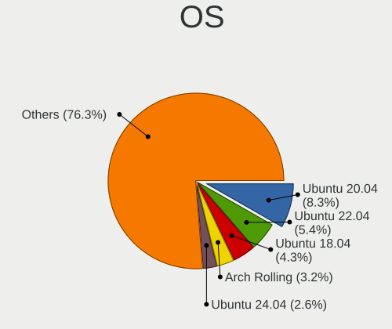

| Name                         | Computers | Percent |
|------------------------------|-----------|---------|
| Ubuntu 20.04                 | 1172      | 8.26%   |
| Ubuntu 22.04                 | 762       | 5.37%   |
| Ubuntu 18.04                 | 608       | 4.29%   |
| Arch Rolling                 | 457       | 3.22%   |
| Ubuntu 24.04                 | 368       | 2.59%   |
| Pop!_OS 22.04                | 321       | 2.26%   |
| Debian 12                    | 289       | 2.04%   |
| Zorin 16                     | 258       | 1.82%   |
| Zorin 17                     | 252       | 1.78%   |
| ArcoLinux Rolling            | 193       | 1.36%   |
| Debian 11                    | 191       | 1.35%   |
| Fedora 40                    | 189       | 1.33%   |
| Linux Mint 22.1              | 187       | 1.32%   |
| Manjaro                      | 165       | 1.16%   |
| OpenMandriva 24.12           | 154       | 1.09%   |
| Fedora 42                    | 150       | 1.06%   |
| OpenMandriva 4.3             | 149       | 1.05%   |
| Fedora 41                    | 146       | 1.03%   |
| Fedora 39                    | 136       | 0.96%   |
| OpenMandriva 4.2             | 133       | 0.94%   |
| Linux Mint 20.3              | 131       | 0.92%   |
| Linux Mint 21.3              | 128       | 0.9%    |
| Linux Mint 21.1              | 126       | 0.89%   |
| Fedora 38                    | 117       | 0.82%   |
| openSUSE Tumbleweed-XXXXXXXX | 116       | 0.82%   |
| Linux Mint 20.2              | 116       | 0.82%   |
| Linux Mint 22.2              | 112       | 0.79%   |
| Linux Mint 19.3              | 112       | 0.79%   |
| KDE neon 20.04               | 112       | 0.79%   |
| Pop!_OS 20.04                | 109       | 0.77%   |
| Linux Mint 21.2              | 108       | 0.76%   |
| OpenMandriva 25.90           | 106       | 0.75%   |
| Ubuntu 19.04                 | 105       | 0.74%   |
| Ubuntu 20.10                 | 101       | 0.71%   |
| Pop!_OS 21.04                | 100       | 0.7%    |
| Arch                         | 98        | 0.69%   |
| Zorin 15                     | 97        | 0.68%   |
| Ubuntu 21.10                 | 94        | 0.66%   |
| OpenMandriva 23.08           | 94        | 0.66%   |
| KDE neon 22.04               | 92        | 0.65%   |

OS Family
---------

OS without a version

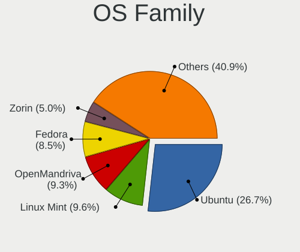

| Name          | Computers | Percent |
|---------------|-----------|---------|
| Ubuntu        | 3578      | 26.74%  |
| Linux Mint    | 1280      | 9.57%   |
| OpenMandriva  | 1243      | 9.29%   |
| Fedora        | 1136      | 8.49%   |
| Zorin         | 672       | 5.02%   |
| Pop!_OS       | 663       | 4.96%   |
| Debian        | 635       | 4.75%   |
| Arch          | 552       | 4.13%   |
| Manjaro       | 337       | 2.52%   |
| Kubuntu       | 319       | 2.38%   |
| KDE neon      | 255       | 1.91%   |
| SteamOS       | 204       | 1.52%   |
| ArcoLinux     | 197       | 1.47%   |
| Xubuntu       | 192       | 1.43%   |
| Bazzite       | 167       | 1.25%   |
| openSUSE      | 160       | 1.2%    |
| Gentoo        | 117       | 0.87%   |
| Elementary    | 115       | 0.86%   |
| EndeavourOS   | 86        | 0.64%   |
| ROSA          | 83        | 0.62%   |
| Kali          | 83        | 0.62%   |
| Ubuntu MATE   | 81        | 0.61%   |
| Nobara        | 80        | 0.6%    |
| Lubuntu       | 80        | 0.6%    |
| LMDE          | 62        | 0.46%   |
| Endless       | 61        | 0.46%   |
| MX            | 60        | 0.45%   |
| BlackPanther  | 58        | 0.43%   |
| Ubuntu Unity  | 57        | 0.43%   |
| CachyOS       | 56        | 0.42%   |
| Garuda Linux  | 53        | 0.4%    |
| NixOS         | 49        | 0.37%   |
| Clear Linux   | 48        | 0.36%   |
| Ubuntu Budgie | 32        | 0.24%   |
| Raspbian      | 29        | 0.22%   |
| CentOS        | 29        | 0.22%   |
| Parrot        | 25        | 0.19%   |
| RHEL          | 23        | 0.17%   |
| Peppermint    | 19        | 0.14%   |
| Void Linux    | 18        | 0.13%   |

Kernel
------

Version of the Linux kernel

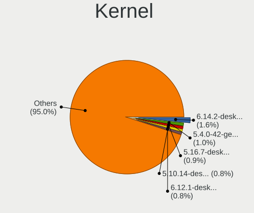

| Version                  | Computers | Percent |
|--------------------------|-----------|---------|
| 6.14.2-desktop-3omv2590  | 245       | 1.56%   |
| 5.4.0-42-generic         | 152       | 0.97%   |
| 5.16.7-desktop-1omv4003  | 138       | 0.88%   |
| 5.10.14-desktop-1omv4002 | 130       | 0.83%   |
| 6.12.1-desktop-1omv2490  | 119       | 0.76%   |
| 5.15.0-56-generic        | 85        | 0.54%   |
| 6.6.2-desktop-1omv2390   | 81        | 0.52%   |
| 6.2.6-desktop-1omv2390   | 81        | 0.52%   |
| 5.4.0-48-generic         | 81        | 0.52%   |
| 6.8.0-51-generic         | 77        | 0.49%   |
| 6.1.1-desktop-1omv2290   | 76        | 0.48%   |
| 5.4.0-52-generic         | 76        | 0.48%   |
| 6.14.0-33-generic        | 73        | 0.46%   |
| 5.4.0-29-generic         | 73        | 0.46%   |
| 6.4.11-desktop-1omv2390  | 72        | 0.46%   |
| 6.8.0-60-generic         | 71        | 0.45%   |
| 5.4.0-26-generic         | 70        | 0.45%   |
| 6.8.0-52-generic         | 66        | 0.42%   |
| 5.15.0-58-generic        | 66        | 0.42%   |
| 5.3.0-28-generic         | 65        | 0.41%   |
| 5.15.0-52-generic        | 65        | 0.41%   |
| 6.12.9-desktop-1omv2490  | 64        | 0.41%   |
| 5.15.0-46-generic        | 64        | 0.41%   |
| 6.9.3-76060903-generic   | 62        | 0.39%   |
| 5.3.0-40-generic         | 60        | 0.38%   |
| 5.15.0-91-generic        | 59        | 0.38%   |
| 6.2.0-26-generic         | 53        | 0.34%   |
| 5.4.0-40-generic         | 53        | 0.34%   |
| 5.4.0-58-generic         | 52        | 0.33%   |
| 5.11.0-27-generic        | 52        | 0.33%   |
| 5.4.0-37-generic         | 51        | 0.32%   |
| 6.14.0-37-generic        | 50        | 0.32%   |
| 6.5.0-14-generic         | 48        | 0.31%   |
| 6.8.0-40-generic         | 47        | 0.3%    |
| 6.8.0-45-generic         | 45        | 0.29%   |
| 5.4.0-65-generic         | 45        | 0.29%   |
| 5.4.0-33-generic         | 45        | 0.29%   |
| 5.11.0-38-generic        | 45        | 0.29%   |
| 5.0.0-32-generic         | 45        | 0.29%   |
| 5.4.0-91-generic         | 44        | 0.28%   |

Kernel Family
-------------

Linux kernel without a distro release

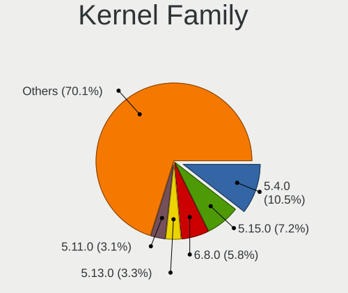

| Version | Computers | Percent |
|---------|-----------|---------|
| 5.4.0   | 1547      | 10.49%  |
| 5.15.0  | 1068      | 7.24%   |
| 6.8.0   | 853       | 5.78%   |
| 5.13.0  | 481       | 3.26%   |
| 5.11.0  | 456       | 3.09%   |
| 5.8.0   | 452       | 3.06%   |
| 4.15.0  | 427       | 2.89%   |
| 6.5.0   | 424       | 2.87%   |
| 5.3.0   | 374       | 2.54%   |
| 6.14.0  | 332       | 2.25%   |
| 6.2.0   | 314       | 2.13%   |
| 6.1.0   | 307       | 2.08%   |
| 5.19.0  | 300       | 2.03%   |
| 6.14.2  | 270       | 1.83%   |
| 5.0.0   | 244       | 1.65%   |
| 5.10.0  | 220       | 1.49%   |
| 6.11.0  | 218       | 1.48%   |
| 4.18.0  | 186       | 1.26%   |
| 5.16.7  | 139       | 0.94%   |
| 5.10.14 | 130       | 0.88%   |
| 6.12.1  | 128       | 0.87%   |
| 6.2.6   | 126       | 0.85%   |
| 6.6.2   | 88        | 0.6%    |
| 6.4.11  | 82        | 0.56%   |
| 6.1.1   | 81        | 0.55%   |
| 6.12.9  | 79        | 0.54%   |
| 6.9.3   | 73        | 0.49%   |
| 6.17.7  | 73        | 0.49%   |
| 4.19.0  | 59        | 0.4%    |
| 6.5.6   | 55        | 0.37%   |
| 5.14.0  | 52        | 0.35%   |
| 6.12.6  | 50        | 0.34%   |
| 6.1.52  | 46        | 0.31%   |
| 6.12.10 | 43        | 0.29%   |
| 6.14.6  | 42        | 0.28%   |
| 6.10.0  | 42        | 0.28%   |
| 4.18.16 | 39        | 0.26%   |
| 5.17.5  | 37        | 0.25%   |
| 6.16.4  | 35        | 0.24%   |
| 6.13.5  | 35        | 0.24%   |

Kernel Major Ver.
-----------------

Linux kernel major version

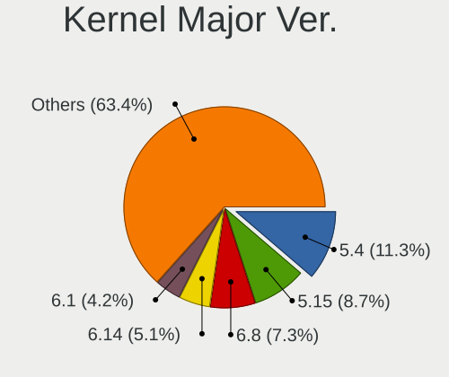

| Version | Computers | Percent |
|---------|-----------|---------|
| 5.4     | 1640      | 11.28%  |
| 5.15    | 1272      | 8.75%   |
| 6.8     | 1061      | 7.3%    |
| 6.14    | 740       | 5.09%   |
| 6.1     | 614       | 4.22%   |
| 6.5     | 577       | 3.97%   |
| 5.13    | 567       | 3.9%    |
| 6.2     | 551       | 3.79%   |
| 5.8     | 539       | 3.71%   |
| 6.12    | 531       | 3.65%   |
| 5.11    | 515       | 3.54%   |
| 5.10    | 493       | 3.39%   |
| 4.15    | 429       | 2.95%   |
| 5.3     | 425       | 2.92%   |
| 5.19    | 393       | 2.7%    |
| 6.11    | 384       | 2.64%   |
| 6.6     | 343       | 2.36%   |
| 5.16    | 254       | 1.75%   |
| 5.0     | 254       | 1.75%   |
| 6.17    | 246       | 1.69%   |
| 6.4     | 231       | 1.59%   |
| 4.18    | 228       | 1.57%   |
| 6.9     | 209       | 1.44%   |
| 6.10    | 188       | 1.29%   |
| 6.0     | 160       | 1.1%    |
| 6.15    | 159       | 1.09%   |
| 6.13    | 155       | 1.07%   |
| 6.16    | 134       | 0.92%   |
| 5.14    | 128       | 0.88%   |
| 6.7     | 113       | 0.78%   |
| 6.3     | 113       | 0.78%   |
| 5.17    | 111       | 0.76%   |
| 5.9     | 95        | 0.65%   |
| 5.18    | 94        | 0.65%   |
| 4.19    | 94        | 0.65%   |
| 5.12    | 87        | 0.6%    |
| 5.6     | 79        | 0.54%   |
| 4.9     | 74        | 0.51%   |
| 5.7     | 68        | 0.47%   |
| 5.5     | 42        | 0.29%   |

Arch
----

OS architecture (x86_64, i586, etc.)

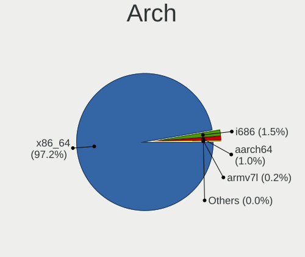

| Name    | Computers | Percent |
|---------|-----------|---------|
| x86_64  | 12419     | 97.24%  |
| i686    | 193       | 1.51%   |
| aarch64 | 126       | 0.99%   |
| armv7l  | 31        | 0.24%   |
| riscv64 | 1         | 0.01%   |
| armv6l  | 1         | 0.01%   |

DE
--

Desktop Environment

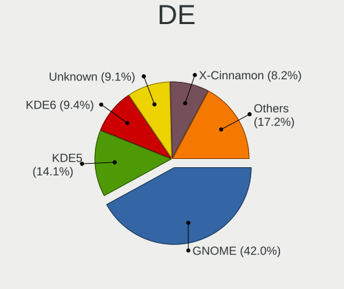

| Name             | Computers | Percent |
|------------------|-----------|---------|
| GNOME            | 5660      | 42.04%  |
| KDE5             | 1892      | 14.05%  |
| KDE6             | 1267      | 9.41%   |
| Unknown          | 1225      | 9.1%    |
| X-Cinnamon       | 1103      | 8.19%   |
| XFCE             | 834       | 6.19%   |
| MATE             | 285       | 2.12%   |
| KDE              | 226       | 1.68%   |
| LXQt             | 145       | 1.08%   |
| Cinnamon         | 118       | 0.88%   |
| Pantheon         | 111       | 0.82%   |
| Hyprland         | 67        | 0.5%    |
| LXDE             | 65        | 0.48%   |
| Unity            | 61        | 0.45%   |
| i3               | 55        | 0.41%   |
| Budgie           | 50        | 0.37%   |
| KDE4             | 45        | 0.33%   |
| GNOME Flashback  | 33        | 0.25%   |
| sway             | 30        | 0.22%   |
| COSMIC           | 23        | 0.17%   |
| GNOME Classic    | 20        | 0.15%   |
| openbox          | 19        | 0.14%   |
| Deepin           | 15        | 0.11%   |
| awesome          | 12        | 0.09%   |
| Trinity          | 9         | 0.07%   |
| qtile            | 9         | 0.07%   |
| lightdm-xsession | 8         | 0.06%   |
| labwc:wlroots    | 8         | 0.06%   |
| bspwm            | 7         | 0.05%   |
| xmonad           | 6         | 0.04%   |
| BunsenLabs       | 5         | 0.04%   |
| niri             | 4         | 0.03%   |
| icewm            | 4         | 0.03%   |
| Enlightenment    | 4         | 0.03%   |
| Endless:GNOME    | 4         | 0.03%   |
| dwm              | 4         | 0.03%   |
| chadwm           | 4         | 0.03%   |
| wlroots          | 3         | 0.02%   |
| mwm              | 3         | 0.02%   |
| Unicorn:XFCE     | 2         | 0.01%   |

Display Server
--------------

X11 or Wayland

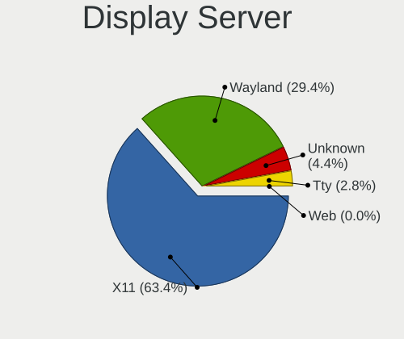

| Name    | Computers | Percent |
|---------|-----------|---------|
| X11     | 8403      | 63.4%   |
| Wayland | 3896      | 29.39%  |
| Unknown | 580       | 4.38%   |
| Tty     | 373       | 2.81%   |
| Web     | 2         | 0.02%   |

Display Manager
---------------

SDDM, LightDM, etc.

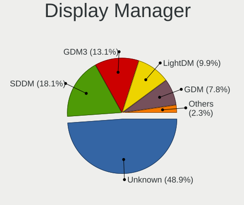

| Name            | Computers | Percent |
|-----------------|-----------|---------|
| Unknown         | 6514      | 48.86%  |
| SDDM            | 2409      | 18.07%  |
| GDM3            | 1740      | 13.05%  |
| LightDM         | 1319      | 9.89%   |
| GDM             | 1043      | 7.82%   |
| TDM             | 201       | 1.51%   |
| KDM             | 36        | 0.27%   |
| XDM             | 17        | 0.13%   |
| LXDM            | 11        | 0.08%   |
| SLiM            | 9         | 0.07%   |
| GREETD          | 9         | 0.07%   |
| Ly              | 8         | 0.06%   |
| LY-DM           | 4         | 0.03%   |
| COSMIC-GREETER  | 3         | 0.02%   |
| MDM             | 2         | 0.02%   |
| XINIT           | 1         | 0.01%   |
| SLIMSKI         | 1         | 0.01%   |
| NODM            | 1         | 0.01%   |
| KODI-STANDALONE | 1         | 0.01%   |
| FLY-DM          | 1         | 0.01%   |
| CDM             | 1         | 0.01%   |

OS Lang
-------

Language

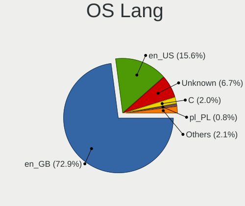

| Lang           | Computers | Percent |
|----------------|-----------|---------|
| en_GB          | 9553      | 72.92%  |
| en_US          | 2043      | 15.59%  |
| Unknown        | 876       | 6.69%   |
| C              | 259       | 1.98%   |
| pl_PL          | 100       | 0.76%   |
| ru_RU          | 25        | 0.19%   |
| en_IE          | 22        | 0.17%   |
| fr_FR          | 21        | 0.16%   |
| de_DE          | 19        | 0.15%   |
| it_IT          | 17        | 0.13%   |
| POSIX          | 16        | 0.12%   |
| en_CA          | 16        | 0.12%   |
| hu_HU          | 10        | 0.08%   |
| ro_RO          | 9         | 0.07%   |
| en_AU          | 9         | 0.07%   |
| es_ES          | 8         | 0.06%   |
| C.UTF8         | 8         | 0.06%   |
| zh_CN          | 7         | 0.05%   |
| uk_UA          | 7         | 0.05%   |
| en_IN          | 7         | 0.05%   |
| cs_CZ          | 7         | 0.05%   |
| pt_PT          | 4         | 0.03%   |
| lt_LT          | 4         | 0.03%   |
| bg_BG          | 4         | 0.03%   |
| tr_TR          | 3         | 0.02%   |
| sk_SK          | 3         | 0.02%   |
| pt_BR          | 3         | 0.02%   |
| ru_UA          | 2         | 0.02%   |
| nl_NL          | 2         | 0.02%   |
| nl_BE          | 2         | 0.02%   |
| nb_NO          | 2         | 0.02%   |
| en_ZA          | 2         | 0.02%   |
| en_US.utf-8    | 2         | 0.02%   |
| en_GB.iso88591 | 2         | 0.02%   |
| en_DK          | 2         | 0.02%   |
| da_DK          | 2         | 0.02%   |
| zh_TW          | 1         | 0.01%   |
| wbp_AU         | 1         | 0.01%   |
| us             | 1         | 0.01%   |
| sv_SE          | 1         | 0.01%   |

Boot Mode
---------

EFI or BIOS

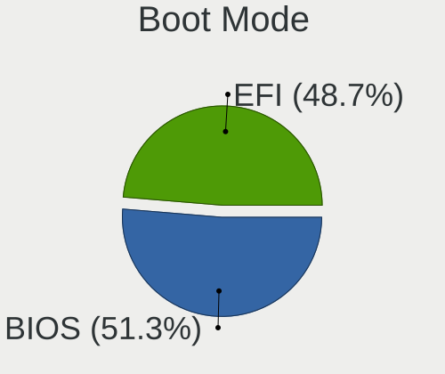

| Mode | Computers | Percent |
|------|-----------|---------|
| BIOS | 6712      | 51.31%  |
| EFI  | 6369      | 48.69%  |

Filesystem
----------

Type of filesystem

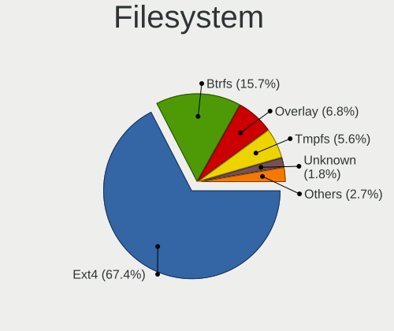

| Type     | Computers | Percent |
|----------|-----------|---------|
| Ext4     | 8919      | 67.41%  |
| Btrfs    | 2076      | 15.69%  |
| Overlay  | 905       | 6.84%   |
| Tmpfs    | 737       | 5.57%   |
| Unknown  | 234       | 1.77%   |
| Xfs      | 183       | 1.38%   |
| Zfs      | 100       | 0.76%   |
| Ext2     | 26        | 0.2%    |
| F2fs     | 19        | 0.14%   |
| Ext3     | 17        | 0.13%   |
| Rootfs   | 4         | 0.03%   |
| Aufs     | 4         | 0.03%   |
| XXXXXXX  | 1         | 0.01%   |
| XXXX     | 1         | 0.01%   |
| Reiserfs | 1         | 0.01%   |
| Lvm      | 1         | 0.01%   |
| Jfs      | 1         | 0.01%   |
| ExX4     | 1         | 0.01%   |

Part. scheme
------------

Scheme of partitioning

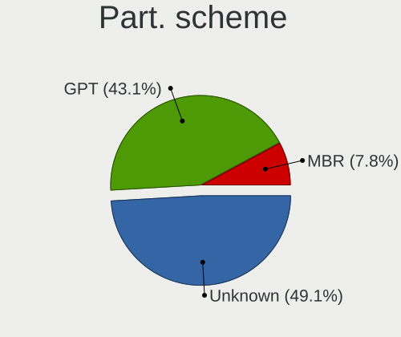

| Type    | Computers | Percent |
|---------|-----------|---------|
| Unknown | 6448      | 49.08%  |
| GPT     | 5659      | 43.08%  |
| MBR     | 1030      | 7.84%   |

Dual Boot with Linux/BSD
------------------------

Hosting more than one Linux/BSD

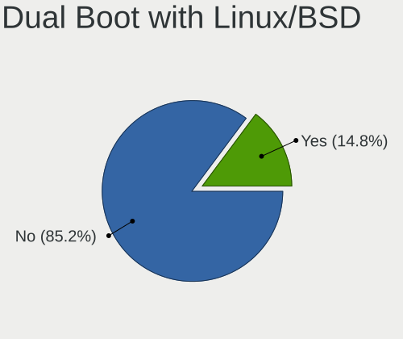

| Dual boot | Computers | Percent |
|-----------|-----------|---------|
| No        | 11125     | 85.2%   |
| Yes       | 1933      | 14.8%   |

Dual Boot (Win)
---------------

Hosting Linux and Windows

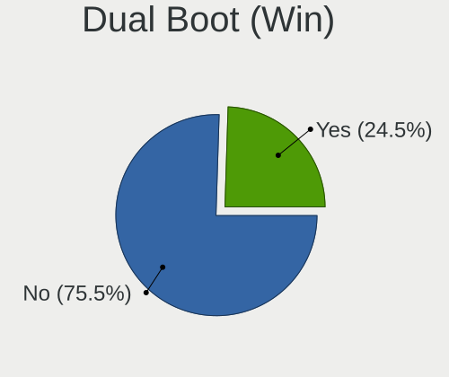

| Dual boot | Computers | Percent |
|-----------|-----------|---------|
| No        | 9821      | 75.5%   |
| Yes       | 3187      | 24.5%   |

Board
-----

Vendor
------

Motherboard manufacturer

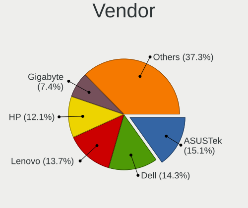

| Name                                 | Computers | Percent |
|--------------------------------------|-----------|---------|
| ASUSTek Computer                     | 1933      | 15.15%  |
| Dell                                 | 1830      | 14.34%  |
| Lenovo                               | 1753      | 13.74%  |
| Hewlett-Packard                      | 1539      | 12.06%  |
| Gigabyte Technology                  | 942       | 7.38%   |
| MSI                                  | 780       | 6.11%   |
| Acer                                 | 551       | 4.32%   |
| Apple                                | 440       | 3.45%   |
| ASRock                               | 349       | 2.73%   |
| Toshiba                              | 221       | 1.73%   |
| Intel                                | 201       | 1.57%   |
| Valve                                | 173       | 1.36%   |
| Unknown                              | 139       | 1.09%   |
| Samsung Electronics                  | 136       | 1.07%   |
| Raspberry Pi Foundation              | 119       | 0.93%   |
| Microsoft                            | 88        | 0.69%   |
| Sony                                 | 87        | 0.68%   |
| Google                               | 85        | 0.67%   |
| Fujitsu                              | 80        | 0.63%   |
| PC Specialist                        | 77        | 0.6%    |
| HUAWEI                               | 62        | 0.49%   |
| AZW                                  | 60        | 0.47%   |
| Alienware                            | 49        | 0.38%   |
| Packard Bell                         | 46        | 0.36%   |
| Notebook                             | 46        | 0.36%   |
| Foxconn                              | 45        | 0.35%   |
| Shenzhen Meigao Electronic Equipment | 36        | 0.28%   |
| Star Labs                            | 32        | 0.25%   |
| Razer                                | 32        | 0.25%   |
| Medion                               | 32        | 0.25%   |
| Framework                            | 30        | 0.24%   |
| Biostar                              | 30        | 0.24%   |
| Pegatron                             | 28        | 0.22%   |
| Supermicro                           | 27        | 0.21%   |
| Fujitsu Siemens                      | 24        | 0.19%   |
| GEO                                  | 23        | 0.18%   |
| Linx                                 | 22        | 0.17%   |
| LG Electronics                       | 21        | 0.16%   |
| Panasonic                            | 20        | 0.16%   |
| Entroware                            | 20        | 0.16%   |

Model
-----

Motherboard model

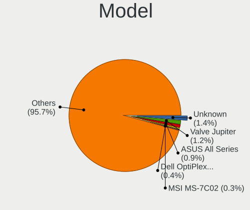

| Name                               | Computers | Percent |
|------------------------------------|-----------|---------|
| Unknown                            | 173       | 1.36%   |
| Valve Jupiter                      | 156       | 1.22%   |
| ASUS All Series                    | 120       | 0.94%   |
| Dell OptiPlex 7010                 | 57        | 0.45%   |
| MSI MS-7C02                        | 39        | 0.31%   |
| HP Pavilion g6                     | 37        | 0.29%   |
| MSI MS-7C37                        | 32        | 0.25%   |
| ASUS TUF Gaming X570-PLUS          | 32        | 0.25%   |
| HP Notebook                        | 31        | 0.24%   |
| HP Pavilion 15                     | 30        | 0.24%   |
| ASUS M5A78L-M/USB3                 | 30        | 0.24%   |
| RPi Raspberry Pi                   | 28        | 0.22%   |
| HP Pavilion Notebook               | 28        | 0.22%   |
| Gigabyte B550M DS3H                | 28        | 0.22%   |
| MSI MS-7C91                        | 27        | 0.21%   |
| MSI MS-7C56                        | 27        | 0.21%   |
| ASUS ROG STRIX B450-F GAMING       | 26        | 0.2%    |
| Dell OptiPlex 780                  | 25        | 0.2%    |
| Gigabyte X570 AORUS ELITE          | 24        | 0.19%   |
| ASUS ROG STRIX B550-F GAMING       | 24        | 0.19%   |
| Microsoft Surface Pro 4            | 23        | 0.18%   |
| Dell OptiPlex 755                  | 22        | 0.17%   |
| Dell XPS 15 7590                   | 21        | 0.16%   |
| Dell OptiPlex 3020                 | 21        | 0.16%   |
| ASUS PRIME A320M-K                 | 21        | 0.16%   |
| RPi Raspberry Pi 5 Model B Rev 1.0 | 20        | 0.16%   |
| Dell XPS 15 9570                   | 20        | 0.16%   |
| Dell OptiPlex 790                  | 20        | 0.16%   |
| Gigabyte B450M DS3H                | 19        | 0.15%   |
| Gigabyte 970A-DS3P                 | 19        | 0.15%   |
| Dell XPS 15 9500                   | 19        | 0.15%   |
| Dell Inspiron 1545                 | 19        | 0.15%   |
| AZW SER                            | 19        | 0.15%   |
| Apple MacBookPro9,2                | 19        | 0.15%   |
| RPi Raspberry Pi 4 Model B Rev 1.4 | 18        | 0.14%   |
| MSI MS-7B79                        | 18        | 0.14%   |
| Gigabyte A320M-S2H                 | 18        | 0.14%   |
| Dell XPS 13 9380                   | 18        | 0.14%   |
| Dell XPS 13 9370                   | 18        | 0.14%   |
| Dell OptiPlex 3050                 | 18        | 0.14%   |

Model Family
------------

Motherboard model prefix

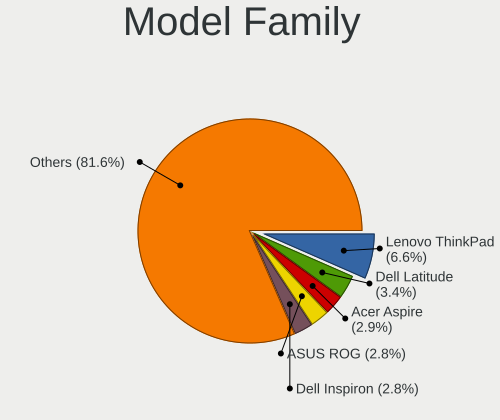

| Name               | Computers | Percent |
|--------------------|-----------|---------|
| Lenovo ThinkPad    | 839       | 6.57%   |
| Dell Latitude      | 439       | 3.44%   |
| Acer Aspire        | 370       | 2.9%    |
| ASUS ROG           | 355       | 2.78%   |
| Dell Inspiron      | 351       | 2.75%   |
| Dell OptiPlex      | 330       | 2.59%   |
| Dell XPS           | 295       | 2.31%   |
| ASUS PRIME         | 269       | 2.11%   |
| Lenovo IdeaPad     | 257       | 2.01%   |
| HP Pavilion        | 241       | 1.89%   |
| Toshiba Satellite  | 192       | 1.5%    |
| Dell Precision     | 187       | 1.47%   |
| HP EliteBook       | 185       | 1.45%   |
| Unknown            | 173       | 1.36%   |
| ASUS VivoBook      | 167       | 1.31%   |
| Valve Jupiter      | 156       | 1.22%   |
| HP Laptop          | 130       | 1.02%   |
| HP Compaq          | 129       | 1.01%   |
| ASUS TUF           | 127       | 1%      |
| ASUS All           | 120       | 0.94%   |
| RPi Raspberry      | 119       | 0.93%   |
| Lenovo ThinkCentre | 116       | 0.91%   |
| HP ProBook         | 109       | 0.85%   |
| Lenovo Yoga        | 104       | 0.81%   |
| HP ENVY            | 97        | 0.76%   |
| Microsoft Surface  | 88        | 0.69%   |
| Lenovo Legion      | 86        | 0.67%   |
| Dell Vostro        | 75        | 0.59%   |
| Gigabyte X570      | 65        | 0.51%   |
| HP EliteDesk       | 64        | 0.5%    |
| ASUS ZenBook       | 55        | 0.43%   |
| Acer Swift         | 53        | 0.42%   |
| ASUS ASUS          | 50        | 0.39%   |
| HP ProLiant        | 48        | 0.38%   |
| HP ProDesk         | 44        | 0.34%   |
| Gigabyte B550M     | 43        | 0.34%   |
| ASUS M5A78L-M      | 43        | 0.34%   |
| HP Stream          | 40        | 0.31%   |
| MSI MS-7C02        | 39        | 0.31%   |
| Dell PowerEdge     | 35        | 0.27%   |

MFG Year
--------

Motherboard manufacture year

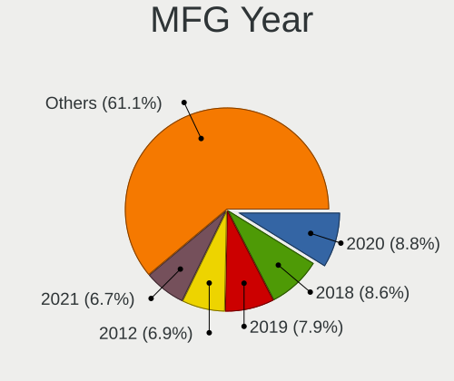

| Year    | Computers | Percent |
|---------|-----------|---------|
| 2020    | 1127      | 8.83%   |
| 2018    | 1100      | 8.62%   |
| 2019    | 1004      | 7.87%   |
| 2012    | 883       | 6.92%   |
| 2021    | 851       | 6.67%   |
| 2013    | 799       | 6.26%   |
| 2017    | 789       | 6.18%   |
| 2022    | 755       | 5.92%   |
| 2014    | 754       | 5.91%   |
| 2011    | 696       | 5.45%   |
| 2016    | 608       | 4.76%   |
| 2015    | 597       | 4.68%   |
| 2023    | 547       | 4.29%   |
| 2010    | 510       | 4%      |
| 2009    | 409       | 3.2%    |
| 2008    | 389       | 3.05%   |
| 2024    | 322       | 2.52%   |
| 2007    | 248       | 1.94%   |
| Unknown | 125       | 0.98%   |
| 2006    | 109       | 0.85%   |
| 2025    | 97        | 0.76%   |
| 2005    | 29        | 0.23%   |
| 2004    | 7         | 0.05%   |
| 2003    | 5         | 0.04%   |
| 2002    | 3         | 0.02%   |

Form Factor
-----------

Physical design of the computer

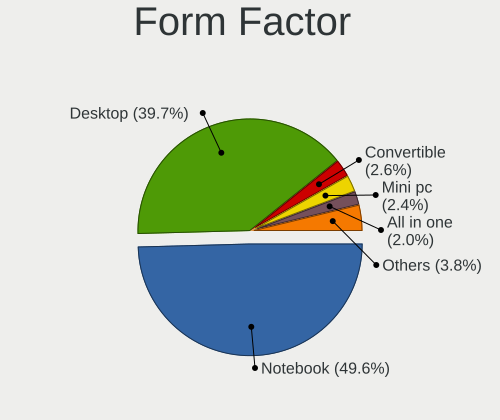

| Name           | Computers | Percent |
|----------------|-----------|---------|
| Notebook       | 6327      | 49.57%  |
| Desktop        | 5063      | 39.67%  |
| Convertible    | 326       | 2.55%   |
| Mini pc        | 312       | 2.44%   |
| All in one     | 252       | 1.97%   |
| Tablet         | 211       | 1.65%   |
| System on chip | 143       | 1.12%   |
| Server         | 119       | 0.93%   |
| Other          | 4         | 0.03%   |
| Phone          | 4         | 0.03%   |
| Stick pc       | 2         | 0.02%   |

Secure Boot
-----------

Enabled or disabled

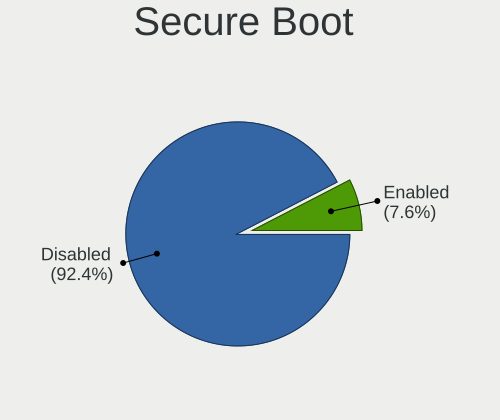

| State    | Computers | Percent |
|----------|-----------|---------|
| Disabled | 11895     | 92.4%   |
| Enabled  | 978       | 7.6%    |

Coreboot
--------

Have coreboot on board

| Used | Computers | Percent |
|------|-----------|---------|
| No   | 12643     | 99.05%  |
| Yes  | 121       | 0.95%   |

RAM Size
--------

Total RAM memory

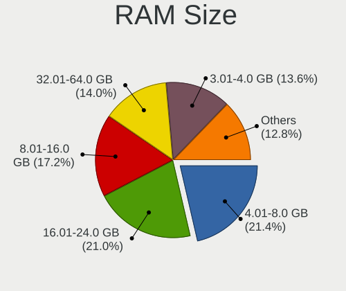

| Size in GB      | Computers | Percent |
|-----------------|-----------|---------|
| 4.01-8.0        | 2787      | 21.38%  |
| 16.01-24.0      | 2739      | 21.01%  |
| 8.01-16.0       | 2237      | 17.16%  |
| 32.01-64.0      | 1830      | 14.04%  |
| 3.01-4.0        | 1778      | 13.64%  |
| 64.01-256.0     | 591       | 4.53%   |
| 24.01-32.0      | 398       | 3.05%   |
| 1.01-2.0        | 392       | 3.01%   |
| 2.01-3.0        | 175       | 1.34%   |
| 0.51-1.0        | 73        | 0.56%   |
| More than 256.0 | 28        | 0.21%   |
| 0.01-0.5        | 8         | 0.06%   |
| Unknown         | 1         | 0.01%   |

RAM Used
--------

Used RAM memory

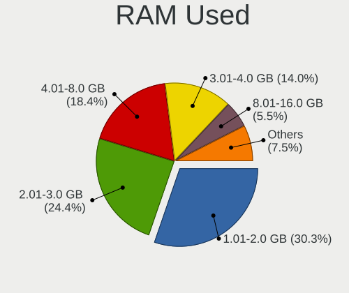

| Used GB     | Computers | Percent |
|-------------|-----------|---------|
| 1.01-2.0    | 4340      | 30.27%  |
| 2.01-3.0    | 3500      | 24.41%  |
| 4.01-8.0    | 2631      | 18.35%  |
| 3.01-4.0    | 2008      | 14.01%  |
| 8.01-16.0   | 784       | 5.47%   |
| 0.51-1.0    | 700       | 4.88%   |
| 0.01-0.5    | 158       | 1.1%    |
| 16.01-24.0  | 121       | 0.84%   |
| 24.01-32.0  | 44        | 0.31%   |
| 32.01-64.0  | 34        | 0.24%   |
| 64.01-256.0 | 10        | 0.07%   |
| Unknown     | 5         | 0.03%   |
| 0           | 1         | 0.01%   |

Total Drives
------------

Number of drives on board

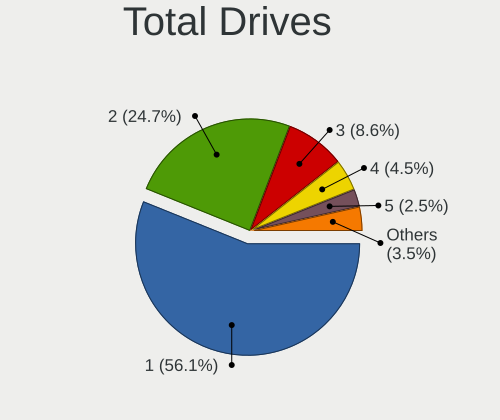

| Drives  | Computers | Percent |
|---------|-----------|---------|
| 1       | 7441      | 56.1%   |
| 2       | 3274      | 24.69%  |
| 3       | 1143      | 8.62%   |
| 4       | 603       | 4.55%   |
| 5       | 337       | 2.54%   |
| 6       | 161       | 1.21%   |
| 0       | 100       | 0.75%   |
| 7       | 89        | 0.67%   |
| 8       | 37        | 0.28%   |
| 9       | 22        | 0.17%   |
| 10      | 14        | 0.11%   |
| 11      | 11        | 0.08%   |
| Unknown | 8         | 0.06%   |
| 12      | 7         | 0.05%   |
| 13      | 4         | 0.03%   |
| 23      | 2         | 0.02%   |
| 14      | 2         | 0.02%   |
| 71      | 1         | 0.01%   |
| 48      | 1         | 0.01%   |
| 29      | 1         | 0.01%   |
| 25      | 1         | 0.01%   |
| 21      | 1         | 0.01%   |
| 20      | 1         | 0.01%   |
| 16      | 1         | 0.01%   |
| 15      | 1         | 0.01%   |

Has CD-ROM
----------

Has CD-ROM on board

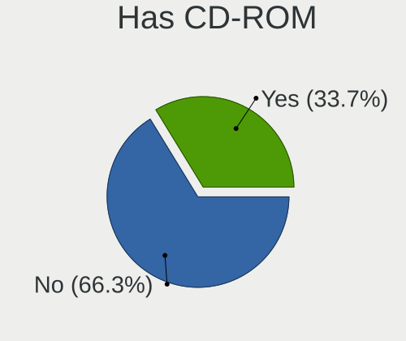

| Presented | Computers | Percent |
|-----------|-----------|---------|
| No        | 8538      | 66.25%  |
| Yes       | 4349      | 33.75%  |

Has Ethernet
------------

Has Ethernet on board

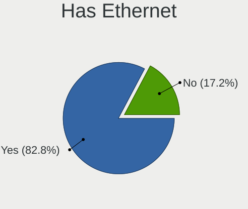

| Presented | Computers | Percent |
|-----------|-----------|---------|
| Yes       | 10594     | 82.78%  |
| No        | 2204      | 17.22%  |

Has WiFi
--------

Has WiFi module

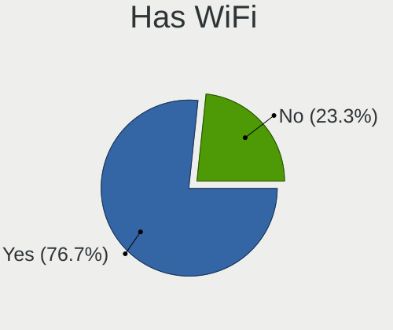

| Presented | Computers | Percent |
|-----------|-----------|---------|
| Yes       | 9879      | 76.66%  |
| No        | 3007      | 23.34%  |

Has Bluetooth
-------------

Has Bluetooth module

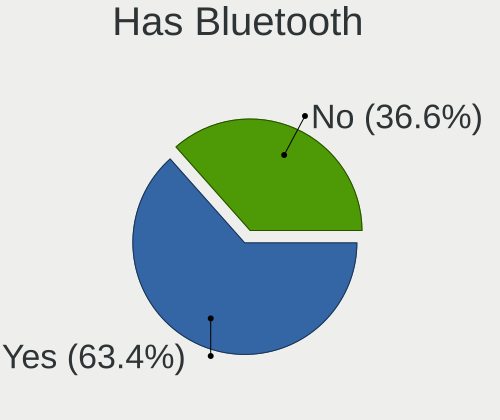

| Presented | Computers | Percent |
|-----------|-----------|---------|
| Yes       | 8207      | 63.44%  |
| No        | 4729      | 36.56%  |

Location
--------

Country
-------

Geographic location (country)

| Country | Computers | Percent |
|---------|-----------|---------|
| UK      | 12763     | 100%    |

City
----

Geographic location (city)

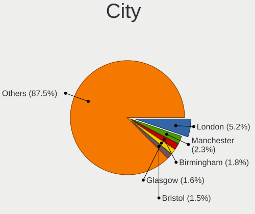

| City                 | Computers | Percent |
|----------------------|-----------|---------|
| London               | 740       | 5.21%   |
| Manchester           | 333       | 2.35%   |
| Birmingham           | 257       | 1.81%   |
| Glasgow              | 230       | 1.62%   |
| Bristol              | 220       | 1.55%   |
| Leeds                | 185       | 1.3%    |
| Edinburgh            | 178       | 1.25%   |
| Nottingham           | 166       | 1.17%   |
| Liverpool            | 166       | 1.17%   |
| Sheffield            | 146       | 1.03%   |
| Southampton          | 135       | 0.95%   |
| Reading              | 130       | 0.92%   |
| Islington            | 130       | 0.92%   |
| Cambridge            | 103       | 0.73%   |
| Leicester            | 101       | 0.71%   |
| Bradford             | 101       | 0.71%   |
| Cardiff              | 97        | 0.68%   |
| Coventry             | 92        | 0.65%   |
| Milton Keynes        | 91        | 0.64%   |
| Croydon              | 90        | 0.63%   |
| Norwich              | 88        | 0.62%   |
| Southwark            | 81        | 0.57%   |
| Newcastle upon Tyne  | 81        | 0.57%   |
| Hackney              | 79        | 0.56%   |
| Derby                | 75        | 0.53%   |
| City of Westminster  | 72        | 0.51%   |
| Oxford               | 71        | 0.5%    |
| Plymouth             | 68        | 0.48%   |
| Lewisham             | 68        | 0.48%   |
| Brighton             | 68        | 0.48%   |
| York                 | 66        | 0.46%   |
| City of London       | 65        | 0.46%   |
| Barnet               | 63        | 0.44%   |
| Swindon              | 62        | 0.44%   |
| Slough               | 62        | 0.44%   |
| Kingston upon Thames | 62        | 0.44%   |
| Brent                | 61        | 0.43%   |
| Bolton               | 60        | 0.42%   |
| Belfast              | 57        | 0.4%    |
| Gloucester           | 54        | 0.38%   |

Drives
------

Drive Vendor
------------

Hard drive vendors

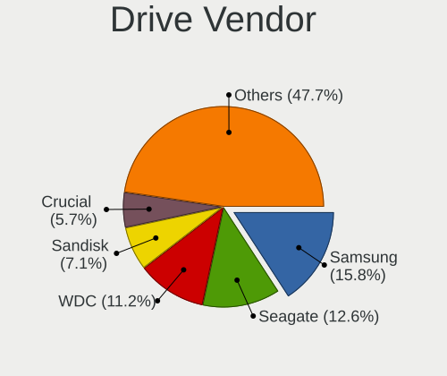

| Vendor                      | Computers | Drives | Percent |
|-----------------------------|-----------|--------|---------|
| Samsung Electronics         | 3134      | 5077   | 15.81%  |
| Seagate                     | 2488      | 4258   | 12.55%  |
| WDC                         | 2226      | 3724   | 11.23%  |
| Sandisk                     | 1403      | 1940   | 7.08%   |
| Crucial                     | 1120      | 1620   | 5.65%   |
| Toshiba                     | 1103      | 1567   | 5.57%   |
| Unknown                     | 1029      | 1404   | 5.19%   |
| Kingston                    | 847       | 1150   | 4.27%   |
| Hitachi                     | 530       | 738    | 2.67%   |
| SK hynix                    | 511       | 627    | 2.58%   |
| Intel                       | 389       | 560    | 1.96%   |
| Micron Technology           | 347       | 414    | 1.75%   |
| Micron/Crucial Technology   | 324       | 435    | 1.63%   |
| HGST                        | 250       | 384    | 1.26%   |
| Phison Electronics          | 249       | 374    | 1.26%   |
| Apple                       | 227       | 313    | 1.15%   |
| China                       | 222       | 305    | 1.12%   |
| Phison                      | 195       | 254    | 0.98%   |
| KIOXIA                      | 181       | 225    | 0.91%   |
| A-DATA Technology           | 147       | 197    | 0.74%   |
| Kingston Technology Company | 136       | 174    | 0.69%   |
| Silicon Motion              | 117       | 170    | 0.59%   |
| Unknown                     | 116       | 150    | 0.59%   |
| PNY                         | 110       | 141    | 0.55%   |
| MAXIO Technology (Hangzhou) | 103       | 142    | 0.52%   |
| OCZ                         | 98        | 111    | 0.49%   |
| LITEON                      | 87        | 117    | 0.44%   |
| Transcend                   | 85        | 100    | 0.43%   |
| Corsair                     | 80        | 106    | 0.4%    |
| Maxtor                      | 71        | 104    | 0.36%   |
| Netac                       | 69        | 89     | 0.35%   |
| Integral                    | 69        | 85     | 0.35%   |
| JMicron Technology          | 63        | 84     | 0.32%   |
| Fanxiang                    | 62        | 97     | 0.31%   |
| Patriot                     | 61        | 92     | 0.31%   |
| SABRENT                     | 55        | 67     | 0.28%   |
| SPCC                        | 53        | 80     | 0.27%   |
| LITEONIT                    | 53        | 63     | 0.27%   |
| Fujitsu                     | 52        | 74     | 0.26%   |
| ADATA Technology            | 50        | 67     | 0.25%   |

Drive Model
-----------

Hard drive models

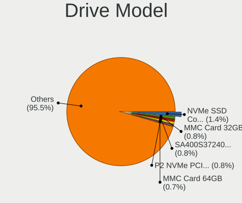

| Model                                                | Computers | Percent |
|------------------------------------------------------|-----------|---------|
| Samsung NVMe SSD Controller SM981/PM981/PM983 1TB    | 321       | 1.44%   |
| Unknown MMC Card  32GB                               | 175       | 0.78%   |
| Kingston SA400S37240G 240GB SSD                      | 170       | 0.76%   |
| Micron/Crucial P2 NVMe PCIe SSD 2TB                  | 168       | 0.75%   |
| Unknown MMC Card  64GB                               | 162       | 0.73%   |
| Samsung NVMe SSD Controller PM9A1/PM9A3/980PRO 1TB   | 160       | 0.72%   |
| Crucial CT1000MX500SSD1 1TB                          | 157       | 0.7%    |
| Samsung SSD 850 EVO 250GB                            | 148       | 0.66%   |
| Seagate ST2000DM008-2FR102 2TB                       | 145       | 0.65%   |
| Crucial CT500MX500SSD1 500GB                         | 138       | 0.62%   |
| Seagate ST1000DM010-2EP102 1TB                       | 136       | 0.61%   |
| Samsung SSD 850 EVO 500GB                            | 122       | 0.55%   |
| Seagate ST3500312CS 500GB                            | 118       | 0.53%   |
| Samsung SSD 860 EVO 500GB                            | 117       | 0.52%   |
| Unknown                                              | 116       | 0.52%   |
| Samsung SSD 860 EVO 1TB                              | 113       | 0.51%   |
| Unknown MMC Card  128GB                              | 109       | 0.49%   |
| Seagate ST1000LM035-1RK172 1TB                       | 105       | 0.47%   |
| Seagate ST1000LM024 HN-M101MBB 1TB                   | 99        | 0.44%   |
| Seagate ST500DM002-1BD142 500GB                      | 97        | 0.43%   |
| Kingston SA400S37120G 120GB SSD                      | 96        | 0.43%   |
| Toshiba MQ01ABD100 1TB                               | 95        | 0.43%   |
| Kingston SA400S37480G 480GB SSD                      | 91        | 0.41%   |
| Crucial CT240BX500SSD1 240GB                         | 87        | 0.39%   |
| Crucial CT1000BX500SSD1 1TB                          | 82        | 0.37%   |
| Samsung SSD 970 EVO Plus 1TB                         | 79        | 0.35%   |
| Samsung NVMe SSD Controller SM961/PM961/SM963 1024GB | 79        | 0.35%   |
| Phison E12 NVMe Controller 1TB                       | 79        | 0.35%   |
| Sandisk WD Blue SN550 NVMe SSD 1024GB                | 76        | 0.34%   |
| SanDisk NVMe SSD Drive 1TB                           | 76        | 0.34%   |
| Unknown SD/MMC/MS PRO 2GB                            | 75        | 0.34%   |
| Seagate ST4000DM004-2CV104 4TB                       | 74        | 0.33%   |
| Phison PS5013 E13 NVMe Controller 500GB              | 70        | 0.31%   |
| MAXIO (Hangzhou) NVMe SSD Controller MAP1202 2TB     | 66        | 0.3%    |
| Crucial CT250MX500SSD1 250GB                         | 66        | 0.3%    |
| Samsung SSD 840 EVO 250GB                            | 65        | 0.29%   |
| Seagate Expansion 2TB                                | 63        | 0.28%   |
| Sandisk WD Black SN850 1TB                           | 63        | 0.28%   |
| Samsung NVMe SSD Drive 500GB                         | 63        | 0.28%   |
| Kingston SV300S37A120G 120GB SSD                     | 63        | 0.28%   |

HDD Vendor
----------

Hard disk drive vendors

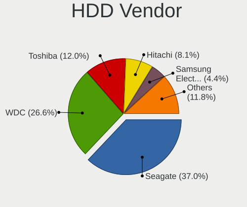

| Vendor              | Computers | Drives | Percent |
|---------------------|-----------|--------|---------|
| Seagate             | 2414      | 4075   | 37.04%  |
| WDC                 | 1731      | 2961   | 26.56%  |
| Toshiba             | 784       | 1128   | 12.03%  |
| Hitachi             | 529       | 736    | 8.12%   |
| Samsung Electronics | 288       | 421    | 4.42%   |
| HGST                | 246       | 377    | 3.77%   |
| Unknown             | 88        | 115    | 1.35%   |
| Apple               | 86        | 105    | 1.32%   |
| Maxtor              | 57        | 89     | 0.87%   |
| Fujitsu             | 52        | 74     | 0.8%    |
| Hewlett-Packard     | 35        | 101    | 0.54%   |
| JMicron Technology  | 31        | 47     | 0.48%   |
| ASMT                | 24        | 58     | 0.37%   |
| TO Exter            | 18        | 27     | 0.28%   |
| SSK                 | 15        | 19     | 0.23%   |
| USB3.0              | 13        | 18     | 0.2%    |
| External            | 11        | 18     | 0.17%   |
| ASMedia             | 8         | 14     | 0.12%   |
| HPE                 | 6         | 9      | 0.09%   |
| SABRENT             | 5         | 5      | 0.08%   |
| QEMU                | 5         | 9      | 0.08%   |
| LaCie               | 5         | 6      | 0.08%   |
| Inateck             | 5         | 6      | 0.08%   |
| WD MediaMax         | 4         | 4      | 0.06%   |
| USB                 | 4         | 5      | 0.06%   |
| RSH-339             | 4         | 4      | 0.06%   |
| TrueNAS             | 3         | 7      | 0.05%   |
| QNAP                | 3         | 3      | 0.05%   |
| HGST HTS            | 3         | 6      | 0.05%   |
| ASMT109x            | 3         | 5      | 0.05%   |
| Quantum             | 2         | 5      | 0.03%   |
| NETAPP              | 2         | 40     | 0.03%   |
| MARVELL             | 2         | 4      | 0.03%   |
| KESU                | 2         | 7      | 0.03%   |
| Intenso             | 2         | 3      | 0.03%   |
| Initio              | 2         | 2      | 0.03%   |
| IBM/Hitachi         | 2         | 2      | 0.03%   |
| ExcelStor           | 2         | 5      | 0.03%   |
| Unknown             | 2         | 3      | 0.03%   |
| TPH01204000GB       | 1         | 1      | 0.02%   |

SSD Vendor
----------

Solid state drive vendors

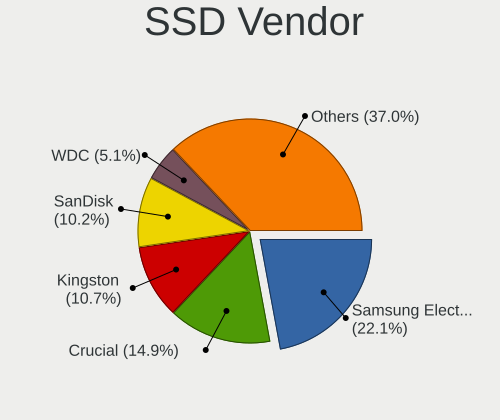

| Vendor              | Computers | Drives | Percent |
|---------------------|-----------|--------|---------|
| Samsung Electronics | 1441      | 2227   | 22.09%  |
| Crucial             | 973       | 1415   | 14.92%  |
| Kingston            | 696       | 948    | 10.67%  |
| SanDisk             | 662       | 855    | 10.15%  |
| WDC                 | 334       | 456    | 5.12%   |
| China               | 215       | 298    | 3.3%    |
| Intel               | 142       | 180    | 2.18%   |
| SK hynix            | 117       | 148    | 1.79%   |
| A-DATA Technology   | 116       | 157    | 1.78%   |
| Apple               | 110       | 133    | 1.69%   |
| Toshiba             | 109       | 144    | 1.67%   |
| PNY                 | 107       | 134    | 1.64%   |
| Micron Technology   | 103       | 123    | 1.58%   |
| OCZ                 | 98        | 111    | 1.5%    |
| LITEON              | 84        | 114    | 1.29%   |
| Transcend           | 80        | 95     | 1.23%   |
| Integral            | 69        | 85     | 1.06%   |
| Netac               | 57        | 74     | 0.87%   |
| Patriot             | 56        | 87     | 0.86%   |
| LITEONIT            | 53        | 63     | 0.81%   |
| SABRENT             | 49        | 61     | 0.75%   |
| Corsair             | 48        | 65     | 0.74%   |
| SPCC                | 47        | 73     | 0.72%   |
| Seagate             | 38        | 53     | 0.58%   |
| Lexar               | 34        | 38     | 0.52%   |
| Gigabyte Technology | 31        | 44     | 0.48%   |
| Fanxiang            | 28        | 37     | 0.43%   |
| KingSpec            | 26        | 32     | 0.4%    |
| Team                | 25        | 30     | 0.38%   |
| KIOXIA-EXCERIA      | 25        | 41     | 0.38%   |
| Unknown             | 25        | 30     | 0.38%   |
| XUM                 | 23        | 24     | 0.35%   |
| Drevo               | 21        | 36     | 0.32%   |
| Unknown             | 17        | 25     | 0.26%   |
| TCSUNBOW            | 17        | 30     | 0.26%   |
| Plextor             | 15        | 19     | 0.23%   |
| ASMT                | 15        | 15     | 0.23%   |
| ORTIAL              | 14        | 16     | 0.21%   |
| Maxtor              | 14        | 15     | 0.21%   |
| Vaseky              | 13        | 20     | 0.2%    |

Drive Kind
----------

HDD or SSD

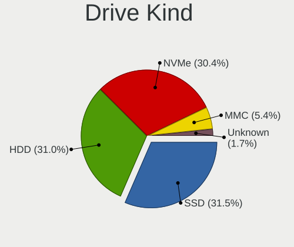

| Kind    | Computers | Drives | Percent |
|---------|-----------|--------|---------|
| SSD     | 5427      | 9034   | 31.52%  |
| HDD     | 5332      | 10563  | 30.97%  |
| NVMe    | 5233      | 8266   | 30.39%  |
| MMC     | 937       | 1240   | 5.44%   |
| Unknown | 290       | 444    | 1.68%   |

Drive Connector
---------------

SATA, SAS, NVMe, etc.

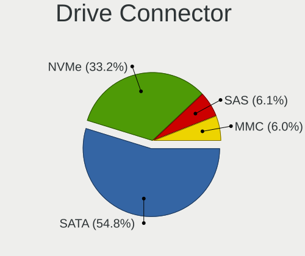

| Type | Computers | Drives | Percent |
|------|-----------|--------|---------|
| SATA | 8595      | 18454  | 54.76%  |
| NVMe | 5214      | 8167   | 33.22%  |
| SAS  | 950       | 1686   | 6.05%   |
| MMC  | 937       | 1240   | 5.97%   |

Drive Size
----------

Size of hard drive

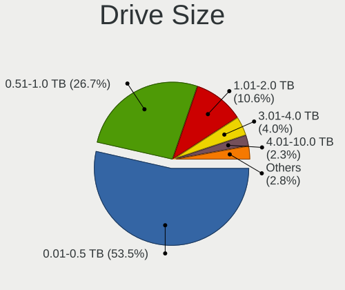

| Size in TB | Computers | Drives | Percent |
|------------|-----------|--------|---------|
| 0.01-0.5   | 6266      | 10390  | 53.53%  |
| 0.51-1.0   | 3127      | 4910   | 26.72%  |
| 1.01-2.0   | 1242      | 2088   | 10.61%  |
| 3.01-4.0   | 472       | 865    | 4.03%   |
| 4.01-10.0  | 266       | 688    | 2.27%   |
| 2.01-3.0   | 263       | 467    | 2.25%   |
| 10.01-20.0 | 62        | 181    | 0.53%   |
| 20.01-50.0 | 6         | 7      | 0.05%   |
| 0          | 1         | 1      | 0.01%   |

Space Total
-----------

Amount of disk space available on the file system

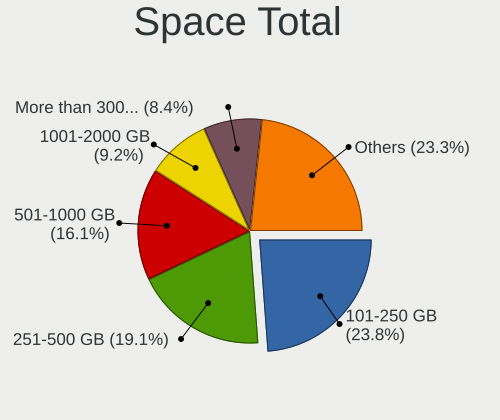

| Size in GB     | Computers | Percent |
|----------------|-----------|---------|
| 101-250        | 3269      | 23.82%  |
| 251-500        | 2623      | 19.11%  |
| 501-1000       | 2212      | 16.12%  |
| 1001-2000      | 1268      | 9.24%   |
| More than 3000 | 1155      | 8.42%   |
| 1-20           | 958       | 6.98%   |
| 51-100         | 761       | 5.54%   |
| 2001-3000      | 505       | 3.68%   |
| Unknown        | 492       | 3.58%   |
| 21-50          | 482       | 3.51%   |

Space Used
----------

Amount of used disk space

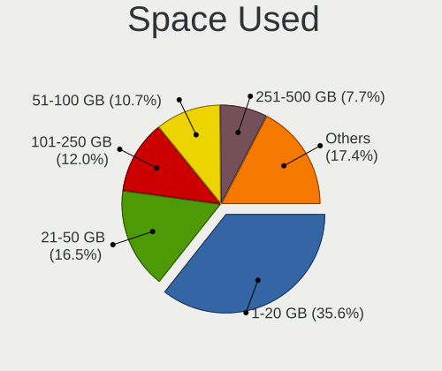

| Used GB        | Computers | Percent |
|----------------|-----------|---------|
| 1-20           | 5067      | 35.64%  |
| 21-50          | 2351      | 16.54%  |
| 101-250        | 1702      | 11.97%  |
| 51-100         | 1523      | 10.71%  |
| 251-500        | 1097      | 7.72%   |
| 501-1000       | 796       | 5.6%    |
| 1001-2000      | 570       | 4.01%   |
| Unknown        | 492       | 3.46%   |
| More than 3000 | 395       | 2.78%   |
| 2001-3000      | 196       | 1.38%   |
| 0              | 27        | 0.19%   |

Malfunc. Drives
---------------

Drive models with a malfunction

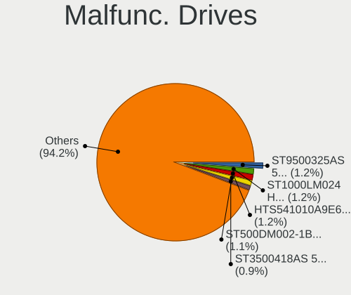

| Model                                    | Computers | Drives | Percent |
|------------------------------------------|-----------|--------|---------|
| Seagate ST9500325AS 500GB                | 12        | 16     | 1.24%   |
| Seagate ST1000LM024 HN-M101MBB 1TB       | 12        | 19     | 1.24%   |
| HGST HTS541010A9E680 1TB                 | 12        | 12     | 1.24%   |
| Seagate ST500DM002-1BD142 500GB          | 11        | 11     | 1.13%   |
| Seagate ST3500418AS 500GB                | 9         | 9      | 0.93%   |
| Seagate ST500LM021-1KJ152 500GB          | 8         | 9      | 0.82%   |
| Seagate ST1000LM035-1RK172 1TB           | 8         | 8      | 0.82%   |
| SanDisk SSD PLUS 480GB                   | 8         | 8      | 0.82%   |
| Seagate ST500LT012-1DG142 500GB          | 7         | 8      | 0.72%   |
| Seagate ST1000DM010-2EP102 1TB           | 7         | 8      | 0.72%   |
| Hitachi HTS547575A9E384 752GB            | 7         | 9      | 0.72%   |
| HGST HTS725050A7E630 500GB               | 7         | 10     | 0.72%   |
| HGST HTS721010A9E630 1TB                 | 7         | 7      | 0.72%   |
| Toshiba MQ01ABD100 1TB                   | 6         | 7      | 0.62%   |
| Seagate ST3500312CS 500GB                | 6         | 8      | 0.62%   |
| Seagate ST2000DM001-1CH164 2TB           | 6         | 7      | 0.62%   |
| Samsung Electronics HD103UJ 1TB          | 6         | 8      | 0.62%   |
| WDC WD30EFRX-68EUZN0 3TB                 | 5         | 6      | 0.51%   |
| SanDisk SSD PLUS 240GB                   | 5         | 5      | 0.51%   |
| Samsung Electronics HD501LJ 500GB        | 5         | 5      | 0.51%   |
| Samsung Electronics HD103SJ 1TB          | 5         | 6      | 0.51%   |
| Hitachi HTS545025B9A300 250GB            | 5         | 5      | 0.51%   |
| Hitachi HDS721010CLA332 1TB              | 5         | 5      | 0.51%   |
| WDC WD5000BEVT-75A0RT0 500GB             | 4         | 6      | 0.41%   |
| WDC WD40EFRX-68WT0N0 4TB                 | 4         | 11     | 0.41%   |
| WDC WD30EFRX-68AX9N0 3TB                 | 4         | 6      | 0.41%   |
| Toshiba DT01ACA050 500GB                 | 4         | 5      | 0.41%   |
| Seagate ST9320325AS 320GB                | 4         | 6      | 0.41%   |
| Seagate ST31000524AS 1TB                 | 4         | 4      | 0.41%   |
| Seagate ST1000LM014-SSHD-8GB             | 4         | 5      | 0.41%   |
| Samsung Electronics SSD 970 EVO Plus 1TB | 4         | 5      | 0.41%   |
| Samsung Electronics SSD 960 EVO 250GB    | 4         | 5      | 0.41%   |
| Samsung Electronics SSD 870 EVO 2TB      | 4         | 8      | 0.41%   |
| Hitachi HTS542512K9SA00 120GB            | 4         | 4      | 0.41%   |
| Hitachi HDT721010SLA360 1TB              | 4         | 5      | 0.41%   |
| Crucial CT525MX300SSD1 528GB             | 4         | 4      | 0.41%   |
| WDC WD6400AAKS-22A7B2 640GB              | 3         | 3      | 0.31%   |
| WDC WD60EFRX-68L0BN1 6TB                 | 3         | 20     | 0.31%   |
| WDC WD5000AAKX-75U6AA0 500GB             | 3         | 3      | 0.31%   |
| WDC WD30EZRX-00D8PB0 3TB                 | 3         | 5      | 0.31%   |

Malfunc. Drive Vendor
---------------------

Vendors of faulty drives

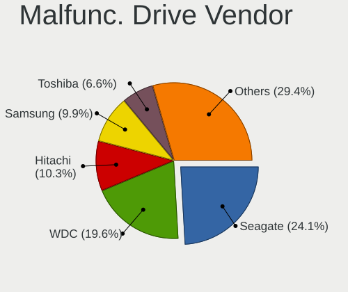

| Vendor                       | Computers | Drives | Percent |
|------------------------------|-----------|--------|---------|
| Seagate                      | 226       | 296    | 24.09%  |
| WDC                          | 184       | 274    | 19.62%  |
| Hitachi                      | 97        | 128    | 10.34%  |
| Samsung Electronics          | 93        | 118    | 9.91%   |
| Toshiba                      | 62        | 71     | 6.61%   |
| Crucial                      | 39        | 47     | 4.16%   |
| HGST                         | 31        | 34     | 3.3%    |
| Intel                        | 30        | 44     | 3.2%    |
| SanDisk                      | 29        | 33     | 3.09%   |
| SK hynix                     | 19        | 21     | 2.03%   |
| Kingston                     | 16        | 22     | 1.71%   |
| Micron Technology            | 9         | 9      | 0.96%   |
| A-DATA Technology            | 8         | 11     | 0.85%   |
| LITEON                       | 7         | 8      | 0.75%   |
| Corsair                      | 7         | 11     | 0.75%   |
| Maxtor                       | 6         | 8      | 0.64%   |
| Fujitsu                      | 6         | 7      | 0.64%   |
| China                        | 6         | 9      | 0.64%   |
| Apple                        | 6         | 7      | 0.64%   |
| Netac                        | 5         | 6      | 0.53%   |
| OCZ                          | 4         | 4      | 0.43%   |
| Drevo                        | 4         | 13     | 0.43%   |
| Hewlett-Packard              | 3         | 3      | 0.32%   |
| BAITITON                     | 3         | 9      | 0.32%   |
| WD MediaMax                  | 2         | 2      | 0.21%   |
| Unknown                      | 2         | 2      | 0.21%   |
| PNY                          | 2         | 2      | 0.21%   |
| LITEONIT                     | 2         | 3      | 0.21%   |
| ADATA Technology             | 2         | 2      | 0.21%   |
| Zheino                       | 1         | 2      | 0.11%   |
| XUM                          | 1         | 1      | 0.11%   |
| XrayDisk                     | 1         | 1      | 0.11%   |
| VENO                         | 1         | 1      | 0.11%   |
| Transcend                    | 1         | 2      | 0.11%   |
| TPH01203000GB                | 1         | 1      | 0.11%   |
| Team                         | 1         | 1      | 0.11%   |
| SSSTC                        | 1         | 1      | 0.11%   |
| SPCC                         | 1         | 1      | 0.11%   |
| Shenzhen Longsys Electronics | 1         | 1      | 0.11%   |
| SABRENT                      | 1         | 1      | 0.11%   |

Malfunc. HDD Vendor
-------------------

Vendors of faulty HDD drives

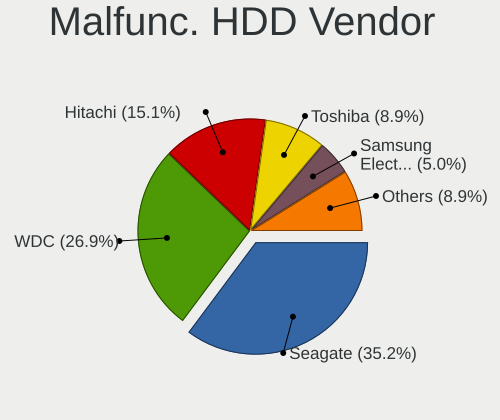

| Vendor              | Computers | Drives | Percent |
|---------------------|-----------|--------|---------|
| Seagate             | 226       | 296    | 35.2%   |
| WDC                 | 173       | 262    | 26.95%  |
| Hitachi             | 97        | 128    | 15.11%  |
| Toshiba             | 57        | 66     | 8.88%   |
| Samsung Electronics | 32        | 42     | 4.98%   |
| HGST                | 31        | 34     | 4.83%   |
| Maxtor              | 6         | 8      | 0.93%   |
| Fujitsu             | 6         | 7      | 0.93%   |
| Apple               | 5         | 6      | 0.78%   |
| Hewlett-Packard     | 3         | 3      | 0.47%   |
| WD MediaMax         | 2         | 2      | 0.31%   |
| Unknown             | 2         | 2      | 0.31%   |
| TPH01203000GB       | 1         | 1      | 0.16%   |
| SABRENT             | 1         | 1      | 0.16%   |

Malfunc. Drive Kind
-------------------

Kinds of faulty drives

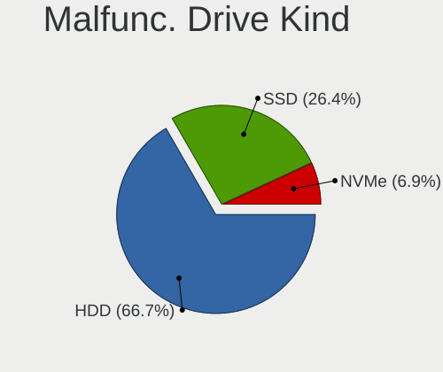

| Kind | Computers | Drives | Percent |
|------|-----------|--------|---------|
| HDD  | 590       | 858    | 66.67%  |
| SSD  | 234       | 299    | 26.44%  |
| NVMe | 61        | 78     | 6.89%   |

Failed Drives
-------------

Failed drive models

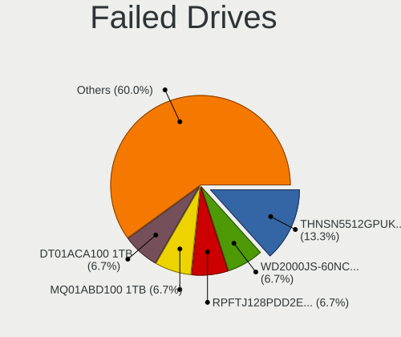

| Model                                         | Computers | Drives | Percent |
|-----------------------------------------------|-----------|--------|---------|
| Toshiba THNSN5512GPUK NVMe 512GB              | 2         | 3      | 13.33%  |
| WDC WD2000JS-60NCB1 200GB                     | 1         | 1      | 6.67%   |
| Union Memory (Shenzhen) RPFTJ128PDD2EWX 128GB | 1         | 2      | 6.67%   |
| Toshiba MQ01ABD100 1TB                        | 1         | 1      | 6.67%   |
| Toshiba DT01ACA100 1TB                        | 1         | 1      | 6.67%   |
| Seagate ST500LM012 HN-M500MBB 500GB           | 1         | 1      | 6.67%   |
| Seagate ST3320613AS 320GB                     | 1         | 1      | 6.67%   |
| Seagate ST3160815AS 160GB                     | 1         | 1      | 6.67%   |
| Samsung Electronics SSD 980 1TB               | 1         | 1      | 6.67%   |
| Samsung Electronics SSD 960 EVO 250GB         | 1         | 2      | 6.67%   |
| Samsung Electronics HD502IJ 500GB             | 1         | 1      | 6.67%   |
| Samsung Electronics HD204UI 2TB               | 1         | 1      | 6.67%   |
| Hitachi HTS547550A9E384 500GB                 | 1         | 1      | 6.67%   |
| HGST HTS541010A9E680 1TB                      | 1         | 1      | 6.67%   |

Failed Drive Vendor
-------------------

Failed drive vendors

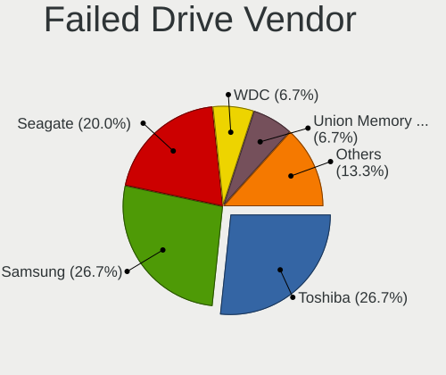

| Vendor                  | Computers | Drives | Percent |
|-------------------------|-----------|--------|---------|
| Toshiba                 | 4         | 5      | 26.67%  |
| Samsung Electronics     | 4         | 5      | 26.67%  |
| Seagate                 | 3         | 3      | 20%     |
| WDC                     | 1         | 1      | 6.67%   |
| Union Memory (Shenzhen) | 1         | 2      | 6.67%   |
| Hitachi                 | 1         | 1      | 6.67%   |
| HGST                    | 1         | 1      | 6.67%   |

Drive Status
------------

Number of failed and malfunc. drives

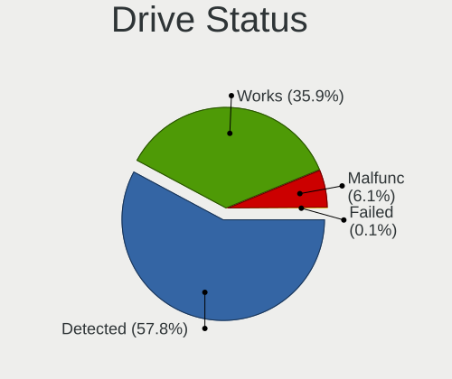

| Status   | Computers | Drives | Percent |
|----------|-----------|--------|---------|
| Detected | 8029      | 17947  | 57.84%  |
| Works    | 4990      | 10347  | 35.95%  |
| Malfunc  | 849       | 1235   | 6.12%   |
| Failed   | 14        | 18     | 0.1%    |

Storage controller
------------------

Storage Vendor
--------------

Storage controller vendors

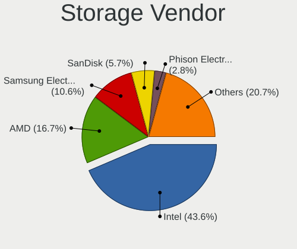

| Vendor                                  | Computers | Percent |
|-----------------------------------------|-----------|---------|
| Intel                                   | 7424      | 43.57%  |
| AMD                                     | 2843      | 16.68%  |
| Samsung Electronics                     | 1798      | 10.55%  |
| SanDisk                                 | 965       | 5.66%   |
| Phison Electronics                      | 475       | 2.79%   |
| Micron/Crucial Technology               | 457       | 2.68%   |
| SK hynix                                | 390       | 2.29%   |
| ASMedia Technology                      | 302       | 1.77%   |
| Kingston Technology Company             | 289       | 1.7%    |
| Micron Technology                       | 260       | 1.53%   |
| Toshiba America Info Systems            | 236       | 1.38%   |
| Nvidia                                  | 195       | 1.14%   |
| KIOXIA                                  | 181       | 1.06%   |
| Marvell Technology Group                | 170       | 1%      |
| Silicon Motion                          | 131       | 0.77%   |
| MAXIO Technology (Hangzhou)             | 119       | 0.7%    |
| JMicron Technology                      | 114       | 0.67%   |
| ADATA Technology                        | 85        | 0.5%    |
| Shenzhen Longsys Electronics            | 61        | 0.36%   |
| LSI Logic / Symbios Logic               | 59        | 0.35%   |
| Broadcom / LSI                          | 49        | 0.29%   |
| Seagate Technology                      | 38        | 0.22%   |
| Apple                                   | 36        | 0.21%   |
| Realtek Semiconductor                   | 35        | 0.21%   |
| Solidigm                                | 30        | 0.18%   |
| Silicon Image                           | 28        | 0.16%   |
| Union Memory (Shenzhen)                 | 26        | 0.15%   |
| O2 Micro                                | 25        | 0.15%   |
| VIA Technologies                        | 22        | 0.13%   |
| Solid State Storage Technology          | 22        | 0.13%   |
| Hewlett-Packard                         | 21        | 0.12%   |
| INNOGRIT                                | 19        | 0.11%   |
| Silicon Integrated Systems [SiS]        | 16        | 0.09%   |
| Lenovo                                  | 15        | 0.09%   |
| Biwin Storage Technology                | 15        | 0.09%   |
| Adaptec                                 | 14        | 0.08%   |
| Netac Technology                        | 11        | 0.06%   |
| Shenzhen Unionmemory Information System | 10        | 0.06%   |
| Lite-On Technology                      | 10        | 0.06%   |
| Yangtze Memory Technologies             | 8         | 0.05%   |

Storage Model
-------------

Storage controller models

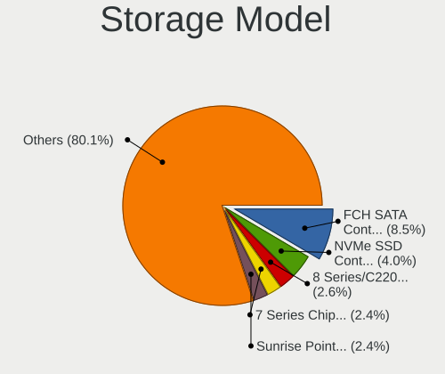

| Model                                                                          | Computers | Percent |
|--------------------------------------------------------------------------------|-----------|---------|
| AMD FCH SATA Controller [AHCI mode]                                            | 1647      | 8.48%   |
| Samsung NVMe SSD Controller SM981/PM981/PM983                                  | 768       | 3.96%   |
| Intel 8 Series/C220 Series Chipset Family 6-port SATA Controller 1 [AHCI mode] | 514       | 2.65%   |
| Intel 7 Series Chipset Family 6-port SATA Controller [AHCI mode]               | 472       | 2.43%   |
| Intel Sunrise Point-LP SATA Controller [AHCI mode]                             | 471       | 2.43%   |
| AMD 400 Series Chipset SATA Controller                                         | 374       | 1.93%   |
| Intel 82801 Mobile SATA Controller [RAID mode]                                 | 366       | 1.89%   |
| AMD 500 Series Chipset SATA Controller                                         | 342       | 1.76%   |
| Intel Volume Management Device NVMe RAID Controller                            | 308       | 1.59%   |
| Samsung NVMe SSD Controller 980 (DRAM-less)                                    | 285       | 1.47%   |
| ASMedia ASM1061/ASM1062 Serial ATA Controller                                  | 283       | 1.46%   |
| Samsung NVMe SSD Controller PM9A1/PM9A3/980PRO                                 | 281       | 1.45%   |
| Intel 6 Series/C200 Series Chipset Family 6 port Mobile SATA AHCI Controller   | 281       | 1.45%   |
| Intel Q170/Q150/B150/H170/H110/Z170/CM236 Chipset SATA Controller [AHCI Mode]  | 279       | 1.44%   |
| Micron/Crucial P2 [Nick P2] / P3 / P3 Plus NVMe PCIe SSD (DRAM-less)           | 260       | 1.34%   |
| Intel 6 Series/C200 Series Chipset Family 6 port Desktop SATA AHCI Controller  | 260       | 1.34%   |
| AMD 600 Series Chipset SATA Controller                                         | 257       | 1.32%   |
| AMD SB7x0/SB8x0/SB9x0 SATA Controller [AHCI mode]                              | 249       | 1.28%   |
| AMD SB7x0/SB8x0/SB9x0 IDE Controller                                           | 236       | 1.22%   |
| Intel 200 Series PCH SATA controller [AHCI mode]                               | 235       | 1.21%   |
| Intel SATA Controller [RAID mode]                                              | 227       | 1.17%   |
| Intel 82801IBM/IEM (ICH9M/ICH9M-E) 4 port SATA Controller [AHCI mode]          | 217       | 1.12%   |
| Intel 8 Series SATA Controller 1 [AHCI mode]                                   | 210       | 1.08%   |
| Intel 7 Series/C210 Series Chipset Family 6-port SATA Controller [AHCI mode]   | 210       | 1.08%   |
| Samsung NVMe SSD Controller SM961/PM961/SM963                                  | 201       | 1.04%   |
| Phison E12 NVMe Controller                                                     | 196       | 1.01%   |
| Intel Wildcat Point-LP SATA Controller [AHCI Mode]                             | 189       | 0.97%   |
| SanDisk Ultra 3D / WD PC SN530, IX SN530, Blue SN550 NVMe SSD (DRAM-less)      | 166       | 0.86%   |
| Intel Celeron/Pentium Silver Processor SATA Controller                         | 165       | 0.85%   |
| Intel Cannon Lake Mobile PCH SATA AHCI Controller                              | 163       | 0.84%   |
| AMD SB7x0/SB8x0/SB9x0 SATA Controller [IDE mode]                               | 163       | 0.84%   |
| Intel Cannon Lake PCH SATA AHCI Controller                                     | 161       | 0.83%   |
| Intel Comet Lake SATA AHCI Controller                                          | 153       | 0.79%   |
| Intel 5 Series/3400 Series Chipset 6 port SATA AHCI Controller                 | 141       | 0.73%   |
| Intel 82801G (ICH7 Family) IDE Controller                                      | 136       | 0.7%    |
| Intel 82801HM/HEM (ICH8M/ICH8M-E) IDE Controller                               | 127       | 0.65%   |
| SanDisk Extreme Pro / WD Black SN750 / PC SN730 / Red SN700 NVMe SSD           | 123       | 0.63%   |
| SK hynix Gold P31/BC711/PC711 NVMe Solid State Drive                           | 121       | 0.62%   |
| SanDisk WD SN560/SN740/SN770/SN5000 NVMe SSD                                   | 119       | 0.61%   |
| Intel NM10/ICH7 Family SATA Controller [IDE mode]                              | 117       | 0.6%    |

Storage Kind
------------

Kind of storage controller (IDE, SATA, NVMe, SAS, ...)

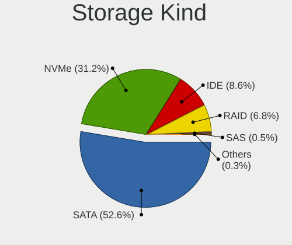

| Kind | Computers | Percent |
|------|-----------|---------|
| SATA | 8816      | 52.63%  |
| NVMe | 5234      | 31.25%  |
| IDE  | 1434      | 8.56%   |
| RAID | 1140      | 6.81%   |
| SAS  | 83        | 0.5%    |
| SCSI | 43        | 0.26%   |

Processor
---------

CPU Vendor
----------

Processor vendors

| Vendor                | Computers | Percent |
|-----------------------|-----------|---------|
| Intel                 | 8905      | 69.77%  |
| AMD                   | 3700      | 28.99%  |
| ARM                   | 149       | 1.17%   |
| Qualcomm              | 3         | 0.02%   |
| Unknown               | 3         | 0.02%   |
| sifive,u74-mc         | 1         | 0.01%   |
| Marvell Semiconductor | 1         | 0.01%   |
| CentaurHauls          | 1         | 0.01%   |

CPU Model
---------

Processor models

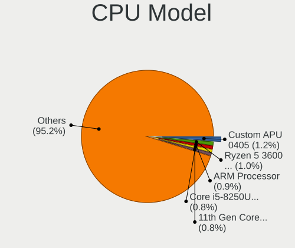

| Model                                         | Computers | Percent |
|-----------------------------------------------|-----------|---------|
| AMD Custom APU 0405                           | 159       | 1.24%   |
| AMD Ryzen 5 3600 6-Core Processor             | 130       | 1.01%   |
| ARM Processor                                 | 114       | 0.89%   |
| Intel Core i5-8250U CPU @ 1.60GHz             | 105       | 0.82%   |
| Intel 11th Gen Core i7-1165G7 @ 2.80GHz       | 105       | 0.82%   |
| Intel 11th Gen Core i5-1135G7 @ 2.40GHz       | 93        | 0.73%   |
| Intel Core i5-7200U CPU @ 2.50GHz             | 91        | 0.71%   |
| Intel Core i5-6300U CPU @ 2.40GHz             | 85        | 0.66%   |
| AMD Ryzen 5 5600X 6-Core Processor            | 82        | 0.64%   |
| AMD Ryzen 7 3700X 8-Core Processor            | 81        | 0.63%   |
| Intel Core i7-8550U CPU @ 1.80GHz             | 80        | 0.62%   |
| Intel Core i5-3320M CPU @ 2.60GHz             | 74        | 0.58%   |
| Intel Core i5-6200U CPU @ 2.30GHz             | 71        | 0.55%   |
| Intel Core i5-3210M CPU @ 2.50GHz             | 69        | 0.54%   |
| Intel Core i7-10510U CPU @ 1.80GHz            | 68        | 0.53%   |
| Intel Core i7-8565U CPU @ 1.80GHz             | 66        | 0.51%   |
| Intel Celeron N4020 CPU @ 1.10GHz             | 63        | 0.49%   |
| Intel Core i7-4790K CPU @ 4.00GHz             | 62        | 0.48%   |
| Intel Core i5-8265U CPU @ 1.60GHz             | 62        | 0.48%   |
| AMD Ryzen 7 2700X Eight-Core Processor        | 62        | 0.48%   |
| Intel Core i7-8750H CPU @ 2.20GHz             | 61        | 0.48%   |
| Intel Core i7-7700HQ CPU @ 2.80GHz            | 61        | 0.48%   |
| Intel Core i7-3770 CPU @ 3.40GHz              | 61        | 0.48%   |
| Intel Core i5-2520M CPU @ 2.50GHz             | 61        | 0.48%   |
| AMD Ryzen 7 5800X 8-Core Processor            | 61        | 0.48%   |
| AMD FX-8350 Eight-Core Processor              | 61        | 0.48%   |
| Intel Core i5-10210U CPU @ 1.60GHz            | 60        | 0.47%   |
| AMD Ryzen 9 5900X 12-Core Processor           | 58        | 0.45%   |
| Intel Core i7-9750H CPU @ 2.60GHz             | 57        | 0.44%   |
| Intel Core i7-7500U CPU @ 2.70GHz             | 57        | 0.44%   |
| Intel Core i7-6700K CPU @ 4.00GHz             | 54        | 0.42%   |
| AMD Ryzen 9 3900X 12-Core Processor           | 54        | 0.42%   |
| AMD Ryzen 5 5600G with Radeon Graphics        | 54        | 0.42%   |
| AMD Ryzen 9 5950X 16-Core Processor           | 53        | 0.41%   |
| Intel Core i7-10750H CPU @ 2.60GHz            | 52        | 0.41%   |
| Intel Core i5-8350U CPU @ 1.70GHz             | 52        | 0.41%   |
| AMD Ryzen 5 3500U with Radeon Vega Mobile Gfx | 52        | 0.41%   |
| Intel Core i7-4790 CPU @ 3.60GHz              | 51        | 0.4%    |
| Intel Atom x5-Z8350 CPU @ 1.44GHz             | 51        | 0.4%    |
| Intel Core i5-6500 CPU @ 3.20GHz              | 50        | 0.39%   |

CPU Model Family
----------------

Processor model prefix

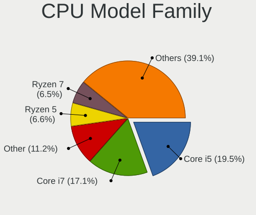

| Model                   | Computers | Percent |
|-------------------------|-----------|---------|
| Intel Core i5           | 2495      | 19.49%  |
| Intel Core i7           | 2184      | 17.06%  |
| Other                   | 1431      | 11.18%  |
| AMD Ryzen 5             | 847       | 6.62%   |
| AMD Ryzen 7             | 833       | 6.51%   |
| Intel Core i3           | 700       | 5.47%   |
| Intel Celeron           | 563       | 4.4%    |
| Intel Core 2 Duo        | 439       | 3.43%   |
| AMD Ryzen 9             | 398       | 3.11%   |
| Intel Xeon              | 351       | 2.74%   |
| Intel Pentium           | 263       | 2.05%   |
| AMD FX                  | 211       | 1.65%   |
| Intel Atom              | 178       | 1.39%   |
| AMD Ryzen 3             | 147       | 1.15%   |
| AMD A6                  | 119       | 0.93%   |
| Intel Pentium Dual-Core | 111       | 0.87%   |
| Intel Core i9           | 109       | 0.85%   |
| AMD A8                  | 106       | 0.83%   |
| Intel Core 2 Quad       | 84        | 0.66%   |
| AMD A10                 | 82        | 0.64%   |
| Intel Core              | 70        | 0.55%   |
| Intel Core 2            | 68        | 0.53%   |
| AMD A4                  | 62        | 0.48%   |
| AMD Ryzen 7 PRO         | 57        | 0.45%   |
| Intel Pentium Dual      | 53        | 0.41%   |
| AMD Athlon II X2        | 49        | 0.38%   |
| AMD Ryzen Threadripper  | 42        | 0.33%   |
| AMD Ryzen 5 PRO         | 37        | 0.29%   |
| Intel Genuine           | 36        | 0.28%   |
| AMD Phenom II X4        | 36        | 0.28%   |
| Intel Pentium Silver    | 33        | 0.26%   |
| AMD Athlon 64 X2        | 32        | 0.25%   |
| AMD Athlon              | 32        | 0.25%   |
| ARM BCM                 | 31        | 0.24%   |
| AMD E                   | 31        | 0.24%   |
| AMD E1                  | 29        | 0.23%   |
| Intel Pentium 4         | 25        | 0.2%    |
| Intel Celeron Dual-Core | 24        | 0.19%   |
| AMD E2                  | 22        | 0.17%   |
| AMD Phenom II X6        | 19        | 0.15%   |

CPU Cores
---------

Number of processor cores

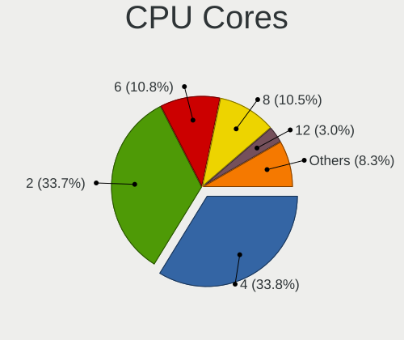

| Number  | Computers | Percent |
|---------|-----------|---------|
| 4       | 4327      | 33.79%  |
| 2       | 4314      | 33.69%  |
| 6       | 1378      | 10.76%  |
| 8       | 1341      | 10.47%  |
| 12      | 382       | 2.98%   |
| 16      | 264       | 2.06%   |
| 1       | 232       | 1.81%   |
| 10      | 179       | 1.4%    |
| 14      | 139       | 1.09%   |
| 3       | 77        | 0.6%    |
| 24      | 63        | 0.49%   |
| Unknown | 40        | 0.31%   |
| 20      | 23        | 0.18%   |
| 32      | 15        | 0.12%   |
| 28      | 7         | 0.05%   |
| 40      | 5         | 0.04%   |
| 64      | 4         | 0.03%   |
| 36      | 4         | 0.03%   |
| 18      | 4         | 0.03%   |
| 48      | 3         | 0.02%   |
| 56      | 1         | 0.01%   |
| 44      | 1         | 0.01%   |
| 22      | 1         | 0.01%   |
| 7       | 1         | 0.01%   |
| 5       | 1         | 0.01%   |

CPU Sockets
-----------

Number of sockets

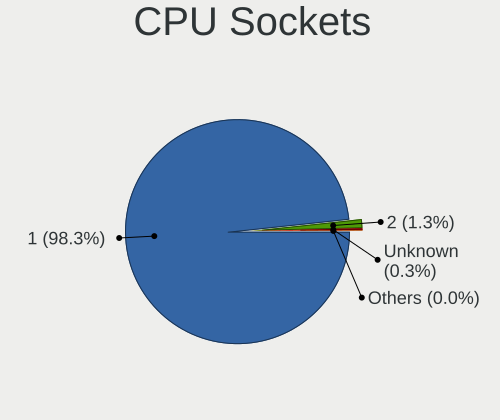

| Number  | Computers | Percent |
|---------|-----------|---------|
| 1       | 12549     | 98.3%   |
| 2       | 166       | 1.3%    |
| Unknown | 40        | 0.31%   |
| 4       | 4         | 0.03%   |
| 20      | 3         | 0.02%   |
| 3       | 2         | 0.02%   |
| 14      | 1         | 0.01%   |
| 0       | 1         | 0.01%   |

CPU Threads
-----------

Threads per core (Hyper-Threading)

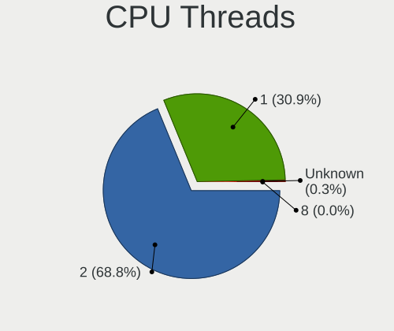

| Number  | Computers | Percent |
|---------|-----------|---------|
| 2       | 8798      | 68.79%  |
| 1       | 3950      | 30.88%  |
| Unknown | 40        | 0.31%   |
| 12      | 1         | 0.01%   |
| 8       | 1         | 0.01%   |

CPU Op-Modes
------------

CPU Operation Modes (32-bit, 64-bit)

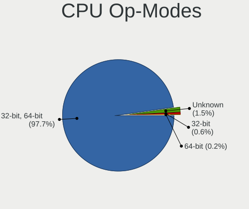

| Op mode        | Computers | Percent |
|----------------|-----------|---------|
| 32-bit, 64-bit | 12496     | 97.69%  |
| Unknown        | 192       | 1.5%    |
| 32-bit         | 81        | 0.63%   |
| 64-bit         | 22        | 0.17%   |

CPU Microcode
-------------

Microcode number

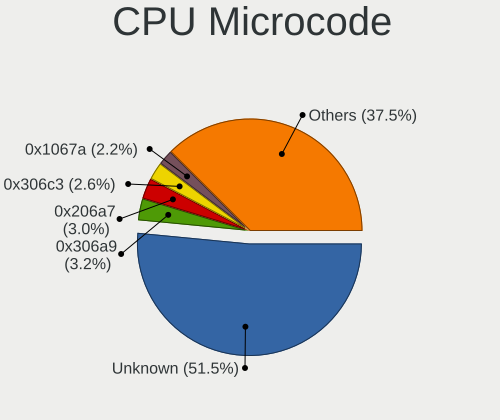

| Number     | Computers | Percent |
|------------|-----------|---------|
| Unknown    | 6859      | 51.52%  |
| 0x306a9    | 421       | 3.16%   |
| 0x206a7    | 402       | 3.02%   |
| 0x306c3    | 342       | 2.57%   |
| 0x1067a    | 294       | 2.21%   |
| 0x906ea    | 178       | 1.34%   |
| 0x506e3    | 162       | 1.22%   |
| 0x806ea    | 158       | 1.19%   |
| 0x806e9    | 149       | 1.12%   |
| 0x08701021 | 149       | 1.12%   |
| 0x406e3    | 143       | 1.07%   |
| 0x806ec    | 142       | 1.07%   |
| 0x40651    | 140       | 1.05%   |
| 0x20655    | 129       | 0.97%   |
| 0x806c1    | 123       | 0.92%   |
| 0x906e9    | 122       | 0.92%   |
| 0x306d4    | 119       | 0.89%   |
| 0x6fd      | 103       | 0.77%   |
| 0x406c4    | 97        | 0.73%   |
| 0x06000852 | 92        | 0.69%   |
| 0x0800820d | 89        | 0.67%   |
| 0x010000c8 | 88        | 0.66%   |
| 0x08108109 | 84        | 0.63%   |
| 0x30678    | 81        | 0.61%   |
| 0x10676    | 75        | 0.56%   |
| 0x06001119 | 75        | 0.56%   |
| 0x0a50000c | 69        | 0.52%   |
| 0x506c9    | 60        | 0.45%   |
| 0x08701013 | 58        | 0.44%   |
| 0x06006705 | 58        | 0.44%   |
| 0xa0652    | 57        | 0.43%   |
| 0x6fb      | 57        | 0.43%   |
| 0x08600106 | 55        | 0.41%   |
| 0x706e5    | 53        | 0.4%    |
| 0x20652    | 49        | 0.37%   |
| 0x906ed    | 47        | 0.35%   |
| 0x406c3    | 46        | 0.35%   |
| 0x0a50000d | 45        | 0.34%   |
| 0x706a1    | 43        | 0.32%   |
| 0x08108102 | 43        | 0.32%   |

CPU Microarch
-------------

Microarchitecture

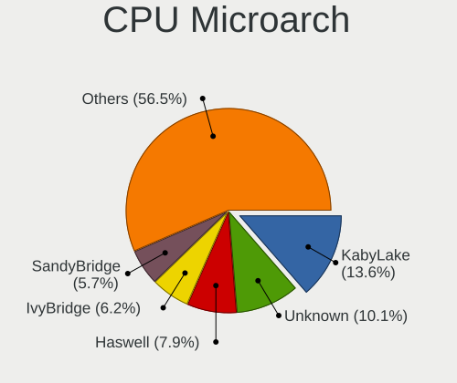

| Name              | Computers | Percent |
|-------------------|-----------|---------|
| KabyLake          | 1746      | 13.62%  |
| Unknown           | 1294      | 10.09%  |
| Haswell           | 1008      | 7.86%   |
| IvyBridge         | 793       | 6.19%   |
| SandyBridge       | 736       | 5.74%   |
| Skylake           | 676       | 5.27%   |
| Zen 3             | 641       | 5%      |
| Zen 2             | 590       | 4.6%    |
| Penryn            | 552       | 4.31%   |
| Zen+              | 386       | 3.01%   |
| Alderlake Hybrid  | 382       | 2.98%   |
| Silvermont        | 355       | 2.77%   |
| Westmere          | 338       | 2.64%   |
| Core              | 328       | 2.56%   |
| TigerLake         | 310       | 2.42%   |
| Broadwell         | 285       | 2.22%   |
| Piledriver        | 270       | 2.11%   |
| CometLake         | 257       | 2%      |
| Zen               | 228       | 1.78%   |
| K10               | 216       | 1.68%   |
| Goldmont plus     | 193       | 1.51%   |
| IceLake           | 181       | 1.41%   |
| Excavator         | 181       | 1.41%   |
| Nehalem           | 105       | 0.82%   |
| Goldmont          | 93        | 0.73%   |
| Puma              | 81        | 0.63%   |
| Steamroller       | 75        | 0.59%   |
| K8 Hammer         | 71        | 0.55%   |
| Bobcat            | 61        | 0.48%   |
| Bonnell           | 60        | 0.47%   |
| NetBurst          | 47        | 0.37%   |
| P6                | 43        | 0.34%   |
| Jaguar            | 42        | 0.33%   |
| Gracemont         | 40        | 0.31%   |
| Bulldozer         | 40        | 0.31%   |
| Tremont           | 33        | 0.26%   |
| Meteorlake Hybrid | 32        | 0.25%   |
| K10 Llano         | 20        | 0.16%   |
| K8 & K10 hybrid   | 14        | 0.11%   |
| Lunarlake Hybrid  | 7         | 0.05%   |

Graphics
--------

GPU Vendor
----------

Vendors of graphics cards

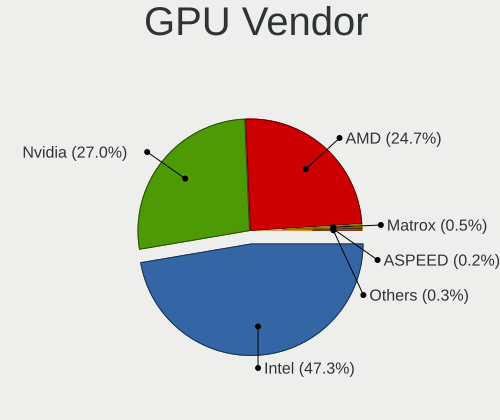

| Vendor                                       | Computers | Percent |
|----------------------------------------------|-----------|---------|
| Intel                                        | 6881      | 47.32%  |
| Nvidia                                       | 3925      | 26.99%  |
| AMD                                          | 3590      | 24.69%  |
| Matrox Electronics Systems                   | 71        | 0.49%   |
| ASPEED Technology                            | 36        | 0.25%   |
| Silicon Integrated Systems [SiS]             | 15        | 0.1%    |
| ATI Technologies                             | 9         | 0.06%   |
| VIA Technologies                             | 5         | 0.03%   |
| Red Hat                                      | 5         | 0.03%   |
| XGI Technology (eXtreme Graphics Innovation) | 1         | 0.01%   |
| Huawei Technologies                          | 1         | 0.01%   |
| Alliance Semiconductor                       | 1         | 0.01%   |

GPU Model
---------

Graphics card models

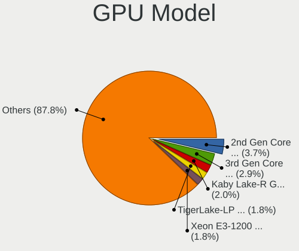

| Model                                                                                    | Computers | Percent |
|------------------------------------------------------------------------------------------|-----------|---------|
| Intel 2nd Generation Core Processor Family Integrated Graphics Controller                | 558       | 3.71%   |
| Intel 3rd Gen Core processor Graphics Controller                                         | 439       | 2.92%   |
| Intel Kaby Lake-R GT2 [UHD Graphics 620]                                                 | 297       | 1.97%   |
| Intel TigerLake-LP GT2 [Iris Xe Graphics]                                                | 276       | 1.83%   |
| Intel Xeon E3-1200 v3/4th Gen Core Processor Integrated Graphics Controller              | 266       | 1.77%   |
| Intel Haswell-ULT Integrated Graphics Controller                                         | 261       | 1.73%   |
| Intel Skylake-U GT2 [HD Graphics 520]                                                    | 243       | 1.61%   |
| Intel Kaby Lake-U GT2 [HD Graphics 620]                                                  | 233       | 1.55%   |
| AMD Ellesmere [Radeon RX 470/480/570/570X/580/580X/590]                                  | 227       | 1.51%   |
| Intel Mobile 4 Series Chipset Integrated Graphics Controller                             | 224       | 1.49%   |
| AMD Picasso/Raven 2 [Radeon Vega Series / Radeon Vega Mobile Series]                     | 221       | 1.47%   |
| Intel Core Processor Integrated Graphics Controller                                      | 207       | 1.38%   |
| Intel CoffeeLake-H GT2 [UHD Graphics 630]                                                | 200       | 1.33%   |
| Intel Atom/Celeron/Pentium Processor x5-E8000/J3xxx/N3xxx Integrated Graphics Controller | 199       | 1.32%   |
| Intel WhiskeyLake-U GT2 [UHD Graphics 620]                                               | 176       | 1.17%   |
| Intel Broadwell-U GT2 [HD Graphics 5500]                                                 | 171       | 1.14%   |
| AMD Renoir [Radeon Vega Series / Radeon Vega Mobile Series]                              | 171       | 1.14%   |
| Intel GeminiLake [UHD Graphics 600]                                                      | 169       | 1.12%   |
| Intel CometLake-U GT2 [UHD Graphics]                                                     | 167       | 1.11%   |
| AMD Cezanne [Radeon Vega Series / Radeon Vega Mobile Series]                             | 165       | 1.1%    |
| AMD VanGogh [AMD Custom GPU 0405]                                                        | 156       | 1.04%   |
| Intel Atom Processor Z36xxx/Z37xxx Series Graphics & Display                             | 154       | 1.02%   |
| AMD Raphael                                                                              | 145       | 0.96%   |
| Intel 4th Gen Core Processor Integrated Graphics Controller                              | 140       | 0.93%   |
| Nvidia GK208B [GeForce GT 710]                                                           | 139       | 0.92%   |
| Intel Skylake-S GT2 [HD Graphics 530]                                                    | 135       | 0.9%    |
| AMD Stoney [Radeon R2/R3/R4/R5 Graphics]                                                 | 125       | 0.83%   |
| Intel Alder Lake-P GT2 [Iris Xe Graphics]                                                | 121       | 0.8%    |
| Nvidia GP107 [GeForce GTX 1050 Ti]                                                       | 114       | 0.76%   |
| Intel CometLake-H GT2 [UHD Graphics]                                                     | 114       | 0.76%   |
| Intel CoffeeLake-S GT2 [UHD Graphics 630]                                                | 110       | 0.73%   |
| Intel Raptor Lake-P [Iris Xe Graphics]                                                   | 108       | 0.72%   |
| Intel Xeon E3-1200 v2/3rd Gen Core processor Graphics Controller                         | 99        | 0.66%   |
| AMD Phoenix1                                                                             | 96        | 0.64%   |
| Intel Kaby Lake-H GT2 [HD Graphics 630]                                                  | 92        | 0.61%   |
| AMD Lucienne                                                                             | 90        | 0.6%    |
| Nvidia GP106 [GeForce GTX 1060 6GB]                                                      | 87        | 0.58%   |
| AMD Raven Ridge [Radeon Vega Series / Radeon Vega Mobile Series]                         | 84        | 0.56%   |
| AMD Rembrandt [Radeon 680M]                                                              | 83        | 0.55%   |
| AMD Navi 10 [Radeon RX 5600 OEM/5600 XT / 5700/5700 XT]                                  | 83        | 0.55%   |

GPU Combo
---------

Combinations of graphics cards

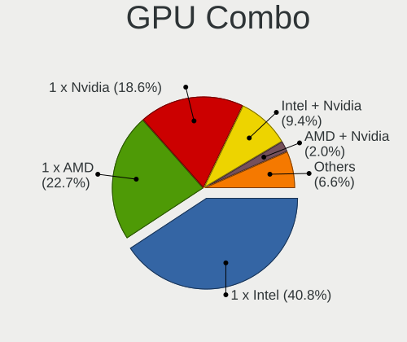

| Name                                 | Computers | Percent |
|--------------------------------------|-----------|---------|
| 1 x Intel                            | 5259      | 40.75%  |
| 1 x AMD                              | 2928      | 22.69%  |
| 1 x Nvidia                           | 2406      | 18.65%  |
| Intel + Nvidia                       | 1211      | 9.38%   |
| AMD + Nvidia                         | 254       | 1.97%   |
| 2 x AMD                              | 214       | 1.66%   |
| Intel + AMD                          | 199       | 1.54%   |
| Other                                | 173       | 1.34%   |
| 2 x Intel                            | 63        | 0.49%   |
| 1 x Matrox                           | 63        | 0.49%   |
| 2 x Nvidia                           | 42        | 0.33%   |
| 1 x ASPEED                           | 18        | 0.14%   |
| 1 x SiS                              | 14        | 0.11%   |
| Nvidia + ASPEED                      | 13        | 0.1%    |
| Nvidia + Matrox                      | 6         | 0.05%   |
| Intel + AMD + 1 x Nvidia             | 6         | 0.05%   |
| 1 x VIA                              | 5         | 0.04%   |
| 1 x Red Hat                          | 5         | 0.04%   |
| 2 x Nvidia + 1 x ASPEED              | 3         | 0.02%   |
| 2 x AMD + 1 x Nvidia                 | 3         | 0.02%   |
| AMD + ASPEED                         | 3         | 0.02%   |
| 3 x AMD                              | 2         | 0.02%   |
| Intel + 2 x Nvidia                   | 2         | 0.02%   |
| Intel + ASPEED                       | 2         | 0.02%   |
| 3 x AMD + 1 x Nvidia                 | 1         | 0.01%   |
| 2 x Nvidia + 1 x Matrox              | 1         | 0.01%   |
| 2 x AMD + 1 x Alliance Semiconductor | 1         | 0.01%   |
| 1 x XGI                              | 1         | 0.01%   |
| 1 x Intel + 3 x Nvidia               | 1         | 0.01%   |
| Intel + 2 x AMD                      | 1         | 0.01%   |
| Intel + AMD + 3 x Nvidia             | 1         | 0.01%   |
| 1 x Huawei Technologies              | 1         | 0.01%   |
| AMD + SiS                            | 1         | 0.01%   |
| AMD + Matrox                         | 1         | 0.01%   |

GPU Driver
----------

Free vs proprietary

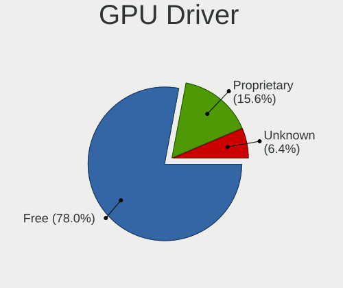

| Driver      | Computers | Percent |
|-------------|-----------|---------|
| Free        | 10158     | 77.97%  |
| Proprietary | 2036      | 15.63%  |
| Unknown     | 834       | 6.4%    |

GPU Memory
----------

Total video memory

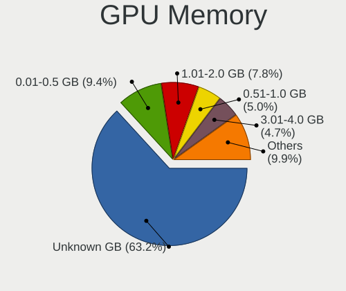

| Size in GB | Computers | Percent |
|------------|-----------|---------|
| Unknown    | 8338      | 63.18%  |
| 0.01-0.5   | 1239      | 9.39%   |
| 1.01-2.0   | 1032      | 7.82%   |
| 0.51-1.0   | 657       | 4.98%   |
| 3.01-4.0   | 624       | 4.73%   |
| 7.01-8.0   | 570       | 4.32%   |
| 8.01-16.0  | 341       | 2.58%   |
| 5.01-6.0   | 255       | 1.93%   |
| 2.01-3.0   | 75        | 0.57%   |
| 16.01-24.0 | 56        | 0.42%   |
| 24.01-32.0 | 4         | 0.03%   |
| 4.01-5.0   | 3         | 0.02%   |
| 32.01-64.0 | 2         | 0.02%   |
| 0          | 1         | 0.01%   |

Monitor
-------

Monitor Vendor
--------------

Monitor vendors

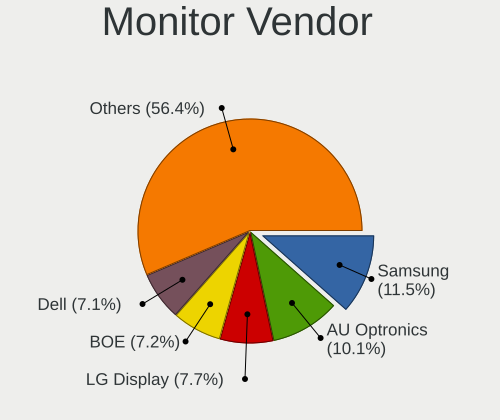

| Vendor                  | Computers | Percent |
|-------------------------|-----------|---------|
| Samsung Electronics     | 1592      | 11.53%  |
| AU Optronics            | 1396      | 10.11%  |
| LG Display              | 1062      | 7.69%   |
| BOE                     | 990       | 7.17%   |
| Dell                    | 974       | 7.06%   |
| Chimei Innolux          | 907       | 6.57%   |
| Acer                    | 543       | 3.93%   |
| Goldstar                | 536       | 3.88%   |
| AOC                     | 462       | 3.35%   |
| Hewlett-Packard         | 440       | 3.19%   |
| BenQ                    | 437       | 3.17%   |
| Apple                   | 362       | 2.62%   |
| Sharp                   | 351       | 2.54%   |
| Lenovo                  | 313       | 2.27%   |
| Iiyama                  | 307       | 2.22%   |
| Ancor Communications    | 228       | 1.65%   |
| Philips                 | 226       | 1.64%   |
| ASUSTek Computer        | 163       | 1.18%   |
| ViewSonic               | 145       | 1.05%   |
| Valve                   | 137       | 0.99%   |
| Sony                    | 129       | 0.93%   |
| MSI                     | 127       | 0.92%   |
| Chi Mei Optoelectronics | 121       | 0.88%   |
| PANDA                   | 95        | 0.69%   |
| Panasonic               | 95        | 0.69%   |
| HannStar                | 92        | 0.67%   |
| Unknown                 | 90        | 0.65%   |
| InfoVision              | 83        | 0.6%    |
| Vestel Elektronik       | 71        | 0.51%   |
| Toshiba                 | 66        | 0.48%   |
| LG Philips              | 60        | 0.43%   |
| HKC                     | 60        | 0.43%   |
| Gigabyte Technology     | 58        | 0.42%   |
| LG Electronics          | 52        | 0.38%   |
| CSO                     | 49        | 0.36%   |
| NEC Computers           | 44        | 0.32%   |
| Hitachi                 | 43        | 0.31%   |
| Eizo                    | 28        | 0.2%    |
| Analogix                | 26        | 0.19%   |
| RTK                     | 25        | 0.18%   |

Monitor Model
-------------

Monitor models

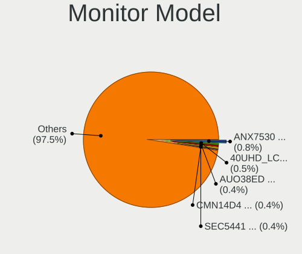

| Model                                                                 | Computers | Percent |
|-----------------------------------------------------------------------|-----------|---------|
| Valve ANX7530 U VLV3001 800x1280 100x150mm 7.1-inch                   | 113       | 0.79%   |
| Vestel Elektronik 40UHD_LCD_TV VES3700 3840x2160 880x500mm 39.8-inch  | 70        | 0.49%   |
| AU Optronics LCD Monitor AUO38ED 1920x1080 344x193mm 15.5-inch        | 63        | 0.44%   |
| Chimei Innolux LCD Monitor CMN14D4 1920x1080 309x173mm 13.9-inch      | 58        | 0.41%   |
| Samsung Electronics LCD Monitor SEC5441 1280x800 331x207mm 15.4-inch  | 51        | 0.36%   |
| AU Optronics LCD Monitor AUO106C 1366x768 276x155mm 12.5-inch         | 48        | 0.34%   |
| Chimei Innolux LCD Monitor CMN15F5 1920x1080 344x193mm 15.5-inch      | 46        | 0.32%   |
| AOC 2270W AOC2270 1920x1080 477x268mm 21.5-inch                       | 42        | 0.29%   |
| AU Optronics LCD Monitor AUO21ED 1920x1080 344x193mm 15.5-inch        | 40        | 0.28%   |
| Goldstar LG ULTRAWIDE GSM59F1 2560x1080 670x280mm 28.6-inch           | 39        | 0.27%   |
| LG Display LCD Monitor LGD02DC 1366x768 344x194mm 15.5-inch           | 38        | 0.27%   |
| AU Optronics LCD Monitor AUO22EC 1366x768 344x193mm 15.5-inch         | 38        | 0.27%   |
| Panasonic TV MEIA296 1920x1080 698x392mm 31.5-inch                    | 37        | 0.26%   |
| Goldstar FULL HD GSM5B55 1920x1080 480x270mm 21.7-inch                | 36        | 0.25%   |
| Chimei Innolux LCD Monitor CMN15E7 1920x1080 344x193mm 15.5-inch      | 31        | 0.22%   |
| Chimei Innolux LCD Monitor CMN15DB 1366x768 344x193mm 15.5-inch       | 31        | 0.22%   |
| BenQ GL2450H BNQ78A7 1920x1080 531x298mm 24.0-inch                    | 31        | 0.22%   |
| Dell U2412M DELA07A 1920x1200 518x324mm 24.1-inch                     | 30        | 0.21%   |
| Goldstar LG TV SSCR2 GSMC0C8 3840x2160                                | 29        | 0.2%    |
| LG Display LCD Monitor LGD033A 1366x768 344x194mm 15.5-inch           | 28        | 0.2%    |
| AU Optronics LCD Monitor AUO403D 1920x1080 309x174mm 14.0-inch        | 28        | 0.2%    |
| AOC 2369M AOC2369 1920x1080 509x286mm 23.0-inch                       | 28        | 0.2%    |
| Chimei Innolux LCD Monitor CMN14C9 1920x1080 309x173mm 13.9-inch      | 27        | 0.19%   |
| AU Optronics LCD Monitor AUO2E3C 1366x768 309x173mm 13.9-inch         | 27        | 0.19%   |
| Unknown LCD Monitor FFFF 2288x1287 2550x2550mm 142.0-inch             | 26        | 0.18%   |
| Samsung Electronics C24F390 SAM0D2C 1920x1080 521x293mm 23.5-inch     | 26        | 0.18%   |
| Panasonic VVX11F009G00 MEI96A2 1920x1080 344x193mm 15.5-inch          | 26        | 0.18%   |
| Analogix ANX7530 U ANX7539 720x1280                                   | 26        | 0.18%   |
| AOC 27G2G4 AOC2702 1920x1080 598x336mm 27.0-inch                      | 25        | 0.18%   |
| LG Display LCD Monitor LGD0555 2736x1824 260x173mm 12.3-inch          | 24        | 0.17%   |
| Chimei Innolux LCD Monitor CMN1132 1366x768 256x144mm 11.6-inch       | 23        | 0.16%   |
| Toshiba 43UHD_LCD_TV TSB3700 3840x2160 940x540mm 42.7-inch            | 22        | 0.15%   |
| Philips PHL 273V7 PHLC156 1920x1080 598x336mm 27.0-inch               | 22        | 0.15%   |
| AOC 24G2W1G3 AOC2402 1920x1080 527x296mm 23.8-inch                    | 22        | 0.15%   |
| Samsung Electronics LCD Monitor SDC3853 2736x1824 260x173mm 12.3-inch | 21        | 0.15%   |
| BOE LCD Monitor BOE0687 1920x1080 344x193mm 15.5-inch                 | 21        | 0.15%   |
| AU Optronics LCD Monitor AUO21EC 1366x768 344x193mm 15.5-inch         | 21        | 0.15%   |
| Acer S240HL ACR0289 1920x1080 531x299mm 24.0-inch                     | 21        | 0.15%   |
| Acer K242HL ACR03E3 1920x1080 531x299mm 24.0-inch                     | 21        | 0.15%   |
| Goldstar HDR 4K GSM7707 3840x2160 600x340mm 27.2-inch                 | 20        | 0.14%   |

Monitor Resolution
------------------

Monitor screen resolution

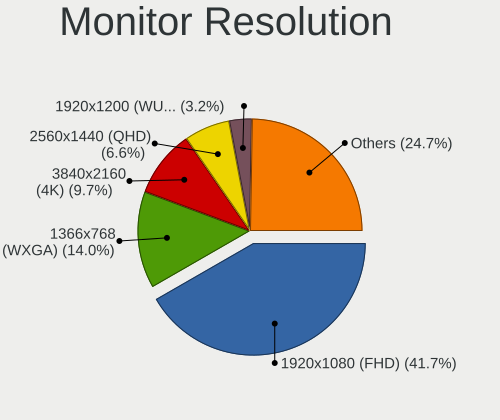

| Resolution         | Computers | Percent |
|--------------------|-----------|---------|
| 1920x1080 (FHD)    | 5518      | 41.69%  |
| 1366x768 (WXGA)    | 1853      | 14%     |
| 3840x2160 (4K)     | 1283      | 9.69%   |
| 2560x1440 (QHD)    | 878       | 6.63%   |
| 1920x1200 (WUXGA)  | 430       | 3.25%   |
| 1600x900 (HD+)     | 314       | 2.37%   |
| 1280x1024 (SXGA)   | 312       | 2.36%   |
| 1280x800 (WXGA)    | 283       | 2.14%   |
| 1680x1050 (WSXGA+) | 269       | 2.03%   |
| 1440x900 (WXGA+)   | 261       | 1.97%   |
| 3440x1440          | 221       | 1.67%   |
| 2560x1600          | 180       | 1.36%   |
| 800x1280           | 152       | 1.15%   |
| Unknown            | 151       | 1.14%   |
| 2880x1800          | 124       | 0.94%   |
| 2560x1080          | 98        | 0.74%   |
| 3840x1080          | 82        | 0.62%   |
| 1360x768           | 80        | 0.6%    |
| 3840x2400          | 67        | 0.51%   |
| 1920x540           | 63        | 0.48%   |
| 2880x1920          | 49        | 0.37%   |
| 2160x1440          | 40        | 0.3%    |
| 1024x768 (XGA)     | 40        | 0.3%    |
| 1600x1200          | 34        | 0.26%   |
| 3200x1800 (QHD+)   | 32        | 0.24%   |
| 2288x1287          | 30        | 0.23%   |
| 1024x600           | 29        | 0.22%   |
| 1920x1280          | 26        | 0.2%    |
| 1280x720 (HD)      | 25        | 0.19%   |
| 2736x1824          | 23        | 0.17%   |
| 2256x1504          | 22        | 0.17%   |
| 3840x1600          | 16        | 0.12%   |
| 3200x2000          | 13        | 0.1%    |
| 3456x2160          | 11        | 0.08%   |
| 3072x1920          | 11        | 0.08%   |
| 2240x1400          | 11        | 0.08%   |
| 3840x1200          | 9         | 0.07%   |
| 5120x1440          | 8         | 0.06%   |
| 3000x2000          | 8         | 0.06%   |
| 2880x1620          | 8         | 0.06%   |

Monitor Diagonal
----------------

Diagonal size in inches

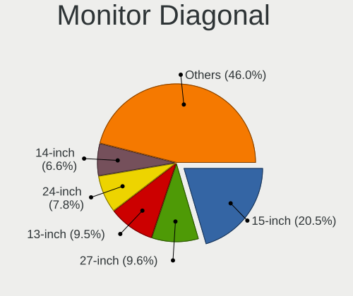

| Inches  | Computers | Percent |
|---------|-----------|---------|
| 15      | 2812      | 20.47%  |
| 27      | 1323      | 9.63%   |
| 13      | 1301      | 9.47%   |
| 24      | 1065      | 7.75%   |
| 14      | 911       | 6.63%   |
| 23      | 793       | 5.77%   |
| 21      | 744       | 5.42%   |
| Unknown | 627       | 4.57%   |
| 17      | 551       | 4.01%   |
| 31      | 465       | 3.39%   |
| 12      | 337       | 2.45%   |
| 19      | 278       | 2.02%   |
| 34      | 257       | 1.87%   |
| 84      | 248       | 1.81%   |
| 11      | 202       | 1.47%   |
| 16      | 201       | 1.46%   |
| 22      | 168       | 1.22%   |
| 20      | 145       | 1.06%   |
| 7       | 139       | 1.01%   |
| 18      | 133       | 0.97%   |
| 72      | 107       | 0.78%   |
| 32      | 90        | 0.66%   |
| 26      | 90        | 0.66%   |
| 10      | 62        | 0.45%   |
| 40      | 59        | 0.43%   |
| 25      | 59        | 0.43%   |
| 54      | 49        | 0.36%   |
| 48      | 42        | 0.31%   |
| 28      | 33        | 0.24%   |
| 65      | 31        | 0.23%   |
| 33      | 29        | 0.21%   |
| 3       | 27        | 0.2%    |
| 142     | 26        | 0.19%   |
| 8       | 24        | 0.17%   |
| 43      | 22        | 0.16%   |
| 46      | 21        | 0.15%   |
| 52      | 20        | 0.15%   |
| 39      | 20        | 0.15%   |
| 29      | 19        | 0.14%   |
| 63      | 18        | 0.13%   |

Monitor Width
-------------

Physical width

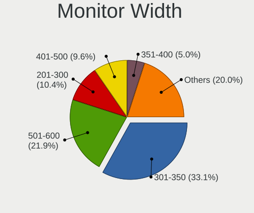

| Width in mm    | Computers | Percent |
|----------------|-----------|---------|
| 301-350        | 4457      | 33.08%  |
| 501-600        | 2950      | 21.89%  |
| 201-300        | 1405      | 10.43%  |
| 401-500        | 1300      | 9.65%   |
| 351-400        | 667       | 4.95%   |
| 601-700        | 666       | 4.94%   |
| Unknown        | 627       | 4.65%   |
| 701-800        | 390       | 2.89%   |
| 1501-2000      | 373       | 2.77%   |
| 1001-1500      | 263       | 1.95%   |
| 1-100          | 153       | 1.14%   |
| 801-900        | 111       | 0.82%   |
| 901-1000       | 48        | 0.36%   |
| 101-200        | 35        | 0.26%   |
| More than 2000 | 29        | 0.22%   |

Aspect Ratio
------------

Proportional relationship between the width and the height

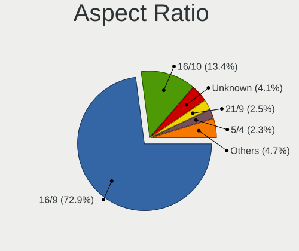

| Ratio   | Computers | Percent |
|---------|-----------|---------|
| 16/9    | 9142      | 72.94%  |
| 16/10   | 1674      | 13.36%  |
| Unknown | 519       | 4.14%   |
| 21/9    | 311       | 2.48%   |
| 5/4     | 294       | 2.35%   |
| 3/2     | 204       | 1.63%   |
| 0.67    | 113       | 0.9%    |
| 4/3     | 87        | 0.69%   |
| 32/9    | 57        | 0.45%   |
| 6/5     | 46        | 0.37%   |
| 1.00    | 32        | 0.26%   |
| 0.62    | 21        | 0.17%   |
| 0.63    | 10        | 0.08%   |
| 0.56    | 7         | 0.06%   |
| 3.20    | 5         | 0.04%   |
| 3.40    | 4         | 0.03%   |
| 0.89    | 4         | 0.03%   |
| 3.73    | 1         | 0.01%   |
| 2.00    | 1         | 0.01%   |
| 0.45    | 1         | 0.01%   |
| 0.25    | 1         | 0.01%   |

Monitor Area
------------

Area in inch²

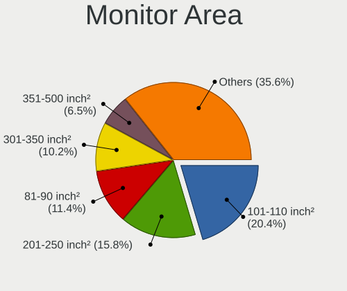

| Area in inch² | Computers | Percent |
|----------------|-----------|---------|
| 101-110        | 2772      | 20.41%  |
| 201-250        | 2149      | 15.83%  |
| 81-90          | 1554      | 11.44%  |
| 301-350        | 1387      | 10.21%  |
| 351-500        | 877       | 6.46%   |
| 151-200        | 656       | 4.83%   |
| 71-80          | 640       | 4.71%   |
| Unknown        | 627       | 4.62%   |
| More than 1000 | 579       | 4.26%   |
| 251-300        | 410       | 3.02%   |
| 121-130        | 345       | 2.54%   |
| 61-70          | 319       | 2.35%   |
| 501-1000       | 241       | 1.77%   |
| 141-150        | 235       | 1.73%   |
| 111-120        | 227       | 1.67%   |
| 51-60          | 211       | 1.55%   |
| 1-40           | 187       | 1.38%   |
| 131-140        | 67        | 0.49%   |
| 41-50          | 57        | 0.42%   |
| 91-100         | 39        | 0.29%   |

Pixel Density
-------------

Pixels per inch

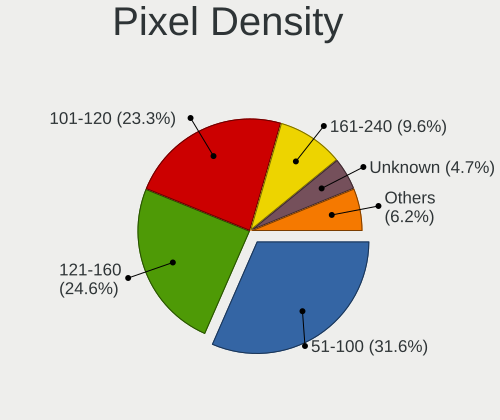

| Density       | Computers | Percent |
|---------------|-----------|---------|
| 51-100        | 4179      | 31.56%  |
| 121-160       | 3252      | 24.56%  |
| 101-120       | 3092      | 23.35%  |
| 161-240       | 1276      | 9.64%   |
| Unknown       | 627       | 4.73%   |
| More than 240 | 480       | 3.62%   |
| 1-50          | 337       | 2.54%   |

Multiple Monitors
-----------------

Total monitors connected

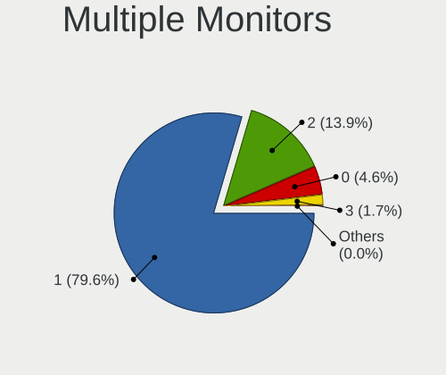

| Total | Computers | Percent |
|-------|-----------|---------|
| 1     | 10416     | 79.55%  |
| 2     | 1821      | 13.91%  |
| 0     | 607       | 4.64%   |
| 3     | 222       | 1.7%    |
| 4     | 22        | 0.17%   |
| 5     | 4         | 0.03%   |
| 6     | 1         | 0.01%   |

Network
-------

Net Controller Vendor
---------------------

Controller vendors

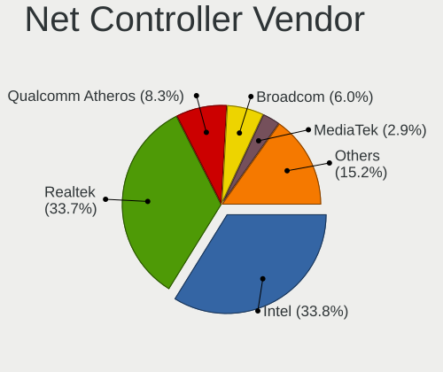

| Vendor                            | Computers | Percent |
|-----------------------------------|-----------|---------|
| Intel                             | 6477      | 33.83%  |
| Realtek Semiconductor             | 6454      | 33.71%  |
| Qualcomm Atheros                  | 1598      | 8.35%   |
| Broadcom                          | 1156      | 6.04%   |
| MediaTek                          | 558       | 2.91%   |
| Ralink Technology                 | 289       | 1.51%   |
| Broadcom Limited                  | 248       | 1.3%    |
| Marvell Technology Group          | 242       | 1.26%   |
| TP-Link                           | 236       | 1.23%   |
| Ralink                            | 157       | 0.82%   |
| Nvidia                            | 153       | 0.8%    |
| ASIX Electronics                  | 138       | 0.72%   |
| Shenzhen Goodix Technology        | 105       | 0.55%   |
| DisplayLink                       | 75        | 0.39%   |
| Samsung Electronics               | 73        | 0.38%   |
| Qualcomm                          | 73        | 0.38%   |
| Microsoft                         | 72        | 0.38%   |
| Dell                              | 62        | 0.32%   |
| Ericsson Business Mobile Networks | 58        | 0.3%    |
| Aquantia                          | 51        | 0.27%   |
| NetGear                           | 47        | 0.25%   |
| Lenovo                            | 47        | 0.25%   |
| Huawei Technologies               | 45        | 0.24%   |
| Sierra Wireless                   | 44        | 0.23%   |
| Qualcomm Atheros Communications   | 38        | 0.2%    |
| Edimax Technology                 | 37        | 0.19%   |
| Belkin Components                 | 35        | 0.18%   |
| Google                            | 32        | 0.17%   |
| Raspberry Pi                      | 27        | 0.14%   |
| Microchip Technology              | 27        | 0.14%   |
| ASUSTek Computer                  | 22        | 0.11%   |
| Xiaomi                            | 21        | 0.11%   |
| Hewlett-Packard                   | 21        | 0.11%   |
| Apple                             | 20        | 0.1%    |
| Mellanox Technologies             | 18        | 0.09%   |
| Qualcomm Technologies             | 17        | 0.09%   |
| Fibocom                           | 17        | 0.09%   |
| Silicon Integrated Systems [SiS]  | 16        | 0.08%   |
| D-Link                            | 16        | 0.08%   |
| JMicron Technology                | 15        | 0.08%   |

Net Controller Model
--------------------

Controller models

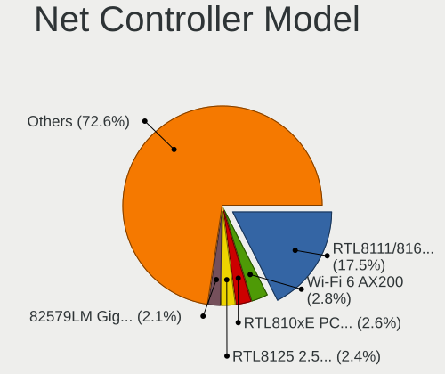

| Model                                                                  | Computers | Percent |
|------------------------------------------------------------------------|-----------|---------|
| Realtek RTL8111/8168/8211/8411 PCI Express Gigabit Ethernet Controller | 3981      | 17.52%  |
| Intel Wi-Fi 6 AX200                                                    | 637       | 2.8%    |
| Realtek RTL810xE PCI Express Fast Ethernet controller                  | 581       | 2.56%   |
| Realtek RTL8125 2.5GbE Controller                                      | 549       | 2.42%   |
| Intel 82579LM Gigabit Network Connection (Lewisville)                  | 469       | 2.06%   |
| Intel Wireless 8265 / 8275                                             | 387       | 1.7%    |
| Realtek RTL8153 Gigabit Ethernet Adapter                               | 385       | 1.69%   |
| Intel I211 Gigabit Network Connection                                  | 371       | 1.63%   |
| Realtek RTL8822CE 802.11ac PCIe Wireless Network Adapter               | 303       | 1.33%   |
| Realtek RTL8821CE 802.11ac PCIe Wireless Network Adapter               | 297       | 1.31%   |
| Intel Wireless 7265                                                    | 294       | 1.29%   |
| Intel Wi-Fi 6E(802.11ax) AX210/AX1675* 2x2 [Typhoon Peak]              | 261       | 1.15%   |
| Intel Wireless 7260                                                    | 258       | 1.14%   |
| MediaTek MT7922 802.11ax PCI Express Wireless Network Adapter          | 247       | 1.09%   |
| Qualcomm Atheros QCA9377 802.11ac Wireless Network Adapter             | 225       | 0.99%   |
| Intel Wi-Fi 6 AX201                                                    | 221       | 0.97%   |
| Intel Ethernet Controller I225-V                                       | 220       | 0.97%   |
| Intel Wireless 8260                                                    | 213       | 0.94%   |
| Qualcomm Atheros QCA6174 802.11ac Wireless Network Adapter             | 212       | 0.93%   |
| Intel Centrino Advanced-N 6205 [Taylor Peak]                           | 199       | 0.88%   |
| Intel Wireless 3165                                                    | 192       | 0.84%   |
| Intel Ethernet Connection I217-LM                                      | 190       | 0.84%   |
| Qualcomm Atheros AR9485 Wireless Network Adapter                       | 186       | 0.82%   |
| Intel Ethernet Connection (2) I219-V                                   | 184       | 0.81%   |
| Qualcomm Atheros QCA9565 / AR9565 Wireless Network Adapter             | 164       | 0.72%   |
| Intel Alder Lake-P PCH CNVi WiFi                                       | 164       | 0.72%   |
| Realtek 802.11ac NIC                                                   | 155       | 0.68%   |
| Intel Wi-Fi 5(802.11ac) Wireless-AC 9x6x [Thunder Peak]                | 148       | 0.65%   |
| Intel Comet Lake PCH-LP CNVi WiFi                                      | 141       | 0.62%   |
| Intel Ethernet Connection (4) I219-LM                                  | 138       | 0.61%   |
| Realtek RTL88x2bu [AC1200 Techkey]                                     | 133       | 0.59%   |
| Intel Cannon Lake PCH CNVi WiFi                                        | 132       | 0.58%   |
| Intel Comet Lake PCH CNVi WiFi                                         | 130       | 0.57%   |
| Qualcomm Atheros AR9285 Wireless Network Adapter (PCI-Express)         | 125       | 0.55%   |
| ASIX AX88179 Gigabit Ethernet                                          | 125       | 0.55%   |
| Intel Cannon Point-LP CNVi [Wireless-AC]                               | 119       | 0.52%   |
| Intel Dual Band Wireless-AC 3168NGW [Stone Peak]                       | 115       | 0.51%   |
| Intel Raptor Lake PCH CNVi WiFi                                        | 113       | 0.5%    |
| Ralink MT7601U Wireless Adapter                                        | 107       | 0.47%   |
| Shenzhen Goodix Fingerprint Reader                                     | 105       | 0.46%   |

Wireless Vendor
---------------

Wireless vendors

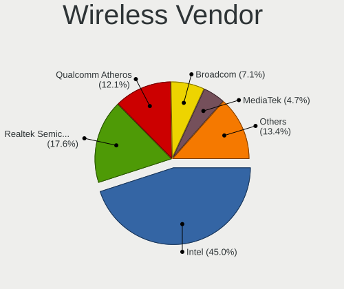

| Vendor                            | Computers | Percent |
|-----------------------------------|-----------|---------|
| Intel                             | 4745      | 45.01%  |
| Realtek Semiconductor             | 1857      | 17.61%  |
| Qualcomm Atheros                  | 1278      | 12.12%  |
| Broadcom                          | 751       | 7.12%   |
| MediaTek                          | 496       | 4.7%    |
| Ralink Technology                 | 289       | 2.74%   |
| TP-Link                           | 225       | 2.13%   |
| Broadcom Limited                  | 187       | 1.77%   |
| Ralink                            | 156       | 1.48%   |
| Microsoft                         | 62        | 0.59%   |
| Marvell Technology Group          | 60        | 0.57%   |
| Qualcomm                          | 57        | 0.54%   |
| NetGear                           | 46        | 0.44%   |
| Sierra Wireless                   | 44        | 0.42%   |
| Qualcomm Atheros Communications   | 38        | 0.36%   |
| Dell                              | 38        | 0.36%   |
| Edimax Technology                 | 37        | 0.35%   |
| Belkin Components                 | 34        | 0.32%   |
| ASUSTek Computer                  | 21        | 0.2%    |
| Fibocom                           | 17        | 0.16%   |
| D-Link                            | 16        | 0.15%   |
| Qualcomm Technologies             | 8         | 0.08%   |
| IMC Networks                      | 7         | 0.07%   |
| Gemtek                            | 7         | 0.07%   |
| D-Link System                     | 7         | 0.07%   |
| Micro Star International          | 6         | 0.06%   |
| Linksys                           | 6         | 0.06%   |
| ZyDAS                             | 5         | 0.05%   |
| Realtek                           | 5         | 0.05%   |
| Wacom                             | 4         | 0.04%   |
| Hewlett-Packard                   | 4         | 0.04%   |
| TRENDnet                          | 3         | 0.03%   |
| Sitecom Europe                    | 3         | 0.03%   |
| Ericsson Business Mobile Networks | 3         | 0.03%   |
| Wilocity                          | 2         | 0.02%   |
| Samsung Electronics               | 2         | 0.02%   |
| Philips (or NXP)                  | 2         | 0.02%   |
| BUFFALO                           | 2         | 0.02%   |
| Z-Com                             | 1         | 0.01%   |
| Wistron NeWeb                     | 1         | 0.01%   |

Wireless Model
--------------

Wireless models

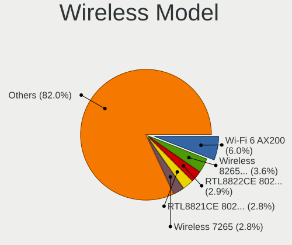

| Model                                                                | Computers | Percent |
|----------------------------------------------------------------------|-----------|---------|
| Intel Wi-Fi 6 AX200                                                  | 637       | 5.99%   |
| Intel Wireless 8265 / 8275                                           | 387       | 3.64%   |
| Realtek RTL8822CE 802.11ac PCIe Wireless Network Adapter             | 303       | 2.85%   |
| Realtek RTL8821CE 802.11ac PCIe Wireless Network Adapter             | 297       | 2.79%   |
| Intel Wireless 7265                                                  | 294       | 2.77%   |
| Intel Wi-Fi 6E(802.11ax) AX210/AX1675* 2x2 [Typhoon Peak]            | 261       | 2.46%   |
| Intel Wireless 7260                                                  | 258       | 2.43%   |
| Qualcomm Atheros QCA9377 802.11ac Wireless Network Adapter           | 225       | 2.12%   |
| Intel Wi-Fi 6 AX201                                                  | 221       | 2.08%   |
| Intel Wireless 8260                                                  | 213       | 2%      |
| Qualcomm Atheros QCA6174 802.11ac Wireless Network Adapter           | 212       | 1.99%   |
| MediaTek MT7922 802.11ax PCI Express Wireless Network Adapter        | 211       | 1.98%   |
| Intel Centrino Advanced-N 6205 [Taylor Peak]                         | 199       | 1.87%   |
| Intel Wireless 3165                                                  | 192       | 1.81%   |
| Qualcomm Atheros AR9485 Wireless Network Adapter                     | 186       | 1.75%   |
| Qualcomm Atheros QCA9565 / AR9565 Wireless Network Adapter           | 164       | 1.54%   |
| Realtek 802.11ac NIC                                                 | 155       | 1.46%   |
| Intel Wi-Fi 5(802.11ac) Wireless-AC 9x6x [Thunder Peak]              | 148       | 1.39%   |
| Intel Comet Lake PCH-LP CNVi WiFi                                    | 141       | 1.33%   |
| Realtek RTL88x2bu [AC1200 Techkey]                                   | 133       | 1.25%   |
| Intel Cannon Lake PCH CNVi WiFi                                      | 132       | 1.24%   |
| Intel Comet Lake PCH CNVi WiFi                                       | 130       | 1.22%   |
| Qualcomm Atheros AR9285 Wireless Network Adapter (PCI-Express)       | 125       | 1.18%   |
| Intel Alder Lake-P PCH CNVi WiFi                                     | 120       | 1.13%   |
| Intel Cannon Point-LP CNVi [Wireless-AC]                             | 119       | 1.12%   |
| Intel Dual Band Wireless-AC 3168NGW [Stone Peak]                     | 115       | 1.08%   |
| Intel Raptor Lake PCH CNVi WiFi                                      | 108       | 1.02%   |
| Ralink MT7601U Wireless Adapter                                      | 107       | 1.01%   |
| MediaTek MT7921 802.11ax PCIe Wireless Network Adapter [Filogic 330] | 102       | 0.96%   |
| Broadcom BCM43142 802.11b/g/n                                        | 101       | 0.95%   |
| Broadcom BCM4360 802.11ac Dual Band Wireless Network Adapter         | 100       | 0.94%   |
| Broadcom BCM4313 802.11bgn Wireless Network Adapter                  | 100       | 0.94%   |
| Realtek RTL8723BE PCIe Wireless Network Adapter                      | 94        | 0.88%   |
| Intel Wireless 3160                                                  | 87        | 0.82%   |
| Qualcomm Atheros AR9462 Wireless Network Adapter                     | 79        | 0.74%   |
| Realtek RTL8192EE PCIe Wireless Network Adapter                      | 75        | 0.71%   |
| Ralink RT5370 Wireless Adapter                                       | 75        | 0.71%   |
| Intel PRO/Wireless 3945ABG [Golan] Network Connection                | 74        | 0.7%    |
| Intel 700 Series Chipset CNVi WiFi                                   | 74        | 0.7%    |
| Broadcom BCM4331 802.11a/b/g/n                                       | 68        | 0.64%   |

Ethernet Vendor
---------------

Ethernet vendors

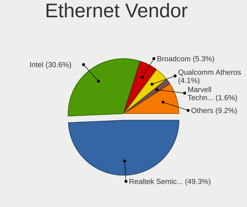

| Vendor                                 | Computers | Percent |
|----------------------------------------|-----------|---------|
| Realtek Semiconductor                  | 5607      | 49.3%   |
| Intel                                  | 3478      | 30.58%  |
| Broadcom                               | 600       | 5.28%   |
| Qualcomm Atheros                       | 461       | 4.05%   |
| Marvell Technology Group               | 182       | 1.6%    |
| Nvidia                                 | 153       | 1.35%   |
| ASIX Electronics                       | 138       | 1.21%   |
| DisplayLink                            | 75        | 0.66%   |
| Samsung Electronics                    | 71        | 0.62%   |
| Broadcom Limited                       | 64        | 0.56%   |
| MediaTek                               | 59        | 0.52%   |
| Aquantia                               | 51        | 0.45%   |
| Lenovo                                 | 43        | 0.38%   |
| Huawei Technologies                    | 39        | 0.34%   |
| Google                                 | 32        | 0.28%   |
| Raspberry Pi                           | 26        | 0.23%   |
| Microchip Technology                   | 24        | 0.21%   |
| Xiaomi                                 | 21        | 0.18%   |
| Mellanox Technologies                  | 17        | 0.15%   |
| Apple                                  | 17        | 0.15%   |
| Qualcomm                               | 16        | 0.14%   |
| Silicon Integrated Systems [SiS]       | 15        | 0.13%   |
| JMicron Technology                     | 15        | 0.13%   |
| OPPO Electronics                       | 14        | 0.12%   |
| Motorola PCS                           | 14        | 0.12%   |
| VIA Technologies                       | 11        | 0.1%    |
| TP-Link                                | 11        | 0.1%    |
| Qualcomm Technologies                  | 9         | 0.08%   |
| Microsoft                              | 9         | 0.08%   |
| ICS Advent                             | 9         | 0.08%   |
| OnePlus Technology (Shenzhen)          | 8         | 0.07%   |
| Suzhou Motorcomm Electronic Technology | 5         | 0.04%   |
| Insyde Software                        | 5         | 0.04%   |
| Hewlett-Packard                        | 5         | 0.04%   |
| Emulex                                 | 5         | 0.04%   |
| Attansic Technology                    | 5         | 0.04%   |
| American Megatrends                    | 5         | 0.04%   |
| T & A Mobile Phones                    | 4         | 0.04%   |
| Spreadtrum Communications              | 4         | 0.04%   |
| Motorcomm Microelectronics.            | 4         | 0.04%   |

Ethernet Model
--------------

Ethernet models

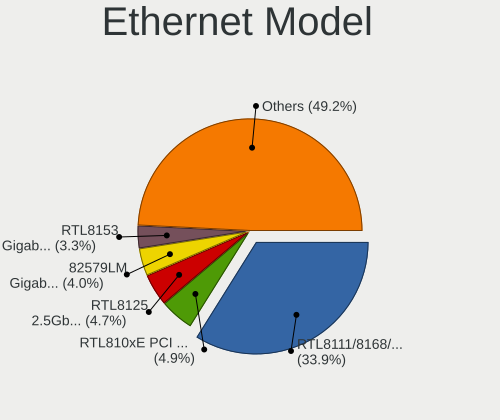

| Model                                                                  | Computers | Percent |
|------------------------------------------------------------------------|-----------|---------|
| Realtek RTL8111/8168/8211/8411 PCI Express Gigabit Ethernet Controller | 3981      | 33.9%   |
| Realtek RTL810xE PCI Express Fast Ethernet controller                  | 581       | 4.95%   |
| Realtek RTL8125 2.5GbE Controller                                      | 549       | 4.67%   |
| Intel 82579LM Gigabit Network Connection (Lewisville)                  | 469       | 3.99%   |
| Realtek RTL8153 Gigabit Ethernet Adapter                               | 385       | 3.28%   |
| Intel I211 Gigabit Network Connection                                  | 371       | 3.16%   |
| Intel Ethernet Controller I225-V                                       | 220       | 1.87%   |
| Intel Ethernet Connection I217-LM                                      | 190       | 1.62%   |
| Intel Ethernet Connection (2) I219-V                                   | 184       | 1.57%   |
| Intel Ethernet Connection (4) I219-LM                                  | 138       | 1.18%   |
| ASIX AX88179 Gigabit Ethernet                                          | 125       | 1.06%   |
| Intel Ethernet Connection (7) I219-V                                   | 105       | 0.89%   |
| Broadcom NetXtreme BCM57766 Gigabit Ethernet PCIe                      | 94        | 0.8%    |
| Intel Ethernet Connection (2) I219-LM                                  | 92        | 0.78%   |
| Intel Ethernet Connection I218-LM                                      | 88        | 0.75%   |
| Intel 82579V Gigabit Network Connection                                | 86        | 0.73%   |
| Intel 82577LM Gigabit Network Connection                               | 86        | 0.73%   |
| Intel Ethernet Connection I219-LM                                      | 83        | 0.71%   |
| Intel Ethernet Connection (4) I219-V                                   | 82        | 0.7%    |
| Qualcomm Atheros AR8151 v2.0 Gigabit Ethernet                          | 77        | 0.66%   |
| Broadcom NetXtreme BCM57765 Gigabit Ethernet PCIe                      | 77        | 0.66%   |
| Intel 82574L Gigabit Network Connection                                | 72        | 0.61%   |
| Qualcomm Atheros Killer E220x Gigabit Ethernet Controller              | 69        | 0.59%   |
| Intel I210 Gigabit Network Connection                                  | 66        | 0.56%   |
| Intel Ethernet Controller I226-V                                       | 66        | 0.56%   |
| Intel Ethernet Connection (3) I218-LM                                  | 66        | 0.56%   |
| Intel Ethernet Connection I217-V                                       | 64        | 0.54%   |
| Intel Ethernet Connection (7) I219-LM                                  | 58        | 0.49%   |
| Nvidia MCP61 Ethernet                                                  | 56        | 0.48%   |
| Intel Ethernet Connection (2) I218-V                                   | 55        | 0.47%   |
| Samsung Galaxy series, misc. (tethering mode)                          | 54        | 0.46%   |
| Intel Ethernet Connection (6) I219-V                                   | 52        | 0.44%   |
| Intel 82567LM Gigabit Network Connection                               | 52        | 0.44%   |
| Broadcom NetXtreme BCM5764M Gigabit Ethernet PCIe                      | 51        | 0.43%   |
| Marvell Group 88E8040 PCI-E Fast Ethernet Controller                   | 48        | 0.41%   |
| Broadcom NetXtreme BCM5761 Gigabit Ethernet PCIe                       | 47        | 0.4%    |
| Qualcomm Atheros Killer E2400 Gigabit Ethernet Controller              | 46        | 0.39%   |
| Intel 82567LM-3 Gigabit Network Connection                             | 46        | 0.39%   |
| Realtek RTL-8100/8101L/8139 PCI Fast Ethernet Adapter                  | 45        | 0.38%   |
| Intel 82566DM-2 Gigabit Network Connection                             | 45        | 0.38%   |

Net Controller Kind
-------------------

Ethernet, WiFi or modem

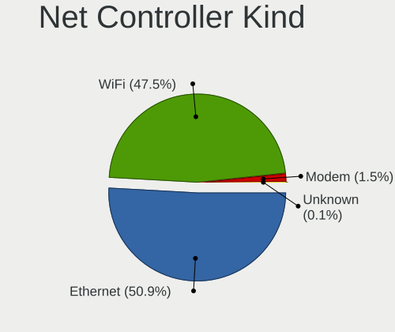

| Kind     | Computers | Percent |
|----------|-----------|---------|
| Ethernet | 10575     | 50.88%  |
| WiFi     | 9865      | 47.46%  |
| Modem    | 317       | 1.53%   |
| Unknown  | 29        | 0.14%   |

Used Controller
---------------

Currently used network controller

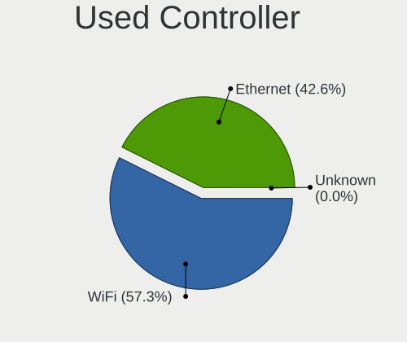

| Kind     | Computers | Percent |
|----------|-----------|---------|
| WiFi     | 7562      | 57.34%  |
| Ethernet | 5619      | 42.61%  |
| Modem    | 4         | 0.03%   |
| Unknown  | 2         | 0.02%   |

NICs
----

Total network controllers on board

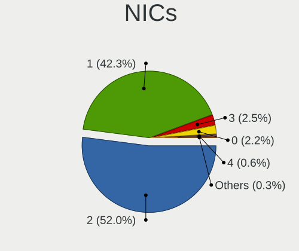

| Total | Computers | Percent |
|-------|-----------|---------|
| 2     | 6684      | 52.05%  |
| 1     | 5432      | 42.3%   |
| 3     | 326       | 2.54%   |
| 0     | 279       | 2.17%   |
| 4     | 78        | 0.61%   |
| 5     | 28        | 0.22%   |
| 6     | 13        | 0.1%    |
| 8     | 2         | 0.02%   |

IPv6
----

IPv6 vs IPv4

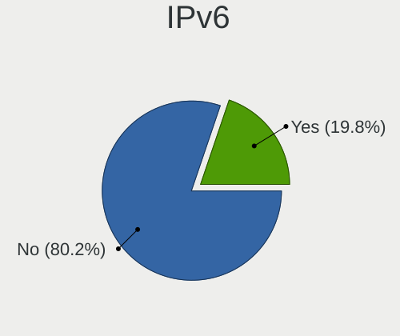

| Used | Computers | Percent |
|------|-----------|---------|
| No   | 10446     | 80.21%  |
| Yes  | 2578      | 19.79%  |

Bluetooth
---------

Bluetooth Vendor
----------------

Controller vendors

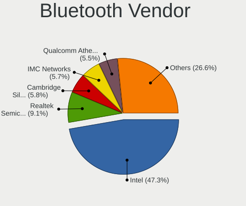

| Vendor                          | Computers | Percent |
|---------------------------------|-----------|---------|
| Intel                           | 3955      | 47.26%  |
| Realtek Semiconductor           | 760       | 9.08%   |
| Cambridge Silicon Radio         | 482       | 5.76%   |
| IMC Networks                    | 479       | 5.72%   |
| Qualcomm Atheros Communications | 464       | 5.54%   |
| Broadcom                        | 418       | 5%      |
| Apple                           | 404       | 4.83%   |
| Foxconn / Hon Hai               | 330       | 3.94%   |
| MediaTek                        | 175       | 2.09%   |
| Lite-On Technology              | 159       | 1.9%    |
| ASUSTek Computer                | 122       | 1.46%   |
| Dell                            | 100       | 1.2%    |
| Toshiba                         | 76        | 0.91%   |
| TP-Link                         | 73        | 0.87%   |
| Hewlett-Packard                 | 63        | 0.75%   |
| Marvell Semiconductor           | 54        | 0.65%   |
| Realtek                         | 35        | 0.42%   |
| USI                             | 26        | 0.31%   |
| Alps Electric                   | 23        | 0.27%   |
| Unknown                         | 23        | 0.27%   |
| Belkin Components               | 22        | 0.26%   |
| Ralink                          | 19        | 0.23%   |
| Integrated System Solution      | 18        | 0.22%   |
| Foxconn International           | 16        | 0.19%   |
| Actions                         | 9         | 0.11%   |
| Askey Computer                  | 8         | 0.1%    |
| Ralink Technology               | 7         | 0.08%   |
| Taiyo Yuden                     | 6         | 0.07%   |
| HTC (High Tech Computer)        | 6         | 0.07%   |
| Micro Star International        | 5         | 0.06%   |
| Mercucys                        | 5         | 0.06%   |
| Logitech                        | 5         | 0.06%   |
| Edimax Technology               | 4         | 0.05%   |
| Fujitsu                         | 3         | 0.04%   |
| SINO WEALTH                     | 2         | 0.02%   |
| Qcom                            | 2         | 0.02%   |
| Cypress Semiconductor           | 2         | 0.02%   |
| Creative Technology             | 2         | 0.02%   |
| Sitecom Europe                  | 1         | 0.01%   |
| Quectel Wireless Solutions      | 1         | 0.01%   |

Bluetooth Model
---------------

Controller models

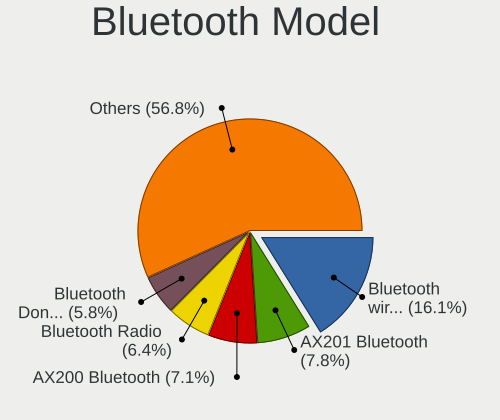

| Model                                               | Computers | Percent |
|-----------------------------------------------------|-----------|---------|
| Intel Bluetooth wireless interface                  | 1352      | 16.14%  |
| Intel AX201 Bluetooth                               | 655       | 7.82%   |
| Intel AX200 Bluetooth                               | 595       | 7.1%    |
| Realtek Bluetooth Radio                             | 534       | 6.38%   |
| Cambridge Silicon Radio Bluetooth Dongle (HCI mode) | 482       | 5.75%   |
| Intel Bluetooth 9460/9560 Jefferson Peak (JfP)      | 373       | 4.45%   |
| Intel Bluetooth Device                              | 369       | 4.41%   |
| IMC Networks Bluetooth Radio                        | 272       | 3.25%   |
| Intel AX210 Bluetooth                               | 238       | 2.84%   |
| Apple Bluetooth Host Controller                     | 188       | 2.24%   |
| Qualcomm Atheros  Bluetooth Device                  | 187       | 2.23%   |
| MediaTek Wireless_Device                            | 175       | 2.09%   |
| IMC Networks Wireless_Device                        | 147       | 1.76%   |
| Foxconn / Hon Hai Wireless_Device                   | 141       | 1.68%   |
| Realtek  Bluetooth 4.2 Adapter                      | 134       | 1.6%    |
| Intel Wireless-AC 9260 Bluetooth Adapter            | 133       | 1.59%   |
| Broadcom BCM20702A0 Bluetooth 4.0                   | 112       | 1.34%   |
| Intel Wireless-AC 3168 Bluetooth                    | 111       | 1.33%   |
| Qualcomm Atheros QCA61x4 Bluetooth 4.0              | 106       | 1.27%   |
| Apple Bluetooth USB Host Controller                 | 104       | 1.24%   |
| Foxconn / Hon Hai Bluetooth Device                  | 94        | 1.12%   |
| Intel Centrino Bluetooth Wireless Transceiver       | 93        | 1.11%   |
| Qualcomm Atheros AR3012 Bluetooth 4.0               | 83        | 0.99%   |
| TP-Link TP-T@- UB500 Adapter                        | 73        | 0.87%   |
| Apple Built-in Bluetooth 2.0+EDR HCI                | 68        | 0.81%   |
| Broadcom BCM2045B (BDC-2.1)                         | 67        | 0.8%    |
| Lite-On Qualcomm Atheros QCA9377 Bluetooth          | 55        | 0.66%   |
| ASUS Broadcom BCM20702A0 Bluetooth                  | 52        | 0.62%   |
| Marvell Bluetooth and Wireless LAN Composite        | 48        | 0.57%   |
| Qualcomm Atheros AR3011 Bluetooth                   | 46        | 0.55%   |
| Broadcom BCM20702 Bluetooth 4.0 [ThinkPad]          | 45        | 0.54%   |
| Intel Centrino Advanced-N 6230 Bluetooth adapter    | 41        | 0.49%   |
| Lite-On Bluetooth Device                            | 39        | 0.47%   |
| Apple Bluetooth HCI                                 | 39        | 0.47%   |
| IMC Networks Bluetooth Device                       | 36        | 0.43%   |
| Realtek Bluetooth Radio                             | 35        | 0.42%   |
| Realtek RTL8821A Bluetooth                          | 33        | 0.39%   |
| Dell DW375 Bluetooth Module                         | 31        | 0.37%   |
| HP Bluetooth 2.0 Interface [Broadcom BCM2045]       | 29        | 0.35%   |
| Lite-On Atheros AR3012 Bluetooth                    | 28        | 0.33%   |

Sound
-----

Sound Vendor
------------

Sound card vendors

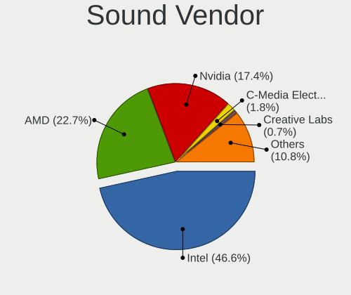

| Vendor                                       | Computers | Percent |
|----------------------------------------------|-----------|---------|
| Intel                                        | 8514      | 46.56%  |
| AMD                                          | 4148      | 22.68%  |
| Nvidia                                       | 3190      | 17.44%  |
| C-Media Electronics                          | 330       | 1.8%    |
| Creative Labs                                | 135       | 0.74%   |
| Logitech                                     | 126       | 0.69%   |
| Texas Instruments                            | 104       | 0.57%   |
| ASUSTek Computer                             | 94        | 0.51%   |
| Focusrite-Novation                           | 75        | 0.41%   |
| Razer USA                                    | 71        | 0.39%   |
| JMTek                                        | 69        | 0.38%   |
| SteelSeries ApS                              | 68        | 0.37%   |
| Realtek Semiconductor                        | 67        | 0.37%   |
| GN Netcom                                    | 65        | 0.36%   |
| Creative Technology                          | 62        | 0.34%   |
| Micro Star International                     | 60        | 0.33%   |
| Plantronics                                  | 48        | 0.26%   |
| Corsair                                      | 42        | 0.23%   |
| Sony                                         | 41        | 0.22%   |
| Kingston Technology                          | 41        | 0.22%   |
| Hewlett-Packard                              | 39        | 0.21%   |
| Lenovo                                       | 36        | 0.2%    |
| Generalplus Technology                       | 35        | 0.19%   |
| Zoran Co. Personal Media Division (Nogatech) | 33        | 0.18%   |
| Blue Microphones                             | 31        | 0.17%   |
| BEHRINGER International                      | 31        | 0.17%   |
| VIA Technologies                             | 29        | 0.16%   |
| Thesycon Systemsoftware & Consulting         | 28        | 0.15%   |
| Apple                                        | 25        | 0.14%   |
| DSEA A/S                                     | 22        | 0.12%   |
| KTMicro                                      | 21        | 0.11%   |
| Jieli Technology                             | 20        | 0.11%   |
| XMOS                                         | 16        | 0.09%   |
| Silicon Integrated Systems [SiS]             | 16        | 0.09%   |
| Dell                                         | 16        | 0.09%   |
| ASRock                                       | 16        | 0.09%   |
| AKAI Professional M.I.                       | 16        | 0.09%   |
| Tenx Technology                              | 14        | 0.08%   |
| Microsoft                                    | 14        | 0.08%   |
| FiiO Electronics Technology                  | 14        | 0.08%   |

Sound Model
-----------

Sound card models

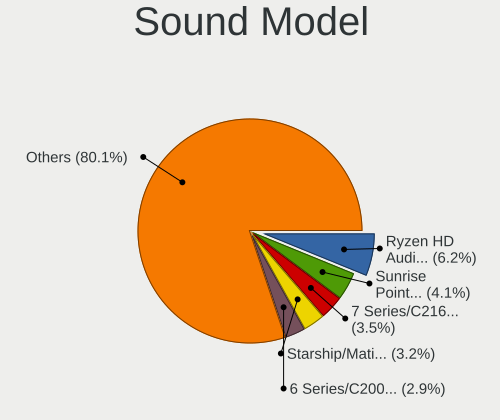

| Model                                                                      | Computers | Percent |
|----------------------------------------------------------------------------|-----------|---------|
| AMD Ryzen HD Audio Controller                                              | 1354      | 6.16%   |
| Intel Sunrise Point-LP HD Audio                                            | 893       | 4.07%   |
| Intel 7 Series/C216 Chipset Family High Definition Audio Controller        | 765       | 3.48%   |
| AMD Starship/Matisse HD Audio Controller                                   | 705       | 3.21%   |
| Intel 6 Series/C200 Series Chipset Family High Definition Audio Controller | 647       | 2.95%   |
| AMD Radeon High Definition Audio Controller                                | 627       | 2.85%   |
| Intel 8 Series/C220 Series Chipset High Definition Audio Controller        | 574       | 2.61%   |
| AMD Renoir/Cezanne HDMI/DP Audio Controller                                | 520       | 2.37%   |
| Intel Xeon E3-1200 v3/4th Gen Core Processor HD Audio Controller           | 433       | 1.97%   |
| Intel Cannon Lake PCH cAVS                                                 | 395       | 1.8%    |
| AMD SBx00 Azalia (Intel HDA)                                               | 388       | 1.77%   |
| Intel 82801I (ICH9 Family) HD Audio Controller                             | 360       | 1.64%   |
| AMD FCH Azalia Controller                                                  | 344       | 1.57%   |
| Intel 100 Series/C230 Series Chipset Family HD Audio Controller            | 339       | 1.54%   |
| Intel 5 Series/3400 Series Chipset High Definition Audio                   | 323       | 1.47%   |
| Intel Tiger Lake-LP Smart Sound Technology Audio Controller                | 311       | 1.42%   |
| AMD Raven/Raven2/Fenghuang HDMI/DP Audio Controller                        | 295       | 1.34%   |
| AMD Family 17h (Models 00h-0fh) HD Audio Controller                        | 273       | 1.24%   |
| Intel 8 Series HD Audio Controller                                         | 266       | 1.21%   |
| Intel Haswell-ULT HD Audio Controller                                      | 264       | 1.2%    |
| Intel 200 Series PCH HD Audio                                              | 258       | 1.17%   |
| AMD Navi 21/23 HDMI/DP Audio Controller                                    | 251       | 1.14%   |
| Intel Broadwell-U Audio Controller                                         | 243       | 1.11%   |
| AMD Ellesmere HDMI Audio [Radeon RX 470/480 / 570/580/590]                 | 239       | 1.09%   |
| Intel Wildcat Point-LP High Definition Audio Controller                    | 232       | 1.06%   |
| Nvidia GP107GL High Definition Audio Controller                            | 226       | 1.03%   |
| Intel NM10/ICH7 Family High Definition Audio Controller                    | 219       | 1%      |
| Intel Alder Lake PCH-P High Definition Audio Controller                    | 214       | 0.97%   |
| Intel Cannon Point-LP High Definition Audio Controller                     | 212       | 0.97%   |
| Nvidia GK208 HDMI/DP Audio Controller                                      | 201       | 0.92%   |
| Intel Celeron/Pentium Silver Processor High Definition Audio               | 192       | 0.87%   |
| Nvidia GA104 High Definition Audio Controller                              | 190       | 0.86%   |
| Intel Comet Lake PCH-LP cAVS                                               | 187       | 0.85%   |
| Intel Comet Lake PCH cAVS                                                  | 187       | 0.85%   |
| Nvidia GP106 High Definition Audio Controller                              | 175       | 0.8%    |
| Nvidia GP104 High Definition Audio Controller                              | 172       | 0.78%   |
| AMD Family 15h (Models 60h-6fh) Audio Controller                           | 171       | 0.78%   |
| AMD Kabini HDMI/DP Audio                                                   | 164       | 0.75%   |
| Intel 82801H (ICH8 Family) HD Audio Controller                             | 159       | 0.72%   |
| Nvidia TU106 High Definition Audio Controller                              | 155       | 0.71%   |

Memory
------

Memory Vendor
-------------

Memory module vendors

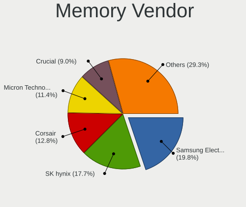

| Vendor                       | Computers | Percent |
|------------------------------|-----------|---------|
| Samsung Electronics          | 1481      | 19.83%  |
| SK hynix                     | 1323      | 17.71%  |
| Corsair                      | 954       | 12.77%  |
| Micron Technology            | 851       | 11.39%  |
| Crucial                      | 672       | 9%      |
| Kingston                     | 636       | 8.52%   |
| Unknown                      | 548       | 7.34%   |
| A-DATA Technology            | 116       | 1.55%   |
| Unknown                      | 106       | 1.42%   |
| Ramaxel Technology           | 100       | 1.34%   |
| Elpida                       | 88        | 1.18%   |
| G.Skill                      | 83        | 1.11%   |
| Nanya Technology             | 72        | 0.96%   |
| Unknown (ABCD)               | 65        | 0.87%   |
| Team                         | 52        | 0.7%    |
| Patriot                      | 34        | 0.46%   |
| Timetec                      | 16        | 0.21%   |
| Transcend                    | 13        | 0.17%   |
| Hewlett-Packard              | 12        | 0.16%   |
| Lexar                        | 10        | 0.13%   |
| KLEVV                        | 10        | 0.13%   |
| ASint Technology             | 10        | 0.13%   |
| Apacer                       | 10        | 0.13%   |
| A Force                      | 10        | 0.13%   |
| Qimonda                      | 9         | 0.12%   |
| GOODRAM                      | 8         | 0.11%   |
| 4ea5                         | 8         | 0.11%   |
| Unknown (0x0E9D)             | 7         | 0.09%   |
| GSkill                       | 7         | 0.09%   |
| Toshiba                      | 6         | 0.08%   |
| ff                           | 6         | 0.08%   |
| QEMU                         | 5         | 0.07%   |
| Patriot Memory               | 5         | 0.07%   |
| Lexar Co Limited             | 5         | 0.07%   |
| fef5                         | 5         | 0.07%   |
| Essencore                    | 5         | 0.07%   |
| Unknown (F301)               | 4         | 0.05%   |
| Patriot Memory (PDP Systems) | 4         | 0.05%   |
| Neo Forza                    | 4         | 0.05%   |
| Unknown (0x0B45)             | 3         | 0.04%   |

Memory Model
------------

Memory module models

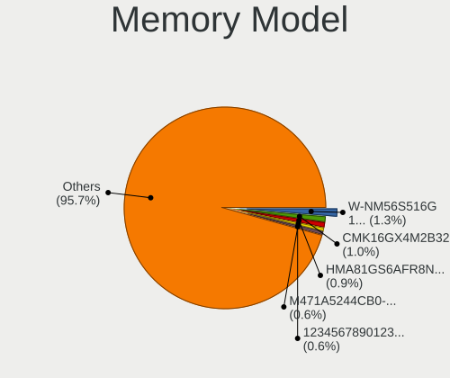

| Model                                                            | Computers | Percent |
|------------------------------------------------------------------|-----------|---------|
| Unknown                                                          | 106       | 1.33%   |
| Corsair RAM CMK16GX4M2B3200C16 8GB DIMM DDR4 3600MT/s            | 76        | 0.95%   |
| SK hynix RAM HMA81GS6AFR8N-UH 8GB SODIMM DDR4 2667MT/s           | 68        | 0.85%   |
| Samsung RAM M471A5244CB0-CTD 4GB SODIMM DDR4 3266MT/s            | 48        | 0.6%    |
| Unknown (ABCD) RAM 123456789012345678 2GB SODIMM LPDDR4 2400MT/s | 47        | 0.59%   |
| SK hynix RAM HMT41GS6BFR8A-PB 8GB SODIMM DDR3 2667MT/s           | 43        | 0.54%   |
| Samsung RAM M471A1G44AB0-CWE 8GiB SODIMM DDR4 3200MT/s           | 40        | 0.5%    |
| Samsung RAM M471B5173QH0-YK0 4GB SODIMM DDR3 1600MT/s            | 39        | 0.49%   |
| Samsung RAM M471A1K43DB1-CTD 8GB SODIMM DDR4 2667MT/s            | 37        | 0.46%   |
| SK hynix RAM HMT451S6BFR8A-PB 4GB SODIMM DDR3 1600MT/s           | 36        | 0.45%   |
| Corsair RAM CMK16GX4M2B3000C15 8GB DIMM DDR4 3600MT/s            | 36        | 0.45%   |
| Samsung RAM M471B5273DH0-CH9 4GB SODIMM DDR3 1600MT/s            | 32        | 0.4%    |
| Samsung RAM M471A1K43DB1-CWE 8GB SODIMM DDR4 3200MT/s            | 31        | 0.39%   |
| Samsung RAM M471A1K43CB1-CRC 8GB SODIMM DDR4 8400MT/s            | 31        | 0.39%   |
| SK hynix RAM HMAA1GS6CJR6N-XN 8GB SODIMM DDR4 3200MT/s           | 29        | 0.36%   |
| Samsung RAM M471B5273CH0-CH9 4GB SODIMM DDR3 1334MT/s            | 29        | 0.36%   |
| Samsung RAM M471B1G73QH0-YK0 8GB SODIMM DDR3 1600MT/s            | 29        | 0.36%   |
| Samsung RAM M471B5173EB0-YK0 4GB SODIMM DDR3 1600MT/s            | 28        | 0.35%   |
| Samsung RAM M471B5173DB0-YK0 4GB SODIMM DDR3 1600MT/s            | 28        | 0.35%   |
| Samsung RAM M471B1G73DB0-YK0 8GB SODIMM DDR3 1600MT/s            | 27        | 0.34%   |
| Samsung RAM M471A5244CB0-CRC 4GB SODIMM DDR4 2667MT/s            | 27        | 0.34%   |
| Corsair RAM CMK32GX4M2B3200C16 16GB DIMM DDR4 3800MT/s           | 27        | 0.34%   |
| Unknown RAM Module 2GB SODIMM DDR2 667MT/s                       | 26        | 0.33%   |
| Samsung RAM M471A5244CB0-CWE 4GB SODIMM DDR4 3200MT/s            | 25        | 0.31%   |
| Micron RAM 4ATF51264HZ-3G2J1 4GB SODIMM DDR4 3200MT/s            | 25        | 0.31%   |
| Micron RAM 4ATF51264HZ-2G6E1 4GB SODIMM DDR4 2667MT/s            | 25        | 0.31%   |
| Crucial RAM CT102464BF160B.C16 8GB SODIMM DDR3 1600MT/s          | 25        | 0.31%   |
| SK hynix RAM HMA851S6CJR6N-VK 4GB SODIMM DDR4 2667MT/s           | 24        | 0.3%    |
| Samsung RAM M471B1G73EB0-YK0 8192MB SODIMM DDR3 1600MT/s         | 23        | 0.29%   |
| Samsung RAM M471A1K43EB1-CWE 8GB SODIMM DDR4 3200MT/s            | 23        | 0.29%   |
| Micron RAM 4ATF1G64HZ-3G2F1 8GB SODIMM DDR4 3200MT/s             | 23        | 0.29%   |
| SK hynix RAM HMA81GS6DJR8N-XN 8GB SODIMM DDR4 3200MT/s           | 22        | 0.28%   |
| SK hynix RAM H9CCNNNCLGALAR-NVD 8GB Row Of Chips LPDDR3 2133MT/s | 22        | 0.28%   |
| Samsung RAM M471A1K43CB1-CTD 8GB SODIMM DDR4 3200MT/s            | 22        | 0.28%   |
| Crucial RAM CT51264BF160B.C16F 4GB SODIMM DDR3 4199MT/s          | 22        | 0.28%   |
| SK hynix RAM HMA81GS6CJR8N-VK 8GB SODIMM DDR4 2667MT/s           | 21        | 0.26%   |
| Unknown RAM Module 4GB DIMM 1333MT/s                             | 20        | 0.25%   |
| SK hynix RAM Module 4GB SODIMM DDR3 1600MT/s                     | 20        | 0.25%   |
| Samsung RAM M471A1G44BB0-CWE 8GB SODIMM DDR4 3200MT/s            | 20        | 0.25%   |
| Corsair RAM CMK32GX4M2Z3600C18 16GB DIMM DDR4 3800MT/s           | 20        | 0.25%   |

Memory Kind
-----------

Memory module kinds

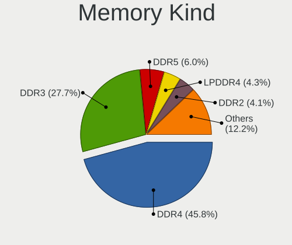

| Kind    | Computers | Percent |
|---------|-----------|---------|
| DDR4    | 3000      | 45.75%  |
| DDR3    | 1818      | 27.73%  |
| DDR5    | 393       | 5.99%   |
| LPDDR4  | 282       | 4.3%    |
| DDR2    | 267       | 4.07%   |
| LPDDR5  | 213       | 3.25%   |
| LPDDR3  | 199       | 3.03%   |
| SDRAM   | 188       | 2.87%   |
| Unknown | 144       | 2.2%    |
| DDR     | 31        | 0.47%   |
| DRAM    | 17        | 0.26%   |
| RAM     | 5         | 0.08%   |

Memory Form Factor
------------------

Physical design of the memory module

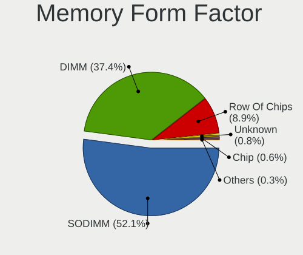

| Name            | Computers | Percent |
|-----------------|-----------|---------|
| SODIMM          | 3368      | 52.1%   |
| DIMM            | 2416      | 37.37%  |
| Row Of Chips    | 573       | 8.86%   |
| Unknown         | 49        | 0.76%   |
| Chip            | 40        | 0.62%   |
| RIMM            | 10        | 0.15%   |
| FB-DIMM         | 7         | 0.11%   |
| Proprietary Car | 2         | 0.03%   |

Memory Size
-----------

Memory module size

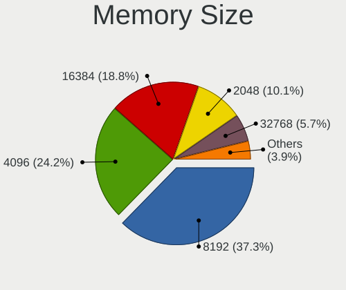

| Size   | Computers | Percent |
|--------|-----------|---------|
| 8192   | 2641      | 37.3%   |
| 4096   | 1715      | 24.22%  |
| 16384  | 1333      | 18.83%  |
| 2048   | 712       | 10.06%  |
| 32768  | 406       | 5.73%   |
| 1024   | 216       | 3.05%   |
| 512    | 21        | 0.3%    |
| 49152  | 15        | 0.21%   |
| 6144   | 5         | 0.07%   |
| 65536  | 4         | 0.06%   |
| 24576  | 4         | 0.06%   |
| 3072   | 3         | 0.04%   |
| 256    | 2         | 0.03%   |
| 131072 | 1         | 0.01%   |
| 12288  | 1         | 0.01%   |
| 16     | 1         | 0.01%   |
| 13     | 1         | 0.01%   |

Memory Speed
------------

Memory module speed

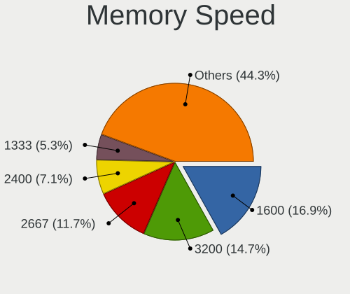

| Speed   | Computers | Percent |
|---------|-----------|---------|
| 1600    | 1196      | 16.87%  |
| 3200    | 1040      | 14.67%  |
| 2667    | 831       | 11.72%  |
| 2400    | 506       | 7.14%   |
| 1333    | 373       | 5.26%   |
| 2133    | 358       | 5.05%   |
| 3600    | 303       | 4.27%   |
| 667     | 150       | 2.12%   |
| 1867    | 146       | 2.06%   |
| 6400    | 136       | 1.92%   |
| 4800    | 129       | 1.82%   |
| 800     | 123       | 1.73%   |
| 5600    | 121       | 1.71%   |
| 4267    | 121       | 1.71%   |
| 1334    | 111       | 1.57%   |
| 3733    | 91        | 1.28%   |
| 6000    | 87        | 1.23%   |
| Unknown | 84        | 1.18%   |
| 3800    | 76        | 1.07%   |
| 1067    | 76        | 1.07%   |
| 3000    | 63        | 0.89%   |
| 3266    | 58        | 0.82%   |
| 3400    | 56        | 0.79%   |
| 4199    | 54        | 0.76%   |
| 1066    | 54        | 0.76%   |
| 7500    | 48        | 0.68%   |
| 1866    | 47        | 0.66%   |
| 2666    | 45        | 0.63%   |
| 1800    | 45        | 0.63%   |
| 2933    | 43        | 0.61%   |
| 8400    | 39        | 0.55%   |
| 2048    | 39        | 0.55%   |
| 4266    | 30        | 0.42%   |
| 533     | 30        | 0.42%   |
| 2800    | 27        | 0.38%   |
| 4000    | 26        | 0.37%   |
| 8533    | 21        | 0.3%    |
| 5200    | 20        | 0.28%   |
| 975     | 18        | 0.25%   |
| 400     | 17        | 0.24%   |

Printers & scanners
-------------------

Printer Vendor
--------------

Printer device vendors

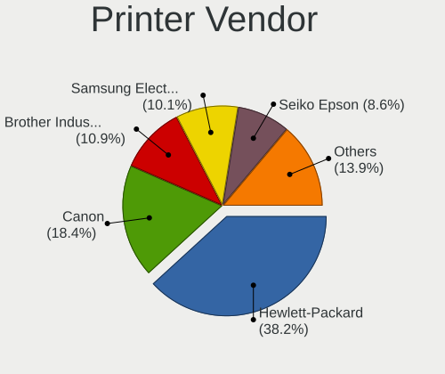

| Vendor                   | Computers | Percent |
|--------------------------|-----------|---------|
| Hewlett-Packard          | 102       | 38.2%   |
| Canon                    | 49        | 18.35%  |
| Brother Industries       | 29        | 10.86%  |
| Samsung Electronics      | 27        | 10.11%  |
| Seiko Epson              | 23        | 8.61%   |
| Lexmark International    | 7         | 2.62%   |
| Prolific Technology      | 5         | 1.87%   |
| QinHeng Electronics      | 3         | 1.12%   |
| Oki Data                 | 3         | 1.12%   |
| Dymo-CoStar              | 3         | 1.12%   |
| STMicroelectronics       | 2         | 0.75%   |
| Ricoh                    | 2         | 0.75%   |
| Pantum                   | 2         | 0.75%   |
| Kyocera                  | 2         | 0.75%   |
| Zhuhai Poskey Technology | 1         | 0.37%   |
| Zebra Technologies       | 1         | 0.37%   |
| Sony                     | 1         | 0.37%   |
| Seiko Instruments        | 1         | 0.37%   |
| KODAK                    | 1         | 0.37%   |
| Dell                     | 1         | 0.37%   |
| Custom Engineering SPA   | 1         | 0.37%   |
| Apple                    | 1         | 0.37%   |

Printer Model
-------------

Printer device models

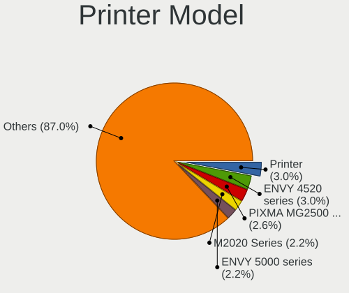

| Model                                                     | Computers | Percent |
|-----------------------------------------------------------|-----------|---------|
| Seiko Epson Printer                                       | 8         | 2.96%   |
| HP ENVY 4520 series                                       | 8         | 2.96%   |
| Canon PIXMA MG2500 Series                                 | 7         | 2.59%   |
| Samsung M2020 Series                                      | 6         | 2.22%   |
| HP ENVY 5000 series                                       | 6         | 2.22%   |
| Prolific PL2305 Parallel Port                             | 5         | 1.85%   |
| HP DeskJet 2700 series                                    | 5         | 1.85%   |
| HP Deskjet 2540 series                                    | 5         | 1.85%   |
| Canon PIXMA MG3600 Series                                 | 5         | 1.85%   |
| HP DeskJet 2600 series                                    | 4         | 1.48%   |
| Canon TS3100 series                                       | 4         | 1.48%   |
| Canon iP7200 series                                       | 4         | 1.48%   |
| QinHeng CH340S                                            | 3         | 1.11%   |
| HP OfficeJet 3830 series                                  | 3         | 1.11%   |
| HP LaserJet P1005                                         | 3         | 1.11%   |
| HP DeskJet 3630 series                                    | 3         | 1.11%   |
| HP DeskJet 2130 series                                    | 3         | 1.11%   |
| Canon LiDE 300                                            | 3         | 1.11%   |
| STMicroelectronics LED badge -- mini LED display -- 11x44 | 2         | 0.74%   |
| Seiko Epson XP-240 Series                                 | 2         | 0.74%   |
| Seiko Epson EPSON XP-205 207 Series                       | 2         | 0.74%   |
| Samsung ML-2250 Series                                    | 2         | 0.74%   |
| Samsung ML-216x Series Laser Printer                      | 2         | 0.74%   |
| Samsung M332x 382x 402x Series                            | 2         | 0.74%   |
| Samsung C43x Series                                       | 2         | 0.74%   |
| Oki Data USB Device                                       | 2         | 0.74%   |
| Lexmark International C746                                | 2         | 0.74%   |
| HP Officejet 4630 series                                  | 2         | 0.74%   |
| HP LaserJet P2035                                         | 2         | 0.74%   |
| HP LaserJet P2015 series                                  | 2         | 0.74%   |
| HP LaserJet 200 colorMFP M276nw                           | 2         | 0.74%   |
| HP HP LaserJet M101-M106                                  | 2         | 0.74%   |
| HP ENVY Photo 6200 series                                 | 2         | 0.74%   |
| HP ENVY 5540 series                                       | 2         | 0.74%   |
| HP Deskjet F2280 series                                   | 2         | 0.74%   |
| HP DeskJet 4100 series                                    | 2         | 0.74%   |
| HP DeskJet 3700 series                                    | 2         | 0.74%   |
| HP Deskjet 1510                                           | 2         | 0.74%   |
| HP Deskjet 1000 J110 series                               | 2         | 0.74%   |
| HP Color LaserJet CP1215                                  | 2         | 0.74%   |

Scanner Vendor
--------------

Scanner device vendors

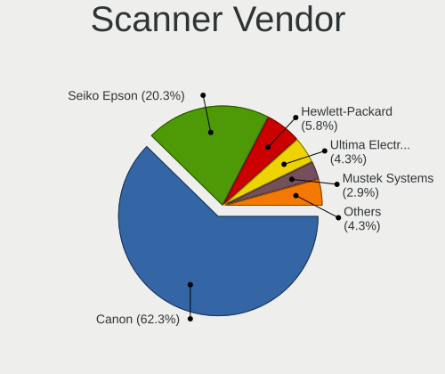

| Vendor             | Computers | Percent |
|--------------------|-----------|---------|
| Canon              | 43        | 62.32%  |
| Seiko Epson        | 14        | 20.29%  |
| Hewlett-Packard    | 4         | 5.8%    |
| Ultima Electronics | 3         | 4.35%   |
| Mustek Systems     | 2         | 2.9%    |
| AGFA-Gevaert NV    | 2         | 2.9%    |
| UMAX               | 1         | 1.45%   |

Scanner Model
-------------

Scanner device models

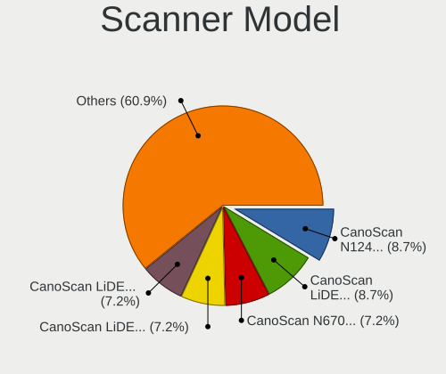

| Model                                                                                 | Computers | Percent |
|---------------------------------------------------------------------------------------|-----------|---------|
| Canon CanoScan N1240U/LiDE 30                                                         | 6         | 8.7%    |
| Canon CanoScan LiDE 220                                                               | 6         | 8.7%    |
| Canon CanoScan N670U/N676U/LiDE 20                                                    | 5         | 7.25%   |
| Canon CanoScan LiDE 200                                                               | 5         | 7.25%   |
| Canon CanoScan LiDE 110                                                               | 5         | 7.25%   |
| Seiko Epson GT-8300UF [Perfection 1660 PHOTO]                                         | 3         | 4.35%   |
| Canon CanoScan LIDE 25                                                                | 3         | 4.35%   |
| Canon CanoScan LiDE 210                                                               | 3         | 4.35%   |
| Canon CanoScan LiDE 100                                                               | 3         | 4.35%   |
| Ultima Artec Ultima 2000 (GT6801 based)/Lifetec LT9385/ScanMagic 1200 UB Plus Scanner | 2         | 2.9%    |
| Seiko Epson Scanner                                                                   | 2         | 2.9%    |
| Seiko Epson GT-X770 [Perfection V500]                                                 | 2         | 2.9%    |
| HP ScanJet 5300c/5370c                                                                | 2         | 2.9%    |
| AGFA-Gevaert NV SnapScan 1212U (?)                                                    | 2         | 2.9%    |
| UMAX Astra 2200/2200SU                                                                | 1         | 1.45%   |
| Ultima Artec E+ Pro                                                                   | 1         | 1.45%   |
| Seiko Epson Perfection V37/V370                                                       | 1         | 1.45%   |
| Seiko Epson GT-X820 [Perfection V600 Photo]                                           | 1         | 1.45%   |
| Seiko Epson GT-X750 [Perfection 4490 Photo]                                           | 1         | 1.45%   |
| Seiko Epson GT-F730 [GT-S630/Perfection V33/V330 Photo]                               | 1         | 1.45%   |
| Seiko Epson GT-F650 [GT-S600/Perfection V10/V100]                                     | 1         | 1.45%   |
| Seiko Epson GT-8700/GT-8700F [Perfection 1640SU/1640SU PHOTO]                         | 1         | 1.45%   |
| Seiko Epson GT-8400UF [Perfection 1670/1670 PHOTO]                                    | 1         | 1.45%   |
| Mustek Systems ScanExpress 1200 UB                                                    | 1         | 1.45%   |
| Mustek Systems BearPaw 1200 CU Plus                                                   | 1         | 1.45%   |
| HP Scanjet G2710                                                                      | 1         | 1.45%   |
| HP ScanJet 3400cse                                                                    | 1         | 1.45%   |
| Canon CanoScan LiDE 90                                                                | 1         | 1.45%   |
| Canon CanoScan LiDE 700F                                                              | 1         | 1.45%   |
| Canon CanoScan LiDE 70                                                                | 1         | 1.45%   |
| Canon CanoScan LiDE 600F                                                              | 1         | 1.45%   |
| Canon CanoScan LiDE 50/LiDE 35/LiDE 40                                                | 1         | 1.45%   |
| Canon CanoScan LiDE 120                                                               | 1         | 1.45%   |
| Canon CanoScan 3000/3000F/3000ex                                                      | 1         | 1.45%   |

Camera
------

Camera Vendor
-------------

Camera device vendors

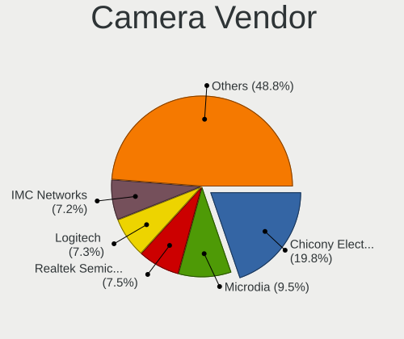

| Vendor                                 | Computers | Percent |
|----------------------------------------|-----------|---------|
| Chicony Electronics                    | 1432      | 19.75%  |
| Microdia                               | 687       | 9.48%   |
| Realtek Semiconductor                  | 545       | 7.52%   |
| Logitech                               | 527       | 7.27%   |
| IMC Networks                           | 523       | 7.21%   |
| Bison Electronics                      | 454       | 6.26%   |
| Sunplus Innovation Technology          | 367       | 5.06%   |
| Apple                                  | 326       | 4.5%    |
| Quanta                                 | 294       | 4.06%   |
| Cheng Uei Precision Industry (Foxlink) | 217       | 2.99%   |
| Suyin                                  | 172       | 2.37%   |
| Lite-On Technology                     | 164       | 2.26%   |
| Syntek                                 | 155       | 2.14%   |
| Luxvisions Innotech Limited            | 121       | 1.67%   |
| Microsoft                              | 120       | 1.66%   |
| Silicon Motion                         | 82        | 1.13%   |
| Samsung Electronics                    | 69        | 0.95%   |
| Sonix Technology                       | 62        | 0.86%   |
| Lenovo                                 | 61        | 0.84%   |
| Alcor Micro                            | 61        | 0.84%   |
| Ricoh                                  | 58        | 0.8%    |
| Z-Star Microelectronics                | 44        | 0.61%   |
| Generalplus Technology                 | 38        | 0.52%   |
| ARC International                      | 38        | 0.52%   |
| Shinetech                              | 34        | 0.47%   |
| SunplusIT                              | 33        | 0.46%   |
| GEMBIRD                                | 31        | 0.43%   |
| Acer                                   | 30        | 0.41%   |
| MacroSilicon                           | 29        | 0.4%    |
| Creative Technology                    | 22        | 0.3%    |
| Razer USA                              | 20        | 0.28%   |
| Primax Electronics                     | 18        | 0.25%   |
| ALi                                    | 18        | 0.25%   |
| Anker PowerConf C200                   | 15        | 0.21%   |
| Shenzhen Kingcome Optoelectronic       | 14        | 0.19%   |
| kingcome                               | 14        | 0.19%   |
| Importek                               | 14        | 0.19%   |
| Hewlett-Packard                        | 14        | 0.19%   |
| webcam                                 | 13        | 0.18%   |
| OmniVision Technologies                | 13        | 0.18%   |

Camera Model
------------

Camera device models

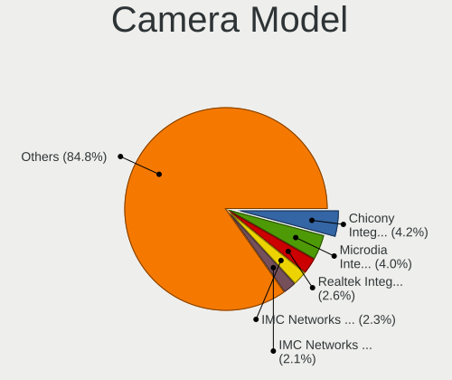

| Model                                   | Computers | Percent |
|-----------------------------------------|-----------|---------|
| Chicony Integrated Camera               | 306       | 4.18%   |
| Microdia Integrated_Webcam_HD           | 295       | 4.03%   |
| Realtek Integrated_Webcam_HD            | 190       | 2.59%   |
| IMC Networks Integrated Camera          | 172       | 2.35%   |
| IMC Networks USB2.0 HD UVC WebCam       | 153       | 2.09%   |
| Logitech HD Pro Webcam C920             | 131       | 1.79%   |
| Bison Integrated Camera                 | 117       | 1.6%    |
| Apple FaceTime HD Camera (Built-in)     | 114       | 1.56%   |
| Logitech Webcam C270                    | 108       | 1.47%   |
| Sunplus Integrated_Webcam_HD            | 105       | 1.43%   |
| Chicony HD WebCam                       | 100       | 1.36%   |
| Apple Built-in iSight                   | 86        | 1.17%   |
| Syntek Integrated Camera                | 85        | 1.16%   |
| Chicony TOSHIBA Web Camera - HD         | 76        | 1.04%   |
| Apple iPhone 5/5C/5S/6/SE/7/8/X         | 71        | 0.97%   |
| Samsung Galaxy series, misc. (MTP mode) | 67        | 0.91%   |
| Lite-On Integrated Camera               | 62        | 0.85%   |
| Microdia Webcam Vitade AF               | 61        | 0.83%   |
| Chicony HP TrueVision HD Camera         | 57        | 0.78%   |
| Microdia Integrated Webcam              | 56        | 0.76%   |
| Chicony HP Truevision HD                | 52        | 0.71%   |
| Microsoft LifeCam HD-3000               | 50        | 0.68%   |
| Quanta HD User Facing                   | 49        | 0.67%   |
| IMC Networks USB2.0 VGA UVC WebCam      | 47        | 0.64%   |
| Apple FaceTime HD Camera                | 47        | 0.64%   |
| Chicony Integrated Camera (1280x720@30) | 46        | 0.63%   |
| Chicony EasyCamera                      | 46        | 0.63%   |
| Bison SunplusIT Integrated Camera       | 46        | 0.63%   |
| Bison BisonCam,NB Pro                   | 46        | 0.63%   |
| Chicony HP HD Camera                    | 44        | 0.6%    |
| Chicony HP Wide Vision HD Camera        | 41        | 0.56%   |
| Realtek USB Camera                      | 39        | 0.53%   |
| Microdia USB 2.0 Camera                 | 39        | 0.53%   |
| ARC International Camera                | 38        | 0.52%   |
| Chicony USB 2.0 Camera                  | 37        | 0.5%    |
| Microdia Integrated_Webcam_FHD          | 36        | 0.49%   |
| Bison Lenovo EasyCamera                 | 36        | 0.49%   |
| Quanta HP TrueVision HD Camera          | 35        | 0.48%   |
| Bison EasyCamera                        | 35        | 0.48%   |
| Chicony Chicony USB2.0 Camera           | 34        | 0.46%   |

Security
--------

Fingerprint Vendor
------------------

Fingerprint sensor vendors

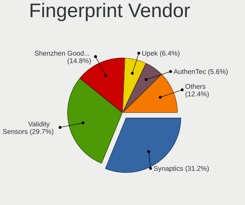

| Vendor                             | Computers | Percent |
|------------------------------------|-----------|---------|
| Synaptics                          | 387       | 31.16%  |
| Validity Sensors                   | 369       | 29.71%  |
| Shenzhen Goodix Technology         | 184       | 14.81%  |
| Upek                               | 79        | 6.36%   |
| AuthenTec                          | 69        | 5.56%   |
| LighTuning Technology              | 58        | 4.67%   |
| Elan Microelectronics              | 50        | 4.03%   |
| STMicroelectronics                 | 22        | 1.77%   |
| Samsung Electronics                | 8         | 0.64%   |
| Realtek USB2.0 Finger Print Bridge | 6         | 0.48%   |
| HOLTEK                             | 5         | 0.4%    |
| DigitalPersona                     | 3         | 0.24%   |
| Microsoft                          | 1         | 0.08%   |
| Focal-systems.Corp                 | 1         | 0.08%   |

Fingerprint Model
-----------------

Fingerprint sensor models

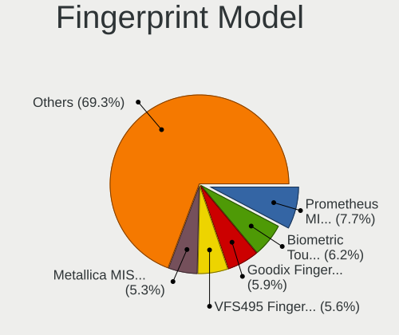

| Model                                                                      | Computers | Percent |
|----------------------------------------------------------------------------|-----------|---------|
| Synaptics Prometheus MIS Touch Fingerprint Reader                          | 96        | 7.73%   |
| Upek Biometric Touchchip/Touchstrip Fingerprint Sensor                     | 77        | 6.2%    |
| Shenzhen Goodix  FingerPrint Device                                        | 73        | 5.88%   |
| Validity Sensors VFS495 Fingerprint Reader                                 | 69        | 5.56%   |
| Synaptics Metallica MIS Touch Fingerprint Reader                           | 66        | 5.31%   |
| Validity Sensors VFS 5011 fingerprint sensor                               | 61        | 4.91%   |
| Shenzhen Goodix Fingerprint Reader                                         | 60        | 4.83%   |
| Shenzhen Goodix FingerPrint                                                | 51        | 4.11%   |
| Validity Sensors Synaptics WBDI                                            | 42        | 3.38%   |
| Synaptics UWP WBDI                                                         | 36        | 2.9%    |
| Validity Sensors VFS7500 Touch Fingerprint Sensor                          | 31        | 2.5%    |
| Synaptics  WBDI                                                            | 28        | 2.25%   |
| Validity Sensors VFS5011 Fingerprint Reader                                | 26        | 2.09%   |
| LighTuning ES603 Swipe Fingerprint Sensor                                  | 25        | 2.01%   |
| Validity Sensors VFS491                                                    | 22        | 1.77%   |
| Validity Sensors Synaptics VFS7552 Touch Fingerprint Sensor with PurePrint | 22        | 1.77%   |
| Synaptics  FS7604 Touch Fingerprint Sensor with PurePrint                  | 22        | 1.77%   |
| STMicroelectronics Fingerprint Reader                                      | 22        | 1.77%   |
| AuthenTec AES2810                                                          | 22        | 1.77%   |
| LighTuning EgisTec Touch Fingerprint Sensor                                | 21        | 1.69%   |
| Elan ELAN:Fingerprint                                                      | 21        | 1.69%   |
| AuthenTec AES2501 Fingerprint Sensor                                       | 21        | 1.69%   |
| Validity Sensors Swipe Fingerprint Sensor                                  | 20        | 1.61%   |
| Synaptics UWP WBDI Device                                                  | 20        | 1.61%   |
| Synaptics Fingerprint reader [HP G6]                                       | 19        | 1.53%   |
| Validity Sensors VFS471 Fingerprint Reader                                 | 18        | 1.45%   |
| Elan ELAN:ARM-M4                                                           | 18        | 1.45%   |
| Synaptics FS7604 Touch Fingerprint Sensor with PurePrint                   | 17        | 1.37%   |
| Synaptics Prometheus Fingerprint Reader                                    | 15        | 1.21%   |
| Synaptics Metallica MOH Touch Fingerprint Reader                           | 14        | 1.13%   |
| Validity Sensors VFS7552 Touch Fingerprint Sensor                          | 13        | 1.05%   |
| Validity Sensors VFS451 Fingerprint Reader                                 | 13        | 1.05%   |
| Synaptics WBDI                                                             | 12        | 0.97%   |
| Synaptics WBDI Device                                                      | 11        | 0.89%   |
| Elan fingerprint sensor [FeinTech FPS00200]                                | 11        | 0.89%   |
| Unknown                                                                    | 11        | 0.89%   |
| AuthenTec Fingerprint Sensor                                               | 10        | 0.81%   |
| Validity Sensors Synaptics VFS7552 Touch Fingerprint Sensor                | 9         | 0.72%   |
| Validity Sensors VFS301 Fingerprint Reader                                 | 8         | 0.64%   |
| Samsung Fingerprint Sensor Device - 730B                                   | 8         | 0.64%   |

Chipcard Vendor
---------------

Chipcard module vendors

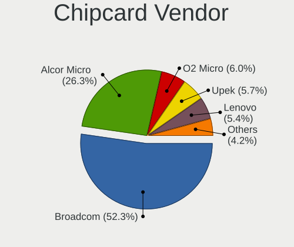

| Vendor                    | Computers | Percent |
|---------------------------|-----------|---------|
| Broadcom                  | 320       | 52.29%  |
| Alcor Micro               | 161       | 26.31%  |
| O2 Micro                  | 37        | 6.05%   |
| Upek                      | 35        | 5.72%   |
| Lenovo                    | 33        | 5.39%   |
| Gemalto (was Gemplus)     | 7         | 1.14%   |
| Yubico.com                | 3         | 0.49%   |
| SCM Microsystems          | 3         | 0.49%   |
| OmniKey                   | 3         | 0.49%   |
| Aladdin Knowledge Systems | 2         | 0.33%   |
| Advanced Card Systems     | 2         | 0.33%   |
| Purism, SPC               | 1         | 0.16%   |
| Hewlett-Packard           | 1         | 0.16%   |
| Clay Logic                | 1         | 0.16%   |
| Chicony Electronics       | 1         | 0.16%   |
| Cherry                    | 1         | 0.16%   |
| Bit4id                    | 1         | 0.16%   |

Chipcard Model
--------------

Chipcard module models

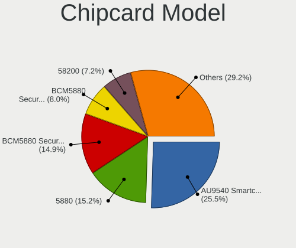

| Model                                                                        | Computers | Percent |
|------------------------------------------------------------------------------|-----------|---------|
| Alcor Micro AU9540 Smartcard Reader                                          | 156       | 25.49%  |
| Broadcom 5880                                                                | 93        | 15.2%   |
| Broadcom BCM5880 Secure Applications Processor                               | 91        | 14.87%  |
| Broadcom BCM5880 Secure Applications Processor with fingerprint swipe sensor | 49        | 8.01%   |
| Broadcom 58200                                                               | 44        | 7.19%   |
| Broadcom BCM58200 ControlVault 3 (FingerPrint sensor + Contacted SmartCard)  | 41        | 6.7%    |
| Upek TouchChip Fingerprint Coprocessor (WBF advanced mode)                   | 35        | 5.72%   |
| O2 Micro OZ776 CCID Smartcard Reader                                         | 32        | 5.23%   |
| Lenovo Integrated Smart Card Reader                                          | 29        | 4.74%   |
| O2 Micro Oz776 SmartCard Reader                                              | 5         | 0.82%   |
| Alcor Micro Watchdata W 1981                                                 | 5         | 0.82%   |
| Lenovo Smartcard Keyboard                                                    | 4         | 0.65%   |
| Gemalto (was Gemplus) Compact Smart Card Reader Writer                       | 4         | 0.65%   |
| Yubico.com Yubikey 4/5 U2F+CCID                                              | 2         | 0.33%   |
| SCM Microsystems SCR3340 - ExpressCard54 Smart Card Reader                   | 2         | 0.33%   |
| OmniKey CardMan 3021 / 3121                                                  | 2         | 0.33%   |
| Gemalto (was Gemplus) GemPC Twin SmartCard Reader                            | 2         | 0.33%   |
| Broadcom BCM5880 Secure Applications Processor with fingerprint touch sensor | 2         | 0.33%   |
| Aladdin Knowledge Systems Token JC                                           | 2         | 0.33%   |
| Advanced Card Systems ACR1252 CL Reader PICC                                 | 2         | 0.33%   |
| Yubico.com Yubikey 4/5 CCID                                                  | 1         | 0.16%   |
| SCM Microsystems SCR35xx Smart Card Reader                                   | 1         | 0.16%   |
| Purism, SPC Librem Key                                                       | 1         | 0.16%   |
| OmniKey 3x21 Smart Card Reader                                               | 1         | 0.16%   |
| Hewlett-Packard SC Keyboard - Apollo (Liteon)                                | 1         | 0.16%   |
| Gemalto (was Gemplus) eToken 5110+ FIPS                                      | 1         | 0.16%   |
| Clay Logic Nitrokey Pro                                                      | 1         | 0.16%   |
| Chicony Electronics HP Skylab USB Smartcard Keyboard                         | 1         | 0.16%   |
| Cherry SmartCard Reader Keyboard KC 1000 SC                                  | 1         | 0.16%   |
| Bit4id miniLector EVO                                                        | 1         | 0.16%   |

Unsupported
-----------

Unsupported Devices
-------------------

Total unsupported devices on board

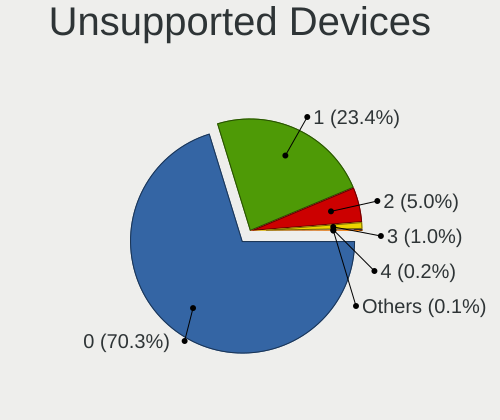

| Total | Computers | Percent |
|-------|-----------|---------|
| 0     | 9211      | 70.26%  |
| 1     | 3072      | 23.43%  |
| 2     | 661       | 5.04%   |
| 3     | 127       | 0.97%   |
| 4     | 20        | 0.15%   |
| 5     | 9         | 0.07%   |
| 7     | 4         | 0.03%   |
| 6     | 4         | 0.03%   |
| 8     | 2         | 0.02%   |

Unsupported Device Types
------------------------

Types of unsupported devices

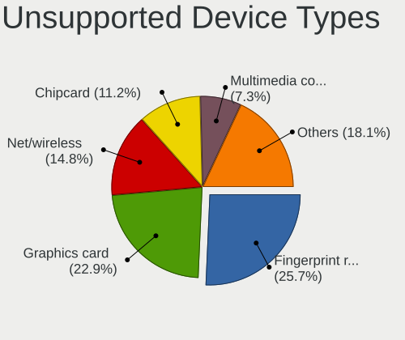

| Type                     | Computers | Percent |
|--------------------------|-----------|---------|
| Fingerprint reader       | 1211      | 25.69%  |
| Graphics card            | 1078      | 22.87%  |
| Net/wireless             | 698       | 14.81%  |
| Chipcard                 | 529       | 11.22%  |
| Multimedia controller    | 346       | 7.34%   |
| Communication controller | 176       | 3.73%   |
| Unassigned class         | 118       | 2.5%    |
| Sound                    | 99        | 2.1%    |
| Camera                   | 97        | 2.06%   |
| Bluetooth                | 85        | 1.8%    |
| Storage                  | 58        | 1.23%   |
| Net/ethernet             | 58        | 1.23%   |
| Card reader              | 40        | 0.85%   |
| Network                  | 30        | 0.64%   |
| Modem                    | 26        | 0.55%   |
| Storage/raid             | 18        | 0.38%   |
| Dvb card                 | 11        | 0.23%   |
| Firewire controller      | 10        | 0.21%   |
| Flash memory             | 9         | 0.19%   |
| Storage/ide              | 7         | 0.15%   |
| Storage/nvme             | 5         | 0.11%   |
| Tv card                  | 2         | 0.04%   |
| Unclassified device      | 1         | 0.02%   |
| Storage/ata              | 1         | 0.02%   |

