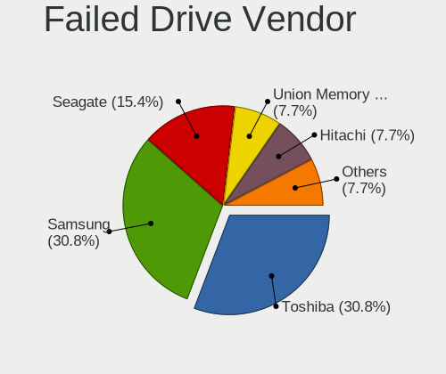
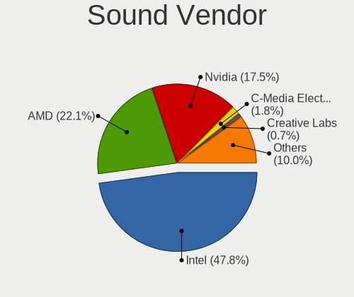
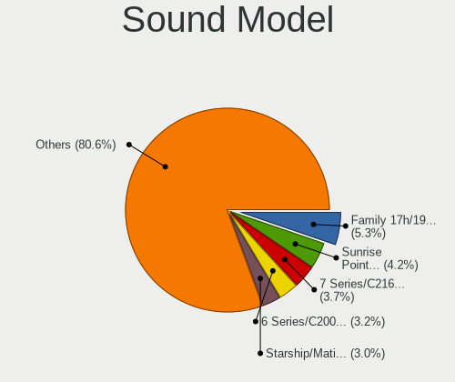

Linux in UK - Tested Hardware & Statistics
------------------------------------------

A project to collect tested hardware configurations for Linux in UK.

Anyone can contribute to this report by the [hw-probe](https://github.com/linuxhw/hw-probe) tool:

    sudo -E hw-probe -all -upload

Please contribute! Especially if your hardware is rare.

This is a report for all computer types. See also reports for [desktops](/Location/UK/Desktop/README.md) and [notebooks](/Location/UK/Notebook/README.md).

Contents
--------

* [ Test Cases ](#test-cases)

* [ System ](#system)
  - [ OS                       ](#os)
  - [ OS Family                ](#os-family)
  - [ Kernel                   ](#kernel)
  - [ Kernel Family            ](#kernel-family)
  - [ Kernel Major Ver.        ](#kernel-major-ver)
  - [ Arch                     ](#arch)
  - [ DE                       ](#de)
  - [ Display Server           ](#display-server)
  - [ Display Manager          ](#display-manager)
  - [ OS Lang                  ](#os-lang)
  - [ Boot Mode                ](#boot-mode)
  - [ Filesystem               ](#filesystem)
  - [ Part. scheme             ](#part-scheme)
  - [ Dual Boot with Linux/BSD ](#dual-boot-with-linuxbsd)
  - [ Dual Boot (Win)          ](#dual-boot-win)

* [ Board ](#board)
  - [ Vendor                   ](#vendor)
  - [ Model                    ](#model)
  - [ Model Family             ](#model-family)
  - [ MFG Year                 ](#mfg-year)
  - [ Form Factor              ](#form-factor)
  - [ Secure Boot              ](#secure-boot)
  - [ Coreboot                 ](#coreboot)
  - [ RAM Size                 ](#ram-size)
  - [ RAM Used                 ](#ram-used)
  - [ Total Drives             ](#total-drives)
  - [ Has CD-ROM               ](#has-cd-rom)
  - [ Has Ethernet             ](#has-ethernet)
  - [ Has WiFi                 ](#has-wifi)
  - [ Has Bluetooth            ](#has-bluetooth)

* [ Location ](#location)
  - [ Country                  ](#country)
  - [ City                     ](#city)

* [ Drives ](#drives)
  - [ Drive Vendor             ](#drive-vendor)
  - [ Drive Model              ](#drive-model)
  - [ HDD Vendor               ](#hdd-vendor)
  - [ SSD Vendor               ](#ssd-vendor)
  - [ Drive Kind               ](#drive-kind)
  - [ Drive Connector          ](#drive-connector)
  - [ Drive Size               ](#drive-size)
  - [ Space Total              ](#space-total)
  - [ Space Used               ](#space-used)
  - [ Malfunc. Drives          ](#malfunc-drives)
  - [ Malfunc. Drive Vendor    ](#malfunc-drive-vendor)
  - [ Malfunc. HDD Vendor      ](#malfunc-hdd-vendor)
  - [ Malfunc. Drive Kind      ](#malfunc-drive-kind)
  - [ Failed Drives            ](#failed-drives)
  - [ Failed Drive Vendor      ](#failed-drive-vendor)
  - [ Drive Status             ](#drive-status)

* [ Storage controller ](#storage-controller)
  - [ Storage Vendor           ](#storage-vendor)
  - [ Storage Model            ](#storage-model)
  - [ Storage Kind             ](#storage-kind)

* [ Processor ](#processor)
  - [ CPU Vendor               ](#cpu-vendor)
  - [ CPU Model                ](#cpu-model)
  - [ CPU Model Family         ](#cpu-model-family)
  - [ CPU Cores                ](#cpu-cores)
  - [ CPU Sockets              ](#cpu-sockets)
  - [ CPU Threads              ](#cpu-threads)
  - [ CPU Op-Modes             ](#cpu-op-modes)
  - [ CPU Microcode            ](#cpu-microcode)
  - [ CPU Microarch            ](#cpu-microarch)

* [ Graphics ](#graphics)
  - [ GPU Vendor               ](#gpu-vendor)
  - [ GPU Model                ](#gpu-model)
  - [ GPU Combo                ](#gpu-combo)
  - [ GPU Driver               ](#gpu-driver)
  - [ GPU Memory               ](#gpu-memory)

* [ Monitor ](#monitor)
  - [ Monitor Vendor           ](#monitor-vendor)
  - [ Monitor Model            ](#monitor-model)
  - [ Monitor Resolution       ](#monitor-resolution)
  - [ Monitor Diagonal         ](#monitor-diagonal)
  - [ Monitor Width            ](#monitor-width)
  - [ Aspect Ratio             ](#aspect-ratio)
  - [ Monitor Area             ](#monitor-area)
  - [ Pixel Density            ](#pixel-density)
  - [ Multiple Monitors        ](#multiple-monitors)

* [ Network ](#network)
  - [ Net Controller Vendor    ](#net-controller-vendor)
  - [ Net Controller Model     ](#net-controller-model)
  - [ Wireless Vendor          ](#wireless-vendor)
  - [ Wireless Model           ](#wireless-model)
  - [ Ethernet Vendor          ](#ethernet-vendor)
  - [ Ethernet Model           ](#ethernet-model)
  - [ Net Controller Kind      ](#net-controller-kind)
  - [ Used Controller          ](#used-controller)
  - [ NICs                     ](#nics)
  - [ IPv6                     ](#ipv6)

* [ Bluetooth ](#bluetooth)
  - [ Bluetooth Vendor         ](#bluetooth-vendor)
  - [ Bluetooth Model          ](#bluetooth-model)

* [ Sound ](#sound)
  - [ Sound Vendor             ](#sound-vendor)
  - [ Sound Model              ](#sound-model)

* [ Memory ](#memory)
  - [ Memory Vendor            ](#memory-vendor)
  - [ Memory Model             ](#memory-model)
  - [ Memory Kind              ](#memory-kind)
  - [ Memory Form Factor       ](#memory-form-factor)
  - [ Memory Size              ](#memory-size)
  - [ Memory Speed             ](#memory-speed)

* [ Printers & scanners ](#printers--scanners)
  - [ Printer Vendor           ](#printer-vendor)
  - [ Printer Model            ](#printer-model)
  - [ Scanner Vendor           ](#scanner-vendor)
  - [ Scanner Model            ](#scanner-model)

* [ Camera ](#camera)
  - [ Camera Vendor            ](#camera-vendor)
  - [ Camera Model             ](#camera-model)

* [ Security ](#security)
  - [ Fingerprint Vendor       ](#fingerprint-vendor)
  - [ Fingerprint Model        ](#fingerprint-model)
  - [ Chipcard Vendor          ](#chipcard-vendor)
  - [ Chipcard Model           ](#chipcard-model)

* [ Unsupported ](#unsupported)
  - [ Unsupported Devices      ](#unsupported-devices)
  - [ Unsupported Device Types ](#unsupported-device-types)

Test Cases
----------

Total: 12311

| Vendor        | Model                       | Form-Factor | Probe                                                      | Date         |
|---------------|-----------------------------|-------------|------------------------------------------------------------|--------------|
| Lenovo        | SHARKBAY NOK                | Desktop     | [26332591d7](https://linux-hardware.org/?probe=26332591d7) | Nov 06, 2023 |
| GMKtec        | NucBox K2                   | Desktop     | [a88d491579](https://linux-hardware.org/?probe=a88d491579) | Nov 06, 2023 |
| Dell          | Latitude E6440              | Notebook    | [ad28c1e239](https://linux-hardware.org/?probe=ad28c1e239) | Nov 06, 2023 |
| MSI           | MAG X670E TOMAHAWK WIFI     | Desktop     | [d95f04dd2c](https://linux-hardware.org/?probe=d95f04dd2c) | Nov 05, 2023 |
| MSI           | MAG B650 TOMAHAWK WIFI      | Desktop     | [38b95c0462](https://linux-hardware.org/?probe=38b95c0462) | Nov 05, 2023 |
| ASUSTek       | ROG STRIX X670E-E GAMING... | Desktop     | [f48ca40214](https://linux-hardware.org/?probe=f48ca40214) | Nov 05, 2023 |
| HP            | ProBook 6470b               | Notebook    | [50c1d43281](https://linux-hardware.org/?probe=50c1d43281) | Nov 05, 2023 |
| ASUSTek       | P5G41T-M LX2/GB             | Desktop     | [5196f9303d](https://linux-hardware.org/?probe=5196f9303d) | Nov 05, 2023 |
| Gigabyte      | B550 GAMING X V2            | Desktop     | [9213826ac6](https://linux-hardware.org/?probe=9213826ac6) | Nov 05, 2023 |
| HP            | 250 G5 Notebook PC          | Notebook    | [7b281cb925](https://linux-hardware.org/?probe=7b281cb925) | Nov 05, 2023 |
| HP            | 8643 SMVB                   | Desktop     | [22b09dfb91](https://linux-hardware.org/?probe=22b09dfb91) | Nov 05, 2023 |
| Valve         | Jupiter                     | Notebook    | [28e2c2aa38](https://linux-hardware.org/?probe=28e2c2aa38) | Nov 05, 2023 |
| HP            | Pavilion Laptop 15-eh0xx... | Notebook    | [7a8597dd50](https://linux-hardware.org/?probe=7a8597dd50) | Nov 05, 2023 |
| Lenovo        | V15 G2 ALC 82KD             | Notebook    | [fc01ceb47b](https://linux-hardware.org/?probe=fc01ceb47b) | Nov 05, 2023 |
| Dell          | Inspiron 7501               | Notebook    | [0926c7cdad](https://linux-hardware.org/?probe=0926c7cdad) | Nov 05, 2023 |
| HP            | Laptop 15-bw0xx             | Notebook    | [7d9395e4a7](https://linux-hardware.org/?probe=7d9395e4a7) | Nov 05, 2023 |
| Gigabyte      | GA-970A-DS3                 | Desktop     | [a513bb8188](https://linux-hardware.org/?probe=a513bb8188) | Nov 04, 2023 |
| MSI           | X470 GAMING PLUS MAX        | Desktop     | [4e3cd50b3f](https://linux-hardware.org/?probe=4e3cd50b3f) | Nov 04, 2023 |
| Lenovo        | ThinkPad E15 20RD0011UK     | Notebook    | [dc13d6012b](https://linux-hardware.org/?probe=dc13d6012b) | Nov 04, 2023 |
| HP            | ProBook 430 G8 Notebook ... | Notebook    | [5d8cae0407](https://linux-hardware.org/?probe=5d8cae0407) | Nov 04, 2023 |
| HP            | Presario C500 (GF849EA#A... | Notebook    | [a4965dff09](https://linux-hardware.org/?probe=a4965dff09) | Nov 04, 2023 |
| Lenovo        | IdeaPad 320-15IKB 80XL      | Notebook    | [812ceefef6](https://linux-hardware.org/?probe=812ceefef6) | Nov 04, 2023 |
| Valve         | Jupiter                     | Notebook    | [af20418f73](https://linux-hardware.org/?probe=af20418f73) | Nov 04, 2023 |
| Valve         | Jupiter                     | Notebook    | [28f8f3e3cd](https://linux-hardware.org/?probe=28f8f3e3cd) | Nov 04, 2023 |
| HUAWEI        | MRGFG-XX                    | Notebook    | [5117a849b3](https://linux-hardware.org/?probe=5117a849b3) | Nov 03, 2023 |
| Dell          | Precision 5550              | Notebook    | [033e294199](https://linux-hardware.org/?probe=033e294199) | Nov 03, 2023 |
| Toshiba       | Satellite C660D             | Notebook    | [de50c92d6c](https://linux-hardware.org/?probe=de50c92d6c) | Nov 03, 2023 |
| Lenovo        | 310C SDK0J40697 WIN 3305... | Mini pc     | [f69b9b159a](https://linux-hardware.org/?probe=f69b9b159a) | Nov 03, 2023 |
| Valve         | Jupiter                     | Notebook    | [b526accbcd](https://linux-hardware.org/?probe=b526accbcd) | Nov 03, 2023 |
| ASUSTek       | ROG CROSSHAIR VIII DARK ... | Desktop     | [367bde5a11](https://linux-hardware.org/?probe=367bde5a11) | Nov 03, 2023 |
| ASUSTek       | PRIME H770-PLUS D4          | Desktop     | [62645c6b56](https://linux-hardware.org/?probe=62645c6b56) | Nov 02, 2023 |
| Dell          | Vostro 5590                 | Notebook    | [aa355fcc89](https://linux-hardware.org/?probe=aa355fcc89) | Nov 02, 2023 |
| GreatWall     | W1011                       | Tablet      | [fe355d55c3](https://linux-hardware.org/?probe=fe355d55c3) | Nov 02, 2023 |
| Dell          | 03TJ75 A00                  | Desktop     | [e082a50dde](https://linux-hardware.org/?probe=e082a50dde) | Nov 02, 2023 |
| Lenovo        | Yoga Duet 7 13ITL6 82MA     | Tablet      | [d3d4d3dea3](https://linux-hardware.org/?probe=d3d4d3dea3) | Nov 01, 2023 |
| Gigabyte      | Z97X-Gaming 5               | Desktop     | [1ca6496a6c](https://linux-hardware.org/?probe=1ca6496a6c) | Nov 01, 2023 |
| ASUSTek       | PRIME B550M-A WIFI II       | Desktop     | [801d83a570](https://linux-hardware.org/?probe=801d83a570) | Nov 01, 2023 |
| HP            | 0A58h                       | Desktop     | [9dd3c3fdfb](https://linux-hardware.org/?probe=9dd3c3fdfb) | Nov 01, 2023 |
| Raspberry ... | Raspberry Pi 3 Model B R... | Soc         | [226d669c79](https://linux-hardware.org/?probe=226d669c79) | Nov 01, 2023 |
| ASUSTek       | PRIME B550-PLUS             | Desktop     | [037e92aebd](https://linux-hardware.org/?probe=037e92aebd) | Nov 01, 2023 |
| Fanless Mi... | Rev JSL1                    | Mini pc     | [6895dd827a](https://linux-hardware.org/?probe=6895dd827a) | Nov 01, 2023 |
| Lenovo        | ThinkPad P16s Gen 1 21BT... | Notebook    | [5d58dd522f](https://linux-hardware.org/?probe=5d58dd522f) | Nov 01, 2023 |
| Unknown       | Unknown                     | Desktop     | [c7ce75613c](https://linux-hardware.org/?probe=c7ce75613c) | Nov 01, 2023 |
| Lenovo        | 3647 SDK0J40709 WIN 3259... | All in one  | [4f99b79f9e](https://linux-hardware.org/?probe=4f99b79f9e) | Nov 01, 2023 |
| MSI           | X470 GAMING PRO CARBON      | Desktop     | [7271f0fc8c](https://linux-hardware.org/?probe=7271f0fc8c) | Nov 01, 2023 |
| Apple         | MacBook9,1                  | Notebook    | [44cec57d44](https://linux-hardware.org/?probe=44cec57d44) | Nov 01, 2023 |
| Apple         | MacBookAir5,1               | Notebook    | [d7b563a839](https://linux-hardware.org/?probe=d7b563a839) | Oct 31, 2023 |
| MSI           | Z87-G45 GAMING              | Desktop     | [962f4ccb9e](https://linux-hardware.org/?probe=962f4ccb9e) | Oct 31, 2023 |
| Lenovo        | MAHOBAY                     | Desktop     | [319e545ba5](https://linux-hardware.org/?probe=319e545ba5) | Oct 31, 2023 |
| HP            | G56                         | Notebook    | [db44e7df47](https://linux-hardware.org/?probe=db44e7df47) | Oct 31, 2023 |
| HP            | 0A58h                       | Desktop     | [f7c62b9410](https://linux-hardware.org/?probe=f7c62b9410) | Oct 31, 2023 |
| Lenovo        | ThinkPad T530 24296JG       | Notebook    | [b443eebcad](https://linux-hardware.org/?probe=b443eebcad) | Oct 31, 2023 |
| Alienware     | 14                          | Notebook    | [e88b7c0ac6](https://linux-hardware.org/?probe=e88b7c0ac6) | Oct 31, 2023 |
| Lenovo        | ThinkPad 13 2nd Gen 20J2... | Notebook    | [72131fb5de](https://linux-hardware.org/?probe=72131fb5de) | Oct 31, 2023 |
| Dell          | 0R849J A01                  | Desktop     | [3891d2fd80](https://linux-hardware.org/?probe=3891d2fd80) | Oct 31, 2023 |
| HP            | Presario C500 (GF849EA#A... | Notebook    | [580f4bdb18](https://linux-hardware.org/?probe=580f4bdb18) | Oct 31, 2023 |
| Microsoft     | Surface Go                  | Tablet      | [ef58eef71a](https://linux-hardware.org/?probe=ef58eef71a) | Oct 31, 2023 |
| Intel         | H311 DS3 V1.0               | Desktop     | [2eabffe817](https://linux-hardware.org/?probe=2eabffe817) | Oct 31, 2023 |
| Dell          | Latitude E5520              | Notebook    | [445903fc05](https://linux-hardware.org/?probe=445903fc05) | Oct 31, 2023 |
| Toshiba       | Satellite C660D             | Notebook    | [26479d99b9](https://linux-hardware.org/?probe=26479d99b9) | Oct 31, 2023 |
| HP            | Pavilion Gaming Laptop 1... | Notebook    | [43772c58a4](https://linux-hardware.org/?probe=43772c58a4) | Oct 30, 2023 |
| Gigabyte      | B365M DS3H                  | Desktop     | [0a5b6171b7](https://linux-hardware.org/?probe=0a5b6171b7) | Oct 30, 2023 |
| Lenovo        | ThinkPad P14s Gen 3 21J5... | Notebook    | [8b1fe7cf44](https://linux-hardware.org/?probe=8b1fe7cf44) | Oct 30, 2023 |
| Fanless Mi... | Rev JSL1                    | Mini pc     | [4825358a5d](https://linux-hardware.org/?probe=4825358a5d) | Oct 30, 2023 |
| AWOW          | AK41                        | Notebook    | [bed4203da6](https://linux-hardware.org/?probe=bed4203da6) | Oct 30, 2023 |
| ASUSTek       | ROG STRIX Z590-F GAMING ... | Desktop     | [af050c4fa2](https://linux-hardware.org/?probe=af050c4fa2) | Oct 29, 2023 |
| ASUSTek       | M4A89GTD-PRO/USB3           | Desktop     | [9ca810aaa6](https://linux-hardware.org/?probe=9ca810aaa6) | Oct 29, 2023 |
| ASUSTek       | X551CA                      | Notebook    | [1a14a8f0c4](https://linux-hardware.org/?probe=1a14a8f0c4) | Oct 29, 2023 |
| ASUSTek       | X551CA                      | Notebook    | [a43802c314](https://linux-hardware.org/?probe=a43802c314) | Oct 29, 2023 |
| ASUSTek       | VivoBook 12_ASUS Laptop ... | Notebook    | [7bdcd09429](https://linux-hardware.org/?probe=7bdcd09429) | Oct 29, 2023 |
| HP            | Pavilion g6                 | Notebook    | [57441db309](https://linux-hardware.org/?probe=57441db309) | Oct 29, 2023 |
| Panasonic     | CF-191HA23DE                | Notebook    | [3ccc424983](https://linux-hardware.org/?probe=3ccc424983) | Oct 29, 2023 |
| Dell          | Precision M6800             | Notebook    | [3645954ce0](https://linux-hardware.org/?probe=3645954ce0) | Oct 28, 2023 |
| Biostar       | G31D-M7                     | Desktop     | [192416033b](https://linux-hardware.org/?probe=192416033b) | Oct 28, 2023 |
| Lenovo        | ThinkPad E14 20RA0020AU     | Notebook    | [1d1a7bd472](https://linux-hardware.org/?probe=1d1a7bd472) | Oct 28, 2023 |
| ASRock        | B450 Steel Legend           | Desktop     | [967ed7a2b9](https://linux-hardware.org/?probe=967ed7a2b9) | Oct 28, 2023 |
| Dell          | Latitude E6500              | Notebook    | [41e90a6524](https://linux-hardware.org/?probe=41e90a6524) | Oct 28, 2023 |
| Dell          | Inspiron MM061              | Notebook    | [7545369484](https://linux-hardware.org/?probe=7545369484) | Oct 28, 2023 |
| ASUSTek       | ROG STRIX X670E-F GAMING... | Desktop     | [bee59e348e](https://linux-hardware.org/?probe=bee59e348e) | Oct 28, 2023 |
| Dell          | XPS 15 9560                 | Notebook    | [69a0449eee](https://linux-hardware.org/?probe=69a0449eee) | Oct 28, 2023 |
| ASRock        | X670E Taichi Carrara        | Desktop     | [2ff3541961](https://linux-hardware.org/?probe=2ff3541961) | Oct 28, 2023 |
| MSI           | PRO Z790-P WIFI             | Desktop     | [60372b59fe](https://linux-hardware.org/?probe=60372b59fe) | Oct 28, 2023 |
| HP            | 2AF3                        | Desktop     | [f7c7d92cea](https://linux-hardware.org/?probe=f7c7d92cea) | Oct 28, 2023 |
| ASUSTek       | Zenbook UX7602VI_UX7602V... | Notebook    | [5c169fe4ed](https://linux-hardware.org/?probe=5c169fe4ed) | Oct 27, 2023 |
| ASUSTek       | VivoBook_ASUSLaptop M150... | Notebook    | [6a8554304e](https://linux-hardware.org/?probe=6a8554304e) | Oct 27, 2023 |
| Lenovo        | ThinkPad T450 20BUS00700    | Notebook    | [f74328fd58](https://linux-hardware.org/?probe=f74328fd58) | Oct 27, 2023 |
| Apple         | MacBookPro7,1               | Notebook    | [fe15ca03f2](https://linux-hardware.org/?probe=fe15ca03f2) | Oct 27, 2023 |
| Dell          | Inspiron 1501               | Notebook    | [2c88e089bb](https://linux-hardware.org/?probe=2c88e089bb) | Oct 27, 2023 |
| Lenovo        | ThinkPad E14 Gen 5 21JKC... | Notebook    | [c9ba633d37](https://linux-hardware.org/?probe=c9ba633d37) | Oct 27, 2023 |
| ASUSTek       | Zenbook UX7602VI_UX7602V... | Notebook    | [1c1d7bd2b1](https://linux-hardware.org/?probe=1c1d7bd2b1) | Oct 27, 2023 |
| HP            | OMEN by Laptop 16-c0xxx     | Notebook    | [311f057665](https://linux-hardware.org/?probe=311f057665) | Oct 26, 2023 |
| HP            | EliteBook 630 13.3 inch ... | Notebook    | [8f57ab5108](https://linux-hardware.org/?probe=8f57ab5108) | Oct 26, 2023 |
| MSI           | B450M MORTAR MAX            | Desktop     | [ab3b2be8f5](https://linux-hardware.org/?probe=ab3b2be8f5) | Oct 26, 2023 |
| MSI           | B450M MORTAR MAX            | Desktop     | [8f83740c8d](https://linux-hardware.org/?probe=8f83740c8d) | Oct 26, 2023 |
| HP            | ProBook 650 G1              | Notebook    | [5b2aac75a9](https://linux-hardware.org/?probe=5b2aac75a9) | Oct 26, 2023 |
| AWOW          | AK41                        | Notebook    | [e40c573853](https://linux-hardware.org/?probe=e40c573853) | Oct 26, 2023 |
| Dell          | Inspiron 5406 2n1           | Convertible | [829d7d5108](https://linux-hardware.org/?probe=829d7d5108) | Oct 26, 2023 |
| Foxconn       | 2AA9h                       | Desktop     | [dade54701d](https://linux-hardware.org/?probe=dade54701d) | Oct 26, 2023 |
| ASUSTek       | ROG STRIX X670E-E GAMING... | Desktop     | [8926585836](https://linux-hardware.org/?probe=8926585836) | Oct 26, 2023 |
| ASUSTek       | Z170M-PLUS                  | Desktop     | [b75faeaf8a](https://linux-hardware.org/?probe=b75faeaf8a) | Oct 25, 2023 |
| Acer          | Aspire A514-55              | Notebook    | [4d1e460056](https://linux-hardware.org/?probe=4d1e460056) | Oct 25, 2023 |
| Acer          | Aspire A514-55              | Notebook    | [3a1de9e1d1](https://linux-hardware.org/?probe=3a1de9e1d1) | Oct 25, 2023 |
| ASRock        | A520M-ITX/ac                | Desktop     | [8a5e0bd9d6](https://linux-hardware.org/?probe=8a5e0bd9d6) | Oct 25, 2023 |
| Acer          | Nitro NP515-51              | Convertible | [ce16663fee](https://linux-hardware.org/?probe=ce16663fee) | Oct 25, 2023 |
| Dell          | Precision 7550              | Notebook    | [b6f0ce0285](https://linux-hardware.org/?probe=b6f0ce0285) | Oct 25, 2023 |
| ASUSTek       | PRIME A320M-K               | Desktop     | [f88a2686e9](https://linux-hardware.org/?probe=f88a2686e9) | Oct 25, 2023 |
| ASUSTek       | Z170-P                      | Desktop     | [62bbdaec23](https://linux-hardware.org/?probe=62bbdaec23) | Oct 24, 2023 |
| Gigabyte      | B450 AORUS M                | Desktop     | [706967e8e6](https://linux-hardware.org/?probe=706967e8e6) | Oct 24, 2023 |
| HP            | Pavilion Laptop 14-ec0xx... | Notebook    | [2b1387ee7c](https://linux-hardware.org/?probe=2b1387ee7c) | Oct 24, 2023 |
| Toshiba       | Satellite NB10t-A-102       | Notebook    | [85f85dffbd](https://linux-hardware.org/?probe=85f85dffbd) | Oct 24, 2023 |
| Acer          | Aspire XC-1760              | Desktop     | [8a5c420847](https://linux-hardware.org/?probe=8a5c420847) | Oct 24, 2023 |
| MSI           | MAG B650 TOMAHAWK WIFI      | Desktop     | [268b32d9bf](https://linux-hardware.org/?probe=268b32d9bf) | Oct 24, 2023 |
| Gigabyte      | X570S AORUS ELITE AX        | Desktop     | [5ad24eb928](https://linux-hardware.org/?probe=5ad24eb928) | Oct 24, 2023 |
| MSI           | MAG B550 TOMAHAWK           | Desktop     | [2d6bcd74d8](https://linux-hardware.org/?probe=2d6bcd74d8) | Oct 24, 2023 |
| Dell          | 02P9X9 A00                  | Server      | [85fac54d6a](https://linux-hardware.org/?probe=85fac54d6a) | Oct 24, 2023 |
| ASUSTek       | Z170M-PLUS                  | Desktop     | [95b5ac0a0e](https://linux-hardware.org/?probe=95b5ac0a0e) | Oct 24, 2023 |
| Gigabyte      | B365M DS3H                  | Desktop     | [87102526a5](https://linux-hardware.org/?probe=87102526a5) | Oct 24, 2023 |
| ASUSTek       | Z170-P                      | Desktop     | [47b5a808aa](https://linux-hardware.org/?probe=47b5a808aa) | Oct 24, 2023 |
| Gigabyte      | A520I AC                    | Desktop     | [fc82aed364](https://linux-hardware.org/?probe=fc82aed364) | Oct 23, 2023 |
| Eii           | WSA116                      | Notebook    | [85da70314e](https://linux-hardware.org/?probe=85da70314e) | Oct 23, 2023 |
| HP            | 81C7 MVB 0C                 | Server      | [dc0db667dc](https://linux-hardware.org/?probe=dc0db667dc) | Oct 23, 2023 |
| Fanless Mi... | Rev GMLR1                   | Mini pc     | [cd4e6f4d07](https://linux-hardware.org/?probe=cd4e6f4d07) | Oct 23, 2023 |
| Gigabyte      | H310M H x.x                 | Desktop     | [d8c12e782e](https://linux-hardware.org/?probe=d8c12e782e) | Oct 23, 2023 |
| Dell          | XPS 13 9300                 | Notebook    | [9d7ecc567c](https://linux-hardware.org/?probe=9d7ecc567c) | Oct 23, 2023 |
| HP            | ENVY Laptop 13-ba0xxx       | Notebook    | [38823c0a55](https://linux-hardware.org/?probe=38823c0a55) | Oct 22, 2023 |
| Gigabyte      | B85N PHOENIX-CF             | Desktop     | [a64a820d24](https://linux-hardware.org/?probe=a64a820d24) | Oct 22, 2023 |
| ASUSTek       | PRIME H310-PLUS R2.0        | Desktop     | [58a9a7a091](https://linux-hardware.org/?probe=58a9a7a091) | Oct 22, 2023 |
| Gigabyte      | 990FXA-UD5                  | Desktop     | [c81764ba28](https://linux-hardware.org/?probe=c81764ba28) | Oct 22, 2023 |
| ASUSTek       | PRIME H310-PLUS R2.0        | Desktop     | [9b380c5e6a](https://linux-hardware.org/?probe=9b380c5e6a) | Oct 22, 2023 |
| Dell          | Inspiron 3501               | Notebook    | [084dd63188](https://linux-hardware.org/?probe=084dd63188) | Oct 21, 2023 |
| Gigabyte      | 990FXA-UD5                  | Desktop     | [98a242f151](https://linux-hardware.org/?probe=98a242f151) | Oct 21, 2023 |
| ASUSTek       | X453MA                      | Notebook    | [ef8715c7a7](https://linux-hardware.org/?probe=ef8715c7a7) | Oct 21, 2023 |
| Lenovo        | ThinkServer TS140           | Desktop     | [b52eba9a1b](https://linux-hardware.org/?probe=b52eba9a1b) | Oct 21, 2023 |
| ASUSTek       | Vivobook Go E1504FA_E150... | Notebook    | [e503ffe188](https://linux-hardware.org/?probe=e503ffe188) | Oct 21, 2023 |
| Lenovo        | V330-14ARR 81B1             | Notebook    | [b80592c227](https://linux-hardware.org/?probe=b80592c227) | Oct 21, 2023 |
| ASRock        | X570 Pro4                   | Desktop     | [f350ad7b18](https://linux-hardware.org/?probe=f350ad7b18) | Oct 20, 2023 |
| Dell          | Latitude E6400              | Notebook    | [5e09b89469](https://linux-hardware.org/?probe=5e09b89469) | Oct 20, 2023 |
| MSI           | G41TM-P31                   | Desktop     | [3ed69770a6](https://linux-hardware.org/?probe=3ed69770a6) | Oct 20, 2023 |
| ASUSTek       | X453MA                      | Notebook    | [11d8517f7e](https://linux-hardware.org/?probe=11d8517f7e) | Oct 20, 2023 |
| Acer          | Swift SFX14-51G             | Notebook    | [2adde1171a](https://linux-hardware.org/?probe=2adde1171a) | Oct 20, 2023 |
| Unknown       | Unknown                     | Soc         | [29ae977d06](https://linux-hardware.org/?probe=29ae977d06) | Oct 20, 2023 |
| HP            | EliteBook 630 13.3 inch ... | Notebook    | [e1ed7c2ee4](https://linux-hardware.org/?probe=e1ed7c2ee4) | Oct 20, 2023 |
| Valve         | Jupiter                     | Notebook    | [fdbd97d08c](https://linux-hardware.org/?probe=fdbd97d08c) | Oct 20, 2023 |
| MSI           | X470 GAMING PRO CARBON      | Desktop     | [a0cdc0c3e1](https://linux-hardware.org/?probe=a0cdc0c3e1) | Oct 19, 2023 |
| Pegatron      | Benicia                     | Desktop     | [c8ec5c8db0](https://linux-hardware.org/?probe=c8ec5c8db0) | Oct 19, 2023 |
| Novatech      | W9x0LU                      | Notebook    | [b6e3d3dfc9](https://linux-hardware.org/?probe=b6e3d3dfc9) | Oct 19, 2023 |
| ASUSTek       | PRIME X470-PRO              | Desktop     | [9d63ed7f5f](https://linux-hardware.org/?probe=9d63ed7f5f) | Oct 19, 2023 |
| Acer          | Aspire TC-1760              | Desktop     | [9e4ac23c4b](https://linux-hardware.org/?probe=9e4ac23c4b) | Oct 19, 2023 |
| HUAWEI        | HN-WX9X                     | Notebook    | [6fc8b26d2c](https://linux-hardware.org/?probe=6fc8b26d2c) | Oct 19, 2023 |
| ASUSTek       | STRIX Z270E GAMING          | Desktop     | [baacbfa91a](https://linux-hardware.org/?probe=baacbfa91a) | Oct 19, 2023 |
| HUAWEI        | HN-WX9X                     | Notebook    | [827a7bf56c](https://linux-hardware.org/?probe=827a7bf56c) | Oct 19, 2023 |
| HP            | OMEN by Laptop 16-b0xxx     | Notebook    | [dae01ed766](https://linux-hardware.org/?probe=dae01ed766) | Oct 18, 2023 |
| Lenovo        | V15 G2 ALC 82KD             | Notebook    | [bc4cc061a2](https://linux-hardware.org/?probe=bc4cc061a2) | Oct 18, 2023 |
| Gigabyte      | G1.Sniper A88X-CF           | Desktop     | [534b565ca1](https://linux-hardware.org/?probe=534b565ca1) | Oct 18, 2023 |
| HP            | 3646h                       | Desktop     | [6a679937c4](https://linux-hardware.org/?probe=6a679937c4) | Oct 18, 2023 |
| HP            | 2B44                        | Desktop     | [9ec07b67b2](https://linux-hardware.org/?probe=9ec07b67b2) | Oct 18, 2023 |
| Lenovo        | ThinkPad T420 4236KU9       | Notebook    | [f1e77b51bc](https://linux-hardware.org/?probe=f1e77b51bc) | Oct 17, 2023 |
| HP            | OMEN by Laptop 16-c0xxx     | Notebook    | [660d60e1a8](https://linux-hardware.org/?probe=660d60e1a8) | Oct 17, 2023 |
| ASUSTek       | ROG Rampage VI EXTREME E... | Desktop     | [3d5d8ee9e6](https://linux-hardware.org/?probe=3d5d8ee9e6) | Oct 17, 2023 |
| HP            | ProBook 645 G1              | Notebook    | [d1eeca057f](https://linux-hardware.org/?probe=d1eeca057f) | Oct 17, 2023 |
| Gigabyte      | GA-970A-DS3                 | Desktop     | [86d888a421](https://linux-hardware.org/?probe=86d888a421) | Oct 17, 2023 |
| Gigabyte      | H310M H x.x                 | Desktop     | [98b06c3d78](https://linux-hardware.org/?probe=98b06c3d78) | Oct 17, 2023 |
| Lenovo        | Yoga 9 14IAP7 82LU          | Convertible | [eac40d1a3b](https://linux-hardware.org/?probe=eac40d1a3b) | Oct 17, 2023 |
| Alienware     | m15                         | Notebook    | [34919bdeca](https://linux-hardware.org/?probe=34919bdeca) | Oct 17, 2023 |
| Dell          | Latitude 5490               | Notebook    | [d85f87c8b0](https://linux-hardware.org/?probe=d85f87c8b0) | Oct 17, 2023 |
| Dell          | G15 5515                    | Notebook    | [080e34562c](https://linux-hardware.org/?probe=080e34562c) | Oct 17, 2023 |
| Lenovo        | ThinkPad X1 Carbon 5th 2... | Notebook    | [6fe57753a4](https://linux-hardware.org/?probe=6fe57753a4) | Oct 17, 2023 |
| Samsung       | 355V4C/356V4C/3445VC/354... | Notebook    | [da0024090d](https://linux-hardware.org/?probe=da0024090d) | Oct 16, 2023 |
| Shenzhen M... | F7BSC                       | Desktop     | [8522bfdadd](https://linux-hardware.org/?probe=8522bfdadd) | Oct 16, 2023 |
| Dell          | Latitude E6540              | Notebook    | [27875d6fe5](https://linux-hardware.org/?probe=27875d6fe5) | Oct 16, 2023 |
| Dell          | XPS 15 9500                 | Notebook    | [0dcdd0a6a6](https://linux-hardware.org/?probe=0dcdd0a6a6) | Oct 16, 2023 |
| CompuLab      | fitlet2                     | Mini pc     | [9d9a814ffb](https://linux-hardware.org/?probe=9d9a814ffb) | Oct 16, 2023 |
| Lenovo        | ThinkPad E565 20EY000XUK    | Notebook    | [b7cf6113c4](https://linux-hardware.org/?probe=b7cf6113c4) | Oct 16, 2023 |
| Gigabyte      | B450M DS3H-CF               | Desktop     | [acd4052588](https://linux-hardware.org/?probe=acd4052588) | Oct 16, 2023 |
| Dell          | Precision M6700             | Notebook    | [2fb2e2e9a5](https://linux-hardware.org/?probe=2fb2e2e9a5) | Oct 16, 2023 |
| Valve         | Jupiter                     | Notebook    | [d8ba22dd7f](https://linux-hardware.org/?probe=d8ba22dd7f) | Oct 16, 2023 |
| Lenovo        | ThinkPad P14s Gen 3 21J6... | Notebook    | [386d015b42](https://linux-hardware.org/?probe=386d015b42) | Oct 16, 2023 |
| Gigabyte      | X570 I AORUS PRO WIFI       | Desktop     | [453546268b](https://linux-hardware.org/?probe=453546268b) | Oct 16, 2023 |
| HP            | ZBook 15 G3                 | Notebook    | [02bc0ccf6d](https://linux-hardware.org/?probe=02bc0ccf6d) | Oct 16, 2023 |
| Lenovo        | YB1-X91F                    | Convertible | [430c262f7c](https://linux-hardware.org/?probe=430c262f7c) | Oct 15, 2023 |
| HP            | ProLiant ML350 Gen9         | Desktop     | [468a686a40](https://linux-hardware.org/?probe=468a686a40) | Oct 15, 2023 |
| HUAWEI        | CREF-XX                     | Notebook    | [3d9bd14288](https://linux-hardware.org/?probe=3d9bd14288) | Oct 15, 2023 |
| ASUSTek       | VivoBook_ASUSLaptop X513... | Notebook    | [22b5b65e16](https://linux-hardware.org/?probe=22b5b65e16) | Oct 15, 2023 |
| Apple         | MacBookPro11,1              | Notebook    | [d22b6fa2e4](https://linux-hardware.org/?probe=d22b6fa2e4) | Oct 15, 2023 |
| ASRock        | B85M                        | Desktop     | [1712e16d1c](https://linux-hardware.org/?probe=1712e16d1c) | Oct 15, 2023 |
| Google        | Careena                     | Notebook    | [8359c8c3e8](https://linux-hardware.org/?probe=8359c8c3e8) | Oct 15, 2023 |
| Google        | Careena                     | Notebook    | [4292c49150](https://linux-hardware.org/?probe=4292c49150) | Oct 15, 2023 |
| Microsoft     | Surface Pro                 | Tablet      | [32422b446a](https://linux-hardware.org/?probe=32422b446a) | Oct 14, 2023 |
| Dell          | 0MWYPT A01                  | Desktop     | [67933e3dd7](https://linux-hardware.org/?probe=67933e3dd7) | Oct 14, 2023 |
| Dell          | 0Y2K8N A01                  | Desktop     | [32a0d75e98](https://linux-hardware.org/?probe=32a0d75e98) | Oct 14, 2023 |
| Gigabyte      | Z590I VISION D              | Desktop     | [725929fa07](https://linux-hardware.org/?probe=725929fa07) | Oct 14, 2023 |
| Gigabyte      | Z170M-D3H-CF                | Desktop     | [c090855f1d](https://linux-hardware.org/?probe=c090855f1d) | Oct 13, 2023 |
| ASUSTek       | K70IO                       | Notebook    | [e9d2ce541a](https://linux-hardware.org/?probe=e9d2ce541a) | Oct 13, 2023 |
| Lenovo        | ThinkPad T61 7661WQQ        | Notebook    | [d14e3ec320](https://linux-hardware.org/?probe=d14e3ec320) | Oct 13, 2023 |
| Dell          | Precision 3580              | Notebook    | [f2a080ed43](https://linux-hardware.org/?probe=f2a080ed43) | Oct 13, 2023 |
| Lenovo        | Yoga Slim 7 ProX 14ARH7 ... | Notebook    | [1b88716ae2](https://linux-hardware.org/?probe=1b88716ae2) | Oct 13, 2023 |
| Dell          | XPS 15 9530                 | Notebook    | [f5f02b30f0](https://linux-hardware.org/?probe=f5f02b30f0) | Oct 13, 2023 |
| Dell          | Precision 7520              | Notebook    | [de5b9c8fa1](https://linux-hardware.org/?probe=de5b9c8fa1) | Oct 13, 2023 |
| HUAWEI        | BOHL-WXX9                   | Notebook    | [85cc4b4c4a](https://linux-hardware.org/?probe=85cc4b4c4a) | Oct 12, 2023 |
| Dell          | Inspiron 3505               | Notebook    | [dad114bac6](https://linux-hardware.org/?probe=dad114bac6) | Oct 12, 2023 |
| HP            | Spectre x360 Convertible... | Convertible | [f51db4d9ed](https://linux-hardware.org/?probe=f51db4d9ed) | Oct 12, 2023 |
| Inventec      | DQ Class A02                | Desktop     | [675695eef9](https://linux-hardware.org/?probe=675695eef9) | Oct 12, 2023 |
| Intel         | X99-P4 V1.0                 | Desktop     | [afe1fd91c2](https://linux-hardware.org/?probe=afe1fd91c2) | Oct 12, 2023 |
| ASUSTek       | Q170M-C                     | Desktop     | [07a8a2d89f](https://linux-hardware.org/?probe=07a8a2d89f) | Oct 12, 2023 |
| Lenovo        | ThinkPad X1 Carbon 6th 2... | Notebook    | [f767f8dd4d](https://linux-hardware.org/?probe=f767f8dd4d) | Oct 12, 2023 |
| Lenovo        | ThinkPad T14 Gen 1 20UDS... | Notebook    | [6396467c6d](https://linux-hardware.org/?probe=6396467c6d) | Oct 12, 2023 |
| Gigabyte      | A320M-H-CF                  | Desktop     | [a549a213f1](https://linux-hardware.org/?probe=a549a213f1) | Oct 12, 2023 |
| Lenovo        | ThinkPad T470s 20HGS29Y0... | Notebook    | [18b3c9fef8](https://linux-hardware.org/?probe=18b3c9fef8) | Oct 12, 2023 |
| Lenovo        | ThinkPad T470s 20HGS29Y0... | Notebook    | [7c843b4c27](https://linux-hardware.org/?probe=7c843b4c27) | Oct 12, 2023 |
| Dell          | 0T10XW A00                  | Desktop     | [1489eccd85](https://linux-hardware.org/?probe=1489eccd85) | Oct 12, 2023 |
| MSI           | X470 GAMING PLUS            | Desktop     | [5d9cf3ae21](https://linux-hardware.org/?probe=5d9cf3ae21) | Oct 11, 2023 |
| ASUSTek       | PN61                        | Mini pc     | [ecd0d1d56c](https://linux-hardware.org/?probe=ecd0d1d56c) | Oct 11, 2023 |
| ASUSTek       | Z97-DELUXE                  | Desktop     | [2e77fb6729](https://linux-hardware.org/?probe=2e77fb6729) | Oct 11, 2023 |
| ASUSTek       | Z97-DELUXE                  | Desktop     | [fa0785421a](https://linux-hardware.org/?probe=fa0785421a) | Oct 11, 2023 |
| Lenovo        | IdeaPad Slim 3 15AMN8 82... | Notebook    | [02c2fabd1e](https://linux-hardware.org/?probe=02c2fabd1e) | Oct 11, 2023 |
| Dell          | 03NVJ6 A02                  | Desktop     | [0f40b40836](https://linux-hardware.org/?probe=0f40b40836) | Oct 11, 2023 |
| Gigabyte      | X570 AORUS ELITE            | Desktop     | [9b5d4b21a7](https://linux-hardware.org/?probe=9b5d4b21a7) | Oct 11, 2023 |
| Apple         | Mac-35C5E08120C7EEAF Mac... | Mini pc     | [c6eeac6337](https://linux-hardware.org/?probe=c6eeac6337) | Oct 11, 2023 |
| Dell          | Precision 3571              | Notebook    | [ac3735cea4](https://linux-hardware.org/?probe=ac3735cea4) | Oct 11, 2023 |
| Dell          | Inspiron 15 3525            | Notebook    | [66bd7ea744](https://linux-hardware.org/?probe=66bd7ea744) | Oct 10, 2023 |
| Framework     | Laptop 13 (AMD Ryzen 704... | Notebook    | [b4db6e379a](https://linux-hardware.org/?probe=b4db6e379a) | Oct 10, 2023 |
| Gigabyte      | B550M DS3H                  | Desktop     | [4c0b8f71c3](https://linux-hardware.org/?probe=4c0b8f71c3) | Oct 10, 2023 |
| Lenovo        | 3106 SDK0J40709 WIN 3259... | Desktop     | [22d9a872fe](https://linux-hardware.org/?probe=22d9a872fe) | Oct 10, 2023 |
| Lenovo        | Yoga Slim 7 13ACN5 82CY     | Notebook    | [162889c4a3](https://linux-hardware.org/?probe=162889c4a3) | Oct 10, 2023 |
| Intel         | NUC5i5MYBE H47797-203       | Mini pc     | [1ea031d4d9](https://linux-hardware.org/?probe=1ea031d4d9) | Oct 10, 2023 |
| Dell          | Inspiron 13-7359            | Notebook    | [64ad406dc0](https://linux-hardware.org/?probe=64ad406dc0) | Oct 10, 2023 |
| Lenovo        | SHARKBAY NOK                | Desktop     | [b14d9fc84b](https://linux-hardware.org/?probe=b14d9fc84b) | Oct 10, 2023 |
| Dell          | 03NVJ6 A02                  | Desktop     | [8f7a44301e](https://linux-hardware.org/?probe=8f7a44301e) | Oct 10, 2023 |
| ASUSTek       | M5A78L-M/USB3               | Desktop     | [ec66d208a0](https://linux-hardware.org/?probe=ec66d208a0) | Oct 10, 2023 |
| Gigabyte      | Z690 UD DDR4                | Desktop     | [8b0cd9f9f7](https://linux-hardware.org/?probe=8b0cd9f9f7) | Oct 10, 2023 |
| Gigabyte      | X399 DESIGNARE EX-CF        | Desktop     | [d9bbe8269c](https://linux-hardware.org/?probe=d9bbe8269c) | Oct 10, 2023 |
| HP            | ProBook 450 G7              | Notebook    | [5805e4a7cb](https://linux-hardware.org/?probe=5805e4a7cb) | Oct 10, 2023 |
| Valve         | Jupiter                     | Notebook    | [daeb359dfb](https://linux-hardware.org/?probe=daeb359dfb) | Oct 10, 2023 |
| AZW           | SEi                         | Notebook    | [ed42118987](https://linux-hardware.org/?probe=ed42118987) | Oct 10, 2023 |
| ASUSTek       | SABERTOOTH 990FX R2.0       | Desktop     | [ac48da1d5c](https://linux-hardware.org/?probe=ac48da1d5c) | Oct 09, 2023 |
| PINE64        | Pinebook Pro                | Soc         | [e62b12571a](https://linux-hardware.org/?probe=e62b12571a) | Oct 09, 2023 |
| ASUSTek       | N75SL                       | Notebook    | [8d6fe1b102](https://linux-hardware.org/?probe=8d6fe1b102) | Oct 09, 2023 |
| Dell          | Inspiron 13-5378            | Notebook    | [ee7086c9da](https://linux-hardware.org/?probe=ee7086c9da) | Oct 09, 2023 |
| Gigabyte      | X570S AORUS ELITE AX        | Desktop     | [f0f128becf](https://linux-hardware.org/?probe=f0f128becf) | Oct 09, 2023 |
| Toshiba       | Satellite Pro R50-B         | Notebook    | [9b41869902](https://linux-hardware.org/?probe=9b41869902) | Oct 09, 2023 |
| HP            | Pavilion Laptop 14-ec1xx... | Notebook    | [44aa7c21f9](https://linux-hardware.org/?probe=44aa7c21f9) | Oct 09, 2023 |
| Lenovo        | IdeaPad Slim 3 15AMN8 82... | Notebook    | [02a4135aff](https://linux-hardware.org/?probe=02a4135aff) | Oct 09, 2023 |
| HP            | EliteBook 850 G8 Noteboo... | Notebook    | [d6b0808093](https://linux-hardware.org/?probe=d6b0808093) | Oct 09, 2023 |
| MSI           | MAG B550 TOMAHAWK           | Desktop     | [165a7d4ae1](https://linux-hardware.org/?probe=165a7d4ae1) | Oct 09, 2023 |
| MSI           | X470 GAMING PRO CARBON      | Desktop     | [f6dac1e5f6](https://linux-hardware.org/?probe=f6dac1e5f6) | Oct 09, 2023 |
| Lenovo        | ThinkPad L470 W10DG 20JV... | Notebook    | [6ffcd3c463](https://linux-hardware.org/?probe=6ffcd3c463) | Oct 09, 2023 |
| MSI           | Katana GF66 11UG            | Notebook    | [0816e0912b](https://linux-hardware.org/?probe=0816e0912b) | Oct 09, 2023 |
| Acer          | Aspire A517-52              | Notebook    | [fbe223cc6d](https://linux-hardware.org/?probe=fbe223cc6d) | Oct 08, 2023 |
| Acer          | Aspire A517-52              | Notebook    | [2a51c0c510](https://linux-hardware.org/?probe=2a51c0c510) | Oct 08, 2023 |
| Lenovo        | ThinkPad T490 20N3SDGJ02    | Notebook    | [43f05c011e](https://linux-hardware.org/?probe=43f05c011e) | Oct 08, 2023 |
| Valve         | Jupiter                     | Notebook    | [83976ddca6](https://linux-hardware.org/?probe=83976ddca6) | Oct 08, 2023 |
| Lenovo        | ThinkPad T14s Gen 4 21F8... | Notebook    | [63cbb26f44](https://linux-hardware.org/?probe=63cbb26f44) | Oct 08, 2023 |
| PC Special... | P65_P67RGRERA               | Notebook    | [c2779bc01c](https://linux-hardware.org/?probe=c2779bc01c) | Oct 08, 2023 |
| Acer          | Aspire TC-1760              | Desktop     | [c9e56d83be](https://linux-hardware.org/?probe=c9e56d83be) | Oct 08, 2023 |
| Valve         | Jupiter                     | Notebook    | [aa51056093](https://linux-hardware.org/?probe=aa51056093) | Oct 08, 2023 |
| Gigabyte      | Z390 AORUS MASTER-CF        | Desktop     | [7623527bdb](https://linux-hardware.org/?probe=7623527bdb) | Oct 08, 2023 |
| AZW           | SER V1.0                    | Mini pc     | [94fea3679a](https://linux-hardware.org/?probe=94fea3679a) | Oct 08, 2023 |
| Lenovo        | ThinkPad L470 W10DG 20JV... | Notebook    | [7f27dfbc34](https://linux-hardware.org/?probe=7f27dfbc34) | Oct 07, 2023 |
| Fujitsu       | D2619 S26361-D2619-N15 W... | Server      | [f7382028bb](https://linux-hardware.org/?probe=f7382028bb) | Oct 07, 2023 |
| Dell          | 0WR7PY A03                  | Desktop     | [7bd89c0f18](https://linux-hardware.org/?probe=7bd89c0f18) | Oct 07, 2023 |
| Lenovo        | SHARKBAY NOK                | Desktop     | [71ab2a6c8b](https://linux-hardware.org/?probe=71ab2a6c8b) | Oct 07, 2023 |
| MSI           | Z97 PC Mate                 | Desktop     | [6e2fa2dc88](https://linux-hardware.org/?probe=6e2fa2dc88) | Oct 07, 2023 |
| Lenovo        | IdeaPad 320-14IKB 80XK      | Notebook    | [2adab9deb5](https://linux-hardware.org/?probe=2adab9deb5) | Oct 07, 2023 |
| Lenovo        | Legion 5 15ACH6H 82JU       | Notebook    | [e087628f2a](https://linux-hardware.org/?probe=e087628f2a) | Oct 07, 2023 |
| AMI           | Aptio CRB                   | Mini pc     | [a92453737d](https://linux-hardware.org/?probe=a92453737d) | Oct 06, 2023 |
| Dell          | 0WR7PY A02                  | Desktop     | [6507df947b](https://linux-hardware.org/?probe=6507df947b) | Oct 06, 2023 |
| Apple         | MacBookAir6,1               | Notebook    | [9bd895191b](https://linux-hardware.org/?probe=9bd895191b) | Oct 06, 2023 |
| AZW           | SER V1.0                    | Mini pc     | [ab139fecf1](https://linux-hardware.org/?probe=ab139fecf1) | Oct 06, 2023 |
| Gigabyte      | B550 GAMING X V2            | Desktop     | [06f03211a6](https://linux-hardware.org/?probe=06f03211a6) | Oct 06, 2023 |
| ASUSTek       | ZenBook UX425EA_UX425EA     | Notebook    | [da6b1b88e6](https://linux-hardware.org/?probe=da6b1b88e6) | Oct 06, 2023 |
| Star Labs     | StarBook                    | Notebook    | [57a76a9d14](https://linux-hardware.org/?probe=57a76a9d14) | Oct 06, 2023 |
| Lenovo        | 3135 SDK0J40697 WIN 3305... | Mini pc     | [096ea265ea](https://linux-hardware.org/?probe=096ea265ea) | Oct 05, 2023 |
| Lenovo        | 3135 SDK0J40697 WIN 3305... | Mini pc     | [e9195a4ac8](https://linux-hardware.org/?probe=e9195a4ac8) | Oct 05, 2023 |
| Lenovo        | ThinkPad T430 2349STC       | Notebook    | [53e8d1302b](https://linux-hardware.org/?probe=53e8d1302b) | Oct 05, 2023 |
| Apple         | Mac-F42C88C8 Proto1         | Desktop     | [b00d1d81e3](https://linux-hardware.org/?probe=b00d1d81e3) | Oct 05, 2023 |
| Acer          | Spin SP314-21               | Convertible | [644e66499e](https://linux-hardware.org/?probe=644e66499e) | Oct 05, 2023 |
| Dell          | Latitude 7390               | Notebook    | [6204f328e3](https://linux-hardware.org/?probe=6204f328e3) | Oct 05, 2023 |
| Apple         | Mac-35C5E08120C7EEAF Mac... | Mini pc     | [6b934b580d](https://linux-hardware.org/?probe=6b934b580d) | Oct 05, 2023 |
| Dell          | XPS 15 9560                 | Notebook    | [381be666c0](https://linux-hardware.org/?probe=381be666c0) | Oct 04, 2023 |
| Fujitsu Si... | LIFEBOOK T4215              | Notebook    | [392481b855](https://linux-hardware.org/?probe=392481b855) | Oct 04, 2023 |
| HP            | 8350                        | Desktop     | [28bfb834e4](https://linux-hardware.org/?probe=28bfb834e4) | Oct 04, 2023 |
| Gigabyte      | B450M DS3H-CF               | Desktop     | [cbf93da8d0](https://linux-hardware.org/?probe=cbf93da8d0) | Oct 04, 2023 |
| Sony          | SVE1511K1ESI                | Notebook    | [935bdcf05c](https://linux-hardware.org/?probe=935bdcf05c) | Oct 04, 2023 |
| Dell          | 0VNM11 A00                  | Desktop     | [127d9678c2](https://linux-hardware.org/?probe=127d9678c2) | Oct 04, 2023 |
| Toshiba       | Satellite C50-A-1DV         | Notebook    | [190ce47896](https://linux-hardware.org/?probe=190ce47896) | Oct 03, 2023 |
| Toshiba       | Satellite C50-A-1DV         | Notebook    | [791e483369](https://linux-hardware.org/?probe=791e483369) | Oct 03, 2023 |
| ECS           | GF8100VM-M5                 | Desktop     | [4534c53242](https://linux-hardware.org/?probe=4534c53242) | Oct 03, 2023 |
| Acer          | Aspire 5720                 | Notebook    | [6009fced37](https://linux-hardware.org/?probe=6009fced37) | Oct 03, 2023 |
| Lenovo        | ThinkPad E16 Gen 1 21JNC... | Notebook    | [fc95f3feef](https://linux-hardware.org/?probe=fc95f3feef) | Oct 03, 2023 |
| ASUSTek       | VivoBook_ASUSLaptop X712... | Notebook    | [3657d65cec](https://linux-hardware.org/?probe=3657d65cec) | Oct 03, 2023 |
| Apple         | MacBookAir6,2               | Notebook    | [23c850d9d3](https://linux-hardware.org/?probe=23c850d9d3) | Oct 03, 2023 |
| Gigabyte      | B550 AORUS ELITE AX V2      | Desktop     | [ab5cf455ba](https://linux-hardware.org/?probe=ab5cf455ba) | Oct 03, 2023 |
| IP3 Tech      | IB8                         | Desktop     | [ca4d58a353](https://linux-hardware.org/?probe=ca4d58a353) | Oct 03, 2023 |
| Gigabyte      | B550M AORUS PRO-P           | Desktop     | [c5223b1e21](https://linux-hardware.org/?probe=c5223b1e21) | Oct 02, 2023 |
| Lenovo        | ThinkPad T490 20N3SDGJ02    | Notebook    | [57b94fa258](https://linux-hardware.org/?probe=57b94fa258) | Oct 02, 2023 |
| Dell          | Inspiron 3542               | Notebook    | [4e74bbc8e2](https://linux-hardware.org/?probe=4e74bbc8e2) | Oct 02, 2023 |
| ASUSTek       | ROG STRIX X670E-F GAMING... | Desktop     | [06f658c722](https://linux-hardware.org/?probe=06f658c722) | Oct 02, 2023 |
| Samsung       | 750XED                      | Notebook    | [33e2bf8845](https://linux-hardware.org/?probe=33e2bf8845) | Oct 02, 2023 |
| Lenovo        | IdeaPad Y700-15ISK 80NV     | Notebook    | [8cc4ccdbec](https://linux-hardware.org/?probe=8cc4ccdbec) | Oct 01, 2023 |
| Gigabyte      | H310M H x.x                 | Desktop     | [3c76ca2934](https://linux-hardware.org/?probe=3c76ca2934) | Oct 01, 2023 |
| MSI           | X470 GAMING PLUS            | Desktop     | [113ab4dbc3](https://linux-hardware.org/?probe=113ab4dbc3) | Oct 01, 2023 |
| Dell          | Inspiron 13-5378            | Notebook    | [c25e886d9d](https://linux-hardware.org/?probe=c25e886d9d) | Oct 01, 2023 |
| Dell          | XPS 15 9500                 | Notebook    | [a8f95ea32d](https://linux-hardware.org/?probe=a8f95ea32d) | Oct 01, 2023 |
| Acer          | Predator G9-793             | Notebook    | [fd305490af](https://linux-hardware.org/?probe=fd305490af) | Oct 01, 2023 |
| MSI           | X470 GAMING PRO CARBON      | Desktop     | [1448f32279](https://linux-hardware.org/?probe=1448f32279) | Oct 01, 2023 |
| Valve         | Jupiter                     | Notebook    | [d64d0a1997](https://linux-hardware.org/?probe=d64d0a1997) | Sep 30, 2023 |
| ASUSTek       | ROG STRIX B450-F GAMING     | Desktop     | [0b4432877e](https://linux-hardware.org/?probe=0b4432877e) | Sep 30, 2023 |
| Entroware     | Hybris                      | Notebook    | [5b124e9b7f](https://linux-hardware.org/?probe=5b124e9b7f) | Sep 30, 2023 |
| Medion        | B660M DS3H AX DDR4          | Desktop     | [1dbbeda8cd](https://linux-hardware.org/?probe=1dbbeda8cd) | Sep 30, 2023 |
| Medion        | B660M DS3H AX DDR4          | Desktop     | [57a42b9ccf](https://linux-hardware.org/?probe=57a42b9ccf) | Sep 30, 2023 |
| Gigabyte      | X399 DESIGNARE EX-CF        | Desktop     | [4835df59b1](https://linux-hardware.org/?probe=4835df59b1) | Sep 30, 2023 |
| HP            | Pavilion dv5                | Notebook    | [0b1da8643f](https://linux-hardware.org/?probe=0b1da8643f) | Sep 30, 2023 |
| Acer          | Aspire 7741                 | Notebook    | [80d27e2808](https://linux-hardware.org/?probe=80d27e2808) | Sep 30, 2023 |
| Lenovo        | YB1-X91F                    | Convertible | [36523ad102](https://linux-hardware.org/?probe=36523ad102) | Sep 30, 2023 |
| HP            | Dragonfly 13.5 inch G4 N... | Notebook    | [2afa933d2a](https://linux-hardware.org/?probe=2afa933d2a) | Sep 30, 2023 |
| HP            | Dragonfly 13.5 inch G4 N... | Notebook    | [a7a8e627cb](https://linux-hardware.org/?probe=a7a8e627cb) | Sep 30, 2023 |
| Lenovo        | 1038 NO DPK                 | Server      | [d74284aa9f](https://linux-hardware.org/?probe=d74284aa9f) | Sep 29, 2023 |
| Intel         | D33217CK G76541-302         | Desktop     | [d1aab6a8d0](https://linux-hardware.org/?probe=d1aab6a8d0) | Sep 29, 2023 |
| OEGStone      | C4100/C5100                 | Notebook    | [0c27e50b14](https://linux-hardware.org/?probe=0c27e50b14) | Sep 29, 2023 |
| Lenovo        | ThinkPad X260 20F5S2WY00    | Notebook    | [6a18fb9b21](https://linux-hardware.org/?probe=6a18fb9b21) | Sep 29, 2023 |
| MSI           | MPG Z390 GAMING PLUS        | Desktop     | [c602f8fba9](https://linux-hardware.org/?probe=c602f8fba9) | Sep 29, 2023 |
| Alienware     | m16 R1 AMD                  | Notebook    | [710a10efce](https://linux-hardware.org/?probe=710a10efce) | Sep 29, 2023 |
| Alienware     | x15 R1                      | Notebook    | [a34b343fce](https://linux-hardware.org/?probe=a34b343fce) | Sep 29, 2023 |
| Dell          | XPS 13 9360                 | Notebook    | [2a3e49f18f](https://linux-hardware.org/?probe=2a3e49f18f) | Sep 29, 2023 |
| ASUSTek       | P8H61-MX USB3               | Desktop     | [5d1175b3f3](https://linux-hardware.org/?probe=5d1175b3f3) | Sep 28, 2023 |
| HP            | 3397                        | Desktop     | [5c1b3bed0b](https://linux-hardware.org/?probe=5c1b3bed0b) | Sep 28, 2023 |
| Google        | Swanky                      | Notebook    | [599959ccbe](https://linux-hardware.org/?probe=599959ccbe) | Sep 28, 2023 |
| Dell          | XPS 15 9560                 | Notebook    | [cb2cbda84d](https://linux-hardware.org/?probe=cb2cbda84d) | Sep 28, 2023 |
| Dell          | Precision 3560              | Notebook    | [14af02a240](https://linux-hardware.org/?probe=14af02a240) | Sep 28, 2023 |
| Lenovo        | IdeaPad 3 14ALC6 82KT       | Notebook    | [dcf11408af](https://linux-hardware.org/?probe=dcf11408af) | Sep 28, 2023 |
| Valve         | Jupiter                     | Notebook    | [39bc0d89fe](https://linux-hardware.org/?probe=39bc0d89fe) | Sep 28, 2023 |
| ASUSTek       | P8H61-MX USB3               | Desktop     | [31fe0087b8](https://linux-hardware.org/?probe=31fe0087b8) | Sep 28, 2023 |
| HP            | 84F5                        | Mini pc     | [ef936bc0cb](https://linux-hardware.org/?probe=ef936bc0cb) | Sep 28, 2023 |
| Lenovo        | ThinkServer TS140           | Desktop     | [0e08685628](https://linux-hardware.org/?probe=0e08685628) | Sep 28, 2023 |
| ASUSTek       | P8H77-V                     | Desktop     | [24ff983f95](https://linux-hardware.org/?probe=24ff983f95) | Sep 28, 2023 |
| Dell          | XPS 15 9560                 | Notebook    | [009a6a1a98](https://linux-hardware.org/?probe=009a6a1a98) | Sep 27, 2023 |
| Lenovo        | ThinkPad X240 20AMS1JQ11    | Notebook    | [2b7f074e47](https://linux-hardware.org/?probe=2b7f074e47) | Sep 27, 2023 |
| Lenovo        | ThinkPad T480 20L6S5M000    | Notebook    | [58ddf5337a](https://linux-hardware.org/?probe=58ddf5337a) | Sep 27, 2023 |
| Dell          | Latitude E7440              | Notebook    | [9e117fe599](https://linux-hardware.org/?probe=9e117fe599) | Sep 27, 2023 |
| Dell          | Precision 5570              | Notebook    | [f00d32a04a](https://linux-hardware.org/?probe=f00d32a04a) | Sep 27, 2023 |
| Lenovo        | YB1-X91F                    | Convertible | [f5fa6cb83d](https://linux-hardware.org/?probe=f5fa6cb83d) | Sep 27, 2023 |
| Toshiba       | Satellite A200              | Notebook    | [6bdac98313](https://linux-hardware.org/?probe=6bdac98313) | Sep 27, 2023 |
| Lenovo        | ThinkPad X200 74591P0       | Notebook    | [9a3f695f09](https://linux-hardware.org/?probe=9a3f695f09) | Sep 27, 2023 |
| Lenovo        | ThinkPad X1 Carbon 6th 2... | Notebook    | [fb82c6e942](https://linux-hardware.org/?probe=fb82c6e942) | Sep 27, 2023 |
| Lenovo        | ThinkPad T14s Gen 4 21F8... | Notebook    | [c7ec123b46](https://linux-hardware.org/?probe=c7ec123b46) | Sep 27, 2023 |
| ASUSTek       | ROG STRIX B550-F GAMING     | Desktop     | [cc0d6b9ebb](https://linux-hardware.org/?probe=cc0d6b9ebb) | Sep 27, 2023 |
| ASUSTek       | ROG STRIX B550-F GAMING ... | Desktop     | [0f2a543485](https://linux-hardware.org/?probe=0f2a543485) | Sep 27, 2023 |
| ASUSTek       | ROG STRIX B550-F GAMING ... | Desktop     | [75f65a0438](https://linux-hardware.org/?probe=75f65a0438) | Sep 27, 2023 |
| Apple         | MacBookAir7,2               | Notebook    | [d8c3afba9b](https://linux-hardware.org/?probe=d8c3afba9b) | Sep 26, 2023 |
| Valve         | Jupiter                     | Notebook    | [277f5aca9b](https://linux-hardware.org/?probe=277f5aca9b) | Sep 26, 2023 |
| Apple         | MacBookPro11,1              | Notebook    | [7463d4f447](https://linux-hardware.org/?probe=7463d4f447) | Sep 26, 2023 |
| Lenovo        | 102F SDK0E50510 WIN 2625... | Desktop     | [4a36dbb8ff](https://linux-hardware.org/?probe=4a36dbb8ff) | Sep 26, 2023 |
| ASUSTek       | X551CA                      | Notebook    | [1fdceb9309](https://linux-hardware.org/?probe=1fdceb9309) | Sep 26, 2023 |
| Lenovo        | ThinkPad P16s Gen 1 21BT... | Notebook    | [47d912c5a9](https://linux-hardware.org/?probe=47d912c5a9) | Sep 26, 2023 |
| Lenovo        | ThinkPad P16s Gen 1 21BT... | Notebook    | [d2a926c703](https://linux-hardware.org/?probe=d2a926c703) | Sep 26, 2023 |
| Lenovo        | ThinkServer TS140           | Desktop     | [461eeadd52](https://linux-hardware.org/?probe=461eeadd52) | Sep 26, 2023 |
| BESSTAR Te... | UM700                       | Desktop     | [efd53d662d](https://linux-hardware.org/?probe=efd53d662d) | Sep 25, 2023 |
| Lenovo        | V15 G3 ABA 82TV             | Notebook    | [2568280c44](https://linux-hardware.org/?probe=2568280c44) | Sep 25, 2023 |
| MSI           | MAG B550 TOMAHAWK           | Desktop     | [3420c7e013](https://linux-hardware.org/?probe=3420c7e013) | Sep 25, 2023 |
| ASUSTek       | H81I-PLUS                   | Desktop     | [e7a6f47b2f](https://linux-hardware.org/?probe=e7a6f47b2f) | Sep 25, 2023 |
| Valve         | Jupiter                     | Notebook    | [7a64b4c44f](https://linux-hardware.org/?probe=7a64b4c44f) | Sep 25, 2023 |
| ASUSTek       | H81I-PLUS                   | Desktop     | [8b10c3ad64](https://linux-hardware.org/?probe=8b10c3ad64) | Sep 25, 2023 |
| Gigabyte      | B550 AORUS ELITE AX V2      | Desktop     | [6185e37a03](https://linux-hardware.org/?probe=6185e37a03) | Sep 25, 2023 |
| ASUSTek       | Z170M-PLUS                  | Desktop     | [2bb252778b](https://linux-hardware.org/?probe=2bb252778b) | Sep 25, 2023 |
| Sony          | VAIO                        | All in one  | [75e484b949](https://linux-hardware.org/?probe=75e484b949) | Sep 24, 2023 |
| Lenovo        | ThinkPad X270 20HMS0EXOO    | Notebook    | [0818b5e737](https://linux-hardware.org/?probe=0818b5e737) | Sep 24, 2023 |
| AZW           | SER V1.0                    | Mini pc     | [53051aa7eb](https://linux-hardware.org/?probe=53051aa7eb) | Sep 24, 2023 |
| HP            | ProBook 6545b               | Notebook    | [b0abb62083](https://linux-hardware.org/?probe=b0abb62083) | Sep 24, 2023 |
| Toshiba       | TECRA X40-E                 | Notebook    | [280f949acc](https://linux-hardware.org/?probe=280f949acc) | Sep 24, 2023 |
| Toshiba       | Satellite L50D-B            | Notebook    | [8b5b196475](https://linux-hardware.org/?probe=8b5b196475) | Sep 24, 2023 |
| Toshiba       | Satellite L50D-B            | Notebook    | [65d749c96e](https://linux-hardware.org/?probe=65d749c96e) | Sep 23, 2023 |
| Dell          | Inspiron 1564               | Notebook    | [f4232cfca8](https://linux-hardware.org/?probe=f4232cfca8) | Sep 23, 2023 |
| Lenovo        | ThinkPad T540p 20BE003YU... | Notebook    | [083c0510ac](https://linux-hardware.org/?probe=083c0510ac) | Sep 23, 2023 |
| Lenovo        | ThinkPad X1 Carbon 7th 2... | Notebook    | [d3322d740d](https://linux-hardware.org/?probe=d3322d740d) | Sep 23, 2023 |
| Lenovo        | ThinkPad L15 Gen 1 20U8S... | Notebook    | [13a9f1d65a](https://linux-hardware.org/?probe=13a9f1d65a) | Sep 23, 2023 |
| Dell          | Inspiron 1564               | Notebook    | [c84457748d](https://linux-hardware.org/?probe=c84457748d) | Sep 23, 2023 |
| Lenovo        | ThinkPad E15 20RD0011UK     | Notebook    | [d464d79df3](https://linux-hardware.org/?probe=d464d79df3) | Sep 23, 2023 |
| HP            | Spectre x360 Convertible... | Convertible | [e473797863](https://linux-hardware.org/?probe=e473797863) | Sep 23, 2023 |
| HP            | Pavilion g6                 | Notebook    | [c49107d782](https://linux-hardware.org/?probe=c49107d782) | Sep 22, 2023 |
| ASUSTek       | M5A78L-M/USB3               | Desktop     | [e513362f71](https://linux-hardware.org/?probe=e513362f71) | Sep 22, 2023 |
| HP            | 1998                        | Desktop     | [f2c4af4cb6](https://linux-hardware.org/?probe=f2c4af4cb6) | Sep 22, 2023 |
| HP            | EliteBook 840 G7 Noteboo... | Notebook    | [e63d1ae740](https://linux-hardware.org/?probe=e63d1ae740) | Sep 22, 2023 |
| HP            | 1998                        | Desktop     | [ef51f7d583](https://linux-hardware.org/?probe=ef51f7d583) | Sep 22, 2023 |
| HP            | EliteBook x360 1040 G6      | Convertible | [bdd8beafed](https://linux-hardware.org/?probe=bdd8beafed) | Sep 22, 2023 |
| ASUSTek       | PRIME B460M-A               | Desktop     | [7ecfb9c56f](https://linux-hardware.org/?probe=7ecfb9c56f) | Sep 22, 2023 |
| MSI           | MPG Z790 CARBON WIFI        | Desktop     | [d9d063b9e8](https://linux-hardware.org/?probe=d9d063b9e8) | Sep 22, 2023 |
| Dell          | XPS 15 9560                 | Notebook    | [a437fe8bcf](https://linux-hardware.org/?probe=a437fe8bcf) | Sep 21, 2023 |
| Toshiba       | Satellite L855              | Notebook    | [ee1cb0c5cc](https://linux-hardware.org/?probe=ee1cb0c5cc) | Sep 21, 2023 |
| MSI           | B550M PRO-VDH WIFI          | Desktop     | [c2c49834e5](https://linux-hardware.org/?probe=c2c49834e5) | Sep 21, 2023 |
| Gigabyte      | GA-970A-DS3                 | Desktop     | [54a894ffd7](https://linux-hardware.org/?probe=54a894ffd7) | Sep 21, 2023 |
| ASUSTek       | X550CL                      | Notebook    | [6c2de2dfb8](https://linux-hardware.org/?probe=6c2de2dfb8) | Sep 21, 2023 |
| PC Special... | Ionico 16                   | Notebook    | [dd18901106](https://linux-hardware.org/?probe=dd18901106) | Sep 21, 2023 |
| Dell          | 0GY6Y8 A02                  | Desktop     | [92b6ccd3ad](https://linux-hardware.org/?probe=92b6ccd3ad) | Sep 21, 2023 |
| MSI           | MPG Z790 CARBON WIFI        | Desktop     | [6aae39a72b](https://linux-hardware.org/?probe=6aae39a72b) | Sep 21, 2023 |
| Dell          | 00V62H A00                  | Desktop     | [66262df4c4](https://linux-hardware.org/?probe=66262df4c4) | Sep 21, 2023 |
| Unknown       | Unknown                     | Desktop     | [043be725eb](https://linux-hardware.org/?probe=043be725eb) | Sep 21, 2023 |
| Dell          | XPS 15 9520                 | Notebook    | [2bb7ed1454](https://linux-hardware.org/?probe=2bb7ed1454) | Sep 21, 2023 |
| Dell          | 0RY206                      | Desktop     | [11a31518a3](https://linux-hardware.org/?probe=11a31518a3) | Sep 20, 2023 |
| ASUSTek       | X501A                       | Notebook    | [5045eb238f](https://linux-hardware.org/?probe=5045eb238f) | Sep 20, 2023 |
| Acer          | Swift SF314-512             | Notebook    | [5c5a2a36e2](https://linux-hardware.org/?probe=5c5a2a36e2) | Sep 20, 2023 |
| MSI           | Z270 GAMING M5              | Desktop     | [005d3394c9](https://linux-hardware.org/?probe=005d3394c9) | Sep 20, 2023 |
| HP            | EliteBook 845 14 inch G9... | Notebook    | [35d24c31cf](https://linux-hardware.org/?probe=35d24c31cf) | Sep 20, 2023 |
| Apple         | MacBook4,1                  | Notebook    | [3434dd8b54](https://linux-hardware.org/?probe=3434dd8b54) | Sep 20, 2023 |
| ASUSTek       | Z9PA-D8 Series              | Server      | [e4686e182a](https://linux-hardware.org/?probe=e4686e182a) | Sep 19, 2023 |
| ASUSTek       | Z9PA-D8 Series              | Server      | [2bc60f54d0](https://linux-hardware.org/?probe=2bc60f54d0) | Sep 19, 2023 |
| ASUSTek       | K52F                        | Notebook    | [8d4b7a978b](https://linux-hardware.org/?probe=8d4b7a978b) | Sep 19, 2023 |
| Dell          | Precision 5550              | Notebook    | [a1c163a7e2](https://linux-hardware.org/?probe=a1c163a7e2) | Sep 19, 2023 |
| Mini PC       | Cherry Trail CR             | Notebook    | [f16d8d4254](https://linux-hardware.org/?probe=f16d8d4254) | Sep 19, 2023 |
| ASUSTek       | X550CL                      | Notebook    | [2d5c5ab820](https://linux-hardware.org/?probe=2d5c5ab820) | Sep 19, 2023 |
| Samsung       | DP500A2D-A02UK SEC_SW_RE... | All in one  | [e0c767e50f](https://linux-hardware.org/?probe=e0c767e50f) | Sep 19, 2023 |
| Valve         | Jupiter                     | Notebook    | [7baec97424](https://linux-hardware.org/?probe=7baec97424) | Sep 19, 2023 |
| HP            | Pavilion dv7                | Notebook    | [2bbc187582](https://linux-hardware.org/?probe=2bbc187582) | Sep 19, 2023 |
| ASUSTek       | Z170M-PLUS                  | Desktop     | [2b913a2e83](https://linux-hardware.org/?probe=2b913a2e83) | Sep 19, 2023 |
| Lenovo        | ThinkPad T430 2349BG6       | Notebook    | [dbd8f7715f](https://linux-hardware.org/?probe=dbd8f7715f) | Sep 19, 2023 |
| Dell          | Precision 3581              | Notebook    | [e1c8eb2810](https://linux-hardware.org/?probe=e1c8eb2810) | Sep 18, 2023 |
| Gigabyte      | B550 AORUS ELITE AX V2      | Desktop     | [85d131b5fc](https://linux-hardware.org/?probe=85d131b5fc) | Sep 18, 2023 |
| Apple         | MacBookPro5,4               | Notebook    | [f2d4f47a8e](https://linux-hardware.org/?probe=f2d4f47a8e) | Sep 18, 2023 |
| ASUSTek       | ROG STRIX X670E-A GAMING... | Desktop     | [144dcee0ae](https://linux-hardware.org/?probe=144dcee0ae) | Sep 18, 2023 |
| Intel         | NUC5i5MYBE H47797-203       | Mini pc     | [c66e0fc949](https://linux-hardware.org/?probe=c66e0fc949) | Sep 18, 2023 |
| Unknown       | Unknown                     | Desktop     | [2d2ec7d22c](https://linux-hardware.org/?probe=2d2ec7d22c) | Sep 18, 2023 |
| Gigabyte      | Z97P-D3                     | Desktop     | [3baa74b1a6](https://linux-hardware.org/?probe=3baa74b1a6) | Sep 17, 2023 |
| Unknown       | M17PRO                      | Notebook    | [ccf362f14d](https://linux-hardware.org/?probe=ccf362f14d) | Sep 17, 2023 |
| Schenker      | XMG CORE (M19, GTX 1650)    | Notebook    | [612bda7c21](https://linux-hardware.org/?probe=612bda7c21) | Sep 17, 2023 |
| Lenovo        | 3181 NO DPK                 | Mini pc     | [53531ff3b6](https://linux-hardware.org/?probe=53531ff3b6) | Sep 17, 2023 |
| HP            | Spectre x360 Convertible... | Convertible | [7e958c35eb](https://linux-hardware.org/?probe=7e958c35eb) | Sep 17, 2023 |
| Dell          | XPS 13 9370                 | Notebook    | [7715522f7f](https://linux-hardware.org/?probe=7715522f7f) | Sep 17, 2023 |
| Dell          | 0KWVT8 A03                  | Desktop     | [cd0090bea7](https://linux-hardware.org/?probe=cd0090bea7) | Sep 16, 2023 |
| HP            | EliteBook 820 G4            | Notebook    | [a16a2ef714](https://linux-hardware.org/?probe=a16a2ef714) | Sep 16, 2023 |
| MSI           | GS43VR 7RE                  | Notebook    | [d9893a35c8](https://linux-hardware.org/?probe=d9893a35c8) | Sep 16, 2023 |
| Acer          | Aspire 5720                 | Notebook    | [9bfcaaa71a](https://linux-hardware.org/?probe=9bfcaaa71a) | Sep 16, 2023 |
| Acer          | Aspire 5720                 | Notebook    | [bad46323d7](https://linux-hardware.org/?probe=bad46323d7) | Sep 16, 2023 |
| ASUSTek       | ROG STRIX Z590-F GAMING ... | Desktop     | [cd5cabf48f](https://linux-hardware.org/?probe=cd5cabf48f) | Sep 16, 2023 |
| Acer          | Aspire XC-330               | Desktop     | [8913a6c47f](https://linux-hardware.org/?probe=8913a6c47f) | Sep 16, 2023 |
| Dell          | XPS 9320                    | Notebook    | [99fce2103f](https://linux-hardware.org/?probe=99fce2103f) | Sep 16, 2023 |
| Raspberry ... | Raspberry Pi 4 Model B R... | Soc         | [2d83cd3f6f](https://linux-hardware.org/?probe=2d83cd3f6f) | Sep 16, 2023 |
| HP            | Compaq 6820s                | Notebook    | [99a625283d](https://linux-hardware.org/?probe=99a625283d) | Sep 16, 2023 |
| HP            | Compaq 6820s                | Notebook    | [2ae8b9ac9d](https://linux-hardware.org/?probe=2ae8b9ac9d) | Sep 16, 2023 |
| ASUSTek       | A88XM-E                     | Desktop     | [2dae5fb442](https://linux-hardware.org/?probe=2dae5fb442) | Sep 16, 2023 |
| Dell          | Latitude E5570              | Notebook    | [fd5ba4aa5a](https://linux-hardware.org/?probe=fd5ba4aa5a) | Sep 15, 2023 |
| HP            | Laptop 15-dw1xxx            | Notebook    | [2073aca95d](https://linux-hardware.org/?probe=2073aca95d) | Sep 15, 2023 |
| HP            | Laptop 15-dw1xxx            | Notebook    | [fa484cf261](https://linux-hardware.org/?probe=fa484cf261) | Sep 15, 2023 |
| ASUSTek       | ROG STRIX X670E-F GAMING... | Desktop     | [d23a7d46f3](https://linux-hardware.org/?probe=d23a7d46f3) | Sep 15, 2023 |
| Dell          | XPS 15 9560                 | Notebook    | [c1f02dd477](https://linux-hardware.org/?probe=c1f02dd477) | Sep 15, 2023 |
| ASUSTek       | UN68U                       | Mini pc     | [e71236e7af](https://linux-hardware.org/?probe=e71236e7af) | Sep 15, 2023 |
| Dell          | XPS 9320                    | Notebook    | [054584d248](https://linux-hardware.org/?probe=054584d248) | Sep 15, 2023 |
| Lenovo        | ThinkPad X1 Carbon 6th 2... | Notebook    | [982f29b6cc](https://linux-hardware.org/?probe=982f29b6cc) | Sep 14, 2023 |
| HP            | ENVY x360 Convertible 13... | Convertible | [43020fecfb](https://linux-hardware.org/?probe=43020fecfb) | Sep 14, 2023 |
| Clevo         | P170EM                      | Notebook    | [ee87854652](https://linux-hardware.org/?probe=ee87854652) | Sep 14, 2023 |
| HP            | 0A9Ch                       | Desktop     | [4894ac01b8](https://linux-hardware.org/?probe=4894ac01b8) | Sep 14, 2023 |
| Dell          | Precision 7530              | Notebook    | [035a4eb568](https://linux-hardware.org/?probe=035a4eb568) | Sep 14, 2023 |
| Dell          | Latitude 7390               | Notebook    | [4d8e0cb72b](https://linux-hardware.org/?probe=4d8e0cb72b) | Sep 14, 2023 |
| HP            | Laptop 15s-fq2xxx           | Notebook    | [aea796bbd9](https://linux-hardware.org/?probe=aea796bbd9) | Sep 14, 2023 |
| ASUSTek       | ROG CROSSHAIR VIII DARK ... | Desktop     | [ff1efba80e](https://linux-hardware.org/?probe=ff1efba80e) | Sep 13, 2023 |
| MSI           | Z170A-G45 GAMING            | Desktop     | [40aee3739e](https://linux-hardware.org/?probe=40aee3739e) | Sep 13, 2023 |
| MSI           | Z170A-G45 GAMING            | Desktop     | [9bbec30b2f](https://linux-hardware.org/?probe=9bbec30b2f) | Sep 13, 2023 |
| Acer          | AOA150                      | Notebook    | [bc32c4814d](https://linux-hardware.org/?probe=bc32c4814d) | Sep 13, 2023 |
| Dell          | Latitude 7390               | Notebook    | [2afdbd653c](https://linux-hardware.org/?probe=2afdbd653c) | Sep 13, 2023 |
| Apple         | Mac-942B5BF58194151B        | All in one  | [c2c784daa8](https://linux-hardware.org/?probe=c2c784daa8) | Sep 13, 2023 |
| Gigabyte      | X570 AORUS ELITE            | Desktop     | [7769de42b0](https://linux-hardware.org/?probe=7769de42b0) | Sep 13, 2023 |
| ASUSTek       | PRIME B550-PLUS             | Desktop     | [8fc40b8424](https://linux-hardware.org/?probe=8fc40b8424) | Sep 12, 2023 |
| HP            | Compaq 6730b (NN204ET#AB... | Notebook    | [255f6ba979](https://linux-hardware.org/?probe=255f6ba979) | Sep 11, 2023 |
| Intel         | JSL MRD                     | Desktop     | [b360f71c3d](https://linux-hardware.org/?probe=b360f71c3d) | Sep 11, 2023 |
| HP            | 2B36                        | Desktop     | [ac92866980](https://linux-hardware.org/?probe=ac92866980) | Sep 11, 2023 |
| HP            | ProLiant DL380p Gen8        | Server      | [016a705fea](https://linux-hardware.org/?probe=016a705fea) | Sep 11, 2023 |
| HP            | ProLiant DL380p Gen8        | Server      | [1f61e7bc5d](https://linux-hardware.org/?probe=1f61e7bc5d) | Sep 11, 2023 |
| Lenovo        | ThinkPad X1 Carbon Gen 1... | Notebook    | [3831230caa](https://linux-hardware.org/?probe=3831230caa) | Sep 11, 2023 |
| HP            | Laptop 14s-dq2xxx           | Notebook    | [f24f476710](https://linux-hardware.org/?probe=f24f476710) | Sep 11, 2023 |
| Dell          | 0GXM1W A01                  | Desktop     | [ff9bf89fad](https://linux-hardware.org/?probe=ff9bf89fad) | Sep 11, 2023 |
| Acer          | Aspire C20-820              | All in one  | [1b2bdeafca](https://linux-hardware.org/?probe=1b2bdeafca) | Sep 11, 2023 |
| HP            | Pavilion Notebook           | Notebook    | [e4a14b2349](https://linux-hardware.org/?probe=e4a14b2349) | Sep 11, 2023 |
| ASUSTek       | ROG STRIX B550-F GAMING     | Desktop     | [0ac203a0c5](https://linux-hardware.org/?probe=0ac203a0c5) | Sep 11, 2023 |
| ASUSTek       | N551JX                      | Notebook    | [8c034b254e](https://linux-hardware.org/?probe=8c034b254e) | Sep 11, 2023 |
| Lenovo        | SHARKBAY NOK                | Desktop     | [dc3c32cc6a](https://linux-hardware.org/?probe=dc3c32cc6a) | Sep 11, 2023 |
| ASUSTek       | ROG STRIX B550-F GAMING     | Desktop     | [793d3e47ff](https://linux-hardware.org/?probe=793d3e47ff) | Sep 10, 2023 |
| Lenovo        | ThinkPad X1 Carbon 6th 2... | Notebook    | [36c9a9e4d4](https://linux-hardware.org/?probe=36c9a9e4d4) | Sep 10, 2023 |
| HP            | 255 G7 Notebook PC          | Notebook    | [c5be1f9523](https://linux-hardware.org/?probe=c5be1f9523) | Sep 10, 2023 |
| GreatWall     | W1011                       | Tablet      | [8b75bc883d](https://linux-hardware.org/?probe=8b75bc883d) | Sep 10, 2023 |
| Google        | Lillipup                    | Notebook    | [c3a892cdca](https://linux-hardware.org/?probe=c3a892cdca) | Sep 10, 2023 |
| Lenovo        | IdeaPad 5 14IIL05 81YH      | Notebook    | [3021f551f4](https://linux-hardware.org/?probe=3021f551f4) | Sep 09, 2023 |
| ASUSTek       | M4A87TD/USB3                | Desktop     | [6aea4eb6c4](https://linux-hardware.org/?probe=6aea4eb6c4) | Sep 09, 2023 |
| HP            | ENVY x360 2-in-1 Laptop ... | Convertible | [15211eeedf](https://linux-hardware.org/?probe=15211eeedf) | Sep 09, 2023 |
| Valve         | Jupiter                     | Notebook    | [249a085da0](https://linux-hardware.org/?probe=249a085da0) | Sep 09, 2023 |
| ASRock        | B550M-ITX/ac                | Desktop     | [cdf1a3f17b](https://linux-hardware.org/?probe=cdf1a3f17b) | Sep 09, 2023 |
| Lenovo        | IdeaPad Y700-15ISK 80NV     | Notebook    | [a03aa3f52d](https://linux-hardware.org/?probe=a03aa3f52d) | Sep 09, 2023 |
| Dell          | 00V62H A00                  | Desktop     | [1474c70336](https://linux-hardware.org/?probe=1474c70336) | Sep 09, 2023 |
| Lenovo        | IdeaPad Duet 3 10IGL5 82... | Tablet      | [1715b12029](https://linux-hardware.org/?probe=1715b12029) | Sep 09, 2023 |
| ASUSTek       | VivoBook_ASUSLaptop X509... | Notebook    | [fd38d07a69](https://linux-hardware.org/?probe=fd38d07a69) | Sep 08, 2023 |
| ASRock        | A520M-ITX/ac                | Desktop     | [0429117716](https://linux-hardware.org/?probe=0429117716) | Sep 08, 2023 |
| ASUSTek       | P8Z77-I DELUXE              | Desktop     | [b5081191af](https://linux-hardware.org/?probe=b5081191af) | Sep 08, 2023 |
| Apple         | MacBookPro10,1              | Notebook    | [81aab795b5](https://linux-hardware.org/?probe=81aab795b5) | Sep 08, 2023 |
| Lenovo        | Yoga 6-13ALC6 Laptop 82N... | Convertible | [9c82ad0fd7](https://linux-hardware.org/?probe=9c82ad0fd7) | Sep 08, 2023 |
| HP            | Elite Dragonfly 13.5 inc... | Notebook    | [6870581b7c](https://linux-hardware.org/?probe=6870581b7c) | Sep 08, 2023 |
| Intel         | S5500BC E25124-456          | Server      | [d7d5249bc9](https://linux-hardware.org/?probe=d7d5249bc9) | Sep 08, 2023 |
| Dell          | Inspiron 7306 2n1           | Convertible | [5d501c1fd6](https://linux-hardware.org/?probe=5d501c1fd6) | Sep 08, 2023 |
| Lenovo        | ThinkPad T540p 20BE003YU... | Notebook    | [2614f063f8](https://linux-hardware.org/?probe=2614f063f8) | Sep 07, 2023 |
| HP            | 1497                        | Desktop     | [1729554f58](https://linux-hardware.org/?probe=1729554f58) | Sep 07, 2023 |
| Shenzhen M... | AHBAA OEM                   | Desktop     | [d4e6f24af3](https://linux-hardware.org/?probe=d4e6f24af3) | Sep 07, 2023 |
| ASUSTek       | VivoBook_ASUSLaptop X515... | Notebook    | [4fd02051b6](https://linux-hardware.org/?probe=4fd02051b6) | Sep 07, 2023 |
| MSI           | MAG B650 TOMAHAWK WIFI      | Desktop     | [3221a3e5dd](https://linux-hardware.org/?probe=3221a3e5dd) | Sep 07, 2023 |
| MSI           | MAG B650 TOMAHAWK WIFI      | Desktop     | [13bae1c4e9](https://linux-hardware.org/?probe=13bae1c4e9) | Sep 07, 2023 |
| ASRock        | Z87 Pro4                    | Desktop     | [89b861e771](https://linux-hardware.org/?probe=89b861e771) | Sep 06, 2023 |
| Unknown       | Unknown                     | Notebook    | [16cb5e0d5b](https://linux-hardware.org/?probe=16cb5e0d5b) | Sep 06, 2023 |
| eMachines     | eM350                       | Notebook    | [fae8f9e3f1](https://linux-hardware.org/?probe=fae8f9e3f1) | Sep 06, 2023 |
| Lenovo        | ThinkPad P1 20MD0014UK      | Notebook    | [428c816118](https://linux-hardware.org/?probe=428c816118) | Sep 06, 2023 |
| Lenovo        | ThinkPad T480 20L6S1FU00    | Notebook    | [f24dc99222](https://linux-hardware.org/?probe=f24dc99222) | Sep 06, 2023 |
| AMI           | Aptio CRB                   | Mini pc     | [af67c49814](https://linux-hardware.org/?probe=af67c49814) | Sep 06, 2023 |
| Sony          | SVF1521A7EB                 | Notebook    | [8b130feb09](https://linux-hardware.org/?probe=8b130feb09) | Sep 06, 2023 |
| Lenovo        | Legion 7 16ARHA7 82UH       | Notebook    | [57764e02db](https://linux-hardware.org/?probe=57764e02db) | Sep 06, 2023 |
| Lenovo        | ThinkPad E580 20KS001JUK    | Notebook    | [8b44f9cbdc](https://linux-hardware.org/?probe=8b44f9cbdc) | Sep 06, 2023 |
| ASUSTek       | VivoBook_ASUSLaptop K650... | Notebook    | [f50ce96f55](https://linux-hardware.org/?probe=f50ce96f55) | Sep 06, 2023 |
| HP            | 1497                        | Desktop     | [66bc78bedb](https://linux-hardware.org/?probe=66bc78bedb) | Sep 05, 2023 |
| ASUSTek       | VivoBook_ASUSLaptop X409... | Notebook    | [cd1be324d4](https://linux-hardware.org/?probe=cd1be324d4) | Sep 05, 2023 |
| Dynabook      | Satellite Pro L50-G-193     | Notebook    | [6ab6bec7be](https://linux-hardware.org/?probe=6ab6bec7be) | Sep 05, 2023 |
| Notebook      | NL5xNU                      | Notebook    | [306dab3d42](https://linux-hardware.org/?probe=306dab3d42) | Sep 05, 2023 |
| HUAWEI        | NBD-WXX9                    | Notebook    | [005ebd39ce](https://linux-hardware.org/?probe=005ebd39ce) | Sep 05, 2023 |
| ASRock        | B550 Phantom Gaming-ITX/... | Desktop     | [dcb565d513](https://linux-hardware.org/?probe=dcb565d513) | Sep 04, 2023 |
| ASUSTek       | ROG STRIX X670E-A GAMING... | Desktop     | [80a94d69c2](https://linux-hardware.org/?probe=80a94d69c2) | Sep 04, 2023 |
| Lenovo        | ThinkPad T495s 20QKS0SD0... | Notebook    | [2dff249b45](https://linux-hardware.org/?probe=2dff249b45) | Sep 04, 2023 |
| HP            | Compaq 6730b (NN204ET#AB... | Notebook    | [7165368bfe](https://linux-hardware.org/?probe=7165368bfe) | Sep 04, 2023 |
| ASUSTek       | A88XM-E                     | Desktop     | [464ff29a95](https://linux-hardware.org/?probe=464ff29a95) | Sep 04, 2023 |
| ASUSTek       | M5A78L-M/USB3               | Desktop     | [15826e3d9e](https://linux-hardware.org/?probe=15826e3d9e) | Sep 04, 2023 |
| Dell          | Inspiron 5770               | Notebook    | [1f2c94fe31](https://linux-hardware.org/?probe=1f2c94fe31) | Sep 03, 2023 |
| Unknown       | Unknown                     | Desktop     | [a0e83b70f5](https://linux-hardware.org/?probe=a0e83b70f5) | Sep 03, 2023 |
| Dell          | XPS 17 9700                 | Notebook    | [e758c8955e](https://linux-hardware.org/?probe=e758c8955e) | Sep 03, 2023 |
| ASUSTek       | Rampage V EDITION 10        | Desktop     | [a30ea8885d](https://linux-hardware.org/?probe=a30ea8885d) | Sep 03, 2023 |
| Lenovo        | ThinkPad T495s 20QKS0SD0... | Notebook    | [515a81a0d1](https://linux-hardware.org/?probe=515a81a0d1) | Sep 03, 2023 |
| Dell          | G15 5511                    | Notebook    | [e6afc56020](https://linux-hardware.org/?probe=e6afc56020) | Sep 03, 2023 |
| Intel         | S5500BC E25124-456          | Server      | [f7e5a67d41](https://linux-hardware.org/?probe=f7e5a67d41) | Sep 03, 2023 |
| ASUSTek       | Rampage V EDITION 10        | Desktop     | [727e431acb](https://linux-hardware.org/?probe=727e431acb) | Sep 03, 2023 |
| Lenovo        | ThinkPad W541 20EGS24300    | Notebook    | [a28d4357d8](https://linux-hardware.org/?probe=a28d4357d8) | Sep 03, 2023 |
| Dell          | Latitude E6410              | Notebook    | [23f9814b2b](https://linux-hardware.org/?probe=23f9814b2b) | Sep 03, 2023 |
| Dell          | Studio 1735                 | Notebook    | [88cf1723e0](https://linux-hardware.org/?probe=88cf1723e0) | Sep 03, 2023 |
| ASUSTek       | STRIKER II EXTREME          | Desktop     | [eafb53342a](https://linux-hardware.org/?probe=eafb53342a) | Sep 03, 2023 |
| Framework     | Laptop                      | Notebook    | [d153316fdd](https://linux-hardware.org/?probe=d153316fdd) | Sep 03, 2023 |
| Lenovo        | ThinkPad T14 Gen 2a 20XK... | Notebook    | [024e3beca4](https://linux-hardware.org/?probe=024e3beca4) | Sep 03, 2023 |
| Intel         | NUC8BEB J72693-307          | Mini pc     | [720b306ad4](https://linux-hardware.org/?probe=720b306ad4) | Sep 03, 2023 |
| ASUSTek       | ROG STRIX X670E-F GAMING... | Desktop     | [e6df46a4a8](https://linux-hardware.org/?probe=e6df46a4a8) | Sep 03, 2023 |
| Timi          | TM1613                      | Notebook    | [6acee9a858](https://linux-hardware.org/?probe=6acee9a858) | Sep 03, 2023 |
| ASUSTek       | VivoBook_ASUSLaptop X515... | Notebook    | [e0f8242693](https://linux-hardware.org/?probe=e0f8242693) | Sep 02, 2023 |
| MSI           | B560M PRO-E                 | Desktop     | [17eed28ecb](https://linux-hardware.org/?probe=17eed28ecb) | Sep 02, 2023 |
| Medion        | B460H6-EM                   | Desktop     | [ec8f0bbb13](https://linux-hardware.org/?probe=ec8f0bbb13) | Sep 02, 2023 |
| Dell          | 0VNGWR A00                  | All in one  | [56445f0197](https://linux-hardware.org/?probe=56445f0197) | Sep 02, 2023 |
| Lenovo        | Yoga 6 13ALC6 82ND          | Convertible | [9028ba6c0f](https://linux-hardware.org/?probe=9028ba6c0f) | Sep 02, 2023 |
| MSI           | A320M-A PRO M2              | Desktop     | [6745b7e37d](https://linux-hardware.org/?probe=6745b7e37d) | Sep 01, 2023 |
| MSI           | PRO Z690-P DDR4             | Desktop     | [6cd52cad83](https://linux-hardware.org/?probe=6cd52cad83) | Sep 01, 2023 |
| Dell          | 00V62H A01                  | Desktop     | [5b976d122b](https://linux-hardware.org/?probe=5b976d122b) | Sep 01, 2023 |
| Dell          | Vostro 3590                 | Notebook    | [9a914c816e](https://linux-hardware.org/?probe=9a914c816e) | Sep 01, 2023 |
| ASUSTek       | SABERTOOTH Z77              | Desktop     | [73147203ca](https://linux-hardware.org/?probe=73147203ca) | Sep 01, 2023 |
| Lenovo        | Legion 5 Pro 16IAH7H 82R... | Notebook    | [2433535726](https://linux-hardware.org/?probe=2433535726) | Sep 01, 2023 |
| ASUSTek       | UX305CA                     | Notebook    | [2220cac066](https://linux-hardware.org/?probe=2220cac066) | Sep 01, 2023 |
| MSI           | X470 GAMING PRO CARBON      | Desktop     | [d80ee341d8](https://linux-hardware.org/?probe=d80ee341d8) | Sep 01, 2023 |
| HUAWEI        | MACH-WX9                    | Notebook    | [6f761aa23b](https://linux-hardware.org/?probe=6f761aa23b) | Aug 31, 2023 |
| Dell          | 0XPDFK A01                  | Desktop     | [ac52854722](https://linux-hardware.org/?probe=ac52854722) | Aug 31, 2023 |
| Dell          | 0P01GV A03                  | Desktop     | [ef4d28f614](https://linux-hardware.org/?probe=ef4d28f614) | Aug 31, 2023 |
| Gigabyte      | GA-73PVM-S2H                | Desktop     | [4abb2ab82b](https://linux-hardware.org/?probe=4abb2ab82b) | Aug 31, 2023 |
| Dell          | XPS 15 9560                 | Notebook    | [cef6754cd9](https://linux-hardware.org/?probe=cef6754cd9) | Aug 31, 2023 |
| Dell          | 0D6H9T A00                  | Desktop     | [9830dce088](https://linux-hardware.org/?probe=9830dce088) | Aug 31, 2023 |
| ASUSTek       | PRIME X570-P                | Desktop     | [f0f4af9185](https://linux-hardware.org/?probe=f0f4af9185) | Aug 31, 2023 |
| GEO           | GeoFlex 340                 | Convertible | [32d9616a38](https://linux-hardware.org/?probe=32d9616a38) | Aug 31, 2023 |
| GEO           | GeoFlex 340                 | Convertible | [2a0a234dbf](https://linux-hardware.org/?probe=2a0a234dbf) | Aug 31, 2023 |
| AZW           | MINI S                      | Desktop     | [fb828c24eb](https://linux-hardware.org/?probe=fb828c24eb) | Aug 31, 2023 |
| HP            | Pavilion Notebook           | Notebook    | [aad9baafe2](https://linux-hardware.org/?probe=aad9baafe2) | Aug 31, 2023 |
| Raspberry ... | Raspberry Pi 4 Model B R... | Soc         | [dffa9dee7c](https://linux-hardware.org/?probe=dffa9dee7c) | Aug 30, 2023 |
| HP            | Pavilion Notebook           | Notebook    | [86b1c6ecfa](https://linux-hardware.org/?probe=86b1c6ecfa) | Aug 30, 2023 |
| MSI           | 970 GAMING                  | Desktop     | [f468606e38](https://linux-hardware.org/?probe=f468606e38) | Aug 30, 2023 |
| ASUSTek       | S500CA                      | Notebook    | [60d87bd79b](https://linux-hardware.org/?probe=60d87bd79b) | Aug 30, 2023 |
| Lenovo        | Yoga 300-11IBY 80M0         | Notebook    | [18f51f883e](https://linux-hardware.org/?probe=18f51f883e) | Aug 30, 2023 |
| Lenovo        | ThinkPad X200 7459BN8       | Notebook    | [38c0341384](https://linux-hardware.org/?probe=38c0341384) | Aug 30, 2023 |
| Apple         | Mac-031AEE4D24BFF0B1 Mac... | Mini pc     | [c051ef93ac](https://linux-hardware.org/?probe=c051ef93ac) | Aug 30, 2023 |
| Dell          | XPS 15 9560                 | Notebook    | [a31df2b8fe](https://linux-hardware.org/?probe=a31df2b8fe) | Aug 30, 2023 |
| Dell          | Latitude 5290               | Notebook    | [0b4debc293](https://linux-hardware.org/?probe=0b4debc293) | Aug 30, 2023 |
| Lenovo        | G500 20236                  | Notebook    | [93f309e8ad](https://linux-hardware.org/?probe=93f309e8ad) | Aug 29, 2023 |
| Acer          | Aspire 5720                 | Notebook    | [36403a156e](https://linux-hardware.org/?probe=36403a156e) | Aug 29, 2023 |
| ASUSTek       | PRIME Z270-P                | Desktop     | [c4bec90c4e](https://linux-hardware.org/?probe=c4bec90c4e) | Aug 29, 2023 |
| ASUSTek       | ROG CROSSHAIR VIII DARK ... | Desktop     | [c190907cc8](https://linux-hardware.org/?probe=c190907cc8) | Aug 29, 2023 |
| Dell          | Latitude 7440               | Convertible | [3021c76410](https://linux-hardware.org/?probe=3021c76410) | Aug 29, 2023 |
| Acer          | TravelMate Spin B118-G2-... | Convertible | [c1e12f9da7](https://linux-hardware.org/?probe=c1e12f9da7) | Aug 29, 2023 |
| Dell          | 096JG8 A01                  | Desktop     | [0789880eae](https://linux-hardware.org/?probe=0789880eae) | Aug 29, 2023 |
| Dell          | Latitude 3190               | Notebook    | [7d8714663f](https://linux-hardware.org/?probe=7d8714663f) | Aug 29, 2023 |
| Framework     | Laptop (13th Gen Intel C... | Notebook    | [704a62ef33](https://linux-hardware.org/?probe=704a62ef33) | Aug 29, 2023 |
| Framework     | Laptop (13th Gen Intel C... | Notebook    | [beb1174dde](https://linux-hardware.org/?probe=beb1174dde) | Aug 29, 2023 |
| Dell          | 0T10XW A00                  | Desktop     | [cc093c964f](https://linux-hardware.org/?probe=cc093c964f) | Aug 29, 2023 |
| Dell          | XPS 15 9500                 | Notebook    | [74ad31c9de](https://linux-hardware.org/?probe=74ad31c9de) | Aug 29, 2023 |
| Gigabyte      | X470 AORUS ULTRA GAMING-... | Desktop     | [d97cedcf3c](https://linux-hardware.org/?probe=d97cedcf3c) | Aug 28, 2023 |
| HC Technol... | HCAR5000-MI                 | Desktop     | [50b9b4c466](https://linux-hardware.org/?probe=50b9b4c466) | Aug 28, 2023 |
| Acer          | Aspire V5-471               | Notebook    | [c5d2dabe27](https://linux-hardware.org/?probe=c5d2dabe27) | Aug 28, 2023 |
| ASUSTek       | ROG STRIX B550-F GAMING     | Desktop     | [2b217724e7](https://linux-hardware.org/?probe=2b217724e7) | Aug 28, 2023 |
| ASUSTek       | ROG STRIX B550-F GAMING     | Desktop     | [306a487e6d](https://linux-hardware.org/?probe=306a487e6d) | Aug 28, 2023 |
| Toshiba       | Satellite C55D-A-14W        | Notebook    | [9f725ce1a7](https://linux-hardware.org/?probe=9f725ce1a7) | Aug 28, 2023 |
| Apple         | MacBookPro5,1               | Notebook    | [62464b6b0d](https://linux-hardware.org/?probe=62464b6b0d) | Aug 28, 2023 |
| Toshiba       | Satellite C55D-A-14W        | Notebook    | [c091e0bc8b](https://linux-hardware.org/?probe=c091e0bc8b) | Aug 28, 2023 |
| Dell          | Latitude E7240              | Notebook    | [1eab9b5f8d](https://linux-hardware.org/?probe=1eab9b5f8d) | Aug 28, 2023 |
| Dell          | 0JP3NX A01                  | Desktop     | [f52ee2433e](https://linux-hardware.org/?probe=f52ee2433e) | Aug 28, 2023 |
| Dell          | 0D24M8 A00                  | Desktop     | [08229cf960](https://linux-hardware.org/?probe=08229cf960) | Aug 28, 2023 |
| Valve         | Jupiter                     | Notebook    | [8a68ffe7b0](https://linux-hardware.org/?probe=8a68ffe7b0) | Aug 28, 2023 |
| Lenovo        | ThinkPad P51s W10DG 20JY... | Notebook    | [4c01a3be17](https://linux-hardware.org/?probe=4c01a3be17) | Aug 28, 2023 |
| Dell EMC      | Edge Gateway 3200           | Mini pc     | [71d8873664](https://linux-hardware.org/?probe=71d8873664) | Aug 28, 2023 |
| Dell          | Latitude 7480               | Notebook    | [95f7cd5046](https://linux-hardware.org/?probe=95f7cd5046) | Aug 27, 2023 |
| Lenovo        | ThinkPad P51s W10DG 20JY... | Notebook    | [783bbb68e6](https://linux-hardware.org/?probe=783bbb68e6) | Aug 27, 2023 |
| Dell          | Latitude E6420              | Notebook    | [1e2c15f171](https://linux-hardware.org/?probe=1e2c15f171) | Aug 27, 2023 |
| Dell          | 0KFKMF A00                  | All in one  | [c15583fc1c](https://linux-hardware.org/?probe=c15583fc1c) | Aug 27, 2023 |
| Dell          | 0RY206                      | Desktop     | [fff4c01588](https://linux-hardware.org/?probe=fff4c01588) | Aug 27, 2023 |
| Packard Be... | IMEDIA S3730                | Desktop     | [88e192b5f0](https://linux-hardware.org/?probe=88e192b5f0) | Aug 27, 2023 |
| HP            | 843C                        | Desktop     | [6ad21e7d94](https://linux-hardware.org/?probe=6ad21e7d94) | Aug 27, 2023 |
| Lenovo        | 31900058 STD                | All in one  | [5c0b22c537](https://linux-hardware.org/?probe=5c0b22c537) | Aug 27, 2023 |
| Lenovo        | ThinkPad T460 20FMS05K05    | Notebook    | [747e8d4f6a](https://linux-hardware.org/?probe=747e8d4f6a) | Aug 27, 2023 |
| Dell          | Studio 1737                 | Notebook    | [8e668fe167](https://linux-hardware.org/?probe=8e668fe167) | Aug 27, 2023 |
| ZOOSTORM      | 7200-9062A                  | Notebook    | [5ee843d3d1](https://linux-hardware.org/?probe=5ee843d3d1) | Aug 26, 2023 |
| Unknown       | V00                         | Mini pc     | [81085cf18b](https://linux-hardware.org/?probe=81085cf18b) | Aug 26, 2023 |
| Lenovo        | IdeaPad 3 15ADA05 81W1      | Notebook    | [7e9c9debdf](https://linux-hardware.org/?probe=7e9c9debdf) | Aug 26, 2023 |
| Dell          | Precision M6800             | Notebook    | [6aa5f8e441](https://linux-hardware.org/?probe=6aa5f8e441) | Aug 26, 2023 |
| Acer          | Aspire V5-571               | Notebook    | [033994cebf](https://linux-hardware.org/?probe=033994cebf) | Aug 26, 2023 |
| Packard Be... | IMEDIA S3730                | Desktop     | [fc3a889045](https://linux-hardware.org/?probe=fc3a889045) | Aug 26, 2023 |
| Dell          | 0GXM1W A01                  | Desktop     | [9bd4ef3aac](https://linux-hardware.org/?probe=9bd4ef3aac) | Aug 26, 2023 |
| Dell          | 07PR60 A00                  | Desktop     | [6f26d24018](https://linux-hardware.org/?probe=6f26d24018) | Aug 26, 2023 |
| Dell          | 0GXM1W A01                  | Desktop     | [978f1e9fa5](https://linux-hardware.org/?probe=978f1e9fa5) | Aug 26, 2023 |
| Acer          | Aspire A515-56              | Notebook    | [53b787dc90](https://linux-hardware.org/?probe=53b787dc90) | Aug 26, 2023 |
| Lenovo        | Legion 7 16ARHA7 82UH       | Notebook    | [83695164cc](https://linux-hardware.org/?probe=83695164cc) | Aug 26, 2023 |
| Unknown       | Unknown                     | Notebook    | [dc1c907cda](https://linux-hardware.org/?probe=dc1c907cda) | Aug 26, 2023 |
| Lenovo        | Legion 7 16ARHA7 82UH       | Notebook    | [ee4e04964c](https://linux-hardware.org/?probe=ee4e04964c) | Aug 26, 2023 |
| MSI           | X470 GAMING PRO CARBON      | Desktop     | [5004de7897](https://linux-hardware.org/?probe=5004de7897) | Aug 26, 2023 |
| Acer          | Aspire V3-571               | Notebook    | [376d5e8a22](https://linux-hardware.org/?probe=376d5e8a22) | Aug 25, 2023 |
| HUAWEI        | MACHR-WX9                   | Notebook    | [a8c4ca7aee](https://linux-hardware.org/?probe=a8c4ca7aee) | Aug 25, 2023 |
| MSI           | A320M-A PRO                 | Desktop     | [0145505cea](https://linux-hardware.org/?probe=0145505cea) | Aug 25, 2023 |
| Packard Be... | EasyNote TJ66               | Notebook    | [010fe56f65](https://linux-hardware.org/?probe=010fe56f65) | Aug 25, 2023 |
| MSI           | MPG X670E CARBON WIFI       | Desktop     | [3add2f8945](https://linux-hardware.org/?probe=3add2f8945) | Aug 25, 2023 |
| ASUSTek       | VivoBook_ASUSLaptop X712... | Notebook    | [7355715562](https://linux-hardware.org/?probe=7355715562) | Aug 25, 2023 |
| ASRock        | B450M Pro4                  | Desktop     | [8237cf85b3](https://linux-hardware.org/?probe=8237cf85b3) | Aug 25, 2023 |
| ASUSTek       | PRIME B550-PLUS             | Desktop     | [51ea627e30](https://linux-hardware.org/?probe=51ea627e30) | Aug 25, 2023 |
| ASUSTek       | PRIME B550-PLUS             | Desktop     | [c8e9f89359](https://linux-hardware.org/?probe=c8e9f89359) | Aug 25, 2023 |
| Notebook      | NL5xNU                      | Notebook    | [116561b889](https://linux-hardware.org/?probe=116561b889) | Aug 25, 2023 |
| Shenzhen M... | F7BAA                       | Desktop     | [3ac1398c61](https://linux-hardware.org/?probe=3ac1398c61) | Aug 25, 2023 |
| HP            | ENVY x360 Convertible 13... | Convertible | [282429187d](https://linux-hardware.org/?probe=282429187d) | Aug 25, 2023 |
| Gigabyte      | Z170X-Gaming 7              | Desktop     | [3ddae42f27](https://linux-hardware.org/?probe=3ddae42f27) | Aug 25, 2023 |
| Lenovo        | ThinkPad T430 2349KAG       | Notebook    | [f2348b8eee](https://linux-hardware.org/?probe=f2348b8eee) | Aug 25, 2023 |
| Lenovo        | 3190 SDK0J40697 WIN 3305... | Mini pc     | [53323ddb53](https://linux-hardware.org/?probe=53323ddb53) | Aug 25, 2023 |
| PC Special... | Ionico 16                   | Notebook    | [78125c34b4](https://linux-hardware.org/?probe=78125c34b4) | Aug 25, 2023 |
| Sony          | SVF15A1M2ES                 | Notebook    | [b352453232](https://linux-hardware.org/?probe=b352453232) | Aug 24, 2023 |
| Google        | Eldrid                      | Notebook    | [e451d840cf](https://linux-hardware.org/?probe=e451d840cf) | Aug 24, 2023 |
| Valve         | Jupiter                     | Notebook    | [98dce455d0](https://linux-hardware.org/?probe=98dce455d0) | Aug 24, 2023 |
| HP            | Laptop 17-cn0xxx            | Notebook    | [5b5a4fa5d9](https://linux-hardware.org/?probe=5b5a4fa5d9) | Aug 23, 2023 |
| MSI           | B550-A PRO                  | Desktop     | [f2f57d0e61](https://linux-hardware.org/?probe=f2f57d0e61) | Aug 23, 2023 |
| Lenovo        | ThinkPad X200 74591P0       | Notebook    | [adda6295fb](https://linux-hardware.org/?probe=adda6295fb) | Aug 23, 2023 |
| AMI           | Aptio CRB                   | Mini pc     | [4f0b15f8e2](https://linux-hardware.org/?probe=4f0b15f8e2) | Aug 23, 2023 |
| Linx          | LINX12X64                   | Tablet      | [8e57cc64f6](https://linux-hardware.org/?probe=8e57cc64f6) | Aug 23, 2023 |
| MSI           | PRO Z690-A WIFI DDR4        | Desktop     | [3a0ddb0171](https://linux-hardware.org/?probe=3a0ddb0171) | Aug 23, 2023 |
| HP            | Pro x2 612 G2               | Tablet      | [09820a2ab9](https://linux-hardware.org/?probe=09820a2ab9) | Aug 23, 2023 |
| ASUSTek       | PRIME B450M-A II            | Desktop     | [618b994ac1](https://linux-hardware.org/?probe=618b994ac1) | Aug 23, 2023 |
| Acer          | AOD255                      | Notebook    | [06c6346db1](https://linux-hardware.org/?probe=06c6346db1) | Aug 23, 2023 |
| ONE-NETBOO... | ONEXPLAYER 2 PRO ARP23P     | Notebook    | [0005c7836c](https://linux-hardware.org/?probe=0005c7836c) | Aug 22, 2023 |
| Lenovo        | ThinkPad T460s 20FAS2RV0... | Notebook    | [e8d2c8e1d5](https://linux-hardware.org/?probe=e8d2c8e1d5) | Aug 22, 2023 |
| Acer          | Swift SF314-512             | Notebook    | [fce52ede18](https://linux-hardware.org/?probe=fce52ede18) | Aug 22, 2023 |
| HP            | EliteBook 8440p             | Notebook    | [f35c644052](https://linux-hardware.org/?probe=f35c644052) | Aug 22, 2023 |
| Lenovo        | 1046 SDK0T08861 WIN 3305... | Desktop     | [fe7b3d01bb](https://linux-hardware.org/?probe=fe7b3d01bb) | Aug 22, 2023 |
| HP            | EliteBook 8440p             | Notebook    | [4f4bed768e](https://linux-hardware.org/?probe=4f4bed768e) | Aug 22, 2023 |
| ASUSTek       | PRIME X470-PRO              | Desktop     | [e5301a4a98](https://linux-hardware.org/?probe=e5301a4a98) | Aug 22, 2023 |
| Apple         | Mac-031B6874CF7F642A iMa... | All in one  | [c6a3274c8f](https://linux-hardware.org/?probe=c6a3274c8f) | Aug 21, 2023 |
| Acer          | Swift SF314-512             | Notebook    | [9cd3fa37a0](https://linux-hardware.org/?probe=9cd3fa37a0) | Aug 21, 2023 |
| Intel         | NUC12WSBi5 M46425-303       | Mini pc     | [6b7db15c2c](https://linux-hardware.org/?probe=6b7db15c2c) | Aug 21, 2023 |
| Lenovo        | Z70-80 80FG                 | Notebook    | [bb5a7dc0d8](https://linux-hardware.org/?probe=bb5a7dc0d8) | Aug 21, 2023 |
| HP            | Pavilion Laptop 15-cw1xx... | Notebook    | [62cddb0954](https://linux-hardware.org/?probe=62cddb0954) | Aug 21, 2023 |
| ASUSTek       | ROG STRIX B550-F GAMING     | Desktop     | [99448eedb6](https://linux-hardware.org/?probe=99448eedb6) | Aug 21, 2023 |
| Medion        | Akoya THE TOUCH 10          | Notebook    | [c121ae9a76](https://linux-hardware.org/?probe=c121ae9a76) | Aug 21, 2023 |
| HP            | 8054                        | Desktop     | [d5582dbf37](https://linux-hardware.org/?probe=d5582dbf37) | Aug 21, 2023 |
| Samsung       | DP500A2D-A01UK SEC_SW_RE... | All in one  | [e3f7de5c66](https://linux-hardware.org/?probe=e3f7de5c66) | Aug 20, 2023 |
| Apple         | MacBookPro14,1              | Notebook    | [dc96aa9cee](https://linux-hardware.org/?probe=dc96aa9cee) | Aug 19, 2023 |
| ASUSTek       | ROG STRIX X670E-F GAMING... | Desktop     | [50af29acb9](https://linux-hardware.org/?probe=50af29acb9) | Aug 19, 2023 |
| Dell          | XPS 15 9550                 | Notebook    | [3b3ae781c6](https://linux-hardware.org/?probe=3b3ae781c6) | Aug 19, 2023 |
| Foxconn       | A74MX-S/A74MX-K             | Desktop     | [1cd8a1d54a](https://linux-hardware.org/?probe=1cd8a1d54a) | Aug 19, 2023 |
| Samsung       | DP500A2D-A01UK SEC_SW_RE... | All in one  | [f56bdd302b](https://linux-hardware.org/?probe=f56bdd302b) | Aug 19, 2023 |
| Pegatron      | 2A94h                       | Desktop     | [e9816ab65b](https://linux-hardware.org/?probe=e9816ab65b) | Aug 19, 2023 |
| Acer          | Aspire A515-56              | Notebook    | [97a87f1178](https://linux-hardware.org/?probe=97a87f1178) | Aug 19, 2023 |
| Lenovo        | ThinkPad T450 20BUS5W000    | Notebook    | [cb1eebf517](https://linux-hardware.org/?probe=cb1eebf517) | Aug 19, 2023 |
| Lenovo        | ThinkPad T450 20BUS5W000    | Notebook    | [87d16e9431](https://linux-hardware.org/?probe=87d16e9431) | Aug 19, 2023 |
| Intel         | DH67CL AAG10212-205         | Desktop     | [329cfbcae1](https://linux-hardware.org/?probe=329cfbcae1) | Aug 18, 2023 |
| Timi          | RedmiBook Pro 14S           | Notebook    | [323664ecb8](https://linux-hardware.org/?probe=323664ecb8) | Aug 18, 2023 |
| Acer          | Swift SF514-52T             | Notebook    | [9cd2857c01](https://linux-hardware.org/?probe=9cd2857c01) | Aug 18, 2023 |
| Lenovo        | IdeaPad 320-17ISK 80XJ      | Notebook    | [c9e9e56ddd](https://linux-hardware.org/?probe=c9e9e56ddd) | Aug 18, 2023 |
| Lenovo        | Flex 2-15 20405             | Notebook    | [77942ee5db](https://linux-hardware.org/?probe=77942ee5db) | Aug 18, 2023 |
| MSI           | Indio                       | Desktop     | [162ed509d4](https://linux-hardware.org/?probe=162ed509d4) | Aug 18, 2023 |
| Inventec      | DQ Class A02                | Desktop     | [92a3afc475](https://linux-hardware.org/?probe=92a3afc475) | Aug 17, 2023 |
| Dell          | 0KP561                      | Desktop     | [2b6a6b6139](https://linux-hardware.org/?probe=2b6a6b6139) | Aug 17, 2023 |
| Dell          | XPS 15 9530                 | Notebook    | [ace741b68a](https://linux-hardware.org/?probe=ace741b68a) | Aug 17, 2023 |
| Intel         | NUC5i5RYB H40999-502        | Mini pc     | [507f2bea7c](https://linux-hardware.org/?probe=507f2bea7c) | Aug 17, 2023 |
| HP            | Laptop 15s-eq2xxx           | Notebook    | [c647987aaf](https://linux-hardware.org/?probe=c647987aaf) | Aug 16, 2023 |
| Dell          | 0VRWRC A00                  | Desktop     | [b27f36262e](https://linux-hardware.org/?probe=b27f36262e) | Aug 16, 2023 |
| Dell          | Inspiron 7370               | Notebook    | [2676762739](https://linux-hardware.org/?probe=2676762739) | Aug 16, 2023 |
| Gigabyte      | Z590 VISION G               | Desktop     | [0954ff78e7](https://linux-hardware.org/?probe=0954ff78e7) | Aug 16, 2023 |
| MSI           | B450M PRO-VDH PLUS          | Desktop     | [c3d834a0df](https://linux-hardware.org/?probe=c3d834a0df) | Aug 16, 2023 |
| ASUSTek       | PRIME A320M-R               | Desktop     | [0e1d37c108](https://linux-hardware.org/?probe=0e1d37c108) | Aug 16, 2023 |
| Lenovo        | YB1-X91F                    | Convertible | [6fec30634b](https://linux-hardware.org/?probe=6fec30634b) | Aug 16, 2023 |
| Acer          | Aspire V5-571               | Notebook    | [bb39a5a125](https://linux-hardware.org/?probe=bb39a5a125) | Aug 15, 2023 |
| AMI           | Aptio CRB                   | Mini pc     | [1be68b93d4](https://linux-hardware.org/?probe=1be68b93d4) | Aug 15, 2023 |
| MSI           | 970A-G46                    | Desktop     | [d1b6347c9a](https://linux-hardware.org/?probe=d1b6347c9a) | Aug 15, 2023 |
| MSI           | GP62 6QF                    | Notebook    | [d9455cbed8](https://linux-hardware.org/?probe=d9455cbed8) | Aug 15, 2023 |
| Apple         | Mac-63001698E7A34814 iMa... | All in one  | [12e5d1c399](https://linux-hardware.org/?probe=12e5d1c399) | Aug 15, 2023 |
| Sony          | VPCEH3N6E                   | Notebook    | [884688ddbf](https://linux-hardware.org/?probe=884688ddbf) | Aug 15, 2023 |
| Samsung       | 755XDA                      | Notebook    | [3be32e2365](https://linux-hardware.org/?probe=3be32e2365) | Aug 15, 2023 |
| Intel         | NUC8BEB J72693-307          | Mini pc     | [9f3c41bd31](https://linux-hardware.org/?probe=9f3c41bd31) | Aug 15, 2023 |
| Mini PC       | Rev JSL5 DDR4               | Mini pc     | [891e757894](https://linux-hardware.org/?probe=891e757894) | Aug 15, 2023 |
| Lenovo        | ThinkPad T510 43842RG       | Notebook    | [9b2f268192](https://linux-hardware.org/?probe=9b2f268192) | Aug 15, 2023 |
| Dell          | 0RY206                      | Desktop     | [f060a8a559](https://linux-hardware.org/?probe=f060a8a559) | Aug 14, 2023 |
| Google        | Bobba360                    | Notebook    | [e2ae1afdcc](https://linux-hardware.org/?probe=e2ae1afdcc) | Aug 14, 2023 |
| Toshiba       | Satellite Pro C50-A-1E6     | Notebook    | [fe4612b027](https://linux-hardware.org/?probe=fe4612b027) | Aug 14, 2023 |
| Google        | Bobba360                    | Notebook    | [f211501fde](https://linux-hardware.org/?probe=f211501fde) | Aug 14, 2023 |
| ASUSTek       | ROG STRIX X670E-F GAMING... | Desktop     | [dfae10b78d](https://linux-hardware.org/?probe=dfae10b78d) | Aug 14, 2023 |
| Gigabyte      | 970A-DS3P                   | Desktop     | [302fb03dce](https://linux-hardware.org/?probe=302fb03dce) | Aug 13, 2023 |
| Lenovo        | Legion Y530-15ICH 81FV      | Notebook    | [c822a4c96f](https://linux-hardware.org/?probe=c822a4c96f) | Aug 13, 2023 |
| ASUSTek       | TUF Gaming X570-PLUS        | Desktop     | [f09f15784f](https://linux-hardware.org/?probe=f09f15784f) | Aug 13, 2023 |
| ASUSTek       | GL552VW                     | Notebook    | [9db2ba151b](https://linux-hardware.org/?probe=9db2ba151b) | Aug 13, 2023 |
| MSI           | B450 TOMAHAWK MAX II        | Desktop     | [493f1773eb](https://linux-hardware.org/?probe=493f1773eb) | Aug 13, 2023 |
| Gigabyte      | B450 GAMING X               | Desktop     | [d6cfe894c9](https://linux-hardware.org/?probe=d6cfe894c9) | Aug 13, 2023 |
| ASUSTek       | ROG STRIX X570-E GAMING ... | Desktop     | [b0f8b16669](https://linux-hardware.org/?probe=b0f8b16669) | Aug 13, 2023 |
| Lenovo        | ThinkPad 10 20C10024UK      | Tablet      | [874a9bfe43](https://linux-hardware.org/?probe=874a9bfe43) | Aug 13, 2023 |
| Lenovo        | ThinkPad 10 20C10024UK      | Tablet      | [a76cb3b7ef](https://linux-hardware.org/?probe=a76cb3b7ef) | Aug 13, 2023 |
| Gigabyte      | Z97X-Gaming 5               | Desktop     | [74e54546c6](https://linux-hardware.org/?probe=74e54546c6) | Aug 13, 2023 |
| Dell          | XPS 15 9560                 | Notebook    | [2461c78ff0](https://linux-hardware.org/?probe=2461c78ff0) | Aug 13, 2023 |
| Dell          | Inspiron 14 7435 2-in-1     | Convertible | [ee7ca4926f](https://linux-hardware.org/?probe=ee7ca4926f) | Aug 13, 2023 |
| Novatech      | 15.6 nSpire Laptop          | Notebook    | [cd8b4a2836](https://linux-hardware.org/?probe=cd8b4a2836) | Aug 13, 2023 |
| HP            | Pavilion dv5                | Notebook    | [78530d4418](https://linux-hardware.org/?probe=78530d4418) | Aug 13, 2023 |
| Lenovo        | ThinkPad X250 20CLS3320C    | Notebook    | [51f9e0c482](https://linux-hardware.org/?probe=51f9e0c482) | Aug 13, 2023 |
| Gigabyte      | Z690 AORUS MASTER           | Desktop     | [760a5d6077](https://linux-hardware.org/?probe=760a5d6077) | Aug 13, 2023 |
| ASUSTek       | PRIME B550-PLUS             | Desktop     | [a4f97e45f1](https://linux-hardware.org/?probe=a4f97e45f1) | Aug 12, 2023 |
| Gigabyte      | B550M AORUS PRO-P           | Desktop     | [a737674e04](https://linux-hardware.org/?probe=a737674e04) | Aug 12, 2023 |
| ASRock        | B85M Pro4                   | Desktop     | [108dae1eae](https://linux-hardware.org/?probe=108dae1eae) | Aug 12, 2023 |
| Toshiba       | Satellite C50D-A-13G        | Notebook    | [e1a3542078](https://linux-hardware.org/?probe=e1a3542078) | Aug 12, 2023 |
| ASUSTek       | Z170-P                      | Desktop     | [a32f4633c2](https://linux-hardware.org/?probe=a32f4633c2) | Aug 12, 2023 |
| Lenovo        | ThinkPad E15 20RD0011UK     | Notebook    | [411b9f412c](https://linux-hardware.org/?probe=411b9f412c) | Aug 12, 2023 |
| MSI           | X470 GAMING PRO CARBON      | Desktop     | [b4b9fa2d17](https://linux-hardware.org/?probe=b4b9fa2d17) | Aug 12, 2023 |
| Timi          | RedmiBook Pro 15S           | Notebook    | [20559d710a](https://linux-hardware.org/?probe=20559d710a) | Aug 12, 2023 |
| Mini PC       | Rev JSL5 DDR4               | Mini pc     | [ec7b05c868](https://linux-hardware.org/?probe=ec7b05c868) | Aug 12, 2023 |
| Mini PC       | Rev JSL5 DDR4               | Mini pc     | [783651bb7d](https://linux-hardware.org/?probe=783651bb7d) | Aug 12, 2023 |
| Acer          | Aspire A317-53              | Notebook    | [17dacd99a6](https://linux-hardware.org/?probe=17dacd99a6) | Aug 12, 2023 |
| MSI           | X470 GAMING PRO CARBON      | Desktop     | [181db8cf87](https://linux-hardware.org/?probe=181db8cf87) | Aug 11, 2023 |
| HP            | Pavilion dv5                | Notebook    | [41c7682f98](https://linux-hardware.org/?probe=41c7682f98) | Aug 11, 2023 |
| Lenovo        | IdeaPad Slim 1-11AST-05 ... | Notebook    | [abaa0512b0](https://linux-hardware.org/?probe=abaa0512b0) | Aug 11, 2023 |
| HP            | Pavilion dv5                | Notebook    | [a8f62e42dc](https://linux-hardware.org/?probe=a8f62e42dc) | Aug 11, 2023 |
| ASUSTek       | Zenbook UM3402YAR_UM3402... | Notebook    | [83a0a8a2aa](https://linux-hardware.org/?probe=83a0a8a2aa) | Aug 11, 2023 |
| Lenovo        | IdeaPad 3 14ITL05 81X7      | Notebook    | [f062831bd7](https://linux-hardware.org/?probe=f062831bd7) | Aug 11, 2023 |
| ASUSTek       | PRIME B450-PLUS             | Desktop     | [44fe085499](https://linux-hardware.org/?probe=44fe085499) | Aug 10, 2023 |
| HP            | Laptop 15s-eq2xxx           | Notebook    | [e45562b838](https://linux-hardware.org/?probe=e45562b838) | Aug 10, 2023 |
| Gigabyte      | B450M DS3H-CF               | Desktop     | [ee14fdafcf](https://linux-hardware.org/?probe=ee14fdafcf) | Aug 10, 2023 |
| ASUSTek       | PRIME A320M-K               | Desktop     | [67414922e3](https://linux-hardware.org/?probe=67414922e3) | Aug 10, 2023 |
| ASUSTek       | VivoBook_ASUSLaptop X515... | Notebook    | [24629e2553](https://linux-hardware.org/?probe=24629e2553) | Aug 10, 2023 |
| Gigabyte      | Z690 AORUS MASTER           | Desktop     | [be6c815f39](https://linux-hardware.org/?probe=be6c815f39) | Aug 10, 2023 |
| Lenovo        | ThinkPad T410 2522AC1       | Notebook    | [6f422f386f](https://linux-hardware.org/?probe=6f422f386f) | Aug 10, 2023 |
| Gigabyte      | AERO 15-WA                  | Notebook    | [bd9f5d0f39](https://linux-hardware.org/?probe=bd9f5d0f39) | Aug 10, 2023 |
| ASUSTek       | Q87M-E                      | Desktop     | [0dee84c129](https://linux-hardware.org/?probe=0dee84c129) | Aug 10, 2023 |
| HP            | Laptop 15s-eq2xxx           | Notebook    | [c87b299407](https://linux-hardware.org/?probe=c87b299407) | Aug 10, 2023 |
| AMI           | Aptio CRB                   | Mini pc     | [4d79d769d2](https://linux-hardware.org/?probe=4d79d769d2) | Aug 09, 2023 |
| Acer          | Aspire A317-53              | Notebook    | [5a2d81b438](https://linux-hardware.org/?probe=5a2d81b438) | Aug 09, 2023 |
| Samsung       | N150P/N210P/N220P           | Notebook    | [459b9f31b9](https://linux-hardware.org/?probe=459b9f31b9) | Aug 09, 2023 |
| ASUSTek       | M5A97 LE R2.0               | Desktop     | [8d27e3953f](https://linux-hardware.org/?probe=8d27e3953f) | Aug 09, 2023 |
| Dell          | 02YYK5 A00                  | Desktop     | [14382141e9](https://linux-hardware.org/?probe=14382141e9) | Aug 09, 2023 |
| ASUSTek       | PRIME B450-PLUS             | Desktop     | [691838cd8c](https://linux-hardware.org/?probe=691838cd8c) | Aug 09, 2023 |
| ASUSTek       | ROG Flow X16 GV601VI_GV6... | Convertible | [99ffb28c11](https://linux-hardware.org/?probe=99ffb28c11) | Aug 08, 2023 |
| Dell          | Inspiron 7537               | Notebook    | [61093a9af1](https://linux-hardware.org/?probe=61093a9af1) | Aug 08, 2023 |
| Dell          | Latitude D630               | Notebook    | [a57bb7cde1](https://linux-hardware.org/?probe=a57bb7cde1) | Aug 08, 2023 |
| Apple         | MacBookPro8,1               | Notebook    | [6165a2d50e](https://linux-hardware.org/?probe=6165a2d50e) | Aug 08, 2023 |
| HP            | EliteBook 845 G7 Noteboo... | Notebook    | [6738a625d8](https://linux-hardware.org/?probe=6738a625d8) | Aug 08, 2023 |
| HP            | EliteBook 845 G7 Noteboo... | Notebook    | [66488bdd81](https://linux-hardware.org/?probe=66488bdd81) | Aug 08, 2023 |
| ASUSTek       | VivoBook_ASUSLaptop X515... | Notebook    | [5babb790d3](https://linux-hardware.org/?probe=5babb790d3) | Aug 08, 2023 |
| HP            | ENVY x360 Convertible 15... | Convertible | [5dfaa2b1c0](https://linux-hardware.org/?probe=5dfaa2b1c0) | Aug 08, 2023 |
| Lenovo        | Yoga 6 13ALC6 82ND          | Convertible | [58d7c4be4c](https://linux-hardware.org/?probe=58d7c4be4c) | Aug 08, 2023 |
| Acer          | Aspire 1825PTZ              | Notebook    | [553d2539fa](https://linux-hardware.org/?probe=553d2539fa) | Aug 07, 2023 |
| Acer          | Aspire A515-56              | Notebook    | [84b0c88b0a](https://linux-hardware.org/?probe=84b0c88b0a) | Aug 07, 2023 |
| Lenovo        | Legion S7 15ACH6 82K8       | Notebook    | [de8e0fbde8](https://linux-hardware.org/?probe=de8e0fbde8) | Aug 07, 2023 |
| Gigabyte      | B450 AORUS M                | Desktop     | [965220ce86](https://linux-hardware.org/?probe=965220ce86) | Aug 07, 2023 |
| HP            | Laptop 15-da0xxx            | Notebook    | [0cb4da66e3](https://linux-hardware.org/?probe=0cb4da66e3) | Aug 07, 2023 |
| Lenovo        | ThinkPad X1 Extreme Gen ... | Notebook    | [b4b049b997](https://linux-hardware.org/?probe=b4b049b997) | Aug 07, 2023 |
| Lenovo        | ThinkPad X1 Extreme Gen ... | Notebook    | [8633bc5aa5](https://linux-hardware.org/?probe=8633bc5aa5) | Aug 07, 2023 |
| Dell          | 00KM0D A00                  | All in one  | [f6d752be40](https://linux-hardware.org/?probe=f6d752be40) | Aug 07, 2023 |
| Dell          | 00KM0D A00                  | All in one  | [30324c6293](https://linux-hardware.org/?probe=30324c6293) | Aug 07, 2023 |
| Dell          | Latitude 5411               | Notebook    | [2d69739196](https://linux-hardware.org/?probe=2d69739196) | Aug 07, 2023 |
| Lenovo        | ThinkPad T480 20L6S42000    | Notebook    | [3e9ce860b6](https://linux-hardware.org/?probe=3e9ce860b6) | Aug 07, 2023 |
| MSI           | 970A-G43                    | Desktop     | [68384da884](https://linux-hardware.org/?probe=68384da884) | Aug 06, 2023 |
| Lenovo        | IdeaPad 120S-14IAP 81A5     | Notebook    | [053d461635](https://linux-hardware.org/?probe=053d461635) | Aug 06, 2023 |
| Unknown       | Unknown                     | Notebook    | [691c44286e](https://linux-hardware.org/?probe=691c44286e) | Aug 06, 2023 |
| Gigabyte      | AB350-Gaming-CF             | Desktop     | [c3df1aaae9](https://linux-hardware.org/?probe=c3df1aaae9) | Aug 06, 2023 |
| Gigabyte      | Z270P-D3-CF                 | Desktop     | [ec7fa20ab4](https://linux-hardware.org/?probe=ec7fa20ab4) | Aug 06, 2023 |
| Gigabyte      | H81M-S2H                    | Desktop     | [247f361473](https://linux-hardware.org/?probe=247f361473) | Aug 06, 2023 |
| Acer          | Aspire A515-56              | Notebook    | [dfe905b869](https://linux-hardware.org/?probe=dfe905b869) | Aug 06, 2023 |
| Apple         | Mac-942B5BF58194151B        | All in one  | [c95daf7007](https://linux-hardware.org/?probe=c95daf7007) | Aug 06, 2023 |
| MSI           | FM2-A55M-E33                | Desktop     | [28384fb38c](https://linux-hardware.org/?probe=28384fb38c) | Aug 06, 2023 |
| Acer          | Aspire A317-53              | Notebook    | [5bb0feab0c](https://linux-hardware.org/?probe=5bb0feab0c) | Aug 06, 2023 |
| Gigabyte      | Z270P-D3-CF                 | Desktop     | [5ec7de1222](https://linux-hardware.org/?probe=5ec7de1222) | Aug 06, 2023 |
| MSI           | MPG X570S EDGE MAX WIFI     | Desktop     | [ffa55735b6](https://linux-hardware.org/?probe=ffa55735b6) | Aug 06, 2023 |
| Dell          | Latitude 5590               | Notebook    | [83d389e795](https://linux-hardware.org/?probe=83d389e795) | Aug 06, 2023 |
| Mini PC       | Rev JSL5 DDR4               | Mini pc     | [fed729f0aa](https://linux-hardware.org/?probe=fed729f0aa) | Aug 05, 2023 |
| Dell          | Venue 8 Pro 5855            | Notebook    | [146fa40942](https://linux-hardware.org/?probe=146fa40942) | Aug 05, 2023 |
| Lenovo        | ThinkPad Yoga 370 20JJS0... | Convertible | [570728a351](https://linux-hardware.org/?probe=570728a351) | Aug 05, 2023 |
| ASRock        | X570 Taichi                 | Desktop     | [34e27f60e0](https://linux-hardware.org/?probe=34e27f60e0) | Aug 05, 2023 |
| Lenovo        | 100w Gen 3 82HY             | Notebook    | [3feb7899d2](https://linux-hardware.org/?probe=3feb7899d2) | Aug 05, 2023 |
| GPD           | G1621-02                    | Notebook    | [7e37b7bbee](https://linux-hardware.org/?probe=7e37b7bbee) | Aug 04, 2023 |
| HP            | 470 G7 Notebook PC          | Notebook    | [7e4a9b4618](https://linux-hardware.org/?probe=7e4a9b4618) | Aug 04, 2023 |
| GPD           | G1621-02                    | Notebook    | [d7361e9896](https://linux-hardware.org/?probe=d7361e9896) | Aug 04, 2023 |
| Lenovo        | ThinkPad P15s Gen 1 20T4... | Notebook    | [a9072f3117](https://linux-hardware.org/?probe=a9072f3117) | Aug 04, 2023 |
| Gigabyte      | H81M-S2H                    | Desktop     | [f74b524df1](https://linux-hardware.org/?probe=f74b524df1) | Aug 04, 2023 |
| MSI           | MPG X670E CARBON WIFI       | Desktop     | [cc7ae6c4e9](https://linux-hardware.org/?probe=cc7ae6c4e9) | Aug 04, 2023 |
| HP            | 255 G3                      | Notebook    | [c8b3db6b0b](https://linux-hardware.org/?probe=c8b3db6b0b) | Aug 03, 2023 |
| Acer          | Aspire 7750G                | Notebook    | [71f5ef03f9](https://linux-hardware.org/?probe=71f5ef03f9) | Aug 03, 2023 |
| Lenovo        | ThinkPad P16 Gen 1 21D6C... | Notebook    | [a97312771e](https://linux-hardware.org/?probe=a97312771e) | Aug 03, 2023 |
| Intel         | NUC12WSBi7 M46422-303       | Mini pc     | [4d21c35777](https://linux-hardware.org/?probe=4d21c35777) | Aug 03, 2023 |
| Gigabyte      | B450 GAMING X               | Desktop     | [bb292f568a](https://linux-hardware.org/?probe=bb292f568a) | Aug 03, 2023 |
| Gigabyte      | X570S AORUS ELITE AX        | Desktop     | [1a9566fa0a](https://linux-hardware.org/?probe=1a9566fa0a) | Aug 03, 2023 |
| ASUSTek       | ROG STRIX B760-A GAMING ... | Desktop     | [f629b6e16e](https://linux-hardware.org/?probe=f629b6e16e) | Aug 03, 2023 |
| Lenovo        | ThinkCentre M91p 4518A4M    | Desktop     | [04f8c42dba](https://linux-hardware.org/?probe=04f8c42dba) | Aug 02, 2023 |
| Valve         | Jupiter                     | Notebook    | [f928feaff9](https://linux-hardware.org/?probe=f928feaff9) | Aug 02, 2023 |
| Supermicro    | X9DAi                       | Desktop     | [d7390704d8](https://linux-hardware.org/?probe=d7390704d8) | Aug 02, 2023 |
| Gigabyte      | B560 AORUS PRO AX           | Desktop     | [c7e057da76](https://linux-hardware.org/?probe=c7e057da76) | Aug 02, 2023 |
| Toshiba       | Satellite C660              | Notebook    | [5e74aca4e7](https://linux-hardware.org/?probe=5e74aca4e7) | Aug 02, 2023 |
| Gigabyte      | H81M-S2H                    | Desktop     | [0e5d30b504](https://linux-hardware.org/?probe=0e5d30b504) | Aug 01, 2023 |
| HP            | Pavilion 15                 | Notebook    | [c66316cd62](https://linux-hardware.org/?probe=c66316cd62) | Aug 01, 2023 |
| Dell          | Inspiron 5577               | Notebook    | [1204832e26](https://linux-hardware.org/?probe=1204832e26) | Aug 01, 2023 |
| Dell          | Inspiron 5577               | Notebook    | [219723a17d](https://linux-hardware.org/?probe=219723a17d) | Aug 01, 2023 |
| AZW           | GTR V01                     | Mini pc     | [f3f9a4366b](https://linux-hardware.org/?probe=f3f9a4366b) | Aug 01, 2023 |
| Acer          | Aspire A317-53              | Notebook    | [3f1af34e1b](https://linux-hardware.org/?probe=3f1af34e1b) | Aug 01, 2023 |
| HP            | Pavilion 15                 | Notebook    | [1ad3dc2f1b](https://linux-hardware.org/?probe=1ad3dc2f1b) | Aug 01, 2023 |
| Apple         | Mac-F2218FC8                | All in one  | [1e13eec6e4](https://linux-hardware.org/?probe=1e13eec6e4) | Aug 01, 2023 |
| MSI           | X470 GAMING PRO CARBON      | Desktop     | [48c7912f46](https://linux-hardware.org/?probe=48c7912f46) | Aug 01, 2023 |
| Microsoft     | Surface Pro 4               | Tablet      | [35f27e05c6](https://linux-hardware.org/?probe=35f27e05c6) | Jul 31, 2023 |
| HP            | 3398                        | Desktop     | [c271d5d40e](https://linux-hardware.org/?probe=c271d5d40e) | Jul 31, 2023 |
| Lenovo        | Flex 2-14 20404             | Notebook    | [dd24507513](https://linux-hardware.org/?probe=dd24507513) | Jul 31, 2023 |
| MSI           | H81M-P33                    | Desktop     | [d5cb55a484](https://linux-hardware.org/?probe=d5cb55a484) | Jul 31, 2023 |
| ASUSTek       | ROG STRIX B550-F GAMING     | Desktop     | [07a919f178](https://linux-hardware.org/?probe=07a919f178) | Jul 31, 2023 |
| HP            | ProBook 4740s               | Notebook    | [d0aae87145](https://linux-hardware.org/?probe=d0aae87145) | Jul 31, 2023 |
| Apple         | Mac-27ADBB7B4CEE8E61 iMa... | All in one  | [7a8510c7fd](https://linux-hardware.org/?probe=7a8510c7fd) | Jul 31, 2023 |
| HP            | ENVY x360 2-in-1 Laptop ... | Convertible | [940a0b000a](https://linux-hardware.org/?probe=940a0b000a) | Jul 31, 2023 |
| HP            | ProBook 4740s               | Notebook    | [985ee4b495](https://linux-hardware.org/?probe=985ee4b495) | Jul 30, 2023 |
| HP            | ProBook 430 G3              | Notebook    | [a42e1c787e](https://linux-hardware.org/?probe=a42e1c787e) | Jul 30, 2023 |
| Dell          | 0CU409                      | Desktop     | [7b665ec8f2](https://linux-hardware.org/?probe=7b665ec8f2) | Jul 30, 2023 |
| ASUSTek       | ROG STRIX B550-F GAMING     | Desktop     | [2b75ad8b2c](https://linux-hardware.org/?probe=2b75ad8b2c) | Jul 30, 2023 |
| Valve         | Jupiter                     | Notebook    | [82e4fa2fbc](https://linux-hardware.org/?probe=82e4fa2fbc) | Jul 30, 2023 |
| Pine Micro... | Pine64 RockPro64 v2.1       | Soc         | [f9b68dbdc9](https://linux-hardware.org/?probe=f9b68dbdc9) | Jul 30, 2023 |
| Lenovo        | ThinkCentre M91p 4518A4M    | Desktop     | [2ba45b1cfa](https://linux-hardware.org/?probe=2ba45b1cfa) | Jul 30, 2023 |
| MSI           | MPG X570S EDGE MAX WIFI     | Desktop     | [9469c1037c](https://linux-hardware.org/?probe=9469c1037c) | Jul 29, 2023 |
| HP            | ENVY Notebook               | Notebook    | [3e13681e00](https://linux-hardware.org/?probe=3e13681e00) | Jul 29, 2023 |
| HP            | 470 17 inch G9 Notebook ... | Notebook    | [dbcda8f4d0](https://linux-hardware.org/?probe=dbcda8f4d0) | Jul 29, 2023 |
| Lenovo        | C205                        | All in one  | [e0a01bba61](https://linux-hardware.org/?probe=e0a01bba61) | Jul 29, 2023 |
| Razer         | Blade                       | Notebook    | [6c3ef3aa59](https://linux-hardware.org/?probe=6c3ef3aa59) | Jul 29, 2023 |
| Dell          | Latitude E6420              | Notebook    | [a70852def5](https://linux-hardware.org/?probe=a70852def5) | Jul 29, 2023 |
| Lenovo        | ThinkPad X270 20HMS1N700    | Notebook    | [3486243fd6](https://linux-hardware.org/?probe=3486243fd6) | Jul 29, 2023 |
| Unknown       | Unknown                     | Notebook    | [73836c0a75](https://linux-hardware.org/?probe=73836c0a75) | Jul 29, 2023 |
| ASUSTek       | PRIME B450-PLUS             | Desktop     | [fecdf7e593](https://linux-hardware.org/?probe=fecdf7e593) | Jul 29, 2023 |
| Dell          | XPS 9320                    | Notebook    | [4000df5584](https://linux-hardware.org/?probe=4000df5584) | Jul 29, 2023 |
| Dell          | 0PU052                      | Desktop     | [f51bdc3bf5](https://linux-hardware.org/?probe=f51bdc3bf5) | Jul 28, 2023 |
| Valve         | Jupiter                     | Notebook    | [ff714f1791](https://linux-hardware.org/?probe=ff714f1791) | Jul 28, 2023 |
| HP            | ProBook 445 G8 Notebook ... | Notebook    | [ba7c69f7e0](https://linux-hardware.org/?probe=ba7c69f7e0) | Jul 28, 2023 |
| Apple         | MacBookPro12,1              | Notebook    | [bc3cb3cbfd](https://linux-hardware.org/?probe=bc3cb3cbfd) | Jul 28, 2023 |
| Dell          | Latitude 3410               | Notebook    | [449e4c62f3](https://linux-hardware.org/?probe=449e4c62f3) | Jul 28, 2023 |
| Dell          | XPS 13 9380                 | Notebook    | [b784cbe3ab](https://linux-hardware.org/?probe=b784cbe3ab) | Jul 28, 2023 |
| ASUSTek       | ROG STRIX B550-F GAMING     | Desktop     | [4a34b9da9b](https://linux-hardware.org/?probe=4a34b9da9b) | Jul 27, 2023 |
| ASUSTek       | ROG STRIX B550-F GAMING     | Desktop     | [a26bbadd26](https://linux-hardware.org/?probe=a26bbadd26) | Jul 27, 2023 |
| Dell          | Inspiron 13-5378            | Notebook    | [cd318f6b75](https://linux-hardware.org/?probe=cd318f6b75) | Jul 27, 2023 |
| ASUSTek       | ROG Zephyrus G14 GA401QM... | Notebook    | [e08f65110d](https://linux-hardware.org/?probe=e08f65110d) | Jul 27, 2023 |
| Gigabyte      | B650M AORUS ELITE AX        | Desktop     | [4895ec9de1](https://linux-hardware.org/?probe=4895ec9de1) | Jul 27, 2023 |
| Acer          | Aspire A515-56              | Notebook    | [7c716b6ab0](https://linux-hardware.org/?probe=7c716b6ab0) | Jul 27, 2023 |
| HP            | Laptop 14s-fq1xxx           | Notebook    | [84ab2faa6f](https://linux-hardware.org/?probe=84ab2faa6f) | Jul 27, 2023 |
| PC Special... | Ionico 16                   | Notebook    | [5c91300246](https://linux-hardware.org/?probe=5c91300246) | Jul 26, 2023 |
| ASUSTek       | PRIME A320M-K               | Desktop     | [3f7bed61a8](https://linux-hardware.org/?probe=3f7bed61a8) | Jul 26, 2023 |
| MSI           | X470 GAMING PRO CARBON      | Desktop     | [810ff8bbd6](https://linux-hardware.org/?probe=810ff8bbd6) | Jul 26, 2023 |
| ASUSTek       | ROG STRIX X570-F GAMING     | Desktop     | [aed4f431ec](https://linux-hardware.org/?probe=aed4f431ec) | Jul 26, 2023 |
| Dell          | Inspiron 13-5378            | Notebook    | [fd43074149](https://linux-hardware.org/?probe=fd43074149) | Jul 26, 2023 |
| Valve         | Jupiter                     | Notebook    | [1adda13639](https://linux-hardware.org/?probe=1adda13639) | Jul 26, 2023 |
| HP            | Laptop 14s-fq1xxx           | Notebook    | [ee10ac6c06](https://linux-hardware.org/?probe=ee10ac6c06) | Jul 26, 2023 |
| HP            | Notebook                    | Notebook    | [beef8e7fce](https://linux-hardware.org/?probe=beef8e7fce) | Jul 25, 2023 |
| ASRock        | B450M Steel Legend          | Desktop     | [4b9680f094](https://linux-hardware.org/?probe=4b9680f094) | Jul 25, 2023 |
| MSI           | A68HM-E33 V2                | Desktop     | [858b41037e](https://linux-hardware.org/?probe=858b41037e) | Jul 25, 2023 |
| Lenovo        | IdeaPad C340-14API 81N6     | Notebook    | [3b05aaff82](https://linux-hardware.org/?probe=3b05aaff82) | Jul 25, 2023 |
| Dell          | Latitude 5530               | Notebook    | [cccd0bf0b8](https://linux-hardware.org/?probe=cccd0bf0b8) | Jul 25, 2023 |
| LG Electro... | 17Z90P-K.AA78A1             | Notebook    | [6fc7661aae](https://linux-hardware.org/?probe=6fc7661aae) | Jul 25, 2023 |
| MSI           | Katana GF66 11UG            | Notebook    | [bd45023e8e](https://linux-hardware.org/?probe=bd45023e8e) | Jul 25, 2023 |
| Gigabyte      | MJPLNBB-00                  | Desktop     | [8f4eb83f05](https://linux-hardware.org/?probe=8f4eb83f05) | Jul 25, 2023 |
| Acer          | Swift SFE16-43              | Notebook    | [ada40722ae](https://linux-hardware.org/?probe=ada40722ae) | Jul 25, 2023 |
| Lenovo        | 36ED SDK0J40700 WIN 3258... | All in one  | [2c730fd2b8](https://linux-hardware.org/?probe=2c730fd2b8) | Jul 25, 2023 |
| Lenovo        | 36ED SDK0J40700 WIN 3258... | All in one  | [d179eaf4eb](https://linux-hardware.org/?probe=d179eaf4eb) | Jul 25, 2023 |
| Dell          | Vostro 1500                 | Notebook    | [c57ac4da0a](https://linux-hardware.org/?probe=c57ac4da0a) | Jul 25, 2023 |
| Lenovo        | Yoga 9 14IRP8 83B1          | Convertible | [3f563f695c](https://linux-hardware.org/?probe=3f563f695c) | Jul 25, 2023 |
| HP            | EliteBook 8470p             | Notebook    | [834378c125](https://linux-hardware.org/?probe=834378c125) | Jul 25, 2023 |
| Lenovo        | Yoga S740-14IIL 81RS        | Notebook    | [e46d04faa8](https://linux-hardware.org/?probe=e46d04faa8) | Jul 25, 2023 |
| Lenovo        | Yoga S740-14IIL 81RS        | Notebook    | [0b7f69aaf6](https://linux-hardware.org/?probe=0b7f69aaf6) | Jul 25, 2023 |
| Gigabyte      | GA-880GM-UD2H               | Desktop     | [5be0e1a212](https://linux-hardware.org/?probe=5be0e1a212) | Jul 24, 2023 |
| HP            | ENVY x360 2-in-1 Laptop ... | Convertible | [0b4b6b015b](https://linux-hardware.org/?probe=0b4b6b015b) | Jul 24, 2023 |
| Chuwi         | CoreBook Pro                | Notebook    | [21ab3832ea](https://linux-hardware.org/?probe=21ab3832ea) | Jul 24, 2023 |
| Dell          | Inspiron 5570               | Notebook    | [3d08e59ce3](https://linux-hardware.org/?probe=3d08e59ce3) | Jul 24, 2023 |
| Dell          | Latitude 2110               | Notebook    | [05a7868709](https://linux-hardware.org/?probe=05a7868709) | Jul 24, 2023 |
| ASUSTek       | ROG CROSSHAIR VIII HERO     | Desktop     | [2ff464874e](https://linux-hardware.org/?probe=2ff464874e) | Jul 24, 2023 |
| HP            | ENVY x360 Convertible 13... | Convertible | [273533f7f8](https://linux-hardware.org/?probe=273533f7f8) | Jul 24, 2023 |
| ASUSTek       | ROG Zephyrus G14 GA401QM... | Notebook    | [8b89c63576](https://linux-hardware.org/?probe=8b89c63576) | Jul 24, 2023 |
| Dell          | 0YGR09 A00                  | All in one  | [256d182fcd](https://linux-hardware.org/?probe=256d182fcd) | Jul 23, 2023 |
| Gigabyte      | P17FR5                      | Notebook    | [817b78d77b](https://linux-hardware.org/?probe=817b78d77b) | Jul 23, 2023 |
| PC Special... | Standard                    | Notebook    | [992aec5bb8](https://linux-hardware.org/?probe=992aec5bb8) | Jul 23, 2023 |
| HP            | Notebook                    | Notebook    | [4746f66332](https://linux-hardware.org/?probe=4746f66332) | Jul 23, 2023 |
| ASUSTek       | TUF Gaming Z790-PLUS D4     | Desktop     | [4c4109b8f3](https://linux-hardware.org/?probe=4c4109b8f3) | Jul 23, 2023 |
| HP            | 8350                        | Desktop     | [f17382c501](https://linux-hardware.org/?probe=f17382c501) | Jul 23, 2023 |
| Lenovo        | ThinkPad E15 20RD0011UK     | Notebook    | [ff5e295a5d](https://linux-hardware.org/?probe=ff5e295a5d) | Jul 23, 2023 |
| HP            | 255 G6 Notebook PC          | Notebook    | [5c5147b82d](https://linux-hardware.org/?probe=5c5147b82d) | Jul 23, 2023 |
| ASUSTek       | TUF Gaming Z790-PLUS D4     | Desktop     | [d89bdeec87](https://linux-hardware.org/?probe=d89bdeec87) | Jul 23, 2023 |
| Dell          | 0757V0 A00                  | Desktop     | [e367a3740a](https://linux-hardware.org/?probe=e367a3740a) | Jul 23, 2023 |
| MSI           | MAG B650 TOMAHAWK WIFI      | Desktop     | [13bb65f561](https://linux-hardware.org/?probe=13bb65f561) | Jul 23, 2023 |
| Lenovo        | ThinkPad X270 20HMS1N700    | Notebook    | [e42f9111c6](https://linux-hardware.org/?probe=e42f9111c6) | Jul 23, 2023 |
| Dell          | XPS 15 9570                 | Notebook    | [9a62fe1979](https://linux-hardware.org/?probe=9a62fe1979) | Jul 22, 2023 |
| HP            | ENVY x360 2-in-1 Laptop ... | Convertible | [17c61c9ced](https://linux-hardware.org/?probe=17c61c9ced) | Jul 22, 2023 |
| ASUSTek       | M5A78L-M/USB3               | Desktop     | [5072be5d0f](https://linux-hardware.org/?probe=5072be5d0f) | Jul 22, 2023 |
| Valve         | Jupiter                     | Notebook    | [0e8e6ce1ae](https://linux-hardware.org/?probe=0e8e6ce1ae) | Jul 22, 2023 |
| Gigabyte      | X470 AORUS GAMING 7 WIFI... | Desktop     | [b8cf03e7b7](https://linux-hardware.org/?probe=b8cf03e7b7) | Jul 22, 2023 |
| Gigabyte      | H81M-DS2V                   | Desktop     | [f27670217e](https://linux-hardware.org/?probe=f27670217e) | Jul 22, 2023 |
| Fujitsu       | D3403-A1 S26361-D3403-A1    | Desktop     | [9f52ae219f](https://linux-hardware.org/?probe=9f52ae219f) | Jul 22, 2023 |
| Valve         | Jupiter                     | Notebook    | [fa8db9f24a](https://linux-hardware.org/?probe=fa8db9f24a) | Jul 22, 2023 |
| Microsoft     | Surface Pro 4               | Tablet      | [dee00fe6af](https://linux-hardware.org/?probe=dee00fe6af) | Jul 22, 2023 |
| ASUSTek       | Zenbook UM5302TA_UM5302T... | Notebook    | [c06811057a](https://linux-hardware.org/?probe=c06811057a) | Jul 22, 2023 |
| ASUSTek       | VivoBook_ASUSLaptop M160... | Notebook    | [e948334857](https://linux-hardware.org/?probe=e948334857) | Jul 22, 2023 |
| Shenzhen M... | HX90G                       | Desktop     | [355ac636c1](https://linux-hardware.org/?probe=355ac636c1) | Jul 21, 2023 |
| Dell          | System XPS L702X            | Notebook    | [21f1d68bc1](https://linux-hardware.org/?probe=21f1d68bc1) | Jul 21, 2023 |
| MSI           | Z97 PC Mate                 | Desktop     | [a131a7a5fb](https://linux-hardware.org/?probe=a131a7a5fb) | Jul 21, 2023 |
| Lenovo        | Win8 Pro DPK TPG            | Desktop     | [6b8d5cb0c1](https://linux-hardware.org/?probe=6b8d5cb0c1) | Jul 21, 2023 |
| ASUSTek       | PRIME B450-PLUS             | Desktop     | [1ee2e5b63d](https://linux-hardware.org/?probe=1ee2e5b63d) | Jul 20, 2023 |
| Intel         | NUC7i3DNB J57625-512        | Mini pc     | [2f55654def](https://linux-hardware.org/?probe=2f55654def) | Jul 20, 2023 |
| Apple         | MacBookAir7,1               | Notebook    | [e82f5072df](https://linux-hardware.org/?probe=e82f5072df) | Jul 20, 2023 |
| Dell          | Vostro 1500                 | Notebook    | [0c4f8fe4d2](https://linux-hardware.org/?probe=0c4f8fe4d2) | Jul 20, 2023 |
| Acer          | Aspire A317-53              | Notebook    | [d8e84157ab](https://linux-hardware.org/?probe=d8e84157ab) | Jul 20, 2023 |
| ASUSTek       | PN50-E1                     | Mini pc     | [def74bc1c9](https://linux-hardware.org/?probe=def74bc1c9) | Jul 19, 2023 |
| Lenovo        | V15 G2 ITL 82KB             | Notebook    | [e0b92a00b5](https://linux-hardware.org/?probe=e0b92a00b5) | Jul 19, 2023 |
| Dell          | Inspiron N5110              | Notebook    | [140474e198](https://linux-hardware.org/?probe=140474e198) | Jul 19, 2023 |
| Lenovo        | ThinkPad E560 20EV000YUK    | Notebook    | [0e89144534](https://linux-hardware.org/?probe=0e89144534) | Jul 19, 2023 |
| Dell          | Inspiron 7415 2-in-1        | Convertible | [94c330e355](https://linux-hardware.org/?probe=94c330e355) | Jul 19, 2023 |
| Dell          | XPS 15 9570                 | Notebook    | [e6cf0622b0](https://linux-hardware.org/?probe=e6cf0622b0) | Jul 19, 2023 |
| ASUSTek       | VivoBook_ASUSLaptop X421... | Notebook    | [a4584a139f](https://linux-hardware.org/?probe=a4584a139f) | Jul 19, 2023 |
| HP            | Laptop 15-dw0xxx            | Notebook    | [ba24f3bb61](https://linux-hardware.org/?probe=ba24f3bb61) | Jul 18, 2023 |
| Valve         | Jupiter                     | Notebook    | [3abdfed88b](https://linux-hardware.org/?probe=3abdfed88b) | Jul 18, 2023 |
| HP            | ENVY Laptop 17-cr0xxx       | Notebook    | [f5dc246f7c](https://linux-hardware.org/?probe=f5dc246f7c) | Jul 18, 2023 |
| HP            | ENVY Laptop 17-cr0xxx       | Notebook    | [abec03689c](https://linux-hardware.org/?probe=abec03689c) | Jul 18, 2023 |
| Valve         | Jupiter                     | Notebook    | [4beb3117df](https://linux-hardware.org/?probe=4beb3117df) | Jul 18, 2023 |
| ASUSTek       | TUF Gaming Z590-PLUS WIF... | Desktop     | [a6c81d2b9e](https://linux-hardware.org/?probe=a6c81d2b9e) | Jul 18, 2023 |
| ASUSTek       | ROG STRIX B550-E GAMING     | Desktop     | [f0ecaa209e](https://linux-hardware.org/?probe=f0ecaa209e) | Jul 18, 2023 |
| Sony          | VAIO                        | All in one  | [ea7a51d543](https://linux-hardware.org/?probe=ea7a51d543) | Jul 18, 2023 |
| Packard Be... | IMEDIA S2885                | Desktop     | [fa20588062](https://linux-hardware.org/?probe=fa20588062) | Jul 17, 2023 |
| Lenovo        | V15 G2 ALC 82KD             | Notebook    | [a448a20876](https://linux-hardware.org/?probe=a448a20876) | Jul 17, 2023 |
| Lenovo        | IdeaPad 510-15ISK 80SR      | Notebook    | [958f57fd27](https://linux-hardware.org/?probe=958f57fd27) | Jul 17, 2023 |
| Raspberry ... | Raspberry Pi 4 Model B R... | Soc         | [399566f5ce](https://linux-hardware.org/?probe=399566f5ce) | Jul 17, 2023 |
| Sony          | VGN-S3HP                    | Notebook    | [6e2c92c447](https://linux-hardware.org/?probe=6e2c92c447) | Jul 17, 2023 |
| Dell          | Precision M6800             | Notebook    | [8ddd80db6c](https://linux-hardware.org/?probe=8ddd80db6c) | Jul 17, 2023 |
| Samsung       | 950XCJ/951XCJ/950XCR        | Notebook    | [3a7fbf07fa](https://linux-hardware.org/?probe=3a7fbf07fa) | Jul 17, 2023 |
| ASUSTek       | TUF X299 MARK 2             | Desktop     | [db1e3d03e2](https://linux-hardware.org/?probe=db1e3d03e2) | Jul 17, 2023 |
| ASUSTek       | M5A97 LE R2.0               | Desktop     | [4dacb4cf51](https://linux-hardware.org/?probe=4dacb4cf51) | Jul 17, 2023 |
| ASUSTek       | ROG STRIX B550-A GAMING     | Desktop     | [15d7862757](https://linux-hardware.org/?probe=15d7862757) | Jul 16, 2023 |
| Dell          | 0WMJ54 A01                  | Desktop     | [07161141b4](https://linux-hardware.org/?probe=07161141b4) | Jul 16, 2023 |
| MSI           | X470 GAMING PRO CARBON      | Desktop     | [164e93a53b](https://linux-hardware.org/?probe=164e93a53b) | Jul 16, 2023 |
| Dell          | Inspiron 1501               | Notebook    | [a79d62db7c](https://linux-hardware.org/?probe=a79d62db7c) | Jul 16, 2023 |
| Lenovo        | ThinkPad X201 3249CTO       | Notebook    | [ec4db25eb9](https://linux-hardware.org/?probe=ec4db25eb9) | Jul 16, 2023 |
| Acer          | Aspire A317-53              | Notebook    | [9dd235116d](https://linux-hardware.org/?probe=9dd235116d) | Jul 16, 2023 |
| Supermicro    | X9SRA/X9SRA-3               | Server      | [15d31e889c](https://linux-hardware.org/?probe=15d31e889c) | Jul 16, 2023 |
| ASUSTek       | M5A97 LE R2.0               | Desktop     | [87763ca861](https://linux-hardware.org/?probe=87763ca861) | Jul 16, 2023 |
| Dell          | G5 5587                     | Notebook    | [fc861c593a](https://linux-hardware.org/?probe=fc861c593a) | Jul 16, 2023 |
| Acer          | Predator PH315-52           | Notebook    | [8231c1b7c0](https://linux-hardware.org/?probe=8231c1b7c0) | Jul 16, 2023 |
| Dell          | Dimension 4500S             | Desktop     | [f10ee5f25d](https://linux-hardware.org/?probe=f10ee5f25d) | Jul 16, 2023 |
| Toshiba       | Satellite Pro C50-A-1E6     | Notebook    | [8977d2e0a3](https://linux-hardware.org/?probe=8977d2e0a3) | Jul 16, 2023 |
| ASUSTek       | ZenBook UX425QA_UM425QA     | Notebook    | [35f3837811](https://linux-hardware.org/?probe=35f3837811) | Jul 16, 2023 |
| Gigabyte      | Z390 AORUS PRO-CF           | Desktop     | [a4bd524029](https://linux-hardware.org/?probe=a4bd524029) | Jul 15, 2023 |
| Dell          | 073MMW A03                  | Desktop     | [f76738403e](https://linux-hardware.org/?probe=f76738403e) | Jul 15, 2023 |
| ASRock        | A320M-HDV R3.0              | Desktop     | [8e41b4b86d](https://linux-hardware.org/?probe=8e41b4b86d) | Jul 15, 2023 |
| Dell          | Latitude E4300              | Notebook    | [a9e8fb7884](https://linux-hardware.org/?probe=a9e8fb7884) | Jul 15, 2023 |
| Acer          | Aspire A315-32              | Notebook    | [7044de848c](https://linux-hardware.org/?probe=7044de848c) | Jul 15, 2023 |
| Lenovo        | G580 20150                  | Notebook    | [bcd1c01ad6](https://linux-hardware.org/?probe=bcd1c01ad6) | Jul 15, 2023 |
| Lenovo        | G580 20150                  | Notebook    | [390008fe3c](https://linux-hardware.org/?probe=390008fe3c) | Jul 15, 2023 |
| Unknown       | SLR-0308                    | Notebook    | [8626e36716](https://linux-hardware.org/?probe=8626e36716) | Jul 15, 2023 |
| HP            | Pavilion 15                 | Notebook    | [95f81cdf21](https://linux-hardware.org/?probe=95f81cdf21) | Jul 15, 2023 |
| Gigabyte      | B360M DS3H                  | Desktop     | [08dede9db3](https://linux-hardware.org/?probe=08dede9db3) | Jul 15, 2023 |
| Unknown       | Unknown                     | Desktop     | [3caf271d7c](https://linux-hardware.org/?probe=3caf271d7c) | Jul 15, 2023 |
| Unknown       | Unknown                     | Desktop     | [689d391a1d](https://linux-hardware.org/?probe=689d391a1d) | Jul 15, 2023 |
| Gigabyte      | 970A-DS3P                   | Desktop     | [32b56b85c4](https://linux-hardware.org/?probe=32b56b85c4) | Jul 15, 2023 |
| Dell          | G15 5510                    | Notebook    | [28b7a732f2](https://linux-hardware.org/?probe=28b7a732f2) | Jul 15, 2023 |
| Lenovo        | ThinkPad T530 2429HD6       | Notebook    | [1c48702f3c](https://linux-hardware.org/?probe=1c48702f3c) | Jul 14, 2023 |
| Gigabyte      | B450 AORUS M                | Desktop     | [2f5c2842c2](https://linux-hardware.org/?probe=2f5c2842c2) | Jul 14, 2023 |
| Lenovo        | Yoga 6 13ALC7 82UD          | Convertible | [c27ff02a84](https://linux-hardware.org/?probe=c27ff02a84) | Jul 14, 2023 |
| ASUSTek       | H81I-PLUS                   | Desktop     | [dc3bdab530](https://linux-hardware.org/?probe=dc3bdab530) | Jul 14, 2023 |
| Dell          | XPS 13 9300                 | Notebook    | [ca425f6c38](https://linux-hardware.org/?probe=ca425f6c38) | Jul 14, 2023 |
| Apple         | Mac-942B5BF58194151B        | All in one  | [4155214585](https://linux-hardware.org/?probe=4155214585) | Jul 14, 2023 |
| Lenovo        | ThinkPad X220 4290FC1       | Notebook    | [d6c0ccb8f1](https://linux-hardware.org/?probe=d6c0ccb8f1) | Jul 14, 2023 |
| MSI           | MAG B550 TOMAHAWK           | Desktop     | [0ac2423aa2](https://linux-hardware.org/?probe=0ac2423aa2) | Jul 14, 2023 |
| Notebook      | N150ZU                      | Notebook    | [61be22ac36](https://linux-hardware.org/?probe=61be22ac36) | Jul 14, 2023 |
| Lenovo        | SHARKBAY SDK0E50510 PRO     | Desktop     | [2b9ee1f8b7](https://linux-hardware.org/?probe=2b9ee1f8b7) | Jul 14, 2023 |
| ASUSTek       | H81I-PLUS                   | Desktop     | [fc3514e9a6](https://linux-hardware.org/?probe=fc3514e9a6) | Jul 14, 2023 |
| Dell          | Inspiron 15 3520            | Notebook    | [163766c886](https://linux-hardware.org/?probe=163766c886) | Jul 14, 2023 |
| Acer          | Swift SF313-52              | Notebook    | [3b393fc916](https://linux-hardware.org/?probe=3b393fc916) | Jul 14, 2023 |
| MSI           | PRO Z790-A WIFI             | Desktop     | [c1dba9e7b8](https://linux-hardware.org/?probe=c1dba9e7b8) | Jul 14, 2023 |
| Google        | Droid                       | Notebook    | [9b77a9ba04](https://linux-hardware.org/?probe=9b77a9ba04) | Jul 14, 2023 |
| Lenovo        | ThinkPad X230 2325FG0       | Notebook    | [4df76c784c](https://linux-hardware.org/?probe=4df76c784c) | Jul 13, 2023 |
| ASUSTek       | P5E-V HDMI                  | Desktop     | [460e520a69](https://linux-hardware.org/?probe=460e520a69) | Jul 13, 2023 |
| HP            | EliteBook 840 14 inch G9... | Notebook    | [4b9cba03ac](https://linux-hardware.org/?probe=4b9cba03ac) | Jul 13, 2023 |
| Dell          | XPS 17 9730                 | Notebook    | [b074a1deb3](https://linux-hardware.org/?probe=b074a1deb3) | Jul 13, 2023 |
| Apple         | Mac-F2238BAE iMac11,3       | All in one  | [965ca81d78](https://linux-hardware.org/?probe=965ca81d78) | Jul 13, 2023 |
| ASUSTek       | PN50-E1                     | Mini pc     | [d7d01a7da5](https://linux-hardware.org/?probe=d7d01a7da5) | Jul 13, 2023 |
| Lenovo        | ThinkPad T460 20FMS50T0Q    | Notebook    | [0d5f86f700](https://linux-hardware.org/?probe=0d5f86f700) | Jul 13, 2023 |
| MSI           | MAG B550 TOMAHAWK           | Desktop     | [2f943c811e](https://linux-hardware.org/?probe=2f943c811e) | Jul 13, 2023 |
| Apple         | Mac-F2238AC8                | All in one  | [11ab455725](https://linux-hardware.org/?probe=11ab455725) | Jul 13, 2023 |
| MSI           | GT70 2PE                    | Notebook    | [9e49d96293](https://linux-hardware.org/?probe=9e49d96293) | Jul 13, 2023 |
| Lenovo        | Legion 5 15ACH6H 82JU       | Notebook    | [dd2c7b0c60](https://linux-hardware.org/?probe=dd2c7b0c60) | Jul 12, 2023 |
| Google        | Lillipup                    | Notebook    | [b7b430e7b4](https://linux-hardware.org/?probe=b7b430e7b4) | Jul 12, 2023 |
| Lenovo        | ThinkPad X240 20AMS1FW00    | Notebook    | [15067533b3](https://linux-hardware.org/?probe=15067533b3) | Jul 12, 2023 |
| HP            | EliteBook Folio 1040 G3     | Notebook    | [95c073864d](https://linux-hardware.org/?probe=95c073864d) | Jul 12, 2023 |

...

See full list of test cases in the file [Test_Cases.md](</Location/UK/All/Test_Cases.md>).

System
------

OS
--

Installed operating systems

| Name                         | Computers | Percent |
|------------------------------|-----------|---------|
| Ubuntu 20.04                 | 1137      | 13.01%  |
| Ubuntu 18.04                 | 600       | 6.86%   |
| Ubuntu 22.04                 | 533       | 6.1%    |
| Zorin 16                     | 224       | 2.56%   |
| Arch Rolling                 | 185       | 2.12%   |
| Debian 11                    | 175       | 2%      |
| Pop!_OS 22.04                | 162       | 1.85%   |
| OpenMandriva 4.3             | 145       | 1.66%   |
| OpenMandriva 4.2             | 133       | 1.52%   |
| ArcoLinux Rolling            | 131       | 1.5%    |
| Manjaro                      | 129       | 1.48%   |
| Linux Mint 20.3              | 122       | 1.4%    |
| Linux Mint 21.1              | 117       | 1.34%   |
| Linux Mint 20.2              | 115       | 1.32%   |
| Linux Mint 19.3              | 112       | 1.28%   |
| KDE neon 20.04               | 112       | 1.28%   |
| Pop!_OS 20.04                | 108       | 1.24%   |
| Fedora 38                    | 106       | 1.21%   |
| Ubuntu 19.04                 | 105       | 1.2%    |
| Ubuntu 20.10                 | 100       | 1.14%   |
| Pop!_OS 21.04                | 100       | 1.14%   |
| Arch                         | 97        | 1.11%   |
| Zorin 15                     | 94        | 1.08%   |
| Ubuntu 21.10                 | 94        | 1.08%   |
| Ubuntu 19.10                 | 89        | 1.02%   |
| Pop!_OS 20.10                | 86        | 0.98%   |
| Linux Mint 20.1              | 86        | 0.98%   |
| OpenMandriva 23.01           | 82        | 0.94%   |
| Ubuntu 21.04                 | 81        | 0.93%   |
| OpenMandriva 23.03           | 78        | 0.89%   |
| Xubuntu 20.04                | 77        | 0.88%   |
| Fedora 36                    | 71        | 0.81%   |
| Fedora 37                    | 68        | 0.78%   |
| Linux Mint 20                | 67        | 0.77%   |
| Ubuntu 23.04                 | 63        | 0.72%   |
| Kubuntu 20.04                | 60        | 0.69%   |
| Fedora 34                    | 60        | 0.69%   |
| Debian 12                    | 59        | 0.67%   |
| Pop!_OS 21.10                | 57        | 0.65%   |
| openSUSE Tumbleweed-XXXXXXXX | 57        | 0.65%   |

OS Family
---------

OS without a version

| Name          | Computers | Percent |
|---------------|-----------|---------|
| Ubuntu        | 2823      | 34.04%  |
| Linux Mint    | 751       | 9.05%   |
| OpenMandriva  | 520       | 6.27%   |
| Fedora        | 492       | 5.93%   |
| Pop!_OS       | 488       | 5.88%   |
| Debian        | 330       | 3.98%   |
| Zorin         | 328       | 3.95%   |
| Arch          | 280       | 3.38%   |
| Manjaro       | 256       | 3.09%   |
| Kubuntu       | 199       | 2.4%    |
| KDE neon      | 167       | 2.01%   |
| Xubuntu       | 162       | 1.95%   |
| ArcoLinux     | 135       | 1.63%   |
| SteamOS       | 113       | 1.36%   |
| openSUSE      | 84        | 1.01%   |
| Gentoo        | 84        | 1.01%   |
| ROSA          | 79        | 0.95%   |
| Elementary    | 77        | 0.93%   |
| Ubuntu MATE   | 69        | 0.83%   |
| Lubuntu       | 61        | 0.74%   |
| Endless       | 57        | 0.69%   |
| Kali          | 55        | 0.66%   |
| Ubuntu Unity  | 51        | 0.61%   |
| Clear Linux   | 46        | 0.55%   |
| BlackPanther  | 45        | 0.54%   |
| MX            | 34        | 0.41%   |
| Nobara        | 33        | 0.4%    |
| LMDE          | 33        | 0.4%    |
| EndeavourOS   | 33        | 0.4%    |
| Garuda Linux  | 28        | 0.34%   |
| CentOS        | 28        | 0.34%   |
| Raspbian      | 26        | 0.31%   |
| Ubuntu Budgie | 24        | 0.29%   |
| Parrot        | 19        | 0.23%   |
| RHEL          | 18        | 0.22%   |
| Peppermint    | 18        | 0.22%   |
| NixOS         | 16        | 0.19%   |
| Slackware     | 14        | 0.17%   |
| Alpine        | 9         | 0.11%   |
| Mageia        | 8         | 0.1%    |

Kernel
------

Version of the Linux kernel

| Version                  | Computers | Percent |
|--------------------------|-----------|---------|
| 5.4.0-42-generic         | 152       | 1.56%   |
| 5.16.7-desktop-1omv4003  | 137       | 1.4%    |
| 5.10.14-desktop-1omv4002 | 130       | 1.33%   |
| 5.15.0-56-generic        | 85        | 0.87%   |
| 5.4.0-48-generic         | 81        | 0.83%   |
| 6.2.6-desktop-1omv2390   | 77        | 0.79%   |
| 5.4.0-52-generic         | 76        | 0.78%   |
| 6.1.1-desktop-1omv2290   | 74        | 0.76%   |
| 5.4.0-29-generic         | 73        | 0.75%   |
| 5.4.0-26-generic         | 70        | 0.72%   |
| 5.3.0-28-generic         | 65        | 0.67%   |
| 5.15.0-52-generic        | 65        | 0.67%   |
| 5.15.0-58-generic        | 64        | 0.66%   |
| 5.15.0-46-generic        | 64        | 0.66%   |
| 5.3.0-40-generic         | 60        | 0.62%   |
| 5.4.0-40-generic         | 53        | 0.54%   |
| 5.4.0-58-generic         | 51        | 0.52%   |
| 5.4.0-37-generic         | 51        | 0.52%   |
| 5.11.0-27-generic        | 51        | 0.52%   |
| 5.4.0-65-generic         | 45        | 0.46%   |
| 5.4.0-33-generic         | 45        | 0.46%   |
| 5.11.0-38-generic        | 45        | 0.46%   |
| 5.0.0-32-generic         | 45        | 0.46%   |
| 6.2.0-26-generic         | 43        | 0.44%   |
| 5.4.0-91-generic         | 43        | 0.44%   |
| 5.19.0-35-generic        | 43        | 0.44%   |
| 5.13.0-7614-generic      | 43        | 0.44%   |
| 5.11.0-25-generic        | 43        | 0.44%   |
| 5.13.0-valve36-1-neptune | 42        | 0.43%   |
| 5.4.0-7634-generic       | 41        | 0.42%   |
| 5.4.0-74-generic         | 41        | 0.42%   |
| 5.4.0-54-generic         | 41        | 0.42%   |
| 5.3.0-46-generic         | 41        | 0.42%   |
| 5.4.0-66-generic         | 40        | 0.41%   |
| 5.8.0-7630-generic       | 39        | 0.4%    |
| 5.8.0-43-generic         | 39        | 0.4%    |
| 5.11.0-7620-generic      | 39        | 0.4%    |
| 5.0.0-37-generic         | 39        | 0.4%    |
| 5.15.0-48-generic        | 38        | 0.39%   |
| 5.13.0-39-generic        | 38        | 0.39%   |

Kernel Family
-------------

Linux kernel without a distro release

| Version | Computers | Percent |
|---------|-----------|---------|
| 5.4.0   | 1516      | 16.68%  |
| 5.15.0  | 826       | 9.09%   |
| 5.13.0  | 475       | 5.23%   |
| 5.11.0  | 457       | 5.03%   |
| 5.8.0   | 450       | 4.95%   |
| 4.15.0  | 420       | 4.62%   |
| 5.3.0   | 374       | 4.11%   |
| 5.19.0  | 297       | 3.27%   |
| 5.0.0   | 244       | 2.68%   |
| 6.2.0   | 231       | 2.54%   |
| 5.10.0  | 207       | 2.28%   |
| 4.18.0  | 182       | 2%      |
| 5.16.7  | 138       | 1.52%   |
| 5.10.14 | 130       | 1.43%   |
| 6.2.6   | 120       | 1.32%   |
| 6.1.0   | 89        | 0.98%   |
| 6.1.1   | 79        | 0.87%   |
| 4.19.0  | 58        | 0.64%   |
| 6.4.11  | 44        | 0.48%   |
| 5.17.5  | 37        | 0.41%   |
| 5.14.0  | 37        | 0.41%   |
| 4.18.16 | 34        | 0.37%   |
| 6.0.0   | 33        | 0.36%   |
| 6.5.5   | 27        | 0.3%    |
| 6.0.6   | 26        | 0.29%   |
| 6.0.12  | 26        | 0.29%   |
| 4.9.60  | 26        | 0.29%   |
| 5.9.16  | 25        | 0.28%   |
| 6.5.0   | 23        | 0.25%   |
| 5.18.0  | 22        | 0.24%   |
| 5.16.13 | 21        | 0.23%   |
| 4.4.0   | 21        | 0.23%   |
| 6.4.6   | 20        | 0.22%   |
| 6.4.12  | 20        | 0.22%   |
| 6.2.9   | 20        | 0.22%   |
| 6.5.6   | 19        | 0.21%   |
| 5.17.1  | 19        | 0.21%   |
| 6.3.5   | 18        | 0.2%    |
| 5.18.12 | 18        | 0.2%    |
| 5.16.11 | 18        | 0.2%    |

Kernel Major Ver.
-----------------

Linux kernel major version

| Version | Computers | Percent |
|---------|-----------|---------|
| 5.4     | 1608      | 17.95%  |
| 5.15    | 1024      | 11.43%  |
| 5.13    | 561       | 6.26%   |
| 5.8     | 537       | 6%      |
| 5.11    | 516       | 5.76%   |
| 5.10    | 473       | 5.28%   |
| 6.2     | 454       | 5.07%   |
| 5.3     | 425       | 4.75%   |
| 4.15    | 422       | 4.71%   |
| 5.19    | 388       | 4.33%   |
| 6.1     | 323       | 3.61%   |
| 5.0     | 254       | 2.84%   |
| 5.16    | 249       | 2.78%   |
| 4.18    | 219       | 2.45%   |
| 6.4     | 165       | 1.84%   |
| 6.0     | 157       | 1.75%   |
| 5.14    | 111       | 1.24%   |
| 5.17    | 109       | 1.22%   |
| 6.5     | 106       | 1.18%   |
| 6.3     | 105       | 1.17%   |
| 5.9     | 95        | 1.06%   |
| 5.18    | 93        | 1.04%   |
| 4.19    | 91        | 1.02%   |
| 5.12    | 88        | 0.98%   |
| 5.6     | 77        | 0.86%   |
| 4.9     | 74        | 0.83%   |
| 5.7     | 68        | 0.76%   |
| 5.5     | 42        | 0.47%   |
| 4.4     | 25        | 0.28%   |
| 5.2     | 23        | 0.26%   |
| 5.1     | 16        | 0.18%   |
| 4.14    | 10        | 0.11%   |
| 3.10    | 10        | 0.11%   |
| 4.1     | 9         | 0.1%    |
| 4.20    | 5         | 0.06%   |
| 4.13    | 5         | 0.06%   |
| 3.13    | 4         | 0.04%   |
| 4.16    | 3         | 0.03%   |
| 4.12    | 3         | 0.03%   |
| 6.6     | 2         | 0.02%   |

Arch
----

OS architecture (x86_64, i586, etc.)

| Name    | Computers | Percent |
|---------|-----------|---------|
| x86_64  | 7671      | 96.38%  |
| i686    | 183       | 2.3%    |
| aarch64 | 74        | 0.93%   |
| armv7l  | 29        | 0.36%   |
| riscv64 | 1         | 0.01%   |
| armv6l  | 1         | 0.01%   |

DE
--

Desktop Environment

| Name             | Computers | Percent |
|------------------|-----------|---------|
| GNOME            | 3740      | 44.86%  |
| KDE5             | 1442      | 17.3%   |
| Unknown          | 977       | 11.72%  |
| X-Cinnamon       | 614       | 7.36%   |
| XFCE             | 566       | 6.79%   |
| MATE             | 209       | 2.51%   |
| KDE              | 180       | 2.16%   |
| Cinnamon         | 98        | 1.18%   |
| Pantheon         | 73        | 0.88%   |
| LXQt             | 65        | 0.78%   |
| LXDE             | 56        | 0.67%   |
| Unity            | 54        | 0.65%   |
| KDE4             | 36        | 0.43%   |
| Budgie           | 35        | 0.42%   |
| i3               | 34        | 0.41%   |
| GNOME Flashback  | 29        | 0.35%   |
| sway             | 15        | 0.18%   |
| Deepin           | 13        | 0.16%   |
| openbox          | 11        | 0.13%   |
| Hyprland         | 11        | 0.13%   |
| GNOME Classic    | 11        | 0.13%   |
| awesome          | 9         | 0.11%   |
| qtile            | 8         | 0.1%    |
| lightdm-xsession | 7         | 0.08%   |
| xmonad           | 6         | 0.07%   |
| bspwm            | 6         | 0.07%   |
| trinity          | 4         | 0.05%   |
| chadwm           | 4         | 0.05%   |
| mwm              | 3         | 0.04%   |
| enlightenment    | 3         | 0.04%   |
| DWM              | 3         | 0.04%   |
| icewm            | 2         | 0.02%   |
| i3-with-shmlog   | 2         | 0.02%   |
| Cutefish         | 2         | 0.02%   |
| xubuntu          | 1         | 0.01%   |
| WindowMaker      | 1         | 0.01%   |
| Unicorn:XFCE     | 1         | 0.01%   |
| Phosh:GNOME      | 1         | 0.01%   |
| LeftWM           | 1         | 0.01%   |
| Hypr             | 1         | 0.01%   |

Display Server
--------------

X11 or Wayland

| Name    | Computers | Percent |
|---------|-----------|---------|
| X11     | 6165      | 75.3%   |
| Wayland | 1339      | 16.36%  |
| Unknown | 477       | 5.83%   |
| Tty     | 205       | 2.5%    |
| Web     | 1         | 0.01%   |

Display Manager
---------------

SDDM, LightDM, etc.

| Name    | Computers | Percent |
|---------|-----------|---------|
| Unknown | 4407      | 53.09%  |
| SDDM    | 1179      | 14.2%   |
| GDM3    | 918       | 11.06%  |
| GDM     | 784       | 9.44%   |
| LightDM | 737       | 8.88%   |
| TDM     | 198       | 2.39%   |
| KDM     | 35        | 0.42%   |
| XDM     | 15        | 0.18%   |
| LXDM    | 9         | 0.11%   |
| SLiM    | 6         | 0.07%   |
| Ly      | 6         | 0.07%   |
| GREETD  | 2         | 0.02%   |
| XINIT   | 1         | 0.01%   |
| NODM    | 1         | 0.01%   |
| MDM     | 1         | 0.01%   |
| LY-DM   | 1         | 0.01%   |
| CDM     | 1         | 0.01%   |

OS Lang
-------

Language

| Lang           | Computers | Percent |
|----------------|-----------|---------|
| en_GB          | 5935      | 72.7%   |
| en_US          | 1028      | 12.59%  |
| Unknown        | 827       | 10.13%  |
| C              | 134       | 1.64%   |
| pl_PL          | 64        | 0.78%   |
| POSIX          | 15        | 0.18%   |
| ru_RU          | 14        | 0.17%   |
| de_DE          | 14        | 0.17%   |
| en_IE          | 12        | 0.15%   |
| en_CA          | 11        | 0.13%   |
| it_IT          | 10        | 0.12%   |
| fr_FR          | 10        | 0.12%   |
| en_IN          | 7         | 0.09%   |
| en_AU          | 7         | 0.09%   |
| ro_RO          | 6         | 0.07%   |
| hu_HU          | 6         | 0.07%   |
| es_ES          | 6         | 0.07%   |
| cs_CZ          | 6         | 0.07%   |
| C.UTF8         | 6         | 0.07%   |
| zh_CN          | 4         | 0.05%   |
| pt_PT          | 4         | 0.05%   |
| uk_UA          | 3         | 0.04%   |
| sk_SK          | 3         | 0.04%   |
| pt_BR          | 3         | 0.04%   |
| lt_LT          | 3         | 0.04%   |
| nl_NL          | 2         | 0.02%   |
| en_ZA          | 2         | 0.02%   |
| en_US.utf-8    | 2         | 0.02%   |
| en_GB.iso88591 | 2         | 0.02%   |
| da_DK          | 2         | 0.02%   |
| bg_BG          | 2         | 0.02%   |
| wbp_AU         | 1         | 0.01%   |
| us             | 1         | 0.01%   |
| tr_TR          | 1         | 0.01%   |
| ru_UA          | 1         | 0.01%   |
| nl_BE          | 1         | 0.01%   |
| fi_FI          | 1         | 0.01%   |
| et_EE          | 1         | 0.01%   |
| en_SG          | 1         | 0.01%   |
| en_IL          | 1         | 0.01%   |

Boot Mode
---------

EFI or BIOS

| Mode | Computers | Percent |
|------|-----------|---------|
| BIOS | 4215      | 51.79%  |
| EFI  | 3924      | 48.21%  |

Filesystem
----------

Type of filesystem

| Type     | Computers | Percent |
|----------|-----------|---------|
| Ext4     | 6175      | 75.29%  |
| Btrfs    | 814       | 9.92%   |
| Overlay  | 549       | 6.69%   |
| Unknown  | 233       | 2.84%   |
| Tmpfs    | 196       | 2.39%   |
| Xfs      | 117       | 1.43%   |
| Zfs      | 67        | 0.82%   |
| Ext2     | 21        | 0.26%   |
| Ext3     | 13        | 0.16%   |
| F2fs     | 11        | 0.13%   |
| Aufs     | 2         | 0.02%   |
| XXXX     | 1         | 0.01%   |
| Reiserfs | 1         | 0.01%   |
| Lvm      | 1         | 0.01%   |
| ExX4     | 1         | 0.01%   |

Part. scheme
------------

Scheme of partitioning

| Type    | Computers | Percent |
|---------|-----------|---------|
| Unknown | 4525      | 55.37%  |
| GPT     | 2916      | 35.68%  |
| MBR     | 731       | 8.95%   |

Dual Boot with Linux/BSD
------------------------

Hosting more than one Linux/BSD

| Dual boot | Computers | Percent |
|-----------|-----------|---------|
| No        | 6920      | 85.11%  |
| Yes       | 1211      | 14.89%  |

Dual Boot (Win)
---------------

Hosting Linux and Windows

| Dual boot | Computers | Percent |
|-----------|-----------|---------|
| No        | 5930      | 73.21%  |
| Yes       | 2170      | 26.79%  |

Board
-----

Vendor
------

Motherboard manufacturer

| Name                    | Computers | Percent |
|-------------------------|-----------|---------|
| Dell                    | 1223      | 15.38%  |
| ASUSTek Computer        | 1155      | 14.53%  |
| Lenovo                  | 1013      | 12.74%  |
| Hewlett-Packard         | 989       | 12.44%  |
| Gigabyte Technology     | 569       | 7.16%   |
| MSI                     | 443       | 5.57%   |
| Acer                    | 371       | 4.67%   |
| Apple                   | 243       | 3.06%   |
| ASRock                  | 229       | 2.88%   |
| Toshiba                 | 177       | 2.23%   |
| Intel                   | 142       | 1.79%   |
| Valve                   | 104       | 1.31%   |
| Samsung Electronics     | 93        | 1.17%   |
| Raspberry Pi Foundation | 80        | 1.01%   |
| Unknown                 | 69        | 0.87%   |
| Sony                    | 68        | 0.86%   |
| HUAWEI                  | 50        | 0.63%   |
| Google                  | 50        | 0.63%   |
| Fujitsu                 | 50        | 0.63%   |
| Microsoft               | 48        | 0.6%    |
| PC Specialist           | 46        | 0.58%   |
| Packard Bell            | 38        | 0.48%   |
| Foxconn                 | 35        | 0.44%   |
| Notebook                | 32        | 0.4%    |
| Alienware               | 32        | 0.4%    |
| AZW                     | 31        | 0.39%   |
| Pegatron                | 24        | 0.3%    |
| Fujitsu Siemens         | 23        | 0.29%   |
| Medion                  | 21        | 0.26%   |
| Star Labs               | 20        | 0.25%   |
| Razer                   | 20        | 0.25%   |
| GEO                     | 19        | 0.24%   |
| Biostar                 | 19        | 0.24%   |
| Entroware               | 17        | 0.21%   |
| Linx                    | 16        | 0.2%    |
| AMI                     | 16        | 0.2%    |
| Dixonsxp                | 14        | 0.18%   |
| TUXEDO                  | 13        | 0.16%   |
| Supermicro              | 12        | 0.15%   |
| Clevo                   | 12        | 0.15%   |

Model
-----

Motherboard model

| Name                               | Computers | Percent |
|------------------------------------|-----------|---------|
| Valve Jupiter                      | 104       | 1.31%   |
| Unknown                            | 93        | 1.17%   |
| ASUS All Series                    | 79        | 0.99%   |
| Dell OptiPlex 7010                 | 35        | 0.44%   |
| MSI MS-7C02                        | 29        | 0.36%   |
| HP Pavilion g6                     | 26        | 0.33%   |
| RPi Raspberry Pi                   | 24        | 0.3%    |
| ASUS M5A78L-M/USB3                 | 23        | 0.29%   |
| MSI MS-7C37                        | 22        | 0.28%   |
| HP Notebook                        | 21        | 0.26%   |
| Dell OptiPlex 755                  | 21        | 0.26%   |
| ASUS TUF Gaming X570-PLUS          | 21        | 0.26%   |
| HP Pavilion 15                     | 20        | 0.25%   |
| Dell OptiPlex 780                  | 20        | 0.25%   |
| ASUS ROG STRIX B450-F GAMING       | 20        | 0.25%   |
| RPi Raspberry Pi 4 Model B Rev 1.4 | 17        | 0.21%   |
| HP Pavilion Notebook               | 17        | 0.21%   |
| Dell OptiPlex 790                  | 17        | 0.21%   |
| Dell XPS 15 9560                   | 16        | 0.2%    |
| Dell XPS 15 7590                   | 16        | 0.2%    |
| Gigabyte X570 AORUS ELITE          | 15        | 0.19%   |
| Gigabyte 970A-DS3P                 | 15        | 0.19%   |
| Dell Inspiron 1545                 | 15        | 0.19%   |
| ASUS ROG STRIX B550-F GAMING       | 15        | 0.19%   |
| ASUS PRIME A320M-K                 | 15        | 0.19%   |
| MSI MS-7C91                        | 14        | 0.18%   |
| Dell XPS 15 9570                   | 14        | 0.18%   |
| Dell XPS 13 9380                   | 14        | 0.18%   |
| Dell XPS 13 9370                   | 14        | 0.18%   |
| Microsoft Surface Pro 4            | 13        | 0.16%   |
| Dell XPS 13 9360                   | 13        | 0.16%   |
| Dell OptiPlex 3020                 | 13        | 0.16%   |
| Dell Latitude E6400                | 13        | 0.16%   |
| MSI MS-7B79                        | 12        | 0.15%   |
| Gigabyte GA-78LMT-USB3             | 12        | 0.15%   |
| Gigabyte B450M DS3H                | 12        | 0.15%   |
| Dell Latitude E6410                | 12        | 0.15%   |
| ASUS PRIME B450-PLUS               | 12        | 0.15%   |
| Apple MacBookPro12,1               | 12        | 0.15%   |
| Toshiba Satellite C660             | 11        | 0.14%   |

Model Family
------------

Motherboard model prefix

| Name                   | Computers | Percent |
|------------------------|-----------|---------|
| Lenovo ThinkPad        | 478       | 6.01%   |
| Dell Latitude          | 280       | 3.52%   |
| Acer Aspire            | 264       | 3.32%   |
| Dell Inspiron          | 256       | 3.22%   |
| Dell OptiPlex          | 213       | 2.68%   |
| Dell XPS               | 208       | 2.62%   |
| ASUS ROG               | 183       | 2.3%    |
| HP Pavilion            | 164       | 2.06%   |
| Toshiba Satellite      | 153       | 1.92%   |
| Lenovo IdeaPad         | 150       | 1.89%   |
| ASUS PRIME             | 140       | 1.76%   |
| HP EliteBook           | 117       | 1.47%   |
| Dell Precision         | 115       | 1.45%   |
| Valve Jupiter          | 104       | 1.31%   |
| HP Compaq              | 102       | 1.28%   |
| Unknown                | 93        | 1.17%   |
| RPi Raspberry          | 80        | 1.01%   |
| ASUS All               | 79        | 0.99%   |
| Lenovo ThinkCentre     | 78        | 0.98%   |
| HP Laptop              | 73        | 0.92%   |
| HP ProBook             | 71        | 0.89%   |
| ASUS VivoBook          | 70        | 0.88%   |
| ASUS TUF               | 63        | 0.79%   |
| HP ENVY                | 61        | 0.77%   |
| Lenovo Yoga            | 56        | 0.7%    |
| Dell Vostro            | 51        | 0.64%   |
| Microsoft Surface      | 48        | 0.6%    |
| Gigabyte X570          | 40        | 0.5%    |
| HP ProLiant            | 37        | 0.47%   |
| Lenovo Legion          | 33        | 0.42%   |
| ASUS ZenBook           | 33        | 0.42%   |
| ASUS M5A78L-M          | 33        | 0.42%   |
| HP EliteDesk           | 32        | 0.4%    |
| MSI MS-7C02            | 29        | 0.36%   |
| HP Stream              | 29        | 0.36%   |
| Acer Swift             | 29        | 0.36%   |
| Gigabyte GA-78LMT-USB3 | 27        | 0.34%   |
| HP Spectre             | 26        | 0.33%   |
| MSI MS-7C37            | 22        | 0.28%   |
| Lenovo ThinkBook       | 21        | 0.26%   |

MFG Year
--------

Motherboard manufacture year

| Year    | Computers | Percent |
|---------|-----------|---------|
| 2018    | 757       | 9.52%   |
| 2019    | 669       | 8.41%   |
| 2020    | 645       | 8.11%   |
| 2012    | 620       | 7.8%    |
| 2013    | 545       | 6.85%   |
| 2017    | 528       | 6.64%   |
| 2014    | 505       | 6.35%   |
| 2011    | 502       | 6.31%   |
| 2021    | 490       | 6.16%   |
| 2015    | 418       | 5.26%   |
| 2010    | 403       | 5.07%   |
| 2016    | 400       | 5.03%   |
| 2022    | 369       | 4.64%   |
| 2009    | 308       | 3.87%   |
| 2008    | 294       | 3.7%    |
| 2007    | 202       | 2.54%   |
| 2023    | 87        | 1.09%   |
| 2006    | 86        | 1.08%   |
| Unknown | 84        | 1.06%   |
| 2005    | 27        | 0.34%   |
| 2004    | 6         | 0.08%   |
| 2003    | 3         | 0.04%   |
| 2002    | 3         | 0.04%   |

Form Factor
-----------

Physical design of the computer

| Name           | Computers | Percent |
|----------------|-----------|---------|
| Notebook       | 4060      | 51.06%  |
| Desktop        | 3131      | 39.38%  |
| Convertible    | 178       | 2.24%   |
| Mini pc        | 171       | 2.15%   |
| All in one     | 143       | 1.8%    |
| Tablet         | 104       | 1.31%   |
| System on chip | 94        | 1.18%   |
| Server         | 65        | 0.82%   |
| Phone          | 4         | 0.05%   |
| Stick pc       | 1         | 0.01%   |

Secure Boot
-----------

Enabled or disabled

| State    | Computers | Percent |
|----------|-----------|---------|
| Disabled | 7380      | 92.04%  |
| Enabled  | 638       | 7.96%   |

Coreboot
--------

Have coreboot on board

| Used | Computers | Percent |
|------|-----------|---------|
| No   | 7879      | 99.08%  |
| Yes  | 73        | 0.92%   |

RAM Size
--------

Total RAM memory

| Size in GB      | Computers | Percent |
|-----------------|-----------|---------|
| 4.01-8.0        | 1803      | 22.26%  |
| 16.01-24.0      | 1725      | 21.29%  |
| 8.01-16.0       | 1397      | 17.24%  |
| 3.01-4.0        | 1336      | 16.49%  |
| 32.01-64.0      | 905       | 11.17%  |
| 1.01-2.0        | 330       | 4.07%   |
| 64.01-256.0     | 251       | 3.1%    |
| 2.01-3.0        | 136       | 1.68%   |
| 24.01-32.0      | 135       | 1.67%   |
| 0.51-1.0        | 65        | 0.8%    |
| More than 256.0 | 12        | 0.15%   |
| 0.01-0.5        | 6         | 0.07%   |

RAM Used
--------

Used RAM memory

| Used GB     | Computers | Percent |
|-------------|-----------|---------|
| 1.01-2.0    | 3171      | 35.52%  |
| 2.01-3.0    | 2198      | 24.62%  |
| 4.01-8.0    | 1291      | 14.46%  |
| 3.01-4.0    | 1126      | 12.61%  |
| 0.51-1.0    | 538       | 6.03%   |
| 8.01-16.0   | 374       | 4.19%   |
| 0.01-0.5    | 120       | 1.34%   |
| 16.01-24.0  | 57        | 0.64%   |
| 24.01-32.0  | 25        | 0.28%   |
| 32.01-64.0  | 19        | 0.21%   |
| 64.01-256.0 | 5         | 0.06%   |
| Unknown     | 4         | 0.04%   |

Total Drives
------------

Number of drives on board

| Drives  | Computers | Percent |
|---------|-----------|---------|
| 1       | 4646      | 56.37%  |
| 2       | 2067      | 25.08%  |
| 3       | 666       | 8.08%   |
| 4       | 367       | 4.45%   |
| 5       | 207       | 2.51%   |
| 6       | 99        | 1.2%    |
| 0       | 77        | 0.93%   |
| 7       | 42        | 0.51%   |
| 8       | 19        | 0.23%   |
| 9       | 14        | 0.17%   |
| 11      | 9         | 0.11%   |
| Unknown | 8         | 0.1%    |
| 10      | 7         | 0.08%   |
| 12      | 5         | 0.06%   |
| 13      | 3         | 0.04%   |
| 29      | 1         | 0.01%   |
| 25      | 1         | 0.01%   |
| 23      | 1         | 0.01%   |
| 21      | 1         | 0.01%   |
| 20      | 1         | 0.01%   |
| 14      | 1         | 0.01%   |

Has CD-ROM
----------

Has CD-ROM on board

| Presented | Computers | Percent |
|-----------|-----------|---------|
| No        | 4923      | 61.3%   |
| Yes       | 3108      | 38.7%   |

Has Ethernet
------------

Has Ethernet on board

| Presented | Computers | Percent |
|-----------|-----------|---------|
| Yes       | 6639      | 83.32%  |
| No        | 1329      | 16.68%  |

Has WiFi
--------

Has WiFi module

| Presented | Computers | Percent |
|-----------|-----------|---------|
| Yes       | 6122      | 76.33%  |
| No        | 1898      | 23.67%  |

Has Bluetooth
-------------

Has Bluetooth module

| Presented | Computers | Percent |
|-----------|-----------|---------|
| Yes       | 4759      | 59.07%  |
| No        | 3297      | 40.93%  |

Location
--------

Country
-------

Geographic location (country)

| Country | Computers | Percent |
|---------|-----------|---------|
| UK      | 7951      | 100%    |

City
----

Geographic location (city)

| City                | Computers | Percent |
|---------------------|-----------|---------|
| London              | 519       | 5.89%   |
| Manchester          | 198       | 2.25%   |
| Birmingham          | 144       | 1.63%   |
| Bristol             | 136       | 1.54%   |
| Glasgow             | 127       | 1.44%   |
| Edinburgh           | 123       | 1.4%    |
| Sheffield           | 108       | 1.23%   |
| Nottingham          | 106       | 1.2%    |
| Leeds               | 104       | 1.18%   |
| Liverpool           | 103       | 1.17%   |
| Islington           | 81        | 0.92%   |
| Reading             | 80        | 0.91%   |
| Cambridge           | 71        | 0.81%   |
| Norwich             | 65        | 0.74%   |
| Southampton         | 60        | 0.68%   |
| Leicester           | 59        | 0.67%   |
| Croydon             | 57        | 0.65%   |
| Milton Keynes       | 56        | 0.64%   |
| Coventry            | 55        | 0.62%   |
| Cardiff             | 54        | 0.61%   |
| Derby               | 52        | 0.59%   |
| Bradford            | 52        | 0.59%   |
| York                | 49        | 0.56%   |
| Newcastle upon Tyne | 47        | 0.53%   |
| Oxford              | 45        | 0.51%   |
| Hackney             | 45        | 0.51%   |
| Swindon             | 44        | 0.5%    |
| Brighton            | 43        | 0.49%   |
| Aberdeen            | 42        | 0.48%   |
| Gloucester          | 41        | 0.47%   |
| Bolton              | 40        | 0.45%   |
| Wolverhampton       | 38        | 0.43%   |
| Wigan               | 38        | 0.43%   |
| Plymouth            | 38        | 0.43%   |
| Sunderland          | 35        | 0.4%    |
| Walsall             | 33        | 0.37%   |
| Belfast             | 33        | 0.37%   |
| Harrow              | 32        | 0.36%   |
| Stoke-on-Trent      | 31        | 0.35%   |
| Portsmouth          | 31        | 0.35%   |

Drives
------

Drive Vendor
------------

Hard drive vendors

| Vendor                      | Computers | Drives | Percent |
|-----------------------------|-----------|--------|---------|
| Samsung Electronics         | 1845      | 2916   | 15.29%  |
| Seagate                     | 1743      | 2935   | 14.44%  |
| WDC                         | 1604      | 2673   | 13.29%  |
| Toshiba                     | 789       | 1096   | 6.54%   |
| SanDisk                     | 733       | 1008   | 6.07%   |
| Unknown                     | 668       | 904    | 5.53%   |
| Crucial                     | 652       | 949    | 5.4%    |
| Kingston                    | 513       | 694    | 4.25%   |
| Hitachi                     | 422       | 582    | 3.5%    |
| SK hynix                    | 270       | 319    | 2.24%   |
| Intel                       | 259       | 354    | 2.15%   |
| HGST                        | 178       | 261    | 1.47%   |
| Phison                      | 162       | 217    | 1.34%   |
| Micron Technology           | 143       | 169    | 1.18%   |
| Apple                       | 128       | 175    | 1.06%   |
| China                       | 126       | 171    | 1.04%   |
| A-DATA Technology           | 104       | 139    | 0.86%   |
| KIOXIA                      | 82        | 109    | 0.68%   |
| Phison Electronics          | 79        | 120    | 0.65%   |
| OCZ                         | 72        | 83     | 0.6%    |
| Micron/Crucial Technology   | 72        | 97     | 0.6%    |
| Silicon Motion              | 68        | 86     | 0.56%   |
| PNY                         | 66        | 82     | 0.55%   |
| LITEON                      | 62        | 78     | 0.51%   |
| Maxtor                      | 60        | 91     | 0.5%    |
| Transcend                   | 57        | 69     | 0.47%   |
| Corsair                     | 54        | 74     | 0.45%   |
| Unknown                     | 53        | 67     | 0.44%   |
| Fujitsu                     | 47        | 67     | 0.39%   |
| Kingston Technology Company | 45        | 47     | 0.37%   |
| LITEONIT                    | 35        | 44     | 0.29%   |
| Integral                    | 35        | 41     | 0.29%   |
| SABRENT                     | 32        | 38     | 0.27%   |
| Netac                       | 32        | 43     | 0.27%   |
| JMicron Technology          | 31        | 44     | 0.26%   |
| Patriot                     | 28        | 44     | 0.23%   |
| Gigabyte Technology         | 27        | 37     | 0.22%   |
| SPCC                        | 26        | 40     | 0.22%   |
| ASMT                        | 25        | 57     | 0.21%   |
| Drevo                       | 19        | 31     | 0.16%   |

Drive Model
-----------

Hard drive models

| Model                                              | Computers | Percent |
|----------------------------------------------------|-----------|---------|
| Unknown MMC Card  32GB                             | 129       | 0.95%   |
| Samsung SSD 850 EVO 250GB                          | 103       | 0.76%   |
| Kingston SA400S37240G 240GB SSD                    | 102       | 0.75%   |
| Samsung NVMe SSD Controller SM981/PM981/PM983 1TB  | 98        | 0.72%   |
| Seagate ST3500312CS 500GB                          | 94        | 0.69%   |
| Crucial CT1000MX500SSD1 1TB                        | 89        | 0.66%   |
| Samsung SSD 850 EVO 500GB                          | 88        | 0.65%   |
| Seagate ST1000DM010-2EP102 1TB                     | 87        | 0.64%   |
| Seagate ST2000DM008-2FR102 2TB                     | 86        | 0.63%   |
| Unknown MMC Card  64GB                             | 84        | 0.62%   |
| Crucial CT500MX500SSD1 500GB                       | 84        | 0.62%   |
| Seagate ST1000LM024 HN-M101MBB 1TB                 | 77        | 0.57%   |
| Seagate ST1000LM035-1RK172 1TB                     | 74        | 0.54%   |
| Kingston SA400S37120G 120GB SSD                    | 72        | 0.53%   |
| Samsung SSD 860 EVO 500GB                          | 69        | 0.51%   |
| Samsung SSD 860 EVO 1TB                            | 65        | 0.48%   |
| Unknown MMC Card  128GB                            | 64        | 0.47%   |
| Toshiba MQ01ABD100 1TB                             | 64        | 0.47%   |
| Samsung SSD 970 EVO Plus 1TB                       | 63        | 0.46%   |
| Samsung NVMe SSD Drive 500GB                       | 63        | 0.46%   |
| Seagate ST500DM002-1BD142 500GB                    | 61        | 0.45%   |
| Samsung NVMe SSD Drive 512GB                       | 54        | 0.4%    |
| Crucial CT240BX500SSD1 240GB                       | 54        | 0.4%    |
| Unknown                                            | 53        | 0.39%   |
| Samsung NVMe SSD Drive 1TB                         | 50        | 0.37%   |
| Samsung NVMe SSD Controller PM9A1/PM9A3/980PRO 1TB | 50        | 0.37%   |
| Seagate ST4000DM004-2CV104 4TB                     | 49        | 0.36%   |
| Samsung PM963 2.5" NVMe PCIe SSD 256GB             | 49        | 0.36%   |
| Unknown SD/MMC/MS PRO 16GB                         | 48        | 0.35%   |
| SanDisk NVMe SSD Drive 1TB                         | 47        | 0.35%   |
| Seagate Expansion 1TB                              | 44        | 0.32%   |
| Kingston SV300S37A120G 120GB SSD                   | 44        | 0.32%   |
| Crucial CT250MX500SSD1 250GB                       | 44        | 0.32%   |
| Toshiba DT01ACA100 1TB                             | 42        | 0.31%   |
| Samsung SSD 840 EVO 250GB                          | 42        | 0.31%   |
| SanDisk SSD PLUS 480GB                             | 41        | 0.3%    |
| Kingston SA400S37480G 480GB SSD                    | 41        | 0.3%    |
| Unknown MMC Card  512GB                            | 40        | 0.29%   |
| Unknown MMC Card  16GB                             | 40        | 0.29%   |
| Toshiba MQ01ABF050 500GB                           | 40        | 0.29%   |

HDD Vendor
----------

Hard disk drive vendors

| Vendor              | Computers | Drives | Percent |
|---------------------|-----------|--------|---------|
| Seagate             | 1687      | 2807   | 36.28%  |
| WDC                 | 1256      | 2144   | 27.01%  |
| Toshiba             | 578       | 803    | 12.43%  |
| Hitachi             | 421       | 580    | 9.05%   |
| Samsung Electronics | 231       | 329    | 4.97%   |
| HGST                | 176       | 258    | 3.78%   |
| Unknown             | 55        | 75     | 1.18%   |
| Apple               | 54        | 65     | 1.16%   |
| Maxtor              | 50        | 80     | 1.08%   |
| Fujitsu             | 47        | 67     | 1.01%   |
| Hewlett-Packard     | 15        | 50     | 0.32%   |
| ASMT                | 12        | 41     | 0.26%   |
| USB3.0              | 9         | 14     | 0.19%   |
| SSK                 | 7         | 8      | 0.15%   |
| LaCie               | 5         | 6      | 0.11%   |
| External            | 5         | 10     | 0.11%   |
| WD MediaMax         | 4         | 4      | 0.09%   |
| HPE                 | 4         | 7      | 0.09%   |
| USB                 | 3         | 3      | 0.06%   |
| ASMT109x            | 3         | 5      | 0.06%   |
| RSH-339             | 2         | 2      | 0.04%   |
| KESU                | 2         | 6      | 0.04%   |
| JMicron Technology  | 2         | 5      | 0.04%   |
| Initio              | 2         | 2      | 0.04%   |
| IBM/Hitachi         | 2         | 2      | 0.04%   |
| ExcelStor           | 2         | 4      | 0.04%   |
| ASMedia             | 2         | 2      | 0.04%   |
| TDAS                | 1         | 8      | 0.02%   |
| SAGE                | 1         | 1      | 0.02%   |
| Quantum             | 1         | 1      | 0.02%   |
| NETAPP              | 1         | 4      | 0.02%   |
| Maxone              | 1         | 1      | 0.02%   |
| MARVELL             | 1         | 1      | 0.02%   |
| Magnetic Data       | 1         | 1      | 0.02%   |
| LIO-ORG             | 1         | 8      | 0.02%   |
| Intenso             | 1         | 1      | 0.02%   |
| HGST HTS            | 1         | 1      | 0.02%   |
| H/W                 | 1         | 1      | 0.02%   |
| Generic-            | 1         | 1      | 0.02%   |
| Advantech           | 1         | 1      | 0.02%   |

SSD Vendor
----------

Solid state drive vendors

| Vendor              | Computers | Drives | Percent |
|---------------------|-----------|--------|---------|
| Samsung Electronics | 896       | 1346   | 22.21%  |
| Crucial             | 586       | 868    | 14.52%  |
| SanDisk             | 458       | 593    | 11.35%  |
| Kingston            | 436       | 588    | 10.81%  |
| WDC                 | 216       | 307    | 5.35%   |
| China               | 121       | 163    | 3%      |
| Intel               | 99        | 114    | 2.45%   |
| A-DATA Technology   | 81        | 107    | 2.01%   |
| OCZ                 | 72        | 83     | 1.78%   |
| Toshiba             | 69        | 89     | 1.71%   |
| Micron Technology   | 65        | 76     | 1.61%   |
| SK hynix            | 63        | 78     | 1.56%   |
| PNY                 | 63        | 75     | 1.56%   |
| LITEON              | 60        | 76     | 1.49%   |
| Apple               | 57        | 72     | 1.41%   |
| Transcend           | 52        | 64     | 1.29%   |
| LITEONIT            | 35        | 44     | 0.87%   |
| Integral            | 35        | 41     | 0.87%   |
| SABRENT             | 32        | 38     | 0.79%   |
| Corsair             | 32        | 45     | 0.79%   |
| Netac               | 30        | 39     | 0.74%   |
| Patriot             | 27        | 43     | 0.67%   |
| Seagate             | 25        | 32     | 0.62%   |
| SPCC                | 22        | 35     | 0.55%   |
| Gigabyte Technology | 20        | 28     | 0.5%    |
| Drevo               | 19        | 31     | 0.47%   |
| Team                | 15        | 16     | 0.37%   |
| KIOXIA-EXCERIA      | 15        | 21     | 0.37%   |
| Unknown             | 14        | 20     | 0.35%   |
| Lexar               | 14        | 16     | 0.35%   |
| Vaseky              | 12        | 17     | 0.3%    |
| TO Exter            | 12        | 14     | 0.3%    |
| TCSUNBOW            | 12        | 19     | 0.3%    |
| ASMT                | 12        | 15     | 0.3%    |
| ORTIAL              | 11        | 12     | 0.27%   |
| Maxtor              | 10        | 11     | 0.25%   |
| XUM                 | 9         | 9      | 0.22%   |
| Plextor             | 8         | 11     | 0.2%    |
| Unknown             | 8         | 9      | 0.2%    |
| Teclast             | 7         | 8      | 0.17%   |

Drive Kind
----------

HDD or SSD

| Kind    | Computers | Drives | Percent |
|---------|-----------|--------|---------|
| HDD     | 3793      | 7410   | 35.88%  |
| SSD     | 3385      | 5546   | 32.02%  |
| NVMe    | 2607      | 3868   | 24.66%  |
| MMC     | 619       | 816    | 5.86%   |
| Unknown | 166       | 244    | 1.57%   |

Drive Connector
---------------

SATA, SAS, NVMe, etc.

| Type | Computers | Drives | Percent |
|------|-----------|--------|---------|
| SATA | 5808      | 12305  | 60.8%   |
| NVMe | 2592      | 3815   | 27.14%  |
| MMC  | 619       | 816    | 6.48%   |
| SAS  | 533       | 948    | 5.58%   |

Drive Size
----------

Size of hard drive

| Size in TB      | Computers | Drives | Percent |
|-----------------|-----------|--------|---------|
| 0.01-0.5        | 4295      | 7105   | 55.42%  |
| 0.51-1.0        | 2088      | 3285   | 26.94%  |
| 1.01-2.0        | 724       | 1231   | 9.34%   |
| 3.01-4.0        | 239       | 496    | 3.08%   |
| 2.01-3.0        | 212       | 375    | 2.74%   |
| 4.01-10.0       | 162       | 383    | 2.09%   |
| 10.01-20.0      | 28        | 79     | 0.36%   |
| More than 100.0 | 1         | 1      | 0.01%   |
| 0               | 1         | 1      | 0.01%   |

Space Total
-----------

Amount of disk space available on the file system

| Size in GB     | Computers | Percent |
|----------------|-----------|---------|
| 101-250        | 2216      | 26.08%  |
| 251-500        | 1675      | 19.71%  |
| 501-1000       | 1296      | 15.25%  |
| 1001-2000      | 690       | 8.12%   |
| 1-20           | 610       | 7.18%   |
| More than 3000 | 564       | 6.64%   |
| 51-100         | 532       | 6.26%   |
| 21-50          | 379       | 4.46%   |
| 2001-3000      | 277       | 3.26%   |
| Unknown        | 258       | 3.04%   |

Space Used
----------

Amount of used disk space

| Used GB        | Computers | Percent |
|----------------|-----------|---------|
| 1-20           | 3433      | 38.95%  |
| 21-50          | 1440      | 16.34%  |
| 101-250        | 1047      | 11.88%  |
| 51-100         | 925       | 10.5%   |
| 251-500        | 653       | 7.41%   |
| 501-1000       | 455       | 5.16%   |
| 1001-2000      | 295       | 3.35%   |
| Unknown        | 258       | 2.93%   |
| More than 3000 | 202       | 2.29%   |
| 2001-3000      | 103       | 1.17%   |
| 0              | 2         | 0.02%   |

Malfunc. Drives
---------------

Drive models with a malfunction

| Model                                    | Computers | Drives | Percent |
|------------------------------------------|-----------|--------|---------|
| Seagate ST9500325AS 500GB                | 8         | 12     | 1.28%   |
| Seagate ST1000LM024 HN-M101MBB 1TB       | 8         | 12     | 1.28%   |
| Seagate ST500LM021-1KJ152 500GB          | 6         | 6      | 0.96%   |
| Seagate ST500DM002-1BD142 500GB          | 6         | 6      | 0.96%   |
| Seagate ST3500418AS 500GB                | 6         | 6      | 0.96%   |
| Seagate ST1000LM035-1RK172 1TB           | 6         | 6      | 0.96%   |
| Samsung Electronics HD103UJ 1TB          | 6         | 8      | 0.96%   |
| HGST HTS725050A7E630 500GB               | 6         | 9      | 0.96%   |
| Seagate ST3500312CS 500GB                | 5         | 7      | 0.8%    |
| Hitachi HTS547575A9E384 752GB            | 5         | 7      | 0.8%    |
| WDC WD40EFRX-68WT0N0 4TB                 | 4         | 11     | 0.64%   |
| Seagate ST2000DM001-1CH164 2TB           | 4         | 5      | 0.64%   |
| Samsung Electronics SSD 960 EVO 250GB    | 4         | 5      | 0.64%   |
| Samsung Electronics HD103SJ 1TB          | 4         | 5      | 0.64%   |
| Hitachi HTS545025B9A300 250GB            | 4         | 4      | 0.64%   |
| Hitachi HTS542512K9SA00 120GB            | 4         | 4      | 0.64%   |
| Hitachi HDT721010SLA360 1TB              | 4         | 5      | 0.64%   |
| HGST HTS721010A9E630 1TB                 | 4         | 4      | 0.64%   |
| WDC WD6400AAKS-22A7B2 640GB              | 3         | 3      | 0.48%   |
| WDC WD60EFRX-68L0BN1 6TB                 | 3         | 20     | 0.48%   |
| WDC WD5000BEVT-75A0RT0 500GB             | 3         | 5      | 0.48%   |
| WDC WD20EZRZ-00Z5HB0 2TB                 | 3         | 3      | 0.48%   |
| Toshiba MK1656GSY 160GB                  | 3         | 3      | 0.48%   |
| Toshiba DT01ACA050 500GB                 | 3         | 4      | 0.48%   |
| Seagate ST500LT012-1DG142 500GB          | 3         | 3      | 0.48%   |
| Seagate ST3500620AS 500GB                | 3         | 4      | 0.48%   |
| Seagate ST2000DM006-2DM164 2TB           | 3         | 3      | 0.48%   |
| Seagate ST1000LM014-SSHD-8GB             | 3         | 4      | 0.48%   |
| SanDisk SSD PLUS 480GB                   | 3         | 3      | 0.48%   |
| Samsung Electronics SSD 970 EVO Plus 1TB | 3         | 4      | 0.48%   |
| Samsung Electronics SSD 840 Series 120GB | 3         | 3      | 0.48%   |
| Kingston SV300S37A120G 120GB SSD         | 3         | 4      | 0.48%   |
| Intel SSDSC2BF180A5L 180GB               | 3         | 3      | 0.48%   |
| Intel SSDPEKKW512G7 512GB                | 3         | 6      | 0.48%   |
| Hitachi HUA723030ALA640 3TB              | 3         | 4      | 0.48%   |
| Hitachi HTS543216L9A300 160GB            | 3         | 3      | 0.48%   |
| Hitachi HDS721010CLA332 1TB              | 3         | 3      | 0.48%   |
| Hitachi HDP725050GLA360 500GB            | 3         | 3      | 0.48%   |
| HGST HTS541010A9E680 1TB                 | 3         | 3      | 0.48%   |
| Crucial CT525MX300SSD4 528GB             | 3         | 3      | 0.48%   |

Malfunc. Drive Vendor
---------------------

Vendors of faulty drives

| Vendor              | Computers | Drives | Percent |
|---------------------|-----------|--------|---------|
| Seagate             | 145       | 180    | 24.21%  |
| WDC                 | 126       | 197    | 21.04%  |
| Hitachi             | 71        | 95     | 11.85%  |
| Samsung Electronics | 56        | 73     | 9.35%   |
| Toshiba             | 39        | 45     | 6.51%   |
| Crucial             | 27        | 33     | 4.51%   |
| Intel               | 19        | 28     | 3.17%   |
| HGST                | 17        | 20     | 2.84%   |
| SanDisk             | 14        | 18     | 2.34%   |
| Kingston            | 11        | 16     | 1.84%   |
| SK hynix            | 7         | 7      | 1.17%   |
| A-DATA Technology   | 7         | 8      | 1.17%   |
| LITEON              | 6         | 6      | 1%      |
| Micron Technology   | 5         | 5      | 0.83%   |
| Fujitsu             | 5         | 6      | 0.83%   |
| Maxtor              | 4         | 5      | 0.67%   |
| Drevo               | 4         | 10     | 0.67%   |
| Corsair             | 4         | 8      | 0.67%   |
| OCZ                 | 3         | 3      | 0.5%    |
| Hewlett-Packard     | 3         | 3      | 0.5%    |
| China               | 3         | 3      | 0.5%    |
| WD MediaMax         | 2         | 2      | 0.33%   |
| Unknown             | 2         | 2      | 0.33%   |
| BAITITON            | 2         | 5      | 0.33%   |
| Apple               | 2         | 3      | 0.33%   |
| Zheino              | 1         | 2      | 0.17%   |
| VENO                | 1         | 1      | 0.17%   |
| Team                | 1         | 1      | 0.17%   |
| Netac               | 1         | 1      | 0.17%   |
| Mushkin             | 1         | 1      | 0.17%   |
| LITEONIT            | 1         | 2      | 0.17%   |
| Lexar               | 1         | 1      | 0.17%   |
| KingSpec            | 1         | 1      | 0.17%   |
| HECTRON             | 1         | 1      | 0.17%   |
| faspeed             | 1         | 1      | 0.17%   |
| BIWIN               | 1         | 1      | 0.17%   |
| Apacer              | 1         | 1      | 0.17%   |
| AGI                 | 1         | 1      | 0.17%   |
| 2-Power             | 1         | 1      | 0.17%   |
| Unknown             | 1         | 1      | 0.17%   |

Malfunc. HDD Vendor
-------------------

Vendors of faulty HDD drives

| Vendor              | Computers | Drives | Percent |
|---------------------|-----------|--------|---------|
| Seagate             | 145       | 180    | 33.56%  |
| WDC                 | 121       | 191    | 28.01%  |
| Hitachi             | 71        | 95     | 16.44%  |
| Toshiba             | 36        | 42     | 8.33%   |
| Samsung Electronics | 24        | 32     | 5.56%   |
| HGST                | 17        | 20     | 3.94%   |
| Fujitsu             | 5         | 6      | 1.16%   |
| Maxtor              | 4         | 5      | 0.93%   |
| Hewlett-Packard     | 3         | 3      | 0.69%   |
| WD MediaMax         | 2         | 2      | 0.46%   |
| Unknown             | 2         | 2      | 0.46%   |
| Apple               | 2         | 3      | 0.46%   |

Malfunc. Drive Kind
-------------------

Kinds of faulty drives

| Kind | Computers | Drives | Percent |
|------|-----------|--------|---------|
| HDD  | 391       | 581    | 70.2%   |
| SSD  | 138       | 179    | 24.78%  |
| NVMe | 28        | 38     | 5.03%   |

Failed Drives
-------------

Failed drive models

| Model                                         | Computers | Drives | Percent |
|-----------------------------------------------|-----------|--------|---------|
| Toshiba THNSN5512GPUK NVMe 512GB              | 2         | 3      | 18.18%  |
| Union Memory (Shenzhen) RPFTJ128PDD2EWX 128GB | 1         | 1      | 9.09%   |
| Toshiba MQ01ABD100 1TB                        | 1         | 1      | 9.09%   |
| Toshiba DT01ACA100 1TB                        | 1         | 1      | 9.09%   |
| Seagate ST500LM012 HN-M500MBB 500GB           | 1         | 1      | 9.09%   |
| Seagate ST3160815AS 160GB                     | 1         | 1      | 9.09%   |
| Samsung Electronics SSD 980 1TB               | 1         | 1      | 9.09%   |
| Samsung Electronics SSD 960 EVO 250GB         | 1         | 2      | 9.09%   |
| Samsung Electronics HD502IJ 500GB             | 1         | 1      | 9.09%   |
| Hitachi HTS547550A9E384 500GB                 | 1         | 1      | 9.09%   |

Failed Drive Vendor
-------------------

Failed drive vendors

| Vendor                  | Computers | Drives | Percent |
|-------------------------|-----------|--------|---------|
| Toshiba                 | 4         | 5      | 36.36%  |
| Samsung Electronics     | 3         | 4      | 27.27%  |
| Seagate                 | 2         | 2      | 18.18%  |
| Union Memory (Shenzhen) | 1         | 1      | 9.09%   |
| Hitachi                 | 1         | 1      | 9.09%   |

Drive Status
------------

Number of failed and malfunc. drives

| Status   | Computers | Drives | Percent |
|----------|-----------|--------|---------|
| Detected | 5225      | 11436  | 60.73%  |
| Works    | 2828      | 5637   | 32.87%  |
| Malfunc  | 540       | 798    | 6.28%   |
| Failed   | 10        | 13     | 0.12%   |

Storage controller
------------------

Storage Vendor
--------------

Storage controller vendors

| Vendor                           | Computers | Percent |
|----------------------------------|-----------|---------|
| Intel                            | 4933      | 48.87%  |
| AMD                              | 1709      | 16.93%  |
| Samsung Electronics              | 961       | 9.52%   |
| SanDisk                          | 436       | 4.32%   |
| Phison Electronics               | 269       | 2.66%   |
| SK hynix                         | 202       | 2%      |
| ASMedia Technology               | 196       | 1.94%   |
| Toshiba America Info Systems     | 160       | 1.58%   |
| Nvidia                           | 158       | 1.57%   |
| Micron/Crucial Technology        | 138       | 1.37%   |
| Marvell Technology Group         | 123       | 1.22%   |
| Kingston Technology Company      | 121       | 1.2%    |
| JMicron Technology               | 91        | 0.9%    |
| Micron Technology                | 81        | 0.8%    |
| Silicon Motion                   | 77        | 0.76%   |
| KIOXIA                           | 77        | 0.76%   |
| ADATA Technology                 | 49        | 0.49%   |
| LSI Logic / Symbios Logic        | 37        | 0.37%   |
| Broadcom / LSI                   | 28        | 0.28%   |
| Seagate Technology               | 26        | 0.26%   |
| Apple                            | 22        | 0.22%   |
| VIA Technologies                 | 21        | 0.21%   |
| Silicon Image                    | 20        | 0.2%    |
| O2 Micro                         | 17        | 0.17%   |
| Hewlett-Packard                  | 16        | 0.16%   |
| Silicon Integrated Systems [SiS] | 15        | 0.15%   |
| Union Memory (Shenzhen)          | 12        | 0.12%   |
| Realtek Semiconductor            | 12        | 0.12%   |
| MAXIO Technology (Hangzhou)      | 12        | 0.12%   |
| Lenovo                           | 12        | 0.12%   |
| Solid State Storage Technology   | 11        | 0.11%   |
| Adaptec                          | 10        | 0.1%    |
| Shenzhen Longsys Electronics     | 9         | 0.09%   |
| Lite-On Technology               | 6         | 0.06%   |
| Yangtze Memory Technologies      | 3         | 0.03%   |
| Solidigm                         | 3         | 0.03%   |
| Integrated Technology Express    | 3         | 0.03%   |
| INNOGRIT                         | 3         | 0.03%   |
| Netac Technology                 | 2         | 0.02%   |
| Lite-On IT Corp. / Plextor       | 2         | 0.02%   |

Storage Model
-------------

Storage controller models

| Model                                                                          | Computers | Percent |
|--------------------------------------------------------------------------------|-----------|---------|
| AMD FCH SATA Controller [AHCI mode]                                            | 1155      | 9.83%   |
| Samsung NVMe SSD Controller SM981/PM981/PM983                                  | 483       | 4.11%   |
| Intel 8 Series/C220 Series Chipset Family 6-port SATA Controller 1 [AHCI mode] | 334       | 2.84%   |
| Intel 7 Series Chipset Family 6-port SATA Controller [AHCI mode]               | 323       | 2.75%   |
| Intel Sunrise Point-LP SATA Controller [AHCI mode]                             | 306       | 2.6%    |
| Intel 82801 Mobile SATA Controller [RAID mode]                                 | 276       | 2.35%   |
| AMD 400 Series Chipset SATA Controller                                         | 242       | 2.06%   |
| AMD SB7x0/SB8x0/SB9x0 SATA Controller [AHCI mode]                              | 193       | 1.64%   |
| Intel 6 Series/C200 Series Chipset Family 6 port Mobile SATA AHCI Controller   | 192       | 1.63%   |
| AMD SB7x0/SB8x0/SB9x0 IDE Controller                                           | 192       | 1.63%   |
| ASMedia ASM1062 Serial ATA Controller                                          | 188       | 1.6%    |
| Intel 6 Series/C200 Series Chipset Family 6 port Desktop SATA AHCI Controller  | 178       | 1.51%   |
| Intel 82801IBM/IEM (ICH9M/ICH9M-E) 4 port SATA Controller [AHCI mode]          | 171       | 1.46%   |
| Intel Volume Management Device NVMe RAID Controller                            | 168       | 1.43%   |
| Intel Q170/Q150/B150/H170/H110/Z170/CM236 Chipset SATA Controller [AHCI Mode]  | 162       | 1.38%   |
| Samsung NVMe SSD Controller 980 (DRAM-less)                                    | 149       | 1.27%   |
| Intel 200 Series PCH SATA controller [AHCI mode]                               | 148       | 1.26%   |
| Intel 8 Series SATA Controller 1 [AHCI mode]                                   | 144       | 1.23%   |
| Intel 7 Series/C210 Series Chipset Family 6-port SATA Controller [AHCI mode]   | 140       | 1.19%   |
| Intel SATA Controller [RAID mode]                                              | 133       | 1.13%   |
| AMD SB7x0/SB8x0/SB9x0 SATA Controller [IDE mode]                               | 133       | 1.13%   |
| AMD 500 Series Chipset SATA Controller                                         | 130       | 1.11%   |
| Phison E12 NVMe Controller                                                     | 126       | 1.07%   |
| Intel Wildcat Point-LP SATA Controller [AHCI Mode]                             | 125       | 1.06%   |
| Samsung NVMe SSD Controller PM9A1/PM9A3/980PRO                                 | 124       | 1.06%   |
| Samsung NVMe SSD Controller SM961/PM961/SM963                                  | 123       | 1.05%   |
| Intel Cannon Lake Mobile PCH SATA AHCI Controller                              | 123       | 1.05%   |
| Intel 82801G (ICH7 Family) IDE Controller                                      | 112       | 0.95%   |
| Intel 5 Series/3400 Series Chipset 6 port SATA AHCI Controller                 | 104       | 0.88%   |
| Intel Cannon Lake PCH SATA AHCI Controller                                     | 101       | 0.86%   |
| Intel Comet Lake SATA AHCI Controller                                          | 100       | 0.85%   |
| SanDisk Ultra 3D / WD Blue SN550 NVMe SSD                                      | 99        | 0.84%   |
| Intel NM10/ICH7 Family SATA Controller [IDE mode]                              | 94        | 0.8%    |
| Micron/Crucial P2 [Nick P2] / P3 / P3 Plus NVMe PCIe SSD (DRAM-less)           | 91        | 0.77%   |
| Intel 82801HM/HEM (ICH8M/ICH8M-E) IDE Controller                               | 91        | 0.77%   |
| Intel Celeron/Pentium Silver Processor SATA Controller                         | 89        | 0.76%   |
| Intel HM170/QM170 Chipset SATA Controller [AHCI Mode]                          | 85        | 0.72%   |
| Intel 82801HM/HEM (ICH8M/ICH8M-E) SATA Controller [AHCI mode]                  | 79        | 0.67%   |
| Intel 5 Series/3400 Series Chipset 4 port SATA AHCI Controller                 | 79        | 0.67%   |
| SanDisk Extreme Pro / WD Black SN750 / PC SN730 / Red SN700 NVMe SSD           | 74        | 0.63%   |

Storage Kind
------------

Kind of storage controller (IDE, SATA, NVMe, SAS, ...)

| Kind | Computers | Percent |
|------|-----------|---------|
| SATA | 5613      | 55.34%  |
| NVMe | 2605      | 25.68%  |
| IDE  | 1166      | 11.5%   |
| RAID | 688       | 6.78%   |
| SAS  | 44        | 0.43%   |
| SCSI | 27        | 0.27%   |

Processor
---------

CPU Vendor
----------

Processor vendors

| Vendor                | Computers | Percent |
|-----------------------|-----------|---------|
| Intel                 | 5735      | 72.13%  |
| AMD                   | 2112      | 26.56%  |
| ARM                   | 100       | 1.26%   |
| sifive,u74-mc         | 1         | 0.01%   |
| QUALCOMM              | 1         | 0.01%   |
| Marvell Semiconductor | 1         | 0.01%   |
| CentaurHauls          | 1         | 0.01%   |

CPU Model
---------

Processor models

| Model                                   | Computers | Percent |
|-----------------------------------------|-----------|---------|
| AMD Custom APU 0405                     | 104       | 1.3%    |
| AMD Ryzen 5 3600 6-Core Processor       | 83        | 1.04%   |
| Intel 11th Gen Core i7-1165G7 @ 2.80GHz | 76        | 0.95%   |
| Intel Core i5-8250U CPU @ 1.60GHz       | 72        | 0.9%    |
| ARM Processor                           | 69        | 0.86%   |
| Intel Core i7-8550U CPU @ 1.80GHz       | 61        | 0.76%   |
| Intel Core i5-7200U CPU @ 2.50GHz       | 56        | 0.7%    |
| AMD Ryzen 7 3700X 8-Core Processor      | 56        | 0.7%    |
| Intel Core i7-7700HQ CPU @ 2.80GHz      | 53        | 0.66%   |
| Intel Core i5-3320M CPU @ 2.60GHz       | 53        | 0.66%   |
| Intel Core i5-6200U CPU @ 2.30GHz       | 52        | 0.65%   |
| Intel Core i5-6300U CPU @ 2.40GHz       | 51        | 0.64%   |
| Intel 11th Gen Core i5-1135G7 @ 2.40GHz | 50        | 0.63%   |
| Intel Core i7-8565U CPU @ 1.80GHz       | 49        | 0.61%   |
| Intel Core i7-8750H CPU @ 2.20GHz       | 47        | 0.59%   |
| Intel Core i7-10510U CPU @ 1.80GHz      | 47        | 0.59%   |
| AMD FX-8350 Eight-Core Processor        | 46        | 0.58%   |
| AMD Ryzen 7 2700X Eight-Core Processor  | 45        | 0.56%   |
| Intel Core i5-3210M CPU @ 2.50GHz       | 44        | 0.55%   |
| Intel Core i5-8265U CPU @ 1.60GHz       | 43        | 0.54%   |
| Intel Core i7-7500U CPU @ 2.70GHz       | 42        | 0.53%   |
| Intel Core i7-9750H CPU @ 2.60GHz       | 41        | 0.51%   |
| Intel Atom x5-Z8350 CPU @ 1.44GHz       | 40        | 0.5%    |
| Intel Core i7-6700K CPU @ 4.00GHz       | 39        | 0.49%   |
| Intel Core i7-3770 CPU @ 3.40GHz        | 39        | 0.49%   |
| Intel Celeron CPU N3060 @ 1.60GHz       | 39        | 0.49%   |
| Intel Celeron CPU N2840 @ 2.16GHz       | 39        | 0.49%   |
| Intel Core i7-4790K CPU @ 4.00GHz       | 38        | 0.48%   |
| Intel Core i5-2520M CPU @ 2.50GHz       | 38        | 0.48%   |
| AMD Ryzen 5 5600X 6-Core Processor      | 38        | 0.48%   |
| Intel Core i7-2600 CPU @ 3.40GHz        | 37        | 0.46%   |
| Intel Core i5-10210U CPU @ 1.60GHz      | 37        | 0.46%   |
| Intel 11th Gen Core i7-11800H @ 2.30GHz | 37        | 0.46%   |
| Intel Core i7-4790 CPU @ 3.60GHz        | 35        | 0.44%   |
| Intel Core i5-4300U CPU @ 1.90GHz       | 34        | 0.43%   |
| AMD Ryzen 9 3900X 12-Core Processor     | 34        | 0.43%   |
| AMD FX-6300 Six-Core Processor          | 34        | 0.43%   |
| Intel Core i7-6700HQ CPU @ 2.60GHz      | 33        | 0.41%   |
| Intel Core i5-2400 CPU @ 3.10GHz        | 33        | 0.41%   |
| Intel Core i7-10750H CPU @ 2.60GHz      | 32        | 0.4%    |

CPU Model Family
----------------

Processor model prefix

| Model                   | Computers | Percent |
|-------------------------|-----------|---------|
| Intel Core i5           | 1583      | 19.86%  |
| Intel Core i7           | 1471      | 18.45%  |
| Other                   | 636       | 7.98%   |
| Intel Core i3           | 487       | 6.11%   |
| AMD Ryzen 5             | 438       | 5.49%   |
| Intel Celeron           | 393       | 4.93%   |
| AMD Ryzen 7             | 380       | 4.77%   |
| Intel Core 2 Duo        | 342       | 4.29%   |
| Intel Xeon              | 216       | 2.71%   |
| Intel Pentium           | 195       | 2.45%   |
| AMD Ryzen 9             | 177       | 2.22%   |
| AMD FX                  | 164       | 2.06%   |
| Intel Atom              | 140       | 1.76%   |
| AMD Ryzen 3             | 90        | 1.13%   |
| AMD A6                  | 89        | 1.12%   |
| AMD A8                  | 84        | 1.05%   |
| Intel Pentium Dual-Core | 81        | 1.02%   |
| Intel Core 2 Quad       | 69        | 0.87%   |
| Intel Core i9           | 61        | 0.77%   |
| Intel Core 2            | 58        | 0.73%   |
| AMD A10                 | 58        | 0.73%   |
| AMD A4                  | 47        | 0.59%   |
| Intel Pentium Dual      | 44        | 0.55%   |
| AMD Athlon II X2        | 42        | 0.53%   |
| AMD Phenom II X4        | 34        | 0.43%   |
| Intel Genuine           | 29        | 0.36%   |
| ARM BCM                 | 29        | 0.36%   |
| AMD Ryzen Threadripper  | 29        | 0.36%   |
| AMD Athlon 64 X2        | 27        | 0.34%   |
| AMD Ryzen 7 PRO         | 25        | 0.31%   |
| AMD Athlon              | 25        | 0.31%   |
| AMD E1                  | 24        | 0.3%    |
| Intel Pentium 4         | 23        | 0.29%   |
| AMD E                   | 23        | 0.29%   |
| Intel Celeron Dual-Core | 21        | 0.26%   |
| Intel Pentium Silver    | 19        | 0.24%   |
| Intel Pentium D         | 17        | 0.21%   |
| AMD Athlon II X4        | 17        | 0.21%   |
| Intel Celeron M         | 15        | 0.19%   |
| AMD Phenom II X6        | 15        | 0.19%   |

CPU Cores
---------

Number of processor cores

| Number  | Computers | Percent |
|---------|-----------|---------|
| 2       | 3119      | 39.13%  |
| 4       | 2793      | 35.04%  |
| 6       | 760       | 9.54%   |
| 8       | 626       | 7.85%   |
| 1       | 195       | 2.45%   |
| 12      | 164       | 2.06%   |
| 16      | 99        | 1.24%   |
| 3       | 69        | 0.87%   |
| 10      | 52        | 0.65%   |
| 14      | 45        | 0.56%   |
| 24      | 19        | 0.24%   |
| 32      | 8         | 0.1%    |
| Unknown | 6         | 0.08%   |
| 28      | 3         | 0.04%   |
| 20      | 3         | 0.04%   |
| 64      | 2         | 0.03%   |
| 40      | 2         | 0.03%   |
| 36      | 2         | 0.03%   |
| 44      | 1         | 0.01%   |
| 22      | 1         | 0.01%   |
| 18      | 1         | 0.01%   |

CPU Sockets
-----------

Number of sockets

| Number  | Computers | Percent |
|---------|-----------|---------|
| 1       | 7840      | 98.6%   |
| 2       | 100       | 1.26%   |
| Unknown | 6         | 0.08%   |
| 4       | 3         | 0.04%   |
| 3       | 2         | 0.03%   |

CPU Threads
-----------

Threads per core (Hyper-Threading)

| Number  | Computers | Percent |
|---------|-----------|---------|
| 2       | 5206      | 65.39%  |
| 1       | 2749      | 34.53%  |
| Unknown | 6         | 0.08%   |

CPU Op-Modes
------------

CPU Operation Modes (32-bit, 64-bit)

| Op mode        | Computers | Percent |
|----------------|-----------|---------|
| 32-bit, 64-bit | 7714      | 96.69%  |
| Unknown        | 182       | 2.28%   |
| 32-bit         | 76        | 0.95%   |
| 64-bit         | 6         | 0.08%   |

CPU Microcode
-------------

Microcode number

| Number     | Computers | Percent |
|------------|-----------|---------|
| Unknown    | 2443      | 29.44%  |
| 0x306a9    | 386       | 4.65%   |
| 0x206a7    | 378       | 4.56%   |
| 0x306c3    | 319       | 3.84%   |
| 0x1067a    | 275       | 3.31%   |
| 0x906ea    | 167       | 2.01%   |
| 0x806ea    | 149       | 1.8%    |
| 0x506e3    | 147       | 1.77%   |
| 0x08701021 | 142       | 1.71%   |
| 0x806e9    | 137       | 1.65%   |
| 0x806ec    | 135       | 1.63%   |
| 0x406e3    | 134       | 1.62%   |
| 0x40651    | 129       | 1.55%   |
| 0x20655    | 120       | 1.45%   |
| 0x806c1    | 117       | 1.41%   |
| 0x906e9    | 116       | 1.4%    |
| 0x306d4    | 113       | 1.36%   |
| 0x6fd      | 98        | 1.18%   |
| 0x406c4    | 92        | 1.11%   |
| 0x010000c8 | 85        | 1.02%   |
| 0x06000852 | 83        | 1%      |
| 0x0800820d | 77        | 0.93%   |
| 0x30678    | 75        | 0.9%    |
| 0x06001119 | 70        | 0.84%   |
| 0x10676    | 67        | 0.81%   |
| 0x08108109 | 66        | 0.8%    |
| 0x0a50000c | 57        | 0.69%   |
| 0x08701013 | 56        | 0.67%   |
| 0x506c9    | 55        | 0.66%   |
| 0x6fb      | 53        | 0.64%   |
| 0xa0652    | 52        | 0.63%   |
| 0x706e5    | 51        | 0.61%   |
| 0x20652    | 49        | 0.59%   |
| 0x06006705 | 48        | 0.58%   |
| 0x406c3    | 46        | 0.55%   |
| 0x08600106 | 46        | 0.55%   |
| 0x906ed    | 45        | 0.54%   |
| 0x08108102 | 42        | 0.51%   |
| 0x706a1    | 41        | 0.49%   |
| 0x206c2    | 37        | 0.45%   |

CPU Microarch
-------------

Microarchitecture

| Name             | Computers | Percent |
|------------------|-----------|---------|
| KabyLake         | 1131      | 14.17%  |
| Haswell          | 658       | 8.25%   |
| IvyBridge        | 533       | 6.68%   |
| SandyBridge      | 522       | 6.54%   |
| Penryn           | 424       | 5.31%   |
| Unknown          | 420       | 5.26%   |
| Skylake          | 419       | 5.25%   |
| Zen 2            | 385       | 4.83%   |
| Silvermont       | 282       | 3.53%   |
| Core             | 273       | 3.42%   |
| Westmere         | 261       | 3.27%   |
| Zen+             | 257       | 3.22%   |
| Zen 3            | 246       | 3.08%   |
| Piledriver       | 217       | 2.72%   |
| TigerLake        | 188       | 2.36%   |
| K10              | 184       | 2.31%   |
| Broadwell        | 177       | 2.22%   |
| Zen              | 166       | 2.08%   |
| CometLake        | 145       | 1.82%   |
| Excavator        | 122       | 1.53%   |
| IceLake          | 121       | 1.52%   |
| Alderlake Hybrid | 117       | 1.47%   |
| Goldmont plus    | 104       | 1.3%    |
| Nehalem          | 82        | 1.03%   |
| Goldmont         | 69        | 0.86%   |
| Puma             | 61        | 0.76%   |
| K8 Hammer        | 61        | 0.76%   |
| Steamroller      | 54        | 0.68%   |
| Bobcat           | 49        | 0.61%   |
| Bonnell          | 48        | 0.6%    |
| NetBurst         | 45        | 0.56%   |
| P6               | 41        | 0.51%   |
| Jaguar           | 34        | 0.43%   |
| Bulldozer        | 29        | 0.36%   |
| Tremont          | 21        | 0.26%   |
| K8 & K10 hybrid  | 13        | 0.16%   |
| K10 Llano        | 12        | 0.15%   |
| K6               | 4         | 0.05%   |
| Gracemont        | 4         | 0.05%   |

Graphics
--------

GPU Vendor
----------

Vendors of graphics cards

| Vendor                                       | Computers | Percent |
|----------------------------------------------|-----------|---------|
| Intel                                        | 4380      | 48.67%  |
| Nvidia                                       | 2454      | 27.27%  |
| AMD                                          | 2078      | 23.09%  |
| Matrox Electronics Systems                   | 43        | 0.48%   |
| Silicon Integrated Systems [SiS]             | 15        | 0.17%   |
| ASPEED Technology                            | 14        | 0.16%   |
| ATI Technologies                             | 8         | 0.09%   |
| VIA Technologies                             | 5         | 0.06%   |
| XGI Technology (eXtreme Graphics Innovation) | 1         | 0.01%   |
| Huawei Technologies                          | 1         | 0.01%   |
| Alliance Semiconductor                       | 1         | 0.01%   |

GPU Model
---------

Graphics card models

| Model                                                                                    | Computers | Percent |
|------------------------------------------------------------------------------------------|-----------|---------|
| Intel 2nd Generation Core Processor Family Integrated Graphics Controller                | 386       | 4.15%   |
| Intel 3rd Gen Core processor Graphics Controller                                         | 299       | 3.21%   |
| Intel UHD Graphics 620                                                                   | 182       | 1.96%   |
| Intel Mobile 4 Series Chipset Integrated Graphics Controller                             | 175       | 1.88%   |
| Intel Haswell-ULT Integrated Graphics Controller                                         | 175       | 1.88%   |
| Intel Xeon E3-1200 v3/4th Gen Core Processor Integrated Graphics Controller              | 174       | 1.87%   |
| Intel TigerLake-LP GT2 [Iris Xe Graphics]                                                | 168       | 1.81%   |
| Intel Atom/Celeron/Pentium Processor x5-E8000/J3xxx/N3xxx Integrated Graphics Controller | 167       | 1.79%   |
| AMD Ellesmere [Radeon RX 470/480/570/570X/580/580X/590]                                  | 162       | 1.74%   |
| Intel Skylake GT2 [HD Graphics 520]                                                      | 159       | 1.71%   |
| Intel Core Processor Integrated Graphics Controller                                      | 158       | 1.7%    |
| Intel HD Graphics 620                                                                    | 154       | 1.65%   |
| Intel CoffeeLake-H GT2 [UHD Graphics 630]                                                | 144       | 1.55%   |
| AMD Picasso/Raven 2 [Radeon Vega Series / Radeon Vega Mobile Series]                     | 141       | 1.51%   |
| Intel HD Graphics 5500                                                                   | 118       | 1.27%   |
| Intel HD Graphics 530                                                                    | 115       | 1.24%   |
| Intel HD Graphics 630                                                                    | 114       | 1.22%   |
| Intel Atom Processor Z36xxx/Z37xxx Series Graphics & Display                             | 114       | 1.22%   |
| Intel WhiskeyLake-U GT2 [UHD Graphics 620]                                               | 111       | 1.19%   |
| Nvidia GK208B [GeForce GT 710]                                                           | 110       | 1.18%   |
| AMD Renoir [Radeon RX Vega 6 (Ryzen 4000/5000 Mobile Series)]                            | 110       | 1.18%   |
| Intel CometLake-U GT2 [UHD Graphics]                                                     | 107       | 1.15%   |
| AMD VanGogh [AMD Custom GPU 0405]                                                        | 104       | 1.12%   |
| Intel 4th Gen Core Processor Integrated Graphics Controller                              | 103       | 1.11%   |
| Intel GeminiLake [UHD Graphics 600]                                                      | 89        | 0.96%   |
| AMD Stoney [Radeon R2/R3/R4/R5 Graphics]                                                 | 86        | 0.92%   |
| AMD Cezanne [Radeon Vega Series / Radeon Vega Mobile Series]                             | 77        | 0.83%   |
| Nvidia GP107 [GeForce GTX 1050 Ti]                                                       | 73        | 0.78%   |
| Intel CometLake-H GT2 [UHD Graphics]                                                     | 70        | 0.75%   |
| Intel Xeon E3-1200 v2/3rd Gen Core processor Graphics Controller                         | 69        | 0.74%   |
| Intel CoffeeLake-S GT2 [UHD Graphics 630]                                                | 65        | 0.7%    |
| AMD Raven Ridge [Radeon Vega Series / Radeon Vega Mobile Series]                         | 64        | 0.69%   |
| Intel Mobile GM965/GL960 Integrated Graphics Controller (secondary)                      | 61        | 0.66%   |
| Intel Mobile GM965/GL960 Integrated Graphics Controller (primary)                        | 61        | 0.66%   |
| Intel Mobile 945GM/GMS/GME, 943/940GML Express Integrated Graphics Controller            | 60        | 0.64%   |
| Intel Alder Lake-P GT2 [Iris Xe Graphics]                                                | 60        | 0.64%   |
| Intel 4 Series Chipset Integrated Graphics Controller                                    | 58        | 0.62%   |
| AMD Navi 10 [Radeon RX 5600 OEM/5600 XT / 5700/5700 XT]                                  | 58        | 0.62%   |
| Nvidia TU117M [GeForce GTX 1650 Mobile / Max-Q]                                          | 55        | 0.59%   |
| Intel HD Graphics 500                                                                    | 55        | 0.59%   |

GPU Combo
---------

Combinations of graphics cards

| Name                                 | Computers | Percent |
|--------------------------------------|-----------|---------|
| 1 x Intel                            | 3378      | 42.06%  |
| 1 x AMD                              | 1759      | 21.9%   |
| 1 x Nvidia                           | 1545      | 19.24%  |
| Intel + Nvidia                       | 761       | 9.47%   |
| Intel + AMD                          | 124       | 1.54%   |
| Other                                | 115       | 1.43%   |
| AMD + Nvidia                         | 100       | 1.25%   |
| 2 x AMD                              | 95        | 1.18%   |
| 1 x Matrox                           | 37        | 0.46%   |
| 2 x Nvidia                           | 34        | 0.42%   |
| 2 x Intel                            | 27        | 0.34%   |
| 1 x SiS                              | 14        | 0.17%   |
| Nvidia + ASPEED                      | 7         | 0.09%   |
| 1 x ASPEED                           | 7         | 0.09%   |
| 1 x VIA                              | 5         | 0.06%   |
| Nvidia + Matrox                      | 4         | 0.05%   |
| Intel + AMD + 1 x Nvidia             | 4         | 0.05%   |
| 2 x AMD + 1 x Nvidia                 | 3         | 0.04%   |
| Intel + 2 x Nvidia                   | 2         | 0.02%   |
| 3 x AMD                              | 1         | 0.01%   |
| 2 x Nvidia + 1 x Matrox              | 1         | 0.01%   |
| 2 x AMD + 1 x Alliance Semiconductor | 1         | 0.01%   |
| 1 x XGI                              | 1         | 0.01%   |
| 1 x Intel + 3 x Nvidia               | 1         | 0.01%   |
| Intel + 2 x AMD                      | 1         | 0.01%   |
| Intel + AMD + 3 x Nvidia             | 1         | 0.01%   |
| 1 x Huawei Technologies              | 1         | 0.01%   |
| AMD + SiS                            | 1         | 0.01%   |
| AMD + Matrox                         | 1         | 0.01%   |
| AMD + ASPEED                         | 1         | 0.01%   |

GPU Driver
----------

Free vs proprietary

| Driver      | Computers | Percent |
|-------------|-----------|---------|
| Free        | 6287      | 77.55%  |
| Proprietary | 1415      | 17.45%  |
| Unknown     | 405       | 5%      |

GPU Memory
----------

Total video memory

| Size in GB | Computers | Percent |
|------------|-----------|---------|
| Unknown    | 4728      | 57.46%  |
| 0.01-0.5   | 908       | 11.03%  |
| 1.01-2.0   | 833       | 10.12%  |
| 0.51-1.0   | 527       | 6.4%    |
| 3.01-4.0   | 473       | 5.75%   |
| 7.01-8.0   | 371       | 4.51%   |
| 5.01-6.0   | 178       | 2.16%   |
| 8.01-16.0  | 138       | 1.68%   |
| 2.01-3.0   | 56        | 0.68%   |
| 16.01-24.0 | 13        | 0.16%   |
| 4.01-5.0   | 2         | 0.02%   |
| 24.01-32.0 | 1         | 0.01%   |
| 0          | 1         | 0.01%   |

Monitor
-------

Monitor Vendor
--------------

Monitor vendors

| Vendor                  | Computers | Percent |
|-------------------------|-----------|---------|
| Samsung Electronics     | 979       | 11.61%  |
| AU Optronics            | 902       | 10.69%  |
| LG Display              | 717       | 8.5%    |
| Dell                    | 601       | 7.13%   |
| Chimei Innolux          | 560       | 6.64%   |
| BOE                     | 546       | 6.47%   |
| Acer                    | 356       | 4.22%   |
| Goldstar                | 285       | 3.38%   |
| Hewlett-Packard         | 277       | 3.28%   |
| BenQ                    | 277       | 3.28%   |
| AOC                     | 262       | 3.11%   |
| Sharp                   | 241       | 2.86%   |
| Apple                   | 196       | 2.32%   |
| Iiyama                  | 187       | 2.22%   |
| Lenovo                  | 163       | 1.93%   |
| Ancor Communications    | 152       | 1.8%    |
| Philips                 | 124       | 1.47%   |
| ViewSonic               | 93        | 1.1%    |
| Chi Mei Optoelectronics | 89        | 1.06%   |
| Sony                    | 87        | 1.03%   |
| ASUSTek Computer        | 77        | 0.91%   |
| Unknown                 | 70        | 0.83%   |
| PANDA                   | 68        | 0.81%   |
| HannStar                | 65        | 0.77%   |
| Valve                   | 63        | 0.75%   |
| Panasonic               | 61        | 0.72%   |
| LG Philips              | 50        | 0.59%   |
| InfoVision              | 49        | 0.58%   |
| Toshiba                 | 48        | 0.57%   |
| Vestel Elektronik       | 47        | 0.56%   |
| LG Electronics          | 43        | 0.51%   |
| MSI                     | 39        | 0.46%   |
| NEC Computers           | 33        | 0.39%   |
| Gigabyte Technology     | 26        | 0.31%   |
| Analogix                | 26        | 0.31%   |
| CSO                     | 24        | 0.28%   |
| Hitachi                 | 21        | 0.25%   |
| OEM                     | 20        | 0.24%   |
| Idek Iiyama             | 18        | 0.21%   |
| CVT                     | 17        | 0.2%    |

Monitor Model
-------------

Monitor models

| Model                                                                | Computers | Percent |
|----------------------------------------------------------------------|-----------|---------|
| Valve ANX7530 U VLV3001 800x1280 100x150mm 7.1-inch                  | 60        | 0.69%   |
| Vestel Elektronik 42 FHD_LCD-TV VES3700 1920x540                     | 46        | 0.53%   |
| AU Optronics LCD Monitor AUO38ED 1920x1080 344x193mm 15.5-inch       | 45        | 0.51%   |
| Samsung Electronics LCD Monitor SEC5441 1366x768 309x174mm 14.0-inch | 35        | 0.4%    |
| AU Optronics LCD Monitor AUO21ED 1920x1080 344x194mm 15.5-inch       | 33        | 0.38%   |
| AU Optronics LCD Monitor AUO106C 1366x768 276x155mm 12.5-inch        | 32        | 0.37%   |
| AU Optronics LCD Monitor AUO22EC 1366x768 344x193mm 15.5-inch        | 31        | 0.35%   |
| Goldstar LG ULTRAWIDE GSM59F1 2560x1080 800x340mm 34.2-inch          | 30        | 0.34%   |
| LG Display LCD Monitor LGD02DC 1366x768 344x194mm 15.5-inch          | 29        | 0.33%   |
| Chimei Innolux LCD Monitor CMN14D4 1920x1080 309x173mm 13.9-inch     | 28        | 0.32%   |
| Analogix ANX7530 U ANX7539 800x1280                                  | 26        | 0.3%    |
| AOC 2270W AOC2270 1920x1080 477x268mm 21.5-inch                      | 24        | 0.27%   |
| Chimei Innolux LCD Monitor CMN15F5 1920x1080 344x193mm 15.5-inch     | 23        | 0.26%   |
| Chimei Innolux LCD Monitor CMN15DB 1366x768 344x193mm 15.5-inch      | 22        | 0.25%   |
| BenQ GL2450H BNQ78A7 1920x1080 531x298mm 24.0-inch                   | 22        | 0.25%   |
| AOC 2369M AOC2369 1920x1080 509x286mm 23.0-inch                      | 22        | 0.25%   |
| LG Display LCD Monitor LGD033A 1366x768 344x194mm 15.5-inch          | 21        | 0.24%   |
| Panasonic TV MEIA296 1920x1080 698x392mm 31.5-inch                   | 20        | 0.23%   |
| Dell U2412M DELA07A 1920x1200 518x324mm 24.1-inch                    | 19        | 0.22%   |
| AU Optronics LCD Monitor AUO2E3C 1366x768 309x173mm 13.9-inch        | 19        | 0.22%   |
| OEM 22W_LCD_TV OEM3700 1920x1080                                     | 18        | 0.21%   |
| Goldstar FULL HD GSM5B55 1920x1080 480x270mm 21.7-inch               | 18        | 0.21%   |
| Chimei Innolux LCD Monitor CMN15E7 1920x1080 344x193mm 15.5-inch     | 18        | 0.21%   |
| Chimei Innolux LCD Monitor CMN14C9 1920x1080 309x173mm 13.9-inch     | 18        | 0.21%   |
| Chimei Innolux LCD Monitor CMN1132 1366x768 256x144mm 11.6-inch      | 18        | 0.21%   |
| Samsung Electronics C24F390 SAM0D2C 1920x1080 521x293mm 23.5-inch    | 17        | 0.19%   |
| Panasonic LCD Monitor MEI96A2 2880x1620 344x193mm 15.5-inch          | 17        | 0.19%   |
| Acer K242HL ACR03E3 1920x1080 531x299mm 24.0-inch                    | 17        | 0.19%   |
| AU Optronics LCD Monitor AUO403D 1920x1080 309x173mm 13.9-inch       | 16        | 0.18%   |
| AU Optronics LCD Monitor AUO21EC 1366x768 344x193mm 15.5-inch        | 16        | 0.18%   |
| Sharp LCD Monitor SHP148D 3840x2160 344x194mm 15.5-inch              | 15        | 0.17%   |
| Samsung Electronics LCD Monitor SEC5541 1366x768 344x193mm 15.5-inch | 15        | 0.17%   |
| LG Display LCD Monitor LGD0555 1536x1024 263x175mm 12.4-inch         | 14        | 0.16%   |
| LG Display LCD Monitor LGD02D8 1366x768 277x156mm 12.5-inch          | 14        | 0.16%   |
| BOE LCD Monitor BOE06A5 1366x768 344x194mm 15.5-inch                 | 14        | 0.16%   |
| BOE LCD Monitor BOE0687 1920x1080 344x193mm 15.5-inch                | 14        | 0.16%   |
| AU Optronics LCD Monitor AUO5B2D 1920x1080 293x162mm 13.2-inch       | 14        | 0.16%   |
| AU Optronics LCD Monitor AUO26EC 1366x768 344x193mm 15.5-inch        | 14        | 0.16%   |
| ASUSTek Computer VP28U AUS28B1 3840x2160 621x341mm 27.9-inch         | 14        | 0.16%   |
| AOC 2470W1M AOC2470 1920x1080 527x296mm 23.8-inch                    | 14        | 0.16%   |

Monitor Resolution
------------------

Monitor screen resolution

| Resolution         | Computers | Percent |
|--------------------|-----------|---------|
| 1920x1080 (FHD)    | 3345      | 41.19%  |
| 1366x768 (WXGA)    | 1332      | 16.4%   |
| 3840x2160 (4K)     | 657       | 8.09%   |
| 2560x1440 (QHD)    | 445       | 5.48%   |
| 1280x1024 (SXGA)   | 253       | 3.12%   |
| 1280x800 (WXGA)    | 222       | 2.73%   |
| 1600x900 (HD+)     | 215       | 2.65%   |
| 1920x1200 (WUXGA)  | 204       | 2.51%   |
| 1440x900 (WXGA+)   | 195       | 2.4%    |
| 1680x1050 (WSXGA+) | 194       | 2.39%   |
| Unknown            | 114       | 1.4%    |
| 3440x1440          | 112       | 1.38%   |
| 800x1280           | 83        | 1.02%   |
| 2560x1600          | 69        | 0.85%   |
| 2560x1080          | 62        | 0.76%   |
| 1360x768           | 62        | 0.76%   |
| 3840x1080          | 54        | 0.66%   |
| 1920x540           | 51        | 0.63%   |
| 3840x2400          | 42        | 0.52%   |
| 2880x1800          | 40        | 0.49%   |
| 1024x768 (XGA)     | 32        | 0.39%   |
| 2736x1824          | 27        | 0.33%   |
| 3200x1800 (QHD+)   | 26        | 0.32%   |
| 1600x1200          | 24        | 0.3%    |
| 1024x600           | 22        | 0.27%   |
| 1280x720 (HD)      | 21        | 0.26%   |
| 2160x1440          | 20        | 0.25%   |
| 2288x1287          | 13        | 0.16%   |
| 1920x1280          | 12        | 0.15%   |
| 2256x1504          | 11        | 0.14%   |
| 5120x1440          | 8         | 0.1%    |
| 5760x1080          | 7         | 0.09%   |
| 3072x1920          | 7         | 0.09%   |
| 3840x1200          | 6         | 0.07%   |
| 3456x2160          | 6         | 0.07%   |
| 7680x2160          | 5         | 0.06%   |
| 3840x1600          | 5         | 0.06%   |
| 3200x1080          | 5         | 0.06%   |
| 3000x2000          | 5         | 0.06%   |
| 2880x1920          | 5         | 0.06%   |

Monitor Diagonal
----------------

Diagonal size in inches

| Inches  | Computers | Percent |
|---------|-----------|---------|
| 15      | 1864      | 22.2%   |
| 13      | 798       | 9.51%   |
| 27      | 682       | 8.12%   |
| 24      | 609       | 7.25%   |
| Unknown | 522       | 6.22%   |
| 23      | 507       | 6.04%   |
| 14      | 495       | 5.9%    |
| 21      | 475       | 5.66%   |
| 17      | 408       | 4.86%   |
| 12      | 240       | 2.86%   |
| 19      | 210       | 2.5%    |
| 31      | 189       | 2.25%   |
| 11      | 133       | 1.58%   |
| 34      | 129       | 1.54%   |
| 84      | 128       | 1.52%   |
| 22      | 117       | 1.39%   |
| 18      | 94        | 1.12%   |
| 20      | 87        | 1.04%   |
| 72      | 67        | 0.8%    |
| 16      | 61        | 0.73%   |
| 7       | 60        | 0.71%   |
| 26      | 51        | 0.61%   |
| 32      | 49        | 0.58%   |
| 10      | 43        | 0.51%   |
| 25      | 41        | 0.49%   |
| 54      | 33        | 0.39%   |
| 40      | 28        | 0.33%   |
| 3       | 26        | 0.31%   |
| 48      | 21        | 0.25%   |
| 28      | 21        | 0.25%   |
| 33      | 19        | 0.23%   |
| 39      | 18        | 0.21%   |
| 65      | 16        | 0.19%   |
| 52      | 13        | 0.15%   |
| 46      | 13        | 0.15%   |
| 60      | 12        | 0.14%   |
| 35      | 11        | 0.13%   |
| 142     | 10        | 0.12%   |
| 55      | 9         | 0.11%   |
| 43      | 8         | 0.1%    |

Monitor Width
-------------

Physical width

| Width in mm    | Computers | Percent |
|----------------|-----------|---------|
| 301-350        | 2768      | 33.5%   |
| 501-600        | 1673      | 20.25%  |
| 201-300        | 914       | 11.06%  |
| 401-500        | 857       | 10.37%  |
| Unknown        | 522       | 6.32%   |
| 351-400        | 490       | 5.93%   |
| 601-700        | 307       | 3.72%   |
| 701-800        | 203       | 2.46%   |
| 1501-2000      | 197       | 2.38%   |
| 1001-1500      | 150       | 1.82%   |
| 1-100          | 83        | 1%      |
| 801-900        | 61        | 0.74%   |
| 901-1000       | 18        | 0.22%   |
| More than 2000 | 12        | 0.15%   |
| 101-200        | 8         | 0.1%    |

Aspect Ratio
------------

Proportional relationship between the width and the height

| Ratio   | Computers | Percent |
|---------|-----------|---------|
| 16/9    | 5543      | 72.17%  |
| 16/10   | 968       | 12.6%   |
| Unknown | 454       | 5.91%   |
| 5/4     | 235       | 3.06%   |
| 21/9    | 155       | 2.02%   |
| 3/2     | 114       | 1.48%   |
| 4/3     | 66        | 0.86%   |
| 0.67    | 60        | 0.78%   |
| 6/5     | 39        | 0.51%   |
| 32/9    | 24        | 0.31%   |
| 1.00    | 15        | 0.2%    |
| 3.20    | 2         | 0.03%   |
| 0.62    | 2         | 0.03%   |
| 0.56    | 2         | 0.03%   |
| 3.40    | 1         | 0.01%   |
| 0.45    | 1         | 0.01%   |

Monitor Area
------------

Area in inch

| Area in inch | Computers | Percent |
|----------------|-----------|---------|
| 101-110        | 1858      | 22.36%  |
| 201-250        | 1349      | 16.23%  |
| 81-90          | 876       | 10.54%  |
| 301-350        | 720       | 8.66%   |
| Unknown        | 522       | 6.28%   |
| 151-200        | 451       | 5.43%   |
| 71-80          | 429       | 5.16%   |
| 351-500        | 414       | 4.98%   |
| More than 1000 | 315       | 3.79%   |
| 121-130        | 245       | 2.95%   |
| 251-300        | 236       | 2.84%   |
| 61-70          | 212       | 2.55%   |
| 141-150        | 174       | 2.09%   |
| 51-60          | 138       | 1.66%   |
| 501-1000       | 112       | 1.35%   |
| 1-40           | 91        | 1.1%    |
| 111-120        | 62        | 0.75%   |
| 131-140        | 50        | 0.6%    |
| 41-50          | 39        | 0.47%   |
| 91-100         | 17        | 0.2%    |

Pixel Density
-------------

Pixels per inch

| Density       | Computers | Percent |
|---------------|-----------|---------|
| 51-100        | 2529      | 31.2%   |
| 101-120       | 1981      | 24.44%  |
| 121-160       | 1933      | 23.84%  |
| 161-240       | 638       | 7.87%   |
| Unknown       | 522       | 6.44%   |
| More than 240 | 287       | 3.54%   |
| 1-50          | 217       | 2.68%   |

Multiple Monitors
-----------------

Total monitors connected

| Total | Computers | Percent |
|-------|-----------|---------|
| 1     | 6515      | 79.8%   |
| 2     | 1108      | 13.57%  |
| 0     | 407       | 4.99%   |
| 3     | 122       | 1.49%   |
| 4     | 11        | 0.13%   |
| 5     | 1         | 0.01%   |

Network
-------

Net Controller Vendor
---------------------

Controller vendors

| Vendor                            | Computers | Percent |
|-----------------------------------|-----------|---------|
| Realtek Semiconductor             | 3963      | 33.54%  |
| Intel                             | 3953      | 33.46%  |
| Qualcomm Atheros                  | 1172      | 9.92%   |
| Broadcom                          | 803       | 6.8%    |
| Ralink Technology                 | 223       | 1.89%   |
| Marvell Technology Group          | 176       | 1.49%   |
| Broadcom Limited                  | 167       | 1.41%   |
| MediaTek                          | 129       | 1.09%   |
| TP-Link                           | 127       | 1.07%   |
| Nvidia                            | 127       | 1.07%   |
| Ralink                            | 118       | 1%      |
| ASIX Electronics                  | 60        | 0.51%   |
| Samsung Electronics               | 48        | 0.41%   |
| DisplayLink                       | 45        | 0.38%   |
| Ericsson Business Mobile Networks | 42        | 0.36%   |
| Microsoft                         | 41        | 0.35%   |
| Dell                              | 39        | 0.33%   |
| NetGear                           | 32        | 0.27%   |
| Qualcomm                          | 30        | 0.25%   |
| Lenovo                            | 30        | 0.25%   |
| Belkin Components                 | 30        | 0.25%   |
| Qualcomm Atheros Communications   | 29        | 0.25%   |
| Huawei Technologies               | 28        | 0.24%   |
| Edimax Technology                 | 26        | 0.22%   |
| Aquantia                          | 25        | 0.21%   |
| Hewlett-Packard                   | 20        | 0.17%   |
| Sierra Wireless                   | 18        | 0.15%   |
| Microchip Technology              | 16        | 0.14%   |
| ASUSTek Computer                  | 16        | 0.14%   |
| Silicon Integrated Systems [SiS]  | 15        | 0.13%   |
| Xiaomi                            | 13        | 0.11%   |
| JMicron Technology                | 12        | 0.1%    |
| Google                            | 12        | 0.1%    |
| Mellanox Technologies             | 11        | 0.09%   |
| VIA Technologies                  | 10        | 0.08%   |
| D-Link                            | 10        | 0.08%   |
| Apple                             | 10        | 0.08%   |
| OPPO Electronics                  | 9         | 0.08%   |
| OnePlus Technology (Shenzhen)     | 9         | 0.08%   |
| D-Link System                     | 8         | 0.07%   |

Net Controller Model
--------------------

Controller models

| Model                                                             | Computers | Percent |
|-------------------------------------------------------------------|-----------|---------|
| Realtek RTL8111/8168/8411 PCI Express Gigabit Ethernet Controller | 2556      | 18.29%  |
| Realtek RTL810xE PCI Express Fast Ethernet controller             | 439       | 3.14%   |
| Intel Wi-Fi 6 AX200                                               | 381       | 2.73%   |
| Intel 82579LM Gigabit Network Connection (Lewisville)             | 316       | 2.26%   |
| Intel I211 Gigabit Network Connection                             | 258       | 1.85%   |
| Intel Wireless 8265 / 8275                                        | 233       | 1.67%   |
| Realtek RTL8153 Gigabit Ethernet Adapter                          | 211       | 1.51%   |
| Realtek RTL8822CE 802.11ac PCIe Wireless Network Adapter          | 190       | 1.36%   |
| Intel Wireless 7265                                               | 187       | 1.34%   |
| Intel Wireless 7260                                               | 179       | 1.28%   |
| Realtek RTL8125 2.5GbE Controller                                 | 177       | 1.27%   |
| Realtek RTL8821CE 802.11ac PCIe Wireless Network Adapter          | 165       | 1.18%   |
| Qualcomm Atheros QCA9377 802.11ac Wireless Network Adapter        | 162       | 1.16%   |
| Qualcomm Atheros QCA6174 802.11ac Wireless Network Adapter        | 154       | 1.1%    |
| Intel Wireless 3165                                               | 138       | 0.99%   |
| Intel Centrino Advanced-N 6205 [Taylor Peak]                      | 137       | 0.98%   |
| Intel Wireless 8260                                               | 134       | 0.96%   |
| Qualcomm Atheros AR9485 Wireless Network Adapter                  | 131       | 0.94%   |
| Intel Ethernet Connection (2) I219-V                              | 130       | 0.93%   |
| Qualcomm Atheros QCA9565 / AR9565 Wireless Network Adapter        | 127       | 0.91%   |
| Intel Wi-Fi 6 AX201                                               | 125       | 0.89%   |
| Intel Ethernet Connection I217-LM                                 | 117       | 0.84%   |
| Intel Wi-Fi 6 AX210/AX211/AX411 160MHz                            | 105       | 0.75%   |
| Intel Wireless-AC 9260                                            | 99        | 0.71%   |
| Qualcomm Atheros AR9285 Wireless Network Adapter (PCI-Express)    | 94        | 0.67%   |
| Intel Ethernet Controller I225-V                                  | 94        | 0.67%   |
| Intel Cannon Lake PCH CNVi WiFi                                   | 90        | 0.64%   |
| Realtek RTL88x2bu [AC1200 Techkey]                                | 89        | 0.64%   |
| Intel Comet Lake PCH-LP CNVi WiFi                                 | 85        | 0.61%   |
| Realtek 802.11ac NIC                                              | 81        | 0.58%   |
| Intel Dual Band Wireless-AC 3168NGW [Stone Peak]                  | 78        | 0.56%   |
| Broadcom BCM4313 802.11bgn Wireless Network Adapter               | 78        | 0.56%   |
| Ralink MT7601U Wireless Adapter                                   | 76        | 0.54%   |
| Intel Alder Lake-P PCH CNVi WiFi                                  | 75        | 0.54%   |
| Intel Cannon Point-LP CNVi [Wireless-AC]                          | 74        | 0.53%   |
| Intel Comet Lake PCH CNVi WiFi                                    | 73        | 0.52%   |
| Intel Ethernet Connection (7) I219-V                              | 72        | 0.52%   |
| Broadcom BCM43142 802.11b/g/n                                     | 72        | 0.52%   |
| Realtek RTL8723BE PCIe Wireless Network Adapter                   | 71        | 0.51%   |
| Intel Ethernet Connection (4) I219-LM                             | 70        | 0.5%    |

Wireless Vendor
---------------

Wireless vendors

| Vendor                            | Computers | Percent |
|-----------------------------------|-----------|---------|
| Intel                             | 2884      | 44.1%   |
| Realtek Semiconductor             | 1146      | 17.53%  |
| Qualcomm Atheros                  | 948       | 14.5%   |
| Broadcom                          | 513       | 7.85%   |
| Ralink Technology                 | 223       | 3.41%   |
| Broadcom Limited                  | 122       | 1.87%   |
| TP-Link                           | 120       | 1.84%   |
| MediaTek                          | 119       | 1.82%   |
| Ralink                            | 117       | 1.79%   |
| Marvell Technology Group          | 39        | 0.6%    |
| Microsoft                         | 38        | 0.58%   |
| NetGear                           | 32        | 0.49%   |
| Qualcomm Atheros Communications   | 29        | 0.44%   |
| Belkin Components                 | 29        | 0.44%   |
| Edimax Technology                 | 26        | 0.4%    |
| Dell                              | 22        | 0.34%   |
| Sierra Wireless                   | 18        | 0.28%   |
| Qualcomm                          | 18        | 0.28%   |
| ASUSTek Computer                  | 15        | 0.23%   |
| D-Link                            | 10        | 0.15%   |
| Ericsson Business Mobile Networks | 8         | 0.12%   |
| D-Link System                     | 7         | 0.11%   |
| Micro Star International          | 6         | 0.09%   |
| IMC Networks                      | 6         | 0.09%   |
| Fibocom                           | 5         | 0.08%   |
| ZyDAS                             | 4         | 0.06%   |
| Linksys                           | 4         | 0.06%   |
| Gemtek                            | 4         | 0.06%   |
| Wacom                             | 3         | 0.05%   |
| TRENDnet                          | 3         | 0.05%   |
| Sitecom Europe                    | 3         | 0.05%   |
| Wilocity                          | 2         | 0.03%   |
| Qualcomm Technologies             | 2         | 0.03%   |
| Philips (or NXP)                  | 2         | 0.03%   |
| Hewlett-Packard                   | 2         | 0.03%   |
| Texas Instruments                 | 1         | 0.02%   |
| Senao                             | 1         | 0.02%   |
| InProComm                         | 1         | 0.02%   |
| Fujitsu Siemens Computers         | 1         | 0.02%   |
| CyberTAN Technology               | 1         | 0.02%   |

Wireless Model
--------------

Wireless models

| Model                                                                   | Computers | Percent |
|-------------------------------------------------------------------------|-----------|---------|
| Intel Wi-Fi 6 AX200                                                     | 381       | 5.78%   |
| Intel Wireless 8265 / 8275                                              | 233       | 3.53%   |
| Realtek RTL8822CE 802.11ac PCIe Wireless Network Adapter                | 190       | 2.88%   |
| Intel Wireless 7265                                                     | 187       | 2.83%   |
| Intel Wireless 7260                                                     | 179       | 2.71%   |
| Realtek RTL8821CE 802.11ac PCIe Wireless Network Adapter                | 165       | 2.5%    |
| Qualcomm Atheros QCA9377 802.11ac Wireless Network Adapter              | 162       | 2.46%   |
| Qualcomm Atheros QCA6174 802.11ac Wireless Network Adapter              | 154       | 2.33%   |
| Intel Wireless 3165                                                     | 138       | 2.09%   |
| Intel Centrino Advanced-N 6205 [Taylor Peak]                            | 137       | 2.08%   |
| Intel Wireless 8260                                                     | 134       | 2.03%   |
| Qualcomm Atheros AR9485 Wireless Network Adapter                        | 131       | 1.99%   |
| Qualcomm Atheros QCA9565 / AR9565 Wireless Network Adapter              | 127       | 1.93%   |
| Intel Wi-Fi 6 AX201                                                     | 125       | 1.89%   |
| Intel Wi-Fi 6 AX210/AX211/AX411 160MHz                                  | 105       | 1.59%   |
| Intel Wireless-AC 9260                                                  | 99        | 1.5%    |
| Qualcomm Atheros AR9285 Wireless Network Adapter (PCI-Express)          | 94        | 1.42%   |
| Intel Cannon Lake PCH CNVi WiFi                                         | 90        | 1.36%   |
| Realtek RTL88x2bu [AC1200 Techkey]                                      | 89        | 1.35%   |
| Intel Comet Lake PCH-LP CNVi WiFi                                       | 85        | 1.29%   |
| Realtek 802.11ac NIC                                                    | 81        | 1.23%   |
| Intel Dual Band Wireless-AC 3168NGW [Stone Peak]                        | 78        | 1.18%   |
| Broadcom BCM4313 802.11bgn Wireless Network Adapter                     | 78        | 1.18%   |
| Ralink MT7601U Wireless Adapter                                         | 76        | 1.15%   |
| Intel Cannon Point-LP CNVi [Wireless-AC]                                | 74        | 1.12%   |
| Intel Alder Lake-P PCH CNVi WiFi                                        | 74        | 1.12%   |
| Intel Comet Lake PCH CNVi WiFi                                          | 73        | 1.11%   |
| Broadcom BCM43142 802.11b/g/n                                           | 72        | 1.09%   |
| Realtek RTL8723BE PCIe Wireless Network Adapter                         | 71        | 1.08%   |
| Qualcomm Atheros AR9462 Wireless Network Adapter                        | 64        | 0.97%   |
| Intel PRO/Wireless 3945ABG [Golan] Network Connection                   | 63        | 0.95%   |
| Intel Wireless 3160                                                     | 62        | 0.94%   |
| Broadcom BCM4360 802.11ac Dual Band Wireless Network Adapter            | 60        | 0.91%   |
| Ralink RT5370 Wireless Adapter                                          | 58        | 0.88%   |
| Qualcomm Atheros AR242x / AR542x Wireless Network Adapter (PCI-Express) | 52        | 0.79%   |
| Intel WiFi Link 5100                                                    | 52        | 0.79%   |
| Realtek RTL8192EE PCIe Wireless Network Adapter                         | 50        | 0.76%   |
| Intel Centrino Ultimate-N 6300                                          | 46        | 0.7%    |
| Intel Dual Band Wireless-AC 3165 Plus Bluetooth                         | 45        | 0.68%   |
| Qualcomm Atheros AR9287 Wireless Network Adapter (PCI-Express)          | 44        | 0.67%   |

Ethernet Vendor
---------------

Ethernet vendors

| Vendor                                 | Computers | Percent |
|----------------------------------------|-----------|---------|
| Realtek Semiconductor                  | 3442      | 48.85%  |
| Intel                                  | 2120      | 30.09%  |
| Broadcom                               | 407       | 5.78%   |
| Qualcomm Atheros                       | 331       | 4.7%    |
| Marvell Technology Group               | 137       | 1.94%   |
| Nvidia                                 | 127       | 1.8%    |
| ASIX Electronics                       | 60        | 0.85%   |
| Broadcom Limited                       | 48        | 0.68%   |
| Samsung Electronics                    | 47        | 0.67%   |
| DisplayLink                            | 45        | 0.64%   |
| Lenovo                                 | 27        | 0.38%   |
| Aquantia                               | 25        | 0.35%   |
| Huawei Technologies                    | 24        | 0.34%   |
| Silicon Integrated Systems [SiS]       | 14        | 0.2%    |
| Microchip Technology                   | 14        | 0.2%    |
| Xiaomi                                 | 13        | 0.18%   |
| Qualcomm                               | 12        | 0.17%   |
| JMicron Technology                     | 12        | 0.17%   |
| Google                                 | 12        | 0.17%   |
| VIA Technologies                       | 10        | 0.14%   |
| Mellanox Technologies                  | 10        | 0.14%   |
| OPPO Electronics                       | 9         | 0.13%   |
| MediaTek                               | 9         | 0.13%   |
| OnePlus Technology (Shenzhen)          | 8         | 0.11%   |
| Apple                                  | 8         | 0.11%   |
| TP-Link                                | 7         | 0.1%    |
| ZTE WCDMA Technologies MSM             | 6         | 0.09%   |
| Motorola PCS                           | 6         | 0.09%   |
| ICS Advent                             | 6         | 0.09%   |
| Hewlett-Packard                        | 5         | 0.07%   |
| Attansic Technology                    | 5         | 0.07%   |
| T & A Mobile Phones                    | 4         | 0.06%   |
| Standard Microsystems                  | 4         | 0.06%   |
| Emulex                                 | 4         | 0.06%   |
| Microsoft                              | 3         | 0.04%   |
| HTC (High Tech Computer)               | 3         | 0.04%   |
| 3Com                                   | 3         | 0.04%   |
| Sony Ericsson Mobile Communications AB | 2         | 0.03%   |
| Research In Motion                     | 2         | 0.03%   |
| QLogic                                 | 2         | 0.03%   |

Ethernet Model
--------------

Ethernet models

| Model                                                             | Computers | Percent |
|-------------------------------------------------------------------|-----------|---------|
| Realtek RTL8111/8168/8411 PCI Express Gigabit Ethernet Controller | 2556      | 35.38%  |
| Realtek RTL810xE PCI Express Fast Ethernet controller             | 439       | 6.08%   |
| Intel 82579LM Gigabit Network Connection (Lewisville)             | 316       | 4.37%   |
| Intel I211 Gigabit Network Connection                             | 258       | 3.57%   |
| Realtek RTL8153 Gigabit Ethernet Adapter                          | 211       | 2.92%   |
| Realtek RTL8125 2.5GbE Controller                                 | 177       | 2.45%   |
| Intel Ethernet Connection (2) I219-V                              | 130       | 1.8%    |
| Intel Ethernet Connection I217-LM                                 | 117       | 1.62%   |
| Intel Ethernet Controller I225-V                                  | 94        | 1.3%    |
| Intel Ethernet Connection (7) I219-V                              | 72        | 1%      |
| Intel Ethernet Connection (4) I219-LM                             | 70        | 0.97%   |
| Intel 82579V Gigabit Network Connection                           | 70        | 0.97%   |
| Intel 82577LM Gigabit Network Connection                          | 68        | 0.94%   |
| Intel Ethernet Connection I218-LM                                 | 64        | 0.89%   |
| Qualcomm Atheros AR8151 v2.0 Gigabit Ethernet                     | 55        | 0.76%   |
| Nvidia MCP61 Ethernet                                             | 52        | 0.72%   |
| Broadcom NetXtreme BCM57766 Gigabit Ethernet PCIe                 | 51        | 0.71%   |
| ASIX AX88179 Gigabit Ethernet                                     | 50        | 0.69%   |
| Qualcomm Atheros Killer E220x Gigabit Ethernet Controller         | 48        | 0.66%   |
| Intel Ethernet Connection I219-LM                                 | 48        | 0.66%   |
| Intel Ethernet Connection (2) I219-LM                             | 48        | 0.66%   |
| Intel Ethernet Connection I217-V                                  | 47        | 0.65%   |
| Intel Ethernet Connection (3) I218-LM                             | 46        | 0.64%   |
| Intel 82574L Gigabit Network Connection                           | 46        | 0.64%   |
| Intel Ethernet Connection (2) I218-V                              | 44        | 0.61%   |
| Realtek RTL-8100/8101L/8139 PCI Fast Ethernet Adapter             | 43        | 0.6%    |
| Intel Ethernet Connection (4) I219-V                              | 42        | 0.58%   |
| Intel 82567LM Gigabit Network Connection                          | 42        | 0.58%   |
| Intel 82566DM-2 Gigabit Network Connection                        | 42        | 0.58%   |
| Samsung Galaxy series, misc. (tethering mode)                     | 37        | 0.51%   |
| Broadcom NetXtreme BCM57765 Gigabit Ethernet PCIe                 | 37        | 0.51%   |
| Broadcom NetXtreme BCM5761 Gigabit Ethernet PCIe                  | 37        | 0.51%   |
| Marvell Group 88E8040 PCI-E Fast Ethernet Controller              | 36        | 0.5%    |
| Intel Ethernet Connection (6) I219-V                              | 36        | 0.5%    |
| Intel 82567LM-3 Gigabit Network Connection                        | 35        | 0.48%   |
| Intel Ethernet Connection (7) I219-LM                             | 34        | 0.47%   |
| Intel Ethernet Connection I219-V                                  | 31        | 0.43%   |
| Broadcom NetXtreme BCM5764M Gigabit Ethernet PCIe                 | 31        | 0.43%   |
| Qualcomm Atheros Killer E2500 Gigabit Ethernet Controller         | 30        | 0.42%   |
| Nvidia MCP79 Ethernet                                             | 30        | 0.42%   |

Net Controller Kind
-------------------

Ethernet, WiFi or modem

| Kind     | Computers | Percent |
|----------|-----------|---------|
| Ethernet | 6633      | 51.42%  |
| WiFi     | 6114      | 47.4%   |
| Modem    | 134       | 1.04%   |
| Unknown  | 18        | 0.14%   |

Used Controller
---------------

Currently used network controller

| Kind     | Computers | Percent |
|----------|-----------|---------|
| WiFi     | 4737      | 57.6%   |
| Ethernet | 3485      | 42.38%  |
| Modem    | 1         | 0.01%   |
| Unknown  | 1         | 0.01%   |

NICs
----

Total network controllers on board

| Total | Computers | Percent |
|-------|-----------|---------|
| 2     | 4148      | 51.83%  |
| 1     | 3381      | 42.25%  |
| 0     | 215       | 2.69%   |
| 3     | 184       | 2.3%    |
| 4     | 46        | 0.57%   |
| 5     | 19        | 0.24%   |
| 6     | 8         | 0.1%    |
| 8     | 2         | 0.02%   |

IPv6
----

IPv6 vs IPv4

| Used | Computers | Percent |
|------|-----------|---------|
| No   | 6964      | 86.21%  |
| Yes  | 1114      | 13.79%  |

Bluetooth
---------

Bluetooth Vendor
----------------

Controller vendors

| Vendor                          | Computers | Percent |
|---------------------------------|-----------|---------|
| Intel                           | 2263      | 46.83%  |
| Realtek Semiconductor           | 401       | 8.3%    |
| Cambridge Silicon Radio         | 346       | 7.16%   |
| Qualcomm Atheros Communications | 331       | 6.85%   |
| Broadcom                        | 296       | 6.13%   |
| IMC Networks                    | 227       | 4.7%    |
| Apple                           | 219       | 4.53%   |
| Foxconn / Hon Hai               | 135       | 2.79%   |
| Lite-On Technology              | 113       | 2.34%   |
| ASUSTek Computer                | 81        | 1.68%   |
| Dell                            | 78        | 1.61%   |
| Toshiba                         | 60        | 1.24%   |
| Hewlett-Packard                 | 46        | 0.95%   |
| MediaTek                        | 35        | 0.72%   |
| Marvell Semiconductor           | 35        | 0.72%   |
| Realtek                         | 25        | 0.52%   |
| Belkin Components               | 19        | 0.39%   |
| Alps Electric                   | 19        | 0.39%   |
| TP-Link                         | 17        | 0.35%   |
| Foxconn International           | 14        | 0.29%   |
| Integrated System Solution      | 10        | 0.21%   |
| Ralink                          | 9         | 0.19%   |
| USI                             | 7         | 0.14%   |
| Taiyo Yuden                     | 6         | 0.12%   |
| Ralink Technology               | 6         | 0.12%   |
| Askey Computer                  | 6         | 0.12%   |
| Micro Star International        | 5         | 0.1%    |
| Logitech                        | 5         | 0.1%    |
| HTC (High Tech Computer)        | 4         | 0.08%   |
| Edimax Technology               | 3         | 0.06%   |
| Unknown                         | 3         | 0.06%   |
| Sitecom Europe                  | 1         | 0.02%   |
| SINO WEALTH                     | 1         | 0.02%   |
| Qcom                            | 1         | 0.02%   |
| Opticis                         | 1         | 0.02%   |
| Fujitsu                         | 1         | 0.02%   |
| D-Link                          | 1         | 0.02%   |
| Cypress Semiconductor           | 1         | 0.02%   |
| Creative Technology             | 1         | 0.02%   |

Bluetooth Model
---------------

Controller models

| Model                                               | Computers | Percent |
|-----------------------------------------------------|-----------|---------|
| Intel Bluetooth wireless interface                  | 885       | 18.3%   |
| Intel AX201 Bluetooth                               | 357       | 7.38%   |
| Intel AX200 Bluetooth                               | 352       | 7.28%   |
| Cambridge Silicon Radio Bluetooth Dongle (HCI mode) | 346       | 7.16%   |
| Realtek Bluetooth Radio                             | 257       | 5.32%   |
| Intel Bluetooth 9460/9560 Jefferson Peak (JfP)      | 229       | 4.74%   |
| IMC Networks Bluetooth Radio                        | 152       | 3.14%   |
| Qualcomm Atheros  Bluetooth Device                  | 124       | 2.56%   |
| Intel Bluetooth Device                              | 118       | 2.44%   |
| Apple Bluetooth Host Controller                     | 106       | 2.19%   |
| Intel AX210 Bluetooth                               | 94        | 1.94%   |
| Realtek  Bluetooth 4.2 Adapter                      | 93        | 1.92%   |
| Intel Wireless-AC 9260 Bluetooth Adapter            | 89        | 1.84%   |
| Qualcomm Atheros QCA61x4 Bluetooth 4.0              | 80        | 1.65%   |
| Broadcom BCM20702A0 Bluetooth 4.0                   | 79        | 1.63%   |
| Intel Wireless-AC 3168 Bluetooth                    | 75        | 1.55%   |
| Intel Centrino Bluetooth Wireless Transceiver       | 66        | 1.37%   |
| Qualcomm Atheros AR3012 Bluetooth 4.0               | 63        | 1.3%    |
| Foxconn / Hon Hai Bluetooth Device                  | 63        | 1.3%    |
| Apple Bluetooth USB Host Controller                 | 54        | 1.12%   |
| Lite-On Qualcomm Atheros QCA9377 Bluetooth          | 43        | 0.89%   |
| Broadcom BCM2045B (BDC-2.1)                         | 42        | 0.87%   |
| MediaTek Wireless_Device                            | 35        | 0.72%   |
| Qualcomm Atheros AR3011 Bluetooth                   | 34        | 0.7%    |
| ASUS Broadcom BCM20702A0 Bluetooth                  | 33        | 0.68%   |
| Apple Built-in Bluetooth 2.0+EDR HCI                | 33        | 0.68%   |
| Marvell Bluetooth and Wireless LAN Composite        | 31        | 0.64%   |
| Broadcom BCM20702 Bluetooth 4.0 [ThinkPad]          | 31        | 0.64%   |
| IMC Networks Wireless_Device                        | 29        | 0.6%    |
| Foxconn / Hon Hai Wireless_Device                   | 29        | 0.6%    |
| Lite-On Bluetooth Device                            | 27        | 0.56%   |
| IMC Networks Bluetooth Device                       | 27        | 0.56%   |
| Dell DW375 Bluetooth Module                         | 26        | 0.54%   |
| Realtek Bluetooth Radio                             | 25        | 0.52%   |
| HP Bluetooth 2.0 Interface [Broadcom BCM2045]       | 24        | 0.5%    |
| Realtek RTL8821A Bluetooth                          | 23        | 0.48%   |
| Apple Bluetooth HCI                                 | 23        | 0.48%   |
| Lite-On Atheros AR3012 Bluetooth                    | 22        | 0.46%   |
| Toshiba Bluetooth Device                            | 21        | 0.43%   |
| Dell BCM20702A0 Bluetooth Module                    | 20        | 0.41%   |

Sound
-----

Sound Vendor
------------

Sound card vendors

| Vendor                                       | Computers | Percent |
|----------------------------------------------|-----------|---------|
| Intel                                        | 5439      | 49.04%  |
| AMD                                          | 2388      | 21.53%  |
| Nvidia                                       | 1927      | 17.38%  |
| C-Media Electronics                          | 205       | 1.85%   |
| Creative Labs                                | 96        | 0.87%   |
| Logitech                                     | 74        | 0.67%   |
| Texas Instruments                            | 63        | 0.57%   |
| Realtek Semiconductor                        | 45        | 0.41%   |
| JMTek                                        | 41        | 0.37%   |
| ASUSTek Computer                             | 40        | 0.36%   |
| Focusrite-Novation                           | 39        | 0.35%   |
| Razer USA                                    | 38        | 0.34%   |
| GN Netcom                                    | 35        | 0.32%   |
| Creative Technology                          | 34        | 0.31%   |
| SteelSeries ApS                              | 31        | 0.28%   |
| Plantronics                                  | 31        | 0.28%   |
| Micro Star International                     | 28        | 0.25%   |
| Corsair                                      | 23        | 0.21%   |
| VIA Technologies                             | 22        | 0.2%    |
| Kingston Technology                          | 22        | 0.2%    |
| Blue Microphones                             | 21        | 0.19%   |
| Lenovo                                       | 20        | 0.18%   |
| Generalplus Technology                       | 19        | 0.17%   |
| Apple                                        | 16        | 0.14%   |
| Silicon Integrated Systems [SiS]             | 15        | 0.14%   |
| BEHRINGER International                      | 14        | 0.13%   |
| Sennheiser Communications                    | 13        | 0.12%   |
| XMOS                                         | 12        | 0.11%   |
| Thesycon Systemsoftware & Consulting         | 10        | 0.09%   |
| Tenx Technology                              | 10        | 0.09%   |
| Hewlett-Packard                              | 10        | 0.09%   |
| Dell                                         | 10        | 0.09%   |
| AKAI Professional M.I.                       | 10        | 0.09%   |
| ATI Technologies                             | 9         | 0.08%   |
| Sony                                         | 8         | 0.07%   |
| Microsoft                                    | 8         | 0.07%   |
| KTMicro                                      | 8         | 0.07%   |
| GYROCOM C&C                                  | 8         | 0.07%   |
| Zoran Co. Personal Media Division (Nogatech) | 7         | 0.06%   |
| PreSonus Audio Electronics                   | 7         | 0.06%   |

Sound Model
-----------

Sound card models

| Model                                                                                             | Computers | Percent |
|---------------------------------------------------------------------------------------------------|-----------|---------|
| Intel Sunrise Point-LP HD Audio                                                                   | 565       | 4.3%    |
| AMD Family 17h/19h HD Audio Controller                                                            | 552       | 4.2%    |
| Intel 7 Series/C216 Chipset Family High Definition Audio Controller                               | 522       | 3.97%   |
| Intel 6 Series/C200 Series Chipset Family High Definition Audio Controller                        | 452       | 3.44%   |
| AMD Starship/Matisse HD Audio Controller                                                          | 379       | 2.88%   |
| Intel 8 Series/C220 Series Chipset High Definition Audio Controller                               | 369       | 2.81%   |
| AMD SBx00 Azalia (Intel HDA)                                                                      | 313       | 2.38%   |
| Intel 82801I (ICH9 Family) HD Audio Controller                                                    | 297       | 2.26%   |
| Intel Xeon E3-1200 v3/4th Gen Core Processor HD Audio Controller                                  | 296       | 2.25%   |
| Intel Cannon Lake PCH cAVS                                                                        | 265       | 2.02%   |
| AMD FCH Azalia Controller                                                                         | 264       | 2.01%   |
| AMD Renoir Radeon High Definition Audio Controller                                                | 256       | 1.95%   |
| Intel 5 Series/3400 Series Chipset High Definition Audio                                          | 250       | 1.9%    |
| Intel 100 Series/C230 Series Chipset Family HD Audio Controller                                   | 205       | 1.56%   |
| AMD Raven/Raven2/Fenghuang HDMI/DP Audio Controller                                               | 197       | 1.5%    |
| AMD Family 17h (Models 00h-0fh) HD Audio Controller                                               | 192       | 1.46%   |
| Intel Tiger Lake-LP Smart Sound Technology Audio Controller                                       | 187       | 1.42%   |
| Intel NM10/ICH7 Family High Definition Audio Controller                                           | 179       | 1.36%   |
| Intel 8 Series HD Audio Controller                                                                | 177       | 1.35%   |
| Intel Haswell-ULT HD Audio Controller                                                             | 175       | 1.33%   |
| AMD Rembrandt Radeon High Definition Audio Controller                                             | 165       | 1.26%   |
| AMD Ellesmere HDMI Audio [Radeon RX 470/480 / 570/580/590]                                        | 165       | 1.26%   |
| Nvidia GP107GL High Definition Audio Controller                                                   | 159       | 1.21%   |
| Intel 200 Series PCH HD Audio                                                                     | 159       | 1.21%   |
| Intel Broadwell-U Audio Controller                                                                | 158       | 1.2%    |
| Nvidia GK208 HDMI/DP Audio Controller                                                             | 156       | 1.19%   |
| Intel Wildcat Point-LP High Definition Audio Controller                                           | 151       | 1.15%   |
| Intel Cannon Point-LP High Definition Audio Controller                                            | 140       | 1.06%   |
| Intel Comet Lake PCH-LP cAVS                                                                      | 120       | 0.91%   |
| Intel 82801H (ICH8 Family) HD Audio Controller                                                    | 119       | 0.91%   |
| AMD Kabini HDMI/DP Audio                                                                          | 119       | 0.91%   |
| AMD Family 15h (Models 60h-6fh) Audio Controller                                                  | 116       | 0.88%   |
| Nvidia GP106 High Definition Audio Controller                                                     | 113       | 0.86%   |
| Nvidia GP104 High Definition Audio Controller                                                     | 111       | 0.84%   |
| Intel Comet Lake PCH cAVS                                                                         | 109       | 0.83%   |
| Intel Atom/Celeron/Pentium Processor x5-E8000/J3xxx/N3xxx Series High Definition Audio Controller | 105       | 0.8%    |
| Intel Celeron/Pentium Silver Processor High Definition Audio                                      | 103       | 0.78%   |
| Nvidia TU106 High Definition Audio Controller                                                     | 98        | 0.75%   |
| Intel 82801JI (ICH10 Family) HD Audio Controller                                                  | 96        | 0.73%   |
| Nvidia GA104 High Definition Audio Controller                                                     | 90        | 0.68%   |

Memory
------

Memory Vendor
-------------

Memory module vendors

| Vendor              | Computers | Percent |
|---------------------|-----------|---------|
| Samsung Electronics | 878       | 19.62%  |
| SK hynix            | 802       | 17.93%  |
| Corsair             | 536       | 11.98%  |
| Micron Technology   | 453       | 10.13%  |
| Crucial             | 433       | 9.68%   |
| Unknown             | 401       | 8.96%   |
| Kingston            | 399       | 8.92%   |
| Ramaxel Technology  | 68        | 1.52%   |
| A-DATA Technology   | 62        | 1.39%   |
| Elpida              | 58        | 1.3%    |
| Nanya Technology    | 52        | 1.16%   |
| G.Skill             | 46        | 1.03%   |
| Unknown (ABCD)      | 41        | 0.92%   |
| Team                | 29        | 0.65%   |
| Unknown             | 29        | 0.65%   |
| Patriot             | 20        | 0.45%   |
| Hewlett-Packard     | 11        | 0.25%   |
| Transcend           | 10        | 0.22%   |
| Qimonda             | 9         | 0.2%    |
| ASint Technology    | 8         | 0.18%   |
| A Force             | 8         | 0.18%   |
| Apacer              | 7         | 0.16%   |
| Toshiba             | 6         | 0.13%   |
| Timetec             | 6         | 0.13%   |
| GOODRAM             | 6         | 0.13%   |
| KLEVV               | 4         | 0.09%   |
| GSkill              | 4         | 0.09%   |
| Essencore           | 4         | 0.09%   |
| 4ea5                | 4         | 0.09%   |
| Lexar Co Limited    | 3         | 0.07%   |
| Lexar               | 3         | 0.07%   |
| ff                  | 3         | 0.07%   |
| CSX                 | 3         | 0.07%   |
| Axiom               | 3         | 0.07%   |
| V-Color             | 2         | 0.04%   |
| Unknown (F301)      | 2         | 0.04%   |
| Unknown (0x0702)    | 2         | 0.04%   |
| Unknown (0B38)      | 2         | 0.04%   |
| Thermaltake         | 2         | 0.04%   |
| SHARETRONIC         | 2         | 0.04%   |

Memory Model
------------

Memory module models

| Model                                                            | Computers | Percent |
|------------------------------------------------------------------|-----------|---------|
| SK hynix RAM HMA81GS6AFR8N-UH 8GB SODIMM DDR4 2667MT/s           | 51        | 1.06%   |
| Corsair RAM CMK16GX4M2B3200C16 8GB DIMM DDR4 3600MT/s            | 44        | 0.91%   |
| Samsung RAM M471A1K43DB1-CTD 8GB SODIMM DDR4 2667MT/s            | 32        | 0.66%   |
| Unknown                                                          | 29        | 0.6%    |
| SK hynix RAM HMT41GS6BFR8A-PB 8192MB SODIMM DDR3 1600MT/s        | 28        | 0.58%   |
| Samsung RAM M471A5244CB0-CTD 4GB SODIMM DDR4 3266MT/s            | 28        | 0.58%   |
| Unknown (ABCD) RAM 123456789012345678 2GB SODIMM LPDDR4 2400MT/s | 27        | 0.56%   |
| Samsung RAM M471A1G44AB0-CWE 8GB SODIMM DDR4 3200MT/s            | 27        | 0.56%   |
| Samsung RAM M471B5173QH0-YK0 4GB SODIMM DDR3 1600MT/s            | 26        | 0.54%   |
| SK hynix RAM HMT351S6CFR8C-PB 4GB SODIMM DDR3 1600MT/s           | 24        | 0.5%    |
| Samsung RAM M471B5273DH0-CH9 4GB SODIMM DDR3 1334MT/s            | 24        | 0.5%    |
| Samsung RAM M471A1K43CB1-CRC 8GB SODIMM DDR4 2667MT/s            | 23        | 0.48%   |
| SK hynix RAM HMT451S6BFR8A-PB 4GB SODIMM DDR3 1600MT/s           | 22        | 0.46%   |
| Samsung RAM M471B1G73DB0-YK0 8GB SODIMM DDR3 1600MT/s            | 22        | 0.46%   |
| Corsair RAM CMK16GX4M2B3000C15 8GB DIMM DDR4 3533MT/s            | 22        | 0.46%   |
| SK hynix RAM HMAA1GS6CJR6N-XN 8GB SODIMM DDR4 3200MT/s           | 21        | 0.44%   |
| Unknown RAM Module 2GB SODIMM DDR2 667MT/s                       | 20        | 0.42%   |
| Samsung RAM M471A1K43DB1-CWE 8GB SODIMM DDR4 3200MT/s            | 20        | 0.42%   |
| Samsung RAM M471B5273CH0-CH9 4GB SODIMM DDR3 1334MT/s            | 19        | 0.39%   |
| SK hynix RAM HMA851S6CJR6N-VK 4GB SODIMM DDR4 2667MT/s           | 18        | 0.37%   |
| Crucial RAM CT102464BF160B.C16 8GB SODIMM DDR3 1600MT/s          | 18        | 0.37%   |
| Corsair RAM CMK32GX4M2B3200C16 16GB DIMM DDR4 3400MT/s           | 18        | 0.37%   |
| Corsair RAM CMK16GX4M2A2666C16 8GB DIMM DDR4 3400MT/s            | 17        | 0.35%   |
| Unknown RAM Module 4096MB DIMM 1333MT/s                          | 16        | 0.33%   |
| SK hynix RAM HMA81GS6DJR8N-XN 8GB SODIMM DDR4 3200MT/s           | 16        | 0.33%   |
| SK hynix RAM HMA81GS6CJR8N-VK 8GB SODIMM DDR4 2667MT/s           | 16        | 0.33%   |
| Samsung RAM M471B5173EB0-YK0 4GB SODIMM DDR3 1600MT/s            | 16        | 0.33%   |
| Samsung RAM M471B5173DB0-YK0 4GB SODIMM DDR3 1600MT/s            | 16        | 0.33%   |
| Samsung RAM M471B1G73QH0-YK0 8GB SODIMM DDR3 1867MT/s            | 16        | 0.33%   |
| Samsung RAM M471A5244CB0-CRC 4GB SODIMM DDR4 2667MT/s            | 16        | 0.33%   |
| Samsung RAM M471A1K43CB1-CTD 8GB SODIMM DDR4 2667MT/s            | 16        | 0.33%   |
| Samsung RAM M471B5773CHS-CH9 2GB SODIMM 4199MT/s                 | 15        | 0.31%   |
| Micron RAM 4ATF51264HZ-2G6E1 4GB SODIMM DDR4 2667MT/s            | 15        | 0.31%   |
| Crucial RAM CT51264BF160B.C16F 4GB SODIMM DDR3 1600MT/s          | 15        | 0.31%   |
| Unknown RAM Module 4GB DIMM 1333MT/s                             | 14        | 0.29%   |
| Unknown (ABCD) RAM 123456789012345678 2GB DIMM LPDDR4 2400MT/s   | 14        | 0.29%   |
| SK hynix RAM HMT41GS6AFR8A-PB 8GB SODIMM DDR3 1600MT/s           | 14        | 0.29%   |
| SK hynix RAM H9CCNNNCLGALAR-NVD 8GB Row Of Chips LPDDR3 2133MT/s | 14        | 0.29%   |
| Samsung RAM M471B1G73EB0-YK0 8GB SODIMM DDR3 1600MT/s            | 14        | 0.29%   |
| SK hynix RAM HMA82GS6AFR8N-UH 16GB SODIMM DDR4 2667MT/s          | 13        | 0.27%   |

Memory Kind
-----------

Memory module kinds

| Kind    | Computers | Percent |
|---------|-----------|---------|
| DDR4    | 1766      | 45.32%  |
| DDR3    | 1244      | 31.92%  |
| DDR2    | 208       | 5.34%   |
| LPDDR4  | 170       | 4.36%   |
| LPDDR3  | 131       | 3.36%   |
| Unknown | 115       | 2.95%   |
| SDRAM   | 114       | 2.93%   |
| DDR5    | 77        | 1.98%   |
| LPDDR5  | 36        | 0.92%   |
| DDR     | 27        | 0.69%   |
| DRAM    | 9         | 0.23%   |

Memory Form Factor
------------------

Physical design of the memory module

| Name         | Computers | Percent |
|--------------|-----------|---------|
| SODIMM       | 2032      | 52.83%  |
| DIMM         | 1451      | 37.73%  |
| Row Of Chips | 303       | 7.88%   |
| Unknown      | 25        | 0.65%   |
| Chip         | 22        | 0.57%   |
| RIMM         | 7         | 0.18%   |
| FB-DIMM      | 6         | 0.16%   |

Memory Size
-----------

Memory module size

| Size   | Computers | Percent |
|--------|-----------|---------|
| 8192   | 1610      | 38.14%  |
| 4096   | 1114      | 26.39%  |
| 16384  | 636       | 15.07%  |
| 2048   | 516       | 12.22%  |
| 1024   | 165       | 3.91%   |
| 32768  | 154       | 3.65%   |
| 512    | 20        | 0.47%   |
| 256    | 2         | 0.05%   |
| 131072 | 1         | 0.02%   |
| 49152  | 1         | 0.02%   |
| 16     | 1         | 0.02%   |
| 13     | 1         | 0.02%   |

Memory Speed
------------

Memory module speed

| Speed   | Computers | Percent |
|---------|-----------|---------|
| 1600    | 811       | 19.18%  |
| 3200    | 552       | 13.05%  |
| 2667    | 543       | 12.84%  |
| 2400    | 319       | 7.54%   |
| 1333    | 283       | 6.69%   |
| 2133    | 215       | 5.08%   |
| 3600    | 127       | 3%      |
| 667     | 117       | 2.77%   |
| 1867    | 108       | 2.55%   |
| 1334    | 97        | 2.29%   |
| 800     | 97        | 2.29%   |
| 4267    | 68        | 1.61%   |
| Unknown | 63        | 1.49%   |
| 1067    | 53        | 1.25%   |
| 4800    | 51        | 1.21%   |
| 3000    | 45        | 1.06%   |
| 3400    | 44        | 1.04%   |
| 1066    | 43        | 1.02%   |
| 3266    | 42        | 0.99%   |
| 3733    | 41        | 0.97%   |
| 6400    | 38        | 0.9%    |
| 1866    | 32        | 0.76%   |
| 1800    | 32        | 0.76%   |
| 2048    | 31        | 0.73%   |
| 2933    | 30        | 0.71%   |
| 4199    | 27        | 0.64%   |
| 2800    | 27        | 0.64%   |
| 2666    | 24        | 0.57%   |
| 3533    | 23        | 0.54%   |
| 533     | 22        | 0.52%   |
| 4266    | 19        | 0.45%   |
| 3800    | 16        | 0.38%   |
| 400     | 16        | 0.38%   |
| 975     | 12        | 0.28%   |
| 6000    | 10        | 0.24%   |
| 3666    | 10        | 0.24%   |
| 49926   | 7         | 0.17%   |
| 1639    | 7         | 0.17%   |
| 8400    | 6         | 0.14%   |
| 3534    | 6         | 0.14%   |

Printers & scanners
-------------------

Printer Vendor
--------------

Printer device vendors

| Vendor                | Computers | Percent |
|-----------------------|-----------|---------|
| Hewlett-Packard       | 77        | 41.18%  |
| Canon                 | 35        | 18.72%  |
| Brother Industries    | 18        | 9.63%   |
| Seiko Epson           | 16        | 8.56%   |
| Samsung Electronics   | 16        | 8.56%   |
| Prolific Technology   | 5         | 2.67%   |
| Lexmark International | 4         | 2.14%   |
| STMicroelectronics    | 2         | 1.07%   |
| QinHeng Electronics   | 2         | 1.07%   |
| Oki Data              | 2         | 1.07%   |
| Kyocera               | 2         | 1.07%   |
| Dymo-CoStar           | 2         | 1.07%   |
| Seiko Instruments     | 1         | 0.53%   |
| Ricoh                 | 1         | 0.53%   |
| Pantum                | 1         | 0.53%   |
| KODAK                 | 1         | 0.53%   |
| Dell                  | 1         | 0.53%   |
| Apple                 | 1         | 0.53%   |

Printer Model
-------------

Printer device models

| Model                                                     | Computers | Percent |
|-----------------------------------------------------------|-----------|---------|
| Seiko Epson Printer                                       | 7         | 3.7%    |
| HP ENVY 4520 series                                       | 6         | 3.17%   |
| Canon PIXMA MG2500 Series                                 | 6         | 3.17%   |
| Prolific PL2305 Parallel Port                             | 5         | 2.65%   |
| HP ENVY 5000 series                                       | 5         | 2.65%   |
| HP DeskJet 2600 series                                    | 4         | 2.12%   |
| Canon PIXMA MG3600 Series                                 | 4         | 2.12%   |
| HP DeskJet 2130 series                                    | 3         | 1.59%   |
| STMicroelectronics LED badge -- mini LED display -- 11x44 | 2         | 1.06%   |
| Seiko Epson XP-240 Series                                 | 2         | 1.06%   |
| Seiko Epson XP-200 Series                                 | 2         | 1.06%   |
| Samsung ML-2250 Series                                    | 2         | 1.06%   |
| Samsung ML-216x Series Laser Printer                      | 2         | 1.06%   |
| Samsung M2020 Series                                      | 2         | 1.06%   |
| Samsung C43x Series                                       | 2         | 1.06%   |
| QinHeng CH340S                                            | 2         | 1.06%   |
| Oki Data USB Device                                       | 2         | 1.06%   |
| HP Officejet 4630 series                                  | 2         | 1.06%   |
| HP OfficeJet 3830 series                                  | 2         | 1.06%   |
| HP LaserJet P2015 series                                  | 2         | 1.06%   |
| HP LaserJet 200 colorMFP M276nw                           | 2         | 1.06%   |
| HP ENVY Photo 6200 series                                 | 2         | 1.06%   |
| HP Deskjet F2280 series                                   | 2         | 1.06%   |
| HP DeskJet 3700 series                                    | 2         | 1.06%   |
| HP DeskJet 3630 series                                    | 2         | 1.06%   |
| HP DeskJet 2700 series                                    | 2         | 1.06%   |
| HP Deskjet 2540 series                                    | 2         | 1.06%   |
| HP Deskjet 1000 J110 series                               | 2         | 1.06%   |
| HP Color LaserJet CP1215                                  | 2         | 1.06%   |
| Canon TS3100 series                                       | 2         | 1.06%   |
| Canon PIXMA MX920 Series                                  | 2         | 1.06%   |
| Canon PIXMA MP495                                         | 2         | 1.06%   |
| Canon MG5700 series                                       | 2         | 1.06%   |
| Canon LiDE 300                                            | 2         | 1.06%   |
| Canon iP7200 series                                       | 2         | 1.06%   |
| Brother HL-3140CW series                                  | 2         | 1.06%   |
| Brother DCP-7055 scanner/printer                          | 2         | 1.06%   |
| Seiko Instruments SLP-450 Driver                          | 1         | 0.53%   |
| Seiko Epson XP-211 214 216 Series                         | 1         | 0.53%   |
| Seiko Epson WF-3520 Series                                | 1         | 0.53%   |

Scanner Vendor
--------------

Scanner device vendors

| Vendor             | Computers | Percent |
|--------------------|-----------|---------|
| Canon              | 29        | 64.44%  |
| Seiko Epson        | 9         | 20%     |
| Hewlett-Packard    | 3         | 6.67%   |
| Ultima Electronics | 2         | 4.44%   |
| Mustek Systems     | 1         | 2.22%   |
| AGFA-Gevaert NV    | 1         | 2.22%   |

Scanner Model
-------------

Scanner device models

| Model                                                                                 | Computers | Percent |
|---------------------------------------------------------------------------------------|-----------|---------|
| Canon CanoScan N1240U/LiDE 30                                                         | 5         | 11.11%  |
| Canon CanoScan LiDE 220                                                               | 5         | 11.11%  |
| Canon CanoScan N670U/N676U/LiDE 20                                                    | 4         | 8.89%   |
| Canon CanoScan LiDE 200                                                               | 3         | 6.67%   |
| Canon CanoScan LiDE 110                                                               | 3         | 6.67%   |
| Ultima Artec Ultima 2000 (GT6801 based)/Lifetec LT9385/ScanMagic 1200 UB Plus Scanner | 2         | 4.44%   |
| Seiko Epson Scanner                                                                   | 2         | 4.44%   |
| Seiko Epson GT-X770 [Perfection V500]                                                 | 2         | 4.44%   |
| HP ScanJet 5300c/5370c                                                                | 2         | 4.44%   |
| Canon CanoScan LIDE 25                                                                | 2         | 4.44%   |
| Canon CanoScan LiDE 100                                                               | 2         | 4.44%   |
| Seiko Epson GT-X820 [Perfection V600 Photo]                                           | 1         | 2.22%   |
| Seiko Epson GT-X750 [Perfection 4490 Photo]                                           | 1         | 2.22%   |
| Seiko Epson GT-F650 [GT-S600/Perfection V10/V100]                                     | 1         | 2.22%   |
| Seiko Epson GT-8400UF [Perfection 1670/1670 PHOTO]                                    | 1         | 2.22%   |
| Seiko Epson GT-8300UF [Perfection 1660 PHOTO]                                         | 1         | 2.22%   |
| Mustek Systems BearPaw 1200 CU Plus                                                   | 1         | 2.22%   |
| HP Scanjet G2710                                                                      | 1         | 2.22%   |
| Canon CanoScan LiDE 90                                                                | 1         | 2.22%   |
| Canon CanoScan LiDE 70                                                                | 1         | 2.22%   |
| Canon CanoScan LiDE 600F                                                              | 1         | 2.22%   |
| Canon CanoScan LiDE 210                                                               | 1         | 2.22%   |
| Canon CanoScan 3000/3000F/3000ex                                                      | 1         | 2.22%   |
| AGFA-Gevaert NV SnapScan 1212U (?)                                                    | 1         | 2.22%   |

Camera
------

Camera Vendor
-------------

Camera device vendors

| Vendor                                 | Computers | Percent |
|----------------------------------------|-----------|---------|
| Chicony Electronics                    | 960       | 21.1%   |
| Microdia                               | 470       | 10.33%  |
| Realtek Semiconductor                  | 353       | 7.76%   |
| IMC Networks                           | 320       | 7.03%   |
| Logitech                               | 316       | 6.95%   |
| Sunplus Innovation Technology          | 224       | 4.92%   |
| Bison Electronics                      | 212       | 4.66%   |
| Apple                                  | 176       | 3.87%   |
| Quanta                                 | 154       | 3.38%   |
| Cheng Uei Precision Industry (Foxlink) | 152       | 3.34%   |
| Suyin                                  | 122       | 2.68%   |
| Lite-On Technology                     | 106       | 2.33%   |
| Syntek                                 | 89        | 1.96%   |
| Microsoft                              | 85        | 1.87%   |
| Acer                                   | 69        | 1.52%   |
| Silicon Motion                         | 68        | 1.49%   |
| Alcor Micro                            | 53        | 1.16%   |
| Samsung Electronics                    | 48        | 1.05%   |
| Ricoh                                  | 47        | 1.03%   |
| Lenovo                                 | 44        | 0.97%   |
| Luxvisions Innotech Limited            | 41        | 0.9%    |
| Z-Star Microelectronics                | 35        | 0.77%   |
| ARC International                      | 30        | 0.66%   |
| Generalplus Technology                 | 28        | 0.62%   |
| GEMBIRD                                | 25        | 0.55%   |
| Sonix Technology                       | 21        | 0.46%   |
| MacroSilicon                           | 18        | 0.4%    |
| Creative Technology                    | 17        | 0.37%   |
| ALi                                    | 16        | 0.35%   |
| SunplusIT                              | 14        | 0.31%   |
| Razer USA                              | 14        | 0.31%   |
| Primax Electronics                     | 13        | 0.29%   |
| Aveo Technology                        | 10        | 0.22%   |
| Shenzhen Kingcome Optoelectronic       | 9         | 0.2%    |
| OmniVision Technologies                | 9         | 0.2%    |
| Huawei Technologies                    | 9         | 0.2%    |
| Sunplus Technology                     | 8         | 0.18%   |
| Intel                                  | 8         | 0.18%   |
| Importek                               | 8         | 0.18%   |
| Hewlett-Packard                        | 8         | 0.18%   |

Camera Model
------------

Camera device models

| Model                                                   | Computers | Percent |
|---------------------------------------------------------|-----------|---------|
| Microdia Integrated_Webcam_HD                           | 202       | 4.39%   |
| Chicony Integrated Camera                               | 171       | 3.72%   |
| Realtek Integrated_Webcam_HD                            | 121       | 2.63%   |
| IMC Networks Integrated Camera                          | 94        | 2.04%   |
| Logitech HD Pro Webcam C920                             | 89        | 1.93%   |
| IMC Networks USB2.0 HD UVC WebCam                       | 89        | 1.93%   |
| Sunplus Integrated_Webcam_HD                            | 71        | 1.54%   |
| Chicony HD WebCam                                       | 71        | 1.54%   |
| Logitech Webcam C270                                    | 59        | 1.28%   |
| Chicony TOSHIBA Web Camera - HD                         | 55        | 1.2%    |
| Apple FaceTime HD Camera (Built-in)                     | 55        | 1.2%    |
| Apple Built-in iSight                                   | 51        | 1.11%   |
| Samsung Galaxy series, misc. (MTP mode)                 | 48        | 1.04%   |
| Bison Integrated Camera                                 | 45        | 0.98%   |
| Apple iPhone 5/5C/5S/6/SE/7/8/X                         | 42        | 0.91%   |
| Microdia Integrated Webcam                              | 41        | 0.89%   |
| Microdia Webcam Vitade AF                               | 40        | 0.87%   |
| Chicony USB2.0 Camera                                   | 40        | 0.87%   |
| Syntek Integrated Camera                                | 38        | 0.83%   |
| Lite-On Integrated Camera                               | 37        | 0.8%    |
| Chicony HP TrueVision HD Camera                         | 37        | 0.8%    |
| Microsoft LifeCam HD-3000                               | 35        | 0.76%   |
| Realtek USB Camera                                      | 34        | 0.74%   |
| Chicony HP Truevision HD                                | 32        | 0.7%    |
| Chicony HP HD Camera                                    | 32        | 0.7%    |
| Chicony EasyCamera                                      | 31        | 0.67%   |
| Chicony HP Wide Vision HD Camera                        | 30        | 0.65%   |
| ARC International Camera                                | 30        | 0.65%   |
| Bison SunplusIT Integrated Camera                       | 28        | 0.61%   |
| Bison BisonCam,NB Pro                                   | 28        | 0.61%   |
| Quanta HD User Facing                                   | 27        | 0.59%   |
| Syntek Lenovo EasyCamera                                | 26        | 0.57%   |
| Chicony Integrated Camera (1280x720@30)                 | 26        | 0.57%   |
| Alcor Micro USB 2.0 Camera                              | 26        | 0.57%   |
| Chicony VGA Webcam                                      | 25        | 0.54%   |
| Chicony USB 2.0 Camera                                  | 25        | 0.54%   |
| Microdia USB 2.0 Camera                                 | 24        | 0.52%   |
| Cheng Uei Precision Industry (Foxlink) HP Truevision HD | 24        | 0.52%   |
| Apple FaceTime HD Camera                                | 24        | 0.52%   |
| Microsoft LifeCam Cinema                                | 23        | 0.5%    |

Security
--------

Fingerprint Vendor
------------------

Fingerprint sensor vendors

| Vendor                             | Computers | Percent |
|------------------------------------|-----------|---------|
| Validity Sensors                   | 238       | 30.71%  |
| Synaptics                          | 211       | 27.23%  |
| Shenzhen Goodix Technology         | 122       | 15.74%  |
| AuthenTec                          | 54        | 6.97%   |
| Upek                               | 52        | 6.71%   |
| Elan Microelectronics              | 39        | 5.03%   |
| LighTuning Technology              | 35        | 4.52%   |
| STMicroelectronics                 | 16        | 2.06%   |
| Samsung Electronics                | 3         | 0.39%   |
| Realtek USB2.0 Finger Print Bridge | 2         | 0.26%   |
| HOLTEK                             | 2         | 0.26%   |
| Focal-systems.Corp                 | 1         | 0.13%   |

Fingerprint Model
-----------------

Fingerprint sensor models

| Model                                                                      | Computers | Percent |
|----------------------------------------------------------------------------|-----------|---------|
| Shenzhen Goodix  FingerPrint Device                                        | 61        | 7.87%   |
| Upek Biometric Touchchip/Touchstrip Fingerprint Sensor                     | 50        | 6.45%   |
| Validity Sensors VFS495 Fingerprint Reader                                 | 44        | 5.68%   |
| Synaptics Prometheus MIS Touch Fingerprint Reader                          | 44        | 5.68%   |
| Validity Sensors VFS 5011 fingerprint sensor                               | 39        | 5.03%   |
| Synaptics UWP WBDI                                                         | 31        | 4%      |
| Shenzhen Goodix FingerPrint                                                | 31        | 4%      |
| Shenzhen Goodix Fingerprint Reader                                         | 30        | 3.87%   |
| Synaptics Metallica MIS Touch Fingerprint Reader                           | 29        | 3.74%   |
| Validity Sensors Synaptics WBDI                                            | 25        | 3.23%   |
| Validity Sensors VFS5011 Fingerprint Reader                                | 19        | 2.45%   |
| Synaptics  WBDI                                                            | 19        | 2.45%   |
| Validity Sensors VFS491                                                    | 18        | 2.32%   |
| AuthenTec AES2501 Fingerprint Sensor                                       | 17        | 2.19%   |
| Validity Sensors VFS7500 Touch Fingerprint Sensor                          | 16        | 2.06%   |
| STMicroelectronics Fingerprint Reader                                      | 16        | 2.06%   |
| Elan ELAN:Fingerprint                                                      | 16        | 2.06%   |
| LighTuning ES603 Swipe Fingerprint Sensor                                  | 15        | 1.94%   |
| AuthenTec AES2810                                                          | 15        | 1.94%   |
| Validity Sensors Synaptics VFS7552 Touch Fingerprint Sensor with PurePrint | 14        | 1.81%   |
| Validity Sensors Swipe Fingerprint Sensor                                  | 14        | 1.81%   |
| LighTuning EgisTec Touch Fingerprint Sensor                                | 13        | 1.68%   |
| Elan ELAN:ARM-M4                                                           | 13        | 1.68%   |
| Synaptics  FS7604 Touch Fingerprint Sensor with PurePrint                  | 12        | 1.55%   |
| Validity Sensors VFS471 Fingerprint Reader                                 | 11        | 1.42%   |
| Synaptics Metallica MOH Touch Fingerprint Reader                           | 11        | 1.42%   |
| Validity Sensors VFS7552 Touch Fingerprint Sensor                          | 10        | 1.29%   |
| Validity Sensors VFS451 Fingerprint Reader                                 | 10        | 1.29%   |
| Elan fingerprint sensor [FeinTech FPS00200]                                | 10        | 1.29%   |
| Unknown                                                                    | 10        | 1.29%   |
| Synaptics Fingerprint reader [HP G6]                                       | 9         | 1.16%   |
| Synaptics WBDI Device                                                      | 8         | 1.03%   |
| Synaptics UWP WBDI Device                                                  | 8         | 1.03%   |
| Synaptics WBDI                                                             | 7         | 0.9%    |
| Synaptics FS7604 Touch Fingerprint Sensor with PurePrint                   | 7         | 0.9%    |
| AuthenTec Fingerprint Sensor                                               | 7         | 0.9%    |
| Synaptics  WBDI Fingerprint Reader - USB 052                               | 6         | 0.77%   |
| AuthenTec AES1600                                                          | 6         | 0.77%   |
| Validity Sensors VFS301 Fingerprint Reader                                 | 5         | 0.65%   |
| Validity Sensors Fingerprint scanner                                       | 5         | 0.65%   |

Chipcard Vendor
---------------

Chipcard module vendors

| Vendor                    | Computers | Percent |
|---------------------------|-----------|---------|
| Broadcom                  | 192       | 51.61%  |
| Alcor Micro               | 84        | 22.58%  |
| Upek                      | 29        | 7.8%    |
| Lenovo                    | 25        | 6.72%   |
| O2 Micro                  | 24        | 6.45%   |
| Gemalto (was Gemplus)     | 4         | 1.08%   |
| SCM Microsystems          | 3         | 0.81%   |
| OmniKey                   | 2         | 0.54%   |
| Yubico.com                | 1         | 0.27%   |
| Purism, SPC               | 1         | 0.27%   |
| Hewlett-Packard           | 1         | 0.27%   |
| Clay Logic                | 1         | 0.27%   |
| Chicony Electronics       | 1         | 0.27%   |
| Cherry                    | 1         | 0.27%   |
| Bit4id                    | 1         | 0.27%   |
| Aladdin Knowledge Systems | 1         | 0.27%   |
| Advanced Card Systems     | 1         | 0.27%   |

Chipcard Model
--------------

Chipcard module models

| Model                                                                        | Computers | Percent |
|------------------------------------------------------------------------------|-----------|---------|
| Alcor Micro AU9540 Smartcard Reader                                          | 79        | 21.24%  |
| Broadcom BCM5880 Secure Applications Processor                               | 73        | 19.62%  |
| Broadcom 5880                                                                | 50        | 13.44%  |
| Broadcom BCM5880 Secure Applications Processor with fingerprint swipe sensor | 35        | 9.41%   |
| Broadcom 58200                                                               | 32        | 8.6%    |
| Upek TouchChip Fingerprint Coprocessor (WBF advanced mode)                   | 29        | 7.8%    |
| Lenovo Integrated Smart Card Reader                                          | 23        | 6.18%   |
| O2 Micro OZ776 CCID Smartcard Reader                                         | 19        | 5.11%   |
| O2 Micro Oz776 SmartCard Reader                                              | 5         | 1.34%   |
| Alcor Micro Watchdata W 1981                                                 | 5         | 1.34%   |
| Gemalto (was Gemplus) Compact Smart Card Reader Writer                       | 3         | 0.81%   |
| SCM Microsystems SCR3340 - ExpressCard54 Smart Card Reader                   | 2         | 0.54%   |
| Lenovo Smartcard Keyboard                                                    | 2         | 0.54%   |
| Broadcom BCM5880 Secure Applications Processor with fingerprint touch sensor | 2         | 0.54%   |
| Yubico.com Yubikey 4/5 CCID                                                  | 1         | 0.27%   |
| SCM Microsystems SCR35xx Smart Card Reader                                   | 1         | 0.27%   |
| Purism, SPC Librem Key                                                       | 1         | 0.27%   |
| OmniKey CardMan 3021 / 3121                                                  | 1         | 0.27%   |
| OmniKey 3x21 Smart Card Reader                                               | 1         | 0.27%   |
| Hewlett-Packard SC Keyboard - Apollo (Liteon)                                | 1         | 0.27%   |
| Gemalto (was Gemplus) GemPC Twin SmartCard Reader                            | 1         | 0.27%   |
| Clay Logic Nitrokey Pro                                                      | 1         | 0.27%   |
| Chicony Electronics HP Skylab USB Smartcard Keyboard                         | 1         | 0.27%   |
| Cherry SmartCard Reader Keyboard KC 1000 SC                                  | 1         | 0.27%   |
| Bit4id miniLector EVO                                                        | 1         | 0.27%   |
| Aladdin Knowledge Systems Token JC                                           | 1         | 0.27%   |
| Advanced Card Systems ACR1252 CL Reader PICC                                 | 1         | 0.27%   |

Unsupported
-----------

Unsupported Devices
-------------------

Total unsupported devices on board

| Total | Computers | Percent |
|-------|-----------|---------|
| 0     | 5767      | 70.52%  |
| 1     | 1906      | 23.31%  |
| 2     | 406       | 4.96%   |
| 3     | 71        | 0.87%   |
| 4     | 13        | 0.16%   |
| 5     | 8         | 0.1%    |
| 7     | 3         | 0.04%   |
| 6     | 3         | 0.04%   |
| 8     | 1         | 0.01%   |

Unsupported Device Types
------------------------

Types of unsupported devices

| Type                     | Computers | Percent |
|--------------------------|-----------|---------|
| Fingerprint reader       | 756       | 26.04%  |
| Graphics card            | 624       | 21.5%   |
| Net/wireless             | 455       | 15.67%  |
| Chipcard                 | 337       | 11.61%  |
| Multimedia controller    | 188       | 6.48%   |
| Communication controller | 120       | 4.13%   |
| Sound                    | 68        | 2.34%   |
| Unassigned class         | 66        | 2.27%   |
| Camera                   | 63        | 2.17%   |
| Bluetooth                | 57        | 1.96%   |
| Storage                  | 42        | 1.45%   |
| Net/ethernet             | 27        | 0.93%   |
| Card reader              | 25        | 0.86%   |
| Modem                    | 19        | 0.65%   |
| Network                  | 17        | 0.59%   |
| Storage/raid             | 10        | 0.34%   |
| Flash memory             | 8         | 0.28%   |
| Firewire controller      | 6         | 0.21%   |
| Dvb card                 | 6         | 0.21%   |
| Storage/ide              | 5         | 0.17%   |
| Storage/nvme             | 3         | 0.1%    |
| Unclassified device      | 1         | 0.03%   |

