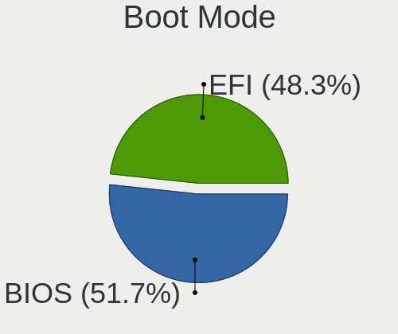
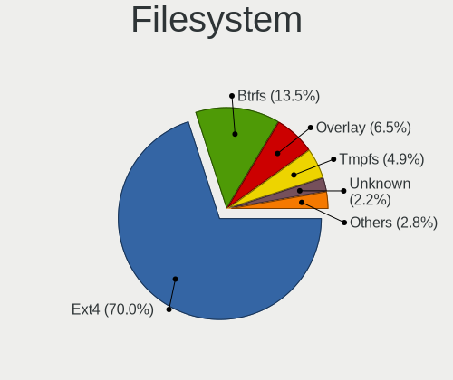
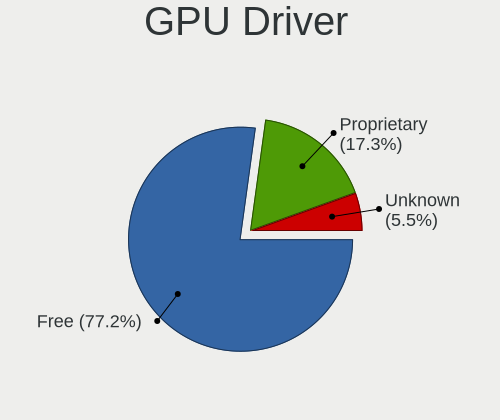
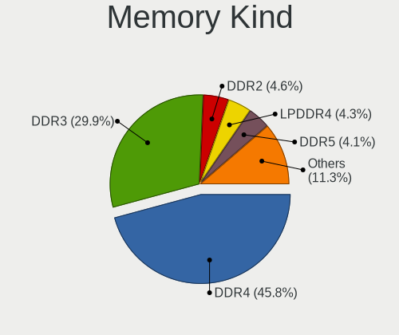

Linux in UK - Tested Hardware & Statistics
------------------------------------------

A project to collect tested hardware configurations for Linux in UK.

Anyone can contribute to this report by the [hw-probe](https://github.com/linuxhw/hw-probe) tool:

    sudo -E hw-probe -all -upload

Please contribute! Especially if your hardware is rare.

This is a report for all computer types. See also reports for [desktops](/Location/UK/Desktop/README.md) and [notebooks](/Location/UK/Notebook/README.md).

Contents
--------

* [ Test Cases ](#test-cases)

* [ System ](#system)
  - [ OS                       ](#os)
  - [ OS Family                ](#os-family)
  - [ Kernel                   ](#kernel)
  - [ Kernel Family            ](#kernel-family)
  - [ Kernel Major Ver.        ](#kernel-major-ver)
  - [ Arch                     ](#arch)
  - [ DE                       ](#de)
  - [ Display Server           ](#display-server)
  - [ Display Manager          ](#display-manager)
  - [ OS Lang                  ](#os-lang)
  - [ Boot Mode                ](#boot-mode)
  - [ Filesystem               ](#filesystem)
  - [ Part. scheme             ](#part-scheme)
  - [ Dual Boot with Linux/BSD ](#dual-boot-with-linuxbsd)
  - [ Dual Boot (Win)          ](#dual-boot-win)

* [ Board ](#board)
  - [ Vendor                   ](#vendor)
  - [ Model                    ](#model)
  - [ Model Family             ](#model-family)
  - [ MFG Year                 ](#mfg-year)
  - [ Form Factor              ](#form-factor)
  - [ Secure Boot              ](#secure-boot)
  - [ Coreboot                 ](#coreboot)
  - [ RAM Size                 ](#ram-size)
  - [ RAM Used                 ](#ram-used)
  - [ Total Drives             ](#total-drives)
  - [ Has CD-ROM               ](#has-cd-rom)
  - [ Has Ethernet             ](#has-ethernet)
  - [ Has WiFi                 ](#has-wifi)
  - [ Has Bluetooth            ](#has-bluetooth)

* [ Location ](#location)
  - [ Country                  ](#country)
  - [ City                     ](#city)

* [ Drives ](#drives)
  - [ Drive Vendor             ](#drive-vendor)
  - [ Drive Model              ](#drive-model)
  - [ HDD Vendor               ](#hdd-vendor)
  - [ SSD Vendor               ](#ssd-vendor)
  - [ Drive Kind               ](#drive-kind)
  - [ Drive Connector          ](#drive-connector)
  - [ Drive Size               ](#drive-size)
  - [ Space Total              ](#space-total)
  - [ Space Used               ](#space-used)
  - [ Malfunc. Drives          ](#malfunc-drives)
  - [ Malfunc. Drive Vendor    ](#malfunc-drive-vendor)
  - [ Malfunc. HDD Vendor      ](#malfunc-hdd-vendor)
  - [ Malfunc. Drive Kind      ](#malfunc-drive-kind)
  - [ Failed Drives            ](#failed-drives)
  - [ Failed Drive Vendor      ](#failed-drive-vendor)
  - [ Drive Status             ](#drive-status)

* [ Storage controller ](#storage-controller)
  - [ Storage Vendor           ](#storage-vendor)
  - [ Storage Model            ](#storage-model)
  - [ Storage Kind             ](#storage-kind)

* [ Processor ](#processor)
  - [ CPU Vendor               ](#cpu-vendor)
  - [ CPU Model                ](#cpu-model)
  - [ CPU Model Family         ](#cpu-model-family)
  - [ CPU Cores                ](#cpu-cores)
  - [ CPU Sockets              ](#cpu-sockets)
  - [ CPU Threads              ](#cpu-threads)
  - [ CPU Op-Modes             ](#cpu-op-modes)
  - [ CPU Microcode            ](#cpu-microcode)
  - [ CPU Microarch            ](#cpu-microarch)

* [ Graphics ](#graphics)
  - [ GPU Vendor               ](#gpu-vendor)
  - [ GPU Model                ](#gpu-model)
  - [ GPU Combo                ](#gpu-combo)
  - [ GPU Driver               ](#gpu-driver)
  - [ GPU Memory               ](#gpu-memory)

* [ Monitor ](#monitor)
  - [ Monitor Vendor           ](#monitor-vendor)
  - [ Monitor Model            ](#monitor-model)
  - [ Monitor Resolution       ](#monitor-resolution)
  - [ Monitor Diagonal         ](#monitor-diagonal)
  - [ Monitor Width            ](#monitor-width)
  - [ Aspect Ratio             ](#aspect-ratio)
  - [ Monitor Area             ](#monitor-area)
  - [ Pixel Density            ](#pixel-density)
  - [ Multiple Monitors        ](#multiple-monitors)

* [ Network ](#network)
  - [ Net Controller Vendor    ](#net-controller-vendor)
  - [ Net Controller Model     ](#net-controller-model)
  - [ Wireless Vendor          ](#wireless-vendor)
  - [ Wireless Model           ](#wireless-model)
  - [ Ethernet Vendor          ](#ethernet-vendor)
  - [ Ethernet Model           ](#ethernet-model)
  - [ Net Controller Kind      ](#net-controller-kind)
  - [ Used Controller          ](#used-controller)
  - [ NICs                     ](#nics)
  - [ IPv6                     ](#ipv6)

* [ Bluetooth ](#bluetooth)
  - [ Bluetooth Vendor         ](#bluetooth-vendor)
  - [ Bluetooth Model          ](#bluetooth-model)

* [ Sound ](#sound)
  - [ Sound Vendor             ](#sound-vendor)
  - [ Sound Model              ](#sound-model)

* [ Memory ](#memory)
  - [ Memory Vendor            ](#memory-vendor)
  - [ Memory Model             ](#memory-model)
  - [ Memory Kind              ](#memory-kind)
  - [ Memory Form Factor       ](#memory-form-factor)
  - [ Memory Size              ](#memory-size)
  - [ Memory Speed             ](#memory-speed)

* [ Printers & scanners ](#printers--scanners)
  - [ Printer Vendor           ](#printer-vendor)
  - [ Printer Model            ](#printer-model)
  - [ Scanner Vendor           ](#scanner-vendor)
  - [ Scanner Model            ](#scanner-model)

* [ Camera ](#camera)
  - [ Camera Vendor            ](#camera-vendor)
  - [ Camera Model             ](#camera-model)

* [ Security ](#security)
  - [ Fingerprint Vendor       ](#fingerprint-vendor)
  - [ Fingerprint Model        ](#fingerprint-model)
  - [ Chipcard Vendor          ](#chipcard-vendor)
  - [ Chipcard Model           ](#chipcard-model)

* [ Unsupported ](#unsupported)
  - [ Unsupported Devices      ](#unsupported-devices)
  - [ Unsupported Device Types ](#unsupported-device-types)

Test Cases
----------

Total: 10720

| Vendor        | Model                       | Form-Factor | Probe                                                      | Date         |
|---------------|-----------------------------|-------------|------------------------------------------------------------|--------------|
| HP            | EliteBook 8470p             | Notebook    | [f75b4a9457](https://linux-hardware.org/?probe=f75b4a9457) | May 01, 2023 |
| ASUSTek       | H81-PLUS                    | Desktop     | [3b45144d62](https://linux-hardware.org/?probe=3b45144d62) | Apr 30, 2023 |
| Toshiba       | EQUIUM P200                 | Notebook    | [812a164a8a](https://linux-hardware.org/?probe=812a164a8a) | Apr 30, 2023 |
| Intel         | NUC12WSBi7 M46422-303       | Mini pc     | [1e10eaa9ae](https://linux-hardware.org/?probe=1e10eaa9ae) | Apr 30, 2023 |
| Lenovo        | ThinkPad X230 2325V1K       | Notebook    | [d630569df9](https://linux-hardware.org/?probe=d630569df9) | Apr 30, 2023 |
| Lenovo        | ThinkPad L480 20LTS1NK27    | Notebook    | [dff6f75899](https://linux-hardware.org/?probe=dff6f75899) | Apr 30, 2023 |
| ASUSTek       | ROG STRIX B450-F GAMING ... | Desktop     | [f0a784354c](https://linux-hardware.org/?probe=f0a784354c) | Apr 30, 2023 |
| ASUSTek       | ROG STRIX B450-F GAMING ... | Desktop     | [332a777929](https://linux-hardware.org/?probe=332a777929) | Apr 30, 2023 |
| HP            | 1998                        | Desktop     | [4ba5ef1211](https://linux-hardware.org/?probe=4ba5ef1211) | Apr 30, 2023 |
| Apple         | Mac-F226BEC8 PVT            | All in one  | [7521d3d742](https://linux-hardware.org/?probe=7521d3d742) | Apr 30, 2023 |
| Apple         | Mac-F226BEC8 PVT            | All in one  | [e3371ae2dc](https://linux-hardware.org/?probe=e3371ae2dc) | Apr 30, 2023 |
| ASRock        | X670E Steel Legend          | Desktop     | [04a7cea7cb](https://linux-hardware.org/?probe=04a7cea7cb) | Apr 29, 2023 |
| Lenovo        | ThinkPad E580 20KS001JUK    | Notebook    | [da5f050510](https://linux-hardware.org/?probe=da5f050510) | Apr 29, 2023 |
| Lenovo        | ThinkPad E580 20KS001JUK    | Notebook    | [1e65b46a12](https://linux-hardware.org/?probe=1e65b46a12) | Apr 29, 2023 |
| ASUSTek       | ASUS TUF Dash F15 FX517Z... | Notebook    | [f2ad30321e](https://linux-hardware.org/?probe=f2ad30321e) | Apr 29, 2023 |
| Apple         | Mac-81E3E92DD6088272 iMa... | All in one  | [6976f884e6](https://linux-hardware.org/?probe=6976f884e6) | Apr 29, 2023 |
| ASRock        | B450M Pro4                  | Desktop     | [7c8260664a](https://linux-hardware.org/?probe=7c8260664a) | Apr 29, 2023 |
| ASUSTek       | ROG STRIX Z590-F GAMING ... | Desktop     | [a158a30802](https://linux-hardware.org/?probe=a158a30802) | Apr 29, 2023 |
| Intel         | S5500BC E25124-453          | Server      | [94527a8584](https://linux-hardware.org/?probe=94527a8584) | Apr 29, 2023 |
| Gigabyte      | H310M H x.x                 | Desktop     | [6b44ad5061](https://linux-hardware.org/?probe=6b44ad5061) | Apr 29, 2023 |
| Gigabyte      | H310M H x.x                 | Desktop     | [ce73a703b6](https://linux-hardware.org/?probe=ce73a703b6) | Apr 29, 2023 |
| TUXEDO        | InfinityBook Pro 14 Gen6    | Notebook    | [58bb30861d](https://linux-hardware.org/?probe=58bb30861d) | Apr 29, 2023 |
| Lenovo        | IdeaPad 530S-14ARR 81H1     | Notebook    | [e70d66b3ba](https://linux-hardware.org/?probe=e70d66b3ba) | Apr 29, 2023 |
| ASUSTek       | ROG Maximus Z690 HERO       | Desktop     | [855bed0070](https://linux-hardware.org/?probe=855bed0070) | Apr 28, 2023 |
| Gigabyte      | H410M H V2                  | Desktop     | [8a23a0fef0](https://linux-hardware.org/?probe=8a23a0fef0) | Apr 28, 2023 |
| ASRock        | B450M Pro4                  | Desktop     | [831cd8fa39](https://linux-hardware.org/?probe=831cd8fa39) | Apr 28, 2023 |
| HP            | Pavilion Laptop 14-dv0xx... | Notebook    | [d364cb5ac7](https://linux-hardware.org/?probe=d364cb5ac7) | Apr 28, 2023 |
| HP            | ENVY Notebook               | Notebook    | [89e8149d6e](https://linux-hardware.org/?probe=89e8149d6e) | Apr 28, 2023 |
| Samsung       | 950XCJ/951XCJ/950XCR        | Notebook    | [2dc65d8f07](https://linux-hardware.org/?probe=2dc65d8f07) | Apr 28, 2023 |
| Intel         | S5500BC E25124-453          | Server      | [567a76c24f](https://linux-hardware.org/?probe=567a76c24f) | Apr 28, 2023 |
| Dell          | XPS 13 9350                 | Notebook    | [9d6905e35d](https://linux-hardware.org/?probe=9d6905e35d) | Apr 28, 2023 |
| Foxconn       | H67MP-S/-V/H67MP            | Desktop     | [c8fe6ab042](https://linux-hardware.org/?probe=c8fe6ab042) | Apr 28, 2023 |
| Lenovo        | ThinkPad L480 20LTS1NK27    | Notebook    | [6569669912](https://linux-hardware.org/?probe=6569669912) | Apr 28, 2023 |
| ASRock        | B450 Steel Legend           | Desktop     | [9130280424](https://linux-hardware.org/?probe=9130280424) | Apr 28, 2023 |
| Dell          | Latitude 7210 2-in-1        | Tablet      | [2de1d6f6f5](https://linux-hardware.org/?probe=2de1d6f6f5) | Apr 28, 2023 |
| Dell          | Latitude E7450              | Notebook    | [6afa2ff009](https://linux-hardware.org/?probe=6afa2ff009) | Apr 28, 2023 |
| MSI           | MAG B550M MORTAR WIFI       | Desktop     | [26c158df39](https://linux-hardware.org/?probe=26c158df39) | Apr 28, 2023 |
| Valve         | Jupiter                     | Notebook    | [0958caf898](https://linux-hardware.org/?probe=0958caf898) | Apr 27, 2023 |
| HP            | 1589                        | Desktop     | [632f486421](https://linux-hardware.org/?probe=632f486421) | Apr 27, 2023 |
| Lenovo        | Legion 7-16-ITHg6 82K6      | Notebook    | [2baf2cbc85](https://linux-hardware.org/?probe=2baf2cbc85) | Apr 27, 2023 |
| Lenovo        | ThinkPad X230 2325O32       | Notebook    | [b38ef1a717](https://linux-hardware.org/?probe=b38ef1a717) | Apr 27, 2023 |
| Acer          | Nitro AN515-57              | Notebook    | [d2ed10f8b1](https://linux-hardware.org/?probe=d2ed10f8b1) | Apr 27, 2023 |
| ASUSTek       | ASUS TUF Gaming A15 FA50... | Notebook    | [6704ecd3d3](https://linux-hardware.org/?probe=6704ecd3d3) | Apr 27, 2023 |
| ASUSTek       | ASUS TUF Gaming A15 FA50... | Notebook    | [4e8b00c534](https://linux-hardware.org/?probe=4e8b00c534) | Apr 27, 2023 |
| Lenovo        | Yoga 6 13ALC6 82ND          | Convertible | [ae51577ddc](https://linux-hardware.org/?probe=ae51577ddc) | Apr 27, 2023 |
| MSI           | MAG B550 TOMAHAWK           | Desktop     | [19c2a17ec5](https://linux-hardware.org/?probe=19c2a17ec5) | Apr 27, 2023 |
| Lenovo        | SHARKBAY SDK0E50512 STD     | Desktop     | [6601cb2397](https://linux-hardware.org/?probe=6601cb2397) | Apr 26, 2023 |
| Lenovo        | IdeaPad Y510P 20217         | Notebook    | [e35780d356](https://linux-hardware.org/?probe=e35780d356) | Apr 26, 2023 |
| Lenovo        | SHARKBAY NOK                | Desktop     | [54dea0607f](https://linux-hardware.org/?probe=54dea0607f) | Apr 26, 2023 |
| Gigabyte      | GA-MA785GM-US2H             | Desktop     | [238598d9ab](https://linux-hardware.org/?probe=238598d9ab) | Apr 26, 2023 |
| Apple         | Mac-F221BEC8                | Desktop     | [ac51617470](https://linux-hardware.org/?probe=ac51617470) | Apr 26, 2023 |
| Apple         | Mac-F2238AC8                | All in one  | [f0ea43f3fd](https://linux-hardware.org/?probe=f0ea43f3fd) | Apr 26, 2023 |
| Intel         | DQ67OW AAG12528-307         | Desktop     | [28245ea080](https://linux-hardware.org/?probe=28245ea080) | Apr 25, 2023 |
| HP            | 18E9                        | Desktop     | [b9bb679cca](https://linux-hardware.org/?probe=b9bb679cca) | Apr 25, 2023 |
| Gigabyte      | Z270X-Gaming 7              | Desktop     | [8a600077f6](https://linux-hardware.org/?probe=8a600077f6) | Apr 25, 2023 |
| Acer          | Aspire A514-54              | Notebook    | [19ca73662f](https://linux-hardware.org/?probe=19ca73662f) | Apr 25, 2023 |
| Lenovo        | SHARKBAY NOK                | Desktop     | [c5adfbd376](https://linux-hardware.org/?probe=c5adfbd376) | Apr 25, 2023 |
| Google        | Sasuke                      | Notebook    | [7615a1b1e5](https://linux-hardware.org/?probe=7615a1b1e5) | Apr 25, 2023 |
| Gigabyte      | H61M-S2-B3                  | Desktop     | [cd95f8ec71](https://linux-hardware.org/?probe=cd95f8ec71) | Apr 25, 2023 |
| Dell          | XPS 13 9380                 | Notebook    | [290a99fee9](https://linux-hardware.org/?probe=290a99fee9) | Apr 25, 2023 |
| HP            | ProBook 640 G1              | Notebook    | [9306db1f90](https://linux-hardware.org/?probe=9306db1f90) | Apr 25, 2023 |
| MSI           | MAG B550 TOMAHAWK           | Desktop     | [620668d216](https://linux-hardware.org/?probe=620668d216) | Apr 25, 2023 |
| Dell          | Latitude XT2                | Notebook    | [62df7dc069](https://linux-hardware.org/?probe=62df7dc069) | Apr 24, 2023 |
| Intel         | HM570                       | Desktop     | [1220357b3d](https://linux-hardware.org/?probe=1220357b3d) | Apr 24, 2023 |
| Lenovo        | SKYBAY SDK0J40709 WIN 32... | All in one  | [f68e55cabc](https://linux-hardware.org/?probe=f68e55cabc) | Apr 24, 2023 |
| MSI           | B450 GAMING PRO CARBON M... | Desktop     | [c78c7e9ec1](https://linux-hardware.org/?probe=c78c7e9ec1) | Apr 24, 2023 |
| ASUSTek       | CROSSHAIR V FORMULA-Z       | Desktop     | [267c5b8075](https://linux-hardware.org/?probe=267c5b8075) | Apr 24, 2023 |
| Dell          | Inspiron 5565               | Notebook    | [6622474d4b](https://linux-hardware.org/?probe=6622474d4b) | Apr 24, 2023 |
| ASUSTek       | PRIME X399-A                | Desktop     | [70d478e2eb](https://linux-hardware.org/?probe=70d478e2eb) | Apr 24, 2023 |
| ASUSTek       | PRIME X399-A                | Desktop     | [2931b721a3](https://linux-hardware.org/?probe=2931b721a3) | Apr 24, 2023 |
| MSI           | MAG B550 TOMAHAWK           | Desktop     | [df85ceaa6b](https://linux-hardware.org/?probe=df85ceaa6b) | Apr 24, 2023 |
| Apple         | MacBookPro5,5               | Notebook    | [de825a326c](https://linux-hardware.org/?probe=de825a326c) | Apr 24, 2023 |
| Acer          | Aspire A317-53              | Notebook    | [c47ec3530e](https://linux-hardware.org/?probe=c47ec3530e) | Apr 24, 2023 |
| HP            | Stream Notebook PC 13       | Notebook    | [455c6b5e28](https://linux-hardware.org/?probe=455c6b5e28) | Apr 23, 2023 |
| Linx          | LINX10V64                   | Tablet      | [84fc9aff4b](https://linux-hardware.org/?probe=84fc9aff4b) | Apr 23, 2023 |
| HP            | Pavilion Laptop 15-eh0xx... | Notebook    | [982ca9079d](https://linux-hardware.org/?probe=982ca9079d) | Apr 23, 2023 |
| MSI           | B550-A PRO                  | Desktop     | [d8b51c995c](https://linux-hardware.org/?probe=d8b51c995c) | Apr 23, 2023 |
| MSI           | A88XM-E35                   | Desktop     | [c26812e2e1](https://linux-hardware.org/?probe=c26812e2e1) | Apr 23, 2023 |
| HP            | ENVY x360 2-in-1 Laptop ... | Convertible | [bdfb512e83](https://linux-hardware.org/?probe=bdfb512e83) | Apr 23, 2023 |
| HUAWEI        | NBLK-WAX9X                  | Notebook    | [25e942e55c](https://linux-hardware.org/?probe=25e942e55c) | Apr 22, 2023 |
| Gigabyte      | B460 HD3                    | Desktop     | [c9e3b1d5ea](https://linux-hardware.org/?probe=c9e3b1d5ea) | Apr 22, 2023 |
| Lenovo        | ThinkPad L15 Gen 3 21C3C... | Notebook    | [b37a4411c5](https://linux-hardware.org/?probe=b37a4411c5) | Apr 22, 2023 |
| Gigabyte      | GA-MA74GM-S2H               | Desktop     | [0cd5599131](https://linux-hardware.org/?probe=0cd5599131) | Apr 22, 2023 |
| ASUSTek       | PRIME B660-PLUS D4          | Desktop     | [3c0a66f0fc](https://linux-hardware.org/?probe=3c0a66f0fc) | Apr 22, 2023 |
| Lenovo        | 30D2 SDK0J40705 WIN 3425... | Desktop     | [3c3719b07f](https://linux-hardware.org/?probe=3c3719b07f) | Apr 22, 2023 |
| ASUSTek       | H81M-K                      | Desktop     | [5aa26aea52](https://linux-hardware.org/?probe=5aa26aea52) | Apr 22, 2023 |
| TUXEDO        | Pulse 15 Gen2               | Notebook    | [fd2ad16b59](https://linux-hardware.org/?probe=fd2ad16b59) | Apr 22, 2023 |
| HP            | Spectre x360 Convertible... | Convertible | [4f473af7a9](https://linux-hardware.org/?probe=4f473af7a9) | Apr 22, 2023 |
| Lenovo        | ThinkPad 13 2nd Gen 20J1... | Notebook    | [936e6fc768](https://linux-hardware.org/?probe=936e6fc768) | Apr 22, 2023 |
| Lenovo        | ThinkPad 13 2nd Gen 20J1... | Notebook    | [e0763f0f69](https://linux-hardware.org/?probe=e0763f0f69) | Apr 22, 2023 |
| Apple         | Mac-35C5E08120C7EEAF Mac... | Mini pc     | [18391e6b6e](https://linux-hardware.org/?probe=18391e6b6e) | Apr 21, 2023 |
| HP            | 18E5                        | Desktop     | [0437b3deb1](https://linux-hardware.org/?probe=0437b3deb1) | Apr 21, 2023 |
| Apple         | Mac-B809C3757DA9BB8D iMa... | All in one  | [f1227ea669](https://linux-hardware.org/?probe=f1227ea669) | Apr 21, 2023 |
| Apple         | Mac-B809C3757DA9BB8D iMa... | All in one  | [6b0104f339](https://linux-hardware.org/?probe=6b0104f339) | Apr 21, 2023 |
| Lenovo        | Legion 7 15IMH05 81YT       | Notebook    | [2727f5c463](https://linux-hardware.org/?probe=2727f5c463) | Apr 21, 2023 |
| ASUSTek       | ROG STRIX B450-F GAMING ... | Desktop     | [03bcaf6334](https://linux-hardware.org/?probe=03bcaf6334) | Apr 21, 2023 |
| ASUSTek       | VivoBook_ASUSLaptop M760... | Notebook    | [a02462f614](https://linux-hardware.org/?probe=a02462f614) | Apr 21, 2023 |
| Lenovo        | IdeaPad Y700-15ISK 80NV     | Notebook    | [dfbfce9d2e](https://linux-hardware.org/?probe=dfbfce9d2e) | Apr 21, 2023 |
| Dell          | 040DDP A01                  | Desktop     | [6720e15331](https://linux-hardware.org/?probe=6720e15331) | Apr 21, 2023 |
| Lenovo        | IdeaPad Y700-15ISK 80NV     | Notebook    | [66f95f2851](https://linux-hardware.org/?probe=66f95f2851) | Apr 21, 2023 |
| Google        | Swanky                      | Notebook    | [92156daf53](https://linux-hardware.org/?probe=92156daf53) | Apr 21, 2023 |
| ASUSTek       | PRIME B360M-A               | Desktop     | [61d7104ec4](https://linux-hardware.org/?probe=61d7104ec4) | Apr 21, 2023 |
| HP            | ProLiant MicroServer        | Desktop     | [ea76b8632f](https://linux-hardware.org/?probe=ea76b8632f) | Apr 20, 2023 |
| ASUSTek       | B85M-G                      | Desktop     | [4392c46287](https://linux-hardware.org/?probe=4392c46287) | Apr 20, 2023 |
| Lenovo        | IdeaPad 3 15ADA05 81W1      | Notebook    | [2afe988f2e](https://linux-hardware.org/?probe=2afe988f2e) | Apr 20, 2023 |
| Acer          | Aspire M3970                | Desktop     | [d43372f3fd](https://linux-hardware.org/?probe=d43372f3fd) | Apr 20, 2023 |
| ASUSTek       | H110M-R                     | Desktop     | [d428839f7c](https://linux-hardware.org/?probe=d428839f7c) | Apr 20, 2023 |
| LG Electro... | 17Z90P-K.AA78A1             | Notebook    | [f8f6ec2123](https://linux-hardware.org/?probe=f8f6ec2123) | Apr 20, 2023 |
| Dell          | 05WNJ2 A02                  | Server      | [a0623dc5a7](https://linux-hardware.org/?probe=a0623dc5a7) | Apr 20, 2023 |
| Lenovo        | 300e 2nd Gen 82GK           | Convertible | [54c7413bc5](https://linux-hardware.org/?probe=54c7413bc5) | Apr 20, 2023 |
| Gigabyte      | A320M-S2H-CF                | Desktop     | [063b4867ba](https://linux-hardware.org/?probe=063b4867ba) | Apr 20, 2023 |
| Intel         | DG43GT AAE62768-301         | Desktop     | [643ed4ce33](https://linux-hardware.org/?probe=643ed4ce33) | Apr 20, 2023 |
| ASUSTek       | X550CA                      | Notebook    | [cb5f73ff63](https://linux-hardware.org/?probe=cb5f73ff63) | Apr 20, 2023 |
| Lenovo        | ThinkPad T530 24292DG       | Notebook    | [1ba852f185](https://linux-hardware.org/?probe=1ba852f185) | Apr 20, 2023 |
| Dell          | Inspiron 1545               | Notebook    | [68a7470480](https://linux-hardware.org/?probe=68a7470480) | Apr 19, 2023 |
| HP            | ProBook 4540s               | Notebook    | [1bf512ee24](https://linux-hardware.org/?probe=1bf512ee24) | Apr 19, 2023 |
| MSI           | MPG Z590 GAMING EDGE WIF... | Desktop     | [97860c01ca](https://linux-hardware.org/?probe=97860c01ca) | Apr 19, 2023 |
| Fanless Mi... | Rev GMLR1                   | Mini pc     | [04a458482b](https://linux-hardware.org/?probe=04a458482b) | Apr 19, 2023 |
| Lenovo        | SHARKBAY 31900058 STD or... | Desktop     | [1331c6ef06](https://linux-hardware.org/?probe=1331c6ef06) | Apr 19, 2023 |
| Toshiba       | Satellite Pro C850-1HE      | Notebook    | [48d3d92f3d](https://linux-hardware.org/?probe=48d3d92f3d) | Apr 19, 2023 |
| Unknown       | Unknown                     | Desktop     | [85700f4804](https://linux-hardware.org/?probe=85700f4804) | Apr 19, 2023 |
| Dell          | Vostro 5471                 | Notebook    | [5cbbc95995](https://linux-hardware.org/?probe=5cbbc95995) | Apr 19, 2023 |
| Gigabyte      | H81M-S2H                    | Desktop     | [ff7225c921](https://linux-hardware.org/?probe=ff7225c921) | Apr 19, 2023 |
| Gigabyte      | H81M-S2H                    | Desktop     | [a70cdf4848](https://linux-hardware.org/?probe=a70cdf4848) | Apr 19, 2023 |
| Dell          | G5 5590                     | Notebook    | [c7334114be](https://linux-hardware.org/?probe=c7334114be) | Apr 18, 2023 |
| Lenovo        | CRESCENTBAY 31900058 WIN... | All in one  | [529c1ed52a](https://linux-hardware.org/?probe=529c1ed52a) | Apr 18, 2023 |
| ASUSTek       | ROG STRIX B450-F GAMING ... | Desktop     | [323dc7fa4b](https://linux-hardware.org/?probe=323dc7fa4b) | Apr 18, 2023 |
| Dell          | Inspiron 7559               | Notebook    | [9c66c608f3](https://linux-hardware.org/?probe=9c66c608f3) | Apr 18, 2023 |
| Lenovo        | IdeaPadFlex 5 14ABR8 82X... | Convertible | [28d52a565b](https://linux-hardware.org/?probe=28d52a565b) | Apr 18, 2023 |
| HP            | Laptop 15-da1xxx            | Notebook    | [c7a5aadd85](https://linux-hardware.org/?probe=c7a5aadd85) | Apr 18, 2023 |
| LG Electro... | 17Z90Q-K.AA78A1             | Notebook    | [594a7fa16b](https://linux-hardware.org/?probe=594a7fa16b) | Apr 18, 2023 |
| ASUSTek       | M5A78L-M LX                 | Desktop     | [c34c1abf02](https://linux-hardware.org/?probe=c34c1abf02) | Apr 18, 2023 |
| Sony          | SVF1521Q1EW                 | Notebook    | [4be523b9a9](https://linux-hardware.org/?probe=4be523b9a9) | Apr 18, 2023 |
| ASUSTek       | X550LD                      | Notebook    | [5c07d2203c](https://linux-hardware.org/?probe=5c07d2203c) | Apr 17, 2023 |
| Samsung       | 930QED                      | Convertible | [fdfe04c5c9](https://linux-hardware.org/?probe=fdfe04c5c9) | Apr 17, 2023 |
| ASUSTek       | PRIME B450-PLUS             | Desktop     | [c5ceac2597](https://linux-hardware.org/?probe=c5ceac2597) | Apr 17, 2023 |
| Sony          | SVE1711C5E                  | Notebook    | [e4fbd8fca9](https://linux-hardware.org/?probe=e4fbd8fca9) | Apr 17, 2023 |
| ASUSTek       | ROG Maximus Z690 HERO       | Desktop     | [a70c93f2e7](https://linux-hardware.org/?probe=a70c93f2e7) | Apr 17, 2023 |
| Dell          | 0P01GV A03                  | Desktop     | [ed2675881e](https://linux-hardware.org/?probe=ed2675881e) | Apr 17, 2023 |
| ASUSTek       | PRIME Z370-A                | Desktop     | [b9d869fe6b](https://linux-hardware.org/?probe=b9d869fe6b) | Apr 16, 2023 |
| AZW           | Speed S                     | Desktop     | [7cf5e54f5b](https://linux-hardware.org/?probe=7cf5e54f5b) | Apr 16, 2023 |
| MSI           | B560M PRO-VDH WIFI          | Desktop     | [fd0b3fe549](https://linux-hardware.org/?probe=fd0b3fe549) | Apr 16, 2023 |
| Dell          | XPS 17 9700                 | Notebook    | [3ad1ee8197](https://linux-hardware.org/?probe=3ad1ee8197) | Apr 16, 2023 |
| ASUSTek       | ROG Flow X13 GV301QH_GV3... | Notebook    | [2092251807](https://linux-hardware.org/?probe=2092251807) | Apr 16, 2023 |
| ASUSTek       | ASUS TUF Gaming F15 FX50... | Notebook    | [9b05d61f11](https://linux-hardware.org/?probe=9b05d61f11) | Apr 16, 2023 |
| HP            | ProBook 450 G1              | Notebook    | [000e6c6702](https://linux-hardware.org/?probe=000e6c6702) | Apr 16, 2023 |
| Gigabyte      | B85M-DS3H                   | Desktop     | [44222bc590](https://linux-hardware.org/?probe=44222bc590) | Apr 16, 2023 |
| Gigabyte      | B85M-DS3H                   | Desktop     | [592c412bd9](https://linux-hardware.org/?probe=592c412bd9) | Apr 16, 2023 |
| HONOR         | BBR-WAX9                    | Notebook    | [a56688fd70](https://linux-hardware.org/?probe=a56688fd70) | Apr 16, 2023 |
| HONOR         | BBR-WAX9                    | Notebook    | [798405022f](https://linux-hardware.org/?probe=798405022f) | Apr 16, 2023 |
| ASUSTek       | ROG Maximus Z690 HERO       | Desktop     | [962c5734bc](https://linux-hardware.org/?probe=962c5734bc) | Apr 15, 2023 |
| HP            | 250 G4 Notebook PC          | Notebook    | [08036de728](https://linux-hardware.org/?probe=08036de728) | Apr 15, 2023 |
| Lenovo        | IdeaPad 1 14ADA05 82GW      | Notebook    | [2e860ef402](https://linux-hardware.org/?probe=2e860ef402) | Apr 15, 2023 |
| MSI           | MPG B550 GAMING EDGE WIF... | Desktop     | [00ee6cd73f](https://linux-hardware.org/?probe=00ee6cd73f) | Apr 15, 2023 |
| Acer          | Aspire A317-53              | Notebook    | [11b817e884](https://linux-hardware.org/?probe=11b817e884) | Apr 15, 2023 |
| Lenovo        | IdeaPad 5 Pro 16ARH7 82S... | Notebook    | [aedbc43074](https://linux-hardware.org/?probe=aedbc43074) | Apr 15, 2023 |
| HP            | Pavilion g6                 | Notebook    | [a918284993](https://linux-hardware.org/?probe=a918284993) | Apr 15, 2023 |
| Lenovo        | ThinkPad X1 Carbon 2nd 2... | Notebook    | [19fc60d2a5](https://linux-hardware.org/?probe=19fc60d2a5) | Apr 14, 2023 |
| Lenovo        | IdeaPad 3 17IML05 81WC      | Notebook    | [f5940f5ed5](https://linux-hardware.org/?probe=f5940f5ed5) | Apr 14, 2023 |
| Dell          | XPS 15 7590                 | Notebook    | [f3248c9bca](https://linux-hardware.org/?probe=f3248c9bca) | Apr 14, 2023 |
| Acer          | Aspire M3970                | Desktop     | [0792e082e7](https://linux-hardware.org/?probe=0792e082e7) | Apr 14, 2023 |
| HP            | ENVY x360 Convertible 15... | Convertible | [d4f384271e](https://linux-hardware.org/?probe=d4f384271e) | Apr 14, 2023 |
| Clevo         | W760T/M740T/M760T           | Notebook    | [0dfaa8f0e8](https://linux-hardware.org/?probe=0dfaa8f0e8) | Apr 14, 2023 |
| Unknown       | Unknown                     | Notebook    | [7bd7802e04](https://linux-hardware.org/?probe=7bd7802e04) | Apr 14, 2023 |
| HUAWEI        | MRG-WXX                     | Notebook    | [56c255e5f0](https://linux-hardware.org/?probe=56c255e5f0) | Apr 14, 2023 |
| Lenovo        | Flex 2-14 20404             | Notebook    | [c76a516113](https://linux-hardware.org/?probe=c76a516113) | Apr 14, 2023 |
| ASUSTek       | Zenbook UX3402ZA_UX3402Z... | Notebook    | [bd9c1c1e6d](https://linux-hardware.org/?probe=bd9c1c1e6d) | Apr 14, 2023 |
| HP            | Notebook                    | Notebook    | [79541411b2](https://linux-hardware.org/?probe=79541411b2) | Apr 14, 2023 |
| Dell          | 00V62H A00                  | Desktop     | [0632bfe4d0](https://linux-hardware.org/?probe=0632bfe4d0) | Apr 13, 2023 |
| Unknown       | Unknown                     | Notebook    | [cfe1766d1a](https://linux-hardware.org/?probe=cfe1766d1a) | Apr 13, 2023 |
| Unknown       | Unknown                     | Notebook    | [7ff7c0642f](https://linux-hardware.org/?probe=7ff7c0642f) | Apr 13, 2023 |
| Raspberry ... | Raspberry Pi 3 Model B P... | Soc         | [407ca5845d](https://linux-hardware.org/?probe=407ca5845d) | Apr 13, 2023 |
| HP            | Spectre x360 Convertible... | Convertible | [106963edf7](https://linux-hardware.org/?probe=106963edf7) | Apr 13, 2023 |
| Acer          | Aspire A315-51              | Notebook    | [c3962286cb](https://linux-hardware.org/?probe=c3962286cb) | Apr 13, 2023 |
| HP            | EliteBook 840 G7 Noteboo... | Notebook    | [abf6dd7200](https://linux-hardware.org/?probe=abf6dd7200) | Apr 13, 2023 |
| Shuttle       | FH67                        | Desktop     | [daa2f39981](https://linux-hardware.org/?probe=daa2f39981) | Apr 13, 2023 |
| ASUSTek       | TUF Gaming FX505DY_FX505... | Notebook    | [aa571700ad](https://linux-hardware.org/?probe=aa571700ad) | Apr 13, 2023 |
| Lenovo        | ThinkPad T530 24292DG       | Notebook    | [9ac01d9237](https://linux-hardware.org/?probe=9ac01d9237) | Apr 13, 2023 |
| MSI           | MAG B550 TOMAHAWK           | Desktop     | [615a9d3871](https://linux-hardware.org/?probe=615a9d3871) | Apr 12, 2023 |
| Apple         | MacBookPro5,5               | Notebook    | [401c4d8143](https://linux-hardware.org/?probe=401c4d8143) | Apr 12, 2023 |
| Sony          | SVE1711C5E                  | Notebook    | [07c6f843fb](https://linux-hardware.org/?probe=07c6f843fb) | Apr 12, 2023 |
| Toshiba       | Satellite C660              | Notebook    | [551fabbc17](https://linux-hardware.org/?probe=551fabbc17) | Apr 12, 2023 |
| Dell          | 02K9CR A01                  | Desktop     | [45c419b8d6](https://linux-hardware.org/?probe=45c419b8d6) | Apr 12, 2023 |
| Intel         | NUC8BEB J72692-304          | Mini pc     | [19c864f074](https://linux-hardware.org/?probe=19c864f074) | Apr 12, 2023 |
| Dell          | XPS 13 9305                 | Notebook    | [48b143cc2f](https://linux-hardware.org/?probe=48b143cc2f) | Apr 12, 2023 |
| Lenovo        | YB1-X91F                    | Convertible | [e4c0490b89](https://linux-hardware.org/?probe=e4c0490b89) | Apr 12, 2023 |
| Google        | Gnawty                      | Notebook    | [ddb0fea339](https://linux-hardware.org/?probe=ddb0fea339) | Apr 12, 2023 |
| ASUSTek       | PN51-E1                     | Mini pc     | [e92e5de977](https://linux-hardware.org/?probe=e92e5de977) | Apr 11, 2023 |
| Dell          | Latitude E5450              | Notebook    | [f98cdf4da0](https://linux-hardware.org/?probe=f98cdf4da0) | Apr 11, 2023 |
| Dell          | Latitude E5450              | Notebook    | [7bf04cdb7d](https://linux-hardware.org/?probe=7bf04cdb7d) | Apr 11, 2023 |
| HP            | 805F                        | Desktop     | [07bd1b4df7](https://linux-hardware.org/?probe=07bd1b4df7) | Apr 11, 2023 |
| MSI           | Stealth 14Studio A13VF      | Notebook    | [8297ce2712](https://linux-hardware.org/?probe=8297ce2712) | Apr 11, 2023 |
| MSI           | Stealth 14Studio A13VF      | Notebook    | [e3fc8c8f43](https://linux-hardware.org/?probe=e3fc8c8f43) | Apr 11, 2023 |
| HP            | 805F                        | Desktop     | [7863ff02eb](https://linux-hardware.org/?probe=7863ff02eb) | Apr 11, 2023 |
| ASRock        | Z77 Pro4                    | Desktop     | [7f718ab68f](https://linux-hardware.org/?probe=7f718ab68f) | Apr 10, 2023 |
| MSI           | MPG X570 GAMING PLUS        | Desktop     | [1dad85ccf1](https://linux-hardware.org/?probe=1dad85ccf1) | Apr 10, 2023 |
| MSI           | MPG X570 GAMING PLUS        | Desktop     | [01cae1e152](https://linux-hardware.org/?probe=01cae1e152) | Apr 10, 2023 |
| Gigabyte      | MMLP3AP-00                  | Notebook    | [6fd82ceaec](https://linux-hardware.org/?probe=6fd82ceaec) | Apr 09, 2023 |
| lapbook       | S15 PRO                     | Notebook    | [5a039fc6fb](https://linux-hardware.org/?probe=5a039fc6fb) | Apr 09, 2023 |
| Lenovo        | ThinkPad T61 7661WQQ        | Notebook    | [8def87668b](https://linux-hardware.org/?probe=8def87668b) | Apr 09, 2023 |
| HP            | EliteBook 2560p             | Notebook    | [bc5cbcd2cb](https://linux-hardware.org/?probe=bc5cbcd2cb) | Apr 09, 2023 |
| Lenovo        | ThinkPad T480 20L50000UK    | Notebook    | [9f2644807d](https://linux-hardware.org/?probe=9f2644807d) | Apr 09, 2023 |
| Dell          | Inspiron 7570               | Notebook    | [2bac711aba](https://linux-hardware.org/?probe=2bac711aba) | Apr 09, 2023 |
| Acer          | Aspire A317-53              | Notebook    | [7dc7e5e5c3](https://linux-hardware.org/?probe=7dc7e5e5c3) | Apr 09, 2023 |
| Acer          | Aspire A317-53              | Notebook    | [b1c4404d58](https://linux-hardware.org/?probe=b1c4404d58) | Apr 09, 2023 |
| Dell          | 0PU052                      | Desktop     | [8f8c7f3a02](https://linux-hardware.org/?probe=8f8c7f3a02) | Apr 09, 2023 |
| ASUSTek       | A88XM-A                     | Desktop     | [52728f9e37](https://linux-hardware.org/?probe=52728f9e37) | Apr 08, 2023 |
| Google        | Ampton                      | Notebook    | [e3945d7727](https://linux-hardware.org/?probe=e3945d7727) | Apr 08, 2023 |
| Lenovo        | Legion 7 16ACHg6 82N6       | Notebook    | [14a3d5f4be](https://linux-hardware.org/?probe=14a3d5f4be) | Apr 08, 2023 |
| Lenovo        | ThinkPad P51 W10DG 20MNS... | Notebook    | [5cf4615347](https://linux-hardware.org/?probe=5cf4615347) | Apr 08, 2023 |
| Acer          | Aspire XC-895 V:1.0         | Desktop     | [ef0fbbe0aa](https://linux-hardware.org/?probe=ef0fbbe0aa) | Apr 08, 2023 |
| Dell          | 0KRC95 A01                  | Desktop     | [9300a95302](https://linux-hardware.org/?probe=9300a95302) | Apr 07, 2023 |
| Lenovo        | ThinkPad X270 W10DG 20K5... | Notebook    | [aab830c5dd](https://linux-hardware.org/?probe=aab830c5dd) | Apr 07, 2023 |
| MSI           | B450 TOMAHAWK MAX           | Desktop     | [0f3e23c7ce](https://linux-hardware.org/?probe=0f3e23c7ce) | Apr 07, 2023 |
| Gigabyte      | H61M-S2PV                   | Desktop     | [8c4f851451](https://linux-hardware.org/?probe=8c4f851451) | Apr 07, 2023 |
| HP            | 82A2                        | Desktop     | [68d2b054d7](https://linux-hardware.org/?probe=68d2b054d7) | Apr 07, 2023 |
| Google        | Bluebird                    | Notebook    | [6ab22238ac](https://linux-hardware.org/?probe=6ab22238ac) | Apr 07, 2023 |
| Dell          | 0P01GV A03                  | Desktop     | [5dc44169d0](https://linux-hardware.org/?probe=5dc44169d0) | Apr 07, 2023 |
| Apple         | MacBookPro13,3              | Notebook    | [77c6d48d6b](https://linux-hardware.org/?probe=77c6d48d6b) | Apr 06, 2023 |
| Gigabyte      | X570 AORUS XTREME           | Desktop     | [a0584206ea](https://linux-hardware.org/?probe=a0584206ea) | Apr 06, 2023 |
| Dell          | Latitude 7320               | Convertible | [1e86d8349b](https://linux-hardware.org/?probe=1e86d8349b) | Apr 06, 2023 |
| HP            | Laptop 15-db0xxx            | Notebook    | [e05bffcc8a](https://linux-hardware.org/?probe=e05bffcc8a) | Apr 06, 2023 |
| Apple         | MacBookPro14,1              | Notebook    | [e2b1578d42](https://linux-hardware.org/?probe=e2b1578d42) | Apr 06, 2023 |
| Apple         | MacBookPro14,1              | Notebook    | [2cd7831b58](https://linux-hardware.org/?probe=2cd7831b58) | Apr 06, 2023 |
| Google        | Bard                        | Notebook    | [cc1d159d0c](https://linux-hardware.org/?probe=cc1d159d0c) | Apr 05, 2023 |
| Dell          | 0HN7XN A01                  | Desktop     | [43469cea83](https://linux-hardware.org/?probe=43469cea83) | Apr 05, 2023 |
| Microsoft     | Surface Pro                 | Tablet      | [64c9557d34](https://linux-hardware.org/?probe=64c9557d34) | Apr 05, 2023 |
| HP            | Pavilion Gaming Laptop 1... | Notebook    | [8bf7c8a569](https://linux-hardware.org/?probe=8bf7c8a569) | Apr 05, 2023 |
| Dell          | Latitude E5550              | Notebook    | [5527315153](https://linux-hardware.org/?probe=5527315153) | Apr 05, 2023 |
| Microsoft     | Surface Pro                 | Tablet      | [011057afa2](https://linux-hardware.org/?probe=011057afa2) | Apr 05, 2023 |
| HP            | 0A9Ch                       | Desktop     | [178046626f](https://linux-hardware.org/?probe=178046626f) | Apr 05, 2023 |
| MSI           | MPG X570 GAMING PLUS        | Desktop     | [eadee78860](https://linux-hardware.org/?probe=eadee78860) | Apr 05, 2023 |
| Lenovo        | Aptio CRB SDK0F82993 WIN    | Mini pc     | [5c12ed53b7](https://linux-hardware.org/?probe=5c12ed53b7) | Apr 05, 2023 |
| Lenovo        | Aptio CRB SDK0F82993 WIN    | Mini pc     | [6896e5d9e2](https://linux-hardware.org/?probe=6896e5d9e2) | Apr 05, 2023 |
| Dell          | Latitude 5320               | Notebook    | [5549de9c5c](https://linux-hardware.org/?probe=5549de9c5c) | Apr 05, 2023 |
| Dell          | Latitude 5320               | Notebook    | [69e3bad969](https://linux-hardware.org/?probe=69e3bad969) | Apr 05, 2023 |
| MSI           | B450 TOMAHAWK MAX           | Desktop     | [540d1f11a6](https://linux-hardware.org/?probe=540d1f11a6) | Apr 05, 2023 |
| Gigabyte      | X570 AORUS XTREME           | Desktop     | [b5740f3323](https://linux-hardware.org/?probe=b5740f3323) | Apr 04, 2023 |
| Dell          | Latitude 5480               | Notebook    | [40ec4e3ec9](https://linux-hardware.org/?probe=40ec4e3ec9) | Apr 04, 2023 |
| Lenovo        | IdeaPad 320-15IAP 80XR      | Notebook    | [4e7cae1fde](https://linux-hardware.org/?probe=4e7cae1fde) | Apr 04, 2023 |
| ASUSTek       | X99-A II                    | Desktop     | [882dc981fb](https://linux-hardware.org/?probe=882dc981fb) | Apr 04, 2023 |
| Lenovo        | IdeaPad 330S-15AST 81F9     | Notebook    | [d79463ea93](https://linux-hardware.org/?probe=d79463ea93) | Apr 04, 2023 |
| ASUSTek       | TUF Gaming Z490-PLUS        | Desktop     | [b7068fce05](https://linux-hardware.org/?probe=b7068fce05) | Apr 04, 2023 |
| Gigabyte      | B450 AORUS M                | Desktop     | [ed948ed552](https://linux-hardware.org/?probe=ed948ed552) | Apr 04, 2023 |
| MSI           | H310M PRO-VDH PLUS          | Desktop     | [1eae1b3796](https://linux-hardware.org/?probe=1eae1b3796) | Apr 04, 2023 |
| Lenovo        | IdeaPad L340-15IRH Gamin... | Notebook    | [1af0b7675b](https://linux-hardware.org/?probe=1af0b7675b) | Apr 04, 2023 |
| MSI           | MPG X570 GAMING PLUS        | Desktop     | [739f49ff7e](https://linux-hardware.org/?probe=739f49ff7e) | Apr 04, 2023 |
| Dell          | Studio 1558                 | Notebook    | [e9b75d657d](https://linux-hardware.org/?probe=e9b75d657d) | Apr 04, 2023 |
| ASUSTek       | A55BM-E                     | Desktop     | [3e174ff8a3](https://linux-hardware.org/?probe=3e174ff8a3) | Apr 04, 2023 |
| Lenovo        | Brazos                      | Notebook    | [6415cb26c2](https://linux-hardware.org/?probe=6415cb26c2) | Apr 03, 2023 |
| ASRock        | 990FX Extreme3              | Desktop     | [013cd9b246](https://linux-hardware.org/?probe=013cd9b246) | Apr 03, 2023 |
| HP            | ENVY x360 Convertible 13... | Convertible | [4061ae40b8](https://linux-hardware.org/?probe=4061ae40b8) | Apr 03, 2023 |
| MSI           | MAG Z690 TOMAHAWK WIFI D... | Desktop     | [b65273209b](https://linux-hardware.org/?probe=b65273209b) | Apr 03, 2023 |
| Toshiba       | Satellite C650              | Notebook    | [190547d5cd](https://linux-hardware.org/?probe=190547d5cd) | Apr 03, 2023 |
| AZW           | GTR V01                     | Mini pc     | [83603a9aa8](https://linux-hardware.org/?probe=83603a9aa8) | Apr 03, 2023 |
| ASUSTek       | PRIME H310M-A R2.0          | Desktop     | [f8e61fd850](https://linux-hardware.org/?probe=f8e61fd850) | Apr 03, 2023 |
| Unknown       | Unknown                     | Desktop     | [9a44a4b80a](https://linux-hardware.org/?probe=9a44a4b80a) | Apr 03, 2023 |
| Pegatron      | JESSE                       | Desktop     | [60c37e2dda](https://linux-hardware.org/?probe=60c37e2dda) | Apr 03, 2023 |
| ASUSTek       | VivoBook_ASUSLaptop X513... | Notebook    | [d7f3280e60](https://linux-hardware.org/?probe=d7f3280e60) | Apr 03, 2023 |
| Gigabyte      | B450M DS3H-CF               | Desktop     | [fb4f4da720](https://linux-hardware.org/?probe=fb4f4da720) | Apr 03, 2023 |
| Advent        | Roma                        | Notebook    | [e1bd64e5b5](https://linux-hardware.org/?probe=e1bd64e5b5) | Apr 03, 2023 |
| Gigabyte      | Z97X-Gaming 3               | Desktop     | [daa2099403](https://linux-hardware.org/?probe=daa2099403) | Apr 03, 2023 |
| Gigabyte      | X570 AORUS XTREME           | Desktop     | [35c3ae13c5](https://linux-hardware.org/?probe=35c3ae13c5) | Apr 02, 2023 |
| ASUSTek       | ROG STRIX B550-F GAMING     | Desktop     | [8f8d89fe9a](https://linux-hardware.org/?probe=8f8d89fe9a) | Apr 02, 2023 |
| ASUSTek       | ROG STRIX B550-F GAMING     | Desktop     | [a5d404ca3d](https://linux-hardware.org/?probe=a5d404ca3d) | Apr 02, 2023 |
| Gigabyte      | GA-78LMT-USB3               | Desktop     | [77b1f3bc3e](https://linux-hardware.org/?probe=77b1f3bc3e) | Apr 02, 2023 |
| Lenovo        | ThinkPad X270 W10DG 20K5... | Notebook    | [65cee818b6](https://linux-hardware.org/?probe=65cee818b6) | Apr 02, 2023 |
| Lenovo        | Legion Y530-15ICH-1060 8... | Notebook    | [36c7cf7a43](https://linux-hardware.org/?probe=36c7cf7a43) | Apr 02, 2023 |
| ASRock        | X470 Gaming-ITX/ac          | Desktop     | [48f07855d1](https://linux-hardware.org/?probe=48f07855d1) | Apr 02, 2023 |
| Lenovo        | ThinkPad P51 W10DG 20MNS... | Notebook    | [c7791aac7c](https://linux-hardware.org/?probe=c7791aac7c) | Apr 02, 2023 |
| Lenovo        | ThinkPad T460p 20FXS08N0... | Notebook    | [ffcf174547](https://linux-hardware.org/?probe=ffcf174547) | Apr 02, 2023 |
| AZW           | U59                         | Desktop     | [ad59e8fe21](https://linux-hardware.org/?probe=ad59e8fe21) | Apr 02, 2023 |
| Lenovo        | Legion 5P 15ARH05H 82GU     | Notebook    | [3ec9fed32b](https://linux-hardware.org/?probe=3ec9fed32b) | Apr 02, 2023 |
| ASUSTek       | TUF Gaming Z490-PLUS        | Desktop     | [16e982e5cb](https://linux-hardware.org/?probe=16e982e5cb) | Apr 02, 2023 |
| Lenovo        | Yoga 6 13ALC7 82UD          | Convertible | [7d6ecc10d8](https://linux-hardware.org/?probe=7d6ecc10d8) | Apr 02, 2023 |
| ASUSTek       | ROG STRIX Z590-F GAMING ... | Desktop     | [58e2308d1e](https://linux-hardware.org/?probe=58e2308d1e) | Apr 02, 2023 |
| Acer          | Predator PO3-610            | Desktop     | [c5fd8fda48](https://linux-hardware.org/?probe=c5fd8fda48) | Apr 02, 2023 |
| Apple         | MacBook4,1                  | Notebook    | [dda3791c20](https://linux-hardware.org/?probe=dda3791c20) | Apr 01, 2023 |
| Eii           | WSA116                      | Notebook    | [00bf1c190b](https://linux-hardware.org/?probe=00bf1c190b) | Apr 01, 2023 |
| ASUSTek       | U6Sg                        | Notebook    | [4fc2057b02](https://linux-hardware.org/?probe=4fc2057b02) | Apr 01, 2023 |
| ASUSTek       | PRIME B250M-A               | Desktop     | [575a0650aa](https://linux-hardware.org/?probe=575a0650aa) | Apr 01, 2023 |
| ASUSTek       | U6Sg                        | Notebook    | [c97f807bb0](https://linux-hardware.org/?probe=c97f807bb0) | Apr 01, 2023 |
| HP            | Notebook                    | Notebook    | [348d80772f](https://linux-hardware.org/?probe=348d80772f) | Apr 01, 2023 |
| Acer          | Aspire A715-41G             | Notebook    | [cea0d2797d](https://linux-hardware.org/?probe=cea0d2797d) | Apr 01, 2023 |
| Acer          | H57M01                      | Desktop     | [215701a84d](https://linux-hardware.org/?probe=215701a84d) | Apr 01, 2023 |
| ASUSTek       | P8Z77-V LX                  | Desktop     | [ecd633a350](https://linux-hardware.org/?probe=ecd633a350) | Apr 01, 2023 |
| ASUSTek       | PRIME B250M-A               | Desktop     | [dc5fce2825](https://linux-hardware.org/?probe=dc5fce2825) | Apr 01, 2023 |
| MSI           | MAG X570S TORPEDO MAX       | Desktop     | [664da8ff45](https://linux-hardware.org/?probe=664da8ff45) | Apr 01, 2023 |
| Samsung       | R530/R730/R540              | Notebook    | [714ed0f007](https://linux-hardware.org/?probe=714ed0f007) | Apr 01, 2023 |
| Acer          | Nitro AN517-54              | Notebook    | [82d28ac7c0](https://linux-hardware.org/?probe=82d28ac7c0) | Apr 01, 2023 |
| Gigabyte      | X570 AORUS XTREME           | Desktop     | [1146b0ebfc](https://linux-hardware.org/?probe=1146b0ebfc) | Apr 01, 2023 |
| Valve         | Jupiter                     | Notebook    | [2628ea9d8e](https://linux-hardware.org/?probe=2628ea9d8e) | Apr 01, 2023 |
| Novatech      | NL40_50CU                   | Notebook    | [caaa544589](https://linux-hardware.org/?probe=caaa544589) | Apr 01, 2023 |
| Apple         | Mac-942B5BF58194151B        | All in one  | [d9a7a6ccf6](https://linux-hardware.org/?probe=d9a7a6ccf6) | Mar 31, 2023 |
| MSI           | MAG Z690 TOMAHAWK WIFI      | Desktop     | [49917003da](https://linux-hardware.org/?probe=49917003da) | Mar 31, 2023 |
| ASRock        | B450M Pro4                  | Desktop     | [dbe7f7ac9b](https://linux-hardware.org/?probe=dbe7f7ac9b) | Mar 31, 2023 |
| Gigabyte      | Z270P-D3-CF                 | Desktop     | [8ce3dc1981](https://linux-hardware.org/?probe=8ce3dc1981) | Mar 31, 2023 |
| Gigabyte      | H310M H x.x                 | Desktop     | [68fce9ae2d](https://linux-hardware.org/?probe=68fce9ae2d) | Mar 31, 2023 |
| Valve         | Jupiter                     | Notebook    | [d5e7a881e6](https://linux-hardware.org/?probe=d5e7a881e6) | Mar 31, 2023 |
| Valve         | Jupiter                     | Notebook    | [5b3718d617](https://linux-hardware.org/?probe=5b3718d617) | Mar 31, 2023 |
| Lenovo        | IdeaPad 530S-14IKB 81EU     | Notebook    | [fe51f2c62f](https://linux-hardware.org/?probe=fe51f2c62f) | Mar 31, 2023 |
| Lenovo        | ThinkBook 15-IIL 20SM       | Notebook    | [31d333ecc9](https://linux-hardware.org/?probe=31d333ecc9) | Mar 30, 2023 |
| Lenovo        | MAHOBAY NO DPK              | Desktop     | [3bf5fd0cfd](https://linux-hardware.org/?probe=3bf5fd0cfd) | Mar 30, 2023 |
| PC Special... | P65_67RSRP                  | Notebook    | [889f3e8521](https://linux-hardware.org/?probe=889f3e8521) | Mar 30, 2023 |
| ASUSTek       | ASUS TUF Gaming F17 FX70... | Notebook    | [492d575f31](https://linux-hardware.org/?probe=492d575f31) | Mar 30, 2023 |
| Lenovo        | ThinkPad T400 6475J92       | Notebook    | [1d3c812668](https://linux-hardware.org/?probe=1d3c812668) | Mar 30, 2023 |
| OEGStone      | W54_55SU1,SUW               | Notebook    | [a771622660](https://linux-hardware.org/?probe=a771622660) | Mar 29, 2023 |
| OEGStone      | W54_55SU1,SUW               | Notebook    | [1e0c5a90c9](https://linux-hardware.org/?probe=1e0c5a90c9) | Mar 29, 2023 |
| HP            | Laptop 14-bs0xx             | Notebook    | [53504486d2](https://linux-hardware.org/?probe=53504486d2) | Mar 29, 2023 |
| HP            | Laptop 15s-fq4xxx           | Notebook    | [029fa06a9a](https://linux-hardware.org/?probe=029fa06a9a) | Mar 29, 2023 |
| Dell          | Inspiron 5767               | Notebook    | [1c80487906](https://linux-hardware.org/?probe=1c80487906) | Mar 29, 2023 |
| Dell          | Latitude 7430               | Notebook    | [3f3b04c185](https://linux-hardware.org/?probe=3f3b04c185) | Mar 29, 2023 |
| IP3 Tech      | IB8                         | Desktop     | [c12033f9e7](https://linux-hardware.org/?probe=c12033f9e7) | Mar 29, 2023 |
| Lenovo        | ThinkPad T460p 20HYSJKDO... | Notebook    | [1d24c2743f](https://linux-hardware.org/?probe=1d24c2743f) | Mar 29, 2023 |
| Gigabyte      | Z270P-D3-CF                 | Desktop     | [a091222ad4](https://linux-hardware.org/?probe=a091222ad4) | Mar 29, 2023 |
| HP            | ENVY x360 Convertible 15... | Convertible | [40a3ae2220](https://linux-hardware.org/?probe=40a3ae2220) | Mar 28, 2023 |
| Valve         | Jupiter                     | Notebook    | [a63f5d9198](https://linux-hardware.org/?probe=a63f5d9198) | Mar 28, 2023 |
| ASRock        | X399 Taichi                 | Desktop     | [f16690a3df](https://linux-hardware.org/?probe=f16690a3df) | Mar 28, 2023 |
| ASUSTek       | PRIME H310M-A R2.0          | Desktop     | [8e7d5a0eb8](https://linux-hardware.org/?probe=8e7d5a0eb8) | Mar 28, 2023 |
| Dell          | Inspiron 15-3567            | Notebook    | [d2b4780094](https://linux-hardware.org/?probe=d2b4780094) | Mar 28, 2023 |
| Dell          | Inspiron N5110              | Notebook    | [2b09d1f769](https://linux-hardware.org/?probe=2b09d1f769) | Mar 28, 2023 |
| ASUSTek       | ROG STRIX B550-F GAMING     | Desktop     | [a37020a71d](https://linux-hardware.org/?probe=a37020a71d) | Mar 28, 2023 |
| MSI           | B450 TOMAHAWK MAX II        | Desktop     | [b8d58bafe3](https://linux-hardware.org/?probe=b8d58bafe3) | Mar 28, 2023 |
| MSI           | B450 TOMAHAWK MAX II        | Desktop     | [68117fedfe](https://linux-hardware.org/?probe=68117fedfe) | Mar 28, 2023 |
| ASUSTek       | Z170-P                      | Desktop     | [03e9908048](https://linux-hardware.org/?probe=03e9908048) | Mar 28, 2023 |
| HP            | Pavilion Laptop 14-dv0xx... | Notebook    | [f511f8bcb1](https://linux-hardware.org/?probe=f511f8bcb1) | Mar 28, 2023 |
| Samsung       | 530U3BI/530U4BI/530U4BH     | Notebook    | [384f58a6b1](https://linux-hardware.org/?probe=384f58a6b1) | Mar 27, 2023 |
| Gigabyte      | B550 AORUS ELITE V2         | Desktop     | [face5f2ef3](https://linux-hardware.org/?probe=face5f2ef3) | Mar 27, 2023 |
| Dell          | 0WMJ54 A01                  | Desktop     | [0b26a988f6](https://linux-hardware.org/?probe=0b26a988f6) | Mar 27, 2023 |
| Gigabyte      | A320M-S2H-CF                | Desktop     | [1dd1eab13e](https://linux-hardware.org/?probe=1dd1eab13e) | Mar 27, 2023 |
| HP            | 1998                        | Desktop     | [82adc9926e](https://linux-hardware.org/?probe=82adc9926e) | Mar 27, 2023 |
| HP            | ENVY x360 Convertible 15... | Convertible | [d6ddfac9d0](https://linux-hardware.org/?probe=d6ddfac9d0) | Mar 27, 2023 |
| MSI           | X99A SLI PLUS               | Desktop     | [519fc70e27](https://linux-hardware.org/?probe=519fc70e27) | Mar 27, 2023 |
| Raspberry ... | Raspberry Pi                | Soc         | [645c8515a1](https://linux-hardware.org/?probe=645c8515a1) | Mar 27, 2023 |
| Gigabyte      | GA-970A-UD3                 | Desktop     | [8a713b663d](https://linux-hardware.org/?probe=8a713b663d) | Mar 27, 2023 |
| Raspberry ... | Raspberry Pi                | Soc         | [5dcd20300a](https://linux-hardware.org/?probe=5dcd20300a) | Mar 27, 2023 |
| Dell          | Latitude 7280               | Notebook    | [409cf549eb](https://linux-hardware.org/?probe=409cf549eb) | Mar 27, 2023 |
| ASUSTek       | M4A78-HTPC                  | Desktop     | [be398d5786](https://linux-hardware.org/?probe=be398d5786) | Mar 27, 2023 |
| HP            | 8704                        | Desktop     | [ab934a36cb](https://linux-hardware.org/?probe=ab934a36cb) | Mar 26, 2023 |
| Gigabyte      | B85M-HD3                    | Desktop     | [36c8e41310](https://linux-hardware.org/?probe=36c8e41310) | Mar 26, 2023 |
| ASUSTek       | PRIME H610M-K D4            | Desktop     | [f1ed5dd70d](https://linux-hardware.org/?probe=f1ed5dd70d) | Mar 26, 2023 |
| GEO           | GeoFlex 340                 | Convertible | [d18cb08996](https://linux-hardware.org/?probe=d18cb08996) | Mar 26, 2023 |
| Dell          | 04YP6J A02                  | Desktop     | [797053b2f7](https://linux-hardware.org/?probe=797053b2f7) | Mar 26, 2023 |
| MSI           | MPG B550 GAMING PLUS        | Desktop     | [bf08e5eecd](https://linux-hardware.org/?probe=bf08e5eecd) | Mar 26, 2023 |
| Gigabyte      | H310M H x.x                 | Desktop     | [d79b6fc95c](https://linux-hardware.org/?probe=d79b6fc95c) | Mar 26, 2023 |
| Dell          | XPS 15 7590                 | Notebook    | [aeec5e2588](https://linux-hardware.org/?probe=aeec5e2588) | Mar 26, 2023 |
| LG Electro... | 17Z90P-K.AA78A1             | Notebook    | [22e7978cc8](https://linux-hardware.org/?probe=22e7978cc8) | Mar 26, 2023 |
| LG Electro... | 17Z90P-K.AA78A1             | Notebook    | [f889f2ddf5](https://linux-hardware.org/?probe=f889f2ddf5) | Mar 26, 2023 |
| Dell          | Inspiron N5110              | Notebook    | [8fde777c54](https://linux-hardware.org/?probe=8fde777c54) | Mar 26, 2023 |
| Acer          | Nitro AN515-55              | Notebook    | [36d5ba7071](https://linux-hardware.org/?probe=36d5ba7071) | Mar 26, 2023 |
| LG Electro... | 16Z90Q-K.AA78A1             | Notebook    | [009542d035](https://linux-hardware.org/?probe=009542d035) | Mar 26, 2023 |
| HP            | Spectre Laptop 13-af0xx     | Notebook    | [6fdc683220](https://linux-hardware.org/?probe=6fdc683220) | Mar 25, 2023 |
| Samsung       | R530/R730/R540              | Notebook    | [7e37be5b8c](https://linux-hardware.org/?probe=7e37be5b8c) | Mar 25, 2023 |
| HP            | Pavilion Laptop 14-ce3xx... | Notebook    | [1ea635d2a0](https://linux-hardware.org/?probe=1ea635d2a0) | Mar 25, 2023 |
| HP            | Stream Notebook             | Notebook    | [b1ae4b8667](https://linux-hardware.org/?probe=b1ae4b8667) | Mar 25, 2023 |
| Dell          | Latitude E6420              | Notebook    | [2613e5a6ef](https://linux-hardware.org/?probe=2613e5a6ef) | Mar 25, 2023 |
| HUAWEI        | NBD-WXX9                    | Notebook    | [7eb3d40bd8](https://linux-hardware.org/?probe=7eb3d40bd8) | Mar 25, 2023 |
| Apple         | MacBook4,1                  | Notebook    | [7ade2b1d1a](https://linux-hardware.org/?probe=7ade2b1d1a) | Mar 24, 2023 |
| Dell          | Precision 3510              | Notebook    | [2ea0671f5d](https://linux-hardware.org/?probe=2ea0671f5d) | Mar 24, 2023 |
| Dell          | 08NPPY A00                  | Desktop     | [38079fceb0](https://linux-hardware.org/?probe=38079fceb0) | Mar 24, 2023 |
| ASUSTek       | ROG Strix G513IE_G513IE     | Notebook    | [bc6baa37ef](https://linux-hardware.org/?probe=bc6baa37ef) | Mar 24, 2023 |
| Intel         | HURONRIVER                  | Desktop     | [5bac43b2f0](https://linux-hardware.org/?probe=5bac43b2f0) | Mar 24, 2023 |
| Dell          | 0W13NR A08                  | Server      | [13bd99e4bc](https://linux-hardware.org/?probe=13bd99e4bc) | Mar 23, 2023 |
| ASUSTek       | TUF Gaming X570-PLUS        | Desktop     | [4731315325](https://linux-hardware.org/?probe=4731315325) | Mar 23, 2023 |
| HP            | Pavilion 15                 | Notebook    | [32a0c3ec32](https://linux-hardware.org/?probe=32a0c3ec32) | Mar 23, 2023 |
| Dell          | 0P01GV A03                  | Desktop     | [e4d1155524](https://linux-hardware.org/?probe=e4d1155524) | Mar 23, 2023 |
| Gigabyte      | GA-970A-DS3                 | Desktop     | [82a69c4ec6](https://linux-hardware.org/?probe=82a69c4ec6) | Mar 23, 2023 |
| Notebook      | W510LU                      | Notebook    | [076125acc3](https://linux-hardware.org/?probe=076125acc3) | Mar 23, 2023 |
| ASUSTek       | TUF Gaming B450-PLUS II     | Desktop     | [70314c0c37](https://linux-hardware.org/?probe=70314c0c37) | Mar 23, 2023 |
| Sony          | SVF1521Q1EW                 | Notebook    | [10d078d9e2](https://linux-hardware.org/?probe=10d078d9e2) | Mar 22, 2023 |
| Valve         | Jupiter                     | Notebook    | [8fc3d21cf8](https://linux-hardware.org/?probe=8fc3d21cf8) | Mar 22, 2023 |
| Dell          | XPS 13 9380                 | Notebook    | [9bfb72d26a](https://linux-hardware.org/?probe=9bfb72d26a) | Mar 21, 2023 |
| Gigabyte      | X570 AORUS XTREME           | Desktop     | [d32441b2c3](https://linux-hardware.org/?probe=d32441b2c3) | Mar 21, 2023 |
| Samsung       | 530U3BI/530U4BI/530U4BH     | Notebook    | [1400f9afc9](https://linux-hardware.org/?probe=1400f9afc9) | Mar 20, 2023 |
| HP            | ProBook 645 G4              | Notebook    | [9c3ac61461](https://linux-hardware.org/?probe=9c3ac61461) | Mar 20, 2023 |
| HP            | ProBook 645 G4              | Notebook    | [10431e8027](https://linux-hardware.org/?probe=10431e8027) | Mar 20, 2023 |
| HP            | ZBook Power 15.6 inch G9... | Notebook    | [2ef051fd19](https://linux-hardware.org/?probe=2ef051fd19) | Mar 20, 2023 |
| Acer          | Revo RL80                   | Desktop     | [23ee51b834](https://linux-hardware.org/?probe=23ee51b834) | Mar 20, 2023 |
| Fujitsu Si... | AMILO Xi 3670               | Notebook    | [bb018988d6](https://linux-hardware.org/?probe=bb018988d6) | Mar 20, 2023 |
| ASUSTek       | TUF Gaming Z790-PLUS WIF... | Desktop     | [93ae4afbbc](https://linux-hardware.org/?probe=93ae4afbbc) | Mar 20, 2023 |
| Lenovo        | ThinkPad P15s Gen 2i 20W... | Notebook    | [c9c86f1e79](https://linux-hardware.org/?probe=c9c86f1e79) | Mar 20, 2023 |
| ASUSTek       | ROG STRIX X670E-E GAMING... | Desktop     | [436b9d15b0](https://linux-hardware.org/?probe=436b9d15b0) | Mar 20, 2023 |
| Lenovo        | ThinkPad P15s Gen 2i 20W... | Notebook    | [29a6e93a49](https://linux-hardware.org/?probe=29a6e93a49) | Mar 20, 2023 |
| Gigabyte      | H310M H x.x                 | Desktop     | [0d7cc03c37](https://linux-hardware.org/?probe=0d7cc03c37) | Mar 20, 2023 |
| Dell          | Latitude 5290 2-in-1        | Tablet      | [1840c57073](https://linux-hardware.org/?probe=1840c57073) | Mar 20, 2023 |
| Valve         | Jupiter                     | Notebook    | [8b7918d34b](https://linux-hardware.org/?probe=8b7918d34b) | Mar 20, 2023 |
| Sony          | VPCEH3N6E                   | Notebook    | [9de8a9a50a](https://linux-hardware.org/?probe=9de8a9a50a) | Mar 20, 2023 |
| Notebook      | PCx0Dx                      | Notebook    | [cd5adbbfc0](https://linux-hardware.org/?probe=cd5adbbfc0) | Mar 19, 2023 |
| Apple         | Mac-942B5BF58194151B        | All in one  | [87e3ca6a56](https://linux-hardware.org/?probe=87e3ca6a56) | Mar 19, 2023 |
| ASUSTek       | ROG STRIX B450-F GAMING ... | Desktop     | [adc87fc9fa](https://linux-hardware.org/?probe=adc87fc9fa) | Mar 19, 2023 |
| Gigabyte      | Z97X-Gaming 7               | Desktop     | [6681949ccc](https://linux-hardware.org/?probe=6681949ccc) | Mar 19, 2023 |
| Notebook      | N150ZU                      | Notebook    | [4b7d1e249f](https://linux-hardware.org/?probe=4b7d1e249f) | Mar 19, 2023 |
| Notebook      | PCx0Dx                      | Notebook    | [63a8165aff](https://linux-hardware.org/?probe=63a8165aff) | Mar 19, 2023 |
| Lenovo        | ThinkPad E560 20EV0010UK    | Notebook    | [f60325ef42](https://linux-hardware.org/?probe=f60325ef42) | Mar 19, 2023 |
| HP            | Spectre x360 Convertible... | Convertible | [972b8e8c3c](https://linux-hardware.org/?probe=972b8e8c3c) | Mar 19, 2023 |
| HP            | 3397                        | Desktop     | [3f0b2c8e5b](https://linux-hardware.org/?probe=3f0b2c8e5b) | Mar 19, 2023 |
| Dell          | Inspiron 15 7510            | Notebook    | [f7aebbae36](https://linux-hardware.org/?probe=f7aebbae36) | Mar 18, 2023 |
| Unknown       | V00                         | Mini pc     | [6a0c74a051](https://linux-hardware.org/?probe=6a0c74a051) | Mar 18, 2023 |
| Unknown       | V00                         | Mini pc     | [d84f3134b9](https://linux-hardware.org/?probe=d84f3134b9) | Mar 18, 2023 |
| Unknown       | Unknown                     | Notebook    | [e10e576833](https://linux-hardware.org/?probe=e10e576833) | Mar 18, 2023 |
| Unknown       | Unknown                     | Notebook    | [a791424f94](https://linux-hardware.org/?probe=a791424f94) | Mar 18, 2023 |
| Lenovo        | ThinkPad T410 2522AC1       | Notebook    | [49df72f291](https://linux-hardware.org/?probe=49df72f291) | Mar 18, 2023 |
| Lenovo        | ThinkPad T410 2522AC1       | Notebook    | [1f939ee045](https://linux-hardware.org/?probe=1f939ee045) | Mar 18, 2023 |
| Gigabyte      | X570 AORUS XTREME           | Desktop     | [06d89bd973](https://linux-hardware.org/?probe=06d89bd973) | Mar 18, 2023 |
| Lenovo        | ThinkPad T410 2522AC1       | Notebook    | [5e6e5276e3](https://linux-hardware.org/?probe=5e6e5276e3) | Mar 18, 2023 |
| Sony          | VPCEH3N6E                   | Notebook    | [9c677b7a7b](https://linux-hardware.org/?probe=9c677b7a7b) | Mar 18, 2023 |
| Sony          | VPCEH3N6E                   | Notebook    | [703cc66d3e](https://linux-hardware.org/?probe=703cc66d3e) | Mar 18, 2023 |
| Lenovo        | IdeaPad 5 14ALC05 82LM      | Notebook    | [d58b6cfe61](https://linux-hardware.org/?probe=d58b6cfe61) | Mar 18, 2023 |
| Dell          | Latitude 3410               | Notebook    | [8c71ef60d0](https://linux-hardware.org/?probe=8c71ef60d0) | Mar 18, 2023 |
| ASUSTek       | ROG STRIX Z690-A GAMING ... | Desktop     | [def0907a23](https://linux-hardware.org/?probe=def0907a23) | Mar 18, 2023 |
| MSI           | X470 GAMING PRO CARBON      | Desktop     | [7c909a0c5a](https://linux-hardware.org/?probe=7c909a0c5a) | Mar 18, 2023 |
| MSI           | PRO Z690-A DDR4             | Desktop     | [113406acd8](https://linux-hardware.org/?probe=113406acd8) | Mar 18, 2023 |
| MSI           | PRO Z690-A DDR4             | Desktop     | [e967c05c1e](https://linux-hardware.org/?probe=e967c05c1e) | Mar 18, 2023 |
| ASUSTek       | ROG STRIX Z690-A GAMING ... | Desktop     | [674c4a159e](https://linux-hardware.org/?probe=674c4a159e) | Mar 18, 2023 |
| Lenovo        | V580c 20160                 | Notebook    | [b7f2837ccd](https://linux-hardware.org/?probe=b7f2837ccd) | Mar 17, 2023 |
| Lenovo        | IdeaPad L340-17IRH Gamin... | Notebook    | [274f959cfc](https://linux-hardware.org/?probe=274f959cfc) | Mar 17, 2023 |
| ASUSTek       | P5G41T-M LX2/GB             | Desktop     | [d9ac37a2da](https://linux-hardware.org/?probe=d9ac37a2da) | Mar 17, 2023 |
| Dell          | Inspiron 3542               | Notebook    | [63dba9dd56](https://linux-hardware.org/?probe=63dba9dd56) | Mar 17, 2023 |
| Unknown       | Unknown                     | Desktop     | [70a1f8041b](https://linux-hardware.org/?probe=70a1f8041b) | Mar 17, 2023 |
| ASUSTek       | X555LAB                     | Notebook    | [18bf88d413](https://linux-hardware.org/?probe=18bf88d413) | Mar 17, 2023 |
| Lenovo        | Yoga S740-14IIL 81RS        | Notebook    | [e4eb6f31af](https://linux-hardware.org/?probe=e4eb6f31af) | Mar 17, 2023 |
| Toshiba       | Satellite Pro C50-A-1E2     | Notebook    | [a1adc8641d](https://linux-hardware.org/?probe=a1adc8641d) | Mar 17, 2023 |
| Toshiba       | Satellite Pro C50-A-1E2     | Notebook    | [a0eea87e02](https://linux-hardware.org/?probe=a0eea87e02) | Mar 17, 2023 |
| ASUSTek       | P5W DH Deluxe               | Desktop     | [761d6accb1](https://linux-hardware.org/?probe=761d6accb1) | Mar 16, 2023 |
| Toshiba       | Satellite L50-C             | Notebook    | [2193d33376](https://linux-hardware.org/?probe=2193d33376) | Mar 16, 2023 |
| HP            | ProLiant DL360 G5           | Server      | [9861151d08](https://linux-hardware.org/?probe=9861151d08) | Mar 16, 2023 |
| Sony          | SVF1521Q1EW                 | Notebook    | [8ab2befd31](https://linux-hardware.org/?probe=8ab2befd31) | Mar 16, 2023 |
| Gigabyte      | X470 AORUS ULTRA GAMING-... | Desktop     | [abe67692b9](https://linux-hardware.org/?probe=abe67692b9) | Mar 16, 2023 |
| Google        | Babymega                    | Notebook    | [beead110bb](https://linux-hardware.org/?probe=beead110bb) | Mar 16, 2023 |
| Google        | Babymega                    | Notebook    | [0a45acf149](https://linux-hardware.org/?probe=0a45acf149) | Mar 16, 2023 |
| PC Special... | P65_67RSRP                  | Notebook    | [71a45943c1](https://linux-hardware.org/?probe=71a45943c1) | Mar 16, 2023 |
| ASUSTek       | ASUS TUF Dash F15 FX516P... | Notebook    | [907581c9cc](https://linux-hardware.org/?probe=907581c9cc) | Mar 16, 2023 |
| HP            | Laptop 15-da0xxx            | Notebook    | [ccd15bcfae](https://linux-hardware.org/?probe=ccd15bcfae) | Mar 15, 2023 |
| Lenovo        | ThinkPad E560 20EV0010UK    | Notebook    | [c6c5f88e4b](https://linux-hardware.org/?probe=c6c5f88e4b) | Mar 15, 2023 |
| Lenovo        | ThinkPad E560 20EV0010UK    | Notebook    | [3c632e35c3](https://linux-hardware.org/?probe=3c632e35c3) | Mar 15, 2023 |
| ASUSTek       | TUF Gaming X570-PLUS        | Desktop     | [dfe0b34f8b](https://linux-hardware.org/?probe=dfe0b34f8b) | Mar 15, 2023 |
| ASUSTek       | VivoBook_ASUSLaptop M760... | Notebook    | [fbbcc2d2c5](https://linux-hardware.org/?probe=fbbcc2d2c5) | Mar 15, 2023 |
| Gigabyte      | H310M H x.x                 | Desktop     | [9f440a48b9](https://linux-hardware.org/?probe=9f440a48b9) | Mar 15, 2023 |
| Toshiba       | QOSMIO X70-A                | Notebook    | [f85336fbca](https://linux-hardware.org/?probe=f85336fbca) | Mar 15, 2023 |
| HP            | 250 15.6 inch G9 Noteboo... | Notebook    | [0ee987e184](https://linux-hardware.org/?probe=0ee987e184) | Mar 15, 2023 |
| Timi          | RedmiBook 14                | Notebook    | [ff5feda02c](https://linux-hardware.org/?probe=ff5feda02c) | Mar 14, 2023 |
| ZOTAC         | ZBOXNANO-AQ01               | Mini pc     | [ad4d45d3fa](https://linux-hardware.org/?probe=ad4d45d3fa) | Mar 14, 2023 |
| ZOTAC         | ZBOXNANO-AQ01               | Mini pc     | [3d0b03a361](https://linux-hardware.org/?probe=3d0b03a361) | Mar 14, 2023 |
| Lenovo        | ThinkPad X240 20AMS1FW00    | Notebook    | [0b9501dcc9](https://linux-hardware.org/?probe=0b9501dcc9) | Mar 14, 2023 |
| HP            | ProBook 645 G4              | Notebook    | [e2f98f4fd2](https://linux-hardware.org/?probe=e2f98f4fd2) | Mar 14, 2023 |
| TUXEDO        | Aura 15 Gen1                | Notebook    | [9331f6026e](https://linux-hardware.org/?probe=9331f6026e) | Mar 14, 2023 |
| TUXEDO        | InfinityBook S 15 Gen6      | Notebook    | [7e90a81e0b](https://linux-hardware.org/?probe=7e90a81e0b) | Mar 14, 2023 |
| Lenovo        | Legion 7 16ARHA7 82UH       | Notebook    | [d23ddde885](https://linux-hardware.org/?probe=d23ddde885) | Mar 14, 2023 |
| Valve         | Jupiter                     | Notebook    | [1ad8d706ff](https://linux-hardware.org/?probe=1ad8d706ff) | Mar 14, 2023 |
| ASUSTek       | X551CA                      | Notebook    | [08924a17f9](https://linux-hardware.org/?probe=08924a17f9) | Mar 14, 2023 |
| ASUSTek       | X551CA                      | Notebook    | [ba5c82bc14](https://linux-hardware.org/?probe=ba5c82bc14) | Mar 14, 2023 |
| Google        | Teemo                       | Desktop     | [8082fe87d4](https://linux-hardware.org/?probe=8082fe87d4) | Mar 14, 2023 |
| Unknown       | Unknown                     | Desktop     | [3c314ab1c2](https://linux-hardware.org/?probe=3c314ab1c2) | Mar 14, 2023 |
| Unknown       | Unknown                     | Desktop     | [eff328db22](https://linux-hardware.org/?probe=eff328db22) | Mar 14, 2023 |
| MSI           | A320M-A PRO                 | Desktop     | [b3bea1d3a0](https://linux-hardware.org/?probe=b3bea1d3a0) | Mar 14, 2023 |
| Lenovo        | ThinkPad SL 2746N8G         | Notebook    | [2124288941](https://linux-hardware.org/?probe=2124288941) | Mar 13, 2023 |
| Dell          | 02M8NY A02                  | Desktop     | [b3c31072bb](https://linux-hardware.org/?probe=b3c31072bb) | Mar 13, 2023 |
| Apple         | Mac-8ED6AF5B48C039E1 Mac... | Mini pc     | [12277151fa](https://linux-hardware.org/?probe=12277151fa) | Mar 13, 2023 |
| Acer          | EM61SM/EM61PM               | Desktop     | [9c746ee546](https://linux-hardware.org/?probe=9c746ee546) | Mar 13, 2023 |
| Lenovo        | ThinkBook 14 G2 ITL 20VD    | Notebook    | [007f595264](https://linux-hardware.org/?probe=007f595264) | Mar 13, 2023 |
| ASUSTek       | PRIME A320M-K               | Desktop     | [f5215489c7](https://linux-hardware.org/?probe=f5215489c7) | Mar 13, 2023 |
| HP            | ProLiant DL360 G5           | Server      | [8c344866da](https://linux-hardware.org/?probe=8c344866da) | Mar 13, 2023 |
| Lenovo        | ThinkPad E15 Gen 4 21E60... | Notebook    | [fdb6080ba5](https://linux-hardware.org/?probe=fdb6080ba5) | Mar 13, 2023 |
| ASUSTek       | PRIME X470-PRO              | Desktop     | [686fb235ce](https://linux-hardware.org/?probe=686fb235ce) | Mar 13, 2023 |
| Gigabyte      | X570 UD                     | Desktop     | [12d8200114](https://linux-hardware.org/?probe=12d8200114) | Mar 13, 2023 |
| Dell          | Latitude 5290 2-in-1        | Tablet      | [ca456dde7d](https://linux-hardware.org/?probe=ca456dde7d) | Mar 13, 2023 |
| Lenovo        | Legion 5 15IAH7H 82RB       | Notebook    | [9841e70d67](https://linux-hardware.org/?probe=9841e70d67) | Mar 13, 2023 |
| Lenovo        | ThinkPad T15 Gen 2i 20W4... | Notebook    | [4c890ba150](https://linux-hardware.org/?probe=4c890ba150) | Mar 13, 2023 |
| HP            | Pavilion 15                 | Notebook    | [d5eb709e13](https://linux-hardware.org/?probe=d5eb709e13) | Mar 12, 2023 |
| Dell          | 0DFRFW A01                  | Desktop     | [1b8b00dbc5](https://linux-hardware.org/?probe=1b8b00dbc5) | Mar 12, 2023 |
| OEGStone      | W240EU/W250EUQ/W270EUQ      | Notebook    | [45ea3c4094](https://linux-hardware.org/?probe=45ea3c4094) | Mar 12, 2023 |
| ASUSTek       | ROG STRIX Z590-F GAMING ... | Desktop     | [3b52326a3e](https://linux-hardware.org/?probe=3b52326a3e) | Mar 12, 2023 |
| ASRock        | Z97M Pro4                   | Desktop     | [7ce318cc22](https://linux-hardware.org/?probe=7ce318cc22) | Mar 12, 2023 |
| Lenovo        | IdeaPad 1 14IGL05 81VU      | Notebook    | [d777dadd73](https://linux-hardware.org/?probe=d777dadd73) | Mar 12, 2023 |
| HP            | Laptop 14-ck0xxx            | Notebook    | [2be528d875](https://linux-hardware.org/?probe=2be528d875) | Mar 12, 2023 |
| Novatech      | 15.6 nSpire Laptop          | Notebook    | [f5814aa2e6](https://linux-hardware.org/?probe=f5814aa2e6) | Mar 12, 2023 |
| Lenovo        | 3135 SDK0J40697 WIN 3305... | Mini pc     | [83dcd35e5f](https://linux-hardware.org/?probe=83dcd35e5f) | Mar 12, 2023 |
| ASRock        | X399 Taichi                 | Desktop     | [1ad7f4ea8e](https://linux-hardware.org/?probe=1ad7f4ea8e) | Mar 12, 2023 |
| Acer          | Aspire 5920                 | Notebook    | [f6c972404c](https://linux-hardware.org/?probe=f6c972404c) | Mar 12, 2023 |
| Gigabyte      | H170M-D3H-CF                | Desktop     | [ec4064a64c](https://linux-hardware.org/?probe=ec4064a64c) | Mar 11, 2023 |
| Gigabyte      | H170M-D3H-CF                | Desktop     | [929aa1d9a8](https://linux-hardware.org/?probe=929aa1d9a8) | Mar 11, 2023 |
| Gigabyte      | A520M H                     | Desktop     | [d841d9761a](https://linux-hardware.org/?probe=d841d9761a) | Mar 11, 2023 |
| Intel         | NUC10i7FNB K61360-306       | Mini pc     | [d822a4112f](https://linux-hardware.org/?probe=d822a4112f) | Mar 11, 2023 |
| Dell          | 08NPPY A00                  | Desktop     | [b17210218f](https://linux-hardware.org/?probe=b17210218f) | Mar 11, 2023 |
| ASRock        | Z790 Taichi Carrara         | Desktop     | [629adaf380](https://linux-hardware.org/?probe=629adaf380) | Mar 11, 2023 |
| Gigabyte      | X570 AORUS XTREME           | Desktop     | [382901fcd7](https://linux-hardware.org/?probe=382901fcd7) | Mar 11, 2023 |
| Gigabyte      | X570 AORUS XTREME           | Desktop     | [2f86f93df5](https://linux-hardware.org/?probe=2f86f93df5) | Mar 11, 2023 |
| ASUSTek       | P5E-V HDMI                  | Desktop     | [0f85d5d628](https://linux-hardware.org/?probe=0f85d5d628) | Mar 11, 2023 |
| Dell          | Latitude E6530              | Notebook    | [50a26c019d](https://linux-hardware.org/?probe=50a26c019d) | Mar 11, 2023 |
| ASUSTek       | H110M-R                     | Desktop     | [434a8e0e37](https://linux-hardware.org/?probe=434a8e0e37) | Mar 10, 2023 |
| Google        | Ampton                      | Notebook    | [641b7d64fc](https://linux-hardware.org/?probe=641b7d64fc) | Mar 10, 2023 |
| Dell          | Inspiron 1750               | Notebook    | [354cdf8592](https://linux-hardware.org/?probe=354cdf8592) | Mar 10, 2023 |
| Valve         | Jupiter                     | Notebook    | [d4cc4ff572](https://linux-hardware.org/?probe=d4cc4ff572) | Mar 10, 2023 |
| Gigabyte      | A520M H                     | Desktop     | [9bcfd20d80](https://linux-hardware.org/?probe=9bcfd20d80) | Mar 10, 2023 |
| Acer          | Aspire V3-772               | Notebook    | [661125aac2](https://linux-hardware.org/?probe=661125aac2) | Mar 10, 2023 |
| Unknown       | Unknown                     | Notebook    | [cd382356be](https://linux-hardware.org/?probe=cd382356be) | Mar 10, 2023 |
| Foxconn       | ETON                        | Desktop     | [3a087bc020](https://linux-hardware.org/?probe=3a087bc020) | Mar 10, 2023 |
| ASUSTek       | Z87-DELUXE                  | Desktop     | [cd975ff510](https://linux-hardware.org/?probe=cd975ff510) | Mar 10, 2023 |
| HP            | ProBook 430 G4              | Notebook    | [9c3d2e652a](https://linux-hardware.org/?probe=9c3d2e652a) | Mar 09, 2023 |
| HP            | Laptop 14-cm0xxx            | Notebook    | [d35d11c64e](https://linux-hardware.org/?probe=d35d11c64e) | Mar 09, 2023 |
| Gigabyte      | X570S AORUS ELITE AX        | Desktop     | [214efb1e94](https://linux-hardware.org/?probe=214efb1e94) | Mar 09, 2023 |
| Dell          | Latitude 7285               | Notebook    | [dfc4961010](https://linux-hardware.org/?probe=dfc4961010) | Mar 09, 2023 |
| Lenovo        | ThinkPad E15 20RD0011UK     | Notebook    | [026c39773a](https://linux-hardware.org/?probe=026c39773a) | Mar 09, 2023 |
| HP            | Pavilion TS 15              | Notebook    | [5c0b7a773e](https://linux-hardware.org/?probe=5c0b7a773e) | Mar 09, 2023 |
| Dell          | XPS 15 9530                 | Notebook    | [d7129009b0](https://linux-hardware.org/?probe=d7129009b0) | Mar 09, 2023 |
| ASUSTek       | Maximus VI IMPACT           | Desktop     | [bca54b81fc](https://linux-hardware.org/?probe=bca54b81fc) | Mar 09, 2023 |
| Gigabyte      | Z370M D3H-CF                | Desktop     | [69f4444885](https://linux-hardware.org/?probe=69f4444885) | Mar 09, 2023 |
| AZW           | MINI S                      | Desktop     | [e304668a70](https://linux-hardware.org/?probe=e304668a70) | Mar 09, 2023 |
| Dell          | 018D1Y A00                  | Desktop     | [fbb65f4a4e](https://linux-hardware.org/?probe=fbb65f4a4e) | Mar 09, 2023 |
| Google        | Cave                        | Notebook    | [37d6d413b7](https://linux-hardware.org/?probe=37d6d413b7) | Mar 09, 2023 |
| Supermicro    | X10DRi-LN4+                 | Desktop     | [4e805ce5a1](https://linux-hardware.org/?probe=4e805ce5a1) | Mar 08, 2023 |
| Dell          | 0JP3NX A01                  | Desktop     | [705893644e](https://linux-hardware.org/?probe=705893644e) | Mar 08, 2023 |
| Gigabyte      | AB350-Gaming 3-CF           | Desktop     | [69564be379](https://linux-hardware.org/?probe=69564be379) | Mar 08, 2023 |
| MSI           | MAG Z690 TOMAHAWK WIFI D... | Desktop     | [519310d05f](https://linux-hardware.org/?probe=519310d05f) | Mar 08, 2023 |
| Razer         | Blade 15 Advanced Model ... | Notebook    | [46fa9eab7d](https://linux-hardware.org/?probe=46fa9eab7d) | Mar 08, 2023 |
| Entroware     | Apollo                      | Notebook    | [d1576010b3](https://linux-hardware.org/?probe=d1576010b3) | Mar 08, 2023 |
| Valve         | Jupiter                     | Notebook    | [1851a5388e](https://linux-hardware.org/?probe=1851a5388e) | Mar 08, 2023 |
| ASUSTek       | P5W DH Deluxe               | Desktop     | [df3b5da4ce](https://linux-hardware.org/?probe=df3b5da4ce) | Mar 08, 2023 |
| Lenovo        | YB1-X91F                    | Tablet      | [5582ce4ba9](https://linux-hardware.org/?probe=5582ce4ba9) | Mar 08, 2023 |
| Foxconn       | ETON                        | Desktop     | [2afed9b076](https://linux-hardware.org/?probe=2afed9b076) | Mar 08, 2023 |
| ASUSTek       | ROG STRIX X670E-E GAMING... | Desktop     | [87cbc99c85](https://linux-hardware.org/?probe=87cbc99c85) | Mar 08, 2023 |
| Pegatron      | 2AB5                        | Desktop     | [30b6242c17](https://linux-hardware.org/?probe=30b6242c17) | Mar 07, 2023 |
| Acer          | Swift SFX14-51G             | Notebook    | [54d0c16597](https://linux-hardware.org/?probe=54d0c16597) | Mar 07, 2023 |
| Gigabyte      | A520M DS3H                  | Desktop     | [30221f1500](https://linux-hardware.org/?probe=30221f1500) | Mar 07, 2023 |
| ASUSTek       | H97M-PLUS                   | Desktop     | [10c9c37ebc](https://linux-hardware.org/?probe=10c9c37ebc) | Mar 07, 2023 |
| Raspberry ... | Raspberry Pi Zero W Rev ... | Soc         | [99d2997b98](https://linux-hardware.org/?probe=99d2997b98) | Mar 07, 2023 |
| ASUSTek       | H97M-PLUS                   | Desktop     | [aa987a6626](https://linux-hardware.org/?probe=aa987a6626) | Mar 07, 2023 |
| Dell          | 03TJ75 A00                  | Desktop     | [305d373dcd](https://linux-hardware.org/?probe=305d373dcd) | Mar 07, 2023 |
| Dell          | 0773VG A01                  | Desktop     | [d954bdd915](https://linux-hardware.org/?probe=d954bdd915) | Mar 07, 2023 |
| Apple         | Mac-7BA5B2DFE22DDD8C Mac... | Mini pc     | [ccd90a8ac4](https://linux-hardware.org/?probe=ccd90a8ac4) | Mar 07, 2023 |
| Dell          | 03TJ75 A00                  | Desktop     | [31c6d1fb3e](https://linux-hardware.org/?probe=31c6d1fb3e) | Mar 07, 2023 |
| Gigabyte      | Z690 GAMING X               | Desktop     | [b8dc3dd82b](https://linux-hardware.org/?probe=b8dc3dd82b) | Mar 07, 2023 |
| MSI           | MAG B550 TOMAHAWK           | Desktop     | [c5809ffd96](https://linux-hardware.org/?probe=c5809ffd96) | Mar 07, 2023 |
| Packard Be... | EasyNote TM82               | Notebook    | [33de288525](https://linux-hardware.org/?probe=33de288525) | Mar 07, 2023 |
| Supermicro    | X10DRi-LN4+                 | Desktop     | [d445859477](https://linux-hardware.org/?probe=d445859477) | Mar 07, 2023 |
| HUAWEI        | KLVD-WXX9                   | Notebook    | [1209c224e1](https://linux-hardware.org/?probe=1209c224e1) | Mar 06, 2023 |
| Gigabyte      | 970A-DS3P                   | Desktop     | [8812bcfc2b](https://linux-hardware.org/?probe=8812bcfc2b) | Mar 06, 2023 |
| HONOR         | HYM-WXX                     | Notebook    | [f9f277d226](https://linux-hardware.org/?probe=f9f277d226) | Mar 06, 2023 |
| ASUSTek       | Z97-DELUXE/USB              | Desktop     | [46d851b146](https://linux-hardware.org/?probe=46d851b146) | Mar 06, 2023 |
| Acer          | Predator PH315-55           | Notebook    | [8465c0241c](https://linux-hardware.org/?probe=8465c0241c) | Mar 06, 2023 |
| Valve         | Jupiter                     | Notebook    | [f6c973a00f](https://linux-hardware.org/?probe=f6c973a00f) | Mar 06, 2023 |
| Dell          | Inspiron 15 3525            | Notebook    | [cc3e080ded](https://linux-hardware.org/?probe=cc3e080ded) | Mar 06, 2023 |
| Valve         | Jupiter                     | Notebook    | [73eb839f5b](https://linux-hardware.org/?probe=73eb839f5b) | Mar 06, 2023 |
| Alienware     | Area-51m R2                 | Notebook    | [5726561947](https://linux-hardware.org/?probe=5726561947) | Mar 06, 2023 |
| MSI           | Z77A-G43                    | Desktop     | [6a0179b36e](https://linux-hardware.org/?probe=6a0179b36e) | Mar 05, 2023 |
| Lenovo        | ThinkPad T470s 20HF0000U... | Notebook    | [f6863db7ca](https://linux-hardware.org/?probe=f6863db7ca) | Mar 05, 2023 |
| ASUSTek       | SABERTOOTH Z87              | Desktop     | [7c9b56f288](https://linux-hardware.org/?probe=7c9b56f288) | Mar 05, 2023 |
| ASUSTek       | ROG Strix G731GU_G731GU     | Notebook    | [c777bd0be1](https://linux-hardware.org/?probe=c777bd0be1) | Mar 05, 2023 |
| ASUSTek       | Maximus VI IMPACT           | Desktop     | [53d547f79c](https://linux-hardware.org/?probe=53d547f79c) | Mar 05, 2023 |
| HP            | Spectre x360 2-in-1 Lapt... | Convertible | [8bf9dd7b83](https://linux-hardware.org/?probe=8bf9dd7b83) | Mar 05, 2023 |
| Toshiba       | Satellite C660              | Notebook    | [d1ada89fd6](https://linux-hardware.org/?probe=d1ada89fd6) | Mar 04, 2023 |
| MSI           | GS70 2QE                    | Notebook    | [3c8e62e276](https://linux-hardware.org/?probe=3c8e62e276) | Mar 04, 2023 |
| Acer          | Aspire A515-47              | Notebook    | [3b1c7f5e26](https://linux-hardware.org/?probe=3b1c7f5e26) | Mar 04, 2023 |
| Dell          | 0P01GV A03                  | Desktop     | [b53bbf2061](https://linux-hardware.org/?probe=b53bbf2061) | Mar 04, 2023 |
| MSI           | GS70 2QE                    | Notebook    | [5c059744df](https://linux-hardware.org/?probe=5c059744df) | Mar 04, 2023 |
| Lenovo        | ThinkPad T470s 20HF0000U... | Notebook    | [89de1a18fe](https://linux-hardware.org/?probe=89de1a18fe) | Mar 04, 2023 |
| Gigabyte      | 970A-DS3P                   | Desktop     | [621391a7e0](https://linux-hardware.org/?probe=621391a7e0) | Mar 04, 2023 |
| Lenovo        | ThinkPad T420 4236Q23       | Notebook    | [2aa5383e7e](https://linux-hardware.org/?probe=2aa5383e7e) | Mar 04, 2023 |
| HP            | Pavilion Laptop 15-eh0xx... | Notebook    | [3e484b7bac](https://linux-hardware.org/?probe=3e484b7bac) | Mar 04, 2023 |
| Lenovo        | 3102 SDK0J40697 WIN 3305... | Desktop     | [48f407dbf7](https://linux-hardware.org/?probe=48f407dbf7) | Mar 04, 2023 |
| Dell          | XPS 17 9700                 | Notebook    | [8a4cc5192e](https://linux-hardware.org/?probe=8a4cc5192e) | Mar 04, 2023 |
| ASUSTek       | PRIME B450M-A II            | Desktop     | [c19189c929](https://linux-hardware.org/?probe=c19189c929) | Mar 04, 2023 |
| Apple         | MacBookPro9,1               | Notebook    | [6553b59bfe](https://linux-hardware.org/?probe=6553b59bfe) | Mar 03, 2023 |
| ASUSTek       | ROG STRIX B450-F GAMING     | Desktop     | [9a42993edb](https://linux-hardware.org/?probe=9a42993edb) | Mar 03, 2023 |
| Dell          | XPS 15 9560                 | Notebook    | [11572533c2](https://linux-hardware.org/?probe=11572533c2) | Mar 03, 2023 |
| MSI           | MAG X570S TORPEDO MAX       | Desktop     | [3edae4d4f7](https://linux-hardware.org/?probe=3edae4d4f7) | Mar 03, 2023 |
| Sony          | SVF1521Q1EW                 | Notebook    | [3c74542aad](https://linux-hardware.org/?probe=3c74542aad) | Mar 02, 2023 |
| Sony          | SVF1521Q1EW                 | Notebook    | [7b7db7c319](https://linux-hardware.org/?probe=7b7db7c319) | Mar 02, 2023 |
| Dell          | 018D1Y A00                  | Desktop     | [5af7b05e04](https://linux-hardware.org/?probe=5af7b05e04) | Mar 02, 2023 |
| Samsung       | 3570R/370R/470R/450R/510... | Notebook    | [2629f1915d](https://linux-hardware.org/?probe=2629f1915d) | Mar 02, 2023 |
| Dell          | Latitude E6410              | Notebook    | [3b99fd709e](https://linux-hardware.org/?probe=3b99fd709e) | Mar 02, 2023 |
| Valve         | Jupiter                     | Notebook    | [83cbea47d9](https://linux-hardware.org/?probe=83cbea47d9) | Mar 02, 2023 |
| Acer          | Aspire A315-32              | Notebook    | [5203ce8a41](https://linux-hardware.org/?probe=5203ce8a41) | Mar 02, 2023 |
| HUAWEI        | NBD-WXX9                    | Notebook    | [9036fa2ef1](https://linux-hardware.org/?probe=9036fa2ef1) | Mar 02, 2023 |
| HP            | 1998                        | Desktop     | [269c6134f1](https://linux-hardware.org/?probe=269c6134f1) | Mar 01, 2023 |
| Dell          | Latitude E7250              | Notebook    | [970d46cc83](https://linux-hardware.org/?probe=970d46cc83) | Mar 01, 2023 |
| AZW           | GTR V01                     | Mini pc     | [bfe7635484](https://linux-hardware.org/?probe=bfe7635484) | Mar 01, 2023 |
| HUAWEI        | KLVD-WXX9                   | Notebook    | [8c878d99a1](https://linux-hardware.org/?probe=8c878d99a1) | Mar 01, 2023 |
| Acer          | Predator PH517-61           | Notebook    | [2d1ec6c994](https://linux-hardware.org/?probe=2d1ec6c994) | Mar 01, 2023 |
| TUXEDO        | InfinityBook Pro 14 Gen6    | Notebook    | [eca37862f3](https://linux-hardware.org/?probe=eca37862f3) | Mar 01, 2023 |
| MSI           | MPG Z390 GAMING PLUS        | Desktop     | [784ef5ef12](https://linux-hardware.org/?probe=784ef5ef12) | Mar 01, 2023 |
| HP            | ProBook 450 15.6 inch G9... | Notebook    | [1025a9748f](https://linux-hardware.org/?probe=1025a9748f) | Mar 01, 2023 |
| ASRock        | X370 Pro4                   | Desktop     | [cd39348090](https://linux-hardware.org/?probe=cd39348090) | Mar 01, 2023 |
| Acer          | Aspire 5733                 | Notebook    | [b1744130eb](https://linux-hardware.org/?probe=b1744130eb) | Mar 01, 2023 |
| MSI           | Summit E14Evo A12M          | Notebook    | [ad389112d3](https://linux-hardware.org/?probe=ad389112d3) | Mar 01, 2023 |
| Umbrel        | Home                        | Mini pc     | [f4afc80a6c](https://linux-hardware.org/?probe=f4afc80a6c) | Feb 28, 2023 |
| Alienware     | 15 R2                       | Notebook    | [f242145858](https://linux-hardware.org/?probe=f242145858) | Feb 28, 2023 |
| ASUSTek       | ROG Zephyrus G14 GA402RK... | Notebook    | [c698fc199a](https://linux-hardware.org/?probe=c698fc199a) | Feb 28, 2023 |
| Acer          | Aspire V3-371               | Notebook    | [bbc0d58ef1](https://linux-hardware.org/?probe=bbc0d58ef1) | Feb 28, 2023 |
| Lenovo        | 36F7 SDK0J40700 WIN 3258... | Desktop     | [48e150f274](https://linux-hardware.org/?probe=48e150f274) | Feb 28, 2023 |
| AZW           | Speed S                     | Desktop     | [e44ff0faf0](https://linux-hardware.org/?probe=e44ff0faf0) | Feb 28, 2023 |
| HP            | 83E2                        | Desktop     | [fdbe4ec1cb](https://linux-hardware.org/?probe=fdbe4ec1cb) | Feb 28, 2023 |
| Dell          | Latitude D630               | Notebook    | [5175558c99](https://linux-hardware.org/?probe=5175558c99) | Feb 28, 2023 |
| Dell          | Latitude E6440              | Notebook    | [80131cd2a4](https://linux-hardware.org/?probe=80131cd2a4) | Feb 28, 2023 |
| ASRock        | Z97 Pro3                    | Desktop     | [506d56faff](https://linux-hardware.org/?probe=506d56faff) | Feb 28, 2023 |
| AZW           | SEi                         | Notebook    | [6d0814dc9f](https://linux-hardware.org/?probe=6d0814dc9f) | Feb 28, 2023 |
| Microsoft     | Surface Pro 3               | Tablet      | [b3c4d2985e](https://linux-hardware.org/?probe=b3c4d2985e) | Feb 27, 2023 |
| Lenovo        | IdeaPadFlex 5 14ARE05 81... | Convertible | [b5a08d19e9](https://linux-hardware.org/?probe=b5a08d19e9) | Feb 27, 2023 |
| Dell          | 08NPPY A00                  | Desktop     | [66b1256bd3](https://linux-hardware.org/?probe=66b1256bd3) | Feb 27, 2023 |
| AZW           | SER                         | Mini pc     | [e086890e6a](https://linux-hardware.org/?probe=e086890e6a) | Feb 27, 2023 |
| ASRock        | Z97 Pro3                    | Desktop     | [626e67df35](https://linux-hardware.org/?probe=626e67df35) | Feb 27, 2023 |
| ASUSTek       | VivoBook_ASUSLaptop M760... | Notebook    | [003aa3d3e9](https://linux-hardware.org/?probe=003aa3d3e9) | Feb 27, 2023 |
| MSI           | MAG Z690 TOMAHAWK WIFI D... | Desktop     | [13edc00539](https://linux-hardware.org/?probe=13edc00539) | Feb 27, 2023 |
| Gigabyte      | B650 GAMING X AX            | Desktop     | [c2b3e01a45](https://linux-hardware.org/?probe=c2b3e01a45) | Feb 27, 2023 |
| Lenovo        | 3098 SDK0E50510 WIN         | Desktop     | [f15e5303f6](https://linux-hardware.org/?probe=f15e5303f6) | Feb 27, 2023 |
| MSI           | MAG Z690 TOMAHAWK WIFI D... | Desktop     | [fe1c90a3aa](https://linux-hardware.org/?probe=fe1c90a3aa) | Feb 26, 2023 |
| HP            | EliteBook x360 1030 G3      | Convertible | [1213e49ca8](https://linux-hardware.org/?probe=1213e49ca8) | Feb 26, 2023 |
| HP            | 1998                        | Desktop     | [90794415e9](https://linux-hardware.org/?probe=90794415e9) | Feb 26, 2023 |
| Panasonic     | CF-31WEUEEBE                | Notebook    | [40782ba0a7](https://linux-hardware.org/?probe=40782ba0a7) | Feb 26, 2023 |
| Gigabyte      | M68M-S2P                    | Desktop     | [15b2fe94ae](https://linux-hardware.org/?probe=15b2fe94ae) | Feb 26, 2023 |
| HP            | Pavilion g6                 | Notebook    | [556c1057a8](https://linux-hardware.org/?probe=556c1057a8) | Feb 26, 2023 |
| Gigabyte      | 970A-DS3P                   | Desktop     | [87647b8c76](https://linux-hardware.org/?probe=87647b8c76) | Feb 26, 2023 |
| Lenovo        | Yoga 9 14IAP7 82LU          | Convertible | [d6805fb81b](https://linux-hardware.org/?probe=d6805fb81b) | Feb 25, 2023 |
| Dell          | Inspiron 3542               | Notebook    | [64f304d41e](https://linux-hardware.org/?probe=64f304d41e) | Feb 25, 2023 |
| HP            | G62                         | Notebook    | [871207750c](https://linux-hardware.org/?probe=871207750c) | Feb 25, 2023 |
| Lenovo        | IdeaPad 305-15IBD 80NJ      | Notebook    | [42b9d60137](https://linux-hardware.org/?probe=42b9d60137) | Feb 25, 2023 |
| Dell          | Latitude E6440              | Notebook    | [a4139e4774](https://linux-hardware.org/?probe=a4139e4774) | Feb 25, 2023 |
| MSI           | Modern 14 B10MW             | Notebook    | [4f9e90413b](https://linux-hardware.org/?probe=4f9e90413b) | Feb 25, 2023 |
| HP            | Spectre x360 Convertible... | Convertible | [87df24d8c2](https://linux-hardware.org/?probe=87df24d8c2) | Feb 25, 2023 |
| ASRock        | Z390 Phantom Gaming-ITX/... | Desktop     | [d78e737aaf](https://linux-hardware.org/?probe=d78e737aaf) | Feb 25, 2023 |
| Dell          | 0VHWTR A01                  | Desktop     | [ab8247e106](https://linux-hardware.org/?probe=ab8247e106) | Feb 24, 2023 |
| HP            | Spectre x360 Convertible... | Convertible | [af9891267d](https://linux-hardware.org/?probe=af9891267d) | Feb 24, 2023 |
| Lenovo        | IdeaPad Z580                | Notebook    | [cf2ff6c04b](https://linux-hardware.org/?probe=cf2ff6c04b) | Feb 24, 2023 |
| HP            | Pavilion g6                 | Notebook    | [5cde621e0a](https://linux-hardware.org/?probe=5cde621e0a) | Feb 24, 2023 |
| Valve         | Jupiter                     | Notebook    | [df96e94417](https://linux-hardware.org/?probe=df96e94417) | Feb 24, 2023 |
| Toshiba       | Satellite C850-1GF          | Notebook    | [f568855409](https://linux-hardware.org/?probe=f568855409) | Feb 24, 2023 |
| Lenovo        | ThinkPad X390 Yoga 20NN0... | Convertible | [123771dbb2](https://linux-hardware.org/?probe=123771dbb2) | Feb 24, 2023 |
| Lenovo        | ThinkPad X390 Yoga 20NN0... | Convertible | [7f29da1b6c](https://linux-hardware.org/?probe=7f29da1b6c) | Feb 24, 2023 |
| Dell          | 0GXM1W A00                  | Desktop     | [e7edf0f7c3](https://linux-hardware.org/?probe=e7edf0f7c3) | Feb 23, 2023 |
| HP            | 1497                        | Desktop     | [478a5730f6](https://linux-hardware.org/?probe=478a5730f6) | Feb 23, 2023 |
| Lenovo        | IdeaPadFlex 5 14ARE05 81... | Convertible | [7780f02f45](https://linux-hardware.org/?probe=7780f02f45) | Feb 23, 2023 |
| Valve         | Jupiter                     | Notebook    | [8679998ec0](https://linux-hardware.org/?probe=8679998ec0) | Feb 23, 2023 |
| PC Special... | PD5x_7xPNP_PNN_PNT          | Notebook    | [cd71ec0b21](https://linux-hardware.org/?probe=cd71ec0b21) | Feb 23, 2023 |
| Dell          | 0NW6H5 A00                  | Desktop     | [8f307a87e5](https://linux-hardware.org/?probe=8f307a87e5) | Feb 23, 2023 |
| Dell          | 0NW6H5 A00                  | Desktop     | [781c058256](https://linux-hardware.org/?probe=781c058256) | Feb 23, 2023 |
| Lenovo        | Yoga Slim 7 ProX 14ARH7 ... | Notebook    | [f92ac89547](https://linux-hardware.org/?probe=f92ac89547) | Feb 23, 2023 |
| HP            | Spectre x360 Convertible... | Convertible | [c570bb75bf](https://linux-hardware.org/?probe=c570bb75bf) | Feb 23, 2023 |
| Gigabyte      | H81M-S2H                    | Desktop     | [c3d9b18f7c](https://linux-hardware.org/?probe=c3d9b18f7c) | Feb 23, 2023 |
| Lenovo        | V15-ADA 82C7                | Notebook    | [d19ee09dd3](https://linux-hardware.org/?probe=d19ee09dd3) | Feb 23, 2023 |
| Biostar       | B450MH                      | Desktop     | [7bd9274f23](https://linux-hardware.org/?probe=7bd9274f23) | Feb 23, 2023 |
| Samsung       | 530U3BI/530U4BI/530U4BH     | Notebook    | [2c74210fed](https://linux-hardware.org/?probe=2c74210fed) | Feb 23, 2023 |
| Dell          | Inspiron 5565               | Notebook    | [d88dce11ff](https://linux-hardware.org/?probe=d88dce11ff) | Feb 22, 2023 |
| Lenovo        | ThinkPad X230 2325EJ0       | Notebook    | [3a2c22e22b](https://linux-hardware.org/?probe=3a2c22e22b) | Feb 22, 2023 |
| Lenovo        | ThinkPad T430s 23551M9      | Notebook    | [91b6a109b4](https://linux-hardware.org/?probe=91b6a109b4) | Feb 22, 2023 |
| Lenovo        | ThinkPad X230 2325EJ0       | Notebook    | [06c8604990](https://linux-hardware.org/?probe=06c8604990) | Feb 22, 2023 |
| Apple         | MacBookPro14,1              | Notebook    | [f7f94aa827](https://linux-hardware.org/?probe=f7f94aa827) | Feb 22, 2023 |
| ASUSTek       | PRIME X399-A                | Desktop     | [4009d82fc8](https://linux-hardware.org/?probe=4009d82fc8) | Feb 22, 2023 |
| Google        | Droid                       | Notebook    | [e576f650b7](https://linux-hardware.org/?probe=e576f650b7) | Feb 22, 2023 |
| Gigabyte      | A320M-S2H-CF                | Desktop     | [67ba988b20](https://linux-hardware.org/?probe=67ba988b20) | Feb 21, 2023 |
| ASUSTek       | PRIME B550M-A               | Desktop     | [edbf6ce468](https://linux-hardware.org/?probe=edbf6ce468) | Feb 20, 2023 |
| ASUSTek       | ROG Zephyrus M16 GU603HE... | Notebook    | [c51d4ef82a](https://linux-hardware.org/?probe=c51d4ef82a) | Feb 20, 2023 |
| MSI           | B450 GAMING PRO CARBON M... | Desktop     | [fb4420dbc4](https://linux-hardware.org/?probe=fb4420dbc4) | Feb 20, 2023 |
| AZW           | SER V1.0                    | Mini pc     | [6799113f3e](https://linux-hardware.org/?probe=6799113f3e) | Feb 20, 2023 |
| Apple         | Mac-F227BEC8 PVT            | All in one  | [640cad4ab6](https://linux-hardware.org/?probe=640cad4ab6) | Feb 20, 2023 |
| HP            | Laptop 14s-fq0xxx           | Notebook    | [0bc03f3b39](https://linux-hardware.org/?probe=0bc03f3b39) | Feb 20, 2023 |
| Gigabyte      | A320M-H-CF                  | Desktop     | [11739ccfa1](https://linux-hardware.org/?probe=11739ccfa1) | Feb 20, 2023 |
| Gigabyte      | A320M-H-CF                  | Desktop     | [b184665592](https://linux-hardware.org/?probe=b184665592) | Feb 20, 2023 |
| Dell          | XPS 13 7390                 | Notebook    | [542077cc42](https://linux-hardware.org/?probe=542077cc42) | Feb 20, 2023 |
| Lenovo        | ThinkPad T440p 20AWS38H0... | Notebook    | [c79a8f48f9](https://linux-hardware.org/?probe=c79a8f48f9) | Feb 20, 2023 |
| Framework     | Laptop (12th Gen Intel C... | Notebook    | [63de5bef96](https://linux-hardware.org/?probe=63de5bef96) | Feb 20, 2023 |
| ASUSTek       | ROG Zephyrus M16 GU603HE... | Notebook    | [2ccbfb422e](https://linux-hardware.org/?probe=2ccbfb422e) | Feb 20, 2023 |
| HUAWEI        | MateBook X                  | Notebook    | [cae415dee6](https://linux-hardware.org/?probe=cae415dee6) | Feb 20, 2023 |
| HUAWEI        | MateBook X                  | Notebook    | [6fed527c1b](https://linux-hardware.org/?probe=6fed527c1b) | Feb 20, 2023 |
| ASUSTek       | ROG STRIX B550-F GAMING     | Desktop     | [375a3684e2](https://linux-hardware.org/?probe=375a3684e2) | Feb 19, 2023 |
| MSI           | Z390-A PRO                  | Desktop     | [0bcbc517ca](https://linux-hardware.org/?probe=0bcbc517ca) | Feb 19, 2023 |
| GEO           | GeoFlex 340                 | Convertible | [f347582e5c](https://linux-hardware.org/?probe=f347582e5c) | Feb 19, 2023 |
| Lenovo        | MAHOBAY NO DPK              | Desktop     | [e7e9625ffc](https://linux-hardware.org/?probe=e7e9625ffc) | Feb 19, 2023 |
| HP            | Pavilion g6                 | Notebook    | [f3552f5183](https://linux-hardware.org/?probe=f3552f5183) | Feb 19, 2023 |
| Lenovo        | ThinkPad E555 20DH000TUK    | Notebook    | [b2d5c9de8b](https://linux-hardware.org/?probe=b2d5c9de8b) | Feb 19, 2023 |
| Intel         | NUC11PHBi7 M26151-404       | Mini pc     | [2c41f563a1](https://linux-hardware.org/?probe=2c41f563a1) | Feb 19, 2023 |
| HP            | 250 G6 Notebook PC          | Notebook    | [c32182253e](https://linux-hardware.org/?probe=c32182253e) | Feb 19, 2023 |
| MSI           | Z97M GAMING                 | Desktop     | [e983a3704e](https://linux-hardware.org/?probe=e983a3704e) | Feb 19, 2023 |
| Gigabyte      | X670 AORUS ELITE AX         | Desktop     | [25c9923614](https://linux-hardware.org/?probe=25c9923614) | Feb 18, 2023 |
| ASUSTek       | ROG Strix G731GU_G731GU     | Notebook    | [03952a6c01](https://linux-hardware.org/?probe=03952a6c01) | Feb 18, 2023 |
| Intel         | JSL MRD                     | Desktop     | [5e021f6a92](https://linux-hardware.org/?probe=5e021f6a92) | Feb 18, 2023 |
| ASUSTek       | PN51-E1                     | Mini pc     | [ff9cd473da](https://linux-hardware.org/?probe=ff9cd473da) | Feb 18, 2023 |
| Lenovo        | Yoga 7 14ARB7 82QF          | Convertible | [22b75dc114](https://linux-hardware.org/?probe=22b75dc114) | Feb 18, 2023 |
| Gigabyte      | X570 AORUS ELITE            | Desktop     | [d0bb58e003](https://linux-hardware.org/?probe=d0bb58e003) | Feb 18, 2023 |
| Apple         | MacBookPro5,5               | Notebook    | [595103a203](https://linux-hardware.org/?probe=595103a203) | Feb 18, 2023 |
| PC Special... | NJ50_70CU                   | Notebook    | [68dd853397](https://linux-hardware.org/?probe=68dd853397) | Feb 17, 2023 |
| Lenovo        | IdeaPad 5 14IAL7 82SD       | Notebook    | [cd5e470881](https://linux-hardware.org/?probe=cd5e470881) | Feb 17, 2023 |
| HP            | Pavilion Gaming Laptop 1... | Notebook    | [0cd82bf0c0](https://linux-hardware.org/?probe=0cd82bf0c0) | Feb 17, 2023 |
| AAEON         | PICO-APL3 V1.0              | Desktop     | [4ef4f86a2e](https://linux-hardware.org/?probe=4ef4f86a2e) | Feb 17, 2023 |
| Acer          | Batman A01                  | Desktop     | [d7aaa8f1c8](https://linux-hardware.org/?probe=d7aaa8f1c8) | Feb 17, 2023 |
| Dell          | Latitude E5450              | Notebook    | [cd7e5d61f2](https://linux-hardware.org/?probe=cd7e5d61f2) | Feb 17, 2023 |
| ASUSTek       | ProArt Z690-CREATOR WIFI    | Desktop     | [8e3bad7795](https://linux-hardware.org/?probe=8e3bad7795) | Feb 17, 2023 |
| Dell          | Latitude E6410              | Notebook    | [58d4c40618](https://linux-hardware.org/?probe=58d4c40618) | Feb 17, 2023 |
| Lenovo        | ThinkBook 14-IIL 20SL       | Notebook    | [3042108dae](https://linux-hardware.org/?probe=3042108dae) | Feb 16, 2023 |
| Gigabyte      | 990FXA-UD3                  | Desktop     | [97e017594b](https://linux-hardware.org/?probe=97e017594b) | Feb 16, 2023 |
| Gigabyte      | A320M-S2H-CF                | Desktop     | [add68ac711](https://linux-hardware.org/?probe=add68ac711) | Feb 16, 2023 |
| Gigabyte      | 990FXA-UD3                  | Desktop     | [51b7c93a69](https://linux-hardware.org/?probe=51b7c93a69) | Feb 16, 2023 |
| ASUSTek       | ROG STRIX X670E-E GAMING... | Desktop     | [4275665066](https://linux-hardware.org/?probe=4275665066) | Feb 16, 2023 |
| Sony          | SVF1521Q1EW                 | Notebook    | [62503d2494](https://linux-hardware.org/?probe=62503d2494) | Feb 16, 2023 |
| Dell          | 0XPDFK A01                  | Desktop     | [146c38cbdf](https://linux-hardware.org/?probe=146c38cbdf) | Feb 16, 2023 |
| Lenovo        | ThinkBook 14-IIL 20SL       | Notebook    | [cec962a8f4](https://linux-hardware.org/?probe=cec962a8f4) | Feb 16, 2023 |
| HP            | Stream Notebook PC 14       | Notebook    | [ba59b583d2](https://linux-hardware.org/?probe=ba59b583d2) | Feb 16, 2023 |
| ASRock        | P67 Pro3                    | Desktop     | [37eb433eb3](https://linux-hardware.org/?probe=37eb433eb3) | Feb 15, 2023 |
| HP            | 1497                        | Desktop     | [1d55830595](https://linux-hardware.org/?probe=1d55830595) | Feb 15, 2023 |
| ASUSTek       | SABERTOOTH 990FX R2.0       | Desktop     | [5b6ce8f332](https://linux-hardware.org/?probe=5b6ce8f332) | Feb 15, 2023 |
| ASUSTek       | VivoBook_ASUSLaptop M760... | Notebook    | [043e92c2ee](https://linux-hardware.org/?probe=043e92c2ee) | Feb 15, 2023 |
| Apple         | MacBookPro10,2              | Notebook    | [178ef8e028](https://linux-hardware.org/?probe=178ef8e028) | Feb 15, 2023 |
| HP            | Notebook                    | Notebook    | [88703a5913](https://linux-hardware.org/?probe=88703a5913) | Feb 15, 2023 |
| ASUSTek       | M5A97 EVO R2.0              | Desktop     | [02bd82be1d](https://linux-hardware.org/?probe=02bd82be1d) | Feb 15, 2023 |
| Apple         | MacBookPro10,2              | Notebook    | [6650047151](https://linux-hardware.org/?probe=6650047151) | Feb 15, 2023 |
| Linx          | LINX1010B                   | Notebook    | [5ca377461f](https://linux-hardware.org/?probe=5ca377461f) | Feb 14, 2023 |
| ASUSTek       | TUF Gaming X570-PLUS        | Desktop     | [ac367ae940](https://linux-hardware.org/?probe=ac367ae940) | Feb 14, 2023 |
| Raspberry ... | Raspberry Pi 4 Model B R... | Soc         | [a5e9084f61](https://linux-hardware.org/?probe=a5e9084f61) | Feb 14, 2023 |
| Unknown       | T3 MRD                      | Notebook    | [df134a8199](https://linux-hardware.org/?probe=df134a8199) | Feb 14, 2023 |
| Lenovo        | ThinkPad S1 Yoga 12 20DL... | Notebook    | [e9faf4ce80](https://linux-hardware.org/?probe=e9faf4ce80) | Feb 14, 2023 |
| Unknown       | Unknown                     | Desktop     | [0ac84e31dd](https://linux-hardware.org/?probe=0ac84e31dd) | Feb 14, 2023 |
| ASUSTek       | PRIME B350M-E               | Desktop     | [84a46ec9ce](https://linux-hardware.org/?probe=84a46ec9ce) | Feb 14, 2023 |
| Valve         | Jupiter                     | Notebook    | [e362a7551c](https://linux-hardware.org/?probe=e362a7551c) | Feb 14, 2023 |
| Acer          | TravelMate P215-52          | Notebook    | [b4ac56b67d](https://linux-hardware.org/?probe=b4ac56b67d) | Feb 13, 2023 |
| Dell          | XPS 15 9520                 | Notebook    | [1263022267](https://linux-hardware.org/?probe=1263022267) | Feb 13, 2023 |
| Apple         | Mac-F2238AC8                | All in one  | [636997044b](https://linux-hardware.org/?probe=636997044b) | Feb 13, 2023 |
| Apple         | Mac-F2238AC8                | All in one  | [ed459f2bf2](https://linux-hardware.org/?probe=ed459f2bf2) | Feb 13, 2023 |
| Apple         | MacBook4,1                  | Notebook    | [dfb5b14f25](https://linux-hardware.org/?probe=dfb5b14f25) | Feb 13, 2023 |
| Dell          | Latitude E6530              | Notebook    | [c79c336ef7](https://linux-hardware.org/?probe=c79c336ef7) | Feb 13, 2023 |
| Dell          | Inspiron 7506 2n1           | Convertible | [2cb0dc3d69](https://linux-hardware.org/?probe=2cb0dc3d69) | Feb 13, 2023 |
| Intel         | D525MW AAE93082-401         | Desktop     | [6ab285c781](https://linux-hardware.org/?probe=6ab285c781) | Feb 13, 2023 |
| ASUSTek       | M5A97 LE R2.0               | Desktop     | [bb037d75a7](https://linux-hardware.org/?probe=bb037d75a7) | Feb 13, 2023 |
| ASRock        | 970 Pro3 R2.0               | Desktop     | [762dd6fa2e](https://linux-hardware.org/?probe=762dd6fa2e) | Feb 13, 2023 |
| ASUSTek       | P8Z68-V LE                  | Desktop     | [dcf82ccac5](https://linux-hardware.org/?probe=dcf82ccac5) | Feb 13, 2023 |
| ASUSTek       | ROG STRIX B650E-I GAMING... | Desktop     | [cd29998b19](https://linux-hardware.org/?probe=cd29998b19) | Feb 13, 2023 |
| Acer          | Aspire 5349                 | Notebook    | [8407710a28](https://linux-hardware.org/?probe=8407710a28) | Feb 12, 2023 |
| Acer          | H57M01                      | Desktop     | [4efe549cf2](https://linux-hardware.org/?probe=4efe549cf2) | Feb 12, 2023 |
| Gigabyte      | X570 AORUS XTREME           | Desktop     | [4f04a42167](https://linux-hardware.org/?probe=4f04a42167) | Feb 12, 2023 |
| Gigabyte      | X399 DESIGNARE EX-CF        | Desktop     | [4bcfe32668](https://linux-hardware.org/?probe=4bcfe32668) | Feb 12, 2023 |
| HP            | 17E2                        | Mini pc     | [e99d3c0a69](https://linux-hardware.org/?probe=e99d3c0a69) | Feb 12, 2023 |
| HUAWEI        | NBD-WXX9                    | Notebook    | [c8caa92db3](https://linux-hardware.org/?probe=c8caa92db3) | Feb 11, 2023 |
| Toshiba       | Satellite Pro C850-10N      | Notebook    | [d45ac3e79c](https://linux-hardware.org/?probe=d45ac3e79c) | Feb 11, 2023 |
| HP            | 17E2                        | Mini pc     | [ff80271dce](https://linux-hardware.org/?probe=ff80271dce) | Feb 11, 2023 |
| ASUSTek       | ROG Strix G512LI_G512LI     | Notebook    | [6c8760114a](https://linux-hardware.org/?probe=6c8760114a) | Feb 11, 2023 |
| Acer          | Swift SF314-43              | Notebook    | [60fed002e2](https://linux-hardware.org/?probe=60fed002e2) | Feb 11, 2023 |
| Dell          | 0J3C2F A00                  | Desktop     | [a3f08d08aa](https://linux-hardware.org/?probe=a3f08d08aa) | Feb 11, 2023 |
| HP            | 82A2                        | Desktop     | [fe327d8caa](https://linux-hardware.org/?probe=fe327d8caa) | Feb 11, 2023 |
| Acer          | TravelMate P253             | Notebook    | [8947050124](https://linux-hardware.org/?probe=8947050124) | Feb 11, 2023 |
| MSI           | PRO Z690-P DDR4             | Desktop     | [61d03fad19](https://linux-hardware.org/?probe=61d03fad19) | Feb 10, 2023 |
| Acer          | Aspire 5742G                | Notebook    | [ddde9bf34e](https://linux-hardware.org/?probe=ddde9bf34e) | Feb 10, 2023 |
| Gigabyte      | Z790 AORUS ELITE AX         | Desktop     | [e6bcd546ae](https://linux-hardware.org/?probe=e6bcd546ae) | Feb 10, 2023 |
| Dell          | Precision M4700             | Notebook    | [74f62c6131](https://linux-hardware.org/?probe=74f62c6131) | Feb 10, 2023 |
| Dell          | Precision M4700             | Notebook    | [797b766595](https://linux-hardware.org/?probe=797b766595) | Feb 10, 2023 |
| Gigabyte      | H310M H x.x                 | Desktop     | [a166b37ae5](https://linux-hardware.org/?probe=a166b37ae5) | Feb 10, 2023 |
| ASUSTek       | GL552VW                     | Notebook    | [c9ed530a00](https://linux-hardware.org/?probe=c9ed530a00) | Feb 10, 2023 |
| Novatech      | NL40_50CU                   | Notebook    | [cca307c7db](https://linux-hardware.org/?probe=cca307c7db) | Feb 10, 2023 |
| Lenovo        | ThinkPad T450 20BUA0PNUK    | Notebook    | [8837c33007](https://linux-hardware.org/?probe=8837c33007) | Feb 09, 2023 |
| HP            | EliteBook Folio 1040 G3     | Notebook    | [3209372a9d](https://linux-hardware.org/?probe=3209372a9d) | Feb 09, 2023 |
| HP            | ENVY x360 Convertible 15... | Convertible | [9f1a3a69ca](https://linux-hardware.org/?probe=9f1a3a69ca) | Feb 09, 2023 |
| ASUSTek       | TUF Gaming B560-PLUS WIF... | Desktop     | [9523b275e8](https://linux-hardware.org/?probe=9523b275e8) | Feb 09, 2023 |
| Dell          | Latitude 5511               | Notebook    | [05e11b64d6](https://linux-hardware.org/?probe=05e11b64d6) | Feb 09, 2023 |
| ASUSTek       | ROG STRIX B550-F GAMING     | Desktop     | [16af8175a4](https://linux-hardware.org/?probe=16af8175a4) | Feb 08, 2023 |
| Lenovo        | ThinkPad L560 20F2S0DA00    | Notebook    | [c9dd7aae2e](https://linux-hardware.org/?probe=c9dd7aae2e) | Feb 08, 2023 |
| Dell          | Latitude E6330              | Notebook    | [291e0fd64f](https://linux-hardware.org/?probe=291e0fd64f) | Feb 08, 2023 |
| Lenovo        | V14 G2 ALC 82KC             | Notebook    | [a1c831925b](https://linux-hardware.org/?probe=a1c831925b) | Feb 08, 2023 |
| Lenovo        | V14 G2 ALC 82KC             | Notebook    | [86c4416049](https://linux-hardware.org/?probe=86c4416049) | Feb 08, 2023 |
| HP            | EliteBook Folio 1040 G3     | Notebook    | [fa77bac136](https://linux-hardware.org/?probe=fa77bac136) | Feb 08, 2023 |
| HP            | EliteBook 745 G2            | Notebook    | [35cb1bce53](https://linux-hardware.org/?probe=35cb1bce53) | Feb 08, 2023 |
| HP            | Laptop 14-cm0xxx            | Notebook    | [5dfc3e2280](https://linux-hardware.org/?probe=5dfc3e2280) | Feb 08, 2023 |
| Lenovo        | ThinkPad X280 20KEA0VCUK    | Notebook    | [e39c3cefa0](https://linux-hardware.org/?probe=e39c3cefa0) | Feb 08, 2023 |
| Dell          | 0CRH6C A00                  | Desktop     | [fe0e64b291](https://linux-hardware.org/?probe=fe0e64b291) | Feb 08, 2023 |
| HP            | ProLiant DL360 Gen9         | Server      | [de9e7b35a2](https://linux-hardware.org/?probe=de9e7b35a2) | Feb 08, 2023 |
| HP            | EliteBook 745 G2            | Notebook    | [ce120b023c](https://linux-hardware.org/?probe=ce120b023c) | Feb 08, 2023 |
| ASUSTek       | ZenBook UX325EA_UX325EA     | Notebook    | [e32b918f95](https://linux-hardware.org/?probe=e32b918f95) | Feb 07, 2023 |
| HUAWEI        | NBD-WXX9                    | Notebook    | [2bb967f6b3](https://linux-hardware.org/?probe=2bb967f6b3) | Feb 07, 2023 |
| Dell          | Latitude 5330               | Notebook    | [30cd96be4d](https://linux-hardware.org/?probe=30cd96be4d) | Feb 07, 2023 |
| HP            | 85A0                        | All in one  | [8b7cfba471](https://linux-hardware.org/?probe=8b7cfba471) | Feb 07, 2023 |
| Lenovo        | Yoga 7 14ACN6 82N7          | Convertible | [397ff2069f](https://linux-hardware.org/?probe=397ff2069f) | Feb 07, 2023 |
| Dell          | 08DM12 A00                  | Server      | [4fcfb3fb2a](https://linux-hardware.org/?probe=4fcfb3fb2a) | Feb 07, 2023 |
| Lenovo        | ThinkPad T430 2349UXH       | Notebook    | [aea2246107](https://linux-hardware.org/?probe=aea2246107) | Feb 06, 2023 |
| Lenovo        | ThinkPad T430 2349UXH       | Notebook    | [24d1d2fa52](https://linux-hardware.org/?probe=24d1d2fa52) | Feb 06, 2023 |
| Google        | Samus                       | Notebook    | [0817ec0be1](https://linux-hardware.org/?probe=0817ec0be1) | Feb 06, 2023 |
| Apple         | Mac-FFE5EF870D7BA81A iMa... | All in one  | [0be0961649](https://linux-hardware.org/?probe=0be0961649) | Feb 06, 2023 |
| Apple         | Mac-FFE5EF870D7BA81A iMa... | All in one  | [5e59abda6e](https://linux-hardware.org/?probe=5e59abda6e) | Feb 06, 2023 |
| Acer          | Aspire E5-571               | Notebook    | [a50f302f00](https://linux-hardware.org/?probe=a50f302f00) | Feb 06, 2023 |
| Acer          | TravelMate P253             | Notebook    | [050d7b5d68](https://linux-hardware.org/?probe=050d7b5d68) | Feb 06, 2023 |
| Lenovo        | ThinkPad T420 4236KU9       | Notebook    | [f536be92d0](https://linux-hardware.org/?probe=f536be92d0) | Feb 06, 2023 |
| Dell          | Inspiron 5593               | Notebook    | [6c09a62b19](https://linux-hardware.org/?probe=6c09a62b19) | Feb 06, 2023 |
| HP            | EliteBook Folio 1040 G3     | Notebook    | [67d2b1fd55](https://linux-hardware.org/?probe=67d2b1fd55) | Feb 05, 2023 |
| ASUSTek       | M5A78L-M PLUS/USB3          | Desktop     | [eece150870](https://linux-hardware.org/?probe=eece150870) | Feb 05, 2023 |
| MSI           | MPG B550 GAMING PLUS        | Desktop     | [ba0666ad0b](https://linux-hardware.org/?probe=ba0666ad0b) | Feb 05, 2023 |
| Gigabyte      | X570 AORUS XTREME           | Desktop     | [770e825eba](https://linux-hardware.org/?probe=770e825eba) | Feb 05, 2023 |
| HP            | Notebook                    | Notebook    | [0ad701667d](https://linux-hardware.org/?probe=0ad701667d) | Feb 05, 2023 |
| HP            | Notebook                    | Notebook    | [37f601798c](https://linux-hardware.org/?probe=37f601798c) | Feb 05, 2023 |
| Apple         | MacBookPro13,1              | Notebook    | [76cf23841d](https://linux-hardware.org/?probe=76cf23841d) | Feb 05, 2023 |
| Gigabyte      | Z270N-WIFI-CF               | Desktop     | [5755b9feb0](https://linux-hardware.org/?probe=5755b9feb0) | Feb 05, 2023 |
| Gigabyte      | Z270N-WIFI-CF               | Desktop     | [bb6bee6af9](https://linux-hardware.org/?probe=bb6bee6af9) | Feb 05, 2023 |
| AZW           | SER                         | Mini pc     | [dd0c654d95](https://linux-hardware.org/?probe=dd0c654d95) | Feb 04, 2023 |
| Acer          | Aspire ES1-531              | Notebook    | [4d2872e685](https://linux-hardware.org/?probe=4d2872e685) | Feb 04, 2023 |
| GEO           | GeoBook 240                 | Notebook    | [861adcda52](https://linux-hardware.org/?probe=861adcda52) | Feb 04, 2023 |
| MSI           | Z77A-G43                    | Desktop     | [b85e438d00](https://linux-hardware.org/?probe=b85e438d00) | Feb 04, 2023 |
| Lenovo        | ThinkPad X240 20AMS1FW00    | Notebook    | [cee7b3fa93](https://linux-hardware.org/?probe=cee7b3fa93) | Feb 04, 2023 |
| GEO           | GeoBook 140                 | Notebook    | [a91fdaa5da](https://linux-hardware.org/?probe=a91fdaa5da) | Feb 04, 2023 |
| MSI           | MPG Z790 CARBON WIFI        | Desktop     | [a4b17f9deb](https://linux-hardware.org/?probe=a4b17f9deb) | Feb 04, 2023 |
| Lenovo        | ThinkPad X280 20KEA0VCUK    | Notebook    | [48d07b6859](https://linux-hardware.org/?probe=48d07b6859) | Feb 04, 2023 |
| Dell          | XPS 13 9380                 | Notebook    | [495ff876cf](https://linux-hardware.org/?probe=495ff876cf) | Feb 03, 2023 |
| ASUSTek       | PRIME X470-PRO              | Desktop     | [f9df27503f](https://linux-hardware.org/?probe=f9df27503f) | Feb 03, 2023 |
| MSI           | MPG Z790 CARBON WIFI        | Desktop     | [395e2c6424](https://linux-hardware.org/?probe=395e2c6424) | Feb 03, 2023 |
| Lenovo        | ThinkPad L15 Gen 3 21C7C... | Notebook    | [e23aca8e4b](https://linux-hardware.org/?probe=e23aca8e4b) | Feb 03, 2023 |
| Lenovo        | 3100 SDK0J40700 WIN 3258... | Desktop     | [ea223a4d57](https://linux-hardware.org/?probe=ea223a4d57) | Feb 03, 2023 |
| Star Labs     | StarBook                    | Notebook    | [98ad1bcab4](https://linux-hardware.org/?probe=98ad1bcab4) | Feb 03, 2023 |
| Star Labs     | StarBook                    | Notebook    | [5fe174bdd1](https://linux-hardware.org/?probe=5fe174bdd1) | Feb 03, 2023 |
| MSI           | Z77A-G43                    | Desktop     | [eb768bf205](https://linux-hardware.org/?probe=eb768bf205) | Feb 03, 2023 |
| MSI           | GS66 Stealth 10SF           | Notebook    | [1d3a68b4a0](https://linux-hardware.org/?probe=1d3a68b4a0) | Feb 03, 2023 |
| Lenovo        | B50-30 80ES                 | Notebook    | [3fb480c029](https://linux-hardware.org/?probe=3fb480c029) | Feb 03, 2023 |
| AZW           | SER                         | Mini pc     | [198a217d13](https://linux-hardware.org/?probe=198a217d13) | Feb 03, 2023 |
| Dell          | Latitude 5420               | Notebook    | [019540839e](https://linux-hardware.org/?probe=019540839e) | Feb 03, 2023 |
| HUAWEI        | NBLK-WAX9X                  | Notebook    | [f544702336](https://linux-hardware.org/?probe=f544702336) | Feb 03, 2023 |
| HP            | Laptop 15-da0xxx            | Notebook    | [21227757d0](https://linux-hardware.org/?probe=21227757d0) | Feb 02, 2023 |
| Toshiba       | Satellite L50D-B            | Notebook    | [457faa2485](https://linux-hardware.org/?probe=457faa2485) | Feb 02, 2023 |
| Notebook      | NL5xNU                      | Notebook    | [8bec95eb42](https://linux-hardware.org/?probe=8bec95eb42) | Feb 02, 2023 |
| Alienware     | M14xR2                      | Notebook    | [d7e3d61744](https://linux-hardware.org/?probe=d7e3d61744) | Feb 02, 2023 |
| Acer          | Aspire 5349                 | Notebook    | [edf1e65f78](https://linux-hardware.org/?probe=edf1e65f78) | Feb 02, 2023 |
| HP            | 2ADE                        | Desktop     | [b3735eb6c9](https://linux-hardware.org/?probe=b3735eb6c9) | Feb 02, 2023 |
| HP            | EliteBook x360 1030 G2      | Convertible | [6a440e41d7](https://linux-hardware.org/?probe=6a440e41d7) | Feb 02, 2023 |
| Apple         | Mac-F2268DC8                | All in one  | [0811d3d2f0](https://linux-hardware.org/?probe=0811d3d2f0) | Feb 02, 2023 |
| MSI           | X399 SLI PLUS               | Desktop     | [33f2d92922](https://linux-hardware.org/?probe=33f2d92922) | Feb 02, 2023 |
| Acer          | Aspire one 1-132            | Notebook    | [d66a972aa9](https://linux-hardware.org/?probe=d66a972aa9) | Feb 02, 2023 |
| Lenovo        | ThinkPad T470s 20HF0000U... | Notebook    | [d7a5b537d9](https://linux-hardware.org/?probe=d7a5b537d9) | Feb 01, 2023 |
| Apple         | Mac-F2268DC8                | All in one  | [b13dd2d455](https://linux-hardware.org/?probe=b13dd2d455) | Feb 01, 2023 |
| AMI           | Cherry Trail CR             | Desktop     | [162e744903](https://linux-hardware.org/?probe=162e744903) | Feb 01, 2023 |
| MSI           | B450 TOMAHAWK MAX           | Desktop     | [3f9519f358](https://linux-hardware.org/?probe=3f9519f358) | Jan 31, 2023 |
| HP            | Sona                        | Notebook    | [36a3d72172](https://linux-hardware.org/?probe=36a3d72172) | Jan 31, 2023 |
| HP            | 829A                        | Mini pc     | [a6925c200b](https://linux-hardware.org/?probe=a6925c200b) | Jan 31, 2023 |
| Dell          | 0P01GV A03                  | Desktop     | [b029e941fb](https://linux-hardware.org/?probe=b029e941fb) | Jan 30, 2023 |
| Lenovo        | Yoga 3 14 80JH              | Notebook    | [6c66b66a78](https://linux-hardware.org/?probe=6c66b66a78) | Jan 30, 2023 |
| Valve         | Jupiter                     | Notebook    | [9568a6f43d](https://linux-hardware.org/?probe=9568a6f43d) | Jan 30, 2023 |
| Lenovo        | 3136 SDK0J40697 WIN 3305... | Mini pc     | [8d62c84240](https://linux-hardware.org/?probe=8d62c84240) | Jan 30, 2023 |
| ASUSTek       | ROG STRIX B550-F GAMING     | Desktop     | [7743588036](https://linux-hardware.org/?probe=7743588036) | Jan 30, 2023 |
| ASUSTek       | PRIME X570-P                | Desktop     | [a05f6f2f6c](https://linux-hardware.org/?probe=a05f6f2f6c) | Jan 30, 2023 |
| ASUSTek       | ROG STRIX B550-F GAMING     | Desktop     | [0082cca600](https://linux-hardware.org/?probe=0082cca600) | Jan 30, 2023 |
| Intel         | NUC11PABi7 K90104-302       | Mini pc     | [6d867d07e1](https://linux-hardware.org/?probe=6d867d07e1) | Jan 30, 2023 |
| MSI           | H310M PRO-M2 PLUS           | Desktop     | [a96d93846a](https://linux-hardware.org/?probe=a96d93846a) | Jan 30, 2023 |
| Lenovo        | Yoga 510-14AST 80S9         | Convertible | [bb0384d993](https://linux-hardware.org/?probe=bb0384d993) | Jan 30, 2023 |
| AZW           | S5 V1.0                     | Mini pc     | [380088c986](https://linux-hardware.org/?probe=380088c986) | Jan 30, 2023 |
| Acer          | Aspire A515-52              | Notebook    | [51fa3ff577](https://linux-hardware.org/?probe=51fa3ff577) | Jan 30, 2023 |
| ASUSTek       | Z170 PRO GAMING             | Desktop     | [9b6a9a4ab5](https://linux-hardware.org/?probe=9b6a9a4ab5) | Jan 30, 2023 |
| ASUSTek       | GA15DH                      | Desktop     | [767fe59cb7](https://linux-hardware.org/?probe=767fe59cb7) | Jan 29, 2023 |
| ASUSTek       | P6T SE                      | Desktop     | [04ed0bd8b1](https://linux-hardware.org/?probe=04ed0bd8b1) | Jan 29, 2023 |
| MSI           | Z77A-G43                    | Desktop     | [873725bb74](https://linux-hardware.org/?probe=873725bb74) | Jan 29, 2023 |
| MSI           | Z77A-G43                    | Desktop     | [f489fe4f5d](https://linux-hardware.org/?probe=f489fe4f5d) | Jan 29, 2023 |
| HP            | Laptop 14-cm0xxx            | Notebook    | [9b93652159](https://linux-hardware.org/?probe=9b93652159) | Jan 29, 2023 |
| Valve         | Jupiter                     | Notebook    | [91ef57c9e5](https://linux-hardware.org/?probe=91ef57c9e5) | Jan 29, 2023 |
| ASUSTek       | ROG STRIX B550-F GAMING     | Desktop     | [5a7b54907f](https://linux-hardware.org/?probe=5a7b54907f) | Jan 29, 2023 |
| Clevo         | W240EU/W250EUQ/W270EUQ      | Notebook    | [3912652a13](https://linux-hardware.org/?probe=3912652a13) | Jan 29, 2023 |
| Razer         | Blade 15 (2022) - RZ09-0... | Notebook    | [41d33a9029](https://linux-hardware.org/?probe=41d33a9029) | Jan 29, 2023 |
| Dell          | Latitude E6530              | Notebook    | [87bca9f2a4](https://linux-hardware.org/?probe=87bca9f2a4) | Jan 29, 2023 |
| ASUSTek       | M5A97 R2.0                  | Desktop     | [845b3c6990](https://linux-hardware.org/?probe=845b3c6990) | Jan 28, 2023 |
| Gigabyte      | X570 AORUS MASTER           | Desktop     | [6b71ec1a01](https://linux-hardware.org/?probe=6b71ec1a01) | Jan 28, 2023 |
| ASUSTek       | M5A97 R2.0                  | Desktop     | [d7469767f6](https://linux-hardware.org/?probe=d7469767f6) | Jan 28, 2023 |
| HP            | ENVY Laptop 17-cg0xxx       | Notebook    | [ed1ce46901](https://linux-hardware.org/?probe=ed1ce46901) | Jan 28, 2023 |
| Dell          | Inspiron 14-3452            | Notebook    | [baf61affa2](https://linux-hardware.org/?probe=baf61affa2) | Jan 28, 2023 |
| HP            | EliteBook 845 G7 Noteboo... | Notebook    | [c4877a8bc3](https://linux-hardware.org/?probe=c4877a8bc3) | Jan 28, 2023 |
| Apple         | MacBookAir7,2               | Notebook    | [b5f0169944](https://linux-hardware.org/?probe=b5f0169944) | Jan 28, 2023 |
| HP            | ENVY Laptop 17-cg0xxx       | Notebook    | [ab3f84f96b](https://linux-hardware.org/?probe=ab3f84f96b) | Jan 28, 2023 |
| ASRock        | A320M-HDV R4.0              | Desktop     | [f447127e74](https://linux-hardware.org/?probe=f447127e74) | Jan 28, 2023 |
| HP            | 2B17                        | Desktop     | [8746c148c7](https://linux-hardware.org/?probe=8746c148c7) | Jan 28, 2023 |
| ASUSTek       | VivoBook_ASUSLaptop X513... | Notebook    | [0245809d6a](https://linux-hardware.org/?probe=0245809d6a) | Jan 28, 2023 |
| Lenovo        | 3151 SDK0J40697 WIN 3305... | Mini pc     | [6d4ecb5a00](https://linux-hardware.org/?probe=6d4ecb5a00) | Jan 27, 2023 |
| Notebook      | P17SM-A                     | Notebook    | [609a89ca14](https://linux-hardware.org/?probe=609a89ca14) | Jan 27, 2023 |
| HP            | EliteBook 8530w             | Notebook    | [f395c475c9](https://linux-hardware.org/?probe=f395c475c9) | Jan 27, 2023 |
| Dell          | 0CU409                      | Desktop     | [5da09834b4](https://linux-hardware.org/?probe=5da09834b4) | Jan 27, 2023 |
| Dell          | 0CU409                      | Desktop     | [06b8ea0f8e](https://linux-hardware.org/?probe=06b8ea0f8e) | Jan 27, 2023 |
| Dell          | 0XPDFK A01                  | Desktop     | [4611591cc9](https://linux-hardware.org/?probe=4611591cc9) | Jan 27, 2023 |
| Lenovo        | ThinkPad T530 24292DG       | Notebook    | [e171a529b9](https://linux-hardware.org/?probe=e171a529b9) | Jan 27, 2023 |
| ASUSTek       | ASUS TUF Gaming A17 FA70... | Notebook    | [5f1e1e4d00](https://linux-hardware.org/?probe=5f1e1e4d00) | Jan 27, 2023 |
| AZW           | S5 V1.0                     | Mini pc     | [a0b14899a8](https://linux-hardware.org/?probe=a0b14899a8) | Jan 27, 2023 |
| AZW           | S5 V1.0                     | Mini pc     | [3963660171](https://linux-hardware.org/?probe=3963660171) | Jan 27, 2023 |
| HP            | 212A                        | Desktop     | [5b9c217d02](https://linux-hardware.org/?probe=5b9c217d02) | Jan 27, 2023 |
| Dell          | Inspiron 15 3521            | Notebook    | [41f89081ff](https://linux-hardware.org/?probe=41f89081ff) | Jan 26, 2023 |
| Acer          | Aspire ES1-411              | Notebook    | [110767fd86](https://linux-hardware.org/?probe=110767fd86) | Jan 26, 2023 |
| MSI           | Katana GF66 11UE            | Notebook    | [aead8d4d18](https://linux-hardware.org/?probe=aead8d4d18) | Jan 26, 2023 |
| HP            | 1497                        | Desktop     | [21a3e07346](https://linux-hardware.org/?probe=21a3e07346) | Jan 26, 2023 |
| ASUSTek       | Zenbook UX5401ZAS_UX5401... | Notebook    | [de8222900d](https://linux-hardware.org/?probe=de8222900d) | Jan 26, 2023 |
| Lenovo        | ThinkPad S1 Yoga 20C0S0Q... | Notebook    | [cdd3eb5723](https://linux-hardware.org/?probe=cdd3eb5723) | Jan 26, 2023 |
| Notebook      | P17SM-A                     | Notebook    | [6ed204eca5](https://linux-hardware.org/?probe=6ed204eca5) | Jan 26, 2023 |
| Gigabyte      | Z87X-D3H-CF                 | Desktop     | [7fb86baa0e](https://linux-hardware.org/?probe=7fb86baa0e) | Jan 26, 2023 |
| Google        | Careena                     | Notebook    | [75ca1a25dd](https://linux-hardware.org/?probe=75ca1a25dd) | Jan 26, 2023 |
| AZW           | MINI S                      | Desktop     | [ce5e6b1504](https://linux-hardware.org/?probe=ce5e6b1504) | Jan 26, 2023 |
| ASUSTek       | TUF X299 MARK 2             | Desktop     | [fb83192f84](https://linux-hardware.org/?probe=fb83192f84) | Jan 26, 2023 |
| Lenovo        | Yoga 2 11 20332             | Notebook    | [6faa58b4a1](https://linux-hardware.org/?probe=6faa58b4a1) | Jan 26, 2023 |
| Lenovo        | Yoga 2 11 20332             | Notebook    | [f437e45107](https://linux-hardware.org/?probe=f437e45107) | Jan 26, 2023 |
| Dell          | Latitude 7210 2-in-1        | Tablet      | [3386aa1dce](https://linux-hardware.org/?probe=3386aa1dce) | Jan 25, 2023 |
| Lenovo        | Yoga 2 11 20332             | Notebook    | [9dfb8ac7b0](https://linux-hardware.org/?probe=9dfb8ac7b0) | Jan 25, 2023 |
| OEGStone      | C4100/C5100                 | Notebook    | [4365b7b231](https://linux-hardware.org/?probe=4365b7b231) | Jan 25, 2023 |
| Gigabyte      | H310M H x.x                 | Desktop     | [64ccdd32f5](https://linux-hardware.org/?probe=64ccdd32f5) | Jan 25, 2023 |
| ASUSTek       | SABERTOOTH 990FX R2.0       | Desktop     | [68c58308b8](https://linux-hardware.org/?probe=68c58308b8) | Jan 24, 2023 |
| Dell          | Latitude 5520               | Notebook    | [662284824b](https://linux-hardware.org/?probe=662284824b) | Jan 24, 2023 |
| MSI           | MAG B550 TOMAHAWK           | Desktop     | [c69db4d96f](https://linux-hardware.org/?probe=c69db4d96f) | Jan 24, 2023 |
| HP            | EliteBook 745 G2            | Notebook    | [0d073c35f4](https://linux-hardware.org/?probe=0d073c35f4) | Jan 24, 2023 |
| Dell          | 02P9X9 A00                  | Server      | [be7339e967](https://linux-hardware.org/?probe=be7339e967) | Jan 24, 2023 |
| ASUSTek       | PRIME X570-P                | Desktop     | [c8c9f53754](https://linux-hardware.org/?probe=c8c9f53754) | Jan 24, 2023 |
| Toshiba       | Satellite Pro C660          | Notebook    | [3ffb5ed458](https://linux-hardware.org/?probe=3ffb5ed458) | Jan 24, 2023 |
| ASUSTek       | Z87-WS                      | Desktop     | [da3028df45](https://linux-hardware.org/?probe=da3028df45) | Jan 23, 2023 |
| Lenovo        | IdeaPad Y510P 20217         | Notebook    | [97ca64cad1](https://linux-hardware.org/?probe=97ca64cad1) | Jan 23, 2023 |
| ASUSTek       | PRIME X370-PRO              | Desktop     | [1887a95d31](https://linux-hardware.org/?probe=1887a95d31) | Jan 23, 2023 |
| Lenovo        | ThinkPad X260 20F5S28R00    | Notebook    | [4f83721cab](https://linux-hardware.org/?probe=4f83721cab) | Jan 23, 2023 |
| Lenovo        | ThinkPad X260 20F5S28R00    | Notebook    | [9e12a145fd](https://linux-hardware.org/?probe=9e12a145fd) | Jan 23, 2023 |
| Lenovo        | IdeaPad 100-15IBD 80QQ      | Notebook    | [e9124adb70](https://linux-hardware.org/?probe=e9124adb70) | Jan 23, 2023 |
| HP            | OMEN by Laptop 16-b0xxx     | Notebook    | [e1eeca8eab](https://linux-hardware.org/?probe=e1eeca8eab) | Jan 23, 2023 |
| Dell          | 0TP406                      | Desktop     | [e169f52d32](https://linux-hardware.org/?probe=e169f52d32) | Jan 23, 2023 |
| ASUSTek       | PRIME H310T R2.0            | Desktop     | [4a6f5a78f9](https://linux-hardware.org/?probe=4a6f5a78f9) | Jan 23, 2023 |
| MSI           | B450M MORTAR MAX            | Desktop     | [4f5be0720a](https://linux-hardware.org/?probe=4f5be0720a) | Jan 23, 2023 |
| Lenovo        | Z51-70 80K6                 | Notebook    | [f0cce92dd4](https://linux-hardware.org/?probe=f0cce92dd4) | Jan 23, 2023 |
| Gigabyte      | H310M H x.x                 | Desktop     | [ac375e0fa7](https://linux-hardware.org/?probe=ac375e0fa7) | Jan 23, 2023 |
| Lenovo        | Flex 2-15D 20377            | Notebook    | [e4a2f02d89](https://linux-hardware.org/?probe=e4a2f02d89) | Jan 23, 2023 |
| Lenovo        | ThinkPad P16s Gen 1 21CK... | Notebook    | [37f26b2f10](https://linux-hardware.org/?probe=37f26b2f10) | Jan 23, 2023 |
| Sony          | SVF1521Q1EW                 | Notebook    | [1e8cceb35b](https://linux-hardware.org/?probe=1e8cceb35b) | Jan 23, 2023 |
| Gigabyte      | A320M-S2H-CF                | Desktop     | [7545ee3eb0](https://linux-hardware.org/?probe=7545ee3eb0) | Jan 22, 2023 |
| Dell          | Precision M6800             | Notebook    | [a6beff01de](https://linux-hardware.org/?probe=a6beff01de) | Jan 22, 2023 |
| Lenovo        | ThinkPad L380 20M50013UK    | Notebook    | [0729d0a10f](https://linux-hardware.org/?probe=0729d0a10f) | Jan 22, 2023 |
| HP            | 1905                        | Desktop     | [aaa3a9557c](https://linux-hardware.org/?probe=aaa3a9557c) | Jan 22, 2023 |
| MSI           | MAG X570 TOMAHAWK WIFI      | Desktop     | [6856fa4741](https://linux-hardware.org/?probe=6856fa4741) | Jan 21, 2023 |
| ASUSTek       | PRIME A320M-K               | Desktop     | [6419184e6e](https://linux-hardware.org/?probe=6419184e6e) | Jan 21, 2023 |
| ASUSTek       | M4N78-AM                    | Desktop     | [cf65d9f981](https://linux-hardware.org/?probe=cf65d9f981) | Jan 21, 2023 |
| Lenovo        | IdeaPad 1 14ADA05 82GW      | Notebook    | [d971cd0912](https://linux-hardware.org/?probe=d971cd0912) | Jan 21, 2023 |
| Razer x La... | TensorBook (late 2021)      | Notebook    | [9062d4274f](https://linux-hardware.org/?probe=9062d4274f) | Jan 21, 2023 |
| Lenovo        | IdeaPad 5 15ARE05 81YQ      | Notebook    | [fe4b24bf26](https://linux-hardware.org/?probe=fe4b24bf26) | Jan 21, 2023 |
| MSI           | MPG B550 GAMING EDGE WIF... | Desktop     | [db131543b4](https://linux-hardware.org/?probe=db131543b4) | Jan 21, 2023 |
| Lenovo        | 31900058 STD                | All in one  | [a079d28341](https://linux-hardware.org/?probe=a079d28341) | Jan 21, 2023 |
| Intel         | DQ67SW AAG12527-310         | Desktop     | [b7b8f92df1](https://linux-hardware.org/?probe=b7b8f92df1) | Jan 21, 2023 |
| Dell          | XPS 13 7390                 | Notebook    | [97b14c6835](https://linux-hardware.org/?probe=97b14c6835) | Jan 20, 2023 |
| ASUSTek       | ProArt Z690-CREATOR WIFI    | Desktop     | [2f6bd134ae](https://linux-hardware.org/?probe=2f6bd134ae) | Jan 20, 2023 |
| Sony          | SVE1513B4E                  | Notebook    | [cbd9f98f30](https://linux-hardware.org/?probe=cbd9f98f30) | Jan 20, 2023 |
| Dell          | 03NVJ6 A03                  | Desktop     | [4269f0e624](https://linux-hardware.org/?probe=4269f0e624) | Jan 20, 2023 |
| HP            | Unknown                     | Notebook    | [b82faadc9d](https://linux-hardware.org/?probe=b82faadc9d) | Jan 19, 2023 |
| ASUSTek       | PRIME A320M-K               | Desktop     | [9301fd6936](https://linux-hardware.org/?probe=9301fd6936) | Jan 19, 2023 |
| Dell          | XPS 13 7390                 | Notebook    | [01f3a78934](https://linux-hardware.org/?probe=01f3a78934) | Jan 19, 2023 |
| Dell          | XPS 15 9570                 | Notebook    | [ebd319efff](https://linux-hardware.org/?probe=ebd319efff) | Jan 19, 2023 |
| Apple         | MacBook8,1                  | Notebook    | [17e254a9ec](https://linux-hardware.org/?probe=17e254a9ec) | Jan 19, 2023 |
| HP            | 2AF3                        | Desktop     | [ac7c491076](https://linux-hardware.org/?probe=ac7c491076) | Jan 19, 2023 |
| Microsoft     | Surface Book 3              | Tablet      | [958e372993](https://linux-hardware.org/?probe=958e372993) | Jan 19, 2023 |
| PC Special... | Elimina Iv 17               | Notebook    | [72e46e7bad](https://linux-hardware.org/?probe=72e46e7bad) | Jan 18, 2023 |
| Toshiba       | Satellite L70-C-12H         | Notebook    | [aa6340dd48](https://linux-hardware.org/?probe=aa6340dd48) | Jan 18, 2023 |
| Novatech      | NL40_50CU                   | Notebook    | [395dab7c43](https://linux-hardware.org/?probe=395dab7c43) | Jan 18, 2023 |
| Dell          | Inspiron N5110              | Notebook    | [bf606ed50a](https://linux-hardware.org/?probe=bf606ed50a) | Jan 18, 2023 |
| HP            | 3396                        | Desktop     | [456080afe8](https://linux-hardware.org/?probe=456080afe8) | Jan 18, 2023 |
| MSI           | MAG B550 TOMAHAWK           | Desktop     | [4545e31cd2](https://linux-hardware.org/?probe=4545e31cd2) | Jan 18, 2023 |
| ASUSTek       | PRIME H510M-A               | Desktop     | [0ccab4b1e3](https://linux-hardware.org/?probe=0ccab4b1e3) | Jan 18, 2023 |
| Dell          | Latitude 5290 2-in-1        | Tablet      | [ff6ad7bf11](https://linux-hardware.org/?probe=ff6ad7bf11) | Jan 18, 2023 |
| Lenovo        | ThinkPad P16s Gen 1 21CK... | Notebook    | [4b8096c4d2](https://linux-hardware.org/?probe=4b8096c4d2) | Jan 18, 2023 |
| Lenovo        | IdeaPad 110S-11IBR 80WG     | Notebook    | [6d93895cac](https://linux-hardware.org/?probe=6d93895cac) | Jan 18, 2023 |
| Toshiba       | Satellite Pro C50-A-1E6     | Notebook    | [0306622813](https://linux-hardware.org/?probe=0306622813) | Jan 18, 2023 |
| Packard Be... | EasyNote TM82               | Notebook    | [49ae8de234](https://linux-hardware.org/?probe=49ae8de234) | Jan 18, 2023 |
| Microsoft     | Surface Book 3              | Tablet      | [be9f4d6758](https://linux-hardware.org/?probe=be9f4d6758) | Jan 18, 2023 |
| ASUSTek       | ROG Flow X13 GV301QH_GV3... | Notebook    | [03c7a9b8a1](https://linux-hardware.org/?probe=03c7a9b8a1) | Jan 18, 2023 |
| ASUSTek       | VivoBook_ASUSLaptop M350... | Notebook    | [84edd23a21](https://linux-hardware.org/?probe=84edd23a21) | Jan 18, 2023 |
| Dell          | Latitude E5440              | Notebook    | [eb945eac4e](https://linux-hardware.org/?probe=eb945eac4e) | Jan 18, 2023 |
| Notebook      | PCx0Dx                      | Notebook    | [658ed38b10](https://linux-hardware.org/?probe=658ed38b10) | Jan 17, 2023 |
| Notebook      | PCx0Dx                      | Notebook    | [44f839ccbd](https://linux-hardware.org/?probe=44f839ccbd) | Jan 17, 2023 |
| Dell          | 07PXPY A02                  | Server      | [d56ca4a374](https://linux-hardware.org/?probe=d56ca4a374) | Jan 17, 2023 |
| Toshiba       | Satellite C660              | Notebook    | [5012a7ccfc](https://linux-hardware.org/?probe=5012a7ccfc) | Jan 17, 2023 |
| Dell          | Latitude 5290 2-in-1        | Tablet      | [3dbc34a913](https://linux-hardware.org/?probe=3dbc34a913) | Jan 17, 2023 |
| ASUSTek       | VivoBook 12_ASUS Laptop ... | Notebook    | [d05225350d](https://linux-hardware.org/?probe=d05225350d) | Jan 17, 2023 |
| Unknown       | Unknown                     | Notebook    | [aea2d1af0a](https://linux-hardware.org/?probe=aea2d1af0a) | Jan 17, 2023 |
| Apple         | MacBookPro7,1               | Notebook    | [6445b08ce9](https://linux-hardware.org/?probe=6445b08ce9) | Jan 17, 2023 |
| ASUSTek       | ProArt Z690-CREATOR WIFI    | Desktop     | [16c9b323c6](https://linux-hardware.org/?probe=16c9b323c6) | Jan 17, 2023 |
| Apple         | MacBookPro7,1               | Notebook    | [5ff11074e0](https://linux-hardware.org/?probe=5ff11074e0) | Jan 17, 2023 |
| ASUSTek       | PRIME B450M-A               | Desktop     | [1c05ac2e28](https://linux-hardware.org/?probe=1c05ac2e28) | Jan 17, 2023 |
| HP            | Laptop 15-dw3xxx            | Notebook    | [ccce363b13](https://linux-hardware.org/?probe=ccce363b13) | Jan 17, 2023 |
| Gigabyte      | GA-MA785GMT-UD2H            | Desktop     | [83b98e5580](https://linux-hardware.org/?probe=83b98e5580) | Jan 17, 2023 |
| Valve         | Jupiter                     | Notebook    | [a75cdaa463](https://linux-hardware.org/?probe=a75cdaa463) | Jan 16, 2023 |
| Dell          | 0KRC95 A01                  | Desktop     | [4d39406938](https://linux-hardware.org/?probe=4d39406938) | Jan 16, 2023 |
| Gigabyte      | H310M H x.x                 | Desktop     | [64b395004f](https://linux-hardware.org/?probe=64b395004f) | Jan 16, 2023 |
| Microsoft     | Surface Go 2                | Tablet      | [5928caba96](https://linux-hardware.org/?probe=5928caba96) | Jan 16, 2023 |
| Microsoft     | Surface Go 2                | Tablet      | [798a9f2d30](https://linux-hardware.org/?probe=798a9f2d30) | Jan 16, 2023 |
| HP            | Spectre x360 Convertible... | Convertible | [1644be7e2e](https://linux-hardware.org/?probe=1644be7e2e) | Jan 16, 2023 |
| Lenovo        | IdeaPad 110S-11IBR 80WG     | Notebook    | [b1581dd523](https://linux-hardware.org/?probe=b1581dd523) | Jan 16, 2023 |
| PC Special... | P65_P67RGRERA               | Notebook    | [39b18604bf](https://linux-hardware.org/?probe=39b18604bf) | Jan 16, 2023 |
| Biostar       | H310MHP                     | Desktop     | [6495c0927b](https://linux-hardware.org/?probe=6495c0927b) | Jan 16, 2023 |
| Gigabyte      | EP45-DS4                    | Desktop     | [ef63262326](https://linux-hardware.org/?probe=ef63262326) | Jan 16, 2023 |
| HP            | Spectre x360 Convertible... | Convertible | [b73dacceb7](https://linux-hardware.org/?probe=b73dacceb7) | Jan 16, 2023 |
| MSI           | MPG X570 GAMING PLUS        | Desktop     | [02178066f5](https://linux-hardware.org/?probe=02178066f5) | Jan 16, 2023 |
| ASUSTek       | Zenbook UX5401ZAS_UX5401... | Notebook    | [31cf03aadd](https://linux-hardware.org/?probe=31cf03aadd) | Jan 15, 2023 |
| Gigabyte      | EP45-DS4                    | Desktop     | [9feae23438](https://linux-hardware.org/?probe=9feae23438) | Jan 15, 2023 |
| Lenovo        | ThinkPad X1 Extreme 2nd ... | Notebook    | [cb84c73399](https://linux-hardware.org/?probe=cb84c73399) | Jan 15, 2023 |
| Sony          | VGN-NW26M                   | Notebook    | [3660b874bc](https://linux-hardware.org/?probe=3660b874bc) | Jan 15, 2023 |
| Sony          | VGN-NW26M                   | Notebook    | [5b62bf0146](https://linux-hardware.org/?probe=5b62bf0146) | Jan 15, 2023 |
| Dell          | 03NVJ6 A02                  | Desktop     | [a16b955eed](https://linux-hardware.org/?probe=a16b955eed) | Jan 15, 2023 |
| Lenovo        | ThinkPad X1 Carbon 5th 2... | Notebook    | [dca583bf2e](https://linux-hardware.org/?probe=dca583bf2e) | Jan 15, 2023 |
| Toshiba       | Satellite Pro C50-A-1E6     | Notebook    | [9ec7c970da](https://linux-hardware.org/?probe=9ec7c970da) | Jan 15, 2023 |
| Gigabyte      | H310M H x.x                 | Desktop     | [0b80c9ddfb](https://linux-hardware.org/?probe=0b80c9ddfb) | Jan 15, 2023 |
| HP            | ENVY x360 Convertible 13... | Convertible | [ba3e47247a](https://linux-hardware.org/?probe=ba3e47247a) | Jan 15, 2023 |
| TUXEDO        | Pulse 15 Gen1               | Notebook    | [38d732c237](https://linux-hardware.org/?probe=38d732c237) | Jan 15, 2023 |
| Gigabyte      | AB350-Gaming-CF             | Desktop     | [85048ce95d](https://linux-hardware.org/?probe=85048ce95d) | Jan 15, 2023 |
| HP            | ZBook Firefly 14 inch G9... | Notebook    | [ca73cb526c](https://linux-hardware.org/?probe=ca73cb526c) | Jan 15, 2023 |
| Unknown       | Unknown                     | Desktop     | [0579b343cb](https://linux-hardware.org/?probe=0579b343cb) | Jan 15, 2023 |
| Microsoft     | Surface Pro 4               | Tablet      | [2c4864375c](https://linux-hardware.org/?probe=2c4864375c) | Jan 14, 2023 |
| Tactus        | GeoPad 110                  | Tablet      | [810d937888](https://linux-hardware.org/?probe=810d937888) | Jan 14, 2023 |
| Dell          | Inspiron N5110              | Notebook    | [20625ce99d](https://linux-hardware.org/?probe=20625ce99d) | Jan 14, 2023 |
| HP            | Pavilion g6                 | Notebook    | [7d44980bca](https://linux-hardware.org/?probe=7d44980bca) | Jan 14, 2023 |
| ASUSTek       | ROG STRIX X570-F GAMING     | Desktop     | [ebe7fa8c2a](https://linux-hardware.org/?probe=ebe7fa8c2a) | Jan 14, 2023 |
| ASUSTek       | ROG Flow X13 GV301QH_GV3... | Notebook    | [d113da489f](https://linux-hardware.org/?probe=d113da489f) | Jan 14, 2023 |
| ASUSTek       | P8H77-M PRO                 | Desktop     | [6b0992e510](https://linux-hardware.org/?probe=6b0992e510) | Jan 14, 2023 |
| Dell          | Inspiron 15 7510            | Notebook    | [67f4d14824](https://linux-hardware.org/?probe=67f4d14824) | Jan 14, 2023 |
| Valve         | Jupiter                     | Notebook    | [4d74819919](https://linux-hardware.org/?probe=4d74819919) | Jan 14, 2023 |
| Gigabyte      | Z77X-D3H                    | Desktop     | [4ef76b2644](https://linux-hardware.org/?probe=4ef76b2644) | Jan 14, 2023 |
| HP            | 805A                        | Desktop     | [5fdeec8d8a](https://linux-hardware.org/?probe=5fdeec8d8a) | Jan 14, 2023 |
| HP            | Presario F500 (GF795EA#A... | Notebook    | [588148e349](https://linux-hardware.org/?probe=588148e349) | Jan 14, 2023 |
| ASUSTek       | ROG Flow X13 GV301QH_GV3... | Notebook    | [da829cbbc7](https://linux-hardware.org/?probe=da829cbbc7) | Jan 14, 2023 |
| Lenovo        | ThinkBook 13s-IML 20RR      | Notebook    | [e4e7a1d245](https://linux-hardware.org/?probe=e4e7a1d245) | Jan 14, 2023 |
| HP            | Pavilion g6                 | Notebook    | [7672e1178a](https://linux-hardware.org/?probe=7672e1178a) | Jan 14, 2023 |

...

See full list of test cases in the file [Test_Cases.md](</Location/UK/All/Test_Cases.md>).

System
------

OS
--

Installed operating systems

| Name               | Computers | Percent |
|--------------------|-----------|---------|
| Ubuntu 20.04       | 1129      | 14.85%  |
| Ubuntu 18.04       | 599       | 7.88%   |
| Ubuntu 22.04       | 370       | 4.87%   |
| Zorin 16           | 187       | 2.46%   |
| Debian 11          | 159       | 2.09%   |
| OpenMandriva 4.3   | 143       | 1.88%   |
| Arch Rolling       | 134       | 1.76%   |
| OpenMandriva 4.2   | 133       | 1.75%   |
| Pop!_OS 22.04      | 118       | 1.55%   |
| Manjaro            | 114       | 1.5%    |
| Linux Mint 20.3    | 113       | 1.49%   |
| Linux Mint 20.2    | 112       | 1.47%   |
| Linux Mint 19.3    | 112       | 1.47%   |
| KDE neon 20.04     | 111       | 1.46%   |
| Pop!_OS 20.04      | 108       | 1.42%   |
| Ubuntu 19.04       | 105       | 1.38%   |
| Ubuntu 20.10       | 100       | 1.32%   |
| Pop!_OS 21.04      | 100       | 1.32%   |
| Arch               | 97        | 1.28%   |
| ArcoLinux Rolling  | 96        | 1.26%   |
| Ubuntu 21.10       | 94        | 1.24%   |
| Zorin 15           | 93        | 1.22%   |
| Ubuntu 19.10       | 89        | 1.17%   |
| Pop!_OS 20.10      | 86        | 1.13%   |
| Linux Mint 20.1    | 85        | 1.12%   |
| Ubuntu 21.04       | 81        | 1.07%   |
| OpenMandriva 23.01 | 79        | 1.04%   |
| Xubuntu 20.04      | 77        | 1.01%   |
| Linux Mint 21.1    | 72        | 0.95%   |
| Linux Mint 20      | 67        | 0.88%   |
| Fedora 36          | 67        | 0.88%   |
| Fedora 37          | 63        | 0.83%   |
| Fedora 34          | 60        | 0.79%   |
| Pop!_OS 21.10      | 57        | 0.75%   |
| Fedora 35          | 57        | 0.75%   |
| Ubuntu 18.10       | 56        | 0.74%   |
| Kubuntu 20.04      | 56        | 0.74%   |
| OpenMandriva 23.03 | 52        | 0.68%   |
| Linux Mint 21      | 50        | 0.66%   |
| Ubuntu 22.10       | 48        | 0.63%   |

OS Family
---------

OS without a version

| Name          | Computers | Percent |
|---------------|-----------|---------|
| Ubuntu        | 2598      | 35.92%  |
| Linux Mint    | 639       | 8.84%   |
| Pop!_OS       | 445       | 6.15%   |
| OpenMandriva  | 445       | 6.15%   |
| Fedora        | 390       | 5.39%   |
| Zorin         | 290       | 4.01%   |
| Debian        | 259       | 3.58%   |
| Manjaro       | 233       | 3.22%   |
| Arch          | 229       | 3.17%   |
| Kubuntu       | 153       | 2.12%   |
| Xubuntu       | 144       | 1.99%   |
| KDE neon      | 144       | 1.99%   |
| ArcoLinux     | 100       | 1.38%   |
| SteamOS       | 82        | 1.13%   |
| ROSA          | 78        | 1.08%   |
| Elementary    | 73        | 1.01%   |
| Gentoo        | 70        | 0.97%   |
| openSUSE      | 66        | 0.91%   |
| Ubuntu MATE   | 63        | 0.87%   |
| Endless       | 54        | 0.75%   |
| Lubuntu       | 52        | 0.72%   |
| Ubuntu Unity  | 49        | 0.68%   |
| Kali          | 47        | 0.65%   |
| Clear Linux   | 45        | 0.62%   |
| BlackPanther  | 41        | 0.57%   |
| LMDE          | 27        | 0.37%   |
| CentOS        | 27        | 0.37%   |
| MX            | 24        | 0.33%   |
| EndeavourOS   | 24        | 0.33%   |
| Ubuntu Budgie | 23        | 0.32%   |
| Raspbian      | 21        | 0.29%   |
| Garuda Linux  | 21        | 0.29%   |
| Nobara        | 20        | 0.28%   |
| RHEL          | 16        | 0.22%   |
| Peppermint    | 16        | 0.22%   |
| Parrot        | 16        | 0.22%   |
| Slackware     | 12        | 0.17%   |
| NixOS         | 10        | 0.14%   |
| Alpine        | 9         | 0.12%   |
| Reborn OS     | 7         | 0.1%    |

Kernel
------

Version of the Linux kernel

| Version                  | Computers | Percent |
|--------------------------|-----------|---------|
| 5.4.0-42-generic         | 152       | 1.79%   |
| 5.16.7-desktop-1omv4003  | 135       | 1.59%   |
| 5.10.14-desktop-1omv4002 | 130       | 1.53%   |
| 5.4.0-48-generic         | 81        | 0.96%   |
| 5.15.0-56-generic        | 77        | 0.91%   |
| 5.4.0-52-generic         | 76        | 0.9%    |
| 5.4.0-29-generic         | 73        | 0.86%   |
| 6.1.1-desktop-1omv2290   | 71        | 0.84%   |
| 5.4.0-26-generic         | 70        | 0.83%   |
| 5.3.0-28-generic         | 65        | 0.77%   |
| 5.15.0-52-generic        | 65        | 0.77%   |
| 5.15.0-46-generic        | 64        | 0.76%   |
| 5.15.0-58-generic        | 63        | 0.74%   |
| 5.3.0-40-generic         | 60        | 0.71%   |
| 5.4.0-40-generic         | 53        | 0.63%   |
| 6.2.6-desktop-1omv2390   | 52        | 0.61%   |
| 5.4.0-37-generic         | 51        | 0.6%    |
| 5.11.0-27-generic        | 51        | 0.6%    |
| 5.4.0-58-generic         | 50        | 0.59%   |
| 5.4.0-65-generic         | 45        | 0.53%   |
| 5.4.0-33-generic         | 45        | 0.53%   |
| 5.11.0-38-generic        | 45        | 0.53%   |
| 5.0.0-32-generic         | 45        | 0.53%   |
| 5.4.0-91-generic         | 43        | 0.51%   |
| 5.19.0-35-generic        | 43        | 0.51%   |
| 5.13.0-7614-generic      | 43        | 0.51%   |
| 5.11.0-25-generic        | 43        | 0.51%   |
| 5.4.0-7634-generic       | 41        | 0.48%   |
| 5.4.0-54-generic         | 41        | 0.48%   |
| 5.3.0-46-generic         | 41        | 0.48%   |
| 5.4.0-74-generic         | 40        | 0.47%   |
| 5.4.0-66-generic         | 40        | 0.47%   |
| 5.8.0-7630-generic       | 39        | 0.46%   |
| 5.8.0-43-generic         | 39        | 0.46%   |
| 5.11.0-7620-generic      | 39        | 0.46%   |
| 5.0.0-37-generic         | 39        | 0.46%   |
| 5.15.0-48-generic        | 38        | 0.45%   |
| 5.13.0-28-generic        | 38        | 0.45%   |
| 5.11.0-40-generic        | 38        | 0.45%   |
| 5.3.0-42-generic         | 37        | 0.44%   |

Kernel Family
-------------

Linux kernel without a distro release

| Version | Computers | Percent |
|---------|-----------|---------|
| 5.4.0   | 1500      | 19.05%  |
| 5.15.0  | 655       | 8.32%   |
| 5.11.0  | 455       | 5.78%   |
| 5.8.0   | 448       | 5.69%   |
| 5.13.0  | 445       | 5.65%   |
| 4.15.0  | 417       | 5.3%    |
| 5.3.0   | 374       | 4.75%   |
| 5.0.0   | 244       | 3.1%    |
| 5.10.0  | 189       | 2.4%    |
| 5.19.0  | 183       | 2.32%   |
| 4.18.0  | 181       | 2.3%    |
| 5.16.7  | 136       | 1.73%   |
| 5.10.14 | 130       | 1.65%   |
| 6.1.1   | 76        | 0.97%   |
| 6.2.6   | 69        | 0.88%   |
| 4.19.0  | 57        | 0.72%   |
| 5.17.5  | 35        | 0.44%   |
| 5.14.0  | 33        | 0.42%   |
| 4.18.16 | 32        | 0.41%   |
| 6.0.0   | 30        | 0.38%   |
| 6.0.12  | 26        | 0.33%   |
| 4.9.60  | 26        | 0.33%   |
| 6.0.6   | 25        | 0.32%   |
| 5.9.16  | 25        | 0.32%   |
| 6.1.0   | 23        | 0.29%   |
| 5.18.0  | 22        | 0.28%   |
| 4.4.0   | 21        | 0.27%   |
| 6.2.0   | 19        | 0.24%   |
| 5.17.1  | 19        | 0.24%   |
| 5.16.13 | 19        | 0.24%   |
| 5.18.12 | 18        | 0.23%   |
| 5.16.11 | 18        | 0.23%   |
| 5.15.12 | 17        | 0.22%   |
| 5.13.12 | 17        | 0.22%   |
| 5.7.0   | 16        | 0.2%    |
| 5.16.0  | 16        | 0.2%    |
| 4.9.20  | 16        | 0.2%    |
| 6.1.9   | 15        | 0.19%   |
| 5.6.14  | 15        | 0.19%   |
| 5.17.0  | 15        | 0.19%   |

Kernel Major Ver.
-----------------

Linux kernel major version

| Version | Computers | Percent |
|---------|-----------|---------|
| 5.4     | 1591      | 20.48%  |
| 5.15    | 844       | 10.87%  |
| 5.8     | 535       | 6.89%   |
| 5.13    | 531       | 6.84%   |
| 5.11    | 513       | 6.6%    |
| 5.10    | 452       | 5.82%   |
| 5.3     | 424       | 5.46%   |
| 4.15    | 419       | 5.39%   |
| 5.19    | 272       | 3.5%    |
| 5.0     | 254       | 3.27%   |
| 5.16    | 247       | 3.18%   |
| 4.18    | 216       | 2.78%   |
| 6.1     | 206       | 2.65%   |
| 6.2     | 160       | 2.06%   |
| 6.0     | 150       | 1.93%   |
| 5.17    | 106       | 1.36%   |
| 5.14    | 102       | 1.31%   |
| 5.9     | 95        | 1.22%   |
| 5.18    | 93        | 1.2%    |
| 4.19    | 89        | 1.15%   |
| 5.12    | 88        | 1.13%   |
| 5.6     | 76        | 0.98%   |
| 4.9     | 73        | 0.94%   |
| 5.7     | 68        | 0.88%   |
| 5.5     | 42        | 0.54%   |
| 4.4     | 25        | 0.32%   |
| 5.2     | 23        | 0.3%    |
| 5.1     | 16        | 0.21%   |
| 4.14    | 10        | 0.13%   |
| 4.1     | 9         | 0.12%   |
| 3.10    | 9         | 0.12%   |
| 4.20    | 5         | 0.06%   |
| 4.13    | 5         | 0.06%   |
| 3.13    | 4         | 0.05%   |
| 4.16    | 3         | 0.04%   |
| 4.12    | 3         | 0.04%   |
| 6.3     | 2         | 0.03%   |
| 4.8     | 2         | 0.03%   |
| 5       | 1         | 0.01%   |
| 4.6     | 1         | 0.01%   |

Arch
----

OS architecture (x86_64, i586, etc.)

| Name    | Computers | Percent |
|---------|-----------|---------|
| x86_64  | 6674      | 96.17%  |
| i686    | 175       | 2.52%   |
| aarch64 | 65        | 0.94%   |
| armv7l  | 25        | 0.36%   |
| armv6l  | 1         | 0.01%   |

DE
--

Desktop Environment

| Name             | Computers | Percent |
|------------------|-----------|---------|
| GNOME            | 3298      | 45.31%  |
| KDE5             | 1159      | 15.92%  |
| Unknown          | 934       | 12.83%  |
| X-Cinnamon       | 514       | 7.06%   |
| XFCE             | 481       | 6.61%   |
| MATE             | 186       | 2.56%   |
| KDE              | 176       | 2.42%   |
| Cinnamon         | 88        | 1.21%   |
| Pantheon         | 69        | 0.95%   |
| Unity            | 51        | 0.7%    |
| LXDE             | 49        | 0.67%   |
| LXQt             | 48        | 0.66%   |
| KDE4             | 36        | 0.49%   |
| Budgie           | 32        | 0.44%   |
| i3               | 30        | 0.41%   |
| GNOME Flashback  | 26        | 0.36%   |
| sway             | 13        | 0.18%   |
| Deepin           | 13        | 0.18%   |
| Openbox          | 11        | 0.15%   |
| GNOME Classic    | 10        | 0.14%   |
| qtile            | 8         | 0.11%   |
| awesome          | 8         | 0.11%   |
| lightdm-xsession | 7         | 0.1%    |
| xmonad           | 5         | 0.07%   |
| bspwm            | 5         | 0.07%   |
| trinity          | 3         | 0.04%   |
| enlightenment    | 3         | 0.04%   |
| DWM              | 3         | 0.04%   |
| i3-with-shmlog   | 2         | 0.03%   |
| Cutefish         | 2         | 0.03%   |
| xubuntu          | 1         | 0.01%   |
| WindowMaker      | 1         | 0.01%   |
| Phosh:GNOME      | 1         | 0.01%   |
| mwm              | 1         | 0.01%   |
| LeftWM           | 1         | 0.01%   |
| icewm            | 1         | 0.01%   |
| Hyprland         | 1         | 0.01%   |
| GNUstep          | 1         | 0.01%   |
| BunsenLabs       | 1         | 0.01%   |

Display Server
--------------

X11 or Wayland

| Name    | Computers | Percent |
|---------|-----------|---------|
| X11     | 5569      | 78.15%  |
| Wayland | 926       | 12.99%  |
| Unknown | 461       | 6.47%   |
| Tty     | 169       | 2.37%   |
| Web     | 1         | 0.01%   |

Display Manager
---------------

SDDM, LightDM, etc.

| Name    | Computers | Percent |
|---------|-----------|---------|
| Unknown | 4033      | 55.7%   |
| SDDM    | 964       | 13.31%  |
| GDM     | 711       | 9.82%   |
| GDM3    | 670       | 9.25%   |
| LightDM | 589       | 8.13%   |
| TDM     | 197       | 2.72%   |
| KDM     | 35        | 0.48%   |
| XDM     | 15        | 0.21%   |
| LXDM    | 9         | 0.12%   |
| SLiM    | 6         | 0.08%   |
| Ly      | 6         | 0.08%   |
| GREETD  | 2         | 0.03%   |
| XINIT   | 1         | 0.01%   |
| NODM    | 1         | 0.01%   |
| MDM     | 1         | 0.01%   |
| CDM     | 1         | 0.01%   |

OS Lang
-------

Language

| Lang           | Computers | Percent |
|----------------|-----------|---------|
| en_GB          | 5131      | 72.08%  |
| en_US          | 859       | 12.07%  |
| Unknown        | 812       | 11.41%  |
| C              | 106       | 1.49%   |
| pl_PL          | 57        | 0.8%    |
| ru_RU          | 13        | 0.18%   |
| POSIX          | 13        | 0.18%   |
| de_DE          | 12        | 0.17%   |
| it_IT          | 10        | 0.14%   |
| en_IE          | 10        | 0.14%   |
| en_CA          | 10        | 0.14%   |
| fr_FR          | 9         | 0.13%   |
| ro_RO          | 6         | 0.08%   |
| en_IN          | 6         | 0.08%   |
| en_AU          | 6         | 0.08%   |
| cs_CZ          | 6         | 0.08%   |
| hu_HU          | 5         | 0.07%   |
| es_ES          | 5         | 0.07%   |
| pt_PT          | 4         | 0.06%   |
| C.UTF8         | 4         | 0.06%   |
| zh_CN          | 3         | 0.04%   |
| sk_SK          | 3         | 0.04%   |
| pt_BR          | 3         | 0.04%   |
| uk_UA          | 2         | 0.03%   |
| nl_NL          | 2         | 0.03%   |
| lt_LT          | 2         | 0.03%   |
| en_GB.iso88591 | 2         | 0.03%   |
| da_DK          | 2         | 0.03%   |
| bg_BG          | 2         | 0.03%   |
| wbp_AU         | 1         | 0.01%   |
| tr_TR          | 1         | 0.01%   |
| ru_UA          | 1         | 0.01%   |
| nl_BE          | 1         | 0.01%   |
| fi_FI          | 1         | 0.01%   |
| et_EE          | 1         | 0.01%   |
| en_ZA          | 1         | 0.01%   |
| en_US.utf-8    | 1         | 0.01%   |
| en_IL          | 1         | 0.01%   |
| en_HK          | 1         | 0.01%   |
| en_GG          | 1         | 0.01%   |

Boot Mode
---------

EFI or BIOS

| Mode | Computers | Percent |
|------|-----------|---------|
| BIOS | 3731      | 52.61%  |
| EFI  | 3361      | 47.39%  |

Filesystem
----------

Type of filesystem

| Type     | Computers | Percent |
|----------|-----------|---------|
| Ext4     | 5570      | 78.2%   |
| Btrfs    | 598       | 8.4%    |
| Overlay  | 492       | 6.91%   |
| Unknown  | 233       | 3.27%   |
| Xfs      | 102       | 1.43%   |
| Zfs      | 61        | 0.86%   |
| Tmpfs    | 21        | 0.29%   |
| Ext2     | 21        | 0.29%   |
| Ext3     | 11        | 0.15%   |
| F2fs     | 9         | 0.13%   |
| Aufs     | 2         | 0.03%   |
| Reiserfs | 1         | 0.01%   |
| Lvm      | 1         | 0.01%   |
| ExX4     | 1         | 0.01%   |

Part. scheme
------------

Scheme of partitioning

| Type    | Computers | Percent |
|---------|-----------|---------|
| Unknown | 4186      | 58.78%  |
| GPT     | 2293      | 32.2%   |
| MBR     | 643       | 9.03%   |

Dual Boot with Linux/BSD
------------------------

Hosting more than one Linux/BSD

| Dual boot | Computers | Percent |
|-----------|-----------|---------|
| No        | 6025      | 84.92%  |
| Yes       | 1070      | 15.08%  |

Dual Boot (Win)
---------------

Hosting Linux and Windows

| Dual boot | Computers | Percent |
|-----------|-----------|---------|
| No        | 5137      | 72.72%  |
| Yes       | 1927      | 27.28%  |

Board
-----

Vendor
------

Motherboard manufacturer

| Name                    | Computers | Percent |
|-------------------------|-----------|---------|
| Dell                    | 1085      | 15.65%  |
| ASUSTek Computer        | 1006      | 14.51%  |
| Hewlett-Packard         | 874       | 12.6%   |
| Lenovo                  | 852       | 12.29%  |
| Gigabyte Technology     | 504       | 7.27%   |
| MSI                     | 382       | 5.51%   |
| Acer                    | 333       | 4.8%    |
| ASRock                  | 212       | 3.06%   |
| Apple                   | 204       | 2.94%   |
| Toshiba                 | 162       | 2.34%   |
| Intel                   | 126       | 1.82%   |
| Samsung Electronics     | 82        | 1.18%   |
| Valve                   | 74        | 1.07%   |
| Raspberry Pi Foundation | 72        | 1.04%   |
| Sony                    | 58        | 0.84%   |
| Unknown                 | 51        | 0.74%   |
| HUAWEI                  | 43        | 0.62%   |
| Fujitsu                 | 43        | 0.62%   |
| PC Specialist           | 42        | 0.61%   |
| Microsoft               | 41        | 0.59%   |
| Google                  | 41        | 0.59%   |
| Packard Bell            | 35        | 0.5%    |
| Foxconn                 | 31        | 0.45%   |
| Notebook                | 30        | 0.43%   |
| Alienware               | 26        | 0.37%   |
| Pegatron                | 22        | 0.32%   |
| AZW                     | 21        | 0.3%    |
| Fujitsu Siemens         | 20        | 0.29%   |
| Star Labs               | 19        | 0.27%   |
| Razer                   | 19        | 0.27%   |
| Medion                  | 17        | 0.25%   |
| GEO                     | 17        | 0.25%   |
| Biostar                 | 16        | 0.23%   |
| Linx                    | 15        | 0.22%   |
| Entroware               | 14        | 0.2%    |
| Dixonsxp                | 14        | 0.2%    |
| TUXEDO                  | 13        | 0.19%   |
| AMI                     | 13        | 0.19%   |
| Clevo                   | 11        | 0.16%   |
| Advent                  | 11        | 0.16%   |

Model
-----

Motherboard model

| Name                               | Computers | Percent |
|------------------------------------|-----------|---------|
| Valve Jupiter                      | 74        | 1.07%   |
| Unknown                            | 74        | 1.07%   |
| ASUS All Series                    | 72        | 1.04%   |
| Dell OptiPlex 7010                 | 30        | 0.43%   |
| MSI MS-7C02                        | 27        | 0.39%   |
| HP Pavilion g6                     | 24        | 0.35%   |
| RPi Raspberry Pi                   | 23        | 0.33%   |
| Dell OptiPlex 755                  | 21        | 0.3%    |
| MSI MS-7C37                        | 20        | 0.29%   |
| HP Pavilion 15                     | 19        | 0.27%   |
| Dell OptiPlex 780                  | 19        | 0.27%   |
| ASUS TUF Gaming X570-PLUS          | 19        | 0.27%   |
| ASUS M5A78L-M/USB3                 | 19        | 0.27%   |
| HP Notebook                        | 18        | 0.26%   |
| ASUS ROG STRIX B450-F GAMING       | 18        | 0.26%   |
| Dell OptiPlex 790                  | 17        | 0.25%   |
| RPi Raspberry Pi 4 Model B Rev 1.4 | 16        | 0.23%   |
| Dell XPS 15 7590                   | 16        | 0.23%   |
| HP Pavilion Notebook               | 15        | 0.22%   |
| Dell Inspiron 1545                 | 15        | 0.22%   |
| Gigabyte X570 AORUS ELITE          | 13        | 0.19%   |
| Gigabyte 970A-DS3P                 | 13        | 0.19%   |
| Dell XPS 15 9560                   | 13        | 0.19%   |
| Dell XPS 13 9380                   | 13        | 0.19%   |
| Dell XPS 13 9370                   | 13        | 0.19%   |
| ASUS PRIME A320M-K                 | 13        | 0.19%   |
| Dell XPS 15 9570                   | 12        | 0.17%   |
| Dell XPS 13 9360                   | 12        | 0.17%   |
| Dell OptiPlex 3020                 | 12        | 0.17%   |
| Dell Latitude E6400                | 12        | 0.17%   |
| Toshiba Satellite C660             | 11        | 0.16%   |
| MSI MS-7C91                        | 11        | 0.16%   |
| Lenovo V145-15AST 81MT             | 11        | 0.16%   |
| HP ProLiant MicroServer            | 11        | 0.16%   |
| Gigabyte GA-78LMT-USB3             | 11        | 0.16%   |
| Dell XPS 13 7390                   | 11        | 0.16%   |
| Dell Latitude E6410                | 11        | 0.16%   |
| MSI MS-7B85                        | 10        | 0.14%   |
| Microsoft Surface Pro 4            | 10        | 0.14%   |
| HP EliteDesk 800 G1 SFF            | 10        | 0.14%   |

Model Family
------------

Motherboard model prefix

| Name                   | Computers | Percent |
|------------------------|-----------|---------|
| Lenovo ThinkPad        | 390       | 5.62%   |
| Dell Latitude          | 248       | 3.58%   |
| Acer Aspire            | 241       | 3.48%   |
| Dell Inspiron          | 227       | 3.27%   |
| Dell OptiPlex          | 195       | 2.81%   |
| Dell XPS               | 179       | 2.58%   |
| ASUS ROG               | 153       | 2.21%   |
| HP Pavilion            | 149       | 2.15%   |
| Toshiba Satellite      | 142       | 2.05%   |
| Lenovo IdeaPad         | 133       | 1.92%   |
| ASUS PRIME             | 122       | 1.76%   |
| HP EliteBook           | 102       | 1.47%   |
| Dell Precision         | 99        | 1.43%   |
| HP Compaq              | 92        | 1.33%   |
| Valve Jupiter          | 74        | 1.07%   |
| Unknown                | 74        | 1.07%   |
| RPi Raspberry          | 72        | 1.04%   |
| ASUS All               | 72        | 1.04%   |
| Lenovo ThinkCentre     | 67        | 0.97%   |
| HP ProBook             | 60        | 0.87%   |
| HP Laptop              | 60        | 0.87%   |
| ASUS TUF               | 56        | 0.81%   |
| HP ENVY                | 53        | 0.76%   |
| ASUS VivoBook          | 52        | 0.75%   |
| Dell Vostro            | 46        | 0.66%   |
| Lenovo Yoga            | 45        | 0.65%   |
| Microsoft Surface      | 41        | 0.59%   |
| HP ProLiant            | 35        | 0.5%    |
| Gigabyte X570          | 35        | 0.5%    |
| HP EliteDesk           | 30        | 0.43%   |
| ASUS M5A78L-M          | 29        | 0.42%   |
| MSI MS-7C02            | 27        | 0.39%   |
| HP Stream              | 27        | 0.39%   |
| ASUS ZenBook           | 27        | 0.39%   |
| Gigabyte GA-78LMT-USB3 | 26        | 0.37%   |
| Lenovo Legion          | 25        | 0.36%   |
| HP Spectre             | 25        | 0.36%   |
| Acer Swift             | 24        | 0.35%   |
| MSI MS-7C37            | 20        | 0.29%   |
| Lenovo ThinkBook       | 20        | 0.29%   |

MFG Year
--------

Motherboard manufacture year

| Year    | Computers | Percent |
|---------|-----------|---------|
| 2018    | 676       | 9.75%   |
| 2019    | 605       | 8.73%   |
| 2020    | 567       | 8.18%   |
| 2012    | 551       | 7.95%   |
| 2013    | 494       | 7.12%   |
| 2017    | 467       | 6.73%   |
| 2011    | 461       | 6.65%   |
| 2014    | 429       | 6.19%   |
| 2021    | 396       | 5.71%   |
| 2010    | 376       | 5.42%   |
| 2015    | 372       | 5.36%   |
| 2016    | 349       | 5.03%   |
| 2009    | 285       | 4.11%   |
| 2008    | 275       | 3.97%   |
| 2022    | 235       | 3.39%   |
| 2007    | 188       | 2.71%   |
| 2006    | 82        | 1.18%   |
| Unknown | 72        | 1.04%   |
| 2005    | 26        | 0.37%   |
| 2023    | 16        | 0.23%   |
| 2004    | 6         | 0.09%   |
| 2003    | 3         | 0.04%   |
| 2002    | 3         | 0.04%   |

Form Factor
-----------

Physical design of the computer

| Name           | Computers | Percent |
|----------------|-----------|---------|
| Notebook       | 3519      | 50.75%  |
| Desktop        | 2779      | 40.08%  |
| Convertible    | 144       | 2.08%   |
| Mini pc        | 136       | 1.96%   |
| All in one     | 119       | 1.72%   |
| Tablet         | 92        | 1.33%   |
| System on chip | 83        | 1.2%    |
| Server         | 57        | 0.82%   |
| Phone          | 4         | 0.06%   |
| Stick pc       | 1         | 0.01%   |

Secure Boot
-----------

Enabled or disabled

| State    | Computers | Percent |
|----------|-----------|---------|
| Disabled | 6439      | 92.12%  |
| Enabled  | 551       | 7.88%   |

Coreboot
--------

Have coreboot on board

| Used | Computers | Percent |
|------|-----------|---------|
| No   | 6872      | 99.11%  |
| Yes  | 62        | 0.89%   |

RAM Size
--------

Total RAM memory

| Size in GB      | Computers | Percent |
|-----------------|-----------|---------|
| 4.01-8.0        | 1562      | 22.11%  |
| 16.01-24.0      | 1516      | 21.46%  |
| 8.01-16.0       | 1227      | 17.37%  |
| 3.01-4.0        | 1217      | 17.23%  |
| 32.01-64.0      | 742       | 10.5%   |
| 1.01-2.0        | 308       | 4.36%   |
| 64.01-256.0     | 194       | 2.75%   |
| 2.01-3.0        | 123       | 1.74%   |
| 24.01-32.0      | 103       | 1.46%   |
| 0.51-1.0        | 57        | 0.81%   |
| More than 256.0 | 10        | 0.14%   |
| 0.01-0.5        | 5         | 0.07%   |

RAM Used
--------

Used RAM memory

| Used GB     | Computers | Percent |
|-------------|-----------|---------|
| 1.01-2.0    | 2892      | 37.2%   |
| 2.01-3.0    | 1915      | 24.63%  |
| 4.01-8.0    | 1045      | 13.44%  |
| 3.01-4.0    | 931       | 11.97%  |
| 0.51-1.0    | 499       | 6.42%   |
| 8.01-16.0   | 300       | 3.86%   |
| 0.01-0.5    | 106       | 1.36%   |
| 16.01-24.0  | 44        | 0.57%   |
| 24.01-32.0  | 19        | 0.24%   |
| 32.01-64.0  | 17        | 0.22%   |
| Unknown     | 4         | 0.05%   |
| 64.01-256.0 | 3         | 0.04%   |

Total Drives
------------

Number of drives on board

| Drives  | Computers | Percent |
|---------|-----------|---------|
| 1       | 4042      | 56.3%   |
| 2       | 1790      | 24.93%  |
| 3       | 588       | 8.19%   |
| 4       | 317       | 4.42%   |
| 5       | 178       | 2.48%   |
| 6       | 90        | 1.25%   |
| 0       | 75        | 1.04%   |
| 7       | 38        | 0.53%   |
| 8       | 16        | 0.22%   |
| 9       | 14        | 0.19%   |
| Unknown | 8         | 0.11%   |
| 11      | 7         | 0.1%    |
| 10      | 6         | 0.08%   |
| 12      | 5         | 0.07%   |
| 13      | 3         | 0.04%   |
| 21      | 1         | 0.01%   |
| 20      | 1         | 0.01%   |
| 14      | 1         | 0.01%   |

Has CD-ROM
----------

Has CD-ROM on board

| Presented | Computers | Percent |
|-----------|-----------|---------|
| No        | 4159      | 59.34%  |
| Yes       | 2850      | 40.66%  |

Has Ethernet
------------

Has Ethernet on board

| Presented | Computers | Percent |
|-----------|-----------|---------|
| Yes       | 5843      | 84.11%  |
| No        | 1104      | 15.89%  |

Has WiFi
--------

Has WiFi module

| Presented | Computers | Percent |
|-----------|-----------|---------|
| Yes       | 5291      | 75.63%  |
| No        | 1705      | 24.37%  |

Has Bluetooth
-------------

Has Bluetooth module

| Presented | Computers | Percent |
|-----------|-----------|---------|
| Yes       | 4063      | 57.84%  |
| No        | 2962      | 42.16%  |

Location
--------

Country
-------

Geographic location (country)

| Country | Computers | Percent |
|---------|-----------|---------|
| UK      | 6934      | 100%    |

City
----

Geographic location (city)

| City                | Computers | Percent |
|---------------------|-----------|---------|
| London              | 501       | 6.55%   |
| Manchester          | 166       | 2.17%   |
| Birmingham          | 128       | 1.67%   |
| Bristol             | 122       | 1.6%    |
| Glasgow             | 111       | 1.45%   |
| Edinburgh           | 101       | 1.32%   |
| Nottingham          | 99        | 1.29%   |
| Sheffield           | 95        | 1.24%   |
| Liverpool           | 89        | 1.16%   |
| Leeds               | 86        | 1.12%   |
| Reading             | 68        | 0.89%   |
| Norwich             | 63        | 0.82%   |
| Cambridge           | 61        | 0.8%    |
| Islington           | 60        | 0.78%   |
| Milton Keynes       | 53        | 0.69%   |
| Southampton         | 52        | 0.68%   |
| Derby               | 50        | 0.65%   |
| Croydon             | 48        | 0.63%   |
| Coventry            | 47        | 0.61%   |
| Leicester           | 43        | 0.56%   |
| Cardiff             | 42        | 0.55%   |
| Aberdeen            | 42        | 0.55%   |
| Newcastle upon Tyne | 41        | 0.54%   |
| Bradford            | 41        | 0.54%   |
| Oxford              | 39        | 0.51%   |
| Wolverhampton       | 38        | 0.5%    |
| Swindon             | 38        | 0.5%    |
| Gloucester          | 37        | 0.48%   |
| York                | 36        | 0.47%   |
| Brighton            | 36        | 0.47%   |
| Wigan               | 35        | 0.46%   |
| Plymouth            | 35        | 0.46%   |
| Hackney             | 35        | 0.46%   |
| Bolton              | 35        | 0.46%   |
| Walsall             | 34        | 0.44%   |
| Sunderland          | 33        | 0.43%   |
| Kensington          | 31        | 0.41%   |
| Harrow              | 31        | 0.41%   |
| Stoke-on-Trent      | 30        | 0.39%   |
| Clapham             | 30        | 0.39%   |

Drives
------

Drive Vendor
------------

Hard drive vendors

| Vendor                      | Computers | Drives | Percent |
|-----------------------------|-----------|--------|---------|
| Samsung Electronics         | 1594      | 2492   | 15.21%  |
| Seagate                     | 1574      | 2626   | 15.02%  |
| WDC                         | 1465      | 2416   | 13.98%  |
| Toshiba                     | 708       | 971    | 6.75%   |
| SanDisk                     | 622       | 837    | 5.93%   |
| Unknown                     | 567       | 773    | 5.41%   |
| Crucial                     | 555       | 800    | 5.29%   |
| Kingston                    | 441       | 598    | 4.21%   |
| Hitachi                     | 390       | 540    | 3.72%   |
| SK hynix                    | 217       | 257    | 2.07%   |
| Intel                       | 216       | 292    | 2.06%   |
| HGST                        | 163       | 238    | 1.56%   |
| Phison                      | 154       | 205    | 1.47%   |
| Micron Technology           | 111       | 132    | 1.06%   |
| Apple                       | 107       | 148    | 1.02%   |
| China                       | 106       | 146    | 1.01%   |
| A-DATA Technology           | 96        | 125    | 0.92%   |
| KIOXIA                      | 65        | 86     | 0.62%   |
| OCZ                         | 64        | 73     | 0.61%   |
| PNY                         | 63        | 78     | 0.6%    |
| Maxtor                      | 57        | 86     | 0.54%   |
| LITEON                      | 55        | 66     | 0.52%   |
| Silicon Motion              | 54        | 68     | 0.52%   |
| Phison Electronics          | 53        | 76     | 0.51%   |
| Transcend                   | 51        | 61     | 0.49%   |
| Corsair                     | 50        | 69     | 0.48%   |
| Fujitsu                     | 43        | 60     | 0.41%   |
| Micron/Crucial Technology   | 42        | 54     | 0.4%    |
| Unknown                     | 42        | 53     | 0.4%    |
| LITEONIT                    | 30        | 37     | 0.29%   |
| Integral                    | 28        | 33     | 0.27%   |
| JMicron Technology          | 26        | 38     | 0.25%   |
| Netac                       | 25        | 31     | 0.24%   |
| SABRENT                     | 23        | 25     | 0.22%   |
| ASMT                        | 23        | 53     | 0.22%   |
| Patriot                     | 22        | 34     | 0.21%   |
| Gigabyte Technology         | 20        | 27     | 0.19%   |
| Kingston Technology Company | 19        | 19     | 0.18%   |
| SPCC                        | 18        | 30     | 0.17%   |
| Drevo                       | 18        | 30     | 0.17%   |

Drive Model
-----------

Hard drive models

| Model                                             | Computers | Percent |
|---------------------------------------------------|-----------|---------|
| Unknown MMC Card  32GB                            | 115       | 0.97%   |
| Samsung SSD 850 EVO 250GB                         | 90        | 0.76%   |
| Seagate ST3500312CS 500GB                         | 89        | 0.75%   |
| Kingston SA400S37240G 240GB SSD                   | 85        | 0.72%   |
| Samsung SSD 850 EVO 500GB                         | 76        | 0.64%   |
| Seagate ST1000DM010-2EP102 1TB                    | 75        | 0.64%   |
| Crucial CT1000MX500SSD1 1TB                       | 75        | 0.64%   |
| Unknown MMC Card  64GB                            | 73        | 0.62%   |
| Seagate ST1000LM024 HN-M101MBB 1TB                | 73        | 0.62%   |
| Crucial CT500MX500SSD1 500GB                      | 71        | 0.6%    |
| Seagate ST2000DM008-2FR102 2TB                    | 69        | 0.58%   |
| Samsung SSD 860 EVO 500GB                         | 64        | 0.54%   |
| Seagate ST1000LM035-1RK172 970GB                  | 63        | 0.53%   |
| Samsung NVMe SSD Drive 500GB                      | 63        | 0.53%   |
| Kingston SA400S37120G 120GB SSD                   | 63        | 0.53%   |
| Seagate ST500DM002-1BD142 500GB                   | 59        | 0.5%    |
| Samsung SSD 970 EVO Plus 1TB                      | 59        | 0.5%    |
| Unknown MMC Card  128GB                           | 58        | 0.49%   |
| Samsung SSD 860 EVO 1TB                           | 58        | 0.49%   |
| Toshiba MQ01ABD100 1TB                            | 56        | 0.47%   |
| Samsung NVMe SSD Drive 512GB                      | 54        | 0.46%   |
| Samsung NVMe SSD Drive 1TB                        | 50        | 0.42%   |
| Samsung NVMe SSD Drive 256GB                      | 49        | 0.42%   |
| Crucial CT240BX500SSD1 240GB                      | 49        | 0.42%   |
| Samsung NVMe SSD Controller SM981/PM981/PM983 1TB | 44        | 0.37%   |
| Crucial CT250MX500SSD1 250GB                      | 43        | 0.36%   |
| Unknown SD/MMC/MS PRO 249GB                       | 42        | 0.36%   |
| Unknown                                           | 42        | 0.36%   |
| Samsung SSD 840 EVO 250GB                         | 40        | 0.34%   |
| Seagate Expansion 4TB                             | 39        | 0.33%   |
| Kingston SV300S37A120G 120GB SSD                  | 39        | 0.33%   |
| Toshiba DT01ACA100 1TB                            | 37        | 0.31%   |
| HGST HTS721010A9E630 1TB                          | 37        | 0.31%   |
| Seagate ST4000DM004-2CV104 4TB                    | 36        | 0.31%   |
| SanDisk SSD PLUS 240GB                            | 36        | 0.31%   |
| SanDisk NVMe SSD Drive 1TB                        | 36        | 0.31%   |
| WDC WDS500G2B0A-00SM50 500GB SSD                  | 35        | 0.3%    |
| Unknown MMC Card  16GB                            | 35        | 0.3%    |
| Toshiba MQ01ABF050 500GB                          | 35        | 0.3%    |
| Seagate ST2000DM001-1ER164 2TB                    | 35        | 0.3%    |

HDD Vendor
----------

Hard disk drive vendors

| Vendor              | Computers | Drives | Percent |
|---------------------|-----------|--------|---------|
| Seagate             | 1524      | 2519   | 35.99%  |
| WDC                 | 1142      | 1944   | 26.97%  |
| Toshiba             | 524       | 720    | 12.37%  |
| Hitachi             | 389       | 538    | 9.19%   |
| Samsung Electronics | 215       | 302    | 5.08%   |
| HGST                | 161       | 235    | 3.8%    |
| Unknown             | 49        | 65     | 1.16%   |
| Apple               | 48        | 58     | 1.13%   |
| Maxtor              | 47        | 75     | 1.11%   |
| Fujitsu             | 43        | 60     | 1.02%   |
| Hewlett-Packard     | 15        | 50     | 0.35%   |
| JMicron Technology  | 14        | 23     | 0.33%   |
| ASMT                | 11        | 39     | 0.26%   |
| USB3.0              | 9         | 14     | 0.21%   |
| ASMedia             | 7         | 13     | 0.17%   |
| HPE                 | 4         | 6      | 0.09%   |
| WD MediaMax         | 3         | 3      | 0.07%   |
| LaCie               | 3         | 3      | 0.07%   |
| ASMT109x            | 3         | 5      | 0.07%   |
| USB                 | 2         | 2      | 0.05%   |
| KESU                | 2         | 6      | 0.05%   |
| IBM/Hitachi         | 2         | 2      | 0.05%   |
| ExcelStor           | 2         | 4      | 0.05%   |
| TrueNAS             | 1         | 3      | 0.02%   |
| SAGE                | 1         | 1      | 0.02%   |
| RSH-339             | 1         | 1      | 0.02%   |
| Quantum             | 1         | 1      | 0.02%   |
| PHD 3.0             | 1         | 1      | 0.02%   |
| NETAPP              | 1         | 4      | 0.02%   |
| Maxone              | 1         | 1      | 0.02%   |
| MARVELL             | 1         | 1      | 0.02%   |
| Magnetic Data       | 1         | 1      | 0.02%   |
| LIO-ORG             | 1         | 8      | 0.02%   |
| Intenso             | 1         | 1      | 0.02%   |
| HGST HTS            | 1         | 1      | 0.02%   |
| H/W                 | 1         | 1      | 0.02%   |
| External            | 1         | 1      | 0.02%   |
| Advantech           | 1         | 1      | 0.02%   |
| Unknown             | 1         | 1      | 0.02%   |

SSD Vendor
----------

Solid state drive vendors

| Vendor              | Computers | Drives | Percent |
|---------------------|-----------|--------|---------|
| Samsung Electronics | 796       | 1185   | 22.68%  |
| Crucial             | 508       | 744    | 14.47%  |
| SanDisk             | 420       | 540    | 11.97%  |
| Kingston            | 370       | 499    | 10.54%  |
| WDC                 | 195       | 267    | 5.56%   |
| China               | 102       | 141    | 2.91%   |
| Intel               | 87        | 99     | 2.48%   |
| A-DATA Technology   | 74        | 95     | 2.11%   |
| OCZ                 | 64        | 73     | 1.82%   |
| Toshiba             | 60        | 75     | 1.71%   |
| PNY                 | 60        | 71     | 1.71%   |
| Micron Technology   | 56        | 67     | 1.6%    |
| SK hynix            | 54        | 67     | 1.54%   |
| LITEON              | 53        | 64     | 1.51%   |
| Transcend           | 47        | 57     | 1.34%   |
| Apple               | 47        | 61     | 1.34%   |
| LITEONIT            | 30        | 37     | 0.85%   |
| Corsair             | 30        | 43     | 0.85%   |
| Integral            | 28        | 33     | 0.8%    |
| Netac               | 24        | 28     | 0.68%   |
| Patriot             | 22        | 34     | 0.63%   |
| Seagate             | 21        | 25     | 0.6%    |
| Drevo               | 18        | 30     | 0.51%   |
| Gigabyte Technology | 15        | 20     | 0.43%   |
| Unknown             | 14        | 19     | 0.4%    |
| SPCC                | 14        | 26     | 0.4%    |
| Team                | 13        | 14     | 0.37%   |
| Lexar               | 13        | 15     | 0.37%   |
| Vaseky              | 11        | 16     | 0.31%   |
| TO Exter            | 11        | 13     | 0.31%   |
| TCSUNBOW            | 11        | 17     | 0.31%   |
| KIOXIA-EXCERIA      | 11        | 15     | 0.31%   |
| ASMT                | 11        | 13     | 0.31%   |
| ORTIAL              | 10        | 10     | 0.28%   |
| Maxtor              | 10        | 11     | 0.28%   |
| Unknown             | 8         | 9      | 0.23%   |
| Plextor             | 7         | 10     | 0.2%    |
| KingDian            | 7         | 10     | 0.2%    |
| Star                | 6         | 7      | 0.17%   |
| NGFF                | 6         | 6      | 0.17%   |

Drive Kind
----------

HDD or SSD

| Kind    | Computers | Drives | Percent |
|---------|-----------|--------|---------|
| HDD     | 3439      | 6714   | 37.48%  |
| SSD     | 2971      | 4778   | 32.38%  |
| NVMe    | 2096      | 3048   | 22.84%  |
| MMC     | 522       | 696    | 5.69%   |
| Unknown | 147       | 215    | 1.6%    |

Drive Connector
---------------

SATA, SAS, NVMe, etc.

| Type | Computers | Drives | Percent |
|------|-----------|--------|---------|
| SATA | 5187      | 10960  | 62.89%  |
| NVMe | 2077      | 3010   | 25.18%  |
| MMC  | 522       | 696    | 6.33%   |
| SAS  | 462       | 785    | 5.6%    |

Drive Size
----------

Size of hard drive

| Size in TB | Computers | Drives | Percent |
|------------|-----------|--------|---------|
| 0.01-0.5   | 3876      | 6364   | 55.87%  |
| 0.51-1.0   | 1844      | 2875   | 26.58%  |
| 1.01-2.0   | 630       | 1077   | 9.08%   |
| 3.01-4.0   | 214       | 402    | 3.08%   |
| 4.01-10.0  | 168       | 376    | 2.42%   |
| 2.01-3.0   | 166       | 309    | 2.39%   |
| 10.01-20.0 | 39        | 88     | 0.56%   |
| 0          | 1         | 1      | 0.01%   |

Space Total
-----------

Amount of disk space available on the file system

| Size in GB     | Computers | Percent |
|----------------|-----------|---------|
| 101-250        | 1982      | 26.83%  |
| 251-500        | 1448      | 19.6%   |
| 501-1000       | 1109      | 15.01%  |
| 1001-2000      | 584       | 7.91%   |
| 1-20           | 521       | 7.05%   |
| 51-100         | 480       | 6.5%    |
| More than 3000 | 456       | 6.17%   |
| 21-50          | 343       | 4.64%   |
| 2001-3000      | 232       | 3.14%   |
| Unknown        | 231       | 3.13%   |

Space Used
----------

Amount of used disk space

| Used GB        | Computers | Percent |
|----------------|-----------|---------|
| 1-20           | 3053      | 39.81%  |
| 21-50          | 1236      | 16.12%  |
| 101-250        | 898       | 11.71%  |
| 51-100         | 801       | 10.44%  |
| 251-500        | 561       | 7.32%   |
| 501-1000       | 378       | 4.93%   |
| 1001-2000      | 252       | 3.29%   |
| Unknown        | 231       | 3.01%   |
| More than 3000 | 170       | 2.22%   |
| 2001-3000      | 87        | 1.13%   |
| 0              | 2         | 0.03%   |

Malfunc. Drives
---------------

Drive models with a malfunction

| Model                                    | Computers | Drives | Percent |
|------------------------------------------|-----------|--------|---------|
| Seagate ST1000LM024 HN-M101MBB 1TB       | 8         | 12     | 1.49%   |
| Seagate ST9500325AS 500GB                | 7         | 11     | 1.31%   |
| Seagate ST500DM002-1BD142 500GB          | 6         | 6      | 1.12%   |
| Seagate ST3500418AS 500GB                | 6         | 6      | 1.12%   |
| Seagate ST1000LM035-1RK172 970GB         | 6         | 6      | 1.12%   |
| HGST HTS725050A7E630 500GB               | 6         | 9      | 1.12%   |
| Seagate ST500LM021-1KJ152 500GB          | 5         | 5      | 0.93%   |
| Seagate ST3500312CS 500GB                | 5         | 7      | 0.93%   |
| Samsung Electronics HD103UJ 1TB          | 5         | 7      | 0.93%   |
| Samsung Electronics HD103SJ 1TB          | 4         | 5      | 0.75%   |
| Hitachi HTS547575A9E384 752GB            | 4         | 6      | 0.75%   |
| Hitachi HTS545025B9A300 250GB            | 4         | 4      | 0.75%   |
| Hitachi HDT721010SLA360 1TB              | 4         | 5      | 0.75%   |
| HGST HTS721010A9E630 1TB                 | 4         | 4      | 0.75%   |
| WDC WD5000BEVT-75A0RT0 500GB             | 3         | 5      | 0.56%   |
| WDC WD20EZRZ-00Z5HB0 2TB                 | 3         | 3      | 0.56%   |
| Toshiba MK1656GSY 160GB                  | 3         | 3      | 0.56%   |
| Toshiba DT01ACA050 500GB                 | 3         | 4      | 0.56%   |
| Seagate ST3500620AS 500GB                | 3         | 4      | 0.56%   |
| Seagate ST2000DM006-2DM164 2TB           | 3         | 3      | 0.56%   |
| Seagate ST2000DM001-1CH164 2TB           | 3         | 4      | 0.56%   |
| Seagate ST1000LM014-SSHD-8GB             | 3         | 4      | 0.56%   |
| SanDisk SSD PLUS 480GB                   | 3         | 3      | 0.56%   |
| Samsung Electronics SSD 960 EVO 250GB    | 3         | 4      | 0.56%   |
| Samsung Electronics SSD 840 Series 120GB | 3         | 3      | 0.56%   |
| Kingston SV300S37A120G 120GB SSD         | 3         | 3      | 0.56%   |
| Intel SSDPEKKW512G7 512GB                | 3         | 5      | 0.56%   |
| Hitachi HUA723030ALA640 3TB              | 3         | 4      | 0.56%   |
| Hitachi HTS542512K9SA00 120GB            | 3         | 3      | 0.56%   |
| Hitachi HDS721010CLA332 1TB              | 3         | 3      | 0.56%   |
| Hitachi HDP725050GLA360 500GB            | 3         | 3      | 0.56%   |
| HGST HTS541010A9E680 1TB                 | 3         | 3      | 0.56%   |
| Crucial CT525MX300SSD4 528GB             | 3         | 3      | 0.56%   |
| Crucial CT480M500SSD1 480GB              | 3         | 3      | 0.56%   |
| WDC WD800JD-00HKA0 80GB                  | 2         | 2      | 0.37%   |
| WDC WD6400AAKS-22A7B2 640GB              | 2         | 2      | 0.37%   |
| WDC WD6400AAKS-22A7B0 640GB              | 2         | 2      | 0.37%   |
| WDC WD5000BEVT-60A0RT0 500GB             | 2         | 3      | 0.37%   |
| WDC WD5000AAKX-75U6AA0 500GB             | 2         | 2      | 0.37%   |
| WDC WD40EFRX-68WT0N0 4TB                 | 2         | 7      | 0.37%   |

Malfunc. Drive Vendor
---------------------

Vendors of faulty drives

| Vendor              | Computers | Drives | Percent |
|---------------------|-----------|--------|---------|
| Seagate             | 134       | 166    | 25.97%  |
| WDC                 | 105       | 165    | 20.35%  |
| Hitachi             | 62        | 86     | 12.02%  |
| Samsung Electronics | 44        | 56     | 8.53%   |
| Toshiba             | 34        | 40     | 6.59%   |
| Crucial             | 26        | 32     | 5.04%   |
| HGST                | 17        | 20     | 3.29%   |
| Intel               | 15        | 23     | 2.91%   |
| SanDisk             | 13        | 17     | 2.52%   |
| Kingston            | 8         | 10     | 1.55%   |
| SK hynix            | 6         | 6      | 1.16%   |
| Micron Technology   | 5         | 5      | 0.97%   |
| LITEON              | 5         | 5      | 0.97%   |
| Fujitsu             | 5         | 5      | 0.97%   |
| A-DATA Technology   | 5         | 5      | 0.97%   |
| Maxtor              | 4         | 4      | 0.78%   |
| Hewlett-Packard     | 3         | 3      | 0.58%   |
| Drevo               | 3         | 9      | 0.58%   |
| Corsair             | 3         | 7      | 0.58%   |
| Unknown             | 2         | 2      | 0.39%   |
| OCZ                 | 2         | 2      | 0.39%   |
| China               | 2         | 2      | 0.39%   |
| Zheino              | 1         | 2      | 0.19%   |
| WD MediaMax         | 1         | 1      | 0.19%   |
| VENO                | 1         | 1      | 0.19%   |
| Team                | 1         | 1      | 0.19%   |
| KingSpec            | 1         | 1      | 0.19%   |
| faspeed             | 1         | 1      | 0.19%   |
| BIWIN               | 1         | 1      | 0.19%   |
| BAITITON            | 1         | 4      | 0.19%   |
| Apple               | 1         | 2      | 0.19%   |
| Apacer              | 1         | 1      | 0.19%   |
| AGI                 | 1         | 1      | 0.19%   |
| 2-Power             | 1         | 1      | 0.19%   |
| Unknown             | 1         | 1      | 0.19%   |

Malfunc. HDD Vendor
-------------------

Vendors of faulty HDD drives

| Vendor              | Computers | Drives | Percent |
|---------------------|-----------|--------|---------|
| Seagate             | 134       | 166    | 34.99%  |
| WDC                 | 102       | 162    | 26.63%  |
| Hitachi             | 62        | 86     | 16.19%  |
| Toshiba             | 33        | 39     | 8.62%   |
| Samsung Electronics | 19        | 26     | 4.96%   |
| HGST                | 17        | 20     | 4.44%   |
| Fujitsu             | 5         | 5      | 1.31%   |
| Maxtor              | 4         | 4      | 1.04%   |
| Hewlett-Packard     | 3         | 3      | 0.78%   |
| Unknown             | 2         | 2      | 0.52%   |
| WD MediaMax         | 1         | 1      | 0.26%   |
| Apple               | 1         | 2      | 0.26%   |

Malfunc. Drive Kind
-------------------

Kinds of faulty drives

| Kind | Computers | Drives | Percent |
|------|-----------|--------|---------|
| HDD  | 346       | 516    | 72.38%  |
| SSD  | 112       | 144    | 23.43%  |
| NVMe | 20        | 28     | 4.18%   |

Failed Drives
-------------

Failed drive models

| Model                             | Computers | Drives | Percent |
|-----------------------------------|-----------|--------|---------|
| Toshiba THNSN5512GPUK NVMe 512GB  | 2         | 3      | 25%     |
| Toshiba MQ01ABD100 1TB            | 1         | 1      | 12.5%   |
| Toshiba DT01ACA100 1TB            | 1         | 1      | 12.5%   |
| Seagate ST3160815AS 160GB         | 1         | 1      | 12.5%   |
| Samsung Electronics SSD 980 1TB   | 1         | 1      | 12.5%   |
| Samsung Electronics HD502IJ 500GB | 1         | 1      | 12.5%   |
| Hitachi HTS547550A9E384 500GB     | 1         | 1      | 12.5%   |

Failed Drive Vendor
-------------------

Failed drive vendors

| Vendor              | Computers | Drives | Percent |
|---------------------|-----------|--------|---------|
| Toshiba             | 4         | 5      | 50%     |
| Samsung Electronics | 2         | 2      | 25%     |
| Seagate             | 1         | 1      | 12.5%   |
| Hitachi             | 1         | 1      | 12.5%   |

Drive Status
------------

Number of failed and malfunc. drives

| Status   | Computers | Drives | Percent |
|----------|-----------|--------|---------|
| Detected | 4645      | 10115  | 62.13%  |
| Works    | 2360      | 4639   | 31.57%  |
| Malfunc  | 464       | 688    | 6.21%   |
| Failed   | 7         | 9      | 0.09%   |

Storage controller
------------------

Storage Vendor
--------------

Storage controller vendors

| Vendor                           | Computers | Percent |
|----------------------------------|-----------|---------|
| Intel                            | 4366      | 50.15%  |
| AMD                              | 1493      | 17.15%  |
| Samsung Electronics              | 792       | 9.1%    |
| SanDisk                          | 348       | 4%      |
| Phison Electronics               | 231       | 2.65%   |
| ASMedia Technology               | 173       | 1.99%   |
| SK hynix                         | 158       | 1.81%   |
| Nvidia                           | 148       | 1.7%    |
| Toshiba America Info Systems     | 142       | 1.63%   |
| Marvell Technology Group         | 115       | 1.32%   |
| Kingston Technology Company      | 90        | 1.03%   |
| JMicron Technology               | 87        | 1%      |
| Micron/Crucial Technology        | 86        | 0.99%   |
| Silicon Motion                   | 61        | 0.7%    |
| KIOXIA                           | 60        | 0.69%   |
| Micron Technology                | 58        | 0.67%   |
| ADATA Technology                 | 40        | 0.46%   |
| LSI Logic / Symbios Logic        | 35        | 0.4%    |
| Broadcom / LSI                   | 23        | 0.26%   |
| VIA Technologies                 | 21        | 0.24%   |
| Seagate Technology               | 21        | 0.24%   |
| Silicon Image                    | 19        | 0.22%   |
| Apple                            | 16        | 0.18%   |
| Silicon Integrated Systems [SiS] | 15        | 0.17%   |
| Hewlett-Packard                  | 15        | 0.17%   |
| O2 Micro                         | 11        | 0.13%   |
| Lenovo                           | 10        | 0.11%   |
| Adaptec                          | 10        | 0.11%   |
| Union Memory (Shenzhen)          | 9         | 0.1%    |
| Realtek Semiconductor            | 9         | 0.1%    |
| Solid State Storage Technology   | 8         | 0.09%   |
| Shenzhen Longsys Electronics     | 6         | 0.07%   |
| Lite-On Technology               | 6         | 0.07%   |
| Yangtze Memory Technologies      | 3         | 0.03%   |
| MAXIO Technology (Hangzhou)      | 3         | 0.03%   |
| Integrated Technology Express    | 3         | 0.03%   |
| Lite-On IT Corp. / Plextor       | 2         | 0.02%   |
| Dell                             | 2         | 0.02%   |
| ULi Electronics                  | 1         | 0.01%   |
| Solidigm                         | 1         | 0.01%   |

Storage Model
-------------

Storage controller models

| Model                                                                          | Computers | Percent |
|--------------------------------------------------------------------------------|-----------|---------|
| AMD FCH SATA Controller [AHCI mode]                                            | 1012      | 9.91%   |
| Samsung NVMe SSD Controller SM981/PM981/PM983                                  | 414       | 4.05%   |
| Intel 8 Series/C220 Series Chipset Family 6-port SATA Controller 1 [AHCI mode] | 294       | 2.88%   |
| Intel 7 Series Chipset Family 6-port SATA Controller [AHCI mode]               | 283       | 2.77%   |
| Intel Sunrise Point-LP SATA Controller [AHCI mode]                             | 260       | 2.55%   |
| Intel 82801 Mobile SATA Controller [RAID mode]                                 | 238       | 2.33%   |
| AMD 400 Series Chipset SATA Controller                                         | 211       | 2.07%   |
| Intel 6 Series/C200 Series Chipset Family 6 port Mobile SATA AHCI Controller   | 179       | 1.75%   |
| AMD SB7x0/SB8x0/SB9x0 SATA Controller [AHCI mode]                              | 176       | 1.72%   |
| AMD SB7x0/SB8x0/SB9x0 IDE Controller                                           | 175       | 1.71%   |
| ASMedia ASM1062 Serial ATA Controller                                          | 166       | 1.63%   |
| Intel 82801IBM/IEM (ICH9M/ICH9M-E) 4 port SATA Controller [AHCI mode]          | 161       | 1.58%   |
| Intel 6 Series/C200 Series Chipset Family 6 port Desktop SATA AHCI Controller  | 161       | 1.58%   |
| Intel Q170/Q150/B150/H170/H110/Z170/CM236 Chipset SATA Controller [AHCI Mode]  | 140       | 1.37%   |
| Intel 200 Series PCH SATA controller [AHCI mode]                               | 134       | 1.31%   |
| Intel Volume Management Device NVMe RAID Controller                            | 133       | 1.3%    |
| Intel 8 Series SATA Controller 1 [AHCI mode]                                   | 130       | 1.27%   |
| Intel 7 Series/C210 Series Chipset Family 6-port SATA Controller [AHCI mode]   | 127       | 1.24%   |
| Intel SATA Controller [RAID mode]                                              | 123       | 1.2%    |
| AMD SB7x0/SB8x0/SB9x0 SATA Controller [IDE mode]                               | 121       | 1.18%   |
| Phison E12 NVMe Controller                                                     | 115       | 1.13%   |
| Samsung NVMe SSD Controller 980                                                | 113       | 1.11%   |
| Intel Cannon Lake Mobile PCH SATA AHCI Controller                              | 112       | 1.1%    |
| Samsung NVMe SSD Controller SM961/PM961/SM963                                  | 110       | 1.08%   |
| Intel Wildcat Point-LP SATA Controller [AHCI Mode]                             | 109       | 1.07%   |
| Intel 82801G (ICH7 Family) IDE Controller                                      | 106       | 1.04%   |
| Intel 5 Series/3400 Series Chipset 6 port SATA AHCI Controller                 | 98        | 0.96%   |
| AMD 500 Series Chipset SATA Controller                                         | 97        | 0.95%   |
| Samsung NVMe SSD Controller PM9A1/PM9A3/980PRO                                 | 91        | 0.89%   |
| Intel Cannon Lake PCH SATA AHCI Controller                                     | 91        | 0.89%   |
| Intel NM10/ICH7 Family SATA Controller [IDE mode]                              | 89        | 0.87%   |
| Intel Comet Lake SATA AHCI Controller                                          | 86        | 0.84%   |
| SanDisk WD Blue SN550 NVMe SSD                                                 | 84        | 0.82%   |
| Intel 82801HM/HEM (ICH8M/ICH8M-E) IDE Controller                               | 82        | 0.8%    |
| Intel Celeron/Pentium Silver Processor SATA Controller                         | 76        | 0.74%   |
| Intel HM170/QM170 Chipset SATA Controller [AHCI Mode]                          | 71        | 0.7%    |
| Intel 82801HM/HEM (ICH8M/ICH8M-E) SATA Controller [AHCI mode]                  | 71        | 0.7%    |
| Intel 5 Series/3400 Series Chipset 4 port SATA AHCI Controller                 | 70        | 0.69%   |
| SanDisk WD Black SN750 / PC SN730 NVMe SSD                                     | 63        | 0.62%   |
| Intel Atom Processor E3800 Series SATA AHCI Controller                         | 61        | 0.6%    |

Storage Kind
------------

Kind of storage controller (IDE, SATA, NVMe, SAS, ...)

| Kind | Computers | Percent |
|------|-----------|---------|
| SATA | 4927      | 56.1%   |
| NVMe | 2097      | 23.88%  |
| IDE  | 1096      | 12.48%  |
| RAID | 598       | 6.81%   |
| SAS  | 37        | 0.42%   |
| SCSI | 27        | 0.31%   |

Processor
---------

CPU Vendor
----------

Processor vendors

| Vendor       | Computers | Percent |
|--------------|-----------|---------|
| Intel        | 5044      | 72.74%  |
| AMD          | 1800      | 25.96%  |
| ARM          | 88        | 1.27%   |
| QUALCOMM     | 1         | 0.01%   |
| CentaurHauls | 1         | 0.01%   |

CPU Model
---------

Processor models

| Model                                   | Computers | Percent |
|-----------------------------------------|-----------|---------|
| AMD Ryzen 5 3600 6-Core Processor       | 77        | 1.11%   |
| AMD Custom APU 0405                     | 74        | 1.06%   |
| Intel 11th Gen Core i7-1165G7 @ 2.80GHz | 67        | 0.96%   |
| ARM Processor                           | 63        | 0.91%   |
| Intel Core i5-8250U CPU @ 1.60GHz       | 61        | 0.88%   |
| Intel Core i7-8550U CPU @ 1.80GHz       | 53        | 0.76%   |
| AMD Ryzen 7 3700X 8-Core Processor      | 50        | 0.72%   |
| Intel Core i5-3320M CPU @ 2.60GHz       | 49        | 0.7%    |
| Intel Core i5-7200U CPU @ 2.50GHz       | 45        | 0.65%   |
| Intel Core i7-8565U CPU @ 1.80GHz       | 44        | 0.63%   |
| Intel Core i7-7700HQ CPU @ 2.80GHz      | 44        | 0.63%   |
| Intel Core i5-6300U CPU @ 2.40GHz       | 42        | 0.6%    |
| Intel Core i5-6200U CPU @ 2.30GHz       | 42        | 0.6%    |
| Intel Core i7-8750H CPU @ 2.20GHz       | 41        | 0.59%   |
| Intel Core i7-10510U CPU @ 1.80GHz      | 41        | 0.59%   |
| AMD FX-8350 Eight-Core Processor        | 41        | 0.59%   |
| Intel Core i5-8265U CPU @ 1.60GHz       | 40        | 0.57%   |
| Intel Core i7-7500U CPU @ 2.70GHz       | 39        | 0.56%   |
| Intel Core i7-9750H CPU @ 2.60GHz       | 38        | 0.55%   |
| Intel Core i5-2520M CPU @ 2.50GHz       | 38        | 0.55%   |
| Intel Celeron CPU N3060 @ 1.60GHz       | 38        | 0.55%   |
| Intel Core i7-3770 CPU @ 3.40GHz        | 37        | 0.53%   |
| Intel Core i5-3210M CPU @ 2.50GHz       | 37        | 0.53%   |
| AMD Ryzen 7 2700X Eight-Core Processor  | 37        | 0.53%   |
| Intel Core i7-6700K CPU @ 4.00GHz       | 36        | 0.52%   |
| Intel Core i7-4790K CPU @ 4.00GHz       | 36        | 0.52%   |
| Intel Atom x5-Z8350 CPU @ 1.44GHz       | 36        | 0.52%   |
| Intel Core i7-2600 CPU @ 3.40GHz        | 35        | 0.5%    |
| Intel Celeron CPU N2840 @ 2.16GHz       | 35        | 0.5%    |
| Intel 11th Gen Core i7-11800H @ 2.30GHz | 34        | 0.49%   |
| Intel 11th Gen Core i5-1135G7 @ 2.40GHz | 33        | 0.47%   |
| AMD Ryzen 9 3900X 12-Core Processor     | 33        | 0.47%   |
| Intel Core i7-10750H CPU @ 2.60GHz      | 31        | 0.45%   |
| Intel Core i5-4300U CPU @ 1.90GHz       | 30        | 0.43%   |
| Intel Core i5-5200U CPU @ 2.20GHz       | 29        | 0.42%   |
| Intel Core i5-10210U CPU @ 1.60GHz      | 29        | 0.42%   |
| Intel Core i5-2400 CPU @ 3.10GHz        | 28        | 0.4%    |
| Intel Celeron CPU N3350 @ 1.10GHz       | 28        | 0.4%    |
| Intel Celeron N4000 CPU @ 1.10GHz       | 27        | 0.39%   |
| AMD Ryzen 5 5600X 6-Core Processor      | 27        | 0.39%   |

CPU Model Family
----------------

Processor model prefix

| Model                   | Computers | Percent |
|-------------------------|-----------|---------|
| Intel Core i5           | 1386      | 19.95%  |
| Intel Core i7           | 1305      | 18.78%  |
| Other                   | 475       | 6.84%   |
| Intel Core i3           | 437       | 6.29%   |
| AMD Ryzen 5             | 362       | 5.21%   |
| Intel Celeron           | 346       | 4.98%   |
| Intel Core 2 Duo        | 313       | 4.5%    |
| AMD Ryzen 7             | 305       | 4.39%   |
| Intel Xeon              | 200       | 2.88%   |
| Intel Pentium           | 182       | 2.62%   |
| AMD FX                  | 145       | 2.09%   |
| AMD Ryzen 9             | 137       | 1.97%   |
| Intel Atom              | 122       | 1.76%   |
| AMD A6                  | 81        | 1.17%   |
| AMD Ryzen 3             | 79        | 1.14%   |
| AMD A8                  | 79        | 1.14%   |
| Intel Pentium Dual-Core | 75        | 1.08%   |
| Intel Core 2 Quad       | 65        | 0.94%   |
| AMD A10                 | 56        | 0.81%   |
| Intel Core 2            | 54        | 0.78%   |
| Intel Core i9           | 51        | 0.73%   |
| Intel Pentium Dual      | 43        | 0.62%   |
| AMD A4                  | 41        | 0.59%   |
| AMD Athlon II X2        | 39        | 0.56%   |
| AMD Phenom II X4        | 33        | 0.47%   |
| Intel Genuine           | 27        | 0.39%   |
| AMD Ryzen Threadripper  | 26        | 0.37%   |
| AMD Athlon 64 X2        | 25        | 0.36%   |
| ARM BCM                 | 24        | 0.35%   |
| Intel Pentium 4         | 23        | 0.33%   |
| AMD E1                  | 23        | 0.33%   |
| AMD Athlon              | 23        | 0.33%   |
| AMD E                   | 22        | 0.32%   |
| Intel Celeron Dual-Core | 20        | 0.29%   |
| Intel Pentium Silver    | 17        | 0.24%   |
| Intel Pentium D         | 17        | 0.24%   |
| AMD Athlon II X4        | 17        | 0.24%   |
| Intel Celeron M         | 14        | 0.2%    |
| AMD Phenom              | 14        | 0.2%    |
| AMD Phenom II X6        | 13        | 0.19%   |

CPU Cores
---------

Number of processor cores

| Number  | Computers | Percent |
|---------|-----------|---------|
| 2       | 2821      | 40.6%   |
| 4       | 2435      | 35.05%  |
| 6       | 653       | 9.4%    |
| 8       | 503       | 7.24%   |
| 1       | 181       | 2.61%   |
| 12      | 125       | 1.8%    |
| 16      | 79        | 1.14%   |
| 3       | 60        | 0.86%   |
| 10      | 31        | 0.45%   |
| 14      | 27        | 0.39%   |
| 24      | 13        | 0.19%   |
| 32      | 6         | 0.09%   |
| 20      | 3         | 0.04%   |
| Unknown | 3         | 0.04%   |
| 40      | 2         | 0.03%   |
| 28      | 2         | 0.03%   |
| 64      | 1         | 0.01%   |
| 44      | 1         | 0.01%   |
| 36      | 1         | 0.01%   |
| 18      | 1         | 0.01%   |

CPU Sockets
-----------

Number of sockets

| Number  | Computers | Percent |
|---------|-----------|---------|
| 1       | 6835      | 98.57%  |
| 2       | 91        | 1.31%   |
| 4       | 3         | 0.04%   |
| Unknown | 3         | 0.04%   |
| 3       | 2         | 0.03%   |

CPU Threads
-----------

Threads per core (Hyper-Threading)

| Number  | Computers | Percent |
|---------|-----------|---------|
| 2       | 4443      | 64.02%  |
| 1       | 2494      | 35.94%  |
| Unknown | 3         | 0.04%   |

CPU Op-Modes
------------

CPU Operation Modes (32-bit, 64-bit)

| Op mode        | Computers | Percent |
|----------------|-----------|---------|
| 32-bit, 64-bit | 6709      | 96.38%  |
| Unknown        | 174       | 2.5%    |
| 32-bit         | 73        | 1.05%   |
| 64-bit         | 5         | 0.07%   |

CPU Microcode
-------------

Microcode number

| Number     | Computers | Percent |
|------------|-----------|---------|
| Unknown    | 1795      | 24.9%   |
| 0x306a9    | 366       | 5.08%   |
| 0x206a7    | 364       | 5.05%   |
| 0x306c3    | 303       | 4.2%    |
| 0x1067a    | 268       | 3.72%   |
| 0x906ea    | 162       | 2.25%   |
| 0x806ea    | 142       | 1.97%   |
| 0x506e3    | 140       | 1.94%   |
| 0x08701021 | 137       | 1.9%    |
| 0x806ec    | 127       | 1.76%   |
| 0x806e9    | 125       | 1.73%   |
| 0x406e3    | 122       | 1.69%   |
| 0x40651    | 119       | 1.65%   |
| 0x20655    | 115       | 1.6%    |
| 0x806c1    | 110       | 1.53%   |
| 0x906e9    | 108       | 1.5%    |
| 0x306d4    | 106       | 1.47%   |
| 0x6fd      | 94        | 1.3%    |
| 0x406c4    | 88        | 1.22%   |
| 0x010000c8 | 80        | 1.11%   |
| 0x06000852 | 76        | 1.05%   |
| 0x30678    | 72        | 1%      |
| 0x06001119 | 67        | 0.93%   |
| 0x0800820d | 65        | 0.9%    |
| 0x10676    | 63        | 0.87%   |
| 0x08108109 | 59        | 0.82%   |
| 0x08701013 | 55        | 0.76%   |
| 0xa0652    | 51        | 0.71%   |
| 0x506c9    | 51        | 0.71%   |
| 0x6fb      | 50        | 0.69%   |
| 0x706e5    | 49        | 0.68%   |
| 0x20652    | 46        | 0.64%   |
| 0x06006705 | 46        | 0.64%   |
| 0x906ed    | 45        | 0.62%   |
| 0x0a50000c | 44        | 0.61%   |
| 0x406c3    | 43        | 0.6%    |
| 0x08108102 | 40        | 0.55%   |
| 0x706a1    | 38        | 0.53%   |
| 0x206c2    | 37        | 0.51%   |
| 0x06003106 | 37        | 0.51%   |

CPU Microarch
-------------

Microarchitecture

| Name             | Computers | Percent |
|------------------|-----------|---------|
| KabyLake         | 993       | 14.29%  |
| Haswell          | 578       | 8.32%   |
| SandyBridge      | 484       | 6.96%   |
| IvyBridge        | 476       | 6.85%   |
| Penryn           | 392       | 5.64%   |
| Skylake          | 351       | 5.05%   |
| Zen 2            | 346       | 4.98%   |
| Unknown          | 284       | 4.09%   |
| Silvermont       | 255       | 3.67%   |
| Core             | 255       | 3.67%   |
| Westmere         | 242       | 3.48%   |
| Zen+             | 229       | 3.29%   |
| Piledriver       | 195       | 2.81%   |
| K10              | 175       | 2.52%   |
| Zen 3            | 164       | 2.36%   |
| Broadwell        | 153       | 2.2%    |
| Zen              | 152       | 2.19%   |
| TigerLake        | 152       | 2.19%   |
| CometLake        | 129       | 1.86%   |
| Excavator        | 113       | 1.63%   |
| IceLake          | 99        | 1.42%   |
| Goldmont plus    | 88        | 1.27%   |
| Nehalem          | 79        | 1.14%   |
| Alderlake Hybrid | 66        | 0.95%   |
| Goldmont         | 62        | 0.89%   |
| K8 Hammer        | 58        | 0.83%   |
| Puma             | 56        | 0.81%   |
| Steamroller      | 53        | 0.76%   |
| Bobcat           | 47        | 0.68%   |
| NetBurst         | 45        | 0.65%   |
| Bonnell          | 43        | 0.62%   |
| P6               | 39        | 0.56%   |
| Jaguar           | 28        | 0.4%    |
| Bulldozer        | 28        | 0.4%    |
| Tremont          | 15        | 0.22%   |
| K8 & K10 hybrid  | 12        | 0.17%   |
| K10 Llano        | 11        | 0.16%   |
| K6               | 4         | 0.06%   |

Graphics
--------

GPU Vendor
----------

Vendors of graphics cards

| Vendor                                       | Computers | Percent |
|----------------------------------------------|-----------|---------|
| Intel                                        | 3812      | 48.7%   |
| Nvidia                                       | 2156      | 27.54%  |
| AMD                                          | 1779      | 22.73%  |
| Matrox Electronics Systems                   | 39        | 0.5%    |
| Silicon Integrated Systems [SiS]             | 15        | 0.19%   |
| ASPEED Technology                            | 11        | 0.14%   |
| ATI Technologies                             | 8         | 0.1%    |
| VIA Technologies                             | 5         | 0.06%   |
| XGI Technology (eXtreme Graphics Innovation) | 1         | 0.01%   |
| Huawei Technologies                          | 1         | 0.01%   |
| Alliance Semiconductor                       | 1         | 0.01%   |

GPU Model
---------

Graphics card models

| Model                                                                                    | Computers | Percent |
|------------------------------------------------------------------------------------------|-----------|---------|
| Intel 2nd Generation Core Processor Family Integrated Graphics Controller                | 355       | 4.39%   |
| Intel 3rd Gen Core processor Graphics Controller                                         | 264       | 3.26%   |
| Intel Mobile 4 Series Chipset Integrated Graphics Controller                             | 163       | 2.01%   |
| Intel UHD Graphics 620                                                                   | 157       | 1.94%   |
| Intel Haswell-ULT Integrated Graphics Controller                                         | 153       | 1.89%   |
| Intel Xeon E3-1200 v3/4th Gen Core Processor Integrated Graphics Controller              | 152       | 1.88%   |
| Intel Atom/Celeron/Pentium Processor x5-E8000/J3xxx/N3xxx Integrated Graphics Controller | 152       | 1.88%   |
| AMD Ellesmere [Radeon RX 470/480/570/570X/580/580X/590]                                  | 148       | 1.83%   |
| Intel Core Processor Integrated Graphics Controller                                      | 147       | 1.82%   |
| Intel TigerLake-LP GT2 [Iris Xe Graphics]                                                | 135       | 1.67%   |
| Intel HD Graphics 620                                                                    | 132       | 1.63%   |
| Intel Skylake GT2 [HD Graphics 520]                                                      | 130       | 1.61%   |
| Intel CoffeeLake-H GT2 [UHD Graphics 630]                                                | 127       | 1.57%   |
| AMD Picasso/Raven 2 [Radeon Vega Series / Radeon Vega Mobile Series]                     | 127       | 1.57%   |
| Nvidia GK208B [GeForce GT 710]                                                           | 107       | 1.32%   |
| Intel HD Graphics 5500                                                                   | 107       | 1.32%   |
| Intel HD Graphics 630                                                                    | 102       | 1.26%   |
| Intel Atom Processor Z36xxx/Z37xxx Series Graphics & Display                             | 102       | 1.26%   |
| Intel WhiskeyLake-U GT2 [UHD Graphics 620]                                               | 99        | 1.22%   |
| Intel HD Graphics 530                                                                    | 98        | 1.21%   |
| AMD Renoir                                                                               | 92        | 1.14%   |
| Intel CometLake-U GT2 [UHD Graphics]                                                     | 90        | 1.11%   |
| Intel 4th Gen Core Processor Integrated Graphics Controller                              | 89        | 1.1%    |
| AMD Stoney [Radeon R2/R3/R4/R5 Graphics]                                                 | 81        | 1%      |
| Intel GeminiLake [UHD Graphics 600]                                                      | 74        | 0.91%   |
| AMD VanGogh [AMD Custom GPU 0405]                                                        | 74        | 0.91%   |
| Nvidia GP107 [GeForce GTX 1050 Ti]                                                       | 69        | 0.85%   |
| Intel CometLake-H GT2 [UHD Graphics]                                                     | 62        | 0.77%   |
| Intel Xeon E3-1200 v2/3rd Gen Core processor Graphics Controller                         | 61        | 0.75%   |
| Intel CoffeeLake-S GT2 [UHD Graphics 630]                                                | 61        | 0.75%   |
| AMD Raven Ridge [Radeon Vega Series / Radeon Vega Mobile Series]                         | 58        | 0.72%   |
| Intel Mobile 945GM/GMS/GME, 943/940GML Express Integrated Graphics Controller            | 56        | 0.69%   |
| Intel 4 Series Chipset Integrated Graphics Controller                                    | 55        | 0.68%   |
| Intel Mobile GM965/GL960 Integrated Graphics Controller (secondary)                      | 54        | 0.67%   |
| Intel Mobile GM965/GL960 Integrated Graphics Controller (primary)                        | 54        | 0.67%   |
| AMD Cezanne [Radeon Vega Series / Radeon Vega Mobile Series]                             | 54        | 0.67%   |
| AMD Navi 10 [Radeon RX 5600 OEM/5600 XT / 5700/5700 XT]                                  | 51        | 0.63%   |
| Intel HD Graphics 500                                                                    | 49        | 0.61%   |
| AMD Cedar [Radeon HD 5000/6000/7350/8350 Series]                                         | 49        | 0.61%   |
| Nvidia GT218 [GeForce 210]                                                               | 46        | 0.57%   |

GPU Combo
---------

Combinations of graphics cards

| Name                                 | Computers | Percent |
|--------------------------------------|-----------|---------|
| 1 x Intel                            | 2962      | 42.29%  |
| 1 x AMD                              | 1511      | 21.57%  |
| 1 x Nvidia                           | 1384      | 19.76%  |
| Intel + Nvidia                       | 647       | 9.24%   |
| Intel + AMD                          | 103       | 1.47%   |
| Other                                | 100       | 1.43%   |
| AMD + Nvidia                         | 83        | 1.19%   |
| 2 x AMD                              | 81        | 1.16%   |
| 1 x Matrox                           | 34        | 0.49%   |
| 2 x Nvidia                           | 30        | 0.43%   |
| 2 x Intel                            | 20        | 0.29%   |
| 1 x SiS                              | 14        | 0.2%    |
| Nvidia + ASPEED                      | 6         | 0.09%   |
| 1 x VIA                              | 5         | 0.07%   |
| 1 x ASPEED                           | 5         | 0.07%   |
| Nvidia + Matrox                      | 4         | 0.06%   |
| Intel + AMD + 1 x Nvidia             | 3         | 0.04%   |
| 2 x AMD + 1 x Nvidia                 | 2         | 0.03%   |
| Intel + 2 x Nvidia                   | 2         | 0.03%   |
| 3 x AMD                              | 1         | 0.01%   |
| 2 x Nvidia + 1 x Matrox              | 1         | 0.01%   |
| 2 x AMD + 1 x Alliance Semiconductor | 1         | 0.01%   |
| 1 x XGI                              | 1         | 0.01%   |
| 1 x Intel + 3 x Nvidia               | 1         | 0.01%   |
| 1 x Huawei Technologies              | 1         | 0.01%   |
| AMD + SiS                            | 1         | 0.01%   |
| AMD + ASPEED                         | 1         | 0.01%   |

GPU Driver
----------

Free vs proprietary

| Driver      | Computers | Percent |
|-------------|-----------|---------|
| Free        | 5475      | 77.42%  |
| Proprietary | 1247      | 17.63%  |
| Unknown     | 350       | 4.95%   |

GPU Memory
----------

Total video memory

| Size in GB | Computers | Percent |
|------------|-----------|---------|
| Unknown    | 4028      | 56.16%  |
| 0.01-0.5   | 815       | 11.36%  |
| 1.01-2.0   | 753       | 10.5%   |
| 0.51-1.0   | 499       | 6.96%   |
| 3.01-4.0   | 420       | 5.86%   |
| 7.01-8.0   | 327       | 4.56%   |
| 5.01-6.0   | 164       | 2.29%   |
| 8.01-16.0  | 110       | 1.53%   |
| 2.01-3.0   | 49        | 0.68%   |
| 16.01-24.0 | 4         | 0.06%   |
| 4.01-5.0   | 1         | 0.01%   |
| 24.01-32.0 | 1         | 0.01%   |
| 0          | 1         | 0.01%   |

Monitor
-------

Monitor Vendor
--------------

Monitor vendors

| Vendor                  | Computers | Percent |
|-------------------------|-----------|---------|
| Samsung Electronics     | 859       | 11.79%  |
| AU Optronics            | 788       | 10.81%  |
| LG Display              | 629       | 8.63%   |
| Dell                    | 516       | 7.08%   |
| Chimei Innolux          | 474       | 6.5%    |
| BOE                     | 457       | 6.27%   |
| Acer                    | 318       | 4.36%   |
| Goldstar                | 244       | 3.35%   |
| Hewlett-Packard         | 240       | 3.29%   |
| AOC                     | 226       | 3.1%    |
| BenQ                    | 225       | 3.09%   |
| Sharp                   | 215       | 2.95%   |
| Apple                   | 163       | 2.24%   |
| Iiyama                  | 152       | 2.09%   |
| Lenovo                  | 134       | 1.84%   |
| Ancor Communications    | 133       | 1.83%   |
| Philips                 | 115       | 1.58%   |
| ViewSonic               | 84        | 1.15%   |
| Chi Mei Optoelectronics | 80        | 1.1%    |
| Sony                    | 77        | 1.06%   |
| Unknown                 | 65        | 0.89%   |
| ASUSTek Computer        | 63        | 0.86%   |
| PANDA                   | 60        | 0.82%   |
| HannStar                | 60        | 0.82%   |
| Panasonic               | 52        | 0.71%   |
| LG Philips              | 46        | 0.63%   |
| Toshiba                 | 45        | 0.62%   |
| Vestel Elektronik       | 42        | 0.58%   |
| LG Electronics          | 40        | 0.55%   |
| InfoVision              | 39        | 0.54%   |
| NEC Computers           | 32        | 0.44%   |
| Valve                   | 31        | 0.43%   |
| MSI                     | 30        | 0.41%   |
| Analogix                | 26        | 0.36%   |
| Gigabyte Technology     | 19        | 0.26%   |
| Hitachi                 | 18        | 0.25%   |
| OEM                     | 17        | 0.23%   |
| CSO                     | 17        | 0.23%   |
| Idek Iiyama             | 16        | 0.22%   |
| MiTAC                   | 15        | 0.21%   |

Monitor Model
-------------

Monitor models

| Model                                                                  | Computers | Percent |
|------------------------------------------------------------------------|-----------|---------|
| Vestel Elektronik 55UHD_LCD_TV VES3700 3840x2160 1872x1053mm 84.6-inch | 42        | 0.56%   |
| AU Optronics LCD Monitor AUO38ED 1920x1080 344x193mm 15.5-inch         | 42        | 0.56%   |
| AU Optronics LCD Monitor AUO21ED 1920x1080 344x193mm 15.5-inch         | 31        | 0.41%   |
| Samsung Electronics LCD Monitor SEC5441 1366x768 344x194mm 15.5-inch   | 30        | 0.4%    |
| AU Optronics LCD Monitor AUO22EC 1366x768 344x193mm 15.5-inch          | 30        | 0.4%    |
| Valve ANX7530 U VLV3001 800x1280 100x150mm 7.1-inch                    | 29        | 0.38%   |
| LG Display LCD Monitor LGD02DC 1366x768 344x194mm 15.5-inch            | 28        | 0.37%   |
| AU Optronics LCD Monitor AUO106C 1366x768 277x156mm 12.5-inch          | 27        | 0.36%   |
| Goldstar ULTRAWIDE GSM59F1 2560x1080 673x284mm 28.8-inch               | 26        | 0.34%   |
| Chimei Innolux LCD Monitor CMN14D4 1920x1080 309x173mm 13.9-inch       | 26        | 0.34%   |
| Analogix ANX7530 U ANX7539 800x1280                                    | 26        | 0.34%   |
| AOC 2369M AOC2369 1920x1080 509x286mm 23.0-inch                        | 22        | 0.29%   |
| Chimei Innolux LCD Monitor CMN15DB 1366x768 344x193mm 15.5-inch        | 21        | 0.28%   |
| AOC 2270W AOC2270 1920x1080 477x268mm 21.5-inch                        | 20        | 0.27%   |
| LG Display LCD Monitor LGD033A 1366x768 344x194mm 15.5-inch            | 18        | 0.24%   |
| Goldstar FULL HD GSM5B55 1920x1080 480x270mm 21.7-inch                 | 18        | 0.24%   |
| Dell U2412M DELA07A 1920x1200 518x324mm 24.1-inch                      | 17        | 0.23%   |
| Chimei Innolux LCD Monitor CMN15F5 1920x1080 344x193mm 15.5-inch       | 17        | 0.23%   |
| Panasonic TV MEIA296 1280x1024 698x392mm 31.5-inch                     | 16        | 0.21%   |
| Chimei Innolux LCD Monitor CMN1132 1366x768 256x144mm 11.6-inch        | 16        | 0.21%   |
| Acer K242HL ACR03E3 1920x1080 531x299mm 24.0-inch                      | 16        | 0.21%   |
| Samsung Electronics LCD Monitor SEC5541 1366x768 344x193mm 15.5-inch   | 15        | 0.2%    |
| Samsung Electronics C24F390 SAM0D2C 1920x1080 521x293mm 23.5-inch      | 15        | 0.2%    |
| Panasonic VVY13F001G10 MEI96A2 1920x1080 344x193mm 15.5-inch           | 15        | 0.2%    |
| OEM 32W_LCD_TV OEM3700 1920x540                                        | 15        | 0.2%    |
| AU Optronics LCD Monitor AUO2E3C 1366x768 309x173mm 13.9-inch          | 15        | 0.2%    |
| AU Optronics LCD Monitor AUO21EC 1366x768 344x193mm 15.5-inch          | 15        | 0.2%    |
| LG Display LCD Monitor LGD02D8 1366x768 277x156mm 12.5-inch            | 14        | 0.19%   |
| BenQ GL2450H BNQ78A7 1920x1080 531x298mm 24.0-inch                     | 14        | 0.19%   |
| Sharp LCD Monitor SHP14AD 3840x2160 294x165mm 13.3-inch                | 13        | 0.17%   |
| Sharp LCD Monitor SHP148D 3840x2160 344x194mm 15.5-inch                | 13        | 0.17%   |
| LG Display LCD Monitor LGD0555 2736x1824 260x173mm 12.3-inch           | 13        | 0.17%   |
| Chimei Innolux LCD Monitor CMN14C9 1920x1080 309x173mm 13.9-inch       | 13        | 0.17%   |
| BOE LCD Monitor BOE06A5 1366x768 344x194mm 15.5-inch                   | 13        | 0.17%   |
| AU Optronics LCD Monitor AUO5B2D 1920x1080 293x162mm 13.2-inch         | 13        | 0.17%   |
| AU Optronics LCD Monitor AUO26EC 1366x768 344x193mm 15.5-inch          | 13        | 0.17%   |
| ASUSTek Computer VP28U AUS28B1 3840x2160 621x341mm 27.9-inch           | 13        | 0.17%   |
| Sharp LCD Monitor SHP1484 1920x1080 294x165mm 13.3-inch                | 12        | 0.16%   |
| Samsung Electronics LCD Monitor SDCA029 2560x1440 294x165mm 13.3-inch  | 12        | 0.16%   |
| Samsung Electronics LCD Monitor SAM0B30 1920x1080 885x498mm 40.0-inch  | 12        | 0.16%   |

Monitor Resolution
------------------

Monitor screen resolution

| Resolution         | Computers | Percent |
|--------------------|-----------|---------|
| 1920x1080 (FHD)    | 2876      | 40.86%  |
| 1366x768 (WXGA)    | 1205      | 17.12%  |
| 3840x2160 (4K)     | 544       | 7.73%   |
| 2560x1440 (QHD)    | 371       | 5.27%   |
| 1280x1024 (SXGA)   | 240       | 3.41%   |
| 1280x800 (WXGA)    | 203       | 2.88%   |
| 1600x900 (HD+)     | 189       | 2.69%   |
| 1680x1050 (WSXGA+) | 187       | 2.66%   |
| 1440x900 (WXGA+)   | 180       | 2.56%   |
| 1920x1200 (WUXGA)  | 160       | 2.27%   |
| Unknown            | 110       | 1.56%   |
| 3440x1440          | 89        | 1.26%   |
| 1360x768           | 57        | 0.81%   |
| 2560x1080          | 54        | 0.77%   |
| 800x1280           | 53        | 0.75%   |
| 3840x1080          | 48        | 0.68%   |
| 2560x1600          | 48        | 0.68%   |
| 1920x540           | 46        | 0.65%   |
| 3840x2400          | 31        | 0.44%   |
| 1024x768 (XGA)     | 29        | 0.41%   |
| 2880x1800          | 26        | 0.37%   |
| 3200x1800 (QHD+)   | 24        | 0.34%   |
| 2736x1824          | 23        | 0.33%   |
| 1600x1200          | 22        | 0.31%   |
| 2160x1440          | 19        | 0.27%   |
| 1280x720 (HD)      | 18        | 0.26%   |
| 1024x600           | 18        | 0.26%   |
| 2288x1287          | 10        | 0.14%   |
| 1920x1280          | 9         | 0.13%   |
| 5120x1440          | 8         | 0.11%   |
| 5760x1080          | 7         | 0.1%    |
| 3840x1200          | 6         | 0.09%   |
| 3072x1920          | 6         | 0.09%   |
| 2256x1504          | 6         | 0.09%   |
| 7680x2160          | 5         | 0.07%   |
| 3200x1080          | 5         | 0.07%   |
| 2880x1920          | 5         | 0.07%   |
| 1680x945           | 5         | 0.07%   |
| 5760x2160          | 4         | 0.06%   |
| 3840x1600          | 4         | 0.06%   |

Monitor Diagonal
----------------

Diagonal size in inches

| Inches  | Computers | Percent |
|---------|-----------|---------|
| 15      | 1640      | 22.65%  |
| 13      | 694       | 9.58%   |
| 27      | 562       | 7.76%   |
| Unknown | 519       | 7.17%   |
| 24      | 504       | 6.96%   |
| 23      | 449       | 6.2%    |
| 14      | 406       | 5.61%   |
| 21      | 404       | 5.58%   |
| 17      | 364       | 5.03%   |
| 12      | 213       | 2.94%   |
| 19      | 190       | 2.62%   |
| 31      | 152       | 2.1%    |
| 11      | 114       | 1.57%   |
| 84      | 112       | 1.55%   |
| 22      | 112       | 1.55%   |
| 34      | 107       | 1.48%   |
| 18      | 89        | 1.23%   |
| 20      | 75        | 1.04%   |
| 72      | 57        | 0.79%   |
| 26      | 43        | 0.59%   |
| 25      | 39        | 0.54%   |
| 32      | 37        | 0.51%   |
| 16      | 37        | 0.51%   |
| 10      | 35        | 0.48%   |
| 54      | 30        | 0.41%   |
| 7       | 29        | 0.4%    |
| 40      | 19        | 0.26%   |
| 33      | 19        | 0.26%   |
| 48      | 17        | 0.23%   |
| 65      | 16        | 0.22%   |
| 39      | 15        | 0.21%   |
| 28      | 15        | 0.21%   |
| 60      | 11        | 0.15%   |
| 46      | 11        | 0.15%   |
| 52      | 10        | 0.14%   |
| 55      | 9         | 0.12%   |
| 35      | 9         | 0.12%   |
| 43      | 8         | 0.11%   |
| 142     | 7         | 0.1%    |
| 47      | 7         | 0.1%    |

Monitor Width
-------------

Physical width

| Width in mm    | Computers | Percent |
|----------------|-----------|---------|
| 301-350        | 2402      | 33.62%  |
| 501-600        | 1421      | 19.89%  |
| 201-300        | 788       | 11.03%  |
| 401-500        | 755       | 10.57%  |
| Unknown        | 519       | 7.26%   |
| 351-400        | 432       | 6.05%   |
| 601-700        | 254       | 3.56%   |
| 1501-2000      | 171       | 2.39%   |
| 701-800        | 167       | 2.34%   |
| 1001-1500      | 131       | 1.83%   |
| 801-900        | 47        | 0.66%   |
| 1-100          | 29        | 0.41%   |
| 901-1000       | 13        | 0.18%   |
| More than 2000 | 9         | 0.13%   |
| 101-200        | 6         | 0.08%   |

Aspect Ratio
------------

Proportional relationship between the width and the height

| Ratio   | Computers | Percent |
|---------|-----------|---------|
| 16/9    | 4794      | 71.99%  |
| 16/10   | 826       | 12.4%   |
| Unknown | 433       | 6.5%    |
| 5/4     | 222       | 3.33%   |
| 21/9    | 127       | 1.91%   |
| 3/2     | 93        | 1.4%    |
| 4/3     | 64        | 0.96%   |
| 0.67    | 29        | 0.44%   |
| 0.62    | 27        | 0.41%   |
| 32/9    | 19        | 0.29%   |
| 1.00    | 11        | 0.17%   |
| 6/5     | 10        | 0.15%   |
| 3.20    | 2         | 0.03%   |
| 3.40    | 1         | 0.02%   |
| 0.45    | 1         | 0.02%   |

Monitor Area
------------

Area in inch

| Area in inch | Computers | Percent |
|----------------|-----------|---------|
| 101-110        | 1638      | 22.84%  |
| 201-250        | 1169      | 16.3%   |
| 81-90          | 734       | 10.23%  |
| 301-350        | 593       | 8.27%   |
| Unknown        | 519       | 7.24%   |
| 151-200        | 409       | 5.7%    |
| 71-80          | 379       | 5.28%   |
| 351-500        | 334       | 4.66%   |
| More than 1000 | 273       | 3.81%   |
| 121-130        | 210       | 2.93%   |
| 251-300        | 196       | 2.73%   |
| 61-70          | 187       | 2.61%   |
| 141-150        | 163       | 2.27%   |
| 51-60          | 119       | 1.66%   |
| 501-1000       | 91        | 1.27%   |
| 131-140        | 44        | 0.61%   |
| 1-40           | 35        | 0.49%   |
| 111-120        | 35        | 0.49%   |
| 41-50          | 31        | 0.43%   |
| 91-100         | 14        | 0.2%    |

Pixel Density
-------------

Pixels per inch

| Density       | Computers | Percent |
|---------------|-----------|---------|
| 51-100        | 2205      | 31.52%  |
| 101-120       | 1741      | 24.89%  |
| 121-160       | 1638      | 23.41%  |
| Unknown       | 519       | 7.42%   |
| 161-240       | 488       | 6.98%   |
| More than 240 | 214       | 3.06%   |
| 1-50          | 191       | 2.73%   |

Multiple Monitors
-----------------

Total monitors connected

| Total | Computers | Percent |
|-------|-----------|---------|
| 1     | 5710      | 80.29%  |
| 2     | 936       | 13.16%  |
| 0     | 355       | 4.99%   |
| 3     | 101       | 1.42%   |
| 4     | 9         | 0.13%   |
| 5     | 1         | 0.01%   |

Network
-------

Net Controller Vendor
---------------------

Controller vendors

| Vendor                            | Computers | Percent |
|-----------------------------------|-----------|---------|
| Realtek Semiconductor             | 3466      | 33.58%  |
| Intel                             | 3430      | 33.23%  |
| Qualcomm Atheros                  | 1050      | 10.17%  |
| Broadcom                          | 722       | 6.99%   |
| Ralink Technology                 | 200       | 1.94%   |
| Marvell Technology Group          | 162       | 1.57%   |
| Broadcom Limited                  | 149       | 1.44%   |
| Nvidia                            | 120       | 1.16%   |
| TP-Link                           | 110       | 1.07%   |
| Ralink                            | 109       | 1.06%   |
| MediaTek                          | 82        | 0.79%   |
| ASIX Electronics                  | 42        | 0.41%   |
| Ericsson Business Mobile Networks | 38        | 0.37%   |
| DisplayLink                       | 38        | 0.37%   |
| Samsung Electronics               | 36        | 0.35%   |
| Microsoft                         | 36        | 0.35%   |
| Dell                              | 36        | 0.35%   |
| NetGear                           | 28        | 0.27%   |
| Belkin Components                 | 28        | 0.27%   |
| Qualcomm Atheros Communications   | 27        | 0.26%   |
| Lenovo                            | 26        | 0.25%   |
| Huawei Technologies               | 25        | 0.24%   |
| Edimax Technology                 | 24        | 0.23%   |
| Aquantia                          | 20        | 0.19%   |
| Qualcomm                          | 18        | 0.17%   |
| Hewlett-Packard                   | 18        | 0.17%   |
| Silicon Integrated Systems [SiS]  | 15        | 0.15%   |
| ASUSTek Computer                  | 15        | 0.15%   |
| Sierra Wireless                   | 11        | 0.11%   |
| Microchip Technology              | 11        | 0.11%   |
| Mellanox Technologies             | 11        | 0.11%   |
| JMicron Technology                | 11        | 0.11%   |
| Xiaomi                            | 10        | 0.1%    |
| VIA Technologies                  | 10        | 0.1%    |
| OnePlus Technology (Shenzhen)     | 9         | 0.09%   |
| Google                            | 9         | 0.09%   |
| D-Link                            | 9         | 0.09%   |
| D-Link System                     | 8         | 0.08%   |
| Apple                             | 8         | 0.08%   |
| ZTE WCDMA Technologies MSM        | 6         | 0.06%   |

Net Controller Model
--------------------

Controller models

| Model                                                             | Computers | Percent |
|-------------------------------------------------------------------|-----------|---------|
| Realtek RTL8111/8168/8411 PCI Express Gigabit Ethernet Controller | 2239      | 18.36%  |
| Realtek RTL810xE PCI Express Fast Ethernet controller             | 411       | 3.37%   |
| Intel Wi-Fi 6 AX200                                               | 341       | 2.8%    |
| Intel 82579LM Gigabit Network Connection (Lewisville)             | 288       | 2.36%   |
| Intel I211 Gigabit Network Connection                             | 232       | 1.9%    |
| Intel Wireless 8265 / 8275                                        | 195       | 1.6%    |
| Realtek RTL8153 Gigabit Ethernet Adapter                          | 180       | 1.48%   |
| Intel Wireless 7265                                               | 165       | 1.35%   |
| Intel Wireless 7260                                               | 158       | 1.3%    |
| Qualcomm Atheros QCA9377 802.11ac Wireless Network Adapter        | 147       | 1.21%   |
| Realtek RTL8822CE 802.11ac PCIe Wireless Network Adapter          | 145       | 1.19%   |
| Qualcomm Atheros QCA6174 802.11ac Wireless Network Adapter        | 135       | 1.11%   |
| Realtek RTL8125 2.5GbE Controller                                 | 132       | 1.08%   |
| Realtek RTL8821CE 802.11ac PCIe Wireless Network Adapter          | 129       | 1.06%   |
| Intel Centrino Advanced-N 6205 [Taylor Peak]                      | 127       | 1.04%   |
| Intel Ethernet Connection (2) I219-V                              | 120       | 0.98%   |
| Qualcomm Atheros QCA9565 / AR9565 Wireless Network Adapter        | 117       | 0.96%   |
| Intel Wireless 3165                                               | 115       | 0.94%   |
| Qualcomm Atheros AR9485 Wireless Network Adapter                  | 114       | 0.93%   |
| Intel Wireless 8260                                               | 114       | 0.93%   |
| Intel Wi-Fi 6 AX201                                               | 103       | 0.84%   |
| Intel Ethernet Connection I217-LM                                 | 100       | 0.82%   |
| Intel Wireless-AC 9260                                            | 88        | 0.72%   |
| Qualcomm Atheros AR9285 Wireless Network Adapter (PCI-Express)    | 87        | 0.71%   |
| Intel Cannon Lake PCH CNVi WiFi                                   | 85        | 0.7%    |
| Realtek RTL88x2bu [AC1200 Techkey]                                | 81        | 0.66%   |
| Intel Wi-Fi 6 AX210/AX211/AX411 160MHz                            | 75        | 0.62%   |
| Intel Comet Lake PCH-LP CNVi WiFi                                 | 73        | 0.6%    |
| Intel Dual Band Wireless-AC 3168NGW [Stone Peak]                  | 71        | 0.58%   |
| Broadcom BCM4313 802.11bgn Wireless Network Adapter               | 71        | 0.58%   |
| Realtek 802.11ac NIC                                              | 70        | 0.57%   |
| Ralink MT7601U Wireless Adapter                                   | 68        | 0.56%   |
| Intel Ethernet Connection (7) I219-V                              | 68        | 0.56%   |
| Intel Cannon Point-LP CNVi [Wireless-AC]                          | 67        | 0.55%   |
| Realtek RTL8723BE PCIe Wireless Network Adapter                   | 65        | 0.53%   |
| Intel Ethernet Controller I225-V                                  | 64        | 0.52%   |
| Intel Comet Lake PCH CNVi WiFi                                    | 64        | 0.52%   |
| Intel 82579V Gigabit Network Connection                           | 64        | 0.52%   |
| Intel 82577LM Gigabit Network Connection                          | 64        | 0.52%   |
| Broadcom BCM43142 802.11b/g/n                                     | 64        | 0.52%   |

Wireless Vendor
---------------

Wireless vendors

| Vendor                          | Computers | Percent |
|---------------------------------|-----------|---------|
| Intel                           | 2476      | 43.85%  |
| Realtek Semiconductor           | 984       | 17.43%  |
| Qualcomm Atheros                | 854       | 15.12%  |
| Broadcom                        | 453       | 8.02%   |
| Ralink Technology               | 200       | 3.54%   |
| Ralink                          | 108       | 1.91%   |
| Broadcom Limited                | 107       | 1.89%   |
| TP-Link                         | 104       | 1.84%   |
| MediaTek                        | 72        | 1.28%   |
| Microsoft                       | 34        | 0.6%    |
| Marvell Technology Group        | 32        | 0.57%   |
| NetGear                         | 28        | 0.5%    |
| Belkin Components               | 28        | 0.5%    |
| Qualcomm Atheros Communications | 27        | 0.48%   |
| Edimax Technology               | 24        | 0.43%   |
| Dell                            | 21        | 0.37%   |
| ASUSTek Computer                | 14        | 0.25%   |
| D-Link                          | 9         | 0.16%   |
| Qualcomm                        | 8         | 0.14%   |
| Sierra Wireless                 | 7         | 0.12%   |
| D-Link System                   | 7         | 0.12%   |
| Micro Star International        | 6         | 0.11%   |
| IMC Networks                    | 5         | 0.09%   |
| ZyDAS                           | 4         | 0.07%   |
| Linksys                         | 4         | 0.07%   |
| Fibocom                         | 4         | 0.07%   |
| Wacom                           | 3         | 0.05%   |
| TRENDnet                        | 3         | 0.05%   |
| Sitecom Europe                  | 3         | 0.05%   |
| Gemtek                          | 3         | 0.05%   |
| Wilocity                        | 2         | 0.04%   |
| Hewlett-Packard                 | 2         | 0.04%   |
| Texas Instruments               | 1         | 0.02%   |
| Senao                           | 1         | 0.02%   |
| Philips (or NXP)                | 1         | 0.02%   |
| InProComm                       | 1         | 0.02%   |
| Fujitsu Siemens Computers       | 1         | 0.02%   |
| CyberTAN Technology             | 1         | 0.02%   |
| BUFFALO                         | 1         | 0.02%   |
| Askey Computer                  | 1         | 0.02%   |

Wireless Model
--------------

Wireless models

| Model                                                                   | Computers | Percent |
|-------------------------------------------------------------------------|-----------|---------|
| Intel Wi-Fi 6 AX200                                                     | 341       | 5.99%   |
| Intel Wireless 8265 / 8275                                              | 195       | 3.42%   |
| Intel Wireless 7265                                                     | 165       | 2.9%    |
| Intel Wireless 7260                                                     | 158       | 2.77%   |
| Qualcomm Atheros QCA9377 802.11ac Wireless Network Adapter              | 147       | 2.58%   |
| Realtek RTL8822CE 802.11ac PCIe Wireless Network Adapter                | 145       | 2.55%   |
| Qualcomm Atheros QCA6174 802.11ac Wireless Network Adapter              | 135       | 2.37%   |
| Realtek RTL8821CE 802.11ac PCIe Wireless Network Adapter                | 129       | 2.26%   |
| Intel Centrino Advanced-N 6205 [Taylor Peak]                            | 127       | 2.23%   |
| Qualcomm Atheros QCA9565 / AR9565 Wireless Network Adapter              | 117       | 2.05%   |
| Intel Wireless 3165                                                     | 115       | 2.02%   |
| Qualcomm Atheros AR9485 Wireless Network Adapter                        | 114       | 2%      |
| Intel Wireless 8260                                                     | 114       | 2%      |
| Intel Wi-Fi 6 AX201                                                     | 103       | 1.81%   |
| Intel Wireless-AC 9260                                                  | 88        | 1.54%   |
| Qualcomm Atheros AR9285 Wireless Network Adapter (PCI-Express)          | 87        | 1.53%   |
| Intel Cannon Lake PCH CNVi WiFi                                         | 85        | 1.49%   |
| Realtek RTL88x2bu [AC1200 Techkey]                                      | 81        | 1.42%   |
| Intel Wi-Fi 6 AX210/AX211/AX411 160MHz                                  | 75        | 1.32%   |
| Intel Comet Lake PCH-LP CNVi WiFi                                       | 73        | 1.28%   |
| Intel Dual Band Wireless-AC 3168NGW [Stone Peak]                        | 71        | 1.25%   |
| Broadcom BCM4313 802.11bgn Wireless Network Adapter                     | 71        | 1.25%   |
| Realtek 802.11ac NIC                                                    | 70        | 1.23%   |
| Ralink MT7601U Wireless Adapter                                         | 68        | 1.19%   |
| Intel Cannon Point-LP CNVi [Wireless-AC]                                | 67        | 1.18%   |
| Realtek RTL8723BE PCIe Wireless Network Adapter                         | 65        | 1.14%   |
| Intel Comet Lake PCH CNVi WiFi                                          | 64        | 1.12%   |
| Broadcom BCM43142 802.11b/g/n                                           | 64        | 1.12%   |
| Intel Wireless 3160                                                     | 55        | 0.97%   |
| Intel PRO/Wireless 3945ABG [Golan] Network Connection                   | 55        | 0.97%   |
| Ralink RT5370 Wireless Adapter                                          | 54        | 0.95%   |
| Qualcomm Atheros AR9462 Wireless Network Adapter                        | 54        | 0.95%   |
| Broadcom BCM4360 802.11ac Wireless Network Adapter                      | 54        | 0.95%   |
| Intel WiFi Link 5100                                                    | 49        | 0.86%   |
| Qualcomm Atheros AR242x / AR542x Wireless Network Adapter (PCI-Express) | 47        | 0.82%   |
| Intel Alder Lake-P PCH CNVi WiFi                                        | 47        | 0.82%   |
| Realtek RTL8192EE PCIe Wireless Network Adapter                         | 43        | 0.75%   |
| Qualcomm Atheros AR9287 Wireless Network Adapter (PCI-Express)          | 43        | 0.75%   |
| Intel Centrino Ultimate-N 6300                                          | 43        | 0.75%   |
| Realtek RTL8188CE 802.11b/g/n WiFi Adapter                              | 41        | 0.72%   |

Ethernet Vendor
---------------

Ethernet vendors

| Vendor                                 | Computers | Percent |
|----------------------------------------|-----------|---------|
| Realtek Semiconductor                  | 3025      | 48.81%  |
| Intel                                  | 1860      | 30.01%  |
| Broadcom                               | 376       | 6.07%   |
| Qualcomm Atheros                       | 290       | 4.68%   |
| Marvell Technology Group               | 130       | 2.1%    |
| Nvidia                                 | 120       | 1.94%   |
| Broadcom Limited                       | 45        | 0.73%   |
| ASIX Electronics                       | 42        | 0.68%   |
| DisplayLink                            | 38        | 0.61%   |
| Samsung Electronics                    | 26        | 0.42%   |
| Lenovo                                 | 25        | 0.4%    |
| Huawei Technologies                    | 21        | 0.34%   |
| Aquantia                               | 20        | 0.32%   |
| Silicon Integrated Systems [SiS]       | 14        | 0.23%   |
| JMicron Technology                     | 11        | 0.18%   |
| Xiaomi                                 | 10        | 0.16%   |
| VIA Technologies                       | 10        | 0.16%   |
| Qualcomm                               | 10        | 0.16%   |
| Microchip Technology                   | 10        | 0.16%   |
| Mellanox Technologies                  | 10        | 0.16%   |
| MediaTek                               | 9         | 0.15%   |
| Google                                 | 9         | 0.15%   |
| OnePlus Technology (Shenzhen)          | 8         | 0.13%   |
| ZTE WCDMA Technologies MSM             | 6         | 0.1%    |
| TP-Link                                | 6         | 0.1%    |
| OPPO Electronics                       | 6         | 0.1%    |
| Motorola PCS                           | 6         | 0.1%    |
| Apple                                  | 6         | 0.1%    |
| ICS Advent                             | 5         | 0.08%   |
| Attansic Technology                    | 5         | 0.08%   |
| Sierra Wireless                        | 4         | 0.06%   |
| Hewlett-Packard                        | 4         | 0.06%   |
| T & A Mobile Phones                    | 3         | 0.05%   |
| Standard Microsystems                  | 3         | 0.05%   |
| HTC (High Tech Computer)               | 3         | 0.05%   |
| Emulex                                 | 3         | 0.05%   |
| 3Com                                   | 3         | 0.05%   |
| Sony Ericsson Mobile Communications AB | 2         | 0.03%   |
| Research In Motion                     | 2         | 0.03%   |
| QLogic                                 | 2         | 0.03%   |

Ethernet Model
--------------

Ethernet models

| Model                                                             | Computers | Percent |
|-------------------------------------------------------------------|-----------|---------|
| Realtek RTL8111/8168/8411 PCI Express Gigabit Ethernet Controller | 2239      | 35.28%  |
| Realtek RTL810xE PCI Express Fast Ethernet controller             | 411       | 6.48%   |
| Intel 82579LM Gigabit Network Connection (Lewisville)             | 288       | 4.54%   |
| Intel I211 Gigabit Network Connection                             | 232       | 3.66%   |
| Realtek RTL8153 Gigabit Ethernet Adapter                          | 180       | 2.84%   |
| Realtek RTL8125 2.5GbE Controller                                 | 132       | 2.08%   |
| Intel Ethernet Connection (2) I219-V                              | 120       | 1.89%   |
| Intel Ethernet Connection I217-LM                                 | 100       | 1.58%   |
| Intel Ethernet Connection (7) I219-V                              | 68        | 1.07%   |
| Intel Ethernet Controller I225-V                                  | 64        | 1.01%   |
| Intel 82579V Gigabit Network Connection                           | 64        | 1.01%   |
| Intel 82577LM Gigabit Network Connection                          | 64        | 1.01%   |
| Intel Ethernet Connection I218-LM                                 | 56        | 0.88%   |
| Intel Ethernet Connection (4) I219-LM                             | 55        | 0.87%   |
| Qualcomm Atheros AR8151 v2.0 Gigabit Ethernet                     | 51        | 0.8%    |
| Nvidia MCP61 Ethernet                                             | 51        | 0.8%    |
| Broadcom NetXtreme BCM57766 Gigabit Ethernet PCIe                 | 44        | 0.69%   |
| Realtek RTL-8100/8101L/8139 PCI Fast Ethernet Adapter             | 42        | 0.66%   |
| Intel Ethernet Connection I217-V                                  | 42        | 0.66%   |
| Intel Ethernet Connection (2) I219-LM                             | 42        | 0.66%   |
| Intel 82574L Gigabit Network Connection                           | 42        | 0.66%   |
| Intel 82566DM-2 Gigabit Network Connection                        | 42        | 0.66%   |
| Qualcomm Atheros Killer E220x Gigabit Ethernet Controller         | 41        | 0.65%   |
| Intel Ethernet Connection (3) I218-LM                             | 41        | 0.65%   |
| Intel Ethernet Connection I219-LM                                 | 40        | 0.63%   |
| Intel Ethernet Connection (2) I218-V                              | 40        | 0.63%   |
| Intel 82567LM Gigabit Network Connection                          | 36        | 0.57%   |
| Marvell Group 88E8040 PCI-E Fast Ethernet Controller              | 35        | 0.55%   |
| Intel Ethernet Connection (6) I219-V                              | 35        | 0.55%   |
| Broadcom NetXtreme BCM5761 Gigabit Ethernet PCIe                  | 35        | 0.55%   |
| Intel Ethernet Connection (4) I219-V                              | 34        | 0.54%   |
| Intel 82567LM-3 Gigabit Network Connection                        | 33        | 0.52%   |
| ASIX AX88179 Gigabit Ethernet                                     | 33        | 0.52%   |
| Broadcom NetXtreme BCM57765 Gigabit Ethernet PCIe                 | 32        | 0.5%    |
| Intel Ethernet Connection (7) I219-LM                             | 30        | 0.47%   |
| Broadcom NetXtreme BCM5764M Gigabit Ethernet PCIe                 | 29        | 0.46%   |
| Samsung Galaxy series, misc. (tethering mode)                     | 26        | 0.41%   |
| Nvidia MCP79 Ethernet                                             | 26        | 0.41%   |
| Qualcomm Atheros Killer E2500 Gigabit Ethernet Controller         | 25        | 0.39%   |
| Broadcom NetLink BCM57780 Gigabit Ethernet PCIe                   | 25        | 0.39%   |

Net Controller Kind
-------------------

Ethernet, WiFi or modem

| Kind     | Computers | Percent |
|----------|-----------|---------|
| Ethernet | 5837      | 51.79%  |
| WiFi     | 5284      | 46.89%  |
| Modem    | 133       | 1.18%   |
| Unknown  | 16        | 0.14%   |

Used Controller
---------------

Currently used network controller

| Kind     | Computers | Percent |
|----------|-----------|---------|
| WiFi     | 4093      | 57.17%  |
| Ethernet | 3064      | 42.8%   |
| Modem    | 1         | 0.01%   |
| Unknown  | 1         | 0.01%   |

NICs
----

Total network controllers on board

| Total | Computers | Percent |
|-------|-----------|---------|
| 2     | 3636      | 52.07%  |
| 1     | 2930      | 41.96%  |
| 0     | 191       | 2.74%   |
| 3     | 159       | 2.28%   |
| 4     | 40        | 0.57%   |
| 5     | 17        | 0.24%   |
| 6     | 8         | 0.11%   |
| 8     | 2         | 0.03%   |

IPv6
----

IPv6 vs IPv4

| Used | Computers | Percent |
|------|-----------|---------|
| No   | 6160      | 87.52%  |
| Yes  | 878       | 12.48%  |

Bluetooth
---------

Bluetooth Vendor
----------------

Controller vendors

| Vendor                          | Computers | Percent |
|---------------------------------|-----------|---------|
| Intel                           | 1916      | 46.43%  |
| Realtek Semiconductor           | 329       | 7.97%   |
| Cambridge Silicon Radio         | 318       | 7.71%   |
| Qualcomm Atheros Communications | 295       | 7.15%   |
| Broadcom                        | 273       | 6.61%   |
| Apple                           | 188       | 4.56%   |
| IMC Networks                    | 174       | 4.22%   |
| Foxconn / Hon Hai               | 104       | 2.52%   |
| Lite-On Technology              | 101       | 2.45%   |
| Dell                            | 75        | 1.82%   |
| ASUSTek Computer                | 71        | 1.72%   |
| Toshiba                         | 52        | 1.26%   |
| Hewlett-Packard                 | 41        | 0.99%   |
| Marvell Semiconductor           | 30        | 0.73%   |
| Realtek                         | 22        | 0.53%   |
| Belkin Components               | 18        | 0.44%   |
| Alps Electric                   | 18        | 0.44%   |
| MediaTek                        | 16        | 0.39%   |
| Foxconn International           | 14        | 0.34%   |
| TP-Link                         | 11        | 0.27%   |
| Ralink                          | 9         | 0.22%   |
| Integrated System Solution      | 9         | 0.22%   |
| Ralink Technology               | 6         | 0.15%   |
| Askey Computer                  | 6         | 0.15%   |
| Taiyo Yuden                     | 5         | 0.12%   |
| Micro Star International        | 5         | 0.12%   |
| Logitech                        | 4         | 0.1%    |
| HTC (High Tech Computer)        | 4         | 0.1%    |
| Edimax Technology               | 3         | 0.07%   |
| Unknown                         | 3         | 0.07%   |
| USI                             | 1         | 0.02%   |
| Sitecom Europe                  | 1         | 0.02%   |
| SINO WEALTH                     | 1         | 0.02%   |
| Qcom                            | 1         | 0.02%   |
| Fujitsu                         | 1         | 0.02%   |
| Cypress Semiconductor           | 1         | 0.02%   |
| Creative Technology             | 1         | 0.02%   |

Bluetooth Model
---------------

Controller models

| Model                                               | Computers | Percent |
|-----------------------------------------------------|-----------|---------|
| Intel Bluetooth wireless interface                  | 757       | 18.34%  |
| Cambridge Silicon Radio Bluetooth Dongle (HCI mode) | 318       | 7.7%    |
| Intel AX200 Bluetooth                               | 314       | 7.61%   |
| Intel AX201 Bluetooth                               | 295       | 7.15%   |
| Intel Bluetooth 9460/9560 Jefferson Peak (JfP)      | 204       | 4.94%   |
| Realtek Bluetooth Radio                             | 200       | 4.84%   |
| Qualcomm Atheros  Bluetooth Device                  | 178       | 4.31%   |
| IMC Networks Bluetooth Radio                        | 112       | 2.71%   |
| Apple Bluetooth Host Controller                     | 90        | 2.18%   |
| Realtek  Bluetooth 4.2 Adapter                      | 82        | 1.99%   |
| Intel Wireless-AC 9260 Bluetooth Adapter            | 79        | 1.91%   |
| Broadcom BCM20702A0 Bluetooth 4.0                   | 74        | 1.79%   |
| Intel Wireless-AC 3168 Bluetooth                    | 67        | 1.62%   |
| Intel AX210 Bluetooth                               | 67        | 1.62%   |
| Intel Centrino Bluetooth Wireless Transceiver       | 60        | 1.45%   |
| Foxconn / Hon Hai Bluetooth Device                  | 56        | 1.36%   |
| Qualcomm Atheros AR3012 Bluetooth 4.0               | 55        | 1.33%   |
| Apple Bluetooth USB Host Controller                 | 48        | 1.16%   |
| Intel Bluetooth Device                              | 47        | 1.14%   |
| Broadcom BCM2045B (BDC-2.1)                         | 40        | 0.97%   |
| Lite-On Qualcomm Atheros QCA9377 Bluetooth          | 39        | 0.94%   |
| Qualcomm Atheros AR3011 Bluetooth                   | 33        | 0.8%    |
| Broadcom BCM20702 Bluetooth 4.0 [ThinkPad]          | 29        | 0.7%    |
| Intel Centrino Advanced-N 6230 Bluetooth adapter    | 27        | 0.65%   |
| ASUS Broadcom BCM20702A0 Bluetooth                  | 27        | 0.65%   |
| Marvell Bluetooth and Wireless LAN Composite        | 26        | 0.63%   |
| IMC Networks Bluetooth Device                       | 26        | 0.63%   |
| Dell DW375 Bluetooth Module                         | 26        | 0.63%   |
| Apple Built-in Bluetooth 2.0+EDR HCI                | 26        | 0.63%   |
| Lite-On Bluetooth Device                            | 24        | 0.58%   |
| HP Bluetooth 2.0 Interface [Broadcom BCM2045]       | 22        | 0.53%   |
| Realtek RTL8821A Bluetooth                          | 21        | 0.51%   |
| Lite-On Atheros AR3012 Bluetooth                    | 21        | 0.51%   |
| Apple Bluetooth HCI                                 | 21        | 0.51%   |
| IMC Networks Wireless_Device                        | 19        | 0.46%   |
| Dell BCM20702A0 Bluetooth Module                    | 19        | 0.46%   |
| Realtek 802.11ac WLAN Adapter                       | 18        | 0.44%   |
| MediaTek Wireless_Device                            | 16        | 0.39%   |
| Toshiba Bluetooth Device                            | 15        | 0.36%   |
| Realtek RTL8723B Bluetooth                          | 15        | 0.36%   |

Sound
-----

Sound Vendor
------------

Sound card vendors

| Vendor                               | Computers | Percent |
|--------------------------------------|-----------|---------|
| Intel                                | 4774      | 49.57%  |
| AMD                                  | 2043      | 21.21%  |
| Nvidia                               | 1698      | 17.63%  |
| C-Media Electronics                  | 174       | 1.81%   |
| Creative Labs                        | 90        | 0.93%   |
| Logitech                             | 61        | 0.63%   |
| Texas Instruments                    | 55        | 0.57%   |
| Realtek Semiconductor                | 36        | 0.37%   |
| JMTek                                | 36        | 0.37%   |
| Focusrite-Novation                   | 35        | 0.36%   |
| Creative Technology                  | 30        | 0.31%   |
| ASUSTek Computer                     | 29        | 0.3%    |
| Razer USA                            | 28        | 0.29%   |
| GN Netcom                            | 28        | 0.29%   |
| SteelSeries ApS                      | 26        | 0.27%   |
| Plantronics                          | 25        | 0.26%   |
| Corsair                              | 21        | 0.22%   |
| VIA Technologies                     | 19        | 0.2%    |
| Micro Star International             | 19        | 0.2%    |
| Blue Microphones                     | 19        | 0.2%    |
| Lenovo                               | 18        | 0.19%   |
| Kingston Technology                  | 18        | 0.19%   |
| Silicon Integrated Systems [SiS]     | 15        | 0.16%   |
| Generalplus Technology               | 15        | 0.16%   |
| Apple                                | 14        | 0.15%   |
| Sennheiser Communications            | 11        | 0.11%   |
| Tenx Technology                      | 10        | 0.1%    |
| Dell                                 | 10        | 0.1%    |
| ATI Technologies                     | 9         | 0.09%   |
| XMOS                                 | 8         | 0.08%   |
| Sony                                 | 8         | 0.08%   |
| GYROCOM C&C                          | 8         | 0.08%   |
| BEHRINGER International              | 8         | 0.08%   |
| AKAI Professional M.I.               | 8         | 0.08%   |
| Thesycon Systemsoftware & Consulting | 7         | 0.07%   |
| Hewlett-Packard                      | 7         | 0.07%   |
| DSEA A/S                             | 7         | 0.07%   |
| Conexant Systems                     | 7         | 0.07%   |
| Microsoft                            | 6         | 0.06%   |
| M-Audio                              | 6         | 0.06%   |

Sound Model
-----------

Sound card models

| Model                                                                                             | Computers | Percent |
|---------------------------------------------------------------------------------------------------|-----------|---------|
| Intel Sunrise Point-LP HD Audio                                                                   | 480       | 4.21%   |
| Intel 7 Series/C216 Chipset Family High Definition Audio Controller                               | 466       | 4.09%   |
| Intel 6 Series/C200 Series Chipset Family High Definition Audio Controller                        | 419       | 3.68%   |
| AMD Family 17h/19h HD Audio Controller                                                            | 419       | 3.68%   |
| AMD Starship/Matisse HD Audio Controller                                                          | 323       | 2.84%   |
| Intel 8 Series/C220 Series Chipset High Definition Audio Controller                               | 322       | 2.83%   |
| AMD SBx00 Azalia (Intel HDA)                                                                      | 285       | 2.5%    |
| Intel 82801I (ICH9 Family) HD Audio Controller                                                    | 279       | 2.45%   |
| Intel Xeon E3-1200 v3/4th Gen Core Processor HD Audio Controller                                  | 256       | 2.25%   |
| AMD FCH Azalia Controller                                                                         | 245       | 2.15%   |
| Intel Cannon Lake PCH cAVS                                                                        | 239       | 2.1%    |
| Intel 5 Series/3400 Series Chipset High Definition Audio                                          | 231       | 2.03%   |
| AMD Renoir Radeon High Definition Audio Controller                                                | 185       | 1.62%   |
| AMD Raven/Raven2/Fenghuang HDMI/DP Audio Controller                                               | 177       | 1.55%   |
| Intel 100 Series/C230 Series Chipset Family HD Audio Controller                                   | 175       | 1.54%   |
| AMD Family 17h (Models 00h-0fh) HD Audio Controller                                               | 173       | 1.52%   |
| Intel NM10/ICH7 Family High Definition Audio Controller                                           | 165       | 1.45%   |
| Intel 8 Series HD Audio Controller                                                                | 155       | 1.36%   |
| Intel Haswell-ULT HD Audio Controller                                                             | 153       | 1.34%   |
| Nvidia GK208 HDMI/DP Audio Controller                                                             | 151       | 1.33%   |
| Intel Tiger Lake-LP Smart Sound Technology Audio Controller                                       | 151       | 1.33%   |
| AMD Ellesmere HDMI Audio [Radeon RX 470/480 / 570/580/590]                                        | 149       | 1.31%   |
| Intel 200 Series PCH HD Audio                                                                     | 143       | 1.26%   |
| Nvidia GP107GL High Definition Audio Controller                                                   | 142       | 1.25%   |
| Intel Broadwell-U Audio Controller                                                                | 138       | 1.21%   |
| Intel Wildcat Point-LP High Definition Audio Controller                                           | 132       | 1.16%   |
| Intel Cannon Point-LP High Definition Audio Controller                                            | 123       | 1.08%   |
| Intel 82801H (ICH8 Family) HD Audio Controller                                                    | 109       | 0.96%   |
| AMD Family 15h (Models 60h-6fh) Audio Controller                                                  | 108       | 0.95%   |
| AMD Kabini HDMI/DP Audio                                                                          | 104       | 0.91%   |
| Intel Comet Lake PCH-LP cAVS                                                                      | 103       | 0.9%    |
| Nvidia GP104 High Definition Audio Controller                                                     | 102       | 0.9%    |
| Intel Atom/Celeron/Pentium Processor x5-E8000/J3xxx/N3xxx Series High Definition Audio Controller | 100       | 0.88%   |
| Intel Comet Lake PCH cAVS                                                                         | 98        | 0.86%   |
| Nvidia GP106 High Definition Audio Controller                                                     | 97        | 0.85%   |
| AMD Rembrandt Radeon High Definition Audio Controller                                             | 97        | 0.85%   |
| Intel 82801JI (ICH10 Family) HD Audio Controller                                                  | 93        | 0.82%   |
| Intel Celeron/Pentium Silver Processor High Definition Audio                                      | 87        | 0.76%   |
| Nvidia TU106 High Definition Audio Controller                                                     | 85        | 0.75%   |
| Nvidia High Definition Audio Controller                                                           | 82        | 0.72%   |

Memory
------

Memory Vendor
-------------

Memory module vendors

| Vendor              | Computers | Percent |
|---------------------|-----------|---------|
| Samsung Electronics | 747       | 19.62%  |
| SK hynix            | 668       | 17.54%  |
| Corsair             | 454       | 11.92%  |
| Micron Technology   | 385       | 10.11%  |
| Crucial             | 373       | 9.8%    |
| Unknown             | 370       | 9.72%   |
| Kingston            | 332       | 8.72%   |
| Ramaxel Technology  | 60        | 1.58%   |
| A-DATA Technology   | 53        | 1.39%   |
| Elpida              | 48        | 1.26%   |
| Nanya Technology    | 47        | 1.23%   |
| G.Skill             | 37        | 0.97%   |
| Unknown (ABCD)      | 33        | 0.87%   |
| Team                | 28        | 0.74%   |
| Patriot             | 19        | 0.5%    |
| Unknown             | 15        | 0.39%   |
| Transcend           | 10        | 0.26%   |
| Hewlett-Packard     | 9         | 0.24%   |
| Qimonda             | 8         | 0.21%   |
| ASint Technology    | 7         | 0.18%   |
| Toshiba             | 6         | 0.16%   |
| Timetec             | 6         | 0.16%   |
| Apacer              | 6         | 0.16%   |
| A Force             | 6         | 0.16%   |
| GOODRAM             | 5         | 0.13%   |
| GSkill              | 4         | 0.11%   |
| KLEVV               | 3         | 0.08%   |
| Essencore           | 3         | 0.08%   |
| Axiom               | 3         | 0.08%   |
| 4ea5                | 3         | 0.08%   |
| V-Color             | 2         | 0.05%   |
| Unknown (F301)      | 2         | 0.05%   |
| Unknown (0x0702)    | 2         | 0.05%   |
| Unknown (0B38)      | 2         | 0.05%   |
| Neo Forza           | 2         | 0.05%   |
| Innodisk            | 2         | 0.05%   |
| Infineon            | 2         | 0.05%   |
| ff                  | 2         | 0.05%   |
| CSX                 | 2         | 0.05%   |
| Avant               | 2         | 0.05%   |

Memory Model
------------

Memory module models

| Model                                                            | Computers | Percent |
|------------------------------------------------------------------|-----------|---------|
| SK hynix RAM HMA81GS6AFR8N-UH 8GB SODIMM DDR4 2667MT/s           | 44        | 1.07%   |
| Corsair RAM CMK16GX4M2B3200C16 8GB DIMM DDR4 3600MT/s            | 38        | 0.92%   |
| SK hynix RAM HMT41GS6BFR8A-PB 8GB SODIMM DDR3 1600MT/s           | 33        | 0.8%    |
| Samsung RAM M471A1K43DB1-CTD 8GB SODIMM DDR4 2667MT/s            | 29        | 0.71%   |
| SK hynix RAM HMT451S6BFR8A-PB 4GB SODIMM DDR3 1600MT/s           | 27        | 0.66%   |
| Samsung RAM M471A5244CB0-CTD 4GB SODIMM DDR4 3266MT/s            | 26        | 0.63%   |
| Samsung RAM M471A1G44AB0-CWE 8GB SODIMM DDR4 3200MT/s            | 26        | 0.63%   |
| Unknown (ABCD) RAM 123456789012345678 3GB SODIMM LPDDR4 2400MT/s | 22        | 0.53%   |
| Samsung RAM M471B5173QH0-YK0 4GB SODIMM DDR3 1600MT/s            | 22        | 0.53%   |
| SK hynix RAM HMT351S6CFR8C-PB 4GB SODIMM DDR3 1600MT/s           | 21        | 0.51%   |
| Samsung RAM M471B5273DH0-CH9 4GB SODIMM DDR3 1334MT/s            | 21        | 0.51%   |
| Samsung RAM M471B1G73DB0-YK0 8GB SODIMM DDR3 1600MT/s            | 21        | 0.51%   |
| Samsung RAM M471A1K43CB1-CRC 8GB SODIMM DDR4 2667MT/s            | 21        | 0.51%   |
| Samsung RAM M471A1K43DB1-CWE 8GB SODIMM DDR4 3200MT/s            | 19        | 0.46%   |
| Corsair RAM CMK16GX4M2B3000C15 8192MB DIMM DDR4 3200MT/s         | 19        | 0.46%   |
| Samsung RAM M471B5273CH0-CH9 4GB SODIMM DDR3 1334MT/s            | 18        | 0.44%   |
| Crucial RAM CT102464BF160B.C16 8GB SODIMM DDR3 1600MT/s          | 18        | 0.44%   |
| Unknown RAM Module 2GB SODIMM DDR2 667MT/s                       | 17        | 0.41%   |
| SK hynix RAM HMA851S6CJR6N-VK 4GB SODIMM DDR4 2667MT/s           | 17        | 0.41%   |
| Unknown RAM Module 4096MB DIMM 1333MT/s                          | 16        | 0.39%   |
| Corsair RAM CMK32GX4M2B3200C16 16GB DIMM DDR4 3400MT/s           | 16        | 0.39%   |
| Corsair RAM CMK16GX4M2A2666C16 8GB DIMM DDR4 3400MT/s            | 16        | 0.39%   |
| SK hynix RAM HMA81GS6DJR8N-XN 8GB SODIMM DDR4 3200MT/s           | 15        | 0.36%   |
| SK hynix RAM HMA81GS6CJR8N-VK 8GB SODIMM DDR4 2667MT/s           | 15        | 0.36%   |
| Samsung RAM M471B1G73QH0-YK0 8GB SODIMM DDR3 1867MT/s            | 15        | 0.36%   |
| Samsung RAM M471A1K43CB1-CTD 8GB SODIMM DDR4 2667MT/s            | 15        | 0.36%   |
| Unknown                                                          | 15        | 0.36%   |
| Samsung RAM M471B5773CHS-CH9 2GB SODIMM DDR3 4199MT/s            | 14        | 0.34%   |
| Samsung RAM M471A5244CB0-CRC 4GB SODIMM DDR4 2667MT/s            | 14        | 0.34%   |
| Micron RAM 4ATF51264HZ-2G6E1 4GB SODIMM DDR4 2667MT/s            | 14        | 0.34%   |
| Crucial RAM CT51264BF160B.C16F 4GB SODIMM DDR3 1600MT/s          | 14        | 0.34%   |
| Unknown RAM Module 4GB DIMM 1333MT/s                             | 13        | 0.32%   |
| SK hynix RAM HMA82GS6AFR8N-UH 16GB SODIMM DDR4 2667MT/s          | 12        | 0.29%   |
| Samsung RAM M471B5173EB0-YK0 4GB SODIMM DDR3 1600MT/s            | 12        | 0.29%   |
| Samsung RAM M471B5173DB0-YK0 4GB SODIMM DDR3 1600MT/s            | 12        | 0.29%   |
| Crucial RAM CT102464BF160B.M16 8GB SODIMM DDR3 1600MT/s          | 12        | 0.29%   |
| Unknown (ABCD) RAM 123456789012345678 2GB DIMM LPDDR4 2400MT/s   | 11        | 0.27%   |
| SK hynix RAM HMT41GS6AFR8A-PB 8GB SODIMM DDR3 1600MT/s           | 11        | 0.27%   |
| SK hynix RAM HMA41GS6AFR8N-TF 8GB SODIMM DDR4 2667MT/s           | 11        | 0.27%   |
| SK hynix RAM H9CCNNNCLGALAR-NVD 8GB Row Of Chips LPDDR3 2133MT/s | 11        | 0.27%   |

Memory Kind
-----------

Memory module kinds

| Kind    | Computers | Percent |
|---------|-----------|---------|
| DDR4    | 1497      | 45.12%  |
| DDR3    | 1089      | 32.82%  |
| DDR2    | 186       | 5.61%   |
| LPDDR4  | 140       | 4.22%   |
| LPDDR3  | 113       | 3.41%   |
| Unknown | 108       | 3.25%   |
| SDRAM   | 101       | 3.04%   |
| DDR5    | 39        | 1.18%   |
| DDR     | 24        | 0.72%   |
| LPDDR5  | 13        | 0.39%   |
| DRAM    | 8         | 0.24%   |

Memory Form Factor
------------------

Physical design of the memory module

| Name         | Computers | Percent |
|--------------|-----------|---------|
| SODIMM       | 1714      | 52.34%  |
| DIMM         | 1261      | 38.5%   |
| Row Of Chips | 247       | 7.54%   |
| Unknown      | 22        | 0.67%   |
| Chip         | 21        | 0.64%   |
| RIMM         | 6         | 0.18%   |
| FB-DIMM      | 4         | 0.12%   |

Memory Size
-----------

Memory module size

| Size   | Computers | Percent |
|--------|-----------|---------|
| 8192   | 1349      | 37.72%  |
| 4096   | 981       | 27.43%  |
| 16384  | 510       | 14.26%  |
| 2048   | 456       | 12.75%  |
| 1024   | 146       | 4.08%   |
| 32768  | 112       | 3.13%   |
| 512    | 17        | 0.48%   |
| 256    | 2         | 0.06%   |
| 131072 | 1         | 0.03%   |
| 16     | 1         | 0.03%   |
| 13     | 1         | 0.03%   |

Memory Speed
------------

Memory module speed

| Speed   | Computers | Percent |
|---------|-----------|---------|
| 1600    | 717       | 19.93%  |
| 2667    | 476       | 13.23%  |
| 3200    | 420       | 11.68%  |
| 2400    | 290       | 8.06%   |
| 1333    | 263       | 7.31%   |
| 2133    | 181       | 5.03%   |
| 3600    | 114       | 3.17%   |
| 667     | 102       | 2.84%   |
| 1867    | 93        | 2.59%   |
| 800     | 89        | 2.47%   |
| 1334    | 87        | 2.42%   |
| Unknown | 60        | 1.67%   |
| 4267    | 57        | 1.58%   |
| 1067    | 45        | 1.25%   |
| 3400    | 40        | 1.11%   |
| 3266    | 39        | 1.08%   |
| 3000    | 37        | 1.03%   |
| 1066    | 37        | 1.03%   |
| 3733    | 32        | 0.89%   |
| 2048    | 30        | 0.83%   |
| 1866    | 28        | 0.78%   |
| 4800    | 27        | 0.75%   |
| 4199    | 23        | 0.64%   |
| 2800    | 23        | 0.64%   |
| 3466    | 21        | 0.58%   |
| 2933    | 21        | 0.58%   |
| 533     | 21        | 0.58%   |
| 2666    | 19        | 0.53%   |
| 400     | 16        | 0.44%   |
| 4266    | 15        | 0.42%   |
| 1800    | 15        | 0.42%   |
| 6400    | 14        | 0.39%   |
| 3800    | 12        | 0.33%   |
| 975     | 12        | 0.33%   |
| 3666    | 7         | 0.19%   |
| 1639    | 7         | 0.19%   |
| 49926   | 6         | 0.17%   |
| 8400    | 6         | 0.17%   |
| 3534    | 6         | 0.17%   |
| 3100    | 6         | 0.17%   |

Printers & scanners
-------------------

Printer Vendor
--------------

Printer device vendors

| Vendor                | Computers | Percent |
|-----------------------|-----------|---------|
| Hewlett-Packard       | 69        | 41.82%  |
| Canon                 | 30        | 18.18%  |
| Seiko Epson           | 15        | 9.09%   |
| Samsung Electronics   | 15        | 9.09%   |
| Brother Industries    | 13        | 7.88%   |
| Prolific Technology   | 5         | 3.03%   |
| Lexmark International | 4         | 2.42%   |
| STMicroelectronics    | 2         | 1.21%   |
| QinHeng Electronics   | 2         | 1.21%   |
| Oki Data              | 2         | 1.21%   |
| Kyocera               | 2         | 1.21%   |
| Dymo-CoStar           | 2         | 1.21%   |
| Seiko Instruments     | 1         | 0.61%   |
| Ricoh                 | 1         | 0.61%   |
| Dell                  | 1         | 0.61%   |
| Apple                 | 1         | 0.61%   |

Printer Model
-------------

Printer device models

| Model                                                     | Computers | Percent |
|-----------------------------------------------------------|-----------|---------|
| Seiko Epson Printer                                       | 7         | 4.19%   |
| HP ENVY 4520 series                                       | 6         | 3.59%   |
| Prolific PL2305 Parallel Port                             | 5         | 2.99%   |
| HP ENVY 5000 series                                       | 5         | 2.99%   |
| Canon PIXMA MG2500 Series                                 | 5         | 2.99%   |
| HP DeskJet 2620 All-in-One Printer                        | 4         | 2.4%    |
| HP DeskJet 2130 series                                    | 3         | 1.8%    |
| STMicroelectronics LED badge -- mini LED display -- 11x44 | 2         | 1.2%    |
| Seiko Epson XP-243 245 247 Series                         | 2         | 1.2%    |
| Seiko Epson XP-200 Series                                 | 2         | 1.2%    |
| Samsung ML-2250 Series                                    | 2         | 1.2%    |
| Samsung ML-216x Series Laser Printer                      | 2         | 1.2%    |
| Samsung C43x Series                                       | 2         | 1.2%    |
| QinHeng CH340S                                            | 2         | 1.2%    |
| Oki Data USB Device                                       | 2         | 1.2%    |
| HP LaserJet P2015 series                                  | 2         | 1.2%    |
| HP LaserJet 200 colorMFP M276nw                           | 2         | 1.2%    |
| HP ENVY Photo 6200 series                                 | 2         | 1.2%    |
| HP Deskjet F2280 series                                   | 2         | 1.2%    |
| HP DeskJet 3700 series                                    | 2         | 1.2%    |
| HP DeskJet 3630 series                                    | 2         | 1.2%    |
| HP Deskjet 2540 series                                    | 2         | 1.2%    |
| HP Deskjet 1000 J110 series                               | 2         | 1.2%    |
| HP Color LaserJet CP1215                                  | 2         | 1.2%    |
| Canon PIXMA MX920 Series                                  | 2         | 1.2%    |
| Canon PIXMA MP495                                         | 2         | 1.2%    |
| Canon PIXMA MG3600 Series                                 | 2         | 1.2%    |
| Canon MG5700 series                                       | 2         | 1.2%    |
| Canon LiDE 300                                            | 2         | 1.2%    |
| Canon iP7200 series                                       | 2         | 1.2%    |
| Brother HL-3140CW series                                  | 2         | 1.2%    |
| Brother DCP-7055 scanner/printer                          | 2         | 1.2%    |
| Seiko Instruments SLP-450 Driver                          | 1         | 0.6%    |
| Seiko Epson XP-211 214 216 Series                         | 1         | 0.6%    |
| Seiko Epson WF-3520 Series                                | 1         | 0.6%    |
| Seiko Epson WF-2010 Series                                | 1         | 0.6%    |
| Seiko Epson ME Office 600F/Stylus Office BX300F/TX300F    | 1         | 0.6%    |
| Seiko Epson L355 Series                                   | 1         | 0.6%    |
| Samsung SCX-4300 Series                                   | 1         | 0.6%    |
| Samsung SCX-4200 series                                   | 1         | 0.6%    |

Scanner Vendor
--------------

Scanner device vendors

| Vendor             | Computers | Percent |
|--------------------|-----------|---------|
| Canon              | 25        | 64.1%   |
| Seiko Epson        | 8         | 20.51%  |
| Ultima Electronics | 2         | 5.13%   |
| Hewlett-Packard    | 2         | 5.13%   |
| Mustek Systems     | 1         | 2.56%   |
| AGFA-Gevaert NV    | 1         | 2.56%   |

Scanner Model
-------------

Scanner device models

| Model                                                                                 | Computers | Percent |
|---------------------------------------------------------------------------------------|-----------|---------|
| Canon CanoScan N1240U/LiDE 30                                                         | 5         | 12.82%  |
| Canon CanoScan LiDE 220                                                               | 4         | 10.26%  |
| Canon CanoScan N670U/N676U/LiDE 20                                                    | 3         | 7.69%   |
| Canon CanoScan LiDE 200                                                               | 3         | 7.69%   |
| Canon CanoScan LiDE 110                                                               | 3         | 7.69%   |
| Ultima Artec Ultima 2000 (GT6801 based)/Lifetec LT9385/ScanMagic 1200 UB Plus Scanner | 2         | 5.13%   |
| Seiko Epson Scanner                                                                   | 2         | 5.13%   |
| HP ScanJet 5300c/5370c                                                                | 2         | 5.13%   |
| Canon CanoScan LiDE 100                                                               | 2         | 5.13%   |
| Seiko Epson GT-X820 [Perfection V600 Photo]                                           | 1         | 2.56%   |
| Seiko Epson GT-X770 [Perfection V500]                                                 | 1         | 2.56%   |
| Seiko Epson GT-X750 [Perfection 4490 Photo]                                           | 1         | 2.56%   |
| Seiko Epson GT-F650 [GT-S600/Perfection V10/V100]                                     | 1         | 2.56%   |
| Seiko Epson GT-8400UF [Perfection 1670/1670 PHOTO]                                    | 1         | 2.56%   |
| Seiko Epson GT-8300UF [Perfection 1660 PHOTO]                                         | 1         | 2.56%   |
| Mustek Systems BearPaw 1200 CU Plus                                                   | 1         | 2.56%   |
| Canon CanoScan LiDE 90                                                                | 1         | 2.56%   |
| Canon CanoScan LiDE 70                                                                | 1         | 2.56%   |
| Canon CanoScan LiDE 600F                                                              | 1         | 2.56%   |
| Canon CanoScan LiDE 210                                                               | 1         | 2.56%   |
| Canon CanoScan 3000/3000F/3000ex                                                      | 1         | 2.56%   |
| AGFA-Gevaert NV SnapScan 1212U (?)                                                    | 1         | 2.56%   |

Camera
------

Camera Vendor
-------------

Camera device vendors

| Vendor                                 | Computers | Percent |
|----------------------------------------|-----------|---------|
| Chicony Electronics                    | 840       | 21.24%  |
| Microdia                               | 413       | 10.44%  |
| Realtek Semiconductor                  | 312       | 7.89%   |
| IMC Networks                           | 280       | 7.08%   |
| Logitech                               | 270       | 6.83%   |
| Sunplus Innovation Technology          | 190       | 4.8%    |
| Apple                                  | 156       | 3.94%   |
| Cheng Uei Precision Industry (Foxlink) | 134       | 3.39%   |
| Quanta                                 | 131       | 3.31%   |
| Bison Electronics                      | 128       | 3.24%   |
| Suyin                                  | 117       | 2.96%   |
| Acer                                   | 115       | 2.91%   |
| Lite-On Technology                     | 92        | 2.33%   |
| Microsoft                              | 78        | 1.97%   |
| Syntek                                 | 73        | 1.85%   |
| Silicon Motion                         | 59        | 1.49%   |
| Alcor Micro                            | 52        | 1.31%   |
| Samsung Electronics                    | 46        | 1.16%   |
| Ricoh                                  | 43        | 1.09%   |
| Lenovo                                 | 37        | 0.94%   |
| Luxvisions Innotech Limited            | 31        | 0.78%   |
| Z-Star Microelectronics                | 28        | 0.71%   |
| ARC International                      | 26        | 0.66%   |
| Generalplus Technology                 | 24        | 0.61%   |
| GEMBIRD                                | 21        | 0.53%   |
| MacroSilicon                           | 16        | 0.4%    |
| Creative Technology                    | 16        | 0.4%    |
| Sonix Technology                       | 13        | 0.33%   |
| ALi                                    | 13        | 0.33%   |
| Primax Electronics                     | 12        | 0.3%    |
| Razer USA                              | 10        | 0.25%   |
| Aveo Technology                        | 10        | 0.25%   |
| Huawei Technologies                    | 9         | 0.23%   |
| Hewlett-Packard                        | 8         | 0.2%    |
| Shenzhen Kingcome Optoelectronic       | 7         | 0.18%   |
| Genesys Logic                          | 7         | 0.18%   |
| SunplusIT                              | 6         | 0.15%   |
| Sunplus Technology                     | 6         | 0.15%   |
| Sunplus IT                             | 6         | 0.15%   |
| OmniVision Technologies                | 6         | 0.15%   |

Camera Model
------------

Camera device models

| Model                                                   | Computers | Percent |
|---------------------------------------------------------|-----------|---------|
| Microdia Integrated_Webcam_HD                           | 178       | 4.45%   |
| Chicony Integrated Camera                               | 143       | 3.58%   |
| Realtek Integrated_Webcam_HD                            | 98        | 2.45%   |
| IMC Networks Integrated Camera                          | 81        | 2.03%   |
| Logitech HD Pro Webcam C920                             | 80        | 2%      |
| IMC Networks USB2.0 HD UVC WebCam                       | 77        | 1.93%   |
| Chicony HD Webcam                                       | 68        | 1.7%    |
| Sunplus Integrated_Webcam_HD                            | 58        | 1.45%   |
| Logitech Webcam C270                                    | 52        | 1.3%    |
| Chicony TOSHIBA Web Camera - HD                         | 48        | 1.2%    |
| Samsung Galaxy series, misc. (MTP mode)                 | 46        | 1.15%   |
| Apple FaceTime HD Camera (Built-in)                     | 46        | 1.15%   |
| Apple Built-in iSight                                   | 46        | 1.15%   |
| Apple iPhone 5/5C/5S/6/SE/7/8/X                         | 39        | 0.98%   |
| Chicony USB2.0 Camera                                   | 38        | 0.95%   |
| Microdia Integrated Webcam                              | 37        | 0.93%   |
| Microdia Webcam Vitade AF                               | 33        | 0.83%   |
| Microsoft LifeCam HD-3000                               | 32        | 0.8%    |
| Chicony USB 2.0 Camera                                  | 32        | 0.8%    |
| Lite-On Integrated Camera                               | 31        | 0.78%   |
| Bison Integrated Camera                                 | 30        | 0.75%   |
| Chicony HP TrueVision HD Camera                         | 29        | 0.73%   |
| Chicony HP Truevision HD                                | 28        | 0.7%    |
| Realtek USB Camera                                      | 27        | 0.68%   |
| Chicony HP HD Camera                                    | 27        | 0.68%   |
| Syntek Integrated Camera                                | 26        | 0.65%   |
| Chicony HP Wide Vision HD Camera                        | 26        | 0.65%   |
| Chicony EasyCamera                                      | 26        | 0.65%   |
| Bison BisonCam,NB Pro                                   | 26        | 0.65%   |
| ARC International Camera                                | 26        | 0.65%   |
| Bison SunplusIT Integrated Camera                       | 25        | 0.63%   |
| Syntek Lenovo EasyCamera                                | 24        | 0.6%    |
| Chicony VGA WebCam                                      | 24        | 0.6%    |
| Quanta HD User Facing                                   | 23        | 0.58%   |
| Microsoft LifeCam Cinema                                | 23        | 0.58%   |
| Microdia USB 2.0 Camera                                 | 23        | 0.58%   |
| Cheng Uei Precision Industry (Foxlink) HP Truevision HD | 22        | 0.55%   |
| Apple FaceTime HD Camera                                | 22        | 0.55%   |
| GEMBIRD USB2.0 PC CAMERA                                | 21        | 0.53%   |
| Chicony Integrated Camera (1280x720@30)                 | 21        | 0.53%   |

Security
--------

Fingerprint Vendor
------------------

Fingerprint sensor vendors

| Vendor                             | Computers | Percent |
|------------------------------------|-----------|---------|
| Validity Sensors                   | 204       | 30.4%   |
| Synaptics                          | 180       | 26.83%  |
| Shenzhen Goodix Technology         | 108       | 16.1%   |
| Upek                               | 47        | 7%      |
| AuthenTec                          | 47        | 7%      |
| Elan Microelectronics              | 32        | 4.77%   |
| LighTuning Technology              | 31        | 4.62%   |
| STMicroelectronics                 | 15        | 2.24%   |
| Samsung Electronics                | 3         | 0.45%   |
| HOLTEK                             | 2         | 0.3%    |
| Realtek USB2.0 Finger Print Bridge | 1         | 0.15%   |
| Focal-systems.Corp                 | 1         | 0.15%   |

Fingerprint Model
-----------------

Fingerprint sensor models

| Model                                                                      | Computers | Percent |
|----------------------------------------------------------------------------|-----------|---------|
| Shenzhen Goodix  Fingerprint Device                                        | 58        | 8.64%   |
| Upek Biometric Touchchip/Touchstrip Fingerprint Sensor                     | 46        | 6.86%   |
| Validity Sensors VFS495 Fingerprint Reader                                 | 41        | 6.11%   |
| Synaptics Prometheus MIS Touch Fingerprint Reader                          | 38        | 5.66%   |
| Validity Sensors VFS 5011 fingerprint sensor                               | 33        | 4.92%   |
| Synaptics UWP WBDI                                                         | 30        | 4.47%   |
| Shenzhen Goodix Fingerprint Reader                                         | 27        | 4.02%   |
| Synaptics Metallica MIS Touch Fingerprint Reader                           | 24        | 3.58%   |
| Shenzhen Goodix FingerPrint                                                | 23        | 3.43%   |
| Validity Sensors Synaptics WBDI                                            | 20        | 2.98%   |
| Synaptics  WBDI                                                            | 18        | 2.68%   |
| Validity Sensors VFS491                                                    | 16        | 2.38%   |
| STMicroelectronics Fingerprint Reader                                      | 15        | 2.24%   |
| AuthenTec AES2501 Fingerprint Sensor                                       | 15        | 2.24%   |
| Validity Sensors VFS7500 Touch Fingerprint Sensor                          | 14        | 2.09%   |
| Validity Sensors Swipe Fingerprint Sensor                                  | 14        | 2.09%   |
| Elan ELAN:Fingerprint                                                      | 14        | 2.09%   |
| Validity Sensors VFS5011 Fingerprint Reader                                | 13        | 1.94%   |
| LighTuning ES603 Swipe Fingerprint Sensor                                  | 13        | 1.94%   |
| Validity Sensors Synaptics VFS7552 Touch Fingerprint Sensor with PurePrint | 12        | 1.79%   |
| LighTuning EgisTec Touch Fingerprint Sensor                                | 12        | 1.79%   |
| AuthenTec AES2810                                                          | 11        | 1.64%   |
| Validity Sensors VFS471 Fingerprint Reader                                 | 10        | 1.49%   |
| Synaptics Metallica MOH Touch Fingerprint Reader                           | 10        | 1.49%   |
| Elan fingerprint sensor [FeinTech FPS00200]                                | 10        | 1.49%   |
| Validity Sensors VFS451 Fingerprint Reader                                 | 9         | 1.34%   |
| Unknown                                                                    | 9         | 1.34%   |
| Synaptics WBDI Device                                                      | 8         | 1.19%   |
| Synaptics  VFS7552 Touch Fingerprint Sensor with PurePrint                 | 8         | 1.19%   |
| Synaptics  FS7604 Touch Fingerprint Sensor with PurePrint                  | 8         | 1.19%   |
| Elan ELAN:ARM-M4                                                           | 8         | 1.19%   |
| Validity Sensors VFS7552 Touch Fingerprint Sensor                          | 7         | 1.04%   |
| AuthenTec Fingerprint Sensor                                               | 7         | 1.04%   |
| Synaptics WBDI                                                             | 6         | 0.89%   |
| Synaptics  WBDI Fingerprint Reader - USB 052                               | 6         | 0.89%   |
| AuthenTec AES1600                                                          | 6         | 0.89%   |
| Validity Sensors VFS301 Fingerprint Reader                                 | 5         | 0.75%   |
| Synaptics UWP WBDI Device                                                  | 5         | 0.75%   |
| AuthenTec AES2550 Fingerprint Sensor                                       | 5         | 0.75%   |
| Validity Sensors Synaptics VFS7552 Touch Fingerprint Sensor                | 4         | 0.6%    |

Chipcard Vendor
---------------

Chipcard module vendors

| Vendor                    | Computers | Percent |
|---------------------------|-----------|---------|
| Broadcom                  | 167       | 52.02%  |
| Alcor Micro               | 71        | 22.12%  |
| Upek                      | 24        | 7.48%   |
| Lenovo                    | 23        | 7.17%   |
| O2 Micro                  | 21        | 6.54%   |
| Gemalto (was Gemplus)     | 4         | 1.25%   |
| SCM Microsystems          | 3         | 0.93%   |
| Yubico.com                | 1         | 0.31%   |
| Purism, SPC               | 1         | 0.31%   |
| OmniKey                   | 1         | 0.31%   |
| Hewlett-Packard           | 1         | 0.31%   |
| Clay Logic                | 1         | 0.31%   |
| Chicony Electronics       | 1         | 0.31%   |
| Bit4id                    | 1         | 0.31%   |
| Aladdin Knowledge Systems | 1         | 0.31%   |

Chipcard Model
--------------

Chipcard module models

| Model                                                                        | Computers | Percent |
|------------------------------------------------------------------------------|-----------|---------|
| Broadcom BCM5880 Secure Applications Processor                               | 67        | 20.87%  |
| Alcor Micro AU9540 Smartcard Reader                                          | 66        | 20.56%  |
| Broadcom 5880                                                                | 43        | 13.4%   |
| Broadcom BCM5880 Secure Applications Processor with fingerprint swipe sensor | 31        | 9.66%   |
| Upek TouchChip Fingerprint Coprocessor (WBF advanced mode)                   | 24        | 7.48%   |
| Broadcom 58200                                                               | 24        | 7.48%   |
| Lenovo Integrated Smart Card Reader                                          | 21        | 6.54%   |
| O2 Micro OZ776 CCID Smartcard Reader                                         | 16        | 4.98%   |
| O2 Micro Oz776 SmartCard Reader                                              | 5         | 1.56%   |
| Alcor Micro Watchdata W 1981                                                 | 5         | 1.56%   |
| Gemalto (was Gemplus) Compact Smart Card Reader Writer                       | 3         | 0.93%   |
| SCM Microsystems SCR3340 - ExpressCard54 Smart Card Reader                   | 2         | 0.62%   |
| Lenovo Smartcard Keyboard                                                    | 2         | 0.62%   |
| Broadcom BCM5880 Secure Applications Processor with fingerprint touch sensor | 2         | 0.62%   |
| Yubico.com Yubikey 4/5 CCID                                                  | 1         | 0.31%   |
| SCM Microsystems SCR35xx Smart Card Reader                                   | 1         | 0.31%   |
| Purism, SPC Librem Key                                                       | 1         | 0.31%   |
| OmniKey 3x21 Smart Card Reader                                               | 1         | 0.31%   |
| Hewlett-Packard SC Keyboard - Apollo (Liteon)                                | 1         | 0.31%   |
| Gemalto (was Gemplus) GemPC Twin SmartCard Reader                            | 1         | 0.31%   |
| Clay Logic Nitrokey Pro                                                      | 1         | 0.31%   |
| Chicony Electronics HP Skylab USB Smartcard Keyboard                         | 1         | 0.31%   |
| Bit4id miniLector EVO                                                        | 1         | 0.31%   |
| Aladdin Knowledge Systems Token JC                                           | 1         | 0.31%   |

Unsupported
-----------

Unsupported Devices
-------------------

Total unsupported devices on board

| Total | Computers | Percent |
|-------|-----------|---------|
| 0     | 5039      | 70.71%  |
| 1     | 1650      | 23.15%  |
| 2     | 352       | 4.94%   |
| 3     | 59        | 0.83%   |
| 4     | 13        | 0.18%   |
| 5     | 6         | 0.08%   |
| 7     | 3         | 0.04%   |
| 6     | 3         | 0.04%   |
| 8     | 1         | 0.01%   |

Unsupported Device Types
------------------------

Types of unsupported devices

| Type                     | Computers | Percent |
|--------------------------|-----------|---------|
| Fingerprint reader       | 653       | 25.84%  |
| Graphics card            | 547       | 21.65%  |
| Net/wireless             | 404       | 15.99%  |
| Chipcard                 | 292       | 11.56%  |
| Multimedia controller    | 150       | 5.94%   |
| Communication controller | 115       | 4.55%   |
| Unassigned class         | 57        | 2.26%   |
| Sound                    | 56        | 2.22%   |
| Bluetooth                | 51        | 2.02%   |
| Camera                   | 50        | 1.98%   |
| Storage                  | 38        | 1.5%    |
| Net/ethernet             | 23        | 0.91%   |
| Card reader              | 21        | 0.83%   |
| Modem                    | 18        | 0.71%   |
| Network                  | 15        | 0.59%   |
| Storage/raid             | 10        | 0.4%    |
| Flash memory             | 8         | 0.32%   |
| Dvb card                 | 6         | 0.24%   |
| Firewire controller      | 5         | 0.2%    |
| Storage/ide              | 4         | 0.16%   |
| Storage/nvme             | 3         | 0.12%   |
| Unclassified device      | 1         | 0.04%   |

