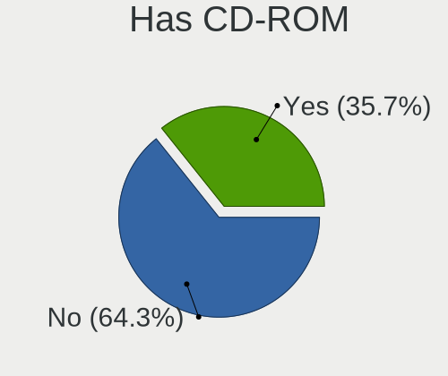
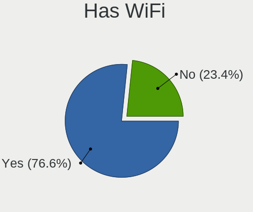
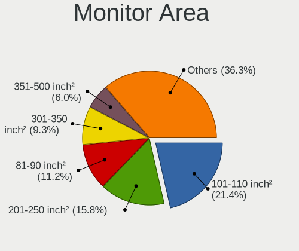

Linux in UK - Tested Hardware & Statistics
------------------------------------------

A project to collect tested hardware configurations for Linux in UK.

Anyone can contribute to this report by the [hw-probe](https://github.com/linuxhw/hw-probe) tool:

    sudo -E hw-probe -all -upload

Please contribute! Especially if your hardware is rare.

This is a report for all computer types. See also reports for [desktops](/Location/UK/Desktop/README.md) and [notebooks](/Location/UK/Notebook/README.md).

Contents
--------

* [ Test Cases ](#test-cases)

* [ System ](#system)
  - [ OS                       ](#os)
  - [ OS Family                ](#os-family)
  - [ Kernel                   ](#kernel)
  - [ Kernel Family            ](#kernel-family)
  - [ Kernel Major Ver.        ](#kernel-major-ver)
  - [ Arch                     ](#arch)
  - [ DE                       ](#de)
  - [ Display Server           ](#display-server)
  - [ Display Manager          ](#display-manager)
  - [ OS Lang                  ](#os-lang)
  - [ Boot Mode                ](#boot-mode)
  - [ Filesystem               ](#filesystem)
  - [ Part. scheme             ](#part-scheme)
  - [ Dual Boot with Linux/BSD ](#dual-boot-with-linuxbsd)
  - [ Dual Boot (Win)          ](#dual-boot-win)

* [ Board ](#board)
  - [ Vendor                   ](#vendor)
  - [ Model                    ](#model)
  - [ Model Family             ](#model-family)
  - [ MFG Year                 ](#mfg-year)
  - [ Form Factor              ](#form-factor)
  - [ Secure Boot              ](#secure-boot)
  - [ Coreboot                 ](#coreboot)
  - [ RAM Size                 ](#ram-size)
  - [ RAM Used                 ](#ram-used)
  - [ Total Drives             ](#total-drives)
  - [ Has CD-ROM               ](#has-cd-rom)
  - [ Has Ethernet             ](#has-ethernet)
  - [ Has WiFi                 ](#has-wifi)
  - [ Has Bluetooth            ](#has-bluetooth)

* [ Location ](#location)
  - [ Country                  ](#country)
  - [ City                     ](#city)

* [ Drives ](#drives)
  - [ Drive Vendor             ](#drive-vendor)
  - [ Drive Model              ](#drive-model)
  - [ HDD Vendor               ](#hdd-vendor)
  - [ SSD Vendor               ](#ssd-vendor)
  - [ Drive Kind               ](#drive-kind)
  - [ Drive Connector          ](#drive-connector)
  - [ Drive Size               ](#drive-size)
  - [ Space Total              ](#space-total)
  - [ Space Used               ](#space-used)
  - [ Malfunc. Drives          ](#malfunc-drives)
  - [ Malfunc. Drive Vendor    ](#malfunc-drive-vendor)
  - [ Malfunc. HDD Vendor      ](#malfunc-hdd-vendor)
  - [ Malfunc. Drive Kind      ](#malfunc-drive-kind)
  - [ Failed Drives            ](#failed-drives)
  - [ Failed Drive Vendor      ](#failed-drive-vendor)
  - [ Drive Status             ](#drive-status)

* [ Storage controller ](#storage-controller)
  - [ Storage Vendor           ](#storage-vendor)
  - [ Storage Model            ](#storage-model)
  - [ Storage Kind             ](#storage-kind)

* [ Processor ](#processor)
  - [ CPU Vendor               ](#cpu-vendor)
  - [ CPU Model                ](#cpu-model)
  - [ CPU Model Family         ](#cpu-model-family)
  - [ CPU Cores                ](#cpu-cores)
  - [ CPU Sockets              ](#cpu-sockets)
  - [ CPU Threads              ](#cpu-threads)
  - [ CPU Op-Modes             ](#cpu-op-modes)
  - [ CPU Microcode            ](#cpu-microcode)
  - [ CPU Microarch            ](#cpu-microarch)

* [ Graphics ](#graphics)
  - [ GPU Vendor               ](#gpu-vendor)
  - [ GPU Model                ](#gpu-model)
  - [ GPU Combo                ](#gpu-combo)
  - [ GPU Driver               ](#gpu-driver)
  - [ GPU Memory               ](#gpu-memory)

* [ Monitor ](#monitor)
  - [ Monitor Vendor           ](#monitor-vendor)
  - [ Monitor Model            ](#monitor-model)
  - [ Monitor Resolution       ](#monitor-resolution)
  - [ Monitor Diagonal         ](#monitor-diagonal)
  - [ Monitor Width            ](#monitor-width)
  - [ Aspect Ratio             ](#aspect-ratio)
  - [ Monitor Area             ](#monitor-area)
  - [ Pixel Density            ](#pixel-density)
  - [ Multiple Monitors        ](#multiple-monitors)

* [ Network ](#network)
  - [ Net Controller Vendor    ](#net-controller-vendor)
  - [ Net Controller Model     ](#net-controller-model)
  - [ Wireless Vendor          ](#wireless-vendor)
  - [ Wireless Model           ](#wireless-model)
  - [ Ethernet Vendor          ](#ethernet-vendor)
  - [ Ethernet Model           ](#ethernet-model)
  - [ Net Controller Kind      ](#net-controller-kind)
  - [ Used Controller          ](#used-controller)
  - [ NICs                     ](#nics)
  - [ IPv6                     ](#ipv6)

* [ Bluetooth ](#bluetooth)
  - [ Bluetooth Vendor         ](#bluetooth-vendor)
  - [ Bluetooth Model          ](#bluetooth-model)

* [ Sound ](#sound)
  - [ Sound Vendor             ](#sound-vendor)
  - [ Sound Model              ](#sound-model)

* [ Memory ](#memory)
  - [ Memory Vendor            ](#memory-vendor)
  - [ Memory Model             ](#memory-model)
  - [ Memory Kind              ](#memory-kind)
  - [ Memory Form Factor       ](#memory-form-factor)
  - [ Memory Size              ](#memory-size)
  - [ Memory Speed             ](#memory-speed)

* [ Printers & scanners ](#printers--scanners)
  - [ Printer Vendor           ](#printer-vendor)
  - [ Printer Model            ](#printer-model)
  - [ Scanner Vendor           ](#scanner-vendor)
  - [ Scanner Model            ](#scanner-model)

* [ Camera ](#camera)
  - [ Camera Vendor            ](#camera-vendor)
  - [ Camera Model             ](#camera-model)

* [ Security ](#security)
  - [ Fingerprint Vendor       ](#fingerprint-vendor)
  - [ Fingerprint Model        ](#fingerprint-model)
  - [ Chipcard Vendor          ](#chipcard-vendor)
  - [ Chipcard Model           ](#chipcard-model)

* [ Unsupported ](#unsupported)
  - [ Unsupported Devices      ](#unsupported-devices)
  - [ Unsupported Device Types ](#unsupported-device-types)

Test Cases
----------

Total: 9142

| Vendor        | Model                       | Form-Factor | Probe                                                      | Date         |
|---------------|-----------------------------|-------------|------------------------------------------------------------|--------------|
| MSI           | H81M-E35 V2                 | Desktop     | [db83c146a6](https://linux-hardware.org/?probe=db83c146a6) | Nov 02, 2022 |
| MSI           | X399 SLI PLUS               | Desktop     | [4191ce8788](https://linux-hardware.org/?probe=4191ce8788) | Nov 02, 2022 |
| ASUSTek       | ROG STRIX X570-F GAMING     | Desktop     | [711e95b72e](https://linux-hardware.org/?probe=711e95b72e) | Nov 02, 2022 |
| ASUSTek       | ROG STRIX X570-F GAMING     | Desktop     | [ff0c19c661](https://linux-hardware.org/?probe=ff0c19c661) | Nov 02, 2022 |
| HP            | EliteBook 845 G7 Noteboo... | Notebook    | [c693004e08](https://linux-hardware.org/?probe=c693004e08) | Nov 02, 2022 |
| Microsoft     | Surface Book                | Tablet      | [e4a7690a77](https://linux-hardware.org/?probe=e4a7690a77) | Nov 02, 2022 |
| Samsung       | RV411/RV511/E3511/S3511/... | Notebook    | [ebe8179d26](https://linux-hardware.org/?probe=ebe8179d26) | Nov 02, 2022 |
| Dell          | Inspiron 15-3567            | Notebook    | [a9b57edf35](https://linux-hardware.org/?probe=a9b57edf35) | Nov 02, 2022 |
| Dell          | Inspiron 15 3511            | Notebook    | [5786a01590](https://linux-hardware.org/?probe=5786a01590) | Nov 02, 2022 |
| Acer          | Aspire A315-54              | Notebook    | [1421a5a4e9](https://linux-hardware.org/?probe=1421a5a4e9) | Nov 02, 2022 |
| PC Special... | Elimina Iv 15               | Notebook    | [f462ba9c43](https://linux-hardware.org/?probe=f462ba9c43) | Nov 02, 2022 |
| Microsoft     | Surface Book 2              | Tablet      | [0092b0ddaf](https://linux-hardware.org/?probe=0092b0ddaf) | Nov 01, 2022 |
| Phoenix       | POULSBO                     | Desktop     | [177f05205b](https://linux-hardware.org/?probe=177f05205b) | Nov 01, 2022 |
| Gigabyte      | H81M-DS2V                   | Desktop     | [caffb9ebd7](https://linux-hardware.org/?probe=caffb9ebd7) | Nov 01, 2022 |
| ASUSTek       | P52F                        | Notebook    | [a83cb4c35d](https://linux-hardware.org/?probe=a83cb4c35d) | Nov 01, 2022 |
| ASUSTek       | TUF Gaming X570-PLUS        | Desktop     | [0131299a9e](https://linux-hardware.org/?probe=0131299a9e) | Nov 01, 2022 |
| ASUSTek       | PRIME A320M-K               | Desktop     | [87187c0e23](https://linux-hardware.org/?probe=87187c0e23) | Oct 31, 2022 |
| Packard Be... | EasyNote TK85               | Notebook    | [a233571587](https://linux-hardware.org/?probe=a233571587) | Oct 31, 2022 |
| Acer          | Aspire TC-280               | Desktop     | [68679c6495](https://linux-hardware.org/?probe=68679c6495) | Oct 31, 2022 |
| MSI           | A320M-A PRO                 | Desktop     | [8769289ea5](https://linux-hardware.org/?probe=8769289ea5) | Oct 31, 2022 |
| Lenovo        | Win8 STD MM DPK IPG         | All in one  | [37f3d75177](https://linux-hardware.org/?probe=37f3d75177) | Oct 31, 2022 |
| ASUSTek       | G75VW                       | Notebook    | [6f1d41a85c](https://linux-hardware.org/?probe=6f1d41a85c) | Oct 31, 2022 |
| TUXEDO        | InfinityBook S 15 Gen6      | Notebook    | [92e9764aa0](https://linux-hardware.org/?probe=92e9764aa0) | Oct 31, 2022 |
| Acer          | Swift SF314-512             | Notebook    | [d6bf187cc9](https://linux-hardware.org/?probe=d6bf187cc9) | Oct 31, 2022 |
| Dell          | 02P9X9 A00                  | Server      | [4fa081a282](https://linux-hardware.org/?probe=4fa081a282) | Oct 31, 2022 |
| MSI           | Modern 14 B10MW             | Notebook    | [cf2b620a60](https://linux-hardware.org/?probe=cf2b620a60) | Oct 31, 2022 |
| Valve         | Jupiter                     | Notebook    | [38d0d0e32a](https://linux-hardware.org/?probe=38d0d0e32a) | Oct 31, 2022 |
| Gigabyte      | Z170-Gaming K3              | Desktop     | [d84f634b59](https://linux-hardware.org/?probe=d84f634b59) | Oct 31, 2022 |
| Apple         | MacBookPro5,5               | Notebook    | [00e1f1f754](https://linux-hardware.org/?probe=00e1f1f754) | Oct 31, 2022 |
| Acer          | Swift SFX14-51G             | Notebook    | [6812d7cf22](https://linux-hardware.org/?probe=6812d7cf22) | Oct 30, 2022 |
| HP            | Pavilion 15                 | Notebook    | [f1eac2c0c3](https://linux-hardware.org/?probe=f1eac2c0c3) | Oct 30, 2022 |
| ASUSTek       | PRIME B550-PLUS             | Desktop     | [4820bca604](https://linux-hardware.org/?probe=4820bca604) | Oct 30, 2022 |
| ASUSTek       | PRIME B550-PLUS             | Desktop     | [cdca8a4d95](https://linux-hardware.org/?probe=cdca8a4d95) | Oct 30, 2022 |
| Lenovo        | ThinkPad T480 20L6S82F0C    | Notebook    | [c06d6a27f5](https://linux-hardware.org/?probe=c06d6a27f5) | Oct 30, 2022 |
| Gigabyte      | X570S AORUS PRO AX          | Desktop     | [03d14141e4](https://linux-hardware.org/?probe=03d14141e4) | Oct 30, 2022 |
| Lenovo        | ThinkPad L560 20F2S0DA00    | Notebook    | [bf8945db85](https://linux-hardware.org/?probe=bf8945db85) | Oct 30, 2022 |
| Dell          | 02YYK5 A01                  | Desktop     | [b7760774ca](https://linux-hardware.org/?probe=b7760774ca) | Oct 30, 2022 |
| ASUSTek       | PRIME A320M-K               | Desktop     | [4bc0220a01](https://linux-hardware.org/?probe=4bc0220a01) | Oct 30, 2022 |
| MSI           | A320M-A PRO                 | Desktop     | [23ad30db1a](https://linux-hardware.org/?probe=23ad30db1a) | Oct 29, 2022 |
| ASUSTek       | PRIME A320M-K               | Desktop     | [bd18c2b33d](https://linux-hardware.org/?probe=bd18c2b33d) | Oct 29, 2022 |
| GEO           | GeoBook3                    | Notebook    | [133a4460f6](https://linux-hardware.org/?probe=133a4460f6) | Oct 29, 2022 |
| Gigabyte      | B550 AORUS ELITE            | Desktop     | [957fc9af86](https://linux-hardware.org/?probe=957fc9af86) | Oct 29, 2022 |
| Toshiba       | Satellite C660              | Notebook    | [242fa16882](https://linux-hardware.org/?probe=242fa16882) | Oct 29, 2022 |
| Gigabyte      | B550 GAMING X V2            | Desktop     | [b4ba1b8d5a](https://linux-hardware.org/?probe=b4ba1b8d5a) | Oct 29, 2022 |
| Dell          | Latitude E6530              | Notebook    | [cdd3b5ce40](https://linux-hardware.org/?probe=cdd3b5ce40) | Oct 28, 2022 |
| MSI           | MPG B550 GAMING PLUS        | Desktop     | [7d5d2ec0ba](https://linux-hardware.org/?probe=7d5d2ec0ba) | Oct 28, 2022 |
| MSI           | MS-AE3111 10                | Other       | [b21e69db4d](https://linux-hardware.org/?probe=b21e69db4d) | Oct 28, 2022 |
| Valve         | Jupiter                     | Notebook    | [127bd00558](https://linux-hardware.org/?probe=127bd00558) | Oct 28, 2022 |
| MSI           | MS-AE3111 10                | Other       | [ad5c043471](https://linux-hardware.org/?probe=ad5c043471) | Oct 28, 2022 |
| Tactus        | GeoBook 110                 | Notebook    | [aad56b27f0](https://linux-hardware.org/?probe=aad56b27f0) | Oct 28, 2022 |
| HP            | 82A5                        | Mini pc     | [c0be7985c0](https://linux-hardware.org/?probe=c0be7985c0) | Oct 28, 2022 |
| Dell          | XPS 13 9305                 | Notebook    | [20bf043d6f](https://linux-hardware.org/?probe=20bf043d6f) | Oct 28, 2022 |
| Valve         | Jupiter                     | Notebook    | [7cc988201b](https://linux-hardware.org/?probe=7cc988201b) | Oct 28, 2022 |
| Alienware     | 046MHW A00                  | Desktop     | [5a5511a68b](https://linux-hardware.org/?probe=5a5511a68b) | Oct 27, 2022 |
| HP            | ENVY Laptop 13-ba0xxx       | Notebook    | [920b0eaa44](https://linux-hardware.org/?probe=920b0eaa44) | Oct 27, 2022 |
| MSI           | B450M MORTAR                | Desktop     | [44e8a164d1](https://linux-hardware.org/?probe=44e8a164d1) | Oct 27, 2022 |
| ASUSTek       | P8H61/USB3                  | Desktop     | [c20c97e43e](https://linux-hardware.org/?probe=c20c97e43e) | Oct 27, 2022 |
| Novatech      | NLx0MU                      | Notebook    | [41c5d984a0](https://linux-hardware.org/?probe=41c5d984a0) | Oct 27, 2022 |
| HP            | G62                         | Notebook    | [c9ba156401](https://linux-hardware.org/?probe=c9ba156401) | Oct 27, 2022 |
| Gigabyte      | H61N-USB3                   | Desktop     | [ff94581714](https://linux-hardware.org/?probe=ff94581714) | Oct 27, 2022 |
| Gigabyte      | B450 I AORUS PRO WIFI-CF    | Desktop     | [d8343e2db5](https://linux-hardware.org/?probe=d8343e2db5) | Oct 26, 2022 |
| Toshiba       | Satellite C660              | Notebook    | [80c2aeb241](https://linux-hardware.org/?probe=80c2aeb241) | Oct 26, 2022 |
| ASUSTek       | TUF Gaming Z690-PLUS WIF... | Desktop     | [58af9b9a77](https://linux-hardware.org/?probe=58af9b9a77) | Oct 26, 2022 |
| HP            | Setzer                      | Notebook    | [a1039409cd](https://linux-hardware.org/?probe=a1039409cd) | Oct 26, 2022 |
| HP            | Setzer                      | Notebook    | [3945fea013](https://linux-hardware.org/?probe=3945fea013) | Oct 25, 2022 |
| Alienware     | 046MHW A00                  | Desktop     | [592883e78e](https://linux-hardware.org/?probe=592883e78e) | Oct 25, 2022 |
| Alienware     | 046MHW A00                  | Desktop     | [734fb9ac8c](https://linux-hardware.org/?probe=734fb9ac8c) | Oct 25, 2022 |
| Valve         | Jupiter                     | Notebook    | [dc86de125e](https://linux-hardware.org/?probe=dc86de125e) | Oct 25, 2022 |
| Toshiba       | Satellite C50D-A-133        | Notebook    | [c1ba737ccc](https://linux-hardware.org/?probe=c1ba737ccc) | Oct 25, 2022 |
| ASUSTek       | ROG Flow Z13 GZ301ZE_GZ3... | Tablet      | [dee13eac1d](https://linux-hardware.org/?probe=dee13eac1d) | Oct 25, 2022 |
| ASUSTek       | ROG Flow Z13 GZ301ZE_GZ3... | Tablet      | [1bc80461df](https://linux-hardware.org/?probe=1bc80461df) | Oct 25, 2022 |
| Valve         | Jupiter                     | Notebook    | [c12839567e](https://linux-hardware.org/?probe=c12839567e) | Oct 25, 2022 |
| ASUSTek       | PRIME B450-PLUS             | Desktop     | [3a10949e83](https://linux-hardware.org/?probe=3a10949e83) | Oct 25, 2022 |
| ASRock        | FM2A88M-HD+ R2.0            | Desktop     | [10e0a497e9](https://linux-hardware.org/?probe=10e0a497e9) | Oct 25, 2022 |
| Dell          | Inspiron 1525               | Notebook    | [742bf13a9f](https://linux-hardware.org/?probe=742bf13a9f) | Oct 25, 2022 |
| ASUSTek       | PRIME B550-PLUS             | Desktop     | [db4db1b508](https://linux-hardware.org/?probe=db4db1b508) | Oct 25, 2022 |
| ASUSTek       | PRIME X470-PRO              | Desktop     | [b4d5421b09](https://linux-hardware.org/?probe=b4d5421b09) | Oct 25, 2022 |
| Microsoft     | Surface Pro 3               | Tablet      | [e3a6983caf](https://linux-hardware.org/?probe=e3a6983caf) | Oct 25, 2022 |
| Lenovo        | V15-IIL 82C5                | Notebook    | [a56ad41b2f](https://linux-hardware.org/?probe=a56ad41b2f) | Oct 25, 2022 |
| Dell          | Inspiron 16 7610            | Notebook    | [47a3e2b5f6](https://linux-hardware.org/?probe=47a3e2b5f6) | Oct 24, 2022 |
| Acer          | Aspire XC-830               | Desktop     | [2692d8c0cd](https://linux-hardware.org/?probe=2692d8c0cd) | Oct 24, 2022 |
| Gigabyte      | E350N WIN8                  | Desktop     | [bff16c4d6c](https://linux-hardware.org/?probe=bff16c4d6c) | Oct 24, 2022 |
| Acer          | Aspire C24-865              | All in one  | [31b61c3ce9](https://linux-hardware.org/?probe=31b61c3ce9) | Oct 24, 2022 |
| Raspberry ... | Raspberry Pi 4 Model B R... | Soc         | [dd05575bb4](https://linux-hardware.org/?probe=dd05575bb4) | Oct 24, 2022 |
| Raspberry ... | Raspberry Pi 4 Model B R... | Soc         | [d2cb5dc9c7](https://linux-hardware.org/?probe=d2cb5dc9c7) | Oct 24, 2022 |
| Acer          | Aspire XC-830               | Desktop     | [8b6263dc68](https://linux-hardware.org/?probe=8b6263dc68) | Oct 24, 2022 |
| Lenovo        | ThinkPad T520 4243PN7       | Notebook    | [fdca71510b](https://linux-hardware.org/?probe=fdca71510b) | Oct 24, 2022 |
| Acer          | Aspire C24-865              | All in one  | [257d3a9124](https://linux-hardware.org/?probe=257d3a9124) | Oct 23, 2022 |
| Acer          | WMCP78M                     | Desktop     | [f4e3945dea](https://linux-hardware.org/?probe=f4e3945dea) | Oct 23, 2022 |
| AMI           | Unknown                     | Notebook    | [337d94fb96](https://linux-hardware.org/?probe=337d94fb96) | Oct 23, 2022 |
| Gigabyte      | X570S AORUS MASTER          | Desktop     | [b9e4b934ee](https://linux-hardware.org/?probe=b9e4b934ee) | Oct 23, 2022 |
| HP            | OMEN by Laptop 17-ck0xxx    | Notebook    | [34f4204ae8](https://linux-hardware.org/?probe=34f4204ae8) | Oct 23, 2022 |
| GEO           | GeoBook 140                 | Notebook    | [e97f8024f4](https://linux-hardware.org/?probe=e97f8024f4) | Oct 22, 2022 |
| HP            | 86EE                        | All in one  | [4c631cdc18](https://linux-hardware.org/?probe=4c631cdc18) | Oct 22, 2022 |
| Dell          | 0HN7XN A01                  | Desktop     | [4e75c878a3](https://linux-hardware.org/?probe=4e75c878a3) | Oct 22, 2022 |
| ASUSTek       | PRIME B550-PLUS             | Desktop     | [7f855c9b05](https://linux-hardware.org/?probe=7f855c9b05) | Oct 22, 2022 |
| GEO           | GeoBook 140                 | Notebook    | [bbbe5e0fca](https://linux-hardware.org/?probe=bbbe5e0fca) | Oct 22, 2022 |
| Dell          | 07PR60 A00                  | Desktop     | [a1cb6d4862](https://linux-hardware.org/?probe=a1cb6d4862) | Oct 22, 2022 |
| Samsung       | R519/R719                   | Notebook    | [da6668197e](https://linux-hardware.org/?probe=da6668197e) | Oct 22, 2022 |
| ASRock        | B450M-HDV R4.0              | Desktop     | [0ec4fb54a6](https://linux-hardware.org/?probe=0ec4fb54a6) | Oct 21, 2022 |
| ASRock        | B450M-HDV R4.0              | Desktop     | [1f659498a2](https://linux-hardware.org/?probe=1f659498a2) | Oct 21, 2022 |
| ASUSTek       | ROG Maximus XI HERO         | Desktop     | [2f6d59ec8b](https://linux-hardware.org/?probe=2f6d59ec8b) | Oct 21, 2022 |
| HP            | OMEN by Laptop 17-ck0xxx    | Notebook    | [0ed2f15c34](https://linux-hardware.org/?probe=0ed2f15c34) | Oct 21, 2022 |
| Razer x La... | TensorBook (late 2021)      | Notebook    | [27cae45787](https://linux-hardware.org/?probe=27cae45787) | Oct 20, 2022 |
| Acer          | Aspire S3                   | Notebook    | [a24603a142](https://linux-hardware.org/?probe=a24603a142) | Oct 20, 2022 |
| Dell          | XPS 13 9300                 | Notebook    | [ec9a97a15d](https://linux-hardware.org/?probe=ec9a97a15d) | Oct 20, 2022 |
| Toshiba       | Satellite C660              | Notebook    | [3632c8a48d](https://linux-hardware.org/?probe=3632c8a48d) | Oct 20, 2022 |
| Valve         | Jupiter                     | Notebook    | [a314a908eb](https://linux-hardware.org/?probe=a314a908eb) | Oct 20, 2022 |
| Razer x La... | TensorBook (late 2021)      | Notebook    | [fef9e26716](https://linux-hardware.org/?probe=fef9e26716) | Oct 20, 2022 |
| Valve         | Jupiter                     | Notebook    | [3fada6964f](https://linux-hardware.org/?probe=3fada6964f) | Oct 19, 2022 |
| Gigabyte      | P67A-UD3                    | Desktop     | [96b72bfa8a](https://linux-hardware.org/?probe=96b72bfa8a) | Oct 19, 2022 |
| ASUSTek       | H81I-PLUS                   | Desktop     | [c30eaa0009](https://linux-hardware.org/?probe=c30eaa0009) | Oct 19, 2022 |
| ASUSTek       | ZenBook UX325EA_UX325EA     | Notebook    | [56089b3625](https://linux-hardware.org/?probe=56089b3625) | Oct 19, 2022 |
| Acer          | Aspire V5-132P              | Notebook    | [420ad7ac8c](https://linux-hardware.org/?probe=420ad7ac8c) | Oct 19, 2022 |
| Lenovo        | G580 2689H2G                | Notebook    | [1d81a2fb3b](https://linux-hardware.org/?probe=1d81a2fb3b) | Oct 18, 2022 |
| Gigabyte      | X570S AORUS MASTER          | Desktop     | [495c7fdc3d](https://linux-hardware.org/?probe=495c7fdc3d) | Oct 18, 2022 |
| ASRock        | 960GC-GS FX                 | Desktop     | [1223730da0](https://linux-hardware.org/?probe=1223730da0) | Oct 18, 2022 |
| Acer          | Aspire 6930G                | Notebook    | [d65e0cfe7a](https://linux-hardware.org/?probe=d65e0cfe7a) | Oct 18, 2022 |
| Dell          | 0T10XW A02                  | Desktop     | [04bef71f33](https://linux-hardware.org/?probe=04bef71f33) | Oct 18, 2022 |
| ASUSTek       | H81I-PLUS                   | Desktop     | [d5d3ad3491](https://linux-hardware.org/?probe=d5d3ad3491) | Oct 18, 2022 |
| GEO           | GeoBook 120                 | Notebook    | [fe063a61a7](https://linux-hardware.org/?probe=fe063a61a7) | Oct 17, 2022 |
| MSI           | Z590-A PRO                  | Desktop     | [0a30a79788](https://linux-hardware.org/?probe=0a30a79788) | Oct 17, 2022 |
| MSI           | Z590-A PRO                  | Desktop     | [a4f5a5b0be](https://linux-hardware.org/?probe=a4f5a5b0be) | Oct 17, 2022 |
| HP            | ZBook 15                    | Notebook    | [6926e1a3c0](https://linux-hardware.org/?probe=6926e1a3c0) | Oct 17, 2022 |
| Valve         | Jupiter                     | Notebook    | [992d2b539a](https://linux-hardware.org/?probe=992d2b539a) | Oct 17, 2022 |
| MSI           | Z590-A PRO                  | Desktop     | [e2991c4619](https://linux-hardware.org/?probe=e2991c4619) | Oct 17, 2022 |
| Dell          | 0KJCC5 A00                  | Desktop     | [d6a23d7f6d](https://linux-hardware.org/?probe=d6a23d7f6d) | Oct 17, 2022 |
| Gigabyte      | X570S AORUS PRO AX          | Desktop     | [61aeb93e12](https://linux-hardware.org/?probe=61aeb93e12) | Oct 16, 2022 |
| ASRock        | N68-S                       | Desktop     | [356bdaf8d8](https://linux-hardware.org/?probe=356bdaf8d8) | Oct 16, 2022 |
| ASUSTek       | ROG CROSSHAIR VIII IMPAC... | Desktop     | [bf7cebc10e](https://linux-hardware.org/?probe=bf7cebc10e) | Oct 16, 2022 |
| ASUSTek       | ROG STRIX X570-F GAMING     | Desktop     | [bf0e112f9a](https://linux-hardware.org/?probe=bf0e112f9a) | Oct 16, 2022 |
| Gigabyte      | A320M-S2H-CF                | Desktop     | [77f04d4628](https://linux-hardware.org/?probe=77f04d4628) | Oct 16, 2022 |
| Dell          | 0XGMD0 A00                  | All in one  | [e38169d409](https://linux-hardware.org/?probe=e38169d409) | Oct 16, 2022 |
| Samsung       | 700T1C                      | Notebook    | [b0b2e6712c](https://linux-hardware.org/?probe=b0b2e6712c) | Oct 15, 2022 |
| ASUSTek       | ROG CROSSHAIR VIII DARK ... | Desktop     | [d2b5d08432](https://linux-hardware.org/?probe=d2b5d08432) | Oct 15, 2022 |
| Lenovo        | IdeaPad 110-15IBR 80T7      | Notebook    | [ee67e90b5f](https://linux-hardware.org/?probe=ee67e90b5f) | Oct 15, 2022 |
| ASUSTek       | M5A78L-M/USB3               | Desktop     | [ef118e61f2](https://linux-hardware.org/?probe=ef118e61f2) | Oct 15, 2022 |
| Valve         | Jupiter                     | Notebook    | [022a7cab63](https://linux-hardware.org/?probe=022a7cab63) | Oct 15, 2022 |
| Valve         | Jupiter                     | Notebook    | [bd47ebea62](https://linux-hardware.org/?probe=bd47ebea62) | Oct 15, 2022 |
| Valve         | Jupiter                     | Notebook    | [627b9225cb](https://linux-hardware.org/?probe=627b9225cb) | Oct 15, 2022 |
| Dell          | 0J3C2F A01                  | Desktop     | [b30840548a](https://linux-hardware.org/?probe=b30840548a) | Oct 15, 2022 |
| HP            | Presario C300 (RM500EA#A... | Notebook    | [c35d7b0ee3](https://linux-hardware.org/?probe=c35d7b0ee3) | Oct 14, 2022 |
| ASUSTek       | ROG STRIX X570-F GAMING     | Desktop     | [e037086b30](https://linux-hardware.org/?probe=e037086b30) | Oct 14, 2022 |
| Raspberry ... | Raspberry Pi 3 Model B R... | Soc         | [4545a01dbb](https://linux-hardware.org/?probe=4545a01dbb) | Oct 14, 2022 |
| Raspberry ... | Raspberry Pi 400 Rev 1.0    | Soc         | [82a7e620f0](https://linux-hardware.org/?probe=82a7e620f0) | Oct 14, 2022 |
| Apple         | Mac-35C5E08120C7EEAF Mac... | Mini pc     | [34fcf52c18](https://linux-hardware.org/?probe=34fcf52c18) | Oct 14, 2022 |
| Apple         | Mac-7BA5B2DFE22DDD8C Mac... | Mini pc     | [78b6f676b0](https://linux-hardware.org/?probe=78b6f676b0) | Oct 14, 2022 |
| HP            | Pavilion x360 Convertibl... | Convertible | [2830449515](https://linux-hardware.org/?probe=2830449515) | Oct 14, 2022 |
| Dell          | Precision M4800             | Notebook    | [aa9a1680fd](https://linux-hardware.org/?probe=aa9a1680fd) | Oct 14, 2022 |
| Dell          | 0HN7XN A01                  | Desktop     | [a71fb08b36](https://linux-hardware.org/?probe=a71fb08b36) | Oct 14, 2022 |
| MSI           | FM2-A55M-E33                | Desktop     | [1fe306ae1e](https://linux-hardware.org/?probe=1fe306ae1e) | Oct 13, 2022 |
| Raspberry ... | Raspberry Pi 400 Rev 1.0    | Soc         | [a3f2f1dcc7](https://linux-hardware.org/?probe=a3f2f1dcc7) | Oct 13, 2022 |
| Gigabyte      | H81M-S2H                    | Desktop     | [3e38f64c1c](https://linux-hardware.org/?probe=3e38f64c1c) | Oct 13, 2022 |
| Dell          | 0HN7XN A01                  | Desktop     | [abf7c780d2](https://linux-hardware.org/?probe=abf7c780d2) | Oct 13, 2022 |
| ASUSTek       | M5A78L-M PLUS/USB3          | Desktop     | [f55bb836c3](https://linux-hardware.org/?probe=f55bb836c3) | Oct 13, 2022 |
| ASUSTek       | PRIME A520M-K               | Desktop     | [e1bdf49dbf](https://linux-hardware.org/?probe=e1bdf49dbf) | Oct 13, 2022 |
| ASUSTek       | TUF Gaming B560-PLUS WIF... | Desktop     | [3ffa813244](https://linux-hardware.org/?probe=3ffa813244) | Oct 13, 2022 |
| Gigabyte      | H81M-H                      | Desktop     | [63731688d0](https://linux-hardware.org/?probe=63731688d0) | Oct 13, 2022 |
| Lenovo        | V110-15AST 80TD             | Notebook    | [9d4b6fafb6](https://linux-hardware.org/?probe=9d4b6fafb6) | Oct 12, 2022 |
| ASUSTek       | P8Z68-V PRO                 | Desktop     | [977ba540ba](https://linux-hardware.org/?probe=977ba540ba) | Oct 12, 2022 |
| MSI           | B450M MORTAR MAX            | Desktop     | [c82722f056](https://linux-hardware.org/?probe=c82722f056) | Oct 12, 2022 |
| Lenovo        | Yoga Slim 7 ProX 14ARH7 ... | Notebook    | [cbc3888844](https://linux-hardware.org/?probe=cbc3888844) | Oct 12, 2022 |
| Lenovo        | Z50-75 80EC                 | Notebook    | [7dbdbc1de9](https://linux-hardware.org/?probe=7dbdbc1de9) | Oct 12, 2022 |
| Gigabyte      | AB350-Gaming-CF             | Desktop     | [0bc0b385c3](https://linux-hardware.org/?probe=0bc0b385c3) | Oct 12, 2022 |
| Dell          | Latitude E5470              | Notebook    | [eee260b733](https://linux-hardware.org/?probe=eee260b733) | Oct 12, 2022 |
| Dell          | Latitude E5470              | Notebook    | [3bbb87ee1b](https://linux-hardware.org/?probe=3bbb87ee1b) | Oct 12, 2022 |
| ASUSTek       | P6T SE                      | Desktop     | [4ba4bc909d](https://linux-hardware.org/?probe=4ba4bc909d) | Oct 12, 2022 |
| ASUSTek       | H81I-PLUS                   | Desktop     | [1c508c2425](https://linux-hardware.org/?probe=1c508c2425) | Oct 12, 2022 |
| Fanless Mi... | Rev JSL1                    | Mini pc     | [e67263e24c](https://linux-hardware.org/?probe=e67263e24c) | Oct 11, 2022 |
| Gigabyte      | AB350-Gaming-CF             | Desktop     | [c213445487](https://linux-hardware.org/?probe=c213445487) | Oct 11, 2022 |
| Dell          | 02YYK5 A01                  | Desktop     | [f263785a18](https://linux-hardware.org/?probe=f263785a18) | Oct 11, 2022 |
| Lenovo        | ThinkPad T420 4236TL7       | Notebook    | [8a639f4457](https://linux-hardware.org/?probe=8a639f4457) | Oct 10, 2022 |
| Valve         | Jupiter                     | Notebook    | [c06c56de15](https://linux-hardware.org/?probe=c06c56de15) | Oct 10, 2022 |
| ASUSTek       | ROG CROSSHAIR VIII HERO     | Desktop     | [2b7e826ffe](https://linux-hardware.org/?probe=2b7e826ffe) | Oct 10, 2022 |
| Lenovo        | Yoga 3 14 80JH              | Notebook    | [5e65bc0e8a](https://linux-hardware.org/?probe=5e65bc0e8a) | Oct 10, 2022 |
| Dell          | XPS 13 9380                 | Notebook    | [5d882bd47f](https://linux-hardware.org/?probe=5d882bd47f) | Oct 09, 2022 |
| Acer          | Acadia V1.45                | Notebook    | [c33c96e412](https://linux-hardware.org/?probe=c33c96e412) | Oct 09, 2022 |
| Fanless Mi... | Rev JSL1                    | Mini pc     | [2fcef4ba1a](https://linux-hardware.org/?probe=2fcef4ba1a) | Oct 09, 2022 |
| Gigabyte      | X570 AORUS ULTRA            | Desktop     | [7bed9aed61](https://linux-hardware.org/?probe=7bed9aed61) | Oct 09, 2022 |
| Packard Be... | EasyNote TM82               | Notebook    | [8e3ecfd03d](https://linux-hardware.org/?probe=8e3ecfd03d) | Oct 08, 2022 |
| Gigabyte      | H61M-DS2 DVI                | Desktop     | [e51edac602](https://linux-hardware.org/?probe=e51edac602) | Oct 08, 2022 |
| Fujitsu       | LIFEBOOK U904               | Notebook    | [b4a8655f31](https://linux-hardware.org/?probe=b4a8655f31) | Oct 08, 2022 |
| Lenovo        | Yoga 530-14ARR 81H9         | Convertible | [d19b3b23b5](https://linux-hardware.org/?probe=d19b3b23b5) | Oct 08, 2022 |
| ASRock        | N68-S                       | Desktop     | [6483604e68](https://linux-hardware.org/?probe=6483604e68) | Oct 08, 2022 |
| ASRock        | N68-S                       | Desktop     | [49c45b72cf](https://linux-hardware.org/?probe=49c45b72cf) | Oct 08, 2022 |
| Fanless Mi... | Rev JSL1                    | Mini pc     | [7f59512d7b](https://linux-hardware.org/?probe=7f59512d7b) | Oct 08, 2022 |
| Apple         | Mac-7BA5B2DFE22DDD8C Mac... | Mini pc     | [9cdc747659](https://linux-hardware.org/?probe=9cdc747659) | Oct 08, 2022 |
| Dell          | Latitude 5411               | Notebook    | [4bb05d639f](https://linux-hardware.org/?probe=4bb05d639f) | Oct 08, 2022 |
| HP            | ProBook 640 G3              | Notebook    | [03112f2830](https://linux-hardware.org/?probe=03112f2830) | Oct 08, 2022 |
| Gigabyte      | 970A-DS3P                   | Desktop     | [2920ed8076](https://linux-hardware.org/?probe=2920ed8076) | Oct 08, 2022 |
| Lenovo        | V155-15API 81V5             | Notebook    | [c08e4bed15](https://linux-hardware.org/?probe=c08e4bed15) | Oct 07, 2022 |
| Lenovo        | 312D SDK0J40697 WIN 3305... | Mini pc     | [4bea37497e](https://linux-hardware.org/?probe=4bea37497e) | Oct 07, 2022 |
| Lenovo        | IdeaPad Duet 3 10IGL5 82... | Tablet      | [84875d4a55](https://linux-hardware.org/?probe=84875d4a55) | Oct 07, 2022 |
| HP            | 822A                        | Desktop     | [c893a1b314](https://linux-hardware.org/?probe=c893a1b314) | Oct 07, 2022 |
| Inventec      | DQ Class A02                | Desktop     | [08c66f26fe](https://linux-hardware.org/?probe=08c66f26fe) | Oct 07, 2022 |
| Gigabyte      | X570 AORUS XTREME           | Desktop     | [2f0b4a72b3](https://linux-hardware.org/?probe=2f0b4a72b3) | Oct 06, 2022 |
| Dell          | Latitude 7480               | Notebook    | [ad29ce89eb](https://linux-hardware.org/?probe=ad29ce89eb) | Oct 06, 2022 |
| Lenovo        | IdeaPad S510p 20298         | Notebook    | [20fb15fcbf](https://linux-hardware.org/?probe=20fb15fcbf) | Oct 06, 2022 |
| Valve         | Jupiter                     | Notebook    | [28900801aa](https://linux-hardware.org/?probe=28900801aa) | Oct 06, 2022 |
| Valve         | Jupiter                     | Notebook    | [64f5b28613](https://linux-hardware.org/?probe=64f5b28613) | Oct 06, 2022 |
| MSI           | B450-A PRO MAX              | Desktop     | [bb71e0e8c3](https://linux-hardware.org/?probe=bb71e0e8c3) | Oct 05, 2022 |
| Gigabyte      | X570 AORUS ULTRA            | Desktop     | [56cf39c1dd](https://linux-hardware.org/?probe=56cf39c1dd) | Oct 05, 2022 |
| HP            | 2B60 MVB                    | Desktop     | [092e063471](https://linux-hardware.org/?probe=092e063471) | Oct 05, 2022 |
| Gigabyte      | X570 AORUS ULTRA            | Desktop     | [8bef2621c5](https://linux-hardware.org/?probe=8bef2621c5) | Oct 05, 2022 |
| Lenovo        | G510 20238                  | Notebook    | [700e1adbbb](https://linux-hardware.org/?probe=700e1adbbb) | Oct 05, 2022 |
| Lenovo        | N23 80UR                    | Convertible | [f6bf19c41a](https://linux-hardware.org/?probe=f6bf19c41a) | Oct 05, 2022 |
| ASUSTek       | Rampage V EXTREME           | Desktop     | [b63bfc9b4c](https://linux-hardware.org/?probe=b63bfc9b4c) | Oct 04, 2022 |
| Dell          | 01TKCC A01                  | Desktop     | [65103a04c3](https://linux-hardware.org/?probe=65103a04c3) | Oct 04, 2022 |
| Lenovo        | ThinkPad Twist 20C41A3      | Notebook    | [3da96ac399](https://linux-hardware.org/?probe=3da96ac399) | Oct 04, 2022 |
| Microsoft     | Surface Book                | Tablet      | [85c4f341f3](https://linux-hardware.org/?probe=85c4f341f3) | Oct 04, 2022 |
| ASUSTek       | ZenBook UX325EA_UX325EA     | Notebook    | [790114327c](https://linux-hardware.org/?probe=790114327c) | Oct 04, 2022 |
| Acer          | Aspire ES1-523              | Notebook    | [a80da55e0c](https://linux-hardware.org/?probe=a80da55e0c) | Oct 04, 2022 |
| Acer          | Extensa 2530                | Notebook    | [684b31b41d](https://linux-hardware.org/?probe=684b31b41d) | Oct 03, 2022 |
| Dell          | Inspiron N5040              | Notebook    | [8ccfb39433](https://linux-hardware.org/?probe=8ccfb39433) | Oct 03, 2022 |
| HP            | 8105                        | Desktop     | [50aaff9f71](https://linux-hardware.org/?probe=50aaff9f71) | Oct 03, 2022 |
| Lenovo        | Flex 2-14 20404             | Notebook    | [b3a9474c83](https://linux-hardware.org/?probe=b3a9474c83) | Oct 03, 2022 |
| Apple         | Mac-F221BEC8                | Desktop     | [15ed095440](https://linux-hardware.org/?probe=15ed095440) | Oct 02, 2022 |
| Apple         | MacBookPro11,3              | Notebook    | [cdcd2cf0e6](https://linux-hardware.org/?probe=cdcd2cf0e6) | Oct 02, 2022 |
| eMachines     | E525                        | Notebook    | [1467bc71f7](https://linux-hardware.org/?probe=1467bc71f7) | Oct 02, 2022 |
| Dell          | Inspiron 1545               | Notebook    | [ba72c7ee42](https://linux-hardware.org/?probe=ba72c7ee42) | Oct 01, 2022 |
| Lenovo        | 3000 N200 0769B4G           | Notebook    | [947f124efc](https://linux-hardware.org/?probe=947f124efc) | Oct 01, 2022 |
| HP            | Notebook                    | Notebook    | [fec2594d37](https://linux-hardware.org/?probe=fec2594d37) | Oct 01, 2022 |
| Valve         | Jupiter                     | Notebook    | [12f0d9358a](https://linux-hardware.org/?probe=12f0d9358a) | Oct 01, 2022 |
| Apple         | MacBookPro16,2              | Notebook    | [8eaded9cb5](https://linux-hardware.org/?probe=8eaded9cb5) | Oct 01, 2022 |
| Sony          | VPCYB3V1E                   | Notebook    | [de50c8a304](https://linux-hardware.org/?probe=de50c8a304) | Oct 01, 2022 |
| Acer          | Swift SF314-43              | Notebook    | [cfd0c22e29](https://linux-hardware.org/?probe=cfd0c22e29) | Sep 30, 2022 |
| ASRock        | X300M-STX                   | Desktop     | [f6e2c51367](https://linux-hardware.org/?probe=f6e2c51367) | Sep 30, 2022 |
| Apple         | Mac-F221BEC8                | Desktop     | [ab0a3e1a94](https://linux-hardware.org/?probe=ab0a3e1a94) | Sep 30, 2022 |
| Valve         | Jupiter                     | Notebook    | [dab0a00c02](https://linux-hardware.org/?probe=dab0a00c02) | Sep 30, 2022 |
| Valve         | Jupiter                     | Notebook    | [e9737fcadf](https://linux-hardware.org/?probe=e9737fcadf) | Sep 30, 2022 |
| ASUSTek       | PRIME B360M-A               | Desktop     | [f0eae50061](https://linux-hardware.org/?probe=f0eae50061) | Sep 30, 2022 |
| ASUSTek       | ROG CROSSHAIR VIII HERO     | Desktop     | [8c116d30f9](https://linux-hardware.org/?probe=8c116d30f9) | Sep 30, 2022 |
| HP            | EliteBook 8570p             | Notebook    | [cc4740fa37](https://linux-hardware.org/?probe=cc4740fa37) | Sep 30, 2022 |
| Dell          | XPS 13 7390                 | Notebook    | [c4ccdf9992](https://linux-hardware.org/?probe=c4ccdf9992) | Sep 30, 2022 |
| Dell          | Latitude 7430               | Notebook    | [2151370437](https://linux-hardware.org/?probe=2151370437) | Sep 29, 2022 |
| HP            | Compaq 6720s                | Notebook    | [ddb5163310](https://linux-hardware.org/?probe=ddb5163310) | Sep 29, 2022 |
| Dell          | Inspiron 1564               | Notebook    | [d9dd05aa12](https://linux-hardware.org/?probe=d9dd05aa12) | Sep 29, 2022 |
| Supermicro    | X10SRA-F                    | Server      | [a9aa07ef24](https://linux-hardware.org/?probe=a9aa07ef24) | Sep 28, 2022 |
| Supermicro    | X10SRA-F                    | Server      | [2f41a520ed](https://linux-hardware.org/?probe=2f41a520ed) | Sep 28, 2022 |
| Dell          | XPS 13 9360                 | Notebook    | [6f1ecca2f0](https://linux-hardware.org/?probe=6f1ecca2f0) | Sep 28, 2022 |
| Lenovo        | G570 4334                   | Notebook    | [7b96f1db41](https://linux-hardware.org/?probe=7b96f1db41) | Sep 28, 2022 |
| Intel         | DH55TC AAE70932-206         | Desktop     | [ac93c3912d](https://linux-hardware.org/?probe=ac93c3912d) | Sep 28, 2022 |
| Medion        | MS-7713                     | Desktop     | [36ca6b7f38](https://linux-hardware.org/?probe=36ca6b7f38) | Sep 27, 2022 |
| Gigabyte      | B450 I AORUS PRO WIFI-CF    | Desktop     | [9f85096ed9](https://linux-hardware.org/?probe=9f85096ed9) | Sep 27, 2022 |
| Gigabyte      | B450 I AORUS PRO WIFI-CF    | Desktop     | [19fe9ebfb6](https://linux-hardware.org/?probe=19fe9ebfb6) | Sep 27, 2022 |
| HP            | 3031h                       | Desktop     | [8aa316f69f](https://linux-hardware.org/?probe=8aa316f69f) | Sep 27, 2022 |
| HP            | 3031h                       | Desktop     | [8e4696435d](https://linux-hardware.org/?probe=8e4696435d) | Sep 27, 2022 |
| Dell          | 03NVJ6 A03                  | Desktop     | [2241dbc067](https://linux-hardware.org/?probe=2241dbc067) | Sep 26, 2022 |
| Dell          | 03NVJ6 A03                  | Desktop     | [2deb1ce174](https://linux-hardware.org/?probe=2deb1ce174) | Sep 26, 2022 |
| ASUSTek       | P5N7A-VM                    | Desktop     | [e8ac8a9926](https://linux-hardware.org/?probe=e8ac8a9926) | Sep 26, 2022 |
| ASUSTek       | ROG CROSSHAIR VIII DARK ... | Desktop     | [6373bf42ef](https://linux-hardware.org/?probe=6373bf42ef) | Sep 26, 2022 |
| MSI           | GT72S 6QE                   | Notebook    | [7ec3a25453](https://linux-hardware.org/?probe=7ec3a25453) | Sep 26, 2022 |
| Packard Be... | EasyNote TS44HR             | Notebook    | [4005a32539](https://linux-hardware.org/?probe=4005a32539) | Sep 26, 2022 |
| Timi          | RedmiBook Pro 15S           | Notebook    | [533cc3b3ae](https://linux-hardware.org/?probe=533cc3b3ae) | Sep 26, 2022 |
| MSI           | B450 TOMAHAWK               | Desktop     | [8af0b5fe75](https://linux-hardware.org/?probe=8af0b5fe75) | Sep 26, 2022 |
| Valve         | Jupiter                     | Notebook    | [c3305d9bff](https://linux-hardware.org/?probe=c3305d9bff) | Sep 26, 2022 |
| Jumper        | EZbook                      | Notebook    | [1af58cd7e7](https://linux-hardware.org/?probe=1af58cd7e7) | Sep 25, 2022 |
| ASUSTek       | PRIME Z590M-PLUS            | Desktop     | [ba4b216db1](https://linux-hardware.org/?probe=ba4b216db1) | Sep 25, 2022 |
| ASUSTek       | PRIME A320M-K               | Desktop     | [bc6b161dc9](https://linux-hardware.org/?probe=bc6b161dc9) | Sep 25, 2022 |
| Dell          | XPS 15 9510                 | Notebook    | [1ccf6c5c41](https://linux-hardware.org/?probe=1ccf6c5c41) | Sep 25, 2022 |
| Acer          | Aspire A315-51              | Notebook    | [21121aa007](https://linux-hardware.org/?probe=21121aa007) | Sep 25, 2022 |
| Lenovo        | ThinkPad SL500 27464DG      | Notebook    | [6c2b4ce4b1](https://linux-hardware.org/?probe=6c2b4ce4b1) | Sep 25, 2022 |
| Dell          | Inspiron 15 5510            | Notebook    | [cfda1aa63a](https://linux-hardware.org/?probe=cfda1aa63a) | Sep 25, 2022 |
| Lenovo        | ThinkPad T430 23476Y7       | Notebook    | [8488ad9e53](https://linux-hardware.org/?probe=8488ad9e53) | Sep 24, 2022 |
| Lenovo        | ThinkPad P14s Gen 2a 21A... | Notebook    | [bdc8453efc](https://linux-hardware.org/?probe=bdc8453efc) | Sep 24, 2022 |
| Dell          | 0NW73C A00                  | Desktop     | [77cf7277d5](https://linux-hardware.org/?probe=77cf7277d5) | Sep 24, 2022 |
| Lenovo        | MIIX 520-12IKB 20M3         | Tablet      | [eef9de3daf](https://linux-hardware.org/?probe=eef9de3daf) | Sep 24, 2022 |
| Acer          | Swift SF315-52              | Notebook    | [b9e88a43d8](https://linux-hardware.org/?probe=b9e88a43d8) | Sep 24, 2022 |
| Dell          | 0NW73C A00                  | Desktop     | [80835077a4](https://linux-hardware.org/?probe=80835077a4) | Sep 24, 2022 |
| ASUSTek       | PRIME B660M-A D4            | Desktop     | [542249f675](https://linux-hardware.org/?probe=542249f675) | Sep 24, 2022 |
| Lenovo        | ThinkPad T440s 20ARA0YL0... | Notebook    | [93eedc638b](https://linux-hardware.org/?probe=93eedc638b) | Sep 24, 2022 |
| Framework     | Laptop (12th Gen Intel C... | Notebook    | [2082a8668b](https://linux-hardware.org/?probe=2082a8668b) | Sep 24, 2022 |
| Lenovo        | IdeaPad 110-15ACL 80TJ      | Notebook    | [dc3a97d467](https://linux-hardware.org/?probe=dc3a97d467) | Sep 23, 2022 |
| Dell          | Inspiron 15 5510            | Notebook    | [02787c733c](https://linux-hardware.org/?probe=02787c733c) | Sep 23, 2022 |
| ASUSTek       | N750JV                      | Notebook    | [f69fe7dacf](https://linux-hardware.org/?probe=f69fe7dacf) | Sep 23, 2022 |
| Dell          | Inspiron 15 5510            | Notebook    | [fe7ae61ecd](https://linux-hardware.org/?probe=fe7ae61ecd) | Sep 23, 2022 |
| Dell          | 0NW73C A00                  | Desktop     | [7d50214415](https://linux-hardware.org/?probe=7d50214415) | Sep 23, 2022 |
| Dell          | Latitude E6330              | Notebook    | [5f1a272734](https://linux-hardware.org/?probe=5f1a272734) | Sep 23, 2022 |
| Dell          | 0WR7PY A02                  | Desktop     | [0c47cbc25d](https://linux-hardware.org/?probe=0c47cbc25d) | Sep 23, 2022 |
| Dell          | 0WR7PY A02                  | Desktop     | [53fc678043](https://linux-hardware.org/?probe=53fc678043) | Sep 23, 2022 |
| Dell          | Latitude 5411               | Notebook    | [018a9c569a](https://linux-hardware.org/?probe=018a9c569a) | Sep 23, 2022 |
| MSI           | FM2-A55M-E33                | Desktop     | [4867faffbf](https://linux-hardware.org/?probe=4867faffbf) | Sep 23, 2022 |
| Lenovo        | IdeaPad 5 15ARE05 81YQ      | Notebook    | [605e97df5c](https://linux-hardware.org/?probe=605e97df5c) | Sep 22, 2022 |
| Lenovo        | IdeaPad 5 15ARE05 81YQ      | Notebook    | [94e6332c62](https://linux-hardware.org/?probe=94e6332c62) | Sep 22, 2022 |
| Dell          | 0YU822 A00                  | Desktop     | [034dbdc359](https://linux-hardware.org/?probe=034dbdc359) | Sep 22, 2022 |
| HP            | Laptop 15-bw0xx             | Notebook    | [c4915d8dd2](https://linux-hardware.org/?probe=c4915d8dd2) | Sep 22, 2022 |
| MSI           | GL73 8RD                    | Notebook    | [f197efe030](https://linux-hardware.org/?probe=f197efe030) | Sep 22, 2022 |
| MSI           | GL73 8RD                    | Notebook    | [0534ef55fc](https://linux-hardware.org/?probe=0534ef55fc) | Sep 22, 2022 |
| Dell          | 0D28YY A03                  | Desktop     | [24230f3e30](https://linux-hardware.org/?probe=24230f3e30) | Sep 21, 2022 |
| HP            | 829A                        | Mini pc     | [9fbbfa249d](https://linux-hardware.org/?probe=9fbbfa249d) | Sep 21, 2022 |
| Lenovo        | ThinkBook 13s-IML 20RR      | Notebook    | [03428c1a17](https://linux-hardware.org/?probe=03428c1a17) | Sep 21, 2022 |
| Lenovo        | IdeaPad 300-15ISK 80Q7      | Notebook    | [c859bf5e24](https://linux-hardware.org/?probe=c859bf5e24) | Sep 21, 2022 |
| Valve         | Jupiter                     | Notebook    | [721ede2e11](https://linux-hardware.org/?probe=721ede2e11) | Sep 20, 2022 |
| Dell          | Inspiron 5570               | Notebook    | [16d661b4e5](https://linux-hardware.org/?probe=16d661b4e5) | Sep 20, 2022 |
| TUXEDO        | InfinityBook Pro 14 v4      | Notebook    | [20c7b9dcf9](https://linux-hardware.org/?probe=20c7b9dcf9) | Sep 20, 2022 |
| Lenovo        | E50-80 80J2                 | Notebook    | [a399d96de2](https://linux-hardware.org/?probe=a399d96de2) | Sep 20, 2022 |
| Microsoft     | Surface Pro 4               | Tablet      | [5b55138f5d](https://linux-hardware.org/?probe=5b55138f5d) | Sep 20, 2022 |
| Gigabyte      | GA-78LMT-USB3 R2 sex        | Desktop     | [6c7d6ef178](https://linux-hardware.org/?probe=6c7d6ef178) | Sep 20, 2022 |
| Valve         | Jupiter                     | Notebook    | [e60653a4c7](https://linux-hardware.org/?probe=e60653a4c7) | Sep 20, 2022 |
| Lenovo        | Legion 5-15ACH6H 82JU       | Notebook    | [1f48647e32](https://linux-hardware.org/?probe=1f48647e32) | Sep 20, 2022 |
| HP            | ProBook 450 G2              | Notebook    | [73c35ad64a](https://linux-hardware.org/?probe=73c35ad64a) | Sep 20, 2022 |
| HONOR         | NMH-WCX9                    | Notebook    | [dd2687098a](https://linux-hardware.org/?probe=dd2687098a) | Sep 19, 2022 |
| ASUSTek       | TUF Gaming X570-PLUS        | Desktop     | [92d0d41e58](https://linux-hardware.org/?probe=92d0d41e58) | Sep 19, 2022 |
| Razer         | Blade 15 Base Model (Ear... | Notebook    | [6b6ad790c5](https://linux-hardware.org/?probe=6b6ad790c5) | Sep 19, 2022 |
| Lenovo        | Yoga 3 14 80JH              | Notebook    | [7b17bd93c0](https://linux-hardware.org/?probe=7b17bd93c0) | Sep 19, 2022 |
| Apple         | Mac-F22C86C8                | Mini pc     | [3ee25cf1e4](https://linux-hardware.org/?probe=3ee25cf1e4) | Sep 19, 2022 |
| Samsung       | 950XCJ/951XCJ/950XCR        | Notebook    | [9417681a63](https://linux-hardware.org/?probe=9417681a63) | Sep 19, 2022 |
| HONOR         | NMH-WCX9                    | Notebook    | [060f3bd895](https://linux-hardware.org/?probe=060f3bd895) | Sep 19, 2022 |
| Fanless Mi... | Rev JSL1                    | Mini pc     | [3f3cb3be79](https://linux-hardware.org/?probe=3f3cb3be79) | Sep 19, 2022 |
| Gigabyte      | A320M-S2H-CF                | Desktop     | [8d2c35d5f2](https://linux-hardware.org/?probe=8d2c35d5f2) | Sep 19, 2022 |
| Panasonic     | CF-53JAWZYDE                | Notebook    | [f8b1ca10d1](https://linux-hardware.org/?probe=f8b1ca10d1) | Sep 19, 2022 |
| Lenovo        | E50-80 80J2                 | Notebook    | [1a538a3132](https://linux-hardware.org/?probe=1a538a3132) | Sep 18, 2022 |
| Dell          | Studio 1737                 | Notebook    | [7218731367](https://linux-hardware.org/?probe=7218731367) | Sep 18, 2022 |
| Acer          | Aspire M3970                | Desktop     | [e366f1be3b](https://linux-hardware.org/?probe=e366f1be3b) | Sep 18, 2022 |
| ASUSTek       | X510UQ                      | Notebook    | [eb619ed1c5](https://linux-hardware.org/?probe=eb619ed1c5) | Sep 18, 2022 |
| Gigabyte      | GA-78LMT-USB3 SEx           | Desktop     | [fa4082533e](https://linux-hardware.org/?probe=fa4082533e) | Sep 18, 2022 |
| Gigabyte      | GA-78LMT-USB3 SEx           | Desktop     | [a418c3e997](https://linux-hardware.org/?probe=a418c3e997) | Sep 18, 2022 |
| ASUSTek       | ROG CROSSHAIR VIII HERO     | Desktop     | [a5d838868a](https://linux-hardware.org/?probe=a5d838868a) | Sep 18, 2022 |
| Dell          | Precision 5530              | Notebook    | [8fc00af945](https://linux-hardware.org/?probe=8fc00af945) | Sep 18, 2022 |
| ASUSTek       | PRIME B660M-A D4            | Desktop     | [1f27376b8e](https://linux-hardware.org/?probe=1f27376b8e) | Sep 18, 2022 |
| HP            | Spectre x360 Convertible... | Convertible | [0760539d3d](https://linux-hardware.org/?probe=0760539d3d) | Sep 18, 2022 |
| Dell          | 0G785M A00                  | Desktop     | [c1045050d6](https://linux-hardware.org/?probe=c1045050d6) | Sep 17, 2022 |
| Unknown       | Unknown                     | Notebook    | [1e27521b13](https://linux-hardware.org/?probe=1e27521b13) | Sep 17, 2022 |
| Acer          | Aspire V3-571               | Notebook    | [3f20a5e69d](https://linux-hardware.org/?probe=3f20a5e69d) | Sep 17, 2022 |
| Dell          | Latitude 7390               | Notebook    | [64c9b13553](https://linux-hardware.org/?probe=64c9b13553) | Sep 17, 2022 |
| MSI           | H110M PRO-VD                | Desktop     | [2299dc1786](https://linux-hardware.org/?probe=2299dc1786) | Sep 17, 2022 |
| Gigabyte      | B365M DS3H                  | Desktop     | [36a7673265](https://linux-hardware.org/?probe=36a7673265) | Sep 17, 2022 |
| HUAWEI        | BOM-WXX9                    | Notebook    | [0c3d62f1c9](https://linux-hardware.org/?probe=0c3d62f1c9) | Sep 17, 2022 |
| Teclast       | X4                          | Tablet      | [acfc04d7fa](https://linux-hardware.org/?probe=acfc04d7fa) | Sep 17, 2022 |
| Valve         | Jupiter                     | Notebook    | [c4dd2bf91f](https://linux-hardware.org/?probe=c4dd2bf91f) | Sep 17, 2022 |
| HP            | 255 G5 Notebook PC          | Notebook    | [6d8f7ffe97](https://linux-hardware.org/?probe=6d8f7ffe97) | Sep 17, 2022 |
| Teclast       | X4                          | Tablet      | [2279670078](https://linux-hardware.org/?probe=2279670078) | Sep 17, 2022 |
| ASRock        | B550M-ITX/ac                | Desktop     | [379aaf7b61](https://linux-hardware.org/?probe=379aaf7b61) | Sep 16, 2022 |
| HP            | Laptop 15-da0xxx            | Notebook    | [6341f27d68](https://linux-hardware.org/?probe=6341f27d68) | Sep 16, 2022 |
| Apple         | MacBook6,1                  | Notebook    | [93b43e5bb5](https://linux-hardware.org/?probe=93b43e5bb5) | Sep 16, 2022 |
| Apple         | Mac-F2268CC8                | All in one  | [8d9f049d7e](https://linux-hardware.org/?probe=8d9f049d7e) | Sep 16, 2022 |
| Acidanther... | iMac19,2                    | Notebook    | [94b79ac6e5](https://linux-hardware.org/?probe=94b79ac6e5) | Sep 16, 2022 |
| HP            | ProBook 4340s               | Notebook    | [acca12f9d4](https://linux-hardware.org/?probe=acca12f9d4) | Sep 16, 2022 |
| Lenovo        | 30D2 SDK0J40705 WIN 3425... | Desktop     | [4d4809282a](https://linux-hardware.org/?probe=4d4809282a) | Sep 16, 2022 |
| Lenovo        | 30D2 SDK0J40705 WIN 3425... | Desktop     | [54588ca345](https://linux-hardware.org/?probe=54588ca345) | Sep 16, 2022 |
| MSI           | X399 SLI PLUS               | Desktop     | [f686754b27](https://linux-hardware.org/?probe=f686754b27) | Sep 16, 2022 |
| Valve         | Jupiter                     | Notebook    | [9adc000021](https://linux-hardware.org/?probe=9adc000021) | Sep 15, 2022 |
| Dell          | Latitude 7490               | Notebook    | [ce54bcd741](https://linux-hardware.org/?probe=ce54bcd741) | Sep 15, 2022 |
| Dell          | 03TJ75 A00                  | Desktop     | [70ef579566](https://linux-hardware.org/?probe=70ef579566) | Sep 15, 2022 |
| MSI           | Z370-A PRO                  | Desktop     | [d923c9e35f](https://linux-hardware.org/?probe=d923c9e35f) | Sep 15, 2022 |
| Lenovo        | ThinkPad T530 2429F33       | Notebook    | [790a0f2a25](https://linux-hardware.org/?probe=790a0f2a25) | Sep 14, 2022 |
| Lenovo        | Z70-80 80FG                 | Notebook    | [93cb353340](https://linux-hardware.org/?probe=93cb353340) | Sep 14, 2022 |
| HP            | Laptop 15-da0xxx            | Notebook    | [82140783de](https://linux-hardware.org/?probe=82140783de) | Sep 14, 2022 |
| ASUSTek       | ROG STRIX B450-F GAMING     | Desktop     | [7ad1180946](https://linux-hardware.org/?probe=7ad1180946) | Sep 14, 2022 |
| Dell          | Latitude E7250              | Notebook    | [80a2e50cfc](https://linux-hardware.org/?probe=80a2e50cfc) | Sep 14, 2022 |
| iOTA          | Flo 360                     | Convertible | [4ec4159519](https://linux-hardware.org/?probe=4ec4159519) | Sep 13, 2022 |
| Dell          | XPS 15 9510                 | Notebook    | [44be9b9134](https://linux-hardware.org/?probe=44be9b9134) | Sep 13, 2022 |
| HP            | EliteBook 850 G6            | Notebook    | [b284db5ac4](https://linux-hardware.org/?probe=b284db5ac4) | Sep 13, 2022 |
| Lenovo        | Flex 2-14 20404             | Notebook    | [a27c60fbde](https://linux-hardware.org/?probe=a27c60fbde) | Sep 13, 2022 |
| ASRock        | Z77 Pro4-M                  | Desktop     | [38928465ac](https://linux-hardware.org/?probe=38928465ac) | Sep 13, 2022 |
| Dell          | 0P01GV A03                  | Desktop     | [f23afc903c](https://linux-hardware.org/?probe=f23afc903c) | Sep 13, 2022 |
| Dell          | Inspiron 3542               | Notebook    | [2c5a122ce9](https://linux-hardware.org/?probe=2c5a122ce9) | Sep 12, 2022 |
| Dell          | Inspiron 3542               | Notebook    | [ef3098c81a](https://linux-hardware.org/?probe=ef3098c81a) | Sep 12, 2022 |
| Lenovo        | ThinkBook 15 G2 ITL 20VE    | Notebook    | [4a54854cd7](https://linux-hardware.org/?probe=4a54854cd7) | Sep 12, 2022 |
| Entroware     | Orion                       | Notebook    | [d96888edf9](https://linux-hardware.org/?probe=d96888edf9) | Sep 12, 2022 |
| Entroware     | Orion                       | Notebook    | [c06e53ad80](https://linux-hardware.org/?probe=c06e53ad80) | Sep 12, 2022 |
| ASUSTek       | TUF B450M-PLUS GAMING       | Desktop     | [743af62b4c](https://linux-hardware.org/?probe=743af62b4c) | Sep 12, 2022 |
| Dell          | Inspiron 3537               | Notebook    | [afd2b6555e](https://linux-hardware.org/?probe=afd2b6555e) | Sep 12, 2022 |
| Dell          | XPS 13 9350                 | Notebook    | [e137564f6b](https://linux-hardware.org/?probe=e137564f6b) | Sep 12, 2022 |
| ASUSTek       | Maximus VII GENE            | Desktop     | [3ae7faf18d](https://linux-hardware.org/?probe=3ae7faf18d) | Sep 11, 2022 |
| ASUSTek       | ROG STRIX B550-F GAMING     | Desktop     | [9a2030683a](https://linux-hardware.org/?probe=9a2030683a) | Sep 11, 2022 |
| Acer          | Aspire E5-576G              | Notebook    | [ee2635dbc8](https://linux-hardware.org/?probe=ee2635dbc8) | Sep 11, 2022 |
| HP            | Pavilion 15                 | Notebook    | [1e6331a36b](https://linux-hardware.org/?probe=1e6331a36b) | Sep 11, 2022 |
| HP            | ProLiant MicroServer        | Desktop     | [a36990dcf7](https://linux-hardware.org/?probe=a36990dcf7) | Sep 10, 2022 |
| ASUSTek       | P5N7A-VM                    | Desktop     | [ac23f75aa7](https://linux-hardware.org/?probe=ac23f75aa7) | Sep 10, 2022 |
| Intel         | NUC8BEB J72688-305          | Mini pc     | [9768e1fbf4](https://linux-hardware.org/?probe=9768e1fbf4) | Sep 10, 2022 |
| ASUSTek       | Maximus VII GENE            | Desktop     | [2097faef20](https://linux-hardware.org/?probe=2097faef20) | Sep 10, 2022 |
| ASUSTek       | Maximus VII GENE            | Desktop     | [4799406c7d](https://linux-hardware.org/?probe=4799406c7d) | Sep 10, 2022 |
| Lenovo        | ThinkCentre A70 7099A5G     | Desktop     | [102cf248e9](https://linux-hardware.org/?probe=102cf248e9) | Sep 10, 2022 |
| Lenovo        | ThinkPad S1 Yoga 12 20DK... | Notebook    | [576eec419f](https://linux-hardware.org/?probe=576eec419f) | Sep 10, 2022 |
| HP            | ProLiant MicroServer        | Desktop     | [6d58a3f327](https://linux-hardware.org/?probe=6d58a3f327) | Sep 09, 2022 |
| HP            | ProLiant MicroServer        | Desktop     | [08e7851933](https://linux-hardware.org/?probe=08e7851933) | Sep 09, 2022 |
| Dell          | 0P01GV A03                  | Desktop     | [d71609c89e](https://linux-hardware.org/?probe=d71609c89e) | Sep 09, 2022 |
| Tactus        | GeoBook 110                 | Notebook    | [d13211f478](https://linux-hardware.org/?probe=d13211f478) | Sep 09, 2022 |
| Dell          | Inspiron 1720               | Notebook    | [27de3ede0c](https://linux-hardware.org/?probe=27de3ede0c) | Sep 09, 2022 |
| Star Labs     | Lite                        | Notebook    | [c08b209f09](https://linux-hardware.org/?probe=c08b209f09) | Sep 09, 2022 |
| HP            | ENVY x360 Convertible 15... | Convertible | [d9c6274ead](https://linux-hardware.org/?probe=d9c6274ead) | Sep 09, 2022 |
| ASUSTek       | ASUS TUF Dash F15 FX517Z... | Notebook    | [f5c538e2c7](https://linux-hardware.org/?probe=f5c538e2c7) | Sep 09, 2022 |
| Acer          | Aspire C22-820              | All in one  | [7b21589632](https://linux-hardware.org/?probe=7b21589632) | Sep 09, 2022 |
| ASUSTek       | ROG STRIX B550-I GAMING     | Desktop     | [b3aa7bd9ca](https://linux-hardware.org/?probe=b3aa7bd9ca) | Sep 09, 2022 |
| ASUSTek       | ROG CROSSHAIR VIII HERO     | Desktop     | [36b349b529](https://linux-hardware.org/?probe=36b349b529) | Sep 09, 2022 |
| HP            | 1494                        | Desktop     | [5f0a73b28f](https://linux-hardware.org/?probe=5f0a73b28f) | Sep 09, 2022 |
| Dell          | 00V62H A01                  | Desktop     | [ae1a9f37a7](https://linux-hardware.org/?probe=ae1a9f37a7) | Sep 08, 2022 |
| Lenovo        | IdeaPad S130-11IGM 81J1     | Notebook    | [7c3cdfba24](https://linux-hardware.org/?probe=7c3cdfba24) | Sep 08, 2022 |
| MSI           | B550M-A PRO                 | Desktop     | [b2cd3df6bc](https://linux-hardware.org/?probe=b2cd3df6bc) | Sep 08, 2022 |
| ASUSTek       | UX430UAR                    | Notebook    | [478d0564a6](https://linux-hardware.org/?probe=478d0564a6) | Sep 08, 2022 |
| Dell          | 0MN1TX A02                  | Desktop     | [c9d50b8db9](https://linux-hardware.org/?probe=c9d50b8db9) | Sep 08, 2022 |
| Dell          | Precision 5770              | Notebook    | [41e44b27f4](https://linux-hardware.org/?probe=41e44b27f4) | Sep 08, 2022 |
| Dell          | Inspiron 7415 2-in-1        | Convertible | [408b0d3fd7](https://linux-hardware.org/?probe=408b0d3fd7) | Sep 07, 2022 |
| ASUSTek       | PRIME A320M-K               | Desktop     | [c750440eb3](https://linux-hardware.org/?probe=c750440eb3) | Sep 07, 2022 |
| Lenovo        | IdeaPad L340-15IRH Gamin... | Notebook    | [14f91e3a08](https://linux-hardware.org/?probe=14f91e3a08) | Sep 07, 2022 |
| Apple         | Mac-F22C86C8                | Mini pc     | [19a21d721c](https://linux-hardware.org/?probe=19a21d721c) | Sep 07, 2022 |
| ASUSTek       | ROG STRIX B550-F GAMING     | Desktop     | [4ebd2a22bf](https://linux-hardware.org/?probe=4ebd2a22bf) | Sep 07, 2022 |
| Lenovo        | ThinkPad T470s 20HGA039U... | Notebook    | [43c002ad40](https://linux-hardware.org/?probe=43c002ad40) | Sep 07, 2022 |
| Toshiba       | Satellite NB10t-A-101       | Notebook    | [b824e1e3d5](https://linux-hardware.org/?probe=b824e1e3d5) | Sep 06, 2022 |
| ASUSTek       | A88X-GAMER                  | Desktop     | [15fe45edd7](https://linux-hardware.org/?probe=15fe45edd7) | Sep 06, 2022 |
| Toshiba       | Satellite A660              | Notebook    | [8a76871325](https://linux-hardware.org/?probe=8a76871325) | Sep 06, 2022 |
| Acer          | Aspire A515-44G             | Notebook    | [a4f8e52425](https://linux-hardware.org/?probe=a4f8e52425) | Sep 06, 2022 |
| Acer          | Aspire A515-44G             | Notebook    | [0daca2662d](https://linux-hardware.org/?probe=0daca2662d) | Sep 06, 2022 |
| HP            | ZBook Firefly 15.6 inch ... | Notebook    | [40d6a47565](https://linux-hardware.org/?probe=40d6a47565) | Sep 05, 2022 |
| Dell          | Vostro 7620                 | Notebook    | [a75fed8b3f](https://linux-hardware.org/?probe=a75fed8b3f) | Sep 05, 2022 |
| Dell          | Vostro 7620                 | Notebook    | [cd613ebcd2](https://linux-hardware.org/?probe=cd613ebcd2) | Sep 05, 2022 |
| Clevo         | P65_P67SE                   | Notebook    | [9a38027b73](https://linux-hardware.org/?probe=9a38027b73) | Sep 05, 2022 |
| HP            | OMEN by Laptop 17-cb1xxx    | Notebook    | [f0a6826f9d](https://linux-hardware.org/?probe=f0a6826f9d) | Sep 05, 2022 |
| Valve         | Jupiter                     | Notebook    | [04c7e44198](https://linux-hardware.org/?probe=04c7e44198) | Sep 05, 2022 |
| Gigabyte      | 990XA-UD3                   | Desktop     | [43f7cbff06](https://linux-hardware.org/?probe=43f7cbff06) | Sep 05, 2022 |
| Lenovo        | ThinkBook 15-IIL 20SM       | Notebook    | [4641fe397a](https://linux-hardware.org/?probe=4641fe397a) | Sep 05, 2022 |
| HP            | 805A                        | Desktop     | [78b10fb63d](https://linux-hardware.org/?probe=78b10fb63d) | Sep 04, 2022 |
| Acer          | Aspire V5-552               | Notebook    | [031439a681](https://linux-hardware.org/?probe=031439a681) | Sep 04, 2022 |
| HP            | ENVY x360 Convertible 13... | Convertible | [8c4261ac4f](https://linux-hardware.org/?probe=8c4261ac4f) | Sep 04, 2022 |
| HP            | EliteBook x360 1030 G3      | Convertible | [f6e3690dd8](https://linux-hardware.org/?probe=f6e3690dd8) | Sep 04, 2022 |
| Gigabyte      | H97N-WIFI                   | Desktop     | [fb64be85f1](https://linux-hardware.org/?probe=fb64be85f1) | Sep 04, 2022 |
| Gigabyte      | X570S AORUS PRO AX          | Desktop     | [f42f75038e](https://linux-hardware.org/?probe=f42f75038e) | Sep 03, 2022 |
| Dell          | Inspiron 5558               | Notebook    | [2d4eeaf028](https://linux-hardware.org/?probe=2d4eeaf028) | Sep 03, 2022 |
| Gigabyte      | 970A-DS3P                   | Desktop     | [47a080e25c](https://linux-hardware.org/?probe=47a080e25c) | Sep 03, 2022 |
| Lenovo        | Legion 5 15IAH7H 82RB       | Notebook    | [1822ab5853](https://linux-hardware.org/?probe=1822ab5853) | Sep 02, 2022 |
| Lenovo        | Legion 5 15IAH7H 82RB       | Notebook    | [2c5c9d2233](https://linux-hardware.org/?probe=2c5c9d2233) | Sep 02, 2022 |
| Lenovo        | SHARKBAY SDK0E50510 WIN     | Desktop     | [d664029076](https://linux-hardware.org/?probe=d664029076) | Sep 02, 2022 |
| Gigabyte      | F2A68HM-HD2                 | Desktop     | [d798ebf303](https://linux-hardware.org/?probe=d798ebf303) | Sep 02, 2022 |
| MSI           | X99A GAMING 7               | Desktop     | [347f4d8534](https://linux-hardware.org/?probe=347f4d8534) | Sep 02, 2022 |
| Gigabyte      | H310N x.x                   | Desktop     | [c6c8617f48](https://linux-hardware.org/?probe=c6c8617f48) | Sep 02, 2022 |
| Dell          | Precision 5530              | Notebook    | [0151d15e28](https://linux-hardware.org/?probe=0151d15e28) | Sep 02, 2022 |
| HP            | 8767 A                      | Desktop     | [62e70ef3e8](https://linux-hardware.org/?probe=62e70ef3e8) | Sep 02, 2022 |
| Lenovo        | ThinkBook 14 G2 ITL 20VD    | Notebook    | [a15c233224](https://linux-hardware.org/?probe=a15c233224) | Sep 02, 2022 |
| Gigabyte      | GA-970A-UD3                 | Desktop     | [e9f6cafc6c](https://linux-hardware.org/?probe=e9f6cafc6c) | Sep 02, 2022 |
| ASUSTek       | PRIME A320M-K               | Desktop     | [bdae2c60cd](https://linux-hardware.org/?probe=bdae2c60cd) | Sep 01, 2022 |
| ASUSTek       | TUF Gaming FX505DY_FX505... | Notebook    | [9cabeefea8](https://linux-hardware.org/?probe=9cabeefea8) | Sep 01, 2022 |
| ASUSTek       | N552VW                      | Notebook    | [99d4a9be86](https://linux-hardware.org/?probe=99d4a9be86) | Sep 01, 2022 |
| Lenovo        | ThinkPad T400 6474W7T       | Notebook    | [f9a9b12b37](https://linux-hardware.org/?probe=f9a9b12b37) | Sep 01, 2022 |
| Lenovo        | ThinkCentre M58e 7408BA5    | Desktop     | [4384314f98](https://linux-hardware.org/?probe=4384314f98) | Sep 01, 2022 |
| MSI           | H81M-P33                    | Desktop     | [8d15799ff9](https://linux-hardware.org/?probe=8d15799ff9) | Sep 01, 2022 |
| Lenovo        | ThinkPad T440p 20AWS1200... | Notebook    | [55073b08dc](https://linux-hardware.org/?probe=55073b08dc) | Sep 01, 2022 |
| Lenovo        | ThinkPad T400 6474W7T       | Notebook    | [b52974ac00](https://linux-hardware.org/?probe=b52974ac00) | Sep 01, 2022 |
| HUAWEI        | HKD-WXX                     | Notebook    | [7ff88a93c2](https://linux-hardware.org/?probe=7ff88a93c2) | Sep 01, 2022 |
| MSI           | MAG B550M MORTAR WIFI       | Desktop     | [f4d5b9fc69](https://linux-hardware.org/?probe=f4d5b9fc69) | Aug 31, 2022 |
| HP            | Pavilion g6                 | Notebook    | [cc725d880c](https://linux-hardware.org/?probe=cc725d880c) | Aug 31, 2022 |
| Dell          | 0CRH6C A02                  | Desktop     | [edb6d4d6c2](https://linux-hardware.org/?probe=edb6d4d6c2) | Aug 31, 2022 |
| Gigabyte      | X570S AORUS ELITE AX        | Desktop     | [36eb80672f](https://linux-hardware.org/?probe=36eb80672f) | Aug 31, 2022 |
| ASUSTek       | PRIME X299-DELUXE           | Desktop     | [a76390d5fc](https://linux-hardware.org/?probe=a76390d5fc) | Aug 31, 2022 |
| ASUSTek       | Z170 PRO GAMING             | Desktop     | [555e7c0745](https://linux-hardware.org/?probe=555e7c0745) | Aug 30, 2022 |
| HP            | ProBook 450 G6              | Notebook    | [7763040d56](https://linux-hardware.org/?probe=7763040d56) | Aug 30, 2022 |
| Valve         | Jupiter                     | Notebook    | [1b38f48059](https://linux-hardware.org/?probe=1b38f48059) | Aug 30, 2022 |
| Acer          | Aspire 5680                 | Notebook    | [e58163df64](https://linux-hardware.org/?probe=e58163df64) | Aug 30, 2022 |
| Dell          | Precision M6400             | Notebook    | [3cf32e24fa](https://linux-hardware.org/?probe=3cf32e24fa) | Aug 30, 2022 |
| Alienware     | 01NYPT A00                  | Desktop     | [cd95b79270](https://linux-hardware.org/?probe=cd95b79270) | Aug 29, 2022 |
| HP            | Spectre x360 Convertible... | Convertible | [0da338038e](https://linux-hardware.org/?probe=0da338038e) | Aug 29, 2022 |
| Standard      | Unknown                     | Notebook    | [62e0164e5b](https://linux-hardware.org/?probe=62e0164e5b) | Aug 29, 2022 |
| ASUSTek       | Maximus VIII HERO           | Desktop     | [8a68d394b8](https://linux-hardware.org/?probe=8a68d394b8) | Aug 29, 2022 |
| Intel         | NUC7i5BNB J31144-311        | Mini pc     | [2d66cac294](https://linux-hardware.org/?probe=2d66cac294) | Aug 28, 2022 |
| MSI           | B450M MORTAR MAX            | Desktop     | [2d89536f80](https://linux-hardware.org/?probe=2d89536f80) | Aug 28, 2022 |
| Apple         | Mac-F4238CC8 PVT            | All in one  | [155267063a](https://linux-hardware.org/?probe=155267063a) | Aug 28, 2022 |
| Dell          | XPS 13 9305                 | Notebook    | [d8bd3d6fc6](https://linux-hardware.org/?probe=d8bd3d6fc6) | Aug 28, 2022 |
| HP            | Laptop 15-db0xxx            | Notebook    | [d67f262815](https://linux-hardware.org/?probe=d67f262815) | Aug 28, 2022 |
| Dell          | Studio 1735                 | Notebook    | [912f409b37](https://linux-hardware.org/?probe=912f409b37) | Aug 28, 2022 |
| Fujitsu Si... | ESPRIMO Mobile U9210        | Notebook    | [1d29556c76](https://linux-hardware.org/?probe=1d29556c76) | Aug 28, 2022 |
| MSI           | B450M PRO-M2 MAX            | Desktop     | [5e6e789346](https://linux-hardware.org/?probe=5e6e789346) | Aug 28, 2022 |
| Pegatron      | VIOLET6                     | Desktop     | [f17bcbfc4b](https://linux-hardware.org/?probe=f17bcbfc4b) | Aug 28, 2022 |
| Pegatron      | VIOLET6                     | Desktop     | [4960a57d91](https://linux-hardware.org/?probe=4960a57d91) | Aug 28, 2022 |
| Lenovo        | ThinkPad 20M8S1K100         | Convertible | [4e77e4b1a0](https://linux-hardware.org/?probe=4e77e4b1a0) | Aug 27, 2022 |
| Lenovo        | Legion 5 15ACH6H 82JU       | Notebook    | [8841ba5f53](https://linux-hardware.org/?probe=8841ba5f53) | Aug 27, 2022 |
| ASUSTek       | PRIME B450M-A II            | Desktop     | [37bdc91d97](https://linux-hardware.org/?probe=37bdc91d97) | Aug 26, 2022 |
| Dell          | XPS 13 7390 2-in-1          | Convertible | [fa74c338ed](https://linux-hardware.org/?probe=fa74c338ed) | Aug 26, 2022 |
| Dell          | Latitude E6510              | Notebook    | [846791d8b9](https://linux-hardware.org/?probe=846791d8b9) | Aug 26, 2022 |
| HUAWEI        | KLVD-WXX9                   | Notebook    | [c8eb396b68](https://linux-hardware.org/?probe=c8eb396b68) | Aug 26, 2022 |
| HP            | Pavilion Laptop 15-cd0xx    | Notebook    | [62ce95ce9c](https://linux-hardware.org/?probe=62ce95ce9c) | Aug 26, 2022 |
| ASUSTek       | P8Z68-V LE                  | Desktop     | [9839e8eeff](https://linux-hardware.org/?probe=9839e8eeff) | Aug 26, 2022 |
| Dell          | Vostro 5625                 | Notebook    | [741abbfe3d](https://linux-hardware.org/?probe=741abbfe3d) | Aug 26, 2022 |
| Acer          | Aspire 5680                 | Notebook    | [8ee728569a](https://linux-hardware.org/?probe=8ee728569a) | Aug 25, 2022 |
| Lenovo        | SHARKBAY 0B98405 STD        | Desktop     | [f8f9cd2bfc](https://linux-hardware.org/?probe=f8f9cd2bfc) | Aug 25, 2022 |
| ASUSTek       | PRIME H510M-E               | Desktop     | [c1c6b26e42](https://linux-hardware.org/?probe=c1c6b26e42) | Aug 25, 2022 |
| HP            | OMEN by Laptop 16-c0xxx     | Notebook    | [2a441a673b](https://linux-hardware.org/?probe=2a441a673b) | Aug 25, 2022 |
| Gigabyte      | X570S AORUS PRO AX          | Desktop     | [4fb948980f](https://linux-hardware.org/?probe=4fb948980f) | Aug 25, 2022 |
| Acer          | Aspire 5742G                | Notebook    | [dfe17e89f1](https://linux-hardware.org/?probe=dfe17e89f1) | Aug 25, 2022 |
| Valve         | Jupiter                     | Notebook    | [b74760105e](https://linux-hardware.org/?probe=b74760105e) | Aug 25, 2022 |
| Linx          | LINX1010B                   | Notebook    | [07194b77d4](https://linux-hardware.org/?probe=07194b77d4) | Aug 24, 2022 |
| HP            | 2AFB                        | Desktop     | [ea3ce3f8dd](https://linux-hardware.org/?probe=ea3ce3f8dd) | Aug 24, 2022 |
| HP            | ENVY x360 Convertible 13... | Convertible | [994866ad01](https://linux-hardware.org/?probe=994866ad01) | Aug 24, 2022 |
| Dell          | 0200DY A03                  | Desktop     | [9da770b898](https://linux-hardware.org/?probe=9da770b898) | Aug 24, 2022 |
| Dell          | 08HPGT A01                  | Desktop     | [744f838dc2](https://linux-hardware.org/?probe=744f838dc2) | Aug 24, 2022 |
| Dell          | XPS 15 9520                 | Notebook    | [e4f7ce1ec7](https://linux-hardware.org/?probe=e4f7ce1ec7) | Aug 23, 2022 |
| ASRock        | X570M Pro4                  | Desktop     | [f2bc1e0fae](https://linux-hardware.org/?probe=f2bc1e0fae) | Aug 23, 2022 |
| Lenovo        | 3151 SDK0J40697 WIN 3305... | Mini pc     | [199e70a85c](https://linux-hardware.org/?probe=199e70a85c) | Aug 23, 2022 |
| Acer          | Nitro AN517-51              | Notebook    | [e53f196e21](https://linux-hardware.org/?probe=e53f196e21) | Aug 23, 2022 |
| Lenovo        | IdeaPad S540-13API 81XC     | Notebook    | [2ac415ca87](https://linux-hardware.org/?probe=2ac415ca87) | Aug 23, 2022 |
| Lenovo        | IdeaPad 510S-14ISK 80TK     | Notebook    | [a48fff902b](https://linux-hardware.org/?probe=a48fff902b) | Aug 23, 2022 |
| Dell          | Inspiron 5567               | Notebook    | [7b0f03259b](https://linux-hardware.org/?probe=7b0f03259b) | Aug 23, 2022 |
| Gigabyte      | 970A-DS3P                   | Desktop     | [79bc344d85](https://linux-hardware.org/?probe=79bc344d85) | Aug 23, 2022 |
| HUAWEI        | NBD-WXX9                    | Notebook    | [4391428197](https://linux-hardware.org/?probe=4391428197) | Aug 22, 2022 |
| Acer          | TravelMate 5760             | Notebook    | [3d9c208d81](https://linux-hardware.org/?probe=3d9c208d81) | Aug 22, 2022 |
| Dell          | 02P9X9 A00                  | Server      | [b7d9a0c4a2](https://linux-hardware.org/?probe=b7d9a0c4a2) | Aug 22, 2022 |
| Lenovo        | IdeaPad 5 Pro 14ACN6 82L... | Notebook    | [d08e00053f](https://linux-hardware.org/?probe=d08e00053f) | Aug 22, 2022 |
| Apple         | Mac-F2268DC8                | All in one  | [6b5ced2971](https://linux-hardware.org/?probe=6b5ced2971) | Aug 22, 2022 |
| ASUSTek       | M5A78L-M/USB3               | Desktop     | [fa5f1121d5](https://linux-hardware.org/?probe=fa5f1121d5) | Aug 22, 2022 |
| HP            | Pavilion Gaming Laptop 1... | Notebook    | [f94ce7d00a](https://linux-hardware.org/?probe=f94ce7d00a) | Aug 22, 2022 |
| HP            | Pavilion Gaming Laptop 1... | Notebook    | [5b8c529dab](https://linux-hardware.org/?probe=5b8c529dab) | Aug 22, 2022 |
| Apple         | MacBookPro12,1              | Notebook    | [e4dec4681f](https://linux-hardware.org/?probe=e4dec4681f) | Aug 22, 2022 |
| Gigabyte      | B450 AORUS M                | Desktop     | [68fa656563](https://linux-hardware.org/?probe=68fa656563) | Aug 21, 2022 |
| HP            | 805B                        | Desktop     | [e7fa1a7244](https://linux-hardware.org/?probe=e7fa1a7244) | Aug 21, 2022 |
| Acer          | Aspire 5740                 | Notebook    | [19158f2e35](https://linux-hardware.org/?probe=19158f2e35) | Aug 21, 2022 |
| Lenovo        | IdeaPad S130-11IGM 81J1     | Notebook    | [01416789ab](https://linux-hardware.org/?probe=01416789ab) | Aug 21, 2022 |
| Samsung       | R519/R719                   | Notebook    | [c0720d7924](https://linux-hardware.org/?probe=c0720d7924) | Aug 21, 2022 |
| Unknown       | X79A                        | Desktop     | [5c545069e2](https://linux-hardware.org/?probe=5c545069e2) | Aug 21, 2022 |
| HP            | ProBook 6570b               | Notebook    | [eba0cd02ec](https://linux-hardware.org/?probe=eba0cd02ec) | Aug 21, 2022 |
| HP            | Laptop 17-cp0xxx            | Notebook    | [6ba8616656](https://linux-hardware.org/?probe=6ba8616656) | Aug 20, 2022 |
| Acer          | Aspire one 1-431            | Notebook    | [cd1755e81d](https://linux-hardware.org/?probe=cd1755e81d) | Aug 20, 2022 |
| ASUSTek       | ROG STRIX X299-E GAMING     | Desktop     | [3a7a62f6f8](https://linux-hardware.org/?probe=3a7a62f6f8) | Aug 19, 2022 |
| Fanless Mi... | Rev GMLR1                   | Mini pc     | [2efae45a8f](https://linux-hardware.org/?probe=2efae45a8f) | Aug 19, 2022 |
| HUAWEI        | NBD-WXX9                    | Notebook    | [b7c760ecee](https://linux-hardware.org/?probe=b7c760ecee) | Aug 19, 2022 |
| Valve         | Jupiter                     | Notebook    | [d6b92d1aa0](https://linux-hardware.org/?probe=d6b92d1aa0) | Aug 19, 2022 |
| Apple         | MacBookPro9,2               | Notebook    | [23fb1e2721](https://linux-hardware.org/?probe=23fb1e2721) | Aug 19, 2022 |
| Apple         | MacBookPro9,2               | Notebook    | [eb35a0b474](https://linux-hardware.org/?probe=eb35a0b474) | Aug 18, 2022 |
| Dell          | Inspiron 7570               | Notebook    | [7d353117aa](https://linux-hardware.org/?probe=7d353117aa) | Aug 18, 2022 |
| Dell          | Inspiron 7570               | Notebook    | [10609a18a8](https://linux-hardware.org/?probe=10609a18a8) | Aug 18, 2022 |
| Apple         | MacBookAir6,2               | Notebook    | [f27c089486](https://linux-hardware.org/?probe=f27c089486) | Aug 18, 2022 |
| ECS           | GF8100VM-M5                 | Desktop     | [0dcfde6fc6](https://linux-hardware.org/?probe=0dcfde6fc6) | Aug 18, 2022 |
| HP            | 8591                        | Desktop     | [4235eb97c1](https://linux-hardware.org/?probe=4235eb97c1) | Aug 18, 2022 |
| Lenovo        | Z51-70 80K6                 | Notebook    | [f10fe1f561](https://linux-hardware.org/?probe=f10fe1f561) | Aug 18, 2022 |
| Lenovo        | Yoga 530-14ARR 81H9         | Convertible | [f8675baa98](https://linux-hardware.org/?probe=f8675baa98) | Aug 18, 2022 |
| MSI           | B450-A PRO MAX              | Desktop     | [9a1a049600](https://linux-hardware.org/?probe=9a1a049600) | Aug 18, 2022 |
| MSI           | Creator Z16 Hiroshi F A1... | Notebook    | [e056c24d1d](https://linux-hardware.org/?probe=e056c24d1d) | Aug 18, 2022 |
| ASRock        | Z490 Phantom Gaming 4       | Desktop     | [7b66b20b9f](https://linux-hardware.org/?probe=7b66b20b9f) | Aug 17, 2022 |
| ASRock        | B550M-ITX/ac                | Desktop     | [6a95ac6709](https://linux-hardware.org/?probe=6a95ac6709) | Aug 17, 2022 |
| HP            | Laptop 14-cm0xxx            | Notebook    | [e6b2ec9760](https://linux-hardware.org/?probe=e6b2ec9760) | Aug 17, 2022 |
| Dell          | XPS 15 9560                 | Notebook    | [d971bbde47](https://linux-hardware.org/?probe=d971bbde47) | Aug 17, 2022 |
| HP            | 0B54h D                     | Desktop     | [2d1764e553](https://linux-hardware.org/?probe=2d1764e553) | Aug 16, 2022 |
| Valve         | Jupiter                     | Notebook    | [c395a0f9db](https://linux-hardware.org/?probe=c395a0f9db) | Aug 16, 2022 |
| Lenovo        | G505s 20255                 | Notebook    | [58a439770d](https://linux-hardware.org/?probe=58a439770d) | Aug 15, 2022 |
| GEO           | GeoFlex 340                 | Convertible | [d844757fcc](https://linux-hardware.org/?probe=d844757fcc) | Aug 15, 2022 |
| Apple         | MacBookPro10,1              | Notebook    | [c4738a316c](https://linux-hardware.org/?probe=c4738a316c) | Aug 15, 2022 |
| HP            | ProBook 6570b               | Notebook    | [b490a791c0](https://linux-hardware.org/?probe=b490a791c0) | Aug 15, 2022 |
| Microsoft     | Surface Pro 4               | Tablet      | [fb8a250b12](https://linux-hardware.org/?probe=fb8a250b12) | Aug 15, 2022 |
| Gigabyte      | GA-970A-UD3                 | Desktop     | [9a1ff39910](https://linux-hardware.org/?probe=9a1ff39910) | Aug 15, 2022 |
| Lenovo        | IdeaPad Z580                | Notebook    | [f9d6b2f915](https://linux-hardware.org/?probe=f9d6b2f915) | Aug 14, 2022 |
| Acer          | Aspire XC-330               | Desktop     | [2012033d09](https://linux-hardware.org/?probe=2012033d09) | Aug 14, 2022 |
| Gigabyte      | X570 I AORUS PRO WIFI       | Desktop     | [c2c1f93ff4](https://linux-hardware.org/?probe=c2c1f93ff4) | Aug 14, 2022 |
| HP            | ENVY Laptop 13-aq0xxx       | Notebook    | [1db8ed0da4](https://linux-hardware.org/?probe=1db8ed0da4) | Aug 14, 2022 |
| HP            | ENVY Laptop 13-aq0xxx       | Notebook    | [105367d5d6](https://linux-hardware.org/?probe=105367d5d6) | Aug 14, 2022 |
| Notebook      | NL40_50CU                   | Notebook    | [dc6838dde5](https://linux-hardware.org/?probe=dc6838dde5) | Aug 14, 2022 |
| Notebook      | NL40_50CU                   | Notebook    | [84a0545593](https://linux-hardware.org/?probe=84a0545593) | Aug 14, 2022 |
| ASRock        | B450M Pro4                  | Desktop     | [ac9e2d3187](https://linux-hardware.org/?probe=ac9e2d3187) | Aug 14, 2022 |
| ASUSTek       | ZenBook UX431DA_UM431DA     | Notebook    | [b3df3a51e0](https://linux-hardware.org/?probe=b3df3a51e0) | Aug 14, 2022 |
| ASUSTek       | ZenBook UX431DA_UM431DA     | Notebook    | [2043908eed](https://linux-hardware.org/?probe=2043908eed) | Aug 14, 2022 |
| HP            | Laptop 17-cn0xxx            | Notebook    | [0006dc34cf](https://linux-hardware.org/?probe=0006dc34cf) | Aug 14, 2022 |
| Notebook      | PCx0Dx                      | Notebook    | [b3df6d2bd8](https://linux-hardware.org/?probe=b3df6d2bd8) | Aug 13, 2022 |
| Notebook      | PCx0Dx                      | Notebook    | [a92687ac04](https://linux-hardware.org/?probe=a92687ac04) | Aug 13, 2022 |
| Dell          | 0KP561                      | Desktop     | [38f01be008](https://linux-hardware.org/?probe=38f01be008) | Aug 13, 2022 |
| Dell          | 0KP561                      | Desktop     | [293f6f95bb](https://linux-hardware.org/?probe=293f6f95bb) | Aug 13, 2022 |
| Dell          | 08WKV3 A00                  | Desktop     | [4e57c20454](https://linux-hardware.org/?probe=4e57c20454) | Aug 13, 2022 |
| ASUSTek       | ROG STRIX X299-E GAMING     | Desktop     | [5ef85261aa](https://linux-hardware.org/?probe=5ef85261aa) | Aug 13, 2022 |
| Toshiba       | Satellite C660              | Notebook    | [50d9a2d6fe](https://linux-hardware.org/?probe=50d9a2d6fe) | Aug 13, 2022 |
| MSI           | A68HM-E33 V2                | Desktop     | [762f08a697](https://linux-hardware.org/?probe=762f08a697) | Aug 13, 2022 |
| ASUSTek       | PRIME A320M-K               | Desktop     | [44f3f1991f](https://linux-hardware.org/?probe=44f3f1991f) | Aug 13, 2022 |
| ASUSTek       | ROG Maximus XI HERO         | Desktop     | [5c8d31c692](https://linux-hardware.org/?probe=5c8d31c692) | Aug 13, 2022 |
| HP            | 2B3E                        | All in one  | [1ba4759f2c](https://linux-hardware.org/?probe=1ba4759f2c) | Aug 13, 2022 |
| MSI           | Z97M-G43                    | Desktop     | [6e7d79dac7](https://linux-hardware.org/?probe=6e7d79dac7) | Aug 12, 2022 |
| ASRock        | FM2A88M-HD+ R2.0            | Desktop     | [e1f4ef0670](https://linux-hardware.org/?probe=e1f4ef0670) | Aug 12, 2022 |
| Lenovo        | ThinkPad T480 20L6SBD000    | Notebook    | [b0bbce7c9d](https://linux-hardware.org/?probe=b0bbce7c9d) | Aug 12, 2022 |
| Dell          | 0T10XW A02                  | Desktop     | [45491460bc](https://linux-hardware.org/?probe=45491460bc) | Aug 12, 2022 |
| ASRock        | B450M Pro4                  | Desktop     | [57c63e8fb9](https://linux-hardware.org/?probe=57c63e8fb9) | Aug 12, 2022 |
| HP            | 304Ah                       | Desktop     | [bc1242ecf9](https://linux-hardware.org/?probe=bc1242ecf9) | Aug 12, 2022 |
| HP            | 304Ah                       | Desktop     | [82db2a1b27](https://linux-hardware.org/?probe=82db2a1b27) | Aug 12, 2022 |
| ASUSTek       | ROG Zephyrus G14 GA401IV... | Notebook    | [dbbd0524d8](https://linux-hardware.org/?probe=dbbd0524d8) | Aug 12, 2022 |
| Valve         | Jupiter                     | Notebook    | [c6e02c54e7](https://linux-hardware.org/?probe=c6e02c54e7) | Aug 11, 2022 |
| MSI           | MPG Z390 GAMING PLUS        | Desktop     | [73bf30c596](https://linux-hardware.org/?probe=73bf30c596) | Aug 11, 2022 |
| HP            | Pavilion g6                 | Notebook    | [a03cc7e650](https://linux-hardware.org/?probe=a03cc7e650) | Aug 11, 2022 |
| Dell          | 02C2CP A01                  | Server      | [7cc1fd61f1](https://linux-hardware.org/?probe=7cc1fd61f1) | Aug 10, 2022 |
| Dell          | Inspiron 5570               | Notebook    | [b94818059a](https://linux-hardware.org/?probe=b94818059a) | Aug 10, 2022 |
| IP3 Tech      | AB1                         | Mini pc     | [1db65c598c](https://linux-hardware.org/?probe=1db65c598c) | Aug 10, 2022 |
| Acer          | Aspire 5740                 | Notebook    | [8090e74c22](https://linux-hardware.org/?probe=8090e74c22) | Aug 10, 2022 |
| MSI           | MPG Z390 GAMING PLUS        | Desktop     | [a3aa50c16a](https://linux-hardware.org/?probe=a3aa50c16a) | Aug 10, 2022 |
| HP            | ProBook 6570b               | Notebook    | [0acbdaf806](https://linux-hardware.org/?probe=0acbdaf806) | Aug 10, 2022 |
| Dell          | XPS 15 9575                 | Convertible | [1d0bc04c70](https://linux-hardware.org/?probe=1d0bc04c70) | Aug 10, 2022 |
| MSI           | Creator Z16 Hiroshi F A1... | Notebook    | [6ca46e8126](https://linux-hardware.org/?probe=6ca46e8126) | Aug 09, 2022 |
| MSI           | Creator Z16 Hiroshi F A1... | Notebook    | [ad3cfbb4c9](https://linux-hardware.org/?probe=ad3cfbb4c9) | Aug 09, 2022 |
| Acer          | Aspire 5740                 | Notebook    | [1934c32bc7](https://linux-hardware.org/?probe=1934c32bc7) | Aug 09, 2022 |
| HP            | G62                         | Notebook    | [430fe133db](https://linux-hardware.org/?probe=430fe133db) | Aug 09, 2022 |
| OEM_MB        | NARRA3                      | Desktop     | [4574011966](https://linux-hardware.org/?probe=4574011966) | Aug 09, 2022 |
| OEM_MB        | NARRA3                      | Desktop     | [8454f0f091](https://linux-hardware.org/?probe=8454f0f091) | Aug 09, 2022 |
| Dell          | Inspiron 5593               | Notebook    | [1b59fcaefb](https://linux-hardware.org/?probe=1b59fcaefb) | Aug 09, 2022 |
| Apple         | Mac-63001698E7A34814 iMa... | All in one  | [4c372a442f](https://linux-hardware.org/?probe=4c372a442f) | Aug 09, 2022 |
| Dell          | XPS 15 9575                 | Convertible | [4b08e69fe2](https://linux-hardware.org/?probe=4b08e69fe2) | Aug 09, 2022 |
| Dell          | 0782GW A01                  | Desktop     | [b3ebc3aed3](https://linux-hardware.org/?probe=b3ebc3aed3) | Aug 08, 2022 |
| MSI           | MS-AA1511 20                | All in one  | [71c47135fc](https://linux-hardware.org/?probe=71c47135fc) | Aug 08, 2022 |
| ASUSTek       | ROG Zephyrus G14 GA401IV... | Notebook    | [404319dfd4](https://linux-hardware.org/?probe=404319dfd4) | Aug 07, 2022 |
| Dell          | Latitude E5470              | Notebook    | [c39ddac6c9](https://linux-hardware.org/?probe=c39ddac6c9) | Aug 07, 2022 |
| Apple         | MacBookPro9,2               | Notebook    | [85dc12b4d1](https://linux-hardware.org/?probe=85dc12b4d1) | Aug 07, 2022 |
| Valve         | Jupiter                     | Notebook    | [d8ef9609a7](https://linux-hardware.org/?probe=d8ef9609a7) | Aug 07, 2022 |
| Gigabyte      | A320M-S2H-CF                | Desktop     | [31c87abaf3](https://linux-hardware.org/?probe=31c87abaf3) | Aug 07, 2022 |
| AMI           | Unknown                     | Notebook    | [d40dbd9414](https://linux-hardware.org/?probe=d40dbd9414) | Aug 07, 2022 |
| Acer          | Swift SF114-31              | Notebook    | [b1cba472dc](https://linux-hardware.org/?probe=b1cba472dc) | Aug 06, 2022 |
| Gigabyte      | A320M-H-CF                  | Desktop     | [4015089c1e](https://linux-hardware.org/?probe=4015089c1e) | Aug 06, 2022 |
| ASUSTek       | TUF B450M-PLUS GAMING       | Desktop     | [3e7a65077d](https://linux-hardware.org/?probe=3e7a65077d) | Aug 06, 2022 |
| ASUSTek       | Rampage V EXTREME           | Desktop     | [000a2985cc](https://linux-hardware.org/?probe=000a2985cc) | Aug 06, 2022 |
| ASUSTek       | G750JM                      | Notebook    | [0fc5828ad1](https://linux-hardware.org/?probe=0fc5828ad1) | Aug 06, 2022 |
| Intel         | D525MW AAE93082-401         | Desktop     | [a225baa8a4](https://linux-hardware.org/?probe=a225baa8a4) | Aug 05, 2022 |
| MSI           | A320M-A PRO M2              | Desktop     | [dd98f4e118](https://linux-hardware.org/?probe=dd98f4e118) | Aug 05, 2022 |
| Dell          | 03NVJ6 A00                  | Desktop     | [9655bf78d0](https://linux-hardware.org/?probe=9655bf78d0) | Aug 05, 2022 |
| Gigabyte      | GA-990X-Gaming SLI-CF       | Desktop     | [eb168cff15](https://linux-hardware.org/?probe=eb168cff15) | Aug 04, 2022 |
| Apple         | Mac-FC02E91DDD3FA6A4 iMa... | All in one  | [bce50a8d8b](https://linux-hardware.org/?probe=bce50a8d8b) | Aug 04, 2022 |
| Dell          | 0T10XW A02                  | Desktop     | [66c1af1f67](https://linux-hardware.org/?probe=66c1af1f67) | Aug 04, 2022 |
| Lenovo        | V15-IIL 82C5                | Notebook    | [cc2c2e7ceb](https://linux-hardware.org/?probe=cc2c2e7ceb) | Aug 04, 2022 |
| Lenovo        | V15-IIL 82C5                | Notebook    | [e0153e91b7](https://linux-hardware.org/?probe=e0153e91b7) | Aug 04, 2022 |
| Dell          | Latitude E6430              | Notebook    | [388b301ced](https://linux-hardware.org/?probe=388b301ced) | Aug 04, 2022 |
| Gigabyte      | M68MT-S2P                   | Desktop     | [7c41cd3006](https://linux-hardware.org/?probe=7c41cd3006) | Aug 04, 2022 |
| Star Labs     | LabTop                      | Notebook    | [a32c7d706c](https://linux-hardware.org/?probe=a32c7d706c) | Aug 03, 2022 |
| MSI           | B450 TOMAHAWK MAX           | Desktop     | [7c4355417f](https://linux-hardware.org/?probe=7c4355417f) | Aug 03, 2022 |
| Lenovo        | ThinkBook 15-IIL 20SM       | Notebook    | [c29778d816](https://linux-hardware.org/?probe=c29778d816) | Aug 03, 2022 |
| Lenovo        | Yoga 530-14ARR 81H9         | Convertible | [e93346b04c](https://linux-hardware.org/?probe=e93346b04c) | Aug 03, 2022 |
| MSI           | MPG X570 GAMING PLUS        | Desktop     | [6e77095fb6](https://linux-hardware.org/?probe=6e77095fb6) | Aug 03, 2022 |
| HP            | Notebook                    | Notebook    | [661237e74a](https://linux-hardware.org/?probe=661237e74a) | Aug 03, 2022 |
| MSI           | GE62VR 7RF                  | Notebook    | [e5f6f7e14c](https://linux-hardware.org/?probe=e5f6f7e14c) | Aug 03, 2022 |
| Valve         | Jupiter                     | Notebook    | [8689254ee7](https://linux-hardware.org/?probe=8689254ee7) | Aug 03, 2022 |
| Lenovo        | ThinkPad T450s 20BXCTO1W... | Notebook    | [eb77f8f852](https://linux-hardware.org/?probe=eb77f8f852) | Aug 03, 2022 |
| HP            | ProBook 455 G7              | Notebook    | [86bdcba616](https://linux-hardware.org/?probe=86bdcba616) | Aug 02, 2022 |
| Dell          | Inspiron 5580               | Notebook    | [49d857e7bf](https://linux-hardware.org/?probe=49d857e7bf) | Aug 02, 2022 |
| Gigabyte      | GA-78LMT-USB3 R2 sex        | Desktop     | [4e6ea804e9](https://linux-hardware.org/?probe=4e6ea804e9) | Aug 02, 2022 |
| Dell          | XPS 13 7390 2-in-1          | Convertible | [e430a435bf](https://linux-hardware.org/?probe=e430a435bf) | Aug 02, 2022 |
| Intel         | DQ57TM AAE92694-401         | Desktop     | [d0b939d1ff](https://linux-hardware.org/?probe=d0b939d1ff) | Aug 02, 2022 |
| ASUSTek       | PRIME B250M-A               | Desktop     | [b9f727338f](https://linux-hardware.org/?probe=b9f727338f) | Aug 01, 2022 |
| Dell          | Latitude E7450              | Notebook    | [38051fe609](https://linux-hardware.org/?probe=38051fe609) | Aug 01, 2022 |
| Dell          | XPS 15 7590                 | Notebook    | [8a4cc1f177](https://linux-hardware.org/?probe=8a4cc1f177) | Aug 01, 2022 |
| ASUSTek       | VivoBook_ASUSLaptop M350... | Notebook    | [b2b969b0e3](https://linux-hardware.org/?probe=b2b969b0e3) | Aug 01, 2022 |
| Packard Be... | EasyNote TK13BZ             | Notebook    | [530d3ad8db](https://linux-hardware.org/?probe=530d3ad8db) | Aug 01, 2022 |
| HP            | ProBook 6570b               | Notebook    | [b99b5ef83f](https://linux-hardware.org/?probe=b99b5ef83f) | Aug 01, 2022 |
| Dell          | XPS 13 9380                 | Notebook    | [75f131a86a](https://linux-hardware.org/?probe=75f131a86a) | Aug 01, 2022 |
| ASUSTek       | X555LAB                     | Notebook    | [33a1712f4d](https://linux-hardware.org/?probe=33a1712f4d) | Aug 01, 2022 |
| Toshiba       | TECRA Z40-C                 | Notebook    | [9612659f60](https://linux-hardware.org/?probe=9612659f60) | Aug 01, 2022 |
| Dell          | Inspiron 5748               | Notebook    | [9113ee6d54](https://linux-hardware.org/?probe=9113ee6d54) | Aug 01, 2022 |
| HP            | ProBook 6570b               | Notebook    | [3898ce2b5f](https://linux-hardware.org/?probe=3898ce2b5f) | Aug 01, 2022 |
| Lenovo        | ThinkPad T460 20FMS02R0G    | Notebook    | [0aa31e3c39](https://linux-hardware.org/?probe=0aa31e3c39) | Jul 31, 2022 |
| Dell          | Latitude E6400              | Notebook    | [6962d36f57](https://linux-hardware.org/?probe=6962d36f57) | Jul 31, 2022 |
| Intel         | NUC8BEB J72692-309          | Mini pc     | [7aeef461ea](https://linux-hardware.org/?probe=7aeef461ea) | Jul 31, 2022 |
| HP            | Pavilion Laptop 15-cd0xx    | Notebook    | [b3dc6e72d5](https://linux-hardware.org/?probe=b3dc6e72d5) | Jul 31, 2022 |
| Dell          | Precision M6800             | Notebook    | [3584b1693d](https://linux-hardware.org/?probe=3584b1693d) | Jul 31, 2022 |
| HP            | Pavilion Laptop 15-cd0xx    | Notebook    | [521b86d8af](https://linux-hardware.org/?probe=521b86d8af) | Jul 31, 2022 |
| Apple         | Mac-7BA5B2DFE22DDD8C Mac... | Mini pc     | [3061a63de7](https://linux-hardware.org/?probe=3061a63de7) | Jul 31, 2022 |
| Dell          | 0F8098                      | Desktop     | [4e6058685a](https://linux-hardware.org/?probe=4e6058685a) | Jul 30, 2022 |
| ASUSTek       | GA15DH                      | Desktop     | [ae5b3f7aa5](https://linux-hardware.org/?probe=ae5b3f7aa5) | Jul 30, 2022 |
| Apple         | Mac-FC02E91DDD3FA6A4 iMa... | All in one  | [c08016125d](https://linux-hardware.org/?probe=c08016125d) | Jul 30, 2022 |
| ASUSTek       | PRIME A320M-A               | Desktop     | [38d33f0f0e](https://linux-hardware.org/?probe=38d33f0f0e) | Jul 30, 2022 |
| MSI           | MPG B550 GAMING EDGE WIF... | Desktop     | [9258c864d5](https://linux-hardware.org/?probe=9258c864d5) | Jul 29, 2022 |
| PC Special... | NS50MU                      | Notebook    | [b5dd220296](https://linux-hardware.org/?probe=b5dd220296) | Jul 29, 2022 |
| Apple         | Mac-7BA5B2DFE22DDD8C Mac... | Mini pc     | [f2ced448f2](https://linux-hardware.org/?probe=f2ced448f2) | Jul 29, 2022 |
| Lenovo        | Larne CRB 31900058 WIN 2... | All in one  | [6154705788](https://linux-hardware.org/?probe=6154705788) | Jul 29, 2022 |
| IP3 Tech      | GB3B                        | Mini pc     | [df5276b855](https://linux-hardware.org/?probe=df5276b855) | Jul 28, 2022 |
| HP            | ProBook 4515s               | Notebook    | [b9759d3b5d](https://linux-hardware.org/?probe=b9759d3b5d) | Jul 28, 2022 |
| ASUSTek       | ProArt X570-CREATOR WIFI    | Desktop     | [297217baa1](https://linux-hardware.org/?probe=297217baa1) | Jul 28, 2022 |
| HP            | Pavilion Laptop 15-eh0xx... | Notebook    | [c2bcea4cf1](https://linux-hardware.org/?probe=c2bcea4cf1) | Jul 28, 2022 |
| MSI           | AM1I                        | Desktop     | [63e6d4040e](https://linux-hardware.org/?probe=63e6d4040e) | Jul 28, 2022 |
| ASRock        | FM2A55M-DGS                 | Desktop     | [d30fc86506](https://linux-hardware.org/?probe=d30fc86506) | Jul 28, 2022 |
| MSI           | B450 TOMAHAWK MAX           | Desktop     | [df54f79195](https://linux-hardware.org/?probe=df54f79195) | Jul 28, 2022 |
| HP            | Presario CQ56               | Notebook    | [aead18fee1](https://linux-hardware.org/?probe=aead18fee1) | Jul 28, 2022 |
| Fujitsu       | LIFEBOOK AH531              | Notebook    | [894bf232f8](https://linux-hardware.org/?probe=894bf232f8) | Jul 28, 2022 |
| Fujitsu       | LIFEBOOK AH531              | Notebook    | [eb752c319e](https://linux-hardware.org/?probe=eb752c319e) | Jul 28, 2022 |
| ASUSTek       | ROG STRIX B550-F GAMING     | Desktop     | [4a2fff69f5](https://linux-hardware.org/?probe=4a2fff69f5) | Jul 27, 2022 |
| Gigabyte      | H97-Gaming 3                | Desktop     | [90656d8ef4](https://linux-hardware.org/?probe=90656d8ef4) | Jul 27, 2022 |
| Foxconn       | A76ML-K 30                  | Desktop     | [7b118c6a6b](https://linux-hardware.org/?probe=7b118c6a6b) | Jul 27, 2022 |
| Apple         | MacBookAir7,2               | Notebook    | [a33f728c24](https://linux-hardware.org/?probe=a33f728c24) | Jul 27, 2022 |
| Apple         | Mac-F221BEC8                | Desktop     | [98461afcdb](https://linux-hardware.org/?probe=98461afcdb) | Jul 27, 2022 |
| Apple         | Mac-F221BEC8                | Desktop     | [703ce95e74](https://linux-hardware.org/?probe=703ce95e74) | Jul 27, 2022 |
| ASUSTek       | VivoBook_ASUSLaptop E203... | Notebook    | [f005e0566d](https://linux-hardware.org/?probe=f005e0566d) | Jul 27, 2022 |
| Lenovo        | IdeaPad 510-15ISK 80SR      | Notebook    | [44954e91a2](https://linux-hardware.org/?probe=44954e91a2) | Jul 27, 2022 |
| Lenovo        | MIIX 310-10ICR 80SG         | Tablet      | [6eec5d972b](https://linux-hardware.org/?probe=6eec5d972b) | Jul 27, 2022 |
| Gigabyte      | B450 AORUS M                | Desktop     | [f9b0fe48d6](https://linux-hardware.org/?probe=f9b0fe48d6) | Jul 27, 2022 |
| ASUSTek       | ROG STRIX X570-I GAMING     | Desktop     | [b41540a078](https://linux-hardware.org/?probe=b41540a078) | Jul 26, 2022 |
| Gigabyte      | 970A-DS3P                   | Desktop     | [5263528b46](https://linux-hardware.org/?probe=5263528b46) | Jul 26, 2022 |
| Unknown       | Unknown                     | Desktop     | [fad6d4558f](https://linux-hardware.org/?probe=fad6d4558f) | Jul 26, 2022 |
| ASUSTek       | ROG STRIX B550-F GAMING     | Desktop     | [311984b36d](https://linux-hardware.org/?probe=311984b36d) | Jul 26, 2022 |
| ASUSTek       | PRIME B450-PLUS             | Desktop     | [32045fd953](https://linux-hardware.org/?probe=32045fd953) | Jul 26, 2022 |
| ASUSTek       | VivoBook_ASUSLaptop X760... | Notebook    | [6ae47baf6d](https://linux-hardware.org/?probe=6ae47baf6d) | Jul 26, 2022 |
| Dell          | XPS 15 9520                 | Notebook    | [007bab123f](https://linux-hardware.org/?probe=007bab123f) | Jul 26, 2022 |
| Dell          | XPS 15 9520                 | Notebook    | [b45acaf9b7](https://linux-hardware.org/?probe=b45acaf9b7) | Jul 26, 2022 |
| Medion        | MS-7800                     | Desktop     | [cb2ef643bb](https://linux-hardware.org/?probe=cb2ef643bb) | Jul 26, 2022 |
| Dell          | 0HD5W2 A01                  | Desktop     | [d2f8761a45](https://linux-hardware.org/?probe=d2f8761a45) | Jul 25, 2022 |
| ASUSTek       | VivoBook 15_ASUS Laptop ... | Notebook    | [414aede111](https://linux-hardware.org/?probe=414aede111) | Jul 25, 2022 |
| Gigabyte      | AORUS 17 XE4                | Notebook    | [0bddb42774](https://linux-hardware.org/?probe=0bddb42774) | Jul 25, 2022 |
| HP            | G61                         | Notebook    | [1586fc0cba](https://linux-hardware.org/?probe=1586fc0cba) | Jul 25, 2022 |
| ASUSTek       | VivoBook_ASUSLaptop X515... | Notebook    | [bf2cecb453](https://linux-hardware.org/?probe=bf2cecb453) | Jul 25, 2022 |
| ASRock        | A520M-ITX/ac                | Desktop     | [876c779461](https://linux-hardware.org/?probe=876c779461) | Jul 25, 2022 |
| MSI           | X470 GAMING PLUS MAX        | Desktop     | [fe6b7362b8](https://linux-hardware.org/?probe=fe6b7362b8) | Jul 25, 2022 |
| Gigabyte      | X570 I AORUS PRO WIFI       | Desktop     | [b874a0aa8e](https://linux-hardware.org/?probe=b874a0aa8e) | Jul 25, 2022 |
| ASUSTek       | ASUS TUF Gaming F15 FX50... | Notebook    | [375ba933ba](https://linux-hardware.org/?probe=375ba933ba) | Jul 25, 2022 |
| ASUSTek       | VivoBook_ASUSLaptop X515... | Notebook    | [e2a1804b90](https://linux-hardware.org/?probe=e2a1804b90) | Jul 24, 2022 |
| Dell          | 0VHWTR A01                  | Desktop     | [9796d6eca3](https://linux-hardware.org/?probe=9796d6eca3) | Jul 24, 2022 |
| Medion        | MS-7800                     | Desktop     | [320071c9a0](https://linux-hardware.org/?probe=320071c9a0) | Jul 24, 2022 |
| Fujitsu       | D3162-A1 S26361-D3162-A1    | Desktop     | [567addf380](https://linux-hardware.org/?probe=567addf380) | Jul 24, 2022 |
| ASUSTek       | VivoBook_ASUSLaptop X512... | Notebook    | [6740b94551](https://linux-hardware.org/?probe=6740b94551) | Jul 24, 2022 |
| MSI           | MPG Z390 GAMING EDGE AC     | Desktop     | [903908877a](https://linux-hardware.org/?probe=903908877a) | Jul 24, 2022 |
| Dell          | Latitude E5570              | Notebook    | [fa3d675cde](https://linux-hardware.org/?probe=fa3d675cde) | Jul 24, 2022 |
| Fujitsu       | D3500-A1 S26361-D3500-A1    | Desktop     | [ba1841221c](https://linux-hardware.org/?probe=ba1841221c) | Jul 24, 2022 |
| Lenovo        | ThinkPad X280 20KES2SN00    | Notebook    | [202423ba73](https://linux-hardware.org/?probe=202423ba73) | Jul 24, 2022 |
| Valve         | Jupiter                     | Notebook    | [3e7b7cb8cd](https://linux-hardware.org/?probe=3e7b7cb8cd) | Jul 23, 2022 |
| ASUSTek       | ROG STRIX B550-F GAMING     | Desktop     | [e512b2f9f2](https://linux-hardware.org/?probe=e512b2f9f2) | Jul 23, 2022 |
| HP            | Pavilion g6                 | Notebook    | [73061b2ed5](https://linux-hardware.org/?probe=73061b2ed5) | Jul 23, 2022 |
| Dell          | Inspiron 1545               | Notebook    | [893377b9f7](https://linux-hardware.org/?probe=893377b9f7) | Jul 23, 2022 |
| Dell          | XPS 13 9370                 | Notebook    | [21e10aa056](https://linux-hardware.org/?probe=21e10aa056) | Jul 23, 2022 |
| Sony          | VPCSB1C5E                   | Notebook    | [184e5b179e](https://linux-hardware.org/?probe=184e5b179e) | Jul 23, 2022 |
| Dell          | 0J8H4R A01                  | Desktop     | [3d7d06475c](https://linux-hardware.org/?probe=3d7d06475c) | Jul 23, 2022 |
| Dell          | 0FDY5C A00                  | Desktop     | [f5d81fb635](https://linux-hardware.org/?probe=f5d81fb635) | Jul 23, 2022 |
| Dell          | 0FDY5C A00                  | Desktop     | [83cf5f7085](https://linux-hardware.org/?probe=83cf5f7085) | Jul 23, 2022 |
| Dell          | 0P01GV A03                  | Desktop     | [60b77cc6b5](https://linux-hardware.org/?probe=60b77cc6b5) | Jul 22, 2022 |
| AZW           | GT-R                        | Notebook    | [eb7604ea1c](https://linux-hardware.org/?probe=eb7604ea1c) | Jul 22, 2022 |
| Lenovo        | ThinkPad T480 20L6A0XKUK    | Notebook    | [fe5dae3d4a](https://linux-hardware.org/?probe=fe5dae3d4a) | Jul 22, 2022 |
| Gigabyte      | X570 I AORUS PRO WIFI       | Desktop     | [f383b92a53](https://linux-hardware.org/?probe=f383b92a53) | Jul 22, 2022 |
| Toshiba       | EQUIUM A110                 | Notebook    | [4b6ace9122](https://linux-hardware.org/?probe=4b6ace9122) | Jul 22, 2022 |
| Dell          | Inspiron 1525               | Notebook    | [6c43e1dfd6](https://linux-hardware.org/?probe=6c43e1dfd6) | Jul 22, 2022 |
| ASUSTek       | 970 PRO GAMING/AURA         | Desktop     | [b73fab8218](https://linux-hardware.org/?probe=b73fab8218) | Jul 22, 2022 |
| HP            | ENVY x360 Convertible 13... | Convertible | [946035188a](https://linux-hardware.org/?probe=946035188a) | Jul 22, 2022 |
| Acer          | Aspire A315-21              | Notebook    | [1754eeae39](https://linux-hardware.org/?probe=1754eeae39) | Jul 21, 2022 |
| HP            | Spectre Folio Convertibl... | Convertible | [5851c79747](https://linux-hardware.org/?probe=5851c79747) | Jul 21, 2022 |
| HP            | G62                         | Notebook    | [418c1c572e](https://linux-hardware.org/?probe=418c1c572e) | Jul 21, 2022 |
| Dell          | XPS 15 9520                 | Notebook    | [51ddccaf88](https://linux-hardware.org/?probe=51ddccaf88) | Jul 21, 2022 |
| Gigabyte      | Z97-D3H-CF                  | Desktop     | [07be23439c](https://linux-hardware.org/?probe=07be23439c) | Jul 21, 2022 |
| HP            | 1998                        | Desktop     | [82c8302941](https://linux-hardware.org/?probe=82c8302941) | Jul 21, 2022 |
| Raspberry ... | Raspberry Pi 400 Rev 1.0    | Soc         | [511fd3447b](https://linux-hardware.org/?probe=511fd3447b) | Jul 21, 2022 |
| MSI           | B150M BAZOOKA               | Desktop     | [41053f8c0e](https://linux-hardware.org/?probe=41053f8c0e) | Jul 21, 2022 |
| Panasonic     | CF-53JAWZYDE                | Notebook    | [c1c835cb11](https://linux-hardware.org/?probe=c1c835cb11) | Jul 21, 2022 |
| HP            | Spectre Folio Convertibl... | Convertible | [96897aa5e4](https://linux-hardware.org/?probe=96897aa5e4) | Jul 20, 2022 |
| ASUSTek       | H110M-R                     | Desktop     | [34942a8abc](https://linux-hardware.org/?probe=34942a8abc) | Jul 20, 2022 |
| Apple         | MacBookAir7,2               | Notebook    | [b0cdba7434](https://linux-hardware.org/?probe=b0cdba7434) | Jul 20, 2022 |
| HP            | G62                         | Notebook    | [3c4aab40ae](https://linux-hardware.org/?probe=3c4aab40ae) | Jul 20, 2022 |
| Lenovo        | Win8 STD MM DPK IPG         | All in one  | [5889a04334](https://linux-hardware.org/?probe=5889a04334) | Jul 20, 2022 |
| Dell          | Latitude 5285               | Notebook    | [2b46125d79](https://linux-hardware.org/?probe=2b46125d79) | Jul 20, 2022 |
| Acer          | Aspire ES1-531              | Notebook    | [45be1164f5](https://linux-hardware.org/?probe=45be1164f5) | Jul 19, 2022 |
| Gigabyte      | B550M AORUS PRO-P           | Desktop     | [55fdb6713c](https://linux-hardware.org/?probe=55fdb6713c) | Jul 19, 2022 |
| ASUSTek       | H81M-E                      | Desktop     | [4696230d64](https://linux-hardware.org/?probe=4696230d64) | Jul 19, 2022 |
| Acer          | Aspire A315-32              | Notebook    | [ec022ec507](https://linux-hardware.org/?probe=ec022ec507) | Jul 18, 2022 |
| Razer         | Blade 15 Advanced Model ... | Notebook    | [8f3842495f](https://linux-hardware.org/?probe=8f3842495f) | Jul 18, 2022 |
| Acer          | Predator PO3-620            | Desktop     | [f3e22c0e6d](https://linux-hardware.org/?probe=f3e22c0e6d) | Jul 18, 2022 |
| Dell          | Vostro 3559                 | Notebook    | [3770ab3d4c](https://linux-hardware.org/?probe=3770ab3d4c) | Jul 18, 2022 |
| Dell          | Latitude D430               | Notebook    | [22c020a070](https://linux-hardware.org/?probe=22c020a070) | Jul 18, 2022 |
| ASUSTek       | TUF Gaming X570-PLUS        | Desktop     | [dac8603f3d](https://linux-hardware.org/?probe=dac8603f3d) | Jul 17, 2022 |
| Gigabyte      | H310M H x.x                 | Desktop     | [b864280c98](https://linux-hardware.org/?probe=b864280c98) | Jul 17, 2022 |
| Intel         | DQ67SW AAG12527-310         | Desktop     | [9a4907d88c](https://linux-hardware.org/?probe=9a4907d88c) | Jul 17, 2022 |
| Gigabyte      | Z170X-Gaming 7              | Desktop     | [5096e0dfea](https://linux-hardware.org/?probe=5096e0dfea) | Jul 17, 2022 |
| Lenovo        | ThinkPad W550s 20E2000PU... | Notebook    | [ee30c1c248](https://linux-hardware.org/?probe=ee30c1c248) | Jul 16, 2022 |
| Gigabyte      | X570 AORUS XTREME           | Desktop     | [4142cbc3d4](https://linux-hardware.org/?probe=4142cbc3d4) | Jul 16, 2022 |
| Acer          | Nitro AN517-54              | Notebook    | [68f6109054](https://linux-hardware.org/?probe=68f6109054) | Jul 16, 2022 |
| Dell          | Latitude E6440              | Notebook    | [eabdcd7622](https://linux-hardware.org/?probe=eabdcd7622) | Jul 15, 2022 |
| HP            | 88BF                        | Desktop     | [92b12df551](https://linux-hardware.org/?probe=92b12df551) | Jul 15, 2022 |
| HP            | ProBook 4545s               | Notebook    | [12575a32d1](https://linux-hardware.org/?probe=12575a32d1) | Jul 15, 2022 |
| ASUSTek       | ROG STRIX Z490-F GAMING     | Desktop     | [7efe67fd9a](https://linux-hardware.org/?probe=7efe67fd9a) | Jul 15, 2022 |
| HP            | EliteBook 840 G7 Noteboo... | Notebook    | [7177bb644a](https://linux-hardware.org/?probe=7177bb644a) | Jul 15, 2022 |
| BESSTAR Te... | TL50                        | Desktop     | [c77ff65710](https://linux-hardware.org/?probe=c77ff65710) | Jul 15, 2022 |
| Fusion5       | S14+                        | Notebook    | [64668fa44f](https://linux-hardware.org/?probe=64668fa44f) | Jul 15, 2022 |
| HP            | Pavilion Laptop 15-eg0xx... | Notebook    | [ea2c3cd9e9](https://linux-hardware.org/?probe=ea2c3cd9e9) | Jul 14, 2022 |
| ASUSTek       | ProArt X570-CREATOR WIFI    | Desktop     | [fecf83d1eb](https://linux-hardware.org/?probe=fecf83d1eb) | Jul 14, 2022 |
| ASUSTek       | ProArt X570-CREATOR WIFI    | Desktop     | [0893dc4cc3](https://linux-hardware.org/?probe=0893dc4cc3) | Jul 14, 2022 |
| Raspberry ... | Raspberry Pi                | Soc         | [cae0f57919](https://linux-hardware.org/?probe=cae0f57919) | Jul 14, 2022 |
| HUAWEI        | BOM-WXX9                    | Notebook    | [63c4a7a0bd](https://linux-hardware.org/?probe=63c4a7a0bd) | Jul 14, 2022 |
| Gigabyte      | 970A-DS3P                   | Desktop     | [4de6deb720](https://linux-hardware.org/?probe=4de6deb720) | Jul 14, 2022 |
| Dell          | Inspiron 7570               | Notebook    | [872ca81b40](https://linux-hardware.org/?probe=872ca81b40) | Jul 13, 2022 |
| MSI           | B365M PRO-VDH               | Desktop     | [7ff6dc5131](https://linux-hardware.org/?probe=7ff6dc5131) | Jul 13, 2022 |
| MSI           | B450 TOMAHAWK MAX           | Desktop     | [ac37352e9b](https://linux-hardware.org/?probe=ac37352e9b) | Jul 13, 2022 |
| Acer          | Predator PH315-51           | Notebook    | [37b04a8093](https://linux-hardware.org/?probe=37b04a8093) | Jul 12, 2022 |
| ASUSTek       | ROG Maximus X HERO          | Desktop     | [575388d90b](https://linux-hardware.org/?probe=575388d90b) | Jul 12, 2022 |
| HP            | 3398                        | Desktop     | [1b964004d9](https://linux-hardware.org/?probe=1b964004d9) | Jul 12, 2022 |
| ASRock        | Wolfdale1333-D667           | Desktop     | [80e47e8ff5](https://linux-hardware.org/?probe=80e47e8ff5) | Jul 12, 2022 |
| HP            | Pavilion Gaming Laptop 1... | Notebook    | [80bb428b2a](https://linux-hardware.org/?probe=80bb428b2a) | Jul 12, 2022 |
| ASUSTek       | V-P8H61E                    | Desktop     | [f8e5b72d1c](https://linux-hardware.org/?probe=f8e5b72d1c) | Jul 12, 2022 |
| Lenovo        | ThinkPad X1 Nano Gen 1 2... | Notebook    | [21ef2a8d9a](https://linux-hardware.org/?probe=21ef2a8d9a) | Jul 12, 2022 |
| Dell          | 0P01GV A03                  | Desktop     | [6b4cd20919](https://linux-hardware.org/?probe=6b4cd20919) | Jul 12, 2022 |
| Gigabyte      | X570S AORUS PRO AX          | Desktop     | [42b248f049](https://linux-hardware.org/?probe=42b248f049) | Jul 11, 2022 |
| Gigabyte      | A320M-S2H-CF                | Desktop     | [0967e17760](https://linux-hardware.org/?probe=0967e17760) | Jul 11, 2022 |
| ASRock        | P43DE                       | Desktop     | [0dbb7293a1](https://linux-hardware.org/?probe=0dbb7293a1) | Jul 11, 2022 |
| Google        | Lindar                      | Notebook    | [2e12af7cf7](https://linux-hardware.org/?probe=2e12af7cf7) | Jul 11, 2022 |
| Apple         | Mac-F22C86C8                | Mini pc     | [44a7d0bb16](https://linux-hardware.org/?probe=44a7d0bb16) | Jul 11, 2022 |
| Medion        | Erazer P6661 MD60303        | Notebook    | [35fbb2c055](https://linux-hardware.org/?probe=35fbb2c055) | Jul 10, 2022 |
| MSI           | GF63 Thin 9RCX              | Notebook    | [f2f3db370a](https://linux-hardware.org/?probe=f2f3db370a) | Jul 10, 2022 |
| Gigabyte      | AB350M-Gaming 3-CF          | Desktop     | [978d27ca8b](https://linux-hardware.org/?probe=978d27ca8b) | Jul 10, 2022 |
| Gigabyte      | AB350M-Gaming 3-CF          | Desktop     | [3209c50980](https://linux-hardware.org/?probe=3209c50980) | Jul 10, 2022 |
| Dell          | 0J3C2F A00                  | Desktop     | [36252f70d6](https://linux-hardware.org/?probe=36252f70d6) | Jul 10, 2022 |
| Dell          | 0J3C2F A00                  | Desktop     | [e3197762a9](https://linux-hardware.org/?probe=e3197762a9) | Jul 10, 2022 |
| Dell          | Inspiron 16 7610            | Notebook    | [25dce193df](https://linux-hardware.org/?probe=25dce193df) | Jul 10, 2022 |
| ASRock        | P43DE                       | Desktop     | [2aa8290d56](https://linux-hardware.org/?probe=2aa8290d56) | Jul 10, 2022 |
| ASRock        | Z77 Pro3                    | Desktop     | [289b6912d0](https://linux-hardware.org/?probe=289b6912d0) | Jul 10, 2022 |
| Gigabyte      | Z77-D3H                     | Desktop     | [f9e15346d3](https://linux-hardware.org/?probe=f9e15346d3) | Jul 10, 2022 |
| Inventec      | 0W63N3 A01                  | Mini pc     | [de75a91d9f](https://linux-hardware.org/?probe=de75a91d9f) | Jul 09, 2022 |
| Packard Be... | EasyNote TE69KB             | Notebook    | [89403f1acb](https://linux-hardware.org/?probe=89403f1acb) | Jul 09, 2022 |
| Valve         | Jupiter                     | Notebook    | [0c2ea27c49](https://linux-hardware.org/?probe=0c2ea27c49) | Jul 09, 2022 |
| Gigabyte      | GA-78LMT-S2P                | Desktop     | [a374367376](https://linux-hardware.org/?probe=a374367376) | Jul 09, 2022 |
| ASRock        | A320M-HDV R4.0              | Desktop     | [4f7f102599](https://linux-hardware.org/?probe=4f7f102599) | Jul 08, 2022 |
| Acer          | Aspire R3-131T              | Notebook    | [36851c847b](https://linux-hardware.org/?probe=36851c847b) | Jul 08, 2022 |
| ASUSTek       | Z11PG-D24 Series            | Server      | [c874a6d28c](https://linux-hardware.org/?probe=c874a6d28c) | Jul 08, 2022 |
| ASUSTek       | Z11PG-D24 Series            | Server      | [a47b2ecee8](https://linux-hardware.org/?probe=a47b2ecee8) | Jul 08, 2022 |
| MSI           | B450-A PRO MAX              | Desktop     | [32d1c38bf4](https://linux-hardware.org/?probe=32d1c38bf4) | Jul 08, 2022 |
| Gigabyte      | X570 AORUS ELITE            | Desktop     | [3458084b51](https://linux-hardware.org/?probe=3458084b51) | Jul 08, 2022 |
| ASUSTek       | PRIME X370-PRO              | Desktop     | [d96e1a1528](https://linux-hardware.org/?probe=d96e1a1528) | Jul 08, 2022 |
| HP            | G56                         | Notebook    | [5c38722298](https://linux-hardware.org/?probe=5c38722298) | Jul 07, 2022 |
| Dell          | 0DR845                      | Desktop     | [424649e737](https://linux-hardware.org/?probe=424649e737) | Jul 07, 2022 |
| AZW           | SEi                         | Notebook    | [7556cabcae](https://linux-hardware.org/?probe=7556cabcae) | Jul 07, 2022 |
| Inventec      | D CLASS A02                 | Desktop     | [0fecc82851](https://linux-hardware.org/?probe=0fecc82851) | Jul 06, 2022 |
| Raspberry ... | Raspberry Pi Zero 2 W Re... | Soc         | [744b6063f7](https://linux-hardware.org/?probe=744b6063f7) | Jul 06, 2022 |
| Sony          | VGN-FS415B                  | Notebook    | [0387163846](https://linux-hardware.org/?probe=0387163846) | Jul 06, 2022 |
| Gigabyte      | Z170X-UD3-CF                | Desktop     | [aecc3e1863](https://linux-hardware.org/?probe=aecc3e1863) | Jul 06, 2022 |
| Tactus        | GeoPad 220                  | Tablet      | [e8980ffba5](https://linux-hardware.org/?probe=e8980ffba5) | Jul 06, 2022 |
| Inventec      | D CLASS A02                 | Desktop     | [ac1652fd54](https://linux-hardware.org/?probe=ac1652fd54) | Jul 06, 2022 |
| MSI           | Raider GE66 12UH            | Notebook    | [59726526b6](https://linux-hardware.org/?probe=59726526b6) | Jul 06, 2022 |
| Lenovo        | S21e-20 80M4                | Notebook    | [968f07d190](https://linux-hardware.org/?probe=968f07d190) | Jul 05, 2022 |
| ASUSTek       | PN50-E1                     | Mini pc     | [984770369e](https://linux-hardware.org/?probe=984770369e) | Jul 05, 2022 |
| ASUSTek       | VivoBook_ASUSLaptop M760... | Notebook    | [850003c6da](https://linux-hardware.org/?probe=850003c6da) | Jul 05, 2022 |
| Medion        | Erazer P6661 MD60303        | Notebook    | [59417db2d7](https://linux-hardware.org/?probe=59417db2d7) | Jul 05, 2022 |
| Gigabyte      | B550 GAMING X V2            | Desktop     | [61eaf99aca](https://linux-hardware.org/?probe=61eaf99aca) | Jul 05, 2022 |
| Gigabyte      | B550 GAMING X V2            | Desktop     | [812733dd89](https://linux-hardware.org/?probe=812733dd89) | Jul 05, 2022 |
| Dell          | 054KM3 A01                  | Desktop     | [407b210bfe](https://linux-hardware.org/?probe=407b210bfe) | Jul 05, 2022 |
| Dell          | XPS 13 7390                 | Notebook    | [c5155b28a7](https://linux-hardware.org/?probe=c5155b28a7) | Jul 04, 2022 |
| ASUSTek       | ROG CROSSHAIR VIII DARK ... | Desktop     | [685e3d36bc](https://linux-hardware.org/?probe=685e3d36bc) | Jul 04, 2022 |
| ASUSTek       | ROG CROSSHAIR VIII DARK ... | Desktop     | [b436712f17](https://linux-hardware.org/?probe=b436712f17) | Jul 04, 2022 |
| Tactus        | GeoPad 220                  | Tablet      | [8af54104e5](https://linux-hardware.org/?probe=8af54104e5) | Jul 04, 2022 |
| Apple         | MacBookAir6,2               | Notebook    | [072608d8d8](https://linux-hardware.org/?probe=072608d8d8) | Jul 04, 2022 |
| LG Electro... | 17Z90N-V.AA55A1             | Notebook    | [272164819f](https://linux-hardware.org/?probe=272164819f) | Jul 04, 2022 |
| Dell          | Inspiron 7306 2n1           | Convertible | [61de4b6c7b](https://linux-hardware.org/?probe=61de4b6c7b) | Jul 04, 2022 |
| Gigabyte      | X570 AORUS ULTRA            | Desktop     | [c76805b11f](https://linux-hardware.org/?probe=c76805b11f) | Jul 04, 2022 |
| Gigabyte      | A320M-S2H-CF                | Desktop     | [7f4faab065](https://linux-hardware.org/?probe=7f4faab065) | Jul 04, 2022 |
| Linx          | LINX1010B                   | Notebook    | [ae94ac08d9](https://linux-hardware.org/?probe=ae94ac08d9) | Jul 03, 2022 |
| Apple         | Mac-F60DEB81FF30ACF6 Mac... | Desktop     | [a6fb0fd95c](https://linux-hardware.org/?probe=a6fb0fd95c) | Jul 03, 2022 |
| Dell          | Vostro 5568                 | Notebook    | [c3e4fb87d2](https://linux-hardware.org/?probe=c3e4fb87d2) | Jul 03, 2022 |
| Gigabyte      | Z87X-OC-CF                  | Desktop     | [654459e245](https://linux-hardware.org/?probe=654459e245) | Jul 03, 2022 |
| MSI           | B450-A PRO MAX              | Desktop     | [e2ff106ce0](https://linux-hardware.org/?probe=e2ff106ce0) | Jul 03, 2022 |
| Gigabyte      | A320M-S2H-CF                | Desktop     | [24d32e73bd](https://linux-hardware.org/?probe=24d32e73bd) | Jul 03, 2022 |
| Dell          | Inspiron 7520               | Notebook    | [18acc5233d](https://linux-hardware.org/?probe=18acc5233d) | Jul 03, 2022 |
| HP            | 8350                        | Desktop     | [39a8a75ebe](https://linux-hardware.org/?probe=39a8a75ebe) | Jul 03, 2022 |
| Acer          | Aspire TC-1660 V:1.1        | Desktop     | [4b65cbc6e6](https://linux-hardware.org/?probe=4b65cbc6e6) | Jul 03, 2022 |
| Intel         | DQ57TM AAE70931-403         | Desktop     | [92c11e77c4](https://linux-hardware.org/?probe=92c11e77c4) | Jul 03, 2022 |
| Dell          | XPS 13 7390                 | Notebook    | [00370cb2ff](https://linux-hardware.org/?probe=00370cb2ff) | Jul 03, 2022 |
| Lenovo        | ThinkPad X240 20AMS1JQ11    | Notebook    | [d90a910042](https://linux-hardware.org/?probe=d90a910042) | Jul 02, 2022 |
| AWOW          | AL34                        | Notebook    | [be240349b7](https://linux-hardware.org/?probe=be240349b7) | Jul 02, 2022 |
| Tactus        | GeoPad 220                  | Tablet      | [0be548592c](https://linux-hardware.org/?probe=0be548592c) | Jul 01, 2022 |
| Tactus        | GeoPad 220                  | Tablet      | [f0421c3e3f](https://linux-hardware.org/?probe=f0421c3e3f) | Jul 01, 2022 |
| Samsung       | Q210/P210                   | Notebook    | [dfc97062be](https://linux-hardware.org/?probe=dfc97062be) | Jul 01, 2022 |
| Acer          | Extensa 5220                | Notebook    | [1ee1e31b52](https://linux-hardware.org/?probe=1ee1e31b52) | Jul 01, 2022 |
| Tactus        | GeoPad 220                  | Tablet      | [a7e3223fa6](https://linux-hardware.org/?probe=a7e3223fa6) | Jul 01, 2022 |
| Dell          | 0P01GV A03                  | Desktop     | [0bbac8ce1f](https://linux-hardware.org/?probe=0bbac8ce1f) | Jul 01, 2022 |
| HP            | Presario CQ56               | Notebook    | [af108b4933](https://linux-hardware.org/?probe=af108b4933) | Jun 30, 2022 |
| ASUSTek       | TUF Gaming X570-PLUS        | Desktop     | [7e14880c80](https://linux-hardware.org/?probe=7e14880c80) | Jun 30, 2022 |
| ASUSTek       | ROG Strix G513IC_G513IC     | Notebook    | [77f0b32727](https://linux-hardware.org/?probe=77f0b32727) | Jun 30, 2022 |
| Dell          | Inspiron N5110              | Notebook    | [142c1c4ef2](https://linux-hardware.org/?probe=142c1c4ef2) | Jun 30, 2022 |
| HP            | 0B54h D                     | Desktop     | [bef89f554e](https://linux-hardware.org/?probe=bef89f554e) | Jun 30, 2022 |
| ASRock        | AB350 Pro4                  | Desktop     | [7049f819f0](https://linux-hardware.org/?probe=7049f819f0) | Jun 30, 2022 |
| MSI           | MAG B550 TOMAHAWK           | Desktop     | [7a90f7795b](https://linux-hardware.org/?probe=7a90f7795b) | Jun 30, 2022 |
| Acer          | Aspire 5735                 | Notebook    | [b930fd3fcd](https://linux-hardware.org/?probe=b930fd3fcd) | Jun 29, 2022 |
| Gigabyte      | GA-78LMT-USB3               | Desktop     | [608388f911](https://linux-hardware.org/?probe=608388f911) | Jun 29, 2022 |
| Dell          | Latitude 7389               | Convertible | [6cc0f640ed](https://linux-hardware.org/?probe=6cc0f640ed) | Jun 29, 2022 |
| HP            | ENVY x360 Convertible 13... | Convertible | [1eed1dcced](https://linux-hardware.org/?probe=1eed1dcced) | Jun 29, 2022 |
| Toshiba       | Satellite C850-1NU          | Notebook    | [2b83cb161e](https://linux-hardware.org/?probe=2b83cb161e) | Jun 29, 2022 |
| Lenovo        | IdeaPad Flex-14API 81SS     | Notebook    | [828f0b9ef1](https://linux-hardware.org/?probe=828f0b9ef1) | Jun 29, 2022 |
| Dell          | 0XCR8D A02                  | Desktop     | [4573e16702](https://linux-hardware.org/?probe=4573e16702) | Jun 29, 2022 |
| ASRock        | H61M-ITX                    | Desktop     | [e8d5e4ff14](https://linux-hardware.org/?probe=e8d5e4ff14) | Jun 29, 2022 |
| Lenovo        | ThinkPad E590 20NB001AUK    | Notebook    | [f52aacfbfe](https://linux-hardware.org/?probe=f52aacfbfe) | Jun 29, 2022 |
| ASUSTek       | PRIME B550-PLUS             | Desktop     | [3ba50e78b9](https://linux-hardware.org/?probe=3ba50e78b9) | Jun 29, 2022 |
| ASUSTek       | PRIME B550-PLUS             | Desktop     | [f33854651b](https://linux-hardware.org/?probe=f33854651b) | Jun 29, 2022 |
| Toshiba       | Satellite L750              | Notebook    | [e01155e6ba](https://linux-hardware.org/?probe=e01155e6ba) | Jun 28, 2022 |
| Acer          | Aspire Z3-615               | All in one  | [cccd2abbc8](https://linux-hardware.org/?probe=cccd2abbc8) | Jun 28, 2022 |
| Acer          | Aspire Z3-615               | All in one  | [34700612aa](https://linux-hardware.org/?probe=34700612aa) | Jun 28, 2022 |
| ASRock        | P43DE                       | Desktop     | [f52d106d92](https://linux-hardware.org/?probe=f52d106d92) | Jun 28, 2022 |
| Samsung       | 930QDB                      | Convertible | [e022aed2bc](https://linux-hardware.org/?probe=e022aed2bc) | Jun 28, 2022 |
| HP            | Pavilion TS 14              | Notebook    | [f851b6a57b](https://linux-hardware.org/?probe=f851b6a57b) | Jun 28, 2022 |
| HP            | Pavilion Notebook           | Notebook    | [6e098b9c49](https://linux-hardware.org/?probe=6e098b9c49) | Jun 27, 2022 |
| HP            | Pavilion 15                 | Notebook    | [9e7a0c1889](https://linux-hardware.org/?probe=9e7a0c1889) | Jun 27, 2022 |
| ASUSTek       | M5A97 EVO R2.0              | Desktop     | [287a6346a7](https://linux-hardware.org/?probe=287a6346a7) | Jun 27, 2022 |
| Toshiba       | Satellite C870-1H2          | Notebook    | [edc5098a6f](https://linux-hardware.org/?probe=edc5098a6f) | Jun 27, 2022 |
| Lenovo        | ThinkPad P17 Gen 1 20SQS... | Notebook    | [ac9a35e85e](https://linux-hardware.org/?probe=ac9a35e85e) | Jun 27, 2022 |
| Dell          | XPS 17 9710                 | Notebook    | [6e16eed17c](https://linux-hardware.org/?probe=6e16eed17c) | Jun 26, 2022 |
| HP            | EliteBook 2560p             | Notebook    | [47b4db95ed](https://linux-hardware.org/?probe=47b4db95ed) | Jun 26, 2022 |
| Dell          | 0P01GV A03                  | Desktop     | [74401fdf8b](https://linux-hardware.org/?probe=74401fdf8b) | Jun 26, 2022 |
| Dell          | 0VV4V0 A00                  | All in one  | [dde9afd7cb](https://linux-hardware.org/?probe=dde9afd7cb) | Jun 26, 2022 |
| ASUSTek       | FX503VD                     | Notebook    | [f0e913f715](https://linux-hardware.org/?probe=f0e913f715) | Jun 26, 2022 |
| HP            | 1496                        | Desktop     | [97616aecd6](https://linux-hardware.org/?probe=97616aecd6) | Jun 26, 2022 |
| Dell          | XPS 17 9710                 | Notebook    | [f37581d70e](https://linux-hardware.org/?probe=f37581d70e) | Jun 26, 2022 |
| ASRock        | H61M-ITX                    | Desktop     | [6c9ee0dadd](https://linux-hardware.org/?probe=6c9ee0dadd) | Jun 26, 2022 |
| Acer          | Aspire A515-55G             | Notebook    | [d05c52e40b](https://linux-hardware.org/?probe=d05c52e40b) | Jun 26, 2022 |
| Lenovo        | S20-30 Touch 20434          | Notebook    | [b4ebe70967](https://linux-hardware.org/?probe=b4ebe70967) | Jun 26, 2022 |
| HP            | 1496                        | Desktop     | [3ab73cb742](https://linux-hardware.org/?probe=3ab73cb742) | Jun 26, 2022 |
| Dell          | XPS 13 9310                 | Notebook    | [fa3d29c80b](https://linux-hardware.org/?probe=fa3d29c80b) | Jun 25, 2022 |
| HP            | EliteBook 820 G2            | Notebook    | [e568c96372](https://linux-hardware.org/?probe=e568c96372) | Jun 25, 2022 |
| Intel         | DQ57TM AAE70931-403         | Desktop     | [357e062693](https://linux-hardware.org/?probe=357e062693) | Jun 25, 2022 |
| ASRock        | P43DE                       | Desktop     | [80f90e4fcd](https://linux-hardware.org/?probe=80f90e4fcd) | Jun 24, 2022 |
| Dell          | 0XR1GT A00                  | Desktop     | [0d72ab6a71](https://linux-hardware.org/?probe=0d72ab6a71) | Jun 24, 2022 |
| Sony          | VGN-FS415B                  | Notebook    | [00d146d9f4](https://linux-hardware.org/?probe=00d146d9f4) | Jun 24, 2022 |
| HP            | 8265                        | Desktop     | [3de1cae37a](https://linux-hardware.org/?probe=3de1cae37a) | Jun 24, 2022 |
| Apple         | Mac-F60DEB81FF30ACF6 Mac... | Desktop     | [04e6f0ee4a](https://linux-hardware.org/?probe=04e6f0ee4a) | Jun 24, 2022 |
| Nvidia        | Tegra                       | Soc         | [cfeb6fb78f](https://linux-hardware.org/?probe=cfeb6fb78f) | Jun 23, 2022 |
| Nvidia        | Tegra                       | Soc         | [d08060fb50](https://linux-hardware.org/?probe=d08060fb50) | Jun 23, 2022 |
| Lenovo        | 3111 SDK0J40697 WIN 3305... | Mini pc     | [d87c55111a](https://linux-hardware.org/?probe=d87c55111a) | Jun 23, 2022 |
| Lenovo        | 3111 SDK0J40697 WIN 3305... | Mini pc     | [1091cc416e](https://linux-hardware.org/?probe=1091cc416e) | Jun 23, 2022 |
| Medion        | Erazer P6661 MD60303        | Notebook    | [a678044765](https://linux-hardware.org/?probe=a678044765) | Jun 23, 2022 |
| Medion        | Erazer P6661 MD60303        | Notebook    | [babd561a16](https://linux-hardware.org/?probe=babd561a16) | Jun 23, 2022 |
| ABIT          | IP35 Pro                    | Desktop     | [a5f262c233](https://linux-hardware.org/?probe=a5f262c233) | Jun 23, 2022 |
| HP            | 3397                        | Desktop     | [3c7afd0ee2](https://linux-hardware.org/?probe=3c7afd0ee2) | Jun 23, 2022 |
| Dell          | 0VV4V0 A00                  | All in one  | [4b44fc669a](https://linux-hardware.org/?probe=4b44fc669a) | Jun 23, 2022 |
| ASUSTek       | VivoBook_ASUSLaptop M350... | Notebook    | [f2b61e1e02](https://linux-hardware.org/?probe=f2b61e1e02) | Jun 23, 2022 |
| Dell          | 0C1GJ7 A00                  | All in one  | [c812a957cf](https://linux-hardware.org/?probe=c812a957cf) | Jun 23, 2022 |
| Lenovo        | ThinkPad L480 20LTS1NK27    | Notebook    | [13a427bd3b](https://linux-hardware.org/?probe=13a427bd3b) | Jun 23, 2022 |
| Razer         | Blade                       | Notebook    | [6c8b201cd9](https://linux-hardware.org/?probe=6c8b201cd9) | Jun 23, 2022 |
| Apple         | Mac-65CE76090165799A iMa... | All in one  | [257f40005f](https://linux-hardware.org/?probe=257f40005f) | Jun 23, 2022 |
| Valve         | Jupiter                     | Notebook    | [213fbe4dd2](https://linux-hardware.org/?probe=213fbe4dd2) | Jun 22, 2022 |
| Lenovo        | V15-ADA 82C7                | Notebook    | [98350f1274](https://linux-hardware.org/?probe=98350f1274) | Jun 22, 2022 |
| Dell          | 02YYK5 A00                  | Desktop     | [7a571de1b9](https://linux-hardware.org/?probe=7a571de1b9) | Jun 22, 2022 |
| Unknown       | Unknown                     | Desktop     | [6024015ecc](https://linux-hardware.org/?probe=6024015ecc) | Jun 21, 2022 |
| MSI           | A320M-A PRO                 | Desktop     | [1f3b17165b](https://linux-hardware.org/?probe=1f3b17165b) | Jun 21, 2022 |
| HP            | ProLiant ML110 G7           | Desktop     | [1cd927a911](https://linux-hardware.org/?probe=1cd927a911) | Jun 21, 2022 |
| Samsung       | Galaxy Book 12              | Tablet      | [01839134d7](https://linux-hardware.org/?probe=01839134d7) | Jun 21, 2022 |
| HP            | 2B4B                        | Desktop     | [0e699c16a4](https://linux-hardware.org/?probe=0e699c16a4) | Jun 21, 2022 |
| HP            | 2B4B                        | Desktop     | [d179d2050d](https://linux-hardware.org/?probe=d179d2050d) | Jun 21, 2022 |
| Unknown       | A06                         | Server      | [aca491bb91](https://linux-hardware.org/?probe=aca491bb91) | Jun 21, 2022 |
| Dell          | 0XCR8D A02                  | Desktop     | [9423c99e6c](https://linux-hardware.org/?probe=9423c99e6c) | Jun 21, 2022 |
| ASUSTek       | Z170 PRO GAMING/AURA        | Desktop     | [6ddca91c97](https://linux-hardware.org/?probe=6ddca91c97) | Jun 21, 2022 |
| Biostar       | N68S3+                      | Desktop     | [efe83d16ac](https://linux-hardware.org/?probe=efe83d16ac) | Jun 21, 2022 |
| MSI           | MPG B550 GAMING EDGE WIF... | Desktop     | [f3176204c8](https://linux-hardware.org/?probe=f3176204c8) | Jun 21, 2022 |
| HUAWEI        | BOD-WXX9                    | Notebook    | [b0d232a3c9](https://linux-hardware.org/?probe=b0d232a3c9) | Jun 20, 2022 |
| Sony          | VGN-UX27GN                  | Notebook    | [ed20bd45a4](https://linux-hardware.org/?probe=ed20bd45a4) | Jun 20, 2022 |
| IBM           | ThinkPad X40 2371LBG        | Notebook    | [e7610b86d4](https://linux-hardware.org/?probe=e7610b86d4) | Jun 20, 2022 |
| Gigabyte      | MZBAYAP-00                  | Desktop     | [f8a734d114](https://linux-hardware.org/?probe=f8a734d114) | Jun 20, 2022 |
| Lenovo        | ThinkPad T430 2349I46       | Notebook    | [3a7df4ea17](https://linux-hardware.org/?probe=3a7df4ea17) | Jun 20, 2022 |
| Lenovo        | Flex 2-15 20405             | Notebook    | [0cae0765c9](https://linux-hardware.org/?probe=0cae0765c9) | Jun 20, 2022 |
| HP            | 15                          | Notebook    | [61e6eddc93](https://linux-hardware.org/?probe=61e6eddc93) | Jun 20, 2022 |
| AVITA         | NS14A6                      | Notebook    | [e3169acbbb](https://linux-hardware.org/?probe=e3169acbbb) | Jun 20, 2022 |
| Unknown       | Unknown                     | Desktop     | [604913c4e4](https://linux-hardware.org/?probe=604913c4e4) | Jun 20, 2022 |
| Raspberry ... | Raspberry Pi 4 Model B R... | Soc         | [eeadb7465a](https://linux-hardware.org/?probe=eeadb7465a) | Jun 20, 2022 |
| Gigabyte      | X570 AORUS MASTER           | Desktop     | [d5af99ece6](https://linux-hardware.org/?probe=d5af99ece6) | Jun 20, 2022 |
| MSI           | A320M-A PRO                 | Desktop     | [8cecec73c6](https://linux-hardware.org/?probe=8cecec73c6) | Jun 19, 2022 |
| Dell          | 0HD5W2 A01                  | Desktop     | [714a296099](https://linux-hardware.org/?probe=714a296099) | Jun 19, 2022 |
| ASUSTek       | ROG CROSSHAIR VIII DARK ... | Desktop     | [560fa88cad](https://linux-hardware.org/?probe=560fa88cad) | Jun 19, 2022 |
| AWOW          | NY41                        | Mini pc     | [f420b36754](https://linux-hardware.org/?probe=f420b36754) | Jun 19, 2022 |
| AWOW          | NY41                        | Mini pc     | [e8f74093f9](https://linux-hardware.org/?probe=e8f74093f9) | Jun 19, 2022 |
| Dell          | Inspiron 1720               | Notebook    | [8cc15a5651](https://linux-hardware.org/?probe=8cc15a5651) | Jun 19, 2022 |
| Apple         | Mac-42FD25EABCABB274 iMa... | All in one  | [d04b14aef0](https://linux-hardware.org/?probe=d04b14aef0) | Jun 19, 2022 |
| HP            | 843B                        | Desktop     | [21619041e8](https://linux-hardware.org/?probe=21619041e8) | Jun 19, 2022 |
| Gigabyte      | X570S AORUS PRO AX          | Desktop     | [ff71b93299](https://linux-hardware.org/?probe=ff71b93299) | Jun 19, 2022 |
| Dell          | 0F0XJ6 A11                  | Server      | [d7e8fa7984](https://linux-hardware.org/?probe=d7e8fa7984) | Jun 19, 2022 |
| Lenovo        | ThinkPad T470 20HD000EUK    | Notebook    | [6cc2ca4099](https://linux-hardware.org/?probe=6cc2ca4099) | Jun 19, 2022 |
| HP            | 1494                        | Desktop     | [2dc41c0b99](https://linux-hardware.org/?probe=2dc41c0b99) | Jun 19, 2022 |
| ASUSTek       | ROG STRIX B550-F GAMING     | Desktop     | [bbe948274e](https://linux-hardware.org/?probe=bbe948274e) | Jun 18, 2022 |
| ASUSTek       | ROG STRIX B550-F GAMING     | Desktop     | [c61fdedfff](https://linux-hardware.org/?probe=c61fdedfff) | Jun 18, 2022 |
| Dell          | Inspiron 7370               | Notebook    | [e8a53b7f1b](https://linux-hardware.org/?probe=e8a53b7f1b) | Jun 18, 2022 |
| Unknown       | A06                         | Server      | [3bf8edf992](https://linux-hardware.org/?probe=3bf8edf992) | Jun 18, 2022 |
| Lenovo        | ThinkPad T470 W10DG 20JN... | Notebook    | [f399990b6e](https://linux-hardware.org/?probe=f399990b6e) | Jun 18, 2022 |
| HP            | Spectre x360 Convertible... | Convertible | [8121d73bc9](https://linux-hardware.org/?probe=8121d73bc9) | Jun 18, 2022 |
| Razer         | Blade 17 (2022) - RZ09-0... | Notebook    | [41945e4369](https://linux-hardware.org/?probe=41945e4369) | Jun 18, 2022 |
| HP            | ENVY x360 Convertible 13... | Convertible | [3b177fe0af](https://linux-hardware.org/?probe=3b177fe0af) | Jun 17, 2022 |
| Gigabyte      | MZBAYAP-00                  | Desktop     | [8fb623d313](https://linux-hardware.org/?probe=8fb623d313) | Jun 17, 2022 |
| ASUSTek       | ROG CROSSHAIR VIII DARK ... | Desktop     | [f4178c276d](https://linux-hardware.org/?probe=f4178c276d) | Jun 16, 2022 |
| Gigabyte      | F2A78M-HD2                  | Desktop     | [d6be55432d](https://linux-hardware.org/?probe=d6be55432d) | Jun 16, 2022 |
| Lenovo        | 3102 SDK0J40697 WIN 3305... | Desktop     | [cee122d15f](https://linux-hardware.org/?probe=cee122d15f) | Jun 16, 2022 |
| Sony          | VGN-P11Z_Q                  | Notebook    | [e51be2b6a4](https://linux-hardware.org/?probe=e51be2b6a4) | Jun 16, 2022 |
| Acer          | Acadia V1.45                | Notebook    | [198f6e8fca](https://linux-hardware.org/?probe=198f6e8fca) | Jun 16, 2022 |
| AZW           | Gemini T34                  | Desktop     | [553b174ce2](https://linux-hardware.org/?probe=553b174ce2) | Jun 16, 2022 |
| HP            | 3031h                       | Desktop     | [00080c0264](https://linux-hardware.org/?probe=00080c0264) | Jun 16, 2022 |
| ASRock        | B550M-ITX/ac                | Desktop     | [42fd0dcad9](https://linux-hardware.org/?probe=42fd0dcad9) | Jun 16, 2022 |
| ASUSTek       | ROG CROSSHAIR VIII DARK ... | Desktop     | [e8f85ab771](https://linux-hardware.org/?probe=e8f85ab771) | Jun 16, 2022 |
| HP            | ProBook 455 G3              | Notebook    | [507dcf06fc](https://linux-hardware.org/?probe=507dcf06fc) | Jun 16, 2022 |
| HP            | ProBook 455 G3              | Notebook    | [64794fafd4](https://linux-hardware.org/?probe=64794fafd4) | Jun 16, 2022 |
| MSI           | B450 TOMAHAWK MAX           | Desktop     | [994f64f470](https://linux-hardware.org/?probe=994f64f470) | Jun 15, 2022 |
| MSI           | B450 TOMAHAWK MAX           | Desktop     | [d5cefb3aa6](https://linux-hardware.org/?probe=d5cefb3aa6) | Jun 15, 2022 |
| ASRock        | B450 Gaming-ITX/ac          | Desktop     | [5afd9dcda0](https://linux-hardware.org/?probe=5afd9dcda0) | Jun 15, 2022 |
| Gigabyte      | X570 AORUS XTREME           | Desktop     | [e00b8334dd](https://linux-hardware.org/?probe=e00b8334dd) | Jun 15, 2022 |
| Lenovo        | ThinkPad X230 23252EG       | Notebook    | [8e0da08d4d](https://linux-hardware.org/?probe=8e0da08d4d) | Jun 15, 2022 |
| Lenovo        | ThinkPad X230 23252EG       | Notebook    | [cf4df37657](https://linux-hardware.org/?probe=cf4df37657) | Jun 15, 2022 |
| ASUSTek       | PRIME Z370-P                | Desktop     | [b6cdb73504](https://linux-hardware.org/?probe=b6cdb73504) | Jun 15, 2022 |
| Dell          | 0XCR8D A02                  | Desktop     | [134e7208cc](https://linux-hardware.org/?probe=134e7208cc) | Jun 15, 2022 |
| Lenovo        | ThinkPad T430 2349AZ6       | Notebook    | [7369a5bd6b](https://linux-hardware.org/?probe=7369a5bd6b) | Jun 15, 2022 |
| MSI           | GP60 2OD                    | Notebook    | [6edff2c2ad](https://linux-hardware.org/?probe=6edff2c2ad) | Jun 14, 2022 |
| ASUSTek       | ROG CROSSHAIR VIII DARK ... | Desktop     | [131a938c5e](https://linux-hardware.org/?probe=131a938c5e) | Jun 14, 2022 |
| ASUSTek       | ASUS TUF Dash F15 FX516P... | Notebook    | [5b6f3d52c5](https://linux-hardware.org/?probe=5b6f3d52c5) | Jun 14, 2022 |
| Samsung       | 935QDB                      | Convertible | [a140a593c5](https://linux-hardware.org/?probe=a140a593c5) | Jun 14, 2022 |
| Intel         | DH67BL AAG10189-211         | Desktop     | [15cb74d079](https://linux-hardware.org/?probe=15cb74d079) | Jun 13, 2022 |
| Lenovo        | ThinkPad T470 W10DG 20JN... | Notebook    | [c1be5f13af](https://linux-hardware.org/?probe=c1be5f13af) | Jun 13, 2022 |
| Apple         | MacBookPro11,1              | Notebook    | [d40967b111](https://linux-hardware.org/?probe=d40967b111) | Jun 13, 2022 |
| Dell          | Studio XPS 1640             | Notebook    | [aac66b6b7b](https://linux-hardware.org/?probe=aac66b6b7b) | Jun 13, 2022 |
| HP            | EliteBook 820 G2            | Notebook    | [45ca271974](https://linux-hardware.org/?probe=45ca271974) | Jun 13, 2022 |
| Dell          | 09D2HH A00                  | Desktop     | [fde3cee794](https://linux-hardware.org/?probe=fde3cee794) | Jun 13, 2022 |
| HP            | ENVY x360 Convertible 13... | Convertible | [e69ce900b7](https://linux-hardware.org/?probe=e69ce900b7) | Jun 13, 2022 |
| Toshiba       | Satellite C55-C             | Notebook    | [6eef40304f](https://linux-hardware.org/?probe=6eef40304f) | Jun 13, 2022 |
| Acer          | Nitro AN515-52              | Notebook    | [72ea50523c](https://linux-hardware.org/?probe=72ea50523c) | Jun 13, 2022 |
| Acer          | Nitro AN515-52              | Notebook    | [05b64cc5de](https://linux-hardware.org/?probe=05b64cc5de) | Jun 12, 2022 |
| HP            | 18E5                        | Desktop     | [275b8ca77c](https://linux-hardware.org/?probe=275b8ca77c) | Jun 12, 2022 |
| Dell          | 0P01GV A03                  | Desktop     | [c1e6618ac5](https://linux-hardware.org/?probe=c1e6618ac5) | Jun 12, 2022 |
| MSI           | P65 Creator 9SE             | Notebook    | [da30629803](https://linux-hardware.org/?probe=da30629803) | Jun 11, 2022 |
| Dell          | Inspiron 16 7610            | Notebook    | [9967260c3c](https://linux-hardware.org/?probe=9967260c3c) | Jun 11, 2022 |
| HP            | EliteBook 820 G2            | Notebook    | [0a0828f262](https://linux-hardware.org/?probe=0a0828f262) | Jun 11, 2022 |
| Dell          | 0KC9NP A01                  | Desktop     | [c573376df6](https://linux-hardware.org/?probe=c573376df6) | Jun 11, 2022 |
| Lenovo        | ThinkPad T470 W10DG 20JN... | Notebook    | [83f46a355b](https://linux-hardware.org/?probe=83f46a355b) | Jun 11, 2022 |
| Intel         | NUC5i3RYB H41000-502        | Mini pc     | [64cf410189](https://linux-hardware.org/?probe=64cf410189) | Jun 10, 2022 |
| ASUSTek       | X555LAB                     | Notebook    | [8e47a3c188](https://linux-hardware.org/?probe=8e47a3c188) | Jun 10, 2022 |
| Lenovo        | IdeaPad 510-15ISK 80SR      | Notebook    | [53c2e38d14](https://linux-hardware.org/?probe=53c2e38d14) | Jun 10, 2022 |
| Toshiba       | Satellite L50-B             | Notebook    | [ce4d95c7bf](https://linux-hardware.org/?probe=ce4d95c7bf) | Jun 10, 2022 |
| Dell          | 0VV4V0 A00                  | All in one  | [ec0c59238f](https://linux-hardware.org/?probe=ec0c59238f) | Jun 10, 2022 |
| Dell          | Latitude E7270              | Notebook    | [8d8f0db52c](https://linux-hardware.org/?probe=8d8f0db52c) | Jun 10, 2022 |
| MSI           | X99A GAMING PRO CARBON      | Desktop     | [31275cdf72](https://linux-hardware.org/?probe=31275cdf72) | Jun 10, 2022 |
| MSI           | X99A GAMING PRO CARBON      | Desktop     | [9e574bef7c](https://linux-hardware.org/?probe=9e574bef7c) | Jun 10, 2022 |
| HUAWEI        | NBD-WXX9                    | Notebook    | [b8e097f983](https://linux-hardware.org/?probe=b8e097f983) | Jun 10, 2022 |
| ASUSTek       | ROG Maximus XII HERO        | Desktop     | [843d2132ad](https://linux-hardware.org/?probe=843d2132ad) | Jun 09, 2022 |
| HP            | OMEN by Laptop 16-c0xxx     | Notebook    | [d29d3120fb](https://linux-hardware.org/?probe=d29d3120fb) | Jun 09, 2022 |
| ASUSTek       | PRIME B350-PLUS             | Desktop     | [7cdc9be674](https://linux-hardware.org/?probe=7cdc9be674) | Jun 09, 2022 |
| ASUSTek       | ROG CROSSHAIR VIII DARK ... | Desktop     | [6d195af721](https://linux-hardware.org/?probe=6d195af721) | Jun 09, 2022 |
| Dell          | 0XR1GT A00                  | Desktop     | [8c3fd28612](https://linux-hardware.org/?probe=8c3fd28612) | Jun 08, 2022 |

...

See full list of test cases in the file [Test_Cases.md](</Location/UK/All/Test_Cases.md>).

System
------

OS
--

Installed operating systems

| Name                         | Computers | Percent |
|------------------------------|-----------|---------|
| Ubuntu 20.04                 | 1098      | 17.06%  |
| Ubuntu 18.04                 | 589       | 9.15%   |
| Ubuntu 22.04                 | 192       | 2.98%   |
| Zorin 16                     | 140       | 2.18%   |
| OpenMandriva 4.2             | 130       | 2.02%   |
| Debian 11                    | 114       | 1.77%   |
| OpenMandriva 4.3             | 112       | 1.74%   |
| Linux Mint 20.2              | 111       | 1.72%   |
| KDE neon 20.04               | 111       | 1.72%   |
| Linux Mint 19.3              | 110       | 1.71%   |
| Pop!_OS 20.04                | 107       | 1.66%   |
| Ubuntu 19.04                 | 105       | 1.63%   |
| Arch Rolling                 | 103       | 1.6%    |
| Ubuntu 20.10                 | 100       | 1.55%   |
| Pop!_OS 21.04                | 100       | 1.55%   |
| Arch                         | 97        | 1.51%   |
| Linux Mint 20.3              | 96        | 1.49%   |
| Ubuntu 21.10                 | 94        | 1.46%   |
| Manjaro                      | 94        | 1.46%   |
| Zorin 15                     | 90        | 1.4%    |
| Ubuntu 19.10                 | 89        | 1.38%   |
| Pop!_OS 20.10                | 85        | 1.32%   |
| Linux Mint 20.1              | 84        | 1.31%   |
| Ubuntu 21.04                 | 80        | 1.24%   |
| ArcoLinux Rolling            | 77        | 1.2%    |
| Xubuntu 20.04                | 75        | 1.17%   |
| Linux Mint 20                | 66        | 1.03%   |
| Pop!_OS 22.04                | 62        | 0.96%   |
| Fedora 34                    | 60        | 0.93%   |
| Pop!_OS 21.10                | 57        | 0.89%   |
| Ubuntu 18.10                 | 56        | 0.87%   |
| Kubuntu 20.04                | 56        | 0.87%   |
| Fedora 36                    | 56        | 0.87%   |
| Fedora 35                    | 55        | 0.85%   |
| Fedora 33                    | 48        | 0.75%   |
| Fedora 31                    | 48        | 0.75%   |
| Debian 10                    | 47        | 0.73%   |
| Fedora 32                    | 43        | 0.67%   |
| BlackPanther 18.1            | 39        | 0.61%   |
| openSUSE Tumbleweed-XXXXXXXX | 34        | 0.53%   |

OS Family
---------

OS without a version

| Name          | Computers | Percent |
|---------------|-----------|---------|
| Ubuntu        | 2347      | 38.12%  |
| Linux Mint    | 532       | 8.64%   |
| Pop!_OS       | 388       | 6.3%    |
| Fedora        | 319       | 5.18%   |
| OpenMandriva  | 283       | 4.6%    |
| Zorin         | 240       | 3.9%    |
| Manjaro       | 204       | 3.31%   |
| Debian        | 204       | 3.31%   |
| Arch          | 198       | 3.22%   |
| Xubuntu       | 134       | 2.18%   |
| Kubuntu       | 127       | 2.06%   |
| KDE neon      | 126       | 2.05%   |
| ArcoLinux     | 81        | 1.32%   |
| ROSA          | 73        | 1.19%   |
| Elementary    | 67        | 1.09%   |
| Gentoo        | 60        | 0.97%   |
| Ubuntu MATE   | 59        | 0.96%   |
| openSUSE      | 53        | 0.86%   |
| Endless       | 52        | 0.84%   |
| Ubuntu Unity  | 48        | 0.78%   |
| SteamOS       | 45        | 0.73%   |
| Lubuntu       | 45        | 0.73%   |
| Clear Linux   | 43        | 0.7%    |
| BlackPanther  | 40        | 0.65%   |
| Kali          | 38        | 0.62%   |
| LMDE          | 25        | 0.41%   |
| CentOS        | 25        | 0.41%   |
| Garuda Linux  | 20        | 0.32%   |
| MX            | 19        | 0.31%   |
| EndeavourOS   | 19        | 0.31%   |
| Ubuntu Budgie | 18        | 0.29%   |
| Raspbian      | 16        | 0.26%   |
| Peppermint    | 16        | 0.26%   |
| RHEL          | 15        | 0.24%   |
| Parrot        | 12        | 0.19%   |
| Slackware     | 11        | 0.18%   |
| NixOS         | 8         | 0.13%   |
| Alpine        | 8         | 0.13%   |
| Mageia        | 7         | 0.11%   |
| Reborn OS     | 6         | 0.1%    |

Kernel
------

Version of the Linux kernel

| Version                  | Computers | Percent |
|--------------------------|-----------|---------|
| 5.4.0-42-generic         | 152       | 2.11%   |
| 5.10.14-desktop-1omv4002 | 127       | 1.77%   |
| 5.16.7-desktop-1omv4003  | 109       | 1.52%   |
| 5.4.0-48-generic         | 81        | 1.13%   |
| 5.4.0-52-generic         | 76        | 1.06%   |
| 5.4.0-29-generic         | 73        | 1.02%   |
| 5.4.0-26-generic         | 70        | 0.97%   |
| 5.3.0-28-generic         | 65        | 0.9%    |
| 5.15.0-46-generic        | 62        | 0.86%   |
| 5.3.0-40-generic         | 60        | 0.83%   |
| 5.4.0-40-generic         | 53        | 0.74%   |
| 5.4.0-37-generic         | 51        | 0.71%   |
| 5.11.0-27-generic        | 51        | 0.71%   |
| 5.4.0-58-generic         | 50        | 0.7%    |
| 5.4.0-65-generic         | 45        | 0.63%   |
| 5.4.0-33-generic         | 45        | 0.63%   |
| 5.11.0-38-generic        | 45        | 0.63%   |
| 5.0.0-32-generic         | 45        | 0.63%   |
| 5.13.0-7614-generic      | 43        | 0.6%    |
| 5.11.0-25-generic        | 43        | 0.6%    |
| 5.4.0-91-generic         | 41        | 0.57%   |
| 5.4.0-7634-generic       | 41        | 0.57%   |
| 5.4.0-54-generic         | 41        | 0.57%   |
| 5.3.0-46-generic         | 41        | 0.57%   |
| 5.4.0-74-generic         | 40        | 0.56%   |
| 5.4.0-66-generic         | 40        | 0.56%   |
| 5.8.0-7630-generic       | 39        | 0.54%   |
| 5.8.0-43-generic         | 39        | 0.54%   |
| 5.11.0-7620-generic      | 39        | 0.54%   |
| 5.0.0-37-generic         | 39        | 0.54%   |
| 5.15.0-48-generic        | 38        | 0.53%   |
| 5.11.0-40-generic        | 38        | 0.53%   |
| 5.3.0-42-generic         | 37        | 0.51%   |
| 5.13.0-28-generic        | 37        | 0.51%   |
| 5.11.0-37-generic        | 37        | 0.51%   |
| 5.8.0-50-generic         | 36        | 0.5%    |
| 5.8.0-44-generic         | 36        | 0.5%    |
| 5.4.0-56-generic         | 36        | 0.5%    |
| 5.4.0-47-generic         | 36        | 0.5%    |
| 5.11.0-43-generic        | 36        | 0.5%    |

Kernel Family
-------------

Linux kernel without a distro release

| Version | Computers | Percent |
|---------|-----------|---------|
| 5.4.0   | 1457      | 21.88%  |
| 5.11.0  | 452       | 6.79%   |
| 5.8.0   | 447       | 6.71%   |
| 4.15.0  | 414       | 6.22%   |
| 5.13.0  | 406       | 6.1%    |
| 5.3.0   | 374       | 5.62%   |
| 5.15.0  | 340       | 5.11%   |
| 5.0.0   | 244       | 3.66%   |
| 4.18.0  | 178       | 2.67%   |
| 5.10.0  | 147       | 2.21%   |
| 5.10.14 | 127       | 1.91%   |
| 5.16.7  | 110       | 1.65%   |
| 4.19.0  | 57        | 0.86%   |
| 5.19.0  | 32        | 0.48%   |
| 4.18.16 | 32        | 0.48%   |
| 5.17.5  | 31        | 0.47%   |
| 5.14.0  | 27        | 0.41%   |
| 4.9.60  | 26        | 0.39%   |
| 5.9.16  | 25        | 0.38%   |
| 5.18.0  | 21        | 0.32%   |
| 4.4.0   | 21        | 0.32%   |
| 5.17.1  | 19        | 0.29%   |
| 5.18.12 | 18        | 0.27%   |
| 5.16.11 | 18        | 0.27%   |
| 5.15.12 | 17        | 0.26%   |
| 5.13.12 | 17        | 0.26%   |
| 5.7.0   | 16        | 0.24%   |
| 5.16.0  | 16        | 0.24%   |
| 4.9.20  | 16        | 0.24%   |
| 5.15.15 | 15        | 0.23%   |
| 5.12.4  | 15        | 0.23%   |
| 5.12.13 | 15        | 0.23%   |
| 5.6.14  | 14        | 0.21%   |
| 5.6.0   | 14        | 0.21%   |
| 5.3.18  | 14        | 0.21%   |
| 5.17.0  | 14        | 0.21%   |
| 5.8.6   | 13        | 0.2%    |
| 4.9.0   | 13        | 0.2%    |
| 5.9.11  | 12        | 0.18%   |
| 5.9.1   | 12        | 0.18%   |

Kernel Major Ver.
-----------------

Linux kernel major version

| Version | Computers | Percent |
|---------|-----------|---------|
| 5.4     | 1547      | 23.56%  |
| 5.8     | 534       | 8.13%   |
| 5.11    | 510       | 7.77%   |
| 5.15    | 505       | 7.69%   |
| 5.13    | 492       | 7.49%   |
| 5.3     | 424       | 6.46%   |
| 4.15    | 416       | 6.34%   |
| 5.10    | 404       | 6.15%   |
| 5.0     | 254       | 3.87%   |
| 5.16    | 216       | 3.29%   |
| 4.18    | 213       | 3.24%   |
| 5.19    | 104       | 1.58%   |
| 5.17    | 100       | 1.52%   |
| 5.9     | 95        | 1.45%   |
| 5.14    | 95        | 1.45%   |
| 5.18    | 89        | 1.36%   |
| 4.19    | 89        | 1.36%   |
| 5.12    | 88        | 1.34%   |
| 5.6     | 75        | 1.14%   |
| 4.9     | 72        | 1.1%    |
| 5.7     | 68        | 1.04%   |
| 5.5     | 42        | 0.64%   |
| 4.4     | 25        | 0.38%   |
| 5.2     | 23        | 0.35%   |
| 5.1     | 16        | 0.24%   |
| 6.0     | 14        | 0.21%   |
| 4.14    | 10        | 0.15%   |
| 4.1     | 9         | 0.14%   |
| 3.10    | 8         | 0.12%   |
| 4.20    | 5         | 0.08%   |
| 4.13    | 5         | 0.08%   |
| 3.13    | 4         | 0.06%   |
| 4.16    | 3         | 0.05%   |
| 4.12    | 3         | 0.05%   |
| 6.1     | 2         | 0.03%   |
| 4.8     | 2         | 0.03%   |
| 5       | 1         | 0.02%   |
| 4.6     | 1         | 0.02%   |
| 4.17    | 1         | 0.02%   |
| 4.10    | 1         | 0.02%   |

Arch
----

OS architecture (x86_64, i586, etc.)

| Name    | Computers | Percent |
|---------|-----------|---------|
| x86_64  | 5657      | 95.74%  |
| i686    | 171       | 2.89%   |
| aarch64 | 60        | 1.02%   |
| armv7l  | 21        | 0.36%   |

DE
--

Desktop Environment

| Name             | Computers | Percent |
|------------------|-----------|---------|
| GNOME            | 2838      | 45.72%  |
| Unknown          | 892       | 14.37%  |
| KDE5             | 848       | 13.66%  |
| X-Cinnamon       | 424       | 6.83%   |
| XFCE             | 403       | 6.49%   |
| KDE              | 173       | 2.79%   |
| MATE             | 159       | 2.56%   |
| Cinnamon         | 83        | 1.34%   |
| Pantheon         | 63        | 1.01%   |
| Unity            | 50        | 0.81%   |
| LXQt             | 43        | 0.69%   |
| LXDE             | 39        | 0.63%   |
| KDE4             | 36        | 0.58%   |
| Budgie           | 26        | 0.42%   |
| i3               | 25        | 0.4%    |
| GNOME Flashback  | 23        | 0.37%   |
| Deepin           | 13        | 0.21%   |
| sway             | 10        | 0.16%   |
| Openbox          | 10        | 0.16%   |
| qtile            | 7         | 0.11%   |
| awesome          | 7         | 0.11%   |
| GNOME Classic    | 6         | 0.1%    |
| xmonad           | 4         | 0.06%   |
| lightdm-xsession | 4         | 0.06%   |
| DWM              | 3         | 0.05%   |
| bspwm            | 3         | 0.05%   |
| trinity          | 2         | 0.03%   |
| i3-with-shmlog   | 2         | 0.03%   |
| enlightenment    | 2         | 0.03%   |
| Cutefish         | 2         | 0.03%   |
| xubuntu          | 1         | 0.02%   |
| WindowMaker      | 1         | 0.02%   |
| Phosh:GNOME      | 1         | 0.02%   |
| LeftWM           | 1         | 0.02%   |
| icewm            | 1         | 0.02%   |
| Hyprland         | 1         | 0.02%   |
| GNUstep          | 1         | 0.02%   |

Display Server
--------------

X11 or Wayland

| Name    | Computers | Percent |
|---------|-----------|---------|
| X11     | 4843      | 79.81%  |
| Wayland | 645       | 10.63%  |
| Unknown | 447       | 7.37%   |
| Tty     | 132       | 2.18%   |
| Web     | 1         | 0.02%   |

Display Manager
---------------

SDDM, LightDM, etc.

| Name    | Computers | Percent |
|---------|-----------|---------|
| Unknown | 3675      | 59.66%  |
| SDDM    | 733       | 11.9%   |
| GDM     | 618       | 10.03%  |
| GDM3    | 435       | 7.06%   |
| LightDM | 433       | 7.03%   |
| TDM     | 196       | 3.18%   |
| KDM     | 35        | 0.57%   |
| XDM     | 14        | 0.23%   |
| Ly      | 6         | 0.1%    |
| LXDM    | 5         | 0.08%   |
| SLiM    | 4         | 0.06%   |
| GREETD  | 2         | 0.03%   |
| XINIT   | 1         | 0.02%   |
| NODM    | 1         | 0.02%   |
| MDM     | 1         | 0.02%   |
| CDM     | 1         | 0.02%   |

OS Lang
-------

Language

| Lang           | Computers | Percent |
|----------------|-----------|---------|
| en_GB          | 4329      | 71.46%  |
| Unknown        | 804       | 13.27%  |
| en_US          | 657       | 10.85%  |
| C              | 87        | 1.44%   |
| pl_PL          | 52        | 0.86%   |
| POSIX          | 11        | 0.18%   |
| ru_RU          | 10        | 0.17%   |
| en_IE          | 10        | 0.17%   |
| en_CA          | 10        | 0.17%   |
| it_IT          | 9         | 0.15%   |
| de_DE          | 9         | 0.15%   |
| en_IN          | 6         | 0.1%    |
| cs_CZ          | 6         | 0.1%    |
| ro_RO          | 5         | 0.08%   |
| hu_HU          | 5         | 0.08%   |
| en_AU          | 5         | 0.08%   |
| pt_PT          | 4         | 0.07%   |
| fr_FR          | 4         | 0.07%   |
| zh_CN          | 3         | 0.05%   |
| sk_SK          | 3         | 0.05%   |
| pt_BR          | 3         | 0.05%   |
| es_ES          | 3         | 0.05%   |
| C.UTF8         | 3         | 0.05%   |
| uk_UA          | 2         | 0.03%   |
| nl_NL          | 2         | 0.03%   |
| da_DK          | 2         | 0.03%   |
| bg_BG          | 2         | 0.03%   |
| wbp_AU         | 1         | 0.02%   |
| tr_TR          | 1         | 0.02%   |
| nl_BE          | 1         | 0.02%   |
| fi_FI          | 1         | 0.02%   |
| en_ZA          | 1         | 0.02%   |
| en_US.utf-8    | 1         | 0.02%   |
| en_IL          | 1         | 0.02%   |
| en_HK          | 1         | 0.02%   |
| en_GG          | 1         | 0.02%   |
| en_GB.utf-8    | 1         | 0.02%   |
| en_GB.iso88591 | 1         | 0.02%   |
| en_AG          | 1         | 0.02%   |

Boot Mode
---------

EFI or BIOS

| Mode | Computers | Percent |
|------|-----------|---------|
| BIOS | 3240      | 53.65%  |
| EFI  | 2799      | 46.35%  |

Filesystem
----------

Type of filesystem

| Type     | Computers | Percent |
|----------|-----------|---------|
| Ext4     | 4831      | 79.88%  |
| Btrfs    | 421       | 6.96%   |
| Overlay  | 376       | 6.22%   |
| Unknown  | 233       | 3.85%   |
| Xfs      | 84        | 1.39%   |
| Zfs      | 47        | 0.78%   |
| Ext2     | 19        | 0.31%   |
| Tmpfs    | 14        | 0.23%   |
| Ext3     | 10        | 0.17%   |
| F2fs     | 8         | 0.13%   |
| Aufs     | 2         | 0.03%   |
| Reiserfs | 1         | 0.02%   |
| Lvm      | 1         | 0.02%   |
| ExX4     | 1         | 0.02%   |

Part. scheme
------------

Scheme of partitioning

| Type    | Computers | Percent |
|---------|-----------|---------|
| Unknown | 3871      | 64.1%   |
| GPT     | 1648      | 27.29%  |
| MBR     | 520       | 8.61%   |

Dual Boot with Linux/BSD
------------------------

Hosting more than one Linux/BSD

| Dual boot | Computers | Percent |
|-----------|-----------|---------|
| No        | 5125      | 85.03%  |
| Yes       | 902       | 14.97%  |

Dual Boot (Win)
---------------

Hosting Linux and Windows

| Dual boot | Computers | Percent |
|-----------|-----------|---------|
| No        | 4368      | 72.7%   |
| Yes       | 1640      | 27.3%   |

Board
-----

Vendor
------

Motherboard manufacturer

| Name                    | Computers | Percent |
|-------------------------|-----------|---------|
| Dell                    | 952       | 16.12%  |
| ASUSTek Computer        | 857       | 14.51%  |
| Hewlett-Packard         | 750       | 12.7%   |
| Lenovo                  | 708       | 11.99%  |
| Gigabyte Technology     | 441       | 7.47%   |
| MSI                     | 319       | 5.4%    |
| Acer                    | 290       | 4.91%   |
| ASRock                  | 186       | 3.15%   |
| Apple                   | 175       | 2.96%   |
| Toshiba                 | 136       | 2.3%    |
| Intel                   | 109       | 1.85%   |
| Samsung Electronics     | 72        | 1.22%   |
| Raspberry Pi Foundation | 63        | 1.07%   |
| Sony                    | 53        | 0.9%    |
| Fujitsu                 | 42        | 0.71%   |
| Valve                   | 38        | 0.64%   |
| PC Specialist           | 38        | 0.64%   |
| Unknown                 | 37        | 0.63%   |
| HUAWEI                  | 36        | 0.61%   |
| Packard Bell            | 33        | 0.56%   |
| Microsoft               | 31        | 0.52%   |
| Foxconn                 | 29        | 0.49%   |
| Notebook                | 27        | 0.46%   |
| Google                  | 24        | 0.41%   |
| Pegatron                | 21        | 0.36%   |
| Alienware               | 20        | 0.34%   |
| Fujitsu Siemens         | 19        | 0.32%   |
| Razer                   | 16        | 0.27%   |
| Medion                  | 16        | 0.27%   |
| Star Labs               | 15        | 0.25%   |
| Biostar                 | 15        | 0.25%   |
| Dixonsxp                | 13        | 0.22%   |
| Linx                    | 12        | 0.2%    |
| Entroware               | 12        | 0.2%    |
| AMI                     | 12        | 0.2%    |
| GEO                     | 11        | 0.19%   |
| Chuwi                   | 10        | 0.17%   |
| Advent                  | 10        | 0.17%   |
| Jumper                  | 9         | 0.15%   |
| Clevo                   | 9         | 0.15%   |

Model
-----

Motherboard model

| Name                               | Computers | Percent |
|------------------------------------|-----------|---------|
| ASUS All Series                    | 63        | 1.07%   |
| Unknown                            | 60        | 1.02%   |
| Valve Jupiter                      | 38        | 0.64%   |
| Dell OptiPlex 7010                 | 27        | 0.46%   |
| MSI MS-7C02                        | 24        | 0.41%   |
| RPi Raspberry Pi                   | 22        | 0.37%   |
| HP Pavilion g6                     | 21        | 0.36%   |
| Dell OptiPlex 755                  | 18        | 0.3%    |
| HP Pavilion 15                     | 17        | 0.29%   |
| Dell OptiPlex 780                  | 17        | 0.29%   |
| ASUS ROG STRIX B450-F GAMING       | 17        | 0.29%   |
| ASUS M5A78L-M/USB3                 | 17        | 0.29%   |
| MSI MS-7C37                        | 16        | 0.27%   |
| Dell OptiPlex 790                  | 16        | 0.27%   |
| HP Pavilion Notebook               | 15        | 0.25%   |
| ASUS TUF Gaming X570-PLUS          | 15        | 0.25%   |
| HP Notebook                        | 14        | 0.24%   |
| Dell Inspiron 1545                 | 14        | 0.24%   |
| RPi Raspberry Pi 4 Model B Rev 1.4 | 13        | 0.22%   |
| Dell XPS 13 9370                   | 13        | 0.22%   |
| Gigabyte X570 AORUS ELITE          | 12        | 0.2%    |
| Gigabyte 970A-DS3P                 | 12        | 0.2%    |
| Dell XPS 15 9560                   | 12        | 0.2%    |
| Dell XPS 15 7590                   | 12        | 0.2%    |
| Dell XPS 13 9360                   | 12        | 0.2%    |
| ASUS PRIME A320M-K                 | 12        | 0.2%    |
| Dell XPS 15 9570                   | 11        | 0.19%   |
| Dell XPS 13 9380                   | 11        | 0.19%   |
| Dell Latitude E6410                | 11        | 0.19%   |
| Dell Latitude E6400                | 11        | 0.19%   |
| Lenovo V145-15AST 81MT             | 10        | 0.17%   |
| HP ProLiant MicroServer            | 10        | 0.17%   |
| Gigabyte GA-78LMT-USB3 6.0         | 10        | 0.17%   |
| Gigabyte GA-78LMT-USB3             | 10        | 0.17%   |
| Dell Latitude E7240                | 10        | 0.17%   |
| ASUS ROG CROSSHAIR VIII HERO       | 10        | 0.17%   |
| Apple MacBookPro9,2                | 10        | 0.17%   |
| Toshiba Satellite C660             | 9         | 0.15%   |
| Microsoft Surface Pro 4            | 9         | 0.15%   |
| Lenovo Z50-75 80EC                 | 9         | 0.15%   |

Model Family
------------

Motherboard model prefix

| Name                   | Computers | Percent |
|------------------------|-----------|---------|
| Lenovo ThinkPad        | 332       | 5.62%   |
| Acer Aspire            | 212       | 3.59%   |
| Dell Latitude          | 210       | 3.56%   |
| Dell Inspiron          | 204       | 3.45%   |
| Dell OptiPlex          | 169       | 2.86%   |
| Dell XPS               | 157       | 2.66%   |
| HP Pavilion            | 129       | 2.18%   |
| ASUS ROG               | 125       | 2.12%   |
| Toshiba Satellite      | 119       | 2.02%   |
| Lenovo IdeaPad         | 110       | 1.86%   |
| ASUS PRIME             | 105       | 1.78%   |
| Dell Precision         | 88        | 1.49%   |
| HP EliteBook           | 87        | 1.47%   |
| HP Compaq              | 85        | 1.44%   |
| RPi Raspberry          | 63        | 1.07%   |
| ASUS All               | 63        | 1.07%   |
| Unknown                | 60        | 1.02%   |
| Lenovo ThinkCentre     | 53        | 0.9%    |
| HP ProBook             | 51        | 0.86%   |
| HP Laptop              | 48        | 0.81%   |
| ASUS TUF               | 46        | 0.78%   |
| HP ENVY                | 42        | 0.71%   |
| Dell Vostro            | 42        | 0.71%   |
| ASUS VivoBook          | 41        | 0.69%   |
| Valve Jupiter          | 38        | 0.64%   |
| Microsoft Surface      | 31        | 0.52%   |
| Lenovo Yoga            | 31        | 0.52%   |
| Gigabyte X570          | 31        | 0.52%   |
| HP ProLiant            | 30        | 0.51%   |
| MSI MS-7C02            | 24        | 0.41%   |
| HP Stream              | 24        | 0.41%   |
| Gigabyte GA-78LMT-USB3 | 24        | 0.41%   |
| ASUS M5A78L-M          | 24        | 0.41%   |
| HP EliteDesk           | 23        | 0.39%   |
| HP Spectre             | 22        | 0.37%   |
| Acer Swift             | 22        | 0.37%   |
| Lenovo Legion          | 19        | 0.32%   |
| ASUS ZenBook           | 19        | 0.32%   |
| Fujitsu ESPRIMO        | 18        | 0.3%    |
| Dell PowerEdge         | 17        | 0.29%   |

MFG Year
--------

Motherboard manufacture year

| Year    | Computers | Percent |
|---------|-----------|---------|
| 2018    | 603       | 10.21%  |
| 2019    | 530       | 8.98%   |
| 2012    | 490       | 8.3%    |
| 2020    | 461       | 7.81%   |
| 2013    | 436       | 7.38%   |
| 2011    | 413       | 6.99%   |
| 2017    | 405       | 6.86%   |
| 2014    | 376       | 6.37%   |
| 2010    | 345       | 5.84%   |
| 2015    | 321       | 5.44%   |
| 2016    | 309       | 5.23%   |
| 2021    | 281       | 4.76%   |
| 2009    | 263       | 4.45%   |
| 2008    | 248       | 4.2%    |
| 2007    | 170       | 2.88%   |
| 2022    | 80        | 1.35%   |
| 2006    | 76        | 1.29%   |
| Unknown | 62        | 1.05%   |
| 2005    | 25        | 0.42%   |
| 2004    | 6         | 0.1%    |
| 2003    | 3         | 0.05%   |
| 2002    | 2         | 0.03%   |

Form Factor
-----------

Physical design of the computer

| Name           | Computers | Percent |
|----------------|-----------|---------|
| Notebook       | 2984      | 50.53%  |
| Desktop        | 2405      | 40.73%  |
| Convertible    | 106       | 1.8%    |
| Mini pc        | 105       | 1.78%   |
| All in one     | 104       | 1.76%   |
| Tablet         | 75        | 1.27%   |
| System on chip | 73        | 1.24%   |
| Server         | 47        | 0.8%    |
| Phone          | 4         | 0.07%   |
| Other          | 1         | 0.02%   |
| Stick pc       | 1         | 0.02%   |

Secure Boot
-----------

Enabled or disabled

| State    | Computers | Percent |
|----------|-----------|---------|
| Disabled | 5484      | 92.12%  |
| Enabled  | 469       | 7.88%   |

Coreboot
--------

Have coreboot on board

| Used | Computers | Percent |
|------|-----------|---------|
| No   | 5867      | 99.36%  |
| Yes  | 38        | 0.64%   |

RAM Size
--------

Total RAM memory

| Size in GB      | Computers | Percent |
|-----------------|-----------|---------|
| 4.01-8.0        | 1320      | 21.98%  |
| 16.01-24.0      | 1285      | 21.4%   |
| 3.01-4.0        | 1089      | 18.13%  |
| 8.01-16.0       | 1031      | 17.17%  |
| 32.01-64.0      | 590       | 9.82%   |
| 1.01-2.0        | 280       | 4.66%   |
| 64.01-256.0     | 157       | 2.61%   |
| 2.01-3.0        | 113       | 1.88%   |
| 24.01-32.0      | 78        | 1.3%    |
| 0.51-1.0        | 53        | 0.88%   |
| More than 256.0 | 6         | 0.1%    |
| 0.01-0.5        | 4         | 0.07%   |

RAM Used
--------

Used RAM memory

| Used GB     | Computers | Percent |
|-------------|-----------|---------|
| 1.01-2.0    | 2551      | 38.6%   |
| 2.01-3.0    | 1607      | 24.32%  |
| 4.01-8.0    | 823       | 12.45%  |
| 3.01-4.0    | 761       | 11.51%  |
| 0.51-1.0    | 464       | 7.02%   |
| 8.01-16.0   | 237       | 3.59%   |
| 0.01-0.5    | 94        | 1.42%   |
| 16.01-24.0  | 36        | 0.54%   |
| 24.01-32.0  | 16        | 0.24%   |
| 32.01-64.0  | 13        | 0.2%    |
| Unknown     | 4         | 0.06%   |
| 64.01-256.0 | 3         | 0.05%   |

Total Drives
------------

Number of drives on board

| Drives  | Computers | Percent |
|---------|-----------|---------|
| 1       | 3437      | 56.2%   |
| 2       | 1532      | 25.05%  |
| 3       | 497       | 8.13%   |
| 4       | 273       | 4.46%   |
| 5       | 149       | 2.44%   |
| 6       | 76        | 1.24%   |
| 0       | 65        | 1.06%   |
| 7       | 34        | 0.56%   |
| 9       | 14        | 0.23%   |
| 8       | 14        | 0.23%   |
| Unknown | 8         | 0.13%   |
| 11      | 5         | 0.08%   |
| 12      | 4         | 0.07%   |
| 13      | 3         | 0.05%   |
| 10      | 2         | 0.03%   |
| 21      | 1         | 0.02%   |
| 20      | 1         | 0.02%   |
| 14      | 1         | 0.02%   |

Has CD-ROM
----------

Has CD-ROM on board

| Presented | Computers | Percent |
|-----------|-----------|---------|
| No        | 3433      | 57.47%  |
| Yes       | 2541      | 42.53%  |

Has Ethernet
------------

Has Ethernet on board

| Presented | Computers | Percent |
|-----------|-----------|---------|
| Yes       | 5026      | 84.98%  |
| No        | 888       | 15.02%  |

Has WiFi
--------

Has WiFi module

| Presented | Computers | Percent |
|-----------|-----------|---------|
| Yes       | 4479      | 75.21%  |
| No        | 1476      | 24.79%  |

Has Bluetooth
-------------

Has Bluetooth module

| Presented | Computers | Percent |
|-----------|-----------|---------|
| Yes       | 3374      | 56.41%  |
| No        | 2607      | 43.59%  |

Location
--------

Country
-------

Geographic location (country)

| Country | Computers | Percent |
|---------|-----------|---------|
| UK      | 5905      | 100%    |

City
----

Geographic location (city)

| City                | Computers | Percent |
|---------------------|-----------|---------|
| London              | 337       | 5.22%   |
| Manchester          | 137       | 2.12%   |
| Bristol             | 104       | 1.61%   |
| Birmingham          | 101       | 1.56%   |
| Glasgow             | 97        | 1.5%    |
| Edinburgh           | 91        | 1.41%   |
| Sheffield           | 83        | 1.28%   |
| Nottingham          | 77        | 1.19%   |
| Liverpool           | 74        | 1.15%   |
| Leeds               | 63        | 0.98%   |
| Reading             | 59        | 0.91%   |
| Islington           | 58        | 0.9%    |
| Cambridge           | 56        | 0.87%   |
| Norwich             | 55        | 0.85%   |
| Milton Keynes       | 45        | 0.7%    |
| Coventry            | 43        | 0.67%   |
| Croydon             | 42        | 0.65%   |
| Southampton         | 41        | 0.63%   |
| Derby               | 40        | 0.62%   |
| Leicester           | 38        | 0.59%   |
| Aberdeen            | 38        | 0.59%   |
| Cardiff             | 37        | 0.57%   |
| Swindon             | 35        | 0.54%   |
| Bradford            | 35        | 0.54%   |
| Oxford              | 34        | 0.53%   |
| Hackney             | 34        | 0.53%   |
| Gloucester          | 33        | 0.51%   |
| Brighton            | 33        | 0.51%   |
| Wolverhampton       | 32        | 0.5%    |
| York                | 31        | 0.48%   |
| Newcastle upon Tyne | 31        | 0.48%   |
| Kensington          | 31        | 0.48%   |
| Clapham             | 30        | 0.46%   |
| Wigan               | 29        | 0.45%   |
| Bolton              | 29        | 0.45%   |
| Walsall             | 28        | 0.43%   |
| Sunderland          | 28        | 0.43%   |
| Plymouth            | 27        | 0.42%   |
| Bromley             | 26        | 0.4%    |
| Belfast             | 26        | 0.4%    |

Drives
------

Drive Vendor
------------

Hard drive vendors

| Vendor                    | Computers | Drives | Percent |
|---------------------------|-----------|--------|---------|
| Seagate                   | 1392      | 2299   | 15.65%  |
| Samsung Electronics       | 1342      | 2072   | 15.08%  |
| WDC                       | 1286      | 2111   | 14.45%  |
| Toshiba                   | 621       | 840    | 6.98%   |
| SanDisk                   | 506       | 668    | 5.69%   |
| Unknown                   | 476       | 659    | 5.35%   |
| Crucial                   | 446       | 642    | 5.01%   |
| Kingston                  | 384       | 528    | 4.32%   |
| Hitachi                   | 358       | 488    | 4.02%   |
| Intel                     | 177       | 240    | 1.99%   |
| SK hynix                  | 176       | 209    | 1.98%   |
| HGST                      | 149       | 217    | 1.67%   |
| Phison                    | 142       | 190    | 1.6%    |
| Apple                     | 92        | 123    | 1.03%   |
| Micron Technology         | 89        | 106    | 1%      |
| China                     | 88        | 121    | 0.99%   |
| A-DATA Technology         | 84        | 109    | 0.94%   |
| OCZ                       | 56        | 65     | 0.63%   |
| Maxtor                    | 55        | 82     | 0.62%   |
| PNY                       | 53        | 67     | 0.6%    |
| LITEON                    | 51        | 60     | 0.57%   |
| KIOXIA                    | 51        | 68     | 0.57%   |
| Corsair                   | 45        | 62     | 0.51%   |
| Silicon Motion            | 44        | 56     | 0.49%   |
| Transcend                 | 43        | 52     | 0.48%   |
| Fujitsu                   | 41        | 58     | 0.46%   |
| LITEONIT                  | 30        | 37     | 0.34%   |
| Unknown                   | 25        | 32     | 0.28%   |
| Micron/Crucial Technology | 23        | 32     | 0.26%   |
| JMicron Technology        | 22        | 33     | 0.25%   |
| ASMT                      | 22        | 51     | 0.25%   |
| Integral                  | 20        | 24     | 0.22%   |
| SABRENT                   | 19        | 21     | 0.21%   |
| Patriot                   | 19        | 31     | 0.21%   |
| Gigabyte Technology       | 17        | 23     | 0.19%   |
| Drevo                     | 16        | 22     | 0.18%   |
| Team                      | 14        | 15     | 0.16%   |
| SPCC                      | 14        | 23     | 0.16%   |
| Netac                     | 14        | 17     | 0.16%   |
| Hewlett-Packard           | 14        | 39     | 0.16%   |

Drive Model
-----------

Hard drive models

| Model                                  | Computers | Percent |
|----------------------------------------|-----------|---------|
| Unknown MMC Card  32GB                 | 109       | 1.09%   |
| Seagate ST3500312CS 500GB              | 81        | 0.81%   |
| Samsung SSD 850 EVO 250GB              | 79        | 0.79%   |
| Samsung SSD 850 EVO 500GB              | 70        | 0.7%    |
| Kingston SA400S37240G 240GB SSD        | 69        | 0.69%   |
| Samsung NVMe SSD Drive 500GB           | 63        | 0.63%   |
| Seagate ST1000LM024 HN-M101MBB 1TB     | 62        | 0.62%   |
| Seagate ST1000DM010-2EP102 1TB         | 62        | 0.62%   |
| Crucial CT500MX500SSD1 500GB           | 62        | 0.62%   |
| Kingston SA400S37120G 120GB SSD        | 61        | 0.61%   |
| Seagate ST1000LM035-1RK172 1TB         | 59        | 0.59%   |
| Samsung SSD 860 EVO 500GB              | 59        | 0.59%   |
| Unknown MMC Card  64GB                 | 58        | 0.58%   |
| Crucial CT1000MX500SSD1 1TB            | 58        | 0.58%   |
| Seagate ST2000DM008-2FR102 2TB         | 56        | 0.56%   |
| Samsung NVMe SSD Drive 512GB           | 54        | 0.54%   |
| Seagate ST500DM002-1BD142 500GB        | 52        | 0.52%   |
| Unknown MMC Card  128GB                | 50        | 0.5%    |
| Samsung SSD 970 EVO Plus 1TB           | 50        | 0.5%    |
| Samsung NVMe SSD Drive 1TB             | 50        | 0.5%    |
| Samsung SM963 2.5" NVMe PCIe SSD 256GB | 49        | 0.49%   |
| Toshiba MQ01ABD100 1TB                 | 48        | 0.48%   |
| Samsung SSD 860 EVO 1TB                | 48        | 0.48%   |
| Crucial CT250MX500SSD1 250GB           | 37        | 0.37%   |
| Samsung SSD 840 EVO 250GB              | 36        | 0.36%   |
| Kingston SV300S37A120G 120GB SSD       | 36        | 0.36%   |
| Unknown SD/MMC/MS PRO 1TB              | 35        | 0.35%   |
| Seagate Expansion 2TB                  | 35        | 0.35%   |
| HGST HTS721010A9E630 1TB               | 35        | 0.35%   |
| Crucial CT240BX500SSD1 240GB           | 35        | 0.35%   |
| Toshiba NVMe SSD Drive 256GB           | 33        | 0.33%   |
| Toshiba DT01ACA100 1TB                 | 33        | 0.33%   |
| Seagate ST4000DM004-2CV104 4TB         | 32        | 0.32%   |
| Seagate ST2000DM001-1ER164 2TB         | 32        | 0.32%   |
| Seagate ST1000DM003-1ER162 1TB         | 31        | 0.31%   |
| SanDisk SSD PLUS 240GB                 | 31        | 0.31%   |
| HGST HTS541010A9E680 1TB               | 31        | 0.31%   |
| SanDisk NVMe SSD Drive 1TB             | 30        | 0.3%    |
| Unknown MMC Card  16GB                 | 29        | 0.29%   |
| SanDisk SSD PLUS 480GB                 | 29        | 0.29%   |

HDD Vendor
----------

Hard disk drive vendors

| Vendor              | Computers | Drives | Percent |
|---------------------|-----------|--------|---------|
| Seagate             | 1347      | 2207   | 35.55%  |
| WDC                 | 1021      | 1722   | 26.95%  |
| Toshiba             | 457       | 628    | 12.06%  |
| Hitachi             | 357       | 486    | 9.42%   |
| Samsung Electronics | 192       | 271    | 5.07%   |
| HGST                | 149       | 217    | 3.93%   |
| Maxtor              | 45        | 72     | 1.19%   |
| Apple               | 43        | 49     | 1.13%   |
| Unknown             | 42        | 55     | 1.11%   |
| Fujitsu             | 41        | 58     | 1.08%   |
| SABRENT             | 18        | 20     | 0.48%   |
| ASMT                | 15        | 44     | 0.4%    |
| Hewlett-Packard     | 13        | 38     | 0.34%   |
| USB3.0              | 7         | 12     | 0.18%   |
| ASMedia             | 5         | 10     | 0.13%   |
| WD MediaMax         | 3         | 3      | 0.08%   |
| HPE                 | 3         | 5      | 0.08%   |
| ASMT109x            | 3         | 5      | 0.08%   |
| USB                 | 2         | 2      | 0.05%   |
| LaCie               | 2         | 2      | 0.05%   |
| KESU                | 2         | 6      | 0.05%   |
| JMicron Technology  | 2         | 4      | 0.05%   |
| Initio              | 2         | 2      | 0.05%   |
| IBM/Hitachi         | 2         | 2      | 0.05%   |
| ExcelStor           | 2         | 4      | 0.05%   |
| TrueNAS             | 1         | 3      | 0.03%   |
| SATAFIRM            | 1         | 2      | 0.03%   |
| SAGE                | 1         | 1      | 0.03%   |
| Quantum             | 1         | 1      | 0.03%   |
| PHD 3.0             | 1         | 1      | 0.03%   |
| NETAPP              | 1         | 4      | 0.03%   |
| Maxone              | 1         | 1      | 0.03%   |
| MARVELL             | 1         | 1      | 0.03%   |
| Magnetic Data       | 1         | 1      | 0.03%   |
| LIO-ORG             | 1         | 8      | 0.03%   |
| Intenso             | 1         | 1      | 0.03%   |
| HGST HTS            | 1         | 1      | 0.03%   |
| Advantech           | 1         | 1      | 0.03%   |
| Unknown             | 1         | 1      | 0.03%   |

SSD Vendor
----------

Solid state drive vendors

| Vendor              | Computers | Drives | Percent |
|---------------------|-----------|--------|---------|
| Samsung Electronics | 695       | 1016   | 23.09%  |
| Crucial             | 414       | 604    | 13.75%  |
| SanDisk             | 363       | 455    | 12.06%  |
| Kingston            | 334       | 452    | 11.1%   |
| WDC                 | 165       | 226    | 5.48%   |
| China               | 84        | 117    | 2.79%   |
| Intel               | 76        | 87     | 2.52%   |
| A-DATA Technology   | 65        | 82     | 2.16%   |
| OCZ                 | 56        | 65     | 1.86%   |
| Toshiba             | 54        | 65     | 1.79%   |
| PNY                 | 50        | 60     | 1.66%   |
| Micron Technology   | 50        | 61     | 1.66%   |
| LITEON              | 50        | 59     | 1.66%   |
| SK hynix            | 48        | 59     | 1.59%   |
| Apple               | 44        | 57     | 1.46%   |
| Transcend           | 41        | 50     | 1.36%   |
| LITEONIT            | 30        | 37     | 1%      |
| Corsair             | 26        | 37     | 0.86%   |
| Integral            | 20        | 24     | 0.66%   |
| Patriot             | 19        | 31     | 0.63%   |
| Seagate             | 18        | 21     | 0.6%    |
| Unknown             | 17        | 20     | 0.56%   |
| Drevo               | 16        | 22     | 0.53%   |
| Team                | 13        | 14     | 0.43%   |
| Netac               | 13        | 14     | 0.43%   |
| Gigabyte Technology | 12        | 16     | 0.4%    |
| Vaseky              | 11        | 15     | 0.37%   |
| SPCC                | 11        | 20     | 0.37%   |
| Lexar               | 11        | 13     | 0.37%   |
| TCSUNBOW            | 10        | 15     | 0.33%   |
| Maxtor              | 10        | 10     | 0.33%   |
| TO Exter            | 9         | 10     | 0.3%    |
| KingDian            | 7         | 10     | 0.23%   |
| ASMT                | 7         | 7      | 0.23%   |
| Plextor             | 6         | 9      | 0.2%    |
| ORTIAL              | 6         | 6      | 0.2%    |
| NGFF                | 6         | 6      | 0.2%    |
| KIOXIA-EXCERIA      | 6         | 10     | 0.2%    |
| KingSpec            | 6         | 8      | 0.2%    |
| Star                | 5         | 6      | 0.17%   |

Drive Kind
----------

HDD or SSD

| Kind    | Computers | Drives | Percent |
|---------|-----------|--------|---------|
| HDD     | 3070      | 5951   | 39.47%  |
| SSD     | 2553      | 4059   | 32.82%  |
| NVMe    | 1608      | 2315   | 20.67%  |
| MMC     | 422       | 578    | 5.43%   |
| Unknown | 125       | 186    | 1.61%   |

Drive Connector
---------------

SATA, SAS, NVMe, etc.

| Type | Computers | Drives | Percent |
|------|-----------|--------|---------|
| SATA | 4563      | 9572   | 65.55%  |
| NVMe | 1598      | 2290   | 22.96%  |
| MMC  | 422       | 578    | 6.06%   |
| SAS  | 378       | 649    | 5.43%   |

Drive Size
----------

Size of hard drive

| Size in TB | Computers | Drives | Percent |
|------------|-----------|--------|---------|
| 0.01-0.5   | 3404      | 5604   | 56.22%  |
| 0.51-1.0   | 1620      | 2498   | 26.75%  |
| 1.01-2.0   | 559       | 966    | 9.23%   |
| 3.01-4.0   | 178       | 330    | 2.94%   |
| 2.01-3.0   | 149       | 273    | 2.46%   |
| 4.01-10.0  | 126       | 292    | 2.08%   |
| 10.01-20.0 | 18        | 46     | 0.3%    |
| 0          | 1         | 1      | 0.02%   |

Space Total
-----------

Amount of disk space available on the file system

| Size in GB     | Computers | Percent |
|----------------|-----------|---------|
| 101-250        | 1743      | 27.8%   |
| 251-500        | 1220      | 19.46%  |
| 501-1000       | 920       | 14.67%  |
| 1001-2000      | 486       | 7.75%   |
| 51-100         | 420       | 6.7%    |
| 1-20           | 413       | 6.59%   |
| More than 3000 | 363       | 5.79%   |
| 21-50          | 307       | 4.9%    |
| 2001-3000      | 204       | 3.25%   |
| Unknown        | 194       | 3.09%   |

Space Used
----------

Amount of used disk space

| Used GB        | Computers | Percent |
|----------------|-----------|---------|
| 1-20           | 2631      | 40.37%  |
| 21-50          | 1069      | 16.4%   |
| 101-250        | 757       | 11.61%  |
| 51-100         | 678       | 10.4%   |
| 251-500        | 450       | 6.9%    |
| 501-1000       | 318       | 4.88%   |
| 1001-2000      | 211       | 3.24%   |
| Unknown        | 194       | 2.98%   |
| More than 3000 | 134       | 2.06%   |
| 2001-3000      | 75        | 1.15%   |
| 0              | 1         | 0.02%   |

Malfunc. Drives
---------------

Drive models with a malfunction

| Model                                 | Computers | Drives | Percent |
|---------------------------------------|-----------|--------|---------|
| Seagate ST1000LM035-1RK172 1TB        | 6         | 6      | 1.38%   |
| Seagate ST1000LM024 HN-M101MBB 1TB    | 6         | 9      | 1.38%   |
| HGST HTS725050A7E630 500GB            | 6         | 9      | 1.38%   |
| Seagate ST500DM002-1BD142 500GB       | 5         | 5      | 1.15%   |
| Seagate ST3500418AS 500GB             | 5         | 5      | 1.15%   |
| Samsung Electronics HD103UJ 1TB       | 5         | 7      | 1.15%   |
| Seagate ST9500325AS 500GB             | 4         | 5      | 0.92%   |
| Seagate ST3500312CS 500GB             | 4         | 6      | 0.92%   |
| Hitachi HTS545025B9A300 250GB         | 4         | 4      | 0.92%   |
| HGST HTS721010A9E630 1TB              | 4         | 4      | 0.92%   |
| WDC WD5000BEVT-75A0RT0 500GB          | 3         | 5      | 0.69%   |
| WDC WD20EZRZ-00Z5HB0 2TB              | 3         | 3      | 0.69%   |
| Toshiba DT01ACA050 500GB              | 3         | 4      | 0.69%   |
| Seagate ST3500620AS 500GB             | 3         | 4      | 0.69%   |
| Seagate ST1000LM014-SSHD-8GB          | 3         | 4      | 0.69%   |
| Samsung Electronics SSD 960 EVO 250GB | 3         | 4      | 0.69%   |
| Samsung Electronics HD103SJ 1TB       | 3         | 3      | 0.69%   |
| Hitachi HUA723030ALA640 3TB           | 3         | 4      | 0.69%   |
| Hitachi HTS547575A9E384 752GB         | 3         | 5      | 0.69%   |
| Hitachi HTS542512K9SA00 120GB         | 3         | 3      | 0.69%   |
| Hitachi HDT721010SLA360 1TB           | 3         | 4      | 0.69%   |
| Hitachi HDS721010CLA332 1TB           | 3         | 3      | 0.69%   |
| Hitachi HDP725050GLA360 500GB         | 3         | 3      | 0.69%   |
| HGST HTS541010A9E680 1TB              | 3         | 3      | 0.69%   |
| Crucial CT525MX300SSD4 528GB          | 3         | 3      | 0.69%   |
| WDC WD800JD-00HKA0 80GB               | 2         | 2      | 0.46%   |
| WDC WD6400AAKS-22A7B2 640GB           | 2         | 2      | 0.46%   |
| WDC WD6400AAKS-22A7B0 640GB           | 2         | 2      | 0.46%   |
| WDC WD5000BEVT-60A0RT0 500GB          | 2         | 3      | 0.46%   |
| WDC WD5000AAKX-75U6AA0 500GB          | 2         | 2      | 0.46%   |
| WDC WD3200AAKS-75B3A0 320GB           | 2         | 2      | 0.46%   |
| WDC WD2500BEVT-80A23T0 250GB          | 2         | 4      | 0.46%   |
| WDC WD10EZEX-00WN4A0 1TB              | 2         | 2      | 0.46%   |
| WDC WD10EADS-00L5B1 1TB               | 2         | 2      | 0.46%   |
| Unknown MM0500EBKAE 500GB             | 2         | 2      | 0.46%   |
| Toshiba MK3276GSX -63 320GB           | 2         | 2      | 0.46%   |
| Toshiba MK1656GSY 160GB               | 2         | 2      | 0.46%   |
| Toshiba DT01ACA100 1TB                | 2         | 2      | 0.46%   |
| Seagate ST500LT012-9WS142 500GB       | 2         | 2      | 0.46%   |
| Seagate ST500LT012-1DG142 500GB       | 2         | 2      | 0.46%   |

Malfunc. Drive Vendor
---------------------

Vendors of faulty drives

| Vendor              | Computers | Drives | Percent |
|---------------------|-----------|--------|---------|
| Seagate             | 111       | 133    | 26.37%  |
| WDC                 | 88        | 140    | 20.9%   |
| Hitachi             | 54        | 77     | 12.83%  |
| Samsung Electronics | 35        | 43     | 8.31%   |
| Toshiba             | 22        | 27     | 5.23%   |
| Crucial             | 21        | 27     | 4.99%   |
| HGST                | 17        | 20     | 4.04%   |
| SanDisk             | 11        | 15     | 2.61%   |
| Intel               | 10        | 13     | 2.38%   |
| Kingston            | 7         | 9      | 1.66%   |
| LITEON              | 5         | 5      | 1.19%   |
| SK hynix            | 4         | 4      | 0.95%   |
| Maxtor              | 4         | 4      | 0.95%   |
| Fujitsu             | 4         | 4      | 0.95%   |
| A-DATA Technology   | 4         | 4      | 0.95%   |
| Micron Technology   | 3         | 3      | 0.71%   |
| Hewlett-Packard     | 3         | 3      | 0.71%   |
| Corsair             | 3         | 7      | 0.71%   |
| Unknown             | 2         | 2      | 0.48%   |
| Drevo               | 2         | 4      | 0.48%   |
| Zheino              | 1         | 2      | 0.24%   |
| WD MediaMax         | 1         | 1      | 0.24%   |
| VENO                | 1         | 1      | 0.24%   |
| Team                | 1         | 1      | 0.24%   |
| OCZ                 | 1         | 1      | 0.24%   |
| Faspeed             | 1         | 1      | 0.24%   |
| China               | 1         | 1      | 0.24%   |
| BIWIN               | 1         | 1      | 0.24%   |
| BAITITON            | 1         | 4      | 0.24%   |
| Apple               | 1         | 2      | 0.24%   |
| Apacer              | 1         | 1      | 0.24%   |

Malfunc. HDD Vendor
-------------------

Vendors of faulty HDD drives

| Vendor              | Computers | Drives | Percent |
|---------------------|-----------|--------|---------|
| Seagate             | 111       | 133    | 34.69%  |
| WDC                 | 86        | 138    | 26.88%  |
| Hitachi             | 54        | 77     | 16.88%  |
| Toshiba             | 21        | 26     | 6.56%   |
| HGST                | 17        | 20     | 5.31%   |
| Samsung Electronics | 16        | 20     | 5%      |
| Maxtor              | 4         | 4      | 1.25%   |
| Fujitsu             | 4         | 4      | 1.25%   |
| Hewlett-Packard     | 3         | 3      | 0.94%   |
| Unknown             | 2         | 2      | 0.63%   |
| WD MediaMax         | 1         | 1      | 0.31%   |
| Apple               | 1         | 2      | 0.31%   |

Malfunc. Drive Kind
-------------------

Kinds of faulty drives

| Kind | Computers | Drives | Percent |
|------|-----------|--------|---------|
| HDD  | 288       | 430    | 74.04%  |
| SSD  | 85        | 110    | 21.85%  |
| NVMe | 16        | 20     | 4.11%   |

Failed Drives
-------------

Failed drive models

| Model                             | Computers | Drives | Percent |
|-----------------------------------|-----------|--------|---------|
| Toshiba THNSN5512GPUK NVMe 512GB  | 2         | 3      | 33.33%  |
| Toshiba MQ01ABD100 1TB            | 1         | 1      | 16.67%  |
| Seagate ST3160815AS 160GB         | 1         | 1      | 16.67%  |
| Samsung Electronics HD502IJ 500GB | 1         | 1      | 16.67%  |
| Hitachi HTS547550A9E384 500GB     | 1         | 1      | 16.67%  |

Failed Drive Vendor
-------------------

Failed drive vendors

| Vendor              | Computers | Drives | Percent |
|---------------------|-----------|--------|---------|
| Toshiba             | 3         | 4      | 50%     |
| Seagate             | 1         | 1      | 16.67%  |
| Samsung Electronics | 1         | 1      | 16.67%  |
| Hitachi             | 1         | 1      | 16.67%  |

Drive Status
------------

Number of failed and malfunc. drives

| Status   | Computers | Drives | Percent |
|----------|-----------|--------|---------|
| Detected | 4083      | 8829   | 64.55%  |
| Works    | 1859      | 3693   | 29.39%  |
| Malfunc  | 378       | 560    | 5.98%   |
| Failed   | 5         | 7      | 0.08%   |

Storage controller
------------------

Storage Vendor
--------------

Storage controller vendors

| Vendor                           | Computers | Percent |
|----------------------------------|-----------|---------|
| Intel                            | 3778      | 51.56%  |
| AMD                              | 1271      | 17.35%  |
| Samsung Electronics              | 631       | 8.61%   |
| SanDisk                          | 255       | 3.48%   |
| Phison Electronics               | 179       | 2.44%   |
| ASMedia Technology               | 149       | 2.03%   |
| Nvidia                           | 139       | 1.9%    |
| Toshiba America Info Systems     | 125       | 1.71%   |
| SK hynix                         | 123       | 1.68%   |
| Marvell Technology Group         | 106       | 1.45%   |
| JMicron Technology               | 80        | 1.09%   |
| Kingston Technology Company      | 58        | 0.79%   |
| Micron/Crucial Technology        | 55        | 0.75%   |
| Silicon Motion                   | 48        | 0.66%   |
| KIOXIA                           | 46        | 0.63%   |
| Micron Technology                | 41        | 0.56%   |
| ADATA Technology                 | 32        | 0.44%   |
| LSI Logic / Symbios Logic        | 30        | 0.41%   |
| VIA Technologies                 | 21        | 0.29%   |
| Broadcom / LSI                   | 21        | 0.29%   |
| Silicon Image                    | 18        | 0.25%   |
| Seagate Technology               | 18        | 0.25%   |
| Silicon Integrated Systems [SiS] | 15        | 0.2%    |
| Hewlett-Packard                  | 11        | 0.15%   |
| Apple                            | 10        | 0.14%   |
| Adaptec                          | 9         | 0.12%   |
| Lenovo                           | 8         | 0.11%   |
| Realtek Semiconductor            | 7         | 0.1%    |
| Solid State Storage Technology   | 6         | 0.08%   |
| O2 Micro                         | 6         | 0.08%   |
| Union Memory (Shenzhen)          | 4         | 0.05%   |
| Shenzhen Longsys Electronics     | 4         | 0.05%   |
| Lite-On Technology               | 4         | 0.05%   |
| Integrated Technology Express    | 3         | 0.04%   |
| Yangtze Memory Technologies      | 2         | 0.03%   |
| Lite-On IT Corp. / Plextor       | 2         | 0.03%   |
| Dell                             | 2         | 0.03%   |
| Unknown                          | 1         | 0.01%   |
| ULi Electronics                  | 1         | 0.01%   |
| OCZ Technology Group             | 1         | 0.01%   |

Storage Model
-------------

Storage controller models

| Model                                                                                   | Computers | Percent |
|-----------------------------------------------------------------------------------------|-----------|---------|
| AMD FCH SATA Controller [AHCI mode]                                                     | 852       | 9.87%   |
| Samsung NVMe SSD Controller SM981/PM981/PM983                                           | 350       | 4.05%   |
| Intel 8 Series/C220 Series Chipset Family 6-port SATA Controller 1 [AHCI mode]          | 256       | 2.97%   |
| Intel 7 Series Chipset Family 6-port SATA Controller [AHCI mode]                        | 241       | 2.79%   |
| Intel Sunrise Point-LP SATA Controller [AHCI mode]                                      | 236       | 2.73%   |
| Intel 82801 Mobile SATA Controller [RAID mode]                                          | 205       | 2.37%   |
| AMD 400 Series Chipset SATA Controller                                                  | 184       | 2.13%   |
| Intel 6 Series/C200 Series Chipset Family 6 port Mobile SATA AHCI Controller            | 163       | 1.89%   |
| AMD SB7x0/SB8x0/SB9x0 SATA Controller [AHCI mode]                                       | 156       | 1.81%   |
| AMD SB7x0/SB8x0/SB9x0 IDE Controller                                                    | 151       | 1.75%   |
| Intel 6 Series/C200 Series Chipset Family 6 port Desktop SATA AHCI Controller           | 145       | 1.68%   |
| Intel 82801IBM/IEM (ICH9M/ICH9M-E) 4 port SATA Controller [AHCI mode]                   | 143       | 1.66%   |
| ASMedia ASM1062 Serial ATA Controller                                                   | 142       | 1.65%   |
| Intel Q170/Q150/B150/H170/H110/Z170/CM236 Chipset SATA Controller [AHCI Mode]           | 123       | 1.42%   |
| Intel 7 Series/C210 Series Chipset Family 6-port SATA Controller [AHCI mode]            | 115       | 1.33%   |
| Intel SATA Controller [RAID mode]                                                       | 112       | 1.3%    |
| Intel 8 Series SATA Controller 1 [AHCI mode]                                            | 112       | 1.3%    |
| Intel 200 Series PCH SATA controller [AHCI mode]                                        | 109       | 1.26%   |
| AMD SB7x0/SB8x0/SB9x0 SATA Controller [IDE mode]                                        | 105       | 1.22%   |
| Intel Cannon Lake Mobile PCH SATA AHCI Controller                                       | 100       | 1.16%   |
| Intel 82801G (ICH7 Family) IDE Controller                                               | 98        | 1.14%   |
| Phison E12 NVMe Controller                                                              | 97        | 1.12%   |
| Intel Wildcat Point-LP SATA Controller [AHCI Mode]                                      | 96        | 1.11%   |
| Samsung NVMe SSD Controller SM961/PM961/SM963                                           | 94        | 1.09%   |
| Intel 5 Series/3400 Series Chipset 6 port SATA AHCI Controller                          | 92        | 1.07%   |
| Intel Volume Management Device NVMe RAID Controller                                     | 85        | 0.98%   |
| Intel NM10/ICH7 Family SATA Controller [IDE mode]                                       | 83        | 0.96%   |
| Intel Cannon Lake PCH SATA AHCI Controller                                              | 79        | 0.92%   |
| Samsung NVMe SSD Controller 980                                                         | 74        | 0.86%   |
| AMD 500 Series Chipset SATA Controller                                                  | 74        | 0.86%   |
| Intel 82801HM/HEM (ICH8M/ICH8M-E) IDE Controller                                        | 73        | 0.85%   |
| SanDisk WD Blue SN550 NVMe SSD                                                          | 66        | 0.76%   |
| Intel HM170/QM170 Chipset SATA Controller [AHCI Mode]                                   | 65        | 0.75%   |
| Intel 5 Series/3400 Series Chipset 4 port SATA AHCI Controller                          | 65        | 0.75%   |
| Intel Celeron/Pentium Silver Processor SATA Controller                                  | 63        | 0.73%   |
| Intel Comet Lake SATA AHCI Controller                                                   | 62        | 0.72%   |
| Intel 82801HM/HEM (ICH8M/ICH8M-E) SATA Controller [AHCI mode]                           | 62        | 0.72%   |
| Intel 6 Series/C200 Series Chipset Family Desktop SATA Controller (IDE mode, ports 0-3) | 56        | 0.65%   |
| SanDisk WD Black SN750 / PC SN730 NVMe SSD                                              | 55        | 0.64%   |
| Intel 6 Series/C200 Series Chipset Family Desktop SATA Controller (IDE mode, ports 4-5) | 55        | 0.64%   |

Storage Kind
------------

Kind of storage controller (IDE, SATA, NVMe, SAS, ...)

| Kind | Computers | Percent |
|------|-----------|---------|
| SATA | 4242      | 57.27%  |
| NVMe | 1618      | 21.84%  |
| IDE  | 1000      | 13.5%   |
| RAID | 489       | 6.6%    |
| SAS  | 33        | 0.45%   |
| SCSI | 25        | 0.34%   |

Processor
---------

CPU Vendor
----------

Processor vendors

| Vendor       | Computers | Percent |
|--------------|-----------|---------|
| Intel        | 4331      | 73.34%  |
| AMD          | 1494      | 25.3%   |
| ARM          | 78        | 1.32%   |
| QUALCOMM     | 1         | 0.02%   |
| CentaurHauls | 1         | 0.02%   |

CPU Model
---------

Processor models

| Model                                   | Computers | Percent |
|-----------------------------------------|-----------|---------|
| AMD Ryzen 5 3600 6-Core Processor       | 73        | 1.23%   |
| ARM Processor                           | 58        | 0.98%   |
| Intel Core i5-8250U CPU @ 1.60GHz       | 57        | 0.96%   |
| Intel 11th Gen Core i7-1165G7 @ 2.80GHz | 50        | 0.84%   |
| Intel Core i7-8550U CPU @ 1.80GHz       | 45        | 0.76%   |
| Intel Core i7-7700HQ CPU @ 2.80GHz      | 43        | 0.73%   |
| AMD Ryzen 7 3700X 8-Core Processor      | 41        | 0.69%   |
| Intel Core i5-3320M CPU @ 2.60GHz       | 40        | 0.68%   |
| Intel Core i7-8565U CPU @ 1.80GHz       | 39        | 0.66%   |
| Intel Core i5-7200U CPU @ 2.50GHz       | 39        | 0.66%   |
| Intel Core i7-7500U CPU @ 2.70GHz       | 38        | 0.64%   |
| AMD Custom APU 0405                     | 38        | 0.64%   |
| Intel Core i7-8750H CPU @ 2.20GHz       | 37        | 0.62%   |
| Intel Core i5-2520M CPU @ 2.50GHz       | 37        | 0.62%   |
| Intel Core i5-6300U CPU @ 2.40GHz       | 36        | 0.61%   |
| Intel Core i5-6200U CPU @ 2.30GHz       | 36        | 0.61%   |
| Intel Core i5-8265U CPU @ 1.60GHz       | 35        | 0.59%   |
| Intel Celeron CPU N3060 @ 1.60GHz       | 35        | 0.59%   |
| Intel Core i7-3770 CPU @ 3.40GHz        | 34        | 0.57%   |
| Intel Core i7-2600 CPU @ 3.40GHz        | 34        | 0.57%   |
| Intel Core i5-3210M CPU @ 2.50GHz       | 34        | 0.57%   |
| AMD FX-8350 Eight-Core Processor        | 34        | 0.57%   |
| Intel Core i7-9750H CPU @ 2.60GHz       | 33        | 0.56%   |
| Intel Core i7-6700K CPU @ 4.00GHz       | 33        | 0.56%   |
| Intel Atom x5-Z8350 CPU @ 1.44GHz       | 33        | 0.56%   |
| Intel Core i7-4790K CPU @ 4.00GHz       | 32        | 0.54%   |
| AMD Ryzen 7 2700X Eight-Core Processor  | 32        | 0.54%   |
| Intel Core i7-10750H CPU @ 2.60GHz      | 28        | 0.47%   |
| Intel Celeron CPU N2840 @ 2.16GHz       | 28        | 0.47%   |
| Intel Core i7-10510U CPU @ 1.80GHz      | 27        | 0.46%   |
| Intel Core i5-5200U CPU @ 2.20GHz       | 26        | 0.44%   |
| Intel Core i5-2400 CPU @ 3.10GHz        | 26        | 0.44%   |
| Intel 11th Gen Core i7-11800H @ 2.30GHz | 26        | 0.44%   |
| Intel 11th Gen Core i5-1135G7 @ 2.40GHz | 26        | 0.44%   |
| Intel Core i5-4300U CPU @ 1.90GHz       | 25        | 0.42%   |
| Intel Core i5-10210U CPU @ 1.60GHz      | 25        | 0.42%   |
| Intel Core i3-2120 CPU @ 3.30GHz        | 25        | 0.42%   |
| Intel Celeron CPU N3350 @ 1.10GHz       | 25        | 0.42%   |
| AMD Ryzen 9 3900X 12-Core Processor     | 25        | 0.42%   |
| Intel Core 2 Duo CPU E8400 @ 3.00GHz    | 24        | 0.41%   |

CPU Model Family
----------------

Processor model prefix

| Model                   | Computers | Percent |
|-------------------------|-----------|---------|
| Intel Core i5           | 1194      | 20.18%  |
| Intel Core i7           | 1154      | 19.51%  |
| Intel Core i3           | 376       | 6.36%   |
| Other                   | 310       | 5.24%   |
| AMD Ryzen 5             | 299       | 5.05%   |
| Intel Celeron           | 292       | 4.94%   |
| Intel Core 2 Duo        | 280       | 4.73%   |
| AMD Ryzen 7             | 240       | 4.06%   |
| Intel Xeon              | 174       | 2.94%   |
| Intel Pentium           | 162       | 2.74%   |
| AMD FX                  | 128       | 2.16%   |
| Intel Atom              | 110       | 1.86%   |
| AMD Ryzen 9             | 100       | 1.69%   |
| AMD Ryzen 3             | 71        | 1.2%    |
| AMD A6                  | 71        | 1.2%    |
| AMD A8                  | 70        | 1.18%   |
| Intel Pentium Dual-Core | 64        | 1.08%   |
| Intel Core 2 Quad       | 61        | 1.03%   |
| Intel Core 2            | 52        | 0.88%   |
| AMD A10                 | 52        | 0.88%   |
| Intel Core i9           | 43        | 0.73%   |
| Intel Pentium Dual      | 39        | 0.66%   |
| AMD Athlon II X2        | 37        | 0.63%   |
| AMD A4                  | 35        | 0.59%   |
| AMD Phenom II X4        | 30        | 0.51%   |
| Intel Genuine           | 26        | 0.44%   |
| Intel Pentium 4         | 22        | 0.37%   |
| AMD Ryzen Threadripper  | 21        | 0.35%   |
| AMD Athlon 64 X2        | 21        | 0.35%   |
| AMD E1                  | 20        | 0.34%   |
| AMD E                   | 20        | 0.34%   |
| Intel Celeron Dual-Core | 19        | 0.32%   |
| ARM BCM                 | 19        | 0.32%   |
| AMD Athlon              | 19        | 0.32%   |
| Intel Pentium D         | 15        | 0.25%   |
| AMD Athlon II X4        | 15        | 0.25%   |
| Intel Celeron M         | 14        | 0.24%   |
| Intel Pentium Silver    | 13        | 0.22%   |
| AMD Phenom              | 13        | 0.22%   |
| AMD Phenom II X6        | 12        | 0.2%    |

CPU Cores
---------

Number of processor cores

| Number  | Computers | Percent |
|---------|-----------|---------|
| 2       | 2476      | 41.86%  |
| 4       | 2072      | 35.03%  |
| 6       | 547       | 9.25%   |
| 8       | 397       | 6.71%   |
| 1       | 173       | 2.92%   |
| 12      | 83        | 1.4%    |
| 3       | 56        | 0.95%   |
| 16      | 55        | 0.93%   |
| 14      | 14        | 0.24%   |
| 10      | 14        | 0.24%   |
| 24      | 12        | 0.2%    |
| 32      | 5         | 0.08%   |
| Unknown | 3         | 0.05%   |
| 40      | 2         | 0.03%   |
| 28      | 2         | 0.03%   |
| 20      | 2         | 0.03%   |
| 64      | 1         | 0.02%   |
| 18      | 1         | 0.02%   |

CPU Sockets
-----------

Number of sockets

| Number  | Computers | Percent |
|---------|-----------|---------|
| 1       | 5822      | 98.59%  |
| 2       | 77        | 1.3%    |
| Unknown | 3         | 0.05%   |
| 4       | 2         | 0.03%   |
| 3       | 1         | 0.02%   |

CPU Threads
-----------

Threads per core (Hyper-Threading)

| Number  | Computers | Percent |
|---------|-----------|---------|
| 2       | 3721      | 62.96%  |
| 1       | 2186      | 36.99%  |
| Unknown | 3         | 0.05%   |

CPU Op-Modes
------------

CPU Operation Modes (32-bit, 64-bit)

| Op mode        | Computers | Percent |
|----------------|-----------|---------|
| 32-bit, 64-bit | 5687      | 95.87%  |
| Unknown        | 168       | 2.83%   |
| 32-bit         | 72        | 1.21%   |
| 64-bit         | 5         | 0.08%   |

CPU Microcode
-------------

Microcode number

| Number     | Computers | Percent |
|------------|-----------|---------|
| Unknown    | 1363      | 22.29%  |
| 0x206a7    | 336       | 5.49%   |
| 0x306a9    | 333       | 5.45%   |
| 0x306c3    | 279       | 4.56%   |
| 0x1067a    | 243       | 3.97%   |
| 0x906ea    | 148       | 2.42%   |
| 0x806ea    | 125       | 2.04%   |
| 0x506e3    | 122       | 2%      |
| 0x08701021 | 118       | 1.93%   |
| 0x406e3    | 114       | 1.86%   |
| 0x40651    | 112       | 1.83%   |
| 0x20655    | 111       | 1.82%   |
| 0x806e9    | 109       | 1.78%   |
| 0x806ec    | 107       | 1.75%   |
| 0x906e9    | 97        | 1.59%   |
| 0x6fd      | 90        | 1.47%   |
| 0x306d4    | 90        | 1.47%   |
| 0x806c1    | 83        | 1.36%   |
| 0x406c4    | 82        | 1.34%   |
| 0x010000c8 | 73        | 1.19%   |
| 0x06000852 | 67        | 1.1%    |
| 0x06001119 | 65        | 1.06%   |
| 0x30678    | 61        | 1%      |
| 0x10676    | 59        | 0.96%   |
| 0x0800820d | 57        | 0.93%   |
| 0x08108109 | 51        | 0.83%   |
| 0x08701013 | 50        | 0.82%   |
| 0x6fb      | 45        | 0.74%   |
| 0x506c9    | 45        | 0.74%   |
| 0xa0652    | 44        | 0.72%   |
| 0x906ed    | 43        | 0.7%    |
| 0x20652    | 43        | 0.7%    |
| 0x06006705 | 40        | 0.65%   |
| 0x406c3    | 37        | 0.61%   |
| 0x706e5    | 36        | 0.59%   |
| 0x08108102 | 36        | 0.59%   |
| 0x706a1    | 35        | 0.57%   |
| 0x6f6      | 34        | 0.56%   |
| 0x206c2    | 33        | 0.54%   |
| 0x07030105 | 32        | 0.52%   |

CPU Microarch
-------------

Microarchitecture

| Name             | Computers | Percent |
|------------------|-----------|---------|
| KabyLake         | 855       | 14.46%  |
| Haswell          | 510       | 8.62%   |
| SandyBridge      | 434       | 7.34%   |
| IvyBridge        | 421       | 7.12%   |
| Penryn           | 352       | 5.95%   |
| Skylake          | 303       | 5.12%   |
| Zen 2            | 298       | 5.04%   |
| Core             | 235       | 3.97%   |
| Silvermont       | 224       | 3.79%   |
| Westmere         | 223       | 3.77%   |
| Zen+             | 201       | 3.4%    |
| Piledriver       | 175       | 2.96%   |
| Unknown          | 175       | 2.96%   |
| K10              | 161       | 2.72%   |
| Zen              | 127       | 2.15%   |
| Broadwell        | 126       | 2.13%   |
| Zen 3            | 110       | 1.86%   |
| TigerLake        | 107       | 1.81%   |
| CometLake        | 99        | 1.67%   |
| Excavator        | 98        | 1.66%   |
| IceLake          | 74        | 1.25%   |
| Nehalem          | 72        | 1.22%   |
| Goldmont plus    | 69        | 1.17%   |
| Goldmont         | 54        | 0.91%   |
| K8 Hammer        | 52        | 0.88%   |
| Steamroller      | 49        | 0.83%   |
| Puma             | 48        | 0.81%   |
| NetBurst         | 42        | 0.71%   |
| Bobcat           | 42        | 0.71%   |
| Bonnell          | 41        | 0.69%   |
| P6               | 39        | 0.66%   |
| Jaguar           | 25        | 0.42%   |
| Bulldozer        | 25        | 0.42%   |
| Alderlake Hybrid | 18        | 0.3%    |
| K8 & K10 hybrid  | 10        | 0.17%   |
| K10 Llano        | 10        | 0.17%   |
| Tremont          | 6         | 0.1%    |
| K6               | 4         | 0.07%   |

Graphics
--------

GPU Vendor
----------

Vendors of graphics cards

| Vendor                                       | Computers | Percent |
|----------------------------------------------|-----------|---------|
| Intel                                        | 3238      | 48.65%  |
| Nvidia                                       | 1854      | 27.85%  |
| AMD                                          | 1492      | 22.42%  |
| Matrox Electronics Systems                   | 32        | 0.48%   |
| Silicon Integrated Systems [SiS]             | 15        | 0.23%   |
| ASPEED Technology                            | 9         | 0.14%   |
| ATI Technologies                             | 8         | 0.12%   |
| VIA Technologies                             | 5         | 0.08%   |
| XGI Technology (eXtreme Graphics Innovation) | 1         | 0.02%   |
| Huawei Technologies                          | 1         | 0.02%   |
| Alliance Semiconductor                       | 1         | 0.02%   |

GPU Model
---------

Graphics card models

| Model                                                                                    | Computers | Percent |
|------------------------------------------------------------------------------------------|-----------|---------|
| Intel 2nd Generation Core Processor Family Integrated Graphics Controller                | 317       | 4.61%   |
| Intel 3rd Gen Core processor Graphics Controller                                         | 228       | 3.31%   |
| Intel Mobile 4 Series Chipset Integrated Graphics Controller                             | 143       | 2.08%   |
| Intel UHD Graphics 620                                                                   | 138       | 2.01%   |
| Intel Core Processor Integrated Graphics Controller                                      | 138       | 2.01%   |
| AMD Ellesmere [Radeon RX 470/480/570/570X/580/580X/590]                                  | 137       | 1.99%   |
| Intel Atom/Celeron/Pentium Processor x5-E8000/J3xxx/N3xxx Integrated Graphics Controller | 136       | 1.98%   |
| Intel Haswell-ULT Integrated Graphics Controller                                         | 134       | 1.95%   |
| Intel Xeon E3-1200 v3/4th Gen Core Processor Integrated Graphics Controller              | 131       | 1.9%    |
| Intel HD Graphics 620                                                                    | 116       | 1.69%   |
| Intel Skylake GT2 [HD Graphics 520]                                                      | 115       | 1.67%   |
| Intel CoffeeLake-H GT2 [UHD Graphics 630]                                                | 112       | 1.63%   |
| AMD Picasso/Raven 2 [Radeon Vega Series / Radeon Vega Mobile Series]                     | 107       | 1.56%   |
| Intel TigerLake-LP GT2 [Iris Xe Graphics]                                                | 97        | 1.41%   |
| Nvidia GK208B [GeForce GT 710]                                                           | 95        | 1.38%   |
| Intel HD Graphics 630                                                                    | 91        | 1.32%   |
| Intel HD Graphics 5500                                                                   | 91        | 1.32%   |
| Intel WhiskeyLake-U GT2 [UHD Graphics 620]                                               | 88        | 1.28%   |
| Intel Atom Processor Z36xxx/Z37xxx Series Graphics & Display                             | 88        | 1.28%   |
| Intel HD Graphics 530                                                                    | 80        | 1.16%   |
| Intel 4th Gen Core Processor Integrated Graphics Controller                              | 80        | 1.16%   |
| AMD Renoir                                                                               | 76        | 1.1%    |
| AMD Stoney [Radeon R2/R3/R4/R5 Graphics]                                                 | 72        | 1.05%   |
| Intel CometLake-U GT2 [UHD Graphics]                                                     | 65        | 0.94%   |
| Intel GeminiLake [UHD Graphics 600]                                                      | 59        | 0.86%   |
| Nvidia GP107 [GeForce GTX 1050 Ti]                                                       | 55        | 0.8%    |
| Intel Xeon E3-1200 v2/3rd Gen Core processor Graphics Controller                         | 55        | 0.8%    |
| Intel Mobile 945GM/GMS/GME, 943/940GML Express Integrated Graphics Controller            | 54        | 0.78%   |
| Intel CometLake-H GT2 [UHD Graphics]                                                     | 51        | 0.74%   |
| AMD Raven Ridge [Radeon Vega Series / Radeon Vega Mobile Series]                         | 50        | 0.73%   |
| Intel Mobile GM965/GL960 Integrated Graphics Controller (secondary)                      | 48        | 0.7%    |
| Intel Mobile GM965/GL960 Integrated Graphics Controller (primary)                        | 48        | 0.7%    |
| Intel 4 Series Chipset Integrated Graphics Controller                                    | 48        | 0.7%    |
| Intel CoffeeLake-S GT2 [UHD Graphics 630]                                                | 47        | 0.68%   |
| AMD Navi 10 [Radeon RX 5600 OEM/5600 XT / 5700/5700 XT]                                  | 47        | 0.68%   |
| AMD Cedar [Radeon HD 5000/6000/7350/8350 Series]                                         | 47        | 0.68%   |
| Intel HD Graphics 500                                                                    | 44        | 0.64%   |
| Nvidia GT218 [GeForce 210]                                                               | 42        | 0.61%   |
| Nvidia GP106 [GeForce GTX 1060 6GB]                                                      | 40        | 0.58%   |
| Nvidia GP107M [GeForce GTX 1050 Ti Mobile]                                               | 39        | 0.57%   |

GPU Combo
---------

Combinations of graphics cards

| Name                                 | Computers | Percent |
|--------------------------------------|-----------|---------|
| 1 x Intel                            | 2522      | 42.34%  |
| 1 x AMD                              | 1278      | 21.45%  |
| 1 x Nvidia                           | 1206      | 20.25%  |
| Intel + Nvidia                       | 552       | 9.27%   |
| Intel + AMD                          | 91        | 1.53%   |
| Other                                | 87        | 1.46%   |
| 2 x AMD                              | 62        | 1.04%   |
| AMD + Nvidia                         | 59        | 0.99%   |
| 1 x Matrox                           | 28        | 0.47%   |
| 2 x Nvidia                           | 26        | 0.44%   |
| 1 x SiS                              | 14        | 0.24%   |
| 1 x VIA                              | 5         | 0.08%   |
| Nvidia + ASPEED                      | 5         | 0.08%   |
| 1 x ASPEED                           | 4         | 0.07%   |
| Nvidia + Matrox                      | 3         | 0.05%   |
| 2 x AMD + 1 x Nvidia                 | 2         | 0.03%   |
| Intel + 2 x Nvidia                   | 2         | 0.03%   |
| Intel + AMD + 1 x Nvidia             | 2         | 0.03%   |
| 3 x AMD                              | 1         | 0.02%   |
| 2 x Nvidia + 1 x Matrox              | 1         | 0.02%   |
| 2 x Intel                            | 1         | 0.02%   |
| 2 x AMD + 1 x Alliance Semiconductor | 1         | 0.02%   |
| 1 x XGI                              | 1         | 0.02%   |
| 1 x Intel + 3 x Nvidia               | 1         | 0.02%   |
| 1 x Huawei Technologies              | 1         | 0.02%   |
| AMD + SiS                            | 1         | 0.02%   |
| AMD + ASPEED                         | 1         | 0.02%   |

GPU Driver
----------

Free vs proprietary

| Driver      | Computers | Percent |
|-------------|-----------|---------|
| Free        | 4651      | 77.35%  |
| Proprietary | 1064      | 17.69%  |
| Unknown     | 298       | 4.96%   |

GPU Memory
----------

Total video memory

| Size in GB | Computers | Percent |
|------------|-----------|---------|
| Unknown    | 3312      | 54.29%  |
| 0.01-0.5   | 727       | 11.92%  |
| 1.01-2.0   | 693       | 11.36%  |
| 0.51-1.0   | 449       | 7.36%   |
| 3.01-4.0   | 373       | 6.11%   |
| 7.01-8.0   | 280       | 4.59%   |
| 5.01-6.0   | 144       | 2.36%   |
| 8.01-16.0  | 74        | 1.21%   |
| 2.01-3.0   | 43        | 0.7%    |
| 16.01-24.0 | 3         | 0.05%   |
| 4.01-5.0   | 1         | 0.02%   |
| 24.01-32.0 | 1         | 0.02%   |
| 0          | 1         | 0.02%   |

Monitor
-------

Monitor Vendor
--------------

Monitor vendors

| Vendor                  | Computers | Percent |
|-------------------------|-----------|---------|
| Samsung Electronics     | 728       | 11.65%  |
| AU Optronics            | 698       | 11.17%  |
| LG Display              | 530       | 8.48%   |
| Dell                    | 451       | 7.21%   |
| Chimei Innolux          | 392       | 6.27%   |
| BOE                     | 372       | 5.95%   |
| Acer                    | 279       | 4.46%   |
| Goldstar                | 226       | 3.62%   |
| Hewlett-Packard         | 215       | 3.44%   |
| BenQ                    | 196       | 3.14%   |
| AOC                     | 192       | 3.07%   |
| Sharp                   | 183       | 2.93%   |
| Apple                   | 137       | 2.19%   |
| Iiyama                  | 127       | 2.03%   |
| Ancor Communications    | 122       | 1.95%   |
| Lenovo                  | 111       | 1.78%   |
| Philips                 | 93        | 1.49%   |
| ViewSonic               | 71        | 1.14%   |
| Sony                    | 69        | 1.1%    |
| Chi Mei Optoelectronics | 69        | 1.1%    |
| Unknown                 | 62        | 0.99%   |
| HannStar                | 54        | 0.86%   |
| PANDA                   | 52        | 0.83%   |
| Panasonic               | 47        | 0.75%   |
| ASUSTek Computer        | 47        | 0.75%   |
| LG Philips              | 42        | 0.67%   |
| Toshiba                 | 39        | 0.62%   |
| LG Electronics          | 37        | 0.59%   |
| InfoVision              | 34        | 0.54%   |
| Vestel Elektronik       | 33        | 0.53%   |
| MSI                     | 26        | 0.42%   |
| NEC Computers           | 25        | 0.4%    |
| ANX                     | 21        | 0.34%   |
| Analogix                | 17        | 0.27%   |
| OEM                     | 16        | 0.26%   |
| Hitachi                 | 15        | 0.24%   |
| Gigabyte Technology     | 14        | 0.22%   |
| Fujitsu Siemens         | 14        | 0.22%   |
| LGD                     | 12        | 0.19%   |
| Idek Iiyama             | 12        | 0.19%   |

Monitor Model
-------------

Monitor models

| Model                                                                  | Computers | Percent |
|------------------------------------------------------------------------|-----------|---------|
| AU Optronics LCD Monitor AUO38ED 1920x1080 344x193mm 15.5-inch         | 37        | 0.57%   |
| Vestel Elektronik 50UHD_LCD_TV VES3700 3840x2160 1872x1053mm 84.6-inch | 33        | 0.51%   |
| AU Optronics LCD Monitor AUO21ED 1920x1080 344x193mm 15.5-inch         | 29        | 0.45%   |
| AU Optronics LCD Monitor AUO22EC 1366x768 344x193mm 15.5-inch          | 28        | 0.43%   |
| Samsung Electronics LCD Monitor SEC5441 1366x768 344x194mm 15.5-inch   | 27        | 0.42%   |
| LG Display LCD Monitor LGD02DC 1366x768 344x194mm 15.5-inch            | 24        | 0.37%   |
| AU Optronics LCD Monitor AUO106C 1366x768 276x155mm 12.5-inch          | 24        | 0.37%   |
| Goldstar ULTRAWIDE GSM59F1 2560x1080 798x334mm 34.1-inch               | 23        | 0.35%   |
| Chimei Innolux LCD Monitor CMN14D4 1920x1080 309x173mm 13.9-inch       | 22        | 0.34%   |
| ANX ANX7530 U ANX7539 800x1280                                         | 21        | 0.32%   |
| Chimei Innolux LCD Monitor CMN15DB 1366x768 344x193mm 15.5-inch        | 17        | 0.26%   |
| AOC 2369M AOC2369 1920x1080 509x286mm 23.0-inch                        | 17        | 0.26%   |
| Analogix ANX7530 U ANX7539 800x1280                                    | 17        | 0.26%   |
| Goldstar FULL HD GSM5B55 1920x1080 480x270mm 21.7-inch                 | 16        | 0.25%   |
| AOC 2270W AOC2270 1920x1080 477x268mm 21.5-inch                        | 16        | 0.25%   |
| Panasonic VVX14P048M00 MEI96A2 3000x2000 285x190mm 13.5-inch           | 15        | 0.23%   |
| Chimei Innolux LCD Monitor CMN15F5 1920x1080 344x193mm 15.5-inch       | 15        | 0.23%   |
| Samsung Electronics C24F390 SAM0D2C 1920x1080 520x290mm 23.4-inch      | 14        | 0.22%   |
| Panasonic TV MEIA296 3840x2160 698x392mm 31.5-inch                     | 14        | 0.22%   |
| OEM 19W_LCD_TV OEM3700 1920x540                                        | 14        | 0.22%   |
| LG Display LCD Monitor LGD033A 1366x768 344x194mm 15.5-inch            | 14        | 0.22%   |
| Sharp LCD Monitor SHP148D 3840x2160 344x194mm 15.5-inch                | 13        | 0.2%    |
| LG Display LCD Monitor LGD02D8 1366x768 277x156mm 12.5-inch            | 13        | 0.2%    |
| Chimei Innolux LCD Monitor CMN1132 1366x768 256x144mm 11.6-inch        | 13        | 0.2%    |
| AU Optronics LCD Monitor AUO61ED 1920x1080 344x194mm 15.5-inch         | 13        | 0.2%    |
| Acer K242HL ACR03E3 1920x1080 531x299mm 24.0-inch                      | 13        | 0.2%    |
| Sharp LCD Monitor SHP1484 1920x1080 294x165mm 13.3-inch                | 12        | 0.19%   |
| Samsung Electronics LCD Monitor SEC5541 1366x768 344x193mm 15.5-inch   | 12        | 0.19%   |
| Dell U2412M DELA07A 1920x1200 518x324mm 24.1-inch                      | 12        | 0.19%   |
| BOE LCD Monitor BOE06A5 1366x768 344x194mm 15.5-inch                   | 12        | 0.19%   |
| BenQ GL2450H BNQ78A7 1920x1080 531x298mm 24.0-inch                     | 12        | 0.19%   |
| AU Optronics LCD Monitor AUO5B2D 1920x1080 293x162mm 13.2-inch         | 12        | 0.19%   |
| AU Optronics LCD Monitor AUO2E3C 1366x768 309x173mm 13.9-inch          | 12        | 0.19%   |
| Toshiba 55UHD_LCD_TV TSB3700 3840x2160 1100x620mm 49.7-inch            | 11        | 0.17%   |
| Sharp LCD Monitor SHP14AD 3840x2160 294x165mm 13.3-inch                | 11        | 0.17%   |
| Samsung Electronics LCD Monitor SEC544B 1600x900 344x194mm 15.5-inch   | 11        | 0.17%   |
| Samsung Electronics LCD Monitor SAM0B30 1920x1080 885x498mm 40.0-inch  | 11        | 0.17%   |
| Chimei Innolux LCD Monitor CMN15E7 1920x1080 344x193mm 15.5-inch       | 11        | 0.17%   |
| Chimei Innolux LCD Monitor CMN14C9 1920x1080 309x173mm 13.9-inch       | 11        | 0.17%   |
| BOE LCD Monitor BOE0687 1920x1080 344x193mm 15.5-inch                  | 11        | 0.17%   |

Monitor Resolution
------------------

Monitor screen resolution

| Resolution         | Computers | Percent |
|--------------------|-----------|---------|
| 1920x1080 (FHD)    | 2509      | 41.46%  |
| 1366x768 (WXGA)    | 1032      | 17.06%  |
| 3840x2160 (4K)     | 445       | 7.35%   |
| 2560x1440 (QHD)    | 297       | 4.91%   |
| 1280x1024 (SXGA)   | 219       | 3.62%   |
| 1280x800 (WXGA)    | 184       | 3.04%   |
| 1600x900 (HD+)     | 169       | 2.79%   |
| 1440x900 (WXGA+)   | 163       | 2.69%   |
| 1680x1050 (WSXGA+) | 160       | 2.64%   |
| 1920x1200 (WUXGA)  | 132       | 2.18%   |
| Unknown            | 101       | 1.67%   |
| 3440x1440          | 70        | 1.16%   |
| 1360x768           | 51        | 0.84%   |
| 2560x1080          | 46        | 0.76%   |
| 3840x1080          | 43        | 0.71%   |
| 1920x540           | 39        | 0.64%   |
| 800x1280           | 38        | 0.63%   |
| 2560x1600          | 33        | 0.55%   |
| 1024x768 (XGA)     | 28        | 0.46%   |
| 3840x2400          | 27        | 0.45%   |
| 3200x1800 (QHD+)   | 23        | 0.38%   |
| 1600x1200          | 20        | 0.33%   |
| 1280x720 (HD)      | 19        | 0.31%   |
| 2736x1824          | 18        | 0.3%    |
| 1024x600           | 18        | 0.3%    |
| 2160x1440          | 15        | 0.25%   |
| 2880x1800          | 14        | 0.23%   |
| 2288x1287          | 9         | 0.15%   |
| 5760x1080          | 7         | 0.12%   |
| 5120x1440          | 7         | 0.12%   |
| 1920x1280          | 6         | 0.1%    |
| 7680x2160          | 5         | 0.08%   |
| 3840x1200          | 5         | 0.08%   |
| 3072x1920          | 5         | 0.08%   |
| 2256x1504          | 5         | 0.08%   |
| 3200x1080          | 4         | 0.07%   |
| 2880x1920          | 4         | 0.07%   |
| 1680x945           | 4         | 0.07%   |
| 5760x2160          | 3         | 0.05%   |
| 4480x1440          | 3         | 0.05%   |

Monitor Diagonal
----------------

Diagonal size in inches

| Inches  | Computers | Percent |
|---------|-----------|---------|
| 15      | 1418      | 22.78%  |
| 13      | 581       | 9.33%   |
| Unknown | 484       | 7.78%   |
| 27      | 482       | 7.74%   |
| 24      | 445       | 7.15%   |
| 23      | 404       | 6.49%   |
| 21      | 349       | 5.61%   |
| 14      | 333       | 5.35%   |
| 17      | 324       | 5.2%    |
| 12      | 182       | 2.92%   |
| 19      | 171       | 2.75%   |
| 31      | 117       | 1.88%   |
| 11      | 100       | 1.61%   |
| 22      | 99        | 1.59%   |
| 84      | 91        | 1.46%   |
| 34      | 86        | 1.38%   |
| 18      | 78        | 1.25%   |
| 20      | 66        | 1.06%   |
| 72      | 50        | 0.8%    |
| 26      | 38        | 0.61%   |
| 25      | 32        | 0.51%   |
| 10      | 31        | 0.5%    |
| 54      | 28        | 0.45%   |
| 32      | 28        | 0.45%   |
| 16      | 23        | 0.37%   |
| 33      | 16        | 0.26%   |
| 48      | 14        | 0.22%   |
| 65      | 12        | 0.19%   |
| 40      | 12        | 0.19%   |
| 39      | 12        | 0.19%   |
| 46      | 11        | 0.18%   |
| 28      | 11        | 0.18%   |
| 60      | 10        | 0.16%   |
| 55      | 10        | 0.16%   |
| 52      | 8         | 0.13%   |
| 35      | 8         | 0.13%   |
| 43      | 7         | 0.11%   |
| 8       | 7         | 0.11%   |
| 142     | 6         | 0.1%    |
| 29      | 6         | 0.1%    |

Monitor Width
-------------

Physical width

| Width in mm    | Computers | Percent |
|----------------|-----------|---------|
| 301-350        | 2049      | 33.4%   |
| 501-600        | 1248      | 20.34%  |
| 201-300        | 674       | 10.99%  |
| 401-500        | 661       | 10.77%  |
| Unknown        | 484       | 7.89%   |
| 351-400        | 373       | 6.08%   |
| 601-700        | 201       | 3.28%   |
| 1501-2000      | 142       | 2.31%   |
| 701-800        | 130       | 2.12%   |
| 1001-1500      | 113       | 1.84%   |
| 801-900        | 35        | 0.57%   |
| 901-1000       | 10        | 0.16%   |
| More than 2000 | 8         | 0.13%   |
| 101-200        | 7         | 0.11%   |

Aspect Ratio
------------

Proportional relationship between the width and the height

| Ratio   | Computers | Percent |
|---------|-----------|---------|
| 16/9    | 4118      | 72.02%  |
| 16/10   | 701       | 12.26%  |
| Unknown | 389       | 6.8%    |
| 5/4     | 201       | 3.52%   |
| 21/9    | 101       | 1.77%   |
| 3/2     | 72        | 1.26%   |
| 4/3     | 60        | 1.05%   |
| 0.62    | 39        | 0.68%   |
| 32/9    | 16        | 0.28%   |
| 6/5     | 10        | 0.17%   |
| 1.00    | 8         | 0.14%   |
| 3.20    | 2         | 0.03%   |
| 0.45    | 1         | 0.02%   |

Monitor Area
------------

Area in inch

| Area in inch | Computers | Percent |
|----------------|-----------|---------|
| 101-110        | 1412      | 22.91%  |
| 201-250        | 1030      | 16.71%  |
| 81-90          | 606       | 9.83%   |
| 301-350        | 509       | 8.26%   |
| Unknown        | 484       | 7.85%   |
| 151-200        | 361       | 5.86%   |
| 71-80          | 320       | 5.19%   |
| 351-500        | 264       | 4.28%   |
| More than 1000 | 230       | 3.73%   |
| 121-130        | 180       | 2.92%   |
| 251-300        | 173       | 2.81%   |
| 61-70          | 162       | 2.63%   |
| 141-150        | 153       | 2.48%   |
| 51-60          | 103       | 1.67%   |
| 501-1000       | 68        | 1.1%    |
| 131-140        | 40        | 0.65%   |
| 41-50          | 28        | 0.45%   |
| 111-120        | 23        | 0.37%   |
| 91-100         | 10        | 0.16%   |
| 1-40           | 7         | 0.11%   |

Pixel Density
-------------

Pixels per inch

| Density       | Computers | Percent |
|---------------|-----------|---------|
| 51-100        | 1939      | 32.23%  |
| 101-120       | 1486      | 24.7%   |
| 121-160       | 1390      | 23.1%   |
| Unknown       | 484       | 8.04%   |
| 161-240       | 373       | 6.2%    |
| More than 240 | 175       | 2.91%   |
| 1-50          | 170       | 2.83%   |

Multiple Monitors
-----------------

Total monitors connected

| Total | Computers | Percent |
|-------|-----------|---------|
| 1     | 4875      | 80.55%  |
| 2     | 792       | 13.09%  |
| 0     | 293       | 4.84%   |
| 3     | 83        | 1.37%   |
| 4     | 8         | 0.13%   |
| 5     | 1         | 0.02%   |

Network
-------

Net Controller Vendor
---------------------

Controller vendors

| Vendor                            | Computers | Percent |
|-----------------------------------|-----------|---------|
| Realtek Semiconductor             | 2906      | 33%     |
| Intel                             | 2906      | 33%     |
| Qualcomm Atheros                  | 948       | 10.77%  |
| Broadcom                          | 632       | 7.18%   |
| Ralink Technology                 | 179       | 2.03%   |
| Marvell Technology Group          | 144       | 1.64%   |
| Broadcom Limited                  | 132       | 1.5%    |
| Nvidia                            | 114       | 1.29%   |
| Ralink                            | 101       | 1.15%   |
| TP-Link                           | 91        | 1.03%   |
| MediaTek                          | 45        | 0.51%   |
| Ericsson Business Mobile Networks | 35        | 0.4%    |
| DisplayLink                       | 34        | 0.39%   |
| Dell                              | 34        | 0.39%   |
| Microsoft                         | 33        | 0.37%   |
| ASIX Electronics                  | 31        | 0.35%   |
| Samsung Electronics               | 27        | 0.31%   |
| Belkin Components                 | 26        | 0.3%    |
| Qualcomm Atheros Communications   | 25        | 0.28%   |
| NetGear                           | 25        | 0.28%   |
| Edimax Technology                 | 22        | 0.25%   |
| Huawei Technologies               | 21        | 0.24%   |
| Lenovo                            | 17        | 0.19%   |
| Hewlett-Packard                   | 17        | 0.19%   |
| Silicon Integrated Systems [SiS]  | 15        | 0.17%   |
| Aquantia                          | 15        | 0.17%   |
| Qualcomm                          | 14        | 0.16%   |
| ASUSTek Computer                  | 11        | 0.12%   |
| VIA Technologies                  | 10        | 0.11%   |
| JMicron Technology                | 10        | 0.11%   |
| Sierra Wireless                   | 9         | 0.1%    |
| Xiaomi                            | 8         | 0.09%   |
| Mellanox Technologies             | 8         | 0.09%   |
| D-Link                            | 8         | 0.09%   |
| Apple                             | 8         | 0.09%   |
| Microchip Technology              | 7         | 0.08%   |
| D-Link System                     | 7         | 0.08%   |
| Google                            | 6         | 0.07%   |
| ZTE WCDMA Technologies MSM        | 5         | 0.06%   |
| Motorola PCS                      | 5         | 0.06%   |

Net Controller Model
--------------------

Controller models

| Model                                                             | Computers | Percent |
|-------------------------------------------------------------------|-----------|---------|
| Realtek RTL8111/8168/8411 PCI Express Gigabit Ethernet Controller | 1903      | 18.3%   |
| Realtek RTL810xE PCI Express Fast Ethernet controller             | 359       | 3.45%   |
| Intel Wi-Fi 6 AX200                                               | 284       | 2.73%   |
| Intel 82579LM Gigabit Network Connection (Lewisville)             | 254       | 2.44%   |
| Intel I211 Gigabit Network Connection                             | 208       | 2%      |
| Intel Wireless 8265 / 8275                                        | 167       | 1.61%   |
| Intel Wireless 7260                                               | 141       | 1.36%   |
| Realtek RTL8153 Gigabit Ethernet Adapter                          | 138       | 1.33%   |
| Intel Wireless 7265                                               | 138       | 1.33%   |
| Qualcomm Atheros QCA9377 802.11ac Wireless Network Adapter        | 136       | 1.31%   |
| Qualcomm Atheros QCA6174 802.11ac Wireless Network Adapter        | 126       | 1.21%   |
| Intel Centrino Advanced-N 6205 [Taylor Peak]                      | 117       | 1.13%   |
| Realtek RTL8821CE 802.11ac PCIe Wireless Network Adapter          | 104       | 1%      |
| Intel Ethernet Connection (2) I219-V                              | 104       | 1%      |
| Qualcomm Atheros QCA9565 / AR9565 Wireless Network Adapter        | 102       | 0.98%   |
| Intel Wireless 8260                                               | 99        | 0.95%   |
| Qualcomm Atheros AR9485 Wireless Network Adapter                  | 95        | 0.91%   |
| Intel Wireless 3165                                               | 95        | 0.91%   |
| Realtek RTL8125 2.5GbE Controller                                 | 93        | 0.89%   |
| Realtek RTL8822CE 802.11ac PCIe Wireless Network Adapter          | 88        | 0.85%   |
| Intel Ethernet Connection I217-LM                                 | 86        | 0.83%   |
| Qualcomm Atheros AR9285 Wireless Network Adapter (PCI-Express)    | 81        | 0.78%   |
| Intel Wireless-AC 9260                                            | 79        | 0.76%   |
| Intel Cannon Lake PCH CNVi WiFi                                   | 77        | 0.74%   |
| Intel Wi-Fi 6 AX201                                               | 70        | 0.67%   |
| Realtek RTL88x2bu [AC1200 Techkey]                                | 68        | 0.65%   |
| Intel 82579V Gigabit Network Connection                           | 63        | 0.61%   |
| Broadcom BCM4313 802.11bgn Wireless Network Adapter               | 63        | 0.61%   |
| Intel Ethernet Connection (7) I219-V                              | 62        | 0.6%    |
| Intel Dual Band Wireless-AC 3168NGW [Stone Peak]                  | 62        | 0.6%    |
| Intel 82577LM Gigabit Network Connection                          | 62        | 0.6%    |
| Ralink MT7601U Wireless Adapter                                   | 60        | 0.58%   |
| Intel Cannon Point-LP CNVi [Wireless-AC]                          | 60        | 0.58%   |
| Realtek 802.11ac NIC                                              | 59        | 0.57%   |
| Realtek RTL8723BE PCIe Wireless Network Adapter                   | 58        | 0.56%   |
| Broadcom BCM43142 802.11b/g/n                                     | 56        | 0.54%   |
| Intel Comet Lake PCH-LP CNVi WiFi                                 | 54        | 0.52%   |
| Intel PRO/Wireless 3945ABG [Golan] Network Connection             | 52        | 0.5%    |
| Intel Ethernet Connection I218-LM                                 | 52        | 0.5%    |
| Intel Wi-Fi 6 AX210/AX211/AX411 160MHz                            | 51        | 0.49%   |

Wireless Vendor
---------------

Wireless vendors

| Vendor                          | Computers | Percent |
|---------------------------------|-----------|---------|
| Intel                           | 2069      | 43.21%  |
| Realtek Semiconductor           | 804       | 16.79%  |
| Qualcomm Atheros                | 768       | 16.04%  |
| Broadcom                        | 393       | 8.21%   |
| Ralink Technology               | 179       | 3.74%   |
| Ralink                          | 100       | 2.09%   |
| Broadcom Limited                | 95        | 1.98%   |
| TP-Link                         | 85        | 1.78%   |
| MediaTek                        | 35        | 0.73%   |
| Microsoft                       | 32        | 0.67%   |
| Marvell Technology Group        | 27        | 0.56%   |
| Belkin Components               | 26        | 0.54%   |
| Qualcomm Atheros Communications | 25        | 0.52%   |
| NetGear                         | 25        | 0.52%   |
| Edimax Technology               | 22        | 0.46%   |
| Dell                            | 19        | 0.4%    |
| ASUSTek Computer                | 10        | 0.21%   |
| Sierra Wireless                 | 9         | 0.19%   |
| D-Link                          | 8         | 0.17%   |
| D-Link System                   | 6         | 0.13%   |
| Qualcomm                        | 5         | 0.1%    |
| Micro Star International        | 5         | 0.1%    |
| IMC Networks                    | 5         | 0.1%    |
| ZyDAS                           | 4         | 0.08%   |
| TRENDnet                        | 3         | 0.06%   |
| Sitecom Europe                  | 3         | 0.06%   |
| Linksys                         | 3         | 0.06%   |
| Gemtek                          | 3         | 0.06%   |
| FIBOCOM                         | 3         | 0.06%   |
| Wilocity                        | 2         | 0.04%   |
| Wacom                           | 2         | 0.04%   |
| Hewlett-Packard                 | 2         | 0.04%   |
| Texas Instruments               | 1         | 0.02%   |
| Senao                           | 1         | 0.02%   |
| Samsung Electronics             | 1         | 0.02%   |
| Philips (or NXP)                | 1         | 0.02%   |
| InProComm                       | 1         | 0.02%   |
| Fujitsu Siemens Computers       | 1         | 0.02%   |
| CyberTAN Technology             | 1         | 0.02%   |
| BUFFALO                         | 1         | 0.02%   |

Wireless Model
--------------

Wireless models

| Model                                                                   | Computers | Percent |
|-------------------------------------------------------------------------|-----------|---------|
| Intel Wi-Fi 6 AX200                                                     | 284       | 5.88%   |
| Intel Wireless 8265 / 8275                                              | 167       | 3.46%   |
| Intel Wireless 7260                                                     | 141       | 2.92%   |
| Intel Wireless 7265                                                     | 138       | 2.86%   |
| Qualcomm Atheros QCA9377 802.11ac Wireless Network Adapter              | 136       | 2.81%   |
| Qualcomm Atheros QCA6174 802.11ac Wireless Network Adapter              | 126       | 2.61%   |
| Intel Centrino Advanced-N 6205 [Taylor Peak]                            | 117       | 2.42%   |
| Realtek RTL8821CE 802.11ac PCIe Wireless Network Adapter                | 104       | 2.15%   |
| Qualcomm Atheros QCA9565 / AR9565 Wireless Network Adapter              | 102       | 2.11%   |
| Intel Wireless 8260                                                     | 99        | 2.05%   |
| Qualcomm Atheros AR9485 Wireless Network Adapter                        | 95        | 1.97%   |
| Intel Wireless 3165                                                     | 95        | 1.97%   |
| Realtek RTL8822CE 802.11ac PCIe Wireless Network Adapter                | 88        | 1.82%   |
| Qualcomm Atheros AR9285 Wireless Network Adapter (PCI-Express)          | 81        | 1.68%   |
| Intel Wireless-AC 9260                                                  | 79        | 1.63%   |
| Intel Cannon Lake PCH CNVi WiFi                                         | 77        | 1.59%   |
| Intel Wi-Fi 6 AX201                                                     | 70        | 1.45%   |
| Realtek RTL88x2bu [AC1200 Techkey]                                      | 68        | 1.41%   |
| Broadcom BCM4313 802.11bgn Wireless Network Adapter                     | 63        | 1.3%    |
| Intel Dual Band Wireless-AC 3168NGW [Stone Peak]                        | 62        | 1.28%   |
| Ralink MT7601U Wireless Adapter                                         | 60        | 1.24%   |
| Intel Cannon Point-LP CNVi [Wireless-AC]                                | 60        | 1.24%   |
| Realtek 802.11ac NIC                                                    | 59        | 1.22%   |
| Realtek RTL8723BE PCIe Wireless Network Adapter                         | 58        | 1.2%    |
| Broadcom BCM43142 802.11b/g/n                                           | 56        | 1.16%   |
| Intel Comet Lake PCH-LP CNVi WiFi                                       | 54        | 1.12%   |
| Intel PRO/Wireless 3945ABG [Golan] Network Connection                   | 52        | 1.08%   |
| Intel Wi-Fi 6 AX210/AX211/AX411 160MHz                                  | 51        | 1.06%   |
| Intel Comet Lake PCH CNVi WiFi                                          | 51        | 1.06%   |
| Intel Wireless 3160                                                     | 50        | 1.03%   |
| Broadcom BCM4360 802.11ac Wireless Network Adapter                      | 48        | 0.99%   |
| Ralink RT5370 Wireless Adapter                                          | 47        | 0.97%   |
| Qualcomm Atheros AR242x / AR542x Wireless Network Adapter (PCI-Express) | 46        | 0.95%   |
| Intel WiFi Link 5100                                                    | 46        | 0.95%   |
| Qualcomm Atheros AR9462 Wireless Network Adapter                        | 45        | 0.93%   |
| Intel Centrino Advanced-N 6200                                          | 40        | 0.83%   |
| Qualcomm Atheros AR9287 Wireless Network Adapter (PCI-Express)          | 39        | 0.81%   |
| Intel Centrino Ultimate-N 6300                                          | 39        | 0.81%   |
| Intel Centrino Advanced-N 6235                                          | 39        | 0.81%   |
| Realtek RTL8192EE PCIe Wireless Network Adapter                         | 38        | 0.79%   |

Ethernet Vendor
---------------

Ethernet vendors

| Vendor                                 | Computers | Percent |
|----------------------------------------|-----------|---------|
| Realtek Semiconductor                  | 2555      | 47.98%  |
| Intel                                  | 1617      | 30.37%  |
| Broadcom                               | 334       | 6.27%   |
| Qualcomm Atheros                       | 266       | 5%      |
| Marvell Technology Group               | 117       | 2.2%    |
| Nvidia                                 | 114       | 2.14%   |
| Broadcom Limited                       | 40        | 0.75%   |
| DisplayLink                            | 34        | 0.64%   |
| ASIX Electronics                       | 31        | 0.58%   |
| Samsung Electronics                    | 26        | 0.49%   |
| Huawei Technologies                    | 17        | 0.32%   |
| Lenovo                                 | 16        | 0.3%    |
| Aquantia                               | 15        | 0.28%   |
| Silicon Integrated Systems [SiS]       | 14        | 0.26%   |
| VIA Technologies                       | 10        | 0.19%   |
| JMicron Technology                     | 10        | 0.19%   |
| Qualcomm                               | 9         | 0.17%   |
| MediaTek                               | 9         | 0.17%   |
| Xiaomi                                 | 8         | 0.15%   |
| Microchip Technology                   | 7         | 0.13%   |
| Mellanox Technologies                  | 7         | 0.13%   |
| TP-Link                                | 6         | 0.11%   |
| Google                                 | 6         | 0.11%   |
| Apple                                  | 6         | 0.11%   |
| ZTE WCDMA Technologies MSM             | 5         | 0.09%   |
| Motorola PCS                           | 5         | 0.09%   |
| Attansic Technology                    | 5         | 0.09%   |
| OPPO Electronics                       | 4         | 0.08%   |
| ICS Advent                             | 4         | 0.08%   |
| T & A Mobile Phones                    | 3         | 0.06%   |
| Hewlett-Packard                        | 3         | 0.06%   |
| 3Com                                   | 3         | 0.06%   |
| Standard Microsystems                  | 2         | 0.04%   |
| Sony Ericsson Mobile Communications AB | 2         | 0.04%   |
| QLogic                                 | 2         | 0.04%   |
| OnePlus                                | 2         | 0.04%   |
| HMD Global                             | 2         | 0.04%   |
| Emulex                                 | 2         | 0.04%   |
| SysKonnect                             | 1         | 0.02%   |
| Research In Motion                     | 1         | 0.02%   |

Ethernet Model
--------------

Ethernet models

| Model                                                             | Computers | Percent |
|-------------------------------------------------------------------|-----------|---------|
| Realtek RTL8111/8168/8411 PCI Express Gigabit Ethernet Controller | 1903      | 34.98%  |
| Realtek RTL810xE PCI Express Fast Ethernet controller             | 359       | 6.6%    |
| Intel 82579LM Gigabit Network Connection (Lewisville)             | 254       | 4.67%   |
| Intel I211 Gigabit Network Connection                             | 208       | 3.82%   |
| Realtek RTL8153 Gigabit Ethernet Adapter                          | 138       | 2.54%   |
| Intel Ethernet Connection (2) I219-V                              | 104       | 1.91%   |
| Realtek RTL8125 2.5GbE Controller                                 | 93        | 1.71%   |
| Intel Ethernet Connection I217-LM                                 | 86        | 1.58%   |
| Intel 82579V Gigabit Network Connection                           | 63        | 1.16%   |
| Intel Ethernet Connection (7) I219-V                              | 62        | 1.14%   |
| Intel 82577LM Gigabit Network Connection                          | 62        | 1.14%   |
| Intel Ethernet Connection I218-LM                                 | 52        | 0.96%   |
| Nvidia MCP61 Ethernet                                             | 49        | 0.9%    |
| Qualcomm Atheros AR8151 v2.0 Gigabit Ethernet                     | 47        | 0.86%   |
| Intel Ethernet Connection (4) I219-LM                             | 47        | 0.86%   |
| Realtek RTL-8100/8101L/8139 PCI Fast Ethernet Adapter             | 41        | 0.75%   |
| Intel Ethernet Connection I217-V                                  | 39        | 0.72%   |
| Qualcomm Atheros Killer E220x Gigabit Ethernet Controller         | 38        | 0.7%    |
| Intel Ethernet Controller I225-V                                  | 37        | 0.68%   |
| Intel 82566DM-2 Gigabit Network Connection                        | 37        | 0.68%   |
| Broadcom NetXtreme BCM57766 Gigabit Ethernet PCIe                 | 37        | 0.68%   |
| Intel Ethernet Connection (2) I219-LM                             | 36        | 0.66%   |
| Intel Ethernet Connection (3) I218-LM                             | 34        | 0.63%   |
| Intel Ethernet Connection (2) I218-V                              | 34        | 0.63%   |
| Intel 82574L Gigabit Network Connection                           | 34        | 0.63%   |
| Intel Ethernet Connection I219-LM                                 | 33        | 0.61%   |
| Marvell Group 88E8040 PCI-E Fast Ethernet Controller              | 31        | 0.57%   |
| Intel Ethernet Connection (6) I219-V                              | 31        | 0.57%   |
| Intel Ethernet Connection (4) I219-V                              | 31        | 0.57%   |
| Intel 82567LM-3 Gigabit Network Connection                        | 31        | 0.57%   |
| Intel 82567LM Gigabit Network Connection                          | 30        | 0.55%   |
| Broadcom NetXtreme BCM5761 Gigabit Ethernet PCIe                  | 30        | 0.55%   |
| Broadcom NetXtreme BCM57765 Gigabit Ethernet PCIe                 | 28        | 0.51%   |
| Nvidia MCP79 Ethernet                                             | 25        | 0.46%   |
| Broadcom NetXtreme BCM5764M Gigabit Ethernet PCIe                 | 25        | 0.46%   |
| Qualcomm Atheros Killer E2500 Gigabit Ethernet Controller         | 24        | 0.44%   |
| Intel Ethernet Connection (7) I219-LM                             | 24        | 0.44%   |
| Qualcomm Atheros AR8161 Gigabit Ethernet                          | 23        | 0.42%   |
| Intel I210 Gigabit Network Connection                             | 23        | 0.42%   |
| ASIX AX88179 Gigabit Ethernet                                     | 23        | 0.42%   |

Net Controller Kind
-------------------

Ethernet, WiFi or modem

| Kind     | Computers | Percent |
|----------|-----------|---------|
| Ethernet | 5022      | 52.19%  |
| WiFi     | 4473      | 46.48%  |
| Modem    | 113       | 1.17%   |
| Unknown  | 15        | 0.16%   |

Used Controller
---------------

Currently used network controller

| Kind     | Computers | Percent |
|----------|-----------|---------|
| WiFi     | 3476      | 56.95%  |
| Ethernet | 2625      | 43%     |
| Modem    | 2         | 0.03%   |
| Unknown  | 1         | 0.02%   |

NICs
----

Total network controllers on board

| Total | Computers | Percent |
|-------|-----------|---------|
| 2     | 3136      | 52.72%  |
| 1     | 2461      | 41.38%  |
| 0     | 166       | 2.79%   |
| 3     | 129       | 2.17%   |
| 4     | 35        | 0.59%   |
| 5     | 16        | 0.27%   |
| 6     | 4         | 0.07%   |
| 8     | 1         | 0.02%   |

IPv6
----

IPv6 vs IPv4

| Used | Computers | Percent |
|------|-----------|---------|
| No   | 5342      | 89.21%  |
| Yes  | 646       | 10.79%  |

Bluetooth
---------

Bluetooth Vendor
----------------

Controller vendors

| Vendor                          | Computers | Percent |
|---------------------------------|-----------|---------|
| Intel                           | 1561      | 45.6%   |
| Cambridge Silicon Radio         | 280       | 8.18%   |
| Qualcomm Atheros Communications | 263       | 7.68%   |
| Realtek Semiconductor           | 252       | 7.36%   |
| Broadcom                        | 241       | 7.04%   |
| Apple                           | 165       | 4.82%   |
| IMC Networks                    | 122       | 3.56%   |
| Lite-On Technology              | 92        | 2.69%   |
| Foxconn / Hon Hai               | 81        | 2.37%   |
| Dell                            | 71        | 2.07%   |
| ASUSTek Computer                | 66        | 1.93%   |
| Toshiba                         | 41        | 1.2%    |
| Hewlett-Packard                 | 38        | 1.11%   |
| Marvell Semiconductor           | 26        | 0.76%   |
| Realtek                         | 19        | 0.56%   |
| Alps Electric                   | 17        | 0.5%    |
| Belkin Components               | 15        | 0.44%   |
| Foxconn International           | 13        | 0.38%   |
| Ralink                          | 9         | 0.26%   |
| Integrated System Solution      | 8         | 0.23%   |
| TP-Link                         | 6         | 0.18%   |
| Askey Computer                  | 6         | 0.18%   |
| Taiyo Yuden                     | 5         | 0.15%   |
| Ralink Technology               | 5         | 0.15%   |
| Micro Star International        | 4         | 0.12%   |
| HTC (High Tech Computer)        | 4         | 0.12%   |
| Logitech                        | 3         | 0.09%   |
| MediaTek                        | 2         | 0.06%   |
| Edimax Technology               | 2         | 0.06%   |
| Sitecom Europe                  | 1         | 0.03%   |
| SINO WEALTH                     | 1         | 0.03%   |
| Qcom                            | 1         | 0.03%   |
| Fujitsu                         | 1         | 0.03%   |
| Cypress Semiconductor           | 1         | 0.03%   |
| Creative Technology             | 1         | 0.03%   |

Bluetooth Model
---------------

Controller models

| Model                                               | Computers | Percent |
|-----------------------------------------------------|-----------|---------|
| Intel Bluetooth wireless interface                  | 646       | 18.87%  |
| Cambridge Silicon Radio Bluetooth Dongle (HCI mode) | 280       | 8.18%   |
| Intel AX200 Bluetooth                               | 260       | 7.59%   |
| Intel AX201 Bluetooth                               | 209       | 6.1%    |
| Intel Bluetooth 9460/9560 Jefferson Peak (JfP)      | 175       | 5.11%   |
| Realtek Bluetooth Radio                             | 143       | 4.18%   |
| Qualcomm Atheros  Bluetooth Device                  | 97        | 2.83%   |
| Realtek  Bluetooth 4.2 Adapter                      | 70        | 2.04%   |
| Intel Wireless-AC 9260 Bluetooth Adapter            | 69        | 2.02%   |
| IMC Networks Bluetooth Radio                        | 68        | 1.99%   |
| Broadcom BCM20702A0 Bluetooth 4.0                   | 66        | 1.93%   |
| Apple Bluetooth USB Host Controller                 | 64        | 1.87%   |
| Qualcomm Atheros QCA61x4 Bluetooth 4.0              | 63        | 1.84%   |
| Intel Wireless-AC 3168 Bluetooth                    | 59        | 1.72%   |
| Intel Centrino Bluetooth Wireless Transceiver       | 59        | 1.72%   |
| Apple Bluetooth Host Controller                     | 59        | 1.72%   |
| Foxconn / Hon Hai Bluetooth Device                  | 49        | 1.43%   |
| Qualcomm Atheros AR3012 Bluetooth 4.0               | 47        | 1.37%   |
| Intel AX210 Bluetooth                               | 46        | 1.34%   |
| Lite-On Qualcomm Atheros QCA9377 Bluetooth          | 38        | 1.11%   |
| Broadcom BCM2045B (BDC-2.1)                         | 36        | 1.05%   |
| Qualcomm Atheros AR3011 Bluetooth                   | 29        | 0.85%   |
| ASUS Broadcom BCM20702A0 Bluetooth                  | 27        | 0.79%   |
| IMC Networks Bluetooth Device                       | 26        | 0.76%   |
| Broadcom BCM20702 Bluetooth 4.0 [ThinkPad]          | 25        | 0.73%   |
| Dell DW375 Bluetooth Module                         | 24        | 0.7%    |
| Marvell Bluetooth and Wireless LAN Composite        | 23        | 0.67%   |
| Lite-On Bluetooth Device                            | 22        | 0.64%   |
| Intel Centrino Advanced-N 6230 Bluetooth adapter    | 22        | 0.64%   |
| Apple Built-in Bluetooth 2.0+EDR HCI                | 21        | 0.61%   |
| HP Bluetooth 2.0 Interface [Broadcom BCM2045]       | 20        | 0.58%   |
| Realtek Bluetooth Radio                             | 19        | 0.55%   |
| Realtek RTL8821A Bluetooth                          | 18        | 0.53%   |
| Lite-On Atheros AR3012 Bluetooth                    | 18        | 0.53%   |
| Dell BCM20702A0 Bluetooth Module                    | 18        | 0.53%   |
| Apple Bluetooth HCI                                 | 18        | 0.53%   |
| Intel Bluetooth Device                              | 17        | 0.5%    |
| HP Broadcom 2070 Bluetooth Combo                    | 14        | 0.41%   |
| Broadcom BCM2045 Bluetooth                          | 14        | 0.41%   |
| Realtek RTL8723B Bluetooth                          | 13        | 0.38%   |

Sound
-----

Sound Vendor
------------

Sound card vendors

| Vendor                               | Computers | Percent |
|--------------------------------------|-----------|---------|
| Intel                                | 4085      | 50.1%   |
| AMD                                  | 1702      | 20.88%  |
| Nvidia                               | 1455      | 17.85%  |
| C-Media Electronics                  | 151       | 1.85%   |
| Creative Labs                        | 78        | 0.96%   |
| Logitech                             | 47        | 0.58%   |
| Texas Instruments                    | 46        | 0.56%   |
| JMTek                                | 31        | 0.38%   |
| Focusrite-Novation                   | 30        | 0.37%   |
| Creative Technology                  | 28        | 0.34%   |
| Realtek Semiconductor                | 27        | 0.33%   |
| Razer USA                            | 23        | 0.28%   |
| Plantronics                          | 23        | 0.28%   |
| SteelSeries ApS                      | 22        | 0.27%   |
| GN Netcom                            | 22        | 0.27%   |
| Corsair                              | 19        | 0.23%   |
| VIA Technologies                     | 17        | 0.21%   |
| Kingston Technology                  | 16        | 0.2%    |
| Blue Microphones                     | 16        | 0.2%    |
| Silicon Integrated Systems [SiS]     | 15        | 0.18%   |
| ASUSTek Computer                     | 14        | 0.17%   |
| Generalplus Technology               | 12        | 0.15%   |
| Apple                                | 11        | 0.13%   |
| Lenovo                               | 10        | 0.12%   |
| Dell                                 | 10        | 0.12%   |
| Sennheiser Communications            | 9         | 0.11%   |
| Micro Star International             | 9         | 0.11%   |
| GYROCOM C&C                          | 8         | 0.1%    |
| ATI Technologies                     | 8         | 0.1%    |
| AKAI Professional M.I.               | 8         | 0.1%    |
| Tenx Technology                      | 7         | 0.09%   |
| Sony                                 | 7         | 0.09%   |
| Conexant Systems                     | 7         | 0.09%   |
| XMOS                                 | 6         | 0.07%   |
| BEHRINGER International              | 6         | 0.07%   |
| Yamaha                               | 5         | 0.06%   |
| Thesycon Systemsoftware & Consulting | 5         | 0.06%   |
| Samson Technologies                  | 5         | 0.06%   |
| M-Audio                              | 5         | 0.06%   |
| Unknown                              | 4         | 0.05%   |

Sound Model
-----------

Sound card models

| Model                                                                                             | Computers | Percent |
|---------------------------------------------------------------------------------------------------|-----------|---------|
| Intel Sunrise Point-LP HD Audio                                                                   | 419       | 4.35%   |
| Intel 7 Series/C216 Chipset Family High Definition Audio Controller                               | 406       | 4.21%   |
| Intel 6 Series/C200 Series Chipset Family High Definition Audio Controller                        | 380       | 3.94%   |
| AMD Family 17h/19h HD Audio Controller                                                            | 308       | 3.2%    |
| Intel 8 Series/C220 Series Chipset High Definition Audio Controller                               | 282       | 2.93%   |
| AMD Starship/Matisse HD Audio Controller                                                          | 277       | 2.87%   |
| AMD SBx00 Azalia (Intel HDA)                                                                      | 252       | 2.61%   |
| Intel 82801I (ICH9 Family) HD Audio Controller                                                    | 247       | 2.56%   |
| Intel Xeon E3-1200 v3/4th Gen Core Processor HD Audio Controller                                  | 224       | 2.32%   |
| AMD FCH Azalia Controller                                                                         | 221       | 2.29%   |
| Intel 5 Series/3400 Series Chipset High Definition Audio                                          | 215       | 2.23%   |
| Intel Cannon Lake PCH cAVS                                                                        | 210       | 2.18%   |
| Intel NM10/ICH7 Family High Definition Audio Controller                                           | 155       | 1.61%   |
| Intel 100 Series/C230 Series Chipset Family HD Audio Controller                                   | 151       | 1.57%   |
| AMD Raven/Raven2/Fenghuang HDMI/DP Audio Controller                                               | 151       | 1.57%   |
| AMD Family 17h (Models 00h-0fh) HD Audio Controller                                               | 151       | 1.57%   |
| AMD Ellesmere HDMI Audio [Radeon RX 470/480 / 570/580/590]                                        | 138       | 1.43%   |
| Intel 8 Series HD Audio Controller                                                                | 136       | 1.41%   |
| Intel Haswell-ULT HD Audio Controller                                                             | 134       | 1.39%   |
| Nvidia GK208 HDMI/DP Audio Controller                                                             | 132       | 1.37%   |
| AMD Renoir Radeon High Definition Audio Controller                                                | 124       | 1.29%   |
| Nvidia GP107GL High Definition Audio Controller                                                   | 122       | 1.27%   |
| Intel Broadwell-U Audio Controller                                                                | 117       | 1.21%   |
| Intel 200 Series PCH HD Audio                                                                     | 117       | 1.21%   |
| Intel Wildcat Point-LP High Definition Audio Controller                                           | 113       | 1.17%   |
| Intel Tiger Lake-LP Smart Sound Technology Audio Controller                                       | 107       | 1.11%   |
| Intel Cannon Point-LP High Definition Audio Controller                                            | 107       | 1.11%   |
| Intel 82801H (ICH8 Family) HD Audio Controller                                                    | 100       | 1.04%   |
| AMD Family 15h (Models 60h-6fh) Audio Controller                                                  | 94        | 0.98%   |
| Nvidia GP104 High Definition Audio Controller                                                     | 91        | 0.94%   |
| Intel Atom/Celeron/Pentium Processor x5-E8000/J3xxx/N3xxx Series High Definition Audio Controller | 89        | 0.92%   |
| AMD Kabini HDMI/DP Audio                                                                          | 88        | 0.91%   |
| Nvidia GP106 High Definition Audio Controller                                                     | 86        | 0.89%   |
| Intel 82801JI (ICH10 Family) HD Audio Controller                                                  | 81        | 0.84%   |
| Intel Comet Lake PCH cAVS                                                                         | 77        | 0.8%    |
| Nvidia High Definition Audio Controller                                                           | 76        | 0.79%   |
| Intel Comet Lake PCH-LP cAVS                                                                      | 76        | 0.79%   |
| AMD High Definition Audio Controller                                                              | 69        | 0.72%   |
| Intel Celeron/Pentium Silver Processor High Definition Audio                                      | 68        | 0.71%   |
| Intel Atom Processor Z36xxx/Z37xxx Series High Definition Audio Controller                        | 68        | 0.71%   |

Memory
------

Memory Vendor
-------------

Memory module vendors

| Vendor                       | Computers | Percent |
|------------------------------|-----------|---------|
| Samsung Electronics          | 604       | 19.49%  |
| SK hynix                     | 548       | 17.68%  |
| Corsair                      | 375       | 12.1%   |
| Unknown                      | 316       | 10.2%   |
| Micron Technology            | 306       | 9.87%   |
| Crucial                      | 299       | 9.65%   |
| Kingston                     | 274       | 8.84%   |
| Ramaxel Technology           | 48        | 1.55%   |
| Elpida                       | 40        | 1.29%   |
| Nanya Technology             | 38        | 1.23%   |
| A-DATA Technology            | 38        | 1.23%   |
| G.Skill                      | 29        | 0.94%   |
| Unknown (ABCD)               | 28        | 0.9%    |
| Team                         | 26        | 0.84%   |
| Patriot                      | 16        | 0.52%   |
| Transcend                    | 9         | 0.29%   |
| Unknown                      | 9         | 0.29%   |
| Qimonda                      | 8         | 0.26%   |
| ASint Technology             | 7         | 0.23%   |
| Hewlett-Packard              | 6         | 0.19%   |
| A Force                      | 6         | 0.19%   |
| GOODRAM                      | 5         | 0.16%   |
| Timetec                      | 4         | 0.13%   |
| Apacer                       | 4         | 0.13%   |
| Toshiba                      | 3         | 0.1%    |
| KLEVV                        | 3         | 0.1%    |
| Axiom                        | 3         | 0.1%    |
| V-Color                      | 2         | 0.06%   |
| Unknown (F301)               | 2         | 0.06%   |
| Unknown (0x0702)             | 2         | 0.06%   |
| Infineon                     | 2         | 0.06%   |
| GSkill                       | 2         | 0.06%   |
| Essencore                    | 2         | 0.06%   |
| CSX                          | 2         | 0.06%   |
| Avant                        | 2         | 0.06%   |
| ATP                          | 2         | 0.06%   |
| Wilk Elektronik              | 1         | 0.03%   |
| Uroad                        | 1         | 0.03%   |
| Unknown (0x4000000000000000) | 1         | 0.03%   |
| Unifosa                      | 1         | 0.03%   |

Memory Model
------------

Memory module models

| Model                                                            | Computers | Percent |
|------------------------------------------------------------------|-----------|---------|
| SK hynix RAM HMA81GS6AFR8N-UH 8GB SODIMM DDR4 2667MT/s           | 36        | 1.07%   |
| Corsair RAM CMK16GX4M2B3200C16 8192MB DIMM DDR4 3600MT/s         | 31        | 0.92%   |
| Samsung RAM M471A1K43DB1-CTD 8GB SODIMM DDR4 2667MT/s            | 28        | 0.83%   |
| SK hynix RAM HMT41GS6BFR8A-PB 8GB SODIMM DDR3 1600MT/s           | 26        | 0.78%   |
| Samsung RAM M471A5244CB0-CTD 4GB SODIMM DDR4 3266MT/s            | 23        | 0.69%   |
| SK hynix RAM HMT451S6BFR8A-PB 4GB SODIMM DDR3 1600MT/s           | 20        | 0.6%    |
| Samsung RAM M471B5173QH0-YK0 4GB SODIMM DDR3 1600MT/s            | 20        | 0.6%    |
| Unknown (ABCD) RAM 123456789012345678 2GB SODIMM LPDDR4 2400MT/s | 19        | 0.57%   |
| SK hynix RAM HMT351S6CFR8C-PB 4GB SODIMM DDR3 1600MT/s           | 19        | 0.57%   |
| Samsung RAM M471B5273DH0-CH9 4GB SODIMM DDR3 1334MT/s            | 19        | 0.57%   |
| Samsung RAM M471B1G73DB0-YK0 8GB SODIMM DDR3 1600MT/s            | 19        | 0.57%   |
| Samsung RAM M471A1K43CB1-CRC 8GB SODIMM DDR4 2667MT/s            | 19        | 0.57%   |
| Samsung RAM M471A1G44AB0-CWE 8GB SODIMM DDR4 3200MT/s            | 18        | 0.54%   |
| SK hynix RAM HMA851S6CJR6N-VK 4GB SODIMM DDR4 2667MT/s           | 17        | 0.51%   |
| Corsair RAM CMK16GX4M2B3000C15 8GB DIMM DDR4 3200MT/s            | 16        | 0.48%   |
| Samsung RAM M471A1K43DB1-CWE 8GB SODIMM DDR4 3200MT/s            | 15        | 0.45%   |
| Corsair RAM CMK32GX4M2B3200C16 16GB DIMM DDR4 3400MT/s           | 15        | 0.45%   |
| Unknown RAM Module 4096MB DIMM 1333MT/s                          | 14        | 0.42%   |
| Corsair RAM CMK16GX4M2A2666C16 8GB DIMM DDR4 3400MT/s            | 14        | 0.42%   |
| SK hynix RAM HMA81GS6CJR8N-VK 8GB SODIMM DDR4 2667MT/s           | 13        | 0.39%   |
| Samsung RAM M471B5773CHS-CH9 2GB SODIMM DDR3 4199MT/s            | 13        | 0.39%   |
| Samsung RAM M471B5273CH0-CH9 4GB SODIMM DDR3 1334MT/s            | 13        | 0.39%   |
| Samsung RAM M471A5244CB0-CRC 4GB SODIMM DDR4 2667MT/s            | 13        | 0.39%   |
| Samsung RAM M471A1K43CB1-CTD 8GB SODIMM DDR4 2667MT/s            | 13        | 0.39%   |
| Micron RAM 4ATF51264HZ-2G6E1 4GB SODIMM DDR4 2667MT/s            | 13        | 0.39%   |
| Crucial RAM CT51264BF160B.C16F 4GB SODIMM DDR3 1600MT/s          | 13        | 0.39%   |
| SK hynix RAM HMA81GS6DJR8N-XN 8GB SODIMM DDR4 3200MT/s           | 12        | 0.36%   |
| Samsung RAM M471B1G73QH0-YK0 8GB SODIMM DDR3 1600MT/s            | 12        | 0.36%   |
| SK hynix RAM HMT41GS6AFR8A-PB 8GB SODIMM DDR3 1600MT/s           | 11        | 0.33%   |
| Samsung RAM M471B5173EB0-YK0 4GB SODIMM DDR3 1600MT/s            | 11        | 0.33%   |
| Unknown RAM Module 4096MB DIMM DDR3 1333MT/s                     | 10        | 0.3%    |
| SK hynix RAM HMA82GS6AFR8N-UH 16GB SODIMM DDR4 2667MT/s          | 10        | 0.3%    |
| Samsung RAM M471B5173DB0-YK0 4GB SODIMM DDR3 1600MT/s            | 10        | 0.3%    |
| Crucial RAM CT102464BF160B.M16 8GB SODIMM DDR3 1600MT/s          | 10        | 0.3%    |
| Crucial RAM CT102464BF160B.C16 8GB SODIMM DDR3 1600MT/s          | 10        | 0.3%    |
| Corsair RAM CMZ8GX3M2A1600C9 4GB DIMM DDR3 1600MT/s              | 10        | 0.3%    |
| Unknown RAM Module 4GB DIMM 1333MT/s                             | 9         | 0.27%   |
| Unknown RAM Module 2GB SODIMM DDR2 667MT/s                       | 9         | 0.27%   |
| Unknown (ABCD) RAM 123456789012345678 8GB DIMM DDR4 2400MT/s     | 9         | 0.27%   |
| SK hynix RAM HMT351S6EFR8C-PB 4GB SODIMM DDR3 1600MT/s           | 9         | 0.27%   |

Memory Kind
-----------

Memory module kinds

| Kind    | Computers | Percent |
|---------|-----------|---------|
| DDR4    | 1198      | 44.49%  |
| DDR3    | 921       | 34.2%   |
| DDR2    | 160       | 5.94%   |
| LPDDR4  | 98        | 3.64%   |
| LPDDR3  | 97        | 3.6%    |
| Unknown | 92        | 3.42%   |
| SDRAM   | 85        | 3.16%   |
| DDR     | 23        | 0.85%   |
| DDR5    | 10        | 0.37%   |
| DRAM    | 8         | 0.3%    |
| LPDDR5  | 1         | 0.04%   |

Memory Form Factor
------------------

Physical design of the memory module

| Name         | Computers | Percent |
|--------------|-----------|---------|
| SODIMM       | 1381      | 52.02%  |
| DIMM         | 1052      | 39.62%  |
| Row Of Chips | 185       | 6.97%   |
| Chip         | 17        | 0.64%   |
| Unknown      | 11        | 0.41%   |
| RIMM         | 6         | 0.23%   |
| FB-DIMM      | 3         | 0.11%   |

Memory Size
-----------

Memory module size

| Size   | Computers | Percent |
|--------|-----------|---------|
| 8192   | 1043      | 35.84%  |
| 4096   | 846       | 29.07%  |
| 16384  | 406       | 13.95%  |
| 2048   | 384       | 13.2%   |
| 1024   | 134       | 4.6%    |
| 32768  | 76        | 2.61%   |
| 512    | 16        | 0.55%   |
| 256    | 2         | 0.07%   |
| 131072 | 1         | 0.03%   |
| 16     | 1         | 0.03%   |
| 13     | 1         | 0.03%   |

Memory Speed
------------

Memory module speed

| Speed   | Computers | Percent |
|---------|-----------|---------|
| 1600    | 612       | 20.88%  |
| 2667    | 397       | 13.54%  |
| 3200    | 309       | 10.54%  |
| 2400    | 239       | 8.15%   |
| 1333    | 231       | 7.88%   |
| 2133    | 156       | 5.32%   |
| 3600    | 94        | 3.21%   |
| 667     | 94        | 3.21%   |
| 1867    | 83        | 2.83%   |
| 800     | 74        | 2.52%   |
| 1334    | 68        | 2.32%   |
| Unknown | 54        | 1.84%   |
| 4267    | 42        | 1.43%   |
| 1067    | 41        | 1.4%    |
| 3400    | 38        | 1.3%    |
| 3266    | 32        | 1.09%   |
| 3000    | 31        | 1.06%   |
| 1066    | 29        | 0.99%   |
| 2048    | 27        | 0.92%   |
| 1866    | 20        | 0.68%   |
| 4199    | 18        | 0.61%   |
| 3733    | 18        | 0.61%   |
| 3466    | 18        | 0.61%   |
| 533     | 18        | 0.61%   |
| 2800    | 17        | 0.58%   |
| 2666    | 17        | 0.58%   |
| 400     | 15        | 0.51%   |
| 1800    | 14        | 0.48%   |
| 2933    | 13        | 0.44%   |
| 975     | 11        | 0.38%   |
| 4800    | 10        | 0.34%   |
| 49926   | 6         | 0.2%    |
| 8400    | 6         | 0.2%    |
| 4266    | 6         | 0.2%    |
| 3800    | 6         | 0.2%    |
| 3100    | 6         | 0.2%    |
| 1639    | 6         | 0.2%    |
| 2000    | 5         | 0.17%   |
| 3007    | 4         | 0.14%   |
| 2733    | 3         | 0.1%    |

Printers & scanners
-------------------

Printer Vendor
--------------

Printer device vendors

| Vendor                | Computers | Percent |
|-----------------------|-----------|---------|
| Hewlett-Packard       | 61        | 42.07%  |
| Canon                 | 24        | 16.55%  |
| Seiko Epson           | 14        | 9.66%   |
| Samsung Electronics   | 13        | 8.97%   |
| Brother Industries    | 11        | 7.59%   |
| Prolific Technology   | 5         | 3.45%   |
| Lexmark International | 3         | 2.07%   |
| STMicroelectronics    | 2         | 1.38%   |
| QinHeng Electronics   | 2         | 1.38%   |
| Oki Data              | 2         | 1.38%   |
| Kyocera               | 2         | 1.38%   |
| Dymo-CoStar           | 2         | 1.38%   |
| Seiko Instruments     | 1         | 0.69%   |
| Ricoh                 | 1         | 0.69%   |
| Dell                  | 1         | 0.69%   |
| Apple                 | 1         | 0.69%   |

Printer Model
-------------

Printer device models

| Model                                                     | Computers | Percent |
|-----------------------------------------------------------|-----------|---------|
| Seiko Epson Printer                                       | 6         | 4.08%   |
| Prolific PL2305 Parallel Port                             | 5         | 3.4%    |
| HP ENVY 5000 series                                       | 5         | 3.4%    |
| HP ENVY 4520 series                                       | 5         | 3.4%    |
| Canon PIXMA MG2500 Series                                 | 5         | 3.4%    |
| HP DeskJet 2620 All-in-One Printer                        | 4         | 2.72%   |
| STMicroelectronics LED badge -- mini LED display -- 11x44 | 2         | 1.36%   |
| Seiko Epson XP-243 245 247 Series                         | 2         | 1.36%   |
| Seiko Epson XP-202 203 206 Series                         | 2         | 1.36%   |
| Samsung ML-2250 Series                                    | 2         | 1.36%   |
| Samsung ML-216x Series Laser Printer                      | 2         | 1.36%   |
| Samsung C43x Series                                       | 2         | 1.36%   |
| QinHeng CH340S                                            | 2         | 1.36%   |
| Oki Data USB Device                                       | 2         | 1.36%   |
| HP LaserJet 200 colorMFP M276nw                           | 2         | 1.36%   |
| HP ENVY Photo 6200 series                                 | 2         | 1.36%   |
| HP Deskjet F2280 series                                   | 2         | 1.36%   |
| HP DeskJet 3630 series                                    | 2         | 1.36%   |
| HP Deskjet 2540 series                                    | 2         | 1.36%   |
| HP DeskJet 2130 series                                    | 2         | 1.36%   |
| HP Deskjet 1000 J110 series                               | 2         | 1.36%   |
| HP Color LaserJet CP1215                                  | 2         | 1.36%   |
| Canon PIXMA MX920 Series                                  | 2         | 1.36%   |
| Canon PIXMA MP495                                         | 2         | 1.36%   |
| Canon MG5700 series                                       | 2         | 1.36%   |
| Canon iP7200 series                                       | 2         | 1.36%   |
| Canon CanoScan LiDE 300                                   | 2         | 1.36%   |
| Brother HL-3140CW series                                  | 2         | 1.36%   |
| Brother DCP-7055 scanner/printer                          | 2         | 1.36%   |
| Seiko Instruments SLP-450 Driver                          | 1         | 0.68%   |
| Seiko Epson XP-211 214 216 Series                         | 1         | 0.68%   |
| Seiko Epson WF-3520 Series                                | 1         | 0.68%   |
| Seiko Epson WF-2010 Series                                | 1         | 0.68%   |
| Seiko Epson ME Office 600F/Stylus Office BX300F/TX300F    | 1         | 0.68%   |
| Seiko Epson L355 Series                                   | 1         | 0.68%   |
| Samsung SCX-4300 Series                                   | 1         | 0.68%   |
| Samsung ML-1865                                           | 1         | 0.68%   |
| Samsung ML-1510 Laser Printer                             | 1         | 0.68%   |
| Samsung M2020 Series                                      | 1         | 0.68%   |
| Samsung CLX-6260 Series                                   | 1         | 0.68%   |

Scanner Vendor
--------------

Scanner device vendors

| Vendor             | Computers | Percent |
|--------------------|-----------|---------|
| Canon              | 23        | 62.16%  |
| Seiko Epson        | 8         | 21.62%  |
| Ultima Electronics | 2         | 5.41%   |
| Hewlett-Packard    | 2         | 5.41%   |
| Mustek Systems     | 1         | 2.7%    |
| AGFA-Gevaert NV    | 1         | 2.7%    |

Scanner Model
-------------

Scanner device models

| Model                                                                                 | Computers | Percent |
|---------------------------------------------------------------------------------------|-----------|---------|
| Canon CanoScan N1240U/LiDE 30                                                         | 5         | 13.51%  |
| Canon CanoScan LiDE 220                                                               | 4         | 10.81%  |
| Canon CanoScan N670U/N676U/LiDE 20                                                    | 3         | 8.11%   |
| Canon CanoScan LiDE 110                                                               | 3         | 8.11%   |
| Ultima Artec Ultima 2000 (GT6801 based)/Lifetec LT9385/ScanMagic 1200 UB Plus Scanner | 2         | 5.41%   |
| Seiko Epson Scanner                                                                   | 2         | 5.41%   |
| HP ScanJet 5300c/5370c                                                                | 2         | 5.41%   |
| Canon CanoScan LiDE 200                                                               | 2         | 5.41%   |
| Seiko Epson GT-X820 [Perfection V600 Photo]                                           | 1         | 2.7%    |
| Seiko Epson GT-X770 [Perfection V500]                                                 | 1         | 2.7%    |
| Seiko Epson GT-X750 [Perfection 4490 Photo]                                           | 1         | 2.7%    |
| Seiko Epson GT-F650 [GT-S600/Perfection V10/V100]                                     | 1         | 2.7%    |
| Seiko Epson GT-8400UF [Perfection 1670/1670 PHOTO]                                    | 1         | 2.7%    |
| Seiko Epson GT-8300UF [Perfection 1660 PHOTO]                                         | 1         | 2.7%    |
| Mustek Systems BearPaw 1200 CU Plus                                                   | 1         | 2.7%    |
| Canon CanoScan LiDE 90                                                                | 1         | 2.7%    |
| Canon CanoScan LiDE 70                                                                | 1         | 2.7%    |
| Canon CanoScan LiDE 600F                                                              | 1         | 2.7%    |
| Canon CanoScan LiDE 210                                                               | 1         | 2.7%    |
| Canon CanoScan LiDE 100                                                               | 1         | 2.7%    |
| Canon CanoScan 3000/3000F/3000ex                                                      | 1         | 2.7%    |
| AGFA-Gevaert NV SnapScan 1212U (?)                                                    | 1         | 2.7%    |

Camera
------

Camera Vendor
-------------

Camera device vendors

| Vendor                                 | Computers | Percent |
|----------------------------------------|-----------|---------|
| Chicony Electronics                    | 712       | 21.34%  |
| Microdia                               | 355       | 10.64%  |
| Realtek Semiconductor                  | 269       | 8.06%   |
| Logitech                               | 229       | 6.86%   |
| IMC Networks                           | 222       | 6.65%   |
| Acer                                   | 195       | 5.85%   |
| Sunplus Innovation Technology          | 159       | 4.77%   |
| Apple                                  | 129       | 3.87%   |
| Cheng Uei Precision Industry (Foxlink) | 118       | 3.54%   |
| Suyin                                  | 107       | 3.21%   |
| Quanta                                 | 106       | 3.18%   |
| Lite-On Technology                     | 75        | 2.25%   |
| Microsoft                              | 64        | 1.92%   |
| Syntek                                 | 62        | 1.86%   |
| Silicon Motion                         | 53        | 1.59%   |
| Alcor Micro                            | 49        | 1.47%   |
| Ricoh                                  | 42        | 1.26%   |
| Samsung Electronics                    | 39        | 1.17%   |
| Lenovo                                 | 31        | 0.93%   |
| Z-Star Microelectronics                | 24        | 0.72%   |
| ARC International                      | 23        | 0.69%   |
| Generalplus Technology                 | 22        | 0.66%   |
| GEMBIRD                                | 19        | 0.57%   |
| Luxvisions Innotech Limited            | 16        | 0.48%   |
| Creative Technology                    | 13        | 0.39%   |
| MacroSilicon                           | 12        | 0.36%   |
| ALi                                    | 12        | 0.36%   |
| Primax Electronics                     | 11        | 0.33%   |
| Aveo Technology                        | 10        | 0.3%    |
| Razer USA                              | 9         | 0.27%   |
| Sonix Technology                       | 8         | 0.24%   |
| Huawei Technologies                    | 8         | 0.24%   |
| Unknown                                | 7         | 0.21%   |
| Genesys Logic                          | 7         | 0.21%   |
| Sunplus Technology                     | 6         | 0.18%   |
| OmniVision Technologies                | 6         | 0.18%   |
| Importek                               | 6         | 0.18%   |
| SunplusIT                              | 5         | 0.15%   |
| Hewlett-Packard                        | 5         | 0.15%   |
| DigiTech                               | 5         | 0.15%   |

Camera Model
------------

Camera device models

| Model                                                   | Computers | Percent |
|---------------------------------------------------------|-----------|---------|
| Microdia Integrated_Webcam_HD                           | 154       | 4.57%   |
| Chicony integrated camera                               | 116       | 3.44%   |
| Realtek Integrated_Webcam_HD                            | 86        | 2.55%   |
| Logitech HD Pro Webcam C920                             | 70        | 2.08%   |
| IMC Networks Integrated Camera                          | 66        | 1.96%   |
| Chicony HD WebCam                                       | 58        | 1.72%   |
| IMC Networks USB2.0 HD UVC WebCam                       | 51        | 1.51%   |
| Sunplus Integrated_Webcam_HD                            | 48        | 1.43%   |
| Logitech Webcam C270                                    | 42        | 1.25%   |
| Chicony TOSHIBA Web Camera - HD                         | 42        | 1.25%   |
| Apple Built-in iSight                                   | 40        | 1.19%   |
| Samsung Galaxy series, misc. (MTP mode)                 | 39        | 1.16%   |
| Apple FaceTime HD Camera (Built-in)                     | 38        | 1.13%   |
| Acer Integrated Camera                                  | 38        | 1.13%   |
| Chicony USB2.0 Camera                                   | 33        | 0.98%   |
| Microdia Integrated Webcam                              | 32        | 0.95%   |
| Lite-On Integrated Camera                               | 31        | 0.92%   |
| Microdia Webcam Vitade AF                               | 29        | 0.86%   |
| Realtek USB Camera                                      | 28        | 0.83%   |
| Chicony USB 2.0 Camera                                  | 28        | 0.83%   |
| Apple iPhone 5/5C/5S/6/SE                               | 28        | 0.83%   |
| Chicony HP Truevision HD camera                         | 26        | 0.77%   |
| Microsoft LifeCam HD-3000                               | 24        | 0.71%   |
| Chicony HP Truevision HD                                | 24        | 0.71%   |
| Chicony EasyCamera                                      | 23        | 0.68%   |
| ARC International Camera                                | 23        | 0.68%   |
| Acer BisonCam,NB Pro                                    | 23        | 0.68%   |
| Syntek Lenovo EasyCamera                                | 22        | 0.65%   |
| Microsoft LifeCam Cinema                                | 22        | 0.65%   |
| Chicony VGA Webcam                                      | 22        | 0.65%   |
| Acer Lenovo EasyCamera                                  | 22        | 0.65%   |
| Apple FaceTime HD Camera                                | 21        | 0.62%   |
| Acer SunplusIT Integrated Camera                        | 21        | 0.62%   |
| Chicony HP HD Camera                                    | 20        | 0.59%   |
| Cheng Uei Precision Industry (Foxlink) HP TrueVision HD | 20        | 0.59%   |
| Chicony Integrated Camera (1280x720@30)                 | 18        | 0.53%   |
| Alcor Micro USB 2.0 WebCamera                           | 18        | 0.53%   |
| Syntek Integrated Camera                                | 17        | 0.5%    |
| Quanta HD User Facing                                   | 17        | 0.5%    |
| Microdia USB 2.0 Camera                                 | 17        | 0.5%    |

Security
--------

Fingerprint Vendor
------------------

Fingerprint sensor vendors

| Vendor                     | Computers | Percent |
|----------------------------|-----------|---------|
| Validity Sensors           | 182       | 31.76%  |
| Synaptics                  | 150       | 26.18%  |
| Shenzhen Goodix Technology | 87        | 15.18%  |
| AuthenTec                  | 41        | 7.16%   |
| Upek                       | 39        | 6.81%   |
| Elan Microelectronics      | 28        | 4.89%   |
| LighTuning Technology      | 27        | 4.71%   |
| STMicroelectronics         | 15        | 2.62%   |
| Samsung Electronics        | 2         | 0.35%   |
| HOLTEK                     | 1         | 0.17%   |
| Focal-systems.Corp         | 1         | 0.17%   |

Fingerprint Model
-----------------

Fingerprint sensor models

| Model                                                                      | Computers | Percent |
|----------------------------------------------------------------------------|-----------|---------|
| Shenzhen Goodix  Fingerprint Device                                        | 47        | 8.2%    |
| Unknown                                                                    | 46        | 8.03%   |
| Upek Biometric Touchchip/Touchstrip Fingerprint Sensor                     | 38        | 6.63%   |
| Validity Sensors VFS495 Fingerprint Reader                                 | 35        | 6.11%   |
| Synaptics Prometheus MIS Touch Fingerprint Reader                          | 34        | 5.93%   |
| Validity Sensors VFS 5011 fingerprint sensor                               | 30        | 5.24%   |
| Synaptics Metallica MIS Touch Fingerprint Reader                           | 22        | 3.84%   |
| Shenzhen Goodix Fingerprint Reader                                         | 20        | 3.49%   |
| Shenzhen Goodix FingerPrint                                                | 20        | 3.49%   |
| Validity Sensors Synaptics WBDI                                            | 17        | 2.97%   |
| Synaptics  WBDI                                                            | 15        | 2.62%   |
| STMicroelectronics Fingerprint Reader                                      | 15        | 2.62%   |
| AuthenTec AES2501 Fingerprint Sensor                                       | 15        | 2.62%   |
| Validity Sensors Swipe Fingerprint Sensor                                  | 14        | 2.44%   |
| Validity Sensors VFS491                                                    | 13        | 2.27%   |
| Elan ELAN:Fingerprint                                                      | 13        | 2.27%   |
| Validity Sensors VFS7500 Touch Fingerprint Sensor                          | 12        | 2.09%   |
| Validity Sensors VFS5011 Fingerprint Reader                                | 12        | 2.09%   |
| LighTuning EgisTec_ES603                                                   | 12        | 2.09%   |
| Validity Sensors Synaptics VFS7552 Touch Fingerprint Sensor with PurePrint | 11        | 1.92%   |
| LighTuning EgisTec Touch Fingerprint Sensor                                | 11        | 1.92%   |
| Validity Sensors VFS471 Fingerprint Reader                                 | 10        | 1.75%   |
| Elan fingerprint sensor [FeinTech FPS00200]                                | 10        | 1.75%   |
| Validity Sensors VFS451 Fingerprint Reader                                 | 9         | 1.57%   |
| AuthenTec AES2810                                                          | 8         | 1.4%    |
| Synaptics WBDI Device                                                      | 7         | 1.22%   |
| Synaptics  FS7604 Touch Fingerprint Sensor with PurePrint                  | 7         | 1.22%   |
| Synaptics Metallica MOH Touch Fingerprint Reader                           | 7         | 1.22%   |
| Synaptics  WBDI Fingerprint Reader - USB 052                               | 6         | 1.05%   |
| Synaptics  VFS7552 Touch Fingerprint Sensor with PurePrint                 | 6         | 1.05%   |
| Validity Sensors VFS7552 Touch Fingerprint Sensor                          | 5         | 0.87%   |
| Validity Sensors VFS301 Fingerprint Reader                                 | 5         | 0.87%   |
| Elan ELAN:ARM-M4                                                           | 5         | 0.87%   |
| AuthenTec Fingerprint Sensor                                               | 5         | 0.87%   |
| AuthenTec AES2550 Fingerprint Sensor                                       | 5         | 0.87%   |
| AuthenTec AES1600                                                          | 5         | 0.87%   |
| Validity Sensors Fingerprint scanner                                       | 4         | 0.7%    |
| LighTuning Fingerprint Reader                                              | 4         | 0.7%    |
| Validity Sensors Synaptics VFS7552 Touch Fingerprint Sensor                | 3         | 0.52%   |
| AuthenTec AES1660 Fingerprint Sensor                                       | 3         | 0.52%   |

Chipcard Vendor
---------------

Chipcard module vendors

| Vendor                | Computers | Percent |
|-----------------------|-----------|---------|
| Broadcom              | 144       | 52.17%  |
| Alcor Micro           | 61        | 22.1%   |
| Upek                  | 22        | 7.97%   |
| O2 Micro              | 18        | 6.52%   |
| Lenovo                | 18        | 6.52%   |
| Gemalto (was Gemplus) | 4         | 1.45%   |
| SCM Microsystems      | 3         | 1.09%   |
| Purism, SPC           | 1         | 0.36%   |
| OmniKey               | 1         | 0.36%   |
| Hewlett-Packard       | 1         | 0.36%   |
| Clay Logic            | 1         | 0.36%   |
| Chicony Electronics   | 1         | 0.36%   |
| BIT4ID                | 1         | 0.36%   |

Chipcard Model
--------------

Chipcard module models

| Model                                                                        | Computers | Percent |
|------------------------------------------------------------------------------|-----------|---------|
| Broadcom BCM5880 Secure Applications Processor                               | 63        | 22.83%  |
| Alcor Micro AU9540 Smartcard Reader                                          | 57        | 20.65%  |
| Broadcom 5880                                                                | 35        | 12.68%  |
| Broadcom BCM5880 Secure Applications Processor with fingerprint swipe sensor | 27        | 9.78%   |
| Upek TouchChip Fingerprint Coprocessor (WBF advanced mode)                   | 22        | 7.97%   |
| Lenovo Integrated Smart Card Reader                                          | 17        | 6.16%   |
| Broadcom 58200                                                               | 17        | 6.16%   |
| O2 Micro OZ776 CCID Smartcard Reader                                         | 13        | 4.71%   |
| O2 Micro Oz776 SmartCard Reader                                              | 5         | 1.81%   |
| Alcor Micro Watchdata W 1981                                                 | 4         | 1.45%   |
| Gemalto (was Gemplus) Compact Smart Card Reader Writer                       | 3         | 1.09%   |
| SCM Microsystems SCR3340 - ExpressCard54 Smart Card Reader                   | 2         | 0.72%   |
| Broadcom BCM5880 Secure Applications Processor with fingerprint touch sensor | 2         | 0.72%   |
| SCM Microsystems SCR35xx Smart Card Reader                                   | 1         | 0.36%   |
| Purism, SPC Librem Key                                                       | 1         | 0.36%   |
| OmniKey 3x21 Smart Card Reader                                               | 1         | 0.36%   |
| Lenovo Smartcard Keyboard                                                    | 1         | 0.36%   |
| Hewlett-Packard SC Keyboard - Apollo (Liteon)                                | 1         | 0.36%   |
| Gemalto (was Gemplus) GemPC Twin SmartCard Reader                            | 1         | 0.36%   |
| Clay Logic Nitrokey Pro                                                      | 1         | 0.36%   |
| Chicony Electronics HP Skylab USB Smartcard Keyboard                         | 1         | 0.36%   |
| BIT4ID miniLector EVO                                                        | 1         | 0.36%   |

Unsupported
-----------

Unsupported Devices
-------------------

Total unsupported devices on board

| Total | Computers | Percent |
|-------|-----------|---------|
| 0     | 4315      | 71.17%  |
| 1     | 1386      | 22.86%  |
| 2     | 302       | 4.98%   |
| 3     | 41        | 0.68%   |
| 4     | 11        | 0.18%   |
| 5     | 3         | 0.05%   |
| 7     | 2         | 0.03%   |
| 6     | 2         | 0.03%   |
| 8     | 1         | 0.02%   |

Unsupported Device Types
------------------------

Types of unsupported devices

| Type                     | Computers | Percent |
|--------------------------|-----------|---------|
| Fingerprint reader       | 556       | 26.38%  |
| Graphics card            | 408       | 19.35%  |
| Net/wireless             | 356       | 16.89%  |
| Chipcard                 | 256       | 12.14%  |
| Multimedia controller    | 125       | 5.93%   |
| Communication controller | 102       | 4.84%   |
| Unassigned class         | 48        | 2.28%   |
| Sound                    | 45        | 2.13%   |
| Camera                   | 42        | 1.99%   |
| Bluetooth                | 40        | 1.9%    |
| Storage                  | 35        | 1.66%   |
| Net/ethernet             | 19        | 0.9%    |
| Card reader              | 17        | 0.81%   |
| Modem                    | 16        | 0.76%   |
| Network                  | 13        | 0.62%   |
| Flash memory             | 8         | 0.38%   |
| Storage/raid             | 7         | 0.33%   |
| Firewire controller      | 5         | 0.24%   |
| Storage/ide              | 4         | 0.19%   |
| Dvb card                 | 4         | 0.19%   |
| Storage/nvme             | 2         | 0.09%   |

