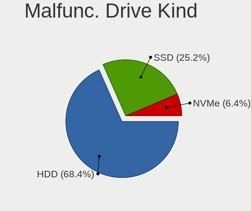
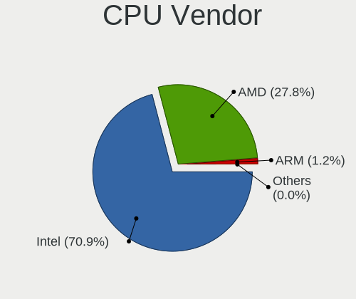
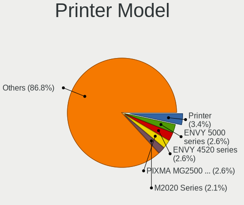
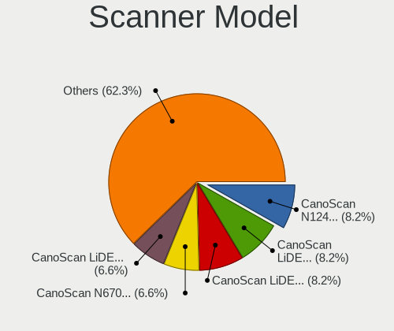
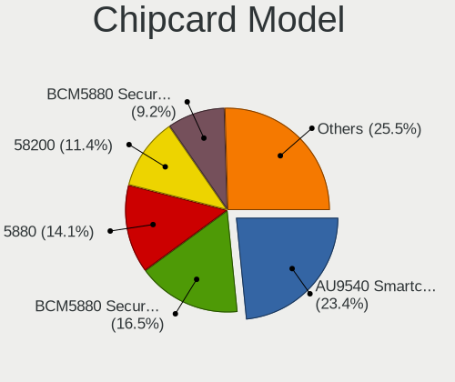
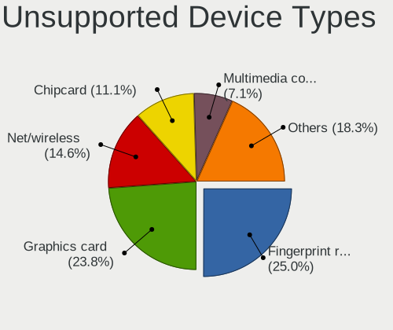

Linux in UK - Tested Hardware & Statistics
------------------------------------------

A project to collect tested hardware configurations for Linux in UK.

Anyone can contribute to this report by the [hw-probe](https://github.com/linuxhw/hw-probe) tool:

    sudo -E hw-probe -all -upload

Please contribute! Especially if your hardware is rare.

This is a report for all computer types. See also reports for [desktops](/Location/UK/Desktop/README.md) and [notebooks](/Location/UK/Notebook/README.md).

Contents
--------

* [ Test Cases ](#test-cases)

* [ System ](#system)
  - [ OS                       ](#os)
  - [ OS Family                ](#os-family)
  - [ Kernel                   ](#kernel)
  - [ Kernel Family            ](#kernel-family)
  - [ Kernel Major Ver.        ](#kernel-major-ver)
  - [ Arch                     ](#arch)
  - [ DE                       ](#de)
  - [ Display Server           ](#display-server)
  - [ Display Manager          ](#display-manager)
  - [ OS Lang                  ](#os-lang)
  - [ Boot Mode                ](#boot-mode)
  - [ Filesystem               ](#filesystem)
  - [ Part. scheme             ](#part-scheme)
  - [ Dual Boot with Linux/BSD ](#dual-boot-with-linuxbsd)
  - [ Dual Boot (Win)          ](#dual-boot-win)

* [ Board ](#board)
  - [ Vendor                   ](#vendor)
  - [ Model                    ](#model)
  - [ Model Family             ](#model-family)
  - [ MFG Year                 ](#mfg-year)
  - [ Form Factor              ](#form-factor)
  - [ Secure Boot              ](#secure-boot)
  - [ Coreboot                 ](#coreboot)
  - [ RAM Size                 ](#ram-size)
  - [ RAM Used                 ](#ram-used)
  - [ Total Drives             ](#total-drives)
  - [ Has CD-ROM               ](#has-cd-rom)
  - [ Has Ethernet             ](#has-ethernet)
  - [ Has WiFi                 ](#has-wifi)
  - [ Has Bluetooth            ](#has-bluetooth)

* [ Location ](#location)
  - [ Country                  ](#country)
  - [ City                     ](#city)

* [ Drives ](#drives)
  - [ Drive Vendor             ](#drive-vendor)
  - [ Drive Model              ](#drive-model)
  - [ HDD Vendor               ](#hdd-vendor)
  - [ SSD Vendor               ](#ssd-vendor)
  - [ Drive Kind               ](#drive-kind)
  - [ Drive Connector          ](#drive-connector)
  - [ Drive Size               ](#drive-size)
  - [ Space Total              ](#space-total)
  - [ Space Used               ](#space-used)
  - [ Malfunc. Drives          ](#malfunc-drives)
  - [ Malfunc. Drive Vendor    ](#malfunc-drive-vendor)
  - [ Malfunc. HDD Vendor      ](#malfunc-hdd-vendor)
  - [ Malfunc. Drive Kind      ](#malfunc-drive-kind)
  - [ Failed Drives            ](#failed-drives)
  - [ Failed Drive Vendor      ](#failed-drive-vendor)
  - [ Drive Status             ](#drive-status)

* [ Storage controller ](#storage-controller)
  - [ Storage Vendor           ](#storage-vendor)
  - [ Storage Model            ](#storage-model)
  - [ Storage Kind             ](#storage-kind)

* [ Processor ](#processor)
  - [ CPU Vendor               ](#cpu-vendor)
  - [ CPU Model                ](#cpu-model)
  - [ CPU Model Family         ](#cpu-model-family)
  - [ CPU Cores                ](#cpu-cores)
  - [ CPU Sockets              ](#cpu-sockets)
  - [ CPU Threads              ](#cpu-threads)
  - [ CPU Op-Modes             ](#cpu-op-modes)
  - [ CPU Microcode            ](#cpu-microcode)
  - [ CPU Microarch            ](#cpu-microarch)

* [ Graphics ](#graphics)
  - [ GPU Vendor               ](#gpu-vendor)
  - [ GPU Model                ](#gpu-model)
  - [ GPU Combo                ](#gpu-combo)
  - [ GPU Driver               ](#gpu-driver)
  - [ GPU Memory               ](#gpu-memory)

* [ Monitor ](#monitor)
  - [ Monitor Vendor           ](#monitor-vendor)
  - [ Monitor Model            ](#monitor-model)
  - [ Monitor Resolution       ](#monitor-resolution)
  - [ Monitor Diagonal         ](#monitor-diagonal)
  - [ Monitor Width            ](#monitor-width)
  - [ Aspect Ratio             ](#aspect-ratio)
  - [ Monitor Area             ](#monitor-area)
  - [ Pixel Density            ](#pixel-density)
  - [ Multiple Monitors        ](#multiple-monitors)

* [ Network ](#network)
  - [ Net Controller Vendor    ](#net-controller-vendor)
  - [ Net Controller Model     ](#net-controller-model)
  - [ Wireless Vendor          ](#wireless-vendor)
  - [ Wireless Model           ](#wireless-model)
  - [ Ethernet Vendor          ](#ethernet-vendor)
  - [ Ethernet Model           ](#ethernet-model)
  - [ Net Controller Kind      ](#net-controller-kind)
  - [ Used Controller          ](#used-controller)
  - [ NICs                     ](#nics)
  - [ IPv6                     ](#ipv6)

* [ Bluetooth ](#bluetooth)
  - [ Bluetooth Vendor         ](#bluetooth-vendor)
  - [ Bluetooth Model          ](#bluetooth-model)

* [ Sound ](#sound)
  - [ Sound Vendor             ](#sound-vendor)
  - [ Sound Model              ](#sound-model)

* [ Memory ](#memory)
  - [ Memory Vendor            ](#memory-vendor)
  - [ Memory Model             ](#memory-model)
  - [ Memory Kind              ](#memory-kind)
  - [ Memory Form Factor       ](#memory-form-factor)
  - [ Memory Size              ](#memory-size)
  - [ Memory Speed             ](#memory-speed)

* [ Printers & scanners ](#printers--scanners)
  - [ Printer Vendor           ](#printer-vendor)
  - [ Printer Model            ](#printer-model)
  - [ Scanner Vendor           ](#scanner-vendor)
  - [ Scanner Model            ](#scanner-model)

* [ Camera ](#camera)
  - [ Camera Vendor            ](#camera-vendor)
  - [ Camera Model             ](#camera-model)

* [ Security ](#security)
  - [ Fingerprint Vendor       ](#fingerprint-vendor)
  - [ Fingerprint Model        ](#fingerprint-model)
  - [ Chipcard Vendor          ](#chipcard-vendor)
  - [ Chipcard Model           ](#chipcard-model)

* [ Unsupported ](#unsupported)
  - [ Unsupported Devices      ](#unsupported-devices)
  - [ Unsupported Device Types ](#unsupported-device-types)

Test Cases
----------

Total: 9591

| Vendor        | Model                       | Form-Factor | Probe                                                      | Date         |
|---------------|-----------------------------|-------------|------------------------------------------------------------|--------------|
| Valve         | Jupiter                     | Notebook    | [c0fb48bccb](https://linux-hardware.org/?probe=c0fb48bccb) | Dec 31, 2022 |
| Dell          | 0JP3NX A01                  | Desktop     | [0749146323](https://linux-hardware.org/?probe=0749146323) | Dec 31, 2022 |
| Lenovo        | ThinkPad P16s Gen 1 21BT... | Notebook    | [b68fa80860](https://linux-hardware.org/?probe=b68fa80860) | Dec 31, 2022 |
| ASUSTek       | ROG STRIX X570-F GAMING     | Desktop     | [7e22db9b23](https://linux-hardware.org/?probe=7e22db9b23) | Dec 31, 2022 |
| Lenovo        | Yoga 2 13 20344             | Notebook    | [39c9c8aaea](https://linux-hardware.org/?probe=39c9c8aaea) | Dec 31, 2022 |
| MSI           | Z170A GAMING PRO CARBON     | Desktop     | [7c96c6776e](https://linux-hardware.org/?probe=7c96c6776e) | Dec 31, 2022 |
| Dell          | Latitude E5440              | Notebook    | [9578ad1ea3](https://linux-hardware.org/?probe=9578ad1ea3) | Dec 31, 2022 |
| HP            | 840A                        | Desktop     | [ad51866fe9](https://linux-hardware.org/?probe=ad51866fe9) | Dec 31, 2022 |
| Valve         | Jupiter                     | Notebook    | [294144217a](https://linux-hardware.org/?probe=294144217a) | Dec 30, 2022 |
| Raspberry ... | Raspberry Pi 2 Model B R... | Soc         | [74b3157c61](https://linux-hardware.org/?probe=74b3157c61) | Dec 30, 2022 |
| Lenovo        | ThinkPad T480 20L50000UK    | Notebook    | [5043868e71](https://linux-hardware.org/?probe=5043868e71) | Dec 30, 2022 |
| ASUSTek       | Z170M-PLUS                  | Desktop     | [858fd62d74](https://linux-hardware.org/?probe=858fd62d74) | Dec 30, 2022 |
| Samsung       | 3570R/370R/470R/450R/510... | Notebook    | [465d2da36b](https://linux-hardware.org/?probe=465d2da36b) | Dec 30, 2022 |
| HP            | ZBook Studio G5             | Notebook    | [6d0b6881ac](https://linux-hardware.org/?probe=6d0b6881ac) | Dec 30, 2022 |
| ASRock        | X670E Steel Legend          | Desktop     | [6aa950201f](https://linux-hardware.org/?probe=6aa950201f) | Dec 30, 2022 |
| HP            | Pavilion Laptop 15-cw1xx... | Notebook    | [7a685e175c](https://linux-hardware.org/?probe=7a685e175c) | Dec 30, 2022 |
| Toshiba       | Satellite C850-1GL          | Notebook    | [f6f61f1841](https://linux-hardware.org/?probe=f6f61f1841) | Dec 30, 2022 |
| Toshiba       | Satellite C850-1GL          | Notebook    | [796edd73f6](https://linux-hardware.org/?probe=796edd73f6) | Dec 30, 2022 |
| HP            | EliteBook 840 G7 Noteboo... | Notebook    | [e7a5c8704b](https://linux-hardware.org/?probe=e7a5c8704b) | Dec 30, 2022 |
| HP            | EliteBook 840 G7 Noteboo... | Notebook    | [fa210be351](https://linux-hardware.org/?probe=fa210be351) | Dec 30, 2022 |
| MSI           | Stealth GS66 12UGS          | Notebook    | [da812c8fa2](https://linux-hardware.org/?probe=da812c8fa2) | Dec 30, 2022 |
| Lenovo        | ThinkStation C20 4263BA7    | Desktop     | [7b55955e2a](https://linux-hardware.org/?probe=7b55955e2a) | Dec 30, 2022 |
| Apple         | MacBookAir9,1               | Notebook    | [d560c94d76](https://linux-hardware.org/?probe=d560c94d76) | Dec 30, 2022 |
| Dell          | Inspiron N5110              | Notebook    | [08682d735c](https://linux-hardware.org/?probe=08682d735c) | Dec 30, 2022 |
| Acer          | Swift SF314-57G             | Notebook    | [9d71d087d8](https://linux-hardware.org/?probe=9d71d087d8) | Dec 29, 2022 |
| HP            | Pavilion Gaming Laptop 1... | Notebook    | [23d1e04f4c](https://linux-hardware.org/?probe=23d1e04f4c) | Dec 29, 2022 |
| Lenovo        | Z50-70 20354                | Notebook    | [7b8f5e4379](https://linux-hardware.org/?probe=7b8f5e4379) | Dec 29, 2022 |
| Samsung       | NB30/N146                   | Notebook    | [7f9b976789](https://linux-hardware.org/?probe=7f9b976789) | Dec 29, 2022 |
| Lenovo        | ThinkPad T480 20L50000UK    | Notebook    | [f5cbe897b8](https://linux-hardware.org/?probe=f5cbe897b8) | Dec 29, 2022 |
| Unknown       | Unknown                     | Notebook    | [0c7bea2d0f](https://linux-hardware.org/?probe=0c7bea2d0f) | Dec 29, 2022 |
| PC Special... | PCX0DX                      | Notebook    | [0a33ad889c](https://linux-hardware.org/?probe=0a33ad889c) | Dec 28, 2022 |
| ASUSTek       | PRIME B450-PLUS             | Desktop     | [e9a313bb81](https://linux-hardware.org/?probe=e9a313bb81) | Dec 28, 2022 |
| HP            | 840A                        | Desktop     | [85b8b7f9b1](https://linux-hardware.org/?probe=85b8b7f9b1) | Dec 28, 2022 |
| ASUSTek       | ROG STRIX B450-F GAMING     | Desktop     | [24b822291e](https://linux-hardware.org/?probe=24b822291e) | Dec 28, 2022 |
| Lenovo        | ThinkPad T480 20L50000UK    | Notebook    | [41f77d037b](https://linux-hardware.org/?probe=41f77d037b) | Dec 28, 2022 |
| Alienware     | M11x R2                     | Notebook    | [a0da72bec0](https://linux-hardware.org/?probe=a0da72bec0) | Dec 28, 2022 |
| Dell          | 0D883F A06                  | Desktop     | [23c5689182](https://linux-hardware.org/?probe=23c5689182) | Dec 28, 2022 |
| Dell          | 0D883F A06                  | Desktop     | [8e9e780028](https://linux-hardware.org/?probe=8e9e780028) | Dec 28, 2022 |
| Lenovo        | ThinkPad X230 23252S4       | Notebook    | [667dcc287e](https://linux-hardware.org/?probe=667dcc287e) | Dec 28, 2022 |
| HP            | 0AE4h                       | Desktop     | [c44d06efa6](https://linux-hardware.org/?probe=c44d06efa6) | Dec 28, 2022 |
| Gigabyte      | MJPLNBB-00                  | Desktop     | [879a5b77ff](https://linux-hardware.org/?probe=879a5b77ff) | Dec 28, 2022 |
| Toshiba       | Satellite C50-B             | Notebook    | [31241c1f30](https://linux-hardware.org/?probe=31241c1f30) | Dec 28, 2022 |
| ASUSTek       | ROG STRIX B550-F GAMING     | Desktop     | [c62ee60963](https://linux-hardware.org/?probe=c62ee60963) | Dec 27, 2022 |
| Acer          | Swift SFX14-51G             | Notebook    | [16c5f2a610](https://linux-hardware.org/?probe=16c5f2a610) | Dec 27, 2022 |
| Valve         | Jupiter                     | Notebook    | [db0586ef7b](https://linux-hardware.org/?probe=db0586ef7b) | Dec 27, 2022 |
| Acer          | Predator PH317-56           | Notebook    | [b74460d91c](https://linux-hardware.org/?probe=b74460d91c) | Dec 27, 2022 |
| Dell          | XPS 13 9365                 | Convertible | [b65d5ce654](https://linux-hardware.org/?probe=b65d5ce654) | Dec 27, 2022 |
| ASUSTek       | ROG STRIX B550-F GAMING     | Desktop     | [20ca7dd779](https://linux-hardware.org/?probe=20ca7dd779) | Dec 27, 2022 |
| Valve         | Jupiter                     | Notebook    | [a1ab930dc6](https://linux-hardware.org/?probe=a1ab930dc6) | Dec 27, 2022 |
| ASUSTek       | TUF Gaming B550-PLUS        | Desktop     | [f2751df7ec](https://linux-hardware.org/?probe=f2751df7ec) | Dec 27, 2022 |
| Samsung       | 300E4C/300E5C/300E7C        | Notebook    | [7a3513a2e1](https://linux-hardware.org/?probe=7a3513a2e1) | Dec 27, 2022 |
| Dell          | 040DDP A01                  | Desktop     | [92825b79ee](https://linux-hardware.org/?probe=92825b79ee) | Dec 27, 2022 |
| ASRock        | Z690 Taichi                 | Desktop     | [4a4e2975d2](https://linux-hardware.org/?probe=4a4e2975d2) | Dec 27, 2022 |
| HP            | Pavilion dv6                | Notebook    | [d759125511](https://linux-hardware.org/?probe=d759125511) | Dec 26, 2022 |
| Alienware     | 07JNH0 A00                  | Desktop     | [41c418873b](https://linux-hardware.org/?probe=41c418873b) | Dec 26, 2022 |
| Valve         | Jupiter                     | Notebook    | [1c516dc209](https://linux-hardware.org/?probe=1c516dc209) | Dec 26, 2022 |
| HP            | ENVY Notebook               | Notebook    | [8c7d592182](https://linux-hardware.org/?probe=8c7d592182) | Dec 26, 2022 |
| Acer          | Aspire ES1-533              | Notebook    | [3b5fa6d85a](https://linux-hardware.org/?probe=3b5fa6d85a) | Dec 26, 2022 |
| Teclast       | X4                          | Tablet      | [d0b2244f5e](https://linux-hardware.org/?probe=d0b2244f5e) | Dec 26, 2022 |
| Microsoft     | Surface Laptop Go           | Tablet      | [cb4b71069c](https://linux-hardware.org/?probe=cb4b71069c) | Dec 25, 2022 |
| ASUSTek       | ROG STRIX B550-F GAMING     | Desktop     | [c44d3c60da](https://linux-hardware.org/?probe=c44d3c60da) | Dec 25, 2022 |
| Star Labs     | StarLite                    | Notebook    | [0d27e6f7ee](https://linux-hardware.org/?probe=0d27e6f7ee) | Dec 25, 2022 |
| ASUSTek       | ROG STRIX B550-F GAMING     | Desktop     | [a46d6a7706](https://linux-hardware.org/?probe=a46d6a7706) | Dec 25, 2022 |
| ASUSTek       | X99-DELUXE                  | Desktop     | [3d538213fc](https://linux-hardware.org/?probe=3d538213fc) | Dec 25, 2022 |
| Lenovo        | ThinkPad T450 20BUS3GN01    | Notebook    | [e88a11d2bb](https://linux-hardware.org/?probe=e88a11d2bb) | Dec 25, 2022 |
| ASUSTek       | VivoBook_ASUSLaptop X513... | Notebook    | [0413176ecc](https://linux-hardware.org/?probe=0413176ecc) | Dec 25, 2022 |
| ASUSTek       | NARRA3                      | Desktop     | [cc0a64d0df](https://linux-hardware.org/?probe=cc0a64d0df) | Dec 25, 2022 |
| Dell          | 0D6H9T A00                  | Desktop     | [778c642778](https://linux-hardware.org/?probe=778c642778) | Dec 25, 2022 |
| Dell          | 0D6H9T A00                  | Desktop     | [ef62b12cdb](https://linux-hardware.org/?probe=ef62b12cdb) | Dec 24, 2022 |
| ASUSTek       | ROG STRIX B550-F GAMING     | Desktop     | [91fb8b9a21](https://linux-hardware.org/?probe=91fb8b9a21) | Dec 24, 2022 |
| CompuLab      | Intense-PC                  | Mini pc     | [ad65fe187a](https://linux-hardware.org/?probe=ad65fe187a) | Dec 24, 2022 |
| Lenovo        | ThinkPad T510 4313CTO       | Notebook    | [a3db191efa](https://linux-hardware.org/?probe=a3db191efa) | Dec 24, 2022 |
| Lenovo        | ThinkPad SL 2746N8G         | Notebook    | [f540a3a892](https://linux-hardware.org/?probe=f540a3a892) | Dec 23, 2022 |
| Unknown       | Unknown                     | Desktop     | [85a74e99ff](https://linux-hardware.org/?probe=85a74e99ff) | Dec 23, 2022 |
| Gigabyte      | X570 AORUS XTREME           | Desktop     | [0ca6dca505](https://linux-hardware.org/?probe=0ca6dca505) | Dec 23, 2022 |
| Gigabyte      | X570 AORUS XTREME           | Desktop     | [7123056cea](https://linux-hardware.org/?probe=7123056cea) | Dec 23, 2022 |
| Gigabyte      | MJPLNBB-00                  | Desktop     | [a9e701a27a](https://linux-hardware.org/?probe=a9e701a27a) | Dec 23, 2022 |
| Toshiba       | Satellite Pro C50-A-1MX     | Notebook    | [78487975ce](https://linux-hardware.org/?probe=78487975ce) | Dec 23, 2022 |
| Acer          | Swift SF314-57G             | Notebook    | [53678dec76](https://linux-hardware.org/?probe=53678dec76) | Dec 22, 2022 |
| Lenovo        | ThinkPad P52 20MAS25B1X     | Notebook    | [f82f15da88](https://linux-hardware.org/?probe=f82f15da88) | Dec 22, 2022 |
| Gigabyte      | MJPLNBB-00                  | Desktop     | [17c300ac96](https://linux-hardware.org/?probe=17c300ac96) | Dec 22, 2022 |
| Dell          | Latitude E5430 non-vPro     | Notebook    | [cc88046606](https://linux-hardware.org/?probe=cc88046606) | Dec 22, 2022 |
| Acer          | Aspire V5-571               | Notebook    | [b4de144f3e](https://linux-hardware.org/?probe=b4de144f3e) | Dec 22, 2022 |
| Lenovo        | SHARKBAY SDK0E50510 WIN     | Desktop     | [877545dd5c](https://linux-hardware.org/?probe=877545dd5c) | Dec 22, 2022 |
| System76      | Lemur Pro                   | Notebook    | [ed549bfe74](https://linux-hardware.org/?probe=ed549bfe74) | Dec 21, 2022 |
| System76      | Lemur Pro                   | Notebook    | [30be17e71c](https://linux-hardware.org/?probe=30be17e71c) | Dec 21, 2022 |
| Gigabyte      | B450 AORUS M                | Desktop     | [74f0c818d6](https://linux-hardware.org/?probe=74f0c818d6) | Dec 21, 2022 |
| Dell          | 018D1Y A00                  | Desktop     | [d63c07df34](https://linux-hardware.org/?probe=d63c07df34) | Dec 21, 2022 |
| Apple         | Mac-27ADBB7B4CEE8E61 iMa... | All in one  | [51b3c3725e](https://linux-hardware.org/?probe=51b3c3725e) | Dec 21, 2022 |
| Apple         | MacBook5,1                  | Notebook    | [d565332e52](https://linux-hardware.org/?probe=d565332e52) | Dec 21, 2022 |
| Acer          | Aspire 5735                 | Notebook    | [d2850b2e08](https://linux-hardware.org/?probe=d2850b2e08) | Dec 21, 2022 |
| Apple         | MacBookPro7,1               | Notebook    | [dbb80c6a3c](https://linux-hardware.org/?probe=dbb80c6a3c) | Dec 21, 2022 |
| Lenovo        | ThinkBook 15 G3 ACL 21A4    | Notebook    | [422faa5041](https://linux-hardware.org/?probe=422faa5041) | Dec 20, 2022 |
| RM Educati... | RM                          | Notebook    | [758b521362](https://linux-hardware.org/?probe=758b521362) | Dec 20, 2022 |
| Lenovo        | 3190 SDK0J40697 WIN 3305... | Mini pc     | [5ab7ccb4cc](https://linux-hardware.org/?probe=5ab7ccb4cc) | Dec 20, 2022 |
| Dell          | XPS 15 9510                 | Notebook    | [870c784f85](https://linux-hardware.org/?probe=870c784f85) | Dec 20, 2022 |
| Gigabyte      | B550I AORUS PRO AX          | Desktop     | [33fce09f33](https://linux-hardware.org/?probe=33fce09f33) | Dec 20, 2022 |
| Gigabyte      | B550I AORUS PRO AX          | Desktop     | [858931394a](https://linux-hardware.org/?probe=858931394a) | Dec 20, 2022 |
| Samsung       | 300E4A/300E5A/300E7A        | Notebook    | [1b0b5a798f](https://linux-hardware.org/?probe=1b0b5a798f) | Dec 20, 2022 |
| Dell          | XPS 15 9560                 | Notebook    | [1f1c0123c7](https://linux-hardware.org/?probe=1f1c0123c7) | Dec 19, 2022 |
| Toshiba       | EQUIUM A300D                | Notebook    | [ffde5ccef4](https://linux-hardware.org/?probe=ffde5ccef4) | Dec 19, 2022 |
| MSI           | X399 SLI PLUS               | Desktop     | [fdf00892eb](https://linux-hardware.org/?probe=fdf00892eb) | Dec 19, 2022 |
| Gigabyte      | 970A-UD3P                   | Desktop     | [0690e94fd6](https://linux-hardware.org/?probe=0690e94fd6) | Dec 19, 2022 |
| HP            | Pavilion Laptop 14-ce0xx... | Notebook    | [0644973fc3](https://linux-hardware.org/?probe=0644973fc3) | Dec 19, 2022 |
| HP            | 620                         | Notebook    | [c5ed6ae3bf](https://linux-hardware.org/?probe=c5ed6ae3bf) | Dec 19, 2022 |
| ASRock        | B650E PG Riptide WiFi       | Desktop     | [86cedc585c](https://linux-hardware.org/?probe=86cedc585c) | Dec 19, 2022 |
| HP            | ENVY Laptop 15-ep0xxx       | Notebook    | [6c6dcce3d8](https://linux-hardware.org/?probe=6c6dcce3d8) | Dec 18, 2022 |
| Dell          | Studio XPS 1645             | Notebook    | [e1c0f5a53b](https://linux-hardware.org/?probe=e1c0f5a53b) | Dec 18, 2022 |
| Gigabyte      | GA-78LMT-USB3               | Desktop     | [e8b08e9f68](https://linux-hardware.org/?probe=e8b08e9f68) | Dec 18, 2022 |
| Dell          | Studio XPS 1645             | Notebook    | [2c26ce45b7](https://linux-hardware.org/?probe=2c26ce45b7) | Dec 18, 2022 |
| MSI           | Delta 15 A5EFK              | Notebook    | [c793cb6f38](https://linux-hardware.org/?probe=c793cb6f38) | Dec 18, 2022 |
| Dell          | 018D1Y A00                  | Desktop     | [03db07e80d](https://linux-hardware.org/?probe=03db07e80d) | Dec 18, 2022 |
| Acer          | Aspire ES1-531              | Notebook    | [28dc03a1bc](https://linux-hardware.org/?probe=28dc03a1bc) | Dec 18, 2022 |
| Fusion5       | C60Bv2-128GB                | Notebook    | [7cc701c4de](https://linux-hardware.org/?probe=7cc701c4de) | Dec 17, 2022 |
| Valve         | Jupiter                     | Notebook    | [5fee494e26](https://linux-hardware.org/?probe=5fee494e26) | Dec 17, 2022 |
| Dell          | 018D1Y A00                  | Desktop     | [d2076f2a7a](https://linux-hardware.org/?probe=d2076f2a7a) | Dec 17, 2022 |
| Intel         | NUC8BEB J72693-303          | Mini pc     | [b882d3e249](https://linux-hardware.org/?probe=b882d3e249) | Dec 17, 2022 |
| Gigabyte      | X570 AORUS XTREME           | Desktop     | [ec4188fb59](https://linux-hardware.org/?probe=ec4188fb59) | Dec 17, 2022 |
| Valve         | Jupiter                     | Notebook    | [d47eae36fe](https://linux-hardware.org/?probe=d47eae36fe) | Dec 17, 2022 |
| HP            | 8906 SMVB                   | Desktop     | [2f27a6ddd3](https://linux-hardware.org/?probe=2f27a6ddd3) | Dec 16, 2022 |
| Intel         | X79M-S                      | Desktop     | [f99b1f2b67](https://linux-hardware.org/?probe=f99b1f2b67) | Dec 16, 2022 |
| MSI           | B550-A PRO                  | Desktop     | [3a9c3088c9](https://linux-hardware.org/?probe=3a9c3088c9) | Dec 16, 2022 |
| MSI           | B550-A PRO                  | Desktop     | [7c5cc51ed4](https://linux-hardware.org/?probe=7c5cc51ed4) | Dec 16, 2022 |
| Lenovo        | ThinkPad X230 23255NG       | Notebook    | [5cc0ff812b](https://linux-hardware.org/?probe=5cc0ff812b) | Dec 16, 2022 |
| Lenovo        | ThinkPad X230 23255NG       | Notebook    | [062a6ed428](https://linux-hardware.org/?probe=062a6ed428) | Dec 16, 2022 |
| Gigabyte      | B550 AORUS ELITE AX V2      | Desktop     | [0fe564693b](https://linux-hardware.org/?probe=0fe564693b) | Dec 16, 2022 |
| HP            | Pavilion g6                 | Notebook    | [d1bfb26644](https://linux-hardware.org/?probe=d1bfb26644) | Dec 16, 2022 |
| Lenovo        | ThinkPad T430 2344BZU       | Notebook    | [a69be3386b](https://linux-hardware.org/?probe=a69be3386b) | Dec 16, 2022 |
| Valve         | Jupiter                     | Notebook    | [bb07a9abda](https://linux-hardware.org/?probe=bb07a9abda) | Dec 16, 2022 |
| ASUSTek       | VivoBook_ASUSLaptop X515... | Notebook    | [06bbbb04a9](https://linux-hardware.org/?probe=06bbbb04a9) | Dec 15, 2022 |
| Acer          | Aspire ES1-512              | Notebook    | [302ea6f1dd](https://linux-hardware.org/?probe=302ea6f1dd) | Dec 14, 2022 |
| Lenovo        | 0B98401 PRO                 | Desktop     | [aac750d7d1](https://linux-hardware.org/?probe=aac750d7d1) | Dec 14, 2022 |
| HP            | 355 G2                      | Notebook    | [c826d17369](https://linux-hardware.org/?probe=c826d17369) | Dec 14, 2022 |
| HP            | 355 G2                      | Notebook    | [f785946641](https://linux-hardware.org/?probe=f785946641) | Dec 14, 2022 |
| Valve         | Jupiter                     | Notebook    | [9330717977](https://linux-hardware.org/?probe=9330717977) | Dec 14, 2022 |
| Star Labs     | StarBook                    | Notebook    | [719a73ae26](https://linux-hardware.org/?probe=719a73ae26) | Dec 13, 2022 |
| HP            | ProBook 440 G7              | Notebook    | [ca2ba2d622](https://linux-hardware.org/?probe=ca2ba2d622) | Dec 13, 2022 |
| MSI           | B550-A PRO                  | Desktop     | [47d6df705b](https://linux-hardware.org/?probe=47d6df705b) | Dec 13, 2022 |
| ECS           | GeForce7050M-M              | Desktop     | [118a28442e](https://linux-hardware.org/?probe=118a28442e) | Dec 13, 2022 |
| ASRock        | H510M-HDV                   | Desktop     | [16d5f27d87](https://linux-hardware.org/?probe=16d5f27d87) | Dec 13, 2022 |
| ASUSTek       | Zenbook UX3402ZA_UX3402Z... | Convertible | [221e900b1c](https://linux-hardware.org/?probe=221e900b1c) | Dec 13, 2022 |
| ASUSTek       | Zenbook UX3402ZA_UX3402Z... | Convertible | [4be6aa4b7a](https://linux-hardware.org/?probe=4be6aa4b7a) | Dec 13, 2022 |
| Lenovo        | ThinkPad T400 647419G       | Notebook    | [a73b681605](https://linux-hardware.org/?probe=a73b681605) | Dec 13, 2022 |
| Lenovo        | Yoga 6 13ALC6 82ND          | Convertible | [bc4a9d103c](https://linux-hardware.org/?probe=bc4a9d103c) | Dec 12, 2022 |
| Apple         | MacBookPro13,3              | Notebook    | [10b29f88c5](https://linux-hardware.org/?probe=10b29f88c5) | Dec 12, 2022 |
| MSI           | Prestige 14 A11SC           | Notebook    | [7fa118f812](https://linux-hardware.org/?probe=7fa118f812) | Dec 11, 2022 |
| Lenovo        | Yoga 530-14ARR 81H9         | Convertible | [5357e778aa](https://linux-hardware.org/?probe=5357e778aa) | Dec 11, 2022 |
| Lenovo        | 30D2 SDK0J40705 WIN 3425... | Desktop     | [80281a1e7b](https://linux-hardware.org/?probe=80281a1e7b) | Dec 11, 2022 |
| MSI           | B550-A PRO                  | Desktop     | [d198c7fc5e](https://linux-hardware.org/?probe=d198c7fc5e) | Dec 11, 2022 |
| Lenovo        | Yoga 6 13ALC7 82UD          | Convertible | [eb171830a5](https://linux-hardware.org/?probe=eb171830a5) | Dec 11, 2022 |
| Star Labs     | StarLite                    | Notebook    | [0d83c191fa](https://linux-hardware.org/?probe=0d83c191fa) | Dec 10, 2022 |
| MSI           | MPG X570 GAMING EDGE WIF... | Desktop     | [9d7365bdd6](https://linux-hardware.org/?probe=9d7365bdd6) | Dec 10, 2022 |
| ASUSTek       | PRIME A320M-K               | Desktop     | [5073afb493](https://linux-hardware.org/?probe=5073afb493) | Dec 10, 2022 |
| Supermicro    | C7Q67 V1.01                 | Desktop     | [8f571548fd](https://linux-hardware.org/?probe=8f571548fd) | Dec 10, 2022 |
| Acer          | Aspire V5-573               | Notebook    | [1d88db5ee2](https://linux-hardware.org/?probe=1d88db5ee2) | Dec 10, 2022 |
| HP            | ProBook 6570b               | Notebook    | [073546a981](https://linux-hardware.org/?probe=073546a981) | Dec 10, 2022 |
| Intel         | Los Lunas 2 FAB             | Desktop     | [a6b8e30388](https://linux-hardware.org/?probe=a6b8e30388) | Dec 10, 2022 |
| MSI           | MPG X670E CARBON WIFI       | Desktop     | [7968282240](https://linux-hardware.org/?probe=7968282240) | Dec 10, 2022 |
| Star Labs     | StarLite                    | Notebook    | [4446ba1d6a](https://linux-hardware.org/?probe=4446ba1d6a) | Dec 10, 2022 |
| Toshiba       | Satellite C855-1W4          | Notebook    | [19149f22c5](https://linux-hardware.org/?probe=19149f22c5) | Dec 09, 2022 |
| Dell          | 0GU083 A00                  | Desktop     | [1f3f73a41c](https://linux-hardware.org/?probe=1f3f73a41c) | Dec 09, 2022 |
| Apple         | Mac-F2268DC8                | All in one  | [9c4d6a19fe](https://linux-hardware.org/?probe=9c4d6a19fe) | Dec 09, 2022 |
| Dell          | Latitude 7390               | Notebook    | [79812ceedd](https://linux-hardware.org/?probe=79812ceedd) | Dec 09, 2022 |
| Lenovo        | ThinkPad L560 20F2S0DA00    | Notebook    | [e8fe4392be](https://linux-hardware.org/?probe=e8fe4392be) | Dec 09, 2022 |
| Lenovo        | ThinkPad L560 20F2S0DA00    | Notebook    | [cf32d7158c](https://linux-hardware.org/?probe=cf32d7158c) | Dec 09, 2022 |
| Gigabyte      | Z590I VISION D              | Desktop     | [9cc2be8747](https://linux-hardware.org/?probe=9cc2be8747) | Dec 09, 2022 |
| ASUSTek       | TUF B450M-PLUS GAMING       | Desktop     | [3832c3e444](https://linux-hardware.org/?probe=3832c3e444) | Dec 09, 2022 |
| Lenovo        | Z70-80 80FG                 | Notebook    | [492071e526](https://linux-hardware.org/?probe=492071e526) | Dec 09, 2022 |
| ASUSTek       | ROG STRIX B550-F GAMING     | Desktop     | [1280df2c5d](https://linux-hardware.org/?probe=1280df2c5d) | Dec 08, 2022 |
| Lenovo        | ThinkPad T440p 20AWS1200... | Notebook    | [8ce314db56](https://linux-hardware.org/?probe=8ce314db56) | Dec 08, 2022 |
| Lenovo        | ThinkPad T440p 20AWS1200... | Notebook    | [858f06f0e5](https://linux-hardware.org/?probe=858f06f0e5) | Dec 08, 2022 |
| Gigabyte      | A320M-S2H-CF                | Desktop     | [5544994d11](https://linux-hardware.org/?probe=5544994d11) | Dec 08, 2022 |
| Gigabyte      | B85M-DS3H-A                 | Desktop     | [e11fca23e8](https://linux-hardware.org/?probe=e11fca23e8) | Dec 08, 2022 |
| ASUSTek       | TUF Gaming X570-PLUS        | Desktop     | [172c6c1300](https://linux-hardware.org/?probe=172c6c1300) | Dec 08, 2022 |
| Google        | Nami                        | Notebook    | [9861d341a7](https://linux-hardware.org/?probe=9861d341a7) | Dec 08, 2022 |
| Shenzhen M... | HX90G                       | Desktop     | [83a892b661](https://linux-hardware.org/?probe=83a892b661) | Dec 08, 2022 |
| MSI           | Alpha 15 A4DEK              | Notebook    | [d2a30990d9](https://linux-hardware.org/?probe=d2a30990d9) | Dec 08, 2022 |
| LG Electro... | 16Z90P-K.AA78A1             | Notebook    | [1646f1763d](https://linux-hardware.org/?probe=1646f1763d) | Dec 08, 2022 |
| MSI           | B450M PRO-VDH MAX           | Desktop     | [4158e5b80f](https://linux-hardware.org/?probe=4158e5b80f) | Dec 07, 2022 |
| ASUSTek       | N55SF                       | Notebook    | [cfb7b0f7ad](https://linux-hardware.org/?probe=cfb7b0f7ad) | Dec 07, 2022 |
| Acer          | Aspire A515-45              | Notebook    | [7eebb7f601](https://linux-hardware.org/?probe=7eebb7f601) | Dec 07, 2022 |
| Valve         | Jupiter                     | Notebook    | [9fc6ea26bb](https://linux-hardware.org/?probe=9fc6ea26bb) | Dec 07, 2022 |
| Valve         | Jupiter                     | Notebook    | [70cd36710e](https://linux-hardware.org/?probe=70cd36710e) | Dec 06, 2022 |
| Lenovo        | Yoga C740-15IML 81TD        | Convertible | [06cc238c83](https://linux-hardware.org/?probe=06cc238c83) | Dec 06, 2022 |
| MSI           | B550-A PRO                  | Desktop     | [eb1b8bc98a](https://linux-hardware.org/?probe=eb1b8bc98a) | Dec 06, 2022 |
| ASUSTek       | Z170 PRO GAMING             | Desktop     | [54fffddad1](https://linux-hardware.org/?probe=54fffddad1) | Dec 06, 2022 |
| Lenovo        | ThinkPad T440p 20AWS1200... | Notebook    | [05f4b7d7cf](https://linux-hardware.org/?probe=05f4b7d7cf) | Dec 06, 2022 |
| HP            | EliteBook 840 G8 Noteboo... | Notebook    | [02130c9bbb](https://linux-hardware.org/?probe=02130c9bbb) | Dec 06, 2022 |
| HP            | EliteBook 2560p             | Notebook    | [bbe22c0ea7](https://linux-hardware.org/?probe=bbe22c0ea7) | Dec 06, 2022 |
| ASUSTek       | P5G41T-M LX V2              | Desktop     | [da0d74a201](https://linux-hardware.org/?probe=da0d74a201) | Dec 05, 2022 |
| Valve         | Jupiter                     | Notebook    | [69e8f9815d](https://linux-hardware.org/?probe=69e8f9815d) | Dec 05, 2022 |
| Lenovo        | ThinkPad T440p 20AWS1200... | Notebook    | [6f0ceb7a46](https://linux-hardware.org/?probe=6f0ceb7a46) | Dec 05, 2022 |
| Dell          | Latitude E5400              | Notebook    | [ab5b64fe8a](https://linux-hardware.org/?probe=ab5b64fe8a) | Dec 05, 2022 |
| Google        | Chell                       | Notebook    | [3ffe532315](https://linux-hardware.org/?probe=3ffe532315) | Dec 05, 2022 |
| HP            | EliteBook 2560p             | Notebook    | [21462d212f](https://linux-hardware.org/?probe=21462d212f) | Dec 05, 2022 |
| Dell          | XPS 13 9343                 | Notebook    | [476763a913](https://linux-hardware.org/?probe=476763a913) | Dec 05, 2022 |
| HP            | 8350                        | Desktop     | [f7768016d5](https://linux-hardware.org/?probe=f7768016d5) | Dec 05, 2022 |
| Dell          | Inspiron 5570               | Notebook    | [d9009fc1f5](https://linux-hardware.org/?probe=d9009fc1f5) | Dec 05, 2022 |
| Gigabyte      | Z97-HD3                     | Desktop     | [9b7999b50d](https://linux-hardware.org/?probe=9b7999b50d) | Dec 05, 2022 |
| Dell          | Latitude 7490               | Notebook    | [e75a902d11](https://linux-hardware.org/?probe=e75a902d11) | Dec 05, 2022 |
| ASRock        | B450M-HDV R4.0              | Desktop     | [53ae0e1b6c](https://linux-hardware.org/?probe=53ae0e1b6c) | Dec 05, 2022 |
| Valve         | Jupiter                     | Notebook    | [13c990586f](https://linux-hardware.org/?probe=13c990586f) | Dec 05, 2022 |
| Gigabyte      | GA-990X-Gaming SLI-CF       | Desktop     | [a0ff47f000](https://linux-hardware.org/?probe=a0ff47f000) | Dec 04, 2022 |
| Lenovo        | ThinkPad T450 20BUS00700    | Notebook    | [141e7e9992](https://linux-hardware.org/?probe=141e7e9992) | Dec 04, 2022 |
| Lenovo        | ThinkPad T470 W10DG 20JN... | Notebook    | [f5be4eb37d](https://linux-hardware.org/?probe=f5be4eb37d) | Dec 04, 2022 |
| ASUSTek       | ROG STRIX B450-F GAMING     | Desktop     | [4d38cbb41a](https://linux-hardware.org/?probe=4d38cbb41a) | Dec 04, 2022 |
| ASUSTek       | ROG STRIX B450-F GAMING     | Desktop     | [7428311d73](https://linux-hardware.org/?probe=7428311d73) | Dec 04, 2022 |
| ASUSTek       | ASUS TUF Gaming A17 FA70... | Notebook    | [6c74973e99](https://linux-hardware.org/?probe=6c74973e99) | Dec 04, 2022 |
| Microsoft     | Surface Laptop 4            | Tablet      | [343b4488cc](https://linux-hardware.org/?probe=343b4488cc) | Dec 04, 2022 |
| Gigabyte      | 970A-DS3P                   | Desktop     | [c09783ccde](https://linux-hardware.org/?probe=c09783ccde) | Dec 04, 2022 |
| MSI           | MAG B550 TOMAHAWK           | Desktop     | [9eb248d38e](https://linux-hardware.org/?probe=9eb248d38e) | Dec 04, 2022 |
| HP            | Notebook                    | Notebook    | [610cea9ebc](https://linux-hardware.org/?probe=610cea9ebc) | Dec 04, 2022 |
| MSI           | MPG Z390 GAMING PLUS        | Desktop     | [6c694b8c98](https://linux-hardware.org/?probe=6c694b8c98) | Dec 03, 2022 |
| ASUSTek       | ROG STRIX X670E-E GAMING... | Desktop     | [61e955b5a6](https://linux-hardware.org/?probe=61e955b5a6) | Dec 03, 2022 |
| ASUSTek       | ROG STRIX X670E-E GAMING... | Desktop     | [dc9c0686e7](https://linux-hardware.org/?probe=dc9c0686e7) | Dec 03, 2022 |
| MSI           | MPG B550 GAMING EDGE WIF... | Desktop     | [f477b8f059](https://linux-hardware.org/?probe=f477b8f059) | Dec 03, 2022 |
| Star Labs     | StarLite                    | Notebook    | [d4cf1b0cd0](https://linux-hardware.org/?probe=d4cf1b0cd0) | Dec 03, 2022 |
| Microsoft     | Surface Laptop 4            | Tablet      | [69a716f389](https://linux-hardware.org/?probe=69a716f389) | Dec 03, 2022 |
| Lenovo        | ThinkPad E14 Gen 4 21E3C... | Notebook    | [c99bd4ef76](https://linux-hardware.org/?probe=c99bd4ef76) | Dec 03, 2022 |
| Dell          | 02YYK5 A01                  | Desktop     | [eb9887d9d4](https://linux-hardware.org/?probe=eb9887d9d4) | Dec 02, 2022 |
| ASUSTek       | A8N-E                       | Desktop     | [a1020380dd](https://linux-hardware.org/?probe=a1020380dd) | Dec 02, 2022 |
| Raspberry ... | Raspberry Pi 3 Model B R... | Soc         | [93c4564635](https://linux-hardware.org/?probe=93c4564635) | Dec 02, 2022 |
| Dell          | Latitude 5591               | Notebook    | [f5735acca7](https://linux-hardware.org/?probe=f5735acca7) | Dec 02, 2022 |
| MSI           | MAG B650M MORTAR WIFI       | Desktop     | [8e317647dc](https://linux-hardware.org/?probe=8e317647dc) | Dec 02, 2022 |
| ASUSTek       | PRIME B550-PLUS             | Desktop     | [a4ed7efef9](https://linux-hardware.org/?probe=a4ed7efef9) | Dec 01, 2022 |
| ASUSTek       | PRIME B550-PLUS             | Desktop     | [5eebfea632](https://linux-hardware.org/?probe=5eebfea632) | Dec 01, 2022 |
| MSI           | PRO Z690-A DDR4             | Desktop     | [db5a886817](https://linux-hardware.org/?probe=db5a886817) | Dec 01, 2022 |
| Acer          | Aspire XC-780               | Desktop     | [b385e11c00](https://linux-hardware.org/?probe=b385e11c00) | Dec 01, 2022 |
| Dell          | 0G254H A00                  | Desktop     | [473fb8a09a](https://linux-hardware.org/?probe=473fb8a09a) | Dec 01, 2022 |
| ASUSTek       | Maximus VIII RANGER         | Desktop     | [c8d4cd1faf](https://linux-hardware.org/?probe=c8d4cd1faf) | Dec 01, 2022 |
| ASUSTek       | Maximus VIII RANGER         | Desktop     | [866e8151d7](https://linux-hardware.org/?probe=866e8151d7) | Dec 01, 2022 |
| Dell          | Latitude E5570              | Notebook    | [4db5cd2ef4](https://linux-hardware.org/?probe=4db5cd2ef4) | Dec 01, 2022 |
| Lenovo        | SHARKBAY SDK0E50510 WIN     | Desktop     | [2f59960e11](https://linux-hardware.org/?probe=2f59960e11) | Dec 01, 2022 |
| Lenovo        | SHARKBAY SDK0E50510 WIN     | Desktop     | [c155b94a47](https://linux-hardware.org/?probe=c155b94a47) | Dec 01, 2022 |
| Gigabyte      | Z590I VISION D              | Desktop     | [655e907d62](https://linux-hardware.org/?probe=655e907d62) | Dec 01, 2022 |
| Dell          | XPS 13 9310                 | Notebook    | [aadf1c39a0](https://linux-hardware.org/?probe=aadf1c39a0) | Dec 01, 2022 |
| Dell          | Latitude E5520              | Notebook    | [92a4c9b5ef](https://linux-hardware.org/?probe=92a4c9b5ef) | Nov 30, 2022 |
| HP            | ElitePad 1000 G2            | Notebook    | [0b05465735](https://linux-hardware.org/?probe=0b05465735) | Nov 30, 2022 |
| Dell          | Inspiron N5010              | Notebook    | [687aa83749](https://linux-hardware.org/?probe=687aa83749) | Nov 30, 2022 |
| Dell          | XPS 15 9500                 | Notebook    | [f9215967d3](https://linux-hardware.org/?probe=f9215967d3) | Nov 30, 2022 |
| Dell          | 0D28YY A00                  | Desktop     | [4af0b7dc59](https://linux-hardware.org/?probe=4af0b7dc59) | Nov 30, 2022 |
| Dell          | 0D28YY A00                  | Desktop     | [bc8c993489](https://linux-hardware.org/?probe=bc8c993489) | Nov 30, 2022 |
| ASRock        | H470M-HDV/M.2               | Desktop     | [c01129a199](https://linux-hardware.org/?probe=c01129a199) | Nov 29, 2022 |
| MSI           | PRO Z690-A DDR4             | Desktop     | [bd30397e24](https://linux-hardware.org/?probe=bd30397e24) | Nov 29, 2022 |
| MSI           | PRO Z690-A DDR4             | Desktop     | [3b4f834c63](https://linux-hardware.org/?probe=3b4f834c63) | Nov 29, 2022 |
| Gigabyte      | B450M DS3H V2               | Desktop     | [f00a357dbe](https://linux-hardware.org/?probe=f00a357dbe) | Nov 29, 2022 |
| Dell          | Inspiron 5570               | Notebook    | [9e4bdbc81d](https://linux-hardware.org/?probe=9e4bdbc81d) | Nov 29, 2022 |
| Dell          | Inspiron 5570               | Notebook    | [399346217e](https://linux-hardware.org/?probe=399346217e) | Nov 29, 2022 |
| Dell          | Inspiron 16 7620 2-in-1     | Convertible | [3e34521c45](https://linux-hardware.org/?probe=3e34521c45) | Nov 29, 2022 |
| Dell          | Inspiron 16 7620 2-in-1     | Convertible | [e43c4c3053](https://linux-hardware.org/?probe=e43c4c3053) | Nov 29, 2022 |
| Lenovo        | 364F SDK0J40700 WIN 3258... | Desktop     | [481a664e0a](https://linux-hardware.org/?probe=481a664e0a) | Nov 29, 2022 |
| HP            | Laptop 14s-fq0xxx           | Notebook    | [e71c023456](https://linux-hardware.org/?probe=e71c023456) | Nov 29, 2022 |
| Valve         | Jupiter                     | Notebook    | [0f40429822](https://linux-hardware.org/?probe=0f40429822) | Nov 29, 2022 |
| Samsung       | 350V5C/351V5C/3540VC/344... | Notebook    | [e0bdd2fbd2](https://linux-hardware.org/?probe=e0bdd2fbd2) | Nov 29, 2022 |
| Gigabyte      | X570 AORUS MASTER           | Desktop     | [f2c8b52293](https://linux-hardware.org/?probe=f2c8b52293) | Nov 28, 2022 |
| Gigabyte      | A520M S2H                   | Desktop     | [151f18b424](https://linux-hardware.org/?probe=151f18b424) | Nov 28, 2022 |
| ASUSTek       | ZenBook UX425IA_UM425IA     | Notebook    | [d258962c35](https://linux-hardware.org/?probe=d258962c35) | Nov 28, 2022 |
| Gigabyte      | Z690 AORUS ELITE AX         | Desktop     | [3ba81fa674](https://linux-hardware.org/?probe=3ba81fa674) | Nov 28, 2022 |
| ASUSTek       | M4A87TD/USB3                | Desktop     | [e38a783ce1](https://linux-hardware.org/?probe=e38a783ce1) | Nov 28, 2022 |
| MSI           | MPG B550 GAMING PLUS        | Desktop     | [341bca1753](https://linux-hardware.org/?probe=341bca1753) | Nov 28, 2022 |
| Timi          | TM1613                      | Notebook    | [37036a425d](https://linux-hardware.org/?probe=37036a425d) | Nov 28, 2022 |
| Dell          | XPS 15 7590                 | Notebook    | [8072eb50aa](https://linux-hardware.org/?probe=8072eb50aa) | Nov 28, 2022 |
| ASUSTek       | TUF Gaming FX505DV_FX505... | Notebook    | [68e68e1e01](https://linux-hardware.org/?probe=68e68e1e01) | Nov 28, 2022 |
| Lenovo        | ThinkPad E490 20N8000RUK    | Notebook    | [6816e8f5ca](https://linux-hardware.org/?probe=6816e8f5ca) | Nov 27, 2022 |
| Lenovo        | ThinkPad E490 20N8000RUK    | Notebook    | [06c690a0e1](https://linux-hardware.org/?probe=06c690a0e1) | Nov 27, 2022 |
| Acer          | Nitro N50-610               | Desktop     | [1a50d26810](https://linux-hardware.org/?probe=1a50d26810) | Nov 27, 2022 |
| Acer          | Nitro N50-610               | Desktop     | [b924b1fdd6](https://linux-hardware.org/?probe=b924b1fdd6) | Nov 27, 2022 |
| ASUSTek       | M5A78L-M LX                 | Desktop     | [c924457e4b](https://linux-hardware.org/?probe=c924457e4b) | Nov 27, 2022 |
| Packard Be... | MCP73VT-PM                  | Desktop     | [e2e6da1ef3](https://linux-hardware.org/?probe=e2e6da1ef3) | Nov 27, 2022 |
| HP            | 86EE                        | All in one  | [8533afb703](https://linux-hardware.org/?probe=8533afb703) | Nov 27, 2022 |
| Apple         | MacBookPro6,2               | Notebook    | [409c3edc19](https://linux-hardware.org/?probe=409c3edc19) | Nov 27, 2022 |
| Gigabyte      | X399 DESIGNARE EX-CF        | Desktop     | [677279419f](https://linux-hardware.org/?probe=677279419f) | Nov 27, 2022 |
| Dell          | XPS 15 7590                 | Notebook    | [18b1ecf4fd](https://linux-hardware.org/?probe=18b1ecf4fd) | Nov 27, 2022 |
| MSI           | GL62 7QF                    | Notebook    | [abd74be332](https://linux-hardware.org/?probe=abd74be332) | Nov 27, 2022 |
| Valve         | Jupiter                     | Notebook    | [1d12c5839a](https://linux-hardware.org/?probe=1d12c5839a) | Nov 27, 2022 |
| ASRock        | 970 Pro3 R2.0               | Desktop     | [79cce0ef33](https://linux-hardware.org/?probe=79cce0ef33) | Nov 27, 2022 |
| Dell          | Inspiron 1545               | Notebook    | [07df50a08c](https://linux-hardware.org/?probe=07df50a08c) | Nov 27, 2022 |
| Toshiba       | Satellite C50D-B            | Notebook    | [c9feb7eed2](https://linux-hardware.org/?probe=c9feb7eed2) | Nov 26, 2022 |
| HP            | 0AA8h                       | Desktop     | [dba59690d7](https://linux-hardware.org/?probe=dba59690d7) | Nov 26, 2022 |
| Lenovo        | V145-15AST 81MT             | Notebook    | [759ad3eb43](https://linux-hardware.org/?probe=759ad3eb43) | Nov 26, 2022 |
| MSI           | B550M PRO-VDH               | Desktop     | [ba7b5c7748](https://linux-hardware.org/?probe=ba7b5c7748) | Nov 26, 2022 |
| Valve         | Jupiter                     | Notebook    | [0a172d85fd](https://linux-hardware.org/?probe=0a172d85fd) | Nov 26, 2022 |
| Microsoft     | Surface Laptop Go           | Tablet      | [e7d8fb64e4](https://linux-hardware.org/?probe=e7d8fb64e4) | Nov 26, 2022 |
| Lenovo        | ThinkPad L13 20R3000FUK     | Notebook    | [c3ff5b014d](https://linux-hardware.org/?probe=c3ff5b014d) | Nov 26, 2022 |
| Toshiba       | Satellite C50D-B            | Notebook    | [92d54fef2b](https://linux-hardware.org/?probe=92d54fef2b) | Nov 25, 2022 |
| Acer          | Aspire ES1-512              | Notebook    | [85c0936ee0](https://linux-hardware.org/?probe=85c0936ee0) | Nov 25, 2022 |
| MSI           | B450 TOMAHAWK MAX           | Desktop     | [6f867d822a](https://linux-hardware.org/?probe=6f867d822a) | Nov 25, 2022 |
| Apple         | Mac-00BE6ED71E35EB86 iMa... | All in one  | [165626e7d0](https://linux-hardware.org/?probe=165626e7d0) | Nov 25, 2022 |
| MSI           | A520M-A PRO                 | Desktop     | [8db2bc8883](https://linux-hardware.org/?probe=8db2bc8883) | Nov 25, 2022 |
| Samsung       | 350V5C/351V5C/3540VC/344... | Notebook    | [0a9d327f59](https://linux-hardware.org/?probe=0a9d327f59) | Nov 25, 2022 |
| Samsung       | 350V5C/351V5C/3540VC/344... | Notebook    | [869a5a808f](https://linux-hardware.org/?probe=869a5a808f) | Nov 25, 2022 |
| MSI           | MPG X570 GAMING EDGE WIF... | Desktop     | [b70689b098](https://linux-hardware.org/?probe=b70689b098) | Nov 24, 2022 |
| MSI           | MPG X570 GAMING EDGE WIF... | Desktop     | [62c027aa0e](https://linux-hardware.org/?probe=62c027aa0e) | Nov 24, 2022 |
| ASUSTek       | PRIME A320M-K               | Desktop     | [5ea9d52f04](https://linux-hardware.org/?probe=5ea9d52f04) | Nov 24, 2022 |
| Acer          | Aspire A315-41              | Notebook    | [4408f2ceff](https://linux-hardware.org/?probe=4408f2ceff) | Nov 24, 2022 |
| ASUSTek       | ASUS TUF Gaming A15 FA50... | Notebook    | [770e9d413e](https://linux-hardware.org/?probe=770e9d413e) | Nov 24, 2022 |
| HP            | Pavilion x2 Detachable      | Tablet      | [3a3ff8db5e](https://linux-hardware.org/?probe=3a3ff8db5e) | Nov 24, 2022 |
| MSI           | MAG X570 TOMAHAWK WIFI      | Desktop     | [c0ce9a3ff3](https://linux-hardware.org/?probe=c0ce9a3ff3) | Nov 23, 2022 |
| Lenovo        | IdeaPad 5 Pro 14ACN6 82L... | Notebook    | [dce6415c9e](https://linux-hardware.org/?probe=dce6415c9e) | Nov 23, 2022 |
| Raspberry ... | Raspberry Pi 4 Model B R... | Soc         | [1e57ddd940](https://linux-hardware.org/?probe=1e57ddd940) | Nov 23, 2022 |
| Dell          | 0P01GV A03                  | Desktop     | [470e942150](https://linux-hardware.org/?probe=470e942150) | Nov 23, 2022 |
| HP            | EliteBook 2560p             | Notebook    | [4c27c5511f](https://linux-hardware.org/?probe=4c27c5511f) | Nov 23, 2022 |
| Lenovo        | IdeaPad 320-15AST 80XV      | Notebook    | [0168e30f4f](https://linux-hardware.org/?probe=0168e30f4f) | Nov 23, 2022 |
| Apple         | MacBookPro12,1              | Notebook    | [063ffbb0e8](https://linux-hardware.org/?probe=063ffbb0e8) | Nov 23, 2022 |
| ASUSTek       | B85M-E                      | Desktop     | [ce01aee504](https://linux-hardware.org/?probe=ce01aee504) | Nov 22, 2022 |
| ASUSTek       | PRIME X570-PRO              | Desktop     | [7399298a0f](https://linux-hardware.org/?probe=7399298a0f) | Nov 22, 2022 |
| ASUSTek       | B85M-E                      | Desktop     | [12aac56052](https://linux-hardware.org/?probe=12aac56052) | Nov 22, 2022 |
| HP            | EliteBook 8530w             | Notebook    | [0c1d6d2201](https://linux-hardware.org/?probe=0c1d6d2201) | Nov 22, 2022 |
| MSI           | B350 TOMAHAWK               | Desktop     | [d300e0c9cf](https://linux-hardware.org/?probe=d300e0c9cf) | Nov 21, 2022 |
| Toshiba       | Satellite L750              | Notebook    | [b2e96ee4b2](https://linux-hardware.org/?probe=b2e96ee4b2) | Nov 21, 2022 |
| Lenovo        | ThinkPad P1 Gen 4i 20Y30... | Notebook    | [16859cf0ca](https://linux-hardware.org/?probe=16859cf0ca) | Nov 21, 2022 |
| Radxa         | ROCK 5B                     | Soc         | [769a23d6d3](https://linux-hardware.org/?probe=769a23d6d3) | Nov 21, 2022 |
| Dell          | 08NPPY A00                  | Desktop     | [24fb42db2b](https://linux-hardware.org/?probe=24fb42db2b) | Nov 21, 2022 |
| HP            | 822A                        | Desktop     | [b464dc4cf0](https://linux-hardware.org/?probe=b464dc4cf0) | Nov 21, 2022 |
| ASUSTek       | PRIME Z590-P                | Desktop     | [ac1533973e](https://linux-hardware.org/?probe=ac1533973e) | Nov 20, 2022 |
| Alienware     | M17xR3                      | Notebook    | [d472e55685](https://linux-hardware.org/?probe=d472e55685) | Nov 20, 2022 |
| ASUSTek       | SABERTOOTH 990FX R2.0       | Desktop     | [8e65fdc84b](https://linux-hardware.org/?probe=8e65fdc84b) | Nov 20, 2022 |
| ASUSTek       | SABERTOOTH 990FX R2.0       | Desktop     | [74187a44ae](https://linux-hardware.org/?probe=74187a44ae) | Nov 20, 2022 |
| HP            | ENVY Laptop 13-ba1xxx       | Notebook    | [4a270e871f](https://linux-hardware.org/?probe=4a270e871f) | Nov 20, 2022 |
| Dell          | Inspiron 7306 2n1           | Convertible | [9f7a4537bf](https://linux-hardware.org/?probe=9f7a4537bf) | Nov 20, 2022 |
| Gigabyte      | GA-MA770T-UD3P              | Desktop     | [237b1cf2af](https://linux-hardware.org/?probe=237b1cf2af) | Nov 20, 2022 |
| TYAN Compu... | S7012                       | Server      | [5b5d81b1a8](https://linux-hardware.org/?probe=5b5d81b1a8) | Nov 19, 2022 |
| Medion        | BEAST X25                   | Notebook    | [fddb326ca2](https://linux-hardware.org/?probe=fddb326ca2) | Nov 19, 2022 |
| Gigabyte      | B550 AORUS ELITE V2         | Desktop     | [61738f6d8a](https://linux-hardware.org/?probe=61738f6d8a) | Nov 19, 2022 |
| Toshiba       | Satellite L50D-B            | Notebook    | [68d1c8a80a](https://linux-hardware.org/?probe=68d1c8a80a) | Nov 19, 2022 |
| HP            | 8626                        | Desktop     | [f2098a2414](https://linux-hardware.org/?probe=f2098a2414) | Nov 19, 2022 |
| HP            | 8626                        | Desktop     | [05ebc14932](https://linux-hardware.org/?probe=05ebc14932) | Nov 19, 2022 |
| Gigabyte      | GA-78LMT-S2P                | Desktop     | [24518f7bf0](https://linux-hardware.org/?probe=24518f7bf0) | Nov 19, 2022 |
| Microsoft     | Surface Pro                 | Tablet      | [5c51c13f84](https://linux-hardware.org/?probe=5c51c13f84) | Nov 19, 2022 |
| Gigabyte      | A320M-S2H-CF                | Desktop     | [d304f26226](https://linux-hardware.org/?probe=d304f26226) | Nov 19, 2022 |
| ASUSTek       | K55A                        | Notebook    | [d09b309d4d](https://linux-hardware.org/?probe=d09b309d4d) | Nov 19, 2022 |
| MSI           | MEG Z490I UNIFY             | Desktop     | [89b7e22011](https://linux-hardware.org/?probe=89b7e22011) | Nov 19, 2022 |
| Apple         | Mac-942B59F58194171B iMa... | All in one  | [c9cee6c5e5](https://linux-hardware.org/?probe=c9cee6c5e5) | Nov 19, 2022 |
| Valve         | Jupiter                     | Notebook    | [afdcde154a](https://linux-hardware.org/?probe=afdcde154a) | Nov 18, 2022 |
| HP            | ProBook 450 G6              | Notebook    | [ceac47decc](https://linux-hardware.org/?probe=ceac47decc) | Nov 18, 2022 |
| HP            | EliteBook 840 G6            | Notebook    | [1faf8e38b4](https://linux-hardware.org/?probe=1faf8e38b4) | Nov 18, 2022 |
| GEO           | GeoFlex 340                 | Convertible | [6e930633c0](https://linux-hardware.org/?probe=6e930633c0) | Nov 18, 2022 |
| HP            | ProBook 450 G6              | Notebook    | [5abeec1752](https://linux-hardware.org/?probe=5abeec1752) | Nov 18, 2022 |
| Unknown       | Unknown                     | Desktop     | [554da2ef73](https://linux-hardware.org/?probe=554da2ef73) | Nov 18, 2022 |
| Gigabyte      | H61M-USB3V                  | Desktop     | [e034e5bbb2](https://linux-hardware.org/?probe=e034e5bbb2) | Nov 18, 2022 |
| ASUSTek       | PRIME A320M-K               | Desktop     | [e6c324007b](https://linux-hardware.org/?probe=e6c324007b) | Nov 18, 2022 |
| Lenovo        | ThinkPad T480 20L50004UK    | Notebook    | [8f4df3bbda](https://linux-hardware.org/?probe=8f4df3bbda) | Nov 18, 2022 |
| HP            | EliteBook 8470p             | Notebook    | [f324f5bc16](https://linux-hardware.org/?probe=f324f5bc16) | Nov 18, 2022 |
| Acer          | Aspire 6930G                | Notebook    | [05ad62f97d](https://linux-hardware.org/?probe=05ad62f97d) | Nov 17, 2022 |
| ASUSTek       | Maximus VIII GENE           | Desktop     | [8b542ffc42](https://linux-hardware.org/?probe=8b542ffc42) | Nov 17, 2022 |
| ASUSTek       | PRIME X470-PRO              | Desktop     | [882e91c53a](https://linux-hardware.org/?probe=882e91c53a) | Nov 16, 2022 |
| ASUSTek       | PRIME X470-PRO              | Desktop     | [83c0e1f2a1](https://linux-hardware.org/?probe=83c0e1f2a1) | Nov 16, 2022 |
| ASUSTek       | Zenbook Pro Duo UX582ZW_... | Notebook    | [cc20cc9828](https://linux-hardware.org/?probe=cc20cc9828) | Nov 16, 2022 |
| ASUSTek       | ROG Zephyrus G14 GA401IV... | Notebook    | [545eb5e46c](https://linux-hardware.org/?probe=545eb5e46c) | Nov 16, 2022 |
| Dell          | Latitude 5410               | Notebook    | [dd9eb324db](https://linux-hardware.org/?probe=dd9eb324db) | Nov 16, 2022 |
| Dell          | Vostro 3590                 | Notebook    | [67ffc3ab77](https://linux-hardware.org/?probe=67ffc3ab77) | Nov 16, 2022 |
| Razer x La... | TensorBook (late 2021)      | Notebook    | [b7fff356a7](https://linux-hardware.org/?probe=b7fff356a7) | Nov 16, 2022 |
| Toshiba       | Satellite Pro U500          | Notebook    | [064a36a5bb](https://linux-hardware.org/?probe=064a36a5bb) | Nov 16, 2022 |
| HP            | 0AA4h                       | Desktop     | [328259669b](https://linux-hardware.org/?probe=328259669b) | Nov 16, 2022 |
| Dell          | 0WR7PY A02                  | Desktop     | [feeb9c7afd](https://linux-hardware.org/?probe=feeb9c7afd) | Nov 15, 2022 |
| ASUSTek       | ROG STRIX X570-F GAMING     | Desktop     | [f074ef2e7c](https://linux-hardware.org/?probe=f074ef2e7c) | Nov 15, 2022 |
| Dixonsxp      | F71IX1                      | Notebook    | [816c618ae7](https://linux-hardware.org/?probe=816c618ae7) | Nov 15, 2022 |
| OEGStone      | NOTCHA-322                  | Notebook    | [a5f28e095e](https://linux-hardware.org/?probe=a5f28e095e) | Nov 15, 2022 |
| Dell          | Inspiron 7501               | Notebook    | [15cd1d588f](https://linux-hardware.org/?probe=15cd1d588f) | Nov 15, 2022 |
| Dell          | Latitude E6320              | Notebook    | [a4767dfe35](https://linux-hardware.org/?probe=a4767dfe35) | Nov 14, 2022 |
| Toshiba       | Satellite L50D-B            | Notebook    | [6c53b0c32d](https://linux-hardware.org/?probe=6c53b0c32d) | Nov 14, 2022 |
| Lenovo        | 3106 SDK0J40697 WIN 3305... | Desktop     | [92a9bbc9a0](https://linux-hardware.org/?probe=92a9bbc9a0) | Nov 14, 2022 |
| HP            | Pavilion dv6                | Notebook    | [fe166a1906](https://linux-hardware.org/?probe=fe166a1906) | Nov 14, 2022 |
| Acer          | Extensa 2530                | Notebook    | [ac83b4e3e9](https://linux-hardware.org/?probe=ac83b4e3e9) | Nov 14, 2022 |
| Dell          | 03KWTV A02                  | Desktop     | [2853121816](https://linux-hardware.org/?probe=2853121816) | Nov 14, 2022 |
| ASUSTek       | P8Z77-V LX                  | Desktop     | [2d904e2be7](https://linux-hardware.org/?probe=2d904e2be7) | Nov 13, 2022 |
| Dell          | Latitude D630               | Notebook    | [3a15603bd6](https://linux-hardware.org/?probe=3a15603bd6) | Nov 13, 2022 |
| Gigabyte      | GA-MA770-UD3                | Desktop     | [d31168230f](https://linux-hardware.org/?probe=d31168230f) | Nov 13, 2022 |
| HP            | EliteBook 6930p             | Notebook    | [4b6c28bf91](https://linux-hardware.org/?probe=4b6c28bf91) | Nov 13, 2022 |
| Lenovo        | IdeaPad S130-14IGM 81J2     | Notebook    | [62cbc0b03d](https://linux-hardware.org/?probe=62cbc0b03d) | Nov 13, 2022 |
| Lenovo        | IdeaPad S130-14IGM 81J2     | Notebook    | [305242c389](https://linux-hardware.org/?probe=305242c389) | Nov 13, 2022 |
| Colorful T... | I-H110-SI1                  | Desktop     | [50c44868e2](https://linux-hardware.org/?probe=50c44868e2) | Nov 13, 2022 |
| Lenovo        | Yoga C930-13IKB 81C4        | Convertible | [78220bf9c5](https://linux-hardware.org/?probe=78220bf9c5) | Nov 13, 2022 |
| HP            | Presario CQ58               | Notebook    | [7a2e365b72](https://linux-hardware.org/?probe=7a2e365b72) | Nov 13, 2022 |
| Valve         | Jupiter                     | Notebook    | [5c1a39b012](https://linux-hardware.org/?probe=5c1a39b012) | Nov 13, 2022 |
| ASUSTek       | TUF Gaming X570-PLUS        | Desktop     | [f84f4f8173](https://linux-hardware.org/?probe=f84f4f8173) | Nov 12, 2022 |
| Lenovo        | IdeaPadFlex 14 20308        | Notebook    | [04a42845bf](https://linux-hardware.org/?probe=04a42845bf) | Nov 12, 2022 |
| Lenovo        | ThinkPad X260 20F5S28R00    | Notebook    | [ac107ff6e8](https://linux-hardware.org/?probe=ac107ff6e8) | Nov 12, 2022 |
| ASUSTek       | PRIME B550-PLUS             | Desktop     | [b2dbd8f602](https://linux-hardware.org/?probe=b2dbd8f602) | Nov 12, 2022 |
| ASUSTek       | PRIME B550-PLUS             | Desktop     | [59a0a26e78](https://linux-hardware.org/?probe=59a0a26e78) | Nov 12, 2022 |
| ASUSTek       | PRIME B550-PLUS             | Desktop     | [59d3c93814](https://linux-hardware.org/?probe=59d3c93814) | Nov 12, 2022 |
| HP            | ProBook 455 G2              | Notebook    | [1a5d0a1618](https://linux-hardware.org/?probe=1a5d0a1618) | Nov 12, 2022 |
| ASUSTek       | PRIME B550-PLUS             | Desktop     | [dc0e46c7b3](https://linux-hardware.org/?probe=dc0e46c7b3) | Nov 12, 2022 |
| ASUSTek       | PRIME B550-PLUS             | Desktop     | [75f7a51f9e](https://linux-hardware.org/?probe=75f7a51f9e) | Nov 12, 2022 |
| System76      | Oryx Pro                    | Notebook    | [5439d56b25](https://linux-hardware.org/?probe=5439d56b25) | Nov 12, 2022 |
| JGINYUE       | X79M-PLUS V2.3              | Desktop     | [8dac2a9292](https://linux-hardware.org/?probe=8dac2a9292) | Nov 12, 2022 |
| Fujitsu       | STYLISTIC Q572              | Notebook    | [afd0e0efc4](https://linux-hardware.org/?probe=afd0e0efc4) | Nov 12, 2022 |
| Dell          | Latitude D630               | Notebook    | [3e964fdd59](https://linux-hardware.org/?probe=3e964fdd59) | Nov 12, 2022 |
| HP            | Laptop 15s-fq1xxx           | Notebook    | [eb5ece0bb3](https://linux-hardware.org/?probe=eb5ece0bb3) | Nov 12, 2022 |
| Valve         | Jupiter                     | Notebook    | [54bca16c61](https://linux-hardware.org/?probe=54bca16c61) | Nov 11, 2022 |
| HP            | EliteBook 840 G3            | Notebook    | [161b81845e](https://linux-hardware.org/?probe=161b81845e) | Nov 11, 2022 |
| Silicom       | MinnowBoard Turbot          | Desktop     | [8fd6be3ee5](https://linux-hardware.org/?probe=8fd6be3ee5) | Nov 11, 2022 |
| Dell          | XPS 15 7590                 | Notebook    | [d05d4d5371](https://linux-hardware.org/?probe=d05d4d5371) | Nov 10, 2022 |
| ASRock        | B365M Pro4-F                | Desktop     | [aa006ea111](https://linux-hardware.org/?probe=aa006ea111) | Nov 10, 2022 |
| Valve         | Jupiter                     | Notebook    | [6227fbbebb](https://linux-hardware.org/?probe=6227fbbebb) | Nov 10, 2022 |
| ASUSTek       | PRIME B350-PLUS             | Desktop     | [009f3d82e9](https://linux-hardware.org/?probe=009f3d82e9) | Nov 10, 2022 |
| Valve         | Jupiter                     | Notebook    | [340ef95fd9](https://linux-hardware.org/?probe=340ef95fd9) | Nov 08, 2022 |
| Valve         | Jupiter                     | Notebook    | [5673f6f505](https://linux-hardware.org/?probe=5673f6f505) | Nov 08, 2022 |
| HP            | 840A                        | Desktop     | [96a97a230e](https://linux-hardware.org/?probe=96a97a230e) | Nov 08, 2022 |
| ASUSTek       | PRIME X370-PRO              | Desktop     | [0b65e26932](https://linux-hardware.org/?probe=0b65e26932) | Nov 08, 2022 |
| Dell          | 0XCR8D A02                  | Desktop     | [53dff9d6c0](https://linux-hardware.org/?probe=53dff9d6c0) | Nov 08, 2022 |
| Dell          | 0XCR8D A02                  | Desktop     | [c1b96e2040](https://linux-hardware.org/?probe=c1b96e2040) | Nov 08, 2022 |
| Raspberry ... | Raspberry Pi 4 Model B R... | Soc         | [10f1d89d4a](https://linux-hardware.org/?probe=10f1d89d4a) | Nov 08, 2022 |
| Valve         | Jupiter                     | Notebook    | [1991a35643](https://linux-hardware.org/?probe=1991a35643) | Nov 08, 2022 |
| Linx          | LINX1010B                   | Notebook    | [fa6d1ebd57](https://linux-hardware.org/?probe=fa6d1ebd57) | Nov 07, 2022 |
| HP            | Pavilion dv5000 (EU087EA... | Notebook    | [185c483599](https://linux-hardware.org/?probe=185c483599) | Nov 07, 2022 |
| ASUSTek       | Zenbook UX3402ZA_UX3402Z... | Convertible | [4cf4bffd62](https://linux-hardware.org/?probe=4cf4bffd62) | Nov 07, 2022 |
| Entroware     | Hybris                      | Notebook    | [bf5c8bcbaf](https://linux-hardware.org/?probe=bf5c8bcbaf) | Nov 07, 2022 |
| Raspberry ... | Raspberry Pi 4 Model B R... | Soc         | [873668d836](https://linux-hardware.org/?probe=873668d836) | Nov 07, 2022 |
| Notebook      | PA70ES                      | Notebook    | [7254b24693](https://linux-hardware.org/?probe=7254b24693) | Nov 07, 2022 |
| ASUSTek       | TUF Gaming Z490-PLUS        | Desktop     | [4239b9f4a9](https://linux-hardware.org/?probe=4239b9f4a9) | Nov 06, 2022 |
| ASUSTek       | VivoBook_ASUSLaptop X350... | Notebook    | [0c0bde7c74](https://linux-hardware.org/?probe=0c0bde7c74) | Nov 06, 2022 |
| HP            | Pavilion dv5000 (EU087EA... | Notebook    | [d763771ba6](https://linux-hardware.org/?probe=d763771ba6) | Nov 06, 2022 |
| Dell          | Inspiron 1525               | Notebook    | [f28061e4da](https://linux-hardware.org/?probe=f28061e4da) | Nov 06, 2022 |
| Raspberry ... | Raspberry Pi 4 Model B R... | Soc         | [4c292cff97](https://linux-hardware.org/?probe=4c292cff97) | Nov 06, 2022 |
| Raspberry ... | Raspberry Pi 4 Model B R... | Soc         | [8c5e823980](https://linux-hardware.org/?probe=8c5e823980) | Nov 06, 2022 |
| HP            | 250 G7 Notebook PC          | Notebook    | [d29197ed66](https://linux-hardware.org/?probe=d29197ed66) | Nov 06, 2022 |
| Dell          | G7 7700                     | Notebook    | [ba3a89822a](https://linux-hardware.org/?probe=ba3a89822a) | Nov 06, 2022 |
| Apple         | Mac-FC02E91DDD3FA6A4 iMa... | All in one  | [e5721cdfbb](https://linux-hardware.org/?probe=e5721cdfbb) | Nov 06, 2022 |
| HP            | ENVY Laptop 13-aq0xxx       | Notebook    | [340f509c6b](https://linux-hardware.org/?probe=340f509c6b) | Nov 06, 2022 |
| Lenovo        | ThinkPad X1 Carbon 6th 2... | Notebook    | [256002ea80](https://linux-hardware.org/?probe=256002ea80) | Nov 06, 2022 |
| Valve         | Jupiter                     | Notebook    | [df94c19aa6](https://linux-hardware.org/?probe=df94c19aa6) | Nov 06, 2022 |
| Valve         | Jupiter                     | Notebook    | [55420be889](https://linux-hardware.org/?probe=55420be889) | Nov 05, 2022 |
| HP            | Pavilion g7                 | Notebook    | [4ad4ed4c47](https://linux-hardware.org/?probe=4ad4ed4c47) | Nov 05, 2022 |
| Acer          | Acadia V1.45                | Notebook    | [654585bbaf](https://linux-hardware.org/?probe=654585bbaf) | Nov 05, 2022 |
| HP            | 250 G7 Notebook PC          | Notebook    | [e5684c9b19](https://linux-hardware.org/?probe=e5684c9b19) | Nov 05, 2022 |
| Fanless Mi... | Rev JSL1                    | Mini pc     | [b74e119c7e](https://linux-hardware.org/?probe=b74e119c7e) | Nov 05, 2022 |
| Acer          | TravelMate B118-M           | Notebook    | [8b7e60aef0](https://linux-hardware.org/?probe=8b7e60aef0) | Nov 05, 2022 |
| Samsung       | 700T1C                      | Notebook    | [c561c328b3](https://linux-hardware.org/?probe=c561c328b3) | Nov 05, 2022 |
| Dell          | 09D2HH A00                  | Desktop     | [7a4477cf7b](https://linux-hardware.org/?probe=7a4477cf7b) | Nov 05, 2022 |
| ASUSTek       | PRIME A320M-K               | Desktop     | [c7dc8f4eb6](https://linux-hardware.org/?probe=c7dc8f4eb6) | Nov 05, 2022 |
| ASUSTek       | PRIME B550-PLUS             | Desktop     | [c177c82021](https://linux-hardware.org/?probe=c177c82021) | Nov 05, 2022 |
| Lenovo        | ThinkPad L520 78596CG       | Notebook    | [094f09bcf8](https://linux-hardware.org/?probe=094f09bcf8) | Nov 04, 2022 |
| Gigabyte      | A320M-S2H-CF                | Desktop     | [3f2ef35b32](https://linux-hardware.org/?probe=3f2ef35b32) | Nov 04, 2022 |
| Gigabyte      | X570 I AORUS PRO WIFI       | Desktop     | [d2a6ea0b28](https://linux-hardware.org/?probe=d2a6ea0b28) | Nov 04, 2022 |
| Lenovo        | ThinkPad X1 Carbon Gen 8... | Notebook    | [f0be03da28](https://linux-hardware.org/?probe=f0be03da28) | Nov 04, 2022 |
| GEO           | GEOBOOK 2E                  | Notebook    | [2a802edc5a](https://linux-hardware.org/?probe=2a802edc5a) | Nov 04, 2022 |
| GEO           | GEOBOOK 2E                  | Notebook    | [80e1206b6d](https://linux-hardware.org/?probe=80e1206b6d) | Nov 04, 2022 |
| HP            | Pavilion x360 Convertibl... | Convertible | [bb9a674a45](https://linux-hardware.org/?probe=bb9a674a45) | Nov 04, 2022 |
| HP            | Pavilion x360 Convertibl... | Convertible | [ad5ff05f8e](https://linux-hardware.org/?probe=ad5ff05f8e) | Nov 04, 2022 |
| MSI           | MPG Z590 GAMING PLUS        | Desktop     | [96e0465554](https://linux-hardware.org/?probe=96e0465554) | Nov 04, 2022 |
| Dell          | 0HN7XN A01                  | Desktop     | [baf6b79b85](https://linux-hardware.org/?probe=baf6b79b85) | Nov 03, 2022 |
| ASUSTek       | PRIME Z270-P                | Desktop     | [3b8c01f3d5](https://linux-hardware.org/?probe=3b8c01f3d5) | Nov 03, 2022 |
| Samsung       | 355V4C/355V4X/355V5C/355... | Notebook    | [a43927efff](https://linux-hardware.org/?probe=a43927efff) | Nov 03, 2022 |
| HP            | ProLiant DL360p Gen8        | Server      | [ef43d1f352](https://linux-hardware.org/?probe=ef43d1f352) | Nov 03, 2022 |
| Dell          | Inspiron 7501               | Notebook    | [3eae1f74ca](https://linux-hardware.org/?probe=3eae1f74ca) | Nov 03, 2022 |
| Samsung       | 400B2B/400B2B               | Notebook    | [a909b4b203](https://linux-hardware.org/?probe=a909b4b203) | Nov 03, 2022 |
| Acer          | H57M01                      | Desktop     | [bfbf74ff75](https://linux-hardware.org/?probe=bfbf74ff75) | Nov 03, 2022 |
| Star Labs     | StarBook                    | Notebook    | [1cfe5c0920](https://linux-hardware.org/?probe=1cfe5c0920) | Nov 02, 2022 |
| MSI           | H81M-E35 V2                 | Desktop     | [db83c146a6](https://linux-hardware.org/?probe=db83c146a6) | Nov 02, 2022 |
| MSI           | X399 SLI PLUS               | Desktop     | [4191ce8788](https://linux-hardware.org/?probe=4191ce8788) | Nov 02, 2022 |
| ASUSTek       | ROG STRIX X570-F GAMING     | Desktop     | [711e95b72e](https://linux-hardware.org/?probe=711e95b72e) | Nov 02, 2022 |
| ASUSTek       | ROG STRIX X570-F GAMING     | Desktop     | [ff0c19c661](https://linux-hardware.org/?probe=ff0c19c661) | Nov 02, 2022 |
| HP            | EliteBook 845 G7 Noteboo... | Notebook    | [c693004e08](https://linux-hardware.org/?probe=c693004e08) | Nov 02, 2022 |
| Microsoft     | Surface Book                | Tablet      | [e4a7690a77](https://linux-hardware.org/?probe=e4a7690a77) | Nov 02, 2022 |
| Samsung       | RV411/RV511/E3511/S3511/... | Notebook    | [ebe8179d26](https://linux-hardware.org/?probe=ebe8179d26) | Nov 02, 2022 |
| Dell          | Inspiron 15-3567            | Notebook    | [a9b57edf35](https://linux-hardware.org/?probe=a9b57edf35) | Nov 02, 2022 |
| Dell          | Inspiron 15 3511            | Notebook    | [5786a01590](https://linux-hardware.org/?probe=5786a01590) | Nov 02, 2022 |
| Acer          | Aspire A315-54              | Notebook    | [1421a5a4e9](https://linux-hardware.org/?probe=1421a5a4e9) | Nov 02, 2022 |
| PC Special... | Elimina Iv 15               | Notebook    | [f462ba9c43](https://linux-hardware.org/?probe=f462ba9c43) | Nov 02, 2022 |
| Microsoft     | Surface Book 2              | Tablet      | [0092b0ddaf](https://linux-hardware.org/?probe=0092b0ddaf) | Nov 01, 2022 |
| Phoenix       | POULSBO                     | Desktop     | [177f05205b](https://linux-hardware.org/?probe=177f05205b) | Nov 01, 2022 |
| Gigabyte      | H81M-DS2V                   | Desktop     | [caffb9ebd7](https://linux-hardware.org/?probe=caffb9ebd7) | Nov 01, 2022 |
| ASUSTek       | P52F                        | Notebook    | [a83cb4c35d](https://linux-hardware.org/?probe=a83cb4c35d) | Nov 01, 2022 |
| ASUSTek       | TUF Gaming X570-PLUS        | Desktop     | [0131299a9e](https://linux-hardware.org/?probe=0131299a9e) | Nov 01, 2022 |
| ASUSTek       | PRIME A320M-K               | Desktop     | [87187c0e23](https://linux-hardware.org/?probe=87187c0e23) | Oct 31, 2022 |
| Packard Be... | EasyNote TK85               | Notebook    | [a233571587](https://linux-hardware.org/?probe=a233571587) | Oct 31, 2022 |
| Acer          | Aspire TC-280               | Desktop     | [68679c6495](https://linux-hardware.org/?probe=68679c6495) | Oct 31, 2022 |
| MSI           | A320M-A PRO                 | Desktop     | [8769289ea5](https://linux-hardware.org/?probe=8769289ea5) | Oct 31, 2022 |
| Lenovo        | Win8 STD MM DPK IPG         | All in one  | [37f3d75177](https://linux-hardware.org/?probe=37f3d75177) | Oct 31, 2022 |
| ASUSTek       | G75VW                       | Notebook    | [6f1d41a85c](https://linux-hardware.org/?probe=6f1d41a85c) | Oct 31, 2022 |
| TUXEDO        | InfinityBook S 15 Gen6      | Notebook    | [92e9764aa0](https://linux-hardware.org/?probe=92e9764aa0) | Oct 31, 2022 |
| Acer          | Swift SF314-512             | Notebook    | [d6bf187cc9](https://linux-hardware.org/?probe=d6bf187cc9) | Oct 31, 2022 |
| Dell          | 02P9X9 A00                  | Server      | [4fa081a282](https://linux-hardware.org/?probe=4fa081a282) | Oct 31, 2022 |
| MSI           | Modern 14 B10MW             | Notebook    | [cf2b620a60](https://linux-hardware.org/?probe=cf2b620a60) | Oct 31, 2022 |
| Valve         | Jupiter                     | Notebook    | [38d0d0e32a](https://linux-hardware.org/?probe=38d0d0e32a) | Oct 31, 2022 |
| Gigabyte      | Z170-Gaming K3              | Desktop     | [d84f634b59](https://linux-hardware.org/?probe=d84f634b59) | Oct 31, 2022 |
| Apple         | MacBookPro5,5               | Notebook    | [00e1f1f754](https://linux-hardware.org/?probe=00e1f1f754) | Oct 31, 2022 |
| Acer          | Swift SFX14-51G             | Notebook    | [6812d7cf22](https://linux-hardware.org/?probe=6812d7cf22) | Oct 30, 2022 |
| HP            | Pavilion 15                 | Notebook    | [f1eac2c0c3](https://linux-hardware.org/?probe=f1eac2c0c3) | Oct 30, 2022 |
| ASUSTek       | PRIME B550-PLUS             | Desktop     | [4820bca604](https://linux-hardware.org/?probe=4820bca604) | Oct 30, 2022 |
| ASUSTek       | PRIME B550-PLUS             | Desktop     | [cdca8a4d95](https://linux-hardware.org/?probe=cdca8a4d95) | Oct 30, 2022 |
| Lenovo        | ThinkPad T480 20L6S82F0C    | Notebook    | [c06d6a27f5](https://linux-hardware.org/?probe=c06d6a27f5) | Oct 30, 2022 |
| Gigabyte      | X570S AORUS PRO AX          | Desktop     | [03d14141e4](https://linux-hardware.org/?probe=03d14141e4) | Oct 30, 2022 |
| Lenovo        | ThinkPad L560 20F2S0DA00    | Notebook    | [bf8945db85](https://linux-hardware.org/?probe=bf8945db85) | Oct 30, 2022 |
| Dell          | 02YYK5 A01                  | Desktop     | [b7760774ca](https://linux-hardware.org/?probe=b7760774ca) | Oct 30, 2022 |
| ASUSTek       | PRIME A320M-K               | Desktop     | [4bc0220a01](https://linux-hardware.org/?probe=4bc0220a01) | Oct 30, 2022 |
| MSI           | A320M-A PRO                 | Desktop     | [23ad30db1a](https://linux-hardware.org/?probe=23ad30db1a) | Oct 29, 2022 |
| ASUSTek       | PRIME A320M-K               | Desktop     | [bd18c2b33d](https://linux-hardware.org/?probe=bd18c2b33d) | Oct 29, 2022 |
| GEO           | GeoBook3                    | Notebook    | [133a4460f6](https://linux-hardware.org/?probe=133a4460f6) | Oct 29, 2022 |
| Gigabyte      | B550 AORUS ELITE            | Desktop     | [957fc9af86](https://linux-hardware.org/?probe=957fc9af86) | Oct 29, 2022 |
| Toshiba       | Satellite C660              | Notebook    | [242fa16882](https://linux-hardware.org/?probe=242fa16882) | Oct 29, 2022 |
| Gigabyte      | B550 GAMING X V2            | Desktop     | [b4ba1b8d5a](https://linux-hardware.org/?probe=b4ba1b8d5a) | Oct 29, 2022 |
| Dell          | Latitude E6530              | Notebook    | [cdd3b5ce40](https://linux-hardware.org/?probe=cdd3b5ce40) | Oct 28, 2022 |
| MSI           | MPG B550 GAMING PLUS        | Desktop     | [7d5d2ec0ba](https://linux-hardware.org/?probe=7d5d2ec0ba) | Oct 28, 2022 |
| MSI           | MS-AE3111 10                | Other       | [b21e69db4d](https://linux-hardware.org/?probe=b21e69db4d) | Oct 28, 2022 |
| Valve         | Jupiter                     | Notebook    | [127bd00558](https://linux-hardware.org/?probe=127bd00558) | Oct 28, 2022 |
| MSI           | MS-AE3111 10                | Other       | [ad5c043471](https://linux-hardware.org/?probe=ad5c043471) | Oct 28, 2022 |
| Tactus        | GeoBook 110                 | Notebook    | [aad56b27f0](https://linux-hardware.org/?probe=aad56b27f0) | Oct 28, 2022 |
| HP            | 82A5                        | Mini pc     | [c0be7985c0](https://linux-hardware.org/?probe=c0be7985c0) | Oct 28, 2022 |
| Dell          | XPS 13 9305                 | Notebook    | [20bf043d6f](https://linux-hardware.org/?probe=20bf043d6f) | Oct 28, 2022 |
| Valve         | Jupiter                     | Notebook    | [7cc988201b](https://linux-hardware.org/?probe=7cc988201b) | Oct 28, 2022 |
| Alienware     | 046MHW A00                  | Desktop     | [5a5511a68b](https://linux-hardware.org/?probe=5a5511a68b) | Oct 27, 2022 |
| HP            | ENVY Laptop 13-ba0xxx       | Notebook    | [920b0eaa44](https://linux-hardware.org/?probe=920b0eaa44) | Oct 27, 2022 |
| MSI           | B450M MORTAR                | Desktop     | [44e8a164d1](https://linux-hardware.org/?probe=44e8a164d1) | Oct 27, 2022 |
| ASUSTek       | P8H61/USB3                  | Desktop     | [c20c97e43e](https://linux-hardware.org/?probe=c20c97e43e) | Oct 27, 2022 |
| Novatech      | NLx0MU                      | Notebook    | [41c5d984a0](https://linux-hardware.org/?probe=41c5d984a0) | Oct 27, 2022 |
| HP            | G62                         | Notebook    | [c9ba156401](https://linux-hardware.org/?probe=c9ba156401) | Oct 27, 2022 |
| Gigabyte      | H61N-USB3                   | Desktop     | [ff94581714](https://linux-hardware.org/?probe=ff94581714) | Oct 27, 2022 |
| Gigabyte      | B450 I AORUS PRO WIFI-CF    | Desktop     | [d8343e2db5](https://linux-hardware.org/?probe=d8343e2db5) | Oct 26, 2022 |
| Toshiba       | Satellite C660              | Notebook    | [80c2aeb241](https://linux-hardware.org/?probe=80c2aeb241) | Oct 26, 2022 |
| ASUSTek       | TUF Gaming Z690-PLUS WIF... | Desktop     | [58af9b9a77](https://linux-hardware.org/?probe=58af9b9a77) | Oct 26, 2022 |
| HP            | Setzer                      | Notebook    | [a1039409cd](https://linux-hardware.org/?probe=a1039409cd) | Oct 26, 2022 |
| HP            | Setzer                      | Notebook    | [3945fea013](https://linux-hardware.org/?probe=3945fea013) | Oct 25, 2022 |
| Alienware     | 046MHW A00                  | Desktop     | [592883e78e](https://linux-hardware.org/?probe=592883e78e) | Oct 25, 2022 |
| Alienware     | 046MHW A00                  | Desktop     | [734fb9ac8c](https://linux-hardware.org/?probe=734fb9ac8c) | Oct 25, 2022 |
| Valve         | Jupiter                     | Notebook    | [dc86de125e](https://linux-hardware.org/?probe=dc86de125e) | Oct 25, 2022 |
| Toshiba       | Satellite C50D-A-133        | Notebook    | [c1ba737ccc](https://linux-hardware.org/?probe=c1ba737ccc) | Oct 25, 2022 |
| ASUSTek       | ROG Flow Z13 GZ301ZE_GZ3... | Tablet      | [dee13eac1d](https://linux-hardware.org/?probe=dee13eac1d) | Oct 25, 2022 |
| ASUSTek       | ROG Flow Z13 GZ301ZE_GZ3... | Tablet      | [1bc80461df](https://linux-hardware.org/?probe=1bc80461df) | Oct 25, 2022 |
| Valve         | Jupiter                     | Notebook    | [c12839567e](https://linux-hardware.org/?probe=c12839567e) | Oct 25, 2022 |
| ASUSTek       | PRIME B450-PLUS             | Desktop     | [3a10949e83](https://linux-hardware.org/?probe=3a10949e83) | Oct 25, 2022 |
| ASRock        | FM2A88M-HD+ R2.0            | Desktop     | [10e0a497e9](https://linux-hardware.org/?probe=10e0a497e9) | Oct 25, 2022 |
| Dell          | Inspiron 1525               | Notebook    | [742bf13a9f](https://linux-hardware.org/?probe=742bf13a9f) | Oct 25, 2022 |
| ASUSTek       | PRIME B550-PLUS             | Desktop     | [db4db1b508](https://linux-hardware.org/?probe=db4db1b508) | Oct 25, 2022 |
| ASUSTek       | PRIME X470-PRO              | Desktop     | [b4d5421b09](https://linux-hardware.org/?probe=b4d5421b09) | Oct 25, 2022 |
| Microsoft     | Surface Pro 3               | Tablet      | [e3a6983caf](https://linux-hardware.org/?probe=e3a6983caf) | Oct 25, 2022 |
| Lenovo        | V15-IIL 82C5                | Notebook    | [a56ad41b2f](https://linux-hardware.org/?probe=a56ad41b2f) | Oct 25, 2022 |
| Dell          | Inspiron 16 7610            | Notebook    | [47a3e2b5f6](https://linux-hardware.org/?probe=47a3e2b5f6) | Oct 24, 2022 |
| Acer          | Aspire XC-830               | Desktop     | [2692d8c0cd](https://linux-hardware.org/?probe=2692d8c0cd) | Oct 24, 2022 |
| Gigabyte      | E350N WIN8                  | Desktop     | [bff16c4d6c](https://linux-hardware.org/?probe=bff16c4d6c) | Oct 24, 2022 |
| Acer          | Aspire C24-865              | All in one  | [31b61c3ce9](https://linux-hardware.org/?probe=31b61c3ce9) | Oct 24, 2022 |
| Raspberry ... | Raspberry Pi 4 Model B R... | Soc         | [dd05575bb4](https://linux-hardware.org/?probe=dd05575bb4) | Oct 24, 2022 |
| Raspberry ... | Raspberry Pi 4 Model B R... | Soc         | [d2cb5dc9c7](https://linux-hardware.org/?probe=d2cb5dc9c7) | Oct 24, 2022 |
| Acer          | Aspire XC-830               | Desktop     | [8b6263dc68](https://linux-hardware.org/?probe=8b6263dc68) | Oct 24, 2022 |
| Lenovo        | ThinkPad T520 4243PN7       | Notebook    | [fdca71510b](https://linux-hardware.org/?probe=fdca71510b) | Oct 24, 2022 |
| Acer          | Aspire C24-865              | All in one  | [257d3a9124](https://linux-hardware.org/?probe=257d3a9124) | Oct 23, 2022 |
| Acer          | WMCP78M                     | Desktop     | [f4e3945dea](https://linux-hardware.org/?probe=f4e3945dea) | Oct 23, 2022 |
| AMI           | Unknown                     | Notebook    | [337d94fb96](https://linux-hardware.org/?probe=337d94fb96) | Oct 23, 2022 |
| Gigabyte      | X570S AORUS MASTER          | Desktop     | [b9e4b934ee](https://linux-hardware.org/?probe=b9e4b934ee) | Oct 23, 2022 |
| HP            | OMEN by Laptop 17-ck0xxx    | Notebook    | [34f4204ae8](https://linux-hardware.org/?probe=34f4204ae8) | Oct 23, 2022 |
| GEO           | GeoBook 140                 | Notebook    | [e97f8024f4](https://linux-hardware.org/?probe=e97f8024f4) | Oct 22, 2022 |
| HP            | 86EE                        | All in one  | [4c631cdc18](https://linux-hardware.org/?probe=4c631cdc18) | Oct 22, 2022 |
| Dell          | 0HN7XN A01                  | Desktop     | [4e75c878a3](https://linux-hardware.org/?probe=4e75c878a3) | Oct 22, 2022 |
| ASUSTek       | PRIME B550-PLUS             | Desktop     | [7f855c9b05](https://linux-hardware.org/?probe=7f855c9b05) | Oct 22, 2022 |
| GEO           | GeoBook 140                 | Notebook    | [bbbe5e0fca](https://linux-hardware.org/?probe=bbbe5e0fca) | Oct 22, 2022 |
| Dell          | 07PR60 A00                  | Desktop     | [a1cb6d4862](https://linux-hardware.org/?probe=a1cb6d4862) | Oct 22, 2022 |
| Samsung       | R519/R719                   | Notebook    | [da6668197e](https://linux-hardware.org/?probe=da6668197e) | Oct 22, 2022 |
| ASRock        | B450M-HDV R4.0              | Desktop     | [0ec4fb54a6](https://linux-hardware.org/?probe=0ec4fb54a6) | Oct 21, 2022 |
| ASRock        | B450M-HDV R4.0              | Desktop     | [1f659498a2](https://linux-hardware.org/?probe=1f659498a2) | Oct 21, 2022 |
| ASUSTek       | ROG Maximus XI HERO         | Desktop     | [2f6d59ec8b](https://linux-hardware.org/?probe=2f6d59ec8b) | Oct 21, 2022 |
| HP            | OMEN by Laptop 17-ck0xxx    | Notebook    | [0ed2f15c34](https://linux-hardware.org/?probe=0ed2f15c34) | Oct 21, 2022 |
| Razer x La... | TensorBook (late 2021)      | Notebook    | [27cae45787](https://linux-hardware.org/?probe=27cae45787) | Oct 20, 2022 |
| Acer          | Aspire S3                   | Notebook    | [a24603a142](https://linux-hardware.org/?probe=a24603a142) | Oct 20, 2022 |
| Dell          | XPS 13 9300                 | Notebook    | [ec9a97a15d](https://linux-hardware.org/?probe=ec9a97a15d) | Oct 20, 2022 |
| Toshiba       | Satellite C660              | Notebook    | [3632c8a48d](https://linux-hardware.org/?probe=3632c8a48d) | Oct 20, 2022 |
| Valve         | Jupiter                     | Notebook    | [a314a908eb](https://linux-hardware.org/?probe=a314a908eb) | Oct 20, 2022 |
| Razer x La... | TensorBook (late 2021)      | Notebook    | [fef9e26716](https://linux-hardware.org/?probe=fef9e26716) | Oct 20, 2022 |
| Valve         | Jupiter                     | Notebook    | [3fada6964f](https://linux-hardware.org/?probe=3fada6964f) | Oct 19, 2022 |
| Gigabyte      | P67A-UD3                    | Desktop     | [96b72bfa8a](https://linux-hardware.org/?probe=96b72bfa8a) | Oct 19, 2022 |
| ASUSTek       | H81I-PLUS                   | Desktop     | [c30eaa0009](https://linux-hardware.org/?probe=c30eaa0009) | Oct 19, 2022 |
| ASUSTek       | ZenBook UX325EA_UX325EA     | Notebook    | [56089b3625](https://linux-hardware.org/?probe=56089b3625) | Oct 19, 2022 |
| Acer          | Aspire V5-132P              | Notebook    | [420ad7ac8c](https://linux-hardware.org/?probe=420ad7ac8c) | Oct 19, 2022 |
| Lenovo        | G580 2689H2G                | Notebook    | [1d81a2fb3b](https://linux-hardware.org/?probe=1d81a2fb3b) | Oct 18, 2022 |
| Gigabyte      | X570S AORUS MASTER          | Desktop     | [495c7fdc3d](https://linux-hardware.org/?probe=495c7fdc3d) | Oct 18, 2022 |
| ASRock        | 960GC-GS FX                 | Desktop     | [1223730da0](https://linux-hardware.org/?probe=1223730da0) | Oct 18, 2022 |
| Acer          | Aspire 6930G                | Notebook    | [d65e0cfe7a](https://linux-hardware.org/?probe=d65e0cfe7a) | Oct 18, 2022 |
| Dell          | 0T10XW A02                  | Desktop     | [04bef71f33](https://linux-hardware.org/?probe=04bef71f33) | Oct 18, 2022 |
| ASUSTek       | H81I-PLUS                   | Desktop     | [d5d3ad3491](https://linux-hardware.org/?probe=d5d3ad3491) | Oct 18, 2022 |
| GEO           | GeoBook 120                 | Notebook    | [fe063a61a7](https://linux-hardware.org/?probe=fe063a61a7) | Oct 17, 2022 |
| MSI           | Z590-A PRO                  | Desktop     | [0a30a79788](https://linux-hardware.org/?probe=0a30a79788) | Oct 17, 2022 |
| MSI           | Z590-A PRO                  | Desktop     | [a4f5a5b0be](https://linux-hardware.org/?probe=a4f5a5b0be) | Oct 17, 2022 |
| HP            | ZBook 15                    | Notebook    | [6926e1a3c0](https://linux-hardware.org/?probe=6926e1a3c0) | Oct 17, 2022 |
| Valve         | Jupiter                     | Notebook    | [992d2b539a](https://linux-hardware.org/?probe=992d2b539a) | Oct 17, 2022 |
| MSI           | Z590-A PRO                  | Desktop     | [e2991c4619](https://linux-hardware.org/?probe=e2991c4619) | Oct 17, 2022 |
| Dell          | 0KJCC5 A00                  | Desktop     | [d6a23d7f6d](https://linux-hardware.org/?probe=d6a23d7f6d) | Oct 17, 2022 |
| Gigabyte      | X570S AORUS PRO AX          | Desktop     | [61aeb93e12](https://linux-hardware.org/?probe=61aeb93e12) | Oct 16, 2022 |
| ASRock        | N68-S                       | Desktop     | [356bdaf8d8](https://linux-hardware.org/?probe=356bdaf8d8) | Oct 16, 2022 |
| ASUSTek       | ROG CROSSHAIR VIII IMPAC... | Desktop     | [bf7cebc10e](https://linux-hardware.org/?probe=bf7cebc10e) | Oct 16, 2022 |
| ASUSTek       | ROG STRIX X570-F GAMING     | Desktop     | [bf0e112f9a](https://linux-hardware.org/?probe=bf0e112f9a) | Oct 16, 2022 |
| Gigabyte      | A320M-S2H-CF                | Desktop     | [77f04d4628](https://linux-hardware.org/?probe=77f04d4628) | Oct 16, 2022 |
| Dell          | 0XGMD0 A00                  | All in one  | [e38169d409](https://linux-hardware.org/?probe=e38169d409) | Oct 16, 2022 |
| Samsung       | 700T1C                      | Notebook    | [b0b2e6712c](https://linux-hardware.org/?probe=b0b2e6712c) | Oct 15, 2022 |
| ASUSTek       | ROG CROSSHAIR VIII DARK ... | Desktop     | [d2b5d08432](https://linux-hardware.org/?probe=d2b5d08432) | Oct 15, 2022 |
| Lenovo        | IdeaPad 110-15IBR 80T7      | Notebook    | [ee67e90b5f](https://linux-hardware.org/?probe=ee67e90b5f) | Oct 15, 2022 |
| ASUSTek       | M5A78L-M/USB3               | Desktop     | [ef118e61f2](https://linux-hardware.org/?probe=ef118e61f2) | Oct 15, 2022 |
| Valve         | Jupiter                     | Notebook    | [022a7cab63](https://linux-hardware.org/?probe=022a7cab63) | Oct 15, 2022 |
| Valve         | Jupiter                     | Notebook    | [bd47ebea62](https://linux-hardware.org/?probe=bd47ebea62) | Oct 15, 2022 |
| Valve         | Jupiter                     | Notebook    | [627b9225cb](https://linux-hardware.org/?probe=627b9225cb) | Oct 15, 2022 |
| Dell          | 0J3C2F A01                  | Desktop     | [b30840548a](https://linux-hardware.org/?probe=b30840548a) | Oct 15, 2022 |
| HP            | Presario C300 (RM500EA#A... | Notebook    | [c35d7b0ee3](https://linux-hardware.org/?probe=c35d7b0ee3) | Oct 14, 2022 |
| ASUSTek       | ROG STRIX X570-F GAMING     | Desktop     | [e037086b30](https://linux-hardware.org/?probe=e037086b30) | Oct 14, 2022 |
| Raspberry ... | Raspberry Pi 3 Model B R... | Soc         | [4545a01dbb](https://linux-hardware.org/?probe=4545a01dbb) | Oct 14, 2022 |
| Raspberry ... | Raspberry Pi 400 Rev 1.0    | Soc         | [82a7e620f0](https://linux-hardware.org/?probe=82a7e620f0) | Oct 14, 2022 |
| Apple         | Mac-35C5E08120C7EEAF Mac... | Mini pc     | [34fcf52c18](https://linux-hardware.org/?probe=34fcf52c18) | Oct 14, 2022 |
| Apple         | Mac-7BA5B2DFE22DDD8C Mac... | Mini pc     | [78b6f676b0](https://linux-hardware.org/?probe=78b6f676b0) | Oct 14, 2022 |
| HP            | Pavilion x360 Convertibl... | Convertible | [2830449515](https://linux-hardware.org/?probe=2830449515) | Oct 14, 2022 |
| Dell          | Precision M4800             | Notebook    | [aa9a1680fd](https://linux-hardware.org/?probe=aa9a1680fd) | Oct 14, 2022 |
| Dell          | 0HN7XN A01                  | Desktop     | [a71fb08b36](https://linux-hardware.org/?probe=a71fb08b36) | Oct 14, 2022 |
| MSI           | FM2-A55M-E33                | Desktop     | [1fe306ae1e](https://linux-hardware.org/?probe=1fe306ae1e) | Oct 13, 2022 |
| Raspberry ... | Raspberry Pi 400 Rev 1.0    | Soc         | [a3f2f1dcc7](https://linux-hardware.org/?probe=a3f2f1dcc7) | Oct 13, 2022 |
| Gigabyte      | H81M-S2H                    | Desktop     | [3e38f64c1c](https://linux-hardware.org/?probe=3e38f64c1c) | Oct 13, 2022 |
| Dell          | 0HN7XN A01                  | Desktop     | [abf7c780d2](https://linux-hardware.org/?probe=abf7c780d2) | Oct 13, 2022 |
| ASUSTek       | M5A78L-M PLUS/USB3          | Desktop     | [f55bb836c3](https://linux-hardware.org/?probe=f55bb836c3) | Oct 13, 2022 |
| ASUSTek       | PRIME A520M-K               | Desktop     | [e1bdf49dbf](https://linux-hardware.org/?probe=e1bdf49dbf) | Oct 13, 2022 |
| ASUSTek       | TUF Gaming B560-PLUS WIF... | Desktop     | [3ffa813244](https://linux-hardware.org/?probe=3ffa813244) | Oct 13, 2022 |
| Gigabyte      | H81M-H                      | Desktop     | [63731688d0](https://linux-hardware.org/?probe=63731688d0) | Oct 13, 2022 |
| Lenovo        | V110-15AST 80TD             | Notebook    | [9d4b6fafb6](https://linux-hardware.org/?probe=9d4b6fafb6) | Oct 12, 2022 |
| ASUSTek       | P8Z68-V PRO                 | Desktop     | [977ba540ba](https://linux-hardware.org/?probe=977ba540ba) | Oct 12, 2022 |
| MSI           | B450M MORTAR MAX            | Desktop     | [c82722f056](https://linux-hardware.org/?probe=c82722f056) | Oct 12, 2022 |
| Lenovo        | Yoga Slim 7 ProX 14ARH7 ... | Notebook    | [cbc3888844](https://linux-hardware.org/?probe=cbc3888844) | Oct 12, 2022 |
| Lenovo        | Z50-75 80EC                 | Notebook    | [7dbdbc1de9](https://linux-hardware.org/?probe=7dbdbc1de9) | Oct 12, 2022 |
| Gigabyte      | AB350-Gaming-CF             | Desktop     | [0bc0b385c3](https://linux-hardware.org/?probe=0bc0b385c3) | Oct 12, 2022 |
| Dell          | Latitude E5470              | Notebook    | [eee260b733](https://linux-hardware.org/?probe=eee260b733) | Oct 12, 2022 |
| Dell          | Latitude E5470              | Notebook    | [3bbb87ee1b](https://linux-hardware.org/?probe=3bbb87ee1b) | Oct 12, 2022 |
| ASUSTek       | P6T SE                      | Desktop     | [4ba4bc909d](https://linux-hardware.org/?probe=4ba4bc909d) | Oct 12, 2022 |
| ASUSTek       | H81I-PLUS                   | Desktop     | [1c508c2425](https://linux-hardware.org/?probe=1c508c2425) | Oct 12, 2022 |
| Fanless Mi... | Rev JSL1                    | Mini pc     | [e67263e24c](https://linux-hardware.org/?probe=e67263e24c) | Oct 11, 2022 |
| Gigabyte      | AB350-Gaming-CF             | Desktop     | [c213445487](https://linux-hardware.org/?probe=c213445487) | Oct 11, 2022 |
| Dell          | 02YYK5 A01                  | Desktop     | [f263785a18](https://linux-hardware.org/?probe=f263785a18) | Oct 11, 2022 |
| Lenovo        | ThinkPad T420 4236TL7       | Notebook    | [8a639f4457](https://linux-hardware.org/?probe=8a639f4457) | Oct 10, 2022 |
| Valve         | Jupiter                     | Notebook    | [c06c56de15](https://linux-hardware.org/?probe=c06c56de15) | Oct 10, 2022 |
| ASUSTek       | ROG CROSSHAIR VIII HERO     | Desktop     | [2b7e826ffe](https://linux-hardware.org/?probe=2b7e826ffe) | Oct 10, 2022 |
| Lenovo        | Yoga 3 14 80JH              | Notebook    | [5e65bc0e8a](https://linux-hardware.org/?probe=5e65bc0e8a) | Oct 10, 2022 |
| Dell          | XPS 13 9380                 | Notebook    | [5d882bd47f](https://linux-hardware.org/?probe=5d882bd47f) | Oct 09, 2022 |
| Acer          | Acadia V1.45                | Notebook    | [c33c96e412](https://linux-hardware.org/?probe=c33c96e412) | Oct 09, 2022 |
| Fanless Mi... | Rev JSL1                    | Mini pc     | [2fcef4ba1a](https://linux-hardware.org/?probe=2fcef4ba1a) | Oct 09, 2022 |
| Gigabyte      | X570 AORUS ULTRA            | Desktop     | [7bed9aed61](https://linux-hardware.org/?probe=7bed9aed61) | Oct 09, 2022 |
| Packard Be... | EasyNote TM82               | Notebook    | [8e3ecfd03d](https://linux-hardware.org/?probe=8e3ecfd03d) | Oct 08, 2022 |
| Gigabyte      | H61M-DS2 DVI                | Desktop     | [e51edac602](https://linux-hardware.org/?probe=e51edac602) | Oct 08, 2022 |
| Fujitsu       | LIFEBOOK U904               | Notebook    | [b4a8655f31](https://linux-hardware.org/?probe=b4a8655f31) | Oct 08, 2022 |
| Lenovo        | Yoga 530-14ARR 81H9         | Convertible | [d19b3b23b5](https://linux-hardware.org/?probe=d19b3b23b5) | Oct 08, 2022 |
| ASRock        | N68-S                       | Desktop     | [6483604e68](https://linux-hardware.org/?probe=6483604e68) | Oct 08, 2022 |
| ASRock        | N68-S                       | Desktop     | [49c45b72cf](https://linux-hardware.org/?probe=49c45b72cf) | Oct 08, 2022 |
| Fanless Mi... | Rev JSL1                    | Mini pc     | [7f59512d7b](https://linux-hardware.org/?probe=7f59512d7b) | Oct 08, 2022 |
| Apple         | Mac-7BA5B2DFE22DDD8C Mac... | Mini pc     | [9cdc747659](https://linux-hardware.org/?probe=9cdc747659) | Oct 08, 2022 |
| Dell          | Latitude 5411               | Notebook    | [4bb05d639f](https://linux-hardware.org/?probe=4bb05d639f) | Oct 08, 2022 |
| HP            | ProBook 640 G3              | Notebook    | [03112f2830](https://linux-hardware.org/?probe=03112f2830) | Oct 08, 2022 |
| Gigabyte      | 970A-DS3P                   | Desktop     | [2920ed8076](https://linux-hardware.org/?probe=2920ed8076) | Oct 08, 2022 |
| Lenovo        | V155-15API 81V5             | Notebook    | [c08e4bed15](https://linux-hardware.org/?probe=c08e4bed15) | Oct 07, 2022 |
| Lenovo        | 312D SDK0J40697 WIN 3305... | Mini pc     | [4bea37497e](https://linux-hardware.org/?probe=4bea37497e) | Oct 07, 2022 |
| Lenovo        | IdeaPad Duet 3 10IGL5 82... | Tablet      | [84875d4a55](https://linux-hardware.org/?probe=84875d4a55) | Oct 07, 2022 |
| HP            | 822A                        | Desktop     | [c893a1b314](https://linux-hardware.org/?probe=c893a1b314) | Oct 07, 2022 |
| Inventec      | DQ Class A02                | Desktop     | [08c66f26fe](https://linux-hardware.org/?probe=08c66f26fe) | Oct 07, 2022 |
| Gigabyte      | X570 AORUS XTREME           | Desktop     | [2f0b4a72b3](https://linux-hardware.org/?probe=2f0b4a72b3) | Oct 06, 2022 |
| Dell          | Latitude 7480               | Notebook    | [ad29ce89eb](https://linux-hardware.org/?probe=ad29ce89eb) | Oct 06, 2022 |
| Lenovo        | IdeaPad S510p 20298         | Notebook    | [20fb15fcbf](https://linux-hardware.org/?probe=20fb15fcbf) | Oct 06, 2022 |
| Valve         | Jupiter                     | Notebook    | [28900801aa](https://linux-hardware.org/?probe=28900801aa) | Oct 06, 2022 |
| Valve         | Jupiter                     | Notebook    | [64f5b28613](https://linux-hardware.org/?probe=64f5b28613) | Oct 06, 2022 |
| MSI           | B450-A PRO MAX              | Desktop     | [bb71e0e8c3](https://linux-hardware.org/?probe=bb71e0e8c3) | Oct 05, 2022 |
| Gigabyte      | X570 AORUS ULTRA            | Desktop     | [56cf39c1dd](https://linux-hardware.org/?probe=56cf39c1dd) | Oct 05, 2022 |
| HP            | 2B60 MVB                    | Desktop     | [092e063471](https://linux-hardware.org/?probe=092e063471) | Oct 05, 2022 |
| Gigabyte      | X570 AORUS ULTRA            | Desktop     | [8bef2621c5](https://linux-hardware.org/?probe=8bef2621c5) | Oct 05, 2022 |
| Lenovo        | G510 20238                  | Notebook    | [700e1adbbb](https://linux-hardware.org/?probe=700e1adbbb) | Oct 05, 2022 |
| Lenovo        | N23 80UR                    | Convertible | [f6bf19c41a](https://linux-hardware.org/?probe=f6bf19c41a) | Oct 05, 2022 |
| ASUSTek       | Rampage V EXTREME           | Desktop     | [b63bfc9b4c](https://linux-hardware.org/?probe=b63bfc9b4c) | Oct 04, 2022 |
| Dell          | 01TKCC A01                  | Desktop     | [65103a04c3](https://linux-hardware.org/?probe=65103a04c3) | Oct 04, 2022 |
| Lenovo        | ThinkPad Twist 20C41A3      | Notebook    | [3da96ac399](https://linux-hardware.org/?probe=3da96ac399) | Oct 04, 2022 |
| Microsoft     | Surface Book                | Tablet      | [85c4f341f3](https://linux-hardware.org/?probe=85c4f341f3) | Oct 04, 2022 |
| ASUSTek       | ZenBook UX325EA_UX325EA     | Notebook    | [790114327c](https://linux-hardware.org/?probe=790114327c) | Oct 04, 2022 |
| Acer          | Aspire ES1-523              | Notebook    | [a80da55e0c](https://linux-hardware.org/?probe=a80da55e0c) | Oct 04, 2022 |
| Acer          | Extensa 2530                | Notebook    | [684b31b41d](https://linux-hardware.org/?probe=684b31b41d) | Oct 03, 2022 |
| Dell          | Inspiron N5040              | Notebook    | [8ccfb39433](https://linux-hardware.org/?probe=8ccfb39433) | Oct 03, 2022 |
| HP            | 8105                        | Desktop     | [50aaff9f71](https://linux-hardware.org/?probe=50aaff9f71) | Oct 03, 2022 |
| Lenovo        | Flex 2-14 20404             | Notebook    | [b3a9474c83](https://linux-hardware.org/?probe=b3a9474c83) | Oct 03, 2022 |
| Apple         | Mac-F221BEC8                | Desktop     | [15ed095440](https://linux-hardware.org/?probe=15ed095440) | Oct 02, 2022 |
| Apple         | MacBookPro11,3              | Notebook    | [cdcd2cf0e6](https://linux-hardware.org/?probe=cdcd2cf0e6) | Oct 02, 2022 |
| eMachines     | E525                        | Notebook    | [1467bc71f7](https://linux-hardware.org/?probe=1467bc71f7) | Oct 02, 2022 |
| Dell          | Inspiron 1545               | Notebook    | [ba72c7ee42](https://linux-hardware.org/?probe=ba72c7ee42) | Oct 01, 2022 |
| Lenovo        | 3000 N200 0769B4G           | Notebook    | [947f124efc](https://linux-hardware.org/?probe=947f124efc) | Oct 01, 2022 |
| HP            | Notebook                    | Notebook    | [fec2594d37](https://linux-hardware.org/?probe=fec2594d37) | Oct 01, 2022 |
| Valve         | Jupiter                     | Notebook    | [12f0d9358a](https://linux-hardware.org/?probe=12f0d9358a) | Oct 01, 2022 |
| Apple         | MacBookPro16,2              | Notebook    | [8eaded9cb5](https://linux-hardware.org/?probe=8eaded9cb5) | Oct 01, 2022 |
| Sony          | VPCYB3V1E                   | Notebook    | [de50c8a304](https://linux-hardware.org/?probe=de50c8a304) | Oct 01, 2022 |
| Acer          | Swift SF314-43              | Notebook    | [cfd0c22e29](https://linux-hardware.org/?probe=cfd0c22e29) | Sep 30, 2022 |
| ASRock        | X300M-STX                   | Desktop     | [f6e2c51367](https://linux-hardware.org/?probe=f6e2c51367) | Sep 30, 2022 |
| Apple         | Mac-F221BEC8                | Desktop     | [ab0a3e1a94](https://linux-hardware.org/?probe=ab0a3e1a94) | Sep 30, 2022 |
| Valve         | Jupiter                     | Notebook    | [dab0a00c02](https://linux-hardware.org/?probe=dab0a00c02) | Sep 30, 2022 |
| Valve         | Jupiter                     | Notebook    | [e9737fcadf](https://linux-hardware.org/?probe=e9737fcadf) | Sep 30, 2022 |
| ASUSTek       | PRIME B360M-A               | Desktop     | [f0eae50061](https://linux-hardware.org/?probe=f0eae50061) | Sep 30, 2022 |
| ASUSTek       | ROG CROSSHAIR VIII HERO     | Desktop     | [8c116d30f9](https://linux-hardware.org/?probe=8c116d30f9) | Sep 30, 2022 |
| HP            | EliteBook 8570p             | Notebook    | [cc4740fa37](https://linux-hardware.org/?probe=cc4740fa37) | Sep 30, 2022 |
| Dell          | XPS 13 7390                 | Notebook    | [c4ccdf9992](https://linux-hardware.org/?probe=c4ccdf9992) | Sep 30, 2022 |
| Dell          | Latitude 7430               | Notebook    | [2151370437](https://linux-hardware.org/?probe=2151370437) | Sep 29, 2022 |
| HP            | Compaq 6720s                | Notebook    | [ddb5163310](https://linux-hardware.org/?probe=ddb5163310) | Sep 29, 2022 |
| Dell          | Inspiron 1564               | Notebook    | [d9dd05aa12](https://linux-hardware.org/?probe=d9dd05aa12) | Sep 29, 2022 |
| Supermicro    | X10SRA-F                    | Server      | [a9aa07ef24](https://linux-hardware.org/?probe=a9aa07ef24) | Sep 28, 2022 |
| Supermicro    | X10SRA-F                    | Server      | [2f41a520ed](https://linux-hardware.org/?probe=2f41a520ed) | Sep 28, 2022 |
| Dell          | XPS 13 9360                 | Notebook    | [6f1ecca2f0](https://linux-hardware.org/?probe=6f1ecca2f0) | Sep 28, 2022 |
| Lenovo        | G570 4334                   | Notebook    | [7b96f1db41](https://linux-hardware.org/?probe=7b96f1db41) | Sep 28, 2022 |
| Intel         | DH55TC AAE70932-206         | Desktop     | [ac93c3912d](https://linux-hardware.org/?probe=ac93c3912d) | Sep 28, 2022 |
| Medion        | MS-7713                     | Desktop     | [36ca6b7f38](https://linux-hardware.org/?probe=36ca6b7f38) | Sep 27, 2022 |
| Gigabyte      | B450 I AORUS PRO WIFI-CF    | Desktop     | [9f85096ed9](https://linux-hardware.org/?probe=9f85096ed9) | Sep 27, 2022 |
| Gigabyte      | B450 I AORUS PRO WIFI-CF    | Desktop     | [19fe9ebfb6](https://linux-hardware.org/?probe=19fe9ebfb6) | Sep 27, 2022 |
| HP            | 3031h                       | Desktop     | [8aa316f69f](https://linux-hardware.org/?probe=8aa316f69f) | Sep 27, 2022 |
| HP            | 3031h                       | Desktop     | [8e4696435d](https://linux-hardware.org/?probe=8e4696435d) | Sep 27, 2022 |
| Dell          | 03NVJ6 A03                  | Desktop     | [2241dbc067](https://linux-hardware.org/?probe=2241dbc067) | Sep 26, 2022 |
| Dell          | 03NVJ6 A03                  | Desktop     | [2deb1ce174](https://linux-hardware.org/?probe=2deb1ce174) | Sep 26, 2022 |
| ASUSTek       | P5N7A-VM                    | Desktop     | [e8ac8a9926](https://linux-hardware.org/?probe=e8ac8a9926) | Sep 26, 2022 |
| ASUSTek       | ROG CROSSHAIR VIII DARK ... | Desktop     | [6373bf42ef](https://linux-hardware.org/?probe=6373bf42ef) | Sep 26, 2022 |
| MSI           | GT72S 6QE                   | Notebook    | [7ec3a25453](https://linux-hardware.org/?probe=7ec3a25453) | Sep 26, 2022 |
| Packard Be... | EasyNote TS44HR             | Notebook    | [4005a32539](https://linux-hardware.org/?probe=4005a32539) | Sep 26, 2022 |
| Timi          | RedmiBook Pro 15S           | Notebook    | [533cc3b3ae](https://linux-hardware.org/?probe=533cc3b3ae) | Sep 26, 2022 |
| MSI           | B450 TOMAHAWK               | Desktop     | [8af0b5fe75](https://linux-hardware.org/?probe=8af0b5fe75) | Sep 26, 2022 |
| Valve         | Jupiter                     | Notebook    | [c3305d9bff](https://linux-hardware.org/?probe=c3305d9bff) | Sep 26, 2022 |
| Jumper        | EZbook                      | Notebook    | [1af58cd7e7](https://linux-hardware.org/?probe=1af58cd7e7) | Sep 25, 2022 |
| ASUSTek       | PRIME Z590M-PLUS            | Desktop     | [ba4b216db1](https://linux-hardware.org/?probe=ba4b216db1) | Sep 25, 2022 |
| ASUSTek       | PRIME A320M-K               | Desktop     | [bc6b161dc9](https://linux-hardware.org/?probe=bc6b161dc9) | Sep 25, 2022 |
| Dell          | XPS 15 9510                 | Notebook    | [1ccf6c5c41](https://linux-hardware.org/?probe=1ccf6c5c41) | Sep 25, 2022 |
| Acer          | Aspire A315-51              | Notebook    | [21121aa007](https://linux-hardware.org/?probe=21121aa007) | Sep 25, 2022 |
| Lenovo        | ThinkPad SL500 27464DG      | Notebook    | [6c2b4ce4b1](https://linux-hardware.org/?probe=6c2b4ce4b1) | Sep 25, 2022 |
| Dell          | Inspiron 15 5510            | Notebook    | [cfda1aa63a](https://linux-hardware.org/?probe=cfda1aa63a) | Sep 25, 2022 |
| Lenovo        | ThinkPad T430 23476Y7       | Notebook    | [8488ad9e53](https://linux-hardware.org/?probe=8488ad9e53) | Sep 24, 2022 |
| Lenovo        | ThinkPad P14s Gen 2a 21A... | Notebook    | [bdc8453efc](https://linux-hardware.org/?probe=bdc8453efc) | Sep 24, 2022 |
| Dell          | 0NW73C A00                  | Desktop     | [77cf7277d5](https://linux-hardware.org/?probe=77cf7277d5) | Sep 24, 2022 |
| Lenovo        | MIIX 520-12IKB 20M3         | Tablet      | [eef9de3daf](https://linux-hardware.org/?probe=eef9de3daf) | Sep 24, 2022 |
| Acer          | Swift SF315-52              | Notebook    | [b9e88a43d8](https://linux-hardware.org/?probe=b9e88a43d8) | Sep 24, 2022 |
| Dell          | 0NW73C A00                  | Desktop     | [80835077a4](https://linux-hardware.org/?probe=80835077a4) | Sep 24, 2022 |
| ASUSTek       | PRIME B660M-A D4            | Desktop     | [542249f675](https://linux-hardware.org/?probe=542249f675) | Sep 24, 2022 |
| Lenovo        | ThinkPad T440s 20ARA0YL0... | Notebook    | [93eedc638b](https://linux-hardware.org/?probe=93eedc638b) | Sep 24, 2022 |
| Framework     | Laptop (12th Gen Intel C... | Notebook    | [2082a8668b](https://linux-hardware.org/?probe=2082a8668b) | Sep 24, 2022 |
| Lenovo        | IdeaPad 110-15ACL 80TJ      | Notebook    | [dc3a97d467](https://linux-hardware.org/?probe=dc3a97d467) | Sep 23, 2022 |
| Dell          | Inspiron 15 5510            | Notebook    | [02787c733c](https://linux-hardware.org/?probe=02787c733c) | Sep 23, 2022 |
| ASUSTek       | N750JV                      | Notebook    | [f69fe7dacf](https://linux-hardware.org/?probe=f69fe7dacf) | Sep 23, 2022 |
| Dell          | Inspiron 15 5510            | Notebook    | [fe7ae61ecd](https://linux-hardware.org/?probe=fe7ae61ecd) | Sep 23, 2022 |
| Dell          | 0NW73C A00                  | Desktop     | [7d50214415](https://linux-hardware.org/?probe=7d50214415) | Sep 23, 2022 |
| Dell          | Latitude E6330              | Notebook    | [5f1a272734](https://linux-hardware.org/?probe=5f1a272734) | Sep 23, 2022 |
| Dell          | 0WR7PY A02                  | Desktop     | [0c47cbc25d](https://linux-hardware.org/?probe=0c47cbc25d) | Sep 23, 2022 |
| Dell          | 0WR7PY A02                  | Desktop     | [53fc678043](https://linux-hardware.org/?probe=53fc678043) | Sep 23, 2022 |
| Dell          | Latitude 5411               | Notebook    | [018a9c569a](https://linux-hardware.org/?probe=018a9c569a) | Sep 23, 2022 |
| MSI           | FM2-A55M-E33                | Desktop     | [4867faffbf](https://linux-hardware.org/?probe=4867faffbf) | Sep 23, 2022 |
| Lenovo        | IdeaPad 5 15ARE05 81YQ      | Notebook    | [605e97df5c](https://linux-hardware.org/?probe=605e97df5c) | Sep 22, 2022 |
| Lenovo        | IdeaPad 5 15ARE05 81YQ      | Notebook    | [94e6332c62](https://linux-hardware.org/?probe=94e6332c62) | Sep 22, 2022 |
| Dell          | 0YU822 A00                  | Desktop     | [034dbdc359](https://linux-hardware.org/?probe=034dbdc359) | Sep 22, 2022 |
| HP            | Laptop 15-bw0xx             | Notebook    | [c4915d8dd2](https://linux-hardware.org/?probe=c4915d8dd2) | Sep 22, 2022 |
| MSI           | GL73 8RD                    | Notebook    | [f197efe030](https://linux-hardware.org/?probe=f197efe030) | Sep 22, 2022 |
| MSI           | GL73 8RD                    | Notebook    | [0534ef55fc](https://linux-hardware.org/?probe=0534ef55fc) | Sep 22, 2022 |
| Dell          | 0D28YY A03                  | Desktop     | [24230f3e30](https://linux-hardware.org/?probe=24230f3e30) | Sep 21, 2022 |
| HP            | 829A                        | Mini pc     | [9fbbfa249d](https://linux-hardware.org/?probe=9fbbfa249d) | Sep 21, 2022 |
| Lenovo        | ThinkBook 13s-IML 20RR      | Notebook    | [03428c1a17](https://linux-hardware.org/?probe=03428c1a17) | Sep 21, 2022 |
| Lenovo        | IdeaPad 300-15ISK 80Q7      | Notebook    | [c859bf5e24](https://linux-hardware.org/?probe=c859bf5e24) | Sep 21, 2022 |
| Valve         | Jupiter                     | Notebook    | [721ede2e11](https://linux-hardware.org/?probe=721ede2e11) | Sep 20, 2022 |
| Dell          | Inspiron 5570               | Notebook    | [16d661b4e5](https://linux-hardware.org/?probe=16d661b4e5) | Sep 20, 2022 |
| TUXEDO        | InfinityBook Pro 14 v4      | Notebook    | [20c7b9dcf9](https://linux-hardware.org/?probe=20c7b9dcf9) | Sep 20, 2022 |
| Lenovo        | E50-80 80J2                 | Notebook    | [a399d96de2](https://linux-hardware.org/?probe=a399d96de2) | Sep 20, 2022 |
| Microsoft     | Surface Pro 4               | Tablet      | [5b55138f5d](https://linux-hardware.org/?probe=5b55138f5d) | Sep 20, 2022 |
| Gigabyte      | GA-78LMT-USB3 R2 sex        | Desktop     | [6c7d6ef178](https://linux-hardware.org/?probe=6c7d6ef178) | Sep 20, 2022 |
| Valve         | Jupiter                     | Notebook    | [e60653a4c7](https://linux-hardware.org/?probe=e60653a4c7) | Sep 20, 2022 |
| Lenovo        | Legion 5-15ACH6H 82JU       | Notebook    | [1f48647e32](https://linux-hardware.org/?probe=1f48647e32) | Sep 20, 2022 |
| HP            | ProBook 450 G2              | Notebook    | [73c35ad64a](https://linux-hardware.org/?probe=73c35ad64a) | Sep 20, 2022 |
| HONOR         | NMH-WCX9                    | Notebook    | [dd2687098a](https://linux-hardware.org/?probe=dd2687098a) | Sep 19, 2022 |
| ASUSTek       | TUF Gaming X570-PLUS        | Desktop     | [92d0d41e58](https://linux-hardware.org/?probe=92d0d41e58) | Sep 19, 2022 |
| Razer         | Blade 15 Base Model (Ear... | Notebook    | [6b6ad790c5](https://linux-hardware.org/?probe=6b6ad790c5) | Sep 19, 2022 |
| Lenovo        | Yoga 3 14 80JH              | Notebook    | [7b17bd93c0](https://linux-hardware.org/?probe=7b17bd93c0) | Sep 19, 2022 |
| Apple         | Mac-F22C86C8                | Mini pc     | [3ee25cf1e4](https://linux-hardware.org/?probe=3ee25cf1e4) | Sep 19, 2022 |
| Samsung       | 950XCJ/951XCJ/950XCR        | Notebook    | [9417681a63](https://linux-hardware.org/?probe=9417681a63) | Sep 19, 2022 |
| HONOR         | NMH-WCX9                    | Notebook    | [060f3bd895](https://linux-hardware.org/?probe=060f3bd895) | Sep 19, 2022 |
| Fanless Mi... | Rev JSL1                    | Mini pc     | [3f3cb3be79](https://linux-hardware.org/?probe=3f3cb3be79) | Sep 19, 2022 |
| Gigabyte      | A320M-S2H-CF                | Desktop     | [8d2c35d5f2](https://linux-hardware.org/?probe=8d2c35d5f2) | Sep 19, 2022 |
| Panasonic     | CF-53JAWZYDE                | Notebook    | [f8b1ca10d1](https://linux-hardware.org/?probe=f8b1ca10d1) | Sep 19, 2022 |
| Lenovo        | E50-80 80J2                 | Notebook    | [1a538a3132](https://linux-hardware.org/?probe=1a538a3132) | Sep 18, 2022 |
| Dell          | Studio 1737                 | Notebook    | [7218731367](https://linux-hardware.org/?probe=7218731367) | Sep 18, 2022 |
| Acer          | Aspire M3970                | Desktop     | [e366f1be3b](https://linux-hardware.org/?probe=e366f1be3b) | Sep 18, 2022 |
| ASUSTek       | X510UQ                      | Notebook    | [eb619ed1c5](https://linux-hardware.org/?probe=eb619ed1c5) | Sep 18, 2022 |
| Gigabyte      | GA-78LMT-USB3 SEx           | Desktop     | [fa4082533e](https://linux-hardware.org/?probe=fa4082533e) | Sep 18, 2022 |
| Gigabyte      | GA-78LMT-USB3 SEx           | Desktop     | [a418c3e997](https://linux-hardware.org/?probe=a418c3e997) | Sep 18, 2022 |
| ASUSTek       | ROG CROSSHAIR VIII HERO     | Desktop     | [a5d838868a](https://linux-hardware.org/?probe=a5d838868a) | Sep 18, 2022 |
| Dell          | Precision 5530              | Notebook    | [8fc00af945](https://linux-hardware.org/?probe=8fc00af945) | Sep 18, 2022 |
| ASUSTek       | PRIME B660M-A D4            | Desktop     | [1f27376b8e](https://linux-hardware.org/?probe=1f27376b8e) | Sep 18, 2022 |
| HP            | Spectre x360 Convertible... | Convertible | [0760539d3d](https://linux-hardware.org/?probe=0760539d3d) | Sep 18, 2022 |
| Dell          | 0G785M A00                  | Desktop     | [c1045050d6](https://linux-hardware.org/?probe=c1045050d6) | Sep 17, 2022 |
| Unknown       | Unknown                     | Notebook    | [1e27521b13](https://linux-hardware.org/?probe=1e27521b13) | Sep 17, 2022 |
| Acer          | Aspire V3-571               | Notebook    | [3f20a5e69d](https://linux-hardware.org/?probe=3f20a5e69d) | Sep 17, 2022 |
| Dell          | Latitude 7390               | Notebook    | [64c9b13553](https://linux-hardware.org/?probe=64c9b13553) | Sep 17, 2022 |
| MSI           | H110M PRO-VD                | Desktop     | [2299dc1786](https://linux-hardware.org/?probe=2299dc1786) | Sep 17, 2022 |
| Gigabyte      | B365M DS3H                  | Desktop     | [36a7673265](https://linux-hardware.org/?probe=36a7673265) | Sep 17, 2022 |
| HUAWEI        | BOM-WXX9                    | Notebook    | [0c3d62f1c9](https://linux-hardware.org/?probe=0c3d62f1c9) | Sep 17, 2022 |
| Teclast       | X4                          | Tablet      | [acfc04d7fa](https://linux-hardware.org/?probe=acfc04d7fa) | Sep 17, 2022 |
| Valve         | Jupiter                     | Notebook    | [c4dd2bf91f](https://linux-hardware.org/?probe=c4dd2bf91f) | Sep 17, 2022 |
| HP            | 255 G5 Notebook PC          | Notebook    | [6d8f7ffe97](https://linux-hardware.org/?probe=6d8f7ffe97) | Sep 17, 2022 |
| Teclast       | X4                          | Tablet      | [2279670078](https://linux-hardware.org/?probe=2279670078) | Sep 17, 2022 |
| ASRock        | B550M-ITX/ac                | Desktop     | [379aaf7b61](https://linux-hardware.org/?probe=379aaf7b61) | Sep 16, 2022 |
| HP            | Laptop 15-da0xxx            | Notebook    | [6341f27d68](https://linux-hardware.org/?probe=6341f27d68) | Sep 16, 2022 |
| Apple         | MacBook6,1                  | Notebook    | [93b43e5bb5](https://linux-hardware.org/?probe=93b43e5bb5) | Sep 16, 2022 |
| Apple         | Mac-F2268CC8                | All in one  | [8d9f049d7e](https://linux-hardware.org/?probe=8d9f049d7e) | Sep 16, 2022 |
| Acidanther... | iMac19,2                    | Notebook    | [94b79ac6e5](https://linux-hardware.org/?probe=94b79ac6e5) | Sep 16, 2022 |
| HP            | ProBook 4340s               | Notebook    | [acca12f9d4](https://linux-hardware.org/?probe=acca12f9d4) | Sep 16, 2022 |
| Lenovo        | 30D2 SDK0J40705 WIN 3425... | Desktop     | [4d4809282a](https://linux-hardware.org/?probe=4d4809282a) | Sep 16, 2022 |
| Lenovo        | 30D2 SDK0J40705 WIN 3425... | Desktop     | [54588ca345](https://linux-hardware.org/?probe=54588ca345) | Sep 16, 2022 |
| MSI           | X399 SLI PLUS               | Desktop     | [f686754b27](https://linux-hardware.org/?probe=f686754b27) | Sep 16, 2022 |
| Valve         | Jupiter                     | Notebook    | [9adc000021](https://linux-hardware.org/?probe=9adc000021) | Sep 15, 2022 |
| Dell          | Latitude 7490               | Notebook    | [ce54bcd741](https://linux-hardware.org/?probe=ce54bcd741) | Sep 15, 2022 |
| Dell          | 03TJ75 A00                  | Desktop     | [70ef579566](https://linux-hardware.org/?probe=70ef579566) | Sep 15, 2022 |
| MSI           | Z370-A PRO                  | Desktop     | [d923c9e35f](https://linux-hardware.org/?probe=d923c9e35f) | Sep 15, 2022 |
| Lenovo        | ThinkPad T530 2429F33       | Notebook    | [790a0f2a25](https://linux-hardware.org/?probe=790a0f2a25) | Sep 14, 2022 |
| Lenovo        | Z70-80 80FG                 | Notebook    | [93cb353340](https://linux-hardware.org/?probe=93cb353340) | Sep 14, 2022 |
| HP            | Laptop 15-da0xxx            | Notebook    | [82140783de](https://linux-hardware.org/?probe=82140783de) | Sep 14, 2022 |
| ASUSTek       | ROG STRIX B450-F GAMING     | Desktop     | [7ad1180946](https://linux-hardware.org/?probe=7ad1180946) | Sep 14, 2022 |
| Dell          | Latitude E7250              | Notebook    | [80a2e50cfc](https://linux-hardware.org/?probe=80a2e50cfc) | Sep 14, 2022 |
| iOTA          | Flo 360                     | Convertible | [4ec4159519](https://linux-hardware.org/?probe=4ec4159519) | Sep 13, 2022 |
| Dell          | XPS 15 9510                 | Notebook    | [44be9b9134](https://linux-hardware.org/?probe=44be9b9134) | Sep 13, 2022 |
| HP            | EliteBook 850 G6            | Notebook    | [b284db5ac4](https://linux-hardware.org/?probe=b284db5ac4) | Sep 13, 2022 |
| Lenovo        | Flex 2-14 20404             | Notebook    | [a27c60fbde](https://linux-hardware.org/?probe=a27c60fbde) | Sep 13, 2022 |
| ASRock        | Z77 Pro4-M                  | Desktop     | [38928465ac](https://linux-hardware.org/?probe=38928465ac) | Sep 13, 2022 |
| Dell          | 0P01GV A03                  | Desktop     | [f23afc903c](https://linux-hardware.org/?probe=f23afc903c) | Sep 13, 2022 |
| Dell          | Inspiron 3542               | Notebook    | [2c5a122ce9](https://linux-hardware.org/?probe=2c5a122ce9) | Sep 12, 2022 |
| Dell          | Inspiron 3542               | Notebook    | [ef3098c81a](https://linux-hardware.org/?probe=ef3098c81a) | Sep 12, 2022 |
| Lenovo        | ThinkBook 15 G2 ITL 20VE    | Notebook    | [4a54854cd7](https://linux-hardware.org/?probe=4a54854cd7) | Sep 12, 2022 |
| Entroware     | Orion                       | Notebook    | [d96888edf9](https://linux-hardware.org/?probe=d96888edf9) | Sep 12, 2022 |
| Entroware     | Orion                       | Notebook    | [c06e53ad80](https://linux-hardware.org/?probe=c06e53ad80) | Sep 12, 2022 |
| ASUSTek       | TUF B450M-PLUS GAMING       | Desktop     | [743af62b4c](https://linux-hardware.org/?probe=743af62b4c) | Sep 12, 2022 |
| Dell          | Inspiron 3537               | Notebook    | [afd2b6555e](https://linux-hardware.org/?probe=afd2b6555e) | Sep 12, 2022 |
| Dell          | XPS 13 9350                 | Notebook    | [e137564f6b](https://linux-hardware.org/?probe=e137564f6b) | Sep 12, 2022 |
| ASUSTek       | Maximus VII GENE            | Desktop     | [3ae7faf18d](https://linux-hardware.org/?probe=3ae7faf18d) | Sep 11, 2022 |
| ASUSTek       | ROG STRIX B550-F GAMING     | Desktop     | [9a2030683a](https://linux-hardware.org/?probe=9a2030683a) | Sep 11, 2022 |
| Acer          | Aspire E5-576G              | Notebook    | [ee2635dbc8](https://linux-hardware.org/?probe=ee2635dbc8) | Sep 11, 2022 |
| HP            | Pavilion 15                 | Notebook    | [1e6331a36b](https://linux-hardware.org/?probe=1e6331a36b) | Sep 11, 2022 |
| HP            | ProLiant MicroServer        | Desktop     | [a36990dcf7](https://linux-hardware.org/?probe=a36990dcf7) | Sep 10, 2022 |
| ASUSTek       | P5N7A-VM                    | Desktop     | [ac23f75aa7](https://linux-hardware.org/?probe=ac23f75aa7) | Sep 10, 2022 |
| Intel         | NUC8BEB J72688-305          | Mini pc     | [9768e1fbf4](https://linux-hardware.org/?probe=9768e1fbf4) | Sep 10, 2022 |
| ASUSTek       | Maximus VII GENE            | Desktop     | [2097faef20](https://linux-hardware.org/?probe=2097faef20) | Sep 10, 2022 |
| ASUSTek       | Maximus VII GENE            | Desktop     | [4799406c7d](https://linux-hardware.org/?probe=4799406c7d) | Sep 10, 2022 |
| Lenovo        | ThinkCentre A70 7099A5G     | Desktop     | [102cf248e9](https://linux-hardware.org/?probe=102cf248e9) | Sep 10, 2022 |
| Lenovo        | ThinkPad S1 Yoga 12 20DK... | Notebook    | [576eec419f](https://linux-hardware.org/?probe=576eec419f) | Sep 10, 2022 |
| HP            | ProLiant MicroServer        | Desktop     | [6d58a3f327](https://linux-hardware.org/?probe=6d58a3f327) | Sep 09, 2022 |
| HP            | ProLiant MicroServer        | Desktop     | [08e7851933](https://linux-hardware.org/?probe=08e7851933) | Sep 09, 2022 |
| Dell          | 0P01GV A03                  | Desktop     | [d71609c89e](https://linux-hardware.org/?probe=d71609c89e) | Sep 09, 2022 |
| Tactus        | GeoBook 110                 | Notebook    | [d13211f478](https://linux-hardware.org/?probe=d13211f478) | Sep 09, 2022 |
| Dell          | Inspiron 1720               | Notebook    | [27de3ede0c](https://linux-hardware.org/?probe=27de3ede0c) | Sep 09, 2022 |
| Star Labs     | Lite                        | Notebook    | [c08b209f09](https://linux-hardware.org/?probe=c08b209f09) | Sep 09, 2022 |
| HP            | ENVY x360 Convertible 15... | Convertible | [d9c6274ead](https://linux-hardware.org/?probe=d9c6274ead) | Sep 09, 2022 |
| ASUSTek       | ASUS TUF Dash F15 FX517Z... | Notebook    | [f5c538e2c7](https://linux-hardware.org/?probe=f5c538e2c7) | Sep 09, 2022 |
| Acer          | Aspire C22-820              | All in one  | [7b21589632](https://linux-hardware.org/?probe=7b21589632) | Sep 09, 2022 |
| ASUSTek       | ROG STRIX B550-I GAMING     | Desktop     | [b3aa7bd9ca](https://linux-hardware.org/?probe=b3aa7bd9ca) | Sep 09, 2022 |
| ASUSTek       | ROG CROSSHAIR VIII HERO     | Desktop     | [36b349b529](https://linux-hardware.org/?probe=36b349b529) | Sep 09, 2022 |
| HP            | 1494                        | Desktop     | [5f0a73b28f](https://linux-hardware.org/?probe=5f0a73b28f) | Sep 09, 2022 |
| Dell          | 00V62H A01                  | Desktop     | [ae1a9f37a7](https://linux-hardware.org/?probe=ae1a9f37a7) | Sep 08, 2022 |
| Lenovo        | IdeaPad S130-11IGM 81J1     | Notebook    | [7c3cdfba24](https://linux-hardware.org/?probe=7c3cdfba24) | Sep 08, 2022 |
| MSI           | B550M-A PRO                 | Desktop     | [b2cd3df6bc](https://linux-hardware.org/?probe=b2cd3df6bc) | Sep 08, 2022 |
| ASUSTek       | UX430UAR                    | Notebook    | [478d0564a6](https://linux-hardware.org/?probe=478d0564a6) | Sep 08, 2022 |
| Dell          | 0MN1TX A02                  | Desktop     | [c9d50b8db9](https://linux-hardware.org/?probe=c9d50b8db9) | Sep 08, 2022 |
| Dell          | Precision 5770              | Notebook    | [41e44b27f4](https://linux-hardware.org/?probe=41e44b27f4) | Sep 08, 2022 |
| Dell          | Inspiron 7415 2-in-1        | Convertible | [408b0d3fd7](https://linux-hardware.org/?probe=408b0d3fd7) | Sep 07, 2022 |
| ASUSTek       | PRIME A320M-K               | Desktop     | [c750440eb3](https://linux-hardware.org/?probe=c750440eb3) | Sep 07, 2022 |
| Lenovo        | IdeaPad L340-15IRH Gamin... | Notebook    | [14f91e3a08](https://linux-hardware.org/?probe=14f91e3a08) | Sep 07, 2022 |
| Apple         | Mac-F22C86C8                | Mini pc     | [19a21d721c](https://linux-hardware.org/?probe=19a21d721c) | Sep 07, 2022 |
| ASUSTek       | ROG STRIX B550-F GAMING     | Desktop     | [4ebd2a22bf](https://linux-hardware.org/?probe=4ebd2a22bf) | Sep 07, 2022 |
| Lenovo        | ThinkPad T470s 20HGA039U... | Notebook    | [43c002ad40](https://linux-hardware.org/?probe=43c002ad40) | Sep 07, 2022 |
| Toshiba       | Satellite NB10t-A-101       | Notebook    | [b824e1e3d5](https://linux-hardware.org/?probe=b824e1e3d5) | Sep 06, 2022 |
| ASUSTek       | A88X-GAMER                  | Desktop     | [15fe45edd7](https://linux-hardware.org/?probe=15fe45edd7) | Sep 06, 2022 |
| Toshiba       | Satellite A660              | Notebook    | [8a76871325](https://linux-hardware.org/?probe=8a76871325) | Sep 06, 2022 |
| Acer          | Aspire A515-44G             | Notebook    | [a4f8e52425](https://linux-hardware.org/?probe=a4f8e52425) | Sep 06, 2022 |
| Acer          | Aspire A515-44G             | Notebook    | [0daca2662d](https://linux-hardware.org/?probe=0daca2662d) | Sep 06, 2022 |
| HP            | ZBook Firefly 15.6 inch ... | Notebook    | [40d6a47565](https://linux-hardware.org/?probe=40d6a47565) | Sep 05, 2022 |
| Dell          | Vostro 7620                 | Notebook    | [a75fed8b3f](https://linux-hardware.org/?probe=a75fed8b3f) | Sep 05, 2022 |
| Dell          | Vostro 7620                 | Notebook    | [cd613ebcd2](https://linux-hardware.org/?probe=cd613ebcd2) | Sep 05, 2022 |
| Clevo         | P65_P67SE                   | Notebook    | [9a38027b73](https://linux-hardware.org/?probe=9a38027b73) | Sep 05, 2022 |
| HP            | OMEN by Laptop 17-cb1xxx    | Notebook    | [f0a6826f9d](https://linux-hardware.org/?probe=f0a6826f9d) | Sep 05, 2022 |
| Valve         | Jupiter                     | Notebook    | [04c7e44198](https://linux-hardware.org/?probe=04c7e44198) | Sep 05, 2022 |
| Gigabyte      | 990XA-UD3                   | Desktop     | [43f7cbff06](https://linux-hardware.org/?probe=43f7cbff06) | Sep 05, 2022 |
| Lenovo        | ThinkBook 15-IIL 20SM       | Notebook    | [4641fe397a](https://linux-hardware.org/?probe=4641fe397a) | Sep 05, 2022 |
| HP            | 805A                        | Desktop     | [78b10fb63d](https://linux-hardware.org/?probe=78b10fb63d) | Sep 04, 2022 |
| Acer          | Aspire V5-552               | Notebook    | [031439a681](https://linux-hardware.org/?probe=031439a681) | Sep 04, 2022 |
| HP            | ENVY x360 Convertible 13... | Convertible | [8c4261ac4f](https://linux-hardware.org/?probe=8c4261ac4f) | Sep 04, 2022 |
| HP            | EliteBook x360 1030 G3      | Convertible | [f6e3690dd8](https://linux-hardware.org/?probe=f6e3690dd8) | Sep 04, 2022 |
| Gigabyte      | H97N-WIFI                   | Desktop     | [fb64be85f1](https://linux-hardware.org/?probe=fb64be85f1) | Sep 04, 2022 |
| Gigabyte      | X570S AORUS PRO AX          | Desktop     | [f42f75038e](https://linux-hardware.org/?probe=f42f75038e) | Sep 03, 2022 |
| Dell          | Inspiron 5558               | Notebook    | [2d4eeaf028](https://linux-hardware.org/?probe=2d4eeaf028) | Sep 03, 2022 |
| Gigabyte      | 970A-DS3P                   | Desktop     | [47a080e25c](https://linux-hardware.org/?probe=47a080e25c) | Sep 03, 2022 |
| Lenovo        | Legion 5 15IAH7H 82RB       | Notebook    | [1822ab5853](https://linux-hardware.org/?probe=1822ab5853) | Sep 02, 2022 |
| Lenovo        | Legion 5 15IAH7H 82RB       | Notebook    | [2c5c9d2233](https://linux-hardware.org/?probe=2c5c9d2233) | Sep 02, 2022 |
| Lenovo        | SHARKBAY SDK0E50510 WIN     | Desktop     | [d664029076](https://linux-hardware.org/?probe=d664029076) | Sep 02, 2022 |
| Gigabyte      | F2A68HM-HD2                 | Desktop     | [d798ebf303](https://linux-hardware.org/?probe=d798ebf303) | Sep 02, 2022 |
| MSI           | X99A GAMING 7               | Desktop     | [347f4d8534](https://linux-hardware.org/?probe=347f4d8534) | Sep 02, 2022 |
| Gigabyte      | H310N x.x                   | Desktop     | [c6c8617f48](https://linux-hardware.org/?probe=c6c8617f48) | Sep 02, 2022 |
| Dell          | Precision 5530              | Notebook    | [0151d15e28](https://linux-hardware.org/?probe=0151d15e28) | Sep 02, 2022 |
| HP            | 8767 A                      | Desktop     | [62e70ef3e8](https://linux-hardware.org/?probe=62e70ef3e8) | Sep 02, 2022 |
| Lenovo        | ThinkBook 14 G2 ITL 20VD    | Notebook    | [a15c233224](https://linux-hardware.org/?probe=a15c233224) | Sep 02, 2022 |
| Gigabyte      | GA-970A-UD3                 | Desktop     | [e9f6cafc6c](https://linux-hardware.org/?probe=e9f6cafc6c) | Sep 02, 2022 |
| ASUSTek       | PRIME A320M-K               | Desktop     | [bdae2c60cd](https://linux-hardware.org/?probe=bdae2c60cd) | Sep 01, 2022 |
| ASUSTek       | TUF Gaming FX505DY_FX505... | Notebook    | [9cabeefea8](https://linux-hardware.org/?probe=9cabeefea8) | Sep 01, 2022 |
| ASUSTek       | N552VW                      | Notebook    | [99d4a9be86](https://linux-hardware.org/?probe=99d4a9be86) | Sep 01, 2022 |
| Lenovo        | ThinkPad T400 6474W7T       | Notebook    | [f9a9b12b37](https://linux-hardware.org/?probe=f9a9b12b37) | Sep 01, 2022 |
| Lenovo        | ThinkCentre M58e 7408BA5    | Desktop     | [4384314f98](https://linux-hardware.org/?probe=4384314f98) | Sep 01, 2022 |
| MSI           | H81M-P33                    | Desktop     | [8d15799ff9](https://linux-hardware.org/?probe=8d15799ff9) | Sep 01, 2022 |
| Lenovo        | ThinkPad T440p 20AWS1200... | Notebook    | [55073b08dc](https://linux-hardware.org/?probe=55073b08dc) | Sep 01, 2022 |
| Lenovo        | ThinkPad T400 6474W7T       | Notebook    | [b52974ac00](https://linux-hardware.org/?probe=b52974ac00) | Sep 01, 2022 |
| HUAWEI        | HKD-WXX                     | Notebook    | [7ff88a93c2](https://linux-hardware.org/?probe=7ff88a93c2) | Sep 01, 2022 |
| MSI           | MAG B550M MORTAR WIFI       | Desktop     | [f4d5b9fc69](https://linux-hardware.org/?probe=f4d5b9fc69) | Aug 31, 2022 |
| HP            | Pavilion g6                 | Notebook    | [cc725d880c](https://linux-hardware.org/?probe=cc725d880c) | Aug 31, 2022 |
| Dell          | 0CRH6C A02                  | Desktop     | [edb6d4d6c2](https://linux-hardware.org/?probe=edb6d4d6c2) | Aug 31, 2022 |
| Gigabyte      | X570S AORUS ELITE AX        | Desktop     | [36eb80672f](https://linux-hardware.org/?probe=36eb80672f) | Aug 31, 2022 |
| ASUSTek       | PRIME X299-DELUXE           | Desktop     | [a76390d5fc](https://linux-hardware.org/?probe=a76390d5fc) | Aug 31, 2022 |
| ASUSTek       | Z170 PRO GAMING             | Desktop     | [555e7c0745](https://linux-hardware.org/?probe=555e7c0745) | Aug 30, 2022 |
| HP            | ProBook 450 G6              | Notebook    | [7763040d56](https://linux-hardware.org/?probe=7763040d56) | Aug 30, 2022 |
| Valve         | Jupiter                     | Notebook    | [1b38f48059](https://linux-hardware.org/?probe=1b38f48059) | Aug 30, 2022 |
| Acer          | Aspire 5680                 | Notebook    | [e58163df64](https://linux-hardware.org/?probe=e58163df64) | Aug 30, 2022 |
| Dell          | Precision M6400             | Notebook    | [3cf32e24fa](https://linux-hardware.org/?probe=3cf32e24fa) | Aug 30, 2022 |
| Alienware     | 01NYPT A00                  | Desktop     | [cd95b79270](https://linux-hardware.org/?probe=cd95b79270) | Aug 29, 2022 |
| HP            | Spectre x360 Convertible... | Convertible | [0da338038e](https://linux-hardware.org/?probe=0da338038e) | Aug 29, 2022 |
| Standard      | Unknown                     | Notebook    | [62e0164e5b](https://linux-hardware.org/?probe=62e0164e5b) | Aug 29, 2022 |
| ASUSTek       | Maximus VIII HERO           | Desktop     | [8a68d394b8](https://linux-hardware.org/?probe=8a68d394b8) | Aug 29, 2022 |
| Intel         | NUC7i5BNB J31144-311        | Mini pc     | [2d66cac294](https://linux-hardware.org/?probe=2d66cac294) | Aug 28, 2022 |
| MSI           | B450M MORTAR MAX            | Desktop     | [2d89536f80](https://linux-hardware.org/?probe=2d89536f80) | Aug 28, 2022 |
| Apple         | Mac-F4238CC8 PVT            | All in one  | [155267063a](https://linux-hardware.org/?probe=155267063a) | Aug 28, 2022 |
| Dell          | XPS 13 9305                 | Notebook    | [d8bd3d6fc6](https://linux-hardware.org/?probe=d8bd3d6fc6) | Aug 28, 2022 |
| HP            | Laptop 15-db0xxx            | Notebook    | [d67f262815](https://linux-hardware.org/?probe=d67f262815) | Aug 28, 2022 |
| Dell          | Studio 1735                 | Notebook    | [912f409b37](https://linux-hardware.org/?probe=912f409b37) | Aug 28, 2022 |
| Fujitsu Si... | ESPRIMO Mobile U9210        | Notebook    | [1d29556c76](https://linux-hardware.org/?probe=1d29556c76) | Aug 28, 2022 |
| MSI           | B450M PRO-M2 MAX            | Desktop     | [5e6e789346](https://linux-hardware.org/?probe=5e6e789346) | Aug 28, 2022 |
| Pegatron      | VIOLET6                     | Desktop     | [f17bcbfc4b](https://linux-hardware.org/?probe=f17bcbfc4b) | Aug 28, 2022 |
| Pegatron      | VIOLET6                     | Desktop     | [4960a57d91](https://linux-hardware.org/?probe=4960a57d91) | Aug 28, 2022 |
| Lenovo        | ThinkPad 20M8S1K100         | Convertible | [4e77e4b1a0](https://linux-hardware.org/?probe=4e77e4b1a0) | Aug 27, 2022 |
| Lenovo        | Legion 5 15ACH6H 82JU       | Notebook    | [8841ba5f53](https://linux-hardware.org/?probe=8841ba5f53) | Aug 27, 2022 |
| ASUSTek       | PRIME B450M-A II            | Desktop     | [37bdc91d97](https://linux-hardware.org/?probe=37bdc91d97) | Aug 26, 2022 |
| Dell          | XPS 13 7390 2-in-1          | Convertible | [fa74c338ed](https://linux-hardware.org/?probe=fa74c338ed) | Aug 26, 2022 |
| Dell          | Latitude E6510              | Notebook    | [846791d8b9](https://linux-hardware.org/?probe=846791d8b9) | Aug 26, 2022 |
| HUAWEI        | KLVD-WXX9                   | Notebook    | [c8eb396b68](https://linux-hardware.org/?probe=c8eb396b68) | Aug 26, 2022 |
| HP            | Pavilion Laptop 15-cd0xx    | Notebook    | [62ce95ce9c](https://linux-hardware.org/?probe=62ce95ce9c) | Aug 26, 2022 |
| ASUSTek       | P8Z68-V LE                  | Desktop     | [9839e8eeff](https://linux-hardware.org/?probe=9839e8eeff) | Aug 26, 2022 |
| Dell          | Vostro 5625                 | Notebook    | [741abbfe3d](https://linux-hardware.org/?probe=741abbfe3d) | Aug 26, 2022 |
| Acer          | Aspire 5680                 | Notebook    | [8ee728569a](https://linux-hardware.org/?probe=8ee728569a) | Aug 25, 2022 |
| Lenovo        | SHARKBAY 0B98405 STD        | Desktop     | [f8f9cd2bfc](https://linux-hardware.org/?probe=f8f9cd2bfc) | Aug 25, 2022 |
| ASUSTek       | PRIME H510M-E               | Desktop     | [c1c6b26e42](https://linux-hardware.org/?probe=c1c6b26e42) | Aug 25, 2022 |
| HP            | OMEN by Laptop 16-c0xxx     | Notebook    | [2a441a673b](https://linux-hardware.org/?probe=2a441a673b) | Aug 25, 2022 |
| Gigabyte      | X570S AORUS PRO AX          | Desktop     | [4fb948980f](https://linux-hardware.org/?probe=4fb948980f) | Aug 25, 2022 |
| Acer          | Aspire 5742G                | Notebook    | [dfe17e89f1](https://linux-hardware.org/?probe=dfe17e89f1) | Aug 25, 2022 |
| Valve         | Jupiter                     | Notebook    | [b74760105e](https://linux-hardware.org/?probe=b74760105e) | Aug 25, 2022 |
| Linx          | LINX1010B                   | Notebook    | [07194b77d4](https://linux-hardware.org/?probe=07194b77d4) | Aug 24, 2022 |
| HP            | 2AFB                        | Desktop     | [ea3ce3f8dd](https://linux-hardware.org/?probe=ea3ce3f8dd) | Aug 24, 2022 |
| HP            | ENVY x360 Convertible 13... | Convertible | [994866ad01](https://linux-hardware.org/?probe=994866ad01) | Aug 24, 2022 |
| Dell          | 0200DY A03                  | Desktop     | [9da770b898](https://linux-hardware.org/?probe=9da770b898) | Aug 24, 2022 |
| Dell          | 08HPGT A01                  | Desktop     | [744f838dc2](https://linux-hardware.org/?probe=744f838dc2) | Aug 24, 2022 |
| Dell          | XPS 15 9520                 | Notebook    | [e4f7ce1ec7](https://linux-hardware.org/?probe=e4f7ce1ec7) | Aug 23, 2022 |
| ASRock        | X570M Pro4                  | Desktop     | [f2bc1e0fae](https://linux-hardware.org/?probe=f2bc1e0fae) | Aug 23, 2022 |
| Lenovo        | 3151 SDK0J40697 WIN 3305... | Mini pc     | [199e70a85c](https://linux-hardware.org/?probe=199e70a85c) | Aug 23, 2022 |
| Acer          | Nitro AN517-51              | Notebook    | [e53f196e21](https://linux-hardware.org/?probe=e53f196e21) | Aug 23, 2022 |
| Lenovo        | IdeaPad S540-13API 81XC     | Notebook    | [2ac415ca87](https://linux-hardware.org/?probe=2ac415ca87) | Aug 23, 2022 |
| Lenovo        | IdeaPad 510S-14ISK 80TK     | Notebook    | [a48fff902b](https://linux-hardware.org/?probe=a48fff902b) | Aug 23, 2022 |
| Dell          | Inspiron 5567               | Notebook    | [7b0f03259b](https://linux-hardware.org/?probe=7b0f03259b) | Aug 23, 2022 |
| Gigabyte      | 970A-DS3P                   | Desktop     | [79bc344d85](https://linux-hardware.org/?probe=79bc344d85) | Aug 23, 2022 |
| HUAWEI        | NBD-WXX9                    | Notebook    | [4391428197](https://linux-hardware.org/?probe=4391428197) | Aug 22, 2022 |
| Acer          | TravelMate 5760             | Notebook    | [3d9c208d81](https://linux-hardware.org/?probe=3d9c208d81) | Aug 22, 2022 |
| Dell          | 02P9X9 A00                  | Server      | [b7d9a0c4a2](https://linux-hardware.org/?probe=b7d9a0c4a2) | Aug 22, 2022 |
| Lenovo        | IdeaPad 5 Pro 14ACN6 82L... | Notebook    | [d08e00053f](https://linux-hardware.org/?probe=d08e00053f) | Aug 22, 2022 |
| Apple         | Mac-F2268DC8                | All in one  | [6b5ced2971](https://linux-hardware.org/?probe=6b5ced2971) | Aug 22, 2022 |
| ASUSTek       | M5A78L-M/USB3               | Desktop     | [fa5f1121d5](https://linux-hardware.org/?probe=fa5f1121d5) | Aug 22, 2022 |
| HP            | Pavilion Gaming Laptop 1... | Notebook    | [f94ce7d00a](https://linux-hardware.org/?probe=f94ce7d00a) | Aug 22, 2022 |
| HP            | Pavilion Gaming Laptop 1... | Notebook    | [5b8c529dab](https://linux-hardware.org/?probe=5b8c529dab) | Aug 22, 2022 |
| Apple         | MacBookPro12,1              | Notebook    | [e4dec4681f](https://linux-hardware.org/?probe=e4dec4681f) | Aug 22, 2022 |
| Gigabyte      | B450 AORUS M                | Desktop     | [68fa656563](https://linux-hardware.org/?probe=68fa656563) | Aug 21, 2022 |
| HP            | 805B                        | Desktop     | [e7fa1a7244](https://linux-hardware.org/?probe=e7fa1a7244) | Aug 21, 2022 |
| Acer          | Aspire 5740                 | Notebook    | [19158f2e35](https://linux-hardware.org/?probe=19158f2e35) | Aug 21, 2022 |
| Lenovo        | IdeaPad S130-11IGM 81J1     | Notebook    | [01416789ab](https://linux-hardware.org/?probe=01416789ab) | Aug 21, 2022 |
| Samsung       | R519/R719                   | Notebook    | [c0720d7924](https://linux-hardware.org/?probe=c0720d7924) | Aug 21, 2022 |
| Unknown       | X79A                        | Desktop     | [5c545069e2](https://linux-hardware.org/?probe=5c545069e2) | Aug 21, 2022 |
| HP            | ProBook 6570b               | Notebook    | [eba0cd02ec](https://linux-hardware.org/?probe=eba0cd02ec) | Aug 21, 2022 |
| HP            | Laptop 17-cp0xxx            | Notebook    | [6ba8616656](https://linux-hardware.org/?probe=6ba8616656) | Aug 20, 2022 |
| Acer          | Aspire one 1-431            | Notebook    | [cd1755e81d](https://linux-hardware.org/?probe=cd1755e81d) | Aug 20, 2022 |
| ASUSTek       | ROG STRIX X299-E GAMING     | Desktop     | [3a7a62f6f8](https://linux-hardware.org/?probe=3a7a62f6f8) | Aug 19, 2022 |
| Fanless Mi... | Rev GMLR1                   | Mini pc     | [2efae45a8f](https://linux-hardware.org/?probe=2efae45a8f) | Aug 19, 2022 |
| HUAWEI        | NBD-WXX9                    | Notebook    | [b7c760ecee](https://linux-hardware.org/?probe=b7c760ecee) | Aug 19, 2022 |
| Valve         | Jupiter                     | Notebook    | [d6b92d1aa0](https://linux-hardware.org/?probe=d6b92d1aa0) | Aug 19, 2022 |
| Apple         | MacBookPro9,2               | Notebook    | [23fb1e2721](https://linux-hardware.org/?probe=23fb1e2721) | Aug 19, 2022 |
| Apple         | MacBookPro9,2               | Notebook    | [eb35a0b474](https://linux-hardware.org/?probe=eb35a0b474) | Aug 18, 2022 |
| Dell          | Inspiron 7570               | Notebook    | [7d353117aa](https://linux-hardware.org/?probe=7d353117aa) | Aug 18, 2022 |
| Dell          | Inspiron 7570               | Notebook    | [10609a18a8](https://linux-hardware.org/?probe=10609a18a8) | Aug 18, 2022 |
| Apple         | MacBookAir6,2               | Notebook    | [f27c089486](https://linux-hardware.org/?probe=f27c089486) | Aug 18, 2022 |
| ECS           | GF8100VM-M5                 | Desktop     | [0dcfde6fc6](https://linux-hardware.org/?probe=0dcfde6fc6) | Aug 18, 2022 |
| HP            | 8591                        | Desktop     | [4235eb97c1](https://linux-hardware.org/?probe=4235eb97c1) | Aug 18, 2022 |
| Lenovo        | Z51-70 80K6                 | Notebook    | [f10fe1f561](https://linux-hardware.org/?probe=f10fe1f561) | Aug 18, 2022 |
| Lenovo        | Yoga 530-14ARR 81H9         | Convertible | [f8675baa98](https://linux-hardware.org/?probe=f8675baa98) | Aug 18, 2022 |
| MSI           | B450-A PRO MAX              | Desktop     | [9a1a049600](https://linux-hardware.org/?probe=9a1a049600) | Aug 18, 2022 |
| MSI           | Creator Z16 Hiroshi F A1... | Notebook    | [e056c24d1d](https://linux-hardware.org/?probe=e056c24d1d) | Aug 18, 2022 |
| ASRock        | Z490 Phantom Gaming 4       | Desktop     | [7b66b20b9f](https://linux-hardware.org/?probe=7b66b20b9f) | Aug 17, 2022 |
| ASRock        | B550M-ITX/ac                | Desktop     | [6a95ac6709](https://linux-hardware.org/?probe=6a95ac6709) | Aug 17, 2022 |
| HP            | Laptop 14-cm0xxx            | Notebook    | [e6b2ec9760](https://linux-hardware.org/?probe=e6b2ec9760) | Aug 17, 2022 |
| Dell          | XPS 15 9560                 | Notebook    | [d971bbde47](https://linux-hardware.org/?probe=d971bbde47) | Aug 17, 2022 |
| HP            | 0B54h D                     | Desktop     | [2d1764e553](https://linux-hardware.org/?probe=2d1764e553) | Aug 16, 2022 |
| Valve         | Jupiter                     | Notebook    | [c395a0f9db](https://linux-hardware.org/?probe=c395a0f9db) | Aug 16, 2022 |
| Lenovo        | G505s 20255                 | Notebook    | [58a439770d](https://linux-hardware.org/?probe=58a439770d) | Aug 15, 2022 |
| GEO           | GeoFlex 340                 | Convertible | [d844757fcc](https://linux-hardware.org/?probe=d844757fcc) | Aug 15, 2022 |
| Apple         | MacBookPro10,1              | Notebook    | [c4738a316c](https://linux-hardware.org/?probe=c4738a316c) | Aug 15, 2022 |
| HP            | ProBook 6570b               | Notebook    | [b490a791c0](https://linux-hardware.org/?probe=b490a791c0) | Aug 15, 2022 |
| Microsoft     | Surface Pro 4               | Tablet      | [fb8a250b12](https://linux-hardware.org/?probe=fb8a250b12) | Aug 15, 2022 |
| Gigabyte      | GA-970A-UD3                 | Desktop     | [9a1ff39910](https://linux-hardware.org/?probe=9a1ff39910) | Aug 15, 2022 |
| Lenovo        | IdeaPad Z580                | Notebook    | [f9d6b2f915](https://linux-hardware.org/?probe=f9d6b2f915) | Aug 14, 2022 |
| Acer          | Aspire XC-330               | Desktop     | [2012033d09](https://linux-hardware.org/?probe=2012033d09) | Aug 14, 2022 |
| Gigabyte      | X570 I AORUS PRO WIFI       | Desktop     | [c2c1f93ff4](https://linux-hardware.org/?probe=c2c1f93ff4) | Aug 14, 2022 |
| HP            | ENVY Laptop 13-aq0xxx       | Notebook    | [1db8ed0da4](https://linux-hardware.org/?probe=1db8ed0da4) | Aug 14, 2022 |
| HP            | ENVY Laptop 13-aq0xxx       | Notebook    | [105367d5d6](https://linux-hardware.org/?probe=105367d5d6) | Aug 14, 2022 |
| Notebook      | NL40_50CU                   | Notebook    | [dc6838dde5](https://linux-hardware.org/?probe=dc6838dde5) | Aug 14, 2022 |
| Notebook      | NL40_50CU                   | Notebook    | [84a0545593](https://linux-hardware.org/?probe=84a0545593) | Aug 14, 2022 |
| ASRock        | B450M Pro4                  | Desktop     | [ac9e2d3187](https://linux-hardware.org/?probe=ac9e2d3187) | Aug 14, 2022 |
| ASUSTek       | ZenBook UX431DA_UM431DA     | Notebook    | [b3df3a51e0](https://linux-hardware.org/?probe=b3df3a51e0) | Aug 14, 2022 |
| ASUSTek       | ZenBook UX431DA_UM431DA     | Notebook    | [2043908eed](https://linux-hardware.org/?probe=2043908eed) | Aug 14, 2022 |
| HP            | Laptop 17-cn0xxx            | Notebook    | [0006dc34cf](https://linux-hardware.org/?probe=0006dc34cf) | Aug 14, 2022 |
| Notebook      | PCx0Dx                      | Notebook    | [b3df6d2bd8](https://linux-hardware.org/?probe=b3df6d2bd8) | Aug 13, 2022 |
| Notebook      | PCx0Dx                      | Notebook    | [a92687ac04](https://linux-hardware.org/?probe=a92687ac04) | Aug 13, 2022 |
| Dell          | 0KP561                      | Desktop     | [38f01be008](https://linux-hardware.org/?probe=38f01be008) | Aug 13, 2022 |
| Dell          | 0KP561                      | Desktop     | [293f6f95bb](https://linux-hardware.org/?probe=293f6f95bb) | Aug 13, 2022 |

...

See full list of test cases in the file [Test_Cases.md](</Location/UK/All/Test_Cases.md>).

System
------

OS
--

Installed operating systems

| Name              | Computers | Percent |
|-------------------|-----------|---------|
| Ubuntu 20.04      | 1110      | 16.4%   |
| Ubuntu 18.04      | 594       | 8.78%   |
| Ubuntu 22.04      | 246       | 3.64%   |
| Zorin 16          | 157       | 2.32%   |
| OpenMandriva 4.2  | 131       | 1.94%   |
| OpenMandriva 4.3  | 129       | 1.91%   |
| Debian 11         | 129       | 1.91%   |
| Linux Mint 20.2   | 111       | 1.64%   |
| Linux Mint 19.3   | 111       | 1.64%   |
| KDE neon 20.04    | 111       | 1.64%   |
| Arch Rolling      | 111       | 1.64%   |
| Pop!_OS 20.04     | 108       | 1.6%    |
| Linux Mint 20.3   | 106       | 1.57%   |
| Ubuntu 19.04      | 105       | 1.55%   |
| Ubuntu 20.10      | 100       | 1.48%   |
| Pop!_OS 21.04     | 100       | 1.48%   |
| Manjaro           | 99        | 1.46%   |
| Arch              | 97        | 1.43%   |
| Ubuntu 21.10      | 94        | 1.39%   |
| Zorin 15          | 91        | 1.34%   |
| Ubuntu 19.10      | 89        | 1.32%   |
| Pop!_OS 20.10     | 86        | 1.27%   |
| Pop!_OS 22.04     | 85        | 1.26%   |
| Linux Mint 20.1   | 84        | 1.24%   |
| Ubuntu 21.04      | 81        | 1.2%    |
| ArcoLinux Rolling | 81        | 1.2%    |
| Xubuntu 20.04     | 76        | 1.12%   |
| Linux Mint 20     | 67        | 0.99%   |
| Fedora 36         | 63        | 0.93%   |
| Fedora 34         | 60        | 0.89%   |
| Pop!_OS 21.10     | 57        | 0.84%   |
| Ubuntu 18.10      | 56        | 0.83%   |
| Kubuntu 20.04     | 56        | 0.83%   |
| Fedora 35         | 56        | 0.83%   |
| Fedora 33         | 48        | 0.71%   |
| Fedora 31         | 48        | 0.71%   |
| Debian 10         | 47        | 0.69%   |
| Linux Mint 21     | 43        | 0.64%   |
| Fedora 32         | 43        | 0.64%   |
| BlackPanther 18.1 | 39        | 0.58%   |

OS Family
---------

OS without a version

| Name          | Computers | Percent |
|---------------|-----------|---------|
| Ubuntu        | 2428      | 37.56%  |
| Linux Mint    | 558       | 8.63%   |
| Pop!_OS       | 413       | 6.39%   |
| Fedora        | 338       | 5.23%   |
| OpenMandriva  | 311       | 4.81%   |
| Zorin         | 258       | 3.99%   |
| Debian        | 222       | 3.43%   |
| Manjaro       | 212       | 3.28%   |
| Arch          | 206       | 3.19%   |
| Xubuntu       | 139       | 2.15%   |
| Kubuntu       | 135       | 2.09%   |
| KDE neon      | 134       | 2.07%   |
| ArcoLinux     | 85        | 1.31%   |
| ROSA          | 74        | 1.14%   |
| Elementary    | 68        | 1.05%   |
| Ubuntu MATE   | 62        | 0.96%   |
| SteamOS       | 62        | 0.96%   |
| Gentoo        | 62        | 0.96%   |
| openSUSE      | 58        | 0.9%    |
| Endless       | 53        | 0.82%   |
| Ubuntu Unity  | 49        | 0.76%   |
| Lubuntu       | 49        | 0.76%   |
| Clear Linux   | 43        | 0.67%   |
| Kali          | 40        | 0.62%   |
| BlackPanther  | 40        | 0.62%   |
| CentOS        | 26        | 0.4%    |
| LMDE          | 25        | 0.39%   |
| MX            | 20        | 0.31%   |
| Garuda Linux  | 20        | 0.31%   |
| EndeavourOS   | 19        | 0.29%   |
| Ubuntu Budgie | 18        | 0.28%   |
| Raspbian      | 18        | 0.28%   |
| Peppermint    | 16        | 0.25%   |
| RHEL          | 15        | 0.23%   |
| Parrot        | 13        | 0.2%    |
| Slackware     | 11        | 0.17%   |
| NixOS         | 8         | 0.12%   |
| Alpine        | 8         | 0.12%   |
| Nobara        | 7         | 0.11%   |
| Mageia        | 7         | 0.11%   |

Kernel
------

Version of the Linux kernel

| Version                  | Computers | Percent |
|--------------------------|-----------|---------|
| 5.4.0-42-generic         | 152       | 2.01%   |
| 5.10.14-desktop-1omv4002 | 128       | 1.69%   |
| 5.16.7-desktop-1omv4003  | 125       | 1.65%   |
| 5.4.0-48-generic         | 81        | 1.07%   |
| 5.4.0-52-generic         | 76        | 1.01%   |
| 5.4.0-29-generic         | 73        | 0.97%   |
| 5.4.0-26-generic         | 70        | 0.93%   |
| 5.3.0-28-generic         | 65        | 0.86%   |
| 5.15.0-52-generic        | 65        | 0.86%   |
| 5.15.0-46-generic        | 63        | 0.83%   |
| 5.3.0-40-generic         | 60        | 0.79%   |
| 5.15.0-56-generic        | 56        | 0.74%   |
| 5.4.0-40-generic         | 53        | 0.7%    |
| 5.4.0-37-generic         | 51        | 0.68%   |
| 5.11.0-27-generic        | 51        | 0.68%   |
| 5.4.0-58-generic         | 50        | 0.66%   |
| 5.4.0-65-generic         | 45        | 0.6%    |
| 5.4.0-33-generic         | 45        | 0.6%    |
| 5.11.0-38-generic        | 45        | 0.6%    |
| 5.0.0-32-generic         | 45        | 0.6%    |
| 5.13.0-7614-generic      | 43        | 0.57%   |
| 5.11.0-25-generic        | 43        | 0.57%   |
| 5.4.0-91-generic         | 42        | 0.56%   |
| 5.4.0-7634-generic       | 41        | 0.54%   |
| 5.4.0-54-generic         | 41        | 0.54%   |
| 5.3.0-46-generic         | 41        | 0.54%   |
| 5.4.0-74-generic         | 40        | 0.53%   |
| 5.4.0-66-generic         | 40        | 0.53%   |
| 5.8.0-7630-generic       | 39        | 0.52%   |
| 5.8.0-43-generic         | 39        | 0.52%   |
| 5.11.0-7620-generic      | 39        | 0.52%   |
| 5.0.0-37-generic         | 39        | 0.52%   |
| 5.15.0-48-generic        | 38        | 0.5%    |
| 5.11.0-40-generic        | 38        | 0.5%    |
| 5.3.0-42-generic         | 37        | 0.49%   |
| 5.13.0-28-generic        | 37        | 0.49%   |
| 5.11.0-37-generic        | 37        | 0.49%   |
| 5.8.0-50-generic         | 36        | 0.48%   |
| 5.8.0-44-generic         | 36        | 0.48%   |
| 5.4.0-56-generic         | 36        | 0.48%   |

Kernel Family
-------------

Linux kernel without a distro release

| Version | Computers | Percent |
|---------|-----------|---------|
| 5.4.0   | 1478      | 21.11%  |
| 5.15.0  | 460       | 6.57%   |
| 5.11.0  | 454       | 6.48%   |
| 5.8.0   | 448       | 6.4%    |
| 5.13.0  | 425       | 6.07%   |
| 4.15.0  | 416       | 5.94%   |
| 5.3.0   | 374       | 5.34%   |
| 5.0.0   | 244       | 3.48%   |
| 4.18.0  | 180       | 2.57%   |
| 5.10.0  | 154       | 2.2%    |
| 5.10.14 | 128       | 1.83%   |
| 5.16.7  | 126       | 1.8%    |
| 4.19.0  | 57        | 0.81%   |
| 5.19.0  | 55        | 0.79%   |
| 5.17.5  | 33        | 0.47%   |
| 4.18.16 | 32        | 0.46%   |
| 5.14.0  | 28        | 0.4%    |
| 4.9.60  | 26        | 0.37%   |
| 5.9.16  | 25        | 0.36%   |
| 6.0.6   | 24        | 0.34%   |
| 5.18.0  | 22        | 0.31%   |
| 4.4.0   | 21        | 0.3%    |
| 5.17.1  | 19        | 0.27%   |
| 5.18.12 | 18        | 0.26%   |
| 5.16.11 | 18        | 0.26%   |
| 6.0.0   | 17        | 0.24%   |
| 5.15.12 | 17        | 0.24%   |
| 5.13.12 | 17        | 0.24%   |
| 5.7.0   | 16        | 0.23%   |
| 5.16.0  | 16        | 0.23%   |
| 4.9.20  | 16        | 0.23%   |
| 5.17.0  | 15        | 0.21%   |
| 5.15.15 | 15        | 0.21%   |
| 5.12.4  | 15        | 0.21%   |
| 5.12.13 | 15        | 0.21%   |
| 5.6.14  | 14        | 0.2%    |
| 5.6.0   | 14        | 0.2%    |
| 5.3.18  | 14        | 0.2%    |
| 5.19.5  | 14        | 0.2%    |
| 5.18.10 | 14        | 0.2%    |

Kernel Major Ver.
-----------------

Linux kernel major version

| Version | Computers | Percent |
|---------|-----------|---------|
| 5.4     | 1568      | 22.7%   |
| 5.15    | 636       | 9.21%   |
| 5.8     | 535       | 7.74%   |
| 5.11    | 512       | 7.41%   |
| 5.13    | 511       | 7.4%    |
| 5.3     | 424       | 6.14%   |
| 4.15    | 418       | 6.05%   |
| 5.10    | 413       | 5.98%   |
| 5.0     | 254       | 3.68%   |
| 5.16    | 233       | 3.37%   |
| 4.18    | 215       | 3.11%   |
| 5.19    | 138       | 2%      |
| 6.0     | 105       | 1.52%   |
| 5.17    | 103       | 1.49%   |
| 5.14    | 97        | 1.4%    |
| 5.9     | 95        | 1.38%   |
| 5.18    | 92        | 1.33%   |
| 4.19    | 89        | 1.29%   |
| 5.12    | 88        | 1.27%   |
| 5.6     | 75        | 1.09%   |
| 4.9     | 72        | 1.04%   |
| 5.7     | 68        | 0.98%   |
| 5.5     | 42        | 0.61%   |
| 4.4     | 25        | 0.36%   |
| 5.2     | 23        | 0.33%   |
| 5.1     | 16        | 0.23%   |
| 4.14    | 10        | 0.14%   |
| 4.1     | 9         | 0.13%   |
| 6.1     | 8         | 0.12%   |
| 3.10    | 8         | 0.12%   |
| 4.20    | 5         | 0.07%   |
| 4.13    | 5         | 0.07%   |
| 3.13    | 4         | 0.06%   |
| 4.16    | 3         | 0.04%   |
| 4.12    | 3         | 0.04%   |
| 4.8     | 2         | 0.03%   |
| 5       | 1         | 0.01%   |
| 4.6     | 1         | 0.01%   |
| 4.17    | 1         | 0.01%   |
| 4.10    | 1         | 0.01%   |

Arch
----

OS architecture (x86_64, i586, etc.)

| Name    | Computers | Percent |
|---------|-----------|---------|
| x86_64  | 5950      | 95.83%  |
| i686    | 172       | 2.77%   |
| aarch64 | 64        | 1.03%   |
| armv7l  | 23        | 0.37%   |

DE
--

Desktop Environment

| Name             | Computers | Percent |
|------------------|-----------|---------|
| GNOME            | 2979      | 45.7%   |
| KDE5             | 930       | 14.27%  |
| Unknown          | 903       | 13.85%  |
| X-Cinnamon       | 446       | 6.84%   |
| XFCE             | 433       | 6.64%   |
| KDE              | 174       | 2.67%   |
| MATE             | 169       | 2.59%   |
| Cinnamon         | 83        | 1.27%   |
| Pantheon         | 64        | 0.98%   |
| Unity            | 51        | 0.78%   |
| LXQt             | 46        | 0.71%   |
| LXDE             | 42        | 0.64%   |
| KDE4             | 36        | 0.55%   |
| Budgie           | 26        | 0.4%    |
| i3               | 25        | 0.38%   |
| GNOME Flashback  | 23        | 0.35%   |
| Deepin           | 13        | 0.2%    |
| openbox          | 11        | 0.17%   |
| sway             | 10        | 0.15%   |
| GNOME Classic    | 9         | 0.14%   |
| qtile            | 7         | 0.11%   |
| awesome          | 7         | 0.11%   |
| lightdm-xsession | 6         | 0.09%   |
| xmonad           | 4         | 0.06%   |
| DWM              | 3         | 0.05%   |
| bspwm            | 3         | 0.05%   |
| trinity          | 2         | 0.03%   |
| i3-with-shmlog   | 2         | 0.03%   |
| Enlightenment    | 2         | 0.03%   |
| Cutefish         | 2         | 0.03%   |
| xubuntu          | 1         | 0.02%   |
| WindowMaker      | 1         | 0.02%   |
| Phosh:GNOME      | 1         | 0.02%   |
| LeftWM           | 1         | 0.02%   |
| icewm            | 1         | 0.02%   |
| Hyprland         | 1         | 0.02%   |
| GNUstep          | 1         | 0.02%   |

Display Server
--------------

X11 or Wayland

| Name    | Computers | Percent |
|---------|-----------|---------|
| X11     | 5063      | 79.46%  |
| Wayland | 716       | 11.24%  |
| Unknown | 452       | 7.09%   |
| Tty     | 140       | 2.2%    |
| Web     | 1         | 0.02%   |

Display Manager
---------------

SDDM, LightDM, etc.

| Name    | Computers | Percent |
|---------|-----------|---------|
| Unknown | 3779      | 58.41%  |
| SDDM    | 791       | 12.23%  |
| GDM     | 641       | 9.91%   |
| GDM3    | 513       | 7.93%   |
| LightDM | 478       | 7.39%   |
| TDM     | 196       | 3.03%   |
| KDM     | 35        | 0.54%   |
| XDM     | 14        | 0.22%   |
| LXDM    | 7         | 0.11%   |
| Ly      | 6         | 0.09%   |
| SLiM    | 4         | 0.06%   |
| GREETD  | 2         | 0.03%   |
| XINIT   | 1         | 0.02%   |
| NODM    | 1         | 0.02%   |
| MDM     | 1         | 0.02%   |
| CDM     | 1         | 0.02%   |

OS Lang
-------

Language

| Lang           | Computers | Percent |
|----------------|-----------|---------|
| en_GB          | 4563      | 71.75%  |
| Unknown        | 805       | 12.66%  |
| en_US          | 711       | 11.18%  |
| C              | 93        | 1.46%   |
| pl_PL          | 53        | 0.83%   |
| POSIX          | 12        | 0.19%   |
| ru_RU          | 11        | 0.17%   |
| en_IE          | 10        | 0.16%   |
| en_CA          | 10        | 0.16%   |
| de_DE          | 10        | 0.16%   |
| it_IT          | 9         | 0.14%   |
| en_IN          | 6         | 0.09%   |
| cs_CZ          | 6         | 0.09%   |
| ro_RO          | 5         | 0.08%   |
| hu_HU          | 5         | 0.08%   |
| fr_FR          | 5         | 0.08%   |
| en_AU          | 5         | 0.08%   |
| pt_PT          | 4         | 0.06%   |
| zh_CN          | 3         | 0.05%   |
| sk_SK          | 3         | 0.05%   |
| pt_BR          | 3         | 0.05%   |
| es_ES          | 3         | 0.05%   |
| C.UTF8         | 3         | 0.05%   |
| uk_UA          | 2         | 0.03%   |
| nl_NL          | 2         | 0.03%   |
| en_GB.iso88591 | 2         | 0.03%   |
| da_DK          | 2         | 0.03%   |
| bg_BG          | 2         | 0.03%   |
| wbp_AU         | 1         | 0.02%   |
| tr_TR          | 1         | 0.02%   |
| ru_UA          | 1         | 0.02%   |
| nl_BE          | 1         | 0.02%   |
| fi_FI          | 1         | 0.02%   |
| en_ZA          | 1         | 0.02%   |
| en_US.utf-8    | 1         | 0.02%   |
| en_IL          | 1         | 0.02%   |
| en_HK          | 1         | 0.02%   |
| en_GG          | 1         | 0.02%   |
| en_GB.utf-8    | 1         | 0.02%   |
| en_AG          | 1         | 0.02%   |

Boot Mode
---------

EFI or BIOS

| Mode | Computers | Percent |
|------|-----------|---------|
| BIOS | 3407      | 53.68%  |
| EFI  | 2940      | 46.32%  |

Filesystem
----------

Type of filesystem

| Type     | Computers | Percent |
|----------|-----------|---------|
| Ext4     | 5049      | 79.51%  |
| Btrfs    | 474       | 7.46%   |
| Overlay  | 401       | 6.31%   |
| Unknown  | 233       | 3.67%   |
| Xfs      | 87        | 1.37%   |
| Zfs      | 49        | 0.77%   |
| Ext2     | 19        | 0.3%    |
| Tmpfs    | 14        | 0.22%   |
| Ext3     | 11        | 0.17%   |
| F2fs     | 8         | 0.13%   |
| Aufs     | 2         | 0.03%   |
| Reiserfs | 1         | 0.02%   |
| Lvm      | 1         | 0.02%   |
| ExX4     | 1         | 0.02%   |

Part. scheme
------------

Scheme of partitioning

| Type    | Computers | Percent |
|---------|-----------|---------|
| Unknown | 3964      | 62.4%   |
| GPT     | 1829      | 28.79%  |
| MBR     | 560       | 8.81%   |

Dual Boot with Linux/BSD
------------------------

Hosting more than one Linux/BSD

| Dual boot | Computers | Percent |
|-----------|-----------|---------|
| No        | 5388      | 85.06%  |
| Yes       | 946       | 14.94%  |

Dual Boot (Win)
---------------

Hosting Linux and Windows

| Dual boot | Computers | Percent |
|-----------|-----------|---------|
| No        | 4591      | 72.73%  |
| Yes       | 1721      | 27.27%  |

Board
-----

Vendor
------

Motherboard manufacturer

| Name                    | Computers | Percent |
|-------------------------|-----------|---------|
| Dell                    | 990       | 15.95%  |
| ASUSTek Computer        | 895       | 14.42%  |
| Hewlett-Packard         | 786       | 12.67%  |
| Lenovo                  | 746       | 12.02%  |
| Gigabyte Technology     | 459       | 7.4%    |
| MSI                     | 341       | 5.5%    |
| Acer                    | 303       | 4.88%   |
| ASRock                  | 193       | 3.11%   |
| Apple                   | 182       | 2.93%   |
| Toshiba                 | 144       | 2.32%   |
| Intel                   | 112       | 1.8%    |
| Samsung Electronics     | 79        | 1.27%   |
| Raspberry Pi Foundation | 68        | 1.1%    |
| Valve                   | 55        | 0.89%   |
| Sony                    | 53        | 0.85%   |
| Fujitsu                 | 43        | 0.69%   |
| Unknown                 | 40        | 0.64%   |
| PC Specialist           | 39        | 0.63%   |
| HUAWEI                  | 36        | 0.58%   |
| Microsoft               | 35        | 0.56%   |
| Packard Bell            | 34        | 0.55%   |
| Foxconn                 | 29        | 0.47%   |
| Notebook                | 28        | 0.45%   |
| Google                  | 26        | 0.42%   |
| Alienware               | 23        | 0.37%   |
| Pegatron                | 21        | 0.34%   |
| Fujitsu Siemens         | 19        | 0.31%   |
| Star Labs               | 18        | 0.29%   |
| Medion                  | 17        | 0.27%   |
| Razer                   | 16        | 0.26%   |
| Biostar                 | 15        | 0.24%   |
| Dixonsxp                | 14        | 0.23%   |
| Linx                    | 13        | 0.21%   |
| GEO                     | 13        | 0.21%   |
| Entroware               | 13        | 0.21%   |
| AMI                     | 12        | 0.19%   |
| Chuwi                   | 10        | 0.16%   |
| Advent                  | 10        | 0.16%   |
| Supermicro              | 9         | 0.15%   |
| Jumper                  | 9         | 0.15%   |

Model
-----

Motherboard model

| Name                               | Computers | Percent |
|------------------------------------|-----------|---------|
| ASUS All Series                    | 65        | 1.05%   |
| Unknown                            | 63        | 1.02%   |
| Valve Jupiter                      | 55        | 0.89%   |
| Dell OptiPlex 7010                 | 27        | 0.44%   |
| MSI MS-7C02                        | 25        | 0.4%    |
| RPi Raspberry Pi                   | 22        | 0.35%   |
| HP Pavilion g6                     | 22        | 0.35%   |
| MSI MS-7C37                        | 18        | 0.29%   |
| Dell OptiPlex 755                  | 18        | 0.29%   |
| ASUS ROG STRIX B450-F GAMING       | 18        | 0.29%   |
| HP Pavilion 15                     | 17        | 0.27%   |
| Dell OptiPlex 780                  | 17        | 0.27%   |
| ASUS M5A78L-M/USB3                 | 17        | 0.27%   |
| RPi Raspberry Pi 4 Model B Rev 1.4 | 16        | 0.26%   |
| Dell OptiPlex 790                  | 16        | 0.26%   |
| ASUS TUF Gaming X570-PLUS          | 16        | 0.26%   |
| HP Pavilion Notebook               | 15        | 0.24%   |
| HP Notebook                        | 15        | 0.24%   |
| Dell XPS 15 7590                   | 15        | 0.24%   |
| Dell Inspiron 1545                 | 15        | 0.24%   |
| Dell XPS 15 9560                   | 13        | 0.21%   |
| Dell XPS 13 9370                   | 13        | 0.21%   |
| ASUS PRIME A320M-K                 | 13        | 0.21%   |
| Gigabyte X570 AORUS ELITE          | 12        | 0.19%   |
| Gigabyte 970A-DS3P                 | 12        | 0.19%   |
| Dell XPS 13 9360                   | 12        | 0.19%   |
| Lenovo V145-15AST 81MT             | 11        | 0.18%   |
| Dell XPS 15 9570                   | 11        | 0.18%   |
| Dell XPS 13 9380                   | 11        | 0.18%   |
| Dell Latitude E6410                | 11        | 0.18%   |
| Dell Latitude E6400                | 11        | 0.18%   |
| HP ProLiant MicroServer            | 10        | 0.16%   |
| Gigabyte GA-78LMT-USB3 6.0         | 10        | 0.16%   |
| Gigabyte GA-78LMT-USB3             | 10        | 0.16%   |
| Dell Latitude E7240                | 10        | 0.16%   |
| ASUS ROG CROSSHAIR VIII HERO       | 10        | 0.16%   |
| Apple MacBookPro9,2                | 10        | 0.16%   |
| Toshiba Satellite C660             | 9         | 0.15%   |
| Microsoft Surface Pro 4            | 9         | 0.15%   |
| Lenovo Z50-75 80EC                 | 9         | 0.15%   |

Model Family
------------

Motherboard model prefix

| Name                   | Computers | Percent |
|------------------------|-----------|---------|
| Lenovo ThinkPad        | 350       | 5.64%   |
| Acer Aspire            | 222       | 3.58%   |
| Dell Latitude          | 220       | 3.55%   |
| Dell Inspiron          | 211       | 3.4%    |
| Dell OptiPlex          | 176       | 2.84%   |
| Dell XPS               | 166       | 2.68%   |
| HP Pavilion            | 140       | 2.26%   |
| ASUS ROG               | 128       | 2.06%   |
| Toshiba Satellite      | 126       | 2.03%   |
| Lenovo IdeaPad         | 113       | 1.82%   |
| ASUS PRIME             | 109       | 1.76%   |
| HP EliteBook           | 93        | 1.5%    |
| Dell Precision         | 90        | 1.45%   |
| HP Compaq              | 86        | 1.39%   |
| RPi Raspberry          | 68        | 1.1%    |
| ASUS All               | 65        | 1.05%   |
| Unknown                | 63        | 1.02%   |
| Lenovo ThinkCentre     | 59        | 0.95%   |
| Valve Jupiter          | 55        | 0.89%   |
| HP ProBook             | 54        | 0.87%   |
| HP Laptop              | 50        | 0.81%   |
| ASUS TUF               | 49        | 0.79%   |
| HP ENVY                | 46        | 0.74%   |
| ASUS VivoBook          | 44        | 0.71%   |
| Dell Vostro            | 43        | 0.69%   |
| Lenovo Yoga            | 37        | 0.6%    |
| Microsoft Surface      | 35        | 0.56%   |
| Gigabyte X570          | 32        | 0.52%   |
| HP ProLiant            | 31        | 0.5%    |
| MSI MS-7C02            | 25        | 0.4%    |
| ASUS M5A78L-M          | 25        | 0.4%    |
| HP Stream              | 24        | 0.39%   |
| Gigabyte GA-78LMT-USB3 | 24        | 0.39%   |
| HP EliteDesk           | 23        | 0.37%   |
| ASUS ZenBook           | 23        | 0.37%   |
| HP Spectre             | 22        | 0.35%   |
| Acer Swift             | 22        | 0.35%   |
| Lenovo Legion          | 19        | 0.31%   |
| MSI MS-7C37            | 18        | 0.29%   |
| Fujitsu ESPRIMO        | 18        | 0.29%   |

MFG Year
--------

Motherboard manufacture year

| Year    | Computers | Percent |
|---------|-----------|---------|
| 2018    | 628       | 10.12%  |
| 2019    | 561       | 9.04%   |
| 2012    | 505       | 8.14%   |
| 2020    | 488       | 7.86%   |
| 2013    | 449       | 7.24%   |
| 2011    | 430       | 6.93%   |
| 2017    | 417       | 6.72%   |
| 2014    | 393       | 6.33%   |
| 2010    | 355       | 5.72%   |
| 2015    | 334       | 5.38%   |
| 2016    | 317       | 5.11%   |
| 2021    | 316       | 5.09%   |
| 2009    | 269       | 4.34%   |
| 2008    | 262       | 4.22%   |
| 2007    | 177       | 2.85%   |
| 2022    | 122       | 1.97%   |
| 2006    | 78        | 1.26%   |
| Unknown | 67        | 1.08%   |
| 2005    | 26        | 0.42%   |
| 2004    | 6         | 0.1%    |
| 2003    | 3         | 0.05%   |
| 2002    | 2         | 0.03%   |

Form Factor
-----------

Physical design of the computer

| Name           | Computers | Percent |
|----------------|-----------|---------|
| Notebook       | 3146      | 50.7%   |
| Desktop        | 2510      | 40.45%  |
| Convertible    | 118       | 1.9%    |
| Mini pc        | 109       | 1.76%   |
| All in one     | 107       | 1.72%   |
| Tablet         | 81        | 1.31%   |
| System on chip | 79        | 1.27%   |
| Server         | 49        | 0.79%   |
| Phone          | 4         | 0.06%   |
| Other          | 1         | 0.02%   |
| Stick pc       | 1         | 0.02%   |

Secure Boot
-----------

Enabled or disabled

| State    | Computers | Percent |
|----------|-----------|---------|
| Disabled | 5763      | 92.09%  |
| Enabled  | 495       | 7.91%   |

Coreboot
--------

Have coreboot on board

| Used | Computers | Percent |
|------|-----------|---------|
| No   | 6161      | 99.29%  |
| Yes  | 44        | 0.71%   |

RAM Size
--------

Total RAM memory

| Size in GB      | Computers | Percent |
|-----------------|-----------|---------|
| 4.01-8.0        | 1387      | 21.99%  |
| 16.01-24.0      | 1343      | 21.29%  |
| 3.01-4.0        | 1124      | 17.82%  |
| 8.01-16.0       | 1099      | 17.42%  |
| 32.01-64.0      | 632       | 10.02%  |
| 1.01-2.0        | 289       | 4.58%   |
| 64.01-256.0     | 165       | 2.62%   |
| 2.01-3.0        | 117       | 1.85%   |
| 24.01-32.0      | 86        | 1.36%   |
| 0.51-1.0        | 55        | 0.87%   |
| More than 256.0 | 7         | 0.11%   |
| 0.01-0.5        | 4         | 0.06%   |

RAM Used
--------

Used RAM memory

| Used GB     | Computers | Percent |
|-------------|-----------|---------|
| 1.01-2.0    | 2636      | 37.97%  |
| 2.01-3.0    | 1698      | 24.46%  |
| 4.01-8.0    | 887       | 12.78%  |
| 3.01-4.0    | 816       | 11.75%  |
| 0.51-1.0    | 478       | 6.89%   |
| 8.01-16.0   | 253       | 3.64%   |
| 0.01-0.5    | 100       | 1.44%   |
| 16.01-24.0  | 36        | 0.52%   |
| 24.01-32.0  | 18        | 0.26%   |
| 32.01-64.0  | 13        | 0.19%   |
| Unknown     | 4         | 0.06%   |
| 64.01-256.0 | 3         | 0.04%   |

Total Drives
------------

Number of drives on board

| Drives  | Computers | Percent |
|---------|-----------|---------|
| 1       | 3620      | 56.35%  |
| 2       | 1601      | 24.92%  |
| 3       | 521       | 8.11%   |
| 4       | 287       | 4.47%   |
| 5       | 157       | 2.44%   |
| 6       | 79        | 1.23%   |
| 0       | 67        | 1.04%   |
| 7       | 35        | 0.54%   |
| 9       | 14        | 0.22%   |
| 8       | 14        | 0.22%   |
| Unknown | 8         | 0.12%   |
| 11      | 6         | 0.09%   |
| 12      | 5         | 0.08%   |
| 10      | 4         | 0.06%   |
| 13      | 3         | 0.05%   |
| 21      | 1         | 0.02%   |
| 20      | 1         | 0.02%   |
| 14      | 1         | 0.02%   |

Has CD-ROM
----------

Has CD-ROM on board

| Presented | Computers | Percent |
|-----------|-----------|---------|
| No        | 3645      | 58.13%  |
| Yes       | 2625      | 41.87%  |

Has Ethernet
------------

Has Ethernet on board

| Presented | Computers | Percent |
|-----------|-----------|---------|
| Yes       | 5264      | 84.71%  |
| No        | 950       | 15.29%  |

Has WiFi
--------

Has WiFi module

| Presented | Computers | Percent |
|-----------|-----------|---------|
| Yes       | 4713      | 75.32%  |
| No        | 1544      | 24.68%  |

Has Bluetooth
-------------

Has Bluetooth module

| Presented | Computers | Percent |
|-----------|-----------|---------|
| Yes       | 3570      | 56.82%  |
| No        | 2713      | 43.18%  |

Location
--------

Country
-------

Geographic location (country)

| Country | Computers | Percent |
|---------|-----------|---------|
| UK      | 6205      | 100%    |

City
----

Geographic location (city)

| City                | Computers | Percent |
|---------------------|-----------|---------|
| London              | 384       | 5.65%   |
| Manchester          | 144       | 2.12%   |
| Bristol             | 110       | 1.62%   |
| Birmingham          | 108       | 1.59%   |
| Glasgow             | 98        | 1.44%   |
| Edinburgh           | 93        | 1.37%   |
| Sheffield           | 87        | 1.28%   |
| Nottingham          | 82        | 1.21%   |
| Liverpool           | 78        | 1.15%   |
| Leeds               | 68        | 1%      |
| Reading             | 62        | 0.91%   |
| Islington           | 59        | 0.87%   |
| Norwich             | 57        | 0.84%   |
| Cambridge           | 57        | 0.84%   |
| Milton Keynes       | 46        | 0.68%   |
| Coventry            | 45        | 0.66%   |
| Croydon             | 44        | 0.65%   |
| Southampton         | 43        | 0.63%   |
| Derby               | 41        | 0.6%    |
| Leicester           | 39        | 0.57%   |
| Cardiff             | 39        | 0.57%   |
| Aberdeen            | 38        | 0.56%   |
| Oxford              | 36        | 0.53%   |
| Gloucester          | 36        | 0.53%   |
| Wolverhampton       | 35        | 0.51%   |
| Swindon             | 35        | 0.51%   |
| Hackney             | 35        | 0.51%   |
| Bradford            | 35        | 0.51%   |
| York                | 34        | 0.5%    |
| Newcastle upon Tyne | 34        | 0.5%    |
| Brighton            | 34        | 0.5%    |
| Wigan               | 32        | 0.47%   |
| Kensington          | 31        | 0.46%   |
| Clapham             | 30        | 0.44%   |
| Bolton              | 30        | 0.44%   |
| Plymouth            | 29        | 0.43%   |
| Walsall             | 28        | 0.41%   |
| Sunderland          | 28        | 0.41%   |
| Harrow              | 27        | 0.4%    |
| Bromley             | 27        | 0.4%    |

Drives
------

Drive Vendor
------------

Hard drive vendors

| Vendor                    | Computers | Drives | Percent |
|---------------------------|-----------|--------|---------|
| Seagate                   | 1439      | 2375   | 15.39%  |
| Samsung Electronics       | 1417      | 2194   | 15.16%  |
| WDC                       | 1337      | 2197   | 14.3%   |
| Toshiba                   | 643       | 873    | 6.88%   |
| SanDisk                   | 543       | 714    | 5.81%   |
| Unknown                   | 504       | 695    | 5.39%   |
| Crucial                   | 482       | 688    | 5.16%   |
| Kingston                  | 401       | 548    | 4.29%   |
| Hitachi                   | 368       | 500    | 3.94%   |
| Intel                     | 189       | 255    | 2.02%   |
| SK hynix                  | 187       | 221    | 2%      |
| HGST                      | 154       | 223    | 1.65%   |
| Phison                    | 143       | 193    | 1.53%   |
| Apple                     | 96        | 130    | 1.03%   |
| Micron Technology         | 94        | 113    | 1.01%   |
| China                     | 92        | 127    | 0.98%   |
| A-DATA Technology         | 89        | 115    | 0.95%   |
| OCZ                       | 58        | 67     | 0.62%   |
| PNY                       | 57        | 71     | 0.61%   |
| Maxtor                    | 56        | 83     | 0.6%    |
| KIOXIA                    | 55        | 74     | 0.59%   |
| LITEON                    | 52        | 61     | 0.56%   |
| Silicon Motion            | 48        | 60     | 0.51%   |
| Corsair                   | 46        | 64     | 0.49%   |
| Transcend                 | 45        | 55     | 0.48%   |
| Fujitsu                   | 41        | 58     | 0.44%   |
| Unknown                   | 32        | 39     | 0.34%   |
| LITEONIT                  | 30        | 37     | 0.32%   |
| Phison Electronics        | 27        | 38     | 0.29%   |
| Micron/Crucial Technology | 27        | 38     | 0.29%   |
| JMicron Technology        | 23        | 35     | 0.25%   |
| Integral                  | 22        | 26     | 0.24%   |
| ASMT                      | 22        | 52     | 0.24%   |
| SABRENT                   | 20        | 22     | 0.21%   |
| Patriot                   | 20        | 32     | 0.21%   |
| Netac                     | 18        | 23     | 0.19%   |
| Gigabyte Technology       | 17        | 24     | 0.18%   |
| Drevo                     | 16        | 24     | 0.17%   |
| Hewlett-Packard           | 15        | 47     | 0.16%   |
| Team                      | 14        | 15     | 0.15%   |

Drive Model
-----------

Hard drive models

| Model                                  | Computers | Percent |
|----------------------------------------|-----------|---------|
| Unknown MMC Card  32GB                 | 111       | 1.05%   |
| Seagate ST3500312CS 500GB              | 82        | 0.78%   |
| Samsung SSD 850 EVO 250GB              | 80        | 0.76%   |
| Kingston SA400S37240G 240GB SSD        | 76        | 0.72%   |
| Samsung SSD 850 EVO 500GB              | 71        | 0.67%   |
| Seagate ST1000DM010-2EP102 1TB         | 66        | 0.63%   |
| Crucial CT500MX500SSD1 500GB           | 65        | 0.62%   |
| Crucial CT1000MX500SSD1 1TB            | 65        | 0.62%   |
| Seagate ST1000LM024 HN-M101MBB 1TB     | 63        | 0.6%    |
| Samsung NVMe SSD Drive 500GB           | 63        | 0.6%    |
| Kingston SA400S37120G 120GB SSD        | 62        | 0.59%   |
| Unknown MMC Card  64GB                 | 61        | 0.58%   |
| Seagate ST2000DM008-2FR102 2TB         | 61        | 0.58%   |
| Seagate ST1000LM035-1RK172 1TB         | 60        | 0.57%   |
| Samsung SSD 860 EVO 500GB              | 60        | 0.57%   |
| Samsung SSD 970 EVO Plus 1TB           | 54        | 0.51%   |
| Samsung NVMe SSD Drive 512GB           | 54        | 0.51%   |
| Seagate ST500DM002-1BD142 500GB        | 53        | 0.5%    |
| Unknown MMC Card  128GB                | 52        | 0.49%   |
| Samsung SSD 860 EVO 1TB                | 52        | 0.49%   |
| Samsung NVMe SSD Drive 1TB             | 50        | 0.47%   |
| Samsung SM963 2.5" NVMe PCIe SSD 256GB | 49        | 0.47%   |
| Toshiba MQ01ABD100 1TB                 | 48        | 0.46%   |
| Crucial CT240BX500SSD1 240GB           | 44        | 0.42%   |
| Seagate Expansion 4TB                  | 38        | 0.36%   |
| Samsung SSD 840 EVO 250GB              | 38        | 0.36%   |
| Crucial CT250MX500SSD1 250GB           | 38        | 0.36%   |
| Unknown SD/MMC/MS PRO 64GB             | 37        | 0.35%   |
| Kingston SV300S37A120G 120GB SSD       | 36        | 0.34%   |
| HGST HTS721010A9E630 1TB               | 36        | 0.34%   |
| Toshiba DT01ACA100 1TB                 | 34        | 0.32%   |
| Seagate ST2000DM001-1ER164 2TB         | 34        | 0.32%   |
| Toshiba NVMe SSD Drive 256GB           | 33        | 0.31%   |
| Seagate ST4000DM004-2CV104 4TB         | 33        | 0.31%   |
| SanDisk NVMe SSD Drive 1TB             | 32        | 0.3%    |
| Unknown                                | 32        | 0.3%    |
| Toshiba MQ01ABF050 500GB               | 31        | 0.29%   |
| Seagate ST1000DM003-1ER162 1TB         | 31        | 0.29%   |
| SanDisk SSD PLUS 240GB                 | 31        | 0.29%   |
| HGST HTS541010A9E680 1TB               | 31        | 0.29%   |

HDD Vendor
----------

Hard disk drive vendors

| Vendor              | Computers | Drives | Percent |
|---------------------|-----------|--------|---------|
| Seagate             | 1394      | 2282   | 35.62%  |
| WDC                 | 1061      | 1787   | 27.11%  |
| Toshiba             | 472       | 648    | 12.06%  |
| Hitachi             | 367       | 498    | 9.38%   |
| Samsung Electronics | 204       | 287    | 5.21%   |
| HGST                | 154       | 223    | 3.93%   |
| Maxtor              | 46        | 73     | 1.18%   |
| Apple               | 45        | 53     | 1.15%   |
| Unknown             | 44        | 58     | 1.12%   |
| Fujitsu             | 41        | 58     | 1.05%   |
| ASMT                | 22        | 52     | 0.56%   |
| Hewlett-Packard     | 14        | 46     | 0.36%   |
| USB3.0              | 7         | 12     | 0.18%   |
| ASMedia             | 5         | 11     | 0.13%   |
| WD MediaMax         | 3         | 3      | 0.08%   |
| USB                 | 3         | 3      | 0.08%   |
| HPE                 | 3         | 5      | 0.08%   |
| ASMT109x            | 3         | 5      | 0.08%   |
| LaCie               | 2         | 2      | 0.05%   |
| KESU                | 2         | 6      | 0.05%   |
| JMicron Technology  | 2         | 4      | 0.05%   |
| Initio              | 2         | 2      | 0.05%   |
| IBM/Hitachi         | 2         | 2      | 0.05%   |
| ExcelStor           | 2         | 4      | 0.05%   |
| TrueNAS             | 1         | 3      | 0.03%   |
| SAGE                | 1         | 1      | 0.03%   |
| RSH-339             | 1         | 1      | 0.03%   |
| Quantum             | 1         | 1      | 0.03%   |
| PHD 3.0             | 1         | 1      | 0.03%   |
| NETAPP              | 1         | 4      | 0.03%   |
| Maxone              | 1         | 1      | 0.03%   |
| MARVELL             | 1         | 1      | 0.03%   |
| Magnetic Data       | 1         | 1      | 0.03%   |
| LIO-ORG             | 1         | 8      | 0.03%   |
| Intenso             | 1         | 1      | 0.03%   |
| HGST HTS            | 1         | 1      | 0.03%   |
| Advantech           | 1         | 1      | 0.03%   |
| Unknown             | 1         | 1      | 0.03%   |

SSD Vendor
----------

Solid state drive vendors

| Vendor              | Computers | Drives | Percent |
|---------------------|-----------|--------|---------|
| Samsung Electronics | 724       | 1060   | 22.96%  |
| Crucial             | 448       | 648    | 14.21%  |
| SanDisk             | 377       | 473    | 11.96%  |
| Kingston            | 347       | 468    | 11.01%  |
| WDC                 | 170       | 236    | 5.39%   |
| China               | 88        | 123    | 2.79%   |
| Intel               | 79        | 90     | 2.51%   |
| A-DATA Technology   | 69        | 87     | 2.19%   |
| OCZ                 | 58        | 67     | 1.84%   |
| Toshiba             | 54        | 66     | 1.71%   |
| PNY                 | 54        | 64     | 1.71%   |
| Micron Technology   | 52        | 63     | 1.65%   |
| LITEON              | 51        | 60     | 1.62%   |
| SK hynix            | 49        | 60     | 1.55%   |
| Apple               | 45        | 59     | 1.43%   |
| Transcend           | 41        | 51     | 1.3%    |
| LITEONIT            | 30        | 37     | 0.95%   |
| Corsair             | 27        | 39     | 0.86%   |
| Integral            | 22        | 26     | 0.7%    |
| Patriot             | 20        | 32     | 0.63%   |
| Seagate             | 18        | 21     | 0.57%   |
| Unknown             | 17        | 22     | 0.54%   |
| Netac               | 17        | 20     | 0.54%   |
| Drevo               | 16        | 24     | 0.51%   |
| Team                | 13        | 14     | 0.41%   |
| Lexar               | 13        | 15     | 0.41%   |
| Gigabyte Technology | 12        | 17     | 0.38%   |
| Vaseky              | 11        | 15     | 0.35%   |
| SPCC                | 11        | 20     | 0.35%   |
| JMicron Technology  | 11        | 17     | 0.35%   |
| TCSUNBOW            | 10        | 15     | 0.32%   |
| Maxtor              | 10        | 10     | 0.32%   |
| TO Exter            | 9         | 11     | 0.29%   |
| KIOXIA-EXCERIA      | 9         | 13     | 0.29%   |
| KingDian            | 7         | 10     | 0.22%   |
| Star                | 6         | 7      | 0.19%   |
| Plextor             | 6         | 9      | 0.19%   |
| ORTIAL              | 6         | 6      | 0.19%   |
| NGFF                | 6         | 6      | 0.19%   |
| KingSpec            | 6         | 8      | 0.19%   |

Drive Kind
----------

HDD or SSD

| Kind    | Computers | Drives | Percent |
|---------|-----------|--------|---------|
| HDD     | 3176      | 6150   | 38.82%  |
| SSD     | 2668      | 4262   | 32.61%  |
| NVMe    | 1758      | 2526   | 21.49%  |
| MMC     | 453       | 612    | 5.54%   |
| Unknown | 127       | 191    | 1.55%   |

Drive Connector
---------------

SATA, SAS, NVMe, etc.

| Type | Computers | Drives | Percent |
|------|-----------|--------|---------|
| SATA | 4741      | 9951   | 64.64%  |
| NVMe | 1739      | 2494   | 23.71%  |
| MMC  | 453       | 612    | 6.18%   |
| SAS  | 401       | 684    | 5.47%   |

Drive Size
----------

Size of hard drive

| Size in TB | Computers | Drives | Percent |
|------------|-----------|--------|---------|
| 0.01-0.5   | 3555      | 5850   | 56.37%  |
| 0.51-1.0   | 1661      | 2542   | 26.34%  |
| 1.01-2.0   | 560       | 973    | 8.88%   |
| 3.01-4.0   | 212       | 381    | 3.36%   |
| 4.01-10.0  | 151       | 342    | 2.39%   |
| 2.01-3.0   | 147       | 272    | 2.33%   |
| 10.01-20.0 | 19        | 51     | 0.3%    |
| 0          | 1         | 1      | 0.02%   |

Space Total
-----------

Amount of disk space available on the file system

| Size in GB     | Computers | Percent |
|----------------|-----------|---------|
| 101-250        | 1821      | 27.66%  |
| 251-500        | 1284      | 19.5%   |
| 501-1000       | 976       | 14.83%  |
| 1001-2000      | 509       | 7.73%   |
| 51-100         | 437       | 6.64%   |
| 1-20           | 433       | 6.58%   |
| More than 3000 | 390       | 5.92%   |
| 21-50          | 317       | 4.82%   |
| 2001-3000      | 214       | 3.25%   |
| Unknown        | 202       | 3.07%   |

Space Used
----------

Amount of used disk space

| Used GB        | Computers | Percent |
|----------------|-----------|---------|
| 1-20           | 2748      | 40.12%  |
| 21-50          | 1111      | 16.22%  |
| 101-250        | 802       | 11.71%  |
| 51-100         | 718       | 10.48%  |
| 251-500        | 484       | 7.07%   |
| 501-1000       | 337       | 4.92%   |
| 1001-2000      | 220       | 3.21%   |
| Unknown        | 202       | 2.95%   |
| More than 3000 | 146       | 2.13%   |
| 2001-3000      | 80        | 1.17%   |
| 0              | 1         | 0.01%   |

Malfunc. Drives
---------------

Drive models with a malfunction

| Model                                    | Computers | Drives | Percent |
|------------------------------------------|-----------|--------|---------|
| Seagate ST1000LM035-1RK172 1TB           | 6         | 6      | 1.31%   |
| Seagate ST1000LM024 HN-M101MBB 1TB       | 6         | 9      | 1.31%   |
| HGST HTS725050A7E630 500GB               | 6         | 9      | 1.31%   |
| Seagate ST500DM002-1BD142 500GB          | 5         | 5      | 1.09%   |
| Seagate ST3500418AS 500GB                | 5         | 5      | 1.09%   |
| Seagate ST3500312CS 500GB                | 5         | 7      | 1.09%   |
| Samsung Electronics HD103UJ 1TB          | 5         | 7      | 1.09%   |
| Seagate ST9500325AS 500GB                | 4         | 6      | 0.87%   |
| Samsung Electronics HD103SJ 1TB          | 4         | 5      | 0.87%   |
| Hitachi HTS547575A9E384 752GB            | 4         | 6      | 0.87%   |
| Hitachi HTS545025B9A300 250GB            | 4         | 4      | 0.87%   |
| HGST HTS721010A9E630 1TB                 | 4         | 4      | 0.87%   |
| WDC WD5000BEVT-75A0RT0 500GB             | 3         | 5      | 0.65%   |
| WDC WD20EZRZ-00Z5HB0 2TB                 | 3         | 3      | 0.65%   |
| Toshiba DT01ACA050 500GB                 | 3         | 4      | 0.65%   |
| Seagate ST3500620AS 500GB                | 3         | 4      | 0.65%   |
| Seagate ST1000LM014-SSHD-8GB             | 3         | 4      | 0.65%   |
| Samsung Electronics SSD 960 EVO 250GB    | 3         | 4      | 0.65%   |
| Samsung Electronics SSD 840 Series 120GB | 3         | 3      | 0.65%   |
| Hitachi HUA723030ALA640 3TB              | 3         | 4      | 0.65%   |
| Hitachi HTS542512K9SA00 120GB            | 3         | 3      | 0.65%   |
| Hitachi HDT721010SLA360 1TB              | 3         | 4      | 0.65%   |
| Hitachi HDS721010CLA332 1TB              | 3         | 3      | 0.65%   |
| Hitachi HDP725050GLA360 500GB            | 3         | 3      | 0.65%   |
| HGST HTS541010A9E680 1TB                 | 3         | 3      | 0.65%   |
| Crucial CT525MX300SSD4 528GB             | 3         | 3      | 0.65%   |
| WDC WD800JD-00HKA0 80GB                  | 2         | 2      | 0.44%   |
| WDC WD6400AAKS-22A7B2 640GB              | 2         | 2      | 0.44%   |
| WDC WD6400AAKS-22A7B0 640GB              | 2         | 2      | 0.44%   |
| WDC WD5000BEVT-60A0RT0 500GB             | 2         | 3      | 0.44%   |
| WDC WD5000AAKX-75U6AA0 500GB             | 2         | 2      | 0.44%   |
| WDC WD3200AAKS-75B3A0 320GB              | 2         | 2      | 0.44%   |
| WDC WD2500BEVT-80A23T0 250GB             | 2         | 4      | 0.44%   |
| WDC WD2002FYPS-02W3B0 2TB                | 2         | 9      | 0.44%   |
| WDC WD10EZEX-00WN4A0 1TB                 | 2         | 2      | 0.44%   |
| WDC WD10EARS-00Y5B1 1TB                  | 2         | 3      | 0.44%   |
| WDC WD10EADS-00L5B1 1TB                  | 2         | 2      | 0.44%   |
| Unknown MM0500EBKAE 500GB                | 2         | 2      | 0.44%   |
| Toshiba MK3276GSX -63 320GB              | 2         | 2      | 0.44%   |
| Toshiba MK3256GSY 320GB                  | 2         | 2      | 0.44%   |

Malfunc. Drive Vendor
---------------------

Vendors of faulty drives

| Vendor              | Computers | Drives | Percent |
|---------------------|-----------|--------|---------|
| Seagate             | 115       | 138    | 25.84%  |
| WDC                 | 93        | 146    | 20.9%   |
| Hitachi             | 56        | 79     | 12.58%  |
| Samsung Electronics | 40        | 51     | 8.99%   |
| Toshiba             | 25        | 30     | 5.62%   |
| Crucial             | 22        | 28     | 4.94%   |
| HGST                | 17        | 20     | 3.82%   |
| SanDisk             | 11        | 15     | 2.47%   |
| Intel               | 10        | 14     | 2.25%   |
| Kingston            | 7         | 9      | 1.57%   |
| Micron Technology   | 5         | 5      | 1.12%   |
| LITEON              | 5         | 5      | 1.12%   |
| A-DATA Technology   | 5         | 5      | 1.12%   |
| SK hynix            | 4         | 4      | 0.9%    |
| Maxtor              | 4         | 4      | 0.9%    |
| Fujitsu             | 4         | 4      | 0.9%    |
| Hewlett-Packard     | 3         | 3      | 0.67%   |
| Corsair             | 3         | 7      | 0.67%   |
| Unknown             | 2         | 2      | 0.45%   |
| Drevo               | 2         | 5      | 0.45%   |
| Zheino              | 1         | 2      | 0.22%   |
| WD MediaMax         | 1         | 1      | 0.22%   |
| VENO                | 1         | 1      | 0.22%   |
| Team                | 1         | 1      | 0.22%   |
| OCZ                 | 1         | 1      | 0.22%   |
| Faspeed             | 1         | 1      | 0.22%   |
| China               | 1         | 1      | 0.22%   |
| BIWIN               | 1         | 1      | 0.22%   |
| BAITITON            | 1         | 4      | 0.22%   |
| Apple               | 1         | 2      | 0.22%   |
| Apacer              | 1         | 1      | 0.22%   |
| AGI                 | 1         | 1      | 0.22%   |

Malfunc. HDD Vendor
-------------------

Vendors of faulty HDD drives

| Vendor              | Computers | Drives | Percent |
|---------------------|-----------|--------|---------|
| Seagate             | 115       | 138    | 34.23%  |
| WDC                 | 91        | 144    | 27.08%  |
| Hitachi             | 56        | 79     | 16.67%  |
| Toshiba             | 24        | 29     | 7.14%   |
| Samsung Electronics | 18        | 25     | 5.36%   |
| HGST                | 17        | 20     | 5.06%   |
| Maxtor              | 4         | 4      | 1.19%   |
| Fujitsu             | 4         | 4      | 1.19%   |
| Hewlett-Packard     | 3         | 3      | 0.89%   |
| Unknown             | 2         | 2      | 0.6%    |
| WD MediaMax         | 1         | 1      | 0.3%    |
| Apple               | 1         | 2      | 0.3%    |

Malfunc. Drive Kind
-------------------

Kinds of faulty drives

| Kind | Computers | Drives | Percent |
|------|-----------|--------|---------|
| HDD  | 303       | 451    | 73.54%  |
| SSD  | 91        | 117    | 22.09%  |
| NVMe | 18        | 23     | 4.37%   |

Failed Drives
-------------

Failed drive models

| Model                             | Computers | Drives | Percent |
|-----------------------------------|-----------|--------|---------|
| Toshiba THNSN5512GPUK NVMe 512GB  | 2         | 3      | 25%     |
| Toshiba MQ01ABD100 1TB            | 1         | 1      | 12.5%   |
| Toshiba DT01ACA100 1TB            | 1         | 1      | 12.5%   |
| Seagate ST3160815AS 160GB         | 1         | 1      | 12.5%   |
| Samsung Electronics SSD 980 1TB   | 1         | 1      | 12.5%   |
| Samsung Electronics HD502IJ 500GB | 1         | 1      | 12.5%   |
| Hitachi HTS547550A9E384 500GB     | 1         | 1      | 12.5%   |

Failed Drive Vendor
-------------------

Failed drive vendors

| Vendor              | Computers | Drives | Percent |
|---------------------|-----------|--------|---------|
| Toshiba             | 4         | 5      | 50%     |
| Samsung Electronics | 2         | 2      | 25%     |
| Seagate             | 1         | 1      | 12.5%   |
| Hitachi             | 1         | 1      | 12.5%   |

Drive Status
------------

Number of failed and malfunc. drives

| Status   | Computers | Drives | Percent |
|----------|-----------|--------|---------|
| Detected | 4253      | 9217   | 63.91%  |
| Works    | 1995      | 3924   | 29.98%  |
| Malfunc  | 400       | 591    | 6.01%   |
| Failed   | 7         | 9      | 0.11%   |

Storage controller
------------------

Storage Vendor
--------------

Storage controller vendors

| Vendor                           | Computers | Percent |
|----------------------------------|-----------|---------|
| Intel                            | 3944      | 51.06%  |
| AMD                              | 1339      | 17.33%  |
| Samsung Electronics              | 680       | 8.8%    |
| SanDisk                          | 286       | 3.7%    |
| Phison Electronics               | 195       | 2.52%   |
| ASMedia Technology               | 156       | 2.02%   |
| Nvidia                           | 144       | 1.86%   |
| Toshiba America Info Systems     | 134       | 1.73%   |
| SK hynix                         | 133       | 1.72%   |
| Marvell Technology Group         | 107       | 1.39%   |
| JMicron Technology               | 82        | 1.06%   |
| Kingston Technology Company      | 64        | 0.83%   |
| Micron/Crucial Technology        | 61        | 0.79%   |
| Silicon Motion                   | 54        | 0.7%    |
| KIOXIA                           | 49        | 0.63%   |
| Micron Technology                | 44        | 0.57%   |
| ADATA Technology                 | 34        | 0.44%   |
| LSI Logic / Symbios Logic        | 30        | 0.39%   |
| VIA Technologies                 | 21        | 0.27%   |
| Broadcom / LSI                   | 21        | 0.27%   |
| Silicon Image                    | 18        | 0.23%   |
| Seagate Technology               | 18        | 0.23%   |
| Silicon Integrated Systems [SiS] | 15        | 0.19%   |
| Hewlett-Packard                  | 12        | 0.16%   |
| Apple                            | 11        | 0.14%   |
| Adaptec                          | 10        | 0.13%   |
| Realtek Semiconductor            | 8         | 0.1%    |
| O2 Micro                         | 8         | 0.1%    |
| Lenovo                           | 8         | 0.1%    |
| Solid State Storage Technology   | 6         | 0.08%   |
| Union Memory (Shenzhen)          | 5         | 0.06%   |
| Shenzhen Longsys Electronics     | 5         | 0.06%   |
| Lite-On Technology               | 4         | 0.05%   |
| Integrated Technology Express    | 3         | 0.04%   |
| Yangtze Memory Technologies      | 2         | 0.03%   |
| Lite-On IT Corp. / Plextor       | 2         | 0.03%   |
| Dell                             | 2         | 0.03%   |
| ULi Electronics                  | 1         | 0.01%   |
| OCZ Technology Group             | 1         | 0.01%   |
| MAXIO Technology (Hangzhou)      | 1         | 0.01%   |

Storage Model
-------------

Storage controller models

| Model                                                                          | Computers | Percent |
|--------------------------------------------------------------------------------|-----------|---------|
| AMD FCH SATA Controller [AHCI mode]                                            | 894       | 9.84%   |
| Samsung NVMe SSD Controller SM981/PM981/PM983                                  | 371       | 4.08%   |
| Intel 8 Series/C220 Series Chipset Family 6-port SATA Controller 1 [AHCI mode] | 263       | 2.89%   |
| Intel 7 Series Chipset Family 6-port SATA Controller [AHCI mode]               | 255       | 2.81%   |
| Intel Sunrise Point-LP SATA Controller [AHCI mode]                             | 240       | 2.64%   |
| Intel 82801 Mobile SATA Controller [RAID mode]                                 | 213       | 2.34%   |
| AMD 400 Series Chipset SATA Controller                                         | 191       | 2.1%    |
| Intel 6 Series/C200 Series Chipset Family 6 port Mobile SATA AHCI Controller   | 170       | 1.87%   |
| AMD SB7x0/SB8x0/SB9x0 SATA Controller [AHCI mode]                              | 162       | 1.78%   |
| AMD SB7x0/SB8x0/SB9x0 IDE Controller                                           | 158       | 1.74%   |
| Intel 82801IBM/IEM (ICH9M/ICH9M-E) 4 port SATA Controller [AHCI mode]          | 150       | 1.65%   |
| Intel 6 Series/C200 Series Chipset Family 6 port Desktop SATA AHCI Controller  | 149       | 1.64%   |
| ASMedia ASM1062 Serial ATA Controller                                          | 149       | 1.64%   |
| Intel Q170/Q150/B150/H170/H110/Z170/CM236 Chipset SATA Controller [AHCI Mode]  | 132       | 1.45%   |
| Intel 7 Series/C210 Series Chipset Family 6-port SATA Controller [AHCI mode]   | 117       | 1.29%   |
| Intel 8 Series SATA Controller 1 [AHCI mode]                                   | 116       | 1.28%   |
| Intel SATA Controller [RAID mode]                                              | 114       | 1.25%   |
| Intel 200 Series PCH SATA controller [AHCI mode]                               | 114       | 1.25%   |
| AMD SB7x0/SB8x0/SB9x0 SATA Controller [IDE mode]                               | 109       | 1.2%    |
| Intel Cannon Lake Mobile PCH SATA AHCI Controller                              | 106       | 1.17%   |
| Phison E12 NVMe Controller                                                     | 101       | 1.11%   |
| Intel 82801G (ICH7 Family) IDE Controller                                      | 100       | 1.1%    |
| Intel Wildcat Point-LP SATA Controller [AHCI Mode]                             | 99        | 1.09%   |
| Samsung NVMe SSD Controller SM961/PM961/SM963                                  | 98        | 1.08%   |
| Intel 5 Series/3400 Series Chipset 6 port SATA AHCI Controller                 | 96        | 1.06%   |
| Intel Volume Management Device NVMe RAID Controller                            | 94        | 1.03%   |
| Samsung NVMe SSD Controller 980                                                | 87        | 0.96%   |
| Intel NM10/ICH7 Family SATA Controller [IDE mode]                              | 85        | 0.94%   |
| AMD 500 Series Chipset SATA Controller                                         | 84        | 0.92%   |
| Intel Cannon Lake PCH SATA AHCI Controller                                     | 82        | 0.9%    |
| Intel 82801HM/HEM (ICH8M/ICH8M-E) IDE Controller                               | 75        | 0.83%   |
| Intel Comet Lake SATA AHCI Controller                                          | 71        | 0.78%   |
| SanDisk WD Blue SN550 NVMe SSD                                                 | 70        | 0.77%   |
| Intel HM170/QM170 Chipset SATA Controller [AHCI Mode]                          | 67        | 0.74%   |
| Intel Celeron/Pentium Silver Processor SATA Controller                         | 67        | 0.74%   |
| Intel 5 Series/3400 Series Chipset 4 port SATA AHCI Controller                 | 67        | 0.74%   |
| Intel 82801HM/HEM (ICH8M/ICH8M-E) SATA Controller [AHCI mode]                  | 64        | 0.7%    |
| Samsung NVMe SSD Controller PM9A1/PM9A3/980PRO                                 | 63        | 0.69%   |
| SanDisk WD Black SN750 / PC SN730 NVMe SSD                                     | 59        | 0.65%   |
| Intel Atom Processor E3800 Series SATA AHCI Controller                         | 56        | 0.62%   |

Storage Kind
------------

Kind of storage controller (IDE, SATA, NVMe, SAS, ...)

| Kind | Computers | Percent |
|------|-----------|---------|
| SATA | 4443      | 56.93%  |
| NVMe | 1759      | 22.54%  |
| IDE  | 1029      | 13.19%  |
| RAID | 515       | 6.6%    |
| SAS  | 33        | 0.42%   |
| SCSI | 25        | 0.32%   |

Processor
---------

CPU Vendor
----------

Processor vendors

| Vendor       | Computers | Percent |
|--------------|-----------|---------|
| Intel        | 4529      | 72.99%  |
| AMD          | 1590      | 25.62%  |
| ARM          | 84        | 1.35%   |
| QUALCOMM     | 1         | 0.02%   |
| CentaurHauls | 1         | 0.02%   |

CPU Model
---------

Processor models

| Model                                   | Computers | Percent |
|-----------------------------------------|-----------|---------|
| AMD Ryzen 5 3600 6-Core Processor       | 75        | 1.21%   |
| ARM Processor                           | 62        | 1%      |
| Intel Core i5-8250U CPU @ 1.60GHz       | 58        | 0.93%   |
| Intel 11th Gen Core i7-1165G7 @ 2.80GHz | 56        | 0.9%    |
| AMD Custom APU 0405                     | 55        | 0.88%   |
| Intel Core i7-8550U CPU @ 1.80GHz       | 49        | 0.79%   |
| Intel Core i7-7700HQ CPU @ 2.80GHz      | 44        | 0.71%   |
| Intel Core i5-3320M CPU @ 2.60GHz       | 44        | 0.71%   |
| AMD Ryzen 7 3700X 8-Core Processor      | 43        | 0.69%   |
| Intel Core i7-8565U CPU @ 1.80GHz       | 41        | 0.66%   |
| Intel Core i5-7200U CPU @ 2.50GHz       | 39        | 0.63%   |
| Intel Core i7-8750H CPU @ 2.20GHz       | 38        | 0.61%   |
| Intel Core i7-7500U CPU @ 2.70GHz       | 38        | 0.61%   |
| Intel Core i5-6200U CPU @ 2.30GHz       | 38        | 0.61%   |
| Intel Core i5-2520M CPU @ 2.50GHz       | 38        | 0.61%   |
| Intel Core i5-8265U CPU @ 1.60GHz       | 37        | 0.59%   |
| Intel Core i5-6300U CPU @ 2.40GHz       | 37        | 0.59%   |
| AMD FX-8350 Eight-Core Processor        | 37        | 0.59%   |
| Intel Core i5-3210M CPU @ 2.50GHz       | 36        | 0.58%   |
| Intel Core i7-6700K CPU @ 4.00GHz       | 35        | 0.56%   |
| Intel Celeron CPU N3060 @ 1.60GHz       | 35        | 0.56%   |
| Intel Core i7-9750H CPU @ 2.60GHz       | 34        | 0.55%   |
| Intel Core i7-3770 CPU @ 3.40GHz        | 34        | 0.55%   |
| Intel Core i7-2600 CPU @ 3.40GHz        | 34        | 0.55%   |
| Intel Core i7-4790K CPU @ 4.00GHz       | 33        | 0.53%   |
| Intel Core i7-10510U CPU @ 1.80GHz      | 33        | 0.53%   |
| Intel Atom x5-Z8350 CPU @ 1.44GHz       | 33        | 0.53%   |
| AMD Ryzen 7 2700X Eight-Core Processor  | 33        | 0.53%   |
| Intel Celeron CPU N2840 @ 2.16GHz       | 30        | 0.48%   |
| AMD Ryzen 9 3900X 12-Core Processor     | 30        | 0.48%   |
| Intel Core i7-10750H CPU @ 2.60GHz      | 29        | 0.47%   |
| Intel Core i5-5200U CPU @ 2.20GHz       | 27        | 0.43%   |
| Intel Core i5-2400 CPU @ 3.10GHz        | 27        | 0.43%   |
| Intel 11th Gen Core i7-11800H @ 2.30GHz | 27        | 0.43%   |
| Intel 11th Gen Core i5-1135G7 @ 2.40GHz | 27        | 0.43%   |
| Intel Core i5-10210U CPU @ 1.60GHz      | 26        | 0.42%   |
| Intel Celeron CPU N3350 @ 1.10GHz       | 26        | 0.42%   |
| Intel Core i5-4300U CPU @ 1.90GHz       | 25        | 0.4%    |
| Intel Core i3-2120 CPU @ 3.30GHz        | 25        | 0.4%    |
| Intel Celeron N4000 CPU @ 1.10GHz       | 25        | 0.4%    |

CPU Model Family
----------------

Processor model prefix

| Model                   | Computers | Percent |
|-------------------------|-----------|---------|
| Intel Core i5           | 1248      | 20.07%  |
| Intel Core i7           | 1201      | 19.32%  |
| Intel Core i3           | 393       | 6.32%   |
| Other                   | 358       | 5.76%   |
| AMD Ryzen 5             | 317       | 5.1%    |
| Intel Celeron           | 303       | 4.87%   |
| Intel Core 2 Duo        | 290       | 4.66%   |
| AMD Ryzen 7             | 258       | 4.15%   |
| Intel Xeon              | 181       | 2.91%   |
| Intel Pentium           | 168       | 2.7%    |
| AMD FX                  | 133       | 2.14%   |
| Intel Atom              | 116       | 1.87%   |
| AMD Ryzen 9             | 110       | 1.77%   |
| AMD A6                  | 74        | 1.19%   |
| AMD Ryzen 3             | 72        | 1.16%   |
| AMD A8                  | 71        | 1.14%   |
| Intel Pentium Dual-Core | 67        | 1.08%   |
| Intel Core 2 Quad       | 63        | 1.01%   |
| AMD A10                 | 54        | 0.87%   |
| Intel Core 2            | 52        | 0.84%   |
| Intel Core i9           | 46        | 0.74%   |
| Intel Pentium Dual      | 42        | 0.68%   |
| AMD Athlon II X2        | 37        | 0.6%    |
| AMD A4                  | 36        | 0.58%   |
| AMD Phenom II X4        | 30        | 0.48%   |
| Intel Genuine           | 26        | 0.42%   |
| AMD Athlon 64 X2        | 23        | 0.37%   |
| Intel Pentium 4         | 22        | 0.35%   |
| AMD Ryzen Threadripper  | 22        | 0.35%   |
| AMD E1                  | 22        | 0.35%   |
| ARM BCM                 | 21        | 0.34%   |
| AMD E                   | 21        | 0.34%   |
| AMD Athlon              | 21        | 0.34%   |
| Intel Celeron Dual-Core | 19        | 0.31%   |
| AMD Athlon II X4        | 16        | 0.26%   |
| Intel Pentium D         | 15        | 0.24%   |
| Intel Pentium Silver    | 14        | 0.23%   |
| Intel Celeron M         | 14        | 0.23%   |
| AMD Phenom              | 14        | 0.23%   |
| AMD Phenom II X6        | 13        | 0.21%   |

CPU Cores
---------

Number of processor cores

| Number  | Computers | Percent |
|---------|-----------|---------|
| 2       | 2569      | 41.34%  |
| 4       | 2194      | 35.3%   |
| 6       | 574       | 9.24%   |
| 8       | 428       | 6.89%   |
| 1       | 175       | 2.82%   |
| 12      | 98        | 1.58%   |
| 16      | 58        | 0.93%   |
| 3       | 57        | 0.92%   |
| 14      | 18        | 0.29%   |
| 10      | 16        | 0.26%   |
| 24      | 12        | 0.19%   |
| 32      | 5         | 0.08%   |
| Unknown | 3         | 0.05%   |
| 40      | 2         | 0.03%   |
| 28      | 2         | 0.03%   |
| 20      | 2         | 0.03%   |
| 64      | 1         | 0.02%   |
| 18      | 1         | 0.02%   |

CPU Sockets
-----------

Number of sockets

| Number  | Computers | Percent |
|---------|-----------|---------|
| 1       | 6117      | 98.58%  |
| 2       | 81        | 1.31%   |
| Unknown | 3         | 0.05%   |
| 4       | 2         | 0.03%   |
| 3       | 2         | 0.03%   |

CPU Threads
-----------

Threads per core (Hyper-Threading)

| Number  | Computers | Percent |
|---------|-----------|---------|
| 2       | 3931      | 63.29%  |
| 1       | 2277      | 36.66%  |
| Unknown | 3         | 0.05%   |

CPU Op-Modes
------------

CPU Operation Modes (32-bit, 64-bit)

| Op mode        | Computers | Percent |
|----------------|-----------|---------|
| 32-bit, 64-bit | 5985      | 96.04%  |
| Unknown        | 170       | 2.73%   |
| 32-bit         | 72        | 1.16%   |
| 64-bit         | 5         | 0.08%   |

CPU Microcode
-------------

Microcode number

| Number     | Computers | Percent |
|------------|-----------|---------|
| Unknown    | 1474      | 22.94%  |
| 0x206a7    | 347       | 5.4%    |
| 0x306a9    | 343       | 5.34%   |
| 0x306c3    | 284       | 4.42%   |
| 0x1067a    | 249       | 3.87%   |
| 0x906ea    | 152       | 2.37%   |
| 0x806ea    | 132       | 2.05%   |
| 0x506e3    | 130       | 2.02%   |
| 0x08701021 | 123       | 1.91%   |
| 0x806ec    | 117       | 1.82%   |
| 0x406e3    | 116       | 1.81%   |
| 0x40651    | 114       | 1.77%   |
| 0x20655    | 113       | 1.76%   |
| 0x806e9    | 110       | 1.71%   |
| 0x906e9    | 102       | 1.59%   |
| 0x306d4    | 94        | 1.46%   |
| 0x6fd      | 92        | 1.43%   |
| 0x806c1    | 90        | 1.4%    |
| 0x406c4    | 82        | 1.28%   |
| 0x010000c8 | 74        | 1.15%   |
| 0x06000852 | 70        | 1.09%   |
| 0x30678    | 67        | 1.04%   |
| 0x06001119 | 65        | 1.01%   |
| 0x10676    | 60        | 0.93%   |
| 0x0800820d | 58        | 0.9%    |
| 0x08108109 | 53        | 0.82%   |
| 0x08701013 | 51        | 0.79%   |
| 0x6fb      | 49        | 0.76%   |
| 0xa0652    | 48        | 0.75%   |
| 0x506c9    | 47        | 0.73%   |
| 0x906ed    | 45        | 0.7%    |
| 0x20652    | 45        | 0.7%    |
| 0x06006705 | 42        | 0.65%   |
| 0x706e5    | 41        | 0.64%   |
| 0x406c3    | 38        | 0.59%   |
| 0x08108102 | 38        | 0.59%   |
| 0x706a1    | 36        | 0.56%   |
| 0x6f6      | 34        | 0.53%   |
| 0x206c2    | 34        | 0.53%   |
| 0x07030105 | 33        | 0.51%   |

CPU Microarch
-------------

Microarchitecture

| Name             | Computers | Percent |
|------------------|-----------|---------|
| KabyLake         | 899       | 14.46%  |
| Haswell          | 523       | 8.41%   |
| SandyBridge      | 452       | 7.27%   |
| IvyBridge        | 436       | 7.01%   |
| Penryn           | 360       | 5.79%   |
| Skylake          | 316       | 5.08%   |
| Zen 2            | 314       | 5.05%   |
| Core             | 246       | 3.96%   |
| Westmere         | 232       | 3.73%   |
| Silvermont       | 232       | 3.73%   |
| Unknown          | 211       | 3.39%   |
| Zen+             | 207       | 3.33%   |
| Piledriver       | 181       | 2.91%   |
| K10              | 166       | 2.67%   |
| Zen              | 136       | 2.19%   |
| Broadwell        | 130       | 2.09%   |
| Zen 3            | 122       | 1.96%   |
| TigerLake        | 118       | 1.9%    |
| CometLake        | 109       | 1.75%   |
| Excavator        | 102       | 1.64%   |
| IceLake          | 82        | 1.32%   |
| Nehalem          | 74        | 1.19%   |
| Goldmont plus    | 73        | 1.17%   |
| Goldmont         | 57        | 0.92%   |
| K8 Hammer        | 55        | 0.88%   |
| Puma             | 51        | 0.82%   |
| Steamroller      | 50        | 0.8%    |
| Bobcat           | 44        | 0.71%   |
| Bonnell          | 43        | 0.69%   |
| NetBurst         | 42        | 0.68%   |
| P6               | 39        | 0.63%   |
| Alderlake Hybrid | 30        | 0.48%   |
| Jaguar           | 25        | 0.4%    |
| Bulldozer        | 25        | 0.4%    |
| K8 & K10 hybrid  | 11        | 0.18%   |
| K10 Llano        | 11        | 0.18%   |
| Tremont          | 8         | 0.13%   |
| K6               | 4         | 0.06%   |

Graphics
--------

GPU Vendor
----------

Vendors of graphics cards

| Vendor                                       | Computers | Percent |
|----------------------------------------------|-----------|---------|
| Intel                                        | 3396      | 48.56%  |
| Nvidia                                       | 1947      | 27.84%  |
| AMD                                          | 1577      | 22.55%  |
| Matrox Electronics Systems                   | 33        | 0.47%   |
| Silicon Integrated Systems [SiS]             | 15        | 0.21%   |
| ASPEED Technology                            | 10        | 0.14%   |
| ATI Technologies                             | 8         | 0.11%   |
| VIA Technologies                             | 5         | 0.07%   |
| XGI Technology (eXtreme Graphics Innovation) | 1         | 0.01%   |
| Huawei Technologies                          | 1         | 0.01%   |
| Alliance Semiconductor                       | 1         | 0.01%   |

GPU Model
---------

Graphics card models

| Model                                                                                    | Computers | Percent |
|------------------------------------------------------------------------------------------|-----------|---------|
| Intel 2nd Generation Core Processor Family Integrated Graphics Controller                | 331       | 4.58%   |
| Intel 3rd Gen Core processor Graphics Controller                                         | 239       | 3.31%   |
| Intel Mobile 4 Series Chipset Integrated Graphics Controller                             | 149       | 2.06%   |
| Intel UHD Graphics 620                                                                   | 145       | 2.01%   |
| Intel Core Processor Integrated Graphics Controller                                      | 144       | 1.99%   |
| AMD Ellesmere [Radeon RX 470/480/570/570X/580/580X/590]                                  | 140       | 1.94%   |
| Intel Haswell-ULT Integrated Graphics Controller                                         | 138       | 1.91%   |
| Intel Atom/Celeron/Pentium Processor x5-E8000/J3xxx/N3xxx Integrated Graphics Controller | 137       | 1.89%   |
| Intel Xeon E3-1200 v3/4th Gen Core Processor Integrated Graphics Controller              | 135       | 1.87%   |
| Intel CoffeeLake-H GT2 [UHD Graphics 630]                                                | 119       | 1.65%   |
| Intel Skylake GT2 [HD Graphics 520]                                                      | 118       | 1.63%   |
| Intel HD Graphics 620                                                                    | 118       | 1.63%   |
| AMD Picasso/Raven 2 [Radeon Vega Series / Radeon Vega Mobile Series]                     | 112       | 1.55%   |
| Intel TigerLake-LP GT2 [Iris Xe Graphics]                                                | 108       | 1.49%   |
| Nvidia GK208B [GeForce GT 710]                                                           | 99        | 1.37%   |
| Intel HD Graphics 630                                                                    | 95        | 1.31%   |
| Intel Atom Processor Z36xxx/Z37xxx Series Graphics & Display                             | 95        | 1.31%   |
| Intel HD Graphics 5500                                                                   | 94        | 1.3%    |
| Intel WhiskeyLake-U GT2 [UHD Graphics 620]                                               | 93        | 1.29%   |
| Intel HD Graphics 530                                                                    | 85        | 1.18%   |
| AMD Renoir                                                                               | 81        | 1.12%   |
| Intel 4th Gen Core Processor Integrated Graphics Controller                              | 80        | 1.11%   |
| Intel CometLake-U GT2 [UHD Graphics]                                                     | 75        | 1.04%   |
| AMD Stoney [Radeon R2/R3/R4/R5 Graphics]                                                 | 75        | 1.04%   |
| Intel GeminiLake [UHD Graphics 600]                                                      | 62        | 0.86%   |
| Nvidia GP107 [GeForce GTX 1050 Ti]                                                       | 59        | 0.82%   |
| Intel Xeon E3-1200 v2/3rd Gen Core processor Graphics Controller                         | 56        | 0.77%   |
| Intel CometLake-H GT2 [UHD Graphics]                                                     | 55        | 0.76%   |
| AMD VanGogh [AMD Custom GPU 0405]                                                        | 55        | 0.76%   |
| Intel Mobile 945GM/GMS/GME, 943/940GML Express Integrated Graphics Controller            | 54        | 0.75%   |
| AMD Raven Ridge [Radeon Vega Series / Radeon Vega Mobile Series]                         | 54        | 0.75%   |
| Intel Mobile GM965/GL960 Integrated Graphics Controller (secondary)                      | 50        | 0.69%   |
| Intel Mobile GM965/GL960 Integrated Graphics Controller (primary)                        | 50        | 0.69%   |
| Intel 4 Series Chipset Integrated Graphics Controller                                    | 50        | 0.69%   |
| Intel CoffeeLake-S GT2 [UHD Graphics 630]                                                | 49        | 0.68%   |
| AMD Navi 10 [Radeon RX 5600 OEM/5600 XT / 5700/5700 XT]                                  | 48        | 0.66%   |
| AMD Cedar [Radeon HD 5000/6000/7350/8350 Series]                                         | 48        | 0.66%   |
| Intel HD Graphics 500                                                                    | 46        | 0.64%   |
| Nvidia GT218 [GeForce 210]                                                               | 45        | 0.62%   |
| Nvidia GP106 [GeForce GTX 1060 6GB]                                                      | 41        | 0.57%   |

GPU Combo
---------

Combinations of graphics cards

| Name                                 | Computers | Percent |
|--------------------------------------|-----------|---------|
| 1 x Intel                            | 2644      | 42.24%  |
| 1 x AMD                              | 1347      | 21.52%  |
| 1 x Nvidia                           | 1261      | 20.15%  |
| Intel + Nvidia                       | 582       | 9.3%    |
| Intel + AMD                          | 94        | 1.5%    |
| Other                                | 93        | 1.49%   |
| 2 x AMD                              | 69        | 1.1%    |
| AMD + Nvidia                         | 64        | 1.02%   |
| 1 x Matrox                           | 29        | 0.46%   |
| 2 x Nvidia                           | 28        | 0.45%   |
| 1 x SiS                              | 14        | 0.22%   |
| Nvidia + ASPEED                      | 6         | 0.1%    |
| 1 x VIA                              | 5         | 0.08%   |
| 1 x ASPEED                           | 4         | 0.06%   |
| Nvidia + Matrox                      | 3         | 0.05%   |
| 2 x Intel                            | 2         | 0.03%   |
| 2 x AMD + 1 x Nvidia                 | 2         | 0.03%   |
| Intel + 2 x Nvidia                   | 2         | 0.03%   |
| Intel + AMD + 1 x Nvidia             | 2         | 0.03%   |
| 3 x AMD                              | 1         | 0.02%   |
| 2 x Nvidia + 1 x Matrox              | 1         | 0.02%   |
| 2 x AMD + 1 x Alliance Semiconductor | 1         | 0.02%   |
| 1 x XGI                              | 1         | 0.02%   |
| 1 x Intel + 3 x Nvidia               | 1         | 0.02%   |
| 1 x Huawei Technologies              | 1         | 0.02%   |
| AMD + SiS                            | 1         | 0.02%   |
| AMD + ASPEED                         | 1         | 0.02%   |

GPU Driver
----------

Free vs proprietary

| Driver      | Computers | Percent |
|-------------|-----------|---------|
| Free        | 4891      | 77.39%  |
| Proprietary | 1116      | 17.66%  |
| Unknown     | 313       | 4.95%   |

GPU Memory
----------

Total video memory

| Size in GB | Computers | Percent |
|------------|-----------|---------|
| Unknown    | 3525      | 55%     |
| 0.01-0.5   | 751       | 11.72%  |
| 1.01-2.0   | 711       | 11.09%  |
| 0.51-1.0   | 468       | 7.3%    |
| 3.01-4.0   | 384       | 5.99%   |
| 7.01-8.0   | 294       | 4.59%   |
| 5.01-6.0   | 147       | 2.29%   |
| 8.01-16.0  | 80        | 1.25%   |
| 2.01-3.0   | 43        | 0.67%   |
| 16.01-24.0 | 3         | 0.05%   |
| 4.01-5.0   | 1         | 0.02%   |
| 24.01-32.0 | 1         | 0.02%   |
| 0          | 1         | 0.02%   |

Monitor
-------

Monitor Vendor
--------------

Monitor vendors

| Vendor                  | Computers | Percent |
|-------------------------|-----------|---------|
| Samsung Electronics     | 769       | 11.71%  |
| AU Optronics            | 731       | 11.13%  |
| LG Display              | 564       | 8.59%   |
| Dell                    | 466       | 7.1%    |
| Chimei Innolux          | 414       | 6.3%    |
| BOE                     | 389       | 5.92%   |
| Acer                    | 291       | 4.43%   |
| Goldstar                | 236       | 3.59%   |
| Hewlett-Packard         | 221       | 3.36%   |
| BenQ                    | 203       | 3.09%   |
| AOC                     | 201       | 3.06%   |
| Sharp                   | 192       | 2.92%   |
| Apple                   | 144       | 2.19%   |
| Iiyama                  | 135       | 2.06%   |
| Ancor Communications    | 123       | 1.87%   |
| Lenovo                  | 119       | 1.81%   |
| Philips                 | 101       | 1.54%   |
| ViewSonic               | 74        | 1.13%   |
| Sony                    | 73        | 1.11%   |
| Chi Mei Optoelectronics | 73        | 1.11%   |
| Unknown                 | 63        | 0.96%   |
| HannStar                | 56        | 0.85%   |
| PANDA                   | 53        | 0.81%   |
| ASUSTek Computer        | 50        | 0.76%   |
| Panasonic               | 49        | 0.75%   |
| LG Philips              | 44        | 0.67%   |
| Toshiba                 | 41        | 0.62%   |
| LG Electronics          | 37        | 0.56%   |
| InfoVision              | 37        | 0.56%   |
| Vestel Elektronik       | 34        | 0.52%   |
| MSI                     | 28        | 0.43%   |
| NEC Computers           | 27        | 0.41%   |
| Analogix                | 25        | 0.38%   |
| ANX                     | 21        | 0.32%   |
| Hitachi                 | 17        | 0.26%   |
| Gigabyte Technology     | 17        | 0.26%   |
| OEM                     | 16        | 0.24%   |
| Fujitsu Siemens         | 14        | 0.21%   |
| MiTAC                   | 13        | 0.2%    |
| LGD                     | 12        | 0.18%   |

Monitor Model
-------------

Monitor models

| Model                                                                | Computers | Percent |
|----------------------------------------------------------------------|-----------|---------|
| AU Optronics LCD Monitor AUO38ED 1920x1080 344x193mm 15.5-inch       | 40        | 0.59%   |
| Vestel Elektronik 40UHD_LCD_TV VES3700 3840x2160 890x500mm 40.2-inch | 34        | 0.5%    |
| AU Optronics LCD Monitor AUO21ED 1920x1080 344x193mm 15.5-inch       | 31        | 0.46%   |
| Samsung Electronics LCD Monitor SEC5441 1366x768 344x194mm 15.5-inch | 29        | 0.43%   |
| AU Optronics LCD Monitor AUO22EC 1366x768 344x193mm 15.5-inch        | 29        | 0.43%   |
| LG Display LCD Monitor LGD02DC 1366x768 344x194mm 15.5-inch          | 25        | 0.37%   |
| AU Optronics LCD Monitor AUO106C 1366x768 276x155mm 12.5-inch        | 25        | 0.37%   |
| Analogix ANX7530 U ANX7539 800x1280                                  | 25        | 0.37%   |
| Goldstar ULTRAWIDE GSM59F1 2560x1080 798x334mm 34.1-inch             | 23        | 0.34%   |
| Chimei Innolux LCD Monitor CMN14D4 1920x1080 309x173mm 13.9-inch     | 23        | 0.34%   |
| ANX ANX7530 U ANX7539 800x1280                                       | 21        | 0.31%   |
| Chimei Innolux LCD Monitor CMN15DB 1366x768 344x193mm 15.5-inch      | 19        | 0.28%   |
| AOC 2369M AOC2369 1920x1080 509x286mm 23.0-inch                      | 19        | 0.28%   |
| Goldstar FULL HD GSM5B55 1920x1080 480x270mm 21.7-inch               | 17        | 0.25%   |
| AOC 2270W AOC2270 1920x1080 477x268mm 21.5-inch                      | 17        | 0.25%   |
| LG Display LCD Monitor LGD033A 1366x768 344x194mm 15.5-inch          | 16        | 0.23%   |
| Chimei Innolux LCD Monitor CMN15F5 1920x1080 344x193mm 15.5-inch     | 16        | 0.23%   |
| Panasonic TV MEIA296 1920x1080 698x392mm 31.5-inch                   | 15        | 0.22%   |
| Panasonic LCD Monitor MEI96A2 2880x1620 344x193mm 15.5-inch          | 15        | 0.22%   |
| Samsung Electronics C24F390 SAM0D2C 1920x1080 521x293mm 23.5-inch    | 14        | 0.21%   |
| OEM 22W_LCD_TV OEM3700 1920x540                                      | 14        | 0.21%   |
| AU Optronics LCD Monitor AUO61ED 1920x1080 344x194mm 15.5-inch       | 14        | 0.21%   |
| AU Optronics LCD Monitor AUO21EC 1366x768 344x193mm 15.5-inch        | 14        | 0.21%   |
| Sharp LCD Monitor SHP148D 3840x2160 344x194mm 15.5-inch              | 13        | 0.19%   |
| LG Display LCD Monitor LGD02D8 1366x768 277x156mm 12.5-inch          | 13        | 0.19%   |
| Dell U2412M DELA07A 1920x1200 518x324mm 24.1-inch                    | 13        | 0.19%   |
| Chimei Innolux LCD Monitor CMN1132 1366x768 256x144mm 11.6-inch      | 13        | 0.19%   |
| BenQ GL2450H BNQ78A7 1920x1080 531x298mm 24.0-inch                   | 13        | 0.19%   |
| Acer K242HL ACR03E3 1920x1080 531x299mm 24.0-inch                    | 13        | 0.19%   |
| Sharp LCD Monitor SHP1484 1920x1080 294x165mm 13.3-inch              | 12        | 0.18%   |
| Samsung Electronics LCD Monitor SEC5541 1366x768 344x193mm 15.5-inch | 12        | 0.18%   |
| LG Display LCD Monitor LGD0555 1536x1024 263x175mm 12.4-inch         | 12        | 0.18%   |
| BOE LCD Monitor BOE06A5 1366x768 344x194mm 15.5-inch                 | 12        | 0.18%   |
| AU Optronics LCD Monitor AUO5B2D 1920x1080 293x162mm 13.2-inch       | 12        | 0.18%   |
| AU Optronics LCD Monitor AUO2E3C 1366x768 309x173mm 13.9-inch        | 12        | 0.18%   |
| AU Optronics LCD Monitor AUO10EC 1366x768 344x193mm 15.5-inch        | 12        | 0.18%   |
| Acer S240HL ACR0289 1920x1080 531x299mm 24.0-inch                    | 12        | 0.18%   |
| Toshiba 55UHD_LCD_TV TSB3700 3840x2160 1100x620mm 49.7-inch          | 11        | 0.16%   |
| Sharp LCD Monitor SHP14AD 3840x2160 294x165mm 13.3-inch              | 11        | 0.16%   |
| Samsung Electronics LCD Monitor SEC544B 1600x900 382x214mm 17.2-inch | 11        | 0.16%   |

Monitor Resolution
------------------

Monitor screen resolution

| Resolution         | Computers | Percent |
|--------------------|-----------|---------|
| 1920x1080 (FHD)    | 2615      | 41.14%  |
| 1366x768 (WXGA)    | 1084      | 17.05%  |
| 3840x2160 (4K)     | 474       | 7.46%   |
| 2560x1440 (QHD)    | 326       | 5.13%   |
| 1280x1024 (SXGA)   | 225       | 3.54%   |
| 1280x800 (WXGA)    | 190       | 2.99%   |
| 1600x900 (HD+)     | 175       | 2.75%   |
| 1440x900 (WXGA+)   | 169       | 2.66%   |
| 1680x1050 (WSXGA+) | 168       | 2.64%   |
| 1920x1200 (WUXGA)  | 138       | 2.17%   |
| Unknown            | 101       | 1.59%   |
| 3440x1440          | 78        | 1.23%   |
| 1360x768           | 56        | 0.88%   |
| 800x1280           | 55        | 0.87%   |
| 2560x1080          | 47        | 0.74%   |
| 3840x1080          | 45        | 0.71%   |
| 1920x540           | 41        | 0.65%   |
| 2560x1600          | 38        | 0.6%    |
| 3840x2400          | 29        | 0.46%   |
| 1024x768 (XGA)     | 28        | 0.44%   |
| 3200x1800 (QHD+)   | 23        | 0.36%   |
| 2736x1824          | 21        | 0.33%   |
| 1600x1200          | 21        | 0.33%   |
| 1280x720 (HD)      | 18        | 0.28%   |
| 1024x600           | 18        | 0.28%   |
| 2880x1800          | 17        | 0.27%   |
| 2160x1440          | 15        | 0.24%   |
| 2288x1287          | 9         | 0.14%   |
| 5760x1080          | 7         | 0.11%   |
| 5120x1440          | 7         | 0.11%   |
| 1920x1280          | 6         | 0.09%   |
| 7680x2160          | 5         | 0.08%   |
| 3840x1200          | 5         | 0.08%   |
| 3072x1920          | 5         | 0.08%   |
| 2256x1504          | 5         | 0.08%   |
| 1680x945           | 5         | 0.08%   |
| 3200x1080          | 4         | 0.06%   |
| 2880x1920          | 4         | 0.06%   |
| 5760x2160          | 3         | 0.05%   |
| 4480x1440          | 3         | 0.05%   |

Monitor Diagonal
----------------

Diagonal size in inches

| Inches  | Computers | Percent |
|---------|-----------|---------|
| 15      | 1498      | 22.89%  |
| 13      | 610       | 9.32%   |
| 27      | 514       | 7.85%   |
| Unknown | 501       | 7.66%   |
| 24      | 462       | 7.06%   |
| 23      | 416       | 6.36%   |
| 21      | 364       | 5.56%   |
| 14      | 354       | 5.41%   |
| 17      | 339       | 5.18%   |
| 12      | 190       | 2.9%    |
| 19      | 172       | 2.63%   |
| 31      | 127       | 1.94%   |
| 22      | 104       | 1.59%   |
| 11      | 103       | 1.57%   |
| 84      | 97        | 1.48%   |
| 34      | 93        | 1.42%   |
| 18      | 84        | 1.28%   |
| 20      | 67        | 1.02%   |
| 72      | 53        | 0.81%   |
| 26      | 39        | 0.6%    |
| 25      | 35        | 0.53%   |
| 10      | 32        | 0.49%   |
| 32      | 30        | 0.46%   |
| 54      | 29        | 0.44%   |
| 16      | 26        | 0.4%    |
| 33      | 18        | 0.28%   |
| 48      | 15        | 0.23%   |
| 39      | 13        | 0.2%    |
| 65      | 12        | 0.18%   |
| 40      | 12        | 0.18%   |
| 28      | 12        | 0.18%   |
| 46      | 11        | 0.17%   |
| 60      | 10        | 0.15%   |
| 55      | 10        | 0.15%   |
| 7       | 10        | 0.15%   |
| 52      | 8         | 0.12%   |
| 43      | 8         | 0.12%   |
| 35      | 8         | 0.12%   |
| 8       | 7         | 0.11%   |
| 142     | 6         | 0.09%   |

Monitor Width
-------------

Physical width

| Width in mm    | Computers | Percent |
|----------------|-----------|---------|
| 301-350        | 2165      | 33.58%  |
| 501-600        | 1306      | 20.26%  |
| 201-300        | 702       | 10.89%  |
| 401-500        | 689       | 10.69%  |
| Unknown        | 501       | 7.77%   |
| 351-400        | 388       | 6.02%   |
| 601-700        | 215       | 3.33%   |
| 1501-2000      | 151       | 2.34%   |
| 701-800        | 140       | 2.17%   |
| 1001-1500      | 118       | 1.83%   |
| 801-900        | 36        | 0.56%   |
| 901-1000       | 11        | 0.17%   |
| 1-100          | 10        | 0.16%   |
| More than 2000 | 8         | 0.12%   |
| 101-200        | 7         | 0.11%   |

Aspect Ratio
------------

Proportional relationship between the width and the height

| Ratio   | Computers | Percent |
|---------|-----------|---------|
| 16/9    | 4328      | 72.01%  |
| 16/10   | 732       | 12.18%  |
| Unknown | 398       | 6.62%   |
| 5/4     | 208       | 3.46%   |
| 21/9    | 109       | 1.81%   |
| 3/2     | 77        | 1.28%   |
| 4/3     | 60        | 1%      |
| 0.62    | 47        | 0.78%   |
| 32/9    | 18        | 0.3%    |
| 6/5     | 10        | 0.17%   |
| 0.67    | 10        | 0.17%   |
| 1.00    | 9         | 0.15%   |
| 3.20    | 2         | 0.03%   |
| 3.40    | 1         | 0.02%   |
| 0.45    | 1         | 0.02%   |

Monitor Area
------------

Area in inch

| Area in inch | Computers | Percent |
|----------------|-----------|---------|
| 101-110        | 1492      | 23.03%  |
| 201-250        | 1074      | 16.58%  |
| 81-90          | 641       | 9.89%   |
| 301-350        | 542       | 8.37%   |
| Unknown        | 501       | 7.73%   |
| 151-200        | 365       | 5.63%   |
| 71-80          | 337       | 5.2%    |
| 351-500        | 286       | 4.41%   |
| More than 1000 | 242       | 3.74%   |
| 121-130        | 189       | 2.92%   |
| 251-300        | 180       | 2.78%   |
| 61-70          | 167       | 2.58%   |
| 141-150        | 161       | 2.48%   |
| 51-60          | 107       | 1.65%   |
| 501-1000       | 72        | 1.11%   |
| 131-140        | 41        | 0.63%   |
| 41-50          | 29        | 0.45%   |
| 111-120        | 26        | 0.4%    |
| 1-40           | 17        | 0.26%   |
| 91-100         | 10        | 0.15%   |

Pixel Density
-------------

Pixels per inch

| Density       | Computers | Percent |
|---------------|-----------|---------|
| 51-100        | 2018      | 31.9%   |
| 101-120       | 1571      | 24.83%  |
| 121-160       | 1465      | 23.16%  |
| Unknown       | 501       | 7.92%   |
| 161-240       | 405       | 6.4%    |
| More than 240 | 188       | 2.97%   |
| 1-50          | 178       | 2.81%   |

Multiple Monitors
-----------------

Total monitors connected

| Total | Computers | Percent |
|-------|-----------|---------|
| 1     | 5116      | 80.47%  |
| 2     | 835       | 13.13%  |
| 0     | 309       | 4.86%   |
| 3     | 89        | 1.4%    |
| 4     | 8         | 0.13%   |
| 5     | 1         | 0.02%   |

Network
-------

Net Controller Vendor
---------------------

Controller vendors

| Vendor                            | Computers | Percent |
|-----------------------------------|-----------|---------|
| Realtek Semiconductor             | 3077      | 33.28%  |
| Intel                             | 3049      | 32.97%  |
| Qualcomm Atheros                  | 978       | 10.58%  |
| Broadcom                          | 660       | 7.14%   |
| Ralink Technology                 | 185       | 2%      |
| Marvell Technology Group          | 150       | 1.62%   |
| Broadcom Limited                  | 137       | 1.48%   |
| Nvidia                            | 117       | 1.27%   |
| Ralink                            | 103       | 1.11%   |
| TP-Link                           | 96        | 1.04%   |
| MediaTek                          | 54        | 0.58%   |
| DisplayLink                       | 37        | 0.4%    |
| Ericsson Business Mobile Networks | 36        | 0.39%   |
| Dell                              | 35        | 0.38%   |
| ASIX Electronics                  | 35        | 0.38%   |
| Microsoft                         | 34        | 0.37%   |
| Samsung Electronics               | 30        | 0.32%   |
| Belkin Components                 | 27        | 0.29%   |
| Qualcomm Atheros Communications   | 25        | 0.27%   |
| NetGear                           | 25        | 0.27%   |
| Huawei Technologies               | 22        | 0.24%   |
| Edimax Technology                 | 22        | 0.24%   |
| Lenovo                            | 20        | 0.22%   |
| Hewlett-Packard                   | 18        | 0.19%   |
| Silicon Integrated Systems [SiS]  | 15        | 0.16%   |
| Qualcomm                          | 15        | 0.16%   |
| Aquantia                          | 15        | 0.16%   |
| ASUSTek Computer                  | 11        | 0.12%   |
| VIA Technologies                  | 10        | 0.11%   |
| Microchip Technology              | 10        | 0.11%   |
| Mellanox Technologies             | 10        | 0.11%   |
| JMicron Technology                | 10        | 0.11%   |
| Sierra Wireless                   | 9         | 0.1%    |
| Xiaomi                            | 8         | 0.09%   |
| D-Link                            | 8         | 0.09%   |
| Apple                             | 8         | 0.09%   |
| D-Link System                     | 7         | 0.08%   |
| Micro Star International          | 6         | 0.06%   |
| Google                            | 6         | 0.06%   |
| ZTE WCDMA Technologies MSM        | 5         | 0.05%   |

Net Controller Model
--------------------

Controller models

| Model                                                             | Computers | Percent |
|-------------------------------------------------------------------|-----------|---------|
| Realtek RTL8111/8168/8411 PCI Express Gigabit Ethernet Controller | 1995      | 18.27%  |
| Realtek RTL810xE PCI Express Fast Ethernet controller             | 376       | 3.44%   |
| Intel Wi-Fi 6 AX200                                               | 302       | 2.77%   |
| Intel 82579LM Gigabit Network Connection (Lewisville)             | 263       | 2.41%   |
| Intel I211 Gigabit Network Connection                             | 216       | 1.98%   |
| Intel Wireless 8265 / 8275                                        | 173       | 1.58%   |
| Realtek RTL8153 Gigabit Ethernet Adapter                          | 150       | 1.37%   |
| Intel Wireless 7260                                               | 145       | 1.33%   |
| Intel Wireless 7265                                               | 142       | 1.3%    |
| Qualcomm Atheros QCA9377 802.11ac Wireless Network Adapter        | 139       | 1.27%   |
| Qualcomm Atheros QCA6174 802.11ac Wireless Network Adapter        | 127       | 1.16%   |
| Intel Centrino Advanced-N 6205 [Taylor Peak]                      | 120       | 1.1%    |
| Realtek RTL8821CE 802.11ac PCIe Wireless Network Adapter          | 115       | 1.05%   |
| Intel Ethernet Connection (2) I219-V                              | 111       | 1.02%   |
| Realtek RTL8822CE 802.11ac PCIe Wireless Network Adapter          | 109       | 1%      |
| Realtek RTL8125 2.5GbE Controller                                 | 107       | 0.98%   |
| Qualcomm Atheros QCA9565 / AR9565 Wireless Network Adapter        | 107       | 0.98%   |
| Intel Wireless 8260                                               | 103       | 0.94%   |
| Qualcomm Atheros AR9485 Wireless Network Adapter                  | 102       | 0.93%   |
| Intel Wireless 3165                                               | 97        | 0.89%   |
| Intel Ethernet Connection I217-LM                                 | 87        | 0.8%    |
| Intel Wireless-AC 9260                                            | 85        | 0.78%   |
| Qualcomm Atheros AR9285 Wireless Network Adapter (PCI-Express)    | 81        | 0.74%   |
| Intel Cannon Lake PCH CNVi WiFi                                   | 80        | 0.73%   |
| Intel Wi-Fi 6 AX201                                               | 78        | 0.71%   |
| Realtek RTL88x2bu [AC1200 Techkey]                                | 70        | 0.64%   |
| Broadcom BCM4313 802.11bgn Wireless Network Adapter               | 68        | 0.62%   |
| Intel Dual Band Wireless-AC 3168NGW [Stone Peak]                  | 67        | 0.61%   |
| Realtek 802.11ac NIC                                              | 65        | 0.6%    |
| Ralink MT7601U Wireless Adapter                                   | 64        | 0.59%   |
| Intel Ethernet Connection (7) I219-V                              | 63        | 0.58%   |
| Intel Cannon Point-LP CNVi [Wireless-AC]                          | 63        | 0.58%   |
| Intel 82579V Gigabit Network Connection                           | 63        | 0.58%   |
| Intel 82577LM Gigabit Network Connection                          | 63        | 0.58%   |
| Realtek RTL8723BE PCIe Wireless Network Adapter                   | 61        | 0.56%   |
| Intel Comet Lake PCH-LP CNVi WiFi                                 | 61        | 0.56%   |
| Intel Wi-Fi 6 AX210/AX211/AX411 160MHz                            | 57        | 0.52%   |
| Broadcom BCM43142 802.11b/g/n                                     | 57        | 0.52%   |
| Intel Comet Lake PCH CNVi WiFi                                    | 55        | 0.5%    |
| Intel PRO/Wireless 3945ABG [Golan] Network Connection             | 52        | 0.48%   |

Wireless Vendor
---------------

Wireless vendors

| Vendor                          | Computers | Percent |
|---------------------------------|-----------|---------|
| Intel                           | 2181      | 43.31%  |
| Realtek Semiconductor           | 865       | 17.18%  |
| Qualcomm Atheros                | 791       | 15.71%  |
| Broadcom                        | 413       | 8.2%    |
| Ralink Technology               | 185       | 3.67%   |
| Ralink                          | 102       | 2.03%   |
| Broadcom Limited                | 99        | 1.97%   |
| TP-Link                         | 90        | 1.79%   |
| MediaTek                        | 44        | 0.87%   |
| Microsoft                       | 33        | 0.66%   |
| Marvell Technology Group        | 28        | 0.56%   |
| Belkin Components               | 27        | 0.54%   |
| Qualcomm Atheros Communications | 25        | 0.5%    |
| NetGear                         | 25        | 0.5%    |
| Edimax Technology               | 22        | 0.44%   |
| Dell                            | 20        | 0.4%    |
| ASUSTek Computer                | 10        | 0.2%    |
| Sierra Wireless                 | 9         | 0.18%   |
| D-Link                          | 7         | 0.14%   |
| Qualcomm                        | 6         | 0.12%   |
| Micro Star International        | 6         | 0.12%   |
| D-Link System                   | 6         | 0.12%   |
| IMC Networks                    | 5         | 0.1%    |
| ZyDAS                           | 4         | 0.08%   |
| TRENDnet                        | 3         | 0.06%   |
| Sitecom Europe                  | 3         | 0.06%   |
| Linksys                         | 3         | 0.06%   |
| Gemtek                          | 3         | 0.06%   |
| Fibocom                         | 3         | 0.06%   |
| Wilocity                        | 2         | 0.04%   |
| Wacom                           | 2         | 0.04%   |
| Hewlett-Packard                 | 2         | 0.04%   |
| Texas Instruments               | 1         | 0.02%   |
| Senao                           | 1         | 0.02%   |
| Samsung Electronics             | 1         | 0.02%   |
| Philips (or NXP)                | 1         | 0.02%   |
| InProComm                       | 1         | 0.02%   |
| Fujitsu Siemens Computers       | 1         | 0.02%   |
| CyberTAN Technology             | 1         | 0.02%   |
| BUFFALO                         | 1         | 0.02%   |

Wireless Model
--------------

Wireless models

| Model                                                                   | Computers | Percent |
|-------------------------------------------------------------------------|-----------|---------|
| Intel Wi-Fi 6 AX200                                                     | 302       | 5.94%   |
| Intel Wireless 8265 / 8275                                              | 173       | 3.4%    |
| Intel Wireless 7260                                                     | 145       | 2.85%   |
| Intel Wireless 7265                                                     | 142       | 2.79%   |
| Qualcomm Atheros QCA9377 802.11ac Wireless Network Adapter              | 139       | 2.74%   |
| Qualcomm Atheros QCA6174 802.11ac Wireless Network Adapter              | 127       | 2.5%    |
| Intel Centrino Advanced-N 6205 [Taylor Peak]                            | 120       | 2.36%   |
| Realtek RTL8821CE 802.11ac PCIe Wireless Network Adapter                | 115       | 2.26%   |
| Realtek RTL8822CE 802.11ac PCIe Wireless Network Adapter                | 109       | 2.14%   |
| Qualcomm Atheros QCA9565 / AR9565 Wireless Network Adapter              | 107       | 2.11%   |
| Intel Wireless 8260                                                     | 103       | 2.03%   |
| Qualcomm Atheros AR9485 Wireless Network Adapter                        | 102       | 2.01%   |
| Intel Wireless 3165                                                     | 97        | 1.91%   |
| Intel Wireless-AC 9260                                                  | 85        | 1.67%   |
| Qualcomm Atheros AR9285 Wireless Network Adapter (PCI-Express)          | 81        | 1.59%   |
| Intel Cannon Lake PCH CNVi WiFi                                         | 80        | 1.57%   |
| Intel Wi-Fi 6 AX201                                                     | 78        | 1.53%   |
| Realtek RTL88x2bu [AC1200 Techkey]                                      | 70        | 1.38%   |
| Broadcom BCM4313 802.11bgn Wireless Network Adapter                     | 68        | 1.34%   |
| Intel Dual Band Wireless-AC 3168NGW [Stone Peak]                        | 67        | 1.32%   |
| Realtek 802.11ac NIC                                                    | 65        | 1.28%   |
| Ralink MT7601U Wireless Adapter                                         | 64        | 1.26%   |
| Intel Cannon Point-LP CNVi [Wireless-AC]                                | 63        | 1.24%   |
| Realtek RTL8723BE PCIe Wireless Network Adapter                         | 61        | 1.2%    |
| Intel Comet Lake PCH-LP CNVi WiFi                                       | 61        | 1.2%    |
| Intel Wi-Fi 6 AX210/AX211/AX411 160MHz                                  | 57        | 1.12%   |
| Broadcom BCM43142 802.11b/g/n                                           | 57        | 1.12%   |
| Intel Comet Lake PCH CNVi WiFi                                          | 55        | 1.08%   |
| Intel PRO/Wireless 3945ABG [Golan] Network Connection                   | 52        | 1.02%   |
| Broadcom BCM4360 802.11ac Wireless Network Adapter                      | 51        | 1%      |
| Intel Wireless 3160                                                     | 50        | 0.98%   |
| Ralink RT5370 Wireless Adapter                                          | 49        | 0.96%   |
| Qualcomm Atheros AR9462 Wireless Network Adapter                        | 48        | 0.94%   |
| Intel WiFi Link 5100                                                    | 48        | 0.94%   |
| Qualcomm Atheros AR242x / AR542x Wireless Network Adapter (PCI-Express) | 46        | 0.91%   |
| Intel Centrino Ultimate-N 6300                                          | 41        | 0.81%   |
| Qualcomm Atheros AR9287 Wireless Network Adapter (PCI-Express)          | 40        | 0.79%   |
| Intel Centrino Advanced-N 6200                                          | 40        | 0.79%   |
| Realtek RTL8192EE PCIe Wireless Network Adapter                         | 39        | 0.77%   |
| Realtek RTL8188CE 802.11b/g/n WiFi Adapter                              | 39        | 0.77%   |

Ethernet Vendor
---------------

Ethernet vendors

| Vendor                                 | Computers | Percent |
|----------------------------------------|-----------|---------|
| Realtek Semiconductor                  | 2693      | 48.26%  |
| Intel                                  | 1679      | 30.09%  |
| Broadcom                               | 347       | 6.22%   |
| Qualcomm Atheros                       | 274       | 4.91%   |
| Marvell Technology Group               | 122       | 2.19%   |
| Nvidia                                 | 117       | 2.1%    |
| Broadcom Limited                       | 41        | 0.73%   |
| DisplayLink                            | 37        | 0.66%   |
| ASIX Electronics                       | 35        | 0.63%   |
| Samsung Electronics                    | 29        | 0.52%   |
| Lenovo                                 | 19        | 0.34%   |
| Huawei Technologies                    | 18        | 0.32%   |
| Aquantia                               | 15        | 0.27%   |
| Silicon Integrated Systems [SiS]       | 14        | 0.25%   |
| VIA Technologies                       | 10        | 0.18%   |
| JMicron Technology                     | 10        | 0.18%   |
| Qualcomm                               | 9         | 0.16%   |
| Microchip Technology                   | 9         | 0.16%   |
| Mellanox Technologies                  | 9         | 0.16%   |
| MediaTek                               | 9         | 0.16%   |
| Xiaomi                                 | 8         | 0.14%   |
| TP-Link                                | 6         | 0.11%   |
| Google                                 | 6         | 0.11%   |
| Apple                                  | 6         | 0.11%   |
| ZTE WCDMA Technologies MSM             | 5         | 0.09%   |
| OPPO Electronics                       | 5         | 0.09%   |
| Motorola PCS                           | 5         | 0.09%   |
| Attansic Technology                    | 5         | 0.09%   |
| ICS Advent                             | 4         | 0.07%   |
| Hewlett-Packard                        | 4         | 0.07%   |
| T & A Mobile Phones                    | 3         | 0.05%   |
| OnePlus Technology (Shenzhen)          | 3         | 0.05%   |
| HTC (High Tech Computer)               | 3         | 0.05%   |
| 3Com                                   | 3         | 0.05%   |
| Standard Microsystems                  | 2         | 0.04%   |
| Sony Ericsson Mobile Communications AB | 2         | 0.04%   |
| QLogic                                 | 2         | 0.04%   |
| HMD Global                             | 2         | 0.04%   |
| Emulex                                 | 2         | 0.04%   |
| SysKonnect                             | 1         | 0.02%   |

Ethernet Model
--------------

Ethernet models

| Model                                                             | Computers | Percent |
|-------------------------------------------------------------------|-----------|---------|
| Realtek RTL8111/8168/8411 PCI Express Gigabit Ethernet Controller | 1995      | 34.99%  |
| Realtek RTL810xE PCI Express Fast Ethernet controller             | 376       | 6.59%   |
| Intel 82579LM Gigabit Network Connection (Lewisville)             | 263       | 4.61%   |
| Intel I211 Gigabit Network Connection                             | 216       | 3.79%   |
| Realtek RTL8153 Gigabit Ethernet Adapter                          | 150       | 2.63%   |
| Intel Ethernet Connection (2) I219-V                              | 111       | 1.95%   |
| Realtek RTL8125 2.5GbE Controller                                 | 107       | 1.88%   |
| Intel Ethernet Connection I217-LM                                 | 87        | 1.53%   |
| Intel Ethernet Connection (7) I219-V                              | 63        | 1.1%    |
| Intel 82579V Gigabit Network Connection                           | 63        | 1.1%    |
| Intel 82577LM Gigabit Network Connection                          | 63        | 1.1%    |
| Intel Ethernet Connection I218-LM                                 | 52        | 0.91%   |
| Nvidia MCP61 Ethernet                                             | 50        | 0.88%   |
| Qualcomm Atheros AR8151 v2.0 Gigabit Ethernet                     | 49        | 0.86%   |
| Intel Ethernet Connection (4) I219-LM                             | 49        | 0.86%   |
| Intel Ethernet Controller I225-V                                  | 43        | 0.75%   |
| Realtek RTL-8100/8101L/8139 PCI Fast Ethernet Adapter             | 42        | 0.74%   |
| Intel Ethernet Connection I217-V                                  | 39        | 0.68%   |
| Broadcom NetXtreme BCM57766 Gigabit Ethernet PCIe                 | 39        | 0.68%   |
| Qualcomm Atheros Killer E220x Gigabit Ethernet Controller         | 38        | 0.67%   |
| Intel Ethernet Connection (2) I219-LM                             | 38        | 0.67%   |
| Intel 82566DM-2 Gigabit Network Connection                        | 38        | 0.67%   |
| Intel 82574L Gigabit Network Connection                           | 37        | 0.65%   |
| Intel Ethernet Connection (3) I218-LM                             | 36        | 0.63%   |
| Intel Ethernet Connection (2) I218-V                              | 35        | 0.61%   |
| Marvell Group 88E8040 PCI-E Fast Ethernet Controller              | 34        | 0.6%    |
| Intel Ethernet Connection I219-LM                                 | 34        | 0.6%    |
| Broadcom NetXtreme BCM5761 Gigabit Ethernet PCIe                  | 33        | 0.58%   |
| Intel Ethernet Connection (6) I219-V                              | 32        | 0.56%   |
| Intel Ethernet Connection (4) I219-V                              | 32        | 0.56%   |
| Intel 82567LM Gigabit Network Connection                          | 32        | 0.56%   |
| Intel 82567LM-3 Gigabit Network Connection                        | 31        | 0.54%   |
| Broadcom NetXtreme BCM57765 Gigabit Ethernet PCIe                 | 29        | 0.51%   |
| Broadcom NetXtreme BCM5764M Gigabit Ethernet PCIe                 | 28        | 0.49%   |
| Intel Ethernet Connection (7) I219-LM                             | 27        | 0.47%   |
| ASIX AX88179 Gigabit Ethernet                                     | 27        | 0.47%   |
| Nvidia MCP79 Ethernet                                             | 25        | 0.44%   |
| Qualcomm Atheros Killer E2500 Gigabit Ethernet Controller         | 24        | 0.42%   |
| Qualcomm Atheros AR8161 Gigabit Ethernet                          | 24        | 0.42%   |
| Intel I210 Gigabit Network Connection                             | 23        | 0.4%    |

Net Controller Kind
-------------------

Ethernet, WiFi or modem

| Kind     | Computers | Percent |
|----------|-----------|---------|
| Ethernet | 5258      | 52.07%  |
| WiFi     | 4707      | 46.62%  |
| Modem    | 116       | 1.15%   |
| Unknown  | 16        | 0.16%   |

Used Controller
---------------

Currently used network controller

| Kind     | Computers | Percent |
|----------|-----------|---------|
| WiFi     | 3663      | 57.15%  |
| Ethernet | 2746      | 42.84%  |
| Unknown  | 1         | 0.02%   |

NICs
----

Total network controllers on board

| Total | Computers | Percent |
|-------|-----------|---------|
| 2     | 3282      | 52.52%  |
| 1     | 2594      | 41.51%  |
| 0     | 179       | 2.86%   |
| 3     | 136       | 2.18%   |
| 4     | 36        | 0.58%   |
| 5     | 17        | 0.27%   |
| 6     | 4         | 0.06%   |
| 8     | 1         | 0.02%   |

IPv6
----

IPv6 vs IPv4

| Used | Computers | Percent |
|------|-----------|---------|
| No   | 5585      | 88.69%  |
| Yes  | 712       | 11.31%  |

Bluetooth
---------

Bluetooth Vendor
----------------

Controller vendors

| Vendor                          | Computers | Percent |
|---------------------------------|-----------|---------|
| Intel                           | 1653      | 45.64%  |
| Cambridge Silicon Radio         | 291       | 8.03%   |
| Realtek Semiconductor           | 274       | 7.56%   |
| Qualcomm Atheros Communications | 271       | 7.48%   |
| Broadcom                        | 250       | 6.9%    |
| Apple                           | 171       | 4.72%   |
| IMC Networks                    | 147       | 4.06%   |
| Lite-On Technology              | 94        | 2.6%    |
| Foxconn / Hon Hai               | 85        | 2.35%   |
| Dell                            | 74        | 2.04%   |
| ASUSTek Computer                | 67        | 1.85%   |
| Toshiba                         | 46        | 1.27%   |
| Hewlett-Packard                 | 40        | 1.1%    |
| Marvell Semiconductor           | 27        | 0.75%   |
| Realtek                         | 19        | 0.52%   |
| Alps Electric                   | 17        | 0.47%   |
| Belkin Components               | 16        | 0.44%   |
| Foxconn International           | 13        | 0.36%   |
| Ralink                          | 9         | 0.25%   |
| TP-Link                         | 8         | 0.22%   |
| Integrated System Solution      | 8         | 0.22%   |
| Ralink Technology               | 6         | 0.17%   |
| MediaTek                        | 6         | 0.17%   |
| Askey Computer                  | 6         | 0.17%   |
| Taiyo Yuden                     | 5         | 0.14%   |
| Micro Star International        | 4         | 0.11%   |
| HTC (High Tech Computer)        | 4         | 0.11%   |
| Logitech                        | 3         | 0.08%   |
| Edimax Technology               | 2         | 0.06%   |
| Sitecom Europe                  | 1         | 0.03%   |
| SINO WEALTH                     | 1         | 0.03%   |
| Qcom                            | 1         | 0.03%   |
| Fujitsu                         | 1         | 0.03%   |
| Cypress Semiconductor           | 1         | 0.03%   |
| Creative Technology             | 1         | 0.03%   |

Bluetooth Model
---------------

Controller models

| Model                                               | Computers | Percent |
|-----------------------------------------------------|-----------|---------|
| Intel Bluetooth wireless interface                  | 663       | 18.3%   |
| Cambridge Silicon Radio Bluetooth Dongle (HCI mode) | 291       | 8.03%   |
| Intel AX200 Bluetooth                               | 278       | 7.67%   |
| Intel AX201 Bluetooth                               | 232       | 6.4%    |
| Intel Bluetooth 9460/9560 Jefferson Peak (JfP)      | 182       | 5.02%   |
| Realtek Bluetooth Radio                             | 162       | 4.47%   |
| Qualcomm Atheros  Bluetooth Device                  | 100       | 2.76%   |
| IMC Networks Bluetooth Radio                        | 90        | 2.48%   |
| Realtek  Bluetooth 4.2 Adapter                      | 75        | 2.07%   |
| Intel Wireless-AC 9260 Bluetooth Adapter            | 75        | 2.07%   |
| Broadcom BCM20702A0 Bluetooth 4.0                   | 67        | 1.85%   |
| Apple Bluetooth USB Host Controller                 | 66        | 1.82%   |
| Qualcomm Atheros QCA61x4 Bluetooth 4.0              | 64        | 1.77%   |
| Intel Wireless-AC 3168 Bluetooth                    | 64        | 1.77%   |
| Apple Bluetooth Host Controller                     | 62        | 1.71%   |
| Intel Centrino Bluetooth Wireless Transceiver       | 59        | 1.63%   |
| Qualcomm Atheros AR3012 Bluetooth 4.0               | 51        | 1.41%   |
| Intel AX210 Bluetooth                               | 51        | 1.41%   |
| Foxconn / Hon Hai Bluetooth Device                  | 51        | 1.41%   |
| Lite-On Qualcomm Atheros QCA9377 Bluetooth          | 38        | 1.05%   |
| Broadcom BCM2045B (BDC-2.1)                         | 38        | 1.05%   |
| Qualcomm Atheros AR3011 Bluetooth                   | 29        | 0.8%    |
| ASUS Broadcom BCM20702A0 Bluetooth                  | 27        | 0.75%   |
| IMC Networks Bluetooth Device                       | 26        | 0.72%   |
| Dell DW375 Bluetooth Module                         | 26        | 0.72%   |
| Broadcom BCM20702 Bluetooth 4.0 [ThinkPad]          | 26        | 0.72%   |
| Intel Centrino Advanced-N 6230 Bluetooth adapter    | 25        | 0.69%   |
| Intel Bluetooth Device                              | 25        | 0.69%   |
| Marvell Bluetooth and Wireless LAN Composite        | 24        | 0.66%   |
| Lite-On Bluetooth Device                            | 22        | 0.61%   |
| Apple Built-in Bluetooth 2.0+EDR HCI                | 22        | 0.61%   |
| HP Bluetooth 2.0 Interface [Broadcom BCM2045]       | 21        | 0.58%   |
| Lite-On Atheros AR3012 Bluetooth                    | 20        | 0.55%   |
| Realtek RTL8821A Bluetooth                          | 19        | 0.52%   |
| Realtek Bluetooth Radio                             | 19        | 0.52%   |
| Dell BCM20702A0 Bluetooth Module                    | 18        | 0.5%    |
| Apple Bluetooth HCI                                 | 18        | 0.5%    |
| HP Broadcom 2070 Bluetooth Combo                    | 15        | 0.41%   |
| Toshiba Bluetooth Device                            | 14        | 0.39%   |
| Realtek RTL8723B Bluetooth                          | 14        | 0.39%   |

Sound
-----

Sound Vendor
------------

Sound card vendors

| Vendor                               | Computers | Percent |
|--------------------------------------|-----------|---------|
| Intel                                | 4275      | 49.88%  |
| AMD                                  | 1805      | 21.06%  |
| Nvidia                               | 1527      | 17.82%  |
| C-Media Electronics                  | 154       | 1.8%    |
| Creative Labs                        | 80        | 0.93%   |
| Logitech                             | 52        | 0.61%   |
| Texas Instruments                    | 48        | 0.56%   |
| JMTek                                | 33        | 0.39%   |
| Realtek Semiconductor                | 31        | 0.36%   |
| Focusrite-Novation                   | 30        | 0.35%   |
| Creative Technology                  | 30        | 0.35%   |
| SteelSeries ApS                      | 25        | 0.29%   |
| Razer USA                            | 25        | 0.29%   |
| Plantronics                          | 24        | 0.28%   |
| GN Netcom                            | 22        | 0.26%   |
| Corsair                              | 19        | 0.22%   |
| VIA Technologies                     | 18        | 0.21%   |
| Kingston Technology                  | 18        | 0.21%   |
| ASUSTek Computer                     | 18        | 0.21%   |
| Blue Microphones                     | 16        | 0.19%   |
| Silicon Integrated Systems [SiS]     | 15        | 0.18%   |
| Generalplus Technology               | 14        | 0.16%   |
| Lenovo                               | 13        | 0.15%   |
| Micro Star International             | 12        | 0.14%   |
| Apple                                | 12        | 0.14%   |
| Dell                                 | 10        | 0.12%   |
| Tenx Technology                      | 9         | 0.11%   |
| Sennheiser Communications            | 9         | 0.11%   |
| GYROCOM C&C                          | 8         | 0.09%   |
| ATI Technologies                     | 8         | 0.09%   |
| AKAI Professional M.I.               | 8         | 0.09%   |
| XMOS                                 | 7         | 0.08%   |
| Sony                                 | 7         | 0.08%   |
| Conexant Systems                     | 7         | 0.08%   |
| BEHRINGER International              | 7         | 0.08%   |
| DSEA A/S                             | 6         | 0.07%   |
| Yamaha                               | 5         | 0.06%   |
| Unknown                              | 5         | 0.06%   |
| Thesycon Systemsoftware & Consulting | 5         | 0.06%   |
| Samson Technologies                  | 5         | 0.06%   |

Sound Model
-----------

Sound card models

| Model                                                                                             | Computers | Percent |
|---------------------------------------------------------------------------------------------------|-----------|---------|
| Intel Sunrise Point-LP HD Audio                                                                   | 432       | 4.27%   |
| Intel 7 Series/C216 Chipset Family High Definition Audio Controller                               | 423       | 4.18%   |
| Intel 6 Series/C200 Series Chipset Family High Definition Audio Controller                        | 393       | 3.88%   |
| AMD Family 17h/19h HD Audio Controller                                                            | 338       | 3.34%   |
| AMD Starship/Matisse HD Audio Controller                                                          | 293       | 2.89%   |
| Intel 8 Series/C220 Series Chipset High Definition Audio Controller                               | 288       | 2.85%   |
| AMD SBx00 Azalia (Intel HDA)                                                                      | 262       | 2.59%   |
| Intel 82801I (ICH9 Family) HD Audio Controller                                                    | 259       | 2.56%   |
| AMD FCH Azalia Controller                                                                         | 229       | 2.26%   |
| Intel Xeon E3-1200 v3/4th Gen Core Processor HD Audio Controller                                  | 228       | 2.25%   |
| Intel 5 Series/3400 Series Chipset High Definition Audio                                          | 223       | 2.2%    |
| Intel Cannon Lake PCH cAVS                                                                        | 221       | 2.18%   |
| Intel 100 Series/C230 Series Chipset Family HD Audio Controller                                   | 159       | 1.57%   |
| AMD Raven/Raven2/Fenghuang HDMI/DP Audio Controller                                               | 159       | 1.57%   |
| Intel NM10/ICH7 Family High Definition Audio Controller                                           | 158       | 1.56%   |
| AMD Family 17h (Models 00h-0fh) HD Audio Controller                                               | 156       | 1.54%   |
| AMD Ellesmere HDMI Audio [Radeon RX 470/480 / 570/580/590]                                        | 141       | 1.39%   |
| Intel 8 Series HD Audio Controller                                                                | 140       | 1.38%   |
| Nvidia GK208 HDMI/DP Audio Controller                                                             | 138       | 1.36%   |
| Intel Haswell-ULT HD Audio Controller                                                             | 138       | 1.36%   |
| AMD Renoir Radeon High Definition Audio Controller                                                | 138       | 1.36%   |
| Nvidia GP107GL High Definition Audio Controller                                                   | 128       | 1.26%   |
| Intel 200 Series PCH HD Audio                                                                     | 122       | 1.21%   |
| Intel Broadwell-U Audio Controller                                                                | 121       | 1.2%    |
| Intel Tiger Lake-LP Smart Sound Technology Audio Controller                                       | 118       | 1.17%   |
| Intel Wildcat Point-LP High Definition Audio Controller                                           | 117       | 1.16%   |
| Intel Cannon Point-LP High Definition Audio Controller                                            | 114       | 1.13%   |
| Intel 82801H (ICH8 Family) HD Audio Controller                                                    | 102       | 1.01%   |
| AMD Family 15h (Models 60h-6fh) Audio Controller                                                  | 98        | 0.97%   |
| Nvidia GP104 High Definition Audio Controller                                                     | 95        | 0.94%   |
| AMD Kabini HDMI/DP Audio                                                                          | 92        | 0.91%   |
| Intel Atom/Celeron/Pentium Processor x5-E8000/J3xxx/N3xxx Series High Definition Audio Controller | 90        | 0.89%   |
| Nvidia GP106 High Definition Audio Controller                                                     | 88        | 0.87%   |
| Intel Comet Lake PCH-LP cAVS                                                                      | 86        | 0.85%   |
| Intel Comet Lake PCH cAVS                                                                         | 85        | 0.84%   |
| Intel 82801JI (ICH10 Family) HD Audio Controller                                                  | 84        | 0.83%   |
| Nvidia High Definition Audio Controller                                                           | 80        | 0.79%   |
| Nvidia TU106 High Definition Audio Controller                                                     | 72        | 0.71%   |
| Intel Celeron/Pentium Silver Processor High Definition Audio                                      | 72        | 0.71%   |
| Intel Atom Processor Z36xxx/Z37xxx Series High Definition Audio Controller                        | 72        | 0.71%   |

Memory
------

Memory Vendor
-------------

Memory module vendors

| Vendor              | Computers | Percent |
|---------------------|-----------|---------|
| Samsung Electronics | 651       | 19.81%  |
| SK hynix            | 579       | 17.61%  |
| Corsair             | 391       | 11.9%   |
| Micron Technology   | 328       | 9.98%   |
| Unknown             | 327       | 9.95%   |
| Crucial             | 317       | 9.64%   |
| Kingston            | 289       | 8.79%   |
| Ramaxel Technology  | 51        | 1.55%   |
| Elpida              | 45        | 1.37%   |
| Nanya Technology    | 41        | 1.25%   |
| A-DATA Technology   | 41        | 1.25%   |
| G.Skill             | 30        | 0.91%   |
| Unknown (ABCD)      | 29        | 0.88%   |
| Team                | 26        | 0.79%   |
| Patriot             | 18        | 0.55%   |
| Unknown             | 11        | 0.33%   |
| Transcend           | 9         | 0.27%   |
| Qimonda             | 8         | 0.24%   |
| Hewlett-Packard     | 7         | 0.21%   |
| ASint Technology    | 7         | 0.21%   |
| A Force             | 6         | 0.18%   |
| Timetec             | 5         | 0.15%   |
| GOODRAM             | 5         | 0.15%   |
| Apacer              | 5         | 0.15%   |
| Toshiba             | 3         | 0.09%   |
| KLEVV               | 3         | 0.09%   |
| GSkill              | 3         | 0.09%   |
| Axiom               | 3         | 0.09%   |
| V-Color             | 2         | 0.06%   |
| Unknown (F301)      | 2         | 0.06%   |
| Unknown (0x0702)    | 2         | 0.06%   |
| Neo Forza           | 2         | 0.06%   |
| Infineon            | 2         | 0.06%   |
| Essencore           | 2         | 0.06%   |
| CSX                 | 2         | 0.06%   |
| Avant               | 2         | 0.06%   |
| ATP                 | 2         | 0.06%   |
| Wilk Elektronik     | 1         | 0.03%   |
| Uroad               | 1         | 0.03%   |
| Unknown (CB83)      | 1         | 0.03%   |

Memory Model
------------

Memory module models

| Model                                                            | Computers | Percent |
|------------------------------------------------------------------|-----------|---------|
| SK hynix RAM HMA81GS6AFR8N-UH 8GB SODIMM DDR4 2667MT/s           | 37        | 1.04%   |
| Corsair RAM CMK16GX4M2B3200C16 8GB DIMM DDR4 3600MT/s            | 33        | 0.93%   |
| Samsung RAM M471A1K43DB1-CTD 8GB SODIMM DDR4 2667MT/s            | 29        | 0.82%   |
| SK hynix RAM HMT41GS6BFR8A-PB 8GB SODIMM DDR3 1600MT/s           | 28        | 0.79%   |
| Samsung RAM M471A5244CB0-CTD 4GB SODIMM DDR4 3266MT/s            | 24        | 0.68%   |
| SK hynix RAM HMT451S6BFR8A-PB 4GB SODIMM DDR3 1600MT/s           | 22        | 0.62%   |
| Unknown (ABCD) RAM 123456789012345678 2GB SODIMM LPDDR4 2400MT/s | 20        | 0.56%   |
| SK hynix RAM HMT351S6CFR8C-PB 4GB SODIMM DDR3 1600MT/s           | 20        | 0.56%   |
| Samsung RAM M471B5273DH0-CH9 4096MB SODIMM DDR3 1334MT/s         | 20        | 0.56%   |
| Samsung RAM M471B5173QH0-YK0 4GB SODIMM DDR3 1600MT/s            | 20        | 0.56%   |
| Samsung RAM M471B1G73DB0-YK0 8GB SODIMM DDR3 1600MT/s            | 20        | 0.56%   |
| Samsung RAM M471A1G44AB0-CWE 8GB SODIMM DDR4 3200MT/s            | 20        | 0.56%   |
| Samsung RAM M471A1K43CB1-CRC 8GB SODIMM DDR4 2667MT/s            | 19        | 0.53%   |
| SK hynix RAM HMA851S6CJR6N-VK 4GB SODIMM DDR4 2667MT/s           | 17        | 0.48%   |
| Samsung RAM M471B5273CH0-CH9 4GB SODIMM DDR3 1334MT/s            | 16        | 0.45%   |
| Corsair RAM CMK16GX4M2B3000C15 8GB DIMM DDR4 3200MT/s            | 16        | 0.45%   |
| Unknown RAM Module 4096MB DIMM 1333MT/s                          | 15        | 0.42%   |
| Samsung RAM M471A1K43DB1-CWE 8GB SODIMM DDR4 3200MT/s            | 15        | 0.42%   |
| Corsair RAM CMK32GX4M2B3200C16 16GB DIMM DDR4 3400MT/s           | 15        | 0.42%   |
| Samsung RAM M471A1K43CB1-CTD 8GB SODIMM DDR4 2667MT/s            | 14        | 0.39%   |
| Crucial RAM CT51264BF160B.C16F 4GB SODIMM DDR3 1600MT/s          | 14        | 0.39%   |
| Corsair RAM CMK16GX4M2A2666C16 8GB DIMM DDR4 3400MT/s            | 14        | 0.39%   |
| SK hynix RAM HMA81GS6CJR8N-VK 8GB SODIMM DDR4 2667MT/s           | 13        | 0.37%   |
| Samsung RAM M471B5773CHS-CH9 2GB SODIMM DDR3 4199MT/s            | 13        | 0.37%   |
| Samsung RAM M471A5244CB0-CRC 4GB SODIMM DDR4 2667MT/s            | 13        | 0.37%   |
| Micron RAM 4ATF51264HZ-2G6E1 4GB SODIMM DDR4 2667MT/s            | 13        | 0.37%   |
| SK hynix RAM HMA82GS6AFR8N-UH 16GB SODIMM DDR4 2667MT/s          | 12        | 0.34%   |
| SK hynix RAM HMA81GS6DJR8N-XN 8GB SODIMM DDR4 3200MT/s           | 12        | 0.34%   |
| Samsung RAM M471B1G73QH0-YK0 8192MB SODIMM DDR3 1600MT/s         | 12        | 0.34%   |
| Crucial RAM CT102464BF160B.C16 8GB SODIMM DDR3 1600MT/s          | 12        | 0.34%   |
| Unknown RAM Module 2GB SODIMM DDR2 667MT/s                       | 11        | 0.31%   |
| SK hynix RAM HMT41GS6AFR8A-PB 8GB SODIMM DDR3 1600MT/s           | 11        | 0.31%   |
| Samsung RAM M471B5173EB0-YK0 4GB SODIMM DDR3 1600MT/s            | 11        | 0.31%   |
| Unknown                                                          | 11        | 0.31%   |
| Unknown RAM Module 4096MB DIMM DDR3 1333MT/s                     | 10        | 0.28%   |
| SK hynix RAM HMT351S6EFR8C-PB 4GB SODIMM DDR3 1600MT/s           | 10        | 0.28%   |
| SK hynix RAM HMA41GS6AFR8N-TF 8GB SODIMM DDR4 2667MT/s           | 10        | 0.28%   |
| Samsung RAM M471B5173DB0-YK0 4GB SODIMM DDR3 1600MT/s            | 10        | 0.28%   |
| Crucial RAM CT102464BF160B.M16 8GB SODIMM DDR3 1600MT/s          | 10        | 0.28%   |
| Corsair RAM CMZ8GX3M2A1600C9 4GB DIMM DDR3 1600MT/s              | 10        | 0.28%   |

Memory Kind
-----------

Memory module kinds

| Kind    | Computers | Percent |
|---------|-----------|---------|
| DDR4    | 1276      | 44.65%  |
| DDR3    | 967       | 33.83%  |
| DDR2    | 167       | 5.84%   |
| LPDDR4  | 108       | 3.78%   |
| LPDDR3  | 100       | 3.5%    |
| Unknown | 95        | 3.32%   |
| SDRAM   | 90        | 3.15%   |
| DDR     | 23        | 0.8%    |
| DDR5    | 19        | 0.66%   |
| DRAM    | 8         | 0.28%   |
| LPDDR5  | 5         | 0.17%   |

Memory Form Factor
------------------

Physical design of the memory module

| Name         | Computers | Percent |
|--------------|-----------|---------|
| SODIMM       | 1474      | 52.33%  |
| DIMM         | 1102      | 39.12%  |
| Row Of Chips | 200       | 7.1%    |
| Chip         | 18        | 0.64%   |
| Unknown      | 13        | 0.46%   |
| RIMM         | 6         | 0.21%   |
| FB-DIMM      | 4         | 0.14%   |

Memory Size
-----------

Memory module size

| Size   | Computers | Percent |
|--------|-----------|---------|
| 8192   | 1132      | 36.73%  |
| 4096   | 865       | 28.07%  |
| 16384  | 436       | 14.15%  |
| 2048   | 407       | 13.21%  |
| 1024   | 136       | 4.41%   |
| 32768  | 85        | 2.76%   |
| 512    | 16        | 0.52%   |
| 256    | 2         | 0.06%   |
| 131072 | 1         | 0.03%   |
| 16     | 1         | 0.03%   |
| 13     | 1         | 0.03%   |

Memory Speed
------------

Memory module speed

| Speed   | Computers | Percent |
|---------|-----------|---------|
| 1600    | 639       | 20.57%  |
| 2667    | 416       | 13.39%  |
| 3200    | 339       | 10.91%  |
| 2400    | 255       | 8.21%   |
| 1333    | 239       | 7.69%   |
| 2133    | 161       | 5.18%   |
| 667     | 99        | 3.19%   |
| 3600    | 98        | 3.15%   |
| 1867    | 86        | 2.77%   |
| 1334    | 76        | 2.45%   |
| 800     | 76        | 2.45%   |
| Unknown | 56        | 1.8%    |
| 4267    | 47        | 1.51%   |
| 1067    | 42        | 1.35%   |
| 3400    | 38        | 1.22%   |
| 3000    | 33        | 1.06%   |
| 1066    | 30        | 0.97%   |
| 2048    | 29        | 0.93%   |
| 3266    | 27        | 0.87%   |
| 3733    | 26        | 0.84%   |
| 1866    | 22        | 0.71%   |
| 4199    | 20        | 0.64%   |
| 2800    | 20        | 0.64%   |
| 3466    | 18        | 0.58%   |
| 2933    | 18        | 0.58%   |
| 533     | 18        | 0.58%   |
| 4800    | 17        | 0.55%   |
| 2666    | 17        | 0.55%   |
| 400     | 16        | 0.51%   |
| 1800    | 14        | 0.45%   |
| 975     | 11        | 0.35%   |
| 4266    | 9         | 0.29%   |
| 3800    | 7         | 0.23%   |
| 49926   | 6         | 0.19%   |
| 8400    | 6         | 0.19%   |
| 3100    | 6         | 0.19%   |
| 1639    | 6         | 0.19%   |
| 2000    | 5         | 0.16%   |
| 6400    | 4         | 0.13%   |
| 3007    | 4         | 0.13%   |

Printers & scanners
-------------------

Printer Vendor
--------------

Printer device vendors

| Vendor                | Computers | Percent |
|-----------------------|-----------|---------|
| Hewlett-Packard       | 61        | 41.22%  |
| Canon                 | 25        | 16.89%  |
| Seiko Epson           | 14        | 9.46%   |
| Samsung Electronics   | 13        | 8.78%   |
| Brother Industries    | 12        | 8.11%   |
| Prolific Technology   | 5         | 3.38%   |
| Lexmark International | 4         | 2.7%    |
| STMicroelectronics    | 2         | 1.35%   |
| QinHeng Electronics   | 2         | 1.35%   |
| Oki Data              | 2         | 1.35%   |
| Kyocera               | 2         | 1.35%   |
| Dymo-CoStar           | 2         | 1.35%   |
| Seiko Instruments     | 1         | 0.68%   |
| Ricoh                 | 1         | 0.68%   |
| Dell                  | 1         | 0.68%   |
| Apple                 | 1         | 0.68%   |

Printer Model
-------------

Printer device models

| Model                                                     | Computers | Percent |
|-----------------------------------------------------------|-----------|---------|
| Seiko Epson Printer                                       | 6         | 4%      |
| Prolific PL2305 Parallel Port                             | 5         | 3.33%   |
| HP ENVY 5000 series                                       | 5         | 3.33%   |
| HP ENVY 4520 series                                       | 5         | 3.33%   |
| Canon PIXMA MG2500 Series                                 | 5         | 3.33%   |
| HP DeskJet 2620 All-in-One Printer                        | 4         | 2.67%   |
| STMicroelectronics LED badge -- mini LED display -- 11x44 | 2         | 1.33%   |
| Seiko Epson XP-243 245 247 Series                         | 2         | 1.33%   |
| Seiko Epson XP-200 Series                                 | 2         | 1.33%   |
| Samsung ML-2250 Series                                    | 2         | 1.33%   |
| Samsung ML-216x Series Laser Printer                      | 2         | 1.33%   |
| Samsung C43x Series                                       | 2         | 1.33%   |
| QinHeng CH340S                                            | 2         | 1.33%   |
| Oki Data USB Device                                       | 2         | 1.33%   |
| HP LaserJet 200 colorMFP M276nw                           | 2         | 1.33%   |
| HP ENVY Photo 6200 series                                 | 2         | 1.33%   |
| HP Deskjet F2280 series                                   | 2         | 1.33%   |
| HP DeskJet 3630 series                                    | 2         | 1.33%   |
| HP Deskjet 2540 series                                    | 2         | 1.33%   |
| HP DeskJet 2130 series                                    | 2         | 1.33%   |
| HP Deskjet 1000 J110 series                               | 2         | 1.33%   |
| HP Color LaserJet CP1215                                  | 2         | 1.33%   |
| Canon PIXMA MX920 Series                                  | 2         | 1.33%   |
| Canon PIXMA MP495                                         | 2         | 1.33%   |
| Canon MG5700 series                                       | 2         | 1.33%   |
| Canon iP7200 series                                       | 2         | 1.33%   |
| Canon CanoScan LiDE 300                                   | 2         | 1.33%   |
| Brother HL-3140CW series                                  | 2         | 1.33%   |
| Brother DCP-7055 scanner/printer                          | 2         | 1.33%   |
| Seiko Instruments SLP-450 Driver                          | 1         | 0.67%   |
| Seiko Epson XP-211 214 216 Series                         | 1         | 0.67%   |
| Seiko Epson WF-3520 Series                                | 1         | 0.67%   |
| Seiko Epson WF-2010 Series                                | 1         | 0.67%   |
| Seiko Epson ME Office 600F/Stylus Office BX300F/TX300F    | 1         | 0.67%   |
| Seiko Epson L355 Series                                   | 1         | 0.67%   |
| Samsung SCX-4300 Series                                   | 1         | 0.67%   |
| Samsung ML-1865                                           | 1         | 0.67%   |
| Samsung ML-1510 Laser Printer                             | 1         | 0.67%   |
| Samsung M2020 Series                                      | 1         | 0.67%   |
| Samsung CLX-6260 Series                                   | 1         | 0.67%   |

Scanner Vendor
--------------

Scanner device vendors

| Vendor             | Computers | Percent |
|--------------------|-----------|---------|
| Canon              | 23        | 62.16%  |
| Seiko Epson        | 8         | 21.62%  |
| Ultima Electronics | 2         | 5.41%   |
| Hewlett-Packard    | 2         | 5.41%   |
| Mustek Systems     | 1         | 2.7%    |
| AGFA-Gevaert NV    | 1         | 2.7%    |

Scanner Model
-------------

Scanner device models

| Model                                                                                 | Computers | Percent |
|---------------------------------------------------------------------------------------|-----------|---------|
| Canon CanoScan N1240U/LiDE 30                                                         | 5         | 13.51%  |
| Canon CanoScan LiDE 220                                                               | 4         | 10.81%  |
| Canon CanoScan N670U/N676U/LiDE 20                                                    | 3         | 8.11%   |
| Canon CanoScan LiDE 110                                                               | 3         | 8.11%   |
| Ultima Artec Ultima 2000 (GT6801 based)/Lifetec LT9385/ScanMagic 1200 UB Plus Scanner | 2         | 5.41%   |
| Seiko Epson Scanner                                                                   | 2         | 5.41%   |
| HP ScanJet 5300c/5370c                                                                | 2         | 5.41%   |
| Canon CanoScan LiDE 200                                                               | 2         | 5.41%   |
| Seiko Epson GT-X820 [Perfection V600 Photo]                                           | 1         | 2.7%    |
| Seiko Epson GT-X770 [Perfection V500]                                                 | 1         | 2.7%    |
| Seiko Epson GT-X750 [Perfection 4490 Photo]                                           | 1         | 2.7%    |
| Seiko Epson GT-F650 [GT-S600/Perfection V10/V100]                                     | 1         | 2.7%    |
| Seiko Epson GT-8400UF [Perfection 1670/1670 PHOTO]                                    | 1         | 2.7%    |
| Seiko Epson GT-8300UF [Perfection 1660 PHOTO]                                         | 1         | 2.7%    |
| Mustek Systems BearPaw 1200 CU Plus                                                   | 1         | 2.7%    |
| Canon CanoScan LiDE 90                                                                | 1         | 2.7%    |
| Canon CanoScan LiDE 70                                                                | 1         | 2.7%    |
| Canon CanoScan LiDE 600F                                                              | 1         | 2.7%    |
| Canon CanoScan LiDE 210                                                               | 1         | 2.7%    |
| Canon CanoScan LiDE 100                                                               | 1         | 2.7%    |
| Canon CanoScan 3000/3000F/3000ex                                                      | 1         | 2.7%    |
| AGFA-Gevaert NV SnapScan 1212U (?)                                                    | 1         | 2.7%    |

Camera
------

Camera Vendor
-------------

Camera device vendors

| Vendor                                 | Computers | Percent |
|----------------------------------------|-----------|---------|
| Chicony Electronics                    | 747       | 21.22%  |
| Microdia                               | 372       | 10.57%  |
| Realtek Semiconductor                  | 283       | 8.04%   |
| Logitech                               | 239       | 6.79%   |
| IMC Networks                           | 236       | 6.7%    |
| Acer                                   | 207       | 5.88%   |
| Sunplus Innovation Technology          | 168       | 4.77%   |
| Apple                                  | 138       | 3.92%   |
| Cheng Uei Precision Industry (Foxlink) | 128       | 3.64%   |
| Suyin                                  | 111       | 3.15%   |
| Quanta                                 | 111       | 3.15%   |
| Lite-On Technology                     | 84        | 2.39%   |
| Microsoft                              | 69        | 1.96%   |
| Syntek                                 | 64        | 1.82%   |
| Silicon Motion                         | 57        | 1.62%   |
| Alcor Micro                            | 49        | 1.39%   |
| Ricoh                                  | 43        | 1.22%   |
| Samsung Electronics                    | 42        | 1.19%   |
| Lenovo                                 | 34        | 0.97%   |
| Z-Star Microelectronics                | 26        | 0.74%   |
| ARC International                      | 23        | 0.65%   |
| Generalplus Technology                 | 22        | 0.63%   |
| GEMBIRD                                | 19        | 0.54%   |
| Luxvisions Innotech Limited            | 15        | 0.43%   |
| MacroSilicon                           | 14        | 0.4%    |
| Creative Technology                    | 14        | 0.4%    |
| ALi                                    | 12        | 0.34%   |
| Sonix Technology                       | 11        | 0.31%   |
| Primax Electronics                     | 11        | 0.31%   |
| Aveo Technology                        | 10        | 0.28%   |
| Razer USA                              | 9         | 0.26%   |
| Huawei Technologies                    | 8         | 0.23%   |
| Unknown                                | 7         | 0.2%    |
| Genesys Logic                          | 7         | 0.2%    |
| Sunplus Technology                     | 6         | 0.17%   |
| OmniVision Technologies                | 6         | 0.17%   |
| Importek                               | 6         | 0.17%   |
| Hewlett-Packard                        | 6         | 0.17%   |
| SunplusIT                              | 5         | 0.14%   |
| DigiTech                               | 5         | 0.14%   |

Camera Model
------------

Camera device models

| Model                                                   | Computers | Percent |
|---------------------------------------------------------|-----------|---------|
| Microdia Integrated_Webcam_HD                           | 173       | 4.87%   |
| Chicony Integrated Camera                               | 125       | 3.52%   |
| Realtek Integrated_Webcam_HD                            | 100       | 2.81%   |
| Logitech HD Pro Webcam C920                             | 72        | 2.03%   |
| IMC Networks Integrated Camera                          | 71        | 2%      |
| Chicony HD WebCam                                       | 59        | 1.66%   |
| IMC Networks USB2.0 HD UVC WebCam                       | 57        | 1.6%    |
| Sunplus Integrated_Webcam_HD                            | 51        | 1.44%   |
| Logitech Webcam C270                                    | 43        | 1.21%   |
| Chicony TOSHIBA Web Camera - HD                         | 43        | 1.21%   |
| Acer Integrated Camera                                  | 43        | 1.21%   |
| Samsung Galaxy A5 (MTP)                                 | 42        | 1.18%   |
| Apple Built-in iSight                                   | 42        | 1.18%   |
| Apple FaceTime HD Camera (Built-in)                     | 41        | 1.15%   |
| Realtek USB Camera                                      | 36        | 1.01%   |
| Chicony USB2.0 Camera                                   | 36        | 1.01%   |
| Microdia USB 2.0 Camera                                 | 35        | 0.98%   |
| Microdia Integrated Webcam                              | 32        | 0.9%    |
| Apple iPhone5/5C/5S/6                                   | 32        | 0.9%    |
| Microdia Webcam Vitade AF                               | 31        | 0.87%   |
| Lite-On Integrated Camera                               | 31        | 0.87%   |
| Chicony USB 2.0 Camera                                  | 29        | 0.82%   |
| Microsoft LifeCam HD-3000                               | 26        | 0.73%   |
| Chicony HP Truevision HD camera                         | 26        | 0.73%   |
| Chicony HP Truevision HD                                | 25        | 0.7%    |
| Acer BisonCam,NB Pro                                    | 25        | 0.7%    |
| Chicony VGA Webcam                                      | 24        | 0.68%   |
| Syntek Lenovo EasyCamera                                | 23        | 0.65%   |
| Microsoft LifeCam Cinema                                | 23        | 0.65%   |
| Chicony EasyCamera                                      | 23        | 0.65%   |
| ARC International Camera                                | 23        | 0.65%   |
| Alcor Micro USB 2.0 Camera                              | 22        | 0.62%   |
| Acer SunplusIT Integrated Camera                        | 22        | 0.62%   |
| Acer Lenovo EasyCamera                                  | 22        | 0.62%   |
| Chicony HP HD Camera                                    | 21        | 0.59%   |
| Cheng Uei Precision Industry (Foxlink) HP Truevision HD | 21        | 0.59%   |
| Apple FaceTime HD Camera                                | 21        | 0.59%   |
| Chicony Integrated Camera (1280x720@30)                 | 19        | 0.53%   |
| Chicony HP Wide Vision HD Camera                        | 19        | 0.53%   |
| Syntek Integrated Camera                                | 18        | 0.51%   |

Security
--------

Fingerprint Vendor
------------------

Fingerprint sensor vendors

| Vendor                     | Computers | Percent |
|----------------------------|-----------|---------|
| Validity Sensors           | 185       | 30.58%  |
| Synaptics                  | 164       | 27.11%  |
| Shenzhen Goodix Technology | 93        | 15.37%  |
| AuthenTec                  | 45        | 7.44%   |
| Upek                       | 43        | 7.11%   |
| Elan Microelectronics      | 29        | 4.79%   |
| LighTuning Technology      | 27        | 4.46%   |
| STMicroelectronics         | 15        | 2.48%   |
| Samsung Electronics        | 2         | 0.33%   |
| HOLTEK                     | 1         | 0.17%   |
| Focal-systems.Corp         | 1         | 0.17%   |

Fingerprint Model
-----------------

Fingerprint sensor models

| Model                                                                      | Computers | Percent |
|----------------------------------------------------------------------------|-----------|---------|
| Unknown                                                                    | 50        | 8.26%   |
| Shenzhen Goodix  Fingerprint Device                                        | 47        | 7.77%   |
| Upek Biometric Touchchip/Touchstrip Fingerprint Sensor                     | 42        | 6.94%   |
| Validity Sensors VFS495 Fingerprint Reader                                 | 35        | 5.79%   |
| Synaptics Prometheus MIS Touch Fingerprint Reader                          | 35        | 5.79%   |
| Validity Sensors VFS 5011 fingerprint sensor                               | 30        | 4.96%   |
| Synaptics Metallica MIS Touch Fingerprint Reader                           | 24        | 3.97%   |
| Shenzhen Goodix Fingerprint Reader                                         | 24        | 3.97%   |
| Shenzhen Goodix FingerPrint                                                | 22        | 3.64%   |
| Validity Sensors Synaptics WBDI                                            | 17        | 2.81%   |
| Synaptics  WBDI                                                            | 17        | 2.81%   |
| STMicroelectronics Fingerprint Reader                                      | 15        | 2.48%   |
| AuthenTec AES2501 Fingerprint Sensor                                       | 15        | 2.48%   |
| Validity Sensors VFS491                                                    | 14        | 2.31%   |
| Validity Sensors Swipe Fingerprint Sensor                                  | 14        | 2.31%   |
| Elan ELAN:Fingerprint                                                      | 13        | 2.15%   |
| Validity Sensors VFS7500 Touch Fingerprint Sensor                          | 12        | 1.98%   |
| Validity Sensors VFS5011 Fingerprint Reader                                | 12        | 1.98%   |
| Validity Sensors Synaptics VFS7552 Touch Fingerprint Sensor with PurePrint | 12        | 1.98%   |
| LighTuning ES603 Swipe Fingerprint Sensor                                  | 12        | 1.98%   |
| LighTuning EgisTec Touch Fingerprint Sensor                                | 11        | 1.82%   |
| Validity Sensors VFS471 Fingerprint Reader                                 | 10        | 1.65%   |
| Elan fingerprint sensor [FeinTech FPS00200]                                | 10        | 1.65%   |
| AuthenTec AES2810                                                          | 10        | 1.65%   |
| Validity Sensors VFS451 Fingerprint Reader                                 | 9         | 1.49%   |
| Synaptics WBDI Device                                                      | 8         | 1.32%   |
| Synaptics  VFS7552 Touch Fingerprint Sensor with PurePrint                 | 8         | 1.32%   |
| Synaptics  FS7604 Touch Fingerprint Sensor with PurePrint                  | 8         | 1.32%   |
| Synaptics Metallica MOH Touch Fingerprint Reader                           | 8         | 1.32%   |
| AuthenTec Fingerprint Sensor                                               | 7         | 1.16%   |
| Validity Sensors VFS7552 Touch Fingerprint Sensor                          | 6         | 0.99%   |
| Synaptics  WBDI Fingerprint Reader - USB 052                               | 6         | 0.99%   |
| Elan ELAN:ARM-M4                                                           | 6         | 0.99%   |
| Validity Sensors VFS301 Fingerprint Reader                                 | 5         | 0.83%   |
| AuthenTec AES2550 Fingerprint Sensor                                       | 5         | 0.83%   |
| AuthenTec AES1600                                                          | 5         | 0.83%   |
| Validity Sensors Fingerprint scanner                                       | 4         | 0.66%   |
| LighTuning Fingerprint Reader                                              | 4         | 0.66%   |
| Validity Sensors Synaptics VFS7552 Touch Fingerprint Sensor                | 3         | 0.5%    |
| AuthenTec AES1660 Fingerprint Sensor                                       | 3         | 0.5%    |

Chipcard Vendor
---------------

Chipcard module vendors

| Vendor                | Computers | Percent |
|-----------------------|-----------|---------|
| Broadcom              | 149       | 51.74%  |
| Alcor Micro           | 65        | 22.57%  |
| Upek                  | 22        | 7.64%   |
| O2 Micro              | 20        | 6.94%   |
| Lenovo                | 19        | 6.6%    |
| Gemalto (was Gemplus) | 4         | 1.39%   |
| SCM Microsystems      | 3         | 1.04%   |
| Purism, SPC           | 1         | 0.35%   |
| OmniKey               | 1         | 0.35%   |
| Hewlett-Packard       | 1         | 0.35%   |
| Clay Logic            | 1         | 0.35%   |
| Chicony Electronics   | 1         | 0.35%   |
| BIT4ID                | 1         | 0.35%   |

Chipcard Model
--------------

Chipcard module models

| Model                                                                        | Computers | Percent |
|------------------------------------------------------------------------------|-----------|---------|
| Broadcom BCM5880 Secure Applications Processor                               | 64        | 22.22%  |
| Alcor Micro AU9540 Smartcard Reader                                          | 61        | 21.18%  |
| Broadcom 5880                                                                | 38        | 13.19%  |
| Broadcom BCM5880 Secure Applications Processor with fingerprint swipe sensor | 27        | 9.38%   |
| Upek TouchChip Fingerprint Coprocessor (WBF advanced mode)                   | 22        | 7.64%   |
| Lenovo Integrated Smart Card Reader                                          | 18        | 6.25%   |
| Broadcom 58200                                                               | 18        | 6.25%   |
| O2 Micro OZ776 CCID Smartcard Reader                                         | 15        | 5.21%   |
| O2 Micro Oz776 SmartCard Reader                                              | 5         | 1.74%   |
| Alcor Micro Watchdata W 1981                                                 | 4         | 1.39%   |
| Gemalto (was Gemplus) Compact Smart Card Reader Writer                       | 3         | 1.04%   |
| SCM Microsystems SCR3340 - ExpressCard54 Smart Card Reader                   | 2         | 0.69%   |
| Broadcom BCM5880 Secure Applications Processor with fingerprint touch sensor | 2         | 0.69%   |
| SCM Microsystems SCR35xx Smart Card Reader                                   | 1         | 0.35%   |
| Purism, SPC Librem Key                                                       | 1         | 0.35%   |
| OmniKey 3x21 Smart Card Reader                                               | 1         | 0.35%   |
| Lenovo Smartcard Keyboard                                                    | 1         | 0.35%   |
| Hewlett-Packard SC Keyboard - Apollo (Liteon)                                | 1         | 0.35%   |
| Gemalto (was Gemplus) GemPC Twin SmartCard Reader                            | 1         | 0.35%   |
| Clay Logic Nitrokey Pro                                                      | 1         | 0.35%   |
| Chicony Electronics HP Skylab USB Smartcard Keyboard                         | 1         | 0.35%   |
| BIT4ID miniLector EVO                                                        | 1         | 0.35%   |

Unsupported
-----------

Unsupported Devices
-------------------

Total unsupported devices on board

| Total | Computers | Percent |
|-------|-----------|---------|
| 0     | 4542      | 71.25%  |
| 1     | 1444      | 22.65%  |
| 2     | 320       | 5.02%   |
| 3     | 48        | 0.75%   |
| 4     | 12        | 0.19%   |
| 5     | 4         | 0.06%   |
| 7     | 2         | 0.03%   |
| 6     | 2         | 0.03%   |
| 8     | 1         | 0.02%   |

Unsupported Device Types
------------------------

Types of unsupported devices

| Type                     | Computers | Percent |
|--------------------------|-----------|---------|
| Fingerprint reader       | 588       | 26.44%  |
| Graphics card            | 438       | 19.69%  |
| Net/wireless             | 368       | 16.55%  |
| Chipcard                 | 267       | 12.01%  |
| Multimedia controller    | 131       | 5.89%   |
| Communication controller | 106       | 4.77%   |
| Unassigned class         | 50        | 2.25%   |
| Sound                    | 49        | 2.2%    |
| Camera                   | 44        | 1.98%   |
| Bluetooth                | 44        | 1.98%   |
| Storage                  | 37        | 1.66%   |
| Net/ethernet             | 21        | 0.94%   |
| Card reader              | 19        | 0.85%   |
| Modem                    | 16        | 0.72%   |
| Network                  | 14        | 0.63%   |
| Storage/raid             | 8         | 0.36%   |
| Flash memory             | 8         | 0.36%   |
| Firewire controller      | 5         | 0.22%   |
| Dvb card                 | 5         | 0.22%   |
| Storage/ide              | 4         | 0.18%   |
| Storage/nvme             | 2         | 0.09%   |

