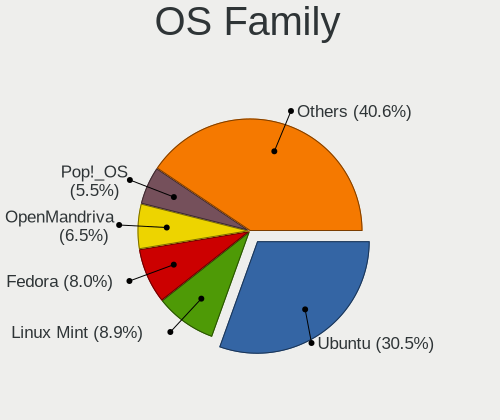
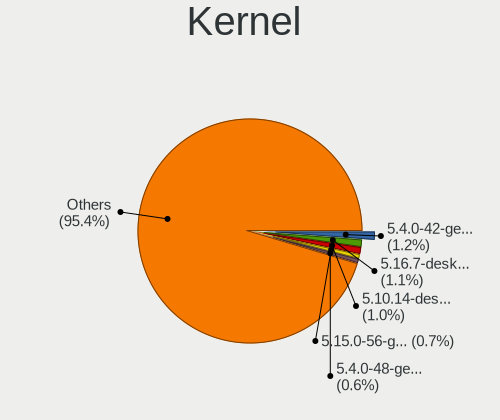
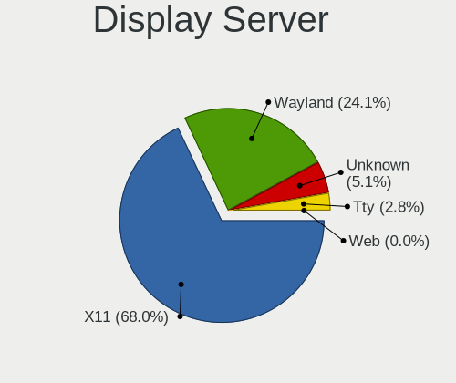
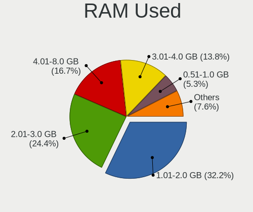
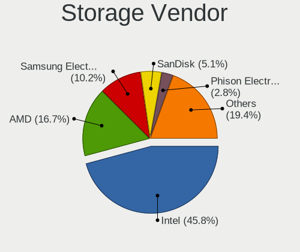
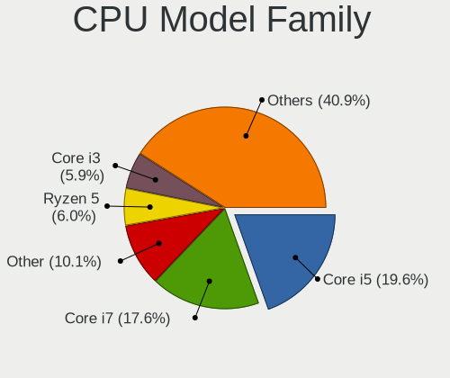
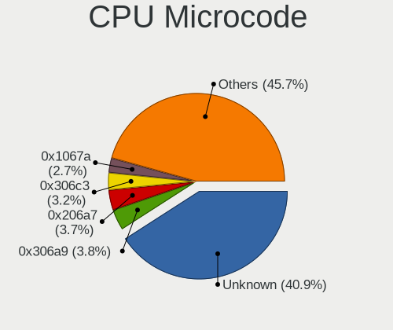
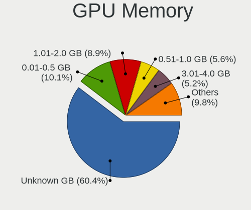

Linux in UK - Tested Hardware & Statistics
------------------------------------------

A project to collect tested hardware configurations for Linux in UK.

Anyone can contribute to this report by the [hw-probe](https://github.com/linuxhw/hw-probe) tool:

    sudo -E hw-probe -all -upload

Please contribute! Especially if your hardware is rare.

This is a report for all computer types. See also reports for [desktops](/Location/UK/Desktop/README.md) and [notebooks](/Location/UK/Notebook/README.md).

Contents
--------

* [ Test Cases ](#test-cases)

* [ System ](#system)
  - [ OS                       ](#os)
  - [ OS Family                ](#os-family)
  - [ Kernel                   ](#kernel)
  - [ Kernel Family            ](#kernel-family)
  - [ Kernel Major Ver.        ](#kernel-major-ver)
  - [ Arch                     ](#arch)
  - [ DE                       ](#de)
  - [ Display Server           ](#display-server)
  - [ Display Manager          ](#display-manager)
  - [ OS Lang                  ](#os-lang)
  - [ Boot Mode                ](#boot-mode)
  - [ Filesystem               ](#filesystem)
  - [ Part. scheme             ](#part-scheme)
  - [ Dual Boot with Linux/BSD ](#dual-boot-with-linuxbsd)
  - [ Dual Boot (Win)          ](#dual-boot-win)

* [ Board ](#board)
  - [ Vendor                   ](#vendor)
  - [ Model                    ](#model)
  - [ Model Family             ](#model-family)
  - [ MFG Year                 ](#mfg-year)
  - [ Form Factor              ](#form-factor)
  - [ Secure Boot              ](#secure-boot)
  - [ Coreboot                 ](#coreboot)
  - [ RAM Size                 ](#ram-size)
  - [ RAM Used                 ](#ram-used)
  - [ Total Drives             ](#total-drives)
  - [ Has CD-ROM               ](#has-cd-rom)
  - [ Has Ethernet             ](#has-ethernet)
  - [ Has WiFi                 ](#has-wifi)
  - [ Has Bluetooth            ](#has-bluetooth)

* [ Location ](#location)
  - [ Country                  ](#country)
  - [ City                     ](#city)

* [ Drives ](#drives)
  - [ Drive Vendor             ](#drive-vendor)
  - [ Drive Model              ](#drive-model)
  - [ HDD Vendor               ](#hdd-vendor)
  - [ SSD Vendor               ](#ssd-vendor)
  - [ Drive Kind               ](#drive-kind)
  - [ Drive Connector          ](#drive-connector)
  - [ Drive Size               ](#drive-size)
  - [ Space Total              ](#space-total)
  - [ Space Used               ](#space-used)
  - [ Malfunc. Drives          ](#malfunc-drives)
  - [ Malfunc. Drive Vendor    ](#malfunc-drive-vendor)
  - [ Malfunc. HDD Vendor      ](#malfunc-hdd-vendor)
  - [ Malfunc. Drive Kind      ](#malfunc-drive-kind)
  - [ Failed Drives            ](#failed-drives)
  - [ Failed Drive Vendor      ](#failed-drive-vendor)
  - [ Drive Status             ](#drive-status)

* [ Storage controller ](#storage-controller)
  - [ Storage Vendor           ](#storage-vendor)
  - [ Storage Model            ](#storage-model)
  - [ Storage Kind             ](#storage-kind)

* [ Processor ](#processor)
  - [ CPU Vendor               ](#cpu-vendor)
  - [ CPU Model                ](#cpu-model)
  - [ CPU Model Family         ](#cpu-model-family)
  - [ CPU Cores                ](#cpu-cores)
  - [ CPU Sockets              ](#cpu-sockets)
  - [ CPU Threads              ](#cpu-threads)
  - [ CPU Op-Modes             ](#cpu-op-modes)
  - [ CPU Microcode            ](#cpu-microcode)
  - [ CPU Microarch            ](#cpu-microarch)

* [ Graphics ](#graphics)
  - [ GPU Vendor               ](#gpu-vendor)
  - [ GPU Model                ](#gpu-model)
  - [ GPU Combo                ](#gpu-combo)
  - [ GPU Driver               ](#gpu-driver)
  - [ GPU Memory               ](#gpu-memory)

* [ Monitor ](#monitor)
  - [ Monitor Vendor           ](#monitor-vendor)
  - [ Monitor Model            ](#monitor-model)
  - [ Monitor Resolution       ](#monitor-resolution)
  - [ Monitor Diagonal         ](#monitor-diagonal)
  - [ Monitor Width            ](#monitor-width)
  - [ Aspect Ratio             ](#aspect-ratio)
  - [ Monitor Area             ](#monitor-area)
  - [ Pixel Density            ](#pixel-density)
  - [ Multiple Monitors        ](#multiple-monitors)

* [ Network ](#network)
  - [ Net Controller Vendor    ](#net-controller-vendor)
  - [ Net Controller Model     ](#net-controller-model)
  - [ Wireless Vendor          ](#wireless-vendor)
  - [ Wireless Model           ](#wireless-model)
  - [ Ethernet Vendor          ](#ethernet-vendor)
  - [ Ethernet Model           ](#ethernet-model)
  - [ Net Controller Kind      ](#net-controller-kind)
  - [ Used Controller          ](#used-controller)
  - [ NICs                     ](#nics)
  - [ IPv6                     ](#ipv6)

* [ Bluetooth ](#bluetooth)
  - [ Bluetooth Vendor         ](#bluetooth-vendor)
  - [ Bluetooth Model          ](#bluetooth-model)

* [ Sound ](#sound)
  - [ Sound Vendor             ](#sound-vendor)
  - [ Sound Model              ](#sound-model)

* [ Memory ](#memory)
  - [ Memory Vendor            ](#memory-vendor)
  - [ Memory Model             ](#memory-model)
  - [ Memory Kind              ](#memory-kind)
  - [ Memory Form Factor       ](#memory-form-factor)
  - [ Memory Size              ](#memory-size)
  - [ Memory Speed             ](#memory-speed)

* [ Printers & scanners ](#printers--scanners)
  - [ Printer Vendor           ](#printer-vendor)
  - [ Printer Model            ](#printer-model)
  - [ Scanner Vendor           ](#scanner-vendor)
  - [ Scanner Model            ](#scanner-model)

* [ Camera ](#camera)
  - [ Camera Vendor            ](#camera-vendor)
  - [ Camera Model             ](#camera-model)

* [ Security ](#security)
  - [ Fingerprint Vendor       ](#fingerprint-vendor)
  - [ Fingerprint Model        ](#fingerprint-model)
  - [ Chipcard Vendor          ](#chipcard-vendor)
  - [ Chipcard Model           ](#chipcard-model)

* [ Unsupported ](#unsupported)
  - [ Unsupported Devices      ](#unsupported-devices)
  - [ Unsupported Device Types ](#unsupported-device-types)

Test Cases
----------

Total: 15868

| Vendor        | Model                       | Form-Factor | Probe                                                      | Date         |
|---------------|-----------------------------|-------------|------------------------------------------------------------|--------------|
| Apple         | Mac-35C5E08120C7EEAF Mac... | Mini pc     | [70c961d7b8](https://linux-hardware.org/?probe=70c961d7b8) | Jan 06, 2025 |
| BESSTAR Te... | HM80                        | Desktop     | [84decd497d](https://linux-hardware.org/?probe=84decd497d) | Jan 06, 2025 |
| MSI           | B650 GAMING PLUS WIFI       | Desktop     | [1ff9c9f7cb](https://linux-hardware.org/?probe=1ff9c9f7cb) | Jan 06, 2025 |
| ASUSTek       | PRIME B660M-A WIFI D4       | Desktop     | [f8371d3425](https://linux-hardware.org/?probe=f8371d3425) | Jan 05, 2025 |
| Lenovo        | IdeaPad Pro 5 14APH8 83A... | Notebook    | [046bbb97db](https://linux-hardware.org/?probe=046bbb97db) | Jan 05, 2025 |
| AZW           | S5 V01                      | Mini pc     | [21aaa2d92a](https://linux-hardware.org/?probe=21aaa2d92a) | Jan 05, 2025 |
| HP            | ProLiant DL360 G7           | Server      | [b076cbf109](https://linux-hardware.org/?probe=b076cbf109) | Jan 05, 2025 |
| Dell          | XPS 9320                    | Notebook    | [35af44b04a](https://linux-hardware.org/?probe=35af44b04a) | Jan 05, 2025 |
| ASUSTek       | ASUS Zenbook S 16 UM5606... | Notebook    | [9ddd47e13b](https://linux-hardware.org/?probe=9ddd47e13b) | Jan 05, 2025 |
| MSI           | B450M MORTAR MAX            | Desktop     | [46e01ddb23](https://linux-hardware.org/?probe=46e01ddb23) | Jan 05, 2025 |
| Acer          | Aspire A515-43              | Notebook    | [9afd1ddd9e](https://linux-hardware.org/?probe=9afd1ddd9e) | Jan 05, 2025 |
| Dell          | Inspiron 1545               | Notebook    | [6d5ccbb5f9](https://linux-hardware.org/?probe=6d5ccbb5f9) | Jan 05, 2025 |
| Lenovo        | ThinkPad T420 4236PFG       | Notebook    | [df34cf20b9](https://linux-hardware.org/?probe=df34cf20b9) | Jan 05, 2025 |
| Lenovo        | ThinkPad L15 Gen 1 20U30... | Notebook    | [b0b56ec993](https://linux-hardware.org/?probe=b0b56ec993) | Jan 05, 2025 |
| Lenovo        | ThinkPad T14s Gen 1 20UH... | Notebook    | [c68a17f027](https://linux-hardware.org/?probe=c68a17f027) | Jan 04, 2025 |
| HP            | EliteBook 845 G7 Noteboo... | Notebook    | [33a984a2df](https://linux-hardware.org/?probe=33a984a2df) | Jan 04, 2025 |
| Lenovo        | ThinkPad T480s 20L8S0230... | Notebook    | [e6a02c7ad9](https://linux-hardware.org/?probe=e6a02c7ad9) | Jan 04, 2025 |
| Gigabyte      | B650M AORUS ELITE AX        | Desktop     | [e0e8e3f7e0](https://linux-hardware.org/?probe=e0e8e3f7e0) | Jan 04, 2025 |
| Gigabyte      | MZBSWMP-00                  | Desktop     | [f24a8a2441](https://linux-hardware.org/?probe=f24a8a2441) | Jan 04, 2025 |
| Gigabyte      | B550M DS3H                  | Desktop     | [675c306b51](https://linux-hardware.org/?probe=675c306b51) | Jan 03, 2025 |
| Dell          | Latitude E5430 non-vPro     | Notebook    | [bbf6d05761](https://linux-hardware.org/?probe=bbf6d05761) | Jan 03, 2025 |
| ASUSTek       | PRIME X570-P                | Desktop     | [d19c6cfd10](https://linux-hardware.org/?probe=d19c6cfd10) | Jan 03, 2025 |
| Dell          | 0TWFTR A02                  | All in one  | [9352e7ed07](https://linux-hardware.org/?probe=9352e7ed07) | Jan 03, 2025 |
| ASUSTek       | ROG STRIX Z790-F GAMING ... | Desktop     | [e8f18de27b](https://linux-hardware.org/?probe=e8f18de27b) | Jan 03, 2025 |
| Dell          | 0NC2VH A01                  | Desktop     | [42baf9ae55](https://linux-hardware.org/?probe=42baf9ae55) | Jan 03, 2025 |
| Lenovo        | ThinkPad X13 Yoga Gen 2 ... | Convertible | [a9e7b0df46](https://linux-hardware.org/?probe=a9e7b0df46) | Jan 03, 2025 |
| Dell          | Latitude 5440               | Notebook    | [60ed15e860](https://linux-hardware.org/?probe=60ed15e860) | Jan 03, 2025 |
| Dell          | Latitude E5430 non-vPro     | Notebook    | [7b1adcdde1](https://linux-hardware.org/?probe=7b1adcdde1) | Jan 03, 2025 |
| SmbiosType... | SmbiosType1_SystemProduc... | Notebook    | [c1e2e11b0e](https://linux-hardware.org/?probe=c1e2e11b0e) | Jan 02, 2025 |
| Dell          | Latitude E6430              | Notebook    | [860e215daf](https://linux-hardware.org/?probe=860e215daf) | Jan 02, 2025 |
| Microsoft     | Surface Go                  | Tablet      | [9d75fa5900](https://linux-hardware.org/?probe=9d75fa5900) | Jan 02, 2025 |
| HP            | ProLiant MicroServer        | Desktop     | [f99b996d05](https://linux-hardware.org/?probe=f99b996d05) | Jan 02, 2025 |
| MACHINIST     | E5-MR9A V1.0                | Desktop     | [302d708c3c](https://linux-hardware.org/?probe=302d708c3c) | Jan 02, 2025 |
| HP            | ProLiant MicroServer        | Desktop     | [74107b78f7](https://linux-hardware.org/?probe=74107b78f7) | Jan 02, 2025 |
| System76      | Lemur Pro                   | Notebook    | [6eae77b375](https://linux-hardware.org/?probe=6eae77b375) | Jan 02, 2025 |
| Dell          | 0PU052                      | Desktop     | [5dbb155ab6](https://linux-hardware.org/?probe=5dbb155ab6) | Jan 02, 2025 |
| HP            | EliteBook x360 1030 G2      | Convertible | [1640751a75](https://linux-hardware.org/?probe=1640751a75) | Jan 02, 2025 |
| Lenovo        | IdeaPadFlex 5 14ALC7 82R... | Convertible | [248a1406ed](https://linux-hardware.org/?probe=248a1406ed) | Jan 02, 2025 |
| Dell          | Inspiron 1545               | Notebook    | [445120281e](https://linux-hardware.org/?probe=445120281e) | Jan 02, 2025 |
| Gigabyte      | B550 AORUS ELITE AX V2      | Desktop     | [8f4880d03e](https://linux-hardware.org/?probe=8f4880d03e) | Jan 02, 2025 |
| Gigabyte      | B550 AORUS ELITE AX V2      | Desktop     | [f85dcfe010](https://linux-hardware.org/?probe=f85dcfe010) | Jan 02, 2025 |
| Gigabyte      | B365M DS3H                  | Desktop     | [a49fde4df3](https://linux-hardware.org/?probe=a49fde4df3) | Jan 02, 2025 |
| Apple         | MacBookPro8,3               | Notebook    | [9fe191d9b2](https://linux-hardware.org/?probe=9fe191d9b2) | Jan 01, 2025 |
| Lenovo        | ThinkPad T15g Gen 1 20US... | Notebook    | [c5dc058f75](https://linux-hardware.org/?probe=c5dc058f75) | Jan 01, 2025 |
| Alienware     | m15 Ryzen Ed. R5            | Notebook    | [8aefe7b2c7](https://linux-hardware.org/?probe=8aefe7b2c7) | Jan 01, 2025 |
| HP            | Pavilion g6                 | Notebook    | [d717116365](https://linux-hardware.org/?probe=d717116365) | Jan 01, 2025 |
| Lenovo        | ThinkPad X220 4291QZ1       | Notebook    | [ffd4949fc5](https://linux-hardware.org/?probe=ffd4949fc5) | Jan 01, 2025 |
| Lenovo        | ThinkPad X220 4291QZ1       | Notebook    | [68cf73b7b3](https://linux-hardware.org/?probe=68cf73b7b3) | Jan 01, 2025 |
| MSI           | X470 GAMING PRO CARBON      | Desktop     | [0a1f200989](https://linux-hardware.org/?probe=0a1f200989) | Jan 01, 2025 |
| Lenovo        | 371C SDK0J40709 WIN 3259... | All in one  | [e1b1540113](https://linux-hardware.org/?probe=e1b1540113) | Dec 31, 2024 |
| Lenovo        | IdeaPad Slim 1-14AST-05 ... | Notebook    | [0850762b48](https://linux-hardware.org/?probe=0850762b48) | Dec 31, 2024 |
| Lenovo        | Yoga 730-13IWL 81JR         | Convertible | [9f7c0ced48](https://linux-hardware.org/?probe=9f7c0ced48) | Dec 31, 2024 |
| ASUSTek       | ROG Strix G713PI_G713PI     | Notebook    | [eeef064f3d](https://linux-hardware.org/?probe=eeef064f3d) | Dec 31, 2024 |
| Dell          | Latitude E7440              | Notebook    | [2d9f729ec1](https://linux-hardware.org/?probe=2d9f729ec1) | Dec 31, 2024 |
| Toshiba       | Satellite L300              | Notebook    | [3104c13f02](https://linux-hardware.org/?probe=3104c13f02) | Dec 31, 2024 |
| HP            | Laptop 15-bw0xx             | Notebook    | [e7e2b59786](https://linux-hardware.org/?probe=e7e2b59786) | Dec 31, 2024 |
| ASUSTek       | P5G41T-M LX2/GB             | Desktop     | [61c106bd12](https://linux-hardware.org/?probe=61c106bd12) | Dec 30, 2024 |
| BESSTAR Te... | HM80                        | Desktop     | [6762cc7f0e](https://linux-hardware.org/?probe=6762cc7f0e) | Dec 30, 2024 |
| Apple         | Mac-942B5BF58194151B        | All in one  | [1b7ce01ae5](https://linux-hardware.org/?probe=1b7ce01ae5) | Dec 30, 2024 |
| Dell          | XPS 17 9730                 | Notebook    | [216ff4e7eb](https://linux-hardware.org/?probe=216ff4e7eb) | Dec 30, 2024 |
| HP            | EliteBook Folio 1040 G1     | Notebook    | [55d6518fd1](https://linux-hardware.org/?probe=55d6518fd1) | Dec 30, 2024 |
| Apple         | Mac-942B5BF58194151B        | All in one  | [075e984e88](https://linux-hardware.org/?probe=075e984e88) | Dec 30, 2024 |
| Gigabyte      | Z68X-UD3-B3                 | Desktop     | [519bca1a90](https://linux-hardware.org/?probe=519bca1a90) | Dec 30, 2024 |
| Lenovo        | IdeaPad S340-15API 81NC     | Notebook    | [33dad31e6e](https://linux-hardware.org/?probe=33dad31e6e) | Dec 30, 2024 |
| Dell          | 0K240Y A02                  | Desktop     | [bf8d86985d](https://linux-hardware.org/?probe=bf8d86985d) | Dec 30, 2024 |
| Fujitsu       | LIFEBOOK AH531              | Notebook    | [37872e53dc](https://linux-hardware.org/?probe=37872e53dc) | Dec 30, 2024 |
| Fujitsu       | LIFEBOOK AH531              | Notebook    | [0dc9a2432a](https://linux-hardware.org/?probe=0dc9a2432a) | Dec 30, 2024 |
| HP            | 470 G8 Notebook PC          | Notebook    | [a14600050a](https://linux-hardware.org/?probe=a14600050a) | Dec 30, 2024 |
| Dell          | Latitude E7270              | Notebook    | [45d3b8797a](https://linux-hardware.org/?probe=45d3b8797a) | Dec 30, 2024 |
| HP            | EliteBook 840 Aero G8 No... | Notebook    | [af5219d90f](https://linux-hardware.org/?probe=af5219d90f) | Dec 30, 2024 |
| Lenovo        | 3328 SDK0T76463 WIN 3422... | Desktop     | [4dde6cad5a](https://linux-hardware.org/?probe=4dde6cad5a) | Dec 30, 2024 |
| LG Electro... | 17Z90S-G.AD7BA1             | Notebook    | [aaa38e95c5](https://linux-hardware.org/?probe=aaa38e95c5) | Dec 29, 2024 |
| Apple         | MacBookPro11,2              | Notebook    | [238bce296a](https://linux-hardware.org/?probe=238bce296a) | Dec 29, 2024 |
| HP            | 8906 SMVB                   | Desktop     | [c7a78e601d](https://linux-hardware.org/?probe=c7a78e601d) | Dec 29, 2024 |
| ASUSTek       | VivoBook_ASUSLaptop X515... | Notebook    | [e9aa37cfcd](https://linux-hardware.org/?probe=e9aa37cfcd) | Dec 29, 2024 |
| Lenovo        | ThinkPad T460 20FMS3320G    | Notebook    | [631f081493](https://linux-hardware.org/?probe=631f081493) | Dec 29, 2024 |
| Dell          | 0XCR8D A03                  | Desktop     | [77abfbec81](https://linux-hardware.org/?probe=77abfbec81) | Dec 29, 2024 |
| MSI           | GE60 2PL                    | Notebook    | [db806920f1](https://linux-hardware.org/?probe=db806920f1) | Dec 29, 2024 |
| MSI           | GE60 2PL                    | Notebook    | [0cd07458bc](https://linux-hardware.org/?probe=0cd07458bc) | Dec 29, 2024 |
| MSI           | X470 GAMING PRO CARBON      | Desktop     | [6ec37ed4b3](https://linux-hardware.org/?probe=6ec37ed4b3) | Dec 29, 2024 |
| Shenzhen M... | AHWSA                       | Desktop     | [170e260a3f](https://linux-hardware.org/?probe=170e260a3f) | Dec 28, 2024 |
| HP            | EliteBook 830 G5            | Notebook    | [3dd541f1a9](https://linux-hardware.org/?probe=3dd541f1a9) | Dec 28, 2024 |
| Lenovo        | IdeaPad 320-15AST 80XV      | Notebook    | [ee6916b202](https://linux-hardware.org/?probe=ee6916b202) | Dec 28, 2024 |
| Raspberry ... | Raspberry Pi 2 Model B R... | Soc         | [0567331b7f](https://linux-hardware.org/?probe=0567331b7f) | Dec 28, 2024 |
| MSI           | MS-7A34                     | Notebook    | [047f86697a](https://linux-hardware.org/?probe=047f86697a) | Dec 28, 2024 |
| Lenovo        | ThinkPad T520 42424UU       | Notebook    | [b4a2895025](https://linux-hardware.org/?probe=b4a2895025) | Dec 28, 2024 |
| HP            | EliteBook 8460p             | Notebook    | [4891753c29](https://linux-hardware.org/?probe=4891753c29) | Dec 28, 2024 |
| Dell          | Inspiron 5570               | Notebook    | [ce371a4f66](https://linux-hardware.org/?probe=ce371a4f66) | Dec 27, 2024 |
| Dell          | 0JP3NX A01                  | Desktop     | [b123c88223](https://linux-hardware.org/?probe=b123c88223) | Dec 27, 2024 |
| Dell          | 0JP3NX A01                  | Desktop     | [84b0bca79f](https://linux-hardware.org/?probe=84b0bca79f) | Dec 27, 2024 |
| Dell          | Latitude 7490               | Notebook    | [73b59f6e09](https://linux-hardware.org/?probe=73b59f6e09) | Dec 27, 2024 |
| Dell          | XPS 15 9500                 | Notebook    | [2a60673d8c](https://linux-hardware.org/?probe=2a60673d8c) | Dec 27, 2024 |
| Lenovo        | ThinkPad T520 42424UU       | Notebook    | [5de1acb22e](https://linux-hardware.org/?probe=5de1acb22e) | Dec 27, 2024 |
| HP            | 212B                        | Desktop     | [0f306fdade](https://linux-hardware.org/?probe=0f306fdade) | Dec 26, 2024 |
| ASUSTek       | SABERTOOTH X99              | Desktop     | [a4baa76691](https://linux-hardware.org/?probe=a4baa76691) | Dec 26, 2024 |
| HP            | Laptop 14-bs0xx             | Notebook    | [90ddb2c764](https://linux-hardware.org/?probe=90ddb2c764) | Dec 26, 2024 |
| ASUSTek       | Z170-A                      | Desktop     | [96e5e9d5fd](https://linux-hardware.org/?probe=96e5e9d5fd) | Dec 26, 2024 |
| MSI           | B450 TOMAHAWK MAX II        | Desktop     | [9f6237983d](https://linux-hardware.org/?probe=9f6237983d) | Dec 25, 2024 |
| ASUSTek       | ROG STRIX B550-F GAMING     | Desktop     | [edc0d78348](https://linux-hardware.org/?probe=edc0d78348) | Dec 25, 2024 |
| Apple         | MacBookPro9,2               | Notebook    | [c289d2b95b](https://linux-hardware.org/?probe=c289d2b95b) | Dec 25, 2024 |
| Lenovo        | ThinkPad X1 Tablet 20GGS... | Tablet      | [047961b6d0](https://linux-hardware.org/?probe=047961b6d0) | Dec 24, 2024 |
| Lenovo        | ThinkPad T14 Gen 4 21K4S... | Notebook    | [658f4969be](https://linux-hardware.org/?probe=658f4969be) | Dec 24, 2024 |
| AMD           | Pumori CRB                  | Desktop     | [5f646677b2](https://linux-hardware.org/?probe=5f646677b2) | Dec 24, 2024 |
| ASUSTek       | ROG STRIX B550-F GAMING     | Desktop     | [beb32e86ef](https://linux-hardware.org/?probe=beb32e86ef) | Dec 24, 2024 |
| Supermicro    | X13SCH-SYS                  | Desktop     | [4291b9f111](https://linux-hardware.org/?probe=4291b9f111) | Dec 24, 2024 |
| Supermicro    | X13SCH-SYS                  | Desktop     | [e8b89f7b32](https://linux-hardware.org/?probe=e8b89f7b32) | Dec 24, 2024 |
| Supermicro    | X13SCH-SYS                  | Desktop     | [1f136d48ed](https://linux-hardware.org/?probe=1f136d48ed) | Dec 24, 2024 |
| HP            | 304Bh                       | Desktop     | [a578f26b30](https://linux-hardware.org/?probe=a578f26b30) | Dec 24, 2024 |
| eMachines     | E725                        | Notebook    | [c4c6cfaa36](https://linux-hardware.org/?probe=c4c6cfaa36) | Dec 23, 2024 |
| Acer          | Predator PO3-600 V:1.1      | Desktop     | [8473ea95de](https://linux-hardware.org/?probe=8473ea95de) | Dec 23, 2024 |
| Dell          | Latitude 5510               | Notebook    | [fefb1eb9c3](https://linux-hardware.org/?probe=fefb1eb9c3) | Dec 23, 2024 |
| Apple         | MacBookPro9,2               | Notebook    | [584f7243e9](https://linux-hardware.org/?probe=584f7243e9) | Dec 23, 2024 |
| Lenovo        | Bantry CRB 31900002 WIN ... | Desktop     | [2a9d2d981b](https://linux-hardware.org/?probe=2a9d2d981b) | Dec 23, 2024 |
| ASUSTek       | ROG STRIX B650E-I GAMING... | Desktop     | [f34d1131ed](https://linux-hardware.org/?probe=f34d1131ed) | Dec 23, 2024 |
| Samsung       | 700Z3C/700Z5C               | Notebook    | [4c634dc49d](https://linux-hardware.org/?probe=4c634dc49d) | Dec 23, 2024 |
| ASRockRack    | X570D4U-2L2T/BCM            | Server      | [9f3633caa8](https://linux-hardware.org/?probe=9f3633caa8) | Dec 22, 2024 |
| Lenovo        | Yoga C740-15IML 81TD        | Convertible | [f553773036](https://linux-hardware.org/?probe=f553773036) | Dec 22, 2024 |
| Dell          | XPS 13 7390 2-in-1          | Convertible | [8d11e1210e](https://linux-hardware.org/?probe=8d11e1210e) | Dec 22, 2024 |
| Lenovo        | ThinkPad T450 20BUS3GN02    | Notebook    | [ebd69fe1aa](https://linux-hardware.org/?probe=ebd69fe1aa) | Dec 22, 2024 |
| ASUSTek       | TUF Gaming B650-PLUS        | Desktop     | [e83481000e](https://linux-hardware.org/?probe=e83481000e) | Dec 22, 2024 |
| HP            | 3397                        | Desktop     | [d72e973be9](https://linux-hardware.org/?probe=d72e973be9) | Dec 22, 2024 |
| Lenovo        | ThinkPad T470 20HD000MUK    | Notebook    | [119c51368a](https://linux-hardware.org/?probe=119c51368a) | Dec 22, 2024 |
| Toshiba       | Satellite L855              | Notebook    | [7e9c1e43c5](https://linux-hardware.org/?probe=7e9c1e43c5) | Dec 22, 2024 |
| ASUSTek       | ROG STRIX X870E-E GAMING... | Desktop     | [92c5acc84f](https://linux-hardware.org/?probe=92c5acc84f) | Dec 22, 2024 |
| ASUSTek       | M5A78L-M LE                 | Desktop     | [c510ddb2e2](https://linux-hardware.org/?probe=c510ddb2e2) | Dec 22, 2024 |
| ASUSTek       | ROG STRIX X370-F GAMING     | Desktop     | [a1e3da32e8](https://linux-hardware.org/?probe=a1e3da32e8) | Dec 22, 2024 |
| ASUSTek       | ASUS TUF Gaming A15 FA50... | Notebook    | [7172f26f77](https://linux-hardware.org/?probe=7172f26f77) | Dec 22, 2024 |
| Lenovo        | ThinkPad P70 20ESS03100     | Notebook    | [14939efad3](https://linux-hardware.org/?probe=14939efad3) | Dec 21, 2024 |
| PC Special... | PA70Hx                      | Notebook    | [d44a3116ed](https://linux-hardware.org/?probe=d44a3116ed) | Dec 21, 2024 |
| HP            | EliteBook x360 1030 G7 N... | Convertible | [d4b04d2542](https://linux-hardware.org/?probe=d4b04d2542) | Dec 21, 2024 |
| Fujitsu       | D2990-A2 S26361-D2990-A2    | Desktop     | [f6869ae032](https://linux-hardware.org/?probe=f6869ae032) | Dec 21, 2024 |
| Lenovo        | ThinkPad X250 20CLS11W0W    | Notebook    | [ca04e40dd4](https://linux-hardware.org/?probe=ca04e40dd4) | Dec 21, 2024 |
| Gigabyte      | B550 AORUS ELITE AX V2      | Desktop     | [7519002463](https://linux-hardware.org/?probe=7519002463) | Dec 21, 2024 |
| Gigabyte      | B550 AORUS ELITE AX V2      | Desktop     | [ec4fbed784](https://linux-hardware.org/?probe=ec4fbed784) | Dec 21, 2024 |
| HP            | EliteBook 840 G3            | Notebook    | [9922fa7e34](https://linux-hardware.org/?probe=9922fa7e34) | Dec 20, 2024 |
| AWOW          | NY PC BOX                   | Mini pc     | [d787dd8103](https://linux-hardware.org/?probe=d787dd8103) | Dec 20, 2024 |
| Dell          | 0M863N A01                  | Desktop     | [6c1814a9f9](https://linux-hardware.org/?probe=6c1814a9f9) | Dec 20, 2024 |
| Dell          | Inspiron 15 3520            | Notebook    | [8361014504](https://linux-hardware.org/?probe=8361014504) | Dec 20, 2024 |
| HP            | 8055                        | Desktop     | [549a29a030](https://linux-hardware.org/?probe=549a29a030) | Dec 20, 2024 |
| Dell          | 0JP3NX A01                  | Desktop     | [8675954a59](https://linux-hardware.org/?probe=8675954a59) | Dec 20, 2024 |
| Valve         | Jupiter                     | Notebook    | [fbe2a34804](https://linux-hardware.org/?probe=fbe2a34804) | Dec 20, 2024 |
| Lenovo        | Legion 9 16IRX9 83G0        | Notebook    | [96010200a2](https://linux-hardware.org/?probe=96010200a2) | Dec 20, 2024 |
| Lenovo        | Legion 9 16IRX9 83G0        | Notebook    | [334c2447f9](https://linux-hardware.org/?probe=334c2447f9) | Dec 20, 2024 |
| Valve         | Jupiter                     | Notebook    | [96ec07b5d4](https://linux-hardware.org/?probe=96ec07b5d4) | Dec 20, 2024 |
| Lenovo        | ThinkPad T450 20BUS3GN02    | Notebook    | [54fd784e9c](https://linux-hardware.org/?probe=54fd784e9c) | Dec 20, 2024 |
| ASUSTek       | ASUS TUF Gaming A15 FA50... | Notebook    | [ea550dbbcd](https://linux-hardware.org/?probe=ea550dbbcd) | Dec 19, 2024 |
| HP            | Pavilion x360 Convertibl... | Convertible | [5df18feced](https://linux-hardware.org/?probe=5df18feced) | Dec 19, 2024 |
| HP            | 18E7                        | Desktop     | [1e44952230](https://linux-hardware.org/?probe=1e44952230) | Dec 19, 2024 |
| HP            | EliteBook 840 G2            | Notebook    | [407784b097](https://linux-hardware.org/?probe=407784b097) | Dec 19, 2024 |
| Dell          | Latitude 3380               | Notebook    | [ae503db75c](https://linux-hardware.org/?probe=ae503db75c) | Dec 19, 2024 |
| Dell          | 0WG860                      | Desktop     | [4c6d6d2f4d](https://linux-hardware.org/?probe=4c6d6d2f4d) | Dec 19, 2024 |
| Gigabyte      | Z97X-UD3H-CF                | Desktop     | [93bf226f2b](https://linux-hardware.org/?probe=93bf226f2b) | Dec 19, 2024 |
| COMEXR        | GM5IX7A                     | Notebook    | [263df0c661](https://linux-hardware.org/?probe=263df0c661) | Dec 19, 2024 |
| Lenovo        | ThinkPad X1 Carbon 6th 2... | Notebook    | [2e97ec9da3](https://linux-hardware.org/?probe=2e97ec9da3) | Dec 19, 2024 |
| HP            | ProBook 450 G2              | Notebook    | [5a4149356a](https://linux-hardware.org/?probe=5a4149356a) | Dec 19, 2024 |
| Dell          | Precision 7520              | Notebook    | [36ee219c52](https://linux-hardware.org/?probe=36ee219c52) | Dec 19, 2024 |
| ASUSTek       | ASUS TUF Gaming F15 FX50... | Notebook    | [3fcda10f19](https://linux-hardware.org/?probe=3fcda10f19) | Dec 19, 2024 |
| Microsoft     | Surface Go                  | Tablet      | [d5a2fdb400](https://linux-hardware.org/?probe=d5a2fdb400) | Dec 19, 2024 |
| Lenovo        | 3777 WIN SDK0T76463 3422... | All in one  | [ed33639be3](https://linux-hardware.org/?probe=ed33639be3) | Dec 19, 2024 |
| ASUSTek       | Zenbook 15 UM3504DA_UM35... | Notebook    | [bc6f16d08f](https://linux-hardware.org/?probe=bc6f16d08f) | Dec 18, 2024 |
| ASUSTek       | Zenbook 15 UM3504DA_UM35... | Notebook    | [b4b2988f08](https://linux-hardware.org/?probe=b4b2988f08) | Dec 18, 2024 |
| AZW           | MINI S                      | Desktop     | [a357f70913](https://linux-hardware.org/?probe=a357f70913) | Dec 18, 2024 |
| Dell          | Latitude E6320              | Notebook    | [86e4bd031d](https://linux-hardware.org/?probe=86e4bd031d) | Dec 18, 2024 |
| ASUSTek       | TUF Gaming B550-PLUS        | Desktop     | [ef5de4811b](https://linux-hardware.org/?probe=ef5de4811b) | Dec 18, 2024 |
| Apple         | Mac-F65AE981FFA204ED Mac... | Mini pc     | [72978577c2](https://linux-hardware.org/?probe=72978577c2) | Dec 18, 2024 |
| Unknown       | Unknown                     | Notebook    | [dc53769580](https://linux-hardware.org/?probe=dc53769580) | Dec 18, 2024 |
| HP            | ProBook 635 Aero G8 Note... | Notebook    | [7201dc1c2a](https://linux-hardware.org/?probe=7201dc1c2a) | Dec 17, 2024 |
| Lenovo        | IdeaPad Slim 1-14AST-05 ... | Notebook    | [837d0f44f3](https://linux-hardware.org/?probe=837d0f44f3) | Dec 17, 2024 |
| ASRock        | B550M-ITX/ac                | Desktop     | [8a3a09683f](https://linux-hardware.org/?probe=8a3a09683f) | Dec 17, 2024 |
| ASUSTek       | ROG STRIX B550-A GAMING     | Desktop     | [6ca07fcdfb](https://linux-hardware.org/?probe=6ca07fcdfb) | Dec 17, 2024 |
| Apple         | Mac-F221BEC8                | Desktop     | [7bfff86b7f](https://linux-hardware.org/?probe=7bfff86b7f) | Dec 17, 2024 |
| ASUSTek       | ROG STRIX B550-F GAMING     | Desktop     | [f294cbd961](https://linux-hardware.org/?probe=f294cbd961) | Dec 17, 2024 |
| Lenovo        | ThinkPad L490 20Q6S23200    | Notebook    | [a13840a70a](https://linux-hardware.org/?probe=a13840a70a) | Dec 17, 2024 |
| Valve         | Jupiter                     | Notebook    | [23d9275334](https://linux-hardware.org/?probe=23d9275334) | Dec 17, 2024 |
| ASUSTek       | TUF Gaming B560-PLUS WIF... | Notebook    | [7e4e6bb310](https://linux-hardware.org/?probe=7e4e6bb310) | Dec 17, 2024 |
| Dell          | System XPS L502X            | Notebook    | [74f4e14d27](https://linux-hardware.org/?probe=74f4e14d27) | Dec 17, 2024 |
| Dell          | System XPS L502X            | Notebook    | [8aa720a976](https://linux-hardware.org/?probe=8aa720a976) | Dec 17, 2024 |
| MSI           | MPG B550 GAMING CARBON W... | Desktop     | [3893ecf2d0](https://linux-hardware.org/?probe=3893ecf2d0) | Dec 16, 2024 |
| ASUSTek       | ProArt X870E-CREATOR WIF... | Desktop     | [4828ed9df5](https://linux-hardware.org/?probe=4828ed9df5) | Dec 16, 2024 |
| ASUSTek       | TUF Gaming X870-PLUS WIF... | Desktop     | [9acf9973e2](https://linux-hardware.org/?probe=9acf9973e2) | Dec 16, 2024 |
| MSI           | PRO B650M-A WIFI            | Desktop     | [ea8ffcb3c8](https://linux-hardware.org/?probe=ea8ffcb3c8) | Dec 15, 2024 |
| MSI           | PRO B650M-A WIFI            | Desktop     | [5c0f89d5b9](https://linux-hardware.org/?probe=5c0f89d5b9) | Dec 15, 2024 |
| ASUSTek       | ROG STRIX B660-G GAMING ... | Desktop     | [05b354d61e](https://linux-hardware.org/?probe=05b354d61e) | Dec 15, 2024 |
| AZW           | MINI S                      | Desktop     | [72d625f895](https://linux-hardware.org/?probe=72d625f895) | Dec 15, 2024 |
| Lenovo        | Legion Go 8APU1 83E1        | Tablet      | [498786c044](https://linux-hardware.org/?probe=498786c044) | Dec 15, 2024 |
| JGINYUE       | B650I Night Devil Ver:      | Desktop     | [d98b74d533](https://linux-hardware.org/?probe=d98b74d533) | Dec 15, 2024 |
| Dell          | 0VD5HY A04                  | Desktop     | [bfd38d2ff9](https://linux-hardware.org/?probe=bfd38d2ff9) | Dec 15, 2024 |
| Toshiba       | Satellite C50D-A-133        | Notebook    | [c5dba8548d](https://linux-hardware.org/?probe=c5dba8548d) | Dec 14, 2024 |
| Dell          | 0WG860                      | Desktop     | [7c259daf00](https://linux-hardware.org/?probe=7c259daf00) | Dec 14, 2024 |
| MSI           | MAG X670E TOMAHAWK WIFI     | Desktop     | [2e6582243b](https://linux-hardware.org/?probe=2e6582243b) | Dec 14, 2024 |
| HP            | EliteBook 840 G5            | Notebook    | [c8ea55ff8e](https://linux-hardware.org/?probe=c8ea55ff8e) | Dec 14, 2024 |
| Acer          | Aspire A517-52              | Notebook    | [8f9faa4e94](https://linux-hardware.org/?probe=8f9faa4e94) | Dec 13, 2024 |
| Google        | Gnawty                      | Notebook    | [dd1d3f4cc7](https://linux-hardware.org/?probe=dd1d3f4cc7) | Dec 13, 2024 |
| Lenovo        | ThinkPad T480s 20L8S7890... | Notebook    | [6cb6a6ef3b](https://linux-hardware.org/?probe=6cb6a6ef3b) | Dec 13, 2024 |
| Google        | Cyan                        | Notebook    | [07d137b1c9](https://linux-hardware.org/?probe=07d137b1c9) | Dec 13, 2024 |
| GEO           | GeoFlex                     | Convertible | [1b076cc569](https://linux-hardware.org/?probe=1b076cc569) | Dec 13, 2024 |
| GEO           | GeoFlex                     | Convertible | [ea25ad7f55](https://linux-hardware.org/?probe=ea25ad7f55) | Dec 13, 2024 |
| Valve         | Jupiter                     | Notebook    | [24bbbbae23](https://linux-hardware.org/?probe=24bbbbae23) | Dec 13, 2024 |
| Acer          | Aspire M1470                | Desktop     | [92955cff66](https://linux-hardware.org/?probe=92955cff66) | Dec 12, 2024 |
| Dell          | 0GXM1W A00                  | Desktop     | [c5335e493b](https://linux-hardware.org/?probe=c5335e493b) | Dec 12, 2024 |
| Dell          | 02YYK5 A00                  | Desktop     | [ec5c256ab3](https://linux-hardware.org/?probe=ec5c256ab3) | Dec 12, 2024 |
| Lenovo        | ThinkPad X1 Carbon Gen 1... | Notebook    | [b6f97da286](https://linux-hardware.org/?probe=b6f97da286) | Dec 12, 2024 |
| Google        | Swanky                      | Notebook    | [368716121b](https://linux-hardware.org/?probe=368716121b) | Dec 12, 2024 |
| Valve         | Jupiter                     | Notebook    | [63ff703069](https://linux-hardware.org/?probe=63ff703069) | Dec 12, 2024 |
| Gigabyte      | B550 AORUS ELITE AX V2      | Desktop     | [a8e6ed60fc](https://linux-hardware.org/?probe=a8e6ed60fc) | Dec 11, 2024 |
| Lenovo        | Unknown                     | Notebook    | [a52e424be1](https://linux-hardware.org/?probe=a52e424be1) | Dec 11, 2024 |
| HP            | Syndra                      | Notebook    | [5afea7c0af](https://linux-hardware.org/?probe=5afea7c0af) | Dec 11, 2024 |
| MSI           | PRO B760-P WIFI DDR4        | Desktop     | [d31df0a834](https://linux-hardware.org/?probe=d31df0a834) | Dec 11, 2024 |
| Dell          | Inspiron 3542               | Notebook    | [3b062636e0](https://linux-hardware.org/?probe=3b062636e0) | Dec 11, 2024 |
| Valve         | Galileo                     | Notebook    | [b2cbfb3cf8](https://linux-hardware.org/?probe=b2cbfb3cf8) | Dec 11, 2024 |
| ASUSTek       | X99-S                       | Desktop     | [9dd3ab24cd](https://linux-hardware.org/?probe=9dd3ab24cd) | Dec 11, 2024 |
| Dell          | 01YM03 A02                  | Server      | [2ea3b6ba11](https://linux-hardware.org/?probe=2ea3b6ba11) | Dec 11, 2024 |
| Acer          | Aspire A315-51              | Notebook    | [7c6b88af46](https://linux-hardware.org/?probe=7c6b88af46) | Dec 10, 2024 |
| Gigabyte      | B550M DS3H                  | Desktop     | [94a77ffd8f](https://linux-hardware.org/?probe=94a77ffd8f) | Dec 10, 2024 |
| Gigabyte      | B365M DS3H                  | Desktop     | [c57a6afba7](https://linux-hardware.org/?probe=c57a6afba7) | Dec 10, 2024 |
| Dell          | G3 3779                     | Notebook    | [931e58ebb5](https://linux-hardware.org/?probe=931e58ebb5) | Dec 10, 2024 |
| Gigabyte      | B550M DS3H                  | Desktop     | [49dc0a4f78](https://linux-hardware.org/?probe=49dc0a4f78) | Dec 10, 2024 |
| Dynabook      | PORTEGE X40-K               | Notebook    | [5f7a69df31](https://linux-hardware.org/?probe=5f7a69df31) | Dec 09, 2024 |
| Dell          | Latitude E6330              | Notebook    | [dfc2aca866](https://linux-hardware.org/?probe=dfc2aca866) | Dec 09, 2024 |
| ASUSTek       | TUF Gaming B550-PLUS        | Desktop     | [8b136e72e1](https://linux-hardware.org/?probe=8b136e72e1) | Dec 09, 2024 |
| Dell          | G3 3779                     | Notebook    | [6efadf2972](https://linux-hardware.org/?probe=6efadf2972) | Dec 09, 2024 |
| HP            | Victus by Gaming Laptop ... | Notebook    | [bfb9f81e1e](https://linux-hardware.org/?probe=bfb9f81e1e) | Dec 09, 2024 |
| ASUSTek       | Pro WS WRX80E-SAGE SE WI... | Desktop     | [d873aaad11](https://linux-hardware.org/?probe=d873aaad11) | Dec 09, 2024 |
| Win Elemen... | M6                          | Desktop     | [ece3dbe8e5](https://linux-hardware.org/?probe=ece3dbe8e5) | Dec 09, 2024 |
| ASUSTek       | ROG Zephyrus G14 GA403UV... | Notebook    | [e8f69e44e3](https://linux-hardware.org/?probe=e8f69e44e3) | Dec 09, 2024 |
| HP            | Laptop 14-bp0xx             | Notebook    | [012068b3e1](https://linux-hardware.org/?probe=012068b3e1) | Dec 09, 2024 |
| Samsung       | 700T1C                      | Notebook    | [65e3d49cf3](https://linux-hardware.org/?probe=65e3d49cf3) | Dec 08, 2024 |
| Apple         | MacBookAir6,2               | Notebook    | [372b55e089](https://linux-hardware.org/?probe=372b55e089) | Dec 08, 2024 |
| Apple         | MacBookAir6,2               | Notebook    | [665e0a1167](https://linux-hardware.org/?probe=665e0a1167) | Dec 08, 2024 |
| Acer          | Aspire 5720                 | Notebook    | [143fb9ef5e](https://linux-hardware.org/?probe=143fb9ef5e) | Dec 08, 2024 |
| HP            | Victus by Gaming Laptop ... | Notebook    | [0b67578406](https://linux-hardware.org/?probe=0b67578406) | Dec 08, 2024 |
| Microsoft     | Surface Pro 6               | Tablet      | [0bad8a7035](https://linux-hardware.org/?probe=0bad8a7035) | Dec 08, 2024 |
| Microsoft     | Surface Pro 6               | Tablet      | [fe40cc0ef3](https://linux-hardware.org/?probe=fe40cc0ef3) | Dec 08, 2024 |
| Gigabyte      | B550 AORUS ELITE V2         | Desktop     | [ef4c34446d](https://linux-hardware.org/?probe=ef4c34446d) | Dec 08, 2024 |
| ASUSTek       | ROG Maximus X HERO          | Desktop     | [13abb368c7](https://linux-hardware.org/?probe=13abb368c7) | Dec 08, 2024 |
| Apple         | MacBookPro7,1               | Notebook    | [f5bed7f7d1](https://linux-hardware.org/?probe=f5bed7f7d1) | Dec 08, 2024 |
| Lenovo        | ThinkPad T410 25373J7       | Notebook    | [ef76a79e43](https://linux-hardware.org/?probe=ef76a79e43) | Dec 07, 2024 |
| Lenovo        | ThinkPad T410 25373J7       | Notebook    | [de636f6c6d](https://linux-hardware.org/?probe=de636f6c6d) | Dec 07, 2024 |
| HP            | Laptop 15s-fq5xxx           | Notebook    | [6ddbeb42be](https://linux-hardware.org/?probe=6ddbeb42be) | Dec 07, 2024 |
| ASRock        | X399 Taichi                 | Desktop     | [bcdb542f1c](https://linux-hardware.org/?probe=bcdb542f1c) | Dec 07, 2024 |
| Lenovo        | ThinkPad T14 Gen 3 21AJS... | Notebook    | [372950613f](https://linux-hardware.org/?probe=372950613f) | Dec 07, 2024 |
| Dell          | 0100P6 A01                  | Desktop     | [e6c535b6c5](https://linux-hardware.org/?probe=e6c535b6c5) | Dec 07, 2024 |
| ASUSTek       | Zenbook UX3402VA_UX3402V... | Notebook    | [8d51a6d1e3](https://linux-hardware.org/?probe=8d51a6d1e3) | Dec 07, 2024 |
| Dell          | 0VRWRC A00                  | Desktop     | [e5eed30893](https://linux-hardware.org/?probe=e5eed30893) | Dec 07, 2024 |
| PC Special... | PA70Hx                      | Notebook    | [4923c61977](https://linux-hardware.org/?probe=4923c61977) | Dec 07, 2024 |
| Gigabyte      | B550 GAMING X V2            | Desktop     | [0a316b6841](https://linux-hardware.org/?probe=0a316b6841) | Dec 07, 2024 |
| Lenovo        | ThinkPad X220 4291QZ1       | Notebook    | [3b883f2bc2](https://linux-hardware.org/?probe=3b883f2bc2) | Dec 07, 2024 |
| MSI           | X299 RAIDER                 | Desktop     | [f0bcb53763](https://linux-hardware.org/?probe=f0bcb53763) | Dec 07, 2024 |
| ASRockRack    | X570D4U                     | Server      | [650a06cbd5](https://linux-hardware.org/?probe=650a06cbd5) | Dec 07, 2024 |
| ASRock        | B550M Steel Legend          | Desktop     | [6f47f74e85](https://linux-hardware.org/?probe=6f47f74e85) | Dec 07, 2024 |
| Lenovo        | IdeaPad 3 14ALC6 82KT       | Notebook    | [4b0d54bc10](https://linux-hardware.org/?probe=4b0d54bc10) | Dec 06, 2024 |
| PC Special... | Recoil VIII 17              | Notebook    | [bf09f105dc](https://linux-hardware.org/?probe=bf09f105dc) | Dec 06, 2024 |
| OEGStone      | T5110                       | Notebook    | [c72ef8fd6c](https://linux-hardware.org/?probe=c72ef8fd6c) | Dec 06, 2024 |
| ASUSTek       | Zenbook UX3402VA_UX3402V... | Notebook    | [bc6e165df6](https://linux-hardware.org/?probe=bc6e165df6) | Dec 06, 2024 |
| Gigabyte      | B250M-DS3H-CF               | Desktop     | [765f860e00](https://linux-hardware.org/?probe=765f860e00) | Dec 06, 2024 |
| Lenovo        | Legion-S7-16APH8 82Y4       | Notebook    | [7ce6044500](https://linux-hardware.org/?probe=7ce6044500) | Dec 06, 2024 |
| ASUSTek       | ROG STRIX Z490-E GAMING     | Desktop     | [496a116678](https://linux-hardware.org/?probe=496a116678) | Dec 06, 2024 |
| Dell          | Venue 8 Pro 5830            | Notebook    | [1f4656669a](https://linux-hardware.org/?probe=1f4656669a) | Dec 05, 2024 |
| Dell          | Venue 8 Pro 5830            | Notebook    | [5c6aa00d01](https://linux-hardware.org/?probe=5c6aa00d01) | Dec 05, 2024 |
| Acer          | Aspire E5-576G              | Notebook    | [aeb8a7cb0e](https://linux-hardware.org/?probe=aeb8a7cb0e) | Dec 05, 2024 |
| ASUSTek       | ROG STRIX B450-F GAMING ... | Desktop     | [7e5c438d1a](https://linux-hardware.org/?probe=7e5c438d1a) | Dec 05, 2024 |
| ASRock        | AM2NF6G-VSTA                | Desktop     | [566a1892c4](https://linux-hardware.org/?probe=566a1892c4) | Dec 04, 2024 |
| Inventec      | Z CLASS A02                 | Desktop     | [bdb8bdc00a](https://linux-hardware.org/?probe=bdb8bdc00a) | Dec 04, 2024 |
| HP            | Laptop 15-fc0xxx            | Notebook    | [02e6943db4](https://linux-hardware.org/?probe=02e6943db4) | Dec 03, 2024 |
| Supermicro    | X9DRL-3F/iF                 | Desktop     | [cf165ddf30](https://linux-hardware.org/?probe=cf165ddf30) | Dec 03, 2024 |
| Gigabyte      | B550 AORUS ELITE V2         | Desktop     | [3c075a4675](https://linux-hardware.org/?probe=3c075a4675) | Dec 03, 2024 |
| ASUSTek       | ZenBook UX333FA_UX333FA     | Notebook    | [bda3d5d09a](https://linux-hardware.org/?probe=bda3d5d09a) | Dec 03, 2024 |
| Gigabyte      | A520M S2H                   | Desktop     | [4d622a8900](https://linux-hardware.org/?probe=4d622a8900) | Dec 03, 2024 |
| Dell          | Latitude 5420               | Notebook    | [1d2ce28415](https://linux-hardware.org/?probe=1d2ce28415) | Dec 02, 2024 |
| Gigabyte      | H310M H x.x                 | Desktop     | [0dc20f6efc](https://linux-hardware.org/?probe=0dc20f6efc) | Dec 02, 2024 |
| Dell          | Latitude 3420               | Notebook    | [bfa6a73c30](https://linux-hardware.org/?probe=bfa6a73c30) | Dec 02, 2024 |
| HP            | EliteBook 735 G6            | Notebook    | [5074de8248](https://linux-hardware.org/?probe=5074de8248) | Dec 02, 2024 |
| Timi          | TM1701                      | Notebook    | [6806471079](https://linux-hardware.org/?probe=6806471079) | Dec 01, 2024 |
| Lenovo        | ThinkCentre M58p 7220AVG    | Desktop     | [9d47a500ed](https://linux-hardware.org/?probe=9d47a500ed) | Dec 01, 2024 |
| Gigabyte      | X470 AORUS ULTRA GAMING-... | Desktop     | [d3c7962136](https://linux-hardware.org/?probe=d3c7962136) | Dec 01, 2024 |
| Lenovo        | ThinkBook 16 G6 ABP 21KK    | Notebook    | [a33adb8a44](https://linux-hardware.org/?probe=a33adb8a44) | Dec 01, 2024 |
| Dell          | 088DT1 A01                  | Desktop     | [ba38d6b924](https://linux-hardware.org/?probe=ba38d6b924) | Dec 01, 2024 |
| BESSTAR Te... | HM80                        | Desktop     | [329d588b3e](https://linux-hardware.org/?probe=329d588b3e) | Nov 30, 2024 |
| Dell          | Latitude E6430              | Notebook    | [d1aabb8f2e](https://linux-hardware.org/?probe=d1aabb8f2e) | Nov 30, 2024 |
| MSI           | MAG B550 TOMAHAWK           | Desktop     | [a834234236](https://linux-hardware.org/?probe=a834234236) | Nov 30, 2024 |
| Apple         | MacBookPro7,1               | Notebook    | [c174289e6e](https://linux-hardware.org/?probe=c174289e6e) | Nov 30, 2024 |
| ASRock        | X670E Taichi                | Desktop     | [e20725a706](https://linux-hardware.org/?probe=e20725a706) | Nov 30, 2024 |
| Gigabyte      | B450 AORUS ELITE            | Desktop     | [745588252f](https://linux-hardware.org/?probe=745588252f) | Nov 30, 2024 |
| MSI           | MPG X570 GAMING PRO CARB... | Desktop     | [fce79773b2](https://linux-hardware.org/?probe=fce79773b2) | Nov 29, 2024 |
| Lenovo        | IdeaPad 1 14ADA05 82GW      | Notebook    | [c7fb17104d](https://linux-hardware.org/?probe=c7fb17104d) | Nov 29, 2024 |
| MSI           | MEG X570 UNIFY              | Desktop     | [c1cb2f65cb](https://linux-hardware.org/?probe=c1cb2f65cb) | Nov 29, 2024 |
| ASUSTek       | VivoBook_ASUS Laptop E21... | Notebook    | [bbc531ab55](https://linux-hardware.org/?probe=bbc531ab55) | Nov 29, 2024 |
| Apple         | Mac-031AEE4D24BFF0B1 Mac... | Mini pc     | [313b8c4478](https://linux-hardware.org/?probe=313b8c4478) | Nov 29, 2024 |
| MSI           | X470 GAMING PRO CARBON      | Desktop     | [ea4aa1f387](https://linux-hardware.org/?probe=ea4aa1f387) | Nov 29, 2024 |
| Dell          | Latitude 3420               | Notebook    | [d7a23c335f](https://linux-hardware.org/?probe=d7a23c335f) | Nov 29, 2024 |
| Dell          | XPS 15 7590                 | Notebook    | [5e7894e7b3](https://linux-hardware.org/?probe=5e7894e7b3) | Nov 29, 2024 |
| Apple         | MacBookPro8,1               | Notebook    | [a817c04b09](https://linux-hardware.org/?probe=a817c04b09) | Nov 29, 2024 |
| ASUSTek       | ROG STRIX X370-F GAMING     | Desktop     | [95680c9fec](https://linux-hardware.org/?probe=95680c9fec) | Nov 29, 2024 |
| Google        | Volmar                      | Notebook    | [e5e4fff585](https://linux-hardware.org/?probe=e5e4fff585) | Nov 29, 2024 |
| Acer          | Swift SF314-43              | Notebook    | [12009a8a6e](https://linux-hardware.org/?probe=12009a8a6e) | Nov 29, 2024 |
| MSI           | B550-A PRO                  | Desktop     | [b8646c3e51](https://linux-hardware.org/?probe=b8646c3e51) | Nov 28, 2024 |
| Apple         | MacBookPro10,2              | Notebook    | [d7a890c3bc](https://linux-hardware.org/?probe=d7a890c3bc) | Nov 28, 2024 |
| Apple         | Mac-F2218EA9                | All in one  | [dbc43531ce](https://linux-hardware.org/?probe=dbc43531ce) | Nov 28, 2024 |
| Dell          | XPS 13 9380                 | Notebook    | [3f354f5ca6](https://linux-hardware.org/?probe=3f354f5ca6) | Nov 28, 2024 |
| ASUSTek       | Zenbook UX3402ZA            | Notebook    | [75d97803ac](https://linux-hardware.org/?probe=75d97803ac) | Nov 28, 2024 |
| MSI           | MEG X570 UNIFY              | Desktop     | [1a873a668f](https://linux-hardware.org/?probe=1a873a668f) | Nov 27, 2024 |
| ASUSTek       | TUF B450-PLUS GAMING        | Desktop     | [737048a59d](https://linux-hardware.org/?probe=737048a59d) | Nov 27, 2024 |
| Lenovo        | ThinkPad X1 Carbon Gen 8... | Notebook    | [7273568e68](https://linux-hardware.org/?probe=7273568e68) | Nov 27, 2024 |
| Lenovo        | ThinkPad T470 20HD000MUK    | Notebook    | [70c8b6c941](https://linux-hardware.org/?probe=70c8b6c941) | Nov 27, 2024 |
| Supermicro    | X9SRA/X9SRA-3               | Server      | [3b5585bec8](https://linux-hardware.org/?probe=3b5585bec8) | Nov 27, 2024 |
| Lenovo        | IdeaPad 330-15AST 81D6      | Notebook    | [2c2ce4feac](https://linux-hardware.org/?probe=2c2ce4feac) | Nov 27, 2024 |
| MSI           | GS43VR 7RE                  | Notebook    | [420a91c666](https://linux-hardware.org/?probe=420a91c666) | Nov 27, 2024 |
| Acer          | Aspire E3-111               | Notebook    | [f90ddc6433](https://linux-hardware.org/?probe=f90ddc6433) | Nov 26, 2024 |
| Lenovo        | Yoga 510-14AST 80S9         | Convertible | [f96e8f8244](https://linux-hardware.org/?probe=f96e8f8244) | Nov 26, 2024 |
| Lenovo        | ThinkPad T430 2349LPG       | Notebook    | [c9caafc936](https://linux-hardware.org/?probe=c9caafc936) | Nov 26, 2024 |
| ASUSTek       | K52F                        | Notebook    | [f32ec5742c](https://linux-hardware.org/?probe=f32ec5742c) | Nov 26, 2024 |
| Lenovo        | ThinkPad P15s Gen 2i 20W... | Notebook    | [eeafb00551](https://linux-hardware.org/?probe=eeafb00551) | Nov 26, 2024 |
| ASRockRack    | X470D4U2-2T                 | Desktop     | [81ca96dad8](https://linux-hardware.org/?probe=81ca96dad8) | Nov 26, 2024 |
| Gigabyte      | MX33-BS1-V1 01000100        | Server      | [df0b00accc](https://linux-hardware.org/?probe=df0b00accc) | Nov 26, 2024 |
| Alienware     | M15x                        | Notebook    | [6a413494a5](https://linux-hardware.org/?probe=6a413494a5) | Nov 26, 2024 |
| HP            | 81C5 MVB                    | Desktop     | [6f9f169263](https://linux-hardware.org/?probe=6f9f169263) | Nov 26, 2024 |
| ASUSTek       | K52F                        | Notebook    | [b9f07ee539](https://linux-hardware.org/?probe=b9f07ee539) | Nov 26, 2024 |
| Gigabyte      | B550M DS3H                  | Desktop     | [7154d27150](https://linux-hardware.org/?probe=7154d27150) | Nov 25, 2024 |
| MSI           | S3661                       | Server      | [086ed03b93](https://linux-hardware.org/?probe=086ed03b93) | Nov 25, 2024 |
| HP            | Laptop 14-dk0xxx            | Notebook    | [413b02dc7a](https://linux-hardware.org/?probe=413b02dc7a) | Nov 25, 2024 |
| Apple         | MacBookPro15,3              | Notebook    | [b2950a6acc](https://linux-hardware.org/?probe=b2950a6acc) | Nov 25, 2024 |
| Gigabyte      | Z390 UD                     | Desktop     | [81652d9ab3](https://linux-hardware.org/?probe=81652d9ab3) | Nov 25, 2024 |
| Apple         | MacBookPro15,3              | Notebook    | [35e53fb246](https://linux-hardware.org/?probe=35e53fb246) | Nov 25, 2024 |
| HP            | EliteBook 845 G7 Noteboo... | Notebook    | [22c1f82554](https://linux-hardware.org/?probe=22c1f82554) | Nov 25, 2024 |
| MSI           | PRO Z790-P WIFI             | Desktop     | [a328fc2fe6](https://linux-hardware.org/?probe=a328fc2fe6) | Nov 25, 2024 |
| HP            | EliteBook 845 G7 Noteboo... | Notebook    | [288c8caa64](https://linux-hardware.org/?probe=288c8caa64) | Nov 25, 2024 |
| ASUSTek       | X550CL                      | Notebook    | [4da2083b30](https://linux-hardware.org/?probe=4da2083b30) | Nov 25, 2024 |
| Dell          | Inspiron N5050              | Notebook    | [4adbbb662c](https://linux-hardware.org/?probe=4adbbb662c) | Nov 25, 2024 |
| Apple         | MacBookAir6,1               | Notebook    | [a42587525c](https://linux-hardware.org/?probe=a42587525c) | Nov 25, 2024 |
| Apple         | MacBookAir6,1               | Notebook    | [1d464cc8ce](https://linux-hardware.org/?probe=1d464cc8ce) | Nov 25, 2024 |
| ASUSTek       | ROG STRIX Z490-F GAMING     | Desktop     | [c7f9d667fa](https://linux-hardware.org/?probe=c7f9d667fa) | Nov 25, 2024 |
| TUXEDO        | InfinityBook Pro Intel G... | Notebook    | [dd0ea1fc00](https://linux-hardware.org/?probe=dd0ea1fc00) | Nov 24, 2024 |
| HP            | 81C5 MVB                    | Desktop     | [9aa92c417c](https://linux-hardware.org/?probe=9aa92c417c) | Nov 24, 2024 |
| Lenovo        | B590 20206                  | Notebook    | [9424bab447](https://linux-hardware.org/?probe=9424bab447) | Nov 24, 2024 |
| Lenovo        | ThinkPad X1 Carbon Gen 8... | Notebook    | [e08841e045](https://linux-hardware.org/?probe=e08841e045) | Nov 24, 2024 |
| Lenovo        | ThinkPad T480s 20L8S27M0... | Notebook    | [8cf2b4511a](https://linux-hardware.org/?probe=8cf2b4511a) | Nov 24, 2024 |
| Sony          | VPCEH3N6E                   | Notebook    | [4c6362e74d](https://linux-hardware.org/?probe=4c6362e74d) | Nov 24, 2024 |
| Raspberry ... | Raspberry Pi 5 Model B R... | Soc         | [a8de90453b](https://linux-hardware.org/?probe=a8de90453b) | Nov 24, 2024 |
| Raspberry ... | Raspberry Pi 5 Model B R... | Soc         | [07e5a1cf43](https://linux-hardware.org/?probe=07e5a1cf43) | Nov 24, 2024 |
| MSI           | X470 GAMING PRO CARBON      | Desktop     | [2412cb727b](https://linux-hardware.org/?probe=2412cb727b) | Nov 23, 2024 |
| MSI           | MAG B650M MORTAR WIFI       | Desktop     | [1fda2a7642](https://linux-hardware.org/?probe=1fda2a7642) | Nov 23, 2024 |
| Entroware     | Hybris                      | Notebook    | [7efe43ff53](https://linux-hardware.org/?probe=7efe43ff53) | Nov 23, 2024 |
| HP            | 845A                        | Desktop     | [6fcba62b48](https://linux-hardware.org/?probe=6fcba62b48) | Nov 23, 2024 |
| Unknown       | Unknown                     | Notebook    | [33623faaa4](https://linux-hardware.org/?probe=33623faaa4) | Nov 23, 2024 |
| Dell          | XPS 13 7390 2-in-1          | Convertible | [6bc6bcf301](https://linux-hardware.org/?probe=6bc6bcf301) | Nov 23, 2024 |
| ASUSTek       | ROG Zephyrus G15 GA503QS... | Notebook    | [603ece14b5](https://linux-hardware.org/?probe=603ece14b5) | Nov 23, 2024 |
| Dell          | Inspiron 16 Plus 7630       | Notebook    | [77ad7bcfd0](https://linux-hardware.org/?probe=77ad7bcfd0) | Nov 23, 2024 |
| Alienware     | m15 R6                      | Notebook    | [fe900ab805](https://linux-hardware.org/?probe=fe900ab805) | Nov 22, 2024 |
| Dell          | G3 3500                     | Notebook    | [d340f80f52](https://linux-hardware.org/?probe=d340f80f52) | Nov 22, 2024 |
| Biostar       | GF8200C M2+                 | Desktop     | [07b481323c](https://linux-hardware.org/?probe=07b481323c) | Nov 22, 2024 |
| Biostar       | GF8200C M2+                 | Desktop     | [8094c6177a](https://linux-hardware.org/?probe=8094c6177a) | Nov 22, 2024 |
| Lenovo        | ThinkPad E14 Gen 6 21M3C... | Notebook    | [bd4fb3ed40](https://linux-hardware.org/?probe=bd4fb3ed40) | Nov 22, 2024 |
| ASUSTek       | SABERTOOTH Z77              | Desktop     | [a0f8d129fd](https://linux-hardware.org/?probe=a0f8d129fd) | Nov 22, 2024 |
| Dell          | 0HD5W2 A01                  | Desktop     | [92e0094425](https://linux-hardware.org/?probe=92e0094425) | Nov 22, 2024 |
| MSI           | B450-A PRO MAX              | Desktop     | [83f630a6e3](https://linux-hardware.org/?probe=83f630a6e3) | Nov 22, 2024 |
| HP            | OmniBook Ultra Laptop 14... | Notebook    | [465576d817](https://linux-hardware.org/?probe=465576d817) | Nov 22, 2024 |
| HP            | OmniBook Ultra Laptop 14... | Notebook    | [c222e23ead](https://linux-hardware.org/?probe=c222e23ead) | Nov 22, 2024 |
| ASUSTek       | Z170-P                      | Desktop     | [814a4954e8](https://linux-hardware.org/?probe=814a4954e8) | Nov 22, 2024 |
| HP            | 1497                        | Desktop     | [f622e5cde1](https://linux-hardware.org/?probe=f622e5cde1) | Nov 22, 2024 |
| Dell          | XPS 15 9500                 | Notebook    | [d49fa36928](https://linux-hardware.org/?probe=d49fa36928) | Nov 22, 2024 |
| ASUSTek       | M5A78L-M LX3                | Desktop     | [29613a4747](https://linux-hardware.org/?probe=29613a4747) | Nov 22, 2024 |
| AZW           | MINI S                      | Desktop     | [f34d9b64c1](https://linux-hardware.org/?probe=f34d9b64c1) | Nov 22, 2024 |
| Biostar       | TA790GX A2+                 | Desktop     | [5175f22e13](https://linux-hardware.org/?probe=5175f22e13) | Nov 22, 2024 |
| Biostar       | TA790GX A2+                 | Desktop     | [6e53fc76ee](https://linux-hardware.org/?probe=6e53fc76ee) | Nov 21, 2024 |
| Lenovo        | 3768 NO DPK                 | Desktop     | [853c2e946f](https://linux-hardware.org/?probe=853c2e946f) | Nov 21, 2024 |
| Lenovo        | Yoga Pro 7 14ASP9 83HN      | Notebook    | [40259a40c1](https://linux-hardware.org/?probe=40259a40c1) | Nov 21, 2024 |
| MSI           | X470 GAMING PRO CARBON      | Desktop     | [8ef382c079](https://linux-hardware.org/?probe=8ef382c079) | Nov 21, 2024 |
| Apple         | MacBookAir7,1               | Notebook    | [fe6c43958b](https://linux-hardware.org/?probe=fe6c43958b) | Nov 21, 2024 |
| Dell          | 0HD5W2 A01                  | Desktop     | [bce97e2d1d](https://linux-hardware.org/?probe=bce97e2d1d) | Nov 21, 2024 |
| HP            | 8056                        | Desktop     | [3c550cfd71](https://linux-hardware.org/?probe=3c550cfd71) | Nov 21, 2024 |
| Apple         | MacBookPro12,1              | Notebook    | [eb7131a7ff](https://linux-hardware.org/?probe=eb7131a7ff) | Nov 20, 2024 |
| Apple         | MacBookPro12,1              | Notebook    | [0d9292a695](https://linux-hardware.org/?probe=0d9292a695) | Nov 20, 2024 |
| MSI           | B550-A PRO                  | Desktop     | [c9482feedb](https://linux-hardware.org/?probe=c9482feedb) | Nov 20, 2024 |
| Samsung       | 960XGK                      | Notebook    | [87a58e49fd](https://linux-hardware.org/?probe=87a58e49fd) | Nov 20, 2024 |
| Dell          | Inspiron 5577               | Notebook    | [3cfba2e637](https://linux-hardware.org/?probe=3cfba2e637) | Nov 20, 2024 |
| Dell          | 0WMJ54 A01                  | Desktop     | [16f22944e3](https://linux-hardware.org/?probe=16f22944e3) | Nov 20, 2024 |
| ASUSTek       | ROG STRIX B650E-F GAMING... | Desktop     | [30dc93f797](https://linux-hardware.org/?probe=30dc93f797) | Nov 20, 2024 |
| Shenzhen M... | AHWSA                       | Desktop     | [58d4d43025](https://linux-hardware.org/?probe=58d4d43025) | Nov 20, 2024 |
| Shenzhen M... | AHBNB OEM                   | Desktop     | [777e9726b5](https://linux-hardware.org/?probe=777e9726b5) | Nov 20, 2024 |
| Unknown       | Unknown                     | Desktop     | [d33042b64f](https://linux-hardware.org/?probe=d33042b64f) | Nov 20, 2024 |
| ASUSTek       | VivoBook_ASUSLaptop X150... | Notebook    | [a5db5423e3](https://linux-hardware.org/?probe=a5db5423e3) | Nov 20, 2024 |
| Lenovo        | IdeaPad 330-15AST 81D6      | Notebook    | [dd120b3848](https://linux-hardware.org/?probe=dd120b3848) | Nov 20, 2024 |
| MSI           | B450-A PRO MAX              | Desktop     | [d24344a88b](https://linux-hardware.org/?probe=d24344a88b) | Nov 19, 2024 |
| Samsung       | 960XGK                      | Notebook    | [c87a917455](https://linux-hardware.org/?probe=c87a917455) | Nov 19, 2024 |
| Dell          | 02YYK5 A00                  | Desktop     | [3c97d85a1b](https://linux-hardware.org/?probe=3c97d85a1b) | Nov 19, 2024 |
| HP            | 250 G1                      | Notebook    | [f3e587f360](https://linux-hardware.org/?probe=f3e587f360) | Nov 19, 2024 |
| HP            | EliteBook 845 G7 Noteboo... | Notebook    | [518ed99475](https://linux-hardware.org/?probe=518ed99475) | Nov 19, 2024 |
| HP            | Pavilion Laptop 15-eg2xx... | Notebook    | [8606db43eb](https://linux-hardware.org/?probe=8606db43eb) | Nov 19, 2024 |
| Lenovo        | ThinkPad T430 2349LPG       | Notebook    | [dea56417dc](https://linux-hardware.org/?probe=dea56417dc) | Nov 19, 2024 |
| Gigabyte      | TRX40 DESIGNARE             | Desktop     | [96735d84cb](https://linux-hardware.org/?probe=96735d84cb) | Nov 18, 2024 |
| Lenovo        | V15-IIL 82C5                | Notebook    | [21251f534d](https://linux-hardware.org/?probe=21251f534d) | Nov 18, 2024 |
| HP            | EliteBook 845 G7 Noteboo... | Notebook    | [ca021a9b1d](https://linux-hardware.org/?probe=ca021a9b1d) | Nov 18, 2024 |
| MSI           | MAG B550 TOMAHAWK           | Desktop     | [571dd6599b](https://linux-hardware.org/?probe=571dd6599b) | Nov 17, 2024 |
| Gigabyte      | X670 AORUS ELITE AX         | Desktop     | [2c760ab64f](https://linux-hardware.org/?probe=2c760ab64f) | Nov 17, 2024 |
| HP            | Pavilion Laptop 14-ce3xx... | Notebook    | [43af28812b](https://linux-hardware.org/?probe=43af28812b) | Nov 16, 2024 |
| MSI           | B560M PRO-VDH WIFI          | Desktop     | [4fe8b8ac1d](https://linux-hardware.org/?probe=4fe8b8ac1d) | Nov 16, 2024 |
| Lenovo        | IdeaPad 720S-13IKB 81BV     | Notebook    | [46977439b7](https://linux-hardware.org/?probe=46977439b7) | Nov 16, 2024 |
| Lenovo        | IdeaPad 720S-13IKB 81BV     | Notebook    | [cf2efa9b56](https://linux-hardware.org/?probe=cf2efa9b56) | Nov 16, 2024 |
| MSI           | PRO Z790-A WIFI             | Desktop     | [0c8044a2d4](https://linux-hardware.org/?probe=0c8044a2d4) | Nov 16, 2024 |
| HP            | HDX18                       | Notebook    | [5c06e25998](https://linux-hardware.org/?probe=5c06e25998) | Nov 16, 2024 |
| HP            | Pavilion x2 Detachable      | Tablet      | [d7604bbc06](https://linux-hardware.org/?probe=d7604bbc06) | Nov 16, 2024 |
| HP            | HDX18                       | Notebook    | [84c4ca9b15](https://linux-hardware.org/?probe=84c4ca9b15) | Nov 16, 2024 |
| HP            | 83E1                        | Desktop     | [55a514549a](https://linux-hardware.org/?probe=55a514549a) | Nov 16, 2024 |
| Raspberry ... | Raspberry Pi 5 Model B R... | Soc         | [05267fefa6](https://linux-hardware.org/?probe=05267fefa6) | Nov 16, 2024 |
| Lenovo        | IdeaPad S510p 20298         | Notebook    | [5a6798c9fa](https://linux-hardware.org/?probe=5a6798c9fa) | Nov 16, 2024 |
| ASUSTek       | ASUS Zenbook S 16 UM5606... | Notebook    | [0571f479ff](https://linux-hardware.org/?probe=0571f479ff) | Nov 16, 2024 |
| Gigabyte      | B550 AORUS ELITE V2         | Desktop     | [67dac8ba1a](https://linux-hardware.org/?probe=67dac8ba1a) | Nov 16, 2024 |
| Lenovo        | ThinkPad T14s Gen 4 21F8... | Notebook    | [ee3c65e37e](https://linux-hardware.org/?probe=ee3c65e37e) | Nov 16, 2024 |
| Dell          | 073MMW A03                  | Desktop     | [715ccc808c](https://linux-hardware.org/?probe=715ccc808c) | Nov 16, 2024 |
| Lenovo        | ThinkPad X230 2325FG0       | Notebook    | [37b1a11400](https://linux-hardware.org/?probe=37b1a11400) | Nov 16, 2024 |
| Lenovo        | ThinkPad X230 2325FG0       | Notebook    | [fa4cd28ac7](https://linux-hardware.org/?probe=fa4cd28ac7) | Nov 15, 2024 |
| Dell          | Latitude E7250              | Notebook    | [ea43fea4c4](https://linux-hardware.org/?probe=ea43fea4c4) | Nov 15, 2024 |
| Dell          | 073MMW A03                  | Desktop     | [f7d046b276](https://linux-hardware.org/?probe=f7d046b276) | Nov 15, 2024 |
| Lenovo        | ThinkPad X201 36803D7       | Notebook    | [2488665eda](https://linux-hardware.org/?probe=2488665eda) | Nov 15, 2024 |
| MSI           | A320M-A PRO MAX             | Desktop     | [2ab5021d2a](https://linux-hardware.org/?probe=2ab5021d2a) | Nov 15, 2024 |
| ASUSTek       | Rampage II Extreme          | Desktop     | [83ac4d04af](https://linux-hardware.org/?probe=83ac4d04af) | Nov 15, 2024 |
| Gigabyte      | X470 AORUS ULTRA GAMING-... | Desktop     | [913db6a19a](https://linux-hardware.org/?probe=913db6a19a) | Nov 15, 2024 |
| HP            | Pavilion g6                 | Notebook    | [5b93f09faa](https://linux-hardware.org/?probe=5b93f09faa) | Nov 15, 2024 |
| Gigabyte      | B550 GAMING X V2            | Desktop     | [79ab287168](https://linux-hardware.org/?probe=79ab287168) | Nov 15, 2024 |
| Apple         | MacBook5,2                  | Notebook    | [3473ef622c](https://linux-hardware.org/?probe=3473ef622c) | Nov 15, 2024 |
| HP            | EliteBook 2560p             | Notebook    | [8284360284](https://linux-hardware.org/?probe=8284360284) | Nov 15, 2024 |
| MSI           | MEG X570 UNIFY              | Desktop     | [057c9f6d92](https://linux-hardware.org/?probe=057c9f6d92) | Nov 15, 2024 |
| Dell          | 007MXD A00                  | Mini pc     | [a506460dd5](https://linux-hardware.org/?probe=a506460dd5) | Nov 14, 2024 |
| ASUSTek       | VivoBook_ASUSLaptop X512... | Notebook    | [9497b471dc](https://linux-hardware.org/?probe=9497b471dc) | Nov 14, 2024 |
| Dell          | Latitude 3440               | Notebook    | [2b717dcf23](https://linux-hardware.org/?probe=2b717dcf23) | Nov 14, 2024 |
| HP            | ProLiant MicroServer        | Desktop     | [a18eb1e052](https://linux-hardware.org/?probe=a18eb1e052) | Nov 14, 2024 |
| Dell          | Latitude D630               | Notebook    | [0b5738d0df](https://linux-hardware.org/?probe=0b5738d0df) | Nov 13, 2024 |
| Lenovo        | Legion-S7-16APH8 82Y4       | Notebook    | [97433bc5ca](https://linux-hardware.org/?probe=97433bc5ca) | Nov 13, 2024 |
| Sony          | VPCEH3N6E                   | Notebook    | [cfe154ac45](https://linux-hardware.org/?probe=cfe154ac45) | Nov 13, 2024 |
| Gigabyte      | X570 AORUS ELITE            | Desktop     | [327175be42](https://linux-hardware.org/?probe=327175be42) | Nov 13, 2024 |
| Dell          | Latitude 5540               | Notebook    | [6b66bd70e6](https://linux-hardware.org/?probe=6b66bd70e6) | Nov 12, 2024 |
| Apple         | MacBookPro8,1               | Notebook    | [e7223e5a2f](https://linux-hardware.org/?probe=e7223e5a2f) | Nov 12, 2024 |
| Apple         | MacBookPro8,1               | Notebook    | [c5bdc08dbe](https://linux-hardware.org/?probe=c5bdc08dbe) | Nov 12, 2024 |
| Dell          | G16 7630                    | Notebook    | [c4eb9b5c17](https://linux-hardware.org/?probe=c4eb9b5c17) | Nov 12, 2024 |
| ASUSTek       | ROG STRIX B550-F GAMING     | Desktop     | [136a3d6103](https://linux-hardware.org/?probe=136a3d6103) | Nov 11, 2024 |
| MSI           | MAG B560M MORTAR WIFI       | Desktop     | [6f17b403f8](https://linux-hardware.org/?probe=6f17b403f8) | Nov 11, 2024 |
| ASUSTek       | TUF Z390-PLUS GAMING        | Notebook    | [c73e02d988](https://linux-hardware.org/?probe=c73e02d988) | Nov 11, 2024 |
| Lenovo        | ThinkPad T14s Gen 4 21F8... | Notebook    | [8caefeebb5](https://linux-hardware.org/?probe=8caefeebb5) | Nov 11, 2024 |
| Dell          | Latitude 3420               | Notebook    | [f2a0eac267](https://linux-hardware.org/?probe=f2a0eac267) | Nov 11, 2024 |
| Dell          | 08NPPY A00                  | Desktop     | [55c68fb44b](https://linux-hardware.org/?probe=55c68fb44b) | Nov 11, 2024 |
| Dell          | 0P01GV A03                  | Desktop     | [33df1e3f43](https://linux-hardware.org/?probe=33df1e3f43) | Nov 11, 2024 |
| ASUSTek       | ROG STRIX B650E-F GAMING... | Desktop     | [f72acbadb4](https://linux-hardware.org/?probe=f72acbadb4) | Nov 10, 2024 |
| Toshiba       | Satellite L655D             | Notebook    | [9a6af30aa7](https://linux-hardware.org/?probe=9a6af30aa7) | Nov 10, 2024 |
| Lenovo        | ThinkPad X1 Carbon 6th 2... | Notebook    | [42460bd9bc](https://linux-hardware.org/?probe=42460bd9bc) | Nov 10, 2024 |
| Apple         | MacBookPro11,1              | Notebook    | [49ea5db275](https://linux-hardware.org/?probe=49ea5db275) | Nov 10, 2024 |
| ASUSTek       | VivoBook_ASUSLaptop X512... | Notebook    | [9fa3a0fd91](https://linux-hardware.org/?probe=9fa3a0fd91) | Nov 10, 2024 |
| ASUSTek       | VivoBook_ASUSLaptop X512... | Notebook    | [466a15b8c7](https://linux-hardware.org/?probe=466a15b8c7) | Nov 10, 2024 |
| ASUSTek       | PN50                        | Mini pc     | [cc3c38e859](https://linux-hardware.org/?probe=cc3c38e859) | Nov 10, 2024 |
| HP            | Presario CQ56               | Notebook    | [7a1356748b](https://linux-hardware.org/?probe=7a1356748b) | Nov 10, 2024 |
| Valve         | Jupiter                     | Notebook    | [58bc3fd29d](https://linux-hardware.org/?probe=58bc3fd29d) | Nov 10, 2024 |
| Chuwi         | HeroBook Air                | Notebook    | [be06deeaa4](https://linux-hardware.org/?probe=be06deeaa4) | Nov 09, 2024 |
| Gigabyte      | X670 AORUS ELITE AX         | Desktop     | [eb4f0658cd](https://linux-hardware.org/?probe=eb4f0658cd) | Nov 09, 2024 |
| HP            | 1905                        | Desktop     | [02b35a093f](https://linux-hardware.org/?probe=02b35a093f) | Nov 08, 2024 |
| ASUSTek       | ROG Zephyrus G15 GA503QS... | Notebook    | [5b5ebdb143](https://linux-hardware.org/?probe=5b5ebdb143) | Nov 08, 2024 |
| ASUSTek       | ROG STRIX B550-A GAMING     | Desktop     | [0c4a99defe](https://linux-hardware.org/?probe=0c4a99defe) | Nov 08, 2024 |
| ASUSTek       | PRIME A520M-K               | Desktop     | [0ee75416e7](https://linux-hardware.org/?probe=0ee75416e7) | Nov 08, 2024 |
| ASUSTek       | Z170-P                      | Desktop     | [a9f4c3bdab](https://linux-hardware.org/?probe=a9f4c3bdab) | Nov 08, 2024 |
| MSI           | X470 GAMING PLUS            | Desktop     | [95953f3019](https://linux-hardware.org/?probe=95953f3019) | Nov 08, 2024 |
| HP            | Pavilion Gaming Laptop 1... | Notebook    | [db35fd585c](https://linux-hardware.org/?probe=db35fd585c) | Nov 07, 2024 |
| Gigabyte      | H310M H x.x                 | Desktop     | [e65f49d183](https://linux-hardware.org/?probe=e65f49d183) | Nov 07, 2024 |
| Lenovo        | ThinkPad L420 7829GH2       | Notebook    | [33efc8a835](https://linux-hardware.org/?probe=33efc8a835) | Nov 07, 2024 |
| ASUSTek       | PRIME B650-PLUS             | Desktop     | [c5a85c4a6f](https://linux-hardware.org/?probe=c5a85c4a6f) | Nov 07, 2024 |
| Lenovo        | IdeaPad Slim 3 15IAN8 82... | Notebook    | [08157e80b5](https://linux-hardware.org/?probe=08157e80b5) | Nov 07, 2024 |
| Acer          | Aspire XC-840               | Desktop     | [ae1020a30f](https://linux-hardware.org/?probe=ae1020a30f) | Nov 06, 2024 |
| ASUSTek       | Zenbook UX3402ZA            | Notebook    | [362f80e77f](https://linux-hardware.org/?probe=362f80e77f) | Nov 06, 2024 |
| ASRock        | B650M-HDV/M.2               | Desktop     | [8825bddeb0](https://linux-hardware.org/?probe=8825bddeb0) | Nov 06, 2024 |
| Dell          | 0D02VH A01                  | Desktop     | [05f4bb88ff](https://linux-hardware.org/?probe=05f4bb88ff) | Nov 06, 2024 |
| Apple         | MacBookPro8,1               | Notebook    | [0b5989c295](https://linux-hardware.org/?probe=0b5989c295) | Nov 06, 2024 |
| Dell          | 0PU052                      | Desktop     | [715778241f](https://linux-hardware.org/?probe=715778241f) | Nov 05, 2024 |
| HP            | 8298                        | Desktop     | [ff6e607a99](https://linux-hardware.org/?probe=ff6e607a99) | Nov 05, 2024 |
| ASUSTek       | P7P55D-E                    | Desktop     | [e6cddc3d72](https://linux-hardware.org/?probe=e6cddc3d72) | Nov 05, 2024 |
| Acer          | Aspire A515-47              | Notebook    | [8fda5ad748](https://linux-hardware.org/?probe=8fda5ad748) | Nov 05, 2024 |
| Dell          | Latitude E5550              | Notebook    | [3084a85733](https://linux-hardware.org/?probe=3084a85733) | Nov 05, 2024 |
| MSI           | Alpha 15 B5EEK              | Notebook    | [245e122c71](https://linux-hardware.org/?probe=245e122c71) | Nov 05, 2024 |
| MSI           | Alpha 15 B5EEK              | Notebook    | [8d6317b0ad](https://linux-hardware.org/?probe=8d6317b0ad) | Nov 05, 2024 |
| Medion        | Erazer P6679 MD60382        | Notebook    | [356678288a](https://linux-hardware.org/?probe=356678288a) | Nov 05, 2024 |
| Medion        | Erazer P6679 MD60382        | Notebook    | [a1fafb8c25](https://linux-hardware.org/?probe=a1fafb8c25) | Nov 05, 2024 |
| Gigabyte      | B450 I AORUS PRO WIFI-CF    | Desktop     | [d9f0d25d5f](https://linux-hardware.org/?probe=d9f0d25d5f) | Nov 05, 2024 |
| ASUSTek       | ROG STRIX Z790-F GAMING ... | Desktop     | [b93e8b3828](https://linux-hardware.org/?probe=b93e8b3828) | Nov 04, 2024 |
| Lenovo        | ThinkPad X1 Carbon 5th 2... | Notebook    | [a23337f529](https://linux-hardware.org/?probe=a23337f529) | Nov 04, 2024 |
| ASUSTek       | ROG Zephyrus M16 GU604VY... | Notebook    | [2edc1cb664](https://linux-hardware.org/?probe=2edc1cb664) | Nov 04, 2024 |
| Gigabyte      | Z77-DS3H                    | Desktop     | [6a09c5bd87](https://linux-hardware.org/?probe=6a09c5bd87) | Nov 04, 2024 |
| MSI           | MAG B650 TOMAHAWK WIFI      | Desktop     | [f0b8294d19](https://linux-hardware.org/?probe=f0b8294d19) | Nov 04, 2024 |
| HP            | Pavilion dv5                | Notebook    | [0045bac0e5](https://linux-hardware.org/?probe=0045bac0e5) | Nov 04, 2024 |
| Gigabyte      | Z270P-D3-CF                 | Desktop     | [5d9228981e](https://linux-hardware.org/?probe=5d9228981e) | Nov 04, 2024 |
| Acer          | Aspire XC-840               | Desktop     | [4a797f7b20](https://linux-hardware.org/?probe=4a797f7b20) | Nov 04, 2024 |
| MSI           | H410M-A PRO                 | Desktop     | [aef6cda20f](https://linux-hardware.org/?probe=aef6cda20f) | Nov 04, 2024 |
| Raspberry ... | Raspberry Pi 5 Model B R... | Soc         | [695197938e](https://linux-hardware.org/?probe=695197938e) | Nov 03, 2024 |
| Lenovo        | Z50-75 80EC                 | Notebook    | [2cc6bcb510](https://linux-hardware.org/?probe=2cc6bcb510) | Nov 03, 2024 |
| MSI           | H410M-A PRO                 | Desktop     | [bfd3bebc8c](https://linux-hardware.org/?probe=bfd3bebc8c) | Nov 03, 2024 |
| Lenovo        | B550 0880                   | Notebook    | [9c3e840bc9](https://linux-hardware.org/?probe=9c3e840bc9) | Nov 03, 2024 |
| MSI           | MAG B550 TOMAHAWK           | Desktop     | [2a160effed](https://linux-hardware.org/?probe=2a160effed) | Nov 03, 2024 |
| ASUSTek       | Q87M-E                      | Desktop     | [e45e88ac29](https://linux-hardware.org/?probe=e45e88ac29) | Nov 03, 2024 |
| Dell          | XPS 13 9343                 | Notebook    | [fd2b22b4e7](https://linux-hardware.org/?probe=fd2b22b4e7) | Nov 03, 2024 |
| Gigabyte      | X670 AORUS ELITE AX         | Desktop     | [0c8904d7c7](https://linux-hardware.org/?probe=0c8904d7c7) | Nov 03, 2024 |
| Lenovo        | Legion 5 17ACH6H 82JY       | Notebook    | [08b46356b3](https://linux-hardware.org/?probe=08b46356b3) | Nov 03, 2024 |
| Dell          | 0NC2VH A01                  | Desktop     | [802b368b02](https://linux-hardware.org/?probe=802b368b02) | Nov 03, 2024 |
| ASUSTek       | ROG STRIX Z490-E GAMING     | Desktop     | [c1564b6ab8](https://linux-hardware.org/?probe=c1564b6ab8) | Nov 03, 2024 |
| Gigabyte      | X570S AORUS ELITE AX        | Desktop     | [1f803f9081](https://linux-hardware.org/?probe=1f803f9081) | Nov 02, 2024 |
| Mini PC       | Rev JSL5 DDR4               | Mini pc     | [f81bb705ad](https://linux-hardware.org/?probe=f81bb705ad) | Nov 02, 2024 |
| Gigabyte      | X570S AORUS ELITE AX        | Desktop     | [d0796bb407](https://linux-hardware.org/?probe=d0796bb407) | Nov 01, 2024 |
| Lenovo        | ThinkPad X1 Carbon 5th 2... | Notebook    | [ba9eee3dbb](https://linux-hardware.org/?probe=ba9eee3dbb) | Nov 01, 2024 |
| Lenovo        | ThinkPad T15 Gen 1 20S7S... | Notebook    | [c5ed2a9fe5](https://linux-hardware.org/?probe=c5ed2a9fe5) | Nov 01, 2024 |
| MSI           | X470 GAMING PRO CARBON      | Desktop     | [d9043dc2d5](https://linux-hardware.org/?probe=d9043dc2d5) | Nov 01, 2024 |
| ASUSTek       | Vivobook Go E1504GA_E150... | Notebook    | [f96d5e7cbc](https://linux-hardware.org/?probe=f96d5e7cbc) | Oct 31, 2024 |
| ASRock        | Z270 Pro4                   | Desktop     | [eb833701a1](https://linux-hardware.org/?probe=eb833701a1) | Oct 31, 2024 |
| Lenovo        | 312D SDK0J40700 WIN 3258... | Mini pc     | [a0e12fc27d](https://linux-hardware.org/?probe=a0e12fc27d) | Oct 31, 2024 |
| ASUSTek       | VivoBook 14_ASUS Laptop ... | Notebook    | [5736e11451](https://linux-hardware.org/?probe=5736e11451) | Oct 31, 2024 |
| Samsung       | DP500A2D-A02UK SEC_SW_RE... | All in one  | [b2dd874812](https://linux-hardware.org/?probe=b2dd874812) | Oct 31, 2024 |
| MSI           | PRO Z790-P WIFI             | Desktop     | [b0168ae6f4](https://linux-hardware.org/?probe=b0168ae6f4) | Oct 31, 2024 |
| ASUSTek       | PRIME B650-PLUS             | Desktop     | [2c6943fd48](https://linux-hardware.org/?probe=2c6943fd48) | Oct 31, 2024 |
| HP            | 859B                        | Desktop     | [75749e37f1](https://linux-hardware.org/?probe=75749e37f1) | Oct 31, 2024 |
| Lenovo        | ThinkPad X1 Carbon 6th 2... | Notebook    | [e08d2b4a20](https://linux-hardware.org/?probe=e08d2b4a20) | Oct 31, 2024 |
| HP            | EliteBook 840 G1            | Notebook    | [50a513535d](https://linux-hardware.org/?probe=50a513535d) | Oct 31, 2024 |
| Dell          | 0WR7PY A02                  | Desktop     | [49fc527ebf](https://linux-hardware.org/?probe=49fc527ebf) | Oct 31, 2024 |
| HP            | EliteBook 835 13 inch G9... | Notebook    | [431d4d03c6](https://linux-hardware.org/?probe=431d4d03c6) | Oct 31, 2024 |
| Unknown       | Fairphone 5                 | Soc         | [caf296f4a8](https://linux-hardware.org/?probe=caf296f4a8) | Oct 31, 2024 |
| Lenovo        | ThinkPad X1 Yoga 3rd 20L... | Convertible | [6dcc1c9203](https://linux-hardware.org/?probe=6dcc1c9203) | Oct 30, 2024 |
| Valve         | Jupiter                     | Notebook    | [a3d6710722](https://linux-hardware.org/?probe=a3d6710722) | Oct 30, 2024 |
| Lenovo        | ThinkPad T490s 20NYS3L72... | Notebook    | [f8310dbb63](https://linux-hardware.org/?probe=f8310dbb63) | Oct 30, 2024 |
| ASUSTek       | PRIME B450-PLUS             | Desktop     | [2c694b863b](https://linux-hardware.org/?probe=2c694b863b) | Oct 30, 2024 |
| Dell          | Latitude 5340               | Convertible | [5486c4884f](https://linux-hardware.org/?probe=5486c4884f) | Oct 30, 2024 |
| Gigabyte      | B450 AORUS PRO-CF           | Desktop     | [c4f0ec932d](https://linux-hardware.org/?probe=c4f0ec932d) | Oct 30, 2024 |
| Gigabyte      | B450 AORUS PRO-CF           | Desktop     | [c453bcc368](https://linux-hardware.org/?probe=c453bcc368) | Oct 30, 2024 |
| ASRock        | A320M-HDV                   | Desktop     | [605574a95c](https://linux-hardware.org/?probe=605574a95c) | Oct 29, 2024 |
| Apple         | MacBookAir7,2               | Notebook    | [728cc4de51](https://linux-hardware.org/?probe=728cc4de51) | Oct 29, 2024 |
| Lenovo        | ThinkPad T14 Gen 4 21K4S... | Notebook    | [8c5b5946e9](https://linux-hardware.org/?probe=8c5b5946e9) | Oct 29, 2024 |
| Inventec      | Z CLASS A02                 | Desktop     | [f100f7e527](https://linux-hardware.org/?probe=f100f7e527) | Oct 29, 2024 |
| ASRock        | A320M-HDV                   | Desktop     | [1afede481b](https://linux-hardware.org/?probe=1afede481b) | Oct 29, 2024 |
| HP            | Laptop 14-ep0xxx            | Notebook    | [3154b599fb](https://linux-hardware.org/?probe=3154b599fb) | Oct 28, 2024 |
| MSI           | MAG B650 TOMAHAWK WIFI      | Desktop     | [fcbbf29a16](https://linux-hardware.org/?probe=fcbbf29a16) | Oct 28, 2024 |
| Apple         | Mac-942B5BF58194151B        | All in one  | [fd6eebf43f](https://linux-hardware.org/?probe=fd6eebf43f) | Oct 28, 2024 |
| Dell          | Latitude D830               | Notebook    | [9dcccfc8bd](https://linux-hardware.org/?probe=9dcccfc8bd) | Oct 28, 2024 |
| Gigabyte      | X870 EAGLE WIFI7            | Desktop     | [f02048f788](https://linux-hardware.org/?probe=f02048f788) | Oct 28, 2024 |
| ASUSTek       | ROG Zephyrus GX550LWS_GX... | Notebook    | [a73a429ab8](https://linux-hardware.org/?probe=a73a429ab8) | Oct 27, 2024 |
| ASUSTek       | ZenBook UX482EAR_UX482EA... | Notebook    | [d3f14a9747](https://linux-hardware.org/?probe=d3f14a9747) | Oct 27, 2024 |
| Gigabyte      | X670E AORUS PRO X           | Desktop     | [e1d10c7809](https://linux-hardware.org/?probe=e1d10c7809) | Oct 27, 2024 |
| ASRock        | X570S PG Riptide            | Desktop     | [11404c6734](https://linux-hardware.org/?probe=11404c6734) | Oct 27, 2024 |
| ASRock        | X570S PG Riptide            | Desktop     | [e227559e6e](https://linux-hardware.org/?probe=e227559e6e) | Oct 27, 2024 |
| Valve         | Jupiter                     | Notebook    | [d174ca7015](https://linux-hardware.org/?probe=d174ca7015) | Oct 26, 2024 |
| Dell          | 09430Y A00                  | Desktop     | [7d8b519289](https://linux-hardware.org/?probe=7d8b519289) | Oct 26, 2024 |
| ASUSTek       | PRIME Z790-V AX             | Desktop     | [6cf269e31f](https://linux-hardware.org/?probe=6cf269e31f) | Oct 26, 2024 |
| Lenovo        | IdeaPad Flex-14API 81SS     | Notebook    | [16b42659ef](https://linux-hardware.org/?probe=16b42659ef) | Oct 26, 2024 |
| HP            | 8056                        | Desktop     | [3cc6dc3879](https://linux-hardware.org/?probe=3cc6dc3879) | Oct 26, 2024 |
| Unknown       | Unknown                     | Desktop     | [ddcfe8c8bc](https://linux-hardware.org/?probe=ddcfe8c8bc) | Oct 26, 2024 |
| Dell          | Latitude D530               | Notebook    | [c1459031b7](https://linux-hardware.org/?probe=c1459031b7) | Oct 25, 2024 |
| Lenovo        | ThinkPad T510 4313CTO       | Notebook    | [adae0d140b](https://linux-hardware.org/?probe=adae0d140b) | Oct 25, 2024 |
| ASUSTek       | M4A89GTD-PRO/USB3           | Desktop     | [122c1b297b](https://linux-hardware.org/?probe=122c1b297b) | Oct 25, 2024 |
| MSI           | MPG B550 GAMING EDGE WIF... | Desktop     | [544658d9b3](https://linux-hardware.org/?probe=544658d9b3) | Oct 25, 2024 |
| ASUSTek       | ROG STRIX B550-I GAMING     | Desktop     | [b7ecba25e9](https://linux-hardware.org/?probe=b7ecba25e9) | Oct 25, 2024 |
| ASUSTek       | PRIME Z390-A                | Desktop     | [03f25d4aa0](https://linux-hardware.org/?probe=03f25d4aa0) | Oct 25, 2024 |
| Dell          | 096JG8 A01                  | Desktop     | [722bf90535](https://linux-hardware.org/?probe=722bf90535) | Oct 25, 2024 |
| ASUSTek       | TUF Gaming FX505DY_FX505... | Notebook    | [f574355070](https://linux-hardware.org/?probe=f574355070) | Oct 25, 2024 |
| Dell          | 096JG8 A01                  | Desktop     | [cb93482227](https://linux-hardware.org/?probe=cb93482227) | Oct 25, 2024 |
| Lenovo        | ThinkPad T490 20N3SDGJ02    | Notebook    | [5692ef7249](https://linux-hardware.org/?probe=5692ef7249) | Oct 25, 2024 |
| Sony          | VGN-NW26M                   | Notebook    | [b7d8f997e5](https://linux-hardware.org/?probe=b7d8f997e5) | Oct 25, 2024 |
| Gigabyte      | A520M DS3H V2               | Desktop     | [2d2fe10015](https://linux-hardware.org/?probe=2d2fe10015) | Oct 25, 2024 |
| Dell          | Latitude E5530 non-vPro     | Notebook    | [81b90346d4](https://linux-hardware.org/?probe=81b90346d4) | Oct 25, 2024 |
| Dell          | Latitude E5530 non-vPro     | Notebook    | [3f56d7a7f5](https://linux-hardware.org/?probe=3f56d7a7f5) | Oct 25, 2024 |
| Dell          | Latitude 5480               | Notebook    | [1959cea403](https://linux-hardware.org/?probe=1959cea403) | Oct 24, 2024 |
| MSI           | PRO Z690-A DDR4             | Desktop     | [2ebfa3b8c4](https://linux-hardware.org/?probe=2ebfa3b8c4) | Oct 24, 2024 |
| ASUSTek       | ROG Zephyrus G16 GA605WI... | Notebook    | [2bfca1dd72](https://linux-hardware.org/?probe=2bfca1dd72) | Oct 24, 2024 |
| MSI           | MPG B650 EDGE WIFI          | Desktop     | [2d03a71708](https://linux-hardware.org/?probe=2d03a71708) | Oct 24, 2024 |
| ASUSTek       | Vivobook Go E1504FA_E150... | Notebook    | [1be74f7c3c](https://linux-hardware.org/?probe=1be74f7c3c) | Oct 24, 2024 |
| ASUSTek       | Vivobook Go E1504FA_E150... | Notebook    | [56fc85aac6](https://linux-hardware.org/?probe=56fc85aac6) | Oct 24, 2024 |
| Unknown       | 10-WLAN-1                   | Notebook    | [3a578a0d19](https://linux-hardware.org/?probe=3a578a0d19) | Oct 24, 2024 |
| Dell          | Latitude E5570              | Notebook    | [6d86bd0c29](https://linux-hardware.org/?probe=6d86bd0c29) | Oct 24, 2024 |
| ASUSTek       | ROG Strix G533QS_G533QS     | Notebook    | [eb57d61b77](https://linux-hardware.org/?probe=eb57d61b77) | Oct 24, 2024 |
| ASUSTek       | PRIME B760M-A WIFI D4       | Desktop     | [fab41d4199](https://linux-hardware.org/?probe=fab41d4199) | Oct 24, 2024 |
| Lenovo        | MIIX 310-10ICR 80SG         | Tablet      | [c377803591](https://linux-hardware.org/?probe=c377803591) | Oct 24, 2024 |
| Dell          | 0P01GV A03                  | Desktop     | [ca5b8a5982](https://linux-hardware.org/?probe=ca5b8a5982) | Oct 24, 2024 |
| Apple         | MacBookPro12,1              | Notebook    | [0d3280fcc2](https://linux-hardware.org/?probe=0d3280fcc2) | Oct 24, 2024 |
| ASUSTek       | PRIME Z790M-PLUS            | Desktop     | [33ef297188](https://linux-hardware.org/?probe=33ef297188) | Oct 24, 2024 |
| Lenovo        | 100w Gen 3 82HY             | Notebook    | [b62f9c00ac](https://linux-hardware.org/?probe=b62f9c00ac) | Oct 23, 2024 |
| IGEL Techn... | M350C                       | Notebook    | [64f3cd1169](https://linux-hardware.org/?probe=64f3cd1169) | Oct 23, 2024 |
| MSI           | X570-A PRO                  | Desktop     | [34af986c90](https://linux-hardware.org/?probe=34af986c90) | Oct 23, 2024 |
| ASUSTek       | Vivobook Go E1504GA_E150... | Notebook    | [6032c9661d](https://linux-hardware.org/?probe=6032c9661d) | Oct 23, 2024 |
| ASUSTek       | ASUS Zenbook S 16 UM5606... | Notebook    | [b92e7a03a8](https://linux-hardware.org/?probe=b92e7a03a8) | Oct 23, 2024 |
| Micro Comp... | V3                          | Tablet      | [01ac04b3ca](https://linux-hardware.org/?probe=01ac04b3ca) | Oct 23, 2024 |
| LG Electro... | 14T90R-K.AA77A1             | Convertible | [b03fefb0d2](https://linux-hardware.org/?probe=b03fefb0d2) | Oct 23, 2024 |
| ASUSTek       | B85M-E                      | Desktop     | [0750f91898](https://linux-hardware.org/?probe=0750f91898) | Oct 23, 2024 |
| PC Special... | GM6PC0X                     | Notebook    | [1c0fa981a9](https://linux-hardware.org/?probe=1c0fa981a9) | Oct 23, 2024 |
| ECS           | GLKD-I2                     | Desktop     | [0bfb2e49b4](https://linux-hardware.org/?probe=0bfb2e49b4) | Oct 23, 2024 |
| ASUSTek       | Vivobook Go E1504GA_E150... | Notebook    | [a90ce8d899](https://linux-hardware.org/?probe=a90ce8d899) | Oct 23, 2024 |
| ASUSTek       | VivoBook_ASUSLaptop M650... | Notebook    | [52778f6fb9](https://linux-hardware.org/?probe=52778f6fb9) | Oct 22, 2024 |
| Apple         | Mac-942B5BF58194151B        | All in one  | [0fd44cbc96](https://linux-hardware.org/?probe=0fd44cbc96) | Oct 22, 2024 |
| ASUSTek       | PRIME X670E-PRO WIFI        | Desktop     | [91a21d18a4](https://linux-hardware.org/?probe=91a21d18a4) | Oct 22, 2024 |
| Lenovo        | Legion Slim 7 16APH8 82Y... | Notebook    | [8389699526](https://linux-hardware.org/?probe=8389699526) | Oct 22, 2024 |
| MSI           | B550-A PRO                  | Desktop     | [f193e74093](https://linux-hardware.org/?probe=f193e74093) | Oct 22, 2024 |
| Lenovo        | Z70-80 80FG                 | Notebook    | [df61da6a87](https://linux-hardware.org/?probe=df61da6a87) | Oct 22, 2024 |
| ASUSTek       | TUF Gaming X570-PRO         | Desktop     | [c4cd814f22](https://linux-hardware.org/?probe=c4cd814f22) | Oct 22, 2024 |
| HP            | EliteBook 830 G6            | Notebook    | [f7d13716ee](https://linux-hardware.org/?probe=f7d13716ee) | Oct 22, 2024 |
| Lenovo        | ThinkPad T470 20HD000MUK    | Notebook    | [97d5a16066](https://linux-hardware.org/?probe=97d5a16066) | Oct 22, 2024 |
| ASUSTek       | M4A89GTD-PRO/USB3           | Desktop     | [e7e05c7d64](https://linux-hardware.org/?probe=e7e05c7d64) | Oct 22, 2024 |
| MSI           | X470 GAMING PLUS            | Desktop     | [ef704f4563](https://linux-hardware.org/?probe=ef704f4563) | Oct 21, 2024 |
| HP            | Laptop 14s-fq0xxx           | Notebook    | [c2fb2a40e1](https://linux-hardware.org/?probe=c2fb2a40e1) | Oct 21, 2024 |
| HP            | 89B5 A                      | Desktop     | [9c683ac116](https://linux-hardware.org/?probe=9c683ac116) | Oct 21, 2024 |
| Gigabyte      | B550M DS3H                  | Desktop     | [5be190671f](https://linux-hardware.org/?probe=5be190671f) | Oct 21, 2024 |
| MSI           | MPG B650 EDGE WIFI          | Desktop     | [d86b5ef934](https://linux-hardware.org/?probe=d86b5ef934) | Oct 21, 2024 |
| MSI           | G41TM-P31                   | Desktop     | [4a0f7d5481](https://linux-hardware.org/?probe=4a0f7d5481) | Oct 21, 2024 |
| HP            | EliteBook 2560p             | Notebook    | [00cf35b270](https://linux-hardware.org/?probe=00cf35b270) | Oct 21, 2024 |
| Acer          | Aspire A315-21              | Notebook    | [7e07d00b6a](https://linux-hardware.org/?probe=7e07d00b6a) | Oct 21, 2024 |
| ECS           | GeForce6100PM-M2            | Desktop     | [ba0d87fee9](https://linux-hardware.org/?probe=ba0d87fee9) | Oct 21, 2024 |
| Lenovo        | B50-30 80ES                 | Notebook    | [bd82265a47](https://linux-hardware.org/?probe=bd82265a47) | Oct 20, 2024 |
| Lenovo        | ThinkPad T14s Gen 3 21BR... | Notebook    | [bfdf835138](https://linux-hardware.org/?probe=bfdf835138) | Oct 20, 2024 |
| Gigabyte      | B450M GAMING                | Desktop     | [c2c4b8de25](https://linux-hardware.org/?probe=c2c4b8de25) | Oct 20, 2024 |
| Toshiba       | Satellite Pro C50-A-1K9     | Notebook    | [ee0af1751a](https://linux-hardware.org/?probe=ee0af1751a) | Oct 20, 2024 |
| Apple         | Mac-F65AE981FFA204ED Mac... | Mini pc     | [de0cb78647](https://linux-hardware.org/?probe=de0cb78647) | Oct 20, 2024 |
| TUXEDO        | Polaris AMD Gen3 (CZN)      | Notebook    | [c1a5d4ec9f](https://linux-hardware.org/?probe=c1a5d4ec9f) | Oct 20, 2024 |
| Lenovo        | ThinkPad T470 20HD000MUK    | Notebook    | [5cc130f16e](https://linux-hardware.org/?probe=5cc130f16e) | Oct 20, 2024 |
| TUXEDO        | Polaris AMD Gen3 (CZN)      | Notebook    | [7721fb9198](https://linux-hardware.org/?probe=7721fb9198) | Oct 20, 2024 |
| Valve         | Jupiter                     | Notebook    | [2ec35611ed](https://linux-hardware.org/?probe=2ec35611ed) | Oct 19, 2024 |
| Lenovo        | B50-30 80ES                 | Notebook    | [1a673d9d5e](https://linux-hardware.org/?probe=1a673d9d5e) | Oct 19, 2024 |
| Valve         | Jupiter                     | Notebook    | [8eacd0551d](https://linux-hardware.org/?probe=8eacd0551d) | Oct 19, 2024 |
| HP            | 1905                        | Desktop     | [688122fc21](https://linux-hardware.org/?probe=688122fc21) | Oct 19, 2024 |
| Gigabyte      | X570 AORUS ELITE            | Desktop     | [1517e4e467](https://linux-hardware.org/?probe=1517e4e467) | Oct 19, 2024 |
| ASRock        | Z87 Extreme4                | Desktop     | [aadb366598](https://linux-hardware.org/?probe=aadb366598) | Oct 19, 2024 |
| Apple         | Mac-F221BEC8                | Desktop     | [3fe9aff632](https://linux-hardware.org/?probe=3fe9aff632) | Oct 19, 2024 |
| Dell          | Latitude E7240              | Notebook    | [b4af152f2f](https://linux-hardware.org/?probe=b4af152f2f) | Oct 19, 2024 |
| Sony          | VPCEH3N6E                   | Notebook    | [ac7ff64e8e](https://linux-hardware.org/?probe=ac7ff64e8e) | Oct 19, 2024 |
| ASUSTek       | PRIME B550M-K               | Desktop     | [1af65cb620](https://linux-hardware.org/?probe=1af65cb620) | Oct 19, 2024 |
| Microsoft     | Surface Pro 3               | Tablet      | [1494cb934c](https://linux-hardware.org/?probe=1494cb934c) | Oct 18, 2024 |
| ASUSTek       | VivoBook_ASUSLaptop M650... | Notebook    | [d01b3d0dd1](https://linux-hardware.org/?probe=d01b3d0dd1) | Oct 18, 2024 |
| ASUSTek       | K53SV                       | Notebook    | [4cc4056c72](https://linux-hardware.org/?probe=4cc4056c72) | Oct 18, 2024 |
| Apple         | Mac-F221BEC8                | Desktop     | [4d690686b2](https://linux-hardware.org/?probe=4d690686b2) | Oct 18, 2024 |
| ASUSTek       | K53SV                       | Notebook    | [2b0f461f62](https://linux-hardware.org/?probe=2b0f461f62) | Oct 18, 2024 |
| Dell          | Latitude E6540              | Notebook    | [6211512b05](https://linux-hardware.org/?probe=6211512b05) | Oct 18, 2024 |
| HP            | 250 G1                      | Notebook    | [cae202659b](https://linux-hardware.org/?probe=cae202659b) | Oct 18, 2024 |
| Gigabyte      | Z490 AORUS ELITE AC         | Desktop     | [072f15df81](https://linux-hardware.org/?probe=072f15df81) | Oct 18, 2024 |
| ASUSTek       | ROG STRIX Z490-E GAMING     | Desktop     | [9e7a13a9ec](https://linux-hardware.org/?probe=9e7a13a9ec) | Oct 18, 2024 |
| ASUSTek       | ROG STRIX Z490-E GAMING     | Desktop     | [a2ee249f8b](https://linux-hardware.org/?probe=a2ee249f8b) | Oct 17, 2024 |
| ASUSTek       | PRIME B450M-K II            | Desktop     | [6bd60915e3](https://linux-hardware.org/?probe=6bd60915e3) | Oct 17, 2024 |
| Apple         | Mac-F2238AC8                | All in one  | [551ed3e662](https://linux-hardware.org/?probe=551ed3e662) | Oct 16, 2024 |
| Apple         | Mac-F2238AC8                | All in one  | [161fdc2cfc](https://linux-hardware.org/?probe=161fdc2cfc) | Oct 16, 2024 |
| Dell          | XPS 13 9380                 | Notebook    | [ab61c7e029](https://linux-hardware.org/?probe=ab61c7e029) | Oct 16, 2024 |
| Lenovo        | IdeaPad Pro 5 16AHP9 83D... | Notebook    | [818bcae40b](https://linux-hardware.org/?probe=818bcae40b) | Oct 16, 2024 |
| Lenovo        | Yoga 9 14IRP8 83B1          | Convertible | [aa21392d5c](https://linux-hardware.org/?probe=aa21392d5c) | Oct 16, 2024 |
| AZW           | MINI S                      | Desktop     | [bc0bd0e50a](https://linux-hardware.org/?probe=bc0bd0e50a) | Oct 16, 2024 |
| TUXEDO        | InfinityBook Pro Intel G... | Notebook    | [deb463e41a](https://linux-hardware.org/?probe=deb463e41a) | Oct 16, 2024 |
| TUXEDO        | InfinityBook Pro Intel G... | Notebook    | [0a95725e51](https://linux-hardware.org/?probe=0a95725e51) | Oct 16, 2024 |
| ASUSTek       | TUF Gaming B560-PLUS WIF... | Notebook    | [8951921831](https://linux-hardware.org/?probe=8951921831) | Oct 16, 2024 |
| Lenovo        | SHARKBAY NOK                | Desktop     | [8764f71376](https://linux-hardware.org/?probe=8764f71376) | Oct 15, 2024 |
| Dell          | 0MD99X A09                  | Server      | [e9f4f40104](https://linux-hardware.org/?probe=e9f4f40104) | Oct 15, 2024 |
| Dell          | XPS 13 9305                 | Notebook    | [59e1852dee](https://linux-hardware.org/?probe=59e1852dee) | Oct 15, 2024 |
| Gigabyte      | H310M H x.x                 | Desktop     | [bae4e2cea5](https://linux-hardware.org/?probe=bae4e2cea5) | Oct 15, 2024 |
| Packard Be... | ONETWO M3700                | All in one  | [d9381c680a](https://linux-hardware.org/?probe=d9381c680a) | Oct 15, 2024 |
| MSI           | B250M PRO-VDH               | Desktop     | [6800ef729e](https://linux-hardware.org/?probe=6800ef729e) | Oct 14, 2024 |
| ASRock        | B550 PG Riptide             | Desktop     | [79f316cb2d](https://linux-hardware.org/?probe=79f316cb2d) | Oct 14, 2024 |
| Unknown       | Unknown                     | Desktop     | [e628f4d4cb](https://linux-hardware.org/?probe=e628f4d4cb) | Oct 14, 2024 |
| MSI           | MPG B550 GAMING PLUS        | Desktop     | [3f6c1aa9d4](https://linux-hardware.org/?probe=3f6c1aa9d4) | Oct 14, 2024 |
| ASUSTek       | TUF Gaming B560-PLUS WIF... | Notebook    | [68d1cb0540](https://linux-hardware.org/?probe=68d1cb0540) | Oct 14, 2024 |
| ASUSTek       | TUF Gaming B650-PLUS WIF... | Desktop     | [8cbc4ad7e7](https://linux-hardware.org/?probe=8cbc4ad7e7) | Oct 14, 2024 |
| HP            | 0A04h                       | Desktop     | [7ea9e99abb](https://linux-hardware.org/?probe=7ea9e99abb) | Oct 14, 2024 |
| Acer          | Aspire ES1-512              | Notebook    | [72f340ea9e](https://linux-hardware.org/?probe=72f340ea9e) | Oct 13, 2024 |
| Lenovo        | ThinkCentre M91p 4524W1K    | Desktop     | [8336e2d523](https://linux-hardware.org/?probe=8336e2d523) | Oct 13, 2024 |
| Dell          | Inspiron 14 7435 2-in-1     | Convertible | [c5a73f63da](https://linux-hardware.org/?probe=c5a73f63da) | Oct 13, 2024 |
| Supermicro    | C7H170-M                    | Server      | [1cece2a441](https://linux-hardware.org/?probe=1cece2a441) | Oct 13, 2024 |
| Apple         | MacBookAir5,1               | Notebook    | [7295180dda](https://linux-hardware.org/?probe=7295180dda) | Oct 13, 2024 |
| Lenovo        | 373A SDK0J40700 WIN 3258... | All in one  | [0b7b86898a](https://linux-hardware.org/?probe=0b7b86898a) | Oct 13, 2024 |
| ASUSTek       | VivoBook_ASUSLaptop X150... | Notebook    | [dddb1827ce](https://linux-hardware.org/?probe=dddb1827ce) | Oct 13, 2024 |
| ASUSTek       | PRIME H510M-A               | Desktop     | [10344dbe2e](https://linux-hardware.org/?probe=10344dbe2e) | Oct 13, 2024 |
| GEEKOM        | XT13 Pro                    | Server      | [df18d8e231](https://linux-hardware.org/?probe=df18d8e231) | Oct 12, 2024 |
| Dell          | XPS 15 9500                 | Notebook    | [442b833cea](https://linux-hardware.org/?probe=442b833cea) | Oct 12, 2024 |
| Gigabyte      | B550I AORUS PRO AX          | Desktop     | [9e89e0d62c](https://linux-hardware.org/?probe=9e89e0d62c) | Oct 12, 2024 |
| Gigabyte      | B650I AX                    | Desktop     | [be7d845a8d](https://linux-hardware.org/?probe=be7d845a8d) | Oct 12, 2024 |
| ASUSTek       | PRIME H310M-R R2.0          | Desktop     | [700a309817](https://linux-hardware.org/?probe=700a309817) | Oct 12, 2024 |
| ASUSTek       | PRIME H310M-R R2.0          | Desktop     | [57aa3bcdd4](https://linux-hardware.org/?probe=57aa3bcdd4) | Oct 12, 2024 |
| Lenovo        | ThinkPad L380 20M6S3UN00    | Notebook    | [8b17bec7be](https://linux-hardware.org/?probe=8b17bec7be) | Oct 12, 2024 |
| Notebook      | NV4xPZ                      | Notebook    | [92bd73467b](https://linux-hardware.org/?probe=92bd73467b) | Oct 12, 2024 |
| Notebook      | NV4xPZ                      | Notebook    | [ee9b5646d0](https://linux-hardware.org/?probe=ee9b5646d0) | Oct 12, 2024 |
| Fujitsu       | LIFEBOOK S935               | Notebook    | [6af4bf3596](https://linux-hardware.org/?probe=6af4bf3596) | Oct 12, 2024 |
| Dell          | Latitude 7280               | Notebook    | [2a735e592d](https://linux-hardware.org/?probe=2a735e592d) | Oct 12, 2024 |
| GEEKOM        | XT13 Pro                    | Server      | [1d14c7beba](https://linux-hardware.org/?probe=1d14c7beba) | Oct 12, 2024 |
| ASUSTek       | ROG Zephyrus M16 GU603ZW... | Notebook    | [db0d966da4](https://linux-hardware.org/?probe=db0d966da4) | Oct 11, 2024 |
| Gigabyte      | X570 AORUS ULTRA            | Desktop     | [25a6d436a9](https://linux-hardware.org/?probe=25a6d436a9) | Oct 11, 2024 |
| ASUSTek       | PRIME B450M-A II            | Desktop     | [5b10354b76](https://linux-hardware.org/?probe=5b10354b76) | Oct 11, 2024 |
| Raspberry ... | Raspberry Pi Compute Mod... | Soc         | [32413f9b8d](https://linux-hardware.org/?probe=32413f9b8d) | Oct 11, 2024 |
| Gigabyte      | X570 AORUS ULTRA            | Desktop     | [4a3a5090d1](https://linux-hardware.org/?probe=4a3a5090d1) | Oct 11, 2024 |
| ASUSTek       | PRIME Z370-A                | Desktop     | [daf9be143c](https://linux-hardware.org/?probe=daf9be143c) | Oct 11, 2024 |
| Sony          | VPCYB3V1E                   | Notebook    | [9f6c0c9049](https://linux-hardware.org/?probe=9f6c0c9049) | Oct 11, 2024 |
| ASUSTek       | ASUS Zenbook S 16 UM5606... | Notebook    | [3336dc9858](https://linux-hardware.org/?probe=3336dc9858) | Oct 11, 2024 |
| ASUSTek       | ASUS Zenbook S 16 UM5606... | Notebook    | [b17814b297](https://linux-hardware.org/?probe=b17814b297) | Oct 10, 2024 |
| MSI           | MAG Z690 TOMAHAWK WIFI D... | Desktop     | [280e815020](https://linux-hardware.org/?probe=280e815020) | Oct 10, 2024 |
| Lenovo        | B50-80 80LT                 | Notebook    | [4c8fa928be](https://linux-hardware.org/?probe=4c8fa928be) | Oct 10, 2024 |
| ASUSTek       | ROG STRIX X670E-I GAMING... | Desktop     | [51818e978a](https://linux-hardware.org/?probe=51818e978a) | Oct 09, 2024 |
| Lenovo        | IdeaPad L340-17IRH Gamin... | Notebook    | [e30041ff72](https://linux-hardware.org/?probe=e30041ff72) | Oct 09, 2024 |
| ASUSTek       | PRIME Z590-A                | Desktop     | [87d6b9ea2a](https://linux-hardware.org/?probe=87d6b9ea2a) | Oct 09, 2024 |
| Dell          | Latitude E7470              | Notebook    | [59c966d0a8](https://linux-hardware.org/?probe=59c966d0a8) | Oct 09, 2024 |
| Lenovo        | Yoga 720-13IKB 81C3         | Convertible | [04ec115c46](https://linux-hardware.org/?probe=04ec115c46) | Oct 09, 2024 |
| Gigabyte      | B550I AORUS PRO AX          | Desktop     | [992478ad99](https://linux-hardware.org/?probe=992478ad99) | Oct 09, 2024 |
| HP            | ENVY x360 2-in-1 Laptop ... | Convertible | [0ebd1227de](https://linux-hardware.org/?probe=0ebd1227de) | Oct 09, 2024 |
| Gigabyte      | B550I AORUS PRO AX          | Desktop     | [7ee5755291](https://linux-hardware.org/?probe=7ee5755291) | Oct 09, 2024 |
| Toshiba       | Satellite C855-29M          | Notebook    | [759aa92d05](https://linux-hardware.org/?probe=759aa92d05) | Oct 09, 2024 |
| Gigabyte      | Z170-Gaming K3              | Desktop     | [b1b80de039](https://linux-hardware.org/?probe=b1b80de039) | Oct 08, 2024 |
| Dell          | XPS 14 9440                 | Notebook    | [8edf16df17](https://linux-hardware.org/?probe=8edf16df17) | Oct 08, 2024 |
| HP            | Unknown                     | Notebook    | [3f098896a0](https://linux-hardware.org/?probe=3f098896a0) | Oct 08, 2024 |
| HP            | Unknown                     | Notebook    | [8d8a005650](https://linux-hardware.org/?probe=8d8a005650) | Oct 08, 2024 |
| Lenovo        | ThinkPad T480s 20L8S2QB0... | Notebook    | [bc448c283f](https://linux-hardware.org/?probe=bc448c283f) | Oct 08, 2024 |
| Dell          | Latitude 7430               | Notebook    | [0cc092545d](https://linux-hardware.org/?probe=0cc092545d) | Oct 08, 2024 |
| Valve         | Jupiter                     | Notebook    | [3ea99e78e1](https://linux-hardware.org/?probe=3ea99e78e1) | Oct 08, 2024 |
| Microsoft     | Surface Laptop Go 3         | Tablet      | [13716b091e](https://linux-hardware.org/?probe=13716b091e) | Oct 07, 2024 |
| Apple         | MacBookPro14,2              | Notebook    | [eb3a502532](https://linux-hardware.org/?probe=eb3a502532) | Oct 07, 2024 |
| Lenovo        | ThinkPad X230 23252S4       | Notebook    | [6dcc46f828](https://linux-hardware.org/?probe=6dcc46f828) | Oct 07, 2024 |
| Lenovo        | 1066 NOK                    | Desktop     | [197f6c315a](https://linux-hardware.org/?probe=197f6c315a) | Oct 07, 2024 |
| Valve         | Galileo                     | Notebook    | [db5a96a4c7](https://linux-hardware.org/?probe=db5a96a4c7) | Oct 07, 2024 |
| ASUSTek       | ROG STRIX X670E-E GAMING... | Desktop     | [c47b6f3b03](https://linux-hardware.org/?probe=c47b6f3b03) | Oct 07, 2024 |
| ASUSTek       | ROG STRIX X670E-E GAMING... | Desktop     | [591dc011b4](https://linux-hardware.org/?probe=591dc011b4) | Oct 07, 2024 |
| Gigabyte      | GA-990X-Gaming SLI-CF       | Desktop     | [4d326b7674](https://linux-hardware.org/?probe=4d326b7674) | Oct 07, 2024 |
| Gigabyte      | GA-990X-Gaming SLI-CF       | Desktop     | [95d79048ca](https://linux-hardware.org/?probe=95d79048ca) | Oct 07, 2024 |
| ASUSTek       | PRIME B450M-K II            | Desktop     | [3f9e4d3cd2](https://linux-hardware.org/?probe=3f9e4d3cd2) | Oct 06, 2024 |
| Lenovo        | ThinkPad X230 23252S4       | Notebook    | [c7d18158d4](https://linux-hardware.org/?probe=c7d18158d4) | Oct 06, 2024 |
| Gigabyte      | B450 AORUS M                | Desktop     | [6dcbefdc51](https://linux-hardware.org/?probe=6dcbefdc51) | Oct 06, 2024 |
| ASUSTek       | M4A87TD/USB3                | Desktop     | [fb9c9f4215](https://linux-hardware.org/?probe=fb9c9f4215) | Oct 06, 2024 |
| Unknown       | Orange Pi 5                 | Soc         | [41f881be0f](https://linux-hardware.org/?probe=41f881be0f) | Oct 06, 2024 |
| HP            | Pro x2 612 G2               | Tablet      | [567e4c6343](https://linux-hardware.org/?probe=567e4c6343) | Oct 06, 2024 |
| HP            | Pavilion x360 Convertibl... | Convertible | [50d4c8fdc4](https://linux-hardware.org/?probe=50d4c8fdc4) | Oct 06, 2024 |
| Dell          | Inspiron 3505               | Notebook    | [cd854620f0](https://linux-hardware.org/?probe=cd854620f0) | Oct 06, 2024 |
| Dell          | Inspiron 3505               | Notebook    | [72990baeb9](https://linux-hardware.org/?probe=72990baeb9) | Oct 06, 2024 |
| HP            | 212B                        | Desktop     | [9633c45e85](https://linux-hardware.org/?probe=9633c45e85) | Oct 05, 2024 |
| ASUSTek       | ROG STRIX B550-F GAMING     | Desktop     | [da1eba59d9](https://linux-hardware.org/?probe=da1eba59d9) | Oct 05, 2024 |
| Lenovo        | B50-30 80ES                 | Notebook    | [ccdea723b5](https://linux-hardware.org/?probe=ccdea723b5) | Oct 05, 2024 |
| ASRock        | X370 Killer SLI             | Desktop     | [70467ef34d](https://linux-hardware.org/?probe=70467ef34d) | Oct 05, 2024 |
| MSI           | X470 GAMING PRO CARBON      | Desktop     | [a6f1e4b465](https://linux-hardware.org/?probe=a6f1e4b465) | Oct 05, 2024 |
| HP            | 8299                        | Desktop     | [5424f37e2d](https://linux-hardware.org/?probe=5424f37e2d) | Oct 05, 2024 |
| Dell          | 03RT16 A00                  | Desktop     | [64aac2f712](https://linux-hardware.org/?probe=64aac2f712) | Oct 05, 2024 |
| HP            | OMEN Laptop 15-en1xxx       | Notebook    | [abd25508da](https://linux-hardware.org/?probe=abd25508da) | Oct 05, 2024 |
| ASRock        | B450 Pro4                   | Desktop     | [e388b60674](https://linux-hardware.org/?probe=e388b60674) | Oct 05, 2024 |
| Gigabyte      | B450M GAMING                | Desktop     | [5a7e21c336](https://linux-hardware.org/?probe=5a7e21c336) | Oct 04, 2024 |
| ASUSTek       | PRIME Z790M-PLUS            | Desktop     | [08670414fe](https://linux-hardware.org/?probe=08670414fe) | Oct 04, 2024 |
| Gigabyte      | B450M GAMING                | Desktop     | [09718bd83a](https://linux-hardware.org/?probe=09718bd83a) | Oct 04, 2024 |
| Lenovo        | IdeaPad Slim 3 15IAN8 82... | Notebook    | [fc9f9260f9](https://linux-hardware.org/?probe=fc9f9260f9) | Oct 04, 2024 |
| MSI           | MAG X570 TOMAHAWK WIFI      | Desktop     | [1abd4662b5](https://linux-hardware.org/?probe=1abd4662b5) | Oct 04, 2024 |
| Lenovo        | SHARKBAY NOK                | Desktop     | [878a868d96](https://linux-hardware.org/?probe=878a868d96) | Oct 04, 2024 |
| ASRock        | B650E Steel Legend WiFi     | Desktop     | [5352ac4a44](https://linux-hardware.org/?probe=5352ac4a44) | Oct 04, 2024 |
| ASUSTek       | VivoBook_ASUSLaptop X150... | Notebook    | [c1d8d998c2](https://linux-hardware.org/?probe=c1d8d998c2) | Oct 04, 2024 |
| ASUSTek       | Pro WS TRX50-SAGE WIFI      | Desktop     | [129ec6b984](https://linux-hardware.org/?probe=129ec6b984) | Oct 04, 2024 |
| ASUSTek       | ZenBook UX535LI_UX535LI     | Notebook    | [d44dc9b966](https://linux-hardware.org/?probe=d44dc9b966) | Oct 04, 2024 |
| HP            | EliteBook 850 G8 Noteboo... | Notebook    | [fbed489d65](https://linux-hardware.org/?probe=fbed489d65) | Oct 03, 2024 |
| ASRock        | TRX40 Creator               | Desktop     | [25fbbdb6f6](https://linux-hardware.org/?probe=25fbbdb6f6) | Oct 03, 2024 |
| Samsung       | 950QED                      | Convertible | [2b871a789f](https://linux-hardware.org/?probe=2b871a789f) | Oct 03, 2024 |
| Lenovo        | ThinkPad P16s Gen 1 21CK... | Notebook    | [aef086fad5](https://linux-hardware.org/?probe=aef086fad5) | Oct 03, 2024 |
| HP            | 158A                        | Desktop     | [5ef07c2202](https://linux-hardware.org/?probe=5ef07c2202) | Oct 03, 2024 |
| HP            | 158A                        | Desktop     | [d23ba5cf96](https://linux-hardware.org/?probe=d23ba5cf96) | Oct 03, 2024 |
| Acer          | FIH57                       | Desktop     | [b5f488ca02](https://linux-hardware.org/?probe=b5f488ca02) | Oct 02, 2024 |
| ASUSTek       | ASUS EXPERTBOOK P2451FA_... | Notebook    | [5baaadc069](https://linux-hardware.org/?probe=5baaadc069) | Oct 02, 2024 |
| HP            | Stream Laptop 11-ak0xxx     | Notebook    | [86046789e4](https://linux-hardware.org/?probe=86046789e4) | Oct 02, 2024 |
| ASUSTek       | Q87M-E                      | Desktop     | [21cda763c8](https://linux-hardware.org/?probe=21cda763c8) | Oct 02, 2024 |
| Intel         | HM570                       | Desktop     | [cd0df994f6](https://linux-hardware.org/?probe=cd0df994f6) | Oct 02, 2024 |
| Dell          | Latitude 3420               | Notebook    | [621cf7dbc5](https://linux-hardware.org/?probe=621cf7dbc5) | Oct 02, 2024 |
| Intel         | X79 (INTEL Xeon E5/Corei... | Desktop     | [7f1be258a1](https://linux-hardware.org/?probe=7f1be258a1) | Oct 02, 2024 |
| ASRock        | Z790 Pro RS/D4              | Desktop     | [fbe99fdf47](https://linux-hardware.org/?probe=fbe99fdf47) | Oct 02, 2024 |
| Lenovo        | ThinkPad X1 Nano Gen 1 2... | Notebook    | [060b69d0b3](https://linux-hardware.org/?probe=060b69d0b3) | Oct 01, 2024 |
| ASUSTek       | PRIME X570-PRO              | Desktop     | [bc7fdf7279](https://linux-hardware.org/?probe=bc7fdf7279) | Oct 01, 2024 |
| ASUSTek       | U36JC                       | Notebook    | [77a7625264](https://linux-hardware.org/?probe=77a7625264) | Oct 01, 2024 |
| Lenovo        | Legion Pro 5 16IRX9 83DF    | Notebook    | [041554f4bd](https://linux-hardware.org/?probe=041554f4bd) | Oct 01, 2024 |
| Apple         | Mac-FC02E91DDD3FA6A4 iMa... | All in one  | [1faf24f4b7](https://linux-hardware.org/?probe=1faf24f4b7) | Oct 01, 2024 |
| ASRock        | A320M Pro4-F                | Desktop     | [afe4fe8ec5](https://linux-hardware.org/?probe=afe4fe8ec5) | Oct 01, 2024 |
| ASRock        | A320M Pro4-F                | Desktop     | [b1afeb5cb3](https://linux-hardware.org/?probe=b1afeb5cb3) | Oct 01, 2024 |
| HP            | EliteBook 850 G8 Noteboo... | Notebook    | [63301b1c31](https://linux-hardware.org/?probe=63301b1c31) | Sep 30, 2024 |
| MSI           | B550M PRO-VDH WIFI          | Desktop     | [6e019fd901](https://linux-hardware.org/?probe=6e019fd901) | Sep 30, 2024 |
| MSI           | MPG B650 EDGE WIFI          | Desktop     | [f3244d0419](https://linux-hardware.org/?probe=f3244d0419) | Sep 30, 2024 |
| HP            | ZBook Fury 17.3 inch G8 ... | Notebook    | [1eafc27f9d](https://linux-hardware.org/?probe=1eafc27f9d) | Sep 30, 2024 |
| Dell          | Latitude 7290               | Notebook    | [8378168212](https://linux-hardware.org/?probe=8378168212) | Sep 30, 2024 |
| ASUSTek       | G750JHA                     | Notebook    | [c78859f5ae](https://linux-hardware.org/?probe=c78859f5ae) | Sep 29, 2024 |
| AZW           | SER                         | Mini pc     | [18ab5dc9a6](https://linux-hardware.org/?probe=18ab5dc9a6) | Sep 29, 2024 |
| Gigabyte      | B85-HD3                     | Desktop     | [7b518dcbc1](https://linux-hardware.org/?probe=7b518dcbc1) | Sep 29, 2024 |
| Acer          | Nitro N50-620               | Desktop     | [3271c3b752](https://linux-hardware.org/?probe=3271c3b752) | Sep 29, 2024 |
| HP            | 18E5                        | Desktop     | [e1758fc5c4](https://linux-hardware.org/?probe=e1758fc5c4) | Sep 29, 2024 |
| Gigabyte      | B85-HD3                     | Desktop     | [1f52e1a158](https://linux-hardware.org/?probe=1f52e1a158) | Sep 29, 2024 |
| AZW           | SER V10                     | Mini pc     | [dfe2cd0353](https://linux-hardware.org/?probe=dfe2cd0353) | Sep 29, 2024 |
| Lenovo        | IdeaPad 320-15AST 80XV      | Notebook    | [ce8d519cf9](https://linux-hardware.org/?probe=ce8d519cf9) | Sep 29, 2024 |
| Timi          | TM1701                      | Notebook    | [cfe083e967](https://linux-hardware.org/?probe=cfe083e967) | Sep 29, 2024 |
| ASUSTek       | VivoBook 14_ASUS Laptop ... | Notebook    | [ecd54eabf9](https://linux-hardware.org/?probe=ecd54eabf9) | Sep 29, 2024 |
| Apple         | MacBookPro11,5              | Notebook    | [4e7e3890bb](https://linux-hardware.org/?probe=4e7e3890bb) | Sep 29, 2024 |
| Lenovo        | Yoga Pro 9 16IRP8 83BY      | Notebook    | [eb1917ce7b](https://linux-hardware.org/?probe=eb1917ce7b) | Sep 28, 2024 |
| Apple         | Mac-031AEE4D24BFF0B1 Mac... | Mini pc     | [f6c50cc494](https://linux-hardware.org/?probe=f6c50cc494) | Sep 28, 2024 |
| Lenovo        | ThinkPad X1 Carbon 2nd 2... | Notebook    | [86c246778c](https://linux-hardware.org/?probe=86c246778c) | Sep 28, 2024 |
| Apple         | MacBookPro8,3               | Notebook    | [4843c502a4](https://linux-hardware.org/?probe=4843c502a4) | Sep 28, 2024 |
| Samsung       | 950XCJ/951XCJ/950XCR        | Notebook    | [31a4f705cf](https://linux-hardware.org/?probe=31a4f705cf) | Sep 28, 2024 |
| AZW           | SER V10                     | Mini pc     | [f6a638008c](https://linux-hardware.org/?probe=f6a638008c) | Sep 28, 2024 |
| Lenovo        | SHARKBAY NO DPK             | Desktop     | [28d2042fa4](https://linux-hardware.org/?probe=28d2042fa4) | Sep 28, 2024 |
| ASRock        | X670E Taichi                | Desktop     | [38c09012e1](https://linux-hardware.org/?probe=38c09012e1) | Sep 27, 2024 |
| HP            | 212B                        | Desktop     | [b32272f4b6](https://linux-hardware.org/?probe=b32272f4b6) | Sep 27, 2024 |
| Dell          | System Inspiron N7110       | Notebook    | [d183b0f670](https://linux-hardware.org/?probe=d183b0f670) | Sep 27, 2024 |
| Apple         | Mac-F2218FC8                | All in one  | [77591e0645](https://linux-hardware.org/?probe=77591e0645) | Sep 27, 2024 |
| ASUSTek       | Pro WS TRX50-SAGE WIFI      | Desktop     | [fda12e45a5](https://linux-hardware.org/?probe=fda12e45a5) | Sep 27, 2024 |
| Lenovo        | ThinkPad T470 20HDCTO1WW    | Notebook    | [c891f656c5](https://linux-hardware.org/?probe=c891f656c5) | Sep 27, 2024 |
| Dell          | Latitude 7490               | Notebook    | [4a51cf259c](https://linux-hardware.org/?probe=4a51cf259c) | Sep 27, 2024 |
| Dell          | Vostro 5391                 | Notebook    | [bf2cd1b3a1](https://linux-hardware.org/?probe=bf2cd1b3a1) | Sep 27, 2024 |
| Intel         | IPC-ADN2L                   | Desktop     | [7aaa04ef0f](https://linux-hardware.org/?probe=7aaa04ef0f) | Sep 27, 2024 |
| Entroware     | Hybris                      | Notebook    | [88fefc8c4a](https://linux-hardware.org/?probe=88fefc8c4a) | Sep 26, 2024 |
| HP            | 250 G6 Notebook PC          | Notebook    | [a618b60ac6](https://linux-hardware.org/?probe=a618b60ac6) | Sep 26, 2024 |
| ASUSTek       | VivoBook_ASUSLaptop K660... | Notebook    | [617d6c24ec](https://linux-hardware.org/?probe=617d6c24ec) | Sep 26, 2024 |
| Apple         | MacBookAir7,2               | Notebook    | [4db698aed3](https://linux-hardware.org/?probe=4db698aed3) | Sep 26, 2024 |
| ASUSTek       | VivoBook_ASUSLaptop K660... | Notebook    | [914d0011a1](https://linux-hardware.org/?probe=914d0011a1) | Sep 26, 2024 |
| Acer          | Aspire A515-43              | Notebook    | [b75a789098](https://linux-hardware.org/?probe=b75a789098) | Sep 26, 2024 |
| Acer          | Aspire A515-43              | Notebook    | [265d53abb1](https://linux-hardware.org/?probe=265d53abb1) | Sep 26, 2024 |
| Lenovo        | ThinkPad T470 20HDCTO1WW    | Notebook    | [116c290a50](https://linux-hardware.org/?probe=116c290a50) | Sep 26, 2024 |
| Dell          | Latitude 7430               | Notebook    | [7c5b40a58e](https://linux-hardware.org/?probe=7c5b40a58e) | Sep 26, 2024 |
| Dell          | System XPS L702X            | Notebook    | [517e09b935](https://linux-hardware.org/?probe=517e09b935) | Sep 26, 2024 |
| Raspberry ... | Raspberry Pi 5 Model B R... | Soc         | [495109c3a5](https://linux-hardware.org/?probe=495109c3a5) | Sep 26, 2024 |
| Notebook      | NS5x_NS7xAU                 | Notebook    | [824533bbf1](https://linux-hardware.org/?probe=824533bbf1) | Sep 26, 2024 |
| MSI           | H410M-A PRO                 | Desktop     | [13cba33fe8](https://linux-hardware.org/?probe=13cba33fe8) | Sep 25, 2024 |
| Lenovo        | ThinkPad P15v Gen 3 21EM... | Notebook    | [8e78623c20](https://linux-hardware.org/?probe=8e78623c20) | Sep 25, 2024 |
| Gigabyte      | A320M-H-CF                  | Desktop     | [7c192b9025](https://linux-hardware.org/?probe=7c192b9025) | Sep 25, 2024 |
| Lenovo        | Legion Slim 7 16IRH8 82Y... | Notebook    | [67d57f09da](https://linux-hardware.org/?probe=67d57f09da) | Sep 25, 2024 |
| ASUSTek       | PRIME B350-PLUS             | Desktop     | [9b3981618d](https://linux-hardware.org/?probe=9b3981618d) | Sep 25, 2024 |
| ASUSTek       | PRIME B350-PLUS             | Desktop     | [8b349a041b](https://linux-hardware.org/?probe=8b349a041b) | Sep 25, 2024 |
| Lenovo        | ThinkPad X260 20F5S0WT00    | Notebook    | [9db454dd4c](https://linux-hardware.org/?probe=9db454dd4c) | Sep 24, 2024 |
| Shenzhen M... | F7BSD                       | Mini pc     | [0a6ec6959a](https://linux-hardware.org/?probe=0a6ec6959a) | Sep 24, 2024 |
| Lenovo        | ThinkPad X1 Carbon 6th 2... | Notebook    | [659b9cd1b3](https://linux-hardware.org/?probe=659b9cd1b3) | Sep 24, 2024 |
| Star Labs     | StarBook                    | Notebook    | [4209aaabab](https://linux-hardware.org/?probe=4209aaabab) | Sep 24, 2024 |
| ASUSTek       | PRIME B550-PLUS             | Desktop     | [5dd2d607b6](https://linux-hardware.org/?probe=5dd2d607b6) | Sep 24, 2024 |
| ASUSTek       | M4A89GTD-PRO/USB3           | Desktop     | [0a94539557](https://linux-hardware.org/?probe=0a94539557) | Sep 24, 2024 |
| Acer          | FIH57                       | Desktop     | [d281d08f5b](https://linux-hardware.org/?probe=d281d08f5b) | Sep 24, 2024 |
| Samsung       | 955XED                      | Notebook    | [6bbfb226cf](https://linux-hardware.org/?probe=6bbfb226cf) | Sep 24, 2024 |
| MACHINIST     | E5-MR9S V1.0                | Desktop     | [334e949999](https://linux-hardware.org/?probe=334e949999) | Sep 24, 2024 |
| ASUSTek       | VivoBook_ASUSLaptop E410... | Notebook    | [ecb482f9a9](https://linux-hardware.org/?probe=ecb482f9a9) | Sep 24, 2024 |
| Samsung       | 955XED                      | Notebook    | [0e433d5e9c](https://linux-hardware.org/?probe=0e433d5e9c) | Sep 24, 2024 |
| MSI           | PRO Z690-A                  | Desktop     | [ff4b5a3e3d](https://linux-hardware.org/?probe=ff4b5a3e3d) | Sep 24, 2024 |
| MSI           | MAG B550 TOMAHAWK           | Desktop     | [854c1d4b3a](https://linux-hardware.org/?probe=854c1d4b3a) | Sep 24, 2024 |
| Gigabyte      | GA-78LMT-USB3               | Desktop     | [1e4a64e920](https://linux-hardware.org/?probe=1e4a64e920) | Sep 23, 2024 |
| Acer          | Aspire A315-21              | Notebook    | [6d1d288b78](https://linux-hardware.org/?probe=6d1d288b78) | Sep 23, 2024 |
| Gigabyte      | B550 AORUS PRO AC           | Desktop     | [7c31f00b6d](https://linux-hardware.org/?probe=7c31f00b6d) | Sep 23, 2024 |
| HP            | Laptop 15-bw0xx             | Notebook    | [c2b79a6905](https://linux-hardware.org/?probe=c2b79a6905) | Sep 23, 2024 |
| Lenovo        | Yoga 510-14ISK 80S7         | Convertible | [4a47cb40b4](https://linux-hardware.org/?probe=4a47cb40b4) | Sep 23, 2024 |
| Apple         | Mac-77F17D7DA9285301 iMa... | All in one  | [405deefa33](https://linux-hardware.org/?probe=405deefa33) | Sep 23, 2024 |
| MSI           | B450 GAMING PLUS MAX        | Desktop     | [7e5ac90a81](https://linux-hardware.org/?probe=7e5ac90a81) | Sep 23, 2024 |
| Gigabyte      | 970A-DS3P                   | Desktop     | [b5cff39380](https://linux-hardware.org/?probe=b5cff39380) | Sep 23, 2024 |
| ASUSTek       | TUF Gaming B550-PLUS WIF... | Desktop     | [3943663520](https://linux-hardware.org/?probe=3943663520) | Sep 22, 2024 |
| Lenovo        | ThinkPad T16 Gen 1 21BVC... | Notebook    | [753000c68b](https://linux-hardware.org/?probe=753000c68b) | Sep 22, 2024 |
| ASUSTek       | ASUS Zenbook 14 UX3405MA... | Notebook    | [12453cb09e](https://linux-hardware.org/?probe=12453cb09e) | Sep 22, 2024 |
| Gigabyte      | B550 GAMING X V2            | Desktop     | [44e17a96c2](https://linux-hardware.org/?probe=44e17a96c2) | Sep 22, 2024 |
| Trigkey       | S7                          | Mini pc     | [57528d4cfc](https://linux-hardware.org/?probe=57528d4cfc) | Sep 22, 2024 |
| ASUSTek       | PRIME Z270-P                | Desktop     | [f13d62356a](https://linux-hardware.org/?probe=f13d62356a) | Sep 22, 2024 |
| Dell          | Latitude 5410               | Notebook    | [ee46b07124](https://linux-hardware.org/?probe=ee46b07124) | Sep 22, 2024 |
| Dell          | Inspiron 3551               | Notebook    | [65fccd545c](https://linux-hardware.org/?probe=65fccd545c) | Sep 22, 2024 |
| Gigabyte      | 970A-DS3P                   | Desktop     | [8ee1bad547](https://linux-hardware.org/?probe=8ee1bad547) | Sep 22, 2024 |
| ASRock        | AB350 Gaming-ITX/ac         | Desktop     | [bd1e851da7](https://linux-hardware.org/?probe=bd1e851da7) | Sep 22, 2024 |
| Gigabyte      | H310M H x.x                 | Desktop     | [a8b3838f38](https://linux-hardware.org/?probe=a8b3838f38) | Sep 22, 2024 |
| HP            | ENVY x360 2-in-1 Laptop ... | Convertible | [34bc9a0466](https://linux-hardware.org/?probe=34bc9a0466) | Sep 22, 2024 |
| Lenovo        | ThinkPad X1 Nano Gen 1 2... | Notebook    | [1daf0e051a](https://linux-hardware.org/?probe=1daf0e051a) | Sep 22, 2024 |
| AZW           | MINI S                      | Desktop     | [ba5ec1c07b](https://linux-hardware.org/?probe=ba5ec1c07b) | Sep 22, 2024 |
| HP            | 8350                        | Desktop     | [e19d087c6d](https://linux-hardware.org/?probe=e19d087c6d) | Sep 22, 2024 |
| Lenovo        | ThinkPad T420 4180CV1       | Notebook    | [6cbe581f38](https://linux-hardware.org/?probe=6cbe581f38) | Sep 21, 2024 |
| HP            | Compaq 6510b (KE131ET#AB... | Notebook    | [fe08e4fc9e](https://linux-hardware.org/?probe=fe08e4fc9e) | Sep 21, 2024 |
| Lenovo        | 330S-15ARR 81FB             | Notebook    | [628384fefd](https://linux-hardware.org/?probe=628384fefd) | Sep 21, 2024 |
| HP            | 158B                        | Desktop     | [0d647c016a](https://linux-hardware.org/?probe=0d647c016a) | Sep 21, 2024 |
| ASUSTek       | TUF Gaming A520M-PLUS II    | Desktop     | [092d86fe18](https://linux-hardware.org/?probe=092d86fe18) | Sep 21, 2024 |
| Gigabyte      | Z270X-UD3-CF                | Desktop     | [4ce74710e0](https://linux-hardware.org/?probe=4ce74710e0) | Sep 21, 2024 |
| Gigabyte      | Z270X-UD3-CF                | Desktop     | [81c8c2dd33](https://linux-hardware.org/?probe=81c8c2dd33) | Sep 21, 2024 |
| Apple         | MacBookPro8,1               | Notebook    | [3bab136168](https://linux-hardware.org/?probe=3bab136168) | Sep 20, 2024 |
| Gigabyte      | A320M-S2H-CF                | Desktop     | [1a65b79c49](https://linux-hardware.org/?probe=1a65b79c49) | Sep 20, 2024 |
| Gigabyte      | A320M-S2H-CF                | Desktop     | [04ce3b5ab8](https://linux-hardware.org/?probe=04ce3b5ab8) | Sep 20, 2024 |
| HP            | ProLiant DL380e Gen8        | Server      | [735d113f73](https://linux-hardware.org/?probe=735d113f73) | Sep 20, 2024 |
| Lenovo        | NO DPK                      | Desktop     | [55c567c63a](https://linux-hardware.org/?probe=55c567c63a) | Sep 20, 2024 |
| ASUSTek       | TUF Gaming B650-E WIFI      | Desktop     | [cbdf576f50](https://linux-hardware.org/?probe=cbdf576f50) | Sep 19, 2024 |
| HP            | Pavilion Laptop 14-ce3xx... | Notebook    | [4f00b3769d](https://linux-hardware.org/?probe=4f00b3769d) | Sep 19, 2024 |
| Shenzhen M... | F7BSC                       | Mini pc     | [0476580c4e](https://linux-hardware.org/?probe=0476580c4e) | Sep 19, 2024 |
| Lenovo        | ThinkBook 14 G6 IRL 21KG    | Notebook    | [5dc51d1bdf](https://linux-hardware.org/?probe=5dc51d1bdf) | Sep 19, 2024 |
| Lenovo        | ThinkPad T490 20N3SDGJ02    | Notebook    | [2138db3b36](https://linux-hardware.org/?probe=2138db3b36) | Sep 19, 2024 |
| HP            | 8061                        | Desktop     | [64bbbb7c61](https://linux-hardware.org/?probe=64bbbb7c61) | Sep 17, 2024 |
| HP            | ENVY Laptop 17-cr0xxx       | Notebook    | [06497c9c50](https://linux-hardware.org/?probe=06497c9c50) | Sep 17, 2024 |
| Lenovo        | ThinkPad L480 20LS0015UK    | Notebook    | [e03e84af7f](https://linux-hardware.org/?probe=e03e84af7f) | Sep 17, 2024 |
| ASUSTek       | TUF Gaming X570-PLUS        | Desktop     | [3248ed31c8](https://linux-hardware.org/?probe=3248ed31c8) | Sep 17, 2024 |
| Dell          | Inspiron 14 7425 2-in-1     | Convertible | [6018b158ab](https://linux-hardware.org/?probe=6018b158ab) | Sep 17, 2024 |
| Sony          | VAIO                        | All in one  | [18c8665a8a](https://linux-hardware.org/?probe=18c8665a8a) | Sep 16, 2024 |
| Acer          | Aspire F5-573G              | Notebook    | [c140c4229e](https://linux-hardware.org/?probe=c140c4229e) | Sep 16, 2024 |
| HP            | EliteBook 830 G6            | Notebook    | [d37ef9ed03](https://linux-hardware.org/?probe=d37ef9ed03) | Sep 16, 2024 |
| Gigabyte      | X570 AORUS ELITE            | Desktop     | [fdc01ef65f](https://linux-hardware.org/?probe=fdc01ef65f) | Sep 16, 2024 |
| Lenovo        | V15 G2 ALC 82KD             | Notebook    | [b7d362f58d](https://linux-hardware.org/?probe=b7d362f58d) | Sep 16, 2024 |
| Lenovo        | Yoga 530-14ARR 81H9         | Convertible | [624e12b6d6](https://linux-hardware.org/?probe=624e12b6d6) | Sep 16, 2024 |
| Lenovo        | Yoga 530-14ARR 81H9         | Convertible | [5788d5e85f](https://linux-hardware.org/?probe=5788d5e85f) | Sep 16, 2024 |
| Unknown       | Unknown                     | Desktop     | [0800bbd95c](https://linux-hardware.org/?probe=0800bbd95c) | Sep 16, 2024 |
| Unknown       | Unknown                     | Desktop     | [2f2ab8f279](https://linux-hardware.org/?probe=2f2ab8f279) | Sep 16, 2024 |
| Apple         | MacBookPro16,1              | Notebook    | [23777c27ab](https://linux-hardware.org/?probe=23777c27ab) | Sep 15, 2024 |
| Apple         | MacBookPro16,1              | Notebook    | [f5112ad5e2](https://linux-hardware.org/?probe=f5112ad5e2) | Sep 15, 2024 |
| Unknown       | Unknown                     | Desktop     | [b86219f79f](https://linux-hardware.org/?probe=b86219f79f) | Sep 15, 2024 |
| Acer          | Veriton E430 v1.0           | Desktop     | [05cc1d1e3f](https://linux-hardware.org/?probe=05cc1d1e3f) | Sep 15, 2024 |
| MSI           | X470 GAMING PRO CARBON      | Desktop     | [b48e7ccff0](https://linux-hardware.org/?probe=b48e7ccff0) | Sep 15, 2024 |
| Apple         | MacBookPro10,1              | Notebook    | [1fec1d3db3](https://linux-hardware.org/?probe=1fec1d3db3) | Sep 15, 2024 |
| ASUSTek       | ASUS Zenbook 14 UX3405MA... | Notebook    | [3f6b5da510](https://linux-hardware.org/?probe=3f6b5da510) | Sep 15, 2024 |
| HP            | ProBook 640 G5              | Notebook    | [fe278f807f](https://linux-hardware.org/?probe=fe278f807f) | Sep 14, 2024 |
| HP            | 198E                        | Desktop     | [2700570f53](https://linux-hardware.org/?probe=2700570f53) | Sep 14, 2024 |
| Gigabyte      | X670 AORUS ELITE AX         | Desktop     | [aa48534d01](https://linux-hardware.org/?probe=aa48534d01) | Sep 14, 2024 |
| HP            | 8298                        | Desktop     | [c0613d67ec](https://linux-hardware.org/?probe=c0613d67ec) | Sep 14, 2024 |
| Toshiba       | PORTEGE Z30-C               | Notebook    | [05c2b4cc8c](https://linux-hardware.org/?probe=05c2b4cc8c) | Sep 14, 2024 |
| LinuxConta... | Incus pc-q35-9.0            | Desktop     | [be45a83951](https://linux-hardware.org/?probe=be45a83951) | Sep 14, 2024 |
| ASUSTek       | PRIME B450M-A II            | Desktop     | [b834985b1c](https://linux-hardware.org/?probe=b834985b1c) | Sep 14, 2024 |
| MSI           | Pulse GL66 12UEK            | Notebook    | [92157f1b1b](https://linux-hardware.org/?probe=92157f1b1b) | Sep 14, 2024 |
| Entroware     | Hybris                      | Notebook    | [50dd2e4e97](https://linux-hardware.org/?probe=50dd2e4e97) | Sep 14, 2024 |
| Lenovo        | V510-15IKB 80WQ             | Notebook    | [132aaf1926](https://linux-hardware.org/?probe=132aaf1926) | Sep 14, 2024 |
| LG Electro... | 16Z90R-K.AA78A1             | Notebook    | [20fac5cdd4](https://linux-hardware.org/?probe=20fac5cdd4) | Sep 14, 2024 |
| LG Electro... | 16Z90R-K.AA78A1             | Notebook    | [be5dd35fc2](https://linux-hardware.org/?probe=be5dd35fc2) | Sep 14, 2024 |
| MSI           | Z87-G45 GAMING              | Desktop     | [05853bb917](https://linux-hardware.org/?probe=05853bb917) | Sep 14, 2024 |
| Valve         | Galileo                     | Notebook    | [5416889c08](https://linux-hardware.org/?probe=5416889c08) | Sep 14, 2024 |
| Lenovo        | 3111 SDK0J40700 WIN 3258... | Mini pc     | [5dcc2f0dd8](https://linux-hardware.org/?probe=5dcc2f0dd8) | Sep 14, 2024 |
| Lenovo        | SHARKBAY NOK                | Desktop     | [7a6f092e7a](https://linux-hardware.org/?probe=7a6f092e7a) | Sep 13, 2024 |
| HP            | Presario CQ56               | Notebook    | [ed024f67d9](https://linux-hardware.org/?probe=ed024f67d9) | Sep 13, 2024 |
| Fujitsu       | D3099-A1 S26361-D3099-A1... | Server      | [a9670b8d09](https://linux-hardware.org/?probe=a9670b8d09) | Sep 13, 2024 |
| Fujitsu       | D3099-A1 S26361-D3099-A1... | Server      | [c7fa1c58b9](https://linux-hardware.org/?probe=c7fa1c58b9) | Sep 13, 2024 |
| Apple         | Mac-77EB7D7DAF985301 iMa... | All in one  | [62e124a76a](https://linux-hardware.org/?probe=62e124a76a) | Sep 13, 2024 |
| Valve         | Galileo                     | Notebook    | [eeb76e5318](https://linux-hardware.org/?probe=eeb76e5318) | Sep 13, 2024 |
| Valve         | Galileo                     | Notebook    | [2bde8a5931](https://linux-hardware.org/?probe=2bde8a5931) | Sep 13, 2024 |
| ASUSTek       | TUF Gaming X670E-PLUS WI... | Desktop     | [5a9b439eae](https://linux-hardware.org/?probe=5a9b439eae) | Sep 13, 2024 |
| ASUSTek       | TUF Gaming X570-PLUS        | Desktop     | [e746d8e01c](https://linux-hardware.org/?probe=e746d8e01c) | Sep 13, 2024 |
| ASUSTek       | TUF Gaming X670E-PLUS WI... | Desktop     | [3987ccca17](https://linux-hardware.org/?probe=3987ccca17) | Sep 13, 2024 |
| HP            | 1496                        | Desktop     | [51cf55da8e](https://linux-hardware.org/?probe=51cf55da8e) | Sep 13, 2024 |
| HP            | 1496                        | Desktop     | [16502281cc](https://linux-hardware.org/?probe=16502281cc) | Sep 13, 2024 |
| Lenovo        | IdeaPad L340-17IRH Gamin... | Notebook    | [4db992b55f](https://linux-hardware.org/?probe=4db992b55f) | Sep 13, 2024 |
| Apple         | Mac-942B5BF58194151B        | All in one  | [1feb8be489](https://linux-hardware.org/?probe=1feb8be489) | Sep 13, 2024 |
| Lenovo        | Legion 7 16ACHg6 82N6       | Notebook    | [af59a77229](https://linux-hardware.org/?probe=af59a77229) | Sep 13, 2024 |
| HP            | Laptop 15s-fq2xxx           | Notebook    | [67be603ab9](https://linux-hardware.org/?probe=67be603ab9) | Sep 13, 2024 |
| Dell          | Inspiron 1564               | Notebook    | [8286467b9a](https://linux-hardware.org/?probe=8286467b9a) | Sep 13, 2024 |
| HP            | 212B                        | Desktop     | [9bf97f904d](https://linux-hardware.org/?probe=9bf97f904d) | Sep 13, 2024 |
| HP            | 250 G6 Notebook PC          | Notebook    | [2d20a2c812](https://linux-hardware.org/?probe=2d20a2c812) | Sep 13, 2024 |
| Acer          | Predator PHN16-71           | Notebook    | [0129ae7436](https://linux-hardware.org/?probe=0129ae7436) | Sep 13, 2024 |
| ASUSTek       | SABERTOOTH X99              | Desktop     | [5cd300f652](https://linux-hardware.org/?probe=5cd300f652) | Sep 13, 2024 |
| ASUSTek       | VivoBook_ASUSLaptop X150... | Notebook    | [0e27119681](https://linux-hardware.org/?probe=0e27119681) | Sep 12, 2024 |
| Lenovo        | ThinkPad 13 2nd Gen 20J2... | Notebook    | [1a851f00af](https://linux-hardware.org/?probe=1a851f00af) | Sep 12, 2024 |
| ASUSTek       | ROG Strix G513RW_G513RW     | Notebook    | [e0be90c4c6](https://linux-hardware.org/?probe=e0be90c4c6) | Sep 12, 2024 |
| Microsoft     | Surface Pro 4               | Tablet      | [7e463e8d8d](https://linux-hardware.org/?probe=7e463e8d8d) | Sep 12, 2024 |
| ASUSTek       | VivoBook_ASUSLaptop X150... | Notebook    | [069763301b](https://linux-hardware.org/?probe=069763301b) | Sep 12, 2024 |
| ASUSTek       | PRIME Z790M-PLUS            | Desktop     | [d4b5c60864](https://linux-hardware.org/?probe=d4b5c60864) | Sep 12, 2024 |
| HP            | ENVY Laptop 17-cr0xxx       | Notebook    | [6cd5814619](https://linux-hardware.org/?probe=6cd5814619) | Sep 12, 2024 |
| Apple         | Mac-942B5BF58194151B        | All in one  | [1ba05b6f52](https://linux-hardware.org/?probe=1ba05b6f52) | Sep 12, 2024 |
| HP            | Presario CQ56               | Notebook    | [e9ffe0cf3a](https://linux-hardware.org/?probe=e9ffe0cf3a) | Sep 11, 2024 |
| Gigabyte      | H310M H x.x                 | Desktop     | [ae8a8db77d](https://linux-hardware.org/?probe=ae8a8db77d) | Sep 11, 2024 |
| Dell          | Latitude 5285               | Notebook    | [c6cfa428e6](https://linux-hardware.org/?probe=c6cfa428e6) | Sep 11, 2024 |
| Dell          | Latitude 5285               | Notebook    | [c01121651d](https://linux-hardware.org/?probe=c01121651d) | Sep 11, 2024 |
| ASUSTek       | ROG STRIX B550-A GAMING     | Desktop     | [720aa7026f](https://linux-hardware.org/?probe=720aa7026f) | Sep 11, 2024 |
| Dell          | 048DY8 A01                  | Desktop     | [abc608fa11](https://linux-hardware.org/?probe=abc608fa11) | Sep 11, 2024 |
| HP            | 18E5                        | Desktop     | [9a9206a375](https://linux-hardware.org/?probe=9a9206a375) | Sep 11, 2024 |
| Lenovo        | IdeaPad Gaming 3 15ACH6 ... | Notebook    | [0a84c9af97](https://linux-hardware.org/?probe=0a84c9af97) | Sep 11, 2024 |
| ASUSTek       | U36JC                       | Notebook    | [17939b0154](https://linux-hardware.org/?probe=17939b0154) | Sep 11, 2024 |
| ASUSTek       | ROG CROSSHAIR VIII HERO     | Desktop     | [7afc6efd27](https://linux-hardware.org/?probe=7afc6efd27) | Sep 11, 2024 |
| ASUSTek       | ROG Strix G513RW_G513RW     | Notebook    | [4b7f4e03b2](https://linux-hardware.org/?probe=4b7f4e03b2) | Sep 11, 2024 |
| HP            | EliteBook 2530p             | Notebook    | [0581fffbf2](https://linux-hardware.org/?probe=0581fffbf2) | Sep 10, 2024 |
| HP            | 3033h                       | Desktop     | [8d9686bf00](https://linux-hardware.org/?probe=8d9686bf00) | Sep 10, 2024 |
| Acer          | Nitro AN515-56              | Notebook    | [77aeb8d14e](https://linux-hardware.org/?probe=77aeb8d14e) | Sep 10, 2024 |
| ASUSTek       | ROG STRIX B550-A GAMING     | Desktop     | [95d5d73a85](https://linux-hardware.org/?probe=95d5d73a85) | Sep 10, 2024 |
| HP            | 1496                        | Desktop     | [9c85110b54](https://linux-hardware.org/?probe=9c85110b54) | Sep 10, 2024 |
| HP            | ProBook 430 G8 Notebook ... | Notebook    | [831fe2a7fd](https://linux-hardware.org/?probe=831fe2a7fd) | Sep 10, 2024 |
| Acer          | Aspire ES1-571              | Notebook    | [a5aeb5f264](https://linux-hardware.org/?probe=a5aeb5f264) | Sep 10, 2024 |
| Acer          | Nitro AN515-56              | Notebook    | [722f73a308](https://linux-hardware.org/?probe=722f73a308) | Sep 10, 2024 |
| Apple         | Mac-77EB7D7DAF985301 iMa... | All in one  | [d95fddee5e](https://linux-hardware.org/?probe=d95fddee5e) | Sep 10, 2024 |
| Intel         | IPC-ADN2L                   | Desktop     | [274c57803d](https://linux-hardware.org/?probe=274c57803d) | Sep 09, 2024 |
| ASUSTek       | PRIME B450M-A II            | Desktop     | [7ac3c7a300](https://linux-hardware.org/?probe=7ac3c7a300) | Sep 09, 2024 |
| ASUSTek       | Z170 PRO GAMING             | Desktop     | [47253bcf4b](https://linux-hardware.org/?probe=47253bcf4b) | Sep 09, 2024 |
| Lenovo        | ThinkPad T420 4236PFG       | Notebook    | [7d198fc2a8](https://linux-hardware.org/?probe=7d198fc2a8) | Sep 09, 2024 |
| Dell          | XPS 15 9570                 | Notebook    | [777100cae1](https://linux-hardware.org/?probe=777100cae1) | Sep 09, 2024 |
| Intel         | NUC5i3RYB H41000-503        | Mini pc     | [a4bfaf8296](https://linux-hardware.org/?probe=a4bfaf8296) | Sep 09, 2024 |
| Dell          | Latitude 5540               | Notebook    | [d5b6727481](https://linux-hardware.org/?probe=d5b6727481) | Sep 09, 2024 |
| HP            | 843B                        | Desktop     | [7138c68a99](https://linux-hardware.org/?probe=7138c68a99) | Sep 09, 2024 |
| Dell          | 0VNGWR A01                  | All in one  | [1790b8ccbf](https://linux-hardware.org/?probe=1790b8ccbf) | Sep 08, 2024 |
| HP            | 250 G6 Notebook PC          | Notebook    | [8d1892c0e6](https://linux-hardware.org/?probe=8d1892c0e6) | Sep 08, 2024 |
| Intel         | NUC7i5BNB J31144-312        | Mini pc     | [6be9531947](https://linux-hardware.org/?probe=6be9531947) | Sep 08, 2024 |
| HP            | Pavilion 15                 | Notebook    | [eac3707cd6](https://linux-hardware.org/?probe=eac3707cd6) | Sep 08, 2024 |
| Framework     | Laptop 16 (AMD Ryzen 704... | Notebook    | [b44174619d](https://linux-hardware.org/?probe=b44174619d) | Sep 08, 2024 |
| MSI           | B360M BAZOOKA               | Desktop     | [c306aed70e](https://linux-hardware.org/?probe=c306aed70e) | Sep 08, 2024 |
| Gigabyte      | Z390 AORUS MASTER-CF        | Desktop     | [6bf4023e86](https://linux-hardware.org/?probe=6bf4023e86) | Sep 07, 2024 |
| Acer          | Aspire M1930                | Desktop     | [6935bec83d](https://linux-hardware.org/?probe=6935bec83d) | Sep 07, 2024 |
| Acer          | Aspire M1930                | Desktop     | [02eaf44b15](https://linux-hardware.org/?probe=02eaf44b15) | Sep 07, 2024 |
| Dell          | System Inspiron N7110       | Notebook    | [928b66365e](https://linux-hardware.org/?probe=928b66365e) | Sep 07, 2024 |
| Panasonic     | CFSV7-3                     | Notebook    | [7fa115f9fd](https://linux-hardware.org/?probe=7fa115f9fd) | Sep 07, 2024 |
| Lenovo        | MAHOBAY NOK                 | Desktop     | [f401d0f3d7](https://linux-hardware.org/?probe=f401d0f3d7) | Sep 07, 2024 |
| Google        | kappa                       | Soc         | [8e8fdba382](https://linux-hardware.org/?probe=8e8fdba382) | Sep 07, 2024 |
| ASUSTek       | ROG STRIX Z490-F GAMING     | Desktop     | [0d129c2fb7](https://linux-hardware.org/?probe=0d129c2fb7) | Sep 07, 2024 |
| Dell          | Latitude 5540               | Notebook    | [c0efdf9b57](https://linux-hardware.org/?probe=c0efdf9b57) | Sep 07, 2024 |
| ASUSTek       | VivoBook_ASUSLaptop K350... | Notebook    | [2492ec75c5](https://linux-hardware.org/?probe=2492ec75c5) | Sep 07, 2024 |
| ASUSTek       | Z170-A                      | Desktop     | [76fe85f480](https://linux-hardware.org/?probe=76fe85f480) | Sep 07, 2024 |
| ASUSTek       | H110I-PLUS                  | Desktop     | [75725ca538](https://linux-hardware.org/?probe=75725ca538) | Sep 07, 2024 |
| ASUSTek       | H110I-PLUS                  | Desktop     | [a6ea0191c3](https://linux-hardware.org/?probe=a6ea0191c3) | Sep 07, 2024 |
| Dell          | 0VNGWR A01                  | All in one  | [a6a20441b5](https://linux-hardware.org/?probe=a6a20441b5) | Sep 07, 2024 |
| Dell          | Vostro 1500                 | Notebook    | [caed03f423](https://linux-hardware.org/?probe=caed03f423) | Sep 07, 2024 |
| Sony          | VAIO                        | All in one  | [758faa2abc](https://linux-hardware.org/?probe=758faa2abc) | Sep 06, 2024 |
| Dell          | Precision 5480              | Notebook    | [212a1cb749](https://linux-hardware.org/?probe=212a1cb749) | Sep 06, 2024 |
| ASUSTek       | VivoBook_ASUSLaptop X150... | Notebook    | [1b5357f8b3](https://linux-hardware.org/?probe=1b5357f8b3) | Sep 06, 2024 |
| Dell EMC      | Edge Gateway 3200           | Mini pc     | [53a2979277](https://linux-hardware.org/?probe=53a2979277) | Sep 06, 2024 |
| Dell          | Precision M4600             | Notebook    | [1301902f3b](https://linux-hardware.org/?probe=1301902f3b) | Sep 06, 2024 |
| ASUSTek       | U36JC                       | Notebook    | [64f2aff020](https://linux-hardware.org/?probe=64f2aff020) | Sep 06, 2024 |
| Lenovo        | ThinkPad X201 36803D7       | Notebook    | [0951b0296f](https://linux-hardware.org/?probe=0951b0296f) | Sep 06, 2024 |
| ASUSTek       | X540UA                      | Notebook    | [50b4a8903a](https://linux-hardware.org/?probe=50b4a8903a) | Sep 06, 2024 |
| Gigabyte      | X670 GAMING X AX            | Desktop     | [9ae4a883e8](https://linux-hardware.org/?probe=9ae4a883e8) | Sep 06, 2024 |
| LinuxConta... | Incus pc-q35-9.0            | Desktop     | [f249e62ef5](https://linux-hardware.org/?probe=f249e62ef5) | Sep 05, 2024 |
| ASRock        | B760M-STX                   | Desktop     | [4d715fcdab](https://linux-hardware.org/?probe=4d715fcdab) | Sep 05, 2024 |
| ONE-NETBOO... | ONEXPLAYER 2 ARP23 Ver.1... | Notebook    | [9d4c7f50f3](https://linux-hardware.org/?probe=9d4c7f50f3) | Sep 05, 2024 |
| ONE-NETBOO... | ONEXPLAYER 2 ARP23 Ver.1... | Notebook    | [a57db85eec](https://linux-hardware.org/?probe=a57db85eec) | Sep 05, 2024 |
| Dell          | Precision 5480              | Notebook    | [cdcb49904f](https://linux-hardware.org/?probe=cdcb49904f) | Sep 05, 2024 |
| HP            | Pavilion 15                 | Notebook    | [e288e6f984](https://linux-hardware.org/?probe=e288e6f984) | Sep 05, 2024 |
| Gigabyte      | MZBAYAB-00                  | Desktop     | [9a0b33091e](https://linux-hardware.org/?probe=9a0b33091e) | Sep 05, 2024 |
| HP            | 802E                        | Desktop     | [57fb4600b5](https://linux-hardware.org/?probe=57fb4600b5) | Sep 05, 2024 |
| ASUSTek       | E402NA                      | Notebook    | [85cb162b6c](https://linux-hardware.org/?probe=85cb162b6c) | Sep 05, 2024 |
| Clevo         | W760T/M740T/M760T           | Notebook    | [b7eb6ccaf2](https://linux-hardware.org/?probe=b7eb6ccaf2) | Sep 05, 2024 |
| Lenovo        | IdeaPad 3 14ITL05 81X7      | Notebook    | [48629abb91](https://linux-hardware.org/?probe=48629abb91) | Sep 04, 2024 |
| HP            | Pavilion 15                 | Notebook    | [d53a4964c6](https://linux-hardware.org/?probe=d53a4964c6) | Sep 04, 2024 |
| Lenovo        | IdeaPad 5 15ARE05 81YQ      | Notebook    | [6a3666d125](https://linux-hardware.org/?probe=6a3666d125) | Sep 04, 2024 |
| MSI           | PRO Z790-P WIFI             | Desktop     | [6f3f22e2ac](https://linux-hardware.org/?probe=6f3f22e2ac) | Sep 04, 2024 |
| ASUSTek       | M5A78L-M/USB3               | Desktop     | [6f4213eab2](https://linux-hardware.org/?probe=6f4213eab2) | Sep 04, 2024 |
| ASUSTek       | X540UA                      | Notebook    | [086da4c8d6](https://linux-hardware.org/?probe=086da4c8d6) | Sep 04, 2024 |
| Dell          | Precision 7550              | Notebook    | [dbe52df41e](https://linux-hardware.org/?probe=dbe52df41e) | Sep 04, 2024 |

...

See full list of test cases in the file [Test_Cases.md](</Location/UK/All/Test_Cases.md>).

System
------

OS
--

Installed operating systems

| Name                         | Computers | Percent |
|------------------------------|-----------|---------|
| Ubuntu 20.04                 | 1162      | 10.24%  |
| Ubuntu 22.04                 | 733       | 6.46%   |
| Ubuntu 18.04                 | 607       | 5.35%   |
| Arch Rolling                 | 319       | 2.81%   |
| Pop!_OS 22.04                | 260       | 2.29%   |
| Zorin 16                     | 256       | 2.26%   |
| Debian 12                    | 208       | 1.83%   |
| Debian 11                    | 187       | 1.65%   |
| Fedora 40                    | 184       | 1.62%   |
| ArcoLinux Rolling            | 183       | 1.61%   |
| Ubuntu 24.04                 | 158       | 1.39%   |
| Manjaro                      | 150       | 1.32%   |
| OpenMandriva 4.3             | 147       | 1.3%    |
| Fedora 39                    | 135       | 1.19%   |
| OpenMandriva 4.2             | 133       | 1.17%   |
| Linux Mint 20.3              | 129       | 1.14%   |
| Linux Mint 21.1              | 126       | 1.11%   |
| Zorin 17                     | 120       | 1.06%   |
| Fedora 38                    | 116       | 1.02%   |
| Linux Mint 20.2              | 115       | 1.01%   |
| Linux Mint 19.3              | 112       | 0.99%   |
| KDE neon 20.04               | 112       | 0.99%   |
| Pop!_OS 20.04                | 109       | 0.96%   |
| Linux Mint 21.3              | 109       | 0.96%   |
| Linux Mint 21.2              | 107       | 0.94%   |
| Ubuntu 19.04                 | 105       | 0.93%   |
| Ubuntu 20.10                 | 101       | 0.89%   |
| Pop!_OS 21.04                | 100       | 0.88%   |
| Zorin 15                     | 97        | 0.86%   |
| Arch                         | 97        | 0.86%   |
| openSUSE Tumbleweed-XXXXXXXX | 96        | 0.85%   |
| Ubuntu 21.10                 | 94        | 0.83%   |
| KDE neon 22.04               | 90        | 0.79%   |
| Ubuntu 19.10                 | 89        | 0.78%   |
| OpenMandriva 23.08           | 87        | 0.77%   |
| Linux Mint 20.1              | 87        | 0.77%   |
| Pop!_OS 20.10                | 86        | 0.76%   |
| OpenMandriva 23.01           | 82        | 0.72%   |
| Ubuntu 21.04                 | 80        | 0.71%   |
| OpenMandriva 23.03           | 79        | 0.7%    |

OS Family
---------

OS without a version

| Name          | Computers | Percent |
|---------------|-----------|---------|
| Ubuntu        | 3267      | 30.48%  |
| Linux Mint    | 952       | 8.88%   |
| Fedora        | 861       | 8.03%   |
| OpenMandriva  | 699       | 6.52%   |
| Pop!_OS       | 590       | 5.51%   |
| Debian        | 509       | 4.75%   |
| Zorin         | 477       | 4.45%   |
| Arch          | 414       | 3.86%   |
| Manjaro       | 298       | 2.78%   |
| Kubuntu       | 264       | 2.46%   |
| KDE neon      | 210       | 1.96%   |
| ArcoLinux     | 187       | 1.74%   |
| Xubuntu       | 177       | 1.65%   |
| SteamOS       | 165       | 1.54%   |
| openSUSE      | 131       | 1.22%   |
| Gentoo        | 101       | 0.94%   |
| Elementary    | 96        | 0.9%    |
| ROSA          | 81        | 0.76%   |
| Ubuntu MATE   | 76        | 0.71%   |
| EndeavourOS   | 73        | 0.68%   |
| Kali          | 71        | 0.66%   |
| Lubuntu       | 70        | 0.65%   |
| Nobara        | 59        | 0.55%   |
| Endless       | 58        | 0.54%   |
| Ubuntu Unity  | 55        | 0.51%   |
| BlackPanther  | 55        | 0.51%   |
| MX            | 48        | 0.45%   |
| Clear Linux   | 48        | 0.45%   |
| LMDE          | 45        | 0.42%   |
| Garuda Linux  | 45        | 0.42%   |
| NixOS         | 36        | 0.34%   |
| CentOS        | 29        | 0.27%   |
| Ubuntu Budgie | 28        | 0.26%   |
| Raspbian      | 27        | 0.25%   |
| RHEL          | 22        | 0.21%   |
| Parrot        | 22        | 0.21%   |
| Peppermint    | 19        | 0.18%   |
| Slackware     | 17        | 0.16%   |
| CachyOS       | 14        | 0.13%   |
| Bazzite       | 14        | 0.13%   |

Kernel
------

Version of the Linux kernel

| Version                  | Computers | Percent |
|--------------------------|-----------|---------|
| 5.4.0-42-generic         | 152       | 1.2%    |
| 5.16.7-desktop-1omv4003  | 138       | 1.09%   |
| 5.10.14-desktop-1omv4002 | 130       | 1.03%   |
| 5.15.0-56-generic        | 85        | 0.67%   |
| 5.4.0-48-generic         | 81        | 0.64%   |
| 6.2.6-desktop-1omv2390   | 79        | 0.62%   |
| 5.4.0-52-generic         | 76        | 0.6%    |
| 6.1.1-desktop-1omv2290   | 74        | 0.58%   |
| 5.4.0-29-generic         | 73        | 0.58%   |
| 6.4.11-desktop-1omv2390  | 72        | 0.57%   |
| 5.4.0-26-generic         | 70        | 0.55%   |
| 5.15.0-58-generic        | 66        | 0.52%   |
| 5.3.0-28-generic         | 65        | 0.51%   |
| 5.15.0-52-generic        | 65        | 0.51%   |
| 5.15.0-46-generic        | 64        | 0.51%   |
| 5.3.0-40-generic         | 60        | 0.47%   |
| 5.15.0-91-generic        | 57        | 0.45%   |
| 6.2.0-26-generic         | 53        | 0.42%   |
| 5.4.0-40-generic         | 53        | 0.42%   |
| 5.4.0-58-generic         | 52        | 0.41%   |
| 5.11.0-27-generic        | 52        | 0.41%   |
| 5.4.0-37-generic         | 51        | 0.4%    |
| 6.5.0-14-generic         | 48        | 0.38%   |
| 6.8.0-45-generic         | 45        | 0.36%   |
| 6.6.2-desktop-1omv2390   | 45        | 0.36%   |
| 5.4.0-65-generic         | 45        | 0.36%   |
| 5.4.0-33-generic         | 45        | 0.36%   |
| 5.11.0-38-generic        | 45        | 0.36%   |
| 5.0.0-32-generic         | 45        | 0.36%   |
| 6.9.3-76060903-generic   | 44        | 0.35%   |
| 6.8.0-40-generic         | 44        | 0.35%   |
| 5.4.0-91-generic         | 44        | 0.35%   |
| 5.19.0-35-generic        | 43        | 0.34%   |
| 5.13.0-7614-generic      | 43        | 0.34%   |
| 6.5.0-28-generic         | 42        | 0.33%   |
| 5.13.0-valve36-1-neptune | 42        | 0.33%   |
| 5.4.0-7634-generic       | 41        | 0.32%   |
| 5.4.0-74-generic         | 41        | 0.32%   |
| 5.4.0-54-generic         | 41        | 0.32%   |
| 5.3.0-46-generic         | 41        | 0.32%   |

Kernel Family
-------------

Linux kernel without a distro release

| Version | Computers | Percent |
|---------|-----------|---------|
| 5.4.0   | 1538      | 12.99%  |
| 5.15.0  | 1031      | 8.71%   |
| 5.13.0  | 481       | 4.06%   |
| 5.11.0  | 456       | 3.85%   |
| 5.8.0   | 450       | 3.8%    |
| 4.15.0  | 427       | 3.61%   |
| 6.5.0   | 407       | 3.44%   |
| 5.3.0   | 374       | 3.16%   |
| 6.8.0   | 368       | 3.11%   |
| 6.2.0   | 314       | 2.65%   |
| 5.19.0  | 300       | 2.53%   |
| 5.0.0   | 244       | 2.06%   |
| 6.1.0   | 227       | 1.92%   |
| 5.10.0  | 217       | 1.83%   |
| 4.18.0  | 185       | 1.56%   |
| 5.16.7  | 139       | 1.17%   |
| 5.10.14 | 130       | 1.1%    |
| 6.2.6   | 123       | 1.04%   |
| 6.4.11  | 82        | 0.69%   |
| 6.1.1   | 79        | 0.67%   |
| 4.19.0  | 59        | 0.5%    |
| 6.9.3   | 55        | 0.46%   |
| 6.5.6   | 55        | 0.46%   |
| 6.6.2   | 52        | 0.44%   |
| 5.14.0  | 47        | 0.4%    |
| 6.11.0  | 45        | 0.38%   |
| 6.1.52  | 44        | 0.37%   |
| 6.12.1  | 40        | 0.34%   |
| 6.10.0  | 40        | 0.34%   |
| 4.18.16 | 38        | 0.32%   |
| 5.17.5  | 37        | 0.31%   |
| 6.0.0   | 34        | 0.29%   |
| 6.5.5   | 30        | 0.25%   |
| 6.9.7   | 29        | 0.24%   |
| 6.8.9   | 29        | 0.24%   |
| 6.8.7   | 28        | 0.24%   |
| 6.0.12  | 28        | 0.24%   |
| 6.7.4   | 27        | 0.23%   |
| 6.6.6   | 26        | 0.22%   |
| 6.6.10  | 26        | 0.22%   |

Kernel Major Ver.
-----------------

Linux kernel major version

| Version | Computers | Percent |
|---------|-----------|---------|
| 5.4     | 1631      | 13.97%  |
| 5.15    | 1234      | 10.57%  |
| 5.13    | 567       | 4.86%   |
| 6.8     | 565       | 4.84%   |
| 6.5     | 559       | 4.79%   |
| 6.2     | 548       | 4.7%    |
| 5.8     | 537       | 4.6%    |
| 6.1     | 525       | 4.5%    |
| 5.11    | 515       | 4.41%   |
| 5.10    | 490       | 4.2%    |
| 4.15    | 429       | 3.68%   |
| 5.3     | 425       | 3.64%   |
| 5.19    | 393       | 3.37%   |
| 6.6     | 287       | 2.46%   |
| 5.0     | 254       | 2.18%   |
| 5.16    | 252       | 2.16%   |
| 4.18    | 226       | 1.94%   |
| 6.4     | 220       | 1.89%   |
| 6.9     | 188       | 1.61%   |
| 6.10    | 185       | 1.59%   |
| 6.11    | 177       | 1.52%   |
| 6.0     | 160       | 1.37%   |
| 5.14    | 123       | 1.05%   |
| 6.3     | 113       | 0.97%   |
| 6.7     | 112       | 0.96%   |
| 5.17    | 111       | 0.95%   |
| 5.9     | 95        | 0.81%   |
| 5.18    | 94        | 0.81%   |
| 4.19    | 94        | 0.81%   |
| 5.12    | 87        | 0.75%   |
| 6.12    | 84        | 0.72%   |
| 5.6     | 79        | 0.68%   |
| 4.9     | 74        | 0.63%   |
| 5.7     | 68        | 0.58%   |
| 5.5     | 42        | 0.36%   |
| 4.4     | 25        | 0.21%   |
| 5.2     | 23        | 0.2%    |
| 5.1     | 16        | 0.14%   |
| 3.10    | 12        | 0.1%    |
| 4.14    | 10        | 0.09%   |

Arch
----

OS architecture (x86_64, i586, etc.)

| Name    | Computers | Percent |
|---------|-----------|---------|
| x86_64  | 9921      | 96.88%  |
| i686    | 190       | 1.86%   |
| aarch64 | 98        | 0.96%   |
| armv7l  | 30        | 0.29%   |
| riscv64 | 1         | 0.01%   |
| armv6l  | 1         | 0.01%   |

DE
--

Desktop Environment

| Name             | Computers | Percent |
|------------------|-----------|---------|
| GNOME            | 4823      | 44.76%  |
| KDE5             | 1769      | 16.42%  |
| Unknown          | 1182      | 10.97%  |
| X-Cinnamon       | 806       | 7.48%   |
| XFCE             | 711       | 6.6%    |
| KDE6             | 255       | 2.37%   |
| MATE             | 245       | 2.27%   |
| KDE              | 196       | 1.82%   |
| Cinnamon         | 110       | 1.02%   |
| LXQt             | 99        | 0.92%   |
| Pantheon         | 92        | 0.85%   |
| LXDE             | 60        | 0.56%   |
| Unity            | 59        | 0.55%   |
| Budgie           | 43        | 0.4%    |
| i3               | 42        | 0.39%   |
| Hyprland         | 42        | 0.39%   |
| KDE4             | 39        | 0.36%   |
| GNOME Flashback  | 30        | 0.28%   |
| sway             | 27        | 0.25%   |
| GNOME Classic    | 17        | 0.16%   |
| openbox          | 15        | 0.14%   |
| Deepin           | 14        | 0.13%   |
| awesome          | 12        | 0.11%   |
| qtile            | 9         | 0.08%   |
| lightdm-xsession | 8         | 0.07%   |
| Trinity          | 7         | 0.06%   |
| COSMIC           | 7         | 0.06%   |
| bspwm            | 7         | 0.06%   |
| xmonad           | 6         | 0.06%   |
| Enlightenment    | 4         | 0.04%   |
| chadwm           | 4         | 0.04%   |
| wlroots          | 3         | 0.03%   |
| mwm              | 3         | 0.03%   |
| icewm            | 3         | 0.03%   |
| DWM              | 3         | 0.03%   |
| BunsenLabs       | 3         | 0.03%   |
| Unicorn:XFCE     | 2         | 0.02%   |
| i3-with-shmlog   | 2         | 0.02%   |
| Endless:GNOME    | 2         | 0.02%   |
| Cutefish         | 2         | 0.02%   |

Display Server
--------------

X11 or Wayland

| Name    | Computers | Percent |
|---------|-----------|---------|
| X11     | 7216      | 68.01%  |
| Wayland | 2560      | 24.13%  |
| Unknown | 537       | 5.06%   |
| Tty     | 295       | 2.78%   |
| Web     | 2         | 0.02%   |

Display Manager
---------------

SDDM, LightDM, etc.

| Name            | Computers | Percent |
|-----------------|-----------|---------|
| Unknown         | 5382      | 50.34%  |
| SDDM            | 1626      | 15.21%  |
| GDM3            | 1400      | 13.09%  |
| LightDM         | 1063      | 9.94%   |
| GDM             | 933       | 8.73%   |
| TDM             | 199       | 1.86%   |
| KDM             | 36        | 0.34%   |
| XDM             | 16        | 0.15%   |
| LXDM            | 10        | 0.09%   |
| SLiM            | 7         | 0.07%   |
| Ly              | 6         | 0.06%   |
| GREETD          | 5         | 0.05%   |
| LY-DM           | 2         | 0.02%   |
| COSMIC-GREETER  | 2         | 0.02%   |
| XINIT           | 1         | 0.01%   |
| NODM            | 1         | 0.01%   |
| MDM             | 1         | 0.01%   |
| KODI-STANDALONE | 1         | 0.01%   |
| CDM             | 1         | 0.01%   |

OS Lang
-------

Language

| Lang           | Computers | Percent |
|----------------|-----------|---------|
| en_GB          | 7642      | 72.78%  |
| en_US          | 1487      | 14.16%  |
| Unknown        | 864       | 8.23%   |
| C              | 208       | 1.98%   |
| pl_PL          | 86        | 0.82%   |
| ru_RU          | 20        | 0.19%   |
| POSIX          | 16        | 0.15%   |
| en_IE          | 16        | 0.15%   |
| de_DE          | 16        | 0.15%   |
| fr_FR          | 15        | 0.14%   |
| en_CA          | 13        | 0.12%   |
| it_IT          | 11        | 0.1%    |
| ro_RO          | 8         | 0.08%   |
| hu_HU          | 8         | 0.08%   |
| en_AU          | 8         | 0.08%   |
| en_IN          | 7         | 0.07%   |
| C.UTF8         | 7         | 0.07%   |
| es_ES          | 6         | 0.06%   |
| cs_CZ          | 6         | 0.06%   |
| zh_CN          | 5         | 0.05%   |
| uk_UA          | 4         | 0.04%   |
| pt_PT          | 4         | 0.04%   |
| lt_LT          | 4         | 0.04%   |
| sk_SK          | 3         | 0.03%   |
| pt_BR          | 3         | 0.03%   |
| bg_BG          | 3         | 0.03%   |
| nl_NL          | 2         | 0.02%   |
| en_ZA          | 2         | 0.02%   |
| en_US.utf-8    | 2         | 0.02%   |
| en_GB.iso88591 | 2         | 0.02%   |
| en_DK          | 2         | 0.02%   |
| da_DK          | 2         | 0.02%   |
| wbp_AU         | 1         | 0.01%   |
| us             | 1         | 0.01%   |
| tr_TR          | 1         | 0.01%   |
| ru_UA          | 1         | 0.01%   |
| nl_BE          | 1         | 0.01%   |
| fi_FI          | 1         | 0.01%   |
| et_EE          | 1         | 0.01%   |
| en_US.UTF8     | 1         | 0.01%   |

Boot Mode
---------

EFI or BIOS

| Mode | Computers | Percent |
|------|-----------|---------|
| BIOS | 5418      | 51.67%  |
| EFI  | 5067      | 48.33%  |

Filesystem
----------

Type of filesystem

| Type     | Computers | Percent |
|----------|-----------|---------|
| Ext4     | 7424      | 70.04%  |
| Btrfs    | 1434      | 13.53%  |
| Overlay  | 691       | 6.52%   |
| Tmpfs    | 522       | 4.92%   |
| Unknown  | 234       | 2.21%   |
| Xfs      | 149       | 1.41%   |
| Zfs      | 82        | 0.77%   |
| Ext2     | 24        | 0.23%   |
| F2fs     | 14        | 0.13%   |
| Ext3     | 14        | 0.13%   |
| Aufs     | 4         | 0.04%   |
| Rootfs   | 2         | 0.02%   |
| XXXXXXX  | 1         | 0.01%   |
| XXXX     | 1         | 0.01%   |
| Reiserfs | 1         | 0.01%   |
| Lvm      | 1         | 0.01%   |
| Jfs      | 1         | 0.01%   |
| ExX4     | 1         | 0.01%   |

Part. scheme
------------

Scheme of partitioning

| Type    | Computers | Percent |
|---------|-----------|---------|
| Unknown | 5389      | 51.13%  |
| GPT     | 4246      | 40.28%  |
| MBR     | 905       | 8.59%   |

Dual Boot with Linux/BSD
------------------------

Hosting more than one Linux/BSD

| Dual boot | Computers | Percent |
|-----------|-----------|---------|
| No        | 8918      | 85.14%  |
| Yes       | 1557      | 14.86%  |

Dual Boot (Win)
---------------

Hosting Linux and Windows

| Dual boot | Computers | Percent |
|-----------|-----------|---------|
| No        | 7757      | 74.36%  |
| Yes       | 2674      | 25.64%  |

Board
-----

Vendor
------

Motherboard manufacturer

| Name                    | Computers | Percent |
|-------------------------|-----------|---------|
| Dell                    | 1546      | 15.11%  |
| ASUSTek Computer        | 1500      | 14.66%  |
| Lenovo                  | 1378      | 13.47%  |
| Hewlett-Packard         | 1249      | 12.21%  |
| Gigabyte Technology     | 737       | 7.2%    |
| MSI                     | 572       | 5.59%   |
| Acer                    | 461       | 4.51%   |
| Apple                   | 349       | 3.41%   |
| ASRock                  | 285       | 2.79%   |
| Toshiba                 | 199       | 1.94%   |
| Intel                   | 163       | 1.59%   |
| Valve                   | 152       | 1.49%   |
| Samsung Electronics     | 113       | 1.1%    |
| Unknown                 | 100       | 0.98%   |
| Raspberry Pi Foundation | 98        | 0.96%   |
| Sony                    | 77        | 0.75%   |
| Microsoft               | 65        | 0.64%   |
| Google                  | 63        | 0.62%   |
| Fujitsu                 | 61        | 0.6%    |
| PC Specialist           | 58        | 0.57%   |
| HUAWEI                  | 54        | 0.53%   |
| AZW                     | 44        | 0.43%   |
| Packard Bell            | 41        | 0.4%    |
| Notebook                | 39        | 0.38%   |
| Foxconn                 | 39        | 0.38%   |
| Alienware               | 38        | 0.37%   |
| Razer                   | 28        | 0.27%   |
| Medion                  | 27        | 0.26%   |
| Star Labs               | 26        | 0.25%   |
| Pegatron                | 26        | 0.25%   |
| Biostar                 | 25        | 0.24%   |
| Fujitsu Siemens         | 24        | 0.23%   |
| Supermicro              | 22        | 0.21%   |
| GEO                     | 22        | 0.21%   |
| Linx                    | 20        | 0.2%    |
| LG Electronics          | 19        | 0.19%   |
| Framework               | 18        | 0.18%   |
| Entroware               | 18        | 0.18%   |
| AMI                     | 17        | 0.17%   |
| TUXEDO                  | 16        | 0.16%   |

Model
-----

Motherboard model

| Name                               | Computers | Percent |
|------------------------------------|-----------|---------|
| Valve Jupiter                      | 141       | 1.38%   |
| Unknown                            | 128       | 1.25%   |
| ASUS All Series                    | 95        | 0.93%   |
| Dell OptiPlex 7010                 | 42        | 0.41%   |
| MSI MS-7C02                        | 32        | 0.31%   |
| HP Pavilion g6                     | 32        | 0.31%   |
| RPi Raspberry Pi                   | 26        | 0.25%   |
| HP Notebook                        | 26        | 0.25%   |
| ASUS TUF Gaming X570-PLUS          | 26        | 0.25%   |
| MSI MS-7C37                        | 25        | 0.24%   |
| ASUS M5A78L-M/USB3                 | 25        | 0.24%   |
| HP Pavilion 15                     | 24        | 0.23%   |
| ASUS ROG STRIX B450-F GAMING       | 23        | 0.22%   |
| Dell OptiPlex 780                  | 21        | 0.21%   |
| Dell OptiPlex 755                  | 21        | 0.21%   |
| HP Pavilion Notebook               | 20        | 0.2%    |
| Dell XPS 15 7590                   | 20        | 0.2%    |
| MSI MS-7C91                        | 19        | 0.19%   |
| Microsoft Surface Pro 4            | 19        | 0.19%   |
| Gigabyte X570 AORUS ELITE          | 19        | 0.19%   |
| Dell XPS 15 9570                   | 19        | 0.19%   |
| Dell Inspiron 1545                 | 19        | 0.19%   |
| ASUS PRIME A320M-K                 | 19        | 0.19%   |
| RPi Raspberry Pi 4 Model B Rev 1.4 | 18        | 0.18%   |
| Dell OptiPlex 790                  | 18        | 0.18%   |
| ASUS ROG STRIX B550-F GAMING       | 18        | 0.18%   |
| MSI MS-7C56                        | 17        | 0.17%   |
| Gigabyte B550M DS3H                | 17        | 0.17%   |
| Gigabyte 970A-DS3P                 | 17        | 0.17%   |
| Dell XPS 15 9500                   | 17        | 0.17%   |
| Dell XPS 13 9380                   | 17        | 0.17%   |
| Dell XPS 15 9560                   | 16        | 0.16%   |
| Dell OptiPlex 3050                 | 16        | 0.16%   |
| Dell OptiPlex 3020                 | 16        | 0.16%   |
| MSI MS-7B79                        | 15        | 0.15%   |
| HP ProLiant MicroServer            | 15        | 0.15%   |
| HP Laptop 15-bw0xx                 | 15        | 0.15%   |
| Gigabyte GA-78LMT-USB3             | 15        | 0.15%   |
| Dell XPS 13 9370                   | 15        | 0.15%   |
| Dell XPS 13 9360                   | 15        | 0.15%   |

Model Family
------------

Motherboard model prefix

| Name                   | Computers | Percent |
|------------------------|-----------|---------|
| Lenovo ThinkPad        | 648       | 6.33%   |
| Dell Latitude          | 368       | 3.6%    |
| Acer Aspire            | 320       | 3.13%   |
| Dell Inspiron          | 305       | 2.98%   |
| Dell OptiPlex          | 272       | 2.66%   |
| Dell XPS               | 262       | 2.56%   |
| ASUS ROG               | 261       | 2.55%   |
| Lenovo IdeaPad         | 198       | 1.93%   |
| HP Pavilion            | 198       | 1.93%   |
| ASUS PRIME             | 195       | 1.91%   |
| Toshiba Satellite      | 172       | 1.68%   |
| HP EliteBook           | 151       | 1.48%   |
| Dell Precision         | 150       | 1.47%   |
| Valve Jupiter          | 141       | 1.38%   |
| Unknown                | 128       | 1.25%   |
| HP Compaq              | 119       | 1.16%   |
| ASUS VivoBook          | 115       | 1.12%   |
| HP Laptop              | 105       | 1.03%   |
| RPi Raspberry          | 98        | 0.96%   |
| Lenovo ThinkCentre     | 97        | 0.95%   |
| ASUS All               | 95        | 0.93%   |
| ASUS TUF               | 93        | 0.91%   |
| HP ProBook             | 89        | 0.87%   |
| Lenovo Yoga            | 80        | 0.78%   |
| HP ENVY                | 79        | 0.77%   |
| Microsoft Surface      | 65        | 0.64%   |
| Lenovo Legion          | 62        | 0.61%   |
| Dell Vostro            | 61        | 0.6%    |
| Gigabyte X570          | 50        | 0.49%   |
| HP ProLiant            | 46        | 0.45%   |
| HP EliteDesk           | 45        | 0.44%   |
| ASUS Zenbook           | 45        | 0.44%   |
| Acer Swift             | 41        | 0.4%    |
| ASUS M5A78L-M          | 37        | 0.36%   |
| HP ProDesk             | 33        | 0.32%   |
| MSI MS-7C02            | 32        | 0.31%   |
| HP Stream              | 31        | 0.3%    |
| ASUS ASUS              | 31        | 0.3%    |
| Gigabyte GA-78LMT-USB3 | 30        | 0.29%   |
| Dell PowerEdge         | 30        | 0.29%   |

MFG Year
--------

Motherboard manufacture year

| Year    | Computers | Percent |
|---------|-----------|---------|
| 2018    | 914       | 8.93%   |
| 2020    | 891       | 8.71%   |
| 2019    | 813       | 7.94%   |
| 2012    | 752       | 7.35%   |
| 2021    | 670       | 6.55%   |
| 2013    | 660       | 6.45%   |
| 2017    | 656       | 6.41%   |
| 2014    | 638       | 6.23%   |
| 2011    | 600       | 5.86%   |
| 2022    | 553       | 5.4%    |
| 2016    | 501       | 4.9%    |
| 2015    | 493       | 4.82%   |
| 2010    | 460       | 4.5%    |
| 2023    | 362       | 3.54%   |
| 2008    | 356       | 3.48%   |
| 2009    | 353       | 3.45%   |
| 2007    | 234       | 2.29%   |
| 2024    | 98        | 0.96%   |
| Unknown | 98        | 0.96%   |
| 2006    | 91        | 0.89%   |
| 2005    | 27        | 0.26%   |
| 2004    | 5         | 0.05%   |
| 2003    | 5         | 0.05%   |
| 2002    | 3         | 0.03%   |

Form Factor
-----------

Physical design of the computer

| Name           | Computers | Percent |
|----------------|-----------|---------|
| Notebook       | 5181      | 50.63%  |
| Desktop        | 4003      | 39.12%  |
| Convertible    | 252       | 2.46%   |
| Mini pc        | 233       | 2.28%   |
| All in one     | 194       | 1.9%    |
| Tablet         | 147       | 1.44%   |
| System on chip | 118       | 1.15%   |
| Server         | 98        | 0.96%   |
| Phone          | 4         | 0.04%   |
| Stick pc       | 2         | 0.02%   |
| Other          | 1         | 0.01%   |

Secure Boot
-----------

Enabled or disabled

| State    | Computers | Percent |
|----------|-----------|---------|
| Disabled | 9499      | 92.07%  |
| Enabled  | 818       | 7.93%   |

Coreboot
--------

Have coreboot on board

| Used | Computers | Percent |
|------|-----------|---------|
| No   | 10142     | 99.1%   |
| Yes  | 92        | 0.9%    |

RAM Size
--------

Total RAM memory

| Size in GB      | Computers | Percent |
|-----------------|-----------|---------|
| 4.01-8.0        | 2304      | 22.05%  |
| 16.01-24.0      | 2204      | 21.09%  |
| 8.01-16.0       | 1801      | 17.23%  |
| 3.01-4.0        | 1558      | 14.91%  |
| 32.01-64.0      | 1327      | 12.7%   |
| 64.01-256.0     | 404       | 3.87%   |
| 1.01-2.0        | 361       | 3.45%   |
| 24.01-32.0      | 242       | 2.32%   |
| 2.01-3.0        | 156       | 1.49%   |
| 0.51-1.0        | 70        | 0.67%   |
| More than 256.0 | 16        | 0.15%   |
| 0.01-0.5        | 7         | 0.07%   |
| Unknown         | 1         | 0.01%   |

RAM Used
--------

Used RAM memory

| Used GB     | Computers | Percent |
|-------------|-----------|---------|
| 1.01-2.0    | 3709      | 32.15%  |
| 2.01-3.0    | 2812      | 24.38%  |
| 4.01-8.0    | 1932      | 16.75%  |
| 3.01-4.0    | 1597      | 13.84%  |
| 0.51-1.0    | 612       | 5.31%   |
| 8.01-16.0   | 561       | 4.86%   |
| 0.01-0.5    | 144       | 1.25%   |
| 16.01-24.0  | 95        | 0.82%   |
| 24.01-32.0  | 36        | 0.31%   |
| 32.01-64.0  | 22        | 0.19%   |
| 64.01-256.0 | 9         | 0.08%   |
| Unknown     | 5         | 0.04%   |
| 0           | 1         | 0.01%   |

Total Drives
------------

Number of drives on board

| Drives  | Computers | Percent |
|---------|-----------|---------|
| 1       | 5970      | 56.18%  |
| 2       | 2644      | 24.88%  |
| 3       | 895       | 8.42%   |
| 4       | 479       | 4.51%   |
| 5       | 273       | 2.57%   |
| 6       | 125       | 1.18%   |
| 0       | 90        | 0.85%   |
| 7       | 61        | 0.57%   |
| 8       | 26        | 0.24%   |
| 9       | 20        | 0.19%   |
| 11      | 9         | 0.08%   |
| 10      | 9         | 0.08%   |
| Unknown | 8         | 0.08%   |
| 12      | 6         | 0.06%   |
| 13      | 4         | 0.04%   |
| 23      | 2         | 0.02%   |
| 29      | 1         | 0.01%   |
| 25      | 1         | 0.01%   |
| 21      | 1         | 0.01%   |
| 20      | 1         | 0.01%   |
| 16      | 1         | 0.01%   |
| 14      | 1         | 0.01%   |

Has CD-ROM
----------

Has CD-ROM on board

| Presented | Computers | Percent |
|-----------|-----------|---------|
| No        | 6646      | 64.27%  |
| Yes       | 3694      | 35.73%  |

Has Ethernet
------------

Has Ethernet on board

| Presented | Computers | Percent |
|-----------|-----------|---------|
| Yes       | 8500      | 82.85%  |
| No        | 1760      | 17.15%  |

Has WiFi
--------

Has WiFi module

| Presented | Computers | Percent |
|-----------|-----------|---------|
| Yes       | 7915      | 76.63%  |
| No        | 2414      | 23.37%  |

Has Bluetooth
-------------

Has Bluetooth module

| Presented | Computers | Percent |
|-----------|-----------|---------|
| Yes       | 6398      | 61.65%  |
| No        | 3980      | 38.35%  |

Location
--------

Country
-------

Geographic location (country)

| Country | Computers | Percent |
|---------|-----------|---------|
| UK      | 10233     | 100%    |

City
----

Geographic location (city)

| City                | Computers | Percent |
|---------------------|-----------|---------|
| London              | 632       | 5.54%   |
| Manchester          | 259       | 2.27%   |
| Birmingham          | 197       | 1.73%   |
| Glasgow             | 188       | 1.65%   |
| Bristol             | 173       | 1.52%   |
| Edinburgh           | 156       | 1.37%   |
| Leeds               | 138       | 1.21%   |
| Liverpool           | 135       | 1.18%   |
| Nottingham          | 133       | 1.17%   |
| Sheffield           | 129       | 1.13%   |
| Islington           | 111       | 0.97%   |
| Reading             | 106       | 0.93%   |
| Southampton         | 93        | 0.82%   |
| Cambridge           | 88        | 0.77%   |
| Norwich             | 79        | 0.69%   |
| Leicester           | 78        | 0.68%   |
| Croydon             | 77        | 0.68%   |
| Coventry            | 76        | 0.67%   |
| Cardiff             | 75        | 0.66%   |
| Bradford            | 72        | 0.63%   |
| Milton Keynes       | 69        | 0.6%    |
| Derby               | 63        | 0.55%   |
| Hackney             | 62        | 0.54%   |
| York                | 59        | 0.52%   |
| Oxford              | 57        | 0.5%    |
| Newcastle upon Tyne | 56        | 0.49%   |
| Swindon             | 55        | 0.48%   |
| Brighton            | 55        | 0.48%   |
| Southwark           | 51        | 0.45%   |
| Lewisham            | 51        | 0.45%   |
| Gloucester          | 50        | 0.44%   |
| Plymouth            | 49        | 0.43%   |
| Bolton              | 49        | 0.43%   |
| Wolverhampton       | 47        | 0.41%   |
| Aberdeen            | 47        | 0.41%   |
| Barnet              | 45        | 0.39%   |
| Wigan               | 44        | 0.39%   |
| Walsall             | 44        | 0.39%   |
| Belfast             | 43        | 0.38%   |
| Portsmouth          | 42        | 0.37%   |

Drives
------

Drive Vendor
------------

Hard drive vendors

| Vendor                      | Computers | Drives | Percent |
|-----------------------------|-----------|--------|---------|
| Samsung Electronics         | 2465      | 3959   | 15.67%  |
| Seagate                     | 2099      | 3587   | 13.34%  |
| WDC                         | 1904      | 3198   | 12.11%  |
| Sandisk                     | 1031      | 1427   | 6.55%   |
| Toshiba                     | 948       | 1341   | 6.03%   |
| Crucial                     | 881       | 1293   | 5.6%    |
| Unknown                     | 849       | 1170   | 5.4%    |
| Kingston                    | 671       | 920    | 4.27%   |
| Hitachi                     | 463       | 654    | 2.94%   |
| SK hynix                    | 403       | 489    | 2.56%   |
| Intel                       | 325       | 455    | 2.07%   |
| Micron Technology           | 233       | 276    | 1.48%   |
| HGST                        | 213       | 323    | 1.35%   |
| Apple                       | 181       | 250    | 1.15%   |
| Phison                      | 179       | 234    | 1.14%   |
| Micron/Crucial Technology   | 172       | 233    | 1.09%   |
| China                       | 168       | 233    | 1.07%   |
| Phison Electronics          | 162       | 252    | 1.03%   |
| A-DATA Technology           | 133       | 177    | 0.85%   |
| KIOXIA                      | 124       | 164    | 0.79%   |
| Silicon Motion              | 89        | 122    | 0.57%   |
| Kingston Technology Company | 84        | 102    | 0.53%   |
| Unknown                     | 84        | 111    | 0.53%   |
| OCZ                         | 83        | 95     | 0.53%   |
| PNY                         | 82        | 106    | 0.52%   |
| LITEON                      | 79        | 104    | 0.5%    |
| Transcend                   | 70        | 83     | 0.45%   |
| Maxtor                      | 68        | 101    | 0.43%   |
| Corsair                     | 67        | 91     | 0.43%   |
| SABRENT                     | 53        | 62     | 0.34%   |
| Integral                    | 53        | 63     | 0.34%   |
| Netac                       | 51        | 68     | 0.32%   |
| Fujitsu                     | 51        | 73     | 0.32%   |
| LITEONIT                    | 44        | 54     | 0.28%   |
| JMicron Technology          | 42        | 56     | 0.27%   |
| SPCC                        | 41        | 58     | 0.26%   |
| Patriot                     | 38        | 59     | 0.24%   |
| Fanxiang                    | 38        | 54     | 0.24%   |
| Hewlett-Packard             | 36        | 102    | 0.23%   |
| ASMT                        | 36        | 71     | 0.23%   |

Drive Model
-----------

Hard drive models

| Model                                                | Computers | Percent |
|------------------------------------------------------|-----------|---------|
| Samsung NVMe SSD Controller SM981/PM981/PM983 512GB  | 200       | 1.13%   |
| Unknown MMC Card  32GB                               | 147       | 0.83%   |
| Kingston SA400S37240G 240GB SSD                      | 132       | 0.74%   |
| Samsung SSD 850 EVO 250GB                            | 127       | 0.72%   |
| Crucial CT1000MX500SSD1 1TB                          | 123       | 0.69%   |
| Unknown MMC Card  64GB                               | 120       | 0.68%   |
| Crucial CT500MX500SSD1 500GB                         | 116       | 0.65%   |
| Seagate ST2000DM008-2FR102 2TB                       | 115       | 0.65%   |
| Seagate ST1000DM010-2EP102 1TB                       | 112       | 0.63%   |
| Seagate ST3500312CS 500GB                            | 109       | 0.62%   |
| Samsung SSD 850 EVO 500GB                            | 107       | 0.6%    |
| Micron/Crucial P2 NVMe PCIe SSD 500GB                | 104       | 0.59%   |
| Samsung NVMe SSD Controller PM9A1/PM9A3/980PRO 512GB | 103       | 0.58%   |
| Seagate ST1000LM035-1RK172 1TB                       | 90        | 0.51%   |
| Samsung SSD 860 EVO 500GB                            | 90        | 0.51%   |
| Seagate ST1000LM024 HN-M101MBB 1TB                   | 88        | 0.5%    |
| Samsung SSD 860 EVO 1TB                              | 88        | 0.5%    |
| Unknown MMC Card  128GB                              | 84        | 0.47%   |
| Unknown                                              | 84        | 0.47%   |
| Kingston SA400S37120G 120GB SSD                      | 83        | 0.47%   |
| Toshiba MQ01ABD100 1TB                               | 77        | 0.43%   |
| Seagate ST500DM002-1BD142 500GB                      | 75        | 0.42%   |
| Crucial CT240BX500SSD1 240GB                         | 71        | 0.4%    |
| Samsung SSD 970 EVO Plus 1TB                         | 68        | 0.38%   |
| Samsung NVMe SSD Drive 500GB                         | 63        | 0.36%   |
| Seagate ST4000DM004-2CV104 4TB                       | 62        | 0.35%   |
| SanDisk NVMe SSD Drive 1TB                           | 60        | 0.34%   |
| Kingston SA400S37480G 480GB SSD                      | 59        | 0.33%   |
| Crucial CT1000BX500SSD1 1TB                          | 58        | 0.33%   |
| Unknown SD/MMC/MS PRO 128GB                          | 57        | 0.32%   |
| Seagate Expansion 1TB                                | 57        | 0.32%   |
| Crucial CT250MX500SSD1 250GB                         | 57        | 0.32%   |
| Kingston SV300S37A120G 120GB SSD                     | 56        | 0.32%   |
| Phison PS5013 E13 NVMe Controller 512GB              | 55        | 0.31%   |
| Samsung NVMe SSD Drive 512GB                         | 54        | 0.3%    |
| Toshiba DT01ACA100 1TB                               | 53        | 0.3%    |
| Sandisk WD Blue SN550 NVMe SSD 256GB                 | 52        | 0.29%   |
| Unknown MMC Card  512GB                              | 51        | 0.29%   |
| SanDisk SSD PLUS 480GB                               | 51        | 0.29%   |
| Samsung NVMe SSD Drive 1TB                           | 50        | 0.28%   |

HDD Vendor
----------

Hard disk drive vendors

| Vendor              | Computers | Drives | Percent |
|---------------------|-----------|--------|---------|
| Seagate             | 2035      | 3426   | 36.4%   |
| WDC                 | 1479      | 2553   | 26.45%  |
| Toshiba             | 678       | 966    | 12.13%  |
| Hitachi             | 462       | 652    | 8.26%   |
| Samsung Electronics | 263       | 385    | 4.7%    |
| HGST                | 211       | 320    | 3.77%   |
| Apple               | 68        | 82     | 1.22%   |
| Unknown             | 64        | 87     | 1.14%   |
| Maxtor              | 56        | 88     | 1%      |
| Fujitsu             | 51        | 73     | 0.91%   |
| SABRENT             | 48        | 56     | 0.86%   |
| Hewlett-Packard     | 32        | 97     | 0.57%   |
| ASMT                | 26        | 55     | 0.47%   |
| JMicron Technology  | 20        | 30     | 0.36%   |
| TO Exter            | 16        | 21     | 0.29%   |
| External            | 9         | 16     | 0.16%   |
| ASMedia             | 7         | 13     | 0.13%   |
| USB3.0              | 6         | 11     | 0.11%   |
| LaCie               | 5         | 6      | 0.09%   |
| WD MediaMax         | 4         | 4      | 0.07%   |
| USB                 | 4         | 5      | 0.07%   |
| Inateck             | 4         | 4      | 0.07%   |
| HPE                 | 4         | 7      | 0.07%   |
| QNAP                | 3         | 3      | 0.05%   |
| ASMT109x            | 3         | 5      | 0.05%   |
| RSH-339             | 2         | 2      | 0.04%   |
| QEMU                | 2         | 2      | 0.04%   |
| MARVELL             | 2         | 2      | 0.04%   |
| KESU                | 2         | 7      | 0.04%   |
| Initio              | 2         | 2      | 0.04%   |
| IBM/Hitachi         | 2         | 2      | 0.04%   |
| HGST HTS            | 2         | 2      | 0.04%   |
| ExcelStor           | 2         | 5      | 0.04%   |
| TPH01204000GB       | 1         | 1      | 0.02%   |
| TDAS                | 1         | 8      | 0.02%   |
| SSI                 | 1         | 1      | 0.02%   |
| SAGE                | 1         | 1      | 0.02%   |
| RSH-319             | 1         | 1      | 0.02%   |
| Quantum             | 1         | 1      | 0.02%   |
| NETAPP              | 1         | 4      | 0.02%   |

SSD Vendor
----------

Solid state drive vendors

| Vendor              | Computers | Drives | Percent |
|---------------------|-----------|--------|---------|
| Samsung Electronics | 1158      | 1780   | 22.45%  |
| Crucial             | 766       | 1130   | 14.85%  |
| Kingston            | 557       | 767    | 10.8%   |
| SanDisk             | 547       | 712    | 10.61%  |
| WDC                 | 272       | 381    | 5.27%   |
| China               | 161       | 222    | 3.12%   |
| Intel               | 118       | 135    | 2.29%   |
| A-DATA Technology   | 105       | 140    | 2.04%   |
| Toshiba             | 90        | 120    | 1.75%   |
| Apple               | 89        | 110    | 1.73%   |
| SK hynix            | 88        | 113    | 1.71%   |
| OCZ                 | 83        | 95     | 1.61%   |
| PNY                 | 79        | 99     | 1.53%   |
| Micron Technology   | 79        | 93     | 1.53%   |
| LITEON              | 76        | 101    | 1.47%   |
| Transcend           | 65        | 78     | 1.26%   |
| Integral            | 53        | 63     | 1.03%   |
| Netac               | 45        | 60     | 0.87%   |
| LITEONIT            | 44        | 54     | 0.85%   |
| Corsair             | 40        | 56     | 0.78%   |
| SPCC                | 36        | 52     | 0.7%    |
| Patriot             | 34        | 55     | 0.66%   |
| Seagate             | 32        | 43     | 0.62%   |
| Gigabyte Technology | 27        | 39     | 0.52%   |
| Team                | 21        | 24     | 0.41%   |
| Lexar               | 21        | 23     | 0.41%   |
| KIOXIA-EXCERIA      | 20        | 33     | 0.39%   |
| Drevo               | 20        | 35     | 0.39%   |
| Fanxiang            | 19        | 23     | 0.37%   |
| Unknown             | 17        | 23     | 0.33%   |
| TCSUNBOW            | 17        | 29     | 0.33%   |
| Unknown             | 16        | 19     | 0.31%   |
| Vaseky              | 13        | 19     | 0.25%   |
| XUM                 | 12        | 12     | 0.23%   |
| ORTIAL              | 12        | 14     | 0.23%   |
| Maxtor              | 12        | 13     | 0.23%   |
| Plextor             | 10        | 14     | 0.19%   |
| ASMT                | 10        | 15     | 0.19%   |
| Teclast             | 9         | 13     | 0.17%   |
| Apacer              | 9         | 13     | 0.17%   |

Drive Kind
----------

HDD or SSD

| Kind    | Computers | Drives | Percent |
|---------|-----------|--------|---------|
| HDD     | 4541      | 9025   | 33.12%  |
| SSD     | 4315      | 7179   | 31.48%  |
| NVMe    | 3849      | 5920   | 28.08%  |
| MMC     | 775       | 1026   | 5.65%   |
| Unknown | 229       | 365    | 1.67%   |

Drive Connector
---------------

SATA, SAS, NVMe, etc.

| Type | Computers | Drives | Percent |
|------|-----------|--------|---------|
| SATA | 7116      | 15313  | 57.05%  |
| NVMe | 3833      | 5839   | 30.73%  |
| MMC  | 775       | 1026   | 6.21%   |
| SAS  | 750       | 1337   | 6.01%   |

Drive Size
----------

Size of hard drive

| Size in TB | Computers | Drives | Percent |
|------------|-----------|--------|---------|
| 0.01-0.5   | 5242      | 8792   | 54.32%  |
| 0.51-1.0   | 2584      | 4058   | 26.78%  |
| 1.01-2.0   | 993       | 1684   | 10.29%  |
| 3.01-4.0   | 328       | 635    | 3.4%    |
| 4.01-10.0  | 221       | 504    | 2.29%   |
| 2.01-3.0   | 219       | 390    | 2.27%   |
| 10.01-20.0 | 61        | 139    | 0.63%   |
| 20.01-50.0 | 1         | 1      | 0.01%   |
| 0          | 1         | 1      | 0.01%   |

Space Total
-----------

Amount of disk space available on the file system

| Size in GB     | Computers | Percent |
|----------------|-----------|---------|
| 101-250        | 2744      | 24.97%  |
| 251-500        | 2156      | 19.62%  |
| 501-1000       | 1710      | 15.56%  |
| 1001-2000      | 956       | 8.7%    |
| More than 3000 | 839       | 7.63%   |
| 1-20           | 770       | 7.01%   |
| 51-100         | 653       | 5.94%   |
| 21-50          | 421       | 3.83%   |
| 2001-3000      | 379       | 3.45%   |
| Unknown        | 361       | 3.29%   |

Space Used
----------

Amount of used disk space

| Used GB        | Computers | Percent |
|----------------|-----------|---------|
| 1-20           | 4197      | 36.84%  |
| 21-50          | 1885      | 16.55%  |
| 101-250        | 1381      | 12.12%  |
| 51-100         | 1224      | 10.74%  |
| 251-500        | 869       | 7.63%   |
| 501-1000       | 610       | 5.35%   |
| 1001-2000      | 423       | 3.71%   |
| Unknown        | 361       | 3.17%   |
| More than 3000 | 297       | 2.61%   |
| 2001-3000      | 140       | 1.23%   |
| 0              | 5         | 0.04%   |

Malfunc. Drives
---------------

Drive models with a malfunction

| Model                                    | Computers | Drives | Percent |
|------------------------------------------|-----------|--------|---------|
| Seagate ST9500325AS 500GB                | 10        | 14     | 1.29%   |
| Seagate ST1000LM024 HN-M101MBB 1TB       | 10        | 17     | 1.29%   |
| HGST HTS541010A9E680 1TB                 | 9         | 9      | 1.16%   |
| Seagate ST500LM021-1KJ152 500GB          | 7         | 8      | 0.9%    |
| Seagate ST500DM002-1BD142 500GB          | 7         | 7      | 0.9%    |
| Seagate ST3500418AS 500GB                | 7         | 7      | 0.9%    |
| Seagate ST1000LM035-1RK172 1TB           | 7         | 7      | 0.9%    |
| Hitachi HTS547575A9E384 752GB            | 7         | 9      | 0.9%    |
| Seagate ST500LT012-1DG142 500GB          | 6         | 7      | 0.77%   |
| Samsung Electronics HD103UJ 1TB          | 6         | 8      | 0.77%   |
| HGST HTS725050A7E630 500GB               | 6         | 9      | 0.77%   |
| Seagate ST3500312CS 500GB                | 5         | 7      | 0.64%   |
| Seagate ST2000DM001-1CH164 2TB           | 5         | 6      | 0.64%   |
| HGST HTS721010A9E630 1TB                 | 5         | 5      | 0.64%   |
| WDC WD5000BEVT-75A0RT0 500GB             | 4         | 6      | 0.52%   |
| WDC WD40EFRX-68WT0N0 4TB                 | 4         | 11     | 0.52%   |
| Toshiba MQ01ABD100 1TB                   | 4         | 5      | 0.52%   |
| Seagate ST9320325AS 320GB                | 4         | 6      | 0.52%   |
| Seagate ST1000DM010-2EP102 1TB           | 4         | 5      | 0.52%   |
| SanDisk SSD PLUS 480GB                   | 4         | 4      | 0.52%   |
| SanDisk SSD PLUS 240GB                   | 4         | 4      | 0.52%   |
| Samsung Electronics SSD 960 EVO 250GB    | 4         | 5      | 0.52%   |
| Samsung Electronics HD103SJ 1TB          | 4         | 5      | 0.52%   |
| Hitachi HTS545025B9A300 250GB            | 4         | 4      | 0.52%   |
| Hitachi HTS542512K9SA00 120GB            | 4         | 4      | 0.52%   |
| Hitachi HDT721010SLA360 1TB              | 4         | 5      | 0.52%   |
| Hitachi HDS721010CLA332 1TB              | 4         | 4      | 0.52%   |
| WDC WD6400AAKS-22A7B2 640GB              | 3         | 3      | 0.39%   |
| WDC WD60EFRX-68L0BN1 6TB                 | 3         | 20     | 0.39%   |
| WDC WD30EZRX-00D8PB0 3TB                 | 3         | 3      | 0.39%   |
| WDC WD30EFRX-68AX9N0 3TB                 | 3         | 3      | 0.39%   |
| WDC WD20EZRZ-00Z5HB0 2TB                 | 3         | 3      | 0.39%   |
| WDC WD10EARS-00Y5B1 1TB                  | 3         | 4      | 0.39%   |
| Toshiba MK1656GSY 160GB                  | 3         | 3      | 0.39%   |
| Toshiba DT01ACA050 500GB                 | 3         | 4      | 0.39%   |
| Seagate ST9250315AS 250GB                | 3         | 3      | 0.39%   |
| Seagate ST3500620AS 500GB                | 3         | 4      | 0.39%   |
| Seagate ST2000DM006-2DM164 2TB           | 3         | 3      | 0.39%   |
| Seagate ST1000LM014-SSHD-8GB             | 3         | 4      | 0.39%   |
| Samsung Electronics SSD 970 EVO Plus 1TB | 3         | 4      | 0.39%   |

Malfunc. Drive Vendor
---------------------

Vendors of faulty drives

| Vendor                       | Computers | Drives | Percent |
|------------------------------|-----------|--------|---------|
| Seagate                      | 183       | 245    | 24.5%   |
| WDC                          | 157       | 239    | 21.02%  |
| Hitachi                      | 79        | 109    | 10.58%  |
| Samsung Electronics          | 71        | 92     | 9.5%    |
| Toshiba                      | 48        | 55     | 6.43%   |
| Crucial                      | 32        | 40     | 4.28%   |
| Intel                        | 24        | 37     | 3.21%   |
| HGST                         | 24        | 27     | 3.21%   |
| SanDisk                      | 19        | 23     | 2.54%   |
| Kingston                     | 13        | 18     | 1.74%   |
| SK hynix                     | 11        | 12     | 1.47%   |
| A-DATA Technology            | 7         | 10     | 0.94%   |
| Micron Technology            | 6         | 6      | 0.8%    |
| Maxtor                       | 6         | 8      | 0.8%    |
| LITEON                       | 6         | 7      | 0.8%    |
| Corsair                      | 6         | 10     | 0.8%    |
| Fujitsu                      | 5         | 6      | 0.67%   |
| China                        | 5         | 5      | 0.67%   |
| Drevo                        | 4         | 13     | 0.54%   |
| OCZ                          | 3         | 3      | 0.4%    |
| Netac                        | 3         | 3      | 0.4%    |
| Hewlett-Packard              | 3         | 3      | 0.4%    |
| Apple                        | 3         | 4      | 0.4%    |
| WD MediaMax                  | 2         | 2      | 0.27%   |
| Unknown                      | 2         | 2      | 0.27%   |
| LITEONIT                     | 2         | 3      | 0.27%   |
| BAITITON                     | 2         | 8      | 0.27%   |
| Zheino                       | 1         | 2      | 0.13%   |
| XrayDisk                     | 1         | 1      | 0.13%   |
| VENO                         | 1         | 1      | 0.13%   |
| Transcend                    | 1         | 1      | 0.13%   |
| Team                         | 1         | 1      | 0.13%   |
| Shenzhen Longsys Electronics | 1         | 1      | 0.13%   |
| SABRENT                      | 1         | 1      | 0.13%   |
| Phison Electronics           | 1         | 1      | 0.13%   |
| Patriot                      | 1         | 1      | 0.13%   |
| Mushkin                      | 1         | 1      | 0.13%   |
| Lexar                        | 1         | 1      | 0.13%   |
| KingSpec                     | 1         | 1      | 0.13%   |
| HECTRON                      | 1         | 1      | 0.13%   |

Malfunc. HDD Vendor
-------------------

Vendors of faulty HDD drives

| Vendor              | Computers | Drives | Percent |
|---------------------|-----------|--------|---------|
| Seagate             | 183       | 245    | 34.86%  |
| WDC                 | 148       | 229    | 28.19%  |
| Hitachi             | 79        | 109    | 15.05%  |
| Toshiba             | 43        | 50     | 8.19%   |
| Samsung Electronics | 27        | 36     | 5.14%   |
| HGST                | 24        | 27     | 4.57%   |
| Maxtor              | 6         | 8      | 1.14%   |
| Fujitsu             | 5         | 6      | 0.95%   |
| Hewlett-Packard     | 3         | 3      | 0.57%   |
| WD MediaMax         | 2         | 2      | 0.38%   |
| Unknown             | 2         | 2      | 0.38%   |
| Apple               | 2         | 3      | 0.38%   |
| SABRENT             | 1         | 1      | 0.19%   |

Malfunc. Drive Kind
-------------------

Kinds of faulty drives

| Kind | Computers | Drives | Percent |
|------|-----------|--------|---------|
| HDD  | 480       | 721    | 68.38%  |
| SSD  | 177       | 233    | 25.21%  |
| NVMe | 45        | 59     | 6.41%   |

Failed Drives
-------------

Failed drive models

| Model                                         | Computers | Drives | Percent |
|-----------------------------------------------|-----------|--------|---------|
| Toshiba THNSN5512GPUK NVMe 512GB              | 2         | 3      | 15.38%  |
| Union Memory (Shenzhen) RPFTJ128PDD2EWX 128GB | 1         | 2      | 7.69%   |
| Toshiba MQ01ABD100 1TB                        | 1         | 1      | 7.69%   |
| Toshiba DT01ACA100 1TB                        | 1         | 1      | 7.69%   |
| Seagate ST500LM012 HN-M500MBB 500GB           | 1         | 1      | 7.69%   |
| Seagate ST3160815AS 160GB                     | 1         | 1      | 7.69%   |
| Samsung Electronics SSD 980 1TB               | 1         | 1      | 7.69%   |
| Samsung Electronics SSD 960 EVO 250GB         | 1         | 2      | 7.69%   |
| Samsung Electronics HD502IJ 500GB             | 1         | 1      | 7.69%   |
| Samsung Electronics HD204UI 2TB               | 1         | 1      | 7.69%   |
| Hitachi HTS547550A9E384 500GB                 | 1         | 1      | 7.69%   |
| HGST HTS541010A9E680 1TB                      | 1         | 1      | 7.69%   |

Failed Drive Vendor
-------------------

Failed drive vendors

| Vendor                  | Computers | Drives | Percent |
|-------------------------|-----------|--------|---------|
| Toshiba                 | 4         | 5      | 30.77%  |
| Samsung Electronics     | 4         | 5      | 30.77%  |
| Seagate                 | 2         | 2      | 15.38%  |
| Union Memory (Shenzhen) | 1         | 2      | 7.69%   |
| Hitachi                 | 1         | 1      | 7.69%   |
| HGST                    | 1         | 1      | 7.69%   |

Drive Status
------------

Number of failed and malfunc. drives

| Status   | Computers | Drives | Percent |
|----------|-----------|--------|---------|
| Detected | 6594      | 14577  | 59.28%  |
| Works    | 3840      | 7909   | 34.52%  |
| Malfunc  | 678       | 1013   | 6.09%   |
| Failed   | 12        | 16     | 0.11%   |

Storage controller
------------------

Storage Vendor
--------------

Storage controller vendors

| Vendor                                  | Computers | Percent |
|-----------------------------------------|-----------|---------|
| Intel                                   | 6116      | 45.82%  |
| AMD                                     | 2225      | 16.67%  |
| Samsung Electronics                     | 1368      | 10.25%  |
| SanDisk                                 | 676       | 5.06%   |
| Phison Electronics                      | 369       | 2.76%   |
| SK hynix                                | 310       | 2.32%   |
| Micron/Crucial Technology               | 281       | 2.11%   |
| ASMedia Technology                      | 238       | 1.78%   |
| Toshiba America Info Systems            | 204       | 1.53%   |
| Kingston Technology Company             | 198       | 1.48%   |
| Nvidia                                  | 181       | 1.36%   |
| Micron Technology                       | 163       | 1.22%   |
| Marvell Technology Group                | 142       | 1.06%   |
| KIOXIA                                  | 119       | 0.89%   |
| Silicon Motion                          | 103       | 0.77%   |
| JMicron Technology                      | 103       | 0.77%   |
| ADATA Technology                        | 64        | 0.48%   |
| LSI Logic / Symbios Logic               | 51        | 0.38%   |
| MAXIO Technology (Hangzhou)             | 42        | 0.31%   |
| Broadcom / LSI                          | 36        | 0.27%   |
| Seagate Technology                      | 32        | 0.24%   |
| Shenzhen Longsys Electronics            | 30        | 0.22%   |
| Apple                                   | 29        | 0.22%   |
| Silicon Image                           | 26        | 0.19%   |
| O2 Micro                                | 24        | 0.18%   |
| VIA Technologies                        | 22        | 0.16%   |
| Hewlett-Packard                         | 20        | 0.15%   |
| Solidigm                                | 19        | 0.14%   |
| Realtek Semiconductor                   | 18        | 0.13%   |
| Union Memory (Shenzhen)                 | 16        | 0.12%   |
| Solid State Storage Technology          | 16        | 0.12%   |
| Silicon Integrated Systems [SiS]        | 16        | 0.12%   |
| Lenovo                                  | 14        | 0.1%    |
| Adaptec                                 | 14        | 0.1%    |
| Lite-On Technology                      | 9         | 0.07%   |
| INNOGRIT                                | 8         | 0.06%   |
| Shenzhen Unionmemory Information System | 6         | 0.04%   |
| Biwin Storage Technology                | 6         | 0.04%   |
| Yangtze Memory Technologies             | 5         | 0.04%   |
| Netac Technology                        | 5         | 0.04%   |

Storage Model
-------------

Storage controller models

| Model                                                                          | Computers | Percent |
|--------------------------------------------------------------------------------|-----------|---------|
| AMD FCH SATA Controller [AHCI mode]                                            | 1382      | 8.99%   |
| Samsung NVMe SSD Controller SM981/PM981/PM983                                  | 621       | 4.04%   |
| Intel 8 Series/C220 Series Chipset Family 6-port SATA Controller 1 [AHCI mode] | 417       | 2.71%   |
| Intel 7 Series Chipset Family 6-port SATA Controller [AHCI mode]               | 396       | 2.58%   |
| Intel Sunrise Point-LP SATA Controller [AHCI mode]                             | 388       | 2.53%   |
| Intel 82801 Mobile SATA Controller [RAID mode]                                 | 322       | 2.1%    |
| AMD 400 Series Chipset SATA Controller                                         | 302       | 1.97%   |
| Intel Volume Management Device NVMe RAID Controller                            | 247       | 1.61%   |
| Intel 6 Series/C200 Series Chipset Family 6 port Mobile SATA AHCI Controller   | 237       | 1.54%   |
| AMD SB7x0/SB8x0/SB9x0 SATA Controller [AHCI mode]                              | 226       | 1.47%   |
| ASMedia ASM1061/ASM1062 Serial ATA Controller                                  | 224       | 1.46%   |
| AMD 500 Series Chipset SATA Controller                                         | 223       | 1.45%   |
| Intel Q170/Q150/B150/H170/H110/Z170/CM236 Chipset SATA Controller [AHCI Mode]  | 222       | 1.44%   |
| Intel 6 Series/C200 Series Chipset Family 6 port Desktop SATA AHCI Controller  | 218       | 1.42%   |
| AMD SB7x0/SB8x0/SB9x0 IDE Controller                                           | 218       | 1.42%   |
| Samsung NVMe SSD Controller 980 (DRAM-less)                                    | 217       | 1.41%   |
| Samsung NVMe SSD Controller PM9A1/PM9A3/980PRO                                 | 209       | 1.36%   |
| Intel 82801IBM/IEM (ICH9M/ICH9M-E) 4 port SATA Controller [AHCI mode]          | 198       | 1.29%   |
| Intel SATA Controller [RAID Mode]                                              | 184       | 1.2%    |
| Intel 200 Series PCH SATA controller [AHCI mode]                               | 183       | 1.19%   |
| Micron/Crucial P2 [Nick P2] / P3 / P3 Plus NVMe PCIe SSD (DRAM-less)           | 181       | 1.18%   |
| Intel 8 Series SATA Controller 1 [AHCI mode]                                   | 173       | 1.13%   |
| Intel 7 Series/C210 Series Chipset Family 6-port SATA Controller [AHCI mode]   | 169       | 1.1%    |
| Samsung NVMe SSD Controller SM961/PM961/SM963                                  | 165       | 1.07%   |
| Phison E12 NVMe Controller                                                     | 157       | 1.02%   |
| Intel Wildcat Point-LP SATA Controller [AHCI Mode]                             | 153       | 1%      |
| AMD SB7x0/SB8x0/SB9x0 SATA Controller [IDE mode]                               | 151       | 0.98%   |
| Intel Cannon Lake Mobile PCH SATA AHCI Controller                              | 145       | 0.94%   |
| SanDisk Ultra 3D / WD PC SN530, IX SN530, Blue SN550 NVMe SSD (DRAM-less)      | 131       | 0.85%   |
| Intel Cannon Lake PCH SATA AHCI Controller                                     | 130       | 0.85%   |
| Intel 82801G (ICH7 Family) IDE Controller                                      | 125       | 0.81%   |
| Intel Comet Lake SATA AHCI Controller                                          | 121       | 0.79%   |
| Intel 5 Series/3400 Series Chipset 6 port SATA AHCI Controller                 | 121       | 0.79%   |
| Intel Celeron/Pentium Silver Processor SATA Controller                         | 116       | 0.75%   |
| AMD 600 Series Chipset SATA Controller                                         | 110       | 0.72%   |
| SK hynix Gold P31/BC711/PC711 NVMe Solid State Drive                           | 106       | 0.69%   |
| Intel NM10/ICH7 Family SATA Controller [IDE mode]                              | 106       | 0.69%   |
| Intel 82801HM/HEM (ICH8M/ICH8M-E) IDE Controller                               | 106       | 0.69%   |
| SanDisk Extreme Pro / WD Black SN750 / PC SN730 / Red SN700 NVMe SSD           | 95        | 0.62%   |
| Intel HM170/QM170 Chipset SATA Controller [AHCI Mode]                          | 95        | 0.62%   |

Storage Kind
------------

Kind of storage controller (IDE, SATA, NVMe, SAS, ...)

| Kind | Computers | Percent |
|------|-----------|---------|
| SATA | 7105      | 53.45%  |
| NVMe | 3853      | 28.98%  |
| IDE  | 1306      | 9.82%   |
| RAID | 932       | 7.01%   |
| SAS  | 60        | 0.45%   |
| SCSI | 38        | 0.29%   |

Processor
---------

CPU Vendor
----------

Processor vendors

| Vendor                | Computers | Percent |
|-----------------------|-----------|---------|
| Intel                 | 7259      | 70.94%  |
| AMD                   | 2845      | 27.8%   |
| ARM                   | 124       | 1.21%   |
| sifive,u74-mc         | 1         | 0.01%   |
| QUALCOMM              | 1         | 0.01%   |
| Marvell Semiconductor | 1         | 0.01%   |
| CentaurHauls          | 1         | 0.01%   |
| Unknown               | 1         | 0.01%   |

CPU Model
---------

Processor models

| Model                                         | Computers | Percent |
|-----------------------------------------------|-----------|---------|
| AMD Custom APU 0405                           | 144       | 1.4%    |
| AMD Ryzen 5 3600 6-Core Processor             | 106       | 1.03%   |
| Intel 11th Gen Core i7-1165G7 @ 2.80GHz       | 95        | 0.92%   |
| Intel Core i5-8250U CPU @ 1.60GHz             | 93        | 0.91%   |
| ARM Processor                                 | 91        | 0.89%   |
| Intel Core i7-8550U CPU @ 1.80GHz             | 73        | 0.71%   |
| Intel 11th Gen Core i5-1135G7 @ 2.40GHz       | 73        | 0.71%   |
| Intel Core i5-7200U CPU @ 2.50GHz             | 72        | 0.7%    |
| Intel Core i5-6300U CPU @ 2.40GHz             | 69        | 0.67%   |
| Intel Core i5-3320M CPU @ 2.60GHz             | 65        | 0.63%   |
| AMD Ryzen 7 3700X 8-Core Processor            | 64        | 0.62%   |
| Intel Core i5-3210M CPU @ 2.50GHz             | 61        | 0.59%   |
| Intel Core i7-8565U CPU @ 1.80GHz             | 58        | 0.56%   |
| Intel Core i5-6200U CPU @ 2.30GHz             | 58        | 0.56%   |
| AMD FX-8350 Eight-Core Processor              | 58        | 0.56%   |
| Intel Core i7-10510U CPU @ 1.80GHz            | 56        | 0.54%   |
| Intel Core i7-8750H CPU @ 2.20GHz             | 55        | 0.54%   |
| Intel Core i7-7700HQ CPU @ 2.80GHz            | 55        | 0.54%   |
| AMD Ryzen 7 2700X Eight-Core Processor        | 55        | 0.54%   |
| AMD Ryzen 5 5600X 6-Core Processor            | 54        | 0.53%   |
| Intel Core i7-4790K CPU @ 4.00GHz             | 51        | 0.5%    |
| Intel Core i5-8265U CPU @ 1.60GHz             | 51        | 0.5%    |
| Intel Core i7-9750H CPU @ 2.60GHz             | 50        | 0.49%   |
| Intel Core i7-7500U CPU @ 2.70GHz             | 50        | 0.49%   |
| Intel Core i5-2520M CPU @ 2.50GHz             | 49        | 0.48%   |
| Intel Atom x5-Z8350 CPU @ 1.44GHz             | 48        | 0.47%   |
| Intel Core i7-6700K CPU @ 4.00GHz             | 47        | 0.46%   |
| Intel Core i7-3770 CPU @ 3.40GHz              | 45        | 0.44%   |
| Intel Core i7-10750H CPU @ 2.60GHz            | 44        | 0.43%   |
| AMD Ryzen 9 5900X 12-Core Processor           | 44        | 0.43%   |
| Intel Core i5-10210U CPU @ 1.60GHz            | 43        | 0.42%   |
| AMD Ryzen 9 3900X 12-Core Processor           | 43        | 0.42%   |
| AMD Ryzen 5 3500U with Radeon Vega Mobile Gfx | 43        | 0.42%   |
| Intel Core i7-4790 CPU @ 3.60GHz              | 42        | 0.41%   |
| Intel Celeron CPU N3060 @ 1.60GHz             | 42        | 0.41%   |
| Intel Core i7-2600 CPU @ 3.40GHz              | 41        | 0.4%    |
| Intel Core i5-4300U CPU @ 1.90GHz             | 41        | 0.4%    |
| Intel Celeron CPU N2840 @ 2.16GHz             | 41        | 0.4%    |
| Intel 11th Gen Core i7-11800H @ 2.30GHz       | 41        | 0.4%    |
| AMD Ryzen 7 5800X 8-Core Processor            | 41        | 0.4%    |

CPU Model Family
----------------

Processor model prefix

| Model                   | Computers | Percent |
|-------------------------|-----------|---------|
| Intel Core i5           | 2006      | 19.55%  |
| Intel Core i7           | 1803      | 17.57%  |
| Other                   | 1033      | 10.07%  |
| AMD Ryzen 5             | 611       | 5.96%   |
| Intel Core i3           | 605       | 5.9%    |
| AMD Ryzen 7             | 596       | 5.81%   |
| Intel Celeron           | 464       | 4.52%   |
| Intel Core 2 Duo        | 396       | 3.86%   |
| Intel Xeon              | 290       | 2.83%   |
| AMD Ryzen 9             | 268       | 2.61%   |
| Intel Pentium           | 228       | 2.22%   |
| AMD FX                  | 194       | 1.89%   |
| Intel Atom              | 163       | 1.59%   |
| AMD Ryzen 3             | 114       | 1.11%   |
| AMD A6                  | 105       | 1.02%   |
| Intel Pentium Dual-Core | 99        | 0.97%   |
| AMD A8                  | 95        | 0.93%   |
| Intel Core i9           | 84        | 0.82%   |
| Intel Core 2 Quad       | 74        | 0.72%   |
| AMD A10                 | 69        | 0.67%   |
| Intel Core 2            | 63        | 0.61%   |
| AMD A4                  | 54        | 0.53%   |
| Intel Pentium Dual      | 47        | 0.46%   |
| AMD Ryzen 7 PRO         | 44        | 0.43%   |
| AMD Athlon II X2        | 44        | 0.43%   |
| AMD Ryzen Threadripper  | 38        | 0.37%   |
| AMD Phenom II X4        | 34        | 0.33%   |
| Intel Genuine           | 31        | 0.3%    |
| AMD Athlon 64 X2        | 31        | 0.3%    |
| ARM BCM                 | 30        | 0.29%   |
| AMD Athlon              | 28        | 0.27%   |
| AMD E1                  | 26        | 0.25%   |
| AMD E                   | 26        | 0.25%   |
| Intel Pentium Silver    | 24        | 0.23%   |
| Intel Pentium 4         | 23        | 0.22%   |
| Intel Celeron Dual-Core | 23        | 0.22%   |
| AMD Ryzen 5 PRO         | 23        | 0.22%   |
| AMD Phenom II X6        | 19        | 0.19%   |
| AMD Athlon II X4        | 18        | 0.18%   |
| Intel Pentium D         | 17        | 0.17%   |

CPU Cores
---------

Number of processor cores

| Number  | Computers | Percent |
|---------|-----------|---------|
| 2       | 3715      | 36.2%   |
| 4       | 3521      | 34.31%  |
| 6       | 1027      | 10.01%  |
| 8       | 962       | 9.37%   |
| 12      | 268       | 2.61%   |
| 1       | 217       | 2.11%   |
| 16      | 163       | 1.59%   |
| 10      | 111       | 1.08%   |
| 14      | 94        | 0.92%   |
| 3       | 74        | 0.72%   |
| 24      | 46        | 0.45%   |
| Unknown | 21        | 0.2%    |
| 32      | 11        | 0.11%   |
| 20      | 9         | 0.09%   |
| 28      | 6         | 0.06%   |
| 40      | 4         | 0.04%   |
| 64      | 3         | 0.03%   |
| 36      | 3         | 0.03%   |
| 18      | 3         | 0.03%   |
| 56      | 1         | 0.01%   |
| 44      | 1         | 0.01%   |
| 22      | 1         | 0.01%   |
| 7       | 1         | 0.01%   |

CPU Sockets
-----------

Number of sockets

| Number  | Computers | Percent |
|---------|-----------|---------|
| 1       | 10073     | 98.43%  |
| 2       | 134       | 1.31%   |
| Unknown | 21        | 0.21%   |
| 4       | 3         | 0.03%   |
| 3       | 2         | 0.02%   |
| 0       | 1         | 0.01%   |

CPU Threads
-----------

Threads per core (Hyper-Threading)

| Number  | Computers | Percent |
|---------|-----------|---------|
| 2       | 6921      | 67.55%  |
| 1       | 3303      | 32.24%  |
| Unknown | 21        | 0.2%    |
| 8       | 1         | 0.01%   |

CPU Op-Modes
------------

CPU Operation Modes (32-bit, 64-bit)

| Op mode        | Computers | Percent |
|----------------|-----------|---------|
| 32-bit, 64-bit | 9984      | 97.31%  |
| Unknown        | 187       | 1.82%   |
| 32-bit         | 78        | 0.76%   |
| 64-bit         | 11        | 0.11%   |

CPU Microcode
-------------

Microcode number

| Number     | Computers | Percent |
|------------|-----------|---------|
| Unknown    | 4387      | 40.91%  |
| 0x306a9    | 412       | 3.84%   |
| 0x206a7    | 397       | 3.7%    |
| 0x306c3    | 340       | 3.17%   |
| 0x1067a    | 287       | 2.68%   |
| 0x906ea    | 175       | 1.63%   |
| 0x506e3    | 161       | 1.5%    |
| 0x806ea    | 158       | 1.47%   |
| 0x08701021 | 148       | 1.38%   |
| 0x806e9    | 147       | 1.37%   |
| 0x806ec    | 139       | 1.3%    |
| 0x406e3    | 139       | 1.3%    |
| 0x40651    | 138       | 1.29%   |
| 0x20655    | 127       | 1.18%   |
| 0x806c1    | 122       | 1.14%   |
| 0x906e9    | 121       | 1.13%   |
| 0x306d4    | 119       | 1.11%   |
| 0x6fd      | 102       | 0.95%   |
| 0x406c4    | 96        | 0.9%    |
| 0x06000852 | 92        | 0.86%   |
| 0x0800820d | 88        | 0.82%   |
| 0x010000c8 | 87        | 0.81%   |
| 0x08108109 | 83        | 0.77%   |
| 0x30678    | 81        | 0.76%   |
| 0x06001119 | 75        | 0.7%    |
| 0x10676    | 72        | 0.67%   |
| 0x0a50000c | 68        | 0.63%   |
| 0x506c9    | 59        | 0.55%   |
| 0x08701013 | 58        | 0.54%   |
| 0x08600106 | 55        | 0.51%   |
| 0xa0652    | 54        | 0.5%    |
| 0x6fb      | 54        | 0.5%    |
| 0x06006705 | 54        | 0.5%    |
| 0x706e5    | 53        | 0.49%   |
| 0x20652    | 49        | 0.46%   |
| 0x906ed    | 46        | 0.43%   |
| 0x406c3    | 46        | 0.43%   |
| 0x0a50000d | 44        | 0.41%   |
| 0x08108102 | 43        | 0.4%    |
| 0x06003106 | 42        | 0.39%   |

CPU Microarch
-------------

Microarchitecture

| Name              | Computers | Percent |
|-------------------|-----------|---------|
| KabyLake          | 1414      | 13.77%  |
| Haswell           | 824       | 8.02%   |
| Unknown           | 795       | 7.74%   |
| IvyBridge         | 663       | 6.46%   |
| SandyBridge       | 628       | 6.12%   |
| Skylake           | 547       | 5.33%   |
| Penryn            | 489       | 4.76%   |
| Zen 2             | 482       | 4.69%   |
| Zen 3             | 427       | 4.16%   |
| Zen+              | 323       | 3.15%   |
| Silvermont        | 320       | 3.12%   |
| Core              | 303       | 2.95%   |
| Westmere          | 296       | 2.88%   |
| Alderlake Hybrid  | 259       | 2.52%   |
| TigerLake         | 253       | 2.46%   |
| Piledriver        | 247       | 2.41%   |
| Broadwell         | 234       | 2.28%   |
| CometLake         | 201       | 1.96%   |
| K10               | 200       | 1.95%   |
| Zen               | 194       | 1.89%   |
| Excavator         | 151       | 1.47%   |
| IceLake           | 147       | 1.43%   |
| Goldmont plus     | 134       | 1.3%    |
| Nehalem           | 92        | 0.9%    |
| Goldmont          | 83        | 0.81%   |
| Puma              | 71        | 0.69%   |
| K8 Hammer         | 67        | 0.65%   |
| Steamroller       | 66        | 0.64%   |
| Bobcat            | 55        | 0.54%   |
| Bonnell           | 53        | 0.52%   |
| NetBurst          | 45        | 0.44%   |
| P6                | 42        | 0.41%   |
| Bulldozer         | 37        | 0.36%   |
| Jaguar            | 36        | 0.35%   |
| Tremont           | 27        | 0.26%   |
| Gracemont         | 19        | 0.19%   |
| K10 Llano         | 16        | 0.16%   |
| K8 & K10 hybrid   | 14        | 0.14%   |
| Meteorlake Hybrid | 10        | 0.1%    |
| K6                | 5         | 0.05%   |

Graphics
--------

GPU Vendor
----------

Vendors of graphics cards

| Vendor                                       | Computers | Percent |
|----------------------------------------------|-----------|---------|
| Intel                                        | 5588      | 48.06%  |
| Nvidia                                       | 3153      | 27.12%  |
| AMD                                          | 2766      | 23.79%  |
| Matrox Electronics Systems                   | 61        | 0.52%   |
| ASPEED Technology                            | 27        | 0.23%   |
| Silicon Integrated Systems [SiS]             | 15        | 0.13%   |
| ATI Technologies                             | 8         | 0.07%   |
| VIA Technologies                             | 5         | 0.04%   |
| Red Hat                                      | 2         | 0.02%   |
| XGI Technology (eXtreme Graphics Innovation) | 1         | 0.01%   |
| Huawei Technologies                          | 1         | 0.01%   |
| Alliance Semiconductor                       | 1         | 0.01%   |

GPU Model
---------

Graphics card models

| Model                                                                                    | Computers | Percent |
|------------------------------------------------------------------------------------------|-----------|---------|
| Intel 2nd Generation Core Processor Family Integrated Graphics Controller                | 471       | 3.92%   |
| Intel 3rd Gen Core processor Graphics Controller                                         | 372       | 3.1%    |
| Intel UHD Graphics 620                                                                   | 241       | 2.01%   |
| Intel TigerLake-LP GT2 [Iris Xe Graphics]                                                | 229       | 1.91%   |
| Intel Xeon E3-1200 v3/4th Gen Core Processor Integrated Graphics Controller              | 220       | 1.83%   |
| Intel Haswell-ULT Integrated Graphics Controller                                         | 218       | 1.81%   |
| Intel Skylake GT2 [HD Graphics 520]                                                      | 202       | 1.68%   |
| Intel Mobile 4 Series Chipset Integrated Graphics Controller                             | 202       | 1.68%   |
| Intel HD Graphics 620                                                                    | 193       | 1.61%   |
| AMD Ellesmere [Radeon RX 470/480/570/570X/580/580X/590]                                  | 192       | 1.6%    |
| Intel Atom/Celeron/Pentium Processor x5-E8000/J3xxx/N3xxx Integrated Graphics Controller | 181       | 1.51%   |
| AMD Picasso/Raven 2 [Radeon Vega Series / Radeon Vega Mobile Series]                     | 181       | 1.51%   |
| Intel Core Processor Integrated Graphics Controller                                      | 178       | 1.48%   |
| Intel CoffeeLake-H GT2 [UHD Graphics 630]                                                | 171       | 1.42%   |
| Intel HD Graphics 530                                                                    | 161       | 1.34%   |
| Intel HD Graphics 5500                                                                   | 144       | 1.2%    |
| AMD Renoir [Radeon Vega Series / Radeon Vega Mobile Series]                              | 143       | 1.19%   |
| Intel WhiskeyLake-U GT2 [UHD Graphics 620]                                               | 142       | 1.18%   |
| AMD VanGogh [AMD Custom GPU 0405]                                                        | 141       | 1.17%   |
| Intel Atom Processor Z36xxx/Z37xxx Series Graphics & Display                             | 137       | 1.14%   |
| Intel HD Graphics 630                                                                    | 136       | 1.13%   |
| Nvidia GK208B [GeForce GT 710]                                                           | 129       | 1.07%   |
| Intel CometLake-U GT2 [UHD Graphics]                                                     | 128       | 1.07%   |
| AMD Cezanne [Radeon Vega Series / Radeon Vega Mobile Series]                             | 127       | 1.06%   |
| Intel 4th Gen Core Processor Integrated Graphics Controller                              | 119       | 0.99%   |
| Intel GeminiLake [UHD Graphics 600]                                                      | 117       | 0.97%   |
| AMD Stoney [Radeon R2/R3/R4/R5 Graphics]                                                 | 107       | 0.89%   |
| Intel CometLake-H GT2 [UHD Graphics]                                                     | 95        | 0.79%   |
| Intel Alder Lake-P GT2 [Iris Xe Graphics]                                                | 94        | 0.78%   |
| Intel CoffeeLake-S GT2 [UHD Graphics 630]                                                | 91        | 0.76%   |
| Nvidia GP107 [GeForce GTX 1050 Ti]                                                       | 88        | 0.73%   |
| AMD Raphael                                                                              | 84        | 0.7%    |
| Intel Xeon E3-1200 v2/3rd Gen Core processor Graphics Controller                         | 83        | 0.69%   |
| AMD Navi 10 [Radeon RX 5600 OEM/5600 XT / 5700/5700 XT]                                  | 75        | 0.62%   |
| AMD Lucienne                                                                             | 74        | 0.62%   |
| Nvidia TU117M [GeForce GTX 1650 Mobile / Max-Q]                                          | 72        | 0.6%    |
| AMD Raven Ridge [Radeon Vega Series / Radeon Vega Mobile Series]                         | 72        | 0.6%    |
| Intel Raptor Lake-P [Iris Xe Graphics]                                                   | 71        | 0.59%   |
| Intel Mobile GM965/GL960 Integrated Graphics Controller (secondary)                      | 70        | 0.58%   |
| Intel Mobile GM965/GL960 Integrated Graphics Controller (primary)                        | 70        | 0.58%   |

GPU Combo
---------

Combinations of graphics cards

| Name                                 | Computers | Percent |
|--------------------------------------|-----------|---------|
| 1 x Intel                            | 4298      | 41.56%  |
| 1 x AMD                              | 2294      | 22.18%  |
| 1 x Nvidia                           | 1957      | 18.92%  |
| Intel + Nvidia                       | 971       | 9.39%   |
| AMD + Nvidia                         | 174       | 1.68%   |
| Intel + AMD                          | 158       | 1.53%   |
| Other                                | 141       | 1.36%   |
| 2 x AMD                              | 140       | 1.35%   |
| 1 x Matrox                           | 54        | 0.52%   |
| 2 x Intel                            | 41        | 0.4%    |
| 2 x Nvidia                           | 39        | 0.38%   |
| 1 x ASPEED                           | 16        | 0.15%   |
| 1 x SiS                              | 14        | 0.14%   |
| Nvidia + ASPEED                      | 9         | 0.09%   |
| 1 x VIA                              | 5         | 0.05%   |
| Nvidia + Matrox                      | 5         | 0.05%   |
| Intel + AMD + 1 x Nvidia             | 5         | 0.05%   |
| 2 x AMD + 1 x Nvidia                 | 3         | 0.03%   |
| 3 x AMD                              | 2         | 0.02%   |
| 1 x Red Hat                          | 2         | 0.02%   |
| Intel + 2 x Nvidia                   | 2         | 0.02%   |
| AMD + ASPEED                         | 2         | 0.02%   |
| 2 x Nvidia + 1 x Matrox              | 1         | 0.01%   |
| 2 x Nvidia + 1 x ASPEED              | 1         | 0.01%   |
| 2 x AMD + 1 x Alliance Semiconductor | 1         | 0.01%   |
| 1 x XGI                              | 1         | 0.01%   |
| 1 x Intel + 3 x Nvidia               | 1         | 0.01%   |
| Intel + 2 x AMD                      | 1         | 0.01%   |
| Intel + AMD + 3 x Nvidia             | 1         | 0.01%   |
| 1 x Huawei Technologies              | 1         | 0.01%   |
| AMD + SiS                            | 1         | 0.01%   |
| AMD + Matrox                         | 1         | 0.01%   |

GPU Driver
----------

Free vs proprietary

| Driver      | Computers | Percent |
|-------------|-----------|---------|
| Free        | 8057      | 77.17%  |
| Proprietary | 1808      | 17.32%  |
| Unknown     | 576       | 5.52%   |

GPU Memory
----------

Total video memory

| Size in GB | Computers | Percent |
|------------|-----------|---------|
| Unknown    | 6397      | 60.38%  |
| 0.01-0.5   | 1074      | 10.14%  |
| 1.01-2.0   | 948       | 8.95%   |
| 0.51-1.0   | 596       | 5.63%   |
| 3.01-4.0   | 546       | 5.15%   |
| 7.01-8.0   | 476       | 4.49%   |
| 8.01-16.0  | 231       | 2.18%   |
| 5.01-6.0   | 223       | 2.1%    |
| 2.01-3.0   | 66        | 0.62%   |
| 16.01-24.0 | 33        | 0.31%   |
| 4.01-5.0   | 2         | 0.02%   |
| 32.01-64.0 | 1         | 0.01%   |
| 24.01-32.0 | 1         | 0.01%   |
| 0          | 1         | 0.01%   |

Monitor
-------

Monitor Vendor
--------------

Monitor vendors

| Vendor                  | Computers | Percent |
|-------------------------|-----------|---------|
| Samsung Electronics     | 1260      | 11.49%  |
| AU Optronics            | 1132      | 10.32%  |
| LG Display              | 879       | 8.01%   |
| Dell                    | 778       | 7.09%   |
| BOE                     | 771       | 7.03%   |
| Chimei Innolux          | 726       | 6.62%   |
| Acer                    | 446       | 4.07%   |
| Goldstar                | 412       | 3.76%   |
| BenQ                    | 362       | 3.3%    |
| AOC                     | 361       | 3.29%   |
| Hewlett-Packard         | 337       | 3.07%   |
| Sharp                   | 310       | 2.83%   |
| Apple                   | 285       | 2.6%    |
| Iiyama                  | 246       | 2.24%   |
| Lenovo                  | 225       | 2.05%   |
| Ancor Communications    | 184       | 1.68%   |
| Philips                 | 168       | 1.53%   |
| ViewSonic               | 118       | 1.08%   |
| Valve                   | 115       | 1.05%   |
| Sony                    | 106       | 0.97%   |
| Chi Mei Optoelectronics | 106       | 0.97%   |
| ASUSTek Computer        | 106       | 0.97%   |
| PANDA                   | 89        | 0.81%   |
| Unknown                 | 78        | 0.71%   |
| Panasonic               | 77        | 0.7%    |
| HannStar                | 74        | 0.67%   |
| InfoVision              | 65        | 0.59%   |
| MSI                     | 64        | 0.58%   |
| Vestel Elektronik       | 60        | 0.55%   |
| Toshiba                 | 55        | 0.5%    |
| LG Philips              | 54        | 0.49%   |
| LG Electronics          | 50        | 0.46%   |
| CSO                     | 49        | 0.45%   |
| Gigabyte Technology     | 42        | 0.38%   |
| NEC Computers           | 40        | 0.36%   |
| Hitachi                 | 30        | 0.27%   |
| HKC                     | 29        | 0.26%   |
| Analogix                | 26        | 0.24%   |
| Eizo                    | 24        | 0.22%   |
| OEM                     | 23        | 0.21%   |

Monitor Model
-------------

Monitor models

| Model                                                                 | Computers | Percent |
|-----------------------------------------------------------------------|-----------|---------|
| Valve ANX7530 U VLV3001 800x1280 100x150mm 7.1-inch                   | 98        | 0.86%   |
| Vestel Elektronik 49FHD_LCD_TV VES3700 1920x1080 1280x720mm 57.8-inch | 59        | 0.52%   |
| AU Optronics LCD Monitor AUO38ED 1920x1080 344x193mm 15.5-inch        | 53        | 0.47%   |
| Samsung Electronics LCD Monitor SEC5441 1280x800 286x179mm 13.3-inch  | 41        | 0.36%   |
| Chimei Innolux LCD Monitor CMN14D4 1920x1080 309x173mm 13.9-inch      | 39        | 0.34%   |
| AU Optronics LCD Monitor AUO106C 1366x768 277x156mm 12.5-inch         | 39        | 0.34%   |
| AU Optronics LCD Monitor AUO22EC 1366x768 344x193mm 15.5-inch         | 37        | 0.33%   |
| AU Optronics LCD Monitor AUO21ED 1920x1080 344x193mm 15.5-inch        | 36        | 0.32%   |
| Goldstar ULTRAWIDE GSM59F1 2560x1080 677x290mm 29.0-inch              | 34        | 0.3%    |
| LG Display LCD Monitor LGD02DC 1366x768 344x194mm 15.5-inch           | 33        | 0.29%   |
| Chimei Innolux LCD Monitor CMN15F5 1920x1080 344x193mm 15.5-inch      | 33        | 0.29%   |
| AOC 2270W AOC2270 1920x1080 477x268mm 21.5-inch                       | 33        | 0.29%   |
| Goldstar FULL HD GSM5B55 1920x1080 480x270mm 21.7-inch                | 31        | 0.27%   |
| Panasonic TV MEIA296 1920x1080 698x392mm 31.5-inch                    | 28        | 0.25%   |
| Chimei Innolux LCD Monitor CMN15E7 1920x1080 344x193mm 15.5-inch      | 27        | 0.24%   |
| Dell U2412M DELA07A 1920x1200 518x324mm 24.1-inch                     | 26        | 0.23%   |
| Chimei Innolux LCD Monitor CMN15DB 1366x768 344x193mm 15.5-inch       | 26        | 0.23%   |
| Analogix ANX7530 U ANX7539 800x1280                                   | 26        | 0.23%   |
| BenQ GL2450H BNQ78A7 1920x1080 530x300mm 24.0-inch                    | 25        | 0.22%   |
| AU Optronics LCD Monitor AUO2E3C 1366x768 309x173mm 13.9-inch         | 25        | 0.22%   |
| AOC 2369M AOC2369 1920x1080 509x286mm 23.0-inch                       | 24        | 0.21%   |
| AU Optronics LCD Monitor AUO403D 1920x1080 309x174mm 14.0-inch        | 23        | 0.2%    |
| Samsung Electronics C24F390 SAM0D2C 1920x1080 521x293mm 23.5-inch     | 22        | 0.19%   |
| LG Display LCD Monitor LGD033A 1366x768 340x190mm 15.3-inch           | 22        | 0.19%   |
| Goldstar LG TV SSCR2 GSMC0C8 3840x2160                                | 21        | 0.19%   |
| Chimei Innolux LCD Monitor CMN14C9 1920x1080 309x173mm 13.9-inch      | 21        | 0.19%   |
| Panasonic LCD Monitor MEI96A2 2560x1440 309x173mm 13.9-inch           | 20        | 0.18%   |
| Chimei Innolux LCD Monitor CMN1132 1366x768 256x144mm 11.6-inch       | 20        | 0.18%   |
| Acer K242HL ACR03E3 1920x1080 531x299mm 24.0-inch                     | 20        | 0.18%   |
| Sharp LCD Monitor SHP148D 3840x2160 344x194mm 15.5-inch               | 19        | 0.17%   |
| LG Display LCD Monitor LGD0555 2880x1920 274x183mm 13.0-inch          | 19        | 0.17%   |
| OEM 215_LCD_TV OEM3700 1920x1080                                      | 18        | 0.16%   |
| Goldstar HDR 4K GSM7706 3840x2160 600x340mm 27.2-inch                 | 18        | 0.16%   |
| AU Optronics LCD Monitor AUO313C 1366x768 309x173mm 13.9-inch         | 18        | 0.16%   |
| AU Optronics LCD Monitor AUO21EC 1366x768 344x193mm 15.5-inch         | 18        | 0.16%   |
| AOC 2470W AOC2470 1920x1080 521x293mm 23.5-inch                       | 18        | 0.16%   |
| Samsung Electronics LCD Monitor SDC3853 2736x1824 260x173mm 12.3-inch | 17        | 0.15%   |
| Samsung Electronics Color LCD SDCA029 2160x1440 252x168mm 11.9-inch   | 17        | 0.15%   |
| LG Display LCD Monitor LGD0521 1920x1080 309x174mm 14.0-inch          | 17        | 0.15%   |
| Chimei Innolux LCD Monitor CMN14D5 1920x1080 309x173mm 13.9-inch      | 17        | 0.15%   |

Monitor Resolution
------------------

Monitor screen resolution

| Resolution         | Computers | Percent |
|--------------------|-----------|---------|
| 1920x1080 (FHD)    | 4344      | 41.25%  |
| 1366x768 (WXGA)    | 1588      | 15.08%  |
| 3840x2160 (4K)     | 955       | 9.07%   |
| 2560x1440 (QHD)    | 642       | 6.1%    |
| 1920x1200 (WUXGA)  | 309       | 2.93%   |
| 1280x1024 (SXGA)   | 284       | 2.7%    |
| 1280x800 (WXGA)    | 260       | 2.47%   |
| 1600x900 (HD+)     | 256       | 2.43%   |
| 1680x1050 (WSXGA+) | 231       | 2.19%   |
| 1440x900 (WXGA+)   | 226       | 2.15%   |
| 3440x1440          | 154       | 1.46%   |
| 2560x1600          | 136       | 1.29%   |
| 800x1280           | 131       | 1.24%   |
| Unknown            | 130       | 1.23%   |
| 2560x1080          | 79        | 0.75%   |
| 2880x1800          | 78        | 0.74%   |
| 1360x768           | 66        | 0.63%   |
| 3840x1080          | 63        | 0.6%    |
| 3840x2400          | 59        | 0.56%   |
| 1920x540           | 56        | 0.53%   |
| 1024x768 (XGA)     | 36        | 0.34%   |
| 3200x1800 (QHD+)   | 29        | 0.28%   |
| 2160x1440          | 28        | 0.27%   |
| 2880x1920          | 25        | 0.24%   |
| 1600x1200          | 25        | 0.24%   |
| 1024x600           | 25        | 0.24%   |
| 1280x720 (HD)      | 23        | 0.22%   |
| 2288x1287          | 20        | 0.19%   |
| 1920x1280          | 19        | 0.18%   |
| 2736x1824          | 18        | 0.17%   |
| 2256x1504          | 18        | 0.17%   |
| 3840x1600          | 11        | 0.1%    |
| 3456x2160          | 10        | 0.09%   |
| 3200x2000          | 10        | 0.09%   |
| 3840x1200          | 9         | 0.09%   |
| 3072x1920          | 9         | 0.09%   |
| 5120x1440          | 8         | 0.08%   |
| 3000x2000          | 8         | 0.08%   |
| 2048x1152          | 8         | 0.08%   |
| 5760x1080          | 7         | 0.07%   |

Monitor Diagonal
----------------

Diagonal size in inches

| Inches  | Computers | Percent |
|---------|-----------|---------|
| 15      | 2334      | 21.38%  |
| 13      | 1066      | 9.76%   |
| 27      | 956       | 8.76%   |
| 24      | 823       | 7.54%   |
| 14      | 685       | 6.27%   |
| 23      | 633       | 5.8%    |
| 21      | 587       | 5.38%   |
| Unknown | 580       | 5.31%   |
| 17      | 464       | 4.25%   |
| 31      | 335       | 3.07%   |
| 12      | 283       | 2.59%   |
| 19      | 247       | 2.26%   |
| 34      | 183       | 1.68%   |
| 84      | 178       | 1.63%   |
| 11      | 164       | 1.5%    |
| 22      | 145       | 1.33%   |
| 16      | 142       | 1.3%    |
| 18      | 114       | 1.04%   |
| 7       | 111       | 1.02%   |
| 20      | 107       | 0.98%   |
| 72      | 89        | 0.82%   |
| 32      | 70        | 0.64%   |
| 26      | 66        | 0.6%    |
| 25      | 52        | 0.48%   |
| 10      | 50        | 0.46%   |
| 40      | 45        | 0.41%   |
| 54      | 41        | 0.38%   |
| 48      | 31        | 0.28%   |
| 28      | 30        | 0.27%   |
| 3       | 27        | 0.25%   |
| 33      | 25        | 0.23%   |
| 65      | 22        | 0.2%    |
| 46      | 18        | 0.16%   |
| 142     | 16        | 0.15%   |
| 43      | 16        | 0.15%   |
| 52      | 15        | 0.14%   |
| 42      | 15        | 0.14%   |
| 39      | 15        | 0.14%   |
| 60      | 14        | 0.13%   |
| 37      | 12        | 0.11%   |

Monitor Width
-------------

Physical width

| Width in mm    | Computers | Percent |
|----------------|-----------|---------|
| 301-350        | 3601      | 33.57%  |
| 501-600        | 2243      | 20.91%  |
| 201-300        | 1163      | 10.84%  |
| 401-500        | 1051      | 9.8%    |
| Unknown        | 580       | 5.41%   |
| 351-400        | 562       | 5.24%   |
| 601-700        | 491       | 4.58%   |
| 701-800        | 285       | 2.66%   |
| 1501-2000      | 275       | 2.56%   |
| 1001-1500      | 194       | 1.81%   |
| 1-100          | 132       | 1.23%   |
| 801-900        | 83        | 0.77%   |
| 901-1000       | 35        | 0.33%   |
| More than 2000 | 19        | 0.18%   |
| 101-200        | 12        | 0.11%   |

Aspect Ratio
------------

Proportional relationship between the width and the height

| Ratio   | Computers | Percent |
|---------|-----------|---------|
| 16/9    | 7202      | 72.24%  |
| 16/10   | 1324      | 13.28%  |
| Unknown | 498       | 5%      |
| 5/4     | 264       | 2.65%   |
| 21/9    | 221       | 2.22%   |
| 3/2     | 158       | 1.58%   |
| 0.67    | 98        | 0.98%   |
| 4/3     | 72        | 0.72%   |
| 6/5     | 45        | 0.45%   |
| 32/9    | 32        | 0.32%   |
| 1.00    | 22        | 0.22%   |
| 0.62    | 15        | 0.15%   |
| 3.20    | 5         | 0.05%   |
| 0.56    | 5         | 0.05%   |
| 3.40    | 3         | 0.03%   |
| 3.73    | 1         | 0.01%   |
| 2.00    | 1         | 0.01%   |
| 0.89    | 1         | 0.01%   |
| 0.45    | 1         | 0.01%   |
| 0.25    | 1         | 0.01%   |

Monitor Area
------------

Area in inch

| Area in inch | Computers | Percent |
|----------------|-----------|---------|
| 101-110        | 2315      | 21.44%  |
| 201-250        | 1703      | 15.77%  |
| 81-90          | 1206      | 11.17%  |
| 301-350        | 1007      | 9.33%   |
| 351-500        | 643       | 5.95%   |
| Unknown        | 580       | 5.37%   |
| 151-200        | 548       | 5.08%   |
| 71-80          | 536       | 4.96%   |
| More than 1000 | 428       | 3.96%   |
| 251-300        | 316       | 2.93%   |
| 121-130        | 280       | 2.59%   |
| 61-70          | 267       | 2.47%   |
| 141-150        | 207       | 1.92%   |
| 51-60          | 172       | 1.59%   |
| 501-1000       | 168       | 1.56%   |
| 111-120        | 151       | 1.4%    |
| 1-40           | 144       | 1.33%   |
| 131-140        | 57        | 0.53%   |
| 41-50          | 45        | 0.42%   |
| 91-100         | 25        | 0.23%   |

Pixel Density
-------------

Pixels per inch

| Density       | Computers | Percent |
|---------------|-----------|---------|
| 51-100        | 3300      | 31.33%  |
| 121-160       | 2547      | 24.18%  |
| 101-120       | 2482      | 23.56%  |
| 161-240       | 973       | 9.24%   |
| Unknown       | 580       | 5.51%   |
| More than 240 | 383       | 3.64%   |
| 1-50          | 269       | 2.55%   |

Multiple Monitors
-----------------

Total monitors connected

| Total | Computers | Percent |
|-------|-----------|---------|
| 1     | 8355      | 79.54%  |
| 2     | 1445      | 13.76%  |
| 0     | 520       | 4.95%   |
| 3     | 163       | 1.55%   |
| 4     | 19        | 0.18%   |
| 5     | 2         | 0.02%   |

Network
-------

Net Controller Vendor
---------------------

Controller vendors

| Vendor                            | Computers | Percent |
|-----------------------------------|-----------|---------|
| Intel                             | 5165      | 33.9%   |
| Realtek Semiconductor             | 5129      | 33.66%  |
| Qualcomm Atheros                  | 1367      | 8.97%   |
| Broadcom                          | 974       | 6.39%   |
| MediaTek                          | 308       | 2.02%   |
| Ralink Technology                 | 262       | 1.72%   |
| Broadcom Limited                  | 215       | 1.41%   |
| Marvell Technology Group          | 209       | 1.37%   |
| TP-Link                           | 184       | 1.21%   |
| Nvidia                            | 142       | 0.93%   |
| Ralink                            | 134       | 0.88%   |
| ASIX Electronics                  | 98        | 0.64%   |
| DisplayLink                       | 62        | 0.41%   |
| Samsung Electronics               | 59        | 0.39%   |
| Qualcomm                          | 57        | 0.37%   |
| Microsoft                         | 54        | 0.35%   |
| Ericsson Business Mobile Networks | 50        | 0.33%   |
| Dell                              | 50        | 0.33%   |
| NetGear                           | 40        | 0.26%   |
| Lenovo                            | 40        | 0.26%   |
| Aquantia                          | 36        | 0.24%   |
| Qualcomm Atheros Communications   | 34        | 0.22%   |
| Belkin Components                 | 32        | 0.21%   |
| Edimax Technology                 | 31        | 0.2%    |
| Huawei Technologies               | 30        | 0.2%    |
| Sierra Wireless                   | 29        | 0.19%   |
| Microchip Technology              | 24        | 0.16%   |
| Hewlett-Packard                   | 21        | 0.14%   |
| ASUSTek Computer                  | 19        | 0.12%   |
| Google                            | 18        | 0.12%   |
| Xiaomi                            | 17        | 0.11%   |
| Apple                             | 17        | 0.11%   |
| Silicon Integrated Systems [SiS]  | 16        | 0.11%   |
| Mellanox Technologies             | 14        | 0.09%   |
| JMicron Technology                | 14        | 0.09%   |
| D-Link                            | 13        | 0.09%   |
| OPPO Electronics                  | 12        | 0.08%   |
| VIA Technologies                  | 11        | 0.07%   |
| Motorola PCS                      | 11        | 0.07%   |
| Raspberry Pi                      | 10        | 0.07%   |

Net Controller Model
--------------------

Controller models

| Model                                                                  | Computers | Percent |
|------------------------------------------------------------------------|-----------|---------|
| Realtek RTL8111/8168/8211/8411 PCI Express Gigabit Ethernet Controller | 3226      | 17.86%  |
| Realtek RTL810xE PCI Express Fast Ethernet controller                  | 506       | 2.8%    |
| Intel Wi-Fi 6 AX200                                                    | 501       | 2.77%   |
| Intel 82579LM Gigabit Network Connection (Lewisville)                  | 395       | 2.19%   |
| Realtek RTL8125 2.5GbE Controller                                      | 327       | 1.81%   |
| Intel Wireless 8265 / 8275                                             | 311       | 1.72%   |
| Intel I211 Gigabit Network Connection                                  | 309       | 1.71%   |
| Realtek RTL8153 Gigabit Ethernet Adapter                               | 308       | 1.71%   |
| Realtek RTL8822CE 802.11ac PCIe Wireless Network Adapter               | 260       | 1.44%   |
| Intel Wireless 7265                                                    | 234       | 1.3%    |
| Realtek RTL8821CE 802.11ac PCIe Wireless Network Adapter               | 223       | 1.23%   |
| Intel Wireless 7260                                                    | 221       | 1.22%   |
| Qualcomm Atheros QCA9377 802.11ac Wireless Network Adapter             | 193       | 1.07%   |
| Qualcomm Atheros QCA6174 802.11ac Wireless Network Adapter             | 181       | 1%      |
| Intel Wi-Fi 6 AX201                                                    | 179       | 0.99%   |
| Intel Wi-Fi 6E(802.11ax) AX210/AX1675* 2x2 [Typhoon Peak]              | 178       | 0.99%   |
| Intel Wireless 8260                                                    | 174       | 0.96%   |
| Intel Centrino Advanced-N 6205 [Taylor Peak]                           | 169       | 0.94%   |
| Intel Wireless 3165                                                    | 161       | 0.89%   |
| Qualcomm Atheros AR9485 Wireless Network Adapter                       | 160       | 0.89%   |
| Intel Ethernet Connection I217-LM                                      | 158       | 0.87%   |
| Intel Ethernet Controller I225-V                                       | 155       | 0.86%   |
| Intel Ethernet Connection (2) I219-V                                   | 151       | 0.84%   |
| Qualcomm Atheros QCA9565 / AR9565 Wireless Network Adapter             | 147       | 0.81%   |
| MediaTek MT7922 802.11ax PCI Express Wireless Network Adapter          | 127       | 0.7%    |
| Intel Alder Lake-P PCH CNVi WiFi                                       | 123       | 0.68%   |
| Intel Wi-Fi 5(802.11ac) Wireless-AC 9x6x [Thunder Peak]                | 122       | 0.68%   |
| Realtek 802.11ac NIC                                                   | 116       | 0.64%   |
| Realtek RTL88x2bu [AC1200 Techkey]                                     | 112       | 0.62%   |
| Qualcomm Atheros AR9285 Wireless Network Adapter (PCI-Express)         | 111       | 0.61%   |
| Intel Cannon Lake PCH CNVi WiFi                                        | 110       | 0.61%   |
| Intel Comet Lake PCH-LP CNVi WiFi                                      | 105       | 0.58%   |
| Intel Comet Lake PCH CNVi WiFi                                         | 103       | 0.57%   |
| Intel Ethernet Connection (4) I219-LM                                  | 97        | 0.54%   |
| Intel Dual Band Wireless-AC 3168NGW [Stone Peak]                       | 96        | 0.53%   |
| Ralink MT7601U Wireless Adapter                                        | 94        | 0.52%   |
| Intel Cannon Point-LP CNVi [Wireless-AC]                               | 91        | 0.5%    |
| ASIX AX88179 Gigabit Ethernet                                          | 86        | 0.48%   |
| Broadcom BCM4313 802.11bgn Wireless Network Adapter                    | 85        | 0.47%   |
| Realtek RTL8723BE PCIe Wireless Network Adapter                        | 84        | 0.47%   |

Wireless Vendor
---------------

Wireless vendors

| Vendor                          | Computers | Percent |
|---------------------------------|-----------|---------|
| Intel                           | 3806      | 45%     |
| Realtek Semiconductor           | 1495      | 17.68%  |
| Qualcomm Atheros                | 1111      | 13.14%  |
| Broadcom                        | 630       | 7.45%   |
| Ralink Technology               | 262       | 3.1%    |
| MediaTek                        | 242       | 2.86%   |
| TP-Link                         | 176       | 2.08%   |
| Broadcom Limited                | 160       | 1.89%   |
| Ralink                          | 133       | 1.57%   |
| Microsoft                       | 48        | 0.57%   |
| Marvell Technology Group        | 48        | 0.57%   |
| Qualcomm                        | 42        | 0.5%    |
| NetGear                         | 39        | 0.46%   |
| Qualcomm Atheros Communications | 34        | 0.4%    |
| Edimax Technology               | 31        | 0.37%   |
| Dell                            | 31        | 0.37%   |
| Belkin Components               | 31        | 0.37%   |
| Sierra Wireless                 | 29        | 0.34%   |
| ASUSTek Computer                | 18        | 0.21%   |
| D-Link                          | 13        | 0.15%   |
| Fibocom                         | 10        | 0.12%   |
| IMC Networks                    | 7         | 0.08%   |
| D-Link System                   | 7         | 0.08%   |
| Micro Star International        | 6         | 0.07%   |
| Gemtek                          | 6         | 0.07%   |
| ZyDAS                           | 5         | 0.06%   |
| Linksys                         | 5         | 0.06%   |
| Hewlett-Packard                 | 4         | 0.05%   |
| Wacom                           | 3         | 0.04%   |
| TRENDnet                        | 3         | 0.04%   |
| Sitecom Europe                  | 3         | 0.04%   |
| Qualcomm Technologies           | 3         | 0.04%   |
| Wilocity                        | 2         | 0.02%   |
| Philips (or NXP)                | 2         | 0.02%   |
| Wistron NeWeb                   | 1         | 0.01%   |
| Texas Instruments               | 1         | 0.01%   |
| Senao                           | 1         | 0.01%   |
| Realtek                         | 1         | 0.01%   |
| InProComm                       | 1         | 0.01%   |
| Fujitsu Siemens Computers       | 1         | 0.01%   |

Wireless Model
--------------

Wireless models

| Model                                                                   | Computers | Percent |
|-------------------------------------------------------------------------|-----------|---------|
| Intel Wi-Fi 6 AX200                                                     | 501       | 5.87%   |
| Intel Wireless 8265 / 8275                                              | 311       | 3.65%   |
| Realtek RTL8822CE 802.11ac PCIe Wireless Network Adapter                | 260       | 3.05%   |
| Intel Wireless 7265                                                     | 234       | 2.74%   |
| Realtek RTL8821CE 802.11ac PCIe Wireless Network Adapter                | 223       | 2.61%   |
| Intel Wireless 7260                                                     | 221       | 2.59%   |
| Qualcomm Atheros QCA9377 802.11ac Wireless Network Adapter              | 193       | 2.26%   |
| Qualcomm Atheros QCA6174 802.11ac Wireless Network Adapter              | 181       | 2.12%   |
| Intel Wi-Fi 6 AX201                                                     | 179       | 2.1%    |
| Intel Wi-Fi 6E(802.11ax) AX210/AX1675* 2x2 [Typhoon Peak]               | 178       | 2.09%   |
| Intel Wireless 8260                                                     | 174       | 2.04%   |
| Intel Centrino Advanced-N 6205 [Taylor Peak]                            | 169       | 1.98%   |
| Intel Wireless 3165                                                     | 161       | 1.89%   |
| Qualcomm Atheros AR9485 Wireless Network Adapter                        | 160       | 1.88%   |
| Qualcomm Atheros QCA9565 / AR9565 Wireless Network Adapter              | 147       | 1.72%   |
| Intel Wi-Fi 5(802.11ac) Wireless-AC 9x6x [Thunder Peak]                 | 122       | 1.43%   |
| Intel Alder Lake-P PCH CNVi WiFi                                        | 121       | 1.42%   |
| Realtek 802.11ac NIC                                                    | 116       | 1.36%   |
| Realtek RTL88x2bu [AC1200 Techkey]                                      | 112       | 1.31%   |
| Qualcomm Atheros AR9285 Wireless Network Adapter (PCI-Express)          | 111       | 1.3%    |
| Intel Cannon Lake PCH CNVi WiFi                                         | 110       | 1.29%   |
| Intel Comet Lake PCH-LP CNVi WiFi                                       | 105       | 1.23%   |
| Intel Comet Lake PCH CNVi WiFi                                          | 103       | 1.21%   |
| Intel Dual Band Wireless-AC 3168NGW [Stone Peak]                        | 96        | 1.13%   |
| Ralink MT7601U Wireless Adapter                                         | 94        | 1.1%    |
| Intel Cannon Point-LP CNVi [Wireless-AC]                                | 91        | 1.07%   |
| Broadcom BCM4313 802.11bgn Wireless Network Adapter                     | 85        | 1%      |
| Realtek RTL8723BE PCIe Wireless Network Adapter                         | 84        | 0.98%   |
| Broadcom BCM43142 802.11b/g/n                                           | 81        | 0.95%   |
| Broadcom BCM4360 802.11ac Dual Band Wireless Network Adapter            | 78        | 0.91%   |
| MediaTek MT7922 802.11ax PCI Express Wireless Network Adapter           | 75        | 0.88%   |
| MediaTek MT7921 802.11ax PCI Express Wireless Network Adapter           | 72        | 0.84%   |
| Intel Wireless 3160                                                     | 71        | 0.83%   |
| Qualcomm Atheros AR9462 Wireless Network Adapter                        | 68        | 0.8%    |
| Intel Raptor Lake PCH CNVi WiFi                                         | 67        | 0.79%   |
| Intel PRO/Wireless 3945ABG [Golan] Network Connection                   | 67        | 0.79%   |
| Ralink RT5370 Wireless Adapter                                          | 66        | 0.77%   |
| Qualcomm Atheros AR242x / AR542x Wireless Network Adapter (PCI-Express) | 61        | 0.71%   |
| Realtek RTL8192EE PCIe Wireless Network Adapter                         | 60        | 0.7%    |
| Intel WiFi Link 5100                                                    | 60        | 0.7%    |

Ethernet Vendor
---------------

Ethernet vendors

| Vendor                                 | Computers | Percent |
|----------------------------------------|-----------|---------|
| Realtek Semiconductor                  | 4447      | 49.06%  |
| Intel                                  | 2740      | 30.23%  |
| Broadcom                               | 507       | 5.59%   |
| Qualcomm Atheros                       | 377       | 4.16%   |
| Marvell Technology Group               | 161       | 1.78%   |
| Nvidia                                 | 142       | 1.57%   |
| ASIX Electronics                       | 98        | 1.08%   |
| MediaTek                               | 63        | 0.7%    |
| DisplayLink                            | 62        | 0.68%   |
| Broadcom Limited                       | 58        | 0.64%   |
| Samsung Electronics                    | 45        | 0.5%    |
| Lenovo                                 | 37        | 0.41%   |
| Aquantia                               | 36        | 0.4%    |
| Huawei Technologies                    | 25        | 0.28%   |
| Microchip Technology                   | 22        | 0.24%   |
| Xiaomi                                 | 17        | 0.19%   |
| Google                                 | 17        | 0.19%   |
| Silicon Integrated Systems [SiS]       | 15        | 0.17%   |
| Qualcomm                               | 15        | 0.17%   |
| Apple                                  | 15        | 0.17%   |
| JMicron Technology                     | 14        | 0.15%   |
| Mellanox Technologies                  | 13        | 0.14%   |
| OPPO Electronics                       | 12        | 0.13%   |
| VIA Technologies                       | 11        | 0.12%   |
| Motorola PCS                           | 11        | 0.12%   |
| Raspberry Pi                           | 10        | 0.11%   |
| TP-Link                                | 8         | 0.09%   |
| OnePlus Technology (Shenzhen)          | 8         | 0.09%   |
| ICS Advent                             | 7         | 0.08%   |
| Microsoft                              | 6         | 0.07%   |
| Suzhou Motorcomm Electronic Technology | 5         | 0.06%   |
| Hewlett-Packard                        | 5         | 0.06%   |
| Attansic Technology                    | 5         | 0.06%   |
| T & A Mobile Phones                    | 4         | 0.04%   |
| Spreadtrum Communications              | 4         | 0.04%   |
| Emulex                                 | 4         | 0.04%   |
| Solarflare Communications              | 3         | 0.03%   |
| Insyde Software                        | 3         | 0.03%   |
| HTC (High Tech Computer)               | 3         | 0.03%   |
| 3Com                                   | 3         | 0.03%   |

Ethernet Model
--------------

Ethernet models

| Model                                                                  | Computers | Percent |
|------------------------------------------------------------------------|-----------|---------|
| Realtek RTL8111/8168/8211/8411 PCI Express Gigabit Ethernet Controller | 3226      | 34.67%  |
| Realtek RTL810xE PCI Express Fast Ethernet controller                  | 506       | 5.44%   |
| Intel 82579LM Gigabit Network Connection (Lewisville)                  | 395       | 4.25%   |
| Realtek RTL8125 2.5GbE Controller                                      | 326       | 3.5%    |
| Intel I211 Gigabit Network Connection                                  | 309       | 3.32%   |
| Realtek RTL8153 Gigabit Ethernet Adapter                               | 308       | 3.31%   |
| Intel Ethernet Connection I217-LM                                      | 158       | 1.7%    |
| Intel Ethernet Controller I225-V                                       | 155       | 1.67%   |
| Intel Ethernet Connection (2) I219-V                                   | 151       | 1.62%   |
| Intel Ethernet Connection (4) I219-LM                                  | 97        | 1.04%   |
| ASIX AX88179 Gigabit Ethernet                                          | 86        | 0.92%   |
| Intel Ethernet Connection (7) I219-V                                   | 83        | 0.89%   |
| Intel 82579V Gigabit Network Connection                                | 79        | 0.85%   |
| Intel Ethernet Connection I218-LM                                      | 78        | 0.84%   |
| Intel 82577LM Gigabit Network Connection                               | 77        | 0.83%   |
| Intel Ethernet Connection (2) I219-LM                                  | 72        | 0.77%   |
| Broadcom NetXtreme BCM57766 Gigabit Ethernet PCIe                      | 72        | 0.77%   |
| Intel Ethernet Connection I219-LM                                      | 68        | 0.73%   |
| Qualcomm Atheros AR8151 v2.0 Gigabit Ethernet                          | 67        | 0.72%   |
| Intel Ethernet Connection (4) I219-V                                   | 66        | 0.71%   |
| Broadcom NetXtreme BCM57765 Gigabit Ethernet PCIe                      | 61        | 0.66%   |
| Intel 82574L Gigabit Network Connection                                | 60        | 0.64%   |
| Intel Ethernet Connection (3) I218-LM                                  | 58        | 0.62%   |
| Nvidia MCP61 Ethernet                                                  | 55        | 0.59%   |
| Intel Ethernet Connection I217-V                                       | 55        | 0.59%   |
| Qualcomm Atheros Killer E220x Gigabit Ethernet Controller              | 54        | 0.58%   |
| MediaTek MT7922 802.11ax PCI Express Wireless Network Adapter          | 52        | 0.56%   |
| Intel Ethernet Connection (2) I218-V                                   | 49        | 0.53%   |
| Intel I210 Gigabit Network Connection                                  | 48        | 0.52%   |
| Intel 82567LM Gigabit Network Connection                               | 47        | 0.51%   |
| Samsung Galaxy series, misc. (tethering mode)                          | 45        | 0.48%   |
| Marvell Group 88E8040 PCI-E Fast Ethernet Controller                   | 45        | 0.48%   |
| Intel Ethernet Connection (7) I219-LM                                  | 45        | 0.48%   |
| Realtek RTL-8100/8101L/8139 PCI Fast Ethernet Adapter                  | 44        | 0.47%   |
| Intel 82566DM-2 Gigabit Network Connection                             | 43        | 0.46%   |
| Intel Ethernet Connection (6) I219-V                                   | 42        | 0.45%   |
| Broadcom NetXtreme BCM5761 Gigabit Ethernet PCIe                       | 42        | 0.45%   |
| Intel 82567LM-3 Gigabit Network Connection                             | 41        | 0.44%   |
| Broadcom NetXtreme BCM5764M Gigabit Ethernet PCIe                      | 40        | 0.43%   |
| Nvidia MCP79 Ethernet                                                  | 38        | 0.41%   |

Net Controller Kind
-------------------

Ethernet, WiFi or modem

| Kind     | Computers | Percent |
|----------|-----------|---------|
| Ethernet | 8485      | 51.09%  |
| WiFi     | 7906      | 47.6%   |
| Modem    | 195       | 1.17%   |
| Unknown  | 22        | 0.13%   |

Used Controller
---------------

Currently used network controller

| Kind     | Computers | Percent |
|----------|-----------|---------|
| WiFi     | 6140      | 57.95%  |
| Ethernet | 4450      | 42%     |
| Modem    | 5         | 0.05%   |
| Unknown  | 1         | 0.01%   |

NICs
----

Total network controllers on board

| Total | Computers | Percent |
|-------|-----------|---------|
| 2     | 5336      | 51.82%  |
| 1     | 4374      | 42.47%  |
| 0     | 253       | 2.46%   |
| 3     | 235       | 2.28%   |
| 4     | 64        | 0.62%   |
| 5     | 25        | 0.24%   |
| 6     | 9         | 0.09%   |
| 8     | 2         | 0.02%   |

IPv6
----

IPv6 vs IPv4

| Used | Computers | Percent |
|------|-----------|---------|
| No   | 8623      | 82.75%  |
| Yes  | 1797      | 17.25%  |

Bluetooth
---------

Bluetooth Vendor
----------------

Controller vendors

| Vendor                          | Computers | Percent |
|---------------------------------|-----------|---------|
| Intel                           | 3083      | 47.36%  |
| Realtek Semiconductor           | 571       | 8.77%   |
| Cambridge Silicon Radio         | 412       | 6.33%   |
| Qualcomm Atheros Communications | 399       | 6.13%   |
| Broadcom                        | 354       | 5.44%   |
| IMC Networks                    | 352       | 5.41%   |
| Apple                           | 320       | 4.92%   |
| Foxconn / Hon Hai               | 208       | 3.2%    |
| Lite-On Technology              | 130       | 2%      |
| ASUSTek Computer                | 98        | 1.51%   |
| Dell                            | 90        | 1.38%   |
| MediaTek                        | 87        | 1.34%   |
| Toshiba                         | 68        | 1.04%   |
| Hewlett-Packard                 | 53        | 0.81%   |
| Marvell Semiconductor           | 43        | 0.66%   |
| TP-Link                         | 39        | 0.6%    |
| Realtek                         | 30        | 0.46%   |
| Belkin Components               | 21        | 0.32%   |
| Alps Electric                   | 20        | 0.31%   |
| USI                             | 19        | 0.29%   |
| Ralink                          | 16        | 0.25%   |
| Integrated System Solution      | 15        | 0.23%   |
| Foxconn International           | 15        | 0.23%   |
| Unknown                         | 12        | 0.18%   |
| Ralink Technology               | 7         | 0.11%   |
| Taiyo Yuden                     | 6         | 0.09%   |
| Askey Computer                  | 6         | 0.09%   |
| Micro Star International        | 5         | 0.08%   |
| Logitech                        | 5         | 0.08%   |
| HTC (High Tech Computer)        | 5         | 0.08%   |
| Edimax Technology               | 4         | 0.06%   |
| Actions                         | 3         | 0.05%   |
| SINO WEALTH                     | 2         | 0.03%   |
| Qcom                            | 2         | 0.03%   |
| Fujitsu                         | 2         | 0.03%   |
| Creative Technology             | 2         | 0.03%   |
| Sitecom Europe                  | 1         | 0.02%   |
| Opticis                         | 1         | 0.02%   |
| GN Netcom                       | 1         | 0.02%   |
| D-Link                          | 1         | 0.02%   |

Bluetooth Model
---------------

Controller models

| Model                                               | Computers | Percent |
|-----------------------------------------------------|-----------|---------|
| Intel Bluetooth wireless interface                  | 1114      | 17.1%   |
| Intel AX201 Bluetooth                               | 510       | 7.83%   |
| Intel AX200 Bluetooth                               | 470       | 7.21%   |
| Cambridge Silicon Radio Bluetooth Dongle (HCI mode) | 412       | 6.32%   |
| Realtek Bluetooth Radio                             | 361       | 5.54%   |
| Intel Bluetooth 9460/9560 Jefferson Peak (JfP)      | 287       | 4.4%    |
| Intel AX211 Bluetooth                               | 221       | 3.39%   |
| IMC Networks Bluetooth Radio                        | 217       | 3.33%   |
| Intel AX210 Bluetooth                               | 165       | 2.53%   |
| Qualcomm Atheros  Bluetooth Device                  | 152       | 2.33%   |
| Apple Bluetooth Host Controller                     | 151       | 2.32%   |
| Realtek  Bluetooth 4.2 Adapter                      | 112       | 1.72%   |
| Intel Wireless-AC 9260 Bluetooth Adapter            | 109       | 1.67%   |
| Broadcom BCM20702A0 Bluetooth 4.0                   | 100       | 1.53%   |
| Qualcomm Atheros QCA61x4 Bluetooth 4.0              | 94        | 1.44%   |
| Intel Wireless-AC 3168 Bluetooth                    | 93        | 1.43%   |
| MediaTek Wireless_Device                            | 87        | 1.34%   |
| Apple Bluetooth USB Host Controller                 | 86        | 1.32%   |
| IMC Networks Wireless_Device                        | 84        | 1.29%   |
| Intel Centrino Bluetooth Wireless Transceiver       | 80        | 1.23%   |
| Qualcomm Atheros AR3012 Bluetooth 4.0               | 73        | 1.12%   |
| Foxconn / Hon Hai Wireless_Device                   | 72        | 1.1%    |
| Foxconn / Hon Hai Bluetooth Device                  | 70        | 1.07%   |
| Broadcom BCM2045B (BDC-2.1)                         | 56        | 0.86%   |
| Apple Built-in Bluetooth 2.0+EDR HCI                | 50        | 0.77%   |
| Lite-On Qualcomm Atheros QCA9377 Bluetooth          | 49        | 0.75%   |
| Qualcomm Atheros AR3011 Bluetooth                   | 41        | 0.63%   |
| ASUS Broadcom BCM20702A0 Bluetooth                  | 40        | 0.61%   |
| TP-Link TP-Link Bluetooth USB Adapter               | 39        | 0.6%    |
| Marvell Bluetooth and Wireless LAN Composite        | 38        | 0.58%   |
| Broadcom BCM20702 Bluetooth 4.0 [ThinkPad]          | 38        | 0.58%   |
| Intel Centrino Advanced-N 6230 Bluetooth adapter    | 36        | 0.55%   |
| Realtek 802.11ac WLAN Adapter                       | 32        | 0.49%   |
| IMC Networks Bluetooth Device                       | 31        | 0.48%   |
| Realtek Bluetooth Radio                             | 30        | 0.46%   |
| Lite-On Bluetooth Device                            | 30        | 0.46%   |
| Realtek RTL8821A Bluetooth                          | 28        | 0.43%   |
| Dell DW375 Bluetooth Module                         | 28        | 0.43%   |
| Apple Bluetooth HCI                                 | 28        | 0.43%   |
| HP Bluetooth 2.0 Interface [Broadcom BCM2045]       | 26        | 0.4%    |

Sound
-----

Sound Vendor
------------

Sound card vendors

| Vendor                                       | Computers | Percent |
|----------------------------------------------|-----------|---------|
| Intel                                        | 6898      | 47.83%  |
| AMD                                          | 3185      | 22.09%  |
| Nvidia                                       | 2523      | 17.5%   |
| C-Media Electronics                          | 258       | 1.79%   |
| Creative Labs                                | 108       | 0.75%   |
| Logitech                                     | 98        | 0.68%   |
| Texas Instruments                            | 77        | 0.53%   |
| ASUSTek Computer                             | 66        | 0.46%   |
| Realtek Semiconductor                        | 59        | 0.41%   |
| Focusrite-Novation                           | 57        | 0.4%    |
| Razer USA                                    | 52        | 0.36%   |
| JMTek                                        | 50        | 0.35%   |
| GN Netcom                                    | 50        | 0.35%   |
| Creative Technology                          | 50        | 0.35%   |
| SteelSeries ApS                              | 46        | 0.32%   |
| Plantronics                                  | 41        | 0.28%   |
| Micro Star International                     | 40        | 0.28%   |
| Corsair                                      | 31        | 0.21%   |
| Kingston Technology                          | 30        | 0.21%   |
| Lenovo                                       | 29        | 0.2%    |
| VIA Technologies                             | 27        | 0.19%   |
| Generalplus Technology                       | 27        | 0.19%   |
| Thesycon Systemsoftware & Consulting         | 23        | 0.16%   |
| Blue Microphones                             | 23        | 0.16%   |
| Zoran Co. Personal Media Division (Nogatech) | 20        | 0.14%   |
| Sony                                         | 19        | 0.13%   |
| Apple                                        | 19        | 0.13%   |
| Hewlett-Packard                              | 18        | 0.12%   |
| DSEA A/S                                     | 18        | 0.12%   |
| BEHRINGER International                      | 18        | 0.12%   |
| Silicon Integrated Systems [SiS]             | 16        | 0.11%   |
| Dell                                         | 15        | 0.1%    |
| XMOS                                         | 14        | 0.1%    |
| KTMicro                                      | 14        | 0.1%    |
| AKAI Professional M.I.                       | 14        | 0.1%    |
| Tenx Technology                              | 13        | 0.09%   |
| ATI Technologies                             | 12        | 0.08%   |
| Astro Gaming                                 | 11        | 0.08%   |
| RODE Microphones                             | 10        | 0.07%   |
| Microsoft                                    | 10        | 0.07%   |

Sound Model
-----------

Sound card models

| Model                                                                      | Computers | Percent |
|----------------------------------------------------------------------------|-----------|---------|
| AMD Family 17h/19h/1ah HD Audio Controller                                 | 904       | 5.25%   |
| Intel Sunrise Point-LP HD Audio                                            | 729       | 4.24%   |
| Intel 7 Series/C216 Chipset Family High Definition Audio Controller        | 640       | 3.72%   |
| Intel 6 Series/C200 Series Chipset Family High Definition Audio Controller | 547       | 3.18%   |
| AMD Starship/Matisse HD Audio Controller                                   | 512       | 2.98%   |
| Intel 8 Series/C220 Series Chipset High Definition Audio Controller        | 466       | 2.71%   |
| AMD Renoir Radeon High Definition Audio Controller                         | 398       | 2.31%   |
| Intel Xeon E3-1200 v3/4th Gen Core Processor HD Audio Controller           | 365       | 2.12%   |
| AMD Rembrandt Radeon High Definition Audio Controller                      | 357       | 2.07%   |
| AMD SBx00 Azalia (Intel HDA)                                               | 355       | 2.06%   |
| Intel 82801I (ICH9 Family) HD Audio Controller                             | 333       | 1.94%   |
| Intel Cannon Lake PCH cAVS                                                 | 328       | 1.91%   |
| AMD FCH Azalia Controller                                                  | 303       | 1.76%   |
| Intel 5 Series/3400 Series Chipset High Definition Audio                   | 281       | 1.63%   |
| Intel 100 Series/C230 Series Chipset Family HD Audio Controller            | 268       | 1.56%   |
| Intel Tiger Lake-LP Smart Sound Technology Audio Controller                | 254       | 1.48%   |
| AMD Raven/Raven2/Fenghuang HDMI/DP Audio Controller                        | 243       | 1.41%   |
| AMD Family 17h (Models 00h-0fh) HD Audio Controller                        | 234       | 1.36%   |
| Intel 8 Series HD Audio Controller                                         | 221       | 1.28%   |
| Intel Haswell-ULT HD Audio Controller                                      | 219       | 1.27%   |
| Intel Broadwell-U Audio Controller                                         | 201       | 1.17%   |
| AMD Ellesmere HDMI Audio [Radeon RX 470/480 / 570/580/590]                 | 199       | 1.16%   |
| Intel NM10/ICH7 Family High Definition Audio Controller                    | 198       | 1.15%   |
| Intel 200 Series PCH HD Audio                                              | 198       | 1.15%   |
| Intel Wildcat Point-LP High Definition Audio Controller                    | 191       | 1.11%   |
| Nvidia GP107GL High Definition Audio Controller                            | 185       | 1.08%   |
| Nvidia GK208 HDMI/DP Audio Controller                                      | 183       | 1.06%   |
| Intel Cannon Point-LP High Definition Audio Controller                     | 175       | 1.02%   |
| AMD Navi 21/23 HDMI/DP Audio Controller                                    | 161       | 0.94%   |
| Intel Alder Lake PCH-P High Definition Audio Controller                    | 153       | 0.89%   |
| Intel Comet Lake PCH cAVS                                                  | 146       | 0.85%   |
| Nvidia GA104 High Definition Audio Controller                              | 145       | 0.84%   |
| Intel Comet Lake PCH-LP cAVS                                               | 144       | 0.84%   |
| AMD Family 15h (Models 60h-6fh) Audio Controller                           | 143       | 0.83%   |
| AMD Kabini HDMI/DP Audio                                                   | 138       | 0.8%    |
| Nvidia GP106 High Definition Audio Controller                              | 136       | 0.79%   |
| Intel 82801H (ICH8 Family) HD Audio Controller                             | 136       | 0.79%   |
| Intel Celeron/Pentium Silver Processor High Definition Audio               | 133       | 0.77%   |
| Nvidia GP104 High Definition Audio Controller                              | 132       | 0.77%   |
| Nvidia TU106 High Definition Audio Controller                              | 126       | 0.73%   |

Memory
------

Memory Vendor
-------------

Memory module vendors

| Vendor                       | Computers | Percent |
|------------------------------|-----------|---------|
| Samsung Electronics          | 1159      | 19.63%  |
| SK hynix                     | 1075      | 18.21%  |
| Corsair                      | 732       | 12.4%   |
| Micron Technology            | 645       | 10.93%  |
| Crucial                      | 547       | 9.27%   |
| Kingston                     | 520       | 8.81%   |
| Unknown                      | 477       | 8.08%   |
| Ramaxel Technology           | 85        | 1.44%   |
| A-DATA Technology            | 85        | 1.44%   |
| Elpida                       | 71        | 1.2%    |
| Nanya Technology             | 62        | 1.05%   |
| G.Skill                      | 62        | 1.05%   |
| Unknown                      | 62        | 1.05%   |
| Unknown (ABCD)               | 49        | 0.83%   |
| Team                         | 35        | 0.59%   |
| Patriot                      | 21        | 0.36%   |
| Transcend                    | 12        | 0.2%    |
| Hewlett-Packard              | 12        | 0.2%    |
| Timetec                      | 10        | 0.17%   |
| ASint Technology             | 10        | 0.17%   |
| Qimonda                      | 9         | 0.15%   |
| KLEVV                        | 9         | 0.15%   |
| A Force                      | 9         | 0.15%   |
| Lexar                        | 7         | 0.12%   |
| Apacer                       | 7         | 0.12%   |
| Toshiba                      | 6         | 0.1%    |
| GSkill                       | 6         | 0.1%    |
| GOODRAM                      | 6         | 0.1%    |
| Essencore                    | 5         | 0.08%   |
| 4ea5                         | 5         | 0.08%   |
| Neo Forza                    | 4         | 0.07%   |
| Lexar Co Limited             | 4         | 0.07%   |
| Patriot Memory (PDP Systems) | 3         | 0.05%   |
| ff                           | 3         | 0.05%   |
| fef5                         | 3         | 0.05%   |
| CSX                          | 3         | 0.05%   |
| Axiom                        | 3         | 0.05%   |
| V-Color                      | 2         | 0.03%   |
| Unknown (F301)               | 2         | 0.03%   |
| Unknown (0x0B45)             | 2         | 0.03%   |

Memory Model
------------

Memory module models

| Model                                                               | Computers | Percent |
|---------------------------------------------------------------------|-----------|---------|
| Unknown                                                             | 62        | 0.98%   |
| Corsair RAM CMK16GX4M2B3200C16 8GB DIMM DDR4 3600MT/s               | 60        | 0.95%   |
| SK hynix RAM HMA81GS6AFR8N-UH 8GB SODIMM DDR4 2667MT/s              | 57        | 0.9%    |
| SK hynix RAM HMT41GS6BFR8A-PB 8GB SODIMM DDR3 1600MT/s              | 47        | 0.74%   |
| Samsung RAM M471A5244CB0-CTD 4GB SODIMM DDR4 3266MT/s               | 36        | 0.57%   |
| Samsung RAM M471A1K43DB1-CTD 8GB SODIMM DDR4 2667MT/s               | 35        | 0.55%   |
| Unknown (ABCD) RAM 123456789012345678 2GB SODIMM LPDDR3 2400MT/s    | 34        | 0.54%   |
| Samsung RAM M471A1G44AB0-CWE 8GB SODIMM DDR4 3200MT/s               | 31        | 0.49%   |
| SK hynix RAM HMT351S6CFR8C-PB 4GB SODIMM DDR3 1600MT/s              | 29        | 0.46%   |
| Samsung RAM M471B5173QH0-YK0 4GB SODIMM DDR3 1600MT/s               | 28        | 0.44%   |
| Samsung RAM M471A1K43CB1-CRC 8GB SODIMM DDR4 2667MT/s               | 28        | 0.44%   |
| Samsung RAM M471A1K43DB1-CWE 8GB SODIMM DDR4 3200MT/s               | 27        | 0.43%   |
| Samsung RAM M471A5244CB0-CRC 4GB SODIMM DDR4 2667MT/s               | 26        | 0.41%   |
| SK hynix RAM HMAA1GS6CJR6N-XN 8GB SODIMM DDR4 3200MT/s              | 25        | 0.39%   |
| Samsung RAM M471B5273DH0-CH9 4GB SODIMM DDR3 1334MT/s               | 25        | 0.39%   |
| Corsair RAM CMK16GX4M2B3000C15 8GB DIMM DDR4 3600MT/s               | 25        | 0.39%   |
| Samsung RAM M471B1G73DB0-YK0 8GB SODIMM DDR3 1600MT/s               | 24        | 0.38%   |
| Samsung RAM M471B5173EB0-YK0 4GB SODIMM DDR3 1600MT/s               | 23        | 0.36%   |
| Unknown RAM Module 2GB SODIMM DDR2 667MT/s                          | 22        | 0.35%   |
| SK hynix RAM HMT451S6BFR8A-PB 4096MB SODIMM DDR3 1600MT/s           | 22        | 0.35%   |
| SK hynix RAM HMA851S6CJR6N-VK 4GB SODIMM DDR4 2667MT/s              | 22        | 0.35%   |
| Samsung RAM M471B5273CH0-CH9 4GB SODIMM DDR3 1334MT/s               | 22        | 0.35%   |
| Samsung RAM M471B1G73QH0-YK0 8GB SODIMM DDR3 1600MT/s               | 22        | 0.35%   |
| Samsung RAM M471B5173DB0-YK0 4GB SODIMM DDR3 1600MT/s               | 21        | 0.33%   |
| Unknown RAM Module 4GB DIMM 1333MT/s                                | 20        | 0.32%   |
| SK hynix RAM HMA81GS6CJR8N-VK 8GB SODIMM DDR4 2667MT/s              | 20        | 0.32%   |
| Corsair RAM CMK32GX4M2B3200C16 16GB DIMM DDR4 3800MT/s              | 20        | 0.32%   |
| SK hynix RAM HMA81GS6DJR8N-XN 8GB SODIMM DDR4 3200MT/s              | 19        | 0.3%    |
| Samsung RAM M471A5244CB0-CWE 4096MB SODIMM DDR4 3200MT/s            | 19        | 0.3%    |
| Micron RAM 4ATF51264HZ-2G6E1 4GB SODIMM DDR4 2667MT/s               | 19        | 0.3%    |
| SK hynix RAM H9CCNNNCLGALAR-NVD 8192MB Row Of Chips LPDDR3 2133MT/s | 18        | 0.28%   |
| Samsung RAM M471B5773CHS-CH9 2GB SODIMM DDR3 4199MT/s               | 18        | 0.28%   |
| Samsung RAM M471A1K43BB1-CRC 8GB SODIMM DDR4 2667MT/s               | 18        | 0.28%   |
| Micron RAM 4ATF1G64HZ-3G2F1 8GB SODIMM DDR4 3200MT/s                | 18        | 0.28%   |
| Crucial RAM CT51264BF160B.C16F 4GB SODIMM DDR3 1600MT/s             | 18        | 0.28%   |
| Crucial RAM CT102464BF160B.C16 8GB SODIMM DDR3 1600MT/s             | 18        | 0.28%   |
| Corsair RAM CMK16GX4M2A2666C16 8GB DIMM DDR4 3400MT/s               | 18        | 0.28%   |
| SK hynix RAM HMA41GS6AFR8N-TF 8GB SODIMM DDR4 2667MT/s              | 17        | 0.27%   |
| Samsung RAM M471B1G73EB0-YK0 8GB SODIMM DDR3 1600MT/s               | 17        | 0.27%   |
| Samsung RAM M471A1K43EB1-CWE 8GB SODIMM DDR4 3200MT/s               | 17        | 0.27%   |

Memory Kind
-----------

Memory module kinds

| Kind    | Computers | Percent |
|---------|-----------|---------|
| DDR4    | 2359      | 45.8%   |
| DDR3    | 1540      | 29.9%   |
| DDR2    | 236       | 4.58%   |
| LPDDR4  | 222       | 4.31%   |
| DDR5    | 211       | 4.1%    |
| LPDDR3  | 167       | 3.24%   |
| Unknown | 135       | 2.62%   |
| SDRAM   | 128       | 2.48%   |
| LPDDR5  | 110       | 2.14%   |
| DDR     | 29        | 0.56%   |
| DRAM    | 12        | 0.23%   |
| RAM     | 2         | 0.04%   |

Memory Form Factor
------------------

Physical design of the memory module

| Name         | Computers | Percent |
|--------------|-----------|---------|
| SODIMM       | 2668      | 52.46%  |
| DIMM         | 1897      | 37.3%   |
| Row Of Chips | 438       | 8.61%   |
| Unknown      | 37        | 0.73%   |
| Chip         | 31        | 0.61%   |
| RIMM         | 8         | 0.16%   |
| FB-DIMM      | 7         | 0.14%   |

Memory Size
-----------

Memory module size

| Size   | Computers | Percent |
|--------|-----------|---------|
| 8192   | 2092      | 37.46%  |
| 4096   | 1418      | 25.39%  |
| 16384  | 991       | 17.75%  |
| 2048   | 616       | 11.03%  |
| 32768  | 248       | 4.44%   |
| 1024   | 185       | 3.31%   |
| 512    | 20        | 0.36%   |
| 49152  | 6         | 0.11%   |
| 256    | 2         | 0.04%   |
| 131072 | 1         | 0.02%   |
| 65536  | 1         | 0.02%   |
| 24576  | 1         | 0.02%   |
| 3072   | 1         | 0.02%   |
| 16     | 1         | 0.02%   |
| 13     | 1         | 0.02%   |

Memory Speed
------------

Memory module speed

| Speed   | Computers | Percent |
|---------|-----------|---------|
| 1600    | 1002      | 17.96%  |
| 3200    | 789       | 14.14%  |
| 2667    | 695       | 12.46%  |
| 2400    | 414       | 7.42%   |
| 1333    | 336       | 6.02%   |
| 2133    | 282       | 5.06%   |
| 3600    | 204       | 3.66%   |
| 1867    | 129       | 2.31%   |
| 667     | 128       | 2.29%   |
| 1334    | 115       | 2.06%   |
| 800     | 114       | 2.04%   |
| 4800    | 102       | 1.83%   |
| 4267    | 97        | 1.74%   |
| 6400    | 89        | 1.6%    |
| Unknown | 73        | 1.31%   |
| 1067    | 65        | 1.17%   |
| 3733    | 63        | 1.13%   |
| 5600    | 55        | 0.99%   |
| 3800    | 55        | 0.99%   |
| 3000    | 55        | 0.99%   |
| 1066    | 50        | 0.9%    |
| 3266    | 44        | 0.79%   |
| 1866    | 40        | 0.72%   |
| 1800    | 40        | 0.72%   |
| 2048    | 37        | 0.66%   |
| 2933    | 34        | 0.61%   |
| 2666    | 34        | 0.61%   |
| 3400    | 32        | 0.57%   |
| 4199    | 30        | 0.54%   |
| 6000    | 27        | 0.48%   |
| 4266    | 24        | 0.43%   |
| 2800    | 24        | 0.43%   |
| 533     | 23        | 0.41%   |
| 7500    | 18        | 0.32%   |
| 975     | 18        | 0.32%   |
| 400     | 16        | 0.29%   |
| 5200    | 13        | 0.23%   |
| 3666    | 13        | 0.23%   |
| 3534    | 12        | 0.22%   |
| 3066    | 10        | 0.18%   |

Printers & scanners
-------------------

Printer Vendor
--------------

Printer device vendors

| Vendor                   | Computers | Percent |
|--------------------------|-----------|---------|
| Hewlett-Packard          | 88        | 37.93%  |
| Canon                    | 42        | 18.1%   |
| Brother Industries       | 26        | 11.21%  |
| Samsung Electronics      | 22        | 9.48%   |
| Seiko Epson              | 21        | 9.05%   |
| Prolific Technology      | 5         | 2.16%   |
| Lexmark International    | 5         | 2.16%   |
| QinHeng Electronics      | 3         | 1.29%   |
| Dymo-CoStar              | 3         | 1.29%   |
| STMicroelectronics       | 2         | 0.86%   |
| Ricoh                    | 2         | 0.86%   |
| Pantum                   | 2         | 0.86%   |
| Oki Data                 | 2         | 0.86%   |
| Kyocera                  | 2         | 0.86%   |
| Zhuhai Poskey Technology | 1         | 0.43%   |
| Zebra                    | 1         | 0.43%   |
| Seiko Instruments        | 1         | 0.43%   |
| KODAK                    | 1         | 0.43%   |
| Dell                     | 1         | 0.43%   |
| Custom Engineering SPA   | 1         | 0.43%   |
| Apple                    | 1         | 0.43%   |

Printer Model
-------------

Printer device models

| Model                                                     | Computers | Percent |
|-----------------------------------------------------------|-----------|---------|
| Seiko Epson Printer                                       | 8         | 3.4%    |
| HP ENVY 5000 series                                       | 6         | 2.55%   |
| HP ENVY 4520 series                                       | 6         | 2.55%   |
| Canon PIXMA MG2500 Series                                 | 6         | 2.55%   |
| Samsung M2020 Series                                      | 5         | 2.13%   |
| Prolific PL2305 Parallel Port                             | 5         | 2.13%   |
| HP DeskJet 2620 All-in-One Printer                        | 4         | 1.7%    |
| HP Deskjet 2540 series                                    | 4         | 1.7%    |
| Canon TS3100 series                                       | 4         | 1.7%    |
| Canon PIXMA MG3600 Series                                 | 4         | 1.7%    |
| QinHeng CH340S                                            | 3         | 1.28%   |
| HP OfficeJet 3830 series                                  | 3         | 1.28%   |
| HP DeskJet 2700 series                                    | 3         | 1.28%   |
| HP DeskJet 2130 series                                    | 3         | 1.28%   |
| STMicroelectronics LED badge -- mini LED display -- 11x44 | 2         | 0.85%   |
| Seiko Epson XP-243 245 247 Series                         | 2         | 0.85%   |
| Seiko Epson XP-205 207 Series                             | 2         | 0.85%   |
| Samsung ML-2250 Series                                    | 2         | 0.85%   |
| Samsung ML-216x Series Laser Printer                      | 2         | 0.85%   |
| Samsung C43x Series                                       | 2         | 0.85%   |
| Oki Data USB Device                                       | 2         | 0.85%   |
| HP Officejet 4630 series                                  | 2         | 0.85%   |
| HP LaserJet P2015 series                                  | 2         | 0.85%   |
| HP LaserJet P1005                                         | 2         | 0.85%   |
| HP LaserJet 200 colorMFP M276nw                           | 2         | 0.85%   |
| HP HP LaserJet P2035                                      | 2         | 0.85%   |
| HP ENVY Photo 6200 series                                 | 2         | 0.85%   |
| HP ENVY 5540 series                                       | 2         | 0.85%   |
| HP Deskjet F2280 series                                   | 2         | 0.85%   |
| HP DeskJet 4100 series                                    | 2         | 0.85%   |
| HP DeskJet 3700 series                                    | 2         | 0.85%   |
| HP DeskJet 3630 series                                    | 2         | 0.85%   |
| HP Deskjet 1510                                           | 2         | 0.85%   |
| HP Deskjet 1000 J110 series                               | 2         | 0.85%   |
| HP Color LaserJet CP1215                                  | 2         | 0.85%   |
| Canon PIXMA MX920 Series                                  | 2         | 0.85%   |
| Canon PIXMA MP495                                         | 2         | 0.85%   |
| Canon MG5700 series                                       | 2         | 0.85%   |
| Canon LiDE 400                                            | 2         | 0.85%   |
| Canon iP7200 series                                       | 2         | 0.85%   |

Scanner Vendor
--------------

Scanner device vendors

| Vendor             | Computers | Percent |
|--------------------|-----------|---------|
| Canon              | 38        | 62.3%   |
| Seiko Epson        | 14        | 22.95%  |
| Ultima Electronics | 3         | 4.92%   |
| Hewlett-Packard    | 3         | 4.92%   |
| UMAX               | 1         | 1.64%   |
| Mustek Systems     | 1         | 1.64%   |
| AGFA-Gevaert NV    | 1         | 1.64%   |

Scanner Model
-------------

Scanner device models

| Model                                                                                 | Computers | Percent |
|---------------------------------------------------------------------------------------|-----------|---------|
| Canon CanoScan N1240U/LiDE 30                                                         | 5         | 8.2%    |
| Canon CanoScan LiDE 220                                                               | 5         | 8.2%    |
| Canon CanoScan LiDE 110                                                               | 5         | 8.2%    |
| Canon CanoScan N670U/N676U/LiDE 20                                                    | 4         | 6.56%   |
| Canon CanoScan LiDE 200                                                               | 4         | 6.56%   |
| Seiko Epson GT-8300UF [Perfection 1660 PHOTO]                                         | 3         | 4.92%   |
| Canon CanoScan LIDE 25                                                                | 3         | 4.92%   |
| Canon CanoScan LiDE 210                                                               | 3         | 4.92%   |
| Ultima Artec Ultima 2000 (GT6801 based)/Lifetec LT9385/ScanMagic 1200 UB Plus Scanner | 2         | 3.28%   |
| Seiko Epson Scanner                                                                   | 2         | 3.28%   |
| Seiko Epson GT-X770 [Perfection V500]                                                 | 2         | 3.28%   |
| HP ScanJet 5300c/5370c                                                                | 2         | 3.28%   |
| Canon CanoScan LiDE 100                                                               | 2         | 3.28%   |
| UMAX Astra 2200/2200SU                                                                | 1         | 1.64%   |
| Ultima Artec E+ Pro                                                                   | 1         | 1.64%   |
| Seiko Epson Perfection V37/V370                                                       | 1         | 1.64%   |
| Seiko Epson GT-X820 [Perfection V600 Photo]                                           | 1         | 1.64%   |
| Seiko Epson GT-X750 [Perfection 4490 Photo]                                           | 1         | 1.64%   |
| Seiko Epson GT-F730 [GT-S630/Perfection V33/V330 Photo]                               | 1         | 1.64%   |
| Seiko Epson GT-F650 [GT-S600/Perfection V10/V100]                                     | 1         | 1.64%   |
| Seiko Epson GT-8700/GT-8700F [Perfection 1640SU/1640SU PHOTO]                         | 1         | 1.64%   |
| Seiko Epson GT-8400UF [Perfection 1670/1670 PHOTO]                                    | 1         | 1.64%   |
| Mustek Systems BearPaw 1200 CU Plus                                                   | 1         | 1.64%   |
| HP Scanjet G2710                                                                      | 1         | 1.64%   |
| Canon CanoScan LiDE 90                                                                | 1         | 1.64%   |
| Canon CanoScan LiDE 700F                                                              | 1         | 1.64%   |
| Canon CanoScan LiDE 70                                                                | 1         | 1.64%   |
| Canon CanoScan LiDE 600F                                                              | 1         | 1.64%   |
| Canon CanoScan LiDE 50/LiDE 35/LiDE 40                                                | 1         | 1.64%   |
| Canon CanoScan LiDE 120                                                               | 1         | 1.64%   |
| Canon CanoScan 3000/3000F/3000ex                                                      | 1         | 1.64%   |
| AGFA-Gevaert NV SnapScan 1212U (?)                                                    | 1         | 1.64%   |

Camera
------

Camera Vendor
-------------

Camera device vendors

| Vendor                                 | Computers | Percent |
|----------------------------------------|-----------|---------|
| Chicony Electronics                    | 1185      | 20.3%   |
| Microdia                               | 584       | 10.01%  |
| Realtek Semiconductor                  | 436       | 7.47%   |
| Logitech                               | 417       | 7.14%   |
| IMC Networks                           | 406       | 6.96%   |
| Bison Electronics                      | 294       | 5.04%   |
| Sunplus Innovation Technology          | 291       | 4.99%   |
| Apple                                  | 256       | 4.39%   |
| Quanta                                 | 232       | 3.97%   |
| Cheng Uei Precision Industry (Foxlink) | 181       | 3.1%    |
| Suyin                                  | 144       | 2.47%   |
| Lite-On Technology                     | 131       | 2.24%   |
| Syntek                                 | 117       | 2%      |
| Microsoft                              | 101       | 1.73%   |
| Acer                                   | 88        | 1.51%   |
| Luxvisions Innotech Limited            | 86        | 1.47%   |
| Silicon Motion                         | 78        | 1.34%   |
| Alcor Micro                            | 57        | 0.98%   |
| Ricoh                                  | 54        | 0.93%   |
| Samsung Electronics                    | 53        | 0.91%   |
| Lenovo                                 | 52        | 0.89%   |
| Sonix Technology                       | 45        | 0.77%   |
| Z-Star Microelectronics                | 37        | 0.63%   |
| ARC International                      | 36        | 0.62%   |
| Generalplus Technology                 | 32        | 0.55%   |
| GEMBIRD                                | 29        | 0.5%    |
| SunplusIT                              | 24        | 0.41%   |
| MacroSilicon                           | 21        | 0.36%   |
| Creative Technology                    | 21        | 0.36%   |
| ALi                                    | 17        | 0.29%   |
| Razer USA                              | 16        | 0.27%   |
| Shinetech                              | 15        | 0.26%   |
| Primax Electronics                     | 15        | 0.26%   |
| OmniVision Technologies                | 12        | 0.21%   |
| Importek                               | 11        | 0.19%   |
| Huawei Technologies                    | 11        | 0.19%   |
| Hewlett-Packard                        | 11        | 0.19%   |
| Genesys Logic                          | 11        | 0.19%   |
| Aveo Technology                        | 11        | 0.19%   |
| Sunplus Technology                     | 10        | 0.17%   |

Camera Model
------------

Camera device models

| Model                                                   | Computers | Percent |
|---------------------------------------------------------|-----------|---------|
| Microdia Integrated_Webcam_HD                           | 254       | 4.31%   |
| Chicony integrated camera                               | 242       | 4.11%   |
| Realtek Integrated_Webcam_HD                            | 158       | 2.68%   |
| Logitech HD Pro Webcam C920                             | 135       | 2.29%   |
| IMC Networks Integrated Camera                          | 124       | 2.1%    |
| IMC Networks USB2.0 HD UVC WebCam                       | 119       | 2.02%   |
| Sunplus Integrated_Webcam_HD                            | 92        | 1.56%   |
| Bison Integrated Camera                                 | 90        | 1.53%   |
| Logitech Webcam C270                                    | 84        | 1.42%   |
| Apple FaceTime HD Camera (Built-in)                     | 79        | 1.34%   |
| Chicony HD WebCam                                       | 77        | 1.31%   |
| Apple Built-in iSight                                   | 69        | 1.17%   |
| Chicony TOSHIBA Web Camera - HD                         | 65        | 1.1%    |
| Apple iPhone 5/5C/5S/6/SE/7/8/X/XR                      | 63        | 1.07%   |
| Syntek Integrated Camera                                | 58        | 0.98%   |
| Samsung Galaxy series, misc. (MTP mode)                 | 53        | 0.9%    |
| Microdia Webcam Vitade AF                               | 52        | 0.88%   |
| Microdia Integrated Webcam                              | 51        | 0.87%   |
| Lite-On Integrated Camera                               | 49        | 0.83%   |
| Chicony HP TrueVision HD Camera                         | 47        | 0.8%    |
| Chicony USB2.0 Camera                                   | 44        | 0.75%   |
| Microsoft LifeCam HD-3000                               | 42        | 0.71%   |
| Quanta HD User Facing                                   | 40        | 0.68%   |
| Chicony HP Truevision HD                                | 40        | 0.68%   |
| Chicony HP HD Camera                                    | 39        | 0.66%   |
| Apple FaceTime HD Camera                                | 39        | 0.66%   |
| Chicony EasyCamera                                      | 38        | 0.64%   |
| Chicony Integrated Camera (1280x720@30)                 | 37        | 0.63%   |
| Chicony HP Wide Vision HD Camera                        | 37        | 0.63%   |
| ARC International Camera                                | 36        | 0.61%   |
| Bison SunplusIT Integrated Camera                       | 35        | 0.59%   |
| Acer BisonCam,NB Pro                                    | 35        | 0.59%   |
| Chicony USB 2.0 Camera                                  | 34        | 0.58%   |
| Microdia USB 2.0 Camera                                 | 32        | 0.54%   |
| IMC Networks USB2.0 VGA UVC WebCam                      | 30        | 0.51%   |
| Syntek Lenovo EasyCamera                                | 29        | 0.49%   |
| Quanta HP TrueVision HD Camera                          | 29        | 0.49%   |
| Cheng Uei Precision Industry (Foxlink) HP Truevision HD | 28        | 0.47%   |
| Microsoft LifeCam Cinema                                | 26        | 0.44%   |
| Microdia Integrated_Webcam_FHD                          | 26        | 0.44%   |

Security
--------

Fingerprint Vendor
------------------

Fingerprint sensor vendors

| Vendor                             | Computers | Percent |
|------------------------------------|-----------|---------|
| Validity Sensors                   | 297       | 29.73%  |
| Synaptics                          | 290       | 29.03%  |
| Shenzhen Goodix Technology         | 157       | 15.72%  |
| Upek                               | 70        | 7.01%   |
| AuthenTec                          | 63        | 6.31%   |
| Elan Microelectronics              | 46        | 4.6%    |
| LighTuning Technology              | 44        | 4.4%    |
| STMicroelectronics                 | 19        | 1.9%    |
| Samsung Electronics                | 4         | 0.4%    |
| Realtek USB2.0 Finger Print Bridge | 4         | 0.4%    |
| HOLTEK                             | 3         | 0.3%    |
| Microsoft                          | 1         | 0.1%    |
| Focal-systems.Corp                 | 1         | 0.1%    |

Fingerprint Model
-----------------

Fingerprint sensor models

| Model                                                                      | Computers | Percent |
|----------------------------------------------------------------------------|-----------|---------|
| Upek Biometric Touchchip/Touchstrip Fingerprint Sensor                     | 68        | 6.81%   |
| Shenzhen Goodix  Fingerprint Device                                        | 65        | 6.51%   |
| Synaptics Prometheus MIS Touch Fingerprint Reader                          | 64        | 6.41%   |
| Validity Sensors VFS495 Fingerprint Reader                                 | 58        | 5.81%   |
| Validity Sensors VFS 5011 fingerprint sensor                               | 51        | 5.11%   |
| Shenzhen Goodix Fingerprint Reader                                         | 47        | 4.7%    |
| Synaptics Metallica MIS Touch Fingerprint Reader                           | 46        | 4.6%    |
| Shenzhen Goodix FingerPrint                                                | 45        | 4.5%    |
| Validity Sensors Synaptics WBDI                                            | 33        | 3.3%    |
| Synaptics UWP WBDI                                                         | 32        | 3.2%    |
| Synaptics  WBDI                                                            | 23        | 2.3%    |
| Validity Sensors VFS5011 Fingerprint Reader                                | 22        | 2.2%    |
| Validity Sensors VFS7500 Touch Fingerprint Sensor                          | 21        | 2.1%    |
| Validity Sensors VFS491                                                    | 19        | 1.9%    |
| STMicroelectronics Fingerprint Reader                                      | 19        | 1.9%    |
| LighTuning ES603 Swipe Fingerprint Sensor                                  | 19        | 1.9%    |
| AuthenTec AES2810                                                          | 19        | 1.9%    |
| AuthenTec AES2501 Fingerprint Sensor                                       | 19        | 1.9%    |
| Validity Sensors Synaptics VFS7552 Touch Fingerprint Sensor with PurePrint | 18        | 1.8%    |
| Synaptics  FS7604 Touch Fingerprint Sensor with PurePrint                  | 17        | 1.7%    |
| Elan ELAN:ARM-M4                                                           | 17        | 1.7%    |
| LighTuning EgisTec Touch Fingerprint Sensor                                | 16        | 1.6%    |
| Validity Sensors Swipe Fingerprint Sensor                                  | 15        | 1.5%    |
| Synaptics UWP WBDI Device                                                  | 14        | 1.4%    |
| Synaptics Fingerprint reader [HP G6]                                       | 14        | 1.4%    |
| Elan ELAN:Fingerprint                                                      | 14        | 1.4%    |
| Validity Sensors VFS471 Fingerprint Reader                                 | 13        | 1.3%    |
| Synaptics Metallica MOH Touch Fingerprint Reader                           | 13        | 1.3%    |
| Synaptics FS7604 Touch Fingerprint Sensor with PurePrint                   | 13        | 1.3%    |
| Validity Sensors VFS7552 Touch Fingerprint Sensor                          | 12        | 1.2%    |
| Validity Sensors VFS451 Fingerprint Reader                                 | 11        | 1.1%    |
| Elan fingerprint sensor [FeinTech FPS00200]                                | 10        | 1%      |
| Unknown                                                                    | 10        | 1%      |
| Synaptics WBDI Device                                                      | 9         | 0.9%    |
| Synaptics WBDI                                                             | 9         | 0.9%    |
| Synaptics Prometheus Fingerprint Reader                                    | 9         | 0.9%    |
| AuthenTec Fingerprint Sensor                                               | 9         | 0.9%    |
| Validity Sensors VFS301 Fingerprint Reader                                 | 6         | 0.6%    |
| Validity Sensors Synaptics VFS7552 Touch Fingerprint Sensor                | 6         | 0.6%    |
| Validity Sensors Fingerprint scanner                                       | 6         | 0.6%    |

Chipcard Vendor
---------------

Chipcard module vendors

| Vendor                    | Computers | Percent |
|---------------------------|-----------|---------|
| Broadcom                  | 253       | 51.53%  |
| Alcor Micro               | 120       | 24.44%  |
| Upek                      | 33        | 6.72%   |
| O2 Micro                  | 33        | 6.72%   |
| Lenovo                    | 29        | 5.91%   |
| Gemalto (was Gemplus)     | 6         | 1.22%   |
| SCM Microsystems          | 3         | 0.61%   |
| OmniKey                   | 3         | 0.61%   |
| Yubico.com                | 2         | 0.41%   |
| Advanced Card Systems     | 2         | 0.41%   |
| Purism, SPC               | 1         | 0.2%    |
| Hewlett-Packard           | 1         | 0.2%    |
| Clay Logic                | 1         | 0.2%    |
| Chicony Electronics       | 1         | 0.2%    |
| CHERRY                    | 1         | 0.2%    |
| Bit4id                    | 1         | 0.2%    |
| Aladdin Knowledge Systems | 1         | 0.2%    |

Chipcard Model
--------------

Chipcard module models

| Model                                                                        | Computers | Percent |
|------------------------------------------------------------------------------|-----------|---------|
| Alcor Micro AU9540 Smartcard Reader                                          | 115       | 23.42%  |
| Broadcom BCM5880 Secure Applications Processor                               | 81        | 16.5%   |
| Broadcom 5880                                                                | 69        | 14.05%  |
| Broadcom 58200                                                               | 56        | 11.41%  |
| Broadcom BCM5880 Secure Applications Processor with fingerprint swipe sensor | 45        | 9.16%   |
| Upek TouchChip Fingerprint Coprocessor (WBF advanced mode)                   | 33        | 6.72%   |
| O2 Micro OZ776 CCID Smartcard Reader                                         | 28        | 5.7%    |
| Lenovo Integrated Smart Card Reader                                          | 25        | 5.09%   |
| O2 Micro Oz776 SmartCard Reader                                              | 5         | 1.02%   |
| Alcor Micro Watchdata W 1981                                                 | 5         | 1.02%   |
| Lenovo Smartcard Keyboard                                                    | 4         | 0.81%   |
| Gemalto (was Gemplus) Compact Smart Card Reader Writer                       | 3         | 0.61%   |
| SCM Microsystems SCR3340 - ExpressCard54 Smart Card Reader                   | 2         | 0.41%   |
| OmniKey CardMan 3021 / 3121                                                  | 2         | 0.41%   |
| Gemalto (was Gemplus) GemPC Twin SmartCard Reader                            | 2         | 0.41%   |
| Broadcom BCM5880 Secure Applications Processor with fingerprint touch sensor | 2         | 0.41%   |
| Advanced Card Systems ACR1252 CL Reader PICC                                 | 2         | 0.41%   |
| Yubico.com Yubikey 4/5 U2F+CCID                                              | 1         | 0.2%    |
| Yubico.com Yubikey 4/5 CCID                                                  | 1         | 0.2%    |
| SCM Microsystems SCR35xx Smart Card Reader                                   | 1         | 0.2%    |
| Purism, SPC Librem Key                                                       | 1         | 0.2%    |
| OmniKey 3x21 Smart Card Reader                                               | 1         | 0.2%    |
| Hewlett-Packard SC Keyboard - Apollo (Liteon)                                | 1         | 0.2%    |
| Gemalto (was Gemplus) eToken 5110+ FIPS                                      | 1         | 0.2%    |
| Clay Logic Nitrokey Pro                                                      | 1         | 0.2%    |
| Chicony Electronics HP Skylab USB Smartcard Keyboard                         | 1         | 0.2%    |
| CHERRY SmartCard Reader Keyboard KC 1000 SC                                  | 1         | 0.2%    |
| Bit4id miniLector EVO                                                        | 1         | 0.2%    |
| Aladdin Knowledge Systems Token JC                                           | 1         | 0.2%    |

Unsupported
-----------

Unsupported Devices
-------------------

Total unsupported devices on board

| Total | Computers | Percent |
|-------|-----------|---------|
| 0     | 7312      | 69.46%  |
| 1     | 2516      | 23.9%   |
| 2     | 563       | 5.35%   |
| 3     | 101       | 0.96%   |
| 4     | 17        | 0.16%   |
| 5     | 9         | 0.09%   |
| 7     | 4         | 0.04%   |
| 6     | 3         | 0.03%   |
| 8     | 2         | 0.02%   |

Unsupported Device Types
------------------------

Types of unsupported devices

| Type                     | Computers | Percent |
|--------------------------|-----------|---------|
| Fingerprint reader       | 976       | 25.03%  |
| Graphics card            | 928       | 23.8%   |
| Net/wireless             | 569       | 14.59%  |
| Chipcard                 | 433       | 11.11%  |
| Multimedia controller    | 278       | 7.13%   |
| Communication controller | 153       | 3.92%   |
| Unassigned class         | 92        | 2.36%   |
| Camera                   | 90        | 2.31%   |
| Sound                    | 84        | 2.15%   |
| Bluetooth                | 72        | 1.85%   |
| Storage                  | 49        | 1.26%   |
| Net/ethernet             | 44        | 1.13%   |
| Card reader              | 32        | 0.82%   |
| Network                  | 23        | 0.59%   |
| Modem                    | 23        | 0.59%   |
| Storage/raid             | 12        | 0.31%   |
| Firewire controller      | 10        | 0.26%   |
| Flash memory             | 9         | 0.23%   |
| Dvb card                 | 9         | 0.23%   |
| Storage/ide              | 7         | 0.18%   |
| Storage/nvme             | 3         | 0.08%   |
| Unclassified device      | 1         | 0.03%   |
| Tv card                  | 1         | 0.03%   |
| Storage/ata              | 1         | 0.03%   |

