Linux in USA - Tested Hardware & Statistics
-------------------------------------------

A project to collect tested hardware configurations for Linux in USA.

Anyone can contribute to this report by the [hw-probe](https://github.com/linuxhw/hw-probe) tool:

    sudo -E hw-probe -all -upload

Please contribute! Especially if your hardware is rare.

This is a report for all computer types. See also reports for [desktops](/Location/USA/Desktop/README.md) and [notebooks](/Location/USA/Notebook/README.md).

Contents
--------

* [ Test Cases ](#test-cases)

* [ System ](#system)
  - [ OS                       ](#os)
  - [ OS Family                ](#os-family)
  - [ Kernel                   ](#kernel)
  - [ Kernel Family            ](#kernel-family)
  - [ Kernel Major Ver.        ](#kernel-major-ver)
  - [ Arch                     ](#arch)
  - [ DE                       ](#de)
  - [ Display Server           ](#display-server)
  - [ Display Manager          ](#display-manager)
  - [ OS Lang                  ](#os-lang)
  - [ Boot Mode                ](#boot-mode)
  - [ Filesystem               ](#filesystem)
  - [ Part. scheme             ](#part-scheme)
  - [ Dual Boot with Linux/BSD ](#dual-boot-with-linuxbsd)
  - [ Dual Boot (Win)          ](#dual-boot-win)

* [ Board ](#board)
  - [ Vendor                   ](#vendor)
  - [ Model                    ](#model)
  - [ Model Family             ](#model-family)
  - [ MFG Year                 ](#mfg-year)
  - [ Form Factor              ](#form-factor)
  - [ Secure Boot              ](#secure-boot)
  - [ Coreboot                 ](#coreboot)
  - [ RAM Size                 ](#ram-size)
  - [ RAM Used                 ](#ram-used)
  - [ Total Drives             ](#total-drives)
  - [ Has CD-ROM               ](#has-cd-rom)
  - [ Has Ethernet             ](#has-ethernet)
  - [ Has WiFi                 ](#has-wifi)
  - [ Has Bluetooth            ](#has-bluetooth)

* [ Location ](#location)
  - [ Country                  ](#country)
  - [ City                     ](#city)

* [ Drives ](#drives)
  - [ Drive Vendor             ](#drive-vendor)
  - [ Drive Model              ](#drive-model)
  - [ HDD Vendor               ](#hdd-vendor)
  - [ SSD Vendor               ](#ssd-vendor)
  - [ Drive Kind               ](#drive-kind)
  - [ Drive Connector          ](#drive-connector)
  - [ Drive Size               ](#drive-size)
  - [ Space Total              ](#space-total)
  - [ Space Used               ](#space-used)
  - [ Malfunc. Drives          ](#malfunc-drives)
  - [ Malfunc. Drive Vendor    ](#malfunc-drive-vendor)
  - [ Malfunc. HDD Vendor      ](#malfunc-hdd-vendor)
  - [ Malfunc. Drive Kind      ](#malfunc-drive-kind)
  - [ Failed Drives            ](#failed-drives)
  - [ Failed Drive Vendor      ](#failed-drive-vendor)
  - [ Drive Status             ](#drive-status)

* [ Storage controller ](#storage-controller)
  - [ Storage Vendor           ](#storage-vendor)
  - [ Storage Model            ](#storage-model)
  - [ Storage Kind             ](#storage-kind)

* [ Processor ](#processor)
  - [ CPU Vendor               ](#cpu-vendor)
  - [ CPU Model                ](#cpu-model)
  - [ CPU Model Family         ](#cpu-model-family)
  - [ CPU Cores                ](#cpu-cores)
  - [ CPU Sockets              ](#cpu-sockets)
  - [ CPU Threads              ](#cpu-threads)
  - [ CPU Op-Modes             ](#cpu-op-modes)
  - [ CPU Microcode            ](#cpu-microcode)
  - [ CPU Microarch            ](#cpu-microarch)

* [ Graphics ](#graphics)
  - [ GPU Vendor               ](#gpu-vendor)
  - [ GPU Model                ](#gpu-model)
  - [ GPU Combo                ](#gpu-combo)
  - [ GPU Driver               ](#gpu-driver)
  - [ GPU Memory               ](#gpu-memory)

* [ Monitor ](#monitor)
  - [ Monitor Vendor           ](#monitor-vendor)
  - [ Monitor Model            ](#monitor-model)
  - [ Monitor Resolution       ](#monitor-resolution)
  - [ Monitor Diagonal         ](#monitor-diagonal)
  - [ Monitor Width            ](#monitor-width)
  - [ Aspect Ratio             ](#aspect-ratio)
  - [ Monitor Area             ](#monitor-area)
  - [ Pixel Density            ](#pixel-density)
  - [ Multiple Monitors        ](#multiple-monitors)

* [ Network ](#network)
  - [ Net Controller Vendor    ](#net-controller-vendor)
  - [ Net Controller Model     ](#net-controller-model)
  - [ Wireless Vendor          ](#wireless-vendor)
  - [ Wireless Model           ](#wireless-model)
  - [ Ethernet Vendor          ](#ethernet-vendor)
  - [ Ethernet Model           ](#ethernet-model)
  - [ Net Controller Kind      ](#net-controller-kind)
  - [ Used Controller          ](#used-controller)
  - [ NICs                     ](#nics)
  - [ IPv6                     ](#ipv6)

* [ Bluetooth ](#bluetooth)
  - [ Bluetooth Vendor         ](#bluetooth-vendor)
  - [ Bluetooth Model          ](#bluetooth-model)

* [ Sound ](#sound)
  - [ Sound Vendor             ](#sound-vendor)
  - [ Sound Model              ](#sound-model)

* [ Memory ](#memory)
  - [ Memory Vendor            ](#memory-vendor)
  - [ Memory Model             ](#memory-model)
  - [ Memory Kind              ](#memory-kind)
  - [ Memory Form Factor       ](#memory-form-factor)
  - [ Memory Size              ](#memory-size)
  - [ Memory Speed             ](#memory-speed)

* [ Printers & scanners ](#printers--scanners)
  - [ Printer Vendor           ](#printer-vendor)
  - [ Printer Model            ](#printer-model)
  - [ Scanner Vendor           ](#scanner-vendor)
  - [ Scanner Model            ](#scanner-model)

* [ Camera ](#camera)
  - [ Camera Vendor            ](#camera-vendor)
  - [ Camera Model             ](#camera-model)

* [ Security ](#security)
  - [ Fingerprint Vendor       ](#fingerprint-vendor)
  - [ Fingerprint Model        ](#fingerprint-model)
  - [ Chipcard Vendor          ](#chipcard-vendor)
  - [ Chipcard Model           ](#chipcard-model)

* [ Unsupported ](#unsupported)
  - [ Unsupported Devices      ](#unsupported-devices)
  - [ Unsupported Device Types ](#unsupported-device-types)

Test Cases
----------

Total: 93627

| Vendor        | Model                       | Form-Factor | Probe                                                      | Date         |
|---------------|-----------------------------|-------------|------------------------------------------------------------|--------------|
| Lenovo        | Flex 3-1120 80LX            | Notebook    | [23480fe311](https://linux-hardware.org/?probe=23480fe311) | Jan 03, 2026 |
| Acer          | Swift SF314-54              | Notebook    | [281c504c79](https://linux-hardware.org/?probe=281c504c79) | Jan 03, 2026 |
| HP            | Laptop 15t-fd100            | Notebook    | [832e5b5868](https://linux-hardware.org/?probe=832e5b5868) | Jan 03, 2026 |
| Lenovo        | Flex 3-1120 80LX            | Notebook    | [419db851e6](https://linux-hardware.org/?probe=419db851e6) | Jan 03, 2026 |
| Gigabyte      | B450M DS3H-CF               | Desktop     | [eebc85c938](https://linux-hardware.org/?probe=eebc85c938) | Jan 03, 2026 |
| HP            | Pavilion g7                 | Notebook    | [4b6c54dd24](https://linux-hardware.org/?probe=4b6c54dd24) | Jan 03, 2026 |
| HP            | Laptop 15-dw3xxx            | Notebook    | [59701f1e01](https://linux-hardware.org/?probe=59701f1e01) | Jan 03, 2026 |
| Lenovo        | Yoga 7 16ARP8 83BS          | Convertible | [7ceb93c25f](https://linux-hardware.org/?probe=7ceb93c25f) | Jan 03, 2026 |
| Apple         | MacBookPro11,1              | Notebook    | [eea3993d37](https://linux-hardware.org/?probe=eea3993d37) | Jan 03, 2026 |
| Apple         | MacBookPro11,1              | Notebook    | [5284354027](https://linux-hardware.org/?probe=5284354027) | Jan 03, 2026 |
| HP            | ENVY x360 2-in-1 Laptop ... | Convertible | [9bfd5cb338](https://linux-hardware.org/?probe=9bfd5cb338) | Jan 03, 2026 |
| Acer          | Swift SF314-54              | Notebook    | [037f842c97](https://linux-hardware.org/?probe=037f842c97) | Jan 03, 2026 |
| Dell          | Precision 7540              | Notebook    | [96cf560abd](https://linux-hardware.org/?probe=96cf560abd) | Jan 03, 2026 |
| Apple         | MacBookPro10,2              | Notebook    | [c3b3ac29ec](https://linux-hardware.org/?probe=c3b3ac29ec) | Jan 03, 2026 |
| MSI           | MAG X570 TOMAHAWK WIFI      | Desktop     | [070189938e](https://linux-hardware.org/?probe=070189938e) | Jan 03, 2026 |
| Google        | Akemi                       | Notebook    | [fd80c4525c](https://linux-hardware.org/?probe=fd80c4525c) | Jan 03, 2026 |
| Fujitsu       | LIFEBOOK T732               | Notebook    | [2fe9801a6a](https://linux-hardware.org/?probe=2fe9801a6a) | Jan 03, 2026 |
| ASUSTek       | ROG Maximus Z790 DARK HE... | Desktop     | [35341b48a9](https://linux-hardware.org/?probe=35341b48a9) | Jan 03, 2026 |
| Fujitsu       | LIFEBOOK T732               | Notebook    | [2e6f1de3a0](https://linux-hardware.org/?probe=2e6f1de3a0) | Jan 03, 2026 |
| ASUSTek       | K14PA-U24 Series 60SB0B6... | Server      | [c17e61aec6](https://linux-hardware.org/?probe=c17e61aec6) | Jan 03, 2026 |
| ASUSTek       | PRIME B760M-A AX6 II        | Notebook    | [4652cab879](https://linux-hardware.org/?probe=4652cab879) | Jan 03, 2026 |
| ASRockRack    | B650D4U-2L2T/BCM            | Server      | [ef5b64e46c](https://linux-hardware.org/?probe=ef5b64e46c) | Jan 03, 2026 |
| Unknown       | Unknown                     | Notebook    | [a262a2b92b](https://linux-hardware.org/?probe=a262a2b92b) | Jan 03, 2026 |
| MSI           | B450 TOMAHAWK MAX II        | Desktop     | [0a534903b3](https://linux-hardware.org/?probe=0a534903b3) | Jan 03, 2026 |
| Intel         | HM570                       | Desktop     | [9251ef1b3e](https://linux-hardware.org/?probe=9251ef1b3e) | Jan 03, 2026 |
| Lenovo        | IdeaPad 320-17IKB 80XM      | Notebook    | [783e5d2794](https://linux-hardware.org/?probe=783e5d2794) | Jan 03, 2026 |
| ASRock        | Z390 Pro4                   | Desktop     | [142f8a178c](https://linux-hardware.org/?probe=142f8a178c) | Jan 03, 2026 |
| Dell          | Latitude 5320               | Notebook    | [468bcc1694](https://linux-hardware.org/?probe=468bcc1694) | Jan 03, 2026 |
| HP            | Pavilion Gaming Laptop 1... | Notebook    | [24c6012497](https://linux-hardware.org/?probe=24c6012497) | Jan 03, 2026 |
| HP            | Laptop 15-dy1xxx            | Notebook    | [ea06256539](https://linux-hardware.org/?probe=ea06256539) | Jan 03, 2026 |
| Lenovo        | ThinkPad T540p 20BE004FU... | Notebook    | [0501722036](https://linux-hardware.org/?probe=0501722036) | Jan 03, 2026 |
| Apple         | Mac-031B6874CF7F642A iMa... | All in one  | [5400e90cdd](https://linux-hardware.org/?probe=5400e90cdd) | Jan 03, 2026 |
| ASUSTek       | ASUS Zenbook 14 UX3405CA... | Notebook    | [a6439f3328](https://linux-hardware.org/?probe=a6439f3328) | Jan 03, 2026 |
| HP            | 15                          | Notebook    | [9781f04787](https://linux-hardware.org/?probe=9781f04787) | Jan 03, 2026 |
| Dell          | Inspiron 3521               | Notebook    | [3b155d8c56](https://linux-hardware.org/?probe=3b155d8c56) | Jan 03, 2026 |
| ASRock        | B550M-HDV                   | Desktop     | [766409fb1c](https://linux-hardware.org/?probe=766409fb1c) | Jan 03, 2026 |
| ASUSTek       | VivoBook_ASUSLaptop K370... | Notebook    | [62d011ec5b](https://linux-hardware.org/?probe=62d011ec5b) | Jan 03, 2026 |
| ASUSTek       | ROG STRIX X870E-E GAMING... | Desktop     | [0a19cf5315](https://linux-hardware.org/?probe=0a19cf5315) | Jan 02, 2026 |
| Lenovo        | ThinkPad A485 20MVS03800    | Notebook    | [796ad0a7f2](https://linux-hardware.org/?probe=796ad0a7f2) | Jan 02, 2026 |
| Dell          | 033C7N A00                  | Desktop     | [e7451420d5](https://linux-hardware.org/?probe=e7451420d5) | Jan 02, 2026 |
| Dell          | Precision M4400             | Notebook    | [56dabddf91](https://linux-hardware.org/?probe=56dabddf91) | Jan 02, 2026 |
| Dell          | Precision M4400             | Notebook    | [db672620d8](https://linux-hardware.org/?probe=db672620d8) | Jan 02, 2026 |
| MSI           | Z77MA-G45                   | Desktop     | [1d364a6571](https://linux-hardware.org/?probe=1d364a6571) | Jan 02, 2026 |
| Intel         | NUC6i3SYB H81132-503        | Mini pc     | [1d09e5ad75](https://linux-hardware.org/?probe=1d09e5ad75) | Jan 02, 2026 |
| Medion        | H61H2-LM3 V1.0              | Desktop     | [838de99f60](https://linux-hardware.org/?probe=838de99f60) | Jan 02, 2026 |
| ASUSTek       | ROG Strix SCAR 18 G834JY... | Notebook    | [2962b9fbe2](https://linux-hardware.org/?probe=2962b9fbe2) | Jan 02, 2026 |
| Apple         | MacBookPro6,2               | Notebook    | [c000bcbafb](https://linux-hardware.org/?probe=c000bcbafb) | Jan 02, 2026 |
| Apple         | MacBookPro10,1              | Notebook    | [ee4c8fd905](https://linux-hardware.org/?probe=ee4c8fd905) | Jan 02, 2026 |
| Lenovo        | ThinkPad L430 2465CU4       | Notebook    | [ec859393d4](https://linux-hardware.org/?probe=ec859393d4) | Jan 02, 2026 |
| Dell          | Latitude 5490               | Notebook    | [eef011686f](https://linux-hardware.org/?probe=eef011686f) | Jan 02, 2026 |
| Framework     | Laptop 13 (AMD Ryzen AI ... | Notebook    | [d109c41cef](https://linux-hardware.org/?probe=d109c41cef) | Jan 02, 2026 |
| ASUSTek       | VivoBook_ASUSLaptop X530... | Notebook    | [812ba24f12](https://linux-hardware.org/?probe=812ba24f12) | Jan 02, 2026 |
| Razer         | Blade                       | Notebook    | [527977cc02](https://linux-hardware.org/?probe=527977cc02) | Jan 02, 2026 |
| Gigabyte      | H97N                        | Desktop     | [f79ad4eb7b](https://linux-hardware.org/?probe=f79ad4eb7b) | Jan 02, 2026 |
| ASUSTek       | ROG Strix G614JV_G614JV     | Notebook    | [03a8019983](https://linux-hardware.org/?probe=03a8019983) | Jan 02, 2026 |
| Gigabyte      | X570 AORUS MASTER           | Desktop     | [f0b2576842](https://linux-hardware.org/?probe=f0b2576842) | Jan 02, 2026 |
| Pegatron      | JESSE                       | Desktop     | [50c33bc9e3](https://linux-hardware.org/?probe=50c33bc9e3) | Jan 02, 2026 |
| MSI           | MPG B850I EDGE TI WIFI      | Desktop     | [7f67f42acc](https://linux-hardware.org/?probe=7f67f42acc) | Jan 02, 2026 |
| MSI           | PRO B650-VC WIFI            | Desktop     | [3e8068ce5d](https://linux-hardware.org/?probe=3e8068ce5d) | Jan 02, 2026 |
| Lenovo        | IdeaPad S340-15IWL 81N8     | Notebook    | [2d219aabbe](https://linux-hardware.org/?probe=2d219aabbe) | Jan 02, 2026 |
| ASUSTek       | ROG STRIX B550-F GAMING     | Desktop     | [1788176335](https://linux-hardware.org/?probe=1788176335) | Jan 02, 2026 |
| MSI           | MPG X570 GAMING EDGE WIF... | Desktop     | [abf54f4741](https://linux-hardware.org/?probe=abf54f4741) | Jan 02, 2026 |
| MSI           | MAG B850 TOMAHAWK MAX WI... | Desktop     | [d607f051b6](https://linux-hardware.org/?probe=d607f051b6) | Jan 02, 2026 |
| Gigabyte      | X570S AERO G                | Desktop     | [fdabecd5cb](https://linux-hardware.org/?probe=fdabecd5cb) | Jan 02, 2026 |
| Google        | Candy                       | Notebook    | [cecd9e87aa](https://linux-hardware.org/?probe=cecd9e87aa) | Jan 02, 2026 |
| HP            | Pavilion x360 2-in-1 Lap... | Convertible | [65ac9a0b7d](https://linux-hardware.org/?probe=65ac9a0b7d) | Jan 02, 2026 |
| Lenovo        | ThinkBook 14 G4 ABA 21DK    | Notebook    | [1f20db18db](https://linux-hardware.org/?probe=1f20db18db) | Jan 02, 2026 |
| Dell          | 088DT1 A01                  | Desktop     | [bae99b6912](https://linux-hardware.org/?probe=bae99b6912) | Jan 02, 2026 |
| HP            | ProBook 4530s               | Notebook    | [70889ef691](https://linux-hardware.org/?probe=70889ef691) | Jan 02, 2026 |
| WeiBu         | ADL-N Prod                  | Desktop     | [ec8b464350](https://linux-hardware.org/?probe=ec8b464350) | Jan 02, 2026 |
| MSI           | PRO B650-VC WIFI III        | Desktop     | [c35b31d0d6](https://linux-hardware.org/?probe=c35b31d0d6) | Jan 02, 2026 |
| ASRock        | 970 Extreme4                | Desktop     | [2c76513dbb](https://linux-hardware.org/?probe=2c76513dbb) | Jan 02, 2026 |
| Gigabyte      | B550 UD AC-Y1               | Desktop     | [ad0309952e](https://linux-hardware.org/?probe=ad0309952e) | Jan 02, 2026 |
| ASRock        | 970 Extreme4                | Desktop     | [9ca7b2d407](https://linux-hardware.org/?probe=9ca7b2d407) | Jan 02, 2026 |
| Apple         | MacBookPro5,5               | Notebook    | [bf4dff23a5](https://linux-hardware.org/?probe=bf4dff23a5) | Jan 02, 2026 |
| ASUSTek       | VivoBook_ASUSLaptop M160... | Notebook    | [6f30eba624](https://linux-hardware.org/?probe=6f30eba624) | Jan 02, 2026 |
| ASUSTek       | VivoBook_ASUSLaptop M160... | Notebook    | [17af497782](https://linux-hardware.org/?probe=17af497782) | Jan 02, 2026 |
| Toshiba       | Satellite C55-C             | Notebook    | [41b10d27c1](https://linux-hardware.org/?probe=41b10d27c1) | Jan 01, 2026 |
| MSI           | B450 TOMAHAWK MAX           | Desktop     | [5d8cb6284e](https://linux-hardware.org/?probe=5d8cb6284e) | Jan 01, 2026 |
| Dell          | Inspiron 15-3567            | Notebook    | [9893c20cee](https://linux-hardware.org/?probe=9893c20cee) | Jan 01, 2026 |
| HP            | 8882                        | Mini pc     | [8402c546ba](https://linux-hardware.org/?probe=8402c546ba) | Jan 01, 2026 |
| LG Electro... | 17Z90R-A.ADB9U1             | Notebook    | [c99b42009e](https://linux-hardware.org/?probe=c99b42009e) | Jan 01, 2026 |
| MSI           | B450M BAZOOKA MAX WIFI      | Notebook    | [7a3b401066](https://linux-hardware.org/?probe=7a3b401066) | Jan 01, 2026 |
| Dell          | Inspiron 11 - 3147          | Notebook    | [443738a1ac](https://linux-hardware.org/?probe=443738a1ac) | Jan 01, 2026 |
| HP            | Laptop 15-dy2xxx            | Notebook    | [2569885983](https://linux-hardware.org/?probe=2569885983) | Jan 01, 2026 |
| Framework     | Laptop (12th Gen Intel C... | Notebook    | [ad0461d5a7](https://linux-hardware.org/?probe=ad0461d5a7) | Jan 01, 2026 |
| Framework     | Laptop 16 (AMD Ryzen 704... | Notebook    | [bef396568b](https://linux-hardware.org/?probe=bef396568b) | Jan 01, 2026 |
| Dell          | Vostro 14 3430              | Notebook    | [de82296a3f](https://linux-hardware.org/?probe=de82296a3f) | Jan 01, 2026 |
| Dell          | 14 Plus 2-in-1 DB04250      | Notebook    | [83ea1f3da7](https://linux-hardware.org/?probe=83ea1f3da7) | Jan 01, 2026 |
| Panasonic     | FZ40-1                      | Notebook    | [3dcf65077c](https://linux-hardware.org/?probe=3dcf65077c) | Jan 01, 2026 |
| HP            | ENVY x360 m6 Convertible    | Convertible | [bcdbe5981f](https://linux-hardware.org/?probe=bcdbe5981f) | Jan 01, 2026 |
| ASUSTek       | VivoBook_ASUSLaptop TP42... | Convertible | [66fc37cceb](https://linux-hardware.org/?probe=66fc37cceb) | Jan 01, 2026 |
| Framework     | Laptop 13 (AMD Ryzen 704... | Notebook    | [d5aecf9527](https://linux-hardware.org/?probe=d5aecf9527) | Jan 01, 2026 |
| HP            | 8A98                        | Desktop     | [526423f9a0](https://linux-hardware.org/?probe=526423f9a0) | Jan 01, 2026 |
| ASUSTek       | ASUS Vivobook Pro 15 N65... | Notebook    | [fb79399587](https://linux-hardware.org/?probe=fb79399587) | Jan 01, 2026 |
| Google        | Garg                        | Notebook    | [04a022719d](https://linux-hardware.org/?probe=04a022719d) | Jan 01, 2026 |
| ASUSTek       | PRIME B550M-A WIFI II       | Desktop     | [66d1dcd7d5](https://linux-hardware.org/?probe=66d1dcd7d5) | Jan 01, 2026 |
| Dell          | Vostro 14 3430              | Notebook    | [3fe3682861](https://linux-hardware.org/?probe=3fe3682861) | Jan 01, 2026 |
| HP            | 829A                        | Mini pc     | [5f238f9a81](https://linux-hardware.org/?probe=5f238f9a81) | Jan 01, 2026 |
| MSI           | PRO B650-VC WIFI III        | Desktop     | [5def865fd8](https://linux-hardware.org/?probe=5def865fd8) | Jan 01, 2026 |
| Lenovo        | IdeaPadFlex 5 16IAU7 82R... | Convertible | [6b0d1435b3](https://linux-hardware.org/?probe=6b0d1435b3) | Jan 01, 2026 |
| Lenovo        | SHARKBAY 0B98401 WIN        | Desktop     | [71a9a4d890](https://linux-hardware.org/?probe=71a9a4d890) | Jan 01, 2026 |
| Lenovo        | SHARKBAY NOK                | Desktop     | [82b2d22781](https://linux-hardware.org/?probe=82b2d22781) | Jan 01, 2026 |
| Dell          | Latitude 3330               | Notebook    | [78162cb725](https://linux-hardware.org/?probe=78162cb725) | Jan 01, 2026 |
| MSI           | PRO X870E-P WIFI            | Desktop     | [48ffb14169](https://linux-hardware.org/?probe=48ffb14169) | Jan 01, 2026 |
| HP            | EliteBook 840 G8 Noteboo... | Notebook    | [a7516a0bbf](https://linux-hardware.org/?probe=a7516a0bbf) | Jan 01, 2026 |
| MSI           | A520M-A PRO                 | Desktop     | [84e9314956](https://linux-hardware.org/?probe=84e9314956) | Jan 01, 2026 |
| Lenovo        | ThinkBook 14 G6 ABP 21KJ    | Notebook    | [ddead2d12e](https://linux-hardware.org/?probe=ddead2d12e) | Jan 01, 2026 |
| Dell          | 08NPPY A00                  | Desktop     | [d065643b99](https://linux-hardware.org/?probe=d065643b99) | Jan 01, 2026 |
| MSI           | MAG X570 TOMAHAWK WIFI      | Desktop     | [3b7f9b3274](https://linux-hardware.org/?probe=3b7f9b3274) | Jan 01, 2026 |
| Lenovo        | 31900058 STD                | Desktop     | [4919dcca6c](https://linux-hardware.org/?probe=4919dcca6c) | Jan 01, 2026 |
| Dell          | Latitude 5591               | Notebook    | [bc2c35fb4c](https://linux-hardware.org/?probe=bc2c35fb4c) | Jan 01, 2026 |
| Lenovo        | Yoga 900-13ISK2 80UE        | Notebook    | [ff273b8073](https://linux-hardware.org/?probe=ff273b8073) | Jan 01, 2026 |
| AZW           | SER V1.0                    | Mini pc     | [73c4d1d693](https://linux-hardware.org/?probe=73c4d1d693) | Jan 01, 2026 |
| AZW           | SER V1.0                    | Mini pc     | [594df42dc8](https://linux-hardware.org/?probe=594df42dc8) | Dec 31, 2025 |
| HP            | 8753                        | Desktop     | [1fcc729c9f](https://linux-hardware.org/?probe=1fcc729c9f) | Dec 31, 2025 |
| Lenovo        | ThinkPad X1 Carbon 7th 2... | Notebook    | [0278277de7](https://linux-hardware.org/?probe=0278277de7) | Dec 31, 2025 |
| ASUSTek       | ProArt X870E-CREATOR WIF... | Desktop     | [322e141a7d](https://linux-hardware.org/?probe=322e141a7d) | Dec 31, 2025 |
| Dell          | 0HHV7N A00                  | Desktop     | [9ec2b2ff06](https://linux-hardware.org/?probe=9ec2b2ff06) | Dec 31, 2025 |
| Lenovo        | SHARKBAY 0B98401 WIN        | Desktop     | [f106f3b650](https://linux-hardware.org/?probe=f106f3b650) | Dec 31, 2025 |
| Gigabyte      | Z370P D3-CF                 | Desktop     | [36427cc561](https://linux-hardware.org/?probe=36427cc561) | Dec 31, 2025 |
| ASUSTek       | Z87-A                       | Desktop     | [98dee05ef3](https://linux-hardware.org/?probe=98dee05ef3) | Dec 31, 2025 |
| Lenovo        | ThinkPad X1 Extreme 2nd ... | Notebook    | [803c1d7451](https://linux-hardware.org/?probe=803c1d7451) | Dec 31, 2025 |
| ASRock        | X570 Phantom Gaming 4       | Desktop     | [fe25d63580](https://linux-hardware.org/?probe=fe25d63580) | Dec 31, 2025 |
| HP            | 81C5 MVB                    | Desktop     | [b1fcbdb039](https://linux-hardware.org/?probe=b1fcbdb039) | Dec 31, 2025 |
| MSI           | X99A SLI PLUS               | Desktop     | [dbfeaa0bb5](https://linux-hardware.org/?probe=dbfeaa0bb5) | Dec 31, 2025 |
| Dell          | XPS 13 7390 2-in-1          | Convertible | [8e1ebb96d5](https://linux-hardware.org/?probe=8e1ebb96d5) | Dec 31, 2025 |
| AZW           | SER V2.0                    | Mini pc     | [8118d14262](https://linux-hardware.org/?probe=8118d14262) | Dec 31, 2025 |
| Acer          | Predator PHN14-51           | Notebook    | [181f423b8d](https://linux-hardware.org/?probe=181f423b8d) | Dec 31, 2025 |
| Apple         | MacBookPro5,5               | Notebook    | [749a0a5f42](https://linux-hardware.org/?probe=749a0a5f42) | Dec 31, 2025 |
| Dell          | Precision 7770              | Notebook    | [5ceb676905](https://linux-hardware.org/?probe=5ceb676905) | Dec 31, 2025 |
| System76      | Pangolin                    | Notebook    | [9a25e34886](https://linux-hardware.org/?probe=9a25e34886) | Dec 31, 2025 |
| Dell          | 0RM5DR A00                  | Desktop     | [f29b727a4f](https://linux-hardware.org/?probe=f29b727a4f) | Dec 31, 2025 |
| Unknown       | Unknown                     | Desktop     | [a86b4abd40](https://linux-hardware.org/?probe=a86b4abd40) | Dec 31, 2025 |
| ASUSTek       | TUF Gaming B550-PLUS        | Desktop     | [00f1359f93](https://linux-hardware.org/?probe=00f1359f93) | Dec 31, 2025 |
| Dell          | 040DDP A00                  | Desktop     | [aee238d8c6](https://linux-hardware.org/?probe=aee238d8c6) | Dec 31, 2025 |
| HP            | Victus by Laptop 16t-d00... | Notebook    | [ed4e3f22fa](https://linux-hardware.org/?probe=ed4e3f22fa) | Dec 31, 2025 |
| HP            | 81C9                        | Desktop     | [b18f2db042](https://linux-hardware.org/?probe=b18f2db042) | Dec 31, 2025 |
| ASUSTek       | ROG Strix G513QY_G513QY     | Notebook    | [359f8f9cf3](https://linux-hardware.org/?probe=359f8f9cf3) | Dec 31, 2025 |
| HP            | Pavilion Notebook           | Notebook    | [4455d193e8](https://linux-hardware.org/?probe=4455d193e8) | Dec 31, 2025 |
| ASUSTek       | B650E MAX GAMING WIFI       | Desktop     | [44fccd1cef](https://linux-hardware.org/?probe=44fccd1cef) | Dec 31, 2025 |
| MSI           | X470 GAMING PLUS            | Desktop     | [874d7f31fa](https://linux-hardware.org/?probe=874d7f31fa) | Dec 31, 2025 |
| Microsoft     | Surface Book 2              | Tablet      | [3d15ee6da3](https://linux-hardware.org/?probe=3d15ee6da3) | Dec 31, 2025 |
| Dell          | Latitude 5400               | Notebook    | [77acd8d5cd](https://linux-hardware.org/?probe=77acd8d5cd) | Dec 31, 2025 |
| Dell          | Latitude 7370               | Notebook    | [721acfdd3a](https://linux-hardware.org/?probe=721acfdd3a) | Dec 31, 2025 |
| Lenovo        | ThinkBook 14 G6 ABP 21KJ    | Notebook    | [de19a93522](https://linux-hardware.org/?probe=de19a93522) | Dec 31, 2025 |
| Gigabyte      | A320M-S2H-CF                | Desktop     | [4ec737b3b6](https://linux-hardware.org/?probe=4ec737b3b6) | Dec 31, 2025 |
| HP            | ENVY x360 m6 Convertible    | Convertible | [37cf6dd4ed](https://linux-hardware.org/?probe=37cf6dd4ed) | Dec 31, 2025 |
| Dell          | 0200DY A02                  | Desktop     | [d761ba87da](https://linux-hardware.org/?probe=d761ba87da) | Dec 31, 2025 |
| HP            | Laptop 15-dy2xxx            | Notebook    | [41990a70e6](https://linux-hardware.org/?probe=41990a70e6) | Dec 31, 2025 |
| ASUSTek       | K14PA-U24 Series 60SB0B6... | Server      | [bc03450267](https://linux-hardware.org/?probe=bc03450267) | Dec 31, 2025 |
| ASRockRack    | B650D4U-2L2T/BCM            | Server      | [f261d41a4d](https://linux-hardware.org/?probe=f261d41a4d) | Dec 31, 2025 |
| Apple         | MacBookPro8,1               | Notebook    | [02e230d546](https://linux-hardware.org/?probe=02e230d546) | Dec 31, 2025 |
| Lenovo        | ThinkPad X1 Carbon Gen 9... | Notebook    | [ee54697ac4](https://linux-hardware.org/?probe=ee54697ac4) | Dec 31, 2025 |
| MSI           | Summit 13 AI+ Evo A2VMTG    | Notebook    | [6732bc5ce3](https://linux-hardware.org/?probe=6732bc5ce3) | Dec 31, 2025 |
| Lenovo        | SKYBAY SDK0J40705 WIN 34... | Desktop     | [4882b0ce73](https://linux-hardware.org/?probe=4882b0ce73) | Dec 31, 2025 |
| GMKtec        | NucBox M6 Ultra             | Mini pc     | [c777e37e61](https://linux-hardware.org/?probe=c777e37e61) | Dec 31, 2025 |
| Dell          | Latitude 3310               | Notebook    | [bc4c55a2c0](https://linux-hardware.org/?probe=bc4c55a2c0) | Dec 31, 2025 |
| Dell          | 0TTDMJ A00                  | Desktop     | [431a100468](https://linux-hardware.org/?probe=431a100468) | Dec 31, 2025 |
| Dell          | Precision 7750              | Notebook    | [26574077d2](https://linux-hardware.org/?probe=26574077d2) | Dec 31, 2025 |
| MSI           | MPG B550 GAMING PLUS        | Desktop     | [681f6adbc8](https://linux-hardware.org/?probe=681f6adbc8) | Dec 31, 2025 |
| HP            | Laptop 15-fd1xxx            | Notebook    | [1c5ea55954](https://linux-hardware.org/?probe=1c5ea55954) | Dec 31, 2025 |
| Dell          | XPS 15 9560                 | Notebook    | [6b606275d5](https://linux-hardware.org/?probe=6b606275d5) | Dec 31, 2025 |
| Gigabyte      | X870E AORUS MASTER          | Desktop     | [8c7d334222](https://linux-hardware.org/?probe=8c7d334222) | Dec 31, 2025 |
| MSI           | PRO Z790-P WIFI             | Desktop     | [08e2cb99cd](https://linux-hardware.org/?probe=08e2cb99cd) | Dec 31, 2025 |
| Dell          | Latitude E6440              | Notebook    | [96c0c2b532](https://linux-hardware.org/?probe=96c0c2b532) | Dec 31, 2025 |
| ASUSTek       | ROG CROSSHAIR VIII EXTRE... | Desktop     | [135bb1ccd9](https://linux-hardware.org/?probe=135bb1ccd9) | Dec 31, 2025 |
| Lenovo        | LOQ 15APH8 82XT             | Notebook    | [f58d4c35ba](https://linux-hardware.org/?probe=f58d4c35ba) | Dec 31, 2025 |
| ASUSTek       | Z170-A                      | Desktop     | [6ec42a46f4](https://linux-hardware.org/?probe=6ec42a46f4) | Dec 31, 2025 |
| HP            | Laptop 15-fd0xxx            | Notebook    | [27fee1c168](https://linux-hardware.org/?probe=27fee1c168) | Dec 31, 2025 |
| Apple         | Mac-27ADBB7B4CEE8E61 iMa... | All in one  | [73f5a8495d](https://linux-hardware.org/?probe=73f5a8495d) | Dec 31, 2025 |
| ASUSTek       | Z87-PRO                     | Desktop     | [66ed29ea77](https://linux-hardware.org/?probe=66ed29ea77) | Dec 31, 2025 |
| Lenovo        | ThinkPad X1 Carbon Gen 9... | Notebook    | [0b94b72cc1](https://linux-hardware.org/?probe=0b94b72cc1) | Dec 31, 2025 |
| MSI           | Z97 GAMING 3                | Desktop     | [5d3b4c0bbe](https://linux-hardware.org/?probe=5d3b4c0bbe) | Dec 31, 2025 |
| HP            | Laptop 15-bs0xx             | Notebook    | [42c46e0b0b](https://linux-hardware.org/?probe=42c46e0b0b) | Dec 31, 2025 |
| Notebook      | NJx0MU                      | Notebook    | [d046c32fd7](https://linux-hardware.org/?probe=d046c32fd7) | Dec 31, 2025 |
| ASRock        | X370 Killer SLI/ac          | Desktop     | [93c30ecada](https://linux-hardware.org/?probe=93c30ecada) | Dec 31, 2025 |
| Dell          | 0YNVJG A02                  | Desktop     | [34a2d32117](https://linux-hardware.org/?probe=34a2d32117) | Dec 31, 2025 |
| Gigabyte      | B650 AORUS ELITE AX ICE     | Desktop     | [9baaa4b62a](https://linux-hardware.org/?probe=9baaa4b62a) | Dec 31, 2025 |
| ASUSTek       | ZenBook UX564EI_Q538EI      | Convertible | [9a1b3a0e0c](https://linux-hardware.org/?probe=9a1b3a0e0c) | Dec 31, 2025 |
| ASUSTek       | TUF Gaming B850M-PLUS WI... | Desktop     | [7175233dd0](https://linux-hardware.org/?probe=7175233dd0) | Dec 31, 2025 |
| Framework     | Laptop 16 (AMD Ryzen AI ... | Notebook    | [60f5f16d4a](https://linux-hardware.org/?probe=60f5f16d4a) | Dec 30, 2025 |
| GMKtec        | NucBoxG3S                   | Mini pc     | [84ee856cba](https://linux-hardware.org/?probe=84ee856cba) | Dec 30, 2025 |
| ASUSTek       | K30BF_M32BF                 | Desktop     | [30c7679d70](https://linux-hardware.org/?probe=30c7679d70) | Dec 30, 2025 |
| Apple         | Mac-F65AE981FFA204ED Mac... | Mini pc     | [813b2901ba](https://linux-hardware.org/?probe=813b2901ba) | Dec 30, 2025 |
| Framework     | Laptop 16 (AMD Ryzen AI ... | Notebook    | [cc166057ba](https://linux-hardware.org/?probe=cc166057ba) | Dec 30, 2025 |
| HP            | 81C5 MVB                    | Desktop     | [f65aebcb8b](https://linux-hardware.org/?probe=f65aebcb8b) | Dec 30, 2025 |
| Microsoft     | Surface Pro 7               | Tablet      | [ccdc90a1a7](https://linux-hardware.org/?probe=ccdc90a1a7) | Dec 30, 2025 |
| Apple         | Mac-F2218EA9                | All in one  | [867115add3](https://linux-hardware.org/?probe=867115add3) | Dec 30, 2025 |
| ASRock        | B650M Pro RS WiFi           | Desktop     | [177b6dc152](https://linux-hardware.org/?probe=177b6dc152) | Dec 30, 2025 |
| Gigabyte      | Z170X-Gaming 3              | Desktop     | [09cf08c980](https://linux-hardware.org/?probe=09cf08c980) | Dec 30, 2025 |
| Toshiba       | Satellite C55-C             | Notebook    | [573018dd49](https://linux-hardware.org/?probe=573018dd49) | Dec 30, 2025 |
| Dell          | 0WHT0G A00                  | All in one  | [9e65af8924](https://linux-hardware.org/?probe=9e65af8924) | Dec 30, 2025 |
| Gigabyte      | X870 AORUS ELITE WIFI7 I... | Desktop     | [cff2d3c343](https://linux-hardware.org/?probe=cff2d3c343) | Dec 30, 2025 |
| BESSTAR Te... | UM700                       | Desktop     | [49600d1511](https://linux-hardware.org/?probe=49600d1511) | Dec 30, 2025 |
| HP            | EliteBook 865 16 inch G9... | Notebook    | [4769953143](https://linux-hardware.org/?probe=4769953143) | Dec 30, 2025 |
| Dell          | XPS 15 9560                 | Notebook    | [8954bd0541](https://linux-hardware.org/?probe=8954bd0541) | Dec 30, 2025 |
| MSI           | Z590-A PRO                  | Desktop     | [bdba8fe5a3](https://linux-hardware.org/?probe=bdba8fe5a3) | Dec 30, 2025 |
| ASUSTek       | TUF Gaming B550-PRO         | Desktop     | [4b3e5ed9b9](https://linux-hardware.org/?probe=4b3e5ed9b9) | Dec 30, 2025 |
| Intel         | NUC10i3FNB K61362-303       | Mini pc     | [3528690df6](https://linux-hardware.org/?probe=3528690df6) | Dec 30, 2025 |
| Dell          | Latitude 7370               | Notebook    | [2590249f06](https://linux-hardware.org/?probe=2590249f06) | Dec 30, 2025 |
| Lenovo        | Legion Pro 5 16IRX9 83DF    | Notebook    | [6d710e1d66](https://linux-hardware.org/?probe=6d710e1d66) | Dec 30, 2025 |
| Dell          | Inspiron 7720               | Notebook    | [53382922db](https://linux-hardware.org/?probe=53382922db) | Dec 30, 2025 |
| ASUSTek       | PRIME H610I-PLUS D4         | Desktop     | [5cd8b26a87](https://linux-hardware.org/?probe=5cd8b26a87) | Dec 30, 2025 |
| HP            | Pavilion dv6700             | Notebook    | [ee6b026a4f](https://linux-hardware.org/?probe=ee6b026a4f) | Dec 30, 2025 |
| Dell          | Inspiron 7786               | Convertible | [d310a6b765](https://linux-hardware.org/?probe=d310a6b765) | Dec 30, 2025 |
| Intel         | NUC6i5SYB H81131-505        | Mini pc     | [9101634def](https://linux-hardware.org/?probe=9101634def) | Dec 30, 2025 |
| MSI           | Z87-G45 GAMING              | Desktop     | [3fcbbdeed1](https://linux-hardware.org/?probe=3fcbbdeed1) | Dec 30, 2025 |
| Dell          | 0HHV7N A00                  | Desktop     | [c28ce9f23a](https://linux-hardware.org/?probe=c28ce9f23a) | Dec 30, 2025 |
| HP            | OmniBook 5 Laptop 16-ag1... | Notebook    | [61d4742971](https://linux-hardware.org/?probe=61d4742971) | Dec 30, 2025 |
| MSI           | Z77 MPower                  | Desktop     | [4d7fb78fa5](https://linux-hardware.org/?probe=4d7fb78fa5) | Dec 30, 2025 |
| ASUSTek       | PRIME H610I-PLUS D4         | Desktop     | [0a5103bce4](https://linux-hardware.org/?probe=0a5103bce4) | Dec 30, 2025 |
| Lenovo        | ThinkPad T460 20FN0059US    | Notebook    | [f14be4982e](https://linux-hardware.org/?probe=f14be4982e) | Dec 30, 2025 |
| Acer          | Nitro AN515-55              | Notebook    | [2fc252f9e5](https://linux-hardware.org/?probe=2fc252f9e5) | Dec 30, 2025 |
| ASUSTek       | B650E MAX GAMING WIFI       | Desktop     | [9c92ad13b6](https://linux-hardware.org/?probe=9c92ad13b6) | Dec 30, 2025 |
| Gigabyte      | X99-Phoenix SLI-CF          | Desktop     | [77926ceeef](https://linux-hardware.org/?probe=77926ceeef) | Dec 30, 2025 |
| Apple         | MacBookPro6,2               | Notebook    | [7a7ff29fba](https://linux-hardware.org/?probe=7a7ff29fba) | Dec 30, 2025 |
| ASUSTek       | PRIME Z590-P                | Desktop     | [8aeb4a419d](https://linux-hardware.org/?probe=8aeb4a419d) | Dec 30, 2025 |
| Lenovo        | Slim 7 14IMH9 83D8          | Notebook    | [d9b16d1c36](https://linux-hardware.org/?probe=d9b16d1c36) | Dec 30, 2025 |
| HP            | 88C1                        | Desktop     | [95e6a6a18a](https://linux-hardware.org/?probe=95e6a6a18a) | Dec 30, 2025 |
| Gigabyte      | X670 AORUS ELITE AX         | Desktop     | [d0c2089079](https://linux-hardware.org/?probe=d0c2089079) | Dec 30, 2025 |
| ASRock        | A320M/ac                    | Desktop     | [d446de9bdb](https://linux-hardware.org/?probe=d446de9bdb) | Dec 30, 2025 |
| Apple         | MacBookPro6,2               | Notebook    | [0926958b4a](https://linux-hardware.org/?probe=0926958b4a) | Dec 30, 2025 |
| ASRock        | X870 Pro RS WiFi            | Desktop     | [d8e41e75bf](https://linux-hardware.org/?probe=d8e41e75bf) | Dec 30, 2025 |
| HP            | Laptop 17-by2xxx            | Notebook    | [17fb0b7e26](https://linux-hardware.org/?probe=17fb0b7e26) | Dec 30, 2025 |
| Dell          | Inspiron 1012               | Notebook    | [8f45624a14](https://linux-hardware.org/?probe=8f45624a14) | Dec 30, 2025 |
| Acer          | Aspire 5552                 | Notebook    | [ff294dd6cd](https://linux-hardware.org/?probe=ff294dd6cd) | Dec 30, 2025 |
| Microsoft     | Surface Pro 3               | Tablet      | [219d754783](https://linux-hardware.org/?probe=219d754783) | Dec 30, 2025 |
| Dell          | Inspiron 3521               | Notebook    | [1b4154b46b](https://linux-hardware.org/?probe=1b4154b46b) | Dec 30, 2025 |
| HP            | Laptop 15-fd0xxx            | Notebook    | [824548fd7a](https://linux-hardware.org/?probe=824548fd7a) | Dec 30, 2025 |
| GMKtec        | NucBox K6                   | Desktop     | [01e3c4a554](https://linux-hardware.org/?probe=01e3c4a554) | Dec 30, 2025 |
| Quanta        | 2ABB 101                    | Desktop     | [a6af373ff1](https://linux-hardware.org/?probe=a6af373ff1) | Dec 30, 2025 |
| HP            | ENVY x360 2-in-1 Laptop ... | Convertible | [60f7ae61c6](https://linux-hardware.org/?probe=60f7ae61c6) | Dec 30, 2025 |
| Quanta        | 2ABB 101                    | Desktop     | [7e6a7330df](https://linux-hardware.org/?probe=7e6a7330df) | Dec 30, 2025 |
| ASUSTek       | PRIME Z690-P WIFI           | Desktop     | [ca50250538](https://linux-hardware.org/?probe=ca50250538) | Dec 30, 2025 |
| Lenovo        | ThinkBook 14 G2 ARE 20VF    | Notebook    | [844b4cc1c4](https://linux-hardware.org/?probe=844b4cc1c4) | Dec 30, 2025 |
| Toshiba       | QOSMIO X70-A                | Notebook    | [7bbe5ef619](https://linux-hardware.org/?probe=7bbe5ef619) | Dec 30, 2025 |
| Dell          | XPS 9315                    | Notebook    | [4ff168afab](https://linux-hardware.org/?probe=4ff168afab) | Dec 30, 2025 |
| Dell          | Latitude 3310               | Notebook    | [8f04d20f9b](https://linux-hardware.org/?probe=8f04d20f9b) | Dec 30, 2025 |
| HP            | 1825                        | Desktop     | [054e025d8d](https://linux-hardware.org/?probe=054e025d8d) | Dec 30, 2025 |
| HP            | 802F                        | Desktop     | [664ac5acd1](https://linux-hardware.org/?probe=664ac5acd1) | Dec 30, 2025 |
| Dell          | Inspiron 5770               | Notebook    | [0de5a66abf](https://linux-hardware.org/?probe=0de5a66abf) | Dec 30, 2025 |
| Acer          | SW5-017P                    | Notebook    | [7b5acb4316](https://linux-hardware.org/?probe=7b5acb4316) | Dec 30, 2025 |
| ASUSTek       | PRIME H310-PLUS             | Desktop     | [460d9c4172](https://linux-hardware.org/?probe=460d9c4172) | Dec 30, 2025 |
| ASUSTek       | PRIME H310-PLUS             | Desktop     | [37cc6e1521](https://linux-hardware.org/?probe=37cc6e1521) | Dec 30, 2025 |
| Lenovo        | ThinkPad P14s Gen 5 21G2... | Notebook    | [fd8517a95e](https://linux-hardware.org/?probe=fd8517a95e) | Dec 30, 2025 |
| Lenovo        | IdeaPadFlex 5 14ARE05 81... | Convertible | [2845a0f81a](https://linux-hardware.org/?probe=2845a0f81a) | Dec 30, 2025 |
| HP            | Pavilion 15                 | Notebook    | [1a558aa514](https://linux-hardware.org/?probe=1a558aa514) | Dec 30, 2025 |
| Dell          | 0XJ8C4 A00                  | Desktop     | [e4617ec8bc](https://linux-hardware.org/?probe=e4617ec8bc) | Dec 29, 2025 |
| MSI           | A68HM-E33                   | Desktop     | [b2ffdfedb2](https://linux-hardware.org/?probe=b2ffdfedb2) | Dec 29, 2025 |
| Gigabyte      | X870E AORUS XTREME AI TO... | Desktop     | [3706804c22](https://linux-hardware.org/?probe=3706804c22) | Dec 29, 2025 |
| Dell          | Inspiron 3541               | Notebook    | [c10dcd1d28](https://linux-hardware.org/?probe=c10dcd1d28) | Dec 29, 2025 |
| ASUSTek       | ROG Strix G512LW_G512LW     | Notebook    | [9e32160b62](https://linux-hardware.org/?probe=9e32160b62) | Dec 29, 2025 |
| ASUSTek       | ROG Strix G512LW_G512LW     | Notebook    | [8664a5186e](https://linux-hardware.org/?probe=8664a5186e) | Dec 29, 2025 |
| Raspberry ... | Raspberry Pi                | Soc         | [fb86fc84a4](https://linux-hardware.org/?probe=fb86fc84a4) | Dec 29, 2025 |
| HP            | ZBook 15 G5                 | Notebook    | [b99ca6af53](https://linux-hardware.org/?probe=b99ca6af53) | Dec 29, 2025 |
| ASRock        | B650E Taichi Lite           | Desktop     | [70790c7363](https://linux-hardware.org/?probe=70790c7363) | Dec 29, 2025 |
| MSI           | X370 GAMING PRO             | Desktop     | [b3d79359b7](https://linux-hardware.org/?probe=b3d79359b7) | Dec 29, 2025 |
| MSI           | X370 GAMING PRO             | Desktop     | [e92551c901](https://linux-hardware.org/?probe=e92551c901) | Dec 29, 2025 |
| ASUSTek       | ProArt StudioBook W730G5... | Notebook    | [b58bba13b8](https://linux-hardware.org/?probe=b58bba13b8) | Dec 29, 2025 |
| Lenovo        | Yoga 7 2-in-1 16IML9 83D... | Convertible | [328140cec9](https://linux-hardware.org/?probe=328140cec9) | Dec 29, 2025 |
| Dell          | Inspiron 3593               | Notebook    | [56328c9384](https://linux-hardware.org/?probe=56328c9384) | Dec 29, 2025 |
| MSI           | B760M BOMBER WIFI           | Desktop     | [a1d4199be1](https://linux-hardware.org/?probe=a1d4199be1) | Dec 29, 2025 |
| ASRock        | X570 Pro4                   | Desktop     | [0939b4b56a](https://linux-hardware.org/?probe=0939b4b56a) | Dec 29, 2025 |
| HP            | Pavilion 15                 | Notebook    | [073a5d761f](https://linux-hardware.org/?probe=073a5d761f) | Dec 29, 2025 |
| ASRock        | Z170 Pro4S                  | Desktop     | [9afe1e4378](https://linux-hardware.org/?probe=9afe1e4378) | Dec 29, 2025 |
| Lenovo        | IdeaPad 1 15ALC7 82R4       | Notebook    | [083dcc34b4](https://linux-hardware.org/?probe=083dcc34b4) | Dec 29, 2025 |
| Gigabyte      | B650M GAMING PLUS WIFI      | Desktop     | [45db476f3e](https://linux-hardware.org/?probe=45db476f3e) | Dec 29, 2025 |
| ASUSTek       | TUF Gaming B650-PLUS WIF... | Desktop     | [9f6dc397e2](https://linux-hardware.org/?probe=9f6dc397e2) | Dec 29, 2025 |
| Intel         | NUC6i5SYB H81131-505        | Mini pc     | [5a74a77983](https://linux-hardware.org/?probe=5a74a77983) | Dec 29, 2025 |
| Gigabyte      | X570 AORUS ELITE            | Desktop     | [5ffd279ab1](https://linux-hardware.org/?probe=5ffd279ab1) | Dec 29, 2025 |
| ASUSTek       | ROG STRIX X870E-E GAMING... | Desktop     | [cfa122640f](https://linux-hardware.org/?probe=cfa122640f) | Dec 29, 2025 |
| HP            | Notebook                    | Notebook    | [3fe5ac71a3](https://linux-hardware.org/?probe=3fe5ac71a3) | Dec 29, 2025 |
| Framework     | Laptop 16 (AMD Ryzen 704... | Notebook    | [5129f79e54](https://linux-hardware.org/?probe=5129f79e54) | Dec 29, 2025 |
| Dell          | Latitude 5400               | Notebook    | [0216bb8035](https://linux-hardware.org/?probe=0216bb8035) | Dec 29, 2025 |
| Valve         | Jupiter                     | Notebook    | [8c886bde28](https://linux-hardware.org/?probe=8c886bde28) | Dec 29, 2025 |
| Dell          | Latitude E5570              | Notebook    | [06edf892da](https://linux-hardware.org/?probe=06edf892da) | Dec 29, 2025 |
| Valve         | Jupiter                     | Notebook    | [95e25faceb](https://linux-hardware.org/?probe=95e25faceb) | Dec 29, 2025 |
| ATARI         | VCS 800 Onyx                | Notebook    | [8ab076f67c](https://linux-hardware.org/?probe=8ab076f67c) | Dec 29, 2025 |
| Dell          | Inspiron 16 7640 2-in-1     | Notebook    | [5e476ddae2](https://linux-hardware.org/?probe=5e476ddae2) | Dec 29, 2025 |
| Lenovo        | T480                        | Notebook    | [7d8bf16e2e](https://linux-hardware.org/?probe=7d8bf16e2e) | Dec 29, 2025 |
| Dell          | Inspiron 5735               | Notebook    | [eb827337f6](https://linux-hardware.org/?probe=eb827337f6) | Dec 29, 2025 |
| Razer         | Blade                       | Notebook    | [b1387f76df](https://linux-hardware.org/?probe=b1387f76df) | Dec 29, 2025 |
| Acer          | Aspire A715-43G             | Notebook    | [c7197c1477](https://linux-hardware.org/?probe=c7197c1477) | Dec 29, 2025 |
| HP            | 15                          | Notebook    | [8e4c49e029](https://linux-hardware.org/?probe=8e4c49e029) | Dec 29, 2025 |
| Acer          | Predator PHN14-51           | Notebook    | [05d0a2008b](https://linux-hardware.org/?probe=05d0a2008b) | Dec 29, 2025 |
| Apple         | MacBookAir7,1               | Notebook    | [c03ac9aaca](https://linux-hardware.org/?probe=c03ac9aaca) | Dec 29, 2025 |
| Lenovo        | IdeaPadFlex 5 16IAU7 82R... | Convertible | [b745dd5ffc](https://linux-hardware.org/?probe=b745dd5ffc) | Dec 29, 2025 |
| Microsoft     | Surface Pro 8               | Tablet      | [d1211a368e](https://linux-hardware.org/?probe=d1211a368e) | Dec 29, 2025 |
| ASUSTek       | ROG STRIX B550-A GAMING     | Desktop     | [989036210f](https://linux-hardware.org/?probe=989036210f) | Dec 29, 2025 |
| HP            | Starlight                   | Convertible | [c1fd156e18](https://linux-hardware.org/?probe=c1fd156e18) | Dec 29, 2025 |
| HP            | Laptop 17-cp2xxx            | Notebook    | [a71068fa79](https://linux-hardware.org/?probe=a71068fa79) | Dec 29, 2025 |
| ASUSTek       | M5A78L-M/USB3               | Desktop     | [b3b768b131](https://linux-hardware.org/?probe=b3b768b131) | Dec 29, 2025 |
| ASRock        | X570 Creator                | Desktop     | [e68d2ef6e3](https://linux-hardware.org/?probe=e68d2ef6e3) | Dec 29, 2025 |
| Google        | Snappy                      | Notebook    | [61791f4bcd](https://linux-hardware.org/?probe=61791f4bcd) | Dec 29, 2025 |
| MSI           | B450M GAMING PLUS           | Desktop     | [f665f5f502](https://linux-hardware.org/?probe=f665f5f502) | Dec 29, 2025 |
| HP            | ENVY x360 2-in-1 Laptop ... | Convertible | [545d2edf64](https://linux-hardware.org/?probe=545d2edf64) | Dec 29, 2025 |
| ASUSTek       | ROG Maximus Z690 EXTREME    | Desktop     | [a728844833](https://linux-hardware.org/?probe=a728844833) | Dec 29, 2025 |
| MSI           | MAG B650 TOMAHAWK WIFI      | Desktop     | [d979493a4f](https://linux-hardware.org/?probe=d979493a4f) | Dec 29, 2025 |
| Gigabyte      | X870 AORUS ELITE WIFI7 I... | Desktop     | [e4a2088d7d](https://linux-hardware.org/?probe=e4a2088d7d) | Dec 29, 2025 |
| Lenovo        | ThinkPad T14s Gen 2i 20W... | Notebook    | [9377664358](https://linux-hardware.org/?probe=9377664358) | Dec 29, 2025 |
| HP            | Laptop 15-da0xxx            | Notebook    | [f47d64b6a5](https://linux-hardware.org/?probe=f47d64b6a5) | Dec 29, 2025 |
| Dell          | Latitude 5410               | Notebook    | [e07270da68](https://linux-hardware.org/?probe=e07270da68) | Dec 29, 2025 |
| ASUSTek       | PRIME B450M-K II            | Desktop     | [f9b9f56641](https://linux-hardware.org/?probe=f9b9f56641) | Dec 29, 2025 |
| HP            | Notebook                    | Notebook    | [7c05b04e15](https://linux-hardware.org/?probe=7c05b04e15) | Dec 29, 2025 |
| ASRock        | B550 Extreme4               | Desktop     | [5441fcc076](https://linux-hardware.org/?probe=5441fcc076) | Dec 29, 2025 |
| Apple         | MacBookPro8,2               | Notebook    | [fdfdc7e71d](https://linux-hardware.org/?probe=fdfdc7e71d) | Dec 29, 2025 |
| Acer          | Predator PHN16-71           | Notebook    | [fddb4b7fc2](https://linux-hardware.org/?probe=fddb4b7fc2) | Dec 29, 2025 |
| Apple         | MacBookPro8,2               | Notebook    | [c96fd8f812](https://linux-hardware.org/?probe=c96fd8f812) | Dec 29, 2025 |
| HUAWEI        | KPL-W0X                     | Notebook    | [83ccda88d7](https://linux-hardware.org/?probe=83ccda88d7) | Dec 29, 2025 |
| Apple         | Mac-63001698E7A34814 iMa... | All in one  | [b17aceeedc](https://linux-hardware.org/?probe=b17aceeedc) | Dec 29, 2025 |
| Dell          | Latitude E6230              | Notebook    | [3962cf5911](https://linux-hardware.org/?probe=3962cf5911) | Dec 29, 2025 |
| GMKtec        | NucBox K11                  | Notebook    | [15bc906234](https://linux-hardware.org/?probe=15bc906234) | Dec 29, 2025 |
| Dell          | XPS 13 9360                 | Notebook    | [addf7e6e56](https://linux-hardware.org/?probe=addf7e6e56) | Dec 29, 2025 |
| MSI           | MAG B760M MORTAR WIFI II    | Desktop     | [1fa537195f](https://linux-hardware.org/?probe=1fa537195f) | Dec 29, 2025 |
| ASUSTek       | ASUS TUF Gaming A16 FA61... | Notebook    | [4ae5407c9e](https://linux-hardware.org/?probe=4ae5407c9e) | Dec 29, 2025 |
| Apple         | Mac-00BE6ED71E35EB86 iMa... | All in one  | [925aca233a](https://linux-hardware.org/?probe=925aca233a) | Dec 29, 2025 |
| Toshiba       | TECRA C50-C                 | Notebook    | [8d408ecfb7](https://linux-hardware.org/?probe=8d408ecfb7) | Dec 29, 2025 |
| Gigabyte      | B550 UD AC-Y1               | Desktop     | [3f204849d7](https://linux-hardware.org/?probe=3f204849d7) | Dec 29, 2025 |
| ASUSTek       | H110M-R                     | Desktop     | [3764580e8a](https://linux-hardware.org/?probe=3764580e8a) | Dec 29, 2025 |
| ASRock        | B360M IB-R1                 | Desktop     | [38a6afd2fc](https://linux-hardware.org/?probe=38a6afd2fc) | Dec 28, 2025 |
| Alienware     | m18 R2                      | Notebook    | [9e72210ae3](https://linux-hardware.org/?probe=9e72210ae3) | Dec 28, 2025 |
| ASRock        | X99E-ITX/ac                 | Desktop     | [4df23e4f38](https://linux-hardware.org/?probe=4df23e4f38) | Dec 28, 2025 |
| Microsoft     | Surface Pro 4               | Tablet      | [282ebb7a36](https://linux-hardware.org/?probe=282ebb7a36) | Dec 28, 2025 |
| SHANGZHAOY... | X99 PR9                     | Desktop     | [630c2e23d4](https://linux-hardware.org/?probe=630c2e23d4) | Dec 28, 2025 |
| HP            | Laptop 15-fd0xxx            | Notebook    | [4b316c7e63](https://linux-hardware.org/?probe=4b316c7e63) | Dec 28, 2025 |
| ASUSTek       | H110M-R                     | Desktop     | [6014066454](https://linux-hardware.org/?probe=6014066454) | Dec 28, 2025 |
| Gigabyte      | B850M GAMING X WIFI6E       | Desktop     | [090b6bd3e9](https://linux-hardware.org/?probe=090b6bd3e9) | Dec 28, 2025 |
| Framework     | Laptop 13 (AMD Ryzen AI ... | Notebook    | [f5758030a0](https://linux-hardware.org/?probe=f5758030a0) | Dec 28, 2025 |
| Pegatron      | 2AC2A                       | Desktop     | [2d48ba08e1](https://linux-hardware.org/?probe=2d48ba08e1) | Dec 28, 2025 |
| ASUSTek       | TUF Gaming FX505GT_FX505... | Notebook    | [525d46a6ba](https://linux-hardware.org/?probe=525d46a6ba) | Dec 28, 2025 |
| HP            | Laptop 15-fd0xxx            | Notebook    | [098956e95c](https://linux-hardware.org/?probe=098956e95c) | Dec 28, 2025 |
| HP            | Spectre x360 2-in-1 Lapt... | Convertible | [82734a160f](https://linux-hardware.org/?probe=82734a160f) | Dec 28, 2025 |
| HP            | Laptop 15-da0xxx            | Notebook    | [6c78df96b9](https://linux-hardware.org/?probe=6c78df96b9) | Dec 28, 2025 |
| ASRock        | B550M-ITX/ac                | Desktop     | [e751fbdc80](https://linux-hardware.org/?probe=e751fbdc80) | Dec 28, 2025 |
| Gigabyte      | X570 AORUS ULTRA            | Desktop     | [8a12d75387](https://linux-hardware.org/?probe=8a12d75387) | Dec 28, 2025 |
| System76      | Pangolin                    | Notebook    | [69c6f92c89](https://linux-hardware.org/?probe=69c6f92c89) | Dec 28, 2025 |
| Lenovo        | ThinkPad T470P 20J7S0000... | Notebook    | [f337debd8c](https://linux-hardware.org/?probe=f337debd8c) | Dec 28, 2025 |
| Lenovo        | Legion Go S 8APU1 83N6      | Tablet      | [1be1c99bf2](https://linux-hardware.org/?probe=1be1c99bf2) | Dec 28, 2025 |
| Dell          | 04Y8V0 A02                  | Desktop     | [7d844ec9de](https://linux-hardware.org/?probe=7d844ec9de) | Dec 28, 2025 |
| MSI           | GL75 Leopard 10SDK          | Notebook    | [6ebdfa28db](https://linux-hardware.org/?probe=6ebdfa28db) | Dec 28, 2025 |
| Lenovo        | ThinkPad T410 2522AD7       | Notebook    | [ed5d14436c](https://linux-hardware.org/?probe=ed5d14436c) | Dec 28, 2025 |
| Gigabyte      | B650M AORUS ELITE AX        | Desktop     | [1bd546d478](https://linux-hardware.org/?probe=1bd546d478) | Dec 28, 2025 |
| Google        | Eve                         | Notebook    | [8a3d54f8eb](https://linux-hardware.org/?probe=8a3d54f8eb) | Dec 28, 2025 |
| ASUSTek       | ROG STRIX X870E-E GAMING... | Desktop     | [8c9be3a3ba](https://linux-hardware.org/?probe=8c9be3a3ba) | Dec 28, 2025 |
| Dell          | Latitude E6540              | Notebook    | [8798fe115e](https://linux-hardware.org/?probe=8798fe115e) | Dec 28, 2025 |
| GMKtec        | M5 PLUS                     | Mini pc     | [cc91b8f7e4](https://linux-hardware.org/?probe=cc91b8f7e4) | Dec 28, 2025 |
| MSI           | MAG B760M MORTAR WIFI II    | Desktop     | [7e9dd90892](https://linux-hardware.org/?probe=7e9dd90892) | Dec 28, 2025 |
| ASUSTek       | ROG Zephyrus G14 GA403WR... | Notebook    | [ea4472b520](https://linux-hardware.org/?probe=ea4472b520) | Dec 28, 2025 |
| Dell          | Latitude E6540              | Notebook    | [766019b032](https://linux-hardware.org/?probe=766019b032) | Dec 28, 2025 |
| Pegatron      | JESSE                       | Desktop     | [7a2622878d](https://linux-hardware.org/?probe=7a2622878d) | Dec 28, 2025 |
| MSI           | B760 GAMING PLUS WIFI       | Desktop     | [ee5da75386](https://linux-hardware.org/?probe=ee5da75386) | Dec 28, 2025 |
| Dell          | 03X6X0 A06                  | Server      | [cf0670b93c](https://linux-hardware.org/?probe=cf0670b93c) | Dec 28, 2025 |
| ASUSTek       | Rampage V EXTREME           | Desktop     | [c78f5c148b](https://linux-hardware.org/?probe=c78f5c148b) | Dec 28, 2025 |
| ASUSTek       | Rampage V EXTREME           | Desktop     | [fc3be168c8](https://linux-hardware.org/?probe=fc3be168c8) | Dec 28, 2025 |
| Dell          | XPS 16 9640                 | Notebook    | [2c7b8113b6](https://linux-hardware.org/?probe=2c7b8113b6) | Dec 28, 2025 |
| Gigabyte      | Z490I AORUS ULTRA           | Desktop     | [2b15a10630](https://linux-hardware.org/?probe=2b15a10630) | Dec 28, 2025 |
| Apple         | MacBookAir7,1               | Notebook    | [b881312456](https://linux-hardware.org/?probe=b881312456) | Dec 28, 2025 |
| ASUSTek       | PRIME X570-PRO              | Desktop     | [6842845677](https://linux-hardware.org/?probe=6842845677) | Dec 28, 2025 |
| Dell          | Latitude E7440              | Notebook    | [120b882843](https://linux-hardware.org/?probe=120b882843) | Dec 28, 2025 |
| Dell          | 0R790T A00                  | Desktop     | [4b5f2f0d77](https://linux-hardware.org/?probe=4b5f2f0d77) | Dec 28, 2025 |
| Lenovo        | Legion Go 8APU1 83E1        | Tablet      | [ba65def0fd](https://linux-hardware.org/?probe=ba65def0fd) | Dec 28, 2025 |
| Dell          | 0R790T A00                  | Desktop     | [276a5377e5](https://linux-hardware.org/?probe=276a5377e5) | Dec 28, 2025 |
| Unknown       | HX90                        | Desktop     | [e7d99097af](https://linux-hardware.org/?probe=e7d99097af) | Dec 28, 2025 |
| MSI           | P45 Neo-F                   | Desktop     | [69786494c3](https://linux-hardware.org/?probe=69786494c3) | Dec 28, 2025 |
| Dell          | Latitude 5420               | Notebook    | [70c4b6c70c](https://linux-hardware.org/?probe=70c4b6c70c) | Dec 28, 2025 |
| ASUSTek       | Z790 GAMING WIFI7           | Desktop     | [ae434bf4ee](https://linux-hardware.org/?probe=ae434bf4ee) | Dec 28, 2025 |
| Acer          | Swift SF16-51T              | Notebook    | [67cc1e7ecb](https://linux-hardware.org/?probe=67cc1e7ecb) | Dec 28, 2025 |
| Dell          | Inspiron 7720               | Notebook    | [63ffd7165b](https://linux-hardware.org/?probe=63ffd7165b) | Dec 28, 2025 |
| Lenovo        | LOQ 15ARP9 83JC             | Notebook    | [0a86d4838a](https://linux-hardware.org/?probe=0a86d4838a) | Dec 28, 2025 |
| Lenovo        | IdeaPad 330-15IKB 81DE      | Notebook    | [c9ec4d5566](https://linux-hardware.org/?probe=c9ec4d5566) | Dec 28, 2025 |
| Gigabyte      | X870E AORUS ELITE WIFI7     | Desktop     | [8dd29f9fe6](https://linux-hardware.org/?probe=8dd29f9fe6) | Dec 28, 2025 |
| HP            | 81C5 MVB                    | Desktop     | [63150d6e99](https://linux-hardware.org/?probe=63150d6e99) | Dec 28, 2025 |
| HP            | 8D35 A                      | Desktop     | [23df420f28](https://linux-hardware.org/?probe=23df420f28) | Dec 28, 2025 |
| Gigabyte      | B450M DS3H-CF               | Desktop     | [a320475a38](https://linux-hardware.org/?probe=a320475a38) | Dec 28, 2025 |
| Dell          | Inspiron 3593               | Notebook    | [c5d5543aba](https://linux-hardware.org/?probe=c5d5543aba) | Dec 28, 2025 |
| ASUSTek       | M5A78L-M/USB3               | Desktop     | [b18db0e7d2](https://linux-hardware.org/?probe=b18db0e7d2) | Dec 28, 2025 |
| HP            | 339A                        | Desktop     | [5d06134198](https://linux-hardware.org/?probe=5d06134198) | Dec 28, 2025 |
| Lenovo        | Yoga 6 13ABR8 83B2          | Convertible | [8c0796c34e](https://linux-hardware.org/?probe=8c0796c34e) | Dec 28, 2025 |
| Lenovo        | Legion Go S 8APU1 83N6      | Tablet      | [daaa4c175d](https://linux-hardware.org/?probe=daaa4c175d) | Dec 28, 2025 |
| MSI           | PRO B650-P WIFI             | Desktop     | [1a0b00e6ba](https://linux-hardware.org/?probe=1a0b00e6ba) | Dec 28, 2025 |
| MSI           | X570-A PRO                  | Notebook    | [2f0eee6df2](https://linux-hardware.org/?probe=2f0eee6df2) | Dec 28, 2025 |
| Dell          | 05XGC8 A00                  | Desktop     | [ac71733fc8](https://linux-hardware.org/?probe=ac71733fc8) | Dec 28, 2025 |
| HP            | 89B5 A                      | Desktop     | [0cb50748a6](https://linux-hardware.org/?probe=0cb50748a6) | Dec 28, 2025 |
| Apple         | MacBookPro9,2               | Notebook    | [305a0aa40c](https://linux-hardware.org/?probe=305a0aa40c) | Dec 28, 2025 |
| MSI           | Crosshair 17 A11UDK         | Notebook    | [599609fc33](https://linux-hardware.org/?probe=599609fc33) | Dec 28, 2025 |
| HP            | 0B4Ch D                     | Desktop     | [af9297c022](https://linux-hardware.org/?probe=af9297c022) | Dec 28, 2025 |
| Gigabyte      | B650 UD AX-Y1               | Desktop     | [246383b980](https://linux-hardware.org/?probe=246383b980) | Dec 27, 2025 |
| HP            | Laptop 14-dk0xxx            | Notebook    | [e171fdfc99](https://linux-hardware.org/?probe=e171fdfc99) | Dec 27, 2025 |
| Lenovo        | ThinkPad T440p 20AN006NU... | Notebook    | [ec351c328e](https://linux-hardware.org/?probe=ec351c328e) | Dec 27, 2025 |
| HP            | 8A96 11                     | Desktop     | [3c2c74af43](https://linux-hardware.org/?probe=3c2c74af43) | Dec 27, 2025 |
| Samsung       | 930QED                      | Convertible | [2f3181c52e](https://linux-hardware.org/?probe=2f3181c52e) | Dec 27, 2025 |
| Giga Compu... | MZ33-AR1-000 03000300       | Server      | [817c588f53](https://linux-hardware.org/?probe=817c588f53) | Dec 27, 2025 |
| ASUSTek       | Z170M-PLUS                  | Desktop     | [1f4baab7fc](https://linux-hardware.org/?probe=1f4baab7fc) | Dec 27, 2025 |
| MSI           | Crosshair 17 A11UDK         | Notebook    | [7cb8fb8e07](https://linux-hardware.org/?probe=7cb8fb8e07) | Dec 27, 2025 |
| MSI           | Claw A1M                    | Tablet      | [1cdc130ce9](https://linux-hardware.org/?probe=1cdc130ce9) | Dec 27, 2025 |
| ASRock        | B250M Pro4                  | Desktop     | [e96bca37df](https://linux-hardware.org/?probe=e96bca37df) | Dec 27, 2025 |
| Dell          | Precision 3470              | Notebook    | [85a2ed8d9a](https://linux-hardware.org/?probe=85a2ed8d9a) | Dec 27, 2025 |
| HP            | 82F2 A01                    | Desktop     | [8c43379bba](https://linux-hardware.org/?probe=8c43379bba) | Dec 27, 2025 |
| Lenovo        | ThinkPad Yoga 11e 5th Ge... | Convertible | [11855bbeb0](https://linux-hardware.org/?probe=11855bbeb0) | Dec 27, 2025 |
| ASRock        | Z97 Extreme6                | Desktop     | [b6322b1c6d](https://linux-hardware.org/?probe=b6322b1c6d) | Dec 27, 2025 |
| Intel         | JSL MRD                     | Desktop     | [63201b69fc](https://linux-hardware.org/?probe=63201b69fc) | Dec 27, 2025 |
| Gigabyte      | B450M DS3H V2               | Desktop     | [7510c413c1](https://linux-hardware.org/?probe=7510c413c1) | Dec 27, 2025 |
| Dell          | 02K9CR A02                  | Desktop     | [6aabbefa1b](https://linux-hardware.org/?probe=6aabbefa1b) | Dec 27, 2025 |
| Dell          | Latitude E6430              | Notebook    | [5669b9c9cf](https://linux-hardware.org/?probe=5669b9c9cf) | Dec 27, 2025 |
| ASUSTek       | PRIME H610I-PLUS D4         | Desktop     | [ba3ec7b85f](https://linux-hardware.org/?probe=ba3ec7b85f) | Dec 27, 2025 |
| ASUSTek       | PRIME H610I-PLUS D4         | Desktop     | [766e9e171f](https://linux-hardware.org/?probe=766e9e171f) | Dec 27, 2025 |
| ASUSTek       | ROG STRIX B450-I GAMING     | Desktop     | [8534f1117c](https://linux-hardware.org/?probe=8534f1117c) | Dec 27, 2025 |
| ASUSTek       | ASUS TUF Gaming A17 FA70... | Notebook    | [bf21c36135](https://linux-hardware.org/?probe=bf21c36135) | Dec 27, 2025 |
| Framework     | Laptop 13 (Intel Core Ul... | Notebook    | [5b17d9a342](https://linux-hardware.org/?probe=5b17d9a342) | Dec 27, 2025 |
| ASUSTek       | ROG STRIX X570-E GAMING ... | Desktop     | [2dcdfcdbb9](https://linux-hardware.org/?probe=2dcdfcdbb9) | Dec 27, 2025 |
| HP            | 8463                        | Desktop     | [e5efd305e9](https://linux-hardware.org/?probe=e5efd305e9) | Dec 27, 2025 |
| Lenovo        | Yoga 7 2-in-1 14AKP10 83... | Convertible | [66ff15129e](https://linux-hardware.org/?probe=66ff15129e) | Dec 27, 2025 |
| ASUSTek       | TUF Gaming X570-PLUS        | Desktop     | [e03c1bc83f](https://linux-hardware.org/?probe=e03c1bc83f) | Dec 27, 2025 |
| Lenovo        | ThinkPad T14 Gen 1 20UDA... | Notebook    | [b3a37f36dc](https://linux-hardware.org/?probe=b3a37f36dc) | Dec 27, 2025 |
| HP            | ZBook 15 G5                 | Notebook    | [187734784b](https://linux-hardware.org/?probe=187734784b) | Dec 27, 2025 |
| Gigabyte      | B550 GAMING X V2            | Desktop     | [0f7d2dea79](https://linux-hardware.org/?probe=0f7d2dea79) | Dec 27, 2025 |
| Dell          | 0WPMFG A00                  | Desktop     | [a842e5a5e0](https://linux-hardware.org/?probe=a842e5a5e0) | Dec 27, 2025 |
| Apple         | MacBookPro11,3              | Notebook    | [139ea4e19a](https://linux-hardware.org/?probe=139ea4e19a) | Dec 27, 2025 |
| Cloud Hype... | cloud-hypervisor            | Server      | [debf537103](https://linux-hardware.org/?probe=debf537103) | Dec 27, 2025 |
| Apple         | MacBookAir7,2               | Notebook    | [30d6f6bdf3](https://linux-hardware.org/?probe=30d6f6bdf3) | Dec 27, 2025 |
| Gigabyte      | B650M AORUS ELITE AX        | Desktop     | [7472e3a1ce](https://linux-hardware.org/?probe=7472e3a1ce) | Dec 27, 2025 |
| Acer          | Aspire TC-780               | Desktop     | [40400b4ed0](https://linux-hardware.org/?probe=40400b4ed0) | Dec 27, 2025 |
| Apple         | MacBookAir7,2               | Notebook    | [5d8d75f7f0](https://linux-hardware.org/?probe=5d8d75f7f0) | Dec 27, 2025 |
| HP            | 8D37 A                      | Desktop     | [48bb5372e0](https://linux-hardware.org/?probe=48bb5372e0) | Dec 27, 2025 |
| Apple         | MacBookPro5,5               | Notebook    | [43eaa8ab79](https://linux-hardware.org/?probe=43eaa8ab79) | Dec 27, 2025 |
| Lenovo        | ThinkPad Yoga 11e 4th Ge... | Convertible | [7c93412c00](https://linux-hardware.org/?probe=7c93412c00) | Dec 27, 2025 |
| HP            | 2AE5 A01                    | Desktop     | [731d1231b6](https://linux-hardware.org/?probe=731d1231b6) | Dec 27, 2025 |
| MSI           | B550M PRO-VDH WIFI          | Desktop     | [0e7d6df7de](https://linux-hardware.org/?probe=0e7d6df7de) | Dec 27, 2025 |
| Dell          | Latitude E6420              | Notebook    | [0dd68c26b0](https://linux-hardware.org/?probe=0dd68c26b0) | Dec 27, 2025 |
| Microsoft     | Surface Go                  | Tablet      | [71b4b1eacd](https://linux-hardware.org/?probe=71b4b1eacd) | Dec 27, 2025 |
| MSI           | PRO B550M-VC WIFI           | Desktop     | [5dc6665a42](https://linux-hardware.org/?probe=5dc6665a42) | Dec 27, 2025 |
| ASRock        | X870E Taichi                | Desktop     | [36d42e43ed](https://linux-hardware.org/?probe=36d42e43ed) | Dec 27, 2025 |
| Sony          | VPCEB37FX                   | Notebook    | [5a0e273ab7](https://linux-hardware.org/?probe=5a0e273ab7) | Dec 27, 2025 |
| Dell          | Inspiron 5570               | Notebook    | [5ac7197385](https://linux-hardware.org/?probe=5ac7197385) | Dec 27, 2025 |
| ASUSTek       | TUF Gaming B650-PLUS WIF... | Desktop     | [55bc36a829](https://linux-hardware.org/?probe=55bc36a829) | Dec 27, 2025 |
| Lenovo        | IdeaPad U410                | Notebook    | [29d9f9e307](https://linux-hardware.org/?probe=29d9f9e307) | Dec 27, 2025 |
| Dell          | Inspiron 15 3511            | Notebook    | [3d847acb0d](https://linux-hardware.org/?probe=3d847acb0d) | Dec 27, 2025 |
| ASUSTek       | PRIME A620-PLUS WIFI6       | Desktop     | [f9dfa29b34](https://linux-hardware.org/?probe=f9dfa29b34) | Dec 27, 2025 |
| Supermicro    | X11DPL-i                    | Server      | [f1fe2f7f24](https://linux-hardware.org/?probe=f1fe2f7f24) | Dec 27, 2025 |
| MSI           | X570-A PRO                  | Desktop     | [2a4224c91a](https://linux-hardware.org/?probe=2a4224c91a) | Dec 27, 2025 |
| Dell          | Inspiron 5755               | Notebook    | [baaf3fdf85](https://linux-hardware.org/?probe=baaf3fdf85) | Dec 27, 2025 |
| Dell          | 055H3G A01                  | Desktop     | [ac800f988f](https://linux-hardware.org/?probe=ac800f988f) | Dec 27, 2025 |
| HP            | ProBook 650 G2              | Notebook    | [a047ad7007](https://linux-hardware.org/?probe=a047ad7007) | Dec 27, 2025 |
| Apple         | MacBookAir8,2               | Notebook    | [e92f702c09](https://linux-hardware.org/?probe=e92f702c09) | Dec 27, 2025 |
| MSI           | MPG X870E CARBON WIFI       | Desktop     | [5f7b11aca7](https://linux-hardware.org/?probe=5f7b11aca7) | Dec 27, 2025 |
| Minix         | NEO G41V-4 Max              | Desktop     | [e80119c5a1](https://linux-hardware.org/?probe=e80119c5a1) | Dec 27, 2025 |
| Apple         | MacBookAir7,2               | Notebook    | [8647ce41f6](https://linux-hardware.org/?probe=8647ce41f6) | Dec 27, 2025 |
| Lenovo        | ThinkPad X1 Yoga Gen 5 2... | Convertible | [c453556728](https://linux-hardware.org/?probe=c453556728) | Dec 27, 2025 |
| Vizio         | CT15T-B1                    | Notebook    | [b558f0c6a6](https://linux-hardware.org/?probe=b558f0c6a6) | Dec 27, 2025 |
| Google        | Edgar                       | Notebook    | [791ca1750a](https://linux-hardware.org/?probe=791ca1750a) | Dec 27, 2025 |
| Apple         | MacBookPro14,3              | Notebook    | [e420c3b372](https://linux-hardware.org/?probe=e420c3b372) | Dec 27, 2025 |
| Lenovo        | V15 G3 IAP 1 82TT           | Notebook    | [3d4dc25f9d](https://linux-hardware.org/?probe=3d4dc25f9d) | Dec 27, 2025 |
| Lenovo        | V15 G3 IAP 1 82TT           | Notebook    | [ee4c478244](https://linux-hardware.org/?probe=ee4c478244) | Dec 27, 2025 |
| Dell          | 00V62H A00                  | Desktop     | [e7d7c0660b](https://linux-hardware.org/?probe=e7d7c0660b) | Dec 27, 2025 |
| Lenovo        | 3111 SDK0J40697 WIN 3305... | Mini pc     | [7d7079533a](https://linux-hardware.org/?probe=7d7079533a) | Dec 27, 2025 |
| Apple         | MacBookAir7,1               | Notebook    | [7688ecda37](https://linux-hardware.org/?probe=7688ecda37) | Dec 27, 2025 |
| Intel         | DQ67SW AAG12527-310         | Desktop     | [8350b370fa](https://linux-hardware.org/?probe=8350b370fa) | Dec 27, 2025 |
| Dell          | XPS 13 7390                 | Notebook    | [16b7bf5f76](https://linux-hardware.org/?probe=16b7bf5f76) | Dec 27, 2025 |
| Dell          | 0HN7XN A01                  | Desktop     | [f558575672](https://linux-hardware.org/?probe=f558575672) | Dec 26, 2025 |
| ASUSTek       | ROG Strix G18 G814PM_G81... | Notebook    | [7250793a0b](https://linux-hardware.org/?probe=7250793a0b) | Dec 26, 2025 |
| Apple         | MacBookAir7,1               | Notebook    | [e671458aba](https://linux-hardware.org/?probe=e671458aba) | Dec 26, 2025 |
| ASUSTek       | ProArt X870E-CREATOR WIF... | Desktop     | [098e61e334](https://linux-hardware.org/?probe=098e61e334) | Dec 26, 2025 |
| Dell          | 0R6PCT A02                  | Desktop     | [3273045608](https://linux-hardware.org/?probe=3273045608) | Dec 26, 2025 |
| Supermicro    | X13DET-B                    | Server      | [a0ac960ad4](https://linux-hardware.org/?probe=a0ac960ad4) | Dec 26, 2025 |
| ASUSTek       | TUF Gaming X570-PLUS        | Desktop     | [b5eaa8c55a](https://linux-hardware.org/?probe=b5eaa8c55a) | Dec 26, 2025 |
| ASUSTek       | TUF Gaming X570-PLUS        | Desktop     | [5d368d5c45](https://linux-hardware.org/?probe=5d368d5c45) | Dec 26, 2025 |
| MSI           | B450-A PRO MAX              | Desktop     | [e08227724b](https://linux-hardware.org/?probe=e08227724b) | Dec 26, 2025 |
| HP            | OmniBook X Laptop 17-dd0... | Notebook    | [e34851bd60](https://linux-hardware.org/?probe=e34851bd60) | Dec 26, 2025 |
| Dell          | 0658N7 A03                  | Server      | [6f1bd15410](https://linux-hardware.org/?probe=6f1bd15410) | Dec 26, 2025 |
| ASUSTek       | PRIME B550-PLUS             | Desktop     | [e3ffe0f91b](https://linux-hardware.org/?probe=e3ffe0f91b) | Dec 26, 2025 |
| HP            | ENVY x360 Laptop 15-fh00... | Convertible | [3a9411f9e8](https://linux-hardware.org/?probe=3a9411f9e8) | Dec 26, 2025 |
| Intel         | NUC5i5MYBE H47797-206       | Mini pc     | [91f9e86232](https://linux-hardware.org/?probe=91f9e86232) | Dec 26, 2025 |
| Dell          | 0R6PCT A02                  | Desktop     | [4b3fbbde74](https://linux-hardware.org/?probe=4b3fbbde74) | Dec 26, 2025 |
| Framework     | Laptop 13 (AMD Ryzen AI ... | Notebook    | [584690970f](https://linux-hardware.org/?probe=584690970f) | Dec 26, 2025 |
| Apple         | Mac-7BA5B2DFE22DDD8C Mac... | Mini pc     | [71f2b60bb7](https://linux-hardware.org/?probe=71f2b60bb7) | Dec 26, 2025 |
| ASUSTek       | TUF Gaming B550-PLUS        | Desktop     | [880111656f](https://linux-hardware.org/?probe=880111656f) | Dec 26, 2025 |
| Dell          | 0KV3RP A00                  | Desktop     | [0906fd9f94](https://linux-hardware.org/?probe=0906fd9f94) | Dec 26, 2025 |
| ASRock        | B650M Pro RS                | Desktop     | [6eb8daf1f0](https://linux-hardware.org/?probe=6eb8daf1f0) | Dec 26, 2025 |
| Dell          | Precision 7530              | Notebook    | [d3a9b3af9e](https://linux-hardware.org/?probe=d3a9b3af9e) | Dec 26, 2025 |
| ASRock        | X870E Taichi                | Desktop     | [572b2812ad](https://linux-hardware.org/?probe=572b2812ad) | Dec 26, 2025 |
| Gigabyte      | 970-GAMING                  | Desktop     | [ae09a4f096](https://linux-hardware.org/?probe=ae09a4f096) | Dec 26, 2025 |
| HP            | ENVY x360 m6 Convertible    | Convertible | [ce229215fc](https://linux-hardware.org/?probe=ce229215fc) | Dec 26, 2025 |
| ASRock        | X670E Taichi                | Desktop     | [59b6fced17](https://linux-hardware.org/?probe=59b6fced17) | Dec 26, 2025 |
| ASUSTek       | ROG STRIX B650E-F GAMING... | Desktop     | [64c4725089](https://linux-hardware.org/?probe=64c4725089) | Dec 26, 2025 |
| ASUSTek       | Zenbook UX3402ZA_Q409ZA     | Notebook    | [742aff8cbd](https://linux-hardware.org/?probe=742aff8cbd) | Dec 26, 2025 |
| Gigabyte      | B450 AORUS M                | Desktop     | [6779b5d22c](https://linux-hardware.org/?probe=6779b5d22c) | Dec 26, 2025 |
| Dell          | 0KWVT8 A00                  | Desktop     | [b99229a5af](https://linux-hardware.org/?probe=b99229a5af) | Dec 26, 2025 |
| Gigabyte      | B650 GAMING X AX V2         | Desktop     | [b34f2cce45](https://linux-hardware.org/?probe=b34f2cce45) | Dec 26, 2025 |
| HP            | 15 Notebook PC              | Notebook    | [74530249c0](https://linux-hardware.org/?probe=74530249c0) | Dec 26, 2025 |
| MSI           | Prestige 16 AI Evo B1MG     | Notebook    | [35fa36b271](https://linux-hardware.org/?probe=35fa36b271) | Dec 26, 2025 |
| Gateway       | MT6916                      | Notebook    | [0d31197eb1](https://linux-hardware.org/?probe=0d31197eb1) | Dec 26, 2025 |
| ASUSTek       | ASUS Vivobook Pro 15 N65... | Notebook    | [68313add08](https://linux-hardware.org/?probe=68313add08) | Dec 26, 2025 |
| Intel         | NUC8i5BESB K75953-302       | Mini pc     | [9c7ccf1315](https://linux-hardware.org/?probe=9c7ccf1315) | Dec 26, 2025 |
| Acer          | AO722                       | Notebook    | [833a100a47](https://linux-hardware.org/?probe=833a100a47) | Dec 26, 2025 |
| ASUSTek       | ASUS TUF Gaming A15 FA50... | Notebook    | [d67c3d6c29](https://linux-hardware.org/?probe=d67c3d6c29) | Dec 26, 2025 |
| Lenovo        | ThinkPad X1 Yoga 2nd 20J... | Convertible | [89d57f2f75](https://linux-hardware.org/?probe=89d57f2f75) | Dec 26, 2025 |
| Lenovo        | ThinkPad T495 20NKS0T200    | Notebook    | [3b392b7b86](https://linux-hardware.org/?probe=3b392b7b86) | Dec 26, 2025 |
| ASUSTek       | PRIME Z490-V                | Desktop     | [c509f4c611](https://linux-hardware.org/?probe=c509f4c611) | Dec 26, 2025 |
| Dell          | Precision 5530              | Notebook    | [931531787f](https://linux-hardware.org/?probe=931531787f) | Dec 26, 2025 |
| Valve         | Galileo                     | Notebook    | [3d2d400a6f](https://linux-hardware.org/?probe=3d2d400a6f) | Dec 26, 2025 |
| Valve         | Galileo                     | Notebook    | [b64a0c405c](https://linux-hardware.org/?probe=b64a0c405c) | Dec 26, 2025 |
| Gigabyte      | GA-MA785GM-US2H             | Desktop     | [2b3c916175](https://linux-hardware.org/?probe=2b3c916175) | Dec 26, 2025 |
| MSI           | MPG X570 GAMING EDGE WIF... | Desktop     | [0354f3a510](https://linux-hardware.org/?probe=0354f3a510) | Dec 26, 2025 |
| Gigabyte      | 970A-DS3P                   | Desktop     | [00bc455187](https://linux-hardware.org/?probe=00bc455187) | Dec 26, 2025 |
| Lenovo        | ThinkPad T430 23427YU       | Notebook    | [b71594e500](https://linux-hardware.org/?probe=b71594e500) | Dec 26, 2025 |
| ASUSTek       | TUF Gaming X570-PLUS        | Desktop     | [a8807a455d](https://linux-hardware.org/?probe=a8807a455d) | Dec 26, 2025 |
| Apple         | MacBookPro11,1              | Notebook    | [780ba8b895](https://linux-hardware.org/?probe=780ba8b895) | Dec 26, 2025 |
| Lenovo        | Dory CRB                    | Desktop     | [18948f2673](https://linux-hardware.org/?probe=18948f2673) | Dec 26, 2025 |
| Lenovo        | ThinkPad T490 20N3S64000    | Notebook    | [f93206844c](https://linux-hardware.org/?probe=f93206844c) | Dec 26, 2025 |
| ASUSTek       | Maximus VI GENE             | Desktop     | [35fea44d4a](https://linux-hardware.org/?probe=35fea44d4a) | Dec 26, 2025 |
| MSI           | B550-A PRO[CEC]             | Desktop     | [f479da3d55](https://linux-hardware.org/?probe=f479da3d55) | Dec 26, 2025 |
| ASUSTek       | TUF Gaming B450-PLUS II     | Desktop     | [a36b063235](https://linux-hardware.org/?probe=a36b063235) | Dec 25, 2025 |
| Valve         | Galileo                     | Notebook    | [d6a05d530f](https://linux-hardware.org/?probe=d6a05d530f) | Dec 25, 2025 |
| ASRock        | Z270M Extreme4              | Desktop     | [d4e4c78ea0](https://linux-hardware.org/?probe=d4e4c78ea0) | Dec 25, 2025 |
| HP            | ENVY 17                     | Notebook    | [cf5d0cbcf2](https://linux-hardware.org/?probe=cf5d0cbcf2) | Dec 25, 2025 |
| Apple         | MacBookAir7,2               | Notebook    | [a3b5832795](https://linux-hardware.org/?probe=a3b5832795) | Dec 25, 2025 |
| Samsung       | 930QDB                      | Convertible | [f8452c25d7](https://linux-hardware.org/?probe=f8452c25d7) | Dec 25, 2025 |
| Lenovo        | Legion Go S 8ARP1 83L3      | Tablet      | [9e5b87b021](https://linux-hardware.org/?probe=9e5b87b021) | Dec 25, 2025 |
| ASUSTek       | PRIME A320M-K               | Desktop     | [565d3c1077](https://linux-hardware.org/?probe=565d3c1077) | Dec 25, 2025 |
| Lenovo        | ThinkPad X1 Carbon 7th 2... | Notebook    | [42366daa7e](https://linux-hardware.org/?probe=42366daa7e) | Dec 25, 2025 |
| HP            | 89D8 SMVB                   | Desktop     | [04dba1a4a8](https://linux-hardware.org/?probe=04dba1a4a8) | Dec 25, 2025 |
| Apple         | MacBookPro9,2               | Notebook    | [4bc137ee6c](https://linux-hardware.org/?probe=4bc137ee6c) | Dec 25, 2025 |
| Apple         | MacBookPro9,2               | Notebook    | [26b1c3bc66](https://linux-hardware.org/?probe=26b1c3bc66) | Dec 25, 2025 |
| Intel         | V14                         | Notebook    | [0fb077e553](https://linux-hardware.org/?probe=0fb077e553) | Dec 25, 2025 |
| HP            | 829E                        | Mini pc     | [cbf8b3e559](https://linux-hardware.org/?probe=cbf8b3e559) | Dec 25, 2025 |
| Dell          | Latitude 7420               | Notebook    | [0ed8dc95a0](https://linux-hardware.org/?probe=0ed8dc95a0) | Dec 25, 2025 |
| HP            | 8653 A                      | Desktop     | [e0ce3d28c7](https://linux-hardware.org/?probe=e0ce3d28c7) | Dec 25, 2025 |
| Minix         | NEO Z150-0dB                | Mini pc     | [939f3fff14](https://linux-hardware.org/?probe=939f3fff14) | Dec 25, 2025 |
| Raspberry ... | Raspberry Pi 500 Rev 1.0    | Soc         | [2657059f10](https://linux-hardware.org/?probe=2657059f10) | Dec 25, 2025 |
| Google        | Blorb                       | Notebook    | [f432509fe9](https://linux-hardware.org/?probe=f432509fe9) | Dec 25, 2025 |
| ASUSTek       | TUF Gaming B450-PLUS II     | Desktop     | [2c2cb1c2bb](https://linux-hardware.org/?probe=2c2cb1c2bb) | Dec 25, 2025 |
| Lenovo        | IdeaPad Gaming 3 15IAH7 ... | Notebook    | [86cb4794d3](https://linux-hardware.org/?probe=86cb4794d3) | Dec 25, 2025 |
| Lenovo        | IdeaPad Gaming 3 15IAH7 ... | Notebook    | [be6696b607](https://linux-hardware.org/?probe=be6696b607) | Dec 25, 2025 |
| Lenovo        | 3151 SDK0J40697 WIN 3305... | Mini pc     | [66d5d888da](https://linux-hardware.org/?probe=66d5d888da) | Dec 25, 2025 |
| ASRock        | Z890 Taichi AQUA            | Desktop     | [f1e8a792bc](https://linux-hardware.org/?probe=f1e8a792bc) | Dec 25, 2025 |
| Apple         | MacBook5,2                  | Notebook    | [4b58a5daaa](https://linux-hardware.org/?probe=4b58a5daaa) | Dec 25, 2025 |
| ASRock        | Z890 Taichi AQUA            | Desktop     | [56d301678b](https://linux-hardware.org/?probe=56d301678b) | Dec 25, 2025 |
| ASUSTek       | TUF Gaming X570-PLUS        | Desktop     | [092fd0a233](https://linux-hardware.org/?probe=092fd0a233) | Dec 25, 2025 |
| Dell          | Latitude E5520              | Notebook    | [b427212bbe](https://linux-hardware.org/?probe=b427212bbe) | Dec 25, 2025 |
| Dell          | Latitude E5520              | Notebook    | [08d4342207](https://linux-hardware.org/?probe=08d4342207) | Dec 25, 2025 |
| Lenovo        | ThinkPad P50 20EN0013US     | Notebook    | [0030e89a2d](https://linux-hardware.org/?probe=0030e89a2d) | Dec 25, 2025 |
| ASUSTek       | TUF Gaming B560M-PLUS WI... | Desktop     | [e05c5f89d2](https://linux-hardware.org/?probe=e05c5f89d2) | Dec 25, 2025 |
| HP            | 15 Notebook PC              | Notebook    | [9d4f920be1](https://linux-hardware.org/?probe=9d4f920be1) | Dec 25, 2025 |
| HP            | 18E7                        | Desktop     | [4b8a262c68](https://linux-hardware.org/?probe=4b8a262c68) | Dec 25, 2025 |
| ASUSTek       | Maximus VIII HERO           | Desktop     | [476f1cb044](https://linux-hardware.org/?probe=476f1cb044) | Dec 25, 2025 |
| ASUSTek       | TUF Gaming FX505DT_FX505... | Notebook    | [9eb998d759](https://linux-hardware.org/?probe=9eb998d759) | Dec 25, 2025 |
| AZW           | GTi                         | Desktop     | [ec89103d62](https://linux-hardware.org/?probe=ec89103d62) | Dec 25, 2025 |
| AZW           | GTi                         | Desktop     | [23dc0227ef](https://linux-hardware.org/?probe=23dc0227ef) | Dec 25, 2025 |
| Lenovo        | ThinkPad T540p 20BE004EU... | Notebook    | [cea1d6e142](https://linux-hardware.org/?probe=cea1d6e142) | Dec 25, 2025 |
| ASUSTek       | P8H77-V LE                  | Desktop     | [77dbe5ff6e](https://linux-hardware.org/?probe=77dbe5ff6e) | Dec 25, 2025 |
| Lenovo        | ThinkPad X1 Carbon Gen 1... | Notebook    | [ceb4937657](https://linux-hardware.org/?probe=ceb4937657) | Dec 25, 2025 |
| Lenovo        | Yoga 720-15IKB 80X7         | Convertible | [9425916d02](https://linux-hardware.org/?probe=9425916d02) | Dec 25, 2025 |
| Lenovo        | Larne CRB SDK0J40709 WIN... | All in one  | [5450aae985](https://linux-hardware.org/?probe=5450aae985) | Dec 25, 2025 |
| ASUSTek       | M5A97 R2.0                  | Desktop     | [5b1e1c26d3](https://linux-hardware.org/?probe=5b1e1c26d3) | Dec 25, 2025 |
| ASUSTek       | ROG STRIX Z690-F GAMING ... | Desktop     | [bc9db686b2](https://linux-hardware.org/?probe=bc9db686b2) | Dec 25, 2025 |
| Dell          | Precision 5540              | Notebook    | [62e8dd4416](https://linux-hardware.org/?probe=62e8dd4416) | Dec 25, 2025 |
| Gigabyte      | B450M DS3H WIFI-CF          | Desktop     | [6bfbb555fd](https://linux-hardware.org/?probe=6bfbb555fd) | Dec 25, 2025 |
| Gigabyte      | 970A-DS3P                   | Desktop     | [2b9dfa203a](https://linux-hardware.org/?probe=2b9dfa203a) | Dec 25, 2025 |
| Dell          | 088DT1 A01                  | Desktop     | [1db4677a03](https://linux-hardware.org/?probe=1db4677a03) | Dec 25, 2025 |
| Lenovo        | IdeaPad 3 15ITL6 82H8       | Notebook    | [18a6632442](https://linux-hardware.org/?probe=18a6632442) | Dec 25, 2025 |
| Apple         | MacBookPro13,2              | Notebook    | [761cbb7ffc](https://linux-hardware.org/?probe=761cbb7ffc) | Dec 25, 2025 |
| Dell          | 16 Plus 2-in-1 DB06250      | Notebook    | [6384794c69](https://linux-hardware.org/?probe=6384794c69) | Dec 25, 2025 |
| Apple         | Mac-AA95B1DDAB278B95 iMa... | All in one  | [1986827fe0](https://linux-hardware.org/?probe=1986827fe0) | Dec 25, 2025 |
| Microsoft     | Surface 3                   | Tablet      | [41b3476106](https://linux-hardware.org/?probe=41b3476106) | Dec 25, 2025 |
| Lenovo        | Legion Go S 8APU1 83N6      | Tablet      | [02f814d193](https://linux-hardware.org/?probe=02f814d193) | Dec 25, 2025 |
| Dell          | Latitude E6420              | Notebook    | [caba9d466f](https://linux-hardware.org/?probe=caba9d466f) | Dec 24, 2025 |
| Lenovo        | ThinkPad T450 20BU0009US    | Notebook    | [3267520687](https://linux-hardware.org/?probe=3267520687) | Dec 24, 2025 |
| Dell          | 0654JC A01                  | Desktop     | [064b189587](https://linux-hardware.org/?probe=064b189587) | Dec 24, 2025 |
| HP            | OmniBook X Laptop 17-dd0... | Notebook    | [d727addfb2](https://linux-hardware.org/?probe=d727addfb2) | Dec 24, 2025 |
| Apple         | Mac-AA95B1DDAB278B95 iMa... | All in one  | [2ba44f2e61](https://linux-hardware.org/?probe=2ba44f2e61) | Dec 24, 2025 |
| ASRock        | B450M Pro4                  | Desktop     | [0095e1e988](https://linux-hardware.org/?probe=0095e1e988) | Dec 24, 2025 |
| Apple         | MacBookPro6,1               | Notebook    | [1a98b19fe4](https://linux-hardware.org/?probe=1a98b19fe4) | Dec 24, 2025 |
| Dell          | Latitude E7440              | Notebook    | [999ccb208d](https://linux-hardware.org/?probe=999ccb208d) | Dec 24, 2025 |
| ASUSTek       | VivoBook_ASUSLaptop M160... | Notebook    | [1b81a103ac](https://linux-hardware.org/?probe=1b81a103ac) | Dec 24, 2025 |
| HP            | Pavilion dv7                | Notebook    | [212da132d9](https://linux-hardware.org/?probe=212da132d9) | Dec 24, 2025 |
| Alienware     | 07W25T A00                  | Desktop     | [de32afdef0](https://linux-hardware.org/?probe=de32afdef0) | Dec 24, 2025 |
| HP            | Laptop 14-cf2xxx            | Notebook    | [ec37fd14b3](https://linux-hardware.org/?probe=ec37fd14b3) | Dec 24, 2025 |
| MSI           | X370 GAMING PRO CARBON A... | Desktop     | [55fe86ac38](https://linux-hardware.org/?probe=55fe86ac38) | Dec 24, 2025 |
| Gigabyte      | X570 AORUS ELITE WIFI       | Desktop     | [fab657d6ba](https://linux-hardware.org/?probe=fab657d6ba) | Dec 24, 2025 |
| Lenovo        | 31900058 STD                | All in one  | [c53a9b28e6](https://linux-hardware.org/?probe=c53a9b28e6) | Dec 24, 2025 |
| HP            | ProBook 450 G3              | Notebook    | [172030c8db](https://linux-hardware.org/?probe=172030c8db) | Dec 24, 2025 |
| HP            | 8643 SMVB                   | Desktop     | [f9571ce94b](https://linux-hardware.org/?probe=f9571ce94b) | Dec 24, 2025 |
| Lenovo        | ThinkPad X201 Tablet 311... | Notebook    | [c2c4520d0c](https://linux-hardware.org/?probe=c2c4520d0c) | Dec 24, 2025 |
| HP            | ENVY 15                     | Notebook    | [ef5e62267d](https://linux-hardware.org/?probe=ef5e62267d) | Dec 24, 2025 |
| Valve         | Jupiter                     | Notebook    | [c120adeee1](https://linux-hardware.org/?probe=c120adeee1) | Dec 24, 2025 |
| Lenovo        | ThinkPad P50 20EN0013US     | Notebook    | [a386c8577b](https://linux-hardware.org/?probe=a386c8577b) | Dec 24, 2025 |
| Apple         | MacBookPro11,5              | Notebook    | [6cebcd8915](https://linux-hardware.org/?probe=6cebcd8915) | Dec 24, 2025 |
| Gigabyte      | B650 UD AC-Y1               | Desktop     | [e53b73db18](https://linux-hardware.org/?probe=e53b73db18) | Dec 24, 2025 |
| HP            | OMEN Gaming Laptop 16-ae... | Notebook    | [977ad400e3](https://linux-hardware.org/?probe=977ad400e3) | Dec 24, 2025 |
| Dell          | Inspiron 16 7620 2-in-1     | Convertible | [0470c87b81](https://linux-hardware.org/?probe=0470c87b81) | Dec 24, 2025 |
| MSI           | MPG Z490 GAMING EDGE WIF... | Desktop     | [99d88c37cc](https://linux-hardware.org/?probe=99d88c37cc) | Dec 24, 2025 |
| AYANEO        | NEXT Lite                   | Tablet      | [c4f0b0c7ed](https://linux-hardware.org/?probe=c4f0b0c7ed) | Dec 24, 2025 |
| MSI           | MAG B850M MORTAR WIFI       | Desktop     | [a53fdd258a](https://linux-hardware.org/?probe=a53fdd258a) | Dec 24, 2025 |
| Lenovo        | ThinkPad T430s 23551Q2      | Notebook    | [6164446b76](https://linux-hardware.org/?probe=6164446b76) | Dec 24, 2025 |
| MSI           | MAG B650 TOMAHAWK WIFI      | Desktop     | [eb6944e730](https://linux-hardware.org/?probe=eb6944e730) | Dec 24, 2025 |
| ASUSTek       | P8H61-M LE/CSM R2.0         | Desktop     | [f600576ddf](https://linux-hardware.org/?probe=f600576ddf) | Dec 24, 2025 |
| Unknown       | AX15                        | Notebook    | [1539976c75](https://linux-hardware.org/?probe=1539976c75) | Dec 24, 2025 |
| ASUSTek       | PRIME B350-PLUS             | Desktop     | [6e068a2f66](https://linux-hardware.org/?probe=6e068a2f66) | Dec 24, 2025 |
| Acer          | Aspire AG15-21PT            | Notebook    | [5295c7569d](https://linux-hardware.org/?probe=5295c7569d) | Dec 24, 2025 |
| Unknown       | Unknown                     | Desktop     | [bb81c8fdb5](https://linux-hardware.org/?probe=bb81c8fdb5) | Dec 24, 2025 |
| Unknown       | Unknown                     | Desktop     | [c118183251](https://linux-hardware.org/?probe=c118183251) | Dec 24, 2025 |
| Google        | Ezkinil                     | Notebook    | [1a160c1f40](https://linux-hardware.org/?probe=1a160c1f40) | Dec 24, 2025 |
| Dell          | Inspiron 5558               | Notebook    | [bbe910f6db](https://linux-hardware.org/?probe=bbe910f6db) | Dec 24, 2025 |
| ASUSTek       | ROG CROSSHAIR X670E GENE    | Desktop     | [272ddba6f7](https://linux-hardware.org/?probe=272ddba6f7) | Dec 24, 2025 |
| ASUSTek       | ROG CROSSHAIR X670E GENE    | Desktop     | [c1349647db](https://linux-hardware.org/?probe=c1349647db) | Dec 24, 2025 |
| ASUSTek       | CM6850                      | Desktop     | [4198bd5c65](https://linux-hardware.org/?probe=4198bd5c65) | Dec 24, 2025 |
| ASUSTek       | TUF Gaming X570-PLUS        | Desktop     | [67131879bf](https://linux-hardware.org/?probe=67131879bf) | Dec 24, 2025 |
| HP            | ENVY x360 Convertible 15... | Convertible | [6138a24b83](https://linux-hardware.org/?probe=6138a24b83) | Dec 24, 2025 |
| Gigabyte      | Z790 AORUS ELITE AX ICE     | Desktop     | [f058a0fe82](https://linux-hardware.org/?probe=f058a0fe82) | Dec 24, 2025 |
| HP            | Pavilion dv7                | Notebook    | [888da902d9](https://linux-hardware.org/?probe=888da902d9) | Dec 24, 2025 |
| MSI           | Summit A16 AI+ A3HMTG       | Notebook    | [32eb0895fb](https://linux-hardware.org/?probe=32eb0895fb) | Dec 24, 2025 |
| Dell          | Inspiron 3531               | Notebook    | [34f28e7139](https://linux-hardware.org/?probe=34f28e7139) | Dec 24, 2025 |
| ASRock        | 970 Extreme4                | Desktop     | [f72c7d8e07](https://linux-hardware.org/?probe=f72c7d8e07) | Dec 24, 2025 |
| Dell          | 09M8Y8 A01                  | Desktop     | [d2c6f7c2cb](https://linux-hardware.org/?probe=d2c6f7c2cb) | Dec 24, 2025 |
| Dell          | Inspiron 7547               | Notebook    | [bfbe815e06](https://linux-hardware.org/?probe=bfbe815e06) | Dec 23, 2025 |
| ASRock        | Z690 Pro RS                 | Desktop     | [5ff5881e1a](https://linux-hardware.org/?probe=5ff5881e1a) | Dec 23, 2025 |
| HP            | EliteBook 8460p             | Notebook    | [a5d4e1820b](https://linux-hardware.org/?probe=a5d4e1820b) | Dec 23, 2025 |
| MSI           | B850 MLG EDITION            | Desktop     | [d5c0f51b73](https://linux-hardware.org/?probe=d5c0f51b73) | Dec 23, 2025 |
| Google        | Edgar                       | Notebook    | [75ebcf8a6d](https://linux-hardware.org/?probe=75ebcf8a6d) | Dec 23, 2025 |
| ASUSTek       | UN65H                       | Desktop     | [5de4b66763](https://linux-hardware.org/?probe=5de4b66763) | Dec 23, 2025 |
| ASUSTek       | M3A78-EM                    | Desktop     | [900352ee25](https://linux-hardware.org/?probe=900352ee25) | Dec 23, 2025 |
| Lenovo        | ThinkPad X200s 7470V9F      | Notebook    | [a60ba2ac93](https://linux-hardware.org/?probe=a60ba2ac93) | Dec 23, 2025 |
| Dell          | 0KWVT8 A00                  | Desktop     | [641a29456a](https://linux-hardware.org/?probe=641a29456a) | Dec 23, 2025 |
| MSI           | MAG B550 TOMAHAWK           | Desktop     | [4288792570](https://linux-hardware.org/?probe=4288792570) | Dec 23, 2025 |
| Gigabyte      | B550 GAMING X V2            | Desktop     | [46e2b9bbb1](https://linux-hardware.org/?probe=46e2b9bbb1) | Dec 23, 2025 |
| ASUSTek       | TUF Gaming X570-PLUS        | Desktop     | [98acfa2c5c](https://linux-hardware.org/?probe=98acfa2c5c) | Dec 23, 2025 |
| HP            | EliteBook 655 15.6 inch ... | Notebook    | [f196d5bff4](https://linux-hardware.org/?probe=f196d5bff4) | Dec 23, 2025 |
| HP            | 212B                        | Desktop     | [3e479a7863](https://linux-hardware.org/?probe=3e479a7863) | Dec 23, 2025 |
| ASUSTek       | ROG STRIX B550-F GAMING ... | Desktop     | [e7374e4d94](https://linux-hardware.org/?probe=e7374e4d94) | Dec 23, 2025 |
| Google        | Omnigul                     | Notebook    | [c4c6eb4b51](https://linux-hardware.org/?probe=c4c6eb4b51) | Dec 23, 2025 |
| Huanan        | X99-QD4 V0.1 693H           | Desktop     | [c46def18fd](https://linux-hardware.org/?probe=c46def18fd) | Dec 23, 2025 |
| ASUSTek       | VivoBook_ASUSLaptop X712... | Notebook    | [8f651ddc2a](https://linux-hardware.org/?probe=8f651ddc2a) | Dec 23, 2025 |
| HP            | Compaq Presario CQ50        | Notebook    | [15f5fb4521](https://linux-hardware.org/?probe=15f5fb4521) | Dec 23, 2025 |
| ASUSTek       | VivoBook_ASUSLaptop X712... | Notebook    | [0a196aab8b](https://linux-hardware.org/?probe=0a196aab8b) | Dec 23, 2025 |
| ASUSTek       | Unknown                     | Notebook    | [65df1dea10](https://linux-hardware.org/?probe=65df1dea10) | Dec 23, 2025 |
| IPASON        | MaxBook P1 Pro              | Notebook    | [d07587939a](https://linux-hardware.org/?probe=d07587939a) | Dec 23, 2025 |
| Lenovo        | IdeaPad 1 15AMN7 82VG       | Notebook    | [7c17f012f9](https://linux-hardware.org/?probe=7c17f012f9) | Dec 23, 2025 |
| ASRock        | B450M/ac R2.0               | Desktop     | [e7aa6f843d](https://linux-hardware.org/?probe=e7aa6f843d) | Dec 23, 2025 |
| Apple         | MacBookPro11,3              | Notebook    | [422dbcd0fc](https://linux-hardware.org/?probe=422dbcd0fc) | Dec 23, 2025 |
| ASUSTek       | Pro WS W790E-SAGE SE        | Desktop     | [145a2b9a46](https://linux-hardware.org/?probe=145a2b9a46) | Dec 23, 2025 |
| Google        | Omnigul                     | Notebook    | [5f4e63ce85](https://linux-hardware.org/?probe=5f4e63ce85) | Dec 23, 2025 |
| Dell          | Inspiron 7506 2n1           | Convertible | [c7b6c0635e](https://linux-hardware.org/?probe=c7b6c0635e) | Dec 23, 2025 |
| Lenovo        | ThinkPad T470s 20HGS15V0... | Notebook    | [6b61040ac9](https://linux-hardware.org/?probe=6b61040ac9) | Dec 23, 2025 |
| ASRock        | B360M Xtreme                | Desktop     | [44640a5d0e](https://linux-hardware.org/?probe=44640a5d0e) | Dec 23, 2025 |
| Apple         | MacBookPro12,1              | Notebook    | [895aafbe0a](https://linux-hardware.org/?probe=895aafbe0a) | Dec 23, 2025 |
| ASRock        | B760M-C R2.0                | Desktop     | [f3af022f83](https://linux-hardware.org/?probe=f3af022f83) | Dec 23, 2025 |
| Lenovo        | IdeaPad Slim 1-14AST-05 ... | Notebook    | [b69abdde79](https://linux-hardware.org/?probe=b69abdde79) | Dec 23, 2025 |
| MSI           | Creator X299                | Desktop     | [483b047bc1](https://linux-hardware.org/?probe=483b047bc1) | Dec 23, 2025 |
| ASUSTek       | ASUS Vivobook Pro 15 N65... | Notebook    | [41f59e8f83](https://linux-hardware.org/?probe=41f59e8f83) | Dec 23, 2025 |
| HP            | ENVY x360 2-in-1 Laptop ... | Convertible | [ca0d9f516c](https://linux-hardware.org/?probe=ca0d9f516c) | Dec 23, 2025 |
| Acer          | Aspire A515-43              | Notebook    | [37f920fa83](https://linux-hardware.org/?probe=37f920fa83) | Dec 23, 2025 |
| ASUSTek       | ZenBook UX434FLC_UX434FL    | Notebook    | [a010cf6ecb](https://linux-hardware.org/?probe=a010cf6ecb) | Dec 23, 2025 |
| Gigabyte      | 970A-DS3P                   | Desktop     | [974926e98e](https://linux-hardware.org/?probe=974926e98e) | Dec 23, 2025 |
| MSI           | MAG X870E TOMAHAWK WIFI     | Desktop     | [6465a23375](https://linux-hardware.org/?probe=6465a23375) | Dec 23, 2025 |
| Apple         | Mac-F2238BAE iMac11,3       | All in one  | [0c0ab42082](https://linux-hardware.org/?probe=0c0ab42082) | Dec 23, 2025 |
| GEEKOM        | A6                          | Desktop     | [790823a4c8](https://linux-hardware.org/?probe=790823a4c8) | Dec 23, 2025 |
| HP            | 2AF7                        | Desktop     | [1bffbe7b11](https://linux-hardware.org/?probe=1bffbe7b11) | Dec 23, 2025 |
| HP            | 8D3E                        | Mini pc     | [312b06c671](https://linux-hardware.org/?probe=312b06c671) | Dec 23, 2025 |
| Microsoft     | Surface Pro 3               | Tablet      | [f039866b4f](https://linux-hardware.org/?probe=f039866b4f) | Dec 23, 2025 |
| Framework     | Laptop 16 (AMD Ryzen 704... | Notebook    | [88911d379a](https://linux-hardware.org/?probe=88911d379a) | Dec 23, 2025 |
| ASUSTek       | ROG Maximus XI CODE         | Desktop     | [7d83666636](https://linux-hardware.org/?probe=7d83666636) | Dec 22, 2025 |
| HP            | EliteBook 850 G3            | Notebook    | [7a1f101ded](https://linux-hardware.org/?probe=7a1f101ded) | Dec 22, 2025 |
| Lenovo        | Legion Go 8APU1 83E1        | Tablet      | [1a888fe9af](https://linux-hardware.org/?probe=1a888fe9af) | Dec 22, 2025 |
| Google        | Candy                       | Notebook    | [4e367db3a2](https://linux-hardware.org/?probe=4e367db3a2) | Dec 22, 2025 |
| Dell          | Precision 7540              | Notebook    | [08e0c78abb](https://linux-hardware.org/?probe=08e0c78abb) | Dec 22, 2025 |
| Gigabyte      | X570S AORUS ELITE AX        | Desktop     | [23756bfe0d](https://linux-hardware.org/?probe=23756bfe0d) | Dec 22, 2025 |
| Lenovo        | ThinkPad P14s Gen 5 21G2... | Notebook    | [f500010d38](https://linux-hardware.org/?probe=f500010d38) | Dec 22, 2025 |
| Dell          | Inspiron 3595               | Notebook    | [cac74be526](https://linux-hardware.org/?probe=cac74be526) | Dec 22, 2025 |
| Lenovo        | ThinkPad T530 2394A36       | Notebook    | [e7ab3e1586](https://linux-hardware.org/?probe=e7ab3e1586) | Dec 22, 2025 |
| Gateway       | SX2110GA                    | Desktop     | [a73dd2f633](https://linux-hardware.org/?probe=a73dd2f633) | Dec 22, 2025 |
| Lenovo        | IdeaPad 5 2-in-1 16AHP9 ... | Convertible | [8601dd40ad](https://linux-hardware.org/?probe=8601dd40ad) | Dec 22, 2025 |
| Dell          | Pro 16 Plus PB16250         | Notebook    | [f692fc3459](https://linux-hardware.org/?probe=f692fc3459) | Dec 22, 2025 |
| MSI           | MPG X570 GAMING EDGE WIF... | Desktop     | [c815fe997d](https://linux-hardware.org/?probe=c815fe997d) | Dec 22, 2025 |
| Apple         | Mac-F4238CC8 PVT            | All in one  | [e20672c4b8](https://linux-hardware.org/?probe=e20672c4b8) | Dec 22, 2025 |
| Shenzhen M... | F7BSC                       | Mini pc     | [409d23246b](https://linux-hardware.org/?probe=409d23246b) | Dec 22, 2025 |
| HP            | Stream Laptop 14-ax0XX      | Notebook    | [2d4cb6744f](https://linux-hardware.org/?probe=2d4cb6744f) | Dec 22, 2025 |
| ASUSTek       | VivoBook_ASUSLaptop M370... | Notebook    | [3faf5a656c](https://linux-hardware.org/?probe=3faf5a656c) | Dec 22, 2025 |
| HP            | ZBook Firefly 14 inch G8... | Notebook    | [e5cbce3cbb](https://linux-hardware.org/?probe=e5cbce3cbb) | Dec 22, 2025 |
| Sony          | VPCF22SFX                   | Notebook    | [b894011b05](https://linux-hardware.org/?probe=b894011b05) | Dec 22, 2025 |
| Dell          | Precision M6400             | Notebook    | [a96d3de1ea](https://linux-hardware.org/?probe=a96d3de1ea) | Dec 22, 2025 |
| ASUSTek       | TUF Gaming X570-PLUS        | Desktop     | [b1c636859c](https://linux-hardware.org/?probe=b1c636859c) | Dec 22, 2025 |
| ASUSTek       | X550JK                      | Notebook    | [83a132cff6](https://linux-hardware.org/?probe=83a132cff6) | Dec 22, 2025 |
| Gigabyte      | X470 AORUS GAMING 5 WIFI... | Notebook    | [e3ea2a5fb0](https://linux-hardware.org/?probe=e3ea2a5fb0) | Dec 22, 2025 |
| HP            | 3646h                       | Desktop     | [fd754e5078](https://linux-hardware.org/?probe=fd754e5078) | Dec 22, 2025 |
| Alienware     | m15 R6                      | Notebook    | [ce6604b698](https://linux-hardware.org/?probe=ce6604b698) | Dec 22, 2025 |
| Lenovo        | Yoga 7 2-in-1 14AKP10 83... | Convertible | [fe62e1579b](https://linux-hardware.org/?probe=fe62e1579b) | Dec 22, 2025 |
| HP            | 3646h                       | Desktop     | [6650474f07](https://linux-hardware.org/?probe=6650474f07) | Dec 22, 2025 |
| ASUSTek       | PRIME B660-PLUS D4          | Desktop     | [f8134ceb9f](https://linux-hardware.org/?probe=f8134ceb9f) | Dec 22, 2025 |
| Lenovo        | T480                        | Notebook    | [c03d9a28e8](https://linux-hardware.org/?probe=c03d9a28e8) | Dec 22, 2025 |
| ASUSTek       | PRIME B550M-A               | Desktop     | [89f56a9dcc](https://linux-hardware.org/?probe=89f56a9dcc) | Dec 22, 2025 |
| ASUSTek       | Vivobook Go E1504FA_E150... | Notebook    | [262342545d](https://linux-hardware.org/?probe=262342545d) | Dec 22, 2025 |
| Toshiba       | Satellite A505              | Notebook    | [a5709d7b87](https://linux-hardware.org/?probe=a5709d7b87) | Dec 22, 2025 |
| Gateway       | NE722                       | Notebook    | [c2d0403533](https://linux-hardware.org/?probe=c2d0403533) | Dec 22, 2025 |
| Gigabyte      | X670 AORUS ELITE AX         | Desktop     | [bb45871fd8](https://linux-hardware.org/?probe=bb45871fd8) | Dec 22, 2025 |
| ASUSTek       | ROG STRIX B550-XE GAMING... | Desktop     | [6f3ed8e1ff](https://linux-hardware.org/?probe=6f3ed8e1ff) | Dec 22, 2025 |
| MSI           | MAG B550 TOMAHAWK           | Desktop     | [0c512107fb](https://linux-hardware.org/?probe=0c512107fb) | Dec 22, 2025 |
| Lenovo        | ThinkPad T14 Gen 1 20UES... | Notebook    | [5e47d09cdb](https://linux-hardware.org/?probe=5e47d09cdb) | Dec 22, 2025 |
| HP            | Laptop 17t-cn300            | Notebook    | [7bf219b712](https://linux-hardware.org/?probe=7bf219b712) | Dec 22, 2025 |
| Valve         | Jupiter                     | Notebook    | [3251fc35ec](https://linux-hardware.org/?probe=3251fc35ec) | Dec 22, 2025 |
| MSI           | PRO B760-VC WIFI 7 BULK     | Desktop     | [faaba10e4d](https://linux-hardware.org/?probe=faaba10e4d) | Dec 21, 2025 |
| ASUSTek       | TUF Gaming B650-E WIFI      | Desktop     | [caa1c42d16](https://linux-hardware.org/?probe=caa1c42d16) | Dec 21, 2025 |
| ASUSTek       | ROG STRIX B450-F GAMING     | Desktop     | [59cf8c3a56](https://linux-hardware.org/?probe=59cf8c3a56) | Dec 21, 2025 |
| ASUSTek       | ASUS TUF Gaming F15 FX50... | Notebook    | [fb655ebc22](https://linux-hardware.org/?probe=fb655ebc22) | Dec 21, 2025 |
| Lenovo        | ThinkPad T540p 20BF002FU... | Notebook    | [9245485b92](https://linux-hardware.org/?probe=9245485b92) | Dec 21, 2025 |
| Gigabyte      | B460M DS3H AC V2-Y1         | Desktop     | [7c13817021](https://linux-hardware.org/?probe=7c13817021) | Dec 21, 2025 |
| Dell          | Inspiron 15 7000 Gaming     | Notebook    | [94fbbd2428](https://linux-hardware.org/?probe=94fbbd2428) | Dec 21, 2025 |
| MSI           | B450 GAMING PRO CARBON A... | Desktop     | [8da20a34c6](https://linux-hardware.org/?probe=8da20a34c6) | Dec 21, 2025 |
| Apple         | Mac-27ADBB7B4CEE8E61 iMa... | All in one  | [6a9d09d884](https://linux-hardware.org/?probe=6a9d09d884) | Dec 21, 2025 |
| Microsoft     | Surface 3                   | Tablet      | [bbf13f8b4e](https://linux-hardware.org/?probe=bbf13f8b4e) | Dec 21, 2025 |
| ASUSTek       | VivoBook_ASUSLaptop M370... | Notebook    | [40c862c871](https://linux-hardware.org/?probe=40c862c871) | Dec 21, 2025 |
| Gigabyte      | X870 AORUS ELITE WIFI7      | Desktop     | [4e14db0632](https://linux-hardware.org/?probe=4e14db0632) | Dec 21, 2025 |
| MSI           | PRO B760-VC WIFI 7 BULK     | Desktop     | [33cb98e4a3](https://linux-hardware.org/?probe=33cb98e4a3) | Dec 21, 2025 |
| Dell          | 042P49 A01                  | Desktop     | [7e8e0f2179](https://linux-hardware.org/?probe=7e8e0f2179) | Dec 21, 2025 |
| Lenovo        | ThinkPad T460 20FN002SUS    | Notebook    | [b8a97467e3](https://linux-hardware.org/?probe=b8a97467e3) | Dec 21, 2025 |
| Dell          | Precision 7530              | Notebook    | [f0b3d824f7](https://linux-hardware.org/?probe=f0b3d824f7) | Dec 21, 2025 |
| Gigabyte      | Z390 AORUS PRO WIFI-CF      | Desktop     | [ee1630f17c](https://linux-hardware.org/?probe=ee1630f17c) | Dec 21, 2025 |
| Dell          | Precision 7530              | Notebook    | [19c1be6bd1](https://linux-hardware.org/?probe=19c1be6bd1) | Dec 21, 2025 |
| Lenovo        | ThinkPad X1 Carbon Gen 1... | Notebook    | [7cf76ef1c4](https://linux-hardware.org/?probe=7cf76ef1c4) | Dec 21, 2025 |
| ASRock        | X670E Taichi                | Desktop     | [0fa40a1456](https://linux-hardware.org/?probe=0fa40a1456) | Dec 21, 2025 |
| ASRock        | B450M/ac R2.0               | Desktop     | [ad03d79f3e](https://linux-hardware.org/?probe=ad03d79f3e) | Dec 21, 2025 |
| Lenovo        | 312A SDK0J40697 WIN 3305... | Desktop     | [26785f4225](https://linux-hardware.org/?probe=26785f4225) | Dec 21, 2025 |
| MSI           | 2AE0                        | Desktop     | [bd29fdc205](https://linux-hardware.org/?probe=bd29fdc205) | Dec 21, 2025 |
| ASUSTek       | B650E MAX GAMING WIFI       | Desktop     | [e90c22bad5](https://linux-hardware.org/?probe=e90c22bad5) | Dec 21, 2025 |
| Apple         | MacBookPro9,2               | Notebook    | [64a3ef7f26](https://linux-hardware.org/?probe=64a3ef7f26) | Dec 21, 2025 |
| Pegatron      | Maureen                     | Desktop     | [6687db4ed0](https://linux-hardware.org/?probe=6687db4ed0) | Dec 21, 2025 |
| HP            | Victus by Gaming Laptop ... | Notebook    | [2345f3d3a4](https://linux-hardware.org/?probe=2345f3d3a4) | Dec 21, 2025 |
| MSI           | MEG X570 GODLIKE            | Desktop     | [d1346c3f02](https://linux-hardware.org/?probe=d1346c3f02) | Dec 21, 2025 |
| Dell          | Inspiron 15 3530            | Notebook    | [b3db4b0203](https://linux-hardware.org/?probe=b3db4b0203) | Dec 21, 2025 |
| Dell          | Inspiron 15 3530            | Notebook    | [49f2806461](https://linux-hardware.org/?probe=49f2806461) | Dec 21, 2025 |
| LG Electro... | 16T90Q-K.AAC7U1             | Convertible | [23332a09b3](https://linux-hardware.org/?probe=23332a09b3) | Dec 21, 2025 |
| Dell          | Latitude 3190 2-in-1        | Convertible | [944e7a1318](https://linux-hardware.org/?probe=944e7a1318) | Dec 21, 2025 |
| HP            | Pavilion 15                 | Notebook    | [141ab518d1](https://linux-hardware.org/?probe=141ab518d1) | Dec 21, 2025 |
| Dell          | Latitude 3190 2-in-1        | Convertible | [1b56bd5de7](https://linux-hardware.org/?probe=1b56bd5de7) | Dec 21, 2025 |
| ASUSTek       | P8H77-V LE                  | Desktop     | [efe0e66fee](https://linux-hardware.org/?probe=efe0e66fee) | Dec 21, 2025 |
| ASRock        | Z390 Phantom Gaming 4       | Desktop     | [c57237b8ed](https://linux-hardware.org/?probe=c57237b8ed) | Dec 21, 2025 |
| Apple         | Mac-00BE6ED71E35EB86 iMa... | All in one  | [066a4b4554](https://linux-hardware.org/?probe=066a4b4554) | Dec 21, 2025 |
| Dell          | Latitude E6520              | Notebook    | [6d61d30862](https://linux-hardware.org/?probe=6d61d30862) | Dec 21, 2025 |
| Intel         | X99E V1.0                   | Desktop     | [4e2035f82e](https://linux-hardware.org/?probe=4e2035f82e) | Dec 21, 2025 |
| ASUSTek       | PRIME X570-PRO              | Desktop     | [ec52a63866](https://linux-hardware.org/?probe=ec52a63866) | Dec 21, 2025 |
| ASUSTek       | VivoBook_ASUSLaptop M160... | Notebook    | [06d8f2f419](https://linux-hardware.org/?probe=06d8f2f419) | Dec 21, 2025 |
| ASRock        | B550 Pro4                   | Desktop     | [804cad9eee](https://linux-hardware.org/?probe=804cad9eee) | Dec 21, 2025 |
| Lenovo        | IdeaPad Slim 3 15ABR8 82... | Notebook    | [566004df31](https://linux-hardware.org/?probe=566004df31) | Dec 21, 2025 |
| ASUSTek       | ROG Zephyrus G14 GA403WR... | Notebook    | [c8fa3b2d14](https://linux-hardware.org/?probe=c8fa3b2d14) | Dec 21, 2025 |
| Lenovo        | Legion Go S 8ARP1 83L3      | Tablet      | [4303947c61](https://linux-hardware.org/?probe=4303947c61) | Dec 21, 2025 |
| Acer          | Aspire E1-572P              | Notebook    | [9c9c4d25d7](https://linux-hardware.org/?probe=9c9c4d25d7) | Dec 21, 2025 |
| MSI           | PRO B650M-P                 | Desktop     | [a9a383654e](https://linux-hardware.org/?probe=a9a383654e) | Dec 21, 2025 |
| Apple         | Mac-031B6874CF7F642A iMa... | All in one  | [39f4361c65](https://linux-hardware.org/?probe=39f4361c65) | Dec 21, 2025 |
| ASUSTek       | ROG Flow Z13 GZ302EA_GZ3... | Tablet      | [cc789fa0da](https://linux-hardware.org/?probe=cc789fa0da) | Dec 21, 2025 |
| HP            | Stream Laptop 11-ak1xxx     | Notebook    | [5d26ac243c](https://linux-hardware.org/?probe=5d26ac243c) | Dec 21, 2025 |
| ASUSTek       | VivoBook_ASUSLaptop X712... | Notebook    | [9401127cf5](https://linux-hardware.org/?probe=9401127cf5) | Dec 21, 2025 |
| MSI           | MAG B850 TOMAHAWK MAX WI... | Desktop     | [6dd37a9a9c](https://linux-hardware.org/?probe=6dd37a9a9c) | Dec 21, 2025 |
| ASRock        | B660M-C                     | Desktop     | [4c795e4a3d](https://linux-hardware.org/?probe=4c795e4a3d) | Dec 21, 2025 |
| ASUSTek       | PRIME Z790-V WIFI           | Desktop     | [c044a4da7a](https://linux-hardware.org/?probe=c044a4da7a) | Dec 21, 2025 |
| HP            | 82F2 A01                    | Desktop     | [3050c22944](https://linux-hardware.org/?probe=3050c22944) | Dec 21, 2025 |
| Gigabyte      | B650 AORUS ELITE AX         | Desktop     | [dc5c6b0f68](https://linux-hardware.org/?probe=dc5c6b0f68) | Dec 21, 2025 |
| ASUSTek       | TUF Gaming B560M-PLUS WI... | Desktop     | [be3c56c465](https://linux-hardware.org/?probe=be3c56c465) | Dec 21, 2025 |
| ASUSTek       | K30AD_M31AD_M51AD_M32AD     | Desktop     | [de70b382af](https://linux-hardware.org/?probe=de70b382af) | Dec 21, 2025 |
| HP            | EliteBook 745 G6            | Notebook    | [a0523d8a96](https://linux-hardware.org/?probe=a0523d8a96) | Dec 21, 2025 |
| Acer          | Swift SF16-51T              | Notebook    | [96a08b7ab4](https://linux-hardware.org/?probe=96a08b7ab4) | Dec 21, 2025 |
| Pegatron      | Eureka3                     | Desktop     | [cf097cd08b](https://linux-hardware.org/?probe=cf097cd08b) | Dec 21, 2025 |
| Dell          | XPS 13 9360                 | Notebook    | [0ff3989798](https://linux-hardware.org/?probe=0ff3989798) | Dec 21, 2025 |
| ASRock        | Z490 Phantom Gaming-ITX/... | Desktop     | [81c6649e46](https://linux-hardware.org/?probe=81c6649e46) | Dec 21, 2025 |
| Dell          | Inspiron 7547               | Notebook    | [ddb0ede18d](https://linux-hardware.org/?probe=ddb0ede18d) | Dec 21, 2025 |
| Gigabyte      | B550M DS3H                  | Desktop     | [f82ab28f2c](https://linux-hardware.org/?probe=f82ab28f2c) | Dec 20, 2025 |
| ASUSTek       | M5A99X EVO R2.0             | Desktop     | [7760c29926](https://linux-hardware.org/?probe=7760c29926) | Dec 20, 2025 |
| Apple         | MacBookPro8,1               | Notebook    | [b30409e79b](https://linux-hardware.org/?probe=b30409e79b) | Dec 20, 2025 |
| Gigabyte      | AB350M-DS3H-CF              | Desktop     | [076e24f3f9](https://linux-hardware.org/?probe=076e24f3f9) | Dec 20, 2025 |
| MSI           | MAG B550 TOMAHAWK           | Desktop     | [629fa5510e](https://linux-hardware.org/?probe=629fa5510e) | Dec 20, 2025 |
| Acer          | Aspire A14-52MT             | Notebook    | [029917afc1](https://linux-hardware.org/?probe=029917afc1) | Dec 20, 2025 |
| MSI           | B450 GAMING PRO CARBON M... | Desktop     | [c04b0df333](https://linux-hardware.org/?probe=c04b0df333) | Dec 20, 2025 |
| Toshiba       | Satellite E45-B             | Notebook    | [019950b264](https://linux-hardware.org/?probe=019950b264) | Dec 20, 2025 |
| HP            | Pavilion Aero Laptop 13-... | Notebook    | [c67ec6d179](https://linux-hardware.org/?probe=c67ec6d179) | Dec 20, 2025 |
| Intel         | NUC8v5PNB K59997-402        | Mini pc     | [b2c10a7afe](https://linux-hardware.org/?probe=b2c10a7afe) | Dec 20, 2025 |
| MSI           | X670E GAMING PLUS WIFI      | Desktop     | [5214cf3b41](https://linux-hardware.org/?probe=5214cf3b41) | Dec 20, 2025 |
| ASUSTek       | ROG Maximus X CODE          | Desktop     | [406ceeaba9](https://linux-hardware.org/?probe=406ceeaba9) | Dec 20, 2025 |
| Acer          | Aspire 4730Z                | Notebook    | [745ea916cc](https://linux-hardware.org/?probe=745ea916cc) | Dec 20, 2025 |
| Acer          | Aspire 4730Z                | Notebook    | [cf9eeffc61](https://linux-hardware.org/?probe=cf9eeffc61) | Dec 20, 2025 |
| ASRock        | A620M-C R2.0                | Desktop     | [a3200dc1a9](https://linux-hardware.org/?probe=a3200dc1a9) | Dec 20, 2025 |
| ASRock        | A620M-C R2.0                | Desktop     | [8491e98b9c](https://linux-hardware.org/?probe=8491e98b9c) | Dec 20, 2025 |
| ASUSTek       | ROG Zephyrus G14 GA403UI... | Notebook    | [702b86e496](https://linux-hardware.org/?probe=702b86e496) | Dec 20, 2025 |
| Gigabyte      | P55-UD5                     | Desktop     | [8f11178806](https://linux-hardware.org/?probe=8f11178806) | Dec 20, 2025 |
| Toshiba       | Satellite C855D             | Notebook    | [56442b2eba](https://linux-hardware.org/?probe=56442b2eba) | Dec 20, 2025 |
| ASRock        | B550 PG Velocita            | Desktop     | [5f735cc297](https://linux-hardware.org/?probe=5f735cc297) | Dec 20, 2025 |
| Lenovo        | Legion Go S 8APU1 83N6      | Tablet      | [819d181f4a](https://linux-hardware.org/?probe=819d181f4a) | Dec 20, 2025 |
| Microsoft     | Surface Book 3              | Tablet      | [b995d20de7](https://linux-hardware.org/?probe=b995d20de7) | Dec 20, 2025 |
| HP            | OMEN MAX 16 inch Gaming ... | Notebook    | [2c7980f2bd](https://linux-hardware.org/?probe=2c7980f2bd) | Dec 20, 2025 |
| ASUSTek       | PRIME B650M-A AX II         | Desktop     | [c7dd8cb223](https://linux-hardware.org/?probe=c7dd8cb223) | Dec 20, 2025 |
| IDN228        | Unknown                     | Notebook    | [c212988e24](https://linux-hardware.org/?probe=c212988e24) | Dec 20, 2025 |
| Lenovo        | SHARKBAY SDK0E50512 STD     | Desktop     | [1180c6f846](https://linux-hardware.org/?probe=1180c6f846) | Dec 20, 2025 |
| ASUSTek       | ROG CROSSHAIR X870E EXTR... | Desktop     | [8dbc448d82](https://linux-hardware.org/?probe=8dbc448d82) | Dec 20, 2025 |
| ASUSTek       | ROG STRIX B650E-F GAMING... | Desktop     | [8e0212c9c0](https://linux-hardware.org/?probe=8e0212c9c0) | Dec 20, 2025 |
| MSI           | PRO X870E-P WIFI            | Desktop     | [13efb8a1e0](https://linux-hardware.org/?probe=13efb8a1e0) | Dec 20, 2025 |
| HP            | EliteBook 8460p             | Notebook    | [d4472054c6](https://linux-hardware.org/?probe=d4472054c6) | Dec 20, 2025 |
| Dell          | Precision 3571              | Notebook    | [0942b4bb93](https://linux-hardware.org/?probe=0942b4bb93) | Dec 20, 2025 |
| Dell          | Precision 3571              | Notebook    | [daafd2460d](https://linux-hardware.org/?probe=daafd2460d) | Dec 20, 2025 |
| HP            | EliteBook Folio 9480m       | Notebook    | [0ab6b6501f](https://linux-hardware.org/?probe=0ab6b6501f) | Dec 20, 2025 |
| Lenovo        | V15 G3 IAP 82TT             | Notebook    | [e8d2bd87e8](https://linux-hardware.org/?probe=e8d2bd87e8) | Dec 20, 2025 |
| Dell          | Latitude E6530              | Notebook    | [442c8729bb](https://linux-hardware.org/?probe=442c8729bb) | Dec 20, 2025 |
| Acer          | Predator PHN16-71           | Notebook    | [2becc0cbb4](https://linux-hardware.org/?probe=2becc0cbb4) | Dec 20, 2025 |
| MSI           | MEG X570 UNIFY              | Desktop     | [88f4293e7a](https://linux-hardware.org/?probe=88f4293e7a) | Dec 20, 2025 |
| Gigabyte      | Z390 AORUS PRO WIFI-CF      | Desktop     | [7e6f582647](https://linux-hardware.org/?probe=7e6f582647) | Dec 20, 2025 |
| Valve         | Galileo                     | Notebook    | [7b926eda21](https://linux-hardware.org/?probe=7b926eda21) | Dec 20, 2025 |
| HP            | Laptop 15-dy2xxx            | Notebook    | [a7a715ed04](https://linux-hardware.org/?probe=a7a715ed04) | Dec 20, 2025 |
| ASUSTek       | VivoBook_ASUSLaptop M150... | Notebook    | [7886d5536d](https://linux-hardware.org/?probe=7886d5536d) | Dec 20, 2025 |
| MSI           | Vector A18 HX A9WHG         | Notebook    | [741acf5826](https://linux-hardware.org/?probe=741acf5826) | Dec 20, 2025 |
| Dell          | 08NPPY A00                  | Desktop     | [dd9ca00b27](https://linux-hardware.org/?probe=dd9ca00b27) | Dec 20, 2025 |
| Acer          | Predator PHN16-71           | Notebook    | [a4402ec711](https://linux-hardware.org/?probe=a4402ec711) | Dec 20, 2025 |
| Dell          | Inspiron 3793               | Notebook    | [cd18e1d803](https://linux-hardware.org/?probe=cd18e1d803) | Dec 20, 2025 |
| Lenovo        | Yoga 910-13IKB 80VF         | Convertible | [81757ecb80](https://linux-hardware.org/?probe=81757ecb80) | Dec 20, 2025 |
| Apple         | MacBookAir4,1               | Notebook    | [5f975f6818](https://linux-hardware.org/?probe=5f975f6818) | Dec 20, 2025 |
| ASUSTek       | TUF Gaming X870-PLUS WIF... | Desktop     | [9a0df0185f](https://linux-hardware.org/?probe=9a0df0185f) | Dec 20, 2025 |
| Lenovo        | ThinkPad T15p Gen 1 20TN... | Notebook    | [52321fecc4](https://linux-hardware.org/?probe=52321fecc4) | Dec 20, 2025 |
| GPU Compan... | GWNR71517                   | Notebook    | [2af225eec9](https://linux-hardware.org/?probe=2af225eec9) | Dec 20, 2025 |
| Lenovo        | ThinkStation E30 7783AH9    | Desktop     | [b0ba4ee7d7](https://linux-hardware.org/?probe=b0ba4ee7d7) | Dec 20, 2025 |
| ASUSTek       | X550LA                      | Notebook    | [b11061c3f6](https://linux-hardware.org/?probe=b11061c3f6) | Dec 20, 2025 |
| Gigabyte      | B550I AORUS PRO AX          | Desktop     | [f70ee4c49c](https://linux-hardware.org/?probe=f70ee4c49c) | Dec 20, 2025 |
| MSI           | MAG X570 TOMAHAWK WIFI      | Desktop     | [13d3f5d638](https://linux-hardware.org/?probe=13d3f5d638) | Dec 20, 2025 |
| Lenovo        | ThinkPad E595 20NF0012US    | Notebook    | [ff45de17ce](https://linux-hardware.org/?probe=ff45de17ce) | Dec 20, 2025 |
| ASUSTek       | PRIME B450-PLUS             | Desktop     | [63aed5dc35](https://linux-hardware.org/?probe=63aed5dc35) | Dec 20, 2025 |
| Lenovo        | ThinkPad X13 Gen 1 20UF0... | Notebook    | [d9eb4f9a65](https://linux-hardware.org/?probe=d9eb4f9a65) | Dec 19, 2025 |
| Dell          | Precision 3510              | Notebook    | [837b21034a](https://linux-hardware.org/?probe=837b21034a) | Dec 19, 2025 |
| HP            | Spectre x360 2-in-1 Lapt... | Convertible | [49f6b55b17](https://linux-hardware.org/?probe=49f6b55b17) | Dec 19, 2025 |
| Supermicro    | X9DR3-F                     | Server      | [8081fa77c8](https://linux-hardware.org/?probe=8081fa77c8) | Dec 19, 2025 |
| ASUSTek       | ROG STRIX B650-A GAMING ... | Desktop     | [9a84b4182d](https://linux-hardware.org/?probe=9a84b4182d) | Dec 19, 2025 |
| HP            | Laptop 15-dy2xxx            | Notebook    | [e92f8d8b97](https://linux-hardware.org/?probe=e92f8d8b97) | Dec 19, 2025 |
| Gigabyte      | Z890 AORUS ELITE WIFI7      | Desktop     | [4b7526574f](https://linux-hardware.org/?probe=4b7526574f) | Dec 19, 2025 |
| Gigabyte      | B85M-D3H                    | Desktop     | [cccd9b0dea](https://linux-hardware.org/?probe=cccd9b0dea) | Dec 19, 2025 |
| Lenovo        | 312F SDK0J40697 WIN 3305... | Mini pc     | [c204422b6c](https://linux-hardware.org/?probe=c204422b6c) | Dec 19, 2025 |
| MSI           | Z170A SLI                   | Desktop     | [23538b468b](https://linux-hardware.org/?probe=23538b468b) | Dec 19, 2025 |
| MSI           | P67A-GD80                   | Desktop     | [83ee5e3d15](https://linux-hardware.org/?probe=83ee5e3d15) | Dec 19, 2025 |
| HP            | 8592                        | Desktop     | [6978bdce95](https://linux-hardware.org/?probe=6978bdce95) | Dec 19, 2025 |
| MSI           | P67A-GD80                   | Desktop     | [281af40ed2](https://linux-hardware.org/?probe=281af40ed2) | Dec 19, 2025 |
| Gigabyte      | B650 GAMING X AX            | Desktop     | [016933c87d](https://linux-hardware.org/?probe=016933c87d) | Dec 19, 2025 |
| HP            | 8906 SMVB                   | Desktop     | [2b7ea480fe](https://linux-hardware.org/?probe=2b7ea480fe) | Dec 19, 2025 |
| MSI           | MAG B660M BAZOOKA DDR4      | Desktop     | [b7346083ad](https://linux-hardware.org/?probe=b7346083ad) | Dec 19, 2025 |
| Dell          | Inspiron 7520               | Notebook    | [f9285ee761](https://linux-hardware.org/?probe=f9285ee761) | Dec 19, 2025 |
| Dell          | Inspiron 7520               | Notebook    | [84d74242ca](https://linux-hardware.org/?probe=84d74242ca) | Dec 19, 2025 |
| AZW           | EQ                          | Desktop     | [01e24e2262](https://linux-hardware.org/?probe=01e24e2262) | Dec 19, 2025 |
| HP            | Stream Notebook PC 13       | Notebook    | [53ca84ec32](https://linux-hardware.org/?probe=53ca84ec32) | Dec 19, 2025 |
| HP            | Laptop 14-fq0xxx            | Notebook    | [5fce1a21cc](https://linux-hardware.org/?probe=5fce1a21cc) | Dec 19, 2025 |
| Dell          | Latitude E6430              | Notebook    | [0cd490f533](https://linux-hardware.org/?probe=0cd490f533) | Dec 19, 2025 |
| IDN228        | Unknown                     | Notebook    | [905714dca9](https://linux-hardware.org/?probe=905714dca9) | Dec 19, 2025 |
| HP            | 3396                        | Desktop     | [dab642e85c](https://linux-hardware.org/?probe=dab642e85c) | Dec 19, 2025 |
| HP            | 3396                        | Desktop     | [2a58d46ce1](https://linux-hardware.org/?probe=2a58d46ce1) | Dec 19, 2025 |
| AMD           | B450M                       | Desktop     | [6d7d79d789](https://linux-hardware.org/?probe=6d7d79d789) | Dec 19, 2025 |
| Dell          | 00CV7F A00                  | Desktop     | [9c4810d877](https://linux-hardware.org/?probe=9c4810d877) | Dec 19, 2025 |
| HP            | G56                         | Notebook    | [8252ba20df](https://linux-hardware.org/?probe=8252ba20df) | Dec 19, 2025 |
| ASUSTek       | PRIME Z790-V AX             | Desktop     | [1e59a8b3fc](https://linux-hardware.org/?probe=1e59a8b3fc) | Dec 19, 2025 |
| Dell          | 088DT1 A01                  | Desktop     | [db92b8f9f4](https://linux-hardware.org/?probe=db92b8f9f4) | Dec 19, 2025 |
| MSI           | MAG X670E TOMAHAWK WIFI     | Desktop     | [9d72195265](https://linux-hardware.org/?probe=9d72195265) | Dec 19, 2025 |
| HP            | ProBook 450 G3              | Notebook    | [6b736b9996](https://linux-hardware.org/?probe=6b736b9996) | Dec 19, 2025 |
| Lenovo        | IdeaPad S145-14IWL 81MU     | Notebook    | [9892ac4179](https://linux-hardware.org/?probe=9892ac4179) | Dec 19, 2025 |
| ASUSTek       | SABERTOOTH X79              | Desktop     | [a495a1bef1](https://linux-hardware.org/?probe=a495a1bef1) | Dec 19, 2025 |
| ASUSTek       | Benicia                     | Desktop     | [f874a42769](https://linux-hardware.org/?probe=f874a42769) | Dec 19, 2025 |
| Microsoft     | Surface Book 3              | Tablet      | [00dedf9b0b](https://linux-hardware.org/?probe=00dedf9b0b) | Dec 19, 2025 |
| Gigabyte      | X570S AORUS PRO AX          | Desktop     | [79646f014d](https://linux-hardware.org/?probe=79646f014d) | Dec 19, 2025 |
| Lenovo        | ThinkPad L15 Gen 1 20U70... | Notebook    | [3fb1b1adc2](https://linux-hardware.org/?probe=3fb1b1adc2) | Dec 19, 2025 |
| ASRock        | B850M Steel Legend WiFi     | Desktop     | [c27216eb23](https://linux-hardware.org/?probe=c27216eb23) | Dec 19, 2025 |
| ASUSTek       | ROG Ally X RC72LA_RC72LA    | Tablet      | [502cd1578c](https://linux-hardware.org/?probe=502cd1578c) | Dec 19, 2025 |
| HP            | Laptop 15t-fd100            | Notebook    | [b5a7522b77](https://linux-hardware.org/?probe=b5a7522b77) | Dec 19, 2025 |
| Lenovo        | LOQ 15ARP9 83JC             | Notebook    | [37a4c24427](https://linux-hardware.org/?probe=37a4c24427) | Dec 19, 2025 |
| Apple         | MacBookPro9,2               | Notebook    | [ad44f617c3](https://linux-hardware.org/?probe=ad44f617c3) | Dec 19, 2025 |
| HP            | 3048h                       | Desktop     | [1a94d7854a](https://linux-hardware.org/?probe=1a94d7854a) | Dec 19, 2025 |
| MSI           | MAG X570 TOMAHAWK WIFI      | Desktop     | [fc122e006e](https://linux-hardware.org/?probe=fc122e006e) | Dec 19, 2025 |
| Gigabyte      | B450 AORUS PRO WIFI-CF      | Desktop     | [1cebc4e9bd](https://linux-hardware.org/?probe=1cebc4e9bd) | Dec 19, 2025 |
| Acer          | Predator PHN16-73           | Notebook    | [011b8833c9](https://linux-hardware.org/?probe=011b8833c9) | Dec 19, 2025 |
| Lenovo        | ThinkPad T14s Gen 4 21F8... | Notebook    | [ecea455699](https://linux-hardware.org/?probe=ecea455699) | Dec 19, 2025 |
| Lenovo        | ThinkPad T540p 20BE004EU... | Notebook    | [4413ccb51c](https://linux-hardware.org/?probe=4413ccb51c) | Dec 19, 2025 |
| Dell          | 0MWYPT A02                  | Desktop     | [dcafbfb1a6](https://linux-hardware.org/?probe=dcafbfb1a6) | Dec 19, 2025 |
| Framework     | Laptop 13 (AMD Ryzen AI ... | Notebook    | [9a2a0bb109](https://linux-hardware.org/?probe=9a2a0bb109) | Dec 19, 2025 |
| Acer          | Aspire TC-895 V:1.0         | Desktop     | [1f796f6802](https://linux-hardware.org/?probe=1f796f6802) | Dec 19, 2025 |
| Lenovo        | ThinkPad T14s Gen 1 20UH... | Notebook    | [6a6b09a710](https://linux-hardware.org/?probe=6a6b09a710) | Dec 18, 2025 |
| Lenovo        | IdeaPad Slim 3 15ABR8 82... | Notebook    | [3dc3f50112](https://linux-hardware.org/?probe=3dc3f50112) | Dec 18, 2025 |
| HP            | Pavilion Gaming Laptop 1... | Notebook    | [c414c3fa45](https://linux-hardware.org/?probe=c414c3fa45) | Dec 18, 2025 |
| Gigabyte      | Z790 AORUS ELITE AX ICE     | Desktop     | [88c058d9f8](https://linux-hardware.org/?probe=88c058d9f8) | Dec 18, 2025 |
| MSI           | PRO H610M-G DDR4            | Desktop     | [c7b7c143a0](https://linux-hardware.org/?probe=c7b7c143a0) | Dec 18, 2025 |
| Lenovo        | IdeaPad Slim 3 15ABR8 82... | Notebook    | [87cc6bf203](https://linux-hardware.org/?probe=87cc6bf203) | Dec 18, 2025 |
| AMD           | B450M                       | Desktop     | [bdf4c47478](https://linux-hardware.org/?probe=bdf4c47478) | Dec 18, 2025 |
| Lenovo        | ThinkPad T450s 20BWS0HT0... | Notebook    | [66b7d175a6](https://linux-hardware.org/?probe=66b7d175a6) | Dec 18, 2025 |
| Apple         | MacBookPro14,1              | Notebook    | [7a1faff87f](https://linux-hardware.org/?probe=7a1faff87f) | Dec 18, 2025 |
| ASUSTek       | ROG Flow Z13 GZ301ZC_GZ3... | Tablet      | [a14fe3ecf4](https://linux-hardware.org/?probe=a14fe3ecf4) | Dec 18, 2025 |
| IceWhale T... | ZimaBoard 832 ZMB           | Desktop     | [9473885a41](https://linux-hardware.org/?probe=9473885a41) | Dec 18, 2025 |
| ASUSTek       | ROG Flow Z13 GZ301ZC_GZ3... | Tablet      | [678b58c6fe](https://linux-hardware.org/?probe=678b58c6fe) | Dec 18, 2025 |
| HP            | Victus by Gaming Laptop ... | Notebook    | [68c5cb664a](https://linux-hardware.org/?probe=68c5cb664a) | Dec 18, 2025 |
| Gigabyte      | AB350-Gaming-CF             | Desktop     | [1a4380adeb](https://linux-hardware.org/?probe=1a4380adeb) | Dec 18, 2025 |
| GPD           | G1617-01                    | Notebook    | [ed04f2cce6](https://linux-hardware.org/?probe=ed04f2cce6) | Dec 18, 2025 |
| Dell          | Inspiron 3501               | Notebook    | [58860d3567](https://linux-hardware.org/?probe=58860d3567) | Dec 18, 2025 |
| Biostar       | H61MGV3                     | Desktop     | [51313ba3e8](https://linux-hardware.org/?probe=51313ba3e8) | Dec 18, 2025 |
| Lenovo        | ThinkPad T480s 20L7002CU... | Notebook    | [0cd358a591](https://linux-hardware.org/?probe=0cd358a591) | Dec 18, 2025 |
| Lenovo        | ThinkPad T480s 20L7002CU... | Notebook    | [c14f3331b3](https://linux-hardware.org/?probe=c14f3331b3) | Dec 18, 2025 |
| Lenovo        | Yoga 7 16ARP8 83BS          | Convertible | [bf04d0abdb](https://linux-hardware.org/?probe=bf04d0abdb) | Dec 18, 2025 |
| ASUSTek       | PRIME B650M-A AX II         | Desktop     | [698d6cdb20](https://linux-hardware.org/?probe=698d6cdb20) | Dec 18, 2025 |
| Lenovo        | IdeaPad 100-15IBD 80QQ      | Notebook    | [d74065d1db](https://linux-hardware.org/?probe=d74065d1db) | Dec 18, 2025 |
| GPD           | G1617-01                    | Notebook    | [7c5a83606b](https://linux-hardware.org/?probe=7c5a83606b) | Dec 18, 2025 |
| MSI           | X470 GAMING PLUS            | Desktop     | [d0969363be](https://linux-hardware.org/?probe=d0969363be) | Dec 18, 2025 |
| MSI           | B360M PRO-VH                | Desktop     | [173d2f4d27](https://linux-hardware.org/?probe=173d2f4d27) | Dec 18, 2025 |
| MSI           | MPG X870E CARBON WIFI       | Desktop     | [acf5237fc5](https://linux-hardware.org/?probe=acf5237fc5) | Dec 18, 2025 |
| Apple         | MacBookPro7,1               | Notebook    | [464aa07644](https://linux-hardware.org/?probe=464aa07644) | Dec 18, 2025 |
| Gigabyte      | Z270X-UD3-CF                | Desktop     | [6279616824](https://linux-hardware.org/?probe=6279616824) | Dec 18, 2025 |
| Gigabyte      | Z270X-UD3-CF                | Desktop     | [14a7fde1cf](https://linux-hardware.org/?probe=14a7fde1cf) | Dec 18, 2025 |
| Dell          | Precision 5550              | Notebook    | [c7c63bdd6a](https://linux-hardware.org/?probe=c7c63bdd6a) | Dec 18, 2025 |
| SHANGZHAOY... | X99 PR9                     | Desktop     | [2021c0c095](https://linux-hardware.org/?probe=2021c0c095) | Dec 18, 2025 |
| HP            | Victus by Gaming Laptop ... | Notebook    | [746296a106](https://linux-hardware.org/?probe=746296a106) | Dec 18, 2025 |
| ASUSTek       | PRIME Z790-V WIFI           | Desktop     | [305fb21e1d](https://linux-hardware.org/?probe=305fb21e1d) | Dec 18, 2025 |
| ASUSTek       | PRIME Z790-P WIFI           | Desktop     | [29b39caa2a](https://linux-hardware.org/?probe=29b39caa2a) | Dec 18, 2025 |
| MSI           | MAG X670E TOMAHAWK WIFI     | Desktop     | [f73b629f40](https://linux-hardware.org/?probe=f73b629f40) | Dec 18, 2025 |
| HP            | 339A                        | Desktop     | [60c613b3a1](https://linux-hardware.org/?probe=60c613b3a1) | Dec 18, 2025 |
| Chuwi         | CW129-6 N150 V2             | Notebook    | [f2ba70b775](https://linux-hardware.org/?probe=f2ba70b775) | Dec 18, 2025 |
| Framework     | Laptop 16 (AMD Ryzen AI ... | Notebook    | [0066dde4d7](https://linux-hardware.org/?probe=0066dde4d7) | Dec 18, 2025 |
| ASUSTek       | ZenBook UX564EH_Q528EH      | Convertible | [f6f83dd4be](https://linux-hardware.org/?probe=f6f83dd4be) | Dec 18, 2025 |
| Toshiba       | Satellite S55t-C            | Notebook    | [af590a59a7](https://linux-hardware.org/?probe=af590a59a7) | Dec 18, 2025 |
| HP            | Pavilion x360 Convertibl... | Convertible | [27a5724852](https://linux-hardware.org/?probe=27a5724852) | Dec 18, 2025 |
| ASUSTek       | SABERTOOTH 990FX R2.0       | Desktop     | [c1f999dbb6](https://linux-hardware.org/?probe=c1f999dbb6) | Dec 18, 2025 |
| MSI           | GS76 Stealth 11UG           | Notebook    | [176c86cacd](https://linux-hardware.org/?probe=176c86cacd) | Dec 18, 2025 |
| American M... | F158G                       | Notebook    | [848793c774](https://linux-hardware.org/?probe=848793c774) | Dec 18, 2025 |
| Gigabyte      | B450M DS3H-CF               | Desktop     | [eac9437415](https://linux-hardware.org/?probe=eac9437415) | Dec 18, 2025 |
| Gigabyte      | B450M DS3H-CF               | Desktop     | [1ceabfa0fa](https://linux-hardware.org/?probe=1ceabfa0fa) | Dec 17, 2025 |
| Lenovo        | V15 G3 IAP 82TT             | Notebook    | [0bf2469ca8](https://linux-hardware.org/?probe=0bf2469ca8) | Dec 17, 2025 |
| AZW           | MINI S                      | Mini pc     | [591c5d32cc](https://linux-hardware.org/?probe=591c5d32cc) | Dec 17, 2025 |
| Dell          | Latitude 5591               | Notebook    | [8389fee272](https://linux-hardware.org/?probe=8389fee272) | Dec 17, 2025 |
| Supermicro    | X13DET-B                    | Server      | [510c3710b5](https://linux-hardware.org/?probe=510c3710b5) | Dec 17, 2025 |
| Supermicro    | X13DET-B                    | Server      | [4281cc79ca](https://linux-hardware.org/?probe=4281cc79ca) | Dec 17, 2025 |
| MSI           | B450M PRO-M2                | Desktop     | [555e9de341](https://linux-hardware.org/?probe=555e9de341) | Dec 17, 2025 |
| Lenovo        | ThinkPad X1 Tablet Gen 3... | Tablet      | [7af5bd7fff](https://linux-hardware.org/?probe=7af5bd7fff) | Dec 17, 2025 |
| Lenovo        | Legion 7 16IAX10 83KY       | Notebook    | [5d9626ccc9](https://linux-hardware.org/?probe=5d9626ccc9) | Dec 17, 2025 |
| MSI           | Cyborg 15 A12VE             | Notebook    | [df2da6fcf3](https://linux-hardware.org/?probe=df2da6fcf3) | Dec 17, 2025 |
| Gigabyte      | X870 EAGLE WIFI7            | Desktop     | [8e122f3cde](https://linux-hardware.org/?probe=8e122f3cde) | Dec 17, 2025 |
| TYAN Compu... | S7002                       | Server      | [9803e2e119](https://linux-hardware.org/?probe=9803e2e119) | Dec 17, 2025 |
| Dell          | Inspiron 16 7630 2-in-1     | Convertible | [d9e454a729](https://linux-hardware.org/?probe=d9e454a729) | Dec 17, 2025 |
| ASRock        | X570 Taichi Razer Editio... | Desktop     | [ac7e72c6cc](https://linux-hardware.org/?probe=ac7e72c6cc) | Dec 17, 2025 |
| Dell          | Precision 7530              | Notebook    | [f941ed3407](https://linux-hardware.org/?probe=f941ed3407) | Dec 17, 2025 |
| ASUSTek       | ROG STRIX B550-F GAMING ... | Desktop     | [c6cc763dd6](https://linux-hardware.org/?probe=c6cc763dd6) | Dec 17, 2025 |
| Dynabook      | TECRA A50-EC                | Notebook    | [8985ace477](https://linux-hardware.org/?probe=8985ace477) | Dec 17, 2025 |
| ASUSTek       | U46E                        | Notebook    | [1cd8dade65](https://linux-hardware.org/?probe=1cd8dade65) | Dec 17, 2025 |
| ASUSTek       | U46E                        | Notebook    | [0674206b92](https://linux-hardware.org/?probe=0674206b92) | Dec 17, 2025 |
| Gigabyte      | B550M AORUS PRO-P           | Desktop     | [63d35fca2a](https://linux-hardware.org/?probe=63d35fca2a) | Dec 17, 2025 |
| Pegatron      | 2ACE                        | Desktop     | [ff1bd8db7d](https://linux-hardware.org/?probe=ff1bd8db7d) | Dec 17, 2025 |
| Apple         | MacBookPro6,2               | Notebook    | [65cdd32197](https://linux-hardware.org/?probe=65cdd32197) | Dec 17, 2025 |
| Valve         | Galileo                     | Notebook    | [f6142bee56](https://linux-hardware.org/?probe=f6142bee56) | Dec 17, 2025 |
| ASUSTek       | Zenbook UX3402ZA_Q409ZA     | Notebook    | [2a9db6dfa0](https://linux-hardware.org/?probe=2a9db6dfa0) | Dec 17, 2025 |
| ASUSTek       | Zenbook UX3402ZA_Q409ZA     | Notebook    | [57c6d38aef](https://linux-hardware.org/?probe=57c6d38aef) | Dec 17, 2025 |
| Valve         | Galileo                     | Notebook    | [5185d74017](https://linux-hardware.org/?probe=5185d74017) | Dec 17, 2025 |
| Raspberry ... | Raspberry Pi 4 Model B R... | Soc         | [38d65d38d6](https://linux-hardware.org/?probe=38d65d38d6) | Dec 17, 2025 |
| Raspberry ... | Raspberry Pi 4 Model B R... | Soc         | [9be7fa4abf](https://linux-hardware.org/?probe=9be7fa4abf) | Dec 17, 2025 |
| HP            | 1497                        | Desktop     | [5c5ccb5a9c](https://linux-hardware.org/?probe=5c5ccb5a9c) | Dec 17, 2025 |
| Gigabyte      | P55A-UD3                    | Desktop     | [67a6cdab27](https://linux-hardware.org/?probe=67a6cdab27) | Dec 17, 2025 |
| HP            | OMEN by Laptop 15-dh1xxx    | Notebook    | [4afb48efb2](https://linux-hardware.org/?probe=4afb48efb2) | Dec 17, 2025 |
| Gigabyte      | Q370M D3H GSM PLUS          | Desktop     | [ec583b1478](https://linux-hardware.org/?probe=ec583b1478) | Dec 17, 2025 |
| MSI           | MAG Z390 TOMAHAWK           | Desktop     | [07a9330306](https://linux-hardware.org/?probe=07a9330306) | Dec 17, 2025 |
| HP            | 8D37 A                      | Desktop     | [90f682525a](https://linux-hardware.org/?probe=90f682525a) | Dec 17, 2025 |
| Gigabyte      | B450 AORUS ELITE V2         | Desktop     | [48e3c7833d](https://linux-hardware.org/?probe=48e3c7833d) | Dec 17, 2025 |
| HP            | OMEN by Laptop 15-dh1xxx    | Notebook    | [7233aeadbb](https://linux-hardware.org/?probe=7233aeadbb) | Dec 17, 2025 |
| Dell          | 05YDCW A01                  | Desktop     | [f9c736c129](https://linux-hardware.org/?probe=f9c736c129) | Dec 17, 2025 |
| Lenovo        | Y70-70 Touch 80DU           | Notebook    | [0a09569c9a](https://linux-hardware.org/?probe=0a09569c9a) | Dec 17, 2025 |
| Dell          | 05YDCW A01                  | Desktop     | [0b5ca58f67](https://linux-hardware.org/?probe=0b5ca58f67) | Dec 17, 2025 |
| Dell          | Latitude 5490               | Notebook    | [e2ed849202](https://linux-hardware.org/?probe=e2ed849202) | Dec 17, 2025 |
| Gigabyte      | B150M-D2V-CF                | Desktop     | [f75e5f986d](https://linux-hardware.org/?probe=f75e5f986d) | Dec 17, 2025 |
| Dell          | 0Y56T3 A00                  | Desktop     | [7c944c14d8](https://linux-hardware.org/?probe=7c944c14d8) | Dec 17, 2025 |
| Dell          | XPS 15 9530                 | Notebook    | [67458766f9](https://linux-hardware.org/?probe=67458766f9) | Dec 17, 2025 |
| ASRock        | X570 Pro4                   | Desktop     | [394e9e17a5](https://linux-hardware.org/?probe=394e9e17a5) | Dec 17, 2025 |
| Lenovo        | 3717 SDK0J40700 WIN 3258... | Desktop     | [01286f8137](https://linux-hardware.org/?probe=01286f8137) | Dec 17, 2025 |
| Dell          | 07WP95 A01                  | Desktop     | [52514104c4](https://linux-hardware.org/?probe=52514104c4) | Dec 17, 2025 |
| IPASON        | MaxBook P1 Pro              | Notebook    | [1b7e0b9f17](https://linux-hardware.org/?probe=1b7e0b9f17) | Dec 17, 2025 |
| PELADN        | WO4                         | Desktop     | [1f124ac3c6](https://linux-hardware.org/?probe=1f124ac3c6) | Dec 17, 2025 |
| Unknown       | Unknown                     | Desktop     | [638e38b67f](https://linux-hardware.org/?probe=638e38b67f) | Dec 17, 2025 |
| Dell          | 0VD5HY A07                  | Desktop     | [21519d351e](https://linux-hardware.org/?probe=21519d351e) | Dec 17, 2025 |
| Lenovo        | ThinkPad P1 Gen 8 21Q800... | Notebook    | [a758307875](https://linux-hardware.org/?probe=a758307875) | Dec 17, 2025 |
| Dell          | 0VD5HY A07                  | Desktop     | [59f6372820](https://linux-hardware.org/?probe=59f6372820) | Dec 17, 2025 |
| GEEKOM        | A8                          | Desktop     | [5b70209376](https://linux-hardware.org/?probe=5b70209376) | Dec 17, 2025 |
| Apple         | Mac-35C5E08120C7EEAF Mac... | Mini pc     | [82836f9fcd](https://linux-hardware.org/?probe=82836f9fcd) | Dec 16, 2025 |
| Dell          | Latitude 3420               | Notebook    | [3b87953a5c](https://linux-hardware.org/?probe=3b87953a5c) | Dec 16, 2025 |
| ASUSTek       | TUF Gaming B850-PLUS WIF... | Desktop     | [38c112bc96](https://linux-hardware.org/?probe=38c112bc96) | Dec 16, 2025 |
| HP            | ZBook Ultra G1a 14 inch ... | Notebook    | [134ee0d587](https://linux-hardware.org/?probe=134ee0d587) | Dec 16, 2025 |
| Lenovo        | ThinkPad P50 20EQS29A00     | Notebook    | [267be0ed1a](https://linux-hardware.org/?probe=267be0ed1a) | Dec 16, 2025 |
| HP            | Laptop 14-dq0xxx            | Notebook    | [2830cf47e6](https://linux-hardware.org/?probe=2830cf47e6) | Dec 16, 2025 |
| Lenovo        | IdeaPad 5 15ABA7 82SG       | Notebook    | [2bf39f0be8](https://linux-hardware.org/?probe=2bf39f0be8) | Dec 16, 2025 |
| ASUSTek       | ROG STRIX X870E-E GAMING... | Desktop     | [120d017996](https://linux-hardware.org/?probe=120d017996) | Dec 16, 2025 |
| Lenovo        | ThinkPad P50 20EQS29A00     | Notebook    | [4eac5c4e4e](https://linux-hardware.org/?probe=4eac5c4e4e) | Dec 16, 2025 |
| HP            | OMEN Transcend Gaming La... | Notebook    | [b418b3b11f](https://linux-hardware.org/?probe=b418b3b11f) | Dec 16, 2025 |
| HP            | EliteBook 840 G8 Noteboo... | Notebook    | [ca732d0d71](https://linux-hardware.org/?probe=ca732d0d71) | Dec 16, 2025 |
| ASUSTek       | PRIME B550-PLUS AC-HES      | Desktop     | [969845aad2](https://linux-hardware.org/?probe=969845aad2) | Dec 16, 2025 |
| Dell          | XPS 13 7390 2-in-1          | Convertible | [9664c96fcf](https://linux-hardware.org/?probe=9664c96fcf) | Dec 16, 2025 |
| Lenovo        | ThinkPad T450s 20BWS3P40... | Notebook    | [9bd8d0e4a8](https://linux-hardware.org/?probe=9bd8d0e4a8) | Dec 16, 2025 |
| Dell          | Precision 5690              | Notebook    | [4fec6f9099](https://linux-hardware.org/?probe=4fec6f9099) | Dec 16, 2025 |
| Dell          | Latitude E5470              | Notebook    | [946edc42ad](https://linux-hardware.org/?probe=946edc42ad) | Dec 16, 2025 |
| HP            | EliteBook 840 G6            | Notebook    | [59bd6296b0](https://linux-hardware.org/?probe=59bd6296b0) | Dec 16, 2025 |
| MSI           | Katana GF76 11UD            | Notebook    | [e6f43953fe](https://linux-hardware.org/?probe=e6f43953fe) | Dec 16, 2025 |
| Gigabyte      | B450 AORUS PRO WIFI-CF      | Desktop     | [acfc001d37](https://linux-hardware.org/?probe=acfc001d37) | Dec 16, 2025 |
| HP            | ProBook 455 G3              | Notebook    | [67f56b95f3](https://linux-hardware.org/?probe=67f56b95f3) | Dec 16, 2025 |
| Lenovo        | ThinkPad T14 Gen 1 20S1S... | Notebook    | [b8599defc5](https://linux-hardware.org/?probe=b8599defc5) | Dec 16, 2025 |
| Dell          | 0VYXHD A00                  | Desktop     | [08692848fd](https://linux-hardware.org/?probe=08692848fd) | Dec 16, 2025 |
| Acer          | Aspire AG15-32P             | Notebook    | [e2e2b4e138](https://linux-hardware.org/?probe=e2e2b4e138) | Dec 16, 2025 |
| Shenzhen M... | HPBSD                       | Mini pc     | [d03dd6d42d](https://linux-hardware.org/?probe=d03dd6d42d) | Dec 16, 2025 |
| Lenovo        | ThinkPad P51 20HHCTO1WW     | Notebook    | [36073f9f3c](https://linux-hardware.org/?probe=36073f9f3c) | Dec 16, 2025 |
| Lenovo        | ThinkPad P50 20EN001EUS     | Notebook    | [368658e2e0](https://linux-hardware.org/?probe=368658e2e0) | Dec 16, 2025 |
| Dell          | Latitude E6430              | Notebook    | [6082ef9f28](https://linux-hardware.org/?probe=6082ef9f28) | Dec 16, 2025 |
| Gigabyte      | X570 AORUS ELITE WIFI       | Notebook    | [83e059e1f9](https://linux-hardware.org/?probe=83e059e1f9) | Dec 16, 2025 |
| Gigabyte      | B650 AORUS ELITE AX         | Desktop     | [b24bd4b1ac](https://linux-hardware.org/?probe=b24bd4b1ac) | Dec 16, 2025 |
| Lenovo        | 0B98401 PRO                 | Desktop     | [0561e227af](https://linux-hardware.org/?probe=0561e227af) | Dec 16, 2025 |
| Apple         | MacBookPro11,4              | Notebook    | [59bc7e12e7](https://linux-hardware.org/?probe=59bc7e12e7) | Dec 16, 2025 |

...

See full list of test cases in the file [Test_Cases.md](</Location/USA/All/Test_Cases.md>).

System
------

OS
--

Installed operating systems

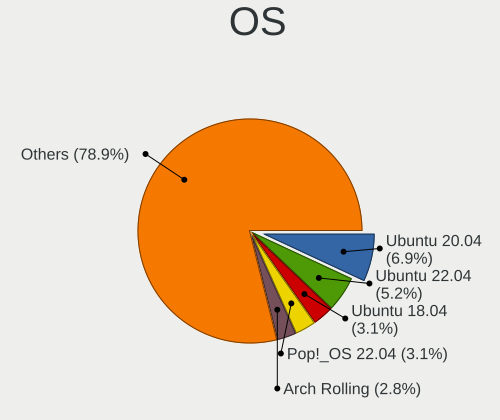

| Name                         | Computers | Percent |
|------------------------------|-----------|---------|
| Ubuntu 20.04                 | 4725      | 6.94%   |
| Ubuntu 22.04                 | 3525      | 5.17%   |
| Ubuntu 18.04                 | 2120      | 3.11%   |
| Pop!_OS 22.04                | 2085      | 3.06%   |
| Arch Rolling                 | 1915      | 2.81%   |
| Ubuntu 24.04                 | 1839      | 2.7%    |
| Debian 11                    | 1817      | 2.67%   |
| Debian 12                    | 1588      | 2.33%   |
| OpenMandriva 24.12           | 1146      | 1.68%   |
| OpenMandriva 6.0             | 996       | 1.46%   |
| Zorin 16                     | 978       | 1.44%   |
| Zorin 17                     | 940       | 1.38%   |
| OpenMandriva 25.06           | 848       | 1.24%   |
| Fedora 40                    | 845       | 1.24%   |
| Manjaro                      | 832       | 1.22%   |
| Linux Mint 22.1              | 785       | 1.15%   |
| ArcoLinux Rolling            | 746       | 1.09%   |
| Fedora 42                    | 728       | 1.07%   |
| OpenMandriva 25.90           | 699       | 1.03%   |
| Fedora 41                    | 674       | 0.99%   |
| Fedora 39                    | 641       | 0.94%   |
| Linux Mint 20.3              | 631       | 0.93%   |
| Arch                         | 618       | 0.91%   |
| Pop!_OS 21.04                | 588       | 0.86%   |
| Pop!_OS 20.04                | 579       | 0.85%   |
| Fedora 38                    | 575       | 0.84%   |
| KDE neon 20.04               | 561       | 0.82%   |
| OpenMandriva 4.3             | 552       | 0.81%   |
| Pop!_OS 20.10                | 534       | 0.78%   |
| openSUSE Tumbleweed-XXXXXXXX | 505       | 0.74%   |
| Linux Mint 21.1              | 500       | 0.73%   |
| EndeavourOS Rolling          | 499       | 0.73%   |
| OpenMandriva 5.0             | 482       | 0.71%   |
| Linux Mint 21.2              | 471       | 0.69%   |
| Bazzite 42                   | 465       | 0.68%   |
| OpenMandriva 4.2             | 459       | 0.67%   |
| OpenMandriva 25.01           | 450       | 0.66%   |
| Linux Mint 22.2              | 446       | 0.65%   |
| Ubuntu 20.10                 | 445       | 0.65%   |
| Fedora 36                    | 445       | 0.65%   |

OS Family
---------

OS without a version

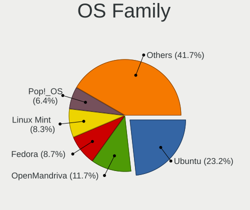

| Name          | Computers | Percent |
|---------------|-----------|---------|
| Ubuntu        | 14797     | 23.22%  |
| OpenMandriva  | 7458      | 11.7%   |
| Fedora        | 5558      | 8.72%   |
| Linux Mint    | 5263      | 8.26%   |
| Pop!_OS       | 4095      | 6.43%   |
| Debian        | 3911      | 6.14%   |
| Arch          | 2507      | 3.93%   |
| Zorin         | 2486      | 3.9%    |
| Manjaro       | 1592      | 2.5%    |
| Kubuntu       | 1536      | 2.41%   |
| KDE neon      | 1204      | 1.89%   |
| SteamOS       | 1012      | 1.59%   |
| Bazzite       | 978       | 1.53%   |
| Xubuntu       | 848       | 1.33%   |
| ArcoLinux     | 793       | 1.24%   |
| openSUSE      | 760       | 1.19%   |
| Kali          | 645       | 1.01%   |
| EndeavourOS   | 533       | 0.84%   |
| Nobara        | 494       | 0.78%   |
| Gentoo        | 484       | 0.76%   |
| Elementary    | 425       | 0.67%   |
| Lubuntu       | 332       | 0.52%   |
| Garuda Linux  | 326       | 0.51%   |
| Endless       | 315       | 0.49%   |
| LMDE          | 312       | 0.49%   |
| MX            | 298       | 0.47%   |
| Ubuntu MATE   | 289       | 0.45%   |
| CachyOS       | 263       | 0.41%   |
| Parrot        | 239       | 0.38%   |
| NixOS         | 239       | 0.38%   |
| Clear Linux   | 235       | 0.37%   |
| Ubuntu Unity  | 227       | 0.36%   |
| ROSA          | 212       | 0.33%   |
| CentOS        | 198       | 0.31%   |
| Ubuntu Budgie | 162       | 0.25%   |
| BlackPanther  | 148       | 0.23%   |
| RHEL          | 115       | 0.18%   |
| Rocky Linux   | 113       | 0.18%   |
| Peppermint    | 104       | 0.16%   |
| ChimeraOS     | 102       | 0.16%   |

Kernel
------

Version of the Linux kernel

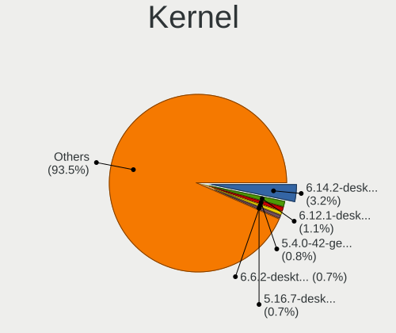

| Version                  | Computers | Percent |
|--------------------------|-----------|---------|
| 6.14.2-desktop-3omv2590  | 2423      | 3.23%   |
| 6.12.1-desktop-1omv2490  | 823       | 1.1%    |
| 5.4.0-42-generic         | 618       | 0.82%   |
| 6.6.2-desktop-1omv2390   | 530       | 0.71%   |
| 5.16.7-desktop-1omv4003  | 517       | 0.69%   |
| 5.10.0-8-amd64           | 492       | 0.66%   |
| 6.12.9-desktop-1omv2490  | 482       | 0.64%   |
| 6.8.0-51-generic         | 479       | 0.64%   |
| 6.9.3-76060903-generic   | 441       | 0.59%   |
| 5.10.14-desktop-1omv4002 | 440       | 0.59%   |
| 5.15.0-56-generic        | 436       | 0.58%   |
| 5.10.0-10-amd64          | 426       | 0.57%   |
| 6.4.11-desktop-1omv2390  | 333       | 0.44%   |
| 5.4.0-58-generic         | 309       | 0.41%   |
| 5.15.0-58-generic        | 302       | 0.4%    |
| 5.11.0-7620-generic      | 289       | 0.39%   |
| 6.2.6-76060206-generic   | 286       | 0.38%   |
| 6.1.1-desktop-1omv2290   | 286       | 0.38%   |
| 6.12.6-desktop-1omv2490  | 279       | 0.37%   |
| 6.2.6-desktop-1omv2390   | 271       | 0.36%   |
| 6.8.0-60-generic         | 262       | 0.35%   |
| 5.15.0-52-generic        | 262       | 0.35%   |
| 5.4.0-48-generic         | 254       | 0.34%   |
| 5.4.0-26-generic         | 252       | 0.34%   |
| 6.8.0-45-generic         | 247       | 0.33%   |
| 5.4.0-29-generic         | 246       | 0.33%   |
| 5.4.0-52-generic         | 242       | 0.32%   |
| 6.8.0-52-generic         | 234       | 0.31%   |
| 5.15.0-91-generic        | 233       | 0.31%   |
| 6.12.10-76061203-generic | 232       | 0.31%   |
| 6.8.0-49-generic         | 230       | 0.31%   |
| 5.15.0-46-generic        | 228       | 0.3%    |
| 6.5.0-14-generic         | 226       | 0.3%    |
| 5.3.0-28-generic         | 224       | 0.3%    |
| 6.8.0-40-generic         | 222       | 0.3%    |
| 5.8.0-7630-generic       | 222       | 0.3%    |
| 6.2.0-39-generic         | 219       | 0.29%   |
| 6.2.0-26-generic         | 217       | 0.29%   |
| 6.14.0-33-generic        | 217       | 0.29%   |
| 5.4.0-40-generic         | 216       | 0.29%   |

Kernel Family
-------------

Linux kernel without a distro release

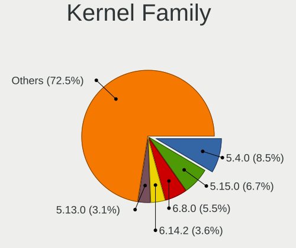

| Version | Computers | Percent |
|---------|-----------|---------|
| 5.4.0   | 6028      | 8.53%   |
| 5.15.0  | 4771      | 6.75%   |
| 6.8.0   | 3897      | 5.51%   |
| 6.14.2  | 2547      | 3.6%    |
| 5.13.0  | 2173      | 3.07%   |
| 5.11.0  | 2072      | 2.93%   |
| 5.8.0   | 2065      | 2.92%   |
| 5.10.0  | 1931      | 2.73%   |
| 6.5.0   | 1892      | 2.68%   |
| 6.1.0   | 1776      | 2.51%   |
| 4.15.0  | 1581      | 2.24%   |
| 6.14.0  | 1564      | 2.21%   |
| 5.19.0  | 1446      | 2.05%   |
| 6.2.0   | 1358      | 1.92%   |
| 5.3.0   | 1340      | 1.9%    |
| 6.11.0  | 923       | 1.31%   |
| 6.12.1  | 872       | 1.23%   |
| 5.0.0   | 805       | 1.14%   |
| 4.18.0  | 652       | 0.92%   |
| 6.2.6   | 595       | 0.84%   |
| 6.6.2   | 584       | 0.83%   |
| 6.12.9  | 572       | 0.81%   |
| 5.16.7  | 523       | 0.74%   |
| 6.9.3   | 501       | 0.71%   |
| 5.10.14 | 450       | 0.64%   |
| 6.4.11  | 387       | 0.55%   |
| 6.17.7  | 369       | 0.52%   |
| 6.12.6  | 366       | 0.52%   |
| 6.1.1   | 342       | 0.48%   |
| 6.12.10 | 302       | 0.43%   |
| 5.14.0  | 299       | 0.42%   |
| 4.19.0  | 280       | 0.4%    |
| 6.1.52  | 261       | 0.37%   |
| 6.5.6   | 240       | 0.34%   |
| 6.0.12  | 235       | 0.33%   |
| 6.15.0  | 233       | 0.33%   |
| 6.13.5  | 233       | 0.33%   |
| 5.17.5  | 221       | 0.31%   |
| 6.16.4  | 220       | 0.31%   |
| 6.17.9  | 186       | 0.26%   |

Kernel Major Ver.
-----------------

Linux kernel major version

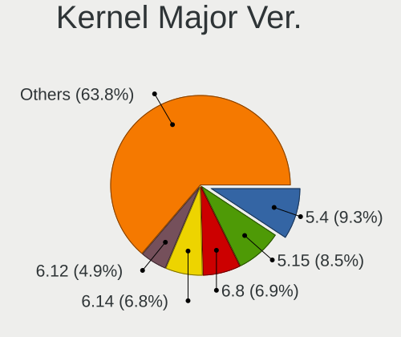

| Version | Computers | Percent |
|---------|-----------|---------|
| 5.4     | 6452      | 9.28%   |
| 5.15    | 5883      | 8.46%   |
| 6.8     | 4774      | 6.87%   |
| 6.14    | 4701      | 6.76%   |
| 6.12    | 3397      | 4.88%   |
| 6.1     | 3222      | 4.63%   |
| 5.10    | 3018      | 4.34%   |
| 6.5     | 2682      | 3.86%   |
| 5.8     | 2564      | 3.69%   |
| 5.13    | 2469      | 3.55%   |
| 6.2     | 2461      | 3.54%   |
| 5.11    | 2376      | 3.42%   |
| 5.19    | 1867      | 2.68%   |
| 6.6     | 1820      | 2.62%   |
| 6.11    | 1795      | 2.58%   |
| 4.15    | 1589      | 2.29%   |
| 5.3     | 1518      | 2.18%   |
| 6.17    | 1239      | 1.78%   |
| 5.16    | 1180      | 1.7%    |
| 6.9     | 1116      | 1.6%    |
| 6.4     | 1105      | 1.59%   |
| 6.13    | 951       | 1.37%   |
| 6.15    | 940       | 1.35%   |
| 6.0     | 908       | 1.31%   |
| 5.0     | 860       | 1.24%   |
| 6.10    | 843       | 1.21%   |
| 4.18    | 788       | 1.13%   |
| 6.16    | 744       | 1.07%   |
| 5.18    | 702       | 1.01%   |
| 5.14    | 678       | 0.97%   |
| 5.17    | 664       | 0.95%   |
| 6.7     | 602       | 0.87%   |
| 6.3     | 600       | 0.86%   |
| 5.9     | 431       | 0.62%   |
| 5.6     | 392       | 0.56%   |
| 4.19    | 387       | 0.56%   |
| 5.12    | 337       | 0.48%   |
| 5.7     | 307       | 0.44%   |
| 4.9     | 199       | 0.29%   |
| 5.5     | 184       | 0.26%   |

Arch
----

OS architecture (x86_64, i586, etc.)

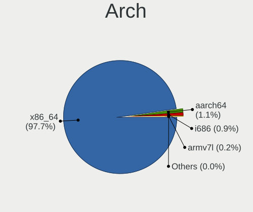

| Name        | Computers | Percent |
|-------------|-----------|---------|
| x86_64      | 59385     | 97.69%  |
| aarch64     | 686       | 1.13%   |
| i686        | 551       | 0.91%   |
| armv7l      | 127       | 0.21%   |
| armv8l      | 10        | 0.02%   |
| riscv64     | 9         | 0.01%   |
| armv6l      | 8         | 0.01%   |
| ppc64le     | 3         | 0.005%  |
| ppc         | 3         | 0.005%  |
| ppc64       | 2         | 0.003%  |
| loongarch64 | 2         | 0.003%  |
| s390x       | 1         | 0.002%  |
| i586        | 1         | 0.002%  |

DE
--

Desktop Environment

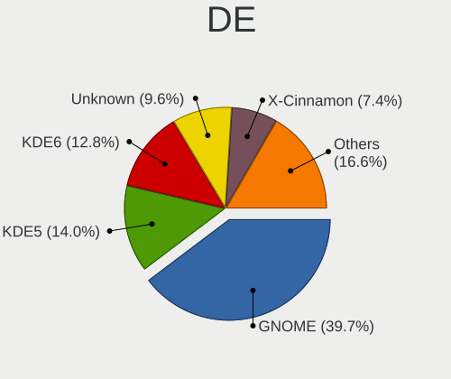

| Name             | Computers | Percent |
|------------------|-----------|---------|
| GNOME            | 25444     | 39.71%  |
| KDE5             | 8941      | 13.95%  |
| KDE6             | 8188      | 12.78%  |
| Unknown          | 6126      | 9.56%   |
| X-Cinnamon       | 4718      | 7.36%   |
| XFCE             | 3766      | 5.88%   |
| MATE             | 1282      | 2%      |
| KDE              | 1183      | 1.85%   |
| LXQt             | 777       | 1.21%   |
| Cinnamon         | 484       | 0.76%   |
| Pantheon         | 411       | 0.64%   |
| Budgie           | 335       | 0.52%   |
| i3               | 285       | 0.44%   |
| Unity            | 229       | 0.36%   |
| Hyprland         | 224       | 0.35%   |
| LXDE             | 212       | 0.33%   |
| KDE4             | 205       | 0.32%   |
| COSMIC           | 191       | 0.3%    |
| GNOME Flashback  | 129       | 0.2%    |
| GNOME Classic    | 115       | 0.18%   |
| Deepin           | 114       | 0.18%   |
| sway             | 90        | 0.14%   |
| openbox          | 72        | 0.11%   |
| awesome          | 56        | 0.09%   |
| Trinity          | 43        | 0.07%   |
| lightdm-xsession | 39        | 0.06%   |
| bspwm            | 34        | 0.05%   |
| Enlightenment    | 32        | 0.05%   |
| ICEWM            | 31        | 0.05%   |
| DWM              | 25        | 0.04%   |
| Endless:GNOME    | 24        | 0.04%   |
| labwc:wlroots    | 22        | 0.03%   |
| xmonad           | 19        | 0.03%   |
| niri             | 18        | 0.03%   |
| qtile            | 16        | 0.02%   |
| LeftWM           | 15        | 0.02%   |
| fluxbox          | 15        | 0.02%   |
| BunsenLabs       | 14        | 0.02%   |
| LXDE-pi-wayfire  | 10        | 0.02%   |
| Phosh:GNOME      | 9         | 0.01%   |

Display Server
--------------

X11 or Wayland

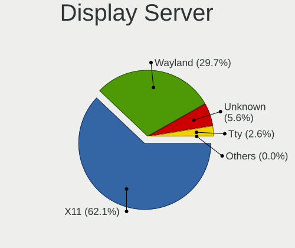

| Name        | Computers | Percent |
|-------------|-----------|---------|
| X11         | 39216     | 62.06%  |
| Wayland     | 18792     | 29.74%  |
| Unknown     | 3539      | 5.6%    |
| Tty         | 1625      | 2.57%   |
| Web         | 11        | 0.02%   |
| Unspecified | 6         | 0.01%   |

Display Manager
---------------

SDDM, LightDM, etc.

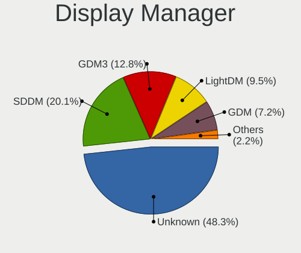

| Name                  | Computers | Percent |
|-----------------------|-----------|---------|
| Unknown               | 30584     | 48.29%  |
| SDDM                  | 12719     | 20.08%  |
| GDM3                  | 8127      | 12.83%  |
| LightDM               | 5989      | 9.46%   |
| GDM                   | 4536      | 7.16%   |
| TDM                   | 892       | 1.41%   |
| KDM                   | 106       | 0.17%   |
| XDM                   | 90        | 0.14%   |
| SLiM                  | 61        | 0.1%    |
| GREETD                | 57        | 0.09%   |
| LXDM                  | 53        | 0.08%   |
| Ly                    | 26        | 0.04%   |
| LY-DM                 | 25        | 0.04%   |
| COSMIC-GREETER        | 24        | 0.04%   |
| SLIMSKI               | 14        | 0.02%   |
| MDM                   | 9         | 0.01%   |
| NODM                  | 8         | 0.01%   |
| EMPTTY                | 6         | 0.01%   |
| LEMURS                | 4         | 0.01%   |
| DISPLAY-MANAGER-START | 4         | 0.01%   |
| SU                    | 1         | 0.002%  |
| LYNDE                 | 1         | 0.002%  |
| LDM                   | 1         | 0.002%  |

OS Lang
-------

Language

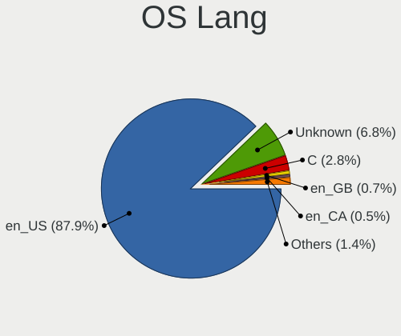

| Lang        | Computers | Percent |
|-------------|-----------|---------|
| en_US       | 54066     | 87.85%  |
| Unknown     | 4191      | 6.81%   |
| C           | 1699      | 2.76%   |
| en_GB       | 413       | 0.67%   |
| en_CA       | 328       | 0.53%   |
| zh_CN       | 97        | 0.16%   |
| POSIX       | 73        | 0.12%   |
| C.UTF8      | 68        | 0.11%   |
| de_DE       | 60        | 0.1%    |
| es_US       | 50        | 0.08%   |
| es_ES       | 47        | 0.08%   |
| ru_RU       | 43        | 0.07%   |
| en_AU       | 42        | 0.07%   |
| fr_FR       | 36        | 0.06%   |
| it_IT       | 28        | 0.05%   |
| en_IN       | 28        | 0.05%   |
| es_MX       | 22        | 0.04%   |
| pt_BR       | 20        | 0.03%   |
| pl_PL       | 12        | 0.02%   |
| es_VE       | 12        | 0.02%   |
| fr_CA       | 11        | 0.02%   |
| en_US.UTF8  | 10        | 0.02%   |
| nl_NL       | 8         | 0.01%   |
| en_IE       | 7         | 0.01%   |
| zh_TW       | 6         | 0.01%   |
| ru_UA       | 6         | 0.01%   |
| es_CO       | 6         | 0.01%   |
| en_US.UTf-8 | 6         | 0.01%   |
| en_DK       | 6         | 0.01%   |
| uk_UA       | 5         | 0.01%   |
| ja_JP       | 5         | 0.01%   |
| en-US       | 5         | 0.01%   |
| de_AT       | 5         | 0.01%   |
| unm_US      | 4         | 0.01%   |
| sv_SE       | 4         | 0.01%   |
| pt_PT       | 4         | 0.01%   |
| nb_NO       | 4         | 0.01%   |
| ko_KR       | 4         | 0.01%   |
| es_CU       | 4         | 0.01%   |
| es_AR       | 4         | 0.01%   |

Boot Mode
---------

EFI or BIOS

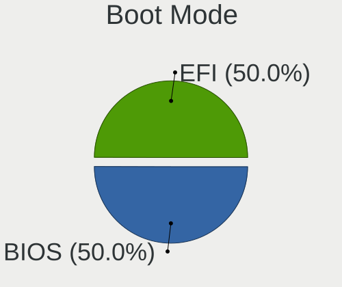

| Mode | Computers | Percent |
|------|-----------|---------|
| BIOS | 31286     | 50.04%  |
| EFI  | 31231     | 49.96%  |

Filesystem
----------

Type of filesystem

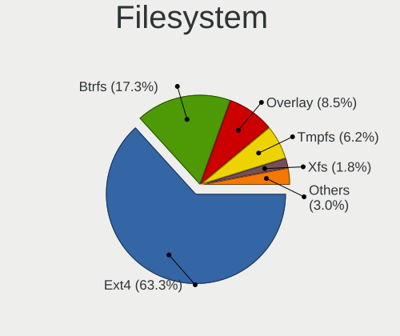

| Type                | Computers | Percent |
|---------------------|-----------|---------|
| Ext4                | 39881     | 63.26%  |
| Btrfs               | 10875     | 17.25%  |
| Overlay             | 5341      | 8.47%   |
| Tmpfs               | 3930      | 6.23%   |
| Xfs                 | 1108      | 1.76%   |
| Unknown             | 941       | 1.49%   |
| Zfs                 | 588       | 0.93%   |
| F2fs                | 109       | 0.17%   |
| Ext2                | 86        | 0.14%   |
| Ext3                | 76        | 0.12%   |
| Rootfs              | 27        | 0.04%   |
| Jfs                 | 17        | 0.03%   |
| Aufs                | 17        | 0.03%   |
| Reiserfs            | 15        | 0.02%   |
| Bcachefs            | 7         | 0.01%   |
| XXXXX               | 5         | 0.01%   |
| XXXXXXX             | 4         | 0.01%   |
| XXX4                | 4         | 0.01%   |
| Fuse.fuse-overlayfs | 3         | 0.005%  |
| XXX                 | 2         | 0.003%  |
| Ubifs               | 2         | 0.003%  |
| XXXX                | 1         | 0.002%  |
| XXXfs               | 1         | 0.002%  |
| Xtrfs               | 1         | 0.002%  |
| SquasXfs            | 1         | 0.002%  |
| Nilfs2              | 1         | 0.002%  |

Part. scheme
------------

Scheme of partitioning

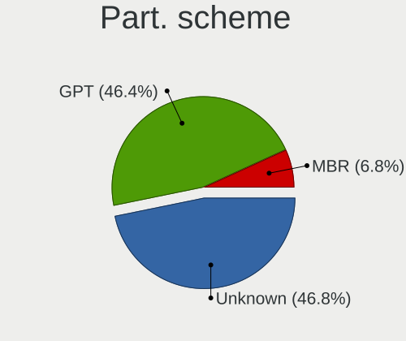

| Type    | Computers | Percent |
|---------|-----------|---------|
| Unknown | 29258     | 46.79%  |
| GPT     | 29013     | 46.4%   |
| MBR     | 4257      | 6.81%   |

Dual Boot with Linux/BSD
------------------------

Hosting more than one Linux/BSD

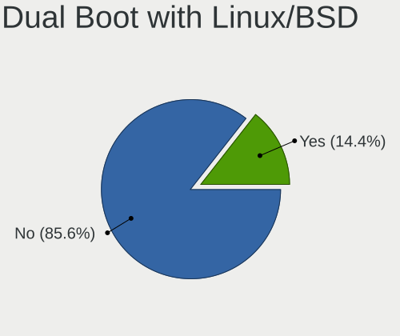

| Dual boot | Computers | Percent |
|-----------|-----------|---------|
| No        | 53196     | 85.58%  |
| Yes       | 8964      | 14.42%  |

Dual Boot (Win)
---------------

Hosting Linux and Windows

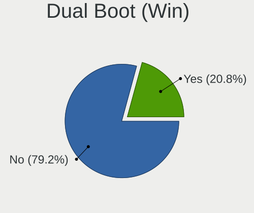

| Dual boot | Computers | Percent |
|-----------|-----------|---------|
| No        | 49038     | 79.22%  |
| Yes       | 12860     | 20.78%  |

Board
-----

Vendor
------

Motherboard manufacturer

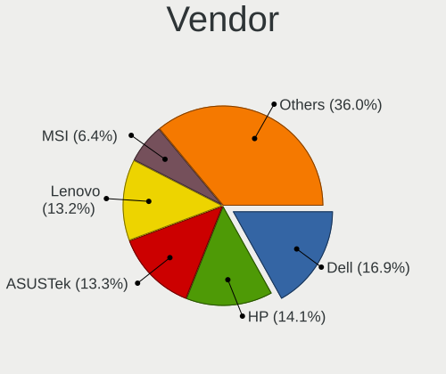

| Name                                 | Computers | Percent |
|--------------------------------------|-----------|---------|
| Dell                                 | 10281     | 16.92%  |
| Hewlett-Packard                      | 8557      | 14.08%  |
| ASUSTek Computer                     | 8093      | 13.32%  |
| Lenovo                               | 8034      | 13.22%  |
| MSI                                  | 3917      | 6.45%   |
| Gigabyte Technology                  | 3408      | 5.61%   |
| Apple                                | 3063      | 5.04%   |
| ASRock                               | 2172      | 3.57%   |
| Acer                                 | 1583      | 2.61%   |
| Google                               | 910       | 1.5%    |
| Toshiba                              | 839       | 1.38%   |
| Valve                                | 815       | 1.34%   |
| Intel                                | 776       | 1.28%   |
| Unknown                              | 620       | 1.02%   |
| Microsoft                            | 496       | 0.82%   |
| Raspberry Pi Foundation              | 492       | 0.81%   |
| System76                             | 485       | 0.8%    |
| Alienware                            | 441       | 0.73%   |
| AZW                                  | 408       | 0.67%   |
| Framework                            | 380       | 0.63%   |
| Supermicro                           | 360       | 0.59%   |
| Pegatron                             | 311       | 0.51%   |
| Samsung Electronics                  | 280       | 0.46%   |
| Gateway                              | 236       | 0.39%   |
| Foxconn                              | 206       | 0.34%   |
| Sony                                 | 203       | 0.33%   |
| GPU Company                          | 180       | 0.3%    |
| Shenzhen Meigao Electronic Equipment | 159       | 0.26%   |
| Razer                                | 137       | 0.23%   |
| Notebook                             | 127       | 0.21%   |
| Panasonic                            | 120       | 0.2%    |
| Biostar                              | 109       | 0.18%   |
| ECS                                  | 84        | 0.14%   |
| Fujitsu                              | 83        | 0.14%   |
| AMI                                  | 77        | 0.13%   |
| eMachines                            | 76        | 0.13%   |
| LG Electronics                       | 74        | 0.12%   |
| GMKtec                               | 73        | 0.12%   |
| BESSTAR Tech                         | 66        | 0.11%   |
| Core Innovations                     | 61        | 0.1%    |

Model
-----

Motherboard model

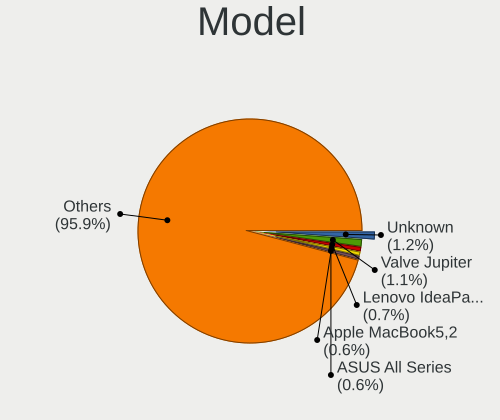

| Name                                      | Computers | Percent |
|-------------------------------------------|-----------|---------|
| Unknown                                   | 700       | 1.15%   |
| Valve Jupiter                             | 673       | 1.11%   |
| Lenovo IdeaPad 1 14IGL7 82V6              | 416       | 0.68%   |
| Apple MacBook5,2                          | 371       | 0.61%   |
| ASUS All Series                           | 347       | 0.57%   |
| ASUS TUF Gaming X570-PLUS                 | 285       | 0.47%   |
| Dell OptiPlex 7010                        | 249       | 0.41%   |
| Dell OptiPlex 9020                        | 223       | 0.37%   |
| HP Notebook                               | 186       | 0.31%   |
| Apple MacBookAir7,2                       | 182       | 0.3%    |
| AZW SER                                   | 172       | 0.28%   |
| MSI MS-7C91                               | 158       | 0.26%   |
| MSI MS-7C37                               | 153       | 0.25%   |
| RPi Raspberry Pi                          | 145       | 0.24%   |
| Valve Galileo                             | 142       | 0.23%   |
| Apple MacBookPro9,2                       | 141       | 0.23%   |
| MSI MS-7C56                               | 136       | 0.22%   |
| MSI MS-7C02                               | 134       | 0.22%   |
| ASUS ROG STRIX B550-F GAMING              | 130       | 0.21%   |
| Dell Latitude E6420                       | 119       | 0.2%    |
| Lenovo ThinkPad L13 Yoga Gen 2 20VK0019US | 115       | 0.19%   |
| Dell Latitude E6430                       | 113       | 0.19%   |
| Dell OptiPlex 790                         | 110       | 0.18%   |
| Framework Laptop                          | 108       | 0.18%   |
| HP Pavilion dv7                           | 107       | 0.18%   |
| Apple MacBookAir7,1                       | 104       | 0.17%   |
| ASUS ROG STRIX B450-F GAMING              | 101       | 0.17%   |
| HP Pavilion Notebook                      | 100       | 0.16%   |
| Dell OptiPlex 3020                        | 100       | 0.16%   |
| HP 2000                                   | 99        | 0.16%   |
| Apple MacBookPro8,1                       | 97        | 0.16%   |
| MSI MS-7C95                               | 95        | 0.16%   |
| Dell OptiPlex 990                         | 95        | 0.16%   |
| MSI MS-7693                               | 92        | 0.15%   |
| Gigabyte B450M DS3H                       | 92        | 0.15%   |
| MSI MS-7B86                               | 89        | 0.15%   |
| Dell OptiPlex 7040                        | 88        | 0.14%   |
| Dell Inspiron 3847                        | 88        | 0.14%   |
| Dell OptiPlex 9010                        | 86        | 0.14%   |
| ASRock B450M Pro4                         | 85        | 0.14%   |

Model Family
------------

Motherboard model prefix

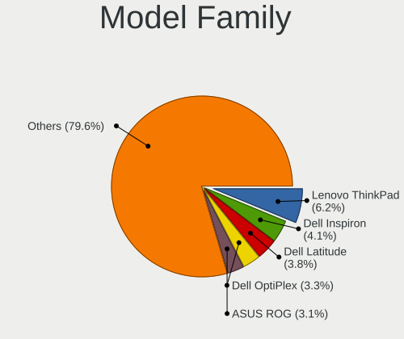

| Name               | Computers | Percent |
|--------------------|-----------|---------|
| Lenovo ThinkPad    | 3784      | 6.23%   |
| Dell Inspiron      | 2482      | 4.08%   |
| Dell Latitude      | 2308      | 3.8%    |
| Dell OptiPlex      | 1996      | 3.28%   |
| ASUS ROG           | 1855      | 3.05%   |
| Lenovo IdeaPad     | 1504      | 2.48%   |
| HP Pavilion        | 1404      | 2.31%   |
| Dell XPS           | 1218      | 2%      |
| Dell Precision     | 1214      | 2%      |
| HP Laptop          | 1097      | 1.81%   |
| Acer Aspire        | 993       | 1.63%   |
| ASUS PRIME         | 986       | 1.62%   |
| ASUS TUF           | 843       | 1.39%   |
| HP EliteBook       | 826       | 1.36%   |
| Toshiba Satellite  | 760       | 1.25%   |
| Unknown            | 700       | 1.15%   |
| Valve Jupiter      | 673       | 1.11%   |
| HP ENVY            | 663       | 1.09%   |
| Lenovo ThinkCentre | 627       | 1.03%   |
| HP Compaq          | 616       | 1.01%   |
| Microsoft Surface  | 496       | 0.82%   |
| RPi Raspberry      | 492       | 0.81%   |
| ASUS VivoBook      | 486       | 0.8%    |
| Lenovo Yoga        | 478       | 0.79%   |
| HP ProBook         | 457       | 0.75%   |
| Lenovo Legion      | 422       | 0.69%   |
| Apple MacBook5     | 398       | 0.65%   |
| Framework Laptop   | 375       | 0.62%   |
| HP EliteDesk       | 356       | 0.59%   |
| ASUS All           | 347       | 0.57%   |
| ASUS ASUS          | 299       | 0.49%   |
| Dell PowerEdge     | 289       | 0.48%   |
| Gigabyte X570      | 287       | 0.47%   |
| Apple MacBookAir7  | 286       | 0.47%   |
| HP OMEN            | 239       | 0.39%   |
| Lenovo IdeaPadFlex | 234       | 0.39%   |
| Apple MacBookPro11 | 215       | 0.35%   |
| HP ZBook           | 214       | 0.35%   |
| Acer Nitro         | 214       | 0.35%   |
| HP Stream          | 194       | 0.32%   |

MFG Year
--------

Motherboard manufacture year

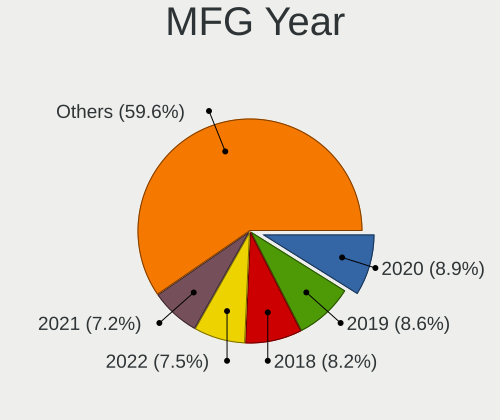

| Year    | Computers | Percent |
|---------|-----------|---------|
| 2020    | 5411      | 8.9%    |
| 2019    | 5202      | 8.56%   |
| 2018    | 5001      | 8.23%   |
| 2022    | 4553      | 7.49%   |
| 2021    | 4384      | 7.21%   |
| 2012    | 3929      | 6.47%   |
| 2013    | 3573      | 5.88%   |
| 2017    | 3399      | 5.59%   |
| 2011    | 3274      | 5.39%   |
| 2023    | 3061      | 5.04%   |
| 2015    | 2960      | 4.87%   |
| 2014    | 2896      | 4.77%   |
| 2016    | 2588      | 4.26%   |
| 2024    | 2155      | 3.55%   |
| 2010    | 2014      | 3.31%   |
| 2009    | 1991      | 3.28%   |
| 2008    | 1537      | 2.53%   |
| 2007    | 889       | 1.46%   |
| Unknown | 695       | 1.14%   |
| 2025    | 571       | 0.94%   |
| 2006    | 474       | 0.78%   |
| 2005    | 126       | 0.21%   |
| 2004    | 41        | 0.07%   |
| 2003    | 28        | 0.05%   |
| 2002    | 7         | 0.01%   |
| 2000    | 4         | 0.01%   |
| 2001    | 3         | 0.005%  |
| 1999    | 1         | 0.002%  |

Form Factor
-----------

Physical design of the computer

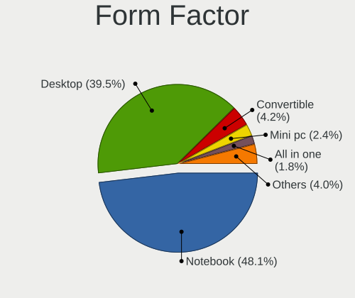

| Name           | Computers | Percent |
|----------------|-----------|---------|
| Notebook       | 29244     | 48.12%  |
| Desktop        | 23998     | 39.49%  |
| Convertible    | 2526      | 4.16%   |
| Mini pc        | 1468      | 2.42%   |
| All in one     | 1079      | 1.78%   |
| Tablet         | 882       | 1.45%   |
| Server         | 767       | 1.26%   |
| System on chip | 726       | 1.19%   |
| Phone          | 41        | 0.07%   |
| Other          | 26        | 0.04%   |
| Stick pc       | 8         | 0.01%   |
| Firewall       | 2         | 0.003%  |

Secure Boot
-----------

Enabled or disabled

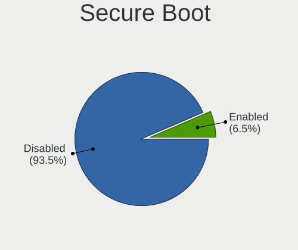

| State    | Computers | Percent |
|----------|-----------|---------|
| Disabled | 57408     | 93.54%  |
| Enabled  | 3962      | 6.46%   |

Coreboot
--------

Have coreboot on board

| Used | Computers | Percent |
|------|-----------|---------|
| No   | 59542     | 97.98%  |
| Yes  | 1229      | 2.02%   |

RAM Size
--------

Total RAM memory

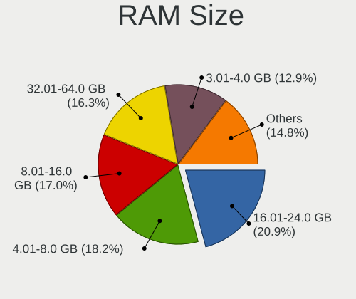

| Size in GB      | Computers | Percent |
|-----------------|-----------|---------|
| 16.01-24.0      | 12971     | 20.88%  |
| 4.01-8.0        | 11303     | 18.19%  |
| 8.01-16.0       | 10580     | 17.03%  |
| 32.01-64.0      | 10100     | 16.26%  |
| 3.01-4.0        | 8002      | 12.88%  |
| 64.01-256.0     | 4230      | 6.81%   |
| 24.01-32.0      | 2302      | 3.71%   |
| 1.01-2.0        | 1541      | 2.48%   |
| 2.01-3.0        | 583       | 0.94%   |
| More than 256.0 | 226       | 0.36%   |
| 0.51-1.0        | 222       | 0.36%   |
| 0.01-0.5        | 56        | 0.09%   |
| Unknown         | 13        | 0.02%   |

RAM Used
--------

Used RAM memory

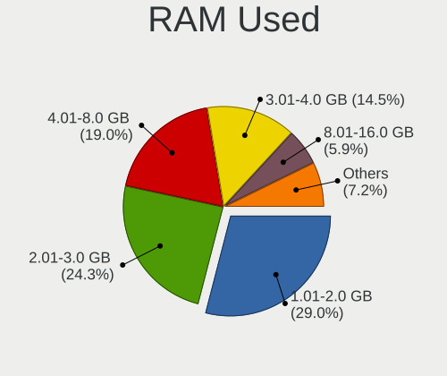

| Used GB         | Computers | Percent |
|-----------------|-----------|---------|
| 1.01-2.0        | 19838     | 29.03%  |
| 2.01-3.0        | 16637     | 24.35%  |
| 4.01-8.0        | 12981     | 19%     |
| 3.01-4.0        | 9907      | 14.5%   |
| 8.01-16.0       | 4024      | 5.89%   |
| 0.51-1.0        | 2972      | 4.35%   |
| 16.01-24.0      | 708       | 1.04%   |
| 0.01-0.5        | 675       | 0.99%   |
| 24.01-32.0      | 259       | 0.38%   |
| 32.01-64.0      | 203       | 0.3%    |
| 64.01-256.0     | 88        | 0.13%   |
| Unknown         | 34        | 0.05%   |
| More than 256.0 | 9         | 0.01%   |
| 0               | 3         | 0.004%  |

Total Drives
------------

Number of drives on board

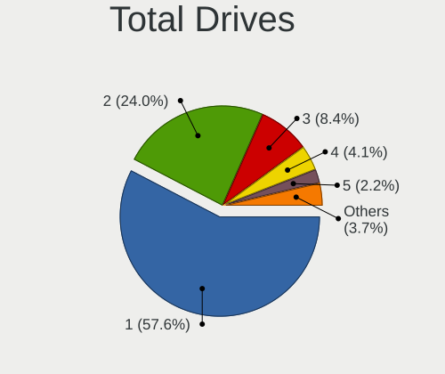

| Drives  | Computers | Percent |
|---------|-----------|---------|
| 1       | 36505     | 57.64%  |
| 2       | 15181     | 23.97%  |
| 3       | 5302      | 8.37%   |
| 4       | 2595      | 4.1%    |
| 5       | 1417      | 2.24%   |
| 6       | 694       | 1.1%    |
| 0       | 626       | 0.99%   |
| 7       | 363       | 0.57%   |
| 8       | 187       | 0.3%    |
| 9       | 114       | 0.18%   |
| 10      | 65        | 0.1%    |
| 11      | 55        | 0.09%   |
| Unknown | 39        | 0.06%   |
| 12      | 38        | 0.06%   |
| 13      | 35        | 0.06%   |
| 14      | 20        | 0.03%   |
| 16      | 13        | 0.02%   |
| 15      | 10        | 0.02%   |
| 19      | 8         | 0.01%   |
| 18      | 7         | 0.01%   |
| 21      | 6         | 0.01%   |
| 17      | 6         | 0.01%   |
| 22      | 5         | 0.01%   |
| 27      | 4         | 0.01%   |
| 26      | 4         | 0.01%   |
| 20      | 4         | 0.01%   |
| 25      | 3         | 0.005%  |
| 97      | 2         | 0.003%  |
| 93      | 2         | 0.003%  |
| 36      | 2         | 0.003%  |
| 33      | 2         | 0.003%  |
| 31      | 2         | 0.003%  |
| 24      | 2         | 0.003%  |
| 23      | 2         | 0.003%  |
| 101     | 1         | 0.002%  |
| 71      | 1         | 0.002%  |
| 68      | 1         | 0.002%  |
| 61      | 1         | 0.002%  |
| 47      | 1         | 0.002%  |
| 45      | 1         | 0.002%  |

Has CD-ROM
----------

Has CD-ROM on board

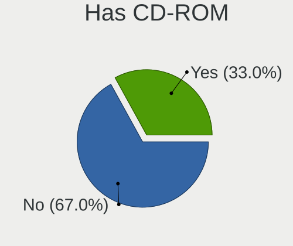

| Presented | Computers | Percent |
|-----------|-----------|---------|
| No        | 41087     | 66.99%  |
| Yes       | 20248     | 33.01%  |

Has Ethernet
------------

Has Ethernet on board

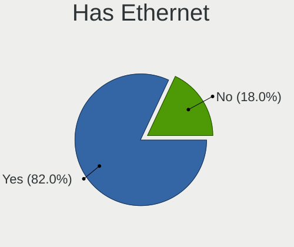

| Presented | Computers | Percent |
|-----------|-----------|---------|
| Yes       | 50078     | 82%     |
| No        | 10990     | 18%     |

Has WiFi
--------

Has WiFi module

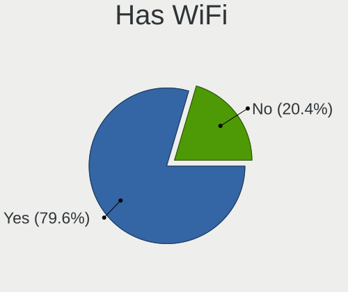

| Presented | Computers | Percent |
|-----------|-----------|---------|
| Yes       | 48718     | 79.56%  |
| No        | 12519     | 20.44%  |

Has Bluetooth
-------------

Has Bluetooth module

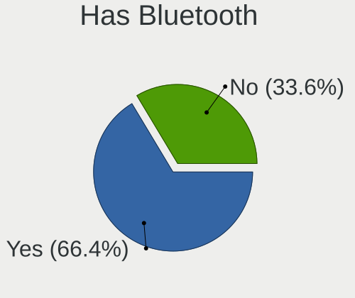

| Presented | Computers | Percent |
|-----------|-----------|---------|
| Yes       | 40851     | 66.4%   |
| No        | 20674     | 33.6%   |

Location
--------

Country
-------

Geographic location (country)

| Country | Computers | Percent |
|---------|-----------|---------|
| USA     | 60767     | 100%    |

City
----

Geographic location (city)

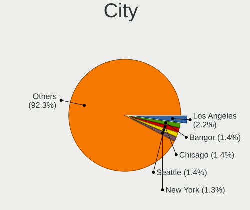

| City             | Computers | Percent |
|------------------|-----------|---------|
| Los Angeles      | 1420      | 2.19%   |
| Bangor           | 906       | 1.4%    |
| Chicago          | 892       | 1.38%   |
| Seattle          | 880       | 1.36%   |
| New York         | 856       | 1.32%   |
| Dallas           | 684       | 1.06%   |
| Denver           | 650       | 1%      |
| Portland         | 619       | 0.96%   |
| Houston          | 561       | 0.87%   |
| Atlanta          | 555       | 0.86%   |
| Phoenix          | 509       | 0.79%   |
| Miami            | 442       | 0.68%   |
| Austin           | 403       | 0.62%   |
| Minneapolis      | 383       | 0.59%   |
| San Antonio      | 368       | 0.57%   |
| San Jose         | 365       | 0.56%   |
| Las Vegas        | 364       | 0.56%   |
| Salt Lake City   | 316       | 0.49%   |
| Brooklyn         | 314       | 0.49%   |
| San Francisco    | 308       | 0.48%   |
| Dover-Foxcroft   | 305       | 0.47%   |
| Charlotte        | 304       | 0.47%   |
| Jacksonville     | 294       | 0.45%   |
| San Diego        | 287       | 0.44%   |
| Columbus         | 282       | 0.44%   |
| Washington       | 273       | 0.42%   |
| Kansas City      | 264       | 0.41%   |
| Philadelphia     | 251       | 0.39%   |
| Indianapolis     | 239       | 0.37%   |
| Orlando          | 236       | 0.36%   |
| Tucson           | 233       | 0.36%   |
| Pittsburgh       | 228       | 0.35%   |
| Rochester        | 225       | 0.35%   |
| St Louis         | 223       | 0.34%   |
| Albuquerque      | 219       | 0.34%   |
| Springfield      | 214       | 0.33%   |
| Ashburn          | 211       | 0.33%   |
| Colorado Springs | 204       | 0.32%   |
| Raleigh          | 191       | 0.3%    |
| Louisville       | 189       | 0.29%   |

Drives
------

Drive Vendor
------------

Hard drive vendors

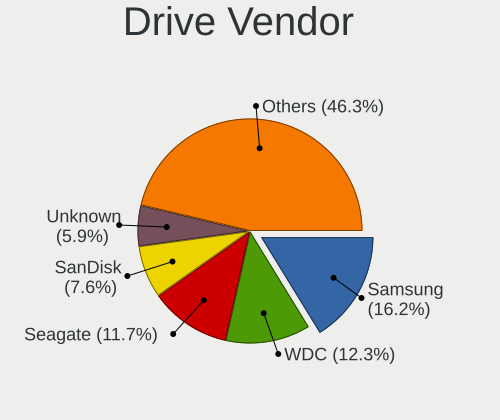

| Vendor                      | Computers | Drives | Percent |
|-----------------------------|-----------|--------|---------|
| Samsung Electronics         | 14919     | 24703  | 16.24%  |
| WDC                         | 11266     | 19417  | 12.26%  |
| Seagate                     | 10770     | 18837  | 11.72%  |
| SanDisk                     | 6977      | 9576   | 7.59%   |
| Unknown                     | 5397      | 7207   | 5.87%   |
| Toshiba                     | 4534      | 6126   | 4.94%   |
| Crucial                     | 3106      | 4395   | 3.38%   |
| SK hynix                    | 2889      | 3722   | 3.14%   |
| Hitachi                     | 2366      | 3432   | 2.58%   |
| Intel                       | 2278      | 3492   | 2.48%   |
| Kingston                    | 2169      | 2945   | 2.36%   |
| Micron Technology           | 1856      | 2297   | 2.02%   |
| HGST                        | 1508      | 2634   | 1.64%   |
| Apple                       | 1471      | 1952   | 1.6%    |
| Phison Electronics          | 1368      | 1874   | 1.49%   |
| PNY                         | 1327      | 1833   | 1.44%   |
| Micron/Crucial Technology   | 1169      | 1657   | 1.27%   |
| China                       | 1023      | 1463   | 1.11%   |
| SPCC                        | 885       | 1178   | 0.96%   |
| A-DATA Technology           | 806       | 1082   | 0.88%   |
| KIOXIA                      | 800       | 1012   | 0.87%   |
| Phison                      | 761       | 1091   | 0.83%   |
| Unknown                     | 692       | 844    | 0.75%   |
| Kingston Technology Company | 624       | 824    | 0.68%   |
| Team                        | 572       | 810    | 0.62%   |
| Silicon Motion              | 551       | 701    | 0.6%    |
| Fujitsu                     | 494       | 557    | 0.54%   |
| MAXIO Technology (Hangzhou) | 468       | 599    | 0.51%   |
| Hewlett-Packard             | 413       | 804    | 0.45%   |
| Realtek Semiconductor       | 399       | 512    | 0.43%   |
| SABRENT                     | 381       | 486    | 0.41%   |
| LITEON                      | 318       | 391    | 0.35%   |
| T-FORCE                     | 296       | 364    | 0.32%   |
| OCZ                         | 252       | 336    | 0.27%   |
| ASMT                        | 240       | 394    | 0.26%   |
| Patriot                     | 237       | 303    | 0.26%   |
| JMicron Technology          | 234       | 302    | 0.25%   |
| LITEONIT                    | 227       | 279    | 0.25%   |
| Mushkin                     | 214       | 307    | 0.23%   |
| ADATA Technology            | 170       | 225    | 0.19%   |

Drive Model
-----------

Hard drive models

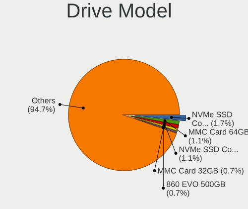

| Model                                                 | Computers | Percent |
|-------------------------------------------------------|-----------|---------|
| Samsung NVMe SSD Controller SM981/PM981/PM983 1TB     | 1715      | 1.66%   |
| Unknown MMC Card  64GB                                | 1175      | 1.13%   |
| Samsung NVMe SSD Controller PM9A1/PM9A3/980PRO 1TB    | 1147      | 1.11%   |
| Unknown MMC Card  32GB                                | 746       | 0.72%   |
| Samsung SSD 860 EVO 500GB                             | 717       | 0.69%   |
| Samsung SSD 860 EVO 1TB                               | 694       | 0.67%   |
| Unknown                                               | 692       | 0.67%   |
| Seagate ST2000DM008-2FR102 2TB                        | 604       | 0.58%   |
| Samsung SSD 850 EVO 500GB                             | 601       | 0.58%   |
| Unknown MMC Card  128GB                               | 556       | 0.54%   |
| Crucial CT1000MX500SSD1 1TB                           | 511       | 0.49%   |
| Unknown SD/MMC/MS PRO 2GB                             | 505       | 0.49%   |
| Micron/Crucial P2 NVMe PCIe SSD 2TB                   | 497       | 0.48%   |
| WDC WD10EZEX-08WN4A0 1TB                              | 490       | 0.47%   |
| Samsung SSD 850 EVO 250GB                             | 484       | 0.47%   |
| Seagate ST1000LM035-1RK172 1TB                        | 471       | 0.45%   |
| Seagate ST500DM002-1BD142 500GB                       | 454       | 0.44%   |
| SanDisk NVMe SSD Drive 1TB                            | 436       | 0.42%   |
| Samsung SSD 870 EVO 1TB                               | 421       | 0.41%   |
| Sandisk WD Blue SN550 NVMe SSD 1024GB                 | 397       | 0.38%   |
| Kingston SA400S37240G 240GB SSD                       | 394       | 0.38%   |
| Sandisk WD Black SN750 / PC SN730 NVMe SSD 500GB      | 385       | 0.37%   |
| Toshiba MQ01ABD100 1TB                                | 382       | 0.37%   |
| HGST HTS721010A9E630 1TB                              | 371       | 0.36%   |
| Samsung NVMe SSD Controller SM961/PM961/SM963 1024GB  | 363       | 0.35%   |
| Samsung SSD 990 PRO 2TB                               | 362       | 0.35%   |
| Crucial CT500MX500SSD1 500GB                          | 359       | 0.35%   |
| Toshiba DT01ACA100 1TB                                | 344       | 0.33%   |
| Samsung SSD 980 1TB                                   | 339       | 0.33%   |
| Samsung NVMe SSD Drive 1TB                            | 339       | 0.33%   |
| Phison E12 NVMe Controller 1TB                        | 322       | 0.31%   |
| SABRENT Disk 4TB                                      | 312       | 0.3%    |
| Seagate ST1000LM024 HN-M101MBB 1TB                    | 308       | 0.3%    |
| Samsung NVMe SSD Drive 500GB                          | 308       | 0.3%    |
| Toshiba MQ01ABF050 500GB                              | 291       | 0.28%   |
| Silicon Motion SM2263EN/SM2263XT SSD Controller 512GB | 268       | 0.26%   |
| Phison PS5013 E13 NVMe Controller 500GB               | 268       | 0.26%   |
| MAXIO (Hangzhou) NVMe SSD Controller MAP1202 2TB      | 267       | 0.26%   |
| Seagate ST1000DM003-1CH162 1TB                        | 264       | 0.25%   |
| PNY CS900 500GB SSD                                   | 264       | 0.25%   |

HDD Vendor
----------

Hard disk drive vendors

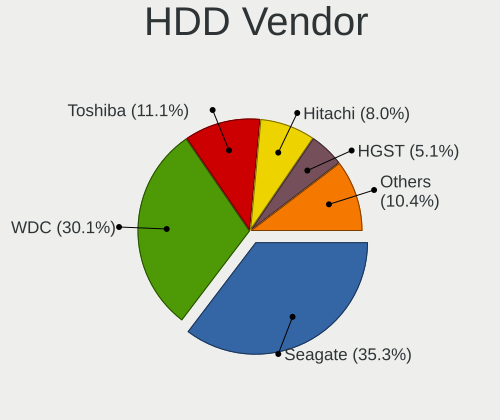

| Vendor              | Computers | Drives | Percent |
|---------------------|-----------|--------|---------|
| Seagate             | 10395     | 18004  | 35.35%  |
| WDC                 | 8845      | 15557  | 30.08%  |
| Toshiba             | 3253      | 4470   | 11.06%  |
| Hitachi             | 2366      | 3432   | 8.05%   |
| HGST                | 1500      | 2456   | 5.1%    |
| Unknown             | 556       | 809    | 1.89%   |
| Fujitsu             | 494       | 557    | 1.68%   |
| Samsung Electronics | 425       | 563    | 1.45%   |
| Apple               | 414       | 471    | 1.41%   |
| Hewlett-Packard     | 123       | 402    | 0.42%   |
| Maxtor              | 104       | 139    | 0.35%   |
| ASMT                | 104       | 221    | 0.35%   |
| JMicron Technology  | 97        | 136    | 0.33%   |
| SSK                 | 63        | 71     | 0.21%   |
| T-FORCE             | 62        | 84     | 0.21%   |
| External            | 59        | 78     | 0.2%    |
| TO Exter            | 57        | 92     | 0.19%   |
| SABRENT             | 43        | 62     | 0.15%   |
| WD MediaMax         | 38        | 75     | 0.13%   |
| USB3.0              | 34        | 40     | 0.12%   |
| ASMedia             | 28        | 43     | 0.1%    |
| Unknown             | 24        | 38     | 0.08%   |
| HPE                 | 19        | 29     | 0.06%   |
| Maxone              | 18        | 28     | 0.06%   |
| LaCie               | 18        | 32     | 0.06%   |
| HGST HTS            | 17        | 20     | 0.06%   |
| MaxDigital          | 16        | 22     | 0.05%   |
| Inateck             | 16        | 31     | 0.05%   |
| Apricorn            | 16        | 18     | 0.05%   |
| IBM/Hitachi         | 13        | 18     | 0.04%   |
| RSH-319             | 12        | 13     | 0.04%   |
| USB                 | 11        | 16     | 0.04%   |
| MARVELL             | 9         | 13     | 0.03%   |
| KESU                | 8         | 10     | 0.03%   |
| ASMT109x            | 8         | 16     | 0.03%   |
| USB 3.0             | 7         | 12     | 0.02%   |
| Fantom              | 7         | 15     | 0.02%   |
| DELLBOSS            | 7         | 8      | 0.02%   |
| SATAFIRM            | 6         | 6      | 0.02%   |
| RSH-339             | 6         | 6      | 0.02%   |

SSD Vendor
----------

Solid state drive vendors

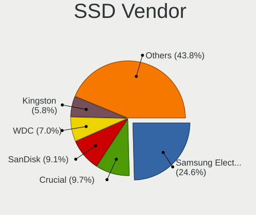

| Vendor              | Computers | Drives | Percent |
|---------------------|-----------|--------|---------|
| Samsung Electronics | 6730      | 10276  | 24.58%  |
| Crucial             | 2651      | 3751   | 9.68%   |
| SanDisk             | 2505      | 3347   | 9.15%   |
| WDC                 | 1910      | 2639   | 6.98%   |
| Kingston            | 1599      | 2203   | 5.84%   |
| PNY                 | 1289      | 1783   | 4.71%   |
| China               | 1015      | 1455   | 3.71%   |
| SPCC                | 757       | 1018   | 2.76%   |
| Apple               | 711       | 831    | 2.6%    |
| Intel               | 710       | 964    | 2.59%   |
| A-DATA Technology   | 693       | 928    | 2.53%   |
| SK hynix            | 592       | 773    | 2.16%   |
| Micron Technology   | 573       | 724    | 2.09%   |
| Team                | 477       | 679    | 1.74%   |
| Toshiba             | 358       | 465    | 1.31%   |
| SABRENT             | 327       | 410    | 1.19%   |
| LITEON              | 298       | 371    | 1.09%   |
| OCZ                 | 250       | 334    | 0.91%   |
| LITEONIT            | 227       | 279    | 0.83%   |
| Hewlett-Packard     | 217       | 303    | 0.79%   |
| Patriot             | 208       | 272    | 0.76%   |
| Mushkin             | 189       | 280    | 0.69%   |
| Transcend           | 153       | 200    | 0.56%   |
| T-FORCE             | 140       | 164    | 0.51%   |
| Seagate             | 127       | 200    | 0.46%   |
| Lexar               | 125       | 169    | 0.46%   |
| ASMT                | 116       | 149    | 0.42%   |
| KingSpec            | 109       | 138    | 0.4%    |
| Netac               | 104       | 132    | 0.38%   |
| Corsair             | 103       | 141    | 0.38%   |
| Unknown             | 92        | 111    | 0.34%   |
| Fanxiang            | 90        | 123    | 0.33%   |
| KingFast            | 82        | 95     | 0.3%    |
| Dogfish             | 79        | 96     | 0.29%   |
| OWC                 | 69        | 91     | 0.25%   |
| Timetec             | 66        | 98     | 0.24%   |
| Plextor             | 51        | 75     | 0.19%   |
| BHT                 | 46        | 61     | 0.17%   |
| Unknown             | 44        | 54     | 0.16%   |
| SSSTC               | 42        | 46     | 0.15%   |

Drive Kind
----------

HDD or SSD

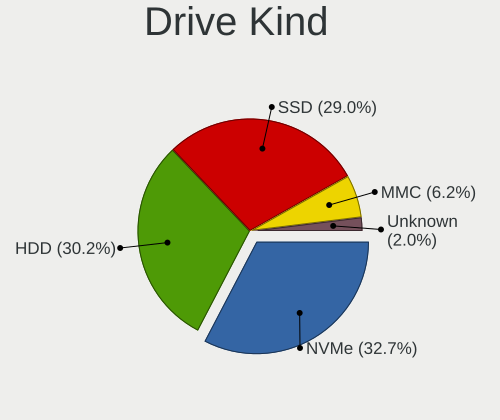

| Kind    | Computers | Drives | Percent |
|---------|-----------|--------|---------|
| NVMe    | 26274     | 42942  | 32.66%  |
| HDD     | 24333     | 48349  | 30.24%  |
| SSD     | 23301     | 38048  | 28.96%  |
| MMC     | 4979      | 6261   | 6.19%   |
| Unknown | 1570      | 2468   | 1.95%   |

Drive Connector
---------------

SATA, SAS, NVMe, etc.

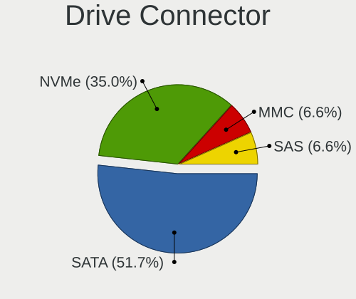

| Type | Computers | Drives | Percent |
|------|-----------|--------|---------|
| SATA | 38729     | 80138  | 51.72%  |
| NVMe | 26200     | 42543  | 34.99%  |
| MMC  | 4979      | 6261   | 6.65%   |
| SAS  | 4968      | 9126   | 6.63%   |

Drive Size
----------

Size of hard drive

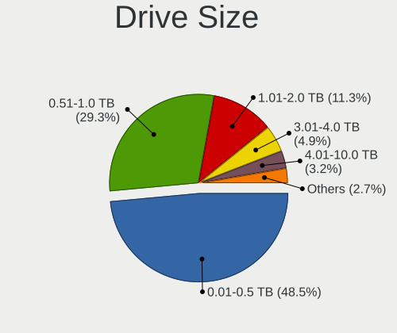

| Size in TB | Computers | Drives  | Percent |
|------------|-----------|---------|---------|
| 0.01-0.5   | 25515     | 40094   | 48.53%  |
| 0.51-1.0   | 15410     | 24436   | 29.31%  |
| 1.01-2.0   | 5966      | 9770    | 11.35%  |
| 3.01-4.0   | 2580      | 4803    | 4.91%   |
| 4.01-10.0  | 1677      | 3867    | 3.19%   |
| 2.01-3.0   | 925       | 1824    | 1.76%   |
| 10.01-20.0 | 475       | 1568    | 0.9%    |
| 20.01-50.0 | 24        | 35      | 0.05%   |
| 0          | 1         | Unknown | 0.002%  |

Space Total
-----------

Amount of disk space available on the file system

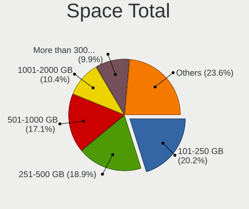

| Size in GB     | Computers | Percent |
|----------------|-----------|---------|
| 101-250        | 13166     | 20.15%  |
| 251-500        | 12322     | 18.86%  |
| 501-1000       | 11195     | 17.14%  |
| 1001-2000      | 6762      | 10.35%  |
| More than 3000 | 6486      | 9.93%   |
| 1-20           | 4659      | 7.13%   |
| Unknown        | 3194      | 4.89%   |
| 51-100         | 3142      | 4.81%   |
| 2001-3000      | 2594      | 3.97%   |
| 21-50          | 1805      | 2.76%   |
| 0              | 2         | 0.003%  |

Space Used
----------

Amount of used disk space

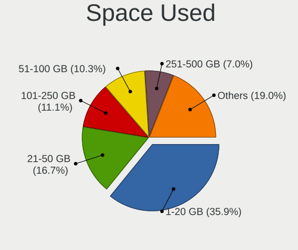

| Used GB        | Computers | Percent |
|----------------|-----------|---------|
| 1-20           | 24412     | 35.87%  |
| 21-50          | 11396     | 16.74%  |
| 101-250        | 7553      | 11.1%   |
| 51-100         | 6989      | 10.27%  |
| 251-500        | 4764      | 7%      |
| 501-1000       | 3814      | 5.6%    |
| Unknown        | 3194      | 4.69%   |
| 1001-2000      | 2683      | 3.94%   |
| More than 3000 | 1908      | 2.8%    |
| 2001-3000      | 1077      | 1.58%   |
| 0              | 269       | 0.4%    |

Malfunc. Drives
---------------

Drive models with a malfunction

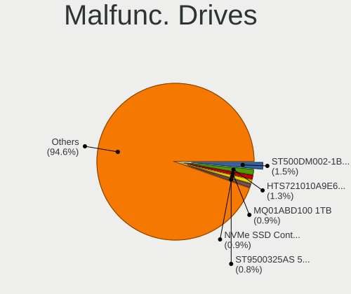

| Model                                                         | Computers | Drives | Percent |
|---------------------------------------------------------------|-----------|--------|---------|
| Seagate ST500DM002-1BD142 500GB                               | 66        | 76     | 1.51%   |
| HGST HTS721010A9E630 1TB                                      | 55        | 61     | 1.26%   |
| Toshiba MQ01ABD100 1TB                                        | 39        | 51     | 0.89%   |
| Samsung Electronics NVMe SSD Controller SM981/PM981/PM983 1TB | 39        | 49     | 0.89%   |
| Seagate ST9500325AS 500GB                                     | 37        | 54     | 0.85%   |
| Samsung Electronics SSD 870 EVO 1TB                           | 37        | 56     | 0.85%   |
| Seagate ST31000528AS 1TB                                      | 35        | 44     | 0.8%    |
| Seagate ST1000LM024 HN-M101MBB 1TB                            | 33        | 35     | 0.75%   |
| Seagate ST500LT012-9WS142 500GB                               | 31        | 34     | 0.71%   |
| Seagate ST1000LM035-1RK172 1TB                                | 31        | 33     | 0.71%   |
| HGST HTS725050A7E630 500GB                                    | 30        | 32     | 0.69%   |
| HGST HTS541010A9E680 1TB                                      | 30        | 50     | 0.69%   |
| Seagate ST500LT012-1DG142 500GB                               | 29        | 32     | 0.66%   |
| Crucial CT525MX300SSD1 528GB                                  | 26        | 30     | 0.59%   |
| Fujitsu MHZ2160BH FFS G1 160GB                                | 25        | 25     | 0.57%   |
| Seagate ST2000DM008-2FR102 2TB                                | 24        | 30     | 0.55%   |
| Toshiba MQ01ABF050 500GB                                      | 23        | 24     | 0.53%   |
| Toshiba DT01ACA100 1TB                                        | 23        | 26     | 0.53%   |
| Seagate ST320LT007-9ZV142 320GB                               | 22        | 25     | 0.5%    |
| HGST HTS545050A7E680 500GB                                    | 22        | 23     | 0.5%    |
| Seagate ST3500418AS 500GB                                     | 21        | 28     | 0.48%   |
| Seagate ST31000524AS 1TB                                      | 21        | 26     | 0.48%   |
| Hitachi HDS721010CLA332 1TB                                   | 21        | 25     | 0.48%   |
| Kingston SV300S37A120G 120GB SSD                              | 19        | 20     | 0.43%   |
| Samsung Electronics SSD 980 1TB                               | 18        | 30     | 0.41%   |
| Seagate ST500LM021-1KJ152 500GB                               | 17        | 18     | 0.39%   |
| SanDisk SSD PLUS 240GB                                        | 17        | 18     | 0.39%   |
| Hitachi HTS547575A9E384 752GB                                 | 17        | 19     | 0.39%   |
| Seagate ST1000LX015-1U7172 1TB                                | 16        | 18     | 0.37%   |
| SanDisk SSD PLUS 1000GB                                       | 16        | 23     | 0.37%   |
| WDC WD10EZEX-00BN5A0 1TB                                      | 15        | 17     | 0.34%   |
| Seagate ST9500420AS 500GB                                     | 15        | 16     | 0.34%   |
| Seagate ST31500341AS 1TB                                      | 15        | 19     | 0.34%   |
| Seagate ST2000DM006-2DM164 2TB                                | 15        | 17     | 0.34%   |
| Samsung Electronics SSD 870 EVO 500GB                         | 15        | 19     | 0.34%   |
| Samsung Electronics SSD 870 EVO 2TB                           | 15        | 18     | 0.34%   |
| Hitachi HTS545050B9A300 500GB                                 | 15        | 16     | 0.34%   |
| HGST HTS541075A9E680 752GB                                    | 15        | 15     | 0.34%   |
| Seagate ST2000DL003-9VT166 2TB                                | 14        | 17     | 0.32%   |
| WDC WD40EFRX-68WT0N0 4TB                                      | 13        | 23     | 0.3%    |

Malfunc. Drive Vendor
---------------------

Vendors of faulty drives

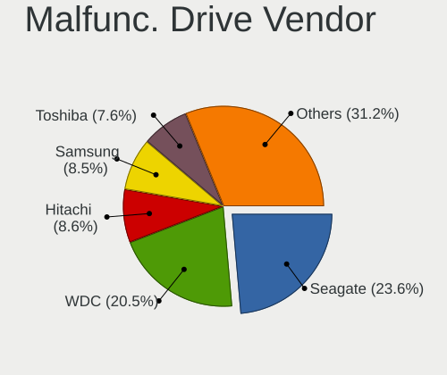

| Vendor                | Computers | Drives | Percent |
|-----------------------|-----------|--------|---------|
| Seagate               | 1004      | 1274   | 23.61%  |
| WDC                   | 873       | 1144   | 20.53%  |
| Hitachi               | 365       | 433    | 8.58%   |
| Samsung Electronics   | 360       | 488    | 8.47%   |
| Toshiba               | 325       | 388    | 7.64%   |
| HGST                  | 210       | 265    | 4.94%   |
| Intel                 | 129       | 164    | 3.03%   |
| Crucial               | 125       | 158    | 2.94%   |
| SanDisk               | 108       | 125    | 2.54%   |
| SK hynix              | 106       | 120    | 2.49%   |
| Kingston              | 89        | 107    | 2.09%   |
| A-DATA Technology     | 58        | 66     | 1.36%   |
| Fujitsu               | 54        | 54     | 1.27%   |
| Apple                 | 48        | 51     | 1.13%   |
| Micron Technology     | 44        | 67     | 1.03%   |
| SPCC                  | 25        | 27     | 0.59%   |
| Hewlett-Packard       | 21        | 22     | 0.49%   |
| SSSTC                 | 17        | 17     | 0.4%    |
| Maxtor                | 17        | 20     | 0.4%    |
| LITEON                | 16        | 17     | 0.38%   |
| China                 | 16        | 17     | 0.38%   |
| Realtek Semiconductor | 15        | 18     | 0.35%   |
| OCZ                   | 15        | 18     | 0.35%   |
| LITEONIT              | 14        | 15     | 0.33%   |
| Corsair               | 13        | 14     | 0.31%   |
| ASMT                  | 13        | 24     | 0.31%   |
| Mushkin               | 11        | 11     | 0.26%   |
| Netac                 | 9         | 10     | 0.21%   |
| Unknown               | 9         | 10     | 0.21%   |
| Team                  | 8         | 11     | 0.19%   |
| IBM/Hitachi           | 7         | 9      | 0.16%   |
| Unknown               | 6         | 6      | 0.14%   |
| Transcend             | 5         | 7      | 0.12%   |
| SABRENT               | 5         | 5      | 0.12%   |
| PNY                   | 5         | 10     | 0.12%   |
| Patriot               | 4         | 4      | 0.09%   |
| KingSpec              | 4         | 4      | 0.09%   |
| KingFast              | 4         | 4      | 0.09%   |
| WD MediaMax           | 3         | 5      | 0.07%   |
| T-FORCE               | 3         | 3      | 0.07%   |

Malfunc. HDD Vendor
-------------------

Vendors of faulty HDD drives

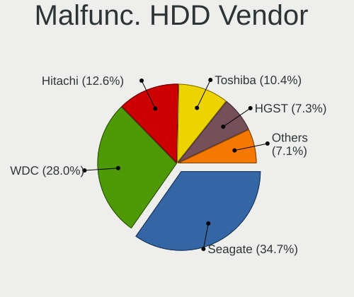

| Vendor              | Computers | Drives | Percent |
|---------------------|-----------|--------|---------|
| Seagate             | 1004      | 1273   | 34.72%  |
| WDC                 | 809       | 1065   | 27.97%  |
| Hitachi             | 365       | 433    | 12.62%  |
| Toshiba             | 300       | 356    | 10.37%  |
| HGST                | 210       | 265    | 7.26%   |
| Samsung Electronics | 59        | 68     | 2.04%   |
| Fujitsu             | 54        | 54     | 1.87%   |
| Apple               | 29        | 30     | 1%      |
| Maxtor              | 17        | 20     | 0.59%   |
| IBM/Hitachi         | 7         | 9      | 0.24%   |
| Hewlett-Packard     | 7         | 8      | 0.24%   |
| ASMT                | 7         | 14     | 0.24%   |
| WD MediaMax         | 3         | 5      | 0.1%    |
| ASMedia             | 3         | 8      | 0.1%    |
| Unknown             | 2         | 2      | 0.07%   |
| MaxDigital          | 2         | 2      | 0.07%   |
| HGST HTS            | 2         | 4      | 0.07%   |
| Unknown             | 2         | 2      | 0.07%   |
| SABRENT             | 1         | 1      | 0.03%   |
| RSH-339             | 1         | 1      | 0.03%   |
| RSH-319             | 1         | 1      | 0.03%   |
| LaCie               | 1         | 1      | 0.03%   |
| JMicron Technology  | 1         | 1      | 0.03%   |
| IBM                 | 1         | 1      | 0.03%   |
| HPE                 | 1         | 1      | 0.03%   |
| HGST HUS            | 1         | 1      | 0.03%   |
| ExcelStor           | 1         | 1      | 0.03%   |
| Apricorn            | 1         | 1      | 0.03%   |

Malfunc. Drive Kind
-------------------

Kinds of faulty drives

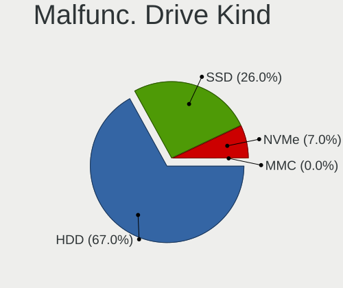

| Kind | Computers | Drives | Percent |
|------|-----------|--------|---------|
| HDD  | 2733      | 3628   | 66.99%  |
| SSD  | 1060      | 1315   | 25.98%  |
| NVMe | 286       | 379    | 7.01%   |
| MMC  | 1         | 1      | 0.02%   |

Failed Drives
-------------

Failed drive models

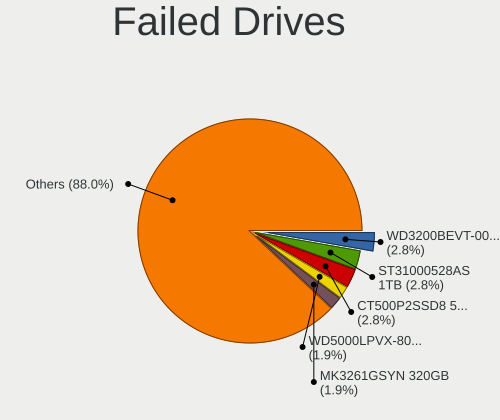

| Model                                                          | Computers | Drives | Percent |
|----------------------------------------------------------------|-----------|--------|---------|
| WDC WD3200BEVT-00ZCT0 320GB                                    | 3         | 3      | 2.78%   |
| Seagate ST31000528AS 1TB                                       | 3         | 5      | 2.78%   |
| Crucial CT500P2SSD8 500GB                                      | 3         | 3      | 2.78%   |
| WDC WD5000LPVX-80V0TT0 500GB                                   | 2         | 2      | 1.85%   |
| Toshiba MK3261GSYN 320GB                                       | 2         | 2      | 1.85%   |
| Toshiba MK2555GSX 250GB                                        | 2         | 2      | 1.85%   |
| SK hynix BC501 HFM256GDJTNG-8310A 256GB                        | 2         | 2      | 1.85%   |
| Seagate ST3500630AS 500GB                                      | 2         | 3      | 1.85%   |
| Samsung Electronics SSD 980 1TB                                | 2         | 2      | 1.85%   |
| Samsung Electronics SSD 960 EVO 250GB                          | 2         | 2      | 1.85%   |
| Samsung Electronics NVMe SSD Controller PM9A1/PM9A3/980PRO 1TB | 2         | 5      | 1.85%   |
| Kingston SV300S37A120G 120GB SSD                               | 2         | 2      | 1.85%   |
| HGST HTS541010A9E680 1TB                                       | 2         | 2      | 1.85%   |
| Apple HDD HTS541010A9E662 1TB                                  | 2         | 2      | 1.85%   |
| WDC WDS256G1X0C-00ENX0 256GB                                   | 1         | 1      | 0.93%   |
| WDC WD5003ABYX-70WERA0 500GB                                   | 1         | 1      | 0.93%   |
| WDC WD5000LPLX-75ZNTT0 500GB                                   | 1         | 1      | 0.93%   |
| WDC WD5000AVDS-63U7B1 500GB                                    | 1         | 1      | 0.93%   |
| WDC WD5000AADS-00S9B0 500GB                                    | 1         | 1      | 0.93%   |
| WDC WD4001FFSX-68JNUN0 4TB                                     | 1         | 1      | 0.93%   |
| WDC WD3200AAJS-60Z0A0 320GB                                    | 1         | 3      | 0.93%   |
| WDC WD30EZRS-11J99B1 3TB                                       | 1         | 1      | 0.93%   |
| WDC WD30 EZRS-00J99B0 3TB                                      | 1         | 1      | 0.93%   |
| WDC WD2500BEVT-75A23T0 250GB                                   | 1         | 2      | 0.93%   |
| WDC WD2500BEVT-60ZCT1 250GB                                    | 1         | 1      | 0.93%   |
| WDC WD2500BEVT-22A23T0 250GB                                   | 1         | 1      | 0.93%   |
| WDC WD2500BEVT-11ZCT0 250GB                                    | 1         | 1      | 0.93%   |
| WDC WD20EADS-00R6B0 2TB                                        | 1         | 1      | 0.93%   |
| WDC WD10JPVT-75A1YT0 1TB                                       | 1         | 1      | 0.93%   |
| WDC WD10EZEX-60WN4A0 1TB                                       | 1         | 1      | 0.93%   |
| WDC WD10EZEX-00BN5A0 1TB                                       | 1         | 1      | 0.93%   |
| WDC WD10EAVS-00D7B1 1TB                                        | 1         | 1      | 0.93%   |
| WDC WD10EARX-22N0YB0 1TB                                       | 1         | 1      | 0.93%   |
| WDC WD10 02FBYS-02A6B0 1TB                                     | 1         | 1      | 0.93%   |
| WD MediaMax WL1000GSA1672 1TB                                  | 1         | 1      | 0.93%   |
| Toshiba XG6 NVMe SSD Controller 1024GB                         | 1         | 1      | 0.93%   |
| Toshiba THNSN5512GPU7 512GB                                    | 1         | 1      | 0.93%   |
| Toshiba THNSN5256GPUK NVMe 256GB                               | 1         | 1      | 0.93%   |
| Toshiba MQ01ABF032 320GB                                       | 1         | 1      | 0.93%   |
| Toshiba MQ01ABD100 1TB                                         | 1         | 1      | 0.93%   |

Failed Drive Vendor
-------------------

Failed drive vendors

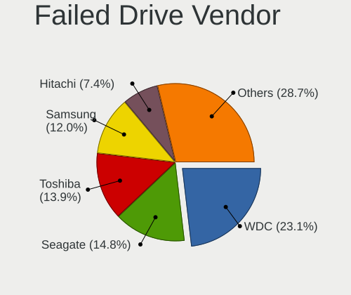

| Vendor                      | Computers | Drives | Percent |
|-----------------------------|-----------|--------|---------|
| WDC                         | 25        | 28     | 23.15%  |
| Seagate                     | 16        | 21     | 14.81%  |
| Toshiba                     | 15        | 16     | 13.89%  |
| Samsung Electronics         | 13        | 17     | 12.04%  |
| Hitachi                     | 8         | 9      | 7.41%   |
| SK hynix                    | 7         | 14     | 6.48%   |
| HGST                        | 5         | 5      | 4.63%   |
| Kingston                    | 3         | 3      | 2.78%   |
| Crucial                     | 3         | 3      | 2.78%   |
| Apple                       | 2         | 2      | 1.85%   |
| WD MediaMax                 | 1         | 1      | 0.93%   |
| SanDisk                     | 1         | 1      | 0.93%   |
| Patriot                     | 1         | 2      | 0.93%   |
| Mushkin                     | 1         | 1      | 0.93%   |
| Kingston Technology Company | 1         | 10     | 0.93%   |
| JM icron                    | 1         | 1      | 0.93%   |
| Intenso                     | 1         | 1      | 0.93%   |
| Intel                       | 1         | 1      | 0.93%   |
| Inland                      | 1         | 1      | 0.93%   |
| External                    | 1         | 1      | 0.93%   |
| Unknown                     | 1         | 1      | 0.93%   |

Drive Status
------------

Number of failed and malfunc. drives

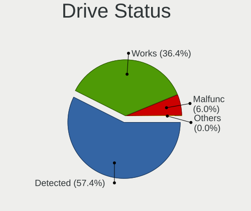

| Status   | Computers | Drives | Percent |
|----------|-----------|--------|---------|
| Detected | 37832     | 83386  | 57.4%   |
| Works    | 23987     | 49212  | 36.39%  |
| Malfunc  | 3974      | 5323   | 6.03%   |
| Failed   | 107       | 139    | 0.16%   |
| Limited  | 7         | 7      | 0.01%   |
| Fixed    | 1         | 1      | 0.002%  |

Storage controller
------------------

Storage Vendor
--------------

Storage controller vendors

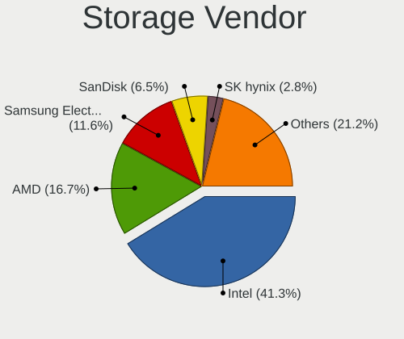

| Vendor                         | Computers | Percent |
|--------------------------------|-----------|---------|
| Intel                          | 33844     | 41.26%  |
| AMD                            | 13693     | 16.69%  |
| Samsung Electronics            | 9510      | 11.59%  |
| SanDisk                        | 5333      | 6.5%    |
| SK hynix                       | 2283      | 2.78%   |
| Phison Electronics             | 2267      | 2.76%   |
| ASMedia Technology             | 1877      | 2.29%   |
| Micron/Crucial Technology      | 1544      | 1.88%   |
| Micron Technology              | 1347      | 1.64%   |
| Nvidia                         | 1216      | 1.48%   |
| Kingston Technology Company    | 1191      | 1.45%   |
| Toshiba America Info Systems   | 971       | 1.18%   |
| Marvell Technology Group       | 802       | 0.98%   |
| KIOXIA                         | 785       | 0.96%   |
| Silicon Motion                 | 697       | 0.85%   |
| MAXIO Technology (Hangzhou)    | 557       | 0.68%   |
| Realtek Semiconductor          | 520       | 0.63%   |
| JMicron Technology             | 447       | 0.54%   |
| Broadcom / LSI                 | 379       | 0.46%   |
| LSI Logic / Symbios Logic      | 376       | 0.46%   |
| Apple                          | 349       | 0.43%   |
| ADATA Technology               | 313       | 0.38%   |
| INNOGRIT                       | 179       | 0.22%   |
| Shenzhen Longsys Electronics   | 162       | 0.2%    |
| Seagate Technology             | 139       | 0.17%   |
| Union Memory (Shenzhen)        | 124       | 0.15%   |
| Solidigm                       | 124       | 0.15%   |
| Solid State Storage Technology | 108       | 0.13%   |
| O2 Micro                       | 100       | 0.12%   |
| Silicon Image                  | 83        | 0.1%    |
| Biwin Storage Technology       | 80        | 0.1%    |
| Lite-On Technology             | 76        | 0.09%   |
| Hewlett-Packard                | 75        | 0.09%   |
| VIA Technologies               | 62        | 0.08%   |
| Adaptec                        | 62        | 0.08%   |
| Lenovo                         | 48        | 0.06%   |
| Yangtze Memory Technologies    | 33        | 0.04%   |
| Hosin Global Electronics       | 33        | 0.04%   |
| TenaFe                         | 23        | 0.03%   |
| Nextorage                      | 21        | 0.03%   |

Storage Model
-------------

Storage controller models

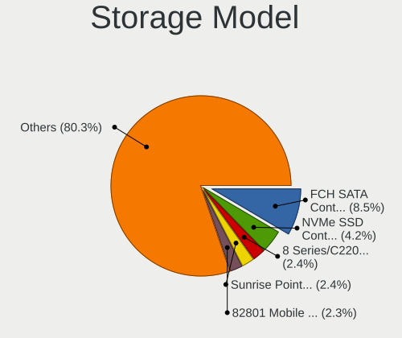

| Model                                                                          | Computers | Percent |
|--------------------------------------------------------------------------------|-----------|---------|
| AMD FCH SATA Controller [AHCI mode]                                            | 7876      | 8.48%   |
| Samsung NVMe SSD Controller SM981/PM981/PM983                                  | 3920      | 4.22%   |
| Intel 8 Series/C220 Series Chipset Family 6-port SATA Controller 1 [AHCI mode] | 2202      | 2.37%   |
| Intel Sunrise Point-LP SATA Controller [AHCI mode]                             | 2188      | 2.36%   |
| Intel 82801 Mobile SATA Controller [RAID mode]                                 | 2148      | 2.31%   |
| Samsung NVMe SSD Controller PM9A1/PM9A3/980PRO                                 | 1792      | 1.93%   |
| AMD 400 Series Chipset SATA Controller                                         | 1744      | 1.88%   |
| Intel 7 Series Chipset Family 6-port SATA Controller [AHCI mode]               | 1690      | 1.82%   |
| Intel SATA Controller [RAID Mode]                                              | 1621      | 1.75%   |
| AMD 500 Series Chipset SATA Controller                                         | 1614      | 1.74%   |
| ASMedia ASM1061/ASM1062 Serial ATA Controller                                  | 1577      | 1.7%    |
| Intel Volume Management Device NVMe RAID Controller                            | 1486      | 1.6%    |
| AMD 600 Series Chipset SATA Controller                                         | 1463      | 1.58%   |
| Intel Q170/Q150/B150/H170/H110/Z170/CM236 Chipset SATA Controller [AHCI Mode]  | 1387      | 1.49%   |
| AMD SB7x0/SB8x0/SB9x0 SATA Controller [AHCI mode]                              | 1314      | 1.42%   |
| Intel 6 Series/C200 Series Chipset Family 6 port Mobile SATA AHCI Controller   | 1308      | 1.41%   |
| Samsung NVMe SSD Controller 980 (DRAM-less)                                    | 1268      | 1.37%   |
| AMD SB7x0/SB8x0/SB9x0 IDE Controller                                           | 1074      | 1.16%   |
| Intel 200 Series PCH SATA controller [AHCI mode]                               | 1073      | 1.16%   |
| Intel 6 Series/C200 Series Chipset Family 6 port Desktop SATA AHCI Controller  | 1031      | 1.11%   |
| Intel Celeron/Pentium Silver Processor SATA Controller                         | 1025      | 1.1%    |
| SanDisk WD SN560/SN740/SN770/SN5000 NVMe SSD                                   | 983       | 1.06%   |
| Intel 7 Series/C210 Series Chipset Family 6-port SATA Controller [AHCI mode]   | 980       | 1.06%   |
| Intel 8 Series SATA Controller 1 [AHCI mode]                                   | 964       | 1.04%   |
| Intel Cannon Lake PCH SATA AHCI Controller                                     | 896       | 0.96%   |
| Samsung NVMe SSD Controller SM961/PM961/SM963                                  | 854       | 0.92%   |
| SanDisk Extreme Pro / WD Black SN750 / PC SN730 / Red SN700 NVMe SSD           | 842       | 0.91%   |
| SanDisk Ultra 3D / WD PC SN530, IX SN530, Blue SN550 NVMe SSD (DRAM-less)      | 794       | 0.86%   |
| Intel Cannon Lake Mobile PCH SATA AHCI Controller                              | 790       | 0.85%   |
| SK hynix Gold P31/BC711/PC711 NVMe Solid State Drive                           | 784       | 0.84%   |
| Intel Wildcat Point-LP SATA Controller [AHCI Mode]                             | 770       | 0.83%   |
| Phison E12 NVMe Controller                                                     | 767       | 0.83%   |
| AMD SB7x0/SB8x0/SB9x0 SATA Controller [IDE mode]                               | 719       | 0.77%   |
| Samsung NVMe SSD Controller S4LV008[Pascal]                                    | 710       | 0.76%   |
| Micron/Crucial P2 [Nick P2] / P3 / P3 Plus NVMe PCIe SSD (DRAM-less)           | 708       | 0.76%   |
| Intel Comet Lake SATA AHCI Controller                                          | 630       | 0.68%   |
| Intel Alder Lake-S PCH SATA Controller [AHCI Mode]                             | 629       | 0.68%   |
| Intel 82801IBM/IEM (ICH9M/ICH9M-E) 4 port SATA Controller [AHCI mode]          | 606       | 0.65%   |
| Nvidia MCP79 AHCI Controller                                                   | 585       | 0.63%   |
| Sandisk WD Black SN850X NVMe SSD                                               | 536       | 0.58%   |

Storage Kind
------------

Kind of storage controller (IDE, SATA, NVMe, SAS, ...)

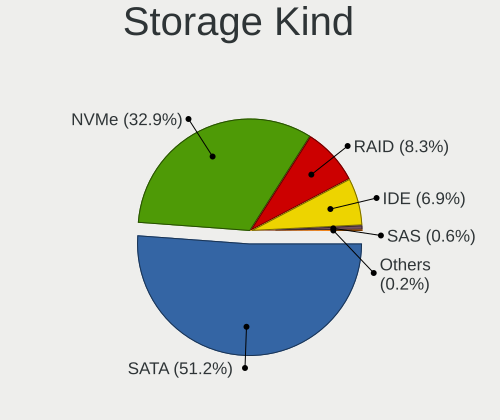

| Kind | Computers | Percent |
|------|-----------|---------|
| SATA | 40964     | 51.17%  |
| NVMe | 26303     | 32.85%  |
| RAID | 6640      | 8.29%   |
| IDE  | 5504      | 6.87%   |
| SAS  | 494       | 0.62%   |
| SCSI | 154       | 0.19%   |

Processor
---------

CPU Vendor
----------

Processor vendors

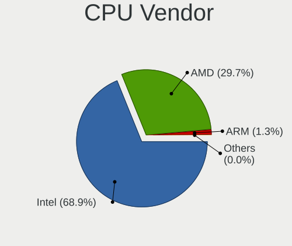

| Vendor                   | Computers | Percent |
|--------------------------|-----------|---------|
| Intel                    | 41854     | 68.87%  |
| AMD                      | 18063     | 29.72%  |
| ARM                      | 762       | 1.25%   |
| Qualcomm                 | 39        | 0.06%   |
| Unknown                  | 31        | 0.05%   |
| sifive,u74-mc            | 6         | 0.01%   |
| CentaurHauls             | 4         | 0.01%   |
| PowerNV C1P9S01 REV 1.01 | 2         | 0.003%  |
| Loongson                 | 2         | 0.003%  |
| ky,x60                   | 2         | 0.003%  |
| Xenon Game Console       | 1         | 0.002%  |
| PowerNV C1P9S01 REV 1.02 | 1         | 0.002%  |
| PowerMac8,1              | 1         | 0.002%  |
| PowerBook5,5             | 1         | 0.002%  |
| PowerBook3,5             | 1         | 0.002%  |
| Nintendo Wii             | 1         | 0.002%  |
| IBM/S390                 | 1         | 0.002%  |
| eswin,eic770x            | 1         | 0.002%  |

CPU Model
---------

Processor models

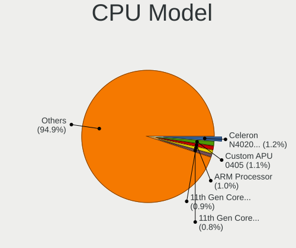

| Model                                   | Computers | Percent |
|-----------------------------------------|-----------|---------|
| Intel Celeron N4020 CPU @ 1.10GHz       | 707       | 1.16%   |
| AMD Custom APU 0405                     | 701       | 1.15%   |
| ARM Processor                           | 618       | 1.01%   |
| Intel 11th Gen Core i7-1165G7 @ 2.80GHz | 566       | 0.93%   |
| Intel 11th Gen Core i5-1135G7 @ 2.40GHz | 498       | 0.82%   |
| AMD Ryzen 5 3600 6-Core Processor       | 477       | 0.78%   |
| AMD Ryzen 7 3700X 8-Core Processor      | 471       | 0.77%   |
| Intel Core i5-8250U CPU @ 1.60GHz       | 404       | 0.66%   |
| AMD Ryzen 7 5800X 8-Core Processor      | 396       | 0.65%   |
| Intel Core i7-8550U CPU @ 1.80GHz       | 394       | 0.65%   |
| AMD Ryzen 5 5600X 6-Core Processor      | 373       | 0.61%   |
| Intel Core 2 Duo CPU P7450 @ 2.13GHz    | 371       | 0.61%   |
| Intel Core i7-9750H CPU @ 2.60GHz       | 367       | 0.6%    |
| AMD Ryzen 9 5900X 12-Core Processor     | 346       | 0.57%   |
| Intel Core i5-7200U CPU @ 2.50GHz       | 335       | 0.55%   |
| Intel Core i5-6300U CPU @ 2.40GHz       | 331       | 0.54%   |
| Intel Core i7-8750H CPU @ 2.20GHz       | 328       | 0.54%   |
| Intel Core i7-8650U CPU @ 1.90GHz       | 321       | 0.53%   |
| AMD Ryzen 9 3900X 12-Core Processor     | 315       | 0.52%   |
| Intel Core i5-3470 CPU @ 3.20GHz        | 313       | 0.51%   |
| Intel Core i7-7700HQ CPU @ 2.80GHz      | 310       | 0.51%   |
| Intel Core i5-3210M CPU @ 2.50GHz       | 309       | 0.51%   |
| Intel Core i7-3770 CPU @ 3.40GHz        | 298       | 0.49%   |
| Intel Core i7-10750H CPU @ 2.60GHz      | 297       | 0.49%   |
| Intel Core i5-2520M CPU @ 2.50GHz       | 294       | 0.48%   |
| Intel Core i7-4790 CPU @ 3.60GHz        | 286       | 0.47%   |
| AMD Ryzen 7 2700X Eight-Core Processor  | 267       | 0.44%   |
| Intel Core i5-2400 CPU @ 3.10GHz        | 264       | 0.43%   |
| Intel Core i5-6200U CPU @ 2.30GHz       | 263       | 0.43%   |
| AMD FX-8350 Eight-Core Processor        | 260       | 0.43%   |
| Intel Core i7-8565U CPU @ 1.80GHz       | 252       | 0.41%   |
| Intel Core i7-7500U CPU @ 2.70GHz       | 250       | 0.41%   |
| AMD Ryzen 5 2600 Six-Core Processor     | 248       | 0.41%   |
| Intel Celeron CPU N2840 @ 2.16GHz       | 247       | 0.4%    |
| AMD Ryzen 5 5600G with Radeon Graphics  | 247       | 0.4%    |
| Intel Celeron CPU N3060 @ 1.60GHz       | 244       | 0.4%    |
| AMD Ryzen 9 5950X 16-Core Processor     | 242       | 0.4%    |
| Intel Core i5-6500 CPU @ 3.20GHz        | 237       | 0.39%   |
| Intel Core i5-5250U CPU @ 1.60GHz       | 237       | 0.39%   |
| AMD Ryzen 7 5700G with Radeon Graphics  | 236       | 0.39%   |

CPU Model Family
----------------

Processor model prefix

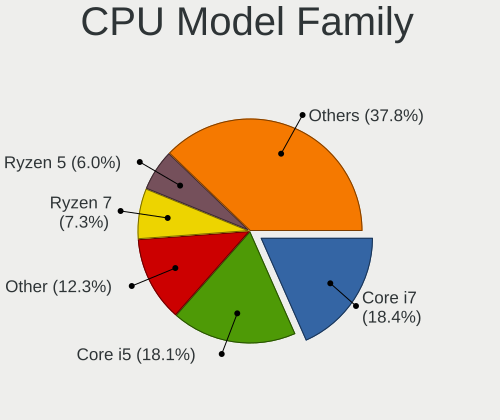

| Model                   | Computers | Percent |
|-------------------------|-----------|---------|
| Intel Core i7           | 11195     | 18.38%  |
| Intel Core i5           | 11040     | 18.13%  |
| Other                   | 7510      | 12.33%  |
| AMD Ryzen 7             | 4464      | 7.33%   |
| AMD Ryzen 5             | 3665      | 6.02%   |
| Intel Celeron           | 2970      | 4.88%   |
| Intel Core i3           | 2603      | 4.27%   |
| AMD Ryzen 9             | 2278      | 3.74%   |
| Intel Core 2 Duo        | 2108      | 3.46%   |
| Intel Xeon              | 1966      | 3.23%   |
| AMD FX                  | 1014      | 1.66%   |
| Intel Pentium           | 932       | 1.53%   |
| Intel Core i9           | 720       | 1.18%   |
| AMD Ryzen 3             | 646       | 1.06%   |
| AMD A6                  | 544       | 0.89%   |
| Intel Core              | 473       | 0.78%   |
| Intel Atom              | 466       | 0.77%   |
| AMD A8                  | 422       | 0.69%   |
| AMD A10                 | 414       | 0.68%   |
| Intel Core 2 Quad       | 318       | 0.52%   |
| Intel Pentium Dual-Core | 316       | 0.52%   |
| AMD Ryzen 7 PRO         | 291       | 0.48%   |
| AMD Ryzen Threadripper  | 271       | 0.44%   |
| AMD A4                  | 248       | 0.41%   |
| AMD Phenom II X4        | 245       | 0.4%    |
| Intel Core 2            | 240       | 0.39%   |
| Intel Pentium Silver    | 227       | 0.37%   |
| AMD Ryzen 5 PRO         | 197       | 0.32%   |
| AMD Athlon II X2        | 173       | 0.28%   |
| AMD E                   | 163       | 0.27%   |
| AMD Athlon 64 X2        | 161       | 0.26%   |
| AMD Athlon              | 161       | 0.26%   |
| AMD Athlon II X4        | 137       | 0.22%   |
| AMD E2                  | 131       | 0.22%   |
| Intel Pentium Dual      | 128       | 0.21%   |
| AMD Phenom II X6        | 123       | 0.2%    |
| Intel Core m3           | 116       | 0.19%   |
| Intel Pentium 4         | 107       | 0.18%   |
| ARM BCM                 | 105       | 0.17%   |
| Intel Genuine           | 101       | 0.17%   |

CPU Cores
---------

Number of processor cores

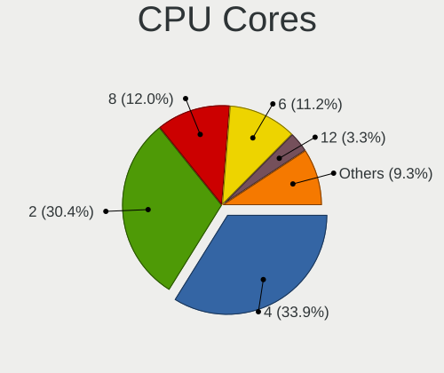

| Number  | Computers | Percent |
|---------|-----------|---------|
| 4       | 20652     | 33.86%  |
| 2       | 18517     | 30.36%  |
| 8       | 7342      | 12.04%  |
| 6       | 6809      | 11.16%  |
| 12      | 2025      | 3.32%   |
| 16      | 1539      | 2.52%   |
| 10      | 991       | 1.62%   |
| 1       | 841       | 1.38%   |
| 14      | 691       | 1.13%   |
| 24      | 535       | 0.88%   |
| 3       | 321       | 0.53%   |
| Unknown | 216       | 0.35%   |
| 20      | 182       | 0.3%    |
| 32      | 114       | 0.19%   |
| 28      | 36        | 0.06%   |
| 18      | 33        | 0.05%   |
| 64      | 29        | 0.05%   |
| 36      | 28        | 0.05%   |
| 40      | 23        | 0.04%   |
| 48      | 17        | 0.03%   |
| 5       | 14        | 0.02%   |
| 44      | 8         | 0.01%   |
| 96      | 6         | 0.01%   |
| 22      | 5         | 0.01%   |
| 128     | 3         | 0.005%  |
| 56      | 2         | 0.003%  |
| 52      | 2         | 0.003%  |
| 7       | 2         | 0.003%  |
| 384     | 1         | 0.002%  |
| 256     | 1         | 0.002%  |
| 192     | 1         | 0.002%  |
| 112     | 1         | 0.002%  |
| 104     | 1         | 0.002%  |
| 26      | 1         | 0.002%  |
| 9       | 1         | 0.002%  |

CPU Sockets
-----------

Number of sockets

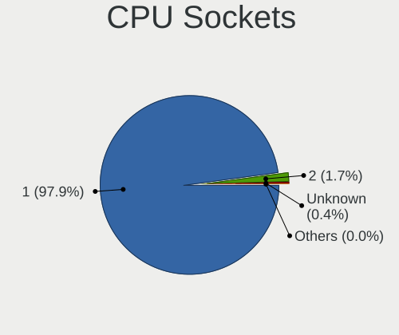

| Number  | Computers | Percent |
|---------|-----------|---------|
| 1       | 59487     | 97.85%  |
| 2       | 1039      | 1.71%   |
| Unknown | 213       | 0.35%   |
| 4       | 34        | 0.06%   |
| 3       | 9         | 0.01%   |
| 8       | 4         | 0.01%   |
| 24      | 2         | 0.003%  |
| 20      | 2         | 0.003%  |
| 14      | 2         | 0.003%  |
| 16      | 1         | 0.002%  |
| 12      | 1         | 0.002%  |

CPU Threads
-----------

Threads per core (Hyper-Threading)

| Number  | Computers | Percent |
|---------|-----------|---------|
| 2       | 42667     | 69.99%  |
| 1       | 18052     | 29.61%  |
| Unknown | 216       | 0.35%   |
| 4       | 11        | 0.02%   |
| 8       | 10        | 0.02%   |
| 12      | 2         | 0.003%  |
| 112     | 1         | 0.002%  |
| 16      | 1         | 0.002%  |
| 3       | 1         | 0.002%  |

CPU Op-Modes
------------

CPU Operation Modes (32-bit, 64-bit)

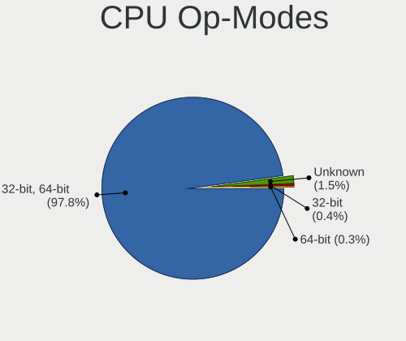

| Op mode        | Computers | Percent |
|----------------|-----------|---------|
| 32-bit, 64-bit | 59540     | 97.83%  |
| Unknown        | 891       | 1.46%   |
| 32-bit         | 261       | 0.43%   |
| 64-bit         | 166       | 0.27%   |

CPU Microcode
-------------

Microcode number

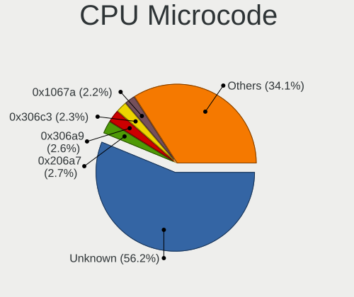

| Number     | Computers | Percent |
|------------|-----------|---------|
| Unknown    | 35681     | 56.22%  |
| 0x206a7    | 1686      | 2.66%   |
| 0x306a9    | 1640      | 2.58%   |
| 0x306c3    | 1467      | 2.31%   |
| 0x1067a    | 1371      | 2.16%   |
| 0x906ea    | 869       | 1.37%   |
| 0x506e3    | 719       | 1.13%   |
| 0x806ea    | 705       | 1.11%   |
| 0x806c1    | 689       | 1.09%   |
| 0x306d4    | 628       | 0.99%   |
| 0x08701021 | 598       | 0.94%   |
| 0x40651    | 585       | 0.92%   |
| 0x806e9    | 577       | 0.91%   |
| 0x906e9    | 564       | 0.89%   |
| 0x406e3    | 558       | 0.88%   |
| 0x806ec    | 554       | 0.87%   |
| 0x20655    | 404       | 0.64%   |
| 0x06000852 | 404       | 0.64%   |
| 0x0800820d | 388       | 0.61%   |
| 0x30678    | 379       | 0.6%    |
| 0x406c4    | 349       | 0.55%   |
| 0x0a50000c | 342       | 0.54%   |
| 0x08108109 | 331       | 0.52%   |
| 0x08701013 | 305       | 0.48%   |
| 0x010000c8 | 297       | 0.47%   |
| 0x06001119 | 294       | 0.46%   |
| 0xa0652    | 287       | 0.45%   |
| 0x906ed    | 264       | 0.42%   |
| 0x706e5    | 262       | 0.41%   |
| 0x10676    | 256       | 0.4%    |
| 0x6fd      | 254       | 0.4%    |
| 0x706a8    | 244       | 0.38%   |
| 0x0a50000d | 225       | 0.35%   |
| 0x206c2    | 195       | 0.31%   |
| 0x6fb      | 189       | 0.3%    |
| 0x08108102 | 188       | 0.3%    |
| 0x07030105 | 176       | 0.28%   |
| 0x906a3    | 172       | 0.27%   |
| 0x20652    | 172       | 0.27%   |
| 0x506c9    | 170       | 0.27%   |

CPU Microarch
-------------

Microarchitecture

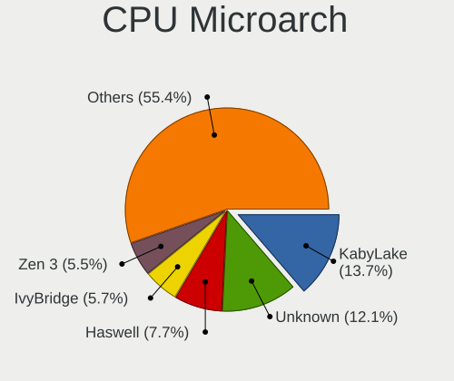

| Name              | Computers | Percent |
|-------------------|-----------|---------|
| KabyLake          | 8366      | 13.7%   |
| Unknown           | 7374      | 12.08%  |
| Haswell           | 4705      | 7.7%    |
| IvyBridge         | 3465      | 5.67%   |
| Zen 3             | 3351      | 5.49%   |
| SandyBridge       | 3211      | 5.26%   |
| Skylake           | 3195      | 5.23%   |
| Zen 2             | 2536      | 4.15%   |
| Penryn            | 2415      | 3.95%   |
| Alderlake Hybrid  | 1836      | 3.01%   |
| Zen+              | 1806      | 2.96%   |
| TigerLake         | 1718      | 2.81%   |
| Broadwell         | 1499      | 2.45%   |
| CometLake         | 1460      | 2.39%   |
| Silvermont        | 1405      | 2.3%    |
| Piledriver        | 1323      | 2.17%   |
| Goldmont plus     | 1311      | 2.15%   |
| Westmere          | 1270      | 2.08%   |
| Zen               | 1048      | 1.72%   |
| K10               | 1027      | 1.68%   |
| Icelake           | 1014      | 1.66%   |
| Core              | 990       | 1.62%   |
| Excavator         | 716       | 1.17%   |
| Nehalem           | 566       | 0.93%   |
| Goldmont          | 420       | 0.69%   |
| Puma              | 366       | 0.6%    |
| K8 Hammer         | 351       | 0.57%   |
| Bobcat            | 296       | 0.48%   |
| Jaguar            | 220       | 0.36%   |
| K10 Llano         | 213       | 0.35%   |
| NetBurst          | 208       | 0.34%   |
| Steamroller       | 204       | 0.33%   |
| Bulldozer         | 184       | 0.3%    |
| Gracemont         | 179       | 0.29%   |
| Tremont           | 167       | 0.27%   |
| Meteorlake Hybrid | 165       | 0.27%   |
| Bonnell           | 146       | 0.24%   |
| P6                | 136       | 0.22%   |
| Lunarlake Hybrid  | 95        | 0.16%   |
| K8 & K10 hybrid   | 76        | 0.12%   |

Graphics
--------

GPU Vendor
----------

Vendors of graphics cards

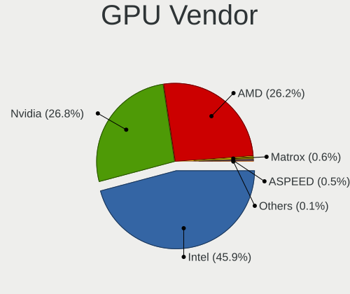

| Vendor                                       | Computers | Percent |
|----------------------------------------------|-----------|---------|
| Intel                                        | 31949     | 45.85%  |
| Nvidia                                       | 18658     | 26.78%  |
| AMD                                          | 18275     | 26.23%  |
| Matrox Electronics Systems                   | 411       | 0.59%   |
| ASPEED Technology                            | 324       | 0.46%   |
| ATI Technologies                             | 15        | 0.02%   |
| Red Hat                                      | 12        | 0.02%   |
| XGI Technology (eXtreme Graphics Innovation) | 7         | 0.01%   |
| S3 Graphics                                  | 7         | 0.01%   |
| VIA Technologies                             | 6         | 0.01%   |
| Silicon Integrated Systems [SiS]             | 5         | 0.01%   |
| NVidia / SGS Thomson (Joint Venture)         | 4         | 0.01%   |
| Zhaoxin                                      | 1         | 0.001%  |
| Microsoft                                    | 1         | 0.001%  |
| Loongson Technology                          | 1         | 0.001%  |
| Huawei Technologies                          | 1         | 0.001%  |
| Cirrus Logic                                 | 1         | 0.001%  |

GPU Model
---------

Graphics card models

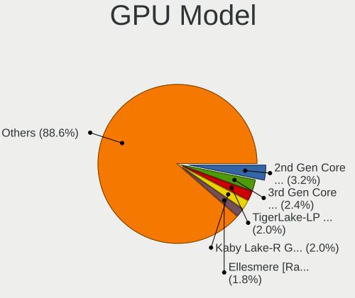

| Model                                                                                    | Computers | Percent |
|------------------------------------------------------------------------------------------|-----------|---------|
| Intel 2nd Generation Core Processor Family Integrated Graphics Controller                | 2286      | 3.16%   |
| Intel 3rd Gen Core processor Graphics Controller                                         | 1761      | 2.44%   |
| Intel TigerLake-LP GT2 [Iris Xe Graphics]                                                | 1463      | 2.02%   |
| Intel Kaby Lake-R GT2 [UHD Graphics 620]                                                 | 1450      | 2.01%   |
| AMD Ellesmere [Radeon RX 470/480/570/570X/580/580X/590]                                  | 1314      | 1.82%   |
| Intel Haswell-ULT Integrated Graphics Controller                                         | 1191      | 1.65%   |
| Intel GeminiLake [UHD Graphics 600]                                                      | 1132      | 1.57%   |
| Intel Xeon E3-1200 v3/4th Gen Core Processor Integrated Graphics Controller              | 1092      | 1.51%   |
| Intel CoffeeLake-H GT2 [UHD Graphics 630]                                                | 1075      | 1.49%   |
| Intel Skylake-U GT2 [HD Graphics 520]                                                    | 1055      | 1.46%   |
| Intel Kaby Lake-U GT2 [HD Graphics 620]                                                  | 998       | 1.38%   |
| AMD Cezanne [Radeon Vega Series / Radeon Vega Mobile Series]                             | 988       | 1.37%   |
| AMD Picasso/Raven 2 [Radeon Vega Series / Radeon Vega Mobile Series]                     | 974       | 1.35%   |
| AMD Raphael                                                                              | 821       | 1.14%   |
| Intel Broadwell-U GT2 [HD Graphics 5500]                                                 | 789       | 1.09%   |
| Intel WhiskeyLake-U GT2 [UHD Graphics 620]                                               | 759       | 1.05%   |
| Intel 4th Gen Core Processor Integrated Graphics Controller                              | 743       | 1.03%   |
| Intel Atom/Celeron/Pentium Processor x5-E8000/J3xxx/N3xxx Integrated Graphics Controller | 731       | 1.01%   |
| Intel Skylake-S GT2 [HD Graphics 530]                                                    | 710       | 0.98%   |
| Intel Core Processor Integrated Graphics Controller                                      | 691       | 0.96%   |
| AMD VanGogh [AMD Custom GPU 0405]                                                        | 674       | 0.93%   |
| Intel CoffeeLake-S GT2 [UHD Graphics 630]                                                | 665       | 0.92%   |
| Intel Atom Processor Z36xxx/Z37xxx Series Graphics & Display                             | 665       | 0.92%   |
| AMD Renoir [Radeon Vega Series / Radeon Vega Mobile Series]                              | 654       | 0.9%    |
| Intel CometLake-H GT2 [UHD Graphics]                                                     | 621       | 0.86%   |
| Intel CometLake-U GT2 [UHD Graphics]                                                     | 606       | 0.84%   |
| Intel Mobile 4 Series Chipset Integrated Graphics Controller                             | 597       | 0.83%   |
| Intel Xeon E3-1200 v2/3rd Gen Core processor Graphics Controller                         | 579       | 0.8%    |
| Intel Alder Lake-P GT2 [Iris Xe Graphics]                                                | 577       | 0.8%    |
| AMD Rembrandt [Radeon 680M]                                                              | 565       | 0.78%   |
| AMD Navi 10 [Radeon RX 5600 OEM/5600 XT / 5700/5700 XT]                                  | 517       | 0.71%   |
| AMD Phoenix1                                                                             | 489       | 0.68%   |
| Intel Kaby Lake-H GT2 [HD Graphics 630]                                                  | 443       | 0.61%   |
| AMD Navi 22 [Radeon RX 6700/6700 XT/6750 XT / 6800M/6850M XT]                            | 439       | 0.61%   |
| AMD Lucienne                                                                             | 438       | 0.61%   |
| Nvidia GP107 [GeForce GTX 1050 Ti]                                                       | 420       | 0.58%   |
| Intel TigerLake-H GT1 [UHD Graphics]                                                     | 419       | 0.58%   |
| Intel Raptor Lake-P [Iris Xe Graphics]                                                   | 414       | 0.57%   |
| AMD Granite Ridge [Radeon Graphics]                                                      | 403       | 0.56%   |
| AMD Raven Ridge [Radeon Vega Series / Radeon Vega Mobile Series]                         | 400       | 0.55%   |

GPU Combo
---------

Combinations of graphics cards

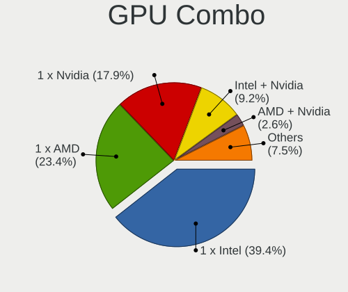

| Name                                     | Computers | Percent |
|------------------------------------------|-----------|---------|
| 1 x Intel                                | 24229     | 39.4%   |
| 1 x AMD                                  | 14406     | 23.43%  |
| 1 x Nvidia                               | 10998     | 17.89%  |
| Intel + Nvidia                           | 5682      | 9.24%   |
| AMD + Nvidia                             | 1590      | 2.59%   |
| 2 x AMD                                  | 1306      | 2.12%   |
| Other                                    | 949       | 1.54%   |
| Intel + AMD                              | 944       | 1.54%   |
| 1 x Matrox                               | 311       | 0.51%   |
| 2 x Intel                                | 259       | 0.42%   |
| 2 x Nvidia                               | 235       | 0.38%   |
| 1 x ASPEED                               | 208       | 0.34%   |
| Nvidia + Matrox                          | 66        | 0.11%   |
| Nvidia + ASPEED                          | 65        | 0.11%   |
| AMD + ASPEED                             | 40        | 0.07%   |
| Intel + 2 x Nvidia                       | 28        | 0.05%   |
| AMD + Matrox                             | 28        | 0.05%   |
| AMD + 2 x Nvidia                         | 15        | 0.02%   |
| 2 x AMD + 1 x Nvidia                     | 14        | 0.02%   |
| 3 x AMD                                  | 12        | 0.02%   |
| 1 x Red Hat                              | 12        | 0.02%   |
| Intel + AMD + 1 x Nvidia                 | 12        | 0.02%   |
| Intel + 2 x AMD                          | 8         | 0.01%   |
| 1 x XGI                                  | 6         | 0.01%   |
| 1 x S3 Graphics                          | 6         | 0.01%   |
| 3 x Nvidia                               | 5         | 0.01%   |
| 2 x Nvidia + 1 x ASPEED                  | 5         | 0.01%   |
| 1 x VIA                                  | 5         | 0.01%   |
| 1 x SiS                                  | 5         | 0.01%   |
| Intel + ASPEED                           | 5         | 0.01%   |
| 2 x Nvidia + 1 x Matrox                  | 3         | 0.005%  |
| 1 x NVidia / SGS Thomson (Joint Venture) | 3         | 0.005%  |
| 4 x Nvidia                               | 2         | 0.003%  |
| Intel + AMD + 2 x Nvidia                 | 2         | 0.003%  |
| AMD + Nvidia + 1 x Matrox                | 2         | 0.003%  |
| 6 x Nvidia                               | 1         | 0.002%  |
| 4 x AMD                                  | 1         | 0.002%  |
| 3 x Nvidia + 1 x ASPEED                  | 1         | 0.002%  |
| 3 x AMD + 1 x Nvidia                     | 1         | 0.002%  |
| 2 x Intel + 1 x AMD                      | 1         | 0.002%  |

GPU Driver
----------

Free vs proprietary

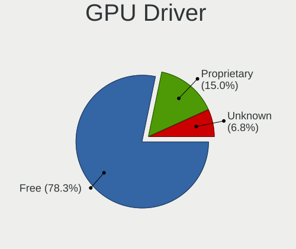

| Driver      | Computers | Percent |
|-------------|-----------|---------|
| Free        | 48554     | 78.26%  |
| Proprietary | 9288      | 14.97%  |
| Unknown     | 4200      | 6.77%   |

GPU Memory
----------

Total video memory

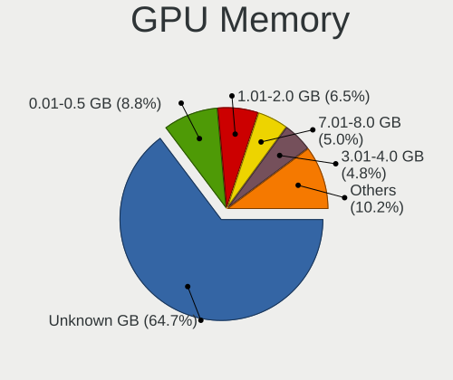

| Size in GB     | Computers | Percent |
|----------------|-----------|---------|
| Unknown        | 40640     | 64.74%  |
| 0.01-0.5       | 5551      | 8.84%   |
| 1.01-2.0       | 4077      | 6.5%    |
| 7.01-8.0       | 3119      | 4.97%   |
| 3.01-4.0       | 2987      | 4.76%   |
| 0.51-1.0       | 2686      | 4.28%   |
| 8.01-16.0      | 1634      | 2.6%    |
| 5.01-6.0       | 1204      | 1.92%   |
| 2.01-3.0       | 432       | 0.69%   |
| 16.01-24.0     | 398       | 0.63%   |
| 4.01-5.0       | 16        | 0.03%   |
| 24.01-32.0     | 14        | 0.02%   |
| 32.01-64.0     | 9         | 0.01%   |
| 6.01-7.0       | 2         | 0.003%  |
| More than 64.0 | 1         | 0.002%  |
| 0              | 1         | 0.002%  |

Monitor
-------

Monitor Vendor
--------------

Monitor vendors

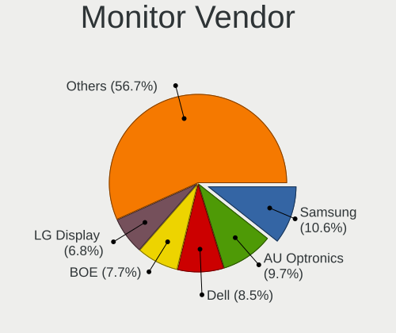

| Vendor                  | Computers | Percent |
|-------------------------|-----------|---------|
| Samsung Electronics     | 7113      | 10.63%  |
| AU Optronics            | 6465      | 9.66%   |
| Dell                    | 5663      | 8.46%   |
| BOE                     | 5159      | 7.71%   |
| LG Display              | 4562      | 6.82%   |
| Chimei Innolux          | 4489      | 6.71%   |
| Acer                    | 3232      | 4.83%   |
| Hewlett-Packard         | 3230      | 4.83%   |
| Goldstar                | 3116      | 4.66%   |
| Apple                   | 2654      | 3.97%   |
| Ancor Communications    | 1774      | 2.65%   |
| Sharp                   | 1522      | 2.27%   |
| ViewSonic               | 1136      | 1.7%    |
| ASUSTek Computer        | 1094      | 1.63%   |
| Lenovo                  | 1093      | 1.63%   |
| AOC                     | 1050      | 1.57%   |
| Sceptre Tech            | 981       | 1.47%   |
| Vizio                   | 974       | 1.46%   |
| Valve                   | 695       | 1.04%   |
| Chi Mei Optoelectronics | 574       | 0.86%   |
| MSI                     | 531       | 0.79%   |
| BenQ                    | 518       | 0.77%   |
| Sony                    | 500       | 0.75%   |
| InfoVision              | 481       | 0.72%   |
| PANDA                   | 442       | 0.66%   |
| Insignia                | 393       | 0.59%   |
| Unknown                 | 390       | 0.58%   |
| Gigabyte Technology     | 334       | 0.5%    |
| LG Electronics          | 237       | 0.35%   |
| Philips                 | 235       | 0.35%   |
| Panasonic               | 216       | 0.32%   |
| Toshiba                 | 213       | 0.32%   |
| HannStar                | 206       | 0.31%   |
| ONN                     | 194       | 0.29%   |
| LG Philips              | 193       | 0.29%   |
| CSO                     | 164       | 0.25%   |
| NEC Computers           | 149       | 0.22%   |
| Gateway                 | 141       | 0.21%   |
| TMX                     | 135       | 0.2%    |
| Hitachi                 | 134       | 0.2%    |

Monitor Model
-------------

Monitor models

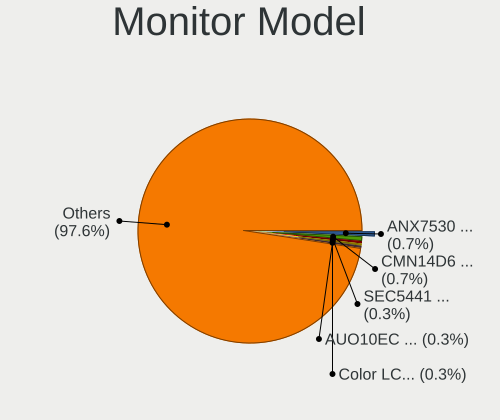

| Model                                                                 | Computers | Percent |
|-----------------------------------------------------------------------|-----------|---------|
| Valve ANX7530 U VLV3001 800x1280 100x150mm 7.1-inch                   | 513       | 0.74%   |
| Chimei Innolux LCD Monitor CMN14D6 1366x768 309x173mm 13.9-inch       | 486       | 0.7%    |
| Samsung Electronics LCD Monitor SEC5441 1280x800 331x207mm 15.4-inch  | 238       | 0.34%   |
| AU Optronics LCD Monitor AUO10EC 1366x768 344x193mm 15.5-inch         | 227       | 0.33%   |
| Apple Color LCD APP9C5B 1280x800 286x179mm 13.3-inch                  | 221       | 0.32%   |
| Apple LCD Monitor APP9C5F 1280x800 286x179mm 13.3-inch                | 220       | 0.32%   |
| Samsung Electronics C27F390 SAM0D32 1920x1080 598x336mm 27.0-inch     | 202       | 0.29%   |
| Goldstar FULL HD GSM5B55 1920x1080 480x270mm 21.7-inch                | 196       | 0.28%   |
| Chimei Innolux LCD Monitor CMN14D4 1920x1080 309x173mm 13.9-inch      | 194       | 0.28%   |
| BOE LCD Monitor BOE095F 2256x1504 285x190mm 13.5-inch                 | 183       | 0.26%   |
| AU Optronics LCD Monitor AUO21ED 1920x1080 344x193mm 15.5-inch        | 170       | 0.24%   |
| Goldstar LG ULTRAWIDE GSM59F1 2560x1080 670x280mm 28.6-inch           | 153       | 0.22%   |
| Sceptre Tech Sceptre F24 SPT09AB 1920x1080 530x290mm 23.8-inch        | 145       | 0.21%   |
| Goldstar Ultra HD GSM5B09 3840x2160 600x340mm 27.2-inch               | 145       | 0.21%   |
| Chimei Innolux LCD Monitor CMN1132 1366x768 256x144mm 11.6-inch       | 138       | 0.2%    |
| LG Display LCD Monitor LGD0555 2736x1824 260x173mm 12.3-inch          | 135       | 0.19%   |
| AU Optronics LCD Monitor AUO235C 1366x768 256x144mm 11.6-inch         | 135       | 0.19%   |
| Unknown                                                               | 131       | 0.19%   |
| Unknown LCD Monitor FFFF 2288x1287 2550x2550mm 142.0-inch             | 127       | 0.18%   |
| Valve ANX7530 U VLV3003 800x1280 100x160mm 7.4-inch                   | 126       | 0.18%   |
| Acer SB220Q ACR06AB 1920x1080 476x268mm 21.5-inch                     | 125       | 0.18%   |
| ONN ONA18HO015 ONN0101 1920x1080 698x393mm 31.5-inch                  | 123       | 0.18%   |
| Chimei Innolux LCD Monitor CMN1521 1920x1080 344x193mm 15.5-inch      | 118       | 0.17%   |
| AU Optronics LCD Monitor AUO592D 1920x1080 293x165mm 13.2-inch        | 118       | 0.17%   |
| Apple Color LCD APP9CDF 1440x900 286x179mm 13.3-inch                  | 114       | 0.16%   |
| Panasonic VVX11F009G00 MEI96A2 1920x1080 344x193mm 15.5-inch          | 110       | 0.16%   |
| Goldstar Ultra HD GSM5B08 3840x2160 600x340mm 27.2-inch               | 110       | 0.16%   |
| AU Optronics LCD Monitor AUO22EC 1366x768 344x193mm 15.5-inch         | 103       | 0.15%   |
| Sceptre Tech Sceptre E24 SPT099D 1920x1080 521x293mm 23.5-inch        | 102       | 0.15%   |
| Samsung Electronics C24F390 SAM0D2C 1920x1080 521x293mm 23.5-inch     | 102       | 0.15%   |
| BOE LCD Monitor BOE06A4 1366x768 344x194mm 15.5-inch                  | 102       | 0.15%   |
| LG Display LCD Monitor LGD02DC 1366x768 344x194mm 15.5-inch           | 101       | 0.14%   |
| AU Optronics LCD Monitor AUO20EC 1366x768 344x193mm 15.5-inch         | 101       | 0.14%   |
| LG Display LCD Monitor LGD046F 1920x1080 344x194mm 15.5-inch          | 98        | 0.14%   |
| Ancor Communications ASUS VS247 ACI249A 1920x1080 521x293mm 23.5-inch | 97        | 0.14%   |
| Samsung Electronics LCD Monitor SEC544B 1600x900 382x214mm 17.2-inch  | 96        | 0.14%   |
| Apple Color LCD APP9CF0 1440x900 290x180mm 13.4-inch                  | 94        | 0.13%   |
| PANDA LCD Monitor NCP004D 1920x1080 344x194mm 15.5-inch               | 92        | 0.13%   |
| Goldstar HDR 4K GSM7706 3840x2160 600x340mm 27.2-inch                 | 92        | 0.13%   |
| Chimei Innolux LCD Monitor CMN15DB 1366x768 344x193mm 15.5-inch       | 92        | 0.13%   |

Monitor Resolution
------------------

Monitor screen resolution

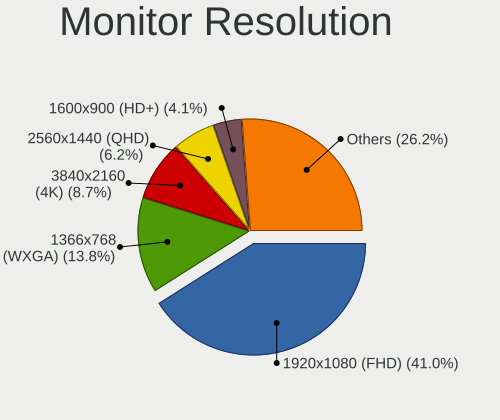

| Resolution         | Computers | Percent |
|--------------------|-----------|---------|
| 1920x1080 (FHD)    | 26364     | 41.01%  |
| 1366x768 (WXGA)    | 8887      | 13.83%  |
| 3840x2160 (4K)     | 5587      | 8.69%   |
| 2560x1440 (QHD)    | 3959      | 6.16%   |
| 1600x900 (HD+)     | 2649      | 4.12%   |
| 1920x1200 (WUXGA)  | 2215      | 3.45%   |
| 1440x900 (WXGA+)   | 1483      | 2.31%   |
| 1280x800 (WXGA)    | 1466      | 2.28%   |
| 1680x1050 (WSXGA+) | 1239      | 1.93%   |
| 1280x1024 (SXGA)   | 1202      | 1.87%   |
| 3440x1440          | 1168      | 1.82%   |
| 2560x1600          | 976       | 1.52%   |
| Unknown            | 777       | 1.21%   |
| 800x1280           | 721       | 1.12%   |
| 2560x1080          | 652       | 1.01%   |
| 2880x1800          | 560       | 0.87%   |
| 3840x1080          | 470       | 0.73%   |
| 1360x768           | 385       | 0.6%    |
| 1920x540           | 347       | 0.54%   |
| 2256x1504          | 306       | 0.48%   |
| 3840x2400          | 288       | 0.45%   |
| 1024x768 (XGA)     | 206       | 0.32%   |
| 2880x1920          | 203       | 0.32%   |
| 3200x1800 (QHD+)   | 147       | 0.23%   |
| 2288x1287          | 144       | 0.22%   |
| 2160x1440          | 130       | 0.2%    |
| 1600x1200          | 117       | 0.18%   |
| 1024x600           | 102       | 0.16%   |
| 1920x1280          | 100       | 0.16%   |
| 3840x1600          | 96        | 0.15%   |
| 3072x1920          | 78        | 0.12%   |
| 2736x1824          | 61        | 0.09%   |
| 1280x720 (HD)      | 59        | 0.09%   |
| 3000x2000          | 57        | 0.09%   |
| 3200x2000          | 56        | 0.09%   |
| 2240x1400          | 48        | 0.07%   |
| 3840x1200          | 41        | 0.06%   |
| 3456x2160          | 38        | 0.06%   |
| 1400x1050          | 34        | 0.05%   |
| 2400x1600          | 33        | 0.05%   |

Monitor Diagonal
----------------

Diagonal size in inches

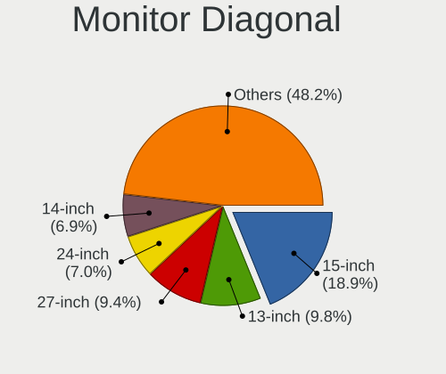

| Inches  | Computers | Percent |
|---------|-----------|---------|
| 15      | 12581     | 18.85%  |
| 13      | 6533      | 9.79%   |
| 27      | 6253      | 9.37%   |
| 24      | 4655      | 6.98%   |
| 14      | 4573      | 6.85%   |
| 23      | 3752      | 5.62%   |
| 31      | 3359      | 5.03%   |
| 17      | 3310      | 4.96%   |
| 21      | 2806      | 4.2%    |
| Unknown | 2618      | 3.92%   |
| 34      | 1527      | 2.29%   |
| 19      | 1451      | 2.17%   |
| 11      | 1277      | 1.91%   |
| 16      | 1223      | 1.83%   |
| 20      | 1202      | 1.8%    |
| 12      | 833       | 1.25%   |
| 22      | 825       | 1.24%   |
| 32      | 747       | 1.12%   |
| 7       | 704       | 1.05%   |
| 18      | 642       | 0.96%   |
| 84      | 567       | 0.85%   |
| 40      | 449       | 0.67%   |
| 54      | 439       | 0.66%   |
| 72      | 428       | 0.64%   |
| 26      | 355       | 0.53%   |
| 48      | 271       | 0.41%   |
| 74      | 247       | 0.37%   |
| 29      | 237       | 0.36%   |
| 49      | 235       | 0.35%   |
| 25      | 226       | 0.34%   |
| 10      | 182       | 0.27%   |
| 42      | 181       | 0.27%   |
| 63      | 168       | 0.25%   |
| 28      | 159       | 0.24%   |
| 37      | 147       | 0.22%   |
| 36      | 140       | 0.21%   |
| 142     | 127       | 0.19%   |
| 38      | 114       | 0.17%   |
| 46      | 108       | 0.16%   |
| 8       | 95        | 0.14%   |

Monitor Width
-------------

Physical width

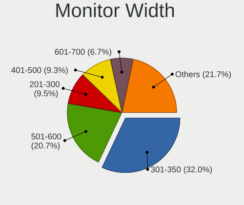

| Width in mm    | Computers | Percent |
|----------------|-----------|---------|
| 301-350        | 20910     | 32.03%  |
| 501-600        | 13510     | 20.69%  |
| 201-300        | 6224      | 9.53%   |
| 401-500        | 6081      | 9.31%   |
| 601-700        | 4374      | 6.7%    |
| 351-400        | 3964      | 6.07%   |
| Unknown        | 2618      | 4.01%   |
| 701-800        | 2392      | 3.66%   |
| 1001-1500      | 1669      | 2.56%   |
| 1501-2000      | 1326      | 2.03%   |
| 801-900        | 897       | 1.37%   |
| 1-100          | 719       | 1.1%    |
| 901-1000       | 320       | 0.49%   |
| 101-200        | 148       | 0.23%   |
| More than 2000 | 132       | 0.2%    |

Aspect Ratio
------------

Proportional relationship between the width and the height

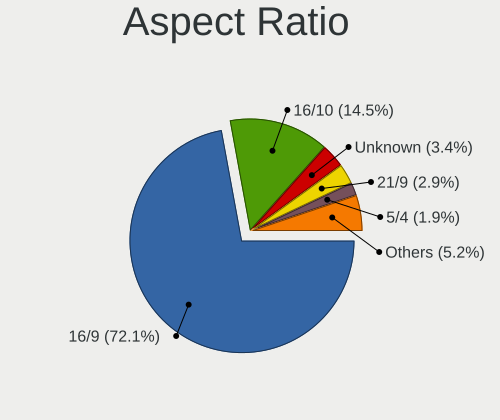

| Ratio   | Computers | Percent |
|---------|-----------|---------|
| 16/9    | 43465     | 72.11%  |
| 16/10   | 8729      | 14.48%  |
| Unknown | 2071      | 3.44%   |
| 21/9    | 1767      | 2.93%   |
| 5/4     | 1117      | 1.85%   |
| 3/2     | 994       | 1.65%   |
| 0.67    | 516       | 0.86%   |
| 4/3     | 431       | 0.72%   |
| 32/9    | 423       | 0.7%    |
| 0.62    | 165       | 0.27%   |
| 6/5     | 158       | 0.26%   |
| 1.00    | 136       | 0.23%   |
| 1.96    | 65        | 0.11%   |
| 0.56    | 43        | 0.07%   |
| 0.63    | 41        | 0.07%   |
| 2.65    | 27        | 0.04%   |
| 3.40    | 22        | 0.04%   |
| 0.45    | 19        | 0.03%   |
| 2.12    | 18        | 0.03%   |
| 0.89    | 14        | 0.02%   |
| 3.20    | 11        | 0.02%   |
| 3.75    | 5         | 0.01%   |
| 2.64    | 5         | 0.01%   |
| 2.01    | 5         | 0.01%   |
| 0.58    | 5         | 0.01%   |
| 2.69    | 3         | 0.005%  |
| 2.00    | 3         | 0.005%  |
| 0.79    | 3         | 0.005%  |
| 2.70    | 2         | 0.003%  |
| 2.51    | 2         | 0.003%  |
| 0.57    | 2         | 0.003%  |
| 0.25    | 2         | 0.003%  |
| 0.22    | 2         | 0.003%  |
| 3.73    | 1         | 0.002%  |
| 3.33    | 1         | 0.002%  |
| 2.67    | 1         | 0.002%  |
| 2.58    | 1         | 0.002%  |
| 2.50    | 1         | 0.002%  |
| 11/10   | 1         | 0.002%  |
| 0.80    | 1         | 0.002%  |

Monitor Area
------------

Area in inch²

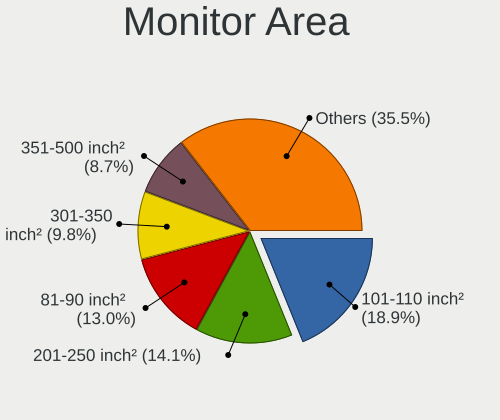

| Area in inch² | Computers | Percent |
|----------------|-----------|---------|
| 101-110        | 12439     | 18.87%  |
| 201-250        | 9268      | 14.06%  |
| 81-90          | 8562      | 12.99%  |
| 301-350        | 6476      | 9.82%   |
| 351-500        | 5767      | 8.75%   |
| 151-200        | 3607      | 5.47%   |
| Unknown        | 2618      | 3.97%   |
| More than 1000 | 2586      | 3.92%   |
| 71-80          | 2425      | 3.68%   |
| 121-130        | 2425      | 3.68%   |
| 251-300        | 1934      | 2.93%   |
| 501-1000       | 1838      | 2.79%   |
| 51-60          | 1335      | 2.03%   |
| 111-120        | 1294      | 1.96%   |
| 141-150        | 999       | 1.52%   |
| 1-40           | 865       | 1.31%   |
| 61-70          | 792       | 1.2%    |
| 131-140        | 371       | 0.56%   |
| 91-100         | 174       | 0.26%   |
| 41-50          | 150       | 0.23%   |

Pixel Density
-------------

Pixels per inch

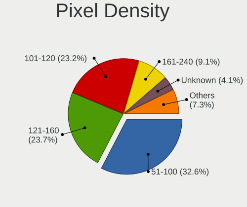

| Density       | Computers | Percent |
|---------------|-----------|---------|
| 51-100        | 20795     | 32.63%  |
| 121-160       | 15096     | 23.69%  |
| 101-120       | 14777     | 23.19%  |
| 161-240       | 5799      | 9.1%    |
| Unknown       | 2620      | 4.11%   |
| 1-50          | 2390      | 3.75%   |
| More than 240 | 2251      | 3.53%   |

Multiple Monitors
-----------------

Total monitors connected

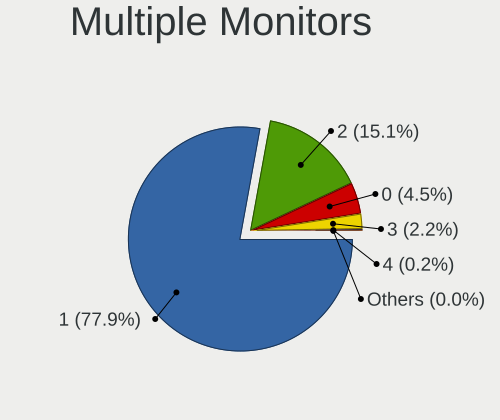

| Total | Computers | Percent |
|-------|-----------|---------|
| 1     | 48657     | 77.86%  |
| 2     | 9457      | 15.13%  |
| 0     | 2822      | 4.52%   |
| 3     | 1377      | 2.2%    |
| 4     | 151       | 0.24%   |
| 5     | 17        | 0.03%   |
| 6     | 9         | 0.01%   |
| 7     | 1         | 0.002%  |

Network
-------

Net Controller Vendor
---------------------

Controller vendors

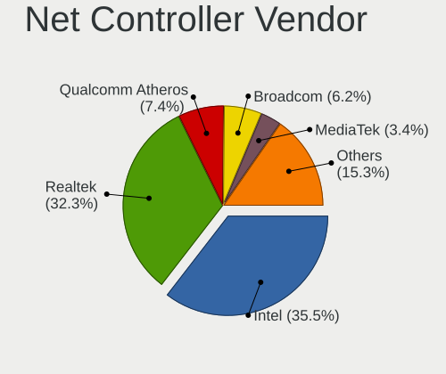

| Vendor                                | Computers | Percent |
|---------------------------------------|-----------|---------|
| Intel                                 | 32716     | 35.46%  |
| Realtek Semiconductor                 | 29773     | 32.27%  |
| Qualcomm Atheros                      | 6843      | 7.42%   |
| Broadcom                              | 5686      | 6.16%   |
| MediaTek                              | 3091      | 3.35%   |
| Broadcom Limited                      | 1434      | 1.55%   |
| ASIX Electronics                      | 1336      | 1.45%   |
| Nvidia                                | 1067      | 1.16%   |
| Ralink Technology                     | 973       | 1.05%   |
| Marvell Technology Group              | 910       | 0.99%   |
| TP-Link                               | 744       | 0.81%   |
| NetGear                               | 670       | 0.73%   |
| Ralink                                | 648       | 0.7%    |
| Samsung Electronics                   | 487       | 0.53%   |
| Qualcomm                              | 412       | 0.45%   |
| Aquantia                              | 381       | 0.41%   |
| Microsoft                             | 328       | 0.36%   |
| DisplayLink                           | 301       | 0.33%   |
| Shenzhen Goodix Technology            | 295       | 0.32%   |
| Linksys                               | 267       | 0.29%   |
| ASUSTek Computer                      | 243       | 0.26%   |
| Motorola PCS                          | 202       | 0.22%   |
| Google                                | 202       | 0.22%   |
| Qualcomm Technologies                 | 178       | 0.19%   |
| Belkin Components                     | 170       | 0.18%   |
| Edimax Technology                     | 160       | 0.17%   |
| Lenovo                                | 150       | 0.16%   |
| Qualcomm Atheros Communications       | 147       | 0.16%   |
| Mellanox Technologies                 | 146       | 0.16%   |
| Dell                                  | 118       | 0.13%   |
| Apple                                 | 116       | 0.13%   |
| Microchip Technology                  | 115       | 0.12%   |
| D-Link System                         | 108       | 0.12%   |
| Sierra Wireless                       | 88        | 0.1%    |
| U-Blox                                | 77        | 0.08%   |
| InterBiometrics                       | 75        | 0.08%   |
| D-Link                                | 72        | 0.08%   |
| Raspberry Pi                          | 62        | 0.07%   |
| 802.11g Adapter [Linksys WUSB54GC v3] | 56        | 0.06%   |
| Arduino SA                            | 54        | 0.06%   |

Net Controller Model
--------------------

Controller models

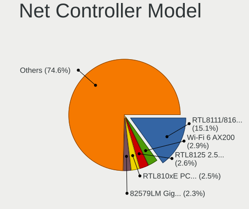

| Model                                                                  | Computers | Percent |
|------------------------------------------------------------------------|-----------|---------|
| Realtek RTL8111/8168/8211/8411 PCI Express Gigabit Ethernet Controller | 16635     | 15.07%  |
| Intel Wi-Fi 6 AX200                                                    | 3174      | 2.87%   |
| Realtek RTL8125 2.5GbE Controller                                      | 2914      | 2.64%   |
| Realtek RTL810xE PCI Express Fast Ethernet controller                  | 2796      | 2.53%   |
| Intel 82579LM Gigabit Network Connection (Lewisville)                  | 2508      | 2.27%   |
| Realtek RTL8153 Gigabit Ethernet Adapter                               | 2029      | 1.84%   |
| Intel I211 Gigabit Network Connection                                  | 1869      | 1.69%   |
| Intel Wireless 8265 / 8275                                             | 1802      | 1.63%   |
| Intel Wi-Fi 6E(802.11ax) AX210/AX1675* 2x2 [Typhoon Peak]              | 1602      | 1.45%   |
| Intel Wireless 7265                                                    | 1574      | 1.43%   |
| Realtek RTL8822CE 802.11ac PCIe Wireless Network Adapter               | 1442      | 1.31%   |
| Realtek RTL8821CE 802.11ac PCIe Wireless Network Adapter               | 1429      | 1.29%   |
| Intel Wireless 7260                                                    | 1411      | 1.28%   |
| Intel Ethernet Controller I225-V                                       | 1331      | 1.21%   |
| MediaTek MT7922 802.11ax PCI Express Wireless Network Adapter          | 1262      | 1.14%   |
| Intel Ethernet Connection I217-LM                                      | 1227      | 1.11%   |
| ASIX AX88179 Gigabit Ethernet                                          | 1226      | 1.11%   |
| Intel Wi-Fi 6 AX201                                                    | 1206      | 1.09%   |
| Intel Wireless 8260                                                    | 1136      | 1.03%   |
| Qualcomm Atheros QCA6174 802.11ac Wireless Network Adapter             | 1086      | 0.98%   |
| Intel Dual Band Wireless-AC 3168NGW [Stone Peak]                       | 1070      | 0.97%   |
| Realtek RTL8852BE PCIe 802.11ax Wireless Network Controller            | 1028      | 0.93%   |
| Intel Ethernet Connection (2) I219-V                                   | 920       | 0.83%   |
| Intel Cannon Lake PCH CNVi WiFi                                        | 902       | 0.82%   |
| Qualcomm Atheros AR9485 Wireless Network Adapter                       | 856       | 0.78%   |
| Intel Alder Lake-P PCH CNVi WiFi                                       | 835       | 0.76%   |
| Qualcomm Atheros QCA9377 802.11ac Wireless Network Adapter             | 822       | 0.74%   |
| Intel Wi-Fi 5(802.11ac) Wireless-AC 9x6x [Thunder Peak]                | 811       | 0.73%   |
| Qualcomm Atheros QCA9565 / AR9565 Wireless Network Adapter             | 769       | 0.7%    |
| Intel Centrino Advanced-N 6205 [Taylor Peak]                           | 760       | 0.69%   |
| Intel Comet Lake PCH CNVi WiFi                                         | 757       | 0.69%   |
| Intel Wireless 3165                                                    | 687       | 0.62%   |
| Intel Ethernet Connection (4) I219-LM                                  | 684       | 0.62%   |
| Broadcom BCM4322 802.11a/b/g/n Wireless LAN Controller                 | 659       | 0.6%    |
| MediaTek MT7921 802.11ax PCIe Wireless Network Adapter [Filogic 330]   | 646       | 0.59%   |
| Intel Ethernet Connection (2) I219-LM                                  | 614       | 0.56%   |
| Realtek RTL88x2bu [AC1200 Techkey]                                     | 612       | 0.55%   |
| Intel Comet Lake PCH-LP CNVi WiFi                                      | 610       | 0.55%   |
| Nvidia MCP79 Ethernet                                                  | 594       | 0.54%   |
| Realtek 802.11ac NIC                                                   | 584       | 0.53%   |

Wireless Vendor
---------------

Wireless vendors

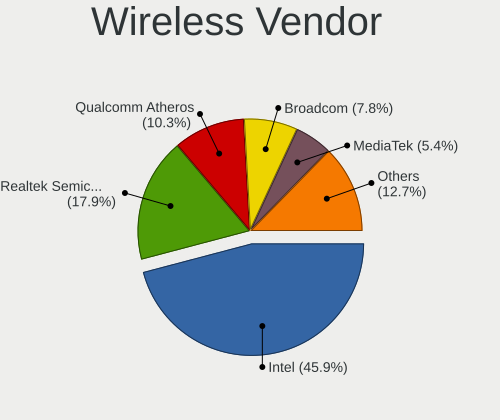

| Vendor                                | Computers | Percent |
|---------------------------------------|-----------|---------|
| Intel                                 | 23816     | 45.89%  |
| Realtek Semiconductor                 | 9296      | 17.91%  |
| Qualcomm Atheros                      | 5360      | 10.33%  |
| Broadcom                              | 4030      | 7.77%   |
| MediaTek                              | 2814      | 5.42%   |
| Broadcom Limited                      | 1111      | 2.14%   |
| Ralink Technology                     | 973       | 1.87%   |
| TP-Link                               | 669       | 1.29%   |
| NetGear                               | 661       | 1.27%   |
| Ralink                                | 648       | 1.25%   |
| Qualcomm                              | 331       | 0.64%   |
| Marvell Technology Group              | 301       | 0.58%   |
| Microsoft                             | 260       | 0.5%    |
| Linksys                               | 248       | 0.48%   |
| ASUSTek Computer                      | 225       | 0.43%   |
| Belkin Components                     | 161       | 0.31%   |
| Edimax Technology                     | 160       | 0.31%   |
| Qualcomm Atheros Communications       | 147       | 0.28%   |
| Sierra Wireless                       | 88        | 0.17%   |
| Dell                                  | 88        | 0.17%   |
| D-Link System                         | 69        | 0.13%   |
| D-Link                                | 68        | 0.13%   |
| Qualcomm Technologies                 | 62        | 0.12%   |
| 802.11g Adapter [Linksys WUSB54GC v3] | 56        | 0.11%   |
| Realtek                               | 41        | 0.08%   |
| Gemtek                                | 23        | 0.04%   |
| Wilocity                              | 20        | 0.04%   |
| ZyDAS                                 | 18        | 0.03%   |
| Micro Star International              | 17        | 0.03%   |
| TRENDnet                              | 13        | 0.03%   |
| Senao                                 | 9         | 0.02%   |
| Samsung Electronics                   | 9         | 0.02%   |
| BUFFALO                               | 9         | 0.02%   |
| ZyXEL Communications                  | 7         | 0.01%   |
| Panasonic (Matsushita)                | 7         | 0.01%   |
| IMC Networks                          | 7         | 0.01%   |
| Wacom                                 | 6         | 0.01%   |
| Accton Technology                     | 5         | 0.01%   |
| Texas Instruments                     | 4         | 0.01%   |
| Tenda                                 | 4         | 0.01%   |

Wireless Model
--------------

Wireless models

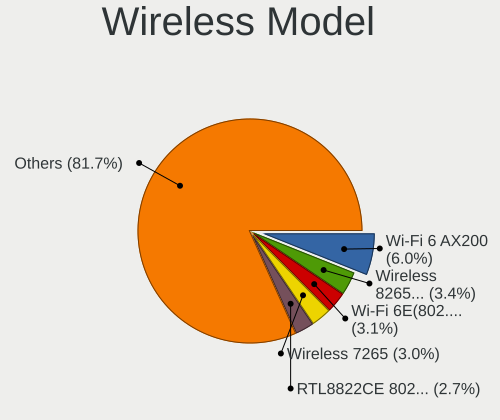

| Model                                                                | Computers | Percent |
|----------------------------------------------------------------------|-----------|---------|
| Intel Wi-Fi 6 AX200                                                  | 3174      | 6.04%   |
| Intel Wireless 8265 / 8275                                           | 1802      | 3.43%   |
| Intel Wi-Fi 6E(802.11ax) AX210/AX1675* 2x2 [Typhoon Peak]            | 1602      | 3.05%   |
| Intel Wireless 7265                                                  | 1574      | 3%      |
| Realtek RTL8822CE 802.11ac PCIe Wireless Network Adapter             | 1442      | 2.75%   |
| Realtek RTL8821CE 802.11ac PCIe Wireless Network Adapter             | 1429      | 2.72%   |
| Intel Wireless 7260                                                  | 1411      | 2.69%   |
| Intel Wi-Fi 6 AX201                                                  | 1206      | 2.3%    |
| MediaTek MT7922 802.11ax PCI Express Wireless Network Adapter        | 1162      | 2.21%   |
| Intel Wireless 8260                                                  | 1136      | 2.16%   |
| Qualcomm Atheros QCA6174 802.11ac Wireless Network Adapter           | 1086      | 2.07%   |
| Intel Dual Band Wireless-AC 3168NGW [Stone Peak]                     | 1070      | 2.04%   |
| Realtek RTL8852BE PCIe 802.11ax Wireless Network Controller          | 921       | 1.75%   |
| Intel Cannon Lake PCH CNVi WiFi                                      | 902       | 1.72%   |
| Qualcomm Atheros AR9485 Wireless Network Adapter                     | 856       | 1.63%   |
| Qualcomm Atheros QCA9377 802.11ac Wireless Network Adapter           | 822       | 1.57%   |
| Intel Wi-Fi 5(802.11ac) Wireless-AC 9x6x [Thunder Peak]              | 811       | 1.54%   |
| Qualcomm Atheros QCA9565 / AR9565 Wireless Network Adapter           | 769       | 1.46%   |
| Intel Centrino Advanced-N 6205 [Taylor Peak]                         | 760       | 1.45%   |
| Intel Comet Lake PCH CNVi WiFi                                       | 757       | 1.44%   |
| Intel Wireless 3165                                                  | 687       | 1.31%   |
| Broadcom BCM4322 802.11a/b/g/n Wireless LAN Controller               | 659       | 1.25%   |
| MediaTek MT7921 802.11ax PCIe Wireless Network Adapter [Filogic 330] | 646       | 1.23%   |
| Realtek RTL88x2bu [AC1200 Techkey]                                   | 612       | 1.17%   |
| Intel Comet Lake PCH-LP CNVi WiFi                                    | 610       | 1.16%   |
| Intel Alder Lake-P PCH CNVi WiFi                                     | 604       | 1.15%   |
| Realtek 802.11ac NIC                                                 | 584       | 1.11%   |
| Broadcom Limited BCM4360 802.11ac Dual Band Wireless Network Adapter | 523       | 1%      |
| Intel Cannon Point-LP CNVi [Wireless-AC]                             | 513       | 0.98%   |
| Realtek RTL8188EE Wireless Network Adapter                           | 509       | 0.97%   |
| Broadcom BCM4360 802.11ac Dual Band Wireless Network Adapter         | 506       | 0.96%   |
| Realtek RTL8822BE 802.11a/b/g/n/ac WiFi adapter                      | 499       | 0.95%   |
| Broadcom BCM4331 802.11a/b/g/n                                       | 450       | 0.86%   |
| Qualcomm Atheros AR9285 Wireless Network Adapter (PCI-Express)       | 425       | 0.81%   |
| Broadcom BCM4313 802.11bgn Wireless Network Adapter                  | 414       | 0.79%   |
| Intel 700 Series Chipset CNVi WiFi                                   | 412       | 0.78%   |
| MediaTek MT7921K (RZ608) Wi-Fi 6E 80MHz                              | 405       | 0.77%   |
| Intel Raptor Lake PCH CNVi WiFi                                      | 396       | 0.75%   |
| Intel Tiger Lake PCH CNVi WiFi                                       | 395       | 0.75%   |
| Intel Ice Lake-LP PCH CNVi WiFi                                      | 392       | 0.75%   |

Ethernet Vendor
---------------

Ethernet vendors

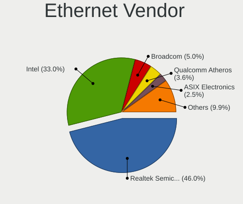

| Vendor                   | Computers | Percent |
|--------------------------|-----------|---------|
| Realtek Semiconductor    | 25085     | 46.04%  |
| Intel                    | 17983     | 33.01%  |
| Broadcom                 | 2723      | 5%      |
| Qualcomm Atheros         | 1982      | 3.64%   |
| ASIX Electronics         | 1336      | 2.45%   |
| Nvidia                   | 1067      | 1.96%   |
| Marvell Technology Group | 609       | 1.12%   |
| Samsung Electronics      | 476       | 0.87%   |
| Aquantia                 | 381       | 0.7%    |
| Broadcom Limited         | 349       | 0.64%   |
| DisplayLink              | 301       | 0.55%   |
| MediaTek                 | 248       | 0.46%   |
| Motorola PCS             | 202       | 0.37%   |
| Google                   | 194       | 0.36%   |
| Lenovo                   | 146       | 0.27%   |
| Mellanox Technologies    | 117       | 0.21%   |
| Qualcomm Technologies    | 116       | 0.21%   |
| Apple                    | 108       | 0.2%    |
| Qualcomm                 | 81        | 0.15%   |
| TP-Link                  | 75        | 0.14%   |
| Microchip Technology     | 72        | 0.13%   |
| Microsoft                | 62        | 0.11%   |
| Raspberry Pi             | 53        | 0.1%    |
| American Megatrends      | 51        | 0.09%   |
| Cypress Semiconductor    | 40        | 0.07%   |
| OPPO Electronics         | 39        | 0.07%   |
| D-Link System            | 39        | 0.07%   |
| Hewlett-Packard          | 31        | 0.06%   |
| LG Electronics           | 30        | 0.06%   |
| Insyde Software          | 28        | 0.05%   |
| T & A Mobile Phones      | 26        | 0.05%   |
| 3Com                     | 24        | 0.04%   |
| JMicron Technology       | 21        | 0.04%   |
| Dell                     | 21        | 0.04%   |
| Linksys                  | 19        | 0.03%   |
| VIA Technologies         | 18        | 0.03%   |
| ICS Advent               | 18        | 0.03%   |
| ASUSTek Computer         | 18        | 0.03%   |
| Xiaomi                   | 17        | 0.03%   |
| ADMtek                   | 17        | 0.03%   |

Ethernet Model
--------------

Ethernet models

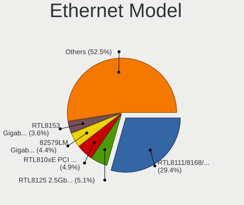

| Model                                                                  | Computers | Percent |
|------------------------------------------------------------------------|-----------|---------|
| Realtek RTL8111/8168/8211/8411 PCI Express Gigabit Ethernet Controller | 16635     | 29.39%  |
| Realtek RTL8125 2.5GbE Controller                                      | 2914      | 5.15%   |
| Realtek RTL810xE PCI Express Fast Ethernet controller                  | 2796      | 4.94%   |
| Intel 82579LM Gigabit Network Connection (Lewisville)                  | 2508      | 4.43%   |
| Realtek RTL8153 Gigabit Ethernet Adapter                               | 2029      | 3.58%   |
| Intel I211 Gigabit Network Connection                                  | 1869      | 3.3%    |
| Intel Ethernet Controller I225-V                                       | 1331      | 2.35%   |
| Intel Ethernet Connection I217-LM                                      | 1227      | 2.17%   |
| ASIX AX88179 Gigabit Ethernet                                          | 1226      | 2.17%   |
| Intel Ethernet Connection (2) I219-V                                   | 920       | 1.63%   |
| Intel Ethernet Connection (4) I219-LM                                  | 684       | 1.21%   |
| Intel Ethernet Connection (2) I219-LM                                  | 614       | 1.08%   |
| Nvidia MCP79 Ethernet                                                  | 594       | 1.05%   |
| Intel Ethernet Connection (7) I219-V                                   | 529       | 0.93%   |
| Broadcom NetXtreme BCM57765 Gigabit Ethernet PCIe                      | 498       | 0.88%   |
| Broadcom NetXtreme BCM57766 Gigabit Ethernet PCIe                      | 452       | 0.8%    |
| Intel Ethernet Controller I226-V                                       | 450       | 0.79%   |
| Intel I210 Gigabit Network Connection                                  | 437       | 0.77%   |
| Intel Ethernet Connection (7) I219-LM                                  | 434       | 0.77%   |
| Intel Ethernet Connection I219-LM                                      | 421       | 0.74%   |
| Intel 82574L Gigabit Network Connection                                | 384       | 0.68%   |
| Intel 82579V Gigabit Network Connection                                | 361       | 0.64%   |
| Intel 82577LM Gigabit Network Connection                               | 330       | 0.58%   |
| Intel Ethernet Connection (3) I218-LM                                  | 311       | 0.55%   |
| Intel Ethernet Connection I218-LM                                      | 308       | 0.54%   |
| Samsung Galaxy series, misc. (tethering mode)                          | 305       | 0.54%   |
| Qualcomm Atheros Killer E220x Gigabit Ethernet Controller              | 294       | 0.52%   |
| Intel Ethernet Connection (2) I218-V                                   | 289       | 0.51%   |
| Qualcomm Atheros Killer E2500 Gigabit Ethernet Controller              | 285       | 0.5%    |
| Realtek Killer E3000 2.5GbE Controller                                 | 284       | 0.5%    |
| Intel 82567LM-3 Gigabit Network Connection                             | 269       | 0.48%   |
| Intel Ethernet Connection (5) I219-LM                                  | 264       | 0.47%   |
| Intel Ethernet Connection I217-V                                       | 253       | 0.45%   |
| Intel Alder Lake-P PCH CNVi WiFi                                       | 231       | 0.41%   |
| Realtek Killer E2600 GbE Controller                                    | 229       | 0.4%    |
| Intel Ethernet Connection (4) I219-V                                   | 229       | 0.4%    |
| Intel 82567LM Gigabit Network Connection                               | 229       | 0.4%    |
| Qualcomm Atheros Killer E2400 Gigabit Ethernet Controller              | 223       | 0.39%   |
| Qualcomm Atheros AR8161 Gigabit Ethernet                               | 223       | 0.39%   |
| Qualcomm Atheros AR8151 v2.0 Gigabit Ethernet                          | 219       | 0.39%   |

Net Controller Kind
-------------------

Ethernet, WiFi or modem

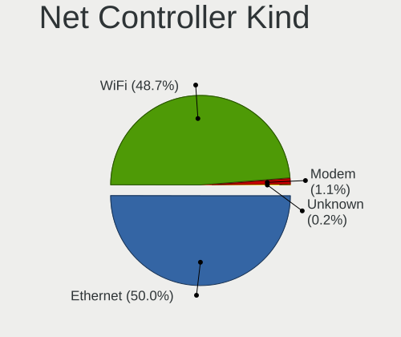

| Kind     | Computers | Percent |
|----------|-----------|---------|
| Ethernet | 49953     | 50.03%  |
| WiFi     | 48634     | 48.71%  |
| Modem    | 1100      | 1.1%    |
| Unknown  | 161       | 0.16%   |

Used Controller
---------------

Currently used network controller

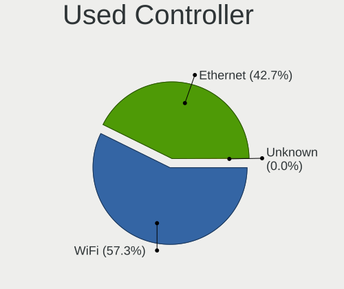

| Kind     | Computers | Percent |
|----------|-----------|---------|
| WiFi     | 36109     | 57.29%  |
| Ethernet | 26890     | 42.66%  |
| Modem    | 15        | 0.02%   |
| Unknown  | 15        | 0.02%   |

NICs
----

Total network controllers on board

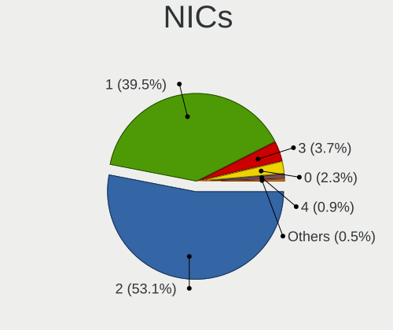

| Total | Computers | Percent |
|-------|-----------|---------|
| 2     | 32462     | 53.05%  |
| 1     | 24169     | 39.5%   |
| 3     | 2278      | 3.72%   |
| 0     | 1422      | 2.32%   |
| 4     | 549       | 0.9%    |
| 6     | 120       | 0.2%    |
| 5     | 119       | 0.19%   |
| 8     | 24        | 0.04%   |
| 7     | 16        | 0.03%   |
| 10    | 8         | 0.01%   |
| 12    | 4         | 0.01%   |
| 9     | 4         | 0.01%   |
| 132   | 2         | 0.003%  |
| 20    | 2         | 0.003%  |
| 13    | 2         | 0.003%  |
| 11    | 2         | 0.003%  |
| 66    | 1         | 0.002%  |
| 18    | 1         | 0.002%  |
| 14    | 1         | 0.002%  |

IPv6
----

IPv6 vs IPv4

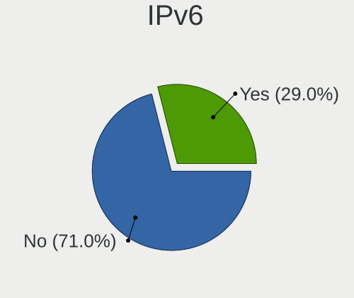

| Used | Computers | Percent |
|------|-----------|---------|
| No   | 44389     | 71.03%  |
| Yes  | 18101     | 28.97%  |

Bluetooth
---------

Bluetooth Vendor
----------------

Controller vendors

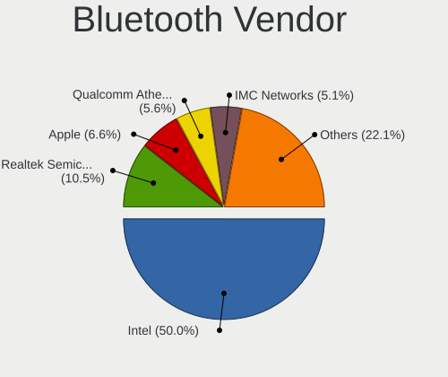

| Vendor                          | Computers | Percent |
|---------------------------------|-----------|---------|
| Intel                           | 20844     | 50.01%  |
| Realtek Semiconductor           | 4378      | 10.5%   |
| Apple                           | 2771      | 6.65%   |
| Qualcomm Atheros Communications | 2341      | 5.62%   |
| IMC Networks                    | 2121      | 5.09%   |
| Broadcom                        | 1634      | 3.92%   |
| Foxconn / Hon Hai               | 1540      | 3.69%   |
| Cambridge Silicon Radio         | 1276      | 3.06%   |
| MediaTek                        | 1222      | 2.93%   |
| ASUSTek Computer                | 707       | 1.7%    |
| Lite-On Technology              | 628       | 1.51%   |
| Dell                            | 465       | 1.12%   |
| Marvell Semiconductor           | 306       | 0.73%   |
| Hewlett-Packard                 | 223       | 0.54%   |
| TP-Link                         | 188       | 0.45%   |
| Toshiba                         | 146       | 0.35%   |
| Dynex                           | 144       | 0.35%   |
| Realtek                         | 112       | 0.27%   |
| Ralink                          | 110       | 0.26%   |
| USI                             | 96        | 0.23%   |
| Edimax Technology               | 72        | 0.17%   |
| Alps Electric                   | 60        | 0.14%   |
| Actions                         | 44        | 0.11%   |
| HTC (High Tech Computer)        | 32        | 0.08%   |
| Unknown                         | 30        | 0.07%   |
| Primax Electronics              | 20        | 0.05%   |
| Micro Star International        | 18        | 0.04%   |
| Foxconn International           | 16        | 0.04%   |
| Ralink Technology               | 15        | 0.04%   |
| Taiyo Yuden                     | 14        | 0.03%   |
| Quectel Wireless Solutions      | 13        | 0.03%   |
| Integrated System Solution      | 12        | 0.03%   |
| SINO WEALTH                     | 11        | 0.03%   |
| Kensington                      | 11        | 0.03%   |
| Fujitsu                         | 8         | 0.02%   |
| Logitech                        | 7         | 0.02%   |
| Belkin Components               | 6         | 0.01%   |
| Plugable                        | 5         | 0.01%   |
| Conwise Technology              | 4         | 0.01%   |
| Askey Computer                  | 4         | 0.01%   |

Bluetooth Model
---------------

Controller models

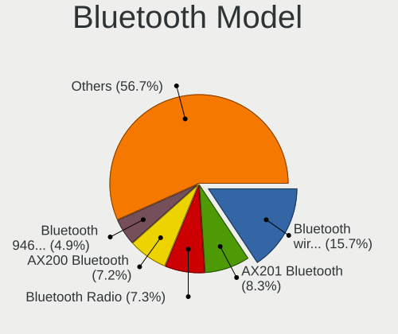

| Model                                                    | Computers | Percent |
|----------------------------------------------------------|-----------|---------|
| Intel Bluetooth wireless interface                       | 6558      | 15.69%  |
| Intel AX201 Bluetooth                                    | 3451      | 8.26%   |
| Realtek Bluetooth Radio                                  | 3040      | 7.27%   |
| Intel AX200 Bluetooth                                    | 3010      | 7.2%    |
| Intel Bluetooth 9460/9560 Jefferson Peak (JfP)           | 2046      | 4.9%    |
| Intel Bluetooth Device                                   | 1920      | 4.59%   |
| Intel AX210 Bluetooth                                    | 1516      | 3.63%   |
| Qualcomm Atheros  Bluetooth Device                       | 1311      | 3.14%   |
| Cambridge Silicon Radio Bluetooth Dongle (HCI mode)      | 1276      | 3.05%   |
| IMC Networks Bluetooth Radio                             | 1271      | 3.04%   |
| MediaTek Wireless_Device                                 | 1218      | 2.91%   |
| Intel Wireless-AC 3168 Bluetooth                         | 1037      | 2.48%   |
| Apple Bluetooth Host Controller                          | 1020      | 2.44%   |
| Realtek  Bluetooth 4.2 Adapter                           | 969       | 2.32%   |
| Apple Bluetooth USB Host Controller                      | 807       | 1.93%   |
| Intel Wireless-AC 9260 Bluetooth Adapter                 | 787       | 1.88%   |
| Apple Built-in Bluetooth 2.0+EDR HCI                     | 700       | 1.68%   |
| Foxconn / Hon Hai Wireless_Device                        | 673       | 1.61%   |
| IMC Networks Wireless_Device                             | 595       | 1.42%   |
| Broadcom BCM20702A0 Bluetooth 4.0                        | 520       | 1.24%   |
| Foxconn / Hon Hai Bluetooth Device                       | 453       | 1.08%   |
| Intel Centrino Bluetooth Wireless Transceiver            | 403       | 0.96%   |
| Qualcomm Atheros QCA61x4 Bluetooth 4.0                   | 314       | 0.75%   |
| Qualcomm Atheros AR9462 Bluetooth                        | 256       | 0.61%   |
| ASUS ASUS USB-BT500                                      | 244       | 0.58%   |
| Marvell Bluetooth and Wireless LAN Composite             | 205       | 0.49%   |
| Broadcom BCM2045B (BDC-2.1)                              | 199       | 0.48%   |
| Lite-On Bluetooth Device                                 | 198       | 0.47%   |
| TP-Link TP-T@- UB500 Adapter                             | 188       | 0.45%   |
| Qualcomm Atheros AR3012 Bluetooth 4.0                    | 176       | 0.42%   |
| Dell DW375 Bluetooth Module                              | 173       | 0.41%   |
| Broadcom BCM20702 Bluetooth 4.0 [ThinkPad]               | 173       | 0.41%   |
| Foxconn / Hon Hai MediaTek Bluetooth Adapter             | 167       | 0.4%    |
| Lite-On Qualcomm Atheros QCA9377 Bluetooth               | 160       | 0.38%   |
| Intel Centrino Advanced-N 6230 Bluetooth adapter         | 160       | 0.38%   |
| HP Broadcom 2070 Bluetooth Combo                         | 148       | 0.35%   |
| Apple Bluetooth HCI                                      | 148       | 0.35%   |
| Dynex Bluetooth 4.0 Adapter [Broadcom, 1.12, BCM20702A0] | 144       | 0.34%   |
| Qualcomm Atheros AR3011 Bluetooth                        | 134       | 0.32%   |
| ASUS Broadcom BCM20702A0 Bluetooth                       | 132       | 0.32%   |

Sound
-----

Sound Vendor
------------

Sound card vendors

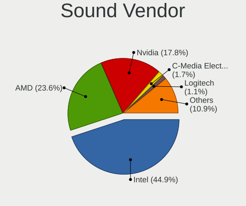

| Vendor                                       | Computers | Percent |
|----------------------------------------------|-----------|---------|
| Intel                                        | 39704     | 44.92%  |
| AMD                                          | 20832     | 23.57%  |
| Nvidia                                       | 15749     | 17.82%  |
| C-Media Electronics                          | 1461      | 1.65%   |
| Logitech                                     | 973       | 1.1%    |
| Creative Labs                                | 496       | 0.56%   |
| ASUSTek Computer                             | 483       | 0.55%   |
| Texas Instruments                            | 433       | 0.49%   |
| Razer USA                                    | 430       | 0.49%   |
| JMTek                                        | 405       | 0.46%   |
| SteelSeries ApS                              | 386       | 0.44%   |
| Focusrite-Novation                           | 341       | 0.39%   |
| Realtek Semiconductor                        | 335       | 0.38%   |
| Micro Star International                     | 331       | 0.37%   |
| Corsair                                      | 311       | 0.35%   |
| Kingston Technology                          | 292       | 0.33%   |
| Blue Microphones                             | 264       | 0.3%    |
| Hewlett-Packard                              | 223       | 0.25%   |
| Apple                                        | 220       | 0.25%   |
| Sony                                         | 219       | 0.25%   |
| Generalplus Technology                       | 215       | 0.24%   |
| Creative Technology                          | 204       | 0.23%   |
| Lenovo                                       | 190       | 0.21%   |
| GN Netcom                                    | 186       | 0.21%   |
| Tenx Technology                              | 164       | 0.19%   |
| Plantronics                                  | 161       | 0.18%   |
| KTMicro                                      | 105       | 0.12%   |
| Samson Technologies                          | 102       | 0.12%   |
| Zoran Co. Personal Media Division (Nogatech) | 100       | 0.11%   |
| Jieli Technology                             | 97        | 0.11%   |
| Schiit Audio                                 | 90        | 0.1%    |
| Giga-Byte Technology                         | 86        | 0.1%    |
| Dell                                         | 86        | 0.1%    |
| ASRock                                       | 86        | 0.1%    |
| Audio-Technica                               | 83        | 0.09%   |
| Astro Gaming                                 | 77        | 0.09%   |
| Valve Software                               | 73        | 0.08%   |
| PreSonus Audio Electronics                   | 71        | 0.08%   |
| FiiO Electronics Technology                  | 65        | 0.07%   |
| BEHRINGER International                      | 61        | 0.07%   |

Sound Model
-----------

Sound card models

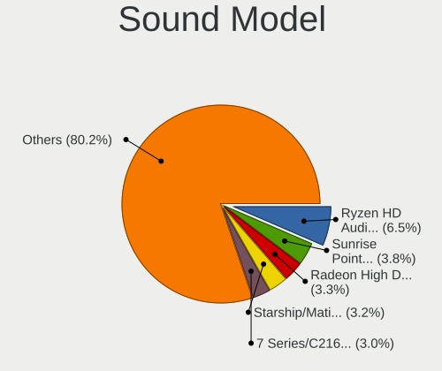

| Model                                                                      | Computers | Percent |
|----------------------------------------------------------------------------|-----------|---------|
| AMD Ryzen HD Audio Controller                                              | 6948      | 6.49%   |
| Intel Sunrise Point-LP HD Audio                                            | 4046      | 3.78%   |
| AMD Radeon High Definition Audio Controller                                | 3558      | 3.32%   |
| AMD Starship/Matisse HD Audio Controller                                   | 3432      | 3.21%   |
| Intel 7 Series/C216 Chipset Family High Definition Audio Controller        | 3197      | 2.99%   |
| Intel 6 Series/C200 Series Chipset Family High Definition Audio Controller | 2907      | 2.72%   |
| Intel 8 Series/C220 Series Chipset High Definition Audio Controller        | 2734      | 2.55%   |
| AMD Renoir/Cezanne HDMI/DP Audio Controller                                | 2514      | 2.35%   |
| Intel Cannon Lake PCH cAVS                                                 | 2214      | 2.07%   |
| AMD SBx00 Azalia (Intel HDA)                                               | 2039      | 1.91%   |
| Intel Xeon E3-1200 v3/4th Gen Core Processor HD Audio Controller           | 1924      | 1.8%    |
| Intel Tiger Lake-LP Smart Sound Technology Audio Controller                | 1711      | 1.6%    |
| Intel 100 Series/C230 Series Chipset Family HD Audio Controller            | 1660      | 1.55%   |
| AMD FCH Azalia Controller                                                  | 1620      | 1.51%   |
| AMD Navi 21/23 HDMI/DP Audio Controller                                    | 1497      | 1.4%    |
| AMD Ellesmere HDMI Audio [Radeon RX 470/480 / 570/580/590]                 | 1407      | 1.31%   |
| AMD Family 17h (Models 00h-0fh) HD Audio Controller                        | 1364      | 1.27%   |
| AMD Raven/Raven2/Fenghuang HDMI/DP Audio Controller                        | 1313      | 1.23%   |
| Intel Celeron/Pentium Silver Processor High Definition Audio               | 1307      | 1.22%   |
| Intel Broadwell-U Audio Controller                                         | 1269      | 1.19%   |
| Intel 200 Series PCH HD Audio                                              | 1225      | 1.14%   |
| Intel 8 Series HD Audio Controller                                         | 1222      | 1.14%   |
| Intel Haswell-ULT HD Audio Controller                                      | 1215      | 1.14%   |
| Intel Wildcat Point-LP High Definition Audio Controller                    | 1209      | 1.13%   |
| Intel 5 Series/3400 Series Chipset High Definition Audio                   | 1177      | 1.1%    |
| Intel Alder Lake PCH-P High Definition Audio Controller                    | 1073      | 1%      |
| Intel 82801I (ICH9 Family) HD Audio Controller                             | 1044      | 0.98%   |
| Intel Comet Lake PCH cAVS                                                  | 1014      | 0.95%   |
| Nvidia GA104 High Definition Audio Controller                              | 941       | 0.88%   |
| Nvidia GP104 High Definition Audio Controller                              | 923       | 0.86%   |
| Intel Cannon Point-LP High Definition Audio Controller                     | 903       | 0.84%   |
| Nvidia GP107GL High Definition Audio Controller                            | 888       | 0.83%   |
| AMD Kabini HDMI/DP Audio                                                   | 864       | 0.81%   |
| Nvidia TU106 High Definition Audio Controller                              | 819       | 0.77%   |
| Nvidia TU116 High Definition Audio Controller                              | 796       | 0.74%   |
| Nvidia GA106 High Definition Audio Controller                              | 796       | 0.74%   |
| AMD Navi 31 HDMI/DP Audio                                                  | 786       | 0.73%   |
| AMD Oland/Hainan/Cape Verde/Pitcairn HDMI Audio [Radeon HD 7000 Series]    | 754       | 0.7%    |
| Nvidia GP106 High Definition Audio Controller                              | 741       | 0.69%   |
| Intel Comet Lake PCH-LP cAVS                                               | 736       | 0.69%   |

Memory
------

Memory Vendor
-------------

Memory module vendors

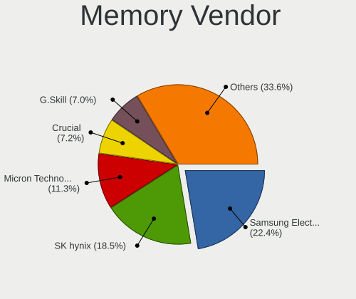

| Vendor                       | Computers | Percent |
|------------------------------|-----------|---------|
| Samsung Electronics          | 8049      | 22.38%  |
| SK hynix                     | 6671      | 18.55%  |
| Micron Technology            | 4067      | 11.31%  |
| Crucial                      | 2602      | 7.23%   |
| G.Skill                      | 2504      | 6.96%   |
| Corsair                      | 2313      | 6.43%   |
| Kingston                     | 2109      | 5.86%   |
| Unknown                      | 2028      | 5.64%   |
| Unknown                      | 702       | 1.95%   |
| Team                         | 649       | 1.8%    |
| A-DATA Technology            | 604       | 1.68%   |
| Elpida                       | 449       | 1.25%   |
| Ramaxel Technology           | 448       | 1.25%   |
| Nanya Technology             | 376       | 1.05%   |
| Unknown (ABCD)               | 351       | 0.98%   |
| Patriot                      | 238       | 0.66%   |
| PNY                          | 181       | 0.5%    |
| Timetec                      | 155       | 0.43%   |
| Avant                        | 106       | 0.29%   |
| Neo Forza                    | 86        | 0.24%   |
| Silicon Power                | 82        | 0.23%   |
| Goldkey                      | 54        | 0.15%   |
| Sesame                       | 47        | 0.13%   |
| 4ea5                         | 45        | 0.13%   |
| Transcend                    | 42        | 0.12%   |
| fef5                         | 40        | 0.11%   |
| Apacer                       | 38        | 0.11%   |
| Patriot Memory (PDP Systems) | 33        | 0.09%   |
| Qimonda                      | 32        | 0.09%   |
| Hewlett-Packard              | 29        | 0.08%   |
| Golden Empire                | 29        | 0.08%   |
| ASint Technology             | 26        | 0.07%   |
| ff                           | 25        | 0.07%   |
| Unifosa                      | 23        | 0.06%   |
| Lexar                        | 23        | 0.06%   |
| Wodposit                     | 22        | 0.06%   |
| OLOY                         | 19        | 0.05%   |
| Lexar Co Limited             | 19        | 0.05%   |
| GeIL                         | 19        | 0.05%   |
| CSX                          | 19        | 0.05%   |

Memory Model
------------

Memory module models

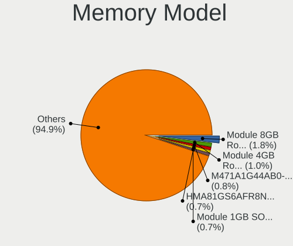

| Model                                                            | Computers | Percent |
|------------------------------------------------------------------|-----------|---------|
| Unknown                                                          | 702       | 1.83%   |
| Samsung RAM Module 4GB Row Of Chips DDR4 2400MT/s                | 402       | 1.05%   |
| Samsung RAM M471A1G44AB0-CWE 8GiB SODIMM DDR4 3200MT/s           | 300       | 0.78%   |
| SK hynix RAM HMA81GS6AFR8N-UH 8GB SODIMM DDR4 2667MT/s           | 280       | 0.73%   |
| SK hynix RAM Module 1GB SODIMM DDR2 800MT/s                      | 267       | 0.7%    |
| Unknown (ABCD) RAM 123456789012345678 2GB SODIMM LPDDR4 2400MT/s | 255       | 0.67%   |
| Samsung RAM M471A5244CB0-CWE 4GB SODIMM DDR4 3200MT/s            | 226       | 0.59%   |
| Samsung RAM M471A5244CB0-CTD 4GB SODIMM DDR4 3266MT/s            | 222       | 0.58%   |
| G.Skill RAM F4-3200C16-16GVK 16GB DIMM DDR4 3600MT/s             | 217       | 0.57%   |
| Samsung RAM M471B5173DB0-YK0 4GB SODIMM DDR3 1600MT/s            | 216       | 0.56%   |
| SK hynix RAM HMT451S6BFR8A-PB 4GB SODIMM DDR3 1600MT/s           | 199       | 0.52%   |
| Corsair RAM CMK16GX4M2B3200C16 8GB DIMM DDR4 3600MT/s            | 193       | 0.5%    |
| Samsung RAM M471A1K43CB1-CTD 8GB SODIMM DDR4 3200MT/s            | 175       | 0.46%   |
| Samsung RAM M471A1K43DB1-CWE 8GB SODIMM DDR4 3200MT/s            | 161       | 0.42%   |
| Corsair RAM CMK16GX4M2B3000C15 8GB DIMM DDR4 3600MT/s            | 160       | 0.42%   |
| Samsung RAM M471B5173QH0-YK0 4GB SODIMM DDR3 1600MT/s            | 159       | 0.42%   |
| Samsung RAM M471A1K43CB1-CRC 8GB SODIMM DDR4 8400MT/s            | 155       | 0.4%    |
| SK hynix RAM HMAA1GS6CJR6N-XN 8GB SODIMM DDR4 3200MT/s           | 153       | 0.4%    |
| Samsung RAM M471B5273DH0-CH9 4GB SODIMM DDR3 1600MT/s            | 146       | 0.38%   |
| Samsung RAM M471B1G73DB0-YK0 8GB SODIMM DDR3 1600MT/s            | 140       | 0.37%   |
| SK hynix RAM HMT351S6CFR8C-PB 4GB SODIMM DDR3 1600MT/s           | 139       | 0.36%   |
| G.Skill RAM F4-3200C16-8GVKB 8GB DIMM DDR4 4000MT/s              | 126       | 0.33%   |
| Corsair RAM CMK32GX4M2E3200C16 16GB DIMM DDR4 3600MT/s           | 126       | 0.33%   |
| SK hynix RAM Module 4GB SODIMM DDR3 1600MT/s                     | 122       | 0.32%   |
| Samsung RAM M471B5173EB0-YK0 4GB SODIMM DDR3 1600MT/s            | 122       | 0.32%   |
| Samsung RAM M471A1K43BB1-CRC 8GB SODIMM DDR4 2667MT/s            | 122       | 0.32%   |
| Samsung RAM M471A1K43EB1-CWE 8GB SODIMM DDR4 3200MT/s            | 121       | 0.32%   |
| G.Skill RAM F5-6000J3636F16G 16GB DIMM DDR5 6400MT/s             | 116       | 0.3%    |
| SK hynix RAM HMA81GS6CJR8N-VK 8GB SODIMM DDR4 2667MT/s           | 113       | 0.3%    |
| Samsung RAM M471A1G44AB0-CWE 8GB Row Of Chips DDR4 3200MT/s      | 111       | 0.29%   |
| Team RAM TEAMGROUP-UD4-3200 8GB DIMM DDR4 3800MT/s               | 109       | 0.28%   |
| SK hynix RAM HMT41GS6BFR8A-PB 8GB SODIMM DDR3 2667MT/s           | 109       | 0.28%   |
| Samsung RAM M471B1G73QH0-YK0 8GB SODIMM DDR3 1600MT/s            | 106       | 0.28%   |
| Micron RAM 4ATF51264HZ-2G6E1 4GB SODIMM DDR4 2667MT/s            | 104       | 0.27%   |
| SK hynix RAM HMA81GS6DJR8N-XN 8GB SODIMM DDR4 3200MT/s           | 102       | 0.27%   |
| Samsung RAM M471A1K43DB1-CTD 8GB SODIMM DDR4 2667MT/s            | 102       | 0.27%   |
| Crucial RAM CT102464BF160B.M16 8GB SODIMM DDR3 1600MT/s          | 101       | 0.26%   |
| Samsung RAM M471A1G44BB0-CWE 8GB SODIMM DDR4 3200MT/s            | 100       | 0.26%   |
| SK hynix RAM HMT451S6AFR8A-PB 4GB SODIMM DDR3 1600MT/s           | 99        | 0.26%   |
| Samsung RAM M471B1G73EB0-YK0 8192MB SODIMM DDR3 1600MT/s         | 99        | 0.26%   |

Memory Kind
-----------

Memory module kinds

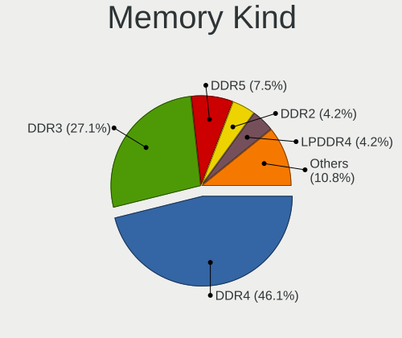

| Kind            | Computers | Percent |
|-----------------|-----------|---------|
| DDR4            | 14640     | 46.13%  |
| DDR3            | 8608      | 27.12%  |
| DDR5            | 2387      | 7.52%   |
| DDR2            | 1347      | 4.24%   |
| LPDDR4          | 1325      | 4.17%   |
| LPDDR3          | 1026      | 3.23%   |
| LPDDR5          | 959       | 3.02%   |
| SDRAM           | 667       | 2.1%    |
| Unknown         | 492       | 1.55%   |
| DDR             | 169       | 0.53%   |
| DRAM            | 102       | 0.32%   |
| RAM             | 11        | 0.03%   |
| DDR2 FB-DIMM    | 2         | 0.01%   |
| Logical non-vol | 1         | 0.003%  |
| HBM2            | 1         | 0.003%  |

Memory Form Factor
------------------

Physical design of the memory module

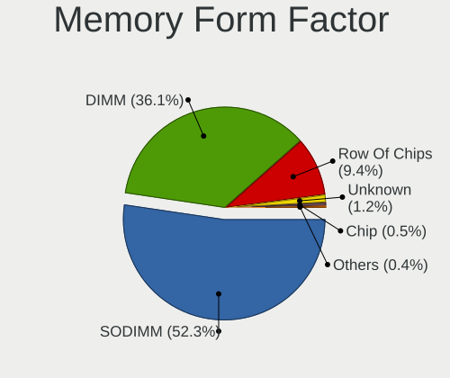

| Name            | Computers | Percent |
|-----------------|-----------|---------|
| SODIMM          | 16471     | 52.33%  |
| DIMM            | 11372     | 36.13%  |
| Row Of Chips    | 2964      | 9.42%   |
| Unknown         | 388       | 1.23%   |
| Chip            | 167       | 0.53%   |
| RIMM            | 58        | 0.18%   |
| FB-DIMM         | 41        | 0.13%   |
| Proprietary Car | 10        | 0.03%   |
| DIP             | 1         | 0.003%  |
| Die             | 1         | 0.003%  |

Memory Size
-----------

Memory module size

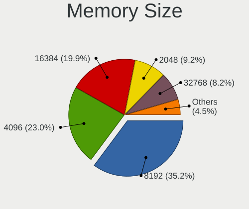

| Size    | Computers | Percent |
|---------|-----------|---------|
| 8192    | 12078     | 35.19%  |
| 4096    | 7896      | 23%     |
| 16384   | 6821      | 19.87%  |
| 2048    | 3172      | 9.24%   |
| 32768   | 2799      | 8.15%   |
| 1024    | 1139      | 3.32%   |
| 49152   | 129       | 0.38%   |
| 512     | 99        | 0.29%   |
| 65536   | 86        | 0.25%   |
| 24576   | 31        | 0.09%   |
| 256     | 26        | 0.08%   |
| 12288   | 15        | 0.04%   |
| 6144    | 10        | 0.03%   |
| 3072    | 8         | 0.02%   |
| 1536    | 4         | 0.01%   |
| 131072  | 2         | 0.01%   |
| 128     | 2         | 0.01%   |
| 32      | 2         | 0.01%   |
| 129408  | 1         | 0.003%  |
| 12333   | 1         | 0.003%  |
| 5120    | 1         | 0.003%  |
| 4000    | 1         | 0.003%  |
| 3814    | 1         | 0.003%  |
| 616     | 1         | 0.003%  |
| 64      | 1         | 0.003%  |
| Unknown | 1         | 0.003%  |

Memory Speed
------------

Memory module speed

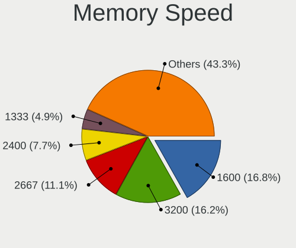

| Speed   | Computers | Percent |
|---------|-----------|---------|
| 1600    | 5751      | 16.83%  |
| 3200    | 5534      | 16.19%  |
| 2667    | 3788      | 11.08%  |
| 2400    | 2636      | 7.71%   |
| 1333    | 1674      | 4.9%    |
| 2133    | 1626      | 4.76%   |
| 3600    | 1513      | 4.43%   |
| 1867    | 810       | 2.37%   |
| 800     | 793       | 2.32%   |
| 5600    | 772       | 2.26%   |
| 6400    | 746       | 2.18%   |
| 4800    | 726       | 2.12%   |
| 667     | 573       | 1.68%   |
| 4267    | 532       | 1.56%   |
| 1334    | 427       | 1.25%   |
| 6000    | 359       | 1.05%   |
| 3800    | 354       | 1.04%   |
| 3733    | 347       | 1.02%   |
| 1067    | 344       | 1.01%   |
| 4000    | 279       | 0.82%   |
| Unknown | 275       | 0.8%    |
| 3266    | 257       | 0.75%   |
| 8400    | 246       | 0.72%   |
| 1866    | 243       | 0.71%   |
| 1066    | 227       | 0.66%   |
| 3000    | 220       | 0.64%   |
| 7500    | 219       | 0.64%   |
| 2666    | 208       | 0.61%   |
| 1800    | 196       | 0.57%   |
| 2933    | 167       | 0.49%   |
| 4199    | 148       | 0.43%   |
| 3866    | 144       | 0.42%   |
| 3400    | 141       | 0.41%   |
| 2048    | 141       | 0.41%   |
| 4266    | 106       | 0.31%   |
| 5200    | 104       | 0.3%    |
| 533     | 97        | 0.28%   |
| 8533    | 86        | 0.25%   |
| 6200    | 86        | 0.25%   |
| 975     | 85        | 0.25%   |

Printers & scanners
-------------------

Printer Vendor
--------------

Printer device vendors

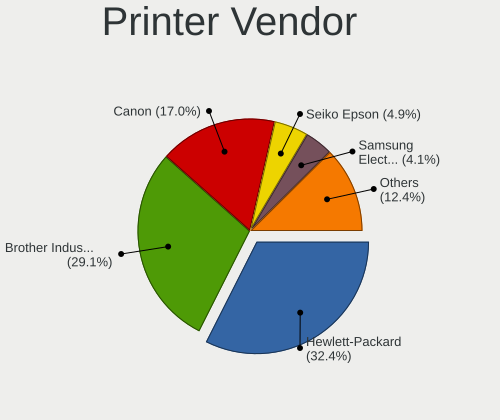

| Vendor                             | Computers | Percent |
|------------------------------------|-----------|---------|
| Hewlett-Packard                    | 525       | 32.45%  |
| Brother Industries                 | 471       | 29.11%  |
| Canon                              | 275       | 17%     |
| Seiko Epson                        | 80        | 4.94%   |
| Samsung Electronics                | 66        | 4.08%   |
| Dymo-CoStar                        | 40        | 2.47%   |
| Prolific Technology                | 20        | 1.24%   |
| Lexmark International              | 19        | 1.17%   |
| Zebra                              | 17        | 1.05%   |
| Dell                               | 15        | 0.93%   |
| Xerox                              | 14        | 0.87%   |
| QinHeng Electronics                | 14        | 0.87%   |
| Pantum                             | 9         | 0.56%   |
| STMicroelectronics                 | 8         | 0.49%   |
| Zebra Technologies                 | 4         | 0.25%   |
| Printer                            | 4         | 0.25%   |
| iDPRT                              | 4         | 0.25%   |
| Zhuhai Poskey Technology           | 3         | 0.19%   |
| Star Micronics                     | 3         | 0.19%   |
| Kyocera                            | 3         | 0.19%   |
| PM                                 | 2         | 0.12%   |
| Oki Data                           | 2         | 0.12%   |
| ICS Advent                         | 2         | 0.12%   |
| Apple                              | 2         | 0.12%   |
| YXWL Mi                            | 1         | 0.06%   |
| TSC Auto ID Technology             | 1         | 0.06%   |
| Sharp                              | 1         | 0.06%   |
| Seiko Instruments                  | 1         | 0.06%   |
| Ricoh                              | 1         | 0.06%   |
| Omnidirectional Control Technology | 1         | 0.06%   |
| MIIIW                              | 1         | 0.06%   |
| Memory                             | 1         | 0.06%   |
| Magic Control Technology           | 1         | 0.06%   |
| Konica Minolta                     | 1         | 0.06%   |
| Gprinter                           | 1         | 0.06%   |
| GCC                                | 1         | 0.06%   |
| CB Printer                         | 1         | 0.06%   |
| Boca Systems                       | 1         | 0.06%   |
| Belkin Components                  | 1         | 0.06%   |
| Beeprt Printer                     | 1         | 0.06%   |

Printer Model
-------------

Printer device models

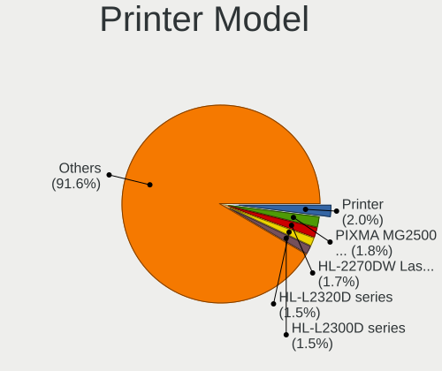

| Model                                  | Computers | Percent |
|----------------------------------------|-----------|---------|
| Brother Printer                        | 33        | 2%      |
| Canon PIXMA MG2500 Series              | 30        | 1.82%   |
| Brother HL-2270DW Laser Printer        | 28        | 1.7%    |
| Brother HL-L2320D series               | 24        | 1.45%   |
| Brother HL-L2300D series               | 24        | 1.45%   |
| Prolific PL2305 Parallel Port          | 20        | 1.21%   |
| HP DeskJet 2600 series                 | 18        | 1.09%   |
| Brother HL-L2340D series               | 18        | 1.09%   |
| Canon PIXMA MX920 Series               | 16        | 0.97%   |
| HP LaserJet 3050                       | 15        | 0.91%   |
| Brother HL-L2390DW                     | 15        | 0.91%   |
| QinHeng CH340S                         | 14        | 0.85%   |
| HP LaserJet 400 M401dne                | 14        | 0.85%   |
| Dymo-CoStar DYMO LabelWriter 450 Turbo | 14        | 0.85%   |
| HP LaserJet P1006                      | 12        | 0.73%   |
| HP LaserJet 1012                       | 12        | 0.73%   |
| Brother HL-L2380DW                     | 12        | 0.73%   |
| Brother HL-L2305 series                | 12        | 0.73%   |
| HP OfficeJet 5200 series               | 11        | 0.67%   |
| HP DeskJet 3700 series                 | 11        | 0.67%   |
| Canon PIXMA MG3600 Series              | 11        | 0.67%   |
| Brother HL-L2360D series               | 11        | 0.67%   |
| Samsung SCX-3400 Series                | 10        | 0.61%   |
| HP LaserJet M14-M17                    | 10        | 0.61%   |
| HP ENVY 4520 series                    | 10        | 0.61%   |
| HP DeskJet 2700 series                 | 10        | 0.61%   |
| HP Deskjet 2540 series                 | 10        | 0.61%   |
| Brother HL-2240 series                 | 10        | 0.61%   |
| Brother DCP-L2540DW                    | 10        | 0.61%   |
| HP OfficeJet Pro 7740 series           | 9         | 0.55%   |
| HP OfficeJet Pro 6970                  | 9         | 0.55%   |
| HP OfficeJet 3830 series               | 9         | 0.55%   |
| HP HP OfficeJet Pro 8020 series        | 9         | 0.55%   |
| HP ENVY 5000 series                    | 9         | 0.55%   |
| HP DeskJet 4100 series                 | 9         | 0.55%   |
| Canon LiDE 400                         | 9         | 0.55%   |
| Canon LiDE 300                         | 9         | 0.55%   |
| Brother HL-3140CW series               | 9         | 0.55%   |
| HP Officejet 4500 G510n-z              | 8         | 0.48%   |
| HP LaserJet Professional P1102w        | 8         | 0.48%   |

Scanner Vendor
--------------

Scanner device vendors

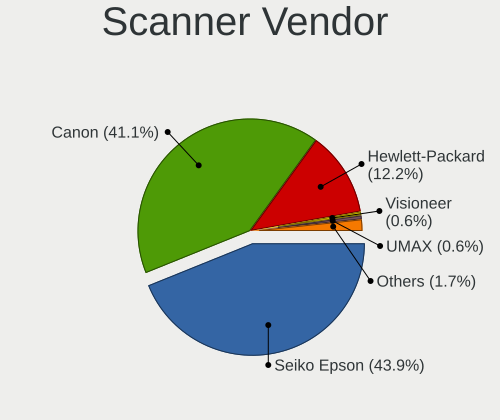

| Vendor                 | Computers | Percent |
|------------------------|-----------|---------|
| Seiko Epson            | 79        | 43.89%  |
| Canon                  | 74        | 41.11%  |
| Hewlett-Packard        | 22        | 12.22%  |
| Visioneer              | 1         | 0.56%   |
| UMAX                   | 1         | 0.56%   |
| Plustek                | 1         | 0.56%   |
| Mustek Systems         | 1         | 0.56%   |
| Microtek International | 1         | 0.56%   |

Scanner Model
-------------

Scanner device models

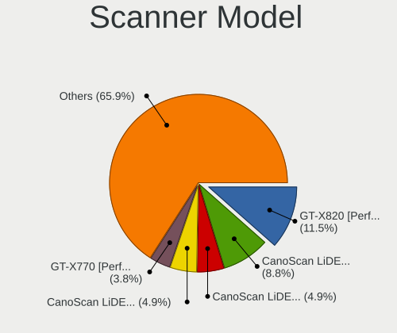

| Model                                                       | Computers | Percent |
|-------------------------------------------------------------|-----------|---------|
| Seiko Epson GT-X820 [Perfection V600 Photo]                 | 21        | 11.54%  |
| Canon CanoScan LiDE 110                                     | 16        | 8.79%   |
| Canon CanoScan LiDE 220                                     | 9         | 4.95%   |
| Canon CanoScan LiDE 210                                     | 9         | 4.95%   |
| Seiko Epson GT-X770 [Perfection V500]                       | 7         | 3.85%   |
| Canon CanoScan N1240U/LiDE 30                               | 7         | 3.85%   |
| Seiko Epson Perfection V37/V370                             | 6         | 3.3%    |
| Canon CanoScan LiDE 120                                     | 6         | 3.3%    |
| Seiko Epson GT-F720 [GT-S620/Perfection V30/V300 Photo]     | 5         | 2.75%   |
| Seiko Epson GT-8300UF [Perfection 1660 PHOTO]               | 5         | 2.75%   |
| Seiko Epson ES-D200 [GT-S50]                                | 5         | 2.75%   |
| Canon CanoScan LIDE 25                                      | 5         | 2.75%   |
| Seiko Epson Scanner                                         | 4         | 2.2%    |
| Seiko Epson GT-X900 [Perfection V700/V750 Photo]            | 4         | 2.2%    |
| Seiko Epson GT-X750 [Perfection 4490 Photo]                 | 4         | 2.2%    |
| HP ScanJet 82x0C                                            | 4         | 2.2%    |
| Canon CanoScan N670U/N676U/LiDE 20                          | 4         | 2.2%    |
| Seiko Epson GT-9300UF [Perfection 2400 PHOTO]               | 3         | 1.65%   |
| Canon CanoScan LiDE 200                                     | 3         | 1.65%   |
| Seiko Epson GT-F730 [GT-S630/Perfection V33/V330 Photo]     | 2         | 1.1%    |
| Seiko Epson GT-F670 [Perfection V200 Photo]                 | 2         | 1.1%    |
| Seiko Epson GT-9700F [Perfection 2450 PHOTO]                | 2         | 1.1%    |
| Seiko Epson GT-8200U/GT-8200UF [Perfection 1650/1650 PHOTO] | 2         | 1.1%    |
| Seiko Epson GT-1500 [GT-D1000]                              | 2         | 1.1%    |
| HP ScanJet 7650                                             | 2         | 1.1%    |
| HP ScanJet 4850C/4890C                                      | 2         | 1.1%    |
| Canon CanoScan LiDE 70                                      | 2         | 1.1%    |
| Canon CanoScan LiDE 60                                      | 2         | 1.1%    |
| Canon CanoScan 4400F                                        | 2         | 1.1%    |
| Canon CanoScan 4200F                                        | 2         | 1.1%    |
| Visioneer OneTouch 5300 USB                                 | 1         | 0.55%   |
| UMAX Astra 2200/2200SU                                      | 1         | 0.55%   |
| Seiko Epson GT-X800 [Perfection 4990 PHOTO]                 | 1         | 0.55%   |
| Seiko Epson GT-X700 [Perfection 4870]                       | 1         | 0.55%   |
| Seiko Epson GT-F600 [Perfection 4180]                       | 1         | 0.55%   |
| Seiko Epson GT-9800F [Perfection 3200]                      | 1         | 0.55%   |
| Seiko Epson GT-9400UF [Perfection 3170]                     | 1         | 0.55%   |
| Seiko Epson GT-7700U [Perfection 1240U]                     | 1         | 0.55%   |
| Seiko Epson GT-7200U [Perfection 1250/1250 PHOTO]           | 1         | 0.55%   |
| Plustek 600dpi USB Scanner                                  | 1         | 0.55%   |

Camera
------

Camera Vendor
-------------

Camera device vendors

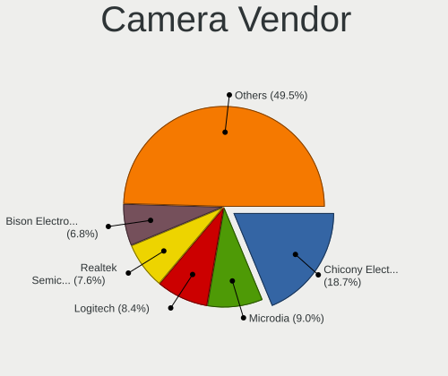

| Vendor                                 | Computers | Percent |
|----------------------------------------|-----------|---------|
| Chicony Electronics                    | 6334      | 18.73%  |
| Microdia                               | 3031      | 8.96%   |
| Logitech                               | 2848      | 8.42%   |
| Realtek Semiconductor                  | 2566      | 7.59%   |
| Bison Electronics                      | 2284      | 6.76%   |
| IMC Networks                           | 2264      | 6.7%    |
| Sunplus Innovation Technology          | 1991      | 5.89%   |
| Apple                                  | 1802      | 5.33%   |
| Quanta                                 | 1632      | 4.83%   |
| Cheng Uei Precision Industry (Foxlink) | 1164      | 3.44%   |
| Luxvisions Innotech Limited            | 859       | 2.54%   |
| Suyin                                  | 739       | 2.19%   |
| Lite-On Technology                     | 599       | 1.77%   |
| Syntek                                 | 595       | 1.76%   |
| Samsung Electronics                    | 442       | 1.31%   |
| Microsoft                              | 385       | 1.14%   |
| Sonix Technology                       | 267       | 0.79%   |
| Ricoh                                  | 239       | 0.71%   |
| Alcor Micro                            | 229       | 0.68%   |
| Importek                               | 187       | 0.55%   |
| Shinetech                              | 186       | 0.55%   |
| Silicon Motion                         | 177       | 0.52%   |
| Lenovo                                 | 149       | 0.44%   |
| ARC International                      | 134       | 0.4%    |
| SunplusIT                              | 122       | 0.36%   |
| Razer USA                              | 116       | 0.34%   |
| MacroSilicon                           | 114       | 0.34%   |
| icSpring                               | 111       | 0.33%   |
| Acer                                   | 89        | 0.26%   |
| Primax Electronics                     | 84        | 0.25%   |
| webcam                                 | 78        | 0.23%   |
| OmniVision Technologies                | 77        | 0.23%   |
| Generalplus Technology                 | 77        | 0.23%   |
| eMeet                                  | 77        | 0.23%   |
| Z-Star Microelectronics                | 75        | 0.22%   |
| LG Electronics                         | 66        | 0.2%    |
| Shenzhen Kingcome Optoelectronic       | 65        | 0.19%   |
| Intel                                  | 64        | 0.19%   |
| Valve Software                         | 60        | 0.18%   |
| GEMBIRD                                | 56        | 0.17%   |

Camera Model
------------

Camera device models

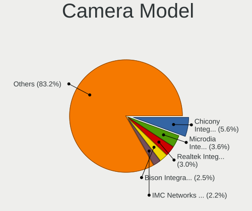

| Model                                               | Computers | Percent |
|-----------------------------------------------------|-----------|---------|
| Chicony Integrated Camera                           | 1925      | 5.62%   |
| Microdia Integrated_Webcam_HD                       | 1225      | 3.58%   |
| Realtek Integrated_Webcam_HD                        | 1016      | 2.97%   |
| Bison Integrated Camera                             | 840       | 2.45%   |
| IMC Networks USB2.0 HD UVC WebCam                   | 762       | 2.22%   |
| IMC Networks Integrated Camera                      | 754       | 2.2%    |
| Sunplus Integrated_Webcam_HD                        | 626       | 1.83%   |
| Logitech HD Pro Webcam C920                         | 576       | 1.68%   |
| Apple FaceTime HD Camera (Built-in)                 | 496       | 1.45%   |
| Apple iPhone 5/5C/5S/6/SE/7/8/X                     | 448       | 1.31%   |
| Syntek Integrated Camera                            | 435       | 1.27%   |
| Samsung Galaxy series, misc. (MTP mode)             | 435       | 1.27%   |
| Logitech Webcam C270                                | 433       | 1.26%   |
| Apple Built-in iSight                               | 412       | 1.2%    |
| Chicony HD WebCam                                   | 349       | 1.02%   |
| Apple FaceTime HD Camera                            | 343       | 1%      |
| Microdia Integrated Webcam                          | 288       | 0.84%   |
| Chicony HP Truevision HD camera                     | 250       | 0.73%   |
| Microdia Webcam Vitade AF                           | 248       | 0.72%   |
| Quanta HP TrueVision HD Camera                      | 245       | 0.72%   |
| Luxvisions Innotech Limited Integrated Camera       | 243       | 0.71%   |
| Chicony HP Truevision HD                            | 238       | 0.69%   |
| Logitech C922 Pro Stream Webcam                     | 231       | 0.67%   |
| Chicony HP HD Camera                                | 227       | 0.66%   |
| Lite-On Integrated Camera                           | 219       | 0.64%   |
| Luxvisions Innotech Limited HP TrueVision HD Camera | 213       | 0.62%   |
| Chicony HP Wide Vision HD Camera                    | 208       | 0.61%   |
| Quanta HD User Facing                               | 203       | 0.59%   |
| Logitech HD Webcam C615                             | 202       | 0.59%   |
| Bison HD Webcam                                     | 202       | 0.59%   |
| Quanta HP Wide Vision HD Camera                     | 199       | 0.58%   |
| Logitech BRIO Ultra HD Webcam                       | 198       | 0.58%   |
| Realtek Integrated Webcam HD                        | 189       | 0.55%   |
| Chicony Integrated Camera (1280x720@30)             | 188       | 0.55%   |
| Bison BisonCam,NB Pro                               | 188       | 0.55%   |
| Logitech C920 PRO HD Webcam                         | 169       | 0.49%   |
| Microdia USB 2.0 Camera                             | 168       | 0.49%   |
| Microdia Integrated_Webcam_FHD                      | 168       | 0.49%   |
| Chicony HD User Facing                              | 159       | 0.46%   |
| Microdia Laptop_Integrated_Webcam_HD                | 157       | 0.46%   |

Security
--------

Fingerprint Vendor
------------------

Fingerprint sensor vendors

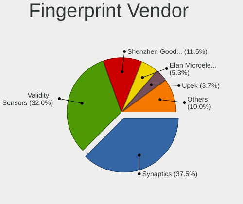

| Vendor                             | Computers | Percent |
|------------------------------------|-----------|---------|
| Synaptics                          | 2135      | 37.52%  |
| Validity Sensors                   | 1822      | 32.02%  |
| Shenzhen Goodix Technology         | 654       | 11.49%  |
| Elan Microelectronics              | 299       | 5.25%   |
| Upek                               | 210       | 3.69%   |
| AuthenTec                          | 195       | 3.43%   |
| LighTuning Technology              | 136       | 2.39%   |
| STMicroelectronics                 | 85        | 1.49%   |
| Samsung Electronics                | 55        | 0.97%   |
| Focal-systems.Corp                 | 37        | 0.65%   |
| DigitalPersona                     | 22        | 0.39%   |
| HOLTEK                             | 17        | 0.3%    |
| Realtek USB2.0 Finger Print Bridge | 10        | 0.18%   |
| Microsoft                          | 4         | 0.07%   |
| Gingytech                          | 3         | 0.05%   |
| Dell                               | 3         | 0.05%   |
| Unknown                            | 2         | 0.04%   |
| Next Biometrics                    | 1         | 0.02%   |

Fingerprint Model
-----------------

Fingerprint sensor models

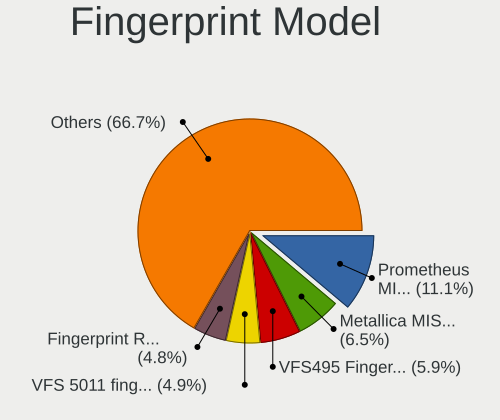

| Model                                                                      | Computers | Percent |
|----------------------------------------------------------------------------|-----------|---------|
| Synaptics Prometheus MIS Touch Fingerprint Reader                          | 634       | 11.14%  |
| Synaptics Metallica MIS Touch Fingerprint Reader                           | 371       | 6.52%   |
| Validity Sensors VFS495 Fingerprint Reader                                 | 334       | 5.87%   |
| Validity Sensors VFS 5011 fingerprint sensor                               | 281       | 4.94%   |
| Shenzhen Goodix Fingerprint Reader                                         | 274       | 4.81%   |
| Upek Biometric Touchchip/Touchstrip Fingerprint Sensor                     | 201       | 3.53%   |
| Validity Sensors Synaptics WBDI                                            | 197       | 3.46%   |
| Shenzhen Goodix FingerPrint                                                | 196       | 3.44%   |
| Shenzhen Goodix  FingerPrint Device                                        | 184       | 3.23%   |
| Synaptics WBDI                                                             | 178       | 3.13%   |
| Elan ELAN:Fingerprint                                                      | 164       | 2.88%   |
| Validity Sensors Fingerprint scanner                                       | 147       | 2.58%   |
| Synaptics  WBDI                                                            | 142       | 2.5%    |
| Synaptics UWP WBDI                                                         | 135       | 2.37%   |
| Validity Sensors VFS7500 Touch Fingerprint Sensor                          | 129       | 2.27%   |
| Validity Sensors VFS491                                                    | 125       | 2.2%    |
| Elan ELAN:ARM-M4                                                           | 123       | 2.16%   |
| Validity Sensors VFS471 Fingerprint Reader                                 | 122       | 2.14%   |
| Synaptics UWP WBDI Device                                                  | 122       | 2.14%   |
| Synaptics Prometheus Fingerprint Reader                                    | 101       | 1.77%   |
| Validity Sensors VFS5011 Fingerprint Reader                                | 97        | 1.7%    |
| Synaptics FS7604 Touch Fingerprint Sensor with PurePrint                   | 97        | 1.7%    |
| Synaptics Fingerprint reader [HP G6]                                       | 95        | 1.67%   |
| Validity Sensors Swipe Fingerprint Sensor                                  | 84        | 1.48%   |
| Validity Sensors Synaptics VFS7552 Touch Fingerprint Sensor with PurePrint | 83        | 1.46%   |
| STMicroelectronics Fingerprint Reader                                      | 83        | 1.46%   |
| AuthenTec AES2810                                                          | 76        | 1.34%   |
| Validity Sensors VFS7552 Touch Fingerprint Sensor                          | 67        | 1.18%   |
| Validity Sensors VFS451 Fingerprint Reader                                 | 56        | 0.98%   |
| LighTuning ES603 Swipe Fingerprint Sensor                                  | 52        | 0.91%   |
| Synaptics  FS7604 Touch Fingerprint Sensor with PurePrint                  | 51        | 0.9%    |
| LighTuning Fingerprint Sensor                                              | 40        | 0.7%    |
| AuthenTec Fingerprint Sensor                                               | 39        | 0.69%   |
| Synaptics TouchPad                                                         | 38        | 0.67%   |
| Samsung Fingerprint Sensor Device - 730B                                   | 38        | 0.67%   |
| LighTuning EgisTec Touch Fingerprint Sensor                                | 38        | 0.67%   |
| Validity Sensors VFS301 Fingerprint Reader                                 | 37        | 0.65%   |
| Focal-systems.Corp FT9201Fingerprint.                                      | 37        | 0.65%   |
| Synaptics WBDI Fingerprint Reader USB 102                                  | 36        | 0.63%   |
| AuthenTec AES2501 Fingerprint Sensor                                       | 36        | 0.63%   |

Chipcard Vendor
---------------

Chipcard module vendors

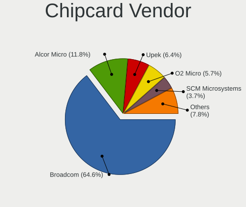

| Vendor                    | Computers | Percent |
|---------------------------|-----------|---------|
| Broadcom                  | 1585      | 64.64%  |
| Alcor Micro               | 289       | 11.79%  |
| Upek                      | 156       | 6.36%   |
| O2 Micro                  | 140       | 5.71%   |
| SCM Microsystems          | 91        | 3.71%   |
| Lenovo                    | 60        | 2.45%   |
| Yubico.com                | 22        | 0.9%    |
| OmniKey                   | 19        | 0.77%   |
| Realtek Semiconductor     | 18        | 0.73%   |
| Gemalto (was Gemplus)     | 16        | 0.65%   |
| Advanced Card Systems     | 11        | 0.45%   |
| Chicony Electronics       | 10        | 0.41%   |
| Cherry                    | 6         | 0.24%   |
| Aladdin Knowledge Systems | 5         | 0.2%    |
| NXP Semiconductors        | 4         | 0.16%   |
| Jing-Mold Enterprise      | 4         | 0.16%   |
| Hewlett-Packard           | 4         | 0.16%   |
| Thetis                    | 3         | 0.12%   |
| Purism, SPC               | 2         | 0.08%   |
| Reiner SCT Kartensysteme  | 1         | 0.04%   |
| Mako Technologies         | 1         | 0.04%   |
| MagTek                    | 1         | 0.04%   |
| HID Global                | 1         | 0.04%   |
| Clay Logic                | 1         | 0.04%   |
| BLUTRONICS                | 1         | 0.04%   |
| Bit4id                    | 1         | 0.04%   |

Chipcard Model
--------------

Chipcard module models

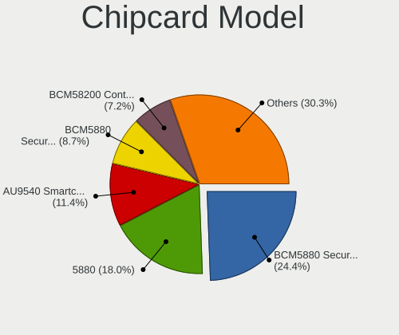

| Model                                                                        | Computers | Percent |
|------------------------------------------------------------------------------|-----------|---------|
| Broadcom BCM5880 Secure Applications Processor                               | 600       | 24.41%  |
| Broadcom 5880                                                                | 442       | 17.98%  |
| Alcor Micro AU9540 Smartcard Reader                                          | 279       | 11.35%  |
| Broadcom BCM5880 Secure Applications Processor with fingerprint swipe sensor | 215       | 8.75%   |
| Broadcom BCM58200 ControlVault 3 (FingerPrint sensor + Contacted SmartCard)  | 176       | 7.16%   |
| Upek TouchChip Fingerprint Coprocessor (WBF advanced mode)                   | 156       | 6.35%   |
| Broadcom 58200                                                               | 138       | 5.61%   |
| O2 Micro OZ776 CCID Smartcard Reader                                         | 114       | 4.64%   |
| SCM Microsystems SCR331-LC1 / SCR3310 SmartCard Reader                       | 61        | 2.48%   |
| Lenovo Integrated Smart Card Reader                                          | 60        | 2.44%   |
| O2 Micro Oz776 SmartCard Reader                                              | 26        | 1.06%   |
| Yubico.com Yubikey 4/5 U2F+CCID                                              | 19        | 0.77%   |
| Broadcom BCM5880 Secure Applications Processor with fingerprint touch sensor | 19        | 0.77%   |
| Realtek Semiconductor Smart Card Reader Interface                            | 18        | 0.73%   |
| Gemalto (was Gemplus) GemPC Twin SmartCard Reader                            | 10        | 0.41%   |
| Chicony Electronics HP Skylab USB Smartcard Keyboard                         | 10        | 0.41%   |
| SCM Microsystems SCR331 SmartCard Reader                                     | 9         | 0.37%   |
| Alcor Micro Watchdata W 1981                                                 | 9         | 0.37%   |
| SCM Microsystems SCR35xx Smart Card Reader                                   | 6         | 0.24%   |
| SCM Microsystems SCR3340 - ExpressCard54 Smart Card Reader                   | 5         | 0.2%    |
| OmniKey 3x21 Smart Card Reader                                               | 5         | 0.2%    |
| Gemalto (was Gemplus) Compact Smart Card Reader Writer                       | 5         | 0.2%    |
| Cherry SmartCard Reader Keyboard KC 1000 SC                                  | 5         | 0.2%    |
| Aladdin Knowledge Systems Token JC                                           | 5         | 0.2%    |
| Advanced Card Systems ACR39U                                                 | 5         | 0.2%    |
| OmniKey CardMan Smart@Link                                                   | 4         | 0.16%   |
| OmniKey CardMan 3021 / 3121                                                  | 4         | 0.16%   |
| NXP Semiconductors PR533                                                     | 4         | 0.16%   |
| Jing-Mold Enterprise HP USB Business Slim Smartcard CCID Keyboard            | 4         | 0.16%   |
| Hewlett-Packard SC Keyboard - Apollo (Liteon)                                | 4         | 0.16%   |
| SCM Microsystems SCR3500 A Contact Reader                                    | 3         | 0.12%   |
| Advanced Card Systems ACR38 SmartCard Reader                                 | 3         | 0.12%   |
| Yubico.com Yubikey NEO(-N) OTP+CCID                                          | 2         | 0.08%   |
| Thetis Security Key(F829)                                                    | 2         | 0.08%   |
| SCM Microsystems uTrust FIDO2 Security Key                                   | 2         | 0.08%   |
| SCM Microsystems SCR3500 C Contact Reader                                    | 2         | 0.08%   |
| Purism, SPC Librem Key                                                       | 2         | 0.08%   |
| OmniKey CardMan 3121 (HID Technologies)                                      | 2         | 0.08%   |
| Advanced Card Systems ACR122U                                                | 2         | 0.08%   |
| Yubico.com Yubikey 4/5 CCID                                                  | 1         | 0.04%   |

Unsupported
-----------

Unsupported Devices
-------------------

Total unsupported devices on board

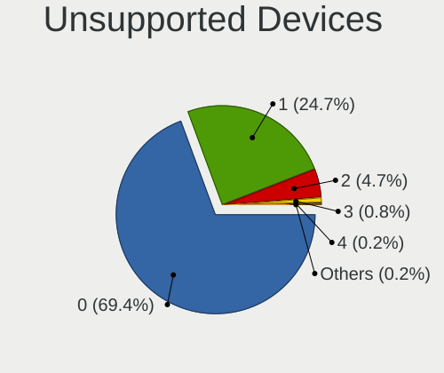

| Total | Computers | Percent |
|-------|-----------|---------|
| 0     | 43393     | 69.37%  |
| 1     | 15455     | 24.71%  |
| 2     | 2919      | 4.67%   |
| 3     | 516       | 0.82%   |
| 4     | 136       | 0.22%   |
| 5     | 65        | 0.1%    |
| 6     | 33        | 0.05%   |
| 7     | 17        | 0.03%   |
| 8     | 10        | 0.02%   |
| 9     | 4         | 0.01%   |
| 10    | 1         | 0.002%  |

Unsupported Device Types
------------------------

Types of unsupported devices

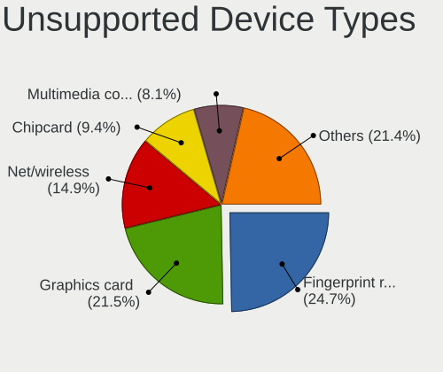

| Type                     | Computers | Percent |
|--------------------------|-----------|---------|
| Fingerprint reader       | 5614      | 24.7%   |
| Graphics card            | 4877      | 21.46%  |
| Net/wireless             | 3395      | 14.94%  |
| Chipcard                 | 2138      | 9.41%   |
| Multimedia controller    | 1834      | 8.07%   |
| Communication controller | 1292      | 5.69%   |
| Unassigned class         | 707       | 3.11%   |
| Camera                   | 534       | 2.35%   |
| Bluetooth                | 464       | 2.04%   |
| Sound                    | 461       | 2.03%   |
| Storage                  | 340       | 1.5%    |
| Net/ethernet             | 300       | 1.32%   |
| Network                  | 208       | 0.92%   |
| Card reader              | 139       | 0.61%   |
| Modem                    | 120       | 0.53%   |
| Storage/raid             | 109       | 0.48%   |
| Storage/ide              | 42        | 0.18%   |
| Firewire controller      | 40        | 0.18%   |
| Dvb card                 | 39        | 0.17%   |
| Storage/nvme             | 22        | 0.1%    |
| Storage/ata              | 16        | 0.07%   |
| Tv card                  | 11        | 0.05%   |
| Wireless                 | 8         | 0.04%   |
| Flash memory             | 8         | 0.04%   |
| Unclassified device      | 6         | 0.03%   |
| Video                    | 1         | 0.004%  |

