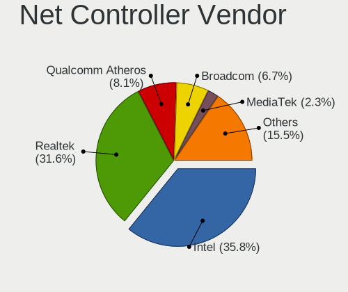
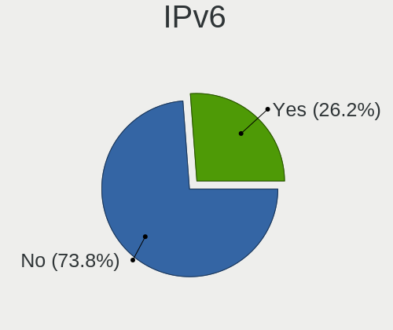
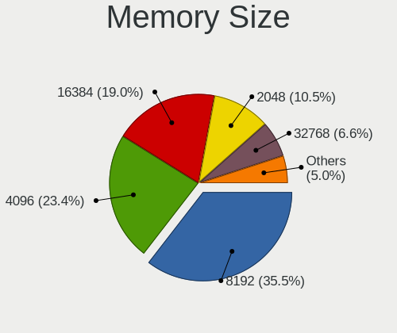
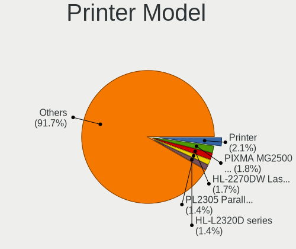
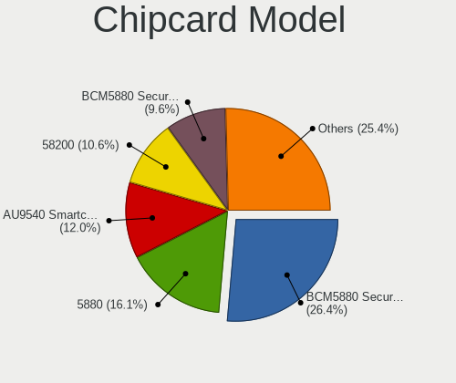

Linux in USA - Tested Hardware & Statistics
-------------------------------------------

A project to collect tested hardware configurations for Linux in USA.

Anyone can contribute to this report by the [hw-probe](https://github.com/linuxhw/hw-probe) tool:

    sudo -E hw-probe -all -upload

Please contribute! Especially if your hardware is rare.

This is a report for all computer types. See also reports for [desktops](/Location/USA/Desktop/README.md) and [notebooks](/Location/USA/Notebook/README.md).

Contents
--------

* [ Test Cases ](#test-cases)

* [ System ](#system)
  - [ OS                       ](#os)
  - [ OS Family                ](#os-family)
  - [ Kernel                   ](#kernel)
  - [ Kernel Family            ](#kernel-family)
  - [ Kernel Major Ver.        ](#kernel-major-ver)
  - [ Arch                     ](#arch)
  - [ DE                       ](#de)
  - [ Display Server           ](#display-server)
  - [ Display Manager          ](#display-manager)
  - [ OS Lang                  ](#os-lang)
  - [ Boot Mode                ](#boot-mode)
  - [ Filesystem               ](#filesystem)
  - [ Part. scheme             ](#part-scheme)
  - [ Dual Boot with Linux/BSD ](#dual-boot-with-linuxbsd)
  - [ Dual Boot (Win)          ](#dual-boot-win)

* [ Board ](#board)
  - [ Vendor                   ](#vendor)
  - [ Model                    ](#model)
  - [ Model Family             ](#model-family)
  - [ MFG Year                 ](#mfg-year)
  - [ Form Factor              ](#form-factor)
  - [ Secure Boot              ](#secure-boot)
  - [ Coreboot                 ](#coreboot)
  - [ RAM Size                 ](#ram-size)
  - [ RAM Used                 ](#ram-used)
  - [ Total Drives             ](#total-drives)
  - [ Has CD-ROM               ](#has-cd-rom)
  - [ Has Ethernet             ](#has-ethernet)
  - [ Has WiFi                 ](#has-wifi)
  - [ Has Bluetooth            ](#has-bluetooth)

* [ Location ](#location)
  - [ Country                  ](#country)
  - [ City                     ](#city)

* [ Drives ](#drives)
  - [ Drive Vendor             ](#drive-vendor)
  - [ Drive Model              ](#drive-model)
  - [ HDD Vendor               ](#hdd-vendor)
  - [ SSD Vendor               ](#ssd-vendor)
  - [ Drive Kind               ](#drive-kind)
  - [ Drive Connector          ](#drive-connector)
  - [ Drive Size               ](#drive-size)
  - [ Space Total              ](#space-total)
  - [ Space Used               ](#space-used)
  - [ Malfunc. Drives          ](#malfunc-drives)
  - [ Malfunc. Drive Vendor    ](#malfunc-drive-vendor)
  - [ Malfunc. HDD Vendor      ](#malfunc-hdd-vendor)
  - [ Malfunc. Drive Kind      ](#malfunc-drive-kind)
  - [ Failed Drives            ](#failed-drives)
  - [ Failed Drive Vendor      ](#failed-drive-vendor)
  - [ Drive Status             ](#drive-status)

* [ Storage controller ](#storage-controller)
  - [ Storage Vendor           ](#storage-vendor)
  - [ Storage Model            ](#storage-model)
  - [ Storage Kind             ](#storage-kind)

* [ Processor ](#processor)
  - [ CPU Vendor               ](#cpu-vendor)
  - [ CPU Model                ](#cpu-model)
  - [ CPU Model Family         ](#cpu-model-family)
  - [ CPU Cores                ](#cpu-cores)
  - [ CPU Sockets              ](#cpu-sockets)
  - [ CPU Threads              ](#cpu-threads)
  - [ CPU Op-Modes             ](#cpu-op-modes)
  - [ CPU Microcode            ](#cpu-microcode)
  - [ CPU Microarch            ](#cpu-microarch)

* [ Graphics ](#graphics)
  - [ GPU Vendor               ](#gpu-vendor)
  - [ GPU Model                ](#gpu-model)
  - [ GPU Combo                ](#gpu-combo)
  - [ GPU Driver               ](#gpu-driver)
  - [ GPU Memory               ](#gpu-memory)

* [ Monitor ](#monitor)
  - [ Monitor Vendor           ](#monitor-vendor)
  - [ Monitor Model            ](#monitor-model)
  - [ Monitor Resolution       ](#monitor-resolution)
  - [ Monitor Diagonal         ](#monitor-diagonal)
  - [ Monitor Width            ](#monitor-width)
  - [ Aspect Ratio             ](#aspect-ratio)
  - [ Monitor Area             ](#monitor-area)
  - [ Pixel Density            ](#pixel-density)
  - [ Multiple Monitors        ](#multiple-monitors)

* [ Network ](#network)
  - [ Net Controller Vendor    ](#net-controller-vendor)
  - [ Net Controller Model     ](#net-controller-model)
  - [ Wireless Vendor          ](#wireless-vendor)
  - [ Wireless Model           ](#wireless-model)
  - [ Ethernet Vendor          ](#ethernet-vendor)
  - [ Ethernet Model           ](#ethernet-model)
  - [ Net Controller Kind      ](#net-controller-kind)
  - [ Used Controller          ](#used-controller)
  - [ NICs                     ](#nics)
  - [ IPv6                     ](#ipv6)

* [ Bluetooth ](#bluetooth)
  - [ Bluetooth Vendor         ](#bluetooth-vendor)
  - [ Bluetooth Model          ](#bluetooth-model)

* [ Sound ](#sound)
  - [ Sound Vendor             ](#sound-vendor)
  - [ Sound Model              ](#sound-model)

* [ Memory ](#memory)
  - [ Memory Vendor            ](#memory-vendor)
  - [ Memory Model             ](#memory-model)
  - [ Memory Kind              ](#memory-kind)
  - [ Memory Form Factor       ](#memory-form-factor)
  - [ Memory Size              ](#memory-size)
  - [ Memory Speed             ](#memory-speed)

* [ Printers & scanners ](#printers--scanners)
  - [ Printer Vendor           ](#printer-vendor)
  - [ Printer Model            ](#printer-model)
  - [ Scanner Vendor           ](#scanner-vendor)
  - [ Scanner Model            ](#scanner-model)

* [ Camera ](#camera)
  - [ Camera Vendor            ](#camera-vendor)
  - [ Camera Model             ](#camera-model)

* [ Security ](#security)
  - [ Fingerprint Vendor       ](#fingerprint-vendor)
  - [ Fingerprint Model        ](#fingerprint-model)
  - [ Chipcard Vendor          ](#chipcard-vendor)
  - [ Chipcard Model           ](#chipcard-model)

* [ Unsupported ](#unsupported)
  - [ Unsupported Devices      ](#unsupported-devices)
  - [ Unsupported Device Types ](#unsupported-device-types)

Test Cases
----------

Total: 39338

| Vendor        | Model                       | Form-Factor | Probe                                                      | Date         |
|---------------|-----------------------------|-------------|------------------------------------------------------------|--------------|
| Apple         | Mac-27AD2F918AE68F61 Mac... | Desktop     | [3e25da0356](https://linux-hardware.org/?probe=3e25da0356) | Oct 01, 2022 |
| ASUSTek       | StrikerExtreme              | Desktop     | [4aacd62d98](https://linux-hardware.org/?probe=4aacd62d98) | Oct 01, 2022 |
| Dell          | 0JYH5J A00                  | All in one  | [348bc23246](https://linux-hardware.org/?probe=348bc23246) | Oct 01, 2022 |
| Lenovo        | ThinkPad Yoga 11e 20DAS0... | Notebook    | [dc7e0ada81](https://linux-hardware.org/?probe=dc7e0ada81) | Oct 01, 2022 |
| ASUSTek       | TUF Gaming B550M-PLUS       | Desktop     | [15a068e26b](https://linux-hardware.org/?probe=15a068e26b) | Oct 01, 2022 |
| ASUSTek       | TUF Gaming B550M-PLUS       | Desktop     | [3a9d882d91](https://linux-hardware.org/?probe=3a9d882d91) | Oct 01, 2022 |
| Google        | Blooglet                    | Notebook    | [0081fa7064](https://linux-hardware.org/?probe=0081fa7064) | Oct 01, 2022 |
| HP            | 255 G8 Notebook PC          | Notebook    | [1ea0859429](https://linux-hardware.org/?probe=1ea0859429) | Oct 01, 2022 |
| Gigabyte      | 990FXA-UD3                  | Desktop     | [cb25964ddb](https://linux-hardware.org/?probe=cb25964ddb) | Oct 01, 2022 |
| Fujitsu       | LIFEBOOK A6210              | Notebook    | [73c4e6626f](https://linux-hardware.org/?probe=73c4e6626f) | Oct 01, 2022 |
| Lenovo        | ThinkPad T440 20B6005JUS    | Notebook    | [f12950ed92](https://linux-hardware.org/?probe=f12950ed92) | Oct 01, 2022 |
| Lenovo        | ThinkPad T440 20B6005JUS    | Notebook    | [b395d9ce9b](https://linux-hardware.org/?probe=b395d9ce9b) | Oct 01, 2022 |
| Apple         | MacBookPro8,1               | Notebook    | [f42501fcc3](https://linux-hardware.org/?probe=f42501fcc3) | Oct 01, 2022 |
| Lenovo        | Yoga 730-13IKB 81CT         | Convertible | [cffd9dadf8](https://linux-hardware.org/?probe=cffd9dadf8) | Oct 01, 2022 |
| ASUSTek       | PRIME B550M-A               | Desktop     | [4d1cbd14c2](https://linux-hardware.org/?probe=4d1cbd14c2) | Oct 01, 2022 |
| Dell          | 0KJCC5 A00                  | Desktop     | [7915b298b2](https://linux-hardware.org/?probe=7915b298b2) | Oct 01, 2022 |
| HP            | Pavilion 17                 | Notebook    | [fa2e48904a](https://linux-hardware.org/?probe=fa2e48904a) | Oct 01, 2022 |
| MSI           | GF65 Thin 9SD               | Notebook    | [a761de487d](https://linux-hardware.org/?probe=a761de487d) | Oct 01, 2022 |
| Foxconn       | 2AB1                        | Desktop     | [18971aaf86](https://linux-hardware.org/?probe=18971aaf86) | Oct 01, 2022 |
| Dell          | Inspiron 1200               | Notebook    | [becf544fa6](https://linux-hardware.org/?probe=becf544fa6) | Oct 01, 2022 |
| HP            | Pavilion dv2700             | Notebook    | [0da9fb0afd](https://linux-hardware.org/?probe=0da9fb0afd) | Oct 01, 2022 |
| Lenovo        | ThinkPad T440s 20AQCTO1W... | Notebook    | [fbe1e53387](https://linux-hardware.org/?probe=fbe1e53387) | Oct 01, 2022 |
| ASUSTek       | PRIME B550M-A               | Desktop     | [00ded2a3ed](https://linux-hardware.org/?probe=00ded2a3ed) | Oct 01, 2022 |
| Lenovo        | ThinkCentre M90p 5498A2U    | Desktop     | [ed9cd240cc](https://linux-hardware.org/?probe=ed9cd240cc) | Oct 01, 2022 |
| Valve         | Jupiter                     | Notebook    | [9ea6c15d28](https://linux-hardware.org/?probe=9ea6c15d28) | Oct 01, 2022 |
| Apple         | MacBookPro9,1               | Notebook    | [08db9e8d75](https://linux-hardware.org/?probe=08db9e8d75) | Oct 01, 2022 |
| Gigabyte      | GA-970A-D3                  | Desktop     | [8c24fa2271](https://linux-hardware.org/?probe=8c24fa2271) | Oct 01, 2022 |
| Lenovo        | ThinkCentre M90p 5498A2U    | Desktop     | [f05b832b90](https://linux-hardware.org/?probe=f05b832b90) | Oct 01, 2022 |
| Gigabyte      | Z170X-Gaming GT             | Desktop     | [991ea6c93f](https://linux-hardware.org/?probe=991ea6c93f) | Oct 01, 2022 |
| Gigabyte      | 990FXA-UD3                  | Desktop     | [36398ba3b9](https://linux-hardware.org/?probe=36398ba3b9) | Oct 01, 2022 |
| Gigabyte      | GA-MA770T-UD3P              | Desktop     | [692b59019a](https://linux-hardware.org/?probe=692b59019a) | Oct 01, 2022 |
| Fujitsu       | LIFEBOOK A6210              | Notebook    | [dffb22efdc](https://linux-hardware.org/?probe=dffb22efdc) | Oct 01, 2022 |
| Sony          | SVF15N17CXB                 | Notebook    | [5082dde27d](https://linux-hardware.org/?probe=5082dde27d) | Oct 01, 2022 |
| HP            | ENVY x360 Convertible 15... | Convertible | [9f64b9ed3d](https://linux-hardware.org/?probe=9f64b9ed3d) | Oct 01, 2022 |
| ASUSTek       | ROG Maximus XI HERO         | Desktop     | [32a742b50d](https://linux-hardware.org/?probe=32a742b50d) | Oct 01, 2022 |
| Lenovo        | ThinkPad T470p 20J7S0DK0... | Notebook    | [49bd2b0248](https://linux-hardware.org/?probe=49bd2b0248) | Oct 01, 2022 |
| HP            | Laptop 15-bs0xx             | Notebook    | [646f4ffa8e](https://linux-hardware.org/?probe=646f4ffa8e) | Oct 01, 2022 |
| Lenovo        | ThinkPad P1 Gen 5 21DCCT... | Notebook    | [bde2b36c88](https://linux-hardware.org/?probe=bde2b36c88) | Oct 01, 2022 |
| HP            | 250 G6 Notebook PC          | Notebook    | [992cf7d019](https://linux-hardware.org/?probe=992cf7d019) | Sep 30, 2022 |
| Lenovo        | IdeaPad S540-14API 81NH     | Notebook    | [71ef5c4f0e](https://linux-hardware.org/?probe=71ef5c4f0e) | Sep 30, 2022 |
| ASUSTek       | PHOENIX                     | Desktop     | [55d76f8846](https://linux-hardware.org/?probe=55d76f8846) | Sep 30, 2022 |
| ASUSTek       | PHOENIX                     | Desktop     | [6c28fed25f](https://linux-hardware.org/?probe=6c28fed25f) | Sep 30, 2022 |
| Valve         | Jupiter                     | Notebook    | [4d1b722861](https://linux-hardware.org/?probe=4d1b722861) | Sep 30, 2022 |
| HP            | 3398                        | Desktop     | [8ef4543254](https://linux-hardware.org/?probe=8ef4543254) | Sep 30, 2022 |
| Dell          | Inspiron 7506 2n1           | Convertible | [659beda7e9](https://linux-hardware.org/?probe=659beda7e9) | Sep 30, 2022 |
| Lenovo        | 0x36A017AA SDK0J40700 WI... | Desktop     | [a6b14fdcf3](https://linux-hardware.org/?probe=a6b14fdcf3) | Sep 30, 2022 |
| Dell          | 0NK70N A03                  | Desktop     | [9cfa433855](https://linux-hardware.org/?probe=9cfa433855) | Sep 30, 2022 |
| Intel         | NUC11PABi5 K90634-305       | Mini pc     | [8856e3bf98](https://linux-hardware.org/?probe=8856e3bf98) | Sep 30, 2022 |
| Apple         | Mac-F4218EC8 DVT            | All in one  | [1a331f2583](https://linux-hardware.org/?probe=1a331f2583) | Sep 30, 2022 |
| HP            | 83EF                        | Desktop     | [f508131396](https://linux-hardware.org/?probe=f508131396) | Sep 30, 2022 |
| Dell          | Latitude E6420              | Notebook    | [e3564482f9](https://linux-hardware.org/?probe=e3564482f9) | Sep 30, 2022 |
| HP            | 0AECh D                     | Desktop     | [7e557eb67c](https://linux-hardware.org/?probe=7e557eb67c) | Sep 30, 2022 |
| Dell          | Latitude E6520              | Notebook    | [04817b4ceb](https://linux-hardware.org/?probe=04817b4ceb) | Sep 30, 2022 |
| Lenovo        | ThinkPad T470p 20J7S0DK0... | Notebook    | [33353fc67c](https://linux-hardware.org/?probe=33353fc67c) | Sep 30, 2022 |
| Lenovo        | IdeaPad 5 Pro 16ARH7 82S... | Notebook    | [6bcbc9e08c](https://linux-hardware.org/?probe=6bcbc9e08c) | Sep 30, 2022 |
| ASUSTek       | ROG Zephyrus G15 GA503QR... | Notebook    | [353324cbfd](https://linux-hardware.org/?probe=353324cbfd) | Sep 30, 2022 |
| Dell          | Latitude 5420               | Notebook    | [36ddd1d6d7](https://linux-hardware.org/?probe=36ddd1d6d7) | Sep 30, 2022 |
| ASRock        | X370 Taichi                 | Desktop     | [d86c708401](https://linux-hardware.org/?probe=d86c708401) | Sep 30, 2022 |
| Fujitsu       | LIFEBOOK A6210              | Notebook    | [81653ba834](https://linux-hardware.org/?probe=81653ba834) | Sep 30, 2022 |
| Dell          | Latitude E6410              | Notebook    | [98545a1050](https://linux-hardware.org/?probe=98545a1050) | Sep 30, 2022 |
| MSI           | A68HM-E33 V2                | Desktop     | [1001ccbbaf](https://linux-hardware.org/?probe=1001ccbbaf) | Sep 30, 2022 |
| ASUSTek       | PRIME B550M-A               | Desktop     | [1472407523](https://linux-hardware.org/?probe=1472407523) | Sep 30, 2022 |
| Apple         | MacBookPro16,1              | Notebook    | [03f56ec19b](https://linux-hardware.org/?probe=03f56ec19b) | Sep 30, 2022 |
| Dell          | 0HN7XN A00                  | Desktop     | [c9126cd382](https://linux-hardware.org/?probe=c9126cd382) | Sep 30, 2022 |
| Lenovo        | ThinkCentre M90p 5498A2U    | Desktop     | [d638b38369](https://linux-hardware.org/?probe=d638b38369) | Sep 30, 2022 |
| Dell          | 0C8JG6 A00                  | All in one  | [5111677e9e](https://linux-hardware.org/?probe=5111677e9e) | Sep 30, 2022 |
| Fujitsu       | LIFEBOOK A6210              | Notebook    | [9ac200d143](https://linux-hardware.org/?probe=9ac200d143) | Sep 30, 2022 |
| Toshiba       | Satellite S70-A             | Notebook    | [7c6b3e14ce](https://linux-hardware.org/?probe=7c6b3e14ce) | Sep 30, 2022 |
| Lenovo        | ThinkPad X1 Carbon 5th 2... | Notebook    | [a1bee52021](https://linux-hardware.org/?probe=a1bee52021) | Sep 29, 2022 |
| Fujitsu       | LIFEBOOK A6210              | Notebook    | [d31b97630d](https://linux-hardware.org/?probe=d31b97630d) | Sep 29, 2022 |
| Toshiba       | Satellite L505              | Notebook    | [3e91e2bfaf](https://linux-hardware.org/?probe=3e91e2bfaf) | Sep 29, 2022 |
| Apple         | Mac-F226BEC8 PVT            | All in one  | [18f49633e2](https://linux-hardware.org/?probe=18f49633e2) | Sep 29, 2022 |
| Lenovo        | SHARKBAY SDK0E50510 WIN     | Desktop     | [7bffcb84c2](https://linux-hardware.org/?probe=7bffcb84c2) | Sep 29, 2022 |
| Dell          | Latitude D531               | Notebook    | [331cad8b98](https://linux-hardware.org/?probe=331cad8b98) | Sep 29, 2022 |
| Lenovo        | SHARKBAY SDK0E50510 WIN     | Desktop     | [e3e6ad5c35](https://linux-hardware.org/?probe=e3e6ad5c35) | Sep 29, 2022 |
| HP            | 8055                        | Desktop     | [aa3bd09485](https://linux-hardware.org/?probe=aa3bd09485) | Sep 29, 2022 |
| ASUSTek       | PHOENIX                     | Desktop     | [ea3a9cf5b4](https://linux-hardware.org/?probe=ea3a9cf5b4) | Sep 29, 2022 |
| ASRock        | X570 Phantom Gaming-ITX/... | Desktop     | [5746aa7609](https://linux-hardware.org/?probe=5746aa7609) | Sep 29, 2022 |
| ASUSTek       | ROG Zephyrus G15 GA503QR... | Notebook    | [25d3fc37f5](https://linux-hardware.org/?probe=25d3fc37f5) | Sep 29, 2022 |
| ASUSTek       | Q534UXK                     | Convertible | [2908b05b92](https://linux-hardware.org/?probe=2908b05b92) | Sep 29, 2022 |
| Gigabyte      | X570 AORUS PRO WIFI         | Desktop     | [7a2f334861](https://linux-hardware.org/?probe=7a2f334861) | Sep 29, 2022 |
| Dell          | 0Y5DDC A00                  | Desktop     | [f9efac58da](https://linux-hardware.org/?probe=f9efac58da) | Sep 29, 2022 |
| Valve         | Jupiter                     | Notebook    | [66731152dd](https://linux-hardware.org/?probe=66731152dd) | Sep 29, 2022 |
| HP            | 158A                        | Desktop     | [151ee8b7d6](https://linux-hardware.org/?probe=151ee8b7d6) | Sep 29, 2022 |
| HP            | 81C9                        | Desktop     | [c92ebd45a9](https://linux-hardware.org/?probe=c92ebd45a9) | Sep 29, 2022 |
| Lenovo        | ThinkPad P53 MWS 15.6 (Q... | Notebook    | [8990060646](https://linux-hardware.org/?probe=8990060646) | Sep 29, 2022 |
| Valve         | Jupiter                     | Notebook    | [679b3600fa](https://linux-hardware.org/?probe=679b3600fa) | Sep 29, 2022 |
| ASUSTek       | X555LA                      | Notebook    | [5ec700ea0a](https://linux-hardware.org/?probe=5ec700ea0a) | Sep 29, 2022 |
| Dell          | 0G3HR7 A00                  | Desktop     | [547cffd8dd](https://linux-hardware.org/?probe=547cffd8dd) | Sep 29, 2022 |
| HP            | 8464                        | Desktop     | [52d29e8721](https://linux-hardware.org/?probe=52d29e8721) | Sep 29, 2022 |
| Apple         | MacBook7,1                  | Notebook    | [88d57c6319](https://linux-hardware.org/?probe=88d57c6319) | Sep 29, 2022 |
| ASRock        | H270M-ITX/ac                | Desktop     | [c6ae2f8a45](https://linux-hardware.org/?probe=c6ae2f8a45) | Sep 29, 2022 |
| Dell          | Latitude E6420              | Notebook    | [cdd7bd1cc2](https://linux-hardware.org/?probe=cdd7bd1cc2) | Sep 29, 2022 |
| Valve         | Jupiter                     | Notebook    | [92b774ed77](https://linux-hardware.org/?probe=92b774ed77) | Sep 29, 2022 |
| Dell          | Inspiron 1200               | Notebook    | [32dd972d77](https://linux-hardware.org/?probe=32dd972d77) | Sep 29, 2022 |
| HP            | 1493                        | Desktop     | [60ebd1d8dd](https://linux-hardware.org/?probe=60ebd1d8dd) | Sep 29, 2022 |
| Gateway       | SX2185                      | Desktop     | [8372be8fe3](https://linux-hardware.org/?probe=8372be8fe3) | Sep 29, 2022 |
| Apple         | MacBookAir4,2               | Notebook    | [a423006d4c](https://linux-hardware.org/?probe=a423006d4c) | Sep 29, 2022 |
| Apple         | MacBookAir4,2               | Notebook    | [5dba6cf7fd](https://linux-hardware.org/?probe=5dba6cf7fd) | Sep 29, 2022 |
| HP            | ZBook 15 G3                 | Notebook    | [1d612b997a](https://linux-hardware.org/?probe=1d612b997a) | Sep 29, 2022 |
| Sony          | VPCEH12FX                   | Notebook    | [037cda52fd](https://linux-hardware.org/?probe=037cda52fd) | Sep 29, 2022 |
| Dell          | 06D7TR A02                  | Desktop     | [7ad0e3e5f4](https://linux-hardware.org/?probe=7ad0e3e5f4) | Sep 29, 2022 |
| Dell          | Inspiron 15-3552            | Notebook    | [9414d73ae0](https://linux-hardware.org/?probe=9414d73ae0) | Sep 29, 2022 |
| Toshiba       | Satellite C55-C             | Notebook    | [01ebd7e70b](https://linux-hardware.org/?probe=01ebd7e70b) | Sep 29, 2022 |
| Toshiba       | Satellite C55-C             | Notebook    | [d2c06711d7](https://linux-hardware.org/?probe=d2c06711d7) | Sep 29, 2022 |
| HP            | 15 Notebook PC              | Notebook    | [23c809d2a7](https://linux-hardware.org/?probe=23c809d2a7) | Sep 29, 2022 |
| Dell          | Precision 7550              | Notebook    | [75f2949521](https://linux-hardware.org/?probe=75f2949521) | Sep 29, 2022 |
| Apple         | Mac-8ED6AF5B48C039E1 Mac... | Mini pc     | [4b12c8e9c1](https://linux-hardware.org/?probe=4b12c8e9c1) | Sep 29, 2022 |
| Acer          | Veriton M275                | Desktop     | [f871926a8e](https://linux-hardware.org/?probe=f871926a8e) | Sep 29, 2022 |
| Sun Micros... | S39                         | Server      | [ed02f6a855](https://linux-hardware.org/?probe=ed02f6a855) | Sep 29, 2022 |
| Dell          | XPS 15 9570                 | Notebook    | [eb3798c367](https://linux-hardware.org/?probe=eb3798c367) | Sep 28, 2022 |
| Dell          | Inspiron 7405 2n1           | Convertible | [8196b8f736](https://linux-hardware.org/?probe=8196b8f736) | Sep 28, 2022 |
| Dell          | Inspiron 3582               | Notebook    | [8cd21b783a](https://linux-hardware.org/?probe=8cd21b783a) | Sep 28, 2022 |
| Intel         | B75                         | Desktop     | [af5aef869c](https://linux-hardware.org/?probe=af5aef869c) | Sep 28, 2022 |
| BESSTAR Te... | TH50                        | Desktop     | [2045e665b1](https://linux-hardware.org/?probe=2045e665b1) | Sep 28, 2022 |
| Lenovo        | IdeaPad N585 20179          | Notebook    | [dcdafbbd9b](https://linux-hardware.org/?probe=dcdafbbd9b) | Sep 28, 2022 |
| Gigabyte      | Z87X-UD5H-CF                | Desktop     | [5a7ad7dba9](https://linux-hardware.org/?probe=5a7ad7dba9) | Sep 28, 2022 |
| ASRock        | B450 Pro4                   | Desktop     | [6a9066019c](https://linux-hardware.org/?probe=6a9066019c) | Sep 28, 2022 |
| ASRock        | B450 Pro4                   | Desktop     | [ecdbe4f54f](https://linux-hardware.org/?probe=ecdbe4f54f) | Sep 28, 2022 |
| ASRock        | Z68 Pro3-M                  | Desktop     | [7ba6677453](https://linux-hardware.org/?probe=7ba6677453) | Sep 28, 2022 |
| Dell          | 0NK70N A03                  | Desktop     | [7e2d1b00fd](https://linux-hardware.org/?probe=7e2d1b00fd) | Sep 28, 2022 |
| Lenovo        | Legion S7 15IMH5 82BC       | Notebook    | [4ecc5d01c1](https://linux-hardware.org/?probe=4ecc5d01c1) | Sep 28, 2022 |
| Dell          | Inspiron 3542               | Notebook    | [6d35107941](https://linux-hardware.org/?probe=6d35107941) | Sep 28, 2022 |
| HP            | Pavilion dv7                | Notebook    | [5479c35130](https://linux-hardware.org/?probe=5479c35130) | Sep 28, 2022 |
| Dell          | 0NDYHG A01                  | Desktop     | [7a5df20f28](https://linux-hardware.org/?probe=7a5df20f28) | Sep 28, 2022 |
| MSI           | X299 SLI PLUS               | Desktop     | [1695ba8137](https://linux-hardware.org/?probe=1695ba8137) | Sep 28, 2022 |
| Apple         | MacBookPro9,2               | Notebook    | [5ce350f38b](https://linux-hardware.org/?probe=5ce350f38b) | Sep 28, 2022 |
| HP            | EliteBook 745 G6            | Notebook    | [f9eecf6781](https://linux-hardware.org/?probe=f9eecf6781) | Sep 28, 2022 |
| HP            | ENVY x360 Convertible 15... | Convertible | [43ded0ab11](https://linux-hardware.org/?probe=43ded0ab11) | Sep 28, 2022 |
| Dell          | Inspiron 7506 2n1           | Convertible | [650ccc1793](https://linux-hardware.org/?probe=650ccc1793) | Sep 28, 2022 |
| Dell          | 0PU052                      | Desktop     | [2890a8407e](https://linux-hardware.org/?probe=2890a8407e) | Sep 28, 2022 |
| Lenovo        | ThinkPad E590 20NB005MUS    | Notebook    | [4b198e87aa](https://linux-hardware.org/?probe=4b198e87aa) | Sep 28, 2022 |
| Chuwi         | GemiBook Pro                | Notebook    | [fb12905329](https://linux-hardware.org/?probe=fb12905329) | Sep 28, 2022 |
| Alienware     | 14                          | Notebook    | [2d46ecc50e](https://linux-hardware.org/?probe=2d46ecc50e) | Sep 28, 2022 |
| Toshiba       | Satellite L855              | Notebook    | [19e5b180eb](https://linux-hardware.org/?probe=19e5b180eb) | Sep 28, 2022 |
| HP            | ProBook 450 G5              | Notebook    | [c000778875](https://linux-hardware.org/?probe=c000778875) | Sep 28, 2022 |
| Lenovo        | ThinkPad T15p Gen 3 21DA... | Notebook    | [216b090c47](https://linux-hardware.org/?probe=216b090c47) | Sep 28, 2022 |
| Acer          | Aspire XC-1660G V:1.1       | Desktop     | [f7f5368662](https://linux-hardware.org/?probe=f7f5368662) | Sep 28, 2022 |
| HP            | Laptop 14-dk1xxx            | Notebook    | [4479784a2e](https://linux-hardware.org/?probe=4479784a2e) | Sep 28, 2022 |
| Acer          | Aspire XC-1660G V:1.1       | Desktop     | [fb983c65ac](https://linux-hardware.org/?probe=fb983c65ac) | Sep 28, 2022 |
| Lenovo        | IdeaPad N585 20179          | Notebook    | [0a8aed635a](https://linux-hardware.org/?probe=0a8aed635a) | Sep 28, 2022 |
| HP            | Laptop 14-dq1xxx            | Notebook    | [9b3a3858bc](https://linux-hardware.org/?probe=9b3a3858bc) | Sep 28, 2022 |
| Dell          | 0GY6Y8 A02                  | Desktop     | [dad71b5547](https://linux-hardware.org/?probe=dad71b5547) | Sep 28, 2022 |
| Apple         | MacBookPro8,3               | Notebook    | [74927fc7d2](https://linux-hardware.org/?probe=74927fc7d2) | Sep 27, 2022 |
| HP            | 2AF7                        | Desktop     | [d6889fef8d](https://linux-hardware.org/?probe=d6889fef8d) | Sep 27, 2022 |
| Lenovo        | ThinkPad L13 Yoga Gen 2 ... | Convertible | [8990a66f30](https://linux-hardware.org/?probe=8990a66f30) | Sep 27, 2022 |
| Dell          | Inspiron 16 7620 2-in-1     | Convertible | [7ad1831ce9](https://linux-hardware.org/?probe=7ad1831ce9) | Sep 27, 2022 |
| Samsung       | SDNE-R78BA2-20              | Other       | [2278a5c6ea](https://linux-hardware.org/?probe=2278a5c6ea) | Sep 27, 2022 |
| HP            | Pavilion Laptop 15-eg2xx... | Notebook    | [658f9b891f](https://linux-hardware.org/?probe=658f9b891f) | Sep 27, 2022 |
| ASUSTek       | PHOENIX                     | Desktop     | [3c5f24bbb1](https://linux-hardware.org/?probe=3c5f24bbb1) | Sep 27, 2022 |
| ASUSTek       | TUF Gaming X570-PLUS        | Desktop     | [0031772f40](https://linux-hardware.org/?probe=0031772f40) | Sep 27, 2022 |
| Dell          | XPS 8700                    | Desktop     | [19fff8b508](https://linux-hardware.org/?probe=19fff8b508) | Sep 27, 2022 |
| ASRock        | X470 Gaming-ITX/ac          | Desktop     | [fdafecf7b0](https://linux-hardware.org/?probe=fdafecf7b0) | Sep 27, 2022 |
| Lenovo        | Legion 7 16ITHg6 82K6       | Notebook    | [a3c4032d28](https://linux-hardware.org/?probe=a3c4032d28) | Sep 27, 2022 |
| ASUSTek       | ROG Zephyrus G15 GA503QR... | Notebook    | [09d154c2f2](https://linux-hardware.org/?probe=09d154c2f2) | Sep 27, 2022 |
| HP            | 83E9                        | Desktop     | [c24faa3c5b](https://linux-hardware.org/?probe=c24faa3c5b) | Sep 27, 2022 |
| HP            | Laptop 14-dk1xxx            | Notebook    | [d0808e8abe](https://linux-hardware.org/?probe=d0808e8abe) | Sep 27, 2022 |
| Lenovo        | ThinkPad T430 2347G2U       | Notebook    | [5b08d764b4](https://linux-hardware.org/?probe=5b08d764b4) | Sep 27, 2022 |
| ASUSTek       | ASUS TUF Gaming A15 FA50... | Notebook    | [6677830ce4](https://linux-hardware.org/?probe=6677830ce4) | Sep 27, 2022 |
| MSI           | A68HM-E33 V2                | Desktop     | [c5e17e9617](https://linux-hardware.org/?probe=c5e17e9617) | Sep 27, 2022 |
| GPD           | G1619-04                    | Notebook    | [9e99ae15fb](https://linux-hardware.org/?probe=9e99ae15fb) | Sep 27, 2022 |
| HP            | ENVY m7 Notebook            | Notebook    | [c2739df54b](https://linux-hardware.org/?probe=c2739df54b) | Sep 27, 2022 |
| Dell          | Latitude 7290               | Notebook    | [31cd735fbc](https://linux-hardware.org/?probe=31cd735fbc) | Sep 27, 2022 |
| HP            | 844C                        | Desktop     | [51cb0bca57](https://linux-hardware.org/?probe=51cb0bca57) | Sep 27, 2022 |
| HP            | Pavilion Laptop 15-cc1xx    | Notebook    | [e27e7bfd76](https://linux-hardware.org/?probe=e27e7bfd76) | Sep 27, 2022 |
| Dell          | XPS 17 9700                 | Notebook    | [cd6dcf0de8](https://linux-hardware.org/?probe=cd6dcf0de8) | Sep 27, 2022 |
| ASUSTek       | TUF Gaming Z690-PLUS WIF... | Desktop     | [e3826dca71](https://linux-hardware.org/?probe=e3826dca71) | Sep 27, 2022 |
| Dell          | Latitude 5420               | Notebook    | [c78c69f46a](https://linux-hardware.org/?probe=c78c69f46a) | Sep 27, 2022 |
| HP            | Laptop 17-cp0xxx            | Notebook    | [895fae1f2e](https://linux-hardware.org/?probe=895fae1f2e) | Sep 27, 2022 |
| Lenovo        | IdeaPad 510-15IKB 80SV      | Notebook    | [18ee2cafd6](https://linux-hardware.org/?probe=18ee2cafd6) | Sep 27, 2022 |
| ASRock        | 990FX Extreme9              | Desktop     | [c7522b70ba](https://linux-hardware.org/?probe=c7522b70ba) | Sep 27, 2022 |
| ASUSTek       | PRIME Z690-P D4             | Desktop     | [3bafc34ffc](https://linux-hardware.org/?probe=3bafc34ffc) | Sep 27, 2022 |
| ASUSTek       | ROG ZENITH EXTREME          | Desktop     | [3e14df6c26](https://linux-hardware.org/?probe=3e14df6c26) | Sep 27, 2022 |
| HP            | 802F                        | Desktop     | [12645dcde4](https://linux-hardware.org/?probe=12645dcde4) | Sep 27, 2022 |
| Valve         | Jupiter                     | Notebook    | [9a2af6352a](https://linux-hardware.org/?probe=9a2af6352a) | Sep 27, 2022 |
| Lenovo        | Legion 5 15ACH6 82JW        | Notebook    | [99b6a53bd2](https://linux-hardware.org/?probe=99b6a53bd2) | Sep 27, 2022 |
| Lenovo        | IdeaPad 510-15IKB 80SV      | Notebook    | [ffc2811bfe](https://linux-hardware.org/?probe=ffc2811bfe) | Sep 27, 2022 |
| Acer          | Aspire V5-552P              | Notebook    | [46395f51b5](https://linux-hardware.org/?probe=46395f51b5) | Sep 27, 2022 |
| ASUSTek       | ROG Zephyrus G14 GA401IH... | Notebook    | [7c62f5131f](https://linux-hardware.org/?probe=7c62f5131f) | Sep 27, 2022 |
| Lenovo        | ThinkPad T480s 20L8S6WP0... | Notebook    | [d0149ee0e2](https://linux-hardware.org/?probe=d0149ee0e2) | Sep 27, 2022 |
| Dell          | XPS 15 9500                 | Notebook    | [d9d87f101a](https://linux-hardware.org/?probe=d9d87f101a) | Sep 27, 2022 |
| ASUSTek       | GL702VSK                    | Notebook    | [3b69ddb263](https://linux-hardware.org/?probe=3b69ddb263) | Sep 27, 2022 |
| ASUSTek       | M3A78-EM                    | Desktop     | [34287ac52a](https://linux-hardware.org/?probe=34287ac52a) | Sep 27, 2022 |
| Lenovo        | ThinkPad T15p Gen 3 21DA... | Notebook    | [56131c4db0](https://linux-hardware.org/?probe=56131c4db0) | Sep 27, 2022 |
| Apple         | Mac-8ED6AF5B48C039E1 Mac... | Mini pc     | [c2f80d89da](https://linux-hardware.org/?probe=c2f80d89da) | Sep 26, 2022 |
| Dell          | 018D1Y A00                  | Desktop     | [744202f733](https://linux-hardware.org/?probe=744202f733) | Sep 26, 2022 |
| Gigabyte      | Z170MX-Gaming 5             | Desktop     | [fbc760a09c](https://linux-hardware.org/?probe=fbc760a09c) | Sep 26, 2022 |
| HP            | EliteBook 840 G6            | Notebook    | [c9e87b7962](https://linux-hardware.org/?probe=c9e87b7962) | Sep 26, 2022 |
| HP            | Pavilion x360 Convertibl... | Convertible | [fdf2d015bc](https://linux-hardware.org/?probe=fdf2d015bc) | Sep 26, 2022 |
| Razer         | Blade Stealth               | Notebook    | [0c368cb815](https://linux-hardware.org/?probe=0c368cb815) | Sep 26, 2022 |
| MSI           | GT72 6QE                    | Notebook    | [5535b3367e](https://linux-hardware.org/?probe=5535b3367e) | Sep 26, 2022 |
| ASUSTek       | GL702VSK                    | Notebook    | [e91056ceab](https://linux-hardware.org/?probe=e91056ceab) | Sep 26, 2022 |
| Foxconn       | Napa HP P/N                 | Desktop     | [15d8037255](https://linux-hardware.org/?probe=15d8037255) | Sep 26, 2022 |
| Foxconn       | Napa HP P/N                 | Desktop     | [ca0edb7c6a](https://linux-hardware.org/?probe=ca0edb7c6a) | Sep 26, 2022 |
| ASUSTek       | VivoBook_ASUSLaptop E210... | Notebook    | [898f9bf963](https://linux-hardware.org/?probe=898f9bf963) | Sep 26, 2022 |
| ASRock        | Z68 Pro3-M                  | Desktop     | [48400b0487](https://linux-hardware.org/?probe=48400b0487) | Sep 26, 2022 |
| Apple         | Mac-8ED6AF5B48C039E1 Mac... | Mini pc     | [8d0067a198](https://linux-hardware.org/?probe=8d0067a198) | Sep 26, 2022 |
| Dell          | 0R849J A00                  | Desktop     | [cf2069932e](https://linux-hardware.org/?probe=cf2069932e) | Sep 26, 2022 |
| HP            | Tablet 11m-be0xxx           | Tablet      | [d644aedbdd](https://linux-hardware.org/?probe=d644aedbdd) | Sep 26, 2022 |
| MSI           | GT72 6QE                    | Notebook    | [d739812ce7](https://linux-hardware.org/?probe=d739812ce7) | Sep 26, 2022 |
| Sony          | PCG-GRT230(UC)              | Notebook    | [af843c265c](https://linux-hardware.org/?probe=af843c265c) | Sep 26, 2022 |
| Acer          | Aspire XC-603               | Desktop     | [efa89b9ac1](https://linux-hardware.org/?probe=efa89b9ac1) | Sep 26, 2022 |
| ASUSTek       | PRIME B450M-A               | Desktop     | [75087953dd](https://linux-hardware.org/?probe=75087953dd) | Sep 26, 2022 |
| ASUSTek       | K30AD_M31AD_M51AD_M32AD     | Desktop     | [608c715bab](https://linux-hardware.org/?probe=608c715bab) | Sep 26, 2022 |
| Dell          | Inspiron 11-3168            | Notebook    | [6b1d418929](https://linux-hardware.org/?probe=6b1d418929) | Sep 26, 2022 |
| Valve         | Jupiter                     | Notebook    | [0f1c8fad1c](https://linux-hardware.org/?probe=0f1c8fad1c) | Sep 26, 2022 |
| MSI           | MPG Z690 FORCE WIFI         | Desktop     | [95da21d9a8](https://linux-hardware.org/?probe=95da21d9a8) | Sep 26, 2022 |
| AZW           | Green G2                    | Desktop     | [af79cd4332](https://linux-hardware.org/?probe=af79cd4332) | Sep 26, 2022 |
| Dell          | 00V62H A01                  | Desktop     | [43a06cb552](https://linux-hardware.org/?probe=43a06cb552) | Sep 26, 2022 |
| Dell          | Inspiron 7506 2n1           | Convertible | [b40a3ea95f](https://linux-hardware.org/?probe=b40a3ea95f) | Sep 26, 2022 |
| AZW           | SEi                         | Notebook    | [ca815a2e20](https://linux-hardware.org/?probe=ca815a2e20) | Sep 26, 2022 |
| Dell          | Inspiron 5570               | Notebook    | [6af4756d35](https://linux-hardware.org/?probe=6af4756d35) | Sep 25, 2022 |
| Gigabyte      | B660M DS3H DDR4             | Desktop     | [382798365a](https://linux-hardware.org/?probe=382798365a) | Sep 25, 2022 |
| Protectli     | FW2B                        | Desktop     | [55ead162b2](https://linux-hardware.org/?probe=55ead162b2) | Sep 25, 2022 |
| ASUSTek       | VivoBook_ASUSLaptop X513... | Notebook    | [f8b76ec5f4](https://linux-hardware.org/?probe=f8b76ec5f4) | Sep 25, 2022 |
| ASUSTek       | TUF Gaming X570-PLUS        | Desktop     | [6c9c3f13d0](https://linux-hardware.org/?probe=6c9c3f13d0) | Sep 25, 2022 |
| AZW           | SEi                         | Notebook    | [063c3cc52e](https://linux-hardware.org/?probe=063c3cc52e) | Sep 25, 2022 |
| System76      | Darter Pro                  | Notebook    | [7ad4ae7df4](https://linux-hardware.org/?probe=7ad4ae7df4) | Sep 25, 2022 |
| AZW           | SEi                         | Notebook    | [055096f57a](https://linux-hardware.org/?probe=055096f57a) | Sep 25, 2022 |
| MSI           | A68HM-E33 V2                | Desktop     | [939c0c0a19](https://linux-hardware.org/?probe=939c0c0a19) | Sep 25, 2022 |
| Intel         | NUC11ATBC4 M53051-302       | Mini pc     | [a398ca1184](https://linux-hardware.org/?probe=a398ca1184) | Sep 25, 2022 |
| Lenovo        | ThinkPad P73 20QRS0G700     | Notebook    | [6ea4c40a80](https://linux-hardware.org/?probe=6ea4c40a80) | Sep 25, 2022 |
| ASUSTek       | ROG Zephyrus G14 GA401IH... | Notebook    | [e9de38d8eb](https://linux-hardware.org/?probe=e9de38d8eb) | Sep 25, 2022 |
| Apple         | Mac-35C5E08120C7EEAF Mac... | Mini pc     | [4a86d53530](https://linux-hardware.org/?probe=4a86d53530) | Sep 25, 2022 |
| Acer          | Nitro AN515-54              | Notebook    | [6182e4ef84](https://linux-hardware.org/?probe=6182e4ef84) | Sep 25, 2022 |
| HP            | Laptop 17-by3xxx            | Notebook    | [41db205ec7](https://linux-hardware.org/?probe=41db205ec7) | Sep 25, 2022 |
| Gateway       | FMCP7AM                     | Desktop     | [0cb51f3e6f](https://linux-hardware.org/?probe=0cb51f3e6f) | Sep 25, 2022 |
| ASUSTek       | Pro WS WRX80E-SAGE SE WI... | Desktop     | [72e3bbaa93](https://linux-hardware.org/?probe=72e3bbaa93) | Sep 25, 2022 |
| Apple         | MacBookAir7,2               | Notebook    | [0d1b8fe301](https://linux-hardware.org/?probe=0d1b8fe301) | Sep 25, 2022 |
| Dell          | Inspiron 14-3452            | Notebook    | [bb90844ff6](https://linux-hardware.org/?probe=bb90844ff6) | Sep 25, 2022 |
| Dell          | 00NH4P A07                  | Server      | [8b34a52b83](https://linux-hardware.org/?probe=8b34a52b83) | Sep 25, 2022 |
| Dell          | 0DPRKF A06                  | Server      | [f5fb43d9c5](https://linux-hardware.org/?probe=f5fb43d9c5) | Sep 25, 2022 |
| HP            | Pavilion x360 Convertibl... | Convertible | [fdb7e646ca](https://linux-hardware.org/?probe=fdb7e646ca) | Sep 25, 2022 |
| HP            | Stream Laptop 14-ax0XX      | Notebook    | [d8a451b3e6](https://linux-hardware.org/?probe=d8a451b3e6) | Sep 25, 2022 |
| Gigabyte      | Z97X-UD3H-BK-CF             | Desktop     | [dfdb7b73ae](https://linux-hardware.org/?probe=dfdb7b73ae) | Sep 25, 2022 |
| Dell          | Inspiron 3185               | Notebook    | [561c02f958](https://linux-hardware.org/?probe=561c02f958) | Sep 25, 2022 |
| Dell          | Inspiron 15-3567            | Notebook    | [9ae6efbc0f](https://linux-hardware.org/?probe=9ae6efbc0f) | Sep 25, 2022 |
| Acer          | Aspire R3-131T              | Notebook    | [0d44032bc0](https://linux-hardware.org/?probe=0d44032bc0) | Sep 25, 2022 |
| Alienware     | 17                          | Notebook    | [961361ff9a](https://linux-hardware.org/?probe=961361ff9a) | Sep 25, 2022 |
| ASUSTek       | CM1740                      | Desktop     | [6ebc913933](https://linux-hardware.org/?probe=6ebc913933) | Sep 25, 2022 |
| Lenovo        | K14 Gen 1 21CUS02600        | Notebook    | [911a73323d](https://linux-hardware.org/?probe=911a73323d) | Sep 24, 2022 |
| HP            | 843B                        | Desktop     | [b811caca3b](https://linux-hardware.org/?probe=b811caca3b) | Sep 24, 2022 |
| Valve         | Jupiter                     | Notebook    | [f5183f3eed](https://linux-hardware.org/?probe=f5183f3eed) | Sep 24, 2022 |
| HP            | 843B                        | Desktop     | [85d2c6fe18](https://linux-hardware.org/?probe=85d2c6fe18) | Sep 24, 2022 |
| Apple         | Mac-CFF7D910A743CAAF iMa... | All in one  | [b54c61bea2](https://linux-hardware.org/?probe=b54c61bea2) | Sep 24, 2022 |
| Acer          | Aspire E5-551               | Notebook    | [693dca23b3](https://linux-hardware.org/?probe=693dca23b3) | Sep 24, 2022 |
| System76      | Oryx Pro                    | Notebook    | [3cf39a6993](https://linux-hardware.org/?probe=3cf39a6993) | Sep 24, 2022 |
| HP            | Stream 11 Pro               | Notebook    | [01a4c35ec9](https://linux-hardware.org/?probe=01a4c35ec9) | Sep 24, 2022 |
| HP            | Stream 11 Pro               | Notebook    | [46b9ac9732](https://linux-hardware.org/?probe=46b9ac9732) | Sep 24, 2022 |
| HP            | Stream 11 Pro               | Notebook    | [e562c8160a](https://linux-hardware.org/?probe=e562c8160a) | Sep 24, 2022 |
| Dell          | Inspiron 14 5425            | Notebook    | [209be443ac](https://linux-hardware.org/?probe=209be443ac) | Sep 24, 2022 |
| Dell          | 0PC5F7 A01                  | Desktop     | [d3735721af](https://linux-hardware.org/?probe=d3735721af) | Sep 24, 2022 |
| Google        | Teemo                       | Desktop     | [5ddc8b97b8](https://linux-hardware.org/?probe=5ddc8b97b8) | Sep 24, 2022 |
| HP            | 802F                        | Desktop     | [2390f9c154](https://linux-hardware.org/?probe=2390f9c154) | Sep 24, 2022 |
| ECS           | H61H2-WM                    | Desktop     | [6b0f45b0c0](https://linux-hardware.org/?probe=6b0f45b0c0) | Sep 24, 2022 |
| BESSTAR Te... | UM350                       | Desktop     | [8442ff18ca](https://linux-hardware.org/?probe=8442ff18ca) | Sep 24, 2022 |
| ASUSTek       | ROG STRIX Z390-E GAMING     | Desktop     | [bafa7c0a92](https://linux-hardware.org/?probe=bafa7c0a92) | Sep 24, 2022 |
| Valve         | Jupiter                     | Notebook    | [6ddd668003](https://linux-hardware.org/?probe=6ddd668003) | Sep 24, 2022 |
| ASUSTek       | ROG ZENITH EXTREME          | Desktop     | [60635ca9bc](https://linux-hardware.org/?probe=60635ca9bc) | Sep 24, 2022 |
| HP            | 3031h                       | Desktop     | [b6849a29a2](https://linux-hardware.org/?probe=b6849a29a2) | Sep 24, 2022 |
| HP            | ENVY x360 Convertible 15... | Convertible | [307a3c2848](https://linux-hardware.org/?probe=307a3c2848) | Sep 24, 2022 |
| Dell          | 0NV0M7 A02                  | Desktop     | [02925c7220](https://linux-hardware.org/?probe=02925c7220) | Sep 24, 2022 |
| ASUSTek       | X55U                        | Notebook    | [e8b140c0cc](https://linux-hardware.org/?probe=e8b140c0cc) | Sep 24, 2022 |
| ASUSTek       | X55U                        | Notebook    | [863a5df6ad](https://linux-hardware.org/?probe=863a5df6ad) | Sep 24, 2022 |
| MiTAC         | UltraPoint                  | Desktop     | [d7a35bf89c](https://linux-hardware.org/?probe=d7a35bf89c) | Sep 24, 2022 |
| ASRock        | H570M Pro4                  | Desktop     | [8c344be191](https://linux-hardware.org/?probe=8c344be191) | Sep 24, 2022 |
| ASRock        | Z170M Extreme4              | Desktop     | [bd1e98639b](https://linux-hardware.org/?probe=bd1e98639b) | Sep 24, 2022 |
| Lenovo        | Yoga 9 14ITL5 82BG          | Convertible | [2bdc1228a1](https://linux-hardware.org/?probe=2bdc1228a1) | Sep 24, 2022 |
| Toshiba       | Satellite C55D-B            | Notebook    | [5b2029b4d3](https://linux-hardware.org/?probe=5b2029b4d3) | Sep 24, 2022 |
| HP            | Spectre x360 2-in-1 Lapt... | Convertible | [b3f2c4694c](https://linux-hardware.org/?probe=b3f2c4694c) | Sep 24, 2022 |
| HP            | 843B                        | Desktop     | [c1530c1c99](https://linux-hardware.org/?probe=c1530c1c99) | Sep 24, 2022 |
| Lenovo        | ThinkPad E15 Gen 4 21ED0... | Notebook    | [b7a5cfcf9c](https://linux-hardware.org/?probe=b7a5cfcf9c) | Sep 24, 2022 |
| ASUSTek       | Maximus V FORMULA           | Desktop     | [cf8128637b](https://linux-hardware.org/?probe=cf8128637b) | Sep 24, 2022 |
| ASUSTek       | Maximus V FORMULA           | Desktop     | [e63b24acc3](https://linux-hardware.org/?probe=e63b24acc3) | Sep 24, 2022 |
| HP            | ProLiant ML110 G7           | Desktop     | [716b4feed2](https://linux-hardware.org/?probe=716b4feed2) | Sep 24, 2022 |
| Valve         | Jupiter                     | Notebook    | [b70be12594](https://linux-hardware.org/?probe=b70be12594) | Sep 24, 2022 |
| HP            | Laptop 15-da0xxx            | Notebook    | [da14d41e78](https://linux-hardware.org/?probe=da14d41e78) | Sep 24, 2022 |
| Gigabyte      | Z270P-D3-CF                 | Desktop     | [bdf21fb597](https://linux-hardware.org/?probe=bdf21fb597) | Sep 24, 2022 |
| MSI           | MPG B550 GAMING EDGE WIF... | Desktop     | [e47b2b85dc](https://linux-hardware.org/?probe=e47b2b85dc) | Sep 24, 2022 |
| Dell          | 0JP3NX A01                  | Desktop     | [03e5ac4a78](https://linux-hardware.org/?probe=03e5ac4a78) | Sep 24, 2022 |
| Lenovo        | IdeaPad S340 81QG           | Notebook    | [2cb13a361a](https://linux-hardware.org/?probe=2cb13a361a) | Sep 24, 2022 |
| MSI           | MPG B550 GAMING EDGE WIF... | Desktop     | [719b20fd4e](https://linux-hardware.org/?probe=719b20fd4e) | Sep 24, 2022 |
| ASUSTek       | PRIME B550M-A               | Desktop     | [6ccd3b916a](https://linux-hardware.org/?probe=6ccd3b916a) | Sep 24, 2022 |
| MSI           | Z97-G55 SLI                 | Desktop     | [dc60d66502](https://linux-hardware.org/?probe=dc60d66502) | Sep 24, 2022 |
| ASRock        | X399 Taichi                 | Desktop     | [e6de41eac0](https://linux-hardware.org/?probe=e6de41eac0) | Sep 24, 2022 |
| HP            | 8643 SMVB                   | Desktop     | [c2e100d58d](https://linux-hardware.org/?probe=c2e100d58d) | Sep 24, 2022 |
| Lenovo        | ThinkPad T530 23595JU       | Notebook    | [0adb7bc0b1](https://linux-hardware.org/?probe=0adb7bc0b1) | Sep 24, 2022 |
| Apple         | MacBookPro9,2               | Notebook    | [86b6d46191](https://linux-hardware.org/?probe=86b6d46191) | Sep 24, 2022 |
| Intel         | DH67CL AAG10212-210         | Desktop     | [3468d8c911](https://linux-hardware.org/?probe=3468d8c911) | Sep 24, 2022 |
| System76      | Thelio Mira                 | Desktop     | [2e9601d2a2](https://linux-hardware.org/?probe=2e9601d2a2) | Sep 24, 2022 |
| HP            | ENVY x360 2-in-1 Laptop ... | Convertible | [08843e7c7c](https://linux-hardware.org/?probe=08843e7c7c) | Sep 24, 2022 |
| Dell          | 0G785M A00                  | Desktop     | [c461ec42d6](https://linux-hardware.org/?probe=c461ec42d6) | Sep 24, 2022 |
| Dell          | Latitude E6500              | Notebook    | [491ad19866](https://linux-hardware.org/?probe=491ad19866) | Sep 24, 2022 |
| MSI           | GF65 Thin 9SEXR             | Notebook    | [b6f7e58295](https://linux-hardware.org/?probe=b6f7e58295) | Sep 24, 2022 |
| HP            | ProBook 4530s               | Notebook    | [7c6fe43c69](https://linux-hardware.org/?probe=7c6fe43c69) | Sep 24, 2022 |
| ASUSTek       | PRIME B550M-A               | Desktop     | [055cd5f884](https://linux-hardware.org/?probe=055cd5f884) | Sep 23, 2022 |
| HP            | 802F                        | Desktop     | [1b25932752](https://linux-hardware.org/?probe=1b25932752) | Sep 23, 2022 |
| HP            | 8055                        | Desktop     | [a45563167c](https://linux-hardware.org/?probe=a45563167c) | Sep 23, 2022 |
| Google        | Garg360                     | Notebook    | [4772493ae3](https://linux-hardware.org/?probe=4772493ae3) | Sep 23, 2022 |
| Dell          | 0KWVT8 A02                  | Desktop     | [2e6e30cd8b](https://linux-hardware.org/?probe=2e6e30cd8b) | Sep 23, 2022 |
| Apple         | Mac-7BA5B2DFE22DDD8C Mac... | Mini pc     | [9a73e233b3](https://linux-hardware.org/?probe=9a73e233b3) | Sep 23, 2022 |
| ASRock        | X570M Pro4                  | Desktop     | [9e8207dfb7](https://linux-hardware.org/?probe=9e8207dfb7) | Sep 23, 2022 |
| Lenovo        | 312D SDK0J40697 WIN 3305... | Mini pc     | [5d02471757](https://linux-hardware.org/?probe=5d02471757) | Sep 23, 2022 |
| HP            | ProBook 4530s               | Notebook    | [a533c17d9f](https://linux-hardware.org/?probe=a533c17d9f) | Sep 23, 2022 |
| ASUSTek       | WS X299 SAGE/10G            | Desktop     | [b0ed796de0](https://linux-hardware.org/?probe=b0ed796de0) | Sep 23, 2022 |
| HP            | ENVY x360 Convertible 15... | Convertible | [8e7733ef46](https://linux-hardware.org/?probe=8e7733ef46) | Sep 23, 2022 |
| Dell          | 0PU052                      | Desktop     | [6ca93366df](https://linux-hardware.org/?probe=6ca93366df) | Sep 23, 2022 |
| ASUSTek       | TUF Gaming B550-PLUS        | Desktop     | [31f1acf273](https://linux-hardware.org/?probe=31f1acf273) | Sep 23, 2022 |
| Dell          | Precision 7510              | Notebook    | [5f94678049](https://linux-hardware.org/?probe=5f94678049) | Sep 23, 2022 |
| Dell          | 0PTTT9 A00                  | Desktop     | [21bde061e9](https://linux-hardware.org/?probe=21bde061e9) | Sep 23, 2022 |
| Lenovo        | ThinkCentre M58p 6137CR4    | Desktop     | [72e0bfca3b](https://linux-hardware.org/?probe=72e0bfca3b) | Sep 23, 2022 |
| Lenovo        | ThinkPad E15 Gen 4 21ED0... | Notebook    | [e8e1108a58](https://linux-hardware.org/?probe=e8e1108a58) | Sep 23, 2022 |
| ASUSTek       | ET2410                      | All in one  | [6e7bdbde11](https://linux-hardware.org/?probe=6e7bdbde11) | Sep 23, 2022 |
| HP            | EliteBook 840 G6            | Notebook    | [9ccc1b86a7](https://linux-hardware.org/?probe=9ccc1b86a7) | Sep 23, 2022 |
| ZOTAC         | ZBOX-CI320NANO series Re... | Mini pc     | [e2a827d41b](https://linux-hardware.org/?probe=e2a827d41b) | Sep 23, 2022 |
| HP            | EliteBook 2760p             | Notebook    | [7d71278ac4](https://linux-hardware.org/?probe=7d71278ac4) | Sep 23, 2022 |
| AZW           | SEi                         | Desktop     | [579b2be420](https://linux-hardware.org/?probe=579b2be420) | Sep 23, 2022 |
| ASUSTek       | Pro WS WRX80E-SAGE SE WI... | Desktop     | [45a8669840](https://linux-hardware.org/?probe=45a8669840) | Sep 23, 2022 |
| Gateway       | NE56R                       | Notebook    | [f603edd045](https://linux-hardware.org/?probe=f603edd045) | Sep 23, 2022 |
| Google        | Banjo                       | Notebook    | [a7078162db](https://linux-hardware.org/?probe=a7078162db) | Sep 23, 2022 |
| ASUSTek       | TUF Gaming FX505GT_FX505... | Notebook    | [031f4bb4f1](https://linux-hardware.org/?probe=031f4bb4f1) | Sep 23, 2022 |
| ASUSTek       | PRIME B560M-A AC            | Desktop     | [a99682c38d](https://linux-hardware.org/?probe=a99682c38d) | Sep 23, 2022 |
| MSI           | Z97-G55 SLI                 | Desktop     | [27b47d5592](https://linux-hardware.org/?probe=27b47d5592) | Sep 23, 2022 |
| Acer          | Swift SF314-71              | Notebook    | [321edce78d](https://linux-hardware.org/?probe=321edce78d) | Sep 23, 2022 |
| HP            | ENVY Laptop 15-ep1xxx       | Notebook    | [b2768e9e6d](https://linux-hardware.org/?probe=b2768e9e6d) | Sep 23, 2022 |
| MSI           | B350 PC MATE                | Desktop     | [0c4332eead](https://linux-hardware.org/?probe=0c4332eead) | Sep 23, 2022 |
| Lenovo        | ThinkPad T495 20NKS0PG00    | Notebook    | [f77dda559d](https://linux-hardware.org/?probe=f77dda559d) | Sep 23, 2022 |
| ASUSTek       | ROG Maximus X HERO          | Desktop     | [3666836ba0](https://linux-hardware.org/?probe=3666836ba0) | Sep 23, 2022 |
| Lenovo        | G500 20236                  | Notebook    | [0707ef3cf0](https://linux-hardware.org/?probe=0707ef3cf0) | Sep 23, 2022 |
| ASUSTek       | ET2410                      | All in one  | [6a0f20d0bf](https://linux-hardware.org/?probe=6a0f20d0bf) | Sep 23, 2022 |
| Apple         | MacBook4,1                  | Notebook    | [69a66aefdd](https://linux-hardware.org/?probe=69a66aefdd) | Sep 23, 2022 |
| Alienware     | 0GWM1Y A00                  | Desktop     | [8ea516fe4b](https://linux-hardware.org/?probe=8ea516fe4b) | Sep 23, 2022 |
| ASUSTek       | PRIME B550M-A               | Desktop     | [31f002c762](https://linux-hardware.org/?probe=31f002c762) | Sep 23, 2022 |
| Gigabyte      | EX58-UD3R                   | Desktop     | [9b5329758f](https://linux-hardware.org/?probe=9b5329758f) | Sep 23, 2022 |
| Valve         | Jupiter                     | Notebook    | [d03b845c90](https://linux-hardware.org/?probe=d03b845c90) | Sep 23, 2022 |
| HP            | 339A                        | Desktop     | [884e94fb23](https://linux-hardware.org/?probe=884e94fb23) | Sep 23, 2022 |
| HP            | 339A                        | Desktop     | [cd68752844](https://linux-hardware.org/?probe=cd68752844) | Sep 23, 2022 |
| Gigabyte      | Z270P-D3-CF                 | Desktop     | [79509e063b](https://linux-hardware.org/?probe=79509e063b) | Sep 23, 2022 |
| ASUSTek       | ROG ZENITH EXTREME          | Desktop     | [384ab44e0a](https://linux-hardware.org/?probe=384ab44e0a) | Sep 23, 2022 |
| Acer          | Aspire A715-43G             | Notebook    | [5ecaaef0b1](https://linux-hardware.org/?probe=5ecaaef0b1) | Sep 23, 2022 |
| ASUSTek       | ROG ZENITH EXTREME          | Desktop     | [24c7d626c8](https://linux-hardware.org/?probe=24c7d626c8) | Sep 23, 2022 |
| HP            | ENVY Notebook               | Notebook    | [7335c99e6a](https://linux-hardware.org/?probe=7335c99e6a) | Sep 23, 2022 |
| HP            | 15 TS                       | Notebook    | [6577aa9bb8](https://linux-hardware.org/?probe=6577aa9bb8) | Sep 23, 2022 |
| Dell          | Precision 7710              | Notebook    | [c48bccbee4](https://linux-hardware.org/?probe=c48bccbee4) | Sep 23, 2022 |
| Gigabyte      | B75M-D3H                    | Desktop     | [e7b218bc37](https://linux-hardware.org/?probe=e7b218bc37) | Sep 23, 2022 |
| Dell          | Latitude 5511               | Notebook    | [2b8d551dad](https://linux-hardware.org/?probe=2b8d551dad) | Sep 23, 2022 |
| Acer          | Aspire 5532                 | Notebook    | [b427a13b9b](https://linux-hardware.org/?probe=b427a13b9b) | Sep 22, 2022 |
| Lenovo        | 3098 SDK0E50510 WIN 2625... | Desktop     | [6458e6c55f](https://linux-hardware.org/?probe=6458e6c55f) | Sep 22, 2022 |
| HP            | Laptop 17-by2xxx            | Notebook    | [3e71e40ba0](https://linux-hardware.org/?probe=3e71e40ba0) | Sep 22, 2022 |
| HP            | Laptop 17-by2xxx            | Notebook    | [4af5f4bacc](https://linux-hardware.org/?probe=4af5f4bacc) | Sep 22, 2022 |
| Lenovo        | ThinkPad P1 Gen 4i 20Y30... | Notebook    | [db6f733994](https://linux-hardware.org/?probe=db6f733994) | Sep 22, 2022 |
| Pegatron      | 2ACD                        | Desktop     | [31c266d23c](https://linux-hardware.org/?probe=31c266d23c) | Sep 22, 2022 |
| Dell          | Inspiron 1721               | Notebook    | [ab0eb7f4ce](https://linux-hardware.org/?probe=ab0eb7f4ce) | Sep 22, 2022 |
| Gigabyte      | Z690 AORUS ELITE AX DDR4    | Desktop     | [74dcd96704](https://linux-hardware.org/?probe=74dcd96704) | Sep 22, 2022 |
| Dell          | 0HHV7N A00                  | Desktop     | [cda6d76f04](https://linux-hardware.org/?probe=cda6d76f04) | Sep 22, 2022 |
| HP            | Pavilion x360 Convertibl... | Convertible | [8ff09bb4e1](https://linux-hardware.org/?probe=8ff09bb4e1) | Sep 22, 2022 |
| ASUSTek       | VM40B                       | Desktop     | [67cc53f766](https://linux-hardware.org/?probe=67cc53f766) | Sep 22, 2022 |
| ASUSTek       | VM40B                       | Desktop     | [229a66ae16](https://linux-hardware.org/?probe=229a66ae16) | Sep 22, 2022 |
| Dell          | 0478VN A00                  | Desktop     | [6a3572966a](https://linux-hardware.org/?probe=6a3572966a) | Sep 22, 2022 |
| ASUSTek       | Zenbook UX5401ZAS_UX5401... | Notebook    | [fc2ea7b0a0](https://linux-hardware.org/?probe=fc2ea7b0a0) | Sep 22, 2022 |
| Dell          | 0478VN A00                  | Desktop     | [fe270718e7](https://linux-hardware.org/?probe=fe270718e7) | Sep 22, 2022 |
| Lenovo        | IdeaPad Slim 1-14AST-05 ... | Notebook    | [1dbeac403e](https://linux-hardware.org/?probe=1dbeac403e) | Sep 22, 2022 |
| Samsung       | 950XDB/951XDB/950XDY        | Notebook    | [672d6f2fc8](https://linux-hardware.org/?probe=672d6f2fc8) | Sep 22, 2022 |
| Lenovo        | ThinkPad E560 20EV002FUS    | Notebook    | [2d8eefaf6a](https://linux-hardware.org/?probe=2d8eefaf6a) | Sep 22, 2022 |
| Dell          | Latitude 7275               | Tablet      | [3ce0ab7672](https://linux-hardware.org/?probe=3ce0ab7672) | Sep 22, 2022 |
| Lenovo        | ThinkPad L13 Yoga Gen 2 ... | Convertible | [7866b58669](https://linux-hardware.org/?probe=7866b58669) | Sep 22, 2022 |
| ASRock        | 4X4-V1000                   | Desktop     | [e73062fe01](https://linux-hardware.org/?probe=e73062fe01) | Sep 22, 2022 |
| Pegatron      | 2ACD                        | Desktop     | [d6270f88cc](https://linux-hardware.org/?probe=d6270f88cc) | Sep 22, 2022 |
| Toshiba       | Satellite P745              | Notebook    | [963d04c729](https://linux-hardware.org/?probe=963d04c729) | Sep 22, 2022 |
| HP            | 255 G4 Notebook PC          | Notebook    | [655e2f4cb5](https://linux-hardware.org/?probe=655e2f4cb5) | Sep 22, 2022 |
| MSI           | GL63 9SDK                   | Notebook    | [83a78aa62b](https://linux-hardware.org/?probe=83a78aa62b) | Sep 22, 2022 |
| MSI           | GL63 9SDK                   | Notebook    | [a0ba440640](https://linux-hardware.org/?probe=a0ba440640) | Sep 22, 2022 |
| MSI           | GS60 2PE                    | Notebook    | [1aaaa99706](https://linux-hardware.org/?probe=1aaaa99706) | Sep 22, 2022 |
| HP            | ProBook 6475b               | Notebook    | [fd9242f579](https://linux-hardware.org/?probe=fd9242f579) | Sep 22, 2022 |
| ASUSTek       | Maximus IX HERO             | Desktop     | [6cb872fe4a](https://linux-hardware.org/?probe=6cb872fe4a) | Sep 22, 2022 |
| HP            | 8055                        | Desktop     | [c72e0ed04b](https://linux-hardware.org/?probe=c72e0ed04b) | Sep 22, 2022 |
| Dell          | Latitude E5550              | Notebook    | [00fc7734f6](https://linux-hardware.org/?probe=00fc7734f6) | Sep 22, 2022 |
| Gigabyte      | EP45-UD3L                   | Desktop     | [71c630ea03](https://linux-hardware.org/?probe=71c630ea03) | Sep 22, 2022 |
| Lenovo        | IdeaPad S145-14IWL 81MU     | Notebook    | [fd9ba70c2c](https://linux-hardware.org/?probe=fd9ba70c2c) | Sep 22, 2022 |
| ASUSTek       | ROG Strix G513QY_G513QY     | Notebook    | [6f43da7fb4](https://linux-hardware.org/?probe=6f43da7fb4) | Sep 22, 2022 |
| Dell          | Inspiron 5520               | Notebook    | [032bbec1e3](https://linux-hardware.org/?probe=032bbec1e3) | Sep 22, 2022 |
| AMI           | Aptio CRB                   | Mini pc     | [7241638915](https://linux-hardware.org/?probe=7241638915) | Sep 22, 2022 |
| ASUSTek       | TUF Gaming X570-PLUS        | Desktop     | [581e08e365](https://linux-hardware.org/?probe=581e08e365) | Sep 22, 2022 |
| Gateway       | DX4870                      | Desktop     | [fd5b76e786](https://linux-hardware.org/?probe=fd5b76e786) | Sep 22, 2022 |
| HP            | EliteBook 8560p             | Notebook    | [c018c3287e](https://linux-hardware.org/?probe=c018c3287e) | Sep 22, 2022 |
| Microsoft     | Surface Pro 3               | Tablet      | [30922cf93c](https://linux-hardware.org/?probe=30922cf93c) | Sep 22, 2022 |
| ASUSTek       | P5B                         | Desktop     | [f265d37bf5](https://linux-hardware.org/?probe=f265d37bf5) | Sep 22, 2022 |
| Lenovo        | ThinkPad W520 4270CTO       | Notebook    | [cae7b3dc49](https://linux-hardware.org/?probe=cae7b3dc49) | Sep 22, 2022 |
| HP            | 15 Notebook PC              | Notebook    | [0643e29e9d](https://linux-hardware.org/?probe=0643e29e9d) | Sep 22, 2022 |
| ASUSTek       | TUF B450M-PRO GAMING        | Desktop     | [e1af6b9e74](https://linux-hardware.org/?probe=e1af6b9e74) | Sep 22, 2022 |
| Lenovo        | IdeaPad Gaming 3 15ACH6 ... | Notebook    | [e64579db81](https://linux-hardware.org/?probe=e64579db81) | Sep 22, 2022 |
| Gigabyte      | X570 GAMING X               | Desktop     | [832a8d1947](https://linux-hardware.org/?probe=832a8d1947) | Sep 22, 2022 |
| HP            | 802F                        | Desktop     | [1f4d3353d2](https://linux-hardware.org/?probe=1f4d3353d2) | Sep 22, 2022 |
| HP            | 8245 001                    | All in one  | [81f625006b](https://linux-hardware.org/?probe=81f625006b) | Sep 22, 2022 |
| AMI           | Aptio CRB                   | Mini pc     | [b213ff6d2f](https://linux-hardware.org/?probe=b213ff6d2f) | Sep 22, 2022 |
| HP            | Laptop 15-da0xxx            | Notebook    | [d889f0c2ee](https://linux-hardware.org/?probe=d889f0c2ee) | Sep 22, 2022 |
| Lenovo        | Unknown                     | Notebook    | [71e2f1c31b](https://linux-hardware.org/?probe=71e2f1c31b) | Sep 21, 2022 |
| Valve         | Jupiter                     | Notebook    | [f9230d9e82](https://linux-hardware.org/?probe=f9230d9e82) | Sep 21, 2022 |
| ASUSTek       | Pro WS WRX80E-SAGE SE WI... | Desktop     | [54d3096bb6](https://linux-hardware.org/?probe=54d3096bb6) | Sep 21, 2022 |
| Framework     | Laptop                      | Notebook    | [8e2d92c817](https://linux-hardware.org/?probe=8e2d92c817) | Sep 21, 2022 |
| AZW           | SER                         | Mini pc     | [9e9ee5be74](https://linux-hardware.org/?probe=9e9ee5be74) | Sep 21, 2022 |
| HP            | 15 Notebook PC              | Notebook    | [9515dd24c0](https://linux-hardware.org/?probe=9515dd24c0) | Sep 21, 2022 |
| Valve         | Jupiter                     | Notebook    | [a39be03b34](https://linux-hardware.org/?probe=a39be03b34) | Sep 21, 2022 |
| MSI           | 970A-G46                    | Desktop     | [e7f3600d16](https://linux-hardware.org/?probe=e7f3600d16) | Sep 21, 2022 |
| Dell          | XPS 13 9310                 | Notebook    | [b9c698a94c](https://linux-hardware.org/?probe=b9c698a94c) | Sep 21, 2022 |
| Dell          | Inspiron 7506 2n1           | Convertible | [2e20f8baab](https://linux-hardware.org/?probe=2e20f8baab) | Sep 21, 2022 |
| Lenovo        | ThinkCentre A70z 0401R6U    | Desktop     | [2a93ca040a](https://linux-hardware.org/?probe=2a93ca040a) | Sep 21, 2022 |
| MSI           | 970A-G46                    | Desktop     | [425eb466e5](https://linux-hardware.org/?probe=425eb466e5) | Sep 21, 2022 |
| ASUSTek       | Benicia                     | Desktop     | [22bf75699c](https://linux-hardware.org/?probe=22bf75699c) | Sep 21, 2022 |
| Dell          | Latitude 7530               | Notebook    | [39b655888c](https://linux-hardware.org/?probe=39b655888c) | Sep 21, 2022 |
| Dell          | Latitude 7400               | Notebook    | [466bd310ef](https://linux-hardware.org/?probe=466bd310ef) | Sep 21, 2022 |
| Lenovo        | ThinkPad X260 20F60097US    | Notebook    | [f0198ed753](https://linux-hardware.org/?probe=f0198ed753) | Sep 21, 2022 |
| Lenovo        | ThinkBook 15p Gen 2 21B1    | Notebook    | [85cab20988](https://linux-hardware.org/?probe=85cab20988) | Sep 21, 2022 |
| HP            | 1494                        | Desktop     | [5018a8dade](https://linux-hardware.org/?probe=5018a8dade) | Sep 21, 2022 |
| Gigabyte      | EP45-UD3L                   | Desktop     | [2b90168b71](https://linux-hardware.org/?probe=2b90168b71) | Sep 21, 2022 |
| Dell          | Latitude E5420              | Notebook    | [537bc22564](https://linux-hardware.org/?probe=537bc22564) | Sep 21, 2022 |
| Gigabyte      | X570 I AORUS PRO WIFI       | Desktop     | [293e528545](https://linux-hardware.org/?probe=293e528545) | Sep 21, 2022 |
| Razer         | Blade 15 Mid 2019-Base      | Notebook    | [c1457e4e02](https://linux-hardware.org/?probe=c1457e4e02) | Sep 21, 2022 |
| ASUSTek       | ROG STRIX Z390-E GAMING     | Desktop     | [1faf714086](https://linux-hardware.org/?probe=1faf714086) | Sep 21, 2022 |
| Raspberry ... | Raspberry Pi Zero W Rev ... | Soc         | [6cb2b7b0c2](https://linux-hardware.org/?probe=6cb2b7b0c2) | Sep 21, 2022 |
| MSI           | X470 GAMING PLUS            | Desktop     | [e3d603fda2](https://linux-hardware.org/?probe=e3d603fda2) | Sep 21, 2022 |
| MSI           | X470 GAMING PLUS            | Desktop     | [5a81599de4](https://linux-hardware.org/?probe=5a81599de4) | Sep 21, 2022 |
| AZW           | GTR V01                     | Mini pc     | [f728c5436f](https://linux-hardware.org/?probe=f728c5436f) | Sep 21, 2022 |
| Toshiba       | Satellite L855              | Notebook    | [4421e54d32](https://linux-hardware.org/?probe=4421e54d32) | Sep 21, 2022 |
| AZW           | GTR V01                     | Mini pc     | [84e12c0cf5](https://linux-hardware.org/?probe=84e12c0cf5) | Sep 21, 2022 |
| HP            | ENVY 15                     | Notebook    | [388547d18c](https://linux-hardware.org/?probe=388547d18c) | Sep 21, 2022 |
| Lenovo        | ThinkPad E560 20EV002FUS    | Notebook    | [6ffce551a0](https://linux-hardware.org/?probe=6ffce551a0) | Sep 21, 2022 |
| Gigabyte      | Z590 UD AC                  | Desktop     | [3add13cf6d](https://linux-hardware.org/?probe=3add13cf6d) | Sep 21, 2022 |
| HP            | Spectre x360 Convertible... | Convertible | [2a27e3cb58](https://linux-hardware.org/?probe=2a27e3cb58) | Sep 21, 2022 |
| AZW           | Green G2                    | Desktop     | [eecf2ffec4](https://linux-hardware.org/?probe=eecf2ffec4) | Sep 21, 2022 |
| Supermicro    | X9DR3-F                     | Desktop     | [da32f7dbfb](https://linux-hardware.org/?probe=da32f7dbfb) | Sep 21, 2022 |
| Gigabyte      | X570 UD                     | Desktop     | [85bee019c9](https://linux-hardware.org/?probe=85bee019c9) | Sep 21, 2022 |
| Apple         | MacBookAir6,2               | Notebook    | [7fc6799a48](https://linux-hardware.org/?probe=7fc6799a48) | Sep 21, 2022 |
| Dell          | Inspiron 5577               | Notebook    | [c6f4124e49](https://linux-hardware.org/?probe=c6f4124e49) | Sep 21, 2022 |
| Dell          | 0D6H9T A00                  | Desktop     | [63b718ac3a](https://linux-hardware.org/?probe=63b718ac3a) | Sep 21, 2022 |
| ASUSTek       | PRIME B450M-A               | Desktop     | [2ac923fd8c](https://linux-hardware.org/?probe=2ac923fd8c) | Sep 21, 2022 |
| Dell          | 0D6H9T A00                  | Desktop     | [90437079a3](https://linux-hardware.org/?probe=90437079a3) | Sep 20, 2022 |
| Acer          | Nitro AN515-54              | Notebook    | [7cf2d6a810](https://linux-hardware.org/?probe=7cf2d6a810) | Sep 20, 2022 |
| Gigabyte      | Z390 AORUS MASTER-CF        | Desktop     | [f49e8d08ef](https://linux-hardware.org/?probe=f49e8d08ef) | Sep 20, 2022 |
| HP            | 3031h                       | Desktop     | [40160588bb](https://linux-hardware.org/?probe=40160588bb) | Sep 20, 2022 |
| Alienware     | 18                          | Notebook    | [91d0153265](https://linux-hardware.org/?probe=91d0153265) | Sep 20, 2022 |
| Dell          | XPS 9320                    | Notebook    | [cd57903024](https://linux-hardware.org/?probe=cd57903024) | Sep 20, 2022 |
| Dell          | Precision M3800             | Notebook    | [2d5d8707dd](https://linux-hardware.org/?probe=2d5d8707dd) | Sep 20, 2022 |
| MSI           | MS-7260                     | Desktop     | [52d2fa8c71](https://linux-hardware.org/?probe=52d2fa8c71) | Sep 20, 2022 |
| ASUSTek       | Z97-A                       | Desktop     | [cc9467d0fe](https://linux-hardware.org/?probe=cc9467d0fe) | Sep 20, 2022 |
| Lenovo        | ThinkPad T490 20N2001YUS    | Notebook    | [5861c90514](https://linux-hardware.org/?probe=5861c90514) | Sep 20, 2022 |
| HP            | ProBook 4520s               | Notebook    | [af4a575c52](https://linux-hardware.org/?probe=af4a575c52) | Sep 20, 2022 |
| Dell          | XPS 13 9360                 | Notebook    | [2b0c376f77](https://linux-hardware.org/?probe=2b0c376f77) | Sep 20, 2022 |
| ASUSTek       | Z170-A                      | Desktop     | [aad09d3281](https://linux-hardware.org/?probe=aad09d3281) | Sep 20, 2022 |
| Apple         | MacBookAir7,2               | Notebook    | [f9f1973349](https://linux-hardware.org/?probe=f9f1973349) | Sep 20, 2022 |
| Lenovo        | ThinkPad X380 Yoga 20LJS... | Convertible | [cd68ab1d7a](https://linux-hardware.org/?probe=cd68ab1d7a) | Sep 20, 2022 |
| Itronix       | GD8200                      | Notebook    | [d9f515b935](https://linux-hardware.org/?probe=d9f515b935) | Sep 20, 2022 |
| Lenovo        | ThinkPad X380 Yoga 20LJS... | Convertible | [3623cbd8f5](https://linux-hardware.org/?probe=3623cbd8f5) | Sep 20, 2022 |
| HP            | ProBook 4520s               | Notebook    | [3883006a7b](https://linux-hardware.org/?probe=3883006a7b) | Sep 20, 2022 |
| Alienware     | Area-51m R2 A00             | Notebook    | [0ebdec6dd0](https://linux-hardware.org/?probe=0ebdec6dd0) | Sep 20, 2022 |
| Lenovo        | SBB0J05441 WIN 330500871... | Desktop     | [2e5434cf1f](https://linux-hardware.org/?probe=2e5434cf1f) | Sep 20, 2022 |
| Unknown       | Unknown                     | Soc         | [4584d5f25f](https://linux-hardware.org/?probe=4584d5f25f) | Sep 20, 2022 |
| MSI           | B450-A PRO MAX              | Desktop     | [89fad64303](https://linux-hardware.org/?probe=89fad64303) | Sep 20, 2022 |
| Sony          | VPCEH12FX                   | Notebook    | [1728d15dbf](https://linux-hardware.org/?probe=1728d15dbf) | Sep 20, 2022 |
| HP            | ENVY 15                     | Notebook    | [b662f9b708](https://linux-hardware.org/?probe=b662f9b708) | Sep 20, 2022 |
| ASRock        | AB350 Pro4                  | Desktop     | [61a4ab7c20](https://linux-hardware.org/?probe=61a4ab7c20) | Sep 20, 2022 |
| ASUSTek       | PRIME B350-PLUS             | Desktop     | [0c7b33b15f](https://linux-hardware.org/?probe=0c7b33b15f) | Sep 20, 2022 |
| Intel         | NUC6i7KYB H90766-402        | Mini pc     | [4ae5282199](https://linux-hardware.org/?probe=4ae5282199) | Sep 20, 2022 |
| Dell          | 09M8Y8 A01                  | Desktop     | [d1bff604a0](https://linux-hardware.org/?probe=d1bff604a0) | Sep 20, 2022 |
| HP            | Dev One Notebook PC         | Notebook    | [97426638ff](https://linux-hardware.org/?probe=97426638ff) | Sep 20, 2022 |
| GPU Compan... | GWTN141-10                  | Notebook    | [6d43012457](https://linux-hardware.org/?probe=6d43012457) | Sep 20, 2022 |
| HP            | Dev One Notebook PC         | Notebook    | [5367a8e71f](https://linux-hardware.org/?probe=5367a8e71f) | Sep 20, 2022 |
| Foxconn       | 2ABF                        | Desktop     | [b6192d691a](https://linux-hardware.org/?probe=b6192d691a) | Sep 20, 2022 |
| MSI           | MPG X570 GAMING PLUS        | Desktop     | [f4f33e2362](https://linux-hardware.org/?probe=f4f33e2362) | Sep 20, 2022 |
| Dell          | 0K3CM7 A00                  | Desktop     | [3f82789198](https://linux-hardware.org/?probe=3f82789198) | Sep 20, 2022 |
| HP            | Pavilion g7                 | Notebook    | [d51d3d282a](https://linux-hardware.org/?probe=d51d3d282a) | Sep 20, 2022 |
| Dell          | 0K3CM7 A00                  | Desktop     | [b6ce2720e2](https://linux-hardware.org/?probe=b6ce2720e2) | Sep 20, 2022 |
| Lenovo        | IdeaPad 320-15IAP 80XR      | Notebook    | [1da95a964b](https://linux-hardware.org/?probe=1da95a964b) | Sep 20, 2022 |
| ASUSTek       | A88X-PRO                    | Desktop     | [b88a699d58](https://linux-hardware.org/?probe=b88a699d58) | Sep 19, 2022 |
| Dell          | 0G785M A00                  | Desktop     | [8b8c41b401](https://linux-hardware.org/?probe=8b8c41b401) | Sep 19, 2022 |
| Gigabyte      | B550 VISION D-P             | Desktop     | [b1f764b4ca](https://linux-hardware.org/?probe=b1f764b4ca) | Sep 19, 2022 |
| HP            | Spectre x360 Convertible... | Convertible | [fed50b9211](https://linux-hardware.org/?probe=fed50b9211) | Sep 19, 2022 |
| Supermicro    | X10DRi                      | Server      | [d4c1473c33](https://linux-hardware.org/?probe=d4c1473c33) | Sep 19, 2022 |
| ASUSTek       | ROG CROSSHAIR VIII HERO     | Desktop     | [14fe25593d](https://linux-hardware.org/?probe=14fe25593d) | Sep 19, 2022 |
| Lenovo        | SHARKBAY SDK0E50510 WIN     | Desktop     | [a0d6f208fb](https://linux-hardware.org/?probe=a0d6f208fb) | Sep 19, 2022 |
| ASUSTek       | ROG CROSSHAIR VIII HERO     | Desktop     | [952190141c](https://linux-hardware.org/?probe=952190141c) | Sep 19, 2022 |
| ASUSTek       | PN41                        | Mini pc     | [a2d230d217](https://linux-hardware.org/?probe=a2d230d217) | Sep 19, 2022 |
| Dell          | 0J3C2F A02                  | Desktop     | [8027be6f7e](https://linux-hardware.org/?probe=8027be6f7e) | Sep 19, 2022 |
| HP            | 1632                        | Desktop     | [f510159333](https://linux-hardware.org/?probe=f510159333) | Sep 19, 2022 |
| Dell          | 0F5C5X A00                  | Desktop     | [0408dbc0cc](https://linux-hardware.org/?probe=0408dbc0cc) | Sep 19, 2022 |
| Dell          | 0F5C5X A00                  | Desktop     | [55497ec8a3](https://linux-hardware.org/?probe=55497ec8a3) | Sep 19, 2022 |
| ASUSTek       | TUF Gaming B550M-PLUS       | Desktop     | [f8bf8fd596](https://linux-hardware.org/?probe=f8bf8fd596) | Sep 19, 2022 |
| Lenovo        | ThinkPad T540p 20BFS0RK0... | Notebook    | [eaaf80509b](https://linux-hardware.org/?probe=eaaf80509b) | Sep 19, 2022 |
| Dell          | Latitude D610               | Notebook    | [47e0f0fa27](https://linux-hardware.org/?probe=47e0f0fa27) | Sep 19, 2022 |
| Dell          | 0KWVT8 A03                  | Desktop     | [7c52790345](https://linux-hardware.org/?probe=7c52790345) | Sep 19, 2022 |
| HP            | 81C9                        | Desktop     | [3795beb1c4](https://linux-hardware.org/?probe=3795beb1c4) | Sep 19, 2022 |
| Dell          | OptiPlex 9020 AIO           | All in one  | [f52114ac39](https://linux-hardware.org/?probe=f52114ac39) | Sep 19, 2022 |
| Dell          | Latitude D610               | Notebook    | [35f0ea4fc8](https://linux-hardware.org/?probe=35f0ea4fc8) | Sep 19, 2022 |
| Lenovo        | ThinkPad L13 Yoga Gen 2 ... | Convertible | [89adb3b190](https://linux-hardware.org/?probe=89adb3b190) | Sep 19, 2022 |
| Lenovo        | ThinkPad 13 2nd Gen 20J1... | Notebook    | [ae4e13ddc1](https://linux-hardware.org/?probe=ae4e13ddc1) | Sep 19, 2022 |
| Dell          | Inspiron 7559               | Notebook    | [ede9aab3fb](https://linux-hardware.org/?probe=ede9aab3fb) | Sep 19, 2022 |
| Lenovo        | ThinkPad X1 Yoga Gen 6 2... | Convertible | [41ea04f0b5](https://linux-hardware.org/?probe=41ea04f0b5) | Sep 19, 2022 |
| Gigabyte      | B550 VISION D-P             | Desktop     | [9457acbe13](https://linux-hardware.org/?probe=9457acbe13) | Sep 19, 2022 |
| Dell          | Latitude E6520              | Notebook    | [ac5b5a53a2](https://linux-hardware.org/?probe=ac5b5a53a2) | Sep 19, 2022 |
| Valve         | Jupiter                     | Notebook    | [5ed6e54010](https://linux-hardware.org/?probe=5ed6e54010) | Sep 19, 2022 |
| MSI           | MAG B550 TOMAHAWK           | Desktop     | [57ab60faec](https://linux-hardware.org/?probe=57ab60faec) | Sep 19, 2022 |
| Dell          | Latitude 5420               | Notebook    | [1e5a1652cc](https://linux-hardware.org/?probe=1e5a1652cc) | Sep 19, 2022 |
| Acer          | Predator PH315-52           | Notebook    | [959330d9c1](https://linux-hardware.org/?probe=959330d9c1) | Sep 19, 2022 |
| Supermicro    | X10DRi-T4+                  | Desktop     | [1f507cde8c](https://linux-hardware.org/?probe=1f507cde8c) | Sep 19, 2022 |
| Apple         | MacBookPro15,1              | Notebook    | [b0e746792f](https://linux-hardware.org/?probe=b0e746792f) | Sep 19, 2022 |
| ASUSTek       | G74Sx                       | Notebook    | [e8f0a018c9](https://linux-hardware.org/?probe=e8f0a018c9) | Sep 19, 2022 |
| HP            | Pavilion dv6                | Notebook    | [9c52e7d0f0](https://linux-hardware.org/?probe=9c52e7d0f0) | Sep 19, 2022 |
| Gigabyte      | H97M-D3H                    | Desktop     | [a63fe17f47](https://linux-hardware.org/?probe=a63fe17f47) | Sep 19, 2022 |
| Clevo         | P170EM                      | Notebook    | [a2a4bedd11](https://linux-hardware.org/?probe=a2a4bedd11) | Sep 19, 2022 |
| Dell          | Precision M6400             | Notebook    | [67924c5333](https://linux-hardware.org/?probe=67924c5333) | Sep 19, 2022 |
| Lenovo        | ThinkPad 11e 20DAS09U00     | Notebook    | [81bd748796](https://linux-hardware.org/?probe=81bd748796) | Sep 19, 2022 |
| MSI           | Z77A-G41                    | Desktop     | [994cc594dd](https://linux-hardware.org/?probe=994cc594dd) | Sep 19, 2022 |
| ASUSTek       | ROG STRIX Z370-H GAMING     | Desktop     | [5b39dcf114](https://linux-hardware.org/?probe=5b39dcf114) | Sep 19, 2022 |
| HP            | OMEN by Laptop 15z-en100    | Notebook    | [47b0aed151](https://linux-hardware.org/?probe=47b0aed151) | Sep 19, 2022 |
| Lenovo        | IdeaPad 5 15IIL05 81YK      | Notebook    | [514dde2498](https://linux-hardware.org/?probe=514dde2498) | Sep 19, 2022 |
| Dell          | Precision M4800             | Notebook    | [73d00fe344](https://linux-hardware.org/?probe=73d00fe344) | Sep 19, 2022 |
| Lenovo        | ThinkPad T430 2349S4D       | Notebook    | [0c4d98868f](https://linux-hardware.org/?probe=0c4d98868f) | Sep 19, 2022 |
| Dell          | Precision M6400             | Notebook    | [27a55639e4](https://linux-hardware.org/?probe=27a55639e4) | Sep 19, 2022 |
| Valve         | Jupiter                     | Notebook    | [84051314e8](https://linux-hardware.org/?probe=84051314e8) | Sep 19, 2022 |
| Dell          | XPS 13 9305                 | Notebook    | [9d61a37458](https://linux-hardware.org/?probe=9d61a37458) | Sep 19, 2022 |
| ASRock        | X399 Phantom Gaming 6       | Desktop     | [a28b408f4a](https://linux-hardware.org/?probe=a28b408f4a) | Sep 19, 2022 |
| Framework     | Laptop                      | Notebook    | [8dbbe54af9](https://linux-hardware.org/?probe=8dbbe54af9) | Sep 18, 2022 |
| HP            | 1998                        | Desktop     | [14eeedb712](https://linux-hardware.org/?probe=14eeedb712) | Sep 18, 2022 |
| Alienware     | 18                          | Notebook    | [fda9eabd7e](https://linux-hardware.org/?probe=fda9eabd7e) | Sep 18, 2022 |
| Lenovo        | IdeaPad 130-15AST 81H5      | Notebook    | [bceb6698c2](https://linux-hardware.org/?probe=bceb6698c2) | Sep 18, 2022 |
| Dell          | Precision 5530              | Notebook    | [37520b086e](https://linux-hardware.org/?probe=37520b086e) | Sep 18, 2022 |
| HP            | 84EF 01100                  | All in one  | [2cde64548f](https://linux-hardware.org/?probe=2cde64548f) | Sep 18, 2022 |
| HP            | Spectre x360 Convertible... | Convertible | [5f788d3e9e](https://linux-hardware.org/?probe=5f788d3e9e) | Sep 18, 2022 |
| Dell          | Latitude D610               | Notebook    | [f383e5d7ae](https://linux-hardware.org/?probe=f383e5d7ae) | Sep 18, 2022 |
| Gigabyte      | Z97X-UD3H-BK-CF             | Desktop     | [83b0a59729](https://linux-hardware.org/?probe=83b0a59729) | Sep 18, 2022 |
| Ematic        | EWT118                      | Notebook    | [41670ebd30](https://linux-hardware.org/?probe=41670ebd30) | Sep 18, 2022 |
| ASUSTek       | G752VT                      | Notebook    | [bbd1eb7810](https://linux-hardware.org/?probe=bbd1eb7810) | Sep 18, 2022 |
| Gigabyte      | F2A88X-D3H                  | Desktop     | [55ab1865a0](https://linux-hardware.org/?probe=55ab1865a0) | Sep 18, 2022 |
| Gigabyte      | 990FXA-UD3                  | Desktop     | [c9e0203e64](https://linux-hardware.org/?probe=c9e0203e64) | Sep 18, 2022 |
| Dell          | Latitude D610               | Notebook    | [df13ed7396](https://linux-hardware.org/?probe=df13ed7396) | Sep 18, 2022 |
| Lenovo        | ThinkPad X1 Carbon 6th 2... | Notebook    | [465ce269fd](https://linux-hardware.org/?probe=465ce269fd) | Sep 18, 2022 |
| Google        | Banjo                       | Notebook    | [4c54fe741e](https://linux-hardware.org/?probe=4c54fe741e) | Sep 18, 2022 |
| System76      | Gazelle Professional        | Notebook    | [95f19a0c4c](https://linux-hardware.org/?probe=95f19a0c4c) | Sep 18, 2022 |
| Dell          | Latitude E7470              | Notebook    | [ceed7544ab](https://linux-hardware.org/?probe=ceed7544ab) | Sep 18, 2022 |
| Google        | Blooglet                    | Notebook    | [971a174a56](https://linux-hardware.org/?probe=971a174a56) | Sep 18, 2022 |
| HP            | 2000                        | Notebook    | [0020624077](https://linux-hardware.org/?probe=0020624077) | Sep 18, 2022 |
| Acer          | Aspire TC-780               | Desktop     | [936ece435c](https://linux-hardware.org/?probe=936ece435c) | Sep 18, 2022 |
| Dell          | Latitude E6330              | Notebook    | [bbb0a5f1a1](https://linux-hardware.org/?probe=bbb0a5f1a1) | Sep 18, 2022 |
| Dell          | Latitude E6330              | Notebook    | [8ddda1480b](https://linux-hardware.org/?probe=8ddda1480b) | Sep 18, 2022 |
| Dell          | Latitude 3310               | Notebook    | [4de8502362](https://linux-hardware.org/?probe=4de8502362) | Sep 18, 2022 |
| MSI           | Sword 15 A11UD              | Notebook    | [e749154c3d](https://linux-hardware.org/?probe=e749154c3d) | Sep 18, 2022 |
| AZW           | Green G2                    | Desktop     | [f4644ab00d](https://linux-hardware.org/?probe=f4644ab00d) | Sep 18, 2022 |
| HP            | 843F                        | Desktop     | [7694ed2ffa](https://linux-hardware.org/?probe=7694ed2ffa) | Sep 18, 2022 |
| Lenovo        | IdeaPad L340-15API 81LW     | Notebook    | [65c4f113d8](https://linux-hardware.org/?probe=65c4f113d8) | Sep 18, 2022 |
| Gigabyte      | X570 AORUS MASTER           | Desktop     | [bd7ddbf9f7](https://linux-hardware.org/?probe=bd7ddbf9f7) | Sep 18, 2022 |
| Raspberry ... | Raspberry Pi                | Soc         | [9fe2edd08f](https://linux-hardware.org/?probe=9fe2edd08f) | Sep 18, 2022 |
| MSI           | A6000                       | Notebook    | [b4cc9e8ecc](https://linux-hardware.org/?probe=b4cc9e8ecc) | Sep 18, 2022 |
| Valve         | Jupiter                     | Notebook    | [4b802a9fe9](https://linux-hardware.org/?probe=4b802a9fe9) | Sep 18, 2022 |
| Valve         | Jupiter                     | Notebook    | [e65c41605f](https://linux-hardware.org/?probe=e65c41605f) | Sep 18, 2022 |
| Framework     | Laptop (12th Gen Intel C... | Notebook    | [5e8d80eacc](https://linux-hardware.org/?probe=5e8d80eacc) | Sep 18, 2022 |
| Dell          | Inspiron N5110              | Notebook    | [fa2122b6ee](https://linux-hardware.org/?probe=fa2122b6ee) | Sep 18, 2022 |
| Lenovo        | 3642 SDK0J40700 WIN 3258... | Desktop     | [ebdbec3427](https://linux-hardware.org/?probe=ebdbec3427) | Sep 17, 2022 |
| Apple         | MacBookPro12,1              | Notebook    | [ba54a7bf0c](https://linux-hardware.org/?probe=ba54a7bf0c) | Sep 17, 2022 |
| ASUSTek       | GA35DX                      | Desktop     | [c123fdbb81](https://linux-hardware.org/?probe=c123fdbb81) | Sep 17, 2022 |
| Valve         | Jupiter                     | Notebook    | [221fd3ae1c](https://linux-hardware.org/?probe=221fd3ae1c) | Sep 17, 2022 |
| HP            | 3398                        | Desktop     | [9add0a56b5](https://linux-hardware.org/?probe=9add0a56b5) | Sep 17, 2022 |
| OriginPC      | NT17-PRO                    | Notebook    | [962138caa9](https://linux-hardware.org/?probe=962138caa9) | Sep 17, 2022 |
| Gigabyte      | H97M-D3H                    | Desktop     | [aca70e9485](https://linux-hardware.org/?probe=aca70e9485) | Sep 17, 2022 |
| Dell          | Latitude E6330              | Notebook    | [eb58d87a1d](https://linux-hardware.org/?probe=eb58d87a1d) | Sep 17, 2022 |
| Dell          | Latitude E6330              | Notebook    | [a5b11eaaaf](https://linux-hardware.org/?probe=a5b11eaaaf) | Sep 17, 2022 |
| Dell          | 0T2HR0 A02                  | Desktop     | [46dd4dfa8f](https://linux-hardware.org/?probe=46dd4dfa8f) | Sep 17, 2022 |
| Raspberry ... | Raspberry Pi                | Soc         | [886e00cfb2](https://linux-hardware.org/?probe=886e00cfb2) | Sep 17, 2022 |
| ASUSTek       | PRIME B550M-A               | Desktop     | [e6c4a47a86](https://linux-hardware.org/?probe=e6c4a47a86) | Sep 17, 2022 |
| Dell          | Inspiron MP061              | Notebook    | [f045e1f138](https://linux-hardware.org/?probe=f045e1f138) | Sep 17, 2022 |
| Dell          | Inspiron 15-3567            | Notebook    | [7ef8a544c4](https://linux-hardware.org/?probe=7ef8a544c4) | Sep 17, 2022 |
| Acer          | Aspire ES1-711              | Notebook    | [f9b8bfe68f](https://linux-hardware.org/?probe=f9b8bfe68f) | Sep 17, 2022 |
| AZW           | Gemini T34-M                | Desktop     | [baafe96fc5](https://linux-hardware.org/?probe=baafe96fc5) | Sep 17, 2022 |
| HP            | 1496                        | Desktop     | [84a57eb23e](https://linux-hardware.org/?probe=84a57eb23e) | Sep 17, 2022 |
| ASUSTek       | TUF Gaming FX505DY_FX505... | Notebook    | [857c240dc4](https://linux-hardware.org/?probe=857c240dc4) | Sep 17, 2022 |
| ASUSTek       | ROG STRIX B550-F GAMING     | Desktop     | [82ec942b27](https://linux-hardware.org/?probe=82ec942b27) | Sep 17, 2022 |
| HP            | Spectre x360 2-in-1 Lapt... | Convertible | [5a541fecce](https://linux-hardware.org/?probe=5a541fecce) | Sep 17, 2022 |
| Gigabyte      | Z370 AORUS Gaming 7         | Desktop     | [968c24205d](https://linux-hardware.org/?probe=968c24205d) | Sep 17, 2022 |
| Dell          | System XPS L702X            | Notebook    | [6f7b318b6d](https://linux-hardware.org/?probe=6f7b318b6d) | Sep 17, 2022 |
| Dell          | System XPS L702X            | Notebook    | [4b812d3653](https://linux-hardware.org/?probe=4b812d3653) | Sep 17, 2022 |
| Dell          | Latitude E5400              | Notebook    | [9859a54bc4](https://linux-hardware.org/?probe=9859a54bc4) | Sep 17, 2022 |
| Lenovo        | ThinkPad P1 20MD0020US      | Notebook    | [a701fed148](https://linux-hardware.org/?probe=a701fed148) | Sep 16, 2022 |
| Gigabyte      | H270M-DS3H-CF               | Desktop     | [0f8111d187](https://linux-hardware.org/?probe=0f8111d187) | Sep 16, 2022 |
| System76      | Darter Pro                  | Notebook    | [5d1e0ddc1a](https://linux-hardware.org/?probe=5d1e0ddc1a) | Sep 16, 2022 |
| Valve         | Jupiter                     | Notebook    | [0db4b64dcd](https://linux-hardware.org/?probe=0db4b64dcd) | Sep 16, 2022 |
| Lenovo        | ThinkPad L13 Yoga Gen 2 ... | Convertible | [189e23ff6a](https://linux-hardware.org/?probe=189e23ff6a) | Sep 16, 2022 |
| HP            | Compaq Presario CQ50        | Notebook    | [dce2af5435](https://linux-hardware.org/?probe=dce2af5435) | Sep 16, 2022 |
| ASUSTek       | ROG STRIX X570-F GAMING     | Desktop     | [90e8e046a1](https://linux-hardware.org/?probe=90e8e046a1) | Sep 16, 2022 |
| Valve         | Jupiter                     | Notebook    | [4540c4e930](https://linux-hardware.org/?probe=4540c4e930) | Sep 16, 2022 |
| ASUSTek       | GL503VD                     | Notebook    | [b1d97f239e](https://linux-hardware.org/?probe=b1d97f239e) | Sep 16, 2022 |
| ASUSTek       | Zenbook UM5302TA_UM5302T... | Notebook    | [5b94d00557](https://linux-hardware.org/?probe=5b94d00557) | Sep 16, 2022 |
| Alienware     | M17xR4                      | Notebook    | [210bd15049](https://linux-hardware.org/?probe=210bd15049) | Sep 16, 2022 |
| Dell          | XPS 17 9720                 | Notebook    | [88a30be903](https://linux-hardware.org/?probe=88a30be903) | Sep 16, 2022 |
| Dell          | 0F5C5X A00                  | Desktop     | [db1c09a2cc](https://linux-hardware.org/?probe=db1c09a2cc) | Sep 16, 2022 |
| System76      | Thelio Mira thelio-mira-... | Desktop     | [e5e20422fd](https://linux-hardware.org/?probe=e5e20422fd) | Sep 16, 2022 |
| ASUSTek       | P5B                         | Desktop     | [37bf9261b4](https://linux-hardware.org/?probe=37bf9261b4) | Sep 16, 2022 |
| Lenovo        | ThinkPad 13 2nd Gen 20J1... | Notebook    | [7e865e8b3f](https://linux-hardware.org/?probe=7e865e8b3f) | Sep 16, 2022 |
| Lenovo        | ThinkPad T480 20L5S1S000    | Notebook    | [50669d6ff9](https://linux-hardware.org/?probe=50669d6ff9) | Sep 16, 2022 |
| HP            | Elite x2 1012 G1            | Notebook    | [0f75ea7c88](https://linux-hardware.org/?probe=0f75ea7c88) | Sep 16, 2022 |
| Minix         | NEO Z83-4 V1.1              | Desktop     | [545552c43e](https://linux-hardware.org/?probe=545552c43e) | Sep 16, 2022 |
| MSI           | MPG Z690 FORCE WIFI         | Desktop     | [8eab5a5824](https://linux-hardware.org/?probe=8eab5a5824) | Sep 16, 2022 |
| Dell          | Precision 7520              | Notebook    | [5deca1e73b](https://linux-hardware.org/?probe=5deca1e73b) | Sep 16, 2022 |
| Dell          | Inspiron 15-3567            | Notebook    | [3ea454c43f](https://linux-hardware.org/?probe=3ea454c43f) | Sep 16, 2022 |
| Gateway       | SX2803                      | Desktop     | [870c8a3ff4](https://linux-hardware.org/?probe=870c8a3ff4) | Sep 16, 2022 |
| ASUSTek       | A68HM-K                     | Desktop     | [a2d4933177](https://linux-hardware.org/?probe=a2d4933177) | Sep 16, 2022 |
| ASUSTek       | A68HM-K                     | Desktop     | [3b482076a2](https://linux-hardware.org/?probe=3b482076a2) | Sep 16, 2022 |
| Toshiba       | Satellite C55t-C            | Notebook    | [9c45d5a042](https://linux-hardware.org/?probe=9c45d5a042) | Sep 16, 2022 |
| Alienware     | x15 R1                      | Notebook    | [00e6ae566e](https://linux-hardware.org/?probe=00e6ae566e) | Sep 16, 2022 |
| Lenovo        | IdeaPad 5 15ABA7 82SG       | Notebook    | [4bc5802227](https://linux-hardware.org/?probe=4bc5802227) | Sep 16, 2022 |
| HP            | 3397                        | Desktop     | [637a5570cf](https://linux-hardware.org/?probe=637a5570cf) | Sep 16, 2022 |
| ASRock        | B450M Pro4                  | Desktop     | [19a46a2f8e](https://linux-hardware.org/?probe=19a46a2f8e) | Sep 16, 2022 |
| System76      | Galago Pro                  | Notebook    | [8d6c6b18fd](https://linux-hardware.org/?probe=8d6c6b18fd) | Sep 16, 2022 |
| NZXT          | N7 B550                     | Desktop     | [7deb3849db](https://linux-hardware.org/?probe=7deb3849db) | Sep 16, 2022 |
| ASRock        | Z97 Extreme6                | Desktop     | [2c90f58ae4](https://linux-hardware.org/?probe=2c90f58ae4) | Sep 16, 2022 |
| ASUSTek       | Z170-E                      | Desktop     | [80deeff510](https://linux-hardware.org/?probe=80deeff510) | Sep 16, 2022 |
| Dell          | XPS 13 9380                 | Notebook    | [6d94f648e4](https://linux-hardware.org/?probe=6d94f648e4) | Sep 16, 2022 |
| HP            | ENVY Laptop 13-ba0xxx       | Notebook    | [016a874005](https://linux-hardware.org/?probe=016a874005) | Sep 16, 2022 |
| ASUSTek       | M4A89GTD-PRO/USB3           | Desktop     | [00ca986a4c](https://linux-hardware.org/?probe=00ca986a4c) | Sep 16, 2022 |
| Dell          | Latitude 5410               | Notebook    | [f476f4e380](https://linux-hardware.org/?probe=f476f4e380) | Sep 16, 2022 |
| Dell          | G5 5505                     | Notebook    | [25755e8605](https://linux-hardware.org/?probe=25755e8605) | Sep 16, 2022 |
| MSI           | Summit E13FlipEvo A12MT     | Notebook    | [465e8d2c86](https://linux-hardware.org/?probe=465e8d2c86) | Sep 15, 2022 |
| Gigabyte      | Z590 UD                     | Desktop     | [475ed7f917](https://linux-hardware.org/?probe=475ed7f917) | Sep 15, 2022 |
| Lenovo        | ThinkPad 13 2nd Gen 20J1... | Notebook    | [14cbf91f0c](https://linux-hardware.org/?probe=14cbf91f0c) | Sep 15, 2022 |
| Lenovo        | IdeaPad 110S-11IBR          | Notebook    | [32e42e0b52](https://linux-hardware.org/?probe=32e42e0b52) | Sep 15, 2022 |
| Google        | Stout                       | Notebook    | [82b966b9ad](https://linux-hardware.org/?probe=82b966b9ad) | Sep 15, 2022 |
| Getac         | S410G2                      | Notebook    | [01ef66363e](https://linux-hardware.org/?probe=01ef66363e) | Sep 15, 2022 |
| Microsoft     | Surface with Windows RT     | Tablet      | [a329e252cc](https://linux-hardware.org/?probe=a329e252cc) | Sep 15, 2022 |
| Getac         | S410G2                      | Notebook    | [14c74d0b7e](https://linux-hardware.org/?probe=14c74d0b7e) | Sep 15, 2022 |
| ASUSTek       | TUF Gaming FX505DT_FX505... | Notebook    | [258c624b3b](https://linux-hardware.org/?probe=258c624b3b) | Sep 15, 2022 |
| ASUSTek       | 1005PE                      | Notebook    | [683c42315f](https://linux-hardware.org/?probe=683c42315f) | Sep 15, 2022 |
| Acer          | Spin SP313-51N              | Convertible | [c62891882f](https://linux-hardware.org/?probe=c62891882f) | Sep 15, 2022 |
| HP            | Presario V6000 (RG289UA#... | Notebook    | [7f0113694a](https://linux-hardware.org/?probe=7f0113694a) | Sep 15, 2022 |
| ASRock        | X570M Pro4                  | Desktop     | [afe355a3f4](https://linux-hardware.org/?probe=afe355a3f4) | Sep 15, 2022 |
| HP            | 2000                        | Notebook    | [17e86a7d4b](https://linux-hardware.org/?probe=17e86a7d4b) | Sep 15, 2022 |
| Lenovo        | ThinkPad L13 Yoga Gen 2 ... | Convertible | [3cb0c31aff](https://linux-hardware.org/?probe=3cb0c31aff) | Sep 15, 2022 |
| Lenovo        | ThinkPad L13 Yoga Gen 2 ... | Convertible | [b99fc6c4d7](https://linux-hardware.org/?probe=b99fc6c4d7) | Sep 15, 2022 |
| ASUSTek       | M4A89GTD-PRO/USB3           | Desktop     | [d2a3eb186f](https://linux-hardware.org/?probe=d2a3eb186f) | Sep 15, 2022 |
| ASUSTek       | ROG Zephyrus G14 GA402RJ... | Notebook    | [8574413795](https://linux-hardware.org/?probe=8574413795) | Sep 15, 2022 |
| Dell          | XPS 13 9360                 | Notebook    | [01aee97dbd](https://linux-hardware.org/?probe=01aee97dbd) | Sep 15, 2022 |
| HP            | ProBook 455 15.6 inch G9... | Notebook    | [027a02cfc2](https://linux-hardware.org/?probe=027a02cfc2) | Sep 15, 2022 |
| ASUSTek       | PRIME B550M-A               | Desktop     | [800fd51ccb](https://linux-hardware.org/?probe=800fd51ccb) | Sep 15, 2022 |
| AMI           | Cherry Trail CR             | Desktop     | [3519121da4](https://linux-hardware.org/?probe=3519121da4) | Sep 15, 2022 |
| HP            | 18E6                        | Desktop     | [d95bebd7fe](https://linux-hardware.org/?probe=d95bebd7fe) | Sep 15, 2022 |
| Dell          | Inspiron N5110              | Notebook    | [f566a009c8](https://linux-hardware.org/?probe=f566a009c8) | Sep 15, 2022 |
| Lenovo        | Slim 7 14IAP7 82SX          | Notebook    | [9dc2707813](https://linux-hardware.org/?probe=9dc2707813) | Sep 15, 2022 |
| HP            | Snappy                      | Notebook    | [d890c80994](https://linux-hardware.org/?probe=d890c80994) | Sep 15, 2022 |
| Lenovo        | IdeaPad 700-15ISK 80RU      | Notebook    | [00bcfb51bd](https://linux-hardware.org/?probe=00bcfb51bd) | Sep 15, 2022 |
| ASUSTek       | Benicia                     | Desktop     | [f5f4102401](https://linux-hardware.org/?probe=f5f4102401) | Sep 15, 2022 |
| Valve         | Jupiter                     | Notebook    | [9493095ab1](https://linux-hardware.org/?probe=9493095ab1) | Sep 15, 2022 |
| Gigabyte      | B75M-D3P                    | Desktop     | [da53115e6b](https://linux-hardware.org/?probe=da53115e6b) | Sep 15, 2022 |
| MSI           | X470 GAMING PLUS            | Desktop     | [9919cebdfe](https://linux-hardware.org/?probe=9919cebdfe) | Sep 15, 2022 |
| Lenovo        | ThinkPad P14s Gen 1 20Y1... | Notebook    | [6d4adb2a44](https://linux-hardware.org/?probe=6d4adb2a44) | Sep 14, 2022 |
| HP            | Pavilion Laptop 15-eg0xx... | Notebook    | [5bdc2b7041](https://linux-hardware.org/?probe=5bdc2b7041) | Sep 14, 2022 |
| Lenovo        | ThinkPad X1 Carbon 3460A... | Notebook    | [6510ff9e5c](https://linux-hardware.org/?probe=6510ff9e5c) | Sep 14, 2022 |
| Apple         | MacBook9,1                  | Notebook    | [ee115a214b](https://linux-hardware.org/?probe=ee115a214b) | Sep 14, 2022 |
| Lenovo        | ThinkPad P17 Gen 2i 20YU... | Notebook    | [8656acec04](https://linux-hardware.org/?probe=8656acec04) | Sep 14, 2022 |
| Lenovo        | ThinkPad X1 Carbon Gen 8... | Notebook    | [ec8f0a9ebf](https://linux-hardware.org/?probe=ec8f0a9ebf) | Sep 14, 2022 |
| Lenovo        | ThinkPad P17 Gen 2i 20YU... | Notebook    | [23649c49e3](https://linux-hardware.org/?probe=23649c49e3) | Sep 14, 2022 |
| MSI           | MPG B550 GAMING PLUS        | Desktop     | [55216d250b](https://linux-hardware.org/?probe=55216d250b) | Sep 14, 2022 |
| Acer          | Aspire 6530                 | Notebook    | [9b356c761d](https://linux-hardware.org/?probe=9b356c761d) | Sep 14, 2022 |
| Dell          | 0F5C5X A00                  | Desktop     | [575e8f5f81](https://linux-hardware.org/?probe=575e8f5f81) | Sep 14, 2022 |
| BESSTAR Te... | HM50                        | Desktop     | [a2632415a2](https://linux-hardware.org/?probe=a2632415a2) | Sep 14, 2022 |
| Gigabyte      | F2A88X-D3H                  | Desktop     | [b05bacb493](https://linux-hardware.org/?probe=b05bacb493) | Sep 14, 2022 |
| Google        | Terra                       | Notebook    | [9dae30736d](https://linux-hardware.org/?probe=9dae30736d) | Sep 14, 2022 |
| MSI           | MPG B550 GAMING PLUS        | Desktop     | [fb9010fc1f](https://linux-hardware.org/?probe=fb9010fc1f) | Sep 14, 2022 |
| ASRock        | X470 Gaming-ITX/ac          | Desktop     | [f0a87cc2ef](https://linux-hardware.org/?probe=f0a87cc2ef) | Sep 14, 2022 |
| Microsoft     | Surface Laptop Go           | Tablet      | [efde420a70](https://linux-hardware.org/?probe=efde420a70) | Sep 14, 2022 |
| Gigabyte      | GA-78LMT-S2                 | Desktop     | [87f0f15c82](https://linux-hardware.org/?probe=87f0f15c82) | Sep 14, 2022 |
| ASUSTek       | ProArt B550-CREATOR         | Desktop     | [6ee9d3e2c4](https://linux-hardware.org/?probe=6ee9d3e2c4) | Sep 14, 2022 |
| Valve         | Jupiter                     | Notebook    | [28bed644da](https://linux-hardware.org/?probe=28bed644da) | Sep 14, 2022 |
| HP            | ENVY 17                     | Notebook    | [f6d2b13466](https://linux-hardware.org/?probe=f6d2b13466) | Sep 14, 2022 |
| HP            | 18E6                        | Desktop     | [261f9e8c10](https://linux-hardware.org/?probe=261f9e8c10) | Sep 14, 2022 |
| Samsung       | 730QED                      | Convertible | [8e6df4946c](https://linux-hardware.org/?probe=8e6df4946c) | Sep 14, 2022 |
| Raspberry ... | Raspberry Pi 4 Model B R... | Soc         | [a5cff855e2](https://linux-hardware.org/?probe=a5cff855e2) | Sep 14, 2022 |
| ASUSTek       | TUF Gaming X570-PLUS        | Desktop     | [039ae21470](https://linux-hardware.org/?probe=039ae21470) | Sep 14, 2022 |
| HP            | 8523 A01                    | Mini pc     | [57c13d1b6a](https://linux-hardware.org/?probe=57c13d1b6a) | Sep 14, 2022 |
| HP            | ProLiant DL360p Gen8        | Server      | [9809dad93f](https://linux-hardware.org/?probe=9809dad93f) | Sep 14, 2022 |
| Apple         | MacBook9,1                  | Notebook    | [4748d72784](https://linux-hardware.org/?probe=4748d72784) | Sep 14, 2022 |
| HP            | EliteBook 820 G2            | Notebook    | [199f191441](https://linux-hardware.org/?probe=199f191441) | Sep 14, 2022 |
| AZW           | Green G2                    | Desktop     | [b52a17d2b2](https://linux-hardware.org/?probe=b52a17d2b2) | Sep 14, 2022 |
| ASUSTek       | P5B                         | Desktop     | [ae8f6e2ed7](https://linux-hardware.org/?probe=ae8f6e2ed7) | Sep 14, 2022 |
| Unknown       | Unknown                     | Notebook    | [8b85e41d17](https://linux-hardware.org/?probe=8b85e41d17) | Sep 14, 2022 |
| Dell          | Inspiron 15-3567            | Notebook    | [5006dca507](https://linux-hardware.org/?probe=5006dca507) | Sep 14, 2022 |
| Dell          | Inspiron 5593               | Notebook    | [f7b7c249be](https://linux-hardware.org/?probe=f7b7c249be) | Sep 14, 2022 |
| Dell          | 0HN7XN A01                  | Desktop     | [1bf2e6de0e](https://linux-hardware.org/?probe=1bf2e6de0e) | Sep 14, 2022 |
| ASUSTek       | ROG STRIX B450-F GAMING     | Desktop     | [4155fc10fa](https://linux-hardware.org/?probe=4155fc10fa) | Sep 14, 2022 |
| ASUSTek       | TUF Gaming Z590-PLUS WIF... | Desktop     | [848861f263](https://linux-hardware.org/?probe=848861f263) | Sep 13, 2022 |
| Dell          | 0F5C5X A00                  | Desktop     | [e84764db17](https://linux-hardware.org/?probe=e84764db17) | Sep 13, 2022 |
| Dell          | Inspiron 3558               | Notebook    | [51e0624bf7](https://linux-hardware.org/?probe=51e0624bf7) | Sep 13, 2022 |
| Dell          | 0M5DCD A00                  | Desktop     | [d15e18c17e](https://linux-hardware.org/?probe=d15e18c17e) | Sep 13, 2022 |
| ASUSTek       | ROG STRIX X570-E GAMING ... | Desktop     | [72655619f3](https://linux-hardware.org/?probe=72655619f3) | Sep 13, 2022 |
| IPASON        | MaxBook P1X                 | Notebook    | [18d0740712](https://linux-hardware.org/?probe=18d0740712) | Sep 13, 2022 |
| Acer          | Aspire XC-830               | Desktop     | [962c59a3ba](https://linux-hardware.org/?probe=962c59a3ba) | Sep 13, 2022 |
| Valve         | Jupiter                     | Notebook    | [0925a55100](https://linux-hardware.org/?probe=0925a55100) | Sep 13, 2022 |
| ASRock        | B450M Pro4                  | Desktop     | [9ad0fabe3d](https://linux-hardware.org/?probe=9ad0fabe3d) | Sep 13, 2022 |
| Google        | Terra                       | Notebook    | [a7150f06c7](https://linux-hardware.org/?probe=a7150f06c7) | Sep 13, 2022 |
| Dell          | Precision 5540              | Notebook    | [229337f709](https://linux-hardware.org/?probe=229337f709) | Sep 13, 2022 |
| HP            | Laptop 15-dy1xxx            | Notebook    | [bb0112b6ba](https://linux-hardware.org/?probe=bb0112b6ba) | Sep 13, 2022 |
| ASUSTek       | ASUS TUF Gaming F15 FX50... | Notebook    | [7326474aae](https://linux-hardware.org/?probe=7326474aae) | Sep 13, 2022 |
| ASUSTek       | K30BD                       | Desktop     | [d6daf0e1f8](https://linux-hardware.org/?probe=d6daf0e1f8) | Sep 13, 2022 |
| Lenovo        | ThinkPad X1 Carbon 2nd 2... | Notebook    | [1cf1136fb8](https://linux-hardware.org/?probe=1cf1136fb8) | Sep 13, 2022 |
| HP            | EliteBook 840 G6            | Notebook    | [3c13816886](https://linux-hardware.org/?probe=3c13816886) | Sep 13, 2022 |
| Toshiba       | Satellite C855D             | Notebook    | [bae94a45be](https://linux-hardware.org/?probe=bae94a45be) | Sep 13, 2022 |
| HUAWEI        | MACH-WX9                    | Notebook    | [f90bed17e2](https://linux-hardware.org/?probe=f90bed17e2) | Sep 13, 2022 |
| ASRock        | A320M-HDV R4.0              | Desktop     | [dc2c5a0bfb](https://linux-hardware.org/?probe=dc2c5a0bfb) | Sep 13, 2022 |
| Dell          | Inspiron 13-7378            | Notebook    | [689047aef1](https://linux-hardware.org/?probe=689047aef1) | Sep 13, 2022 |
| Microsoft     | Surface Pro 4               | Tablet      | [8aac6d779b](https://linux-hardware.org/?probe=8aac6d779b) | Sep 13, 2022 |
| ASUSTek       | ROG STRIX X570-E GAMING     | Desktop     | [c0e411a96d](https://linux-hardware.org/?probe=c0e411a96d) | Sep 13, 2022 |
| ASRock        | B75M R2.0                   | Desktop     | [d1e62450d4](https://linux-hardware.org/?probe=d1e62450d4) | Sep 13, 2022 |
| ASUSTek       | P8P67 DELUXE                | Desktop     | [89fb49d843](https://linux-hardware.org/?probe=89fb49d843) | Sep 13, 2022 |
| ASUSTek       | P8P67 DELUXE                | Desktop     | [a385e1220b](https://linux-hardware.org/?probe=a385e1220b) | Sep 13, 2022 |
| IP3 Tech      | GB3B                        | Mini pc     | [2548dada71](https://linux-hardware.org/?probe=2548dada71) | Sep 13, 2022 |
| HP            | ENVY 15                     | Notebook    | [e3a2a0d5d7](https://linux-hardware.org/?probe=e3a2a0d5d7) | Sep 13, 2022 |
| Raspberry ... | Raspberry Pi 4 Model B R... | Soc         | [fcbe85674b](https://linux-hardware.org/?probe=fcbe85674b) | Sep 13, 2022 |
| Dell          | 0M017G A00                  | Desktop     | [e040958337](https://linux-hardware.org/?probe=e040958337) | Sep 13, 2022 |
| ASUSTek       | PRIME B550M-A               | Desktop     | [fd2497acae](https://linux-hardware.org/?probe=fd2497acae) | Sep 12, 2022 |
| HP            | Laptop 15-dy1xxx            | Notebook    | [e7b2ee5d70](https://linux-hardware.org/?probe=e7b2ee5d70) | Sep 12, 2022 |
| Apple         | Mac-F221BEC8                | Desktop     | [b5f851bd15](https://linux-hardware.org/?probe=b5f851bd15) | Sep 12, 2022 |
| Dell          | Latitude 5495               | Notebook    | [23586ab4ef](https://linux-hardware.org/?probe=23586ab4ef) | Sep 12, 2022 |
| ASRock        | X99 Taichi                  | Desktop     | [2eb979e980](https://linux-hardware.org/?probe=2eb979e980) | Sep 12, 2022 |
| Lenovo        | ThinkPad 13 2nd Gen 20J1... | Notebook    | [7acd0e62aa](https://linux-hardware.org/?probe=7acd0e62aa) | Sep 12, 2022 |
| Google        | Terra                       | Notebook    | [6b591d8c39](https://linux-hardware.org/?probe=6b591d8c39) | Sep 12, 2022 |
| Acer          | Spin SP313-51N              | Convertible | [e956067fa0](https://linux-hardware.org/?probe=e956067fa0) | Sep 12, 2022 |
| Dell          | Vostro 7620                 | Notebook    | [dc7d444958](https://linux-hardware.org/?probe=dc7d444958) | Sep 12, 2022 |
| Google        | Terra                       | Notebook    | [b3993f460f](https://linux-hardware.org/?probe=b3993f460f) | Sep 12, 2022 |
| Dell          | Studio 1555                 | Notebook    | [0d0f3de3b4](https://linux-hardware.org/?probe=0d0f3de3b4) | Sep 12, 2022 |
| ASUSTek       | PHOENIX                     | Desktop     | [853cff5648](https://linux-hardware.org/?probe=853cff5648) | Sep 12, 2022 |
| Toshiba       | Satellite C655              | Notebook    | [16a4aa3cd8](https://linux-hardware.org/?probe=16a4aa3cd8) | Sep 12, 2022 |
| HP            | Pavilion dm1                | Notebook    | [eec30e7c48](https://linux-hardware.org/?probe=eec30e7c48) | Sep 12, 2022 |
| AZW           | SEi                         | Notebook    | [3a4d2086b0](https://linux-hardware.org/?probe=3a4d2086b0) | Sep 12, 2022 |
| Toshiba       | Satellite U845W             | Notebook    | [030a371841](https://linux-hardware.org/?probe=030a371841) | Sep 12, 2022 |
| HP            | 8464                        | Desktop     | [fcc16a5a56](https://linux-hardware.org/?probe=fcc16a5a56) | Sep 12, 2022 |
| Lenovo        | ThinkPad T430 2347AT2       | Notebook    | [703c55185d](https://linux-hardware.org/?probe=703c55185d) | Sep 12, 2022 |
| Google        | Reks                        | Notebook    | [28f0932e1a](https://linux-hardware.org/?probe=28f0932e1a) | Sep 12, 2022 |
| Acer          | Spin SP313-51N              | Convertible | [1f32b65385](https://linux-hardware.org/?probe=1f32b65385) | Sep 12, 2022 |
| HP            | ENVY 15                     | Notebook    | [97caacee16](https://linux-hardware.org/?probe=97caacee16) | Sep 12, 2022 |
| Dell          | Latitude 7290               | Notebook    | [b05f177ae5](https://linux-hardware.org/?probe=b05f177ae5) | Sep 12, 2022 |
| Gigabyte      | AORUS 15G XC                | Notebook    | [4b0e97e947](https://linux-hardware.org/?probe=4b0e97e947) | Sep 12, 2022 |
| Dell          | Inspiron 13-7378            | Notebook    | [4e7d1fc8a7](https://linux-hardware.org/?probe=4e7d1fc8a7) | Sep 12, 2022 |
| ASUSTek       | ROG STRIX Z590-E GAMING ... | Notebook    | [1889334e1f](https://linux-hardware.org/?probe=1889334e1f) | Sep 12, 2022 |
| MSI           | AM1I                        | Desktop     | [3278b971fd](https://linux-hardware.org/?probe=3278b971fd) | Sep 12, 2022 |
| Raspberry ... | Raspberry Pi 4 Model B R... | Soc         | [a86e9d966b](https://linux-hardware.org/?probe=a86e9d966b) | Sep 12, 2022 |
| MSI           | GS60 2PE                    | Notebook    | [0164cbee91](https://linux-hardware.org/?probe=0164cbee91) | Sep 12, 2022 |
| Apple         | Mac-63001698E7A34814 iMa... | All in one  | [1a999b09ae](https://linux-hardware.org/?probe=1a999b09ae) | Sep 12, 2022 |
| ASUSTek       | ROG Strix G713QR_G713QR     | Notebook    | [d05595b19e](https://linux-hardware.org/?probe=d05595b19e) | Sep 12, 2022 |
| HP            | ProBook 440 G1              | Notebook    | [58b48039ce](https://linux-hardware.org/?probe=58b48039ce) | Sep 12, 2022 |
| Apple         | MacBookPro10,2              | Notebook    | [49a84739a7](https://linux-hardware.org/?probe=49a84739a7) | Sep 12, 2022 |
| Valve         | Jupiter                     | Notebook    | [b2b312e843](https://linux-hardware.org/?probe=b2b312e843) | Sep 12, 2022 |
| ASUSTek       | Z97-A                       | Desktop     | [b23a59ba48](https://linux-hardware.org/?probe=b23a59ba48) | Sep 12, 2022 |
| ASUSTek       | VivoBook_ASUS Laptop E40... | Notebook    | [2fdf233a71](https://linux-hardware.org/?probe=2fdf233a71) | Sep 12, 2022 |
| Gigabyte      | X470 AORUS ULTRA GAMING-... | Desktop     | [8b44500d70](https://linux-hardware.org/?probe=8b44500d70) | Sep 12, 2022 |
| MSI           | B450M BAZOOKA MAX WIFI      | Desktop     | [1eb939b09f](https://linux-hardware.org/?probe=1eb939b09f) | Sep 12, 2022 |
| HP            | OMEN by Gaming Laptop 16... | Notebook    | [60d15f4f46](https://linux-hardware.org/?probe=60d15f4f46) | Sep 12, 2022 |
| IceWhale T... | ZimaBoard 832 ZMB           | Desktop     | [335a8a059b](https://linux-hardware.org/?probe=335a8a059b) | Sep 12, 2022 |
| ASUSTek       | VivoBook_ASUSLaptop X712... | Notebook    | [64b8914cb2](https://linux-hardware.org/?probe=64b8914cb2) | Sep 12, 2022 |
| ASUSTek       | Z97-A                       | Desktop     | [294aa98426](https://linux-hardware.org/?probe=294aa98426) | Sep 12, 2022 |
| ASUSTek       | VivoBook_ASUSLaptop X512... | Notebook    | [edb2842417](https://linux-hardware.org/?probe=edb2842417) | Sep 12, 2022 |
| Lenovo        | Yoga 7 15ITL5 82BJ          | Convertible | [55ee4f593c](https://linux-hardware.org/?probe=55ee4f593c) | Sep 12, 2022 |
| HP            | 8464                        | Desktop     | [50cb2002e6](https://linux-hardware.org/?probe=50cb2002e6) | Sep 12, 2022 |
| Hardkernel    | Odroid XU4                  | Soc         | [cebc8dae8f](https://linux-hardware.org/?probe=cebc8dae8f) | Sep 11, 2022 |
| Lenovo        | ThinkPad X1 Carbon Gen 9... | Notebook    | [410b905321](https://linux-hardware.org/?probe=410b905321) | Sep 11, 2022 |
| MSI           | MEG X399 CREATION           | Desktop     | [74d1309766](https://linux-hardware.org/?probe=74d1309766) | Sep 11, 2022 |
| HP            | ENVY x360 2-in-1 Laptop ... | Convertible | [6d70631176](https://linux-hardware.org/?probe=6d70631176) | Sep 11, 2022 |
| HP            | EliteBook 8470p             | Notebook    | [52f6655891](https://linux-hardware.org/?probe=52f6655891) | Sep 11, 2022 |
| Apple         | Mac-F221BEC8                | Desktop     | [f42abdfa94](https://linux-hardware.org/?probe=f42abdfa94) | Sep 11, 2022 |
| Dell          | 0KV62T A02                  | Desktop     | [129a142c44](https://linux-hardware.org/?probe=129a142c44) | Sep 11, 2022 |
| Apple         | Mac-F221BEC8                | Desktop     | [b719798d79](https://linux-hardware.org/?probe=b719798d79) | Sep 11, 2022 |
| Dell          | 0KV62T A02                  | Desktop     | [f509669af7](https://linux-hardware.org/?probe=f509669af7) | Sep 11, 2022 |
| Lenovo        | 36EB SDK0J40700 WIN 3258... | Desktop     | [e007728e0a](https://linux-hardware.org/?probe=e007728e0a) | Sep 11, 2022 |
| Lenovo        | IdeaPad 100S-14IBR 80R9     | Notebook    | [c6df51fa3b](https://linux-hardware.org/?probe=c6df51fa3b) | Sep 11, 2022 |
| HP            | 81BB                        | All in one  | [177a565b86](https://linux-hardware.org/?probe=177a565b86) | Sep 11, 2022 |
| Lenovo        | Yoga 700-11ISK 80QE         | Notebook    | [e0bb471561](https://linux-hardware.org/?probe=e0bb471561) | Sep 11, 2022 |
| Dell          | 0PU052                      | Desktop     | [7c3d2fb849](https://linux-hardware.org/?probe=7c3d2fb849) | Sep 11, 2022 |
| Dell          | 09KPNV A00                  | Desktop     | [7063a1b842](https://linux-hardware.org/?probe=7063a1b842) | Sep 11, 2022 |
| HP            | Laptop 15-dy2xxx            | Notebook    | [5523f4050c](https://linux-hardware.org/?probe=5523f4050c) | Sep 11, 2022 |
| Dell          | 09KPNV A00                  | Desktop     | [8d243eeb2a](https://linux-hardware.org/?probe=8d243eeb2a) | Sep 11, 2022 |
| ASUSTek       | P8P67 LE                    | Desktop     | [07428c96e1](https://linux-hardware.org/?probe=07428c96e1) | Sep 11, 2022 |
| Pegatron      | Narra6                      | Desktop     | [a0793488f1](https://linux-hardware.org/?probe=a0793488f1) | Sep 11, 2022 |
| Valve         | Jupiter                     | Notebook    | [438ec3fe41](https://linux-hardware.org/?probe=438ec3fe41) | Sep 11, 2022 |
| HP            | Laptop 15-da0xxx            | Notebook    | [00b90695a8](https://linux-hardware.org/?probe=00b90695a8) | Sep 11, 2022 |
| Dell          | Latitude 7424 Rugged Ext... | Notebook    | [0e5e98a9e2](https://linux-hardware.org/?probe=0e5e98a9e2) | Sep 11, 2022 |
| HP            | ENVY m6                     | Notebook    | [b9de3b6e35](https://linux-hardware.org/?probe=b9de3b6e35) | Sep 11, 2022 |
| Acer          | Aspire 6530                 | Notebook    | [89af5e8adb](https://linux-hardware.org/?probe=89af5e8adb) | Sep 11, 2022 |
| Acer          | Aspire 6530                 | Notebook    | [1798b7751a](https://linux-hardware.org/?probe=1798b7751a) | Sep 11, 2022 |
| HP            | Laptop 15-da0xxx            | Notebook    | [5cccc7ac33](https://linux-hardware.org/?probe=5cccc7ac33) | Sep 11, 2022 |
| Dell          | Inspiron 7506 2n1           | Convertible | [b11be5ec0f](https://linux-hardware.org/?probe=b11be5ec0f) | Sep 11, 2022 |
| Lenovo        | IdeaPad 3 15ITL05 81X8      | Notebook    | [4ff88a6670](https://linux-hardware.org/?probe=4ff88a6670) | Sep 11, 2022 |
| Dell          | Inspiron 7506 2n1           | Convertible | [0a89389238](https://linux-hardware.org/?probe=0a89389238) | Sep 11, 2022 |
| Gigabyte      | P64V7                       | Notebook    | [b9d2c998be](https://linux-hardware.org/?probe=b9d2c998be) | Sep 11, 2022 |
| Lenovo        | Slim 7 ProX 14ARH7 82V2     | Notebook    | [d85e0f5222](https://linux-hardware.org/?probe=d85e0f5222) | Sep 11, 2022 |
| Dell          | XPS 15 9500                 | Notebook    | [a400135c2f](https://linux-hardware.org/?probe=a400135c2f) | Sep 11, 2022 |
| HP            | EliteBook 8470p             | Notebook    | [a27d14af07](https://linux-hardware.org/?probe=a27d14af07) | Sep 11, 2022 |
| ASUSTek       | ROG CROSSHAIR VIII HERO     | Desktop     | [0701918099](https://linux-hardware.org/?probe=0701918099) | Sep 11, 2022 |
| System76      | Thelio thelio-r2            | Desktop     | [2f6745bad5](https://linux-hardware.org/?probe=2f6745bad5) | Sep 11, 2022 |
| MSI           | A68HM-E33 V2                | Desktop     | [0225ec89d7](https://linux-hardware.org/?probe=0225ec89d7) | Sep 11, 2022 |
| HP            | EliteBook 830 G7 Noteboo... | Notebook    | [2933ca56f3](https://linux-hardware.org/?probe=2933ca56f3) | Sep 11, 2022 |
| Lenovo        | ThinkPad X1 Carbon Gen 8... | Notebook    | [a7a06f548f](https://linux-hardware.org/?probe=a7a06f548f) | Sep 11, 2022 |
| MSI           | 970A-G46                    | Desktop     | [5f7482fe88](https://linux-hardware.org/?probe=5f7482fe88) | Sep 11, 2022 |
| HP            | EliteBook 840 G5            | Notebook    | [0f40490437](https://linux-hardware.org/?probe=0f40490437) | Sep 11, 2022 |
| Gigabyte      | F2A88XM-D3HP                | Desktop     | [3d269171e7](https://linux-hardware.org/?probe=3d269171e7) | Sep 11, 2022 |
| Pegatron      | JESSE                       | Desktop     | [62cb5a8b2a](https://linux-hardware.org/?probe=62cb5a8b2a) | Sep 11, 2022 |
| Intel         | NUC11PABi7 K90104-305       | Mini pc     | [ad69daf392](https://linux-hardware.org/?probe=ad69daf392) | Sep 11, 2022 |
| Dell          | Latitude E6500              | Notebook    | [b80cc8553b](https://linux-hardware.org/?probe=b80cc8553b) | Sep 11, 2022 |
| ECS           | Iris8                       | Desktop     | [dcfb9e172d](https://linux-hardware.org/?probe=dcfb9e172d) | Sep 11, 2022 |
| MSI           | B350M BAZOOKA               | Desktop     | [ff7d2e74a5](https://linux-hardware.org/?probe=ff7d2e74a5) | Sep 11, 2022 |
| ASUSTek       | S551LB                      | Notebook    | [85974f31bb](https://linux-hardware.org/?probe=85974f31bb) | Sep 11, 2022 |
| ASUSTek       | TUF Gaming B550-PLUS        | Desktop     | [ce4fc6576c](https://linux-hardware.org/?probe=ce4fc6576c) | Sep 11, 2022 |
| ASUSTek       | TUF Gaming B550M-PLUS       | Desktop     | [d79d03b7ef](https://linux-hardware.org/?probe=d79d03b7ef) | Sep 11, 2022 |
| MSI           | 0A48                        | Desktop     | [2619140b48](https://linux-hardware.org/?probe=2619140b48) | Sep 10, 2022 |
| ASUSTek       | PHOENIX                     | Desktop     | [c8bccb82ad](https://linux-hardware.org/?probe=c8bccb82ad) | Sep 10, 2022 |
| ASRock        | B75M R2.0                   | Desktop     | [a2c7fda288](https://linux-hardware.org/?probe=a2c7fda288) | Sep 10, 2022 |
| MSI           | MPG Z490 GAMING PLUS        | Desktop     | [a3b824ba41](https://linux-hardware.org/?probe=a3b824ba41) | Sep 10, 2022 |
| HP            | 0A54h                       | Desktop     | [2c88c7fd30](https://linux-hardware.org/?probe=2c88c7fd30) | Sep 10, 2022 |
| Raspberry ... | Raspberry Pi 4 Model B R... | Soc         | [d355d76b47](https://linux-hardware.org/?probe=d355d76b47) | Sep 10, 2022 |
| Dell          | 09M8Y8 A02                  | Desktop     | [216f2bf110](https://linux-hardware.org/?probe=216f2bf110) | Sep 10, 2022 |
| GPU Compan... | GWTN141-10                  | Notebook    | [8380b841fd](https://linux-hardware.org/?probe=8380b841fd) | Sep 10, 2022 |
| Dell          | Inspiron 3793               | Notebook    | [66f5acc518](https://linux-hardware.org/?probe=66f5acc518) | Sep 10, 2022 |
| MSI           | 2AE0                        | Desktop     | [a2b046dd4e](https://linux-hardware.org/?probe=a2b046dd4e) | Sep 10, 2022 |
| Samsung       | 930MBE                      | Convertible | [7162a31d87](https://linux-hardware.org/?probe=7162a31d87) | Sep 10, 2022 |
| Acer          | Nitro AN517-55              | Notebook    | [5cd8a55e0f](https://linux-hardware.org/?probe=5cd8a55e0f) | Sep 10, 2022 |
| MSI           | 2AE0                        | Desktop     | [df247fd9d0](https://linux-hardware.org/?probe=df247fd9d0) | Sep 10, 2022 |
| ASUSTek       | E402BA                      | Notebook    | [e672656164](https://linux-hardware.org/?probe=e672656164) | Sep 10, 2022 |
| HP            | 1632                        | Desktop     | [f14389b9dd](https://linux-hardware.org/?probe=f14389b9dd) | Sep 10, 2022 |
| HP            | 1632                        | Desktop     | [8309a8acf0](https://linux-hardware.org/?probe=8309a8acf0) | Sep 10, 2022 |
| HP            | Pavilion dv6700             | Notebook    | [4e96c157b7](https://linux-hardware.org/?probe=4e96c157b7) | Sep 10, 2022 |
| Dell          | Inspiron 7506 2n1           | Convertible | [7d11e9f228](https://linux-hardware.org/?probe=7d11e9f228) | Sep 10, 2022 |
| ASUSTek       | ZenBook UX534FTC_UX534FT    | Notebook    | [8fb4287325](https://linux-hardware.org/?probe=8fb4287325) | Sep 10, 2022 |
| Dell          | Latitude 5520               | Notebook    | [909fc06073](https://linux-hardware.org/?probe=909fc06073) | Sep 10, 2022 |
| IBM           | 00D4062                     | Server      | [529b5c19b5](https://linux-hardware.org/?probe=529b5c19b5) | Sep 10, 2022 |
| Dell          | 0FJ030                      | Desktop     | [bf789b5c5f](https://linux-hardware.org/?probe=bf789b5c5f) | Sep 10, 2022 |
| ASUSTek       | ROG STRIX X570-E GAMING     | Desktop     | [706514d122](https://linux-hardware.org/?probe=706514d122) | Sep 10, 2022 |
| ASUSTek       | ROG STRIX X570-E GAMING ... | Desktop     | [03979fc286](https://linux-hardware.org/?probe=03979fc286) | Sep 10, 2022 |
| Apple         | Mac-35C5E08120C7EEAF Mac... | Mini pc     | [80626826a3](https://linux-hardware.org/?probe=80626826a3) | Sep 10, 2022 |
| Dell          | G7 7790                     | Notebook    | [abeaeaad10](https://linux-hardware.org/?probe=abeaeaad10) | Sep 10, 2022 |
| HP            | Dev One Notebook PC         | Notebook    | [bb72f0c2f4](https://linux-hardware.org/?probe=bb72f0c2f4) | Sep 10, 2022 |
| ASUSTek       | P2540UA                     | Notebook    | [14f57350fb](https://linux-hardware.org/?probe=14f57350fb) | Sep 10, 2022 |
| Dell          | Inspiron 5515               | Notebook    | [e0a7bbacb9](https://linux-hardware.org/?probe=e0a7bbacb9) | Sep 10, 2022 |
| Dell          | Precision 3550              | Notebook    | [e29e0944e6](https://linux-hardware.org/?probe=e29e0944e6) | Sep 10, 2022 |
| ECS           | Iris8                       | Desktop     | [29bc0560b4](https://linux-hardware.org/?probe=29bc0560b4) | Sep 10, 2022 |
| MSI           | MPG Z490 GAMING EDGE WIF... | Desktop     | [29da7835e4](https://linux-hardware.org/?probe=29da7835e4) | Sep 10, 2022 |
| HP            | ENVY x360 2-in-1 Laptop ... | Convertible | [86db9257d8](https://linux-hardware.org/?probe=86db9257d8) | Sep 10, 2022 |
| AZW           | Z83-V                       | Notebook    | [70e8dba2ef](https://linux-hardware.org/?probe=70e8dba2ef) | Sep 10, 2022 |
| AZW           | Z83-V                       | Notebook    | [622725ab19](https://linux-hardware.org/?probe=622725ab19) | Sep 10, 2022 |
| Dell          | 00V62H A01                  | Desktop     | [b0d7a2a7af](https://linux-hardware.org/?probe=b0d7a2a7af) | Sep 09, 2022 |
| Gigabyte      | AERO 15-SA                  | Notebook    | [5ec761c633](https://linux-hardware.org/?probe=5ec761c633) | Sep 09, 2022 |
| ASUSTek       | X200CA                      | Notebook    | [70c2613095](https://linux-hardware.org/?probe=70c2613095) | Sep 09, 2022 |
| Acer          | AO532h                      | Notebook    | [3ea8a4ba38](https://linux-hardware.org/?probe=3ea8a4ba38) | Sep 09, 2022 |
| Dell          | Latitude E6430              | Notebook    | [323203ec1c](https://linux-hardware.org/?probe=323203ec1c) | Sep 09, 2022 |
| Dell          | 0R092H                      | Desktop     | [a22af2bad5](https://linux-hardware.org/?probe=a22af2bad5) | Sep 09, 2022 |
| SolidRun      | LX2160A Clearfog CX         | Soc         | [63a5e327fb](https://linux-hardware.org/?probe=63a5e327fb) | Sep 09, 2022 |
| Valve         | Jupiter                     | Notebook    | [17eea2b641](https://linux-hardware.org/?probe=17eea2b641) | Sep 09, 2022 |
| Apple         | MacBookPro9,2               | Notebook    | [228136508c](https://linux-hardware.org/?probe=228136508c) | Sep 09, 2022 |
| Lenovo        | ThinkPad T430 2347AT2       | Notebook    | [50f39d7738](https://linux-hardware.org/?probe=50f39d7738) | Sep 09, 2022 |
| ASUSTek       | TUF Gaming B550M-PLUS WI... | Desktop     | [d9e9ec9afa](https://linux-hardware.org/?probe=d9e9ec9afa) | Sep 09, 2022 |
| Lenovo        | ThinkPad T540p 20BFA05FU... | Notebook    | [e953e3c331](https://linux-hardware.org/?probe=e953e3c331) | Sep 09, 2022 |
| Lenovo        | Legion 5 15ACH6H 82JU       | Notebook    | [5811e17863](https://linux-hardware.org/?probe=5811e17863) | Sep 09, 2022 |
| Avalue        | EBM-TGLS E9697AAO006R       | Desktop     | [9113e830cd](https://linux-hardware.org/?probe=9113e830cd) | Sep 09, 2022 |
| Lenovo        | 361A SDK0K17763 WIN         | Desktop     | [6d476dcc8c](https://linux-hardware.org/?probe=6d476dcc8c) | Sep 09, 2022 |
| Dell          | Latitude E4300              | Notebook    | [634c1467f8](https://linux-hardware.org/?probe=634c1467f8) | Sep 09, 2022 |
| Valve         | Jupiter                     | Notebook    | [cb5ede9c6f](https://linux-hardware.org/?probe=cb5ede9c6f) | Sep 09, 2022 |
| Unknown       | Unknown                     | Desktop     | [87f754ac29](https://linux-hardware.org/?probe=87f754ac29) | Sep 09, 2022 |
| ASRock        | H77M                        | Desktop     | [354323cb34](https://linux-hardware.org/?probe=354323cb34) | Sep 09, 2022 |
| ZOTAC         | ZBOX-EN72080V/EN72070V/E... | Mini pc     | [8e84bc9dac](https://linux-hardware.org/?probe=8e84bc9dac) | Sep 09, 2022 |
| MSI           | Z77A-G41                    | Desktop     | [6a3af732d0](https://linux-hardware.org/?probe=6a3af732d0) | Sep 09, 2022 |
| ASUSTek       | GL703VM                     | Notebook    | [8d4de04116](https://linux-hardware.org/?probe=8d4de04116) | Sep 09, 2022 |
| MSI           | MS-7817                     | Desktop     | [99a24afc9e](https://linux-hardware.org/?probe=99a24afc9e) | Sep 09, 2022 |
| Lenovo        | ThinkPad X1 Carbon Gen 8... | Notebook    | [7492f8d01a](https://linux-hardware.org/?probe=7492f8d01a) | Sep 09, 2022 |
| ASUSTek       | ROG STRIX X570-E GAMING     | Desktop     | [921b9580f4](https://linux-hardware.org/?probe=921b9580f4) | Sep 09, 2022 |
| Biostar       | A780L3G                     | Desktop     | [e53730ab48](https://linux-hardware.org/?probe=e53730ab48) | Sep 09, 2022 |
| ASUSTek       | VivoBook_ASUSLaptop X412... | Notebook    | [628d805267](https://linux-hardware.org/?probe=628d805267) | Sep 09, 2022 |
| System76      | Galago Pro                  | Notebook    | [8d52d900f2](https://linux-hardware.org/?probe=8d52d900f2) | Sep 09, 2022 |
| ASUSTek       | TUF Gaming B550M-PLUS WI... | Desktop     | [1cdd7cda15](https://linux-hardware.org/?probe=1cdd7cda15) | Sep 09, 2022 |
| Gigabyte      | GA-MA770T-UD3P              | Desktop     | [1be1b9b040](https://linux-hardware.org/?probe=1be1b9b040) | Sep 09, 2022 |
| ASUSTek       | Z87-K                       | Desktop     | [8051a7c1dc](https://linux-hardware.org/?probe=8051a7c1dc) | Sep 09, 2022 |
| Valve         | Jupiter                     | Notebook    | [9fce9d23c8](https://linux-hardware.org/?probe=9fce9d23c8) | Sep 09, 2022 |
| Lenovo        | IdeaPad 110S-11IBR          | Notebook    | [b1c1a2e4e0](https://linux-hardware.org/?probe=b1c1a2e4e0) | Sep 09, 2022 |
| Dell          | Inspiron 14 5410            | Notebook    | [315af016c7](https://linux-hardware.org/?probe=315af016c7) | Sep 09, 2022 |
| Dell          | 0M5DCD A00                  | Desktop     | [1a5c8e32b7](https://linux-hardware.org/?probe=1a5c8e32b7) | Sep 09, 2022 |
| HP            | ProBook 4540s               | Notebook    | [9769570360](https://linux-hardware.org/?probe=9769570360) | Sep 08, 2022 |
| Valve         | Jupiter                     | Notebook    | [7d45c49609](https://linux-hardware.org/?probe=7d45c49609) | Sep 08, 2022 |
| HP            | ProBook 4540s               | Notebook    | [b99a74ee67](https://linux-hardware.org/?probe=b99a74ee67) | Sep 08, 2022 |
| Dell          | Latitude 7350               | Notebook    | [4a30d9431e](https://linux-hardware.org/?probe=4a30d9431e) | Sep 08, 2022 |
| HP            | Pavilion Laptop 15-cs0xx... | Notebook    | [10829f6091](https://linux-hardware.org/?probe=10829f6091) | Sep 08, 2022 |
| HP            | Pavilion 17                 | Notebook    | [3268c62c26](https://linux-hardware.org/?probe=3268c62c26) | Sep 08, 2022 |
| Lenovo        | ThinkPad T440p 20AWS1QQ0... | Notebook    | [242fae3988](https://linux-hardware.org/?probe=242fae3988) | Sep 08, 2022 |
| Acer          | Aspire TC-895 V:1.0         | Desktop     | [246c6ed8a6](https://linux-hardware.org/?probe=246c6ed8a6) | Sep 08, 2022 |
| Lenovo        | IdeaPadFlex 5 14ALC05 82... | Convertible | [4bc1167bc9](https://linux-hardware.org/?probe=4bc1167bc9) | Sep 08, 2022 |
| Dell          | 02YRK5 A02                  | Desktop     | [daf3e0182b](https://linux-hardware.org/?probe=daf3e0182b) | Sep 08, 2022 |
| HP            | ENVY x360 Convertible 15... | Convertible | [3dc379cf8d](https://linux-hardware.org/?probe=3dc379cf8d) | Sep 08, 2022 |
| Lenovo        | G510 20238                  | Notebook    | [c99cb578f4](https://linux-hardware.org/?probe=c99cb578f4) | Sep 08, 2022 |
| AZW           | SEi                         | Notebook    | [d3531738fa](https://linux-hardware.org/?probe=d3531738fa) | Sep 08, 2022 |
| Acer          | Aspire TC-895 V:1.0         | Desktop     | [04b2bf9115](https://linux-hardware.org/?probe=04b2bf9115) | Sep 08, 2022 |
| Raspberry ... | Raspberry Pi                | Soc         | [168b774a5b](https://linux-hardware.org/?probe=168b774a5b) | Sep 08, 2022 |
| Dell          | XPS M1330                   | Notebook    | [57614a255b](https://linux-hardware.org/?probe=57614a255b) | Sep 08, 2022 |
| Gigabyte      | H310M S2P                   | Desktop     | [aaab0c5335](https://linux-hardware.org/?probe=aaab0c5335) | Sep 08, 2022 |
| Dell          | Inspiron 7506 2n1           | Convertible | [d6ffa39624](https://linux-hardware.org/?probe=d6ffa39624) | Sep 08, 2022 |
| Lenovo        | 361A SDK0K17763 WIN         | Desktop     | [aa113eb71b](https://linux-hardware.org/?probe=aa113eb71b) | Sep 08, 2022 |
| HP            | ProBook x360 435 G8 Note... | Convertible | [981690dafa](https://linux-hardware.org/?probe=981690dafa) | Sep 08, 2022 |
| Intel         | NUC8BEB J72688-307          | Mini pc     | [45de65fd27](https://linux-hardware.org/?probe=45de65fd27) | Sep 08, 2022 |
| Google        | Reks                        | Notebook    | [a171b11595](https://linux-hardware.org/?probe=a171b11595) | Sep 08, 2022 |
| HP            | Laptop 15-ef1xxx            | Notebook    | [c01403937e](https://linux-hardware.org/?probe=c01403937e) | Sep 08, 2022 |
| HP            | Pavilion Laptop 15-cw0xx... | Notebook    | [e11963681c](https://linux-hardware.org/?probe=e11963681c) | Sep 08, 2022 |
| Google        | Rabbid                      | Notebook    | [636b8205ae](https://linux-hardware.org/?probe=636b8205ae) | Sep 08, 2022 |
| ASUSTek       | Z97-A                       | Desktop     | [46be1ea134](https://linux-hardware.org/?probe=46be1ea134) | Sep 08, 2022 |
| Google        | Rabbid                      | Notebook    | [f33074ee09](https://linux-hardware.org/?probe=f33074ee09) | Sep 08, 2022 |
| HP            | 255 G7 Notebook PC          | Notebook    | [f826db042c](https://linux-hardware.org/?probe=f826db042c) | Sep 08, 2022 |
| HP            | 2175                        | Desktop     | [97d08b25c7](https://linux-hardware.org/?probe=97d08b25c7) | Sep 08, 2022 |
| Bananapi      | BPI-M5                      | Soc         | [44adec89d8](https://linux-hardware.org/?probe=44adec89d8) | Sep 08, 2022 |
| Acer          | Aspire R3-471T              | Notebook    | [05edd6d4ae](https://linux-hardware.org/?probe=05edd6d4ae) | Sep 08, 2022 |
| MSI           | Z97 PC Mate                 | Desktop     | [bcf93bb718](https://linux-hardware.org/?probe=bcf93bb718) | Sep 08, 2022 |
| Raspberry ... | Raspberry Pi 3 Model B R... | Soc         | [06db70e407](https://linux-hardware.org/?probe=06db70e407) | Sep 08, 2022 |
| Acer          | Predator G3-571             | Notebook    | [553cf2f33f](https://linux-hardware.org/?probe=553cf2f33f) | Sep 08, 2022 |
| HP            | ENVY Laptop 17-cr0xxx       | Notebook    | [0bcf279fb8](https://linux-hardware.org/?probe=0bcf279fb8) | Sep 08, 2022 |
| Microsoft     | Surface with Windows RT     | Tablet      | [bd5253bd3c](https://linux-hardware.org/?probe=bd5253bd3c) | Sep 08, 2022 |
| Google        | Akemi                       | Notebook    | [459c9226ed](https://linux-hardware.org/?probe=459c9226ed) | Sep 07, 2022 |
| HP            | Stream Laptop 14-cb0XX      | Notebook    | [c2a7407550](https://linux-hardware.org/?probe=c2a7407550) | Sep 07, 2022 |
| MSI           | GS65 Stealth 9SF            | Notebook    | [b7c0e9f507](https://linux-hardware.org/?probe=b7c0e9f507) | Sep 07, 2022 |
| MSI           | GS65 Stealth 9SF            | Notebook    | [d86e74ff07](https://linux-hardware.org/?probe=d86e74ff07) | Sep 07, 2022 |
| CyberPower... | FANG Pro                    | Notebook    | [4bb2815c31](https://linux-hardware.org/?probe=4bb2815c31) | Sep 07, 2022 |
| HP            | 15 Notebook PC              | Notebook    | [c67ce341c3](https://linux-hardware.org/?probe=c67ce341c3) | Sep 07, 2022 |
| Dell          | 0F5C5X A00                  | Desktop     | [85a944b571](https://linux-hardware.org/?probe=85a944b571) | Sep 07, 2022 |
| HP            | ZBook Fury 15.6 inch G8 ... | Notebook    | [1d387a1216](https://linux-hardware.org/?probe=1d387a1216) | Sep 07, 2022 |
| HP            | 15 Notebook PC              | Notebook    | [bf046aa33d](https://linux-hardware.org/?probe=bf046aa33d) | Sep 07, 2022 |
| Dell          | 02YRK5 A02                  | Desktop     | [2395ab5aed](https://linux-hardware.org/?probe=2395ab5aed) | Sep 07, 2022 |
| ASRock        | B450M/ac                    | Desktop     | [efb78c5d25](https://linux-hardware.org/?probe=efb78c5d25) | Sep 07, 2022 |
| HP            | Victus by Gaming Laptop ... | Notebook    | [1a8681a1f5](https://linux-hardware.org/?probe=1a8681a1f5) | Sep 07, 2022 |
| HP            | Pavilion Laptop 15-eh2xx... | Notebook    | [4d677cc03a](https://linux-hardware.org/?probe=4d677cc03a) | Sep 07, 2022 |
| Dell          | Vostro 7620                 | Notebook    | [9f745ee182](https://linux-hardware.org/?probe=9f745ee182) | Sep 07, 2022 |
| Dell          | XPS 13 7390                 | Notebook    | [f91eeba2bd](https://linux-hardware.org/?probe=f91eeba2bd) | Sep 07, 2022 |
| ASRock        | EP2C602                     | Desktop     | [56a6980ddc](https://linux-hardware.org/?probe=56a6980ddc) | Sep 07, 2022 |
| Valve         | Jupiter                     | Notebook    | [1669287cbb](https://linux-hardware.org/?probe=1669287cbb) | Sep 07, 2022 |
| Unknown       | Unknown                     | Desktop     | [52aa19ef2a](https://linux-hardware.org/?probe=52aa19ef2a) | Sep 07, 2022 |
| Unknown       | Unknown                     | Desktop     | [d5044204f0](https://linux-hardware.org/?probe=d5044204f0) | Sep 07, 2022 |
| Lenovo        | IdeaPad 3 15ITL05 81X8      | Notebook    | [3932661b8e](https://linux-hardware.org/?probe=3932661b8e) | Sep 07, 2022 |
| Apple         | MacBookPro11,5              | Notebook    | [305905e674](https://linux-hardware.org/?probe=305905e674) | Sep 07, 2022 |
| ASUSTek       | P8Z68-V LX                  | Desktop     | [d5f8ee494a](https://linux-hardware.org/?probe=d5f8ee494a) | Sep 07, 2022 |
| ASUSTek       | GL703VM                     | Notebook    | [ceb2bea906](https://linux-hardware.org/?probe=ceb2bea906) | Sep 07, 2022 |
| ASUSTek       | Zenbook UM5302TA_UM5302T... | Notebook    | [65d158746d](https://linux-hardware.org/?probe=65d158746d) | Sep 07, 2022 |
| Valve         | Jupiter                     | Notebook    | [eb15307366](https://linux-hardware.org/?probe=eb15307366) | Sep 07, 2022 |
| Lenovo        | ThinkPad E570 20H50047US    | Notebook    | [70b198055e](https://linux-hardware.org/?probe=70b198055e) | Sep 07, 2022 |
| Lenovo        | SHARKBAY 0B98401 WIN        | Desktop     | [4380eefb15](https://linux-hardware.org/?probe=4380eefb15) | Sep 07, 2022 |
| Dell          | Inspiron 15-3567            | Notebook    | [acb723634e](https://linux-hardware.org/?probe=acb723634e) | Sep 07, 2022 |
| Lenovo        | Slim 7 ProX 14ARH7 82V2     | Notebook    | [ec22409311](https://linux-hardware.org/?probe=ec22409311) | Sep 07, 2022 |
| HP            | 255 G7 Notebook PC          | Notebook    | [818e44087d](https://linux-hardware.org/?probe=818e44087d) | Sep 07, 2022 |
| MSI           | MAG B550 TOMAHAWK           | Desktop     | [803410686e](https://linux-hardware.org/?probe=803410686e) | Sep 07, 2022 |
| ASUSTek       | P6X58D PREMIUM              | Desktop     | [483a414289](https://linux-hardware.org/?probe=483a414289) | Sep 07, 2022 |
| Valve         | Jupiter                     | Notebook    | [8cd669599d](https://linux-hardware.org/?probe=8cd669599d) | Sep 07, 2022 |
| Lenovo        | ThinkPad X1 Carbon Gen 9... | Notebook    | [2d00daa9f6](https://linux-hardware.org/?probe=2d00daa9f6) | Sep 07, 2022 |
| MSI           | A78M-E35                    | Desktop     | [d3b27051d5](https://linux-hardware.org/?probe=d3b27051d5) | Sep 07, 2022 |
| Raspberry ... | Raspberry Pi                | Soc         | [9d1652f80e](https://linux-hardware.org/?probe=9d1652f80e) | Sep 06, 2022 |
| Lenovo        | IdeaPadFlex 5 14ARE05 81... | Convertible | [240ace226f](https://linux-hardware.org/?probe=240ace226f) | Sep 06, 2022 |
| MSI           | Z170A GAMING PRO            | Desktop     | [e690f6c747](https://linux-hardware.org/?probe=e690f6c747) | Sep 06, 2022 |
| MSI           | B350 PC MATE                | Desktop     | [1f4f30c013](https://linux-hardware.org/?probe=1f4f30c013) | Sep 06, 2022 |
| Gigabyte      | B660 GAMING X AX DDR4       | Desktop     | [3d12a72937](https://linux-hardware.org/?probe=3d12a72937) | Sep 06, 2022 |
| HP            | Laptop 15-dy1xxx            | Notebook    | [b5aa9dbddc](https://linux-hardware.org/?probe=b5aa9dbddc) | Sep 06, 2022 |
| ASUSTek       | P6X58D PREMIUM              | Desktop     | [b68de7e7d1](https://linux-hardware.org/?probe=b68de7e7d1) | Sep 06, 2022 |
| Toshiba       | Satellite C75D-B            | Notebook    | [78e0cb1ca2](https://linux-hardware.org/?probe=78e0cb1ca2) | Sep 06, 2022 |
| Lenovo        | ThinkPad 13 2nd Gen 20J1... | Notebook    | [e3d0a2c84c](https://linux-hardware.org/?probe=e3d0a2c84c) | Sep 06, 2022 |
| Lenovo        | ThinkPad 11e 3rd Gen 20G... | Notebook    | [a3cd19321c](https://linux-hardware.org/?probe=a3cd19321c) | Sep 06, 2022 |
| Dell          | 0GM819                      | Desktop     | [7778e245a9](https://linux-hardware.org/?probe=7778e245a9) | Sep 06, 2022 |
| HP            | 15                          | Notebook    | [c02361a2ff](https://linux-hardware.org/?probe=c02361a2ff) | Sep 06, 2022 |
| System76      | Oryx Pro                    | Notebook    | [66f701b53f](https://linux-hardware.org/?probe=66f701b53f) | Sep 06, 2022 |
| Dell          | Latitude E6520              | Notebook    | [8d45b1f987](https://linux-hardware.org/?probe=8d45b1f987) | Sep 06, 2022 |
| Lenovo        | ThinkPad L13 Yoga Gen 2 ... | Convertible | [5ed6ed5f28](https://linux-hardware.org/?probe=5ed6ed5f28) | Sep 06, 2022 |
| Acer          | Aspire A315-34              | Notebook    | [893afb133c](https://linux-hardware.org/?probe=893afb133c) | Sep 06, 2022 |
| Lenovo        | IdeaPad 3 15ITL05 81X8      | Notebook    | [826deb0c55](https://linux-hardware.org/?probe=826deb0c55) | Sep 06, 2022 |
| Lenovo        | ThinkPad X1 Carbon 7th 2... | Notebook    | [bffe658238](https://linux-hardware.org/?probe=bffe658238) | Sep 06, 2022 |
| Gigabyte      | Z77-D3H                     | Desktop     | [47d065ed5c](https://linux-hardware.org/?probe=47d065ed5c) | Sep 06, 2022 |
| HP            | ENVY 17                     | Notebook    | [63411dc061](https://linux-hardware.org/?probe=63411dc061) | Sep 06, 2022 |
| MSI           | B450 TOMAHAWK MAX II        | Desktop     | [cc1fde17e8](https://linux-hardware.org/?probe=cc1fde17e8) | Sep 06, 2022 |
| Dell          | 084J0R A00                  | Desktop     | [56bb0593a1](https://linux-hardware.org/?probe=56bb0593a1) | Sep 06, 2022 |
| ASUSTek       | VivoBook_ASUSLaptop X515... | Notebook    | [b8200b36d4](https://linux-hardware.org/?probe=b8200b36d4) | Sep 06, 2022 |
| Dell          | 08NPPY A00                  | Desktop     | [bddf00d17f](https://linux-hardware.org/?probe=bddf00d17f) | Sep 06, 2022 |
| ASUSTek       | PRIME B550M-A               | Desktop     | [5733156bf5](https://linux-hardware.org/?probe=5733156bf5) | Sep 06, 2022 |
| Toshiba       | Satellite L875D             | Notebook    | [3967661ea3](https://linux-hardware.org/?probe=3967661ea3) | Sep 06, 2022 |
| ASUSTek       | TUF Gaming X570-PLUS        | Desktop     | [a677e67805](https://linux-hardware.org/?probe=a677e67805) | Sep 06, 2022 |
| Gigabyte      | A320M-S2H-CF                | Desktop     | [bcdb385277](https://linux-hardware.org/?probe=bcdb385277) | Sep 06, 2022 |
| MSI           | MPG X570 GAMING EDGE WIF... | Desktop     | [300de6a57f](https://linux-hardware.org/?probe=300de6a57f) | Sep 06, 2022 |
| Dell          | 048DY8 A01                  | Desktop     | [5e49734852](https://linux-hardware.org/?probe=5e49734852) | Sep 06, 2022 |
| Apple         | MacBookPro10,1              | Notebook    | [e9e7867de9](https://linux-hardware.org/?probe=e9e7867de9) | Sep 06, 2022 |
| Apple         | MacBookPro10,1              | Notebook    | [bbd84689a3](https://linux-hardware.org/?probe=bbd84689a3) | Sep 06, 2022 |
| HP            | 2B3E                        | All in one  | [4ccdce6df9](https://linux-hardware.org/?probe=4ccdce6df9) | Sep 06, 2022 |
| ASUSTek       | PRIME B550M-A               | Desktop     | [d88badf739](https://linux-hardware.org/?probe=d88badf739) | Sep 06, 2022 |
| Dell          | Inspiron 16 5620            | Notebook    | [5a1fe06c62](https://linux-hardware.org/?probe=5a1fe06c62) | Sep 06, 2022 |
| Valve         | Jupiter                     | Notebook    | [3f0eb4cd71](https://linux-hardware.org/?probe=3f0eb4cd71) | Sep 06, 2022 |
| Dell          | XPS 9320                    | Notebook    | [54c8e046a1](https://linux-hardware.org/?probe=54c8e046a1) | Sep 06, 2022 |
| Lenovo        | Y520-15IKBN 80WK            | Notebook    | [3ce6c0f44c](https://linux-hardware.org/?probe=3ce6c0f44c) | Sep 06, 2022 |
| ASUSTek       | TUF Gaming B550-PLUS        | Desktop     | [86cf81e123](https://linux-hardware.org/?probe=86cf81e123) | Sep 06, 2022 |
| HP            | 2AF7                        | Desktop     | [9b7ccd5aa0](https://linux-hardware.org/?probe=9b7ccd5aa0) | Sep 06, 2022 |
| Dell          | Precision M4700             | Notebook    | [1762d6d7b8](https://linux-hardware.org/?probe=1762d6d7b8) | Sep 05, 2022 |
| Dell          | Latitude E6400              | Notebook    | [1de889aa64](https://linux-hardware.org/?probe=1de889aa64) | Sep 05, 2022 |
| ASUSTek       | TUF Gaming X570-PRO         | Desktop     | [acb5c353ed](https://linux-hardware.org/?probe=acb5c353ed) | Sep 05, 2022 |
| Pegatron      | NARRA5                      | Desktop     | [b5e07ae97b](https://linux-hardware.org/?probe=b5e07ae97b) | Sep 05, 2022 |
| Dell          | Latitude E6540              | Notebook    | [cdc8e8c4b1](https://linux-hardware.org/?probe=cdc8e8c4b1) | Sep 05, 2022 |
| ASUSTek       | VivoBook_ASUSLaptop X512... | Notebook    | [b327372b50](https://linux-hardware.org/?probe=b327372b50) | Sep 05, 2022 |
| Lenovo        | ThinkPad X1 Carbon Gen 9... | Notebook    | [d55d359a3e](https://linux-hardware.org/?probe=d55d359a3e) | Sep 05, 2022 |
| Lenovo        | Yoga 6 13ALC6 82ND          | Convertible | [f7d314adb7](https://linux-hardware.org/?probe=f7d314adb7) | Sep 05, 2022 |
| Lenovo        | ThinkPad X201 Tablet 298... | Notebook    | [cfaa6480e5](https://linux-hardware.org/?probe=cfaa6480e5) | Sep 05, 2022 |
| Lenovo        | IdeaPad 110S-11IBR          | Notebook    | [4b6000493a](https://linux-hardware.org/?probe=4b6000493a) | Sep 05, 2022 |
| Lenovo        | ThinkPad T530 2429W4Y       | Notebook    | [572b46f025](https://linux-hardware.org/?probe=572b46f025) | Sep 05, 2022 |
| Dell          | 088DT1 A01                  | Desktop     | [c17c4d475f](https://linux-hardware.org/?probe=c17c4d475f) | Sep 05, 2022 |
| HP            | Pavilion g7                 | Notebook    | [5ed29a7629](https://linux-hardware.org/?probe=5ed29a7629) | Sep 05, 2022 |

...

See full list of test cases in the file [Test_Cases.md](</Location/USA/All/Test_Cases.md>).

System
------

OS
--

Installed operating systems

| Name                         | Computers | Percent |
|------------------------------|-----------|---------|
| Ubuntu 20.04                 | 4264      | 15.56%  |
| Ubuntu 18.04                 | 2042      | 7.45%   |
| Debian 11                    | 1309      | 4.78%   |
| Ubuntu 22.04                 | 676       | 2.47%   |
| Arch                         | 620       | 2.26%   |
| Pop!_OS 21.04                | 583       | 2.13%   |
| Pop!_OS 20.04                | 573       | 2.09%   |
| KDE neon 20.04               | 552       | 2.01%   |
| Pop!_OS 20.10                | 533       | 1.94%   |
| Zorin 16                     | 480       | 1.75%   |
| Linux Mint 20.3              | 462       | 1.69%   |
| Manjaro                      | 461       | 1.68%   |
| OpenMandriva 4.2             | 448       | 1.63%   |
| Ubuntu 20.10                 | 439       | 1.6%    |
| OpenMandriva 4.3             | 415       | 1.51%   |
| Linux Mint 20.1              | 408       | 1.49%   |
| Ubuntu 21.10                 | 382       | 1.39%   |
| Pop!_OS 22.04                | 382       | 1.39%   |
| Linux Mint 20.2              | 377       | 1.38%   |
| Ubuntu 19.10                 | 376       | 1.37%   |
| Linux Mint 19.3              | 339       | 1.24%   |
| Zorin 15                     | 333       | 1.22%   |
| Fedora 36                    | 333       | 1.22%   |
| Arch Rolling                 | 333       | 1.22%   |
| Xubuntu 20.04                | 331       | 1.21%   |
| Pop!_OS 21.10                | 331       | 1.21%   |
| Linux Mint 20                | 321       | 1.17%   |
| Ubuntu 21.04                 | 315       | 1.15%   |
| Fedora 35                    | 312       | 1.14%   |
| Fedora 33                    | 303       | 1.11%   |
| Ubuntu 19.04                 | 300       | 1.09%   |
| Fedora 32                    | 297       | 1.08%   |
| Fedora 34                    | 296       | 1.08%   |
| ArcoLinux Rolling            | 258       | 0.94%   |
| Debian 10                    | 253       | 0.92%   |
| Kubuntu 20.04                | 245       | 0.89%   |
| Fedora 31                    | 188       | 0.69%   |
| openSUSE Tumbleweed-XXXXXXXX | 152       | 0.55%   |
| Linux Mint 19.1              | 136       | 0.5%    |
| Linux Mint 19.2              | 131       | 0.48%   |

OS Family
---------

OS without a version

| Name          | Computers | Percent |
|---------------|-----------|---------|
| Ubuntu        | 8659      | 33.11%  |
| Pop!_OS       | 2274      | 8.7%    |
| Linux Mint    | 2143      | 8.2%    |
| Debian        | 1710      | 6.54%   |
| Fedora        | 1696      | 6.49%   |
| OpenMandriva  | 1015      | 3.88%   |
| Arch          | 947       | 3.62%   |
| Manjaro       | 934       | 3.57%   |
| Zorin         | 863       | 3.3%    |
| KDE neon      | 622       | 2.38%   |
| Xubuntu       | 552       | 2.11%   |
| Kubuntu       | 494       | 1.89%   |
| ArcoLinux     | 293       | 1.12%   |
| Endless       | 275       | 1.05%   |
| openSUSE      | 256       | 0.98%   |
| Kali          | 253       | 0.97%   |
| Gentoo        | 223       | 0.85%   |
| Clear Linux   | 194       | 0.74%   |
| ROSA          | 180       | 0.69%   |
| Elementary    | 161       | 0.62%   |
| Ubuntu Unity  | 157       | 0.6%    |
| Ubuntu MATE   | 154       | 0.59%   |
| CentOS        | 154       | 0.59%   |
| EndeavourOS   | 146       | 0.56%   |
| Lubuntu       | 145       | 0.55%   |
| SteamOS       | 135       | 0.52%   |
| BlackPanther  | 133       | 0.51%   |
| Parrot        | 110       | 0.42%   |
| Ubuntu Budgie | 99        | 0.38%   |
| Garuda Linux  | 93        | 0.36%   |
| MX            | 88        | 0.34%   |
| LMDE          | 82        | 0.31%   |
| Peppermint    | 80        | 0.31%   |
| RHEL          | 58        | 0.22%   |
| Raspbian      | 45        | 0.17%   |
| LinuxFX       | 41        | 0.16%   |
| Reborn OS     | 35        | 0.13%   |
| Nobara        | 32        | 0.12%   |
| Solus         | 28        | 0.11%   |
| Manjaro-ARM   | 28        | 0.11%   |

Kernel
------

Version of the Linux kernel

| Version                  | Computers | Percent |
|--------------------------|-----------|---------|
| 5.4.0-42-generic         | 616       | 2.02%   |
| 5.10.0-8-amd64           | 491       | 1.61%   |
| 5.10.14-desktop-1omv4002 | 429       | 1.41%   |
| 5.10.0-10-amd64          | 425       | 1.4%    |
| 5.16.7-desktop-1omv4003  | 401       | 1.32%   |
| 5.4.0-58-generic         | 308       | 1.01%   |
| 5.11.0-7620-generic      | 286       | 0.94%   |
| 5.4.0-48-generic         | 253       | 0.83%   |
| 5.4.0-26-generic         | 247       | 0.81%   |
| 5.4.0-29-generic         | 246       | 0.81%   |
| 5.4.0-52-generic         | 242       | 0.8%    |
| 5.3.0-28-generic         | 224       | 0.74%   |
| 5.8.0-7630-generic       | 222       | 0.73%   |
| 5.4.0-40-generic         | 216       | 0.71%   |
| 5.15.0-46-generic        | 213       | 0.7%    |
| 5.10.0-16-amd64          | 194       | 0.64%   |
| 5.4.0-7634-generic       | 188       | 0.62%   |
| 5.3.0-40-generic         | 185       | 0.61%   |
| 5.11.0-38-generic        | 185       | 0.61%   |
| 5.4.0-54-generic         | 177       | 0.58%   |
| 5.3.0-46-generic         | 177       | 0.58%   |
| 5.8.0-43-generic         | 175       | 0.58%   |
| 5.4.0-37-generic         | 175       | 0.58%   |
| 5.4.0-91-generic         | 172       | 0.57%   |
| 5.13.0-39-generic        | 172       | 0.57%   |
| 5.11.0-27-generic        | 167       | 0.55%   |
| 5.11.0-37-generic        | 166       | 0.55%   |
| 5.13.0-30-generic        | 165       | 0.54%   |
| 5.15.0-41-generic        | 163       | 0.54%   |
| 5.4.0-65-generic         | 161       | 0.53%   |
| 5.11.0-40-generic        | 160       | 0.53%   |
| 5.0.0-37-generic         | 160       | 0.53%   |
| 5.8.0-7642-generic       | 155       | 0.51%   |
| 5.4.0-47-generic         | 154       | 0.51%   |
| 5.17.5-76051705-generic  | 152       | 0.5%    |
| 5.11.0-7614-generic      | 144       | 0.47%   |
| 5.13.0-28-generic        | 141       | 0.46%   |
| 5.13.0-7614-generic      | 139       | 0.46%   |
| 5.4.0-31-generic         | 136       | 0.45%   |
| 5.8.0-50-generic         | 135       | 0.44%   |

Kernel Family
-------------

Linux kernel without a distro release

| Version | Computers | Percent |
|---------|-----------|---------|
| 5.4.0   | 5628      | 19.89%  |
| 5.8.0   | 2049      | 7.24%   |
| 5.11.0  | 2044      | 7.22%   |
| 5.13.0  | 1833      | 6.48%   |
| 4.15.0  | 1507      | 5.32%   |
| 5.10.0  | 1441      | 5.09%   |
| 5.3.0   | 1338      | 4.73%   |
| 5.15.0  | 1170      | 4.13%   |
| 5.0.0   | 802       | 2.83%   |
| 4.18.0  | 600       | 2.12%   |
| 5.10.14 | 440       | 1.55%   |
| 5.16.7  | 408       | 1.44%   |
| 4.19.0  | 268       | 0.95%   |
| 5.17.5  | 207       | 0.73%   |
| 5.19.0  | 134       | 0.47%   |
| 5.14.0  | 127       | 0.45%   |
| 5.16.11 | 122       | 0.43%   |
| 5.18.0  | 111       | 0.39%   |
| 4.18.16 | 107       | 0.38%   |
| 3.10.0  | 97        | 0.34%   |
| 5.18.10 | 95        | 0.34%   |
| 5.9.16  | 90        | 0.32%   |
| 5.15.5  | 90        | 0.32%   |
| 5.15.15 | 90        | 0.32%   |
| 4.4.0   | 89        | 0.31%   |
| 5.16.0  | 79        | 0.28%   |
| 5.6.0   | 76        | 0.27%   |
| 5.18.12 | 76        | 0.27%   |
| 5.12.4  | 76        | 0.27%   |
| 5.7.0   | 74        | 0.26%   |
| 5.17.15 | 68        | 0.24%   |
| 5.16.15 | 68        | 0.24%   |
| 5.13.19 | 68        | 0.24%   |
| 5.16.19 | 67        | 0.24%   |
| 5.15.8  | 66        | 0.23%   |
| 5.17.1  | 63        | 0.22%   |
| 5.3.18  | 60        | 0.21%   |
| 5.15.11 | 60        | 0.21%   |
| 5.9.0   | 58        | 0.2%    |
| 5.6.14  | 57        | 0.2%    |

Kernel Major Ver.
-----------------

Linux kernel major version

| Version | Computers | Percent |
|---------|-----------|---------|
| 5.4     | 6031      | 21.59%  |
| 5.8     | 2544      | 9.11%   |
| 5.10    | 2458      | 8.8%    |
| 5.11    | 2345      | 8.39%   |
| 5.13    | 2129      | 7.62%   |
| 5.15    | 2014      | 7.21%   |
| 4.15    | 1514      | 5.42%   |
| 5.3     | 1512      | 5.41%   |
| 5.16    | 1012      | 3.62%   |
| 5.0     | 857       | 3.07%   |
| 4.18    | 722       | 2.58%   |
| 5.18    | 630       | 2.25%   |
| 5.17    | 618       | 2.21%   |
| 5.9     | 428       | 1.53%   |
| 5.14    | 417       | 1.49%   |
| 5.6     | 385       | 1.38%   |
| 4.19    | 369       | 1.32%   |
| 5.19    | 366       | 1.31%   |
| 5.12    | 336       | 1.2%    |
| 5.7     | 306       | 1.1%    |
| 5.5     | 183       | 0.65%   |
| 4.9     | 179       | 0.64%   |
| 4.4     | 106       | 0.38%   |
| 3.10    | 99        | 0.35%   |
| 5.2     | 85        | 0.3%    |
| 5.1     | 55        | 0.2%    |
| 4.12    | 42        | 0.15%   |
| 4.14    | 29        | 0.1%    |
| 4.1     | 29        | 0.1%    |
| 4.16    | 28        | 0.1%    |
| 4.13    | 17        | 0.06%   |
| 4.10    | 17        | 0.06%   |
| 4.20    | 16        | 0.06%   |
| 4.8     | 10        | 0.04%   |
| 4.17    | 8         | 0.03%   |
| 6.0     | 6         | 0.02%   |
| 4.7     | 5         | 0.02%   |
| 3.13    | 5         | 0.02%   |
| 2.6     | 4         | 0.01%   |
| 4.6     | 3         | 0.01%   |

Arch
----

OS architecture (x86_64, i586, etc.)

| Name    | Computers | Percent |
|---------|-----------|---------|
| x86_64  | 24320     | 96.53%  |
| i686    | 449       | 1.78%   |
| aarch64 | 333       | 1.32%   |
| armv7l  | 73        | 0.29%   |
| armv8l  | 10        | 0.04%   |
| armv6l  | 4         | 0.02%   |
| ppc64le | 2         | 0.01%   |
| s390x   | 1         | 0.004%  |
| riscv64 | 1         | 0.004%  |
| ppc64   | 1         | 0.004%  |
| ppc     | 1         | 0.004%  |

DE
--

Desktop Environment

| Name             | Computers | Percent |
|------------------|-----------|---------|
| GNOME            | 11994     | 45.52%  |
| Unknown          | 4309      | 16.35%  |
| KDE5             | 3359      | 12.75%  |
| XFCE             | 1769      | 6.71%   |
| X-Cinnamon       | 1660      | 6.3%    |
| KDE              | 906       | 3.44%   |
| MATE             | 629       | 2.39%   |
| Cinnamon         | 302       | 1.15%   |
| LXQt             | 171       | 0.65%   |
| Budgie           | 163       | 0.62%   |
| Unity            | 159       | 0.6%    |
| Pantheon         | 144       | 0.55%   |
| LXDE             | 134       | 0.51%   |
| i3               | 119       | 0.45%   |
| KDE4             | 102       | 0.39%   |
| GNOME Flashback  | 84        | 0.32%   |
| Deepin           | 62        | 0.24%   |
| awesome          | 36        | 0.14%   |
| GNOME Classic    | 35        | 0.13%   |
| Openbox          | 31        | 0.12%   |
| bspwm            | 21        | 0.08%   |
| lightdm-xsession | 18        | 0.07%   |
| Enlightenment    | 17        | 0.06%   |
| sway             | 16        | 0.06%   |
| xmonad           | 14        | 0.05%   |
| DWM              | 13        | 0.05%   |
| Trinity          | 10        | 0.04%   |
| icewm            | 10        | 0.04%   |
| qtile            | 8         | 0.03%   |
| LeftWM           | 6         | 0.02%   |
| Phosh:GNOME      | 3         | 0.01%   |
| i3-with-shmlog   | 3         | 0.01%   |
| GNUstep          | 3         | 0.01%   |
| fluxbox          | 3         | 0.01%   |
| xubuntu          | 2         | 0.01%   |
| Xsession         | 2         | 0.01%   |
| Hyprland         | 2         | 0.01%   |
| herbstluftwm     | 2         | 0.01%   |
| fvwm             | 2         | 0.01%   |
| default          | 2         | 0.01%   |

Display Server
--------------

X11 or Wayland

| Name    | Computers | Percent |
|---------|-----------|---------|
| X11     | 19854     | 76.87%  |
| Wayland | 2847      | 11.02%  |
| Unknown | 2567      | 9.94%   |
| Tty     | 556       | 2.15%   |
| Web     | 4         | 0.02%   |

Display Manager
---------------

SDDM, LightDM, etc.

| Name    | Computers | Percent |
|---------|-----------|---------|
| Unknown | 15949     | 61.17%  |
| SDDM    | 2690      | 10.32%  |
| GDM     | 2636      | 10.11%  |
| GDM3    | 1855      | 7.11%   |
| LightDM | 1829      | 7.01%   |
| TDM     | 859       | 3.29%   |
| KDM     | 102       | 0.39%   |
| XDM     | 66        | 0.25%   |
| LXDM    | 32        | 0.12%   |
| SLiM    | 25        | 0.1%    |
| Ly      | 11        | 0.04%   |
| MDM     | 9         | 0.03%   |
| NODM    | 5         | 0.02%   |
| GREETD  | 3         | 0.01%   |
| LDM     | 1         | 0.004%  |
| EMPTTY  | 1         | 0.004%  |

OS Lang
-------

Language

| Lang        | Computers | Percent |
|-------------|-----------|---------|
| en_US       | 20810     | 81.42%  |
| Unknown     | 3671      | 14.36%  |
| C           | 587       | 2.3%    |
| en_CA       | 136       | 0.53%   |
| en_GB       | 71        | 0.28%   |
| zh_CN       | 33        | 0.13%   |
| POSIX       | 30        | 0.12%   |
| es_US       | 22        | 0.09%   |
| C.UTF8      | 21        | 0.08%   |
| en_AU       | 19        | 0.07%   |
| en_IN       | 16        | 0.06%   |
| ru_RU       | 11        | 0.04%   |
| de_DE       | 11        | 0.04%   |
| fr_FR       | 8         | 0.03%   |
| es_MX       | 7         | 0.03%   |
| es_ES       | 6         | 0.02%   |
| en_US.UTF8  | 6         | 0.02%   |
| pt_BR       | 5         | 0.02%   |
| pl_PL       | 5         | 0.02%   |
| es_VE       | 5         | 0.02%   |
| unm_US      | 4         | 0.02%   |
| ko_KR       | 4         | 0.02%   |
| ja_JP       | 4         | 0.02%   |
| zh_TW       | 3         | 0.01%   |
| ru_UA       | 3         | 0.01%   |
| fr_CA       | 3         | 0.01%   |
| en-US       | 3         | 0.01%   |
| uk_UA       | 2         | 0.01%   |
| sv_SE       | 2         | 0.01%   |
| ro_RO       | 2         | 0.01%   |
| it_IT       | 2         | 0.01%   |
| es_SV       | 2         | 0.01%   |
| es_CU       | 2         | 0.01%   |
| es_CR       | 2         | 0.01%   |
| es_CO       | 2         | 0.01%   |
| es_AR       | 2         | 0.01%   |
| eo_US       | 2         | 0.01%   |
| eo          | 2         | 0.01%   |
| en_ZA       | 2         | 0.01%   |
| en_US.UTf-8 | 2         | 0.01%   |

Boot Mode
---------

EFI or BIOS

| Mode | Computers | Percent |
|------|-----------|---------|
| BIOS | 13380     | 51.83%  |
| EFI  | 12437     | 48.17%  |

Filesystem
----------

Type of filesystem

| Type                | Computers | Percent |
|---------------------|-----------|---------|
| Ext4                | 19384     | 75.44%  |
| Overlay             | 2347      | 9.13%   |
| Btrfs               | 2061      | 8.02%   |
| Unknown             | 918       | 3.57%   |
| Xfs                 | 479       | 1.86%   |
| Zfs                 | 283       | 1.1%    |
| Ext2                | 69        | 0.27%   |
| Ext3                | 45        | 0.18%   |
| Tmpfs               | 36        | 0.14%   |
| F2fs                | 26        | 0.1%    |
| Reiserfs            | 13        | 0.05%   |
| Jfs                 | 7         | 0.03%   |
| Aufs                | 7         | 0.03%   |
| Rootfs              | 3         | 0.01%   |
| Fuse.fuse-overlayfs | 3         | 0.01%   |
| XXXXXXX             | 2         | 0.01%   |
| XXXXX               | 2         | 0.01%   |
| XXX                 | 2         | 0.01%   |
| Ubifs               | 2         | 0.01%   |
| XXXX                | 1         | 0.004%  |
| XXXfs               | 1         | 0.004%  |
| Xtrfs               | 1         | 0.004%  |
| SquasXfs            | 1         | 0.004%  |

Part. scheme
------------

Scheme of partitioning

| Type    | Computers | Percent |
|---------|-----------|---------|
| Unknown | 16091     | 62.81%  |
| GPT     | 7561      | 29.51%  |
| MBR     | 1967      | 7.68%   |

Dual Boot with Linux/BSD
------------------------

Hosting more than one Linux/BSD

| Dual boot | Computers | Percent |
|-----------|-----------|---------|
| No        | 21918     | 85.47%  |
| Yes       | 3726      | 14.53%  |

Dual Boot (Win)
---------------

Hosting Linux and Windows

| Dual boot | Computers | Percent |
|-----------|-----------|---------|
| No        | 19835     | 77.47%  |
| Yes       | 5769      | 22.53%  |

Board
-----

Vendor
------

Motherboard manufacturer

| Name                    | Computers | Percent |
|-------------------------|-----------|---------|
| Dell                    | 4743      | 18.84%  |
| Hewlett-Packard         | 3793      | 15.06%  |
| ASUSTek Computer        | 3194      | 12.68%  |
| Lenovo                  | 3072      | 12.2%   |
| MSI                     | 1408      | 5.59%   |
| Apple                   | 1394      | 5.54%   |
| Gigabyte Technology     | 1390      | 5.52%   |
| ASRock                  | 909       | 3.61%   |
| Acer                    | 682       | 2.71%   |
| Toshiba                 | 500       | 1.99%   |
| Intel                   | 374       | 1.49%   |
| Google                  | 318       | 1.26%   |
| Raspberry Pi Foundation | 295       | 1.17%   |
| System76                | 243       | 0.97%   |
| Supermicro              | 192       | 0.76%   |
| Pegatron                | 185       | 0.73%   |
| Alienware               | 181       | 0.72%   |
| Microsoft               | 161       | 0.64%   |
| Unknown                 | 160       | 0.64%   |
| Gateway                 | 149       | 0.59%   |
| Foxconn                 | 129       | 0.51%   |
| Samsung Electronics     | 125       | 0.5%    |
| Sony                    | 120       | 0.48%   |
| Valve                   | 107       | 0.42%   |
| Biostar                 | 64        | 0.25%   |
| ECS                     | 58        | 0.23%   |
| Razer                   | 56        | 0.22%   |
| Framework               | 56        | 0.22%   |
| Panasonic               | 52        | 0.21%   |
| GPU Company             | 52        | 0.21%   |
| Notebook                | 50        | 0.2%    |
| eMachines               | 50        | 0.2%    |
| AMI                     | 39        | 0.15%   |
| Fujitsu                 | 38        | 0.15%   |
| EVGA                    | 38        | 0.15%   |
| AZW                     | 36        | 0.14%   |
| Pine Microsystems       | 34        | 0.14%   |
| ZOTAC                   | 26        | 0.1%    |
| Nvidia                  | 25        | 0.1%    |
| HUAWEI                  | 25        | 0.1%    |

Model
-----

Motherboard model

| Name                                      | Computers | Percent |
|-------------------------------------------|-----------|---------|
| Apple MacBook5,2                          | 314       | 1.25%   |
| Unknown                                   | 196       | 0.78%   |
| ASUS All Series                           | 182       | 0.72%   |
| RPi Raspberry Pi                          | 116       | 0.46%   |
| Dell OptiPlex 7010                        | 115       | 0.46%   |
| ASUS TUF Gaming X570-PLUS                 | 113       | 0.45%   |
| Lenovo ThinkPad L13 Yoga Gen 2 20VK0019US | 112       | 0.44%   |
| Valve Jupiter                             | 107       | 0.42%   |
| Apple MacBookAir7,2                       | 105       | 0.42%   |
| HP Notebook                               | 99        | 0.39%   |
| Dell OptiPlex 9020                        | 92        | 0.37%   |
| Apple MacBookAir7,1                       | 85        | 0.34%   |
| Google Enguarde                           | 79        | 0.31%   |
| Dell Latitude E6420                       | 72        | 0.29%   |
| HP Pavilion dv7                           | 70        | 0.28%   |
| MSI MS-7C37                               | 69        | 0.27%   |
| MSI MS-7C02                               | 66        | 0.26%   |
| Dell OptiPlex 790                         | 62        | 0.25%   |
| Gigabyte B450M DS3H                       | 60        | 0.24%   |
| HP 2000                                   | 59        | 0.23%   |
| Dell Latitude E6430                       | 59        | 0.23%   |
| Apple MacBook2,1                          | 59        | 0.23%   |
| RPi Raspberry Pi 4 Model B Rev 1.4        | 57        | 0.23%   |
| MSI MS-7693                               | 54        | 0.21%   |
| Framework Laptop                          | 54        | 0.21%   |
| HP Pavilion Notebook                      | 51        | 0.2%    |
| Dell OptiPlex 990                         | 51        | 0.2%    |
| HP Pavilion dv6                           | 50        | 0.2%    |
| Dell OptiPlex 780                         | 49        | 0.19%   |
| Dell OptiPlex 3020                        | 48        | 0.19%   |
| HP 15 Notebook PC                         | 47        | 0.19%   |
| Dell Latitude E6410                       | 47        | 0.19%   |
| MSI MS-7B79                               | 46        | 0.18%   |
| ASUS ROG STRIX B450-F GAMING              | 46        | 0.18%   |
| Dell OptiPlex 390                         | 45        | 0.18%   |
| ASRock B450M Pro4                         | 45        | 0.18%   |
| Dell OptiPlex 3010                        | 43        | 0.17%   |
| System76 Oryx Pro                         | 42        | 0.17%   |
| Dell Inspiron 3847                        | 42        | 0.17%   |
| ASUS ROG STRIX B550-F GAMING              | 42        | 0.17%   |

Model Family
------------

Motherboard model prefix

| Name               | Computers | Percent |
|--------------------|-----------|---------|
| Lenovo ThinkPad    | 1577      | 6.26%   |
| Dell Inspiron      | 1255      | 4.98%   |
| Dell Latitude      | 977       | 3.88%   |
| Dell OptiPlex      | 868       | 3.45%   |
| HP Pavilion        | 674       | 2.68%   |
| Dell XPS           | 600       | 2.38%   |
| ASUS ROG           | 516       | 2.05%   |
| Dell Precision     | 505       | 2.01%   |
| Lenovo IdeaPad     | 492       | 1.95%   |
| Toshiba Satellite  | 463       | 1.84%   |
| Acer Aspire        | 458       | 1.82%   |
| HP Laptop          | 407       | 1.62%   |
| HP Compaq          | 369       | 1.47%   |
| HP EliteBook       | 340       | 1.35%   |
| ASUS PRIME         | 326       | 1.29%   |
| Apple MacBook5     | 324       | 1.29%   |
| HP ENVY            | 305       | 1.21%   |
| RPi Raspberry      | 295       | 1.17%   |
| ASUS TUF           | 285       | 1.13%   |
| Lenovo ThinkCentre | 236       | 0.94%   |
| HP ProBook         | 197       | 0.78%   |
| Unknown            | 196       | 0.78%   |
| Apple MacBookAir7  | 190       | 0.75%   |
| ASUS All           | 182       | 0.72%   |
| Lenovo Yoga        | 168       | 0.67%   |
| Microsoft Surface  | 161       | 0.64%   |
| Gigabyte X570      | 131       | 0.52%   |
| Dell PowerEdge     | 130       | 0.52%   |
| ASUS VivoBook      | 117       | 0.46%   |
| Valve Jupiter      | 107       | 0.42%   |
| HP EliteDesk       | 103       | 0.41%   |
| HP Stream          | 100       | 0.4%    |
| HP Notebook        | 99        | 0.39%   |
| Lenovo IdeaPadFlex | 98        | 0.39%   |
| Dell Studio        | 98        | 0.39%   |
| Dell Vostro        | 97        | 0.39%   |
| Lenovo Legion      | 95        | 0.38%   |
| HP OMEN            | 93        | 0.37%   |
| HP ZBook           | 92        | 0.37%   |
| HP 15              | 89        | 0.35%   |

MFG Year
--------

Motherboard manufacture year

| Year    | Computers | Percent |
|---------|-----------|---------|
| 2019    | 2492      | 9.9%    |
| 2018    | 2482      | 9.86%   |
| 2020    | 2411      | 9.58%   |
| 2012    | 1902      | 7.55%   |
| 2011    | 1834      | 7.28%   |
| 2013    | 1718      | 6.82%   |
| 2017    | 1579      | 6.27%   |
| 2015    | 1526      | 6.06%   |
| 2014    | 1417      | 5.63%   |
| 2021    | 1368      | 5.43%   |
| 2016    | 1296      | 5.15%   |
| 2009    | 1273      | 5.06%   |
| 2010    | 1210      | 4.81%   |
| 2008    | 956       | 3.8%    |
| 2007    | 589       | 2.34%   |
| 2022    | 413       | 1.64%   |
| Unknown | 354       | 1.41%   |
| 2006    | 206       | 0.82%   |
| 2005    | 95        | 0.38%   |
| 2004    | 28        | 0.11%   |
| 2003    | 24        | 0.1%    |
| 2002    | 5         | 0.02%   |
| 2001    | 1         | 0.004%  |
| 2000    | 1         | 0.004%  |

Form Factor
-----------

Physical design of the computer

| Name           | Computers | Percent |
|----------------|-----------|---------|
| Notebook       | 12299     | 48.84%  |
| Desktop        | 10109     | 40.15%  |
| Convertible    | 976       | 3.88%   |
| All in one     | 405       | 1.61%   |
| Mini pc        | 400       | 1.59%   |
| System on chip | 369       | 1.47%   |
| Server         | 348       | 1.38%   |
| Tablet         | 240       | 0.95%   |
| Phone          | 30        | 0.12%   |
| Stick pc       | 3         | 0.01%   |
| Other          | 1         | 0.004%  |

Secure Boot
-----------

Enabled or disabled

| State    | Computers | Percent |
|----------|-----------|---------|
| Disabled | 23560     | 92.8%   |
| Enabled  | 1827      | 7.2%    |

Coreboot
--------

Have coreboot on board

| Used | Computers | Percent |
|------|-----------|---------|
| No   | 24721     | 98.17%  |
| Yes  | 460       | 1.83%   |

RAM Size
--------

Total RAM memory

| Size in GB      | Computers | Percent |
|-----------------|-----------|---------|
| 16.01-24.0      | 5547      | 21.65%  |
| 4.01-8.0        | 4979      | 19.43%  |
| 8.01-16.0       | 4394      | 17.15%  |
| 3.01-4.0        | 4328      | 16.89%  |
| 32.01-64.0      | 3051      | 11.91%  |
| 64.01-256.0     | 1127      | 4.4%    |
| 1.01-2.0        | 1127      | 4.4%    |
| 24.01-32.0      | 470       | 1.83%   |
| 2.01-3.0        | 333       | 1.3%    |
| 0.51-1.0        | 154       | 0.6%    |
| More than 256.0 | 74        | 0.29%   |
| 0.01-0.5        | 24        | 0.09%   |
| Unknown         | 13        | 0.05%   |

RAM Used
--------

Used RAM memory

| Used GB         | Computers | Percent |
|-----------------|-----------|---------|
| 1.01-2.0        | 10624     | 37.87%  |
| 2.01-3.0        | 6725      | 23.97%  |
| 4.01-8.0        | 3882      | 13.84%  |
| 3.01-4.0        | 3409      | 12.15%  |
| 0.51-1.0        | 1634      | 5.83%   |
| 8.01-16.0       | 1082      | 3.86%   |
| 0.01-0.5        | 302       | 1.08%   |
| 16.01-24.0      | 202       | 0.72%   |
| 24.01-32.0      | 81        | 0.29%   |
| 32.01-64.0      | 56        | 0.2%    |
| 64.01-256.0     | 26        | 0.09%   |
| Unknown         | 25        | 0.09%   |
| More than 256.0 | 3         | 0.01%   |

Total Drives
------------

Number of drives on board

| Drives  | Computers | Percent |
|---------|-----------|---------|
| 1       | 15230     | 58.15%  |
| 2       | 6205      | 23.69%  |
| 3       | 2106      | 8.04%   |
| 4       | 1042      | 3.98%   |
| 5       | 577       | 2.2%    |
| 0       | 332       | 1.27%   |
| 6       | 262       | 1%      |
| 7       | 166       | 0.63%   |
| 8       | 69        | 0.26%   |
| 9       | 39        | 0.15%   |
| Unknown | 39        | 0.15%   |
| 11      | 26        | 0.1%    |
| 10      | 22        | 0.08%   |
| 13      | 15        | 0.06%   |
| 12      | 13        | 0.05%   |
| 14      | 8         | 0.03%   |
| 16      | 6         | 0.02%   |
| 15      | 5         | 0.02%   |
| 20      | 3         | 0.01%   |
| 19      | 3         | 0.01%   |
| 97      | 2         | 0.01%   |
| 93      | 2         | 0.01%   |
| 36      | 2         | 0.01%   |
| 25      | 2         | 0.01%   |
| 17      | 2         | 0.01%   |
| 71      | 1         | 0.004%  |
| 68      | 1         | 0.004%  |
| 45      | 1         | 0.004%  |
| 30      | 1         | 0.004%  |
| 28      | 1         | 0.004%  |
| 27      | 1         | 0.004%  |
| 26      | 1         | 0.004%  |
| 24      | 1         | 0.004%  |
| 23      | 1         | 0.004%  |
| 21      | 1         | 0.004%  |
| 18      | 1         | 0.004%  |

Has CD-ROM
----------

Has CD-ROM on board

| Presented | Computers | Percent |
|-----------|-----------|---------|
| No        | 14466     | 56.91%  |
| Yes       | 10954     | 43.09%  |

Has Ethernet
------------

Has Ethernet on board

| Presented | Computers | Percent |
|-----------|-----------|---------|
| Yes       | 21250     | 84.14%  |
| No        | 4007      | 15.86%  |

Has WiFi
--------

Has WiFi module

| Presented | Computers | Percent |
|-----------|-----------|---------|
| Yes       | 19681     | 77.55%  |
| No        | 5698      | 22.45%  |

Has Bluetooth
-------------

Has Bluetooth module

| Presented | Computers | Percent |
|-----------|-----------|---------|
| Yes       | 14916     | 58.54%  |
| No        | 10566     | 41.46%  |

Location
--------

Country
-------

Geographic location (country)

| Country | Computers | Percent |
|---------|-----------|---------|
| USA     | 25180     | 100%    |

City
----

Geographic location (city)

| City           | Computers | Percent |
|----------------|-----------|---------|
| Bangor         | 664       | 2.51%   |
| Chicago        | 342       | 1.29%   |
| New York       | 338       | 1.28%   |
| Los Angeles    | 306       | 1.16%   |
| Dover-Foxcroft | 306       | 1.16%   |
| Dallas         | 304       | 1.15%   |
| Seattle        | 283       | 1.07%   |
| Portland       | 264       | 1%      |
| Denver         | 257       | 0.97%   |
| Houston        | 240       | 0.91%   |
| Phoenix        | 209       | 0.79%   |
| Atlanta        | 203       | 0.77%   |
| Miami          | 192       | 0.73%   |
| San Jose       | 175       | 0.66%   |
| Austin         | 174       | 0.66%   |
| Brooklyn       | 162       | 0.61%   |
| Minneapolis    | 154       | 0.58%   |
| San Antonio    | 146       | 0.55%   |
| San Diego      | 140       | 0.53%   |
| Las Vegas      | 140       | 0.53%   |
| Washington     | 137       | 0.52%   |
| San Francisco  | 133       | 0.5%    |
| Orlando        | 118       | 0.45%   |
| Tucson         | 108       | 0.41%   |
| Queens         | 102       | 0.39%   |
| Kansas City    | 100       | 0.38%   |
| Salt Lake City | 99        | 0.37%   |
| Rochester      | 99        | 0.37%   |
| Albuquerque    | 98        | 0.37%   |
| Columbus       | 96        | 0.36%   |
| Pittsburgh     | 90        | 0.34%   |
| Saint Paul     | 89        | 0.34%   |
| Jacksonville   | 89        | 0.34%   |
| Raleigh        | 88        | 0.33%   |
| St Louis       | 85        | 0.32%   |
| Charlotte      | 85        | 0.32%   |
| Springfield    | 84        | 0.32%   |
| Indianapolis   | 84        | 0.32%   |
| Madison        | 81        | 0.31%   |
| Ashburn        | 80        | 0.3%    |

Drives
------

Drive Vendor
------------

Hard drive vendors

| Vendor                    | Computers | Drives | Percent |
|---------------------------|-----------|--------|---------|
| WDC                       | 5766      | 9624   | 15.61%  |
| Samsung Electronics       | 5639      | 9061   | 15.26%  |
| Seagate                   | 5623      | 9502   | 15.22%  |
| Toshiba                   | 2394      | 3145   | 6.48%   |
| Unknown                   | 2124      | 2882   | 5.75%   |
| SanDisk                   | 1952      | 2553   | 5.28%   |
| Hitachi                   | 1388      | 1939   | 3.76%   |
| Crucial                   | 1166      | 1664   | 3.16%   |
| Intel                     | 1013      | 1552   | 2.74%   |
| Kingston                  | 899       | 1156   | 2.43%   |
| SK hynix                  | 895       | 1110   | 2.42%   |
| HGST                      | 783       | 1408   | 2.12%   |
| Phison                    | 584       | 853    | 1.58%   |
| PNY                       | 562       | 739    | 1.52%   |
| Apple                     | 556       | 693    | 1.5%    |
| A-DATA Technology         | 441       | 581    | 1.19%   |
| Micron Technology         | 386       | 480    | 1.04%   |
| Fujitsu                   | 370       | 389    | 1%      |
| SPCC                      | 325       | 406    | 0.88%   |
| China                     | 315       | 440    | 0.85%   |
| Silicon Motion            | 168       | 228    | 0.45%   |
| SABRENT                   | 163       | 198    | 0.44%   |
| LITEON                    | 161       | 183    | 0.44%   |
| KIOXIA                    | 155       | 206    | 0.42%   |
| Team                      | 153       | 212    | 0.41%   |
| Micron/Crucial Technology | 148       | 192    | 0.4%    |
| Hewlett-Packard           | 146       | 246    | 0.4%    |
| OCZ                       | 144       | 186    | 0.39%   |
| LITEONIT                  | 118       | 142    | 0.32%   |
| ASMT                      | 115       | 158    | 0.31%   |
| Unknown                   | 109       | 119    | 0.3%    |
| JMicron Technology        | 108       | 130    | 0.29%   |
| Mushkin                   | 107       | 163    | 0.29%   |
| Patriot                   | 92        | 126    | 0.25%   |
| Corsair                   | 83        | 123    | 0.22%   |
| Transcend                 | 79        | 111    | 0.21%   |
| Maxtor                    | 75        | 95     | 0.2%    |
| Phison Electronics        | 73        | 92     | 0.2%    |
| XPG                       | 56        | 88     | 0.15%   |
| Realtek Semiconductor     | 50        | 66     | 0.14%   |

Drive Model
-----------

Hard drive models

| Model                              | Computers | Percent |
|------------------------------------|-----------|---------|
| Samsung SSD 860 EVO 500GB          | 377       | 0.9%    |
| Unknown MMC Card  32GB             | 362       | 0.87%   |
| Samsung SSD 860 EVO 1TB            | 358       | 0.86%   |
| Samsung NVMe SSD Drive 1TB         | 338       | 0.81%   |
| Samsung NVMe SSD Drive 500GB       | 307       | 0.74%   |
| Unknown MMC Card  64GB             | 296       | 0.71%   |
| Samsung SSD 850 EVO 500GB          | 278       | 0.67%   |
| WDC WD10EZEX-08WN4A0 1TB           | 265       | 0.64%   |
| Seagate ST500DM002-1BD142 500GB    | 265       | 0.64%   |
| Seagate ST2000DM008-2FR102 2TB     | 259       | 0.62%   |
| Samsung NVMe SSD Drive 512GB       | 252       | 0.6%    |
| Seagate ST1000LM035-1RK172 1TB     | 235       | 0.56%   |
| Samsung SSD 850 EVO 250GB          | 235       | 0.56%   |
| Unknown SD/MMC/MS PRO 2GB          | 233       | 0.56%   |
| Toshiba MQ01ABD100 1TB             | 214       | 0.51%   |
| Unknown MMC Card  128GB            | 212       | 0.51%   |
| SanDisk NVMe SSD Drive 1TB         | 202       | 0.48%   |
| HGST HTS721010A9E630 1TB           | 202       | 0.48%   |
| Fujitsu MHZ2160BH FFS G1 160GB     | 202       | 0.48%   |
| Samsung NVMe SSD Drive 256GB       | 193       | 0.46%   |
| Crucial CT1000MX500SSD1 1TB        | 173       | 0.41%   |
| Seagate ST1000LM024 HN-M101MBB 1TB | 172       | 0.41%   |
| SanDisk NVMe SSD Drive 500GB       | 172       | 0.41%   |
| Toshiba MQ01ABF050 500GB           | 166       | 0.4%    |
| Toshiba DT01ACA100 1TB             | 162       | 0.39%   |
| Kingston SA400S37240G 240GB SSD    | 149       | 0.36%   |
| Samsung SSD 970 EVO Plus 1TB       | 147       | 0.35%   |
| Intel NVMe SSD Drive 512GB         | 146       | 0.35%   |
| Crucial CT500MX500SSD1 500GB       | 145       | 0.35%   |
| Seagate ST1000DM003-1ER162 1TB     | 143       | 0.34%   |
| WDC WD10EZEX-00BN5A0 1TB           | 140       | 0.34%   |
| SABRENT Disk 1TB                   | 138       | 0.33%   |
| Seagate ST1000DM003-1CH162 1TB     | 136       | 0.33%   |
| Seagate ST500LT012-1DG142 500GB    | 133       | 0.32%   |
| Unknown MMC Card  16GB             | 130       | 0.31%   |
| Samsung MZVLB512HBJQ-000L7 512GB   | 129       | 0.31%   |
| Kingston SA400S37120G 120GB SSD    | 127       | 0.3%    |
| Seagate ST31000528AS 1TB           | 125       | 0.3%    |
| Samsung SSD 860 EVO 250GB          | 122       | 0.29%   |
| SanDisk NVMe SSD Drive 512GB       | 119       | 0.29%   |

HDD Vendor
----------

Hard disk drive vendors

| Vendor              | Computers | Drives | Percent |
|---------------------|-----------|--------|---------|
| Seagate             | 5450      | 9118   | 35.28%  |
| WDC                 | 4656      | 7910   | 30.14%  |
| Toshiba             | 1784      | 2363   | 11.55%  |
| Hitachi             | 1388      | 1939   | 8.98%   |
| HGST                | 780       | 1265   | 5.05%   |
| Fujitsu             | 370       | 389    | 2.39%   |
| Samsung Electronics | 258       | 330    | 1.67%   |
| Unknown             | 255       | 414    | 1.65%   |
| Apple               | 147       | 166    | 0.95%   |
| Maxtor              | 73        | 93     | 0.47%   |
| ASMT                | 46        | 76     | 0.3%    |
| JMicron Technology  | 34        | 48     | 0.22%   |
| Hewlett-Packard     | 26        | 66     | 0.17%   |
| SABRENT             | 14        | 20     | 0.09%   |
| WD MediaMax         | 13        | 22     | 0.08%   |
| USB3.0              | 13        | 14     | 0.08%   |
| Apricorn            | 12        | 14     | 0.08%   |
| IBM/Hitachi         | 10        | 12     | 0.06%   |
| USB                 | 7         | 10     | 0.05%   |
| MARVELL             | 7         | 11     | 0.05%   |
| HGST HTS            | 7         | 9      | 0.05%   |
| ASMT109x            | 7         | 14     | 0.05%   |
| RSH-319             | 6         | 6      | 0.04%   |
| HPE                 | 6         | 9      | 0.04%   |
| USB 3.0             | 5         | 9      | 0.03%   |
| PHD 3.0             | 5         | 5      | 0.03%   |
| LaCie               | 5         | 15     | 0.03%   |
| Inateck             | 5         | 10     | 0.03%   |
| RSH-339             | 4         | 4      | 0.03%   |
| Maxone              | 4         | 4      | 0.03%   |
| KESU                | 4         | 4      | 0.03%   |
| Fantom              | 4         | 7      | 0.03%   |
| ASMedia             | 4         | 6      | 0.03%   |
| MaxDigital          | 3         | 4      | 0.02%   |
| External            | 3         | 3      | 0.02%   |
| Sun                 | 2         | 6      | 0.01%   |
| StoreJet            | 2         | 2      | 0.01%   |
| H/W                 | 2         | 2      | 0.01%   |
| DELLBOSS            | 2         | 2      | 0.01%   |
| Dell                | 2         | 2      | 0.01%   |

SSD Vendor
----------

Solid state drive vendors

| Vendor              | Computers | Drives | Percent |
|---------------------|-----------|--------|---------|
| Samsung Electronics | 3039      | 4561   | 26.46%  |
| SanDisk             | 1183      | 1558   | 10.3%   |
| Crucial             | 1046      | 1504   | 9.11%   |
| WDC                 | 789       | 1059   | 6.87%   |
| Kingston            | 720       | 944    | 6.27%   |
| PNY                 | 542       | 714    | 4.72%   |
| A-DATA Technology   | 376       | 490    | 3.27%   |
| Intel               | 367       | 473    | 3.2%    |
| China               | 315       | 440    | 2.74%   |
| SPCC                | 295       | 372    | 2.57%   |
| Apple               | 267       | 303    | 2.32%   |
| SK hynix            | 246       | 296    | 2.14%   |
| Micron Technology   | 235       | 288    | 2.05%   |
| Toshiba             | 179       | 240    | 1.56%   |
| LITEON              | 147       | 169    | 1.28%   |
| OCZ                 | 142       | 184    | 1.24%   |
| Team                | 137       | 186    | 1.19%   |
| LITEONIT            | 118       | 142    | 1.03%   |
| Mushkin             | 97        | 153    | 0.84%   |
| Hewlett-Packard     | 92        | 133    | 0.8%    |
| Patriot             | 88        | 121    | 0.77%   |
| Transcend           | 74        | 102    | 0.64%   |
| ASMT                | 65        | 76     | 0.57%   |
| Seagate             | 62        | 97     | 0.54%   |
| Corsair             | 60        | 77     | 0.52%   |
| Dogfish             | 41        | 48     | 0.36%   |
| OWC                 | 37        | 40     | 0.32%   |
| Unknown             | 32        | 36     | 0.28%   |
| Plextor             | 31        | 50     | 0.27%   |
| KingSpec            | 30        | 41     | 0.26%   |
| Lexar               | 29        | 31     | 0.25%   |
| BHT                 | 28        | 32     | 0.24%   |
| TO Exter            | 27        | 38     | 0.24%   |
| Unknown             | 26        | 31     | 0.23%   |
| PNY USB             | 23        | 31     | 0.2%    |
| KingFast            | 22        | 24     | 0.19%   |
| BIWIN               | 21        | 24     | 0.18%   |
| Netac               | 20        | 22     | 0.17%   |
| MyDigitalSSD        | 18        | 28     | 0.16%   |
| KingDian            | 17        | 22     | 0.15%   |

Drive Kind
----------

HDD or SSD

| Kind    | Computers | Drives | Percent |
|---------|-----------|--------|---------|
| HDD     | 12873     | 24446  | 39.35%  |
| SSD     | 9917      | 15665  | 30.31%  |
| NVMe    | 7440      | 11550  | 22.74%  |
| MMC     | 1834      | 2349   | 5.61%   |
| Unknown | 650       | 1081   | 1.99%   |

Drive Connector
---------------

SATA, SAS, NVMe, etc.

| Type | Computers | Drives | Percent |
|------|-----------|--------|---------|
| SATA | 18831     | 37663  | 62.78%  |
| NVMe | 7318      | 11312  | 24.4%   |
| SAS  | 2012      | 3767   | 6.71%   |
| MMC  | 1834      | 2349   | 6.11%   |

Drive Size
----------

Size of hard drive

| Size in TB | Computers | Drives  | Percent |
|------------|-----------|---------|---------|
| 0.01-0.5   | 13288     | 20520   | 53.5%   |
| 0.51-1.0   | 7229      | 11143   | 29.11%  |
| 1.01-2.0   | 2363      | 3857    | 9.51%   |
| 3.01-4.0   | 745       | 1594    | 3%      |
| 4.01-10.0  | 636       | 1604    | 2.56%   |
| 2.01-3.0   | 459       | 919     | 1.85%   |
| 10.01-20.0 | 116       | 474     | 0.47%   |
| 0          | 1         | Unknown | 0.004%  |

Space Total
-----------

Amount of disk space available on the file system

| Size in GB     | Computers | Percent |
|----------------|-----------|---------|
| 101-250        | 6250      | 23.38%  |
| 251-500        | 5602      | 20.95%  |
| 501-1000       | 4477      | 16.75%  |
| 1001-2000      | 2193      | 8.2%    |
| More than 3000 | 1923      | 7.19%   |
| 1-20           | 1789      | 6.69%   |
| 51-100         | 1362      | 5.09%   |
| Unknown        | 1302      | 4.87%   |
| 21-50          | 967       | 3.62%   |
| 2001-3000      | 868       | 3.25%   |
| 0              | 1         | 0.004%  |

Space Used
----------

Amount of used disk space

| Used GB        | Computers | Percent |
|----------------|-----------|---------|
| 1-20           | 11134     | 40.06%  |
| 21-50          | 4555      | 16.39%  |
| 101-250        | 3001      | 10.8%   |
| 51-100         | 2816      | 10.13%  |
| 251-500        | 1757      | 6.32%   |
| 501-1000       | 1322      | 4.76%   |
| Unknown        | 1302      | 4.69%   |
| 1001-2000      | 892       | 3.21%   |
| More than 3000 | 640       | 2.3%    |
| 2001-3000      | 359       | 1.29%   |
| 0              | 12        | 0.04%   |

Malfunc. Drives
---------------

Drive models with a malfunction

| Model                               | Computers | Drives | Percent |
|-------------------------------------|-----------|--------|---------|
| HGST HTS721010A9E630 1TB            | 31        | 36     | 1.79%   |
| Seagate ST500DM002-1BD142 500GB     | 27        | 29     | 1.56%   |
| Fujitsu MHZ2160BH FFS G1 160GB      | 20        | 20     | 1.15%   |
| Seagate ST500LT012-9WS142 500GB     | 19        | 21     | 1.1%    |
| Seagate ST31000528AS 1TB            | 18        | 24     | 1.04%   |
| Seagate ST1000LM024 HN-M101MBB 1TB  | 17        | 19     | 0.98%   |
| HGST HTS725050A7E630 500GB          | 17        | 17     | 0.98%   |
| Toshiba MQ01ABD100 1TB              | 16        | 19     | 0.92%   |
| Seagate ST500LT012-1DG142 500GB     | 12        | 14     | 0.69%   |
| Seagate ST31000524AS 1TB            | 11        | 12     | 0.64%   |
| HGST HTS545050A7E680 500GB          | 11        | 11     | 0.64%   |
| Toshiba MQ01ABF050 500GB            | 10        | 10     | 0.58%   |
| Seagate ST9500325AS 500GB           | 10        | 10     | 0.58%   |
| Seagate ST3500418AS 500GB           | 10        | 11     | 0.58%   |
| Hitachi HTS545050B9A300 500GB       | 10        | 10     | 0.58%   |
| Hitachi HDS721010CLA332 1TB         | 10        | 12     | 0.58%   |
| HGST HTS541010A9E680 1TB            | 10        | 10     | 0.58%   |
| Toshiba MK1653GSX 160GB             | 9         | 9      | 0.52%   |
| Seagate ST320LT007-9ZV142 320GB     | 9         | 11     | 0.52%   |
| Seagate ST31500341AS 1TB            | 9         | 12     | 0.52%   |
| Seagate ST1000LX015-1U7172 1TB      | 9         | 9      | 0.52%   |
| Hitachi HTS542512K9SA00 120GB       | 9         | 10     | 0.52%   |
| Toshiba MK1655GSXF 160GB            | 8         | 8      | 0.46%   |
| Seagate ST9750420AS 752GB           | 8         | 8      | 0.46%   |
| Seagate ST9500420AS 500GB           | 8         | 8      | 0.46%   |
| Seagate ST2000DM001-9YN164 2TB      | 8         | 9      | 0.46%   |
| Seagate ST1000LM035-1RK172 1TB      | 8         | 8      | 0.46%   |
| Hitachi HTS547575A9E384 752GB       | 8         | 8      | 0.46%   |
| HGST HTS545050A7E380 500GB          | 8         | 8      | 0.46%   |
| WDC WD10EZEX-00BN5A0 1TB            | 7         | 8      | 0.4%    |
| Seagate ST250DM000-1BD141 250GB     | 7         | 9      | 0.4%    |
| Seagate ST2000DM008-2FR102 2TB      | 7         | 8      | 0.4%    |
| Samsung Electronics SSD 870 EVO 1TB | 7         | 8      | 0.4%    |
| Kingston SV300S37A120G 120GB SSD    | 7         | 7      | 0.4%    |
| Crucial CT525MX300SSD1 528GB        | 7         | 8      | 0.4%    |
| WDC WD10EZEX-60ZF5A0 1TB            | 6         | 7      | 0.35%   |
| WDC WD1003FZEX-00MK2A0 1TB          | 6         | 7      | 0.35%   |
| Toshiba MK3275GSX 320GB             | 6         | 8      | 0.35%   |
| Seagate ST1000DM003-1SB102 1TB      | 6         | 7      | 0.35%   |
| SanDisk SSD PLUS 240GB              | 6         | 6      | 0.35%   |

Malfunc. Drive Vendor
---------------------

Vendors of faulty drives

| Vendor              | Computers | Drives | Percent |
|---------------------|-----------|--------|---------|
| Seagate             | 415       | 492    | 24.64%  |
| WDC                 | 345       | 431    | 20.49%  |
| Hitachi             | 176       | 199    | 10.45%  |
| Toshiba             | 144       | 163    | 8.55%   |
| Samsung Electronics | 105       | 140    | 6.24%   |
| HGST                | 97        | 105    | 5.76%   |
| Intel               | 53        | 65     | 3.15%   |
| Crucial             | 41        | 55     | 2.43%   |
| Kingston            | 40        | 48     | 2.38%   |
| SanDisk             | 38        | 45     | 2.26%   |
| Fujitsu             | 34        | 34     | 2.02%   |
| SK hynix            | 31        | 36     | 1.84%   |
| Micron Technology   | 19        | 26     | 1.13%   |
| A-DATA Technology   | 17        | 19     | 1.01%   |
| SPCC                | 12        | 14     | 0.71%   |
| Apple               | 11        | 12     | 0.65%   |
| Maxtor              | 9         | 11     | 0.53%   |
| OCZ                 | 8         | 10     | 0.48%   |
| LITEON              | 7         | 8      | 0.42%   |
| Hewlett-Packard     | 7         | 7      | 0.42%   |
| Corsair             | 7         | 8      | 0.42%   |
| ASMT                | 7         | 11     | 0.42%   |
| LITEONIT            | 6         | 7      | 0.36%   |
| Mushkin             | 5         | 5      | 0.3%    |
| IBM/Hitachi         | 4         | 4      | 0.24%   |
| SSSTC               | 3         | 3      | 0.18%   |
| Transcend           | 2         | 4      | 0.12%   |
| Team                | 2         | 5      | 0.12%   |
| PNY                 | 2         | 2      | 0.12%   |
| Plextor             | 2         | 2      | 0.12%   |
| OWC                 | 2         | 2      | 0.12%   |
| KingSpec            | 2         | 2      | 0.12%   |
| JMicron Technology  | 2         | 2      | 0.12%   |
| HGST HTS            | 2         | 4      | 0.12%   |
| Unknown             | 2         | 3      | 0.12%   |
| WD MediaMax         | 1         | 2      | 0.06%   |
| Unknown             | 1         | 1      | 0.06%   |
| SSD                 | 1         | 1      | 0.06%   |
| Silicon Motion      | 1         | 1      | 0.06%   |
| SABRENT             | 1         | 1      | 0.06%   |

Malfunc. HDD Vendor
-------------------

Vendors of faulty HDD drives

| Vendor              | Computers | Drives | Percent |
|---------------------|-----------|--------|---------|
| Seagate             | 415       | 492    | 32.94%  |
| WDC                 | 340       | 424    | 26.98%  |
| Hitachi             | 176       | 199    | 13.97%  |
| Toshiba             | 136       | 153    | 10.79%  |
| HGST                | 97        | 105    | 7.7%    |
| Fujitsu             | 34        | 34     | 2.7%    |
| Samsung Electronics | 29        | 29     | 2.3%    |
| Maxtor              | 9         | 11     | 0.71%   |
| Apple               | 7         | 8      | 0.56%   |
| IBM/Hitachi         | 4         | 4      | 0.32%   |
| ASMT                | 3         | 3      | 0.24%   |
| JMicron Technology  | 2         | 2      | 0.16%   |
| HGST HTS            | 2         | 4      | 0.16%   |
| Hewlett-Packard     | 2         | 2      | 0.16%   |
| WD MediaMax         | 1         | 2      | 0.08%   |
| RSH-339             | 1         | 1      | 0.08%   |
| IBM                 | 1         | 1      | 0.08%   |
| Apricorn            | 1         | 1      | 0.08%   |

Malfunc. Drive Kind
-------------------

Kinds of faulty drives

| Kind | Computers | Drives | Percent |
|------|-----------|--------|---------|
| HDD  | 1184      | 1475   | 73.68%  |
| SSD  | 349       | 432    | 21.72%  |
| NVMe | 74        | 106    | 4.6%    |

Failed Drives
-------------

Failed drive models

| Model                             | Computers | Drives | Percent |
|-----------------------------------|-----------|--------|---------|
| Crucial CT500P2SSD8 500GB         | 3         | 3      | 7.32%   |
| WDC WD5000LPVX-80V0TT0 500GB      | 2         | 2      | 4.88%   |
| Kingston SV300S37A120G 120GB SSD  | 2         | 2      | 4.88%   |
| HGST HTS541010A9E680 1TB          | 2         | 2      | 4.88%   |
| WDC WDS256G1X0C-00ENX0 256GB      | 1         | 1      | 2.44%   |
| WDC WD5000LPLX-75ZNTT0 500GB      | 1         | 1      | 2.44%   |
| WDC WD5000AVDS-63U7B1 500GB       | 1         | 1      | 2.44%   |
| WDC WD5000AADS-00S9B0 500GB       | 1         | 1      | 2.44%   |
| WDC WD4001FFSX-68JNUN0 4TB        | 1         | 1      | 2.44%   |
| WDC WD2500BEVT-75A23T0 250GB      | 1         | 2      | 2.44%   |
| WDC WD2500BEVT-60ZCT1 250GB       | 1         | 1      | 2.44%   |
| WDC WD2500BEVT-22A23T0 250GB      | 1         | 1      | 2.44%   |
| WDC WD20EADS-00R6B0 2TB           | 1         | 1      | 2.44%   |
| WDC WD10JPVT-75A1YT0 1TB          | 1         | 1      | 2.44%   |
| WDC WD10EAVS-00D7B1 1TB           | 1         | 1      | 2.44%   |
| Toshiba THNSN5512GPU7 512GB       | 1         | 1      | 2.44%   |
| Toshiba MQ01ABF032 320GB          | 1         | 1      | 2.44%   |
| Toshiba MQ01ABD100 1TB            | 1         | 1      | 2.44%   |
| Toshiba MK6465GSX 640GB           | 1         | 1      | 2.44%   |
| Seagate ST9500420AS 500GB         | 1         | 1      | 2.44%   |
| Seagate ST500LT012-1DG142 500GB   | 1         | 1      | 2.44%   |
| Seagate ST3500630AS 500GB         | 1         | 2      | 2.44%   |
| Seagate ST32000644NS 2TB          | 1         | 1      | 2.44%   |
| Seagate ST32000641AS 2TB          | 1         | 2      | 2.44%   |
| SanDisk SSD i100 24GB             | 1         | 1      | 2.44%   |
| Samsung Electronics SSD 980 500GB | 1         | 1      | 2.44%   |
| Samsung Electronics HD321HJ 320GB | 1         | 1      | 2.44%   |
| Samsung Electronics HD160JJ 160GB | 1         | 1      | 2.44%   |
| Patriot Pyro SSD 120GB            | 1         | 2      | 2.44%   |
| Hitachi HTS721010G9SA00 100GB     | 1         | 1      | 2.44%   |
| Hitachi HTS547575A9E384 752GB     | 1         | 2      | 2.44%   |
| Hitachi HTS547550A9E384 500GB     | 1         | 1      | 2.44%   |
| HGST HUS724040ALA640 4TB          | 1         | 1      | 2.44%   |
| HGST HDN724040ALE640 4TB          | 1         | 1      | 2.44%   |
| External USB3.0 1TB               | 1         | 1      | 2.44%   |
| Apple HDD HTS541010A9E662 1TB     | 1         | 1      | 2.44%   |

Failed Drive Vendor
-------------------

Failed drive vendors

| Vendor              | Computers | Drives | Percent |
|---------------------|-----------|--------|---------|
| WDC                 | 13        | 14     | 31.71%  |
| Seagate             | 5         | 7      | 12.2%   |
| Toshiba             | 4         | 4      | 9.76%   |
| HGST                | 4         | 4      | 9.76%   |
| Samsung Electronics | 3         | 3      | 7.32%   |
| Hitachi             | 3         | 4      | 7.32%   |
| Crucial             | 3         | 3      | 7.32%   |
| Kingston            | 2         | 2      | 4.88%   |
| SanDisk             | 1         | 1      | 2.44%   |
| Patriot             | 1         | 2      | 2.44%   |
| External            | 1         | 1      | 2.44%   |
| Apple               | 1         | 1      | 2.44%   |

Drive Status
------------

Number of failed and malfunc. drives

| Status   | Computers | Drives | Percent |
|----------|-----------|--------|---------|
| Detected | 17078     | 36901  | 63.55%  |
| Works    | 8182      | 16130  | 30.45%  |
| Malfunc  | 1570      | 2013   | 5.84%   |
| Failed   | 41        | 46     | 0.15%   |
| Limited  | 1         | 1      | 0.004%  |

Storage controller
------------------

Storage Vendor
--------------

Storage controller vendors

| Vendor                           | Computers | Percent |
|----------------------------------|-----------|---------|
| Intel                            | 15205     | 48.47%  |
| AMD                              | 5682      | 18.11%  |
| Samsung Electronics              | 3080      | 9.82%   |
| SanDisk                          | 1201      | 3.83%   |
| Nvidia                           | 844       | 2.69%   |
| Phison Electronics               | 720       | 2.3%    |
| ASMedia Technology               | 680       | 2.17%   |
| SK hynix                         | 634       | 2.02%   |
| Toshiba America Info Systems     | 451       | 1.44%   |
| Marvell Technology Group         | 436       | 1.39%   |
| JMicron Technology               | 278       | 0.89%   |
| Micron/Crucial Technology        | 255       | 0.81%   |
| Silicon Motion                   | 227       | 0.72%   |
| LSI Logic / Symbios Logic        | 192       | 0.61%   |
| Kingston Technology Company      | 190       | 0.61%   |
| Broadcom / LSI                   | 163       | 0.52%   |
| Micron Technology                | 161       | 0.51%   |
| KIOXIA                           | 151       | 0.48%   |
| Apple                            | 147       | 0.47%   |
| ADATA Technology                 | 118       | 0.38%   |
| Realtek Semiconductor            | 76        | 0.24%   |
| Silicon Image                    | 53        | 0.17%   |
| Seagate Technology               | 45        | 0.14%   |
| Lite-On Technology               | 45        | 0.14%   |
| VIA Technologies                 | 42        | 0.13%   |
| Hewlett-Packard                  | 39        | 0.12%   |
| Union Memory (Shenzhen)          | 38        | 0.12%   |
| Adaptec                          | 36        | 0.11%   |
| Solid State Storage Technology   | 29        | 0.09%   |
| Lenovo                           | 25        | 0.08%   |
| Unknown                          | 15        | 0.05%   |
| Integrated Technology Express    | 13        | 0.04%   |
| Biwin Storage Technology         | 13        | 0.04%   |
| Shenzhen Longsys Electronics     | 10        | 0.03%   |
| O2 Micro                         | 9         | 0.03%   |
| HighPoint Technologies           | 9         | 0.03%   |
| MAXIO Technology (Hangzhou)      | 8         | 0.03%   |
| Silicon Integrated Systems [SiS] | 7         | 0.02%   |
| Promise Technology               | 5         | 0.02%   |
| OCZ Technology Group             | 5         | 0.02%   |

Storage Model
-------------

Storage controller models

| Model                                                                          | Computers | Percent |
|--------------------------------------------------------------------------------|-----------|---------|
| AMD FCH SATA Controller [AHCI mode]                                            | 3821      | 10.41%  |
| Samsung NVMe SSD Controller SM981/PM981/PM983                                  | 1749      | 4.77%   |
| Intel 82801 Mobile SATA Controller [RAID mode]                                 | 1090      | 2.97%   |
| Intel 8 Series/C220 Series Chipset Family 6-port SATA Controller 1 [AHCI mode] | 1017      | 2.77%   |
| Intel Sunrise Point-LP SATA Controller [AHCI mode]                             | 1001      | 2.73%   |
| AMD 400 Series Chipset SATA Controller                                         | 837       | 2.28%   |
| Intel 7 Series Chipset Family 6-port SATA Controller [AHCI mode]               | 794       | 2.16%   |
| AMD SB7x0/SB8x0/SB9x0 SATA Controller [AHCI mode]                              | 791       | 2.16%   |
| Intel 6 Series/C200 Series Chipset Family 6 port Mobile SATA AHCI Controller   | 738       | 2.01%   |
| Intel SATA Controller [RAID mode]                                              | 648       | 1.77%   |
| AMD SB7x0/SB8x0/SB9x0 IDE Controller                                           | 639       | 1.74%   |
| ASMedia ASM1062 Serial ATA Controller                                          | 631       | 1.72%   |
| Intel Q170/Q150/B150/H170/H110/Z170/CM236 Chipset SATA Controller [AHCI Mode]  | 560       | 1.53%   |
| Intel 6 Series/C200 Series Chipset Family 6 port Desktop SATA AHCI Controller  | 533       | 1.45%   |
| Intel 7 Series/C210 Series Chipset Family 6-port SATA Controller [AHCI mode]   | 474       | 1.29%   |
| Intel 8 Series SATA Controller 1 [AHCI mode]                                   | 467       | 1.27%   |
| Intel 200 Series PCH SATA controller [AHCI mode]                               | 436       | 1.19%   |
| AMD SB7x0/SB8x0/SB9x0 SATA Controller [IDE mode]                               | 434       | 1.18%   |
| Nvidia MCP79 AHCI Controller                                                   | 411       | 1.12%   |
| Samsung NVMe SSD Controller SM961/PM961/SM963                                  | 402       | 1.1%    |
| Intel Cannon Lake Mobile PCH SATA AHCI Controller                              | 401       | 1.09%   |
| Intel 82801IBM/IEM (ICH9M/ICH9M-E) 4 port SATA Controller [AHCI mode]          | 399       | 1.09%   |
| Phison E12 NVMe Controller                                                     | 389       | 1.06%   |
| Intel Wildcat Point-LP SATA Controller [AHCI Mode]                             | 378       | 1.03%   |
| Intel Cannon Lake PCH SATA AHCI Controller                                     | 364       | 0.99%   |
| SanDisk WD Black SN750 / PC SN730 NVMe SSD                                     | 357       | 0.97%   |
| AMD 500 Series Chipset SATA Controller                                         | 343       | 0.93%   |
| Samsung NVMe SSD Controller 980                                                | 339       | 0.92%   |
| Intel Volume Management Device NVMe RAID Controller                            | 314       | 0.86%   |
| Intel 82801G (ICH7 Family) IDE Controller                                      | 312       | 0.85%   |
| Samsung NVMe SSD Controller PM9A1/PM9A3/980PRO                                 | 308       | 0.84%   |
| Intel 82801HM/HEM (ICH8M/ICH8M-E) IDE Controller                               | 308       | 0.84%   |
| SanDisk WD Blue SN550 NVMe SSD                                                 | 290       | 0.79%   |
| Intel 5 Series/3400 Series Chipset 6 port SATA AHCI Controller                 | 286       | 0.78%   |
| Intel Comet Lake SATA AHCI Controller                                          | 269       | 0.73%   |
| Intel 82801HM/HEM (ICH8M/ICH8M-E) SATA Controller [AHCI mode]                  | 258       | 0.7%    |
| Intel SSD 660P Series                                                          | 245       | 0.67%   |
| Intel HM170/QM170 Chipset SATA Controller [AHCI Mode]                          | 242       | 0.66%   |
| Intel Celeron/Pentium Silver Processor SATA Controller                         | 228       | 0.62%   |
| Intel 5 Series/3400 Series Chipset 4 port SATA AHCI Controller                 | 223       | 0.61%   |

Storage Kind
------------

Kind of storage controller (IDE, SATA, NVMe, SAS, ...)

| Kind | Computers | Percent |
|------|-----------|---------|
| SATA | 17820     | 56.33%  |
| NVMe | 7417      | 23.45%  |
| IDE  | 3509      | 11.09%  |
| RAID | 2580      | 8.16%   |
| SAS  | 223       | 0.7%    |
| SCSI | 86        | 0.27%   |

Processor
---------

CPU Vendor
----------

Processor vendors

| Vendor                   | Computers | Percent |
|--------------------------|-----------|---------|
| Intel                    | 18205     | 72.3%   |
| AMD                      | 6548      | 26%     |
| ARM                      | 395       | 1.57%   |
| Qualcomm                 | 17        | 0.07%   |
| Unknown                  | 9         | 0.04%   |
| PowerNV C1P9S01 REV 1.01 | 2         | 0.01%   |
| sifive,u74-mc            | 1         | 0.004%  |
| PowerMac8,1              | 1         | 0.004%  |
| PowerBook5,5             | 1         | 0.004%  |
| IBM/S390                 | 1         | 0.004%  |
| CentaurHauls             | 1         | 0.004%  |

CPU Model
---------

Processor models

| Model                                   | Computers | Percent |
|-----------------------------------------|-----------|---------|
| Intel Core 2 Duo CPU P7450 @ 2.13GHz    | 315       | 1.25%   |
| ARM Processor                           | 311       | 1.23%   |
| Intel 11th Gen Core i7-1165G7 @ 2.80GHz | 292       | 1.16%   |
| AMD Ryzen 7 3700X 8-Core Processor      | 246       | 0.97%   |
| AMD Ryzen 5 3600 6-Core Processor       | 240       | 0.95%   |
| Intel Core i5-8250U CPU @ 1.60GHz       | 213       | 0.84%   |
| Intel Core i7-9750H CPU @ 2.60GHz       | 207       | 0.82%   |
| Intel Core i7-8550U CPU @ 1.80GHz       | 205       | 0.81%   |
| AMD Ryzen 9 3900X 12-Core Processor     | 180       | 0.71%   |
| Intel Core i5-5250U CPU @ 1.60GHz       | 176       | 0.7%    |
| Intel Core i7-8750H CPU @ 2.20GHz       | 168       | 0.67%   |
| Intel Core i7-7700HQ CPU @ 2.80GHz      | 168       | 0.67%   |
| Intel 11th Gen Core i5-1135G7 @ 2.40GHz | 167       | 0.66%   |
| Intel Core i5-2520M CPU @ 2.50GHz       | 159       | 0.63%   |
| Intel Celeron CPU N2840 @ 2.16GHz       | 159       | 0.63%   |
| Intel Core i5-7200U CPU @ 2.50GHz       | 157       | 0.62%   |
| AMD FX-8350 Eight-Core Processor        | 155       | 0.61%   |
| Intel Core i5-3470 CPU @ 3.20GHz        | 154       | 0.61%   |
| Intel Core i5-2400 CPU @ 3.10GHz        | 150       | 0.59%   |
| AMD Ryzen 7 2700X Eight-Core Processor  | 143       | 0.57%   |
| Intel Core i7-8565U CPU @ 1.80GHz       | 142       | 0.56%   |
| AMD Ryzen 5 2600 Six-Core Processor     | 138       | 0.55%   |
| Intel Core i5-6300U CPU @ 2.40GHz       | 136       | 0.54%   |
| Intel Celeron CPU N3060 @ 1.60GHz       | 134       | 0.53%   |
| Intel Core i7-4790 CPU @ 3.60GHz        | 130       | 0.51%   |
| Intel Core i7-7500U CPU @ 2.70GHz       | 129       | 0.51%   |
| Intel Core i5-3210M CPU @ 2.50GHz       | 128       | 0.51%   |
| Intel Core i5-3320M CPU @ 2.60GHz       | 125       | 0.5%    |
| Intel Core i7-3770 CPU @ 3.40GHz        | 124       | 0.49%   |
| Intel Core 2 Duo CPU E8400 @ 3.00GHz    | 122       | 0.48%   |
| Intel Core i7-10750H CPU @ 2.60GHz      | 118       | 0.47%   |
| Intel Core i5-6200U CPU @ 2.30GHz       | 117       | 0.46%   |
| Intel Core i7-10510U CPU @ 1.80GHz      | 111       | 0.44%   |
| Intel Core i7-6700HQ CPU @ 2.60GHz      | 109       | 0.43%   |
| Intel Core i7-1065G7 CPU @ 1.30GHz      | 109       | 0.43%   |
| AMD FX-6300 Six-Core Processor          | 107       | 0.42%   |
| AMD Custom APU 0405                     | 107       | 0.42%   |
| AMD Ryzen 5 1600 Six-Core Processor     | 104       | 0.41%   |
| Intel Core i5-4590 CPU @ 3.30GHz        | 103       | 0.41%   |
| Intel Core i7-8650U CPU @ 1.90GHz       | 100       | 0.4%    |

CPU Model Family
----------------

Processor model prefix

| Model                   | Computers | Percent |
|-------------------------|-----------|---------|
| Intel Core i7           | 5238      | 20.77%  |
| Intel Core i5           | 5019      | 19.9%   |
| Other                   | 1511      | 5.99%   |
| Intel Core 2 Duo        | 1381      | 5.47%   |
| Intel Core i3           | 1335      | 5.29%   |
| AMD Ryzen 5             | 1255      | 4.98%   |
| AMD Ryzen 7             | 1132      | 4.49%   |
| Intel Celeron           | 1112      | 4.41%   |
| Intel Xeon              | 935       | 3.71%   |
| AMD FX                  | 593       | 2.35%   |
| Intel Pentium           | 520       | 2.06%   |
| AMD Ryzen 9             | 496       | 1.97%   |
| AMD A6                  | 314       | 1.24%   |
| Intel Core i9           | 292       | 1.16%   |
| Intel Atom              | 289       | 1.15%   |
| AMD Ryzen 3             | 283       | 1.12%   |
| AMD A8                  | 244       | 0.97%   |
| AMD A10                 | 234       | 0.93%   |
| Intel Pentium Dual-Core | 213       | 0.84%   |
| Intel Core 2 Quad       | 209       | 0.83%   |
| Intel Core 2            | 173       | 0.69%   |
| AMD Phenom II X4        | 165       | 0.65%   |
| AMD Ryzen Threadripper  | 149       | 0.59%   |
| AMD A4                  | 130       | 0.52%   |
| AMD Athlon II X2        | 115       | 0.46%   |
| AMD Athlon 64 X2        | 107       | 0.42%   |
| AMD E                   | 98        | 0.39%   |
| AMD Athlon II X4        | 94        | 0.37%   |
| Intel Pentium Dual      | 91        | 0.36%   |
| Intel Pentium 4         | 87        | 0.34%   |
| AMD E2                  | 83        | 0.33%   |
| AMD Ryzen 7 PRO         | 78        | 0.31%   |
| AMD Phenom II X6        | 71        | 0.28%   |
| Intel Genuine           | 69        | 0.27%   |
| AMD Athlon              | 68        | 0.27%   |
| Intel Pentium Silver    | 63        | 0.25%   |
| ARM BCM                 | 62        | 0.25%   |
| AMD Phenom              | 56        | 0.22%   |
| Intel Pentium D         | 54        | 0.21%   |
| AMD E1                  | 51        | 0.2%    |

CPU Cores
---------

Number of processor cores

| Number  | Computers | Percent |
|---------|-----------|---------|
| 2       | 9575      | 37.93%  |
| 4       | 9211      | 36.49%  |
| 6       | 2484      | 9.84%   |
| 8       | 2052      | 8.13%   |
| 1       | 584       | 2.31%   |
| 12      | 490       | 1.94%   |
| 16      | 271       | 1.07%   |
| 3       | 196       | 0.78%   |
| 10      | 111       | 0.44%   |
| 32      | 57        | 0.23%   |
| 24      | 50        | 0.2%    |
| 14      | 37        | 0.15%   |
| 20      | 36        | 0.14%   |
| Unknown | 24        | 0.1%    |
| 18      | 12        | 0.05%   |
| 64      | 11        | 0.04%   |
| 28      | 11        | 0.04%   |
| 48      | 7         | 0.03%   |
| 40      | 7         | 0.03%   |
| 44      | 4         | 0.02%   |
| 5       | 4         | 0.02%   |
| 22      | 2         | 0.01%   |
| 128     | 1         | 0.004%  |
| 96      | 1         | 0.004%  |
| 56      | 1         | 0.004%  |
| 52      | 1         | 0.004%  |
| 36      | 1         | 0.004%  |

CPU Sockets
-----------

Number of sockets

| Number  | Computers | Percent |
|---------|-----------|---------|
| 1       | 24651     | 97.87%  |
| 2       | 496       | 1.97%   |
| Unknown | 22        | 0.09%   |
| 4       | 15        | 0.06%   |
| 3       | 4         | 0.02%   |

CPU Threads
-----------

Threads per core (Hyper-Threading)

| Number  | Computers | Percent |
|---------|-----------|---------|
| 2       | 16388     | 64.96%  |
| 1       | 8809      | 34.92%  |
| Unknown | 24        | 0.1%    |
| 8       | 3         | 0.01%   |
| 4       | 3         | 0.01%   |
| 112     | 1         | 0.004%  |

CPU Op-Modes
------------

CPU Operation Modes (32-bit, 64-bit)

| Op mode        | Computers | Percent |
|----------------|-----------|---------|
| 32-bit, 64-bit | 24230     | 95.93%  |
| Unknown        | 790       | 3.13%   |
| 32-bit         | 197       | 0.78%   |
| 64-bit         | 41        | 0.16%   |

CPU Microcode
-------------

Microcode number

| Number     | Computers | Percent |
|------------|-----------|---------|
| Unknown    | 6533      | 24.98%  |
| 0x206a7    | 1360      | 5.2%    |
| 0x306a9    | 1250      | 4.78%   |
| 0x1067a    | 1149      | 4.39%   |
| 0x306c3    | 1111      | 4.25%   |
| 0x906ea    | 677       | 2.59%   |
| 0x806ea    | 525       | 2.01%   |
| 0x506e3    | 522       | 2%      |
| 0x306d4    | 522       | 2%      |
| 0x806c1    | 476       | 1.82%   |
| 0x40651    | 447       | 1.71%   |
| 0x406e3    | 442       | 1.69%   |
| 0x806e9    | 439       | 1.68%   |
| 0x906e9    | 435       | 1.66%   |
| 0x08701021 | 423       | 1.62%   |
| 0x806ec    | 403       | 1.54%   |
| 0x20655    | 326       | 1.25%   |
| 0x30678    | 319       | 1.22%   |
| 0x06000852 | 311       | 1.19%   |
| 0x0800820d | 282       | 1.08%   |
| 0x08701013 | 258       | 0.99%   |
| 0x406c4    | 251       | 0.96%   |
| 0x010000c8 | 235       | 0.9%    |
| 0x06001119 | 230       | 0.88%   |
| 0x10676    | 224       | 0.86%   |
| 0xa0652    | 218       | 0.83%   |
| 0x6fd      | 216       | 0.83%   |
| 0x706e5    | 202       | 0.77%   |
| 0x906ed    | 200       | 0.76%   |
| 0x08108109 | 194       | 0.74%   |
| 0x0a50000c | 164       | 0.63%   |
| 0x6fb      | 156       | 0.6%    |
| 0x08108102 | 150       | 0.57%   |
| 0x206c2    | 146       | 0.56%   |
| 0x20652    | 143       | 0.55%   |
| 0x6f6      | 137       | 0.52%   |
| 0x07030105 | 125       | 0.48%   |
| 0x206d7    | 123       | 0.47%   |
| 0x106e5    | 121       | 0.46%   |
| 0x706a8    | 120       | 0.46%   |

CPU Microarch
-------------

Microarchitecture

| Name             | Computers | Percent |
|------------------|-----------|---------|
| KabyLake         | 3690      | 14.63%  |
| Haswell          | 2187      | 8.67%   |
| SandyBridge      | 1812      | 7.18%   |
| IvyBridge        | 1662      | 6.59%   |
| Penryn           | 1604      | 6.36%   |
| Skylake          | 1317      | 5.22%   |
| Zen 2            | 1287      | 5.1%    |
| Zen+             | 913       | 3.62%   |
| Silvermont       | 831       | 3.29%   |
| Unknown          | 824       | 3.27%   |
| Piledriver       | 772       | 3.06%   |
| Westmere         | 740       | 2.93%   |
| Broadwell        | 733       | 2.91%   |
| K10              | 667       | 2.64%   |
| Core             | 660       | 2.62%   |
| CometLake        | 622       | 2.47%   |
| TigerLake        | 616       | 2.44%   |
| Zen 3            | 591       | 2.34%   |
| Zen              | 574       | 2.28%   |
| Icelake          | 402       | 1.59%   |
| Excavator        | 350       | 1.39%   |
| Nehalem          | 312       | 1.24%   |
| Goldmont plus    | 289       | 1.15%   |
| K8 Hammer        | 245       | 0.97%   |
| Puma             | 190       | 0.75%   |
| Bobcat           | 181       | 0.72%   |
| NetBurst         | 162       | 0.64%   |
| Goldmont         | 155       | 0.61%   |
| Jaguar           | 129       | 0.51%   |
| Steamroller      | 127       | 0.5%    |
| K10 Llano        | 125       | 0.5%    |
| Bulldozer        | 115       | 0.46%   |
| Bonnell          | 100       | 0.4%    |
| P6               | 93        | 0.37%   |
| Alderlake Hybrid | 77        | 0.31%   |
| K8 & K10 hybrid  | 52        | 0.21%   |
| Tremont          | 11        | 0.04%   |
| K6               | 5         | 0.02%   |

Graphics
--------

GPU Vendor
----------

Vendors of graphics cards

| Vendor                                       | Computers | Percent |
|----------------------------------------------|-----------|---------|
| Intel                                        | 13410     | 47.37%  |
| Nvidia                                       | 7887      | 27.86%  |
| AMD                                          | 6659      | 23.52%  |
| Matrox Electronics Systems                   | 179       | 0.63%   |
| ASPEED Technology                            | 146       | 0.52%   |
| ATI Technologies                             | 10        | 0.04%   |
| XGI Technology (eXtreme Graphics Innovation) | 6         | 0.02%   |
| Silicon Integrated Systems [SiS]             | 5         | 0.02%   |
| S3 Graphics                                  | 5         | 0.02%   |
| VIA Technologies                             | 3         | 0.01%   |
| NVidia / SGS Thomson (Joint Venture)         | 1         | 0.004%  |

GPU Model
---------

Graphics card models

| Model                                                                                    | Computers | Percent |
|------------------------------------------------------------------------------------------|-----------|---------|
| Intel 2nd Generation Core Processor Family Integrated Graphics Controller                | 1289      | 4.41%   |
| Intel 3rd Gen Core processor Graphics Controller                                         | 853       | 2.92%   |
| AMD Ellesmere [Radeon RX 470/480/570/570X/580/580X/590]                                  | 666       | 2.28%   |
| Intel UHD Graphics 620                                                                   | 621       | 2.12%   |
| Intel TigerLake-LP GT2 [Iris Xe Graphics]                                                | 569       | 1.95%   |
| Intel CoffeeLake-H GT2 [UHD Graphics 630]                                                | 543       | 1.86%   |
| Intel Haswell-ULT Integrated Graphics Controller                                         | 542       | 1.85%   |
| Intel Xeon E3-1200 v3/4th Gen Core Processor Integrated Graphics Controller              | 512       | 1.75%   |
| Intel Skylake GT2 [HD Graphics 520]                                                      | 491       | 1.68%   |
| AMD Picasso/Raven 2 [Radeon Vega Series / Radeon Vega Mobile Series]                     | 445       | 1.52%   |
| Intel Core Processor Integrated Graphics Controller                                      | 419       | 1.43%   |
| Intel Atom/Celeron/Pentium Processor x5-E8000/J3xxx/N3xxx Integrated Graphics Controller | 419       | 1.43%   |
| Intel HD Graphics 620                                                                    | 418       | 1.43%   |
| Intel Atom Processor Z36xxx/Z37xxx Series Graphics & Display                             | 407       | 1.39%   |
| Intel HD Graphics 5500                                                                   | 391       | 1.34%   |
| Intel Mobile 4 Series Chipset Integrated Graphics Controller                             | 385       | 1.32%   |
| Intel HD Graphics 530                                                                    | 370       | 1.26%   |
| Intel 4th Gen Core Processor Integrated Graphics Controller                              | 356       | 1.22%   |
| Intel WhiskeyLake-U GT2 [UHD Graphics 620]                                               | 352       | 1.2%    |
| Intel HD Graphics 630                                                                    | 343       | 1.17%   |
| Nvidia C79 [GeForce 9400M G]                                                             | 316       | 1.08%   |
| AMD Renoir                                                                               | 314       | 1.07%   |
| Intel Xeon E3-1200 v2/3rd Gen Core processor Graphics Controller                         | 286       | 0.98%   |
| Intel CometLake-H GT2 [UHD Graphics]                                                     | 272       | 0.93%   |
| AMD Navi 10 [Radeon RX 5600 OEM/5600 XT / 5700/5700 XT]                                  | 272       | 0.93%   |
| Intel CoffeeLake-S GT2 [UHD Graphics 630]                                                | 261       | 0.89%   |
| Intel CometLake-U GT2 [UHD Graphics]                                                     | 260       | 0.89%   |
| Intel 4 Series Chipset Integrated Graphics Controller                                    | 240       | 0.82%   |
| Intel GeminiLake [UHD Graphics 600]                                                      | 228       | 0.78%   |
| Nvidia GP107 [GeForce GTX 1050 Ti]                                                       | 217       | 0.74%   |
| AMD Cezanne                                                                              | 215       | 0.74%   |
| Nvidia GK208B [GeForce GT 710]                                                           | 206       | 0.7%    |
| Intel Mobile GM965/GL960 Integrated Graphics Controller (secondary)                      | 205       | 0.7%    |
| Intel Mobile GM965/GL960 Integrated Graphics Controller (primary)                        | 205       | 0.7%    |
| Intel HD Graphics 6000                                                                   | 199       | 0.68%   |
| AMD Raven Ridge [Radeon Vega Series / Radeon Vega Mobile Series]                         | 192       | 0.66%   |
| Nvidia GP104 [GeForce GTX 1080]                                                          | 175       | 0.6%    |
| AMD Stoney [Radeon R2/R3/R4/R5 Graphics]                                                 | 173       | 0.59%   |
| Intel Mobile 945GM/GMS/GME, 943/940GML Express Integrated Graphics Controller            | 167       | 0.57%   |
| AMD Wani [Radeon R5/R6/R7 Graphics]                                                      | 163       | 0.56%   |

GPU Combo
---------

Combinations of graphics cards

| Name                                     | Computers | Percent |
|------------------------------------------|-----------|---------|
| 1 x Intel                                | 10429     | 41.05%  |
| 1 x AMD                                  | 5649      | 22.23%  |
| 1 x Nvidia                               | 5229      | 20.58%  |
| Intel + Nvidia                           | 2177      | 8.57%   |
| Other                                    | 440       | 1.73%   |
| Intel + AMD                              | 415       | 1.63%   |
| AMD + Nvidia                             | 300       | 1.18%   |
| 2 x AMD                                  | 260       | 1.02%   |
| 1 x Matrox                               | 142       | 0.56%   |
| 1 x ASPEED                               | 110       | 0.43%   |
| 2 x Nvidia                               | 103       | 0.41%   |
| Nvidia + ASPEED                          | 25        | 0.1%    |
| Nvidia + Matrox                          | 21        | 0.08%   |
| AMD + Matrox                             | 18        | 0.07%   |
| 2 x Intel                                | 15        | 0.06%   |
| Intel + 2 x Nvidia                       | 11        | 0.04%   |
| AMD + ASPEED                             | 7         | 0.03%   |
| Intel + AMD + 1 x Nvidia                 | 6         | 0.02%   |
| 1 x XGI                                  | 5         | 0.02%   |
| 1 x SiS                                  | 5         | 0.02%   |
| Intel + 2 x AMD                          | 5         | 0.02%   |
| 2 x AMD + 1 x Nvidia                     | 4         | 0.02%   |
| 1 x S3 Graphics                          | 4         | 0.02%   |
| 3 x Nvidia                               | 3         | 0.01%   |
| 2 x Nvidia + 1 x ASPEED                  | 3         | 0.01%   |
| 1 x VIA                                  | 3         | 0.01%   |
| AMD + 2 x Nvidia                         | 3         | 0.01%   |
| 3 x AMD                                  | 2         | 0.01%   |
| 6 x Nvidia                               | 1         | 0.004%  |
| 4 x Nvidia                               | 1         | 0.004%  |
| 3 x AMD + 1 x Nvidia                     | 1         | 0.004%  |
| 2 x AMD + 2 x Nvidia + 1 x Matrox        | 1         | 0.004%  |
| 2 x AMD + 1 x Nvidia + 1 x ASPEED        | 1         | 0.004%  |
| 2 x AMD + 1 x ASPEED                     | 1         | 0.004%  |
| 1 x NVidia / SGS Thomson (Joint Venture) | 1         | 0.004%  |
| Nvidia + XGI                             | 1         | 0.004%  |
| Intel + 5 x AMD + Nvidia                 | 1         | 0.004%  |
| 1 x Intel + 4 x Nvidia                   | 1         | 0.004%  |
| Intel + ASPEED                           | 1         | 0.004%  |
| Intel + AMD + 2 x Nvidia                 | 1         | 0.004%  |

GPU Driver
----------

Free vs proprietary

| Driver      | Computers | Percent |
|-------------|-----------|---------|
| Free        | 19944     | 77.95%  |
| Proprietary | 4419      | 17.27%  |
| Unknown     | 1223      | 4.78%   |

GPU Memory
----------

Total video memory

| Size in GB | Computers | Percent |
|------------|-----------|---------|
| Unknown    | 14395     | 55.39%  |
| 0.01-0.5   | 3035      | 11.68%  |
| 1.01-2.0   | 2537      | 9.76%   |
| 3.01-4.0   | 1673      | 6.44%   |
| 0.51-1.0   | 1646      | 6.33%   |
| 7.01-8.0   | 1444      | 5.56%   |
| 5.01-6.0   | 657       | 2.53%   |
| 8.01-16.0  | 358       | 1.38%   |
| 2.01-3.0   | 199       | 0.77%   |
| 16.01-24.0 | 30        | 0.12%   |
| 4.01-5.0   | 8         | 0.03%   |
| 32.01-64.0 | 6         | 0.02%   |
| 24.01-32.0 | 1         | 0.004%  |
| 0          | 1         | 0.004%  |

Monitor
-------

Monitor Vendor
--------------

Monitor vendors

| Vendor                  | Computers | Percent |
|-------------------------|-----------|---------|
| Samsung Electronics     | 3044      | 11.04%  |
| AU Optronics            | 2845      | 10.32%  |
| Dell                    | 2486      | 9.01%   |
| LG Display              | 2206      | 8%      |
| BOE                     | 1690      | 6.13%   |
| Chimei Innolux          | 1615      | 5.86%   |
| Hewlett-Packard         | 1502      | 5.45%   |
| Acer                    | 1365      | 4.95%   |
| Apple                   | 1247      | 4.52%   |
| Goldstar                | 1057      | 3.83%   |
| Ancor Communications    | 866       | 3.14%   |
| Sharp                   | 697       | 2.53%   |
| ViewSonic               | 528       | 1.91%   |
| AOC                     | 464       | 1.68%   |
| Vizio                   | 451       | 1.64%   |
| Lenovo                  | 430       | 1.56%   |
| Chi Mei Optoelectronics | 353       | 1.28%   |
| Sceptre Tech            | 334       | 1.21%   |
| ASUSTek Computer        | 259       | 0.94%   |
| Sony                    | 229       | 0.83%   |
| BenQ                    | 224       | 0.81%   |
| Unknown                 | 221       | 0.8%    |
| LG Electronics          | 179       | 0.65%   |
| PANDA                   | 172       | 0.62%   |
| InfoVision              | 161       | 0.58%   |
| Insignia                | 154       | 0.56%   |
| LG Philips              | 120       | 0.44%   |
| HannStar                | 114       | 0.41%   |
| NEC Computers           | 100       | 0.36%   |
| Panasonic               | 98        | 0.36%   |
| ANX                     | 95        | 0.34%   |
| MSI                     | 93        | 0.34%   |
| Toshiba                 | 89        | 0.32%   |
| Philips                 | 88        | 0.32%   |
| ONN                     | 80        | 0.29%   |
| Gateway                 | 80        | 0.29%   |
| Westinghouse            | 63        | 0.23%   |
| VIZ                     | 49        | 0.18%   |
| Gigabyte Technology     | 45        | 0.16%   |
| Element                 | 45        | 0.16%   |

Monitor Model
-------------

Monitor models

| Model                                                                    | Computers | Percent |
|--------------------------------------------------------------------------|-----------|---------|
| Apple Color LCD APP9C5B 1280x800 286x179mm 13.3-inch                     | 205       | 0.71%   |
| Apple LCD Monitor APP9C5F 1280x800 286x179mm 13.3-inch                   | 172       | 0.6%    |
| Samsung Electronics LCD Monitor SEC5441 1366x768 353x198mm 15.9-inch     | 139       | 0.48%   |
| AU Optronics LCD Monitor AUO10EC 1366x768 344x193mm 15.5-inch            | 122       | 0.42%   |
| AU Optronics LCD Monitor AUO592D 1920x1080 293x165mm 13.2-inch           | 109       | 0.38%   |
| ANX ANX7530 U ANX7539 800x1280                                           | 95        | 0.33%   |
| Chimei Innolux LCD Monitor CMN14D4 1920x1080 309x173mm 13.9-inch         | 88        | 0.31%   |
| AU Optronics LCD Monitor AUO21ED 1920x1080 344x193mm 15.5-inch           | 80        | 0.28%   |
| AU Optronics LCD Monitor AUO235C 1366x768 256x144mm 11.6-inch            | 77        | 0.27%   |
| Goldstar ULTRAWIDE GSM59F1 2560x1080 673x284mm 28.8-inch                 | 74        | 0.26%   |
| Apple Color LCD APP9CDF 1440x900 286x179mm 13.3-inch                     | 68        | 0.24%   |
| Samsung Electronics C27F390 SAM0D32 1920x1080 600x340mm 27.2-inch        | 65        | 0.23%   |
| Goldstar FULL HD GSM5B55 1920x1080 480x270mm 21.7-inch                   | 64        | 0.22%   |
| LG Display LCD Monitor LGD02DC 1366x768 344x194mm 15.5-inch              | 63        | 0.22%   |
| ONN 100002487 ONN0101 1920x1080 517x323mm 24.0-inch                      | 61        | 0.21%   |
| Chimei Innolux LCD Monitor CMN1132 1366x768 256x144mm 11.6-inch          | 60        | 0.21%   |
| AU Optronics LCD Monitor AUO22EC 1366x768 344x193mm 15.5-inch            | 59        | 0.21%   |
| BOE LCD Monitor BOE095F 2256x1504 285x190mm 13.5-inch                    | 57        | 0.2%    |
| Goldstar Ultra HD GSM5B09 3840x2160 600x340mm 27.2-inch                  | 56        | 0.19%   |
| Acer SB220Q ACR06AB 1920x1080 476x268mm 21.5-inch                        | 55        | 0.19%   |
| Sceptre Tech E24 SPT099D 1920x1080 521x293mm 23.5-inch                   | 54        | 0.19%   |
| Panasonic TDM13O56 MEI96A2 3000x2000 285x190mm 13.5-inch                 | 54        | 0.19%   |
| Chimei Innolux LCD Monitor CMN15DB 1366x768 344x193mm 15.5-inch          | 54        | 0.19%   |
| BOE LCD Monitor BOE0609 1366x768 256x144mm 11.6-inch                     | 54        | 0.19%   |
| BOE LCD Monitor BOE06A4 1366x768 344x194mm 15.5-inch                     | 53        | 0.18%   |
| Samsung Electronics LCD Monitor SEC544B 1600x900 382x215mm 17.3-inch     | 52        | 0.18%   |
| LG Display LCD Monitor LGD046F 1920x1080 345x194mm 15.6-inch             | 52        | 0.18%   |
| Dell U2412M DELA07A 1920x1200 518x324mm 24.1-inch                        | 50        | 0.17%   |
| Apple Color LCD APP9CF3 1366x768 260x140mm 11.6-inch                     | 50        | 0.17%   |
| Goldstar Ultra HD GSM5B08 3840x2160 600x340mm 27.2-inch                  | 49        | 0.17%   |
| Goldstar HDR 4K GSM7707 3840x2160 600x340mm 27.2-inch                    | 49        | 0.17%   |
| AU Optronics LCD Monitor AUO38ED 1920x1080 344x193mm 15.5-inch           | 49        | 0.17%   |
| Apple Color LCD APP9CF2 1366x768 256x144mm 11.6-inch                     | 49        | 0.17%   |
| AU Optronics LCD Monitor AUO20EC 1366x768 344x193mm 15.5-inch            | 47        | 0.16%   |
| Apple Color LCD APP9CF0 1440x900 290x180mm 13.4-inch                     | 47        | 0.16%   |
| Samsung Electronics LCD Monitor SDCA029 3840x2160 344x194mm 15.5-inch    | 46        | 0.16%   |
| Chimei Innolux LCD Monitor CMN15E8 1920x1080 344x193mm 15.5-inch         | 46        | 0.16%   |
| Chi Mei Optoelectronics LCD Monitor CMO15A7 1366x768 344x193mm 15.5-inch | 46        | 0.16%   |
| Ancor Communications ASUS VS247 ACI249A 1920x1080 521x293mm 23.5-inch    | 46        | 0.16%   |
| AU Optronics LCD Monitor AUO139E 1600x900 382x214mm 17.2-inch            | 45        | 0.16%   |

Monitor Resolution
------------------

Monitor screen resolution

| Resolution         | Computers | Percent |
|--------------------|-----------|---------|
| 1920x1080 (FHD)    | 10614     | 39.84%  |
| 1366x768 (WXGA)    | 4414      | 16.57%  |
| 3840x2160 (4K)     | 1929      | 7.24%   |
| 1600x900 (HD+)     | 1435      | 5.39%   |
| 2560x1440 (QHD)    | 1139      | 4.27%   |
| 1280x800 (WXGA)    | 943       | 3.54%   |
| 1440x900 (WXGA+)   | 835       | 3.13%   |
| 1280x1024 (SXGA)   | 704       | 2.64%   |
| 1680x1050 (WSXGA+) | 679       | 2.55%   |
| 1920x1200 (WUXGA)  | 651       | 2.44%   |
| Unknown            | 472       | 1.77%   |
| 3440x1440          | 293       | 1.1%    |
| 2560x1080          | 287       | 1.08%   |
| 1360x768           | 244       | 0.92%   |
| 3840x1080          | 203       | 0.76%   |
| 1920x540           | 170       | 0.64%   |
| 2560x1600          | 166       | 0.62%   |
| 1024x768 (XGA)     | 129       | 0.48%   |
| 800x1280           | 106       | 0.4%    |
| 3840x2400          | 96        | 0.36%   |
| 2880x1800          | 95        | 0.36%   |
| 3200x1800 (QHD+)   | 77        | 0.29%   |
| 1024x600           | 70        | 0.26%   |
| 1600x1200          | 69        | 0.26%   |
| 2736x1824          | 62        | 0.23%   |
| 2256x1504          | 62        | 0.23%   |
| 1280x720 (HD)      | 40        | 0.15%   |
| 2160x1440          | 39        | 0.15%   |
| 3840x1600          | 30        | 0.11%   |
| 3840x1200          | 28        | 0.11%   |
| 3000x2000          | 28        | 0.11%   |
| 1920x1280          | 26        | 0.1%    |
| 5760x1080          | 22        | 0.08%   |
| 7680x2160          | 20        | 0.08%   |
| 4480x1440          | 20        | 0.08%   |
| 2048x1152          | 20        | 0.08%   |
| 5760x2160          | 18        | 0.07%   |
| 3520x1080          | 18        | 0.07%   |
| 3072x1920          | 18        | 0.07%   |
| 1400x1050          | 18        | 0.07%   |

Monitor Diagonal
----------------

Diagonal size in inches

| Inches  | Computers | Percent |
|---------|-----------|---------|
| 15      | 5712      | 20.88%  |
| 13      | 2726      | 9.97%   |
| 27      | 2218      | 8.11%   |
| 24      | 1856      | 6.79%   |
| Unknown | 1777      | 6.5%    |
| 14      | 1676      | 6.13%   |
| 17      | 1659      | 6.06%   |
| 23      | 1619      | 5.92%   |
| 21      | 1188      | 4.34%   |
| 31      | 952       | 3.48%   |
| 19      | 776       | 2.84%   |
| 20      | 660       | 2.41%   |
| 11      | 583       | 2.13%   |
| 34      | 467       | 1.71%   |
| 12      | 432       | 1.58%   |
| 22      | 413       | 1.51%   |
| 18      | 353       | 1.29%   |
| 32      | 249       | 0.91%   |
| 84      | 184       | 0.67%   |
| 72      | 180       | 0.66%   |
| 26      | 133       | 0.49%   |
| 54      | 120       | 0.44%   |
| 25      | 110       | 0.4%    |
| 49      | 108       | 0.39%   |
| 40      | 99        | 0.36%   |
| 10      | 97        | 0.35%   |
| 16      | 95        | 0.35%   |
| 29      | 81        | 0.3%    |
| 48      | 73        | 0.27%   |
| 37      | 62        | 0.23%   |
| 42      | 60        | 0.22%   |
| 28      | 53        | 0.19%   |
| 74      | 51        | 0.19%   |
| 46      | 44        | 0.16%   |
| 36      | 41        | 0.15%   |
| 52      | 40        | 0.15%   |
| 39      | 36        | 0.13%   |
| 47      | 34        | 0.12%   |
| 41      | 32        | 0.12%   |
| 38      | 32        | 0.12%   |

Monitor Width
-------------

Physical width

| Width in mm    | Computers | Percent |
|----------------|-----------|---------|
| 301-350        | 8444      | 31.45%  |
| 501-600        | 5275      | 19.65%  |
| 401-500        | 2941      | 10.96%  |
| 201-300        | 2916      | 10.86%  |
| 351-400        | 1954      | 7.28%   |
| Unknown        | 1777      | 6.62%   |
| 601-700        | 1389      | 5.17%   |
| 701-800        | 759       | 2.83%   |
| 1001-1500      | 513       | 1.91%   |
| 1501-2000      | 452       | 1.68%   |
| 801-900        | 249       | 0.93%   |
| 901-1000       | 130       | 0.48%   |
| 101-200        | 30        | 0.11%   |
| More than 2000 | 10        | 0.04%   |
| 1-100          | 6         | 0.02%   |

Aspect Ratio
------------

Proportional relationship between the width and the height

| Ratio   | Computers | Percent |
|---------|-----------|---------|
| 16/9    | 17870     | 71.76%  |
| 16/10   | 3480      | 13.97%  |
| Unknown | 1457      | 5.85%   |
| 5/4     | 638       | 2.56%   |
| 21/9    | 545       | 2.19%   |
| 3/2     | 288       | 1.16%   |
| 4/3     | 255       | 1.02%   |
| 32/9    | 114       | 0.46%   |
| 0.62    | 109       | 0.44%   |
| 6/5     | 62        | 0.25%   |
| 1.96    | 33        | 0.13%   |
| 1.00    | 9         | 0.04%   |
| 2.65    | 8         | 0.03%   |
| 0.45    | 8         | 0.03%   |
| 3.20    | 5         | 0.02%   |
| 3.40    | 4         | 0.02%   |
| 0.67    | 4         | 0.02%   |
| 1.98    | 3         | 0.01%   |
| 2.01    | 2         | 0.01%   |
| 2.00    | 2         | 0.01%   |
| 0.58    | 2         | 0.01%   |
| 3.73    | 1         | 0.004%  |
| 11/10   | 1         | 0.004%  |
| 0.80    | 1         | 0.004%  |
| 0.57    | 1         | 0.004%  |
| 0.56    | 1         | 0.004%  |

Monitor Area
------------

Area in inch

| Area in inch | Computers | Percent |
|----------------|-----------|---------|
| 101-110        | 5693      | 21.03%  |
| 201-250        | 3897      | 14.4%   |
| 81-90          | 3259      | 12.04%  |
| 301-350        | 2296      | 8.48%   |
| 151-200        | 1921      | 7.1%    |
| Unknown        | 1777      | 6.56%   |
| 351-500        | 1714      | 6.33%   |
| 71-80          | 1153      | 4.26%   |
| 121-130        | 1138      | 4.2%    |
| 251-300        | 814       | 3.01%   |
| More than 1000 | 810       | 2.99%   |
| 51-60          | 594       | 2.19%   |
| 501-1000       | 590       | 2.18%   |
| 141-150        | 553       | 2.04%   |
| 61-70          | 380       | 1.4%    |
| 131-140        | 202       | 0.75%   |
| 111-120        | 93        | 0.34%   |
| 41-50          | 90        | 0.33%   |
| 91-100         | 58        | 0.21%   |
| 1-40           | 36        | 0.13%   |

Pixel Density
-------------

Pixels per inch

| Density       | Computers | Percent |
|---------------|-----------|---------|
| 51-100        | 8832      | 33.72%  |
| 101-120       | 6481      | 24.74%  |
| 121-160       | 5800      | 22.14%  |
| Unknown       | 1777      | 6.78%   |
| 161-240       | 1544      | 5.89%   |
| 1-50          | 935       | 3.57%   |
| More than 240 | 823       | 3.14%   |

Multiple Monitors
-----------------

Total monitors connected

| Total | Computers | Percent |
|-------|-----------|---------|
| 1     | 20312     | 78.62%  |
| 2     | 3755      | 14.53%  |
| 0     | 1195      | 4.63%   |
| 3     | 509       | 1.97%   |
| 4     | 55        | 0.21%   |
| 5     | 5         | 0.02%   |
| 6     | 3         | 0.01%   |
| 7     | 1         | 0.004%  |

Network
-------

Net Controller Vendor
---------------------

Controller vendors

| Vendor                                | Computers | Percent |
|---------------------------------------|-----------|---------|
| Intel                                 | 13385     | 35.24%  |
| Realtek Semiconductor                 | 11691     | 30.78%  |
| Qualcomm Atheros                      | 3683      | 9.7%    |
| Broadcom                              | 2824      | 7.43%   |
| Broadcom Limited                      | 763       | 2.01%   |
| Nvidia                                | 757       | 1.99%   |
| Ralink Technology                     | 582       | 1.53%   |
| Marvell Technology Group              | 525       | 1.38%   |
| Ralink                                | 390       | 1.03%   |
| NetGear                               | 337       | 0.89%   |
| TP-Link                               | 257       | 0.68%   |
| ASIX Electronics                      | 235       | 0.62%   |
| MediaTek                              | 225       | 0.59%   |
| Samsung Electronics                   | 194       | 0.51%   |
| Linksys                               | 142       | 0.37%   |
| Microsoft                             | 120       | 0.32%   |
| Aquantia                              | 117       | 0.31%   |
| DisplayLink                           | 108       | 0.28%   |
| ASUSTek Computer                      | 104       | 0.27%   |
| Belkin Components                     | 100       | 0.26%   |
| Qualcomm Atheros Communications       | 88        | 0.23%   |
| Edimax Technology                     | 82        | 0.22%   |
| Qualcomm                              | 72        | 0.19%   |
| Motorola PCS                          | 71        | 0.19%   |
| Google                                | 71        | 0.19%   |
| Lenovo                                | 63        | 0.17%   |
| D-Link System                         | 63        | 0.17%   |
| Microchip Technology                  | 53        | 0.14%   |
| Apple                                 | 51        | 0.13%   |
| Mellanox Technologies                 | 48        | 0.13%   |
| Dell                                  | 42        | 0.11%   |
| InterBiometrics                       | 39        | 0.1%    |
| Sierra Wireless                       | 33        | 0.09%   |
| Arduino SA                            | 30        | 0.08%   |
| LG Electronics                        | 29        | 0.08%   |
| D-Link                                | 28        | 0.07%   |
| Hewlett-Packard                       | 23        | 0.06%   |
| U-Blox                                | 22        | 0.06%   |
| Cypress Semiconductor                 | 21        | 0.06%   |
| 802.11g Adapter [Linksys WUSB54GC v3] | 20        | 0.05%   |

Net Controller Model
--------------------

Controller models

| Model                                                             | Computers | Percent |
|-------------------------------------------------------------------|-----------|---------|
| Realtek RTL8111/8168/8411 PCI Express Gigabit Ethernet Controller | 7306      | 16.14%  |
| Realtek RTL810xE PCI Express Fast Ethernet controller             | 1583      | 3.5%    |
| Intel Wi-Fi 6 AX200                                               | 1353      | 2.99%   |
| Intel 82579LM Gigabit Network Connection (Lewisville)             | 1325      | 2.93%   |
| Intel I211 Gigabit Network Connection                             | 950       | 2.1%    |
| Intel Wireless 7260                                               | 755       | 1.67%   |
| Intel Wireless 7265                                               | 688       | 1.52%   |
| Intel Wireless 8265 / 8275                                        | 674       | 1.49%   |
| Realtek RTL8153 Gigabit Ethernet Adapter                          | 669       | 1.48%   |
| Intel Ethernet Connection I217-LM                                 | 539       | 1.19%   |
| Intel Wireless 8260                                               | 520       | 1.15%   |
| Qualcomm Atheros QCA6174 802.11ac Wireless Network Adapter        | 509       | 1.12%   |
| Realtek 802.11ac NIC                                              | 480       | 1.06%   |
| Qualcomm Atheros AR9485 Wireless Network Adapter                  | 473       | 1.04%   |
| Intel Wi-Fi 6 AX201                                               | 459       | 1.01%   |
| Intel Dual Band Wireless-AC 3168NGW [Stone Peak]                  | 459       | 1.01%   |
| Realtek RTL8125 2.5GbE Controller                                 | 458       | 1.01%   |
| Broadcom BCM4322 802.11a/b/g/n Wireless LAN Controller            | 444       | 0.98%   |
| Intel Cannon Lake PCH CNVi WiFi                                   | 443       | 0.98%   |
| Realtek RTL8821CE 802.11ac PCIe Wireless Network Adapter          | 440       | 0.97%   |
| Qualcomm Atheros QCA9377 802.11ac Wireless Network Adapter        | 428       | 0.95%   |
| Intel Ethernet Connection (2) I219-V                              | 428       | 0.95%   |
| Nvidia MCP79 Ethernet                                             | 417       | 0.92%   |
| Qualcomm Atheros QCA9565 / AR9565 Wireless Network Adapter        | 409       | 0.9%    |
| Intel Centrino Advanced-N 6205 [Taylor Peak]                      | 404       | 0.89%   |
| Intel Wireless-AC 9260                                            | 366       | 0.81%   |
| Realtek RTL8822CE 802.11ac PCIe Wireless Network Adapter          | 337       | 0.74%   |
| Intel Wireless 3165                                               | 334       | 0.74%   |
| Intel Comet Lake PCH CNVi WiFi                                    | 322       | 0.71%   |
| Realtek RTL8822BE 802.11a/b/g/n/ac WiFi adapter                   | 278       | 0.61%   |
| Realtek RTL8188EE Wireless Network Adapter                        | 273       | 0.6%    |
| Intel Comet Lake PCH-LP CNVi WiFi                                 | 270       | 0.6%    |
| Broadcom Limited BCM4360 802.11ac Wireless Network Adapter        | 268       | 0.59%   |
| Qualcomm Atheros AR9285 Wireless Network Adapter (PCI-Express)    | 259       | 0.57%   |
| Intel Ethernet Connection (7) I219-V                              | 253       | 0.56%   |
| Broadcom BCM4313 802.11bgn Wireless Network Adapter               | 251       | 0.55%   |
| Intel Cannon Point-LP CNVi [Wireless-AC]                          | 245       | 0.54%   |
| Intel Ethernet Controller I225-V                                  | 242       | 0.53%   |
| Intel Wi-Fi 6 AX210/AX211/AX411 160MHz                            | 241       | 0.53%   |
| Intel Ethernet Connection (2) I219-LM                             | 223       | 0.49%   |

Wireless Vendor
---------------

Wireless vendors

| Vendor                                | Computers | Percent |
|---------------------------------------|-----------|---------|
| Intel                                 | 9593      | 45.52%  |
| Realtek Semiconductor                 | 3308      | 15.7%   |
| Qualcomm Atheros                      | 2848      | 13.52%  |
| Broadcom                              | 2004      | 9.51%   |
| Ralink Technology                     | 582       | 2.76%   |
| Broadcom Limited                      | 568       | 2.7%    |
| Ralink                                | 390       | 1.85%   |
| NetGear                               | 329       | 1.56%   |
| TP-Link                               | 227       | 1.08%   |
| MediaTek                              | 196       | 0.93%   |
| Linksys                               | 136       | 0.65%   |
| Marvell Technology Group              | 123       | 0.58%   |
| ASUSTek Computer                      | 99        | 0.47%   |
| Belkin Components                     | 97        | 0.46%   |
| Microsoft                             | 94        | 0.45%   |
| Qualcomm Atheros Communications       | 88        | 0.42%   |
| Edimax Technology                     | 82        | 0.39%   |
| D-Link System                         | 41        | 0.19%   |
| Qualcomm                              | 39        | 0.19%   |
| Dell                                  | 36        | 0.17%   |
| Sierra Wireless                       | 33        | 0.16%   |
| D-Link                                | 26        | 0.12%   |
| 802.11g Adapter [Linksys WUSB54GC v3] | 20        | 0.09%   |
| Gemtek                                | 16        | 0.08%   |
| ZyDAS                                 | 12        | 0.06%   |
| Micro Star International              | 11        | 0.05%   |
| Wilocity                              | 9         | 0.04%   |
| TRENDnet                              | 7         | 0.03%   |
| BUFFALO                               | 5         | 0.02%   |
| ZyXEL Communications                  | 4         | 0.02%   |
| Samsung Electronics                   | 4         | 0.02%   |
| Panasonic (Matsushita)                | 4         | 0.02%   |
| Hawking Technologies                  | 4         | 0.02%   |
| Accton Technology                     | 4         | 0.02%   |
| Texas Instruments                     | 3         | 0.01%   |
| Tenda                                 | 3         | 0.01%   |
| Senao                                 | 3         | 0.01%   |
| IMC Networks                          | 3         | 0.01%   |
| Belkin                                | 3         | 0.01%   |
| Apple                                 | 3         | 0.01%   |

Wireless Model
--------------

Wireless models

| Model                                                          | Computers | Percent |
|----------------------------------------------------------------|-----------|---------|
| Intel Wi-Fi 6 AX200                                            | 1353      | 6.34%   |
| Intel Wireless 7260                                            | 755       | 3.54%   |
| Intel Wireless 7265                                            | 688       | 3.23%   |
| Intel Wireless 8265 / 8275                                     | 674       | 3.16%   |
| Intel Wireless 8260                                            | 520       | 2.44%   |
| Qualcomm Atheros QCA6174 802.11ac Wireless Network Adapter     | 509       | 2.39%   |
| Realtek 802.11ac NIC                                           | 480       | 2.25%   |
| Qualcomm Atheros AR9485 Wireless Network Adapter               | 473       | 2.22%   |
| Intel Wi-Fi 6 AX201                                            | 459       | 2.15%   |
| Intel Dual Band Wireless-AC 3168NGW [Stone Peak]               | 459       | 2.15%   |
| Broadcom BCM4322 802.11a/b/g/n Wireless LAN Controller         | 444       | 2.08%   |
| Intel Cannon Lake PCH CNVi WiFi                                | 443       | 2.08%   |
| Realtek RTL8821CE 802.11ac PCIe Wireless Network Adapter       | 440       | 2.06%   |
| Qualcomm Atheros QCA9377 802.11ac Wireless Network Adapter     | 428       | 2.01%   |
| Qualcomm Atheros QCA9565 / AR9565 Wireless Network Adapter     | 409       | 1.92%   |
| Intel Centrino Advanced-N 6205 [Taylor Peak]                   | 404       | 1.89%   |
| Intel Wireless-AC 9260                                         | 366       | 1.72%   |
| Realtek RTL8822CE 802.11ac PCIe Wireless Network Adapter       | 337       | 1.58%   |
| Intel Wireless 3165                                            | 334       | 1.57%   |
| Intel Comet Lake PCH CNVi WiFi                                 | 322       | 1.51%   |
| Realtek RTL8822BE 802.11a/b/g/n/ac WiFi adapter                | 278       | 1.3%    |
| Realtek RTL8188EE Wireless Network Adapter                     | 273       | 1.28%   |
| Intel Comet Lake PCH-LP CNVi WiFi                              | 270       | 1.27%   |
| Broadcom Limited BCM4360 802.11ac Wireless Network Adapter     | 268       | 1.26%   |
| Qualcomm Atheros AR9285 Wireless Network Adapter (PCI-Express) | 259       | 1.21%   |
| Broadcom BCM4313 802.11bgn Wireless Network Adapter            | 251       | 1.18%   |
| Intel Cannon Point-LP CNVi [Wireless-AC]                       | 245       | 1.15%   |
| Intel Wi-Fi 6 AX210/AX211/AX411 160MHz                         | 241       | 1.13%   |
| Intel Wireless 3160                                            | 208       | 0.98%   |
| Broadcom BCM4360 802.11ac Wireless Network Adapter             | 205       | 0.96%   |
| Realtek RTL8188CE 802.11b/g/n WiFi Adapter                     | 203       | 0.95%   |
| Intel Centrino Ultimate-N 6300                                 | 195       | 0.91%   |
| Intel Ice Lake-LP PCH CNVi WiFi                                | 189       | 0.89%   |
| Realtek RTL8188EUS 802.11n Wireless Network Adapter            | 183       | 0.86%   |
| Qualcomm Atheros AR9462 Wireless Network Adapter               | 180       | 0.84%   |
| Broadcom BCM4331 802.11a/b/g/n                                 | 161       | 0.75%   |
| Ralink MT7601U Wireless Adapter                                | 154       | 0.72%   |
| Broadcom BCM43142 802.11b/g/n                                  | 154       | 0.72%   |
| Qualcomm Atheros AR928X Wireless Network Adapter (PCI-Express) | 147       | 0.69%   |
| Intel Centrino Advanced-N 6200                                 | 143       | 0.67%   |

Ethernet Vendor
---------------

Ethernet vendors

| Vendor                           | Computers | Percent |
|----------------------------------|-----------|---------|
| Realtek Semiconductor            | 10162     | 44.57%  |
| Intel                            | 7566      | 33.19%  |
| Broadcom                         | 1223      | 5.36%   |
| Qualcomm Atheros                 | 1120      | 4.91%   |
| Nvidia                           | 754       | 3.31%   |
| Marvell Technology Group         | 402       | 1.76%   |
| ASIX Electronics                 | 235       | 1.03%   |
| Broadcom Limited                 | 214       | 0.94%   |
| Samsung Electronics              | 190       | 0.83%   |
| Aquantia                         | 117       | 0.51%   |
| DisplayLink                      | 108       | 0.47%   |
| Google                           | 69        | 0.3%    |
| Lenovo                           | 63        | 0.28%   |
| Apple                            | 47        | 0.21%   |
| Motorola PCS                     | 43        | 0.19%   |
| Mellanox Technologies            | 33        | 0.14%   |
| TP-Link                          | 30        | 0.13%   |
| Qualcomm                         | 27        | 0.12%   |
| LG Electronics                   | 27        | 0.12%   |
| Microsoft                        | 26        | 0.11%   |
| Microchip Technology             | 26        | 0.11%   |
| MediaTek                         | 25        | 0.11%   |
| D-Link System                    | 22        | 0.1%    |
| Cypress Semiconductor            | 20        | 0.09%   |
| 3Com                             | 16        | 0.07%   |
| JMicron Technology               | 14        | 0.06%   |
| Hewlett-Packard                  | 14        | 0.06%   |
| VIA Technologies                 | 13        | 0.06%   |
| ADMtek                           | 12        | 0.05%   |
| OnePlus Technology (Shenzhen)    | 11        | 0.05%   |
| ZTE WCDMA Technologies MSM       | 9         | 0.04%   |
| Xiaomi                           | 9         | 0.04%   |
| Standard Microsystems            | 8         | 0.04%   |
| Solarflare Communications        | 8         | 0.04%   |
| NetGear                          | 8         | 0.04%   |
| Emulex                           | 8         | 0.04%   |
| Tehuti Networks                  | 6         | 0.03%   |
| T & A Mobile Phones              | 6         | 0.03%   |
| Silicon Integrated Systems [SiS] | 6         | 0.03%   |
| Novatel Wireless                 | 6         | 0.03%   |

Ethernet Model
--------------

Ethernet models

| Model                                                             | Computers | Percent |
|-------------------------------------------------------------------|-----------|---------|
| Realtek RTL8111/8168/8411 PCI Express Gigabit Ethernet Controller | 7306      | 31.08%  |
| Realtek RTL810xE PCI Express Fast Ethernet controller             | 1583      | 6.73%   |
| Intel 82579LM Gigabit Network Connection (Lewisville)             | 1325      | 5.64%   |
| Intel I211 Gigabit Network Connection                             | 950       | 4.04%   |
| Realtek RTL8153 Gigabit Ethernet Adapter                          | 669       | 2.85%   |
| Intel Ethernet Connection I217-LM                                 | 539       | 2.29%   |
| Realtek RTL8125 2.5GbE Controller                                 | 458       | 1.95%   |
| Intel Ethernet Connection (2) I219-V                              | 428       | 1.82%   |
| Nvidia MCP79 Ethernet                                             | 417       | 1.77%   |
| Intel Ethernet Connection (7) I219-V                              | 253       | 1.08%   |
| Intel Ethernet Controller I225-V                                  | 242       | 1.03%   |
| Intel Ethernet Connection (2) I219-LM                             | 223       | 0.95%   |
| Intel 82574L Gigabit Network Connection                           | 209       | 0.89%   |
| Intel 82577LM Gigabit Network Connection                          | 208       | 0.88%   |
| Intel 82579V Gigabit Network Connection                           | 197       | 0.84%   |
| Intel Ethernet Connection (4) I219-LM                             | 193       | 0.82%   |
| Intel I210 Gigabit Network Connection                             | 186       | 0.79%   |
| ASIX AX88179 Gigabit Ethernet                                     | 183       | 0.78%   |
| Intel Ethernet Connection I219-LM                                 | 171       | 0.73%   |
| Broadcom NetXtreme BCM57765 Gigabit Ethernet PCIe                 | 170       | 0.72%   |
| Intel 82567LM-3 Gigabit Network Connection                        | 169       | 0.72%   |
| Qualcomm Atheros Killer E220x Gigabit Ethernet Controller         | 166       | 0.71%   |
| Intel Ethernet Connection (2) I218-V                              | 166       | 0.71%   |
| Intel Ethernet Connection (7) I219-LM                             | 162       | 0.69%   |
| Qualcomm Atheros Killer E2500 Gigabit Ethernet Controller         | 156       | 0.66%   |
| Nvidia MCP61 Ethernet                                             | 149       | 0.63%   |
| Intel Ethernet Connection I218-LM                                 | 149       | 0.63%   |
| Intel Ethernet Connection (3) I218-LM                             | 145       | 0.62%   |
| Intel 82567LM Gigabit Network Connection                          | 145       | 0.62%   |
| Intel Ethernet Connection I217-V                                  | 134       | 0.57%   |
| Intel Ethernet Connection (13) I219-V                             | 133       | 0.57%   |
| Broadcom NetXtreme BCM57766 Gigabit Ethernet PCIe                 | 131       | 0.56%   |
| Qualcomm Atheros AR8151 v2.0 Gigabit Ethernet                     | 127       | 0.54%   |
| Qualcomm Atheros AR8161 Gigabit Ethernet                          | 116       | 0.49%   |
| Samsung Galaxy series, misc. (tethering mode)                     | 114       | 0.48%   |
| Qualcomm Atheros Killer E2400 Gigabit Ethernet Controller         | 110       | 0.47%   |
| Intel I350 Gigabit Network Connection                             | 106       | 0.45%   |
| Broadcom NetXtreme BCM5761 Gigabit Ethernet PCIe                  | 102       | 0.43%   |
| Broadcom NetXtreme BCM5764M Gigabit Ethernet PCIe                 | 100       | 0.43%   |
| Intel Ethernet Connection (4) I219-V                              | 94        | 0.4%    |

Net Controller Kind
-------------------

Ethernet, WiFi or modem

| Kind     | Computers | Percent |
|----------|-----------|---------|
| Ethernet | 21218     | 51.38%  |
| WiFi     | 19656     | 47.6%   |
| Modem    | 340       | 0.82%   |
| Unknown  | 84        | 0.2%    |

Used Controller
---------------

Currently used network controller

| Kind     | Computers | Percent |
|----------|-----------|---------|
| WiFi     | 15053     | 57.5%   |
| Ethernet | 11111     | 42.44%  |
| Unknown  | 11        | 0.04%   |
| Modem    | 5         | 0.02%   |

NICs
----

Total network controllers on board

| Total | Computers | Percent |
|-------|-----------|---------|
| 2     | 13728     | 54.21%  |
| 1     | 9768      | 38.57%  |
| 3     | 798       | 3.15%   |
| 0     | 671       | 2.65%   |
| 4     | 240       | 0.95%   |
| 6     | 49        | 0.19%   |
| 5     | 45        | 0.18%   |
| 8     | 10        | 0.04%   |
| 10    | 3         | 0.01%   |
| 7     | 3         | 0.01%   |
| 9     | 2         | 0.01%   |
| 132   | 1         | 0.004%  |
| 66    | 1         | 0.004%  |
| 18    | 1         | 0.004%  |
| 14    | 1         | 0.004%  |
| 13    | 1         | 0.004%  |
| 12    | 1         | 0.004%  |

IPv6
----

IPv6 vs IPv4

| Used | Computers | Percent |
|------|-----------|---------|
| No   | 21242     | 82.62%  |
| Yes  | 4467      | 17.38%  |

Bluetooth
---------

Bluetooth Vendor
----------------

Controller vendors

| Vendor                          | Computers | Percent |
|---------------------------------|-----------|---------|
| Intel                           | 7710      | 50.91%  |
| Apple                           | 1329      | 8.78%   |
| Realtek Semiconductor           | 1233      | 8.14%   |
| Qualcomm Atheros Communications | 1154      | 7.62%   |
| Broadcom                        | 918       | 6.06%   |
| Cambridge Silicon Radio         | 665       | 4.39%   |
| IMC Networks                    | 405       | 2.67%   |
| Dell                            | 272       | 1.8%    |
| ASUSTek Computer                | 270       | 1.78%   |
| Lite-On Technology              | 264       | 1.74%   |
| Foxconn / Hon Hai               | 245       | 1.62%   |
| Marvell Semiconductor           | 118       | 0.78%   |
| Hewlett-Packard                 | 114       | 0.75%   |
| Toshiba                         | 82        | 0.54%   |
| Dynex                           | 69        | 0.46%   |
| Ralink                          | 62        | 0.41%   |
| MediaTek                        | 39        | 0.26%   |
| Alps Electric                   | 29        | 0.19%   |
| Edimax Technology               | 27        | 0.18%   |
| Realtek                         | 19        | 0.13%   |
| HTC (High Tech Computer)        | 17        | 0.11%   |
| Micro Star International        | 12        | 0.08%   |
| Ralink Technology               | 11        | 0.07%   |
| Primax Electronics              | 10        | 0.07%   |
| Taiyo Yuden                     | 9         | 0.06%   |
| Foxconn International           | 9         | 0.06%   |
| Integrated System Solution      | 8         | 0.05%   |
| TP-Link                         | 6         | 0.04%   |
| Kensington                      | 6         | 0.04%   |
| Logitech                        | 4         | 0.03%   |
| USI                             | 3         | 0.02%   |
| Unknown                         | 3         | 0.02%   |
| Fujitsu                         | 3         | 0.02%   |
| Askey Computer                  | 3         | 0.02%   |
| Opticis                         | 2         | 0.01%   |
| Mobile Action Technology        | 2         | 0.01%   |
| Conwise Technology              | 2         | 0.01%   |
| Chicony Electronics             | 2         | 0.01%   |
| SINO WEALTH                     | 1         | 0.01%   |
| Roper                           | 1         | 0.01%   |

Bluetooth Model
---------------

Controller models

| Model                                               | Computers | Percent |
|-----------------------------------------------------|-----------|---------|
| Intel Bluetooth wireless interface                  | 2960      | 19.5%   |
| Intel AX200 Bluetooth                               | 1273      | 8.38%   |
| Intel AX201 Bluetooth                               | 1183      | 7.79%   |
| Intel Bluetooth 9460/9560 Jefferson Peak (JfP)      | 910       | 5.99%   |
| Realtek Bluetooth Radio                             | 673       | 4.43%   |
| Cambridge Silicon Radio Bluetooth Dongle (HCI mode) | 665       | 4.38%   |
| Qualcomm Atheros  Bluetooth Device                  | 639       | 4.21%   |
| Realtek  Bluetooth 4.2 Adapter                      | 472       | 3.11%   |
| Intel Wireless-AC 3168 Bluetooth                    | 442       | 2.91%   |
| Apple Built-in Bluetooth 2.0+EDR HCI                | 435       | 2.87%   |
| Apple Bluetooth USB Host Controller                 | 407       | 2.68%   |
| Intel Wireless-AC 9260 Bluetooth Adapter            | 353       | 2.33%   |
| Broadcom BCM20702A0 Bluetooth 4.0                   | 318       | 2.09%   |
| Apple Bluetooth Host Controller                     | 313       | 2.06%   |
| Intel AX210 Bluetooth                               | 230       | 1.51%   |
| Intel Centrino Bluetooth Wireless Transceiver       | 222       | 1.46%   |
| Qualcomm Atheros QCA61x4 Bluetooth 4.0              | 148       | 0.97%   |
| Foxconn / Hon Hai Bluetooth Device                  | 127       | 0.84%   |
| Qualcomm Atheros AR9462 Bluetooth                   | 125       | 0.82%   |
| IMC Networks Bluetooth Radio                        | 107       | 0.7%    |
| IMC Networks 802.11ac WLAN Adapter                  | 107       | 0.7%    |
| Intel Centrino Advanced-N 6230 Bluetooth adapter    | 105       | 0.69%   |
| Dell DW375 Bluetooth Module                         | 102       | 0.67%   |
| Broadcom BCM2045B (BDC-2.1)                         | 100       | 0.66%   |
| Qualcomm Atheros AR3012 Bluetooth 4.0               | 92        | 0.61%   |
| Apple Bluetooth HCI MacBookPro (HID mode)           | 91        | 0.6%    |
| Lite-On Bluetooth Device                            | 90        | 0.59%   |
| Apple Bluetooth HCI                                 | 85        | 0.56%   |
| Broadcom BCM20702 Bluetooth 4.0 [ThinkPad]          | 83        | 0.55%   |
| Qualcomm Atheros AR3011 Bluetooth                   | 81        | 0.53%   |
| Marvell Bluetooth and Wireless LAN Composite        | 80        | 0.53%   |
| Lite-On Qualcomm Atheros QCA9377 Bluetooth          | 78        | 0.51%   |
| ASUS Broadcom BCM20702A0 Bluetooth                  | 72        | 0.47%   |
| Dynex BCM20702A0                                    | 69        | 0.45%   |
| HP Broadcom 2070 Bluetooth Combo                    | 67        | 0.44%   |
| IMC Networks Bluetooth Device                       | 63        | 0.41%   |
| Realtek RTL8822BE Bluetooth 4.2 Adapter             | 62        | 0.41%   |
| Ralink RT3290 Bluetooth                             | 62        | 0.41%   |
| IMC Networks Wireless_Device                        | 61        | 0.4%    |
| Dell BCM20702A0 Bluetooth Module                    | 61        | 0.4%    |

Sound
-----

Sound Vendor
------------

Sound card vendors

| Vendor                     | Computers | Percent |
|----------------------------|-----------|---------|
| Intel                      | 16934     | 48.34%  |
| AMD                        | 7669      | 21.89%  |
| Nvidia                     | 6500      | 18.56%  |
| C-Media Electronics        | 630       | 1.8%    |
| Logitech                   | 342       | 0.98%   |
| Creative Labs              | 257       | 0.73%   |
| Texas Instruments          | 189       | 0.54%   |
| JMTek                      | 150       | 0.43%   |
| Corsair                    | 130       | 0.37%   |
| Realtek Semiconductor      | 127       | 0.36%   |
| Blue Microphones           | 122       | 0.35%   |
| SteelSeries ApS            | 106       | 0.3%    |
| Razer USA                  | 103       | 0.29%   |
| Kingston Technology        | 95        | 0.27%   |
| Focusrite-Novation         | 94        | 0.27%   |
| Plantronics                | 80        | 0.23%   |
| Lenovo                     | 76        | 0.22%   |
| ASUSTek Computer           | 70        | 0.2%    |
| GN Netcom                  | 68        | 0.19%   |
| Creative Technology        | 68        | 0.19%   |
| Tenx Technology            | 62        | 0.18%   |
| Apple                      | 56        | 0.16%   |
| Generalplus Technology     | 52        | 0.15%   |
| Sony                       | 39        | 0.11%   |
| VIA Technologies           | 37        | 0.11%   |
| Dell                       | 37        | 0.11%   |
| GYROCOM C&C                | 29        | 0.08%   |
| Samson Technologies        | 28        | 0.08%   |
| Giga-Byte Technology       | 26        | 0.07%   |
| Microsoft                  | 25        | 0.07%   |
| Audio-Technica             | 25        | 0.07%   |
| Sennheiser Communications  | 22        | 0.06%   |
| SAVITECH                   | 22        | 0.06%   |
| PreSonus Audio Electronics | 22        | 0.06%   |
| Valve Software             | 21        | 0.06%   |
| Unknown                    | 21        | 0.06%   |
| Astro Gaming               | 21        | 0.06%   |
| Cambridge Silicon Radio    | 20        | 0.06%   |
| Best Buy                   | 20        | 0.06%   |
| XMOS                       | 19        | 0.05%   |

Sound Model
-----------

Sound card models

| Model                                                                      | Computers | Percent |
|----------------------------------------------------------------------------|-----------|---------|
| Intel Sunrise Point-LP HD Audio                                            | 1724      | 4.13%   |
| Intel 6 Series/C200 Series Chipset Family High Definition Audio Controller | 1605      | 3.85%   |
| Intel 7 Series/C216 Chipset Family High Definition Audio Controller        | 1569      | 3.76%   |
| AMD Family 17h/19h HD Audio Controller                                     | 1393      | 3.34%   |
| Intel 8 Series/C220 Series Chipset High Definition Audio Controller        | 1234      | 2.96%   |
| AMD SBx00 Azalia (Intel HDA)                                               | 1232      | 2.95%   |
| AMD Starship/Matisse HD Audio Controller                                   | 1230      | 2.95%   |
| Intel Cannon Lake PCH cAVS                                                 | 1018      | 2.44%   |
| AMD FCH Azalia Controller                                                  | 948       | 2.27%   |
| Intel Xeon E3-1200 v3/4th Gen Core Processor HD Audio Controller           | 913       | 2.19%   |
| AMD Family 17h (Models 00h-0fh) HD Audio Controller                        | 777       | 1.86%   |
| Intel 100 Series/C230 Series Chipset Family HD Audio Controller            | 706       | 1.69%   |
| Intel 82801I (ICH9 Family) HD Audio Controller                             | 689       | 1.65%   |
| Intel 5 Series/3400 Series Chipset High Definition Audio                   | 686       | 1.65%   |
| AMD Ellesmere HDMI Audio [Radeon RX 470/480 / 570/580/590]                 | 677       | 1.62%   |
| Intel Broadwell-U Audio Controller                                         | 655       | 1.57%   |
| Intel Wildcat Point-LP High Definition Audio Controller                    | 633       | 1.52%   |
| Intel Tiger Lake-LP Smart Sound Technology Audio Controller                | 616       | 1.48%   |
| AMD Raven/Raven2/Fenghuang HDMI/DP Audio Controller                        | 615       | 1.47%   |
| AMD Renoir Radeon High Definition Audio Controller                         | 606       | 1.45%   |
| Intel 8 Series HD Audio Controller                                         | 563       | 1.35%   |
| Intel Haswell-ULT HD Audio Controller                                      | 556       | 1.33%   |
| Intel 200 Series PCH HD Audio                                              | 470       | 1.13%   |
| AMD Kabini HDMI/DP Audio                                                   | 468       | 1.12%   |
| Nvidia GP104 High Definition Audio Controller                              | 465       | 1.12%   |
| Intel NM10/ICH7 Family High Definition Audio Controller                    | 446       | 1.07%   |
| Nvidia GP107GL High Definition Audio Controller                            | 438       | 1.05%   |
| Intel Comet Lake PCH cAVS                                                  | 435       | 1.04%   |
| Nvidia MCP79 High Definition Audio                                         | 422       | 1.01%   |
| Intel Cannon Point-LP High Definition Audio Controller                     | 415       | 1%      |
| AMD Oland/Hainan/Cape Verde/Pitcairn HDMI Audio [Radeon HD 7000 Series]    | 409       | 0.98%   |
| Intel 82801H (ICH8 Family) HD Audio Controller                             | 383       | 0.92%   |
| Nvidia TU106 High Definition Audio Controller                              | 369       | 0.88%   |
| Nvidia GP106 High Definition Audio Controller                              | 369       | 0.88%   |
| Intel Atom Processor Z36xxx/Z37xxx Series High Definition Audio Controller | 366       | 0.88%   |
| Intel 82801JI (ICH10 Family) HD Audio Controller                           | 363       | 0.87%   |
| AMD Navi 10 HDMI Audio                                                     | 347       | 0.83%   |
| AMD Family 15h (Models 60h-6fh) Audio Controller                           | 343       | 0.82%   |
| Nvidia TU116 High Definition Audio Controller                              | 340       | 0.82%   |
| Intel Comet Lake PCH-LP cAVS                                               | 338       | 0.81%   |

Memory
------

Memory Vendor
-------------

Memory module vendors

| Vendor              | Computers | Percent |
|---------------------|-----------|---------|
| Samsung Electronics | 3083      | 23.07%  |
| SK hynix            | 2704      | 20.23%  |
| Micron Technology   | 1316      | 9.85%   |
| Unknown             | 1016      | 7.6%    |
| Crucial             | 945       | 7.07%   |
| G.Skill             | 895       | 6.7%    |
| Kingston            | 873       | 6.53%   |
| Corsair             | 783       | 5.86%   |
| Elpida              | 247       | 1.85%   |
| A-DATA Technology   | 195       | 1.46%   |
| Ramaxel Technology  | 174       | 1.3%    |
| Nanya Technology    | 172       | 1.29%   |
| Team                | 150       | 1.12%   |
| Patriot             | 119       | 0.89%   |
| Unknown (ABCD)      | 98        | 0.73%   |
| Unknown             | 78        | 0.58%   |
| PNY                 | 69        | 0.52%   |
| Avant               | 40        | 0.3%    |
| Neo Forza           | 34        | 0.25%   |
| Goldkey             | 33        | 0.25%   |
| Silicon Power       | 23        | 0.17%   |
| Sesame              | 20        | 0.15%   |
| Timetec             | 19        | 0.14%   |
| Qimonda             | 19        | 0.14%   |
| Transcend           | 17        | 0.13%   |
| Apacer              | 13        | 0.1%    |
| CSX                 | 10        | 0.07%   |
| Unifosa             | 9         | 0.07%   |
| Golden Empire       | 9         | 0.07%   |
| ASint Technology    | 9         | 0.07%   |
| EVGA                | 8         | 0.06%   |
| SHARETRONIC         | 7         | 0.05%   |
| OCZ                 | 7         | 0.05%   |
| Infineon            | 7         | 0.05%   |
| GeIL                | 7         | 0.05%   |
| Innodisk            | 6         | 0.04%   |
| Hewlett-Packard     | 6         | 0.04%   |
| Super Talent        | 5         | 0.04%   |
| OLOY                | 5         | 0.04%   |
| V-Color             | 4         | 0.03%   |

Memory Model
------------

Memory module models

| Model                                                            | Computers | Percent |
|------------------------------------------------------------------|-----------|---------|
| SK hynix RAM Module 1GB SODIMM DDR2 800MT/s                      | 256       | 1.79%   |
| Samsung RAM M471A1G44AB0-CWE 8GB SODIMM DDR4 3200MT/s            | 171       | 1.19%   |
| SK hynix RAM HMA81GS6AFR8N-UH 8192MB SODIMM DDR4 2667MT/s        | 107       | 0.75%   |
| Samsung RAM M471A5244CB0-CTD 4GB SODIMM DDR4 3266MT/s            | 102       | 0.71%   |
| Samsung RAM M471B5173DB0-YK0 4GB SODIMM DDR3 1600MT/s            | 101       | 0.71%   |
| G.Skill RAM F4-3200C16-16GVK 16GB DIMM DDR4 3600MT/s             | 88        | 0.61%   |
| Samsung RAM M471A1K43CB1-CTD 8GB SODIMM DDR4 2667MT/s            | 83        | 0.58%   |
| Corsair RAM CMK16GX4M2B3000C15 8GB DIMM DDR4 3200MT/s            | 81        | 0.57%   |
| Corsair RAM CMK16GX4M2B3200C16 8GB DIMM DDR4 3600MT/s            | 79        | 0.55%   |
| Unknown                                                          | 78        | 0.54%   |
| Samsung RAM M471B5173QH0-YK0 4GB SODIMM DDR3 1600MT/s            | 74        | 0.52%   |
| SK hynix RAM HMT351S6CFR8C-PB 4GB SODIMM DDR3 1600MT/s           | 73        | 0.51%   |
| Samsung RAM M471B5674QH0-YK0 2048MB SODIMM DDR3 1600MT/s         | 72        | 0.5%    |
| Samsung RAM M471B5273DH0-CH9 4GB SODIMM DDR3 1334MT/s            | 72        | 0.5%    |
| SK hynix RAM Module 1GB SODIMM DDR2 667MT/s                      | 70        | 0.49%   |
| Samsung RAM M471A1K43DB1-CWE 8192MB SODIMM DDR4 3200MT/s         | 68        | 0.47%   |
| Samsung RAM M471A1K43CB1-CRC 8GB SODIMM DDR4 2667MT/s            | 66        | 0.46%   |
| Unknown (ABCD) RAM 123456789012345678 1GB SODIMM LPDDR4 2400MT/s | 62        | 0.43%   |
| Samsung RAM Module 2GB SODIMM DDR3 1600MT/s                      | 62        | 0.43%   |
| G.Skill RAM F4-3200C16-8GVKB 8GB DIMM DDR4 3200MT/s              | 62        | 0.43%   |
| Samsung RAM M471A5244CB0-CWE 4GB SODIMM DDR4 3200MT/s            | 60        | 0.42%   |
| Samsung RAM M471B1G73DB0-YK0 8GB SODIMM DDR3 1600MT/s            | 59        | 0.41%   |
| SK hynix RAM HMT451S6BFR8A-PB 4096MB SODIMM DDR3 1600MT/s        | 57        | 0.4%    |
| SK hynix RAM HMT41GS6BFR8A-PB 8GB SODIMM DDR3 1600MT/s           | 53        | 0.37%   |
| Samsung RAM M471B5173EB0-YK0 4GB SODIMM DDR3 1600MT/s            | 53        | 0.37%   |
| Samsung RAM M471A1G44AB0-CWE 8GB Row Of Chips DDR4 3200MT/s      | 51        | 0.36%   |
| Samsung RAM M471A5244CB0-CRC 4GB SODIMM DDR4 2667MT/s            | 50        | 0.35%   |
| Micron RAM 4ATF51264HZ-2G6E1 4GB SODIMM DDR4 2667MT/s            | 50        | 0.35%   |
| Samsung RAM M471A1K43BB1-CRC 8GB SODIMM DDR4 2667MT/s            | 49        | 0.34%   |
| Samsung RAM M471B5773DH0-CH9 2GB SODIMM DDR3 1600MT/s            | 48        | 0.34%   |
| Micron RAM 8ATF1G64HZ-3G2J1 8GB SODIMM DDR4 3200MT/s             | 46        | 0.32%   |
| SK hynix RAM H9CCNNNCLGALAR-NVD 8GB Row Of Chips LPDDR3 2133MT/s | 45        | 0.31%   |
| Samsung RAM M471B5273CH0-CH9 4GB SODIMM DDR3 1334MT/s            | 45        | 0.31%   |
| Samsung RAM M471B1G73EB0-YK0 8GB SODIMM DDR3 1600MT/s            | 45        | 0.31%   |
| SK hynix RAM Module 4GB SODIMM DDR3 1600MT/s                     | 44        | 0.31%   |
| Samsung RAM M471B1G73QH0-YK0 8192MB SODIMM DDR3 1600MT/s         | 43        | 0.3%    |
| SK hynix RAM HMT351S6EFR8A-PB 4GB SODIMM DDR3 1600MT/s           | 42        | 0.29%   |
| SK hynix RAM HMA81GS6CJR8N-VK 8192MB SODIMM DDR4 2667MT/s        | 42        | 0.29%   |
| SK hynix RAM HMA82GS6JJR8N-VK 16GB SODIMM DDR4 2667MT/s          | 38        | 0.27%   |
| Micron RAM 8JTF51264AZ-1G6E1 4GB DIMM DDR3 1600MT/s              | 38        | 0.27%   |

Memory Kind
-----------

Memory module kinds

| Kind         | Computers | Percent |
|--------------|-----------|---------|
| DDR4         | 5268      | 44.65%  |
| DDR3         | 4094      | 34.7%   |
| DDR2         | 894       | 7.58%   |
| LPDDR3       | 436       | 3.7%    |
| LPDDR4       | 398       | 3.37%   |
| SDRAM        | 270       | 2.29%   |
| Unknown      | 261       | 2.21%   |
| DDR          | 102       | 0.86%   |
| LPDDR5       | 25        | 0.21%   |
| DDR5         | 25        | 0.21%   |
| DRAM         | 24        | 0.2%    |
| DDR2 FB-DIMM | 1         | 0.01%   |

Memory Form Factor
------------------

Physical design of the memory module

| Name         | Computers | Percent |
|--------------|-----------|---------|
| SODIMM       | 6342      | 54.26%  |
| DIMM         | 4377      | 37.45%  |
| Row Of Chips | 757       | 6.48%   |
| Unknown      | 90        | 0.77%   |
| Chip         | 77        | 0.66%   |
| FB-DIMM      | 25        | 0.21%   |
| RIMM         | 21        | 0.18%   |

Memory Size
-----------

Memory module size

| Size  | Computers | Percent |
|-------|-----------|---------|
| 8192  | 4448      | 34.93%  |
| 4096  | 3460      | 27.17%  |
| 16384 | 1819      | 14.28%  |
| 2048  | 1622      | 12.74%  |
| 1024  | 746       | 5.86%   |
| 32768 | 527       | 4.14%   |
| 512   | 64        | 0.5%    |
| 65536 | 21        | 0.16%   |
| 256   | 21        | 0.16%   |
| 1536  | 4         | 0.03%   |
| 128   | 1         | 0.01%   |
| 64    | 1         | 0.01%   |
| 32    | 1         | 0.01%   |

Memory Speed
------------

Memory module speed

| Speed   | Computers | Percent |
|---------|-----------|---------|
| 1600    | 2768      | 21.91%  |
| 2667    | 1622      | 12.84%  |
| 3200    | 1617      | 12.8%   |
| 1333    | 876       | 6.93%   |
| 2400    | 850       | 6.73%   |
| 2133    | 705       | 5.58%   |
| 800     | 548       | 4.34%   |
| 3600    | 470       | 3.72%   |
| 667     | 341       | 2.7%    |
| 1867    | 306       | 2.42%   |
| 1334    | 268       | 2.12%   |
| 4267    | 182       | 1.44%   |
| 1067    | 176       | 1.39%   |
| 3466    | 154       | 1.22%   |
| Unknown | 143       | 1.13%   |
| 1066    | 128       | 1.01%   |
| 3000    | 117       | 0.93%   |
| 3266    | 114       | 0.9%    |
| 3733    | 89        | 0.7%    |
| 2666    | 88        | 0.7%    |
| 2048    | 81        | 0.64%   |
| 1866    | 75        | 0.59%   |
| 2933    | 72        | 0.57%   |
| 3400    | 67        | 0.53%   |
| 533     | 67        | 0.53%   |
| 1800    | 58        | 0.46%   |
| 4199    | 47        | 0.37%   |
| 975     | 46        | 0.36%   |
| 4800    | 37        | 0.29%   |
| 2800    | 34        | 0.27%   |
| 8400    | 29        | 0.23%   |
| 3866    | 27        | 0.21%   |
| 6400    | 26        | 0.21%   |
| 400     | 25        | 0.2%    |
| 49926   | 24        | 0.19%   |
| 3800    | 23        | 0.18%   |
| 4266    | 22        | 0.17%   |
| 333     | 21        | 0.17%   |
| 2200    | 20        | 0.16%   |
| 3333    | 16        | 0.13%   |

Printers & scanners
-------------------

Printer Vendor
--------------

Printer device vendors

| Vendor                             | Computers | Percent |
|------------------------------------|-----------|---------|
| Hewlett-Packard                    | 303       | 38.4%   |
| Brother Industries                 | 201       | 25.48%  |
| Canon                              | 133       | 16.86%  |
| Samsung Electronics                | 39        | 4.94%   |
| Seiko Epson                        | 21        | 2.66%   |
| Dymo-CoStar                        | 16        | 2.03%   |
| Zebra                              | 12        | 1.52%   |
| Prolific Technology                | 12        | 1.52%   |
| QinHeng Electronics                | 10        | 1.27%   |
| Xerox                              | 7         | 0.89%   |
| Pantum                             | 6         | 0.76%   |
| Dell                               | 6         | 0.76%   |
| STMicroelectronics                 | 5         | 0.63%   |
| Lexmark International              | 4         | 0.51%   |
| Apple                              | 2         | 0.25%   |
| TSC Auto ID Technology             | 1         | 0.13%   |
| Star Micronics                     | 1         | 0.13%   |
| Sharp                              | 1         | 0.13%   |
| SAT                                | 1         | 0.13%   |
| Ricoh                              | 1         | 0.13%   |
| Omnidirectional Control Technology | 1         | 0.13%   |
| MIIIW                              | 1         | 0.13%   |
| Kyocera                            | 1         | 0.13%   |
| Konica Minolta                     | 1         | 0.13%   |
| ICS Advent                         | 1         | 0.13%   |
| GCC                                | 1         | 0.13%   |
| Boca Systems                       | 1         | 0.13%   |

Printer Model
-------------

Printer device models

| Model                                  | Computers | Percent |
|----------------------------------------|-----------|---------|
| Brother Printer                        | 21        | 2.61%   |
| Canon PIXMA MG2500 Series              | 15        | 1.86%   |
| HP LaserJet 3050                       | 13        | 1.61%   |
| Prolific PL2305 Parallel Port          | 12        | 1.49%   |
| Brother HL-2270DW Laser Printer        | 12        | 1.49%   |
| QinHeng CH340S                         | 10        | 1.24%   |
| HP DeskJet 2620 All-in-One Printer     | 10        | 1.24%   |
| Canon PIXMA MX920 Series               | 10        | 1.24%   |
| Brother HL-L2340D series               | 9         | 1.12%   |
| Brother DCP-L2540DW                    | 9         | 1.12%   |
| Samsung SCX-3400 Series                | 8         | 0.99%   |
| HP OfficeJet 5200 series               | 8         | 0.99%   |
| HP OfficeJet 3830 series               | 8         | 0.99%   |
| HP LaserJet 400 M401dne                | 8         | 0.99%   |
| Brother HL-L2320D series               | 8         | 0.99%   |
| Brother HL-L2300D series               | 8         | 0.99%   |
| HP ENVY 4520 series                    | 7         | 0.87%   |
| Dymo-CoStar DYMO LabelWriter 450 Turbo | 7         | 0.87%   |
| HP Officejet 4500 G510n-z              | 6         | 0.75%   |
| HP Officejet 4500 G510g-m              | 6         | 0.75%   |
| HP LaserJet Professional P1102w        | 6         | 0.75%   |
| HP LaserJet P1006                      | 6         | 0.75%   |
| HP LaserJet 1012                       | 6         | 0.75%   |
| HP DeskJet 3630 series                 | 6         | 0.75%   |
| HP Deskjet 2540 series                 | 6         | 0.75%   |
| HP DeskJet 2130 series                 | 6         | 0.75%   |
| Canon PIXMA MG3600 Series              | 6         | 0.75%   |
| Brother HL-L2360D series               | 6         | 0.75%   |
| Samsung ML-191x/ML-252x Laser Printer  | 5         | 0.62%   |
| Pantum P2500W series                   | 5         | 0.62%   |
| HP Printing Support                    | 5         | 0.62%   |
| HP OfficeJet Pro 8020 series           | 5         | 0.62%   |
| HP LaserJet 1200                       | 5         | 0.62%   |
| HP LaserJet 1020                       | 5         | 0.62%   |
| HP ENVY 4500 series                    | 5         | 0.62%   |
| HP DeskJet 3700 series                 | 5         | 0.62%   |
| HP Deskjet 1050 J410                   | 5         | 0.62%   |
| Brother MFC-J485DW                     | 5         | 0.62%   |
| Brother MFC-J470DW                     | 5         | 0.62%   |
| Brother HL-L2380DW                     | 5         | 0.62%   |

Scanner Vendor
--------------

Scanner device vendors

| Vendor                 | Computers | Percent |
|------------------------|-----------|---------|
| Canon                  | 39        | 41.94%  |
| Seiko Epson            | 36        | 38.71%  |
| Hewlett-Packard        | 15        | 16.13%  |
| Visioneer              | 1         | 1.08%   |
| UMAX                   | 1         | 1.08%   |
| Microtek International | 1         | 1.08%   |

Scanner Model
-------------

Scanner device models

| Model                                                       | Computers | Percent |
|-------------------------------------------------------------|-----------|---------|
| Seiko Epson GT-X820 [Perfection V600 Photo]                 | 9         | 9.57%   |
| Canon CanoScan LiDE 110                                     | 9         | 9.57%   |
| Canon CanoScan LiDE 210                                     | 5         | 5.32%   |
| Seiko Epson GT-X770 [Perfection V500]                       | 4         | 4.26%   |
| Canon CanoScan LIDE 25                                      | 4         | 4.26%   |
| Seiko Epson GT-X900 [Perfection V700/V750 Photo]            | 3         | 3.19%   |
| Seiko Epson GT-F720 [GT-S620/Perfection V30/V300 Photo]     | 3         | 3.19%   |
| HP ScanJet 82x0C                                            | 3         | 3.19%   |
| Canon CanoScan N670U/N676U/LiDE 20                          | 3         | 3.19%   |
| Canon CanoScan N1240U/LiDE 30                               | 3         | 3.19%   |
| Canon CanoScan LiDE 220                                     | 3         | 3.19%   |
| Seiko Epson Scanner                                         | 2         | 2.13%   |
| Seiko Epson GT-F730 [GT-S630/Perfection V33/V330 Photo]     | 2         | 2.13%   |
| Seiko Epson GT-9700F [Perfection 2450 PHOTO]                | 2         | 2.13%   |
| Seiko Epson GT-8200U/GT-8200UF [Perfection 1650/1650 PHOTO] | 2         | 2.13%   |
| Seiko Epson ES-D200 [GT-S50]                                | 2         | 2.13%   |
| Canon CanoScan LiDE 60                                      | 2         | 2.13%   |
| Canon CanoScan LiDE 200                                     | 2         | 2.13%   |
| Canon CanoScan LiDE 120                                     | 2         | 2.13%   |
| Visioneer OneTouch 5300 USB                                 | 1         | 1.06%   |
| UMAX Astra 2200/2200SU                                      | 1         | 1.06%   |
| Seiko Epson GT-X800 [Perfection 4990 PHOTO]                 | 1         | 1.06%   |
| Seiko Epson GT-X750 [Perfection 4490 Photo]                 | 1         | 1.06%   |
| Seiko Epson GT-X700 [Perfection 4870]                       | 1         | 1.06%   |
| Seiko Epson GT-F670 [Perfection V200 Photo]                 | 1         | 1.06%   |
| Seiko Epson GT-9800F [Perfection 3200]                      | 1         | 1.06%   |
| Seiko Epson GT-9400UF [Perfection 3170]                     | 1         | 1.06%   |
| Seiko Epson GT-9300UF [Perfection 2400 PHOTO]               | 1         | 1.06%   |
| Seiko Epson GT-8300UF [Perfection 1660 PHOTO]               | 1         | 1.06%   |
| Microtek International ScanMaker V6USL                      | 1         | 1.06%   |
| HP ScanJet G4050                                            | 1         | 1.06%   |
| HP ScanJet 7650                                             | 1         | 1.06%   |
| HP ScanJet 7400c                                            | 1         | 1.06%   |
| HP ScanJet 6200c                                            | 1         | 1.06%   |
| HP ScanJet 5590                                             | 1         | 1.06%   |
| HP ScanJet 5470c/5490c                                      | 1         | 1.06%   |
| HP ScanJet 5300c/5370c                                      | 1         | 1.06%   |
| HP ScanJet 4850C/4890C                                      | 1         | 1.06%   |
| HP PSC-2100                                                 | 1         | 1.06%   |
| HP PSC 1200                                                 | 1         | 1.06%   |

Camera
------

Camera Vendor
-------------

Camera device vendors

| Vendor                                 | Computers | Percent |
|----------------------------------------|-----------|---------|
| Chicony Electronics                    | 2691      | 19.37%  |
| Microdia                               | 1339      | 9.64%   |
| Logitech                               | 1224      | 8.81%   |
| Realtek Semiconductor                  | 1109      | 7.98%   |
| Acer                                   | 1003      | 7.22%   |
| IMC Networks                           | 918       | 6.61%   |
| Sunplus Innovation Technology          | 831       | 5.98%   |
| Apple                                  | 715       | 5.15%   |
| Quanta                                 | 586       | 4.22%   |
| Cheng Uei Precision Industry (Foxlink) | 575       | 4.14%   |
| Suyin                                  | 397       | 2.86%   |
| Lite-On Technology                     | 252       | 1.81%   |
| Syntek                                 | 222       | 1.6%    |
| Samsung Electronics                    | 220       | 1.58%   |
| Microsoft                              | 181       | 1.3%    |
| Ricoh                                  | 143       | 1.03%   |
| Luxvisions Innotech Limited            | 127       | 0.91%   |
| Alcor Micro                            | 108       | 0.78%   |
| Importek                               | 104       | 0.75%   |
| Silicon Motion                         | 81        | 0.58%   |
| Lenovo                                 | 78        | 0.56%   |
| ARC International                      | 58        | 0.42%   |
| LG Electronics                         | 53        | 0.38%   |
| Unknown                                | 47        | 0.34%   |
| Primax Electronics                     | 46        | 0.33%   |
| OmniVision Technologies                | 45        | 0.32%   |
| Z-Star Microelectronics                | 44        | 0.32%   |
| MacroSilicon                           | 38        | 0.27%   |
| Intel                                  | 34        | 0.24%   |
| Generalplus Technology                 | 31        | 0.22%   |
| Razer USA                              | 30        | 0.22%   |
| GEMBIRD                                | 30        | 0.22%   |
| SunplusIT                              | 28        | 0.2%    |
| ALi                                    | 26        | 0.19%   |
| Creative Technology                    | 25        | 0.18%   |
| Hewlett-Packard                        | 24        | 0.17%   |
| Cubeternet                             | 23        | 0.17%   |
| 2M UVC CAMERA                          | 22        | 0.16%   |
| KYE Systems (Mouse Systems)            | 21        | 0.15%   |
| Huawei Technologies                    | 21        | 0.15%   |

Camera Model
------------

Camera device models

| Model                                                          | Computers | Percent |
|----------------------------------------------------------------|-----------|---------|
| Chicony Integrated Camera                                      | 610       | 4.33%   |
| Microdia Integrated_Webcam_HD                                  | 506       | 3.59%   |
| Realtek Integrated_Webcam_HD                                   | 481       | 3.41%   |
| Acer Integrated Camera                                         | 353       | 2.51%   |
| IMC Networks Integrated Camera                                 | 312       | 2.21%   |
| Logitech HD Pro Webcam C920                                    | 292       | 2.07%   |
| Sunplus Integrated_Webcam_HD                                   | 281       | 1.99%   |
| IMC Networks USB2.0 HD UVC WebCam                              | 226       | 1.6%    |
| Samsung Galaxy A5 (MTP)                                        | 215       | 1.53%   |
| Apple iPhone5/5C/5S/6                                          | 214       | 1.52%   |
| Logitech Webcam C270                                           | 195       | 1.38%   |
| Chicony HD WebCam                                              | 190       | 1.35%   |
| Apple Built-in iSight                                          | 186       | 1.32%   |
| Microdia Integrated Webcam                                     | 155       | 1.1%    |
| Apple FaceTime HD Camera (Built-in)                            | 144       | 1.02%   |
| Chicony HP Truevision HD                                       | 137       | 0.97%   |
| Syntek Integrated Camera                                       | 133       | 0.94%   |
| Quanta HP TrueVision HD Camera                                 | 127       | 0.9%    |
| Apple FaceTime HD Camera                                       | 120       | 0.85%   |
| Microdia Webcam Vitade AF                                      | 117       | 0.83%   |
| Logitech HD Webcam C615                                        | 114       | 0.81%   |
| Realtek USB Camera                                             | 95        | 0.67%   |
| Chicony USB2.0 Camera                                          | 92        | 0.65%   |
| Chicony HP Wide Vision HD Camera                               | 90        | 0.64%   |
| Lite-On Integrated Camera                                      | 89        | 0.63%   |
| Chicony TOSHIBA Web Camera - HD                                | 87        | 0.62%   |
| Acer BisonCam,NB Pro                                           | 86        | 0.61%   |
| Cheng Uei Precision Industry (Foxlink) HP Webcam               | 85        | 0.6%    |
| Chicony EasyCamera                                             | 84        | 0.6%    |
| Chicony HP HD Camera                                           | 83        | 0.59%   |
| Chicony USB2.0 HD UVC WebCam                                   | 82        | 0.58%   |
| Cheng Uei Precision Industry (Foxlink) HP TrueVision HD        | 80        | 0.57%   |
| Suyin HP Truevision HD                                         | 77        | 0.55%   |
| Acer HD Webcam                                                 | 77        | 0.55%   |
| Microdia Laptop_Integrated_Webcam_HD                           | 76        | 0.54%   |
| Logitech C922 Pro Stream Webcam                                | 76        | 0.54%   |
| Chicony HP TrueVision HD Camera                                | 76        | 0.54%   |
| Realtek Integrated Webcam HD                                   | 75        | 0.53%   |
| Cheng Uei Precision Industry (Foxlink) HP TrueVision HD Camera | 73        | 0.52%   |
| Acer Integrated 5M Camera                                      | 71        | 0.5%    |

Security
--------

Fingerprint Vendor
------------------

Fingerprint sensor vendors

| Vendor                     | Computers | Percent |
|----------------------------|-----------|---------|
| Validity Sensors           | 890       | 34.34%  |
| Synaptics                  | 872       | 33.64%  |
| Shenzhen Goodix Technology | 304       | 11.73%  |
| AuthenTec                  | 125       | 4.82%   |
| Upek                       | 121       | 4.67%   |
| Elan Microelectronics      | 119       | 4.59%   |
| LighTuning Technology      | 63        | 2.43%   |
| STMicroelectronics         | 55        | 2.12%   |
| Samsung Electronics        | 24        | 0.93%   |
| DigitalPersona             | 8         | 0.31%   |
| Focal-systems.Corp         | 5         | 0.19%   |
| HOLTEK                     | 3         | 0.12%   |
| Dell                       | 2         | 0.08%   |
| Gingytech                  | 1         | 0.04%   |

Fingerprint Model
-----------------

Fingerprint sensor models

| Model                                                                      | Computers | Percent |
|----------------------------------------------------------------------------|-----------|---------|
| Synaptics Prometheus MIS Touch Fingerprint Reader                          | 324       | 12.5%   |
| Unknown                                                                    | 237       | 9.14%   |
| Validity Sensors VFS495 Fingerprint Reader                                 | 150       | 5.79%   |
| Synaptics Metallica MIS Touch Fingerprint Reader                           | 131       | 5.05%   |
| Validity Sensors VFS 5011 fingerprint sensor                               | 123       | 4.75%   |
| Shenzhen Goodix FingerPrint                                                | 117       | 4.51%   |
| Upek Biometric Touchchip/Touchstrip Fingerprint Sensor                     | 116       | 4.48%   |
| Shenzhen Goodix Fingerprint Reader                                         | 111       | 4.28%   |
| Validity Sensors Fingerprint scanner                                       | 99        | 3.82%   |
| Synaptics  WBDI                                                            | 77        | 2.97%   |
| Elan ELAN:Fingerprint                                                      | 77        | 2.97%   |
| Shenzhen Goodix  FingerPrint Device                                        | 76        | 2.93%   |
| Validity Sensors Synaptics WBDI                                            | 71        | 2.74%   |
| Validity Sensors VFS491                                                    | 66        | 2.55%   |
| Validity Sensors VFS471 Fingerprint Reader                                 | 60        | 2.31%   |
| Validity Sensors VFS5011 Fingerprint Reader                                | 59        | 2.28%   |
| Validity Sensors VFS7500 Touch Fingerprint Sensor                          | 57        | 2.2%    |
| STMicroelectronics Fingerprint Reader                                      | 53        | 2.04%   |
| AuthenTec AES2810                                                          | 53        | 2.04%   |
| Synaptics  VFS7552 Touch Fingerprint Sensor with PurePrint                 | 45        | 1.74%   |
| Validity Sensors Synaptics VFS7552 Touch Fingerprint Sensor with PurePrint | 43        | 1.66%   |
| Validity Sensors Swipe Fingerprint Sensor                                  | 43        | 1.66%   |
| Validity Sensors VFS7552 Touch Fingerprint Sensor                          | 37        | 1.43%   |
| Validity Sensors VFS451 Fingerprint Reader                                 | 36        | 1.39%   |
| Elan ELAN:ARM-M4                                                           | 33        | 1.27%   |
| LighTuning ES603 Swipe Fingerprint Sensor                                  | 31        | 1.2%    |
| LighTuning EgisTec Touch Fingerprint Sensor                                | 25        | 0.96%   |
| Synaptics WBDI Device                                                      | 22        | 0.85%   |
| AuthenTec AES2501 Fingerprint Sensor                                       | 21        | 0.81%   |
| AuthenTec Fingerprint Sensor                                               | 20        | 0.77%   |
| Validity Sensors VFS301 Fingerprint Reader                                 | 19        | 0.73%   |
| Samsung Fingerprint Sensor Device - 730B                                   | 17        | 0.66%   |
| Synaptics  FS7604 Touch Fingerprint Sensor with PurePrint                  | 16        | 0.62%   |
| AuthenTec AES2550 Fingerprint Sensor                                       | 16        | 0.62%   |
| Synaptics Metallica MOH Touch Fingerprint Reader                           | 15        | 0.58%   |
| AuthenTec AES1600                                                          | 13        | 0.5%    |
| Validity Sensors VFS101 Fingerprint Reader                                 | 10        | 0.39%   |
| Validity Sensors VFS Fingerprint sensor                                    | 9         | 0.35%   |
| Elan fingerprint sensor [FeinTech FPS00200]                                | 8         | 0.31%   |
| DigitalPersona Fingerprint Reader                                          | 8         | 0.31%   |

Chipcard Vendor
---------------

Chipcard module vendors

| Vendor                | Computers | Percent |
|-----------------------|-----------|---------|
| Broadcom              | 671       | 61.17%  |
| Alcor Micro           | 143       | 13.04%  |
| O2 Micro              | 79        | 7.2%    |
| Upek                  | 75        | 6.84%   |
| SCM Microsystems      | 45        | 4.1%    |
| Lenovo                | 36        | 3.28%   |
| Yubico.com            | 9         | 0.82%   |
| Realtek Semiconductor | 8         | 0.73%   |
| OmniKey               | 8         | 0.73%   |
| Gemalto (was Gemplus) | 5         | 0.46%   |
| Advanced Card Systems | 4         | 0.36%   |
| Chicony Electronics   | 3         | 0.27%   |
| Cherry                | 3         | 0.27%   |
| Hewlett-Packard       | 2         | 0.18%   |
| NXP Semiconductors    | 1         | 0.09%   |
| Mako Technologies     | 1         | 0.09%   |
| MagTek                | 1         | 0.09%   |
| Jing-Mold Enterprise  | 1         | 0.09%   |
| HID Global            | 1         | 0.09%   |
| BLUTRONICS            | 1         | 0.09%   |

Chipcard Model
--------------

Chipcard module models

| Model                                                                        | Computers | Percent |
|------------------------------------------------------------------------------|-----------|---------|
| Broadcom BCM5880 Secure Applications Processor                               | 337       | 30.64%  |
| Alcor Micro AU9540 Smartcard Reader                                          | 138       | 12.55%  |
| Broadcom 5880                                                                | 134       | 12.18%  |
| Broadcom BCM5880 Secure Applications Processor with fingerprint swipe sensor | 125       | 11.36%  |
| Upek TouchChip Fingerprint Coprocessor (WBF advanced mode)                   | 75        | 6.82%   |
| Broadcom 58200                                                               | 68        | 6.18%   |
| O2 Micro OZ776 CCID Smartcard Reader                                         | 65        | 5.91%   |
| Lenovo Integrated Smart Card Reader                                          | 36        | 3.27%   |
| SCM Microsystems SCR331-LC1 / SCR3310 SmartCard Reader                       | 27        | 2.45%   |
| O2 Micro Oz776 SmartCard Reader                                              | 14        | 1.27%   |
| Broadcom BCM5880 Secure Applications Processor with fingerprint touch sensor | 9         | 0.82%   |
| Realtek Semiconductor Smart Card Reader Interface                            | 8         | 0.73%   |
| Yubico.com Yubikey 4/5 U2F+CCID                                              | 7         | 0.64%   |
| SCM Microsystems SCR331 SmartCard Reader                                     | 6         | 0.55%   |
| Alcor Micro Watchdata W 1981                                                 | 5         | 0.45%   |
| SCM Microsystems SCR35xx Smart Card Reader                                   | 3         | 0.27%   |
| Gemalto (was Gemplus) Compact Smart Card Reader Writer                       | 3         | 0.27%   |
| Chicony Electronics HP Skylab USB Smartcard Keyboard                         | 3         | 0.27%   |
| Cherry SmartCard Reader Keyboard KC 1000 SC                                  | 3         | 0.27%   |
| Yubico.com Yubikey NEO(-N) OTP+CCID                                          | 2         | 0.18%   |
| SCM Microsystems SCR3500 C Contact Reader                                    | 2         | 0.18%   |
| SCM Microsystems SCR3500 A Contact Reader                                    | 2         | 0.18%   |
| OmniKey CardMan 3121 (HID Technologies)                                      | 2         | 0.18%   |
| OmniKey CardMan 3021 / 3121                                                  | 2         | 0.18%   |
| Hewlett-Packard SC Keyboard - Apollo (Liteon)                                | 2         | 0.18%   |
| Gemalto (was Gemplus) GemPC Twin SmartCard Reader                            | 2         | 0.18%   |
| Advanced Card Systems ACR38 SmartCard Reader                                 | 2         | 0.18%   |
| SCM Microsystems uTrust FIDO2 Security Key                                   | 1         | 0.09%   |
| SCM Microsystems SCR3340 - ExpressCard54 Smart Card Reader                   | 1         | 0.09%   |
| SCM Microsystems SCR3311 Smart Card Reader                                   | 1         | 0.09%   |
| SCM Microsystems Elektra331-USB SmartCard Reader                             | 1         | 0.09%   |
| SCM Microsystems CLOUD 2900 R Smart Card Reader                              | 1         | 0.09%   |
| SCM Microsystems CLOUD 2700 F Smart Card Reader                              | 1         | 0.09%   |
| OmniKey Smart Card Reader USB                                                | 1         | 0.09%   |
| OmniKey CardMan Smart@Link                                                   | 1         | 0.09%   |
| OmniKey CardMan 4321                                                         | 1         | 0.09%   |
| OmniKey 3x21 Smart Card Reader                                               | 1         | 0.09%   |
| NXP Semiconductors PR533                                                     | 1         | 0.09%   |
| Mako Technologies SZZCS-ZCS80                                                | 1         | 0.09%   |
| MagTek ZCS160-PCSC                                                           | 1         | 0.09%   |

Unsupported
-----------

Unsupported Devices
-------------------

Total unsupported devices on board

| Total | Computers | Percent |
|-------|-----------|---------|
| 0     | 17775     | 68.72%  |
| 1     | 6584      | 25.46%  |
| 2     | 1191      | 4.6%    |
| 3     | 207       | 0.8%    |
| 4     | 56        | 0.22%   |
| 5     | 31        | 0.12%   |
| 6     | 12        | 0.05%   |
| 7     | 6         | 0.02%   |
| 8     | 3         | 0.01%   |

Unsupported Device Types
------------------------

Types of unsupported devices

| Type                     | Computers | Percent |
|--------------------------|-----------|---------|
| Fingerprint reader       | 2554      | 26.83%  |
| Graphics card            | 1683      | 17.68%  |
| Net/wireless             | 1542      | 16.2%   |
| Chipcard                 | 991       | 10.41%  |
| Multimedia controller    | 679       | 7.13%   |
| Communication controller | 587       | 6.17%   |
| Unassigned class         | 283       | 2.97%   |
| Camera                   | 207       | 2.17%   |
| Storage                  | 200       | 2.1%    |
| Bluetooth                | 187       | 1.96%   |
| Sound                    | 163       | 1.71%   |
| Net/ethernet             | 118       | 1.24%   |
| Network                  | 72        | 0.76%   |
| Card reader              | 64        | 0.67%   |
| Modem                    | 59        | 0.62%   |
| Storage/raid             | 35        | 0.37%   |
| Dvb card                 | 22        | 0.23%   |
| Storage/ide              | 21        | 0.22%   |
| Firewire controller      | 20        | 0.21%   |
| Storage/nvme             | 8         | 0.08%   |
| Storage/ata              | 8         | 0.08%   |
| Tv card                  | 7         | 0.07%   |
| Flash memory             | 6         | 0.06%   |
| Wireless                 | 1         | 0.01%   |
| Unclassified device      | 1         | 0.01%   |

