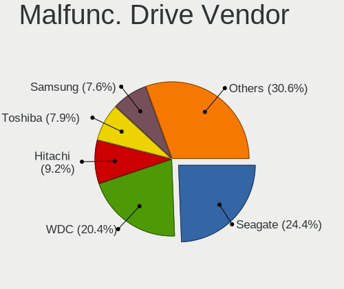
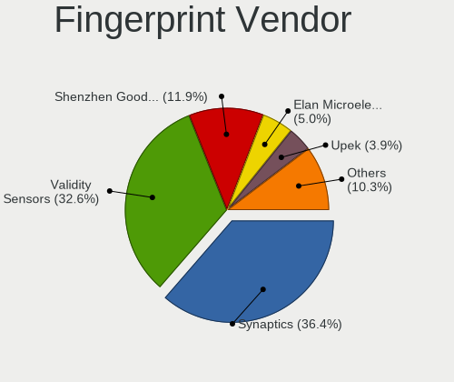

Linux in USA - Tested Hardware & Statistics
-------------------------------------------

A project to collect tested hardware configurations for Linux in USA.

Anyone can contribute to this report by the [hw-probe](https://github.com/linuxhw/hw-probe) tool:

    sudo -E hw-probe -all -upload

Please contribute! Especially if your hardware is rare.

This is a report for all computer types. See also reports for [desktops](/Location/USA/Desktop/README.md) and [notebooks](/Location/USA/Notebook/README.md).

Contents
--------

* [ Test Cases ](#test-cases)

* [ System ](#system)
  - [ OS                       ](#os)
  - [ OS Family                ](#os-family)
  - [ Kernel                   ](#kernel)
  - [ Kernel Family            ](#kernel-family)
  - [ Kernel Major Ver.        ](#kernel-major-ver)
  - [ Arch                     ](#arch)
  - [ DE                       ](#de)
  - [ Display Server           ](#display-server)
  - [ Display Manager          ](#display-manager)
  - [ OS Lang                  ](#os-lang)
  - [ Boot Mode                ](#boot-mode)
  - [ Filesystem               ](#filesystem)
  - [ Part. scheme             ](#part-scheme)
  - [ Dual Boot with Linux/BSD ](#dual-boot-with-linuxbsd)
  - [ Dual Boot (Win)          ](#dual-boot-win)

* [ Board ](#board)
  - [ Vendor                   ](#vendor)
  - [ Model                    ](#model)
  - [ Model Family             ](#model-family)
  - [ MFG Year                 ](#mfg-year)
  - [ Form Factor              ](#form-factor)
  - [ Secure Boot              ](#secure-boot)
  - [ Coreboot                 ](#coreboot)
  - [ RAM Size                 ](#ram-size)
  - [ RAM Used                 ](#ram-used)
  - [ Total Drives             ](#total-drives)
  - [ Has CD-ROM               ](#has-cd-rom)
  - [ Has Ethernet             ](#has-ethernet)
  - [ Has WiFi                 ](#has-wifi)
  - [ Has Bluetooth            ](#has-bluetooth)

* [ Location ](#location)
  - [ Country                  ](#country)
  - [ City                     ](#city)

* [ Drives ](#drives)
  - [ Drive Vendor             ](#drive-vendor)
  - [ Drive Model              ](#drive-model)
  - [ HDD Vendor               ](#hdd-vendor)
  - [ SSD Vendor               ](#ssd-vendor)
  - [ Drive Kind               ](#drive-kind)
  - [ Drive Connector          ](#drive-connector)
  - [ Drive Size               ](#drive-size)
  - [ Space Total              ](#space-total)
  - [ Space Used               ](#space-used)
  - [ Malfunc. Drives          ](#malfunc-drives)
  - [ Malfunc. Drive Vendor    ](#malfunc-drive-vendor)
  - [ Malfunc. HDD Vendor      ](#malfunc-hdd-vendor)
  - [ Malfunc. Drive Kind      ](#malfunc-drive-kind)
  - [ Failed Drives            ](#failed-drives)
  - [ Failed Drive Vendor      ](#failed-drive-vendor)
  - [ Drive Status             ](#drive-status)

* [ Storage controller ](#storage-controller)
  - [ Storage Vendor           ](#storage-vendor)
  - [ Storage Model            ](#storage-model)
  - [ Storage Kind             ](#storage-kind)

* [ Processor ](#processor)
  - [ CPU Vendor               ](#cpu-vendor)
  - [ CPU Model                ](#cpu-model)
  - [ CPU Model Family         ](#cpu-model-family)
  - [ CPU Cores                ](#cpu-cores)
  - [ CPU Sockets              ](#cpu-sockets)
  - [ CPU Threads              ](#cpu-threads)
  - [ CPU Op-Modes             ](#cpu-op-modes)
  - [ CPU Microcode            ](#cpu-microcode)
  - [ CPU Microarch            ](#cpu-microarch)

* [ Graphics ](#graphics)
  - [ GPU Vendor               ](#gpu-vendor)
  - [ GPU Model                ](#gpu-model)
  - [ GPU Combo                ](#gpu-combo)
  - [ GPU Driver               ](#gpu-driver)
  - [ GPU Memory               ](#gpu-memory)

* [ Monitor ](#monitor)
  - [ Monitor Vendor           ](#monitor-vendor)
  - [ Monitor Model            ](#monitor-model)
  - [ Monitor Resolution       ](#monitor-resolution)
  - [ Monitor Diagonal         ](#monitor-diagonal)
  - [ Monitor Width            ](#monitor-width)
  - [ Aspect Ratio             ](#aspect-ratio)
  - [ Monitor Area             ](#monitor-area)
  - [ Pixel Density            ](#pixel-density)
  - [ Multiple Monitors        ](#multiple-monitors)

* [ Network ](#network)
  - [ Net Controller Vendor    ](#net-controller-vendor)
  - [ Net Controller Model     ](#net-controller-model)
  - [ Wireless Vendor          ](#wireless-vendor)
  - [ Wireless Model           ](#wireless-model)
  - [ Ethernet Vendor          ](#ethernet-vendor)
  - [ Ethernet Model           ](#ethernet-model)
  - [ Net Controller Kind      ](#net-controller-kind)
  - [ Used Controller          ](#used-controller)
  - [ NICs                     ](#nics)
  - [ IPv6                     ](#ipv6)

* [ Bluetooth ](#bluetooth)
  - [ Bluetooth Vendor         ](#bluetooth-vendor)
  - [ Bluetooth Model          ](#bluetooth-model)

* [ Sound ](#sound)
  - [ Sound Vendor             ](#sound-vendor)
  - [ Sound Model              ](#sound-model)

* [ Memory ](#memory)
  - [ Memory Vendor            ](#memory-vendor)
  - [ Memory Model             ](#memory-model)
  - [ Memory Kind              ](#memory-kind)
  - [ Memory Form Factor       ](#memory-form-factor)
  - [ Memory Size              ](#memory-size)
  - [ Memory Speed             ](#memory-speed)

* [ Printers & scanners ](#printers--scanners)
  - [ Printer Vendor           ](#printer-vendor)
  - [ Printer Model            ](#printer-model)
  - [ Scanner Vendor           ](#scanner-vendor)
  - [ Scanner Model            ](#scanner-model)

* [ Camera ](#camera)
  - [ Camera Vendor            ](#camera-vendor)
  - [ Camera Model             ](#camera-model)

* [ Security ](#security)
  - [ Fingerprint Vendor       ](#fingerprint-vendor)
  - [ Fingerprint Model        ](#fingerprint-model)
  - [ Chipcard Vendor          ](#chipcard-vendor)
  - [ Chipcard Model           ](#chipcard-model)

* [ Unsupported ](#unsupported)
  - [ Unsupported Devices      ](#unsupported-devices)
  - [ Unsupported Device Types ](#unsupported-device-types)

Test Cases
----------

Total: 60109

| Vendor        | Model                       | Form-Factor | Probe                                                      | Date         |
|---------------|-----------------------------|-------------|------------------------------------------------------------|--------------|
| Alienware     | m17 R4                      | Notebook    | [4372e588f9](https://linux-hardware.org/?probe=4372e588f9) | Feb 02, 2024 |
| HP            | 339A                        | Desktop     | [e8e666af64](https://linux-hardware.org/?probe=e8e666af64) | Feb 02, 2024 |
| HP            | EliteBook 850 G8 Noteboo... | Notebook    | [7c65739a72](https://linux-hardware.org/?probe=7c65739a72) | Feb 02, 2024 |
| ASUSTek       | P7P55D-E                    | Desktop     | [7173101a68](https://linux-hardware.org/?probe=7173101a68) | Feb 02, 2024 |
| HP            | Pavilion g6                 | Notebook    | [795109303b](https://linux-hardware.org/?probe=795109303b) | Feb 02, 2024 |
| Intel         | NUC13ANBi3 N13056-202       | Mini pc     | [3548282229](https://linux-hardware.org/?probe=3548282229) | Feb 02, 2024 |
| Apple         | MacBookPro11,5              | Notebook    | [55197489b0](https://linux-hardware.org/?probe=55197489b0) | Feb 02, 2024 |
| HP            | 8055                        | Desktop     | [1eec2a37ce](https://linux-hardware.org/?probe=1eec2a37ce) | Feb 02, 2024 |
| LG Electro... | 16T90P-K.AAE7U1             | Convertible | [c0343d0686](https://linux-hardware.org/?probe=c0343d0686) | Feb 02, 2024 |
| Lenovo        | ThinkPad E14 Gen 3 20YE0... | Notebook    | [60cc806e9a](https://linux-hardware.org/?probe=60cc806e9a) | Feb 02, 2024 |
| Dell          | 0J7MNP A00                  | All in one  | [7a08cc9321](https://linux-hardware.org/?probe=7a08cc9321) | Feb 02, 2024 |
| HP            | ENVY m7                     | Notebook    | [b38e23bdbe](https://linux-hardware.org/?probe=b38e23bdbe) | Feb 02, 2024 |
| Dell          | 0J7MNP A00                  | All in one  | [3ec79f8a00](https://linux-hardware.org/?probe=3ec79f8a00) | Feb 02, 2024 |
| Gigabyte      | GA-990FXA-UD7               | Desktop     | [66768ccdf7](https://linux-hardware.org/?probe=66768ccdf7) | Feb 02, 2024 |
| Lenovo        | MAHOBAY 0B98401 PRO         | Desktop     | [3074b7c2a6](https://linux-hardware.org/?probe=3074b7c2a6) | Feb 02, 2024 |
| HP            | 1998                        | Desktop     | [0056c33526](https://linux-hardware.org/?probe=0056c33526) | Feb 02, 2024 |
| Lenovo        | Yoga 6 13ALC6 82ND          | Convertible | [2eec21d0eb](https://linux-hardware.org/?probe=2eec21d0eb) | Feb 02, 2024 |
| ASUSTek       | ROG CROSSHAIR X670E HERO    | Desktop     | [9d6e9d5720](https://linux-hardware.org/?probe=9d6e9d5720) | Feb 02, 2024 |
| MSI           | Prestige 13 AI Evo A1MG     | Notebook    | [abc18d1a9e](https://linux-hardware.org/?probe=abc18d1a9e) | Feb 02, 2024 |
| Valve         | Galileo                     | Notebook    | [3b44d4da2f](https://linux-hardware.org/?probe=3b44d4da2f) | Feb 02, 2024 |
| Supermicro    | H12SSL-i                    | Server      | [17031c6aac](https://linux-hardware.org/?probe=17031c6aac) | Feb 02, 2024 |
| ASRockRack    | B650D4U-2L2T/BCM            | Server      | [0fa43445d1](https://linux-hardware.org/?probe=0fa43445d1) | Feb 02, 2024 |
| ASUSTek       | P5Q                         | Desktop     | [63522c9a09](https://linux-hardware.org/?probe=63522c9a09) | Feb 02, 2024 |
| Google        | Pujjoteen15W                | Notebook    | [b23c1ed1eb](https://linux-hardware.org/?probe=b23c1ed1eb) | Feb 02, 2024 |
| MSI           | Raider GE68HX 13VF          | Notebook    | [72ac680d91](https://linux-hardware.org/?probe=72ac680d91) | Feb 02, 2024 |
| Lenovo        | SHARKBAY NOK                | Desktop     | [f4caef7bf1](https://linux-hardware.org/?probe=f4caef7bf1) | Feb 02, 2024 |
| Acer          | Aspire A515-43              | Notebook    | [349b53e55a](https://linux-hardware.org/?probe=349b53e55a) | Feb 02, 2024 |
| HP            | EliteBook 850 G8 Noteboo... | Notebook    | [133d556add](https://linux-hardware.org/?probe=133d556add) | Feb 02, 2024 |
| Lenovo        | ThinkPad T14s Gen 2i 20W... | Notebook    | [fdc21a05c2](https://linux-hardware.org/?probe=fdc21a05c2) | Feb 02, 2024 |
| ASRock        | B660-ITX                    | Desktop     | [3749b9145b](https://linux-hardware.org/?probe=3749b9145b) | Feb 02, 2024 |
| Gigabyte      | GA-990FXA-UD7               | Desktop     | [4726161c35](https://linux-hardware.org/?probe=4726161c35) | Feb 02, 2024 |
| Lenovo        | ThinkPad T15g Gen 1 20UR... | Notebook    | [e3e01bd0ff](https://linux-hardware.org/?probe=e3e01bd0ff) | Feb 02, 2024 |
| Apple         | MacBookAir6,2               | Notebook    | [4bee7d161b](https://linux-hardware.org/?probe=4bee7d161b) | Feb 02, 2024 |
| HP            | EliteBook 845 G8 Noteboo... | Notebook    | [7516b63802](https://linux-hardware.org/?probe=7516b63802) | Feb 02, 2024 |
| Apple         | MacBookAir6,2               | Notebook    | [4181fe4492](https://linux-hardware.org/?probe=4181fe4492) | Feb 02, 2024 |
| Unknown       | Unknown                     | Notebook    | [2037e9d75f](https://linux-hardware.org/?probe=2037e9d75f) | Feb 02, 2024 |
| HP            | 3647h                       | Desktop     | [5f1a400767](https://linux-hardware.org/?probe=5f1a400767) | Feb 02, 2024 |
| Unknown       | Unknown                     | Notebook    | [b85ea144b7](https://linux-hardware.org/?probe=b85ea144b7) | Feb 01, 2024 |
| ASRock        | H77 Pro4-M                  | Desktop     | [794e5341d9](https://linux-hardware.org/?probe=794e5341d9) | Feb 01, 2024 |
| Lenovo        | IdeaPad S340-15IWL 81N8     | Notebook    | [fd7240a3ee](https://linux-hardware.org/?probe=fd7240a3ee) | Feb 01, 2024 |
| Lenovo        | IdeaPad S340-15IWL 81N8     | Notebook    | [b3b900cffa](https://linux-hardware.org/?probe=b3b900cffa) | Feb 01, 2024 |
| ASUSTek       | TUF Gaming B550-PLUS        | Desktop     | [8e3680cd5d](https://linux-hardware.org/?probe=8e3680cd5d) | Feb 01, 2024 |
| Dell          | 0215PR A05                  | Desktop     | [05183a71ef](https://linux-hardware.org/?probe=05183a71ef) | Feb 01, 2024 |
| Apple         | MacBookPro5,4               | Notebook    | [c22226fe6f](https://linux-hardware.org/?probe=c22226fe6f) | Feb 01, 2024 |
| MSI           | MPG X570 GAMING PLUS        | Desktop     | [0d5790b907](https://linux-hardware.org/?probe=0d5790b907) | Feb 01, 2024 |
| ASUSTek       | ROG STRIX B350-F GAMING     | Desktop     | [6c75053ee6](https://linux-hardware.org/?probe=6c75053ee6) | Feb 01, 2024 |
| MSI           | MPG X570 GAMING PLUS        | Desktop     | [5ec61e07a8](https://linux-hardware.org/?probe=5ec61e07a8) | Feb 01, 2024 |
| Dell          | 0GDG8Y A00                  | Desktop     | [2cca1daa38](https://linux-hardware.org/?probe=2cca1daa38) | Feb 01, 2024 |
| Lenovo        | ThinkPad X1 Carbon Gen 1... | Notebook    | [f1b0b8716f](https://linux-hardware.org/?probe=f1b0b8716f) | Feb 01, 2024 |
| HP            | ENVY x360 Convertible 15... | Convertible | [77c29c5fe1](https://linux-hardware.org/?probe=77c29c5fe1) | Feb 01, 2024 |
| Toshiba       | Satellite U845W             | Notebook    | [bfcfa219eb](https://linux-hardware.org/?probe=bfcfa219eb) | Feb 01, 2024 |
| Dell          | Latitude 7490               | Notebook    | [f6c07c876d](https://linux-hardware.org/?probe=f6c07c876d) | Feb 01, 2024 |
| Toshiba       | Satellite U845W             | Notebook    | [7671d63234](https://linux-hardware.org/?probe=7671d63234) | Feb 01, 2024 |
| Dell          | 0T568R A00                  | Desktop     | [4ce5e16aa2](https://linux-hardware.org/?probe=4ce5e16aa2) | Feb 01, 2024 |
| Gigabyte      | X570 AORUS ELITE WIFI       | Desktop     | [7d3d8c9a2f](https://linux-hardware.org/?probe=7d3d8c9a2f) | Feb 01, 2024 |
| Lenovo        | ThinkPad Yoga 260 20FES1... | Convertible | [f6d99b6096](https://linux-hardware.org/?probe=f6d99b6096) | Feb 01, 2024 |
| Dell          | Precision 5520              | Notebook    | [60d35bb7a2](https://linux-hardware.org/?probe=60d35bb7a2) | Feb 01, 2024 |
| Gigabyte      | Z390 AORUS PRO WIFI-CF      | Desktop     | [a45a2b4f8e](https://linux-hardware.org/?probe=a45a2b4f8e) | Feb 01, 2024 |
| HP            | 15 Notebook PC              | Notebook    | [b60abe5c3d](https://linux-hardware.org/?probe=b60abe5c3d) | Feb 01, 2024 |
| HP            | 15 Notebook PC              | Notebook    | [b2f9ce6a03](https://linux-hardware.org/?probe=b2f9ce6a03) | Feb 01, 2024 |
| HP            | 870C                        | Desktop     | [14801c4f80](https://linux-hardware.org/?probe=14801c4f80) | Feb 01, 2024 |
| Google        | Phaser360                   | Notebook    | [3347aeb232](https://linux-hardware.org/?probe=3347aeb232) | Feb 01, 2024 |
| Valve         | Jupiter                     | Notebook    | [ab5f4937c1](https://linux-hardware.org/?probe=ab5f4937c1) | Feb 01, 2024 |
| Apple         | MacBookPro11,1              | Notebook    | [fcabd4a1f4](https://linux-hardware.org/?probe=fcabd4a1f4) | Feb 01, 2024 |
| Apple         | MacBookPro11,1              | Notebook    | [b31d7d9323](https://linux-hardware.org/?probe=b31d7d9323) | Feb 01, 2024 |
| Microsoft     | Surface Laptop Go           | Tablet      | [8b82b0fb1f](https://linux-hardware.org/?probe=8b82b0fb1f) | Feb 01, 2024 |
| Valve         | Jupiter                     | Notebook    | [238b20b912](https://linux-hardware.org/?probe=238b20b912) | Feb 01, 2024 |
| Dell          | XPS 15 9530                 | Notebook    | [3aa974d8a0](https://linux-hardware.org/?probe=3aa974d8a0) | Feb 01, 2024 |
| ASUSTek       | ROG Strix G513RM_G513RM     | Notebook    | [2239a0b698](https://linux-hardware.org/?probe=2239a0b698) | Feb 01, 2024 |
| Valve         | Jupiter                     | Notebook    | [f7647969b5](https://linux-hardware.org/?probe=f7647969b5) | Feb 01, 2024 |
| Gigabyte      | X99P-SLI-CF                 | Desktop     | [95705bca92](https://linux-hardware.org/?probe=95705bca92) | Feb 01, 2024 |
| Supermicro    | H12SSL-i                    | Server      | [f206485d60](https://linux-hardware.org/?probe=f206485d60) | Feb 01, 2024 |
| ASRockRack    | B650D4U-2L2T/BCM            | Server      | [b7bc0cf1ac](https://linux-hardware.org/?probe=b7bc0cf1ac) | Feb 01, 2024 |
| Dell          | Inspiron 3542               | Notebook    | [5a7e77b4a7](https://linux-hardware.org/?probe=5a7e77b4a7) | Feb 01, 2024 |
| Razer         | Blade 14 - RZ09-0482        | Notebook    | [49f14f0aae](https://linux-hardware.org/?probe=49f14f0aae) | Feb 01, 2024 |
| Valve         | Galileo                     | Notebook    | [c286128e50](https://linux-hardware.org/?probe=c286128e50) | Feb 01, 2024 |
| Apple         | MacBookPro10,2              | Notebook    | [fca71d08b7](https://linux-hardware.org/?probe=fca71d08b7) | Feb 01, 2024 |
| Gigabyte      | MZ32-AR0-00 01000100        | Server      | [3c84ba1c91](https://linux-hardware.org/?probe=3c84ba1c91) | Feb 01, 2024 |
| HP            | ENVY 14                     | Notebook    | [ffe9159226](https://linux-hardware.org/?probe=ffe9159226) | Feb 01, 2024 |
| Lenovo        | ThinkPad T480 20L6S4XW00    | Notebook    | [a24ce87b69](https://linux-hardware.org/?probe=a24ce87b69) | Feb 01, 2024 |
| Dell          | Inspiron 5748               | Notebook    | [1eaa79e492](https://linux-hardware.org/?probe=1eaa79e492) | Feb 01, 2024 |
| Dell          | 0V8WGR A00                  | Desktop     | [9762a633ab](https://linux-hardware.org/?probe=9762a633ab) | Feb 01, 2024 |
| Lenovo        | MAHOBAY 0B98401 PRO         | Desktop     | [3cedb3c573](https://linux-hardware.org/?probe=3cedb3c573) | Feb 01, 2024 |
| Dell          | Precision 5680              | Notebook    | [9d85b2e2ea](https://linux-hardware.org/?probe=9d85b2e2ea) | Feb 01, 2024 |
| MSI           | B760 GAMING PLUS WIFI       | Desktop     | [a5425cfc63](https://linux-hardware.org/?probe=a5425cfc63) | Feb 01, 2024 |
| MSI           | B760 GAMING PLUS WIFI       | Desktop     | [67539ba367](https://linux-hardware.org/?probe=67539ba367) | Feb 01, 2024 |
| MSI           | Z370-A PRO                  | Desktop     | [d012afeb56](https://linux-hardware.org/?probe=d012afeb56) | Feb 01, 2024 |
| HC Technol... | HCAR5000-MI                 | Desktop     | [f6051e0b06](https://linux-hardware.org/?probe=f6051e0b06) | Feb 01, 2024 |
| ASUSTek       | TUF Gaming X570-PLUS        | Desktop     | [f7bb58fb95](https://linux-hardware.org/?probe=f7bb58fb95) | Feb 01, 2024 |
| Supermicro    | H11SSL-i                    | Server      | [2bc6c0e61b](https://linux-hardware.org/?probe=2bc6c0e61b) | Feb 01, 2024 |
| Apple         | MacBookPro14,1              | Notebook    | [711c97e9af](https://linux-hardware.org/?probe=711c97e9af) | Feb 01, 2024 |
| Supermicro    | H11SSL-i                    | Server      | [a588d3636b](https://linux-hardware.org/?probe=a588d3636b) | Jan 31, 2024 |
| Foxconn       | 9657MA                      | Desktop     | [6b2e0b2ae9](https://linux-hardware.org/?probe=6b2e0b2ae9) | Jan 31, 2024 |
| Gigabyte      | GA-880GA-UD3H               | Desktop     | [343413d95b](https://linux-hardware.org/?probe=343413d95b) | Jan 31, 2024 |
| HP            | 8053                        | Desktop     | [d4cc3a7d7d](https://linux-hardware.org/?probe=d4cc3a7d7d) | Jan 31, 2024 |
| Dell          | Inspiron 5748               | Notebook    | [7a50d780ce](https://linux-hardware.org/?probe=7a50d780ce) | Jan 31, 2024 |
| HP            | ENVY x360 Convertible 15... | Convertible | [539b422b80](https://linux-hardware.org/?probe=539b422b80) | Jan 31, 2024 |
| NZXT          | N7 B650E                    | Desktop     | [acb00e1425](https://linux-hardware.org/?probe=acb00e1425) | Jan 31, 2024 |
| Gigabyte      | Z87X-UD4H-CF                | Desktop     | [f2e88dc5a7](https://linux-hardware.org/?probe=f2e88dc5a7) | Jan 31, 2024 |
| Acer          | Aspire E5-575G              | Notebook    | [d6ddc23d9b](https://linux-hardware.org/?probe=d6ddc23d9b) | Jan 31, 2024 |
| Lenovo        | IdeaPad Slim 5 16IRL8 82... | Notebook    | [8f630da527](https://linux-hardware.org/?probe=8f630da527) | Jan 31, 2024 |
| Lenovo        | ThinkPad 13 2nd Gen 20J1... | Notebook    | [7f20bd79c9](https://linux-hardware.org/?probe=7f20bd79c9) | Jan 31, 2024 |
| Apple         | MacBookAir6,2               | Notebook    | [7ad397fc57](https://linux-hardware.org/?probe=7ad397fc57) | Jan 31, 2024 |
| Apple         | Mac-F65AE981FFA204ED Mac... | Mini pc     | [462775ac8b](https://linux-hardware.org/?probe=462775ac8b) | Jan 31, 2024 |
| Lenovo        | ThinkCentre M55p 8808D8U    | Desktop     | [763dd9417b](https://linux-hardware.org/?probe=763dd9417b) | Jan 31, 2024 |
| Dell          | Inspiron 5584               | Notebook    | [abcbc837ce](https://linux-hardware.org/?probe=abcbc837ce) | Jan 31, 2024 |
| ASUSTek       | ZenBook UX425IA_UM425IA     | Notebook    | [4838799f43](https://linux-hardware.org/?probe=4838799f43) | Jan 31, 2024 |
| Intel         | NUC13ANBi3 N13056-202       | Mini pc     | [c669f94b18](https://linux-hardware.org/?probe=c669f94b18) | Jan 31, 2024 |
| Dell          | 018D1Y A00                  | Desktop     | [28a3a41219](https://linux-hardware.org/?probe=28a3a41219) | Jan 31, 2024 |
| ASRock        | B450M Pro4                  | Desktop     | [5a77cd3bbb](https://linux-hardware.org/?probe=5a77cd3bbb) | Jan 31, 2024 |
| Lenovo        | ThinkPad E14 Gen 3 20YE0... | Notebook    | [bfe57fcccb](https://linux-hardware.org/?probe=bfe57fcccb) | Jan 31, 2024 |
| Lenovo        | ThinkCentre M91p 4518RQ4    | Desktop     | [ae147923cd](https://linux-hardware.org/?probe=ae147923cd) | Jan 31, 2024 |
| HP            | Laptop 14-cf2xxx            | Notebook    | [7984b3ffda](https://linux-hardware.org/?probe=7984b3ffda) | Jan 31, 2024 |
| Acer          | Aspire E5-575G              | Notebook    | [fc26b8ad18](https://linux-hardware.org/?probe=fc26b8ad18) | Jan 31, 2024 |
| Gigabyte      | Z390 AORUS PRO WIFI-CF      | Desktop     | [bdb06264ab](https://linux-hardware.org/?probe=bdb06264ab) | Jan 31, 2024 |
| Dell          | Latitude D620               | Notebook    | [c0f28567a4](https://linux-hardware.org/?probe=c0f28567a4) | Jan 31, 2024 |
| Lenovo        | SHARKBAY 0B98401 WIN        | Desktop     | [75d67d22e1](https://linux-hardware.org/?probe=75d67d22e1) | Jan 31, 2024 |
| HP            | Laptop 15-fc0xxx            | Notebook    | [28e16f1c53](https://linux-hardware.org/?probe=28e16f1c53) | Jan 31, 2024 |
| Lenovo        | SHARKBAY 0B98401 WIN        | Desktop     | [19f18a7bbc](https://linux-hardware.org/?probe=19f18a7bbc) | Jan 31, 2024 |
| Lenovo        | Yoga 6 13ABR8 83B2          | Convertible | [77c6d89192](https://linux-hardware.org/?probe=77c6d89192) | Jan 31, 2024 |
| ASRock        | A520M-HDV                   | Desktop     | [fa42ae183a](https://linux-hardware.org/?probe=fa42ae183a) | Jan 31, 2024 |
| Lenovo        | ThinkPad T450s 20BWS0PJ0... | Notebook    | [96795f523b](https://linux-hardware.org/?probe=96795f523b) | Jan 31, 2024 |
| Dell          | 00VTMF A01                  | Desktop     | [3298485dd9](https://linux-hardware.org/?probe=3298485dd9) | Jan 31, 2024 |
| Apple         | MacBook8,1                  | Notebook    | [6ef40b726e](https://linux-hardware.org/?probe=6ef40b726e) | Jan 31, 2024 |
| Lenovo        | ThinkStation C20 4263B84    | Desktop     | [084244999d](https://linux-hardware.org/?probe=084244999d) | Jan 31, 2024 |
| Rockchip      | RK3318 BOX                  | Soc         | [38bcbeddee](https://linux-hardware.org/?probe=38bcbeddee) | Jan 31, 2024 |
| MSI           | Z590-A PRO                  | Desktop     | [21e597196f](https://linux-hardware.org/?probe=21e597196f) | Jan 31, 2024 |
| Supermicro    | H12SSL-i                    | Server      | [6849639353](https://linux-hardware.org/?probe=6849639353) | Jan 31, 2024 |
| ASRockRack    | B650D4U-2L2T/BCM            | Server      | [d67b24a21d](https://linux-hardware.org/?probe=d67b24a21d) | Jan 31, 2024 |
| HP            | EliteBook 840 G7 Noteboo... | Notebook    | [e79be04d28](https://linux-hardware.org/?probe=e79be04d28) | Jan 31, 2024 |
| Dell          | Precision 7710              | Notebook    | [6e600ac30e](https://linux-hardware.org/?probe=6e600ac30e) | Jan 31, 2024 |
| ASRock        | A520M-HDV                   | Desktop     | [23be9724fe](https://linux-hardware.org/?probe=23be9724fe) | Jan 31, 2024 |
| ASUSTek       | ROG STRIX X670E-A GAMING... | Desktop     | [0f0dad6ef2](https://linux-hardware.org/?probe=0f0dad6ef2) | Jan 31, 2024 |
| HP            | ProBook 6570b               | Notebook    | [20537302e6](https://linux-hardware.org/?probe=20537302e6) | Jan 31, 2024 |
| Dell          | XPS 13 9380                 | Notebook    | [479853dd4c](https://linux-hardware.org/?probe=479853dd4c) | Jan 31, 2024 |
| MSI           | PRO X670-P WIFI             | Desktop     | [2640847c88](https://linux-hardware.org/?probe=2640847c88) | Jan 31, 2024 |
| HP            | Laptop 15-dy1xxx            | Notebook    | [5a506021d1](https://linux-hardware.org/?probe=5a506021d1) | Jan 31, 2024 |
| HP            | Laptop 15-dy1xxx            | Notebook    | [999c7694d0](https://linux-hardware.org/?probe=999c7694d0) | Jan 31, 2024 |
| HP            | G72                         | Notebook    | [24758020db](https://linux-hardware.org/?probe=24758020db) | Jan 31, 2024 |
| Dell          | 0FM586                      | Desktop     | [a66d080473](https://linux-hardware.org/?probe=a66d080473) | Jan 31, 2024 |
| ASRock        | B660-ITX                    | Desktop     | [b55cc73086](https://linux-hardware.org/?probe=b55cc73086) | Jan 31, 2024 |
| ASRock        | B660-ITX                    | Desktop     | [f3d2ad85a3](https://linux-hardware.org/?probe=f3d2ad85a3) | Jan 31, 2024 |
| ASUSTek       | SABERTOOTH 990FX            | Desktop     | [a477ec4fe1](https://linux-hardware.org/?probe=a477ec4fe1) | Jan 31, 2024 |
| Dell          | 00V62H A01                  | Desktop     | [4a42c319b4](https://linux-hardware.org/?probe=4a42c319b4) | Jan 30, 2024 |
| MSI           | MAG B550 TOMAHAWK           | Desktop     | [5222452ba4](https://linux-hardware.org/?probe=5222452ba4) | Jan 30, 2024 |
| Dell          | 0T568R A00                  | Desktop     | [56936b64ba](https://linux-hardware.org/?probe=56936b64ba) | Jan 30, 2024 |
| ASUSTek       | Z10PE-D16 WS                | Server      | [3cb0e7e907](https://linux-hardware.org/?probe=3cb0e7e907) | Jan 30, 2024 |
| Dell          | Latitude 5590               | Notebook    | [d10e7cf975](https://linux-hardware.org/?probe=d10e7cf975) | Jan 30, 2024 |
| MACHINIST     | X99-D8-MAX V1.0             | Desktop     | [8ecccf1672](https://linux-hardware.org/?probe=8ecccf1672) | Jan 30, 2024 |
| Dell          | Precision 5520              | Notebook    | [47f7336949](https://linux-hardware.org/?probe=47f7336949) | Jan 30, 2024 |
| Alienware     | 15 R3                       | Notebook    | [297db64e3b](https://linux-hardware.org/?probe=297db64e3b) | Jan 30, 2024 |
| Lenovo        | Yoga 710-15IKB 80V5         | Convertible | [f8bab29110](https://linux-hardware.org/?probe=f8bab29110) | Jan 30, 2024 |
| Foxconn       | 2AB7                        | Desktop     | [518f65ff6a](https://linux-hardware.org/?probe=518f65ff6a) | Jan 30, 2024 |
| ASUSTek       | TUF Gaming Z490-PLUS        | Desktop     | [fac7cfcfce](https://linux-hardware.org/?probe=fac7cfcfce) | Jan 30, 2024 |
| HP            | Pavilion Gaming Laptop 1... | Notebook    | [27229e7136](https://linux-hardware.org/?probe=27229e7136) | Jan 30, 2024 |
| HP            | EliteBook 845 G8 Noteboo... | Notebook    | [d58a0bc20e](https://linux-hardware.org/?probe=d58a0bc20e) | Jan 30, 2024 |
| HP            | 15 Notebook PC              | Notebook    | [fd6be31d9d](https://linux-hardware.org/?probe=fd6be31d9d) | Jan 30, 2024 |
| ASUSTek       | ASUS TUF Gaming A16 FA61... | Notebook    | [590fcea5fe](https://linux-hardware.org/?probe=590fcea5fe) | Jan 30, 2024 |
| ASUSTek       | ASUS TUF Gaming A16 FA61... | Notebook    | [f45683d844](https://linux-hardware.org/?probe=f45683d844) | Jan 30, 2024 |
| Corsair       | Voyager a1600               | Notebook    | [86aec463cc](https://linux-hardware.org/?probe=86aec463cc) | Jan 30, 2024 |
| Apple         | MacBookPro9,1               | Notebook    | [741671df2c](https://linux-hardware.org/?probe=741671df2c) | Jan 30, 2024 |
| Lenovo        | ThinkPad L13 Yoga Gen 2 ... | Convertible | [510407768d](https://linux-hardware.org/?probe=510407768d) | Jan 30, 2024 |
| Dell          | Inspiron N5040              | Notebook    | [c2bf038df9](https://linux-hardware.org/?probe=c2bf038df9) | Jan 30, 2024 |
| Hot Pepper... | HPPMC10                     | Notebook    | [1bfdadd09f](https://linux-hardware.org/?probe=1bfdadd09f) | Jan 30, 2024 |
| Lenovo        | ThinkPad T480s 20L8S1WH0... | Notebook    | [f97fbae5f6](https://linux-hardware.org/?probe=f97fbae5f6) | Jan 30, 2024 |
| HP            | ENVY x360 2-in-1 Laptop ... | Convertible | [247c47d3f0](https://linux-hardware.org/?probe=247c47d3f0) | Jan 30, 2024 |
| Lenovo        | ThinkPad T480s 20L8S1WH0... | Notebook    | [c4978054da](https://linux-hardware.org/?probe=c4978054da) | Jan 30, 2024 |
| Gigabyte      | MG51-G21-00 01010101        | Server      | [29dc4440ff](https://linux-hardware.org/?probe=29dc4440ff) | Jan 30, 2024 |
| Gigabyte      | MG51-G21-00 01010101        | Server      | [56087b1d70](https://linux-hardware.org/?probe=56087b1d70) | Jan 30, 2024 |
| MSI           | H110M PRO-VD                | Desktop     | [2dcaa98349](https://linux-hardware.org/?probe=2dcaa98349) | Jan 30, 2024 |
| HP            | EliteBook 840 G8 Noteboo... | Notebook    | [f9618efd22](https://linux-hardware.org/?probe=f9618efd22) | Jan 30, 2024 |
| ASUSTek       | X99-DELUXE                  | Desktop     | [482b1946f4](https://linux-hardware.org/?probe=482b1946f4) | Jan 30, 2024 |
| Lenovo        | ThinkPad P15 Gen 2i 20YR... | Notebook    | [b0ebb1ac3b](https://linux-hardware.org/?probe=b0ebb1ac3b) | Jan 30, 2024 |
| MSI           | X370 GAMING PRO CARBON      | Desktop     | [b37fa10d8f](https://linux-hardware.org/?probe=b37fa10d8f) | Jan 30, 2024 |
| HP            | Spectre x360 Convertible... | Convertible | [35aa462f74](https://linux-hardware.org/?probe=35aa462f74) | Jan 30, 2024 |
| Apple         | Mac-F60DEB81FF30ACF6 Mac... | Desktop     | [033b656553](https://linux-hardware.org/?probe=033b656553) | Jan 30, 2024 |
| ASRock        | B550 Pro4                   | Desktop     | [9617266ebe](https://linux-hardware.org/?probe=9617266ebe) | Jan 30, 2024 |
| OriginPC      | EVO16-S                     | Notebook    | [6d96755039](https://linux-hardware.org/?probe=6d96755039) | Jan 30, 2024 |
| ASUSTek       | PRIME B450M-A II            | Desktop     | [abdcd1a804](https://linux-hardware.org/?probe=abdcd1a804) | Jan 30, 2024 |
| ASUSTek       | ET2321I                     | Notebook    | [67c62e9a94](https://linux-hardware.org/?probe=67c62e9a94) | Jan 30, 2024 |
| Chuwi         | GemiBook Plus               | Notebook    | [dd2a3f8fa2](https://linux-hardware.org/?probe=dd2a3f8fa2) | Jan 30, 2024 |
| Dell          | 0XDN97 A06                  | Server      | [50ae98a42d](https://linux-hardware.org/?probe=50ae98a42d) | Jan 30, 2024 |
| Dell          | 0X3D66 A02                  | Server      | [9e355872f9](https://linux-hardware.org/?probe=9e355872f9) | Jan 30, 2024 |
| Lenovo        | ThinkPad T480s 20L70028U... | Notebook    | [7acd38748f](https://linux-hardware.org/?probe=7acd38748f) | Jan 30, 2024 |
| Dell          | 082F9M A00                  | Server      | [ab607bac6c](https://linux-hardware.org/?probe=ab607bac6c) | Jan 30, 2024 |
| ASUSTek       | ROG STRIX B550-F GAMING     | Desktop     | [0a68bb3157](https://linux-hardware.org/?probe=0a68bb3157) | Jan 30, 2024 |
| Apple         | MacBookAir6,2               | Notebook    | [52ae0efd8e](https://linux-hardware.org/?probe=52ae0efd8e) | Jan 30, 2024 |
| Dell          | 0U880P A01                  | Desktop     | [d3d4142e1e](https://linux-hardware.org/?probe=d3d4142e1e) | Jan 30, 2024 |
| MSI           | B760 GAMING PLUS WIFI       | Desktop     | [193e9e6c74](https://linux-hardware.org/?probe=193e9e6c74) | Jan 30, 2024 |
| Lenovo        | IdeaPad S145-15AST 81N3     | Notebook    | [c246a6b564](https://linux-hardware.org/?probe=c246a6b564) | Jan 30, 2024 |
| Dell          | Latitude 7212 Rugged Ext... | Notebook    | [d21b8c5f4e](https://linux-hardware.org/?probe=d21b8c5f4e) | Jan 30, 2024 |
| Dell          | XPS 13 7390 2-in-1          | Convertible | [2c365787da](https://linux-hardware.org/?probe=2c365787da) | Jan 30, 2024 |
| HP            | 8053                        | Desktop     | [7cba6dd60f](https://linux-hardware.org/?probe=7cba6dd60f) | Jan 30, 2024 |
| HP            | Pavilion dv7                | Notebook    | [8aab31766b](https://linux-hardware.org/?probe=8aab31766b) | Jan 30, 2024 |
| Dell          | 0D4MD1 A00                  | Desktop     | [9dd5ab2544](https://linux-hardware.org/?probe=9dd5ab2544) | Jan 30, 2024 |
| Dell          | Latitude E6530              | Notebook    | [9aee5be7bf](https://linux-hardware.org/?probe=9aee5be7bf) | Jan 30, 2024 |
| Apple         | MacBook9,1                  | Notebook    | [e81979cbdf](https://linux-hardware.org/?probe=e81979cbdf) | Jan 29, 2024 |
| Lenovo        | SHARKBAY 0B98401 PRO        | Desktop     | [141329c8f3](https://linux-hardware.org/?probe=141329c8f3) | Jan 29, 2024 |
| Alienware     | 07HV66 A01                  | Desktop     | [732d349380](https://linux-hardware.org/?probe=732d349380) | Jan 29, 2024 |
| AZW           | SER V1                      | Desktop     | [1aa9469d3f](https://linux-hardware.org/?probe=1aa9469d3f) | Jan 29, 2024 |
| ASUSTek       | TUF B450-PRO GAMING         | Desktop     | [4cfb847d84](https://linux-hardware.org/?probe=4cfb847d84) | Jan 29, 2024 |
| Dell          | Latitude 3300               | Notebook    | [9d76144e60](https://linux-hardware.org/?probe=9d76144e60) | Jan 29, 2024 |
| MSI           | PRO Z690-A DDR4             | Desktop     | [ca9ba6c5ce](https://linux-hardware.org/?probe=ca9ba6c5ce) | Jan 29, 2024 |
| Dell          | Latitude 5590               | Notebook    | [9ab8c26d03](https://linux-hardware.org/?probe=9ab8c26d03) | Jan 29, 2024 |
| Apple         | MacBookPro14,1              | Notebook    | [596ac6a467](https://linux-hardware.org/?probe=596ac6a467) | Jan 29, 2024 |
| Acer          | Aspire E1-522               | Notebook    | [1dab2e243c](https://linux-hardware.org/?probe=1dab2e243c) | Jan 29, 2024 |
| Lenovo        | MAHOBAY 0B98401 PRO         | Desktop     | [073f673b78](https://linux-hardware.org/?probe=073f673b78) | Jan 29, 2024 |
| Dell          | XPS 9315                    | Notebook    | [c705e51d0e](https://linux-hardware.org/?probe=c705e51d0e) | Jan 29, 2024 |
| HP            | Stream Laptop 14-DS0xxx     | Notebook    | [b2cff77c57](https://linux-hardware.org/?probe=b2cff77c57) | Jan 29, 2024 |
| ASUSTek       | Vivobook Go E1404FA_E140... | Notebook    | [a1d3b30464](https://linux-hardware.org/?probe=a1d3b30464) | Jan 29, 2024 |
| ASUSTek       | Vivobook Go E1404FA_E140... | Notebook    | [ae5e53e103](https://linux-hardware.org/?probe=ae5e53e103) | Jan 29, 2024 |
| Lenovo        | ThinkPad L13 Yoga Gen 2 ... | Convertible | [9ecf3a5292](https://linux-hardware.org/?probe=9ecf3a5292) | Jan 29, 2024 |
| ASUSTek       | TUF Gaming X670E-PLUS WI... | Desktop     | [c7a52fe756](https://linux-hardware.org/?probe=c7a52fe756) | Jan 29, 2024 |
| Dell          | XPS 9315                    | Notebook    | [9beaeed93b](https://linux-hardware.org/?probe=9beaeed93b) | Jan 29, 2024 |
| Dell          | Latitude 5430 Rugged        | Notebook    | [8708a1170b](https://linux-hardware.org/?probe=8708a1170b) | Jan 29, 2024 |
| Apple         | MacBookPro5,4               | Notebook    | [c16bc8a6c2](https://linux-hardware.org/?probe=c16bc8a6c2) | Jan 29, 2024 |
| HP            | 1791                        | Desktop     | [e301050210](https://linux-hardware.org/?probe=e301050210) | Jan 29, 2024 |
| Dell          | 0RY007                      | Desktop     | [151f303198](https://linux-hardware.org/?probe=151f303198) | Jan 29, 2024 |
| Dell          | Inspiron 1525               | Notebook    | [aeacd97c42](https://linux-hardware.org/?probe=aeacd97c42) | Jan 29, 2024 |
| MSI           | MPG Z390 GAMING PLUS        | Desktop     | [df2c10b408](https://linux-hardware.org/?probe=df2c10b408) | Jan 29, 2024 |
| Intel         | NUC12WSBi5 M93888-302       | Mini pc     | [2cb078cb9c](https://linux-hardware.org/?probe=2cb078cb9c) | Jan 29, 2024 |
| MSI           | A320M/ac                    | Desktop     | [520827d642](https://linux-hardware.org/?probe=520827d642) | Jan 29, 2024 |
| Gigabyte      | B550 AORUS ELITE V2         | Desktop     | [e79ecc48d8](https://linux-hardware.org/?probe=e79ecc48d8) | Jan 29, 2024 |
| ASUSTek       | G10DK                       | Desktop     | [f5632504cc](https://linux-hardware.org/?probe=f5632504cc) | Jan 29, 2024 |
| Gigabyte      | B550 AORUS ELITE V2         | Desktop     | [0a4a1cabfc](https://linux-hardware.org/?probe=0a4a1cabfc) | Jan 29, 2024 |
| Microsoft     | Surface Laptop Go           | Tablet      | [ff1e51ae39](https://linux-hardware.org/?probe=ff1e51ae39) | Jan 29, 2024 |
| Valve         | Jupiter                     | Notebook    | [e9a7ccf69a](https://linux-hardware.org/?probe=e9a7ccf69a) | Jan 29, 2024 |
| HP            | 1497                        | Desktop     | [edbda38746](https://linux-hardware.org/?probe=edbda38746) | Jan 29, 2024 |
| ASUSTek       | G10DK                       | Desktop     | [5ef0067e13](https://linux-hardware.org/?probe=5ef0067e13) | Jan 29, 2024 |
| Unknown       | HX90                        | Desktop     | [2d0982fbb6](https://linux-hardware.org/?probe=2d0982fbb6) | Jan 29, 2024 |
| Dell          | Latitude E7450              | Notebook    | [bfa71d26f4](https://linux-hardware.org/?probe=bfa71d26f4) | Jan 29, 2024 |
| Microsoft     | Surface Book                | Tablet      | [5b19936522](https://linux-hardware.org/?probe=5b19936522) | Jan 29, 2024 |
| Dell          | Inspiron N5010              | Notebook    | [dcd752673f](https://linux-hardware.org/?probe=dcd752673f) | Jan 29, 2024 |
| Acer          | Aspire 5720Z                | Notebook    | [2353edc7dd](https://linux-hardware.org/?probe=2353edc7dd) | Jan 29, 2024 |
| HP            | 3397                        | Desktop     | [fcbc5b3ac6](https://linux-hardware.org/?probe=fcbc5b3ac6) | Jan 29, 2024 |
| General Dy... | Tadpole TOPAZ               | Notebook    | [2d773d0793](https://linux-hardware.org/?probe=2d773d0793) | Jan 29, 2024 |
| Lenovo        | ThinkBook 15 G2 ARE 20VG    | Notebook    | [9fcbf2b096](https://linux-hardware.org/?probe=9fcbf2b096) | Jan 29, 2024 |
| ASUSTek       | M5A78L-M/USB3               | Desktop     | [cc38ac2dfc](https://linux-hardware.org/?probe=cc38ac2dfc) | Jan 29, 2024 |
| Lenovo        | ThinkPad T420 4236MBU       | Notebook    | [5c6ee280df](https://linux-hardware.org/?probe=5c6ee280df) | Jan 29, 2024 |
| Lenovo        | ThinkCentre M91p 4518RQ4    | Desktop     | [e70e8e0891](https://linux-hardware.org/?probe=e70e8e0891) | Jan 29, 2024 |
| Microsoft     | Surface Pro 8               | Tablet      | [2b5bff51b1](https://linux-hardware.org/?probe=2b5bff51b1) | Jan 29, 2024 |
| HP            | Pavilion Laptop 15t-eg00... | Notebook    | [fd0435f25b](https://linux-hardware.org/?probe=fd0435f25b) | Jan 29, 2024 |
| MSI           | B550M PRO-VDH WIFI          | Desktop     | [bc1a622cd7](https://linux-hardware.org/?probe=bc1a622cd7) | Jan 29, 2024 |
| ASUSTek       | P5Q                         | Desktop     | [f6c91b590a](https://linux-hardware.org/?probe=f6c91b590a) | Jan 29, 2024 |
| Valve         | Jupiter                     | Notebook    | [71066ddcbf](https://linux-hardware.org/?probe=71066ddcbf) | Jan 29, 2024 |
| ASUSTek       | M5A78L-M/USB3               | Desktop     | [76a1ecf2ba](https://linux-hardware.org/?probe=76a1ecf2ba) | Jan 29, 2024 |
| MSI           | MS-7060                     | Desktop     | [cfc1584314](https://linux-hardware.org/?probe=cfc1584314) | Jan 29, 2024 |
| INET          | Z12B                        | Mini pc     | [8774ecf990](https://linux-hardware.org/?probe=8774ecf990) | Jan 29, 2024 |
| Valve         | Jupiter                     | Notebook    | [72f7a8c4e7](https://linux-hardware.org/?probe=72f7a8c4e7) | Jan 29, 2024 |
| HP            | ENVY x360 Convertible 15... | Convertible | [8c24292658](https://linux-hardware.org/?probe=8c24292658) | Jan 29, 2024 |
| Valve         | Jupiter                     | Notebook    | [d12b2f3bf3](https://linux-hardware.org/?probe=d12b2f3bf3) | Jan 28, 2024 |
| MSI           | Z590-A PRO                  | Desktop     | [979f9847ed](https://linux-hardware.org/?probe=979f9847ed) | Jan 28, 2024 |
| Dell          | 04GJJT A00                  | Desktop     | [5c9882560f](https://linux-hardware.org/?probe=5c9882560f) | Jan 28, 2024 |
| Corsair       | Voyager a1600               | Notebook    | [00605bf92c](https://linux-hardware.org/?probe=00605bf92c) | Jan 28, 2024 |
| HP            | Spectre x360 2-in-1 Lapt... | Convertible | [732e7ddffb](https://linux-hardware.org/?probe=732e7ddffb) | Jan 28, 2024 |
| Dell          | Inspiron 3583               | Notebook    | [a84cdbbf07](https://linux-hardware.org/?probe=a84cdbbf07) | Jan 28, 2024 |
| MSI           | 760GMA-P34                  | Desktop     | [0c0fde4ed3](https://linux-hardware.org/?probe=0c0fde4ed3) | Jan 28, 2024 |
| HP            | Dragonfly Pro Laptop PC     | Notebook    | [f7605bd832](https://linux-hardware.org/?probe=f7605bd832) | Jan 28, 2024 |
| Intel         | NUC13ANBi3 N13056-202       | Mini pc     | [c65c16626f](https://linux-hardware.org/?probe=c65c16626f) | Jan 28, 2024 |
| ASUSTek       | PN50                        | Mini pc     | [752ff031fd](https://linux-hardware.org/?probe=752ff031fd) | Jan 28, 2024 |
| Lenovo        | ThinkPad X1 Yoga 1st 20F... | Convertible | [c803b3db54](https://linux-hardware.org/?probe=c803b3db54) | Jan 28, 2024 |
| ASRock        | B450 Gaming-ITX/ac          | Desktop     | [b4510875e8](https://linux-hardware.org/?probe=b4510875e8) | Jan 28, 2024 |
| Dell          | Latitude 3510               | Notebook    | [0be0a86c59](https://linux-hardware.org/?probe=0be0a86c59) | Jan 28, 2024 |
| HP            | Pavilion dv6                | Notebook    | [383b87d6a5](https://linux-hardware.org/?probe=383b87d6a5) | Jan 28, 2024 |
| HP            | 82F2 A01                    | Desktop     | [017f111720](https://linux-hardware.org/?probe=017f111720) | Jan 28, 2024 |
| Dell          | Latitude 5420               | Notebook    | [459fbb3448](https://linux-hardware.org/?probe=459fbb3448) | Jan 28, 2024 |
| HP            | ZBook Studio G3             | Notebook    | [136b9a2567](https://linux-hardware.org/?probe=136b9a2567) | Jan 28, 2024 |
| HP            | Laptop 15-dw0xxx            | Notebook    | [ee72ff151c](https://linux-hardware.org/?probe=ee72ff151c) | Jan 28, 2024 |
| HP            | Laptop 15z-ef3xxx           | Notebook    | [bde6b1bdd9](https://linux-hardware.org/?probe=bde6b1bdd9) | Jan 28, 2024 |
| Microsoft     | Surface Laptop Go           | Tablet      | [8f701e4c52](https://linux-hardware.org/?probe=8f701e4c52) | Jan 28, 2024 |
| Dell          | G15 5511                    | Notebook    | [53225a4d52](https://linux-hardware.org/?probe=53225a4d52) | Jan 28, 2024 |
| Dell          | 03X6X0 A06                  | Server      | [685323f0f3](https://linux-hardware.org/?probe=685323f0f3) | Jan 28, 2024 |
| Dell          | 084J0R A00                  | Desktop     | [74f86a266b](https://linux-hardware.org/?probe=74f86a266b) | Jan 28, 2024 |
| HP            | Compaq nc6320 (EN371UA#A... | Notebook    | [24bcfc0005](https://linux-hardware.org/?probe=24bcfc0005) | Jan 28, 2024 |
| HP            | 212B                        | Desktop     | [fb3993d66a](https://linux-hardware.org/?probe=fb3993d66a) | Jan 28, 2024 |
| Foxconn       | 2ABF                        | Desktop     | [25665edf82](https://linux-hardware.org/?probe=25665edf82) | Jan 28, 2024 |
| Lenovo        | ThinkPad T510 43142PU       | Notebook    | [e27411aa1b](https://linux-hardware.org/?probe=e27411aa1b) | Jan 28, 2024 |
| HP            | EliteBook 8470w             | Notebook    | [a92904a970](https://linux-hardware.org/?probe=a92904a970) | Jan 28, 2024 |
| MSI           | Z490-A PRO                  | Desktop     | [a851d2d2fe](https://linux-hardware.org/?probe=a851d2d2fe) | Jan 28, 2024 |
| Lenovo        | 1046 SDK0T08861 WIN 3305... | Desktop     | [cfc0d0a745](https://linux-hardware.org/?probe=cfc0d0a745) | Jan 28, 2024 |
| Gigabyte      | Z97X-UD5H                   | Desktop     | [fd0ab9a9ac](https://linux-hardware.org/?probe=fd0ab9a9ac) | Jan 28, 2024 |
| HP            | Spectre x360 Convertible    | Convertible | [1f9569693a](https://linux-hardware.org/?probe=1f9569693a) | Jan 28, 2024 |
| Dell          | Inspiron 3558               | Notebook    | [c347f95f5e](https://linux-hardware.org/?probe=c347f95f5e) | Jan 28, 2024 |
| Dell          | Precision M4700             | Notebook    | [ed04788986](https://linux-hardware.org/?probe=ed04788986) | Jan 28, 2024 |
| MSI           | X470 GAMING PLUS            | Desktop     | [a896c739ca](https://linux-hardware.org/?probe=a896c739ca) | Jan 28, 2024 |
| Gigabyte      | B760 AORUS ELITE AX         | Desktop     | [7c3e9a14d3](https://linux-hardware.org/?probe=7c3e9a14d3) | Jan 28, 2024 |
| Apple         | Mac-F2268CC8                | All in one  | [e7553270a9](https://linux-hardware.org/?probe=e7553270a9) | Jan 28, 2024 |
| Acer          | Aspire A515-46              | Notebook    | [935246f473](https://linux-hardware.org/?probe=935246f473) | Jan 28, 2024 |
| HP            | 0B4Ch D                     | Desktop     | [d41cb5632c](https://linux-hardware.org/?probe=d41cb5632c) | Jan 28, 2024 |
| Apple         | Mac-F2268CC8                | All in one  | [86e3353605](https://linux-hardware.org/?probe=86e3353605) | Jan 28, 2024 |
| EVOO          | EG-LP6                      | Notebook    | [94916a68a1](https://linux-hardware.org/?probe=94916a68a1) | Jan 28, 2024 |
| Lenovo        | ThinkPad T495 20NKS5AU00    | Notebook    | [e382eee8ac](https://linux-hardware.org/?probe=e382eee8ac) | Jan 27, 2024 |
| Acer          | Aspire A515-46              | Notebook    | [f023bc003e](https://linux-hardware.org/?probe=f023bc003e) | Jan 27, 2024 |
| Dell          | Latitude E7270              | Notebook    | [7ebc1a4cdb](https://linux-hardware.org/?probe=7ebc1a4cdb) | Jan 27, 2024 |
| Microsoft     | Surface Pro 4               | Tablet      | [47492f32db](https://linux-hardware.org/?probe=47492f32db) | Jan 27, 2024 |
| HP            | Laptop 14-dq2xxx            | Notebook    | [54cf5ffabf](https://linux-hardware.org/?probe=54cf5ffabf) | Jan 27, 2024 |
| ASUSTek       | ROG Zephyrus G14 GA401IV... | Notebook    | [8f0138becb](https://linux-hardware.org/?probe=8f0138becb) | Jan 27, 2024 |
| Biostar       | TZ590-BTC DUO               | Desktop     | [86684436da](https://linux-hardware.org/?probe=86684436da) | Jan 27, 2024 |
| Biostar       | TZ590-BTC DUO               | Desktop     | [68df04d154](https://linux-hardware.org/?probe=68df04d154) | Jan 27, 2024 |
| Apple         | MacBookPro11,1              | Notebook    | [7c4514376b](https://linux-hardware.org/?probe=7c4514376b) | Jan 27, 2024 |
| Valve         | Jupiter                     | Notebook    | [7c87eec092](https://linux-hardware.org/?probe=7c87eec092) | Jan 27, 2024 |
| Microsoft     | Surface Pro 4               | Tablet      | [42cf7d0ef3](https://linux-hardware.org/?probe=42cf7d0ef3) | Jan 27, 2024 |
| ASUSTek       | Z170-A                      | Desktop     | [0f1f062eda](https://linux-hardware.org/?probe=0f1f062eda) | Jan 27, 2024 |
| Apple         | MacBookPro9,2               | Notebook    | [8bca4f366d](https://linux-hardware.org/?probe=8bca4f366d) | Jan 27, 2024 |
| Intel         | DX58SO2 AAG10925-205        | Desktop     | [72de3e0837](https://linux-hardware.org/?probe=72de3e0837) | Jan 27, 2024 |
| Intel         | DX58SO2 AAG10925-205        | Desktop     | [91066eaecf](https://linux-hardware.org/?probe=91066eaecf) | Jan 27, 2024 |
| MSI           | MPG X570 GAMING PLUS        | Desktop     | [9d4827b4a5](https://linux-hardware.org/?probe=9d4827b4a5) | Jan 27, 2024 |
| Dell          | 0DF42J A00                  | Desktop     | [f0ac1844ad](https://linux-hardware.org/?probe=f0ac1844ad) | Jan 27, 2024 |
| HP            | EliteBook 8440p             | Notebook    | [09a25eb2a2](https://linux-hardware.org/?probe=09a25eb2a2) | Jan 27, 2024 |
| Dell          | 0GDG8Y A00                  | Desktop     | [47f8ef1ba6](https://linux-hardware.org/?probe=47f8ef1ba6) | Jan 27, 2024 |
| ASUSTek       | TUF Gaming X670E-PLUS WI... | Desktop     | [23c12f49f6](https://linux-hardware.org/?probe=23c12f49f6) | Jan 27, 2024 |
| ASUSTek       | VivoBook_ASUSLaptop X512... | Notebook    | [f3243845d3](https://linux-hardware.org/?probe=f3243845d3) | Jan 27, 2024 |
| Apple         | MacBookPro11,1              | Notebook    | [f1117537a5](https://linux-hardware.org/?probe=f1117537a5) | Jan 27, 2024 |
| Valve         | Jupiter                     | Notebook    | [7ff59e8f3a](https://linux-hardware.org/?probe=7ff59e8f3a) | Jan 27, 2024 |
| Dell          | Inspiron 5491 2n1           | Convertible | [41fc5cca96](https://linux-hardware.org/?probe=41fc5cca96) | Jan 27, 2024 |
| System76      | Gazelle                     | Notebook    | [317f744565](https://linux-hardware.org/?probe=317f744565) | Jan 27, 2024 |
| System76      | Gazelle                     | Notebook    | [27bb9a725a](https://linux-hardware.org/?probe=27bb9a725a) | Jan 27, 2024 |
| ASUSTek       | G22CH                       | Desktop     | [b83588b4f3](https://linux-hardware.org/?probe=b83588b4f3) | Jan 27, 2024 |
| System76      | Oryx Pro                    | Notebook    | [faac85b51d](https://linux-hardware.org/?probe=faac85b51d) | Jan 27, 2024 |
| Dell          | Latitude E7440              | Notebook    | [8d31059748](https://linux-hardware.org/?probe=8d31059748) | Jan 27, 2024 |
| JGINYUE       | H97M-VH V2.1                | Desktop     | [f4baebb6b0](https://linux-hardware.org/?probe=f4baebb6b0) | Jan 27, 2024 |
| JGINYUE       | H97M-VH V2.1                | Desktop     | [7983ca3c2d](https://linux-hardware.org/?probe=7983ca3c2d) | Jan 27, 2024 |
| Gigabyte      | TRX40 AORUS XTREME          | Desktop     | [cdf9d5dadb](https://linux-hardware.org/?probe=cdf9d5dadb) | Jan 27, 2024 |
| HP            | Laptop 14-fq0xxx            | Notebook    | [d7df41bbf8](https://linux-hardware.org/?probe=d7df41bbf8) | Jan 27, 2024 |
| ASUSTek       | ROG Zephyrus M16 GU604VI... | Notebook    | [dd39831e6f](https://linux-hardware.org/?probe=dd39831e6f) | Jan 27, 2024 |
| MSI           | MEG Z690I UNIFY             | Desktop     | [42f4602ff3](https://linux-hardware.org/?probe=42f4602ff3) | Jan 27, 2024 |
| Dell          | Inspiron 5555               | Notebook    | [2d1142a7c1](https://linux-hardware.org/?probe=2d1142a7c1) | Jan 27, 2024 |
| Intel         | NUC10i5FNB K61361-303       | Mini pc     | [bcbec144f6](https://linux-hardware.org/?probe=bcbec144f6) | Jan 27, 2024 |
| Gigabyte      | B650M AORUS ELITE AX        | Desktop     | [f39c1ef04f](https://linux-hardware.org/?probe=f39c1ef04f) | Jan 27, 2024 |
| Dell          | 081N4V A07                  | Server      | [fac7b88ba4](https://linux-hardware.org/?probe=fac7b88ba4) | Jan 27, 2024 |
| Apple         | MacBookPro9,2               | Notebook    | [9518bd6b03](https://linux-hardware.org/?probe=9518bd6b03) | Jan 27, 2024 |
| Dell          | 081N4V A07                  | Server      | [dcc52ce1cc](https://linux-hardware.org/?probe=dcc52ce1cc) | Jan 27, 2024 |
| ASUSTek       | TUF Gaming X570-PLUS        | Desktop     | [540a0893c5](https://linux-hardware.org/?probe=540a0893c5) | Jan 26, 2024 |
| Dell          | 0Y5DDC A00                  | Desktop     | [1912506274](https://linux-hardware.org/?probe=1912506274) | Jan 26, 2024 |
| Acer          | Aspire E5-575               | Notebook    | [6764984d72](https://linux-hardware.org/?probe=6764984d72) | Jan 26, 2024 |
| Dell          | 088DT1 A01                  | Desktop     | [b8db5c0293](https://linux-hardware.org/?probe=b8db5c0293) | Jan 26, 2024 |
| Acer          | Nitro AN515-42              | Notebook    | [a2166aa476](https://linux-hardware.org/?probe=a2166aa476) | Jan 26, 2024 |
| Dell          | Precision 5680              | Notebook    | [5159fe0624](https://linux-hardware.org/?probe=5159fe0624) | Jan 26, 2024 |
| MSI           | MPG X570 GAMING PLUS        | Desktop     | [e7e62977b3](https://linux-hardware.org/?probe=e7e62977b3) | Jan 26, 2024 |
| ECS           | APLD-MINI                   | Desktop     | [51b4a0993d](https://linux-hardware.org/?probe=51b4a0993d) | Jan 26, 2024 |
| Valve         | Jupiter                     | Notebook    | [3e0bcfc51d](https://linux-hardware.org/?probe=3e0bcfc51d) | Jan 26, 2024 |
| ASUSTek       | M4A79T Deluxe               | Desktop     | [0948177334](https://linux-hardware.org/?probe=0948177334) | Jan 26, 2024 |
| HP            | 15 Notebook PC              | Notebook    | [9f12f6bda7](https://linux-hardware.org/?probe=9f12f6bda7) | Jan 26, 2024 |
| Dell          | Latitude 7490               | Notebook    | [45fb7c05de](https://linux-hardware.org/?probe=45fb7c05de) | Jan 26, 2024 |
| MSI           | MAG X570 TOMAHAWK WIFI      | Desktop     | [999ea9c685](https://linux-hardware.org/?probe=999ea9c685) | Jan 26, 2024 |
| Dell          | Latitude E6420              | Notebook    | [9252f1e34b](https://linux-hardware.org/?probe=9252f1e34b) | Jan 26, 2024 |
| Lenovo        | ThinkPad T460s 20FAS2JW0... | Notebook    | [59d637113b](https://linux-hardware.org/?probe=59d637113b) | Jan 26, 2024 |
| ASRock        | X570 Pro4                   | Desktop     | [ca9d92fde3](https://linux-hardware.org/?probe=ca9d92fde3) | Jan 26, 2024 |
| Apple         | MacBookAir7,2               | Notebook    | [0aeced0805](https://linux-hardware.org/?probe=0aeced0805) | Jan 26, 2024 |
| HP            | 3647h                       | Desktop     | [14bc5e74bc](https://linux-hardware.org/?probe=14bc5e74bc) | Jan 26, 2024 |
| HP            | 843B                        | Desktop     | [9a021639c5](https://linux-hardware.org/?probe=9a021639c5) | Jan 26, 2024 |
| Gigabyte      | B460M DS3H AC V2-Y1         | Desktop     | [13a3740810](https://linux-hardware.org/?probe=13a3740810) | Jan 26, 2024 |
| HP            | OMEN by Laptop 15-dc1xxx    | Notebook    | [d125100a68](https://linux-hardware.org/?probe=d125100a68) | Jan 26, 2024 |
| Gigabyte      | B550 AORUS ELITE AX V2      | Desktop     | [29cc3e58d3](https://linux-hardware.org/?probe=29cc3e58d3) | Jan 26, 2024 |
| Google        | Lindar                      | Notebook    | [9da680f7f4](https://linux-hardware.org/?probe=9da680f7f4) | Jan 26, 2024 |
| ASUSTek       | TUF B450-PRO GAMING         | Desktop     | [38a14a6e3b](https://linux-hardware.org/?probe=38a14a6e3b) | Jan 26, 2024 |
| Sony          | VPCF215FX                   | Notebook    | [e7ac2326bd](https://linux-hardware.org/?probe=e7ac2326bd) | Jan 26, 2024 |
| Gigabyte      | C1037UN                     | Desktop     | [7d3a3e3ca9](https://linux-hardware.org/?probe=7d3a3e3ca9) | Jan 26, 2024 |
| MSI           | MPG X570 GAMING PLUS        | Desktop     | [ccc6926864](https://linux-hardware.org/?probe=ccc6926864) | Jan 26, 2024 |
| ASUSTek       | ROG STRIX B350-F GAMING     | Desktop     | [3524a7d564](https://linux-hardware.org/?probe=3524a7d564) | Jan 26, 2024 |
| MSI           | MAG X670E TOMAHAWK WIFI     | Desktop     | [068df25275](https://linux-hardware.org/?probe=068df25275) | Jan 26, 2024 |
| HP            | Laptop 15-bw0xx             | Notebook    | [6faf9b7c3a](https://linux-hardware.org/?probe=6faf9b7c3a) | Jan 26, 2024 |
| NCR           | Monaco BIOS.9.1             | Desktop     | [98ed4e9a82](https://linux-hardware.org/?probe=98ed4e9a82) | Jan 26, 2024 |
| INET          | Z12B                        | Mini pc     | [e8ac9877be](https://linux-hardware.org/?probe=e8ac9877be) | Jan 26, 2024 |
| ASRock        | Z370 Extreme4               | Desktop     | [30a58d5556](https://linux-hardware.org/?probe=30a58d5556) | Jan 26, 2024 |
| Framework     | Laptop                      | Notebook    | [002ca05701](https://linux-hardware.org/?probe=002ca05701) | Jan 26, 2024 |
| ASUSTek       | ROG Zephyrus G14 GA401QM... | Notebook    | [90908253dd](https://linux-hardware.org/?probe=90908253dd) | Jan 26, 2024 |
| Lenovo        | IdeaPadFlex 5 14ALC05 82... | Convertible | [c5b9b654cd](https://linux-hardware.org/?probe=c5b9b654cd) | Jan 26, 2024 |
| Intel         | DB75EN                      | Desktop     | [41cea41d1e](https://linux-hardware.org/?probe=41cea41d1e) | Jan 26, 2024 |
| ASUSTek       | Zenbook UM5302TA_UM5302T... | Notebook    | [4f9ba30611](https://linux-hardware.org/?probe=4f9ba30611) | Jan 26, 2024 |
| Gigabyte      | X570S I AORUS PRO AX        | Desktop     | [4b63897ace](https://linux-hardware.org/?probe=4b63897ace) | Jan 26, 2024 |
| ASUSTek       | PRIME B550M-A               | Desktop     | [24c9592782](https://linux-hardware.org/?probe=24c9592782) | Jan 26, 2024 |
| Dell          | 048DY8 A01                  | Desktop     | [d5e6914489](https://linux-hardware.org/?probe=d5e6914489) | Jan 26, 2024 |
| Gigabyte      | B550 AORUS ELITE AX V2      | Desktop     | [25ca4f9198](https://linux-hardware.org/?probe=25ca4f9198) | Jan 26, 2024 |
| Framework     | Laptop                      | Notebook    | [64d0e147fe](https://linux-hardware.org/?probe=64d0e147fe) | Jan 25, 2024 |
| Dell          | 0C2XKD A01                  | Desktop     | [f32c18bab1](https://linux-hardware.org/?probe=f32c18bab1) | Jan 25, 2024 |
| Dell          | Latitude 7490               | Notebook    | [be9a5bd794](https://linux-hardware.org/?probe=be9a5bd794) | Jan 25, 2024 |
| Foxconn       | Cinema Series FAB           | Desktop     | [de1e89f80f](https://linux-hardware.org/?probe=de1e89f80f) | Jan 25, 2024 |
| ASRock        | Z77 Extreme4                | Desktop     | [4685f2b1e9](https://linux-hardware.org/?probe=4685f2b1e9) | Jan 25, 2024 |
| Lenovo        | ThinkPad X1 Carbon 6th 2... | Notebook    | [565926342b](https://linux-hardware.org/?probe=565926342b) | Jan 25, 2024 |
| Dell          | Inspiron 3558               | Notebook    | [7972792612](https://linux-hardware.org/?probe=7972792612) | Jan 25, 2024 |
| MSI           | MS-B1831                    | Desktop     | [45dd2bc3a1](https://linux-hardware.org/?probe=45dd2bc3a1) | Jan 25, 2024 |
| Apple         | MacBookPro14,1              | Notebook    | [41817d480d](https://linux-hardware.org/?probe=41817d480d) | Jan 25, 2024 |
| Dell          | Inspiron 3558               | Notebook    | [4d1b20eaa7](https://linux-hardware.org/?probe=4d1b20eaa7) | Jan 25, 2024 |
| Apple         | MacBookAir6,2               | Notebook    | [07460c8e19](https://linux-hardware.org/?probe=07460c8e19) | Jan 25, 2024 |
| Lenovo        | ThinkPad X1 Carbon 6th 2... | Notebook    | [aac76b979a](https://linux-hardware.org/?probe=aac76b979a) | Jan 25, 2024 |
| Dell          | Latitude 7490               | Notebook    | [efec84713e](https://linux-hardware.org/?probe=efec84713e) | Jan 25, 2024 |
| Dell          | 0PTTT9 A01                  | Desktop     | [310d107f7d](https://linux-hardware.org/?probe=310d107f7d) | Jan 25, 2024 |
| Dell          | Latitude 5490               | Notebook    | [7315d78b91](https://linux-hardware.org/?probe=7315d78b91) | Jan 25, 2024 |
| Dell          | Inspiron 1525               | Notebook    | [cfa1bbba1a](https://linux-hardware.org/?probe=cfa1bbba1a) | Jan 25, 2024 |
| Samsung       | Galaxy TabPro S             | Tablet      | [c84ed2f2e4](https://linux-hardware.org/?probe=c84ed2f2e4) | Jan 25, 2024 |
| ATOPNUC       | MA90                        | Mini pc     | [93bc47fa05](https://linux-hardware.org/?probe=93bc47fa05) | Jan 25, 2024 |
| ASUSTek       | ROG STRIX Z790-E GAMING ... | Desktop     | [4cedf6ee3a](https://linux-hardware.org/?probe=4cedf6ee3a) | Jan 25, 2024 |
| Dell          | Inspiron N5040              | Notebook    | [5f3ab77ee2](https://linux-hardware.org/?probe=5f3ab77ee2) | Jan 25, 2024 |
| Intel         | DQ77MK AAG39642-400         | Desktop     | [6d4d5ee6c7](https://linux-hardware.org/?probe=6d4d5ee6c7) | Jan 25, 2024 |
| ASUSTek       | Zenbook UX3402ZA_Q409ZA     | Notebook    | [49a536ed05](https://linux-hardware.org/?probe=49a536ed05) | Jan 25, 2024 |
| GEEKOM        | Mini IT13                   | Desktop     | [db1f38bd8c](https://linux-hardware.org/?probe=db1f38bd8c) | Jan 25, 2024 |
| HP            | 18E7                        | Desktop     | [1ab9d1da9f](https://linux-hardware.org/?probe=1ab9d1da9f) | Jan 25, 2024 |
| Gigabyte      | B550M AORUS PRO-P           | Desktop     | [2851a608c0](https://linux-hardware.org/?probe=2851a608c0) | Jan 25, 2024 |
| Dell          | 0M9KCM A00                  | Desktop     | [6f25f89d48](https://linux-hardware.org/?probe=6f25f89d48) | Jan 25, 2024 |
| HP            | Pavilion Gaming Laptop 1... | Notebook    | [6122c021d6](https://linux-hardware.org/?probe=6122c021d6) | Jan 25, 2024 |
| Gateway       | IPISB-VR                    | Desktop     | [31d92a1fe6](https://linux-hardware.org/?probe=31d92a1fe6) | Jan 25, 2024 |
| Unknown       | Unknown                     | Desktop     | [a1cdf62b17](https://linux-hardware.org/?probe=a1cdf62b17) | Jan 25, 2024 |
| Google        | Taeko                       | Notebook    | [e52e2ff787](https://linux-hardware.org/?probe=e52e2ff787) | Jan 25, 2024 |
| Valve         | Galileo                     | Notebook    | [b9012d8d8c](https://linux-hardware.org/?probe=b9012d8d8c) | Jan 25, 2024 |
| Acer          | Aspire ES1-572              | Notebook    | [10d96173cd](https://linux-hardware.org/?probe=10d96173cd) | Jan 25, 2024 |
| Acer          | Nitro AN515-57              | Notebook    | [052f6bc120](https://linux-hardware.org/?probe=052f6bc120) | Jan 25, 2024 |
| Dell          | 0N4YC8 A00                  | Desktop     | [03750ea62c](https://linux-hardware.org/?probe=03750ea62c) | Jan 25, 2024 |
| Valve         | Galileo                     | Notebook    | [4d738e6ad2](https://linux-hardware.org/?probe=4d738e6ad2) | Jan 25, 2024 |
| Acer          | Aspire A315-56              | Notebook    | [1c3a86b39c](https://linux-hardware.org/?probe=1c3a86b39c) | Jan 25, 2024 |
| MSI           | B450M BAZOOKA V2            | Desktop     | [3f0ed24a76](https://linux-hardware.org/?probe=3f0ed24a76) | Jan 25, 2024 |
| MSI           | Z490-A PRO                  | Desktop     | [682c9a3d4b](https://linux-hardware.org/?probe=682c9a3d4b) | Jan 25, 2024 |
| HP            | ZBook 15v G5                | Notebook    | [8e114d2ba9](https://linux-hardware.org/?probe=8e114d2ba9) | Jan 25, 2024 |
| Dell          | 0HD5W2 A01                  | Desktop     | [5c9b7ff711](https://linux-hardware.org/?probe=5c9b7ff711) | Jan 24, 2024 |
| Dell          | Precision 7520              | Notebook    | [9d9cf5c93e](https://linux-hardware.org/?probe=9d9cf5c93e) | Jan 24, 2024 |
| HP            | EliteBook 845 G8 Noteboo... | Notebook    | [18c1105b43](https://linux-hardware.org/?probe=18c1105b43) | Jan 24, 2024 |
| HP            | 15 Notebook PC              | Notebook    | [0fa1b2cd9e](https://linux-hardware.org/?probe=0fa1b2cd9e) | Jan 24, 2024 |
| Dell          | Precision 7520              | Notebook    | [c0f81bad8c](https://linux-hardware.org/?probe=c0f81bad8c) | Jan 24, 2024 |
| HP            | 15                          | Notebook    | [6cd885c267](https://linux-hardware.org/?probe=6cd885c267) | Jan 24, 2024 |
| Gigabyte      | B650M AORUS ELITE AX        | Desktop     | [f904e3ce10](https://linux-hardware.org/?probe=f904e3ce10) | Jan 24, 2024 |
| HP            | EliteBook 840 G3            | Notebook    | [eceea6fa49](https://linux-hardware.org/?probe=eceea6fa49) | Jan 24, 2024 |
| Raspberry ... | Raspberry Pi 5 Model B R... | Soc         | [c81b352aed](https://linux-hardware.org/?probe=c81b352aed) | Jan 24, 2024 |
| Star Labs     | StarBook                    | Notebook    | [a324d865a6](https://linux-hardware.org/?probe=a324d865a6) | Jan 24, 2024 |
| ASUSTek       | PRIME B550-PLUS             | Desktop     | [4bcfb579e2](https://linux-hardware.org/?probe=4bcfb579e2) | Jan 24, 2024 |
| HP            | OMEN by 16 Laptop PC        | Notebook    | [ba14f4db44](https://linux-hardware.org/?probe=ba14f4db44) | Jan 24, 2024 |
| Lenovo        | IdeaPad 3 15IAU7 82RK       | Notebook    | [43807d61ce](https://linux-hardware.org/?probe=43807d61ce) | Jan 24, 2024 |
| ASUSTek       | CROSSHAIR V FORMULA-Z       | Desktop     | [56bd222ae5](https://linux-hardware.org/?probe=56bd222ae5) | Jan 24, 2024 |
| Dell          | Latitude E6500              | Notebook    | [7c35926249](https://linux-hardware.org/?probe=7c35926249) | Jan 24, 2024 |
| Dell          | Latitude 7420               | Notebook    | [98c02f837e](https://linux-hardware.org/?probe=98c02f837e) | Jan 24, 2024 |
| HP            | Laptop 15-dy2xxx            | Notebook    | [dc91d2aa92](https://linux-hardware.org/?probe=dc91d2aa92) | Jan 24, 2024 |
| Dell          | 0GDG8Y A00                  | Desktop     | [18de9933d4](https://linux-hardware.org/?probe=18de9933d4) | Jan 24, 2024 |
| ASUSTek       | STRIX Z270H GAMING          | Desktop     | [2493ce70f4](https://linux-hardware.org/?probe=2493ce70f4) | Jan 24, 2024 |
| MSI           | MAG Z690 TOMAHAWK WIFI D... | Desktop     | [9bf161df69](https://linux-hardware.org/?probe=9bf161df69) | Jan 24, 2024 |
| ASUSTek       | ROG STRIX X570-E GAMING     | Desktop     | [8d6b0dcab0](https://linux-hardware.org/?probe=8d6b0dcab0) | Jan 24, 2024 |
| HP            | Laptop 15-fc0xxx            | Notebook    | [20be72b253](https://linux-hardware.org/?probe=20be72b253) | Jan 24, 2024 |
| ASRock        | Z690-C/D5                   | Desktop     | [534911d3a7](https://linux-hardware.org/?probe=534911d3a7) | Jan 24, 2024 |
| System76      | Oryx Pro                    | Notebook    | [cb490beb63](https://linux-hardware.org/?probe=cb490beb63) | Jan 24, 2024 |
| ASRock        | B660-ITX                    | Desktop     | [c82f95d7de](https://linux-hardware.org/?probe=c82f95d7de) | Jan 24, 2024 |
| Lenovo        | IdeaPad 130S-14IGM 81KU     | Notebook    | [ed92374864](https://linux-hardware.org/?probe=ed92374864) | Jan 24, 2024 |
| AZW           | MINI S 10                   | Desktop     | [d549e8a8a6](https://linux-hardware.org/?probe=d549e8a8a6) | Jan 24, 2024 |
| AZW           | MINI S 10                   | Desktop     | [b1a0a41e9e](https://linux-hardware.org/?probe=b1a0a41e9e) | Jan 24, 2024 |
| Lenovo        | ThinkPad T480 20L6S4T900    | Notebook    | [ec49fa0394](https://linux-hardware.org/?probe=ec49fa0394) | Jan 24, 2024 |
| Apple         | MacBookPro11,2              | Notebook    | [0f40e8d133](https://linux-hardware.org/?probe=0f40e8d133) | Jan 24, 2024 |
| HP            | Pavilion dv9500             | Notebook    | [a2f58c7d83](https://linux-hardware.org/?probe=a2f58c7d83) | Jan 24, 2024 |
| AZW           | SEi                         | Notebook    | [cc4134e14b](https://linux-hardware.org/?probe=cc4134e14b) | Jan 24, 2024 |
| Dell          | Inspiron 7375               | Notebook    | [cd6587d15b](https://linux-hardware.org/?probe=cd6587d15b) | Jan 24, 2024 |
| Apple         | MacBook5,1                  | Notebook    | [d3a48ce5b5](https://linux-hardware.org/?probe=d3a48ce5b5) | Jan 24, 2024 |
| HP            | Pavilion dv9500             | Notebook    | [6311362acc](https://linux-hardware.org/?probe=6311362acc) | Jan 24, 2024 |
| Apple         | MacBook5,1                  | Notebook    | [2fa13d832c](https://linux-hardware.org/?probe=2fa13d832c) | Jan 24, 2024 |
| ASUSTek       | G750JM                      | Notebook    | [82e5873786](https://linux-hardware.org/?probe=82e5873786) | Jan 24, 2024 |
| Apple         | MacBookPro5,5               | Notebook    | [214ebad454](https://linux-hardware.org/?probe=214ebad454) | Jan 24, 2024 |
| Apple         | MacBookPro5,5               | Notebook    | [f2a415adc9](https://linux-hardware.org/?probe=f2a415adc9) | Jan 24, 2024 |
| ASUSTek       | ROG STRIX X670E-E GAMING... | Desktop     | [93f561e2bf](https://linux-hardware.org/?probe=93f561e2bf) | Jan 24, 2024 |
| ASRock        | 970M Pro3                   | Desktop     | [1de02cbd78](https://linux-hardware.org/?probe=1de02cbd78) | Jan 24, 2024 |
| MSI           | B460M PRO-VDH WIFI          | Desktop     | [8b3e1a6d31](https://linux-hardware.org/?probe=8b3e1a6d31) | Jan 24, 2024 |
| Dell          | 09KPNV A00                  | Desktop     | [86ae6a23fb](https://linux-hardware.org/?probe=86ae6a23fb) | Jan 24, 2024 |
| ASUSTek       | Z97-A-USB31                 | Desktop     | [1fe92d4fbe](https://linux-hardware.org/?probe=1fe92d4fbe) | Jan 24, 2024 |
| Pegatron      | Benicia                     | Desktop     | [9a4be691fc](https://linux-hardware.org/?probe=9a4be691fc) | Jan 23, 2024 |
| Acer          | Aspire A315-24P             | Notebook    | [ab51a416c0](https://linux-hardware.org/?probe=ab51a416c0) | Jan 23, 2024 |
| Lenovo        | SHARKBAY 31900056 WIN       | Desktop     | [454e346118](https://linux-hardware.org/?probe=454e346118) | Jan 23, 2024 |
| Dell          | Precision 5570              | Notebook    | [e6e937745c](https://linux-hardware.org/?probe=e6e937745c) | Jan 23, 2024 |
| Dell          | Inspiron 14-3452            | Notebook    | [0ed9a65fc4](https://linux-hardware.org/?probe=0ed9a65fc4) | Jan 23, 2024 |
| Dell          | Studio 1737                 | Notebook    | [521626cdc5](https://linux-hardware.org/?probe=521626cdc5) | Jan 23, 2024 |
| MSI           | B650 GAMING PLUS WIFI       | Desktop     | [1a936deeee](https://linux-hardware.org/?probe=1a936deeee) | Jan 23, 2024 |
| Dell          | Inspiron 5406 2n1           | Convertible | [24312a6f12](https://linux-hardware.org/?probe=24312a6f12) | Jan 23, 2024 |
| ASUSTek       | ROG STRIX X570-I GAMING     | Desktop     | [ff2fc44691](https://linux-hardware.org/?probe=ff2fc44691) | Jan 23, 2024 |
| Valve         | Jupiter                     | Notebook    | [56666176ea](https://linux-hardware.org/?probe=56666176ea) | Jan 23, 2024 |
| Dell          | 06X1TJ A00                  | Desktop     | [5eb76b0285](https://linux-hardware.org/?probe=5eb76b0285) | Jan 23, 2024 |
| ASUSTek       | M4A89GTD-PRO/USB3           | Desktop     | [7c94952653](https://linux-hardware.org/?probe=7c94952653) | Jan 23, 2024 |
| Dell          | Latitude E6430              | Notebook    | [8ca46d0333](https://linux-hardware.org/?probe=8ca46d0333) | Jan 23, 2024 |
| ASUSTek       | ROG STRIX B450-F GAMING     | Desktop     | [d11d529522](https://linux-hardware.org/?probe=d11d529522) | Jan 23, 2024 |
| Valve         | Galileo                     | Notebook    | [55087a9f6f](https://linux-hardware.org/?probe=55087a9f6f) | Jan 23, 2024 |
| Gigabyte      | C1037UN                     | Desktop     | [344699bbb2](https://linux-hardware.org/?probe=344699bbb2) | Jan 23, 2024 |
| Gigabyte      | X58A-UD3R                   | Desktop     | [eed9a3591f](https://linux-hardware.org/?probe=eed9a3591f) | Jan 23, 2024 |
| ASUSTek       | ROG CROSSHAIR VIII DARK ... | Desktop     | [c8dc8a63fb](https://linux-hardware.org/?probe=c8dc8a63fb) | Jan 23, 2024 |
| Gigabyte      | X58A-UD3R                   | Desktop     | [8479b771e4](https://linux-hardware.org/?probe=8479b771e4) | Jan 23, 2024 |
| HP            | 8523 A01                    | Mini pc     | [cfec865f42](https://linux-hardware.org/?probe=cfec865f42) | Jan 23, 2024 |
| ASUSTek       | ROG CROSSHAIR VIII DARK ... | Desktop     | [b126f7be3d](https://linux-hardware.org/?probe=b126f7be3d) | Jan 23, 2024 |
| ASUSTek       | B150-PRO D3                 | Desktop     | [1f8cd5afac](https://linux-hardware.org/?probe=1f8cd5afac) | Jan 23, 2024 |
| HP            | 8523 A01                    | Mini pc     | [ad950a4d7d](https://linux-hardware.org/?probe=ad950a4d7d) | Jan 23, 2024 |
| Acer          | Aspire E5-575G              | Notebook    | [1523773c75](https://linux-hardware.org/?probe=1523773c75) | Jan 23, 2024 |
| HP            | 15                          | Notebook    | [7728ab654b](https://linux-hardware.org/?probe=7728ab654b) | Jan 23, 2024 |
| Valve         | Jupiter                     | Notebook    | [83f771db1c](https://linux-hardware.org/?probe=83f771db1c) | Jan 23, 2024 |
| Dell          | System Inspiron N7110       | Notebook    | [e764df92ee](https://linux-hardware.org/?probe=e764df92ee) | Jan 23, 2024 |
| Apple         | Mac-F65AE981FFA204ED Mac... | Mini pc     | [24ff9b0160](https://linux-hardware.org/?probe=24ff9b0160) | Jan 23, 2024 |
| ASUSTek       | X556UAK                     | Notebook    | [bd3a035156](https://linux-hardware.org/?probe=bd3a035156) | Jan 23, 2024 |
| HP            | Laptop 15-dy2xxx            | Notebook    | [4e9d2ab8c6](https://linux-hardware.org/?probe=4e9d2ab8c6) | Jan 23, 2024 |
| AZW           | EQ MINI 10                  | Desktop     | [20e4eb84a6](https://linux-hardware.org/?probe=20e4eb84a6) | Jan 23, 2024 |
| HP            | Pavilion x360 Convertibl... | Convertible | [bb81e33384](https://linux-hardware.org/?probe=bb81e33384) | Jan 23, 2024 |
| Gigabyte      | X670E AORUS MASTER          | Desktop     | [a15d748e41](https://linux-hardware.org/?probe=a15d748e41) | Jan 23, 2024 |
| ASUSTek       | ASUS Zenbook 14 UX3405MA... | Notebook    | [d0cd433ae4](https://linux-hardware.org/?probe=d0cd433ae4) | Jan 23, 2024 |
| ASUSTek       | ASUS Zenbook 14 UX3405MA... | Notebook    | [23edfb46f4](https://linux-hardware.org/?probe=23edfb46f4) | Jan 23, 2024 |
| Pegatron      | Benicia                     | Desktop     | [eec77bbd70](https://linux-hardware.org/?probe=eec77bbd70) | Jan 23, 2024 |
| HP            | Tablet 11m-be0xxx           | Tablet      | [1a035d1776](https://linux-hardware.org/?probe=1a035d1776) | Jan 23, 2024 |
| Lenovo        | ThinkPad P15s Gen 2i 20W... | Notebook    | [b2e896db49](https://linux-hardware.org/?probe=b2e896db49) | Jan 23, 2024 |
| Lenovo        | ThinkPad X1 Carbon Gen 1... | Notebook    | [ad914958b8](https://linux-hardware.org/?probe=ad914958b8) | Jan 23, 2024 |
| Lenovo        | ThinkPad X201 4492W36       | Notebook    | [1ab7e95399](https://linux-hardware.org/?probe=1ab7e95399) | Jan 23, 2024 |
| MSI           | Bravo 15 B5DD               | Notebook    | [4427db3f60](https://linux-hardware.org/?probe=4427db3f60) | Jan 23, 2024 |
| ASUSTek       | SABERTOOTH 990FX R2.0       | Desktop     | [70551a607e](https://linux-hardware.org/?probe=70551a607e) | Jan 23, 2024 |
| ASRock        | 970M Pro3                   | Desktop     | [f5a09bd7f0](https://linux-hardware.org/?probe=f5a09bd7f0) | Jan 23, 2024 |
| MSI           | MAG Z790 TOMAHAWK WIFI      | Desktop     | [19161eac10](https://linux-hardware.org/?probe=19161eac10) | Jan 22, 2024 |
| Valve         | Galileo                     | Notebook    | [f819a94a66](https://linux-hardware.org/?probe=f819a94a66) | Jan 22, 2024 |
| Microsoft     | Surface Pro 2               | Tablet      | [580e41c84f](https://linux-hardware.org/?probe=580e41c84f) | Jan 22, 2024 |
| Dell          | Precision 5530              | Notebook    | [585fb7de16](https://linux-hardware.org/?probe=585fb7de16) | Jan 22, 2024 |
| Dell          | Inspiron 5520               | Notebook    | [6d64beac72](https://linux-hardware.org/?probe=6d64beac72) | Jan 22, 2024 |
| Dell          | Inspiron 5567               | Notebook    | [6869d9559d](https://linux-hardware.org/?probe=6869d9559d) | Jan 22, 2024 |
| HP            | ENVY x360 2-in-1 Laptop ... | Convertible | [7df659bb22](https://linux-hardware.org/?probe=7df659bb22) | Jan 22, 2024 |
| Lenovo        | ThinkCentre M55p 8808D8U    | Desktop     | [f265beb810](https://linux-hardware.org/?probe=f265beb810) | Jan 22, 2024 |
| ASUSTek       | AM1M-A                      | Desktop     | [6b24e4acaf](https://linux-hardware.org/?probe=6b24e4acaf) | Jan 22, 2024 |
| ASUSTek       | TUF Gaming X670E-PLUS WI... | Desktop     | [4781ec5f6e](https://linux-hardware.org/?probe=4781ec5f6e) | Jan 22, 2024 |
| Lenovo        | ThinkPad T470 W10DG 20JN... | Notebook    | [6dd363b754](https://linux-hardware.org/?probe=6dd363b754) | Jan 22, 2024 |
| HP            | Laptop 14-cf2xxx            | Notebook    | [72068173b9](https://linux-hardware.org/?probe=72068173b9) | Jan 22, 2024 |
| HP            | ProBook 4540s               | Notebook    | [84367073dd](https://linux-hardware.org/?probe=84367073dd) | Jan 22, 2024 |
| HP            | ProBook 4540s               | Notebook    | [f72cd2d1a0](https://linux-hardware.org/?probe=f72cd2d1a0) | Jan 22, 2024 |
| Intel         | X99                         | Desktop     | [e21a112a57](https://linux-hardware.org/?probe=e21a112a57) | Jan 22, 2024 |
| HP            | 81B4                        | Desktop     | [7de00ed55d](https://linux-hardware.org/?probe=7de00ed55d) | Jan 22, 2024 |
| Acer          | Aspire A315-56              | Notebook    | [b619b984b6](https://linux-hardware.org/?probe=b619b984b6) | Jan 22, 2024 |
| Lenovo        | ThinkPad E15 Gen 4 21E60... | Notebook    | [a981e0b81f](https://linux-hardware.org/?probe=a981e0b81f) | Jan 22, 2024 |
| Dell          | 04NJ6P A02                  | All in one  | [c42623562a](https://linux-hardware.org/?probe=c42623562a) | Jan 22, 2024 |
| Lenovo        | 1037 SDK0Q40104 WIN 3305... | Server      | [e8d7aba4fe](https://linux-hardware.org/?probe=e8d7aba4fe) | Jan 22, 2024 |
| Intel         | X99                         | Desktop     | [328d5cda2b](https://linux-hardware.org/?probe=328d5cda2b) | Jan 22, 2024 |
| AZW           | SER V1.0                    | Mini pc     | [d0993fff77](https://linux-hardware.org/?probe=d0993fff77) | Jan 22, 2024 |
| HP            | 8350                        | Desktop     | [f2c70b26cb](https://linux-hardware.org/?probe=f2c70b26cb) | Jan 22, 2024 |
| MOMENTPLUS    | MP90                        | Mini pc     | [44e57438d0](https://linux-hardware.org/?probe=44e57438d0) | Jan 22, 2024 |
| MOMENTPLUS    | MP90                        | Mini pc     | [fee086244e](https://linux-hardware.org/?probe=fee086244e) | Jan 22, 2024 |
| Raspberry ... | Raspberry Pi                | Soc         | [5ac29b012d](https://linux-hardware.org/?probe=5ac29b012d) | Jan 22, 2024 |
| MOMENTPLUS    | MP90                        | Mini pc     | [35ef2ea38e](https://linux-hardware.org/?probe=35ef2ea38e) | Jan 22, 2024 |
| Toshiba       | Satellite L305              | Notebook    | [d1fc38dbc2](https://linux-hardware.org/?probe=d1fc38dbc2) | Jan 22, 2024 |
| Toshiba       | Satellite L305              | Notebook    | [10fca3d0ef](https://linux-hardware.org/?probe=10fca3d0ef) | Jan 22, 2024 |
| ASUSTek       | ROG STRIX B550-I GAMING     | Desktop     | [c766c9daaf](https://linux-hardware.org/?probe=c766c9daaf) | Jan 22, 2024 |
| Lenovo        | ThinkPad X13 Gen 2i 20WL... | Notebook    | [abe1141b70](https://linux-hardware.org/?probe=abe1141b70) | Jan 22, 2024 |
| HP            | ProBook 455 G4              | Notebook    | [6490d02d72](https://linux-hardware.org/?probe=6490d02d72) | Jan 22, 2024 |
| Lenovo        | ThinkPad T480 20L6S1AL00    | Notebook    | [f5c1f6e080](https://linux-hardware.org/?probe=f5c1f6e080) | Jan 22, 2024 |
| ASUSTek       | M5A99FX PRO R2.0            | Desktop     | [ed9635f427](https://linux-hardware.org/?probe=ed9635f427) | Jan 22, 2024 |
| HP            | Laptop 14-fq1xxx            | Notebook    | [dcb0ce6ffa](https://linux-hardware.org/?probe=dcb0ce6ffa) | Jan 22, 2024 |
| Dell          | Latitude E7470              | Notebook    | [1f052ca954](https://linux-hardware.org/?probe=1f052ca954) | Jan 22, 2024 |
| ASUSTek       | X99-A/USB                   | Desktop     | [c07863641d](https://linux-hardware.org/?probe=c07863641d) | Jan 22, 2024 |
| Google        | Garg                        | Notebook    | [b306e0b88b](https://linux-hardware.org/?probe=b306e0b88b) | Jan 22, 2024 |
| Lenovo        | ThinkPad T490 20N3S5GM00    | Notebook    | [1562510db8](https://linux-hardware.org/?probe=1562510db8) | Jan 22, 2024 |
| Dell          | XPS 15 9560                 | Notebook    | [88ca13a30b](https://linux-hardware.org/?probe=88ca13a30b) | Jan 22, 2024 |
| Dell          | XPS 15 9560                 | Notebook    | [d7498f719e](https://linux-hardware.org/?probe=d7498f719e) | Jan 22, 2024 |
| ASUSTek       | K30AD_M31AD_M51AD_M32AD     | Desktop     | [41a378391c](https://linux-hardware.org/?probe=41a378391c) | Jan 22, 2024 |
| Gigabyte      | B650 GAMING X AX V2         | Desktop     | [24555759ee](https://linux-hardware.org/?probe=24555759ee) | Jan 22, 2024 |
| Intel         | S1200RP G62251-408          | Server      | [edef37bd3e](https://linux-hardware.org/?probe=edef37bd3e) | Jan 22, 2024 |
| HP            | Laptop 17z-cp000            | Notebook    | [51e7d942bc](https://linux-hardware.org/?probe=51e7d942bc) | Jan 22, 2024 |
| ASUSTek       | ROG STRIX Z690-E GAMING ... | Desktop     | [bc06fb13b6](https://linux-hardware.org/?probe=bc06fb13b6) | Jan 22, 2024 |
| HP            | Pavilion Laptop 15-cw1xx... | Notebook    | [5003e3366d](https://linux-hardware.org/?probe=5003e3366d) | Jan 22, 2024 |
| Apple         | MacBookPro9,2               | Notebook    | [835a20ab23](https://linux-hardware.org/?probe=835a20ab23) | Jan 21, 2024 |
| ASUSTek       | PRIME B450M-A II            | Desktop     | [50bd62bd8e](https://linux-hardware.org/?probe=50bd62bd8e) | Jan 21, 2024 |
| ASUSTek       | TUF Gaming B650M-PLUS WI... | Desktop     | [4106997ccf](https://linux-hardware.org/?probe=4106997ccf) | Jan 21, 2024 |
| Dell          | Inspiron 5759               | Notebook    | [98f9721572](https://linux-hardware.org/?probe=98f9721572) | Jan 21, 2024 |
| HP            | ENVY x360 Convertible 15... | Convertible | [166f7c91c7](https://linux-hardware.org/?probe=166f7c91c7) | Jan 21, 2024 |
| Dell          | Latitude E7450              | Notebook    | [95b7e8d2fa](https://linux-hardware.org/?probe=95b7e8d2fa) | Jan 21, 2024 |
| Dell          | 0H603H A01                  | Server      | [b213e7f803](https://linux-hardware.org/?probe=b213e7f803) | Jan 21, 2024 |
| MSI           | X370 SLI PLUS               | Desktop     | [c4729b1c7c](https://linux-hardware.org/?probe=c4729b1c7c) | Jan 21, 2024 |
| ASUSTek       | PRIME Z390-A                | Desktop     | [f2855cb0d7](https://linux-hardware.org/?probe=f2855cb0d7) | Jan 21, 2024 |
| ASRock        | X470 Taichi Ultimate        | Desktop     | [161b90d80c](https://linux-hardware.org/?probe=161b90d80c) | Jan 21, 2024 |
| ASUSTek       | ET2321I                     | Notebook    | [443ff3a9ce](https://linux-hardware.org/?probe=443ff3a9ce) | Jan 21, 2024 |
| ASUSTek       | ROG STRIX Z790-E GAMING ... | Desktop     | [66cf4b0b5a](https://linux-hardware.org/?probe=66cf4b0b5a) | Jan 21, 2024 |
| Dell          | Inspiron 15 5510            | Notebook    | [57c42bacc9](https://linux-hardware.org/?probe=57c42bacc9) | Jan 21, 2024 |
| ASRock        | Z690 Pro RS                 | Desktop     | [4083a31da9](https://linux-hardware.org/?probe=4083a31da9) | Jan 21, 2024 |
| Microsoft     | Surface Book 2              | Tablet      | [de117640ca](https://linux-hardware.org/?probe=de117640ca) | Jan 21, 2024 |
| Pegatron      | 2AB6                        | Desktop     | [57a1fef3f7](https://linux-hardware.org/?probe=57a1fef3f7) | Jan 21, 2024 |
| ASUSTek       | PRIME B550M-A               | Desktop     | [7069f9af65](https://linux-hardware.org/?probe=7069f9af65) | Jan 21, 2024 |
| HP            | EliteBook 8770w             | Notebook    | [6b53fccf5d](https://linux-hardware.org/?probe=6b53fccf5d) | Jan 21, 2024 |
| OriginPC      | EVO17-S                     | Notebook    | [085e0b26d0](https://linux-hardware.org/?probe=085e0b26d0) | Jan 21, 2024 |
| MSI           | B350M MORTAR                | Desktop     | [e65dc0f60c](https://linux-hardware.org/?probe=e65dc0f60c) | Jan 21, 2024 |
| Acer          | Aspire R3-471T              | Notebook    | [5cf2f2b404](https://linux-hardware.org/?probe=5cf2f2b404) | Jan 21, 2024 |
| ASUSTek       | SABERTOOTH 990FX R2.0       | Desktop     | [c7009d5b68](https://linux-hardware.org/?probe=c7009d5b68) | Jan 21, 2024 |
| Acer          | Aspire R3-471T              | Notebook    | [3e062ccf04](https://linux-hardware.org/?probe=3e062ccf04) | Jan 21, 2024 |
| Dell          | Latitude E6420              | Notebook    | [dff8e97b14](https://linux-hardware.org/?probe=dff8e97b14) | Jan 21, 2024 |
| ASUSTek       | VivoBook_ASUSLaptop X170... | Notebook    | [4bc0f00e37](https://linux-hardware.org/?probe=4bc0f00e37) | Jan 21, 2024 |
| AZW           | SER V01                     | Mini pc     | [6db6aa63c2](https://linux-hardware.org/?probe=6db6aa63c2) | Jan 21, 2024 |
| Dell          | 051FJ8 A00                  | Desktop     | [186f951a85](https://linux-hardware.org/?probe=186f951a85) | Jan 21, 2024 |
| ASUSTek       | STRIX H270F GAMING          | Desktop     | [9c9338dcfd](https://linux-hardware.org/?probe=9c9338dcfd) | Jan 21, 2024 |
| HP            | EliteBook 8570w             | Notebook    | [bdec3958cd](https://linux-hardware.org/?probe=bdec3958cd) | Jan 21, 2024 |
| Valve         | Jupiter                     | Notebook    | [890477dbac](https://linux-hardware.org/?probe=890477dbac) | Jan 21, 2024 |
| Lenovo        | IdeaPad 5 15ARE05 81YQ      | Notebook    | [a8c56ec5a7](https://linux-hardware.org/?probe=a8c56ec5a7) | Jan 21, 2024 |
| AZW           | SER V2.0                    | Mini pc     | [d1c108dc2f](https://linux-hardware.org/?probe=d1c108dc2f) | Jan 21, 2024 |
| Gateway       | MT6707                      | Notebook    | [581410ddec](https://linux-hardware.org/?probe=581410ddec) | Jan 21, 2024 |
| Gigabyte      | B450M DS3H-CF               | Desktop     | [cb33ee5893](https://linux-hardware.org/?probe=cb33ee5893) | Jan 21, 2024 |
| HP            | Pavilion Gaming Laptop 1... | Notebook    | [3dff9ac8f3](https://linux-hardware.org/?probe=3dff9ac8f3) | Jan 21, 2024 |
| MSI           | PRO Z690-A WIFI             | Desktop     | [dc876c7ae0](https://linux-hardware.org/?probe=dc876c7ae0) | Jan 21, 2024 |
| HP            | Laptop 14-fq0xxx            | Notebook    | [5d2848def0](https://linux-hardware.org/?probe=5d2848def0) | Jan 21, 2024 |
| ASUSTek       | ZN242GD                     | All in one  | [c55e6cfa06](https://linux-hardware.org/?probe=c55e6cfa06) | Jan 21, 2024 |
| Intel         | DB75EN                      | Desktop     | [f639799c41](https://linux-hardware.org/?probe=f639799c41) | Jan 21, 2024 |
| Unknown       | Unknown                     | Desktop     | [8e5e6256ee](https://linux-hardware.org/?probe=8e5e6256ee) | Jan 21, 2024 |
| ASUSTek       | X556UAK                     | Notebook    | [1399cc64e8](https://linux-hardware.org/?probe=1399cc64e8) | Jan 20, 2024 |
| Unknown       | Unknown                     | Desktop     | [98da52d37e](https://linux-hardware.org/?probe=98da52d37e) | Jan 20, 2024 |
| Intel         | DZ77GA-70K AAG39009-500     | Desktop     | [cba7125977](https://linux-hardware.org/?probe=cba7125977) | Jan 20, 2024 |
| Dell          | 0PWNMR A00                  | All in one  | [8a97ac1dff](https://linux-hardware.org/?probe=8a97ac1dff) | Jan 20, 2024 |
| ASRock        | N68C-GS4 FX                 | Desktop     | [7903e424d9](https://linux-hardware.org/?probe=7903e424d9) | Jan 20, 2024 |
| Dell          | 06X1TJ A00                  | Desktop     | [bcd509c9d9](https://linux-hardware.org/?probe=bcd509c9d9) | Jan 20, 2024 |
| Gigabyte      | B660 AORUS MASTER DDR4      | Desktop     | [d36c2b07fd](https://linux-hardware.org/?probe=d36c2b07fd) | Jan 20, 2024 |
| Lenovo        | ThinkPad P16s Gen 1 21CK... | Notebook    | [971c919cef](https://linux-hardware.org/?probe=971c919cef) | Jan 20, 2024 |
| Gigabyte      | B550M AORUS PRO-P           | Desktop     | [cb116dae9c](https://linux-hardware.org/?probe=cb116dae9c) | Jan 20, 2024 |
| Dell          | Inspiron 3583               | Notebook    | [e47c76af02](https://linux-hardware.org/?probe=e47c76af02) | Jan 20, 2024 |
| Sony          | VPCEB2JFX                   | Notebook    | [f648777cf1](https://linux-hardware.org/?probe=f648777cf1) | Jan 20, 2024 |
| Sony          | VPCEB2JFX                   | Notebook    | [bdc5adc95b](https://linux-hardware.org/?probe=bdc5adc95b) | Jan 20, 2024 |
| Dell          | 0H603H A01                  | Server      | [c7aab10227](https://linux-hardware.org/?probe=c7aab10227) | Jan 20, 2024 |
| Dell          | Inspiron 16 7635 2-in-1     | Convertible | [516a41ab3d](https://linux-hardware.org/?probe=516a41ab3d) | Jan 20, 2024 |
| ASUSTek       | PRIME Z690-P WIFI D4        | Desktop     | [a535d51ede](https://linux-hardware.org/?probe=a535d51ede) | Jan 20, 2024 |
| Valve         | Jupiter                     | Notebook    | [f0e5f47e6b](https://linux-hardware.org/?probe=f0e5f47e6b) | Jan 20, 2024 |
| Apple         | MacBookAir7,2               | Notebook    | [336ae86aff](https://linux-hardware.org/?probe=336ae86aff) | Jan 20, 2024 |
| MSI           | PRO X670-P WIFI             | Desktop     | [a0637d4400](https://linux-hardware.org/?probe=a0637d4400) | Jan 20, 2024 |
| Lenovo        | IdeaPad S145-15IWL 81MV     | Notebook    | [4257aab3ea](https://linux-hardware.org/?probe=4257aab3ea) | Jan 20, 2024 |
| Apple         | MacBookAir7,2               | Notebook    | [e0591611fa](https://linux-hardware.org/?probe=e0591611fa) | Jan 20, 2024 |
| Unknown       | HX90                        | Desktop     | [ced9f53d73](https://linux-hardware.org/?probe=ced9f53d73) | Jan 20, 2024 |
| Gigabyte      | B550I AORUS PRO AX          | Desktop     | [1db270091f](https://linux-hardware.org/?probe=1db270091f) | Jan 20, 2024 |
| Lenovo        | ThinkPad X1 Carbon 7th 2... | Notebook    | [8a52bc7ddc](https://linux-hardware.org/?probe=8a52bc7ddc) | Jan 20, 2024 |
| Lenovo        | MAHOBAY                     | Desktop     | [9a244273aa](https://linux-hardware.org/?probe=9a244273aa) | Jan 20, 2024 |
| ASUSTek       | ROG Strix G513QY_G513QY     | Notebook    | [2d9680d782](https://linux-hardware.org/?probe=2d9680d782) | Jan 20, 2024 |
| HP            | Pavilion dv6                | Notebook    | [d112cda80d](https://linux-hardware.org/?probe=d112cda80d) | Jan 20, 2024 |
| HP            | ProBook 455 G3              | Notebook    | [d566a44f9d](https://linux-hardware.org/?probe=d566a44f9d) | Jan 20, 2024 |
| Apple         | MacBookPro11,3              | Notebook    | [f129b719a5](https://linux-hardware.org/?probe=f129b719a5) | Jan 20, 2024 |
| Gigabyte      | B550I AORUS PRO AX          | Desktop     | [af503dbdd1](https://linux-hardware.org/?probe=af503dbdd1) | Jan 20, 2024 |
| ASUSTek       | ROG Strix G513QY_G513QY     | Notebook    | [ea63bb1d97](https://linux-hardware.org/?probe=ea63bb1d97) | Jan 20, 2024 |
| Lenovo        | Y50-70 20378                | Notebook    | [d146d31a02](https://linux-hardware.org/?probe=d146d31a02) | Jan 20, 2024 |
| Dell          | 04GJJT A00                  | Desktop     | [aebf2d56dc](https://linux-hardware.org/?probe=aebf2d56dc) | Jan 20, 2024 |
| ASRock        | 970M Pro3                   | Desktop     | [37613f1ec6](https://linux-hardware.org/?probe=37613f1ec6) | Jan 20, 2024 |
| Dell          | Latitude 7490               | Notebook    | [417a215aa4](https://linux-hardware.org/?probe=417a215aa4) | Jan 20, 2024 |
| Shenzhen M... | F7BSD                       | Mini pc     | [f428b07efd](https://linux-hardware.org/?probe=f428b07efd) | Jan 20, 2024 |
| Dell          | 0K068D A00                  | Desktop     | [b268579e9b](https://linux-hardware.org/?probe=b268579e9b) | Jan 20, 2024 |
| HP            | 1850                        | Desktop     | [20cf1f695e](https://linux-hardware.org/?probe=20cf1f695e) | Jan 20, 2024 |
| Lenovo        | ThinkPad T16 Gen 2 21K7C... | Notebook    | [10192a7c39](https://linux-hardware.org/?probe=10192a7c39) | Jan 20, 2024 |
| ASUSTek       | TUF Z390-PLUS GAMING        | Desktop     | [341a928c78](https://linux-hardware.org/?probe=341a928c78) | Jan 20, 2024 |
| HP            | Pavilion Gaming Laptop 1... | Notebook    | [a59b13fe15](https://linux-hardware.org/?probe=a59b13fe15) | Jan 20, 2024 |
| Acer          | Aspire A317-53              | Notebook    | [6c73c05ed4](https://linux-hardware.org/?probe=6c73c05ed4) | Jan 20, 2024 |
| Acer          | Aspire A317-53              | Notebook    | [7010ff7fab](https://linux-hardware.org/?probe=7010ff7fab) | Jan 20, 2024 |
| Acer          | Nitro AN515-57              | Notebook    | [3aa29620a4](https://linux-hardware.org/?probe=3aa29620a4) | Jan 20, 2024 |
| HP            | 8A96 11                     | Desktop     | [8b913e22cd](https://linux-hardware.org/?probe=8b913e22cd) | Jan 20, 2024 |
| HP            | 8A96 11                     | Desktop     | [3fa20439d9](https://linux-hardware.org/?probe=3fa20439d9) | Jan 20, 2024 |
| ASUSTek       | TUF Gaming X570-PLUS        | Desktop     | [f7ebff5e4f](https://linux-hardware.org/?probe=f7ebff5e4f) | Jan 20, 2024 |
| IBM           | 830381U                     | Desktop     | [8af6dd9c05](https://linux-hardware.org/?probe=8af6dd9c05) | Jan 20, 2024 |
| Valve         | Jupiter                     | Notebook    | [e65dcac4a9](https://linux-hardware.org/?probe=e65dcac4a9) | Jan 20, 2024 |
| ASUSTek       | TUF Gaming A520M-PLUS WI... | Desktop     | [a27ea5cca3](https://linux-hardware.org/?probe=a27ea5cca3) | Jan 20, 2024 |
| HP            | 8055                        | Desktop     | [454932f0a1](https://linux-hardware.org/?probe=454932f0a1) | Jan 19, 2024 |
| MSI           | MAG B550 TOMAHAWK           | Desktop     | [c3cff812af](https://linux-hardware.org/?probe=c3cff812af) | Jan 19, 2024 |
| Dell          | 08K0X7 A00                  | Desktop     | [454c4af5bc](https://linux-hardware.org/?probe=454c4af5bc) | Jan 19, 2024 |
| MSI           | MAG B550 TOMAHAWK           | Desktop     | [e7c81d1364](https://linux-hardware.org/?probe=e7c81d1364) | Jan 19, 2024 |
| Microsoft     | Surface with Windows 8 P... | Tablet      | [14acfc6be1](https://linux-hardware.org/?probe=14acfc6be1) | Jan 19, 2024 |
| Lenovo        | ThinkPad T480 20L6S5MJ00    | Notebook    | [261ee14375](https://linux-hardware.org/?probe=261ee14375) | Jan 19, 2024 |
| Google        | Reks                        | Notebook    | [03f2d33169](https://linux-hardware.org/?probe=03f2d33169) | Jan 19, 2024 |
| Pegatron      | 2ACE                        | Desktop     | [ea7d1b40f0](https://linux-hardware.org/?probe=ea7d1b40f0) | Jan 19, 2024 |
| MSI           | MPG X670E CARBON WIFI       | Desktop     | [0eb94b3491](https://linux-hardware.org/?probe=0eb94b3491) | Jan 19, 2024 |
| MSI           | MPG X670E CARBON WIFI       | Desktop     | [b6dfff4b78](https://linux-hardware.org/?probe=b6dfff4b78) | Jan 19, 2024 |
| Microsoft     | Surface with Windows 8 P... | Tablet      | [7e5eb5a38c](https://linux-hardware.org/?probe=7e5eb5a38c) | Jan 19, 2024 |
| Dell          | 0M9KCM A01                  | Desktop     | [dd9dc75a4d](https://linux-hardware.org/?probe=dd9dc75a4d) | Jan 19, 2024 |
| Dell          | Latitude 7310               | Notebook    | [664667c69b](https://linux-hardware.org/?probe=664667c69b) | Jan 19, 2024 |
| ASUSTek       | M2N32-SLI DELUXE            | Desktop     | [9b6eb3d320](https://linux-hardware.org/?probe=9b6eb3d320) | Jan 19, 2024 |
| Dell          | 0YJMC0 A02                  | Desktop     | [6dcdea7ca2](https://linux-hardware.org/?probe=6dcdea7ca2) | Jan 19, 2024 |
| Apple         | Mac-77F17D7DA9285301 iMa... | All in one  | [087f59ba4a](https://linux-hardware.org/?probe=087f59ba4a) | Jan 19, 2024 |
| Dell          | 042P49 A01                  | Desktop     | [e164f495e7](https://linux-hardware.org/?probe=e164f495e7) | Jan 19, 2024 |
| Apple         | MacBookPro9,2               | Notebook    | [1cbef51f51](https://linux-hardware.org/?probe=1cbef51f51) | Jan 19, 2024 |
| Google        | Dorp                        | Notebook    | [96f8cf97fb](https://linux-hardware.org/?probe=96f8cf97fb) | Jan 19, 2024 |
| Razer         | Blade                       | Notebook    | [e99ad5cc36](https://linux-hardware.org/?probe=e99ad5cc36) | Jan 19, 2024 |
| ASRock        | Z77M                        | Desktop     | [f3bd1cdf2c](https://linux-hardware.org/?probe=f3bd1cdf2c) | Jan 19, 2024 |
| Dell          | 0HD5W2 A01                  | Desktop     | [bca96a52c9](https://linux-hardware.org/?probe=bca96a52c9) | Jan 19, 2024 |
| Google        | Garg                        | Notebook    | [b0e91d1473](https://linux-hardware.org/?probe=b0e91d1473) | Jan 19, 2024 |
| HP            | 81B4 01                     | Desktop     | [967d9af55c](https://linux-hardware.org/?probe=967d9af55c) | Jan 19, 2024 |
| Toshiba       | Satellite L855              | Notebook    | [f5e7545a1e](https://linux-hardware.org/?probe=f5e7545a1e) | Jan 19, 2024 |
| HP            | Laptop 14-dq2xxx            | Notebook    | [7196947480](https://linux-hardware.org/?probe=7196947480) | Jan 19, 2024 |
| HP            | ProBook 640 G2              | Notebook    | [b09c608815](https://linux-hardware.org/?probe=b09c608815) | Jan 19, 2024 |
| MSI           | MAG B550 TOMAHAWK           | Desktop     | [986bc58cd9](https://linux-hardware.org/?probe=986bc58cd9) | Jan 19, 2024 |
| Dell          | 0HJH5X A00                  | All in one  | [6ec2b0a4d4](https://linux-hardware.org/?probe=6ec2b0a4d4) | Jan 19, 2024 |
| ASUSTek       | SABERTOOTH Z170 S           | Desktop     | [953ea23870](https://linux-hardware.org/?probe=953ea23870) | Jan 19, 2024 |
| ASUSTek       | ROG Maximus Z690 HERO EV... | Desktop     | [7d86aa45c2](https://linux-hardware.org/?probe=7d86aa45c2) | Jan 19, 2024 |
| Pegatron      | 2AB6                        | Desktop     | [9a9b3ef258](https://linux-hardware.org/?probe=9a9b3ef258) | Jan 19, 2024 |
| Lenovo        | ThinkPad P16 Gen 1 21D60... | Notebook    | [a65c4a4db4](https://linux-hardware.org/?probe=a65c4a4db4) | Jan 19, 2024 |
| Dell          | 0F5C5X A00                  | Desktop     | [f320dddb34](https://linux-hardware.org/?probe=f320dddb34) | Jan 19, 2024 |
| HP            | ProBook x360 11 G7 Educa... | Convertible | [547040480a](https://linux-hardware.org/?probe=547040480a) | Jan 19, 2024 |
| Apple         | MacBookPro5,5               | Notebook    | [07332f19ce](https://linux-hardware.org/?probe=07332f19ce) | Jan 19, 2024 |
| Apple         | MacBookPro5,5               | Notebook    | [4f33e18c23](https://linux-hardware.org/?probe=4f33e18c23) | Jan 19, 2024 |
| Nuvision      | L1W6_I1101_G Hampoo Rese... | Notebook    | [fb82a79de2](https://linux-hardware.org/?probe=fb82a79de2) | Jan 19, 2024 |
| Lenovo        | ThinkPad T450s 20BWS12V0... | Notebook    | [237a06ae54](https://linux-hardware.org/?probe=237a06ae54) | Jan 19, 2024 |
| Dell          | Inspiron 3542               | Notebook    | [f6f263ee45](https://linux-hardware.org/?probe=f6f263ee45) | Jan 19, 2024 |
| Google        | Garg                        | Notebook    | [2c85d92017](https://linux-hardware.org/?probe=2c85d92017) | Jan 19, 2024 |
| Dell          | 018D1Y A00                  | Desktop     | [5d46b8d1b3](https://linux-hardware.org/?probe=5d46b8d1b3) | Jan 19, 2024 |
| ASUSTek       | PRIME B360M-A               | Desktop     | [cf9f573e23](https://linux-hardware.org/?probe=cf9f573e23) | Jan 19, 2024 |
| Gigabyte      | A5 K1                       | Notebook    | [219882fa36](https://linux-hardware.org/?probe=219882fa36) | Jan 19, 2024 |
| Gigabyte      | A5 K1                       | Notebook    | [2270b0b961](https://linux-hardware.org/?probe=2270b0b961) | Jan 19, 2024 |
| Dell          | 018D1Y A00                  | Desktop     | [cf089739df](https://linux-hardware.org/?probe=cf089739df) | Jan 19, 2024 |
| BESSTAR Te... | HM90                        | Desktop     | [69c4bfff2b](https://linux-hardware.org/?probe=69c4bfff2b) | Jan 19, 2024 |
| HP            | Pavilion Laptop 15-cs3xx... | Notebook    | [0ce8f49628](https://linux-hardware.org/?probe=0ce8f49628) | Jan 19, 2024 |
| Framework     | Laptop (13th Gen Intel C... | Notebook    | [7f7ae7af9f](https://linux-hardware.org/?probe=7f7ae7af9f) | Jan 19, 2024 |
| Giga Compu... | MC13-LE1-000 01010101       | Server      | [1f2c7821a0](https://linux-hardware.org/?probe=1f2c7821a0) | Jan 18, 2024 |
| Apple         | MacBookPro14,1              | Notebook    | [bdf8f178f4](https://linux-hardware.org/?probe=bdf8f178f4) | Jan 18, 2024 |
| MSI           | Z170A KRAIT GAMING          | Desktop     | [a07bb34929](https://linux-hardware.org/?probe=a07bb34929) | Jan 18, 2024 |
| Lenovo        | ThinkPad X270 20HNCTO1WW    | Notebook    | [c19d4087a1](https://linux-hardware.org/?probe=c19d4087a1) | Jan 18, 2024 |
| Dell          | Inspiron 3542               | Notebook    | [d5ec8d5e80](https://linux-hardware.org/?probe=d5ec8d5e80) | Jan 18, 2024 |
| Apple         | MacBookPro10,1              | Notebook    | [f866974a0b](https://linux-hardware.org/?probe=f866974a0b) | Jan 18, 2024 |
| Lenovo        | MAHOBAY 0B98401 PRO         | Desktop     | [c3733ef1e3](https://linux-hardware.org/?probe=c3733ef1e3) | Jan 18, 2024 |
| Toshiba       | Satellite C55D-B            | Notebook    | [7f1090301b](https://linux-hardware.org/?probe=7f1090301b) | Jan 18, 2024 |
| Lenovo        | ThinkPad Z13 Gen 1 21D20... | Notebook    | [b2d419f7dc](https://linux-hardware.org/?probe=b2d419f7dc) | Jan 18, 2024 |
| MSI           | GS66 Stealth 10SF           | Notebook    | [fc256ee1dd](https://linux-hardware.org/?probe=fc256ee1dd) | Jan 18, 2024 |
| ASRock        | H310M-STX                   | Desktop     | [8e7c70643c](https://linux-hardware.org/?probe=8e7c70643c) | Jan 18, 2024 |
| HP            | Spectre x360 Convertible... | Convertible | [6a7b43a5f5](https://linux-hardware.org/?probe=6a7b43a5f5) | Jan 18, 2024 |
| Acer          | Aspire TC-885 V:1.1         | Desktop     | [637e6e463e](https://linux-hardware.org/?probe=637e6e463e) | Jan 18, 2024 |
| Acer          | TM6595T                     | Notebook    | [3183dacf91](https://linux-hardware.org/?probe=3183dacf91) | Jan 18, 2024 |
| Apple         | MacBookPro14,1              | Notebook    | [bd52f86baa](https://linux-hardware.org/?probe=bd52f86baa) | Jan 18, 2024 |
| GPD           | MicroPC                     | Notebook    | [80b3061910](https://linux-hardware.org/?probe=80b3061910) | Jan 18, 2024 |
| MSI           | GS66 Stealth 10SF           | Notebook    | [57eaf4a8c1](https://linux-hardware.org/?probe=57eaf4a8c1) | Jan 18, 2024 |
| ASUSTek       | X751LAB                     | Notebook    | [f2f0720a64](https://linux-hardware.org/?probe=f2f0720a64) | Jan 18, 2024 |
| HP            | ProBook 6560b               | Notebook    | [3be633cf59](https://linux-hardware.org/?probe=3be633cf59) | Jan 18, 2024 |
| HP            | ProBook 6560b               | Notebook    | [4b982008b6](https://linux-hardware.org/?probe=4b982008b6) | Jan 18, 2024 |
| Google        | Garg                        | Notebook    | [69f2601b2d](https://linux-hardware.org/?probe=69f2601b2d) | Jan 18, 2024 |
| HP            | Laptop 15-dw0xxx            | Notebook    | [5d2f04881c](https://linux-hardware.org/?probe=5d2f04881c) | Jan 18, 2024 |
| Lenovo        | G500 20236                  | Notebook    | [a0fdd98d15](https://linux-hardware.org/?probe=a0fdd98d15) | Jan 18, 2024 |
| Apple         | MacBookAir6,2               | Notebook    | [8f90ab1bfb](https://linux-hardware.org/?probe=8f90ab1bfb) | Jan 18, 2024 |
| Framework     | Laptop 13 (AMD Ryzen 704... | Notebook    | [18a0aeeddf](https://linux-hardware.org/?probe=18a0aeeddf) | Jan 18, 2024 |
| MSI           | B550M PRO-VDH WIFI          | Desktop     | [eb1deee8d6](https://linux-hardware.org/?probe=eb1deee8d6) | Jan 18, 2024 |
| Dell          | 0GTK4K A02                  | Desktop     | [a4aef81553](https://linux-hardware.org/?probe=a4aef81553) | Jan 18, 2024 |
| Gigabyte      | X570 AORUS PRO WIFI         | Desktop     | [85a0149f1c](https://linux-hardware.org/?probe=85a0149f1c) | Jan 18, 2024 |
| Microsoft     | Surface Pro 9               | Tablet      | [97b9d61c1b](https://linux-hardware.org/?probe=97b9d61c1b) | Jan 18, 2024 |
| ASUSTek       | VivoBook_ASUSLaptop K660... | Notebook    | [89d8674908](https://linux-hardware.org/?probe=89d8674908) | Jan 18, 2024 |
| ASUSTek       | PRIME B350M-A               | Desktop     | [8b948a01f1](https://linux-hardware.org/?probe=8b948a01f1) | Jan 18, 2024 |
| Microsoft     | Surface Pro 9               | Tablet      | [3da744b1f4](https://linux-hardware.org/?probe=3da744b1f4) | Jan 18, 2024 |
| ASUSTek       | PRIME B350M-A               | Desktop     | [1cec7c40a7](https://linux-hardware.org/?probe=1cec7c40a7) | Jan 18, 2024 |
| Gigabyte      | B650I AORUS ULTRA           | Desktop     | [0da14a9376](https://linux-hardware.org/?probe=0da14a9376) | Jan 18, 2024 |
| Gigabyte      | Z77X-D3H                    | Desktop     | [234d786dd7](https://linux-hardware.org/?probe=234d786dd7) | Jan 18, 2024 |
| Raspberry ... | Raspberry Pi 4 Model B R... | Soc         | [d770eec501](https://linux-hardware.org/?probe=d770eec501) | Jan 18, 2024 |
| Gigabyte      | B460 HD3                    | Desktop     | [4e6f6c248f](https://linux-hardware.org/?probe=4e6f6c248f) | Jan 18, 2024 |
| Lenovo        | ThinkPad T450 20BV000BUS    | Notebook    | [22de6d6102](https://linux-hardware.org/?probe=22de6d6102) | Jan 18, 2024 |
| ASUSTek       | SABERTOOTH 990FX R3.0       | Desktop     | [207dc59ee3](https://linux-hardware.org/?probe=207dc59ee3) | Jan 18, 2024 |
| Microsoft     | Surface Pro 3               | Tablet      | [1a6e250144](https://linux-hardware.org/?probe=1a6e250144) | Jan 18, 2024 |
| Dell          | Inspiron N5010              | Notebook    | [d19deae8ea](https://linux-hardware.org/?probe=d19deae8ea) | Jan 18, 2024 |
| Toshiba       | Satellite C55-C             | Notebook    | [4e861cd5e4](https://linux-hardware.org/?probe=4e861cd5e4) | Jan 18, 2024 |
| Valve         | Jupiter                     | Notebook    | [d9666cbb26](https://linux-hardware.org/?probe=d9666cbb26) | Jan 18, 2024 |
| HP            | Spectre x360 Convertible... | Convertible | [7c4462f4d9](https://linux-hardware.org/?probe=7c4462f4d9) | Jan 17, 2024 |
| Dell          | Latitude 7212 Rugged Ext... | Notebook    | [d5cf900cbf](https://linux-hardware.org/?probe=d5cf900cbf) | Jan 17, 2024 |
| Apple         | Mac-F42C88C8 Proto1         | Desktop     | [8f87c80e99](https://linux-hardware.org/?probe=8f87c80e99) | Jan 17, 2024 |
| MSI           | PRO Z790-A WIFI             | Desktop     | [9c84b7f26a](https://linux-hardware.org/?probe=9c84b7f26a) | Jan 17, 2024 |
| Acer          | Swift SFX14-41G             | Notebook    | [612d6f9b0e](https://linux-hardware.org/?probe=612d6f9b0e) | Jan 17, 2024 |
| Unknown       | HP ProLiant m400 Server ... | Desktop     | [adf4650d81](https://linux-hardware.org/?probe=adf4650d81) | Jan 17, 2024 |
| ASUSTek       | PRIME B550M-A               | Desktop     | [26553e1df4](https://linux-hardware.org/?probe=26553e1df4) | Jan 17, 2024 |
| HP            | Laptop 15t-dy100            | Notebook    | [68c23a7bd3](https://linux-hardware.org/?probe=68c23a7bd3) | Jan 17, 2024 |
| MSI           | Cyborg 15 A13VE             | Notebook    | [f3c3be32d9](https://linux-hardware.org/?probe=f3c3be32d9) | Jan 17, 2024 |
| ASUSTek       | M5A78L-M/USB3               | Desktop     | [dfa4d23039](https://linux-hardware.org/?probe=dfa4d23039) | Jan 17, 2024 |
| Lenovo        | ThinkPad X1 Carbon 7th 2... | Notebook    | [39d3f0ad0b](https://linux-hardware.org/?probe=39d3f0ad0b) | Jan 17, 2024 |
| Lenovo        | ThinkServer TS140           | Desktop     | [8ccec416bf](https://linux-hardware.org/?probe=8ccec416bf) | Jan 17, 2024 |
| ASRock        | J4125B-ITX                  | Desktop     | [663e605574](https://linux-hardware.org/?probe=663e605574) | Jan 17, 2024 |
| HP            | Spectre x360 Convertible... | Convertible | [9880d57f1e](https://linux-hardware.org/?probe=9880d57f1e) | Jan 17, 2024 |
| ASUSTek       | PRIME B450M-A II            | Desktop     | [92ba347e99](https://linux-hardware.org/?probe=92ba347e99) | Jan 17, 2024 |
| HP            | 822A                        | Desktop     | [9fa299bc2a](https://linux-hardware.org/?probe=9fa299bc2a) | Jan 17, 2024 |
| HP            | 822A                        | Desktop     | [400eeb3bba](https://linux-hardware.org/?probe=400eeb3bba) | Jan 17, 2024 |
| HP            | Pavilion dv7                | Notebook    | [6f1149a7b7](https://linux-hardware.org/?probe=6f1149a7b7) | Jan 17, 2024 |
| MSI           | PRO X670-P WIFI             | Desktop     | [3b62b0b588](https://linux-hardware.org/?probe=3b62b0b588) | Jan 17, 2024 |
| HP            | Notebook                    | Notebook    | [0f5f8dd38d](https://linux-hardware.org/?probe=0f5f8dd38d) | Jan 17, 2024 |
| MSI           | MAG X670E TOMAHAWK WIFI     | Desktop     | [994627fdfd](https://linux-hardware.org/?probe=994627fdfd) | Jan 17, 2024 |
| Toshiba       | Satellite A665              | Notebook    | [66c11ee330](https://linux-hardware.org/?probe=66c11ee330) | Jan 17, 2024 |
| ASUSTek       | TUF Gaming X570-PLUS        | Desktop     | [9b8ccd69ac](https://linux-hardware.org/?probe=9b8ccd69ac) | Jan 17, 2024 |
| HP            | Spectre x360 Convertible... | Convertible | [caa69fd85f](https://linux-hardware.org/?probe=caa69fd85f) | Jan 17, 2024 |
| Dell          | Latitude E6400              | Notebook    | [acde30b0c9](https://linux-hardware.org/?probe=acde30b0c9) | Jan 17, 2024 |
| Lenovo        | 3106 SDK0J40697 WIN 3305... | Desktop     | [8c0d4eb1d6](https://linux-hardware.org/?probe=8c0d4eb1d6) | Jan 17, 2024 |
| System76      | Lemur Ultra                 | Notebook    | [31f8a83abf](https://linux-hardware.org/?probe=31f8a83abf) | Jan 17, 2024 |
| CompuLab      | fitlet                      | Mini pc     | [a6df4bd2f7](https://linux-hardware.org/?probe=a6df4bd2f7) | Jan 17, 2024 |
| Toshiba       | Satellite A665              | Notebook    | [640deb41af](https://linux-hardware.org/?probe=640deb41af) | Jan 17, 2024 |
| ASUSTek       | TUF Gaming B450-PLUS II     | Desktop     | [d6de53eba7](https://linux-hardware.org/?probe=d6de53eba7) | Jan 17, 2024 |
| Apple         | Mac-BE088AF8C5EB4FA2 iMa... | All in one  | [930cd5c4f3](https://linux-hardware.org/?probe=930cd5c4f3) | Jan 17, 2024 |
| Gigabyte      | X670 AORUS ELITE AX         | Desktop     | [a15715468f](https://linux-hardware.org/?probe=a15715468f) | Jan 17, 2024 |
| HP            | EliteBook 840 G3            | Notebook    | [0b16d083fa](https://linux-hardware.org/?probe=0b16d083fa) | Jan 17, 2024 |
| IBM           | 830381U                     | Desktop     | [114d68f889](https://linux-hardware.org/?probe=114d68f889) | Jan 17, 2024 |
| Lenovo        | IdeaPad 1 15IAU7 82QD       | Notebook    | [bb5610a4f5](https://linux-hardware.org/?probe=bb5610a4f5) | Jan 17, 2024 |
| Lenovo        | Legion Go 8APU1 83E1        | Tablet      | [0feec8d4cc](https://linux-hardware.org/?probe=0feec8d4cc) | Jan 17, 2024 |
| Lenovo        | Yoga 2 Pro 20266            | Notebook    | [77ada6bc6d](https://linux-hardware.org/?probe=77ada6bc6d) | Jan 17, 2024 |
| HP            | ENVY Notebook               | Notebook    | [f1289ece27](https://linux-hardware.org/?probe=f1289ece27) | Jan 17, 2024 |
| ASUSTek       | ASUS TUF Gaming F15 FX50... | Notebook    | [02bc66202e](https://linux-hardware.org/?probe=02bc66202e) | Jan 17, 2024 |
| Gigabyte      | MH61-HD3-ZB 01000100        | Server      | [43f1cf9244](https://linux-hardware.org/?probe=43f1cf9244) | Jan 17, 2024 |
| ASRock        | FM2A68M-HD+                 | Desktop     | [8ba2ab423f](https://linux-hardware.org/?probe=8ba2ab423f) | Jan 17, 2024 |
| Lenovo        | ThinkPad T430 2344BMU       | Notebook    | [75e86c5b31](https://linux-hardware.org/?probe=75e86c5b31) | Jan 17, 2024 |
| Gigabyte      | A520M S2H                   | Desktop     | [cf1f6f18f3](https://linux-hardware.org/?probe=cf1f6f18f3) | Jan 17, 2024 |
| Lenovo        | ThinkPad E14 Gen 3 20Y70... | Notebook    | [4b41c2825f](https://linux-hardware.org/?probe=4b41c2825f) | Jan 17, 2024 |
| Unknown       | Unknown                     | Soc         | [0bac9adb31](https://linux-hardware.org/?probe=0bac9adb31) | Jan 17, 2024 |
| Lenovo        | ThinkPad X1 Carbon 6th 2... | Notebook    | [de44aa3d15](https://linux-hardware.org/?probe=de44aa3d15) | Jan 17, 2024 |
| Lenovo        | ThinkPad P53 20QNS01900     | Notebook    | [205e74d1fe](https://linux-hardware.org/?probe=205e74d1fe) | Jan 17, 2024 |
| Lenovo        | ThinkPad X1 Carbon 4th 2... | Notebook    | [dd442d6fef](https://linux-hardware.org/?probe=dd442d6fef) | Jan 17, 2024 |
| Raspberry ... | Raspberry Pi 5 Model B R... | Soc         | [7ee51142f5](https://linux-hardware.org/?probe=7ee51142f5) | Jan 17, 2024 |
| HP            | 8456                        | Desktop     | [73e6d4bb9f](https://linux-hardware.org/?probe=73e6d4bb9f) | Jan 17, 2024 |
| Lenovo        | Yoga 7 14IRL8 82YL          | Convertible | [10957c068b](https://linux-hardware.org/?probe=10957c068b) | Jan 17, 2024 |
| Lenovo        | IdeaPad Y700-15ACZ 80NY     | Notebook    | [3cdf937732](https://linux-hardware.org/?probe=3cdf937732) | Jan 17, 2024 |
| Dell          | 02YRK5 A02                  | Desktop     | [c24b8d81bb](https://linux-hardware.org/?probe=c24b8d81bb) | Jan 16, 2024 |
| HP            | Laptop 15-db1xxx            | Notebook    | [27df75aa45](https://linux-hardware.org/?probe=27df75aa45) | Jan 16, 2024 |
| ASUSTek       | Zenbook UM3402YAR_UM3402... | Notebook    | [83ccef18c2](https://linux-hardware.org/?probe=83ccef18c2) | Jan 16, 2024 |
| Unknown       | HP ProLiant m400 Server ... | Desktop     | [a779728852](https://linux-hardware.org/?probe=a779728852) | Jan 16, 2024 |
| Acer          | Aspire A515-46              | Notebook    | [124e8224a6](https://linux-hardware.org/?probe=124e8224a6) | Jan 16, 2024 |
| Apple         | Mac-B809C3757DA9BB8D iMa... | All in one  | [09908101f0](https://linux-hardware.org/?probe=09908101f0) | Jan 16, 2024 |
| ASRock        | J4105M                      | Desktop     | [2e5352f371](https://linux-hardware.org/?probe=2e5352f371) | Jan 16, 2024 |
| ASUSTek       | N501VW                      | Notebook    | [958a5f9a29](https://linux-hardware.org/?probe=958a5f9a29) | Jan 16, 2024 |
| HP            | Pavilion 17                 | Notebook    | [3594afe0d4](https://linux-hardware.org/?probe=3594afe0d4) | Jan 16, 2024 |
| Lenovo        | ThinkPad T480 20L50010US    | Notebook    | [0260596a07](https://linux-hardware.org/?probe=0260596a07) | Jan 16, 2024 |
| Google        | Barla                       | Notebook    | [f053c5164a](https://linux-hardware.org/?probe=f053c5164a) | Jan 16, 2024 |
| ASRock        | X670E Pro RS                | Desktop     | [08a25334a9](https://linux-hardware.org/?probe=08a25334a9) | Jan 16, 2024 |
| HP            | 2AFB                        | Desktop     | [95206c1741](https://linux-hardware.org/?probe=95206c1741) | Jan 16, 2024 |
| Dell          | Latitude 7320               | Notebook    | [504564d120](https://linux-hardware.org/?probe=504564d120) | Jan 16, 2024 |
| Lenovo        | IdeaPad 3 15ITL6 82H8       | Notebook    | [bf8b95391b](https://linux-hardware.org/?probe=bf8b95391b) | Jan 16, 2024 |
| Raspberry ... | Raspberry Pi 4 Model B R... | Soc         | [05f29e3449](https://linux-hardware.org/?probe=05f29e3449) | Jan 16, 2024 |
| Lenovo        | ThinkBook 14 G3 ACL 21A2    | Notebook    | [29d7b6841b](https://linux-hardware.org/?probe=29d7b6841b) | Jan 16, 2024 |
| Intel         | JSL MRD                     | Desktop     | [8944648e42](https://linux-hardware.org/?probe=8944648e42) | Jan 16, 2024 |
| Gigabyte      | Z370N WIFI-CF               | Desktop     | [01eeec96ca](https://linux-hardware.org/?probe=01eeec96ca) | Jan 16, 2024 |
| ASUSTek       | Z10PE-D8 WS                 | Desktop     | [8fdaef549f](https://linux-hardware.org/?probe=8fdaef549f) | Jan 16, 2024 |
| SJS           | H310M-VH Ver:1.21           | Desktop     | [b55e6f2dc8](https://linux-hardware.org/?probe=b55e6f2dc8) | Jan 16, 2024 |
| SJS           | H310M-VH Ver:1.21           | Desktop     | [41098ed902](https://linux-hardware.org/?probe=41098ed902) | Jan 16, 2024 |
| Razer         | Blade 15 Base Model (Ear... | Notebook    | [f50c1c05f8](https://linux-hardware.org/?probe=f50c1c05f8) | Jan 16, 2024 |
| Lenovo        | ThinkPad T490 20N3S5XF01    | Notebook    | [cf4a861856](https://linux-hardware.org/?probe=cf4a861856) | Jan 16, 2024 |
| Lenovo        | ThinkPad E560 20EWS0M900    | Notebook    | [d327440fd5](https://linux-hardware.org/?probe=d327440fd5) | Jan 16, 2024 |
| Intel         | B75 V124                    | Desktop     | [4548b73c01](https://linux-hardware.org/?probe=4548b73c01) | Jan 16, 2024 |
| HP            | Notebook                    | Notebook    | [f9c938f913](https://linux-hardware.org/?probe=f9c938f913) | Jan 16, 2024 |
| Toshiba       | Satellite L55-C             | Notebook    | [004a2ecf6b](https://linux-hardware.org/?probe=004a2ecf6b) | Jan 16, 2024 |
| Valve         | Galileo                     | Notebook    | [e11c272188](https://linux-hardware.org/?probe=e11c272188) | Jan 16, 2024 |
| HP            | Victus by Gaming Laptop ... | Notebook    | [46ce0c3e7c](https://linux-hardware.org/?probe=46ce0c3e7c) | Jan 16, 2024 |
| Razer         | Blade 15 Base Model (Ear... | Notebook    | [42dd6472c7](https://linux-hardware.org/?probe=42dd6472c7) | Jan 16, 2024 |
| MSI           | MPG Z490 GAMING EDGE WIF... | Desktop     | [3a49e03d57](https://linux-hardware.org/?probe=3a49e03d57) | Jan 16, 2024 |
| MSI           | Z170-A PRO                  | Desktop     | [bcf19edc1d](https://linux-hardware.org/?probe=bcf19edc1d) | Jan 16, 2024 |
| MSI           | MPG Z490 GAMING EDGE WIF... | Desktop     | [fae72561ad](https://linux-hardware.org/?probe=fae72561ad) | Jan 16, 2024 |
| Acer          | Aspire M5-583P              | Notebook    | [4141c83022](https://linux-hardware.org/?probe=4141c83022) | Jan 16, 2024 |
| Apple         | MacBookPro8,1               | Notebook    | [09f907ba27](https://linux-hardware.org/?probe=09f907ba27) | Jan 16, 2024 |
| Apple         | MacBookPro8,1               | Notebook    | [783cefabea](https://linux-hardware.org/?probe=783cefabea) | Jan 16, 2024 |
| HP            | 15                          | Notebook    | [705c7a2afb](https://linux-hardware.org/?probe=705c7a2afb) | Jan 16, 2024 |
| Gigabyte      | B650I AORUS ULTRA           | Desktop     | [33216d3bf8](https://linux-hardware.org/?probe=33216d3bf8) | Jan 16, 2024 |
| ASUSTek       | PRIME B550M-A AC            | Desktop     | [b08880045e](https://linux-hardware.org/?probe=b08880045e) | Jan 16, 2024 |
| Acer          | Aspire A515-43              | Notebook    | [f91e4c897b](https://linux-hardware.org/?probe=f91e4c897b) | Jan 16, 2024 |
| Acer          | Aspire TC-885 V:1.1         | Desktop     | [5e075fc828](https://linux-hardware.org/?probe=5e075fc828) | Jan 16, 2024 |
| ASUSTek       | Leonite2                    | Desktop     | [70605195c6](https://linux-hardware.org/?probe=70605195c6) | Jan 16, 2024 |
| MSI           | PRO B650M-A WIFI            | Desktop     | [cb4fc4f2da](https://linux-hardware.org/?probe=cb4fc4f2da) | Jan 16, 2024 |
| MSI           | B550M PRO-VDH WIFI          | Desktop     | [8e26115f48](https://linux-hardware.org/?probe=8e26115f48) | Jan 16, 2024 |
| Intel         | WHITLEY E63448-400          | Server      | [dee94dd20e](https://linux-hardware.org/?probe=dee94dd20e) | Jan 16, 2024 |
| HP            | 802F                        | Desktop     | [891f0c3076](https://linux-hardware.org/?probe=891f0c3076) | Jan 15, 2024 |
| Dell          | Inspiron 5584               | Notebook    | [c3e4b3f1c1](https://linux-hardware.org/?probe=c3e4b3f1c1) | Jan 15, 2024 |
| Lenovo        | LOQ 15APH8 82XT             | Notebook    | [d0af07b360](https://linux-hardware.org/?probe=d0af07b360) | Jan 15, 2024 |
| HP            | ENVY x360 2-in-1 Laptop ... | Convertible | [73898bc92b](https://linux-hardware.org/?probe=73898bc92b) | Jan 15, 2024 |
| Raspberry ... | Raspberry Pi 4 Model B R... | Soc         | [3bb258a169](https://linux-hardware.org/?probe=3bb258a169) | Jan 15, 2024 |
| HP            | 8648                        | Desktop     | [b896b4b994](https://linux-hardware.org/?probe=b896b4b994) | Jan 15, 2024 |
| Apple         | MacBookPro5,3               | Notebook    | [faacc152f3](https://linux-hardware.org/?probe=faacc152f3) | Jan 15, 2024 |
| Apple         | MacBookAir7,2               | Notebook    | [11c9a4f149](https://linux-hardware.org/?probe=11c9a4f149) | Jan 15, 2024 |
| Dell          | Precision 7760              | Notebook    | [43c2c64564](https://linux-hardware.org/?probe=43c2c64564) | Jan 15, 2024 |
| HP            | 2215                        | Desktop     | [29a9f5af0b](https://linux-hardware.org/?probe=29a9f5af0b) | Jan 15, 2024 |
| ASUSTek       | TUF Gaming X570-PLUS        | Desktop     | [3d6f9a4f65](https://linux-hardware.org/?probe=3d6f9a4f65) | Jan 15, 2024 |
| Shenzhen M... | F7BAA                       | Desktop     | [8f0e3b9b33](https://linux-hardware.org/?probe=8f0e3b9b33) | Jan 15, 2024 |
| HP            | Laptop 15-ef2xxx            | Notebook    | [ca627d3c3e](https://linux-hardware.org/?probe=ca627d3c3e) | Jan 15, 2024 |
| ASRock        | X570 Phantom Gaming 4       | Desktop     | [b81d575e86](https://linux-hardware.org/?probe=b81d575e86) | Jan 15, 2024 |
| ASUSTek       | TUF Gaming Z790-PLUS WIF... | Desktop     | [e7fea8c963](https://linux-hardware.org/?probe=e7fea8c963) | Jan 15, 2024 |
| ASRock        | X570 Phantom Gaming 4       | Desktop     | [2be91db1f9](https://linux-hardware.org/?probe=2be91db1f9) | Jan 15, 2024 |
| Dell          | XPS 15 9510                 | Notebook    | [55cbe62073](https://linux-hardware.org/?probe=55cbe62073) | Jan 15, 2024 |
| Lenovo        | ThinkPad T450s 20BWS05V0... | Notebook    | [fffdee8af3](https://linux-hardware.org/?probe=fffdee8af3) | Jan 15, 2024 |
| Dell          | Inspiron 3558               | Notebook    | [fc67829f54](https://linux-hardware.org/?probe=fc67829f54) | Jan 15, 2024 |
| Apple         | Mac-35C5E08120C7EEAF Mac... | Mini pc     | [0f9eb7d53e](https://linux-hardware.org/?probe=0f9eb7d53e) | Jan 15, 2024 |
| MSI           | MPG Z690 EDGE WIFI DDR4     | Desktop     | [d7031bc588](https://linux-hardware.org/?probe=d7031bc588) | Jan 15, 2024 |
| Lenovo        | ThinkPad T480s 20L8S1PU0... | Notebook    | [a832e5d2cb](https://linux-hardware.org/?probe=a832e5d2cb) | Jan 15, 2024 |
| Gigabyte      | Z790 UD AC                  | Desktop     | [b823078db1](https://linux-hardware.org/?probe=b823078db1) | Jan 15, 2024 |
| HP            | 15                          | Notebook    | [56d635ce44](https://linux-hardware.org/?probe=56d635ce44) | Jan 15, 2024 |
| Dell          | XPS 13 9360                 | Notebook    | [62e07cab80](https://linux-hardware.org/?probe=62e07cab80) | Jan 15, 2024 |
| Dell          | Latitude 7490               | Notebook    | [843789296a](https://linux-hardware.org/?probe=843789296a) | Jan 15, 2024 |
| Intel Clie... | LAPBC710                    | Notebook    | [ad2212893b](https://linux-hardware.org/?probe=ad2212893b) | Jan 15, 2024 |
| HP            | 8876 11                     | Desktop     | [56407d15f1](https://linux-hardware.org/?probe=56407d15f1) | Jan 15, 2024 |
| Dell          | Latitude E6420              | Notebook    | [efb55d1bbf](https://linux-hardware.org/?probe=efb55d1bbf) | Jan 15, 2024 |
| Dell          | Inspiron N5010              | Notebook    | [d6239c4393](https://linux-hardware.org/?probe=d6239c4393) | Jan 15, 2024 |
| HP            | EliteBook 820 G2            | Notebook    | [913733655d](https://linux-hardware.org/?probe=913733655d) | Jan 15, 2024 |
| Dell          | 00V62H A01                  | Desktop     | [77fa76ca79](https://linux-hardware.org/?probe=77fa76ca79) | Jan 15, 2024 |
| ASUSTek       | PRIME B350-PLUS             | Desktop     | [52d8f5119e](https://linux-hardware.org/?probe=52d8f5119e) | Jan 15, 2024 |
| Supermicro    | H12DST-BA                   | Desktop     | [d64a1ee900](https://linux-hardware.org/?probe=d64a1ee900) | Jan 15, 2024 |
| Supermicro    | H12DST-BA                   | Desktop     | [3f83ec793d](https://linux-hardware.org/?probe=3f83ec793d) | Jan 15, 2024 |
| Supermicro    | H12DST-BA                   | Desktop     | [623de08cce](https://linux-hardware.org/?probe=623de08cce) | Jan 15, 2024 |
| Dell          | OptiPlex 7050               | Desktop     | [f0c2b782ff](https://linux-hardware.org/?probe=f0c2b782ff) | Jan 15, 2024 |
| Supermicro    | H12DST-BA                   | Desktop     | [e925fa2676](https://linux-hardware.org/?probe=e925fa2676) | Jan 15, 2024 |
| Dell          | 00NH4P A05                  | Server      | [bac383d8ec](https://linux-hardware.org/?probe=bac383d8ec) | Jan 15, 2024 |
| Supermicro    | X9DRT                       | Desktop     | [7ed16ba0a0](https://linux-hardware.org/?probe=7ed16ba0a0) | Jan 15, 2024 |
| Dell          | 0XJ5V0 A01                  | Desktop     | [09e55a9304](https://linux-hardware.org/?probe=09e55a9304) | Jan 15, 2024 |
| MSI           | B450 TOMAHAWK MAX II        | Desktop     | [29d93a66fe](https://linux-hardware.org/?probe=29d93a66fe) | Jan 15, 2024 |
| System76      | Pangolin                    | Notebook    | [bb8766a339](https://linux-hardware.org/?probe=bb8766a339) | Jan 15, 2024 |
| Dell          | XPS 15 9530                 | Notebook    | [aedd365ff3](https://linux-hardware.org/?probe=aedd365ff3) | Jan 15, 2024 |
| Lenovo        | ThinkPad X240 20AL0097US    | Notebook    | [7c13db701b](https://linux-hardware.org/?probe=7c13db701b) | Jan 15, 2024 |
| Dell          | XPS 15 9530                 | Notebook    | [34cba7cd7c](https://linux-hardware.org/?probe=34cba7cd7c) | Jan 15, 2024 |
| MSI           | MEG X670E ACE               | Desktop     | [08ee758712](https://linux-hardware.org/?probe=08ee758712) | Jan 15, 2024 |
| Valve         | Jupiter                     | Notebook    | [354c998efb](https://linux-hardware.org/?probe=354c998efb) | Jan 15, 2024 |
| HP            | ProBook 645 G4              | Notebook    | [b461dec271](https://linux-hardware.org/?probe=b461dec271) | Jan 15, 2024 |
| ASUSTek       | Leonite2                    | Desktop     | [a4f9390786](https://linux-hardware.org/?probe=a4f9390786) | Jan 15, 2024 |
| Gigabyte      | Z170X-UD5-CF                | Desktop     | [56be497bb3](https://linux-hardware.org/?probe=56be497bb3) | Jan 15, 2024 |
| MSI           | PRO B650M-A WIFI            | Desktop     | [75e74c82af](https://linux-hardware.org/?probe=75e74c82af) | Jan 15, 2024 |
| Dell          | Latitude 14 Rugged (5404... | Notebook    | [fdbb4ec35e](https://linux-hardware.org/?probe=fdbb4ec35e) | Jan 15, 2024 |
| Acer          | Aspire A115-32              | Notebook    | [d00c5b13f0](https://linux-hardware.org/?probe=d00c5b13f0) | Jan 15, 2024 |
| HP            | Laptop 15-bs1xx             | Notebook    | [6f5edb69f1](https://linux-hardware.org/?probe=6f5edb69f1) | Jan 15, 2024 |
| Lenovo        | ThinkPad X230 Tablet 343... | Notebook    | [b1804aa7bc](https://linux-hardware.org/?probe=b1804aa7bc) | Jan 15, 2024 |
| Dell          | 0J8H4R A00                  | Desktop     | [ce34102531](https://linux-hardware.org/?probe=ce34102531) | Jan 15, 2024 |
| MSI           | P67A-G43                    | Desktop     | [30b1edf89c](https://linux-hardware.org/?probe=30b1edf89c) | Jan 14, 2024 |
| MSI           | X470 GAMING PLUS MAX        | Desktop     | [59be55a9a8](https://linux-hardware.org/?probe=59be55a9a8) | Jan 14, 2024 |
| Dell          | Inspiron 3521               | Notebook    | [f2164243cd](https://linux-hardware.org/?probe=f2164243cd) | Jan 14, 2024 |
| Dell          | 0HJH5X A00                  | All in one  | [2b6d8227b0](https://linux-hardware.org/?probe=2b6d8227b0) | Jan 14, 2024 |
| Dell          | Inspiron 3521               | Notebook    | [8e97a40404](https://linux-hardware.org/?probe=8e97a40404) | Jan 14, 2024 |
| Gigabyte      | B550 UD AC                  | Desktop     | [973f2aa1f2](https://linux-hardware.org/?probe=973f2aa1f2) | Jan 14, 2024 |
| ASUSTek       | P8P67 LE                    | Desktop     | [8e77609cb6](https://linux-hardware.org/?probe=8e77609cb6) | Jan 14, 2024 |
| ASUSTek       | ASUS TUF Gaming F17 FX70... | Notebook    | [41c79968ee](https://linux-hardware.org/?probe=41c79968ee) | Jan 14, 2024 |
| Dell          | OptiPlex 7050               | Desktop     | [c0f181142d](https://linux-hardware.org/?probe=c0f181142d) | Jan 14, 2024 |
| MSI           | MAG Z790 TOMAHAWK WIFI      | Desktop     | [38fedf44ef](https://linux-hardware.org/?probe=38fedf44ef) | Jan 14, 2024 |
| HP            | G60                         | Notebook    | [f9fc81d45a](https://linux-hardware.org/?probe=f9fc81d45a) | Jan 14, 2024 |
| ASUSTek       | ROG STRIX X570-I GAMING     | Desktop     | [4205f233da](https://linux-hardware.org/?probe=4205f233da) | Jan 14, 2024 |
| Acer          | Aspire A515-43              | Notebook    | [9bec25152a](https://linux-hardware.org/?probe=9bec25152a) | Jan 14, 2024 |
| Google        | Fleex                       | Notebook    | [46f5b6af86](https://linux-hardware.org/?probe=46f5b6af86) | Jan 14, 2024 |
| Apple         | Mac-8ED6AF5B48C039E1 Mac... | Mini pc     | [016fce8667](https://linux-hardware.org/?probe=016fce8667) | Jan 14, 2024 |
| Apple         | Mac-8ED6AF5B48C039E1 Mac... | Mini pc     | [c77044bdbd](https://linux-hardware.org/?probe=c77044bdbd) | Jan 14, 2024 |
| Toshiba       | Satellite C75D-B            | Notebook    | [8716ceb6bd](https://linux-hardware.org/?probe=8716ceb6bd) | Jan 14, 2024 |
| ASRock        | B550 Phantom Gaming-ITX/... | Desktop     | [85f96ac567](https://linux-hardware.org/?probe=85f96ac567) | Jan 14, 2024 |
| Apple         | Mac-35C5E08120C7EEAF Mac... | Mini pc     | [5489e559cd](https://linux-hardware.org/?probe=5489e559cd) | Jan 14, 2024 |
| ASUSTek       | PRIME Z790-P WIFI           | Desktop     | [fe987e391e](https://linux-hardware.org/?probe=fe987e391e) | Jan 14, 2024 |
| ASUSTek       | Maximus VIII HERO           | Desktop     | [900bd9fe3c](https://linux-hardware.org/?probe=900bd9fe3c) | Jan 14, 2024 |
| Lenovo        | G780 20138                  | Notebook    | [de9b5d4fe7](https://linux-hardware.org/?probe=de9b5d4fe7) | Jan 14, 2024 |
| Unknown       | Apple MacBook Pro (14-in... | Notebook    | [c85b1abc88](https://linux-hardware.org/?probe=c85b1abc88) | Jan 14, 2024 |
| Dell          | Inspiron 14 7425 2-in-1     | Convertible | [f0fc87612d](https://linux-hardware.org/?probe=f0fc87612d) | Jan 14, 2024 |
| ASRock        | C2750D4I                    | Desktop     | [c1426b3157](https://linux-hardware.org/?probe=c1426b3157) | Jan 14, 2024 |
| ASRock        | Z97 Pro4                    | Desktop     | [e3ef5ae05b](https://linux-hardware.org/?probe=e3ef5ae05b) | Jan 14, 2024 |
| ASUSTek       | PRIME Z690M-PLUS D4         | Desktop     | [721d114c58](https://linux-hardware.org/?probe=721d114c58) | Jan 14, 2024 |
| Lenovo        | ThinkCentre M70E 0830W36    | Desktop     | [f28fd8d379](https://linux-hardware.org/?probe=f28fd8d379) | Jan 14, 2024 |
| ASUSTek       | PRIME B550-PLUS             | Desktop     | [545b870b3f](https://linux-hardware.org/?probe=545b870b3f) | Jan 14, 2024 |
| HP            | 8906 SMVB                   | Desktop     | [795a059437](https://linux-hardware.org/?probe=795a059437) | Jan 14, 2024 |
| HP            | 8061                        | Desktop     | [78e3e88a36](https://linux-hardware.org/?probe=78e3e88a36) | Jan 14, 2024 |
| Dell          | XPS 13 9370                 | Notebook    | [ce5a25d2a6](https://linux-hardware.org/?probe=ce5a25d2a6) | Jan 14, 2024 |
| HP            | ProBook 6470b               | Notebook    | [72f830ec88](https://linux-hardware.org/?probe=72f830ec88) | Jan 14, 2024 |
| Lenovo        | ThinkPad T470p 20J6001FU... | Notebook    | [e63baf47a1](https://linux-hardware.org/?probe=e63baf47a1) | Jan 14, 2024 |
| Dell          | 0K068D A00                  | Desktop     | [ef25812c9b](https://linux-hardware.org/?probe=ef25812c9b) | Jan 14, 2024 |
| HP            | Pavilion dv6                | Notebook    | [1a049538f1](https://linux-hardware.org/?probe=1a049538f1) | Jan 14, 2024 |
| Gigabyte      | B550 AORUS ELITE AX V2      | Desktop     | [77032de9df](https://linux-hardware.org/?probe=77032de9df) | Jan 14, 2024 |
| HP            | 15                          | Notebook    | [7ff82fb4d5](https://linux-hardware.org/?probe=7ff82fb4d5) | Jan 14, 2024 |
| Gigabyte      | B450M DS3H-CF               | Desktop     | [546e67bcf4](https://linux-hardware.org/?probe=546e67bcf4) | Jan 14, 2024 |
| Lenovo        | ThinkPad T14 Gen 3 21AH0... | Notebook    | [9ede09f25a](https://linux-hardware.org/?probe=9ede09f25a) | Jan 14, 2024 |
| MSI           | A320M-A PRO                 | Desktop     | [0c48e7148e](https://linux-hardware.org/?probe=0c48e7148e) | Jan 14, 2024 |
| Dell          | Precision M6500             | Notebook    | [a295e6f19f](https://linux-hardware.org/?probe=a295e6f19f) | Jan 14, 2024 |
| Dell          | XPS 9315                    | Notebook    | [1a129dea48](https://linux-hardware.org/?probe=1a129dea48) | Jan 14, 2024 |
| Gateway       | NV59C                       | Notebook    | [8bb7cb4c37](https://linux-hardware.org/?probe=8bb7cb4c37) | Jan 14, 2024 |
| ASUSTek       | VivoBook_ASUSLaptop X712... | Notebook    | [bda32c8468](https://linux-hardware.org/?probe=bda32c8468) | Jan 14, 2024 |
| ASUSTek       | P5Q                         | Desktop     | [901ef0af3c](https://linux-hardware.org/?probe=901ef0af3c) | Jan 14, 2024 |
| MSI           | B450M BAZOOKA V2            | Desktop     | [016db84158](https://linux-hardware.org/?probe=016db84158) | Jan 14, 2024 |
| Pegatron      | Benicia                     | Desktop     | [12d21b9395](https://linux-hardware.org/?probe=12d21b9395) | Jan 14, 2024 |
| Dell          | Latitude 5491               | Notebook    | [47908d47c4](https://linux-hardware.org/?probe=47908d47c4) | Jan 14, 2024 |
| MSI           | MEG X670E ACE               | Desktop     | [d60c7f1c6e](https://linux-hardware.org/?probe=d60c7f1c6e) | Jan 14, 2024 |
| Dell          | 0DYHRY A00                  | Desktop     | [d605dd9a8a](https://linux-hardware.org/?probe=d605dd9a8a) | Jan 14, 2024 |
| Lenovo        | IdeaPad 5 14ARE05 81YM      | Notebook    | [3eb67a9840](https://linux-hardware.org/?probe=3eb67a9840) | Jan 14, 2024 |
| HP            | G60                         | Notebook    | [85a5846338](https://linux-hardware.org/?probe=85a5846338) | Jan 14, 2024 |
| Acer          | Aspire 5560                 | Notebook    | [fcc49083ec](https://linux-hardware.org/?probe=fcc49083ec) | Jan 14, 2024 |
| Google        | Barla                       | Notebook    | [a2dc4bce8c](https://linux-hardware.org/?probe=a2dc4bce8c) | Jan 14, 2024 |
| ASRock        | X399 Taichi                 | Desktop     | [e509920598](https://linux-hardware.org/?probe=e509920598) | Jan 14, 2024 |
| Gigabyte      | B550M DS3H                  | Desktop     | [0ab04d0727](https://linux-hardware.org/?probe=0ab04d0727) | Jan 14, 2024 |
| Dell          | Precision M6500             | Notebook    | [8768db9ec2](https://linux-hardware.org/?probe=8768db9ec2) | Jan 13, 2024 |
| HP            | Spectre x360 Convertible... | Convertible | [eae86d20de](https://linux-hardware.org/?probe=eae86d20de) | Jan 13, 2024 |
| ASRock        | B660 Pro RS                 | Desktop     | [e7dc825ebd](https://linux-hardware.org/?probe=e7dc825ebd) | Jan 13, 2024 |
| ASUSTek       | ROG STRIX X570-E GAMING ... | Desktop     | [398927cd45](https://linux-hardware.org/?probe=398927cd45) | Jan 13, 2024 |
| HP            | 843B                        | Desktop     | [1a5460ffda](https://linux-hardware.org/?probe=1a5460ffda) | Jan 13, 2024 |
| HP            | 843B                        | Desktop     | [6f49885414](https://linux-hardware.org/?probe=6f49885414) | Jan 13, 2024 |
| ASUSTek       | TUF Gaming B650M-PLUS WI... | Desktop     | [3b4ee6494f](https://linux-hardware.org/?probe=3b4ee6494f) | Jan 13, 2024 |
| Apple         | MacBookPro11,2              | Notebook    | [c9f084fd2a](https://linux-hardware.org/?probe=c9f084fd2a) | Jan 13, 2024 |
| BESSTAR Te... | UM700                       | Desktop     | [07e4f86238](https://linux-hardware.org/?probe=07e4f86238) | Jan 13, 2024 |
| MSI           | Z68A-G43                    | Desktop     | [a8b5d26418](https://linux-hardware.org/?probe=a8b5d26418) | Jan 13, 2024 |
| Unknown       | AY07J                       | Desktop     | [1cb5749c2b](https://linux-hardware.org/?probe=1cb5749c2b) | Jan 13, 2024 |
| Dell          | 048DY8 A01                  | Desktop     | [99523f3d9e](https://linux-hardware.org/?probe=99523f3d9e) | Jan 13, 2024 |
| ASUSTek       | ROG STRIX B650E-F GAMING... | Desktop     | [d00f2b6f83](https://linux-hardware.org/?probe=d00f2b6f83) | Jan 13, 2024 |
| Lenovo        | Yoga 2 Pro 20266            | Notebook    | [177eb57417](https://linux-hardware.org/?probe=177eb57417) | Jan 13, 2024 |
| Lenovo        | IdeaPad Gaming 3 15ACH6 ... | Notebook    | [49e9436217](https://linux-hardware.org/?probe=49e9436217) | Jan 13, 2024 |
| Gigabyte      | X570 AORUS XTREME           | Desktop     | [58771677c3](https://linux-hardware.org/?probe=58771677c3) | Jan 13, 2024 |
| Gigabyte      | 970A-DS3P                   | Desktop     | [c8f6ccf6a8](https://linux-hardware.org/?probe=c8f6ccf6a8) | Jan 13, 2024 |
| Lenovo        | ThinkPad T460 20FMS0Q200    | Notebook    | [9359eafff3](https://linux-hardware.org/?probe=9359eafff3) | Jan 13, 2024 |
| HP            | Laptop 15t-dy100            | Notebook    | [38ad1122d1](https://linux-hardware.org/?probe=38ad1122d1) | Jan 13, 2024 |
| Dell          | 00NH4P A07                  | Server      | [14cd986aca](https://linux-hardware.org/?probe=14cd986aca) | Jan 13, 2024 |
| TUXEDO        | Book BM15 Gen10             | Notebook    | [dcb4b6ab6a](https://linux-hardware.org/?probe=dcb4b6ab6a) | Jan 13, 2024 |
| A-DATA Tec... | XENIA 15                    | Notebook    | [e1560ce8a3](https://linux-hardware.org/?probe=e1560ce8a3) | Jan 13, 2024 |
| Gigabyte      | B550 AORUS PRO AC           | Desktop     | [b2862b579f](https://linux-hardware.org/?probe=b2862b579f) | Jan 13, 2024 |
| Gigabyte      | A520I AC                    | Desktop     | [1279f6d244](https://linux-hardware.org/?probe=1279f6d244) | Jan 13, 2024 |
| Acer          | Aspire A515-54              | Notebook    | [62d41b2172](https://linux-hardware.org/?probe=62d41b2172) | Jan 13, 2024 |
| Acer          | Aspire A515-54              | Notebook    | [c6554a76a8](https://linux-hardware.org/?probe=c6554a76a8) | Jan 13, 2024 |
| HP            | ENVY Laptop 17-ch1xxx       | Notebook    | [f13265c30f](https://linux-hardware.org/?probe=f13265c30f) | Jan 13, 2024 |
| Unknown       | Unknown                     | Desktop     | [25341b5586](https://linux-hardware.org/?probe=25341b5586) | Jan 13, 2024 |
| Dell          | Inspiron 3521               | Notebook    | [80bd0982b9](https://linux-hardware.org/?probe=80bd0982b9) | Jan 13, 2024 |
| Apple         | MacBookPro10,2              | Notebook    | [8b5e54c037](https://linux-hardware.org/?probe=8b5e54c037) | Jan 13, 2024 |
| Acer          | Aspire A515-57              | Notebook    | [84b8c04f42](https://linux-hardware.org/?probe=84b8c04f42) | Jan 13, 2024 |
| GPU Compan... | GWNR71517                   | Notebook    | [be58d576de](https://linux-hardware.org/?probe=be58d576de) | Jan 13, 2024 |
| HP            | 8061                        | Desktop     | [71accc4506](https://linux-hardware.org/?probe=71accc4506) | Jan 13, 2024 |
| MSI           | B450 GAMING PLUS MAX        | Desktop     | [e5de7f8ed8](https://linux-hardware.org/?probe=e5de7f8ed8) | Jan 13, 2024 |
| Lenovo        | ThinkPad T15p Gen 3 21DA... | Notebook    | [c0806f99f9](https://linux-hardware.org/?probe=c0806f99f9) | Jan 13, 2024 |
| HP            | Victus by Laptop 16-d0xx... | Notebook    | [3d70c9ce2f](https://linux-hardware.org/?probe=3d70c9ce2f) | Jan 13, 2024 |
| Lenovo        | IdeaPad 100S-14IBR 80R9     | Notebook    | [a179d57e7c](https://linux-hardware.org/?probe=a179d57e7c) | Jan 13, 2024 |
| HP            | Laptop 15-bs2xx             | Notebook    | [1589ad0d1b](https://linux-hardware.org/?probe=1589ad0d1b) | Jan 13, 2024 |
| Valve         | Galileo                     | Notebook    | [48f9b2ac8a](https://linux-hardware.org/?probe=48f9b2ac8a) | Jan 13, 2024 |
| Apple         | Mac-F2268DC8                | All in one  | [02122a5ac3](https://linux-hardware.org/?probe=02122a5ac3) | Jan 13, 2024 |
| ASUSTek       | PRIME X670E-PRO WIFI        | Desktop     | [dbcc44707c](https://linux-hardware.org/?probe=dbcc44707c) | Jan 13, 2024 |
| HP            | Laptop 15-bw0xx             | Notebook    | [eeab0dcae1](https://linux-hardware.org/?probe=eeab0dcae1) | Jan 13, 2024 |
| Dell          | XPS 15 9575                 | Convertible | [2b84a66cef](https://linux-hardware.org/?probe=2b84a66cef) | Jan 13, 2024 |
| Gigabyte      | P35V7                       | Notebook    | [049bfce7ea](https://linux-hardware.org/?probe=049bfce7ea) | Jan 13, 2024 |
| Dell          | 0W2F8G A01                  | Desktop     | [959d868bbf](https://linux-hardware.org/?probe=959d868bbf) | Jan 13, 2024 |
| HP            | Spectre x360 Convertible    | Convertible | [58ca9b169a](https://linux-hardware.org/?probe=58ca9b169a) | Jan 13, 2024 |
| MSI           | Pulse 15 B13VFK             | Notebook    | [75dde9eefd](https://linux-hardware.org/?probe=75dde9eefd) | Jan 12, 2024 |
| ASUSTek       | ROG STRIX X570-I GAMING     | Desktop     | [3885b0cee8](https://linux-hardware.org/?probe=3885b0cee8) | Jan 12, 2024 |
| MSI           | H410M PRO                   | Desktop     | [76a24b5fa3](https://linux-hardware.org/?probe=76a24b5fa3) | Jan 12, 2024 |
| Lenovo        | ThinkPad E450 20DC003WUS    | Notebook    | [817c17d60e](https://linux-hardware.org/?probe=817c17d60e) | Jan 12, 2024 |
| Gateway       | SX2851                      | Desktop     | [148edc701f](https://linux-hardware.org/?probe=148edc701f) | Jan 12, 2024 |
| HP            | ProBook 6450b               | Notebook    | [ddae4148a2](https://linux-hardware.org/?probe=ddae4148a2) | Jan 12, 2024 |
| Dell          | 04Y8V0 A02                  | Desktop     | [e5e36f25f0](https://linux-hardware.org/?probe=e5e36f25f0) | Jan 12, 2024 |
| Dell          | 0KC9NP A01                  | Desktop     | [71596d8f5f](https://linux-hardware.org/?probe=71596d8f5f) | Jan 12, 2024 |
| ASUSTek       | M5A78L-M/USB3               | Desktop     | [c496e279e2](https://linux-hardware.org/?probe=c496e279e2) | Jan 12, 2024 |
| Valve         | Jupiter                     | Notebook    | [32a7347cc6](https://linux-hardware.org/?probe=32a7347cc6) | Jan 12, 2024 |
| Gigabyte      | X570 AORUS XTREME           | Desktop     | [bc31bf9978](https://linux-hardware.org/?probe=bc31bf9978) | Jan 12, 2024 |
| Lenovo        | ThinkPad 13 2nd Gen 20J1... | Notebook    | [91a1cfb426](https://linux-hardware.org/?probe=91a1cfb426) | Jan 12, 2024 |
| ASUSTek       | TUF B450M-PLUS GAMING       | Desktop     | [70dedc5c9d](https://linux-hardware.org/?probe=70dedc5c9d) | Jan 12, 2024 |
| Apple         | MacBookAir7,2               | Notebook    | [191e908130](https://linux-hardware.org/?probe=191e908130) | Jan 12, 2024 |
| Apple         | MacBookAir7,2               | Notebook    | [3d1d09a8cb](https://linux-hardware.org/?probe=3d1d09a8cb) | Jan 12, 2024 |

...

See full list of test cases in the file [Test_Cases.md](</Location/USA/All/Test_Cases.md>).

System
------

OS
--

Installed operating systems

| Name                         | Computers | Percent |
|------------------------------|-----------|---------|
| Ubuntu 20.04                 | 4555      | 10.84%  |
| Ubuntu 22.04                 | 2749      | 6.54%   |
| Ubuntu 18.04                 | 2101      | 5%      |
| Debian 11                    | 1765      | 4.2%    |
| Pop!_OS 22.04                | 1251      | 2.98%   |
| Zorin 16                     | 912       | 2.17%   |
| Arch Rolling                 | 862       | 2.05%   |
| Manjaro                      | 644       | 1.53%   |
| Debian 12                    | 623       | 1.48%   |
| Arch                         | 617       | 1.47%   |
| Linux Mint 20.3              | 600       | 1.43%   |
| Pop!_OS 21.04                | 585       | 1.39%   |
| Pop!_OS 20.04                | 578       | 1.38%   |
| KDE neon 20.04               | 562       | 1.34%   |
| Fedora 38                    | 556       | 1.32%   |
| Pop!_OS 20.10                | 533       | 1.27%   |
| OpenMandriva 4.3             | 533       | 1.27%   |
| ArcoLinux Rolling            | 528       | 1.26%   |
| Linux Mint 21.1              | 469       | 1.12%   |
| OpenMandriva 4.2             | 454       | 1.08%   |
| Fedora 36                    | 445       | 1.06%   |
| Ubuntu 20.10                 | 442       | 1.05%   |
| Linux Mint 21.2              | 419       | 1%      |
| Linux Mint 20.1              | 417       | 0.99%   |
| Linux Mint 20.2              | 403       | 0.96%   |
| Ubuntu 21.10                 | 387       | 0.92%   |
| Ubuntu 19.10                 | 376       | 0.89%   |
| Fedora 37                    | 372       | 0.89%   |
| Xubuntu 20.04                | 366       | 0.87%   |
| Linux Mint 19.3              | 347       | 0.83%   |
| Zorin 15                     | 342       | 0.81%   |
| Linux Mint 20                | 334       | 0.79%   |
| Pop!_OS 21.10                | 333       | 0.79%   |
| openSUSE Tumbleweed-XXXXXXXX | 320       | 0.76%   |
| Ubuntu 21.04                 | 316       | 0.75%   |
| Ubuntu 22.10                 | 315       | 0.75%   |
| Fedora 35                    | 315       | 0.75%   |
| Fedora 33                    | 307       | 0.73%   |
| OpenMandriva 23.01           | 305       | 0.73%   |
| Fedora 34                    | 302       | 0.72%   |

OS Family
---------

OS without a version

| Name          | Computers | Percent |
|---------------|-----------|---------|
| Ubuntu        | 11646     | 29.47%  |
| Linux Mint    | 3301      | 8.35%   |
| Pop!_OS       | 3117      | 7.89%   |
| Fedora        | 2867      | 7.25%   |
| Debian        | 2633      | 6.66%   |
| OpenMandriva  | 2055      | 5.2%    |
| Arch          | 1456      | 3.68%   |
| Zorin         | 1355      | 3.43%   |
| Manjaro       | 1256      | 3.18%   |
| Kubuntu       | 898       | 2.27%   |
| KDE neon      | 879       | 2.22%   |
| Xubuntu       | 703       | 1.78%   |
| ArcoLinux     | 570       | 1.44%   |
| SteamOS       | 568       | 1.44%   |
| openSUSE      | 483       | 1.22%   |
| Kali          | 450       | 1.14%   |
| Gentoo        | 361       | 0.91%   |
| EndeavourOS   | 296       | 0.75%   |
| Endless       | 294       | 0.74%   |
| Elementary    | 260       | 0.66%   |
| Nobara        | 241       | 0.61%   |
| Lubuntu       | 230       | 0.58%   |
| Clear Linux   | 223       | 0.56%   |
| Ubuntu MATE   | 216       | 0.55%   |
| ROSA          | 197       | 0.5%    |
| Ubuntu Unity  | 195       | 0.49%   |
| Parrot        | 177       | 0.45%   |
| LMDE          | 170       | 0.43%   |
| CentOS        | 168       | 0.43%   |
| Garuda Linux  | 165       | 0.42%   |
| MX            | 163       | 0.41%   |
| BlackPanther  | 139       | 0.35%   |
| Ubuntu Budgie | 126       | 0.32%   |
| Peppermint    | 91        | 0.23%   |
| RHEL          | 84        | 0.21%   |
| Xero          | 83        | 0.21%   |
| NixOS         | 83        | 0.21%   |
| Raspbian      | 71        | 0.18%   |
| Rocky Linux   | 67        | 0.17%   |
| ChimeraOS     | 66        | 0.17%   |

Kernel
------

Version of the Linux kernel

| Version                  | Computers | Percent |
|--------------------------|-----------|---------|
| 5.4.0-42-generic         | 618       | 1.32%   |
| 5.16.7-desktop-1omv4003  | 498       | 1.07%   |
| 5.10.0-8-amd64           | 491       | 1.05%   |
| 5.10.14-desktop-1omv4002 | 435       | 0.93%   |
| 5.15.0-56-generic        | 432       | 0.93%   |
| 5.10.0-10-amd64          | 426       | 0.91%   |
| 5.4.0-58-generic         | 309       | 0.66%   |
| 5.15.0-58-generic        | 300       | 0.64%   |
| 5.11.0-7620-generic      | 287       | 0.61%   |
| 6.2.6-76060206-generic   | 285       | 0.61%   |
| 6.1.1-desktop-1omv2290   | 280       | 0.6%    |
| 5.15.0-52-generic        | 262       | 0.56%   |
| 6.2.6-desktop-1omv2390   | 253       | 0.54%   |
| 5.4.0-48-generic         | 253       | 0.54%   |
| 5.4.0-26-generic         | 250       | 0.54%   |
| 5.4.0-29-generic         | 246       | 0.53%   |
| 5.4.0-52-generic         | 242       | 0.52%   |
| 5.15.0-46-generic        | 227       | 0.49%   |
| 5.3.0-28-generic         | 224       | 0.48%   |
| 5.8.0-7630-generic       | 222       | 0.48%   |
| 5.4.0-40-generic         | 216       | 0.46%   |
| 6.5.0-14-generic         | 212       | 0.45%   |
| 5.10.0-16-amd64          | 210       | 0.45%   |
| 5.15.0-48-generic        | 208       | 0.45%   |
| 5.15.0-41-generic        | 195       | 0.42%   |
| 5.13.0-valve36-1-neptune | 193       | 0.41%   |
| 5.15.0-91-generic        | 192       | 0.41%   |
| 6.2.0-26-generic         | 189       | 0.4%    |
| 5.4.0-7634-generic       | 189       | 0.4%    |
| 6.2.0-39-generic         | 186       | 0.4%    |
| 5.3.0-40-generic         | 185       | 0.4%    |
| 5.11.0-38-generic        | 185       | 0.4%    |
| 5.4.0-91-generic         | 182       | 0.39%   |
| 5.4.0-54-generic         | 179       | 0.38%   |
| 5.8.0-43-generic         | 177       | 0.38%   |
| 5.3.0-46-generic         | 177       | 0.38%   |
| 5.15.0-43-generic        | 176       | 0.38%   |
| 5.4.0-37-generic         | 175       | 0.37%   |
| 5.13.0-39-generic        | 173       | 0.37%   |
| 6.0.12-76060006-generic  | 172       | 0.37%   |

Kernel Family
-------------

Linux kernel without a distro release

| Version | Computers | Percent |
|---------|-----------|---------|
| 5.4.0   | 5945      | 13.63%  |
| 5.15.0  | 4031      | 9.24%   |
| 5.13.0  | 2165      | 4.96%   |
| 5.11.0  | 2064      | 4.73%   |
| 5.8.0   | 2057      | 4.72%   |
| 5.10.0  | 1885      | 4.32%   |
| 4.15.0  | 1552      | 3.56%   |
| 5.19.0  | 1427      | 3.27%   |
| 5.3.0   | 1338      | 3.07%   |
| 6.2.0   | 1269      | 2.91%   |
| 6.1.0   | 810       | 1.86%   |
| 5.0.0   | 803       | 1.84%   |
| 4.18.0  | 633       | 1.45%   |
| 6.2.6   | 575       | 1.32%   |
| 5.16.7  | 505       | 1.16%   |
| 6.5.0   | 491       | 1.13%   |
| 5.10.14 | 446       | 1.02%   |
| 6.1.1   | 335       | 0.77%   |
| 4.19.0  | 276       | 0.63%   |
| 6.0.12  | 232       | 0.53%   |
| 5.17.5  | 219       | 0.5%    |
| 5.14.0  | 216       | 0.5%    |
| 6.4.11  | 212       | 0.49%   |
| 6.6.2   | 195       | 0.45%   |
| 6.5.6   | 187       | 0.43%   |
| 6.0.0   | 144       | 0.33%   |
| 5.18.0  | 140       | 0.32%   |
| 6.4.6   | 126       | 0.29%   |
| 5.16.11 | 122       | 0.28%   |
| 6.6.6   | 120       | 0.28%   |
| 6.5.5   | 119       | 0.27%   |
| 4.18.16 | 112       | 0.26%   |
| 5.18.10 | 106       | 0.24%   |
| 3.10.0  | 104       | 0.24%   |
| 6.1.11  | 101       | 0.23%   |
| 6.3.5   | 99        | 0.23%   |
| 6.1.52  | 99        | 0.23%   |
| 4.4.0   | 98        | 0.22%   |
| 6.2.9   | 92        | 0.21%   |
| 6.0.6   | 92        | 0.21%   |

Kernel Major Ver.
-----------------

Linux kernel major version

| Version | Computers | Percent |
|---------|-----------|---------|
| 5.4     | 6363      | 14.82%  |
| 5.15    | 5103      | 11.89%  |
| 5.10    | 2939      | 6.85%   |
| 5.8     | 2555      | 5.95%   |
| 5.13    | 2463      | 5.74%   |
| 5.11    | 2368      | 5.52%   |
| 6.2     | 2347      | 5.47%   |
| 6.1     | 2004      | 4.67%   |
| 5.19    | 1846      | 4.3%    |
| 4.15    | 1560      | 3.63%   |
| 5.3     | 1515      | 3.53%   |
| 6.5     | 1193      | 2.78%   |
| 5.16    | 1153      | 2.69%   |
| 6.0     | 892       | 2.08%   |
| 5.0     | 858       | 2%      |
| 6.6     | 807       | 1.88%   |
| 6.4     | 799       | 1.86%   |
| 4.18    | 760       | 1.77%   |
| 5.18    | 697       | 1.62%   |
| 5.17    | 660       | 1.54%   |
| 6.3     | 587       | 1.37%   |
| 5.14    | 556       | 1.3%    |
| 5.9     | 430       | 1%      |
| 5.6     | 388       | 0.9%    |
| 4.19    | 379       | 0.88%   |
| 5.12    | 336       | 0.78%   |
| 5.7     | 307       | 0.72%   |
| 4.9     | 188       | 0.44%   |
| 5.5     | 184       | 0.43%   |
| 4.4     | 119       | 0.28%   |
| 3.10    | 107       | 0.25%   |
| 5.2     | 85        | 0.2%    |
| 6.7     | 84        | 0.2%    |
| 5.1     | 55        | 0.13%   |
| 4.12    | 42        | 0.1%    |
| 4.16    | 29        | 0.07%   |
| 4.14    | 29        | 0.07%   |
| 4.1     | 29        | 0.07%   |
| 4.13    | 17        | 0.04%   |
| 4.10    | 17        | 0.04%   |

Arch
----

OS architecture (x86_64, i586, etc.)

| Name    | Computers | Percent |
|---------|-----------|---------|
| x86_64  | 36711     | 97.1%   |
| i686    | 503       | 1.33%   |
| aarch64 | 467       | 1.24%   |
| armv7l  | 103       | 0.27%   |
| armv8l  | 10        | 0.03%   |
| armv6l  | 5         | 0.01%   |
| riscv64 | 3         | 0.01%   |
| ppc64le | 2         | 0.01%   |
| ppc     | 2         | 0.01%   |
| s390x   | 1         | 0.003%  |
| ppc64   | 1         | 0.003%  |
| i586    | 1         | 0.003%  |

DE
--

Desktop Environment

| Name             | Computers | Percent |
|------------------|-----------|---------|
| GNOME            | 17795     | 44.91%  |
| KDE5             | 6895      | 17.4%   |
| Unknown          | 4985      | 12.58%  |
| X-Cinnamon       | 2747      | 6.93%   |
| XFCE             | 2661      | 6.72%   |
| MATE             | 966       | 2.44%   |
| KDE              | 931       | 2.35%   |
| Cinnamon         | 385       | 0.97%   |
| LXQt             | 341       | 0.86%   |
| Pantheon         | 247       | 0.62%   |
| Budgie           | 239       | 0.6%    |
| Unity            | 196       | 0.49%   |
| i3               | 193       | 0.49%   |
| LXDE             | 185       | 0.47%   |
| GNOME Flashback  | 113       | 0.29%   |
| KDE4             | 104       | 0.26%   |
| Deepin           | 81        | 0.2%    |
| GNOME Classic    | 67        | 0.17%   |
| hyprland         | 53        | 0.13%   |
| sway             | 52        | 0.13%   |
| Openbox          | 50        | 0.13%   |
| awesome          | 48        | 0.12%   |
| lightdm-xsession | 33        | 0.08%   |
| bspwm            | 27        | 0.07%   |
| enlightenment    | 23        | 0.06%   |
| Trinity          | 22        | 0.06%   |
| DWM              | 21        | 0.05%   |
| xmonad           | 16        | 0.04%   |
| icewm            | 13        | 0.03%   |
| qtile            | 12        | 0.03%   |
| LeftWM           | 12        | 0.03%   |
| BunsenLabs       | 7         | 0.02%   |
| fluxbox          | 6         | 0.02%   |
| Xsession         | 5         | 0.01%   |
| Phosh:GNOME      | 5         | 0.01%   |
| KDE6             | 5         | 0.01%   |
| i3-with-shmlog   | 5         | 0.01%   |
| Xpra             | 4         | 0.01%   |
| none+i3          | 4         | 0.01%   |
| LXDE-pi-wayfire  | 4         | 0.01%   |

Display Server
--------------

X11 or Wayland

| Name        | Computers | Percent |
|-------------|-----------|---------|
| X11         | 27881     | 71.33%  |
| Wayland     | 7212      | 18.45%  |
| Unknown     | 2993      | 7.66%   |
| Tty         | 990       | 2.53%   |
| Web         | 6         | 0.02%   |
| Unspecified | 3         | 0.01%   |

Display Manager
---------------

SDDM, LightDM, etc.

| Name    | Computers | Percent |
|---------|-----------|---------|
| Unknown | 21177     | 53.82%  |
| SDDM    | 5075      | 12.9%   |
| GDM3    | 4782      | 12.15%  |
| LightDM | 3612      | 9.18%   |
| GDM     | 3491      | 8.87%   |
| TDM     | 867       | 2.2%    |
| KDM     | 105       | 0.27%   |
| XDM     | 79        | 0.2%    |
| SLiM    | 49        | 0.12%   |
| LXDM    | 43        | 0.11%   |
| Ly      | 17        | 0.04%   |
| GREETD  | 17        | 0.04%   |
| MDM     | 9         | 0.02%   |
| NODM    | 7         | 0.02%   |
| EMPTTY  | 6         | 0.02%   |
| LY-DM   | 4         | 0.01%   |
| SLIMSKI | 2         | 0.01%   |
| SU      | 1         | 0.003%  |
| LYNDE   | 1         | 0.003%  |
| LEMURS  | 1         | 0.003%  |
| LDM     | 1         | 0.003%  |

OS Lang
-------

Language

| Lang        | Computers | Percent |
|-------------|-----------|---------|
| en_US       | 32598     | 85.05%  |
| Unknown     | 3939      | 10.28%  |
| C           | 933       | 2.43%   |
| en_CA       | 209       | 0.55%   |
| en_GB       | 158       | 0.41%   |
| zh_CN       | 51        | 0.13%   |
| POSIX       | 51        | 0.13%   |
| C.UTF8      | 46        | 0.12%   |
| es_US       | 33        | 0.09%   |
| ru_RU       | 24        | 0.06%   |
| en_AU       | 24        | 0.06%   |
| de_DE       | 22        | 0.06%   |
| en_IN       | 21        | 0.05%   |
| fr_FR       | 18        | 0.05%   |
| it_IT       | 16        | 0.04%   |
| es_ES       | 16        | 0.04%   |
| es_MX       | 12        | 0.03%   |
| en_US.UTF8  | 10        | 0.03%   |
| pl_PL       | 9         | 0.02%   |
| es_VE       | 9         | 0.02%   |
| pt_BR       | 7         | 0.02%   |
| fr_CA       | 7         | 0.02%   |
| zh_TW       | 5         | 0.01%   |
| en_IE       | 5         | 0.01%   |
| unm_US      | 4         | 0.01%   |
| uk_UA       | 4         | 0.01%   |
| ru_UA       | 4         | 0.01%   |
| nl_NL       | 4         | 0.01%   |
| ko_KR       | 4         | 0.01%   |
| ja_JP       | 4         | 0.01%   |
| es_CO       | 4         | 0.01%   |
| en_US.UTf-8 | 4         | 0.01%   |
| en-US       | 4         | 0.01%   |
| eo          | 3         | 0.01%   |
| en_PH       | 3         | 0.01%   |
| en_HK       | 3         | 0.01%   |
| en_AG       | 3         | 0.01%   |
| Default     | 3         | 0.01%   |
| sv_SE       | 2         | 0.01%   |
| ro_RO       | 2         | 0.01%   |

Boot Mode
---------

EFI or BIOS

| Mode | Computers | Percent |
|------|-----------|---------|
| BIOS | 19609     | 50.46%  |
| EFI  | 19248     | 49.54%  |

Filesystem
----------

Type of filesystem

| Type                | Computers | Percent |
|---------------------|-----------|---------|
| Ext4                | 27193     | 69.68%  |
| Btrfs               | 4748      | 12.17%  |
| Overlay             | 3319      | 8.51%   |
| Tmpfs               | 1401      | 3.59%   |
| Unknown             | 924       | 2.37%   |
| Xfs                 | 735       | 1.88%   |
| Zfs                 | 445       | 1.14%   |
| Ext2                | 78        | 0.2%    |
| Ext3                | 62        | 0.16%   |
| F2fs                | 54        | 0.14%   |
| Jfs                 | 15        | 0.04%   |
| Reiserfs            | 14        | 0.04%   |
| Aufs                | 11        | 0.03%   |
| Rootfs              | 5         | 0.01%   |
| XXXXXXX             | 4         | 0.01%   |
| Fuse.fuse-overlayfs | 3         | 0.01%   |
| XXXXX               | 2         | 0.01%   |
| XXX                 | 2         | 0.01%   |
| Ubifs               | 2         | 0.01%   |
| XXXX                | 1         | 0.003%  |
| XXXfs               | 1         | 0.003%  |
| XXX4                | 1         | 0.003%  |
| Xtrfs               | 1         | 0.003%  |
| SquasXfs            | 1         | 0.003%  |
| Nilfs2              | 1         | 0.003%  |

Part. scheme
------------

Scheme of partitioning

| Type    | Computers | Percent |
|---------|-----------|---------|
| Unknown | 20687     | 53.27%  |
| GPT     | 15073     | 38.81%  |
| MBR     | 3077      | 7.92%   |

Dual Boot with Linux/BSD
------------------------

Hosting more than one Linux/BSD

| Dual boot | Computers | Percent |
|-----------|-----------|---------|
| No        | 33015     | 85.49%  |
| Yes       | 5602      | 14.51%  |

Dual Boot (Win)
---------------

Hosting Linux and Windows

| Dual boot | Computers | Percent |
|-----------|-----------|---------|
| No        | 30012     | 77.97%  |
| Yes       | 8481      | 22.03%  |

Board
-----

Vendor
------

Motherboard manufacturer

| Name                    | Computers | Percent |
|-------------------------|-----------|---------|
| Dell                    | 6815      | 18.03%  |
| Hewlett-Packard         | 5656      | 14.97%  |
| ASUSTek Computer        | 4865      | 12.87%  |
| Lenovo                  | 4606      | 12.19%  |
| MSI                     | 2193      | 5.8%    |
| Gigabyte Technology     | 2045      | 5.41%   |
| Apple                   | 2032      | 5.38%   |
| ASRock                  | 1299      | 3.44%   |
| Acer                    | 1004      | 2.66%   |
| Toshiba                 | 622       | 1.65%   |
| Google                  | 568       | 1.5%    |
| Intel                   | 558       | 1.48%   |
| Valve                   | 475       | 1.26%   |
| Raspberry Pi Foundation | 375       | 0.99%   |
| System76                | 336       | 0.89%   |
| Unknown                 | 318       | 0.84%   |
| Microsoft               | 277       | 0.73%   |
| Alienware               | 264       | 0.7%    |
| Supermicro              | 263       | 0.7%    |
| Pegatron                | 248       | 0.66%   |
| Gateway                 | 195       | 0.52%   |
| Samsung Electronics     | 185       | 0.49%   |
| Foxconn                 | 175       | 0.46%   |
| Sony                    | 157       | 0.42%   |
| AZW                     | 156       | 0.41%   |
| GPU Company             | 128       | 0.34%   |
| Framework               | 108       | 0.29%   |
| Razer                   | 87        | 0.23%   |
| Biostar                 | 83        | 0.22%   |
| Panasonic               | 75        | 0.2%    |
| Notebook                | 75        | 0.2%    |
| ECS                     | 67        | 0.18%   |
| eMachines               | 66        | 0.17%   |
| Fujitsu                 | 56        | 0.15%   |
| AMI                     | 53        | 0.14%   |
| EVGA                    | 48        | 0.13%   |
| BESSTAR Tech            | 48        | 0.13%   |
| LG Electronics          | 41        | 0.11%   |
| Pine Microsystems       | 39        | 0.1%    |
| HUAWEI                  | 34        | 0.09%   |

Model
-----

Motherboard model

| Name                                      | Computers | Percent |
|-------------------------------------------|-----------|---------|
| Valve Jupiter                             | 451       | 1.19%   |
| Unknown                                   | 368       | 0.97%   |
| Apple MacBook5,2                          | 366       | 0.97%   |
| ASUS All Series                           | 256       | 0.68%   |
| ASUS TUF Gaming X570-PLUS                 | 180       | 0.48%   |
| Dell OptiPlex 7010                        | 171       | 0.45%   |
| Dell OptiPlex 9020                        | 147       | 0.39%   |
| HP Notebook                               | 134       | 0.35%   |
| Apple MacBookAir7,2                       | 131       | 0.35%   |
| RPi Raspberry Pi                          | 129       | 0.34%   |
| Lenovo ThinkPad L13 Yoga Gen 2 20VK0019US | 114       | 0.3%    |
| MSI MS-7C37                               | 101       | 0.27%   |
| Apple MacBookAir7,1                       | 91        | 0.24%   |
| MSI MS-7C02                               | 87        | 0.23%   |
| HP Pavilion dv7                           | 87        | 0.23%   |
| Dell Latitude E6420                       | 86        | 0.23%   |
| Dell Latitude E6430                       | 80        | 0.21%   |
| Google Enguarde                           | 79        | 0.21%   |
| Dell OptiPlex 790                         | 77        | 0.2%    |
| ASUS ROG STRIX B550-F GAMING              | 75        | 0.2%    |
| Gigabyte B450M DS3H                       | 73        | 0.19%   |
| Dell OptiPlex 990                         | 73        | 0.19%   |
| HP 2000                                   | 71        | 0.19%   |
| RPi Raspberry Pi 4 Model B Rev 1.4        | 70        | 0.19%   |
| Dell OptiPlex 3020                        | 70        | 0.19%   |
| ASUS ROG STRIX B450-F GAMING              | 70        | 0.19%   |
| Framework Laptop                          | 69        | 0.18%   |
| Dell OptiPlex 780                         | 69        | 0.18%   |
| Apple MacBookPro9,2                       | 69        | 0.18%   |
| MSI MS-7693                               | 67        | 0.18%   |
| HP Pavilion Notebook                      | 67        | 0.18%   |
| ASRock B450M Pro4                         | 65        | 0.17%   |
| HP 15 Notebook PC                         | 64        | 0.17%   |
| HP Pavilion dv6                           | 63        | 0.17%   |
| MSI MS-7B79                               | 62        | 0.16%   |
| Apple MacBookPro8,1                       | 62        | 0.16%   |
| Dell OptiPlex 9010                        | 61        | 0.16%   |
| MSI MS-7C91                               | 60        | 0.16%   |
| MSI MS-7C56                               | 60        | 0.16%   |
| Apple MacBook2,1                          | 60        | 0.16%   |

Model Family
------------

Motherboard model prefix

| Name               | Computers | Percent |
|--------------------|-----------|---------|
| Lenovo ThinkPad    | 2337      | 6.18%   |
| Dell Inspiron      | 1749      | 4.63%   |
| Dell Latitude      | 1420      | 3.76%   |
| Dell OptiPlex      | 1297      | 3.43%   |
| ASUS ROG           | 970       | 2.57%   |
| HP Pavilion        | 966       | 2.56%   |
| Dell XPS           | 851       | 2.25%   |
| Dell Precision     | 745       | 1.97%   |
| Lenovo IdeaPad     | 702       | 1.86%   |
| Acer Aspire        | 671       | 1.78%   |
| HP Laptop          | 663       | 1.75%   |
| Toshiba Satellite  | 567       | 1.5%    |
| ASUS PRIME         | 564       | 1.49%   |
| HP EliteBook       | 516       | 1.37%   |
| HP Compaq          | 491       | 1.3%    |
| ASUS TUF           | 469       | 1.24%   |
| HP ENVY            | 464       | 1.23%   |
| Valve Jupiter      | 451       | 1.19%   |
| Apple MacBook5     | 382       | 1.01%   |
| RPi Raspberry      | 375       | 0.99%   |
| Lenovo ThinkCentre | 370       | 0.98%   |
| Unknown            | 368       | 0.97%   |
| HP ProBook         | 295       | 0.78%   |
| Microsoft Surface  | 277       | 0.73%   |
| Lenovo Yoga        | 258       | 0.68%   |
| ASUS All           | 256       | 0.68%   |
| ASUS VivoBook      | 224       | 0.59%   |
| Apple MacBookAir7  | 222       | 0.59%   |
| Dell PowerEdge     | 208       | 0.55%   |
| HP EliteDesk       | 198       | 0.52%   |
| Gigabyte X570      | 185       | 0.49%   |
| Lenovo Legion      | 180       | 0.48%   |
| Lenovo IdeaPadFlex | 153       | 0.4%    |
| HP OMEN            | 144       | 0.38%   |
| HP ZBook           | 139       | 0.37%   |
| Dell Vostro        | 139       | 0.37%   |
| HP Stream          | 138       | 0.37%   |
| HP Notebook        | 134       | 0.35%   |
| HP Spectre         | 133       | 0.35%   |
| HP 15              | 126       | 0.33%   |

MFG Year
--------

Motherboard manufacture year

| Year    | Computers | Percent |
|---------|-----------|---------|
| 2020    | 3588      | 9.49%   |
| 2019    | 3467      | 9.17%   |
| 2018    | 3464      | 9.17%   |
| 2012    | 2756      | 7.29%   |
| 2021    | 2586      | 6.84%   |
| 2011    | 2453      | 6.49%   |
| 2013    | 2439      | 6.45%   |
| 2017    | 2264      | 5.99%   |
| 2022    | 2149      | 5.69%   |
| 2014    | 2005      | 5.31%   |
| 2015    | 1910      | 5.05%   |
| 2016    | 1767      | 4.68%   |
| 2009    | 1607      | 4.25%   |
| 2010    | 1543      | 4.08%   |
| 2008    | 1232      | 3.26%   |
| 2007    | 870       | 2.3%    |
| 2023    | 753       | 1.99%   |
| Unknown | 513       | 1.36%   |
| 2006    | 238       | 0.63%   |
| 2005    | 113       | 0.3%    |
| 2004    | 38        | 0.1%    |
| 2003    | 25        | 0.07%   |
| 2002    | 6         | 0.02%   |
| 2001    | 3         | 0.01%   |
| 2000    | 1         | 0.003%  |

Form Factor
-----------

Physical design of the computer

| Name           | Computers | Percent |
|----------------|-----------|---------|
| Notebook       | 18289     | 48.4%   |
| Desktop        | 15037     | 39.79%  |
| Convertible    | 1551      | 4.1%    |
| Mini pc        | 742       | 1.96%   |
| All in one     | 654       | 1.73%   |
| Server         | 536       | 1.42%   |
| System on chip | 516       | 1.37%   |
| Tablet         | 425       | 1.12%   |
| Phone          | 33        | 0.09%   |
| Stick pc       | 5         | 0.01%   |
| Other          | 1         | 0.003%  |
| Firewall       | 1         | 0.003%  |

Secure Boot
-----------

Enabled or disabled

| State    | Computers | Percent |
|----------|-----------|---------|
| Disabled | 35419     | 92.9%   |
| Enabled  | 2707      | 7.1%    |

Coreboot
--------

Have coreboot on board

| Used | Computers | Percent |
|------|-----------|---------|
| No   | 37012     | 97.93%  |
| Yes  | 782       | 2.07%   |

RAM Size
--------

Total RAM memory

| Size in GB      | Computers | Percent |
|-----------------|-----------|---------|
| 16.01-24.0      | 8330      | 21.54%  |
| 4.01-8.0        | 7499      | 19.39%  |
| 8.01-16.0       | 6774      | 17.51%  |
| 3.01-4.0        | 5761      | 14.89%  |
| 32.01-64.0      | 5243      | 13.56%  |
| 64.01-256.0     | 2057      | 5.32%   |
| 1.01-2.0        | 1324      | 3.42%   |
| 24.01-32.0      | 891       | 2.3%    |
| 2.01-3.0        | 425       | 1.1%    |
| 0.51-1.0        | 187       | 0.48%   |
| More than 256.0 | 135       | 0.35%   |
| 0.01-0.5        | 39        | 0.1%    |
| Unknown         | 13        | 0.03%   |

RAM Used
--------

Used RAM memory

| Used GB         | Computers | Percent |
|-----------------|-----------|---------|
| 1.01-2.0        | 14160     | 33.32%  |
| 2.01-3.0        | 10471     | 24.64%  |
| 4.01-8.0        | 6848      | 16.12%  |
| 3.01-4.0        | 5809      | 13.67%  |
| 0.51-1.0        | 2080      | 4.9%    |
| 8.01-16.0       | 1986      | 4.67%   |
| 0.01-0.5        | 451       | 1.06%   |
| 16.01-24.0      | 358       | 0.84%   |
| 24.01-32.0      | 134       | 0.32%   |
| 32.01-64.0      | 107       | 0.25%   |
| 64.01-256.0     | 50        | 0.12%   |
| Unknown         | 28        | 0.07%   |
| More than 256.0 | 7         | 0.02%   |
| 0               | 2         | 0.005%  |

Total Drives
------------

Number of drives on board

| Drives  | Computers | Percent |
|---------|-----------|---------|
| 1       | 22704     | 57.56%  |
| 2       | 9510      | 24.11%  |
| 3       | 3247      | 8.23%   |
| 4       | 1587      | 4.02%   |
| 5       | 892       | 2.26%   |
| 0       | 435       | 1.1%    |
| 6       | 405       | 1.03%   |
| 7       | 241       | 0.61%   |
| 8       | 112       | 0.28%   |
| 9       | 66        | 0.17%   |
| 11      | 42        | 0.11%   |
| 10      | 41        | 0.1%    |
| Unknown | 39        | 0.1%    |
| 13      | 24        | 0.06%   |
| 12      | 23        | 0.06%   |
| 14      | 11        | 0.03%   |
| 19      | 8         | 0.02%   |
| 16      | 7         | 0.02%   |
| 15      | 7         | 0.02%   |
| 21      | 4         | 0.01%   |
| 18      | 4         | 0.01%   |
| 27      | 3         | 0.01%   |
| 26      | 3         | 0.01%   |
| 25      | 3         | 0.01%   |
| 20      | 3         | 0.01%   |
| 17      | 3         | 0.01%   |
| 97      | 2         | 0.01%   |
| 93      | 2         | 0.01%   |
| 36      | 2         | 0.01%   |
| 101     | 1         | 0.003%  |
| 71      | 1         | 0.003%  |
| 68      | 1         | 0.003%  |
| 47      | 1         | 0.003%  |
| 45      | 1         | 0.003%  |
| 38      | 1         | 0.003%  |
| 33      | 1         | 0.003%  |
| 30      | 1         | 0.003%  |
| 28      | 1         | 0.003%  |
| 24      | 1         | 0.003%  |
| 23      | 1         | 0.003%  |

Has CD-ROM
----------

Has CD-ROM on board

| Presented | Computers | Percent |
|-----------|-----------|---------|
| No        | 23371     | 61.23%  |
| Yes       | 14799     | 38.77%  |

Has Ethernet
------------

Has Ethernet on board

| Presented | Computers | Percent |
|-----------|-----------|---------|
| Yes       | 31364     | 82.63%  |
| No        | 6591      | 17.37%  |

Has WiFi
--------

Has WiFi module

| Presented | Computers | Percent |
|-----------|-----------|---------|
| Yes       | 30077     | 78.9%   |
| No        | 8043      | 21.1%   |

Has Bluetooth
-------------

Has Bluetooth module

| Presented | Computers | Percent |
|-----------|-----------|---------|
| Yes       | 23671     | 61.83%  |
| No        | 14610     | 38.17%  |

Location
--------

Country
-------

Geographic location (country)

| Country | Computers | Percent |
|---------|-----------|---------|
| USA     | 37790     | 100%    |

City
----

Geographic location (city)

| City           | Computers | Percent |
|----------------|-----------|---------|
| Bangor         | 846       | 2.11%   |
| New York       | 557       | 1.39%   |
| Los Angeles    | 537       | 1.34%   |
| Chicago        | 498       | 1.24%   |
| Seattle        | 482       | 1.2%    |
| Dallas         | 444       | 1.11%   |
| Portland       | 391       | 0.97%   |
| Denver         | 385       | 0.96%   |
| Houston        | 364       | 0.91%   |
| Atlanta        | 321       | 0.8%    |
| Phoenix        | 317       | 0.79%   |
| Dover-Foxcroft | 305       | 0.76%   |
| Miami          | 293       | 0.73%   |
| San Jose       | 252       | 0.63%   |
| Austin         | 250       | 0.62%   |
| Minneapolis    | 234       | 0.58%   |
| San Antonio    | 232       | 0.58%   |
| Las Vegas      | 227       | 0.57%   |
| Brooklyn       | 219       | 0.55%   |
| San Francisco  | 196       | 0.49%   |
| San Diego      | 196       | 0.49%   |
| Washington     | 178       | 0.44%   |
| Charlotte      | 165       | 0.41%   |
| Orlando        | 162       | 0.4%    |
| Kansas City    | 158       | 0.39%   |
| Columbus       | 158       | 0.39%   |
| Jacksonville   | 156       | 0.39%   |
| Tucson         | 154       | 0.38%   |
| Salt Lake City | 150       | 0.37%   |
| Rochester      | 148       | 0.37%   |
| Pittsburgh     | 146       | 0.36%   |
| St Louis       | 142       | 0.35%   |
| Philadelphia   | 140       | 0.35%   |
| Indianapolis   | 138       | 0.34%   |
| Albuquerque    | 137       | 0.34%   |
| Raleigh        | 135       | 0.34%   |
| Springfield    | 134       | 0.33%   |
| Saint Paul     | 126       | 0.31%   |
| Ashburn        | 123       | 0.31%   |
| Madison        | 119       | 0.3%    |

Drives
------

Drive Vendor
------------

Hard drive vendors

| Vendor                      | Computers | Drives | Percent |
|-----------------------------|-----------|--------|---------|
| Samsung Electronics         | 8852      | 14610  | 15.66%  |
| WDC                         | 8026      | 13812  | 14.2%   |
| Seagate                     | 7734      | 13416  | 13.68%  |
| Sandisk                     | 3502      | 4802   | 6.19%   |
| Unknown                     | 3308      | 4559   | 5.85%   |
| Toshiba                     | 3235      | 4368   | 5.72%   |
| Crucial                     | 1857      | 2680   | 3.28%   |
| Hitachi                     | 1842      | 2615   | 3.26%   |
| SK hynix                    | 1582      | 1994   | 2.8%    |
| Intel                       | 1519      | 2340   | 2.69%   |
| Kingston                    | 1380      | 1847   | 2.44%   |
| HGST                        | 1078      | 1927   | 1.91%   |
| Apple                       | 891       | 1150   | 1.58%   |
| PNY                         | 845       | 1164   | 1.49%   |
| Micron Technology           | 784       | 981    | 1.39%   |
| Phison                      | 670       | 968    | 1.19%   |
| A-DATA Technology           | 586       | 801    | 1.04%   |
| China                       | 583       | 835    | 1.03%   |
| Phison Electronics          | 533       | 709    | 0.94%   |
| SPCC                        | 525       | 678    | 0.93%   |
| Fujitsu                     | 452       | 492    | 0.8%    |
| Micron/Crucial Technology   | 399       | 552    | 0.71%   |
| KIOXIA                      | 355       | 458    | 0.63%   |
| Unknown                     | 346       | 414    | 0.61%   |
| Silicon Motion              | 292       | 384    | 0.52%   |
| Team                        | 289       | 390    | 0.51%   |
| SABRENT                     | 257       | 322    | 0.45%   |
| Hewlett-Packard             | 235       | 371    | 0.42%   |
| LITEON                      | 215       | 254    | 0.38%   |
| Kingston Technology Company | 208       | 280    | 0.37%   |
| OCZ                         | 185       | 242    | 0.33%   |
| ASMT                        | 174       | 276    | 0.31%   |
| JMicron Technology          | 155       | 197    | 0.27%   |
| Mushkin                     | 153       | 223    | 0.27%   |
| LITEONIT                    | 150       | 183    | 0.27%   |
| Patriot                     | 121       | 165    | 0.21%   |
| Corsair                     | 120       | 184    | 0.21%   |
| Realtek Semiconductor       | 116       | 149    | 0.21%   |
| Transcend                   | 112       | 152    | 0.2%    |
| Maxtor                      | 93        | 121    | 0.16%   |

Drive Model
-----------

Hard drive models

| Model                                              | Computers | Percent |
|----------------------------------------------------|-----------|---------|
| Samsung NVMe SSD Controller SM981/PM981/PM983 1TB  | 636       | 1%      |
| Samsung SSD 860 EVO 500GB                          | 506       | 0.79%   |
| Unknown MMC Card  32GB                             | 502       | 0.79%   |
| Unknown MMC Card  64GB                             | 482       | 0.75%   |
| Samsung SSD 860 EVO 1TB                            | 479       | 0.75%   |
| Seagate ST2000DM008-2FR102 2TB                     | 422       | 0.66%   |
| Samsung NVMe SSD Controller PM9A1/PM9A3/980PRO 2TB | 407       | 0.64%   |
| Samsung SSD 850 EVO 500GB                          | 397       | 0.62%   |
| WDC WD10EZEX-08WN4A0 1TB                           | 356       | 0.56%   |
| Seagate ST500DM002-1BD142 500GB                    | 348       | 0.54%   |
| Unknown                                            | 346       | 0.54%   |
| Unknown SD/MMC/MS PRO 256GB                        | 345       | 0.54%   |
| Unknown MMC Card  128GB                            | 344       | 0.54%   |
| Samsung NVMe SSD Drive 1TB                         | 339       | 0.53%   |
| Samsung SSD 850 EVO 250GB                          | 336       | 0.53%   |
| Seagate ST1000LM035-1RK172 1TB                     | 331       | 0.52%   |
| Crucial CT1000MX500SSD1 1TB                        | 311       | 0.49%   |
| Samsung NVMe SSD Drive 500GB                       | 308       | 0.48%   |
| Toshiba MQ01ABD100 1TB                             | 283       | 0.44%   |
| SanDisk NVMe SSD Drive 1TB                         | 277       | 0.43%   |
| HGST HTS721010A9E630 1TB                           | 268       | 0.42%   |
| Samsung NVMe SSD Drive 512GB                       | 253       | 0.4%    |
| Kingston SA400S37240G 240GB SSD                    | 250       | 0.39%   |
| Toshiba DT01ACA100 1TB                             | 246       | 0.39%   |
| Fujitsu MHZ2160BH FFS G1 160GB                     | 242       | 0.38%   |
| Seagate ST1000LM024 HN-M101MBB 1TB                 | 226       | 0.35%   |
| SABRENT Disk 500GB                                 | 221       | 0.35%   |
| Samsung SSD 970 EVO Plus 1TB                       | 217       | 0.34%   |
| Crucial CT500MX500SSD1 500GB                       | 217       | 0.34%   |
| Toshiba MQ01ABF050 500GB                           | 212       | 0.33%   |
| SanDisk NVMe SSD Drive 500GB                       | 212       | 0.33%   |
| Samsung PM963 2.5" NVMe PCIe SSD 256GB             | 193       | 0.3%    |
| Samsung SSD 870 EVO 1TB                            | 192       | 0.3%    |
| Seagate ST1000DM003-1CH162 1TB                     | 188       | 0.29%   |
| Seagate ST1000DM003-1ER162 1TB                     | 187       | 0.29%   |
| Micron/Crucial P2 NVMe PCIe SSD 1TB                | 180       | 0.28%   |
| Unknown MMC Card  16GB                             | 179       | 0.28%   |
| WDC WD10EZEX-00BN5A0 1TB                           | 177       | 0.28%   |
| Samsung SSD 980 1TB                                | 176       | 0.28%   |
| Seagate ST500LT012-1DG142 500GB                    | 173       | 0.27%   |

HDD Vendor
----------

Hard disk drive vendors

| Vendor              | Computers | Drives | Percent |
|---------------------|-----------|--------|---------|
| Seagate             | 7474      | 12844  | 35.22%  |
| WDC                 | 6393      | 11206  | 30.13%  |
| Toshiba             | 2389      | 3272   | 11.26%  |
| Hitachi             | 1842      | 2615   | 8.68%   |
| HGST                | 1072      | 1754   | 5.05%   |
| Fujitsu             | 452       | 492    | 2.13%   |
| Unknown             | 375       | 579    | 1.77%   |
| Samsung Electronics | 335       | 430    | 1.58%   |
| Apple               | 249       | 288    | 1.17%   |
| Maxtor              | 90        | 116    | 0.42%   |
| JMicron Technology  | 84        | 113    | 0.4%    |
| ASMT                | 56        | 123    | 0.26%   |
| Hewlett-Packard     | 42        | 99     | 0.2%    |
| TO Exter            | 35        | 49     | 0.16%   |
| SSK                 | 34        | 39     | 0.16%   |
| External            | 28        | 31     | 0.13%   |
| WD MediaMax         | 22        | 41     | 0.1%    |
| SABRENT             | 21        | 32     | 0.1%    |
| IBM/Hitachi         | 13        | 17     | 0.06%   |
| Apricorn            | 13        | 15     | 0.06%   |
| LaCie               | 12        | 23     | 0.06%   |
| ASMedia             | 10        | 19     | 0.05%   |
| USB3.0              | 9         | 12     | 0.04%   |
| USB                 | 9         | 14     | 0.04%   |
| RSH-319             | 9         | 9      | 0.04%   |
| MaxDigital          | 9         | 12     | 0.04%   |
| Maxone              | 8         | 12     | 0.04%   |
| MARVELL             | 8         | 12     | 0.04%   |
| HPE                 | 8         | 14     | 0.04%   |
| HGST HTS            | 8         | 10     | 0.04%   |
| KESU                | 7         | 8      | 0.03%   |
| Inateck             | 7         | 18     | 0.03%   |
| ASMT109x            | 6         | 13     | 0.03%   |
| Unknown             | 6         | 8      | 0.03%   |
| USB 3.0             | 5         | 9      | 0.02%   |
| HPQ                 | 5         | 5      | 0.02%   |
| Fantom              | 5         | 12     | 0.02%   |
| StoreJet            | 4         | 4      | 0.02%   |
| RSH-339             | 4         | 4      | 0.02%   |
| DELLBOSS            | 4         | 4      | 0.02%   |

SSD Vendor
----------

Solid state drive vendors

| Vendor              | Computers | Drives | Percent |
|---------------------|-----------|--------|---------|
| Samsung Electronics | 4402      | 6765   | 25.24%  |
| SanDisk             | 1707      | 2319   | 9.79%   |
| Crucial             | 1616      | 2347   | 9.26%   |
| WDC                 | 1203      | 1659   | 6.9%    |
| Kingston            | 1073      | 1460   | 6.15%   |
| PNY                 | 818       | 1129   | 4.69%   |
| China               | 583       | 835    | 3.34%   |
| A-DATA Technology   | 503       | 686    | 2.88%   |
| Intel               | 500       | 656    | 2.87%   |
| SPCC                | 454       | 593    | 2.6%    |
| Apple               | 416       | 482    | 2.39%   |
| SK hynix            | 380       | 472    | 2.18%   |
| Micron Technology   | 360       | 451    | 2.06%   |
| Team                | 255       | 337    | 1.46%   |
| Toshiba             | 242       | 323    | 1.39%   |
| SABRENT             | 228       | 280    | 1.31%   |
| LITEON              | 198       | 237    | 1.14%   |
| OCZ                 | 183       | 240    | 1.05%   |
| LITEONIT            | 150       | 183    | 0.86%   |
| Hewlett-Packard     | 147       | 206    | 0.84%   |
| Mushkin             | 135       | 203    | 0.77%   |
| Patriot             | 114       | 157    | 0.65%   |
| ASMT                | 108       | 141    | 0.62%   |
| Transcend           | 105       | 141    | 0.6%    |
| Seagate             | 86        | 133    | 0.49%   |
| Corsair             | 78        | 112    | 0.45%   |
| Dogfish             | 62        | 74     | 0.36%   |
| Lexar               | 61        | 71     | 0.35%   |
| Netac               | 55        | 69     | 0.32%   |
| KingFast            | 48        | 56     | 0.28%   |
| OWC                 | 46        | 58     | 0.26%   |
| Unknown             | 44        | 51     | 0.25%   |
| Plextor             | 41        | 63     | 0.24%   |
| KingSpec            | 38        | 54     | 0.22%   |
| Unknown             | 37        | 41     | 0.21%   |
| BHT                 | 37        | 47     | 0.21%   |
| T-FORCE             | 35        | 46     | 0.2%    |
| PNY USB             | 31        | 39     | 0.18%   |
| Fanxiang            | 26        | 36     | 0.15%   |
| BIWIN               | 26        | 30     | 0.15%   |

Drive Kind
----------

HDD or SSD

| Kind    | Computers | Drives | Percent |
|---------|-----------|--------|---------|
| HDD     | 17542     | 34493  | 35.28%  |
| SSD     | 14840     | 24293  | 29.85%  |
| NVMe    | 13351     | 21288  | 26.85%  |
| MMC     | 3012      | 3896   | 6.06%   |
| Unknown | 978       | 1669   | 1.97%   |

Drive Connector
---------------

SATA, SAS, NVMe, etc.

| Type | Computers | Drives | Percent |
|------|-----------|--------|---------|
| SATA | 26472     | 54633  | 57.63%  |
| NVMe | 13329     | 21203  | 29.02%  |
| SAS  | 3125      | 5907   | 6.8%    |
| MMC  | 3012      | 3896   | 6.56%   |

Drive Size
----------

Size of hard drive

| Size in TB | Computers | Drives  | Percent |
|------------|-----------|---------|---------|
| 0.01-0.5   | 18242     | 28776   | 51.4%   |
| 0.51-1.0   | 10577     | 16838   | 29.8%   |
| 1.01-2.0   | 3480      | 5804    | 9.81%   |
| 3.01-4.0   | 1186      | 2454    | 3.34%   |
| 4.01-10.0  | 1122      | 2715    | 3.16%   |
| 2.01-3.0   | 650       | 1307    | 1.83%   |
| 10.01-20.0 | 229       | 889     | 0.65%   |
| 20.01-50.0 | 2         | 3       | 0.01%   |
| 0          | 1         | Unknown | 0.003%  |

Space Total
-----------

Amount of disk space available on the file system

| Size in GB     | Computers | Percent |
|----------------|-----------|---------|
| 101-250        | 8915      | 21.98%  |
| 251-500        | 8240      | 20.32%  |
| 501-1000       | 6978      | 17.21%  |
| 1001-2000      | 3659      | 9.02%   |
| More than 3000 | 3335      | 8.22%   |
| 1-20           | 2782      | 6.86%   |
| 51-100         | 2014      | 4.97%   |
| Unknown        | 1884      | 4.65%   |
| 2001-3000      | 1405      | 3.46%   |
| 21-50          | 1342      | 3.31%   |
| 0              | 1         | 0.002%  |

Space Used
----------

Amount of used disk space

| Used GB        | Computers | Percent |
|----------------|-----------|---------|
| 1-20           | 15845     | 37.53%  |
| 21-50          | 7150      | 16.94%  |
| 101-250        | 4766      | 11.29%  |
| 51-100         | 4434      | 10.5%   |
| 251-500        | 2866      | 6.79%   |
| 501-1000       | 2168      | 5.14%   |
| Unknown        | 1884      | 4.46%   |
| 1001-2000      | 1442      | 3.42%   |
| More than 3000 | 1047      | 2.48%   |
| 2001-3000      | 590       | 1.4%    |
| 0              | 23        | 0.05%   |

Malfunc. Drives
---------------

Drive models with a malfunction

| Model                                 | Computers | Drives | Percent |
|---------------------------------------|-----------|--------|---------|
| Seagate ST500DM002-1BD142 500GB       | 43        | 48     | 1.57%   |
| HGST HTS721010A9E630 1TB              | 38        | 44     | 1.38%   |
| Seagate ST1000LM024 HN-M101MBB 1TB    | 25        | 27     | 0.91%   |
| Fujitsu MHZ2160BH FFS G1 160GB        | 25        | 25     | 0.91%   |
| Toshiba MQ01ABD100 1TB                | 24        | 30     | 0.87%   |
| Seagate ST31000528AS 1TB              | 24        | 31     | 0.87%   |
| Seagate ST500LT012-9WS142 500GB       | 22        | 25     | 0.8%    |
| HGST HTS725050A7E630 500GB            | 22        | 22     | 0.8%    |
| Seagate ST9500325AS 500GB             | 20        | 24     | 0.73%   |
| Seagate ST500LT012-1DG142 500GB       | 18        | 20     | 0.66%   |
| Seagate ST2000DM008-2FR102 2TB        | 17        | 19     | 0.62%   |
| Seagate ST1000LM035-1RK172 1TB        | 17        | 19     | 0.62%   |
| Samsung Electronics SSD 870 EVO 1TB   | 17        | 29     | 0.62%   |
| HGST HTS541010A9E680 1TB              | 16        | 21     | 0.58%   |
| Seagate ST31000524AS 1TB              | 15        | 16     | 0.55%   |
| HGST HTS545050A7E680 500GB            | 15        | 15     | 0.55%   |
| Seagate ST320LT007-9ZV142 320GB       | 14        | 17     | 0.51%   |
| Seagate ST1000LX015-1U7172 1TB        | 14        | 16     | 0.51%   |
| Hitachi HDS721010CLA332 1TB           | 14        | 16     | 0.51%   |
| Toshiba MQ01ABF050 500GB              | 13        | 13     | 0.47%   |
| Seagate ST3500418AS 500GB             | 13        | 16     | 0.47%   |
| Seagate ST31500341AS 1TB              | 13        | 16     | 0.47%   |
| Hitachi HTS545050B9A300 500GB         | 13        | 14     | 0.47%   |
| Crucial CT525MX300SSD1 528GB          | 13        | 15     | 0.47%   |
| Seagate ST9750420AS 752GB             | 12        | 15     | 0.44%   |
| Kingston SV300S37A120G 120GB SSD      | 12        | 13     | 0.44%   |
| WDC WD10EZEX-00BN5A0 1TB              | 11        | 12     | 0.4%    |
| SanDisk SSD PLUS 240GB                | 11        | 12     | 0.4%    |
| Hitachi HTS547575A9E384 752GB         | 11        | 12     | 0.4%    |
| Hitachi HTS543216L9SA02 160GB         | 11        | 11     | 0.4%    |
| Toshiba DT01ACA100 1TB                | 10        | 12     | 0.36%   |
| Seagate ST9500420AS 500GB             | 10        | 10     | 0.36%   |
| Seagate ST2000DM001-9YN164 2TB        | 10        | 11     | 0.36%   |
| Samsung Electronics SSD 870 EVO 500GB | 10        | 12     | 0.36%   |
| WDC WD30EFRX-68EUZN0 3TB              | 9         | 10     | 0.33%   |
| Toshiba MQ04ABF100 1TB                | 9         | 9      | 0.33%   |
| Toshiba MK1655GSXF 160GB              | 9         | 9      | 0.33%   |
| Toshiba MK1653GSX 160GB               | 9         | 9      | 0.33%   |
| Seagate ST2000DL003-9VT166 2TB        | 9         | 11     | 0.33%   |
| Hitachi HUA722020ALA331 2TB           | 9         | 13     | 0.33%   |

Malfunc. Drive Vendor
---------------------

Vendors of faulty drives

| Vendor                | Computers | Drives | Percent |
|-----------------------|-----------|--------|---------|
| Seagate               | 657       | 829    | 24.72%  |
| WDC                   | 552       | 710    | 20.77%  |
| Hitachi               | 258       | 305    | 9.71%   |
| Toshiba               | 208       | 245    | 7.83%   |
| Samsung Electronics   | 189       | 267    | 7.11%   |
| HGST                  | 129       | 154    | 4.85%   |
| Intel                 | 82        | 107    | 3.09%   |
| Crucial               | 72        | 97     | 2.71%   |
| SK hynix              | 63        | 71     | 2.37%   |
| SanDisk               | 61        | 73     | 2.29%   |
| Kingston              | 58        | 73     | 2.18%   |
| Fujitsu               | 45        | 45     | 1.69%   |
| A-DATA Technology     | 29        | 35     | 1.09%   |
| Micron Technology     | 25        | 43     | 0.94%   |
| Apple                 | 24        | 25     | 0.9%    |
| SPCC                  | 18        | 20     | 0.68%   |
| Maxtor                | 15        | 17     | 0.56%   |
| Hewlett-Packard       | 14        | 15     | 0.53%   |
| LITEON                | 12        | 13     | 0.45%   |
| ASMT                  | 12        | 22     | 0.45%   |
| OCZ                   | 11        | 14     | 0.41%   |
| Corsair               | 11        | 12     | 0.41%   |
| LITEONIT              | 9         | 10     | 0.34%   |
| IBM/Hitachi           | 7         | 8      | 0.26%   |
| Mushkin               | 6         | 6      | 0.23%   |
| Unknown               | 6         | 7      | 0.23%   |
| Transcend             | 5         | 7      | 0.19%   |
| SSSTC                 | 5         | 5      | 0.19%   |
| Team                  | 4         | 7      | 0.15%   |
| PNY                   | 4         | 7      | 0.15%   |
| Netac                 | 4         | 5      | 0.15%   |
| KingSpec              | 3         | 3      | 0.11%   |
| China                 | 3         | 4      | 0.11%   |
| ASMedia               | 3         | 7      | 0.11%   |
| Silicon Motion        | 2         | 2      | 0.08%   |
| SABRENT               | 2         | 2      | 0.08%   |
| Realtek Semiconductor | 2         | 5      | 0.08%   |
| Plextor               | 2         | 2      | 0.08%   |
| OWC                   | 2         | 3      | 0.08%   |
| JMicron Technology    | 2         | 2      | 0.08%   |

Malfunc. HDD Vendor
-------------------

Vendors of faulty HDD drives

| Vendor              | Computers | Drives | Percent |
|---------------------|-----------|--------|---------|
| Seagate             | 657       | 829    | 34.25%  |
| WDC                 | 534       | 686    | 27.84%  |
| Hitachi             | 258       | 305    | 13.45%  |
| Toshiba             | 193       | 226    | 10.06%  |
| HGST                | 129       | 154    | 6.73%   |
| Fujitsu             | 45        | 45     | 2.35%   |
| Samsung Electronics | 41        | 45     | 2.14%   |
| Maxtor              | 15        | 17     | 0.78%   |
| Apple               | 15        | 16     | 0.78%   |
| IBM/Hitachi         | 7         | 8      | 0.36%   |
| ASMT                | 6         | 11     | 0.31%   |
| Hewlett-Packard     | 5         | 6      | 0.26%   |
| ASMedia             | 3         | 7      | 0.16%   |
| JMicron Technology  | 2         | 2      | 0.1%    |
| HGST HTS            | 2         | 4      | 0.1%    |
| WD MediaMax         | 1         | 2      | 0.05%   |
| RSH-339             | 1         | 1      | 0.05%   |
| RSH-319             | 1         | 1      | 0.05%   |
| LaCie               | 1         | 1      | 0.05%   |
| IBM                 | 1         | 1      | 0.05%   |
| Apricorn            | 1         | 1      | 0.05%   |

Malfunc. Drive Kind
-------------------

Kinds of faulty drives

| Kind | Computers | Drives | Percent |
|------|-----------|--------|---------|
| HDD  | 1803      | 2368   | 71.07%  |
| SSD  | 595       | 770    | 23.45%  |
| NVMe | 139       | 196    | 5.48%   |

Failed Drives
-------------

Failed drive models

| Model                                       | Computers | Drives | Percent |
|---------------------------------------------|-----------|--------|---------|
| Crucial CT500P2SSD8 500GB                   | 3         | 3      | 4.69%   |
| WDC WD5000LPVX-80V0TT0 500GB                | 2         | 2      | 3.13%   |
| Seagate ST3500630AS 500GB                   | 2         | 3      | 3.13%   |
| Samsung Electronics SSD 960 EVO 250GB       | 2         | 2      | 3.13%   |
| Kingston SV300S37A120G 120GB SSD            | 2         | 2      | 3.13%   |
| HGST HTS541010A9E680 1TB                    | 2         | 2      | 3.13%   |
| WDC WDS256G1X0C-00ENX0 256GB                | 1         | 1      | 1.56%   |
| WDC WD5000LPLX-75ZNTT0 500GB                | 1         | 1      | 1.56%   |
| WDC WD5000AVDS-63U7B1 500GB                 | 1         | 1      | 1.56%   |
| WDC WD5000AADS-00S9B0 500GB                 | 1         | 1      | 1.56%   |
| WDC WD4001FFSX-68JNUN0 4TB                  | 1         | 1      | 1.56%   |
| WDC WD30 EZRS-00J99B0 3TB                   | 1         | 1      | 1.56%   |
| WDC WD2500BEVT-75A23T0 250GB                | 1         | 2      | 1.56%   |
| WDC WD2500BEVT-60ZCT1 250GB                 | 1         | 1      | 1.56%   |
| WDC WD2500BEVT-22A23T0 250GB                | 1         | 1      | 1.56%   |
| WDC WD20EADS-00R6B0 2TB                     | 1         | 1      | 1.56%   |
| WDC WD10JPVT-75A1YT0 1TB                    | 1         | 1      | 1.56%   |
| WDC WD10EZEX-00BN5A0 1TB                    | 1         | 1      | 1.56%   |
| WDC WD10EAVS-00D7B1 1TB                     | 1         | 1      | 1.56%   |
| WDC WD10EARX-22N0YB0 1TB                    | 1         | 1      | 1.56%   |
| Toshiba XG6 NVMe SSD Controller 256GB       | 1         | 1      | 1.56%   |
| Toshiba THNSN5512GPU7 512GB                 | 1         | 1      | 1.56%   |
| Toshiba THNSN5256GPUK NVMe 256GB            | 1         | 1      | 1.56%   |
| Toshiba MQ01ABF032 320GB                    | 1         | 1      | 1.56%   |
| Toshiba MQ01ABD100 1TB                      | 1         | 1      | 1.56%   |
| Toshiba MK6465GSX 640GB                     | 1         | 1      | 1.56%   |
| Toshiba MK3261GSYN 320GB                    | 1         | 1      | 1.56%   |
| Toshiba DT01ACA100 1TB                      | 1         | 1      | 1.56%   |
| SK hynix PC401 NVMe Solid State Drive 256GB | 1         | 1      | 1.56%   |
| SK hynix BC501 HFM256GDJTNG-8310A 256GB     | 1         | 1      | 1.56%   |
| Seagate ST9500420AS 500GB                   | 1         | 1      | 1.56%   |
| Seagate ST91000430AS 1TB                    | 1         | 1      | 1.56%   |
| Seagate ST500LT012-1DG142 500GB             | 1         | 1      | 1.56%   |
| Seagate ST32000644NS 2TB                    | 1         | 1      | 1.56%   |
| Seagate ST32000641AS 2TB                    | 1         | 2      | 1.56%   |
| Seagate ST31000528AS 1TB                    | 1         | 2      | 1.56%   |
| Seagate ST2000NM0011 2TB                    | 1         | 1      | 1.56%   |
| SanDisk SSD i100 24GB                       | 1         | 1      | 1.56%   |
| Samsung Electronics SSD 980 500GB           | 1         | 1      | 1.56%   |
| Samsung Electronics SSD 980 250GB           | 1         | 1      | 1.56%   |

Failed Drive Vendor
-------------------

Failed drive vendors

| Vendor              | Computers | Drives | Percent |
|---------------------|-----------|--------|---------|
| WDC                 | 16        | 17     | 25%     |
| Seagate             | 9         | 12     | 14.06%  |
| Toshiba             | 8         | 8      | 12.5%   |
| Samsung Electronics | 6         | 6      | 9.38%   |
| Hitachi             | 5         | 6      | 7.81%   |
| HGST                | 5         | 5      | 7.81%   |
| Crucial             | 3         | 3      | 4.69%   |
| SK hynix            | 2         | 2      | 3.13%   |
| Kingston            | 2         | 2      | 3.13%   |
| SanDisk             | 1         | 1      | 1.56%   |
| Patriot             | 1         | 2      | 1.56%   |
| Mushkin             | 1         | 1      | 1.56%   |
| Intenso             | 1         | 1      | 1.56%   |
| Intel               | 1         | 1      | 1.56%   |
| Inland              | 1         | 1      | 1.56%   |
| External            | 1         | 1      | 1.56%   |
| Apple               | 1         | 1      | 1.56%   |

Drive Status
------------

Number of failed and malfunc. drives

| Status   | Computers | Drives | Percent |
|----------|-----------|--------|---------|
| Detected | 24790     | 54465  | 60.69%  |
| Works    | 13517     | 27766  | 33.09%  |
| Malfunc  | 2475      | 3334   | 6.06%   |
| Failed   | 64        | 70     | 0.16%   |
| Limited  | 3         | 3      | 0.01%   |
| Fixed    | 1         | 1      | 0.002%  |

Storage controller
------------------

Storage Vendor
--------------

Storage controller vendors

| Vendor                           | Computers | Percent |
|----------------------------------|-----------|---------|
| Intel                            | 22040     | 45.32%  |
| AMD                              | 8472      | 17.42%  |
| Samsung Electronics              | 5192      | 10.68%  |
| SanDisk                          | 2418      | 4.97%   |
| Phison Electronics               | 1287      | 2.65%   |
| SK hynix                         | 1184      | 2.43%   |
| ASMedia Technology               | 1079      | 2.22%   |
| Nvidia                           | 1050      | 2.16%   |
| Toshiba America Info Systems     | 632       | 1.3%    |
| Micron/Crucial Technology        | 620       | 1.27%   |
| Marvell Technology Group         | 612       | 1.26%   |
| Kingston Technology Company      | 515       | 1.06%   |
| Micron Technology                | 435       | 0.89%   |
| Silicon Motion                   | 386       | 0.79%   |
| KIOXIA                           | 350       | 0.72%   |
| JMicron Technology               | 347       | 0.71%   |
| LSI Logic / Symbios Logic        | 276       | 0.57%   |
| Broadcom / LSI                   | 264       | 0.54%   |
| Apple                            | 226       | 0.46%   |
| Realtek Semiconductor            | 182       | 0.37%   |
| ADATA Technology                 | 171       | 0.35%   |
| MAXIO Technology (Hangzhou)      | 72        | 0.15%   |
| Union Memory (Shenzhen)          | 70        | 0.14%   |
| Silicon Image                    | 70        | 0.14%   |
| Seagate Technology               | 70        | 0.14%   |
| O2 Micro                         | 70        | 0.14%   |
| Solid State Storage Technology   | 58        | 0.12%   |
| Lite-On Technology               | 58        | 0.12%   |
| Hewlett-Packard                  | 57        | 0.12%   |
| VIA Technologies                 | 54        | 0.11%   |
| Adaptec                          | 40        | 0.08%   |
| INNOGRIT                         | 34        | 0.07%   |
| Shenzhen Longsys Electronics     | 31        | 0.06%   |
| Biwin Storage Technology         | 30        | 0.06%   |
| Lenovo                           | 29        | 0.06%   |
| Solidigm                         | 27        | 0.06%   |
| Integrated Technology Express    | 14        | 0.03%   |
| HighPoint Technologies           | 12        | 0.02%   |
| Yangtze Memory Technologies      | 11        | 0.02%   |
| Silicon Integrated Systems [SiS] | 10        | 0.02%   |

Storage Model
-------------

Storage controller models

| Model                                                                          | Computers | Percent |
|--------------------------------------------------------------------------------|-----------|---------|
| AMD FCH SATA Controller [AHCI mode]                                            | 5475      | 9.76%   |
| Samsung NVMe SSD Controller SM981/PM981/PM983                                  | 2602      | 4.64%   |
| Intel 8 Series/C220 Series Chipset Family 6-port SATA Controller 1 [AHCI mode] | 1492      | 2.66%   |
| Intel 82801 Mobile SATA Controller [RAID mode]                                 | 1485      | 2.65%   |
| Intel Sunrise Point-LP SATA Controller [AHCI mode]                             | 1435      | 2.56%   |
| AMD 400 Series Chipset SATA Controller                                         | 1180      | 2.1%    |
| Intel 7 Series Chipset Family 6-port SATA Controller [AHCI mode]               | 1137      | 2.03%   |
| Intel SATA Controller [RAID mode]                                              | 1111      | 1.98%   |
| AMD SB7x0/SB8x0/SB9x0 SATA Controller [AHCI mode]                              | 1006      | 1.79%   |
| Intel 6 Series/C200 Series Chipset Family 6 port Mobile SATA AHCI Controller   | 976       | 1.74%   |
| ASMedia ASM1061/ASM1062 Serial ATA Controller                                  | 974       | 1.74%   |
| Samsung NVMe SSD Controller PM9A1/PM9A3/980PRO                                 | 866       | 1.54%   |
| Intel Q170/Q150/B150/H170/H110/Z170/CM236 Chipset SATA Controller [AHCI Mode]  | 860       | 1.53%   |
| AMD SB7x0/SB8x0/SB9x0 IDE Controller                                           | 837       | 1.49%   |
| Intel Volume Management Device NVMe RAID Controller                            | 761       | 1.36%   |
| Samsung NVMe SSD Controller 980 (DRAM-less)                                    | 747       | 1.33%   |
| Intel 6 Series/C200 Series Chipset Family 6 port Desktop SATA AHCI Controller  | 743       | 1.32%   |
| AMD 500 Series Chipset SATA Controller                                         | 742       | 1.32%   |
| Intel 7 Series/C210 Series Chipset Family 6-port SATA Controller [AHCI mode]   | 690       | 1.23%   |
| Intel 200 Series PCH SATA controller [AHCI mode]                               | 671       | 1.2%    |
| Intel 8 Series SATA Controller 1 [AHCI mode]                                   | 641       | 1.14%   |
| AMD SB7x0/SB8x0/SB9x0 SATA Controller [IDE mode]                               | 568       | 1.01%   |
| Samsung NVMe SSD Controller SM961/PM961/SM963                                  | 566       | 1.01%   |
| Phison E12 NVMe Controller                                                     | 549       | 0.98%   |
| SanDisk Extreme Pro / WD Black SN750 / PC SN730 / Red SN700 NVMe SSD           | 544       | 0.97%   |
| Intel Cannon Lake PCH SATA AHCI Controller                                     | 539       | 0.96%   |
| Intel Cannon Lake Mobile PCH SATA AHCI Controller                              | 533       | 0.95%   |
| Intel Wildcat Point-LP SATA Controller [AHCI Mode]                             | 525       | 0.94%   |
| Nvidia MCP79 AHCI Controller                                                   | 516       | 0.92%   |
| SanDisk Ultra 3D / WD Blue SN550 NVMe SSD                                      | 495       | 0.88%   |
| Intel 82801IBM/IEM (ICH9M/ICH9M-E) 4 port SATA Controller [AHCI mode]          | 481       | 0.86%   |
| SK hynix Gold P31/BC711/PC711 NVMe Solid State Drive                           | 464       | 0.83%   |
| Intel Celeron/Pentium Silver Processor SATA Controller                         | 423       | 0.75%   |
| Intel Comet Lake SATA AHCI Controller                                          | 409       | 0.73%   |
| Intel 5 Series/3400 Series Chipset 6 port SATA AHCI Controller                 | 389       | 0.69%   |
| Intel 82801HM/HEM (ICH8M/ICH8M-E) IDE Controller                               | 382       | 0.68%   |
| Intel SSD 660P Series                                                          | 358       | 0.64%   |
| Intel 82801G (ICH7 Family) IDE Controller                                      | 356       | 0.63%   |
| Micron/Crucial P2 [Nick P2] / P3 / P3 Plus NVMe PCIe SSD (DRAM-less)           | 318       | 0.57%   |
| Intel 82801HM/HEM (ICH8M/ICH8M-E) SATA Controller [AHCI mode]                  | 318       | 0.57%   |

Storage Kind
------------

Kind of storage controller (IDE, SATA, NVMe, SAS, ...)

| Kind | Computers | Percent |
|------|-----------|---------|
| SATA | 26097     | 53.8%   |
| NVMe | 13431     | 27.69%  |
| IDE  | 4448      | 9.17%   |
| RAID | 4063      | 8.38%   |
| SAS  | 351       | 0.72%   |
| SCSI | 113       | 0.23%   |

Processor
---------

CPU Vendor
----------

Processor vendors

| Vendor                   | Computers | Percent |
|--------------------------|-----------|---------|
| Intel                    | 26795     | 70.9%   |
| AMD                      | 10402     | 27.52%  |
| ARM                      | 545       | 1.44%   |
| Qualcomm                 | 22        | 0.06%   |
| Unknown                  | 19        | 0.05%   |
| sifive,u74-mc            | 3         | 0.01%   |
| CentaurHauls             | 3         | 0.01%   |
| PowerNV C1P9S01 REV 1.01 | 2         | 0.01%   |
| PowerMac8,1              | 1         | 0.003%  |
| PowerBook5,5             | 1         | 0.003%  |
| PowerBook3,5             | 1         | 0.003%  |
| IBM/S390                 | 1         | 0.003%  |

CPU Model
---------

Processor models

| Model                                   | Computers | Percent |
|-----------------------------------------|-----------|---------|
| AMD Custom APU 0405                     | 473       | 1.25%   |
| ARM Processor                           | 428       | 1.13%   |
| Intel 11th Gen Core i7-1165G7 @ 2.80GHz | 407       | 1.07%   |
| Intel Core 2 Duo CPU P7450 @ 2.13GHz    | 367       | 0.97%   |
| AMD Ryzen 5 3600 6-Core Processor       | 337       | 0.89%   |
| AMD Ryzen 7 3700X 8-Core Processor      | 324       | 0.85%   |
| Intel 11th Gen Core i5-1135G7 @ 2.40GHz | 287       | 0.76%   |
| Intel Core i7-8550U CPU @ 1.80GHz       | 285       | 0.75%   |
| Intel Core i5-8250U CPU @ 1.60GHz       | 280       | 0.74%   |
| Intel Core i7-9750H CPU @ 2.60GHz       | 270       | 0.71%   |
| AMD Ryzen 9 3900X 12-Core Processor     | 240       | 0.63%   |
| Intel Core i7-8750H CPU @ 2.20GHz       | 228       | 0.6%    |
| Intel Core i5-7200U CPU @ 2.50GHz       | 222       | 0.59%   |
| Intel Core i7-7700HQ CPU @ 2.80GHz      | 217       | 0.57%   |
| Intel Core i5-3470 CPU @ 3.20GHz        | 217       | 0.57%   |
| Intel Celeron CPU N3060 @ 1.60GHz       | 208       | 0.55%   |
| Intel Core i5-6300U CPU @ 2.40GHz       | 207       | 0.55%   |
| Intel Core i5-2400 CPU @ 3.10GHz        | 206       | 0.54%   |
| Intel Core i5-2520M CPU @ 2.50GHz       | 201       | 0.53%   |
| Intel Core i7-10750H CPU @ 2.60GHz      | 198       | 0.52%   |
| AMD FX-8350 Eight-Core Processor        | 198       | 0.52%   |
| Intel Core i7-3770 CPU @ 3.40GHz        | 197       | 0.52%   |
| Intel Core i5-5250U CPU @ 1.60GHz       | 197       | 0.52%   |
| Intel Celeron N4020 CPU @ 1.10GHz       | 197       | 0.52%   |
| AMD Ryzen 5 5600X 6-Core Processor      | 193       | 0.51%   |
| Intel Core i5-3210M CPU @ 2.50GHz       | 190       | 0.5%    |
| Intel Core i7-8565U CPU @ 1.80GHz       | 188       | 0.5%    |
| AMD Ryzen 5 2600 Six-Core Processor     | 188       | 0.5%    |
| AMD Ryzen 7 2700X Eight-Core Processor  | 187       | 0.49%   |
| Intel Celeron CPU N2840 @ 2.16GHz       | 186       | 0.49%   |
| Intel Core i7-4790 CPU @ 3.60GHz        | 185       | 0.49%   |
| Intel Core i7-8650U CPU @ 1.90GHz       | 184       | 0.49%   |
| AMD Ryzen 7 5800X 8-Core Processor      | 180       | 0.47%   |
| Intel Core i5-6200U CPU @ 2.30GHz       | 173       | 0.46%   |
| Intel Core i5-3320M CPU @ 2.60GHz       | 170       | 0.45%   |
| AMD Ryzen 9 5900X 12-Core Processor     | 169       | 0.45%   |
| Intel Core i7-7500U CPU @ 2.70GHz       | 167       | 0.44%   |
| Intel Core i7-10510U CPU @ 1.80GHz      | 160       | 0.42%   |
| Intel Core 2 Duo CPU E8400 @ 3.00GHz    | 158       | 0.42%   |
| AMD FX-6300 Six-Core Processor          | 148       | 0.39%   |

CPU Model Family
----------------

Processor model prefix

| Model                   | Computers | Percent |
|-------------------------|-----------|---------|
| Intel Core i7           | 7475      | 19.74%  |
| Intel Core i5           | 7256      | 19.16%  |
| Other                   | 3628      | 9.58%   |
| AMD Ryzen 5             | 2089      | 5.52%   |
| AMD Ryzen 7             | 2006      | 5.3%    |
| Intel Core i3           | 1846      | 4.87%   |
| Intel Celeron           | 1733      | 4.58%   |
| Intel Core 2 Duo        | 1715      | 4.53%   |
| Intel Xeon              | 1347      | 3.56%   |
| AMD Ryzen 9             | 1021      | 2.7%    |
| AMD FX                  | 780       | 2.06%   |
| Intel Pentium           | 686       | 1.81%   |
| AMD Ryzen 3             | 425       | 1.12%   |
| AMD A6                  | 413       | 1.09%   |
| Intel Core i9           | 405       | 1.07%   |
| Intel Atom              | 363       | 0.96%   |
| AMD A8                  | 316       | 0.83%   |
| AMD A10                 | 307       | 0.81%   |
| Intel Core 2 Quad       | 266       | 0.7%    |
| Intel Pentium Dual-Core | 261       | 0.69%   |
| Intel Core 2            | 212       | 0.56%   |
| AMD Ryzen Threadripper  | 198       | 0.52%   |
| AMD Phenom II X4        | 197       | 0.52%   |
| AMD A4                  | 179       | 0.47%   |
| AMD Athlon II X2        | 153       | 0.4%    |
| AMD Ryzen 7 PRO         | 152       | 0.4%    |
| AMD Athlon 64 X2        | 138       | 0.36%   |
| AMD E                   | 123       | 0.32%   |
| Intel Pentium Silver    | 120       | 0.32%   |
| Intel Pentium Dual      | 113       | 0.3%    |
| AMD Athlon II X4        | 111       | 0.29%   |
| AMD Athlon              | 110       | 0.29%   |
| AMD E2                  | 104       | 0.27%   |
| Intel Pentium 4         | 96        | 0.25%   |
| AMD Phenom II X6        | 90        | 0.24%   |
| ARM BCM                 | 88        | 0.23%   |
| Intel Genuine           | 80        | 0.21%   |
| AMD E1                  | 74        | 0.2%    |
| AMD Ryzen 5 PRO         | 69        | 0.18%   |
| Intel Core m3           | 65        | 0.17%   |

CPU Cores
---------

Number of processor cores

| Number  | Computers | Percent |
|---------|-----------|---------|
| 4       | 13630     | 35.97%  |
| 2       | 13098     | 34.56%  |
| 6       | 3952      | 10.43%  |
| 8       | 3526      | 9.3%    |
| 12      | 982       | 2.59%   |
| 1       | 717       | 1.89%   |
| 16      | 590       | 1.56%   |
| 10      | 382       | 1.01%   |
| 14      | 274       | 0.72%   |
| 3       | 264       | 0.7%    |
| 24      | 144       | 0.38%   |
| Unknown | 80        | 0.21%   |
| 32      | 76        | 0.2%    |
| 20      | 50        | 0.13%   |
| 28      | 22        | 0.06%   |
| 64      | 21        | 0.06%   |
| 40      | 17        | 0.04%   |
| 18      | 17        | 0.04%   |
| 48      | 14        | 0.04%   |
| 36      | 12        | 0.03%   |
| 5       | 7         | 0.02%   |
| 44      | 6         | 0.02%   |
| 128     | 3         | 0.01%   |
| 22      | 3         | 0.01%   |
| 96      | 2         | 0.01%   |
| 56      | 2         | 0.01%   |
| 384     | 1         | 0.003%  |
| 104     | 1         | 0.003%  |
| 52      | 1         | 0.003%  |
| 26      | 1         | 0.003%  |
| 7       | 1         | 0.003%  |

CPU Sockets
-----------

Number of sockets

| Number  | Computers | Percent |
|---------|-----------|---------|
| 1       | 36976     | 97.81%  |
| 2       | 716       | 1.89%   |
| Unknown | 78        | 0.21%   |
| 4       | 23        | 0.06%   |
| 3       | 9         | 0.02%   |
| 14      | 1         | 0.003%  |
| 8       | 1         | 0.003%  |

CPU Threads
-----------

Threads per core (Hyper-Threading)

| Number  | Computers | Percent |
|---------|-----------|---------|
| 2       | 25544     | 67.43%  |
| 1       | 12239     | 32.31%  |
| Unknown | 80        | 0.21%   |
| 4       | 9         | 0.02%   |
| 8       | 6         | 0.02%   |
| 112     | 1         | 0.003%  |
| 16      | 1         | 0.003%  |
| 12      | 1         | 0.003%  |

CPU Op-Modes
------------

CPU Operation Modes (32-bit, 64-bit)

| Op mode        | Computers | Percent |
|----------------|-----------|---------|
| 32-bit, 64-bit | 36725     | 96.96%  |
| Unknown        | 840       | 2.22%   |
| 32-bit         | 231       | 0.61%   |
| 64-bit         | 82        | 0.22%   |

CPU Microcode
-------------

Microcode number

| Number     | Computers | Percent |
|------------|-----------|---------|
| Unknown    | 13794     | 34.82%  |
| 0x206a7    | 1613      | 4.07%   |
| 0x306a9    | 1548      | 3.91%   |
| 0x306c3    | 1389      | 3.51%   |
| 0x1067a    | 1329      | 3.35%   |
| 0x906ea    | 829       | 2.09%   |
| 0x506e3    | 674       | 1.7%    |
| 0x806ea    | 670       | 1.69%   |
| 0x806c1    | 645       | 1.63%   |
| 0x306d4    | 604       | 1.52%   |
| 0x08701021 | 569       | 1.44%   |
| 0x906e9    | 544       | 1.37%   |
| 0x806e9    | 543       | 1.37%   |
| 0x40651    | 543       | 1.37%   |
| 0x406e3    | 536       | 1.35%   |
| 0x806ec    | 524       | 1.32%   |
| 0x06000852 | 383       | 0.97%   |
| 0x20655    | 382       | 0.96%   |
| 0x0800820d | 365       | 0.92%   |
| 0x30678    | 358       | 0.9%    |
| 0x406c4    | 333       | 0.84%   |
| 0x0a50000c | 315       | 0.8%    |
| 0x08108109 | 302       | 0.76%   |
| 0x08701013 | 301       | 0.76%   |
| 0x010000c8 | 278       | 0.7%    |
| 0xa0652    | 275       | 0.69%   |
| 0x06001119 | 274       | 0.69%   |
| 0x10676    | 251       | 0.63%   |
| 0x906ed    | 250       | 0.63%   |
| 0x706e5    | 250       | 0.63%   |
| 0x6fd      | 246       | 0.62%   |
| 0x706a8    | 218       | 0.55%   |
| 0x0a50000d | 185       | 0.47%   |
| 0x08108102 | 185       | 0.47%   |
| 0x6fb      | 179       | 0.45%   |
| 0x206c2    | 176       | 0.44%   |
| 0x20652    | 168       | 0.42%   |
| 0x906a3    | 163       | 0.41%   |
| 0x07030105 | 159       | 0.4%    |
| 0x0a201016 | 155       | 0.39%   |

CPU Microarch
-------------

Microarchitecture

| Name              | Computers | Percent |
|-------------------|-----------|---------|
| KabyLake          | 5379      | 14.19%  |
| Haswell           | 3133      | 8.26%   |
| Unknown           | 2437      | 6.43%   |
| SandyBridge       | 2412      | 6.36%   |
| IvyBridge         | 2392      | 6.31%   |
| Skylake           | 2005      | 5.29%   |
| Penryn            | 1992      | 5.25%   |
| Zen 2             | 1773      | 4.68%   |
| Zen 3             | 1518      | 4%      |
| Zen+              | 1299      | 3.43%   |
| Silvermont        | 1073      | 2.83%   |
| TigerLake         | 1051      | 2.77%   |
| Piledriver        | 1013      | 2.67%   |
| Broadwell         | 1013      | 2.67%   |
| Westmere          | 979       | 2.58%   |
| CometLake         | 952       | 2.51%   |
| K10               | 824       | 2.17%   |
| Core              | 822       | 2.17%   |
| Zen               | 772       | 2.04%   |
| Alderlake Hybrid  | 680       | 1.79%   |
| IceLake           | 652       | 1.72%   |
| Goldmont plus     | 566       | 1.49%   |
| Excavator         | 501       | 1.32%   |
| Nehalem           | 414       | 1.09%   |
| K8 Hammer         | 304       | 0.8%    |
| Puma              | 255       | 0.67%   |
| Goldmont          | 243       | 0.64%   |
| Bobcat            | 227       | 0.6%    |
| NetBurst          | 180       | 0.47%   |
| Jaguar            | 170       | 0.45%   |
| Steamroller       | 169       | 0.45%   |
| K10 Llano         | 167       | 0.44%   |
| Bulldozer         | 147       | 0.39%   |
| Bonnell           | 117       | 0.31%   |
| P6                | 116       | 0.31%   |
| Tremont           | 84        | 0.22%   |
| K8 & K10 hybrid   | 62        | 0.16%   |
| Gracemont         | 13        | 0.03%   |
| K6                | 6         | 0.02%   |
| Meteorlake Hybrid | 2         | 0.01%   |

Graphics
--------

GPU Vendor
----------

Vendors of graphics cards

| Vendor                                       | Computers | Percent |
|----------------------------------------------|-----------|---------|
| Intel                                        | 20019     | 46.71%  |
| Nvidia                                       | 11719     | 27.35%  |
| AMD                                          | 10563     | 24.65%  |
| Matrox Electronics Systems                   | 288       | 0.67%   |
| ASPEED Technology                            | 225       | 0.53%   |
| ATI Technologies                             | 13        | 0.03%   |
| XGI Technology (eXtreme Graphics Innovation) | 6         | 0.01%   |
| VIA Technologies                             | 6         | 0.01%   |
| S3 Graphics                                  | 6         | 0.01%   |
| Silicon Integrated Systems [SiS]             | 5         | 0.01%   |
| NVidia / SGS Thomson (Joint Venture)         | 4         | 0.01%   |
| Red Hat                                      | 2         | 0.005%  |

GPU Model
---------

Graphics card models

| Model                                                                                    | Computers | Percent |
|------------------------------------------------------------------------------------------|-----------|---------|
| Intel 2nd Generation Core Processor Family Integrated Graphics Controller                | 1696      | 3.83%   |
| Intel 3rd Gen Core processor Graphics Controller                                         | 1202      | 2.72%   |
| Intel UHD Graphics 620                                                                   | 931       | 2.1%    |
| Intel TigerLake-LP GT2 [Iris Xe Graphics]                                                | 914       | 2.06%   |
| AMD Ellesmere [Radeon RX 470/480/570/570X/580/580X/590]                                  | 914       | 2.06%   |
| Intel Haswell-ULT Integrated Graphics Controller                                         | 780       | 1.76%   |
| Intel Xeon E3-1200 v3/4th Gen Core Processor Integrated Graphics Controller              | 750       | 1.69%   |
| Intel CoffeeLake-H GT2 [UHD Graphics 630]                                                | 726       | 1.64%   |
| Intel Skylake GT2 [HD Graphics 520]                                                      | 707       | 1.6%    |
| AMD Picasso/Raven 2 [Radeon Vega Series / Radeon Vega Mobile Series]                     | 680       | 1.54%   |
| Intel HD Graphics 620                                                                    | 628       | 1.42%   |
| Intel HD Graphics 530                                                                    | 609       | 1.38%   |
| Intel Atom/Celeron/Pentium Processor x5-E8000/J3xxx/N3xxx Integrated Graphics Controller | 578       | 1.31%   |
| Intel Core Processor Integrated Graphics Controller                                      | 542       | 1.22%   |
| Intel HD Graphics 5500                                                                   | 535       | 1.21%   |
| AMD Cezanne [Radeon Vega Series / Radeon Vega Mobile Series]                             | 532       | 1.2%    |
| Intel 4th Gen Core Processor Integrated Graphics Controller                              | 513       | 1.16%   |
| Intel WhiskeyLake-U GT2 [UHD Graphics 620]                                               | 499       | 1.13%   |
| Intel HD Graphics 630                                                                    | 494       | 1.12%   |
| Intel Atom Processor Z36xxx/Z37xxx Series Graphics & Display                             | 488       | 1.1%    |
| Intel Mobile 4 Series Chipset Integrated Graphics Controller                             | 471       | 1.06%   |
| Intel GeminiLake [UHD Graphics 600]                                                      | 461       | 1.04%   |
| AMD VanGogh [AMD Custom GPU 0405]                                                        | 451       | 1.02%   |
| AMD Renoir [Radeon RX Vega 6 (Ryzen 4000/5000 Mobile Series)]                            | 451       | 1.02%   |
| Intel Xeon E3-1200 v2/3rd Gen Core processor Graphics Controller                         | 414       | 0.94%   |
| Intel CometLake-H GT2 [UHD Graphics]                                                     | 413       | 0.93%   |
| Intel CoffeeLake-S GT2 [UHD Graphics 630]                                                | 407       | 0.92%   |
| Intel CometLake-U GT2 [UHD Graphics]                                                     | 387       | 0.87%   |
| AMD Navi 10 [Radeon RX 5600 OEM/5600 XT / 5700/5700 XT]                                  | 374       | 0.84%   |
| Nvidia C79 [GeForce 9400M G]                                                             | 369       | 0.83%   |
| Nvidia GP107 [GeForce GTX 1050 Ti]                                                       | 309       | 0.7%    |
| Intel 4 Series Chipset Integrated Graphics Controller                                    | 307       | 0.69%   |
| Intel Alder Lake-P GT2 [Iris Xe Graphics]                                                | 304       | 0.69%   |
| AMD Raven Ridge [Radeon Vega Series / Radeon Vega Mobile Series]                         | 269       | 0.61%   |
| AMD Stoney [Radeon R2/R3/R4/R5 Graphics]                                                 | 265       | 0.6%    |
| Nvidia GK208B [GeForce GT 710]                                                           | 264       | 0.6%    |
| Nvidia TU117M [GeForce GTX 1650 Mobile / Max-Q]                                          | 254       | 0.57%   |
| Intel Mobile GM965/GL960 Integrated Graphics Controller (secondary)                      | 243       | 0.55%   |
| Intel Mobile GM965/GL960 Integrated Graphics Controller (primary)                        | 243       | 0.55%   |
| AMD Lucienne                                                                             | 236       | 0.53%   |

GPU Combo
---------

Combinations of graphics cards

| Name                                     | Computers | Percent |
|------------------------------------------|-----------|---------|
| 1 x Intel                                | 15387     | 40.27%  |
| 1 x AMD                                  | 8777      | 22.97%  |
| 1 x Nvidia                               | 7420      | 19.42%  |
| Intel + Nvidia                           | 3376      | 8.84%   |
| AMD + Nvidia                             | 653       | 1.71%   |
| Other                                    | 646       | 1.69%   |
| Intel + AMD                              | 610       | 1.6%    |
| 2 x AMD                                  | 489       | 1.28%   |
| 1 x Matrox                               | 220       | 0.58%   |
| 1 x ASPEED                               | 153       | 0.4%    |
| 2 x Nvidia                               | 150       | 0.39%   |
| 2 x Intel                                | 92        | 0.24%   |
| Nvidia + Matrox                          | 45        | 0.12%   |
| Nvidia + ASPEED                          | 44        | 0.12%   |
| AMD + ASPEED                             | 23        | 0.06%   |
| AMD + Matrox                             | 22        | 0.06%   |
| Intel + 2 x Nvidia                       | 16        | 0.04%   |
| Intel + AMD + 1 x Nvidia                 | 7         | 0.02%   |
| AMD + 2 x Nvidia                         | 7         | 0.02%   |
| Intel + 2 x AMD                          | 6         | 0.02%   |
| 3 x AMD                                  | 5         | 0.01%   |
| 1 x XGI                                  | 5         | 0.01%   |
| 1 x VIA                                  | 5         | 0.01%   |
| 1 x SiS                                  | 5         | 0.01%   |
| 1 x S3 Graphics                          | 5         | 0.01%   |
| 3 x Nvidia                               | 4         | 0.01%   |
| 2 x Nvidia + 1 x ASPEED                  | 4         | 0.01%   |
| 2 x AMD + 1 x Nvidia                     | 4         | 0.01%   |
| 1 x NVidia / SGS Thomson (Joint Venture) | 3         | 0.01%   |
| 4 x Nvidia                               | 2         | 0.01%   |
| 2 x Nvidia + 1 x Matrox                  | 2         | 0.01%   |
| 1 x Red Hat                              | 2         | 0.01%   |
| Intel + ASPEED                           | 2         | 0.01%   |
| 6 x Nvidia                               | 1         | 0.003%  |
| 3 x Nvidia + 1 x ASPEED                  | 1         | 0.003%  |
| 3 x AMD + 1 x Nvidia                     | 1         | 0.003%  |
| 2 x Intel + 1 x AMD                      | 1         | 0.003%  |
| 2 x AMD + 2 x Nvidia + 1 x Matrox        | 1         | 0.003%  |
| 2 x AMD + 1 x Nvidia + 1 x ASPEED        | 1         | 0.003%  |
| 2 x AMD + 1 x ASPEED                     | 1         | 0.003%  |

GPU Driver
----------

Free vs proprietary

| Driver      | Computers | Percent |
|-------------|-----------|---------|
| Free        | 30018     | 78.02%  |
| Proprietary | 6621      | 17.21%  |
| Unknown     | 1835      | 4.77%   |

GPU Memory
----------

Total video memory

| Size in GB | Computers | Percent |
|------------|-----------|---------|
| Unknown    | 23172     | 59.29%  |
| 0.01-0.5   | 4041      | 10.34%  |
| 1.01-2.0   | 3217      | 8.23%   |
| 3.01-4.0   | 2297      | 5.88%   |
| 0.51-1.0   | 2137      | 5.47%   |
| 7.01-8.0   | 2123      | 5.43%   |
| 5.01-6.0   | 911       | 2.33%   |
| 8.01-16.0  | 732       | 1.87%   |
| 2.01-3.0   | 298       | 0.76%   |
| 16.01-24.0 | 134       | 0.34%   |
| 4.01-5.0   | 12        | 0.03%   |
| 32.01-64.0 | 6         | 0.02%   |
| 24.01-32.0 | 3         | 0.01%   |
| 0          | 1         | 0.003%  |

Monitor
-------

Monitor Vendor
--------------

Monitor vendors

| Vendor                  | Computers | Percent |
|-------------------------|-----------|---------|
| Samsung Electronics     | 4428      | 10.72%  |
| AU Optronics            | 4172      | 10.1%   |
| Dell                    | 3659      | 8.86%   |
| LG Display              | 3085      | 7.47%   |
| BOE                     | 2824      | 6.84%   |
| Chimei Innolux          | 2515      | 6.09%   |
| Hewlett-Packard         | 2185      | 5.29%   |
| Acer                    | 2030      | 4.91%   |
| Apple                   | 1781      | 4.31%   |
| Goldstar                | 1670      | 4.04%   |
| Ancor Communications    | 1266      | 3.06%   |
| Sharp                   | 1023      | 2.48%   |
| ViewSonic               | 774       | 1.87%   |
| AOC                     | 657       | 1.59%   |
| Vizio                   | 655       | 1.59%   |
| Lenovo                  | 601       | 1.45%   |
| Sceptre Tech            | 536       | 1.3%    |
| ASUSTek Computer        | 501       | 1.21%   |
| Chi Mei Optoelectronics | 431       | 1.04%   |
| Valve                   | 341       | 0.83%   |
| Sony                    | 328       | 0.79%   |
| BenQ                    | 324       | 0.78%   |
| InfoVision              | 297       | 0.72%   |
| PANDA                   | 294       | 0.71%   |
| Unknown                 | 280       | 0.68%   |
| Insignia                | 232       | 0.56%   |
| LG Electronics          | 218       | 0.53%   |
| MSI                     | 187       | 0.45%   |
| Panasonic               | 153       | 0.37%   |
| HannStar                | 153       | 0.37%   |
| LG Philips              | 149       | 0.36%   |
| Philips                 | 146       | 0.35%   |
| Toshiba                 | 137       | 0.33%   |
| NEC Computers           | 127       | 0.31%   |
| Gigabyte Technology     | 121       | 0.29%   |
| ONN                     | 118       | 0.29%   |
| CSO                     | 103       | 0.25%   |
| Gateway                 | 102       | 0.25%   |
| Westinghouse            | 86        | 0.21%   |
| Unknown                 | 85        | 0.21%   |

Monitor Model
-------------

Monitor models

| Model                                                                 | Computers | Percent |
|-----------------------------------------------------------------------|-----------|---------|
| Valve ANX7530 U VLV3001 800x1280 100x150mm 7.1-inch                   | 298       | 0.69%   |
| Apple Color LCD APP9C5B 1280x800 286x179mm 13.3-inch                  | 217       | 0.5%    |
| Apple LCD Monitor APP9C5F 1280x800 286x179mm 13.3-inch                | 215       | 0.5%    |
| Samsung Electronics LCD Monitor SEC5441 1366x768 344x194mm 15.5-inch  | 176       | 0.41%   |
| AU Optronics LCD Monitor AUO10EC 1366x768 344x193mm 15.5-inch         | 165       | 0.38%   |
| Chimei Innolux LCD Monitor CMN14D4 1920x1080 309x173mm 13.9-inch      | 126       | 0.29%   |
| AU Optronics LCD Monitor AUO21ED 1920x1080 344x193mm 15.5-inch        | 116       | 0.27%   |
| Samsung Electronics C27F390 SAM0D32 1920x1080 598x336mm 27.0-inch     | 112       | 0.26%   |
| Goldstar ULTRAWIDE GSM59F1 2560x1080 673x284mm 28.8-inch              | 112       | 0.26%   |
| AU Optronics LCD Monitor AUO592D 1920x1080 293x165mm 13.2-inch        | 112       | 0.26%   |
| Goldstar FULL HD GSM5B55 1920x1080 480x270mm 21.7-inch                | 111       | 0.26%   |
| AU Optronics LCD Monitor AUO235C 1366x768 256x144mm 11.6-inch         | 98        | 0.23%   |
| Goldstar Ultra HD GSM5B09 3840x2160 600x340mm 27.2-inch               | 96        | 0.22%   |
| BOE LCD Monitor BOE095F 2256x1504 285x190mm 13.5-inch                 | 96        | 0.22%   |
| Chimei Innolux LCD Monitor CMN1132 1366x768 256x144mm 11.6-inch       | 95        | 0.22%   |
| ONN 100002487 ONN0101 1920x1080 517x323mm 24.0-inch                   | 86        | 0.2%    |
| Unknown                                                               | 85        | 0.2%    |
| AU Optronics LCD Monitor AUO22EC 1366x768 344x193mm 15.5-inch         | 83        | 0.19%   |
| Acer SB220Q ACR06AB 1920x1080 476x268mm 21.5-inch                     | 81        | 0.19%   |
| LG Display LCD Monitor LGD0555 1536x1024 263x175mm 12.4-inch          | 80        | 0.19%   |
| Apple Color LCD APP9CDF 1440x900 286x179mm 13.3-inch                  | 80        | 0.19%   |
| Sceptre Tech Sceptre E24 SPT099D 1920x1080 521x293mm 23.5-inch        | 79        | 0.18%   |
| LG Display LCD Monitor LGD02DC 1366x768 344x194mm 15.5-inch           | 79        | 0.18%   |
| Panasonic VVX14P048M00 MEI96A2 3000x2000 285x190mm 13.5-inch          | 77        | 0.18%   |
| Chimei Innolux LCD Monitor CMN15DB 1366x768 344x193mm 15.5-inch       | 75        | 0.17%   |
| BOE LCD Monitor BOE06A4 1366x768 344x194mm 15.5-inch                  | 73        | 0.17%   |
| BOE LCD Monitor BOE0609 1366x768 256x144mm 11.6-inch                  | 71        | 0.16%   |
| Samsung Electronics LCD Monitor SEC544B 1600x900 382x214mm 17.2-inch  | 70        | 0.16%   |
| LG Display LCD Monitor LGD046F 1920x1080 345x194mm 15.6-inch          | 70        | 0.16%   |
| AU Optronics LCD Monitor AUO20EC 1366x768 344x193mm 15.5-inch         | 70        | 0.16%   |
| Analogix ANX7530 U ANX7539 800x1280                                   | 69        | 0.16%   |
| Goldstar Ultra HD GSM5B08 3840x2160 600x340mm 27.2-inch               | 68        | 0.16%   |
| AU Optronics LCD Monitor AUO38ED 1920x1080 344x193mm 15.5-inch        | 66        | 0.15%   |
| Apple Color LCD APP9CF0 1440x900 290x180mm 13.4-inch                  | 66        | 0.15%   |
| Ancor Communications ASUS VS247 ACI249A 1920x1080 521x293mm 23.5-inch | 66        | 0.15%   |
| Samsung Electronics C24F390 SAM0D2C 1920x1080 521x293mm 23.5-inch     | 63        | 0.15%   |
| Dell U2412M DELA07A 1920x1200 518x324mm 24.1-inch                     | 63        | 0.15%   |
| Samsung Electronics LCD Monitor SDC4C48 1920x1080 344x194mm 15.5-inch | 62        | 0.14%   |
| AU Optronics LCD Monitor AUO139E 1600x900 382x214mm 17.2-inch         | 62        | 0.14%   |
| PANDA LCD Monitor NCP004D 1920x1080 344x194mm 15.5-inch               | 59        | 0.14%   |

Monitor Resolution
------------------

Monitor screen resolution

| Resolution         | Computers | Percent |
|--------------------|-----------|---------|
| 1920x1080 (FHD)    | 16279     | 40.95%  |
| 1366x768 (WXGA)    | 6041      | 15.2%   |
| 3840x2160 (4K)     | 3106      | 7.81%   |
| 2560x1440 (QHD)    | 1922      | 4.83%   |
| 1600x900 (HD+)     | 1900      | 4.78%   |
| 1280x800 (WXGA)    | 1182      | 2.97%   |
| 1440x900 (WXGA+)   | 1088      | 2.74%   |
| 1920x1200 (WUXGA)  | 1080      | 2.72%   |
| 1280x1024 (SXGA)   | 921       | 2.32%   |
| 1680x1050 (WSXGA+) | 905       | 2.28%   |
| Unknown            | 591       | 1.49%   |
| 3440x1440          | 556       | 1.4%    |
| 2560x1080          | 430       | 1.08%   |
| 2560x1600          | 389       | 0.98%   |
| 800x1280           | 385       | 0.97%   |
| 1360x768           | 301       | 0.76%   |
| 3840x1080          | 289       | 0.73%   |
| 1920x540           | 244       | 0.61%   |
| 2880x1800          | 206       | 0.52%   |
| 3840x2400          | 168       | 0.42%   |
| 1024x768 (XGA)     | 164       | 0.41%   |
| 2256x1504          | 128       | 0.32%   |
| 2736x1824          | 116       | 0.29%   |
| 3200x1800 (QHD+)   | 100       | 0.25%   |
| 1600x1200          | 94        | 0.24%   |
| 1024x600           | 82        | 0.21%   |
| 2160x1440          | 65        | 0.16%   |
| 3840x1600          | 61        | 0.15%   |
| 1920x1280          | 55        | 0.14%   |
| 2288x1287          | 50        | 0.13%   |
| 1280x720 (HD)      | 50        | 0.13%   |
| 3072x1920          | 42        | 0.11%   |
| 3840x1200          | 37        | 0.09%   |
| 3000x2000          | 37        | 0.09%   |
| 2048x1152          | 32        | 0.08%   |
| 5760x1080          | 27        | 0.07%   |
| 1400x1050          | 26        | 0.07%   |
| 4480x1440          | 25        | 0.06%   |
| 2240x1400          | 24        | 0.06%   |
| 3456x2160          | 22        | 0.06%   |

Monitor Diagonal
----------------

Diagonal size in inches

| Inches  | Computers | Percent |
|---------|-----------|---------|
| 15      | 8229      | 20.01%  |
| 13      | 3945      | 9.59%   |
| 27      | 3416      | 8.31%   |
| 24      | 2853      | 6.94%   |
| 14      | 2620      | 6.37%   |
| 23      | 2423      | 5.89%   |
| 17      | 2364      | 5.75%   |
| Unknown | 2124      | 5.16%   |
| 21      | 1889      | 4.59%   |
| 31      | 1613      | 3.92%   |
| 19      | 1054      | 2.56%   |
| 20      | 878       | 2.13%   |
| 11      | 868       | 2.11%   |
| 34      | 806       | 1.96%   |
| 12      | 638       | 1.55%   |
| 22      | 575       | 1.4%    |
| 18      | 452       | 1.1%    |
| 32      | 387       | 0.94%   |
| 16      | 338       | 0.82%   |
| 7       | 336       | 0.82%   |
| 84      | 317       | 0.77%   |
| 40      | 280       | 0.68%   |
| 54      | 276       | 0.67%   |
| 72      | 269       | 0.65%   |
| 26      | 202       | 0.49%   |
| 25      | 151       | 0.37%   |
| 10      | 130       | 0.32%   |
| 29      | 129       | 0.31%   |
| 48      | 122       | 0.3%    |
| 49      | 115       | 0.28%   |
| 37      | 102       | 0.25%   |
| 42      | 98        | 0.24%   |
| 28      | 97        | 0.24%   |
| 74      | 86        | 0.21%   |
| 36      | 72        | 0.18%   |
| 38      | 71        | 0.17%   |
| 3       | 70        | 0.17%   |
| 52      | 69        | 0.17%   |
| 69      | 64        | 0.16%   |
| 46      | 64        | 0.16%   |

Monitor Width
-------------

Physical width

| Width in mm    | Computers | Percent |
|----------------|-----------|---------|
| 301-350        | 12626     | 31.33%  |
| 501-600        | 8020      | 19.9%   |
| 401-500        | 4246      | 10.54%  |
| 201-300        | 4174      | 10.36%  |
| 351-400        | 2769      | 6.87%   |
| 601-700        | 2249      | 5.58%   |
| Unknown        | 2124      | 5.27%   |
| 701-800        | 1273      | 3.16%   |
| 1001-1500      | 850       | 2.11%   |
| 1501-2000      | 754       | 1.87%   |
| 801-900        | 551       | 1.37%   |
| 1-100          | 387       | 0.96%   |
| 901-1000       | 181       | 0.45%   |
| 101-200        | 50        | 0.12%   |
| More than 2000 | 41        | 0.1%    |

Aspect Ratio
------------

Proportional relationship between the width and the height

| Ratio   | Computers | Percent |
|---------|-----------|---------|
| 16/9    | 26756     | 71.89%  |
| 16/10   | 5170      | 13.89%  |
| Unknown | 1797      | 4.83%   |
| 21/9    | 959       | 2.58%   |
| 5/4     | 849       | 2.28%   |
| 3/2     | 511       | 1.37%   |
| 4/3     | 332       | 0.89%   |
| 0.67    | 299       | 0.8%    |
| 32/9    | 187       | 0.5%    |
| 6/5     | 142       | 0.38%   |
| 1.96    | 45        | 0.12%   |
| 1.00    | 42        | 0.11%   |
| 0.62    | 41        | 0.11%   |
| 0.56    | 17        | 0.05%   |
| 2.65    | 15        | 0.04%   |
| 0.45    | 13        | 0.03%   |
| 3.40    | 9         | 0.02%   |
| 3.20    | 9         | 0.02%   |
| 2.12    | 6         | 0.02%   |
| 0.89    | 3         | 0.01%   |
| 0.58    | 3         | 0.01%   |
| 2.01    | 2         | 0.01%   |
| 2.00    | 2         | 0.01%   |
| 0.63    | 2         | 0.01%   |
| 3.73    | 1         | 0.003%  |
| 2.69    | 1         | 0.003%  |
| 11/10   | 1         | 0.003%  |
| 0.80    | 1         | 0.003%  |
| 0.57    | 1         | 0.003%  |
| 0.25    | 1         | 0.003%  |

Monitor Area
------------

Area in inch

| Area in inch | Computers | Percent |
|----------------|-----------|---------|
| 101-110        | 8143      | 20.03%  |
| 201-250        | 5989      | 14.73%  |
| 81-90          | 4959      | 12.2%   |
| 301-350        | 3538      | 8.7%    |
| 351-500        | 2898      | 7.13%   |
| 151-200        | 2609      | 6.42%   |
| Unknown        | 2124      | 5.22%   |
| 121-130        | 1688      | 4.15%   |
| 71-80          | 1626      | 4%      |
| More than 1000 | 1400      | 3.44%   |
| 251-300        | 1179      | 2.9%    |
| 501-1000       | 1035      | 2.55%   |
| 51-60          | 896       | 2.2%    |
| 141-150        | 728       | 1.79%   |
| 61-70          | 533       | 1.31%   |
| 1-40           | 437       | 1.08%   |
| 111-120        | 380       | 0.93%   |
| 131-140        | 275       | 0.68%   |
| 41-50          | 113       | 0.28%   |
| 91-100         | 101       | 0.25%   |

Pixel Density
-------------

Pixels per inch

| Density       | Computers | Percent |
|---------------|-----------|---------|
| 51-100        | 13020     | 33.14%  |
| 101-120       | 9380      | 23.88%  |
| 121-160       | 9104      | 23.17%  |
| 161-240       | 2919      | 7.43%   |
| Unknown       | 2124      | 5.41%   |
| 1-50          | 1414      | 3.6%    |
| More than 240 | 1323      | 3.37%   |

Multiple Monitors
-----------------

Total monitors connected

| Total | Computers | Percent |
|-------|-----------|---------|
| 1     | 30361     | 78.11%  |
| 2     | 5779      | 14.87%  |
| 0     | 1804      | 4.64%   |
| 3     | 819       | 2.11%   |
| 4     | 89        | 0.23%   |
| 5     | 10        | 0.03%   |
| 6     | 5         | 0.01%   |
| 7     | 1         | 0.003%  |

Network
-------

Net Controller Vendor
---------------------

Controller vendors

| Vendor                                | Computers | Percent |
|---------------------------------------|-----------|---------|
| Intel                                 | 20455     | 35.83%  |
| Realtek Semiconductor                 | 17878     | 31.32%  |
| Qualcomm Atheros                      | 4900      | 8.58%   |
| Broadcom                              | 3969      | 6.95%   |
| Broadcom Limited                      | 1037      | 1.82%   |
| Nvidia                                | 932       | 1.63%   |
| MediaTek                              | 888       | 1.56%   |
| Ralink Technology                     | 764       | 1.34%   |
| Marvell Technology Group              | 679       | 1.19%   |
| ASIX Electronics                      | 513       | 0.9%    |
| Ralink                                | 499       | 0.87%   |
| NetGear                               | 480       | 0.84%   |
| TP-Link                               | 426       | 0.75%   |
| Samsung Electronics                   | 297       | 0.52%   |
| Aquantia                              | 211       | 0.37%   |
| DisplayLink                           | 200       | 0.35%   |
| Linksys                               | 195       | 0.34%   |
| Microsoft                             | 187       | 0.33%   |
| Qualcomm                              | 170       | 0.3%    |
| ASUSTek Computer                      | 164       | 0.29%   |
| Belkin Components                     | 140       | 0.25%   |
| Motorola PCS                          | 126       | 0.22%   |
| Edimax Technology                     | 121       | 0.21%   |
| Qualcomm Atheros Communications       | 116       | 0.2%    |
| Google                                | 114       | 0.2%    |
| Lenovo                                | 102       | 0.18%   |
| Mellanox Technologies                 | 85        | 0.15%   |
| D-Link System                         | 85        | 0.15%   |
| Apple                                 | 78        | 0.14%   |
| Microchip Technology                  | 72        | 0.13%   |
| Dell                                  | 69        | 0.12%   |
| InterBiometrics                       | 54        | 0.09%   |
| D-Link                                | 52        | 0.09%   |
| Sierra Wireless                       | 50        | 0.09%   |
| Arduino SA                            | 44        | 0.08%   |
| U-Blox                                | 38        | 0.07%   |
| 802.11g Adapter [Linksys WUSB54GC v3] | 37        | 0.06%   |
| LG Electronics                        | 33        | 0.06%   |
| T & A Mobile Phones                   | 32        | 0.06%   |
| Hewlett-Packard                       | 30        | 0.05%   |

Net Controller Model
--------------------

Controller models

| Model                                                                  | Computers | Percent |
|------------------------------------------------------------------------|-----------|---------|
| Realtek RTL8111/8168/8211/8411 PCI Express Gigabit Ethernet Controller | 10631     | 15.58%  |
| Realtek RTL810xE PCI Express Fast Ethernet controller                  | 2067      | 3.03%   |
| Intel Wi-Fi 6 AX200                                                    | 2028      | 2.97%   |
| Intel 82579LM Gigabit Network Connection (Lewisville)                  | 1827      | 2.68%   |
| Intel I211 Gigabit Network Connection                                  | 1309      | 1.92%   |
| Realtek RTL8153 Gigabit Ethernet Adapter                               | 1183      | 1.73%   |
| Intel Wireless 8265 / 8275                                             | 1058      | 1.55%   |
| Intel Wireless 7265                                                    | 1056      | 1.55%   |
| Realtek RTL8125 2.5GbE Controller                                      | 1039      | 1.52%   |
| Intel Wireless 7260                                                    | 1018      | 1.49%   |
| Realtek RTL8822CE 802.11ac PCIe Wireless Network Adapter               | 890       | 1.3%    |
| Intel Ethernet Connection I217-LM                                      | 815       | 1.19%   |
| Realtek RTL8821CE 802.11ac PCIe Wireless Network Adapter               | 787       | 1.15%   |
| Intel Wireless 8260                                                    | 753       | 1.1%    |
| Intel Wi-Fi 6 AX201                                                    | 751       | 1.1%    |
| Qualcomm Atheros QCA6174 802.11ac Wireless Network Adapter             | 711       | 1.04%   |
| Intel Dual Band Wireless-AC 3168NGW [Stone Peak]                       | 688       | 1.01%   |
| Intel Ethernet Controller I225-V                                       | 676       | 0.99%   |
| Intel Wi-Fi 6E(802.11ax) AX210/AX1675* 2x2 [Typhoon Peak]              | 666       | 0.98%   |
| Qualcomm Atheros AR9485 Wireless Network Adapter                       | 617       | 0.9%    |
| Intel Cannon Lake PCH CNVi WiFi                                        | 615       | 0.9%    |
| Intel Ethernet Connection (2) I219-V                                   | 599       | 0.88%   |
| Qualcomm Atheros QCA9377 802.11ac Wireless Network Adapter             | 579       | 0.85%   |
| Broadcom BCM4322 802.11a/b/g/n Wireless LAN Controller                 | 561       | 0.82%   |
| Intel Centrino Advanced-N 6205 [Taylor Peak]                           | 536       | 0.79%   |
| Qualcomm Atheros QCA9565 / AR9565 Wireless Network Adapter             | 534       | 0.78%   |
| Nvidia MCP79 Ethernet                                                  | 525       | 0.77%   |
| Intel Wi-Fi 5(802.11ac) Wireless-AC 9x6x [Thunder Peak]                | 519       | 0.76%   |
| Intel Comet Lake PCH CNVi WiFi                                         | 504       | 0.74%   |
| Intel Wireless 3165                                                    | 472       | 0.69%   |
| Realtek RTL88x2bu [AC1200 Techkey]                                     | 435       | 0.64%   |
| ASIX AX88179 Gigabit Ethernet                                          | 431       | 0.63%   |
| Intel Alder Lake-P PCH CNVi WiFi                                       | 409       | 0.6%    |
| Intel Comet Lake PCH-LP CNVi WiFi                                      | 397       | 0.58%   |
| Intel Ethernet Connection (4) I219-LM                                  | 369       | 0.54%   |
| Intel Ethernet Connection (7) I219-V                                   | 366       | 0.54%   |
| Realtek 802.11ac NIC                                                   | 365       | 0.53%   |
| Realtek RTL8822BE 802.11a/b/g/n/ac WiFi adapter                        | 362       | 0.53%   |
| Broadcom Limited BCM4360 802.11ac Dual Band Wireless Network Adapter   | 361       | 0.53%   |
| Realtek RTL8188EE Wireless Network Adapter                             | 358       | 0.52%   |

Wireless Vendor
---------------

Wireless vendors

| Vendor                                | Computers | Percent |
|---------------------------------------|-----------|---------|
| Intel                                 | 14855     | 46.12%  |
| Realtek Semiconductor                 | 5448      | 16.92%  |
| Qualcomm Atheros                      | 3799      | 11.8%   |
| Broadcom                              | 2785      | 8.65%   |
| MediaTek                              | 844       | 2.62%   |
| Broadcom Limited                      | 787       | 2.44%   |
| Ralink Technology                     | 764       | 2.37%   |
| Ralink                                | 499       | 1.55%   |
| NetGear                               | 472       | 1.47%   |
| TP-Link                               | 381       | 1.18%   |
| Marvell Technology Group              | 187       | 0.58%   |
| Linksys                               | 183       | 0.57%   |
| ASUSTek Computer                      | 152       | 0.47%   |
| Microsoft                             | 150       | 0.47%   |
| Belkin Components                     | 136       | 0.42%   |
| Edimax Technology                     | 121       | 0.38%   |
| Qualcomm                              | 118       | 0.37%   |
| Qualcomm Atheros Communications       | 116       | 0.36%   |
| Dell                                  | 58        | 0.18%   |
| D-Link System                         | 54        | 0.17%   |
| Sierra Wireless                       | 50        | 0.16%   |
| D-Link                                | 48        | 0.15%   |
| 802.11g Adapter [Linksys WUSB54GC v3] | 37        | 0.11%   |
| Gemtek                                | 18        | 0.06%   |
| ZyDAS                                 | 15        | 0.05%   |
| Wilocity                              | 15        | 0.05%   |
| Micro Star International              | 12        | 0.04%   |
| TRENDnet                              | 9         | 0.03%   |
| BUFFALO                               | 8         | 0.02%   |
| ZyXEL Communications                  | 6         | 0.02%   |
| Samsung Electronics                   | 6         | 0.02%   |
| Qualcomm Technologies                 | 5         | 0.02%   |
| Panasonic (Matsushita)                | 5         | 0.02%   |
| IMC Networks                          | 5         | 0.02%   |
| Wacom                                 | 4         | 0.01%   |
| Texas Instruments                     | 4         | 0.01%   |
| Tenda                                 | 4         | 0.01%   |
| Senao                                 | 4         | 0.01%   |
| Hawking Technologies                  | 4         | 0.01%   |
| Accton Technology                     | 4         | 0.01%   |

Wireless Model
--------------

Wireless models

| Model                                                                | Computers | Percent |
|----------------------------------------------------------------------|-----------|---------|
| Intel Wi-Fi 6 AX200                                                  | 2028      | 6.21%   |
| Intel Wireless 8265 / 8275                                           | 1058      | 3.24%   |
| Intel Wireless 7265                                                  | 1056      | 3.23%   |
| Intel Wireless 7260                                                  | 1018      | 3.12%   |
| Realtek RTL8822CE 802.11ac PCIe Wireless Network Adapter             | 890       | 2.73%   |
| Realtek RTL8821CE 802.11ac PCIe Wireless Network Adapter             | 787       | 2.41%   |
| Intel Wireless 8260                                                  | 753       | 2.31%   |
| Intel Wi-Fi 6 AX201                                                  | 751       | 2.3%    |
| Qualcomm Atheros QCA6174 802.11ac Wireless Network Adapter           | 711       | 2.18%   |
| Intel Dual Band Wireless-AC 3168NGW [Stone Peak]                     | 688       | 2.11%   |
| Intel Wi-Fi 6E(802.11ax) AX210/AX1675* 2x2 [Typhoon Peak]            | 666       | 2.04%   |
| Qualcomm Atheros AR9485 Wireless Network Adapter                     | 617       | 1.89%   |
| Intel Cannon Lake PCH CNVi WiFi                                      | 615       | 1.88%   |
| Qualcomm Atheros QCA9377 802.11ac Wireless Network Adapter           | 579       | 1.77%   |
| Broadcom BCM4322 802.11a/b/g/n Wireless LAN Controller               | 561       | 1.72%   |
| Intel Centrino Advanced-N 6205 [Taylor Peak]                         | 536       | 1.64%   |
| Qualcomm Atheros QCA9565 / AR9565 Wireless Network Adapter           | 534       | 1.64%   |
| Intel Wi-Fi 5(802.11ac) Wireless-AC 9x6x [Thunder Peak]              | 519       | 1.59%   |
| Intel Comet Lake PCH CNVi WiFi                                       | 504       | 1.54%   |
| Intel Wireless 3165                                                  | 472       | 1.45%   |
| Realtek RTL88x2bu [AC1200 Techkey]                                   | 435       | 1.33%   |
| Intel Alder Lake-P PCH CNVi WiFi                                     | 409       | 1.25%   |
| Intel Comet Lake PCH-LP CNVi WiFi                                    | 397       | 1.22%   |
| Realtek 802.11ac NIC                                                 | 365       | 1.12%   |
| Realtek RTL8822BE 802.11a/b/g/n/ac WiFi adapter                      | 362       | 1.11%   |
| Broadcom Limited BCM4360 802.11ac Dual Band Wireless Network Adapter | 361       | 1.11%   |
| Realtek RTL8188EE Wireless Network Adapter                           | 358       | 1.1%    |
| Intel Cannon Point-LP CNVi [Wireless-AC]                             | 341       | 1.04%   |
| Qualcomm Atheros AR9285 Wireless Network Adapter (PCI-Express)       | 328       | 1%      |
| Broadcom BCM4313 802.11bgn Wireless Network Adapter                  | 324       | 0.99%   |
| Broadcom BCM4360 802.11ac Dual Band Wireless Network Adapter         | 308       | 0.94%   |
| Intel Ice Lake-LP PCH CNVi WiFi                                      | 275       | 0.84%   |
| MediaTek MT7922 802.11ax PCI Express Wireless Network Adapter        | 272       | 0.83%   |
| Broadcom BCM4331 802.11a/b/g/n                                       | 270       | 0.83%   |
| Intel Wireless 3160                                                  | 267       | 0.82%   |
| Intel Centrino Ultimate-N 6300                                       | 261       | 0.8%    |
| Realtek RTL8188CE 802.11b/g/n WiFi Adapter                           | 259       | 0.79%   |
| Realtek RTL8188EUS 802.11n Wireless Network Adapter                  | 253       | 0.77%   |
| MediaTek MT7921 802.11ax PCI Express Wireless Network Adapter        | 252       | 0.77%   |
| Qualcomm Atheros AR9462 Wireless Network Adapter                     | 247       | 0.76%   |

Ethernet Vendor
---------------

Ethernet vendors

| Vendor                        | Computers | Percent |
|-------------------------------|-----------|---------|
| Realtek Semiconductor         | 15177     | 44.86%  |
| Intel                         | 11350     | 33.55%  |
| Broadcom                      | 1820      | 5.38%   |
| Qualcomm Atheros              | 1460      | 4.32%   |
| Nvidia                        | 929       | 2.75%   |
| ASIX Electronics              | 513       | 1.52%   |
| Marvell Technology Group      | 492       | 1.45%   |
| Samsung Electronics           | 291       | 0.86%   |
| Broadcom Limited              | 273       | 0.81%   |
| Aquantia                      | 211       | 0.62%   |
| DisplayLink                   | 200       | 0.59%   |
| Google                        | 110       | 0.33%   |
| Lenovo                        | 98        | 0.29%   |
| Motorola PCS                  | 74        | 0.22%   |
| Apple                         | 71        | 0.21%   |
| Mellanox Technologies         | 58        | 0.17%   |
| TP-Link                       | 45        | 0.13%   |
| Qualcomm                      | 45        | 0.13%   |
| Microchip Technology          | 41        | 0.12%   |
| MediaTek                      | 39        | 0.12%   |
| Microsoft                     | 35        | 0.1%    |
| D-Link System                 | 31        | 0.09%   |
| LG Electronics                | 29        | 0.09%   |
| Cypress Semiconductor         | 28        | 0.08%   |
| American Megatrends           | 23        | 0.07%   |
| 3Com                          | 23        | 0.07%   |
| T & A Mobile Phones           | 20        | 0.06%   |
| Hewlett-Packard               | 18        | 0.05%   |
| VIA Technologies              | 16        | 0.05%   |
| JMicron Technology            | 16        | 0.05%   |
| Insyde Software               | 15        | 0.04%   |
| ADMtek                        | 15        | 0.04%   |
| Xiaomi                        | 14        | 0.04%   |
| OPPO Electronics              | 14        | 0.04%   |
| OnePlus Technology (Shenzhen) | 14        | 0.04%   |
| Linksys                       | 12        | 0.04%   |
| ICS Advent                    | 12        | 0.04%   |
| IBM                           | 12        | 0.04%   |
| ASUSTek Computer              | 12        | 0.04%   |
| Standard Microsystems         | 11        | 0.03%   |

Ethernet Model
--------------

Ethernet models

| Model                                                                  | Computers | Percent |
|------------------------------------------------------------------------|-----------|---------|
| Realtek RTL8111/8168/8211/8411 PCI Express Gigabit Ethernet Controller | 10631     | 30.44%  |
| Realtek RTL810xE PCI Express Fast Ethernet controller                  | 2067      | 5.92%   |
| Intel 82579LM Gigabit Network Connection (Lewisville)                  | 1827      | 5.23%   |
| Intel I211 Gigabit Network Connection                                  | 1309      | 3.75%   |
| Realtek RTL8153 Gigabit Ethernet Adapter                               | 1183      | 3.39%   |
| Realtek RTL8125 2.5GbE Controller                                      | 1039      | 2.97%   |
| Intel Ethernet Connection I217-LM                                      | 815       | 2.33%   |
| Intel Ethernet Controller I225-V                                       | 676       | 1.94%   |
| Intel Ethernet Connection (2) I219-V                                   | 599       | 1.72%   |
| Nvidia MCP79 Ethernet                                                  | 525       | 1.5%    |
| ASIX AX88179 Gigabit Ethernet                                          | 431       | 1.23%   |
| Intel Ethernet Connection (4) I219-LM                                  | 369       | 1.06%   |
| Intel Ethernet Connection (7) I219-V                                   | 366       | 1.05%   |
| Intel Ethernet Connection (2) I219-LM                                  | 355       | 1.02%   |
| Broadcom NetXtreme BCM57765 Gigabit Ethernet PCIe                      | 296       | 0.85%   |
| Intel I210 Gigabit Network Connection                                  | 288       | 0.82%   |
| Intel 82574L Gigabit Network Connection                                | 282       | 0.81%   |
| Intel 82579V Gigabit Network Connection                                | 280       | 0.8%    |
| Intel Ethernet Connection I219-LM                                      | 266       | 0.76%   |
| Intel 82577LM Gigabit Network Connection                               | 257       | 0.74%   |
| Broadcom NetXtreme BCM57766 Gigabit Ethernet PCIe                      | 240       | 0.69%   |
| Intel Ethernet Connection (7) I219-LM                                  | 233       | 0.67%   |
| Intel Ethernet Connection (2) I218-V                                   | 220       | 0.63%   |
| Intel 82567LM-3 Gigabit Network Connection                             | 220       | 0.63%   |
| Qualcomm Atheros Killer E2500 Gigabit Ethernet Controller              | 209       | 0.6%    |
| Intel Ethernet Connection I218-LM                                      | 209       | 0.6%    |
| Intel Ethernet Connection (3) I218-LM                                  | 208       | 0.6%    |
| Qualcomm Atheros Killer E220x Gigabit Ethernet Controller              | 207       | 0.59%   |
| Intel Ethernet Connection I217-V                                       | 188       | 0.54%   |
| Samsung Galaxy series, misc. (tethering mode)                          | 183       | 0.52%   |
| Nvidia MCP61 Ethernet                                                  | 179       | 0.51%   |
| Intel 82567LM Gigabit Network Connection                               | 175       | 0.5%    |
| Qualcomm Atheros AR8151 v2.0 Gigabit Ethernet                          | 171       | 0.49%   |
| Qualcomm Atheros AR8161 Gigabit Ethernet                               | 161       | 0.46%   |
| Intel Ethernet Connection (13) I219-V                                  | 151       | 0.43%   |
| Qualcomm Atheros Killer E2400 Gigabit Ethernet Controller              | 150       | 0.43%   |
| Intel I350 Gigabit Network Connection                                  | 149       | 0.43%   |
| Intel Ethernet Connection (4) I219-V                                   | 145       | 0.42%   |
| Broadcom NetXtreme BCM5764M Gigabit Ethernet PCIe                      | 140       | 0.4%    |
| Broadcom NetXtreme BCM5761 Gigabit Ethernet PCIe                       | 135       | 0.39%   |

Net Controller Kind
-------------------

Ethernet, WiFi or modem

| Kind     | Computers | Percent |
|----------|-----------|---------|
| Ethernet | 31298     | 50.5%   |
| WiFi     | 30031     | 48.46%  |
| Modem    | 488       | 0.79%   |
| Unknown  | 155       | 0.25%   |

Used Controller
---------------

Currently used network controller

| Kind     | Computers | Percent |
|----------|-----------|---------|
| WiFi     | 22765     | 57.74%  |
| Ethernet | 16638     | 42.2%   |
| Unknown  | 17        | 0.04%   |
| Modem    | 5         | 0.01%   |

NICs
----

Total network controllers on board

| Total | Computers | Percent |
|-------|-----------|---------|
| 2     | 20227     | 53.16%  |
| 1     | 15010     | 39.45%  |
| 3     | 1286      | 3.38%   |
| 0     | 972       | 2.55%   |
| 4     | 363       | 0.95%   |
| 5     | 79        | 0.21%   |
| 6     | 73        | 0.19%   |
| 8     | 13        | 0.03%   |
| 7     | 8         | 0.02%   |
| 10    | 6         | 0.02%   |
| 9     | 3         | 0.01%   |
| 132   | 2         | 0.01%   |
| 20    | 2         | 0.01%   |
| 13    | 2         | 0.01%   |
| 66    | 1         | 0.003%  |
| 18    | 1         | 0.003%  |
| 14    | 1         | 0.003%  |
| 12    | 1         | 0.003%  |
| 11    | 1         | 0.003%  |

IPv6
----

IPv6 vs IPv4

| Used | Computers | Percent |
|------|-----------|---------|
| No   | 29504     | 76%     |
| Yes  | 9319      | 24%     |

Bluetooth
---------

Bluetooth Vendor
----------------

Controller vendors

| Vendor                          | Computers | Percent |
|---------------------------------|-----------|---------|
| Intel                           | 12350     | 51.25%  |
| Realtek Semiconductor           | 2148      | 8.91%   |
| Apple                           | 1887      | 7.83%   |
| Qualcomm Atheros Communications | 1562      | 6.48%   |
| Broadcom                        | 1215      | 5.04%   |
| IMC Networks                    | 1019      | 4.23%   |
| Cambridge Silicon Radio         | 950       | 3.94%   |
| Foxconn / Hon Hai               | 510       | 2.12%   |
| ASUSTek Computer                | 430       | 1.78%   |
| Lite-On Technology              | 412       | 1.71%   |
| Dell                            | 344       | 1.43%   |
| MediaTek                        | 284       | 1.18%   |
| Marvell Semiconductor           | 181       | 0.75%   |
| Hewlett-Packard                 | 161       | 0.67%   |
| Toshiba                         | 105       | 0.44%   |
| Dynex                           | 101       | 0.42%   |
| Ralink                          | 81        | 0.34%   |
| Realtek                         | 46        | 0.19%   |
| Alps Electric                   | 44        | 0.18%   |
| TP-Link                         | 42        | 0.17%   |
| Edimax Technology               | 42        | 0.17%   |
| USI                             | 24        | 0.1%    |
| HTC (High Tech Computer)        | 21        | 0.09%   |
| Micro Star International        | 15        | 0.06%   |
| Taiyo Yuden                     | 14        | 0.06%   |
| Ralink Technology               | 14        | 0.06%   |
| Primax Electronics              | 14        | 0.06%   |
| Foxconn International           | 10        | 0.04%   |
| Integrated System Solution      | 9         | 0.04%   |
| Actions                         | 9         | 0.04%   |
| Kensington                      | 8         | 0.03%   |
| SINO WEALTH                     | 6         | 0.02%   |
| Logitech                        | 6         | 0.02%   |
| Fujitsu                         | 5         | 0.02%   |
| Askey Computer                  | 4         | 0.02%   |
| Unknown                         | 4         | 0.02%   |
| Unknown                         | 3         | 0.01%   |
| Opticis                         | 2         | 0.01%   |
| Mobile Action Technology        | 2         | 0.01%   |
| Cypress Semiconductor           | 2         | 0.01%   |

Bluetooth Model
---------------

Controller models

| Model                                                    | Computers | Percent |
|----------------------------------------------------------|-----------|---------|
| Intel Bluetooth wireless interface                       | 4333      | 17.94%  |
| Intel AX201 Bluetooth                                    | 2018      | 8.35%   |
| Intel AX200 Bluetooth                                    | 1913      | 7.92%   |
| Realtek Bluetooth Radio                                  | 1342      | 5.56%   |
| Intel Bluetooth 9460/9560 Jefferson Peak (JfP)           | 1335      | 5.53%   |
| Cambridge Silicon Radio Bluetooth Dongle (HCI mode)      | 950       | 3.93%   |
| Qualcomm Atheros  Bluetooth Device                       | 871       | 3.61%   |
| Intel Bluetooth Device                                   | 685       | 2.84%   |
| Realtek  Bluetooth 4.2 Adapter                           | 683       | 2.83%   |
| IMC Networks Bluetooth Radio                             | 670       | 2.77%   |
| Intel Wireless-AC 3168 Bluetooth                         | 665       | 2.75%   |
| Intel AX210 Bluetooth                                    | 636       | 2.63%   |
| Apple Bluetooth Host Controller                          | 605       | 2.5%    |
| Apple Built-in Bluetooth 2.0+EDR HCI                     | 572       | 2.37%   |
| Apple Bluetooth USB Host Controller                      | 510       | 2.11%   |
| Intel Wireless-AC 9260 Bluetooth Adapter                 | 501       | 2.07%   |
| Broadcom BCM20702A0 Bluetooth 4.0                        | 413       | 1.71%   |
| Intel Centrino Bluetooth Wireless Transceiver            | 307       | 1.27%   |
| MediaTek Wireless_Device                                 | 280       | 1.16%   |
| Qualcomm Atheros QCA61x4 Bluetooth 4.0                   | 202       | 0.84%   |
| Foxconn / Hon Hai Bluetooth Device                       | 190       | 0.79%   |
| Foxconn / Hon Hai Wireless_Device                        | 182       | 0.75%   |
| Qualcomm Atheros AR9462 Bluetooth                        | 174       | 0.72%   |
| IMC Networks Wireless_Device                             | 170       | 0.7%    |
| Lite-On Bluetooth Device                                 | 138       | 0.57%   |
| Broadcom BCM2045B (BDC-2.1)                              | 136       | 0.56%   |
| Dell DW375 Bluetooth Module                              | 130       | 0.54%   |
| Marvell Bluetooth and Wireless LAN Composite             | 127       | 0.53%   |
| Qualcomm Atheros AR3012 Bluetooth 4.0                    | 112       | 0.46%   |
| Broadcom BCM20702 Bluetooth 4.0 [ThinkPad]               | 112       | 0.46%   |
| ASUS ASUS USB-BT500                                      | 109       | 0.45%   |
| Lite-On Qualcomm Atheros QCA9377 Bluetooth               | 108       | 0.45%   |
| Apple Bluetooth HCI                                      | 107       | 0.44%   |
| Dynex Bluetooth 4.0 Adapter [Broadcom, 1.12, BCM20702A0] | 101       | 0.42%   |
| Qualcomm Atheros AR3011 Bluetooth                        | 100       | 0.41%   |
| HP Broadcom 2070 Bluetooth Combo                         | 100       | 0.41%   |
| Apple Bluetooth HCI MacBookPro (HID mode)                | 96        | 0.4%    |
| ASUS Broadcom BCM20702A0 Bluetooth                       | 92        | 0.38%   |
| IMC Networks Bluetooth Device                            | 88        | 0.36%   |
| ASUS Bluetooth Radio                                     | 85        | 0.35%   |

Sound
-----

Sound Vendor
------------

Sound card vendors

| Vendor                     | Computers | Percent |
|----------------------------|-----------|---------|
| Intel                      | 25100     | 46.9%   |
| AMD                        | 12125     | 22.66%  |
| Nvidia                     | 9735      | 18.19%  |
| C-Media Electronics        | 946       | 1.77%   |
| Logitech                   | 531       | 0.99%   |
| Creative Labs              | 361       | 0.67%   |
| Texas Instruments          | 279       | 0.52%   |
| JMTek                      | 236       | 0.44%   |
| ASUSTek Computer           | 218       | 0.41%   |
| Realtek Semiconductor      | 211       | 0.39%   |
| Razer USA                  | 191       | 0.36%   |
| Corsair                    | 187       | 0.35%   |
| SteelSeries ApS            | 178       | 0.33%   |
| Kingston Technology        | 178       | 0.33%   |
| Blue Microphones           | 172       | 0.32%   |
| Focusrite-Novation         | 165       | 0.31%   |
| Generalplus Technology     | 128       | 0.24%   |
| Lenovo                     | 127       | 0.24%   |
| Apple                      | 126       | 0.24%   |
| GN Netcom                  | 120       | 0.22%   |
| Plantronics                | 114       | 0.21%   |
| Creative Technology        | 105       | 0.2%    |
| Micro Star International   | 98        | 0.18%   |
| Tenx Technology            | 97        | 0.18%   |
| Sony                       | 77        | 0.14%   |
| Samson Technologies        | 59        | 0.11%   |
| Dell                       | 54        | 0.1%    |
| Hewlett-Packard            | 52        | 0.1%    |
| KTMicro                    | 49        | 0.09%   |
| Giga-Byte Technology       | 48        | 0.09%   |
| VIA Technologies           | 43        | 0.08%   |
| Audio-Technica             | 41        | 0.08%   |
| Cambridge Silicon Radio    | 39        | 0.07%   |
| Astro Gaming               | 39        | 0.07%   |
| GYROCOM C&C                | 38        | 0.07%   |
| Schiit Audio               | 37        | 0.07%   |
| PreSonus Audio Electronics | 36        | 0.07%   |
| Valve Software             | 35        | 0.07%   |
| ONN                        | 35        | 0.07%   |
| SAVITECH                   | 34        | 0.06%   |

Sound Model
-----------

Sound card models

| Model                                                                      | Computers | Percent |
|----------------------------------------------------------------------------|-----------|---------|
| AMD Family 17h/19h HD Audio Controller                                     | 2860      | 4.48%   |
| Intel Sunrise Point-LP HD Audio                                            | 2569      | 4.02%   |
| Intel 7 Series/C216 Chipset Family High Definition Audio Controller        | 2234      | 3.5%    |
| Intel 6 Series/C200 Series Chipset Family High Definition Audio Controller | 2144      | 3.36%   |
| AMD Starship/Matisse HD Audio Controller                                   | 1979      | 3.1%    |
| Intel 8 Series/C220 Series Chipset High Definition Audio Controller        | 1807      | 2.83%   |
| AMD SBx00 Azalia (Intel HDA)                                               | 1579      | 2.47%   |
| Intel Cannon Lake PCH cAVS                                                 | 1434      | 2.24%   |
| Intel Xeon E3-1200 v3/4th Gen Core Processor HD Audio Controller           | 1325      | 2.07%   |
| AMD Renoir Radeon High Definition Audio Controller                         | 1304      | 2.04%   |
| AMD FCH Azalia Controller                                                  | 1238      | 1.94%   |
| Intel Tiger Lake-LP Smart Sound Technology Audio Controller                | 1050      | 1.64%   |
| Intel 100 Series/C230 Series Chipset Family HD Audio Controller            | 1042      | 1.63%   |
| AMD Family 17h (Models 00h-0fh) HD Audio Controller                        | 1027      | 1.61%   |
| AMD Ellesmere HDMI Audio [Radeon RX 470/480 / 570/580/590]                 | 948       | 1.48%   |
| AMD Raven/Raven2/Fenghuang HDMI/DP Audio Controller                        | 914       | 1.43%   |
| AMD Rembrandt Radeon High Definition Audio Controller                      | 913       | 1.43%   |
| Intel 5 Series/3400 Series Chipset High Definition Audio                   | 896       | 1.4%    |
| Intel Broadwell-U Audio Controller                                         | 876       | 1.37%   |
| Intel 82801I (ICH9 Family) HD Audio Controller                             | 844       | 1.32%   |
| Intel Wildcat Point-LP High Definition Audio Controller                    | 840       | 1.31%   |
| Intel 8 Series HD Audio Controller                                         | 803       | 1.26%   |
| Intel Haswell-ULT HD Audio Controller                                      | 797       | 1.25%   |
| Intel 200 Series PCH HD Audio                                              | 750       | 1.17%   |
| Intel Comet Lake PCH cAVS                                                  | 669       | 1.05%   |
| Nvidia GP104 High Definition Audio Controller                              | 640       | 1%      |
| AMD Navi 21/23 HDMI/DP Audio Controller                                    | 640       | 1%      |
| AMD Kabini HDMI/DP Audio                                                   | 622       | 0.97%   |
| Nvidia GP107GL High Definition Audio Controller                            | 619       | 0.97%   |
| Intel Cannon Point-LP High Definition Audio Controller                     | 598       | 0.94%   |
| Intel Celeron/Pentium Silver Processor High Definition Audio               | 563       | 0.88%   |
| AMD Oland/Hainan/Cape Verde/Pitcairn HDMI Audio [Radeon HD 7000 Series]    | 546       | 0.85%   |
| Nvidia TU106 High Definition Audio Controller                              | 538       | 0.84%   |
| Nvidia MCP79 High Definition Audio                                         | 534       | 0.84%   |
| Nvidia GP106 High Definition Audio Controller                              | 521       | 0.82%   |
| Nvidia TU116 High Definition Audio Controller                              | 520       | 0.81%   |
| Intel NM10/ICH7 Family High Definition Audio Controller                    | 520       | 0.81%   |
| AMD Navi 10 HDMI Audio                                                     | 494       | 0.77%   |
| Intel Comet Lake PCH-LP cAVS                                               | 488       | 0.76%   |
| Intel 82801JI (ICH10 Family) HD Audio Controller                           | 486       | 0.76%   |

Memory
------

Memory Vendor
-------------

Memory module vendors

| Vendor                       | Computers | Percent |
|------------------------------|-----------|---------|
| Samsung Electronics          | 4764      | 22.51%  |
| SK hynix                     | 4149      | 19.6%   |
| Micron Technology            | 2254      | 10.65%  |
| Crucial                      | 1517      | 7.17%   |
| G.Skill                      | 1442      | 6.81%   |
| Unknown                      | 1424      | 6.73%   |
| Corsair                      | 1321      | 6.24%   |
| Kingston                     | 1304      | 6.16%   |
| Elpida                       | 328       | 1.55%   |
| A-DATA Technology            | 312       | 1.47%   |
| Team                         | 302       | 1.43%   |
| Ramaxel Technology           | 275       | 1.3%    |
| Nanya Technology             | 258       | 1.22%   |
| Unknown (ABCD)               | 206       | 0.97%   |
| Unknown                      | 202       | 0.95%   |
| Patriot                      | 164       | 0.77%   |
| PNY                          | 112       | 0.53%   |
| Avant                        | 66        | 0.31%   |
| Neo Forza                    | 51        | 0.24%   |
| Timetec                      | 48        | 0.23%   |
| Silicon Power                | 42        | 0.2%    |
| Goldkey                      | 42        | 0.2%    |
| Sesame                       | 34        | 0.16%   |
| Transcend                    | 23        | 0.11%   |
| Qimonda                      | 23        | 0.11%   |
| Apacer                       | 21        | 0.1%    |
| Unifosa                      | 18        | 0.09%   |
| 4ea5                         | 18        | 0.09%   |
| fef5                         | 15        | 0.07%   |
| Golden Empire                | 14        | 0.07%   |
| CSX                          | 14        | 0.07%   |
| ASint Technology             | 14        | 0.07%   |
| Hewlett-Packard              | 13        | 0.06%   |
| Wodposit                     | 11        | 0.05%   |
| V-Color                      | 11        | 0.05%   |
| Patriot Memory (PDP Systems) | 11        | 0.05%   |
| OLOY                         | 10        | 0.05%   |
| OCZ                          | 9         | 0.04%   |
| Micro Memory Bank            | 9         | 0.04%   |
| ff                           | 9         | 0.04%   |

Memory Model
------------

Memory module models

| Model                                                               | Computers | Percent |
|---------------------------------------------------------------------|-----------|---------|
| SK hynix RAM Module 1GB SODIMM DDR2 800MT/s                         | 265       | 1.17%   |
| Samsung RAM M471A1G44AB0-CWE 8GB SODIMM DDR4 3200MT/s               | 218       | 0.96%   |
| Unknown                                                             | 202       | 0.89%   |
| SK hynix RAM HMA81GS6AFR8N-UH 8GB SODIMM DDR4 2667MT/s              | 165       | 0.73%   |
| Samsung RAM M471B5173DB0-YK0 4GB SODIMM DDR3 1600MT/s               | 152       | 0.67%   |
| Samsung RAM M471A5244CB0-CTD 4096MB SODIMM DDR4 3266MT/s            | 149       | 0.66%   |
| Unknown (ABCD) RAM 123456789012345678 2048MB SODIMM LPDDR4 2400MT/s | 139       | 0.61%   |
| G.Skill RAM F4-3200C16-16GVK 16GB DIMM DDR4 3600MT/s                | 136       | 0.6%    |
| SK hynix RAM HMT451S6BFR8A-PB 4GB SODIMM DDR3 1600MT/s              | 130       | 0.57%   |
| Samsung RAM M471A5244CB0-CWE 4GB SODIMM DDR4 3200MT/s               | 128       | 0.57%   |
| Corsair RAM CMK16GX4M2B3200C16 8GB DIMM DDR4 3600MT/s               | 121       | 0.53%   |
| Samsung RAM M471A1K43CB1-CTD 8GB SODIMM DDR4 2667MT/s               | 118       | 0.52%   |
| SK hynix RAM HMT351S6CFR8C-PB 4GB SODIMM DDR3 1600MT/s              | 116       | 0.51%   |
| Corsair RAM CMK16GX4M2B3000C15 8GB DIMM DDR4 3533MT/s               | 116       | 0.51%   |
| Samsung RAM M471A1K43DB1-CWE 8GB SODIMM DDR4 3200MT/s               | 106       | 0.47%   |
| Samsung RAM M471B5173QH0-YK0 4096MB SODIMM DDR3 1600MT/s            | 105       | 0.46%   |
| Samsung RAM M471B5273DH0-CH9 4GB SODIMM DDR3 1334MT/s               | 98        | 0.43%   |
| SK hynix RAM HMT41GS6BFR8A-PB 8GB SODIMM DDR3 1600MT/s              | 97        | 0.43%   |
| Samsung RAM M471A1K43CB1-CRC 8GB SODIMM DDR4 2667MT/s               | 94        | 0.41%   |
| Samsung RAM M471B1G73DB0-YK0 8GB SODIMM DDR3 1600MT/s               | 87        | 0.38%   |
| G.Skill RAM F4-3200C16-8GVKB 8GB DIMM DDR4 3866MT/s                 | 82        | 0.36%   |
| SK hynix RAM HMAA1GS6CJR6N-XN 8GB SODIMM DDR4 3200MT/s              | 79        | 0.35%   |
| Samsung RAM M471A1K43BB1-CRC 8GB SODIMM DDR4 2667MT/s               | 79        | 0.35%   |
| SK hynix RAM HMA81GS6CJR8N-VK 8GB SODIMM DDR4 2667MT/s              | 78        | 0.34%   |
| Samsung RAM M471B5674QH0-YK0 2GB SODIMM DDR3 3200MT/s               | 78        | 0.34%   |
| Samsung RAM M471B5173EB0-YK0 4GB SODIMM DDR3 1600MT/s               | 77        | 0.34%   |
| SK hynix RAM Module 4GB SODIMM DDR3 1600MT/s                        | 76        | 0.34%   |
| Micron RAM 4ATF51264HZ-2G6E1 4GB SODIMM DDR4 2667MT/s               | 75        | 0.33%   |
| Samsung RAM M471A1K43EB1-CWE 8GB SODIMM DDR4 3200MT/s               | 73        | 0.32%   |
| Samsung RAM M471A1G44AB0-CWE 8GB Row Of Chips DDR4 3200MT/s         | 73        | 0.32%   |
| SK hynix RAM Module 1GB SODIMM DDR2 667MT/s                         | 71        | 0.31%   |
| Samsung RAM M471B1G73EB0-YK0 8GB SODIMM DDR3 1600MT/s               | 69        | 0.3%    |
| Samsung RAM K4E8E324EB-EGCF 2GB LPDDR3 1867MT/s                     | 68        | 0.3%    |
| Unknown (ABCD) RAM 123456789012345678 2GB DIMM LPDDR4 2400MT/s      | 67        | 0.3%    |
| Samsung RAM Module 2GB SODIMM DDR3 1600MT/s                         | 66        | 0.29%   |
| Samsung RAM M471A5244CB0-CRC 4GB SODIMM DDR4 2667MT/s               | 66        | 0.29%   |
| SK hynix RAM HMT451S6AFR8A-PB 4GB SODIMM DDR3 1600MT/s              | 64        | 0.28%   |
| Samsung RAM M471A1K43DB1-CTD 8GB SODIMM DDR4 2667MT/s               | 64        | 0.28%   |
| SK hynix RAM HMA81GS6DJR8N-XN 8GB SODIMM DDR4 3200MT/s              | 63        | 0.28%   |
| Samsung RAM M471B1G73QH0-YK0 8GB SODIMM DDR3 1600MT/s               | 63        | 0.28%   |

Memory Kind
-----------

Memory module kinds

| Kind            | Computers | Percent |
|-----------------|-----------|---------|
| DDR4            | 8487      | 45.71%  |
| DDR3            | 5860      | 31.56%  |
| DDR2            | 1122      | 6.04%   |
| LPDDR4          | 777       | 4.19%   |
| LPDDR3          | 689       | 3.71%   |
| DDR5            | 471       | 2.54%   |
| SDRAM           | 394       | 2.12%   |
| Unknown         | 364       | 1.96%   |
| LPDDR5          | 225       | 1.21%   |
| DDR             | 132       | 0.71%   |
| DRAM            | 41        | 0.22%   |
| RAM             | 2         | 0.01%   |
| Logical non-vol | 1         | 0.01%   |
| DDR2 FB-DIMM    | 1         | 0.01%   |

Memory Form Factor
------------------

Physical design of the memory module

| Name            | Computers | Percent |
|-----------------|-----------|---------|
| SODIMM          | 9804      | 53.22%  |
| DIMM            | 6869      | 37.29%  |
| Row Of Chips    | 1330      | 7.22%   |
| Unknown         | 242       | 1.31%   |
| Chip            | 106       | 0.58%   |
| RIMM            | 35        | 0.19%   |
| FB-DIMM         | 34        | 0.18%   |
| Proprietary Car | 1         | 0.01%   |
| DIP             | 1         | 0.01%   |

Memory Size
-----------

Memory module size

| Size    | Computers | Percent |
|---------|-----------|---------|
| 8192    | 7346      | 36.46%  |
| 4096    | 4886      | 24.25%  |
| 16384   | 3369      | 16.72%  |
| 2048    | 2320      | 11.51%  |
| 32768   | 1140      | 5.66%   |
| 1024    | 925       | 4.59%   |
| 512     | 79        | 0.39%   |
| 65536   | 38        | 0.19%   |
| 256     | 24        | 0.12%   |
| 49152   | 7         | 0.03%   |
| 1536    | 4         | 0.02%   |
| 6144    | 2         | 0.01%   |
| 128     | 2         | 0.01%   |
| 129408  | 1         | 0.005%  |
| 12333   | 1         | 0.005%  |
| 3072    | 1         | 0.005%  |
| 64      | 1         | 0.005%  |
| 32      | 1         | 0.005%  |
| Unknown | 1         | 0.005%  |

Memory Speed
------------

Memory module speed

| Speed   | Computers | Percent |
|---------|-----------|---------|
| 1600    | 3845      | 19.24%  |
| 3200    | 2986      | 14.94%  |
| 2667    | 2454      | 12.28%  |
| 2400    | 1350      | 6.76%   |
| 1333    | 1224      | 6.12%   |
| 2133    | 1016      | 5.08%   |
| 3600    | 732       | 3.66%   |
| 800     | 681       | 3.41%   |
| 1867    | 543       | 2.72%   |
| 667     | 457       | 2.29%   |
| 1334    | 386       | 1.93%   |
| 4267    | 320       | 1.6%    |
| 4800    | 301       | 1.51%   |
| 1067    | 245       | 1.23%   |
| 6400    | 242       | 1.21%   |
| 3733    | 199       | 1%      |
| Unknown | 196       | 0.98%   |
| 3800    | 186       | 0.93%   |
| 1066    | 177       | 0.89%   |
| 3266    | 171       | 0.86%   |
| 1800    | 157       | 0.79%   |
| 2933    | 134       | 0.67%   |
| 1866    | 129       | 0.65%   |
| 3000    | 126       | 0.63%   |
| 3866    | 124       | 0.62%   |
| 2666    | 124       | 0.62%   |
| 3533    | 120       | 0.6%    |
| 2048    | 103       | 0.52%   |
| 3400    | 87        | 0.44%   |
| 533     | 80        | 0.4%    |
| 4199    | 72        | 0.36%   |
| 3666    | 72        | 0.36%   |
| 4266    | 58        | 0.29%   |
| 975     | 58        | 0.29%   |
| 5600    | 56        | 0.28%   |
| 8400    | 49        | 0.25%   |
| 3534    | 48        | 0.24%   |
| 6000    | 46        | 0.23%   |
| 2800    | 39        | 0.2%    |
| 49926   | 30        | 0.15%   |

Printers & scanners
-------------------

Printer Vendor
--------------

Printer device vendors

| Vendor                             | Computers | Percent |
|------------------------------------|-----------|---------|
| Hewlett-Packard                    | 399       | 35.66%  |
| Brother Industries                 | 305       | 27.26%  |
| Canon                              | 191       | 17.07%  |
| Samsung Electronics                | 50        | 4.47%   |
| Seiko Epson                        | 38        | 3.4%    |
| Dymo-CoStar                        | 32        | 2.86%   |
| Zebra                              | 16        | 1.43%   |
| Prolific Technology                | 15        | 1.34%   |
| QinHeng Electronics                | 11        | 0.98%   |
| Lexmark International              | 11        | 0.98%   |
| Xerox                              | 10        | 0.89%   |
| Dell                               | 9         | 0.8%    |
| Pantum                             | 6         | 0.54%   |
| STMicroelectronics                 | 5         | 0.45%   |
| Star Micronics                     | 3         | 0.27%   |
| SAT                                | 2         | 0.18%   |
| Kyocera                            | 2         | 0.18%   |
| Apple                              | 2         | 0.18%   |
| TSC Auto ID Technology             | 1         | 0.09%   |
| Sharp                              | 1         | 0.09%   |
| Ricoh                              | 1         | 0.09%   |
| Printer                            | 1         | 0.09%   |
| Omnidirectional Control Technology | 1         | 0.09%   |
| MIIIW                              | 1         | 0.09%   |
| Konica Minolta                     | 1         | 0.09%   |
| ICS Advent                         | 1         | 0.09%   |
| Gprinter                           | 1         | 0.09%   |
| GCC                                | 1         | 0.09%   |
| Boca Systems                       | 1         | 0.09%   |
| Belkin Components                  | 1         | 0.09%   |

Printer Model
-------------

Printer device models

| Model                                  | Computers | Percent |
|----------------------------------------|-----------|---------|
| Brother Printer                        | 28        | 2.45%   |
| Canon PIXMA MG2500 Series              | 19        | 1.66%   |
| Brother HL-2270DW Laser Printer        | 18        | 1.57%   |
| Prolific PL2305 Parallel Port          | 15        | 1.31%   |
| HP LaserJet 3050                       | 14        | 1.22%   |
| Canon PIXMA MX920 Series               | 14        | 1.22%   |
| HP DeskJet 2600 series                 | 13        | 1.14%   |
| Brother HL-L2320D series               | 13        | 1.14%   |
| Brother HL-L2340D series               | 12        | 1.05%   |
| Brother HL-L2300D series               | 12        | 1.05%   |
| QinHeng CH340S                         | 11        | 0.96%   |
| Dymo-CoStar DYMO LabelWriter 450 Turbo | 11        | 0.96%   |
| Brother HL-L2390DW                     | 11        | 0.96%   |
| HP LaserJet 1012                       | 10        | 0.87%   |
| HP DeskJet 3700 series                 | 10        | 0.87%   |
| Brother DCP-L2540DW                    | 10        | 0.87%   |
| HP LaserJet 400 M401dn                 | 9         | 0.79%   |
| Canon PIXMA MG3600 Series              | 9         | 0.79%   |
| Brother HL-L2360D series               | 9         | 0.79%   |
| Samsung SCX-3400 Series                | 8         | 0.7%    |
| HP OfficeJet Pro 8020 series           | 8         | 0.7%    |
| HP OfficeJet 5200 series               | 8         | 0.7%    |
| HP Officejet 4500 G510n-z              | 8         | 0.7%    |
| HP OfficeJet 3830 series               | 8         | 0.7%    |
| HP ENVY 4520 series                    | 8         | 0.7%    |
| HP Deskjet 2540 series                 | 8         | 0.7%    |
| HP OfficeJet Pro 7740 series           | 7         | 0.61%   |
| HP LaserJet Professional P1102w        | 7         | 0.61%   |
| HP LaserJet P1006                      | 7         | 0.61%   |
| HP DeskJet 3630 series                 | 7         | 0.61%   |
| HP DeskJet 2130 series                 | 7         | 0.61%   |
| Canon TR4500 series                    | 7         | 0.61%   |
| Brother MFC-L2710DW series             | 7         | 0.61%   |
| Brother HL-2140 series                 | 7         | 0.61%   |
| Samsung ML-191x/ML-252x Laser Printer  | 6         | 0.52%   |
| HP Officejet 6600                      | 6         | 0.52%   |
| HP Officejet 4500 G510g-m              | 6         | 0.52%   |
| HP LaserJet 1200                       | 6         | 0.52%   |
| HP LaserJet 1020                       | 6         | 0.52%   |
| HP HP LaserJet M14-M17                 | 6         | 0.52%   |

Scanner Vendor
--------------

Scanner device vendors

| Vendor                 | Computers | Percent |
|------------------------|-----------|---------|
| Seiko Epson            | 61        | 45.19%  |
| Canon                  | 52        | 38.52%  |
| Hewlett-Packard        | 18        | 13.33%  |
| Visioneer              | 1         | 0.74%   |
| UMAX                   | 1         | 0.74%   |
| Plustek                | 1         | 0.74%   |
| Microtek International | 1         | 0.74%   |

Scanner Model
-------------

Scanner device models

| Model                                                       | Computers | Percent |
|-------------------------------------------------------------|-----------|---------|
| Seiko Epson GT-X820 [Perfection V600 Photo]                 | 17        | 12.5%   |
| Canon CanoScan LiDE 110                                     | 11        | 8.09%   |
| Seiko Epson GT-X770 [Perfection V500]                       | 7         | 5.15%   |
| Canon CanoScan LiDE 210                                     | 7         | 5.15%   |
| Seiko Epson GT-8300UF [Perfection 1660 PHOTO]               | 5         | 3.68%   |
| Seiko Epson ES-D200 [GT-S50]                                | 5         | 3.68%   |
| Canon CanoScan LiDE 220                                     | 5         | 3.68%   |
| Canon CanoScan LiDE 120                                     | 5         | 3.68%   |
| Seiko Epson Scanner                                         | 4         | 2.94%   |
| Seiko Epson GT-X900 [Perfection V700/V750 Photo]            | 4         | 2.94%   |
| Canon CanoScan LIDE 25                                      | 4         | 2.94%   |
| Seiko Epson GT-F720 [GT-S620/Perfection V30/V300 Photo]     | 3         | 2.21%   |
| HP ScanJet 82x0C                                            | 3         | 2.21%   |
| Canon CanoScan N670U/N676U/LiDE 20                          | 3         | 2.21%   |
| Canon CanoScan N1240U/LiDE 30                               | 3         | 2.21%   |
| Seiko Epson GT-X750 [Perfection 4490 Photo]                 | 2         | 1.47%   |
| Seiko Epson GT-F730 [GT-S630/Perfection V33/V330 Photo]     | 2         | 1.47%   |
| Seiko Epson GT-9700F [Perfection 2450 PHOTO]                | 2         | 1.47%   |
| Seiko Epson GT-9300UF [Perfection 2400 PHOTO]               | 2         | 1.47%   |
| Seiko Epson GT-8200U/GT-8200UF [Perfection 1650/1650 PHOTO] | 2         | 1.47%   |
| Canon CanoScan LiDE 70                                      | 2         | 1.47%   |
| Canon CanoScan LiDE 60                                      | 2         | 1.47%   |
| Canon CanoScan LiDE 200                                     | 2         | 1.47%   |
| Visioneer OneTouch 5300 USB                                 | 1         | 0.74%   |
| UMAX Astra 2200/2200SU                                      | 1         | 0.74%   |
| Seiko Epson GT-X800 [Perfection 4990 PHOTO]                 | 1         | 0.74%   |
| Seiko Epson GT-X700 [Perfection 4870]                       | 1         | 0.74%   |
| Seiko Epson GT-F670 [Perfection V200 Photo]                 | 1         | 0.74%   |
| Seiko Epson GT-9800F [Perfection 3200]                      | 1         | 0.74%   |
| Seiko Epson GT-9400UF [Perfection 3170]                     | 1         | 0.74%   |
| Seiko Epson GT-7700U [Perfection 1240U]                     | 1         | 0.74%   |
| Seiko Epson GT-7200U [Perfection 1250/1250 PHOTO]           | 1         | 0.74%   |
| Plustek 600dpi USB Scanner                                  | 1         | 0.74%   |
| Microtek International ScanMaker V6USL                      | 1         | 0.74%   |
| HP Scanjet N6010                                            | 1         | 0.74%   |
| HP ScanJet G4050                                            | 1         | 0.74%   |
| HP ScanJet G4010                                            | 1         | 0.74%   |
| HP ScanJet 7650                                             | 1         | 0.74%   |
| HP ScanJet 7400c                                            | 1         | 0.74%   |
| HP ScanJet 6200c                                            | 1         | 0.74%   |

Camera
------

Camera Vendor
-------------

Camera device vendors

| Vendor                                 | Computers | Percent |
|----------------------------------------|-----------|---------|
| Chicony Electronics                    | 3812      | 18.31%  |
| Microdia                               | 2039      | 9.79%   |
| Logitech                               | 1791      | 8.6%    |
| Realtek Semiconductor                  | 1598      | 7.68%   |
| IMC Networks                           | 1420      | 6.82%   |
| Sunplus Innovation Technology          | 1232      | 5.92%   |
| Apple                                  | 1132      | 5.44%   |
| Bison Electronics                      | 1109      | 5.33%   |
| Quanta                                 | 1010      | 4.85%   |
| Cheng Uei Precision Industry (Foxlink) | 806       | 3.87%   |
| Suyin                                  | 530       | 2.55%   |
| Acer                                   | 393       | 1.89%   |
| Lite-On Technology                     | 376       | 1.81%   |
| Syntek                                 | 337       | 1.62%   |
| Luxvisions Innotech Limited            | 327       | 1.57%   |
| Samsung Electronics                    | 313       | 1.5%    |
| Microsoft                              | 270       | 1.3%    |
| Ricoh                                  | 176       | 0.85%   |
| Alcor Micro                            | 145       | 0.7%    |
| Importek                               | 137       | 0.66%   |
| Silicon Motion                         | 117       | 0.56%   |
| Lenovo                                 | 100       | 0.48%   |
| ARC International                      | 96        | 0.46%   |
| Sonix Technology                       | 85        | 0.41%   |
| Primax Electronics                     | 66        | 0.32%   |
| MacroSilicon                           | 62        | 0.3%    |
| Z-Star Microelectronics                | 59        | 0.28%   |
| LG Electronics                         | 59        | 0.28%   |
| SunplusIT                              | 58        | 0.28%   |
| OmniVision Technologies                | 58        | 0.28%   |
| Razer USA                              | 54        | 0.26%   |
| Generalplus Technology                 | 52        | 0.25%   |
| Shenzhen Kingcome Optoelectronic       | 45        | 0.22%   |
| Intel                                  | 44        | 0.21%   |
| GEMBIRD                                | 43        | 0.21%   |
| webcamvendor                           | 39        | 0.19%   |
| Hewlett-Packard                        | 36        | 0.17%   |
| Valve Software                         | 32        | 0.15%   |
| Huawei Technologies                    | 32        | 0.15%   |
| Creative Technology                    | 32        | 0.15%   |

Camera Model
------------

Camera device models

| Model                                                          | Computers | Percent |
|----------------------------------------------------------------|-----------|---------|
| Chicony Integrated Camera                                      | 908       | 4.31%   |
| Microdia Integrated_Webcam_HD                                  | 776       | 3.68%   |
| Realtek Integrated_Webcam_HD                                   | 708       | 3.36%   |
| IMC Networks Integrated Camera                                 | 469       | 2.23%   |
| Bison Integrated Camera                                        | 458       | 2.17%   |
| IMC Networks USB2.0 HD UVC WebCam                              | 420       | 1.99%   |
| Sunplus Integrated_Webcam_HD                                   | 393       | 1.87%   |
| Logitech HD Pro Webcam C920                                    | 390       | 1.85%   |
| Apple iPhone 5/5C/5S/6/SE/7/8/X/XR                             | 315       | 1.5%    |
| Samsung Galaxy series, misc. (MTP mode)                        | 308       | 1.46%   |
| Logitech Webcam C270                                           | 282       | 1.34%   |
| Apple Built-in iSight                                          | 275       | 1.31%   |
| Chicony HD WebCam                                              | 274       | 1.3%    |
| Apple FaceTime HD Camera (Built-in)                            | 271       | 1.29%   |
| Syntek Integrated Camera                                       | 223       | 1.06%   |
| Microdia Integrated Webcam                                     | 207       | 0.98%   |
| Apple FaceTime HD Camera                                       | 201       | 0.95%   |
| Microdia Webcam Vitade AF                                      | 181       | 0.86%   |
| Chicony HP Truevision HD                                       | 175       | 0.83%   |
| Quanta HP TrueVision HD Camera                                 | 170       | 0.81%   |
| Realtek USB Camera                                             | 155       | 0.74%   |
| Logitech HD Webcam C615                                        | 154       | 0.73%   |
| Chicony HP Truevision HD camera                                | 147       | 0.7%    |
| Lite-On Integrated Camera                                      | 137       | 0.65%   |
| Logitech C922 Pro Stream Webcam                                | 132       | 0.63%   |
| Chicony HP HD Camera                                           | 130       | 0.62%   |
| Quanta HP Wide Vision HD Camera                                | 128       | 0.61%   |
| Chicony HP Wide Vision HD Camera                               | 128       | 0.61%   |
| Microdia USB 2.0 Camera                                        | 127       | 0.6%    |
| Bison BisonCam,NB Pro                                          | 123       | 0.58%   |
| Quanta HD User Facing                                          | 121       | 0.57%   |
| Luxvisions Innotech Limited HP TrueVision HD Camera            | 118       | 0.56%   |
| Chicony USB2.0 Camera                                          | 117       | 0.56%   |
| Microdia Laptop_Integrated_Webcam_HD                           | 113       | 0.54%   |
| Cheng Uei Precision Industry (Foxlink) HP TrueVision HD        | 110       | 0.52%   |
| Quanta Chromebook HD Camera                                    | 107       | 0.51%   |
| Cheng Uei Precision Industry (Foxlink) HP Webcam               | 107       | 0.51%   |
| Chicony EasyCamera                                             | 104       | 0.49%   |
| Cheng Uei Precision Industry (Foxlink) HP TrueVision HD Camera | 103       | 0.49%   |
| Chicony TOSHIBA Web Camera - HD                                | 102       | 0.48%   |

Security
--------

Fingerprint Vendor
------------------

Fingerprint sensor vendors

| Vendor                             | Computers | Percent |
|------------------------------------|-----------|---------|
| Synaptics                          | 1306      | 34.61%  |
| Validity Sensors                   | 1254      | 33.23%  |
| Shenzhen Goodix Technology         | 455       | 12.06%  |
| Elan Microelectronics              | 180       | 4.77%   |
| Upek                               | 159       | 4.21%   |
| AuthenTec                          | 157       | 4.16%   |
| LighTuning Technology              | 95        | 2.52%   |
| STMicroelectronics                 | 69        | 1.83%   |
| Samsung Electronics                | 34        | 0.9%    |
| Focal-systems.Corp                 | 27        | 0.72%   |
| DigitalPersona                     | 15        | 0.4%    |
| Realtek USB2.0 Finger Print Bridge | 7         | 0.19%   |
| HOLTEK                             | 6         | 0.16%   |
| Microsoft                          | 3         | 0.08%   |
| Gingytech                          | 3         | 0.08%   |
| Dell                               | 3         | 0.08%   |
| Next Biometrics                    | 1         | 0.03%   |

Fingerprint Model
-----------------

Fingerprint sensor models

| Model                                                                      | Computers | Percent |
|----------------------------------------------------------------------------|-----------|---------|
| Synaptics Prometheus MIS Touch Fingerprint Reader                          | 435       | 11.53%  |
| Validity Sensors VFS495 Fingerprint Reader                                 | 218       | 5.78%   |
| Synaptics Metallica MIS Touch Fingerprint Reader                           | 218       | 5.78%   |
| Shenzhen Goodix Fingerprint Reader                                         | 180       | 4.77%   |
| Validity Sensors VFS 5011 fingerprint sensor                               | 175       | 4.64%   |
| Shenzhen Goodix FingerPrint                                                | 152       | 4.03%   |
| Upek Biometric Touchchip/Touchstrip Fingerprint Sensor                     | 151       | 4%      |
| Shenzhen Goodix  FingerPrint Device                                        | 123       | 3.26%   |
| Validity Sensors Fingerprint scanner                                       | 122       | 3.23%   |
| Validity Sensors Synaptics WBDI                                            | 121       | 3.21%   |
| Synaptics WBDI                                                             | 119       | 3.15%   |
| Synaptics UWP WBDI                                                         | 104       | 2.76%   |
| Elan ELAN:Fingerprint                                                      | 99        | 2.62%   |
| Synaptics  WBDI                                                            | 97        | 2.57%   |
| Validity Sensors VFS491                                                    | 92        | 2.44%   |
| Validity Sensors VFS7500 Touch Fingerprint Sensor                          | 91        | 2.41%   |
| Validity Sensors VFS471 Fingerprint Reader                                 | 87        | 2.31%   |
| Validity Sensors VFS5011 Fingerprint Reader                                | 78        | 2.07%   |
| Elan ELAN:ARM-M4                                                           | 71        | 1.88%   |
| STMicroelectronics Fingerprint Reader                                      | 67        | 1.78%   |
| AuthenTec AES2810                                                          | 62        | 1.64%   |
| Validity Sensors Synaptics VFS7552 Touch Fingerprint Sensor with PurePrint | 57        | 1.51%   |
| Synaptics Fingerprint reader [HP G6]                                       | 56        | 1.48%   |
| Validity Sensors Swipe Fingerprint Sensor                                  | 54        | 1.43%   |
| Validity Sensors VFS7552 Touch Fingerprint Sensor                          | 47        | 1.25%   |
| Validity Sensors VFS451 Fingerprint Reader                                 | 45        | 1.19%   |
| Synaptics FS7604 Touch Fingerprint Sensor with PurePrint                   | 45        | 1.19%   |
| Synaptics UWP WBDI Device                                                  | 43        | 1.14%   |
| LighTuning ES603 Swipe Fingerprint Sensor                                  | 40        | 1.06%   |
| Validity Sensors VFS301 Fingerprint Reader                                 | 30        | 0.79%   |
| Synaptics WBDI Device                                                      | 29        | 0.77%   |
| Synaptics TouchPad                                                         | 29        | 0.77%   |
| AuthenTec AES2501 Fingerprint Sensor                                       | 29        | 0.77%   |
| Synaptics WBDI Fingerprint Reader USB 102                                  | 28        | 0.74%   |
| Synaptics  FS7604 Touch Fingerprint Sensor with PurePrint                  | 28        | 0.74%   |
| LighTuning EgisTec Touch Fingerprint Sensor                                | 27        | 0.72%   |
| Focal-systems.Corp FT9201Fingerprint.                                  | 27        | 0.72%   |
| AuthenTec Fingerprint Sensor                                               | 26        | 0.69%   |
| Synaptics Metallica MOH Touch Fingerprint Reader                           | 24        | 0.64%   |
| LighTuning Fingerprint Sensor                                              | 24        | 0.64%   |

Chipcard Vendor
---------------

Chipcard module vendors

| Vendor                    | Computers | Percent |
|---------------------------|-----------|---------|
| Broadcom                  | 958       | 61.73%  |
| Alcor Micro               | 199       | 12.82%  |
| Upek                      | 106       | 6.83%   |
| O2 Micro                  | 100       | 6.44%   |
| SCM Microsystems          | 64        | 4.12%   |
| Lenovo                    | 43        | 2.77%   |
| Realtek Semiconductor     | 15        | 0.97%   |
| OmniKey                   | 14        | 0.9%    |
| Yubico.com                | 12        | 0.77%   |
| Gemalto (was Gemplus)     | 11        | 0.71%   |
| Chicony Electronics       | 5         | 0.32%   |
| Cherry                    | 5         | 0.32%   |
| Advanced Card Systems     | 5         | 0.32%   |
| Hewlett-Packard           | 4         | 0.26%   |
| Purism, SPC               | 2         | 0.13%   |
| NXP Semiconductors        | 2         | 0.13%   |
| Aladdin Knowledge Systems | 2         | 0.13%   |
| Mako Technologies         | 1         | 0.06%   |
| MagTek                    | 1         | 0.06%   |
| Jing-Mold Enterprise      | 1         | 0.06%   |
| HID Global                | 1         | 0.06%   |
| BLUTRONICS                | 1         | 0.06%   |

Chipcard Model
--------------

Chipcard module models

| Model                                                                        | Computers | Percent |
|------------------------------------------------------------------------------|-----------|---------|
| Broadcom BCM5880 Secure Applications Processor                               | 422       | 27.12%  |
| Broadcom 5880                                                                | 243       | 15.62%  |
| Alcor Micro AU9540 Smartcard Reader                                          | 192       | 12.34%  |
| Broadcom BCM5880 Secure Applications Processor with fingerprint swipe sensor | 158       | 10.15%  |
| Broadcom 58200                                                               | 125       | 8.03%   |
| Upek TouchChip Fingerprint Coprocessor (WBF advanced mode)                   | 106       | 6.81%   |
| O2 Micro OZ776 CCID Smartcard Reader                                         | 80        | 5.14%   |
| Lenovo Integrated Smart Card Reader                                          | 43        | 2.76%   |
| SCM Microsystems SCR331-LC1 / SCR3310 SmartCard Reader                       | 42        | 2.7%    |
| O2 Micro Oz776 SmartCard Reader                                              | 20        | 1.29%   |
| Realtek Semiconductor Smart Card Reader Interface                            | 15        | 0.96%   |
| Broadcom BCM5880 Secure Applications Processor with fingerprint touch sensor | 13        | 0.84%   |
| Yubico.com Yubikey 4/5 U2F+CCID                                              | 9         | 0.58%   |
| SCM Microsystems SCR331 SmartCard Reader                                     | 8         | 0.51%   |
| Gemalto (was Gemplus) GemPC Twin SmartCard Reader                            | 6         | 0.39%   |
| Alcor Micro Watchdata W 1981                                                 | 6         | 0.39%   |
| Chicony Electronics HP Skylab USB Smartcard Keyboard                         | 5         | 0.32%   |
| Cherry SmartCard Reader Keyboard KC 1000 SC                                  | 5         | 0.32%   |
| OmniKey CardMan 3021 / 3121                                                  | 4         | 0.26%   |
| Hewlett-Packard SC Keyboard - Apollo (Liteon)                                | 4         | 0.26%   |
| Gemalto (was Gemplus) Compact Smart Card Reader Writer                       | 4         | 0.26%   |
| SCM Microsystems SCR35xx Smart Card Reader                                   | 3         | 0.19%   |
| SCM Microsystems SCR3340 - ExpressCard54 Smart Card Reader                   | 3         | 0.19%   |
| OmniKey 3x21 Smart Card Reader                                               | 3         | 0.19%   |
| Advanced Card Systems ACR38 SmartCard Reader                                 | 3         | 0.19%   |
| Yubico.com Yubikey NEO(-N) OTP+CCID                                          | 2         | 0.13%   |
| SCM Microsystems SCR3500 C Contact Reader                                    | 2         | 0.13%   |
| SCM Microsystems SCR3500 A Contact Reader                                    | 2         | 0.13%   |
| Purism, SPC Librem Key                                                       | 2         | 0.13%   |
| OmniKey CardMan Smart@Link                                                   | 2         | 0.13%   |
| OmniKey CardMan 3121 (HID Technologies)                                      | 2         | 0.13%   |
| NXP Semiconductors PR533                                                     | 2         | 0.13%   |
| Aladdin Knowledge Systems Token JC                                           | 2         | 0.13%   |
| Yubico.com Yubikey 4/5 CCID                                                  | 1         | 0.06%   |
| SCM Microsystems uTrust FIDO2 Security Key                                   | 1         | 0.06%   |
| SCM Microsystems SCR3311 Smart Card Reader                                   | 1         | 0.06%   |
| SCM Microsystems Elektra331-USB SmartCard Reader                             | 1         | 0.06%   |
| SCM Microsystems CLOUD 2900 R Smart Card Reader                              | 1         | 0.06%   |
| SCM Microsystems CLOUD 2700 F Smart Card Reader                              | 1         | 0.06%   |
| OmniKey Smart Card Reader USB                                                | 1         | 0.06%   |

Unsupported
-----------

Unsupported Devices
-------------------

Total unsupported devices on board

| Total | Computers | Percent |
|-------|-----------|---------|
| 0     | 26605     | 68.24%  |
| 1     | 10009     | 25.67%  |
| 2     | 1859      | 4.77%   |
| 3     | 324       | 0.83%   |
| 4     | 95        | 0.24%   |
| 5     | 48        | 0.12%   |
| 6     | 27        | 0.07%   |
| 7     | 12        | 0.03%   |
| 8     | 7         | 0.02%   |
| 9     | 2         | 0.01%   |

Unsupported Device Types
------------------------

Types of unsupported devices

| Type                     | Computers | Percent |
|--------------------------|-----------|---------|
| Fingerprint reader       | 3716      | 25.33%  |
| Graphics card            | 2961      | 20.18%  |
| Net/wireless             | 2311      | 15.75%  |
| Chipcard                 | 1379      | 9.4%    |
| Multimedia controller    | 1105      | 7.53%   |
| Communication controller | 847       | 5.77%   |
| Unassigned class         | 444       | 3.03%   |
| Camera                   | 371       | 2.53%   |
| Bluetooth                | 301       | 2.05%   |
| Sound                    | 290       | 1.98%   |
| Storage                  | 250       | 1.7%    |
| Net/ethernet             | 187       | 1.27%   |
| Network                  | 125       | 0.85%   |
| Card reader              | 95        | 0.65%   |
| Modem                    | 87        | 0.59%   |
| Storage/raid             | 60        | 0.41%   |
| Storage/ide              | 34        | 0.23%   |
| Dvb card                 | 30        | 0.2%    |
| Firewire controller      | 28        | 0.19%   |
| Storage/nvme             | 17        | 0.12%   |
| Storage/ata              | 12        | 0.08%   |
| Tv card                  | 8         | 0.05%   |
| Flash memory             | 8         | 0.05%   |
| Wireless                 | 3         | 0.02%   |
| Unclassified device      | 3         | 0.02%   |

