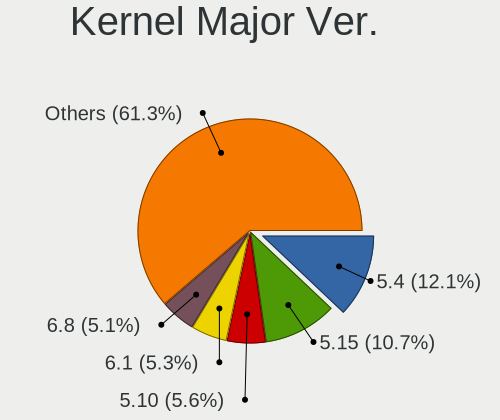
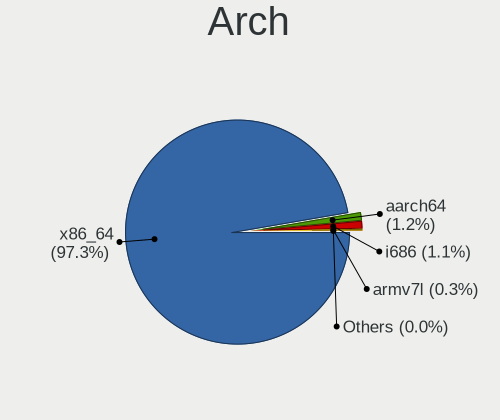
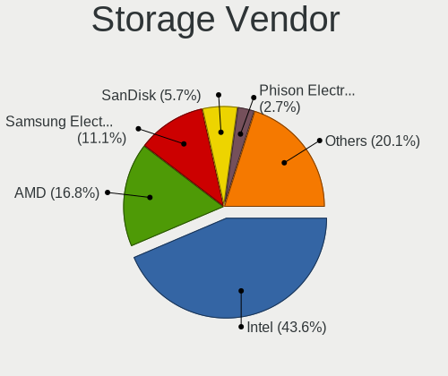
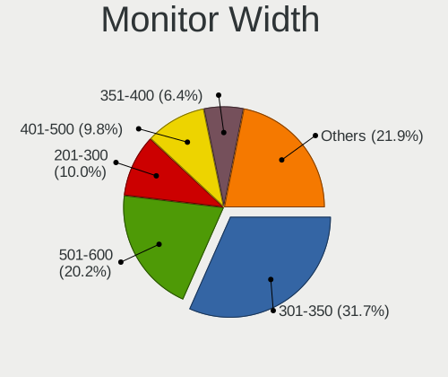
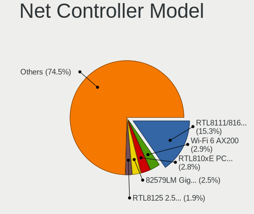

Linux in USA - Tested Hardware & Statistics
-------------------------------------------

A project to collect tested hardware configurations for Linux in USA.

Anyone can contribute to this report by the [hw-probe](https://github.com/linuxhw/hw-probe) tool:

    sudo -E hw-probe -all -upload

Please contribute! Especially if your hardware is rare.

This is a report for all computer types. See also reports for [desktops](/Location/USA/Desktop/README.md) and [notebooks](/Location/USA/Notebook/README.md).

Contents
--------

* [ Test Cases ](#test-cases)

* [ System ](#system)
  - [ OS                       ](#os)
  - [ OS Family                ](#os-family)
  - [ Kernel                   ](#kernel)
  - [ Kernel Family            ](#kernel-family)
  - [ Kernel Major Ver.        ](#kernel-major-ver)
  - [ Arch                     ](#arch)
  - [ DE                       ](#de)
  - [ Display Server           ](#display-server)
  - [ Display Manager          ](#display-manager)
  - [ OS Lang                  ](#os-lang)
  - [ Boot Mode                ](#boot-mode)
  - [ Filesystem               ](#filesystem)
  - [ Part. scheme             ](#part-scheme)
  - [ Dual Boot with Linux/BSD ](#dual-boot-with-linuxbsd)
  - [ Dual Boot (Win)          ](#dual-boot-win)

* [ Board ](#board)
  - [ Vendor                   ](#vendor)
  - [ Model                    ](#model)
  - [ Model Family             ](#model-family)
  - [ MFG Year                 ](#mfg-year)
  - [ Form Factor              ](#form-factor)
  - [ Secure Boot              ](#secure-boot)
  - [ Coreboot                 ](#coreboot)
  - [ RAM Size                 ](#ram-size)
  - [ RAM Used                 ](#ram-used)
  - [ Total Drives             ](#total-drives)
  - [ Has CD-ROM               ](#has-cd-rom)
  - [ Has Ethernet             ](#has-ethernet)
  - [ Has WiFi                 ](#has-wifi)
  - [ Has Bluetooth            ](#has-bluetooth)

* [ Location ](#location)
  - [ Country                  ](#country)
  - [ City                     ](#city)

* [ Drives ](#drives)
  - [ Drive Vendor             ](#drive-vendor)
  - [ Drive Model              ](#drive-model)
  - [ HDD Vendor               ](#hdd-vendor)
  - [ SSD Vendor               ](#ssd-vendor)
  - [ Drive Kind               ](#drive-kind)
  - [ Drive Connector          ](#drive-connector)
  - [ Drive Size               ](#drive-size)
  - [ Space Total              ](#space-total)
  - [ Space Used               ](#space-used)
  - [ Malfunc. Drives          ](#malfunc-drives)
  - [ Malfunc. Drive Vendor    ](#malfunc-drive-vendor)
  - [ Malfunc. HDD Vendor      ](#malfunc-hdd-vendor)
  - [ Malfunc. Drive Kind      ](#malfunc-drive-kind)
  - [ Failed Drives            ](#failed-drives)
  - [ Failed Drive Vendor      ](#failed-drive-vendor)
  - [ Drive Status             ](#drive-status)

* [ Storage controller ](#storage-controller)
  - [ Storage Vendor           ](#storage-vendor)
  - [ Storage Model            ](#storage-model)
  - [ Storage Kind             ](#storage-kind)

* [ Processor ](#processor)
  - [ CPU Vendor               ](#cpu-vendor)
  - [ CPU Model                ](#cpu-model)
  - [ CPU Model Family         ](#cpu-model-family)
  - [ CPU Cores                ](#cpu-cores)
  - [ CPU Sockets              ](#cpu-sockets)
  - [ CPU Threads              ](#cpu-threads)
  - [ CPU Op-Modes             ](#cpu-op-modes)
  - [ CPU Microcode            ](#cpu-microcode)
  - [ CPU Microarch            ](#cpu-microarch)

* [ Graphics ](#graphics)
  - [ GPU Vendor               ](#gpu-vendor)
  - [ GPU Model                ](#gpu-model)
  - [ GPU Combo                ](#gpu-combo)
  - [ GPU Driver               ](#gpu-driver)
  - [ GPU Memory               ](#gpu-memory)

* [ Monitor ](#monitor)
  - [ Monitor Vendor           ](#monitor-vendor)
  - [ Monitor Model            ](#monitor-model)
  - [ Monitor Resolution       ](#monitor-resolution)
  - [ Monitor Diagonal         ](#monitor-diagonal)
  - [ Monitor Width            ](#monitor-width)
  - [ Aspect Ratio             ](#aspect-ratio)
  - [ Monitor Area             ](#monitor-area)
  - [ Pixel Density            ](#pixel-density)
  - [ Multiple Monitors        ](#multiple-monitors)

* [ Network ](#network)
  - [ Net Controller Vendor    ](#net-controller-vendor)
  - [ Net Controller Model     ](#net-controller-model)
  - [ Wireless Vendor          ](#wireless-vendor)
  - [ Wireless Model           ](#wireless-model)
  - [ Ethernet Vendor          ](#ethernet-vendor)
  - [ Ethernet Model           ](#ethernet-model)
  - [ Net Controller Kind      ](#net-controller-kind)
  - [ Used Controller          ](#used-controller)
  - [ NICs                     ](#nics)
  - [ IPv6                     ](#ipv6)

* [ Bluetooth ](#bluetooth)
  - [ Bluetooth Vendor         ](#bluetooth-vendor)
  - [ Bluetooth Model          ](#bluetooth-model)

* [ Sound ](#sound)
  - [ Sound Vendor             ](#sound-vendor)
  - [ Sound Model              ](#sound-model)

* [ Memory ](#memory)
  - [ Memory Vendor            ](#memory-vendor)
  - [ Memory Model             ](#memory-model)
  - [ Memory Kind              ](#memory-kind)
  - [ Memory Form Factor       ](#memory-form-factor)
  - [ Memory Size              ](#memory-size)
  - [ Memory Speed             ](#memory-speed)

* [ Printers & scanners ](#printers--scanners)
  - [ Printer Vendor           ](#printer-vendor)
  - [ Printer Model            ](#printer-model)
  - [ Scanner Vendor           ](#scanner-vendor)
  - [ Scanner Model            ](#scanner-model)

* [ Camera ](#camera)
  - [ Camera Vendor            ](#camera-vendor)
  - [ Camera Model             ](#camera-model)

* [ Security ](#security)
  - [ Fingerprint Vendor       ](#fingerprint-vendor)
  - [ Fingerprint Model        ](#fingerprint-model)
  - [ Chipcard Vendor          ](#chipcard-vendor)
  - [ Chipcard Model           ](#chipcard-model)

* [ Unsupported ](#unsupported)
  - [ Unsupported Devices      ](#unsupported-devices)
  - [ Unsupported Device Types ](#unsupported-device-types)

Test Cases
----------

Total: 41412

| Vendor        | Model                       | Form-Factor | Probe                                                      | Date         |
|---------------|-----------------------------|-------------|------------------------------------------------------------|--------------|
| HP            | ProLiant DL360 G7           | Server      | [878afd8a43](https://linux-hardware.org/?probe=878afd8a43) | Dec 01, 2022 |
| Valve         | Jupiter                     | Notebook    | [ec26a28bff](https://linux-hardware.org/?probe=ec26a28bff) | Dec 01, 2022 |
| HP            | Stream Laptop 14-cb1XX      | Notebook    | [e8ecfcc3cd](https://linux-hardware.org/?probe=e8ecfcc3cd) | Dec 01, 2022 |
| HP            | Stream Laptop 14-cb1XX      | Notebook    | [80c9d45a14](https://linux-hardware.org/?probe=80c9d45a14) | Dec 01, 2022 |
| MSI           | MAG B550 TOMAHAWK MAX WI... | Desktop     | [51cf6d10e7](https://linux-hardware.org/?probe=51cf6d10e7) | Dec 01, 2022 |
| Lenovo        | Legion S7 15ACH6 82K8       | Notebook    | [4ab89a8ad2](https://linux-hardware.org/?probe=4ab89a8ad2) | Dec 01, 2022 |
| Dell          | XPS 13 9300                 | Notebook    | [d6c50b1786](https://linux-hardware.org/?probe=d6c50b1786) | Dec 01, 2022 |
| MSI           | GS75 Stealth 8SG            | Notebook    | [70be467762](https://linux-hardware.org/?probe=70be467762) | Dec 01, 2022 |
| Apple         | Mac-F221BEC8                | Desktop     | [7f91a09589](https://linux-hardware.org/?probe=7f91a09589) | Dec 01, 2022 |
| HP            | 8433 11                     | Desktop     | [01f9a28da3](https://linux-hardware.org/?probe=01f9a28da3) | Dec 01, 2022 |
| HP            | EliteBook 8730w             | Notebook    | [fa27703043](https://linux-hardware.org/?probe=fa27703043) | Dec 01, 2022 |
| Apple         | Mac-81E3E92DD6088272 iMa... | All in one  | [a8bad4d4b6](https://linux-hardware.org/?probe=a8bad4d4b6) | Dec 01, 2022 |
| Lenovo        | ThinkPad X1 Yoga 4th 20Q... | Convertible | [72ab240431](https://linux-hardware.org/?probe=72ab240431) | Dec 01, 2022 |
| MSI           | GF63 Thin 9SC               | Notebook    | [057b0039b7](https://linux-hardware.org/?probe=057b0039b7) | Dec 01, 2022 |
| Lenovo        | Yoga 7 15ITL5 82BJ          | Convertible | [6c6d0525fc](https://linux-hardware.org/?probe=6c6d0525fc) | Dec 01, 2022 |
| MSI           | MAG B550 TOMAHAWK MAX WI... | Desktop     | [1775ec9d4b](https://linux-hardware.org/?probe=1775ec9d4b) | Dec 01, 2022 |
| MSI           | MAG B550 TOMAHAWK MAX WI... | Desktop     | [097d1c062e](https://linux-hardware.org/?probe=097d1c062e) | Dec 01, 2022 |
| Dell          | 07JJ74 A01                  | Server      | [7096492ea2](https://linux-hardware.org/?probe=7096492ea2) | Dec 01, 2022 |
| ASUSTek       | PRIME B550M-A               | Desktop     | [5b86ca0927](https://linux-hardware.org/?probe=5b86ca0927) | Dec 01, 2022 |
| Dell          | 07JJ74 A01                  | Server      | [cb373247ed](https://linux-hardware.org/?probe=cb373247ed) | Dec 01, 2022 |
| ASUSTek       | GL503VM                     | Notebook    | [dbd4aba670](https://linux-hardware.org/?probe=dbd4aba670) | Dec 01, 2022 |
| ASUSTek       | VivoBook_ASUSLaptop E410... | Notebook    | [62ae8cb7dc](https://linux-hardware.org/?probe=62ae8cb7dc) | Dec 01, 2022 |
| System76      | Thelio thelio-r2            | Desktop     | [a7ae37f43e](https://linux-hardware.org/?probe=a7ae37f43e) | Dec 01, 2022 |
| ASUSTek       | TUF Gaming X570-PLUS        | Desktop     | [f7b40a75f6](https://linux-hardware.org/?probe=f7b40a75f6) | Dec 01, 2022 |
| ASUSTek       | GL503VM                     | Notebook    | [3db38d22b3](https://linux-hardware.org/?probe=3db38d22b3) | Dec 01, 2022 |
| Lenovo        | Legion 5 Pro 16ACH6H 82J... | Notebook    | [794fbb64f9](https://linux-hardware.org/?probe=794fbb64f9) | Dec 01, 2022 |
| Dell          | 0R6PCT A01                  | Desktop     | [c8ef04b4b2](https://linux-hardware.org/?probe=c8ef04b4b2) | Dec 01, 2022 |
| ASUSTek       | ROG STRIX X570-F GAMING     | Desktop     | [1ebd8b1b89](https://linux-hardware.org/?probe=1ebd8b1b89) | Dec 01, 2022 |
| Dell          | Latitude E7240              | Notebook    | [0945377dfb](https://linux-hardware.org/?probe=0945377dfb) | Dec 01, 2022 |
| In-Sing       | NK81J                       | Notebook    | [bca0a3709f](https://linux-hardware.org/?probe=bca0a3709f) | Dec 01, 2022 |
| Apple         | Mac-942B59F58194171B iMa... | All in one  | [ce6f6fcaad](https://linux-hardware.org/?probe=ce6f6fcaad) | Dec 01, 2022 |
| ASUSTek       | PRIME X370-PRO              | Desktop     | [aa87dfdc13](https://linux-hardware.org/?probe=aa87dfdc13) | Dec 01, 2022 |
| ASUSTek       | ROG STRIX B450-F GAMING     | Desktop     | [0461e6b5d2](https://linux-hardware.org/?probe=0461e6b5d2) | Dec 01, 2022 |
| Lenovo        | ThinkPad X13 Gen 1 20UFC... | Notebook    | [cccb2da575](https://linux-hardware.org/?probe=cccb2da575) | Dec 01, 2022 |
| Unknown       | 1.0                         | Desktop     | [c8cfeaf2be](https://linux-hardware.org/?probe=c8cfeaf2be) | Dec 01, 2022 |
| Apple         | MacBookPro11,4              | Notebook    | [138689463a](https://linux-hardware.org/?probe=138689463a) | Dec 01, 2022 |
| Lenovo        | ThinkPad X13 Gen 2a 20XH... | Notebook    | [f0ee9f78bd](https://linux-hardware.org/?probe=f0ee9f78bd) | Dec 01, 2022 |
| HP            | ProBook 450 G2              | Notebook    | [552ac907a0](https://linux-hardware.org/?probe=552ac907a0) | Dec 01, 2022 |
| GPU Compan... | GWTC116-2                   | Notebook    | [d004be9ab6](https://linux-hardware.org/?probe=d004be9ab6) | Dec 01, 2022 |
| Apple         | MacBookPro11,4              | Notebook    | [16d0cef78c](https://linux-hardware.org/?probe=16d0cef78c) | Dec 01, 2022 |
| MSI           | B460M PRO-VDH WIFI          | Desktop     | [3b7321ba87](https://linux-hardware.org/?probe=3b7321ba87) | Dec 01, 2022 |
| System76      | Thelio thelio-r1            | Desktop     | [a888eb38b3](https://linux-hardware.org/?probe=a888eb38b3) | Dec 01, 2022 |
| System76      | Thelio thelio-r1            | Desktop     | [76343aa234](https://linux-hardware.org/?probe=76343aa234) | Dec 01, 2022 |
| Lenovo        | Yoga 7 16IAH7 82UF          | Convertible | [c62923ba95](https://linux-hardware.org/?probe=c62923ba95) | Dec 01, 2022 |
| HP            | EliteBook 8570w             | Notebook    | [a4ae0cdd6a](https://linux-hardware.org/?probe=a4ae0cdd6a) | Dec 01, 2022 |
| ECS           | H61H2-WM                    | Desktop     | [9a7a280b58](https://linux-hardware.org/?probe=9a7a280b58) | Dec 01, 2022 |
| Google        | Cyan                        | Notebook    | [4aa7125981](https://linux-hardware.org/?probe=4aa7125981) | Nov 30, 2022 |
| HP            | 1825                        | Desktop     | [5f8bff315d](https://linux-hardware.org/?probe=5f8bff315d) | Nov 30, 2022 |
| ASUSTek       | ROG STRIX X570-I GAMING     | Desktop     | [ac84964c19](https://linux-hardware.org/?probe=ac84964c19) | Nov 30, 2022 |
| Dell          | 0NDYHG A01                  | Desktop     | [5dd9f4dea9](https://linux-hardware.org/?probe=5dd9f4dea9) | Nov 30, 2022 |
| Dell          | 0N4YC8 A00                  | Desktop     | [2e53fa79ed](https://linux-hardware.org/?probe=2e53fa79ed) | Nov 30, 2022 |
| Samsung       | 730QAA                      | Convertible | [7ec4c2ecfd](https://linux-hardware.org/?probe=7ec4c2ecfd) | Nov 30, 2022 |
| MSI           | MAG Z690 TOMAHAWK WIFI D... | Desktop     | [24dd5413fa](https://linux-hardware.org/?probe=24dd5413fa) | Nov 30, 2022 |
| Gigabyte      | X570 GAMING X               | Desktop     | [7ea2de1a3b](https://linux-hardware.org/?probe=7ea2de1a3b) | Nov 30, 2022 |
| Lenovo        | ThinkPad P1 Gen 3 20TJS5... | Notebook    | [2df1670891](https://linux-hardware.org/?probe=2df1670891) | Nov 30, 2022 |
| GPU Compan... | GWTN156-2BK                 | Notebook    | [1ed3629f61](https://linux-hardware.org/?probe=1ed3629f61) | Nov 30, 2022 |
| Apple         | Mac-F2268CC8                | All in one  | [6e2f0af1b5](https://linux-hardware.org/?probe=6e2f0af1b5) | Nov 30, 2022 |
| Lenovo        | IdeaPadFlex 5 14ALC7 82R... | Convertible | [1c30aa7bcd](https://linux-hardware.org/?probe=1c30aa7bcd) | Nov 30, 2022 |
| MSI           | MAG B550M MORTAR            | Desktop     | [b4c010a2b2](https://linux-hardware.org/?probe=b4c010a2b2) | Nov 30, 2022 |
| ASUSTek       | ASUS TUF Gaming A15 FA50... | Notebook    | [66b6e49eb5](https://linux-hardware.org/?probe=66b6e49eb5) | Nov 30, 2022 |
| Dell          | G15 5511                    | Notebook    | [d2c2cb8454](https://linux-hardware.org/?probe=d2c2cb8454) | Nov 30, 2022 |
| Lenovo        | 3190 SDK0J40697 WIN 3305... | Mini pc     | [1c03d54694](https://linux-hardware.org/?probe=1c03d54694) | Nov 30, 2022 |
| Dell          | 0C3YXR A01                  | Desktop     | [95fbd0e6b4](https://linux-hardware.org/?probe=95fbd0e6b4) | Nov 30, 2022 |
| Dell          | G15 5511                    | Notebook    | [f9e456efd0](https://linux-hardware.org/?probe=f9e456efd0) | Nov 30, 2022 |
| HP            | ENVY x360 Convertible 15... | Convertible | [9ad34fe6e2](https://linux-hardware.org/?probe=9ad34fe6e2) | Nov 30, 2022 |
| HP            | ENVY x360 Convertible 15... | Convertible | [99e23cf04d](https://linux-hardware.org/?probe=99e23cf04d) | Nov 30, 2022 |
| Lenovo        | 3190 SDK0J40697 WIN 3305... | Mini pc     | [cafd86ffda](https://linux-hardware.org/?probe=cafd86ffda) | Nov 30, 2022 |
| Gigabyte      | B450 AORUS M                | Desktop     | [3e3ccd1471](https://linux-hardware.org/?probe=3e3ccd1471) | Nov 30, 2022 |
| ASUSTek       | N550JV                      | Notebook    | [c39c35ea09](https://linux-hardware.org/?probe=c39c35ea09) | Nov 30, 2022 |
| Dell          | Latitude E6530              | Notebook    | [c90145516a](https://linux-hardware.org/?probe=c90145516a) | Nov 30, 2022 |
| Dell          | 08NPPY A00                  | Desktop     | [a774c1201c](https://linux-hardware.org/?probe=a774c1201c) | Nov 30, 2022 |
| HP            | Laptop 14-dk1xxx            | Notebook    | [9dbd54884d](https://linux-hardware.org/?probe=9dbd54884d) | Nov 30, 2022 |
| HP            | ENVY x360 Convertible 15... | Convertible | [fc681f2f42](https://linux-hardware.org/?probe=fc681f2f42) | Nov 30, 2022 |
| HP            | 1825                        | Desktop     | [a3f8ec5423](https://linux-hardware.org/?probe=a3f8ec5423) | Nov 30, 2022 |
| Acer          | Aspire E5-575               | Notebook    | [b393262562](https://linux-hardware.org/?probe=b393262562) | Nov 30, 2022 |
| MSI           | B550M PRO-VDH WIFI          | Desktop     | [53e6bc021e](https://linux-hardware.org/?probe=53e6bc021e) | Nov 30, 2022 |
| Lenovo        | ThinkBook 14s-IWL 20RM      | Notebook    | [d77cb5ebb0](https://linux-hardware.org/?probe=d77cb5ebb0) | Nov 30, 2022 |
| HP            | Spectre x360 Convertible... | Convertible | [f1d4630160](https://linux-hardware.org/?probe=f1d4630160) | Nov 30, 2022 |
| ASRock        | B450M Steel Legend          | Desktop     | [9d6aeff37c](https://linux-hardware.org/?probe=9d6aeff37c) | Nov 30, 2022 |
| Dell          | Inspiron 15-3552            | Notebook    | [e740b148c1](https://linux-hardware.org/?probe=e740b148c1) | Nov 30, 2022 |
| Gigabyte      | X570 AORUS ELITE WIFI       | Desktop     | [f17f99d4e6](https://linux-hardware.org/?probe=f17f99d4e6) | Nov 30, 2022 |
| Dell          | Inspiron 3580               | Notebook    | [6bc2705d99](https://linux-hardware.org/?probe=6bc2705d99) | Nov 30, 2022 |
| GPU Compan... | GWTN156-2BK                 | Notebook    | [dbba08e68e](https://linux-hardware.org/?probe=dbba08e68e) | Nov 30, 2022 |
| Lenovo        | ThinkPad X1 Carbon 6th 2... | Notebook    | [38c4009dba](https://linux-hardware.org/?probe=38c4009dba) | Nov 30, 2022 |
| Dell          | 0NDYHG A01                  | Desktop     | [a3191b9bfe](https://linux-hardware.org/?probe=a3191b9bfe) | Nov 30, 2022 |
| ASRock        | H77M                        | Desktop     | [ffa3496b0d](https://linux-hardware.org/?probe=ffa3496b0d) | Nov 30, 2022 |
| Lenovo        | ThinkPad L13 Yoga Gen 2 ... | Convertible | [00232e7345](https://linux-hardware.org/?probe=00232e7345) | Nov 29, 2022 |
| IP3 Tech      | GB3B                        | Mini pc     | [558174d9f4](https://linux-hardware.org/?probe=558174d9f4) | Nov 29, 2022 |
| HP            | Stream Laptop 14-cb1xxx     | Notebook    | [6f96ec5e1d](https://linux-hardware.org/?probe=6f96ec5e1d) | Nov 29, 2022 |
| ASUSTek       | TUF Gaming X570-PLUS        | Desktop     | [2e35df903f](https://linux-hardware.org/?probe=2e35df903f) | Nov 29, 2022 |
| Lenovo        | Yoga 7 15ITL5 82BJ          | Convertible | [9f1ad78301](https://linux-hardware.org/?probe=9f1ad78301) | Nov 29, 2022 |
| Lenovo        | Yoga 6 13ALC6 82ND          | Convertible | [48319e6f46](https://linux-hardware.org/?probe=48319e6f46) | Nov 29, 2022 |
| MSI           | Katana GF76 11UD            | Notebook    | [186950bae6](https://linux-hardware.org/?probe=186950bae6) | Nov 29, 2022 |
| Chuwi         | LarkBox Pro                 | Mini pc     | [9b78bb4bbf](https://linux-hardware.org/?probe=9b78bb4bbf) | Nov 29, 2022 |
| Chuwi         | LarkBox Pro                 | Mini pc     | [65a673d91a](https://linux-hardware.org/?probe=65a673d91a) | Nov 29, 2022 |
| Apple         | Mac-F2268CC8                | All in one  | [0cb6dd7966](https://linux-hardware.org/?probe=0cb6dd7966) | Nov 29, 2022 |
| Dell          | Inspiron 16 7620 2-in-1     | Convertible | [b34e3370f4](https://linux-hardware.org/?probe=b34e3370f4) | Nov 29, 2022 |
| ASUSTek       | M4A89GTD-PRO/USB3           | Desktop     | [9dd6019148](https://linux-hardware.org/?probe=9dd6019148) | Nov 29, 2022 |
| ASRock        | H270M-ITX/ac                | Desktop     | [dfc381d411](https://linux-hardware.org/?probe=dfc381d411) | Nov 29, 2022 |
| Samsung       | 730QED                      | Convertible | [5d62977479](https://linux-hardware.org/?probe=5d62977479) | Nov 29, 2022 |
| MSI           | Katana GF76 11UD            | Notebook    | [48bb9075a7](https://linux-hardware.org/?probe=48bb9075a7) | Nov 29, 2022 |
| Dell          | Inspiron 3521               | Notebook    | [2ecbfd5e39](https://linux-hardware.org/?probe=2ecbfd5e39) | Nov 29, 2022 |
| HP            | 8876 11                     | Desktop     | [babda62ffa](https://linux-hardware.org/?probe=babda62ffa) | Nov 29, 2022 |
| ASUSTek       | N61Jv                       | Notebook    | [5eb5f5e384](https://linux-hardware.org/?probe=5eb5f5e384) | Nov 29, 2022 |
| HP            | ZBook Power G7 Mobile Wo... | Notebook    | [bb023e130b](https://linux-hardware.org/?probe=bb023e130b) | Nov 29, 2022 |
| HP            | EliteBook 845 G8 Noteboo... | Notebook    | [a41d7dbfb1](https://linux-hardware.org/?probe=a41d7dbfb1) | Nov 29, 2022 |
| Dell          | 0FDY5C A00                  | Desktop     | [3cba0b32b1](https://linux-hardware.org/?probe=3cba0b32b1) | Nov 29, 2022 |
| Gigabyte      | B550 AORUS ELITE AX V2      | Desktop     | [ff119f84e6](https://linux-hardware.org/?probe=ff119f84e6) | Nov 29, 2022 |
| Dell          | Inspiron 15-3567            | Notebook    | [b06377f324](https://linux-hardware.org/?probe=b06377f324) | Nov 29, 2022 |
| Valve         | Jupiter                     | Notebook    | [a9299c074e](https://linux-hardware.org/?probe=a9299c074e) | Nov 29, 2022 |
| MSI           | MAG B560 TORPEDO            | Desktop     | [b58a1b4b2f](https://linux-hardware.org/?probe=b58a1b4b2f) | Nov 29, 2022 |
| MSI           | MAG B560 TORPEDO            | Desktop     | [6cd5ddc986](https://linux-hardware.org/?probe=6cd5ddc986) | Nov 29, 2022 |
| HP            | 15 Notebook PC              | Notebook    | [3f524b291e](https://linux-hardware.org/?probe=3f524b291e) | Nov 29, 2022 |
| HP            | 15 Notebook PC              | Notebook    | [3b9651372a](https://linux-hardware.org/?probe=3b9651372a) | Nov 29, 2022 |
| Supermicro    | X10DRU-i+B                  | Desktop     | [e55edce907](https://linux-hardware.org/?probe=e55edce907) | Nov 29, 2022 |
| HP            | ENVY x360 2-in-1 Laptop ... | Convertible | [bdf6aee6f5](https://linux-hardware.org/?probe=bdf6aee6f5) | Nov 29, 2022 |
| Alienware     | 17 R3                       | Notebook    | [1cf396c1ef](https://linux-hardware.org/?probe=1cf396c1ef) | Nov 29, 2022 |
| Valve         | Jupiter                     | Notebook    | [de1a950876](https://linux-hardware.org/?probe=de1a950876) | Nov 29, 2022 |
| Toshiba       | Satellite A305              | Notebook    | [3defab8cbd](https://linux-hardware.org/?probe=3defab8cbd) | Nov 29, 2022 |
| Apple         | Mac-77F17D7DA9285301 iMa... | All in one  | [a74a067f14](https://linux-hardware.org/?probe=a74a067f14) | Nov 29, 2022 |
| Acer          | Nitro AN517-51              | Notebook    | [c20385f7bd](https://linux-hardware.org/?probe=c20385f7bd) | Nov 29, 2022 |
| ASUSTek       | PRIME B560M-A AC            | Desktop     | [d4cc718e46](https://linux-hardware.org/?probe=d4cc718e46) | Nov 29, 2022 |
| Unknown       | Unknown                     | Notebook    | [d2789773ef](https://linux-hardware.org/?probe=d2789773ef) | Nov 29, 2022 |
| MSI           | MAG X570S TOMAHAWK MAX W... | Desktop     | [04d2eea487](https://linux-hardware.org/?probe=04d2eea487) | Nov 28, 2022 |
| Microsoft     | Surface Pro                 | Tablet      | [2fcba8743c](https://linux-hardware.org/?probe=2fcba8743c) | Nov 28, 2022 |
| ASUSTek       | H81I-PLUS                   | Desktop     | [4aba048a46](https://linux-hardware.org/?probe=4aba048a46) | Nov 28, 2022 |
| ASUSTek       | H81I-PLUS                   | Desktop     | [2042d30c8b](https://linux-hardware.org/?probe=2042d30c8b) | Nov 28, 2022 |
| Dell          | Latitude 5411               | Notebook    | [122facad78](https://linux-hardware.org/?probe=122facad78) | Nov 28, 2022 |
| ASUSTek       | CM1630                      | Desktop     | [b82a5c41fc](https://linux-hardware.org/?probe=b82a5c41fc) | Nov 28, 2022 |
| Dell          | Precision 5760              | Notebook    | [0e19ec2f3d](https://linux-hardware.org/?probe=0e19ec2f3d) | Nov 28, 2022 |
| Supermicro    | X8DTG-D                     | Server      | [9e977b651e](https://linux-hardware.org/?probe=9e977b651e) | Nov 28, 2022 |
| Gateway       | SX2851                      | Desktop     | [b408695def](https://linux-hardware.org/?probe=b408695def) | Nov 28, 2022 |
| HP            | 806A                        | Desktop     | [82128d6a8b](https://linux-hardware.org/?probe=82128d6a8b) | Nov 28, 2022 |
| HP            | EliteBook 845 G7 Noteboo... | Notebook    | [e1495dc120](https://linux-hardware.org/?probe=e1495dc120) | Nov 28, 2022 |
| Apple         | MacBookPro10,1              | Notebook    | [c0c2f77cdb](https://linux-hardware.org/?probe=c0c2f77cdb) | Nov 28, 2022 |
| Google        | Akemi                       | Notebook    | [89c466ffd4](https://linux-hardware.org/?probe=89c466ffd4) | Nov 28, 2022 |
| Lenovo        | ThinkPad X1 Carbon 3rd 2... | Notebook    | [69a6535286](https://linux-hardware.org/?probe=69a6535286) | Nov 28, 2022 |
| Lenovo        | ThinkPad T450 20BV0005US    | Notebook    | [a98e281c16](https://linux-hardware.org/?probe=a98e281c16) | Nov 28, 2022 |
| Lenovo        | ThinkPad T450 20BV0005US    | Notebook    | [c06b73c5c3](https://linux-hardware.org/?probe=c06b73c5c3) | Nov 28, 2022 |
| ASRock        | H87M Pro4                   | Desktop     | [c0511f2d46](https://linux-hardware.org/?probe=c0511f2d46) | Nov 28, 2022 |
| MSI           | 970A-G46                    | Desktop     | [3cd88e88d3](https://linux-hardware.org/?probe=3cd88e88d3) | Nov 28, 2022 |
| HP            | Stream Laptop 14-cb1xxx     | Notebook    | [1bf2bd6761](https://linux-hardware.org/?probe=1bf2bd6761) | Nov 28, 2022 |
| Dell          | G3 3779                     | Notebook    | [3e85396dae](https://linux-hardware.org/?probe=3e85396dae) | Nov 28, 2022 |
| Framework     | Laptop (12th Gen Intel C... | Notebook    | [7578d56f26](https://linux-hardware.org/?probe=7578d56f26) | Nov 28, 2022 |
| HP            | Laptop 15-dy2xxx            | Notebook    | [a1c088bc35](https://linux-hardware.org/?probe=a1c088bc35) | Nov 28, 2022 |
| Valve         | Jupiter                     | Notebook    | [637e97b132](https://linux-hardware.org/?probe=637e97b132) | Nov 28, 2022 |
| Dell          | 0T10XW A02                  | Desktop     | [e97a065fa8](https://linux-hardware.org/?probe=e97a065fa8) | Nov 28, 2022 |
| Lenovo        | ThinkPad T14 Gen 1 20S00... | Notebook    | [b79b60e4b3](https://linux-hardware.org/?probe=b79b60e4b3) | Nov 28, 2022 |
| MSI           | B460M PRO-VDH WIFI          | Desktop     | [da2828f715](https://linux-hardware.org/?probe=da2828f715) | Nov 28, 2022 |
| Lenovo        | V14-IIL 82C4                | Notebook    | [407b574c57](https://linux-hardware.org/?probe=407b574c57) | Nov 28, 2022 |
| HP            | Laptop 15-da0xxx            | Notebook    | [eb168566ee](https://linux-hardware.org/?probe=eb168566ee) | Nov 28, 2022 |
| Dell          | Precision M4700             | Notebook    | [17f1344975](https://linux-hardware.org/?probe=17f1344975) | Nov 28, 2022 |
| HP            | EliteBook 8470w             | Notebook    | [7008753054](https://linux-hardware.org/?probe=7008753054) | Nov 28, 2022 |
| Lenovo        | Flex 2-15 20405             | Notebook    | [7e37de4475](https://linux-hardware.org/?probe=7e37de4475) | Nov 28, 2022 |
| Dell          | 0K3CM7 A00                  | Desktop     | [076eeadd80](https://linux-hardware.org/?probe=076eeadd80) | Nov 28, 2022 |
| ASUSTek       | S551LB                      | Notebook    | [d74127627f](https://linux-hardware.org/?probe=d74127627f) | Nov 28, 2022 |
| HP            | Victus by Gaming Laptop ... | Notebook    | [e1dcd6d119](https://linux-hardware.org/?probe=e1dcd6d119) | Nov 28, 2022 |
| MSI           | GP72 7RDX                   | Notebook    | [648eb6d88a](https://linux-hardware.org/?probe=648eb6d88a) | Nov 28, 2022 |
| Dell          | 040DDP A00                  | Desktop     | [6bf43c8793](https://linux-hardware.org/?probe=6bf43c8793) | Nov 28, 2022 |
| Lenovo        | ThinkPad T430 2344BZU       | Notebook    | [0dcd2bdc50](https://linux-hardware.org/?probe=0dcd2bdc50) | Nov 28, 2022 |
| Lenovo        | ThinkPad X1 Extreme 20MF... | Notebook    | [f18a4c8031](https://linux-hardware.org/?probe=f18a4c8031) | Nov 28, 2022 |
| Gigabyte      | B85-HD3-A                   | Desktop     | [cc1637d7e2](https://linux-hardware.org/?probe=cc1637d7e2) | Nov 27, 2022 |
| Dell          | 0DR845                      | Desktop     | [57f2ea3914](https://linux-hardware.org/?probe=57f2ea3914) | Nov 27, 2022 |
| Dell          | 0DR845                      | Desktop     | [f28560630d](https://linux-hardware.org/?probe=f28560630d) | Nov 27, 2022 |
| HP            | Laptop 14-fq1xxx            | Notebook    | [7837242848](https://linux-hardware.org/?probe=7837242848) | Nov 27, 2022 |
| Toshiba       | Satellite L775D             | Notebook    | [bf6fc6fd49](https://linux-hardware.org/?probe=bf6fc6fd49) | Nov 27, 2022 |
| Lenovo        | ThinkPad X260 20F6005HUS    | Notebook    | [6418eda1a9](https://linux-hardware.org/?probe=6418eda1a9) | Nov 27, 2022 |
| ASUSTek       | TUF Gaming FX705GM_FX705... | Notebook    | [3515e0a362](https://linux-hardware.org/?probe=3515e0a362) | Nov 27, 2022 |
| System76      | Oryx Pro                    | Notebook    | [c7d2918a69](https://linux-hardware.org/?probe=c7d2918a69) | Nov 27, 2022 |
| Gateway       | G33M05G1 MP                 | Desktop     | [193a69e5ee](https://linux-hardware.org/?probe=193a69e5ee) | Nov 27, 2022 |
| Gateway       | M-1631U                     | Notebook    | [f0f0517dab](https://linux-hardware.org/?probe=f0f0517dab) | Nov 27, 2022 |
| Lenovo        | ThinkPad T14 Gen 2i 20W1... | Notebook    | [620cab185f](https://linux-hardware.org/?probe=620cab185f) | Nov 27, 2022 |
| Notebook      | NP5x_NP6x_NP7xPNP           | Notebook    | [3dd83d6d9d](https://linux-hardware.org/?probe=3dd83d6d9d) | Nov 27, 2022 |
| Dell          | XPS 15 9560                 | Notebook    | [47782768eb](https://linux-hardware.org/?probe=47782768eb) | Nov 27, 2022 |
| HP            | Laptop 15s-eq2xxx           | Notebook    | [bdc1a14cd4](https://linux-hardware.org/?probe=bdc1a14cd4) | Nov 27, 2022 |
| Gateway       | G33M05G1 MP                 | Desktop     | [291e32a741](https://linux-hardware.org/?probe=291e32a741) | Nov 27, 2022 |
| Dell          | Precision M4700             | Notebook    | [7f5ebe66b6](https://linux-hardware.org/?probe=7f5ebe66b6) | Nov 27, 2022 |
| ASRock        | H87M Pro4                   | Desktop     | [8d15aa84d6](https://linux-hardware.org/?probe=8d15aa84d6) | Nov 27, 2022 |
| BESSTAR Te... | HM90                        | Desktop     | [eda49557ae](https://linux-hardware.org/?probe=eda49557ae) | Nov 27, 2022 |
| HP            | ENVY Laptop 17-ce1xxx       | Notebook    | [60c25a49bc](https://linux-hardware.org/?probe=60c25a49bc) | Nov 27, 2022 |
| BESSTAR Te... | HM90                        | Desktop     | [6867d8eeaf](https://linux-hardware.org/?probe=6867d8eeaf) | Nov 27, 2022 |
| Raspberry ... | Raspberry Pi 4 Model B R... | Soc         | [f4f2a0d4e6](https://linux-hardware.org/?probe=f4f2a0d4e6) | Nov 27, 2022 |
| Alienware     | 17                          | Notebook    | [08ebf1e9a2](https://linux-hardware.org/?probe=08ebf1e9a2) | Nov 27, 2022 |
| HP            | Laptop 14-fq1xxx            | Notebook    | [49dc64dc76](https://linux-hardware.org/?probe=49dc64dc76) | Nov 27, 2022 |
| Apple         | Mac-F227BEC8 PVT            | All in one  | [33e4e585ab](https://linux-hardware.org/?probe=33e4e585ab) | Nov 27, 2022 |
| Lenovo        | ThinkPad T14 Gen 3 21CFC... | Notebook    | [4e7809f7f6](https://linux-hardware.org/?probe=4e7809f7f6) | Nov 27, 2022 |
| HP            | 843B                        | Desktop     | [50065e4a79](https://linux-hardware.org/?probe=50065e4a79) | Nov 27, 2022 |
| Google        | Lick                        | Notebook    | [44ac0c9573](https://linux-hardware.org/?probe=44ac0c9573) | Nov 27, 2022 |
| MSI           | Z97A GAMING 7               | Desktop     | [74341c948b](https://linux-hardware.org/?probe=74341c948b) | Nov 27, 2022 |
| Dell          | 0GXM1W A02                  | Desktop     | [3a801841e6](https://linux-hardware.org/?probe=3a801841e6) | Nov 27, 2022 |
| MSI           | X470 GAMING PRO CARBON      | Desktop     | [81a61c4765](https://linux-hardware.org/?probe=81a61c4765) | Nov 27, 2022 |
| Dell          | 0C2XKD A01                  | Desktop     | [b17b635fcb](https://linux-hardware.org/?probe=b17b635fcb) | Nov 27, 2022 |
| Lenovo        | ThinkPad T450 20BV0001US    | Notebook    | [3d1b8f282a](https://linux-hardware.org/?probe=3d1b8f282a) | Nov 27, 2022 |
| ASUSTek       | PRIME B550M-A               | Desktop     | [7bdb03388b](https://linux-hardware.org/?probe=7bdb03388b) | Nov 27, 2022 |
| Gigabyte      | B450 AORUS ELITE            | Desktop     | [b72ddeccb4](https://linux-hardware.org/?probe=b72ddeccb4) | Nov 27, 2022 |
| Lenovo        | Legion 5 Pro 16ARH7H 82R... | Notebook    | [7a5c0ebf68](https://linux-hardware.org/?probe=7a5c0ebf68) | Nov 26, 2022 |
| HP            | Stream Laptop 14-cb1xxx     | Notebook    | [74573171b1](https://linux-hardware.org/?probe=74573171b1) | Nov 26, 2022 |
| Dell          | G5 5587                     | Notebook    | [07d47da161](https://linux-hardware.org/?probe=07d47da161) | Nov 26, 2022 |
| ASUSTek       | U56E                        | Notebook    | [4222387904](https://linux-hardware.org/?probe=4222387904) | Nov 26, 2022 |
| Apple         | Mac-F221BEC8                | Desktop     | [f2fe1d140e](https://linux-hardware.org/?probe=f2fe1d140e) | Nov 26, 2022 |
| MSI           | MPG X570 GAMING PLUS        | Desktop     | [63521d3e8d](https://linux-hardware.org/?probe=63521d3e8d) | Nov 26, 2022 |
| Dell          | Latitude 3580               | Notebook    | [e52f5dfaaa](https://linux-hardware.org/?probe=e52f5dfaaa) | Nov 26, 2022 |
| Dell          | Latitude 3580               | Notebook    | [c54a91a217](https://linux-hardware.org/?probe=c54a91a217) | Nov 26, 2022 |
| MSI           | X370 GAMING M7 ACK          | Desktop     | [c2dca9687b](https://linux-hardware.org/?probe=c2dca9687b) | Nov 26, 2022 |
| Dell          | Inspiron 3521               | Notebook    | [015854e59a](https://linux-hardware.org/?probe=015854e59a) | Nov 26, 2022 |
| Pine Micro... | Pine64 PinePhone (1.2)      | Phone       | [cc309bb44c](https://linux-hardware.org/?probe=cc309bb44c) | Nov 26, 2022 |
| LattePanda    | 3 Delta CDJQ-BS-7-S70JR1... | Desktop     | [da7904dda2](https://linux-hardware.org/?probe=da7904dda2) | Nov 26, 2022 |
| ASRock        | B450 Steel Legend           | Desktop     | [7a4807269e](https://linux-hardware.org/?probe=7a4807269e) | Nov 26, 2022 |
| Dell          | Inspiron 1440               | Notebook    | [fe31844ca3](https://linux-hardware.org/?probe=fe31844ca3) | Nov 26, 2022 |
| Lenovo        | BRASWELL SDK0J40705 WIN ... | Desktop     | [fd73688b5c](https://linux-hardware.org/?probe=fd73688b5c) | Nov 26, 2022 |
| Acer          | Nitro AN515-54              | Notebook    | [e82fa602d4](https://linux-hardware.org/?probe=e82fa602d4) | Nov 26, 2022 |
| HP            | G61                         | Notebook    | [314cbc992f](https://linux-hardware.org/?probe=314cbc992f) | Nov 26, 2022 |
| HP            | Stream Laptop 14-cb1xxx     | Notebook    | [07eb92cc07](https://linux-hardware.org/?probe=07eb92cc07) | Nov 26, 2022 |
| ASRock        | B450M Pro4                  | Desktop     | [def104dd7d](https://linux-hardware.org/?probe=def104dd7d) | Nov 26, 2022 |
| Apple         | Mac-77F17D7DA9285301 iMa... | All in one  | [ae30b95cd8](https://linux-hardware.org/?probe=ae30b95cd8) | Nov 26, 2022 |
| Acer          | Nitro AN515-54              | Notebook    | [604339bd15](https://linux-hardware.org/?probe=604339bd15) | Nov 26, 2022 |
| Valve         | Jupiter                     | Notebook    | [caf4a9c4d8](https://linux-hardware.org/?probe=caf4a9c4d8) | Nov 26, 2022 |
| Valve         | Jupiter                     | Notebook    | [c17d27ef9b](https://linux-hardware.org/?probe=c17d27ef9b) | Nov 26, 2022 |
| Lenovo        | BRASWELL SDK0J40705 WIN ... | Desktop     | [cdc1c32b09](https://linux-hardware.org/?probe=cdc1c32b09) | Nov 26, 2022 |
| Raspberry ... | Raspberry Pi 4 Model B R... | Soc         | [594eee927c](https://linux-hardware.org/?probe=594eee927c) | Nov 26, 2022 |
| Gigabyte      | GA-78LMT-USB3               | Desktop     | [bb0d4b34af](https://linux-hardware.org/?probe=bb0d4b34af) | Nov 26, 2022 |
| Dell          | Latitude E6510              | Notebook    | [694a3d79be](https://linux-hardware.org/?probe=694a3d79be) | Nov 26, 2022 |
| HP            | OMEN by Laptop 15t-ek000    | Notebook    | [4189c96f5e](https://linux-hardware.org/?probe=4189c96f5e) | Nov 26, 2022 |
| ASUSTek       | VivoBook_ASUSLaptop X512... | Notebook    | [bede773ce4](https://linux-hardware.org/?probe=bede773ce4) | Nov 26, 2022 |
| Microsoft     | Surface Pro 4               | Tablet      | [5e51349002](https://linux-hardware.org/?probe=5e51349002) | Nov 26, 2022 |
| Microsoft     | Surface Pro 4               | Tablet      | [f70a6fa6ae](https://linux-hardware.org/?probe=f70a6fa6ae) | Nov 26, 2022 |
| HP            | Pavilion ZV6100 (EC356UA... | Notebook    | [c6fcc7764f](https://linux-hardware.org/?probe=c6fcc7764f) | Nov 26, 2022 |
| Lenovo        | ThinkPad X1 Carbon 5th 2... | Notebook    | [5a6ef91469](https://linux-hardware.org/?probe=5a6ef91469) | Nov 26, 2022 |
| Dell          | 06NWYK A01                  | Desktop     | [3afe7122f3](https://linux-hardware.org/?probe=3afe7122f3) | Nov 26, 2022 |
| ASUSTek       | U56E                        | Notebook    | [8b783ab1ac](https://linux-hardware.org/?probe=8b783ab1ac) | Nov 26, 2022 |
| ASUSTek       | TUF B350M-PLUS GAMING       | Desktop     | [098116b1d6](https://linux-hardware.org/?probe=098116b1d6) | Nov 26, 2022 |
| MSI           | A78M-E35                    | Desktop     | [cf80d76e53](https://linux-hardware.org/?probe=cf80d76e53) | Nov 26, 2022 |
| Apple         | Mac-7DF2A3B5E5D671ED iMa... | All in one  | [ad4f43c154](https://linux-hardware.org/?probe=ad4f43c154) | Nov 26, 2022 |
| Dell          | 01Y1CJ A00                  | Mini pc     | [5b19381bf6](https://linux-hardware.org/?probe=5b19381bf6) | Nov 26, 2022 |
| System76      | Gazelle                     | Notebook    | [dd481baf69](https://linux-hardware.org/?probe=dd481baf69) | Nov 26, 2022 |
| Dell          | 01Y1CJ A00                  | Mini pc     | [1878ce00d7](https://linux-hardware.org/?probe=1878ce00d7) | Nov 26, 2022 |
| Gigabyte      | B550 GAMING X               | Desktop     | [b9264b2557](https://linux-hardware.org/?probe=b9264b2557) | Nov 26, 2022 |
| HP            | 0AECh D                     | Desktop     | [857616948b](https://linux-hardware.org/?probe=857616948b) | Nov 26, 2022 |
| GPU Compan... | GWNR71517                   | Notebook    | [15173435f0](https://linux-hardware.org/?probe=15173435f0) | Nov 26, 2022 |
| Dell          | 0FDY5C A00                  | Desktop     | [05216bc44f](https://linux-hardware.org/?probe=05216bc44f) | Nov 26, 2022 |
| Apple         | Mac-7DF2A3B5E5D671ED iMa... | All in one  | [82059a1b51](https://linux-hardware.org/?probe=82059a1b51) | Nov 26, 2022 |
| Lenovo        | ThinkPad T14 Gen 1 20S0C... | Notebook    | [b669fa97c4](https://linux-hardware.org/?probe=b669fa97c4) | Nov 26, 2022 |
| Lenovo        | ThinkPad X1 Carbon 4th 2... | Convertible | [b128e800ec](https://linux-hardware.org/?probe=b128e800ec) | Nov 26, 2022 |
| HP            | ENVY 17 Leap Motion SE N... | Notebook    | [6df7dc0467](https://linux-hardware.org/?probe=6df7dc0467) | Nov 26, 2022 |
| Lenovo        | Legion S7 15ACH6 82K8       | Notebook    | [91fa73480c](https://linux-hardware.org/?probe=91fa73480c) | Nov 26, 2022 |
| Lenovo        | Legion S7 15ACH6 82K8       | Notebook    | [93576caa19](https://linux-hardware.org/?probe=93576caa19) | Nov 26, 2022 |
| LattePanda    | Alpha                       | Desktop     | [be819160d5](https://linux-hardware.org/?probe=be819160d5) | Nov 26, 2022 |
| LattePanda    | Alpha                       | Desktop     | [b3c831db4d](https://linux-hardware.org/?probe=b3c831db4d) | Nov 26, 2022 |
| Dell          | XPS 13 7390                 | Notebook    | [57f43b148c](https://linux-hardware.org/?probe=57f43b148c) | Nov 26, 2022 |
| MSI           | Alpha 17 B5EEK              | Notebook    | [0cd6df782e](https://linux-hardware.org/?probe=0cd6df782e) | Nov 26, 2022 |
| Dell          | Latitude E6440              | Notebook    | [348f786878](https://linux-hardware.org/?probe=348f786878) | Nov 26, 2022 |
| Google        | Glimmer                     | Notebook    | [8ad30368c9](https://linux-hardware.org/?probe=8ad30368c9) | Nov 26, 2022 |
| ASUSTek       | ZenBook UX534FTC_UX534FT    | Notebook    | [d845cbb51d](https://linux-hardware.org/?probe=d845cbb51d) | Nov 26, 2022 |
| Gigabyte      | Z77-HD3                     | Desktop     | [e3b7bbc736](https://linux-hardware.org/?probe=e3b7bbc736) | Nov 25, 2022 |
| HP            | 8299                        | Desktop     | [8f6b89bf07](https://linux-hardware.org/?probe=8f6b89bf07) | Nov 25, 2022 |
| Foxconn       | 2AB1                        | Desktop     | [9a2bebb3ba](https://linux-hardware.org/?probe=9a2bebb3ba) | Nov 25, 2022 |
| ASRock        | Z77 Extreme4                | Desktop     | [40b3f85de8](https://linux-hardware.org/?probe=40b3f85de8) | Nov 25, 2022 |
| ASUSTek       | ZenBook UX333FA_UX333FA     | Notebook    | [02eeb74e28](https://linux-hardware.org/?probe=02eeb74e28) | Nov 25, 2022 |
| HP            | Pavilion TS Sleekbook 14    | Notebook    | [26440cddbb](https://linux-hardware.org/?probe=26440cddbb) | Nov 25, 2022 |
| Apple         | MacBookPro15,1              | Notebook    | [e7a9d49cf6](https://linux-hardware.org/?probe=e7a9d49cf6) | Nov 25, 2022 |
| Apple         | MacBookPro15,1              | Notebook    | [07bf4fe381](https://linux-hardware.org/?probe=07bf4fe381) | Nov 25, 2022 |
| Sony          | VAIO                        | All in one  | [132081ff74](https://linux-hardware.org/?probe=132081ff74) | Nov 25, 2022 |
| MSI           | GE72VR 7RF                  | Notebook    | [a034af6b70](https://linux-hardware.org/?probe=a034af6b70) | Nov 25, 2022 |
| Lenovo        | ThinkPad P1 Gen 2 20QTS0... | Notebook    | [37d3dc95f1](https://linux-hardware.org/?probe=37d3dc95f1) | Nov 25, 2022 |
| ASUSTek       | PRIME Z790-A WIFI           | Desktop     | [2133e0742c](https://linux-hardware.org/?probe=2133e0742c) | Nov 25, 2022 |
| Dell          | Latitude E6530              | Notebook    | [9f1bcb6f10](https://linux-hardware.org/?probe=9f1bcb6f10) | Nov 25, 2022 |
| MSI           | Modern 14 B10MW             | Notebook    | [9768df6ae0](https://linux-hardware.org/?probe=9768df6ae0) | Nov 25, 2022 |
| Lenovo        | IdeaPad 5 Pro 14ACN6 82L... | Notebook    | [57c8d65b2e](https://linux-hardware.org/?probe=57c8d65b2e) | Nov 25, 2022 |
| MSI           | Modern 14 B10MW             | Notebook    | [1564025817](https://linux-hardware.org/?probe=1564025817) | Nov 25, 2022 |
| Gigabyte      | B450 AORUS PRO WIFI-CF      | Desktop     | [bf1722d4d6](https://linux-hardware.org/?probe=bf1722d4d6) | Nov 25, 2022 |
| ASUSTek       | PRIME Z590-P                | Desktop     | [a301b498bb](https://linux-hardware.org/?probe=a301b498bb) | Nov 25, 2022 |
| Sony          | VGN-FE770G                  | Notebook    | [c59f41adb7](https://linux-hardware.org/?probe=c59f41adb7) | Nov 25, 2022 |
| HP            | Spectre x360 Convertible... | Convertible | [b2b884d32f](https://linux-hardware.org/?probe=b2b884d32f) | Nov 25, 2022 |
| HP            | EliteBook 840 G5            | Notebook    | [8967d04a19](https://linux-hardware.org/?probe=8967d04a19) | Nov 25, 2022 |
| Apple         | MacBookPro10,1              | Notebook    | [b47217fa0c](https://linux-hardware.org/?probe=b47217fa0c) | Nov 25, 2022 |
| Apple         | MacBookPro10,1              | Notebook    | [3f08c2fb11](https://linux-hardware.org/?probe=3f08c2fb11) | Nov 25, 2022 |
| ASRock        | Z170 Gaming K6              | Desktop     | [de7addf17b](https://linux-hardware.org/?probe=de7addf17b) | Nov 25, 2022 |
| Dell          | Latitude E5570              | Notebook    | [ed2e9cfb4f](https://linux-hardware.org/?probe=ed2e9cfb4f) | Nov 24, 2022 |
| Unknown       | T3 MRD                      | Desktop     | [bec511830c](https://linux-hardware.org/?probe=bec511830c) | Nov 24, 2022 |
| ASUSTek       | M5401WUA                    | All in one  | [e49d5c5f9d](https://linux-hardware.org/?probe=e49d5c5f9d) | Nov 24, 2022 |
| Dell          | 0R230R A00                  | Desktop     | [157e450aa2](https://linux-hardware.org/?probe=157e450aa2) | Nov 24, 2022 |
| Acer          | Nitro AN515-54              | Notebook    | [9226b4c616](https://linux-hardware.org/?probe=9226b4c616) | Nov 24, 2022 |
| Gigabyte      | B560 DS3H AC-Y1             | Desktop     | [6bcefa911d](https://linux-hardware.org/?probe=6bcefa911d) | Nov 24, 2022 |
| Lenovo        | Flex 2-15 20405             | Notebook    | [054a6670b3](https://linux-hardware.org/?probe=054a6670b3) | Nov 24, 2022 |
| Dell          | 06D7TR A00                  | Desktop     | [4f4bd45786](https://linux-hardware.org/?probe=4f4bd45786) | Nov 24, 2022 |
| ASUSTek       | ZenBook Q406DA              | Convertible | [bb91371617](https://linux-hardware.org/?probe=bb91371617) | Nov 24, 2022 |
| Dell          | Latitude E6440              | Notebook    | [21d39df616](https://linux-hardware.org/?probe=21d39df616) | Nov 24, 2022 |
| MSI           | B350 PC MATE                | Desktop     | [601fd47da1](https://linux-hardware.org/?probe=601fd47da1) | Nov 24, 2022 |
| Dell          | 0GXM1W A02                  | Desktop     | [8bb6ca52d6](https://linux-hardware.org/?probe=8bb6ca52d6) | Nov 24, 2022 |
| Lenovo        | B50-30 20382                | Notebook    | [3706f368de](https://linux-hardware.org/?probe=3706f368de) | Nov 24, 2022 |
| Lenovo        | ThinkCentre M58e 7514A2U    | Desktop     | [ba4f47be1a](https://linux-hardware.org/?probe=ba4f47be1a) | Nov 24, 2022 |
| Foxconn       | 2A92                        | Desktop     | [e21715c047](https://linux-hardware.org/?probe=e21715c047) | Nov 24, 2022 |
| Dell          | 0WPMFG A00                  | Desktop     | [606cc8badf](https://linux-hardware.org/?probe=606cc8badf) | Nov 24, 2022 |
| ASRock        | B550M-ITX/ac                | Desktop     | [c72c157583](https://linux-hardware.org/?probe=c72c157583) | Nov 24, 2022 |
| Valve         | Jupiter                     | Notebook    | [5751db0994](https://linux-hardware.org/?probe=5751db0994) | Nov 24, 2022 |
| Lenovo        | IdeaPadFlex 5 14ALC7 82R... | Convertible | [e47ce764e1](https://linux-hardware.org/?probe=e47ce764e1) | Nov 24, 2022 |
| ASUSTek       | Q550LF                      | Notebook    | [713f7b2c74](https://linux-hardware.org/?probe=713f7b2c74) | Nov 24, 2022 |
| Lenovo        | ThinkPad T470s 20HFCTO1W... | Notebook    | [8ef888a4a1](https://linux-hardware.org/?probe=8ef888a4a1) | Nov 24, 2022 |
| Apple         | Mac-F22C86C8                | Mini pc     | [d12ab91769](https://linux-hardware.org/?probe=d12ab91769) | Nov 24, 2022 |
| ASRock        | B550M-ITX/ac                | Desktop     | [bd50429870](https://linux-hardware.org/?probe=bd50429870) | Nov 24, 2022 |
| HP            | 212B                        | Desktop     | [3ac96bbb45](https://linux-hardware.org/?probe=3ac96bbb45) | Nov 24, 2022 |
| Toshiba       | Satellite S55t-B            | Notebook    | [4b01021314](https://linux-hardware.org/?probe=4b01021314) | Nov 24, 2022 |
| HP            | 8062                        | Desktop     | [48dae87b57](https://linux-hardware.org/?probe=48dae87b57) | Nov 24, 2022 |
| ASUSTek       | PRIME X370-PRO              | Desktop     | [ee5b760222](https://linux-hardware.org/?probe=ee5b760222) | Nov 24, 2022 |
| Microsoft     | Surface Laptop 3            | Tablet      | [b94bce7cb2](https://linux-hardware.org/?probe=b94bce7cb2) | Nov 24, 2022 |
| HP            | 806A                        | Desktop     | [ee8a1db4f4](https://linux-hardware.org/?probe=ee8a1db4f4) | Nov 24, 2022 |
| HP            | Notebook                    | Notebook    | [d65b0a06fe](https://linux-hardware.org/?probe=d65b0a06fe) | Nov 24, 2022 |
| Gigabyte      | 990FXA-UD3                  | Desktop     | [38aca80776](https://linux-hardware.org/?probe=38aca80776) | Nov 24, 2022 |
| HP            | Notebook                    | Notebook    | [54b351457e](https://linux-hardware.org/?probe=54b351457e) | Nov 24, 2022 |
| Dell          | 02C2CP A00                  | Server      | [698093bbc6](https://linux-hardware.org/?probe=698093bbc6) | Nov 24, 2022 |
| AZW           | Green G1                    | Desktop     | [762182d13c](https://linux-hardware.org/?probe=762182d13c) | Nov 24, 2022 |
| Gigabyte      | B450 AORUS PRO WIFI-CF      | Notebook    | [9324629428](https://linux-hardware.org/?probe=9324629428) | Nov 24, 2022 |
| Gigabyte      | B450 AORUS PRO WIFI-CF      | Notebook    | [22a1c81a68](https://linux-hardware.org/?probe=22a1c81a68) | Nov 24, 2022 |
| Gateway       | SX2803                      | Desktop     | [68a008f332](https://linux-hardware.org/?probe=68a008f332) | Nov 24, 2022 |
| ASUSTek       | PRIME B550M-A               | Desktop     | [ed9d641fda](https://linux-hardware.org/?probe=ed9d641fda) | Nov 23, 2022 |
| ASUSTek       | ROG STRIX B450-F GAMING     | Desktop     | [d1d85cefdb](https://linux-hardware.org/?probe=d1d85cefdb) | Nov 23, 2022 |
| Dell          | 0J3C2F A02                  | Desktop     | [0cfd78c6bb](https://linux-hardware.org/?probe=0cfd78c6bb) | Nov 23, 2022 |
| Razer         | Blade Stealth               | Notebook    | [98889c6c3e](https://linux-hardware.org/?probe=98889c6c3e) | Nov 23, 2022 |
| Dell          | XPS 9320                    | Notebook    | [2208b7b7e8](https://linux-hardware.org/?probe=2208b7b7e8) | Nov 23, 2022 |
| Dell          | Precision 5550              | Notebook    | [c4c95dec1e](https://linux-hardware.org/?probe=c4c95dec1e) | Nov 23, 2022 |
| MSI           | MPG Z690 EDGE WIFI DDR4     | Desktop     | [880f8b9c45](https://linux-hardware.org/?probe=880f8b9c45) | Nov 23, 2022 |
| ASUSTek       | ZenBook UX534FTC_UX534FT    | Notebook    | [5b18e83e0d](https://linux-hardware.org/?probe=5b18e83e0d) | Nov 23, 2022 |
| Dell          | Inspiron 5584               | Notebook    | [0a26a75b62](https://linux-hardware.org/?probe=0a26a75b62) | Nov 23, 2022 |
| Valve         | Jupiter                     | Notebook    | [29f6c597e4](https://linux-hardware.org/?probe=29f6c597e4) | Nov 23, 2022 |
| Gateway       | DX4840                      | Desktop     | [e2a4cbcd27](https://linux-hardware.org/?probe=e2a4cbcd27) | Nov 23, 2022 |
| HP            | Laptop 15-da0xxx            | Notebook    | [fa989478ad](https://linux-hardware.org/?probe=fa989478ad) | Nov 23, 2022 |
| HP            | 3561                        | All in one  | [7af1912ab7](https://linux-hardware.org/?probe=7af1912ab7) | Nov 23, 2022 |
| Dell          | 0HN7XN A01                  | Desktop     | [5357d43f13](https://linux-hardware.org/?probe=5357d43f13) | Nov 23, 2022 |
| Sony          | SVT13126CYS                 | Notebook    | [4ac3d95e3a](https://linux-hardware.org/?probe=4ac3d95e3a) | Nov 23, 2022 |
| Gigabyte      | B365M DS3H                  | Desktop     | [d3bf10a8f0](https://linux-hardware.org/?probe=d3bf10a8f0) | Nov 23, 2022 |
| Valve         | Jupiter                     | Notebook    | [4c3a9fe5ae](https://linux-hardware.org/?probe=4c3a9fe5ae) | Nov 23, 2022 |
| ASUSTek       | PRIME B450M-A II            | Desktop     | [e89ecf8da4](https://linux-hardware.org/?probe=e89ecf8da4) | Nov 23, 2022 |
| Dell          | 0M863N A01                  | Desktop     | [ca7e5eab8d](https://linux-hardware.org/?probe=ca7e5eab8d) | Nov 23, 2022 |
| AZW           | SEi                         | Desktop     | [deace4a3d6](https://linux-hardware.org/?probe=deace4a3d6) | Nov 23, 2022 |
| HP            | Pavilion dv7                | Notebook    | [aa62e3eea2](https://linux-hardware.org/?probe=aa62e3eea2) | Nov 23, 2022 |
| Acer          | Nitro AN517-55              | Notebook    | [c36c99c55a](https://linux-hardware.org/?probe=c36c99c55a) | Nov 23, 2022 |
| ASUSTek       | ROG Maximus XI HERO         | Desktop     | [6cd720c62c](https://linux-hardware.org/?probe=6cd720c62c) | Nov 23, 2022 |
| HP            | Pavilion Laptop 15-cs0xx... | Notebook    | [1f12ee6869](https://linux-hardware.org/?probe=1f12ee6869) | Nov 23, 2022 |
| Dell          | Latitude E7470              | Notebook    | [03725ebee3](https://linux-hardware.org/?probe=03725ebee3) | Nov 22, 2022 |
| ASUSTek       | PRIME X570-PRO              | Desktop     | [30482f42d7](https://linux-hardware.org/?probe=30482f42d7) | Nov 22, 2022 |
| Acer          | Aspire A515-43              | Notebook    | [9c91ce23b5](https://linux-hardware.org/?probe=9c91ce23b5) | Nov 22, 2022 |
| ASUSTek       | PRIME B450M-A               | Desktop     | [7aa8c1ec46](https://linux-hardware.org/?probe=7aa8c1ec46) | Nov 22, 2022 |
| Lenovo        | IdeaPad U310 Touch          | Notebook    | [09beadc5ae](https://linux-hardware.org/?probe=09beadc5ae) | Nov 22, 2022 |
| Lenovo        | ThinkPad W510 43192PU       | Notebook    | [98fac29e02](https://linux-hardware.org/?probe=98fac29e02) | Nov 22, 2022 |
| Lenovo        | ThinkPad W510 43192PU       | Notebook    | [53882f751e](https://linux-hardware.org/?probe=53882f751e) | Nov 22, 2022 |
| Lenovo        | ThinkPad L13 Yoga Gen 2 ... | Convertible | [9311837a60](https://linux-hardware.org/?probe=9311837a60) | Nov 22, 2022 |
| Lenovo        | ThinkPad 13 2nd Gen 20J1... | Notebook    | [363e0b0149](https://linux-hardware.org/?probe=363e0b0149) | Nov 22, 2022 |
| ASUSTek       | TUF Gaming B550M-PLUS WI... | Desktop     | [56c9fb93ce](https://linux-hardware.org/?probe=56c9fb93ce) | Nov 22, 2022 |
| Lenovo        | ThinkPad X1 Carbon Gen 9... | Notebook    | [65a3383e83](https://linux-hardware.org/?probe=65a3383e83) | Nov 22, 2022 |
| HP            | 1495                        | Desktop     | [f8a70f9386](https://linux-hardware.org/?probe=f8a70f9386) | Nov 22, 2022 |
| Lenovo        | ThinkPad T490 20N3S89D02    | Notebook    | [1d3c5d652a](https://linux-hardware.org/?probe=1d3c5d652a) | Nov 22, 2022 |
| Dell          | Latitude E5440              | Notebook    | [9a39d45cee](https://linux-hardware.org/?probe=9a39d45cee) | Nov 22, 2022 |
| Gigabyte      | GA-78LMT-USB3               | Desktop     | [1ad4dcb28a](https://linux-hardware.org/?probe=1ad4dcb28a) | Nov 22, 2022 |
| Apple         | MacBookPro9,2               | Notebook    | [3e176f0c26](https://linux-hardware.org/?probe=3e176f0c26) | Nov 22, 2022 |
| Intel         | DG41TY AAE47335-302         | Desktop     | [ae2fb8d0b3](https://linux-hardware.org/?probe=ae2fb8d0b3) | Nov 22, 2022 |
| Dell          | 08NPPY A00                  | Desktop     | [f076c3adb1](https://linux-hardware.org/?probe=f076c3adb1) | Nov 22, 2022 |
| ASUSTek       | TUF Gaming B550M-PLUS WI... | Desktop     | [1ec2520541](https://linux-hardware.org/?probe=1ec2520541) | Nov 22, 2022 |
| HP            | ProBook 6570b               | Notebook    | [b7bd63db1c](https://linux-hardware.org/?probe=b7bd63db1c) | Nov 22, 2022 |
| Dell          | Latitude E6540              | Notebook    | [9a3ff03cbb](https://linux-hardware.org/?probe=9a3ff03cbb) | Nov 22, 2022 |
| Lenovo        | ThinkPad P53 20QNS00X00     | Notebook    | [d49ca08585](https://linux-hardware.org/?probe=d49ca08585) | Nov 22, 2022 |
| AAEON         | MF-001 V1.0                 | Desktop     | [ccc82b748a](https://linux-hardware.org/?probe=ccc82b748a) | Nov 22, 2022 |
| ASUSTek       | M5401WUA                    | All in one  | [7a2c8b647d](https://linux-hardware.org/?probe=7a2c8b647d) | Nov 22, 2022 |
| HP            | 255 G6 Notebook PC          | Notebook    | [149cee1720](https://linux-hardware.org/?probe=149cee1720) | Nov 22, 2022 |
| Acer          | Swift SF314-512             | Notebook    | [c47110d9a5](https://linux-hardware.org/?probe=c47110d9a5) | Nov 22, 2022 |
| ASUSTek       | TUF Gaming B450-PLUS II     | Desktop     | [b66300c607](https://linux-hardware.org/?probe=b66300c607) | Nov 22, 2022 |
| Panasonic     | CF-193H101FW                | Notebook    | [ea4c2233bf](https://linux-hardware.org/?probe=ea4c2233bf) | Nov 22, 2022 |
| Lenovo        | ThinkPad X1 Nano Gen 1 2... | Notebook    | [d48ad61c01](https://linux-hardware.org/?probe=d48ad61c01) | Nov 22, 2022 |
| HP            | 2B3B                        | All in one  | [06799f4c58](https://linux-hardware.org/?probe=06799f4c58) | Nov 22, 2022 |
| Dell          | Latitude 7390               | Notebook    | [8364d36618](https://linux-hardware.org/?probe=8364d36618) | Nov 22, 2022 |
| Intel         | NUC12WSBi7 M46422-302       | Mini pc     | [d876db7f78](https://linux-hardware.org/?probe=d876db7f78) | Nov 22, 2022 |
| ASUSTek       | M5A99FX PRO R2.0            | Desktop     | [990ff088e8](https://linux-hardware.org/?probe=990ff088e8) | Nov 22, 2022 |
| ASUSTek       | P6T DELUXE V2               | Desktop     | [d126214b62](https://linux-hardware.org/?probe=d126214b62) | Nov 22, 2022 |
| Apple         | MacBookPro11,5              | Notebook    | [52bcd3f8b9](https://linux-hardware.org/?probe=52bcd3f8b9) | Nov 22, 2022 |
| HP            | EliteBook 8460w             | Notebook    | [cdb72eea80](https://linux-hardware.org/?probe=cdb72eea80) | Nov 22, 2022 |
| ASUSTek       | ROG STRIX X570-F GAMING     | Desktop     | [0fd2d81cad](https://linux-hardware.org/?probe=0fd2d81cad) | Nov 22, 2022 |
| Dell          | XPS 13 9300                 | Notebook    | [3f9c0d5b63](https://linux-hardware.org/?probe=3f9c0d5b63) | Nov 22, 2022 |
| Alienware     | 15 R3                       | Notebook    | [7ea992fb7a](https://linux-hardware.org/?probe=7ea992fb7a) | Nov 22, 2022 |
| Dell          | 0GXM1W A02                  | Desktop     | [50ed928fa5](https://linux-hardware.org/?probe=50ed928fa5) | Nov 22, 2022 |
| Intel         | NUC6i5SYB H81131-504        | Mini pc     | [cb41ac9bc9](https://linux-hardware.org/?probe=cb41ac9bc9) | Nov 22, 2022 |
| Dell          | 05DN3X A00                  | Desktop     | [f15eef78fa](https://linux-hardware.org/?probe=f15eef78fa) | Nov 22, 2022 |
| ASUSTek       | X99-DELUXE                  | Desktop     | [224156b7ea](https://linux-hardware.org/?probe=224156b7ea) | Nov 22, 2022 |
| ASUSTek       | X99-DELUXE                  | Desktop     | [1a67a40a2f](https://linux-hardware.org/?probe=1a67a40a2f) | Nov 21, 2022 |
| HP            | Notebook                    | Notebook    | [a062aaddcd](https://linux-hardware.org/?probe=a062aaddcd) | Nov 21, 2022 |
| HP            | Laptop 15-da0xxx            | Notebook    | [aef0888523](https://linux-hardware.org/?probe=aef0888523) | Nov 21, 2022 |
| Lenovo        | G50-45 80E3                 | Notebook    | [680aac00bd](https://linux-hardware.org/?probe=680aac00bd) | Nov 21, 2022 |
| HP            | Laptop 17-cn0xxx            | Notebook    | [3b9a05e385](https://linux-hardware.org/?probe=3b9a05e385) | Nov 21, 2022 |
| HP            | Laptop 17-cn0xxx            | Notebook    | [489ded27aa](https://linux-hardware.org/?probe=489ded27aa) | Nov 21, 2022 |
| ASUSTek       | M5A78L-M LX PLUS            | Desktop     | [fabd2d4455](https://linux-hardware.org/?probe=fabd2d4455) | Nov 21, 2022 |
| Valve         | Jupiter                     | Notebook    | [575ab984df](https://linux-hardware.org/?probe=575ab984df) | Nov 21, 2022 |
| HP            | Pavilion g7                 | Notebook    | [cecc9627ef](https://linux-hardware.org/?probe=cecc9627ef) | Nov 21, 2022 |
| Dell          | Latitude 6430U              | Notebook    | [19b72ef7ba](https://linux-hardware.org/?probe=19b72ef7ba) | Nov 21, 2022 |
| Dell          | XPS 13 7390                 | Notebook    | [d5ff0e96dd](https://linux-hardware.org/?probe=d5ff0e96dd) | Nov 21, 2022 |
| IBM           | 00D4062                     | Server      | [3dc8dc7ac1](https://linux-hardware.org/?probe=3dc8dc7ac1) | Nov 21, 2022 |
| ASUSTek       | M5A78L-M/USB3               | Desktop     | [8478dece38](https://linux-hardware.org/?probe=8478dece38) | Nov 21, 2022 |
| Pegatron      | NARRA5                      | Desktop     | [d8632e2872](https://linux-hardware.org/?probe=d8632e2872) | Nov 21, 2022 |
| ASUSTek       | PRIME X570-PRO              | Desktop     | [78defd6c12](https://linux-hardware.org/?probe=78defd6c12) | Nov 21, 2022 |
| Shuttle       | FX79R                       | Desktop     | [76651bc71c](https://linux-hardware.org/?probe=76651bc71c) | Nov 21, 2022 |
| HP            | 15 Notebook PC              | Notebook    | [d7e79c0477](https://linux-hardware.org/?probe=d7e79c0477) | Nov 21, 2022 |
| Alienware     | 17                          | Notebook    | [16b37ce649](https://linux-hardware.org/?probe=16b37ce649) | Nov 21, 2022 |
| ASRock        | X570 Phantom Gaming 4       | Desktop     | [148271ed6d](https://linux-hardware.org/?probe=148271ed6d) | Nov 21, 2022 |
| Acer          | Swift SF314-42              | Notebook    | [5ec428f8b3](https://linux-hardware.org/?probe=5ec428f8b3) | Nov 21, 2022 |
| Acer          | Veriton N4680G              | Desktop     | [2890235d49](https://linux-hardware.org/?probe=2890235d49) | Nov 21, 2022 |
| Dell          | Precision M4800             | Notebook    | [26105a77eb](https://linux-hardware.org/?probe=26105a77eb) | Nov 21, 2022 |
| MSI           | MAG X570S TOMAHAWK MAX W... | Desktop     | [d93b2b9778](https://linux-hardware.org/?probe=d93b2b9778) | Nov 21, 2022 |
| ASRock        | P67 Extreme4                | Desktop     | [569fd8178d](https://linux-hardware.org/?probe=569fd8178d) | Nov 21, 2022 |
| HP            | Spectre x360 Convertible... | Convertible | [d24d3cbf1f](https://linux-hardware.org/?probe=d24d3cbf1f) | Nov 21, 2022 |
| Micro Elec... | MG-VCTR002-2060             | Notebook    | [3ba115909e](https://linux-hardware.org/?probe=3ba115909e) | Nov 21, 2022 |
| Pegatron      | NARRA5                      | Desktop     | [42e5fe9c22](https://linux-hardware.org/?probe=42e5fe9c22) | Nov 21, 2022 |
| Gigabyte      | B450M DS3H-CF               | Desktop     | [b41f6ec236](https://linux-hardware.org/?probe=b41f6ec236) | Nov 21, 2022 |
| ASUSTek       | PRIME Z270-A                | Desktop     | [540d321764](https://linux-hardware.org/?probe=540d321764) | Nov 21, 2022 |
| ASUSTek       | PRIME Z690-P D4             | Desktop     | [049f06f11d](https://linux-hardware.org/?probe=049f06f11d) | Nov 21, 2022 |
| AZW           | SEi                         | Desktop     | [a8e813c483](https://linux-hardware.org/?probe=a8e813c483) | Nov 21, 2022 |
| Apple         | Mac-7BA5B2D9E42DDD94 iMa... | Desktop     | [fcf670d981](https://linux-hardware.org/?probe=fcf670d981) | Nov 21, 2022 |
| Dell          | 0XPDFK A01                  | Desktop     | [1332a048d4](https://linux-hardware.org/?probe=1332a048d4) | Nov 21, 2022 |
| Dell          | Latitude 7420               | Notebook    | [ca5319fd67](https://linux-hardware.org/?probe=ca5319fd67) | Nov 21, 2022 |
| HP            | ProLiant DL360 G7           | Server      | [3b462829e8](https://linux-hardware.org/?probe=3b462829e8) | Nov 21, 2022 |
| HP            | 18E7                        | Desktop     | [0b963b44fb](https://linux-hardware.org/?probe=0b963b44fb) | Nov 21, 2022 |
| Dell          | 0XPDFK A01                  | Desktop     | [b76898d624](https://linux-hardware.org/?probe=b76898d624) | Nov 21, 2022 |
| BESSTAR Te... | DMAF5 V1.0                  | Desktop     | [eed1e72aba](https://linux-hardware.org/?probe=eed1e72aba) | Nov 21, 2022 |
| GPD           | G1619-03                    | Notebook    | [529efbdb0b](https://linux-hardware.org/?probe=529efbdb0b) | Nov 20, 2022 |
| GPD           | G1619-03                    | Notebook    | [66b1290cea](https://linux-hardware.org/?probe=66b1290cea) | Nov 20, 2022 |
| Lenovo        | ThinkPad X13 Gen 1 20UFC... | Notebook    | [6355251bd6](https://linux-hardware.org/?probe=6355251bd6) | Nov 20, 2022 |
| Dell          | 00NNT0 A00                  | Desktop     | [c25787d8b9](https://linux-hardware.org/?probe=c25787d8b9) | Nov 20, 2022 |
| HP            | 845A                        | Desktop     | [330b46ea11](https://linux-hardware.org/?probe=330b46ea11) | Nov 20, 2022 |
| Gigabyte      | B450M DS3H-CF               | Desktop     | [ba7b519890](https://linux-hardware.org/?probe=ba7b519890) | Nov 20, 2022 |
| HP            | Pavilion 17                 | Notebook    | [fb907a2d35](https://linux-hardware.org/?probe=fb907a2d35) | Nov 20, 2022 |
| Dell          | 0HY9JP A02                  | Desktop     | [fa0e9792f0](https://linux-hardware.org/?probe=fa0e9792f0) | Nov 20, 2022 |
| HP            | Pavilion 17                 | Notebook    | [7af6f3d045](https://linux-hardware.org/?probe=7af6f3d045) | Nov 20, 2022 |
| ASUSTek       | VivoBook_ASUSLaptop X512... | Notebook    | [6722142846](https://linux-hardware.org/?probe=6722142846) | Nov 20, 2022 |
| Dell          | 08WKV3 A00                  | Desktop     | [0f19755f25](https://linux-hardware.org/?probe=0f19755f25) | Nov 20, 2022 |
| HP            | EliteBook 830 G7 Noteboo... | Notebook    | [1b60e76184](https://linux-hardware.org/?probe=1b60e76184) | Nov 20, 2022 |
| ASUSTek       | K30AD_M31AD_M51AD_M32AD     | Desktop     | [7a30c89c58](https://linux-hardware.org/?probe=7a30c89c58) | Nov 20, 2022 |
| Gigabyte      | X570 AORUS ELITE WIFI       | Desktop     | [363b962909](https://linux-hardware.org/?probe=363b962909) | Nov 20, 2022 |
| Gigabyte      | X570 AORUS ELITE WIFI       | Desktop     | [08d670b40b](https://linux-hardware.org/?probe=08d670b40b) | Nov 20, 2022 |
| MSI           | Katana GF76 11UD            | Notebook    | [1f47d7c31b](https://linux-hardware.org/?probe=1f47d7c31b) | Nov 20, 2022 |
| Gigabyte      | GA-78LMT-USB3               | Desktop     | [dba99c363e](https://linux-hardware.org/?probe=dba99c363e) | Nov 20, 2022 |
| AZW           | Green G2                    | Desktop     | [85d7c0c54b](https://linux-hardware.org/?probe=85d7c0c54b) | Nov 20, 2022 |
| ASUSTek       | P5QL-EM                     | Desktop     | [59925a7510](https://linux-hardware.org/?probe=59925a7510) | Nov 20, 2022 |
| Gigabyte      | Z68AP-D3                    | Desktop     | [f079712363](https://linux-hardware.org/?probe=f079712363) | Nov 20, 2022 |
| HP            | 8055                        | Desktop     | [65b0ad04f1](https://linux-hardware.org/?probe=65b0ad04f1) | Nov 20, 2022 |
| GPU Compan... | GWTN156-2BK                 | Notebook    | [ed63205687](https://linux-hardware.org/?probe=ed63205687) | Nov 20, 2022 |
| Dell          | 0RW199                      | Desktop     | [2a2fa5baf8](https://linux-hardware.org/?probe=2a2fa5baf8) | Nov 20, 2022 |
| Apple         | Mac-942B59F58194171B iMa... | All in one  | [87f2179621](https://linux-hardware.org/?probe=87f2179621) | Nov 20, 2022 |
| Dell          | 0WPMFG A00                  | Desktop     | [8b3a3dc37f](https://linux-hardware.org/?probe=8b3a3dc37f) | Nov 20, 2022 |
| Raspberry ... | Raspberry Pi 3 Model B R... | Soc         | [c209fc2b22](https://linux-hardware.org/?probe=c209fc2b22) | Nov 20, 2022 |
| Gigabyte      | B450 AORUS ELITE            | Desktop     | [35d824783a](https://linux-hardware.org/?probe=35d824783a) | Nov 20, 2022 |
| Dell          | Inspiron 7506 2n1           | Convertible | [d57a12d93c](https://linux-hardware.org/?probe=d57a12d93c) | Nov 20, 2022 |
| Apple         | MacBookAir4,2               | Notebook    | [7d3f0e5604](https://linux-hardware.org/?probe=7d3f0e5604) | Nov 20, 2022 |
| Hardkernel    | Odroid XU4                  | Soc         | [5cb7f434ac](https://linux-hardware.org/?probe=5cb7f434ac) | Nov 20, 2022 |
| Dell          | 0K3CM7 A00                  | Desktop     | [27109cda18](https://linux-hardware.org/?probe=27109cda18) | Nov 20, 2022 |
| Dell          | 0K3CM7 A00                  | Desktop     | [6dbdd86e08](https://linux-hardware.org/?probe=6dbdd86e08) | Nov 20, 2022 |
| Framework     | Laptop                      | Notebook    | [6cc495c0d9](https://linux-hardware.org/?probe=6cc495c0d9) | Nov 20, 2022 |
| ASUSTek       | PRIME X570-PRO              | Desktop     | [c278b19567](https://linux-hardware.org/?probe=c278b19567) | Nov 20, 2022 |
| MSI           | 970A-G43                    | Desktop     | [6c04d813ff](https://linux-hardware.org/?probe=6c04d813ff) | Nov 20, 2022 |
| HP            | Pavilion dv6                | Notebook    | [012b257351](https://linux-hardware.org/?probe=012b257351) | Nov 20, 2022 |
| Sony          | VPCF126FM                   | Notebook    | [a6d886ea4c](https://linux-hardware.org/?probe=a6d886ea4c) | Nov 20, 2022 |
| Sony          | VPCF126FM                   | Notebook    | [2e0ff74a64](https://linux-hardware.org/?probe=2e0ff74a64) | Nov 20, 2022 |
| Lenovo        | ThinkPad X240 20AMS56K00    | Notebook    | [5ff1608320](https://linux-hardware.org/?probe=5ff1608320) | Nov 19, 2022 |
| Gigabyte      | Z690 AORUS ELITE AX DDR4    | Desktop     | [97d20263a0](https://linux-hardware.org/?probe=97d20263a0) | Nov 19, 2022 |
| Google        | Celes                       | Notebook    | [00ed0ea4b5](https://linux-hardware.org/?probe=00ed0ea4b5) | Nov 19, 2022 |
| Gigabyte      | Z690 AORUS ELITE AX DDR4    | Desktop     | [77dcbbbc76](https://linux-hardware.org/?probe=77dcbbbc76) | Nov 19, 2022 |
| Dell          | 09D2HH A00                  | Desktop     | [4cafe39785](https://linux-hardware.org/?probe=4cafe39785) | Nov 19, 2022 |
| ASUSTek       | Z170-DELUXE                 | Desktop     | [7928d11567](https://linux-hardware.org/?probe=7928d11567) | Nov 19, 2022 |
| Lenovo        | ThinkPad P1 Gen 2 20QUS1... | Notebook    | [f5cbe0bfa2](https://linux-hardware.org/?probe=f5cbe0bfa2) | Nov 19, 2022 |
| Google        | Gandof                      | Notebook    | [807d0e548c](https://linux-hardware.org/?probe=807d0e548c) | Nov 19, 2022 |
| Acer          | Veriton N4680G              | Desktop     | [4f3c7d5501](https://linux-hardware.org/?probe=4f3c7d5501) | Nov 19, 2022 |
| Dell          | XPS 13 9380                 | Notebook    | [d42bddbd11](https://linux-hardware.org/?probe=d42bddbd11) | Nov 19, 2022 |
| Acer          | Nitro AN517-51              | Notebook    | [de8506cc0b](https://linux-hardware.org/?probe=de8506cc0b) | Nov 19, 2022 |
| Gigabyte      | X570 AORUS MASTER           | Desktop     | [16fc755db2](https://linux-hardware.org/?probe=16fc755db2) | Nov 19, 2022 |
| ASUSTek       | ROG STRIX B550-F GAMING     | Desktop     | [ae7e261a01](https://linux-hardware.org/?probe=ae7e261a01) | Nov 19, 2022 |
| Lenovo        | ThinkPad P1 Gen 4i 20Y30... | Notebook    | [41ffb4e75f](https://linux-hardware.org/?probe=41ffb4e75f) | Nov 19, 2022 |
| ASUSTek       | TUF Gaming Z690-PLUS WIF... | Desktop     | [d40491a06a](https://linux-hardware.org/?probe=d40491a06a) | Nov 19, 2022 |
| Dell          | Precision 7740              | Notebook    | [4f8e2a6c24](https://linux-hardware.org/?probe=4f8e2a6c24) | Nov 19, 2022 |
| Dell          | 00V16R A00                  | All in one  | [627aab1df0](https://linux-hardware.org/?probe=627aab1df0) | Nov 19, 2022 |
| HP            | Pavilion 17                 | Notebook    | [1d4d49c9e4](https://linux-hardware.org/?probe=1d4d49c9e4) | Nov 19, 2022 |
| HP            | 3048h                       | Desktop     | [33ced86304](https://linux-hardware.org/?probe=33ced86304) | Nov 19, 2022 |
| HP            | 3048h                       | Desktop     | [e5fdb1f67a](https://linux-hardware.org/?probe=e5fdb1f67a) | Nov 19, 2022 |
| GPU Compan... | GWTC116-2                   | Notebook    | [2832277aea](https://linux-hardware.org/?probe=2832277aea) | Nov 19, 2022 |
| Lenovo        | IdeaPad 130-15AST 81H5      | Notebook    | [d4b8ffffe1](https://linux-hardware.org/?probe=d4b8ffffe1) | Nov 19, 2022 |
| ASUSTek       | Zenbook UM6702RA_RM6702R... | Notebook    | [05c9ad6f4a](https://linux-hardware.org/?probe=05c9ad6f4a) | Nov 19, 2022 |
| Apple         | Mac-F4218EC8 DVT            | All in one  | [c92c0834ef](https://linux-hardware.org/?probe=c92c0834ef) | Nov 19, 2022 |
| GPU Compan... | GWTC116-2                   | Notebook    | [1093c84975](https://linux-hardware.org/?probe=1093c84975) | Nov 19, 2022 |
| MSI           | B450 TOMAHAWK MAX II        | Desktop     | [050e6cfd68](https://linux-hardware.org/?probe=050e6cfd68) | Nov 19, 2022 |
| ASUSTek       | ASUS TUF Dash F15 FX516P... | Notebook    | [87219ba8e3](https://linux-hardware.org/?probe=87219ba8e3) | Nov 19, 2022 |
| Lenovo        | 3717 SDK0J40700 WIN 3258... | Desktop     | [c8fc039301](https://linux-hardware.org/?probe=c8fc039301) | Nov 19, 2022 |
| Lenovo        | 3717 SDK0J40700 WIN 3258... | Desktop     | [1ffee02fee](https://linux-hardware.org/?probe=1ffee02fee) | Nov 19, 2022 |
| Google        | Lick                        | Notebook    | [6d8750d974](https://linux-hardware.org/?probe=6d8750d974) | Nov 19, 2022 |
| Valve         | Jupiter                     | Notebook    | [c89535828a](https://linux-hardware.org/?probe=c89535828a) | Nov 19, 2022 |
| HP            | Elite Dragonfly             | Convertible | [2630af5372](https://linux-hardware.org/?probe=2630af5372) | Nov 19, 2022 |
| GPU Compan... | GWTN156-2BK                 | Notebook    | [a7c034bd91](https://linux-hardware.org/?probe=a7c034bd91) | Nov 19, 2022 |
| MSI           | 2AE0                        | Desktop     | [cfb41eba48](https://linux-hardware.org/?probe=cfb41eba48) | Nov 19, 2022 |
| ASUSTek       | ZenBook UX425UG_Q408UG      | Notebook    | [6a39161e50](https://linux-hardware.org/?probe=6a39161e50) | Nov 19, 2022 |
| Toshiba       | QOSMIO X70-A                | Notebook    | [75f0b58b20](https://linux-hardware.org/?probe=75f0b58b20) | Nov 19, 2022 |
| GPU Compan... | GWTC116-2                   | Notebook    | [4825e06bd4](https://linux-hardware.org/?probe=4825e06bd4) | Nov 19, 2022 |
| GPU Compan... | GWTC116-2                   | Notebook    | [57bcd4363a](https://linux-hardware.org/?probe=57bcd4363a) | Nov 19, 2022 |
| ASUSTek       | PRIME B550M-A               | Desktop     | [9b19115bc7](https://linux-hardware.org/?probe=9b19115bc7) | Nov 18, 2022 |
| ASUSTek       | CROSSHAIR VI HERO           | Desktop     | [8babb97c89](https://linux-hardware.org/?probe=8babb97c89) | Nov 18, 2022 |
| Alienware     | m15 R4                      | Notebook    | [2db8555d73](https://linux-hardware.org/?probe=2db8555d73) | Nov 18, 2022 |
| Lenovo        | Legion 5 15IMH05H 81Y6      | Notebook    | [53a2707274](https://linux-hardware.org/?probe=53a2707274) | Nov 18, 2022 |
| Dell          | 0VD5HY A07                  | Desktop     | [0c30b1a1e9](https://linux-hardware.org/?probe=0c30b1a1e9) | Nov 18, 2022 |
| MSI           | B550M PRO-VDH WIFI          | Desktop     | [afb716fb12](https://linux-hardware.org/?probe=afb716fb12) | Nov 18, 2022 |
| ASUSTek       | 1000                        | Notebook    | [773943bcb2](https://linux-hardware.org/?probe=773943bcb2) | Nov 18, 2022 |
| ASRock        | X300-ITX                    | Desktop     | [54f7198f58](https://linux-hardware.org/?probe=54f7198f58) | Nov 18, 2022 |
| Dell          | 00NH4P A03                  | Server      | [e1e4ecfe50](https://linux-hardware.org/?probe=e1e4ecfe50) | Nov 18, 2022 |
| ASUSTek       | ROG STRIX B450-F GAMING     | Desktop     | [a5cfd24a43](https://linux-hardware.org/?probe=a5cfd24a43) | Nov 18, 2022 |
| Apple         | Mac-35C5E08120C7EEAF Mac... | Mini pc     | [e037cbd476](https://linux-hardware.org/?probe=e037cbd476) | Nov 18, 2022 |
| HP            | 8643 SMVB                   | Desktop     | [fc34170a10](https://linux-hardware.org/?probe=fc34170a10) | Nov 18, 2022 |
| Apple         | MacBookPro15,1              | Notebook    | [c5f8626928](https://linux-hardware.org/?probe=c5f8626928) | Nov 18, 2022 |
| Dell          | Inspiron 5759               | Notebook    | [8cdba26964](https://linux-hardware.org/?probe=8cdba26964) | Nov 18, 2022 |
| Valve         | Jupiter                     | Notebook    | [d7c9c529b6](https://linux-hardware.org/?probe=d7c9c529b6) | Nov 18, 2022 |
| Lenovo        | ThinkCentre M58e 7514A2U    | Desktop     | [96ca5e0c1f](https://linux-hardware.org/?probe=96ca5e0c1f) | Nov 18, 2022 |
| Dell          | Inspiron 3541               | Notebook    | [2a6e669ccd](https://linux-hardware.org/?probe=2a6e669ccd) | Nov 18, 2022 |
| MSI           | B360 GAMING PLUS            | Desktop     | [6552f5cfc9](https://linux-hardware.org/?probe=6552f5cfc9) | Nov 18, 2022 |
| Unknown       | Unknown                     | Notebook    | [ef7af01d47](https://linux-hardware.org/?probe=ef7af01d47) | Nov 18, 2022 |
| Unknown       | Unknown                     | Notebook    | [ceca708c95](https://linux-hardware.org/?probe=ceca708c95) | Nov 18, 2022 |
| Lenovo        | Legion 5 82B5               | Notebook    | [907810c0ac](https://linux-hardware.org/?probe=907810c0ac) | Nov 18, 2022 |
| Dell          | 03GCPM A01                  | Server      | [396bc50b1c](https://linux-hardware.org/?probe=396bc50b1c) | Nov 18, 2022 |
| Lenovo        | ThinkPad T450 20BUS05B08    | Notebook    | [c73ccd5e36](https://linux-hardware.org/?probe=c73ccd5e36) | Nov 18, 2022 |
| Dell          | 0VD5HY A07                  | Desktop     | [c0cd31b87f](https://linux-hardware.org/?probe=c0cd31b87f) | Nov 18, 2022 |
| HP            | 0A08h                       | Desktop     | [99ca72c75c](https://linux-hardware.org/?probe=99ca72c75c) | Nov 18, 2022 |
| ASRock        | X470 Taichi Ultimate        | Desktop     | [7c8a72cae4](https://linux-hardware.org/?probe=7c8a72cae4) | Nov 18, 2022 |
| HP            | 0A08h                       | Desktop     | [0e935d58d0](https://linux-hardware.org/?probe=0e935d58d0) | Nov 18, 2022 |
| Google        | Terra                       | Notebook    | [9fcc3fb18a](https://linux-hardware.org/?probe=9fcc3fb18a) | Nov 18, 2022 |
| HP            | 1850                        | Desktop     | [25c6e64b61](https://linux-hardware.org/?probe=25c6e64b61) | Nov 18, 2022 |
| Foxconn       | 2AB1                        | Desktop     | [a8847bb3ad](https://linux-hardware.org/?probe=a8847bb3ad) | Nov 18, 2022 |
| Google        | Careena                     | Notebook    | [81dd8e9906](https://linux-hardware.org/?probe=81dd8e9906) | Nov 18, 2022 |
| Dell          | 0PC5F7 A01                  | Desktop     | [e30d0b204b](https://linux-hardware.org/?probe=e30d0b204b) | Nov 18, 2022 |
| Dell          | Inspiron 14 7425 2-in-1     | Convertible | [2449febfcb](https://linux-hardware.org/?probe=2449febfcb) | Nov 18, 2022 |
| Dell          | 0C27VV A02                  | Desktop     | [5f4b4b8571](https://linux-hardware.org/?probe=5f4b4b8571) | Nov 18, 2022 |
| Dell          | 03GCPM A01                  | Server      | [53b560a9a9](https://linux-hardware.org/?probe=53b560a9a9) | Nov 18, 2022 |
| HP            | EliteBook 840 14 inch G9... | Notebook    | [b5d4ff63a5](https://linux-hardware.org/?probe=b5d4ff63a5) | Nov 18, 2022 |
| Dell          | 0X30MX A00                  | Desktop     | [c3657c7f97](https://linux-hardware.org/?probe=c3657c7f97) | Nov 18, 2022 |
| Dell          | Inspiron N5110              | Notebook    | [1688df8c29](https://linux-hardware.org/?probe=1688df8c29) | Nov 18, 2022 |
| Dell          | Inspiron N5110              | Notebook    | [5bfb8e97b6](https://linux-hardware.org/?probe=5bfb8e97b6) | Nov 17, 2022 |
| ASUSTek       | PRIME Z690-A                | Desktop     | [06a234be2c](https://linux-hardware.org/?probe=06a234be2c) | Nov 17, 2022 |
| System76      | Gazelle                     | Notebook    | [eaca9ddf02](https://linux-hardware.org/?probe=eaca9ddf02) | Nov 17, 2022 |
| ASUSTek       | ROG CROSSHAIR VIII FORMU... | Desktop     | [45fbc31f55](https://linux-hardware.org/?probe=45fbc31f55) | Nov 17, 2022 |
| ASUSTek       | ROG CROSSHAIR VIII FORMU... | Desktop     | [a5eb8c6aaa](https://linux-hardware.org/?probe=a5eb8c6aaa) | Nov 17, 2022 |
| Dell          | XPS 13 9310                 | Notebook    | [f65712c862](https://linux-hardware.org/?probe=f65712c862) | Nov 17, 2022 |
| Lenovo        | ThinkPad T550 20CJS18S00    | Notebook    | [ba94994594](https://linux-hardware.org/?probe=ba94994594) | Nov 17, 2022 |
| Gigabyte      | Z97X-UD3H-BK-CF             | Desktop     | [b06d8265c4](https://linux-hardware.org/?probe=b06d8265c4) | Nov 17, 2022 |
| Foxconn       | 2ABF                        | Desktop     | [018a2825bf](https://linux-hardware.org/?probe=018a2825bf) | Nov 17, 2022 |
| Apple         | Mac-35C5E08120C7EEAF Mac... | Mini pc     | [87689645cd](https://linux-hardware.org/?probe=87689645cd) | Nov 17, 2022 |
| Dell          | 05GD68 A00                  | Desktop     | [d0da497d43](https://linux-hardware.org/?probe=d0da497d43) | Nov 17, 2022 |
| Google        | Candy                       | Notebook    | [5c5ea3b081](https://linux-hardware.org/?probe=5c5ea3b081) | Nov 17, 2022 |
| Lenovo        | 30BC SDK0J40705 WIN 3425... | Desktop     | [53615b83c5](https://linux-hardware.org/?probe=53615b83c5) | Nov 17, 2022 |
| Dell          | Inspiron 7506 2n1           | Convertible | [68c53d1f0a](https://linux-hardware.org/?probe=68c53d1f0a) | Nov 17, 2022 |
| ASUSTek       | Pro WS WRX80E-SAGE SE WI... | Desktop     | [58397aed9d](https://linux-hardware.org/?probe=58397aed9d) | Nov 17, 2022 |
| MSI           | B450 GAMING PLUS MAX        | Desktop     | [8a9570e828](https://linux-hardware.org/?probe=8a9570e828) | Nov 17, 2022 |
| Dell          | 0J051K A00                  | Server      | [cb579ef51b](https://linux-hardware.org/?probe=cb579ef51b) | Nov 17, 2022 |
| Lenovo        | IdeaPadFlex 5 14ALC7 82R... | Convertible | [86026bcc45](https://linux-hardware.org/?probe=86026bcc45) | Nov 17, 2022 |
| Fujitsu       | FujitsuTP7000 -1            | Desktop     | [89198d262f](https://linux-hardware.org/?probe=89198d262f) | Nov 17, 2022 |
| ASUSTek       | K30AD_M31AD_M51AD_M32AD     | Desktop     | [aa5d7dc8a0](https://linux-hardware.org/?probe=aa5d7dc8a0) | Nov 17, 2022 |
| ASRock        | B560M-ITX/ac                | Desktop     | [c8f725f9cd](https://linux-hardware.org/?probe=c8f725f9cd) | Nov 17, 2022 |
| ASUSTek       | TUF Z270 MARK 1             | Desktop     | [dc1aa01b01](https://linux-hardware.org/?probe=dc1aa01b01) | Nov 17, 2022 |
| HP            | 8055                        | Desktop     | [4195a9765a](https://linux-hardware.org/?probe=4195a9765a) | Nov 17, 2022 |
| Acer          | Aspire A515-51              | Notebook    | [ee9d0faeef](https://linux-hardware.org/?probe=ee9d0faeef) | Nov 17, 2022 |
| Lenovo        | ThinkPad T480s 20L8S34C0... | Notebook    | [87cbc6b719](https://linux-hardware.org/?probe=87cbc6b719) | Nov 17, 2022 |
| Gigabyte      | X570 AORUS MASTER           | Desktop     | [df66428cab](https://linux-hardware.org/?probe=df66428cab) | Nov 17, 2022 |
| Lenovo        | IdeaPad 5 Pro 16ARH7 82S... | Notebook    | [5c079d3e41](https://linux-hardware.org/?probe=5c079d3e41) | Nov 17, 2022 |
| Dell          | Inspiron MM061              | Notebook    | [ff50122fcf](https://linux-hardware.org/?probe=ff50122fcf) | Nov 17, 2022 |
| HP            | 805D                        | Desktop     | [cb811984e0](https://linux-hardware.org/?probe=cb811984e0) | Nov 17, 2022 |
| ASUSTek       | TUF Gaming X570-PRO         | Desktop     | [8084d88d4b](https://linux-hardware.org/?probe=8084d88d4b) | Nov 17, 2022 |
| Alienware     | 0PGRP5 A01                  | Desktop     | [2ff9360669](https://linux-hardware.org/?probe=2ff9360669) | Nov 17, 2022 |
| Dell          | Inspiron 7506 2n1           | Convertible | [5cc8d093ed](https://linux-hardware.org/?probe=5cc8d093ed) | Nov 16, 2022 |
| Google        | Nightfury                   | Notebook    | [4c9f7eb996](https://linux-hardware.org/?probe=4c9f7eb996) | Nov 16, 2022 |
| Lenovo        | ThinkPad T450 20BV000BUS    | Notebook    | [6d8294f2a7](https://linux-hardware.org/?probe=6d8294f2a7) | Nov 16, 2022 |
| Lenovo        | ThinkPad T450 20BV000BUS    | Notebook    | [009bd02b8f](https://linux-hardware.org/?probe=009bd02b8f) | Nov 16, 2022 |
| ASUSTek       | VivoBook_ASUSLaptop X513... | Notebook    | [8b2d48cd24](https://linux-hardware.org/?probe=8b2d48cd24) | Nov 16, 2022 |
| Dell          | 0KWVT8 A03                  | Desktop     | [b696d9eae7](https://linux-hardware.org/?probe=b696d9eae7) | Nov 16, 2022 |
| MSI           | 2AE0                        | Desktop     | [c0d9e23faa](https://linux-hardware.org/?probe=c0d9e23faa) | Nov 16, 2022 |
| MSI           | Katana GF76 11UD            | Notebook    | [fec345f330](https://linux-hardware.org/?probe=fec345f330) | Nov 16, 2022 |
| Dell          | XPS 15 9570                 | Notebook    | [69b281a787](https://linux-hardware.org/?probe=69b281a787) | Nov 16, 2022 |
| HP            | 805B                        | Desktop     | [111fb196ff](https://linux-hardware.org/?probe=111fb196ff) | Nov 16, 2022 |
| Lenovo        | ThinkPad 13 2nd Gen 20J1... | Notebook    | [8fe0bcfe69](https://linux-hardware.org/?probe=8fe0bcfe69) | Nov 16, 2022 |
| Gateway       | NV59C                       | Notebook    | [b3be978b72](https://linux-hardware.org/?probe=b3be978b72) | Nov 16, 2022 |
| MSI           | MAG B550 TOMAHAWK           | Desktop     | [ec2e196f65](https://linux-hardware.org/?probe=ec2e196f65) | Nov 16, 2022 |
| Gigabyte      | B550I AORUS PRO AX          | Desktop     | [c6f5c91413](https://linux-hardware.org/?probe=c6f5c91413) | Nov 16, 2022 |
| MSI           | X370 GAMING M7 ACK          | Desktop     | [6d27500df5](https://linux-hardware.org/?probe=6d27500df5) | Nov 16, 2022 |
| HP            | Pavilion g7                 | Notebook    | [256d553edb](https://linux-hardware.org/?probe=256d553edb) | Nov 16, 2022 |
| Dell          | Inspiron 15 3511            | Notebook    | [6521122f46](https://linux-hardware.org/?probe=6521122f46) | Nov 16, 2022 |
| Dell          | Inspiron 15 3511            | Notebook    | [68942d8309](https://linux-hardware.org/?probe=68942d8309) | Nov 16, 2022 |
| Valve         | Jupiter                     | Notebook    | [01e0010535](https://linux-hardware.org/?probe=01e0010535) | Nov 16, 2022 |
| HP            | EliteBook 840 G8 Noteboo... | Notebook    | [e7152e6cb3](https://linux-hardware.org/?probe=e7152e6cb3) | Nov 16, 2022 |
| Dell          | 0XR1GT A00                  | Desktop     | [e3c13e13d2](https://linux-hardware.org/?probe=e3c13e13d2) | Nov 16, 2022 |
| Lenovo        | ThinkPad E15 Gen 4 21E60... | Notebook    | [bafff409d9](https://linux-hardware.org/?probe=bafff409d9) | Nov 16, 2022 |
| HP            | EliteBook 840 G8 Noteboo... | Notebook    | [a30ec58d99](https://linux-hardware.org/?probe=a30ec58d99) | Nov 16, 2022 |
| ASUSTek       | M4A88TD-M/USB3              | Desktop     | [8ff2384625](https://linux-hardware.org/?probe=8ff2384625) | Nov 16, 2022 |
| ASUSTek       | STRIX Z270E GAMING          | Desktop     | [8e4ab9c969](https://linux-hardware.org/?probe=8e4ab9c969) | Nov 16, 2022 |
| Apple         | MacBookPro8,1               | Notebook    | [6f3ecf327d](https://linux-hardware.org/?probe=6f3ecf327d) | Nov 16, 2022 |
| ASRock        | Z170M Extreme4              | Desktop     | [9e89945cec](https://linux-hardware.org/?probe=9e89945cec) | Nov 16, 2022 |
| MSI           | GL65 Leopard 10SFKV         | Notebook    | [84668eb3a8](https://linux-hardware.org/?probe=84668eb3a8) | Nov 16, 2022 |
| MSI           | GL65 Leopard 10SFKV         | Notebook    | [316e275c13](https://linux-hardware.org/?probe=316e275c13) | Nov 16, 2022 |
| Dell          | Studio 1458                 | Notebook    | [7a918cce47](https://linux-hardware.org/?probe=7a918cce47) | Nov 16, 2022 |
| ASUSTek       | ZenBook UX425UG_Q408UG      | Notebook    | [e2982c0c35](https://linux-hardware.org/?probe=e2982c0c35) | Nov 16, 2022 |
| Hardkernel    | Odroid XU4                  | Soc         | [35a7094f72](https://linux-hardware.org/?probe=35a7094f72) | Nov 16, 2022 |
| Lenovo        | ThinkPad T490 20N20046US    | Notebook    | [34882fc8cb](https://linux-hardware.org/?probe=34882fc8cb) | Nov 16, 2022 |
| Dell          | 0K3CM7 A00                  | Desktop     | [85e5ea1485](https://linux-hardware.org/?probe=85e5ea1485) | Nov 16, 2022 |
| Foxconn       | 2ABF                        | Desktop     | [9b870d8287](https://linux-hardware.org/?probe=9b870d8287) | Nov 16, 2022 |
| Lenovo        | ThinkPad T440 20B6009TUS    | Notebook    | [57ae2fbd3c](https://linux-hardware.org/?probe=57ae2fbd3c) | Nov 16, 2022 |
| MSI           | X370 GAMING M7 ACK          | Desktop     | [56a3ecf6d9](https://linux-hardware.org/?probe=56a3ecf6d9) | Nov 16, 2022 |
| ASUSTek       | K30AD_M31AD_M51AD_M32AD     | Desktop     | [2ff36bc758](https://linux-hardware.org/?probe=2ff36bc758) | Nov 16, 2022 |
| ASUSTek       | PRIME B550M-A               | Desktop     | [5ce6a414cd](https://linux-hardware.org/?probe=5ce6a414cd) | Nov 16, 2022 |
| Intel         | DX79SR AAG57199-200         | Desktop     | [b12b9ec8d5](https://linux-hardware.org/?probe=b12b9ec8d5) | Nov 16, 2022 |
| Dell          | Inspiron 5584               | Notebook    | [f11ce2dd6c](https://linux-hardware.org/?probe=f11ce2dd6c) | Nov 16, 2022 |
| Lenovo        | ThinkPad E15 Gen 4 21E60... | Notebook    | [2cc4a2cf6d](https://linux-hardware.org/?probe=2cc4a2cf6d) | Nov 16, 2022 |
| ASUSTek       | M5A78L-M/USB3               | Desktop     | [9cd3d86efc](https://linux-hardware.org/?probe=9cd3d86efc) | Nov 16, 2022 |
| Toshiba       | Satellite L775              | Notebook    | [c49b4cc5bc](https://linux-hardware.org/?probe=c49b4cc5bc) | Nov 16, 2022 |
| Dell          | XPS 15 9550                 | Notebook    | [12ec05ef8f](https://linux-hardware.org/?probe=12ec05ef8f) | Nov 15, 2022 |
| Lenovo        | ThinkPad 13 2nd Gen 20J1... | Notebook    | [867825d906](https://linux-hardware.org/?probe=867825d906) | Nov 15, 2022 |
| Dell          | Latitude E7250              | Notebook    | [907a7245b4](https://linux-hardware.org/?probe=907a7245b4) | Nov 15, 2022 |
| ATOPNUC       | MA90                        | Mini pc     | [e48bf6df91](https://linux-hardware.org/?probe=e48bf6df91) | Nov 15, 2022 |
| HP            | Pavilion Aero Laptop 13-... | Notebook    | [76d056b728](https://linux-hardware.org/?probe=76d056b728) | Nov 15, 2022 |
| Lenovo        | ThinkPad L13 Yoga Gen 2 ... | Convertible | [ab62b77bfb](https://linux-hardware.org/?probe=ab62b77bfb) | Nov 15, 2022 |
| HP            | 86F3 00100                  | All in one  | [f435bc09b0](https://linux-hardware.org/?probe=f435bc09b0) | Nov 15, 2022 |
| Dell          | Latitude E7450              | Notebook    | [1fba71c904](https://linux-hardware.org/?probe=1fba71c904) | Nov 15, 2022 |
| MSI           | MEG X570 GODLIKE            | Desktop     | [de10599614](https://linux-hardware.org/?probe=de10599614) | Nov 15, 2022 |
| ASUSTek       | K30AD_M31AD_M51AD_M32AD     | Desktop     | [04a6897f33](https://linux-hardware.org/?probe=04a6897f33) | Nov 15, 2022 |
| HP            | Tablet 11m-be0xxx           | Tablet      | [a72f75289b](https://linux-hardware.org/?probe=a72f75289b) | Nov 15, 2022 |
| ASRock        | B450M-HDV R4.0              | Desktop     | [a46c1d62cf](https://linux-hardware.org/?probe=a46c1d62cf) | Nov 15, 2022 |
| HP            | Notebook                    | Notebook    | [97d2c12df7](https://linux-hardware.org/?probe=97d2c12df7) | Nov 15, 2022 |
| GPU Compan... | GWTN116-3                   | Notebook    | [f8d8191f69](https://linux-hardware.org/?probe=f8d8191f69) | Nov 15, 2022 |
| Foxconn       | 2ABF                        | Desktop     | [2f6204153a](https://linux-hardware.org/?probe=2f6204153a) | Nov 15, 2022 |
| Dell          | 0XKD8M A00                  | All in one  | [2f91eb9d9d](https://linux-hardware.org/?probe=2f91eb9d9d) | Nov 15, 2022 |
| Dell          | 0XKD8M A00                  | All in one  | [fc4b37f712](https://linux-hardware.org/?probe=fc4b37f712) | Nov 15, 2022 |
| Acer          | Swift SF314-43              | Notebook    | [bc5218c5da](https://linux-hardware.org/?probe=bc5218c5da) | Nov 15, 2022 |
| IBM           | ThinkPad X31 2672JBU        | Notebook    | [ea0c82f4eb](https://linux-hardware.org/?probe=ea0c82f4eb) | Nov 15, 2022 |
| Minix         | NEO Z83-4 V1.1              | Desktop     | [b371514101](https://linux-hardware.org/?probe=b371514101) | Nov 15, 2022 |
| Minix         | NEO Z83-4 V1.1              | Desktop     | [4f0c43a4d7](https://linux-hardware.org/?probe=4f0c43a4d7) | Nov 15, 2022 |
| Lenovo        | IdeaPad 5 15IAL7 82SF       | Notebook    | [a0e1c9ecce](https://linux-hardware.org/?probe=a0e1c9ecce) | Nov 15, 2022 |
| HP            | 18E7                        | Desktop     | [7ecd6a2f37](https://linux-hardware.org/?probe=7ecd6a2f37) | Nov 15, 2022 |
| Intel         | DH77KC AAG39641-400         | Desktop     | [137906fffe](https://linux-hardware.org/?probe=137906fffe) | Nov 15, 2022 |
| Lenovo        | IdeaPad L340-17API 81LY     | Notebook    | [06e1e49d75](https://linux-hardware.org/?probe=06e1e49d75) | Nov 15, 2022 |
| HP            | Pavilion x360 Convertibl... | Convertible | [74cfc7d01e](https://linux-hardware.org/?probe=74cfc7d01e) | Nov 15, 2022 |
| Lenovo        | ThinkPad T15 Gen 2i 20W4... | Notebook    | [862e9a2c25](https://linux-hardware.org/?probe=862e9a2c25) | Nov 15, 2022 |
| Lenovo        | ThinkPad T15 Gen 2i 20W4... | Notebook    | [a94cf56482](https://linux-hardware.org/?probe=a94cf56482) | Nov 15, 2022 |
| Lenovo        | ThinkPad T450 20BVA02TCD    | Notebook    | [426dec8739](https://linux-hardware.org/?probe=426dec8739) | Nov 15, 2022 |
| Lenovo        | ThinkPad T450 20BVA02TCD    | Notebook    | [f55f35c2fe](https://linux-hardware.org/?probe=f55f35c2fe) | Nov 15, 2022 |
| Dell          | Latitude E7440              | Notebook    | [22aa972c86](https://linux-hardware.org/?probe=22aa972c86) | Nov 15, 2022 |
| Toshiba       | Satellite L775              | Notebook    | [cdf5bd8045](https://linux-hardware.org/?probe=cdf5bd8045) | Nov 15, 2022 |
| Toshiba       | Satellite C55-C             | Notebook    | [b240ae5338](https://linux-hardware.org/?probe=b240ae5338) | Nov 15, 2022 |
| ASUSTek       | VivoBook_ASUSLaptop X415... | Notebook    | [3ee89779cd](https://linux-hardware.org/?probe=3ee89779cd) | Nov 15, 2022 |
| Toshiba       | Satellite C55-C             | Notebook    | [d1049db1fb](https://linux-hardware.org/?probe=d1049db1fb) | Nov 15, 2022 |
| AZW           | Green G2                    | Desktop     | [27def57052](https://linux-hardware.org/?probe=27def57052) | Nov 15, 2022 |
| ASUSTek       | ROG STRIX Z390-H GAMING     | Desktop     | [4d4d5aa456](https://linux-hardware.org/?probe=4d4d5aa456) | Nov 15, 2022 |
| Dell          | 0KWVT8 A03                  | Desktop     | [965a35d0b0](https://linux-hardware.org/?probe=965a35d0b0) | Nov 15, 2022 |
| Microsoft     | Surface Go 3                | Tablet      | [22b5f9a8f3](https://linux-hardware.org/?probe=22b5f9a8f3) | Nov 15, 2022 |
| Dell          | 040DDP A01                  | Desktop     | [5be1770be6](https://linux-hardware.org/?probe=5be1770be6) | Nov 15, 2022 |
| ASUSTek       | PHOENIX                     | Desktop     | [e643437e04](https://linux-hardware.org/?probe=e643437e04) | Nov 15, 2022 |
| Dell          | 040DDP A01                  | Desktop     | [6e0abbe24f](https://linux-hardware.org/?probe=6e0abbe24f) | Nov 15, 2022 |
| Acer          | Aspire TC-780               | Desktop     | [4687e7d178](https://linux-hardware.org/?probe=4687e7d178) | Nov 14, 2022 |
| Dell          | 0K240Y A03                  | Desktop     | [ef92c74ba4](https://linux-hardware.org/?probe=ef92c74ba4) | Nov 14, 2022 |
| ASUSTek       | B85M-G                      | Desktop     | [2029195495](https://linux-hardware.org/?probe=2029195495) | Nov 14, 2022 |
| Lenovo        | ThinkPad T440s 20AQ008FU... | Notebook    | [e610a450a6](https://linux-hardware.org/?probe=e610a450a6) | Nov 14, 2022 |
| Dell          | 0478VN A00                  | Desktop     | [5d1cf4ca11](https://linux-hardware.org/?probe=5d1cf4ca11) | Nov 14, 2022 |
| ASUSTek       | M4A89GTD-PRO/USB3           | Desktop     | [28df02c741](https://linux-hardware.org/?probe=28df02c741) | Nov 14, 2022 |
| Dell          | 0XPDFK A01                  | Desktop     | [5147db88ea](https://linux-hardware.org/?probe=5147db88ea) | Nov 14, 2022 |
| ASUSTek       | ASUS BR1100CKA BR1100CKA... | Notebook    | [9884754d7b](https://linux-hardware.org/?probe=9884754d7b) | Nov 14, 2022 |
| Biostar       | A320MH                      | Desktop     | [13a64b013b](https://linux-hardware.org/?probe=13a64b013b) | Nov 14, 2022 |
| Biostar       | A320MH                      | Desktop     | [d5135ec32f](https://linux-hardware.org/?probe=d5135ec32f) | Nov 14, 2022 |
| HP            | ENVY x360 2-in-1 Laptop ... | Convertible | [b05570c7e0](https://linux-hardware.org/?probe=b05570c7e0) | Nov 14, 2022 |
| ASUSTek       | B85M-G                      | Desktop     | [277739769b](https://linux-hardware.org/?probe=277739769b) | Nov 14, 2022 |
| MSI           | B450M PRO-M2 MAX            | Desktop     | [c2fcfa4569](https://linux-hardware.org/?probe=c2fcfa4569) | Nov 14, 2022 |
| Gigabyte      | GA-78LMT-USB3               | Desktop     | [4a8a8314db](https://linux-hardware.org/?probe=4a8a8314db) | Nov 14, 2022 |
| Gigabyte      | GA-MA790FX-DS5              | Desktop     | [63bba2efec](https://linux-hardware.org/?probe=63bba2efec) | Nov 14, 2022 |
| Apple         | Mac-942B59F58194171B iMa... | All in one  | [4ce82dba3d](https://linux-hardware.org/?probe=4ce82dba3d) | Nov 14, 2022 |
| Dell          | 0K3CM7 A00                  | Desktop     | [3c426cb32b](https://linux-hardware.org/?probe=3c426cb32b) | Nov 14, 2022 |
| HP            | Pavilion g7                 | Notebook    | [04ea10864b](https://linux-hardware.org/?probe=04ea10864b) | Nov 14, 2022 |
| HP            | Laptop 15-dy2xxx            | Notebook    | [a49a9f72c4](https://linux-hardware.org/?probe=a49a9f72c4) | Nov 14, 2022 |
| Lenovo        | ThinkPad P70 20ESS04S00     | Notebook    | [9d3bdcdcbc](https://linux-hardware.org/?probe=9d3bdcdcbc) | Nov 14, 2022 |
| Apple         | MacBookPro16,2              | Notebook    | [8c63644200](https://linux-hardware.org/?probe=8c63644200) | Nov 14, 2022 |
| Lenovo        | ThinkPad P70 20ESS04S00     | Notebook    | [5a1f179b71](https://linux-hardware.org/?probe=5a1f179b71) | Nov 14, 2022 |
| Lenovo        | ThinkPad P70 20ESS04S00     | Notebook    | [073ddd4907](https://linux-hardware.org/?probe=073ddd4907) | Nov 14, 2022 |
| Lenovo        | ThinkPad T530 2359CTO       | Notebook    | [ddc4eaf057](https://linux-hardware.org/?probe=ddc4eaf057) | Nov 13, 2022 |
| Samsung       | 730QDA                      | Convertible | [169bdd2f71](https://linux-hardware.org/?probe=169bdd2f71) | Nov 13, 2022 |
| Lenovo        | Flex 2-15 20405             | Notebook    | [d360e03bd5](https://linux-hardware.org/?probe=d360e03bd5) | Nov 13, 2022 |
| Dell          | Inspiron 15 3511            | Notebook    | [43214de971](https://linux-hardware.org/?probe=43214de971) | Nov 13, 2022 |
| Lenovo        | Flex 2-15 20405             | Notebook    | [6024035af3](https://linux-hardware.org/?probe=6024035af3) | Nov 13, 2022 |
| HP            | ProBook 430 G7              | Notebook    | [a7f77757c7](https://linux-hardware.org/?probe=a7f77757c7) | Nov 13, 2022 |
| MSI           | B75MA-E33                   | Desktop     | [9db352ce8b](https://linux-hardware.org/?probe=9db352ce8b) | Nov 13, 2022 |
| Valve         | Jupiter                     | Notebook    | [f90da254ff](https://linux-hardware.org/?probe=f90da254ff) | Nov 13, 2022 |
| HP            | Tablet 11m-be0xxx           | Tablet      | [65526a6a14](https://linux-hardware.org/?probe=65526a6a14) | Nov 13, 2022 |
| ASUSTek       | M3N-HT DELUXE               | Desktop     | [081e103f77](https://linux-hardware.org/?probe=081e103f77) | Nov 13, 2022 |
| ASUSTek       | M3N-HT DELUXE               | Desktop     | [1c9bb380ab](https://linux-hardware.org/?probe=1c9bb380ab) | Nov 13, 2022 |
| Lenovo        | ThinkPad X13 Gen 2a 20XH... | Notebook    | [ca85c59fad](https://linux-hardware.org/?probe=ca85c59fad) | Nov 13, 2022 |
| Apple         | Mac-F221BEC8                | Desktop     | [cd18d68895](https://linux-hardware.org/?probe=cd18d68895) | Nov 13, 2022 |
| Dell          | 0GXM1W A02                  | Desktop     | [b6da53e29d](https://linux-hardware.org/?probe=b6da53e29d) | Nov 13, 2022 |
| Valve         | Jupiter                     | Notebook    | [649043bb19](https://linux-hardware.org/?probe=649043bb19) | Nov 13, 2022 |
| Dell          | 0GXM1W A02                  | Desktop     | [8d088bb873](https://linux-hardware.org/?probe=8d088bb873) | Nov 13, 2022 |
| ASUSTek       | PRIME B560-PLUS             | Desktop     | [09a8e21631](https://linux-hardware.org/?probe=09a8e21631) | Nov 13, 2022 |
| Unknown       | Unknown                     | Notebook    | [344e5842d1](https://linux-hardware.org/?probe=344e5842d1) | Nov 13, 2022 |
| Dell          | Inspiron 3521               | Notebook    | [c644f80930](https://linux-hardware.org/?probe=c644f80930) | Nov 13, 2022 |
| Lenovo        | Yoga 2 Pro 20266            | Notebook    | [1ffd876978](https://linux-hardware.org/?probe=1ffd876978) | Nov 13, 2022 |
| ASRock        | B450M Pro4                  | Desktop     | [11d46f72ea](https://linux-hardware.org/?probe=11d46f72ea) | Nov 13, 2022 |
| MSI           | GL73 9SC                    | Notebook    | [25b89592e0](https://linux-hardware.org/?probe=25b89592e0) | Nov 13, 2022 |
| GPU Compan... | GWTN141-10                  | Notebook    | [1e4f22395f](https://linux-hardware.org/?probe=1e4f22395f) | Nov 13, 2022 |
| GPU Compan... | GWTN141-10                  | Notebook    | [7325cce71f](https://linux-hardware.org/?probe=7325cce71f) | Nov 13, 2022 |
| MSI           | GL73 9SC                    | Notebook    | [86b0a359fa](https://linux-hardware.org/?probe=86b0a359fa) | Nov 13, 2022 |
| Supermicro    | X10DRT-P                    | Server      | [a56f11112b](https://linux-hardware.org/?probe=a56f11112b) | Nov 13, 2022 |
| Lenovo        | ThinkPad T16 Gen 1 21CH0... | Notebook    | [7290725ced](https://linux-hardware.org/?probe=7290725ced) | Nov 13, 2022 |
| Acer          | Veriton N4680G              | Desktop     | [3eb034e033](https://linux-hardware.org/?probe=3eb034e033) | Nov 13, 2022 |
| Pegatron      | 2ACB                        | Desktop     | [fe088fdf62](https://linux-hardware.org/?probe=fe088fdf62) | Nov 13, 2022 |
| Dell          | 08NPPY A00                  | Desktop     | [0d10deec52](https://linux-hardware.org/?probe=0d10deec52) | Nov 13, 2022 |
| EVGA          | Z690 CLASSIFIED.0           | Desktop     | [aabaab5ceb](https://linux-hardware.org/?probe=aabaab5ceb) | Nov 13, 2022 |
| HP            | 84FD                        | Desktop     | [6ee4b6828c](https://linux-hardware.org/?probe=6ee4b6828c) | Nov 13, 2022 |
| Lenovo        | IdeaPad 3 17ITL6 82H9       | Notebook    | [486c0c83a8](https://linux-hardware.org/?probe=486c0c83a8) | Nov 13, 2022 |
| Apple         | MacBookPro10,1              | Notebook    | [d433817b4f](https://linux-hardware.org/?probe=d433817b4f) | Nov 13, 2022 |
| Apple         | Mac-F60DEB81FF30ACF6 Mac... | Desktop     | [4629fb5e08](https://linux-hardware.org/?probe=4629fb5e08) | Nov 13, 2022 |
| Intel         | NUC11PABi7 K90104-305       | Mini pc     | [44a3785f1f](https://linux-hardware.org/?probe=44a3785f1f) | Nov 13, 2022 |
| Lenovo        | ThinkPad W541 20EGS1PL00    | Notebook    | [e8a3d24ad8](https://linux-hardware.org/?probe=e8a3d24ad8) | Nov 13, 2022 |
| ASUSTek       | VivoBook E14 E402YA_L402... | Notebook    | [213d8f5688](https://linux-hardware.org/?probe=213d8f5688) | Nov 13, 2022 |
| Gigabyte      | Z590 UD AC                  | Desktop     | [57952c1512](https://linux-hardware.org/?probe=57952c1512) | Nov 13, 2022 |
| Lenovo        | ThinkPad W541 20EGS1PL00    | Notebook    | [4a2754717f](https://linux-hardware.org/?probe=4a2754717f) | Nov 13, 2022 |
| HP            | Laptop 15-dw3xxx            | Notebook    | [146a0f987b](https://linux-hardware.org/?probe=146a0f987b) | Nov 13, 2022 |
| Lenovo        | ThinkPad W541 20EGS1PL00    | Notebook    | [9942430a14](https://linux-hardware.org/?probe=9942430a14) | Nov 13, 2022 |
| Lenovo        | ThinkPad T530 2429A11       | Notebook    | [f5aa671555](https://linux-hardware.org/?probe=f5aa671555) | Nov 13, 2022 |
| Hardkernel    | ODROID-N2Plus               | Soc         | [f61f103cf9](https://linux-hardware.org/?probe=f61f103cf9) | Nov 13, 2022 |
| ASUSTek       | ROG STRIX X570-E GAMING     | Desktop     | [733739e049](https://linux-hardware.org/?probe=733739e049) | Nov 12, 2022 |
| Toshiba       | Satellite L775              | Notebook    | [a8c9c0ffda](https://linux-hardware.org/?probe=a8c9c0ffda) | Nov 12, 2022 |
| Gigabyte      | GA-78LMT-USB3               | Desktop     | [dc2a41e0ee](https://linux-hardware.org/?probe=dc2a41e0ee) | Nov 12, 2022 |
| Lenovo        | ThinkPad T14s Gen 3 21BR... | Notebook    | [0c889920b5](https://linux-hardware.org/?probe=0c889920b5) | Nov 12, 2022 |
| Lenovo        | ThinkPad X1 Carbon 5th 2... | Notebook    | [be205ddec9](https://linux-hardware.org/?probe=be205ddec9) | Nov 12, 2022 |
| ASUSTek       | M5A78L-M/USB3               | Desktop     | [256503ef7e](https://linux-hardware.org/?probe=256503ef7e) | Nov 12, 2022 |
| HP            | ZBook 14                    | Notebook    | [27b57aad86](https://linux-hardware.org/?probe=27b57aad86) | Nov 12, 2022 |
| Acer          | Swift SF314-512             | Notebook    | [eb533b483e](https://linux-hardware.org/?probe=eb533b483e) | Nov 12, 2022 |
| Lenovo        | 3704 SDK0R32862 WIN 3258... | Desktop     | [2c50d9e17e](https://linux-hardware.org/?probe=2c50d9e17e) | Nov 12, 2022 |
| MSI           | GF65 Thin 9SD               | Notebook    | [07d4e41a25](https://linux-hardware.org/?probe=07d4e41a25) | Nov 12, 2022 |
| Lenovo        | Legion S7 15ACH6 82K8       | Notebook    | [3e75f5aa87](https://linux-hardware.org/?probe=3e75f5aa87) | Nov 12, 2022 |
| Lenovo        | 3704 SDK0R32862 WIN 3258... | Desktop     | [9089a0e312](https://linux-hardware.org/?probe=9089a0e312) | Nov 12, 2022 |
| GPU Compan... | GWTC116-2                   | Notebook    | [978facebde](https://linux-hardware.org/?probe=978facebde) | Nov 12, 2022 |
| Dell          | Inspiron 7506 2n1           | Convertible | [d3fcc3f61d](https://linux-hardware.org/?probe=d3fcc3f61d) | Nov 12, 2022 |
| Dell          | Precision 5530              | Notebook    | [9737fe3732](https://linux-hardware.org/?probe=9737fe3732) | Nov 12, 2022 |
| IP3 Tech      | GB3B                        | Mini pc     | [53d2019fae](https://linux-hardware.org/?probe=53d2019fae) | Nov 12, 2022 |
| Valve         | Jupiter                     | Notebook    | [829b573205](https://linux-hardware.org/?probe=829b573205) | Nov 12, 2022 |
| ASUSTek       | ROG STRIX X570-E GAMING     | Desktop     | [d134c6d6bf](https://linux-hardware.org/?probe=d134c6d6bf) | Nov 12, 2022 |
| GPU Compan... | GWTC116-2                   | Notebook    | [9e0c2df66d](https://linux-hardware.org/?probe=9e0c2df66d) | Nov 12, 2022 |
| ASUSTek       | TUF Gaming X570-PLUS        | Desktop     | [a8145bf5ce](https://linux-hardware.org/?probe=a8145bf5ce) | Nov 12, 2022 |
| Apple         | Mac-031AEE4D24BFF0B1 Mac... | Mini pc     | [8a149b06a1](https://linux-hardware.org/?probe=8a149b06a1) | Nov 12, 2022 |
| HP            | EliteBook 840 G2            | Notebook    | [91bdce735b](https://linux-hardware.org/?probe=91bdce735b) | Nov 12, 2022 |
| HP            | ZBook 15 G3                 | Notebook    | [824c0f9b36](https://linux-hardware.org/?probe=824c0f9b36) | Nov 12, 2022 |
| Lenovo        | ThinkPad T16 Gen 1 21CH0... | Notebook    | [7fded9a538](https://linux-hardware.org/?probe=7fded9a538) | Nov 12, 2022 |
| Lenovo        | ThinkPad X131e 3371AL2      | Notebook    | [174f3ef66b](https://linux-hardware.org/?probe=174f3ef66b) | Nov 12, 2022 |
| MSI           | Summit E16Flip A11UCT       | Notebook    | [57ac3af417](https://linux-hardware.org/?probe=57ac3af417) | Nov 12, 2022 |
| Dell          | Inspiron 7506 2n1           | Convertible | [30dcd88370](https://linux-hardware.org/?probe=30dcd88370) | Nov 12, 2022 |
| Intel         | D33217GKE G69901-202        | Desktop     | [f10d00e42a](https://linux-hardware.org/?probe=f10d00e42a) | Nov 12, 2022 |
| Gigabyte      | GA-78LMT-USB3 SEx           | Desktop     | [3c567aa946](https://linux-hardware.org/?probe=3c567aa946) | Nov 12, 2022 |
| Lenovo        | ThinkPad X131e 3371AL2      | Notebook    | [2d4ac113ec](https://linux-hardware.org/?probe=2d4ac113ec) | Nov 12, 2022 |
| ASUSTek       | PHOENIX                     | Desktop     | [d2670bac16](https://linux-hardware.org/?probe=d2670bac16) | Nov 12, 2022 |
| Lenovo        | ThinkPad T530 2394D56       | Notebook    | [3d44b768e5](https://linux-hardware.org/?probe=3d44b768e5) | Nov 12, 2022 |
| ASUSTek       | TUF Gaming Z690-PLUS WIF... | Desktop     | [87b7416681](https://linux-hardware.org/?probe=87b7416681) | Nov 12, 2022 |
| HP            | 15 Notebook PC              | Notebook    | [f1625a3969](https://linux-hardware.org/?probe=f1625a3969) | Nov 12, 2022 |
| Dell          | Precision 7760              | Notebook    | [89bd5c74fb](https://linux-hardware.org/?probe=89bd5c74fb) | Nov 12, 2022 |
| Apple         | MacBookAir6,2               | Notebook    | [c6b54c443e](https://linux-hardware.org/?probe=c6b54c443e) | Nov 12, 2022 |
| HP            | Pavilion x360 Convertibl... | Convertible | [bf07c76571](https://linux-hardware.org/?probe=bf07c76571) | Nov 12, 2022 |
| Dell          | 018D1Y A00                  | Desktop     | [16247a3667](https://linux-hardware.org/?probe=16247a3667) | Nov 12, 2022 |
| ASUSTek       | TUF Gaming B550M-PLUS       | Desktop     | [69bf8bfced](https://linux-hardware.org/?probe=69bf8bfced) | Nov 12, 2022 |
| Dell          | 018D1Y A00                  | Desktop     | [bc5562e288](https://linux-hardware.org/?probe=bc5562e288) | Nov 12, 2022 |
| Dell          | XPS 15 9560                 | Notebook    | [cbfad6591d](https://linux-hardware.org/?probe=cbfad6591d) | Nov 12, 2022 |
| ASUSTek       | PRIME A320I-K               | Desktop     | [c22a4715da](https://linux-hardware.org/?probe=c22a4715da) | Nov 12, 2022 |
| MSI           | GF65 Thin 9SD               | Notebook    | [17b1c5bc7c](https://linux-hardware.org/?probe=17b1c5bc7c) | Nov 12, 2022 |
| Samsung       | 730QDA                      | Convertible | [a7a2ca6941](https://linux-hardware.org/?probe=a7a2ca6941) | Nov 12, 2022 |
| IBM           | ThinkPad X31 2672JBU        | Notebook    | [9f627ba3f8](https://linux-hardware.org/?probe=9f627ba3f8) | Nov 12, 2022 |
| Apple         | Mac-63001698E7A34814 iMa... | All in one  | [5a0cff68ee](https://linux-hardware.org/?probe=5a0cff68ee) | Nov 12, 2022 |
| Gateway       | SX2110GA                    | Desktop     | [10c89cd51a](https://linux-hardware.org/?probe=10c89cd51a) | Nov 12, 2022 |
| Gigabyte      | 970A-DS3P FX                | Desktop     | [85ef5eaf43](https://linux-hardware.org/?probe=85ef5eaf43) | Nov 12, 2022 |
| Acer          | Aspire 7741                 | Notebook    | [d5166a002a](https://linux-hardware.org/?probe=d5166a002a) | Nov 11, 2022 |
| HP            | 3397                        | Desktop     | [424fb641ba](https://linux-hardware.org/?probe=424fb641ba) | Nov 11, 2022 |
| HP            | Laptop 17-cp0xxx            | Notebook    | [484a22794f](https://linux-hardware.org/?probe=484a22794f) | Nov 11, 2022 |
| Google        | Blooglet                    | Notebook    | [bd55466988](https://linux-hardware.org/?probe=bd55466988) | Nov 11, 2022 |
| MSI           | GF65 Thin 9SD               | Notebook    | [f0b46e9613](https://linux-hardware.org/?probe=f0b46e9613) | Nov 11, 2022 |
| Dell          | 051FJ8 A00                  | Desktop     | [374843d786](https://linux-hardware.org/?probe=374843d786) | Nov 11, 2022 |
| Apple         | MacBook3,1                  | Notebook    | [3bafc2796b](https://linux-hardware.org/?probe=3bafc2796b) | Nov 11, 2022 |
| Dell          | 051FJ8 A00                  | Desktop     | [a49f180f2d](https://linux-hardware.org/?probe=a49f180f2d) | Nov 11, 2022 |
| Lenovo        | 81VS                        | Notebook    | [fe442bef90](https://linux-hardware.org/?probe=fe442bef90) | Nov 11, 2022 |
| Lenovo        | 81VS                        | Notebook    | [82d3da4e42](https://linux-hardware.org/?probe=82d3da4e42) | Nov 11, 2022 |
| ASUSTek       | VivoBook_ASUSLaptop TP42... | Convertible | [8472557f0d](https://linux-hardware.org/?probe=8472557f0d) | Nov 11, 2022 |
| Lenovo        | ThinkPad W700 275236U       | Notebook    | [c79bbe36c5](https://linux-hardware.org/?probe=c79bbe36c5) | Nov 11, 2022 |
| ASRock        | X570 Taichi                 | Desktop     | [8bbd88e580](https://linux-hardware.org/?probe=8bbd88e580) | Nov 11, 2022 |
| ASUSTek       | Q505UAR                     | Convertible | [2a5b05500a](https://linux-hardware.org/?probe=2a5b05500a) | Nov 11, 2022 |
| ASUSTek       | ROG Strix G513QY_G513QY     | Notebook    | [9db585ddc5](https://linux-hardware.org/?probe=9db585ddc5) | Nov 11, 2022 |
| Dell          | Latitude E6540              | Notebook    | [5ac9150dae](https://linux-hardware.org/?probe=5ac9150dae) | Nov 11, 2022 |
| HP            | Spectre x2 Detachable       | Notebook    | [0c480bd74d](https://linux-hardware.org/?probe=0c480bd74d) | Nov 11, 2022 |
| ATOPNUC       | MA90                        | Mini pc     | [f3852951e9](https://linux-hardware.org/?probe=f3852951e9) | Nov 11, 2022 |
| ASUSTek       | Q505UAR                     | Convertible | [f0b3051737](https://linux-hardware.org/?probe=f0b3051737) | Nov 11, 2022 |
| ASUSTek       | SABERTOOTH 990FX R2.0       | Desktop     | [a9a0e77be4](https://linux-hardware.org/?probe=a9a0e77be4) | Nov 11, 2022 |
| HP            | 15                          | Notebook    | [417e49cdee](https://linux-hardware.org/?probe=417e49cdee) | Nov 11, 2022 |
| HP            | Laptop 15-da0xxx            | Notebook    | [bbf3d0b1ca](https://linux-hardware.org/?probe=bbf3d0b1ca) | Nov 11, 2022 |
| HP            | ProBook 450 G6              | Notebook    | [03b71f22e1](https://linux-hardware.org/?probe=03b71f22e1) | Nov 11, 2022 |
| Gigabyte      | GA-78LMT-USB3               | Desktop     | [524b1115eb](https://linux-hardware.org/?probe=524b1115eb) | Nov 11, 2022 |
| Dell          | Latitude 7480               | Notebook    | [c75855bf16](https://linux-hardware.org/?probe=c75855bf16) | Nov 11, 2022 |
| ASUSTek       | ROG Zephyrus G15 GA503QR... | Notebook    | [bd41addcfd](https://linux-hardware.org/?probe=bd41addcfd) | Nov 11, 2022 |
| HP            | EliteBook 840 G1            | Notebook    | [4ed347e186](https://linux-hardware.org/?probe=4ed347e186) | Nov 11, 2022 |
| ASUSTek       | PN51                        | Mini pc     | [0bd2321bee](https://linux-hardware.org/?probe=0bd2321bee) | Nov 11, 2022 |
| System76      | Thelio thelio-r2            | Desktop     | [1ce532916f](https://linux-hardware.org/?probe=1ce532916f) | Nov 11, 2022 |
| ASRock        | X99 Extreme4                | Desktop     | [00da120cde](https://linux-hardware.org/?probe=00da120cde) | Nov 11, 2022 |
| Lenovo        | G500 20236                  | Notebook    | [1f9e0a7e16](https://linux-hardware.org/?probe=1f9e0a7e16) | Nov 11, 2022 |
| Lenovo        | G500 20236                  | Notebook    | [d3a6ca47df](https://linux-hardware.org/?probe=d3a6ca47df) | Nov 11, 2022 |
| ASUSTek       | M5A99FX PRO R2.0            | Desktop     | [5d014a639b](https://linux-hardware.org/?probe=5d014a639b) | Nov 11, 2022 |
| IBM           | 47C9638                     | Server      | [bb8e2c7a6d](https://linux-hardware.org/?probe=bb8e2c7a6d) | Nov 11, 2022 |
| Lenovo        | ThinkPad P15v Gen 1 20TQ... | Notebook    | [d8adeb01a9](https://linux-hardware.org/?probe=d8adeb01a9) | Nov 10, 2022 |
| System76      | Lemur Pro                   | Notebook    | [7df985e36a](https://linux-hardware.org/?probe=7df985e36a) | Nov 10, 2022 |
| ASUSTek       | G750JM                      | Notebook    | [a56072cda3](https://linux-hardware.org/?probe=a56072cda3) | Nov 10, 2022 |
| Gigabyte      | 990FXA-UD3                  | Desktop     | [a49a1465d3](https://linux-hardware.org/?probe=a49a1465d3) | Nov 10, 2022 |
| Dell          | Inspiron 7506 2n1           | Convertible | [f5beec6ec8](https://linux-hardware.org/?probe=f5beec6ec8) | Nov 10, 2022 |
| Dell          | 0773VG A00                  | Desktop     | [2ffe6c18f7](https://linux-hardware.org/?probe=2ffe6c18f7) | Nov 10, 2022 |
| HP            | EliteBook 8470p             | Notebook    | [45f26463b7](https://linux-hardware.org/?probe=45f26463b7) | Nov 10, 2022 |
| Lenovo        | ThinkPad P1 Gen 4i 20Y30... | Notebook    | [02d018d781](https://linux-hardware.org/?probe=02d018d781) | Nov 10, 2022 |
| Alienware     | 0TYR0X A00                  | Desktop     | [01dbd42727](https://linux-hardware.org/?probe=01dbd42727) | Nov 10, 2022 |
| Alienware     | 0TYR0X A00                  | Desktop     | [dde7e92189](https://linux-hardware.org/?probe=dde7e92189) | Nov 10, 2022 |
| AZW           | Green G2                    | Desktop     | [265221b91d](https://linux-hardware.org/?probe=265221b91d) | Nov 10, 2022 |
| ASRock        | X470 Gaming-ITX/ac          | Desktop     | [d39ea05c32](https://linux-hardware.org/?probe=d39ea05c32) | Nov 10, 2022 |
| MSI           | MPG Z690 FORCE WIFI         | Desktop     | [04701e62f2](https://linux-hardware.org/?probe=04701e62f2) | Nov 10, 2022 |
| ASUSTek       | Leonite2                    | Desktop     | [67db8fec5f](https://linux-hardware.org/?probe=67db8fec5f) | Nov 10, 2022 |
| Dell          | Inspiron 7506 2n1           | Convertible | [2f20705636](https://linux-hardware.org/?probe=2f20705636) | Nov 10, 2022 |
| ASUSTek       | K54C                        | Notebook    | [e347d4a0f5](https://linux-hardware.org/?probe=e347d4a0f5) | Nov 10, 2022 |
| Pegatron      | Benicia                     | Desktop     | [2dadd4e98d](https://linux-hardware.org/?probe=2dadd4e98d) | Nov 10, 2022 |
| Lenovo        | ThinkPad P53 20QNS00X00     | Notebook    | [7973c1467f](https://linux-hardware.org/?probe=7973c1467f) | Nov 10, 2022 |
| Dell          | 0M5DCD A00                  | Desktop     | [ac93b84c08](https://linux-hardware.org/?probe=ac93b84c08) | Nov 10, 2022 |
| Inventec      | Dell Wyse Thin Client De... | Mini pc     | [27af8e61c5](https://linux-hardware.org/?probe=27af8e61c5) | Nov 10, 2022 |
| ASUSTek       | ROG Zephyrus G14 GA402RJ... | Notebook    | [ffa33ab238](https://linux-hardware.org/?probe=ffa33ab238) | Nov 10, 2022 |
| ASUSTek       | PRIME B550M-A               | Desktop     | [34e25768ae](https://linux-hardware.org/?probe=34e25768ae) | Nov 10, 2022 |
| GPU Compan... | GWTN156-4                   | Notebook    | [e6f0c26d18](https://linux-hardware.org/?probe=e6f0c26d18) | Nov 10, 2022 |
| MSI           | MPG Z690 FORCE WIFI         | Desktop     | [e2a318b8d3](https://linux-hardware.org/?probe=e2a318b8d3) | Nov 10, 2022 |
| Dell          | 02YYK5 A01                  | Desktop     | [8fdc8aaeae](https://linux-hardware.org/?probe=8fdc8aaeae) | Nov 10, 2022 |
| ASUSTek       | Rampage IV EXTREME          | Desktop     | [39b6ceb06c](https://linux-hardware.org/?probe=39b6ceb06c) | Nov 10, 2022 |
| Dell          | 02YYK5 A01                  | Desktop     | [95df3e5e22](https://linux-hardware.org/?probe=95df3e5e22) | Nov 10, 2022 |
| ASUSTek       | KCMA-D8                     | Desktop     | [3d9ad6b8b1](https://linux-hardware.org/?probe=3d9ad6b8b1) | Nov 10, 2022 |
| Dell          | 0FM586                      | Desktop     | [8cdb6d8669](https://linux-hardware.org/?probe=8cdb6d8669) | Nov 10, 2022 |
| Lenovo        | ThinkPad P70 20ESS04S00     | Notebook    | [690d3634b2](https://linux-hardware.org/?probe=690d3634b2) | Nov 10, 2022 |
| Dell          | 0FM586                      | Desktop     | [ff7ce90f85](https://linux-hardware.org/?probe=ff7ce90f85) | Nov 10, 2022 |
| Dell          | 0HN7XN A01                  | Desktop     | [bb4dff706b](https://linux-hardware.org/?probe=bb4dff706b) | Nov 10, 2022 |
| ASUSTek       | ROG STRIX B450-F GAMING     | Desktop     | [4e1661b8a8](https://linux-hardware.org/?probe=4e1661b8a8) | Nov 10, 2022 |
| Lenovo        | ThinkPad P70 20ESS04S00     | Notebook    | [01b85c4c2a](https://linux-hardware.org/?probe=01b85c4c2a) | Nov 10, 2022 |
| Samsung       | 950QED                      | Convertible | [11377e3e6c](https://linux-hardware.org/?probe=11377e3e6c) | Nov 10, 2022 |
| MSI           | Z390-A PRO                  | Desktop     | [e851ddd11a](https://linux-hardware.org/?probe=e851ddd11a) | Nov 10, 2022 |
| Dell          | XPS 15 9570                 | Notebook    | [44c3eceeee](https://linux-hardware.org/?probe=44c3eceeee) | Nov 10, 2022 |
| Google        | Delbin                      | Notebook    | [0beab48ace](https://linux-hardware.org/?probe=0beab48ace) | Nov 10, 2022 |
| Dell          | Latitude E6530              | Notebook    | [f71e1a930c](https://linux-hardware.org/?probe=f71e1a930c) | Nov 10, 2022 |
| HP            | ENVY x360 Convertible 15... | Convertible | [fb2770f137](https://linux-hardware.org/?probe=fb2770f137) | Nov 10, 2022 |
| HP            | Pavilion g7                 | Notebook    | [ae04263783](https://linux-hardware.org/?probe=ae04263783) | Nov 09, 2022 |
| Apple         | MacBookPro8,1               | Notebook    | [04f638ebcf](https://linux-hardware.org/?probe=04f638ebcf) | Nov 09, 2022 |
| ASUSTek       | TUF Gaming X570-PLUS        | Desktop     | [e840ded8c0](https://linux-hardware.org/?probe=e840ded8c0) | Nov 09, 2022 |
| Apple         | MacBookPro8,1               | Notebook    | [aadd864fe5](https://linux-hardware.org/?probe=aadd864fe5) | Nov 09, 2022 |
| Dell          | XPS 13 9300                 | Notebook    | [af6fa726d1](https://linux-hardware.org/?probe=af6fa726d1) | Nov 09, 2022 |
| Dell          | Inspiron 14 Plus 7420       | Notebook    | [a996c06867](https://linux-hardware.org/?probe=a996c06867) | Nov 09, 2022 |
| Apple         | Mac-F2268CC8                | All in one  | [b951a8ca38](https://linux-hardware.org/?probe=b951a8ca38) | Nov 09, 2022 |
| HP            | Laptop 15-da0xxx            | Notebook    | [9a652cbcbd](https://linux-hardware.org/?probe=9a652cbcbd) | Nov 09, 2022 |
| Lenovo        | ThinkPad P53 20QQS44Q00     | Notebook    | [29ddbee669](https://linux-hardware.org/?probe=29ddbee669) | Nov 09, 2022 |
| ASUSTek       | Maximus V FORMULA           | Desktop     | [eac8229b99](https://linux-hardware.org/?probe=eac8229b99) | Nov 09, 2022 |
| Dell          | 07KY25 A01                  | Desktop     | [4462494cd7](https://linux-hardware.org/?probe=4462494cd7) | Nov 09, 2022 |
| Lenovo        | ThinkPad W541 20EFCTO1WW    | Notebook    | [4a6aec2eb8](https://linux-hardware.org/?probe=4a6aec2eb8) | Nov 09, 2022 |
| Microsoft     | Surface Go 3                | Tablet      | [185790dbca](https://linux-hardware.org/?probe=185790dbca) | Nov 09, 2022 |
| ASRock        | H570M Pro4                  | Desktop     | [ffc96fbbde](https://linux-hardware.org/?probe=ffc96fbbde) | Nov 09, 2022 |
| HP            | ZBook 17                    | Notebook    | [e866fa1319](https://linux-hardware.org/?probe=e866fa1319) | Nov 09, 2022 |
| Libiquity     | Taurinus X200               | Notebook    | [75c0f41e26](https://linux-hardware.org/?probe=75c0f41e26) | Nov 09, 2022 |
| HP            | 3397                        | Desktop     | [a456668069](https://linux-hardware.org/?probe=a456668069) | Nov 09, 2022 |
| Lenovo        | ThinkPad P53 20QNS00X00     | Notebook    | [17c345f111](https://linux-hardware.org/?probe=17c345f111) | Nov 09, 2022 |
| MSI           | X470 GAMING PLUS            | Desktop     | [299a89e12f](https://linux-hardware.org/?probe=299a89e12f) | Nov 09, 2022 |
| HP            | ENVY 15                     | Notebook    | [716fe10a4a](https://linux-hardware.org/?probe=716fe10a4a) | Nov 09, 2022 |
| MSI           | X470 GAMING PLUS            | Desktop     | [92f2f7477b](https://linux-hardware.org/?probe=92f2f7477b) | Nov 09, 2022 |
| Lenovo        | ThinkPad X1 Carbon 5th 2... | Notebook    | [a72c604f03](https://linux-hardware.org/?probe=a72c604f03) | Nov 09, 2022 |
| Unknown       | Unknown                     | Notebook    | [c46b9195f3](https://linux-hardware.org/?probe=c46b9195f3) | Nov 09, 2022 |
| ASUSTek       | ROG Zephyrus G15 GA503QR... | Notebook    | [2067c76d7b](https://linux-hardware.org/?probe=2067c76d7b) | Nov 09, 2022 |
| ASRock        | H310M-STX                   | Desktop     | [cb421b22a5](https://linux-hardware.org/?probe=cb421b22a5) | Nov 09, 2022 |
| HP            | ProBook 6470b               | Notebook    | [bfe52d67a3](https://linux-hardware.org/?probe=bfe52d67a3) | Nov 09, 2022 |
| Apple         | MacBookPro8,1               | Notebook    | [1b5ab725ab](https://linux-hardware.org/?probe=1b5ab725ab) | Nov 09, 2022 |
| Lenovo        | Legion 7 16IAX7 82TD        | Notebook    | [d224ed7da8](https://linux-hardware.org/?probe=d224ed7da8) | Nov 09, 2022 |
| Dell          | Latitude E5470              | Notebook    | [a9c69c7418](https://linux-hardware.org/?probe=a9c69c7418) | Nov 09, 2022 |
| Dell          | 0PGKWF A02                  | Desktop     | [d123f535c1](https://linux-hardware.org/?probe=d123f535c1) | Nov 09, 2022 |
| Unknown       | 1.0                         | Desktop     | [23f2991c21](https://linux-hardware.org/?probe=23f2991c21) | Nov 09, 2022 |
| Lenovo        | ThinkPad L13 Yoga Gen 2 ... | Convertible | [67129f7239](https://linux-hardware.org/?probe=67129f7239) | Nov 08, 2022 |
| GPU Compan... | GWTN156-2BK                 | Notebook    | [cf64038190](https://linux-hardware.org/?probe=cf64038190) | Nov 08, 2022 |
| Lenovo        | IdeaPad D330-10IGL 82H0     | Tablet      | [42da57cf53](https://linux-hardware.org/?probe=42da57cf53) | Nov 08, 2022 |
| Dell          | 06FW8M A03                  | Server      | [2d4eead63b](https://linux-hardware.org/?probe=2d4eead63b) | Nov 08, 2022 |
| HP            | ZBook 17                    | Notebook    | [af26e94623](https://linux-hardware.org/?probe=af26e94623) | Nov 08, 2022 |
| MSI           | MAG B550 TOMAHAWK           | Desktop     | [9571026291](https://linux-hardware.org/?probe=9571026291) | Nov 08, 2022 |
| ASUSTek       | PRIME Z370-A                | Desktop     | [e8848bee9b](https://linux-hardware.org/?probe=e8848bee9b) | Nov 08, 2022 |
| DERE          | V14                         | Notebook    | [0431077216](https://linux-hardware.org/?probe=0431077216) | Nov 08, 2022 |
| HP            | Pavilion g7                 | Notebook    | [47c2e96181](https://linux-hardware.org/?probe=47c2e96181) | Nov 08, 2022 |
| Dell          | Precision 7550              | Notebook    | [50e8d4193f](https://linux-hardware.org/?probe=50e8d4193f) | Nov 08, 2022 |
| MSI           | Unknown                     | Notebook    | [76090d77bf](https://linux-hardware.org/?probe=76090d77bf) | Nov 08, 2022 |
| MSI           | A68HM-E33 V2                | Desktop     | [7c473a4240](https://linux-hardware.org/?probe=7c473a4240) | Nov 08, 2022 |
| MSI           | A68HM-E33 V2                | Desktop     | [a6c90f4923](https://linux-hardware.org/?probe=a6c90f4923) | Nov 08, 2022 |
| HP            | ZBook 15 G3                 | Notebook    | [a641c45d6b](https://linux-hardware.org/?probe=a641c45d6b) | Nov 08, 2022 |
| Gateway       | ML6732                      | Notebook    | [7889349228](https://linux-hardware.org/?probe=7889349228) | Nov 08, 2022 |
| Dell          | Inspiron 3580               | Notebook    | [33b2dbfcc2](https://linux-hardware.org/?probe=33b2dbfcc2) | Nov 08, 2022 |
| Dell          | Inspiron 3580               | Notebook    | [265707c6a3](https://linux-hardware.org/?probe=265707c6a3) | Nov 08, 2022 |
| System76      | Thelio thelio-r2            | Desktop     | [0c282237ab](https://linux-hardware.org/?probe=0c282237ab) | Nov 08, 2022 |
| Razer         | Blade 15 Advanced Model ... | Notebook    | [0596fa3f71](https://linux-hardware.org/?probe=0596fa3f71) | Nov 08, 2022 |
| Acer          | Aspire X1700                | Desktop     | [764516b8f0](https://linux-hardware.org/?probe=764516b8f0) | Nov 08, 2022 |
| HP            | OMEN by Laptop 16-c0xxx     | Notebook    | [5584c6e2d1](https://linux-hardware.org/?probe=5584c6e2d1) | Nov 08, 2022 |
| Dell          | 06D7TR A00                  | Desktop     | [f87f518fa0](https://linux-hardware.org/?probe=f87f518fa0) | Nov 08, 2022 |
| Valve         | Jupiter                     | Notebook    | [020eadb15a](https://linux-hardware.org/?probe=020eadb15a) | Nov 08, 2022 |
| Dell          | Latitude E5550              | Notebook    | [fb23ef865d](https://linux-hardware.org/?probe=fb23ef865d) | Nov 08, 2022 |
| ASUSTek       | ROG STRIX B550-XE GAMING... | Desktop     | [fa94f8afc5](https://linux-hardware.org/?probe=fa94f8afc5) | Nov 08, 2022 |
| Dell          | Latitude E5550              | Notebook    | [61527de973](https://linux-hardware.org/?probe=61527de973) | Nov 08, 2022 |
| HP            | OMEN by Laptop 16-c0xxx     | Notebook    | [8ba7f1aa17](https://linux-hardware.org/?probe=8ba7f1aa17) | Nov 08, 2022 |
| Apple         | MacBookAir7,2               | Notebook    | [c4afe62f3b](https://linux-hardware.org/?probe=c4afe62f3b) | Nov 08, 2022 |
| Google        | Lick                        | Notebook    | [8a161ee3b6](https://linux-hardware.org/?probe=8a161ee3b6) | Nov 08, 2022 |
| Intel         | NUC7i5DNB J57626-509        | Mini pc     | [3596210919](https://linux-hardware.org/?probe=3596210919) | Nov 08, 2022 |
| Apple         | Mac-FFE5EF870D7BA81A iMa... | All in one  | [34afb194fc](https://linux-hardware.org/?probe=34afb194fc) | Nov 08, 2022 |
| Dell          | Inspiron One 2320           | All in one  | [c48992fcb7](https://linux-hardware.org/?probe=c48992fcb7) | Nov 08, 2022 |
| ASUSTek       | ASUS TUF Gaming F15 FX50... | Notebook    | [fc4fb9249e](https://linux-hardware.org/?probe=fc4fb9249e) | Nov 08, 2022 |
| Gigabyte      | Z170X-Gaming 7              | Desktop     | [4ae32a2dcc](https://linux-hardware.org/?probe=4ae32a2dcc) | Nov 08, 2022 |
| Gigabyte      | B550I AORUS PRO AX          | Desktop     | [c90eda7941](https://linux-hardware.org/?probe=c90eda7941) | Nov 08, 2022 |
| Apple         | Mac-F2268CC8                | All in one  | [69bbc715a6](https://linux-hardware.org/?probe=69bbc715a6) | Nov 07, 2022 |
| Valve         | Jupiter                     | Notebook    | [88af410b70](https://linux-hardware.org/?probe=88af410b70) | Nov 07, 2022 |
| Dell          | 09WH54 A00                  | Desktop     | [c7723a2b2f](https://linux-hardware.org/?probe=c7723a2b2f) | Nov 07, 2022 |
| ASRock        | H97M Pro4                   | Desktop     | [4714142eaf](https://linux-hardware.org/?probe=4714142eaf) | Nov 07, 2022 |
| ASRock        | H97M Pro4                   | Desktop     | [61a1e01bea](https://linux-hardware.org/?probe=61a1e01bea) | Nov 07, 2022 |
| ASUSTek       | PRIME X670-P WIFI           | Desktop     | [b49062def4](https://linux-hardware.org/?probe=b49062def4) | Nov 07, 2022 |
| ASRock        | N68C-GS4 FX                 | Desktop     | [5e151ea22f](https://linux-hardware.org/?probe=5e151ea22f) | Nov 07, 2022 |
| HP            | ENVY NOTEBOOK PC            | Notebook    | [ba3abf3883](https://linux-hardware.org/?probe=ba3abf3883) | Nov 07, 2022 |
| MSI           | B550-A PRO                  | Desktop     | [6c4ff211d1](https://linux-hardware.org/?probe=6c4ff211d1) | Nov 07, 2022 |
| Intel         | S1200BTL E98681-306         | Server      | [e7c499bc85](https://linux-hardware.org/?probe=e7c499bc85) | Nov 07, 2022 |
| HP            | 844C                        | Desktop     | [5b8b05d13d](https://linux-hardware.org/?probe=5b8b05d13d) | Nov 07, 2022 |
| Lenovo        | ThinkPad T14 Gen 3 21CFC... | Notebook    | [0527a7a983](https://linux-hardware.org/?probe=0527a7a983) | Nov 07, 2022 |
| MSI           | MPG B550 GAMING PLUS        | Desktop     | [10343f043a](https://linux-hardware.org/?probe=10343f043a) | Nov 07, 2022 |
| ASRock        | X570 Taichi                 | Desktop     | [79475d514b](https://linux-hardware.org/?probe=79475d514b) | Nov 07, 2022 |
| ASRock        | X570 Taichi                 | Desktop     | [442c68f23d](https://linux-hardware.org/?probe=442c68f23d) | Nov 07, 2022 |
| ASUSTek       | P6X58D PREMIUM              | Desktop     | [ae581cab75](https://linux-hardware.org/?probe=ae581cab75) | Nov 07, 2022 |
| Lenovo        | ThinkPad P50 20EQS16P00     | Notebook    | [ca4bb217ab](https://linux-hardware.org/?probe=ca4bb217ab) | Nov 07, 2022 |
| Lenovo        | ThinkPad W700 275236U       | Notebook    | [d3580b26c6](https://linux-hardware.org/?probe=d3580b26c6) | Nov 06, 2022 |
| Lenovo        | Yoga 720-15IKB 80X7         | Convertible | [56a05eb670](https://linux-hardware.org/?probe=56a05eb670) | Nov 06, 2022 |
| Lenovo        | ThinkPad W541 20EGS1PL00    | Notebook    | [9ecb4935a5](https://linux-hardware.org/?probe=9ecb4935a5) | Nov 06, 2022 |
| Dell          | 042P49 A02                  | Desktop     | [55d7ddf0c8](https://linux-hardware.org/?probe=55d7ddf0c8) | Nov 06, 2022 |
| Google        | Cave                        | Notebook    | [ce7f60e0ee](https://linux-hardware.org/?probe=ce7f60e0ee) | Nov 06, 2022 |
| Acer          | Aspire E5-553G              | Notebook    | [d62b0333d7](https://linux-hardware.org/?probe=d62b0333d7) | Nov 06, 2022 |
| Google        | Cave                        | Notebook    | [63e06049da](https://linux-hardware.org/?probe=63e06049da) | Nov 06, 2022 |
| AZW           | Green G2                    | Desktop     | [3ed644a27e](https://linux-hardware.org/?probe=3ed644a27e) | Nov 06, 2022 |
| Dell          | Inspiron 5379               | Notebook    | [f18d0b8b8a](https://linux-hardware.org/?probe=f18d0b8b8a) | Nov 06, 2022 |
| Gigabyte      | AERO 15-X9                  | Notebook    | [f4ef4d30b0](https://linux-hardware.org/?probe=f4ef4d30b0) | Nov 06, 2022 |
| Dell          | Inspiron 5379               | Notebook    | [141de7e9a7](https://linux-hardware.org/?probe=141de7e9a7) | Nov 06, 2022 |
| Apple         | Mac-77F17D7DA9285301 iMa... | All in one  | [5e4f330840](https://linux-hardware.org/?probe=5e4f330840) | Nov 06, 2022 |
| Dell          | 0C1R19 A02                  | Desktop     | [514ae17aa9](https://linux-hardware.org/?probe=514ae17aa9) | Nov 06, 2022 |
| HP            | 15 Notebook PC              | Notebook    | [ba76e04444](https://linux-hardware.org/?probe=ba76e04444) | Nov 06, 2022 |
| ASUSTek       | M5A97 R2.0                  | Desktop     | [5ca257fd77](https://linux-hardware.org/?probe=5ca257fd77) | Nov 06, 2022 |
| Lenovo        | ThinkPad X1 Carbon 5th 2... | Notebook    | [1cc6297ab8](https://linux-hardware.org/?probe=1cc6297ab8) | Nov 06, 2022 |
| ASUSTek       | PRIME B550M-A               | Desktop     | [690e470acf](https://linux-hardware.org/?probe=690e470acf) | Nov 06, 2022 |
| Pegatron      | 2AE3                        | Desktop     | [19ae75aacc](https://linux-hardware.org/?probe=19ae75aacc) | Nov 06, 2022 |
| Valve         | Jupiter                     | Notebook    | [9e7987531b](https://linux-hardware.org/?probe=9e7987531b) | Nov 06, 2022 |
| MSI           | GS60 6QE                    | Notebook    | [0e3f36f88f](https://linux-hardware.org/?probe=0e3f36f88f) | Nov 06, 2022 |
| Lenovo        | ThinkStation S20 4157V4A    | Desktop     | [0d7a70be42](https://linux-hardware.org/?probe=0d7a70be42) | Nov 06, 2022 |
| MSI           | CSM-H87M-G43                | Desktop     | [43ffdafb80](https://linux-hardware.org/?probe=43ffdafb80) | Nov 06, 2022 |
| Xunlong       | Orange Pi Zero              | Soc         | [024050e40a](https://linux-hardware.org/?probe=024050e40a) | Nov 06, 2022 |
| Lenovo        | ThinkPad X1 Carbon 6th 2... | Notebook    | [af69f66287](https://linux-hardware.org/?probe=af69f66287) | Nov 06, 2022 |
| Valve         | Jupiter                     | Notebook    | [2cc3a0b5de](https://linux-hardware.org/?probe=2cc3a0b5de) | Nov 06, 2022 |
| ASUSTek       | ROG STRIX B450-F GAMING     | Desktop     | [620fc76cb1](https://linux-hardware.org/?probe=620fc76cb1) | Nov 06, 2022 |
| Apple         | Mac-77F17D7DA9285301 iMa... | All in one  | [c4f305b310](https://linux-hardware.org/?probe=c4f305b310) | Nov 06, 2022 |
| Dell          | 040DDP A00                  | Desktop     | [6179dcf9ae](https://linux-hardware.org/?probe=6179dcf9ae) | Nov 05, 2022 |
| MSI           | A320M-HDV R4.0              | Desktop     | [78196c6656](https://linux-hardware.org/?probe=78196c6656) | Nov 05, 2022 |
| MSI           | MPG B550 GAMING PLUS        | Desktop     | [c7a85b52dc](https://linux-hardware.org/?probe=c7a85b52dc) | Nov 05, 2022 |
| ASUSTek       | TUF Gaming B550-PLUS        | Desktop     | [bad7b9a014](https://linux-hardware.org/?probe=bad7b9a014) | Nov 05, 2022 |
| MSI           | X370 GAMING PLUS            | Desktop     | [a0b134897f](https://linux-hardware.org/?probe=a0b134897f) | Nov 05, 2022 |
| ASRock        | X670E Taichi                | Desktop     | [c5227abc14](https://linux-hardware.org/?probe=c5227abc14) | Nov 05, 2022 |
| Toshiba       | Satellite P55-B             | Notebook    | [2633d644c5](https://linux-hardware.org/?probe=2633d644c5) | Nov 05, 2022 |
| Toshiba       | Satellite P55-B             | Notebook    | [9bee514d84](https://linux-hardware.org/?probe=9bee514d84) | Nov 05, 2022 |
| ASUSTek       | Z170-A                      | Desktop     | [88d81bee08](https://linux-hardware.org/?probe=88d81bee08) | Nov 05, 2022 |
| Dell          | 06D7TR A00                  | Desktop     | [c216436e80](https://linux-hardware.org/?probe=c216436e80) | Nov 05, 2022 |
| ASUSTek       | Z170-A                      | Desktop     | [0ced170b6a](https://linux-hardware.org/?probe=0ced170b6a) | Nov 05, 2022 |
| Lenovo        | ThinkPad P50 20EQS16P00     | Notebook    | [d10e0ce942](https://linux-hardware.org/?probe=d10e0ce942) | Nov 05, 2022 |
| Lenovo        | 3730 SDK0T76465 WIN 3422... | Desktop     | [f59d3d75ed](https://linux-hardware.org/?probe=f59d3d75ed) | Nov 05, 2022 |
| Lenovo        | ThinkPad T14s Gen 2a 20X... | Notebook    | [d9952c90a5](https://linux-hardware.org/?probe=d9952c90a5) | Nov 05, 2022 |
| ASUSTek       | VivoBook_ASUSLaptop TP47... | Convertible | [f754f9a6c7](https://linux-hardware.org/?probe=f754f9a6c7) | Nov 05, 2022 |
| Lenovo        | ThinkPad T14 Gen 2a 20XK... | Notebook    | [dbd7d3ea80](https://linux-hardware.org/?probe=dbd7d3ea80) | Nov 05, 2022 |
| Dell          | Inspiron 15 3510            | Notebook    | [fb8bc290d6](https://linux-hardware.org/?probe=fb8bc290d6) | Nov 05, 2022 |
| HP            | EliteBook 8560w             | Notebook    | [79ef8c0fb9](https://linux-hardware.org/?probe=79ef8c0fb9) | Nov 05, 2022 |
| Dell          | Latitude E5410              | Notebook    | [80819d6c1e](https://linux-hardware.org/?probe=80819d6c1e) | Nov 05, 2022 |
| ASUSTek       | X200CA                      | Notebook    | [673e0589ca](https://linux-hardware.org/?probe=673e0589ca) | Nov 05, 2022 |
| Lenovo        | IdeaPad 330-15ARR 81D2      | Notebook    | [b74fb78620](https://linux-hardware.org/?probe=b74fb78620) | Nov 05, 2022 |
| HP            | Stream 11 Pro               | Notebook    | [ff1118d35b](https://linux-hardware.org/?probe=ff1118d35b) | Nov 05, 2022 |
| HP            | Stream 11 Pro               | Notebook    | [0045507ded](https://linux-hardware.org/?probe=0045507ded) | Nov 05, 2022 |
| ASUSTek       | ROG Maximus XI HERO         | Desktop     | [4abe56ea2e](https://linux-hardware.org/?probe=4abe56ea2e) | Nov 05, 2022 |
| System76      | Galago Pro                  | Notebook    | [8728b448e9](https://linux-hardware.org/?probe=8728b448e9) | Nov 05, 2022 |
| Lenovo        | Yoga 720-13IKB 81C3         | Convertible | [f4b9627a4a](https://linux-hardware.org/?probe=f4b9627a4a) | Nov 05, 2022 |
| Dell          | 0WN7Y6 A01                  | Desktop     | [b11a4a336d](https://linux-hardware.org/?probe=b11a4a336d) | Nov 05, 2022 |
| Dell          | 07C0H8 A00                  | Desktop     | [86194832b0](https://linux-hardware.org/?probe=86194832b0) | Nov 05, 2022 |
| HP            | ENVY NOTEBOOK PC            | Notebook    | [b0600fe299](https://linux-hardware.org/?probe=b0600fe299) | Nov 05, 2022 |
| Dell          | 07C0H8 A00                  | Desktop     | [2c03bdd98e](https://linux-hardware.org/?probe=2c03bdd98e) | Nov 05, 2022 |
| MSI           | MAG X570 TOMAHAWK WIFI      | Desktop     | [02104ae91b](https://linux-hardware.org/?probe=02104ae91b) | Nov 05, 2022 |
| ASRock        | X570 Taichi                 | Desktop     | [d9902c03cb](https://linux-hardware.org/?probe=d9902c03cb) | Nov 05, 2022 |
| ASRock        | X570 Phantom Gaming-ITX/... | Desktop     | [f23e197251](https://linux-hardware.org/?probe=f23e197251) | Nov 05, 2022 |
| MSI           | MPG Z690 EDGE WIFI DDR4     | Desktop     | [04f017d941](https://linux-hardware.org/?probe=04f017d941) | Nov 05, 2022 |
| HP            | 1790                        | Desktop     | [8916928344](https://linux-hardware.org/?probe=8916928344) | Nov 05, 2022 |
| HP            | 1790                        | Desktop     | [1de8a8af0d](https://linux-hardware.org/?probe=1de8a8af0d) | Nov 05, 2022 |
| HP            | Pavilion Laptop 15-cs0xx... | Notebook    | [8a5d0e3028](https://linux-hardware.org/?probe=8a5d0e3028) | Nov 05, 2022 |
| ASUSTek       | ROG Maximus XI HERO         | Desktop     | [5b939b71c7](https://linux-hardware.org/?probe=5b939b71c7) | Nov 05, 2022 |
| Acer          | Veriton N4680G              | Desktop     | [ec3bc58f50](https://linux-hardware.org/?probe=ec3bc58f50) | Nov 05, 2022 |
| HP            | ProBook 640 G1              | Notebook    | [8641947cf9](https://linux-hardware.org/?probe=8641947cf9) | Nov 05, 2022 |
| Toshiba       | Satellite C75D-B            | Notebook    | [c125fc089c](https://linux-hardware.org/?probe=c125fc089c) | Nov 05, 2022 |
| Intel         | DQ67SW AAG12527-310         | Desktop     | [97d0b022d2](https://linux-hardware.org/?probe=97d0b022d2) | Nov 05, 2022 |
| Unknown       | Unknown                     | Notebook    | [7cd5f4c280](https://linux-hardware.org/?probe=7cd5f4c280) | Nov 05, 2022 |
| Valve         | Jupiter                     | Notebook    | [946d382a37](https://linux-hardware.org/?probe=946d382a37) | Nov 05, 2022 |
| Dell          | Inspiron 15 3510            | Notebook    | [f0f862d5c5](https://linux-hardware.org/?probe=f0f862d5c5) | Nov 05, 2022 |
| Lenovo        | IdeaPad 5 15ITL05 82FG      | Notebook    | [461ea330b9](https://linux-hardware.org/?probe=461ea330b9) | Nov 05, 2022 |
| Lenovo        | 3132 SDK0J40697 WIN 3305... | Desktop     | [108df7bc6d](https://linux-hardware.org/?probe=108df7bc6d) | Nov 05, 2022 |
| Lenovo        | 3132 SDK0J40697 WIN 3305... | Desktop     | [a2c8fe2afa](https://linux-hardware.org/?probe=a2c8fe2afa) | Nov 05, 2022 |
| Lenovo        | IdeaPad 5 15ITL05 82FG      | Notebook    | [fffcccb5c7](https://linux-hardware.org/?probe=fffcccb5c7) | Nov 05, 2022 |
| ASUSTek       | X750JN                      | Notebook    | [3c8b130af7](https://linux-hardware.org/?probe=3c8b130af7) | Nov 05, 2022 |
| MSI           | Z390-A PRO                  | Desktop     | [5cfd4967b0](https://linux-hardware.org/?probe=5cfd4967b0) | Nov 05, 2022 |
| Dell          | Latitude 5591               | Notebook    | [e0e1ffe014](https://linux-hardware.org/?probe=e0e1ffe014) | Nov 05, 2022 |

...

See full list of test cases in the file [Test_Cases.md](</Location/USA/All/Test_Cases.md>).

System
------

OS
--

Installed operating systems

| Name                         | Computers | Percent |
|------------------------------|-----------|---------|
| Ubuntu 20.04                 | 4313      | 14.89%  |
| Ubuntu 18.04                 | 2050      | 7.08%   |
| Debian 11                    | 1392      | 4.8%    |
| Ubuntu 22.04                 | 941       | 3.25%   |
| Arch                         | 618       | 2.13%   |
| Pop!_OS 21.04                | 583       | 2.01%   |
| Pop!_OS 20.04                | 574       | 1.98%   |
| KDE neon 20.04               | 560       | 1.93%   |
| Pop!_OS 20.10                | 533       | 1.84%   |
| Zorin 16                     | 525       | 1.81%   |
| Linux Mint 20.3              | 498       | 1.72%   |
| Manjaro                      | 489       | 1.69%   |
| Pop!_OS 22.04                | 486       | 1.68%   |
| OpenMandriva 4.3             | 455       | 1.57%   |
| OpenMandriva 4.2             | 449       | 1.55%   |
| Ubuntu 20.10                 | 439       | 1.52%   |
| Fedora 36                    | 420       | 1.45%   |
| Linux Mint 20.1              | 408       | 1.41%   |
| Arch Rolling                 | 401       | 1.38%   |
| Ubuntu 21.10                 | 385       | 1.33%   |
| Linux Mint 20.2              | 382       | 1.32%   |
| Ubuntu 19.10                 | 376       | 1.3%    |
| Xubuntu 20.04                | 342       | 1.18%   |
| Linux Mint 19.3              | 342       | 1.18%   |
| Zorin 15                     | 333       | 1.15%   |
| Pop!_OS 21.10                | 333       | 1.15%   |
| Linux Mint 20                | 322       | 1.11%   |
| Ubuntu 21.04                 | 316       | 1.09%   |
| Fedora 35                    | 313       | 1.08%   |
| Fedora 33                    | 303       | 1.05%   |
| Ubuntu 19.04                 | 300       | 1.04%   |
| Fedora 32                    | 297       | 1.03%   |
| Fedora 34                    | 296       | 1.02%   |
| ArcoLinux Rolling            | 276       | 0.95%   |
| Debian 10                    | 255       | 0.88%   |
| Kubuntu 20.04                | 250       | 0.86%   |
| Fedora 31                    | 188       | 0.65%   |
| openSUSE Tumbleweed-XXXXXXXX | 167       | 0.58%   |
| Linux Mint 21                | 163       | 0.56%   |
| Linux Mint 19.1              | 137       | 0.47%   |

OS Family
---------

OS without a version

| Name          | Computers | Percent |
|---------------|-----------|---------|
| Ubuntu        | 9008      | 32.64%  |
| Pop!_OS       | 2374      | 8.6%    |
| Linux Mint    | 2263      | 8.2%    |
| Fedora        | 1825      | 6.61%   |
| Debian        | 1802      | 6.53%   |
| OpenMandriva  | 1081      | 3.92%   |
| Arch          | 1007      | 3.65%   |
| Manjaro       | 973       | 3.53%   |
| Zorin         | 908       | 3.29%   |
| KDE neon      | 659       | 2.39%   |
| Xubuntu       | 573       | 2.08%   |
| Kubuntu       | 554       | 2.01%   |
| ArcoLinux     | 314       | 1.14%   |
| Kali          | 284       | 1.03%   |
| Endless       | 278       | 1.01%   |
| openSUSE      | 277       | 1%      |
| Gentoo        | 239       | 0.87%   |
| Clear Linux   | 202       | 0.73%   |
| SteamOS       | 192       | 0.7%    |
| ROSA          | 182       | 0.66%   |
| Elementary    | 175       | 0.63%   |
| Ubuntu Unity  | 165       | 0.6%    |
| Ubuntu MATE   | 160       | 0.58%   |
| CentOS        | 158       | 0.57%   |
| EndeavourOS   | 156       | 0.57%   |
| Lubuntu       | 151       | 0.55%   |
| BlackPanther  | 134       | 0.49%   |
| Parrot        | 117       | 0.42%   |
| Ubuntu Budgie | 104       | 0.38%   |
| Garuda Linux  | 101       | 0.37%   |
| MX            | 96        | 0.35%   |
| LMDE          | 89        | 0.32%   |
| Peppermint    | 82        | 0.3%    |
| RHEL          | 61        | 0.22%   |
| Nobara        | 61        | 0.22%   |
| Raspbian      | 48        | 0.17%   |
| LinuxFX       | 43        | 0.16%   |
| Reborn OS     | 36        | 0.13%   |
| Ubuntu Studio | 30        | 0.11%   |
| Artix         | 30        | 0.11%   |

Kernel
------

Version of the Linux kernel

| Version                  | Computers | Percent |
|--------------------------|-----------|---------|
| 5.4.0-42-generic         | 616       | 1.91%   |
| 5.10.0-8-amd64           | 491       | 1.53%   |
| 5.16.7-desktop-1omv4003  | 437       | 1.36%   |
| 5.10.14-desktop-1omv4002 | 430       | 1.34%   |
| 5.10.0-10-amd64          | 426       | 1.32%   |
| 5.4.0-58-generic         | 308       | 0.96%   |
| 5.11.0-7620-generic      | 286       | 0.89%   |
| 5.4.0-48-generic         | 253       | 0.79%   |
| 5.4.0-26-generic         | 248       | 0.77%   |
| 5.4.0-29-generic         | 246       | 0.76%   |
| 5.15.0-52-generic        | 246       | 0.76%   |
| 5.4.0-52-generic         | 242       | 0.75%   |
| 5.3.0-28-generic         | 224       | 0.7%    |
| 5.8.0-7630-generic       | 222       | 0.69%   |
| 5.15.0-46-generic        | 220       | 0.68%   |
| 5.4.0-40-generic         | 216       | 0.67%   |
| 5.10.0-16-amd64          | 207       | 0.64%   |
| 5.15.0-48-generic        | 201       | 0.62%   |
| 5.4.0-7634-generic       | 188       | 0.58%   |
| 5.3.0-40-generic         | 185       | 0.58%   |
| 5.11.0-38-generic        | 185       | 0.58%   |
| 5.4.0-54-generic         | 177       | 0.55%   |
| 5.3.0-46-generic         | 177       | 0.55%   |
| 5.8.0-43-generic         | 175       | 0.54%   |
| 5.4.0-37-generic         | 175       | 0.54%   |
| 5.15.0-41-generic        | 174       | 0.54%   |
| 5.4.0-91-generic         | 173       | 0.54%   |
| 5.13.0-39-generic        | 173       | 0.54%   |
| 5.13.0-30-generic        | 168       | 0.52%   |
| 5.11.0-27-generic        | 168       | 0.52%   |
| 5.11.0-37-generic        | 167       | 0.52%   |
| 5.4.0-65-generic         | 162       | 0.5%    |
| 5.11.0-40-generic        | 160       | 0.5%    |
| 5.0.0-37-generic         | 160       | 0.5%    |
| 5.8.0-7642-generic       | 155       | 0.48%   |
| 5.4.0-47-generic         | 154       | 0.48%   |
| 5.17.5-76051705-generic  | 153       | 0.48%   |
| 5.11.0-7614-generic      | 144       | 0.45%   |
| 5.13.0-28-generic        | 140       | 0.44%   |
| 5.13.0-7614-generic      | 139       | 0.43%   |

Kernel Family
-------------

Linux kernel without a distro release

| Version | Computers | Percent |
|---------|-----------|---------|
| 5.4.0   | 5687      | 19.01%  |
| 5.11.0  | 2054      | 6.87%   |
| 5.8.0   | 2049      | 6.85%   |
| 5.13.0  | 1892      | 6.33%   |
| 5.15.0  | 1718      | 5.74%   |
| 4.15.0  | 1513      | 5.06%   |
| 5.10.0  | 1512      | 5.06%   |
| 5.3.0   | 1338      | 4.47%   |
| 5.0.0   | 802       | 2.68%   |
| 4.18.0  | 602       | 2.01%   |
| 5.16.7  | 444       | 1.48%   |
| 5.10.14 | 441       | 1.47%   |
| 4.19.0  | 271       | 0.91%   |
| 5.19.0  | 267       | 0.89%   |
| 5.17.5  | 213       | 0.71%   |
| 5.14.0  | 140       | 0.47%   |
| 5.18.0  | 135       | 0.45%   |
| 5.16.11 | 122       | 0.41%   |
| 4.18.16 | 107       | 0.36%   |
| 3.10.0  | 99        | 0.33%   |
| 5.18.10 | 98        | 0.33%   |
| 4.4.0   | 92        | 0.31%   |
| 5.9.16  | 90        | 0.3%    |
| 5.15.5  | 90        | 0.3%    |
| 5.15.15 | 90        | 0.3%    |
| 5.18.12 | 82        | 0.27%   |
| 5.16.0  | 82        | 0.27%   |
| 5.6.0   | 76        | 0.25%   |
| 5.12.4  | 76        | 0.25%   |
| 5.7.0   | 74        | 0.25%   |
| 5.17.15 | 69        | 0.23%   |
| 5.16.19 | 69        | 0.23%   |
| 5.16.15 | 68        | 0.23%   |
| 5.13.19 | 68        | 0.23%   |
| 5.15.8  | 66        | 0.22%   |
| 5.17.1  | 65        | 0.22%   |
| 5.3.18  | 62        | 0.21%   |
| 5.15.11 | 60        | 0.2%    |
| 5.9.0   | 59        | 0.2%    |
| 5.6.14  | 58        | 0.19%   |

Kernel Major Ver.
-----------------

Linux kernel major version

| Version | Computers | Percent |
|---------|-----------|---------|
| 5.4     | 6093      | 20.64%  |
| 5.15    | 2628      | 8.9%    |
| 5.8     | 2544      | 8.62%   |
| 5.10    | 2533      | 8.58%   |
| 5.11    | 2355      | 7.98%   |
| 5.13    | 2188      | 7.41%   |
| 4.15    | 1521      | 5.15%   |
| 5.3     | 1514      | 5.13%   |
| 5.16    | 1060      | 3.59%   |
| 5.0     | 857       | 2.9%    |
| 4.18    | 724       | 2.45%   |
| 5.18    | 666       | 2.26%   |
| 5.19    | 652       | 2.21%   |
| 5.17    | 632       | 2.14%   |
| 5.14    | 435       | 1.47%   |
| 5.9     | 429       | 1.45%   |
| 5.6     | 386       | 1.31%   |
| 4.19    | 372       | 1.26%   |
| 5.12    | 336       | 1.14%   |
| 6.0     | 331       | 1.12%   |
| 5.7     | 307       | 1.04%   |
| 5.5     | 184       | 0.62%   |
| 4.9     | 181       | 0.61%   |
| 4.4     | 109       | 0.37%   |
| 3.10    | 101       | 0.34%   |
| 5.2     | 85        | 0.29%   |
| 5.1     | 55        | 0.19%   |
| 4.12    | 42        | 0.14%   |
| 4.14    | 29        | 0.1%    |
| 4.1     | 29        | 0.1%    |
| 4.16    | 28        | 0.09%   |
| 4.13    | 17        | 0.06%   |
| 4.10    | 17        | 0.06%   |
| 4.20    | 16        | 0.05%   |
| 4.8     | 10        | 0.03%   |
| 4.17    | 8         | 0.03%   |
| 4.7     | 5         | 0.02%   |
| 3.13    | 5         | 0.02%   |
| 2.6     | 4         | 0.01%   |
| 6.1     | 3         | 0.01%   |

Arch
----

OS architecture (x86_64, i586, etc.)

| Name    | Computers | Percent |
|---------|-----------|---------|
| x86_64  | 25666     | 96.62%  |
| i686    | 456       | 1.72%   |
| aarch64 | 344       | 1.29%   |
| armv7l  | 79        | 0.3%    |
| armv8l  | 10        | 0.04%   |
| armv6l  | 4         | 0.02%   |
| ppc64le | 2         | 0.01%   |
| s390x   | 1         | 0.004%  |
| riscv64 | 1         | 0.004%  |
| ppc64   | 1         | 0.004%  |
| ppc     | 1         | 0.004%  |

DE
--

Desktop Environment

| Name             | Computers | Percent |
|------------------|-----------|---------|
| GNOME            | 12643     | 45.5%   |
| Unknown          | 4385      | 15.78%  |
| KDE5             | 3716      | 13.37%  |
| XFCE             | 1881      | 6.77%   |
| X-Cinnamon       | 1762      | 6.34%   |
| KDE              | 908       | 3.27%   |
| MATE             | 664       | 2.39%   |
| Cinnamon         | 312       | 1.12%   |
| LXQt             | 183       | 0.66%   |
| Budgie           | 173       | 0.62%   |
| Unity            | 167       | 0.6%    |
| Pantheon         | 157       | 0.57%   |
| LXDE             | 146       | 0.53%   |
| i3               | 127       | 0.46%   |
| KDE4             | 103       | 0.37%   |
| GNOME Flashback  | 91        | 0.33%   |
| Deepin           | 63        | 0.23%   |
| awesome          | 39        | 0.14%   |
| GNOME Classic    | 38        | 0.14%   |
| openbox          | 33        | 0.12%   |
| bspwm            | 21        | 0.08%   |
| Sway             | 20        | 0.07%   |
| lightdm-xsession | 19        | 0.07%   |
| Enlightenment    | 18        | 0.06%   |
| xmonad           | 15        | 0.05%   |
| DWM              | 13        | 0.05%   |
| Trinity          | 11        | 0.04%   |
| icewm            | 11        | 0.04%   |
| qtile            | 8         | 0.03%   |
| LeftWM           | 7         | 0.03%   |
| Phosh:GNOME      | 4         | 0.01%   |
| fluxbox          | 4         | 0.01%   |
| i3-with-shmlog   | 3         | 0.01%   |
| Hyprland         | 3         | 0.01%   |
| GNUstep          | 3         | 0.01%   |
| xubuntu          | 2         | 0.01%   |
| Xsession         | 2         | 0.01%   |
| none+xmonad      | 2         | 0.01%   |
| herbstluftwm     | 2         | 0.01%   |
| fvwm             | 2         | 0.01%   |

Display Server
--------------

X11 or Wayland

| Name    | Computers | Percent |
|---------|-----------|---------|
| X11     | 20795     | 76.29%  |
| Wayland | 3242      | 11.89%  |
| Unknown | 2613      | 9.59%   |
| Tty     | 603       | 2.21%   |
| Web     | 5         | 0.02%   |

Display Manager
---------------

SDDM, LightDM, etc.

| Name    | Computers | Percent |
|---------|-----------|---------|
| Unknown | 16527     | 60.06%  |
| SDDM    | 2901      | 10.54%  |
| GDM     | 2729      | 9.92%   |
| GDM3    | 2194      | 7.97%   |
| LightDM | 2045      | 7.43%   |
| TDM     | 859       | 3.12%   |
| KDM     | 103       | 0.37%   |
| XDM     | 67        | 0.24%   |
| LXDM    | 34        | 0.12%   |
| SLiM    | 26        | 0.09%   |
| Ly      | 12        | 0.04%   |
| MDM     | 9         | 0.03%   |
| NODM    | 6         | 0.02%   |
| GREETD  | 4         | 0.01%   |
| EMPTTY  | 2         | 0.01%   |
| LDM     | 1         | 0.004%  |

OS Lang
-------

Language

| Lang        | Computers | Percent |
|-------------|-----------|---------|
| en_US       | 22099     | 82.01%  |
| Unknown     | 3705      | 13.75%  |
| C           | 611       | 2.27%   |
| en_CA       | 145       | 0.54%   |
| en_GB       | 74        | 0.27%   |
| zh_CN       | 34        | 0.13%   |
| POSIX       | 33        | 0.12%   |
| C.UTF8      | 26        | 0.1%    |
| es_US       | 22        | 0.08%   |
| en_AU       | 20        | 0.07%   |
| en_IN       | 16        | 0.06%   |
| de_DE       | 13        | 0.05%   |
| ru_RU       | 12        | 0.04%   |
| fr_FR       | 9         | 0.03%   |
| en_US.UTF8  | 9         | 0.03%   |
| es_MX       | 8         | 0.03%   |
| es_ES       | 8         | 0.03%   |
| it_IT       | 6         | 0.02%   |
| es_VE       | 6         | 0.02%   |
| pt_BR       | 5         | 0.02%   |
| pl_PL       | 5         | 0.02%   |
| unm_US      | 4         | 0.01%   |
| ko_KR       | 4         | 0.01%   |
| ja_JP       | 4         | 0.01%   |
| zh_TW       | 3         | 0.01%   |
| uk_UA       | 3         | 0.01%   |
| ru_UA       | 3         | 0.01%   |
| fr_CA       | 3         | 0.01%   |
| en-US       | 3         | 0.01%   |
| sv_SE       | 2         | 0.01%   |
| ro_RO       | 2         | 0.01%   |
| es_SV       | 2         | 0.01%   |
| es_CU       | 2         | 0.01%   |
| es_CR       | 2         | 0.01%   |
| es_CO       | 2         | 0.01%   |
| es_AR       | 2         | 0.01%   |
| eo_US       | 2         | 0.01%   |
| eo          | 2         | 0.01%   |
| en_ZA       | 2         | 0.01%   |
| en_US.UTf-8 | 2         | 0.01%   |

Boot Mode
---------

EFI or BIOS

| Mode | Computers | Percent |
|------|-----------|---------|
| BIOS | 14116     | 51.83%  |
| EFI  | 13120     | 48.17%  |

Filesystem
----------

Type of filesystem

| Type                | Computers | Percent |
|---------------------|-----------|---------|
| Ext4                | 20361     | 75.14%  |
| Overlay             | 2439      | 9%      |
| Btrfs               | 2339      | 8.63%   |
| Unknown             | 917       | 3.38%   |
| Xfs                 | 504       | 1.86%   |
| Zfs                 | 309       | 1.14%   |
| Ext2                | 70        | 0.26%   |
| Ext3                | 46        | 0.17%   |
| Tmpfs               | 38        | 0.14%   |
| F2fs                | 27        | 0.1%    |
| Reiserfs            | 13        | 0.05%   |
| Jfs                 | 7         | 0.03%   |
| Aufs                | 7         | 0.03%   |
| XXXXXXX             | 3         | 0.01%   |
| Rootfs              | 3         | 0.01%   |
| Fuse.fuse-overlayfs | 3         | 0.01%   |
| XXXXX               | 2         | 0.01%   |
| XXX                 | 2         | 0.01%   |
| Ubifs               | 2         | 0.01%   |
| XXXX                | 1         | 0.004%  |
| XXXfs               | 1         | 0.004%  |
| Xtrfs               | 1         | 0.004%  |
| SquasXfs            | 1         | 0.004%  |

Part. scheme
------------

Scheme of partitioning

| Type    | Computers | Percent |
|---------|-----------|---------|
| Unknown | 16596     | 61.25%  |
| GPT     | 8386      | 30.95%  |
| MBR     | 2113      | 7.8%    |

Dual Boot with Linux/BSD
------------------------

Hosting more than one Linux/BSD

| Dual boot | Computers | Percent |
|-----------|-----------|---------|
| No        | 23145     | 85.55%  |
| Yes       | 3909      | 14.45%  |

Dual Boot (Win)
---------------

Hosting Linux and Windows

| Dual boot | Computers | Percent |
|-----------|-----------|---------|
| No        | 20940     | 77.55%  |
| Yes       | 6063      | 22.45%  |

Board
-----

Vendor
------

Motherboard manufacturer

| Name                    | Computers | Percent |
|-------------------------|-----------|---------|
| Dell                    | 4965      | 18.7%   |
| Hewlett-Packard         | 4001      | 15.07%  |
| ASUSTek Computer        | 3387      | 12.76%  |
| Lenovo                  | 3226      | 12.15%  |
| MSI                     | 1490      | 5.61%   |
| Gigabyte Technology     | 1458      | 5.49%   |
| Apple                   | 1457      | 5.49%   |
| ASRock                  | 949       | 3.57%   |
| Acer                    | 715       | 2.69%   |
| Toshiba                 | 517       | 1.95%   |
| Intel                   | 395       | 1.49%   |
| Google                  | 346       | 1.3%    |
| Raspberry Pi Foundation | 303       | 1.14%   |
| System76                | 258       | 0.97%   |
| Supermicro              | 197       | 0.74%   |
| Alienware               | 192       | 0.72%   |
| Pegatron                | 191       | 0.72%   |
| Unknown                 | 179       | 0.67%   |
| Microsoft               | 169       | 0.64%   |
| Gateway                 | 157       | 0.59%   |
| Valve                   | 154       | 0.58%   |
| Foxconn                 | 135       | 0.51%   |
| Samsung Electronics     | 131       | 0.49%   |
| Sony                    | 126       | 0.47%   |
| Biostar                 | 65        | 0.24%   |
| GPU Company             | 64        | 0.24%   |
| Framework               | 64        | 0.24%   |
| Razer                   | 61        | 0.23%   |
| ECS                     | 58        | 0.22%   |
| Panasonic               | 55        | 0.21%   |
| Notebook                | 52        | 0.2%    |
| eMachines               | 51        | 0.19%   |
| AZW                     | 44        | 0.17%   |
| Fujitsu                 | 40        | 0.15%   |
| EVGA                    | 40        | 0.15%   |
| AMI                     | 39        | 0.15%   |
| Pine Microsystems       | 34        | 0.13%   |
| BESSTAR Tech            | 27        | 0.1%    |
| ZOTAC                   | 26        | 0.1%    |
| LG Electronics          | 26        | 0.1%    |

Model
-----

Motherboard model

| Name                                      | Computers | Percent |
|-------------------------------------------|-----------|---------|
| Apple MacBook5,2                          | 316       | 1.19%   |
| Unknown                                   | 218       | 0.82%   |
| ASUS All Series                           | 190       | 0.72%   |
| Valve Jupiter                             | 154       | 0.58%   |
| Dell OptiPlex 7010                        | 121       | 0.46%   |
| ASUS TUF Gaming X570-PLUS                 | 121       | 0.46%   |
| RPi Raspberry Pi                          | 118       | 0.44%   |
| Lenovo ThinkPad L13 Yoga Gen 2 20VK0019US | 114       | 0.43%   |
| Apple MacBookAir7,2                       | 111       | 0.42%   |
| HP Notebook                               | 102       | 0.38%   |
| Dell OptiPlex 9020                        | 96        | 0.36%   |
| Apple MacBookAir7,1                       | 85        | 0.32%   |
| Google Enguarde                           | 79        | 0.3%    |
| HP Pavilion dv7                           | 74        | 0.28%   |
| Dell Latitude E6420                       | 73        | 0.27%   |
| MSI MS-7C37                               | 71        | 0.27%   |
| MSI MS-7C02                               | 67        | 0.25%   |
| Dell OptiPlex 790                         | 64        | 0.24%   |
| Gigabyte B450M DS3H                       | 62        | 0.23%   |
| HP 2000                                   | 61        | 0.23%   |
| Dell Latitude E6430                       | 61        | 0.23%   |
| RPi Raspberry Pi 4 Model B Rev 1.4        | 59        | 0.22%   |
| Apple MacBook2,1                          | 59        | 0.22%   |
| Framework Laptop                          | 58        | 0.22%   |
| MSI MS-7693                               | 56        | 0.21%   |
| Dell OptiPlex 990                         | 55        | 0.21%   |
| HP Pavilion Notebook                      | 53        | 0.2%    |
| Dell OptiPlex 780                         | 52        | 0.2%    |
| ASUS ROG STRIX B450-F GAMING              | 51        | 0.19%   |
| HP Pavilion dv6                           | 50        | 0.19%   |
| HP 15 Notebook PC                         | 50        | 0.19%   |
| Dell OptiPlex 3020                        | 50        | 0.19%   |
| MSI MS-7B79                               | 48        | 0.18%   |
| Dell OptiPlex 390                         | 48        | 0.18%   |
| ASRock B450M Pro4                         | 48        | 0.18%   |
| Dell OptiPlex 3010                        | 47        | 0.18%   |
| Dell Latitude E6410                       | 47        | 0.18%   |
| ASUS ROG STRIX B550-F GAMING              | 47        | 0.18%   |
| System76 Oryx Pro                         | 43        | 0.16%   |
| Dell Inspiron 3847                        | 43        | 0.16%   |

Model Family
------------

Motherboard model prefix

| Name               | Computers | Percent |
|--------------------|-----------|---------|
| Lenovo ThinkPad    | 1663      | 6.26%   |
| Dell Inspiron      | 1301      | 4.9%    |
| Dell Latitude      | 1018      | 3.83%   |
| Dell OptiPlex      | 915       | 3.45%   |
| HP Pavilion        | 707       | 2.66%   |
| Dell XPS           | 632       | 2.38%   |
| ASUS ROG           | 560       | 2.11%   |
| Dell Precision     | 536       | 2.02%   |
| Lenovo IdeaPad     | 512       | 1.93%   |
| Toshiba Satellite  | 477       | 1.8%    |
| Acer Aspire        | 477       | 1.8%    |
| HP Laptop          | 436       | 1.64%   |
| HP Compaq          | 388       | 1.46%   |
| HP EliteBook       | 360       | 1.36%   |
| ASUS PRIME         | 348       | 1.31%   |
| Apple MacBook5     | 327       | 1.23%   |
| HP ENVY            | 324       | 1.22%   |
| ASUS TUF           | 306       | 1.15%   |
| RPi Raspberry      | 303       | 1.14%   |
| Lenovo ThinkCentre | 244       | 0.92%   |
| Unknown            | 218       | 0.82%   |
| HP ProBook         | 207       | 0.78%   |
| Apple MacBookAir7  | 196       | 0.74%   |
| ASUS All           | 190       | 0.72%   |
| Lenovo Yoga        | 175       | 0.66%   |
| Microsoft Surface  | 169       | 0.64%   |
| Valve Jupiter      | 154       | 0.58%   |
| Dell PowerEdge     | 142       | 0.53%   |
| Gigabyte X570      | 139       | 0.52%   |
| ASUS VivoBook      | 129       | 0.49%   |
| HP EliteDesk       | 113       | 0.43%   |
| Lenovo Legion      | 110       | 0.41%   |
| HP Stream          | 105       | 0.4%    |
| HP Notebook        | 102       | 0.38%   |
| Lenovo IdeaPadFlex | 101       | 0.38%   |
| Dell Studio        | 101       | 0.38%   |
| Dell Vostro        | 99        | 0.37%   |
| HP OMEN            | 98        | 0.37%   |
| HP ZBook           | 96        | 0.36%   |
| HP 15              | 94        | 0.35%   |

MFG Year
--------

Motherboard manufacture year

| Year    | Computers | Percent |
|---------|-----------|---------|
| 2019    | 2629      | 9.9%    |
| 2018    | 2575      | 9.7%    |
| 2020    | 2561      | 9.65%   |
| 2012    | 2004      | 7.55%   |
| 2011    | 1915      | 7.21%   |
| 2013    | 1793      | 6.75%   |
| 2017    | 1640      | 6.18%   |
| 2015    | 1601      | 6.03%   |
| 2021    | 1516      | 5.71%   |
| 2014    | 1472      | 5.54%   |
| 2016    | 1347      | 5.07%   |
| 2009    | 1307      | 4.92%   |
| 2010    | 1259      | 4.74%   |
| 2008    | 988       | 3.72%   |
| 2022    | 607       | 2.29%   |
| 2007    | 595       | 2.24%   |
| Unknown | 369       | 1.39%   |
| 2006    | 212       | 0.8%    |
| 2005    | 98        | 0.37%   |
| 2004    | 30        | 0.11%   |
| 2003    | 24        | 0.09%   |
| 2002    | 5         | 0.02%   |
| 2001    | 1         | 0.004%  |
| 2000    | 1         | 0.004%  |

Form Factor
-----------

Physical design of the computer

| Name           | Computers | Percent |
|----------------|-----------|---------|
| Notebook       | 12982     | 48.9%   |
| Desktop        | 10623     | 40.01%  |
| Convertible    | 1032      | 3.89%   |
| All in one     | 438       | 1.65%   |
| Mini pc        | 431       | 1.62%   |
| System on chip | 384       | 1.45%   |
| Server         | 370       | 1.39%   |
| Tablet         | 253       | 0.95%   |
| Phone          | 31        | 0.12%   |
| Stick pc       | 3         | 0.01%   |
| Other          | 1         | 0.004%  |
| Firewall       | 1         | 0.004%  |

Secure Boot
-----------

Enabled or disabled

| State    | Computers | Percent |
|----------|-----------|---------|
| Disabled | 24845     | 92.82%  |
| Enabled  | 1923      | 7.18%   |

Coreboot
--------

Have coreboot on board

| Used | Computers | Percent |
|------|-----------|---------|
| No   | 26052     | 98.12%  |
| Yes  | 498       | 1.88%   |

RAM Size
--------

Total RAM memory

| Size in GB      | Computers | Percent |
|-----------------|-----------|---------|
| 16.01-24.0      | 5861      | 21.69%  |
| 4.01-8.0        | 5261      | 19.47%  |
| 8.01-16.0       | 4634      | 17.15%  |
| 3.01-4.0        | 4501      | 16.66%  |
| 32.01-64.0      | 3266      | 12.09%  |
| 64.01-256.0     | 1213      | 4.49%   |
| 1.01-2.0        | 1152      | 4.26%   |
| 24.01-32.0      | 507       | 1.88%   |
| 2.01-3.0        | 344       | 1.27%   |
| 0.51-1.0        | 159       | 0.59%   |
| More than 256.0 | 80        | 0.3%    |
| 0.01-0.5        | 25        | 0.09%   |
| Unknown         | 13        | 0.05%   |

RAM Used
--------

Used RAM memory

| Used GB         | Computers | Percent |
|-----------------|-----------|---------|
| 1.01-2.0        | 11024     | 37.24%  |
| 2.01-3.0        | 7166      | 24.2%   |
| 4.01-8.0        | 4175      | 14.1%   |
| 3.01-4.0        | 3649      | 12.33%  |
| 0.51-1.0        | 1690      | 5.71%   |
| 8.01-16.0       | 1172      | 3.96%   |
| 0.01-0.5        | 313       | 1.06%   |
| 16.01-24.0      | 214       | 0.72%   |
| 24.01-32.0      | 87        | 0.29%   |
| 32.01-64.0      | 59        | 0.2%    |
| Unknown         | 27        | 0.09%   |
| 64.01-256.0     | 26        | 0.09%   |
| More than 256.0 | 4         | 0.01%   |

Total Drives
------------

Number of drives on board

| Drives  | Computers | Percent |
|---------|-----------|---------|
| 1       | 16000     | 57.93%  |
| 2       | 6596      | 23.88%  |
| 3       | 2236      | 8.1%    |
| 4       | 1100      | 3.98%   |
| 5       | 611       | 2.21%   |
| 0       | 340       | 1.23%   |
| 6       | 275       | 1%      |
| 7       | 175       | 0.63%   |
| 8       | 74        | 0.27%   |
| 9       | 41        | 0.15%   |
| Unknown | 39        | 0.14%   |
| 11      | 29        | 0.11%   |
| 10      | 24        | 0.09%   |
| 13      | 15        | 0.05%   |
| 12      | 14        | 0.05%   |
| 14      | 9         | 0.03%   |
| 16      | 7         | 0.03%   |
| 15      | 6         | 0.02%   |
| 19      | 4         | 0.01%   |
| 20      | 3         | 0.01%   |
| 97      | 2         | 0.01%   |
| 93      | 2         | 0.01%   |
| 36      | 2         | 0.01%   |
| 25      | 2         | 0.01%   |
| 17      | 2         | 0.01%   |
| 71      | 1         | 0.004%  |
| 68      | 1         | 0.004%  |
| 45      | 1         | 0.004%  |
| 30      | 1         | 0.004%  |
| 28      | 1         | 0.004%  |
| 27      | 1         | 0.004%  |
| 26      | 1         | 0.004%  |
| 24      | 1         | 0.004%  |
| 23      | 1         | 0.004%  |
| 21      | 1         | 0.004%  |
| 18      | 1         | 0.004%  |

Has CD-ROM
----------

Has CD-ROM on board

| Presented | Computers | Percent |
|-----------|-----------|---------|
| No        | 15384     | 57.37%  |
| Yes       | 11430     | 42.63%  |

Has Ethernet
------------

Has Ethernet on board

| Presented | Computers | Percent |
|-----------|-----------|---------|
| Yes       | 22344     | 83.9%   |
| No        | 4289      | 16.1%   |

Has WiFi
--------

Has WiFi module

| Presented | Computers | Percent |
|-----------|-----------|---------|
| Yes       | 20794     | 77.69%  |
| No        | 5970      | 22.31%  |

Has Bluetooth
-------------

Has Bluetooth module

| Presented | Computers | Percent |
|-----------|-----------|---------|
| Yes       | 15833     | 58.92%  |
| No        | 11040     | 41.08%  |

Location
--------

Country
-------

Geographic location (country)

| Country | Computers | Percent |
|---------|-----------|---------|
| USA     | 26549     | 100%    |

City
----

Geographic location (city)

| City           | Computers | Percent |
|----------------|-----------|---------|
| Bangor         | 686       | 2.45%   |
| Chicago        | 363       | 1.3%    |
| New York       | 357       | 1.28%   |
| Los Angeles    | 334       | 1.2%    |
| Dallas         | 331       | 1.18%   |
| Seattle        | 307       | 1.1%    |
| Dover-Foxcroft | 306       | 1.1%    |
| Portland       | 280       | 1%      |
| Denver         | 267       | 0.96%   |
| Houston        | 255       | 0.91%   |
| Phoenix        | 222       | 0.79%   |
| Miami          | 209       | 0.75%   |
| Atlanta        | 209       | 0.75%   |
| San Jose       | 181       | 0.65%   |
| Austin         | 180       | 0.64%   |
| Brooklyn       | 167       | 0.6%    |
| Minneapolis    | 162       | 0.58%   |
| San Diego      | 152       | 0.54%   |
| San Antonio    | 151       | 0.54%   |
| Las Vegas      | 145       | 0.52%   |
| Washington     | 143       | 0.51%   |
| San Francisco  | 139       | 0.5%    |
| Orlando        | 120       | 0.43%   |
| Tucson         | 111       | 0.4%    |
| Kansas City    | 108       | 0.39%   |
| Queens         | 107       | 0.38%   |
| Salt Lake City | 104       | 0.37%   |
| Rochester      | 104       | 0.37%   |
| Albuquerque    | 102       | 0.37%   |
| Columbus       | 100       | 0.36%   |
| Jacksonville   | 99        | 0.35%   |
| St Louis       | 95        | 0.34%   |
| Pittsburgh     | 95        | 0.34%   |
| Charlotte      | 95        | 0.34%   |
| Saint Paul     | 92        | 0.33%   |
| Raleigh        | 91        | 0.33%   |
| Indianapolis   | 91        | 0.33%   |
| Philadelphia   | 88        | 0.31%   |
| Madison        | 88        | 0.31%   |
| Springfield    | 86        | 0.31%   |

Drives
------

Drive Vendor
------------

Hard drive vendors

| Vendor                    | Computers | Drives | Percent |
|---------------------------|-----------|--------|---------|
| WDC                       | 6030      | 10074  | 15.42%  |
| Samsung Electronics       | 5998      | 9641   | 15.33%  |
| Seagate                   | 5877      | 9963   | 15.03%  |
| Toshiba                   | 2513      | 3311   | 6.42%   |
| Unknown                   | 2276      | 3073   | 5.82%   |
| SanDisk                   | 2117      | 2776   | 5.41%   |
| Hitachi                   | 1442      | 2011   | 3.69%   |
| Crucial                   | 1227      | 1752   | 3.14%   |
| Intel                     | 1059      | 1624   | 2.71%   |
| SK hynix                  | 973       | 1208   | 2.49%   |
| Kingston                  | 952       | 1253   | 2.43%   |
| HGST                      | 816       | 1458   | 2.09%   |
| PNY                       | 602       | 795    | 1.54%   |
| Phison                    | 595       | 871    | 1.52%   |
| Apple                     | 593       | 740    | 1.52%   |
| A-DATA Technology         | 462       | 614    | 1.18%   |
| Micron Technology         | 417       | 516    | 1.07%   |
| Fujitsu                   | 375       | 395    | 0.96%   |
| SPCC                      | 341       | 430    | 0.87%   |
| China                     | 336       | 484    | 0.86%   |
| Silicon Motion            | 182       | 246    | 0.47%   |
| SABRENT                   | 175       | 213    | 0.45%   |
| KIOXIA                    | 169       | 224    | 0.43%   |
| Team                      | 165       | 226    | 0.42%   |
| Micron/Crucial Technology | 165       | 212    | 0.42%   |
| LITEON                    | 164       | 187    | 0.42%   |
| Hewlett-Packard           | 154       | 258    | 0.39%   |
| OCZ                       | 150       | 195    | 0.38%   |
| Phison Electronics        | 135       | 171    | 0.35%   |
| Unknown                   | 134       | 147    | 0.34%   |
| ASMT                      | 123       | 171    | 0.31%   |
| LITEONIT                  | 121       | 146    | 0.31%   |
| Mushkin                   | 110       | 168    | 0.28%   |
| JMicron Technology        | 110       | 145    | 0.28%   |
| Patriot                   | 96        | 130    | 0.25%   |
| Corsair                   | 91        | 132    | 0.23%   |
| Transcend                 | 83        | 117    | 0.21%   |
| Maxtor                    | 78        | 99     | 0.2%    |
| XPG                       | 56        | 88     | 0.14%   |
| Realtek Semiconductor     | 52        | 69     | 0.13%   |

Drive Model
-----------

Hard drive models

| Model                                  | Computers | Percent |
|----------------------------------------|-----------|---------|
| Samsung SSD 860 EVO 500GB              | 394       | 0.89%   |
| Unknown MMC Card  32GB                 | 384       | 0.87%   |
| Samsung SSD 860 EVO 1TB                | 378       | 0.86%   |
| Samsung NVMe SSD Drive 1TB             | 339       | 0.77%   |
| Unknown MMC Card  64GB                 | 319       | 0.72%   |
| Samsung NVMe SSD Drive 500GB           | 308       | 0.7%    |
| Samsung SSD 850 EVO 500GB              | 286       | 0.65%   |
| Seagate ST2000DM008-2FR102 2TB         | 279       | 0.63%   |
| WDC WD10EZEX-08WN4A0 1TB               | 273       | 0.62%   |
| Seagate ST500DM002-1BD142 500GB        | 271       | 0.61%   |
| Samsung NVMe SSD Drive 512GB           | 252       | 0.57%   |
| Seagate ST1000LM035-1RK172 1TB         | 247       | 0.56%   |
| Samsung SSD 850 EVO 250GB              | 246       | 0.56%   |
| Unknown SD/MMC/MS PRO 8GB              | 243       | 0.55%   |
| Unknown MMC Card  128GB                | 226       | 0.51%   |
| Toshiba MQ01ABD100 1TB                 | 223       | 0.5%    |
| HGST HTS721010A9E630 1TB               | 209       | 0.47%   |
| SanDisk NVMe SSD Drive 1TB             | 208       | 0.47%   |
| Fujitsu MHZ2160BH FFS G1 160GB         | 203       | 0.46%   |
| Samsung SM963 2.5" NVMe PCIe SSD 256GB | 193       | 0.44%   |
| Crucial CT1000MX500SSD1 1TB            | 187       | 0.42%   |
| Seagate ST1000LM024 HN-M101MBB 1TB     | 178       | 0.4%    |
| Toshiba MQ01ABF050 500GB               | 176       | 0.4%    |
| Toshiba DT01ACA100 1TB                 | 173       | 0.39%   |
| SanDisk NVMe SSD Drive 500GB           | 173       | 0.39%   |
| Kingston SA400S37240G 240GB SSD        | 164       | 0.37%   |
| Samsung SSD 970 EVO Plus 1TB           | 156       | 0.35%   |
| Crucial CT500MX500SSD1 500GB           | 155       | 0.35%   |
| Seagate ST1000DM003-1ER162 1TB         | 148       | 0.34%   |
| SABRENT Disk 500GB                     | 148       | 0.34%   |
| Intel NVMe SSD Drive 512GB             | 146       | 0.33%   |
| WDC WD10EZEX-00BN5A0 1TB               | 144       | 0.33%   |
| Seagate ST1000DM003-1CH162 1TB         | 143       | 0.32%   |
| Seagate ST500LT012-1DG142 500GB        | 140       | 0.32%   |
| Unknown MMC Card  16GB                 | 139       | 0.31%   |
| Seagate ST31000528AS 1TB               | 134       | 0.3%    |
| Unknown                                | 134       | 0.3%    |
| Samsung MZVLB512HBJQ-000L7 512GB       | 133       | 0.3%    |
| Kingston SA400S37120G 120GB SSD        | 129       | 0.29%   |
| Samsung SSD 860 EVO 250GB              | 128       | 0.29%   |

HDD Vendor
----------

Hard disk drive vendors

| Vendor              | Computers | Drives | Percent |
|---------------------|-----------|--------|---------|
| Seagate             | 5697      | 9563   | 35.23%  |
| WDC                 | 4865      | 8265   | 30.08%  |
| Toshiba             | 1869      | 2485   | 11.56%  |
| Hitachi             | 1442      | 2011   | 8.92%   |
| HGST                | 813       | 1315   | 5.03%   |
| Fujitsu             | 375       | 395    | 2.32%   |
| Unknown             | 268       | 439    | 1.66%   |
| Samsung Electronics | 266       | 338    | 1.64%   |
| Apple               | 160       | 181    | 0.99%   |
| ASMT                | 95        | 134    | 0.59%   |
| Maxtor              | 76        | 97     | 0.47%   |
| JMicron Technology  | 35        | 54     | 0.22%   |
| Hewlett-Packard     | 29        | 70     | 0.18%   |
| SABRENT             | 16        | 23     | 0.1%    |
| WD MediaMax         | 13        | 22     | 0.08%   |
| Apricorn            | 12        | 14     | 0.07%   |
| IBM/Hitachi         | 10        | 13     | 0.06%   |
| USB                 | 7         | 10     | 0.04%   |
| RSH-319             | 7         | 7      | 0.04%   |
| MARVELL             | 7         | 11     | 0.04%   |
| HPE                 | 7         | 13     | 0.04%   |
| HGST HTS            | 7         | 9      | 0.04%   |
| ASMT109x            | 7         | 14     | 0.04%   |
| USB 3.0             | 5         | 9      | 0.03%   |
| PHD 3.0             | 5         | 5      | 0.03%   |
| LaCie               | 5         | 15     | 0.03%   |
| Inateck             | 5         | 10     | 0.03%   |
| USB3.0              | 4         | 5      | 0.02%   |
| RSH-339             | 4         | 4      | 0.02%   |
| Maxone              | 4         | 5      | 0.02%   |
| KESU                | 4         | 4      | 0.02%   |
| Fantom              | 4         | 8      | 0.02%   |
| External            | 4         | 4      | 0.02%   |
| ASMedia             | 4         | 6      | 0.02%   |
| MaxDigital          | 3         | 4      | 0.02%   |
| Sun                 | 2         | 6      | 0.01%   |
| StoreJet            | 2         | 2      | 0.01%   |
| Quantum             | 2         | 3      | 0.01%   |
| H/W                 | 2         | 2      | 0.01%   |
| DELLBOSS            | 2         | 2      | 0.01%   |

SSD Vendor
----------

Solid state drive vendors

| Vendor              | Computers | Drives | Percent |
|---------------------|-----------|--------|---------|
| Samsung Electronics | 3180      | 4800   | 26.31%  |
| SanDisk             | 1251      | 1655   | 10.35%  |
| Crucial             | 1101      | 1582   | 9.11%   |
| WDC                 | 830       | 1121   | 6.87%   |
| Kingston            | 760       | 1024   | 6.29%   |
| PNY                 | 580       | 768    | 4.8%    |
| A-DATA Technology   | 392       | 515    | 3.24%   |
| Intel               | 379       | 487    | 3.14%   |
| China               | 336       | 484    | 2.78%   |
| SPCC                | 307       | 392    | 2.54%   |
| Apple               | 287       | 324    | 2.37%   |
| SK hynix            | 260       | 314    | 2.15%   |
| Micron Technology   | 244       | 302    | 2.02%   |
| Toshiba             | 190       | 254    | 1.57%   |
| Team                | 149       | 199    | 1.23%   |
| LITEON              | 149       | 172    | 1.23%   |
| OCZ                 | 148       | 193    | 1.22%   |
| LITEONIT            | 121       | 146    | 1%      |
| Mushkin             | 100       | 158    | 0.83%   |
| Hewlett-Packard     | 96        | 140    | 0.79%   |
| Patriot             | 92        | 125    | 0.76%   |
| Transcend           | 78        | 108    | 0.65%   |
| Seagate             | 64        | 100    | 0.53%   |
| Corsair             | 62        | 79     | 0.51%   |
| Dogfish             | 43        | 50     | 0.36%   |
| OWC                 | 39        | 44     | 0.32%   |
| Unknown             | 35        | 39     | 0.29%   |
| KingSpec            | 34        | 46     | 0.28%   |
| Plextor             | 32        | 51     | 0.26%   |
| Unknown             | 32        | 37     | 0.26%   |
| Lexar               | 31        | 35     | 0.26%   |
| TO Exter            | 28        | 40     | 0.23%   |
| BHT                 | 28        | 33     | 0.23%   |
| JMicron Technology  | 27        | 31     | 0.22%   |
| ASMT                | 25        | 34     | 0.21%   |
| PNY USB             | 24        | 32     | 0.2%    |
| KingFast            | 23        | 27     | 0.19%   |
| Netac               | 22        | 26     | 0.18%   |
| BIWIN               | 21        | 24     | 0.17%   |
| Super Talent        | 19        | 24     | 0.16%   |

Drive Kind
----------

HDD or SSD

| Kind    | Computers | Drives | Percent |
|---------|-----------|--------|---------|
| HDD     | 13440     | 25625  | 38.87%  |
| SSD     | 10412     | 16592  | 30.11%  |
| NVMe    | 8051      | 12488  | 23.28%  |
| MMC     | 1986      | 2524   | 5.74%   |
| Unknown | 688       | 1138   | 1.99%   |

Drive Connector
---------------

SATA, SAS, NVMe, etc.

| Type | Computers | Drives | Percent |
|------|-----------|--------|---------|
| SATA | 19688     | 39618  | 62.06%  |
| NVMe | 7926      | 12245  | 24.98%  |
| SAS  | 2125      | 3980   | 6.7%    |
| MMC  | 1986      | 2524   | 6.26%   |

Drive Size
----------

Size of hard drive

| Size in TB | Computers | Drives  | Percent |
|------------|-----------|---------|---------|
| 0.01-0.5   | 13810     | 21392   | 52.97%  |
| 0.51-1.0   | 7652      | 11862   | 29.35%  |
| 1.01-2.0   | 2415      | 3891    | 9.26%   |
| 3.01-4.0   | 806       | 1698    | 3.09%   |
| 4.01-10.0  | 759       | 1870    | 2.91%   |
| 2.01-3.0   | 479       | 964     | 1.84%   |
| 10.01-20.0 | 151       | 540     | 0.58%   |
| 0          | 1         | Unknown | 0.004%  |

Space Total
-----------

Amount of disk space available on the file system

| Size in GB     | Computers | Percent |
|----------------|-----------|---------|
| 101-250        | 6549      | 23.21%  |
| 251-500        | 5881      | 20.84%  |
| 501-1000       | 4733      | 16.77%  |
| 1001-2000      | 2337      | 8.28%   |
| More than 3000 | 2058      | 7.29%   |
| 1-20           | 1890      | 6.7%    |
| 51-100         | 1448      | 5.13%   |
| Unknown        | 1373      | 4.87%   |
| 21-50          | 1010      | 3.58%   |
| 2001-3000      | 938       | 3.32%   |
| 0              | 1         | 0.004%  |

Space Used
----------

Amount of used disk space

| Used GB        | Computers | Percent |
|----------------|-----------|---------|
| 1-20           | 11635     | 39.64%  |
| 21-50          | 4818      | 16.42%  |
| 101-250        | 3205      | 10.92%  |
| 51-100         | 2999      | 10.22%  |
| 251-500        | 1878      | 6.4%    |
| 501-1000       | 1419      | 4.83%   |
| Unknown        | 1373      | 4.68%   |
| 1001-2000      | 950       | 3.24%   |
| More than 3000 | 683       | 2.33%   |
| 2001-3000      | 377       | 1.28%   |
| 0              | 13        | 0.04%   |

Malfunc. Drives
---------------

Drive models with a malfunction

| Model                               | Computers | Drives | Percent |
|-------------------------------------|-----------|--------|---------|
| HGST HTS721010A9E630 1TB            | 32        | 38     | 1.76%   |
| Seagate ST500DM002-1BD142 500GB     | 27        | 29     | 1.49%   |
| Fujitsu MHZ2160BH FFS G1 160GB      | 20        | 20     | 1.1%    |
| Seagate ST500LT012-9WS142 500GB     | 19        | 21     | 1.05%   |
| Seagate ST31000528AS 1TB            | 19        | 25     | 1.05%   |
| Seagate ST1000LM024 HN-M101MBB 1TB  | 17        | 19     | 0.94%   |
| HGST HTS725050A7E630 500GB          | 17        | 17     | 0.94%   |
| Toshiba MQ01ABD100 1TB              | 16        | 19     | 0.88%   |
| Seagate ST500LT012-1DG142 500GB     | 14        | 16     | 0.77%   |
| Seagate ST31000524AS 1TB            | 12        | 13     | 0.66%   |
| Seagate ST9500325AS 500GB           | 11        | 11     | 0.61%   |
| Seagate ST320LT007-9ZV142 320GB     | 11        | 13     | 0.61%   |
| HGST HTS545050A7E680 500GB          | 11        | 11     | 0.61%   |
| Toshiba MQ01ABF050 500GB            | 10        | 10     | 0.55%   |
| Seagate ST3500418AS 500GB           | 10        | 11     | 0.55%   |
| Seagate ST31500341AS 1TB            | 10        | 13     | 0.55%   |
| Hitachi HTS545050B9A300 500GB       | 10        | 10     | 0.55%   |
| Hitachi HDS721010CLA332 1TB         | 10        | 12     | 0.55%   |
| HGST HTS541010A9E680 1TB            | 10        | 10     | 0.55%   |
| Toshiba MK1653GSX 160GB             | 9         | 9      | 0.5%    |
| Seagate ST9750420AS 752GB           | 9         | 10     | 0.5%    |
| Seagate ST9500420AS 500GB           | 9         | 9      | 0.5%    |
| Seagate ST2000DM008-2FR102 2TB      | 9         | 10     | 0.5%    |
| Seagate ST1000LX015-1U7172 1TB      | 9         | 9      | 0.5%    |
| Seagate ST1000LM035-1RK172 1TB      | 9         | 9      | 0.5%    |
| Hitachi HTS547575A9E384 752GB       | 9         | 9      | 0.5%    |
| Hitachi HTS542512K9SA00 120GB       | 9         | 10     | 0.5%    |
| Toshiba MK1655GSXF 160GB            | 8         | 8      | 0.44%   |
| Seagate ST2000DM001-9YN164 2TB      | 8         | 9      | 0.44%   |
| Kingston SV300S37A120G 120GB SSD    | 8         | 8      | 0.44%   |
| HGST HTS545050A7E380 500GB          | 8         | 8      | 0.44%   |
| Crucial CT525MX300SSD1 528GB        | 8         | 9      | 0.44%   |
| WDC WD10EZEX-00BN5A0 1TB            | 7         | 8      | 0.39%   |
| Seagate ST250DM000-1BD141 250GB     | 7         | 9      | 0.39%   |
| Seagate ST1000DM003-9YN162 1TB      | 7         | 7      | 0.39%   |
| Samsung Electronics SSD 870 EVO 1TB | 7         | 8      | 0.39%   |
| Hitachi HTS547564A9E384 640GB       | 7         | 7      | 0.39%   |
| WDC WD10EZEX-60ZF5A0 1TB            | 6         | 7      | 0.33%   |
| WDC WD1003FZEX-00MK2A0 1TB          | 6         | 7      | 0.33%   |
| Toshiba MK3275GSX 320GB             | 6         | 8      | 0.33%   |

Malfunc. Drive Vendor
---------------------

Vendors of faulty drives

| Vendor              | Computers | Drives | Percent |
|---------------------|-----------|--------|---------|
| Seagate             | 445       | 531    | 25.17%  |
| WDC                 | 361       | 447    | 20.42%  |
| Hitachi             | 182       | 206    | 10.29%  |
| Toshiba             | 148       | 168    | 8.37%   |
| Samsung Electronics | 110       | 148    | 6.22%   |
| HGST                | 99        | 110    | 5.6%    |
| Intel               | 55        | 67     | 3.11%   |
| Kingston            | 43        | 53     | 2.43%   |
| Crucial             | 43        | 59     | 2.43%   |
| SanDisk             | 40        | 48     | 2.26%   |
| SK hynix            | 34        | 39     | 1.92%   |
| Fujitsu             | 34        | 34     | 1.92%   |
| Micron Technology   | 19        | 26     | 1.07%   |
| A-DATA Technology   | 18        | 20     | 1.02%   |
| SPCC                | 15        | 17     | 0.85%   |
| Apple               | 12        | 13     | 0.68%   |
| Maxtor              | 9         | 11     | 0.51%   |
| OCZ                 | 8         | 10     | 0.45%   |
| ASMT                | 8         | 15     | 0.45%   |
| LITEON              | 7         | 8      | 0.4%    |
| Hewlett-Packard     | 7         | 7      | 0.4%    |
| Corsair             | 7         | 8      | 0.4%    |
| LITEONIT            | 6         | 7      | 0.34%   |
| Mushkin             | 5         | 5      | 0.28%   |
| IBM/Hitachi         | 4         | 4      | 0.23%   |
| SSSTC               | 3         | 3      | 0.17%   |
| Unknown             | 3         | 4      | 0.17%   |
| Transcend           | 2         | 4      | 0.11%   |
| Team                | 2         | 5      | 0.11%   |
| PNY                 | 2         | 2      | 0.11%   |
| Plextor             | 2         | 2      | 0.11%   |
| OWC                 | 2         | 2      | 0.11%   |
| KingSpec            | 2         | 2      | 0.11%   |
| JMicron Technology  | 2         | 2      | 0.11%   |
| HGST HTS            | 2         | 4      | 0.11%   |
| WD MediaMax         | 1         | 2      | 0.06%   |
| Unknown             | 1         | 1      | 0.06%   |
| tecmiyo             | 1         | 1      | 0.06%   |
| SSD                 | 1         | 1      | 0.06%   |
| Silicon Motion      | 1         | 1      | 0.06%   |

Malfunc. HDD Vendor
-------------------

Vendors of faulty HDD drives

| Vendor              | Computers | Drives | Percent |
|---------------------|-----------|--------|---------|
| Seagate             | 445       | 531    | 33.64%  |
| WDC                 | 356       | 440    | 26.91%  |
| Hitachi             | 182       | 206    | 13.76%  |
| Toshiba             | 140       | 158    | 10.58%  |
| HGST                | 99        | 110    | 7.48%   |
| Fujitsu             | 34        | 34     | 2.57%   |
| Samsung Electronics | 31        | 31     | 2.34%   |
| Maxtor              | 9         | 11     | 0.68%   |
| Apple               | 7         | 8      | 0.53%   |
| ASMT                | 6         | 9      | 0.45%   |
| IBM/Hitachi         | 4         | 4      | 0.3%    |
| JMicron Technology  | 2         | 2      | 0.15%   |
| HGST HTS            | 2         | 4      | 0.15%   |
| Hewlett-Packard     | 2         | 2      | 0.15%   |
| WD MediaMax         | 1         | 2      | 0.08%   |
| RSH-339             | 1         | 1      | 0.08%   |
| IBM                 | 1         | 1      | 0.08%   |
| Apricorn            | 1         | 1      | 0.08%   |

Malfunc. Drive Kind
-------------------

Kinds of faulty drives

| Kind | Computers | Drives | Percent |
|------|-----------|--------|---------|
| HDD  | 1246      | 1555   | 73.73%  |
| SSD  | 365       | 454    | 21.6%   |
| NVMe | 79        | 114    | 4.67%   |

Failed Drives
-------------

Failed drive models

| Model                                 | Computers | Drives | Percent |
|---------------------------------------|-----------|--------|---------|
| Crucial CT500P2SSD8 500GB             | 3         | 3      | 6.98%   |
| WDC WD5000LPVX-80V0TT0 500GB          | 2         | 2      | 4.65%   |
| Kingston SV300S37A120G 120GB SSD      | 2         | 2      | 4.65%   |
| HGST HTS541010A9E680 1TB              | 2         | 2      | 4.65%   |
| WDC WDS256G1X0C-00ENX0 256GB          | 1         | 1      | 2.33%   |
| WDC WD5000LPLX-75ZNTT0 500GB          | 1         | 1      | 2.33%   |
| WDC WD5000AVDS-63U7B1 500GB           | 1         | 1      | 2.33%   |
| WDC WD5000AADS-00S9B0 500GB           | 1         | 1      | 2.33%   |
| WDC WD4001FFSX-68JNUN0 4TB            | 1         | 1      | 2.33%   |
| WDC WD2500BEVT-75A23T0 250GB          | 1         | 2      | 2.33%   |
| WDC WD2500BEVT-60ZCT1 250GB           | 1         | 1      | 2.33%   |
| WDC WD2500BEVT-22A23T0 250GB          | 1         | 1      | 2.33%   |
| WDC WD20EADS-00R6B0 2TB               | 1         | 1      | 2.33%   |
| WDC WD10JPVT-75A1YT0 1TB              | 1         | 1      | 2.33%   |
| WDC WD10EAVS-00D7B1 1TB               | 1         | 1      | 2.33%   |
| Toshiba THNSN5512GPU7 512GB           | 1         | 1      | 2.33%   |
| Toshiba MQ01ABF032 320GB              | 1         | 1      | 2.33%   |
| Toshiba MQ01ABD100 1TB                | 1         | 1      | 2.33%   |
| Toshiba MK6465GSX 640GB               | 1         | 1      | 2.33%   |
| Seagate ST9500420AS 500GB             | 1         | 1      | 2.33%   |
| Seagate ST500LT012-1DG142 500GB       | 1         | 1      | 2.33%   |
| Seagate ST3500630AS 500GB             | 1         | 2      | 2.33%   |
| Seagate ST32000644NS 2TB              | 1         | 1      | 2.33%   |
| Seagate ST32000641AS 2TB              | 1         | 2      | 2.33%   |
| SanDisk SSD i100 24GB                 | 1         | 1      | 2.33%   |
| Samsung Electronics SSD 980 500GB     | 1         | 1      | 2.33%   |
| Samsung Electronics SSD 960 EVO 250GB | 1         | 1      | 2.33%   |
| Samsung Electronics HD321HJ 320GB     | 1         | 1      | 2.33%   |
| Samsung Electronics HD160JJ 160GB     | 1         | 1      | 2.33%   |
| Patriot Pyro SSD 120GB                | 1         | 2      | 2.33%   |
| Hitachi HTS721010G9SA00 100GB         | 1         | 1      | 2.33%   |
| Hitachi HTS547575A9E384 752GB         | 1         | 2      | 2.33%   |
| Hitachi HTS547550A9E384 500GB         | 1         | 1      | 2.33%   |
| Hitachi HDS721050CLA362 500GB         | 1         | 1      | 2.33%   |
| HGST HUS724040ALA640 4TB              | 1         | 1      | 2.33%   |
| HGST HDN724040ALE640 4TB              | 1         | 1      | 2.33%   |
| External USB3.0 500GB                 | 1         | 1      | 2.33%   |
| Apple HDD HTS541010A9E662 1TB         | 1         | 1      | 2.33%   |

Failed Drive Vendor
-------------------

Failed drive vendors

| Vendor              | Computers | Drives | Percent |
|---------------------|-----------|--------|---------|
| WDC                 | 13        | 14     | 30.23%  |
| Seagate             | 5         | 7      | 11.63%  |
| Toshiba             | 4         | 4      | 9.3%    |
| Samsung Electronics | 4         | 4      | 9.3%    |
| Hitachi             | 4         | 5      | 9.3%    |
| HGST                | 4         | 4      | 9.3%    |
| Crucial             | 3         | 3      | 6.98%   |
| Kingston            | 2         | 2      | 4.65%   |
| SanDisk             | 1         | 1      | 2.33%   |
| Patriot             | 1         | 2      | 2.33%   |
| External            | 1         | 1      | 2.33%   |
| Apple               | 1         | 1      | 2.33%   |

Drive Status
------------

Number of failed and malfunc. drives

| Status   | Computers | Drives | Percent |
|----------|-----------|--------|---------|
| Detected | 17937     | 38880  | 63.25%  |
| Works    | 8728      | 17314  | 30.77%  |
| Malfunc  | 1651      | 2123   | 5.82%   |
| Failed   | 43        | 48     | 0.15%   |
| Limited  | 2         | 2      | 0.01%   |

Storage controller
------------------

Storage Vendor
--------------

Storage controller vendors

| Vendor                           | Computers | Percent |
|----------------------------------|-----------|---------|
| Intel                            | 15924     | 47.97%  |
| AMD                              | 5998      | 18.07%  |
| Samsung Electronics              | 3316      | 9.99%   |
| SanDisk                          | 1318      | 3.97%   |
| Nvidia                           | 863       | 2.6%    |
| Phison Electronics               | 797       | 2.4%    |
| ASMedia Technology               | 719       | 2.17%   |
| SK hynix                         | 697       | 2.1%    |
| Toshiba America Info Systems     | 477       | 1.44%   |
| Marvell Technology Group         | 463       | 1.39%   |
| JMicron Technology               | 284       | 0.86%   |
| Micron/Crucial Technology        | 278       | 0.84%   |
| Silicon Motion                   | 241       | 0.73%   |
| Kingston Technology Company      | 226       | 0.68%   |
| LSI Logic / Symbios Logic        | 203       | 0.61%   |
| Micron Technology                | 183       | 0.55%   |
| Broadcom / LSI                   | 172       | 0.52%   |
| KIOXIA                           | 164       | 0.49%   |
| Apple                            | 152       | 0.46%   |
| ADATA Technology                 | 126       | 0.38%   |
| Realtek Semiconductor            | 80        | 0.24%   |
| Silicon Image                    | 53        | 0.16%   |
| Lite-On Technology               | 48        | 0.14%   |
| Seagate Technology               | 47        | 0.14%   |
| VIA Technologies                 | 44        | 0.13%   |
| Hewlett-Packard                  | 43        | 0.13%   |
| Union Memory (Shenzhen)          | 41        | 0.12%   |
| Adaptec                          | 37        | 0.11%   |
| Solid State Storage Technology   | 35        | 0.11%   |
| Lenovo                           | 25        | 0.08%   |
| O2 Micro                         | 14        | 0.04%   |
| INNOGRIT                         | 14        | 0.04%   |
| Integrated Technology Express    | 13        | 0.04%   |
| Biwin Storage Technology         | 13        | 0.04%   |
| MAXIO Technology (Hangzhou)      | 11        | 0.03%   |
| Shenzhen Longsys Electronics     | 10        | 0.03%   |
| HighPoint Technologies           | 9         | 0.03%   |
| Silicon Integrated Systems [SiS] | 7         | 0.02%   |
| OCZ Technology Group             | 6         | 0.02%   |
| Promise Technology               | 5         | 0.02%   |

Storage Model
-------------

Storage controller models

| Model                                                                          | Computers | Percent |
|--------------------------------------------------------------------------------|-----------|---------|
| AMD FCH SATA Controller [AHCI mode]                                            | 4015      | 10.36%  |
| Samsung NVMe SSD Controller SM981/PM981/PM983                                  | 1849      | 4.77%   |
| Intel 82801 Mobile SATA Controller [RAID mode]                                 | 1142      | 2.95%   |
| Intel 8 Series/C220 Series Chipset Family 6-port SATA Controller 1 [AHCI mode] | 1068      | 2.76%   |
| Intel Sunrise Point-LP SATA Controller [AHCI mode]                             | 1040      | 2.68%   |
| AMD 400 Series Chipset SATA Controller                                         | 890       | 2.3%    |
| Intel 7 Series Chipset Family 6-port SATA Controller [AHCI mode]               | 834       | 2.15%   |
| AMD SB7x0/SB8x0/SB9x0 SATA Controller [AHCI mode]                              | 823       | 2.12%   |
| Intel 6 Series/C200 Series Chipset Family 6 port Mobile SATA AHCI Controller   | 762       | 1.97%   |
| Intel SATA Controller [RAID mode]                                              | 679       | 1.75%   |
| ASMedia ASM1062 Serial ATA Controller                                          | 666       | 1.72%   |
| AMD SB7x0/SB8x0/SB9x0 IDE Controller                                           | 665       | 1.72%   |
| Intel Q170/Q150/B150/H170/H110/Z170/CM236 Chipset SATA Controller [AHCI Mode]  | 592       | 1.53%   |
| Intel 6 Series/C200 Series Chipset Family 6 port Desktop SATA AHCI Controller  | 561       | 1.45%   |
| Intel 7 Series/C210 Series Chipset Family 6-port SATA Controller [AHCI mode]   | 499       | 1.29%   |
| Intel 8 Series SATA Controller 1 [AHCI mode]                                   | 484       | 1.25%   |
| AMD SB7x0/SB8x0/SB9x0 SATA Controller [IDE mode]                               | 453       | 1.17%   |
| Intel 200 Series PCH SATA controller [AHCI mode]                               | 452       | 1.17%   |
| Phison E12 NVMe Controller                                                     | 423       | 1.09%   |
| Samsung NVMe SSD Controller SM961/PM961/SM963                                  | 422       | 1.09%   |
| Intel Cannon Lake Mobile PCH SATA AHCI Controller                              | 422       | 1.09%   |
| Nvidia MCP79 AHCI Controller                                                   | 415       | 1.07%   |
| Intel 82801IBM/IEM (ICH9M/ICH9M-E) 4 port SATA Controller [AHCI mode]          | 408       | 1.05%   |
| Intel Wildcat Point-LP SATA Controller [AHCI Mode]                             | 392       | 1.01%   |
| Samsung NVMe SSD Controller 980                                                | 388       | 1%      |
| SanDisk WD Black SN750 / PC SN730 NVMe SSD                                     | 387       | 1%      |
| Intel Cannon Lake PCH SATA AHCI Controller                                     | 384       | 0.99%   |
| AMD 500 Series Chipset SATA Controller                                         | 383       | 0.99%   |
| Intel Volume Management Device NVMe RAID Controller                            | 360       | 0.93%   |
| Samsung NVMe SSD Controller PM9A1/PM9A3/980PRO                                 | 359       | 0.93%   |
| SanDisk WD Blue SN550 NVMe SSD                                                 | 317       | 0.82%   |
| Intel 82801G (ICH7 Family) IDE Controller                                      | 316       | 0.82%   |
| Intel 82801HM/HEM (ICH8M/ICH8M-E) IDE Controller                               | 314       | 0.81%   |
| Intel 5 Series/3400 Series Chipset 6 port SATA AHCI Controller                 | 302       | 0.78%   |
| Intel Comet Lake SATA AHCI Controller                                          | 280       | 0.72%   |
| Intel 82801HM/HEM (ICH8M/ICH8M-E) SATA Controller [AHCI mode]                  | 263       | 0.68%   |
| Intel SSD 660P Series                                                          | 255       | 0.66%   |
| Intel Celeron/Pentium Silver Processor SATA Controller                         | 253       | 0.65%   |
| Intel HM170/QM170 Chipset SATA Controller [AHCI Mode]                          | 249       | 0.64%   |
| SK hynix Gold P31/PC711 NVMe Solid State Drive                                 | 240       | 0.62%   |

Storage Kind
------------

Kind of storage controller (IDE, SATA, NVMe, SAS, ...)

| Kind | Computers | Percent |
|------|-----------|---------|
| SATA | 18698     | 55.94%  |
| NVMe | 8027      | 24.01%  |
| IDE  | 3637      | 10.88%  |
| RAID | 2745      | 8.21%   |
| SAS  | 231       | 0.69%   |
| SCSI | 90        | 0.27%   |

Processor
---------

CPU Vendor
----------

Processor vendors

| Vendor                   | Computers | Percent |
|--------------------------|-----------|---------|
| Intel                    | 19123     | 72.03%  |
| AMD                      | 6981      | 26.29%  |
| ARM                      | 409       | 1.54%   |
| QUALCOMM                 | 19        | 0.07%   |
| Unknown                  | 10        | 0.04%   |
| PowerNV C1P9S01 REV 1.01 | 2         | 0.01%   |
| CentaurHauls             | 2         | 0.01%   |
| sifive,u74-mc            | 1         | 0.004%  |
| PowerMac8,1              | 1         | 0.004%  |
| PowerBook5,5             | 1         | 0.004%  |
| IBM/S390                 | 1         | 0.004%  |

CPU Model
---------

Processor models

| Model                                   | Computers | Percent |
|-----------------------------------------|-----------|---------|
| ARM Processor                           | 320       | 1.2%    |
| Intel Core 2 Duo CPU P7450 @ 2.13GHz    | 317       | 1.19%   |
| Intel 11th Gen Core i7-1165G7 @ 2.80GHz | 311       | 1.17%   |
| AMD Ryzen 7 3700X 8-Core Processor      | 257       | 0.97%   |
| AMD Ryzen 5 3600 6-Core Processor       | 250       | 0.94%   |
| Intel Core i5-8250U CPU @ 1.60GHz       | 217       | 0.81%   |
| Intel Core i7-8550U CPU @ 1.80GHz       | 216       | 0.81%   |
| Intel Core i7-9750H CPU @ 2.60GHz       | 215       | 0.81%   |
| AMD Ryzen 9 3900X 12-Core Processor     | 189       | 0.71%   |
| Intel 11th Gen Core i5-1135G7 @ 2.40GHz | 180       | 0.68%   |
| Intel Core i7-8750H CPU @ 2.20GHz       | 179       | 0.67%   |
| Intel Core i5-5250U CPU @ 1.60GHz       | 179       | 0.67%   |
| Intel Core i7-7700HQ CPU @ 2.80GHz      | 174       | 0.65%   |
| Intel Core i5-2520M CPU @ 2.50GHz       | 166       | 0.62%   |
| Intel Core i5-7200U CPU @ 2.50GHz       | 163       | 0.61%   |
| AMD FX-8350 Eight-Core Processor        | 163       | 0.61%   |
| Intel Core i5-3470 CPU @ 3.20GHz        | 162       | 0.61%   |
| Intel Core i5-2400 CPU @ 3.10GHz        | 161       | 0.6%    |
| Intel Celeron CPU N2840 @ 2.16GHz       | 161       | 0.6%    |
| AMD Custom APU 0405                     | 154       | 0.58%   |
| AMD Ryzen 7 2700X Eight-Core Processor  | 149       | 0.56%   |
| Intel Core i7-8565U CPU @ 1.80GHz       | 145       | 0.54%   |
| Intel Celeron CPU N3060 @ 1.60GHz       | 145       | 0.54%   |
| AMD Ryzen 5 2600 Six-Core Processor     | 145       | 0.54%   |
| Intel Core i5-6300U CPU @ 2.40GHz       | 139       | 0.52%   |
| Intel Core i7-7500U CPU @ 2.70GHz       | 136       | 0.51%   |
| Intel Core i7-4790 CPU @ 3.60GHz        | 134       | 0.5%    |
| Intel Core i5-3210M CPU @ 2.50GHz       | 134       | 0.5%    |
| Intel Core i7-3770 CPU @ 3.40GHz        | 131       | 0.49%   |
| Intel Core i5-3320M CPU @ 2.60GHz       | 131       | 0.49%   |
| Intel Core i7-10750H CPU @ 2.60GHz      | 129       | 0.48%   |
| Intel Core 2 Duo CPU E8400 @ 3.00GHz    | 129       | 0.48%   |
| Intel Core i5-6200U CPU @ 2.30GHz       | 121       | 0.45%   |
| Intel Core i7-10510U CPU @ 1.80GHz      | 119       | 0.45%   |
| AMD FX-6300 Six-Core Processor          | 116       | 0.44%   |
| Intel Core i7-6700HQ CPU @ 2.60GHz      | 113       | 0.42%   |
| Intel Core i7-1065G7 CPU @ 1.30GHz      | 112       | 0.42%   |
| AMD Ryzen 5 1600 Six-Core Processor     | 108       | 0.41%   |
| Intel Core i7-8650U CPU @ 1.90GHz       | 106       | 0.4%    |
| Intel Core i5-10210U CPU @ 1.60GHz      | 106       | 0.4%    |

CPU Model Family
----------------

Processor model prefix

| Model                   | Computers | Percent |
|-------------------------|-----------|---------|
| Intel Core i7           | 5494      | 20.65%  |
| Intel Core i5           | 5250      | 19.74%  |
| Other                   | 1718      | 6.46%   |
| Intel Core 2 Duo        | 1409      | 5.3%    |
| Intel Core i3           | 1393      | 5.24%   |
| AMD Ryzen 5             | 1345      | 5.06%   |
| AMD Ryzen 7             | 1208      | 4.54%   |
| Intel Celeron           | 1192      | 4.48%   |
| Intel Xeon              | 986       | 3.71%   |
| AMD FX                  | 620       | 2.33%   |
| AMD Ryzen 9             | 554       | 2.08%   |
| Intel Pentium           | 537       | 2.02%   |
| AMD A6                  | 327       | 1.23%   |
| Intel Core i9           | 303       | 1.14%   |
| Intel Atom              | 300       | 1.13%   |
| AMD Ryzen 3             | 299       | 1.12%   |
| AMD A8                  | 252       | 0.95%   |
| AMD A10                 | 242       | 0.91%   |
| Intel Core 2 Quad       | 219       | 0.82%   |
| Intel Pentium Dual-Core | 217       | 0.82%   |
| Intel Core 2            | 176       | 0.66%   |
| AMD Phenom II X4        | 167       | 0.63%   |
| AMD Ryzen Threadripper  | 156       | 0.59%   |
| AMD A4                  | 136       | 0.51%   |
| AMD Athlon II X2        | 119       | 0.45%   |
| AMD Athlon 64 X2        | 112       | 0.42%   |
| AMD E                   | 102       | 0.38%   |
| AMD Athlon II X4        | 99        | 0.37%   |
| Intel Pentium Dual      | 95        | 0.36%   |
| AMD Ryzen 7 PRO         | 89        | 0.33%   |
| Intel Pentium 4         | 88        | 0.33%   |
| AMD E2                  | 85        | 0.32%   |
| AMD Phenom II X6        | 75        | 0.28%   |
| Intel Genuine           | 70        | 0.26%   |
| Intel Pentium Silver    | 69        | 0.26%   |
| AMD Athlon              | 69        | 0.26%   |
| ARM BCM                 | 65        | 0.24%   |
| AMD Phenom              | 57        | 0.21%   |
| Intel Pentium D         | 55        | 0.21%   |
| AMD E1                  | 54        | 0.2%    |

CPU Cores
---------

Number of processor cores

| Number  | Computers | Percent |
|---------|-----------|---------|
| 2       | 9962      | 37.43%  |
| 4       | 9724      | 36.53%  |
| 6       | 2639      | 9.92%   |
| 8       | 2205      | 8.28%   |
| 1       | 606       | 2.28%   |
| 12      | 547       | 2.06%   |
| 16      | 300       | 1.13%   |
| 3       | 209       | 0.79%   |
| 10      | 125       | 0.47%   |
| 32      | 60        | 0.23%   |
| 14      | 55        | 0.21%   |
| 24      | 51        | 0.19%   |
| 20      | 40        | 0.15%   |
| Unknown | 28        | 0.11%   |
| 18      | 12        | 0.05%   |
| 64      | 11        | 0.04%   |
| 28      | 11        | 0.04%   |
| 48      | 8         | 0.03%   |
| 40      | 8         | 0.03%   |
| 44      | 4         | 0.02%   |
| 5       | 4         | 0.02%   |
| 22      | 2         | 0.01%   |
| 128     | 1         | 0.004%  |
| 96      | 1         | 0.004%  |
| 56      | 1         | 0.004%  |
| 52      | 1         | 0.004%  |
| 36      | 1         | 0.004%  |

CPU Sockets
-----------

Number of sockets

| Number  | Computers | Percent |
|---------|-----------|---------|
| 1       | 25991     | 97.87%  |
| 2       | 521       | 1.96%   |
| Unknown | 26        | 0.1%    |
| 4       | 16        | 0.06%   |
| 3       | 4         | 0.02%   |

CPU Threads
-----------

Threads per core (Hyper-Threading)

| Number  | Computers | Percent |
|---------|-----------|---------|
| 2       | 17365     | 65.28%  |
| 1       | 9202      | 34.59%  |
| Unknown | 28        | 0.11%   |
| 8       | 3         | 0.01%   |
| 4       | 3         | 0.01%   |
| 112     | 1         | 0.004%  |

CPU Op-Modes
------------

CPU Operation Modes (32-bit, 64-bit)

| Op mode        | Computers | Percent |
|----------------|-----------|---------|
| 32-bit, 64-bit | 25588     | 96.09%  |
| Unknown        | 797       | 2.99%   |
| 32-bit         | 201       | 0.75%   |
| 64-bit         | 43        | 0.16%   |

CPU Microcode
-------------

Microcode number

| Number     | Computers | Percent |
|------------|-----------|---------|
| Unknown    | 7128      | 25.83%  |
| 0x206a7    | 1403      | 5.08%   |
| 0x306a9    | 1299      | 4.71%   |
| 0x1067a    | 1173      | 4.25%   |
| 0x306c3    | 1150      | 4.17%   |
| 0x906ea    | 706       | 2.56%   |
| 0x506e3    | 549       | 1.99%   |
| 0x806ea    | 548       | 1.99%   |
| 0x306d4    | 535       | 1.94%   |
| 0x806c1    | 519       | 1.88%   |
| 0x40651    | 462       | 1.67%   |
| 0x806e9    | 460       | 1.67%   |
| 0x406e3    | 453       | 1.64%   |
| 0x906e9    | 451       | 1.63%   |
| 0x08701021 | 443       | 1.61%   |
| 0x806ec    | 430       | 1.56%   |
| 0x20655    | 332       | 1.2%    |
| 0x30678    | 326       | 1.18%   |
| 0x06000852 | 318       | 1.15%   |
| 0x0800820d | 292       | 1.06%   |
| 0x08701013 | 265       | 0.96%   |
| 0x406c4    | 263       | 0.95%   |
| 0x010000c8 | 241       | 0.87%   |
| 0x06001119 | 233       | 0.84%   |
| 0xa0652    | 230       | 0.83%   |
| 0x10676    | 226       | 0.82%   |
| 0x6fd      | 221       | 0.8%    |
| 0x906ed    | 214       | 0.78%   |
| 0x706e5    | 207       | 0.75%   |
| 0x08108109 | 202       | 0.73%   |
| 0x0a50000c | 185       | 0.67%   |
| 0x6fb      | 159       | 0.58%   |
| 0x206c2    | 156       | 0.57%   |
| 0x08108102 | 152       | 0.55%   |
| 0x20652    | 144       | 0.52%   |
| 0x706a8    | 140       | 0.51%   |
| 0x6f6      | 137       | 0.5%    |
| 0x07030105 | 132       | 0.48%   |
| 0x106e5    | 129       | 0.47%   |
| 0x206d7    | 126       | 0.46%   |

CPU Microarch
-------------

Microarchitecture

| Name             | Computers | Percent |
|------------------|-----------|---------|
| KabyLake         | 3884      | 14.6%   |
| Haswell          | 2279      | 8.57%   |
| SandyBridge      | 1885      | 7.09%   |
| IvyBridge        | 1750      | 6.58%   |
| Penryn           | 1643      | 6.18%   |
| Skylake          | 1378      | 5.18%   |
| Zen 2            | 1344      | 5.05%   |
| Unknown          | 967       | 3.64%   |
| Zen+             | 958       | 3.6%    |
| Silvermont       | 862       | 3.24%   |
| Piledriver       | 805       | 3.03%   |
| Westmere         | 769       | 2.89%   |
| Broadwell        | 762       | 2.86%   |
| Zen 3            | 697       | 2.62%   |
| K10              | 689       | 2.59%   |
| Core             | 675       | 2.54%   |
| TigerLake        | 674       | 2.53%   |
| CometLake        | 658       | 2.47%   |
| Zen              | 599       | 2.25%   |
| Icelake          | 426       | 1.6%    |
| Excavator        | 372       | 1.4%    |
| Nehalem          | 328       | 1.23%   |
| Goldmont plus    | 325       | 1.22%   |
| K8 Hammer        | 256       | 0.96%   |
| Puma             | 201       | 0.76%   |
| Bobcat           | 188       | 0.71%   |
| Goldmont         | 165       | 0.62%   |
| NetBurst         | 164       | 0.62%   |
| Jaguar           | 131       | 0.49%   |
| Steamroller      | 130       | 0.49%   |
| K10 Llano        | 129       | 0.48%   |
| Bulldozer        | 120       | 0.45%   |
| Alderlake Hybrid | 114       | 0.43%   |
| Bonnell          | 103       | 0.39%   |
| P6               | 96        | 0.36%   |
| K8 & K10 hybrid  | 53        | 0.2%    |
| Tremont          | 17        | 0.06%   |
| K6               | 5         | 0.02%   |

Graphics
--------

GPU Vendor
----------

Vendors of graphics cards

| Vendor                                       | Computers | Percent |
|----------------------------------------------|-----------|---------|
| Intel                                        | 14119     | 47.22%  |
| Nvidia                                       | 8334      | 27.87%  |
| AMD                                          | 7071      | 23.65%  |
| Matrox Electronics Systems                   | 191       | 0.64%   |
| ASPEED Technology                            | 153       | 0.51%   |
| ATI Technologies                             | 10        | 0.03%   |
| XGI Technology (eXtreme Graphics Innovation) | 6         | 0.02%   |
| Silicon Integrated Systems [SiS]             | 5         | 0.02%   |
| S3 Graphics                                  | 5         | 0.02%   |
| VIA Technologies                             | 4         | 0.01%   |
| NVidia / SGS Thomson (Joint Venture)         | 1         | 0.003%  |

GPU Model
---------

Graphics card models

| Model                                                                                    | Computers | Percent |
|------------------------------------------------------------------------------------------|-----------|---------|
| Intel 2nd Generation Core Processor Family Integrated Graphics Controller                | 1337      | 4.33%   |
| Intel 3rd Gen Core processor Graphics Controller                                         | 893       | 2.89%   |
| AMD Ellesmere [Radeon RX 470/480/570/570X/580/580X/590]                                  | 686       | 2.22%   |
| Intel UHD Graphics 620                                                                   | 649       | 2.1%    |
| Intel TigerLake-LP GT2 [Iris Xe Graphics]                                                | 615       | 1.99%   |
| Intel CoffeeLake-H GT2 [UHD Graphics 630]                                                | 572       | 1.85%   |
| Intel Haswell-ULT Integrated Graphics Controller                                         | 565       | 1.83%   |
| Intel Xeon E3-1200 v3/4th Gen Core Processor Integrated Graphics Controller              | 531       | 1.72%   |
| Intel Skylake GT2 [HD Graphics 520]                                                      | 505       | 1.64%   |
| AMD Picasso/Raven 2 [Radeon Vega Series / Radeon Vega Mobile Series]                     | 471       | 1.53%   |
| Intel HD Graphics 620                                                                    | 446       | 1.44%   |
| Intel Atom/Celeron/Pentium Processor x5-E8000/J3xxx/N3xxx Integrated Graphics Controller | 440       | 1.42%   |
| Intel Core Processor Integrated Graphics Controller                                      | 431       | 1.4%    |
| Intel Atom Processor Z36xxx/Z37xxx Series Graphics & Display                             | 417       | 1.35%   |
| Intel HD Graphics 5500                                                                   | 406       | 1.31%   |
| Intel Mobile 4 Series Chipset Integrated Graphics Controller                             | 397       | 1.29%   |
| Intel HD Graphics 530                                                                    | 393       | 1.27%   |
| Intel 4th Gen Core Processor Integrated Graphics Controller                              | 380       | 1.23%   |
| Intel WhiskeyLake-U GT2 [UHD Graphics 620]                                               | 366       | 1.19%   |
| Intel HD Graphics 630                                                                    | 361       | 1.17%   |
| AMD Renoir                                                                               | 328       | 1.06%   |
| Nvidia C79 [GeForce 9400M G]                                                             | 318       | 1.03%   |
| Intel Xeon E3-1200 v2/3rd Gen Core processor Graphics Controller                         | 302       | 0.98%   |
| Intel CometLake-H GT2 [UHD Graphics]                                                     | 290       | 0.94%   |
| AMD Navi 10 [Radeon RX 5600 OEM/5600 XT / 5700/5700 XT]                                  | 284       | 0.92%   |
| Intel CometLake-U GT2 [UHD Graphics]                                                     | 281       | 0.91%   |
| Intel CoffeeLake-S GT2 [UHD Graphics 630]                                                | 271       | 0.88%   |
| Intel GeminiLake [UHD Graphics 600]                                                      | 260       | 0.84%   |
| AMD Cezanne [Radeon Vega Series / Radeon Vega Mobile Series]                             | 254       | 0.82%   |
| Intel 4 Series Chipset Integrated Graphics Controller                                    | 250       | 0.81%   |
| Nvidia GP107 [GeForce GTX 1050 Ti]                                                       | 235       | 0.76%   |
| Nvidia GK208B [GeForce GT 710]                                                           | 213       | 0.69%   |
| Intel Mobile GM965/GL960 Integrated Graphics Controller (secondary)                      | 209       | 0.68%   |
| Intel Mobile GM965/GL960 Integrated Graphics Controller (primary)                        | 209       | 0.68%   |
| Intel HD Graphics 6000                                                                   | 205       | 0.66%   |
| AMD Raven Ridge [Radeon Vega Series / Radeon Vega Mobile Series]                         | 199       | 0.64%   |
| AMD Stoney [Radeon R2/R3/R4/R5 Graphics]                                                 | 186       | 0.6%    |
| Nvidia GP104 [GeForce GTX 1080]                                                          | 181       | 0.59%   |
| AMD Wani [Radeon R5/R6/R7 Graphics]                                                      | 172       | 0.56%   |
| Nvidia GP104 [GeForce GTX 1070]                                                          | 171       | 0.55%   |

GPU Combo
---------

Combinations of graphics cards

| Name                                     | Computers | Percent |
|------------------------------------------|-----------|---------|
| 1 x Intel                                | 10948     | 40.86%  |
| 1 x AMD                                  | 5993      | 22.37%  |
| 1 x Nvidia                               | 5480      | 20.45%  |
| Intel + Nvidia                           | 2321      | 8.66%   |
| Other                                    | 462       | 1.72%   |
| Intel + AMD                              | 428       | 1.6%    |
| AMD + Nvidia                             | 342       | 1.28%   |
| 2 x AMD                                  | 275       | 1.03%   |
| 1 x Matrox                               | 150       | 0.56%   |
| 1 x ASPEED                               | 115       | 0.43%   |
| 2 x Nvidia                               | 109       | 0.41%   |
| Nvidia + ASPEED                          | 27        | 0.1%    |
| Nvidia + Matrox                          | 25        | 0.09%   |
| 2 x Intel                                | 22        | 0.08%   |
| AMD + Matrox                             | 18        | 0.07%   |
| Intel + 2 x Nvidia                       | 12        | 0.04%   |
| AMD + ASPEED                             | 7         | 0.03%   |
| Intel + AMD + 1 x Nvidia                 | 6         | 0.02%   |
| 1 x XGI                                  | 5         | 0.02%   |
| 1 x SiS                                  | 5         | 0.02%   |
| Intel + 2 x AMD                          | 5         | 0.02%   |
| 3 x Nvidia                               | 4         | 0.01%   |
| 2 x AMD + 1 x Nvidia                     | 4         | 0.01%   |
| 1 x VIA                                  | 4         | 0.01%   |
| 1 x S3 Graphics                          | 4         | 0.01%   |
| 3 x AMD                                  | 3         | 0.01%   |
| 2 x Nvidia + 1 x ASPEED                  | 3         | 0.01%   |
| AMD + 2 x Nvidia                         | 3         | 0.01%   |
| 6 x Nvidia                               | 1         | 0.004%  |
| 4 x Nvidia                               | 1         | 0.004%  |
| 3 x AMD + 1 x Nvidia                     | 1         | 0.004%  |
| 2 x AMD + 2 x Nvidia + 1 x Matrox        | 1         | 0.004%  |
| 2 x AMD + 1 x Nvidia + 1 x ASPEED        | 1         | 0.004%  |
| 2 x AMD + 1 x ASPEED                     | 1         | 0.004%  |
| 1 x NVidia / SGS Thomson (Joint Venture) | 1         | 0.004%  |
| Nvidia + XGI                             | 1         | 0.004%  |
| Intel + 5 x AMD + Nvidia                 | 1         | 0.004%  |
| 1 x Intel + 4 x Nvidia                   | 1         | 0.004%  |
| Intel + ASPEED                           | 1         | 0.004%  |
| Intel + AMD + 2 x Nvidia                 | 1         | 0.004%  |

GPU Driver
----------

Free vs proprietary

| Driver      | Computers | Percent |
|-------------|-----------|---------|
| Free        | 21022     | 77.92%  |
| Proprietary | 4679      | 17.34%  |
| Unknown     | 1279      | 4.74%   |

GPU Memory
----------

Total video memory

| Size in GB | Computers | Percent |
|------------|-----------|---------|
| Unknown    | 15368     | 56.05%  |
| 0.01-0.5   | 3131      | 11.42%  |
| 1.01-2.0   | 2604      | 9.5%    |
| 3.01-4.0   | 1747      | 6.37%   |
| 0.51-1.0   | 1708      | 6.23%   |
| 7.01-8.0   | 1527      | 5.57%   |
| 5.01-6.0   | 690       | 2.52%   |
| 8.01-16.0  | 383       | 1.4%    |
| 2.01-3.0   | 208       | 0.76%   |
| 16.01-24.0 | 35        | 0.13%   |
| 4.01-5.0   | 10        | 0.04%   |
| 32.01-64.0 | 6         | 0.02%   |
| 24.01-32.0 | 1         | 0.004%  |
| 0          | 1         | 0.004%  |

Monitor
-------

Monitor Vendor
--------------

Monitor vendors

| Vendor                  | Computers | Percent |
|-------------------------|-----------|---------|
| Samsung Electronics     | 3186      | 10.93%  |
| AU Optronics            | 2998      | 10.29%  |
| Dell                    | 2622      | 9%      |
| LG Display              | 2298      | 7.89%   |
| BOE                     | 1817      | 6.24%   |
| Chimei Innolux          | 1701      | 5.84%   |
| Hewlett-Packard         | 1572      | 5.4%    |
| Acer                    | 1448      | 4.97%   |
| Apple                   | 1300      | 4.46%   |
| Goldstar                | 1136      | 3.9%    |
| Ancor Communications    | 914       | 3.14%   |
| Sharp                   | 745       | 2.56%   |
| ViewSonic               | 555       | 1.9%    |
| AOC                     | 491       | 1.69%   |
| Vizio                   | 473       | 1.62%   |
| Lenovo                  | 442       | 1.52%   |
| Chi Mei Optoelectronics | 363       | 1.25%   |
| Sceptre Tech            | 355       | 1.22%   |
| ASUSTek Computer        | 291       | 1%      |
| Sony                    | 237       | 0.81%   |
| BenQ                    | 236       | 0.81%   |
| Unknown                 | 227       | 0.78%   |
| PANDA                   | 189       | 0.65%   |
| LG Electronics          | 187       | 0.64%   |
| InfoVision              | 176       | 0.6%    |
| Insignia                | 159       | 0.55%   |
| LG Philips              | 122       | 0.42%   |
| HannStar                | 119       | 0.41%   |
| Panasonic               | 107       | 0.37%   |
| MSI                     | 106       | 0.36%   |
| NEC Computers           | 102       | 0.35%   |
| Toshiba                 | 98        | 0.34%   |
| Philips                 | 97        | 0.33%   |
| ANX                     | 95        | 0.33%   |
| Gateway                 | 84        | 0.29%   |
| ONN                     | 83        | 0.28%   |
| Westinghouse            | 64        | 0.22%   |
| Gigabyte Technology     | 51        | 0.18%   |
| CSO                     | 50        | 0.17%   |
| VIZ                     | 49        | 0.17%   |

Monitor Model
-------------

Monitor models

| Model                                                                 | Computers | Percent |
|-----------------------------------------------------------------------|-----------|---------|
| Apple Color LCD APP9C5B 1280x800 286x179mm 13.3-inch                  | 205       | 0.67%   |
| Apple LCD Monitor APP9C5F 1280x800 286x179mm 13.3-inch                | 173       | 0.57%   |
| Samsung Electronics LCD Monitor SEC5441 1366x768 344x194mm 15.5-inch  | 145       | 0.48%   |
| AU Optronics LCD Monitor AUO10EC 1366x768 344x193mm 15.5-inch         | 128       | 0.42%   |
| AU Optronics LCD Monitor AUO592D 1920x1080 293x165mm 13.2-inch        | 111       | 0.37%   |
| ANX ANX7530 U ANX7539 800x1280                                        | 95        | 0.31%   |
| Chimei Innolux LCD Monitor CMN14D4 1920x1080 309x173mm 13.9-inch      | 93        | 0.31%   |
| AU Optronics LCD Monitor AUO235C 1366x768 256x144mm 11.6-inch         | 85        | 0.28%   |
| AU Optronics LCD Monitor AUO21ED 1920x1080 344x193mm 15.5-inch        | 83        | 0.27%   |
| Goldstar LG ULTRAWIDE GSM59F1 2560x1080 670x280mm 28.6-inch           | 78        | 0.26%   |
| Samsung Electronics C27F390 SAM0D32 1920x1080 598x336mm 27.0-inch     | 72        | 0.24%   |
| Apple Color LCD APP9CDF 1440x900 286x179mm 13.3-inch                  | 69        | 0.23%   |
| Goldstar FULL HD GSM5B55 1920x1080 480x270mm 21.7-inch                | 68        | 0.22%   |
| LG Display LCD Monitor LGD02DC 1366x768 344x194mm 15.5-inch           | 65        | 0.21%   |
| BOE LCD Monitor BOE095F 2256x1504 285x190mm 13.5-inch                 | 65        | 0.21%   |
| ONN 100002480 ONN0101 1920x1080 474x296mm 22.0-inch                   | 62        | 0.2%    |
| Chimei Innolux LCD Monitor CMN1132 1366x768 256x144mm 11.6-inch       | 62        | 0.2%    |
| Goldstar Ultra HD GSM5B09 3840x2160 600x340mm 27.2-inch               | 60        | 0.2%    |
| AU Optronics LCD Monitor AUO22EC 1366x768 344x193mm 15.5-inch         | 60        | 0.2%    |
| Sceptre Tech Sceptre E24 SPT099D 1920x1080 521x293mm 23.5-inch        | 57        | 0.19%   |
| Panasonic LCD Monitor MEI96A2 2560x1440 309x173mm 13.9-inch           | 57        | 0.19%   |
| LG Display LCD Monitor LGD046F 1920x1080 345x194mm 15.6-inch          | 56        | 0.18%   |
| Samsung Electronics LCD Monitor SEC544B 1600x900 310x174mm 14.0-inch  | 55        | 0.18%   |
| BOE LCD Monitor BOE06A4 1366x768 344x194mm 15.5-inch                  | 55        | 0.18%   |
| Acer SB220Q ACR06AB 1920x1080 476x268mm 21.5-inch                     | 55        | 0.18%   |
| Chimei Innolux LCD Monitor CMN15DB 1366x768 344x193mm 15.5-inch       | 54        | 0.18%   |
| BOE LCD Monitor BOE0609 1366x768 256x144mm 11.6-inch                  | 54        | 0.18%   |
| Goldstar Ultra HD GSM5B08 3840x2160 600x340mm 27.2-inch               | 52        | 0.17%   |
| Goldstar HDR 4K GSM7707 3840x2160 600x340mm 27.2-inch                 | 51        | 0.17%   |
| Apple Color LCD APP9CF3 1366x768 260x140mm 11.6-inch                  | 51        | 0.17%   |
| Apple Color LCD APP9CF0 1440x900 290x180mm 13.4-inch                  | 51        | 0.17%   |
| Dell U2412M DELA07A 1920x1200 518x324mm 24.1-inch                     | 50        | 0.16%   |
| Ancor Communications ASUS VS247 ACI249A 1920x1080 520x290mm 23.4-inch | 50        | 0.16%   |
| AU Optronics LCD Monitor AUO38ED 1920x1080 344x193mm 15.5-inch        | 49        | 0.16%   |
| AU Optronics LCD Monitor AUO139E 1600x900 382x214mm 17.2-inch         | 49        | 0.16%   |
| Apple Color LCD APP9CF2 1366x768 256x144mm 11.6-inch                  | 49        | 0.16%   |
| Analogix ANX7530 U ANX7539 800x1280                                   | 49        | 0.16%   |
| Chimei Innolux LCD Monitor CMN15E8 1920x1080 344x193mm 15.5-inch      | 48        | 0.16%   |
| AU Optronics LCD Monitor AUO20EC 1366x768 344x193mm 15.5-inch         | 48        | 0.16%   |
| Vizio E241i-B1 VIZ1005 1920x1080 521x293mm 23.5-inch                  | 47        | 0.15%   |

Monitor Resolution
------------------

Monitor screen resolution

| Resolution         | Computers | Percent |
|--------------------|-----------|---------|
| 1920x1080 (FHD)    | 11232     | 39.95%  |
| 1366x768 (WXGA)    | 4615      | 16.42%  |
| 3840x2160 (4K)     | 2042      | 7.26%   |
| 1600x900 (HD+)     | 1495      | 5.32%   |
| 2560x1440 (QHD)    | 1244      | 4.42%   |
| 1280x800 (WXGA)    | 966       | 3.44%   |
| 1440x900 (WXGA+)   | 864       | 3.07%   |
| 1280x1024 (SXGA)   | 735       | 2.61%   |
| 1680x1050 (WSXGA+) | 701       | 2.49%   |
| 1920x1200 (WUXGA)  | 696       | 2.48%   |
| Unknown            | 482       | 1.71%   |
| 3440x1440          | 318       | 1.13%   |
| 2560x1080          | 300       | 1.07%   |
| 1360x768           | 255       | 0.91%   |
| 3840x1080          | 208       | 0.74%   |
| 2560x1600          | 196       | 0.7%    |
| 1920x540           | 179       | 0.64%   |
| 800x1280           | 152       | 0.54%   |
| 1024x768 (XGA)     | 133       | 0.47%   |
| 3840x2400          | 102       | 0.36%   |
| 2880x1800          | 102       | 0.36%   |
| 3200x1800 (QHD+)   | 79        | 0.28%   |
| 2256x1504          | 72        | 0.26%   |
| 1600x1200          | 72        | 0.26%   |
| 1024x600           | 72        | 0.26%   |
| 2736x1824          | 66        | 0.23%   |
| 2160x1440          | 42        | 0.15%   |
| 1280x720 (HD)      | 42        | 0.15%   |
| 3840x1600          | 32        | 0.11%   |
| 1920x1280          | 30        | 0.11%   |
| 3840x1200          | 29        | 0.1%    |
| 3000x2000          | 29        | 0.1%    |
| 5760x1080          | 22        | 0.08%   |
| 2048x1152          | 21        | 0.07%   |
| 7680x2160          | 20        | 0.07%   |
| 4480x1440          | 20        | 0.07%   |
| 1400x1050          | 19        | 0.07%   |
| 5760x2160          | 18        | 0.06%   |
| 3520x1080          | 18        | 0.06%   |
| 3072x1920          | 18        | 0.06%   |

Monitor Diagonal
----------------

Diagonal size in inches

| Inches  | Computers | Percent |
|---------|-----------|---------|
| 15      | 5997      | 20.75%  |
| 13      | 2872      | 9.94%   |
| 27      | 2373      | 8.21%   |
| 24      | 1976      | 6.84%   |
| Unknown | 1861      | 6.44%   |
| 14      | 1766      | 6.11%   |
| 17      | 1755      | 6.07%   |
| 23      | 1716      | 5.94%   |
| 21      | 1262      | 4.37%   |
| 31      | 1030      | 3.56%   |
| 19      | 818       | 2.83%   |
| 20      | 676       | 2.34%   |
| 11      | 622       | 2.15%   |
| 34      | 500       | 1.73%   |
| 12      | 446       | 1.54%   |
| 22      | 434       | 1.5%    |
| 18      | 368       | 1.27%   |
| 32      | 263       | 0.91%   |
| 72      | 190       | 0.66%   |
| 84      | 189       | 0.65%   |
| 26      | 140       | 0.48%   |
| 54      | 124       | 0.43%   |
| 25      | 115       | 0.4%    |
| 49      | 112       | 0.39%   |
| 16      | 112       | 0.39%   |
| 10      | 101       | 0.35%   |
| 40      | 95        | 0.33%   |
| 29      | 89        | 0.31%   |
| 48      | 75        | 0.26%   |
| 37      | 68        | 0.24%   |
| 42      | 65        | 0.22%   |
| 74      | 57        | 0.2%    |
| 28      | 55        | 0.19%   |
| 46      | 46        | 0.16%   |
| 36      | 44        | 0.15%   |
| 52      | 41        | 0.14%   |
| 38      | 41        | 0.14%   |
| 47      | 37        | 0.13%   |
| 39      | 37        | 0.13%   |
| 69      | 33        | 0.11%   |

Monitor Width
-------------

Physical width

| Width in mm    | Computers | Percent |
|----------------|-----------|---------|
| 301-350        | 8889      | 31.34%  |
| 501-600        | 5624      | 19.83%  |
| 401-500        | 3089      | 10.89%  |
| 201-300        | 3068      | 10.82%  |
| 351-400        | 2062      | 7.27%   |
| Unknown        | 1861      | 6.56%   |
| 601-700        | 1482      | 5.23%   |
| 701-800        | 807       | 2.85%   |
| 1001-1500      | 540       | 1.9%    |
| 1501-2000      | 478       | 1.69%   |
| 801-900        | 266       | 0.94%   |
| 901-1000       | 138       | 0.49%   |
| 101-200        | 31        | 0.11%   |
| 1-100          | 15        | 0.05%   |
| More than 2000 | 11        | 0.04%   |

Aspect Ratio
------------

Proportional relationship between the width and the height

| Ratio   | Computers | Percent |
|---------|-----------|---------|
| 16/9    | 18873     | 71.81%  |
| 16/10   | 3656      | 13.91%  |
| Unknown | 1490      | 5.67%   |
| 5/4     | 670       | 2.55%   |
| 21/9    | 583       | 2.22%   |
| 3/2     | 315       | 1.2%    |
| 4/3     | 267       | 1.02%   |
| 0.62    | 148       | 0.56%   |
| 32/9    | 120       | 0.46%   |
| 6/5     | 63        | 0.24%   |
| 1.96    | 33        | 0.13%   |
| 0.67    | 13        | 0.05%   |
| 2.65    | 9         | 0.03%   |
| 1.00    | 9         | 0.03%   |
| 0.45    | 8         | 0.03%   |
| 3.40    | 5         | 0.02%   |
| 3.20    | 5         | 0.02%   |
| 1.98    | 3         | 0.01%   |
| 2.01    | 2         | 0.01%   |
| 2.00    | 2         | 0.01%   |
| 0.58    | 2         | 0.01%   |
| 3.73    | 1         | 0.004%  |
| 2.12    | 1         | 0.004%  |
| 11/10   | 1         | 0.004%  |
| 0.80    | 1         | 0.004%  |
| 0.57    | 1         | 0.004%  |
| 0.56    | 1         | 0.004%  |

Monitor Area
------------

Area in inch

| Area in inch | Computers | Percent |
|----------------|-----------|---------|
| 101-110        | 5976      | 20.89%  |
| 201-250        | 4139      | 14.47%  |
| 81-90          | 3428      | 11.98%  |
| 301-350        | 2458      | 8.59%   |
| 151-200        | 2004      | 7.01%   |
| Unknown        | 1861      | 6.51%   |
| 351-500        | 1843      | 6.44%   |
| 71-80          | 1221      | 4.27%   |
| 121-130        | 1215      | 4.25%   |
| 251-300        | 857       | 3%      |
| More than 1000 | 856       | 2.99%   |
| 51-60          | 636       | 2.22%   |
| 501-1000       | 624       | 2.18%   |
| 141-150        | 581       | 2.03%   |
| 61-70          | 391       | 1.37%   |
| 131-140        | 206       | 0.72%   |
| 111-120        | 112       | 0.39%   |
| 41-50          | 92        | 0.32%   |
| 91-100         | 58        | 0.2%    |
| 1-40           | 46        | 0.16%   |

Pixel Density
-------------

Pixels per inch

| Density       | Computers | Percent |
|---------------|-----------|---------|
| 51-100        | 9311      | 33.67%  |
| 101-120       | 6806      | 24.61%  |
| 121-160       | 6140      | 22.2%   |
| Unknown       | 1861      | 6.73%   |
| 161-240       | 1687      | 6.1%    |
| 1-50          | 985       | 3.56%   |
| More than 240 | 865       | 3.13%   |

Multiple Monitors
-----------------

Total monitors connected

| Total | Computers | Percent |
|-------|-----------|---------|
| 1     | 21386     | 78.48%  |
| 2     | 4002      | 14.69%  |
| 0     | 1254      | 4.6%    |
| 3     | 540       | 1.98%   |
| 4     | 59        | 0.22%   |
| 5     | 5         | 0.02%   |
| 6     | 3         | 0.01%   |
| 7     | 1         | 0.004%  |

Network
-------

Net Controller Vendor
---------------------

Controller vendors

| Vendor                          | Computers | Percent |
|---------------------------------|-----------|---------|
| Intel                           | 14165     | 35.36%  |
| Realtek Semiconductor           | 12357     | 30.84%  |
| Qualcomm Atheros                | 3833      | 9.57%   |
| Broadcom                        | 2942      | 7.34%   |
| Broadcom Limited                | 794       | 1.98%   |
| Nvidia                          | 774       | 1.93%   |
| Ralink Technology               | 606       | 1.51%   |
| Marvell Technology Group        | 536       | 1.34%   |
| Ralink                          | 403       | 1.01%   |
| NetGear                         | 359       | 0.9%    |
| TP-Link                         | 276       | 0.69%   |
| ASIX Electronics                | 272       | 0.68%   |
| MediaTek                        | 269       | 0.67%   |
| Samsung Electronics             | 208       | 0.52%   |
| Linksys                         | 152       | 0.38%   |
| Microsoft                       | 131       | 0.33%   |
| Aquantia                        | 127       | 0.32%   |
| DisplayLink                     | 118       | 0.29%   |
| ASUSTek Computer                | 109       | 0.27%   |
| Belkin Components               | 103       | 0.26%   |
| Qualcomm Atheros Communications | 94        | 0.23%   |
| Edimax Technology               | 84        | 0.21%   |
| Qualcomm                        | 82        | 0.2%    |
| Google                          | 76        | 0.19%   |
| Motorola PCS                    | 73        | 0.18%   |
| Lenovo                          | 68        | 0.17%   |
| D-Link System                   | 64        | 0.16%   |
| Apple                           | 57        | 0.14%   |
| Microchip Technology            | 55        | 0.14%   |
| Mellanox Technologies           | 52        | 0.13%   |
| Dell                            | 45        | 0.11%   |
| InterBiometrics                 | 42        | 0.1%    |
| Sierra Wireless                 | 35        | 0.09%   |
| Arduino SA                      | 33        | 0.08%   |
| LG Electronics                  | 32        | 0.08%   |
| D-Link                          | 29        | 0.07%   |
| U-Blox                          | 24        | 0.06%   |
| Hewlett-Packard                 | 24        | 0.06%   |
| Cypress Semiconductor           | 22        | 0.05%   |
| T & A Mobile Phones             | 20        | 0.05%   |

Net Controller Model
--------------------

Controller models

| Model                                                             | Computers | Percent |
|-------------------------------------------------------------------|-----------|---------|
| Realtek RTL8111/8168/8411 PCI Express Gigabit Ethernet Controller | 7687      | 16.1%   |
| Realtek RTL810xE PCI Express Fast Ethernet controller             | 1642      | 3.44%   |
| Intel Wi-Fi 6 AX200                                               | 1438      | 3.01%   |
| Intel 82579LM Gigabit Network Connection (Lewisville)             | 1390      | 2.91%   |
| Intel I211 Gigabit Network Connection                             | 1000      | 2.09%   |
| Intel Wireless 7260                                               | 787       | 1.65%   |
| Realtek RTL8153 Gigabit Ethernet Adapter                          | 721       | 1.51%   |
| Intel Wireless 7265                                               | 716       | 1.5%    |
| Intel Wireless 8265 / 8275                                        | 706       | 1.48%   |
| Intel Ethernet Connection I217-LM                                 | 570       | 1.19%   |
| Intel Wireless 8260                                               | 544       | 1.14%   |
| Qualcomm Atheros QCA6174 802.11ac Wireless Network Adapter        | 527       | 1.1%    |
| Realtek RTL8125 2.5GbE Controller                                 | 501       | 1.05%   |
| Intel Wi-Fi 6 AX201                                               | 494       | 1.03%   |
| Qualcomm Atheros AR9485 Wireless Network Adapter                  | 488       | 1.02%   |
| Realtek RTL8821CE 802.11ac PCIe Wireless Network Adapter          | 480       | 1.01%   |
| Intel Dual Band Wireless-AC 3168NGW [Stone Peak]                  | 480       | 1.01%   |
| Intel Cannon Lake PCH CNVi WiFi                                   | 471       | 0.99%   |
| Broadcom BCM4322 802.11a/b/g/n Wireless LAN Controller            | 450       | 0.94%   |
| Intel Ethernet Connection (2) I219-V                              | 445       | 0.93%   |
| Qualcomm Atheros QCA9377 802.11ac Wireless Network Adapter        | 443       | 0.93%   |
| Qualcomm Atheros QCA9565 / AR9565 Wireless Network Adapter        | 428       | 0.9%    |
| Nvidia MCP79 Ethernet                                             | 423       | 0.89%   |
| Intel Centrino Advanced-N 6205 [Taylor Peak]                      | 417       | 0.87%   |
| Realtek RTL8822CE 802.11ac PCIe Wireless Network Adapter          | 401       | 0.84%   |
| Intel Wireless-AC 9260                                            | 393       | 0.82%   |
| Intel Wireless 3165                                               | 347       | 0.73%   |
| Intel Comet Lake PCH CNVi WiFi                                    | 344       | 0.72%   |
| Realtek RTL88x2bu [AC1200 Techkey]                                | 301       | 0.63%   |
| Intel Comet Lake PCH-LP CNVi WiFi                                 | 292       | 0.61%   |
| Intel Wi-Fi 6 AX210/AX211/AX411 160MHz                            | 288       | 0.6%    |
| Realtek RTL8822BE 802.11a/b/g/n/ac WiFi adapter                   | 287       | 0.6%    |
| Realtek RTL8188EE Wireless Network Adapter                        | 283       | 0.59%   |
| Broadcom Limited BCM4360 802.11ac Wireless Network Adapter        | 281       | 0.59%   |
| Intel Ethernet Controller I225-V                                  | 278       | 0.58%   |
| Qualcomm Atheros AR9285 Wireless Network Adapter (PCI-Express)    | 266       | 0.56%   |
| Intel Ethernet Connection (7) I219-V                              | 264       | 0.55%   |
| Broadcom BCM4313 802.11bgn Wireless Network Adapter               | 258       | 0.54%   |
| Intel Cannon Point-LP CNVi [Wireless-AC]                          | 255       | 0.53%   |
| Intel Ethernet Connection (2) I219-LM                             | 237       | 0.5%    |

Wireless Vendor
---------------

Wireless vendors

| Vendor                                | Computers | Percent |
|---------------------------------------|-----------|---------|
| Intel                                 | 10169     | 45.65%  |
| Realtek Semiconductor                 | 3532      | 15.86%  |
| Qualcomm Atheros                      | 2966      | 13.32%  |
| Broadcom                              | 2078      | 9.33%   |
| Ralink Technology                     | 606       | 2.72%   |
| Broadcom Limited                      | 596       | 2.68%   |
| Ralink                                | 403       | 1.81%   |
| NetGear                               | 351       | 1.58%   |
| TP-Link                               | 244       | 1.1%    |
| MediaTek                              | 239       | 1.07%   |
| Linksys                               | 145       | 0.65%   |
| Marvell Technology Group              | 127       | 0.57%   |
| Microsoft                             | 104       | 0.47%   |
| ASUSTek Computer                      | 103       | 0.46%   |
| Belkin Components                     | 99        | 0.44%   |
| Qualcomm Atheros Communications       | 94        | 0.42%   |
| Edimax Technology                     | 84        | 0.38%   |
| Qualcomm                              | 46        | 0.21%   |
| D-Link System                         | 41        | 0.18%   |
| Dell                                  | 39        | 0.18%   |
| Sierra Wireless                       | 35        | 0.16%   |
| D-Link                                | 27        | 0.12%   |
| 802.11g Adapter [Linksys WUSB54GC v3] | 20        | 0.09%   |
| Gemtek                                | 16        | 0.07%   |
| ZyDAS                                 | 12        | 0.05%   |
| Micro Star International              | 11        | 0.05%   |
| Hewlett-Packard                       | 11        | 0.05%   |
| Wilocity                              | 10        | 0.04%   |
| TRENDnet                              | 7         | 0.03%   |
| BUFFALO                               | 5         | 0.02%   |
| ZyXEL Communications                  | 4         | 0.02%   |
| Samsung Electronics                   | 4         | 0.02%   |
| Panasonic (Matsushita)                | 4         | 0.02%   |
| Hawking Technologies                  | 4         | 0.02%   |
| Accton Technology                     | 4         | 0.02%   |
| Texas Instruments                     | 3         | 0.01%   |
| Tenda                                 | 3         | 0.01%   |
| Senao                                 | 3         | 0.01%   |
| IMC Networks                          | 3         | 0.01%   |
| Belkin                                | 3         | 0.01%   |

Wireless Model
--------------

Wireless models

| Model                                                          | Computers | Percent |
|----------------------------------------------------------------|-----------|---------|
| Intel Wi-Fi 6 AX200                                            | 1438      | 6.37%   |
| Intel Wireless 7260                                            | 787       | 3.49%   |
| Intel Wireless 7265                                            | 716       | 3.17%   |
| Intel Wireless 8265 / 8275                                     | 706       | 3.13%   |
| Intel Wireless 8260                                            | 544       | 2.41%   |
| Qualcomm Atheros QCA6174 802.11ac Wireless Network Adapter     | 527       | 2.34%   |
| Intel Wi-Fi 6 AX201                                            | 494       | 2.19%   |
| Qualcomm Atheros AR9485 Wireless Network Adapter               | 488       | 2.16%   |
| Realtek RTL8821CE 802.11ac PCIe Wireless Network Adapter       | 480       | 2.13%   |
| Intel Dual Band Wireless-AC 3168NGW [Stone Peak]               | 480       | 2.13%   |
| Intel Cannon Lake PCH CNVi WiFi                                | 471       | 2.09%   |
| Broadcom BCM4322 802.11a/b/g/n Wireless LAN Controller         | 450       | 1.99%   |
| Qualcomm Atheros QCA9377 802.11ac Wireless Network Adapter     | 443       | 1.96%   |
| Qualcomm Atheros QCA9565 / AR9565 Wireless Network Adapter     | 428       | 1.9%    |
| Intel Centrino Advanced-N 6205 [Taylor Peak]                   | 417       | 1.85%   |
| Realtek RTL8822CE 802.11ac PCIe Wireless Network Adapter       | 401       | 1.78%   |
| Intel Wireless-AC 9260                                         | 393       | 1.74%   |
| Intel Wireless 3165                                            | 347       | 1.54%   |
| Intel Comet Lake PCH CNVi WiFi                                 | 344       | 1.52%   |
| Realtek RTL88x2bu [AC1200 Techkey]                             | 301       | 1.33%   |
| Intel Comet Lake PCH-LP CNVi WiFi                              | 292       | 1.29%   |
| Intel Wi-Fi 6 AX210/AX211/AX411 160MHz                         | 288       | 1.28%   |
| Realtek RTL8822BE 802.11a/b/g/n/ac WiFi adapter                | 287       | 1.27%   |
| Realtek RTL8188EE Wireless Network Adapter                     | 283       | 1.25%   |
| Broadcom Limited BCM4360 802.11ac Wireless Network Adapter     | 281       | 1.25%   |
| Qualcomm Atheros AR9285 Wireless Network Adapter (PCI-Express) | 266       | 1.18%   |
| Broadcom BCM4313 802.11bgn Wireless Network Adapter            | 258       | 1.14%   |
| Intel Cannon Point-LP CNVi [Wireless-AC]                       | 255       | 1.13%   |
| Realtek 802.11ac NIC                                           | 222       | 0.98%   |
| Intel Wireless 3160                                            | 221       | 0.98%   |
| Realtek RTL8188CE 802.11b/g/n WiFi Adapter                     | 216       | 0.96%   |
| Broadcom BCM4360 802.11ac Wireless Network Adapter             | 213       | 0.94%   |
| Intel Centrino Ultimate-N 6300                                 | 211       | 0.94%   |
| Intel Ice Lake-LP PCH CNVi WiFi                                | 198       | 0.88%   |
| Realtek RTL8188EUS 802.11n Wireless Network Adapter            | 190       | 0.84%   |
| Qualcomm Atheros AR9462 Wireless Network Adapter               | 185       | 0.82%   |
| Broadcom BCM4331 802.11a/b/g/n                                 | 169       | 0.75%   |
| Ralink MT7601U Wireless Adapter                                | 161       | 0.71%   |
| Broadcom BCM43142 802.11b/g/n                                  | 161       | 0.71%   |
| Qualcomm Atheros AR928X Wireless Network Adapter (PCI-Express) | 156       | 0.69%   |

Ethernet Vendor
---------------

Ethernet vendors

| Vendor                        | Computers | Percent |
|-------------------------------|-----------|---------|
| Realtek Semiconductor         | 10708     | 44.67%  |
| Intel                         | 7964      | 33.22%  |
| Broadcom                      | 1285      | 5.36%   |
| Qualcomm Atheros              | 1160      | 4.84%   |
| Nvidia                        | 771       | 3.22%   |
| Marvell Technology Group      | 409       | 1.71%   |
| ASIX Electronics              | 272       | 1.13%   |
| Broadcom Limited              | 217       | 0.91%   |
| Samsung Electronics           | 204       | 0.85%   |
| Aquantia                      | 127       | 0.53%   |
| DisplayLink                   | 118       | 0.49%   |
| Google                        | 73        | 0.3%    |
| Lenovo                        | 68        | 0.28%   |
| Apple                         | 53        | 0.22%   |
| Motorola PCS                  | 44        | 0.18%   |
| Mellanox Technologies         | 36        | 0.15%   |
| TP-Link                       | 32        | 0.13%   |
| Qualcomm                      | 30        | 0.13%   |
| LG Electronics                | 29        | 0.12%   |
| Microchip Technology          | 28        | 0.12%   |
| Microsoft                     | 26        | 0.11%   |
| MediaTek                      | 26        | 0.11%   |
| D-Link System                 | 23        | 0.1%    |
| Cypress Semiconductor         | 21        | 0.09%   |
| 3Com                          | 16        | 0.07%   |
| JMicron Technology            | 14        | 0.06%   |
| VIA Technologies              | 13        | 0.05%   |
| OnePlus Technology (Shenzhen) | 13        | 0.05%   |
| ADMtek                        | 12        | 0.05%   |
| ZTE WCDMA Technologies MSM    | 9         | 0.04%   |
| Xiaomi                        | 9         | 0.04%   |
| Tehuti Networks               | 8         | 0.03%   |
| Standard Microsystems         | 8         | 0.03%   |
| Solarflare Communications     | 8         | 0.03%   |
| NetGear                       | 8         | 0.03%   |
| Emulex                        | 8         | 0.03%   |
| Novatel Wireless              | 7         | 0.03%   |
| Linksys                       | 7         | 0.03%   |
| IBM                           | 7         | 0.03%   |
| T & A Mobile Phones           | 6         | 0.03%   |

Ethernet Model
--------------

Ethernet models

| Model                                                             | Computers | Percent |
|-------------------------------------------------------------------|-----------|---------|
| Realtek RTL8111/8168/8411 PCI Express Gigabit Ethernet Controller | 7687      | 31.09%  |
| Realtek RTL810xE PCI Express Fast Ethernet controller             | 1642      | 6.64%   |
| Intel 82579LM Gigabit Network Connection (Lewisville)             | 1390      | 5.62%   |
| Intel I211 Gigabit Network Connection                             | 1000      | 4.04%   |
| Realtek RTL8153 Gigabit Ethernet Adapter                          | 721       | 2.92%   |
| Intel Ethernet Connection I217-LM                                 | 570       | 2.31%   |
| Realtek RTL8125 2.5GbE Controller                                 | 501       | 2.03%   |
| Intel Ethernet Connection (2) I219-V                              | 445       | 1.8%    |
| Nvidia MCP79 Ethernet                                             | 423       | 1.71%   |
| Intel Ethernet Controller I225-V                                  | 278       | 1.12%   |
| Intel Ethernet Connection (7) I219-V                              | 264       | 1.07%   |
| Intel Ethernet Connection (2) I219-LM                             | 237       | 0.96%   |
| Intel 82574L Gigabit Network Connection                           | 218       | 0.88%   |
| ASIX AX88179 Gigabit Ethernet                                     | 215       | 0.87%   |
| Intel 82577LM Gigabit Network Connection                          | 214       | 0.87%   |
| Intel 82579V Gigabit Network Connection                           | 208       | 0.84%   |
| Intel Ethernet Connection (4) I219-LM                             | 207       | 0.84%   |
| Intel I210 Gigabit Network Connection                             | 195       | 0.79%   |
| Broadcom NetXtreme BCM57765 Gigabit Ethernet PCIe                 | 185       | 0.75%   |
| Intel 82567LM-3 Gigabit Network Connection                        | 180       | 0.73%   |
| Intel Ethernet Connection I219-LM                                 | 176       | 0.71%   |
| Intel Ethernet Connection (7) I219-LM                             | 171       | 0.69%   |
| Intel Ethernet Connection (2) I218-V                              | 170       | 0.69%   |
| Qualcomm Atheros Killer E220x Gigabit Ethernet Controller         | 169       | 0.68%   |
| Qualcomm Atheros Killer E2500 Gigabit Ethernet Controller         | 164       | 0.66%   |
| Intel Ethernet Connection I218-LM                                 | 156       | 0.63%   |
| Nvidia MCP61 Ethernet                                             | 154       | 0.62%   |
| Intel Ethernet Connection (3) I218-LM                             | 151       | 0.61%   |
| Intel 82567LM Gigabit Network Connection                          | 150       | 0.61%   |
| Broadcom NetXtreme BCM57766 Gigabit Ethernet PCIe                 | 141       | 0.57%   |
| Intel Ethernet Connection (13) I219-V                             | 138       | 0.56%   |
| Intel Ethernet Connection I217-V                                  | 137       | 0.55%   |
| Qualcomm Atheros AR8151 v2.0 Gigabit Ethernet                     | 131       | 0.53%   |
| Samsung Galaxy series, misc. (tethering mode)                     | 123       | 0.5%    |
| Qualcomm Atheros AR8161 Gigabit Ethernet                          | 119       | 0.48%   |
| Qualcomm Atheros Killer E2400 Gigabit Ethernet Controller         | 116       | 0.47%   |
| Intel I350 Gigabit Network Connection                             | 111       | 0.45%   |
| Broadcom NetXtreme BCM5761 Gigabit Ethernet PCIe                  | 104       | 0.42%   |
| Broadcom NetXtreme BCM5764M Gigabit Ethernet PCIe                 | 102       | 0.41%   |
| Intel Ethernet Connection (4) I219-V                              | 97        | 0.39%   |

Net Controller Kind
-------------------

Ethernet, WiFi or modem

| Kind     | Computers | Percent |
|----------|-----------|---------|
| Ethernet | 22311     | 51.26%  |
| WiFi     | 20767     | 47.71%  |
| Modem    | 361       | 0.83%   |
| Unknown  | 89        | 0.2%    |

Used Controller
---------------

Currently used network controller

| Kind     | Computers | Percent |
|----------|-----------|---------|
| WiFi     | 15898     | 57.55%  |
| Ethernet | 11712     | 42.39%  |
| Unknown  | 11        | 0.04%   |
| Modem    | 5         | 0.02%   |

NICs
----

Total network controllers on board

| Total | Computers | Percent |
|-------|-----------|---------|
| 2     | 14412     | 53.96%  |
| 1     | 10352     | 38.76%  |
| 3     | 853       | 3.19%   |
| 0     | 713       | 2.67%   |
| 4     | 252       | 0.94%   |
| 6     | 51        | 0.19%   |
| 5     | 50        | 0.19%   |
| 8     | 10        | 0.04%   |
| 10    | 4         | 0.01%   |
| 7     | 4         | 0.01%   |
| 9     | 2         | 0.01%   |
| 132   | 1         | 0.004%  |
| 66    | 1         | 0.004%  |
| 18    | 1         | 0.004%  |
| 14    | 1         | 0.004%  |
| 13    | 1         | 0.004%  |
| 12    | 1         | 0.004%  |

IPv6
----

IPv6 vs IPv4

| Used | Computers | Percent |
|------|-----------|---------|
| No   | 22150     | 81.64%  |
| Yes  | 4980      | 18.36%  |

Bluetooth
---------

Bluetooth Vendor
----------------

Controller vendors

| Vendor                          | Computers | Percent |
|---------------------------------|-----------|---------|
| Intel                           | 8205      | 51.03%  |
| Apple                           | 1385      | 8.61%   |
| Realtek Semiconductor           | 1316      | 8.19%   |
| Qualcomm Atheros Communications | 1199      | 7.46%   |
| Broadcom                        | 960       | 5.97%   |
| Cambridge Silicon Radio         | 700       | 4.35%   |
| IMC Networks                    | 479       | 2.98%   |
| ASUSTek Computer                | 286       | 1.78%   |
| Dell                            | 284       | 1.77%   |
| Lite-On Technology              | 275       | 1.71%   |
| Foxconn / Hon Hai               | 265       | 1.65%   |
| Marvell Semiconductor           | 122       | 0.76%   |
| Hewlett-Packard                 | 119       | 0.74%   |
| Toshiba                         | 85        | 0.53%   |
| Dynex                           | 71        | 0.44%   |
| Ralink                          | 64        | 0.4%    |
| MediaTek                        | 49        | 0.3%    |
| Alps Electric                   | 33        | 0.21%   |
| Edimax Technology               | 30        | 0.19%   |
| Realtek                         | 21        | 0.13%   |
| HTC (High Tech Computer)        | 17        | 0.11%   |
| Micro Star International        | 12        | 0.07%   |
| TP-Link                         | 11        | 0.07%   |
| Ralink Technology               | 11        | 0.07%   |
| Taiyo Yuden                     | 10        | 0.06%   |
| Primax Electronics              | 10        | 0.06%   |
| Foxconn International           | 9         | 0.06%   |
| Integrated System Solution      | 8         | 0.05%   |
| USI                             | 6         | 0.04%   |
| Kensington                      | 6         | 0.04%   |
| Logitech                        | 4         | 0.02%   |
| Unknown                         | 3         | 0.02%   |
| Fujitsu                         | 3         | 0.02%   |
| Askey Computer                  | 3         | 0.02%   |
| Opticis                         | 2         | 0.01%   |
| Mobile Action Technology        | 2         | 0.01%   |
| Conwise Technology              | 2         | 0.01%   |
| Chicony Electronics             | 2         | 0.01%   |
| SINO WEALTH                     | 1         | 0.01%   |
| Roper                           | 1         | 0.01%   |

Bluetooth Model
---------------

Controller models

| Model                                                    | Computers | Percent |
|----------------------------------------------------------|-----------|---------|
| Intel Bluetooth wireless interface                       | 3087      | 19.15%  |
| Intel AX200 Bluetooth                                    | 1349      | 8.37%   |
| Intel AX201 Bluetooth                                    | 1282      | 7.95%   |
| Intel Bluetooth 9460/9560 Jefferson Peak (JfP)           | 970       | 6.02%   |
| Realtek Bluetooth Radio                                  | 717       | 4.45%   |
| Cambridge Silicon Radio Bluetooth Dongle (HCI mode)      | 700       | 4.34%   |
| Qualcomm Atheros  Bluetooth Device                       | 661       | 4.1%    |
| Realtek  Bluetooth 4.2 Adapter                           | 499       | 3.1%    |
| Intel Wireless-AC 3168 Bluetooth                         | 464       | 2.88%   |
| Apple Built-in Bluetooth 2.0+EDR HCI                     | 450       | 2.79%   |
| Apple Bluetooth USB Host Controller                      | 429       | 2.66%   |
| Intel Wireless-AC 9260 Bluetooth Adapter                 | 380       | 2.36%   |
| Broadcom BCM20702A0 Bluetooth 4.0                        | 331       | 2.05%   |
| Apple Bluetooth Host Controller                          | 329       | 2.04%   |
| Intel AX210 Bluetooth                                    | 278       | 1.72%   |
| IMC Networks Bluetooth Radio                             | 271       | 1.68%   |
| Intel Centrino Bluetooth Wireless Transceiver            | 227       | 1.41%   |
| Qualcomm Atheros QCA61x4 Bluetooth 4.0                   | 155       | 0.96%   |
| Qualcomm Atheros AR9462 Bluetooth                        | 133       | 0.83%   |
| Foxconn / Hon Hai Bluetooth Device                       | 132       | 0.82%   |
| Intel Centrino Advanced-N 6230 Bluetooth adapter         | 106       | 0.66%   |
| Dell DW375 Bluetooth Module                              | 105       | 0.65%   |
| Broadcom BCM2045B (BDC-2.1)                              | 105       | 0.65%   |
| Qualcomm Atheros AR3012 Bluetooth 4.0                    | 96        | 0.6%    |
| Lite-On Bluetooth Device                                 | 93        | 0.58%   |
| Apple Bluetooth HCI MacBookPro (HID mode)                | 91        | 0.56%   |
| Intel Bluetooth Device                                   | 90        | 0.56%   |
| Apple Bluetooth HCI                                      | 88        | 0.55%   |
| Broadcom BCM20702 Bluetooth 4.0 [ThinkPad]               | 85        | 0.53%   |
| Qualcomm Atheros AR3011 Bluetooth                        | 83        | 0.51%   |
| Marvell Bluetooth and Wireless LAN Composite             | 83        | 0.51%   |
| Lite-On Qualcomm Atheros QCA9377 Bluetooth               | 81        | 0.5%    |
| ASUS Broadcom BCM20702A0 Bluetooth                       | 74        | 0.46%   |
| IMC Networks Wireless_Device                             | 73        | 0.45%   |
| HP Broadcom 2070 Bluetooth Combo                         | 72        | 0.45%   |
| Dynex Bluetooth 4.0 Adapter [Broadcom, 1.12, BCM20702A0] | 71        | 0.44%   |
| Realtek RTL8821A Bluetooth                               | 68        | 0.42%   |
| IMC Networks Bluetooth Device                            | 65        | 0.4%    |
| Dell BCM20702A0 Bluetooth Module                         | 65        | 0.4%    |
| Ralink RT3290 Bluetooth                                  | 64        | 0.4%    |

Sound
-----

Sound Vendor
------------

Sound card vendors

| Vendor                     | Computers | Percent |
|----------------------------|-----------|---------|
| Intel                      | 17806     | 48.04%  |
| AMD                        | 8160      | 22.01%  |
| Nvidia                     | 6881      | 18.56%  |
| C-Media Electronics        | 662       | 1.79%   |
| Logitech                   | 358       | 0.97%   |
| Creative Labs              | 275       | 0.74%   |
| Texas Instruments          | 199       | 0.54%   |
| JMTek                      | 161       | 0.43%   |
| Corsair                    | 139       | 0.38%   |
| Realtek Semiconductor      | 138       | 0.37%   |
| Blue Microphones           | 131       | 0.35%   |
| Razer USA                  | 115       | 0.31%   |
| SteelSeries ApS            | 110       | 0.3%    |
| Focusrite-Novation         | 105       | 0.28%   |
| Kingston Technology        | 102       | 0.28%   |
| Plantronics                | 85        | 0.23%   |
| Lenovo                     | 84        | 0.23%   |
| ASUSTek Computer           | 80        | 0.22%   |
| GN Netcom                  | 73        | 0.2%    |
| Creative Technology        | 72        | 0.19%   |
| Tenx Technology            | 68        | 0.18%   |
| Apple                      | 63        | 0.17%   |
| Generalplus Technology     | 61        | 0.16%   |
| Sony                       | 43        | 0.12%   |
| VIA Technologies           | 38        | 0.1%    |
| Dell                       | 37        | 0.1%    |
| Samson Technologies        | 33        | 0.09%   |
| GYROCOM C&C                | 31        | 0.08%   |
| Giga-Byte Technology       | 28        | 0.08%   |
| Audio-Technica             | 27        | 0.07%   |
| Microsoft                  | 25        | 0.07%   |
| SAVITECH                   | 24        | 0.06%   |
| PreSonus Audio Electronics | 24        | 0.06%   |
| Micro Star International   | 24        | 0.06%   |
| Valve Software             | 23        | 0.06%   |
| Cambridge Silicon Radio    | 23        | 0.06%   |
| Astro Gaming               | 23        | 0.06%   |
| Unknown                    | 22        | 0.06%   |
| XMOS                       | 21        | 0.06%   |
| Best Buy                   | 21        | 0.06%   |

Sound Model
-----------

Sound card models

| Model                                                                      | Computers | Percent |
|----------------------------------------------------------------------------|-----------|---------|
| Intel Sunrise Point-LP HD Audio                                            | 1799      | 4.08%   |
| Intel 6 Series/C200 Series Chipset Family High Definition Audio Controller | 1672      | 3.79%   |
| Intel 7 Series/C216 Chipset Family High Definition Audio Controller        | 1650      | 3.74%   |
| AMD Family 17h/19h HD Audio Controller                                     | 1520      | 3.45%   |
| AMD Starship/Matisse HD Audio Controller                                   | 1328      | 3.01%   |
| Intel 8 Series/C220 Series Chipset High Definition Audio Controller        | 1293      | 2.93%   |
| AMD SBx00 Azalia (Intel HDA)                                               | 1283      | 2.91%   |
| Intel Cannon Lake PCH cAVS                                                 | 1077      | 2.44%   |
| AMD FCH Azalia Controller                                                  | 979       | 2.22%   |
| Intel Xeon E3-1200 v3/4th Gen Core Processor HD Audio Controller           | 958       | 2.17%   |
| AMD Family 17h (Models 00h-0fh) HD Audio Controller                        | 811       | 1.84%   |
| Intel 100 Series/C230 Series Chipset Family HD Audio Controller            | 742       | 1.68%   |
| Intel 5 Series/3400 Series Chipset High Definition Audio                   | 711       | 1.61%   |
| Intel 82801I (ICH9 Family) HD Audio Controller                             | 706       | 1.6%    |
| AMD Ellesmere HDMI Audio [Radeon RX 470/480 / 570/580/590]                 | 697       | 1.58%   |
| Intel Broadwell-U Audio Controller                                         | 678       | 1.54%   |
| Intel Tiger Lake-LP Smart Sound Technology Audio Controller                | 674       | 1.53%   |
| AMD Renoir Radeon High Definition Audio Controller                         | 673       | 1.53%   |
| Intel Wildcat Point-LP High Definition Audio Controller                    | 655       | 1.48%   |
| AMD Raven/Raven2/Fenghuang HDMI/DP Audio Controller                        | 648       | 1.47%   |
| Intel 8 Series HD Audio Controller                                         | 586       | 1.33%   |
| Intel Haswell-ULT HD Audio Controller                                      | 579       | 1.31%   |
| Intel 200 Series PCH HD Audio                                              | 492       | 1.12%   |
| Nvidia GP104 High Definition Audio Controller                              | 491       | 1.11%   |
| AMD Kabini HDMI/DP Audio                                                   | 490       | 1.11%   |
| Nvidia GP107GL High Definition Audio Controller                            | 466       | 1.06%   |
| Intel Comet Lake PCH cAVS                                                  | 460       | 1.04%   |
| Intel NM10/ICH7 Family High Definition Audio Controller                    | 455       | 1.03%   |
| Intel Cannon Point-LP High Definition Audio Controller                     | 435       | 0.99%   |
| Nvidia MCP79 High Definition Audio                                         | 428       | 0.97%   |
| AMD Oland/Hainan/Cape Verde/Pitcairn HDMI Audio [Radeon HD 7000 Series]    | 423       | 0.96%   |
| Nvidia TU106 High Definition Audio Controller                              | 396       | 0.9%    |
| Intel 82801H (ICH8 Family) HD Audio Controller                             | 391       | 0.89%   |
| Nvidia GP106 High Definition Audio Controller                              | 387       | 0.88%   |
| Intel 82801JI (ICH10 Family) HD Audio Controller                           | 377       | 0.85%   |
| Intel Atom Processor Z36xxx/Z37xxx Series High Definition Audio Controller | 374       | 0.85%   |
| Nvidia TU116 High Definition Audio Controller                              | 365       | 0.83%   |
| AMD Navi 10 HDMI Audio                                                     | 365       | 0.83%   |
| AMD Family 15h (Models 60h-6fh) Audio Controller                           | 363       | 0.82%   |
| Intel Comet Lake PCH-LP cAVS                                               | 360       | 0.82%   |

Memory
------

Memory Vendor
-------------

Memory module vendors

| Vendor              | Computers | Percent |
|---------------------|-----------|---------|
| Samsung Electronics | 3267      | 23.08%  |
| SK hynix            | 2834      | 20.02%  |
| Micron Technology   | 1411      | 9.97%   |
| Unknown             | 1060      | 7.49%   |
| Crucial             | 1012      | 7.15%   |
| G.Skill             | 943       | 6.66%   |
| Kingston            | 917       | 6.48%   |
| Corsair             | 829       | 5.86%   |
| Elpida              | 259       | 1.83%   |
| A-DATA Technology   | 204       | 1.44%   |
| Nanya Technology    | 185       | 1.31%   |
| Ramaxel Technology  | 182       | 1.29%   |
| Team                | 163       | 1.15%   |
| Patriot             | 122       | 0.86%   |
| Unknown (ABCD)      | 115       | 0.81%   |
| Unknown             | 98        | 0.69%   |
| PNY                 | 75        | 0.53%   |
| Avant               | 44        | 0.31%   |
| Neo Forza           | 37        | 0.26%   |
| Goldkey             | 34        | 0.24%   |
| Timetec             | 24        | 0.17%   |
| Silicon Power       | 23        | 0.16%   |
| Sesame              | 20        | 0.14%   |
| Qimonda             | 20        | 0.14%   |
| Transcend           | 17        | 0.12%   |
| Apacer              | 14        | 0.1%    |
| CSX                 | 11        | 0.08%   |
| Golden Empire       | 10        | 0.07%   |
| ASint Technology    | 10        | 0.07%   |
| Unifosa             | 9         | 0.06%   |
| GeIL                | 8         | 0.06%   |
| EVGA                | 8         | 0.06%   |
| SHARETRONIC         | 7         | 0.05%   |
| OCZ                 | 7         | 0.05%   |
| Infineon            | 7         | 0.05%   |
| OLOY                | 6         | 0.04%   |
| Innodisk            | 6         | 0.04%   |
| Hewlett-Packard     | 6         | 0.04%   |
| Super Talent        | 5         | 0.04%   |
| V-Color             | 4         | 0.03%   |

Memory Model
------------

Memory module models

| Model                                                            | Computers | Percent |
|------------------------------------------------------------------|-----------|---------|
| SK hynix RAM Module 1GB SODIMM DDR2 800MT/s                      | 257       | 1.69%   |
| Samsung RAM M471A1G44AB0-CWE 8GB SODIMM DDR4 3200MT/s            | 180       | 1.19%   |
| SK hynix RAM HMA81GS6AFR8N-UH 8GB SODIMM DDR4 2667MT/s           | 113       | 0.74%   |
| Samsung RAM M471B5173DB0-YK0 4096MB SODIMM DDR3 1600MT/s         | 109       | 0.72%   |
| Samsung RAM M471A5244CB0-CTD 4GB SODIMM DDR4 3266MT/s            | 109       | 0.72%   |
| Unknown                                                          | 98        | 0.65%   |
| G.Skill RAM F4-3200C16-16GVK 16GB DIMM DDR4 3600MT/s             | 93        | 0.61%   |
| SK hynix RAM HMT451S6BFR8A-PB 4GB SODIMM DDR3 1600MT/s           | 90        | 0.59%   |
| Samsung RAM M471A1K43CB1-CTD 8GB SODIMM DDR4 2667MT/s            | 86        | 0.57%   |
| Corsair RAM CMK16GX4M2B3000C15 8GB DIMM DDR4 3200MT/s            | 86        | 0.57%   |
| Corsair RAM CMK16GX4M2B3200C16 8GB DIMM DDR4 3600MT/s            | 83        | 0.55%   |
| Samsung RAM M471B5173QH0-YK0 4GB SODIMM DDR3 1600MT/s            | 80        | 0.53%   |
| SK hynix RAM HMT351S6CFR8C-PB 4GB SODIMM DDR3 1600MT/s           | 79        | 0.52%   |
| Samsung RAM M471A1K43DB1-CWE 8192MB SODIMM DDR4 3200MT/s         | 76        | 0.5%    |
| Unknown (ABCD) RAM 123456789012345678 2GB SODIMM LPDDR4 2400MT/s | 74        | 0.49%   |
| Samsung RAM M471B5273DH0-CH9 4GB SODIMM DDR3 1334MT/s            | 74        | 0.49%   |
| Samsung RAM M471B5674QH0-YK0 2GB SODIMM DDR3 1600MT/s            | 73        | 0.48%   |
| SK hynix RAM Module 1GB SODIMM DDR2 667MT/s                      | 70        | 0.46%   |
| Samsung RAM M471B1G73DB0-YK0 8GB SODIMM DDR3 1600MT/s            | 70        | 0.46%   |
| Samsung RAM M471A1K43CB1-CRC 8GB SODIMM DDR4 2667MT/s            | 70        | 0.46%   |
| SK hynix RAM HMT41GS6BFR8A-PB 8GB SODIMM DDR3 1600MT/s           | 65        | 0.43%   |
| Samsung RAM M471A5244CB0-CWE 4096MB SODIMM DDR4 3200MT/s         | 65        | 0.43%   |
| G.Skill RAM F4-3200C16-8GVKB 8GB DIMM DDR4 3866MT/s              | 63        | 0.42%   |
| Samsung RAM Module 2GB SODIMM DDR3 1600MT/s                      | 62        | 0.41%   |
| SK hynix RAM HMA81GS6CJR8N-VK 8GB SODIMM DDR4 2667MT/s           | 55        | 0.36%   |
| Samsung RAM M471B5173EB0-YK0 4GB SODIMM DDR3 1600MT/s            | 55        | 0.36%   |
| Micron RAM 4ATF51264HZ-2G6E1 4GB SODIMM DDR4 2667MT/s            | 53        | 0.35%   |
| Samsung RAM M471A1K43BB1-CRC 8GB SODIMM DDR4 2667MT/s            | 52        | 0.34%   |
| Samsung RAM M471A1G44AB0-CWE 8GB Row Of Chips DDR4 3200MT/s      | 52        | 0.34%   |
| Samsung RAM M471A5244CB0-CRC 4GB SODIMM DDR4 2667MT/s            | 51        | 0.34%   |
| SK hynix RAM Module 4GB SODIMM DDR3 1600MT/s                     | 49        | 0.32%   |
| Samsung RAM M471B5773DH0-CH9 2GB SODIMM DDR3 1600MT/s            | 49        | 0.32%   |
| SK hynix RAM HMT451S6AFR8A-PB 4GB SODIMM DDR3 1600MT/s           | 48        | 0.32%   |
| SK hynix RAM H9CCNNNCLGALAR-NVD 8GB Row Of Chips LPDDR3 2133MT/s | 47        | 0.31%   |
| Samsung RAM M471B1G73QH0-YK0 8GB SODIMM DDR3 1600MT/s            | 46        | 0.3%    |
| Samsung RAM M471B1G73EB0-YK0 8GB SODIMM DDR3 1600MT/s            | 46        | 0.3%    |
| Micron RAM 8ATF1G64HZ-3G2J1 8GB SODIMM DDR4 3200MT/s             | 46        | 0.3%    |
| Samsung RAM M471B5273CH0-CH9 4GB SODIMM DDR3 1334MT/s            | 45        | 0.3%    |
| SK hynix RAM HMT351S6EFR8A-PB 4GB SODIMM DDR3 1600MT/s           | 42        | 0.28%   |
| Unknown (ABCD) RAM 123456789012345678 4GB DIMM DDR4 2400MT/s     | 41        | 0.27%   |

Memory Kind
-----------

Memory module kinds

| Kind         | Computers | Percent |
|--------------|-----------|---------|
| DDR4         | 5612      | 44.92%  |
| DDR3         | 4286      | 34.31%  |
| DDR2         | 913       | 7.31%   |
| LPDDR3       | 467       | 3.74%   |
| LPDDR4       | 445       | 3.56%   |
| SDRAM        | 283       | 2.27%   |
| Unknown      | 266       | 2.13%   |
| DDR          | 105       | 0.84%   |
| DDR5         | 52        | 0.42%   |
| LPDDR5       | 38        | 0.3%    |
| DRAM         | 25        | 0.2%    |
| DDR2 FB-DIMM | 1         | 0.01%   |

Memory Form Factor
------------------

Physical design of the memory module

| Name         | Computers | Percent |
|--------------|-----------|---------|
| SODIMM       | 6711      | 54.2%   |
| DIMM         | 4628      | 37.37%  |
| Row Of Chips | 814       | 6.57%   |
| Unknown      | 103       | 0.83%   |
| Chip         | 80        | 0.65%   |
| FB-DIMM      | 25        | 0.2%    |
| RIMM         | 22        | 0.18%   |

Memory Size
-----------

Memory module size

| Size  | Computers | Percent |
|-------|-----------|---------|
| 8192  | 4792      | 35.54%  |
| 4096  | 3579      | 26.54%  |
| 16384 | 1956      | 14.51%  |
| 2048  | 1698      | 12.59%  |
| 1024  | 767       | 5.69%   |
| 32768 | 576       | 4.27%   |
| 512   | 65        | 0.48%   |
| 65536 | 23        | 0.17%   |
| 256   | 21        | 0.16%   |
| 1536  | 4         | 0.03%   |
| 128   | 1         | 0.01%   |
| 64    | 1         | 0.01%   |
| 32    | 1         | 0.01%   |

Memory Speed
------------

Memory module speed

| Speed   | Computers | Percent |
|---------|-----------|---------|
| 1600    | 2885      | 21.55%  |
| 3200    | 1742      | 13.01%  |
| 2667    | 1712      | 12.79%  |
| 1333    | 919       | 6.86%   |
| 2400    | 912       | 6.81%   |
| 2133    | 737       | 5.5%    |
| 800     | 558       | 4.17%   |
| 3600    | 502       | 3.75%   |
| 667     | 353       | 2.64%   |
| 1867    | 343       | 2.56%   |
| 1334    | 280       | 2.09%   |
| 4267    | 198       | 1.48%   |
| 1067    | 184       | 1.37%   |
| Unknown | 147       | 1.1%    |
| 1066    | 135       | 1.01%   |
| 3000    | 120       | 0.9%    |
| 3733    | 113       | 0.84%   |
| 3266    | 110       | 0.82%   |
| 3466    | 97        | 0.72%   |
| 3866    | 90        | 0.67%   |
| 2666    | 90        | 0.67%   |
| 2048    | 85        | 0.63%   |
| 2933    | 79        | 0.59%   |
| 1866    | 77        | 0.58%   |
| 3400    | 73        | 0.55%   |
| 533     | 69        | 0.52%   |
| 1800    | 62        | 0.46%   |
| 4800    | 61        | 0.46%   |
| 3800    | 56        | 0.42%   |
| 4199    | 51        | 0.38%   |
| 975     | 47        | 0.35%   |
| 6400    | 37        | 0.28%   |
| 2800    | 36        | 0.27%   |
| 8400    | 32        | 0.24%   |
| 49926   | 26        | 0.19%   |
| 400     | 25        | 0.19%   |
| 4266    | 23        | 0.17%   |
| 333     | 21        | 0.16%   |
| 2200    | 20        | 0.15%   |
| 3100    | 18        | 0.13%   |

Printers & scanners
-------------------

Printer Vendor
--------------

Printer device vendors

| Vendor                             | Computers | Percent |
|------------------------------------|-----------|---------|
| Hewlett-Packard                    | 309       | 37.09%  |
| Brother Industries                 | 218       | 26.17%  |
| Canon                              | 141       | 16.93%  |
| Samsung Electronics                | 41        | 4.92%   |
| Seiko Epson                        | 24        | 2.88%   |
| Dymo-CoStar                        | 19        | 2.28%   |
| Prolific Technology                | 14        | 1.68%   |
| Zebra                              | 12        | 1.44%   |
| QinHeng Electronics                | 10        | 1.2%    |
| Xerox                              | 7         | 0.84%   |
| Pantum                             | 6         | 0.72%   |
| Dell                               | 6         | 0.72%   |
| STMicroelectronics                 | 5         | 0.6%    |
| Lexmark International              | 5         | 0.6%    |
| Star Micronics                     | 2         | 0.24%   |
| Apple                              | 2         | 0.24%   |
| TSC Auto ID Technology             | 1         | 0.12%   |
| Sharp                              | 1         | 0.12%   |
| SAT                                | 1         | 0.12%   |
| Ricoh                              | 1         | 0.12%   |
| Omnidirectional Control Technology | 1         | 0.12%   |
| MIIIW                              | 1         | 0.12%   |
| Kyocera                            | 1         | 0.12%   |
| Konica Minolta                     | 1         | 0.12%   |
| ICS Advent                         | 1         | 0.12%   |
| Gprinter                           | 1         | 0.12%   |
| GCC                                | 1         | 0.12%   |
| Boca Systems                       | 1         | 0.12%   |

Printer Model
-------------

Printer device models

| Model                                  | Computers | Percent |
|----------------------------------------|-----------|---------|
| Brother Printer                        | 23        | 2.71%   |
| Canon PIXMA MG2500 Series              | 16        | 1.88%   |
| Prolific PL2305 Parallel Port          | 14        | 1.65%   |
| HP LaserJet 3050                       | 13        | 1.53%   |
| Brother HL-2270DW Laser Printer        | 13        | 1.53%   |
| QinHeng CH340S                         | 10        | 1.18%   |
| HP DeskJet 2620 All-in-One Printer     | 10        | 1.18%   |
| Canon PIXMA MX920 Series               | 10        | 1.18%   |
| Brother HL-L2320D series               | 10        | 1.18%   |
| Brother HL-L2340D series               | 9         | 1.06%   |
| Brother HL-L2300D series               | 9         | 1.06%   |
| Brother DCP-L2540DW                    | 9         | 1.06%   |
| Samsung SCX-3400 Series                | 8         | 0.94%   |
| HP OfficeJet 5200 series               | 8         | 0.94%   |
| HP OfficeJet 3830 series               | 8         | 0.94%   |
| HP LaserJet 400 M401dne                | 8         | 0.94%   |
| HP LaserJet P1006                      | 7         | 0.82%   |
| HP ENVY 4520 series                    | 7         | 0.82%   |
| Dymo-CoStar DYMO LabelWriter 450 Turbo | 7         | 0.82%   |
| HP Officejet 4500 G510n-z              | 6         | 0.71%   |
| HP Officejet 4500 G510g-m              | 6         | 0.71%   |
| HP LaserJet Professional P1102w        | 6         | 0.71%   |
| HP LaserJet 1012                       | 6         | 0.71%   |
| HP DeskJet 3630 series                 | 6         | 0.71%   |
| HP Deskjet 2540 series                 | 6         | 0.71%   |
| HP DeskJet 2130 series                 | 6         | 0.71%   |
| Canon PIXMA MG3600 Series              | 6         | 0.71%   |
| Brother HL-L2360D series               | 6         | 0.71%   |
| Samsung ML-191x/ML-252x Laser Printer  | 5         | 0.59%   |
| Pantum P2500W series                   | 5         | 0.59%   |
| HP Printing Support                    | 5         | 0.59%   |
| HP OfficeJet Pro 8020 series           | 5         | 0.59%   |
| HP Officejet 6600                      | 5         | 0.59%   |
| HP OfficeJet 4650 series               | 5         | 0.59%   |
| HP LaserJet 1200                       | 5         | 0.59%   |
| HP LaserJet 1020                       | 5         | 0.59%   |
| HP ENVY 4500 series                    | 5         | 0.59%   |
| HP DeskJet 3700 series                 | 5         | 0.59%   |
| HP Deskjet 1050 J410                   | 5         | 0.59%   |
| Canon TR4500 series                    | 5         | 0.59%   |

Scanner Vendor
--------------

Scanner device vendors

| Vendor                 | Computers | Percent |
|------------------------|-----------|---------|
| Seiko Epson            | 40        | 40.82%  |
| Canon                  | 40        | 40.82%  |
| Hewlett-Packard        | 15        | 15.31%  |
| Visioneer              | 1         | 1.02%   |
| UMAX                   | 1         | 1.02%   |
| Microtek International | 1         | 1.02%   |

Scanner Model
-------------

Scanner device models

| Model                                                       | Computers | Percent |
|-------------------------------------------------------------|-----------|---------|
| Seiko Epson GT-X820 [Perfection V600 Photo]                 | 11        | 11.11%  |
| Canon CanoScan LiDE 110                                     | 9         | 9.09%   |
| Canon CanoScan LiDE 210                                     | 5         | 5.05%   |
| Seiko Epson GT-X770 [Perfection V500]                       | 4         | 4.04%   |
| Canon CanoScan LIDE 25                                      | 4         | 4.04%   |
| Seiko Epson GT-X900 [Perfection V700/V750 Photo]            | 3         | 3.03%   |
| Seiko Epson GT-F720 [GT-S620/Perfection V30/V300 Photo]     | 3         | 3.03%   |
| Seiko Epson ES-D200 [GT-S50]                                | 3         | 3.03%   |
| HP ScanJet 82x0C                                            | 3         | 3.03%   |
| Canon CanoScan N670U/N676U/LiDE 20                          | 3         | 3.03%   |
| Canon CanoScan N1240U/LiDE 30                               | 3         | 3.03%   |
| Canon CanoScan LiDE 220                                     | 3         | 3.03%   |
| Canon CanoScan LiDE 120                                     | 3         | 3.03%   |
| Seiko Epson Scanner                                         | 2         | 2.02%   |
| Seiko Epson GT-F730 [GT-S630/Perfection V33/V330 Photo]     | 2         | 2.02%   |
| Seiko Epson GT-9700F [Perfection 2450 PHOTO]                | 2         | 2.02%   |
| Seiko Epson GT-8200U/GT-8200UF [Perfection 1650/1650 PHOTO] | 2         | 2.02%   |
| Canon CanoScan LiDE 60                                      | 2         | 2.02%   |
| Canon CanoScan LiDE 200                                     | 2         | 2.02%   |
| Visioneer OneTouch 5300 USB                                 | 1         | 1.01%   |
| UMAX Astra 2200/2200SU                                      | 1         | 1.01%   |
| Seiko Epson GT-X800 [Perfection 4990 PHOTO]                 | 1         | 1.01%   |
| Seiko Epson GT-X750 [Perfection 4490 Photo]                 | 1         | 1.01%   |
| Seiko Epson GT-X700 [Perfection 4870]                       | 1         | 1.01%   |
| Seiko Epson GT-F670 [Perfection V200 Photo]                 | 1         | 1.01%   |
| Seiko Epson GT-9800F [Perfection 3200]                      | 1         | 1.01%   |
| Seiko Epson GT-9400UF [Perfection 3170]                     | 1         | 1.01%   |
| Seiko Epson GT-9300UF [Perfection 2400 PHOTO]               | 1         | 1.01%   |
| Seiko Epson GT-8300UF [Perfection 1660 PHOTO]               | 1         | 1.01%   |
| Seiko Epson GT-7700U [Perfection 1240U]                     | 1         | 1.01%   |
| Microtek International ScanMaker V6USL                      | 1         | 1.01%   |
| HP ScanJet G4050                                            | 1         | 1.01%   |
| HP ScanJet 7650                                             | 1         | 1.01%   |
| HP ScanJet 7400c                                            | 1         | 1.01%   |
| HP ScanJet 6200c                                            | 1         | 1.01%   |
| HP ScanJet 5590                                             | 1         | 1.01%   |
| HP ScanJet 5470c/5490c                                      | 1         | 1.01%   |
| HP ScanJet 5300c/5370c                                      | 1         | 1.01%   |
| HP ScanJet 4850C/4890C                                      | 1         | 1.01%   |
| HP PSC-2100                                                 | 1         | 1.01%   |

Camera
------

Camera Vendor
-------------

Camera device vendors

| Vendor                                 | Computers | Percent |
|----------------------------------------|-----------|---------|
| Chicony Electronics                    | 2825      | 19.28%  |
| Microdia                               | 1416      | 9.66%   |
| Logitech                               | 1293      | 8.82%   |
| Realtek Semiconductor                  | 1154      | 7.87%   |
| Acer                                   | 1051      | 7.17%   |
| IMC Networks                           | 993       | 6.78%   |
| Sunplus Innovation Technology          | 869       | 5.93%   |
| Apple                                  | 761       | 5.19%   |
| Quanta                                 | 620       | 4.23%   |
| Cheng Uei Precision Industry (Foxlink) | 596       | 4.07%   |
| Suyin                                  | 417       | 2.85%   |
| Lite-On Technology                     | 266       | 1.82%   |
| Syntek                                 | 232       | 1.58%   |
| Samsung Electronics                    | 228       | 1.56%   |
| Microsoft                              | 190       | 1.3%    |
| Ricoh                                  | 149       | 1.02%   |
| Luxvisions Innotech Limited            | 131       | 0.89%   |
| Alcor Micro                            | 112       | 0.76%   |
| Importek                               | 109       | 0.74%   |
| Silicon Motion                         | 84        | 0.57%   |
| Lenovo                                 | 82        | 0.56%   |
| ARC International                      | 61        | 0.42%   |
| LG Electronics                         | 53        | 0.36%   |
| Unknown                                | 50        | 0.34%   |
| Z-Star Microelectronics                | 49        | 0.33%   |
| Primax Electronics                     | 49        | 0.33%   |
| OmniVision Technologies                | 45        | 0.31%   |
| MacroSilicon                           | 39        | 0.27%   |
| Intel                                  | 35        | 0.24%   |
| Razer USA                              | 33        | 0.23%   |
| Generalplus Technology                 | 33        | 0.23%   |
| SunplusIT                              | 32        | 0.22%   |
| GEMBIRD                                | 31        | 0.21%   |
| ALi                                    | 26        | 0.18%   |
| 2M UVC CAMERA                          | 26        | 0.18%   |
| Hewlett-Packard                        | 25        | 0.17%   |
| Creative Technology                    | 25        | 0.17%   |
| Cubeternet                             | 23        | 0.16%   |
| Valve Software                         | 22        | 0.15%   |
| KYE Systems (Mouse Systems)            | 22        | 0.15%   |

Camera Model
------------

Camera device models

| Model                                                          | Computers | Percent |
|----------------------------------------------------------------|-----------|---------|
| Chicony Integrated Camera                                      | 638       | 4.29%   |
| Microdia Integrated_Webcam_HD                                  | 521       | 3.51%   |
| Realtek Integrated_Webcam_HD                                   | 502       | 3.38%   |
| Acer Integrated Camera                                         | 370       | 2.49%   |
| IMC Networks Integrated Camera                                 | 330       | 2.22%   |
| Logitech HD Pro Webcam C920                                    | 309       | 2.08%   |
| Sunplus Integrated_Webcam_HD                                   | 294       | 1.98%   |
| IMC Networks USB2.0 HD UVC WebCam                              | 258       | 1.74%   |
| Apple iPhone 5/5C/5S/6/SE                                      | 227       | 1.53%   |
| Samsung Galaxy series, misc. (MTP mode)                        | 223       | 1.5%    |
| Logitech Webcam C270                                           | 213       | 1.43%   |
| Chicony HD WebCam                                              | 198       | 1.33%   |
| Apple Built-in iSight                                          | 191       | 1.29%   |
| Apple FaceTime HD Camera (Built-in)                            | 164       | 1.1%    |
| Microdia Integrated Webcam                                     | 161       | 1.08%   |
| Chicony HP TrueVision HD                                       | 143       | 0.96%   |
| Syntek Integrated Camera                                       | 141       | 0.95%   |
| Quanta HP TrueVision HD Camera                                 | 131       | 0.88%   |
| Apple FaceTime HD Camera                                       | 127       | 0.85%   |
| Microdia Webcam Vitade AF                                      | 124       | 0.83%   |
| Logitech HD Webcam C615                                        | 120       | 0.81%   |
| Realtek USB Camera                                             | 111       | 0.75%   |
| Chicony USB2.0 Camera                                          | 104       | 0.7%    |
| Lite-On Integrated Camera                                      | 95        | 0.64%   |
| Chicony HP Wide Vision HD Camera                               | 92        | 0.62%   |
| Chicony HP HD Camera                                           | 92        | 0.62%   |
| Acer BisonCam,NB Pro                                           | 90        | 0.61%   |
| Chicony TOSHIBA Web Camera - HD                                | 89        | 0.6%    |
| Cheng Uei Precision Industry (Foxlink) HP Webcam               | 89        | 0.6%    |
| Chicony EasyCamera                                             | 87        | 0.59%   |
| Acer HD Webcam                                                 | 86        | 0.58%   |
| Chicony USB2.0 HD UVC WebCam                                   | 85        | 0.57%   |
| Cheng Uei Precision Industry (Foxlink) HP Truevision HD        | 83        | 0.56%   |
| Microdia Laptop_Integrated_Webcam_HD                           | 82        | 0.55%   |
| Chicony HP TrueVision HD Camera                                | 80        | 0.54%   |
| Suyin HP Truevision HD                                         | 79        | 0.53%   |
| Realtek Integrated Webcam HD                                   | 79        | 0.53%   |
| Logitech C922 Pro Stream Webcam                                | 78        | 0.52%   |
| Quanta HP Wide Vision HD Camera                                | 75        | 0.5%    |
| Cheng Uei Precision Industry (Foxlink) HP TrueVision HD Camera | 75        | 0.5%    |

Security
--------

Fingerprint Vendor
------------------

Fingerprint sensor vendors

| Vendor                     | Computers | Percent |
|----------------------------|-----------|---------|
| Validity Sensors           | 931       | 34.24%  |
| Synaptics                  | 910       | 33.47%  |
| Shenzhen Goodix Technology | 323       | 11.88%  |
| Elan Microelectronics      | 132       | 4.85%   |
| AuthenTec                  | 127       | 4.67%   |
| Upek                       | 125       | 4.6%    |
| LighTuning Technology      | 65        | 2.39%   |
| STMicroelectronics         | 57        | 2.1%    |
| Samsung Electronics        | 25        | 0.92%   |
| Focal-systems.Corp         | 9         | 0.33%   |
| DigitalPersona             | 8         | 0.29%   |
| HOLTEK                     | 3         | 0.11%   |
| Dell                       | 2         | 0.07%   |
| Microsoft                  | 1         | 0.04%   |
| Gingytech                  | 1         | 0.04%   |

Fingerprint Model
-----------------

Fingerprint sensor models

| Model                                                                      | Computers | Percent |
|----------------------------------------------------------------------------|-----------|---------|
| Synaptics Prometheus MIS Touch Fingerprint Reader                          | 342       | 12.58%  |
| Unknown                                                                    | 248       | 9.12%   |
| Validity Sensors VFS495 Fingerprint Reader                                 | 155       | 5.7%    |
| Synaptics Metallica MIS Touch Fingerprint Reader                           | 135       | 4.97%   |
| Validity Sensors VFS 5011 fingerprint sensor                               | 129       | 4.74%   |
| Shenzhen Goodix FingerPrint                                                | 127       | 4.67%   |
| Upek Biometric Touchchip/Touchstrip Fingerprint Sensor                     | 120       | 4.41%   |
| Shenzhen Goodix Fingerprint Reader                                         | 115       | 4.23%   |
| Validity Sensors Fingerprint scanner                                       | 102       | 3.75%   |
| Elan ELAN:Fingerprint                                                      | 84        | 3.09%   |
| Shenzhen Goodix  FingerPrint Device                                        | 81        | 2.98%   |
| Synaptics  WBDI                                                            | 80        | 2.94%   |
| Validity Sensors Synaptics WBDI                                            | 75        | 2.76%   |
| Validity Sensors VFS491                                                    | 71        | 2.61%   |
| Validity Sensors VFS471 Fingerprint Reader                                 | 64        | 2.35%   |
| Validity Sensors VFS7500 Touch Fingerprint Sensor                          | 62        | 2.28%   |
| Validity Sensors VFS5011 Fingerprint Reader                                | 60        | 2.21%   |
| STMicroelectronics Fingerprint Reader                                      | 55        | 2.02%   |
| AuthenTec AES2810                                                          | 53        | 1.95%   |
| Synaptics  VFS7552 Touch Fingerprint Sensor with PurePrint                 | 46        | 1.69%   |
| Validity Sensors Synaptics VFS7552 Touch Fingerprint Sensor with PurePrint | 45        | 1.66%   |
| Validity Sensors Swipe Fingerprint Sensor                                  | 44        | 1.62%   |
| Validity Sensors VFS7552 Touch Fingerprint Sensor                          | 38        | 1.4%    |
| Elan ELAN:ARM-M4                                                           | 38        | 1.4%    |
| Validity Sensors VFS451 Fingerprint Reader                                 | 36        | 1.32%   |
| LighTuning ES603 Swipe Fingerprint Sensor                                  | 31        | 1.14%   |
| LighTuning EgisTec Touch Fingerprint Sensor                                | 25        | 0.92%   |
| Validity Sensors VFS301 Fingerprint Reader                                 | 22        | 0.81%   |
| Synaptics WBDI Device                                                      | 22        | 0.81%   |
| AuthenTec AES2501 Fingerprint Sensor                                       | 21        | 0.77%   |
| AuthenTec Fingerprint Sensor                                               | 20        | 0.74%   |
| Samsung Fingerprint Sensor Device - 730B                                   | 18        | 0.66%   |
| Synaptics  FS7604 Touch Fingerprint Sensor with PurePrint                  | 17        | 0.63%   |
| AuthenTec AES2550 Fingerprint Sensor                                       | 17        | 0.63%   |
| Synaptics Metallica MOH Touch Fingerprint Reader                           | 15        | 0.55%   |
| AuthenTec AES1600                                                          | 14        | 0.51%   |
| Validity Sensors VFS101 Fingerprint Reader                                 | 10        | 0.37%   |
| Validity Sensors VFS Fingerprint sensor                                    | 9         | 0.33%   |
| Focal-systems.Corp FT9201Fingerprint.                                      | 9         | 0.33%   |
| Elan fingerprint sensor [FeinTech FPS00200]                                | 9         | 0.33%   |

Chipcard Vendor
---------------

Chipcard module vendors

| Vendor                | Computers | Percent |
|-----------------------|-----------|---------|
| Broadcom              | 700       | 61.24%  |
| Alcor Micro           | 150       | 13.12%  |
| O2 Micro              | 80        | 7%      |
| Upek                  | 76        | 6.65%   |
| SCM Microsystems      | 49        | 4.29%   |
| Lenovo                | 37        | 3.24%   |
| Yubico.com            | 9         | 0.79%   |
| Realtek Semiconductor | 9         | 0.79%   |
| OmniKey               | 9         | 0.79%   |
| Gemalto (was Gemplus) | 6         | 0.52%   |
| Advanced Card Systems | 4         | 0.35%   |
| Chicony Electronics   | 3         | 0.26%   |
| Cherry                | 3         | 0.26%   |
| Hewlett-Packard       | 2         | 0.17%   |
| NXP Semiconductors    | 1         | 0.09%   |
| Mako Technologies     | 1         | 0.09%   |
| MagTek                | 1         | 0.09%   |
| Jing-Mold Enterprise  | 1         | 0.09%   |
| HID Global            | 1         | 0.09%   |
| BLUTRONICS            | 1         | 0.09%   |

Chipcard Model
--------------

Chipcard module models

| Model                                                                        | Computers | Percent |
|------------------------------------------------------------------------------|-----------|---------|
| Broadcom BCM5880 Secure Applications Processor                               | 350       | 30.54%  |
| Alcor Micro AU9540 Smartcard Reader                                          | 145       | 12.65%  |
| Broadcom 5880                                                                | 141       | 12.3%   |
| Broadcom BCM5880 Secure Applications Processor with fingerprint swipe sensor | 128       | 11.17%  |
| Upek TouchChip Fingerprint Coprocessor (WBF advanced mode)                   | 76        | 6.63%   |
| Broadcom 58200                                                               | 73        | 6.37%   |
| O2 Micro OZ776 CCID Smartcard Reader                                         | 66        | 5.76%   |
| Lenovo Integrated Smart Card Reader                                          | 37        | 3.23%   |
| SCM Microsystems SCR331-LC1 / SCR3310 SmartCard Reader                       | 30        | 2.62%   |
| O2 Micro Oz776 SmartCard Reader                                              | 14        | 1.22%   |
| Broadcom BCM5880 Secure Applications Processor with fingerprint touch sensor | 10        | 0.87%   |
| Realtek Semiconductor Smart Card Reader Interface                            | 9         | 0.79%   |
| Yubico.com Yubikey 4/5 U2F+CCID                                              | 7         | 0.61%   |
| SCM Microsystems SCR331 SmartCard Reader                                     | 7         | 0.61%   |
| Alcor Micro Watchdata W 1981                                                 | 5         | 0.44%   |
| SCM Microsystems SCR35xx Smart Card Reader                                   | 3         | 0.26%   |
| Gemalto (was Gemplus) Compact Smart Card Reader Writer                       | 3         | 0.26%   |
| Chicony Electronics HP Skylab USB Smartcard Keyboard                         | 3         | 0.26%   |
| Cherry SmartCard Reader Keyboard KC 1000 SC                                  | 3         | 0.26%   |
| Yubico.com Yubikey NEO(-N) OTP+CCID                                          | 2         | 0.17%   |
| SCM Microsystems SCR3500 C Contact Reader                                    | 2         | 0.17%   |
| SCM Microsystems SCR3500 A Contact Reader                                    | 2         | 0.17%   |
| OmniKey CardMan 3121 (HID Technologies)                                      | 2         | 0.17%   |
| OmniKey CardMan 3021 / 3121                                                  | 2         | 0.17%   |
| OmniKey 3x21 Smart Card Reader                                               | 2         | 0.17%   |
| Hewlett-Packard SC Keyboard - Apollo (Liteon)                                | 2         | 0.17%   |
| Gemalto (was Gemplus) GemPC Twin SmartCard Reader                            | 2         | 0.17%   |
| Advanced Card Systems ACR38 SmartCard Reader                                 | 2         | 0.17%   |
| SCM Microsystems uTrust FIDO2 Security Key                                   | 1         | 0.09%   |
| SCM Microsystems SCR3340 - ExpressCard54 Smart Card Reader                   | 1         | 0.09%   |
| SCM Microsystems SCR3311 Smart Card Reader                                   | 1         | 0.09%   |
| SCM Microsystems Elektra331-USB SmartCard Reader                             | 1         | 0.09%   |
| SCM Microsystems CLOUD 2900 R Smart Card Reader                              | 1         | 0.09%   |
| SCM Microsystems CLOUD 2700 F Smart Card Reader                              | 1         | 0.09%   |
| OmniKey Smart Card Reader USB                                                | 1         | 0.09%   |
| OmniKey CardMan Smart@Link                                                   | 1         | 0.09%   |
| OmniKey CardMan 4321                                                         | 1         | 0.09%   |
| NXP Semiconductors PR533                                                     | 1         | 0.09%   |
| Mako Technologies SZZCS-ZCS80                                                | 1         | 0.09%   |
| MagTek ZCS160-PCSC                                                           | 1         | 0.09%   |

Unsupported
-----------

Unsupported Devices
-------------------

Total unsupported devices on board

| Total | Computers | Percent |
|-------|-----------|---------|
| 0     | 18848     | 69.07%  |
| 1     | 6846      | 25.09%  |
| 2     | 1266      | 4.64%   |
| 3     | 212       | 0.78%   |
| 4     | 63        | 0.23%   |
| 5     | 31        | 0.11%   |
| 6     | 14        | 0.05%   |
| 7     | 7         | 0.03%   |
| 8     | 3         | 0.01%   |

Unsupported Device Types
------------------------

Types of unsupported devices

| Type                     | Computers | Percent |
|--------------------------|-----------|---------|
| Fingerprint reader       | 2681      | 26.93%  |
| Graphics card            | 1702      | 17.1%   |
| Net/wireless             | 1622      | 16.29%  |
| Chipcard                 | 1030      | 10.35%  |
| Multimedia controller    | 721       | 7.24%   |
| Communication controller | 616       | 6.19%   |
| Unassigned class         | 295       | 2.96%   |
| Camera                   | 223       | 2.24%   |
| Storage                  | 205       | 2.06%   |
| Bluetooth                | 197       | 1.98%   |
| Sound                    | 178       | 1.79%   |
| Net/ethernet             | 131       | 1.32%   |
| Network                  | 80        | 0.8%    |
| Modem                    | 67        | 0.67%   |
| Card reader              | 67        | 0.67%   |
| Storage/raid             | 38        | 0.38%   |
| Storage/ide              | 23        | 0.23%   |
| Firewire controller      | 22        | 0.22%   |
| Dvb card                 | 22        | 0.22%   |
| Storage/nvme             | 10        | 0.1%    |
| Storage/ata              | 9         | 0.09%   |
| Tv card                  | 7         | 0.07%   |
| Flash memory             | 6         | 0.06%   |
| Unclassified device      | 2         | 0.02%   |
| Wireless                 | 1         | 0.01%   |

